```{r setup, include=FALSE}
knitr::opts_chunk$set(echo = FALSE, warning = F, message = F)
options(scipen = 11111)
# pander::panderOptions('knitr.auto.asis', TRUE)

```

# Clusters of Countries {.tabset}

## Data Used
The data used is `Population Growth, Fertility and Mortality Indicators.csv`, tells about the number of some variables related to population fertility and mortality of each country around the world.

We have some variables from the data, and they are :

* `T03`  The country code

* `Population.growth.and.indicators.of.fertility.and.mortality` The country list

* `X` The year column

* `X.1` Variable which contains some indicators, this variable is going to be spread to some variables.

* `X.2` The values of the observations.

* `X.3` Footnotes

* `X.4` Data source


## The Goal

Assume that we are going to classify countries listed based on the indicators contained in the data. 

##  The Flow 

1. Libraries Importing and Data Preparation.

2. Exploratory Data Analyst

3. PCA Transformation.

4. Biplotting and Interpretation.


# Data Preparation


```{r, warning=FALSE, message=FALSE}
## Libraries Used

library(tidyverse) # Data manipulating
library(FactoMineR) # performing PCA
library(factoextra) # Creating some plot (biplot)
library(plotly) # Interactive plotting
library(tibble) # Creating rownames
library(corrplot) # Creating correlation plot
library(countrycode) #generating continent variable from country code
library(gganimate) #animating plot
library(data.table)
library(htmlwidgets)
library(DT)
library(kableExtra)
``` 

## Data Importing
```{r}
mortal_total <- read.csv("source/Population Growth, Fertility and Mortality Indicators.csv")

str(mortal_total)

```

* We only need some variables to process the data, the last 2 columns and the first column will be eliminated

* There is a year column (from 2000 to 2016 ), most of the countries only have values for 2005, 2010, and 2015.

* The `X.1` contains 8 indicators, we're going to spread them into their own column


## Data cleaning

* In the chunk below we're going to remove the last 2 variables and filter the year, we only need the 2015 data to interpret the latest condition of each country.

```{r,results='asis'}
mortal_lastyears <- mortal_total %>% 
  select(-c(X.3,X.4)) %>% 
  filter(X == 2015) %>% 
  spread(key = X.1, value = X.2) %>% # create column for each indicator in X.1
  rename(year = X,
         Code = T03,
         Country = Population.growth.and.indicators.of.fertility.and.mortality,
         inf.mort = `Infant mortality for both sexes (per 1,000 live births)`,
         life.exp.both = `Life expectancy at birth for both sexes (years)`,
         life.exp.male = `Life expectancy at birth for males (years)`,
         life.exp.female = `Life expectancy at birth for females (years)`,
         maternal.mortality.ratio = `Maternal mortality ratio (deaths per 100,000 population)`,
         pop.increase = `Population annual rate of increase (percent)`,
         tot.fertil.rate = `Total fertility rate (children per women)`) %>% 
  mutate(inf.mort = as.numeric(as.character(inf.mort)),
         life.exp.both = as.numeric(as.character(life.exp.both)),
         life.exp.female = as.numeric(as.character(life.exp.female)),
         life.exp.male = as.numeric(as.character(life.exp.male)),
         maternal.mortality.ratio = as.numeric(as.character(maternal.mortality.ratio)),
         pop.increase = as.numeric(as.character(pop.increase)),
         tot.fertil.rate = as.numeric(as.character(tot.fertil.rate)))


# data.table(head(mortal_lastyears)) %>% 
#   knitr::kable(format = "html")
# 
# data.table(head(mortal_lastyears)) %>% 
#   pandoc.table.return()
# 
# data.table(head(mortal_lastyears)) %>% 
#   pandoc.table()
# 
# data.table(head(mortal_lastyears)) %>% 
#   pandoc.table(style = "simple")
# 
# data.table(head(mortal_lastyears)) %>%
#   pandoc.table(style = "grid")
# 
# data.table(head(mortal_lastyears)) %>%
#   pandoc.table(style = "rmarkdown")

data.table(head(mortal_lastyears)) %>%
  kable()
# data.table(head(mortal_lastyears))
```

`Country` = Country list ;<br />
`inf.mort` = Infant mortality for both sexes (per 1,000 live births) ;<br />
`life.exp.both` = Life expectancy at birth for both sexes (years) ;<br />
`life.exp.male` = Life expectancy at birth for males (years) ;<br />
`life.exp.female` = Life expectancy at birth for females (years) ;<br />
`maternal.mortality.ratio` = Maternal mortality ratio (deaths per 100,000 population) ;<br />
`pop.increase` = Population annual rate of increase (percent) ;<br />
`tot.fertil.rate` = Total fertility rate (children per women) <br />


### NA checking

```{r}
na_check <- mortal_lastyears %>% 
  is.na() %>% 
  colSums() %>%
  as.data.frame() %>%
  rename("NA" = ".") %>% 
  rownames_to_column("column")

na_check %>% 
  data.table() %>% 
  kable()

```
There are so many NAs in the data, it means that not all country listed have the data we need.
<br />
* We're going to replace the NAs to the average value of each variable/indicator.
```{r}
# Assigning the average value of each variables
life.exp.both.avg <- mean(mortal_lastyears$life.exp.both,na.rm = T)
life.exp.male.avg <- mean(mortal_lastyears$life.exp.male, na.rm = T)
life.exp.female.avg <- mean(mortal_lastyears$life.exp.female,na.rm = T)
inf.mort.avg <- mean(mortal_lastyears$inf.mort,na.rm = T)
maternal.mortality.ratio.avg <- mean(mortal_lastyears$maternal.mortality.ratio,na.rm = T)
pop.increase.avg <- mean(mortal_lastyears$pop.increase,na.rm = T)
tot.fertil.rate.avg <- mean(mortal_lastyears$tot.fertil.rate,na.rm = T)

# Replacing the NAs with the avg value
mortal_lastyears <- mortal_lastyears %>% 
  mutate(inf.mort = replace_na(inf.mort,inf.mort.avg),
         life.exp.both = replace_na(life.exp.both,life.exp.both.avg),
         life.exp.female = replace_na(life.exp.female,life.exp.female.avg),
         life.exp.male = replace_na(life.exp.male,life.exp.male.avg),
         maternal.mortality.ratio = replace_na(maternal.mortality.ratio,maternal.mortality.ratio.avg),
         pop.increase = replace_na(pop.increase,pop.increase.avg),
         tot.fertil.rate = replace_na(tot.fertil.rate,tot.fertil.rate.avg))

head(mortal_lastyears) %>% 
  data.table() %>% 
  kable()
```
<br />
There is an odd thing on the data as we replace the NA with the average number of each column. There are some rows/countries which have no observation value or only have 1 or 2 value for their indicator and we have filled them with the average values and it's not supposed to be like that. We supposed to eliminate them.

* eliminating some rows

I create a vector that indicates whether a rows' values are mostly the avg values of each column or not. If it is, eliminate the column.
<br />
```{r}
# we will create a vector that indicates wether a rows' values are mostly the avg values of each column or not
cb <- 
mortal_lastyears$inf.mort == inf.mort.avg &
mortal_lastyears$life.exp.both == life.exp.both.avg &
mortal_lastyears$life.exp.male == life.exp.male.avg &
mortal_lastyears$life.exp.female == life.exp.female.avg &
mortal_lastyears$maternal.mortality.ratio == maternal.mortality.ratio.avg &
mortal_lastyears$tot.fertil.rate == tot.fertil.rate.avg

# join the vector to the data
mortal_lastyears <- cbind(mortal_lastyears, cb)

# eliminating the rows have mostly the average values in its columns
mortal_lastyears <- mortal_lastyears %>% 
  filter(cb == F)

mortal_lastyears <- mortal_lastyears[,-c(1,3,11)]

str(mortal_lastyears)
```

### Continent Column

I think by giving the `Continent` column, we're going to have some more insights, so let's just do it.
<br />
```{r}
mortal_lastyears$Continent <- countrycode(sourcevar = mortal_lastyears[,"Country"],
                                          origin = "country.name",
                                          destination = "continent")

mortal_lastyears %>% 
  select(Country,Continent) %>% 
  head() %>% 
  data.table() %>% 
  kable()

```
<br />
Some rows cannot be defined by its continent and all of them are not even a country actually. They are just regions or certain areas of the continent. 

Our observations are countries so we will just eliminate rows that represent some areas or regions.

```{r}
mortal_lastyears <- mortal_lastyears %>% 
  mutate(Continent = replace_na(Continent, "?"))

mortal_lastyears %>% 
  filter(Continent == "?") %>% 
  select(Country, Continent) %>% 
  kbl() %>% 
  # data.table() %>% 
  kable_paper() %>% 
  scroll_box(width = "100%", height = "200px")

mortal_lastyears <- mortal_lastyears %>% 
  filter(Continent != "?") %>% 
  mutate(Continent = as.factor(Continent))

```

* We better assign the `Country` as rownames instead.
```{r}
mortal_lastyears <- column_to_rownames(mortal_lastyears,"Country")

data.table(head(mortal_lastyears)) %>% 
  kable()
```
<br />
Now the data is ready to be proceed.


# Exploratory Data Analyst

* Variables Correlation

```{r}
corrplot(cor(mortal_lastyears[,-8]), method = "circle")
```
<br />
From the plot above we can conclude that :

* the correlation between **life expectancy of birth** of male, female, and both are really high. In this case we better use the `life expectancy of both` 

```{r}
mortal_lastyears <- mortal_lastyears[,-c(3,4)]
```

* all variables have relatively strong correlation to each other but `pop.increase`

* the `pop.increase` has the least correlation with other variables


## Life Expectantion of the World

```{r}
g <- ggplot(mortal_lastyears, aes(life.exp.both, inf.mort, text = rownames(mortal_lastyears))) +
  geom_jitter(aes(col = Continent)) +
  geom_smooth(aes(group = 1), method = loess)+
  theme_classic()
# ggplotly(g)

ggsave("html_plot/g.png", plot = g,width = 8, height=5)
```
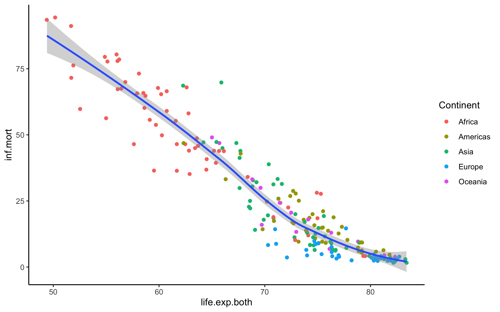

```{r}
g6 <- ggplot(mortal_lastyears, aes(life.exp.both, pop.increase, text = rownames(mortal_lastyears))) +
  geom_jitter(aes(col = Continent)) +
  geom_smooth(aes(group = 1), method = loess)+
  theme_classic()

# ggplotly(g6)
ggsave("html_plot/g6.png", plot = g6,width = 8, height=5)

```
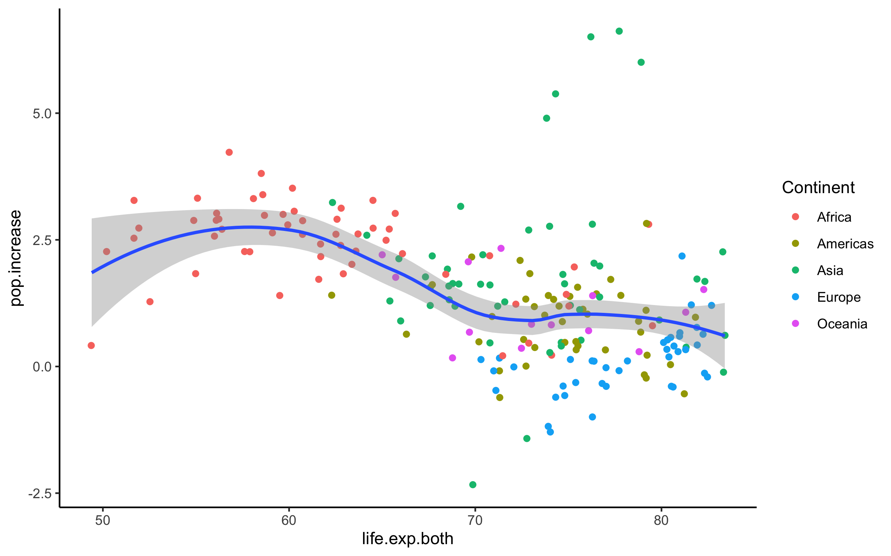


```{r}
g7 <- ggplot(mortal_lastyears, aes(life.exp.both, maternal.mortality.ratio.avg, text = rownames(mortal_lastyears))) +
  geom_jitter(aes(col = Continent)) +
  geom_smooth(aes(group = 1), method = loess)+
  theme_classic()

# ggplotly(g7)
ggsave("html_plot/g7.png", plot = g7,width = 8, height=5)

```
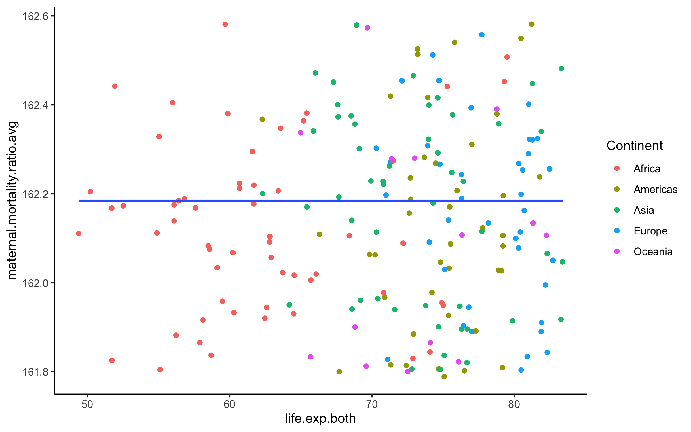

```{r}
g8 <- ggplot(mortal_lastyears, aes(life.exp.both, tot.fertil.rate, text = rownames(mortal_lastyears))) +
  geom_jitter(aes(col = Continent)) +
  geom_smooth(aes(group = 1), method = loess)+
  theme_classic()

# ggplotly(g8)
ggsave("html_plot/g8.png", plot = g8,width = 8, height=5)

```
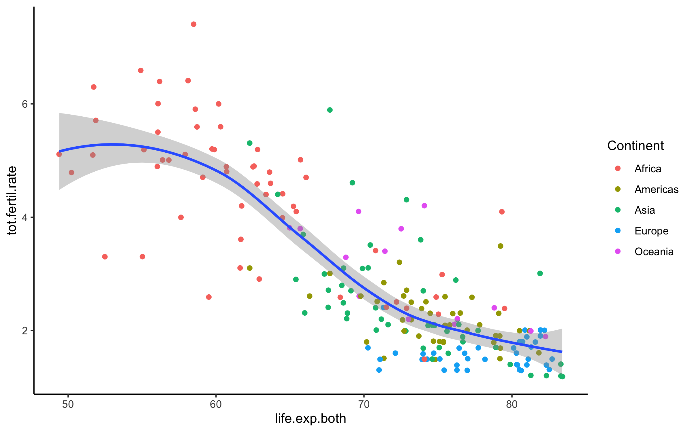

<br />
* Africa dominates the low life expectantion area but Europe are mostly on the high area of life expectancy . The rest are spread from the middle to the high.

* Usualy the countries which infant mortality is high have less life expectantion.  The infants die and the life expectantion is lower than other countries, Africa dominates this area and Europe is on the other side.

* The higher fertility rate the lower life expectancy,Africa dominates this area and Europe is on the other side. 


## Total Fertility of the World
```{r}
g1 <- ggplot(mortal_lastyears, aes(tot.fertil.rate,life.exp.both, text = rownames(mortal_lastyears))) + 
  geom_jitter(aes(col = Continent)) +
  geom_smooth(method = loess, aes(group = 1))+
  theme_classic()

# ggplotly(g1)
ggsave("html_plot/g1.png", plot = g1,width = 8, height = 5)
```
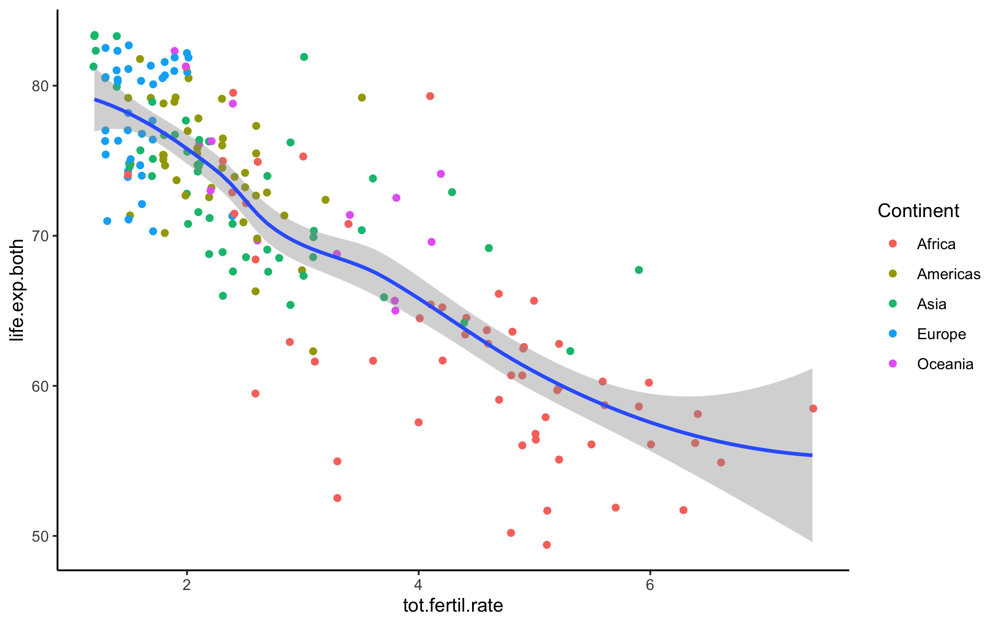

```{r}
g2 <- ggplot(mortal_lastyears, aes(tot.fertil.rate,inf.mort, text = rownames(mortal_lastyears))) + 
  geom_jitter(aes(col = Continent)) +
  geom_smooth(method = loess, aes(group = 1))+
  theme_classic()

# ggplotly(g2)
ggsave("html_plot/g2.png", plot = g2,width = 8, height = 5)

```
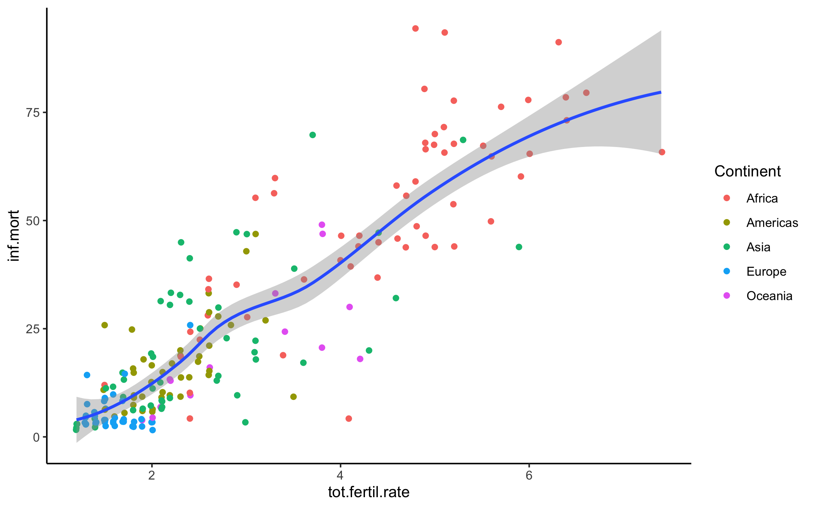


```{r}
g3 <- ggplot(mortal_lastyears, aes(tot.fertil.rate,maternal.mortality.ratio, text = rownames(mortal_lastyears))) + 
  geom_jitter(aes(col = Continent)) +
  geom_smooth(method = loess, aes(group = 1))+
  theme_classic()

# ggplotly(g3)
ggsave("html_plot/g3.png", plot = g3,width = 8, height = 5)


```
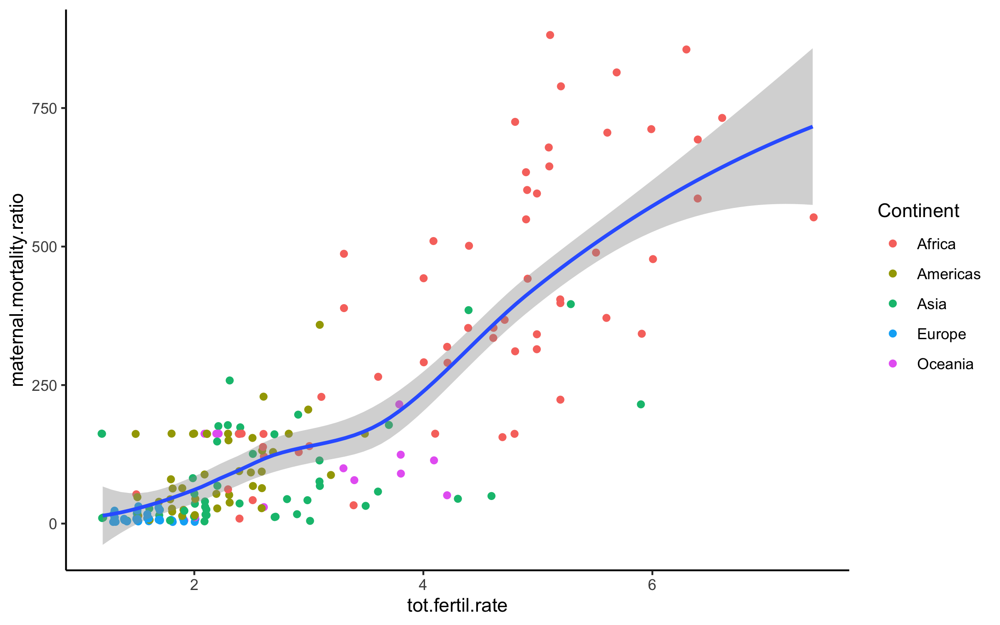


<br />
* Africa dominates the area which total fertility rate is high, means that Africans are "productive".

* it's kinda make sense countries with low fertility rate have low infant mortality number.

* Usualy the countries which total fertility is high have low life expectancy.

* Countries with high fertility rate tend to have high maternal mortality ratio and this still dominated by African countries.

## Population Increase of The world
```{r}
g4 <- ggplot(mortal_lastyears, aes(pop.increase,inf.mort, text = rownames(mortal_lastyears))) + 
  geom_jitter(aes(col = Continent)) +
  geom_smooth(method = loess, aes(group = 1))+
  theme_classic()
ggsave("html_plot/g4.png", plot = g4,width = 8, height = 5)

# ggplotly(g4)
```
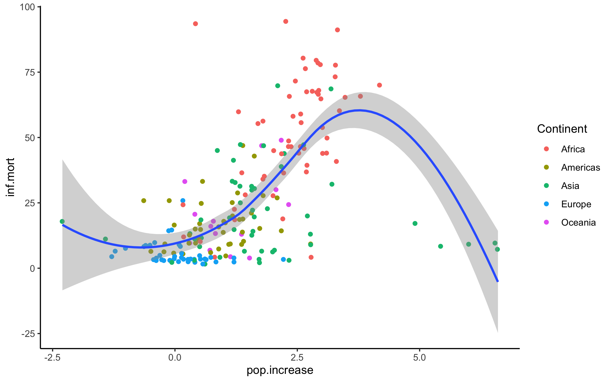


```{r}
g5 <- ggplot(mortal_lastyears, aes(pop.increase,tot.fertil.rate, text = rownames(mortal_lastyears))) + 
  geom_jitter(aes(col = Continent)) +
  geom_smooth(method = loess, aes(group = 1))+
  theme_classic()

# ggplotly(g5)
ggsave("html_plot/g5.png", plot = g5,width = 8, height = 5)

```
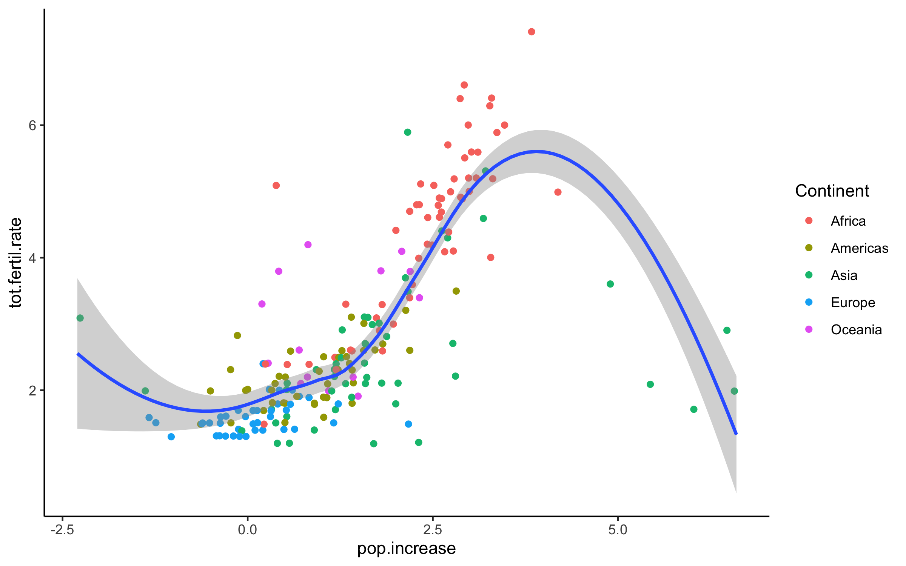

<br />
* Europe has low infant mortality number but also low population increase which is rational i think.

* Most African countries  and some Asian country have high pop increase and high infant mortality, it's not really good though, it seems like they produce babies as much as possible but can't really keep them alive until adult. 

* Some Asian countries even keep their infant mortality low but still their population increase greatly. And they are the "oil well" of the world. 

* The higher total fertility rate, the higher population increase. 

# Data Clustering

## Data Scalling
Scaled data is needed to perform data clustering. 

* Before Scaling
```{r}
summary(mortal_lastyears)
```

* After Scaling
```{r}
mortal_lastyears_scaled <- scale(mortal_lastyears[,-6])
summary(mortal_lastyears_scaled)
```


## Optimal K value
```{r}
wss <- function(data, maxCluster = 9) {
    # Initialize within sum of squares
    SSw <- (nrow(data) - 1) * sum(apply(data, 2, var))
    for (i in 2:maxCluster) {
      set.seed(10)
      SSw[i] <- sum(kmeans(data, centers = i)$withinss)
    }
    plot(1:maxCluster, SSw, type = "o", xlab = "Number of Clusters", ylab = "Within groups sum of squares", pch=19)
}

wss(mortal_lastyears_scaled)
```
<br />
The elbow method shows that the optimum K value is 2. But i think we should try 3 as well since 2 clusters will not give us much information.


## K-means

* k-means modeling
```{r}
set.seed(11)
mortal_cluster2 <- kmeans(mortal_lastyears_scaled,2) 
mortal_cluster3 <- kmeans(mortal_lastyears_scaled,3)
```

* cluster distribution

If we divide the data into two clusters, the composition of each cluster would be :
```{r}
table(mortal_cluster2$cluster) %>% 
  as.data.frame() %>% 
  rename("Cluster"= "Var1") %>% 
  data.table() %>% 
  kable()
```
<br />
But if we divide the data into three clusters, the composition of each cluster would be:
```{r}
table(mortal_cluster3$cluster) %>% 
    as.data.frame() %>% 
  rename("Cluster"= "Var1") %>% 
  data.table() %>% 
  kable()
```

<br />

* assigning cluster to new columns
```{r}
mortal_lastyears$clust2 <- factor(mortal_cluster2$cluster)
mortal_lastyears$clust3 <- factor(mortal_cluster3$cluster)

mortal_lastyears %>% 
  select(clust2,clust3) %>% 
  rownames_to_column("Country") %>% 
  rename("2-Clusters" = clust2,
         "3-Clusters" = clust3) %>% 
  data.table() %>% 
  kable()
```
<br />

# Biplotting

## Performing PCA on the Data
```{r}
mortal_pca <- PCA(mortal_lastyears_scaled, graph = F)
mortal_pca_pr <- prcomp(mortal_lastyears_scaled)
```
<br />
```{r}
mortal_pca$eig %>% 
  as.data.frame() %>% 
  rownames_to_column("Dimension") %>% 
  data.table() %>% 
  kable()
```
<br />
```{r}
fviz_screeplot(mortal_pca)
```
<br />
The dimension 1 contains 80% of information and dimension 2 contains 12% information. The total is arround 92% of information.


## Variables Contribution

```{r}
fviz_contrib(mortal_pca_pr, choice = "var", axes = 1)
fviz_contrib(mortal_pca_pr, choice = "var", axes = 2)
```

```{r}
fviz_pca_var(mortal_pca_pr,
             col.var = "contrib",
             gradient.cols = c("pink", "red", "black") ,
             repel = T)
```

<br />


## Cluster Plot

### 2 Clusters

```{r}
fviz_cluster(mortal_cluster2,
             data = mortal_lastyears_scaled,
             labelsize = 5,
             repel = T)
```

```{r,echo=FALSE}
fviz_pca_var(mortal_pca_pr,
             col.var = "contrib",
             gradient.cols = c("pink", "red", "black") ,
             repel = T)
```

```{r}
pr <- prcomp(mortal_lastyears_scaled)

mortal_arrow <- data.frame(pr$rotation)

mortal_pr_c2 <- data.frame(pr$x, 
                        clust = factor(mortal_cluster2$cluster), 
                        continent = mortal_lastyears$Continent,
                        country = factor(rownames(mortal_lastyears)),
                        inf.mort = mortal_lastyears$inf.mort,
                        life.exp.both = mortal_lastyears$life.exp.both,
                        maternal.mort.ratio = mortal_lastyears$maternal.mortality.ratio,
                        pop.increase = mortal_lastyears$pop.increase,
                        tot.fertil.rate = mortal_lastyears$tot.fertil.rate)
mortal_pr_c2 <- mortal_pr_c2 %>% 
  mutate(text = paste('clust :', factor(mortal_cluster2$cluster), 
                        '
                      continent :' ,mortal_lastyears$Continent,
                        '
                      country :' ,factor(rownames(mortal_lastyears)),
                        '
                      inf.mort :' ,mortal_lastyears$inf.mort,
                        '
                      life.exp.both :' , mortal_lastyears$life.exp.both,
                        '
                      maternal.mort.ratio :', mortal_lastyears$maternal.mortality.ratio,
                        '
                      pop.increase :', mortal_lastyears$pop.increase,
                        '
                      tot.fertil.rate :', mortal_lastyears$tot.fertil.rate))

po <- ggplot(mortal_pr_c2, aes(PC1,PC2, text = text ))+
  geom_hline(aes(yintercept=0), size=.2, alpha = 0.5, linetype = 2) + 
  geom_vline(aes(xintercept=0), size=.2, alpha = 0.5, linetype = 2)+
  geom_point(aes(col = clust, pch = continent)) +
  theme_classic()
ggsave("html_plot/po.png", plot = po,width = 8, height = 5)

# ggplotly(po, tooltip = 'text')

```
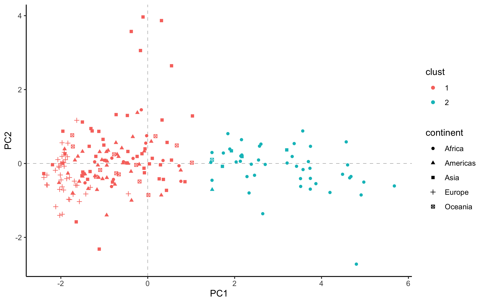
<br />
When we divide the data into 2 clusters, we can conclude that the **cluster 1** is : 

* the countries which have low life expectancy for male and female

* the countries which have high fertility rate

* the countries which have high population increase

* and African countries dominate this cluster.


This cluster indicates the countries contained maybe are not a healthy country since they have low life expectancy. This countries will have more young people in the future since the are high fertility rate and the population grows rapidly.


**cluster 2** is :

* the countries which have high life expectancy for male and female

* the countries which have low fertility rate

* the countries which have low infant mortality number

* the countries which have low maternal mortality ratio

* and all Europe countries are in **cluster2**.
 
This cluster indicates the countries contained will tend to have less productive people in the future since the fertility rate is not really good and the population is not growing well. In this case, high life expectancy will make this countries population dominated by old people one day.


### 3 Clusters 

```{r}
fviz_cluster(mortal_cluster3,
             data = mortal_lastyears_scaled,
             labelsize = 5,
             repel = T)

```

```{r,echo=FALSE}
fviz_pca_var(mortal_pca_pr,
             col.var = "contrib",
             gradient.cols = c("pink", "red", "black") ,
             repel = T)
```


```{r}
mortal_pr_c3 <- data.frame(pr$x, 
                        clust = factor(mortal_cluster3$cluster), 
                        continent = mortal_lastyears$Continent,
                        country = factor(rownames(mortal_lastyears)),
                        inf.mort = mortal_lastyears$inf.mort,
                        life.exp.both = mortal_lastyears$life.exp.both,
                        maternal.mort.ratio = mortal_lastyears$maternal.mortality.ratio,
                        pop.increase = mortal_lastyears$pop.increase,
                        tot.fertil.rate = mortal_lastyears$tot.fertil.rate)
mortal_pr_c3 <- mortal_pr_c3 %>% 
  mutate(text = paste('clust :', factor(mortal_cluster3$cluster), 
                        '
                      continent :' ,mortal_lastyears$Continent,
                        '
                      country :' ,factor(rownames(mortal_lastyears)),
                        '
                      inf.mort :' ,mortal_lastyears$inf.mort,
                        '
                      life.exp.both :' , mortal_lastyears$life.exp.both,
                        '
                      maternal.mort.ratio :', mortal_lastyears$maternal.mortality.ratio,
                        '
                      pop.increase :', mortal_lastyears$pop.increase,
                        '
                      tot.fertil.rate :', mortal_lastyears$tot.fertil.rate))


po2 <- ggplot(mortal_pr_c3, aes(PC1,PC2, text = text ))+
  geom_hline(aes(yintercept=0), size=.2, alpha = 0.5, linetype = 2) + 
  geom_vline(aes(xintercept=0), size=.2, alpha = 0.5, linetype = 2)+
  geom_point(aes(col = clust, pch = continent)) +
  theme_classic()

ggsave("html_plot/po2.png", plot = po2,width = 8, height = 5)


# ggplotly(po, tooltip = 'text')
```
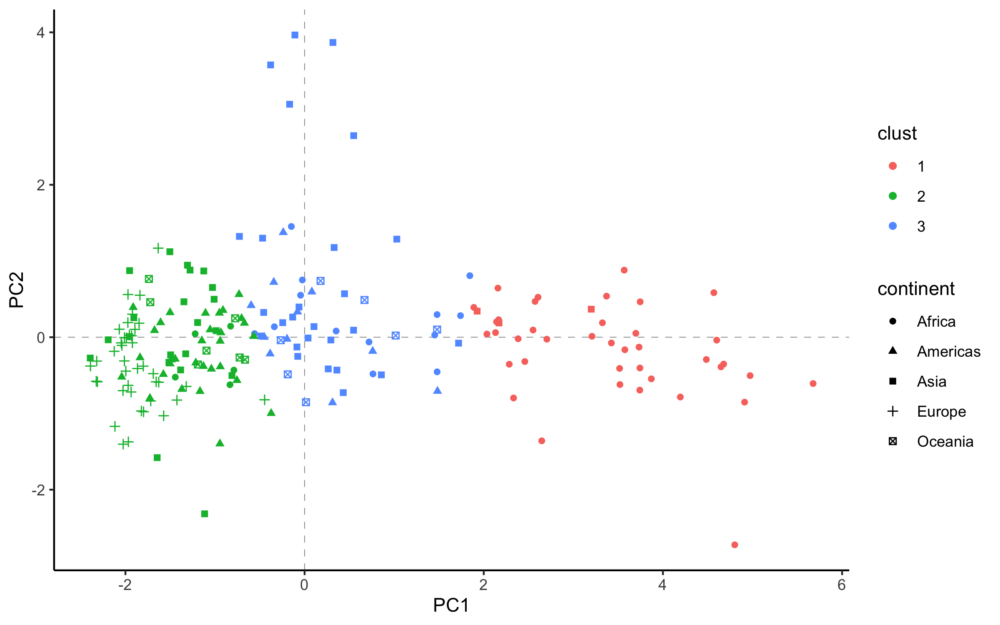

<br />

When we divide the data into 3 clusters, we can conclude that the **cluster 1** is : 

* the countries which have low life expectancy for male and female

* the countries which have high fertility rate

* the countries which have high population increase

* African countries still dominate this cluster
 
This cluster is not really different with the cluster 1 from the case before.


**cluster 2** is :

* the countries in the middle, their observation values are near the average.

* there are some outliers in this cluster. they are countries with high population growing and low infant mortality, the "oil well" i've told you before.


**cluster 3** is :

* the countries which have high life expectancy for male and female

* the countries which have low fertility rate

* the countries which have low population increase

* the countries which have low maternal mortality ratio

This cluster indicates the countries contained will more likely to have less young people than countries in other clusters. the have low pop. increase, fertility rate. These countries should be more "productive".


## Animated Plot 

So we're going to see the animated plot of each country of each cluster from 2005 to 2015. We expect to see some countries change their cluster from time to time.


```{r}
# ### Data Tidying
# 
# The data tidying is not really different from the data preparation above, but we have the `year` column this time.
mortal_allyears <- mortal_total %>% 
  select(-c(X.3,X.4)) %>% 
  filter(Population.growth.and.indicators.of.fertility.and.mortality %in% rownames(mortal_lastyears)) %>% 
  spread(key = X.1, value = X.2) %>% # create column for each indicator in X.1
  rename(year = X,
         Code = T03,
         Country = Population.growth.and.indicators.of.fertility.and.mortality,
         inf.mort = `Infant mortality for both sexes (per 1,000 live births)`,
         life.exp.both = `Life expectancy at birth for both sexes (years)`,
         maternal.mortality.ratio = `Maternal mortality ratio (deaths per 100,000 population)`,
         pop.increase = `Population annual rate of increase (percent)`,
         tot.fertil.rate = `Total fertility rate (children per women)`) %>% 
  mutate(inf.mort = as.numeric(as.character(inf.mort)),
         life.exp.both = as.numeric(as.character(life.exp.both)),
         maternal.mortality.ratio = as.numeric(as.character(maternal.mortality.ratio)),
         pop.increase = as.numeric(as.character(pop.increase)),
         tot.fertil.rate = as.numeric(as.character(tot.fertil.rate)))


# str(mortal_allyears)

```
<br />
```{r}
# adding continent
mortal_allyears$Continent <- countrycode(sourcevar = mortal_allyears[,"Country"],
                                          origin = "country.name",
                                          destination = "continent")


mortal_allyears <- mortal_allyears %>% 
  filter(Continent != "?") %>% 
  select( -c("Code","Life expectancy at birth for females (years)", "Life expectancy at birth for males (years)")) %>% 
  mutate(Continent = as.factor(Continent))


# mortal_allyears %>% 
#   is.na() %>% 
#   colSums()
```
<br />
```{r}
# assigning a rownames from Country var.
mortal_lastyears$Country <- rownames(mortal_lastyears)

#creating a new dataframe to merge its cluster to the data.
country_cluster <- mortal_lastyears %>% 
  select(c("Country","clust2","clust3"))


mortal_allyears <- merge(country_cluster,mortal_allyears,by = "Country")

```


```{r}

#replacing NAs with avg value

mortal_allyears %>% 
  is.na() %>% 
  colSums()

life.exp.both.avg.2 <- mean(mortal_allyears$life.exp.both,na.rm = T)
life.exp.male.avg.2 <- mean(mortal_allyears$life.exp.male, na.rm = T)
life.exp.female.avg.2 <- mean(mortal_allyears$life.exp.female,na.rm = T)
inf.mort.avg.2 <- mean(mortal_allyears$inf.mort,na.rm = T)
maternal.mortality.ratio.avg.2 <- mean(mortal_allyears$maternal.mortality.ratio,na.rm = T)
pop.increase.avg.2 <- mean(mortal_allyears$pop.increase,na.rm = T)
tot.fertil.rate.avg.2 <- mean(mortal_allyears$tot.fertil.rate,na.rm = T)


mortal_allyears <- mortal_allyears %>% 
  mutate(inf.mort = replace_na(inf.mort,inf.mort.avg.2),
         life.exp.both = replace_na(life.exp.both,life.exp.both.avg.2),
         maternal.mortality.ratio = replace_na(maternal.mortality.ratio,maternal.mortality.ratio.avg.2),
         pop.increase = replace_na(pop.increase,pop.increase.avg.2),
         tot.fertil.rate = replace_na(tot.fertil.rate,tot.fertil.rate.avg.2))

mortal_allyears %>% 
  is.na() %>% 
  colSums()
```
```{r}
#eliminating some rows
cb2 <- 
mortal_allyears$inf.mort == inf.mort.avg.2 &
mortal_allyears$life.exp.both == life.exp.both.avg.2 &
mortal_allyears$maternal.mortality.ratio == maternal.mortality.ratio.avg.2 &
mortal_allyears$tot.fertil.rate == tot.fertil.rate.avg.2 |
  mortal_allyears$maternal.mortality.ratio == maternal.mortality.ratio.avg.2

mortal_allyears <- cbind(mortal_allyears, cb2)

mortal_allyears <- mortal_allyears %>% 
  filter(cb2 == F)
mortal_allyears <-  mortal_allyears[,-11]
str(mortal_allyears)
```

<br />

### Plotting 


```{r}
mortal_allyears_scaled <- scale(mortal_allyears[,-c(1,2,3,4,10)])
summary(mortal_allyears_scaled)
summary(mortal_lastyears_scaled)
```

```{r}
pr.2 <-  prcomp(mortal_allyears_scaled,scale. = F)
pr.3 <- PCA(mortal_allyears_scaled, graph = F, scale.unit = F)
```


```{r}
mortal_allyears_clust <- data.frame(pr.2$x,
                                    mortal_allyears)


mortal_allyears_clust <-  mortal_allyears_clust %>% 
  select(c(1,2,6,7,8,9,15)) %>% 
  filter(year %in% c(2005,2010,2015))

mortal_allyears_clust$year <- as.character(mortal_allyears_clust$year)
mortal_allyears_clust$year <- as.numeric(mortal_allyears_clust$year)
str(mortal_allyears_clust)
```

* 2 Clusters

```{r}
# two_clust <- ggplot(mortal_allyears_clust, aes(-PC1,-PC2)) +
#   geom_hline(aes(yintercept=0), size=.2, alpha = 0.8, linetype = 2) +
#   geom_vline(aes(xintercept=0), size=.2, alpha = 0.8, linetype = 2)+
#   geom_point(aes(col = clust2, pch = Continent))+
#   theme_classic() +
#  transition_time(year,range = c(2005,2015))
# 
# anim_save("2clust.gif", two_clust)
```


<br />
Some countries are moving from cluster 1 to cluster 2.  

```{r}
#  three_clust <- ggplot(mortal_allyears_clust, aes(PC1,PC2)) +
#   geom_hline(aes(yintercept=0), size=.2, alpha = 0.8, linetype = 2) +
#   geom_vline(aes(xintercept=0), size=.2, alpha = 0.8, linetype = 2) +
#   geom_point(aes(col = clust3, pch = Continent))+
#   theme_classic() +
#   transition_time(year,range = c(2005,2015))
# 
# anim_save("3clust.gif", three_clust)

```


<br />

There are some countries change their cluster.

The cluster position are flipped, its because the "var" plot is different

```{r}
fviz_pca_var(pr.2) #the animated
fviz_pca_var(mortal_pca_pr) #the 2015 data
```
<br />
They're flipped 180 degrees for each arrow, so the information gained from animated plot is still valid anyway.

<br />

# Recommendation

Based on the previous analyst, I recommend to use 3 cluster because it gives us some more information. The 2 cluster is too general while the 3 cluster is more specific.


The use of 2 cluster only give us information that there are 2 groups of country, the first which have high life expectancy, low fertility rate, and low pop. increase. and the other one is the opposite.

But when we use 3 cluster we can see the middle cluster between the extremes. 


