# Clusters of Countries {.tabset}

## Data Used
The data used is `Population Growth, Fertility and Mortality Indicators.csv`, tells about the number of some variables related to population fertility and mortality of each country around the world.

We have some variables from the data, and they are :

* `T03`  The country code

* `Population.growth.and.indicators.of.fertility.and.mortality` The country list

* `X` The year column

* `X.1` Variable which contains some indicators, this variable is going to be spread to some variables.

* `X.2` The values of the observations.

* `X.3` Footnotes

* `X.4` Data source


## The Goal

Assume that we are going to classify countries listed based on the indicators contained in the data. 

##  The Flow 

1. Libraries Importing and Data Preparation.

2. Exploratory Data Analyst

3. PCA Transformation.

4. Biplotting and Interpretation.


# Libraries Importing and Data Preparation

## Libraries Used


## Data Importing

```
## 'data.frame':	4979 obs. of  7 variables:
##  $ T03                                                        : chr  "Region/Country/Area" "1" "1" "1" ...
##  $ Population.growth.and.indicators.of.fertility.and.mortality: chr  "" "Total, all countries or areas" "Total, all countries or areas" "Total, all countries or areas" ...
##  $ X                                                          : chr  "Year" "2005" "2005" "2005" ...
##  $ X.1                                                        : chr  "Series" "Population annual rate of increase (percent)" "Total fertility rate (children per women)" "Infant mortality for both sexes (per 1,000 live births)" ...
##  $ X.2                                                        : chr  "Value" "1.3" "2.6" "49.1" ...
##  $ X.3                                                        : chr  "Footnotes" "Data refers to a 5-year period preceding the reference year." "Data refers to a 5-year period preceding the reference year." "Data refers to a 5-year period preceding the reference year." ...
##  $ X.4                                                        : chr  "Source" "United Nations Population Division, New York, World Population Prospects: The 2017 Revision, last accessed June 2017." "United Nations Population Division, New York, World Population Prospects: The 2017 Revision; supplemented by da"| __truncated__ "United Nations Statistics Division, New York, \"Demographic Yearbook 2015\" and the demographic statistics data"| __truncated__ ...
```

* We only need some variables to process the data, the last 2 columns and the first column will be eliminated

* There is a year column (from 2000 to 2016 ), most of the countries only have values for 2005, 2010, and 2015.

* The `X.1` contains 8 indicators, we're going to spread them into their own column


## Data cleaning

* In the chunk below we're going to remove the last 2 variables and filter the year, we only need the 2015 data to interpret the latest condition of each country.

<table>
 <thead>
  <tr>
   <th style="text-align:left;"> Code </th>
   <th style="text-align:left;"> Country </th>
   <th style="text-align:left;"> year </th>
   <th style="text-align:right;"> inf.mort </th>
   <th style="text-align:right;"> life.exp.both </th>
   <th style="text-align:right;"> life.exp.female </th>
   <th style="text-align:right;"> life.exp.male </th>
   <th style="text-align:right;"> maternal.mortality.ratio </th>
   <th style="text-align:right;"> pop.increase </th>
   <th style="text-align:right;"> tot.fertil.rate </th>
  </tr>
 </thead>
<tbody>
  <tr>
   <td style="text-align:left;"> 1 </td>
   <td style="text-align:left;"> Total, all countries or areas </td>
   <td style="text-align:left;"> 2015 </td>
   <td style="text-align:right;"> 35.0 </td>
   <td style="text-align:right;"> 70.8 </td>
   <td style="text-align:right;"> 73.1 </td>
   <td style="text-align:right;"> 68.6 </td>
   <td style="text-align:right;"> 216 </td>
   <td style="text-align:right;"> 1.2 </td>
   <td style="text-align:right;"> 2.5 </td>
  </tr>
  <tr>
   <td style="text-align:left;"> 100 </td>
   <td style="text-align:left;"> Bulgaria </td>
   <td style="text-align:left;"> 2015 </td>
   <td style="text-align:right;"> 8.3 </td>
   <td style="text-align:right;"> 74.3 </td>
   <td style="text-align:right;"> 77.8 </td>
   <td style="text-align:right;"> 70.8 </td>
   <td style="text-align:right;"> 11 </td>
   <td style="text-align:right;"> -0.6 </td>
   <td style="text-align:right;"> 1.5 </td>
  </tr>
  <tr>
   <td style="text-align:left;"> 104 </td>
   <td style="text-align:left;"> Myanmar </td>
   <td style="text-align:left;"> 2015 </td>
   <td style="text-align:right;"> 45.0 </td>
   <td style="text-align:right;"> 66.0 </td>
   <td style="text-align:right;"> 68.3 </td>
   <td style="text-align:right;"> 63.7 </td>
   <td style="text-align:right;"> 178 </td>
   <td style="text-align:right;"> 0.9 </td>
   <td style="text-align:right;"> 2.3 </td>
  </tr>
  <tr>
   <td style="text-align:left;"> 108 </td>
   <td style="text-align:left;"> Burundi </td>
   <td style="text-align:left;"> 2015 </td>
   <td style="text-align:right;"> 77.9 </td>
   <td style="text-align:right;"> 56.1 </td>
   <td style="text-align:right;"> 58.0 </td>
   <td style="text-align:right;"> 54.2 </td>
   <td style="text-align:right;"> 712 </td>
   <td style="text-align:right;"> 3.0 </td>
   <td style="text-align:right;"> 6.0 </td>
  </tr>
  <tr>
   <td style="text-align:left;"> 11 </td>
   <td style="text-align:left;"> Western Africa </td>
   <td style="text-align:left;"> 2015 </td>
   <td style="text-align:right;"> 70.5 </td>
   <td style="text-align:right;"> 54.7 </td>
   <td style="text-align:right;"> 55.6 </td>
   <td style="text-align:right;"> 53.9 </td>
   <td style="text-align:right;"> NA </td>
   <td style="text-align:right;"> 2.7 </td>
   <td style="text-align:right;"> 5.5 </td>
  </tr>
  <tr>
   <td style="text-align:left;"> 112 </td>
   <td style="text-align:left;"> Belarus </td>
   <td style="text-align:left;"> 2015 </td>
   <td style="text-align:right;"> 3.6 </td>
   <td style="text-align:right;"> 72.1 </td>
   <td style="text-align:right;"> 77.7 </td>
   <td style="text-align:right;"> 66.5 </td>
   <td style="text-align:right;"> 4 </td>
   <td style="text-align:right;"> 0.0 </td>
   <td style="text-align:right;"> 1.6 </td>
  </tr>
</tbody>
</table>

`Country` = Country list ;<br />
`inf.mort` = Infant mortality for both sexes (per 1,000 live births) ;<br />
`life.exp.both` = Life expectancy at birth for both sexes (years) ;<br />
`life.exp.male` = Life expectancy at birth for males (years) ;<br />
`life.exp.female` = Life expectancy at birth for females (years) ;<br />
`maternal.mortality.ratio` = Maternal mortality ratio (deaths per 100,000 population) ;<br />
`pop.increase` = Population annual rate of increase (percent) ;<br />
`tot.fertil.rate` = Total fertility rate (children per women) <br />


### NA checking

<!--html_preserve--><div id="htmlwidget-9d69bc432ffaae9545f0" style="width:100%;height:auto;" class="datatables html-widget"></div>
<script type="application/json" data-for="htmlwidget-9d69bc432ffaae9545f0">{"x":{"filter":"none","data":[["1","2","3","4","5","6","7","8","9","10"],["Code","Country","year","inf.mort","life.exp.both","life.exp.female","life.exp.male","maternal.mortality.ratio","pop.increase","tot.fertil.rate"],[0,0,0,31,31,29,29,73,0,29]],"container":"<table class=\"display\">\n  <thead>\n    <tr>\n      <th> <\/th>\n      <th>column<\/th>\n      <th>NA<\/th>\n    <\/tr>\n  <\/thead>\n<\/table>","options":{"columnDefs":[{"className":"dt-right","targets":2},{"orderable":false,"targets":0}],"order":[],"autoWidth":false,"orderClasses":false}},"evals":[],"jsHooks":[]}</script><!--/html_preserve-->
There are so many NAs in the data, it means that not all country listed have the data we need.
<br />
* We're going to replace the NAs to the average value of each variable/indicator.
<!--html_preserve--><div id="htmlwidget-25e1bd26fed33f0df616" style="width:100%;height:auto;" class="datatables html-widget"></div>
<script type="application/json" data-for="htmlwidget-25e1bd26fed33f0df616">{"x":{"filter":"none","data":[["1","2","3","4","5","6"],["1","100","104","108","11","112"],["Total, all countries or areas","Bulgaria","Myanmar","Burundi","Western Africa","Belarus"],["2015","2015","2015","2015","2015","2015"],[35,8.3,45,77.9,70.5,3.6],[70.8,74.3,66,56.1,54.7,72.1],[73.1,77.8,68.3,58,55.6,77.7],[68.6,70.8,63.7,54.2,53.9,66.5],[216,11,178,712,162.184210526316,4],[1.2,-0.6,0.9,3,2.7,0],[2.5,1.5,2.3,6,5.5,1.6]],"container":"<table class=\"display\">\n  <thead>\n    <tr>\n      <th> <\/th>\n      <th>Code<\/th>\n      <th>Country<\/th>\n      <th>year<\/th>\n      <th>inf.mort<\/th>\n      <th>life.exp.both<\/th>\n      <th>life.exp.female<\/th>\n      <th>life.exp.male<\/th>\n      <th>maternal.mortality.ratio<\/th>\n      <th>pop.increase<\/th>\n      <th>tot.fertil.rate<\/th>\n    <\/tr>\n  <\/thead>\n<\/table>","options":{"columnDefs":[{"className":"dt-right","targets":[4,5,6,7,8,9,10]},{"orderable":false,"targets":0}],"order":[],"autoWidth":false,"orderClasses":false}},"evals":[],"jsHooks":[]}</script><!--/html_preserve-->
<br />
There is an odd thing on the data as we replace the NA with the average number of each column. There are some rows/countries which have no observation value or only have 1 or 2 value for their indicator and we have filled them with the average values and it's not supposed to be like that. We supposed to eliminate them.

* eliminating some rows

I create a vector that indicates whether a rows' values are mostly the avg values of each column or not. If it is, eliminate the column.
<br />

```
## 'data.frame':	235 obs. of  8 variables:
##  $ Country                 : chr  "Total, all countries or areas" "Bulgaria" "Myanmar" "Burundi" ...
##  $ inf.mort                : num  35 8.3 45 77.9 70.5 3.6 29.9 27.7 67.5 4.7 ...
##  $ life.exp.both           : num  70.8 74.3 66 56.1 54.7 72.1 67.6 75.3 56.4 81.8 ...
##  $ life.exp.female         : num  73.1 77.8 68.3 58 55.6 77.7 69.6 76.5 57.7 83.8 ...
##  $ life.exp.male           : num  68.6 70.8 63.7 54.2 53.9 66.5 65.5 74.1 55.1 79.7 ...
##  $ maternal.mortality.ratio: num  216 11 178 712 162 ...
##  $ pop.increase            : num  1.2 -0.6 0.9 3 2.7 0 1.6 2 2.7 1 ...
##  $ tot.fertil.rate         : num  2.5 1.5 2.3 6 5.5 1.6 2.7 3 5 1.6 ...
```

### Continent Column

I think by giving the `Continent` column, we're going to have some more insights, so let's just do it.
<br />
<!--html_preserve--><div id="htmlwidget-97989c65f0ed53d511b8" style="width:100%;height:auto;" class="datatables html-widget"></div>
<script type="application/json" data-for="htmlwidget-97989c65f0ed53d511b8">{"x":{"filter":"none","data":[["1","2","3","4","5","6"],["Total, all countries or areas","Bulgaria","Myanmar","Burundi","Western Africa","Belarus"],[null,"Europe","Asia","Africa",null,"Europe"]],"container":"<table class=\"display\">\n  <thead>\n    <tr>\n      <th> <\/th>\n      <th>Country<\/th>\n      <th>Continent<\/th>\n    <\/tr>\n  <\/thead>\n<\/table>","options":{"order":[],"autoWidth":false,"orderClasses":false,"columnDefs":[{"orderable":false,"targets":0}]}},"evals":[],"jsHooks":[]}</script><!--/html_preserve-->
<br />
Some rows cannot be defined by its continent and all of them are not even a country actually. They are just regions or certain areas of the continent. 

Our observations are countries so we wil just eliminate rows that represent some areas or regions.

<!--html_preserve--><div id="htmlwidget-c958cccf5ae95767c4a0" style="width:100%;height:auto;" class="datatables html-widget"></div>
<script type="application/json" data-for="htmlwidget-c958cccf5ae95767c4a0">{"x":{"filter":"none","data":[["1","2","3","4","5","6","7","8","9","10","11","12","13","14","15","16","17","18","19","20","21","22","23","24","25","26","27","28","29","30","31","32"],["Total, all countries or areas","Western Africa","Central America","Eastern Africa","Asia","Central Asia","Western Asia","Northern Africa","Europe","Eastern Europe","Northern Europe","Western Europe","Other non-specified areas","Middle Africa","Southern Africa","Africa","Sub-Saharan Africa","Northern America","Caribbean","Eastern Asia","Southern Asia","South-eastern Asia","Southern Europe","Latin America &amp; the Caribbean","South America","Australia and New Zealand","Melanesia","Micronesia","Polynesia","South-central Asia","Channel Islands","Oceania"],["?","?","?","?","?","?","?","?","?","?","?","?","?","?","?","?","?","?","?","?","?","?","?","?","?","?","?","?","?","?","?","?"]],"container":"<table class=\"display\">\n  <thead>\n    <tr>\n      <th> <\/th>\n      <th>Country<\/th>\n      <th>Continent<\/th>\n    <\/tr>\n  <\/thead>\n<\/table>","options":{"order":[],"autoWidth":false,"orderClasses":false,"columnDefs":[{"orderable":false,"targets":0}]}},"evals":[],"jsHooks":[]}</script><!--/html_preserve-->

* We better assign the `Country` as rownames instead.
<!--html_preserve--><div id="htmlwidget-0151e27e8f719389a183" style="width:100%;height:auto;" class="datatables html-widget"></div>
<script type="application/json" data-for="htmlwidget-0151e27e8f719389a183">{"x":{"filter":"none","data":[["Bulgaria","Myanmar","Burundi","Belarus","Cambodia","Algeria"],[8.3,45,77.9,3.6,29.9,27.7],[74.3,66,56.1,72.1,67.6,75.3],[77.8,68.3,58,77.7,69.6,76.5],[70.8,63.7,54.2,66.5,65.5,74.1],[11,178,712,4,161,140],[-0.6,0.9,3,0,1.6,2],[1.5,2.3,6,1.6,2.7,3],["Europe","Asia","Africa","Europe","Asia","Africa"]],"container":"<table class=\"display\">\n  <thead>\n    <tr>\n      <th> <\/th>\n      <th>inf.mort<\/th>\n      <th>life.exp.both<\/th>\n      <th>life.exp.female<\/th>\n      <th>life.exp.male<\/th>\n      <th>maternal.mortality.ratio<\/th>\n      <th>pop.increase<\/th>\n      <th>tot.fertil.rate<\/th>\n      <th>Continent<\/th>\n    <\/tr>\n  <\/thead>\n<\/table>","options":{"columnDefs":[{"className":"dt-right","targets":[1,2,3,4,5,6,7]},{"orderable":false,"targets":0}],"order":[],"autoWidth":false,"orderClasses":false}},"evals":[],"jsHooks":[]}</script><!--/html_preserve-->
<br />
Now the data is ready to be proceed.


# Exploratory Data Analyst

* Variables Correlation

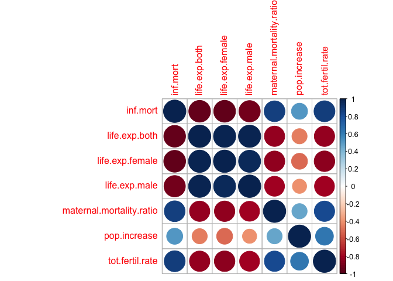<!-- -->
<br />
From the plot above we can conclude that :

* the correlation between **life expectancy of birth** of male, female, and both are really high. In this case we better use the `life expectancy of both` 


* all variables have relatively strong correlation to each other but `pop.increase`

* the `pop.increase` has the least correlation with other variables


## Life Expectantion of the World

<!--html_preserve--><div id="htmlwidget-d537326dc621a8bed794" style="width:672px;height:480px;" class="plotly html-widget"></div>
<script type="application/json" data-for="htmlwidget-d537326dc621a8bed794">{"x":{"data":[{"x":[56.0815783298061,75.3068929100493,56.4000249967403,72.1803234207897,49.3888512574365,51.7218296356397,62.7751452913375,79.3085647623979,62.5175534332348,58.1285946889923,59.9239016901027,56.7912126307948,63.7310822806923,63.3712250919155,60.1751198001105,61.5696992242692,64.4785003892715,60.270640572667,61.6881014673039,57.8826935044463,51.6711813645703,65.3785106136425,52.4917166077471,60.7211699098549,71.5075406673526,64.5125016060801,60.7192684384046,56.2258663885429,62.5905496675005,74.0747591753224,74.9065296085533,56.085622299053,61.7189309714958,58.4986252596214,51.8830526298299,55.9862938286656,79.5122113260015,65.2013034415723,66.071029478337,65.7096406361564,72.9134388437195,50.1995745530462,54.9117297327991,59.506556539686,57.6051933555915,62.8950493717613,55.1002365518393,63.5725824473247,68.4252846228718,54.9988611180743,59.1178886339515,74.998284380235,58.6013581491462,70.8155792299486,62.8288194711897,58.7269816094999,59.718935302383],"y":[77.9217577632517,27.718821257893,67.5090065119974,22.4721693573892,93.5133491913602,91.1628929537721,58.0799986588955,4.18957709310576,46.5388841647282,73.223934803959,67.6941559818387,70.0074141184054,45.7690416835248,44.9696155721322,65.3781039189361,55.3327846706845,40.7829438038357,49.7920891455375,46.5197703051381,65.6676994716935,71.6149250102416,39.3977360527217,59.8271194951795,58.9774100208096,24.3157576348074,36.7999893363751,66.4717434149794,78.4833431513608,68.0007336688973,12.025355211664,28.1332914529368,67.3324150868878,36.377957537584,65.7931007548608,76.3149099919573,80.3600427333079,4.16846672691405,43.9729102430493,43.7640560181439,43.9245113052428,10.1603856562451,94.4096147865616,79.4727335839905,36.4628309750929,46.5342390633188,35.2073516363092,77.7305013097823,48.7284396916814,34.0957663913816,56.2643125882186,55.7006750957109,18.5054013735801,60.2186608712003,18.8912690683082,44.0033389787748,64.8387859933265,53.8333516256697],"text":["Continent: Africa<br />life.exp.both: 56.1000<br />inf.mort: 77.90000<br />Burundi","Continent: Africa<br />life.exp.both: 75.3000<br />inf.mort: 27.70000<br />Algeria","Continent: Africa<br />life.exp.both: 56.4000<br />inf.mort: 67.50000<br />Cameroon","Continent: Africa<br />life.exp.both: 72.2000<br />inf.mort: 22.50000<br />Cabo Verde","Continent: Africa<br />life.exp.both: 49.4000<br />inf.mort: 93.50000<br />Central African Republic","Continent: Africa<br />life.exp.both: 51.7000<br />inf.mort: 91.20000<br />Chad","Continent: Africa<br />life.exp.both: 62.8000<br />inf.mort: 58.10000<br />Comoros","Continent: Africa<br />life.exp.both: 79.3000<br />inf.mort:  4.20000<br />Mayotte","Continent: Africa<br />life.exp.both: 62.5000<br />inf.mort: 46.50000<br />Congo","Continent: Africa<br />life.exp.both: 58.1000<br />inf.mort: 73.20000<br />Dem. Rep. of the Congo","Continent: Africa<br />life.exp.both: 59.9000<br />inf.mort: 67.70000<br />Benin","Continent: Africa<br />life.exp.both: 56.8000<br />inf.mort: 70.00000<br />Equatorial Guinea","Continent: Africa<br />life.exp.both: 63.7000<br />inf.mort: 45.80000<br />Ethiopia","Continent: Africa<br />life.exp.both: 63.4000<br />inf.mort: 45.00000<br />Eritrea","Continent: Africa<br />life.exp.both: 60.2000<br />inf.mort: 65.40000<br />Angola","Continent: Africa<br />life.exp.both: 61.6000<br />inf.mort: 55.30000<br />Djibouti","Continent: Africa<br />life.exp.both: 64.5000<br />inf.mort: 40.80000<br />Gabon","Continent: Africa<br />life.exp.both: 60.3000<br />inf.mort: 49.80000<br />Gambia","Continent: Africa<br />life.exp.both: 61.7000<br />inf.mort: 46.50000<br />Ghana","Continent: Africa<br />life.exp.both: 57.9000<br />inf.mort: 65.70000<br />Guinea","Continent: Africa<br />life.exp.both: 51.7000<br />inf.mort: 71.60000<br />Côte d'Ivoire","Continent: Africa<br />life.exp.both: 65.4000<br />inf.mort: 39.40000<br />Kenya","Continent: Africa<br />life.exp.both: 52.5000<br />inf.mort: 59.80000<br />Lesotho","Continent: Africa<br />life.exp.both: 60.7000<br />inf.mort: 59.00000<br />Liberia","Continent: Africa<br />life.exp.both: 71.5000<br />inf.mort: 24.30000<br />Libya","Continent: Africa<br />life.exp.both: 64.5000<br />inf.mort: 36.80000<br />Madagascar","Continent: Africa<br />life.exp.both: 60.7000<br />inf.mort: 66.50000<br />Malawi","Continent: Africa<br />life.exp.both: 56.2000<br />inf.mort: 78.50000<br />Mali","Continent: Africa<br />life.exp.both: 62.6000<br />inf.mort: 68.00000<br />Mauritania","Continent: Africa<br />life.exp.both: 74.1000<br />inf.mort: 12.00000<br />Mauritius","Continent: Africa<br />life.exp.both: 74.9000<br />inf.mort: 28.10000<br />Morocco","Continent: Africa<br />life.exp.both: 56.1000<br />inf.mort: 67.30000<br />Mozambique","Continent: Africa<br />life.exp.both: 61.7000<br />inf.mort: 36.40000<br />Namibia","Continent: Africa<br />life.exp.both: 58.5000<br />inf.mort: 65.80000<br />Niger","Continent: Africa<br />life.exp.both: 51.9000<br />inf.mort: 76.30000<br />Nigeria","Continent: Africa<br />life.exp.both: 56.0000<br />inf.mort: 80.40000<br />Guinea-Bissau","Continent: Africa<br />life.exp.both: 79.5000<br />inf.mort:  4.20000<br />Réunion","Continent: Africa<br />life.exp.both: 65.2000<br />inf.mort: 44.00000<br />Rwanda","Continent: Africa<br />life.exp.both: 66.1000<br />inf.mort: 43.80000<br />Sao Tome and Principe","Continent: Africa<br />life.exp.both: 65.7000<br />inf.mort: 43.90000<br />Senegal","Continent: Africa<br />life.exp.both: 72.9000<br />inf.mort: 10.20000<br />Seychelles","Continent: Africa<br />life.exp.both: 50.2000<br />inf.mort: 94.40000<br />Sierra Leone","Continent: Africa<br />life.exp.both: 54.9000<br />inf.mort: 79.50000<br />Somalia","Continent: Africa<br />life.exp.both: 59.5000<br />inf.mort: 36.50000<br />South Africa","Continent: Africa<br />life.exp.both: 57.6000<br />inf.mort: 46.50000<br />Zimbabwe","Continent: Africa<br />life.exp.both: 62.9000<br />inf.mort: 35.20000<br />Botswana","Continent: Africa<br />life.exp.both: 55.1000<br />inf.mort: 77.70000<br />South Sudan","Continent: Africa<br />life.exp.both: 63.6000<br />inf.mort: 48.70000<br />Sudan","Continent: Africa<br />life.exp.both: 68.4000<br />inf.mort: 34.10000<br />Western Sahara","Continent: Africa<br />life.exp.both: 55.0000<br />inf.mort: 56.30000<br />Swaziland","Continent: Africa<br />life.exp.both: 59.1000<br />inf.mort: 55.70000<br />Togo","Continent: Africa<br />life.exp.both: 75.0000<br />inf.mort: 18.50000<br />Tunisia","Continent: Africa<br />life.exp.both: 58.6000<br />inf.mort: 60.20000<br />Uganda","Continent: Africa<br />life.exp.both: 70.8000<br />inf.mort: 18.90000<br />Egypt","Continent: Africa<br />life.exp.both: 62.8000<br />inf.mort: 44.00000<br />United Rep. of Tanzania","Continent: Africa<br />life.exp.both: 58.7000<br />inf.mort: 64.80000<br />Burkina Faso","Continent: Africa<br />life.exp.both: 59.7000<br />inf.mort: 53.80000<br />Zambia"],"type":"scatter","mode":"markers","marker":{"autocolorscale":false,"color":"rgba(248,118,109,1)","opacity":1,"size":5.66929133858268,"symbol":"circle","line":{"width":1.88976377952756,"color":"rgba(248,118,109,1)"}},"hoveron":"points","name":"Africa","legendgroup":"Africa","showlegend":true,"xaxis":"x","yaxis":"y","hoverinfo":"text","frame":null},{"x":[81.8177004030369,78.7751572560505,73.7123062480324,79.1741662318441,79.2155617159827,73.217313720275,75.5019846230887,72.6023504439504,79.2066845123625,75.8129293665187,71.313239437531,73.2242765005451,80.4779883643893,75.9759407237651,72.3705333396503,66.3024268899013,62.2907069405098,72.8749821857994,75.5045944813357,75.0691729368632,81.1781311047359,76.5086181938191,75.3988315870881,77.7879133840327,75.4262161887027,74.4700809646416,77.3273579424376,71.3255483726757,72.6910991654082,74.1786974044412,79.2185917354188,74.7935342750396,72.6757111799263,67.6834256461666,70.8821899657099,74.7165495940372,70.1794519925479,69.8236911244726,78.8865970907161,79.0773726716859,76.9906619664084,73.8913198608839],"y":[4.67234410479665,7.4235858569853,17.8748550842702,9.26980682475493,5.46801146147773,25.0954328675196,21.0822208470665,16.9709504539147,9.26315387409181,9.08228882698342,25.8604952091409,9.59278513979167,5.78401953330264,13.7163364496827,26.8940926133469,33.2158361015841,46.9398034038208,27.8246934114955,15.0042179104686,9.10873185243458,6.40410707250237,18.7733628987893,9.57457315394655,10.3167620071582,14.8314052894711,20.0191695476696,15.2071676080488,25.828878349649,28.8089122014306,18.5983934693038,6.26537519868463,10.91113238208,16.475925560426,42.8636475393549,17.3958901118673,15.7910488398001,24.8365756364539,14.2663723533787,6.02741141114384,9.26466511741281,12.7321624125913,13.7764107629471],"text":["Continent: Americas<br />life.exp.both: 81.8000<br />inf.mort:  4.70000<br />Canada","Continent: Americas<br />life.exp.both: 78.8000<br />inf.mort:  7.40000<br />Chile","Continent: Americas<br />life.exp.both: 73.7000<br />inf.mort: 17.90000<br />Colombia","Continent: Americas<br />life.exp.both: 79.2000<br />inf.mort:  9.30000<br />Costa Rica","Continent: Americas<br />life.exp.both: 79.2000<br />inf.mort:  5.50000<br />Cuba","Continent: Americas<br />life.exp.both: 73.2000<br />inf.mort: 25.10000<br />Dominican Republic","Continent: Americas<br />life.exp.both: 75.5000<br />inf.mort: 21.10000<br />Ecuador","Continent: Americas<br />life.exp.both: 72.6000<br />inf.mort: 17.00000<br />El Salvador","Continent: Americas<br />life.exp.both: 79.2000<br />inf.mort:  9.30000<br />French Guiana","Continent: Americas<br />life.exp.both: 75.8000<br />inf.mort:  9.10000<br />Antigua and Barbuda","Continent: Americas<br />life.exp.both: 71.3194<br />inf.mort: 25.84655<br />Greenland","Continent: Americas<br />life.exp.both: 73.2000<br />inf.mort:  9.60000<br />Grenada","Continent: Americas<br />life.exp.both: 80.5000<br />inf.mort:  5.80000<br />Guadeloupe","Continent: Americas<br />life.exp.both: 76.0000<br />inf.mort: 13.70000<br />Argentina","Continent: Americas<br />life.exp.both: 72.4000<br />inf.mort: 26.90000<br />Guatemala","Continent: Americas<br />life.exp.both: 66.3000<br />inf.mort: 33.20000<br />Guyana","Continent: Americas<br />life.exp.both: 62.3000<br />inf.mort: 46.90000<br />Haiti","Continent: Americas<br />life.exp.both: 72.9000<br />inf.mort: 27.80000<br />Honduras","Continent: Americas<br />life.exp.both: 75.5000<br />inf.mort: 15.00000<br />Jamaica","Continent: Americas<br />life.exp.both: 75.1000<br />inf.mort:  9.10000<br />Bahamas","Continent: Americas<br />life.exp.both: 81.2000<br />inf.mort:  6.40000<br />Martinique","Continent: Americas<br />life.exp.both: 76.5000<br />inf.mort: 18.80000<br />Mexico","Continent: Americas<br />life.exp.both: 75.4000<br />inf.mort:  9.60000<br />Barbados","Continent: Americas<br />life.exp.both: 77.8000<br />inf.mort: 10.30000<br />Curaçao","Continent: Americas<br />life.exp.both: 75.4000<br />inf.mort: 14.80000<br />Aruba","Continent: Americas<br />life.exp.both: 74.5000<br />inf.mort: 20.00000<br />Nicaragua","Continent: Americas<br />life.exp.both: 77.3000<br />inf.mort: 15.20000<br />Panama","Continent: Americas<br />life.exp.both: 71.3194<br />inf.mort: 25.84655<br />Bermuda","Continent: Americas<br />life.exp.both: 72.7000<br />inf.mort: 28.80000<br />Paraguay","Continent: Americas<br />life.exp.both: 74.2000<br />inf.mort: 18.60000<br />Peru","Continent: Americas<br />life.exp.both: 79.2000<br />inf.mort:  6.30000<br />Puerto Rico","Continent: Americas<br />life.exp.both: 74.8000<br />inf.mort: 10.90000<br />Saint Lucia","Continent: Americas<br />life.exp.both: 72.7000<br />inf.mort: 16.50000<br />Saint Vincent & Grenadines","Continent: Americas<br />life.exp.both: 67.7000<br />inf.mort: 42.90000<br />Bolivia (Plurin. State of)","Continent: Americas<br />life.exp.both: 70.9000<br />inf.mort: 17.40000<br />Suriname","Continent: Americas<br />life.exp.both: 74.7000<br />inf.mort: 15.80000<br />Brazil","Continent: Americas<br />life.exp.both: 70.2000<br />inf.mort: 24.80000<br />Trinidad and Tobago","Continent: Americas<br />life.exp.both: 69.8000<br />inf.mort: 14.30000<br />Belize","Continent: Americas<br />life.exp.both: 78.9000<br />inf.mort:  6.00000<br />United States of America","Continent: Americas<br />life.exp.both: 79.1000<br />inf.mort:  9.30000<br />United States Virgin Islands","Continent: Americas<br />life.exp.both: 77.0000<br />inf.mort: 12.70000<br />Uruguay","Continent: Americas<br />life.exp.both: 73.9000<br />inf.mort: 13.80000<br />Venezuela (Boliv. Rep. of)"],"type":"scatter","mode":"markers","marker":{"autocolorscale":false,"color":"rgba(163,165,0,1)","opacity":1,"size":5.66929133858268,"symbol":"circle","line":{"width":1.88976377952756,"color":"rgba(163,165,0,1)"}},"hoveron":"points","name":"Americas","legendgroup":"Americas","showlegend":true,"xaxis":"x","yaxis":"y","hoverinfo":"text","frame":null},{"x":[66.0104933752008,67.6236076598915,74.6127128992524,75.7180926980186,79.9107275643258,72.7751117403799,72.8885064475896,71.6086199137727,83.3987648567887,67.5988985395733,68.5847609835112,75.076772756735,69.1823002450685,81.9111057008877,83.3088404309024,69.1019343756537,62.3158803932083,73.7802006316507,70.7679593482478,81.2958840983144,74.3239789515152,70.2757506529084,65.4173286311594,78.8720474360333,83.3102532971262,74.6946138552113,76.2967818663498,76.4190474577012,68.5076171077635,71.1766682999661,73.9808270201509,76.2166592770721,68.8979548306381,65.897552596408,68.6160611024633,67.7218488102107,77.6792376819498,68.8089121337387,74.0007594959801,82.3247068673681,75.576927566199,69.9073619327113,70.3776495217428,74.5956762095423,76.724429798939,74.8317741188502,67.2685158057523,70.8150873750516,64.2149241780059,76.7068917149847],"y":[44.9987718951888,29.9067522638105,8.1997044755891,11.6242655161582,4.2242535652034,11.1711497837864,19.9628435679525,31.4098251017369,1.59932088349015,41.275567031391,25.0050831236504,14.8330026176013,32.0851509069279,3.42524544784799,2.21006960812956,14.0703516145237,68.594677312877,17.1251103354059,18.4813793532364,2.99198628481478,8.42244760250673,19.5780361650139,47.2711752078868,9.17416430499405,3.037630308941,6.50269175041467,9.02136701531708,6.91496242998168,22.8291337190755,33.2890599703789,13.2042211760208,9.61071351701394,32.7795498196222,69.7714241174236,22.1728993991949,43.8631000839174,7.22757262580097,30.5387615356408,12.9971977474913,2.1084136618115,19.264704530742,17.9156795331091,38.9372252336517,11.2158739811368,6.20124296624213,12.5874170024693,46.9094714925997,31.3058098316379,47.1753124624491,6.50461017826572],"text":["Continent: Asia<br />life.exp.both: 66.0000<br />inf.mort: 45.00000<br />Myanmar","Continent: Asia<br />life.exp.both: 67.6000<br />inf.mort: 29.90000<br />Cambodia","Continent: Asia<br />life.exp.both: 74.6000<br />inf.mort:  8.20000<br />Sri Lanka","Continent: Asia<br />life.exp.both: 75.7000<br />inf.mort: 11.60000<br />China","Continent: Asia<br />life.exp.both: 79.9000<br />inf.mort:  4.20000<br />Cyprus","Continent: Asia<br />life.exp.both: 72.8000<br />inf.mort: 11.20000<br />Georgia","Continent: Asia<br />life.exp.both: 72.9000<br />inf.mort: 20.00000<br />State of Palestine","Continent: Asia<br />life.exp.both: 71.6000<br />inf.mort: 31.40000<br />Azerbaijan","Continent: Asia<br />life.exp.both: 83.4000<br />inf.mort:  1.60000<br />China, Hong Kong SAR","Continent: Asia<br />life.exp.both: 67.6000<br />inf.mort: 41.30000<br />India","Continent: Asia<br />life.exp.both: 68.6000<br />inf.mort: 25.00000<br />Indonesia","Continent: Asia<br />life.exp.both: 75.1000<br />inf.mort: 14.80000<br />Iran (Islamic Republic of)","Continent: Asia<br />life.exp.both: 69.2000<br />inf.mort: 32.10000<br />Iraq","Continent: Asia<br />life.exp.both: 81.9000<br />inf.mort:  3.40000<br />Israel","Continent: Asia<br />life.exp.both: 83.3000<br />inf.mort:  2.20000<br />Japan","Continent: Asia<br />life.exp.both: 69.1000<br />inf.mort: 14.10000<br />Kazakhstan","Continent: Asia<br />life.exp.both: 62.3000<br />inf.mort: 68.60000<br />Afghanistan","Continent: Asia<br />life.exp.both: 73.8000<br />inf.mort: 17.10000<br />Jordan","Continent: Asia<br />life.exp.both: 70.8000<br />inf.mort: 18.50000<br />Dem. People's Rep. Korea","Continent: Asia<br />life.exp.both: 81.3000<br />inf.mort:  3.00000<br />Republic of Korea","Continent: Asia<br />life.exp.both: 74.3000<br />inf.mort:  8.40000<br />Kuwait","Continent: Asia<br />life.exp.both: 70.3000<br />inf.mort: 19.60000<br />Kyrgyzstan","Continent: Asia<br />life.exp.both: 65.4000<br />inf.mort: 47.30000<br />Lao People's Dem. Rep.","Continent: Asia<br />life.exp.both: 78.9000<br />inf.mort:  9.20000<br />Lebanon","Continent: Asia<br />life.exp.both: 83.3000<br />inf.mort:  3.00000<br />China, Macao SAR","Continent: Asia<br />life.exp.both: 74.7000<br />inf.mort:  6.50000<br />Malaysia","Continent: Asia<br />life.exp.both: 76.3000<br />inf.mort:  9.00000<br />Maldives","Continent: Asia<br />life.exp.both: 76.4000<br />inf.mort:  6.90000<br />Bahrain","Continent: Asia<br />life.exp.both: 68.5000<br />inf.mort: 22.80000<br />Mongolia","Continent: Asia<br />life.exp.both: 71.2000<br />inf.mort: 33.30000<br />Bangladesh","Continent: Asia<br />life.exp.both: 74.0000<br />inf.mort: 13.20000<br />Armenia","Continent: Asia<br />life.exp.both: 76.2000<br />inf.mort:  9.60000<br />Oman","Continent: Asia<br />life.exp.both: 68.9000<br />inf.mort: 32.80000<br />Nepal","Continent: Asia<br />life.exp.both: 65.9000<br />inf.mort: 69.80000<br />Pakistan","Continent: Asia<br />life.exp.both: 68.6000<br />inf.mort: 22.20000<br />Philippines","Continent: Asia<br />life.exp.both: 67.7000<br />inf.mort: 43.90000<br />Timor-Leste","Continent: Asia<br />life.exp.both: 77.7000<br />inf.mort:  7.20000<br />Qatar","Continent: Asia<br />life.exp.both: 68.8000<br />inf.mort: 30.50000<br />Bhutan","Continent: Asia<br />life.exp.both: 74.0000<br />inf.mort: 13.00000<br />Saudi Arabia","Continent: Asia<br />life.exp.both: 82.3000<br />inf.mort:  2.10000<br />Singapore","Continent: Asia<br />life.exp.both: 75.6000<br />inf.mort: 19.30000<br />Viet Nam","Continent: Asia<br />life.exp.both: 69.9000<br />inf.mort: 17.90000<br />Syrian Arab Republic","Continent: Asia<br />life.exp.both: 70.4000<br />inf.mort: 38.90000<br />Tajikistan","Continent: Asia<br />life.exp.both: 74.6000<br />inf.mort: 11.20000<br />Thailand","Continent: Asia<br />life.exp.both: 76.7000<br />inf.mort:  6.20000<br />United Arab Emirates","Continent: Asia<br />life.exp.both: 74.8000<br />inf.mort: 12.60000<br />Turkey","Continent: Asia<br />life.exp.both: 67.3000<br />inf.mort: 46.90000<br />Turkmenistan","Continent: Asia<br />life.exp.both: 70.8000<br />inf.mort: 31.30000<br />Uzbekistan","Continent: Asia<br />life.exp.both: 64.2000<br />inf.mort: 47.20000<br />Yemen","Continent: Asia<br />life.exp.both: 76.7000<br />inf.mort:  6.50000<br />Brunei Darussalam"],"type":"scatter","mode":"markers","marker":{"autocolorscale":false,"color":"rgba(0,191,125,1)","opacity":1,"size":5.66929133858268,"symbol":"circle","line":{"width":1.88976377952756,"color":"rgba(0,191,125,1)"}},"hoveron":"points","name":"Asia","legendgroup":"Asia","showlegend":true,"xaxis":"x","yaxis":"y","hoverinfo":"text","frame":null},{"x":[74.3152852156668,72.0745731287911,77.0124657726257,78.2262905886354,80.0912246023391,76.7695299125899,71.2892891146569,80.689211124415,81.8975599622568,80.384977512168,80.6236506043546,75.424322791381,82.2085150468934,80.8992778912729,82.3188498904228,81.0163323806119,73.8791950778442,74.0322313107801,81.0967587740348,80.3050901824672,71.0114332258757,76.3731790347298,81.300529487892,80.5273160979732,81.57082049374,77.0298802323115,80.4776853731084,74.7817846875702,70.3234149214702,74.7312785388481,76.2686307454107,76.2936859426905,80.3232577651763,82.4824947118511,81.9078637060179,82.7042977477075,77.6696676571437,71.0933805675561,75.0942601005242,81.0040029871616],"y":[8.31503211149946,3.59434771640226,3.91804841861129,2.51587731456384,3.49306317403913,3.18796464171261,25.8377792430913,2.26671816557646,3.42415616588667,3.4241009202972,3.31730247396976,4.89827191449702,1.5876114693284,3.37955336729065,2.9712941499427,3.33751462826505,6.50141254751012,4.37367027632892,3.38970271443948,4.80945017730817,14.3294374644198,4.09855910742655,3.50905226817355,3.53044756263494,2.41504373975098,4.52104975661263,2.8825890465267,8.70980170384049,8.27711160454899,9.8316703354381,7.58288646971807,5.72560458989814,2.53485380781814,2.91044830238447,2.40566905381158,3.89867272797972,14.6130467102118,8.81691196175292,8.97639744110406,4.13628285201266],"text":["Continent: Europe<br />life.exp.both: 74.3000<br />inf.mort:  8.30000<br />Bulgaria","Continent: Europe<br />life.exp.both: 72.1000<br />inf.mort:  3.60000<br />Belarus","Continent: Europe<br />life.exp.both: 77.0000<br />inf.mort:  3.90000<br />Croatia","Continent: Europe<br />life.exp.both: 78.2000<br />inf.mort:  2.50000<br />Czechia","Continent: Europe<br />life.exp.both: 80.1000<br />inf.mort:  3.50000<br />Denmark","Continent: Europe<br />life.exp.both: 76.8000<br />inf.mort:  3.20000<br />Estonia","Continent: Europe<br />life.exp.both: 71.3194<br />inf.mort: 25.84655<br />Faroe Islands","Continent: Europe<br />life.exp.both: 80.7000<br />inf.mort:  2.30000<br />Finland","Continent: Europe<br />life.exp.both: 81.9000<br />inf.mort:  3.40000<br />France","Continent: Europe<br />life.exp.both: 80.4000<br />inf.mort:  3.40000<br />Germany","Continent: Europe<br />life.exp.both: 80.6000<br />inf.mort:  3.30000<br />Greece","Continent: Europe<br />life.exp.both: 75.4000<br />inf.mort:  4.90000<br />Hungary","Continent: Europe<br />life.exp.both: 82.2000<br />inf.mort:  1.60000<br />Iceland","Continent: Europe<br />life.exp.both: 80.9000<br />inf.mort:  3.40000<br />Ireland","Continent: Europe<br />life.exp.both: 82.3000<br />inf.mort:  3.00000<br />Italy","Continent: Europe<br />life.exp.both: 81.0000<br />inf.mort:  3.30000<br />Austria","Continent: Europe<br />life.exp.both: 73.9000<br />inf.mort:  6.50000<br />Latvia","Continent: Europe<br />life.exp.both: 74.0000<br />inf.mort:  4.40000<br />Lithuania","Continent: Europe<br />life.exp.both: 81.1000<br />inf.mort:  3.40000<br />Luxembourg","Continent: Europe<br />life.exp.both: 80.3000<br />inf.mort:  4.80000<br />Malta","Continent: Europe<br />life.exp.both: 71.0000<br />inf.mort: 14.30000<br />Republic of Moldova","Continent: Europe<br />life.exp.both: 76.4000<br />inf.mort:  4.10000<br />Montenegro","Continent: Europe<br />life.exp.both: 81.3000<br />inf.mort:  3.50000<br />Netherlands","Continent: Europe<br />life.exp.both: 80.5000<br />inf.mort:  3.50000<br />Belgium","Continent: Europe<br />life.exp.both: 81.6000<br />inf.mort:  2.40000<br />Norway","Continent: Europe<br />life.exp.both: 77.0000<br />inf.mort:  4.50000<br />Poland","Continent: Europe<br />life.exp.both: 80.5000<br />inf.mort:  2.90000<br />Portugal","Continent: Europe<br />life.exp.both: 74.8000<br />inf.mort:  8.70000<br />Romania","Continent: Europe<br />life.exp.both: 70.3000<br />inf.mort:  8.30000<br />Russian Federation","Continent: Europe<br />life.exp.both: 74.7000<br />inf.mort:  9.80000<br />Serbia","Continent: Europe<br />life.exp.both: 76.3000<br />inf.mort:  7.60000<br />Bosnia and Herzegovina","Continent: Europe<br />life.exp.both: 76.3000<br />inf.mort:  5.70000<br />Slovakia","Continent: Europe<br />life.exp.both: 80.3000<br />inf.mort:  2.50000<br />Slovenia","Continent: Europe<br />life.exp.both: 82.5000<br />inf.mort:  2.90000<br />Spain","Continent: Europe<br />life.exp.both: 81.9000<br />inf.mort:  2.40000<br />Sweden","Continent: Europe<br />life.exp.both: 82.7000<br />inf.mort:  3.90000<br />Switzerland","Continent: Europe<br />life.exp.both: 77.7000<br />inf.mort: 14.60000<br />Albania","Continent: Europe<br />life.exp.both: 71.1000<br />inf.mort:  8.80000<br />Ukraine","Continent: Europe<br />life.exp.both: 75.1000<br />inf.mort:  9.00000<br />TFYR of Macedonia","Continent: Europe<br />life.exp.both: 81.0000<br />inf.mort:  4.10000<br />United Kingdom"],"type":"scatter","mode":"markers","marker":{"autocolorscale":false,"color":"rgba(0,176,246,1)","opacity":1,"size":5.66929133858268,"symbol":"circle","line":{"width":1.88976377952756,"color":"rgba(0,176,246,1)"}},"hoveron":"points","name":"Europe","legendgroup":"Europe","showlegend":true,"xaxis":"x","yaxis":"y","hoverinfo":"text","frame":null},{"x":[69.6848823469474,76.0687394028842,65.6912961915828,78.8169766630412,82.2926856040701,76.3186148273284,71.4125876025332,81.2805083219364,68.8181719865472,73.0125130214469,65.017718019095,72.5194583772169,74.0747065449198,69.6286790784688],"y":[16.0248311462812,6.93716661250219,46.8997001181915,9.57960678717122,3.93220910040661,13.0328738799691,24.325817947574,4.39710026921704,33.175642282851,13.3246913522482,49.0215066750348,20.5897587930225,18.0195245907456,30.0194238385186],"text":["Continent: Oceania<br />life.exp.both: 69.7000<br />inf.mort: 16.00000<br />Fiji","Continent: Oceania<br />life.exp.both: 76.1000<br />inf.mort:  6.90000<br />French Polynesia","Continent: Oceania<br />life.exp.both: 65.7000<br />inf.mort: 46.90000<br />Kiribati","Continent: Oceania<br />life.exp.both: 78.8000<br />inf.mort:  9.60000<br />Guam","Continent: Oceania<br />life.exp.both: 82.3000<br />inf.mort:  3.90000<br />Australia","Continent: Oceania<br />life.exp.both: 76.3000<br />inf.mort: 13.00000<br />New Caledonia","Continent: Oceania<br />life.exp.both: 71.4000<br />inf.mort: 24.30000<br />Vanuatu","Continent: Oceania<br />life.exp.both: 81.3000<br />inf.mort:  4.40000<br />New Zealand","Continent: Oceania<br />life.exp.both: 68.8000<br />inf.mort: 33.20000<br />Micronesia (Fed. States of)","Continent: Oceania<br />life.exp.both: 73.0000<br />inf.mort: 13.30000<br />Palau","Continent: Oceania<br />life.exp.both: 65.0000<br />inf.mort: 49.00000<br />Papua New Guinea","Continent: Oceania<br />life.exp.both: 72.5000<br />inf.mort: 20.60000<br />Tonga","Continent: Oceania<br />life.exp.both: 74.1000<br />inf.mort: 18.00000<br />Samoa","Continent: Oceania<br />life.exp.both: 69.6000<br />inf.mort: 30.00000<br />Solomon Islands"],"type":"scatter","mode":"markers","marker":{"autocolorscale":false,"color":"rgba(231,107,243,1)","opacity":1,"size":5.66929133858268,"symbol":"circle","line":{"width":1.88976377952756,"color":"rgba(231,107,243,1)"}},"hoveron":"points","name":"Oceania","legendgroup":"Oceania","showlegend":true,"xaxis":"x","yaxis":"y","hoverinfo":"text","frame":null},{"x":[49.4,49.8303797468354,50.2607594936709,50.6911392405063,51.1215189873418,51.5518987341772,51.9822784810127,52.4126582278481,52.8430379746835,53.273417721519,53.7037974683544,54.1341772151899,54.5645569620253,54.9949367088608,55.4253164556962,55.8556962025316,56.2860759493671,56.7164556962025,57.146835443038,57.5772151898734,58.0075949367089,58.4379746835443,58.8683544303797,59.2987341772152,59.7291139240506,60.1594936708861,60.5898734177215,61.020253164557,61.4506329113924,61.8810126582278,62.3113924050633,62.7417721518987,63.1721518987342,63.6025316455696,64.0329113924051,64.4632911392405,64.893670886076,65.3240506329114,65.7544303797468,66.1848101265823,66.6151898734177,67.0455696202532,67.4759493670886,67.906329113924,68.3367088607595,68.7670886075949,69.1974683544304,69.6278481012658,70.0582278481013,70.4886075949367,70.9189873417722,71.3493670886076,71.779746835443,72.2101265822785,72.6405063291139,73.0708860759494,73.5012658227848,73.9316455696203,74.3620253164557,74.7924050632911,75.2227848101266,75.653164556962,76.0835443037975,76.5139240506329,76.9443037974684,77.3746835443038,77.8050632911392,78.2354430379747,78.6658227848101,79.0962025316456,79.526582278481,79.9569620253165,80.3873417721519,80.8177215189873,81.2481012658228,81.6784810126582,82.1088607594937,82.5392405063291,82.9696202531646,83.4],"y":[87.4898955611241,86.3833854079656,85.2710914091755,84.153030457303,83.0292194448974,81.8996752645081,80.7644148086842,79.6234549699751,78.4768126409299,77.324504714098,76.1665480820286,75.0029596372709,73.8337562723743,72.6589548798879,71.4785723523612,70.2926255823432,69.1011314623833,67.9041068850307,66.7015687428348,65.4935339283447,64.2800193341097,63.0610418526791,61.8366183766022,60.6067657984282,59.3715010107063,58.1308409059859,56.8767398679468,55.5992471768824,54.3008204823361,52.9840082012293,51.6513587504836,50.3054205470203,48.9487420077612,47.5838715496277,46.2133575895412,44.8397485444234,43.4655928311958,42.0934388667797,40.7250936209277,39.3093695168857,37.8252540411342,36.2888273029868,34.7161694117569,33.1233604767582,31.526480607304,29.941609912708,28.3848285022836,26.8722164853444,25.4198539712038,24.0416656155576,22.6874086816583,21.3453640543491,20.0363818338438,18.7813121203567,17.6010050141018,16.5171742954473,15.5733900502109,14.7428386639587,13.9672982261706,13.1885468263268,12.3653174836844,11.5570253188702,10.7771729578654,10.0268409064698,9.30696653064737,8.61653201466881,7.95525244882403,7.32334166059042,6.72101347744524,6.14848172686582,5.60596023632945,5.09366283331345,4.61180334529511,4.16039865779067,3.73902791180778,3.34761779282692,2.9861167164422,2.65447309824768,2.35263535383748,2.08055189880567],"text":["life.exp.both: 49.40000<br />inf.mort: 87.489896","life.exp.both: 49.83038<br />inf.mort: 86.383385","life.exp.both: 50.26076<br />inf.mort: 85.271091","life.exp.both: 50.69114<br />inf.mort: 84.153030","life.exp.both: 51.12152<br />inf.mort: 83.029219","life.exp.both: 51.55190<br />inf.mort: 81.899675","life.exp.both: 51.98228<br />inf.mort: 80.764415","life.exp.both: 52.41266<br />inf.mort: 79.623455","life.exp.both: 52.84304<br />inf.mort: 78.476813","life.exp.both: 53.27342<br />inf.mort: 77.324505","life.exp.both: 53.70380<br />inf.mort: 76.166548","life.exp.both: 54.13418<br />inf.mort: 75.002960","life.exp.both: 54.56456<br />inf.mort: 73.833756","life.exp.both: 54.99494<br />inf.mort: 72.658955","life.exp.both: 55.42532<br />inf.mort: 71.478572","life.exp.both: 55.85570<br />inf.mort: 70.292626","life.exp.both: 56.28608<br />inf.mort: 69.101131","life.exp.both: 56.71646<br />inf.mort: 67.904107","life.exp.both: 57.14684<br />inf.mort: 66.701569","life.exp.both: 57.57722<br />inf.mort: 65.493534","life.exp.both: 58.00759<br />inf.mort: 64.280019","life.exp.both: 58.43797<br />inf.mort: 63.061042","life.exp.both: 58.86835<br />inf.mort: 61.836618","life.exp.both: 59.29873<br />inf.mort: 60.606766","life.exp.both: 59.72911<br />inf.mort: 59.371501","life.exp.both: 60.15949<br />inf.mort: 58.130841","life.exp.both: 60.58987<br />inf.mort: 56.876740","life.exp.both: 61.02025<br />inf.mort: 55.599247","life.exp.both: 61.45063<br />inf.mort: 54.300820","life.exp.both: 61.88101<br />inf.mort: 52.984008","life.exp.both: 62.31139<br />inf.mort: 51.651359","life.exp.both: 62.74177<br />inf.mort: 50.305421","life.exp.both: 63.17215<br />inf.mort: 48.948742","life.exp.both: 63.60253<br />inf.mort: 47.583872","life.exp.both: 64.03291<br />inf.mort: 46.213358","life.exp.both: 64.46329<br />inf.mort: 44.839749","life.exp.both: 64.89367<br />inf.mort: 43.465593","life.exp.both: 65.32405<br />inf.mort: 42.093439","life.exp.both: 65.75443<br />inf.mort: 40.725094","life.exp.both: 66.18481<br />inf.mort: 39.309370","life.exp.both: 66.61519<br />inf.mort: 37.825254","life.exp.both: 67.04557<br />inf.mort: 36.288827","life.exp.both: 67.47595<br />inf.mort: 34.716169","life.exp.both: 67.90633<br />inf.mort: 33.123360","life.exp.both: 68.33671<br />inf.mort: 31.526481","life.exp.both: 68.76709<br />inf.mort: 29.941610","life.exp.both: 69.19747<br />inf.mort: 28.384829","life.exp.both: 69.62785<br />inf.mort: 26.872216","life.exp.both: 70.05823<br />inf.mort: 25.419854","life.exp.both: 70.48861<br />inf.mort: 24.041666","life.exp.both: 70.91899<br />inf.mort: 22.687409","life.exp.both: 71.34937<br />inf.mort: 21.345364","life.exp.both: 71.77975<br />inf.mort: 20.036382","life.exp.both: 72.21013<br />inf.mort: 18.781312","life.exp.both: 72.64051<br />inf.mort: 17.601005","life.exp.both: 73.07089<br />inf.mort: 16.517174","life.exp.both: 73.50127<br />inf.mort: 15.573390","life.exp.both: 73.93165<br />inf.mort: 14.742839","life.exp.both: 74.36203<br />inf.mort: 13.967298","life.exp.both: 74.79241<br />inf.mort: 13.188547","life.exp.both: 75.22278<br />inf.mort: 12.365317","life.exp.both: 75.65316<br />inf.mort: 11.557025","life.exp.both: 76.08354<br />inf.mort: 10.777173","life.exp.both: 76.51392<br />inf.mort: 10.026841","life.exp.both: 76.94430<br />inf.mort:  9.306967","life.exp.both: 77.37468<br />inf.mort:  8.616532","life.exp.both: 77.80506<br />inf.mort:  7.955252","life.exp.both: 78.23544<br />inf.mort:  7.323342","life.exp.both: 78.66582<br />inf.mort:  6.721013","life.exp.both: 79.09620<br />inf.mort:  6.148482","life.exp.both: 79.52658<br />inf.mort:  5.605960","life.exp.both: 79.95696<br />inf.mort:  5.093663","life.exp.both: 80.38734<br />inf.mort:  4.611803","life.exp.both: 80.81772<br />inf.mort:  4.160399","life.exp.both: 81.24810<br />inf.mort:  3.739028","life.exp.both: 81.67848<br />inf.mort:  3.347618","life.exp.both: 82.10886<br />inf.mort:  2.986117","life.exp.both: 82.53924<br />inf.mort:  2.654473","life.exp.both: 82.96962<br />inf.mort:  2.352635","life.exp.both: 83.40000<br />inf.mort:  2.080552"],"type":"scatter","mode":"lines","name":"fitted values","line":{"width":3.77952755905512,"color":"rgba(51,102,255,1)","dash":"solid"},"hoveron":"points","showlegend":false,"xaxis":"x","yaxis":"y","hoverinfo":"text","frame":null},{"x":[49.4,49.8303797468354,50.2607594936709,50.6911392405063,51.1215189873418,51.5518987341772,51.9822784810127,52.4126582278481,52.8430379746835,53.273417721519,53.7037974683544,54.1341772151899,54.5645569620253,54.9949367088608,55.4253164556962,55.8556962025316,56.2860759493671,56.7164556962025,57.146835443038,57.5772151898734,58.0075949367089,58.4379746835443,58.8683544303797,59.2987341772152,59.7291139240506,60.1594936708861,60.5898734177215,61.020253164557,61.4506329113924,61.8810126582278,62.3113924050633,62.7417721518987,63.1721518987342,63.6025316455696,64.0329113924051,64.4632911392405,64.893670886076,65.3240506329114,65.7544303797468,66.1848101265823,66.6151898734177,67.0455696202532,67.4759493670886,67.906329113924,68.3367088607595,68.7670886075949,69.1974683544304,69.6278481012658,70.0582278481013,70.4886075949367,70.9189873417722,71.3493670886076,71.779746835443,72.2101265822785,72.6405063291139,73.0708860759494,73.5012658227848,73.9316455696203,74.3620253164557,74.7924050632911,75.2227848101266,75.653164556962,76.0835443037975,76.5139240506329,76.9443037974684,77.3746835443038,77.8050632911392,78.2354430379747,78.6658227848101,79.0962025316456,79.526582278481,79.9569620253165,80.3873417721519,80.8177215189873,81.2481012658228,81.6784810126582,82.1088607594937,82.5392405063291,82.9696202531646,83.4,83.4,83.4,82.9696202531646,82.5392405063291,82.1088607594937,81.6784810126582,81.2481012658228,80.8177215189873,80.3873417721519,79.9569620253165,79.526582278481,79.0962025316456,78.6658227848101,78.2354430379747,77.8050632911392,77.3746835443038,76.9443037974684,76.5139240506329,76.0835443037975,75.653164556962,75.2227848101266,74.7924050632911,74.3620253164557,73.9316455696203,73.5012658227848,73.0708860759494,72.6405063291139,72.2101265822785,71.779746835443,71.3493670886076,70.9189873417722,70.4886075949367,70.0582278481013,69.6278481012658,69.1974683544304,68.7670886075949,68.3367088607595,67.906329113924,67.4759493670886,67.0455696202532,66.6151898734177,66.1848101265823,65.7544303797468,65.3240506329114,64.893670886076,64.4632911392405,64.0329113924051,63.6025316455696,63.1721518987342,62.7417721518987,62.3113924050633,61.8810126582278,61.4506329113924,61.020253164557,60.5898734177215,60.1594936708861,59.7291139240506,59.2987341772152,58.8683544303797,58.4379746835443,58.0075949367089,57.5772151898734,57.146835443038,56.7164556962025,56.2860759493671,55.8556962025316,55.4253164556962,54.9949367088608,54.5645569620253,54.1341772151899,53.7037974683544,53.273417721519,52.8430379746835,52.4126582278481,51.9822784810127,51.5518987341772,51.1215189873418,50.6911392405063,50.2607594936709,49.8303797468354,49.4,49.4],"y":[80.9808712375922,80.2839935464028,79.5630809954318,78.8178559318016,78.0479987063771,77.2531457133055,76.4328895853642,75.5867829907451,74.7143480195152,73.8150937034639,72.8885445960988,71.9342832115311,70.9520079866794,69.9416057601398,68.9032333224155,67.8373969867322,66.7450142198361,65.6274400033591,64.486445154128,63.324144186459,62.1428828822012,60.9451051788106,59.7332214699392,58.5094959211279,57.2759621167385,56.0343681531607,54.7822917414786,53.5150524787434,52.2321930013415,50.9325371818646,49.6148427657236,48.2784276791253,46.9237095106973,45.5525941516094,44.1686444310598,42.7770010363991,41.3840913050416,39.9972055544707,38.6234056442253,37.2235810475342,35.7755814600986,34.2848934243369,32.756790293927,31.1982119002272,29.6196396431498,28.036482035594,26.4693801507599,24.9432718296387,23.4856442543746,22.1229138602385,20.8214215097853,19.5475785400776,18.2904971123516,17.0550226264253,15.8703604015607,14.7868719454517,13.8754455021875,13.0761122365518,12.3000930005389,11.4976861811971,10.6635635202388,9.86172652679755,9.08742837278302,8.33873571246125,7.62811099017459,6.95387789554515,6.31060870662348,5.6943904346661,5.10006929604316,4.5211344374529,3.94981895722235,3.37757686659421,2.7959518188225,2.19735562682649,1.5760122748352,0.929978005526964,0.260216744286038,-0.430570624042514,-1.13894544780201,-1.86136391353638,-1.86136391353638,6.02246771114772,5.84421615547696,5.73951682053787,5.71201668859837,5.76525758012687,5.90204354878036,6.12344168875484,6.42765487176773,6.80974880003268,7.26210151543656,7.77582901627874,8.34195765884732,8.95229288651474,9.59989619102459,10.2791861337925,10.9858220711202,11.7149461004784,12.4669175429478,13.2523241109429,14.06707144713,14.8794074714564,15.6345034518023,16.4095650913655,17.2713345982343,18.2474766454428,19.331649626643,20.5076016142881,21.7822665553361,23.1431495686205,24.5533958535314,25.9604173708767,27.354063688033,28.8011611410501,30.3002768538074,31.846737789822,33.4333215714583,35.0485090532893,36.6755485295868,38.2927611816368,39.8749266221699,41.3951579862372,42.8267815976301,44.1896721790888,45.54709435735,46.9024960524477,48.2580707480227,49.6151489476459,50.9737745048252,52.3324134149154,53.6878747352436,55.0354792205941,56.3694479633307,57.6834418750215,58.971187994415,60.227313658811,61.4670399046741,62.7040356757284,63.9400152832652,65.1769785265476,66.4171557860182,67.6629236702304,68.9166923315415,70.1807737667024,71.4572487049304,72.7478541779542,74.0539113823068,75.3763039996361,76.7155045580692,78.0716360630107,79.4445515679583,80.833915724732,82.2392772623446,83.6601269492051,85.0959400320043,86.5462048157108,88.0104401834177,89.4882049828043,90.9791018229191,92.4827772695284,93.9989198846561,80.9808712375922],"text":["life.exp.both: 49.40000<br />inf.mort: 87.489896","life.exp.both: 49.83038<br />inf.mort: 86.383385","life.exp.both: 50.26076<br />inf.mort: 85.271091","life.exp.both: 50.69114<br />inf.mort: 84.153030","life.exp.both: 51.12152<br />inf.mort: 83.029219","life.exp.both: 51.55190<br />inf.mort: 81.899675","life.exp.both: 51.98228<br />inf.mort: 80.764415","life.exp.both: 52.41266<br />inf.mort: 79.623455","life.exp.both: 52.84304<br />inf.mort: 78.476813","life.exp.both: 53.27342<br />inf.mort: 77.324505","life.exp.both: 53.70380<br />inf.mort: 76.166548","life.exp.both: 54.13418<br />inf.mort: 75.002960","life.exp.both: 54.56456<br />inf.mort: 73.833756","life.exp.both: 54.99494<br />inf.mort: 72.658955","life.exp.both: 55.42532<br />inf.mort: 71.478572","life.exp.both: 55.85570<br />inf.mort: 70.292626","life.exp.both: 56.28608<br />inf.mort: 69.101131","life.exp.both: 56.71646<br />inf.mort: 67.904107","life.exp.both: 57.14684<br />inf.mort: 66.701569","life.exp.both: 57.57722<br />inf.mort: 65.493534","life.exp.both: 58.00759<br />inf.mort: 64.280019","life.exp.both: 58.43797<br />inf.mort: 63.061042","life.exp.both: 58.86835<br />inf.mort: 61.836618","life.exp.both: 59.29873<br />inf.mort: 60.606766","life.exp.both: 59.72911<br />inf.mort: 59.371501","life.exp.both: 60.15949<br />inf.mort: 58.130841","life.exp.both: 60.58987<br />inf.mort: 56.876740","life.exp.both: 61.02025<br />inf.mort: 55.599247","life.exp.both: 61.45063<br />inf.mort: 54.300820","life.exp.both: 61.88101<br />inf.mort: 52.984008","life.exp.both: 62.31139<br />inf.mort: 51.651359","life.exp.both: 62.74177<br />inf.mort: 50.305421","life.exp.both: 63.17215<br />inf.mort: 48.948742","life.exp.both: 63.60253<br />inf.mort: 47.583872","life.exp.both: 64.03291<br />inf.mort: 46.213358","life.exp.both: 64.46329<br />inf.mort: 44.839749","life.exp.both: 64.89367<br />inf.mort: 43.465593","life.exp.both: 65.32405<br />inf.mort: 42.093439","life.exp.both: 65.75443<br />inf.mort: 40.725094","life.exp.both: 66.18481<br />inf.mort: 39.309370","life.exp.both: 66.61519<br />inf.mort: 37.825254","life.exp.both: 67.04557<br />inf.mort: 36.288827","life.exp.both: 67.47595<br />inf.mort: 34.716169","life.exp.both: 67.90633<br />inf.mort: 33.123360","life.exp.both: 68.33671<br />inf.mort: 31.526481","life.exp.both: 68.76709<br />inf.mort: 29.941610","life.exp.both: 69.19747<br />inf.mort: 28.384829","life.exp.both: 69.62785<br />inf.mort: 26.872216","life.exp.both: 70.05823<br />inf.mort: 25.419854","life.exp.both: 70.48861<br />inf.mort: 24.041666","life.exp.both: 70.91899<br />inf.mort: 22.687409","life.exp.both: 71.34937<br />inf.mort: 21.345364","life.exp.both: 71.77975<br />inf.mort: 20.036382","life.exp.both: 72.21013<br />inf.mort: 18.781312","life.exp.both: 72.64051<br />inf.mort: 17.601005","life.exp.both: 73.07089<br />inf.mort: 16.517174","life.exp.both: 73.50127<br />inf.mort: 15.573390","life.exp.both: 73.93165<br />inf.mort: 14.742839","life.exp.both: 74.36203<br />inf.mort: 13.967298","life.exp.both: 74.79241<br />inf.mort: 13.188547","life.exp.both: 75.22278<br />inf.mort: 12.365317","life.exp.both: 75.65316<br />inf.mort: 11.557025","life.exp.both: 76.08354<br />inf.mort: 10.777173","life.exp.both: 76.51392<br />inf.mort: 10.026841","life.exp.both: 76.94430<br />inf.mort:  9.306967","life.exp.both: 77.37468<br />inf.mort:  8.616532","life.exp.both: 77.80506<br />inf.mort:  7.955252","life.exp.both: 78.23544<br />inf.mort:  7.323342","life.exp.both: 78.66582<br />inf.mort:  6.721013","life.exp.both: 79.09620<br />inf.mort:  6.148482","life.exp.both: 79.52658<br />inf.mort:  5.605960","life.exp.both: 79.95696<br />inf.mort:  5.093663","life.exp.both: 80.38734<br />inf.mort:  4.611803","life.exp.both: 80.81772<br />inf.mort:  4.160399","life.exp.both: 81.24810<br />inf.mort:  3.739028","life.exp.both: 81.67848<br />inf.mort:  3.347618","life.exp.both: 82.10886<br />inf.mort:  2.986117","life.exp.both: 82.53924<br />inf.mort:  2.654473","life.exp.both: 82.96962<br />inf.mort:  2.352635","life.exp.both: 83.40000<br />inf.mort:  2.080552","life.exp.both: 83.40000<br />inf.mort:  2.080552","life.exp.both: 83.40000<br />inf.mort:  2.080552","life.exp.both: 82.96962<br />inf.mort:  2.352635","life.exp.both: 82.53924<br />inf.mort:  2.654473","life.exp.both: 82.10886<br />inf.mort:  2.986117","life.exp.both: 81.67848<br />inf.mort:  3.347618","life.exp.both: 81.24810<br />inf.mort:  3.739028","life.exp.both: 80.81772<br />inf.mort:  4.160399","life.exp.both: 80.38734<br />inf.mort:  4.611803","life.exp.both: 79.95696<br />inf.mort:  5.093663","life.exp.both: 79.52658<br />inf.mort:  5.605960","life.exp.both: 79.09620<br />inf.mort:  6.148482","life.exp.both: 78.66582<br />inf.mort:  6.721013","life.exp.both: 78.23544<br />inf.mort:  7.323342","life.exp.both: 77.80506<br />inf.mort:  7.955252","life.exp.both: 77.37468<br />inf.mort:  8.616532","life.exp.both: 76.94430<br />inf.mort:  9.306967","life.exp.both: 76.51392<br />inf.mort: 10.026841","life.exp.both: 76.08354<br />inf.mort: 10.777173","life.exp.both: 75.65316<br />inf.mort: 11.557025","life.exp.both: 75.22278<br />inf.mort: 12.365317","life.exp.both: 74.79241<br />inf.mort: 13.188547","life.exp.both: 74.36203<br />inf.mort: 13.967298","life.exp.both: 73.93165<br />inf.mort: 14.742839","life.exp.both: 73.50127<br />inf.mort: 15.573390","life.exp.both: 73.07089<br />inf.mort: 16.517174","life.exp.both: 72.64051<br />inf.mort: 17.601005","life.exp.both: 72.21013<br />inf.mort: 18.781312","life.exp.both: 71.77975<br />inf.mort: 20.036382","life.exp.both: 71.34937<br />inf.mort: 21.345364","life.exp.both: 70.91899<br />inf.mort: 22.687409","life.exp.both: 70.48861<br />inf.mort: 24.041666","life.exp.both: 70.05823<br />inf.mort: 25.419854","life.exp.both: 69.62785<br />inf.mort: 26.872216","life.exp.both: 69.19747<br />inf.mort: 28.384829","life.exp.both: 68.76709<br />inf.mort: 29.941610","life.exp.both: 68.33671<br />inf.mort: 31.526481","life.exp.both: 67.90633<br />inf.mort: 33.123360","life.exp.both: 67.47595<br />inf.mort: 34.716169","life.exp.both: 67.04557<br />inf.mort: 36.288827","life.exp.both: 66.61519<br />inf.mort: 37.825254","life.exp.both: 66.18481<br />inf.mort: 39.309370","life.exp.both: 65.75443<br />inf.mort: 40.725094","life.exp.both: 65.32405<br />inf.mort: 42.093439","life.exp.both: 64.89367<br />inf.mort: 43.465593","life.exp.both: 64.46329<br />inf.mort: 44.839749","life.exp.both: 64.03291<br />inf.mort: 46.213358","life.exp.both: 63.60253<br />inf.mort: 47.583872","life.exp.both: 63.17215<br />inf.mort: 48.948742","life.exp.both: 62.74177<br />inf.mort: 50.305421","life.exp.both: 62.31139<br />inf.mort: 51.651359","life.exp.both: 61.88101<br />inf.mort: 52.984008","life.exp.both: 61.45063<br />inf.mort: 54.300820","life.exp.both: 61.02025<br />inf.mort: 55.599247","life.exp.both: 60.58987<br />inf.mort: 56.876740","life.exp.both: 60.15949<br />inf.mort: 58.130841","life.exp.both: 59.72911<br />inf.mort: 59.371501","life.exp.both: 59.29873<br />inf.mort: 60.606766","life.exp.both: 58.86835<br />inf.mort: 61.836618","life.exp.both: 58.43797<br />inf.mort: 63.061042","life.exp.both: 58.00759<br />inf.mort: 64.280019","life.exp.both: 57.57722<br />inf.mort: 65.493534","life.exp.both: 57.14684<br />inf.mort: 66.701569","life.exp.both: 56.71646<br />inf.mort: 67.904107","life.exp.both: 56.28608<br />inf.mort: 69.101131","life.exp.both: 55.85570<br />inf.mort: 70.292626","life.exp.both: 55.42532<br />inf.mort: 71.478572","life.exp.both: 54.99494<br />inf.mort: 72.658955","life.exp.both: 54.56456<br />inf.mort: 73.833756","life.exp.both: 54.13418<br />inf.mort: 75.002960","life.exp.both: 53.70380<br />inf.mort: 76.166548","life.exp.both: 53.27342<br />inf.mort: 77.324505","life.exp.both: 52.84304<br />inf.mort: 78.476813","life.exp.both: 52.41266<br />inf.mort: 79.623455","life.exp.both: 51.98228<br />inf.mort: 80.764415","life.exp.both: 51.55190<br />inf.mort: 81.899675","life.exp.both: 51.12152<br />inf.mort: 83.029219","life.exp.both: 50.69114<br />inf.mort: 84.153030","life.exp.both: 50.26076<br />inf.mort: 85.271091","life.exp.both: 49.83038<br />inf.mort: 86.383385","life.exp.both: 49.40000<br />inf.mort: 87.489896","life.exp.both: 49.40000<br />inf.mort: 87.489896"],"type":"scatter","mode":"lines","line":{"width":3.77952755905512,"color":"transparent","dash":"solid"},"fill":"toself","fillcolor":"rgba(153,153,153,0.4)","hoveron":"points","hoverinfo":"x+y","showlegend":false,"xaxis":"x","yaxis":"y","frame":null}],"layout":{"margin":{"t":26.2283105022831,"r":7.30593607305936,"b":40.1826484018265,"l":37.2602739726027},"plot_bgcolor":"rgba(255,255,255,1)","paper_bgcolor":"rgba(255,255,255,1)","font":{"color":"rgba(0,0,0,1)","family":"","size":14.6118721461187},"xaxis":{"domain":[0,1],"automargin":true,"type":"linear","autorange":false,"range":[47.6882938203083,85.1005574371282],"tickmode":"array","ticktext":["50","60","70","80"],"tickvals":[50,60,70,80],"categoryorder":"array","categoryarray":["50","60","70","80"],"nticks":null,"ticks":"outside","tickcolor":"rgba(51,51,51,1)","ticklen":3.65296803652968,"tickwidth":0.66417600664176,"showticklabels":true,"tickfont":{"color":"rgba(77,77,77,1)","family":"","size":11.689497716895},"tickangle":-0,"showline":true,"linecolor":"rgba(0,0,0,1)","linewidth":0.66417600664176,"showgrid":false,"gridcolor":null,"gridwidth":0,"zeroline":false,"anchor":"y","title":{"text":"life.exp.both","font":{"color":"rgba(0,0,0,1)","family":"","size":14.6118721461187}},"hoverformat":".2f"},"yaxis":{"domain":[0,1],"automargin":true,"type":"linear","autorange":false,"range":[-6.67491284854128,99.2231637215665],"tickmode":"array","ticktext":["0","25","50","75"],"tickvals":[0,25,50,75],"categoryorder":"array","categoryarray":["0","25","50","75"],"nticks":null,"ticks":"outside","tickcolor":"rgba(51,51,51,1)","ticklen":3.65296803652968,"tickwidth":0.66417600664176,"showticklabels":true,"tickfont":{"color":"rgba(77,77,77,1)","family":"","size":11.689497716895},"tickangle":-0,"showline":true,"linecolor":"rgba(0,0,0,1)","linewidth":0.66417600664176,"showgrid":false,"gridcolor":null,"gridwidth":0,"zeroline":false,"anchor":"x","title":{"text":"inf.mort","font":{"color":"rgba(0,0,0,1)","family":"","size":14.6118721461187}},"hoverformat":".2f"},"shapes":[{"type":"rect","fillcolor":null,"line":{"color":null,"width":0,"linetype":[]},"yref":"paper","xref":"paper","x0":0,"x1":1,"y0":0,"y1":1}],"showlegend":true,"legend":{"bgcolor":"rgba(255,255,255,1)","bordercolor":"transparent","borderwidth":1.88976377952756,"font":{"color":"rgba(0,0,0,1)","family":"","size":11.689497716895},"y":0.913385826771654},"annotations":[{"text":"Continent","x":1.02,"y":1,"showarrow":false,"ax":0,"ay":0,"font":{"color":"rgba(0,0,0,1)","family":"","size":14.6118721461187},"xref":"paper","yref":"paper","textangle":-0,"xanchor":"left","yanchor":"bottom","legendTitle":true}],"hovermode":"closest","barmode":"relative"},"config":{"doubleClick":"reset","showSendToCloud":false},"source":"A","attrs":{"52266f80c60f":{"colour":{},"x":{},"y":{},"text":{},"type":"scatter"},"52266f4b3bf9":{"x":{},"y":{},"text":{}}},"cur_data":"52266f80c60f","visdat":{"52266f80c60f":["function (y) ","x"],"52266f4b3bf9":["function (y) ","x"]},"highlight":{"on":"plotly_click","persistent":false,"dynamic":false,"selectize":false,"opacityDim":0.2,"selected":{"opacity":1},"debounce":0},"shinyEvents":["plotly_hover","plotly_click","plotly_selected","plotly_relayout","plotly_brushed","plotly_brushing","plotly_clickannotation","plotly_doubleclick","plotly_deselect","plotly_afterplot","plotly_sunburstclick"],"base_url":"https://plot.ly"},"evals":[],"jsHooks":[]}</script><!--/html_preserve-->
<!--html_preserve--><div id="htmlwidget-1056793e2d7cbce0f39a" style="width:672px;height:480px;" class="plotly html-widget"></div>
<script type="application/json" data-for="htmlwidget-1056793e2d7cbce0f39a">{"x":{"data":[{"x":[56.0763053001827,75.3053171264974,56.4130255571956,72.1908924966082,49.3912798197286,51.718238859941,62.806076786726,79.3196197621107,62.5192584418344,58.1048616194795,59.8903093771641,56.7855760782404,63.6772050792697,63.3825937122561,60.2036345414186,61.5710953942107,64.4681486586975,60.3061376363632,61.6843477984189,57.8727326799944,51.7284321064516,65.4149084500984,52.504673306681,60.6975173466659,71.5137664149643,64.4732774648896,60.6752246377434,56.2141540055663,62.6215606020487,74.0809617003615,74.920179659973,56.0706596721852,61.6874819648641,58.4854388841289,51.9189365128665,55.9918495747151,79.5186037995217,65.1748577411299,66.1290178257642,65.6808047057036,72.8773205515192,50.2128735343689,54.9282861210437,59.5114272831775,57.6254655437129,62.9254604469538,55.1088460331531,63.6087077124989,68.4106357337075,54.9753815476347,59.0850068541785,75.0034818261965,58.604679314448,70.7939418147323,62.7847764590708,58.7021062164125,59.7094941023181],"y":[3.01155077686533,1.98980474790558,2.71648200865835,1.2264900730364,0.373770062346012,3.31783337404951,2.40559872608632,2.78344141451642,2.63119065182284,3.33849048480391,2.79996722416952,4.18030027231202,2.63647829439491,1.97565781632438,3.4818743410334,1.69636342011392,3.32723662732169,3.13584322009236,2.37673130314797,2.26545407000929,2.48815680693835,2.69577710362151,1.31367837909609,2.60762127943337,0.168796520419419,2.69134224910289,2.90491401292384,2.87269175766036,2.87419828318059,0.192294939160347,1.3909980052337,2.86328258903697,2.21095012022182,3.77292910361663,2.69516097899526,2.60762791832909,0.803352108858526,2.46844473019242,2.18183222252876,2.96990903794765,0.504678243529052,2.29510616878048,2.92492851188406,1.43525416273624,2.26199269987643,1.77126018241048,3.33844821373001,2.33916414679959,1.77688893683255,1.80696534337476,2.62711725004017,1.16029498737305,3.43851017311215,2.21932228118181,3.07663472689688,2.98856857107952,3.01364090882242],"text":["Continent: Africa<br />life.exp.both: 56.1000<br />pop.increase:  3.0<br />Burundi","Continent: Africa<br />life.exp.both: 75.3000<br />pop.increase:  2.0<br />Algeria","Continent: Africa<br />life.exp.both: 56.4000<br />pop.increase:  2.7<br />Cameroon","Continent: Africa<br />life.exp.both: 72.2000<br />pop.increase:  1.2<br />Cabo Verde","Continent: Africa<br />life.exp.both: 49.4000<br />pop.increase:  0.4<br />Central African Republic","Continent: Africa<br />life.exp.both: 51.7000<br />pop.increase:  3.3<br />Chad","Continent: Africa<br />life.exp.both: 62.8000<br />pop.increase:  2.4<br />Comoros","Continent: Africa<br />life.exp.both: 79.3000<br />pop.increase:  2.8<br />Mayotte","Continent: Africa<br />life.exp.both: 62.5000<br />pop.increase:  2.6<br />Congo","Continent: Africa<br />life.exp.both: 58.1000<br />pop.increase:  3.3<br />Dem. Rep. of the Congo","Continent: Africa<br />life.exp.both: 59.9000<br />pop.increase:  2.8<br />Benin","Continent: Africa<br />life.exp.both: 56.8000<br />pop.increase:  4.2<br />Equatorial Guinea","Continent: Africa<br />life.exp.both: 63.7000<br />pop.increase:  2.6<br />Ethiopia","Continent: Africa<br />life.exp.both: 63.4000<br />pop.increase:  2.0<br />Eritrea","Continent: Africa<br />life.exp.both: 60.2000<br />pop.increase:  3.5<br />Angola","Continent: Africa<br />life.exp.both: 61.6000<br />pop.increase:  1.7<br />Djibouti","Continent: Africa<br />life.exp.both: 64.5000<br />pop.increase:  3.3<br />Gabon","Continent: Africa<br />life.exp.both: 60.3000<br />pop.increase:  3.1<br />Gambia","Continent: Africa<br />life.exp.both: 61.7000<br />pop.increase:  2.4<br />Ghana","Continent: Africa<br />life.exp.both: 57.9000<br />pop.increase:  2.3<br />Guinea","Continent: Africa<br />life.exp.both: 51.7000<br />pop.increase:  2.5<br />Côte d'Ivoire","Continent: Africa<br />life.exp.both: 65.4000<br />pop.increase:  2.7<br />Kenya","Continent: Africa<br />life.exp.both: 52.5000<br />pop.increase:  1.3<br />Lesotho","Continent: Africa<br />life.exp.both: 60.7000<br />pop.increase:  2.6<br />Liberia","Continent: Africa<br />life.exp.both: 71.5000<br />pop.increase:  0.2<br />Libya","Continent: Africa<br />life.exp.both: 64.5000<br />pop.increase:  2.7<br />Madagascar","Continent: Africa<br />life.exp.both: 60.7000<br />pop.increase:  2.9<br />Malawi","Continent: Africa<br />life.exp.both: 56.2000<br />pop.increase:  2.9<br />Mali","Continent: Africa<br />life.exp.both: 62.6000<br />pop.increase:  2.9<br />Mauritania","Continent: Africa<br />life.exp.both: 74.1000<br />pop.increase:  0.2<br />Mauritius","Continent: Africa<br />life.exp.both: 74.9000<br />pop.increase:  1.4<br />Morocco","Continent: Africa<br />life.exp.both: 56.1000<br />pop.increase:  2.9<br />Mozambique","Continent: Africa<br />life.exp.both: 61.7000<br />pop.increase:  2.2<br />Namibia","Continent: Africa<br />life.exp.both: 58.5000<br />pop.increase:  3.8<br />Niger","Continent: Africa<br />life.exp.both: 51.9000<br />pop.increase:  2.7<br />Nigeria","Continent: Africa<br />life.exp.both: 56.0000<br />pop.increase:  2.6<br />Guinea-Bissau","Continent: Africa<br />life.exp.both: 79.5000<br />pop.increase:  0.8<br />Réunion","Continent: Africa<br />life.exp.both: 65.2000<br />pop.increase:  2.5<br />Rwanda","Continent: Africa<br />life.exp.both: 66.1000<br />pop.increase:  2.2<br />Sao Tome and Principe","Continent: Africa<br />life.exp.both: 65.7000<br />pop.increase:  3.0<br />Senegal","Continent: Africa<br />life.exp.both: 72.9000<br />pop.increase:  0.5<br />Seychelles","Continent: Africa<br />life.exp.both: 50.2000<br />pop.increase:  2.3<br />Sierra Leone","Continent: Africa<br />life.exp.both: 54.9000<br />pop.increase:  2.9<br />Somalia","Continent: Africa<br />life.exp.both: 59.5000<br />pop.increase:  1.4<br />South Africa","Continent: Africa<br />life.exp.both: 57.6000<br />pop.increase:  2.3<br />Zimbabwe","Continent: Africa<br />life.exp.both: 62.9000<br />pop.increase:  1.8<br />Botswana","Continent: Africa<br />life.exp.both: 55.1000<br />pop.increase:  3.3<br />South Sudan","Continent: Africa<br />life.exp.both: 63.6000<br />pop.increase:  2.3<br />Sudan","Continent: Africa<br />life.exp.both: 68.4000<br />pop.increase:  1.8<br />Western Sahara","Continent: Africa<br />life.exp.both: 55.0000<br />pop.increase:  1.8<br />Swaziland","Continent: Africa<br />life.exp.both: 59.1000<br />pop.increase:  2.6<br />Togo","Continent: Africa<br />life.exp.both: 75.0000<br />pop.increase:  1.2<br />Tunisia","Continent: Africa<br />life.exp.both: 58.6000<br />pop.increase:  3.4<br />Uganda","Continent: Africa<br />life.exp.both: 70.8000<br />pop.increase:  2.2<br />Egypt","Continent: Africa<br />life.exp.both: 62.8000<br />pop.increase:  3.1<br />United Rep. of Tanzania","Continent: Africa<br />life.exp.both: 58.7000<br />pop.increase:  3.0<br />Burkina Faso","Continent: Africa<br />life.exp.both: 59.7000<br />pop.increase:  3.0<br />Zambia"],"type":"scatter","mode":"markers","marker":{"autocolorscale":false,"color":"rgba(248,118,109,1)","opacity":1,"size":5.66929133858268,"symbol":"circle","line":{"width":1.88976377952756,"color":"rgba(248,118,109,1)"}},"hoveron":"points","name":"Africa","legendgroup":"Africa","showlegend":true,"xaxis":"x","yaxis":"y","hoverinfo":"text","frame":null},{"x":[81.8054812597288,78.8171209663296,73.6756404815274,79.203541642135,79.2090317367296,73.1917705642076,75.5181065734326,72.6064751476822,79.2057898200355,75.8301395083182,71.3313914367781,73.2011946745448,80.4857821276409,75.9701845802606,72.4072416328959,66.3213532701747,62.3041385569107,72.8896690139651,75.5213302687368,75.1177254598315,81.1763876637892,76.490673550888,75.3762523900775,77.8278327985741,75.3995630202133,74.4947158170414,77.3248863170003,71.3510138080508,72.6742694157932,74.1950835398513,79.1708598142744,74.7771275903567,72.6740618793444,67.7295961856538,70.8844559186772,74.7312970793213,70.1708941017373,69.7738369533771,78.9320520716832,79.1280639244369,76.9888576710201,73.8690055588858],"y":[0.98462520128116,0.938607993982732,0.98042599754408,1.10333431003615,0.227516959886998,1.19143051603809,1.58316436937079,0.522132003419101,2.81036694603041,1.06586165541783,-0.0708335079997779,0.373387828264386,-0.0170035999082028,0.990613904017955,2.1155845394358,0.564247992243618,1.38605006687343,1.81854462172836,0.409764257892966,1.36337663488463,-0.517023974824697,1.40712463710457,0.337035484910011,1.39185415212065,0.498463079910725,1.16326274827123,1.68847980827093,-0.573702772334218,1.32297600790858,1.28006222624332,-0.188944006916136,0.469849260598421,-0.02493731174618,1.61177358902991,1.00890639537945,0.904814961161464,0.50258777551353,2.21251313773915,0.680405110176653,-0.231300494838506,0.31823469189927,1.43604505416006],"text":["Continent: Americas<br />life.exp.both: 81.8000<br />pop.increase:  1.0<br />Canada","Continent: Americas<br />life.exp.both: 78.8000<br />pop.increase:  0.9<br />Chile","Continent: Americas<br />life.exp.both: 73.7000<br />pop.increase:  1.0<br />Colombia","Continent: Americas<br />life.exp.both: 79.2000<br />pop.increase:  1.1<br />Costa Rica","Continent: Americas<br />life.exp.both: 79.2000<br />pop.increase:  0.2<br />Cuba","Continent: Americas<br />life.exp.both: 73.2000<br />pop.increase:  1.2<br />Dominican Republic","Continent: Americas<br />life.exp.both: 75.5000<br />pop.increase:  1.6<br />Ecuador","Continent: Americas<br />life.exp.both: 72.6000<br />pop.increase:  0.5<br />El Salvador","Continent: Americas<br />life.exp.both: 79.2000<br />pop.increase:  2.8<br />French Guiana","Continent: Americas<br />life.exp.both: 75.8000<br />pop.increase:  1.1<br />Antigua and Barbuda","Continent: Americas<br />life.exp.both: 71.3194<br />pop.increase: -0.1<br />Greenland","Continent: Americas<br />life.exp.both: 73.2000<br />pop.increase:  0.4<br />Grenada","Continent: Americas<br />life.exp.both: 80.5000<br />pop.increase:  0.0<br />Guadeloupe","Continent: Americas<br />life.exp.both: 76.0000<br />pop.increase:  1.0<br />Argentina","Continent: Americas<br />life.exp.both: 72.4000<br />pop.increase:  2.1<br />Guatemala","Continent: Americas<br />life.exp.both: 66.3000<br />pop.increase:  0.6<br />Guyana","Continent: Americas<br />life.exp.both: 62.3000<br />pop.increase:  1.4<br />Haiti","Continent: Americas<br />life.exp.both: 72.9000<br />pop.increase:  1.8<br />Honduras","Continent: Americas<br />life.exp.both: 75.5000<br />pop.increase:  0.4<br />Jamaica","Continent: Americas<br />life.exp.both: 75.1000<br />pop.increase:  1.4<br />Bahamas","Continent: Americas<br />life.exp.both: 81.2000<br />pop.increase: -0.5<br />Martinique","Continent: Americas<br />life.exp.both: 76.5000<br />pop.increase:  1.4<br />Mexico","Continent: Americas<br />life.exp.both: 75.4000<br />pop.increase:  0.3<br />Barbados","Continent: Americas<br />life.exp.both: 77.8000<br />pop.increase:  1.4<br />Curaçao","Continent: Americas<br />life.exp.both: 75.4000<br />pop.increase:  0.5<br />Aruba","Continent: Americas<br />life.exp.both: 74.5000<br />pop.increase:  1.2<br />Nicaragua","Continent: Americas<br />life.exp.both: 77.3000<br />pop.increase:  1.7<br />Panama","Continent: Americas<br />life.exp.both: 71.3194<br />pop.increase: -0.6<br />Bermuda","Continent: Americas<br />life.exp.both: 72.7000<br />pop.increase:  1.3<br />Paraguay","Continent: Americas<br />life.exp.both: 74.2000<br />pop.increase:  1.3<br />Peru","Continent: Americas<br />life.exp.both: 79.2000<br />pop.increase: -0.2<br />Puerto Rico","Continent: Americas<br />life.exp.both: 74.8000<br />pop.increase:  0.5<br />Saint Lucia","Continent: Americas<br />life.exp.both: 72.7000<br />pop.increase:  0.0<br />Saint Vincent & Grenadines","Continent: Americas<br />life.exp.both: 67.7000<br />pop.increase:  1.6<br />Bolivia (Plurin. State of)","Continent: Americas<br />life.exp.both: 70.9000<br />pop.increase:  1.0<br />Suriname","Continent: Americas<br />life.exp.both: 74.7000<br />pop.increase:  0.9<br />Brazil","Continent: Americas<br />life.exp.both: 70.2000<br />pop.increase:  0.5<br />Trinidad and Tobago","Continent: Americas<br />life.exp.both: 69.8000<br />pop.increase:  2.2<br />Belize","Continent: Americas<br />life.exp.both: 78.9000<br />pop.increase:  0.7<br />United States of America","Continent: Americas<br />life.exp.both: 79.1000<br />pop.increase: -0.2<br />United States Virgin Islands","Continent: Americas<br />life.exp.both: 77.0000<br />pop.increase:  0.3<br />Uruguay","Continent: Americas<br />life.exp.both: 73.9000<br />pop.increase:  1.4<br />Venezuela (Boliv. Rep. of)"],"type":"scatter","mode":"markers","marker":{"autocolorscale":false,"color":"rgba(163,165,0,1)","opacity":1,"size":5.66929133858268,"symbol":"circle","line":{"width":1.88976377952756,"color":"rgba(163,165,0,1)"}},"hoveron":"points","name":"Americas","legendgroup":"Americas","showlegend":true,"xaxis":"x","yaxis":"y","hoverinfo":"text","frame":null},{"x":[66.0256504844804,67.5873886626614,74.5751526533728,75.6823069252029,79.9030775035349,72.8004883950817,72.8979283179484,71.6237500791431,83.3973185618928,67.586149784241,68.6223044629503,75.1149324267422,69.2277411322943,81.9003431532805,83.3169343419563,69.1164363178214,62.2891478459887,73.8155604901704,70.7858782718358,81.3058964090755,74.3121070915835,70.2689703362881,65.3693137284194,78.9293199435261,83.2858956602433,74.7285944953173,76.2970244043816,76.379948307644,68.5257571499094,71.1936833751462,73.9870556558165,76.2141547826533,68.8972049100377,65.9175891628104,68.6237856564661,67.679093542099,77.6981259333753,68.7945102618423,73.9882444365473,82.2955154408052,75.5796316965398,69.8781895470386,70.3842972696598,74.601470095806,76.6878167934396,74.814964177934,67.2700257739462,70.7874149218021,64.2179830717049,76.7143199486827],"y":[0.878486877214164,1.59798276681453,0.532393491379917,0.465774595364928,0.92381135283038,-1.38572500746697,2.71715105550364,1.26136187069118,0.632649487815797,1.20026075538248,1.27405673936009,1.21599730886519,3.23781174799427,1.71128292834386,-0.105948414877057,1.59940711373463,3.22499853540212,4.90237607095391,0.52022955821827,0.419004003331065,5.38809754839167,1.60697689810768,1.27623559990898,5.98959808157757,2.30595786200836,1.77289577398449,2.80505894433707,1.96762983703986,1.89322116043419,1.16004253171384,0.270431619212031,6.51175336658955,1.20718189993873,2.06351047709584,1.59525479733944,2.17791329002008,6.62024976912886,1.58329552616924,2.82859480628744,1.72266778260469,1.07473100962117,-2.32900864906609,2.23917308619246,0.414885753467679,1.99413261264563,1.63589756997302,1.82514992835,1.63657874170691,2.56135726816952,1.39224351359531],"text":["Continent: Asia<br />life.exp.both: 66.0000<br />pop.increase:  0.9<br />Myanmar","Continent: Asia<br />life.exp.both: 67.6000<br />pop.increase:  1.6<br />Cambodia","Continent: Asia<br />life.exp.both: 74.6000<br />pop.increase:  0.5<br />Sri Lanka","Continent: Asia<br />life.exp.both: 75.7000<br />pop.increase:  0.5<br />China","Continent: Asia<br />life.exp.both: 79.9000<br />pop.increase:  0.9<br />Cyprus","Continent: Asia<br />life.exp.both: 72.8000<br />pop.increase: -1.4<br />Georgia","Continent: Asia<br />life.exp.both: 72.9000<br />pop.increase:  2.7<br />State of Palestine","Continent: Asia<br />life.exp.both: 71.6000<br />pop.increase:  1.3<br />Azerbaijan","Continent: Asia<br />life.exp.both: 83.4000<br />pop.increase:  0.6<br />China, Hong Kong SAR","Continent: Asia<br />life.exp.both: 67.6000<br />pop.increase:  1.2<br />India","Continent: Asia<br />life.exp.both: 68.6000<br />pop.increase:  1.3<br />Indonesia","Continent: Asia<br />life.exp.both: 75.1000<br />pop.increase:  1.2<br />Iran (Islamic Republic of)","Continent: Asia<br />life.exp.both: 69.2000<br />pop.increase:  3.2<br />Iraq","Continent: Asia<br />life.exp.both: 81.9000<br />pop.increase:  1.7<br />Israel","Continent: Asia<br />life.exp.both: 83.3000<br />pop.increase: -0.1<br />Japan","Continent: Asia<br />life.exp.both: 69.1000<br />pop.increase:  1.6<br />Kazakhstan","Continent: Asia<br />life.exp.both: 62.3000<br />pop.increase:  3.2<br />Afghanistan","Continent: Asia<br />life.exp.both: 73.8000<br />pop.increase:  4.9<br />Jordan","Continent: Asia<br />life.exp.both: 70.8000<br />pop.increase:  0.5<br />Dem. People's Rep. Korea","Continent: Asia<br />life.exp.both: 81.3000<br />pop.increase:  0.4<br />Republic of Korea","Continent: Asia<br />life.exp.both: 74.3000<br />pop.increase:  5.4<br />Kuwait","Continent: Asia<br />life.exp.both: 70.3000<br />pop.increase:  1.6<br />Kyrgyzstan","Continent: Asia<br />life.exp.both: 65.4000<br />pop.increase:  1.3<br />Lao People's Dem. Rep.","Continent: Asia<br />life.exp.both: 78.9000<br />pop.increase:  6.0<br />Lebanon","Continent: Asia<br />life.exp.both: 83.3000<br />pop.increase:  2.3<br />China, Macao SAR","Continent: Asia<br />life.exp.both: 74.7000<br />pop.increase:  1.8<br />Malaysia","Continent: Asia<br />life.exp.both: 76.3000<br />pop.increase:  2.8<br />Maldives","Continent: Asia<br />life.exp.both: 76.4000<br />pop.increase:  2.0<br />Bahrain","Continent: Asia<br />life.exp.both: 68.5000<br />pop.increase:  1.9<br />Mongolia","Continent: Asia<br />life.exp.both: 71.2000<br />pop.increase:  1.2<br />Bangladesh","Continent: Asia<br />life.exp.both: 74.0000<br />pop.increase:  0.3<br />Armenia","Continent: Asia<br />life.exp.both: 76.2000<br />pop.increase:  6.5<br />Oman","Continent: Asia<br />life.exp.both: 68.9000<br />pop.increase:  1.2<br />Nepal","Continent: Asia<br />life.exp.both: 65.9000<br />pop.increase:  2.1<br />Pakistan","Continent: Asia<br />life.exp.both: 68.6000<br />pop.increase:  1.6<br />Philippines","Continent: Asia<br />life.exp.both: 67.7000<br />pop.increase:  2.2<br />Timor-Leste","Continent: Asia<br />life.exp.both: 77.7000<br />pop.increase:  6.6<br />Qatar","Continent: Asia<br />life.exp.both: 68.8000<br />pop.increase:  1.6<br />Bhutan","Continent: Asia<br />life.exp.both: 74.0000<br />pop.increase:  2.8<br />Saudi Arabia","Continent: Asia<br />life.exp.both: 82.3000<br />pop.increase:  1.7<br />Singapore","Continent: Asia<br />life.exp.both: 75.6000<br />pop.increase:  1.1<br />Viet Nam","Continent: Asia<br />life.exp.both: 69.9000<br />pop.increase: -2.3<br />Syrian Arab Republic","Continent: Asia<br />life.exp.both: 70.4000<br />pop.increase:  2.2<br />Tajikistan","Continent: Asia<br />life.exp.both: 74.6000<br />pop.increase:  0.4<br />Thailand","Continent: Asia<br />life.exp.both: 76.7000<br />pop.increase:  2.0<br />United Arab Emirates","Continent: Asia<br />life.exp.both: 74.8000<br />pop.increase:  1.6<br />Turkey","Continent: Asia<br />life.exp.both: 67.3000<br />pop.increase:  1.8<br />Turkmenistan","Continent: Asia<br />life.exp.both: 70.8000<br />pop.increase:  1.6<br />Uzbekistan","Continent: Asia<br />life.exp.both: 64.2000<br />pop.increase:  2.6<br />Yemen","Continent: Asia<br />life.exp.both: 76.7000<br />pop.increase:  1.4<br />Brunei Darussalam"],"type":"scatter","mode":"markers","marker":{"autocolorscale":false,"color":"rgba(0,191,125,1)","opacity":1,"size":5.66929133858268,"symbol":"circle","line":{"width":1.88976377952756,"color":"rgba(0,191,125,1)"}},"hoveron":"points","name":"Asia","legendgroup":"Asia","showlegend":true,"xaxis":"x","yaxis":"y","hoverinfo":"text","frame":null},{"x":[74.2718032456839,72.1152581499976,76.9792421969033,78.1968604792982,80.0983258884105,76.7840866347571,71.3300352838201,80.6837289571013,81.9124034516143,80.3965491112603,80.6034610686105,75.3850516474716,82.230993161088,80.9123862033133,82.2867293276496,81.0077143651089,73.9321914531356,74.0033931091507,81.0880260053269,80.2992946855036,71.0049496640828,76.3986801578376,81.2954743988458,80.4850709524503,81.6062467561794,77.0160869554421,80.4925630405398,74.7689596156589,70.3119805841556,74.6894107199205,76.3236384272446,76.2757161894866,80.291839809609,82.52862135449,81.9112607524754,82.6991971596256,77.6923736490619,71.1017655180296,75.1095829396525,80.9723929274959],"y":[-0.619286419227719,-0.0381297286227344,-0.38749783968553,0.137543962448835,0.536732809729874,-0.275680323727429,0.203157876003534,0.41829232249409,0.395655521377921,0.203173914439976,-0.370123698823154,-0.273530262690038,0.569072237443179,0.310643065311015,-0.106989712845534,0.586927856989205,-1.16244052831084,-1.29687500298023,2.18946687094867,0.525357152894139,-0.0881942541152239,0.132406896781176,0.304256512317806,0.612779566645622,1.16837092177942,-0.0196544468216597,-0.437679812274873,-0.583498655706644,0.0735242065228523,-0.403288516756147,-0.972941845357418,0.121651425734162,0.261169439181686,-0.190482937600464,0.834970366619527,1.18573067829013,-0.0736303122341634,-0.500176828149706,0.0616486223414542,0.698085221834481],"text":["Continent: Europe<br />life.exp.both: 74.3000<br />pop.increase: -0.6<br />Bulgaria","Continent: Europe<br />life.exp.both: 72.1000<br />pop.increase:  0.0<br />Belarus","Continent: Europe<br />life.exp.both: 77.0000<br />pop.increase: -0.4<br />Croatia","Continent: Europe<br />life.exp.both: 78.2000<br />pop.increase:  0.1<br />Czechia","Continent: Europe<br />life.exp.both: 80.1000<br />pop.increase:  0.5<br />Denmark","Continent: Europe<br />life.exp.both: 76.8000<br />pop.increase: -0.3<br />Estonia","Continent: Europe<br />life.exp.both: 71.3194<br />pop.increase:  0.2<br />Faroe Islands","Continent: Europe<br />life.exp.both: 80.7000<br />pop.increase:  0.4<br />Finland","Continent: Europe<br />life.exp.both: 81.9000<br />pop.increase:  0.4<br />France","Continent: Europe<br />life.exp.both: 80.4000<br />pop.increase:  0.2<br />Germany","Continent: Europe<br />life.exp.both: 80.6000<br />pop.increase: -0.4<br />Greece","Continent: Europe<br />life.exp.both: 75.4000<br />pop.increase: -0.3<br />Hungary","Continent: Europe<br />life.exp.both: 82.2000<br />pop.increase:  0.6<br />Iceland","Continent: Europe<br />life.exp.both: 80.9000<br />pop.increase:  0.3<br />Ireland","Continent: Europe<br />life.exp.both: 82.3000<br />pop.increase: -0.1<br />Italy","Continent: Europe<br />life.exp.both: 81.0000<br />pop.increase:  0.6<br />Austria","Continent: Europe<br />life.exp.both: 73.9000<br />pop.increase: -1.2<br />Latvia","Continent: Europe<br />life.exp.both: 74.0000<br />pop.increase: -1.3<br />Lithuania","Continent: Europe<br />life.exp.both: 81.1000<br />pop.increase:  2.2<br />Luxembourg","Continent: Europe<br />life.exp.both: 80.3000<br />pop.increase:  0.5<br />Malta","Continent: Europe<br />life.exp.both: 71.0000<br />pop.increase: -0.1<br />Republic of Moldova","Continent: Europe<br />life.exp.both: 76.4000<br />pop.increase:  0.1<br />Montenegro","Continent: Europe<br />life.exp.both: 81.3000<br />pop.increase:  0.3<br />Netherlands","Continent: Europe<br />life.exp.both: 80.5000<br />pop.increase:  0.6<br />Belgium","Continent: Europe<br />life.exp.both: 81.6000<br />pop.increase:  1.2<br />Norway","Continent: Europe<br />life.exp.both: 77.0000<br />pop.increase:  0.0<br />Poland","Continent: Europe<br />life.exp.both: 80.5000<br />pop.increase: -0.4<br />Portugal","Continent: Europe<br />life.exp.both: 74.8000<br />pop.increase: -0.6<br />Romania","Continent: Europe<br />life.exp.both: 70.3000<br />pop.increase:  0.1<br />Russian Federation","Continent: Europe<br />life.exp.both: 74.7000<br />pop.increase: -0.4<br />Serbia","Continent: Europe<br />life.exp.both: 76.3000<br />pop.increase: -1.0<br />Bosnia and Herzegovina","Continent: Europe<br />life.exp.both: 76.3000<br />pop.increase:  0.1<br />Slovakia","Continent: Europe<br />life.exp.both: 80.3000<br />pop.increase:  0.3<br />Slovenia","Continent: Europe<br />life.exp.both: 82.5000<br />pop.increase: -0.2<br />Spain","Continent: Europe<br />life.exp.both: 81.9000<br />pop.increase:  0.8<br />Sweden","Continent: Europe<br />life.exp.both: 82.7000<br />pop.increase:  1.2<br />Switzerland","Continent: Europe<br />life.exp.both: 77.7000<br />pop.increase: -0.1<br />Albania","Continent: Europe<br />life.exp.both: 71.1000<br />pop.increase: -0.5<br />Ukraine","Continent: Europe<br />life.exp.both: 75.1000<br />pop.increase:  0.1<br />TFYR of Macedonia","Continent: Europe<br />life.exp.both: 81.0000<br />pop.increase:  0.7<br />United Kingdom"],"type":"scatter","mode":"markers","marker":{"autocolorscale":false,"color":"rgba(0,176,246,1)","opacity":1,"size":5.66929133858268,"symbol":"circle","line":{"width":1.88976377952756,"color":"rgba(0,176,246,1)"}},"hoveron":"points","name":"Europe","legendgroup":"Europe","showlegend":true,"xaxis":"x","yaxis":"y","hoverinfo":"text","frame":null},{"x":[69.6834484606406,76.1248585009532,65.6891196977816,78.8270296814847,82.3073207693822,76.2810955710559,71.3867612472786,81.294482458722,68.7793530197228,73.0022407331855,65.0232588818851,72.5165962575697,74.1056397364205,69.5743582271841],"y":[0.725454265326261,0.7096154194884,1.78924582025036,0.31296141276136,1.50826201379299,1.36518582113087,2.29420272290707,1.10511155800894,0.174937496352941,0.760311921108514,2.21474989859387,0.374365284405649,0.831853527966887,2.08455705525354],"text":["Continent: Oceania<br />life.exp.both: 69.7000<br />pop.increase:  0.7<br />Fiji","Continent: Oceania<br />life.exp.both: 76.1000<br />pop.increase:  0.7<br />French Polynesia","Continent: Oceania<br />life.exp.both: 65.7000<br />pop.increase:  1.8<br />Kiribati","Continent: Oceania<br />life.exp.both: 78.8000<br />pop.increase:  0.3<br />Guam","Continent: Oceania<br />life.exp.both: 82.3000<br />pop.increase:  1.5<br />Australia","Continent: Oceania<br />life.exp.both: 76.3000<br />pop.increase:  1.4<br />New Caledonia","Continent: Oceania<br />life.exp.both: 71.4000<br />pop.increase:  2.3<br />Vanuatu","Continent: Oceania<br />life.exp.both: 81.3000<br />pop.increase:  1.1<br />New Zealand","Continent: Oceania<br />life.exp.both: 68.8000<br />pop.increase:  0.2<br />Micronesia (Fed. States of)","Continent: Oceania<br />life.exp.both: 73.0000<br />pop.increase:  0.8<br />Palau","Continent: Oceania<br />life.exp.both: 65.0000<br />pop.increase:  2.2<br />Papua New Guinea","Continent: Oceania<br />life.exp.both: 72.5000<br />pop.increase:  0.4<br />Tonga","Continent: Oceania<br />life.exp.both: 74.1000<br />pop.increase:  0.8<br />Samoa","Continent: Oceania<br />life.exp.both: 69.6000<br />pop.increase:  2.1<br />Solomon Islands"],"type":"scatter","mode":"markers","marker":{"autocolorscale":false,"color":"rgba(231,107,243,1)","opacity":1,"size":5.66929133858268,"symbol":"circle","line":{"width":1.88976377952756,"color":"rgba(231,107,243,1)"}},"hoveron":"points","name":"Oceania","legendgroup":"Oceania","showlegend":true,"xaxis":"x","yaxis":"y","hoverinfo":"text","frame":null},{"x":[49.4,49.8303797468354,50.2607594936709,50.6911392405063,51.1215189873418,51.5518987341772,51.9822784810127,52.4126582278481,52.8430379746835,53.273417721519,53.7037974683544,54.1341772151899,54.5645569620253,54.9949367088608,55.4253164556962,55.8556962025316,56.2860759493671,56.7164556962025,57.146835443038,57.5772151898734,58.0075949367089,58.4379746835443,58.8683544303797,59.2987341772152,59.7291139240506,60.1594936708861,60.5898734177215,61.020253164557,61.4506329113924,61.8810126582278,62.3113924050633,62.7417721518987,63.1721518987342,63.6025316455696,64.0329113924051,64.4632911392405,64.893670886076,65.3240506329114,65.7544303797468,66.1848101265823,66.6151898734177,67.0455696202532,67.4759493670886,67.906329113924,68.3367088607595,68.7670886075949,69.1974683544304,69.6278481012658,70.0582278481013,70.4886075949367,70.9189873417722,71.3493670886076,71.779746835443,72.2101265822785,72.6405063291139,73.0708860759494,73.5012658227848,73.9316455696203,74.3620253164557,74.7924050632911,75.2227848101266,75.653164556962,76.0835443037975,76.5139240506329,76.9443037974684,77.3746835443038,77.8050632911392,78.2354430379747,78.6658227848101,79.0962025316456,79.526582278481,79.9569620253165,80.3873417721519,80.8177215189873,81.2481012658228,81.6784810126582,82.1088607594937,82.5392405063291,82.9696202531646,83.4],"y":[1.85153762026372,1.94047120659875,2.02475678132344,2.10439754999903,2.17939671818677,2.2497574914479,2.31548307534366,2.37657667543529,2.43304149728403,2.48488074645113,2.53209762849783,2.57469534898536,2.61267711347497,2.6460461275279,2.67480559670539,2.69895872656869,2.71850872267904,2.73345879059767,2.74381213588583,2.74957196410477,2.75074148081571,2.74732389157991,2.73932240195861,2.72674021751304,2.70958054380446,2.68784658639409,2.6588754801072,2.61964463969935,2.57141011002483,2.51545860949389,2.45307685651678,2.38555156950376,2.31416946686508,2.24021726701099,2.16498168835175,2.0897494492976,2.0158072682588,1.9444418636456,1.87681092573857,1.80458938584868,1.72388857830209,1.63711809819007,1.54668754060386,1.45500650063475,1.36448457337398,1.27753135391281,1.19655643734251,1.12396941875433,1.06217989323953,1.01352535220177,0.977130580567088,0.950538373921355,0.931918647669346,0.919441317215832,0.911276297965587,0.90608363782806,0.921939600694723,0.95737653047465,0.996709769665414,1.02425466076459,1.02965967659545,1.03223501771389,1.03382984358203,1.03218317103545,1.02539030002212,1.01633111747336,1.00588771068855,0.993680469586113,0.97932978408447,0.962456044102049,0.942679639557276,0.919620960368578,0.892900396454379,0.862224774701374,0.827742698715261,0.789690680639225,0.748301356989037,0.703807364280456,0.656441339029253,0.606435917751192],"text":["life.exp.both: 49.40000<br />pop.increase: 1.8515376","life.exp.both: 49.83038<br />pop.increase: 1.9404712","life.exp.both: 50.26076<br />pop.increase: 2.0247568","life.exp.both: 50.69114<br />pop.increase: 2.1043975","life.exp.both: 51.12152<br />pop.increase: 2.1793967","life.exp.both: 51.55190<br />pop.increase: 2.2497575","life.exp.both: 51.98228<br />pop.increase: 2.3154831","life.exp.both: 52.41266<br />pop.increase: 2.3765767","life.exp.both: 52.84304<br />pop.increase: 2.4330415","life.exp.both: 53.27342<br />pop.increase: 2.4848807","life.exp.both: 53.70380<br />pop.increase: 2.5320976","life.exp.both: 54.13418<br />pop.increase: 2.5746953","life.exp.both: 54.56456<br />pop.increase: 2.6126771","life.exp.both: 54.99494<br />pop.increase: 2.6460461","life.exp.both: 55.42532<br />pop.increase: 2.6748056","life.exp.both: 55.85570<br />pop.increase: 2.6989587","life.exp.both: 56.28608<br />pop.increase: 2.7185087","life.exp.both: 56.71646<br />pop.increase: 2.7334588","life.exp.both: 57.14684<br />pop.increase: 2.7438121","life.exp.both: 57.57722<br />pop.increase: 2.7495720","life.exp.both: 58.00759<br />pop.increase: 2.7507415","life.exp.both: 58.43797<br />pop.increase: 2.7473239","life.exp.both: 58.86835<br />pop.increase: 2.7393224","life.exp.both: 59.29873<br />pop.increase: 2.7267402","life.exp.both: 59.72911<br />pop.increase: 2.7095805","life.exp.both: 60.15949<br />pop.increase: 2.6878466","life.exp.both: 60.58987<br />pop.increase: 2.6588755","life.exp.both: 61.02025<br />pop.increase: 2.6196446","life.exp.both: 61.45063<br />pop.increase: 2.5714101","life.exp.both: 61.88101<br />pop.increase: 2.5154586","life.exp.both: 62.31139<br />pop.increase: 2.4530769","life.exp.both: 62.74177<br />pop.increase: 2.3855516","life.exp.both: 63.17215<br />pop.increase: 2.3141695","life.exp.both: 63.60253<br />pop.increase: 2.2402173","life.exp.both: 64.03291<br />pop.increase: 2.1649817","life.exp.both: 64.46329<br />pop.increase: 2.0897494","life.exp.both: 64.89367<br />pop.increase: 2.0158073","life.exp.both: 65.32405<br />pop.increase: 1.9444419","life.exp.both: 65.75443<br />pop.increase: 1.8768109","life.exp.both: 66.18481<br />pop.increase: 1.8045894","life.exp.both: 66.61519<br />pop.increase: 1.7238886","life.exp.both: 67.04557<br />pop.increase: 1.6371181","life.exp.both: 67.47595<br />pop.increase: 1.5466875","life.exp.both: 67.90633<br />pop.increase: 1.4550065","life.exp.both: 68.33671<br />pop.increase: 1.3644846","life.exp.both: 68.76709<br />pop.increase: 1.2775314","life.exp.both: 69.19747<br />pop.increase: 1.1965564","life.exp.both: 69.62785<br />pop.increase: 1.1239694","life.exp.both: 70.05823<br />pop.increase: 1.0621799","life.exp.both: 70.48861<br />pop.increase: 1.0135254","life.exp.both: 70.91899<br />pop.increase: 0.9771306","life.exp.both: 71.34937<br />pop.increase: 0.9505384","life.exp.both: 71.77975<br />pop.increase: 0.9319186","life.exp.both: 72.21013<br />pop.increase: 0.9194413","life.exp.both: 72.64051<br />pop.increase: 0.9112763","life.exp.both: 73.07089<br />pop.increase: 0.9060836","life.exp.both: 73.50127<br />pop.increase: 0.9219396","life.exp.both: 73.93165<br />pop.increase: 0.9573765","life.exp.both: 74.36203<br />pop.increase: 0.9967098","life.exp.both: 74.79241<br />pop.increase: 1.0242547","life.exp.both: 75.22278<br />pop.increase: 1.0296597","life.exp.both: 75.65316<br />pop.increase: 1.0322350","life.exp.both: 76.08354<br />pop.increase: 1.0338298","life.exp.both: 76.51392<br />pop.increase: 1.0321832","life.exp.both: 76.94430<br />pop.increase: 1.0253903","life.exp.both: 77.37468<br />pop.increase: 1.0163311","life.exp.both: 77.80506<br />pop.increase: 1.0058877","life.exp.both: 78.23544<br />pop.increase: 0.9936805","life.exp.both: 78.66582<br />pop.increase: 0.9793298","life.exp.both: 79.09620<br />pop.increase: 0.9624560","life.exp.both: 79.52658<br />pop.increase: 0.9426796","life.exp.both: 79.95696<br />pop.increase: 0.9196210","life.exp.both: 80.38734<br />pop.increase: 0.8929004","life.exp.both: 80.81772<br />pop.increase: 0.8622248","life.exp.both: 81.24810<br />pop.increase: 0.8277427","life.exp.both: 81.67848<br />pop.increase: 0.7896907","life.exp.both: 82.10886<br />pop.increase: 0.7483014","life.exp.both: 82.53924<br />pop.increase: 0.7038074","life.exp.both: 82.96962<br />pop.increase: 0.6564413","life.exp.both: 83.40000<br />pop.increase: 0.6064359"],"type":"scatter","mode":"lines","name":"fitted values","line":{"width":3.77952755905512,"color":"rgba(51,102,255,1)","dash":"solid"},"hoveron":"points","showlegend":false,"xaxis":"x","yaxis":"y","hoverinfo":"text","frame":null},{"x":[49.4,49.8303797468354,50.2607594936709,50.6911392405063,51.1215189873418,51.5518987341772,51.9822784810127,52.4126582278481,52.8430379746835,53.273417721519,53.7037974683544,54.1341772151899,54.5645569620253,54.9949367088608,55.4253164556962,55.8556962025316,56.2860759493671,56.7164556962025,57.146835443038,57.5772151898734,58.0075949367089,58.4379746835443,58.8683544303797,59.2987341772152,59.7291139240506,60.1594936708861,60.5898734177215,61.020253164557,61.4506329113924,61.8810126582278,62.3113924050633,62.7417721518987,63.1721518987342,63.6025316455696,64.0329113924051,64.4632911392405,64.893670886076,65.3240506329114,65.7544303797468,66.1848101265823,66.6151898734177,67.0455696202532,67.4759493670886,67.906329113924,68.3367088607595,68.7670886075949,69.1974683544304,69.6278481012658,70.0582278481013,70.4886075949367,70.9189873417722,71.3493670886076,71.779746835443,72.2101265822785,72.6405063291139,73.0708860759494,73.5012658227848,73.9316455696203,74.3620253164557,74.7924050632911,75.2227848101266,75.653164556962,76.0835443037975,76.5139240506329,76.9443037974684,77.3746835443038,77.8050632911392,78.2354430379747,78.6658227848101,79.0962025316456,79.526582278481,79.9569620253165,80.3873417721519,80.8177215189873,81.2481012658228,81.6784810126582,82.1088607594937,82.5392405063291,82.9696202531646,83.4,83.4,83.4,82.9696202531646,82.5392405063291,82.1088607594937,81.6784810126582,81.2481012658228,80.8177215189873,80.3873417721519,79.9569620253165,79.526582278481,79.0962025316456,78.6658227848101,78.2354430379747,77.8050632911392,77.3746835443038,76.9443037974684,76.5139240506329,76.0835443037975,75.653164556962,75.2227848101266,74.7924050632911,74.3620253164557,73.9316455696203,73.5012658227848,73.0708860759494,72.6405063291139,72.2101265822785,71.779746835443,71.3493670886076,70.9189873417722,70.4886075949367,70.0582278481013,69.6278481012658,69.1974683544304,68.7670886075949,68.3367088607595,67.906329113924,67.4759493670886,67.0455696202532,66.6151898734177,66.1848101265823,65.7544303797468,65.3240506329114,64.893670886076,64.4632911392405,64.0329113924051,63.6025316455696,63.1721518987342,62.7417721518987,62.3113924050633,61.8810126582278,61.4506329113924,61.020253164557,60.5898734177215,60.1594936708861,59.7291139240506,59.2987341772152,58.8683544303797,58.4379746835443,58.0075949367089,57.5772151898734,57.146835443038,56.7164556962025,56.2860759493671,55.8556962025316,55.4253164556962,54.9949367088608,54.5645569620253,54.1341772151899,53.7037974683544,53.273417721519,52.8430379746835,52.4126582278481,51.9822784810127,51.5518987341772,51.1215189873418,50.6911392405063,50.2607594936709,49.8303797468354,49.4,49.4],"y":[0.780524690487248,0.936860339161944,1.08554490369736,1.22653312433263,1.35977283112607,1.48520462137564,1.60276189176213,1.7123714630824,1.8139551247238,1.90743251742846,1.99272583592507,2.06976681194093,2.13850625146386,2.19892596061665,2.25105216415821,2.29496859828639,2.33082665154061,2.35884970237397,2.37932955191687,2.39261455423858,2.39909111681022,2.39916179789892,2.39322363638118,2.38164961035421,2.36477475744796,2.34288714030903,2.31424917166281,2.27670545881344,2.23103240225895,2.17790387354705,2.11798286347561,2.05202453654557,1.98096499876499,1.90598524557345,1.82853890959295,1.75033924860573,1.67331122936692,1.59952181576769,1.53099335224045,1.46138796142353,1.38662976238999,1.30738525532882,1.2242858617619,1.13823721007436,1.05072766817187,0.964056324807451,0.881383248730455,0.806575510789487,0.743919657502808,0.697808612359733,0.670095871747829,0.654725755156276,0.644645929413054,0.635392852094321,0.626511229539209,0.621374886230975,0.642555091652086,0.68312873765272,0.72238319405453,0.746035756767408,0.749648355765169,0.753285848699416,0.755794579202957,0.75441765661424,0.749146749268642,0.742753393560161,0.73527346418702,0.725648313271555,0.71261512910135,0.694687803953243,0.670173556418571,0.637251411937249,0.594115145894551,0.539220225422107,0.471834101764548,0.39188551921447,0.299774209087338,0.196185706829707,0.0819269420871889,-0.0421778518802269,-0.0421778518802269,1.25504968738261,1.23095573597132,1.2114290217312,1.19682850489074,1.18749584206398,1.18365129566597,1.18522932398064,1.19168564701421,1.20199050879991,1.21518572269598,1.23022428425086,1.24604443906759,1.26171262590067,1.27650195719009,1.28990884138657,1.3016338507756,1.30994868545666,1.31186510796111,1.31118418672837,1.30967099742572,1.30247356476176,1.2710363452763,1.23162432329658,1.20132410973736,1.19079238942514,1.19604136639197,1.20348978233734,1.21919136592564,1.24635099268643,1.28416528938635,1.32924209204381,1.38044012897625,1.44136332671917,1.51172962595456,1.59100638301817,1.67824147857608,1.77177579119515,1.86908921944583,1.96685094105132,2.06114739421419,2.14779081027383,2.22262849923669,2.28936191152351,2.35830330715068,2.42915964998947,2.50142446711055,2.57444928844854,2.64737393496518,2.71907860246195,2.78817084955795,2.85301334544073,2.91178781779071,2.96258382058525,3.00350178855159,3.03280603247915,3.05438633016095,3.07183082467187,3.08542116753604,3.09548598526091,3.1023918448212,3.10652937397096,3.1082947198548,3.10806787882138,3.10619079381747,3.10294885485099,3.09855902925258,3.09316629443915,3.08684797548607,3.07962388602978,3.07146942107058,3.0623289754738,3.05212786984427,3.04078188778818,3.02820425892519,3.01431036152016,2.99902060524748,2.98226197566543,2.96396865894951,2.94408207403555,2.92255055004019,0.780524690487248],"text":["life.exp.both: 49.40000<br />pop.increase: 1.8515376","life.exp.both: 49.83038<br />pop.increase: 1.9404712","life.exp.both: 50.26076<br />pop.increase: 2.0247568","life.exp.both: 50.69114<br />pop.increase: 2.1043975","life.exp.both: 51.12152<br />pop.increase: 2.1793967","life.exp.both: 51.55190<br />pop.increase: 2.2497575","life.exp.both: 51.98228<br />pop.increase: 2.3154831","life.exp.both: 52.41266<br />pop.increase: 2.3765767","life.exp.both: 52.84304<br />pop.increase: 2.4330415","life.exp.both: 53.27342<br />pop.increase: 2.4848807","life.exp.both: 53.70380<br />pop.increase: 2.5320976","life.exp.both: 54.13418<br />pop.increase: 2.5746953","life.exp.both: 54.56456<br />pop.increase: 2.6126771","life.exp.both: 54.99494<br />pop.increase: 2.6460461","life.exp.both: 55.42532<br />pop.increase: 2.6748056","life.exp.both: 55.85570<br />pop.increase: 2.6989587","life.exp.both: 56.28608<br />pop.increase: 2.7185087","life.exp.both: 56.71646<br />pop.increase: 2.7334588","life.exp.both: 57.14684<br />pop.increase: 2.7438121","life.exp.both: 57.57722<br />pop.increase: 2.7495720","life.exp.both: 58.00759<br />pop.increase: 2.7507415","life.exp.both: 58.43797<br />pop.increase: 2.7473239","life.exp.both: 58.86835<br />pop.increase: 2.7393224","life.exp.both: 59.29873<br />pop.increase: 2.7267402","life.exp.both: 59.72911<br />pop.increase: 2.7095805","life.exp.both: 60.15949<br />pop.increase: 2.6878466","life.exp.both: 60.58987<br />pop.increase: 2.6588755","life.exp.both: 61.02025<br />pop.increase: 2.6196446","life.exp.both: 61.45063<br />pop.increase: 2.5714101","life.exp.both: 61.88101<br />pop.increase: 2.5154586","life.exp.both: 62.31139<br />pop.increase: 2.4530769","life.exp.both: 62.74177<br />pop.increase: 2.3855516","life.exp.both: 63.17215<br />pop.increase: 2.3141695","life.exp.both: 63.60253<br />pop.increase: 2.2402173","life.exp.both: 64.03291<br />pop.increase: 2.1649817","life.exp.both: 64.46329<br />pop.increase: 2.0897494","life.exp.both: 64.89367<br />pop.increase: 2.0158073","life.exp.both: 65.32405<br />pop.increase: 1.9444419","life.exp.both: 65.75443<br />pop.increase: 1.8768109","life.exp.both: 66.18481<br />pop.increase: 1.8045894","life.exp.both: 66.61519<br />pop.increase: 1.7238886","life.exp.both: 67.04557<br />pop.increase: 1.6371181","life.exp.both: 67.47595<br />pop.increase: 1.5466875","life.exp.both: 67.90633<br />pop.increase: 1.4550065","life.exp.both: 68.33671<br />pop.increase: 1.3644846","life.exp.both: 68.76709<br />pop.increase: 1.2775314","life.exp.both: 69.19747<br />pop.increase: 1.1965564","life.exp.both: 69.62785<br />pop.increase: 1.1239694","life.exp.both: 70.05823<br />pop.increase: 1.0621799","life.exp.both: 70.48861<br />pop.increase: 1.0135254","life.exp.both: 70.91899<br />pop.increase: 0.9771306","life.exp.both: 71.34937<br />pop.increase: 0.9505384","life.exp.both: 71.77975<br />pop.increase: 0.9319186","life.exp.both: 72.21013<br />pop.increase: 0.9194413","life.exp.both: 72.64051<br />pop.increase: 0.9112763","life.exp.both: 73.07089<br />pop.increase: 0.9060836","life.exp.both: 73.50127<br />pop.increase: 0.9219396","life.exp.both: 73.93165<br />pop.increase: 0.9573765","life.exp.both: 74.36203<br />pop.increase: 0.9967098","life.exp.both: 74.79241<br />pop.increase: 1.0242547","life.exp.both: 75.22278<br />pop.increase: 1.0296597","life.exp.both: 75.65316<br />pop.increase: 1.0322350","life.exp.both: 76.08354<br />pop.increase: 1.0338298","life.exp.both: 76.51392<br />pop.increase: 1.0321832","life.exp.both: 76.94430<br />pop.increase: 1.0253903","life.exp.both: 77.37468<br />pop.increase: 1.0163311","life.exp.both: 77.80506<br />pop.increase: 1.0058877","life.exp.both: 78.23544<br />pop.increase: 0.9936805","life.exp.both: 78.66582<br />pop.increase: 0.9793298","life.exp.both: 79.09620<br />pop.increase: 0.9624560","life.exp.both: 79.52658<br />pop.increase: 0.9426796","life.exp.both: 79.95696<br />pop.increase: 0.9196210","life.exp.both: 80.38734<br />pop.increase: 0.8929004","life.exp.both: 80.81772<br />pop.increase: 0.8622248","life.exp.both: 81.24810<br />pop.increase: 0.8277427","life.exp.both: 81.67848<br />pop.increase: 0.7896907","life.exp.both: 82.10886<br />pop.increase: 0.7483014","life.exp.both: 82.53924<br />pop.increase: 0.7038074","life.exp.both: 82.96962<br />pop.increase: 0.6564413","life.exp.both: 83.40000<br />pop.increase: 0.6064359","life.exp.both: 83.40000<br />pop.increase: 0.6064359","life.exp.both: 83.40000<br />pop.increase: 0.6064359","life.exp.both: 82.96962<br />pop.increase: 0.6564413","life.exp.both: 82.53924<br />pop.increase: 0.7038074","life.exp.both: 82.10886<br />pop.increase: 0.7483014","life.exp.both: 81.67848<br />pop.increase: 0.7896907","life.exp.both: 81.24810<br />pop.increase: 0.8277427","life.exp.both: 80.81772<br />pop.increase: 0.8622248","life.exp.both: 80.38734<br />pop.increase: 0.8929004","life.exp.both: 79.95696<br />pop.increase: 0.9196210","life.exp.both: 79.52658<br />pop.increase: 0.9426796","life.exp.both: 79.09620<br />pop.increase: 0.9624560","life.exp.both: 78.66582<br />pop.increase: 0.9793298","life.exp.both: 78.23544<br />pop.increase: 0.9936805","life.exp.both: 77.80506<br />pop.increase: 1.0058877","life.exp.both: 77.37468<br />pop.increase: 1.0163311","life.exp.both: 76.94430<br />pop.increase: 1.0253903","life.exp.both: 76.51392<br />pop.increase: 1.0321832","life.exp.both: 76.08354<br />pop.increase: 1.0338298","life.exp.both: 75.65316<br />pop.increase: 1.0322350","life.exp.both: 75.22278<br />pop.increase: 1.0296597","life.exp.both: 74.79241<br />pop.increase: 1.0242547","life.exp.both: 74.36203<br />pop.increase: 0.9967098","life.exp.both: 73.93165<br />pop.increase: 0.9573765","life.exp.both: 73.50127<br />pop.increase: 0.9219396","life.exp.both: 73.07089<br />pop.increase: 0.9060836","life.exp.both: 72.64051<br />pop.increase: 0.9112763","life.exp.both: 72.21013<br />pop.increase: 0.9194413","life.exp.both: 71.77975<br />pop.increase: 0.9319186","life.exp.both: 71.34937<br />pop.increase: 0.9505384","life.exp.both: 70.91899<br />pop.increase: 0.9771306","life.exp.both: 70.48861<br />pop.increase: 1.0135254","life.exp.both: 70.05823<br />pop.increase: 1.0621799","life.exp.both: 69.62785<br />pop.increase: 1.1239694","life.exp.both: 69.19747<br />pop.increase: 1.1965564","life.exp.both: 68.76709<br />pop.increase: 1.2775314","life.exp.both: 68.33671<br />pop.increase: 1.3644846","life.exp.both: 67.90633<br />pop.increase: 1.4550065","life.exp.both: 67.47595<br />pop.increase: 1.5466875","life.exp.both: 67.04557<br />pop.increase: 1.6371181","life.exp.both: 66.61519<br />pop.increase: 1.7238886","life.exp.both: 66.18481<br />pop.increase: 1.8045894","life.exp.both: 65.75443<br />pop.increase: 1.8768109","life.exp.both: 65.32405<br />pop.increase: 1.9444419","life.exp.both: 64.89367<br />pop.increase: 2.0158073","life.exp.both: 64.46329<br />pop.increase: 2.0897494","life.exp.both: 64.03291<br />pop.increase: 2.1649817","life.exp.both: 63.60253<br />pop.increase: 2.2402173","life.exp.both: 63.17215<br />pop.increase: 2.3141695","life.exp.both: 62.74177<br />pop.increase: 2.3855516","life.exp.both: 62.31139<br />pop.increase: 2.4530769","life.exp.both: 61.88101<br />pop.increase: 2.5154586","life.exp.both: 61.45063<br />pop.increase: 2.5714101","life.exp.both: 61.02025<br />pop.increase: 2.6196446","life.exp.both: 60.58987<br />pop.increase: 2.6588755","life.exp.both: 60.15949<br />pop.increase: 2.6878466","life.exp.both: 59.72911<br />pop.increase: 2.7095805","life.exp.both: 59.29873<br />pop.increase: 2.7267402","life.exp.both: 58.86835<br />pop.increase: 2.7393224","life.exp.both: 58.43797<br />pop.increase: 2.7473239","life.exp.both: 58.00759<br />pop.increase: 2.7507415","life.exp.both: 57.57722<br />pop.increase: 2.7495720","life.exp.both: 57.14684<br />pop.increase: 2.7438121","life.exp.both: 56.71646<br />pop.increase: 2.7334588","life.exp.both: 56.28608<br />pop.increase: 2.7185087","life.exp.both: 55.85570<br />pop.increase: 2.6989587","life.exp.both: 55.42532<br />pop.increase: 2.6748056","life.exp.both: 54.99494<br />pop.increase: 2.6460461","life.exp.both: 54.56456<br />pop.increase: 2.6126771","life.exp.both: 54.13418<br />pop.increase: 2.5746953","life.exp.both: 53.70380<br />pop.increase: 2.5320976","life.exp.both: 53.27342<br />pop.increase: 2.4848807","life.exp.both: 52.84304<br />pop.increase: 2.4330415","life.exp.both: 52.41266<br />pop.increase: 2.3765767","life.exp.both: 51.98228<br />pop.increase: 2.3154831","life.exp.both: 51.55190<br />pop.increase: 2.2497575","life.exp.both: 51.12152<br />pop.increase: 2.1793967","life.exp.both: 50.69114<br />pop.increase: 2.1043975","life.exp.both: 50.26076<br />pop.increase: 2.0247568","life.exp.both: 49.83038<br />pop.increase: 1.9404712","life.exp.both: 49.40000<br />pop.increase: 1.8515376","life.exp.both: 49.40000<br />pop.increase: 1.8515376"],"type":"scatter","mode":"lines","line":{"width":3.77952755905512,"color":"transparent","dash":"solid"},"fill":"toself","fillcolor":"rgba(153,153,153,0.4)","hoveron":"points","hoverinfo":"x+y","showlegend":false,"xaxis":"x","yaxis":"y","frame":null}],"layout":{"margin":{"t":26.2283105022831,"r":7.30593607305936,"b":40.1826484018265,"l":48.9497716894977},"plot_bgcolor":"rgba(255,255,255,1)","paper_bgcolor":"rgba(255,255,255,1)","font":{"color":"rgba(0,0,0,1)","family":"","size":14.6118721461187},"xaxis":{"domain":[0,1],"automargin":true,"type":"linear","autorange":false,"range":[47.690843810715,85.1004360090136],"tickmode":"array","ticktext":["50","60","70","80"],"tickvals":[50,60,70,80],"categoryorder":"array","categoryarray":["50","60","70","80"],"nticks":null,"ticks":"outside","tickcolor":"rgba(51,51,51,1)","ticklen":3.65296803652968,"tickwidth":0.66417600664176,"showticklabels":true,"tickfont":{"color":"rgba(77,77,77,1)","family":"","size":11.689497716895},"tickangle":-0,"showline":true,"linecolor":"rgba(0,0,0,1)","linewidth":0.66417600664176,"showgrid":false,"gridcolor":null,"gridwidth":0,"zeroline":false,"anchor":"y","title":{"text":"life.exp.both","font":{"color":"rgba(0,0,0,1)","family":"","size":14.6118721461187}},"hoverformat":".2f"},"yaxis":{"domain":[0,1],"automargin":true,"type":"linear","autorange":false,"range":[-2.77647156997584,7.06771269003861],"tickmode":"array","ticktext":["-2.5","0.0","2.5","5.0"],"tickvals":[-2.5,0,2.5,5],"categoryorder":"array","categoryarray":["-2.5","0.0","2.5","5.0"],"nticks":null,"ticks":"outside","tickcolor":"rgba(51,51,51,1)","ticklen":3.65296803652968,"tickwidth":0.66417600664176,"showticklabels":true,"tickfont":{"color":"rgba(77,77,77,1)","family":"","size":11.689497716895},"tickangle":-0,"showline":true,"linecolor":"rgba(0,0,0,1)","linewidth":0.66417600664176,"showgrid":false,"gridcolor":null,"gridwidth":0,"zeroline":false,"anchor":"x","title":{"text":"pop.increase","font":{"color":"rgba(0,0,0,1)","family":"","size":14.6118721461187}},"hoverformat":".2f"},"shapes":[{"type":"rect","fillcolor":null,"line":{"color":null,"width":0,"linetype":[]},"yref":"paper","xref":"paper","x0":0,"x1":1,"y0":0,"y1":1}],"showlegend":true,"legend":{"bgcolor":"rgba(255,255,255,1)","bordercolor":"transparent","borderwidth":1.88976377952756,"font":{"color":"rgba(0,0,0,1)","family":"","size":11.689497716895},"y":0.913385826771654},"annotations":[{"text":"Continent","x":1.02,"y":1,"showarrow":false,"ax":0,"ay":0,"font":{"color":"rgba(0,0,0,1)","family":"","size":14.6118721461187},"xref":"paper","yref":"paper","textangle":-0,"xanchor":"left","yanchor":"bottom","legendTitle":true}],"hovermode":"closest","barmode":"relative"},"config":{"doubleClick":"reset","showSendToCloud":false},"source":"A","attrs":{"5226400d4f67":{"colour":{},"x":{},"y":{},"text":{},"type":"scatter"},"522629d8140b":{"x":{},"y":{},"text":{}}},"cur_data":"5226400d4f67","visdat":{"5226400d4f67":["function (y) ","x"],"522629d8140b":["function (y) ","x"]},"highlight":{"on":"plotly_click","persistent":false,"dynamic":false,"selectize":false,"opacityDim":0.2,"selected":{"opacity":1},"debounce":0},"shinyEvents":["plotly_hover","plotly_click","plotly_selected","plotly_relayout","plotly_brushed","plotly_brushing","plotly_clickannotation","plotly_doubleclick","plotly_deselect","plotly_afterplot","plotly_sunburstclick"],"base_url":"https://plot.ly"},"evals":[],"jsHooks":[]}</script><!--/html_preserve-->
<!--html_preserve--><div id="htmlwidget-fc351601cd27d7e69a98" style="width:672px;height:480px;" class="plotly html-widget"></div>
<script type="application/json" data-for="htmlwidget-fc351601cd27d7e69a98">{"x":{"data":[{"x":[56.1140063192419,75.2908048737058,56.4313081645999,72.1680796505704,49.3710259164444,51.6698265935056,62.779917372154,79.2828366085265,62.5288025859167,58.1174238371868,59.8742743740371,56.7883894059874,63.6952419209066,63.4233921867783,60.2287126790612,61.629824317482,64.4690061850714,60.3217750108355,61.7274206361006,57.8762848037577,51.6921571297286,65.4211703686094,52.5042066145742,60.7093064700243,71.5223628738145,64.5012665150705,60.696780560305,56.2261167468689,62.6083305116423,74.1229655794263,74.9148641070019,56.1145295488207,61.6730775646388,58.4914228020337,51.8715179263265,55.9829210387348,79.523202393042,65.2027651915492,66.0976497095632,65.7309922059101,72.9207461472577,50.1689636866613,54.9149529497262,59.4702497933795,57.5894077231234,62.8961224912368,55.1260188250983,63.5869303467111,68.3908999139535,55.0258307266784,59.0785357681153,75.0050808980053,58.5851065317852,70.7930329184494,62.8044665042452,58.7010548253299,59.6804181227368],"y":[162.074063358574,162.053569012812,162.308727116255,162.365314632213,161.906691126643,162.225042611664,162.555142955041,161.997364613904,161.9586338687,162.313130420005,162.176895225352,161.969339389099,162.448560738122,162.271166803247,162.258440808138,162.404161311059,162.503745097226,162.327117912961,162.553149655765,162.152982528625,162.341817793181,162.177440190992,161.836494224264,162.239055092005,162.565648892267,161.989678202501,161.999589533104,162.09499604006,161.809372055089,162.012244687533,162.036595201982,162.195921766131,161.944735333814,161.887797281077,162.05849202939,162.137145547128,161.907279341972,161.920753190598,162.201684324375,162.396245859495,161.844912530972,162.028737571208,161.963716521791,162.057976110397,162.389322731203,162.515995811416,162.48623786152,162.024734852953,162.561788338168,162.064849713376,162.463218844613,162.331122993609,162.305363199419,161.800359838015,162.46786765468,162.120791794477,161.940028703517],"text":["Continent: Africa<br />life.exp.both: 56.1000<br />maternal.mortality.ratio.avg: 162.1842<br />Burundi","Continent: Africa<br />life.exp.both: 75.3000<br />maternal.mortality.ratio.avg: 162.1842<br />Algeria","Continent: Africa<br />life.exp.both: 56.4000<br />maternal.mortality.ratio.avg: 162.1842<br />Cameroon","Continent: Africa<br />life.exp.both: 72.2000<br />maternal.mortality.ratio.avg: 162.1842<br />Cabo Verde","Continent: Africa<br />life.exp.both: 49.4000<br />maternal.mortality.ratio.avg: 162.1842<br />Central African Republic","Continent: Africa<br />life.exp.both: 51.7000<br />maternal.mortality.ratio.avg: 162.1842<br />Chad","Continent: Africa<br />life.exp.both: 62.8000<br />maternal.mortality.ratio.avg: 162.1842<br />Comoros","Continent: Africa<br />life.exp.both: 79.3000<br />maternal.mortality.ratio.avg: 162.1842<br />Mayotte","Continent: Africa<br />life.exp.both: 62.5000<br />maternal.mortality.ratio.avg: 162.1842<br />Congo","Continent: Africa<br />life.exp.both: 58.1000<br />maternal.mortality.ratio.avg: 162.1842<br />Dem. Rep. of the Congo","Continent: Africa<br />life.exp.both: 59.9000<br />maternal.mortality.ratio.avg: 162.1842<br />Benin","Continent: Africa<br />life.exp.both: 56.8000<br />maternal.mortality.ratio.avg: 162.1842<br />Equatorial Guinea","Continent: Africa<br />life.exp.both: 63.7000<br />maternal.mortality.ratio.avg: 162.1842<br />Ethiopia","Continent: Africa<br />life.exp.both: 63.4000<br />maternal.mortality.ratio.avg: 162.1842<br />Eritrea","Continent: Africa<br />life.exp.both: 60.2000<br />maternal.mortality.ratio.avg: 162.1842<br />Angola","Continent: Africa<br />life.exp.both: 61.6000<br />maternal.mortality.ratio.avg: 162.1842<br />Djibouti","Continent: Africa<br />life.exp.both: 64.5000<br />maternal.mortality.ratio.avg: 162.1842<br />Gabon","Continent: Africa<br />life.exp.both: 60.3000<br />maternal.mortality.ratio.avg: 162.1842<br />Gambia","Continent: Africa<br />life.exp.both: 61.7000<br />maternal.mortality.ratio.avg: 162.1842<br />Ghana","Continent: Africa<br />life.exp.both: 57.9000<br />maternal.mortality.ratio.avg: 162.1842<br />Guinea","Continent: Africa<br />life.exp.both: 51.7000<br />maternal.mortality.ratio.avg: 162.1842<br />Côte d'Ivoire","Continent: Africa<br />life.exp.both: 65.4000<br />maternal.mortality.ratio.avg: 162.1842<br />Kenya","Continent: Africa<br />life.exp.both: 52.5000<br />maternal.mortality.ratio.avg: 162.1842<br />Lesotho","Continent: Africa<br />life.exp.both: 60.7000<br />maternal.mortality.ratio.avg: 162.1842<br />Liberia","Continent: Africa<br />life.exp.both: 71.5000<br />maternal.mortality.ratio.avg: 162.1842<br />Libya","Continent: Africa<br />life.exp.both: 64.5000<br />maternal.mortality.ratio.avg: 162.1842<br />Madagascar","Continent: Africa<br />life.exp.both: 60.7000<br />maternal.mortality.ratio.avg: 162.1842<br />Malawi","Continent: Africa<br />life.exp.both: 56.2000<br />maternal.mortality.ratio.avg: 162.1842<br />Mali","Continent: Africa<br />life.exp.both: 62.6000<br />maternal.mortality.ratio.avg: 162.1842<br />Mauritania","Continent: Africa<br />life.exp.both: 74.1000<br />maternal.mortality.ratio.avg: 162.1842<br />Mauritius","Continent: Africa<br />life.exp.both: 74.9000<br />maternal.mortality.ratio.avg: 162.1842<br />Morocco","Continent: Africa<br />life.exp.both: 56.1000<br />maternal.mortality.ratio.avg: 162.1842<br />Mozambique","Continent: Africa<br />life.exp.both: 61.7000<br />maternal.mortality.ratio.avg: 162.1842<br />Namibia","Continent: Africa<br />life.exp.both: 58.5000<br />maternal.mortality.ratio.avg: 162.1842<br />Niger","Continent: Africa<br />life.exp.both: 51.9000<br />maternal.mortality.ratio.avg: 162.1842<br />Nigeria","Continent: Africa<br />life.exp.both: 56.0000<br />maternal.mortality.ratio.avg: 162.1842<br />Guinea-Bissau","Continent: Africa<br />life.exp.both: 79.5000<br />maternal.mortality.ratio.avg: 162.1842<br />Réunion","Continent: Africa<br />life.exp.both: 65.2000<br />maternal.mortality.ratio.avg: 162.1842<br />Rwanda","Continent: Africa<br />life.exp.both: 66.1000<br />maternal.mortality.ratio.avg: 162.1842<br />Sao Tome and Principe","Continent: Africa<br />life.exp.both: 65.7000<br />maternal.mortality.ratio.avg: 162.1842<br />Senegal","Continent: Africa<br />life.exp.both: 72.9000<br />maternal.mortality.ratio.avg: 162.1842<br />Seychelles","Continent: Africa<br />life.exp.both: 50.2000<br />maternal.mortality.ratio.avg: 162.1842<br />Sierra Leone","Continent: Africa<br />life.exp.both: 54.9000<br />maternal.mortality.ratio.avg: 162.1842<br />Somalia","Continent: Africa<br />life.exp.both: 59.5000<br />maternal.mortality.ratio.avg: 162.1842<br />South Africa","Continent: Africa<br />life.exp.both: 57.6000<br />maternal.mortality.ratio.avg: 162.1842<br />Zimbabwe","Continent: Africa<br />life.exp.both: 62.9000<br />maternal.mortality.ratio.avg: 162.1842<br />Botswana","Continent: Africa<br />life.exp.both: 55.1000<br />maternal.mortality.ratio.avg: 162.1842<br />South Sudan","Continent: Africa<br />life.exp.both: 63.6000<br />maternal.mortality.ratio.avg: 162.1842<br />Sudan","Continent: Africa<br />life.exp.both: 68.4000<br />maternal.mortality.ratio.avg: 162.1842<br />Western Sahara","Continent: Africa<br />life.exp.both: 55.0000<br />maternal.mortality.ratio.avg: 162.1842<br />Swaziland","Continent: Africa<br />life.exp.both: 59.1000<br />maternal.mortality.ratio.avg: 162.1842<br />Togo","Continent: Africa<br />life.exp.both: 75.0000<br />maternal.mortality.ratio.avg: 162.1842<br />Tunisia","Continent: Africa<br />life.exp.both: 58.6000<br />maternal.mortality.ratio.avg: 162.1842<br />Uganda","Continent: Africa<br />life.exp.both: 70.8000<br />maternal.mortality.ratio.avg: 162.1842<br />Egypt","Continent: Africa<br />life.exp.both: 62.8000<br />maternal.mortality.ratio.avg: 162.1842<br />United Rep. of Tanzania","Continent: Africa<br />life.exp.both: 58.7000<br />maternal.mortality.ratio.avg: 162.1842<br />Burkina Faso","Continent: Africa<br />life.exp.both: 59.7000<br />maternal.mortality.ratio.avg: 162.1842<br />Zambia"],"type":"scatter","mode":"markers","marker":{"autocolorscale":false,"color":"rgba(248,118,109,1)","opacity":1,"size":5.66929133858268,"symbol":"circle","line":{"width":1.88976377952756,"color":"rgba(248,118,109,1)"}},"hoveron":"points","name":"Africa","legendgroup":"Africa","showlegend":true,"xaxis":"x","yaxis":"y","hoverinfo":"text","frame":null},{"x":[81.8080147061358,78.773904250964,73.7078562080798,79.1875422322154,79.2266434796973,73.2276909814415,75.4760169039309,72.6239564186657,79.2064711583535,75.7832968577432,71.3019821136428,73.1969459717761,80.5302820793568,76.0010893412842,72.4148673780067,66.2834184441608,62.3099462886964,72.919391896503,75.5013958238489,75.0847329132245,81.2057075144114,76.5008114177126,75.3751463519105,77.7864332079109,75.4135642111676,74.524107098244,77.3053838950064,71.3410490313386,72.6713378753111,74.1998495770485,79.2204069180869,74.7725001926116,72.7201384935511,67.6750022885838,70.9026402491801,74.7212668705023,70.183959127486,69.8060617273874,78.923468136591,79.1192762633381,76.9919996215468,73.9042317637172],"y":[161.948464946008,162.028516206263,162.045074520378,162.495657266235,162.173528021505,161.968978070027,162.487812166779,162.280035087956,161.784496087885,162.566609344004,161.827407231858,161.831017616881,161.977112376994,161.866967340863,162.520736858553,161.901676091669,161.919285338117,162.426145906305,162.554078596575,161.912677187031,162.204278897239,162.038160358673,162.289442237957,161.959381360678,162.367904865114,162.134523145041,162.136180819502,162.169494742831,161.919222904859,162.308057553439,161.993140730379,162.379914118653,162.071946819803,162.181161450153,161.965900126031,162.266720612651,162.553070075183,162.381478071703,162.004700944318,162.547806879623,162.346145186691,162.409840750253],"text":["Continent: Americas<br />life.exp.both: 81.8000<br />maternal.mortality.ratio.avg: 162.1842<br />Canada","Continent: Americas<br />life.exp.both: 78.8000<br />maternal.mortality.ratio.avg: 162.1842<br />Chile","Continent: Americas<br />life.exp.both: 73.7000<br />maternal.mortality.ratio.avg: 162.1842<br />Colombia","Continent: Americas<br />life.exp.both: 79.2000<br />maternal.mortality.ratio.avg: 162.1842<br />Costa Rica","Continent: Americas<br />life.exp.both: 79.2000<br />maternal.mortality.ratio.avg: 162.1842<br />Cuba","Continent: Americas<br />life.exp.both: 73.2000<br />maternal.mortality.ratio.avg: 162.1842<br />Dominican Republic","Continent: Americas<br />life.exp.both: 75.5000<br />maternal.mortality.ratio.avg: 162.1842<br />Ecuador","Continent: Americas<br />life.exp.both: 72.6000<br />maternal.mortality.ratio.avg: 162.1842<br />El Salvador","Continent: Americas<br />life.exp.both: 79.2000<br />maternal.mortality.ratio.avg: 162.1842<br />French Guiana","Continent: Americas<br />life.exp.both: 75.8000<br />maternal.mortality.ratio.avg: 162.1842<br />Antigua and Barbuda","Continent: Americas<br />life.exp.both: 71.3194<br />maternal.mortality.ratio.avg: 162.1842<br />Greenland","Continent: Americas<br />life.exp.both: 73.2000<br />maternal.mortality.ratio.avg: 162.1842<br />Grenada","Continent: Americas<br />life.exp.both: 80.5000<br />maternal.mortality.ratio.avg: 162.1842<br />Guadeloupe","Continent: Americas<br />life.exp.both: 76.0000<br />maternal.mortality.ratio.avg: 162.1842<br />Argentina","Continent: Americas<br />life.exp.both: 72.4000<br />maternal.mortality.ratio.avg: 162.1842<br />Guatemala","Continent: Americas<br />life.exp.both: 66.3000<br />maternal.mortality.ratio.avg: 162.1842<br />Guyana","Continent: Americas<br />life.exp.both: 62.3000<br />maternal.mortality.ratio.avg: 162.1842<br />Haiti","Continent: Americas<br />life.exp.both: 72.9000<br />maternal.mortality.ratio.avg: 162.1842<br />Honduras","Continent: Americas<br />life.exp.both: 75.5000<br />maternal.mortality.ratio.avg: 162.1842<br />Jamaica","Continent: Americas<br />life.exp.both: 75.1000<br />maternal.mortality.ratio.avg: 162.1842<br />Bahamas","Continent: Americas<br />life.exp.both: 81.2000<br />maternal.mortality.ratio.avg: 162.1842<br />Martinique","Continent: Americas<br />life.exp.both: 76.5000<br />maternal.mortality.ratio.avg: 162.1842<br />Mexico","Continent: Americas<br />life.exp.both: 75.4000<br />maternal.mortality.ratio.avg: 162.1842<br />Barbados","Continent: Americas<br />life.exp.both: 77.8000<br />maternal.mortality.ratio.avg: 162.1842<br />Curaçao","Continent: Americas<br />life.exp.both: 75.4000<br />maternal.mortality.ratio.avg: 162.1842<br />Aruba","Continent: Americas<br />life.exp.both: 74.5000<br />maternal.mortality.ratio.avg: 162.1842<br />Nicaragua","Continent: Americas<br />life.exp.both: 77.3000<br />maternal.mortality.ratio.avg: 162.1842<br />Panama","Continent: Americas<br />life.exp.both: 71.3194<br />maternal.mortality.ratio.avg: 162.1842<br />Bermuda","Continent: Americas<br />life.exp.both: 72.7000<br />maternal.mortality.ratio.avg: 162.1842<br />Paraguay","Continent: Americas<br />life.exp.both: 74.2000<br />maternal.mortality.ratio.avg: 162.1842<br />Peru","Continent: Americas<br />life.exp.both: 79.2000<br />maternal.mortality.ratio.avg: 162.1842<br />Puerto Rico","Continent: Americas<br />life.exp.both: 74.8000<br />maternal.mortality.ratio.avg: 162.1842<br />Saint Lucia","Continent: Americas<br />life.exp.both: 72.7000<br />maternal.mortality.ratio.avg: 162.1842<br />Saint Vincent & Grenadines","Continent: Americas<br />life.exp.both: 67.7000<br />maternal.mortality.ratio.avg: 162.1842<br />Bolivia (Plurin. State of)","Continent: Americas<br />life.exp.both: 70.9000<br />maternal.mortality.ratio.avg: 162.1842<br />Suriname","Continent: Americas<br />life.exp.both: 74.7000<br />maternal.mortality.ratio.avg: 162.1842<br />Brazil","Continent: Americas<br />life.exp.both: 70.2000<br />maternal.mortality.ratio.avg: 162.1842<br />Trinidad and Tobago","Continent: Americas<br />life.exp.both: 69.8000<br />maternal.mortality.ratio.avg: 162.1842<br />Belize","Continent: Americas<br />life.exp.both: 78.9000<br />maternal.mortality.ratio.avg: 162.1842<br />United States of America","Continent: Americas<br />life.exp.both: 79.1000<br />maternal.mortality.ratio.avg: 162.1842<br />United States Virgin Islands","Continent: Americas<br />life.exp.both: 77.0000<br />maternal.mortality.ratio.avg: 162.1842<br />Uruguay","Continent: Americas<br />life.exp.both: 73.9000<br />maternal.mortality.ratio.avg: 162.1842<br />Venezuela (Boliv. Rep. of)"],"type":"scatter","mode":"markers","marker":{"autocolorscale":false,"color":"rgba(163,165,0,1)","opacity":1,"size":5.66929133858268,"symbol":"circle","line":{"width":1.88976377952756,"color":"rgba(163,165,0,1)"}},"hoveron":"points","name":"Americas","legendgroup":"Americas","showlegend":true,"xaxis":"x","yaxis":"y","hoverinfo":"text","frame":null},{"x":[65.9946330997455,67.5697448017206,74.5684084707784,75.7235250403639,79.9148447116415,72.7929610434376,72.9009040058702,71.5798699930601,83.4295767368451,67.6069405255618,68.6103511809125,75.1045100327808,69.1943954057044,81.908407394653,83.3278760060297,69.1319656384555,62.2788491135895,73.8030176321062,70.7941307655471,81.2829880268321,74.2899339061701,70.2976635812389,65.4038791192981,78.9183957356164,83.3255093602987,74.6961053176734,76.3159329701476,76.3868049601207,68.5271893064587,71.2011587141507,73.9709715656828,76.2044348548154,68.9283519988731,65.9015094576727,68.6260591037682,67.6745431610304,77.727783963525,68.8031184696758,73.9860327351771,82.275952049576,75.5795365366641,69.8693425558101,70.3743187565442,74.6192877683059,76.6772539836215,74.7883574454015,67.3098466014209,70.8173505308571,64.2257769238518,76.6938204482033],"y":[162.155706398679,162.163145772113,162.331934082439,162.118985496393,162.367337660795,162.148618912256,161.963005277632,162.034705775349,162.167051306112,162.213816473937,162.547807901843,161.892041301286,161.87411670324,162.357724575443,161.949993846683,162.051683398081,161.892816308072,162.475868019207,162.447836644506,161.845155955782,161.910205260037,161.961871521851,162.228680077685,162.054391451111,161.851143377764,162.311277824572,162.136549835583,161.863450820675,162.209461310624,161.948388686149,161.890224902077,162.049698068319,162.56655260448,161.974774976006,162.354990988529,162.226116530529,161.932424010827,162.184926267272,161.971746931529,162.243257517299,162.370376660606,162.152985219403,161.818363682112,162.468364629081,162.006244836865,161.990936964495,161.838830670273,162.248427001505,162.455274645357,161.956824569522],"text":["Continent: Asia<br />life.exp.both: 66.0000<br />maternal.mortality.ratio.avg: 162.1842<br />Myanmar","Continent: Asia<br />life.exp.both: 67.6000<br />maternal.mortality.ratio.avg: 162.1842<br />Cambodia","Continent: Asia<br />life.exp.both: 74.6000<br />maternal.mortality.ratio.avg: 162.1842<br />Sri Lanka","Continent: Asia<br />life.exp.both: 75.7000<br />maternal.mortality.ratio.avg: 162.1842<br />China","Continent: Asia<br />life.exp.both: 79.9000<br />maternal.mortality.ratio.avg: 162.1842<br />Cyprus","Continent: Asia<br />life.exp.both: 72.8000<br />maternal.mortality.ratio.avg: 162.1842<br />Georgia","Continent: Asia<br />life.exp.both: 72.9000<br />maternal.mortality.ratio.avg: 162.1842<br />State of Palestine","Continent: Asia<br />life.exp.both: 71.6000<br />maternal.mortality.ratio.avg: 162.1842<br />Azerbaijan","Continent: Asia<br />life.exp.both: 83.4000<br />maternal.mortality.ratio.avg: 162.1842<br />China, Hong Kong SAR","Continent: Asia<br />life.exp.both: 67.6000<br />maternal.mortality.ratio.avg: 162.1842<br />India","Continent: Asia<br />life.exp.both: 68.6000<br />maternal.mortality.ratio.avg: 162.1842<br />Indonesia","Continent: Asia<br />life.exp.both: 75.1000<br />maternal.mortality.ratio.avg: 162.1842<br />Iran (Islamic Republic of)","Continent: Asia<br />life.exp.both: 69.2000<br />maternal.mortality.ratio.avg: 162.1842<br />Iraq","Continent: Asia<br />life.exp.both: 81.9000<br />maternal.mortality.ratio.avg: 162.1842<br />Israel","Continent: Asia<br />life.exp.both: 83.3000<br />maternal.mortality.ratio.avg: 162.1842<br />Japan","Continent: Asia<br />life.exp.both: 69.1000<br />maternal.mortality.ratio.avg: 162.1842<br />Kazakhstan","Continent: Asia<br />life.exp.both: 62.3000<br />maternal.mortality.ratio.avg: 162.1842<br />Afghanistan","Continent: Asia<br />life.exp.both: 73.8000<br />maternal.mortality.ratio.avg: 162.1842<br />Jordan","Continent: Asia<br />life.exp.both: 70.8000<br />maternal.mortality.ratio.avg: 162.1842<br />Dem. People's Rep. Korea","Continent: Asia<br />life.exp.both: 81.3000<br />maternal.mortality.ratio.avg: 162.1842<br />Republic of Korea","Continent: Asia<br />life.exp.both: 74.3000<br />maternal.mortality.ratio.avg: 162.1842<br />Kuwait","Continent: Asia<br />life.exp.both: 70.3000<br />maternal.mortality.ratio.avg: 162.1842<br />Kyrgyzstan","Continent: Asia<br />life.exp.both: 65.4000<br />maternal.mortality.ratio.avg: 162.1842<br />Lao People's Dem. Rep.","Continent: Asia<br />life.exp.both: 78.9000<br />maternal.mortality.ratio.avg: 162.1842<br />Lebanon","Continent: Asia<br />life.exp.both: 83.3000<br />maternal.mortality.ratio.avg: 162.1842<br />China, Macao SAR","Continent: Asia<br />life.exp.both: 74.7000<br />maternal.mortality.ratio.avg: 162.1842<br />Malaysia","Continent: Asia<br />life.exp.both: 76.3000<br />maternal.mortality.ratio.avg: 162.1842<br />Maldives","Continent: Asia<br />life.exp.both: 76.4000<br />maternal.mortality.ratio.avg: 162.1842<br />Bahrain","Continent: Asia<br />life.exp.both: 68.5000<br />maternal.mortality.ratio.avg: 162.1842<br />Mongolia","Continent: Asia<br />life.exp.both: 71.2000<br />maternal.mortality.ratio.avg: 162.1842<br />Bangladesh","Continent: Asia<br />life.exp.both: 74.0000<br />maternal.mortality.ratio.avg: 162.1842<br />Armenia","Continent: Asia<br />life.exp.both: 76.2000<br />maternal.mortality.ratio.avg: 162.1842<br />Oman","Continent: Asia<br />life.exp.both: 68.9000<br />maternal.mortality.ratio.avg: 162.1842<br />Nepal","Continent: Asia<br />life.exp.both: 65.9000<br />maternal.mortality.ratio.avg: 162.1842<br />Pakistan","Continent: Asia<br />life.exp.both: 68.6000<br />maternal.mortality.ratio.avg: 162.1842<br />Philippines","Continent: Asia<br />life.exp.both: 67.7000<br />maternal.mortality.ratio.avg: 162.1842<br />Timor-Leste","Continent: Asia<br />life.exp.both: 77.7000<br />maternal.mortality.ratio.avg: 162.1842<br />Qatar","Continent: Asia<br />life.exp.both: 68.8000<br />maternal.mortality.ratio.avg: 162.1842<br />Bhutan","Continent: Asia<br />life.exp.both: 74.0000<br />maternal.mortality.ratio.avg: 162.1842<br />Saudi Arabia","Continent: Asia<br />life.exp.both: 82.3000<br />maternal.mortality.ratio.avg: 162.1842<br />Singapore","Continent: Asia<br />life.exp.both: 75.6000<br />maternal.mortality.ratio.avg: 162.1842<br />Viet Nam","Continent: Asia<br />life.exp.both: 69.9000<br />maternal.mortality.ratio.avg: 162.1842<br />Syrian Arab Republic","Continent: Asia<br />life.exp.both: 70.4000<br />maternal.mortality.ratio.avg: 162.1842<br />Tajikistan","Continent: Asia<br />life.exp.both: 74.6000<br />maternal.mortality.ratio.avg: 162.1842<br />Thailand","Continent: Asia<br />life.exp.both: 76.7000<br />maternal.mortality.ratio.avg: 162.1842<br />United Arab Emirates","Continent: Asia<br />life.exp.both: 74.8000<br />maternal.mortality.ratio.avg: 162.1842<br />Turkey","Continent: Asia<br />life.exp.both: 67.3000<br />maternal.mortality.ratio.avg: 162.1842<br />Turkmenistan","Continent: Asia<br />life.exp.both: 70.8000<br />maternal.mortality.ratio.avg: 162.1842<br />Uzbekistan","Continent: Asia<br />life.exp.both: 64.2000<br />maternal.mortality.ratio.avg: 162.1842<br />Yemen","Continent: Asia<br />life.exp.both: 76.7000<br />maternal.mortality.ratio.avg: 162.1842<br />Brunei Darussalam"],"type":"scatter","mode":"markers","marker":{"autocolorscale":false,"color":"rgba(0,191,125,1)","opacity":1,"size":5.66929133858268,"symbol":"circle","line":{"width":1.88976377952756,"color":"rgba(0,191,125,1)"}},"hoveron":"points","name":"Asia","legendgroup":"Asia","showlegend":true,"xaxis":"x","yaxis":"y","hoverinfo":"text","frame":null},{"x":[74.3249051495323,72.1279039767465,77.0286812288012,78.2134267175206,80.1191917887497,76.7847238944876,71.3129558248253,80.6895209862323,81.8811324260781,80.417690355826,80.6086498198578,75.4121060395381,82.1722836636096,80.9177829723743,82.324705405993,81.015957395742,73.9166986952697,73.9763034630181,81.0965592553988,80.2713850769597,71.0003658692955,76.4170528142609,81.2838504788555,80.5061613150479,81.5947155804427,77.0302199765976,80.5232985725939,74.7711880667746,70.2868065382863,74.6846567390491,76.2970336076952,76.2775383253408,80.2870839841563,82.5310799740837,81.9240919932342,82.7101194226334,77.6849256699474,71.120739681517,75.1000664162157,81.0096798980328],"y":[162.136160140788,161.79294961237,162.273065470835,162.430661450817,162.245991343936,161.920461443743,161.804037486134,162.417960886589,162.436891811086,161.802209495312,162.317904135516,162.228495178676,161.935836402072,161.803364827415,162.442087274162,162.520853704145,162.310659381492,162.092778086594,162.271258510953,162.175836427814,162.494792473061,161.861895179121,161.931236385299,162.1102249061,162.015682557343,161.803494724749,162.018848985551,162.205813159166,162.301180161467,162.005837044424,162.430996598793,162.295268337919,162.13791147445,162.285371371663,162.36381383401,162.02423393794,162.400660040347,162.197457912682,162.23936143343,161.857188247448],"text":["Continent: Europe<br />life.exp.both: 74.3000<br />maternal.mortality.ratio.avg: 162.1842<br />Bulgaria","Continent: Europe<br />life.exp.both: 72.1000<br />maternal.mortality.ratio.avg: 162.1842<br />Belarus","Continent: Europe<br />life.exp.both: 77.0000<br />maternal.mortality.ratio.avg: 162.1842<br />Croatia","Continent: Europe<br />life.exp.both: 78.2000<br />maternal.mortality.ratio.avg: 162.1842<br />Czechia","Continent: Europe<br />life.exp.both: 80.1000<br />maternal.mortality.ratio.avg: 162.1842<br />Denmark","Continent: Europe<br />life.exp.both: 76.8000<br />maternal.mortality.ratio.avg: 162.1842<br />Estonia","Continent: Europe<br />life.exp.both: 71.3194<br />maternal.mortality.ratio.avg: 162.1842<br />Faroe Islands","Continent: Europe<br />life.exp.both: 80.7000<br />maternal.mortality.ratio.avg: 162.1842<br />Finland","Continent: Europe<br />life.exp.both: 81.9000<br />maternal.mortality.ratio.avg: 162.1842<br />France","Continent: Europe<br />life.exp.both: 80.4000<br />maternal.mortality.ratio.avg: 162.1842<br />Germany","Continent: Europe<br />life.exp.both: 80.6000<br />maternal.mortality.ratio.avg: 162.1842<br />Greece","Continent: Europe<br />life.exp.both: 75.4000<br />maternal.mortality.ratio.avg: 162.1842<br />Hungary","Continent: Europe<br />life.exp.both: 82.2000<br />maternal.mortality.ratio.avg: 162.1842<br />Iceland","Continent: Europe<br />life.exp.both: 80.9000<br />maternal.mortality.ratio.avg: 162.1842<br />Ireland","Continent: Europe<br />life.exp.both: 82.3000<br />maternal.mortality.ratio.avg: 162.1842<br />Italy","Continent: Europe<br />life.exp.both: 81.0000<br />maternal.mortality.ratio.avg: 162.1842<br />Austria","Continent: Europe<br />life.exp.both: 73.9000<br />maternal.mortality.ratio.avg: 162.1842<br />Latvia","Continent: Europe<br />life.exp.both: 74.0000<br />maternal.mortality.ratio.avg: 162.1842<br />Lithuania","Continent: Europe<br />life.exp.both: 81.1000<br />maternal.mortality.ratio.avg: 162.1842<br />Luxembourg","Continent: Europe<br />life.exp.both: 80.3000<br />maternal.mortality.ratio.avg: 162.1842<br />Malta","Continent: Europe<br />life.exp.both: 71.0000<br />maternal.mortality.ratio.avg: 162.1842<br />Republic of Moldova","Continent: Europe<br />life.exp.both: 76.4000<br />maternal.mortality.ratio.avg: 162.1842<br />Montenegro","Continent: Europe<br />life.exp.both: 81.3000<br />maternal.mortality.ratio.avg: 162.1842<br />Netherlands","Continent: Europe<br />life.exp.both: 80.5000<br />maternal.mortality.ratio.avg: 162.1842<br />Belgium","Continent: Europe<br />life.exp.both: 81.6000<br />maternal.mortality.ratio.avg: 162.1842<br />Norway","Continent: Europe<br />life.exp.both: 77.0000<br />maternal.mortality.ratio.avg: 162.1842<br />Poland","Continent: Europe<br />life.exp.both: 80.5000<br />maternal.mortality.ratio.avg: 162.1842<br />Portugal","Continent: Europe<br />life.exp.both: 74.8000<br />maternal.mortality.ratio.avg: 162.1842<br />Romania","Continent: Europe<br />life.exp.both: 70.3000<br />maternal.mortality.ratio.avg: 162.1842<br />Russian Federation","Continent: Europe<br />life.exp.both: 74.7000<br />maternal.mortality.ratio.avg: 162.1842<br />Serbia","Continent: Europe<br />life.exp.both: 76.3000<br />maternal.mortality.ratio.avg: 162.1842<br />Bosnia and Herzegovina","Continent: Europe<br />life.exp.both: 76.3000<br />maternal.mortality.ratio.avg: 162.1842<br />Slovakia","Continent: Europe<br />life.exp.both: 80.3000<br />maternal.mortality.ratio.avg: 162.1842<br />Slovenia","Continent: Europe<br />life.exp.both: 82.5000<br />maternal.mortality.ratio.avg: 162.1842<br />Spain","Continent: Europe<br />life.exp.both: 81.9000<br />maternal.mortality.ratio.avg: 162.1842<br />Sweden","Continent: Europe<br />life.exp.both: 82.7000<br />maternal.mortality.ratio.avg: 162.1842<br />Switzerland","Continent: Europe<br />life.exp.both: 77.7000<br />maternal.mortality.ratio.avg: 162.1842<br />Albania","Continent: Europe<br />life.exp.both: 71.1000<br />maternal.mortality.ratio.avg: 162.1842<br />Ukraine","Continent: Europe<br />life.exp.both: 75.1000<br />maternal.mortality.ratio.avg: 162.1842<br />TFYR of Macedonia","Continent: Europe<br />life.exp.both: 81.0000<br />maternal.mortality.ratio.avg: 162.1842<br />United Kingdom"],"type":"scatter","mode":"markers","marker":{"autocolorscale":false,"color":"rgba(0,176,246,1)","opacity":1,"size":5.66929133858268,"symbol":"circle","line":{"width":1.88976377952756,"color":"rgba(0,176,246,1)"}},"hoveron":"points","name":"Europe","legendgroup":"Europe","showlegend":true,"xaxis":"x","yaxis":"y","hoverinfo":"text","frame":null},{"x":[69.7161591233685,76.1275273233293,65.6945946388876,78.7956323225429,82.3300885032989,76.3100377057811,71.4175726559843,81.2831832407496,68.7758676003155,72.9917100908702,65.0134947027436,72.5046945926993,74.1194095672404,69.5989278501604],"y":[162.222287389009,162.579099072447,162.312319131499,161.860379706627,162.474475186063,161.991122646375,162.177129967256,161.816519712774,162.363459103113,162.582923092624,162.500236331417,162.19130110175,162.103068363412,162.560873470573],"text":["Continent: Oceania<br />life.exp.both: 69.7000<br />maternal.mortality.ratio.avg: 162.1842<br />Fiji","Continent: Oceania<br />life.exp.both: 76.1000<br />maternal.mortality.ratio.avg: 162.1842<br />French Polynesia","Continent: Oceania<br />life.exp.both: 65.7000<br />maternal.mortality.ratio.avg: 162.1842<br />Kiribati","Continent: Oceania<br />life.exp.both: 78.8000<br />maternal.mortality.ratio.avg: 162.1842<br />Guam","Continent: Oceania<br />life.exp.both: 82.3000<br />maternal.mortality.ratio.avg: 162.1842<br />Australia","Continent: Oceania<br />life.exp.both: 76.3000<br />maternal.mortality.ratio.avg: 162.1842<br />New Caledonia","Continent: Oceania<br />life.exp.both: 71.4000<br />maternal.mortality.ratio.avg: 162.1842<br />Vanuatu","Continent: Oceania<br />life.exp.both: 81.3000<br />maternal.mortality.ratio.avg: 162.1842<br />New Zealand","Continent: Oceania<br />life.exp.both: 68.8000<br />maternal.mortality.ratio.avg: 162.1842<br />Micronesia (Fed. States of)","Continent: Oceania<br />life.exp.both: 73.0000<br />maternal.mortality.ratio.avg: 162.1842<br />Palau","Continent: Oceania<br />life.exp.both: 65.0000<br />maternal.mortality.ratio.avg: 162.1842<br />Papua New Guinea","Continent: Oceania<br />life.exp.both: 72.5000<br />maternal.mortality.ratio.avg: 162.1842<br />Tonga","Continent: Oceania<br />life.exp.both: 74.1000<br />maternal.mortality.ratio.avg: 162.1842<br />Samoa","Continent: Oceania<br />life.exp.both: 69.6000<br />maternal.mortality.ratio.avg: 162.1842<br />Solomon Islands"],"type":"scatter","mode":"markers","marker":{"autocolorscale":false,"color":"rgba(231,107,243,1)","opacity":1,"size":5.66929133858268,"symbol":"circle","line":{"width":1.88976377952756,"color":"rgba(231,107,243,1)"}},"hoveron":"points","name":"Oceania","legendgroup":"Oceania","showlegend":true,"xaxis":"x","yaxis":"y","hoverinfo":"text","frame":null},{"x":[49.4,49.8303797468354,50.2607594936709,50.6911392405063,51.1215189873418,51.5518987341772,51.9822784810127,52.4126582278481,52.8430379746835,53.273417721519,53.7037974683544,54.1341772151899,54.5645569620253,54.9949367088608,55.4253164556962,55.8556962025316,56.2860759493671,56.7164556962025,57.146835443038,57.5772151898734,58.0075949367089,58.4379746835443,58.8683544303797,59.2987341772152,59.7291139240506,60.1594936708861,60.5898734177215,61.020253164557,61.4506329113924,61.8810126582278,62.3113924050633,62.7417721518987,63.1721518987342,63.6025316455696,64.0329113924051,64.4632911392405,64.893670886076,65.3240506329114,65.7544303797468,66.1848101265823,66.6151898734177,67.0455696202532,67.4759493670886,67.906329113924,68.3367088607595,68.7670886075949,69.1974683544304,69.6278481012658,70.0582278481013,70.4886075949367,70.9189873417722,71.3493670886076,71.779746835443,72.2101265822785,72.6405063291139,73.0708860759494,73.5012658227848,73.9316455696203,74.3620253164557,74.7924050632911,75.2227848101266,75.653164556962,76.0835443037975,76.5139240506329,76.9443037974684,77.3746835443038,77.8050632911392,78.2354430379747,78.6658227848101,79.0962025316456,79.526582278481,79.9569620253165,80.3873417721519,80.8177215189873,81.2481012658228,81.6784810126582,82.1088607594937,82.5392405063291,82.9696202531646,83.4],"y":[162.184210526316,162.184210526316,162.184210526316,162.184210526316,162.184210526316,162.184210526316,162.184210526316,162.184210526316,162.184210526316,162.184210526316,162.184210526316,162.184210526316,162.184210526316,162.184210526316,162.184210526316,162.184210526316,162.184210526316,162.184210526316,162.184210526316,162.184210526316,162.184210526316,162.184210526316,162.184210526316,162.184210526316,162.184210526316,162.184210526316,162.184210526316,162.184210526316,162.184210526316,162.184210526316,162.184210526316,162.184210526316,162.184210526316,162.184210526316,162.184210526316,162.184210526316,162.184210526316,162.184210526316,162.184210526316,162.184210526316,162.184210526316,162.184210526316,162.184210526316,162.184210526316,162.184210526316,162.184210526316,162.184210526316,162.184210526316,162.184210526316,162.184210526316,162.184210526316,162.184210526316,162.184210526316,162.184210526316,162.184210526316,162.184210526316,162.184210526316,162.184210526316,162.184210526316,162.184210526316,162.184210526316,162.184210526316,162.184210526316,162.184210526316,162.184210526316,162.184210526316,162.184210526316,162.184210526316,162.184210526316,162.184210526316,162.184210526316,162.184210526316,162.184210526316,162.184210526316,162.184210526316,162.184210526316,162.184210526316,162.184210526316,162.184210526316,162.184210526316],"text":["life.exp.both: 49.40000<br />maternal.mortality.ratio.avg: 162.1842","life.exp.both: 49.83038<br />maternal.mortality.ratio.avg: 162.1842","life.exp.both: 50.26076<br />maternal.mortality.ratio.avg: 162.1842","life.exp.both: 50.69114<br />maternal.mortality.ratio.avg: 162.1842","life.exp.both: 51.12152<br />maternal.mortality.ratio.avg: 162.1842","life.exp.both: 51.55190<br />maternal.mortality.ratio.avg: 162.1842","life.exp.both: 51.98228<br />maternal.mortality.ratio.avg: 162.1842","life.exp.both: 52.41266<br />maternal.mortality.ratio.avg: 162.1842","life.exp.both: 52.84304<br />maternal.mortality.ratio.avg: 162.1842","life.exp.both: 53.27342<br />maternal.mortality.ratio.avg: 162.1842","life.exp.both: 53.70380<br />maternal.mortality.ratio.avg: 162.1842","life.exp.both: 54.13418<br />maternal.mortality.ratio.avg: 162.1842","life.exp.both: 54.56456<br />maternal.mortality.ratio.avg: 162.1842","life.exp.both: 54.99494<br />maternal.mortality.ratio.avg: 162.1842","life.exp.both: 55.42532<br />maternal.mortality.ratio.avg: 162.1842","life.exp.both: 55.85570<br />maternal.mortality.ratio.avg: 162.1842","life.exp.both: 56.28608<br />maternal.mortality.ratio.avg: 162.1842","life.exp.both: 56.71646<br />maternal.mortality.ratio.avg: 162.1842","life.exp.both: 57.14684<br />maternal.mortality.ratio.avg: 162.1842","life.exp.both: 57.57722<br />maternal.mortality.ratio.avg: 162.1842","life.exp.both: 58.00759<br />maternal.mortality.ratio.avg: 162.1842","life.exp.both: 58.43797<br />maternal.mortality.ratio.avg: 162.1842","life.exp.both: 58.86835<br />maternal.mortality.ratio.avg: 162.1842","life.exp.both: 59.29873<br />maternal.mortality.ratio.avg: 162.1842","life.exp.both: 59.72911<br />maternal.mortality.ratio.avg: 162.1842","life.exp.both: 60.15949<br />maternal.mortality.ratio.avg: 162.1842","life.exp.both: 60.58987<br />maternal.mortality.ratio.avg: 162.1842","life.exp.both: 61.02025<br />maternal.mortality.ratio.avg: 162.1842","life.exp.both: 61.45063<br />maternal.mortality.ratio.avg: 162.1842","life.exp.both: 61.88101<br />maternal.mortality.ratio.avg: 162.1842","life.exp.both: 62.31139<br />maternal.mortality.ratio.avg: 162.1842","life.exp.both: 62.74177<br />maternal.mortality.ratio.avg: 162.1842","life.exp.both: 63.17215<br />maternal.mortality.ratio.avg: 162.1842","life.exp.both: 63.60253<br />maternal.mortality.ratio.avg: 162.1842","life.exp.both: 64.03291<br />maternal.mortality.ratio.avg: 162.1842","life.exp.both: 64.46329<br />maternal.mortality.ratio.avg: 162.1842","life.exp.both: 64.89367<br />maternal.mortality.ratio.avg: 162.1842","life.exp.both: 65.32405<br />maternal.mortality.ratio.avg: 162.1842","life.exp.both: 65.75443<br />maternal.mortality.ratio.avg: 162.1842","life.exp.both: 66.18481<br />maternal.mortality.ratio.avg: 162.1842","life.exp.both: 66.61519<br />maternal.mortality.ratio.avg: 162.1842","life.exp.both: 67.04557<br />maternal.mortality.ratio.avg: 162.1842","life.exp.both: 67.47595<br />maternal.mortality.ratio.avg: 162.1842","life.exp.both: 67.90633<br />maternal.mortality.ratio.avg: 162.1842","life.exp.both: 68.33671<br />maternal.mortality.ratio.avg: 162.1842","life.exp.both: 68.76709<br />maternal.mortality.ratio.avg: 162.1842","life.exp.both: 69.19747<br />maternal.mortality.ratio.avg: 162.1842","life.exp.both: 69.62785<br />maternal.mortality.ratio.avg: 162.1842","life.exp.both: 70.05823<br />maternal.mortality.ratio.avg: 162.1842","life.exp.both: 70.48861<br />maternal.mortality.ratio.avg: 162.1842","life.exp.both: 70.91899<br />maternal.mortality.ratio.avg: 162.1842","life.exp.both: 71.34937<br />maternal.mortality.ratio.avg: 162.1842","life.exp.both: 71.77975<br />maternal.mortality.ratio.avg: 162.1842","life.exp.both: 72.21013<br />maternal.mortality.ratio.avg: 162.1842","life.exp.both: 72.64051<br />maternal.mortality.ratio.avg: 162.1842","life.exp.both: 73.07089<br />maternal.mortality.ratio.avg: 162.1842","life.exp.both: 73.50127<br />maternal.mortality.ratio.avg: 162.1842","life.exp.both: 73.93165<br />maternal.mortality.ratio.avg: 162.1842","life.exp.both: 74.36203<br />maternal.mortality.ratio.avg: 162.1842","life.exp.both: 74.79241<br />maternal.mortality.ratio.avg: 162.1842","life.exp.both: 75.22278<br />maternal.mortality.ratio.avg: 162.1842","life.exp.both: 75.65316<br />maternal.mortality.ratio.avg: 162.1842","life.exp.both: 76.08354<br />maternal.mortality.ratio.avg: 162.1842","life.exp.both: 76.51392<br />maternal.mortality.ratio.avg: 162.1842","life.exp.both: 76.94430<br />maternal.mortality.ratio.avg: 162.1842","life.exp.both: 77.37468<br />maternal.mortality.ratio.avg: 162.1842","life.exp.both: 77.80506<br />maternal.mortality.ratio.avg: 162.1842","life.exp.both: 78.23544<br />maternal.mortality.ratio.avg: 162.1842","life.exp.both: 78.66582<br />maternal.mortality.ratio.avg: 162.1842","life.exp.both: 79.09620<br />maternal.mortality.ratio.avg: 162.1842","life.exp.both: 79.52658<br />maternal.mortality.ratio.avg: 162.1842","life.exp.both: 79.95696<br />maternal.mortality.ratio.avg: 162.1842","life.exp.both: 80.38734<br />maternal.mortality.ratio.avg: 162.1842","life.exp.both: 80.81772<br />maternal.mortality.ratio.avg: 162.1842","life.exp.both: 81.24810<br />maternal.mortality.ratio.avg: 162.1842","life.exp.both: 81.67848<br />maternal.mortality.ratio.avg: 162.1842","life.exp.both: 82.10886<br />maternal.mortality.ratio.avg: 162.1842","life.exp.both: 82.53924<br />maternal.mortality.ratio.avg: 162.1842","life.exp.both: 82.96962<br />maternal.mortality.ratio.avg: 162.1842","life.exp.both: 83.40000<br />maternal.mortality.ratio.avg: 162.1842"],"type":"scatter","mode":"lines","name":"fitted values","line":{"width":3.77952755905512,"color":"rgba(51,102,255,1)","dash":"solid"},"hoveron":"points","showlegend":false,"xaxis":"x","yaxis":"y","hoverinfo":"text","frame":null},{"x":[49.4,49.8303797468354,50.2607594936709,50.6911392405063,51.1215189873418,51.5518987341772,51.9822784810127,52.4126582278481,52.8430379746835,53.273417721519,53.7037974683544,54.1341772151899,54.5645569620253,54.9949367088608,55.4253164556962,55.8556962025316,56.2860759493671,56.7164556962025,57.146835443038,57.5772151898734,58.0075949367089,58.4379746835443,58.8683544303797,59.2987341772152,59.7291139240506,60.1594936708861,60.5898734177215,61.020253164557,61.4506329113924,61.8810126582278,62.3113924050633,62.7417721518987,63.1721518987342,63.6025316455696,64.0329113924051,64.4632911392405,64.893670886076,65.3240506329114,65.7544303797468,66.1848101265823,66.6151898734177,67.0455696202532,67.4759493670886,67.906329113924,68.3367088607595,68.7670886075949,69.1974683544304,69.6278481012658,70.0582278481013,70.4886075949367,70.9189873417722,71.3493670886076,71.779746835443,72.2101265822785,72.6405063291139,73.0708860759494,73.5012658227848,73.9316455696203,74.3620253164557,74.7924050632911,75.2227848101266,75.653164556962,76.0835443037975,76.5139240506329,76.9443037974684,77.3746835443038,77.8050632911392,78.2354430379747,78.6658227848101,79.0962025316456,79.526582278481,79.9569620253165,80.3873417721519,80.8177215189873,81.2481012658228,81.6784810126582,82.1088607594937,82.5392405063291,82.9696202531646,83.4,83.4,83.4,82.9696202531646,82.5392405063291,82.1088607594937,81.6784810126582,81.2481012658228,80.8177215189873,80.3873417721519,79.9569620253165,79.526582278481,79.0962025316456,78.6658227848101,78.2354430379747,77.8050632911392,77.3746835443038,76.9443037974684,76.5139240506329,76.0835443037975,75.653164556962,75.2227848101266,74.7924050632911,74.3620253164557,73.9316455696203,73.5012658227848,73.0708860759494,72.6405063291139,72.2101265822785,71.779746835443,71.3493670886076,70.9189873417722,70.4886075949367,70.0582278481013,69.6278481012658,69.1974683544304,68.7670886075949,68.3367088607595,67.906329113924,67.4759493670886,67.0455696202532,66.6151898734177,66.1848101265823,65.7544303797468,65.3240506329114,64.893670886076,64.4632911392405,64.0329113924051,63.6025316455696,63.1721518987342,62.7417721518987,62.3113924050633,61.8810126582278,61.4506329113924,61.020253164557,60.5898734177215,60.1594936708861,59.7291139240506,59.2987341772152,58.8683544303797,58.4379746835443,58.0075949367089,57.5772151898734,57.146835443038,56.7164556962025,56.2860759493671,55.8556962025316,55.4253164556962,54.9949367088608,54.5645569620253,54.1341772151899,53.7037974683544,53.273417721519,52.8430379746835,52.4126582278481,51.9822784810127,51.5518987341772,51.1215189873418,50.6911392405063,50.2607594936709,49.8303797468354,49.4,49.4],"y":[162.184210526316,162.184210526315,162.184210526316,162.184210526316,162.184210526316,162.184210526316,162.184210526316,162.184210526316,162.184210526316,162.184210526316,162.184210526316,162.184210526316,162.184210526316,162.184210526316,162.184210526316,162.184210526316,162.184210526316,162.184210526316,162.184210526316,162.184210526316,162.184210526316,162.184210526316,162.184210526316,162.184210526316,162.184210526316,162.184210526316,162.184210526316,162.184210526316,162.184210526316,162.184210526316,162.184210526316,162.184210526316,162.184210526316,162.184210526316,162.184210526316,162.184210526316,162.184210526316,162.184210526316,162.184210526316,162.184210526316,162.184210526316,162.184210526316,162.184210526316,162.184210526316,162.184210526316,162.184210526316,162.184210526316,162.184210526316,162.184210526316,162.184210526316,162.184210526316,162.184210526316,162.184210526316,162.184210526316,162.184210526316,162.184210526316,162.184210526316,162.184210526316,162.184210526316,162.184210526316,162.184210526316,162.184210526316,162.184210526316,162.184210526316,162.184210526316,162.184210526316,162.184210526316,162.184210526316,162.184210526316,162.184210526316,162.184210526316,162.184210526316,162.184210526316,162.184210526316,162.184210526316,162.184210526316,162.184210526316,162.184210526316,162.184210526316,162.184210526316,162.184210526316,162.184210526316,162.184210526316,162.184210526316,162.184210526316,162.184210526316,162.184210526316,162.184210526316,162.184210526316,162.184210526316,162.184210526316,162.184210526316,162.184210526316,162.184210526316,162.184210526316,162.184210526316,162.184210526316,162.184210526316,162.184210526316,162.184210526316,162.184210526316,162.184210526316,162.184210526316,162.184210526316,162.184210526316,162.184210526316,162.184210526316,162.184210526316,162.184210526316,162.184210526316,162.184210526316,162.184210526316,162.184210526316,162.184210526316,162.184210526316,162.184210526316,162.184210526316,162.184210526316,162.184210526316,162.184210526316,162.184210526316,162.184210526316,162.184210526316,162.184210526316,162.184210526316,162.184210526316,162.184210526316,162.184210526316,162.184210526316,162.184210526316,162.184210526316,162.184210526316,162.184210526316,162.184210526316,162.184210526316,162.184210526316,162.184210526316,162.184210526316,162.184210526316,162.184210526316,162.184210526316,162.184210526316,162.184210526316,162.184210526316,162.184210526316,162.184210526316,162.184210526316,162.184210526316,162.184210526316,162.184210526316,162.184210526316,162.184210526316,162.184210526316,162.184210526316,162.184210526316,162.184210526316,162.184210526316,162.184210526316,162.184210526316,162.184210526316,162.184210526316,162.184210526316],"text":["life.exp.both: 49.40000<br />maternal.mortality.ratio.avg: 162.1842","life.exp.both: 49.83038<br />maternal.mortality.ratio.avg: 162.1842","life.exp.both: 50.26076<br />maternal.mortality.ratio.avg: 162.1842","life.exp.both: 50.69114<br />maternal.mortality.ratio.avg: 162.1842","life.exp.both: 51.12152<br />maternal.mortality.ratio.avg: 162.1842","life.exp.both: 51.55190<br />maternal.mortality.ratio.avg: 162.1842","life.exp.both: 51.98228<br />maternal.mortality.ratio.avg: 162.1842","life.exp.both: 52.41266<br />maternal.mortality.ratio.avg: 162.1842","life.exp.both: 52.84304<br />maternal.mortality.ratio.avg: 162.1842","life.exp.both: 53.27342<br />maternal.mortality.ratio.avg: 162.1842","life.exp.both: 53.70380<br />maternal.mortality.ratio.avg: 162.1842","life.exp.both: 54.13418<br />maternal.mortality.ratio.avg: 162.1842","life.exp.both: 54.56456<br />maternal.mortality.ratio.avg: 162.1842","life.exp.both: 54.99494<br />maternal.mortality.ratio.avg: 162.1842","life.exp.both: 55.42532<br />maternal.mortality.ratio.avg: 162.1842","life.exp.both: 55.85570<br />maternal.mortality.ratio.avg: 162.1842","life.exp.both: 56.28608<br />maternal.mortality.ratio.avg: 162.1842","life.exp.both: 56.71646<br />maternal.mortality.ratio.avg: 162.1842","life.exp.both: 57.14684<br />maternal.mortality.ratio.avg: 162.1842","life.exp.both: 57.57722<br />maternal.mortality.ratio.avg: 162.1842","life.exp.both: 58.00759<br />maternal.mortality.ratio.avg: 162.1842","life.exp.both: 58.43797<br />maternal.mortality.ratio.avg: 162.1842","life.exp.both: 58.86835<br />maternal.mortality.ratio.avg: 162.1842","life.exp.both: 59.29873<br />maternal.mortality.ratio.avg: 162.1842","life.exp.both: 59.72911<br />maternal.mortality.ratio.avg: 162.1842","life.exp.both: 60.15949<br />maternal.mortality.ratio.avg: 162.1842","life.exp.both: 60.58987<br />maternal.mortality.ratio.avg: 162.1842","life.exp.both: 61.02025<br />maternal.mortality.ratio.avg: 162.1842","life.exp.both: 61.45063<br />maternal.mortality.ratio.avg: 162.1842","life.exp.both: 61.88101<br />maternal.mortality.ratio.avg: 162.1842","life.exp.both: 62.31139<br />maternal.mortality.ratio.avg: 162.1842","life.exp.both: 62.74177<br />maternal.mortality.ratio.avg: 162.1842","life.exp.both: 63.17215<br />maternal.mortality.ratio.avg: 162.1842","life.exp.both: 63.60253<br />maternal.mortality.ratio.avg: 162.1842","life.exp.both: 64.03291<br />maternal.mortality.ratio.avg: 162.1842","life.exp.both: 64.46329<br />maternal.mortality.ratio.avg: 162.1842","life.exp.both: 64.89367<br />maternal.mortality.ratio.avg: 162.1842","life.exp.both: 65.32405<br />maternal.mortality.ratio.avg: 162.1842","life.exp.both: 65.75443<br />maternal.mortality.ratio.avg: 162.1842","life.exp.both: 66.18481<br />maternal.mortality.ratio.avg: 162.1842","life.exp.both: 66.61519<br />maternal.mortality.ratio.avg: 162.1842","life.exp.both: 67.04557<br />maternal.mortality.ratio.avg: 162.1842","life.exp.both: 67.47595<br />maternal.mortality.ratio.avg: 162.1842","life.exp.both: 67.90633<br />maternal.mortality.ratio.avg: 162.1842","life.exp.both: 68.33671<br />maternal.mortality.ratio.avg: 162.1842","life.exp.both: 68.76709<br />maternal.mortality.ratio.avg: 162.1842","life.exp.both: 69.19747<br />maternal.mortality.ratio.avg: 162.1842","life.exp.both: 69.62785<br />maternal.mortality.ratio.avg: 162.1842","life.exp.both: 70.05823<br />maternal.mortality.ratio.avg: 162.1842","life.exp.both: 70.48861<br />maternal.mortality.ratio.avg: 162.1842","life.exp.both: 70.91899<br />maternal.mortality.ratio.avg: 162.1842","life.exp.both: 71.34937<br />maternal.mortality.ratio.avg: 162.1842","life.exp.both: 71.77975<br />maternal.mortality.ratio.avg: 162.1842","life.exp.both: 72.21013<br />maternal.mortality.ratio.avg: 162.1842","life.exp.both: 72.64051<br />maternal.mortality.ratio.avg: 162.1842","life.exp.both: 73.07089<br />maternal.mortality.ratio.avg: 162.1842","life.exp.both: 73.50127<br />maternal.mortality.ratio.avg: 162.1842","life.exp.both: 73.93165<br />maternal.mortality.ratio.avg: 162.1842","life.exp.both: 74.36203<br />maternal.mortality.ratio.avg: 162.1842","life.exp.both: 74.79241<br />maternal.mortality.ratio.avg: 162.1842","life.exp.both: 75.22278<br />maternal.mortality.ratio.avg: 162.1842","life.exp.both: 75.65316<br />maternal.mortality.ratio.avg: 162.1842","life.exp.both: 76.08354<br />maternal.mortality.ratio.avg: 162.1842","life.exp.both: 76.51392<br />maternal.mortality.ratio.avg: 162.1842","life.exp.both: 76.94430<br />maternal.mortality.ratio.avg: 162.1842","life.exp.both: 77.37468<br />maternal.mortality.ratio.avg: 162.1842","life.exp.both: 77.80506<br />maternal.mortality.ratio.avg: 162.1842","life.exp.both: 78.23544<br />maternal.mortality.ratio.avg: 162.1842","life.exp.both: 78.66582<br />maternal.mortality.ratio.avg: 162.1842","life.exp.both: 79.09620<br />maternal.mortality.ratio.avg: 162.1842","life.exp.both: 79.52658<br />maternal.mortality.ratio.avg: 162.1842","life.exp.both: 79.95696<br />maternal.mortality.ratio.avg: 162.1842","life.exp.both: 80.38734<br />maternal.mortality.ratio.avg: 162.1842","life.exp.both: 80.81772<br />maternal.mortality.ratio.avg: 162.1842","life.exp.both: 81.24810<br />maternal.mortality.ratio.avg: 162.1842","life.exp.both: 81.67848<br />maternal.mortality.ratio.avg: 162.1842","life.exp.both: 82.10886<br />maternal.mortality.ratio.avg: 162.1842","life.exp.both: 82.53924<br />maternal.mortality.ratio.avg: 162.1842","life.exp.both: 82.96962<br />maternal.mortality.ratio.avg: 162.1842","life.exp.both: 83.40000<br />maternal.mortality.ratio.avg: 162.1842","life.exp.both: 83.40000<br />maternal.mortality.ratio.avg: 162.1842","life.exp.both: 83.40000<br />maternal.mortality.ratio.avg: 162.1842","life.exp.both: 82.96962<br />maternal.mortality.ratio.avg: 162.1842","life.exp.both: 82.53924<br />maternal.mortality.ratio.avg: 162.1842","life.exp.both: 82.10886<br />maternal.mortality.ratio.avg: 162.1842","life.exp.both: 81.67848<br />maternal.mortality.ratio.avg: 162.1842","life.exp.both: 81.24810<br />maternal.mortality.ratio.avg: 162.1842","life.exp.both: 80.81772<br />maternal.mortality.ratio.avg: 162.1842","life.exp.both: 80.38734<br />maternal.mortality.ratio.avg: 162.1842","life.exp.both: 79.95696<br />maternal.mortality.ratio.avg: 162.1842","life.exp.both: 79.52658<br />maternal.mortality.ratio.avg: 162.1842","life.exp.both: 79.09620<br />maternal.mortality.ratio.avg: 162.1842","life.exp.both: 78.66582<br />maternal.mortality.ratio.avg: 162.1842","life.exp.both: 78.23544<br />maternal.mortality.ratio.avg: 162.1842","life.exp.both: 77.80506<br />maternal.mortality.ratio.avg: 162.1842","life.exp.both: 77.37468<br />maternal.mortality.ratio.avg: 162.1842","life.exp.both: 76.94430<br />maternal.mortality.ratio.avg: 162.1842","life.exp.both: 76.51392<br />maternal.mortality.ratio.avg: 162.1842","life.exp.both: 76.08354<br />maternal.mortality.ratio.avg: 162.1842","life.exp.both: 75.65316<br />maternal.mortality.ratio.avg: 162.1842","life.exp.both: 75.22278<br />maternal.mortality.ratio.avg: 162.1842","life.exp.both: 74.79241<br />maternal.mortality.ratio.avg: 162.1842","life.exp.both: 74.36203<br />maternal.mortality.ratio.avg: 162.1842","life.exp.both: 73.93165<br />maternal.mortality.ratio.avg: 162.1842","life.exp.both: 73.50127<br />maternal.mortality.ratio.avg: 162.1842","life.exp.both: 73.07089<br />maternal.mortality.ratio.avg: 162.1842","life.exp.both: 72.64051<br />maternal.mortality.ratio.avg: 162.1842","life.exp.both: 72.21013<br />maternal.mortality.ratio.avg: 162.1842","life.exp.both: 71.77975<br />maternal.mortality.ratio.avg: 162.1842","life.exp.both: 71.34937<br />maternal.mortality.ratio.avg: 162.1842","life.exp.both: 70.91899<br />maternal.mortality.ratio.avg: 162.1842","life.exp.both: 70.48861<br />maternal.mortality.ratio.avg: 162.1842","life.exp.both: 70.05823<br />maternal.mortality.ratio.avg: 162.1842","life.exp.both: 69.62785<br />maternal.mortality.ratio.avg: 162.1842","life.exp.both: 69.19747<br />maternal.mortality.ratio.avg: 162.1842","life.exp.both: 68.76709<br />maternal.mortality.ratio.avg: 162.1842","life.exp.both: 68.33671<br />maternal.mortality.ratio.avg: 162.1842","life.exp.both: 67.90633<br />maternal.mortality.ratio.avg: 162.1842","life.exp.both: 67.47595<br />maternal.mortality.ratio.avg: 162.1842","life.exp.both: 67.04557<br />maternal.mortality.ratio.avg: 162.1842","life.exp.both: 66.61519<br />maternal.mortality.ratio.avg: 162.1842","life.exp.both: 66.18481<br />maternal.mortality.ratio.avg: 162.1842","life.exp.both: 65.75443<br />maternal.mortality.ratio.avg: 162.1842","life.exp.both: 65.32405<br />maternal.mortality.ratio.avg: 162.1842","life.exp.both: 64.89367<br />maternal.mortality.ratio.avg: 162.1842","life.exp.both: 64.46329<br />maternal.mortality.ratio.avg: 162.1842","life.exp.both: 64.03291<br />maternal.mortality.ratio.avg: 162.1842","life.exp.both: 63.60253<br />maternal.mortality.ratio.avg: 162.1842","life.exp.both: 63.17215<br />maternal.mortality.ratio.avg: 162.1842","life.exp.both: 62.74177<br />maternal.mortality.ratio.avg: 162.1842","life.exp.both: 62.31139<br />maternal.mortality.ratio.avg: 162.1842","life.exp.both: 61.88101<br />maternal.mortality.ratio.avg: 162.1842","life.exp.both: 61.45063<br />maternal.mortality.ratio.avg: 162.1842","life.exp.both: 61.02025<br />maternal.mortality.ratio.avg: 162.1842","life.exp.both: 60.58987<br />maternal.mortality.ratio.avg: 162.1842","life.exp.both: 60.15949<br />maternal.mortality.ratio.avg: 162.1842","life.exp.both: 59.72911<br />maternal.mortality.ratio.avg: 162.1842","life.exp.both: 59.29873<br />maternal.mortality.ratio.avg: 162.1842","life.exp.both: 58.86835<br />maternal.mortality.ratio.avg: 162.1842","life.exp.both: 58.43797<br />maternal.mortality.ratio.avg: 162.1842","life.exp.both: 58.00759<br />maternal.mortality.ratio.avg: 162.1842","life.exp.both: 57.57722<br />maternal.mortality.ratio.avg: 162.1842","life.exp.both: 57.14684<br />maternal.mortality.ratio.avg: 162.1842","life.exp.both: 56.71646<br />maternal.mortality.ratio.avg: 162.1842","life.exp.both: 56.28608<br />maternal.mortality.ratio.avg: 162.1842","life.exp.both: 55.85570<br />maternal.mortality.ratio.avg: 162.1842","life.exp.both: 55.42532<br />maternal.mortality.ratio.avg: 162.1842","life.exp.both: 54.99494<br />maternal.mortality.ratio.avg: 162.1842","life.exp.both: 54.56456<br />maternal.mortality.ratio.avg: 162.1842","life.exp.both: 54.13418<br />maternal.mortality.ratio.avg: 162.1842","life.exp.both: 53.70380<br />maternal.mortality.ratio.avg: 162.1842","life.exp.both: 53.27342<br />maternal.mortality.ratio.avg: 162.1842","life.exp.both: 52.84304<br />maternal.mortality.ratio.avg: 162.1842","life.exp.both: 52.41266<br />maternal.mortality.ratio.avg: 162.1842","life.exp.both: 51.98228<br />maternal.mortality.ratio.avg: 162.1842","life.exp.both: 51.55190<br />maternal.mortality.ratio.avg: 162.1842","life.exp.both: 51.12152<br />maternal.mortality.ratio.avg: 162.1842","life.exp.both: 50.69114<br />maternal.mortality.ratio.avg: 162.1842","life.exp.both: 50.26076<br />maternal.mortality.ratio.avg: 162.1842","life.exp.both: 49.83038<br />maternal.mortality.ratio.avg: 162.1842","life.exp.both: 49.40000<br />maternal.mortality.ratio.avg: 162.1842","life.exp.both: 49.40000<br />maternal.mortality.ratio.avg: 162.1842"],"type":"scatter","mode":"lines","line":{"width":3.77952755905512,"color":"transparent","dash":"solid"},"fill":"toself","fillcolor":"rgba(153,153,153,0.4)","hoveron":"points","hoverinfo":"x+y","showlegend":false,"xaxis":"x","yaxis":"y","frame":null}],"layout":{"margin":{"t":26.2283105022831,"r":7.30593607305936,"b":40.1826484018265,"l":54.7945205479452},"plot_bgcolor":"rgba(255,255,255,1)","paper_bgcolor":"rgba(255,255,255,1)","font":{"color":"rgba(0,0,0,1)","family":"","size":14.6118721461187},"xaxis":{"domain":[0,1],"automargin":true,"type":"linear","autorange":false,"range":[47.6680983754244,85.1325042778651],"tickmode":"array","ticktext":["50","60","70","80"],"tickvals":[50,60,70,80],"categoryorder":"array","categoryarray":["50","60","70","80"],"nticks":null,"ticks":"outside","tickcolor":"rgba(51,51,51,1)","ticklen":3.65296803652968,"tickwidth":0.66417600664176,"showticklabels":true,"tickfont":{"color":"rgba(77,77,77,1)","family":"","size":11.689497716895},"tickangle":-0,"showline":true,"linecolor":"rgba(0,0,0,1)","linewidth":0.66417600664176,"showgrid":false,"gridcolor":null,"gridwidth":0,"zeroline":false,"anchor":"y","title":{"text":"life.exp.both","font":{"color":"rgba(0,0,0,1)","family":"","size":14.6118721461187}},"hoverformat":".2f"},"yaxis":{"domain":[0,1],"automargin":true,"type":"linear","autorange":false,"range":[161.744574737648,162.622844442861],"tickmode":"array","ticktext":["161.8","162.0","162.2","162.4","162.6"],"tickvals":[161.8,162,162.2,162.4,162.6],"categoryorder":"array","categoryarray":["161.8","162.0","162.2","162.4","162.6"],"nticks":null,"ticks":"outside","tickcolor":"rgba(51,51,51,1)","ticklen":3.65296803652968,"tickwidth":0.66417600664176,"showticklabels":true,"tickfont":{"color":"rgba(77,77,77,1)","family":"","size":11.689497716895},"tickangle":-0,"showline":true,"linecolor":"rgba(0,0,0,1)","linewidth":0.66417600664176,"showgrid":false,"gridcolor":null,"gridwidth":0,"zeroline":false,"anchor":"x","title":{"text":"maternal.mortality.ratio.avg","font":{"color":"rgba(0,0,0,1)","family":"","size":14.6118721461187}},"hoverformat":".2f"},"shapes":[{"type":"rect","fillcolor":null,"line":{"color":null,"width":0,"linetype":[]},"yref":"paper","xref":"paper","x0":0,"x1":1,"y0":0,"y1":1}],"showlegend":true,"legend":{"bgcolor":"rgba(255,255,255,1)","bordercolor":"transparent","borderwidth":1.88976377952756,"font":{"color":"rgba(0,0,0,1)","family":"","size":11.689497716895},"y":0.913385826771654},"annotations":[{"text":"Continent","x":1.02,"y":1,"showarrow":false,"ax":0,"ay":0,"font":{"color":"rgba(0,0,0,1)","family":"","size":14.6118721461187},"xref":"paper","yref":"paper","textangle":-0,"xanchor":"left","yanchor":"bottom","legendTitle":true}],"hovermode":"closest","barmode":"relative"},"config":{"doubleClick":"reset","showSendToCloud":false},"source":"A","attrs":{"5226674c88a0":{"colour":{},"x":{},"y":{},"text":{},"type":"scatter"},"5226519df55b":{"x":{},"y":{},"text":{}}},"cur_data":"5226674c88a0","visdat":{"5226674c88a0":["function (y) ","x"],"5226519df55b":["function (y) ","x"]},"highlight":{"on":"plotly_click","persistent":false,"dynamic":false,"selectize":false,"opacityDim":0.2,"selected":{"opacity":1},"debounce":0},"shinyEvents":["plotly_hover","plotly_click","plotly_selected","plotly_relayout","plotly_brushed","plotly_brushing","plotly_clickannotation","plotly_doubleclick","plotly_deselect","plotly_afterplot","plotly_sunburstclick"],"base_url":"https://plot.ly"},"evals":[],"jsHooks":[]}</script><!--/html_preserve-->
<!--html_preserve--><div id="htmlwidget-f0feace53adfcab47ebf" style="width:672px;height:480px;" class="plotly html-widget"></div>
<script type="application/json" data-for="htmlwidget-f0feace53adfcab47ebf">{"x":{"data":[{"x":[56.0709844817002,75.288954616684,56.4194220754895,72.1772410336584,49.4002130992438,51.69720677244,62.8012601640334,79.3318919698785,62.5146167957083,58.0977869137788,59.9026160933944,56.7891612972096,63.6816430151383,63.3770059402966,60.2169846341468,61.5943226213211,64.5077423722185,60.3168802620544,61.7239911584571,57.9286661097537,51.712188883999,65.3791684331403,52.5142600404558,60.6783904269994,71.4790195249821,64.5089804534039,60.7304536279217,56.1736415370618,62.5893633882694,74.1204225252403,74.8843750861237,56.12782103752,61.7247357407153,58.4869595141889,51.8938511819861,55.9935245307423,79.4998493598023,65.1876973902492,66.0953876374366,65.7035451411357,72.925843263153,50.2120663530632,54.9288252872935,59.5046894118342,57.579097640306,62.8985681334076,55.1301558473227,63.5849773109412,68.4214222566372,55.0032215562769,59.1114364780835,75.0060411421722,58.5979456949305,70.7861076555699,62.7851213582184,58.7203117603431,59.6970953663586],"y":[6.00037965019544,2.99934067608168,5.0098323152028,2.49746025905634,5.09356309747323,6.29162970342984,4.59781487802664,4.09078073007986,4.88858727142836,6.38773635121683,5.21240998950476,5.00331305975094,4.59325914192945,4.39542215170339,6.00225803593795,3.09241964969163,3.99482679250961,5.59689026804641,4.19683590081831,5.09762132776901,5.09431637365371,4.08902023842558,3.30888504381602,4.80668066306661,2.41157650408645,4.39539519314344,4.90917205893745,6.40713636618108,4.90586740883688,1.49715778710321,2.58893382887046,5.50767337357004,3.60421416986113,7.39990484506513,5.70477840129286,4.89942727984861,2.40943424306189,4.19426789084449,4.69826356016099,5.00066138027857,2.39873485023156,4.8040733304061,6.58727632895733,2.60600898718461,3.98695020582527,2.9021221018148,5.19365387062232,4.80986212882524,2.60526288668936,3.28932789120823,4.70093141205609,2.2971422322467,5.90545908354223,3.40014943212271,5.19430424966539,5.59180621070787,5.2083507327425],"text":["Continent: Africa<br />life.exp.both: 56.1000<br />tot.fertil.rate: 6.000000<br />Burundi","Continent: Africa<br />life.exp.both: 75.3000<br />tot.fertil.rate: 3.000000<br />Algeria","Continent: Africa<br />life.exp.both: 56.4000<br />tot.fertil.rate: 5.000000<br />Cameroon","Continent: Africa<br />life.exp.both: 72.2000<br />tot.fertil.rate: 2.500000<br />Cabo Verde","Continent: Africa<br />life.exp.both: 49.4000<br />tot.fertil.rate: 5.100000<br />Central African Republic","Continent: Africa<br />life.exp.both: 51.7000<br />tot.fertil.rate: 6.300000<br />Chad","Continent: Africa<br />life.exp.both: 62.8000<br />tot.fertil.rate: 4.600000<br />Comoros","Continent: Africa<br />life.exp.both: 79.3000<br />tot.fertil.rate: 4.100000<br />Mayotte","Continent: Africa<br />life.exp.both: 62.5000<br />tot.fertil.rate: 4.900000<br />Congo","Continent: Africa<br />life.exp.both: 58.1000<br />tot.fertil.rate: 6.400000<br />Dem. Rep. of the Congo","Continent: Africa<br />life.exp.both: 59.9000<br />tot.fertil.rate: 5.200000<br />Benin","Continent: Africa<br />life.exp.both: 56.8000<br />tot.fertil.rate: 5.000000<br />Equatorial Guinea","Continent: Africa<br />life.exp.both: 63.7000<br />tot.fertil.rate: 4.600000<br />Ethiopia","Continent: Africa<br />life.exp.both: 63.4000<br />tot.fertil.rate: 4.400000<br />Eritrea","Continent: Africa<br />life.exp.both: 60.2000<br />tot.fertil.rate: 6.000000<br />Angola","Continent: Africa<br />life.exp.both: 61.6000<br />tot.fertil.rate: 3.100000<br />Djibouti","Continent: Africa<br />life.exp.both: 64.5000<br />tot.fertil.rate: 4.000000<br />Gabon","Continent: Africa<br />life.exp.both: 60.3000<br />tot.fertil.rate: 5.600000<br />Gambia","Continent: Africa<br />life.exp.both: 61.7000<br />tot.fertil.rate: 4.200000<br />Ghana","Continent: Africa<br />life.exp.both: 57.9000<br />tot.fertil.rate: 5.100000<br />Guinea","Continent: Africa<br />life.exp.both: 51.7000<br />tot.fertil.rate: 5.100000<br />Côte d'Ivoire","Continent: Africa<br />life.exp.both: 65.4000<br />tot.fertil.rate: 4.100000<br />Kenya","Continent: Africa<br />life.exp.both: 52.5000<br />tot.fertil.rate: 3.300000<br />Lesotho","Continent: Africa<br />life.exp.both: 60.7000<br />tot.fertil.rate: 4.800000<br />Liberia","Continent: Africa<br />life.exp.both: 71.5000<br />tot.fertil.rate: 2.400000<br />Libya","Continent: Africa<br />life.exp.both: 64.5000<br />tot.fertil.rate: 4.400000<br />Madagascar","Continent: Africa<br />life.exp.both: 60.7000<br />tot.fertil.rate: 4.900000<br />Malawi","Continent: Africa<br />life.exp.both: 56.2000<br />tot.fertil.rate: 6.400000<br />Mali","Continent: Africa<br />life.exp.both: 62.6000<br />tot.fertil.rate: 4.900000<br />Mauritania","Continent: Africa<br />life.exp.both: 74.1000<br />tot.fertil.rate: 1.500000<br />Mauritius","Continent: Africa<br />life.exp.both: 74.9000<br />tot.fertil.rate: 2.600000<br />Morocco","Continent: Africa<br />life.exp.both: 56.1000<br />tot.fertil.rate: 5.500000<br />Mozambique","Continent: Africa<br />life.exp.both: 61.7000<br />tot.fertil.rate: 3.600000<br />Namibia","Continent: Africa<br />life.exp.both: 58.5000<br />tot.fertil.rate: 7.400000<br />Niger","Continent: Africa<br />life.exp.both: 51.9000<br />tot.fertil.rate: 5.700000<br />Nigeria","Continent: Africa<br />life.exp.both: 56.0000<br />tot.fertil.rate: 4.900000<br />Guinea-Bissau","Continent: Africa<br />life.exp.both: 79.5000<br />tot.fertil.rate: 2.400000<br />Réunion","Continent: Africa<br />life.exp.both: 65.2000<br />tot.fertil.rate: 4.200000<br />Rwanda","Continent: Africa<br />life.exp.both: 66.1000<br />tot.fertil.rate: 4.700000<br />Sao Tome and Principe","Continent: Africa<br />life.exp.both: 65.7000<br />tot.fertil.rate: 5.000000<br />Senegal","Continent: Africa<br />life.exp.both: 72.9000<br />tot.fertil.rate: 2.400000<br />Seychelles","Continent: Africa<br />life.exp.both: 50.2000<br />tot.fertil.rate: 4.800000<br />Sierra Leone","Continent: Africa<br />life.exp.both: 54.9000<br />tot.fertil.rate: 6.600000<br />Somalia","Continent: Africa<br />life.exp.both: 59.5000<br />tot.fertil.rate: 2.600000<br />South Africa","Continent: Africa<br />life.exp.both: 57.6000<br />tot.fertil.rate: 4.000000<br />Zimbabwe","Continent: Africa<br />life.exp.both: 62.9000<br />tot.fertil.rate: 2.900000<br />Botswana","Continent: Africa<br />life.exp.both: 55.1000<br />tot.fertil.rate: 5.200000<br />South Sudan","Continent: Africa<br />life.exp.both: 63.6000<br />tot.fertil.rate: 4.800000<br />Sudan","Continent: Africa<br />life.exp.both: 68.4000<br />tot.fertil.rate: 2.600000<br />Western Sahara","Continent: Africa<br />life.exp.both: 55.0000<br />tot.fertil.rate: 3.300000<br />Swaziland","Continent: Africa<br />life.exp.both: 59.1000<br />tot.fertil.rate: 4.700000<br />Togo","Continent: Africa<br />life.exp.both: 75.0000<br />tot.fertil.rate: 2.300000<br />Tunisia","Continent: Africa<br />life.exp.both: 58.6000<br />tot.fertil.rate: 5.900000<br />Uganda","Continent: Africa<br />life.exp.both: 70.8000<br />tot.fertil.rate: 3.400000<br />Egypt","Continent: Africa<br />life.exp.both: 62.8000<br />tot.fertil.rate: 5.200000<br />United Rep. of Tanzania","Continent: Africa<br />life.exp.both: 58.7000<br />tot.fertil.rate: 5.600000<br />Burkina Faso","Continent: Africa<br />life.exp.both: 59.7000<br />tot.fertil.rate: 5.200000<br />Zambia"],"type":"scatter","mode":"markers","marker":{"autocolorscale":false,"color":"rgba(248,118,109,1)","opacity":1,"size":5.66929133858268,"symbol":"circle","line":{"width":1.88976377952756,"color":"rgba(248,118,109,1)"}},"hoveron":"points","name":"Africa","legendgroup":"Africa","showlegend":true,"xaxis":"x","yaxis":"y","hoverinfo":"text","frame":null},{"x":[81.8100029657945,78.8314083200133,73.6854748883476,79.2260615317465,79.1874372200948,73.2095755275619,75.5147898193407,72.6077014005376,79.1834176504688,75.7932475700355,71.3182262086837,73.1947009398024,80.4704521070004,76.0078872217454,72.3998693225252,66.319426626926,62.3265982472425,72.9205909184799,75.4907335260153,75.0847865380054,81.1922823662284,76.4726477048238,75.4211697866987,77.7988666701947,75.3803231751228,74.4998625731182,77.2873548389074,71.3355852458197,72.7261853045892,74.1689032242088,79.2199351007404,74.8116203289714,72.6931988674661,67.6749284092615,70.8708864172857,74.6800271931185,70.2240690872525,69.777355694575,78.8775040010646,79.0990017598852,77.0294611318757,73.897921221518],"y":[1.59866376345977,1.8026479608193,1.90712506618972,1.90212106784185,1.70214384148518,2.50083847012371,2.58819764020542,2.20757577174654,3.49664999275158,2.11120896227037,2.82241702439884,2.2118096717385,2.01227931202079,2.29519872784615,3.19681747332215,2.61209479037051,3.11136331643288,2.69744166065628,2.09037817812835,1.810894118802,2.00235648960496,2.31314131236325,1.79722640867655,2.09037494563187,1.80023927547038,2.31182947165643,2.59457667207966,1.48750433688983,2.61147595187649,2.51045122231667,1.51247244561091,1.50646444392701,2.00128592605392,3.00723787937934,2.49574748308708,1.80857429967572,1.79777506016195,2.60246453201398,1.89534426592911,2.30978138890738,1.99864036704103,2.38913009308899],"text":["Continent: Americas<br />life.exp.both: 81.8000<br />tot.fertil.rate: 1.600000<br />Canada","Continent: Americas<br />life.exp.both: 78.8000<br />tot.fertil.rate: 1.800000<br />Chile","Continent: Americas<br />life.exp.both: 73.7000<br />tot.fertil.rate: 1.900000<br />Colombia","Continent: Americas<br />life.exp.both: 79.2000<br />tot.fertil.rate: 1.900000<br />Costa Rica","Continent: Americas<br />life.exp.both: 79.2000<br />tot.fertil.rate: 1.700000<br />Cuba","Continent: Americas<br />life.exp.both: 73.2000<br />tot.fertil.rate: 2.500000<br />Dominican Republic","Continent: Americas<br />life.exp.both: 75.5000<br />tot.fertil.rate: 2.600000<br />Ecuador","Continent: Americas<br />life.exp.both: 72.6000<br />tot.fertil.rate: 2.200000<br />El Salvador","Continent: Americas<br />life.exp.both: 79.2000<br />tot.fertil.rate: 3.500000<br />French Guiana","Continent: Americas<br />life.exp.both: 75.8000<br />tot.fertil.rate: 2.100000<br />Antigua and Barbuda","Continent: Americas<br />life.exp.both: 71.3194<br />tot.fertil.rate: 2.833333<br />Greenland","Continent: Americas<br />life.exp.both: 73.2000<br />tot.fertil.rate: 2.200000<br />Grenada","Continent: Americas<br />life.exp.both: 80.5000<br />tot.fertil.rate: 2.000000<br />Guadeloupe","Continent: Americas<br />life.exp.both: 76.0000<br />tot.fertil.rate: 2.300000<br />Argentina","Continent: Americas<br />life.exp.both: 72.4000<br />tot.fertil.rate: 3.200000<br />Guatemala","Continent: Americas<br />life.exp.both: 66.3000<br />tot.fertil.rate: 2.600000<br />Guyana","Continent: Americas<br />life.exp.both: 62.3000<br />tot.fertil.rate: 3.100000<br />Haiti","Continent: Americas<br />life.exp.both: 72.9000<br />tot.fertil.rate: 2.700000<br />Honduras","Continent: Americas<br />life.exp.both: 75.5000<br />tot.fertil.rate: 2.100000<br />Jamaica","Continent: Americas<br />life.exp.both: 75.1000<br />tot.fertil.rate: 1.800000<br />Bahamas","Continent: Americas<br />life.exp.both: 81.2000<br />tot.fertil.rate: 2.000000<br />Martinique","Continent: Americas<br />life.exp.both: 76.5000<br />tot.fertil.rate: 2.300000<br />Mexico","Continent: Americas<br />life.exp.both: 75.4000<br />tot.fertil.rate: 1.800000<br />Barbados","Continent: Americas<br />life.exp.both: 77.8000<br />tot.fertil.rate: 2.100000<br />Curaçao","Continent: Americas<br />life.exp.both: 75.4000<br />tot.fertil.rate: 1.800000<br />Aruba","Continent: Americas<br />life.exp.both: 74.5000<br />tot.fertil.rate: 2.300000<br />Nicaragua","Continent: Americas<br />life.exp.both: 77.3000<br />tot.fertil.rate: 2.600000<br />Panama","Continent: Americas<br />life.exp.both: 71.3194<br />tot.fertil.rate: 1.500000<br />Bermuda","Continent: Americas<br />life.exp.both: 72.7000<br />tot.fertil.rate: 2.600000<br />Paraguay","Continent: Americas<br />life.exp.both: 74.2000<br />tot.fertil.rate: 2.500000<br />Peru","Continent: Americas<br />life.exp.both: 79.2000<br />tot.fertil.rate: 1.500000<br />Puerto Rico","Continent: Americas<br />life.exp.both: 74.8000<br />tot.fertil.rate: 1.500000<br />Saint Lucia","Continent: Americas<br />life.exp.both: 72.7000<br />tot.fertil.rate: 2.000000<br />Saint Vincent & Grenadines","Continent: Americas<br />life.exp.both: 67.7000<br />tot.fertil.rate: 3.000000<br />Bolivia (Plurin. State of)","Continent: Americas<br />life.exp.both: 70.9000<br />tot.fertil.rate: 2.500000<br />Suriname","Continent: Americas<br />life.exp.both: 74.7000<br />tot.fertil.rate: 1.800000<br />Brazil","Continent: Americas<br />life.exp.both: 70.2000<br />tot.fertil.rate: 1.800000<br />Trinidad and Tobago","Continent: Americas<br />life.exp.both: 69.8000<br />tot.fertil.rate: 2.600000<br />Belize","Continent: Americas<br />life.exp.both: 78.9000<br />tot.fertil.rate: 1.900000<br />United States of America","Continent: Americas<br />life.exp.both: 79.1000<br />tot.fertil.rate: 2.300000<br />United States Virgin Islands","Continent: Americas<br />life.exp.both: 77.0000<br />tot.fertil.rate: 2.000000<br />Uruguay","Continent: Americas<br />life.exp.both: 73.9000<br />tot.fertil.rate: 2.400000<br />Venezuela (Boliv. Rep. of)"],"type":"scatter","mode":"markers","marker":{"autocolorscale":false,"color":"rgba(163,165,0,1)","opacity":1,"size":5.66929133858268,"symbol":"circle","line":{"width":1.88976377952756,"color":"rgba(163,165,0,1)"}},"hoveron":"points","name":"Americas","legendgroup":"Americas","showlegend":true,"xaxis":"x","yaxis":"y","hoverinfo":"text","frame":null},{"x":[65.9934420331698,67.6234602259451,74.6267082558465,75.6756335982896,79.9002681322218,72.820605746985,72.8721756950934,71.6184739051843,83.422713191657,67.6306035047399,68.5726486480508,75.0930716201999,69.2198816924251,81.8850625523923,83.3261166266553,69.1161076573577,62.2754369667164,73.7808183006043,70.8067353860131,81.3157877000608,74.3043985056301,70.2911896960322,65.422664986697,78.9255454119002,83.3300436220263,74.7080723523443,76.3172381873739,76.3758131514102,68.4864138424726,71.1860688064613,73.9858991890459,76.2282934071405,68.916483493977,65.9305380006281,68.6015155160354,67.69176063694,77.6722137724749,68.8016065113892,73.9866166694972,82.3105325536919,75.6066853247914,69.8851952174076,70.3906116136233,74.6275433985605,76.7272311157463,74.8187233169953,67.2732508833027,70.7794085750225,64.1963723158608,76.6854085761008],"y":[2.29586773638303,2.70846404034644,2.09436837707957,1.61215692901984,1.39473020851612,2.00710701288035,4.30556909956038,2.103976319811,1.21023987118155,2.40956281643982,2.49380973498647,1.69752836655204,4.59744801935429,2.99155063897992,1.40677808378513,2.68716983853529,5.30923154555882,3.60002865644172,2.00326452329755,1.21329821508999,2.11230146105091,3.1012476255248,2.89065470440313,1.71039915079872,1.2015235270001,2.10238597463816,2.19813745077699,2.11151181648796,2.8066763587296,2.18672712229813,1.69163347454742,2.88807916664208,2.28894659153496,3.70459015336509,3.11178113548085,5.89407549705977,2.00769729943946,2.19258142964294,2.69654987362524,1.19298244785517,1.99437261532371,3.09440397635723,3.50301196942106,1.50395754853264,1.79266960070158,2.10427031011631,2.99402656075855,2.40456170283879,4.39693825406333,1.90746963561202],"text":["Continent: Asia<br />life.exp.both: 66.0000<br />tot.fertil.rate: 2.300000<br />Myanmar","Continent: Asia<br />life.exp.both: 67.6000<br />tot.fertil.rate: 2.700000<br />Cambodia","Continent: Asia<br />life.exp.both: 74.6000<br />tot.fertil.rate: 2.100000<br />Sri Lanka","Continent: Asia<br />life.exp.both: 75.7000<br />tot.fertil.rate: 1.600000<br />China","Continent: Asia<br />life.exp.both: 79.9000<br />tot.fertil.rate: 1.400000<br />Cyprus","Continent: Asia<br />life.exp.both: 72.8000<br />tot.fertil.rate: 2.000000<br />Georgia","Continent: Asia<br />life.exp.both: 72.9000<br />tot.fertil.rate: 4.300000<br />State of Palestine","Continent: Asia<br />life.exp.both: 71.6000<br />tot.fertil.rate: 2.100000<br />Azerbaijan","Continent: Asia<br />life.exp.both: 83.4000<br />tot.fertil.rate: 1.200000<br />China, Hong Kong SAR","Continent: Asia<br />life.exp.both: 67.6000<br />tot.fertil.rate: 2.400000<br />India","Continent: Asia<br />life.exp.both: 68.6000<br />tot.fertil.rate: 2.500000<br />Indonesia","Continent: Asia<br />life.exp.both: 75.1000<br />tot.fertil.rate: 1.700000<br />Iran (Islamic Republic of)","Continent: Asia<br />life.exp.both: 69.2000<br />tot.fertil.rate: 4.600000<br />Iraq","Continent: Asia<br />life.exp.both: 81.9000<br />tot.fertil.rate: 3.000000<br />Israel","Continent: Asia<br />life.exp.both: 83.3000<br />tot.fertil.rate: 1.400000<br />Japan","Continent: Asia<br />life.exp.both: 69.1000<br />tot.fertil.rate: 2.700000<br />Kazakhstan","Continent: Asia<br />life.exp.both: 62.3000<br />tot.fertil.rate: 5.300000<br />Afghanistan","Continent: Asia<br />life.exp.both: 73.8000<br />tot.fertil.rate: 3.600000<br />Jordan","Continent: Asia<br />life.exp.both: 70.8000<br />tot.fertil.rate: 2.000000<br />Dem. People's Rep. Korea","Continent: Asia<br />life.exp.both: 81.3000<br />tot.fertil.rate: 1.200000<br />Republic of Korea","Continent: Asia<br />life.exp.both: 74.3000<br />tot.fertil.rate: 2.100000<br />Kuwait","Continent: Asia<br />life.exp.both: 70.3000<br />tot.fertil.rate: 3.100000<br />Kyrgyzstan","Continent: Asia<br />life.exp.both: 65.4000<br />tot.fertil.rate: 2.900000<br />Lao People's Dem. Rep.","Continent: Asia<br />life.exp.both: 78.9000<br />tot.fertil.rate: 1.700000<br />Lebanon","Continent: Asia<br />life.exp.both: 83.3000<br />tot.fertil.rate: 1.200000<br />China, Macao SAR","Continent: Asia<br />life.exp.both: 74.7000<br />tot.fertil.rate: 2.100000<br />Malaysia","Continent: Asia<br />life.exp.both: 76.3000<br />tot.fertil.rate: 2.200000<br />Maldives","Continent: Asia<br />life.exp.both: 76.4000<br />tot.fertil.rate: 2.100000<br />Bahrain","Continent: Asia<br />life.exp.both: 68.5000<br />tot.fertil.rate: 2.800000<br />Mongolia","Continent: Asia<br />life.exp.both: 71.2000<br />tot.fertil.rate: 2.200000<br />Bangladesh","Continent: Asia<br />life.exp.both: 74.0000<br />tot.fertil.rate: 1.700000<br />Armenia","Continent: Asia<br />life.exp.both: 76.2000<br />tot.fertil.rate: 2.900000<br />Oman","Continent: Asia<br />life.exp.both: 68.9000<br />tot.fertil.rate: 2.300000<br />Nepal","Continent: Asia<br />life.exp.both: 65.9000<br />tot.fertil.rate: 3.700000<br />Pakistan","Continent: Asia<br />life.exp.both: 68.6000<br />tot.fertil.rate: 3.100000<br />Philippines","Continent: Asia<br />life.exp.both: 67.7000<br />tot.fertil.rate: 5.900000<br />Timor-Leste","Continent: Asia<br />life.exp.both: 77.7000<br />tot.fertil.rate: 2.000000<br />Qatar","Continent: Asia<br />life.exp.both: 68.8000<br />tot.fertil.rate: 2.200000<br />Bhutan","Continent: Asia<br />life.exp.both: 74.0000<br />tot.fertil.rate: 2.700000<br />Saudi Arabia","Continent: Asia<br />life.exp.both: 82.3000<br />tot.fertil.rate: 1.200000<br />Singapore","Continent: Asia<br />life.exp.both: 75.6000<br />tot.fertil.rate: 2.000000<br />Viet Nam","Continent: Asia<br />life.exp.both: 69.9000<br />tot.fertil.rate: 3.100000<br />Syrian Arab Republic","Continent: Asia<br />life.exp.both: 70.4000<br />tot.fertil.rate: 3.500000<br />Tajikistan","Continent: Asia<br />life.exp.both: 74.6000<br />tot.fertil.rate: 1.500000<br />Thailand","Continent: Asia<br />life.exp.both: 76.7000<br />tot.fertil.rate: 1.800000<br />United Arab Emirates","Continent: Asia<br />life.exp.both: 74.8000<br />tot.fertil.rate: 2.100000<br />Turkey","Continent: Asia<br />life.exp.both: 67.3000<br />tot.fertil.rate: 3.000000<br />Turkmenistan","Continent: Asia<br />life.exp.both: 70.8000<br />tot.fertil.rate: 2.400000<br />Uzbekistan","Continent: Asia<br />life.exp.both: 64.2000<br />tot.fertil.rate: 4.400000<br />Yemen","Continent: Asia<br />life.exp.both: 76.7000<br />tot.fertil.rate: 1.900000<br />Brunei Darussalam"],"type":"scatter","mode":"markers","marker":{"autocolorscale":false,"color":"rgba(0,191,125,1)","opacity":1,"size":5.66929133858268,"symbol":"circle","line":{"width":1.88976377952756,"color":"rgba(0,191,125,1)"}},"hoveron":"points","name":"Asia","legendgroup":"Asia","showlegend":true,"xaxis":"x","yaxis":"y","hoverinfo":"text","frame":null},{"x":[74.2755662728675,72.0882238212449,76.9923634832739,78.2226396598986,80.0755800141354,76.7695533323657,71.3054970508244,80.7163183162371,81.8731774378573,80.3896336332747,80.6273041477182,75.4044164305322,82.2249439850836,80.9264752585431,82.2718615610018,80.9983252700319,73.9304175462781,74.0192942491953,81.1122552590475,80.2871507915955,71.0237269160542,76.4059914948743,81.3020315855713,80.4811567551353,81.6198716728541,76.9842397774604,80.4946209300822,74.7939738317392,70.2958446041031,74.6776440914875,76.3094904675497,76.3187942169213,80.2819084287493,82.4963621586905,81.8763458264863,82.7306711201038,77.6774499549432,71.1031951312664,75.1215512776507,81.0071721746472],"y":[1.50778884507716,1.59532089455674,1.49469121229524,1.48695318003496,1.69904298638304,1.59644487997517,2.40666734345878,1.81023069074998,2.00071943452582,1.40648499796788,1.30017005957042,1.3026385081994,2.00176803870747,1.98913344662016,1.39958593616262,1.39306549641614,1.48882643816372,1.61073381946733,1.49829444056998,1.39388788966462,1.29110710678001,1.71115147928397,1.69691999056687,1.78810859606291,1.80935902287563,1.31013233873372,1.29060527150209,1.4884990857852,1.70728184873859,1.59213541255022,1.31074606647094,1.39899281105647,1.5944985975946,1.30245887509858,1.89092592457309,1.49678565176825,1.71163669767479,1.48670447985331,1.51058482006813,1.8956398237745],"text":["Continent: Europe<br />life.exp.both: 74.3000<br />tot.fertil.rate: 1.500000<br />Bulgaria","Continent: Europe<br />life.exp.both: 72.1000<br />tot.fertil.rate: 1.600000<br />Belarus","Continent: Europe<br />life.exp.both: 77.0000<br />tot.fertil.rate: 1.500000<br />Croatia","Continent: Europe<br />life.exp.both: 78.2000<br />tot.fertil.rate: 1.500000<br />Czechia","Continent: Europe<br />life.exp.both: 80.1000<br />tot.fertil.rate: 1.700000<br />Denmark","Continent: Europe<br />life.exp.both: 76.8000<br />tot.fertil.rate: 1.600000<br />Estonia","Continent: Europe<br />life.exp.both: 71.3194<br />tot.fertil.rate: 2.400000<br />Faroe Islands","Continent: Europe<br />life.exp.both: 80.7000<br />tot.fertil.rate: 1.800000<br />Finland","Continent: Europe<br />life.exp.both: 81.9000<br />tot.fertil.rate: 2.000000<br />France","Continent: Europe<br />life.exp.both: 80.4000<br />tot.fertil.rate: 1.400000<br />Germany","Continent: Europe<br />life.exp.both: 80.6000<br />tot.fertil.rate: 1.300000<br />Greece","Continent: Europe<br />life.exp.both: 75.4000<br />tot.fertil.rate: 1.300000<br />Hungary","Continent: Europe<br />life.exp.both: 82.2000<br />tot.fertil.rate: 2.000000<br />Iceland","Continent: Europe<br />life.exp.both: 80.9000<br />tot.fertil.rate: 2.000000<br />Ireland","Continent: Europe<br />life.exp.both: 82.3000<br />tot.fertil.rate: 1.400000<br />Italy","Continent: Europe<br />life.exp.both: 81.0000<br />tot.fertil.rate: 1.400000<br />Austria","Continent: Europe<br />life.exp.both: 73.9000<br />tot.fertil.rate: 1.500000<br />Latvia","Continent: Europe<br />life.exp.both: 74.0000<br />tot.fertil.rate: 1.600000<br />Lithuania","Continent: Europe<br />life.exp.both: 81.1000<br />tot.fertil.rate: 1.500000<br />Luxembourg","Continent: Europe<br />life.exp.both: 80.3000<br />tot.fertil.rate: 1.400000<br />Malta","Continent: Europe<br />life.exp.both: 71.0000<br />tot.fertil.rate: 1.300000<br />Republic of Moldova","Continent: Europe<br />life.exp.both: 76.4000<br />tot.fertil.rate: 1.700000<br />Montenegro","Continent: Europe<br />life.exp.both: 81.3000<br />tot.fertil.rate: 1.700000<br />Netherlands","Continent: Europe<br />life.exp.both: 80.5000<br />tot.fertil.rate: 1.800000<br />Belgium","Continent: Europe<br />life.exp.both: 81.6000<br />tot.fertil.rate: 1.800000<br />Norway","Continent: Europe<br />life.exp.both: 77.0000<br />tot.fertil.rate: 1.300000<br />Poland","Continent: Europe<br />life.exp.both: 80.5000<br />tot.fertil.rate: 1.300000<br />Portugal","Continent: Europe<br />life.exp.both: 74.8000<br />tot.fertil.rate: 1.500000<br />Romania","Continent: Europe<br />life.exp.both: 70.3000<br />tot.fertil.rate: 1.700000<br />Russian Federation","Continent: Europe<br />life.exp.both: 74.7000<br />tot.fertil.rate: 1.600000<br />Serbia","Continent: Europe<br />life.exp.both: 76.3000<br />tot.fertil.rate: 1.300000<br />Bosnia and Herzegovina","Continent: Europe<br />life.exp.both: 76.3000<br />tot.fertil.rate: 1.400000<br />Slovakia","Continent: Europe<br />life.exp.both: 80.3000<br />tot.fertil.rate: 1.600000<br />Slovenia","Continent: Europe<br />life.exp.both: 82.5000<br />tot.fertil.rate: 1.300000<br />Spain","Continent: Europe<br />life.exp.both: 81.9000<br />tot.fertil.rate: 1.900000<br />Sweden","Continent: Europe<br />life.exp.both: 82.7000<br />tot.fertil.rate: 1.500000<br />Switzerland","Continent: Europe<br />life.exp.both: 77.7000<br />tot.fertil.rate: 1.700000<br />Albania","Continent: Europe<br />life.exp.both: 71.1000<br />tot.fertil.rate: 1.500000<br />Ukraine","Continent: Europe<br />life.exp.both: 75.1000<br />tot.fertil.rate: 1.500000<br />TFYR of Macedonia","Continent: Europe<br />life.exp.both: 81.0000<br />tot.fertil.rate: 1.900000<br />United Kingdom"],"type":"scatter","mode":"markers","marker":{"autocolorscale":false,"color":"rgba(0,176,246,1)","opacity":1,"size":5.66929133858268,"symbol":"circle","line":{"width":1.88976377952756,"color":"rgba(0,176,246,1)"}},"hoveron":"points","name":"Europe","legendgroup":"Europe","showlegend":true,"xaxis":"x","yaxis":"y","hoverinfo":"text","frame":null},{"x":[69.7069316644823,76.0826015528187,65.715739788631,78.8011199187157,82.268903636241,76.2794277421618,71.4119314321101,81.3060510426406,68.786648608884,72.9809094409891,64.9713236435501,72.4933617167226,74.1281417748766,69.5820007875447],"y":[2.60162696315597,2.11277453120177,3.80343896205847,2.40438365928829,1.90635732207447,2.21017922452341,3.40172372991219,2.01103635668134,3.295330579523,2.20781308441112,3.8052505375507,3.79790330460916,4.19226231673112,4.08682148662706],"text":["Continent: Oceania<br />life.exp.both: 69.7000<br />tot.fertil.rate: 2.600000<br />Fiji","Continent: Oceania<br />life.exp.both: 76.1000<br />tot.fertil.rate: 2.100000<br />French Polynesia","Continent: Oceania<br />life.exp.both: 65.7000<br />tot.fertil.rate: 3.800000<br />Kiribati","Continent: Oceania<br />life.exp.both: 78.8000<br />tot.fertil.rate: 2.400000<br />Guam","Continent: Oceania<br />life.exp.both: 82.3000<br />tot.fertil.rate: 1.900000<br />Australia","Continent: Oceania<br />life.exp.both: 76.3000<br />tot.fertil.rate: 2.200000<br />New Caledonia","Continent: Oceania<br />life.exp.both: 71.4000<br />tot.fertil.rate: 3.400000<br />Vanuatu","Continent: Oceania<br />life.exp.both: 81.3000<br />tot.fertil.rate: 2.000000<br />New Zealand","Continent: Oceania<br />life.exp.both: 68.8000<br />tot.fertil.rate: 3.300000<br />Micronesia (Fed. States of)","Continent: Oceania<br />life.exp.both: 73.0000<br />tot.fertil.rate: 2.200000<br />Palau","Continent: Oceania<br />life.exp.both: 65.0000<br />tot.fertil.rate: 3.800000<br />Papua New Guinea","Continent: Oceania<br />life.exp.both: 72.5000<br />tot.fertil.rate: 3.800000<br />Tonga","Continent: Oceania<br />life.exp.both: 74.1000<br />tot.fertil.rate: 4.200000<br />Samoa","Continent: Oceania<br />life.exp.both: 69.6000<br />tot.fertil.rate: 4.100000<br />Solomon Islands"],"type":"scatter","mode":"markers","marker":{"autocolorscale":false,"color":"rgba(231,107,243,1)","opacity":1,"size":5.66929133858268,"symbol":"circle","line":{"width":1.88976377952756,"color":"rgba(231,107,243,1)"}},"hoveron":"points","name":"Oceania","legendgroup":"Oceania","showlegend":true,"xaxis":"x","yaxis":"y","hoverinfo":"text","frame":null},{"x":[49.4,49.8303797468354,50.2607594936709,50.6911392405063,51.1215189873418,51.5518987341772,51.9822784810127,52.4126582278481,52.8430379746835,53.273417721519,53.7037974683544,54.1341772151899,54.5645569620253,54.9949367088608,55.4253164556962,55.8556962025316,56.2860759493671,56.7164556962025,57.146835443038,57.5772151898734,58.0075949367089,58.4379746835443,58.8683544303797,59.2987341772152,59.7291139240506,60.1594936708861,60.5898734177215,61.020253164557,61.4506329113924,61.8810126582278,62.3113924050633,62.7417721518987,63.1721518987342,63.6025316455696,64.0329113924051,64.4632911392405,64.893670886076,65.3240506329114,65.7544303797468,66.1848101265823,66.6151898734177,67.0455696202532,67.4759493670886,67.906329113924,68.3367088607595,68.7670886075949,69.1974683544304,69.6278481012658,70.0582278481013,70.4886075949367,70.9189873417722,71.3493670886076,71.779746835443,72.2101265822785,72.6405063291139,73.0708860759494,73.5012658227848,73.9316455696203,74.3620253164557,74.7924050632911,75.2227848101266,75.653164556962,76.0835443037975,76.5139240506329,76.9443037974684,77.3746835443038,77.8050632911392,78.2354430379747,78.6658227848101,79.0962025316456,79.526582278481,79.9569620253165,80.3873417721519,80.8177215189873,81.2481012658228,81.6784810126582,82.1088607594937,82.5392405063291,82.9696202531646,83.4],"y":[5.16039001225317,5.1884476033927,5.2128920272427,5.23373453607741,5.25098638217111,5.26465881779806,5.27476309523252,5.28131046674875,5.28431218462102,5.28377950112359,5.27972366853071,5.27215593911666,5.2610875651557,5.24652979892208,5.22849389269008,5.20699109873395,5.18203266932796,5.15362985674636,5.12179391326344,5.08653609115343,5.04786764269062,5.00579982014925,4.9603438758036,4.91151106192793,4.85931263079649,4.80375983468356,4.74244978705534,4.6726084804991,4.5953067494359,4.5116430926298,4.42271600884483,4.32962399684506,4.23346555539454,4.13533918325732,4.03634337919743,3.93757664197895,3.84013747036592,3.74512436312238,3.65357619530753,3.56197574935383,3.46831137073171,3.3733771151931,3.27796703848997,3.18287519637425,3.0888956445979,2.99682243891285,2.90744963507107,2.82157128882449,2.73998145592507,2.66337921176917,2.58960180202366,2.51809171077347,2.44971172064568,2.38532461426734,2.32579317426552,2.27201753151463,2.22580984017193,2.18584232904802,2.14941200266955,2.11381586556319,2.07798224397657,2.04797861470648,2.02162279832297,1.99528003148423,1.96578427545136,1.93654873389571,1.90896102083826,1.88281940561783,1.85792215757329,1.83406754604346,1.81105384036719,1.78867930988333,1.76674222393071,1.74502945044525,1.72348907173912,1.70226896559681,1.68152249853504,1.66140303707056,1.64206394772011,1.62365859700042],"text":["life.exp.both: 49.40000<br />tot.fertil.rate: 5.160390","life.exp.both: 49.83038<br />tot.fertil.rate: 5.188448","life.exp.both: 50.26076<br />tot.fertil.rate: 5.212892","life.exp.both: 50.69114<br />tot.fertil.rate: 5.233735","life.exp.both: 51.12152<br />tot.fertil.rate: 5.250986","life.exp.both: 51.55190<br />tot.fertil.rate: 5.264659","life.exp.both: 51.98228<br />tot.fertil.rate: 5.274763","life.exp.both: 52.41266<br />tot.fertil.rate: 5.281310","life.exp.both: 52.84304<br />tot.fertil.rate: 5.284312","life.exp.both: 53.27342<br />tot.fertil.rate: 5.283780","life.exp.both: 53.70380<br />tot.fertil.rate: 5.279724","life.exp.both: 54.13418<br />tot.fertil.rate: 5.272156","life.exp.both: 54.56456<br />tot.fertil.rate: 5.261088","life.exp.both: 54.99494<br />tot.fertil.rate: 5.246530","life.exp.both: 55.42532<br />tot.fertil.rate: 5.228494","life.exp.both: 55.85570<br />tot.fertil.rate: 5.206991","life.exp.both: 56.28608<br />tot.fertil.rate: 5.182033","life.exp.both: 56.71646<br />tot.fertil.rate: 5.153630","life.exp.both: 57.14684<br />tot.fertil.rate: 5.121794","life.exp.both: 57.57722<br />tot.fertil.rate: 5.086536","life.exp.both: 58.00759<br />tot.fertil.rate: 5.047868","life.exp.both: 58.43797<br />tot.fertil.rate: 5.005800","life.exp.both: 58.86835<br />tot.fertil.rate: 4.960344","life.exp.both: 59.29873<br />tot.fertil.rate: 4.911511","life.exp.both: 59.72911<br />tot.fertil.rate: 4.859313","life.exp.both: 60.15949<br />tot.fertil.rate: 4.803760","life.exp.both: 60.58987<br />tot.fertil.rate: 4.742450","life.exp.both: 61.02025<br />tot.fertil.rate: 4.672608","life.exp.both: 61.45063<br />tot.fertil.rate: 4.595307","life.exp.both: 61.88101<br />tot.fertil.rate: 4.511643","life.exp.both: 62.31139<br />tot.fertil.rate: 4.422716","life.exp.both: 62.74177<br />tot.fertil.rate: 4.329624","life.exp.both: 63.17215<br />tot.fertil.rate: 4.233466","life.exp.both: 63.60253<br />tot.fertil.rate: 4.135339","life.exp.both: 64.03291<br />tot.fertil.rate: 4.036343","life.exp.both: 64.46329<br />tot.fertil.rate: 3.937577","life.exp.both: 64.89367<br />tot.fertil.rate: 3.840137","life.exp.both: 65.32405<br />tot.fertil.rate: 3.745124","life.exp.both: 65.75443<br />tot.fertil.rate: 3.653576","life.exp.both: 66.18481<br />tot.fertil.rate: 3.561976","life.exp.both: 66.61519<br />tot.fertil.rate: 3.468311","life.exp.both: 67.04557<br />tot.fertil.rate: 3.373377","life.exp.both: 67.47595<br />tot.fertil.rate: 3.277967","life.exp.both: 67.90633<br />tot.fertil.rate: 3.182875","life.exp.both: 68.33671<br />tot.fertil.rate: 3.088896","life.exp.both: 68.76709<br />tot.fertil.rate: 2.996822","life.exp.both: 69.19747<br />tot.fertil.rate: 2.907450","life.exp.both: 69.62785<br />tot.fertil.rate: 2.821571","life.exp.both: 70.05823<br />tot.fertil.rate: 2.739981","life.exp.both: 70.48861<br />tot.fertil.rate: 2.663379","life.exp.both: 70.91899<br />tot.fertil.rate: 2.589602","life.exp.both: 71.34937<br />tot.fertil.rate: 2.518092","life.exp.both: 71.77975<br />tot.fertil.rate: 2.449712","life.exp.both: 72.21013<br />tot.fertil.rate: 2.385325","life.exp.both: 72.64051<br />tot.fertil.rate: 2.325793","life.exp.both: 73.07089<br />tot.fertil.rate: 2.272018","life.exp.both: 73.50127<br />tot.fertil.rate: 2.225810","life.exp.both: 73.93165<br />tot.fertil.rate: 2.185842","life.exp.both: 74.36203<br />tot.fertil.rate: 2.149412","life.exp.both: 74.79241<br />tot.fertil.rate: 2.113816","life.exp.both: 75.22278<br />tot.fertil.rate: 2.077982","life.exp.both: 75.65316<br />tot.fertil.rate: 2.047979","life.exp.both: 76.08354<br />tot.fertil.rate: 2.021623","life.exp.both: 76.51392<br />tot.fertil.rate: 1.995280","life.exp.both: 76.94430<br />tot.fertil.rate: 1.965784","life.exp.both: 77.37468<br />tot.fertil.rate: 1.936549","life.exp.both: 77.80506<br />tot.fertil.rate: 1.908961","life.exp.both: 78.23544<br />tot.fertil.rate: 1.882819","life.exp.both: 78.66582<br />tot.fertil.rate: 1.857922","life.exp.both: 79.09620<br />tot.fertil.rate: 1.834068","life.exp.both: 79.52658<br />tot.fertil.rate: 1.811054","life.exp.both: 79.95696<br />tot.fertil.rate: 1.788679","life.exp.both: 80.38734<br />tot.fertil.rate: 1.766742","life.exp.both: 80.81772<br />tot.fertil.rate: 1.745029","life.exp.both: 81.24810<br />tot.fertil.rate: 1.723489","life.exp.both: 81.67848<br />tot.fertil.rate: 1.702269","life.exp.both: 82.10886<br />tot.fertil.rate: 1.681522","life.exp.both: 82.53924<br />tot.fertil.rate: 1.661403","life.exp.both: 82.96962<br />tot.fertil.rate: 1.642064","life.exp.both: 83.40000<br />tot.fertil.rate: 1.623659"],"type":"scatter","mode":"lines","name":"fitted values","line":{"width":3.77952755905512,"color":"rgba(51,102,255,1)","dash":"solid"},"hoveron":"points","showlegend":false,"xaxis":"x","yaxis":"y","hoverinfo":"text","frame":null},{"x":[49.4,49.8303797468354,50.2607594936709,50.6911392405063,51.1215189873418,51.5518987341772,51.9822784810127,52.4126582278481,52.8430379746835,53.273417721519,53.7037974683544,54.1341772151899,54.5645569620253,54.9949367088608,55.4253164556962,55.8556962025316,56.2860759493671,56.7164556962025,57.146835443038,57.5772151898734,58.0075949367089,58.4379746835443,58.8683544303797,59.2987341772152,59.7291139240506,60.1594936708861,60.5898734177215,61.020253164557,61.4506329113924,61.8810126582278,62.3113924050633,62.7417721518987,63.1721518987342,63.6025316455696,64.0329113924051,64.4632911392405,64.893670886076,65.3240506329114,65.7544303797468,66.1848101265823,66.6151898734177,67.0455696202532,67.4759493670886,67.906329113924,68.3367088607595,68.7670886075949,69.1974683544304,69.6278481012658,70.0582278481013,70.4886075949367,70.9189873417722,71.3493670886076,71.779746835443,72.2101265822785,72.6405063291139,73.0708860759494,73.5012658227848,73.9316455696203,74.3620253164557,74.7924050632911,75.2227848101266,75.653164556962,76.0835443037975,76.5139240506329,76.9443037974684,77.3746835443038,77.8050632911392,78.2354430379747,78.6658227848101,79.0962025316456,79.526582278481,79.9569620253165,80.3873417721519,80.8177215189873,81.2481012658228,81.6784810126582,82.1088607594937,82.5392405063291,82.9696202531646,83.4,83.4,83.4,82.9696202531646,82.5392405063291,82.1088607594937,81.6784810126582,81.2481012658228,80.8177215189873,80.3873417721519,79.9569620253165,79.526582278481,79.0962025316456,78.6658227848101,78.2354430379747,77.8050632911392,77.3746835443038,76.9443037974684,76.5139240506329,76.0835443037975,75.653164556962,75.2227848101266,74.7924050632911,74.3620253164557,73.9316455696203,73.5012658227848,73.0708860759494,72.6405063291139,72.2101265822785,71.779746835443,71.3493670886076,70.9189873417722,70.4886075949367,70.0582278481013,69.6278481012658,69.1974683544304,68.7670886075949,68.3367088607595,67.906329113924,67.4759493670886,67.0455696202532,66.6151898734177,66.1848101265823,65.7544303797468,65.3240506329114,64.893670886076,64.4632911392405,64.0329113924051,63.6025316455696,63.1721518987342,62.7417721518987,62.3113924050633,61.8810126582278,61.4506329113924,61.020253164557,60.5898734177215,60.1594936708861,59.7291139240506,59.2987341772152,58.8683544303797,58.4379746835443,58.0075949367089,57.5772151898734,57.146835443038,56.7164556962025,56.2860759493671,55.8556962025316,55.4253164556962,54.9949367088608,54.5645569620253,54.1341772151899,53.7037974683544,53.273417721519,52.8430379746835,52.4126582278481,51.9822784810127,51.5518987341772,51.1215189873418,50.6911392405063,50.2607594936709,49.8303797468354,49.4,49.4],"y":[4.4811801478905,4.5519824569944,4.61726712461584,4.67701466752258,4.73120122021692,4.77979833036375,4.82277297917497,4.86008797759978,4.89170294579216,4.91757614128851,4.93766744130024,4.95194277116699,4.96038015265181,4.9629772670353,4.95975996479655,4.95079056874432,4.9361743051262,4.91606205440942,4.89064808902788,4.86016254588814,4.8248596944214,4.78500404649352,4.74085661370958,4.69266314892458,4.64064534408919,4.58499510078352,4.5238963207931,4.45512494873373,4.37944764045951,4.29757424243834,4.21020770083614,4.11810941609757,4.0221555372881,3.9233775162832,3.82297970470449,3.72233110201769,3.62293496827376,3.52638461458918,3.43426725826332,3.34432590923329,3.25443018569449,3.16426871579922,3.07350788167825,2.98198796066115,2.88991878904336,2.79802434219504,2.70757460766816,2.62028793622918,2.53814869972119,2.46315947764338,2.39488799686419,2.33049467708488,2.26753048027291,2.20518811534769,2.14520222328468,2.09146229527161,2.04863110664209,2.0119211736767,1.97544088520542,1.93737632987384,1.90040600194106,1.8710759630364,1.84529972232951,1.81912802423066,1.79059745984728,1.7630525196245,1.73734417051762,1.71284005291923,1.68877833157631,1.66425556243831,1.63823723412391,1.60960753833131,1.57726002080861,1.54018796813907,1.49778065763916,1.44999078834784,1.39707769416385,1.33948195888467,1.27772115150115,1.21232381452766,1.21232381452766,2.03499337947318,2.00640674393907,1.98332411525646,1.96596730290623,1.95454714284577,1.94919748583908,1.94987093275142,1.95622442705282,1.96775108143535,1.98387044661047,2.00387952964861,2.02706598357026,2.05279875831644,2.08057787115889,2.11004494816692,2.14097109105543,2.1714320387378,2.19794587431642,2.22488126637657,2.25555848601208,2.29025540125254,2.32338312013368,2.35976348441934,2.40298857370178,2.45257276775765,2.50638412524636,2.56546111318698,2.63189296101844,2.70568874446206,2.78431560718312,2.86359894589497,2.94181421212894,3.02285464141981,3.10732466247398,3.19562053563067,3.28787250015243,3.38376243208735,3.48242619530168,3.58248551458698,3.68219255576892,3.77962558947437,3.87288513235174,3.96386411165559,4.05733997245808,4.15282218194021,4.24970705369038,4.34730085023143,4.44477557350098,4.54113857759256,4.63522431685353,4.72571194282125,4.81116585841229,4.89009201226447,4.96100325331758,5.0225245685836,5.0779799175038,5.13035897493127,5.17983113789762,5.22659559380499,5.27087559095983,5.31290963641872,5.35293973749899,5.39119765908331,5.42789103352971,5.46319162872358,5.49722782058361,5.53008233080887,5.56179497765959,5.59236910706633,5.62177989576118,5.64998286095866,5.67692142344988,5.70253295589773,5.72675321129008,5.74951930523237,5.77077154412531,5.79045440463225,5.80851692986955,5.824912749791,5.83959987661583,4.4811801478905],"text":["life.exp.both: 49.40000<br />tot.fertil.rate: 5.160390","life.exp.both: 49.83038<br />tot.fertil.rate: 5.188448","life.exp.both: 50.26076<br />tot.fertil.rate: 5.212892","life.exp.both: 50.69114<br />tot.fertil.rate: 5.233735","life.exp.both: 51.12152<br />tot.fertil.rate: 5.250986","life.exp.both: 51.55190<br />tot.fertil.rate: 5.264659","life.exp.both: 51.98228<br />tot.fertil.rate: 5.274763","life.exp.both: 52.41266<br />tot.fertil.rate: 5.281310","life.exp.both: 52.84304<br />tot.fertil.rate: 5.284312","life.exp.both: 53.27342<br />tot.fertil.rate: 5.283780","life.exp.both: 53.70380<br />tot.fertil.rate: 5.279724","life.exp.both: 54.13418<br />tot.fertil.rate: 5.272156","life.exp.both: 54.56456<br />tot.fertil.rate: 5.261088","life.exp.both: 54.99494<br />tot.fertil.rate: 5.246530","life.exp.both: 55.42532<br />tot.fertil.rate: 5.228494","life.exp.both: 55.85570<br />tot.fertil.rate: 5.206991","life.exp.both: 56.28608<br />tot.fertil.rate: 5.182033","life.exp.both: 56.71646<br />tot.fertil.rate: 5.153630","life.exp.both: 57.14684<br />tot.fertil.rate: 5.121794","life.exp.both: 57.57722<br />tot.fertil.rate: 5.086536","life.exp.both: 58.00759<br />tot.fertil.rate: 5.047868","life.exp.both: 58.43797<br />tot.fertil.rate: 5.005800","life.exp.both: 58.86835<br />tot.fertil.rate: 4.960344","life.exp.both: 59.29873<br />tot.fertil.rate: 4.911511","life.exp.both: 59.72911<br />tot.fertil.rate: 4.859313","life.exp.both: 60.15949<br />tot.fertil.rate: 4.803760","life.exp.both: 60.58987<br />tot.fertil.rate: 4.742450","life.exp.both: 61.02025<br />tot.fertil.rate: 4.672608","life.exp.both: 61.45063<br />tot.fertil.rate: 4.595307","life.exp.both: 61.88101<br />tot.fertil.rate: 4.511643","life.exp.both: 62.31139<br />tot.fertil.rate: 4.422716","life.exp.both: 62.74177<br />tot.fertil.rate: 4.329624","life.exp.both: 63.17215<br />tot.fertil.rate: 4.233466","life.exp.both: 63.60253<br />tot.fertil.rate: 4.135339","life.exp.both: 64.03291<br />tot.fertil.rate: 4.036343","life.exp.both: 64.46329<br />tot.fertil.rate: 3.937577","life.exp.both: 64.89367<br />tot.fertil.rate: 3.840137","life.exp.both: 65.32405<br />tot.fertil.rate: 3.745124","life.exp.both: 65.75443<br />tot.fertil.rate: 3.653576","life.exp.both: 66.18481<br />tot.fertil.rate: 3.561976","life.exp.both: 66.61519<br />tot.fertil.rate: 3.468311","life.exp.both: 67.04557<br />tot.fertil.rate: 3.373377","life.exp.both: 67.47595<br />tot.fertil.rate: 3.277967","life.exp.both: 67.90633<br />tot.fertil.rate: 3.182875","life.exp.both: 68.33671<br />tot.fertil.rate: 3.088896","life.exp.both: 68.76709<br />tot.fertil.rate: 2.996822","life.exp.both: 69.19747<br />tot.fertil.rate: 2.907450","life.exp.both: 69.62785<br />tot.fertil.rate: 2.821571","life.exp.both: 70.05823<br />tot.fertil.rate: 2.739981","life.exp.both: 70.48861<br />tot.fertil.rate: 2.663379","life.exp.both: 70.91899<br />tot.fertil.rate: 2.589602","life.exp.both: 71.34937<br />tot.fertil.rate: 2.518092","life.exp.both: 71.77975<br />tot.fertil.rate: 2.449712","life.exp.both: 72.21013<br />tot.fertil.rate: 2.385325","life.exp.both: 72.64051<br />tot.fertil.rate: 2.325793","life.exp.both: 73.07089<br />tot.fertil.rate: 2.272018","life.exp.both: 73.50127<br />tot.fertil.rate: 2.225810","life.exp.both: 73.93165<br />tot.fertil.rate: 2.185842","life.exp.both: 74.36203<br />tot.fertil.rate: 2.149412","life.exp.both: 74.79241<br />tot.fertil.rate: 2.113816","life.exp.both: 75.22278<br />tot.fertil.rate: 2.077982","life.exp.both: 75.65316<br />tot.fertil.rate: 2.047979","life.exp.both: 76.08354<br />tot.fertil.rate: 2.021623","life.exp.both: 76.51392<br />tot.fertil.rate: 1.995280","life.exp.both: 76.94430<br />tot.fertil.rate: 1.965784","life.exp.both: 77.37468<br />tot.fertil.rate: 1.936549","life.exp.both: 77.80506<br />tot.fertil.rate: 1.908961","life.exp.both: 78.23544<br />tot.fertil.rate: 1.882819","life.exp.both: 78.66582<br />tot.fertil.rate: 1.857922","life.exp.both: 79.09620<br />tot.fertil.rate: 1.834068","life.exp.both: 79.52658<br />tot.fertil.rate: 1.811054","life.exp.both: 79.95696<br />tot.fertil.rate: 1.788679","life.exp.both: 80.38734<br />tot.fertil.rate: 1.766742","life.exp.both: 80.81772<br />tot.fertil.rate: 1.745029","life.exp.both: 81.24810<br />tot.fertil.rate: 1.723489","life.exp.both: 81.67848<br />tot.fertil.rate: 1.702269","life.exp.both: 82.10886<br />tot.fertil.rate: 1.681522","life.exp.both: 82.53924<br />tot.fertil.rate: 1.661403","life.exp.both: 82.96962<br />tot.fertil.rate: 1.642064","life.exp.both: 83.40000<br />tot.fertil.rate: 1.623659","life.exp.both: 83.40000<br />tot.fertil.rate: 1.623659","life.exp.both: 83.40000<br />tot.fertil.rate: 1.623659","life.exp.both: 82.96962<br />tot.fertil.rate: 1.642064","life.exp.both: 82.53924<br />tot.fertil.rate: 1.661403","life.exp.both: 82.10886<br />tot.fertil.rate: 1.681522","life.exp.both: 81.67848<br />tot.fertil.rate: 1.702269","life.exp.both: 81.24810<br />tot.fertil.rate: 1.723489","life.exp.both: 80.81772<br />tot.fertil.rate: 1.745029","life.exp.both: 80.38734<br />tot.fertil.rate: 1.766742","life.exp.both: 79.95696<br />tot.fertil.rate: 1.788679","life.exp.both: 79.52658<br />tot.fertil.rate: 1.811054","life.exp.both: 79.09620<br />tot.fertil.rate: 1.834068","life.exp.both: 78.66582<br />tot.fertil.rate: 1.857922","life.exp.both: 78.23544<br />tot.fertil.rate: 1.882819","life.exp.both: 77.80506<br />tot.fertil.rate: 1.908961","life.exp.both: 77.37468<br />tot.fertil.rate: 1.936549","life.exp.both: 76.94430<br />tot.fertil.rate: 1.965784","life.exp.both: 76.51392<br />tot.fertil.rate: 1.995280","life.exp.both: 76.08354<br />tot.fertil.rate: 2.021623","life.exp.both: 75.65316<br />tot.fertil.rate: 2.047979","life.exp.both: 75.22278<br />tot.fertil.rate: 2.077982","life.exp.both: 74.79241<br />tot.fertil.rate: 2.113816","life.exp.both: 74.36203<br />tot.fertil.rate: 2.149412","life.exp.both: 73.93165<br />tot.fertil.rate: 2.185842","life.exp.both: 73.50127<br />tot.fertil.rate: 2.225810","life.exp.both: 73.07089<br />tot.fertil.rate: 2.272018","life.exp.both: 72.64051<br />tot.fertil.rate: 2.325793","life.exp.both: 72.21013<br />tot.fertil.rate: 2.385325","life.exp.both: 71.77975<br />tot.fertil.rate: 2.449712","life.exp.both: 71.34937<br />tot.fertil.rate: 2.518092","life.exp.both: 70.91899<br />tot.fertil.rate: 2.589602","life.exp.both: 70.48861<br />tot.fertil.rate: 2.663379","life.exp.both: 70.05823<br />tot.fertil.rate: 2.739981","life.exp.both: 69.62785<br />tot.fertil.rate: 2.821571","life.exp.both: 69.19747<br />tot.fertil.rate: 2.907450","life.exp.both: 68.76709<br />tot.fertil.rate: 2.996822","life.exp.both: 68.33671<br />tot.fertil.rate: 3.088896","life.exp.both: 67.90633<br />tot.fertil.rate: 3.182875","life.exp.both: 67.47595<br />tot.fertil.rate: 3.277967","life.exp.both: 67.04557<br />tot.fertil.rate: 3.373377","life.exp.both: 66.61519<br />tot.fertil.rate: 3.468311","life.exp.both: 66.18481<br />tot.fertil.rate: 3.561976","life.exp.both: 65.75443<br />tot.fertil.rate: 3.653576","life.exp.both: 65.32405<br />tot.fertil.rate: 3.745124","life.exp.both: 64.89367<br />tot.fertil.rate: 3.840137","life.exp.both: 64.46329<br />tot.fertil.rate: 3.937577","life.exp.both: 64.03291<br />tot.fertil.rate: 4.036343","life.exp.both: 63.60253<br />tot.fertil.rate: 4.135339","life.exp.both: 63.17215<br />tot.fertil.rate: 4.233466","life.exp.both: 62.74177<br />tot.fertil.rate: 4.329624","life.exp.both: 62.31139<br />tot.fertil.rate: 4.422716","life.exp.both: 61.88101<br />tot.fertil.rate: 4.511643","life.exp.both: 61.45063<br />tot.fertil.rate: 4.595307","life.exp.both: 61.02025<br />tot.fertil.rate: 4.672608","life.exp.both: 60.58987<br />tot.fertil.rate: 4.742450","life.exp.both: 60.15949<br />tot.fertil.rate: 4.803760","life.exp.both: 59.72911<br />tot.fertil.rate: 4.859313","life.exp.both: 59.29873<br />tot.fertil.rate: 4.911511","life.exp.both: 58.86835<br />tot.fertil.rate: 4.960344","life.exp.both: 58.43797<br />tot.fertil.rate: 5.005800","life.exp.both: 58.00759<br />tot.fertil.rate: 5.047868","life.exp.both: 57.57722<br />tot.fertil.rate: 5.086536","life.exp.both: 57.14684<br />tot.fertil.rate: 5.121794","life.exp.both: 56.71646<br />tot.fertil.rate: 5.153630","life.exp.both: 56.28608<br />tot.fertil.rate: 5.182033","life.exp.both: 55.85570<br />tot.fertil.rate: 5.206991","life.exp.both: 55.42532<br />tot.fertil.rate: 5.228494","life.exp.both: 54.99494<br />tot.fertil.rate: 5.246530","life.exp.both: 54.56456<br />tot.fertil.rate: 5.261088","life.exp.both: 54.13418<br />tot.fertil.rate: 5.272156","life.exp.both: 53.70380<br />tot.fertil.rate: 5.279724","life.exp.both: 53.27342<br />tot.fertil.rate: 5.283780","life.exp.both: 52.84304<br />tot.fertil.rate: 5.284312","life.exp.both: 52.41266<br />tot.fertil.rate: 5.281310","life.exp.both: 51.98228<br />tot.fertil.rate: 5.274763","life.exp.both: 51.55190<br />tot.fertil.rate: 5.264659","life.exp.both: 51.12152<br />tot.fertil.rate: 5.250986","life.exp.both: 50.69114<br />tot.fertil.rate: 5.233735","life.exp.both: 50.26076<br />tot.fertil.rate: 5.212892","life.exp.both: 49.83038<br />tot.fertil.rate: 5.188448","life.exp.both: 49.40000<br />tot.fertil.rate: 5.160390","life.exp.both: 49.40000<br />tot.fertil.rate: 5.160390"],"type":"scatter","mode":"lines","line":{"width":3.77952755905512,"color":"transparent","dash":"solid"},"fill":"toself","fillcolor":"rgba(153,153,153,0.4)","hoveron":"points","hoverinfo":"x+y","showlegend":false,"xaxis":"x","yaxis":"y","frame":null}],"layout":{"margin":{"t":26.2283105022831,"r":7.30593607305936,"b":40.1826484018265,"l":31.4155251141553},"plot_bgcolor":"rgba(255,255,255,1)","paper_bgcolor":"rgba(255,255,255,1)","font":{"color":"rgba(0,0,0,1)","family":"","size":14.6118721461187},"xaxis":{"domain":[0,1],"automargin":true,"type":"linear","autorange":false,"range":[47.6988643404172,85.1238488512398],"tickmode":"array","ticktext":["50","60","70","80"],"tickvals":[50,60,70,80],"categoryorder":"array","categoryarray":["50","60","70","80"],"nticks":null,"ticks":"outside","tickcolor":"rgba(51,51,51,1)","ticklen":3.65296803652968,"tickwidth":0.66417600664176,"showticklabels":true,"tickfont":{"color":"rgba(77,77,77,1)","family":"","size":11.689497716895},"tickangle":-0,"showline":true,"linecolor":"rgba(0,0,0,1)","linewidth":0.66417600664176,"showgrid":false,"gridcolor":null,"gridwidth":0,"zeroline":false,"anchor":"y","title":{"text":"life.exp.both","font":{"color":"rgba(0,0,0,1)","family":"","size":14.6118721461187}},"hoverformat":".2f"},"yaxis":{"domain":[0,1],"automargin":true,"type":"linear","autorange":false,"range":[0.882636327994677,7.71025096492563],"tickmode":"array","ticktext":["2","4","6"],"tickvals":[2,4,6],"categoryorder":"array","categoryarray":["2","4","6"],"nticks":null,"ticks":"outside","tickcolor":"rgba(51,51,51,1)","ticklen":3.65296803652968,"tickwidth":0.66417600664176,"showticklabels":true,"tickfont":{"color":"rgba(77,77,77,1)","family":"","size":11.689497716895},"tickangle":-0,"showline":true,"linecolor":"rgba(0,0,0,1)","linewidth":0.66417600664176,"showgrid":false,"gridcolor":null,"gridwidth":0,"zeroline":false,"anchor":"x","title":{"text":"tot.fertil.rate","font":{"color":"rgba(0,0,0,1)","family":"","size":14.6118721461187}},"hoverformat":".2f"},"shapes":[{"type":"rect","fillcolor":null,"line":{"color":null,"width":0,"linetype":[]},"yref":"paper","xref":"paper","x0":0,"x1":1,"y0":0,"y1":1}],"showlegend":true,"legend":{"bgcolor":"rgba(255,255,255,1)","bordercolor":"transparent","borderwidth":1.88976377952756,"font":{"color":"rgba(0,0,0,1)","family":"","size":11.689497716895},"y":0.913385826771654},"annotations":[{"text":"Continent","x":1.02,"y":1,"showarrow":false,"ax":0,"ay":0,"font":{"color":"rgba(0,0,0,1)","family":"","size":14.6118721461187},"xref":"paper","yref":"paper","textangle":-0,"xanchor":"left","yanchor":"bottom","legendTitle":true}],"hovermode":"closest","barmode":"relative"},"config":{"doubleClick":"reset","showSendToCloud":false},"source":"A","attrs":{"5226c5819ac":{"colour":{},"x":{},"y":{},"text":{},"type":"scatter"},"52266bfd7188":{"x":{},"y":{},"text":{}}},"cur_data":"5226c5819ac","visdat":{"5226c5819ac":["function (y) ","x"],"52266bfd7188":["function (y) ","x"]},"highlight":{"on":"plotly_click","persistent":false,"dynamic":false,"selectize":false,"opacityDim":0.2,"selected":{"opacity":1},"debounce":0},"shinyEvents":["plotly_hover","plotly_click","plotly_selected","plotly_relayout","plotly_brushed","plotly_brushing","plotly_clickannotation","plotly_doubleclick","plotly_deselect","plotly_afterplot","plotly_sunburstclick"],"base_url":"https://plot.ly"},"evals":[],"jsHooks":[]}</script><!--/html_preserve-->
<br />
* Africa dominates the low life expectantion area but Europe are mostly on the high area of life expectancy . The rest are spread from the middle to the high.

* Usualy the countries which infant mortality is high have less life expectantion.  The infants die and the life expectantion is lower than other countries, Africa dominates this area and Europe is on the other side.

* The higher fertility rate the lower life expectancy,Africa dominates this area and Europe is on the other side. 


## Total Fertility of the World
<!--html_preserve--><div id="htmlwidget-eba9d69729f199634a71" style="width:672px;height:480px;" class="plotly html-widget"></div>
<script type="application/json" data-for="htmlwidget-eba9d69729f199634a71">{"x":{"data":[{"x":[6.00746652763337,2.9944597966969,4.99670677072058,2.48880254376059,5.10914129894848,6.31022788418457,4.60146122543141,4.10486501926556,4.90776103245094,6.40133354829624,5.18781297884882,5.00153657622015,4.60068798136587,4.41296629866585,5.99389480437463,3.10445783884575,4.00315588406598,5.60550788141166,4.19302484660099,5.08816444305703,5.1038960099717,4.1058636239854,3.29400893988709,4.80788422390819,2.40554205754772,4.40979424793273,4.91109948749344,6.38949188004558,4.89131083724399,1.49709778442358,2.60053305827081,5.49109721007446,3.61257118803139,7.4055298015289,5.7048632796295,4.89609822859988,2.38931607386097,4.20444997983053,4.68995186466724,5.01311191540211,2.40868493412932,4.78727786837146,6.59396866505966,2.59481929842383,4.00656625142321,2.89397048885624,5.19369059300671,4.79106961706032,2.60101062242563,3.29099637784685,4.71152932282537,2.3087064352942,5.89288454380507,3.38927720659102,5.20233293707793,5.60326740799472,5.19396866978457],"y":[56.0810830958367,75.2959185062161,56.3773915883239,72.2226752206917,49.374755013503,51.7170913033292,62.7985329142331,79.3255654054459,62.5189091327532,58.1074171810588,59.9310767325655,56.8286331295067,63.667987311683,63.4236503038431,60.2213112808746,61.6048851457765,64.4765665709363,60.3107274792889,61.7300293261874,57.8931299658602,51.7029708096551,65.4016227844241,52.4767684441643,60.6995564225334,71.4858571002509,64.5274265008034,60.717204377087,56.1757498028856,62.6218959181146,74.1259300362427,74.9170906218786,56.1041327976932,61.6896292534433,58.4739126973689,51.9019737279418,55.9842705194856,79.5144358284753,65.1682261006481,66.1225035646597,65.6951727116578,72.9068148968176,50.1882358869542,54.8840807421441,59.4837326579444,57.6121126064252,62.91819577935,55.0900983495517,63.6157911110371,68.3834836072395,55.0060335570954,59.104510792317,75.0298544668468,58.6028203111103,70.7848122607265,62.8146419003361,58.6938162052355,59.7310184485058],"text":["Continent: Africa<br />tot.fertil.rate: 6.000000<br />life.exp.both: 56.1000<br />Burundi","Continent: Africa<br />tot.fertil.rate: 3.000000<br />life.exp.both: 75.3000<br />Algeria","Continent: Africa<br />tot.fertil.rate: 5.000000<br />life.exp.both: 56.4000<br />Cameroon","Continent: Africa<br />tot.fertil.rate: 2.500000<br />life.exp.both: 72.2000<br />Cabo Verde","Continent: Africa<br />tot.fertil.rate: 5.100000<br />life.exp.both: 49.4000<br />Central African Republic","Continent: Africa<br />tot.fertil.rate: 6.300000<br />life.exp.both: 51.7000<br />Chad","Continent: Africa<br />tot.fertil.rate: 4.600000<br />life.exp.both: 62.8000<br />Comoros","Continent: Africa<br />tot.fertil.rate: 4.100000<br />life.exp.both: 79.3000<br />Mayotte","Continent: Africa<br />tot.fertil.rate: 4.900000<br />life.exp.both: 62.5000<br />Congo","Continent: Africa<br />tot.fertil.rate: 6.400000<br />life.exp.both: 58.1000<br />Dem. Rep. of the Congo","Continent: Africa<br />tot.fertil.rate: 5.200000<br />life.exp.both: 59.9000<br />Benin","Continent: Africa<br />tot.fertil.rate: 5.000000<br />life.exp.both: 56.8000<br />Equatorial Guinea","Continent: Africa<br />tot.fertil.rate: 4.600000<br />life.exp.both: 63.7000<br />Ethiopia","Continent: Africa<br />tot.fertil.rate: 4.400000<br />life.exp.both: 63.4000<br />Eritrea","Continent: Africa<br />tot.fertil.rate: 6.000000<br />life.exp.both: 60.2000<br />Angola","Continent: Africa<br />tot.fertil.rate: 3.100000<br />life.exp.both: 61.6000<br />Djibouti","Continent: Africa<br />tot.fertil.rate: 4.000000<br />life.exp.both: 64.5000<br />Gabon","Continent: Africa<br />tot.fertil.rate: 5.600000<br />life.exp.both: 60.3000<br />Gambia","Continent: Africa<br />tot.fertil.rate: 4.200000<br />life.exp.both: 61.7000<br />Ghana","Continent: Africa<br />tot.fertil.rate: 5.100000<br />life.exp.both: 57.9000<br />Guinea","Continent: Africa<br />tot.fertil.rate: 5.100000<br />life.exp.both: 51.7000<br />Côte d'Ivoire","Continent: Africa<br />tot.fertil.rate: 4.100000<br />life.exp.both: 65.4000<br />Kenya","Continent: Africa<br />tot.fertil.rate: 3.300000<br />life.exp.both: 52.5000<br />Lesotho","Continent: Africa<br />tot.fertil.rate: 4.800000<br />life.exp.both: 60.7000<br />Liberia","Continent: Africa<br />tot.fertil.rate: 2.400000<br />life.exp.both: 71.5000<br />Libya","Continent: Africa<br />tot.fertil.rate: 4.400000<br />life.exp.both: 64.5000<br />Madagascar","Continent: Africa<br />tot.fertil.rate: 4.900000<br />life.exp.both: 60.7000<br />Malawi","Continent: Africa<br />tot.fertil.rate: 6.400000<br />life.exp.both: 56.2000<br />Mali","Continent: Africa<br />tot.fertil.rate: 4.900000<br />life.exp.both: 62.6000<br />Mauritania","Continent: Africa<br />tot.fertil.rate: 1.500000<br />life.exp.both: 74.1000<br />Mauritius","Continent: Africa<br />tot.fertil.rate: 2.600000<br />life.exp.both: 74.9000<br />Morocco","Continent: Africa<br />tot.fertil.rate: 5.500000<br />life.exp.both: 56.1000<br />Mozambique","Continent: Africa<br />tot.fertil.rate: 3.600000<br />life.exp.both: 61.7000<br />Namibia","Continent: Africa<br />tot.fertil.rate: 7.400000<br />life.exp.both: 58.5000<br />Niger","Continent: Africa<br />tot.fertil.rate: 5.700000<br />life.exp.both: 51.9000<br />Nigeria","Continent: Africa<br />tot.fertil.rate: 4.900000<br />life.exp.both: 56.0000<br />Guinea-Bissau","Continent: Africa<br />tot.fertil.rate: 2.400000<br />life.exp.both: 79.5000<br />Réunion","Continent: Africa<br />tot.fertil.rate: 4.200000<br />life.exp.both: 65.2000<br />Rwanda","Continent: Africa<br />tot.fertil.rate: 4.700000<br />life.exp.both: 66.1000<br />Sao Tome and Principe","Continent: Africa<br />tot.fertil.rate: 5.000000<br />life.exp.both: 65.7000<br />Senegal","Continent: Africa<br />tot.fertil.rate: 2.400000<br />life.exp.both: 72.9000<br />Seychelles","Continent: Africa<br />tot.fertil.rate: 4.800000<br />life.exp.both: 50.2000<br />Sierra Leone","Continent: Africa<br />tot.fertil.rate: 6.600000<br />life.exp.both: 54.9000<br />Somalia","Continent: Africa<br />tot.fertil.rate: 2.600000<br />life.exp.both: 59.5000<br />South Africa","Continent: Africa<br />tot.fertil.rate: 4.000000<br />life.exp.both: 57.6000<br />Zimbabwe","Continent: Africa<br />tot.fertil.rate: 2.900000<br />life.exp.both: 62.9000<br />Botswana","Continent: Africa<br />tot.fertil.rate: 5.200000<br />life.exp.both: 55.1000<br />South Sudan","Continent: Africa<br />tot.fertil.rate: 4.800000<br />life.exp.both: 63.6000<br />Sudan","Continent: Africa<br />tot.fertil.rate: 2.600000<br />life.exp.both: 68.4000<br />Western Sahara","Continent: Africa<br />tot.fertil.rate: 3.300000<br />life.exp.both: 55.0000<br />Swaziland","Continent: Africa<br />tot.fertil.rate: 4.700000<br />life.exp.both: 59.1000<br />Togo","Continent: Africa<br />tot.fertil.rate: 2.300000<br />life.exp.both: 75.0000<br />Tunisia","Continent: Africa<br />tot.fertil.rate: 5.900000<br />life.exp.both: 58.6000<br />Uganda","Continent: Africa<br />tot.fertil.rate: 3.400000<br />life.exp.both: 70.8000<br />Egypt","Continent: Africa<br />tot.fertil.rate: 5.200000<br />life.exp.both: 62.8000<br />United Rep. of Tanzania","Continent: Africa<br />tot.fertil.rate: 5.600000<br />life.exp.both: 58.7000<br />Burkina Faso","Continent: Africa<br />tot.fertil.rate: 5.200000<br />life.exp.both: 59.7000<br />Zambia"],"type":"scatter","mode":"markers","marker":{"autocolorscale":false,"color":"rgba(248,118,109,1)","opacity":1,"size":5.66929133858268,"symbol":"circle","line":{"width":1.88976377952756,"color":"rgba(248,118,109,1)"}},"hoveron":"points","name":"Africa","legendgroup":"Africa","showlegend":true,"xaxis":"x","yaxis":"y","hoverinfo":"text","frame":null},{"x":[1.58750140246625,1.80633264473329,1.90627048106864,1.89278758563722,1.71046701351181,2.49968706474329,2.60186302424719,2.20324590324114,3.48680831906075,2.10417313680053,2.83931105437999,2.2101364643313,1.99347018931682,2.29528553860883,3.21166498598332,2.59038177706922,3.10997572187334,2.69712486186375,2.103240326227,1.81283420254787,2.01279990481213,2.29413269756983,1.79251214673122,2.11037739537035,1.79067239398137,2.31085494656737,2.60288909780482,1.48866334255785,2.58937651874498,2.50593296873694,1.51159027569617,1.49524394696578,2.00440489361063,2.99054372007027,2.49610463838403,1.79437264871473,1.80632982057209,2.59700119928146,1.90867047068973,2.30291290159027,2.00642782999203,2.40820056725293],"y":[81.7857414535588,78.7926097052284,73.7176296206821,79.1819720445003,79.1768011234045,73.221471095635,75.5169581310057,72.6249174277285,79.1841713974557,75.8263096589521,71.3166911854669,73.1958054369473,80.523190599964,76.0032041405148,72.4064051559416,66.291585881313,62.283268595433,72.8723438834129,75.5142725495456,75.0969759592947,81.1836152025985,76.5140592154446,75.4078959266088,77.7753971448191,75.3758994468434,74.5109203781302,77.3133805336113,71.3274234713177,72.6733674444558,74.1721344738121,79.2256943226707,74.7803078012351,72.6794576083258,67.6936027372136,70.8962624497354,74.6754551988711,70.2117046333361,69.7980882817634,78.8833741744957,79.1087292767786,77.0183518107678,73.896732963079],"text":["Continent: Americas<br />tot.fertil.rate: 1.600000<br />life.exp.both: 81.8000<br />Canada","Continent: Americas<br />tot.fertil.rate: 1.800000<br />life.exp.both: 78.8000<br />Chile","Continent: Americas<br />tot.fertil.rate: 1.900000<br />life.exp.both: 73.7000<br />Colombia","Continent: Americas<br />tot.fertil.rate: 1.900000<br />life.exp.both: 79.2000<br />Costa Rica","Continent: Americas<br />tot.fertil.rate: 1.700000<br />life.exp.both: 79.2000<br />Cuba","Continent: Americas<br />tot.fertil.rate: 2.500000<br />life.exp.both: 73.2000<br />Dominican Republic","Continent: Americas<br />tot.fertil.rate: 2.600000<br />life.exp.both: 75.5000<br />Ecuador","Continent: Americas<br />tot.fertil.rate: 2.200000<br />life.exp.both: 72.6000<br />El Salvador","Continent: Americas<br />tot.fertil.rate: 3.500000<br />life.exp.both: 79.2000<br />French Guiana","Continent: Americas<br />tot.fertil.rate: 2.100000<br />life.exp.both: 75.8000<br />Antigua and Barbuda","Continent: Americas<br />tot.fertil.rate: 2.833333<br />life.exp.both: 71.3194<br />Greenland","Continent: Americas<br />tot.fertil.rate: 2.200000<br />life.exp.both: 73.2000<br />Grenada","Continent: Americas<br />tot.fertil.rate: 2.000000<br />life.exp.both: 80.5000<br />Guadeloupe","Continent: Americas<br />tot.fertil.rate: 2.300000<br />life.exp.both: 76.0000<br />Argentina","Continent: Americas<br />tot.fertil.rate: 3.200000<br />life.exp.both: 72.4000<br />Guatemala","Continent: Americas<br />tot.fertil.rate: 2.600000<br />life.exp.both: 66.3000<br />Guyana","Continent: Americas<br />tot.fertil.rate: 3.100000<br />life.exp.both: 62.3000<br />Haiti","Continent: Americas<br />tot.fertil.rate: 2.700000<br />life.exp.both: 72.9000<br />Honduras","Continent: Americas<br />tot.fertil.rate: 2.100000<br />life.exp.both: 75.5000<br />Jamaica","Continent: Americas<br />tot.fertil.rate: 1.800000<br />life.exp.both: 75.1000<br />Bahamas","Continent: Americas<br />tot.fertil.rate: 2.000000<br />life.exp.both: 81.2000<br />Martinique","Continent: Americas<br />tot.fertil.rate: 2.300000<br />life.exp.both: 76.5000<br />Mexico","Continent: Americas<br />tot.fertil.rate: 1.800000<br />life.exp.both: 75.4000<br />Barbados","Continent: Americas<br />tot.fertil.rate: 2.100000<br />life.exp.both: 77.8000<br />Curaçao","Continent: Americas<br />tot.fertil.rate: 1.800000<br />life.exp.both: 75.4000<br />Aruba","Continent: Americas<br />tot.fertil.rate: 2.300000<br />life.exp.both: 74.5000<br />Nicaragua","Continent: Americas<br />tot.fertil.rate: 2.600000<br />life.exp.both: 77.3000<br />Panama","Continent: Americas<br />tot.fertil.rate: 1.500000<br />life.exp.both: 71.3194<br />Bermuda","Continent: Americas<br />tot.fertil.rate: 2.600000<br />life.exp.both: 72.7000<br />Paraguay","Continent: Americas<br />tot.fertil.rate: 2.500000<br />life.exp.both: 74.2000<br />Peru","Continent: Americas<br />tot.fertil.rate: 1.500000<br />life.exp.both: 79.2000<br />Puerto Rico","Continent: Americas<br />tot.fertil.rate: 1.500000<br />life.exp.both: 74.8000<br />Saint Lucia","Continent: Americas<br />tot.fertil.rate: 2.000000<br />life.exp.both: 72.7000<br />Saint Vincent & Grenadines","Continent: Americas<br />tot.fertil.rate: 3.000000<br />life.exp.both: 67.7000<br />Bolivia (Plurin. State of)","Continent: Americas<br />tot.fertil.rate: 2.500000<br />life.exp.both: 70.9000<br />Suriname","Continent: Americas<br />tot.fertil.rate: 1.800000<br />life.exp.both: 74.7000<br />Brazil","Continent: Americas<br />tot.fertil.rate: 1.800000<br />life.exp.both: 70.2000<br />Trinidad and Tobago","Continent: Americas<br />tot.fertil.rate: 2.600000<br />life.exp.both: 69.8000<br />Belize","Continent: Americas<br />tot.fertil.rate: 1.900000<br />life.exp.both: 78.9000<br />United States of America","Continent: Americas<br />tot.fertil.rate: 2.300000<br />life.exp.both: 79.1000<br />United States Virgin Islands","Continent: Americas<br />tot.fertil.rate: 2.000000<br />life.exp.both: 77.0000<br />Uruguay","Continent: Americas<br />tot.fertil.rate: 2.400000<br />life.exp.both: 73.9000<br />Venezuela (Boliv. Rep. of)"],"type":"scatter","mode":"markers","marker":{"autocolorscale":false,"color":"rgba(163,165,0,1)","opacity":1,"size":5.66929133858268,"symbol":"circle","line":{"width":1.88976377952756,"color":"rgba(163,165,0,1)"}},"hoveron":"points","name":"Americas","legendgroup":"Americas","showlegend":true,"xaxis":"x","yaxis":"y","hoverinfo":"text","frame":null},{"x":[2.3019901858891,2.70215641441445,2.10722898871327,1.59093901323775,1.39342858014007,2.00564020118366,4.2877360796618,2.11297178331763,1.21110557425767,2.40854845769703,2.49096934185674,1.70500439433381,4.61158483753602,2.99164427197228,1.40067702163632,2.69145184746012,5.30587903019041,3.6035739908119,1.99175074122846,1.19587026472514,2.09572732382144,3.08680897071958,2.90831803630417,1.71085587953528,1.1995966815638,2.09435252764573,2.19509354292105,2.09659411686783,2.80237562167148,2.20028575516616,1.69962977721045,2.90228373108432,2.30328106734902,3.70595232483,3.09678391870111,5.8893215989011,1.99874062233294,2.18784857928753,2.68809199446812,1.2017032617641,2.00657564984635,3.09763526577503,3.4902291381297,1.51279122723887,1.8045240292574,2.08820313997567,2.99037368043636,2.39650729377444,4.40726048327362,1.89787405318891],"y":[65.9701365940332,67.5883346271291,74.5951040160981,75.7209653224751,79.89277810617,72.7909645473087,72.8829997845382,71.6197129253178,83.3997907688053,67.5945767833032,68.6112249488679,75.0930340113617,69.2167254088259,81.919036812425,83.302084362311,69.0866573014663,62.2723311911726,73.8013841811017,70.8172669226113,81.3088851981169,74.3118206291085,70.3058409490068,65.4112064799344,78.8862073884115,83.322576056789,74.6986228741465,76.324952542739,76.4046845711165,68.5103374650325,71.2258769291295,73.9987104018479,76.1930211538221,68.9150779272871,65.902702781087,68.6014936756713,67.6776027981259,77.6683637552706,68.768449580434,73.9819799977997,82.2791552056515,75.5858721353725,69.9314520281561,70.3963868782054,74.5779780436463,76.6901815085617,74.7792600928892,67.3302446386255,70.8135684898977,64.1837098801335,76.6821148966078],"text":["Continent: Asia<br />tot.fertil.rate: 2.300000<br />life.exp.both: 66.0000<br />Myanmar","Continent: Asia<br />tot.fertil.rate: 2.700000<br />life.exp.both: 67.6000<br />Cambodia","Continent: Asia<br />tot.fertil.rate: 2.100000<br />life.exp.both: 74.6000<br />Sri Lanka","Continent: Asia<br />tot.fertil.rate: 1.600000<br />life.exp.both: 75.7000<br />China","Continent: Asia<br />tot.fertil.rate: 1.400000<br />life.exp.both: 79.9000<br />Cyprus","Continent: Asia<br />tot.fertil.rate: 2.000000<br />life.exp.both: 72.8000<br />Georgia","Continent: Asia<br />tot.fertil.rate: 4.300000<br />life.exp.both: 72.9000<br />State of Palestine","Continent: Asia<br />tot.fertil.rate: 2.100000<br />life.exp.both: 71.6000<br />Azerbaijan","Continent: Asia<br />tot.fertil.rate: 1.200000<br />life.exp.both: 83.4000<br />China, Hong Kong SAR","Continent: Asia<br />tot.fertil.rate: 2.400000<br />life.exp.both: 67.6000<br />India","Continent: Asia<br />tot.fertil.rate: 2.500000<br />life.exp.both: 68.6000<br />Indonesia","Continent: Asia<br />tot.fertil.rate: 1.700000<br />life.exp.both: 75.1000<br />Iran (Islamic Republic of)","Continent: Asia<br />tot.fertil.rate: 4.600000<br />life.exp.both: 69.2000<br />Iraq","Continent: Asia<br />tot.fertil.rate: 3.000000<br />life.exp.both: 81.9000<br />Israel","Continent: Asia<br />tot.fertil.rate: 1.400000<br />life.exp.both: 83.3000<br />Japan","Continent: Asia<br />tot.fertil.rate: 2.700000<br />life.exp.both: 69.1000<br />Kazakhstan","Continent: Asia<br />tot.fertil.rate: 5.300000<br />life.exp.both: 62.3000<br />Afghanistan","Continent: Asia<br />tot.fertil.rate: 3.600000<br />life.exp.both: 73.8000<br />Jordan","Continent: Asia<br />tot.fertil.rate: 2.000000<br />life.exp.both: 70.8000<br />Dem. People's Rep. Korea","Continent: Asia<br />tot.fertil.rate: 1.200000<br />life.exp.both: 81.3000<br />Republic of Korea","Continent: Asia<br />tot.fertil.rate: 2.100000<br />life.exp.both: 74.3000<br />Kuwait","Continent: Asia<br />tot.fertil.rate: 3.100000<br />life.exp.both: 70.3000<br />Kyrgyzstan","Continent: Asia<br />tot.fertil.rate: 2.900000<br />life.exp.both: 65.4000<br />Lao People's Dem. Rep.","Continent: Asia<br />tot.fertil.rate: 1.700000<br />life.exp.both: 78.9000<br />Lebanon","Continent: Asia<br />tot.fertil.rate: 1.200000<br />life.exp.both: 83.3000<br />China, Macao SAR","Continent: Asia<br />tot.fertil.rate: 2.100000<br />life.exp.both: 74.7000<br />Malaysia","Continent: Asia<br />tot.fertil.rate: 2.200000<br />life.exp.both: 76.3000<br />Maldives","Continent: Asia<br />tot.fertil.rate: 2.100000<br />life.exp.both: 76.4000<br />Bahrain","Continent: Asia<br />tot.fertil.rate: 2.800000<br />life.exp.both: 68.5000<br />Mongolia","Continent: Asia<br />tot.fertil.rate: 2.200000<br />life.exp.both: 71.2000<br />Bangladesh","Continent: Asia<br />tot.fertil.rate: 1.700000<br />life.exp.both: 74.0000<br />Armenia","Continent: Asia<br />tot.fertil.rate: 2.900000<br />life.exp.both: 76.2000<br />Oman","Continent: Asia<br />tot.fertil.rate: 2.300000<br />life.exp.both: 68.9000<br />Nepal","Continent: Asia<br />tot.fertil.rate: 3.700000<br />life.exp.both: 65.9000<br />Pakistan","Continent: Asia<br />tot.fertil.rate: 3.100000<br />life.exp.both: 68.6000<br />Philippines","Continent: Asia<br />tot.fertil.rate: 5.900000<br />life.exp.both: 67.7000<br />Timor-Leste","Continent: Asia<br />tot.fertil.rate: 2.000000<br />life.exp.both: 77.7000<br />Qatar","Continent: Asia<br />tot.fertil.rate: 2.200000<br />life.exp.both: 68.8000<br />Bhutan","Continent: Asia<br />tot.fertil.rate: 2.700000<br />life.exp.both: 74.0000<br />Saudi Arabia","Continent: Asia<br />tot.fertil.rate: 1.200000<br />life.exp.both: 82.3000<br />Singapore","Continent: Asia<br />tot.fertil.rate: 2.000000<br />life.exp.both: 75.6000<br />Viet Nam","Continent: Asia<br />tot.fertil.rate: 3.100000<br />life.exp.both: 69.9000<br />Syrian Arab Republic","Continent: Asia<br />tot.fertil.rate: 3.500000<br />life.exp.both: 70.4000<br />Tajikistan","Continent: Asia<br />tot.fertil.rate: 1.500000<br />life.exp.both: 74.6000<br />Thailand","Continent: Asia<br />tot.fertil.rate: 1.800000<br />life.exp.both: 76.7000<br />United Arab Emirates","Continent: Asia<br />tot.fertil.rate: 2.100000<br />life.exp.both: 74.8000<br />Turkey","Continent: Asia<br />tot.fertil.rate: 3.000000<br />life.exp.both: 67.3000<br />Turkmenistan","Continent: Asia<br />tot.fertil.rate: 2.400000<br />life.exp.both: 70.8000<br />Uzbekistan","Continent: Asia<br />tot.fertil.rate: 4.400000<br />life.exp.both: 64.2000<br />Yemen","Continent: Asia<br />tot.fertil.rate: 1.900000<br />life.exp.both: 76.7000<br />Brunei Darussalam"],"type":"scatter","mode":"markers","marker":{"autocolorscale":false,"color":"rgba(0,191,125,1)","opacity":1,"size":5.66929133858268,"symbol":"circle","line":{"width":1.88976377952756,"color":"rgba(0,191,125,1)"}},"hoveron":"points","name":"Asia","legendgroup":"Asia","showlegend":true,"xaxis":"x","yaxis":"y","hoverinfo":"text","frame":null},{"x":[1.50234342503051,1.60618062846363,1.49047103499373,1.50948298501472,1.70653832705691,1.60345489976307,2.3961043584533,1.81259379933899,2.00973547931761,1.38878525508568,1.31272932328905,1.29717269210145,1.99535860242943,1.98854931390534,1.40468826286495,1.40041516302153,1.4983804352954,1.60630214714756,1.48926618275543,1.40871153290073,1.30807804470882,1.70739078224947,1.70594941925257,1.81051287726189,1.79149128866692,1.30782566795126,1.30854602293422,1.50770972597102,1.69922301244612,1.59751754629115,1.30960366319865,1.40702687597523,1.6119061119544,1.29279553399732,1.8888577429081,1.49396084085107,1.70879182562853,1.49628823895628,1.49885583916679,1.89481879687558],"y":[74.2956696564227,72.0753672169494,76.9752807144792,78.1888945764729,80.0954444540858,76.8178494999756,71.3348555808568,80.7232158100921,81.9277369494408,80.3757815402499,80.6022236815923,75.4153936698567,82.2119662728227,80.872846595908,82.3216527458349,80.9700331889794,73.9093147854359,73.9681425779196,81.124338134731,80.2791156755728,71.0172078292905,76.4008449781888,81.3272612177733,80.5021536491049,81.6097501775234,76.9726430099478,80.4922256862928,74.7967715754688,70.3185883851124,74.7242589519429,76.2909421382759,76.2813176865744,80.3071310308508,82.5205158435675,81.870770210858,82.7070911594238,77.7082290208476,71.1113470402366,75.1100925275483,80.9926221281854],"text":["Continent: Europe<br />tot.fertil.rate: 1.500000<br />life.exp.both: 74.3000<br />Bulgaria","Continent: Europe<br />tot.fertil.rate: 1.600000<br />life.exp.both: 72.1000<br />Belarus","Continent: Europe<br />tot.fertil.rate: 1.500000<br />life.exp.both: 77.0000<br />Croatia","Continent: Europe<br />tot.fertil.rate: 1.500000<br />life.exp.both: 78.2000<br />Czechia","Continent: Europe<br />tot.fertil.rate: 1.700000<br />life.exp.both: 80.1000<br />Denmark","Continent: Europe<br />tot.fertil.rate: 1.600000<br />life.exp.both: 76.8000<br />Estonia","Continent: Europe<br />tot.fertil.rate: 2.400000<br />life.exp.both: 71.3194<br />Faroe Islands","Continent: Europe<br />tot.fertil.rate: 1.800000<br />life.exp.both: 80.7000<br />Finland","Continent: Europe<br />tot.fertil.rate: 2.000000<br />life.exp.both: 81.9000<br />France","Continent: Europe<br />tot.fertil.rate: 1.400000<br />life.exp.both: 80.4000<br />Germany","Continent: Europe<br />tot.fertil.rate: 1.300000<br />life.exp.both: 80.6000<br />Greece","Continent: Europe<br />tot.fertil.rate: 1.300000<br />life.exp.both: 75.4000<br />Hungary","Continent: Europe<br />tot.fertil.rate: 2.000000<br />life.exp.both: 82.2000<br />Iceland","Continent: Europe<br />tot.fertil.rate: 2.000000<br />life.exp.both: 80.9000<br />Ireland","Continent: Europe<br />tot.fertil.rate: 1.400000<br />life.exp.both: 82.3000<br />Italy","Continent: Europe<br />tot.fertil.rate: 1.400000<br />life.exp.both: 81.0000<br />Austria","Continent: Europe<br />tot.fertil.rate: 1.500000<br />life.exp.both: 73.9000<br />Latvia","Continent: Europe<br />tot.fertil.rate: 1.600000<br />life.exp.both: 74.0000<br />Lithuania","Continent: Europe<br />tot.fertil.rate: 1.500000<br />life.exp.both: 81.1000<br />Luxembourg","Continent: Europe<br />tot.fertil.rate: 1.400000<br />life.exp.both: 80.3000<br />Malta","Continent: Europe<br />tot.fertil.rate: 1.300000<br />life.exp.both: 71.0000<br />Republic of Moldova","Continent: Europe<br />tot.fertil.rate: 1.700000<br />life.exp.both: 76.4000<br />Montenegro","Continent: Europe<br />tot.fertil.rate: 1.700000<br />life.exp.both: 81.3000<br />Netherlands","Continent: Europe<br />tot.fertil.rate: 1.800000<br />life.exp.both: 80.5000<br />Belgium","Continent: Europe<br />tot.fertil.rate: 1.800000<br />life.exp.both: 81.6000<br />Norway","Continent: Europe<br />tot.fertil.rate: 1.300000<br />life.exp.both: 77.0000<br />Poland","Continent: Europe<br />tot.fertil.rate: 1.300000<br />life.exp.both: 80.5000<br />Portugal","Continent: Europe<br />tot.fertil.rate: 1.500000<br />life.exp.both: 74.8000<br />Romania","Continent: Europe<br />tot.fertil.rate: 1.700000<br />life.exp.both: 70.3000<br />Russian Federation","Continent: Europe<br />tot.fertil.rate: 1.600000<br />life.exp.both: 74.7000<br />Serbia","Continent: Europe<br />tot.fertil.rate: 1.300000<br />life.exp.both: 76.3000<br />Bosnia and Herzegovina","Continent: Europe<br />tot.fertil.rate: 1.400000<br />life.exp.both: 76.3000<br />Slovakia","Continent: Europe<br />tot.fertil.rate: 1.600000<br />life.exp.both: 80.3000<br />Slovenia","Continent: Europe<br />tot.fertil.rate: 1.300000<br />life.exp.both: 82.5000<br />Spain","Continent: Europe<br />tot.fertil.rate: 1.900000<br />life.exp.both: 81.9000<br />Sweden","Continent: Europe<br />tot.fertil.rate: 1.500000<br />life.exp.both: 82.7000<br />Switzerland","Continent: Europe<br />tot.fertil.rate: 1.700000<br />life.exp.both: 77.7000<br />Albania","Continent: Europe<br />tot.fertil.rate: 1.500000<br />life.exp.both: 71.1000<br />Ukraine","Continent: Europe<br />tot.fertil.rate: 1.500000<br />life.exp.both: 75.1000<br />TFYR of Macedonia","Continent: Europe<br />tot.fertil.rate: 1.900000<br />life.exp.both: 81.0000<br />United Kingdom"],"type":"scatter","mode":"markers","marker":{"autocolorscale":false,"color":"rgba(0,176,246,1)","opacity":1,"size":5.66929133858268,"symbol":"circle","line":{"width":1.88976377952756,"color":"rgba(0,176,246,1)"}},"hoveron":"points","name":"Europe","legendgroup":"Europe","showlegend":true,"xaxis":"x","yaxis":"y","hoverinfo":"text","frame":null},{"x":[2.59621273436273,2.11137934652468,3.79965318596611,2.39555059899266,1.90767959044625,2.21272843818491,3.40647999625653,1.98724453531827,3.30955223591377,2.20118795521557,3.80639120280743,3.81254653120413,4.20575717305765,4.09102221342425],"y":[69.696545807586,76.091846915558,65.7228182551539,78.7984745819198,82.3048214890385,76.2835064585718,71.4073091363488,81.322510741803,68.7889103911587,73.0215505925519,64.9697701124246,72.5321129703698,74.1293432883091,69.6028743951861],"text":["Continent: Oceania<br />tot.fertil.rate: 2.600000<br />life.exp.both: 69.7000<br />Fiji","Continent: Oceania<br />tot.fertil.rate: 2.100000<br />life.exp.both: 76.1000<br />French Polynesia","Continent: Oceania<br />tot.fertil.rate: 3.800000<br />life.exp.both: 65.7000<br />Kiribati","Continent: Oceania<br />tot.fertil.rate: 2.400000<br />life.exp.both: 78.8000<br />Guam","Continent: Oceania<br />tot.fertil.rate: 1.900000<br />life.exp.both: 82.3000<br />Australia","Continent: Oceania<br />tot.fertil.rate: 2.200000<br />life.exp.both: 76.3000<br />New Caledonia","Continent: Oceania<br />tot.fertil.rate: 3.400000<br />life.exp.both: 71.4000<br />Vanuatu","Continent: Oceania<br />tot.fertil.rate: 2.000000<br />life.exp.both: 81.3000<br />New Zealand","Continent: Oceania<br />tot.fertil.rate: 3.300000<br />life.exp.both: 68.8000<br />Micronesia (Fed. States of)","Continent: Oceania<br />tot.fertil.rate: 2.200000<br />life.exp.both: 73.0000<br />Palau","Continent: Oceania<br />tot.fertil.rate: 3.800000<br />life.exp.both: 65.0000<br />Papua New Guinea","Continent: Oceania<br />tot.fertil.rate: 3.800000<br />life.exp.both: 72.5000<br />Tonga","Continent: Oceania<br />tot.fertil.rate: 4.200000<br />life.exp.both: 74.1000<br />Samoa","Continent: Oceania<br />tot.fertil.rate: 4.100000<br />life.exp.both: 69.6000<br />Solomon Islands"],"type":"scatter","mode":"markers","marker":{"autocolorscale":false,"color":"rgba(231,107,243,1)","opacity":1,"size":5.66929133858268,"symbol":"circle","line":{"width":1.88976377952756,"color":"rgba(231,107,243,1)"}},"hoveron":"points","name":"Oceania","legendgroup":"Oceania","showlegend":true,"xaxis":"x","yaxis":"y","hoverinfo":"text","frame":null},{"x":[1.2,1.27848101265823,1.35696202531646,1.43544303797468,1.51392405063291,1.59240506329114,1.67088607594937,1.74936708860759,1.82784810126582,1.90632911392405,1.98481012658228,2.06329113924051,2.14177215189873,2.22025316455696,2.29873417721519,2.37721518987342,2.45569620253165,2.53417721518987,2.6126582278481,2.69113924050633,2.76962025316456,2.84810126582278,2.92658227848101,3.00506329113924,3.08354430379747,3.1620253164557,3.24050632911392,3.31898734177215,3.39746835443038,3.47594936708861,3.55443037974684,3.63291139240506,3.71139240506329,3.78987341772152,3.86835443037975,3.94683544303797,4.0253164556962,4.10379746835443,4.18227848101266,4.26075949367089,4.33924050632911,4.41772151898734,4.49620253164557,4.5746835443038,4.65316455696203,4.73164556962025,4.81012658227848,4.88860759493671,4.96708860759494,5.04556962025316,5.12405063291139,5.20253164556962,5.28101265822785,5.35949367088608,5.4379746835443,5.51645569620253,5.59493670886076,5.67341772151899,5.75189873417722,5.83037974683544,5.90886075949367,5.9873417721519,6.06582278481013,6.14430379746835,6.22278481012658,6.30126582278481,6.37974683544304,6.45822784810127,6.53670886075949,6.61518987341772,6.69367088607595,6.77215189873418,6.85063291139241,6.92911392405063,7.00759493670886,7.08607594936709,7.16455696202532,7.24303797468354,7.32151898734177,7.4],"y":[79.09026468228,78.8792918513374,78.6448043955834,78.3819284679873,78.0927153071557,77.7794018795883,77.4435539378191,77.0856479932639,76.7036810234623,76.2998755556218,75.8768572628149,75.4435804211656,75.0052410425312,74.546195406382,74.0503181928966,73.4647051444384,72.7863103881674,72.0786955737966,71.4054356908088,70.8301057286864,70.3713353814736,69.9803406001602,69.6463209025933,69.3590470473253,69.1082897929088,68.8838198978962,68.6754081208401,68.4728252202928,68.265841954807,68.044229082935,67.7977573632294,67.5161975542427,67.1897271940344,66.8349173243901,66.4665137433383,66.0866627767145,65.6975107503543,65.3012039900931,64.8998888217666,64.4957115712102,64.0908185642594,63.6873561267498,63.2874705845169,62.8933082633963,62.5070154892234,62.1307385878338,61.766623885063,61.4168177067466,61.0807614718672,60.754724126231,60.4385892140673,60.1323105780591,59.8358420608899,59.5491375052429,59.2721507538014,59.0048356492488,58.7471460342682,58.499035751543,58.2604586437565,58.0313685535919,57.8117193237326,57.6014647968618,57.4005588156629,57.2089552228191,57.0266078610136,56.85347057293,56.6894972012512,56.5346415886608,56.388857577842,56.252099011478,56.1243197322522,56.0054735828478,55.8955144059482,55.7943960442365,55.7020723403963,55.6184971371106,55.5436242770628,55.4774076029361,55.419800957414,55.3707581831796],"text":["tot.fertil.rate: 1.200000<br />life.exp.both: 79.09026","tot.fertil.rate: 1.278481<br />life.exp.both: 78.87929","tot.fertil.rate: 1.356962<br />life.exp.both: 78.64480","tot.fertil.rate: 1.435443<br />life.exp.both: 78.38193","tot.fertil.rate: 1.513924<br />life.exp.both: 78.09272","tot.fertil.rate: 1.592405<br />life.exp.both: 77.77940","tot.fertil.rate: 1.670886<br />life.exp.both: 77.44355","tot.fertil.rate: 1.749367<br />life.exp.both: 77.08565","tot.fertil.rate: 1.827848<br />life.exp.both: 76.70368","tot.fertil.rate: 1.906329<br />life.exp.both: 76.29988","tot.fertil.rate: 1.984810<br />life.exp.both: 75.87686","tot.fertil.rate: 2.063291<br />life.exp.both: 75.44358","tot.fertil.rate: 2.141772<br />life.exp.both: 75.00524","tot.fertil.rate: 2.220253<br />life.exp.both: 74.54620","tot.fertil.rate: 2.298734<br />life.exp.both: 74.05032","tot.fertil.rate: 2.377215<br />life.exp.both: 73.46471","tot.fertil.rate: 2.455696<br />life.exp.both: 72.78631","tot.fertil.rate: 2.534177<br />life.exp.both: 72.07870","tot.fertil.rate: 2.612658<br />life.exp.both: 71.40544","tot.fertil.rate: 2.691139<br />life.exp.both: 70.83011","tot.fertil.rate: 2.769620<br />life.exp.both: 70.37134","tot.fertil.rate: 2.848101<br />life.exp.both: 69.98034","tot.fertil.rate: 2.926582<br />life.exp.both: 69.64632","tot.fertil.rate: 3.005063<br />life.exp.both: 69.35905","tot.fertil.rate: 3.083544<br />life.exp.both: 69.10829","tot.fertil.rate: 3.162025<br />life.exp.both: 68.88382","tot.fertil.rate: 3.240506<br />life.exp.both: 68.67541","tot.fertil.rate: 3.318987<br />life.exp.both: 68.47283","tot.fertil.rate: 3.397468<br />life.exp.both: 68.26584","tot.fertil.rate: 3.475949<br />life.exp.both: 68.04423","tot.fertil.rate: 3.554430<br />life.exp.both: 67.79776","tot.fertil.rate: 3.632911<br />life.exp.both: 67.51620","tot.fertil.rate: 3.711392<br />life.exp.both: 67.18973","tot.fertil.rate: 3.789873<br />life.exp.both: 66.83492","tot.fertil.rate: 3.868354<br />life.exp.both: 66.46651","tot.fertil.rate: 3.946835<br />life.exp.both: 66.08666","tot.fertil.rate: 4.025316<br />life.exp.both: 65.69751","tot.fertil.rate: 4.103797<br />life.exp.both: 65.30120","tot.fertil.rate: 4.182278<br />life.exp.both: 64.89989","tot.fertil.rate: 4.260759<br />life.exp.both: 64.49571","tot.fertil.rate: 4.339241<br />life.exp.both: 64.09082","tot.fertil.rate: 4.417722<br />life.exp.both: 63.68736","tot.fertil.rate: 4.496203<br />life.exp.both: 63.28747","tot.fertil.rate: 4.574684<br />life.exp.both: 62.89331","tot.fertil.rate: 4.653165<br />life.exp.both: 62.50702","tot.fertil.rate: 4.731646<br />life.exp.both: 62.13074","tot.fertil.rate: 4.810127<br />life.exp.both: 61.76662","tot.fertil.rate: 4.888608<br />life.exp.both: 61.41682","tot.fertil.rate: 4.967089<br />life.exp.both: 61.08076","tot.fertil.rate: 5.045570<br />life.exp.both: 60.75472","tot.fertil.rate: 5.124051<br />life.exp.both: 60.43859","tot.fertil.rate: 5.202532<br />life.exp.both: 60.13231","tot.fertil.rate: 5.281013<br />life.exp.both: 59.83584","tot.fertil.rate: 5.359494<br />life.exp.both: 59.54914","tot.fertil.rate: 5.437975<br />life.exp.both: 59.27215","tot.fertil.rate: 5.516456<br />life.exp.both: 59.00484","tot.fertil.rate: 5.594937<br />life.exp.both: 58.74715","tot.fertil.rate: 5.673418<br />life.exp.both: 58.49904","tot.fertil.rate: 5.751899<br />life.exp.both: 58.26046","tot.fertil.rate: 5.830380<br />life.exp.both: 58.03137","tot.fertil.rate: 5.908861<br />life.exp.both: 57.81172","tot.fertil.rate: 5.987342<br />life.exp.both: 57.60146","tot.fertil.rate: 6.065823<br />life.exp.both: 57.40056","tot.fertil.rate: 6.144304<br />life.exp.both: 57.20896","tot.fertil.rate: 6.222785<br />life.exp.both: 57.02661","tot.fertil.rate: 6.301266<br />life.exp.both: 56.85347","tot.fertil.rate: 6.379747<br />life.exp.both: 56.68950","tot.fertil.rate: 6.458228<br />life.exp.both: 56.53464","tot.fertil.rate: 6.536709<br />life.exp.both: 56.38886","tot.fertil.rate: 6.615190<br />life.exp.both: 56.25210","tot.fertil.rate: 6.693671<br />life.exp.both: 56.12432","tot.fertil.rate: 6.772152<br />life.exp.both: 56.00547","tot.fertil.rate: 6.850633<br />life.exp.both: 55.89551","tot.fertil.rate: 6.929114<br />life.exp.both: 55.79440","tot.fertil.rate: 7.007595<br />life.exp.both: 55.70207","tot.fertil.rate: 7.086076<br />life.exp.both: 55.61850","tot.fertil.rate: 7.164557<br />life.exp.both: 55.54362","tot.fertil.rate: 7.243038<br />life.exp.both: 55.47741","tot.fertil.rate: 7.321519<br />life.exp.both: 55.41980","tot.fertil.rate: 7.400000<br />life.exp.both: 55.37076"],"type":"scatter","mode":"lines","name":"fitted values","line":{"width":3.77952755905512,"color":"rgba(51,102,255,1)","dash":"solid"},"hoveron":"points","showlegend":false,"xaxis":"x","yaxis":"y","hoverinfo":"text","frame":null},{"x":[1.2,1.27848101265823,1.35696202531646,1.43544303797468,1.51392405063291,1.59240506329114,1.67088607594937,1.74936708860759,1.82784810126582,1.90632911392405,1.98481012658228,2.06329113924051,2.14177215189873,2.22025316455696,2.29873417721519,2.37721518987342,2.45569620253165,2.53417721518987,2.6126582278481,2.69113924050633,2.76962025316456,2.84810126582278,2.92658227848101,3.00506329113924,3.08354430379747,3.1620253164557,3.24050632911392,3.31898734177215,3.39746835443038,3.47594936708861,3.55443037974684,3.63291139240506,3.71139240506329,3.78987341772152,3.86835443037975,3.94683544303797,4.0253164556962,4.10379746835443,4.18227848101266,4.26075949367089,4.33924050632911,4.41772151898734,4.49620253164557,4.5746835443038,4.65316455696203,4.73164556962025,4.81012658227848,4.88860759493671,4.96708860759494,5.04556962025316,5.12405063291139,5.20253164556962,5.28101265822785,5.35949367088608,5.4379746835443,5.51645569620253,5.59493670886076,5.67341772151899,5.75189873417722,5.83037974683544,5.90886075949367,5.9873417721519,6.06582278481013,6.14430379746835,6.22278481012658,6.30126582278481,6.37974683544304,6.45822784810127,6.53670886075949,6.61518987341772,6.69367088607595,6.77215189873418,6.85063291139241,6.92911392405063,7.00759493670886,7.08607594936709,7.16455696202532,7.24303797468354,7.32151898734177,7.4,7.4,7.4,7.32151898734177,7.24303797468354,7.16455696202532,7.08607594936709,7.00759493670886,6.92911392405063,6.85063291139241,6.77215189873418,6.69367088607595,6.61518987341772,6.53670886075949,6.45822784810127,6.37974683544304,6.30126582278481,6.22278481012658,6.14430379746835,6.06582278481013,5.9873417721519,5.90886075949367,5.83037974683544,5.75189873417722,5.67341772151899,5.59493670886076,5.51645569620253,5.4379746835443,5.35949367088608,5.28101265822785,5.20253164556962,5.12405063291139,5.04556962025316,4.96708860759494,4.88860759493671,4.81012658227848,4.73164556962025,4.65316455696203,4.5746835443038,4.49620253164557,4.41772151898734,4.33924050632911,4.26075949367089,4.18227848101266,4.10379746835443,4.0253164556962,3.94683544303797,3.86835443037975,3.78987341772152,3.71139240506329,3.63291139240506,3.55443037974684,3.47594936708861,3.39746835443038,3.31898734177215,3.24050632911392,3.1620253164557,3.08354430379747,3.00506329113924,2.92658227848101,2.84810126582278,2.76962025316456,2.69113924050633,2.6126582278481,2.53417721518987,2.45569620253165,2.37721518987342,2.29873417721519,2.22025316455696,2.14177215189873,2.06329113924051,1.98481012658228,1.90632911392405,1.82784810126582,1.74936708860759,1.67088607594937,1.59240506329114,1.51392405063291,1.43544303797468,1.35696202531646,1.27848101265823,1.2,1.2],"y":[76.9388814046621,77.0715980923588,77.1295708653232,77.1014837178187,76.9880659183714,76.7898833189955,76.5121408561864,76.1675130166969,75.7724416168726,75.3416090077052,74.8860120344322,74.4235751924572,73.9615699519743,73.4778862954098,72.9636276010021,72.3725997587603,71.6776757587012,70.9259198896154,70.1933913822407,69.5771512246154,69.1095023610524,68.7191217267116,68.3890588103429,68.1026265807387,67.8439393958777,67.5991724755682,67.3574118218292,67.1107998470266,66.8539822985906,66.5831768536905,66.2952287246289,65.9868322357073,65.6541679970135,65.3099207103111,64.9623984406526,64.6103909550959,64.2526390552053,63.8880253443557,63.5157948654609,63.1357959929589,62.7487058668213,62.3561851283808,61.9609079928476,61.5664412599181,61.1769862350108,60.7970255615617,60.4309160843381,60.0824423591513,59.7491108074981,59.422606230207,59.1022233986706,58.7872004341919,58.4766048864618,58.1693756631079,57.8643764837355,57.5604577822234,57.256521185192,56.9515787296644,56.644798924388,56.3355340046965,56.0233266229147,55.7078983224192,55.3891250454654,55.0670059331122,54.7416309922822,54.4131515681477,54.0817557471492,53.747649334141,53.4110420804858,53.0721383494987,52.7311312570594,52.388199377042,52.0435052450858,51.6971950618858,51.3493991527915,51.0002328694888,50.6497977192773,50.2981825809394,49.9454649183971,49.5917119393134,49.5917119393134,61.1498044270459,60.894136996431,60.6566326249329,60.4374508348482,60.2367614047323,60.0547455280011,59.8915970265873,59.7475235668105,59.6227477886537,59.517508207445,59.4320596734573,59.3666730751982,59.3216338431806,59.2972386553533,59.2937895777122,59.3115847297451,59.3509045125259,59.4119925858603,59.4950312713044,59.6001120245504,59.7272031024873,59.8761183631249,60.0464927734216,60.2377708833444,60.4492135162742,60.6799250238674,60.928899347378,61.195079235318,61.4774207219263,61.7749550294639,62.0868420222551,62.4124121362362,62.7511930543418,63.1023316857879,63.4644516141059,63.837044743436,64.2201752668745,64.6140331761862,65.0185271251188,65.4329312616975,65.8556271494615,66.2839827780723,66.7143826358306,67.1423824455032,67.5629345983332,67.970629046024,68.3599139384691,68.7252863910553,69.0455628727781,69.30028600183,69.5052813121795,69.6777016110234,69.834850593559,69.993404419851,70.1684673202243,70.3726401899399,70.615467513912,70.9035829948437,71.2415594736089,71.6331684018948,72.0830602327573,72.6174799993769,73.2314712579778,73.8949450176335,74.5568105301164,75.1370087847911,75.6145045173543,76.0489121330882,76.4635856498739,76.8677024911976,77.2581421035383,77.6349204300521,78.0037829698309,78.3749670194519,78.7689204401812,79.19736469594,79.6623732181559,80.1600379258435,80.686985610316,81.2416479598978,76.9388814046621],"text":["tot.fertil.rate: 1.200000<br />life.exp.both: 79.09026","tot.fertil.rate: 1.278481<br />life.exp.both: 78.87929","tot.fertil.rate: 1.356962<br />life.exp.both: 78.64480","tot.fertil.rate: 1.435443<br />life.exp.both: 78.38193","tot.fertil.rate: 1.513924<br />life.exp.both: 78.09272","tot.fertil.rate: 1.592405<br />life.exp.both: 77.77940","tot.fertil.rate: 1.670886<br />life.exp.both: 77.44355","tot.fertil.rate: 1.749367<br />life.exp.both: 77.08565","tot.fertil.rate: 1.827848<br />life.exp.both: 76.70368","tot.fertil.rate: 1.906329<br />life.exp.both: 76.29988","tot.fertil.rate: 1.984810<br />life.exp.both: 75.87686","tot.fertil.rate: 2.063291<br />life.exp.both: 75.44358","tot.fertil.rate: 2.141772<br />life.exp.both: 75.00524","tot.fertil.rate: 2.220253<br />life.exp.both: 74.54620","tot.fertil.rate: 2.298734<br />life.exp.both: 74.05032","tot.fertil.rate: 2.377215<br />life.exp.both: 73.46471","tot.fertil.rate: 2.455696<br />life.exp.both: 72.78631","tot.fertil.rate: 2.534177<br />life.exp.both: 72.07870","tot.fertil.rate: 2.612658<br />life.exp.both: 71.40544","tot.fertil.rate: 2.691139<br />life.exp.both: 70.83011","tot.fertil.rate: 2.769620<br />life.exp.both: 70.37134","tot.fertil.rate: 2.848101<br />life.exp.both: 69.98034","tot.fertil.rate: 2.926582<br />life.exp.both: 69.64632","tot.fertil.rate: 3.005063<br />life.exp.both: 69.35905","tot.fertil.rate: 3.083544<br />life.exp.both: 69.10829","tot.fertil.rate: 3.162025<br />life.exp.both: 68.88382","tot.fertil.rate: 3.240506<br />life.exp.both: 68.67541","tot.fertil.rate: 3.318987<br />life.exp.both: 68.47283","tot.fertil.rate: 3.397468<br />life.exp.both: 68.26584","tot.fertil.rate: 3.475949<br />life.exp.both: 68.04423","tot.fertil.rate: 3.554430<br />life.exp.both: 67.79776","tot.fertil.rate: 3.632911<br />life.exp.both: 67.51620","tot.fertil.rate: 3.711392<br />life.exp.both: 67.18973","tot.fertil.rate: 3.789873<br />life.exp.both: 66.83492","tot.fertil.rate: 3.868354<br />life.exp.both: 66.46651","tot.fertil.rate: 3.946835<br />life.exp.both: 66.08666","tot.fertil.rate: 4.025316<br />life.exp.both: 65.69751","tot.fertil.rate: 4.103797<br />life.exp.both: 65.30120","tot.fertil.rate: 4.182278<br />life.exp.both: 64.89989","tot.fertil.rate: 4.260759<br />life.exp.both: 64.49571","tot.fertil.rate: 4.339241<br />life.exp.both: 64.09082","tot.fertil.rate: 4.417722<br />life.exp.both: 63.68736","tot.fertil.rate: 4.496203<br />life.exp.both: 63.28747","tot.fertil.rate: 4.574684<br />life.exp.both: 62.89331","tot.fertil.rate: 4.653165<br />life.exp.both: 62.50702","tot.fertil.rate: 4.731646<br />life.exp.both: 62.13074","tot.fertil.rate: 4.810127<br />life.exp.both: 61.76662","tot.fertil.rate: 4.888608<br />life.exp.both: 61.41682","tot.fertil.rate: 4.967089<br />life.exp.both: 61.08076","tot.fertil.rate: 5.045570<br />life.exp.both: 60.75472","tot.fertil.rate: 5.124051<br />life.exp.both: 60.43859","tot.fertil.rate: 5.202532<br />life.exp.both: 60.13231","tot.fertil.rate: 5.281013<br />life.exp.both: 59.83584","tot.fertil.rate: 5.359494<br />life.exp.both: 59.54914","tot.fertil.rate: 5.437975<br />life.exp.both: 59.27215","tot.fertil.rate: 5.516456<br />life.exp.both: 59.00484","tot.fertil.rate: 5.594937<br />life.exp.both: 58.74715","tot.fertil.rate: 5.673418<br />life.exp.both: 58.49904","tot.fertil.rate: 5.751899<br />life.exp.both: 58.26046","tot.fertil.rate: 5.830380<br />life.exp.both: 58.03137","tot.fertil.rate: 5.908861<br />life.exp.both: 57.81172","tot.fertil.rate: 5.987342<br />life.exp.both: 57.60146","tot.fertil.rate: 6.065823<br />life.exp.both: 57.40056","tot.fertil.rate: 6.144304<br />life.exp.both: 57.20896","tot.fertil.rate: 6.222785<br />life.exp.both: 57.02661","tot.fertil.rate: 6.301266<br />life.exp.both: 56.85347","tot.fertil.rate: 6.379747<br />life.exp.both: 56.68950","tot.fertil.rate: 6.458228<br />life.exp.both: 56.53464","tot.fertil.rate: 6.536709<br />life.exp.both: 56.38886","tot.fertil.rate: 6.615190<br />life.exp.both: 56.25210","tot.fertil.rate: 6.693671<br />life.exp.both: 56.12432","tot.fertil.rate: 6.772152<br />life.exp.both: 56.00547","tot.fertil.rate: 6.850633<br />life.exp.both: 55.89551","tot.fertil.rate: 6.929114<br />life.exp.both: 55.79440","tot.fertil.rate: 7.007595<br />life.exp.both: 55.70207","tot.fertil.rate: 7.086076<br />life.exp.both: 55.61850","tot.fertil.rate: 7.164557<br />life.exp.both: 55.54362","tot.fertil.rate: 7.243038<br />life.exp.both: 55.47741","tot.fertil.rate: 7.321519<br />life.exp.both: 55.41980","tot.fertil.rate: 7.400000<br />life.exp.both: 55.37076","tot.fertil.rate: 7.400000<br />life.exp.both: 55.37076","tot.fertil.rate: 7.400000<br />life.exp.both: 55.37076","tot.fertil.rate: 7.321519<br />life.exp.both: 55.41980","tot.fertil.rate: 7.243038<br />life.exp.both: 55.47741","tot.fertil.rate: 7.164557<br />life.exp.both: 55.54362","tot.fertil.rate: 7.086076<br />life.exp.both: 55.61850","tot.fertil.rate: 7.007595<br />life.exp.both: 55.70207","tot.fertil.rate: 6.929114<br />life.exp.both: 55.79440","tot.fertil.rate: 6.850633<br />life.exp.both: 55.89551","tot.fertil.rate: 6.772152<br />life.exp.both: 56.00547","tot.fertil.rate: 6.693671<br />life.exp.both: 56.12432","tot.fertil.rate: 6.615190<br />life.exp.both: 56.25210","tot.fertil.rate: 6.536709<br />life.exp.both: 56.38886","tot.fertil.rate: 6.458228<br />life.exp.both: 56.53464","tot.fertil.rate: 6.379747<br />life.exp.both: 56.68950","tot.fertil.rate: 6.301266<br />life.exp.both: 56.85347","tot.fertil.rate: 6.222785<br />life.exp.both: 57.02661","tot.fertil.rate: 6.144304<br />life.exp.both: 57.20896","tot.fertil.rate: 6.065823<br />life.exp.both: 57.40056","tot.fertil.rate: 5.987342<br />life.exp.both: 57.60146","tot.fertil.rate: 5.908861<br />life.exp.both: 57.81172","tot.fertil.rate: 5.830380<br />life.exp.both: 58.03137","tot.fertil.rate: 5.751899<br />life.exp.both: 58.26046","tot.fertil.rate: 5.673418<br />life.exp.both: 58.49904","tot.fertil.rate: 5.594937<br />life.exp.both: 58.74715","tot.fertil.rate: 5.516456<br />life.exp.both: 59.00484","tot.fertil.rate: 5.437975<br />life.exp.both: 59.27215","tot.fertil.rate: 5.359494<br />life.exp.both: 59.54914","tot.fertil.rate: 5.281013<br />life.exp.both: 59.83584","tot.fertil.rate: 5.202532<br />life.exp.both: 60.13231","tot.fertil.rate: 5.124051<br />life.exp.both: 60.43859","tot.fertil.rate: 5.045570<br />life.exp.both: 60.75472","tot.fertil.rate: 4.967089<br />life.exp.both: 61.08076","tot.fertil.rate: 4.888608<br />life.exp.both: 61.41682","tot.fertil.rate: 4.810127<br />life.exp.both: 61.76662","tot.fertil.rate: 4.731646<br />life.exp.both: 62.13074","tot.fertil.rate: 4.653165<br />life.exp.both: 62.50702","tot.fertil.rate: 4.574684<br />life.exp.both: 62.89331","tot.fertil.rate: 4.496203<br />life.exp.both: 63.28747","tot.fertil.rate: 4.417722<br />life.exp.both: 63.68736","tot.fertil.rate: 4.339241<br />life.exp.both: 64.09082","tot.fertil.rate: 4.260759<br />life.exp.both: 64.49571","tot.fertil.rate: 4.182278<br />life.exp.both: 64.89989","tot.fertil.rate: 4.103797<br />life.exp.both: 65.30120","tot.fertil.rate: 4.025316<br />life.exp.both: 65.69751","tot.fertil.rate: 3.946835<br />life.exp.both: 66.08666","tot.fertil.rate: 3.868354<br />life.exp.both: 66.46651","tot.fertil.rate: 3.789873<br />life.exp.both: 66.83492","tot.fertil.rate: 3.711392<br />life.exp.both: 67.18973","tot.fertil.rate: 3.632911<br />life.exp.both: 67.51620","tot.fertil.rate: 3.554430<br />life.exp.both: 67.79776","tot.fertil.rate: 3.475949<br />life.exp.both: 68.04423","tot.fertil.rate: 3.397468<br />life.exp.both: 68.26584","tot.fertil.rate: 3.318987<br />life.exp.both: 68.47283","tot.fertil.rate: 3.240506<br />life.exp.both: 68.67541","tot.fertil.rate: 3.162025<br />life.exp.both: 68.88382","tot.fertil.rate: 3.083544<br />life.exp.both: 69.10829","tot.fertil.rate: 3.005063<br />life.exp.both: 69.35905","tot.fertil.rate: 2.926582<br />life.exp.both: 69.64632","tot.fertil.rate: 2.848101<br />life.exp.both: 69.98034","tot.fertil.rate: 2.769620<br />life.exp.both: 70.37134","tot.fertil.rate: 2.691139<br />life.exp.both: 70.83011","tot.fertil.rate: 2.612658<br />life.exp.both: 71.40544","tot.fertil.rate: 2.534177<br />life.exp.both: 72.07870","tot.fertil.rate: 2.455696<br />life.exp.both: 72.78631","tot.fertil.rate: 2.377215<br />life.exp.both: 73.46471","tot.fertil.rate: 2.298734<br />life.exp.both: 74.05032","tot.fertil.rate: 2.220253<br />life.exp.both: 74.54620","tot.fertil.rate: 2.141772<br />life.exp.both: 75.00524","tot.fertil.rate: 2.063291<br />life.exp.both: 75.44358","tot.fertil.rate: 1.984810<br />life.exp.both: 75.87686","tot.fertil.rate: 1.906329<br />life.exp.both: 76.29988","tot.fertil.rate: 1.827848<br />life.exp.both: 76.70368","tot.fertil.rate: 1.749367<br />life.exp.both: 77.08565","tot.fertil.rate: 1.670886<br />life.exp.both: 77.44355","tot.fertil.rate: 1.592405<br />life.exp.both: 77.77940","tot.fertil.rate: 1.513924<br />life.exp.both: 78.09272","tot.fertil.rate: 1.435443<br />life.exp.both: 78.38193","tot.fertil.rate: 1.356962<br />life.exp.both: 78.64480","tot.fertil.rate: 1.278481<br />life.exp.both: 78.87929","tot.fertil.rate: 1.200000<br />life.exp.both: 79.09026","tot.fertil.rate: 1.200000<br />life.exp.both: 79.09026"],"type":"scatter","mode":"lines","line":{"width":3.77952755905512,"color":"transparent","dash":"solid"},"fill":"toself","fillcolor":"rgba(153,153,153,0.4)","hoveron":"points","hoverinfo":"x+y","showlegend":false,"xaxis":"x","yaxis":"y","frame":null}],"layout":{"margin":{"t":26.2283105022831,"r":7.30593607305936,"b":40.1826484018265,"l":37.2602739726027},"plot_bgcolor":"rgba(255,255,255,1)","paper_bgcolor":"rgba(255,255,255,1)","font":{"color":"rgba(0,0,0,1)","family":"","size":14.6118721461187},"xaxis":{"domain":[0,1],"automargin":true,"type":"linear","autorange":false,"range":[0.88538728788495,7.71601277836909],"tickmode":"array","ticktext":["2","4","6"],"tickvals":[2,4,6],"categoryorder":"array","categoryarray":["2","4","6"],"nticks":null,"ticks":"outside","tickcolor":"rgba(51,51,51,1)","ticklen":3.65296803652968,"tickwidth":0.66417600664176,"showticklabels":true,"tickfont":{"color":"rgba(77,77,77,1)","family":"","size":11.689497716895},"tickangle":-0,"showline":true,"linecolor":"rgba(0,0,0,1)","linewidth":0.66417600664176,"showgrid":false,"gridcolor":null,"gridwidth":0,"zeroline":false,"anchor":"y","title":{"text":"tot.fertil.rate","font":{"color":"rgba(0,0,0,1)","family":"","size":14.6118721461187}},"hoverformat":".2f"},"yaxis":{"domain":[0,1],"automargin":true,"type":"linear","autorange":false,"range":[47.6735032257378,85.1010425565704],"tickmode":"array","ticktext":["50","60","70","80"],"tickvals":[50,60,70,80],"categoryorder":"array","categoryarray":["50","60","70","80"],"nticks":null,"ticks":"outside","tickcolor":"rgba(51,51,51,1)","ticklen":3.65296803652968,"tickwidth":0.66417600664176,"showticklabels":true,"tickfont":{"color":"rgba(77,77,77,1)","family":"","size":11.689497716895},"tickangle":-0,"showline":true,"linecolor":"rgba(0,0,0,1)","linewidth":0.66417600664176,"showgrid":false,"gridcolor":null,"gridwidth":0,"zeroline":false,"anchor":"x","title":{"text":"life.exp.both","font":{"color":"rgba(0,0,0,1)","family":"","size":14.6118721461187}},"hoverformat":".2f"},"shapes":[{"type":"rect","fillcolor":null,"line":{"color":null,"width":0,"linetype":[]},"yref":"paper","xref":"paper","x0":0,"x1":1,"y0":0,"y1":1}],"showlegend":true,"legend":{"bgcolor":"rgba(255,255,255,1)","bordercolor":"transparent","borderwidth":1.88976377952756,"font":{"color":"rgba(0,0,0,1)","family":"","size":11.689497716895},"y":0.913385826771654},"annotations":[{"text":"Continent","x":1.02,"y":1,"showarrow":false,"ax":0,"ay":0,"font":{"color":"rgba(0,0,0,1)","family":"","size":14.6118721461187},"xref":"paper","yref":"paper","textangle":-0,"xanchor":"left","yanchor":"bottom","legendTitle":true}],"hovermode":"closest","barmode":"relative"},"config":{"doubleClick":"reset","showSendToCloud":false},"source":"A","attrs":{"52265183bb8b":{"colour":{},"x":{},"y":{},"text":{},"type":"scatter"},"52261f8dcc7c":{"x":{},"y":{},"text":{}}},"cur_data":"52265183bb8b","visdat":{"52265183bb8b":["function (y) ","x"],"52261f8dcc7c":["function (y) ","x"]},"highlight":{"on":"plotly_click","persistent":false,"dynamic":false,"selectize":false,"opacityDim":0.2,"selected":{"opacity":1},"debounce":0},"shinyEvents":["plotly_hover","plotly_click","plotly_selected","plotly_relayout","plotly_brushed","plotly_brushing","plotly_clickannotation","plotly_doubleclick","plotly_deselect","plotly_afterplot","plotly_sunburstclick"],"base_url":"https://plot.ly"},"evals":[],"jsHooks":[]}</script><!--/html_preserve-->
<!--html_preserve--><div id="htmlwidget-a74e1e33969c8f6a6ed1" style="width:672px;height:480px;" class="plotly html-widget"></div>
<script type="application/json" data-for="htmlwidget-a74e1e33969c8f6a6ed1">{"x":{"data":[{"x":[6.00167340826864,2.98942619391407,4.99334522306298,2.50913494401922,5.10970086898655,6.30770669154823,4.59434832635646,4.10065424221878,4.89486420489848,6.39197495124613,5.19399275305371,5.00180382045607,4.60541124200448,4.40551042507092,5.99808809401467,3.10447151753431,4.01096653571352,5.60010497730225,4.19244689760109,5.09622273587311,5.09373070141921,4.08696474826584,3.29475195297971,4.79131694534793,2.38902506151547,4.40085537878176,4.91021834182864,6.40500559400767,4.89006356758376,1.49473837090035,2.59750393055379,5.50030634733538,3.59129921465491,7.39280388234183,5.70552464449778,4.90924932157,2.39365801663448,4.20156665535023,4.70413932193692,4.99771860630562,2.39650987471764,4.8085326269269,6.59232980619495,2.59347211431712,4.00855109371866,2.90939045175289,5.20592065125704,4.80415492892886,2.61333270691956,3.29849136447534,4.69245027057827,2.28871774426972,5.91148606777812,3.39767555521801,5.20654212040206,5.6034619879288,5.20273964436725],"y":[77.897204920575,27.6969061485492,67.5131008675136,22.5283967819437,93.5358443123847,91.2073882208765,58.1145257759094,4.1626863630116,46.5045295587182,73.1824367301166,67.6952413838729,69.9726203376986,45.7863003480248,44.96036661366,65.3817646989226,55.2729225067794,40.7917473299801,49.7920932803303,46.4810918243416,65.6773627596162,71.5900894966721,39.4001905297302,59.805495354645,59.0037411284819,24.3366091397963,36.8179376758821,66.5073581941612,78.5214262314513,68.0213254957087,12.0059407157451,28.1343063430116,67.2670256149769,36.4310638330691,65.8162041999213,76.3302355715446,80.4001042532362,4.22700328357518,43.9880596571974,43.7948371266387,43.9256347191147,10.2121709834598,94.3927596795,79.5014235811867,36.4768175172806,46.5180613929033,35.1970837320387,77.6916956020147,48.7320569019765,34.1162416549958,56.2688765702769,55.7371230382659,18.478585553132,60.2383981426992,18.8737956769764,44.0241143071093,64.7657826136053,53.7796809507906],"text":["Continent: Africa<br />tot.fertil.rate: 6.000000<br />inf.mort: 77.90000<br />Burundi","Continent: Africa<br />tot.fertil.rate: 3.000000<br />inf.mort: 27.70000<br />Algeria","Continent: Africa<br />tot.fertil.rate: 5.000000<br />inf.mort: 67.50000<br />Cameroon","Continent: Africa<br />tot.fertil.rate: 2.500000<br />inf.mort: 22.50000<br />Cabo Verde","Continent: Africa<br />tot.fertil.rate: 5.100000<br />inf.mort: 93.50000<br />Central African Republic","Continent: Africa<br />tot.fertil.rate: 6.300000<br />inf.mort: 91.20000<br />Chad","Continent: Africa<br />tot.fertil.rate: 4.600000<br />inf.mort: 58.10000<br />Comoros","Continent: Africa<br />tot.fertil.rate: 4.100000<br />inf.mort:  4.20000<br />Mayotte","Continent: Africa<br />tot.fertil.rate: 4.900000<br />inf.mort: 46.50000<br />Congo","Continent: Africa<br />tot.fertil.rate: 6.400000<br />inf.mort: 73.20000<br />Dem. Rep. of the Congo","Continent: Africa<br />tot.fertil.rate: 5.200000<br />inf.mort: 67.70000<br />Benin","Continent: Africa<br />tot.fertil.rate: 5.000000<br />inf.mort: 70.00000<br />Equatorial Guinea","Continent: Africa<br />tot.fertil.rate: 4.600000<br />inf.mort: 45.80000<br />Ethiopia","Continent: Africa<br />tot.fertil.rate: 4.400000<br />inf.mort: 45.00000<br />Eritrea","Continent: Africa<br />tot.fertil.rate: 6.000000<br />inf.mort: 65.40000<br />Angola","Continent: Africa<br />tot.fertil.rate: 3.100000<br />inf.mort: 55.30000<br />Djibouti","Continent: Africa<br />tot.fertil.rate: 4.000000<br />inf.mort: 40.80000<br />Gabon","Continent: Africa<br />tot.fertil.rate: 5.600000<br />inf.mort: 49.80000<br />Gambia","Continent: Africa<br />tot.fertil.rate: 4.200000<br />inf.mort: 46.50000<br />Ghana","Continent: Africa<br />tot.fertil.rate: 5.100000<br />inf.mort: 65.70000<br />Guinea","Continent: Africa<br />tot.fertil.rate: 5.100000<br />inf.mort: 71.60000<br />Côte d'Ivoire","Continent: Africa<br />tot.fertil.rate: 4.100000<br />inf.mort: 39.40000<br />Kenya","Continent: Africa<br />tot.fertil.rate: 3.300000<br />inf.mort: 59.80000<br />Lesotho","Continent: Africa<br />tot.fertil.rate: 4.800000<br />inf.mort: 59.00000<br />Liberia","Continent: Africa<br />tot.fertil.rate: 2.400000<br />inf.mort: 24.30000<br />Libya","Continent: Africa<br />tot.fertil.rate: 4.400000<br />inf.mort: 36.80000<br />Madagascar","Continent: Africa<br />tot.fertil.rate: 4.900000<br />inf.mort: 66.50000<br />Malawi","Continent: Africa<br />tot.fertil.rate: 6.400000<br />inf.mort: 78.50000<br />Mali","Continent: Africa<br />tot.fertil.rate: 4.900000<br />inf.mort: 68.00000<br />Mauritania","Continent: Africa<br />tot.fertil.rate: 1.500000<br />inf.mort: 12.00000<br />Mauritius","Continent: Africa<br />tot.fertil.rate: 2.600000<br />inf.mort: 28.10000<br />Morocco","Continent: Africa<br />tot.fertil.rate: 5.500000<br />inf.mort: 67.30000<br />Mozambique","Continent: Africa<br />tot.fertil.rate: 3.600000<br />inf.mort: 36.40000<br />Namibia","Continent: Africa<br />tot.fertil.rate: 7.400000<br />inf.mort: 65.80000<br />Niger","Continent: Africa<br />tot.fertil.rate: 5.700000<br />inf.mort: 76.30000<br />Nigeria","Continent: Africa<br />tot.fertil.rate: 4.900000<br />inf.mort: 80.40000<br />Guinea-Bissau","Continent: Africa<br />tot.fertil.rate: 2.400000<br />inf.mort:  4.20000<br />Réunion","Continent: Africa<br />tot.fertil.rate: 4.200000<br />inf.mort: 44.00000<br />Rwanda","Continent: Africa<br />tot.fertil.rate: 4.700000<br />inf.mort: 43.80000<br />Sao Tome and Principe","Continent: Africa<br />tot.fertil.rate: 5.000000<br />inf.mort: 43.90000<br />Senegal","Continent: Africa<br />tot.fertil.rate: 2.400000<br />inf.mort: 10.20000<br />Seychelles","Continent: Africa<br />tot.fertil.rate: 4.800000<br />inf.mort: 94.40000<br />Sierra Leone","Continent: Africa<br />tot.fertil.rate: 6.600000<br />inf.mort: 79.50000<br />Somalia","Continent: Africa<br />tot.fertil.rate: 2.600000<br />inf.mort: 36.50000<br />South Africa","Continent: Africa<br />tot.fertil.rate: 4.000000<br />inf.mort: 46.50000<br />Zimbabwe","Continent: Africa<br />tot.fertil.rate: 2.900000<br />inf.mort: 35.20000<br />Botswana","Continent: Africa<br />tot.fertil.rate: 5.200000<br />inf.mort: 77.70000<br />South Sudan","Continent: Africa<br />tot.fertil.rate: 4.800000<br />inf.mort: 48.70000<br />Sudan","Continent: Africa<br />tot.fertil.rate: 2.600000<br />inf.mort: 34.10000<br />Western Sahara","Continent: Africa<br />tot.fertil.rate: 3.300000<br />inf.mort: 56.30000<br />Swaziland","Continent: Africa<br />tot.fertil.rate: 4.700000<br />inf.mort: 55.70000<br />Togo","Continent: Africa<br />tot.fertil.rate: 2.300000<br />inf.mort: 18.50000<br />Tunisia","Continent: Africa<br />tot.fertil.rate: 5.900000<br />inf.mort: 60.20000<br />Uganda","Continent: Africa<br />tot.fertil.rate: 3.400000<br />inf.mort: 18.90000<br />Egypt","Continent: Africa<br />tot.fertil.rate: 5.200000<br />inf.mort: 44.00000<br />United Rep. of Tanzania","Continent: Africa<br />tot.fertil.rate: 5.600000<br />inf.mort: 64.80000<br />Burkina Faso","Continent: Africa<br />tot.fertil.rate: 5.200000<br />inf.mort: 53.80000<br />Zambia"],"type":"scatter","mode":"markers","marker":{"autocolorscale":false,"color":"rgba(248,118,109,1)","opacity":1,"size":5.66929133858268,"symbol":"circle","line":{"width":1.88976377952756,"color":"rgba(248,118,109,1)"}},"hoveron":"points","name":"Africa","legendgroup":"Africa","showlegend":true,"xaxis":"x","yaxis":"y","hoverinfo":"text","frame":null},{"x":[1.60907752008488,1.81304882941147,1.91115922382722,1.9028827412799,1.70097111865878,2.51331003901238,2.58875935360168,2.19239290590708,3.48841008108109,2.10478336699928,2.83597917328278,2.19227249912297,2.00373875090232,2.30348127198716,3.19415639263888,2.59245456452792,3.10606917936355,2.6968563813592,2.10420961879815,1.80927405816813,1.99535594106341,2.29332574084401,1.80524341658379,2.10927526873226,1.80796220113213,2.29175604394947,2.61305139426763,1.50135043917224,2.59661992089823,2.50695263757681,1.49642783906311,1.50653924455245,1.98940168890481,2.99974327017864,2.50483347330242,1.79071472495173,1.78682876227424,2.59056318205471,1.89611848438779,2.2951861775356,1.9887986033534,2.38972773509721],"y":[4.70162883782759,7.38376806713641,17.8982180897892,9.29070311531425,5.52515538895503,25.1002504304796,21.0897878552973,16.9809135724045,9.26737686868757,9.08333789331838,25.8428309407516,9.5746863790974,5.78906506732106,13.7291942647658,26.8859299756587,33.2328018778935,46.8992205826007,27.7762726556323,15.0375151919015,9.0859678267315,6.40169702652842,18.8033565561473,9.60567760627717,10.287923606094,14.7677795717493,20.0246287505329,15.195896358937,25.8589869166223,28.7970409034193,18.6229827278294,6.28182603988797,10.915360372439,16.5353845597804,42.8708704757318,17.4228968275525,15.7824328937009,24.7719624385983,14.2913212084584,5.9727108562924,9.26796011820436,12.7236000172235,13.8345021637157],"text":["Continent: Americas<br />tot.fertil.rate: 1.600000<br />inf.mort:  4.70000<br />Canada","Continent: Americas<br />tot.fertil.rate: 1.800000<br />inf.mort:  7.40000<br />Chile","Continent: Americas<br />tot.fertil.rate: 1.900000<br />inf.mort: 17.90000<br />Colombia","Continent: Americas<br />tot.fertil.rate: 1.900000<br />inf.mort:  9.30000<br />Costa Rica","Continent: Americas<br />tot.fertil.rate: 1.700000<br />inf.mort:  5.50000<br />Cuba","Continent: Americas<br />tot.fertil.rate: 2.500000<br />inf.mort: 25.10000<br />Dominican Republic","Continent: Americas<br />tot.fertil.rate: 2.600000<br />inf.mort: 21.10000<br />Ecuador","Continent: Americas<br />tot.fertil.rate: 2.200000<br />inf.mort: 17.00000<br />El Salvador","Continent: Americas<br />tot.fertil.rate: 3.500000<br />inf.mort:  9.30000<br />French Guiana","Continent: Americas<br />tot.fertil.rate: 2.100000<br />inf.mort:  9.10000<br />Antigua and Barbuda","Continent: Americas<br />tot.fertil.rate: 2.833333<br />inf.mort: 25.84655<br />Greenland","Continent: Americas<br />tot.fertil.rate: 2.200000<br />inf.mort:  9.60000<br />Grenada","Continent: Americas<br />tot.fertil.rate: 2.000000<br />inf.mort:  5.80000<br />Guadeloupe","Continent: Americas<br />tot.fertil.rate: 2.300000<br />inf.mort: 13.70000<br />Argentina","Continent: Americas<br />tot.fertil.rate: 3.200000<br />inf.mort: 26.90000<br />Guatemala","Continent: Americas<br />tot.fertil.rate: 2.600000<br />inf.mort: 33.20000<br />Guyana","Continent: Americas<br />tot.fertil.rate: 3.100000<br />inf.mort: 46.90000<br />Haiti","Continent: Americas<br />tot.fertil.rate: 2.700000<br />inf.mort: 27.80000<br />Honduras","Continent: Americas<br />tot.fertil.rate: 2.100000<br />inf.mort: 15.00000<br />Jamaica","Continent: Americas<br />tot.fertil.rate: 1.800000<br />inf.mort:  9.10000<br />Bahamas","Continent: Americas<br />tot.fertil.rate: 2.000000<br />inf.mort:  6.40000<br />Martinique","Continent: Americas<br />tot.fertil.rate: 2.300000<br />inf.mort: 18.80000<br />Mexico","Continent: Americas<br />tot.fertil.rate: 1.800000<br />inf.mort:  9.60000<br />Barbados","Continent: Americas<br />tot.fertil.rate: 2.100000<br />inf.mort: 10.30000<br />Curaçao","Continent: Americas<br />tot.fertil.rate: 1.800000<br />inf.mort: 14.80000<br />Aruba","Continent: Americas<br />tot.fertil.rate: 2.300000<br />inf.mort: 20.00000<br />Nicaragua","Continent: Americas<br />tot.fertil.rate: 2.600000<br />inf.mort: 15.20000<br />Panama","Continent: Americas<br />tot.fertil.rate: 1.500000<br />inf.mort: 25.84655<br />Bermuda","Continent: Americas<br />tot.fertil.rate: 2.600000<br />inf.mort: 28.80000<br />Paraguay","Continent: Americas<br />tot.fertil.rate: 2.500000<br />inf.mort: 18.60000<br />Peru","Continent: Americas<br />tot.fertil.rate: 1.500000<br />inf.mort:  6.30000<br />Puerto Rico","Continent: Americas<br />tot.fertil.rate: 1.500000<br />inf.mort: 10.90000<br />Saint Lucia","Continent: Americas<br />tot.fertil.rate: 2.000000<br />inf.mort: 16.50000<br />Saint Vincent & Grenadines","Continent: Americas<br />tot.fertil.rate: 3.000000<br />inf.mort: 42.90000<br />Bolivia (Plurin. State of)","Continent: Americas<br />tot.fertil.rate: 2.500000<br />inf.mort: 17.40000<br />Suriname","Continent: Americas<br />tot.fertil.rate: 1.800000<br />inf.mort: 15.80000<br />Brazil","Continent: Americas<br />tot.fertil.rate: 1.800000<br />inf.mort: 24.80000<br />Trinidad and Tobago","Continent: Americas<br />tot.fertil.rate: 2.600000<br />inf.mort: 14.30000<br />Belize","Continent: Americas<br />tot.fertil.rate: 1.900000<br />inf.mort:  6.00000<br />United States of America","Continent: Americas<br />tot.fertil.rate: 2.300000<br />inf.mort:  9.30000<br />United States Virgin Islands","Continent: Americas<br />tot.fertil.rate: 2.000000<br />inf.mort: 12.70000<br />Uruguay","Continent: Americas<br />tot.fertil.rate: 2.400000<br />inf.mort: 13.80000<br />Venezuela (Boliv. Rep. of)"],"type":"scatter","mode":"markers","marker":{"autocolorscale":false,"color":"rgba(163,165,0,1)","opacity":1,"size":5.66929133858268,"symbol":"circle","line":{"width":1.88976377952756,"color":"rgba(163,165,0,1)"}},"hoveron":"points","name":"Americas","legendgroup":"Americas","showlegend":true,"xaxis":"x","yaxis":"y","hoverinfo":"text","frame":null},{"x":[2.30197482032701,2.71151921727384,2.10686330674216,1.60259721248721,1.39520679627856,2.00173624896755,4.29393336268763,2.10852695936958,1.18854257031654,2.39779887970537,2.51304756819581,1.70570622111981,4.59640901088715,3.00864125235627,1.40413586517175,2.70217067527274,5.29244856325909,3.60912954147284,1.98776688368991,1.19000935003782,2.10199140151963,3.08989652819311,2.89363828858982,1.69487438411141,1.20094492171581,2.08798829225202,2.18814510400097,2.10501028895999,2.81166183253129,2.20023071965824,1.69452494606997,2.8875700162289,2.29995773387452,3.71297050544371,3.08972882318621,5.89282636485994,2.00940166858335,2.19898515816778,2.71282160280893,1.2070539591896,1.98949551762392,3.10491621887311,3.49674973661701,1.49929753826931,1.81054481483996,2.11168520486603,3.00322762249659,2.39415144959465,4.39127982277423,1.905221739728],"y":[44.9671953576244,29.9327052191645,8.20939727405086,11.6220639008097,4.22750106751919,11.2160597121157,20.0188762613572,31.4149833483249,1.63556929640472,41.3260529264435,25.0256686670892,14.7918380974792,32.0990193856508,3.41960825640708,2.17579644488171,14.0789822199196,68.6277902624197,17.0955119069852,18.4807230281085,2.96449288377539,8.38802257344127,19.62736028824,47.335209741462,9.23501954108476,3.01327315114438,6.49841868977994,8.98109878914431,6.89449935307726,22.7681637097895,33.2824080497399,13.2385138758272,9.56920390501618,32.8219712895155,69.8124338223599,22.2280536351912,43.9073286671564,7.17800009014085,30.5266283705458,13.0393278140202,2.12246309373528,19.2842442988046,17.9127310487069,38.8960688016936,11.181367652975,6.23231107152998,12.634844731912,46.8983548588306,31.2781024422869,47.1910812295415,6.48757179211825],"text":["Continent: Asia<br />tot.fertil.rate: 2.300000<br />inf.mort: 45.00000<br />Myanmar","Continent: Asia<br />tot.fertil.rate: 2.700000<br />inf.mort: 29.90000<br />Cambodia","Continent: Asia<br />tot.fertil.rate: 2.100000<br />inf.mort:  8.20000<br />Sri Lanka","Continent: Asia<br />tot.fertil.rate: 1.600000<br />inf.mort: 11.60000<br />China","Continent: Asia<br />tot.fertil.rate: 1.400000<br />inf.mort:  4.20000<br />Cyprus","Continent: Asia<br />tot.fertil.rate: 2.000000<br />inf.mort: 11.20000<br />Georgia","Continent: Asia<br />tot.fertil.rate: 4.300000<br />inf.mort: 20.00000<br />State of Palestine","Continent: Asia<br />tot.fertil.rate: 2.100000<br />inf.mort: 31.40000<br />Azerbaijan","Continent: Asia<br />tot.fertil.rate: 1.200000<br />inf.mort:  1.60000<br />China, Hong Kong SAR","Continent: Asia<br />tot.fertil.rate: 2.400000<br />inf.mort: 41.30000<br />India","Continent: Asia<br />tot.fertil.rate: 2.500000<br />inf.mort: 25.00000<br />Indonesia","Continent: Asia<br />tot.fertil.rate: 1.700000<br />inf.mort: 14.80000<br />Iran (Islamic Republic of)","Continent: Asia<br />tot.fertil.rate: 4.600000<br />inf.mort: 32.10000<br />Iraq","Continent: Asia<br />tot.fertil.rate: 3.000000<br />inf.mort:  3.40000<br />Israel","Continent: Asia<br />tot.fertil.rate: 1.400000<br />inf.mort:  2.20000<br />Japan","Continent: Asia<br />tot.fertil.rate: 2.700000<br />inf.mort: 14.10000<br />Kazakhstan","Continent: Asia<br />tot.fertil.rate: 5.300000<br />inf.mort: 68.60000<br />Afghanistan","Continent: Asia<br />tot.fertil.rate: 3.600000<br />inf.mort: 17.10000<br />Jordan","Continent: Asia<br />tot.fertil.rate: 2.000000<br />inf.mort: 18.50000<br />Dem. People's Rep. Korea","Continent: Asia<br />tot.fertil.rate: 1.200000<br />inf.mort:  3.00000<br />Republic of Korea","Continent: Asia<br />tot.fertil.rate: 2.100000<br />inf.mort:  8.40000<br />Kuwait","Continent: Asia<br />tot.fertil.rate: 3.100000<br />inf.mort: 19.60000<br />Kyrgyzstan","Continent: Asia<br />tot.fertil.rate: 2.900000<br />inf.mort: 47.30000<br />Lao People's Dem. Rep.","Continent: Asia<br />tot.fertil.rate: 1.700000<br />inf.mort:  9.20000<br />Lebanon","Continent: Asia<br />tot.fertil.rate: 1.200000<br />inf.mort:  3.00000<br />China, Macao SAR","Continent: Asia<br />tot.fertil.rate: 2.100000<br />inf.mort:  6.50000<br />Malaysia","Continent: Asia<br />tot.fertil.rate: 2.200000<br />inf.mort:  9.00000<br />Maldives","Continent: Asia<br />tot.fertil.rate: 2.100000<br />inf.mort:  6.90000<br />Bahrain","Continent: Asia<br />tot.fertil.rate: 2.800000<br />inf.mort: 22.80000<br />Mongolia","Continent: Asia<br />tot.fertil.rate: 2.200000<br />inf.mort: 33.30000<br />Bangladesh","Continent: Asia<br />tot.fertil.rate: 1.700000<br />inf.mort: 13.20000<br />Armenia","Continent: Asia<br />tot.fertil.rate: 2.900000<br />inf.mort:  9.60000<br />Oman","Continent: Asia<br />tot.fertil.rate: 2.300000<br />inf.mort: 32.80000<br />Nepal","Continent: Asia<br />tot.fertil.rate: 3.700000<br />inf.mort: 69.80000<br />Pakistan","Continent: Asia<br />tot.fertil.rate: 3.100000<br />inf.mort: 22.20000<br />Philippines","Continent: Asia<br />tot.fertil.rate: 5.900000<br />inf.mort: 43.90000<br />Timor-Leste","Continent: Asia<br />tot.fertil.rate: 2.000000<br />inf.mort:  7.20000<br />Qatar","Continent: Asia<br />tot.fertil.rate: 2.200000<br />inf.mort: 30.50000<br />Bhutan","Continent: Asia<br />tot.fertil.rate: 2.700000<br />inf.mort: 13.00000<br />Saudi Arabia","Continent: Asia<br />tot.fertil.rate: 1.200000<br />inf.mort:  2.10000<br />Singapore","Continent: Asia<br />tot.fertil.rate: 2.000000<br />inf.mort: 19.30000<br />Viet Nam","Continent: Asia<br />tot.fertil.rate: 3.100000<br />inf.mort: 17.90000<br />Syrian Arab Republic","Continent: Asia<br />tot.fertil.rate: 3.500000<br />inf.mort: 38.90000<br />Tajikistan","Continent: Asia<br />tot.fertil.rate: 1.500000<br />inf.mort: 11.20000<br />Thailand","Continent: Asia<br />tot.fertil.rate: 1.800000<br />inf.mort:  6.20000<br />United Arab Emirates","Continent: Asia<br />tot.fertil.rate: 2.100000<br />inf.mort: 12.60000<br />Turkey","Continent: Asia<br />tot.fertil.rate: 3.000000<br />inf.mort: 46.90000<br />Turkmenistan","Continent: Asia<br />tot.fertil.rate: 2.400000<br />inf.mort: 31.30000<br />Uzbekistan","Continent: Asia<br />tot.fertil.rate: 4.400000<br />inf.mort: 47.20000<br />Yemen","Continent: Asia<br />tot.fertil.rate: 1.900000<br />inf.mort:  6.50000<br />Brunei Darussalam"],"type":"scatter","mode":"markers","marker":{"autocolorscale":false,"color":"rgba(0,191,125,1)","opacity":1,"size":5.66929133858268,"symbol":"circle","line":{"width":1.88976377952756,"color":"rgba(0,191,125,1)"}},"hoveron":"points","name":"Asia","legendgroup":"Asia","showlegend":true,"xaxis":"x","yaxis":"y","hoverinfo":"text","frame":null},{"x":[1.48821324112515,1.59421670896312,1.503347417706,1.49235449851801,1.70035512900601,1.60387561375275,2.41246402959029,1.80951194638386,2.00528975688542,1.40435012541711,1.30236140993113,1.30246770346537,2.0059906240801,1.99148841558024,1.39586584338918,1.39284897560875,1.49606014367814,1.6032527785562,1.50402339863901,1.40389067277312,1.29722898947696,1.68870645242433,1.71003272281339,1.79581896530464,1.80855231787389,1.2972191701519,1.29158568728715,1.4902005994382,1.71097106867159,1.60220540148516,1.29978424270327,1.40547566819315,1.58933577167491,1.29130525109669,1.89398479608198,1.50147351202245,1.68960337037841,1.50060461909821,1.50613799170901,1.90745880390207],"y":[8.30837449025363,3.57248440088704,3.9228335313499,2.4975979912281,3.51712077450007,3.22229392636567,25.8218090108654,2.31731324102729,3.40331628257409,3.38645086085424,3.2720580383949,4.89383459366858,1.60650674685836,3.4038446537964,3.03166275704279,3.3246548669599,6.50024571312591,4.42794428830966,3.43749600443989,4.83419924048707,14.2844876313396,4.07353247405961,3.53180649617687,3.4928182291612,2.39772018419579,4.49542632212862,2.89510323056951,8.66499620735645,8.33350794954225,9.77226337835193,7.61660242669284,5.712212307062,2.47115403829143,2.86203665722162,2.40054259402677,3.92566143885255,14.632429453712,8.7736818866618,9.0150893702358,4.13841789346188],"text":["Continent: Europe<br />tot.fertil.rate: 1.500000<br />inf.mort:  8.30000<br />Bulgaria","Continent: Europe<br />tot.fertil.rate: 1.600000<br />inf.mort:  3.60000<br />Belarus","Continent: Europe<br />tot.fertil.rate: 1.500000<br />inf.mort:  3.90000<br />Croatia","Continent: Europe<br />tot.fertil.rate: 1.500000<br />inf.mort:  2.50000<br />Czechia","Continent: Europe<br />tot.fertil.rate: 1.700000<br />inf.mort:  3.50000<br />Denmark","Continent: Europe<br />tot.fertil.rate: 1.600000<br />inf.mort:  3.20000<br />Estonia","Continent: Europe<br />tot.fertil.rate: 2.400000<br />inf.mort: 25.84655<br />Faroe Islands","Continent: Europe<br />tot.fertil.rate: 1.800000<br />inf.mort:  2.30000<br />Finland","Continent: Europe<br />tot.fertil.rate: 2.000000<br />inf.mort:  3.40000<br />France","Continent: Europe<br />tot.fertil.rate: 1.400000<br />inf.mort:  3.40000<br />Germany","Continent: Europe<br />tot.fertil.rate: 1.300000<br />inf.mort:  3.30000<br />Greece","Continent: Europe<br />tot.fertil.rate: 1.300000<br />inf.mort:  4.90000<br />Hungary","Continent: Europe<br />tot.fertil.rate: 2.000000<br />inf.mort:  1.60000<br />Iceland","Continent: Europe<br />tot.fertil.rate: 2.000000<br />inf.mort:  3.40000<br />Ireland","Continent: Europe<br />tot.fertil.rate: 1.400000<br />inf.mort:  3.00000<br />Italy","Continent: Europe<br />tot.fertil.rate: 1.400000<br />inf.mort:  3.30000<br />Austria","Continent: Europe<br />tot.fertil.rate: 1.500000<br />inf.mort:  6.50000<br />Latvia","Continent: Europe<br />tot.fertil.rate: 1.600000<br />inf.mort:  4.40000<br />Lithuania","Continent: Europe<br />tot.fertil.rate: 1.500000<br />inf.mort:  3.40000<br />Luxembourg","Continent: Europe<br />tot.fertil.rate: 1.400000<br />inf.mort:  4.80000<br />Malta","Continent: Europe<br />tot.fertil.rate: 1.300000<br />inf.mort: 14.30000<br />Republic of Moldova","Continent: Europe<br />tot.fertil.rate: 1.700000<br />inf.mort:  4.10000<br />Montenegro","Continent: Europe<br />tot.fertil.rate: 1.700000<br />inf.mort:  3.50000<br />Netherlands","Continent: Europe<br />tot.fertil.rate: 1.800000<br />inf.mort:  3.50000<br />Belgium","Continent: Europe<br />tot.fertil.rate: 1.800000<br />inf.mort:  2.40000<br />Norway","Continent: Europe<br />tot.fertil.rate: 1.300000<br />inf.mort:  4.50000<br />Poland","Continent: Europe<br />tot.fertil.rate: 1.300000<br />inf.mort:  2.90000<br />Portugal","Continent: Europe<br />tot.fertil.rate: 1.500000<br />inf.mort:  8.70000<br />Romania","Continent: Europe<br />tot.fertil.rate: 1.700000<br />inf.mort:  8.30000<br />Russian Federation","Continent: Europe<br />tot.fertil.rate: 1.600000<br />inf.mort:  9.80000<br />Serbia","Continent: Europe<br />tot.fertil.rate: 1.300000<br />inf.mort:  7.60000<br />Bosnia and Herzegovina","Continent: Europe<br />tot.fertil.rate: 1.400000<br />inf.mort:  5.70000<br />Slovakia","Continent: Europe<br />tot.fertil.rate: 1.600000<br />inf.mort:  2.50000<br />Slovenia","Continent: Europe<br />tot.fertil.rate: 1.300000<br />inf.mort:  2.90000<br />Spain","Continent: Europe<br />tot.fertil.rate: 1.900000<br />inf.mort:  2.40000<br />Sweden","Continent: Europe<br />tot.fertil.rate: 1.500000<br />inf.mort:  3.90000<br />Switzerland","Continent: Europe<br />tot.fertil.rate: 1.700000<br />inf.mort: 14.60000<br />Albania","Continent: Europe<br />tot.fertil.rate: 1.500000<br />inf.mort:  8.80000<br />Ukraine","Continent: Europe<br />tot.fertil.rate: 1.500000<br />inf.mort:  9.00000<br />TFYR of Macedonia","Continent: Europe<br />tot.fertil.rate: 1.900000<br />inf.mort:  4.10000<br />United Kingdom"],"type":"scatter","mode":"markers","marker":{"autocolorscale":false,"color":"rgba(0,176,246,1)","opacity":1,"size":5.66929133858268,"symbol":"circle","line":{"width":1.88976377952756,"color":"rgba(0,176,246,1)"}},"hoveron":"points","name":"Europe","legendgroup":"Europe","showlegend":true,"xaxis":"x","yaxis":"y","hoverinfo":"text","frame":null},{"x":[2.60314556200678,2.10713134493058,3.79760291843985,2.39640750190243,1.90570598391816,2.20800287394474,3.39383768559744,2.00357876571516,3.30869471206019,2.21073313631117,3.78681795340652,3.80400160795078,4.20163695732753,4.0941966111958],"y":[15.9910914839245,6.92273200340569,46.9255721510388,9.5897620375827,3.8910225292854,13.0336554922163,24.3379833364114,4.38081762902439,33.1858300972916,13.3043962181546,48.9992997100018,20.612538244091,18.0311708540097,30.0103939079121],"text":["Continent: Oceania<br />tot.fertil.rate: 2.600000<br />inf.mort: 16.00000<br />Fiji","Continent: Oceania<br />tot.fertil.rate: 2.100000<br />inf.mort:  6.90000<br />French Polynesia","Continent: Oceania<br />tot.fertil.rate: 3.800000<br />inf.mort: 46.90000<br />Kiribati","Continent: Oceania<br />tot.fertil.rate: 2.400000<br />inf.mort:  9.60000<br />Guam","Continent: Oceania<br />tot.fertil.rate: 1.900000<br />inf.mort:  3.90000<br />Australia","Continent: Oceania<br />tot.fertil.rate: 2.200000<br />inf.mort: 13.00000<br />New Caledonia","Continent: Oceania<br />tot.fertil.rate: 3.400000<br />inf.mort: 24.30000<br />Vanuatu","Continent: Oceania<br />tot.fertil.rate: 2.000000<br />inf.mort:  4.40000<br />New Zealand","Continent: Oceania<br />tot.fertil.rate: 3.300000<br />inf.mort: 33.20000<br />Micronesia (Fed. States of)","Continent: Oceania<br />tot.fertil.rate: 2.200000<br />inf.mort: 13.30000<br />Palau","Continent: Oceania<br />tot.fertil.rate: 3.800000<br />inf.mort: 49.00000<br />Papua New Guinea","Continent: Oceania<br />tot.fertil.rate: 3.800000<br />inf.mort: 20.60000<br />Tonga","Continent: Oceania<br />tot.fertil.rate: 4.200000<br />inf.mort: 18.00000<br />Samoa","Continent: Oceania<br />tot.fertil.rate: 4.100000<br />inf.mort: 30.00000<br />Solomon Islands"],"type":"scatter","mode":"markers","marker":{"autocolorscale":false,"color":"rgba(231,107,243,1)","opacity":1,"size":5.66929133858268,"symbol":"circle","line":{"width":1.88976377952756,"color":"rgba(231,107,243,1)"}},"hoveron":"points","name":"Oceania","legendgroup":"Oceania","showlegend":true,"xaxis":"x","yaxis":"y","hoverinfo":"text","frame":null},{"x":[1.2,1.27848101265823,1.35696202531646,1.43544303797468,1.51392405063291,1.59240506329114,1.67088607594937,1.74936708860759,1.82784810126582,1.90632911392405,1.98481012658228,2.06329113924051,2.14177215189873,2.22025316455696,2.29873417721519,2.37721518987342,2.45569620253165,2.53417721518987,2.6126582278481,2.69113924050633,2.76962025316456,2.84810126582278,2.92658227848101,3.00506329113924,3.08354430379747,3.1620253164557,3.24050632911392,3.31898734177215,3.39746835443038,3.47594936708861,3.55443037974684,3.63291139240506,3.71139240506329,3.78987341772152,3.86835443037975,3.94683544303797,4.0253164556962,4.10379746835443,4.18227848101266,4.26075949367089,4.33924050632911,4.41772151898734,4.49620253164557,4.5746835443038,4.65316455696203,4.73164556962025,4.81012658227848,4.88860759493671,4.96708860759494,5.04556962025316,5.12405063291139,5.20253164556962,5.28101265822785,5.35949367088608,5.4379746835443,5.51645569620253,5.59493670886076,5.67341772151899,5.75189873417722,5.83037974683544,5.90886075949367,5.9873417721519,6.06582278481013,6.14430379746835,6.22278481012658,6.30126582278481,6.37974683544304,6.45822784810127,6.53670886075949,6.61518987341772,6.69367088607595,6.77215189873418,6.85063291139241,6.92911392405063,7.00759493670886,7.08607594936709,7.16455696202532,7.24303797468354,7.32151898734177,7.4],"y":[3.93678296632606,4.39465269730983,4.92736832048189,5.56185366113619,6.27935299616295,7.07006943611529,7.93008809731496,8.86170424503281,9.87754282276461,10.9615343615829,12.0951134921296,13.2877384761917,14.5698466332442,15.9107139447956,17.2779157004552,18.7741155159991,20.4498231746658,22.179586686098,23.837913720442,25.2993119478437,26.5078155860764,27.5364247269407,28.4161977682822,29.1773977987741,29.8502879070898,30.4651311819025,31.0521907118854,31.6417295857118,32.264010892055,32.9492977195883,33.7278531569849,34.629940292918,35.6846205512631,36.8425705193007,38.0586033598204,39.324520476227,40.6321232719251,41.9732131503194,43.3395915148146,44.7230597688155,46.1154193157267,47.5084715589529,48.8940179018987,50.2638597479691,51.6097985005685,52.9236355631017,54.1971723389733,55.4222102315882,56.6018447610323,57.7519849755754,58.8731280708607,59.9654750658553,61.0292269795267,62.0645848308421,63.0717496387689,64.0509224222742,65.0023042003254,65.9260959918898,66.8224988159347,67.6917136914274,68.5339416373351,69.3493836726252,70.1382408162651,70.9007140872218,71.6370045044628,72.3473130869553,73.0318408536667,73.6907888235643,74.3243580156152,74.932749448787,75.5161641420467,76.0748031143617,76.6088673846994,77.1185579720269,77.6040758953117,78.065622173521,78.5033978256221,78.9176038705822,79.3084413273688,79.676111214949],"text":["tot.fertil.rate: 1.200000<br />inf.mort:  3.936783","tot.fertil.rate: 1.278481<br />inf.mort:  4.394653","tot.fertil.rate: 1.356962<br />inf.mort:  4.927368","tot.fertil.rate: 1.435443<br />inf.mort:  5.561854","tot.fertil.rate: 1.513924<br />inf.mort:  6.279353","tot.fertil.rate: 1.592405<br />inf.mort:  7.070069","tot.fertil.rate: 1.670886<br />inf.mort:  7.930088","tot.fertil.rate: 1.749367<br />inf.mort:  8.861704","tot.fertil.rate: 1.827848<br />inf.mort:  9.877543","tot.fertil.rate: 1.906329<br />inf.mort: 10.961534","tot.fertil.rate: 1.984810<br />inf.mort: 12.095113","tot.fertil.rate: 2.063291<br />inf.mort: 13.287738","tot.fertil.rate: 2.141772<br />inf.mort: 14.569847","tot.fertil.rate: 2.220253<br />inf.mort: 15.910714","tot.fertil.rate: 2.298734<br />inf.mort: 17.277916","tot.fertil.rate: 2.377215<br />inf.mort: 18.774116","tot.fertil.rate: 2.455696<br />inf.mort: 20.449823","tot.fertil.rate: 2.534177<br />inf.mort: 22.179587","tot.fertil.rate: 2.612658<br />inf.mort: 23.837914","tot.fertil.rate: 2.691139<br />inf.mort: 25.299312","tot.fertil.rate: 2.769620<br />inf.mort: 26.507816","tot.fertil.rate: 2.848101<br />inf.mort: 27.536425","tot.fertil.rate: 2.926582<br />inf.mort: 28.416198","tot.fertil.rate: 3.005063<br />inf.mort: 29.177398","tot.fertil.rate: 3.083544<br />inf.mort: 29.850288","tot.fertil.rate: 3.162025<br />inf.mort: 30.465131","tot.fertil.rate: 3.240506<br />inf.mort: 31.052191","tot.fertil.rate: 3.318987<br />inf.mort: 31.641730","tot.fertil.rate: 3.397468<br />inf.mort: 32.264011","tot.fertil.rate: 3.475949<br />inf.mort: 32.949298","tot.fertil.rate: 3.554430<br />inf.mort: 33.727853","tot.fertil.rate: 3.632911<br />inf.mort: 34.629940","tot.fertil.rate: 3.711392<br />inf.mort: 35.684621","tot.fertil.rate: 3.789873<br />inf.mort: 36.842571","tot.fertil.rate: 3.868354<br />inf.mort: 38.058603","tot.fertil.rate: 3.946835<br />inf.mort: 39.324520","tot.fertil.rate: 4.025316<br />inf.mort: 40.632123","tot.fertil.rate: 4.103797<br />inf.mort: 41.973213","tot.fertil.rate: 4.182278<br />inf.mort: 43.339592","tot.fertil.rate: 4.260759<br />inf.mort: 44.723060","tot.fertil.rate: 4.339241<br />inf.mort: 46.115419","tot.fertil.rate: 4.417722<br />inf.mort: 47.508472","tot.fertil.rate: 4.496203<br />inf.mort: 48.894018","tot.fertil.rate: 4.574684<br />inf.mort: 50.263860","tot.fertil.rate: 4.653165<br />inf.mort: 51.609799","tot.fertil.rate: 4.731646<br />inf.mort: 52.923636","tot.fertil.rate: 4.810127<br />inf.mort: 54.197172","tot.fertil.rate: 4.888608<br />inf.mort: 55.422210","tot.fertil.rate: 4.967089<br />inf.mort: 56.601845","tot.fertil.rate: 5.045570<br />inf.mort: 57.751985","tot.fertil.rate: 5.124051<br />inf.mort: 58.873128","tot.fertil.rate: 5.202532<br />inf.mort: 59.965475","tot.fertil.rate: 5.281013<br />inf.mort: 61.029227","tot.fertil.rate: 5.359494<br />inf.mort: 62.064585","tot.fertil.rate: 5.437975<br />inf.mort: 63.071750","tot.fertil.rate: 5.516456<br />inf.mort: 64.050922","tot.fertil.rate: 5.594937<br />inf.mort: 65.002304","tot.fertil.rate: 5.673418<br />inf.mort: 65.926096","tot.fertil.rate: 5.751899<br />inf.mort: 66.822499","tot.fertil.rate: 5.830380<br />inf.mort: 67.691714","tot.fertil.rate: 5.908861<br />inf.mort: 68.533942","tot.fertil.rate: 5.987342<br />inf.mort: 69.349384","tot.fertil.rate: 6.065823<br />inf.mort: 70.138241","tot.fertil.rate: 6.144304<br />inf.mort: 70.900714","tot.fertil.rate: 6.222785<br />inf.mort: 71.637005","tot.fertil.rate: 6.301266<br />inf.mort: 72.347313","tot.fertil.rate: 6.379747<br />inf.mort: 73.031841","tot.fertil.rate: 6.458228<br />inf.mort: 73.690789","tot.fertil.rate: 6.536709<br />inf.mort: 74.324358","tot.fertil.rate: 6.615190<br />inf.mort: 74.932749","tot.fertil.rate: 6.693671<br />inf.mort: 75.516164","tot.fertil.rate: 6.772152<br />inf.mort: 76.074803","tot.fertil.rate: 6.850633<br />inf.mort: 76.608867","tot.fertil.rate: 6.929114<br />inf.mort: 77.118558","tot.fertil.rate: 7.007595<br />inf.mort: 77.604076","tot.fertil.rate: 7.086076<br />inf.mort: 78.065622","tot.fertil.rate: 7.164557<br />inf.mort: 78.503398","tot.fertil.rate: 7.243038<br />inf.mort: 78.917604","tot.fertil.rate: 7.321519<br />inf.mort: 79.308441","tot.fertil.rate: 7.400000<br />inf.mort: 79.676111"],"type":"scatter","mode":"lines","name":"fitted values","line":{"width":3.77952755905512,"color":"rgba(51,102,255,1)","dash":"solid"},"hoveron":"points","showlegend":false,"xaxis":"x","yaxis":"y","hoverinfo":"text","frame":null},{"x":[1.2,1.27848101265823,1.35696202531646,1.43544303797468,1.51392405063291,1.59240506329114,1.67088607594937,1.74936708860759,1.82784810126582,1.90632911392405,1.98481012658228,2.06329113924051,2.14177215189873,2.22025316455696,2.29873417721519,2.37721518987342,2.45569620253165,2.53417721518987,2.6126582278481,2.69113924050633,2.76962025316456,2.84810126582278,2.92658227848101,3.00506329113924,3.08354430379747,3.1620253164557,3.24050632911392,3.31898734177215,3.39746835443038,3.47594936708861,3.55443037974684,3.63291139240506,3.71139240506329,3.78987341772152,3.86835443037975,3.94683544303797,4.0253164556962,4.10379746835443,4.18227848101266,4.26075949367089,4.33924050632911,4.41772151898734,4.49620253164557,4.5746835443038,4.65316455696203,4.73164556962025,4.81012658227848,4.88860759493671,4.96708860759494,5.04556962025316,5.12405063291139,5.20253164556962,5.28101265822785,5.35949367088608,5.4379746835443,5.51645569620253,5.59493670886076,5.67341772151899,5.75189873417722,5.83037974683544,5.90886075949367,5.9873417721519,6.06582278481013,6.14430379746835,6.22278481012658,6.30126582278481,6.37974683544304,6.45822784810127,6.53670886075949,6.61518987341772,6.69367088607595,6.77215189873418,6.85063291139241,6.92911392405063,7.00759493670886,7.08607594936709,7.16455696202532,7.24303797468354,7.32151898734177,7.4,7.4,7.4,7.32151898734177,7.24303797468354,7.16455696202532,7.08607594936709,7.00759493670886,6.92911392405063,6.85063291139241,6.77215189873418,6.69367088607595,6.61518987341772,6.53670886075949,6.45822784810127,6.37974683544304,6.30126582278481,6.22278481012658,6.14430379746835,6.06582278481013,5.9873417721519,5.90886075949367,5.83037974683544,5.75189873417722,5.67341772151899,5.59493670886076,5.51645569620253,5.4379746835443,5.35949367088608,5.28101265822785,5.20253164556962,5.12405063291139,5.04556962025316,4.96708860759494,4.88860759493671,4.81012658227848,4.73164556962025,4.65316455696203,4.5746835443038,4.49620253164557,4.41772151898734,4.33924050632911,4.26075949367089,4.18227848101266,4.10379746835443,4.0253164556962,3.94683544303797,3.86835443037975,3.78987341772152,3.71139240506329,3.63291139240506,3.55443037974684,3.47594936708861,3.39746835443038,3.31898734177215,3.24050632911392,3.1620253164557,3.08354430379747,3.00506329113924,2.92658227848101,2.84810126582278,2.76962025316456,2.69113924050633,2.6126582278481,2.53417721518987,2.45569620253165,2.37721518987342,2.29873417721519,2.22025316455696,2.14177215189873,2.06329113924051,1.98481012658228,1.90632911392405,1.82784810126582,1.74936708860759,1.67088607594937,1.59240506329114,1.51392405063291,1.43544303797468,1.35696202531646,1.27848101265823,1.2,1.2],"y":[-1.38221416258926,-0.0746197070995178,1.18116331789681,2.39613139270679,3.54826040632579,4.6236218702359,5.627298278978,6.5917427020929,7.57518239191277,8.59235306779349,9.64538592391941,10.7659168466279,11.9895144386242,13.2694676577335,14.5912237481471,16.0740362361572,17.7088776293068,19.3295084976906,20.8413020685516,22.2015555047453,23.3881082412175,24.4182357753955,25.307791410128,26.0710722434856,26.724356697288,27.2890183887429,27.7936274408525,28.2743105278048,28.7733834729548,29.3370484781832,30.0130592390556,30.8487964014587,31.8881631532688,33.0722276444258,34.3398866347368,35.6746429010034,37.0598781596279,38.4793247123443,39.9176109424404,41.360856886819,42.7972315903584,44.2173356688105,45.614275658932,46.9833648889741,48.3214854146903,49.6262148611089,50.8948198334764,52.1231520318735,53.3095229631517,54.458508012152,55.5691487152408,56.6398765694189,57.6687013570057,58.6533148106394,59.5912227709888,60.4798982316039,61.3169407529972,62.1002228701066,62.8280039725331,63.4989976884111,64.1123884255076,64.6678028749336,65.1652494576402,65.605041186553,65.9877157278587,66.3139623980691,66.584561351392,66.8003365483593,66.9621217066973,67.070737222932,67.1269756858626,67.1315937311947,67.0853083423195,66.9887961167414,66.8426944023721,66.6476035268149,66.4040895893451,66.1126874669789,65.7739038150711,65.3882199317977,65.3882199317977,93.9640024981002,92.8429788396665,91.7225202741855,90.602706061899,89.4836408202271,88.3654573882514,87.2483198273125,86.1324264270793,85.0180124975288,83.9053525982308,82.7947616746419,81.6865943245332,80.5812410987693,79.4791203559415,78.3806637758416,77.2862932810669,76.1963869878906,75.1112321748899,74.0309644703168,72.9554948491626,71.8844296944436,70.8169936593363,69.7519691136731,68.6876676476536,67.6219466129445,66.552276506549,65.4758548510449,64.3897526020477,63.2910735622918,62.1771074264805,61.0454619389988,59.8941665589129,58.721268431303,57.4995248444702,56.2210562650944,54.8981115864467,53.544354606964,52.1737601448655,50.7996074490952,49.433607041095,48.085262650812,46.7615720871888,45.4671015882944,44.2043683842222,42.9743980514505,41.777320084904,40.6129133941756,39.4810779492575,38.4110841843774,37.4426470749141,36.5615469609933,35.7546383111552,35.0091486436187,34.3107539829182,33.641243975062,32.9762191168916,32.2837233540627,31.5246041264364,30.654613678486,29.6275229309353,28.3970683909422,26.8345253723323,25.0296648745055,23.1907687200248,21.4741947958411,19.9646076527632,18.5519602318577,17.1501788278641,15.8095601057554,14.5448410603398,13.3307156553723,12.1799032536164,11.1316657879727,10.2328779156519,9.51651700199467,9.01044558600011,8.7275759295656,8.67357332306696,8.86392510171917,9.25578009524138,-1.38221416258926],"text":["tot.fertil.rate: 1.200000<br />inf.mort:  3.936783","tot.fertil.rate: 1.278481<br />inf.mort:  4.394653","tot.fertil.rate: 1.356962<br />inf.mort:  4.927368","tot.fertil.rate: 1.435443<br />inf.mort:  5.561854","tot.fertil.rate: 1.513924<br />inf.mort:  6.279353","tot.fertil.rate: 1.592405<br />inf.mort:  7.070069","tot.fertil.rate: 1.670886<br />inf.mort:  7.930088","tot.fertil.rate: 1.749367<br />inf.mort:  8.861704","tot.fertil.rate: 1.827848<br />inf.mort:  9.877543","tot.fertil.rate: 1.906329<br />inf.mort: 10.961534","tot.fertil.rate: 1.984810<br />inf.mort: 12.095113","tot.fertil.rate: 2.063291<br />inf.mort: 13.287738","tot.fertil.rate: 2.141772<br />inf.mort: 14.569847","tot.fertil.rate: 2.220253<br />inf.mort: 15.910714","tot.fertil.rate: 2.298734<br />inf.mort: 17.277916","tot.fertil.rate: 2.377215<br />inf.mort: 18.774116","tot.fertil.rate: 2.455696<br />inf.mort: 20.449823","tot.fertil.rate: 2.534177<br />inf.mort: 22.179587","tot.fertil.rate: 2.612658<br />inf.mort: 23.837914","tot.fertil.rate: 2.691139<br />inf.mort: 25.299312","tot.fertil.rate: 2.769620<br />inf.mort: 26.507816","tot.fertil.rate: 2.848101<br />inf.mort: 27.536425","tot.fertil.rate: 2.926582<br />inf.mort: 28.416198","tot.fertil.rate: 3.005063<br />inf.mort: 29.177398","tot.fertil.rate: 3.083544<br />inf.mort: 29.850288","tot.fertil.rate: 3.162025<br />inf.mort: 30.465131","tot.fertil.rate: 3.240506<br />inf.mort: 31.052191","tot.fertil.rate: 3.318987<br />inf.mort: 31.641730","tot.fertil.rate: 3.397468<br />inf.mort: 32.264011","tot.fertil.rate: 3.475949<br />inf.mort: 32.949298","tot.fertil.rate: 3.554430<br />inf.mort: 33.727853","tot.fertil.rate: 3.632911<br />inf.mort: 34.629940","tot.fertil.rate: 3.711392<br />inf.mort: 35.684621","tot.fertil.rate: 3.789873<br />inf.mort: 36.842571","tot.fertil.rate: 3.868354<br />inf.mort: 38.058603","tot.fertil.rate: 3.946835<br />inf.mort: 39.324520","tot.fertil.rate: 4.025316<br />inf.mort: 40.632123","tot.fertil.rate: 4.103797<br />inf.mort: 41.973213","tot.fertil.rate: 4.182278<br />inf.mort: 43.339592","tot.fertil.rate: 4.260759<br />inf.mort: 44.723060","tot.fertil.rate: 4.339241<br />inf.mort: 46.115419","tot.fertil.rate: 4.417722<br />inf.mort: 47.508472","tot.fertil.rate: 4.496203<br />inf.mort: 48.894018","tot.fertil.rate: 4.574684<br />inf.mort: 50.263860","tot.fertil.rate: 4.653165<br />inf.mort: 51.609799","tot.fertil.rate: 4.731646<br />inf.mort: 52.923636","tot.fertil.rate: 4.810127<br />inf.mort: 54.197172","tot.fertil.rate: 4.888608<br />inf.mort: 55.422210","tot.fertil.rate: 4.967089<br />inf.mort: 56.601845","tot.fertil.rate: 5.045570<br />inf.mort: 57.751985","tot.fertil.rate: 5.124051<br />inf.mort: 58.873128","tot.fertil.rate: 5.202532<br />inf.mort: 59.965475","tot.fertil.rate: 5.281013<br />inf.mort: 61.029227","tot.fertil.rate: 5.359494<br />inf.mort: 62.064585","tot.fertil.rate: 5.437975<br />inf.mort: 63.071750","tot.fertil.rate: 5.516456<br />inf.mort: 64.050922","tot.fertil.rate: 5.594937<br />inf.mort: 65.002304","tot.fertil.rate: 5.673418<br />inf.mort: 65.926096","tot.fertil.rate: 5.751899<br />inf.mort: 66.822499","tot.fertil.rate: 5.830380<br />inf.mort: 67.691714","tot.fertil.rate: 5.908861<br />inf.mort: 68.533942","tot.fertil.rate: 5.987342<br />inf.mort: 69.349384","tot.fertil.rate: 6.065823<br />inf.mort: 70.138241","tot.fertil.rate: 6.144304<br />inf.mort: 70.900714","tot.fertil.rate: 6.222785<br />inf.mort: 71.637005","tot.fertil.rate: 6.301266<br />inf.mort: 72.347313","tot.fertil.rate: 6.379747<br />inf.mort: 73.031841","tot.fertil.rate: 6.458228<br />inf.mort: 73.690789","tot.fertil.rate: 6.536709<br />inf.mort: 74.324358","tot.fertil.rate: 6.615190<br />inf.mort: 74.932749","tot.fertil.rate: 6.693671<br />inf.mort: 75.516164","tot.fertil.rate: 6.772152<br />inf.mort: 76.074803","tot.fertil.rate: 6.850633<br />inf.mort: 76.608867","tot.fertil.rate: 6.929114<br />inf.mort: 77.118558","tot.fertil.rate: 7.007595<br />inf.mort: 77.604076","tot.fertil.rate: 7.086076<br />inf.mort: 78.065622","tot.fertil.rate: 7.164557<br />inf.mort: 78.503398","tot.fertil.rate: 7.243038<br />inf.mort: 78.917604","tot.fertil.rate: 7.321519<br />inf.mort: 79.308441","tot.fertil.rate: 7.400000<br />inf.mort: 79.676111","tot.fertil.rate: 7.400000<br />inf.mort: 79.676111","tot.fertil.rate: 7.400000<br />inf.mort: 79.676111","tot.fertil.rate: 7.321519<br />inf.mort: 79.308441","tot.fertil.rate: 7.243038<br />inf.mort: 78.917604","tot.fertil.rate: 7.164557<br />inf.mort: 78.503398","tot.fertil.rate: 7.086076<br />inf.mort: 78.065622","tot.fertil.rate: 7.007595<br />inf.mort: 77.604076","tot.fertil.rate: 6.929114<br />inf.mort: 77.118558","tot.fertil.rate: 6.850633<br />inf.mort: 76.608867","tot.fertil.rate: 6.772152<br />inf.mort: 76.074803","tot.fertil.rate: 6.693671<br />inf.mort: 75.516164","tot.fertil.rate: 6.615190<br />inf.mort: 74.932749","tot.fertil.rate: 6.536709<br />inf.mort: 74.324358","tot.fertil.rate: 6.458228<br />inf.mort: 73.690789","tot.fertil.rate: 6.379747<br />inf.mort: 73.031841","tot.fertil.rate: 6.301266<br />inf.mort: 72.347313","tot.fertil.rate: 6.222785<br />inf.mort: 71.637005","tot.fertil.rate: 6.144304<br />inf.mort: 70.900714","tot.fertil.rate: 6.065823<br />inf.mort: 70.138241","tot.fertil.rate: 5.987342<br />inf.mort: 69.349384","tot.fertil.rate: 5.908861<br />inf.mort: 68.533942","tot.fertil.rate: 5.830380<br />inf.mort: 67.691714","tot.fertil.rate: 5.751899<br />inf.mort: 66.822499","tot.fertil.rate: 5.673418<br />inf.mort: 65.926096","tot.fertil.rate: 5.594937<br />inf.mort: 65.002304","tot.fertil.rate: 5.516456<br />inf.mort: 64.050922","tot.fertil.rate: 5.437975<br />inf.mort: 63.071750","tot.fertil.rate: 5.359494<br />inf.mort: 62.064585","tot.fertil.rate: 5.281013<br />inf.mort: 61.029227","tot.fertil.rate: 5.202532<br />inf.mort: 59.965475","tot.fertil.rate: 5.124051<br />inf.mort: 58.873128","tot.fertil.rate: 5.045570<br />inf.mort: 57.751985","tot.fertil.rate: 4.967089<br />inf.mort: 56.601845","tot.fertil.rate: 4.888608<br />inf.mort: 55.422210","tot.fertil.rate: 4.810127<br />inf.mort: 54.197172","tot.fertil.rate: 4.731646<br />inf.mort: 52.923636","tot.fertil.rate: 4.653165<br />inf.mort: 51.609799","tot.fertil.rate: 4.574684<br />inf.mort: 50.263860","tot.fertil.rate: 4.496203<br />inf.mort: 48.894018","tot.fertil.rate: 4.417722<br />inf.mort: 47.508472","tot.fertil.rate: 4.339241<br />inf.mort: 46.115419","tot.fertil.rate: 4.260759<br />inf.mort: 44.723060","tot.fertil.rate: 4.182278<br />inf.mort: 43.339592","tot.fertil.rate: 4.103797<br />inf.mort: 41.973213","tot.fertil.rate: 4.025316<br />inf.mort: 40.632123","tot.fertil.rate: 3.946835<br />inf.mort: 39.324520","tot.fertil.rate: 3.868354<br />inf.mort: 38.058603","tot.fertil.rate: 3.789873<br />inf.mort: 36.842571","tot.fertil.rate: 3.711392<br />inf.mort: 35.684621","tot.fertil.rate: 3.632911<br />inf.mort: 34.629940","tot.fertil.rate: 3.554430<br />inf.mort: 33.727853","tot.fertil.rate: 3.475949<br />inf.mort: 32.949298","tot.fertil.rate: 3.397468<br />inf.mort: 32.264011","tot.fertil.rate: 3.318987<br />inf.mort: 31.641730","tot.fertil.rate: 3.240506<br />inf.mort: 31.052191","tot.fertil.rate: 3.162025<br />inf.mort: 30.465131","tot.fertil.rate: 3.083544<br />inf.mort: 29.850288","tot.fertil.rate: 3.005063<br />inf.mort: 29.177398","tot.fertil.rate: 2.926582<br />inf.mort: 28.416198","tot.fertil.rate: 2.848101<br />inf.mort: 27.536425","tot.fertil.rate: 2.769620<br />inf.mort: 26.507816","tot.fertil.rate: 2.691139<br />inf.mort: 25.299312","tot.fertil.rate: 2.612658<br />inf.mort: 23.837914","tot.fertil.rate: 2.534177<br />inf.mort: 22.179587","tot.fertil.rate: 2.455696<br />inf.mort: 20.449823","tot.fertil.rate: 2.377215<br />inf.mort: 18.774116","tot.fertil.rate: 2.298734<br />inf.mort: 17.277916","tot.fertil.rate: 2.220253<br />inf.mort: 15.910714","tot.fertil.rate: 2.141772<br />inf.mort: 14.569847","tot.fertil.rate: 2.063291<br />inf.mort: 13.287738","tot.fertil.rate: 1.984810<br />inf.mort: 12.095113","tot.fertil.rate: 1.906329<br />inf.mort: 10.961534","tot.fertil.rate: 1.827848<br />inf.mort:  9.877543","tot.fertil.rate: 1.749367<br />inf.mort:  8.861704","tot.fertil.rate: 1.670886<br />inf.mort:  7.930088","tot.fertil.rate: 1.592405<br />inf.mort:  7.070069","tot.fertil.rate: 1.513924<br />inf.mort:  6.279353","tot.fertil.rate: 1.435443<br />inf.mort:  5.561854","tot.fertil.rate: 1.356962<br />inf.mort:  4.927368","tot.fertil.rate: 1.278481<br />inf.mort:  4.394653","tot.fertil.rate: 1.200000<br />inf.mort:  3.936783","tot.fertil.rate: 1.200000<br />inf.mort:  3.936783"],"type":"scatter","mode":"lines","line":{"width":3.77952755905512,"color":"transparent","dash":"solid"},"fill":"toself","fillcolor":"rgba(153,153,153,0.4)","hoveron":"points","hoverinfo":"x+y","showlegend":false,"xaxis":"x","yaxis":"y","frame":null}],"layout":{"margin":{"t":26.2283105022831,"r":7.30593607305936,"b":40.1826484018265,"l":37.2602739726027},"plot_bgcolor":"rgba(255,255,255,1)","paper_bgcolor":"rgba(255,255,255,1)","font":{"color":"rgba(0,0,0,1)","family":"","size":14.6118721461187},"xaxis":{"domain":[0,1],"automargin":true,"type":"linear","autorange":false,"range":[0.87796969883237,7.71057287148417],"tickmode":"array","ticktext":["2","4","6"],"tickvals":[2,4,6],"categoryorder":"array","categoryarray":["2","4","6"],"nticks":null,"ticks":"outside","tickcolor":"rgba(51,51,51,1)","ticklen":3.65296803652968,"tickwidth":0.66417600664176,"showticklabels":true,"tickfont":{"color":"rgba(77,77,77,1)","family":"","size":11.689497716895},"tickangle":-0,"showline":true,"linecolor":"rgba(0,0,0,1)","linewidth":0.66417600664176,"showgrid":false,"gridcolor":null,"gridwidth":0,"zeroline":false,"anchor":"y","title":{"text":"tot.fertil.rate","font":{"color":"rgba(0,0,0,1)","family":"","size":14.6118721461187}},"hoverformat":".2f"},"yaxis":{"domain":[0,1],"automargin":true,"type":"linear","autorange":false,"range":[-6.17096285469373,99.1815083716045],"tickmode":"array","ticktext":["0","25","50","75"],"tickvals":[0,25,50,75],"categoryorder":"array","categoryarray":["0","25","50","75"],"nticks":null,"ticks":"outside","tickcolor":"rgba(51,51,51,1)","ticklen":3.65296803652968,"tickwidth":0.66417600664176,"showticklabels":true,"tickfont":{"color":"rgba(77,77,77,1)","family":"","size":11.689497716895},"tickangle":-0,"showline":true,"linecolor":"rgba(0,0,0,1)","linewidth":0.66417600664176,"showgrid":false,"gridcolor":null,"gridwidth":0,"zeroline":false,"anchor":"x","title":{"text":"inf.mort","font":{"color":"rgba(0,0,0,1)","family":"","size":14.6118721461187}},"hoverformat":".2f"},"shapes":[{"type":"rect","fillcolor":null,"line":{"color":null,"width":0,"linetype":[]},"yref":"paper","xref":"paper","x0":0,"x1":1,"y0":0,"y1":1}],"showlegend":true,"legend":{"bgcolor":"rgba(255,255,255,1)","bordercolor":"transparent","borderwidth":1.88976377952756,"font":{"color":"rgba(0,0,0,1)","family":"","size":11.689497716895},"y":0.913385826771654},"annotations":[{"text":"Continent","x":1.02,"y":1,"showarrow":false,"ax":0,"ay":0,"font":{"color":"rgba(0,0,0,1)","family":"","size":14.6118721461187},"xref":"paper","yref":"paper","textangle":-0,"xanchor":"left","yanchor":"bottom","legendTitle":true}],"hovermode":"closest","barmode":"relative"},"config":{"doubleClick":"reset","showSendToCloud":false},"source":"A","attrs":{"522648ba0e2f":{"colour":{},"x":{},"y":{},"text":{},"type":"scatter"},"52262ef954f6":{"x":{},"y":{},"text":{}}},"cur_data":"522648ba0e2f","visdat":{"522648ba0e2f":["function (y) ","x"],"52262ef954f6":["function (y) ","x"]},"highlight":{"on":"plotly_click","persistent":false,"dynamic":false,"selectize":false,"opacityDim":0.2,"selected":{"opacity":1},"debounce":0},"shinyEvents":["plotly_hover","plotly_click","plotly_selected","plotly_relayout","plotly_brushed","plotly_brushing","plotly_clickannotation","plotly_doubleclick","plotly_deselect","plotly_afterplot","plotly_sunburstclick"],"base_url":"https://plot.ly"},"evals":[],"jsHooks":[]}</script><!--/html_preserve-->


<!--html_preserve--><div id="htmlwidget-30b9ff4fce9e10334fa1" style="width:672px;height:480px;" class="plotly html-widget"></div>
<script type="application/json" data-for="htmlwidget-30b9ff4fce9e10334fa1">{"x":{"data":[{"x":[6.01314904512217,3.00586020891865,5.00502486562977,2.51182950668658,5.09328806227073,6.31140613825992,4.59660304579884,4.09080119379486,4.90646322359641,6.41144360413775,5.20582212135817,5.00790782992418,4.61313335753356,4.40502205318461,6.00245625280465,3.10952352296561,4.00016555804759,5.60604712365816,4.19796920146793,5.11106059263771,5.09325643611451,4.10782731033862,3.30445569749922,4.79610986305401,2.41315444203715,4.41311205257351,4.90879527495553,6.39069895057008,4.9126514926677,1.50565988204132,2.60351256540045,5.51192602864777,3.59615885602931,7.38995101275543,5.71263773418963,4.89994527457903,2.40897160343826,4.20566162386909,4.71281428813313,5.00769606414562,2.38866270159682,4.80965300276255,6.59173022837688,2.6099781937773,3.98897358392676,2.88892786397909,5.19004065396264,4.79629665499553,2.60908548147107,3.30561235594253,4.70812268606077,2.30996797095984,5.8907377388825,3.39869217725471,5.20354007910316,5.58857210020224,5.18787776233628],"y":[712.097080427222,140.304240316711,595.838354608789,41.6802300473675,881.783160259947,856.091627073474,335.248340288363,161.869853740117,441.854702872224,693.026799839921,405.056906060129,341.807190069184,353.377025662735,500.697618223354,476.759370280802,228.67821989879,290.658656496368,705.7745387692,318.633861428872,678.991864398122,645.029342369363,510.37788002938,487.077295303158,725.141171555221,9.25513240043074,353.230217832141,634.039839843847,587.360549703985,602.190459837019,53.1222329169512,121.033036921546,489.144359823689,264.694192741998,552.62130476255,814.134295596741,548.695457172953,161.990199332057,289.965624699369,155.605661079474,315.32822165601,162.312165151282,162.397371537542,731.872857844271,138.139939953759,443.287267492525,128.945484056138,789.123616512865,311.099182120897,162.239407440579,389.01435485743,367.838349613734,61.9041661003605,342.730320854299,33.2890773773193,397.881770030595,370.797342931665,224.023748628609],"text":["Continent: Africa<br />tot.fertil.rate: 6.000000<br />maternal.mortality.ratio: 712.0000<br />Burundi","Continent: Africa<br />tot.fertil.rate: 3.000000<br />maternal.mortality.ratio: 140.0000<br />Algeria","Continent: Africa<br />tot.fertil.rate: 5.000000<br />maternal.mortality.ratio: 596.0000<br />Cameroon","Continent: Africa<br />tot.fertil.rate: 2.500000<br />maternal.mortality.ratio:  42.0000<br />Cabo Verde","Continent: Africa<br />tot.fertil.rate: 5.100000<br />maternal.mortality.ratio: 882.0000<br />Central African Republic","Continent: Africa<br />tot.fertil.rate: 6.300000<br />maternal.mortality.ratio: 856.0000<br />Chad","Continent: Africa<br />tot.fertil.rate: 4.600000<br />maternal.mortality.ratio: 335.0000<br />Comoros","Continent: Africa<br />tot.fertil.rate: 4.100000<br />maternal.mortality.ratio: 162.1842<br />Mayotte","Continent: Africa<br />tot.fertil.rate: 4.900000<br />maternal.mortality.ratio: 442.0000<br />Congo","Continent: Africa<br />tot.fertil.rate: 6.400000<br />maternal.mortality.ratio: 693.0000<br />Dem. Rep. of the Congo","Continent: Africa<br />tot.fertil.rate: 5.200000<br />maternal.mortality.ratio: 405.0000<br />Benin","Continent: Africa<br />tot.fertil.rate: 5.000000<br />maternal.mortality.ratio: 342.0000<br />Equatorial Guinea","Continent: Africa<br />tot.fertil.rate: 4.600000<br />maternal.mortality.ratio: 353.0000<br />Ethiopia","Continent: Africa<br />tot.fertil.rate: 4.400000<br />maternal.mortality.ratio: 501.0000<br />Eritrea","Continent: Africa<br />tot.fertil.rate: 6.000000<br />maternal.mortality.ratio: 477.0000<br />Angola","Continent: Africa<br />tot.fertil.rate: 3.100000<br />maternal.mortality.ratio: 229.0000<br />Djibouti","Continent: Africa<br />tot.fertil.rate: 4.000000<br />maternal.mortality.ratio: 291.0000<br />Gabon","Continent: Africa<br />tot.fertil.rate: 5.600000<br />maternal.mortality.ratio: 706.0000<br />Gambia","Continent: Africa<br />tot.fertil.rate: 4.200000<br />maternal.mortality.ratio: 319.0000<br />Ghana","Continent: Africa<br />tot.fertil.rate: 5.100000<br />maternal.mortality.ratio: 679.0000<br />Guinea","Continent: Africa<br />tot.fertil.rate: 5.100000<br />maternal.mortality.ratio: 645.0000<br />Côte d'Ivoire","Continent: Africa<br />tot.fertil.rate: 4.100000<br />maternal.mortality.ratio: 510.0000<br />Kenya","Continent: Africa<br />tot.fertil.rate: 3.300000<br />maternal.mortality.ratio: 487.0000<br />Lesotho","Continent: Africa<br />tot.fertil.rate: 4.800000<br />maternal.mortality.ratio: 725.0000<br />Liberia","Continent: Africa<br />tot.fertil.rate: 2.400000<br />maternal.mortality.ratio:   9.0000<br />Libya","Continent: Africa<br />tot.fertil.rate: 4.400000<br />maternal.mortality.ratio: 353.0000<br />Madagascar","Continent: Africa<br />tot.fertil.rate: 4.900000<br />maternal.mortality.ratio: 634.0000<br />Malawi","Continent: Africa<br />tot.fertil.rate: 6.400000<br />maternal.mortality.ratio: 587.0000<br />Mali","Continent: Africa<br />tot.fertil.rate: 4.900000<br />maternal.mortality.ratio: 602.0000<br />Mauritania","Continent: Africa<br />tot.fertil.rate: 1.500000<br />maternal.mortality.ratio:  53.0000<br />Mauritius","Continent: Africa<br />tot.fertil.rate: 2.600000<br />maternal.mortality.ratio: 121.0000<br />Morocco","Continent: Africa<br />tot.fertil.rate: 5.500000<br />maternal.mortality.ratio: 489.0000<br />Mozambique","Continent: Africa<br />tot.fertil.rate: 3.600000<br />maternal.mortality.ratio: 265.0000<br />Namibia","Continent: Africa<br />tot.fertil.rate: 7.400000<br />maternal.mortality.ratio: 553.0000<br />Niger","Continent: Africa<br />tot.fertil.rate: 5.700000<br />maternal.mortality.ratio: 814.0000<br />Nigeria","Continent: Africa<br />tot.fertil.rate: 4.900000<br />maternal.mortality.ratio: 549.0000<br />Guinea-Bissau","Continent: Africa<br />tot.fertil.rate: 2.400000<br />maternal.mortality.ratio: 162.1842<br />Réunion","Continent: Africa<br />tot.fertil.rate: 4.200000<br />maternal.mortality.ratio: 290.0000<br />Rwanda","Continent: Africa<br />tot.fertil.rate: 4.700000<br />maternal.mortality.ratio: 156.0000<br />Sao Tome and Principe","Continent: Africa<br />tot.fertil.rate: 5.000000<br />maternal.mortality.ratio: 315.0000<br />Senegal","Continent: Africa<br />tot.fertil.rate: 2.400000<br />maternal.mortality.ratio: 162.1842<br />Seychelles","Continent: Africa<br />tot.fertil.rate: 4.800000<br />maternal.mortality.ratio: 162.1842<br />Sierra Leone","Continent: Africa<br />tot.fertil.rate: 6.600000<br />maternal.mortality.ratio: 732.0000<br />Somalia","Continent: Africa<br />tot.fertil.rate: 2.600000<br />maternal.mortality.ratio: 138.0000<br />South Africa","Continent: Africa<br />tot.fertil.rate: 4.000000<br />maternal.mortality.ratio: 443.0000<br />Zimbabwe","Continent: Africa<br />tot.fertil.rate: 2.900000<br />maternal.mortality.ratio: 129.0000<br />Botswana","Continent: Africa<br />tot.fertil.rate: 5.200000<br />maternal.mortality.ratio: 789.0000<br />South Sudan","Continent: Africa<br />tot.fertil.rate: 4.800000<br />maternal.mortality.ratio: 311.0000<br />Sudan","Continent: Africa<br />tot.fertil.rate: 2.600000<br />maternal.mortality.ratio: 162.1842<br />Western Sahara","Continent: Africa<br />tot.fertil.rate: 3.300000<br />maternal.mortality.ratio: 389.0000<br />Swaziland","Continent: Africa<br />tot.fertil.rate: 4.700000<br />maternal.mortality.ratio: 368.0000<br />Togo","Continent: Africa<br />tot.fertil.rate: 2.300000<br />maternal.mortality.ratio:  62.0000<br />Tunisia","Continent: Africa<br />tot.fertil.rate: 5.900000<br />maternal.mortality.ratio: 343.0000<br />Uganda","Continent: Africa<br />tot.fertil.rate: 3.400000<br />maternal.mortality.ratio:  33.0000<br />Egypt","Continent: Africa<br />tot.fertil.rate: 5.200000<br />maternal.mortality.ratio: 398.0000<br />United Rep. of Tanzania","Continent: Africa<br />tot.fertil.rate: 5.600000<br />maternal.mortality.ratio: 371.0000<br />Burkina Faso","Continent: Africa<br />tot.fertil.rate: 5.200000<br />maternal.mortality.ratio: 224.0000<br />Zambia"],"type":"scatter","mode":"markers","marker":{"autocolorscale":false,"color":"rgba(248,118,109,1)","opacity":1,"size":5.66929133858268,"symbol":"circle","line":{"width":1.88976377952756,"color":"rgba(248,118,109,1)"}},"hoveron":"points","name":"Africa","legendgroup":"Africa","showlegend":true,"xaxis":"x","yaxis":"y","hoverinfo":"text","frame":null},{"x":[1.59336838928983,1.79338635648911,1.89340379523113,1.90992306965093,1.69460751216859,2.50928672835852,2.60293796103448,2.18690424517418,3.50608262291178,2.09703277940551,2.83567096746837,2.20182416630288,1.99552400301521,2.28958944826697,3.19182226132602,2.58773467027272,3.09212942822526,2.69129535842066,2.10188090698794,1.80353236259272,2.0117356301037,2.30873040363813,1.78856026754404,2.10538102277244,1.79939179332927,2.2940677765881,2.60696455654378,1.5098290864937,2.60286623261869,2.48809616894151,1.51194388619314,1.48947569709271,1.98716980649779,3.00415844305108,2.49726102503017,1.79923312340553,1.78940729265412,2.58874915578092,1.90647579157104,2.29650043107569,2.00554459351425,2.40351112054661],"y":[6.71867780275643,22.0263946456835,63.9855815095827,25.3743894113228,38.8000850666314,92.1377898227423,64.0594435250387,54.0543987073004,162.478212255357,162.029954877427,161.85233983968,27.2863628307357,162.409014918028,51.7725324440747,88.2472063021734,229.193408556841,359.383501364104,129.192322842032,88.9872784968466,79.6103226345032,162.035184062017,37.637936684303,26.8366252532229,162.392533419958,162.179287393695,149.972743723914,94.3227009190246,161.871386734886,131.636035524495,68.3072038615122,14.0496183590963,47.7802115729079,45.0854335866868,206.103634582274,154.709737392329,43.8207294169813,63.10153292045,27.6312858503312,13.8012569021434,162.2297771008,14.8757418707013,94.913706644997],"text":["Continent: Americas<br />tot.fertil.rate: 1.600000<br />maternal.mortality.ratio:   7.0000<br />Canada","Continent: Americas<br />tot.fertil.rate: 1.800000<br />maternal.mortality.ratio:  22.0000<br />Chile","Continent: Americas<br />tot.fertil.rate: 1.900000<br />maternal.mortality.ratio:  64.0000<br />Colombia","Continent: Americas<br />tot.fertil.rate: 1.900000<br />maternal.mortality.ratio:  25.0000<br />Costa Rica","Continent: Americas<br />tot.fertil.rate: 1.700000<br />maternal.mortality.ratio:  39.0000<br />Cuba","Continent: Americas<br />tot.fertil.rate: 2.500000<br />maternal.mortality.ratio:  92.0000<br />Dominican Republic","Continent: Americas<br />tot.fertil.rate: 2.600000<br />maternal.mortality.ratio:  64.0000<br />Ecuador","Continent: Americas<br />tot.fertil.rate: 2.200000<br />maternal.mortality.ratio:  54.0000<br />El Salvador","Continent: Americas<br />tot.fertil.rate: 3.500000<br />maternal.mortality.ratio: 162.1842<br />French Guiana","Continent: Americas<br />tot.fertil.rate: 2.100000<br />maternal.mortality.ratio: 162.1842<br />Antigua and Barbuda","Continent: Americas<br />tot.fertil.rate: 2.833333<br />maternal.mortality.ratio: 162.1842<br />Greenland","Continent: Americas<br />tot.fertil.rate: 2.200000<br />maternal.mortality.ratio:  27.0000<br />Grenada","Continent: Americas<br />tot.fertil.rate: 2.000000<br />maternal.mortality.ratio: 162.1842<br />Guadeloupe","Continent: Americas<br />tot.fertil.rate: 2.300000<br />maternal.mortality.ratio:  52.0000<br />Argentina","Continent: Americas<br />tot.fertil.rate: 3.200000<br />maternal.mortality.ratio:  88.0000<br />Guatemala","Continent: Americas<br />tot.fertil.rate: 2.600000<br />maternal.mortality.ratio: 229.0000<br />Guyana","Continent: Americas<br />tot.fertil.rate: 3.100000<br />maternal.mortality.ratio: 359.0000<br />Haiti","Continent: Americas<br />tot.fertil.rate: 2.700000<br />maternal.mortality.ratio: 129.0000<br />Honduras","Continent: Americas<br />tot.fertil.rate: 2.100000<br />maternal.mortality.ratio:  89.0000<br />Jamaica","Continent: Americas<br />tot.fertil.rate: 1.800000<br />maternal.mortality.ratio:  80.0000<br />Bahamas","Continent: Americas<br />tot.fertil.rate: 2.000000<br />maternal.mortality.ratio: 162.1842<br />Martinique","Continent: Americas<br />tot.fertil.rate: 2.300000<br />maternal.mortality.ratio:  38.0000<br />Mexico","Continent: Americas<br />tot.fertil.rate: 1.800000<br />maternal.mortality.ratio:  27.0000<br />Barbados","Continent: Americas<br />tot.fertil.rate: 2.100000<br />maternal.mortality.ratio: 162.1842<br />Curaçao","Continent: Americas<br />tot.fertil.rate: 1.800000<br />maternal.mortality.ratio: 162.1842<br />Aruba","Continent: Americas<br />tot.fertil.rate: 2.300000<br />maternal.mortality.ratio: 150.0000<br />Nicaragua","Continent: Americas<br />tot.fertil.rate: 2.600000<br />maternal.mortality.ratio:  94.0000<br />Panama","Continent: Americas<br />tot.fertil.rate: 1.500000<br />maternal.mortality.ratio: 162.1842<br />Bermuda","Continent: Americas<br />tot.fertil.rate: 2.600000<br />maternal.mortality.ratio: 132.0000<br />Paraguay","Continent: Americas<br />tot.fertil.rate: 2.500000<br />maternal.mortality.ratio:  68.0000<br />Peru","Continent: Americas<br />tot.fertil.rate: 1.500000<br />maternal.mortality.ratio:  14.0000<br />Puerto Rico","Continent: Americas<br />tot.fertil.rate: 1.500000<br />maternal.mortality.ratio:  48.0000<br />Saint Lucia","Continent: Americas<br />tot.fertil.rate: 2.000000<br />maternal.mortality.ratio:  45.0000<br />Saint Vincent & Grenadines","Continent: Americas<br />tot.fertil.rate: 3.000000<br />maternal.mortality.ratio: 206.0000<br />Bolivia (Plurin. State of)","Continent: Americas<br />tot.fertil.rate: 2.500000<br />maternal.mortality.ratio: 155.0000<br />Suriname","Continent: Americas<br />tot.fertil.rate: 1.800000<br />maternal.mortality.ratio:  44.0000<br />Brazil","Continent: Americas<br />tot.fertil.rate: 1.800000<br />maternal.mortality.ratio:  63.0000<br />Trinidad and Tobago","Continent: Americas<br />tot.fertil.rate: 2.600000<br />maternal.mortality.ratio:  28.0000<br />Belize","Continent: Americas<br />tot.fertil.rate: 1.900000<br />maternal.mortality.ratio:  14.0000<br />United States of America","Continent: Americas<br />tot.fertil.rate: 2.300000<br />maternal.mortality.ratio: 162.1842<br />United States Virgin Islands","Continent: Americas<br />tot.fertil.rate: 2.000000<br />maternal.mortality.ratio:  15.0000<br />Uruguay","Continent: Americas<br />tot.fertil.rate: 2.400000<br />maternal.mortality.ratio:  95.0000<br />Venezuela (Boliv. Rep. of)"],"type":"scatter","mode":"markers","marker":{"autocolorscale":false,"color":"rgba(163,165,0,1)","opacity":1,"size":5.66929133858268,"symbol":"circle","line":{"width":1.88976377952756,"color":"rgba(163,165,0,1)"}},"hoveron":"points","name":"Americas","legendgroup":"Americas","showlegend":true,"xaxis":"x","yaxis":"y","hoverinfo":"text","frame":null},{"x":[2.3067438629518,2.69265787761658,2.09213723274569,1.61064935986574,1.39747434784348,2.00311942521483,4.30348727392654,2.1077292255871,1.19457400128866,2.39904287322114,2.49257407425592,1.70176364189635,4.60583515884976,2.99555364276593,1.38945199781408,2.68728991864249,5.28792343937481,3.60341207575674,2.00986195896442,1.1899705597572,2.09798249072706,3.09966133992498,2.90751558418696,1.70067131818583,1.19940402103588,2.0983053091603,2.19046301006029,2.09589388662328,2.7906112799421,2.2035805394128,1.69631939805423,2.90876847002034,2.30693882782633,3.70359272191301,3.11298676930989,5.88892459838341,2.00491375433281,2.21290789717808,2.6966301466773,1.21229284880062,1.99295189564427,3.09538578075046,3.50312379972388,1.49309987907608,1.78896155693879,2.09621842774873,3.00009509149939,2.39156478447219,4.4047296338963,1.88842504894361],"y":[178.13223441299,160.650292172842,29.9523818438873,27.0246960237622,7.39622041210532,35.9950331015512,44.9656950201839,24.6110969461501,162.400474454208,174.232473037392,126.053946495801,25.1334275234491,50.2596175055951,4.60774167198688,5.04935520645231,12.0604635836557,395.675153533742,57.7480364382267,81.8288343692198,11.0859194278717,3.78801132123917,75.9080472737551,196.815582563914,14.8790470449254,162.217911359972,39.8595377095044,67.84002010189,14.9013119777665,44.0305613454431,175.643762199767,24.717485390231,17.0531591022387,258.086307454109,177.916847393103,113.912022280507,214.650406709686,12.9003665752709,147.861886193976,12.2398415612057,10.360296001099,53.6317727351561,67.6621642589569,32.21818789877,19.8940683498979,6.34910765457898,16.1838777225465,42.3913498902693,36.0854007933289,384.737244228832,23.1643884932622],"text":["Continent: Asia<br />tot.fertil.rate: 2.300000<br />maternal.mortality.ratio: 178.0000<br />Myanmar","Continent: Asia<br />tot.fertil.rate: 2.700000<br />maternal.mortality.ratio: 161.0000<br />Cambodia","Continent: Asia<br />tot.fertil.rate: 2.100000<br />maternal.mortality.ratio:  30.0000<br />Sri Lanka","Continent: Asia<br />tot.fertil.rate: 1.600000<br />maternal.mortality.ratio:  27.0000<br />China","Continent: Asia<br />tot.fertil.rate: 1.400000<br />maternal.mortality.ratio:   7.0000<br />Cyprus","Continent: Asia<br />tot.fertil.rate: 2.000000<br />maternal.mortality.ratio:  36.0000<br />Georgia","Continent: Asia<br />tot.fertil.rate: 4.300000<br />maternal.mortality.ratio:  45.0000<br />State of Palestine","Continent: Asia<br />tot.fertil.rate: 2.100000<br />maternal.mortality.ratio:  25.0000<br />Azerbaijan","Continent: Asia<br />tot.fertil.rate: 1.200000<br />maternal.mortality.ratio: 162.1842<br />China, Hong Kong SAR","Continent: Asia<br />tot.fertil.rate: 2.400000<br />maternal.mortality.ratio: 174.0000<br />India","Continent: Asia<br />tot.fertil.rate: 2.500000<br />maternal.mortality.ratio: 126.0000<br />Indonesia","Continent: Asia<br />tot.fertil.rate: 1.700000<br />maternal.mortality.ratio:  25.0000<br />Iran (Islamic Republic of)","Continent: Asia<br />tot.fertil.rate: 4.600000<br />maternal.mortality.ratio:  50.0000<br />Iraq","Continent: Asia<br />tot.fertil.rate: 3.000000<br />maternal.mortality.ratio:   5.0000<br />Israel","Continent: Asia<br />tot.fertil.rate: 1.400000<br />maternal.mortality.ratio:   5.0000<br />Japan","Continent: Asia<br />tot.fertil.rate: 2.700000<br />maternal.mortality.ratio:  12.0000<br />Kazakhstan","Continent: Asia<br />tot.fertil.rate: 5.300000<br />maternal.mortality.ratio: 396.0000<br />Afghanistan","Continent: Asia<br />tot.fertil.rate: 3.600000<br />maternal.mortality.ratio:  58.0000<br />Jordan","Continent: Asia<br />tot.fertil.rate: 2.000000<br />maternal.mortality.ratio:  82.0000<br />Dem. People's Rep. Korea","Continent: Asia<br />tot.fertil.rate: 1.200000<br />maternal.mortality.ratio:  11.0000<br />Republic of Korea","Continent: Asia<br />tot.fertil.rate: 2.100000<br />maternal.mortality.ratio:   4.0000<br />Kuwait","Continent: Asia<br />tot.fertil.rate: 3.100000<br />maternal.mortality.ratio:  76.0000<br />Kyrgyzstan","Continent: Asia<br />tot.fertil.rate: 2.900000<br />maternal.mortality.ratio: 197.0000<br />Lao People's Dem. Rep.","Continent: Asia<br />tot.fertil.rate: 1.700000<br />maternal.mortality.ratio:  15.0000<br />Lebanon","Continent: Asia<br />tot.fertil.rate: 1.200000<br />maternal.mortality.ratio: 162.1842<br />China, Macao SAR","Continent: Asia<br />tot.fertil.rate: 2.100000<br />maternal.mortality.ratio:  40.0000<br />Malaysia","Continent: Asia<br />tot.fertil.rate: 2.200000<br />maternal.mortality.ratio:  68.0000<br />Maldives","Continent: Asia<br />tot.fertil.rate: 2.100000<br />maternal.mortality.ratio:  15.0000<br />Bahrain","Continent: Asia<br />tot.fertil.rate: 2.800000<br />maternal.mortality.ratio:  44.0000<br />Mongolia","Continent: Asia<br />tot.fertil.rate: 2.200000<br />maternal.mortality.ratio: 176.0000<br />Bangladesh","Continent: Asia<br />tot.fertil.rate: 1.700000<br />maternal.mortality.ratio:  25.0000<br />Armenia","Continent: Asia<br />tot.fertil.rate: 2.900000<br />maternal.mortality.ratio:  17.0000<br />Oman","Continent: Asia<br />tot.fertil.rate: 2.300000<br />maternal.mortality.ratio: 258.0000<br />Nepal","Continent: Asia<br />tot.fertil.rate: 3.700000<br />maternal.mortality.ratio: 178.0000<br />Pakistan","Continent: Asia<br />tot.fertil.rate: 3.100000<br />maternal.mortality.ratio: 114.0000<br />Philippines","Continent: Asia<br />tot.fertil.rate: 5.900000<br />maternal.mortality.ratio: 215.0000<br />Timor-Leste","Continent: Asia<br />tot.fertil.rate: 2.000000<br />maternal.mortality.ratio:  13.0000<br />Qatar","Continent: Asia<br />tot.fertil.rate: 2.200000<br />maternal.mortality.ratio: 148.0000<br />Bhutan","Continent: Asia<br />tot.fertil.rate: 2.700000<br />maternal.mortality.ratio:  12.0000<br />Saudi Arabia","Continent: Asia<br />tot.fertil.rate: 1.200000<br />maternal.mortality.ratio:  10.0000<br />Singapore","Continent: Asia<br />tot.fertil.rate: 2.000000<br />maternal.mortality.ratio:  54.0000<br />Viet Nam","Continent: Asia<br />tot.fertil.rate: 3.100000<br />maternal.mortality.ratio:  68.0000<br />Syrian Arab Republic","Continent: Asia<br />tot.fertil.rate: 3.500000<br />maternal.mortality.ratio:  32.0000<br />Tajikistan","Continent: Asia<br />tot.fertil.rate: 1.500000<br />maternal.mortality.ratio:  20.0000<br />Thailand","Continent: Asia<br />tot.fertil.rate: 1.800000<br />maternal.mortality.ratio:   6.0000<br />United Arab Emirates","Continent: Asia<br />tot.fertil.rate: 2.100000<br />maternal.mortality.ratio:  16.0000<br />Turkey","Continent: Asia<br />tot.fertil.rate: 3.000000<br />maternal.mortality.ratio:  42.0000<br />Turkmenistan","Continent: Asia<br />tot.fertil.rate: 2.400000<br />maternal.mortality.ratio:  36.0000<br />Uzbekistan","Continent: Asia<br />tot.fertil.rate: 4.400000<br />maternal.mortality.ratio: 385.0000<br />Yemen","Continent: Asia<br />tot.fertil.rate: 1.900000<br />maternal.mortality.ratio:  23.0000<br />Brunei Darussalam"],"type":"scatter","mode":"markers","marker":{"autocolorscale":false,"color":"rgba(0,191,125,1)","opacity":1,"size":5.66929133858268,"symbol":"circle","line":{"width":1.88976377952756,"color":"rgba(0,191,125,1)"}},"hoveron":"points","name":"Asia","legendgroup":"Asia","showlegend":true,"xaxis":"x","yaxis":"y","hoverinfo":"text","frame":null},{"x":[1.50836482827862,1.61326905762777,1.51301201173415,1.5109952917695,1.69676139955098,1.59049798761805,2.39583360613013,1.80870268592611,1.99914169742415,1.39378005630026,1.30698784663652,1.30656633193915,2.0004037113674,2.00954090220233,1.39090252259746,1.39202361741414,1.49392242403701,1.58896803673357,1.49055923556909,1.38672935241833,1.30027387108033,1.69292438396563,1.71110075222328,1.8109741757003,1.78934302434946,1.30811692560713,1.30454252788797,1.49446538834522,1.69012886811669,1.58836905280749,1.30972614139939,1.40676696193094,1.59683109396448,1.29923106448104,1.89200045771897,1.49842827168604,1.68923808744798,1.49484835485617,1.49330748148263,1.8937517878289],"y":[10.6881525322795,3.65641419831663,8.37786625754088,3.89159533139318,5.97236276529729,8.69860285464674,162.06069510386,2.90653459709138,7.71641209460795,6.37636372335255,2.91455152761191,16.8535005522892,2.94681882038712,8.10225550681353,3.91468199677765,3.73986174408346,18.1270704608411,9.79861229881644,10.1277625629678,8.79194410610944,22.8642082327977,6.88086965661496,7.16724026296288,6.67607717458159,5.06489233467728,2.6105976216495,10.2775767382234,31.3488927315921,24.7939140211791,17.0041876798496,11.2961953660473,5.73648139238358,9.21966025233269,4.96549022365361,3.85283154863864,4.69415938071907,29.0952166171744,23.9753070596606,7.68997216038406,8.82878331765533],"text":["Continent: Europe<br />tot.fertil.rate: 1.500000<br />maternal.mortality.ratio:  11.0000<br />Bulgaria","Continent: Europe<br />tot.fertil.rate: 1.600000<br />maternal.mortality.ratio:   4.0000<br />Belarus","Continent: Europe<br />tot.fertil.rate: 1.500000<br />maternal.mortality.ratio:   8.0000<br />Croatia","Continent: Europe<br />tot.fertil.rate: 1.500000<br />maternal.mortality.ratio:   4.0000<br />Czechia","Continent: Europe<br />tot.fertil.rate: 1.700000<br />maternal.mortality.ratio:   6.0000<br />Denmark","Continent: Europe<br />tot.fertil.rate: 1.600000<br />maternal.mortality.ratio:   9.0000<br />Estonia","Continent: Europe<br />tot.fertil.rate: 2.400000<br />maternal.mortality.ratio: 162.1842<br />Faroe Islands","Continent: Europe<br />tot.fertil.rate: 1.800000<br />maternal.mortality.ratio:   3.0000<br />Finland","Continent: Europe<br />tot.fertil.rate: 2.000000<br />maternal.mortality.ratio:   8.0000<br />France","Continent: Europe<br />tot.fertil.rate: 1.400000<br />maternal.mortality.ratio:   6.0000<br />Germany","Continent: Europe<br />tot.fertil.rate: 1.300000<br />maternal.mortality.ratio:   3.0000<br />Greece","Continent: Europe<br />tot.fertil.rate: 1.300000<br />maternal.mortality.ratio:  17.0000<br />Hungary","Continent: Europe<br />tot.fertil.rate: 2.000000<br />maternal.mortality.ratio:   3.0000<br />Iceland","Continent: Europe<br />tot.fertil.rate: 2.000000<br />maternal.mortality.ratio:   8.0000<br />Ireland","Continent: Europe<br />tot.fertil.rate: 1.400000<br />maternal.mortality.ratio:   4.0000<br />Italy","Continent: Europe<br />tot.fertil.rate: 1.400000<br />maternal.mortality.ratio:   4.0000<br />Austria","Continent: Europe<br />tot.fertil.rate: 1.500000<br />maternal.mortality.ratio:  18.0000<br />Latvia","Continent: Europe<br />tot.fertil.rate: 1.600000<br />maternal.mortality.ratio:  10.0000<br />Lithuania","Continent: Europe<br />tot.fertil.rate: 1.500000<br />maternal.mortality.ratio:  10.0000<br />Luxembourg","Continent: Europe<br />tot.fertil.rate: 1.400000<br />maternal.mortality.ratio:   9.0000<br />Malta","Continent: Europe<br />tot.fertil.rate: 1.300000<br />maternal.mortality.ratio:  23.0000<br />Republic of Moldova","Continent: Europe<br />tot.fertil.rate: 1.700000<br />maternal.mortality.ratio:   7.0000<br />Montenegro","Continent: Europe<br />tot.fertil.rate: 1.700000<br />maternal.mortality.ratio:   7.0000<br />Netherlands","Continent: Europe<br />tot.fertil.rate: 1.800000<br />maternal.mortality.ratio:   7.0000<br />Belgium","Continent: Europe<br />tot.fertil.rate: 1.800000<br />maternal.mortality.ratio:   5.0000<br />Norway","Continent: Europe<br />tot.fertil.rate: 1.300000<br />maternal.mortality.ratio:   3.0000<br />Poland","Continent: Europe<br />tot.fertil.rate: 1.300000<br />maternal.mortality.ratio:  10.0000<br />Portugal","Continent: Europe<br />tot.fertil.rate: 1.500000<br />maternal.mortality.ratio:  31.0000<br />Romania","Continent: Europe<br />tot.fertil.rate: 1.700000<br />maternal.mortality.ratio:  25.0000<br />Russian Federation","Continent: Europe<br />tot.fertil.rate: 1.600000<br />maternal.mortality.ratio:  17.0000<br />Serbia","Continent: Europe<br />tot.fertil.rate: 1.300000<br />maternal.mortality.ratio:  11.0000<br />Bosnia and Herzegovina","Continent: Europe<br />tot.fertil.rate: 1.400000<br />maternal.mortality.ratio:   6.0000<br />Slovakia","Continent: Europe<br />tot.fertil.rate: 1.600000<br />maternal.mortality.ratio:   9.0000<br />Slovenia","Continent: Europe<br />tot.fertil.rate: 1.300000<br />maternal.mortality.ratio:   5.0000<br />Spain","Continent: Europe<br />tot.fertil.rate: 1.900000<br />maternal.mortality.ratio:   4.0000<br />Sweden","Continent: Europe<br />tot.fertil.rate: 1.500000<br />maternal.mortality.ratio:   5.0000<br />Switzerland","Continent: Europe<br />tot.fertil.rate: 1.700000<br />maternal.mortality.ratio:  29.0000<br />Albania","Continent: Europe<br />tot.fertil.rate: 1.500000<br />maternal.mortality.ratio:  24.0000<br />Ukraine","Continent: Europe<br />tot.fertil.rate: 1.500000<br />maternal.mortality.ratio:   8.0000<br />TFYR of Macedonia","Continent: Europe<br />tot.fertil.rate: 1.900000<br />maternal.mortality.ratio:   9.0000<br />United Kingdom"],"type":"scatter","mode":"markers","marker":{"autocolorscale":false,"color":"rgba(0,176,246,1)","opacity":1,"size":5.66929133858268,"symbol":"circle","line":{"width":1.88976377952756,"color":"rgba(0,176,246,1)"}},"hoveron":"points","name":"Europe","legendgroup":"Europe","showlegend":true,"xaxis":"x","yaxis":"y","hoverinfo":"text","frame":null},{"x":[2.60942536177735,2.11101290472473,3.78792120384052,2.40657415240382,1.90769398504247,2.19591672763849,3.3943350539729,1.99674973547459,3.28705575207869,2.20464274251213,3.80183513196806,3.79093070724358,4.19692292991405,4.10135877335444],"y":[29.6920111712068,162.016928647017,90.0993338640779,162.259715139797,5.90056025441736,162.051398175141,77.9159984834492,11.2568652769551,99.6745126992464,162.391606466404,215.275094147585,124.254600261711,50.838136073947,113.922216314636],"text":["Continent: Oceania<br />tot.fertil.rate: 2.600000<br />maternal.mortality.ratio:  30.0000<br />Fiji","Continent: Oceania<br />tot.fertil.rate: 2.100000<br />maternal.mortality.ratio: 162.1842<br />French Polynesia","Continent: Oceania<br />tot.fertil.rate: 3.800000<br />maternal.mortality.ratio:  90.0000<br />Kiribati","Continent: Oceania<br />tot.fertil.rate: 2.400000<br />maternal.mortality.ratio: 162.1842<br />Guam","Continent: Oceania<br />tot.fertil.rate: 1.900000<br />maternal.mortality.ratio:   6.0000<br />Australia","Continent: Oceania<br />tot.fertil.rate: 2.200000<br />maternal.mortality.ratio: 162.1842<br />New Caledonia","Continent: Oceania<br />tot.fertil.rate: 3.400000<br />maternal.mortality.ratio:  78.0000<br />Vanuatu","Continent: Oceania<br />tot.fertil.rate: 2.000000<br />maternal.mortality.ratio:  11.0000<br />New Zealand","Continent: Oceania<br />tot.fertil.rate: 3.300000<br />maternal.mortality.ratio: 100.0000<br />Micronesia (Fed. States of)","Continent: Oceania<br />tot.fertil.rate: 2.200000<br />maternal.mortality.ratio: 162.1842<br />Palau","Continent: Oceania<br />tot.fertil.rate: 3.800000<br />maternal.mortality.ratio: 215.0000<br />Papua New Guinea","Continent: Oceania<br />tot.fertil.rate: 3.800000<br />maternal.mortality.ratio: 124.0000<br />Tonga","Continent: Oceania<br />tot.fertil.rate: 4.200000<br />maternal.mortality.ratio:  51.0000<br />Samoa","Continent: Oceania<br />tot.fertil.rate: 4.100000<br />maternal.mortality.ratio: 114.0000<br />Solomon Islands"],"type":"scatter","mode":"markers","marker":{"autocolorscale":false,"color":"rgba(231,107,243,1)","opacity":1,"size":5.66929133858268,"symbol":"circle","line":{"width":1.88976377952756,"color":"rgba(231,107,243,1)"}},"hoveron":"points","name":"Oceania","legendgroup":"Oceania","showlegend":true,"xaxis":"x","yaxis":"y","hoverinfo":"text","frame":null},{"x":[1.2,1.27848101265823,1.35696202531646,1.43544303797468,1.51392405063291,1.59240506329114,1.67088607594937,1.74936708860759,1.82784810126582,1.90632911392405,1.98481012658228,2.06329113924051,2.14177215189873,2.22025316455696,2.29873417721519,2.37721518987342,2.45569620253165,2.53417721518987,2.6126582278481,2.69113924050633,2.76962025316456,2.84810126582278,2.92658227848101,3.00506329113924,3.08354430379747,3.1620253164557,3.24050632911392,3.31898734177215,3.39746835443038,3.47594936708861,3.55443037974684,3.63291139240506,3.71139240506329,3.78987341772152,3.86835443037975,3.94683544303797,4.0253164556962,4.10379746835443,4.18227848101266,4.26075949367089,4.33924050632911,4.41772151898734,4.49620253164557,4.5746835443038,4.65316455696203,4.73164556962025,4.81012658227848,4.88860759493671,4.96708860759494,5.04556962025316,5.12405063291139,5.20253164556962,5.28101265822785,5.35949367088608,5.4379746835443,5.51645569620253,5.59493670886076,5.67341772151899,5.75189873417722,5.83037974683544,5.90886075949367,5.9873417721519,6.06582278481013,6.14430379746835,6.22278481012658,6.30126582278481,6.37974683544304,6.45822784810127,6.53670886075949,6.61518987341772,6.69367088607595,6.77215189873418,6.85063291139241,6.92911392405063,7.00759493670886,7.08607594936709,7.16455696202532,7.24303797468354,7.32151898734177,7.4],"y":[14.281877427063,16.9511429137025,19.9966743977958,23.7240001896024,27.8888317806883,32.3873904707553,37.1913628573573,42.329592009253,47.9184037726048,53.8008532000865,59.7966302444457,66.2192511592296,73.5716160599266,81.1297111534442,88.1374836037589,95.0657570101987,102.604977745885,110.211076888709,117.339664976921,123.446352548771,128.36069262379,132.556319045818,136.247528026868,139.644160909587,142.956059036619,146.393063750608,150.1650163942,154.48175831004,159.553130840772,165.588975329042,172.799133117494,181.393445548773,191.575046894264,203.082133937558,215.593194811835,228.977879874476,243.105839482861,257.846723994371,273.070183766386,288.645869156289,304.443430521458,320.332518219276,336.182782607121,351.863874042377,367.245442882422,382.197139484638,396.588614206405,410.289517405104,423.396984004213,436.245412906787,448.843414416172,461.193505740962,473.29820408975,485.160026671129,496.781490693694,508.165113366038,519.313411896753,530.228903494435,540.914105367676,551.37153472507,561.60370877521,571.613144726689,581.402359788103,590.973871168043,600.330196075104,609.473851717878,618.40735530496,627.133224044943,635.653975146421,643.972125817986,652.090193268233,660.010694705756,667.736147339146,675.269068376999,682.611975027908,689.767384500466,696.737814003266,703.525780744902,710.133801933969,716.564394779058],"text":["tot.fertil.rate: 1.200000<br />maternal.mortality.ratio:  14.28188","tot.fertil.rate: 1.278481<br />maternal.mortality.ratio:  16.95114","tot.fertil.rate: 1.356962<br />maternal.mortality.ratio:  19.99667","tot.fertil.rate: 1.435443<br />maternal.mortality.ratio:  23.72400","tot.fertil.rate: 1.513924<br />maternal.mortality.ratio:  27.88883","tot.fertil.rate: 1.592405<br />maternal.mortality.ratio:  32.38739","tot.fertil.rate: 1.670886<br />maternal.mortality.ratio:  37.19136","tot.fertil.rate: 1.749367<br />maternal.mortality.ratio:  42.32959","tot.fertil.rate: 1.827848<br />maternal.mortality.ratio:  47.91840","tot.fertil.rate: 1.906329<br />maternal.mortality.ratio:  53.80085","tot.fertil.rate: 1.984810<br />maternal.mortality.ratio:  59.79663","tot.fertil.rate: 2.063291<br />maternal.mortality.ratio:  66.21925","tot.fertil.rate: 2.141772<br />maternal.mortality.ratio:  73.57162","tot.fertil.rate: 2.220253<br />maternal.mortality.ratio:  81.12971","tot.fertil.rate: 2.298734<br />maternal.mortality.ratio:  88.13748","tot.fertil.rate: 2.377215<br />maternal.mortality.ratio:  95.06576","tot.fertil.rate: 2.455696<br />maternal.mortality.ratio: 102.60498","tot.fertil.rate: 2.534177<br />maternal.mortality.ratio: 110.21108","tot.fertil.rate: 2.612658<br />maternal.mortality.ratio: 117.33966","tot.fertil.rate: 2.691139<br />maternal.mortality.ratio: 123.44635","tot.fertil.rate: 2.769620<br />maternal.mortality.ratio: 128.36069","tot.fertil.rate: 2.848101<br />maternal.mortality.ratio: 132.55632","tot.fertil.rate: 2.926582<br />maternal.mortality.ratio: 136.24753","tot.fertil.rate: 3.005063<br />maternal.mortality.ratio: 139.64416","tot.fertil.rate: 3.083544<br />maternal.mortality.ratio: 142.95606","tot.fertil.rate: 3.162025<br />maternal.mortality.ratio: 146.39306","tot.fertil.rate: 3.240506<br />maternal.mortality.ratio: 150.16502","tot.fertil.rate: 3.318987<br />maternal.mortality.ratio: 154.48176","tot.fertil.rate: 3.397468<br />maternal.mortality.ratio: 159.55313","tot.fertil.rate: 3.475949<br />maternal.mortality.ratio: 165.58898","tot.fertil.rate: 3.554430<br />maternal.mortality.ratio: 172.79913","tot.fertil.rate: 3.632911<br />maternal.mortality.ratio: 181.39345","tot.fertil.rate: 3.711392<br />maternal.mortality.ratio: 191.57505","tot.fertil.rate: 3.789873<br />maternal.mortality.ratio: 203.08213","tot.fertil.rate: 3.868354<br />maternal.mortality.ratio: 215.59319","tot.fertil.rate: 3.946835<br />maternal.mortality.ratio: 228.97788","tot.fertil.rate: 4.025316<br />maternal.mortality.ratio: 243.10584","tot.fertil.rate: 4.103797<br />maternal.mortality.ratio: 257.84672","tot.fertil.rate: 4.182278<br />maternal.mortality.ratio: 273.07018","tot.fertil.rate: 4.260759<br />maternal.mortality.ratio: 288.64587","tot.fertil.rate: 4.339241<br />maternal.mortality.ratio: 304.44343","tot.fertil.rate: 4.417722<br />maternal.mortality.ratio: 320.33252","tot.fertil.rate: 4.496203<br />maternal.mortality.ratio: 336.18278","tot.fertil.rate: 4.574684<br />maternal.mortality.ratio: 351.86387","tot.fertil.rate: 4.653165<br />maternal.mortality.ratio: 367.24544","tot.fertil.rate: 4.731646<br />maternal.mortality.ratio: 382.19714","tot.fertil.rate: 4.810127<br />maternal.mortality.ratio: 396.58861","tot.fertil.rate: 4.888608<br />maternal.mortality.ratio: 410.28952","tot.fertil.rate: 4.967089<br />maternal.mortality.ratio: 423.39698","tot.fertil.rate: 5.045570<br />maternal.mortality.ratio: 436.24541","tot.fertil.rate: 5.124051<br />maternal.mortality.ratio: 448.84341","tot.fertil.rate: 5.202532<br />maternal.mortality.ratio: 461.19351","tot.fertil.rate: 5.281013<br />maternal.mortality.ratio: 473.29820","tot.fertil.rate: 5.359494<br />maternal.mortality.ratio: 485.16003","tot.fertil.rate: 5.437975<br />maternal.mortality.ratio: 496.78149","tot.fertil.rate: 5.516456<br />maternal.mortality.ratio: 508.16511","tot.fertil.rate: 5.594937<br />maternal.mortality.ratio: 519.31341","tot.fertil.rate: 5.673418<br />maternal.mortality.ratio: 530.22890","tot.fertil.rate: 5.751899<br />maternal.mortality.ratio: 540.91411","tot.fertil.rate: 5.830380<br />maternal.mortality.ratio: 551.37153","tot.fertil.rate: 5.908861<br />maternal.mortality.ratio: 561.60371","tot.fertil.rate: 5.987342<br />maternal.mortality.ratio: 571.61314","tot.fertil.rate: 6.065823<br />maternal.mortality.ratio: 581.40236","tot.fertil.rate: 6.144304<br />maternal.mortality.ratio: 590.97387","tot.fertil.rate: 6.222785<br />maternal.mortality.ratio: 600.33020","tot.fertil.rate: 6.301266<br />maternal.mortality.ratio: 609.47385","tot.fertil.rate: 6.379747<br />maternal.mortality.ratio: 618.40736","tot.fertil.rate: 6.458228<br />maternal.mortality.ratio: 627.13322","tot.fertil.rate: 6.536709<br />maternal.mortality.ratio: 635.65398","tot.fertil.rate: 6.615190<br />maternal.mortality.ratio: 643.97213","tot.fertil.rate: 6.693671<br />maternal.mortality.ratio: 652.09019","tot.fertil.rate: 6.772152<br />maternal.mortality.ratio: 660.01069","tot.fertil.rate: 6.850633<br />maternal.mortality.ratio: 667.73615","tot.fertil.rate: 6.929114<br />maternal.mortality.ratio: 675.26907","tot.fertil.rate: 7.007595<br />maternal.mortality.ratio: 682.61198","tot.fertil.rate: 7.086076<br />maternal.mortality.ratio: 689.76738","tot.fertil.rate: 7.164557<br />maternal.mortality.ratio: 696.73781","tot.fertil.rate: 7.243038<br />maternal.mortality.ratio: 703.52578","tot.fertil.rate: 7.321519<br />maternal.mortality.ratio: 710.13380","tot.fertil.rate: 7.400000<br />maternal.mortality.ratio: 716.56439"],"type":"scatter","mode":"lines","name":"fitted values","line":{"width":3.77952755905512,"color":"rgba(51,102,255,1)","dash":"solid"},"hoveron":"points","showlegend":false,"xaxis":"x","yaxis":"y","hoverinfo":"text","frame":null},{"x":[1.2,1.27848101265823,1.35696202531646,1.43544303797468,1.51392405063291,1.59240506329114,1.67088607594937,1.74936708860759,1.82784810126582,1.90632911392405,1.98481012658228,2.06329113924051,2.14177215189873,2.22025316455696,2.29873417721519,2.37721518987342,2.45569620253165,2.53417721518987,2.6126582278481,2.69113924050633,2.76962025316456,2.84810126582278,2.92658227848101,3.00506329113924,3.08354430379747,3.1620253164557,3.24050632911392,3.31898734177215,3.39746835443038,3.47594936708861,3.55443037974684,3.63291139240506,3.71139240506329,3.78987341772152,3.86835443037975,3.94683544303797,4.0253164556962,4.10379746835443,4.18227848101266,4.26075949367089,4.33924050632911,4.41772151898734,4.49620253164557,4.5746835443038,4.65316455696203,4.73164556962025,4.81012658227848,4.88860759493671,4.96708860759494,5.04556962025316,5.12405063291139,5.20253164556962,5.28101265822785,5.35949367088608,5.4379746835443,5.51645569620253,5.59493670886076,5.67341772151899,5.75189873417722,5.83037974683544,5.90886075949367,5.9873417721519,6.06582278481013,6.14430379746835,6.22278481012658,6.30126582278481,6.37974683544304,6.45822784810127,6.53670886075949,6.61518987341772,6.69367088607595,6.77215189873418,6.85063291139241,6.92911392405063,7.00759493670886,7.08607594936709,7.16455696202532,7.24303797468354,7.32151898734177,7.4,7.4,7.4,7.32151898734177,7.24303797468354,7.16455696202532,7.08607594936709,7.00759493670886,6.92911392405063,6.85063291139241,6.77215189873418,6.69367088607595,6.61518987341772,6.53670886075949,6.45822784810127,6.37974683544304,6.30126582278481,6.22278481012658,6.14430379746835,6.06582278481013,5.9873417721519,5.90886075949367,5.83037974683544,5.75189873417722,5.67341772151899,5.59493670886076,5.51645569620253,5.4379746835443,5.35949367088608,5.28101265822785,5.20253164556962,5.12405063291139,5.04556962025316,4.96708860759494,4.88860759493671,4.81012658227848,4.73164556962025,4.65316455696203,4.5746835443038,4.49620253164557,4.41772151898734,4.33924050632911,4.26075949367089,4.18227848101266,4.10379746835443,4.0253164556962,3.94683544303797,3.86835443037975,3.78987341772152,3.71139240506329,3.63291139240506,3.55443037974684,3.47594936708861,3.39746835443038,3.31898734177215,3.24050632911392,3.1620253164557,3.08354430379747,3.00506329113924,2.92658227848101,2.84810126582278,2.76962025316456,2.69113924050633,2.6126582278481,2.53417721518987,2.45569620253165,2.37721518987342,2.29873417721519,2.22025316455696,2.14177215189873,2.06329113924051,1.98481012658228,1.90632911392405,1.82784810126582,1.74936708860759,1.67088607594937,1.59240506329114,1.51392405063291,1.43544303797468,1.35696202531646,1.27848101265823,1.2,1.2],"y":[-38.3566257516059,-27.2782115988112,-17.0769729754137,-7.60500369039895,0.861062731920455,8.17655996044633,14.4022155360736,19.8653238403651,25.1335058077227,30.3546745236544,35.5533397780711,41.2624947168928,48.035820281781,54.9910899608593,61.5491175181937,68.3449056335404,75.4797006861167,82.0057881577982,87.6842340488288,92.7899602957389,97.4870671999008,101.69772012962,105.485740795435,108.902965971326,112.020840247169,114.961231902143,117.917228147107,121.156698249387,125.0087612834,129.840997173126,136.036339922136,143.974031714613,154.004085683244,165.769610431036,178.791580257514,192.857519647032,207.753755031372,223.270082347307,239.205165442341,255.372430047027,271.60557953265,287.762380876483,303.725400454553,319.399043759976,334.70324091685,349.564805626121,363.907473637124,377.640978343435,390.815110537723,403.652107551236,416.146174015796,428.282315382537,440.041363678718,451.401003409848,462.337079434828,472.825111546929,482.841872086711,492.366834837286,501.383302019705,509.879071145373,517.846598712077,525.282718195563,532.188040792626,538.566192040024,544.423020715312,549.765876376345,554.603007539978,558.943096244515,562.794921088589,566.167128839958,569.068091072185,571.505823555479,573.487949648018,575.021693036275,576.113888980155,576.771006374707,576.999175380455,576.804217172426,576.191673635024,575.166835709873,575.166835709873,857.961953848244,844.075930232914,830.247344317379,816.476452626077,802.763762626225,789.11006107566,775.516443717723,761.984345030274,748.515565856032,735.112295464282,721.777122796015,708.513029204252,695.323351845371,682.211703069943,669.181827059411,656.237371434895,643.381550296062,630.61667878358,617.943571257816,605.360818838342,592.863998304766,580.444908715647,568.090972151584,555.784951706796,543.505115185146,531.22590195256,518.91904993241,506.555044500781,494.104696099387,481.540654816548,468.838718262337,455.978857470702,442.938056466774,429.269754775686,414.829473343154,399.787644847994,384.328704324777,368.64016475969,352.902655562068,337.281281510266,321.91930826555,306.935202090432,292.423365641434,278.457923934349,265.098240101919,252.394809366156,240.39465744408,229.146008105285,218.812859382932,209.561926312852,201.336953484958,194.097500398144,187.806818370693,182.412804641293,177.824895599074,173.891277826069,170.385355847848,167.009315258301,163.414917962015,159.234318047678,154.102744801803,146.995095905012,138.416365619619,129.730254805653,121.786608386857,114.725849689324,107.268332346029,99.1074118380722,91.1760076015663,84.0399207108203,77.2470318765186,70.7033017374868,64.7938601781409,59.9805101786411,56.5982209810643,54.9166008294562,55.0530040696038,57.0703217710052,61.1804974262163,66.920380605732,-38.3566257516059],"text":["tot.fertil.rate: 1.200000<br />maternal.mortality.ratio:  14.28188","tot.fertil.rate: 1.278481<br />maternal.mortality.ratio:  16.95114","tot.fertil.rate: 1.356962<br />maternal.mortality.ratio:  19.99667","tot.fertil.rate: 1.435443<br />maternal.mortality.ratio:  23.72400","tot.fertil.rate: 1.513924<br />maternal.mortality.ratio:  27.88883","tot.fertil.rate: 1.592405<br />maternal.mortality.ratio:  32.38739","tot.fertil.rate: 1.670886<br />maternal.mortality.ratio:  37.19136","tot.fertil.rate: 1.749367<br />maternal.mortality.ratio:  42.32959","tot.fertil.rate: 1.827848<br />maternal.mortality.ratio:  47.91840","tot.fertil.rate: 1.906329<br />maternal.mortality.ratio:  53.80085","tot.fertil.rate: 1.984810<br />maternal.mortality.ratio:  59.79663","tot.fertil.rate: 2.063291<br />maternal.mortality.ratio:  66.21925","tot.fertil.rate: 2.141772<br />maternal.mortality.ratio:  73.57162","tot.fertil.rate: 2.220253<br />maternal.mortality.ratio:  81.12971","tot.fertil.rate: 2.298734<br />maternal.mortality.ratio:  88.13748","tot.fertil.rate: 2.377215<br />maternal.mortality.ratio:  95.06576","tot.fertil.rate: 2.455696<br />maternal.mortality.ratio: 102.60498","tot.fertil.rate: 2.534177<br />maternal.mortality.ratio: 110.21108","tot.fertil.rate: 2.612658<br />maternal.mortality.ratio: 117.33966","tot.fertil.rate: 2.691139<br />maternal.mortality.ratio: 123.44635","tot.fertil.rate: 2.769620<br />maternal.mortality.ratio: 128.36069","tot.fertil.rate: 2.848101<br />maternal.mortality.ratio: 132.55632","tot.fertil.rate: 2.926582<br />maternal.mortality.ratio: 136.24753","tot.fertil.rate: 3.005063<br />maternal.mortality.ratio: 139.64416","tot.fertil.rate: 3.083544<br />maternal.mortality.ratio: 142.95606","tot.fertil.rate: 3.162025<br />maternal.mortality.ratio: 146.39306","tot.fertil.rate: 3.240506<br />maternal.mortality.ratio: 150.16502","tot.fertil.rate: 3.318987<br />maternal.mortality.ratio: 154.48176","tot.fertil.rate: 3.397468<br />maternal.mortality.ratio: 159.55313","tot.fertil.rate: 3.475949<br />maternal.mortality.ratio: 165.58898","tot.fertil.rate: 3.554430<br />maternal.mortality.ratio: 172.79913","tot.fertil.rate: 3.632911<br />maternal.mortality.ratio: 181.39345","tot.fertil.rate: 3.711392<br />maternal.mortality.ratio: 191.57505","tot.fertil.rate: 3.789873<br />maternal.mortality.ratio: 203.08213","tot.fertil.rate: 3.868354<br />maternal.mortality.ratio: 215.59319","tot.fertil.rate: 3.946835<br />maternal.mortality.ratio: 228.97788","tot.fertil.rate: 4.025316<br />maternal.mortality.ratio: 243.10584","tot.fertil.rate: 4.103797<br />maternal.mortality.ratio: 257.84672","tot.fertil.rate: 4.182278<br />maternal.mortality.ratio: 273.07018","tot.fertil.rate: 4.260759<br />maternal.mortality.ratio: 288.64587","tot.fertil.rate: 4.339241<br />maternal.mortality.ratio: 304.44343","tot.fertil.rate: 4.417722<br />maternal.mortality.ratio: 320.33252","tot.fertil.rate: 4.496203<br />maternal.mortality.ratio: 336.18278","tot.fertil.rate: 4.574684<br />maternal.mortality.ratio: 351.86387","tot.fertil.rate: 4.653165<br />maternal.mortality.ratio: 367.24544","tot.fertil.rate: 4.731646<br />maternal.mortality.ratio: 382.19714","tot.fertil.rate: 4.810127<br />maternal.mortality.ratio: 396.58861","tot.fertil.rate: 4.888608<br />maternal.mortality.ratio: 410.28952","tot.fertil.rate: 4.967089<br />maternal.mortality.ratio: 423.39698","tot.fertil.rate: 5.045570<br />maternal.mortality.ratio: 436.24541","tot.fertil.rate: 5.124051<br />maternal.mortality.ratio: 448.84341","tot.fertil.rate: 5.202532<br />maternal.mortality.ratio: 461.19351","tot.fertil.rate: 5.281013<br />maternal.mortality.ratio: 473.29820","tot.fertil.rate: 5.359494<br />maternal.mortality.ratio: 485.16003","tot.fertil.rate: 5.437975<br />maternal.mortality.ratio: 496.78149","tot.fertil.rate: 5.516456<br />maternal.mortality.ratio: 508.16511","tot.fertil.rate: 5.594937<br />maternal.mortality.ratio: 519.31341","tot.fertil.rate: 5.673418<br />maternal.mortality.ratio: 530.22890","tot.fertil.rate: 5.751899<br />maternal.mortality.ratio: 540.91411","tot.fertil.rate: 5.830380<br />maternal.mortality.ratio: 551.37153","tot.fertil.rate: 5.908861<br />maternal.mortality.ratio: 561.60371","tot.fertil.rate: 5.987342<br />maternal.mortality.ratio: 571.61314","tot.fertil.rate: 6.065823<br />maternal.mortality.ratio: 581.40236","tot.fertil.rate: 6.144304<br />maternal.mortality.ratio: 590.97387","tot.fertil.rate: 6.222785<br />maternal.mortality.ratio: 600.33020","tot.fertil.rate: 6.301266<br />maternal.mortality.ratio: 609.47385","tot.fertil.rate: 6.379747<br />maternal.mortality.ratio: 618.40736","tot.fertil.rate: 6.458228<br />maternal.mortality.ratio: 627.13322","tot.fertil.rate: 6.536709<br />maternal.mortality.ratio: 635.65398","tot.fertil.rate: 6.615190<br />maternal.mortality.ratio: 643.97213","tot.fertil.rate: 6.693671<br />maternal.mortality.ratio: 652.09019","tot.fertil.rate: 6.772152<br />maternal.mortality.ratio: 660.01069","tot.fertil.rate: 6.850633<br />maternal.mortality.ratio: 667.73615","tot.fertil.rate: 6.929114<br />maternal.mortality.ratio: 675.26907","tot.fertil.rate: 7.007595<br />maternal.mortality.ratio: 682.61198","tot.fertil.rate: 7.086076<br />maternal.mortality.ratio: 689.76738","tot.fertil.rate: 7.164557<br />maternal.mortality.ratio: 696.73781","tot.fertil.rate: 7.243038<br />maternal.mortality.ratio: 703.52578","tot.fertil.rate: 7.321519<br />maternal.mortality.ratio: 710.13380","tot.fertil.rate: 7.400000<br />maternal.mortality.ratio: 716.56439","tot.fertil.rate: 7.400000<br />maternal.mortality.ratio: 716.56439","tot.fertil.rate: 7.400000<br />maternal.mortality.ratio: 716.56439","tot.fertil.rate: 7.321519<br />maternal.mortality.ratio: 710.13380","tot.fertil.rate: 7.243038<br />maternal.mortality.ratio: 703.52578","tot.fertil.rate: 7.164557<br />maternal.mortality.ratio: 696.73781","tot.fertil.rate: 7.086076<br />maternal.mortality.ratio: 689.76738","tot.fertil.rate: 7.007595<br />maternal.mortality.ratio: 682.61198","tot.fertil.rate: 6.929114<br />maternal.mortality.ratio: 675.26907","tot.fertil.rate: 6.850633<br />maternal.mortality.ratio: 667.73615","tot.fertil.rate: 6.772152<br />maternal.mortality.ratio: 660.01069","tot.fertil.rate: 6.693671<br />maternal.mortality.ratio: 652.09019","tot.fertil.rate: 6.615190<br />maternal.mortality.ratio: 643.97213","tot.fertil.rate: 6.536709<br />maternal.mortality.ratio: 635.65398","tot.fertil.rate: 6.458228<br />maternal.mortality.ratio: 627.13322","tot.fertil.rate: 6.379747<br />maternal.mortality.ratio: 618.40736","tot.fertil.rate: 6.301266<br />maternal.mortality.ratio: 609.47385","tot.fertil.rate: 6.222785<br />maternal.mortality.ratio: 600.33020","tot.fertil.rate: 6.144304<br />maternal.mortality.ratio: 590.97387","tot.fertil.rate: 6.065823<br />maternal.mortality.ratio: 581.40236","tot.fertil.rate: 5.987342<br />maternal.mortality.ratio: 571.61314","tot.fertil.rate: 5.908861<br />maternal.mortality.ratio: 561.60371","tot.fertil.rate: 5.830380<br />maternal.mortality.ratio: 551.37153","tot.fertil.rate: 5.751899<br />maternal.mortality.ratio: 540.91411","tot.fertil.rate: 5.673418<br />maternal.mortality.ratio: 530.22890","tot.fertil.rate: 5.594937<br />maternal.mortality.ratio: 519.31341","tot.fertil.rate: 5.516456<br />maternal.mortality.ratio: 508.16511","tot.fertil.rate: 5.437975<br />maternal.mortality.ratio: 496.78149","tot.fertil.rate: 5.359494<br />maternal.mortality.ratio: 485.16003","tot.fertil.rate: 5.281013<br />maternal.mortality.ratio: 473.29820","tot.fertil.rate: 5.202532<br />maternal.mortality.ratio: 461.19351","tot.fertil.rate: 5.124051<br />maternal.mortality.ratio: 448.84341","tot.fertil.rate: 5.045570<br />maternal.mortality.ratio: 436.24541","tot.fertil.rate: 4.967089<br />maternal.mortality.ratio: 423.39698","tot.fertil.rate: 4.888608<br />maternal.mortality.ratio: 410.28952","tot.fertil.rate: 4.810127<br />maternal.mortality.ratio: 396.58861","tot.fertil.rate: 4.731646<br />maternal.mortality.ratio: 382.19714","tot.fertil.rate: 4.653165<br />maternal.mortality.ratio: 367.24544","tot.fertil.rate: 4.574684<br />maternal.mortality.ratio: 351.86387","tot.fertil.rate: 4.496203<br />maternal.mortality.ratio: 336.18278","tot.fertil.rate: 4.417722<br />maternal.mortality.ratio: 320.33252","tot.fertil.rate: 4.339241<br />maternal.mortality.ratio: 304.44343","tot.fertil.rate: 4.260759<br />maternal.mortality.ratio: 288.64587","tot.fertil.rate: 4.182278<br />maternal.mortality.ratio: 273.07018","tot.fertil.rate: 4.103797<br />maternal.mortality.ratio: 257.84672","tot.fertil.rate: 4.025316<br />maternal.mortality.ratio: 243.10584","tot.fertil.rate: 3.946835<br />maternal.mortality.ratio: 228.97788","tot.fertil.rate: 3.868354<br />maternal.mortality.ratio: 215.59319","tot.fertil.rate: 3.789873<br />maternal.mortality.ratio: 203.08213","tot.fertil.rate: 3.711392<br />maternal.mortality.ratio: 191.57505","tot.fertil.rate: 3.632911<br />maternal.mortality.ratio: 181.39345","tot.fertil.rate: 3.554430<br />maternal.mortality.ratio: 172.79913","tot.fertil.rate: 3.475949<br />maternal.mortality.ratio: 165.58898","tot.fertil.rate: 3.397468<br />maternal.mortality.ratio: 159.55313","tot.fertil.rate: 3.318987<br />maternal.mortality.ratio: 154.48176","tot.fertil.rate: 3.240506<br />maternal.mortality.ratio: 150.16502","tot.fertil.rate: 3.162025<br />maternal.mortality.ratio: 146.39306","tot.fertil.rate: 3.083544<br />maternal.mortality.ratio: 142.95606","tot.fertil.rate: 3.005063<br />maternal.mortality.ratio: 139.64416","tot.fertil.rate: 2.926582<br />maternal.mortality.ratio: 136.24753","tot.fertil.rate: 2.848101<br />maternal.mortality.ratio: 132.55632","tot.fertil.rate: 2.769620<br />maternal.mortality.ratio: 128.36069","tot.fertil.rate: 2.691139<br />maternal.mortality.ratio: 123.44635","tot.fertil.rate: 2.612658<br />maternal.mortality.ratio: 117.33966","tot.fertil.rate: 2.534177<br />maternal.mortality.ratio: 110.21108","tot.fertil.rate: 2.455696<br />maternal.mortality.ratio: 102.60498","tot.fertil.rate: 2.377215<br />maternal.mortality.ratio:  95.06576","tot.fertil.rate: 2.298734<br />maternal.mortality.ratio:  88.13748","tot.fertil.rate: 2.220253<br />maternal.mortality.ratio:  81.12971","tot.fertil.rate: 2.141772<br />maternal.mortality.ratio:  73.57162","tot.fertil.rate: 2.063291<br />maternal.mortality.ratio:  66.21925","tot.fertil.rate: 1.984810<br />maternal.mortality.ratio:  59.79663","tot.fertil.rate: 1.906329<br />maternal.mortality.ratio:  53.80085","tot.fertil.rate: 1.827848<br />maternal.mortality.ratio:  47.91840","tot.fertil.rate: 1.749367<br />maternal.mortality.ratio:  42.32959","tot.fertil.rate: 1.670886<br />maternal.mortality.ratio:  37.19136","tot.fertil.rate: 1.592405<br />maternal.mortality.ratio:  32.38739","tot.fertil.rate: 1.513924<br />maternal.mortality.ratio:  27.88883","tot.fertil.rate: 1.435443<br />maternal.mortality.ratio:  23.72400","tot.fertil.rate: 1.356962<br />maternal.mortality.ratio:  19.99667","tot.fertil.rate: 1.278481<br />maternal.mortality.ratio:  16.95114","tot.fertil.rate: 1.200000<br />maternal.mortality.ratio:  14.28188","tot.fertil.rate: 1.200000<br />maternal.mortality.ratio:  14.28188"],"type":"scatter","mode":"lines","line":{"width":3.77952755905512,"color":"transparent","dash":"solid"},"fill":"toself","fillcolor":"rgba(153,153,153,0.4)","hoveron":"points","hoverinfo":"x+y","showlegend":false,"xaxis":"x","yaxis":"y","frame":null}],"layout":{"margin":{"t":26.2283105022831,"r":7.30593607305936,"b":40.1826484018265,"l":43.1050228310502},"plot_bgcolor":"rgba(255,255,255,1)","paper_bgcolor":"rgba(255,255,255,1)","font":{"color":"rgba(0,0,0,1)","family":"","size":14.6118721461187},"xaxis":{"domain":[0,1],"automargin":true,"type":"linear","autorange":false,"range":[0.879469087745063,7.71050147201214],"tickmode":"array","ticktext":["2","4","6"],"tickvals":[2,4,6],"categoryorder":"array","categoryarray":["2","4","6"],"nticks":null,"ticks":"outside","tickcolor":"rgba(51,51,51,1)","ticklen":3.65296803652968,"tickwidth":0.66417600664176,"showticklabels":true,"tickfont":{"color":"rgba(77,77,77,1)","family":"","size":11.689497716895},"tickangle":-0,"showline":true,"linecolor":"rgba(0,0,0,1)","linewidth":0.66417600664176,"showgrid":false,"gridcolor":null,"gridwidth":0,"zeroline":false,"anchor":"y","title":{"text":"tot.fertil.rate","font":{"color":"rgba(0,0,0,1)","family":"","size":14.6118721461187}},"hoverformat":".2f"},"yaxis":{"domain":[0,1],"automargin":true,"type":"linear","autorange":false,"range":[-84.3636150521836,927.790149560525],"tickmode":"array","ticktext":["0","250","500","750"],"tickvals":[0,250,500,750],"categoryorder":"array","categoryarray":["0","250","500","750"],"nticks":null,"ticks":"outside","tickcolor":"rgba(51,51,51,1)","ticklen":3.65296803652968,"tickwidth":0.66417600664176,"showticklabels":true,"tickfont":{"color":"rgba(77,77,77,1)","family":"","size":11.689497716895},"tickangle":-0,"showline":true,"linecolor":"rgba(0,0,0,1)","linewidth":0.66417600664176,"showgrid":false,"gridcolor":null,"gridwidth":0,"zeroline":false,"anchor":"x","title":{"text":"maternal.mortality.ratio","font":{"color":"rgba(0,0,0,1)","family":"","size":14.6118721461187}},"hoverformat":".2f"},"shapes":[{"type":"rect","fillcolor":null,"line":{"color":null,"width":0,"linetype":[]},"yref":"paper","xref":"paper","x0":0,"x1":1,"y0":0,"y1":1}],"showlegend":true,"legend":{"bgcolor":"rgba(255,255,255,1)","bordercolor":"transparent","borderwidth":1.88976377952756,"font":{"color":"rgba(0,0,0,1)","family":"","size":11.689497716895},"y":0.913385826771654},"annotations":[{"text":"Continent","x":1.02,"y":1,"showarrow":false,"ax":0,"ay":0,"font":{"color":"rgba(0,0,0,1)","family":"","size":14.6118721461187},"xref":"paper","yref":"paper","textangle":-0,"xanchor":"left","yanchor":"bottom","legendTitle":true}],"hovermode":"closest","barmode":"relative"},"config":{"doubleClick":"reset","showSendToCloud":false},"source":"A","attrs":{"52267530eabf":{"colour":{},"x":{},"y":{},"text":{},"type":"scatter"},"52265e83ddb4":{"x":{},"y":{},"text":{}}},"cur_data":"52267530eabf","visdat":{"52267530eabf":["function (y) ","x"],"52265e83ddb4":["function (y) ","x"]},"highlight":{"on":"plotly_click","persistent":false,"dynamic":false,"selectize":false,"opacityDim":0.2,"selected":{"opacity":1},"debounce":0},"shinyEvents":["plotly_hover","plotly_click","plotly_selected","plotly_relayout","plotly_brushed","plotly_brushing","plotly_clickannotation","plotly_doubleclick","plotly_deselect","plotly_afterplot","plotly_sunburstclick"],"base_url":"https://plot.ly"},"evals":[],"jsHooks":[]}</script><!--/html_preserve-->
<br />
* Africa dominates the area which total fertility rate is high, means that Africans are "productive".

* it's kinda make sense countries with low fertility rate have low infant mortality number.

* Usualy the countries which total fertility is high have low life expectancy.

* Countries with high fertility rate tend to have high maternal mortality ratio and this still dominated by African countries.

## Population Increase of The world
<!--html_preserve--><div id="htmlwidget-591dc63c05bb3eccc518" style="width:672px;height:480px;" class="plotly html-widget"></div>
<script type="application/json" data-for="htmlwidget-591dc63c05bb3eccc518">{"x":{"data":[{"x":[3.00099032923579,1.98358961338177,2.71415175421163,1.23123051676899,0.384064924586564,3.30994394499809,2.37774553669617,2.83744816243648,2.60294109912589,3.28500302046537,2.81938175806776,4.1912965189293,2.58905123740435,1.99219518635422,3.52326721727848,1.69447274805978,3.32800417676568,3.09045362811536,2.41068696333095,2.33218906287104,2.4948338168487,2.73811581712216,1.30150355925784,2.57652821304277,0.19350252026692,2.66476596524939,2.91752967907116,2.89276292361319,2.92986654376611,0.237237742170691,1.38730272082612,2.9384398560971,2.16201422156766,3.77331920797005,2.72349700808525,2.58640496363863,0.769985266383737,2.48009538644925,2.18838772732764,3.02717870621011,0.47257938541472,2.26515905844048,2.88232450516894,1.43088797910139,2.2739754053764,1.7720401410386,3.26585399206728,2.28721690522507,1.83522820195183,1.76870043775067,2.61966189049184,1.18472646955401,3.39564379004762,2.1656510973908,3.08995062815025,3.00225106716156,2.98100052949041],"y":[77.8640018101595,27.7205190998316,67.5305805989727,22.4649351879582,93.5372852252982,91.1795905871689,58.1147619162127,4.16787787476555,46.5296421022713,73.2371713375114,67.7120626808889,70.0115970185772,45.7754730592109,45.0358448163047,65.4188334470056,55.3258765537664,40.8136493500695,49.7923971533589,46.4847397512011,65.6993003485538,71.5914892825112,39.4048854093067,59.8166989909299,58.9974091311358,24.277410500031,36.7626153486967,66.4807231159136,78.5081490253471,67.9941140122339,11.986471340768,28.115156969782,67.3067240644433,36.3721562367864,65.7849066260084,76.2795238357969,80.3794118478149,4.16876425677911,43.9775007754937,43.7729883591458,43.8972163747996,10.192055579219,94.3980978703126,79.5160518549196,36.5323107754439,46.4695193280652,35.1993998917192,77.7103469161317,48.686235646382,34.1349607956968,56.329862827789,55.7095929680765,18.4741738918237,60.2225875718333,18.9287968154438,43.98399007136,64.781753033977,53.8070301539265],"text":["Continent: Africa<br />pop.increase:  3.0<br />inf.mort: 77.90000<br />Burundi","Continent: Africa<br />pop.increase:  2.0<br />inf.mort: 27.70000<br />Algeria","Continent: Africa<br />pop.increase:  2.7<br />inf.mort: 67.50000<br />Cameroon","Continent: Africa<br />pop.increase:  1.2<br />inf.mort: 22.50000<br />Cabo Verde","Continent: Africa<br />pop.increase:  0.4<br />inf.mort: 93.50000<br />Central African Republic","Continent: Africa<br />pop.increase:  3.3<br />inf.mort: 91.20000<br />Chad","Continent: Africa<br />pop.increase:  2.4<br />inf.mort: 58.10000<br />Comoros","Continent: Africa<br />pop.increase:  2.8<br />inf.mort:  4.20000<br />Mayotte","Continent: Africa<br />pop.increase:  2.6<br />inf.mort: 46.50000<br />Congo","Continent: Africa<br />pop.increase:  3.3<br />inf.mort: 73.20000<br />Dem. Rep. of the Congo","Continent: Africa<br />pop.increase:  2.8<br />inf.mort: 67.70000<br />Benin","Continent: Africa<br />pop.increase:  4.2<br />inf.mort: 70.00000<br />Equatorial Guinea","Continent: Africa<br />pop.increase:  2.6<br />inf.mort: 45.80000<br />Ethiopia","Continent: Africa<br />pop.increase:  2.0<br />inf.mort: 45.00000<br />Eritrea","Continent: Africa<br />pop.increase:  3.5<br />inf.mort: 65.40000<br />Angola","Continent: Africa<br />pop.increase:  1.7<br />inf.mort: 55.30000<br />Djibouti","Continent: Africa<br />pop.increase:  3.3<br />inf.mort: 40.80000<br />Gabon","Continent: Africa<br />pop.increase:  3.1<br />inf.mort: 49.80000<br />Gambia","Continent: Africa<br />pop.increase:  2.4<br />inf.mort: 46.50000<br />Ghana","Continent: Africa<br />pop.increase:  2.3<br />inf.mort: 65.70000<br />Guinea","Continent: Africa<br />pop.increase:  2.5<br />inf.mort: 71.60000<br />Côte d'Ivoire","Continent: Africa<br />pop.increase:  2.7<br />inf.mort: 39.40000<br />Kenya","Continent: Africa<br />pop.increase:  1.3<br />inf.mort: 59.80000<br />Lesotho","Continent: Africa<br />pop.increase:  2.6<br />inf.mort: 59.00000<br />Liberia","Continent: Africa<br />pop.increase:  0.2<br />inf.mort: 24.30000<br />Libya","Continent: Africa<br />pop.increase:  2.7<br />inf.mort: 36.80000<br />Madagascar","Continent: Africa<br />pop.increase:  2.9<br />inf.mort: 66.50000<br />Malawi","Continent: Africa<br />pop.increase:  2.9<br />inf.mort: 78.50000<br />Mali","Continent: Africa<br />pop.increase:  2.9<br />inf.mort: 68.00000<br />Mauritania","Continent: Africa<br />pop.increase:  0.2<br />inf.mort: 12.00000<br />Mauritius","Continent: Africa<br />pop.increase:  1.4<br />inf.mort: 28.10000<br />Morocco","Continent: Africa<br />pop.increase:  2.9<br />inf.mort: 67.30000<br />Mozambique","Continent: Africa<br />pop.increase:  2.2<br />inf.mort: 36.40000<br />Namibia","Continent: Africa<br />pop.increase:  3.8<br />inf.mort: 65.80000<br />Niger","Continent: Africa<br />pop.increase:  2.7<br />inf.mort: 76.30000<br />Nigeria","Continent: Africa<br />pop.increase:  2.6<br />inf.mort: 80.40000<br />Guinea-Bissau","Continent: Africa<br />pop.increase:  0.8<br />inf.mort:  4.20000<br />Réunion","Continent: Africa<br />pop.increase:  2.5<br />inf.mort: 44.00000<br />Rwanda","Continent: Africa<br />pop.increase:  2.2<br />inf.mort: 43.80000<br />Sao Tome and Principe","Continent: Africa<br />pop.increase:  3.0<br />inf.mort: 43.90000<br />Senegal","Continent: Africa<br />pop.increase:  0.5<br />inf.mort: 10.20000<br />Seychelles","Continent: Africa<br />pop.increase:  2.3<br />inf.mort: 94.40000<br />Sierra Leone","Continent: Africa<br />pop.increase:  2.9<br />inf.mort: 79.50000<br />Somalia","Continent: Africa<br />pop.increase:  1.4<br />inf.mort: 36.50000<br />South Africa","Continent: Africa<br />pop.increase:  2.3<br />inf.mort: 46.50000<br />Zimbabwe","Continent: Africa<br />pop.increase:  1.8<br />inf.mort: 35.20000<br />Botswana","Continent: Africa<br />pop.increase:  3.3<br />inf.mort: 77.70000<br />South Sudan","Continent: Africa<br />pop.increase:  2.3<br />inf.mort: 48.70000<br />Sudan","Continent: Africa<br />pop.increase:  1.8<br />inf.mort: 34.10000<br />Western Sahara","Continent: Africa<br />pop.increase:  1.8<br />inf.mort: 56.30000<br />Swaziland","Continent: Africa<br />pop.increase:  2.6<br />inf.mort: 55.70000<br />Togo","Continent: Africa<br />pop.increase:  1.2<br />inf.mort: 18.50000<br />Tunisia","Continent: Africa<br />pop.increase:  3.4<br />inf.mort: 60.20000<br />Uganda","Continent: Africa<br />pop.increase:  2.2<br />inf.mort: 18.90000<br />Egypt","Continent: Africa<br />pop.increase:  3.1<br />inf.mort: 44.00000<br />United Rep. of Tanzania","Continent: Africa<br />pop.increase:  3.0<br />inf.mort: 64.80000<br />Burkina Faso","Continent: Africa<br />pop.increase:  3.0<br />inf.mort: 53.80000<br />Zambia"],"type":"scatter","mode":"markers","marker":{"autocolorscale":false,"color":"rgba(248,118,109,1)","opacity":1,"size":5.66929133858268,"symbol":"circle","line":{"width":1.88976377952756,"color":"rgba(248,118,109,1)"}},"hoveron":"points","name":"Africa","legendgroup":"Africa","showlegend":true,"xaxis":"x","yaxis":"y","hoverinfo":"text","frame":null},{"x":[0.962466234546155,0.896307040844113,1.03938970290124,1.10777553861961,0.161629456561059,1.21354399912059,1.56541258750483,0.495092515889555,2.76994943149388,1.10515982346609,-0.132533004432917,0.388183574154973,0.0216893418133258,0.973523286543787,2.12301900295541,0.566681256685406,1.41140352010727,1.76557298513129,0.439099781867117,1.39758740365505,-0.486049605663866,1.36734760159627,0.296072786189616,1.37353433040902,0.478475860357285,1.17743303822353,1.72201765375212,-0.631833142265677,1.33025393821299,1.26576549857855,-0.191117132380605,0.502362921908498,0.0147833022475242,1.62093224562705,0.982020271345973,0.873128136619926,0.526320955883712,2.21287888459861,0.726923989001661,-0.161643960159272,0.317456905655563,1.36785642709583],"y":[4.69384688861668,7.40321477564052,17.8813494971581,9.32800904886797,5.4742600094527,25.1099708168954,21.1289518016204,16.9885630842857,9.29165975118056,9.13210480263457,25.8697278092859,9.58916489116848,5.81472573064268,13.6817954011261,26.9161436139606,33.1978415146656,46.9253306581452,27.8182030050457,15.0252025471441,9.13444881346076,6.4395509528555,18.811727277562,9.63328720228746,10.3037643603981,14.7651315971464,19.9910163197853,15.1709242631681,25.8824126856273,28.7743208236992,18.5982736654766,6.31664461847395,10.8770380258933,16.5067300995812,42.9182426706515,17.3684177282266,15.8243321692757,24.7762181995623,14.3127778466046,5.99290563769639,9.31937676975503,12.7002023709193,13.7836871378124],"text":["Continent: Americas<br />pop.increase:  1.0<br />inf.mort:  4.70000<br />Canada","Continent: Americas<br />pop.increase:  0.9<br />inf.mort:  7.40000<br />Chile","Continent: Americas<br />pop.increase:  1.0<br />inf.mort: 17.90000<br />Colombia","Continent: Americas<br />pop.increase:  1.1<br />inf.mort:  9.30000<br />Costa Rica","Continent: Americas<br />pop.increase:  0.2<br />inf.mort:  5.50000<br />Cuba","Continent: Americas<br />pop.increase:  1.2<br />inf.mort: 25.10000<br />Dominican Republic","Continent: Americas<br />pop.increase:  1.6<br />inf.mort: 21.10000<br />Ecuador","Continent: Americas<br />pop.increase:  0.5<br />inf.mort: 17.00000<br />El Salvador","Continent: Americas<br />pop.increase:  2.8<br />inf.mort:  9.30000<br />French Guiana","Continent: Americas<br />pop.increase:  1.1<br />inf.mort:  9.10000<br />Antigua and Barbuda","Continent: Americas<br />pop.increase: -0.1<br />inf.mort: 25.84655<br />Greenland","Continent: Americas<br />pop.increase:  0.4<br />inf.mort:  9.60000<br />Grenada","Continent: Americas<br />pop.increase:  0.0<br />inf.mort:  5.80000<br />Guadeloupe","Continent: Americas<br />pop.increase:  1.0<br />inf.mort: 13.70000<br />Argentina","Continent: Americas<br />pop.increase:  2.1<br />inf.mort: 26.90000<br />Guatemala","Continent: Americas<br />pop.increase:  0.6<br />inf.mort: 33.20000<br />Guyana","Continent: Americas<br />pop.increase:  1.4<br />inf.mort: 46.90000<br />Haiti","Continent: Americas<br />pop.increase:  1.8<br />inf.mort: 27.80000<br />Honduras","Continent: Americas<br />pop.increase:  0.4<br />inf.mort: 15.00000<br />Jamaica","Continent: Americas<br />pop.increase:  1.4<br />inf.mort:  9.10000<br />Bahamas","Continent: Americas<br />pop.increase: -0.5<br />inf.mort:  6.40000<br />Martinique","Continent: Americas<br />pop.increase:  1.4<br />inf.mort: 18.80000<br />Mexico","Continent: Americas<br />pop.increase:  0.3<br />inf.mort:  9.60000<br />Barbados","Continent: Americas<br />pop.increase:  1.4<br />inf.mort: 10.30000<br />Curaçao","Continent: Americas<br />pop.increase:  0.5<br />inf.mort: 14.80000<br />Aruba","Continent: Americas<br />pop.increase:  1.2<br />inf.mort: 20.00000<br />Nicaragua","Continent: Americas<br />pop.increase:  1.7<br />inf.mort: 15.20000<br />Panama","Continent: Americas<br />pop.increase: -0.6<br />inf.mort: 25.84655<br />Bermuda","Continent: Americas<br />pop.increase:  1.3<br />inf.mort: 28.80000<br />Paraguay","Continent: Americas<br />pop.increase:  1.3<br />inf.mort: 18.60000<br />Peru","Continent: Americas<br />pop.increase: -0.2<br />inf.mort:  6.30000<br />Puerto Rico","Continent: Americas<br />pop.increase:  0.5<br />inf.mort: 10.90000<br />Saint Lucia","Continent: Americas<br />pop.increase:  0.0<br />inf.mort: 16.50000<br />Saint Vincent & Grenadines","Continent: Americas<br />pop.increase:  1.6<br />inf.mort: 42.90000<br />Bolivia (Plurin. State of)","Continent: Americas<br />pop.increase:  1.0<br />inf.mort: 17.40000<br />Suriname","Continent: Americas<br />pop.increase:  0.9<br />inf.mort: 15.80000<br />Brazil","Continent: Americas<br />pop.increase:  0.5<br />inf.mort: 24.80000<br />Trinidad and Tobago","Continent: Americas<br />pop.increase:  2.2<br />inf.mort: 14.30000<br />Belize","Continent: Americas<br />pop.increase:  0.7<br />inf.mort:  6.00000<br />United States of America","Continent: Americas<br />pop.increase: -0.2<br />inf.mort:  9.30000<br />United States Virgin Islands","Continent: Americas<br />pop.increase:  0.3<br />inf.mort: 12.70000<br />Uruguay","Continent: Americas<br />pop.increase:  1.4<br />inf.mort: 13.80000<br />Venezuela (Boliv. Rep. of)"],"type":"scatter","mode":"markers","marker":{"autocolorscale":false,"color":"rgba(163,165,0,1)","opacity":1,"size":5.66929133858268,"symbol":"circle","line":{"width":1.88976377952756,"color":"rgba(163,165,0,1)"}},"hoveron":"points","name":"Americas","legendgroup":"Americas","showlegend":true,"xaxis":"x","yaxis":"y","hoverinfo":"text","frame":null},{"x":[0.863959354292602,1.59281528960913,0.534074246492237,0.536040951386094,0.93900418901816,-1.40453082095832,2.7060239934735,1.33923606708646,0.633300322648138,1.1787466336228,1.32956526722759,1.20164856046438,3.16515632862225,1.69550126802176,-0.083546492792666,1.62946797763929,3.21875137321651,4.88833962483332,0.531704623326659,0.41899302707985,5.41717545431107,1.56335673876107,1.32403360081837,6.02987871626392,2.26260264135897,1.82838128453121,2.76584292039275,1.98703633740544,1.87825131017715,1.22920457687229,0.260443910695613,6.46051802797243,1.21683579480276,2.08301149470732,1.62784076364711,2.22318967364728,6.61894142927602,1.62040150793269,2.80932153990492,1.71215504068881,1.11776121603325,-2.26903258124366,2.18017852790654,0.362897231075913,2.02891126390547,1.56063035195693,1.77178397715092,1.63712986670434,2.62810544686392,1.39093473201618],"y":[45.0124493791536,29.9369917575642,8.19580454008654,11.6009299633838,4.2271263262257,11.1656886827946,20.0210986213014,31.3777980920486,1.61120224997401,41.3063123073056,25.0333447997645,14.8236936232261,32.1074544417113,3.39798672489822,2.23517779542133,14.1142278091423,68.574327434171,17.0600012915954,18.4802168829925,2.99386447794735,8.4232255118154,19.5603175246343,47.3046676929295,9.16213911453262,3.01733755335212,6.48402678644285,9.00956351587549,6.86388117447496,22.8231684145145,33.2632191450335,13.2145291402936,9.57392725760117,32.8309232533723,69.8351672217995,22.1880618970655,43.8690219501965,7.22592799494043,30.5391841852106,12.9866211463511,2.07287349170074,19.2654924544692,17.9129171578214,38.9022298763134,11.205174126327,6.20326346093789,12.6050077983551,46.8654109541886,31.3382215617597,47.1952112458274,6.48065827069804],"text":["Continent: Asia<br />pop.increase:  0.9<br />inf.mort: 45.00000<br />Myanmar","Continent: Asia<br />pop.increase:  1.6<br />inf.mort: 29.90000<br />Cambodia","Continent: Asia<br />pop.increase:  0.5<br />inf.mort:  8.20000<br />Sri Lanka","Continent: Asia<br />pop.increase:  0.5<br />inf.mort: 11.60000<br />China","Continent: Asia<br />pop.increase:  0.9<br />inf.mort:  4.20000<br />Cyprus","Continent: Asia<br />pop.increase: -1.4<br />inf.mort: 11.20000<br />Georgia","Continent: Asia<br />pop.increase:  2.7<br />inf.mort: 20.00000<br />State of Palestine","Continent: Asia<br />pop.increase:  1.3<br />inf.mort: 31.40000<br />Azerbaijan","Continent: Asia<br />pop.increase:  0.6<br />inf.mort:  1.60000<br />China, Hong Kong SAR","Continent: Asia<br />pop.increase:  1.2<br />inf.mort: 41.30000<br />India","Continent: Asia<br />pop.increase:  1.3<br />inf.mort: 25.00000<br />Indonesia","Continent: Asia<br />pop.increase:  1.2<br />inf.mort: 14.80000<br />Iran (Islamic Republic of)","Continent: Asia<br />pop.increase:  3.2<br />inf.mort: 32.10000<br />Iraq","Continent: Asia<br />pop.increase:  1.7<br />inf.mort:  3.40000<br />Israel","Continent: Asia<br />pop.increase: -0.1<br />inf.mort:  2.20000<br />Japan","Continent: Asia<br />pop.increase:  1.6<br />inf.mort: 14.10000<br />Kazakhstan","Continent: Asia<br />pop.increase:  3.2<br />inf.mort: 68.60000<br />Afghanistan","Continent: Asia<br />pop.increase:  4.9<br />inf.mort: 17.10000<br />Jordan","Continent: Asia<br />pop.increase:  0.5<br />inf.mort: 18.50000<br />Dem. People's Rep. Korea","Continent: Asia<br />pop.increase:  0.4<br />inf.mort:  3.00000<br />Republic of Korea","Continent: Asia<br />pop.increase:  5.4<br />inf.mort:  8.40000<br />Kuwait","Continent: Asia<br />pop.increase:  1.6<br />inf.mort: 19.60000<br />Kyrgyzstan","Continent: Asia<br />pop.increase:  1.3<br />inf.mort: 47.30000<br />Lao People's Dem. Rep.","Continent: Asia<br />pop.increase:  6.0<br />inf.mort:  9.20000<br />Lebanon","Continent: Asia<br />pop.increase:  2.3<br />inf.mort:  3.00000<br />China, Macao SAR","Continent: Asia<br />pop.increase:  1.8<br />inf.mort:  6.50000<br />Malaysia","Continent: Asia<br />pop.increase:  2.8<br />inf.mort:  9.00000<br />Maldives","Continent: Asia<br />pop.increase:  2.0<br />inf.mort:  6.90000<br />Bahrain","Continent: Asia<br />pop.increase:  1.9<br />inf.mort: 22.80000<br />Mongolia","Continent: Asia<br />pop.increase:  1.2<br />inf.mort: 33.30000<br />Bangladesh","Continent: Asia<br />pop.increase:  0.3<br />inf.mort: 13.20000<br />Armenia","Continent: Asia<br />pop.increase:  6.5<br />inf.mort:  9.60000<br />Oman","Continent: Asia<br />pop.increase:  1.2<br />inf.mort: 32.80000<br />Nepal","Continent: Asia<br />pop.increase:  2.1<br />inf.mort: 69.80000<br />Pakistan","Continent: Asia<br />pop.increase:  1.6<br />inf.mort: 22.20000<br />Philippines","Continent: Asia<br />pop.increase:  2.2<br />inf.mort: 43.90000<br />Timor-Leste","Continent: Asia<br />pop.increase:  6.6<br />inf.mort:  7.20000<br />Qatar","Continent: Asia<br />pop.increase:  1.6<br />inf.mort: 30.50000<br />Bhutan","Continent: Asia<br />pop.increase:  2.8<br />inf.mort: 13.00000<br />Saudi Arabia","Continent: Asia<br />pop.increase:  1.7<br />inf.mort:  2.10000<br />Singapore","Continent: Asia<br />pop.increase:  1.1<br />inf.mort: 19.30000<br />Viet Nam","Continent: Asia<br />pop.increase: -2.3<br />inf.mort: 17.90000<br />Syrian Arab Republic","Continent: Asia<br />pop.increase:  2.2<br />inf.mort: 38.90000<br />Tajikistan","Continent: Asia<br />pop.increase:  0.4<br />inf.mort: 11.20000<br />Thailand","Continent: Asia<br />pop.increase:  2.0<br />inf.mort:  6.20000<br />United Arab Emirates","Continent: Asia<br />pop.increase:  1.6<br />inf.mort: 12.60000<br />Turkey","Continent: Asia<br />pop.increase:  1.8<br />inf.mort: 46.90000<br />Turkmenistan","Continent: Asia<br />pop.increase:  1.6<br />inf.mort: 31.30000<br />Uzbekistan","Continent: Asia<br />pop.increase:  2.6<br />inf.mort: 47.20000<br />Yemen","Continent: Asia<br />pop.increase:  1.4<br />inf.mort:  6.50000<br />Brunei Darussalam"],"type":"scatter","mode":"markers","marker":{"autocolorscale":false,"color":"rgba(0,191,125,1)","opacity":1,"size":5.66929133858268,"symbol":"circle","line":{"width":1.88976377952756,"color":"rgba(0,191,125,1)"}},"hoveron":"points","name":"Asia","legendgroup":"Asia","showlegend":true,"xaxis":"x","yaxis":"y","hoverinfo":"text","frame":null},{"x":[-0.587349730096757,0.020174908209592,-0.360533328615129,0.0914831775985658,0.535365098044276,-0.283398071583361,0.202169228326529,0.402324451934546,0.395888811592013,0.165251180361956,-0.370831578988582,-0.282535510044545,0.595263004265726,0.329211947824806,-0.118071630448103,0.565673632472754,-1.1820080020465,-1.28229413008317,2.19107820294797,0.468996285907924,-0.113357894234359,0.132319568078965,0.281942194849253,0.589791200533509,1.16948230948299,-0.0288293017633258,-0.377547250520438,-0.604961657039821,0.125045308824628,-0.389484505262226,-1.00197651969269,0.0805725736171008,0.33974880753085,-0.19735337022692,0.772834934294224,1.2305468118377,-0.077594849895686,-0.5229269387573,0.076127754431218,0.680155856385827],"y":[8.30456236874685,3.61197227623314,3.88203063698486,2.46968286046758,3.49703784096986,3.16686156004667,25.8790757190866,2.32611568460241,3.43289766119793,3.39729625012726,3.29234010690823,4.89077559908852,1.62245764451101,3.38945723954588,3.01343254461884,3.27312198488042,6.52619618464261,4.41122249739245,3.39344389535487,4.80144324334338,14.2728583814949,4.1273958318308,3.50075807783753,3.46369051488117,2.40087876716629,4.46330661622808,2.90775857578963,8.71974027663469,8.30783151831478,9.82511307884008,7.63423173533752,5.73474577907473,2.46956045806408,2.86620217818767,2.42646250357851,3.86154105393216,14.6060651134327,8.80812116097659,8.99141823777929,4.0945776145719],"text":["Continent: Europe<br />pop.increase: -0.6<br />inf.mort:  8.30000<br />Bulgaria","Continent: Europe<br />pop.increase:  0.0<br />inf.mort:  3.60000<br />Belarus","Continent: Europe<br />pop.increase: -0.4<br />inf.mort:  3.90000<br />Croatia","Continent: Europe<br />pop.increase:  0.1<br />inf.mort:  2.50000<br />Czechia","Continent: Europe<br />pop.increase:  0.5<br />inf.mort:  3.50000<br />Denmark","Continent: Europe<br />pop.increase: -0.3<br />inf.mort:  3.20000<br />Estonia","Continent: Europe<br />pop.increase:  0.2<br />inf.mort: 25.84655<br />Faroe Islands","Continent: Europe<br />pop.increase:  0.4<br />inf.mort:  2.30000<br />Finland","Continent: Europe<br />pop.increase:  0.4<br />inf.mort:  3.40000<br />France","Continent: Europe<br />pop.increase:  0.2<br />inf.mort:  3.40000<br />Germany","Continent: Europe<br />pop.increase: -0.4<br />inf.mort:  3.30000<br />Greece","Continent: Europe<br />pop.increase: -0.3<br />inf.mort:  4.90000<br />Hungary","Continent: Europe<br />pop.increase:  0.6<br />inf.mort:  1.60000<br />Iceland","Continent: Europe<br />pop.increase:  0.3<br />inf.mort:  3.40000<br />Ireland","Continent: Europe<br />pop.increase: -0.1<br />inf.mort:  3.00000<br />Italy","Continent: Europe<br />pop.increase:  0.6<br />inf.mort:  3.30000<br />Austria","Continent: Europe<br />pop.increase: -1.2<br />inf.mort:  6.50000<br />Latvia","Continent: Europe<br />pop.increase: -1.3<br />inf.mort:  4.40000<br />Lithuania","Continent: Europe<br />pop.increase:  2.2<br />inf.mort:  3.40000<br />Luxembourg","Continent: Europe<br />pop.increase:  0.5<br />inf.mort:  4.80000<br />Malta","Continent: Europe<br />pop.increase: -0.1<br />inf.mort: 14.30000<br />Republic of Moldova","Continent: Europe<br />pop.increase:  0.1<br />inf.mort:  4.10000<br />Montenegro","Continent: Europe<br />pop.increase:  0.3<br />inf.mort:  3.50000<br />Netherlands","Continent: Europe<br />pop.increase:  0.6<br />inf.mort:  3.50000<br />Belgium","Continent: Europe<br />pop.increase:  1.2<br />inf.mort:  2.40000<br />Norway","Continent: Europe<br />pop.increase:  0.0<br />inf.mort:  4.50000<br />Poland","Continent: Europe<br />pop.increase: -0.4<br />inf.mort:  2.90000<br />Portugal","Continent: Europe<br />pop.increase: -0.6<br />inf.mort:  8.70000<br />Romania","Continent: Europe<br />pop.increase:  0.1<br />inf.mort:  8.30000<br />Russian Federation","Continent: Europe<br />pop.increase: -0.4<br />inf.mort:  9.80000<br />Serbia","Continent: Europe<br />pop.increase: -1.0<br />inf.mort:  7.60000<br />Bosnia and Herzegovina","Continent: Europe<br />pop.increase:  0.1<br />inf.mort:  5.70000<br />Slovakia","Continent: Europe<br />pop.increase:  0.3<br />inf.mort:  2.50000<br />Slovenia","Continent: Europe<br />pop.increase: -0.2<br />inf.mort:  2.90000<br />Spain","Continent: Europe<br />pop.increase:  0.8<br />inf.mort:  2.40000<br />Sweden","Continent: Europe<br />pop.increase:  1.2<br />inf.mort:  3.90000<br />Switzerland","Continent: Europe<br />pop.increase: -0.1<br />inf.mort: 14.60000<br />Albania","Continent: Europe<br />pop.increase: -0.5<br />inf.mort:  8.80000<br />Ukraine","Continent: Europe<br />pop.increase:  0.1<br />inf.mort:  9.00000<br />TFYR of Macedonia","Continent: Europe<br />pop.increase:  0.7<br />inf.mort:  4.10000<br />United Kingdom"],"type":"scatter","mode":"markers","marker":{"autocolorscale":false,"color":"rgba(0,176,246,1)","opacity":1,"size":5.66929133858268,"symbol":"circle","line":{"width":1.88976377952756,"color":"rgba(0,176,246,1)"}},"hoveron":"points","name":"Europe","legendgroup":"Europe","showlegend":true,"xaxis":"x","yaxis":"y","hoverinfo":"text","frame":null},{"x":[0.72553210735321,0.719692295920104,1.814468737524,0.304792643338442,1.46178104696795,1.38920076312497,2.29434799550101,1.12328514898196,0.163398776967079,0.766095473337919,2.20234329840168,0.364356687106192,0.809193907920271,2.12318130739033],"y":[16.0199258023687,6.92708300771192,46.9354030775838,9.57166070038453,3.86556851239875,12.9810927870497,24.3303302433528,4.3915211549215,33.2275384758785,13.306862595994,49.0337441985495,20.6197683417797,18.0273202056251,29.9611668687873],"text":["Continent: Oceania<br />pop.increase:  0.7<br />inf.mort: 16.00000<br />Fiji","Continent: Oceania<br />pop.increase:  0.7<br />inf.mort:  6.90000<br />French Polynesia","Continent: Oceania<br />pop.increase:  1.8<br />inf.mort: 46.90000<br />Kiribati","Continent: Oceania<br />pop.increase:  0.3<br />inf.mort:  9.60000<br />Guam","Continent: Oceania<br />pop.increase:  1.5<br />inf.mort:  3.90000<br />Australia","Continent: Oceania<br />pop.increase:  1.4<br />inf.mort: 13.00000<br />New Caledonia","Continent: Oceania<br />pop.increase:  2.3<br />inf.mort: 24.30000<br />Vanuatu","Continent: Oceania<br />pop.increase:  1.1<br />inf.mort:  4.40000<br />New Zealand","Continent: Oceania<br />pop.increase:  0.2<br />inf.mort: 33.20000<br />Micronesia (Fed. States of)","Continent: Oceania<br />pop.increase:  0.8<br />inf.mort: 13.30000<br />Palau","Continent: Oceania<br />pop.increase:  2.2<br />inf.mort: 49.00000<br />Papua New Guinea","Continent: Oceania<br />pop.increase:  0.4<br />inf.mort: 20.60000<br />Tonga","Continent: Oceania<br />pop.increase:  0.8<br />inf.mort: 18.00000<br />Samoa","Continent: Oceania<br />pop.increase:  2.1<br />inf.mort: 30.00000<br />Solomon Islands"],"type":"scatter","mode":"markers","marker":{"autocolorscale":false,"color":"rgba(231,107,243,1)","opacity":1,"size":5.66929133858268,"symbol":"circle","line":{"width":1.88976377952756,"color":"rgba(231,107,243,1)"}},"hoveron":"points","name":"Oceania","legendgroup":"Oceania","showlegend":true,"xaxis":"x","yaxis":"y","hoverinfo":"text","frame":null},{"x":[-2.3,-2.1873417721519,-2.0746835443038,-1.9620253164557,-1.84936708860759,-1.73670886075949,-1.62405063291139,-1.51139240506329,-1.39873417721519,-1.28607594936709,-1.17341772151899,-1.06075949367089,-0.948101265822785,-0.835443037974684,-0.722784810126582,-0.610126582278481,-0.49746835443038,-0.384810126582279,-0.272151898734177,-0.159493670886076,-0.0468354430379749,0.065822784810126,0.178481012658227,0.291139240506329,0.40379746835443,0.516455696202531,0.629113924050632,0.741772151898734,0.854430379746835,0.967088607594936,1.07974683544304,1.19240506329114,1.30506329113924,1.41772151898734,1.53037974683544,1.64303797468354,1.75569620253165,1.86835443037975,1.98101265822785,2.09367088607595,2.20632911392405,2.31898734177215,2.43164556962025,2.54430379746835,2.65696202531645,2.76962025316456,2.88227848101266,2.99493670886076,3.10759493670886,3.22025316455696,3.33291139240506,3.44556962025316,3.55822784810126,3.67088607594937,3.78354430379747,3.89620253164557,4.00886075949367,4.12151898734177,4.23417721518987,4.34683544303797,4.45949367088607,4.57215189873418,4.68481012658228,4.79746835443038,4.91012658227848,5.02278481012658,5.13544303797468,5.24810126582278,5.36075949367088,5.47341772151899,5.58607594936709,5.69873417721519,5.81139240506329,5.92405063291139,6.03670886075949,6.14936708860759,6.26202531645569,6.3746835443038,6.4873417721519,6.6],"y":[16.5920343407057,15.4310098379758,14.3534370544268,13.3593408979593,12.4487462764739,11.6216780978712,10.8781612700517,10.2182207009161,9.64188129836494,9.14916797029874,8.74010562461812,8.41471916922367,8.17303351201596,8.01507356089557,7.94086422376309,7.95043040851909,8.04379702306416,8.22098897529887,8.48203117312382,8.82694852443957,9.25576593714671,9.76202154353997,10.3260621078662,10.9644905818618,11.6977708746552,12.5306996621096,13.4540418854039,14.4650756854811,15.5610792032838,16.7221693431322,17.9113753173744,19.2039347508579,20.6855032991609,22.4529889434785,24.4542354324569,26.5629689870235,28.6807260242508,30.8886618981724,33.1841517000108,35.5396902166437,37.9277722349482,40.3235414812209,42.8046068332827,45.3524285854068,47.8767697005357,50.2873931416122,52.4940618715788,54.4251735154485,56.0774164509403,57.4557495528732,58.5648739120037,59.4094906190881,59.9943007648829,60.3240054401444,60.4033057356291,60.2369027420932,59.8294975502933,59.1857912509856,58.3104849349266,57.2082796928728,55.8838766155804,54.3419767938058,52.5872813183055,50.6244912798358,48.4583077691532,46.093431877014,43.5345646941746,40.7864073113914,37.8536608194208,34.7410263090192,31.4532048709429,27.9948975959484,24.3708055747921,20.5856298982303,16.6440716570195,12.550831941916,8.3106118436762,3.92811245305652,-0.59196513918673,-5.24491984229706],"text":["pop.increase: -2.30000000<br />inf.mort: 16.5920343","pop.increase: -2.18734177<br />inf.mort: 15.4310098","pop.increase: -2.07468354<br />inf.mort: 14.3534371","pop.increase: -1.96202532<br />inf.mort: 13.3593409","pop.increase: -1.84936709<br />inf.mort: 12.4487463","pop.increase: -1.73670886<br />inf.mort: 11.6216781","pop.increase: -1.62405063<br />inf.mort: 10.8781613","pop.increase: -1.51139241<br />inf.mort: 10.2182207","pop.increase: -1.39873418<br />inf.mort:  9.6418813","pop.increase: -1.28607595<br />inf.mort:  9.1491680","pop.increase: -1.17341772<br />inf.mort:  8.7401056","pop.increase: -1.06075949<br />inf.mort:  8.4147192","pop.increase: -0.94810127<br />inf.mort:  8.1730335","pop.increase: -0.83544304<br />inf.mort:  8.0150736","pop.increase: -0.72278481<br />inf.mort:  7.9408642","pop.increase: -0.61012658<br />inf.mort:  7.9504304","pop.increase: -0.49746835<br />inf.mort:  8.0437970","pop.increase: -0.38481013<br />inf.mort:  8.2209890","pop.increase: -0.27215190<br />inf.mort:  8.4820312","pop.increase: -0.15949367<br />inf.mort:  8.8269485","pop.increase: -0.04683544<br />inf.mort:  9.2557659","pop.increase:  0.06582278<br />inf.mort:  9.7620215","pop.increase:  0.17848101<br />inf.mort: 10.3260621","pop.increase:  0.29113924<br />inf.mort: 10.9644906","pop.increase:  0.40379747<br />inf.mort: 11.6977709","pop.increase:  0.51645570<br />inf.mort: 12.5306997","pop.increase:  0.62911392<br />inf.mort: 13.4540419","pop.increase:  0.74177215<br />inf.mort: 14.4650757","pop.increase:  0.85443038<br />inf.mort: 15.5610792","pop.increase:  0.96708861<br />inf.mort: 16.7221693","pop.increase:  1.07974684<br />inf.mort: 17.9113753","pop.increase:  1.19240506<br />inf.mort: 19.2039348","pop.increase:  1.30506329<br />inf.mort: 20.6855033","pop.increase:  1.41772152<br />inf.mort: 22.4529889","pop.increase:  1.53037975<br />inf.mort: 24.4542354","pop.increase:  1.64303797<br />inf.mort: 26.5629690","pop.increase:  1.75569620<br />inf.mort: 28.6807260","pop.increase:  1.86835443<br />inf.mort: 30.8886619","pop.increase:  1.98101266<br />inf.mort: 33.1841517","pop.increase:  2.09367089<br />inf.mort: 35.5396902","pop.increase:  2.20632911<br />inf.mort: 37.9277722","pop.increase:  2.31898734<br />inf.mort: 40.3235415","pop.increase:  2.43164557<br />inf.mort: 42.8046068","pop.increase:  2.54430380<br />inf.mort: 45.3524286","pop.increase:  2.65696203<br />inf.mort: 47.8767697","pop.increase:  2.76962025<br />inf.mort: 50.2873931","pop.increase:  2.88227848<br />inf.mort: 52.4940619","pop.increase:  2.99493671<br />inf.mort: 54.4251735","pop.increase:  3.10759494<br />inf.mort: 56.0774165","pop.increase:  3.22025316<br />inf.mort: 57.4557496","pop.increase:  3.33291139<br />inf.mort: 58.5648739","pop.increase:  3.44556962<br />inf.mort: 59.4094906","pop.increase:  3.55822785<br />inf.mort: 59.9943008","pop.increase:  3.67088608<br />inf.mort: 60.3240054","pop.increase:  3.78354430<br />inf.mort: 60.4033057","pop.increase:  3.89620253<br />inf.mort: 60.2369027","pop.increase:  4.00886076<br />inf.mort: 59.8294976","pop.increase:  4.12151899<br />inf.mort: 59.1857913","pop.increase:  4.23417722<br />inf.mort: 58.3104849","pop.increase:  4.34683544<br />inf.mort: 57.2082797","pop.increase:  4.45949367<br />inf.mort: 55.8838766","pop.increase:  4.57215190<br />inf.mort: 54.3419768","pop.increase:  4.68481013<br />inf.mort: 52.5872813","pop.increase:  4.79746835<br />inf.mort: 50.6244913","pop.increase:  4.91012658<br />inf.mort: 48.4583078","pop.increase:  5.02278481<br />inf.mort: 46.0934319","pop.increase:  5.13544304<br />inf.mort: 43.5345647","pop.increase:  5.24810127<br />inf.mort: 40.7864073","pop.increase:  5.36075949<br />inf.mort: 37.8536608","pop.increase:  5.47341772<br />inf.mort: 34.7410263","pop.increase:  5.58607595<br />inf.mort: 31.4532049","pop.increase:  5.69873418<br />inf.mort: 27.9948976","pop.increase:  5.81139241<br />inf.mort: 24.3708056","pop.increase:  5.92405063<br />inf.mort: 20.5856299","pop.increase:  6.03670886<br />inf.mort: 16.6440717","pop.increase:  6.14936709<br />inf.mort: 12.5508319","pop.increase:  6.26202532<br />inf.mort:  8.3106118","pop.increase:  6.37468354<br />inf.mort:  3.9281125","pop.increase:  6.48734177<br />inf.mort: -0.5919651","pop.increase:  6.60000000<br />inf.mort: -5.2449198"],"type":"scatter","mode":"lines","name":"fitted values","line":{"width":3.77952755905512,"color":"rgba(51,102,255,1)","dash":"solid"},"hoveron":"points","showlegend":false,"xaxis":"x","yaxis":"y","hoverinfo":"text","frame":null},{"x":[-2.3,-2.1873417721519,-2.0746835443038,-1.9620253164557,-1.84936708860759,-1.73670886075949,-1.62405063291139,-1.51139240506329,-1.39873417721519,-1.28607594936709,-1.17341772151899,-1.06075949367089,-0.948101265822785,-0.835443037974684,-0.722784810126582,-0.610126582278481,-0.49746835443038,-0.384810126582279,-0.272151898734177,-0.159493670886076,-0.0468354430379749,0.065822784810126,0.178481012658227,0.291139240506329,0.40379746835443,0.516455696202531,0.629113924050632,0.741772151898734,0.854430379746835,0.967088607594936,1.07974683544304,1.19240506329114,1.30506329113924,1.41772151898734,1.53037974683544,1.64303797468354,1.75569620253165,1.86835443037975,1.98101265822785,2.09367088607595,2.20632911392405,2.31898734177215,2.43164556962025,2.54430379746835,2.65696202531645,2.76962025316456,2.88227848101266,2.99493670886076,3.10759493670886,3.22025316455696,3.33291139240506,3.44556962025316,3.55822784810126,3.67088607594937,3.78354430379747,3.89620253164557,4.00886075949367,4.12151898734177,4.23417721518987,4.34683544303797,4.45949367088607,4.57215189873418,4.68481012658228,4.79746835443038,4.91012658227848,5.02278481012658,5.13544303797468,5.24810126582278,5.36075949367088,5.47341772151899,5.58607594936709,5.69873417721519,5.81139240506329,5.92405063291139,6.03670886075949,6.14936708860759,6.26202531645569,6.3746835443038,6.4873417721519,6.6,6.6,6.6,6.4873417721519,6.3746835443038,6.26202531645569,6.14936708860759,6.03670886075949,5.92405063291139,5.81139240506329,5.69873417721519,5.58607594936709,5.47341772151899,5.36075949367088,5.24810126582278,5.13544303797468,5.02278481012658,4.91012658227848,4.79746835443038,4.68481012658228,4.57215189873418,4.45949367088607,4.34683544303797,4.23417721518987,4.12151898734177,4.00886075949367,3.89620253164557,3.78354430379747,3.67088607594937,3.55822784810126,3.44556962025316,3.33291139240506,3.22025316455696,3.10759493670886,2.99493670886076,2.88227848101266,2.76962025316456,2.65696202531645,2.54430379746835,2.43164556962025,2.31898734177215,2.20632911392405,2.09367088607595,1.98101265822785,1.86835443037975,1.75569620253165,1.64303797468354,1.53037974683544,1.41772151898734,1.30506329113924,1.19240506329114,1.07974683544304,0.967088607594936,0.854430379746835,0.741772151898734,0.629113924050632,0.516455696202531,0.40379746835443,0.291139240506329,0.178481012658227,0.065822784810126,-0.0468354430379749,-0.159493670886076,-0.272151898734177,-0.384810126582279,-0.49746835443038,-0.610126582278481,-0.722784810126582,-0.835443037974684,-0.948101265822785,-1.06075949367089,-1.17341772151899,-1.28607594936709,-1.39873417721519,-1.51139240506329,-1.62405063291139,-1.73670886075949,-1.84936708860759,-1.9620253164557,-2.0746835443038,-2.1873417721519,-2.3,-2.3],"y":[-8.45855262923424,-7.51779764886885,-6.59989447344514,-5.70713188299328,-4.84191849554484,-4.00676386492324,-3.2042351188382,-2.43687271331277,-1.70704130407715,-1.01668392200316,-0.366944210585133,0.242367589004775,0.813448236729681,1.35121262881648,1.86381808438104,2.36267279467363,2.8616069209379,3.37506039590135,3.91540982280035,4.48975289281993,5.09654652335515,5.72627948179449,6.37194565736637,7.02029456446132,7.70924279167635,8.53774871280149,9.44014709532506,10.3262478184562,11.2697873319249,12.435293405311,13.6923893257993,14.8677839477664,16.2375900925703,18.1382573904883,20.219557111547,22.2323923104465,24.3261953925568,26.6174615692414,28.9523555175838,31.2417796470726,33.5279651580426,35.9274795350501,38.4961184079929,41.1098030395577,43.6277500478946,45.9413409575358,47.9709122940746,49.6516844489432,50.9915354836107,52.0309270705366,52.7987813015316,53.3149326427552,53.5928100699435,53.6414174297806,53.4666520406725,53.0721465343815,52.4597993275302,51.6301125085183,50.5824183525116,49.3150510642211,47.8255050136968,46.1106101752019,44.1667458791446,41.9901026309689,39.5769876073016,36.9241538091249,34.0291194375577,30.8904377216273,27.5078816716207,23.882522731157,20.0167023709629,15.9139144071149,11.5786275788231,7.01608066527904,2.23207778901766,-2.7671969380543,-7.97533521753976,-13.3858278613585,-18.9921574205922,-24.7878645010346,-24.7878645010346,14.2980248164405,17.8082271422187,21.2420527674716,24.5965589048922,27.8688608218863,31.0560655250213,34.1551791311816,37.1629835707611,40.0758807847819,42.8897073709229,45.5995298868813,48.1994399672209,50.6823769011555,53.0400099507914,55.2627099449031,57.3396279310048,59.2588799287028,61.0078167574664,62.5733434124097,63.9422482174639,65.1015083215245,66.0385515173417,66.7414699934529,67.1991957730564,67.4016589498049,67.3399594305856,67.0065934505083,66.3957914598223,65.5040485954211,64.3309665224758,62.8805720352098,61.1632974182699,59.1986625819539,57.017211449083,54.6334453256885,52.1257893531769,49.5950541312558,47.1130952585726,44.7196034273918,42.3275793118537,39.8376007862147,37.4159478824379,35.1598622271033,33.0352566559448,30.8935456636005,28.6889137533668,26.7677204964687,25.1334165057514,23.5400855539495,22.1303613089496,21.0090452809533,19.8523710746426,18.6039035525061,17.4679366754828,16.5236506114176,15.6862989576341,14.9086865992622,14.280178558366,13.7977636052854,13.4149853509383,13.1641441560592,13.0486525234473,13.0669175546964,13.2259871251904,13.5381880223645,14.0179103631451,14.6789344929747,15.5326187873022,16.5870707494426,17.8471554598214,19.3150198626006,20.990803900807,22.873314115145,24.9605576589417,27.2501200606656,29.7394110484927,32.4258136789119,35.3067685822987,38.3798173248204,41.6426213106456,-8.45855262923424],"text":["pop.increase: -2.30000000<br />inf.mort: 16.5920343","pop.increase: -2.18734177<br />inf.mort: 15.4310098","pop.increase: -2.07468354<br />inf.mort: 14.3534371","pop.increase: -1.96202532<br />inf.mort: 13.3593409","pop.increase: -1.84936709<br />inf.mort: 12.4487463","pop.increase: -1.73670886<br />inf.mort: 11.6216781","pop.increase: -1.62405063<br />inf.mort: 10.8781613","pop.increase: -1.51139241<br />inf.mort: 10.2182207","pop.increase: -1.39873418<br />inf.mort:  9.6418813","pop.increase: -1.28607595<br />inf.mort:  9.1491680","pop.increase: -1.17341772<br />inf.mort:  8.7401056","pop.increase: -1.06075949<br />inf.mort:  8.4147192","pop.increase: -0.94810127<br />inf.mort:  8.1730335","pop.increase: -0.83544304<br />inf.mort:  8.0150736","pop.increase: -0.72278481<br />inf.mort:  7.9408642","pop.increase: -0.61012658<br />inf.mort:  7.9504304","pop.increase: -0.49746835<br />inf.mort:  8.0437970","pop.increase: -0.38481013<br />inf.mort:  8.2209890","pop.increase: -0.27215190<br />inf.mort:  8.4820312","pop.increase: -0.15949367<br />inf.mort:  8.8269485","pop.increase: -0.04683544<br />inf.mort:  9.2557659","pop.increase:  0.06582278<br />inf.mort:  9.7620215","pop.increase:  0.17848101<br />inf.mort: 10.3260621","pop.increase:  0.29113924<br />inf.mort: 10.9644906","pop.increase:  0.40379747<br />inf.mort: 11.6977709","pop.increase:  0.51645570<br />inf.mort: 12.5306997","pop.increase:  0.62911392<br />inf.mort: 13.4540419","pop.increase:  0.74177215<br />inf.mort: 14.4650757","pop.increase:  0.85443038<br />inf.mort: 15.5610792","pop.increase:  0.96708861<br />inf.mort: 16.7221693","pop.increase:  1.07974684<br />inf.mort: 17.9113753","pop.increase:  1.19240506<br />inf.mort: 19.2039348","pop.increase:  1.30506329<br />inf.mort: 20.6855033","pop.increase:  1.41772152<br />inf.mort: 22.4529889","pop.increase:  1.53037975<br />inf.mort: 24.4542354","pop.increase:  1.64303797<br />inf.mort: 26.5629690","pop.increase:  1.75569620<br />inf.mort: 28.6807260","pop.increase:  1.86835443<br />inf.mort: 30.8886619","pop.increase:  1.98101266<br />inf.mort: 33.1841517","pop.increase:  2.09367089<br />inf.mort: 35.5396902","pop.increase:  2.20632911<br />inf.mort: 37.9277722","pop.increase:  2.31898734<br />inf.mort: 40.3235415","pop.increase:  2.43164557<br />inf.mort: 42.8046068","pop.increase:  2.54430380<br />inf.mort: 45.3524286","pop.increase:  2.65696203<br />inf.mort: 47.8767697","pop.increase:  2.76962025<br />inf.mort: 50.2873931","pop.increase:  2.88227848<br />inf.mort: 52.4940619","pop.increase:  2.99493671<br />inf.mort: 54.4251735","pop.increase:  3.10759494<br />inf.mort: 56.0774165","pop.increase:  3.22025316<br />inf.mort: 57.4557496","pop.increase:  3.33291139<br />inf.mort: 58.5648739","pop.increase:  3.44556962<br />inf.mort: 59.4094906","pop.increase:  3.55822785<br />inf.mort: 59.9943008","pop.increase:  3.67088608<br />inf.mort: 60.3240054","pop.increase:  3.78354430<br />inf.mort: 60.4033057","pop.increase:  3.89620253<br />inf.mort: 60.2369027","pop.increase:  4.00886076<br />inf.mort: 59.8294976","pop.increase:  4.12151899<br />inf.mort: 59.1857913","pop.increase:  4.23417722<br />inf.mort: 58.3104849","pop.increase:  4.34683544<br />inf.mort: 57.2082797","pop.increase:  4.45949367<br />inf.mort: 55.8838766","pop.increase:  4.57215190<br />inf.mort: 54.3419768","pop.increase:  4.68481013<br />inf.mort: 52.5872813","pop.increase:  4.79746835<br />inf.mort: 50.6244913","pop.increase:  4.91012658<br />inf.mort: 48.4583078","pop.increase:  5.02278481<br />inf.mort: 46.0934319","pop.increase:  5.13544304<br />inf.mort: 43.5345647","pop.increase:  5.24810127<br />inf.mort: 40.7864073","pop.increase:  5.36075949<br />inf.mort: 37.8536608","pop.increase:  5.47341772<br />inf.mort: 34.7410263","pop.increase:  5.58607595<br />inf.mort: 31.4532049","pop.increase:  5.69873418<br />inf.mort: 27.9948976","pop.increase:  5.81139241<br />inf.mort: 24.3708056","pop.increase:  5.92405063<br />inf.mort: 20.5856299","pop.increase:  6.03670886<br />inf.mort: 16.6440717","pop.increase:  6.14936709<br />inf.mort: 12.5508319","pop.increase:  6.26202532<br />inf.mort:  8.3106118","pop.increase:  6.37468354<br />inf.mort:  3.9281125","pop.increase:  6.48734177<br />inf.mort: -0.5919651","pop.increase:  6.60000000<br />inf.mort: -5.2449198","pop.increase:  6.60000000<br />inf.mort: -5.2449198","pop.increase:  6.60000000<br />inf.mort: -5.2449198","pop.increase:  6.48734177<br />inf.mort: -0.5919651","pop.increase:  6.37468354<br />inf.mort:  3.9281125","pop.increase:  6.26202532<br />inf.mort:  8.3106118","pop.increase:  6.14936709<br />inf.mort: 12.5508319","pop.increase:  6.03670886<br />inf.mort: 16.6440717","pop.increase:  5.92405063<br />inf.mort: 20.5856299","pop.increase:  5.81139241<br />inf.mort: 24.3708056","pop.increase:  5.69873418<br />inf.mort: 27.9948976","pop.increase:  5.58607595<br />inf.mort: 31.4532049","pop.increase:  5.47341772<br />inf.mort: 34.7410263","pop.increase:  5.36075949<br />inf.mort: 37.8536608","pop.increase:  5.24810127<br />inf.mort: 40.7864073","pop.increase:  5.13544304<br />inf.mort: 43.5345647","pop.increase:  5.02278481<br />inf.mort: 46.0934319","pop.increase:  4.91012658<br />inf.mort: 48.4583078","pop.increase:  4.79746835<br />inf.mort: 50.6244913","pop.increase:  4.68481013<br />inf.mort: 52.5872813","pop.increase:  4.57215190<br />inf.mort: 54.3419768","pop.increase:  4.45949367<br />inf.mort: 55.8838766","pop.increase:  4.34683544<br />inf.mort: 57.2082797","pop.increase:  4.23417722<br />inf.mort: 58.3104849","pop.increase:  4.12151899<br />inf.mort: 59.1857913","pop.increase:  4.00886076<br />inf.mort: 59.8294976","pop.increase:  3.89620253<br />inf.mort: 60.2369027","pop.increase:  3.78354430<br />inf.mort: 60.4033057","pop.increase:  3.67088608<br />inf.mort: 60.3240054","pop.increase:  3.55822785<br />inf.mort: 59.9943008","pop.increase:  3.44556962<br />inf.mort: 59.4094906","pop.increase:  3.33291139<br />inf.mort: 58.5648739","pop.increase:  3.22025316<br />inf.mort: 57.4557496","pop.increase:  3.10759494<br />inf.mort: 56.0774165","pop.increase:  2.99493671<br />inf.mort: 54.4251735","pop.increase:  2.88227848<br />inf.mort: 52.4940619","pop.increase:  2.76962025<br />inf.mort: 50.2873931","pop.increase:  2.65696203<br />inf.mort: 47.8767697","pop.increase:  2.54430380<br />inf.mort: 45.3524286","pop.increase:  2.43164557<br />inf.mort: 42.8046068","pop.increase:  2.31898734<br />inf.mort: 40.3235415","pop.increase:  2.20632911<br />inf.mort: 37.9277722","pop.increase:  2.09367089<br />inf.mort: 35.5396902","pop.increase:  1.98101266<br />inf.mort: 33.1841517","pop.increase:  1.86835443<br />inf.mort: 30.8886619","pop.increase:  1.75569620<br />inf.mort: 28.6807260","pop.increase:  1.64303797<br />inf.mort: 26.5629690","pop.increase:  1.53037975<br />inf.mort: 24.4542354","pop.increase:  1.41772152<br />inf.mort: 22.4529889","pop.increase:  1.30506329<br />inf.mort: 20.6855033","pop.increase:  1.19240506<br />inf.mort: 19.2039348","pop.increase:  1.07974684<br />inf.mort: 17.9113753","pop.increase:  0.96708861<br />inf.mort: 16.7221693","pop.increase:  0.85443038<br />inf.mort: 15.5610792","pop.increase:  0.74177215<br />inf.mort: 14.4650757","pop.increase:  0.62911392<br />inf.mort: 13.4540419","pop.increase:  0.51645570<br />inf.mort: 12.5306997","pop.increase:  0.40379747<br />inf.mort: 11.6977709","pop.increase:  0.29113924<br />inf.mort: 10.9644906","pop.increase:  0.17848101<br />inf.mort: 10.3260621","pop.increase:  0.06582278<br />inf.mort:  9.7620215","pop.increase: -0.04683544<br />inf.mort:  9.2557659","pop.increase: -0.15949367<br />inf.mort:  8.8269485","pop.increase: -0.27215190<br />inf.mort:  8.4820312","pop.increase: -0.38481013<br />inf.mort:  8.2209890","pop.increase: -0.49746835<br />inf.mort:  8.0437970","pop.increase: -0.61012658<br />inf.mort:  7.9504304","pop.increase: -0.72278481<br />inf.mort:  7.9408642","pop.increase: -0.83544304<br />inf.mort:  8.0150736","pop.increase: -0.94810127<br />inf.mort:  8.1730335","pop.increase: -1.06075949<br />inf.mort:  8.4147192","pop.increase: -1.17341772<br />inf.mort:  8.7401056","pop.increase: -1.28607595<br />inf.mort:  9.1491680","pop.increase: -1.39873418<br />inf.mort:  9.6418813","pop.increase: -1.51139241<br />inf.mort: 10.2182207","pop.increase: -1.62405063<br />inf.mort: 10.8781613","pop.increase: -1.73670886<br />inf.mort: 11.6216781","pop.increase: -1.84936709<br />inf.mort: 12.4487463","pop.increase: -1.96202532<br />inf.mort: 13.3593409","pop.increase: -2.07468354<br />inf.mort: 14.3534371","pop.increase: -2.18734177<br />inf.mort: 15.4310098","pop.increase: -2.30000000<br />inf.mort: 16.5920343","pop.increase: -2.30000000<br />inf.mort: 16.5920343"],"type":"scatter","mode":"lines","line":{"width":3.77952755905512,"color":"transparent","dash":"solid"},"fill":"toself","fillcolor":"rgba(153,153,153,0.4)","hoveron":"points","hoverinfo":"x+y","showlegend":false,"xaxis":"x","yaxis":"y","frame":null}],"layout":{"margin":{"t":26.2283105022831,"r":7.30593607305936,"b":40.1826484018265,"l":43.1050228310502},"plot_bgcolor":"rgba(255,255,255,1)","paper_bgcolor":"rgba(255,255,255,1)","font":{"color":"rgba(0,0,0,1)","family":"","size":14.6118721461187},"xaxis":{"domain":[0,1],"automargin":true,"type":"linear","autorange":false,"range":[-2.7459470714638,7.06488850073982],"tickmode":"array","ticktext":["-2.5","0.0","2.5","5.0"],"tickvals":[-2.5,0,2.5,5],"categoryorder":"array","categoryarray":["-2.5","0.0","2.5","5.0"],"nticks":null,"ticks":"outside","tickcolor":"rgba(51,51,51,1)","ticklen":3.65296803652968,"tickwidth":0.66417600664176,"showticklabels":true,"tickfont":{"color":"rgba(77,77,77,1)","family":"","size":11.689497716895},"tickangle":-0,"showline":true,"linecolor":"rgba(0,0,0,1)","linewidth":0.66417600664176,"showgrid":false,"gridcolor":null,"gridwidth":0,"zeroline":false,"anchor":"y","title":{"text":"pop.increase","font":{"color":"rgba(0,0,0,1)","family":"","size":14.6118721461187}},"hoverformat":".2f"},"yaxis":{"domain":[0,1],"automargin":true,"type":"linear","autorange":false,"range":[-30.747162619602,100.35739598888],"tickmode":"array","ticktext":["-25","0","25","50","75","100"],"tickvals":[-25,0,25,50,75,100],"categoryorder":"array","categoryarray":["-25","0","25","50","75","100"],"nticks":null,"ticks":"outside","tickcolor":"rgba(51,51,51,1)","ticklen":3.65296803652968,"tickwidth":0.66417600664176,"showticklabels":true,"tickfont":{"color":"rgba(77,77,77,1)","family":"","size":11.689497716895},"tickangle":-0,"showline":true,"linecolor":"rgba(0,0,0,1)","linewidth":0.66417600664176,"showgrid":false,"gridcolor":null,"gridwidth":0,"zeroline":false,"anchor":"x","title":{"text":"inf.mort","font":{"color":"rgba(0,0,0,1)","family":"","size":14.6118721461187}},"hoverformat":".2f"},"shapes":[{"type":"rect","fillcolor":null,"line":{"color":null,"width":0,"linetype":[]},"yref":"paper","xref":"paper","x0":0,"x1":1,"y0":0,"y1":1}],"showlegend":true,"legend":{"bgcolor":"rgba(255,255,255,1)","bordercolor":"transparent","borderwidth":1.88976377952756,"font":{"color":"rgba(0,0,0,1)","family":"","size":11.689497716895},"y":0.913385826771654},"annotations":[{"text":"Continent","x":1.02,"y":1,"showarrow":false,"ax":0,"ay":0,"font":{"color":"rgba(0,0,0,1)","family":"","size":14.6118721461187},"xref":"paper","yref":"paper","textangle":-0,"xanchor":"left","yanchor":"bottom","legendTitle":true}],"hovermode":"closest","barmode":"relative"},"config":{"doubleClick":"reset","showSendToCloud":false},"source":"A","attrs":{"522618ba64da":{"colour":{},"x":{},"y":{},"text":{},"type":"scatter"},"5226753330e4":{"x":{},"y":{},"text":{}}},"cur_data":"522618ba64da","visdat":{"522618ba64da":["function (y) ","x"],"5226753330e4":["function (y) ","x"]},"highlight":{"on":"plotly_click","persistent":false,"dynamic":false,"selectize":false,"opacityDim":0.2,"selected":{"opacity":1},"debounce":0},"shinyEvents":["plotly_hover","plotly_click","plotly_selected","plotly_relayout","plotly_brushed","plotly_brushing","plotly_clickannotation","plotly_doubleclick","plotly_deselect","plotly_afterplot","plotly_sunburstclick"],"base_url":"https://plot.ly"},"evals":[],"jsHooks":[]}</script><!--/html_preserve-->
<!--html_preserve--><div id="htmlwidget-02a7e3a78d9d3e461af0" style="width:672px;height:480px;" class="plotly html-widget"></div>
<script type="application/json" data-for="htmlwidget-02a7e3a78d9d3e461af0">{"x":{"data":[{"x":[3.02455467432737,2.00242982156575,2.67874490533024,1.17880936812609,0.366108708791435,3.2862012661621,2.41812089502811,2.78782305207103,2.61161719629541,3.28945998003706,2.82079489691183,4.21319119336084,2.57551912637427,1.97252937361598,3.52059178059921,1.70697488196194,3.2921951745078,3.11268888162449,2.40797305570915,2.32183383224532,2.51562280585989,2.67875690212473,1.29880068227649,2.637133104112,0.179085023589432,2.73762494590133,2.917849299144,2.90908744495362,2.9288031857647,0.218873416408896,1.4093727363646,2.90987363351509,2.17077709175646,3.79449877604842,2.68637669958174,2.63525802563876,0.791655396874994,2.51638636719435,2.22190691448748,3.02241906154901,0.481253939792514,2.2873553567566,2.88205387558788,1.41881269564852,2.26166837329045,1.81775703497231,3.31311376824975,2.29345584893599,1.81488659771159,1.83586850773543,2.61156773453578,1.16282018292695,3.39301040478051,2.22026387279853,3.10358351770788,3.00214802416042,2.96552914375439],"y":[6.0034613386107,2.98691273737078,5.00100554430857,2.50467217884337,5.09866019461304,6.29938085868334,4.59940124927709,4.10284011301274,4.89623809649299,6.38683142729724,5.20848079349225,4.99588754881173,4.60636893897628,4.39106795858592,6.00401602497324,3.09901894939442,4.00915300704539,5.58813299442952,4.19297731637955,5.09800539030383,5.09631208332876,4.09871629955868,3.29940598678465,4.79533665791775,2.40191490874936,4.39434940339377,4.89023829424754,6.4104971628512,4.88856281826894,1.48761660225689,2.59987039836744,5.50262222668777,3.59827949758619,7.39668889723718,5.70239845326791,4.89627156850571,2.38958155944323,4.20672036794946,4.69598023114726,4.99556898763403,2.40073165950676,4.80998593218625,6.60250057065859,2.5939663055415,4.0095503652965,2.89554296311612,5.20557687741394,4.78755589381481,2.59550956144308,3.29809674087291,4.69646076611554,2.30752874178812,5.89601099558796,3.3914364437076,5.18721481203412,5.60998467116306,5.2068083454979],"text":["Continent: Africa<br />pop.increase:  3.0<br />tot.fertil.rate: 6.000000<br />Burundi","Continent: Africa<br />pop.increase:  2.0<br />tot.fertil.rate: 3.000000<br />Algeria","Continent: Africa<br />pop.increase:  2.7<br />tot.fertil.rate: 5.000000<br />Cameroon","Continent: Africa<br />pop.increase:  1.2<br />tot.fertil.rate: 2.500000<br />Cabo Verde","Continent: Africa<br />pop.increase:  0.4<br />tot.fertil.rate: 5.100000<br />Central African Republic","Continent: Africa<br />pop.increase:  3.3<br />tot.fertil.rate: 6.300000<br />Chad","Continent: Africa<br />pop.increase:  2.4<br />tot.fertil.rate: 4.600000<br />Comoros","Continent: Africa<br />pop.increase:  2.8<br />tot.fertil.rate: 4.100000<br />Mayotte","Continent: Africa<br />pop.increase:  2.6<br />tot.fertil.rate: 4.900000<br />Congo","Continent: Africa<br />pop.increase:  3.3<br />tot.fertil.rate: 6.400000<br />Dem. Rep. of the Congo","Continent: Africa<br />pop.increase:  2.8<br />tot.fertil.rate: 5.200000<br />Benin","Continent: Africa<br />pop.increase:  4.2<br />tot.fertil.rate: 5.000000<br />Equatorial Guinea","Continent: Africa<br />pop.increase:  2.6<br />tot.fertil.rate: 4.600000<br />Ethiopia","Continent: Africa<br />pop.increase:  2.0<br />tot.fertil.rate: 4.400000<br />Eritrea","Continent: Africa<br />pop.increase:  3.5<br />tot.fertil.rate: 6.000000<br />Angola","Continent: Africa<br />pop.increase:  1.7<br />tot.fertil.rate: 3.100000<br />Djibouti","Continent: Africa<br />pop.increase:  3.3<br />tot.fertil.rate: 4.000000<br />Gabon","Continent: Africa<br />pop.increase:  3.1<br />tot.fertil.rate: 5.600000<br />Gambia","Continent: Africa<br />pop.increase:  2.4<br />tot.fertil.rate: 4.200000<br />Ghana","Continent: Africa<br />pop.increase:  2.3<br />tot.fertil.rate: 5.100000<br />Guinea","Continent: Africa<br />pop.increase:  2.5<br />tot.fertil.rate: 5.100000<br />Côte d'Ivoire","Continent: Africa<br />pop.increase:  2.7<br />tot.fertil.rate: 4.100000<br />Kenya","Continent: Africa<br />pop.increase:  1.3<br />tot.fertil.rate: 3.300000<br />Lesotho","Continent: Africa<br />pop.increase:  2.6<br />tot.fertil.rate: 4.800000<br />Liberia","Continent: Africa<br />pop.increase:  0.2<br />tot.fertil.rate: 2.400000<br />Libya","Continent: Africa<br />pop.increase:  2.7<br />tot.fertil.rate: 4.400000<br />Madagascar","Continent: Africa<br />pop.increase:  2.9<br />tot.fertil.rate: 4.900000<br />Malawi","Continent: Africa<br />pop.increase:  2.9<br />tot.fertil.rate: 6.400000<br />Mali","Continent: Africa<br />pop.increase:  2.9<br />tot.fertil.rate: 4.900000<br />Mauritania","Continent: Africa<br />pop.increase:  0.2<br />tot.fertil.rate: 1.500000<br />Mauritius","Continent: Africa<br />pop.increase:  1.4<br />tot.fertil.rate: 2.600000<br />Morocco","Continent: Africa<br />pop.increase:  2.9<br />tot.fertil.rate: 5.500000<br />Mozambique","Continent: Africa<br />pop.increase:  2.2<br />tot.fertil.rate: 3.600000<br />Namibia","Continent: Africa<br />pop.increase:  3.8<br />tot.fertil.rate: 7.400000<br />Niger","Continent: Africa<br />pop.increase:  2.7<br />tot.fertil.rate: 5.700000<br />Nigeria","Continent: Africa<br />pop.increase:  2.6<br />tot.fertil.rate: 4.900000<br />Guinea-Bissau","Continent: Africa<br />pop.increase:  0.8<br />tot.fertil.rate: 2.400000<br />Réunion","Continent: Africa<br />pop.increase:  2.5<br />tot.fertil.rate: 4.200000<br />Rwanda","Continent: Africa<br />pop.increase:  2.2<br />tot.fertil.rate: 4.700000<br />Sao Tome and Principe","Continent: Africa<br />pop.increase:  3.0<br />tot.fertil.rate: 5.000000<br />Senegal","Continent: Africa<br />pop.increase:  0.5<br />tot.fertil.rate: 2.400000<br />Seychelles","Continent: Africa<br />pop.increase:  2.3<br />tot.fertil.rate: 4.800000<br />Sierra Leone","Continent: Africa<br />pop.increase:  2.9<br />tot.fertil.rate: 6.600000<br />Somalia","Continent: Africa<br />pop.increase:  1.4<br />tot.fertil.rate: 2.600000<br />South Africa","Continent: Africa<br />pop.increase:  2.3<br />tot.fertil.rate: 4.000000<br />Zimbabwe","Continent: Africa<br />pop.increase:  1.8<br />tot.fertil.rate: 2.900000<br />Botswana","Continent: Africa<br />pop.increase:  3.3<br />tot.fertil.rate: 5.200000<br />South Sudan","Continent: Africa<br />pop.increase:  2.3<br />tot.fertil.rate: 4.800000<br />Sudan","Continent: Africa<br />pop.increase:  1.8<br />tot.fertil.rate: 2.600000<br />Western Sahara","Continent: Africa<br />pop.increase:  1.8<br />tot.fertil.rate: 3.300000<br />Swaziland","Continent: Africa<br />pop.increase:  2.6<br />tot.fertil.rate: 4.700000<br />Togo","Continent: Africa<br />pop.increase:  1.2<br />tot.fertil.rate: 2.300000<br />Tunisia","Continent: Africa<br />pop.increase:  3.4<br />tot.fertil.rate: 5.900000<br />Uganda","Continent: Africa<br />pop.increase:  2.2<br />tot.fertil.rate: 3.400000<br />Egypt","Continent: Africa<br />pop.increase:  3.1<br />tot.fertil.rate: 5.200000<br />United Rep. of Tanzania","Continent: Africa<br />pop.increase:  3.0<br />tot.fertil.rate: 5.600000<br />Burkina Faso","Continent: Africa<br />pop.increase:  3.0<br />tot.fertil.rate: 5.200000<br />Zambia"],"type":"scatter","mode":"markers","marker":{"autocolorscale":false,"color":"rgba(248,118,109,1)","opacity":1,"size":5.66929133858268,"symbol":"circle","line":{"width":1.88976377952756,"color":"rgba(248,118,109,1)"}},"hoveron":"points","name":"Africa","legendgroup":"Africa","showlegend":true,"xaxis":"x","yaxis":"y","hoverinfo":"text","frame":null},{"x":[1.01692586101592,0.893024127203971,0.967991336882114,1.13435127643868,0.194040945954621,1.17065077766776,1.631584666688,0.489753313269466,2.80264324344695,1.1146825886704,-0.0696855708397926,0.438883140329271,-0.0192462343722581,0.996891029402614,2.0893274676241,0.60566434673965,1.4224429704994,1.77675263201818,0.377420362532139,1.4280457887426,-0.485570555236191,1.42515844073147,0.313468459919095,1.39753526097164,0.501433905977756,1.20413803987205,1.66743758805096,-0.625717885941267,1.27359658965841,1.28773861864582,-0.224497594144195,0.508057569041848,0.00229965230450033,1.62042846208438,0.985817814916372,0.862182040326297,0.471566607188434,2.20292382907122,0.676522672623396,-0.209190356582403,0.299847460556775,1.4245449401997],"y":[1.59648028934374,1.80029186477885,1.90161523776129,1.88750945273166,1.70148912342886,2.48879272600636,2.5961458341529,2.19774777591229,3.4980300567175,2.1115939940388,2.83572645285477,2.20141183834523,2.00289108309895,2.30528644327074,3.21110931412627,2.60059760869791,3.09392233279223,2.70747357049336,2.10773363387833,1.80021467388918,1.99054565077648,2.28871667683745,1.81024084059522,2.09699678149074,1.80777553335453,2.30231996924927,2.60251898750663,1.50545507046084,2.59613460357611,2.48963540293276,1.49117232521375,1.49170625134682,1.99248370608936,2.99684458640714,2.51274626929934,1.78671297237277,1.80049466590087,2.59428161180268,1.88724432297672,2.29428414714212,1.99022026183084,2.41319984154155],"text":["Continent: Americas<br />pop.increase:  1.0<br />tot.fertil.rate: 1.600000<br />Canada","Continent: Americas<br />pop.increase:  0.9<br />tot.fertil.rate: 1.800000<br />Chile","Continent: Americas<br />pop.increase:  1.0<br />tot.fertil.rate: 1.900000<br />Colombia","Continent: Americas<br />pop.increase:  1.1<br />tot.fertil.rate: 1.900000<br />Costa Rica","Continent: Americas<br />pop.increase:  0.2<br />tot.fertil.rate: 1.700000<br />Cuba","Continent: Americas<br />pop.increase:  1.2<br />tot.fertil.rate: 2.500000<br />Dominican Republic","Continent: Americas<br />pop.increase:  1.6<br />tot.fertil.rate: 2.600000<br />Ecuador","Continent: Americas<br />pop.increase:  0.5<br />tot.fertil.rate: 2.200000<br />El Salvador","Continent: Americas<br />pop.increase:  2.8<br />tot.fertil.rate: 3.500000<br />French Guiana","Continent: Americas<br />pop.increase:  1.1<br />tot.fertil.rate: 2.100000<br />Antigua and Barbuda","Continent: Americas<br />pop.increase: -0.1<br />tot.fertil.rate: 2.833333<br />Greenland","Continent: Americas<br />pop.increase:  0.4<br />tot.fertil.rate: 2.200000<br />Grenada","Continent: Americas<br />pop.increase:  0.0<br />tot.fertil.rate: 2.000000<br />Guadeloupe","Continent: Americas<br />pop.increase:  1.0<br />tot.fertil.rate: 2.300000<br />Argentina","Continent: Americas<br />pop.increase:  2.1<br />tot.fertil.rate: 3.200000<br />Guatemala","Continent: Americas<br />pop.increase:  0.6<br />tot.fertil.rate: 2.600000<br />Guyana","Continent: Americas<br />pop.increase:  1.4<br />tot.fertil.rate: 3.100000<br />Haiti","Continent: Americas<br />pop.increase:  1.8<br />tot.fertil.rate: 2.700000<br />Honduras","Continent: Americas<br />pop.increase:  0.4<br />tot.fertil.rate: 2.100000<br />Jamaica","Continent: Americas<br />pop.increase:  1.4<br />tot.fertil.rate: 1.800000<br />Bahamas","Continent: Americas<br />pop.increase: -0.5<br />tot.fertil.rate: 2.000000<br />Martinique","Continent: Americas<br />pop.increase:  1.4<br />tot.fertil.rate: 2.300000<br />Mexico","Continent: Americas<br />pop.increase:  0.3<br />tot.fertil.rate: 1.800000<br />Barbados","Continent: Americas<br />pop.increase:  1.4<br />tot.fertil.rate: 2.100000<br />Curaçao","Continent: Americas<br />pop.increase:  0.5<br />tot.fertil.rate: 1.800000<br />Aruba","Continent: Americas<br />pop.increase:  1.2<br />tot.fertil.rate: 2.300000<br />Nicaragua","Continent: Americas<br />pop.increase:  1.7<br />tot.fertil.rate: 2.600000<br />Panama","Continent: Americas<br />pop.increase: -0.6<br />tot.fertil.rate: 1.500000<br />Bermuda","Continent: Americas<br />pop.increase:  1.3<br />tot.fertil.rate: 2.600000<br />Paraguay","Continent: Americas<br />pop.increase:  1.3<br />tot.fertil.rate: 2.500000<br />Peru","Continent: Americas<br />pop.increase: -0.2<br />tot.fertil.rate: 1.500000<br />Puerto Rico","Continent: Americas<br />pop.increase:  0.5<br />tot.fertil.rate: 1.500000<br />Saint Lucia","Continent: Americas<br />pop.increase:  0.0<br />tot.fertil.rate: 2.000000<br />Saint Vincent & Grenadines","Continent: Americas<br />pop.increase:  1.6<br />tot.fertil.rate: 3.000000<br />Bolivia (Plurin. State of)","Continent: Americas<br />pop.increase:  1.0<br />tot.fertil.rate: 2.500000<br />Suriname","Continent: Americas<br />pop.increase:  0.9<br />tot.fertil.rate: 1.800000<br />Brazil","Continent: Americas<br />pop.increase:  0.5<br />tot.fertil.rate: 1.800000<br />Trinidad and Tobago","Continent: Americas<br />pop.increase:  2.2<br />tot.fertil.rate: 2.600000<br />Belize","Continent: Americas<br />pop.increase:  0.7<br />tot.fertil.rate: 1.900000<br />United States of America","Continent: Americas<br />pop.increase: -0.2<br />tot.fertil.rate: 2.300000<br />United States Virgin Islands","Continent: Americas<br />pop.increase:  0.3<br />tot.fertil.rate: 2.000000<br />Uruguay","Continent: Americas<br />pop.increase:  1.4<br />tot.fertil.rate: 2.400000<br />Venezuela (Boliv. Rep. of)"],"type":"scatter","mode":"markers","marker":{"autocolorscale":false,"color":"rgba(163,165,0,1)","opacity":1,"size":5.66929133858268,"symbol":"circle","line":{"width":1.88976377952756,"color":"rgba(163,165,0,1)"}},"hoveron":"points","name":"Americas","legendgroup":"Americas","showlegend":true,"xaxis":"x","yaxis":"y","hoverinfo":"text","frame":null},{"x":[0.920825808495283,1.60219707395881,0.526791755203158,0.528233202714473,0.8655861867778,-1.43651402754709,2.72259261945263,1.26530454309657,0.617763142567128,1.20101163629442,1.33676510332152,1.19754472758621,3.22082919051871,1.73890527347103,-0.137591636776924,1.62878787586465,3.2241856077686,4.8895157844387,0.517683691345155,0.393070640917867,5.42873970555142,1.56398211024702,1.27088861579075,6.01806562019512,2.33655115421861,1.79123517842963,2.76418094091117,2.01217913167551,1.87009987860918,1.20266500070691,0.306628047619015,6.53475194716826,1.21300152372569,2.08598599964753,1.57424574511126,2.17985101882368,6.5610075577721,1.57275296192616,2.82535375313833,1.69563494384289,1.13354030054063,-2.29012572847307,2.19114314008504,0.416448354944587,1.96142155347392,1.56423491371796,1.83381446270272,1.63358365878463,2.56345856301487,1.42268462620676],"y":[2.30828910555691,2.71219349538287,2.10087506227195,1.60626044890533,1.39866652614127,1.99699827312802,4.28758086922268,2.09018777015309,1.19804646860187,2.40918464274456,2.51135440233474,1.69174120253573,4.60310638767977,3.01078927360475,1.40257905324921,2.69109971769775,5.2908381622533,3.5867432200412,2.0027803771322,1.19883352087811,2.09144653048987,3.09504912851378,2.89945839835952,1.70438159981742,1.19398557985201,2.10164422339449,2.19570004872978,2.10364634301513,2.80551926063374,2.20110032697519,1.6983696546716,2.90840066332991,2.29834704562401,3.70187713657195,3.10452902521317,5.90194906414797,2.01237120107437,2.19369396978989,2.69557421116158,1.21175618148719,1.99218219030028,3.09709788315619,3.49528103537237,1.50787182525421,1.78713920140018,2.08776522115494,3.00999657272051,2.41134227172161,4.39934045645719,1.88686274739603],"text":["Continent: Asia<br />pop.increase:  0.9<br />tot.fertil.rate: 2.300000<br />Myanmar","Continent: Asia<br />pop.increase:  1.6<br />tot.fertil.rate: 2.700000<br />Cambodia","Continent: Asia<br />pop.increase:  0.5<br />tot.fertil.rate: 2.100000<br />Sri Lanka","Continent: Asia<br />pop.increase:  0.5<br />tot.fertil.rate: 1.600000<br />China","Continent: Asia<br />pop.increase:  0.9<br />tot.fertil.rate: 1.400000<br />Cyprus","Continent: Asia<br />pop.increase: -1.4<br />tot.fertil.rate: 2.000000<br />Georgia","Continent: Asia<br />pop.increase:  2.7<br />tot.fertil.rate: 4.300000<br />State of Palestine","Continent: Asia<br />pop.increase:  1.3<br />tot.fertil.rate: 2.100000<br />Azerbaijan","Continent: Asia<br />pop.increase:  0.6<br />tot.fertil.rate: 1.200000<br />China, Hong Kong SAR","Continent: Asia<br />pop.increase:  1.2<br />tot.fertil.rate: 2.400000<br />India","Continent: Asia<br />pop.increase:  1.3<br />tot.fertil.rate: 2.500000<br />Indonesia","Continent: Asia<br />pop.increase:  1.2<br />tot.fertil.rate: 1.700000<br />Iran (Islamic Republic of)","Continent: Asia<br />pop.increase:  3.2<br />tot.fertil.rate: 4.600000<br />Iraq","Continent: Asia<br />pop.increase:  1.7<br />tot.fertil.rate: 3.000000<br />Israel","Continent: Asia<br />pop.increase: -0.1<br />tot.fertil.rate: 1.400000<br />Japan","Continent: Asia<br />pop.increase:  1.6<br />tot.fertil.rate: 2.700000<br />Kazakhstan","Continent: Asia<br />pop.increase:  3.2<br />tot.fertil.rate: 5.300000<br />Afghanistan","Continent: Asia<br />pop.increase:  4.9<br />tot.fertil.rate: 3.600000<br />Jordan","Continent: Asia<br />pop.increase:  0.5<br />tot.fertil.rate: 2.000000<br />Dem. People's Rep. Korea","Continent: Asia<br />pop.increase:  0.4<br />tot.fertil.rate: 1.200000<br />Republic of Korea","Continent: Asia<br />pop.increase:  5.4<br />tot.fertil.rate: 2.100000<br />Kuwait","Continent: Asia<br />pop.increase:  1.6<br />tot.fertil.rate: 3.100000<br />Kyrgyzstan","Continent: Asia<br />pop.increase:  1.3<br />tot.fertil.rate: 2.900000<br />Lao People's Dem. Rep.","Continent: Asia<br />pop.increase:  6.0<br />tot.fertil.rate: 1.700000<br />Lebanon","Continent: Asia<br />pop.increase:  2.3<br />tot.fertil.rate: 1.200000<br />China, Macao SAR","Continent: Asia<br />pop.increase:  1.8<br />tot.fertil.rate: 2.100000<br />Malaysia","Continent: Asia<br />pop.increase:  2.8<br />tot.fertil.rate: 2.200000<br />Maldives","Continent: Asia<br />pop.increase:  2.0<br />tot.fertil.rate: 2.100000<br />Bahrain","Continent: Asia<br />pop.increase:  1.9<br />tot.fertil.rate: 2.800000<br />Mongolia","Continent: Asia<br />pop.increase:  1.2<br />tot.fertil.rate: 2.200000<br />Bangladesh","Continent: Asia<br />pop.increase:  0.3<br />tot.fertil.rate: 1.700000<br />Armenia","Continent: Asia<br />pop.increase:  6.5<br />tot.fertil.rate: 2.900000<br />Oman","Continent: Asia<br />pop.increase:  1.2<br />tot.fertil.rate: 2.300000<br />Nepal","Continent: Asia<br />pop.increase:  2.1<br />tot.fertil.rate: 3.700000<br />Pakistan","Continent: Asia<br />pop.increase:  1.6<br />tot.fertil.rate: 3.100000<br />Philippines","Continent: Asia<br />pop.increase:  2.2<br />tot.fertil.rate: 5.900000<br />Timor-Leste","Continent: Asia<br />pop.increase:  6.6<br />tot.fertil.rate: 2.000000<br />Qatar","Continent: Asia<br />pop.increase:  1.6<br />tot.fertil.rate: 2.200000<br />Bhutan","Continent: Asia<br />pop.increase:  2.8<br />tot.fertil.rate: 2.700000<br />Saudi Arabia","Continent: Asia<br />pop.increase:  1.7<br />tot.fertil.rate: 1.200000<br />Singapore","Continent: Asia<br />pop.increase:  1.1<br />tot.fertil.rate: 2.000000<br />Viet Nam","Continent: Asia<br />pop.increase: -2.3<br />tot.fertil.rate: 3.100000<br />Syrian Arab Republic","Continent: Asia<br />pop.increase:  2.2<br />tot.fertil.rate: 3.500000<br />Tajikistan","Continent: Asia<br />pop.increase:  0.4<br />tot.fertil.rate: 1.500000<br />Thailand","Continent: Asia<br />pop.increase:  2.0<br />tot.fertil.rate: 1.800000<br />United Arab Emirates","Continent: Asia<br />pop.increase:  1.6<br />tot.fertil.rate: 2.100000<br />Turkey","Continent: Asia<br />pop.increase:  1.8<br />tot.fertil.rate: 3.000000<br />Turkmenistan","Continent: Asia<br />pop.increase:  1.6<br />tot.fertil.rate: 2.400000<br />Uzbekistan","Continent: Asia<br />pop.increase:  2.6<br />tot.fertil.rate: 4.400000<br />Yemen","Continent: Asia<br />pop.increase:  1.4<br />tot.fertil.rate: 1.900000<br />Brunei Darussalam"],"type":"scatter","mode":"markers","marker":{"autocolorscale":false,"color":"rgba(0,191,125,1)","opacity":1,"size":5.66929133858268,"symbol":"circle","line":{"width":1.88976377952756,"color":"rgba(0,191,125,1)"}},"hoveron":"points","name":"Asia","legendgroup":"Asia","showlegend":true,"xaxis":"x","yaxis":"y","hoverinfo":"text","frame":null},{"x":[-0.593670216836035,-0.000861979685723775,-0.43933991484344,0.105483354516327,0.539349002521485,-0.275129574202001,0.186157194245607,0.39730004850775,0.392114713080227,0.214531535375863,-0.418330083210021,-0.286221228167415,0.636835197098553,0.283497401289642,-0.0763570065237583,0.569600650370121,-1.20467443589121,-1.31227483624592,2.20206315679476,0.464264611620456,-0.104484634846449,0.134386235438287,0.305532983541489,0.596763553600758,1.21696451764554,8.31315293908091e-05,-0.416054401304573,-0.628024799507111,0.121950460709631,-0.43819793920964,-0.977549985051155,0.122956436350942,0.265290410481393,-0.175211730822921,0.795373282022774,1.22628795083612,-0.124790065828711,-0.523072233200073,0.066329078283161,0.732340292483568],"y":[1.49395286189392,1.58925145311281,1.50861954158172,1.50299394792567,1.69048859488219,1.60949875567729,2.40330511981001,1.80821341643731,1.99517761049171,1.40523058719933,1.31130616347616,1.3105559774364,2.00626932613552,1.99484366312623,1.38831330876797,1.39458032188937,1.50066182926297,1.60166854574655,1.48915462909266,1.39549363456666,1.30040059205145,1.70516132622957,1.70820408923551,1.79646219799295,1.80563889086867,1.29882258391008,1.28760045244048,1.50487996300682,1.69838800441474,1.59757497819141,1.30214738058547,1.39050391588981,1.60026793350776,1.30350351491943,1.89041267435998,1.5042907016476,1.70769993583361,1.5076235161908,1.49337703007584,1.89994934231043],"text":["Continent: Europe<br />pop.increase: -0.6<br />tot.fertil.rate: 1.500000<br />Bulgaria","Continent: Europe<br />pop.increase:  0.0<br />tot.fertil.rate: 1.600000<br />Belarus","Continent: Europe<br />pop.increase: -0.4<br />tot.fertil.rate: 1.500000<br />Croatia","Continent: Europe<br />pop.increase:  0.1<br />tot.fertil.rate: 1.500000<br />Czechia","Continent: Europe<br />pop.increase:  0.5<br />tot.fertil.rate: 1.700000<br />Denmark","Continent: Europe<br />pop.increase: -0.3<br />tot.fertil.rate: 1.600000<br />Estonia","Continent: Europe<br />pop.increase:  0.2<br />tot.fertil.rate: 2.400000<br />Faroe Islands","Continent: Europe<br />pop.increase:  0.4<br />tot.fertil.rate: 1.800000<br />Finland","Continent: Europe<br />pop.increase:  0.4<br />tot.fertil.rate: 2.000000<br />France","Continent: Europe<br />pop.increase:  0.2<br />tot.fertil.rate: 1.400000<br />Germany","Continent: Europe<br />pop.increase: -0.4<br />tot.fertil.rate: 1.300000<br />Greece","Continent: Europe<br />pop.increase: -0.3<br />tot.fertil.rate: 1.300000<br />Hungary","Continent: Europe<br />pop.increase:  0.6<br />tot.fertil.rate: 2.000000<br />Iceland","Continent: Europe<br />pop.increase:  0.3<br />tot.fertil.rate: 2.000000<br />Ireland","Continent: Europe<br />pop.increase: -0.1<br />tot.fertil.rate: 1.400000<br />Italy","Continent: Europe<br />pop.increase:  0.6<br />tot.fertil.rate: 1.400000<br />Austria","Continent: Europe<br />pop.increase: -1.2<br />tot.fertil.rate: 1.500000<br />Latvia","Continent: Europe<br />pop.increase: -1.3<br />tot.fertil.rate: 1.600000<br />Lithuania","Continent: Europe<br />pop.increase:  2.2<br />tot.fertil.rate: 1.500000<br />Luxembourg","Continent: Europe<br />pop.increase:  0.5<br />tot.fertil.rate: 1.400000<br />Malta","Continent: Europe<br />pop.increase: -0.1<br />tot.fertil.rate: 1.300000<br />Republic of Moldova","Continent: Europe<br />pop.increase:  0.1<br />tot.fertil.rate: 1.700000<br />Montenegro","Continent: Europe<br />pop.increase:  0.3<br />tot.fertil.rate: 1.700000<br />Netherlands","Continent: Europe<br />pop.increase:  0.6<br />tot.fertil.rate: 1.800000<br />Belgium","Continent: Europe<br />pop.increase:  1.2<br />tot.fertil.rate: 1.800000<br />Norway","Continent: Europe<br />pop.increase:  0.0<br />tot.fertil.rate: 1.300000<br />Poland","Continent: Europe<br />pop.increase: -0.4<br />tot.fertil.rate: 1.300000<br />Portugal","Continent: Europe<br />pop.increase: -0.6<br />tot.fertil.rate: 1.500000<br />Romania","Continent: Europe<br />pop.increase:  0.1<br />tot.fertil.rate: 1.700000<br />Russian Federation","Continent: Europe<br />pop.increase: -0.4<br />tot.fertil.rate: 1.600000<br />Serbia","Continent: Europe<br />pop.increase: -1.0<br />tot.fertil.rate: 1.300000<br />Bosnia and Herzegovina","Continent: Europe<br />pop.increase:  0.1<br />tot.fertil.rate: 1.400000<br />Slovakia","Continent: Europe<br />pop.increase:  0.3<br />tot.fertil.rate: 1.600000<br />Slovenia","Continent: Europe<br />pop.increase: -0.2<br />tot.fertil.rate: 1.300000<br />Spain","Continent: Europe<br />pop.increase:  0.8<br />tot.fertil.rate: 1.900000<br />Sweden","Continent: Europe<br />pop.increase:  1.2<br />tot.fertil.rate: 1.500000<br />Switzerland","Continent: Europe<br />pop.increase: -0.1<br />tot.fertil.rate: 1.700000<br />Albania","Continent: Europe<br />pop.increase: -0.5<br />tot.fertil.rate: 1.500000<br />Ukraine","Continent: Europe<br />pop.increase:  0.1<br />tot.fertil.rate: 1.500000<br />TFYR of Macedonia","Continent: Europe<br />pop.increase:  0.7<br />tot.fertil.rate: 1.900000<br />United Kingdom"],"type":"scatter","mode":"markers","marker":{"autocolorscale":false,"color":"rgba(0,176,246,1)","opacity":1,"size":5.66929133858268,"symbol":"circle","line":{"width":1.88976377952756,"color":"rgba(0,176,246,1)"}},"hoveron":"points","name":"Europe","legendgroup":"Europe","showlegend":true,"xaxis":"x","yaxis":"y","hoverinfo":"text","frame":null},{"x":[0.678261365331709,0.732787929642945,1.83147094398737,0.309129184018821,1.50040808679536,1.38653947157785,2.29182368323207,1.11707584768534,0.212093600016087,0.793876617215574,2.20307635333389,0.408550731875002,0.787997273057699,2.11947109172121],"y":[2.60869852553432,2.10839440912629,3.79199373926967,2.38767511304468,1.89291130262117,2.21054934194312,3.39772755411143,1.99341808961083,3.2926385843195,2.20583784084146,3.79252346155544,3.79584397181869,4.2010202069208,4.09576733107989],"text":["Continent: Oceania<br />pop.increase:  0.7<br />tot.fertil.rate: 2.600000<br />Fiji","Continent: Oceania<br />pop.increase:  0.7<br />tot.fertil.rate: 2.100000<br />French Polynesia","Continent: Oceania<br />pop.increase:  1.8<br />tot.fertil.rate: 3.800000<br />Kiribati","Continent: Oceania<br />pop.increase:  0.3<br />tot.fertil.rate: 2.400000<br />Guam","Continent: Oceania<br />pop.increase:  1.5<br />tot.fertil.rate: 1.900000<br />Australia","Continent: Oceania<br />pop.increase:  1.4<br />tot.fertil.rate: 2.200000<br />New Caledonia","Continent: Oceania<br />pop.increase:  2.3<br />tot.fertil.rate: 3.400000<br />Vanuatu","Continent: Oceania<br />pop.increase:  1.1<br />tot.fertil.rate: 2.000000<br />New Zealand","Continent: Oceania<br />pop.increase:  0.2<br />tot.fertil.rate: 3.300000<br />Micronesia (Fed. States of)","Continent: Oceania<br />pop.increase:  0.8<br />tot.fertil.rate: 2.200000<br />Palau","Continent: Oceania<br />pop.increase:  2.2<br />tot.fertil.rate: 3.800000<br />Papua New Guinea","Continent: Oceania<br />pop.increase:  0.4<br />tot.fertil.rate: 3.800000<br />Tonga","Continent: Oceania<br />pop.increase:  0.8<br />tot.fertil.rate: 4.200000<br />Samoa","Continent: Oceania<br />pop.increase:  2.1<br />tot.fertil.rate: 4.100000<br />Solomon Islands"],"type":"scatter","mode":"markers","marker":{"autocolorscale":false,"color":"rgba(231,107,243,1)","opacity":1,"size":5.66929133858268,"symbol":"circle","line":{"width":1.88976377952756,"color":"rgba(231,107,243,1)"}},"hoveron":"points","name":"Oceania","legendgroup":"Oceania","showlegend":true,"xaxis":"x","yaxis":"y","hoverinfo":"text","frame":null},{"x":[-2.3,-2.1873417721519,-2.0746835443038,-1.9620253164557,-1.84936708860759,-1.73670886075949,-1.62405063291139,-1.51139240506329,-1.39873417721519,-1.28607594936709,-1.17341772151899,-1.06075949367089,-0.948101265822785,-0.835443037974684,-0.722784810126582,-0.610126582278481,-0.49746835443038,-0.384810126582279,-0.272151898734177,-0.159493670886076,-0.0468354430379749,0.065822784810126,0.178481012658227,0.291139240506329,0.40379746835443,0.516455696202531,0.629113924050632,0.741772151898734,0.854430379746835,0.967088607594936,1.07974683544304,1.19240506329114,1.30506329113924,1.41772151898734,1.53037974683544,1.64303797468354,1.75569620253165,1.86835443037975,1.98101265822785,2.09367088607595,2.20632911392405,2.31898734177215,2.43164556962025,2.54430379746835,2.65696202531645,2.76962025316456,2.88227848101266,2.99493670886076,3.10759493670886,3.22025316455696,3.33291139240506,3.44556962025316,3.55822784810126,3.67088607594937,3.78354430379747,3.89620253164557,4.00886075949367,4.12151898734177,4.23417721518987,4.34683544303797,4.45949367088607,4.57215189873418,4.68481012658228,4.79746835443038,4.91012658227848,5.02278481012658,5.13544303797468,5.24810126582278,5.36075949367088,5.47341772151899,5.58607594936709,5.69873417721519,5.81139240506329,5.92405063291139,6.03670886075949,6.14936708860759,6.26202531645569,6.3746835443038,6.4873417721519,6.6],"y":[2.55513679322028,2.44982270657469,2.35071949339744,2.25795033927651,2.1716384297999,2.09190695055558,2.01887908713156,1.9526780251158,1.89342695009631,1.84124904766106,1.79626750339804,1.75860550289524,1.72838623174065,1.70573287552225,1.69076861982803,1.68361665024597,1.68440015236406,1.6932423117703,1.71026631405265,1.73559534479912,1.76935258959769,1.81094441749316,1.85682087012511,1.90545777538321,1.95564675305243,1.99925829458203,2.03493876036395,2.07009132436105,2.11211916053618,2.15920392682139,2.18902636325425,2.22492994612159,2.29503931199982,2.40050888620376,2.52484798310653,2.66461967434907,2.81896028334602,2.99819518959668,3.19635875667951,3.40456147632703,3.61391384027177,3.81598544622328,4.02269471011065,4.23677480897436,4.44984378065121,4.65351966297803,4.83942049379164,5.00247564772308,5.14513649824502,5.26781929617825,5.3708608674439,5.45459803796312,5.51936763365704,5.56550648044683,5.5933514042536,5.60323923099851,5.5955067866027,5.57049089698731,5.52852838807349,5.46995608578237,5.39511081603511,5.30432940475283,5.19794867785668,5.07630546126781,4.93973658090736,4.78857886269647,4.62316913255628,4.44384421640794,4.25094094017259,4.04479612977136,3.8257466111254,3.59412921015587,3.35028075278388,3.0945380649306,2.82723797251716,2.5487173014647,2.25931287769437,1.9593615271273,1.64920007568465,1.32916534928754],"text":["pop.increase: -2.30000000<br />tot.fertil.rate: 2.555137","pop.increase: -2.18734177<br />tot.fertil.rate: 2.449823","pop.increase: -2.07468354<br />tot.fertil.rate: 2.350719","pop.increase: -1.96202532<br />tot.fertil.rate: 2.257950","pop.increase: -1.84936709<br />tot.fertil.rate: 2.171638","pop.increase: -1.73670886<br />tot.fertil.rate: 2.091907","pop.increase: -1.62405063<br />tot.fertil.rate: 2.018879","pop.increase: -1.51139241<br />tot.fertil.rate: 1.952678","pop.increase: -1.39873418<br />tot.fertil.rate: 1.893427","pop.increase: -1.28607595<br />tot.fertil.rate: 1.841249","pop.increase: -1.17341772<br />tot.fertil.rate: 1.796268","pop.increase: -1.06075949<br />tot.fertil.rate: 1.758606","pop.increase: -0.94810127<br />tot.fertil.rate: 1.728386","pop.increase: -0.83544304<br />tot.fertil.rate: 1.705733","pop.increase: -0.72278481<br />tot.fertil.rate: 1.690769","pop.increase: -0.61012658<br />tot.fertil.rate: 1.683617","pop.increase: -0.49746835<br />tot.fertil.rate: 1.684400","pop.increase: -0.38481013<br />tot.fertil.rate: 1.693242","pop.increase: -0.27215190<br />tot.fertil.rate: 1.710266","pop.increase: -0.15949367<br />tot.fertil.rate: 1.735595","pop.increase: -0.04683544<br />tot.fertil.rate: 1.769353","pop.increase:  0.06582278<br />tot.fertil.rate: 1.810944","pop.increase:  0.17848101<br />tot.fertil.rate: 1.856821","pop.increase:  0.29113924<br />tot.fertil.rate: 1.905458","pop.increase:  0.40379747<br />tot.fertil.rate: 1.955647","pop.increase:  0.51645570<br />tot.fertil.rate: 1.999258","pop.increase:  0.62911392<br />tot.fertil.rate: 2.034939","pop.increase:  0.74177215<br />tot.fertil.rate: 2.070091","pop.increase:  0.85443038<br />tot.fertil.rate: 2.112119","pop.increase:  0.96708861<br />tot.fertil.rate: 2.159204","pop.increase:  1.07974684<br />tot.fertil.rate: 2.189026","pop.increase:  1.19240506<br />tot.fertil.rate: 2.224930","pop.increase:  1.30506329<br />tot.fertil.rate: 2.295039","pop.increase:  1.41772152<br />tot.fertil.rate: 2.400509","pop.increase:  1.53037975<br />tot.fertil.rate: 2.524848","pop.increase:  1.64303797<br />tot.fertil.rate: 2.664620","pop.increase:  1.75569620<br />tot.fertil.rate: 2.818960","pop.increase:  1.86835443<br />tot.fertil.rate: 2.998195","pop.increase:  1.98101266<br />tot.fertil.rate: 3.196359","pop.increase:  2.09367089<br />tot.fertil.rate: 3.404561","pop.increase:  2.20632911<br />tot.fertil.rate: 3.613914","pop.increase:  2.31898734<br />tot.fertil.rate: 3.815985","pop.increase:  2.43164557<br />tot.fertil.rate: 4.022695","pop.increase:  2.54430380<br />tot.fertil.rate: 4.236775","pop.increase:  2.65696203<br />tot.fertil.rate: 4.449844","pop.increase:  2.76962025<br />tot.fertil.rate: 4.653520","pop.increase:  2.88227848<br />tot.fertil.rate: 4.839420","pop.increase:  2.99493671<br />tot.fertil.rate: 5.002476","pop.increase:  3.10759494<br />tot.fertil.rate: 5.145136","pop.increase:  3.22025316<br />tot.fertil.rate: 5.267819","pop.increase:  3.33291139<br />tot.fertil.rate: 5.370861","pop.increase:  3.44556962<br />tot.fertil.rate: 5.454598","pop.increase:  3.55822785<br />tot.fertil.rate: 5.519368","pop.increase:  3.67088608<br />tot.fertil.rate: 5.565506","pop.increase:  3.78354430<br />tot.fertil.rate: 5.593351","pop.increase:  3.89620253<br />tot.fertil.rate: 5.603239","pop.increase:  4.00886076<br />tot.fertil.rate: 5.595507","pop.increase:  4.12151899<br />tot.fertil.rate: 5.570491","pop.increase:  4.23417722<br />tot.fertil.rate: 5.528528","pop.increase:  4.34683544<br />tot.fertil.rate: 5.469956","pop.increase:  4.45949367<br />tot.fertil.rate: 5.395111","pop.increase:  4.57215190<br />tot.fertil.rate: 5.304329","pop.increase:  4.68481013<br />tot.fertil.rate: 5.197949","pop.increase:  4.79746835<br />tot.fertil.rate: 5.076305","pop.increase:  4.91012658<br />tot.fertil.rate: 4.939737","pop.increase:  5.02278481<br />tot.fertil.rate: 4.788579","pop.increase:  5.13544304<br />tot.fertil.rate: 4.623169","pop.increase:  5.24810127<br />tot.fertil.rate: 4.443844","pop.increase:  5.36075949<br />tot.fertil.rate: 4.250941","pop.increase:  5.47341772<br />tot.fertil.rate: 4.044796","pop.increase:  5.58607595<br />tot.fertil.rate: 3.825747","pop.increase:  5.69873418<br />tot.fertil.rate: 3.594129","pop.increase:  5.81139241<br />tot.fertil.rate: 3.350281","pop.increase:  5.92405063<br />tot.fertil.rate: 3.094538","pop.increase:  6.03670886<br />tot.fertil.rate: 2.827238","pop.increase:  6.14936709<br />tot.fertil.rate: 2.548717","pop.increase:  6.26202532<br />tot.fertil.rate: 2.259313","pop.increase:  6.37468354<br />tot.fertil.rate: 1.959362","pop.increase:  6.48734177<br />tot.fertil.rate: 1.649200","pop.increase:  6.60000000<br />tot.fertil.rate: 1.329165"],"type":"scatter","mode":"lines","name":"fitted values","line":{"width":3.77952755905512,"color":"rgba(51,102,255,1)","dash":"solid"},"hoveron":"points","showlegend":false,"xaxis":"x","yaxis":"y","hoverinfo":"text","frame":null},{"x":[-2.3,-2.1873417721519,-2.0746835443038,-1.9620253164557,-1.84936708860759,-1.73670886075949,-1.62405063291139,-1.51139240506329,-1.39873417721519,-1.28607594936709,-1.17341772151899,-1.06075949367089,-0.948101265822785,-0.835443037974684,-0.722784810126582,-0.610126582278481,-0.49746835443038,-0.384810126582279,-0.272151898734177,-0.159493670886076,-0.0468354430379749,0.065822784810126,0.178481012658227,0.291139240506329,0.40379746835443,0.516455696202531,0.629113924050632,0.741772151898734,0.854430379746835,0.967088607594936,1.07974683544304,1.19240506329114,1.30506329113924,1.41772151898734,1.53037974683544,1.64303797468354,1.75569620253165,1.86835443037975,1.98101265822785,2.09367088607595,2.20632911392405,2.31898734177215,2.43164556962025,2.54430379746835,2.65696202531645,2.76962025316456,2.88227848101266,2.99493670886076,3.10759493670886,3.22025316455696,3.33291139240506,3.44556962025316,3.55822784810126,3.67088607594937,3.78354430379747,3.89620253164557,4.00886075949367,4.12151898734177,4.23417721518987,4.34683544303797,4.45949367088607,4.57215189873418,4.68481012658228,4.79746835443038,4.91012658227848,5.02278481012658,5.13544303797468,5.24810126582278,5.36075949367088,5.47341772151899,5.58607594936709,5.69873417721519,5.81139240506329,5.92405063291139,6.03670886075949,6.14936708860759,6.26202531645569,6.3746835443038,6.4873417721519,6.6,6.6,6.6,6.4873417721519,6.3746835443038,6.26202531645569,6.14936708860759,6.03670886075949,5.92405063291139,5.81139240506329,5.69873417721519,5.58607594936709,5.47341772151899,5.36075949367088,5.24810126582278,5.13544303797468,5.02278481012658,4.91012658227848,4.79746835443038,4.68481012658228,4.57215189873418,4.45949367088607,4.34683544303797,4.23417721518987,4.12151898734177,4.00886075949367,3.89620253164557,3.78354430379747,3.67088607594937,3.55822784810126,3.44556962025316,3.33291139240506,3.22025316455696,3.10759493670886,2.99493670886076,2.88227848101266,2.76962025316456,2.65696202531645,2.54430379746835,2.43164556962025,2.31898734177215,2.20632911392405,2.09367088607595,1.98101265822785,1.86835443037975,1.75569620253165,1.64303797468354,1.53037974683544,1.41772151898734,1.30506329113924,1.19240506329114,1.07974683544304,0.967088607594936,0.854430379746835,0.741772151898734,0.629113924050632,0.516455696202531,0.40379746835443,0.291139240506329,0.178481012658227,0.065822784810126,-0.0468354430379749,-0.159493670886076,-0.272151898734177,-0.384810126582279,-0.49746835443038,-0.610126582278481,-0.722784810126582,-0.835443037974684,-0.948101265822785,-1.06075949367089,-1.17341772151899,-1.28607594936709,-1.39873417721519,-1.51139240506329,-1.62405063291139,-1.73670886075949,-1.84936708860759,-1.9620253164557,-2.0746835443038,-2.1873417721519,-2.3,-2.3],"y":[1.41965440190122,1.40960888506415,1.40095576059871,1.39371334022675,1.38789450370397,1.38350755561128,1.38055819084487,1.37905331326382,1.37900779532842,1.38045562073186,1.38346700745967,1.3881726133928,1.39479406890924,1.40367621091576,1.41531084748991,1.43033714086385,1.44950403529929,1.4735881145214,1.50327243653049,1.53900077903826,1.58082525442347,1.62801401141059,1.67759035516132,1.72667692960729,1.7748564421931,1.81826750591186,1.852998638154,1.88248828857802,1.91760530096931,1.96489023081872,1.99778995396756,2.02838273990552,2.09342618691578,2.20493256268015,2.33290027856517,2.46832512977769,2.62157996404726,2.80459203095146,3.00454169249003,3.20974760721218,3.41448124944975,3.61672261310026,3.82740137243401,4.04446687598849,4.25724601830208,4.45652365116026,4.63439708636725,4.78610495801928,4.91460584083259,5.02192524139556,5.10949786490178,5.1783464965001,5.22920357598371,5.26260096277119,5.27892970488372,5.27847819758588,5.26145622837329,5.22801029256753,5.17823386069162,5.11217516315391,5.02984436269314,4.93122150659731,4.81626621556074,4.68492955129978,4.53716786395272,4.37295771179531,4.19231033777086,3.99528390012913,3.78199184684796,3.55260648074107,3.30735767187274,3.046527523329,2.77044232909856,2.47946328721611,2.17397722135985,1.85438817920522,1.52111037025789,1.17456257710834,0.815163956790821,0.44333103486019,0.44333103486019,2.2149996637149,2.48323619457847,2.74416047714627,2.99751538513085,3.24304642372418,3.48049872367447,3.70961284264509,3.9301191764692,4.14173089698273,4.34413555037807,4.53698577880165,4.71989003349721,4.89240453268675,5.05402792734171,5.20420001359764,5.34230529786201,5.46768137123585,5.57963114015263,5.67743730290834,5.76037726937707,5.82773700841083,5.87882291545536,5.9129715014071,5.92955734483212,5.92800026441114,5.90777310362348,5.86841199812246,5.80953169133038,5.73084957942613,5.63222386998602,5.51371335096094,5.37566715565745,5.21884633742688,5.04444390121604,4.85051567479581,4.64244154300034,4.42908274196024,4.2179880477873,4.0152482793463,3.81334643109378,3.59937534544188,3.38817582086899,3.19179834824191,3.01634060264477,2.86091421892046,2.7167956876479,2.59608520972736,2.49665243708386,2.42147715233767,2.38026277254095,2.35351762282406,2.30663302010305,2.25769436014408,2.21687888257391,2.1802490832522,2.13643706391176,2.08423862115912,2.0360513850889,1.99387482357572,1.95787992477191,1.93218991055999,1.91726019157482,1.91289650901919,1.91929626942884,1.93689615962809,1.96622639216614,2.00778954012874,2.06197839457206,2.12903839239769,2.20906799933641,2.30204247459025,2.4078461048642,2.52630273696778,2.65719998341825,2.80030634549989,2.95538235589583,3.12218733832627,3.30048322619616,3.49003652808523,3.69061918453935,1.41965440190122],"text":["pop.increase: -2.30000000<br />tot.fertil.rate: 2.555137","pop.increase: -2.18734177<br />tot.fertil.rate: 2.449823","pop.increase: -2.07468354<br />tot.fertil.rate: 2.350719","pop.increase: -1.96202532<br />tot.fertil.rate: 2.257950","pop.increase: -1.84936709<br />tot.fertil.rate: 2.171638","pop.increase: -1.73670886<br />tot.fertil.rate: 2.091907","pop.increase: -1.62405063<br />tot.fertil.rate: 2.018879","pop.increase: -1.51139241<br />tot.fertil.rate: 1.952678","pop.increase: -1.39873418<br />tot.fertil.rate: 1.893427","pop.increase: -1.28607595<br />tot.fertil.rate: 1.841249","pop.increase: -1.17341772<br />tot.fertil.rate: 1.796268","pop.increase: -1.06075949<br />tot.fertil.rate: 1.758606","pop.increase: -0.94810127<br />tot.fertil.rate: 1.728386","pop.increase: -0.83544304<br />tot.fertil.rate: 1.705733","pop.increase: -0.72278481<br />tot.fertil.rate: 1.690769","pop.increase: -0.61012658<br />tot.fertil.rate: 1.683617","pop.increase: -0.49746835<br />tot.fertil.rate: 1.684400","pop.increase: -0.38481013<br />tot.fertil.rate: 1.693242","pop.increase: -0.27215190<br />tot.fertil.rate: 1.710266","pop.increase: -0.15949367<br />tot.fertil.rate: 1.735595","pop.increase: -0.04683544<br />tot.fertil.rate: 1.769353","pop.increase:  0.06582278<br />tot.fertil.rate: 1.810944","pop.increase:  0.17848101<br />tot.fertil.rate: 1.856821","pop.increase:  0.29113924<br />tot.fertil.rate: 1.905458","pop.increase:  0.40379747<br />tot.fertil.rate: 1.955647","pop.increase:  0.51645570<br />tot.fertil.rate: 1.999258","pop.increase:  0.62911392<br />tot.fertil.rate: 2.034939","pop.increase:  0.74177215<br />tot.fertil.rate: 2.070091","pop.increase:  0.85443038<br />tot.fertil.rate: 2.112119","pop.increase:  0.96708861<br />tot.fertil.rate: 2.159204","pop.increase:  1.07974684<br />tot.fertil.rate: 2.189026","pop.increase:  1.19240506<br />tot.fertil.rate: 2.224930","pop.increase:  1.30506329<br />tot.fertil.rate: 2.295039","pop.increase:  1.41772152<br />tot.fertil.rate: 2.400509","pop.increase:  1.53037975<br />tot.fertil.rate: 2.524848","pop.increase:  1.64303797<br />tot.fertil.rate: 2.664620","pop.increase:  1.75569620<br />tot.fertil.rate: 2.818960","pop.increase:  1.86835443<br />tot.fertil.rate: 2.998195","pop.increase:  1.98101266<br />tot.fertil.rate: 3.196359","pop.increase:  2.09367089<br />tot.fertil.rate: 3.404561","pop.increase:  2.20632911<br />tot.fertil.rate: 3.613914","pop.increase:  2.31898734<br />tot.fertil.rate: 3.815985","pop.increase:  2.43164557<br />tot.fertil.rate: 4.022695","pop.increase:  2.54430380<br />tot.fertil.rate: 4.236775","pop.increase:  2.65696203<br />tot.fertil.rate: 4.449844","pop.increase:  2.76962025<br />tot.fertil.rate: 4.653520","pop.increase:  2.88227848<br />tot.fertil.rate: 4.839420","pop.increase:  2.99493671<br />tot.fertil.rate: 5.002476","pop.increase:  3.10759494<br />tot.fertil.rate: 5.145136","pop.increase:  3.22025316<br />tot.fertil.rate: 5.267819","pop.increase:  3.33291139<br />tot.fertil.rate: 5.370861","pop.increase:  3.44556962<br />tot.fertil.rate: 5.454598","pop.increase:  3.55822785<br />tot.fertil.rate: 5.519368","pop.increase:  3.67088608<br />tot.fertil.rate: 5.565506","pop.increase:  3.78354430<br />tot.fertil.rate: 5.593351","pop.increase:  3.89620253<br />tot.fertil.rate: 5.603239","pop.increase:  4.00886076<br />tot.fertil.rate: 5.595507","pop.increase:  4.12151899<br />tot.fertil.rate: 5.570491","pop.increase:  4.23417722<br />tot.fertil.rate: 5.528528","pop.increase:  4.34683544<br />tot.fertil.rate: 5.469956","pop.increase:  4.45949367<br />tot.fertil.rate: 5.395111","pop.increase:  4.57215190<br />tot.fertil.rate: 5.304329","pop.increase:  4.68481013<br />tot.fertil.rate: 5.197949","pop.increase:  4.79746835<br />tot.fertil.rate: 5.076305","pop.increase:  4.91012658<br />tot.fertil.rate: 4.939737","pop.increase:  5.02278481<br />tot.fertil.rate: 4.788579","pop.increase:  5.13544304<br />tot.fertil.rate: 4.623169","pop.increase:  5.24810127<br />tot.fertil.rate: 4.443844","pop.increase:  5.36075949<br />tot.fertil.rate: 4.250941","pop.increase:  5.47341772<br />tot.fertil.rate: 4.044796","pop.increase:  5.58607595<br />tot.fertil.rate: 3.825747","pop.increase:  5.69873418<br />tot.fertil.rate: 3.594129","pop.increase:  5.81139241<br />tot.fertil.rate: 3.350281","pop.increase:  5.92405063<br />tot.fertil.rate: 3.094538","pop.increase:  6.03670886<br />tot.fertil.rate: 2.827238","pop.increase:  6.14936709<br />tot.fertil.rate: 2.548717","pop.increase:  6.26202532<br />tot.fertil.rate: 2.259313","pop.increase:  6.37468354<br />tot.fertil.rate: 1.959362","pop.increase:  6.48734177<br />tot.fertil.rate: 1.649200","pop.increase:  6.60000000<br />tot.fertil.rate: 1.329165","pop.increase:  6.60000000<br />tot.fertil.rate: 1.329165","pop.increase:  6.60000000<br />tot.fertil.rate: 1.329165","pop.increase:  6.48734177<br />tot.fertil.rate: 1.649200","pop.increase:  6.37468354<br />tot.fertil.rate: 1.959362","pop.increase:  6.26202532<br />tot.fertil.rate: 2.259313","pop.increase:  6.14936709<br />tot.fertil.rate: 2.548717","pop.increase:  6.03670886<br />tot.fertil.rate: 2.827238","pop.increase:  5.92405063<br />tot.fertil.rate: 3.094538","pop.increase:  5.81139241<br />tot.fertil.rate: 3.350281","pop.increase:  5.69873418<br />tot.fertil.rate: 3.594129","pop.increase:  5.58607595<br />tot.fertil.rate: 3.825747","pop.increase:  5.47341772<br />tot.fertil.rate: 4.044796","pop.increase:  5.36075949<br />tot.fertil.rate: 4.250941","pop.increase:  5.24810127<br />tot.fertil.rate: 4.443844","pop.increase:  5.13544304<br />tot.fertil.rate: 4.623169","pop.increase:  5.02278481<br />tot.fertil.rate: 4.788579","pop.increase:  4.91012658<br />tot.fertil.rate: 4.939737","pop.increase:  4.79746835<br />tot.fertil.rate: 5.076305","pop.increase:  4.68481013<br />tot.fertil.rate: 5.197949","pop.increase:  4.57215190<br />tot.fertil.rate: 5.304329","pop.increase:  4.45949367<br />tot.fertil.rate: 5.395111","pop.increase:  4.34683544<br />tot.fertil.rate: 5.469956","pop.increase:  4.23417722<br />tot.fertil.rate: 5.528528","pop.increase:  4.12151899<br />tot.fertil.rate: 5.570491","pop.increase:  4.00886076<br />tot.fertil.rate: 5.595507","pop.increase:  3.89620253<br />tot.fertil.rate: 5.603239","pop.increase:  3.78354430<br />tot.fertil.rate: 5.593351","pop.increase:  3.67088608<br />tot.fertil.rate: 5.565506","pop.increase:  3.55822785<br />tot.fertil.rate: 5.519368","pop.increase:  3.44556962<br />tot.fertil.rate: 5.454598","pop.increase:  3.33291139<br />tot.fertil.rate: 5.370861","pop.increase:  3.22025316<br />tot.fertil.rate: 5.267819","pop.increase:  3.10759494<br />tot.fertil.rate: 5.145136","pop.increase:  2.99493671<br />tot.fertil.rate: 5.002476","pop.increase:  2.88227848<br />tot.fertil.rate: 4.839420","pop.increase:  2.76962025<br />tot.fertil.rate: 4.653520","pop.increase:  2.65696203<br />tot.fertil.rate: 4.449844","pop.increase:  2.54430380<br />tot.fertil.rate: 4.236775","pop.increase:  2.43164557<br />tot.fertil.rate: 4.022695","pop.increase:  2.31898734<br />tot.fertil.rate: 3.815985","pop.increase:  2.20632911<br />tot.fertil.rate: 3.613914","pop.increase:  2.09367089<br />tot.fertil.rate: 3.404561","pop.increase:  1.98101266<br />tot.fertil.rate: 3.196359","pop.increase:  1.86835443<br />tot.fertil.rate: 2.998195","pop.increase:  1.75569620<br />tot.fertil.rate: 2.818960","pop.increase:  1.64303797<br />tot.fertil.rate: 2.664620","pop.increase:  1.53037975<br />tot.fertil.rate: 2.524848","pop.increase:  1.41772152<br />tot.fertil.rate: 2.400509","pop.increase:  1.30506329<br />tot.fertil.rate: 2.295039","pop.increase:  1.19240506<br />tot.fertil.rate: 2.224930","pop.increase:  1.07974684<br />tot.fertil.rate: 2.189026","pop.increase:  0.96708861<br />tot.fertil.rate: 2.159204","pop.increase:  0.85443038<br />tot.fertil.rate: 2.112119","pop.increase:  0.74177215<br />tot.fertil.rate: 2.070091","pop.increase:  0.62911392<br />tot.fertil.rate: 2.034939","pop.increase:  0.51645570<br />tot.fertil.rate: 1.999258","pop.increase:  0.40379747<br />tot.fertil.rate: 1.955647","pop.increase:  0.29113924<br />tot.fertil.rate: 1.905458","pop.increase:  0.17848101<br />tot.fertil.rate: 1.856821","pop.increase:  0.06582278<br />tot.fertil.rate: 1.810944","pop.increase: -0.04683544<br />tot.fertil.rate: 1.769353","pop.increase: -0.15949367<br />tot.fertil.rate: 1.735595","pop.increase: -0.27215190<br />tot.fertil.rate: 1.710266","pop.increase: -0.38481013<br />tot.fertil.rate: 1.693242","pop.increase: -0.49746835<br />tot.fertil.rate: 1.684400","pop.increase: -0.61012658<br />tot.fertil.rate: 1.683617","pop.increase: -0.72278481<br />tot.fertil.rate: 1.690769","pop.increase: -0.83544304<br />tot.fertil.rate: 1.705733","pop.increase: -0.94810127<br />tot.fertil.rate: 1.728386","pop.increase: -1.06075949<br />tot.fertil.rate: 1.758606","pop.increase: -1.17341772<br />tot.fertil.rate: 1.796268","pop.increase: -1.28607595<br />tot.fertil.rate: 1.841249","pop.increase: -1.39873418<br />tot.fertil.rate: 1.893427","pop.increase: -1.51139241<br />tot.fertil.rate: 1.952678","pop.increase: -1.62405063<br />tot.fertil.rate: 2.018879","pop.increase: -1.73670886<br />tot.fertil.rate: 2.091907","pop.increase: -1.84936709<br />tot.fertil.rate: 2.171638","pop.increase: -1.96202532<br />tot.fertil.rate: 2.257950","pop.increase: -2.07468354<br />tot.fertil.rate: 2.350719","pop.increase: -2.18734177<br />tot.fertil.rate: 2.449823","pop.increase: -2.30000000<br />tot.fertil.rate: 2.555137","pop.increase: -2.30000000<br />tot.fertil.rate: 2.555137"],"type":"scatter","mode":"lines","line":{"width":3.77952755905512,"color":"transparent","dash":"solid"},"fill":"toself","fillcolor":"rgba(153,153,153,0.4)","hoveron":"points","hoverinfo":"x+y","showlegend":false,"xaxis":"x","yaxis":"y","frame":null}],"layout":{"margin":{"t":26.2283105022831,"r":7.30593607305936,"b":40.1826484018265,"l":31.4155251141553},"plot_bgcolor":"rgba(255,255,255,1)","paper_bgcolor":"rgba(255,255,255,1)","font":{"color":"rgba(0,0,0,1)","family":"","size":14.6118721461187},"xaxis":{"domain":[0,1],"automargin":true,"type":"linear","autorange":false,"range":[-2.745,7.045],"tickmode":"array","ticktext":["-2.5","0.0","2.5","5.0"],"tickvals":[-2.5,0,2.5,5],"categoryorder":"array","categoryarray":["-2.5","0.0","2.5","5.0"],"nticks":null,"ticks":"outside","tickcolor":"rgba(51,51,51,1)","ticklen":3.65296803652968,"tickwidth":0.66417600664176,"showticklabels":true,"tickfont":{"color":"rgba(77,77,77,1)","family":"","size":11.689497716895},"tickangle":-0,"showline":true,"linecolor":"rgba(0,0,0,1)","linewidth":0.66417600664176,"showgrid":false,"gridcolor":null,"gridwidth":0,"zeroline":false,"anchor":"y","title":{"text":"pop.increase","font":{"color":"rgba(0,0,0,1)","family":"","size":14.6118721461187}},"hoverformat":".2f"},"yaxis":{"domain":[0,1],"automargin":true,"type":"linear","autorange":false,"range":[0.0956631417413407,7.74435679035603],"tickmode":"array","ticktext":["2","4","6"],"tickvals":[2,4,6],"categoryorder":"array","categoryarray":["2","4","6"],"nticks":null,"ticks":"outside","tickcolor":"rgba(51,51,51,1)","ticklen":3.65296803652968,"tickwidth":0.66417600664176,"showticklabels":true,"tickfont":{"color":"rgba(77,77,77,1)","family":"","size":11.689497716895},"tickangle":-0,"showline":true,"linecolor":"rgba(0,0,0,1)","linewidth":0.66417600664176,"showgrid":false,"gridcolor":null,"gridwidth":0,"zeroline":false,"anchor":"x","title":{"text":"tot.fertil.rate","font":{"color":"rgba(0,0,0,1)","family":"","size":14.6118721461187}},"hoverformat":".2f"},"shapes":[{"type":"rect","fillcolor":null,"line":{"color":null,"width":0,"linetype":[]},"yref":"paper","xref":"paper","x0":0,"x1":1,"y0":0,"y1":1}],"showlegend":true,"legend":{"bgcolor":"rgba(255,255,255,1)","bordercolor":"transparent","borderwidth":1.88976377952756,"font":{"color":"rgba(0,0,0,1)","family":"","size":11.689497716895},"y":0.913385826771654},"annotations":[{"text":"Continent","x":1.02,"y":1,"showarrow":false,"ax":0,"ay":0,"font":{"color":"rgba(0,0,0,1)","family":"","size":14.6118721461187},"xref":"paper","yref":"paper","textangle":-0,"xanchor":"left","yanchor":"bottom","legendTitle":true}],"hovermode":"closest","barmode":"relative"},"config":{"doubleClick":"reset","showSendToCloud":false},"source":"A","attrs":{"522656a1d38a":{"colour":{},"x":{},"y":{},"text":{},"type":"scatter"},"52261a473575":{"x":{},"y":{},"text":{}}},"cur_data":"522656a1d38a","visdat":{"522656a1d38a":["function (y) ","x"],"52261a473575":["function (y) ","x"]},"highlight":{"on":"plotly_click","persistent":false,"dynamic":false,"selectize":false,"opacityDim":0.2,"selected":{"opacity":1},"debounce":0},"shinyEvents":["plotly_hover","plotly_click","plotly_selected","plotly_relayout","plotly_brushed","plotly_brushing","plotly_clickannotation","plotly_doubleclick","plotly_deselect","plotly_afterplot","plotly_sunburstclick"],"base_url":"https://plot.ly"},"evals":[],"jsHooks":[]}</script><!--/html_preserve-->
<br />
* Europe has low infant mortality number but also low population increase which is rational i think.

* Most African countries  and some Asian country have high pop increase and high infant mortality, it's not really good though, it seems like they produce babies as much as possible but can't really keep them alive until adult. 

* Some Asian countries even keep their infant mortality low but still their population increase greatly. And they are the "oil well" of the world. 

* The higher total fertility rate, the higher population increase. 

# Data Clustering

## Data Scalling
Scaled data is needed to perform data clustering. 

* Before Scaling

```
##     inf.mort    life.exp.both   maternal.mortality.ratio  pop.increase   
##  Min.   : 1.6   Min.   :49.40   Min.   :  3.0            Min.   :-2.300  
##  1st Qu.: 6.9   1st Qu.:65.80   1st Qu.: 16.5            1st Qu.: 0.400  
##  Median :17.1   Median :73.00   Median : 76.0            Median : 1.300  
##  Mean   :25.7   Mean   :71.27   Mean   :162.2            Mean   : 1.401  
##  3rd Qu.:42.1   3rd Qu.:76.90   3rd Qu.:187.5            3rd Qu.: 2.300  
##  Max.   :94.4   Max.   :83.40   Max.   :882.0            Max.   : 6.600  
##  tot.fertil.rate    Continent 
##  Min.   :1.200   Africa  :57  
##  1st Qu.:1.800   Americas:42  
##  Median :2.400   Asia    :50  
##  Mean   :2.853   Europe  :40  
##  3rd Qu.:3.750   Oceania :14  
##  Max.   :7.400
```

* After Scaling

```
##     inf.mort       life.exp.both     maternal.mortality.ratio  pop.increase    
##  Min.   :-1.0369   Min.   :-2.6949   Min.   :-0.7804          Min.   :-2.7139  
##  1st Qu.:-0.8089   1st Qu.:-0.6741   1st Qu.:-0.7142          1st Qu.:-0.7343  
##  Median :-0.3700   Median : 0.2131   Median :-0.4225          Median :-0.0744  
##  Mean   : 0.0000   Mean   : 0.0000   Mean   : 0.0000          Mean   : 0.0000  
##  3rd Qu.: 0.7055   3rd Qu.: 0.6937   3rd Qu.: 0.1243          3rd Qu.: 0.6588  
##  Max.   : 2.9556   Max.   : 1.4947   Max.   : 3.5298          Max.   : 3.8116  
##  tot.fertil.rate  
##  Min.   :-1.1726  
##  1st Qu.:-0.7470  
##  Median :-0.3215  
##  Mean   : 0.0000  
##  3rd Qu.: 0.6359  
##  Max.   : 3.2245
```


## Optimal K value
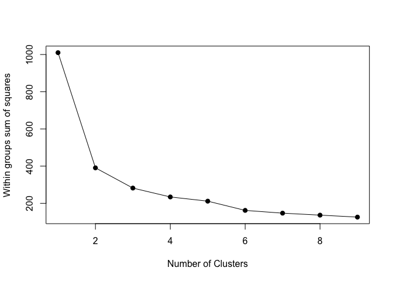<!-- -->
<br />
The elbow method shows that the optimum K value is 2. But i think we should try 3 as well since 2 clusters will not give us much information.


## K-means

* k-means modeling


* cluster distribution

If we divide the data into two clusters, the composition of each cluster would be :
<!--html_preserve--><div id="htmlwidget-c6f50e517abd2b647d08" style="width:100%;height:auto;" class="datatables html-widget"></div>
<script type="application/json" data-for="htmlwidget-c6f50e517abd2b647d08">{"x":{"filter":"none","data":[["1","2"],["1","2"],[153,50]],"container":"<table class=\"display\">\n  <thead>\n    <tr>\n      <th> <\/th>\n      <th>Cluster<\/th>\n      <th>Freq<\/th>\n    <\/tr>\n  <\/thead>\n<\/table>","options":{"columnDefs":[{"className":"dt-right","targets":2},{"orderable":false,"targets":0}],"order":[],"autoWidth":false,"orderClasses":false}},"evals":[],"jsHooks":[]}</script><!--/html_preserve-->
<br />
But if we divide the data into three clusters, the composition of each cluster would be:
<!--html_preserve--><div id="htmlwidget-58f92371969733631a53" style="width:100%;height:auto;" class="datatables html-widget"></div>
<script type="application/json" data-for="htmlwidget-58f92371969733631a53">{"x":{"filter":"none","data":[["1","2","3"],["1","2","3"],[42,104,57]],"container":"<table class=\"display\">\n  <thead>\n    <tr>\n      <th> <\/th>\n      <th>Cluster<\/th>\n      <th>Freq<\/th>\n    <\/tr>\n  <\/thead>\n<\/table>","options":{"columnDefs":[{"className":"dt-right","targets":2},{"orderable":false,"targets":0}],"order":[],"autoWidth":false,"orderClasses":false}},"evals":[],"jsHooks":[]}</script><!--/html_preserve-->

<br />

* assigning cluster to new columns
<!--html_preserve--><div id="htmlwidget-7f160435f6a10684c396" style="width:100%;height:auto;" class="datatables html-widget"></div>
<script type="application/json" data-for="htmlwidget-7f160435f6a10684c396">{"x":{"filter":"none","data":[["1","2","3","4","5","6","7","8","9","10","11","12","13","14","15","16","17","18","19","20","21","22","23","24","25","26","27","28","29","30","31","32","33","34","35","36","37","38","39","40","41","42","43","44","45","46","47","48","49","50","51","52","53","54","55","56","57","58","59","60","61","62","63","64","65","66","67","68","69","70","71","72","73","74","75","76","77","78","79","80","81","82","83","84","85","86","87","88","89","90","91","92","93","94","95","96","97","98","99","100","101","102","103","104","105","106","107","108","109","110","111","112","113","114","115","116","117","118","119","120","121","122","123","124","125","126","127","128","129","130","131","132","133","134","135","136","137","138","139","140","141","142","143","144","145","146","147","148","149","150","151","152","153","154","155","156","157","158","159","160","161","162","163","164","165","166","167","168","169","170","171","172","173","174","175","176","177","178","179","180","181","182","183","184","185","186","187","188","189","190","191","192","193","194","195","196","197","198","199","200","201","202","203"],["Bulgaria","Myanmar","Burundi","Belarus","Cambodia","Algeria","Cameroon","Canada","Cabo Verde","Central African Republic","Sri Lanka","Chad","Chile","China","Colombia","Comoros","Mayotte","Congo","Dem. Rep. of the Congo","Costa Rica","Croatia","Cuba","Cyprus","Czechia","Benin","Denmark","Dominican Republic","Ecuador","El Salvador","Equatorial Guinea","Ethiopia","Eritrea","Estonia","Faroe Islands","Angola","Fiji","Finland","France","French Guiana","French Polynesia","Djibouti","Gabon","Georgia","Gambia","State of Palestine","Germany","Antigua and Barbuda","Ghana","Kiribati","Greece","Greenland","Grenada","Azerbaijan","Guadeloupe","Guam","Argentina","Guatemala","Guinea","Guyana","Haiti","Honduras","China, Hong Kong SAR","Hungary","Iceland","India","Australia","Indonesia","Iran (Islamic Republic of)","Iraq","Ireland","Israel","Italy","Côte d'Ivoire","Jamaica","Japan","Kazakhstan","Afghanistan","Austria","Jordan","Kenya","Dem. People's Rep. Korea","Republic of Korea","Kuwait","Kyrgyzstan","Lao People's Dem. Rep.","Lebanon","Lesotho","Latvia","Liberia","Libya","Bahamas","Lithuania","Luxembourg","China, Macao SAR","Madagascar","Malawi","Malaysia","Maldives","Mali","Malta","Martinique","Mauritania","Bahrain","Mauritius","Mexico","Mongolia","Republic of Moldova","Montenegro","Bangladesh","Morocco","Mozambique","Armenia","Oman","Namibia","Barbados","Nepal","Netherlands","Curaçao","Aruba","New Caledonia","Vanuatu","New Zealand","Nicaragua","Belgium","Niger","Nigeria","Norway","Micronesia (Fed. States of)","Palau","Pakistan","Panama","Papua New Guinea","Bermuda","Paraguay","Peru","Philippines","Poland","Portugal","Guinea-Bissau","Timor-Leste","Puerto Rico","Qatar","Réunion","Bhutan","Romania","Russian Federation","Rwanda","Saint Lucia","Saint Vincent &amp; Grenadines","Sao Tome and Principe","Bolivia (Plurin. State of)","Saudi Arabia","Senegal","Serbia","Seychelles","Sierra Leone","Bosnia and Herzegovina","Singapore","Slovakia","Viet Nam","Slovenia","Somalia","South Africa","Zimbabwe","Botswana","Spain","South Sudan","Sudan","Western Sahara","Suriname","Swaziland","Sweden","Switzerland","Brazil","Syrian Arab Republic","Tajikistan","Thailand","Togo","Tonga","Trinidad and Tobago","United Arab Emirates","Tunisia","Turkey","Turkmenistan","Albania","Uganda","Ukraine","TFYR of Macedonia","Egypt","United Kingdom","United Rep. of Tanzania","Belize","United States of America","United States Virgin Islands","Burkina Faso","Uruguay","Uzbekistan","Venezuela (Boliv. Rep. of)","Samoa","Yemen","Zambia","Solomon Islands","Brunei Darussalam"],["1","1","2","1","1","1","2","1","1","2","1","2","1","1","1","2","1","2","2","1","1","1","1","1","2","1","1","1","1","2","2","2","1","1","2","1","1","1","1","1","2","2","1","2","1","1","1","2","1","1","1","1","1","1","1","1","1","2","1","2","1","1","1","1","1","1","1","1","1","1","1","1","2","1","1","1","2","1","1","2","1","1","1","1","1","1","2","1","2","1","1","1","1","1","2","2","1","1","2","1","1","2","1","1","1","1","1","1","1","1","2","1","1","2","1","1","1","1","1","1","1","1","1","1","2","2","1","1","1","2","1","2","1","1","1","1","1","1","2","2","1","1","1","1","1","1","2","1","1","2","1","1","2","1","1","2","1","1","1","1","1","2","1","2","1","1","2","2","1","1","2","1","1","1","1","1","1","2","1","1","1","1","1","1","1","2","1","1","1","1","2","1","1","1","2","1","1","1","1","2","2","1","1"],["2","3","1","2","3","3","1","2","3","1","2","1","2","2","2","1","3","1","1","2","2","2","2","2","1","2","3","3","2","1","1","1","2","2","1","2","2","2","3","2","3","3","2","1","3","2","2","1","3","2","2","2","3","2","2","2","3","1","3","3","3","2","2","2","3","2","3","2","3","2","2","2","1","2","2","3","1","2","3","1","2","2","3","3","3","3","1","2","1","2","2","2","2","2","1","1","2","3","1","2","2","1","2","2","2","3","2","2","3","3","1","2","3","3","2","3","2","2","2","2","3","2","2","2","1","1","2","3","2","3","2","3","2","3","2","3","2","2","1","1","2","3","2","3","2","2","3","2","2","3","3","3","1","2","2","1","2","2","2","2","2","1","3","1","3","2","1","1","3","3","1","2","2","2","2","3","2","1","3","2","2","2","2","3","2","1","2","2","3","2","1","3","2","2","1","2","3","2","3","1","1","3","2"]],"container":"<table class=\"display\">\n  <thead>\n    <tr>\n      <th> <\/th>\n      <th>Country<\/th>\n      <th>2-Clusters<\/th>\n      <th>3-Clusters<\/th>\n    <\/tr>\n  <\/thead>\n<\/table>","options":{"order":[],"autoWidth":false,"orderClasses":false,"columnDefs":[{"orderable":false,"targets":0}]}},"evals":[],"jsHooks":[]}</script><!--/html_preserve-->
<br />

# Biplotting

## Performing PCA on the Data

<br />
<!--html_preserve--><div id="htmlwidget-625b4479d840d8c0c074" style="width:100%;height:auto;" class="datatables html-widget"></div>
<script type="application/json" data-for="htmlwidget-625b4479d840d8c0c074">{"x":{"filter":"none","data":[["1","2","3","4","5"],["comp 1","comp 2","comp 3","comp 4","comp 5"],[3.94512158442851,0.672767773052873,0.195497571192367,0.135451568381666,0.0511615029445861],[78.9024316885702,13.4553554610575,3.90995142384734,2.70903136763332,1.02323005889172],[78.9024316885702,92.3577871496276,96.267738573475,98.9767699411083,100]],"container":"<table class=\"display\">\n  <thead>\n    <tr>\n      <th> <\/th>\n      <th>Dimension<\/th>\n      <th>eigenvalue<\/th>\n      <th>percentage of variance<\/th>\n      <th>cumulative percentage of variance<\/th>\n    <\/tr>\n  <\/thead>\n<\/table>","options":{"columnDefs":[{"className":"dt-right","targets":[2,3,4]},{"orderable":false,"targets":0}],"order":[],"autoWidth":false,"orderClasses":false}},"evals":[],"jsHooks":[]}</script><!--/html_preserve-->
<br />
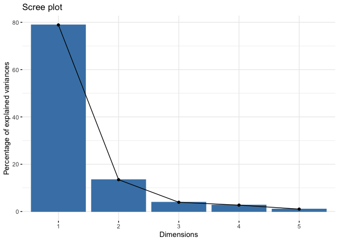<!-- -->
<br />
The dimension 1 contains 80% of information and dimension 2 contains 12% information. The total is arround 92% of information.


## Variables Contribution

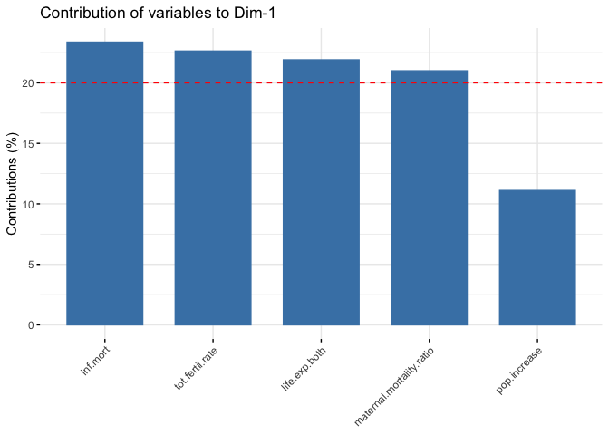<!-- -->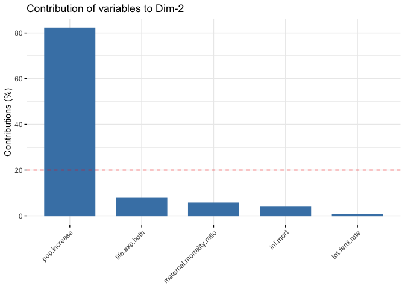<!-- -->

<!-- -->

<br />


## Cluster Plot

### 2 Clusters

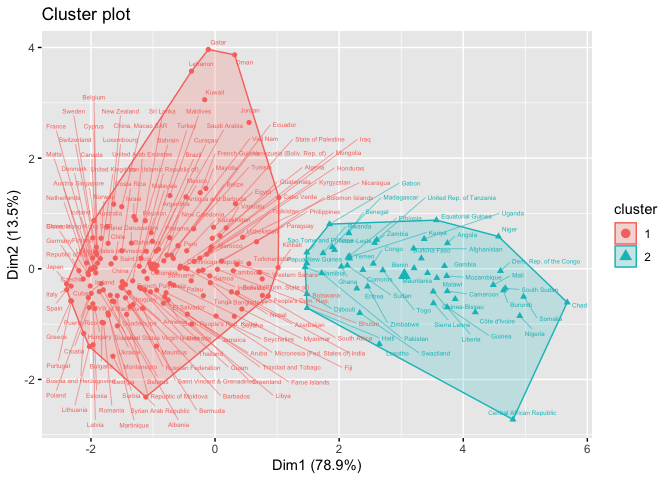<!-- -->

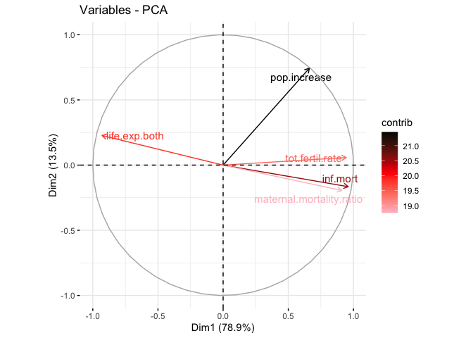<!-- -->

<!--html_preserve--><div id="htmlwidget-8000d2e2f8dde893a995" style="width:672px;height:480px;" class="plotly html-widget"></div>
<script type="application/json" data-for="htmlwidget-8000d2e2f8dde893a995">{"x":{"data":[{"x":[-2.79624913854248,-2.79624913854248,-2.79624913854248,-2.79624913854248,-2.79624913854248,-2.79624913854248,-2.79624913854248,-2.79624913854248,-2.79624913854248,-2.79624913854248,-2.79624913854248,-2.79624913854248,-2.79624913854248,-2.79624913854248,-2.79624913854248,-2.79624913854248,-2.79624913854248,-2.79624913854248,-2.79624913854248,-2.79624913854248,-2.79624913854248,-2.79624913854248,-2.79624913854248,-2.79624913854248,-2.79624913854248,-2.79624913854248,-2.79624913854248,-2.79624913854248,-2.79624913854248,-2.79624913854248,-2.79624913854248,-2.79624913854248,-2.79624913854248,-2.79624913854248,-2.79624913854248,-2.79624913854248,-2.79624913854248,-2.79624913854248,-2.79624913854248,-2.79624913854248,-2.79624913854248,-2.79624913854248,-2.79624913854248,-2.79624913854248,-2.79624913854248,-2.79624913854248,-2.79624913854248,-2.79624913854248,-2.79624913854248,-2.79624913854248,-2.79624913854248,-2.79624913854248,-2.79624913854248,-2.79624913854248,-2.79624913854248,-2.79624913854248,-2.79624913854248,-2.79624913854248,-2.79624913854248,-2.79624913854248,-2.79624913854248,-2.79624913854248,-2.79624913854248,-2.79624913854248,-2.79624913854248,-2.79624913854248,-2.79624913854248,-2.79624913854248,-2.79624913854248,-2.79624913854248,-2.79624913854248,-2.79624913854248,-2.79624913854248,-2.79624913854248,-2.79624913854248,-2.79624913854248,-2.79624913854248,-2.79624913854248,-2.79624913854248,-2.79624913854248,-2.79624913854248,-2.79624913854248,-2.79624913854248,-2.79624913854248,-2.79624913854248,-2.79624913854248,-2.79624913854248,-2.79624913854248,-2.79624913854248,-2.79624913854248,-2.79624913854248,-2.79624913854248,-2.79624913854248,-2.79624913854248,-2.79624913854248,-2.79624913854248,-2.79624913854248,-2.79624913854248,-2.79624913854248,-2.79624913854248,-2.79624913854248,-2.79624913854248,-2.79624913854248,-2.79624913854248,-2.79624913854248,-2.79624913854248,-2.79624913854248,-2.79624913854248,-2.79624913854248,-2.79624913854248,-2.79624913854248,-2.79624913854248,-2.79624913854248,-2.79624913854248,-2.79624913854248,-2.79624913854248,-2.79624913854248,-2.79624913854248,-2.79624913854248,-2.79624913854248,-2.79624913854248,-2.79624913854248,-2.79624913854248,-2.79624913854248,-2.79624913854248,-2.79624913854248,-2.79624913854248,-2.79624913854248,-2.79624913854248,-2.79624913854248,-2.79624913854248,-2.79624913854248,-2.79624913854248,-2.79624913854248,-2.79624913854248,-2.79624913854248,-2.79624913854248,-2.79624913854248,-2.79624913854248,-2.79624913854248,-2.79624913854248,-2.79624913854248,-2.79624913854248,-2.79624913854248,-2.79624913854248,-2.79624913854248,-2.79624913854248,-2.79624913854248,-2.79624913854248,-2.79624913854248,-2.79624913854248,-2.79624913854248,-2.79624913854248,-2.79624913854248,-2.79624913854248,-2.79624913854248,-2.79624913854248,-2.79624913854248,-2.79624913854248,-2.79624913854248,-2.79624913854248,-2.79624913854248,-2.79624913854248,-2.79624913854248,-2.79624913854248,-2.79624913854248,-2.79624913854248,-2.79624913854248,-2.79624913854248,-2.79624913854248,-2.79624913854248,-2.79624913854248,-2.79624913854248,-2.79624913854248,-2.79624913854248,-2.79624913854248,-2.79624913854248,-2.79624913854248,-2.79624913854248,-2.79624913854248,-2.79624913854248,-2.79624913854248,-2.79624913854248,-2.79624913854248,-2.79624913854248,-2.79624913854248,-2.79624913854248,-2.79624913854248,-2.79624913854248,-2.79624913854248,-2.79624913854248,-2.79624913854248,-2.79624913854248,-2.79624913854248,-2.79624913854248,-2.79624913854248,-2.79624913854248,-2.79624913854248,-2.79624913854248,-2.79624913854248,-2.79624913854248,-2.79624913854248,-2.79624913854248,6.07985902485115,6.07985902485115,6.07985902485115,6.07985902485115,6.07985902485115,6.07985902485115,6.07985902485115,6.07985902485115,6.07985902485115,6.07985902485115,6.07985902485115,6.07985902485115,6.07985902485115,6.07985902485115,6.07985902485115,6.07985902485115,6.07985902485115,6.07985902485115,6.07985902485115,6.07985902485115,6.07985902485115,6.07985902485115,6.07985902485115,6.07985902485115,6.07985902485115,6.07985902485115,6.07985902485115,6.07985902485115,6.07985902485115,6.07985902485115,6.07985902485115,6.07985902485115,6.07985902485115,6.07985902485115,6.07985902485115,6.07985902485115,6.07985902485115,6.07985902485115,6.07985902485115,6.07985902485115,6.07985902485115,6.07985902485115,6.07985902485115,6.07985902485115,6.07985902485115,6.07985902485115,6.07985902485115,6.07985902485115,6.07985902485115,6.07985902485115,6.07985902485115,6.07985902485115,6.07985902485115,6.07985902485115,6.07985902485115,6.07985902485115,6.07985902485115,6.07985902485115,6.07985902485115,6.07985902485115,6.07985902485115,6.07985902485115,6.07985902485115,6.07985902485115,6.07985902485115,6.07985902485115,6.07985902485115,6.07985902485115,6.07985902485115,6.07985902485115,6.07985902485115,6.07985902485115,6.07985902485115,6.07985902485115,6.07985902485115,6.07985902485115,6.07985902485115,6.07985902485115,6.07985902485115,6.07985902485115,6.07985902485115,6.07985902485115,6.07985902485115,6.07985902485115,6.07985902485115,6.07985902485115,6.07985902485115,6.07985902485115,6.07985902485115,6.07985902485115,6.07985902485115,6.07985902485115,6.07985902485115,6.07985902485115,6.07985902485115,6.07985902485115,6.07985902485115,6.07985902485115,6.07985902485115,6.07985902485115,6.07985902485115,6.07985902485115,6.07985902485115,6.07985902485115,6.07985902485115,6.07985902485115,6.07985902485115,6.07985902485115,6.07985902485115,6.07985902485115,6.07985902485115,6.07985902485115,6.07985902485115,6.07985902485115,6.07985902485115,6.07985902485115,6.07985902485115,6.07985902485115,6.07985902485115,6.07985902485115,6.07985902485115,6.07985902485115,6.07985902485115,6.07985902485115,6.07985902485115,6.07985902485115,6.07985902485115,6.07985902485115,6.07985902485115,6.07985902485115,6.07985902485115,6.07985902485115,6.07985902485115,6.07985902485115,6.07985902485115,6.07985902485115,6.07985902485115,6.07985902485115,6.07985902485115,6.07985902485115,6.07985902485115,6.07985902485115,6.07985902485115,6.07985902485115,6.07985902485115,6.07985902485115,6.07985902485115,6.07985902485115,6.07985902485115,6.07985902485115,6.07985902485115,6.07985902485115,6.07985902485115,6.07985902485115,6.07985902485115,6.07985902485115,6.07985902485115,6.07985902485115,6.07985902485115,6.07985902485115,6.07985902485115,6.07985902485115,6.07985902485115,6.07985902485115,6.07985902485115,6.07985902485115,6.07985902485115,6.07985902485115,6.07985902485115,6.07985902485115,6.07985902485115,6.07985902485115,6.07985902485115,6.07985902485115,6.07985902485115,6.07985902485115,6.07985902485115,6.07985902485115,6.07985902485115,6.07985902485115,6.07985902485115,6.07985902485115,6.07985902485115,6.07985902485115,6.07985902485115,6.07985902485115,6.07985902485115,6.07985902485115,6.07985902485115,6.07985902485115,6.07985902485115,6.07985902485115,6.07985902485115,6.07985902485115,6.07985902485115,6.07985902485115,6.07985902485115,6.07985902485115,6.07985902485115,6.07985902485115,6.07985902485115,6.07985902485115,6.07985902485115],"y":[0,0,0,0,0,0,0,0,0,0,0,0,0,0,0,0,0,0,0,0,0,0,0,0,0,0,0,0,0,0,0,0,0,0,0,0,0,0,0,0,0,0,0,0,0,0,0,0,0,0,0,0,0,0,0,0,0,0,0,0,0,0,0,0,0,0,0,0,0,0,0,0,0,0,0,0,0,0,0,0,0,0,0,0,0,0,0,0,0,0,0,0,0,0,0,0,0,0,0,0,0,0,0,0,0,0,0,0,0,0,0,0,0,0,0,0,0,0,0,0,0,0,0,0,0,0,0,0,0,0,0,0,0,0,0,0,0,0,0,0,0,0,0,0,0,0,0,0,0,0,0,0,0,0,0,0,0,0,0,0,0,0,0,0,0,0,0,0,0,0,0,0,0,0,0,0,0,0,0,0,0,0,0,0,0,0,0,0,0,0,0,0,0,0,0,0,0,0,0,0,0,0,0,0,0,0,0,0,0,0,0,0,0,0,0,0,0,0,0,0,0,0,0,0,0,0,0,0,0,0,0,0,0,0,0,0,0,0,0,0,0,0,0,0,0,0,0,0,0,0,0,0,0,0,0,0,0,0,0,0,0,0,0,0,0,0,0,0,0,0,0,0,0,0,0,0,0,0,0,0,0,0,0,0,0,0,0,0,0,0,0,0,0,0,0,0,0,0,0,0,0,0,0,0,0,0,0,0,0,0,0,0,0,0,0,0,0,0,0,0,0,0,0,0,0,0,0,0,0,0,0,0,0,0,0,0,0,0,0,0,0,0,0,0,0,0,0,0,0,0,0,0,0,0,0,0,0,0,0,0,0,0,0,0,0,0,0,0,0,0,0,0,0,0,0,0,0,0,0,0,0,0,0,0,0,0,0,0,0,0,0,0,0,0,0,0,0,0,0,0,0,0,0,0,0,0],"text":"","type":"scatter","mode":"lines","line":{"width":0.755905511811024,"color":"rgba(0,0,0,0.5)","dash":"dash"},"hoveron":"points","showlegend":false,"xaxis":"x","yaxis":"y","hoverinfo":"text","frame":null},{"x":[0,0,0,0,0,0,0,0,0,0,0,0,0,0,0,0,0,0,0,0,0,0,0,0,0,0,0,0,0,0,0,0,0,0,0,0,0,0,0,0,0,0,0,0,0,0,0,0,0,0,0,0,0,0,0,0,0,0,0,0,0,0,0,0,0,0,0,0,0,0,0,0,0,0,0,0,0,0,0,0,0,0,0,0,0,0,0,0,0,0,0,0,0,0,0,0,0,0,0,0,0,0,0,0,0,0,0,0,0,0,0,0,0,0,0,0,0,0,0,0,0,0,0,0,0,0,0,0,0,0,0,0,0,0,0,0,0,0,0,0,0,0,0,0,0,0,0,0,0,0,0,0,0,0,0,0,0,0,0,0,0,0,0,0,0,0,0,0,0,0,0,0,0,0,0,0,0,0,0,0,0,0,0,0,0,0,0,0,0,0,0,0,0,0,0,0,0,0,0,0,0,0,0,0,0,0,0,0,0,0,0,0,0,0,0,0,0,0,0,0,0,0,0,0,0,0,0,0,0,0,0,0,0,0,0,0,0,0,0,0,0,0,0,0,0,0,0,0,0,0,0,0,0,0,0,0,0,0,0,0,0,0,0,0,0,0,0,0,0,0,0,0,0,0,0,0,0,0,0,0,0,0,0,0,0,0,0,0,0,0,0,0,0,0,0,0,0,0,0,0,0,0,0,0,0,0,0,0,0,0,0,0,0,0,0,0,0,0,0,0,0,0,0,0,0,0,0,0,0,0,0,0,0,0,0,0,0,0,0,0,0,0,0,0,0,0,0,0,0,0,0,0,0,0,0,0,0,0,0,0,0,0,0,0,0,0,0,0,0,0,0,0,0,0,0,0,0,0,0,0,0,0,0,0,0,0,0,0,0,0,0,0,0,0,0,0,0,0,0,0,0,0,0,0,0,0],"y":[-3.05828141123623,-3.05828141123623,-3.05828141123623,-3.05828141123623,-3.05828141123623,-3.05828141123623,-3.05828141123623,-3.05828141123623,-3.05828141123623,-3.05828141123623,-3.05828141123623,-3.05828141123623,-3.05828141123623,-3.05828141123623,-3.05828141123623,-3.05828141123623,-3.05828141123623,-3.05828141123623,-3.05828141123623,-3.05828141123623,-3.05828141123623,-3.05828141123623,-3.05828141123623,-3.05828141123623,-3.05828141123623,-3.05828141123623,-3.05828141123623,-3.05828141123623,-3.05828141123623,-3.05828141123623,-3.05828141123623,-3.05828141123623,-3.05828141123623,-3.05828141123623,-3.05828141123623,-3.05828141123623,-3.05828141123623,-3.05828141123623,-3.05828141123623,-3.05828141123623,-3.05828141123623,-3.05828141123623,-3.05828141123623,-3.05828141123623,-3.05828141123623,-3.05828141123623,-3.05828141123623,-3.05828141123623,-3.05828141123623,-3.05828141123623,-3.05828141123623,-3.05828141123623,-3.05828141123623,-3.05828141123623,-3.05828141123623,-3.05828141123623,-3.05828141123623,-3.05828141123623,-3.05828141123623,-3.05828141123623,-3.05828141123623,-3.05828141123623,-3.05828141123623,-3.05828141123623,-3.05828141123623,-3.05828141123623,-3.05828141123623,-3.05828141123623,-3.05828141123623,-3.05828141123623,-3.05828141123623,-3.05828141123623,-3.05828141123623,-3.05828141123623,-3.05828141123623,-3.05828141123623,-3.05828141123623,-3.05828141123623,-3.05828141123623,-3.05828141123623,-3.05828141123623,-3.05828141123623,-3.05828141123623,-3.05828141123623,-3.05828141123623,-3.05828141123623,-3.05828141123623,-3.05828141123623,-3.05828141123623,-3.05828141123623,-3.05828141123623,-3.05828141123623,-3.05828141123623,-3.05828141123623,-3.05828141123623,-3.05828141123623,-3.05828141123623,-3.05828141123623,-3.05828141123623,-3.05828141123623,-3.05828141123623,-3.05828141123623,-3.05828141123623,-3.05828141123623,-3.05828141123623,-3.05828141123623,-3.05828141123623,-3.05828141123623,-3.05828141123623,-3.05828141123623,-3.05828141123623,-3.05828141123623,-3.05828141123623,-3.05828141123623,-3.05828141123623,-3.05828141123623,-3.05828141123623,-3.05828141123623,-3.05828141123623,-3.05828141123623,-3.05828141123623,-3.05828141123623,-3.05828141123623,-3.05828141123623,-3.05828141123623,-3.05828141123623,-3.05828141123623,-3.05828141123623,-3.05828141123623,-3.05828141123623,-3.05828141123623,-3.05828141123623,-3.05828141123623,-3.05828141123623,-3.05828141123623,-3.05828141123623,-3.05828141123623,-3.05828141123623,-3.05828141123623,-3.05828141123623,-3.05828141123623,-3.05828141123623,-3.05828141123623,-3.05828141123623,-3.05828141123623,-3.05828141123623,-3.05828141123623,-3.05828141123623,-3.05828141123623,-3.05828141123623,-3.05828141123623,-3.05828141123623,-3.05828141123623,-3.05828141123623,-3.05828141123623,-3.05828141123623,-3.05828141123623,-3.05828141123623,-3.05828141123623,-3.05828141123623,-3.05828141123623,-3.05828141123623,-3.05828141123623,-3.05828141123623,-3.05828141123623,-3.05828141123623,-3.05828141123623,-3.05828141123623,-3.05828141123623,-3.05828141123623,-3.05828141123623,-3.05828141123623,-3.05828141123623,-3.05828141123623,-3.05828141123623,-3.05828141123623,-3.05828141123623,-3.05828141123623,-3.05828141123623,-3.05828141123623,-3.05828141123623,-3.05828141123623,-3.05828141123623,-3.05828141123623,-3.05828141123623,-3.05828141123623,-3.05828141123623,-3.05828141123623,-3.05828141123623,-3.05828141123623,-3.05828141123623,-3.05828141123623,-3.05828141123623,-3.05828141123623,-3.05828141123623,-3.05828141123623,-3.05828141123623,-3.05828141123623,-3.05828141123623,-3.05828141123623,-3.05828141123623,-3.05828141123623,-3.05828141123623,4.2993362871483,4.2993362871483,4.2993362871483,4.2993362871483,4.2993362871483,4.2993362871483,4.2993362871483,4.2993362871483,4.2993362871483,4.2993362871483,4.2993362871483,4.2993362871483,4.2993362871483,4.2993362871483,4.2993362871483,4.2993362871483,4.2993362871483,4.2993362871483,4.2993362871483,4.2993362871483,4.2993362871483,4.2993362871483,4.2993362871483,4.2993362871483,4.2993362871483,4.2993362871483,4.2993362871483,4.2993362871483,4.2993362871483,4.2993362871483,4.2993362871483,4.2993362871483,4.2993362871483,4.2993362871483,4.2993362871483,4.2993362871483,4.2993362871483,4.2993362871483,4.2993362871483,4.2993362871483,4.2993362871483,4.2993362871483,4.2993362871483,4.2993362871483,4.2993362871483,4.2993362871483,4.2993362871483,4.2993362871483,4.2993362871483,4.2993362871483,4.2993362871483,4.2993362871483,4.2993362871483,4.2993362871483,4.2993362871483,4.2993362871483,4.2993362871483,4.2993362871483,4.2993362871483,4.2993362871483,4.2993362871483,4.2993362871483,4.2993362871483,4.2993362871483,4.2993362871483,4.2993362871483,4.2993362871483,4.2993362871483,4.2993362871483,4.2993362871483,4.2993362871483,4.2993362871483,4.2993362871483,4.2993362871483,4.2993362871483,4.2993362871483,4.2993362871483,4.2993362871483,4.2993362871483,4.2993362871483,4.2993362871483,4.2993362871483,4.2993362871483,4.2993362871483,4.2993362871483,4.2993362871483,4.2993362871483,4.2993362871483,4.2993362871483,4.2993362871483,4.2993362871483,4.2993362871483,4.2993362871483,4.2993362871483,4.2993362871483,4.2993362871483,4.2993362871483,4.2993362871483,4.2993362871483,4.2993362871483,4.2993362871483,4.2993362871483,4.2993362871483,4.2993362871483,4.2993362871483,4.2993362871483,4.2993362871483,4.2993362871483,4.2993362871483,4.2993362871483,4.2993362871483,4.2993362871483,4.2993362871483,4.2993362871483,4.2993362871483,4.2993362871483,4.2993362871483,4.2993362871483,4.2993362871483,4.2993362871483,4.2993362871483,4.2993362871483,4.2993362871483,4.2993362871483,4.2993362871483,4.2993362871483,4.2993362871483,4.2993362871483,4.2993362871483,4.2993362871483,4.2993362871483,4.2993362871483,4.2993362871483,4.2993362871483,4.2993362871483,4.2993362871483,4.2993362871483,4.2993362871483,4.2993362871483,4.2993362871483,4.2993362871483,4.2993362871483,4.2993362871483,4.2993362871483,4.2993362871483,4.2993362871483,4.2993362871483,4.2993362871483,4.2993362871483,4.2993362871483,4.2993362871483,4.2993362871483,4.2993362871483,4.2993362871483,4.2993362871483,4.2993362871483,4.2993362871483,4.2993362871483,4.2993362871483,4.2993362871483,4.2993362871483,4.2993362871483,4.2993362871483,4.2993362871483,4.2993362871483,4.2993362871483,4.2993362871483,4.2993362871483,4.2993362871483,4.2993362871483,4.2993362871483,4.2993362871483,4.2993362871483,4.2993362871483,4.2993362871483,4.2993362871483,4.2993362871483,4.2993362871483,4.2993362871483,4.2993362871483,4.2993362871483,4.2993362871483,4.2993362871483,4.2993362871483,4.2993362871483,4.2993362871483,4.2993362871483,4.2993362871483,4.2993362871483,4.2993362871483,4.2993362871483,4.2993362871483,4.2993362871483,4.2993362871483,4.2993362871483,4.2993362871483,4.2993362871483,4.2993362871483,4.2993362871483,4.2993362871483,4.2993362871483,4.2993362871483,4.2993362871483],"text":"","type":"scatter","mode":"lines","line":{"width":0.755905511811024,"color":"rgba(0,0,0,0.5)","dash":"dash"},"hoveron":"points","showlegend":false,"xaxis":"x","yaxis":"y","hoverinfo":"text","frame":null},{"x":[-0.0448899602760856,-0.558618120223208,-0.147855710165761,-0.83305040550892,-1.44354328832425,-0.337749395412825,-1.22160040091447,-0.789515913366742,0.763229982752713,0.718847825198432,0.352150491091809,-0.825808448824308,-0.0249982771803323],"y":[0.551117754923498,0.0474106175116086,1.45286095824527,-0.623332327995219,-0.524101603615886,0.13723421680536,0.045226697177237,-0.431644944977678,-0.481452110534441,-0.0626979641899681,0.0811078261328358,0.144494464678155,0.75103113039416],"text":["clust : 1 <br />                      continent : Africa <br />                      country : Algeria <br />                      inf.mort : 27.7 <br />                      life.exp.both : 75.3 <br />                      maternal.mort.ratio : 140 <br />                      pop.increase : 2 <br />                      tot.fertil.rate : 3","clust : 1 <br />                      continent : Africa <br />                      country : Cabo Verde <br />                      inf.mort : 22.5 <br />                      life.exp.both : 72.2 <br />                      maternal.mort.ratio : 42 <br />                      pop.increase : 1.2 <br />                      tot.fertil.rate : 2.5","clust : 1 <br />                      continent : Africa <br />                      country : Mayotte <br />                      inf.mort : 4.2 <br />                      life.exp.both : 79.3 <br />                      maternal.mort.ratio : 162.184210526316 <br />                      pop.increase : 2.8 <br />                      tot.fertil.rate : 4.1","clust : 1 <br />                      continent : Africa <br />                      country : Libya <br />                      inf.mort : 24.3 <br />                      life.exp.both : 71.5 <br />                      maternal.mort.ratio : 9 <br />                      pop.increase : 0.2 <br />                      tot.fertil.rate : 2.4","clust : 1 <br />                      continent : Africa <br />                      country : Mauritius <br />                      inf.mort : 12 <br />                      life.exp.both : 74.1 <br />                      maternal.mort.ratio : 53 <br />                      pop.increase : 0.2 <br />                      tot.fertil.rate : 1.5","clust : 1 <br />                      continent : Africa <br />                      country : Morocco <br />                      inf.mort : 28.1 <br />                      life.exp.both : 74.9 <br />                      maternal.mort.ratio : 121 <br />                      pop.increase : 1.4 <br />                      tot.fertil.rate : 2.6","clust : 1 <br />                      continent : Africa <br />                      country : Réunion <br />                      inf.mort : 4.2 <br />                      life.exp.both : 79.5 <br />                      maternal.mort.ratio : 162.184210526316 <br />                      pop.increase : 0.8 <br />                      tot.fertil.rate : 2.4","clust : 1 <br />                      continent : Africa <br />                      country : Seychelles <br />                      inf.mort : 10.2 <br />                      life.exp.both : 72.9 <br />                      maternal.mort.ratio : 162.184210526316 <br />                      pop.increase : 0.5 <br />                      tot.fertil.rate : 2.4","clust : 1 <br />                      continent : Africa <br />                      country : South Africa <br />                      inf.mort : 36.5 <br />                      life.exp.both : 59.5 <br />                      maternal.mort.ratio : 138 <br />                      pop.increase : 1.4 <br />                      tot.fertil.rate : 2.6","clust : 1 <br />                      continent : Africa <br />                      country : Botswana <br />                      inf.mort : 35.2 <br />                      life.exp.both : 62.9 <br />                      maternal.mort.ratio : 129 <br />                      pop.increase : 1.8 <br />                      tot.fertil.rate : 2.9","clust : 1 <br />                      continent : Africa <br />                      country : Western Sahara <br />                      inf.mort : 34.1 <br />                      life.exp.both : 68.4 <br />                      maternal.mort.ratio : 162.184210526316 <br />                      pop.increase : 1.8 <br />                      tot.fertil.rate : 2.6","clust : 1 <br />                      continent : Africa <br />                      country : Tunisia <br />                      inf.mort : 18.5 <br />                      life.exp.both : 75 <br />                      maternal.mort.ratio : 62 <br />                      pop.increase : 1.2 <br />                      tot.fertil.rate : 2.3","clust : 1 <br />                      continent : Africa <br />                      country : Egypt <br />                      inf.mort : 18.9 <br />                      life.exp.both : 70.8 <br />                      maternal.mort.ratio : 33 <br />                      pop.increase : 2.2 <br />                      tot.fertil.rate : 3.4"],"type":"scatter","mode":"markers","marker":{"autocolorscale":false,"color":"rgba(248,118,109,1)","opacity":1,"size":5.66929133858268,"symbol":"circle","line":{"width":1.88976377952756,"color":"rgba(248,118,109,1)"}},"hoveron":"points","name":"(1,Africa)","legendgroup":"(1,Africa)","showlegend":true,"xaxis":"x","yaxis":"y","hoverinfo":"text","frame":null},{"x":[-1.91354659662687,-1.60765016805746,-0.942637720888974,-1.50185773667877,-1.83681299012842,-0.449869263712776,-0.597130384794195,-0.941354744332347,-0.238443885180106,-0.934229044874699,-0.373393093815667,-1.21495096264877,-1.5764178635474,-1.05463844319934,0.0807776438914375,0.311449206117526,-0.0792006482242071,-1.12971395711497,-1.10642717238321,-1.72648222794773,-0.911128606675457,-1.50120047660321,-0.951305382560856,-1.04043988106603,-0.568049745040252,-0.73178915386419,-0.945382000134114,-0.196040278003564,-0.672205519463819,-2.04156085699144,-1.44471715413582,-1.16738870430533,0.760052133548326,-0.384677330970971,-1.14708802264189,-0.755461021506956,-0.344116688149065,-1.67564104277844,-1.37055638534699,-1.48849199553707,-0.703361707510073],"y":[0.392314960253248,0.192594138544629,-0.0500363845733152,0.324210694198439,-0.267166660560162,0.000947599234716726,0.417567318655314,-0.385354290081095,1.37501448372091,0.0605778128054193,-0.998350232550343,-0.335731947516007,-0.486210722549353,0.099025325453843,0.595884081681052,-0.857791218949677,0.333059006718432,-0.381052002853526,0.316357699682623,-0.799756348664776,0.353894499650336,-0.347143639833518,0.317828977909055,-0.416339628662019,0.0122190254775964,0.561877492627503,-1.39763456747179,-0.0232119806090085,0.185838199455954,-0.52093702226004,-0.285488459558485,-0.709453098177111,-0.182845114151957,-0.21683507309002,-0.0459066000933616,-0.565594215083216,0.722381955730965,0.0895779835381512,-0.68222699994772,-0.295407477192027,0.247323881932911],"text":["clust : 1 <br />                      continent : Americas <br />                      country : Canada <br />                      inf.mort : 4.7 <br />                      life.exp.both : 81.8 <br />                      maternal.mort.ratio : 7 <br />                      pop.increase : 1 <br />                      tot.fertil.rate : 1.6","clust : 1 <br />                      continent : Americas <br />                      country : Chile <br />                      inf.mort : 7.4 <br />                      life.exp.both : 78.8 <br />                      maternal.mort.ratio : 22 <br />                      pop.increase : 0.9 <br />                      tot.fertil.rate : 1.8","clust : 1 <br />                      continent : Americas <br />                      country : Colombia <br />                      inf.mort : 17.9 <br />                      life.exp.both : 73.7 <br />                      maternal.mort.ratio : 64 <br />                      pop.increase : 1 <br />                      tot.fertil.rate : 1.9","clust : 1 <br />                      continent : Americas <br />                      country : Costa Rica <br />                      inf.mort : 9.3 <br />                      life.exp.both : 79.2 <br />                      maternal.mort.ratio : 25 <br />                      pop.increase : 1.1 <br />                      tot.fertil.rate : 1.9","clust : 1 <br />                      continent : Americas <br />                      country : Cuba <br />                      inf.mort : 5.5 <br />                      life.exp.both : 79.2 <br />                      maternal.mort.ratio : 39 <br />                      pop.increase : 0.2 <br />                      tot.fertil.rate : 1.7","clust : 1 <br />                      continent : Americas <br />                      country : Dominican Republic <br />                      inf.mort : 25.1 <br />                      life.exp.both : 73.2 <br />                      maternal.mort.ratio : 92 <br />                      pop.increase : 1.2 <br />                      tot.fertil.rate : 2.5","clust : 1 <br />                      continent : Americas <br />                      country : Ecuador <br />                      inf.mort : 21.1 <br />                      life.exp.both : 75.5 <br />                      maternal.mort.ratio : 64 <br />                      pop.increase : 1.6 <br />                      tot.fertil.rate : 2.6","clust : 1 <br />                      continent : Americas <br />                      country : El Salvador <br />                      inf.mort : 17 <br />                      life.exp.both : 72.6 <br />                      maternal.mort.ratio : 54 <br />                      pop.increase : 0.5 <br />                      tot.fertil.rate : 2.2","clust : 1 <br />                      continent : Americas <br />                      country : French Guiana <br />                      inf.mort : 9.3 <br />                      life.exp.both : 79.2 <br />                      maternal.mort.ratio : 162.184210526316 <br />                      pop.increase : 2.8 <br />                      tot.fertil.rate : 3.5","clust : 1 <br />                      continent : Americas <br />                      country : Antigua and Barbuda <br />                      inf.mort : 9.1 <br />                      life.exp.both : 75.8 <br />                      maternal.mort.ratio : 162.184210526316 <br />                      pop.increase : 1.1 <br />                      tot.fertil.rate : 2.1","clust : 1 <br />                      continent : Americas <br />                      country : Greenland <br />                      inf.mort : 25.8465517241379 <br />                      life.exp.both : 71.3193965517241 <br />                      maternal.mort.ratio : 162.184210526316 <br />                      pop.increase : -0.1 <br />                      tot.fertil.rate : 2.83333333333333","clust : 1 <br />                      continent : Americas <br />                      country : Grenada <br />                      inf.mort : 9.6 <br />                      life.exp.both : 73.2 <br />                      maternal.mort.ratio : 27 <br />                      pop.increase : 0.4 <br />                      tot.fertil.rate : 2.2","clust : 1 <br />                      continent : Americas <br />                      country : Guadeloupe <br />                      inf.mort : 5.8 <br />                      life.exp.both : 80.5 <br />                      maternal.mort.ratio : 162.184210526316 <br />                      pop.increase : 0 <br />                      tot.fertil.rate : 2","clust : 1 <br />                      continent : Americas <br />                      country : Argentina <br />                      inf.mort : 13.7 <br />                      life.exp.both : 76 <br />                      maternal.mort.ratio : 52 <br />                      pop.increase : 1 <br />                      tot.fertil.rate : 2.3","clust : 1 <br />                      continent : Americas <br />                      country : Guatemala <br />                      inf.mort : 26.9 <br />                      life.exp.both : 72.4 <br />                      maternal.mort.ratio : 88 <br />                      pop.increase : 2.1 <br />                      tot.fertil.rate : 3.2","clust : 1 <br />                      continent : Americas <br />                      country : Guyana <br />                      inf.mort : 33.2 <br />                      life.exp.both : 66.3 <br />                      maternal.mort.ratio : 229 <br />                      pop.increase : 0.6 <br />                      tot.fertil.rate : 2.6","clust : 1 <br />                      continent : Americas <br />                      country : Honduras <br />                      inf.mort : 27.8 <br />                      life.exp.both : 72.9 <br />                      maternal.mort.ratio : 129 <br />                      pop.increase : 1.8 <br />                      tot.fertil.rate : 2.7","clust : 1 <br />                      continent : Americas <br />                      country : Jamaica <br />                      inf.mort : 15 <br />                      life.exp.both : 75.5 <br />                      maternal.mort.ratio : 89 <br />                      pop.increase : 0.4 <br />                      tot.fertil.rate : 2.1","clust : 1 <br />                      continent : Americas <br />                      country : Bahamas <br />                      inf.mort : 9.1 <br />                      life.exp.both : 75.1 <br />                      maternal.mort.ratio : 80 <br />                      pop.increase : 1.4 <br />                      tot.fertil.rate : 1.8","clust : 1 <br />                      continent : Americas <br />                      country : Martinique <br />                      inf.mort : 6.4 <br />                      life.exp.both : 81.2 <br />                      maternal.mort.ratio : 162.184210526316 <br />                      pop.increase : -0.5 <br />                      tot.fertil.rate : 2","clust : 1 <br />                      continent : Americas <br />                      country : Mexico <br />                      inf.mort : 18.8 <br />                      life.exp.both : 76.5 <br />                      maternal.mort.ratio : 38 <br />                      pop.increase : 1.4 <br />                      tot.fertil.rate : 2.3","clust : 1 <br />                      continent : Americas <br />                      country : Barbados <br />                      inf.mort : 9.6 <br />                      life.exp.both : 75.4 <br />                      maternal.mort.ratio : 27 <br />                      pop.increase : 0.3 <br />                      tot.fertil.rate : 1.8","clust : 1 <br />                      continent : Americas <br />                      country : Curaçao <br />                      inf.mort : 10.3 <br />                      life.exp.both : 77.8 <br />                      maternal.mort.ratio : 162.184210526316 <br />                      pop.increase : 1.4 <br />                      tot.fertil.rate : 2.1","clust : 1 <br />                      continent : Americas <br />                      country : Aruba <br />                      inf.mort : 14.8 <br />                      life.exp.both : 75.4 <br />                      maternal.mort.ratio : 162.184210526316 <br />                      pop.increase : 0.5 <br />                      tot.fertil.rate : 1.8","clust : 1 <br />                      continent : Americas <br />                      country : Nicaragua <br />                      inf.mort : 20 <br />                      life.exp.both : 74.5 <br />                      maternal.mort.ratio : 150 <br />                      pop.increase : 1.2 <br />                      tot.fertil.rate : 2.3","clust : 1 <br />                      continent : Americas <br />                      country : Panama <br />                      inf.mort : 15.2 <br />                      life.exp.both : 77.3 <br />                      maternal.mort.ratio : 94 <br />                      pop.increase : 1.7 <br />                      tot.fertil.rate : 2.6","clust : 1 <br />                      continent : Americas <br />                      country : Bermuda <br />                      inf.mort : 25.8465517241379 <br />                      life.exp.both : 71.3193965517241 <br />                      maternal.mort.ratio : 162.184210526316 <br />                      pop.increase : -0.6 <br />                      tot.fertil.rate : 1.5","clust : 1 <br />                      continent : Americas <br />                      country : Paraguay <br />                      inf.mort : 28.8 <br />                      life.exp.both : 72.7 <br />                      maternal.mort.ratio : 132 <br />                      pop.increase : 1.3 <br />                      tot.fertil.rate : 2.6","clust : 1 <br />                      continent : Americas <br />                      country : Peru <br />                      inf.mort : 18.6 <br />                      life.exp.both : 74.2 <br />                      maternal.mort.ratio : 68 <br />                      pop.increase : 1.3 <br />                      tot.fertil.rate : 2.5","clust : 1 <br />                      continent : Americas <br />                      country : Puerto Rico <br />                      inf.mort : 6.3 <br />                      life.exp.both : 79.2 <br />                      maternal.mort.ratio : 14 <br />                      pop.increase : -0.2 <br />                      tot.fertil.rate : 1.5","clust : 1 <br />                      continent : Americas <br />                      country : Saint Lucia <br />                      inf.mort : 10.9 <br />                      life.exp.both : 74.8 <br />                      maternal.mort.ratio : 48 <br />                      pop.increase : 0.5 <br />                      tot.fertil.rate : 1.5","clust : 1 <br />                      continent : Americas <br />                      country : Saint Vincent & Grenadines <br />                      inf.mort : 16.5 <br />                      life.exp.both : 72.7 <br />                      maternal.mort.ratio : 45 <br />                      pop.increase : 0 <br />                      tot.fertil.rate : 2","clust : 1 <br />                      continent : Americas <br />                      country : Bolivia (Plurin. State of) <br />                      inf.mort : 42.9 <br />                      life.exp.both : 67.7 <br />                      maternal.mort.ratio : 206 <br />                      pop.increase : 1.6 <br />                      tot.fertil.rate : 3","clust : 1 <br />                      continent : Americas <br />                      country : Suriname <br />                      inf.mort : 17.4 <br />                      life.exp.both : 70.9 <br />                      maternal.mort.ratio : 155 <br />                      pop.increase : 1 <br />                      tot.fertil.rate : 2.5","clust : 1 <br />                      continent : Americas <br />                      country : Brazil <br />                      inf.mort : 15.8 <br />                      life.exp.both : 74.7 <br />                      maternal.mort.ratio : 44 <br />                      pop.increase : 0.9 <br />                      tot.fertil.rate : 1.8","clust : 1 <br />                      continent : Americas <br />                      country : Trinidad and Tobago <br />                      inf.mort : 24.8 <br />                      life.exp.both : 70.2 <br />                      maternal.mort.ratio : 63 <br />                      pop.increase : 0.5 <br />                      tot.fertil.rate : 1.8","clust : 1 <br />                      continent : Americas <br />                      country : Belize <br />                      inf.mort : 14.3 <br />                      life.exp.both : 69.8 <br />                      maternal.mort.ratio : 28 <br />                      pop.increase : 2.2 <br />                      tot.fertil.rate : 2.6","clust : 1 <br />                      continent : Americas <br />                      country : United States of America <br />                      inf.mort : 6 <br />                      life.exp.both : 78.9 <br />                      maternal.mort.ratio : 14 <br />                      pop.increase : 0.7 <br />                      tot.fertil.rate : 1.9","clust : 1 <br />                      continent : Americas <br />                      country : United States Virgin Islands <br />                      inf.mort : 9.3 <br />                      life.exp.both : 79.1 <br />                      maternal.mort.ratio : 162.184210526316 <br />                      pop.increase : -0.2 <br />                      tot.fertil.rate : 2.3","clust : 1 <br />                      continent : Americas <br />                      country : Uruguay <br />                      inf.mort : 12.7 <br />                      life.exp.both : 77 <br />                      maternal.mort.ratio : 15 <br />                      pop.increase : 0.3 <br />                      tot.fertil.rate : 2","clust : 1 <br />                      continent : Americas <br />                      country : Venezuela (Boliv. Rep. of) <br />                      inf.mort : 13.8 <br />                      life.exp.both : 73.9 <br />                      maternal.mort.ratio : 95 <br />                      pop.increase : 1.4 <br />                      tot.fertil.rate : 2.4"],"type":"scatter","mode":"markers","marker":{"autocolorscale":false,"color":"rgba(248,118,109,1)","opacity":1,"size":5.66929133858268,"symbol":"triangle-up","line":{"width":1.88976377952756,"color":"rgba(248,118,109,1)"}},"hoveron":"points","name":"(1,Americas)","legendgroup":"(1,Americas)","showlegend":true,"xaxis":"x","yaxis":"y","hoverinfo":"text","frame":null},{"x":[0.431649815379498,0.293145845925209,-1.32736194563398,-1.49551064065275,-1.90628205391571,-1.64568697991058,0.329536654028531,-0.487636683031429,-1.95428021900925,0.360486907533041,-0.0858441310809799,-1.1940748900872,1.02916288598229,-1.30749320034603,-2.39278967657004,-0.456732214181198,0.54795041151834,-0.810915314581736,-2.19263216998179,-0.167013518244083,-0.132806118705504,0.856930212138275,-0.379269497001245,-1.50400558059374,-1.02835992837098,-0.727639349381959,-1.12538104170485,-0.0622602051233107,-0.0764683530307827,-1.38382783270385,0.316254805117916,0.263755048994324,0.104683992675956,-0.108336627420031,0.0385311427943714,-0.468964443425484,-1.95361077513988,-0.987390928302619,-1.11602822164417,0.445485784725696,-1.51429353856836,-1.2786696535059,-1.0100649559516,0.546677940936666,-0.244352531439463,-1.34710606346989],"y":[-0.72697242676045,-0.0362626313222766,-0.217820115074777,-0.231410515849565,0.255248379066907,-1.57988383963033,1.17678129325577,0.0157472100279452,0.00777977151270584,-0.431183757502267,-0.128341332907734,0.192818860777929,1.28690103800243,0.944871869929322,-0.27342971997789,0.32511342968507,2.64430161053219,-0.502424849397971,-0.0334631764399883,3.0564250438773,0.264167138066427,-0.4935259328742,3.57242668985041,1.12185931236953,0.652586912161933,1.32255680774632,0.869111816746889,0.396329645386712,-0.251155815231568,-0.428916668203991,3.86698557401742,-0.41556357783689,0.13940940409522,3.96489911903991,-0.0105239483998729,1.2994349160709,0.873515166145132,0.0858021651896834,-2.31699447158606,0.569969393011801,-0.328862847519999,0.880801895021581,0.498025609581581,0.092094713217098,0.190948534966739,0.464788212310226],"text":["clust : 1 <br />                      continent : Asia <br />                      country : Myanmar <br />                      inf.mort : 45 <br />                      life.exp.both : 66 <br />                      maternal.mort.ratio : 178 <br />                      pop.increase : 0.9 <br />                      tot.fertil.rate : 2.3","clust : 1 <br />                      continent : Asia <br />                      country : Cambodia <br />                      inf.mort : 29.9 <br />                      life.exp.both : 67.6 <br />                      maternal.mort.ratio : 161 <br />                      pop.increase : 1.6 <br />                      tot.fertil.rate : 2.7","clust : 1 <br />                      continent : Asia <br />                      country : Sri Lanka <br />                      inf.mort : 8.2 <br />                      life.exp.both : 74.6 <br />                      maternal.mort.ratio : 30 <br />                      pop.increase : 0.5 <br />                      tot.fertil.rate : 2.1","clust : 1 <br />                      continent : Asia <br />                      country : China <br />                      inf.mort : 11.6 <br />                      life.exp.both : 75.7 <br />                      maternal.mort.ratio : 27 <br />                      pop.increase : 0.5 <br />                      tot.fertil.rate : 1.6","clust : 1 <br />                      continent : Asia <br />                      country : Cyprus <br />                      inf.mort : 4.2 <br />                      life.exp.both : 79.9 <br />                      maternal.mort.ratio : 7 <br />                      pop.increase : 0.9 <br />                      tot.fertil.rate : 1.4","clust : 1 <br />                      continent : Asia <br />                      country : Georgia <br />                      inf.mort : 11.2 <br />                      life.exp.both : 72.8 <br />                      maternal.mort.ratio : 36 <br />                      pop.increase : -1.4 <br />                      tot.fertil.rate : 2","clust : 1 <br />                      continent : Asia <br />                      country : State of Palestine <br />                      inf.mort : 20 <br />                      life.exp.both : 72.9 <br />                      maternal.mort.ratio : 45 <br />                      pop.increase : 2.7 <br />                      tot.fertil.rate : 4.3","clust : 1 <br />                      continent : Asia <br />                      country : Azerbaijan <br />                      inf.mort : 31.4 <br />                      life.exp.both : 71.6 <br />                      maternal.mort.ratio : 25 <br />                      pop.increase : 1.3 <br />                      tot.fertil.rate : 2.1","clust : 1 <br />                      continent : Asia <br />                      country : China, Hong Kong SAR <br />                      inf.mort : 1.6 <br />                      life.exp.both : 83.4 <br />                      maternal.mort.ratio : 162.184210526316 <br />                      pop.increase : 0.6 <br />                      tot.fertil.rate : 1.2","clust : 1 <br />                      continent : Asia <br />                      country : India <br />                      inf.mort : 41.3 <br />                      life.exp.both : 67.6 <br />                      maternal.mort.ratio : 174 <br />                      pop.increase : 1.2 <br />                      tot.fertil.rate : 2.4","clust : 1 <br />                      continent : Asia <br />                      country : Indonesia <br />                      inf.mort : 25 <br />                      life.exp.both : 68.6 <br />                      maternal.mort.ratio : 126 <br />                      pop.increase : 1.3 <br />                      tot.fertil.rate : 2.5","clust : 1 <br />                      continent : Asia <br />                      country : Iran (Islamic Republic of) <br />                      inf.mort : 14.8 <br />                      life.exp.both : 75.1 <br />                      maternal.mort.ratio : 25 <br />                      pop.increase : 1.2 <br />                      tot.fertil.rate : 1.7","clust : 1 <br />                      continent : Asia <br />                      country : Iraq <br />                      inf.mort : 32.1 <br />                      life.exp.both : 69.2 <br />                      maternal.mort.ratio : 50 <br />                      pop.increase : 3.2 <br />                      tot.fertil.rate : 4.6","clust : 1 <br />                      continent : Asia <br />                      country : Israel <br />                      inf.mort : 3.4 <br />                      life.exp.both : 81.9 <br />                      maternal.mort.ratio : 5 <br />                      pop.increase : 1.7 <br />                      tot.fertil.rate : 3","clust : 1 <br />                      continent : Asia <br />                      country : Japan <br />                      inf.mort : 2.2 <br />                      life.exp.both : 83.3 <br />                      maternal.mort.ratio : 5 <br />                      pop.increase : -0.1 <br />                      tot.fertil.rate : 1.4","clust : 1 <br />                      continent : Asia <br />                      country : Kazakhstan <br />                      inf.mort : 14.1 <br />                      life.exp.both : 69.1 <br />                      maternal.mort.ratio : 12 <br />                      pop.increase : 1.6 <br />                      tot.fertil.rate : 2.7","clust : 1 <br />                      continent : Asia <br />                      country : Jordan <br />                      inf.mort : 17.1 <br />                      life.exp.both : 73.8 <br />                      maternal.mort.ratio : 58 <br />                      pop.increase : 4.9 <br />                      tot.fertil.rate : 3.6","clust : 1 <br />                      continent : Asia <br />                      country : Dem. People's Rep. Korea <br />                      inf.mort : 18.5 <br />                      life.exp.both : 70.8 <br />                      maternal.mort.ratio : 82 <br />                      pop.increase : 0.5 <br />                      tot.fertil.rate : 2","clust : 1 <br />                      continent : Asia <br />                      country : Republic of Korea <br />                      inf.mort : 3 <br />                      life.exp.both : 81.3 <br />                      maternal.mort.ratio : 11 <br />                      pop.increase : 0.4 <br />                      tot.fertil.rate : 1.2","clust : 1 <br />                      continent : Asia <br />                      country : Kuwait <br />                      inf.mort : 8.4 <br />                      life.exp.both : 74.3 <br />                      maternal.mort.ratio : 4 <br />                      pop.increase : 5.4 <br />                      tot.fertil.rate : 2.1","clust : 1 <br />                      continent : Asia <br />                      country : Kyrgyzstan <br />                      inf.mort : 19.6 <br />                      life.exp.both : 70.3 <br />                      maternal.mort.ratio : 76 <br />                      pop.increase : 1.6 <br />                      tot.fertil.rate : 3.1","clust : 1 <br />                      continent : Asia <br />                      country : Lao People's Dem. Rep. <br />                      inf.mort : 47.3 <br />                      life.exp.both : 65.4 <br />                      maternal.mort.ratio : 197 <br />                      pop.increase : 1.3 <br />                      tot.fertil.rate : 2.9","clust : 1 <br />                      continent : Asia <br />                      country : Lebanon <br />                      inf.mort : 9.2 <br />                      life.exp.both : 78.9 <br />                      maternal.mort.ratio : 15 <br />                      pop.increase : 6 <br />                      tot.fertil.rate : 1.7","clust : 1 <br />                      continent : Asia <br />                      country : China, Macao SAR <br />                      inf.mort : 3 <br />                      life.exp.both : 83.3 <br />                      maternal.mort.ratio : 162.184210526316 <br />                      pop.increase : 2.3 <br />                      tot.fertil.rate : 1.2","clust : 1 <br />                      continent : Asia <br />                      country : Malaysia <br />                      inf.mort : 6.5 <br />                      life.exp.both : 74.7 <br />                      maternal.mort.ratio : 40 <br />                      pop.increase : 1.8 <br />                      tot.fertil.rate : 2.1","clust : 1 <br />                      continent : Asia <br />                      country : Maldives <br />                      inf.mort : 9 <br />                      life.exp.both : 76.3 <br />                      maternal.mort.ratio : 68 <br />                      pop.increase : 2.8 <br />                      tot.fertil.rate : 2.2","clust : 1 <br />                      continent : Asia <br />                      country : Bahrain <br />                      inf.mort : 6.9 <br />                      life.exp.both : 76.4 <br />                      maternal.mort.ratio : 15 <br />                      pop.increase : 2 <br />                      tot.fertil.rate : 2.1","clust : 1 <br />                      continent : Asia <br />                      country : Mongolia <br />                      inf.mort : 22.8 <br />                      life.exp.both : 68.5 <br />                      maternal.mort.ratio : 44 <br />                      pop.increase : 1.9 <br />                      tot.fertil.rate : 2.8","clust : 1 <br />                      continent : Asia <br />                      country : Bangladesh <br />                      inf.mort : 33.3 <br />                      life.exp.both : 71.2 <br />                      maternal.mort.ratio : 176 <br />                      pop.increase : 1.2 <br />                      tot.fertil.rate : 2.2","clust : 1 <br />                      continent : Asia <br />                      country : Armenia <br />                      inf.mort : 13.2 <br />                      life.exp.both : 74 <br />                      maternal.mort.ratio : 25 <br />                      pop.increase : 0.3 <br />                      tot.fertil.rate : 1.7","clust : 1 <br />                      continent : Asia <br />                      country : Oman <br />                      inf.mort : 9.6 <br />                      life.exp.both : 76.2 <br />                      maternal.mort.ratio : 17 <br />                      pop.increase : 6.5 <br />                      tot.fertil.rate : 2.9","clust : 1 <br />                      continent : Asia <br />                      country : Nepal <br />                      inf.mort : 32.8 <br />                      life.exp.both : 68.9 <br />                      maternal.mort.ratio : 258 <br />                      pop.increase : 1.2 <br />                      tot.fertil.rate : 2.3","clust : 1 <br />                      continent : Asia <br />                      country : Philippines <br />                      inf.mort : 22.2 <br />                      life.exp.both : 68.6 <br />                      maternal.mort.ratio : 114 <br />                      pop.increase : 1.6 <br />                      tot.fertil.rate : 3.1","clust : 1 <br />                      continent : Asia <br />                      country : Qatar <br />                      inf.mort : 7.2 <br />                      life.exp.both : 77.7 <br />                      maternal.mort.ratio : 13 <br />                      pop.increase : 6.6 <br />                      tot.fertil.rate : 2","clust : 1 <br />                      continent : Asia <br />                      country : Bhutan <br />                      inf.mort : 30.5 <br />                      life.exp.both : 68.8 <br />                      maternal.mort.ratio : 148 <br />                      pop.increase : 1.6 <br />                      tot.fertil.rate : 2.2","clust : 1 <br />                      continent : Asia <br />                      country : Saudi Arabia <br />                      inf.mort : 13 <br />                      life.exp.both : 74 <br />                      maternal.mort.ratio : 12 <br />                      pop.increase : 2.8 <br />                      tot.fertil.rate : 2.7","clust : 1 <br />                      continent : Asia <br />                      country : Singapore <br />                      inf.mort : 2.1 <br />                      life.exp.both : 82.3 <br />                      maternal.mort.ratio : 10 <br />                      pop.increase : 1.7 <br />                      tot.fertil.rate : 1.2","clust : 1 <br />                      continent : Asia <br />                      country : Viet Nam <br />                      inf.mort : 19.3 <br />                      life.exp.both : 75.6 <br />                      maternal.mort.ratio : 54 <br />                      pop.increase : 1.1 <br />                      tot.fertil.rate : 2","clust : 1 <br />                      continent : Asia <br />                      country : Syrian Arab Republic <br />                      inf.mort : 17.9 <br />                      life.exp.both : 69.9 <br />                      maternal.mort.ratio : 68 <br />                      pop.increase : -2.3 <br />                      tot.fertil.rate : 3.1","clust : 1 <br />                      continent : Asia <br />                      country : Tajikistan <br />                      inf.mort : 38.9 <br />                      life.exp.both : 70.4 <br />                      maternal.mort.ratio : 32 <br />                      pop.increase : 2.2 <br />                      tot.fertil.rate : 3.5","clust : 1 <br />                      continent : Asia <br />                      country : Thailand <br />                      inf.mort : 11.2 <br />                      life.exp.both : 74.6 <br />                      maternal.mort.ratio : 20 <br />                      pop.increase : 0.4 <br />                      tot.fertil.rate : 1.5","clust : 1 <br />                      continent : Asia <br />                      country : United Arab Emirates <br />                      inf.mort : 6.2 <br />                      life.exp.both : 76.7 <br />                      maternal.mort.ratio : 6 <br />                      pop.increase : 2 <br />                      tot.fertil.rate : 1.8","clust : 1 <br />                      continent : Asia <br />                      country : Turkey <br />                      inf.mort : 12.6 <br />                      life.exp.both : 74.8 <br />                      maternal.mort.ratio : 16 <br />                      pop.increase : 1.6 <br />                      tot.fertil.rate : 2.1","clust : 1 <br />                      continent : Asia <br />                      country : Turkmenistan <br />                      inf.mort : 46.9 <br />                      life.exp.both : 67.3 <br />                      maternal.mort.ratio : 42 <br />                      pop.increase : 1.8 <br />                      tot.fertil.rate : 3","clust : 1 <br />                      continent : Asia <br />                      country : Uzbekistan <br />                      inf.mort : 31.3 <br />                      life.exp.both : 70.8 <br />                      maternal.mort.ratio : 36 <br />                      pop.increase : 1.6 <br />                      tot.fertil.rate : 2.4","clust : 1 <br />                      continent : Asia <br />                      country : Brunei Darussalam <br />                      inf.mort : 6.5 <br />                      life.exp.both : 76.7 <br />                      maternal.mort.ratio : 23 <br />                      pop.increase : 1.4 <br />                      tot.fertil.rate : 1.9"],"type":"scatter","mode":"markers","marker":{"autocolorscale":false,"color":"rgba(248,118,109,1)","opacity":1,"size":5.66929133858268,"symbol":"square","line":{"width":1.88976377952756,"color":"rgba(248,118,109,1)"}},"hoveron":"points","name":"(1,Asia)","legendgroup":"(1,Asia)","showlegend":true,"xaxis":"x","yaxis":"y","hoverinfo":"text","frame":null},{"x":[-1.82187368054073,-1.6281295629757,-2.02695322681855,-2.0120834789647,-1.93115134363429,-1.96955913382055,-0.446278190973282,-1.98814756389841,-1.95576668007608,-2.12504436896758,-2.32574380393438,-1.93670247364531,-1.97286556273853,-1.9225332462727,-2.32073119604889,-2.06847935496773,-1.96712056866077,-2.02523403357379,-1.63399086674895,-2.01011718732824,-1.42512461192596,-1.80079334209138,-2.04697613295857,-1.89380077068124,-1.8379965399208,-1.99544273657828,-2.31256700344417,-1.79745065139242,-1.32122709707249,-1.71765900596416,-2.1169794437412,-1.86520750580926,-2.0393464296555,-2.39026852905185,-1.92154737483963,-1.97144538063837,-1.65683741913351,-1.57329191659119,-1.68914753138107,-1.84749226961561],"y":[-0.967988268484515,-0.590489872127926,-0.701188245304995,-0.311153559493779,0.0186005165352359,-0.631628056165503,-0.820787346921463,-0.00842798353906137,0.0272647176894161,-0.1847163344263,-0.577259798831064,-0.718576656297968,0.191840214480041,-0.0733435809197455,-0.313370604832563,0.104768085822689,-1.37285532091406,-1.40334613430249,1.16857372370511,-0.00441721327173314,-0.824527049801931,-0.37995384312729,-0.0744699680467943,0.102580260582467,0.5507228748333,-0.444846469493949,-0.585331635728374,-0.977602838332876,-0.645673886755393,-0.836383283084352,-1.16945018864089,-0.411178514752821,-0.107298979314303,-0.378309518356524,0.301360009417475,0.560195240886805,-0.585124885093141,-1.03027972144805,-0.478105146637901,0.18360713836213],"text":["clust : 1 <br />                      continent : Europe <br />                      country : Bulgaria <br />                      inf.mort : 8.3 <br />                      life.exp.both : 74.3 <br />                      maternal.mort.ratio : 11 <br />                      pop.increase : -0.6 <br />                      tot.fertil.rate : 1.5","clust : 1 <br />                      continent : Europe <br />                      country : Belarus <br />                      inf.mort : 3.6 <br />                      life.exp.both : 72.1 <br />                      maternal.mort.ratio : 4 <br />                      pop.increase : 0 <br />                      tot.fertil.rate : 1.6","clust : 1 <br />                      continent : Europe <br />                      country : Croatia <br />                      inf.mort : 3.9 <br />                      life.exp.both : 77 <br />                      maternal.mort.ratio : 8 <br />                      pop.increase : -0.4 <br />                      tot.fertil.rate : 1.5","clust : 1 <br />                      continent : Europe <br />                      country : Czechia <br />                      inf.mort : 2.5 <br />                      life.exp.both : 78.2 <br />                      maternal.mort.ratio : 4 <br />                      pop.increase : 0.1 <br />                      tot.fertil.rate : 1.5","clust : 1 <br />                      continent : Europe <br />                      country : Denmark <br />                      inf.mort : 3.5 <br />                      life.exp.both : 80.1 <br />                      maternal.mort.ratio : 6 <br />                      pop.increase : 0.5 <br />                      tot.fertil.rate : 1.7","clust : 1 <br />                      continent : Europe <br />                      country : Estonia <br />                      inf.mort : 3.2 <br />                      life.exp.both : 76.8 <br />                      maternal.mort.ratio : 9 <br />                      pop.increase : -0.3 <br />                      tot.fertil.rate : 1.6","clust : 1 <br />                      continent : Europe <br />                      country : Faroe Islands <br />                      inf.mort : 25.8465517241379 <br />                      life.exp.both : 71.3193965517241 <br />                      maternal.mort.ratio : 162.184210526316 <br />                      pop.increase : 0.2 <br />                      tot.fertil.rate : 2.4","clust : 1 <br />                      continent : Europe <br />                      country : Finland <br />                      inf.mort : 2.3 <br />                      life.exp.both : 80.7 <br />                      maternal.mort.ratio : 3 <br />                      pop.increase : 0.4 <br />                      tot.fertil.rate : 1.8","clust : 1 <br />                      continent : Europe <br />                      country : France <br />                      inf.mort : 3.4 <br />                      life.exp.both : 81.9 <br />                      maternal.mort.ratio : 8 <br />                      pop.increase : 0.4 <br />                      tot.fertil.rate : 2","clust : 1 <br />                      continent : Europe <br />                      country : Germany <br />                      inf.mort : 3.4 <br />                      life.exp.both : 80.4 <br />                      maternal.mort.ratio : 6 <br />                      pop.increase : 0.2 <br />                      tot.fertil.rate : 1.4","clust : 1 <br />                      continent : Europe <br />                      country : Greece <br />                      inf.mort : 3.3 <br />                      life.exp.both : 80.6 <br />                      maternal.mort.ratio : 3 <br />                      pop.increase : -0.4 <br />                      tot.fertil.rate : 1.3","clust : 1 <br />                      continent : Europe <br />                      country : Hungary <br />                      inf.mort : 4.9 <br />                      life.exp.both : 75.4 <br />                      maternal.mort.ratio : 17 <br />                      pop.increase : -0.3 <br />                      tot.fertil.rate : 1.3","clust : 1 <br />                      continent : Europe <br />                      country : Iceland <br />                      inf.mort : 1.6 <br />                      life.exp.both : 82.2 <br />                      maternal.mort.ratio : 3 <br />                      pop.increase : 0.6 <br />                      tot.fertil.rate : 2","clust : 1 <br />                      continent : Europe <br />                      country : Ireland <br />                      inf.mort : 3.4 <br />                      life.exp.both : 80.9 <br />                      maternal.mort.ratio : 8 <br />                      pop.increase : 0.3 <br />                      tot.fertil.rate : 2","clust : 1 <br />                      continent : Europe <br />                      country : Italy <br />                      inf.mort : 3 <br />                      life.exp.both : 82.3 <br />                      maternal.mort.ratio : 4 <br />                      pop.increase : -0.1 <br />                      tot.fertil.rate : 1.4","clust : 1 <br />                      continent : Europe <br />                      country : Austria <br />                      inf.mort : 3.3 <br />                      life.exp.both : 81 <br />                      maternal.mort.ratio : 4 <br />                      pop.increase : 0.6 <br />                      tot.fertil.rate : 1.4","clust : 1 <br />                      continent : Europe <br />                      country : Latvia <br />                      inf.mort : 6.5 <br />                      life.exp.both : 73.9 <br />                      maternal.mort.ratio : 18 <br />                      pop.increase : -1.2 <br />                      tot.fertil.rate : 1.5","clust : 1 <br />                      continent : Europe <br />                      country : Lithuania <br />                      inf.mort : 4.4 <br />                      life.exp.both : 74 <br />                      maternal.mort.ratio : 10 <br />                      pop.increase : -1.3 <br />                      tot.fertil.rate : 1.6","clust : 1 <br />                      continent : Europe <br />                      country : Luxembourg <br />                      inf.mort : 3.4 <br />                      life.exp.both : 81.1 <br />                      maternal.mort.ratio : 10 <br />                      pop.increase : 2.2 <br />                      tot.fertil.rate : 1.5","clust : 1 <br />                      continent : Europe <br />                      country : Malta <br />                      inf.mort : 4.8 <br />                      life.exp.both : 80.3 <br />                      maternal.mort.ratio : 9 <br />                      pop.increase : 0.5 <br />                      tot.fertil.rate : 1.4","clust : 1 <br />                      continent : Europe <br />                      country : Republic of Moldova <br />                      inf.mort : 14.3 <br />                      life.exp.both : 71 <br />                      maternal.mort.ratio : 23 <br />                      pop.increase : -0.1 <br />                      tot.fertil.rate : 1.3","clust : 1 <br />                      continent : Europe <br />                      country : Montenegro <br />                      inf.mort : 4.1 <br />                      life.exp.both : 76.4 <br />                      maternal.mort.ratio : 7 <br />                      pop.increase : 0.1 <br />                      tot.fertil.rate : 1.7","clust : 1 <br />                      continent : Europe <br />                      country : Netherlands <br />                      inf.mort : 3.5 <br />                      life.exp.both : 81.3 <br />                      maternal.mort.ratio : 7 <br />                      pop.increase : 0.3 <br />                      tot.fertil.rate : 1.7","clust : 1 <br />                      continent : Europe <br />                      country : Belgium <br />                      inf.mort : 3.5 <br />                      life.exp.both : 80.5 <br />                      maternal.mort.ratio : 7 <br />                      pop.increase : 0.6 <br />                      tot.fertil.rate : 1.8","clust : 1 <br />                      continent : Europe <br />                      country : Norway <br />                      inf.mort : 2.4 <br />                      life.exp.both : 81.6 <br />                      maternal.mort.ratio : 5 <br />                      pop.increase : 1.2 <br />                      tot.fertil.rate : 1.8","clust : 1 <br />                      continent : Europe <br />                      country : Poland <br />                      inf.mort : 4.5 <br />                      life.exp.both : 77 <br />                      maternal.mort.ratio : 3 <br />                      pop.increase : 0 <br />                      tot.fertil.rate : 1.3","clust : 1 <br />                      continent : Europe <br />                      country : Portugal <br />                      inf.mort : 2.9 <br />                      life.exp.both : 80.5 <br />                      maternal.mort.ratio : 10 <br />                      pop.increase : -0.4 <br />                      tot.fertil.rate : 1.3","clust : 1 <br />                      continent : Europe <br />                      country : Romania <br />                      inf.mort : 8.7 <br />                      life.exp.both : 74.8 <br />                      maternal.mort.ratio : 31 <br />                      pop.increase : -0.6 <br />                      tot.fertil.rate : 1.5","clust : 1 <br />                      continent : Europe <br />                      country : Russian Federation <br />                      inf.mort : 8.3 <br />                      life.exp.both : 70.3 <br />                      maternal.mort.ratio : 25 <br />                      pop.increase : 0.1 <br />                      tot.fertil.rate : 1.7","clust : 1 <br />                      continent : Europe <br />                      country : Serbia <br />                      inf.mort : 9.8 <br />                      life.exp.both : 74.7 <br />                      maternal.mort.ratio : 17 <br />                      pop.increase : -0.4 <br />                      tot.fertil.rate : 1.6","clust : 1 <br />                      continent : Europe <br />                      country : Bosnia and Herzegovina <br />                      inf.mort : 7.6 <br />                      life.exp.both : 76.3 <br />                      maternal.mort.ratio : 11 <br />                      pop.increase : -1 <br />                      tot.fertil.rate : 1.3","clust : 1 <br />                      continent : Europe <br />                      country : Slovakia <br />                      inf.mort : 5.7 <br />                      life.exp.both : 76.3 <br />                      maternal.mort.ratio : 6 <br />                      pop.increase : 0.1 <br />                      tot.fertil.rate : 1.4","clust : 1 <br />                      continent : Europe <br />                      country : Slovenia <br />                      inf.mort : 2.5 <br />                      life.exp.both : 80.3 <br />                      maternal.mort.ratio : 9 <br />                      pop.increase : 0.3 <br />                      tot.fertil.rate : 1.6","clust : 1 <br />                      continent : Europe <br />                      country : Spain <br />                      inf.mort : 2.9 <br />                      life.exp.both : 82.5 <br />                      maternal.mort.ratio : 5 <br />                      pop.increase : -0.2 <br />                      tot.fertil.rate : 1.3","clust : 1 <br />                      continent : Europe <br />                      country : Sweden <br />                      inf.mort : 2.4 <br />                      life.exp.both : 81.9 <br />                      maternal.mort.ratio : 4 <br />                      pop.increase : 0.8 <br />                      tot.fertil.rate : 1.9","clust : 1 <br />                      continent : Europe <br />                      country : Switzerland <br />                      inf.mort : 3.9 <br />                      life.exp.both : 82.7 <br />                      maternal.mort.ratio : 5 <br />                      pop.increase : 1.2 <br />                      tot.fertil.rate : 1.5","clust : 1 <br />                      continent : Europe <br />                      country : Albania <br />                      inf.mort : 14.6 <br />                      life.exp.both : 77.7 <br />                      maternal.mort.ratio : 29 <br />                      pop.increase : -0.1 <br />                      tot.fertil.rate : 1.7","clust : 1 <br />                      continent : Europe <br />                      country : Ukraine <br />                      inf.mort : 8.8 <br />                      life.exp.both : 71.1 <br />                      maternal.mort.ratio : 24 <br />                      pop.increase : -0.5 <br />                      tot.fertil.rate : 1.5","clust : 1 <br />                      continent : Europe <br />                      country : TFYR of Macedonia <br />                      inf.mort : 9 <br />                      life.exp.both : 75.1 <br />                      maternal.mort.ratio : 8 <br />                      pop.increase : 0.1 <br />                      tot.fertil.rate : 1.5","clust : 1 <br />                      continent : Europe <br />                      country : United Kingdom <br />                      inf.mort : 4.1 <br />                      life.exp.both : 81 <br />                      maternal.mort.ratio : 9 <br />                      pop.increase : 0.7 <br />                      tot.fertil.rate : 1.9"],"type":"scatter","mode":"markers","marker":{"autocolorscale":false,"color":"rgba(248,118,109,1)","opacity":1,"size":5.66929133858268,"symbol":"cross-thin-open","line":{"width":1.88976377952756,"color":"rgba(248,118,109,1)"}},"hoveron":"points","name":"(1,Europe)","legendgroup":"(1,Europe)","showlegend":true,"xaxis":"x","yaxis":"y","hoverinfo":"text","frame":null},{"x":[-0.665025276435121,-1.09502107181464,1.01668867046424,-1.19110651360042,-1.73788214090732,-0.774916606062219,0.178247981226854,-1.72258439513091,0.0158373856000174,-0.724981523613135,-0.188093175210221,-0.265775202029379,0.668762713641494],"y":[-0.294857906675659,-0.17587922912336,0.0219293321604361,-0.357801738291644,0.764830725350247,0.248184615280561,0.738857830718851,0.459755501681133,-0.853218141413627,-0.265841018690481,-0.487300451196884,-0.0394101426935857,0.488394436395475],"text":["clust : 1 <br />                      continent : Oceania <br />                      country : Fiji <br />                      inf.mort : 16 <br />                      life.exp.both : 69.7 <br />                      maternal.mort.ratio : 30 <br />                      pop.increase : 0.7 <br />                      tot.fertil.rate : 2.6","clust : 1 <br />                      continent : Oceania <br />                      country : French Polynesia <br />                      inf.mort : 6.9 <br />                      life.exp.both : 76.1 <br />                      maternal.mort.ratio : 162.184210526316 <br />                      pop.increase : 0.7 <br />                      tot.fertil.rate : 2.1","clust : 1 <br />                      continent : Oceania <br />                      country : Kiribati <br />                      inf.mort : 46.9 <br />                      life.exp.both : 65.7 <br />                      maternal.mort.ratio : 90 <br />                      pop.increase : 1.8 <br />                      tot.fertil.rate : 3.8","clust : 1 <br />                      continent : Oceania <br />                      country : Guam <br />                      inf.mort : 9.6 <br />                      life.exp.both : 78.8 <br />                      maternal.mort.ratio : 162.184210526316 <br />                      pop.increase : 0.3 <br />                      tot.fertil.rate : 2.4","clust : 1 <br />                      continent : Oceania <br />                      country : Australia <br />                      inf.mort : 3.9 <br />                      life.exp.both : 82.3 <br />                      maternal.mort.ratio : 6 <br />                      pop.increase : 1.5 <br />                      tot.fertil.rate : 1.9","clust : 1 <br />                      continent : Oceania <br />                      country : New Caledonia <br />                      inf.mort : 13 <br />                      life.exp.both : 76.3 <br />                      maternal.mort.ratio : 162.184210526316 <br />                      pop.increase : 1.4 <br />                      tot.fertil.rate : 2.2","clust : 1 <br />                      continent : Oceania <br />                      country : Vanuatu <br />                      inf.mort : 24.3 <br />                      life.exp.both : 71.4 <br />                      maternal.mort.ratio : 78 <br />                      pop.increase : 2.3 <br />                      tot.fertil.rate : 3.4","clust : 1 <br />                      continent : Oceania <br />                      country : New Zealand <br />                      inf.mort : 4.4 <br />                      life.exp.both : 81.3 <br />                      maternal.mort.ratio : 11 <br />                      pop.increase : 1.1 <br />                      tot.fertil.rate : 2","clust : 1 <br />                      continent : Oceania <br />                      country : Micronesia (Fed. States of) <br />                      inf.mort : 33.2 <br />                      life.exp.both : 68.8 <br />                      maternal.mort.ratio : 100 <br />                      pop.increase : 0.2 <br />                      tot.fertil.rate : 3.3","clust : 1 <br />                      continent : Oceania <br />                      country : Palau <br />                      inf.mort : 13.3 <br />                      life.exp.both : 73 <br />                      maternal.mort.ratio : 162.184210526316 <br />                      pop.increase : 0.8 <br />                      tot.fertil.rate : 2.2","clust : 1 <br />                      continent : Oceania <br />                      country : Tonga <br />                      inf.mort : 20.6 <br />                      life.exp.both : 72.5 <br />                      maternal.mort.ratio : 124 <br />                      pop.increase : 0.4 <br />                      tot.fertil.rate : 3.8","clust : 1 <br />                      continent : Oceania <br />                      country : Samoa <br />                      inf.mort : 18 <br />                      life.exp.both : 74.1 <br />                      maternal.mort.ratio : 51 <br />                      pop.increase : 0.8 <br />                      tot.fertil.rate : 4.2","clust : 1 <br />                      continent : Oceania <br />                      country : Solomon Islands <br />                      inf.mort : 30 <br />                      life.exp.both : 69.6 <br />                      maternal.mort.ratio : 114 <br />                      pop.increase : 2.1 <br />                      tot.fertil.rate : 4.1"],"type":"scatter","mode":"markers","marker":{"autocolorscale":false,"color":"rgba(248,118,109,1)","opacity":1,"size":5.66929133858268,"symbol":"square-x-open","line":{"width":1.88976377952756,"color":"rgba(248,118,109,1)"}},"hoveron":"points","name":"(1,Oceania)","legendgroup":"(1,Oceania)","showlegend":true,"xaxis":"x","yaxis":"y","hoverinfo":"text","frame":null},{"x":[4.64799611767563,3.74310369430604,4.80184411075973,5.67639956287872,2.38384242236889,2.55040461943119,4.60047380267332,3.2081670079924,3.56782981849925,2.16546000159113,2.28458783759858,3.74574676305699,1.479554309342,1.84466128716217,3.69741989642624,2.03514430086975,3.74165966089136,4.19437588812892,2.14284973809934,2.64736065801753,3.51630786610824,1.88912063889772,3.57485064818608,4.48435014827918,3.42457361854982,3.73337342921847,1.4524802774275,4.56847812406171,4.91160293717301,3.87066755693048,1.74058813085441,1.47881436629959,2.15791072251662,3.52010371877402,4.97339259051642,2.45829683112209,4.67793479088903,2.1313327586698,2.33237763794943,2.70405843858006,3.37061508714424,2.60563083381478,3.32447791461794,2.57280613217526],"y":[-0.389253139547675,-0.403678138763628,-2.72384424312785,-0.607752621031836,-0.0198896107889862,0.0942877642616105,-0.0386221953678484,0.0124167269997965,0.879954201639348,0.229608819680328,-0.354292710341683,0.464397078478513,-0.454063939627671,0.807303484973744,0.0514082536899233,0.0416836009133174,-0.693960698235465,-0.784574498799781,0.202244345560991,-1.35927214104446,-0.409309570849246,0.391444303425715,-0.164367230730366,-0.292246080971739,-0.0753297737460278,-0.129913838350811,0.028979197628319,0.584348487967981,-0.851696843184864,-0.546210771689085,0.283058565924469,0.296913914412832,0.644448340974989,-0.621084726742111,-0.503636271603492,-0.318848268837143,-0.351952624749716,0.0604951351057001,-0.797460974923997,-0.0258348226473712,0.538986608165093,0.524654204450754,0.189084383299365,0.469287471204088],"text":["clust : 2 <br />                      continent : Africa <br />                      country : Burundi <br />                      inf.mort : 77.9 <br />                      life.exp.both : 56.1 <br />                      maternal.mort.ratio : 712 <br />                      pop.increase : 3 <br />                      tot.fertil.rate : 6","clust : 2 <br />                      continent : Africa <br />                      country : Cameroon <br />                      inf.mort : 67.5 <br />                      life.exp.both : 56.4 <br />                      maternal.mort.ratio : 596 <br />                      pop.increase : 2.7 <br />                      tot.fertil.rate : 5","clust : 2 <br />                      continent : Africa <br />                      country : Central African Republic <br />                      inf.mort : 93.5 <br />                      life.exp.both : 49.4 <br />                      maternal.mort.ratio : 882 <br />                      pop.increase : 0.4 <br />                      tot.fertil.rate : 5.1","clust : 2 <br />                      continent : Africa <br />                      country : Chad <br />                      inf.mort : 91.2 <br />                      life.exp.both : 51.7 <br />                      maternal.mort.ratio : 856 <br />                      pop.increase : 3.3 <br />                      tot.fertil.rate : 6.3","clust : 2 <br />                      continent : Africa <br />                      country : Comoros <br />                      inf.mort : 58.1 <br />                      life.exp.both : 62.8 <br />                      maternal.mort.ratio : 335 <br />                      pop.increase : 2.4 <br />                      tot.fertil.rate : 4.6","clust : 2 <br />                      continent : Africa <br />                      country : Congo <br />                      inf.mort : 46.5 <br />                      life.exp.both : 62.5 <br />                      maternal.mort.ratio : 442 <br />                      pop.increase : 2.6 <br />                      tot.fertil.rate : 4.9","clust : 2 <br />                      continent : Africa <br />                      country : Dem. Rep. of the Congo <br />                      inf.mort : 73.2 <br />                      life.exp.both : 58.1 <br />                      maternal.mort.ratio : 693 <br />                      pop.increase : 3.3 <br />                      tot.fertil.rate : 6.4","clust : 2 <br />                      continent : Africa <br />                      country : Benin <br />                      inf.mort : 67.7 <br />                      life.exp.both : 59.9 <br />                      maternal.mort.ratio : 405 <br />                      pop.increase : 2.8 <br />                      tot.fertil.rate : 5.2","clust : 2 <br />                      continent : Africa <br />                      country : Equatorial Guinea <br />                      inf.mort : 70 <br />                      life.exp.both : 56.8 <br />                      maternal.mort.ratio : 342 <br />                      pop.increase : 4.2 <br />                      tot.fertil.rate : 5","clust : 2 <br />                      continent : Africa <br />                      country : Ethiopia <br />                      inf.mort : 45.8 <br />                      life.exp.both : 63.7 <br />                      maternal.mort.ratio : 353 <br />                      pop.increase : 2.6 <br />                      tot.fertil.rate : 4.6","clust : 2 <br />                      continent : Africa <br />                      country : Eritrea <br />                      inf.mort : 45 <br />                      life.exp.both : 63.4 <br />                      maternal.mort.ratio : 501 <br />                      pop.increase : 2 <br />                      tot.fertil.rate : 4.4","clust : 2 <br />                      continent : Africa <br />                      country : Angola <br />                      inf.mort : 65.4 <br />                      life.exp.both : 60.2 <br />                      maternal.mort.ratio : 477 <br />                      pop.increase : 3.5 <br />                      tot.fertil.rate : 6","clust : 2 <br />                      continent : Africa <br />                      country : Djibouti <br />                      inf.mort : 55.3 <br />                      life.exp.both : 61.6 <br />                      maternal.mort.ratio : 229 <br />                      pop.increase : 1.7 <br />                      tot.fertil.rate : 3.1","clust : 2 <br />                      continent : Africa <br />                      country : Gabon <br />                      inf.mort : 40.8 <br />                      life.exp.both : 64.5 <br />                      maternal.mort.ratio : 291 <br />                      pop.increase : 3.3 <br />                      tot.fertil.rate : 4","clust : 2 <br />                      continent : Africa <br />                      country : Gambia <br />                      inf.mort : 49.8 <br />                      life.exp.both : 60.3 <br />                      maternal.mort.ratio : 706 <br />                      pop.increase : 3.1 <br />                      tot.fertil.rate : 5.6","clust : 2 <br />                      continent : Africa <br />                      country : Ghana <br />                      inf.mort : 46.5 <br />                      life.exp.both : 61.7 <br />                      maternal.mort.ratio : 319 <br />                      pop.increase : 2.4 <br />                      tot.fertil.rate : 4.2","clust : 2 <br />                      continent : Africa <br />                      country : Guinea <br />                      inf.mort : 65.7 <br />                      life.exp.both : 57.9 <br />                      maternal.mort.ratio : 679 <br />                      pop.increase : 2.3 <br />                      tot.fertil.rate : 5.1","clust : 2 <br />                      continent : Africa <br />                      country : Côte d'Ivoire <br />                      inf.mort : 71.6 <br />                      life.exp.both : 51.7 <br />                      maternal.mort.ratio : 645 <br />                      pop.increase : 2.5 <br />                      tot.fertil.rate : 5.1","clust : 2 <br />                      continent : Africa <br />                      country : Kenya <br />                      inf.mort : 39.4 <br />                      life.exp.both : 65.4 <br />                      maternal.mort.ratio : 510 <br />                      pop.increase : 2.7 <br />                      tot.fertil.rate : 4.1","clust : 2 <br />                      continent : Africa <br />                      country : Lesotho <br />                      inf.mort : 59.8 <br />                      life.exp.both : 52.5 <br />                      maternal.mort.ratio : 487 <br />                      pop.increase : 1.3 <br />                      tot.fertil.rate : 3.3","clust : 2 <br />                      continent : Africa <br />                      country : Liberia <br />                      inf.mort : 59 <br />                      life.exp.both : 60.7 <br />                      maternal.mort.ratio : 725 <br />                      pop.increase : 2.6 <br />                      tot.fertil.rate : 4.8","clust : 2 <br />                      continent : Africa <br />                      country : Madagascar <br />                      inf.mort : 36.8 <br />                      life.exp.both : 64.5 <br />                      maternal.mort.ratio : 353 <br />                      pop.increase : 2.7 <br />                      tot.fertil.rate : 4.4","clust : 2 <br />                      continent : Africa <br />                      country : Malawi <br />                      inf.mort : 66.5 <br />                      life.exp.both : 60.7 <br />                      maternal.mort.ratio : 634 <br />                      pop.increase : 2.9 <br />                      tot.fertil.rate : 4.9","clust : 2 <br />                      continent : Africa <br />                      country : Mali <br />                      inf.mort : 78.5 <br />                      life.exp.both : 56.2 <br />                      maternal.mort.ratio : 587 <br />                      pop.increase : 2.9 <br />                      tot.fertil.rate : 6.4","clust : 2 <br />                      continent : Africa <br />                      country : Mauritania <br />                      inf.mort : 68 <br />                      life.exp.both : 62.6 <br />                      maternal.mort.ratio : 602 <br />                      pop.increase : 2.9 <br />                      tot.fertil.rate : 4.9","clust : 2 <br />                      continent : Africa <br />                      country : Mozambique <br />                      inf.mort : 67.3 <br />                      life.exp.both : 56.1 <br />                      maternal.mort.ratio : 489 <br />                      pop.increase : 2.9 <br />                      tot.fertil.rate : 5.5","clust : 2 <br />                      continent : Africa <br />                      country : Namibia <br />                      inf.mort : 36.4 <br />                      life.exp.both : 61.7 <br />                      maternal.mort.ratio : 265 <br />                      pop.increase : 2.2 <br />                      tot.fertil.rate : 3.6","clust : 2 <br />                      continent : Africa <br />                      country : Niger <br />                      inf.mort : 65.8 <br />                      life.exp.both : 58.5 <br />                      maternal.mort.ratio : 553 <br />                      pop.increase : 3.8 <br />                      tot.fertil.rate : 7.4","clust : 2 <br />                      continent : Africa <br />                      country : Nigeria <br />                      inf.mort : 76.3 <br />                      life.exp.both : 51.9 <br />                      maternal.mort.ratio : 814 <br />                      pop.increase : 2.7 <br />                      tot.fertil.rate : 5.7","clust : 2 <br />                      continent : Africa <br />                      country : Guinea-Bissau <br />                      inf.mort : 80.4 <br />                      life.exp.both : 56 <br />                      maternal.mort.ratio : 549 <br />                      pop.increase : 2.6 <br />                      tot.fertil.rate : 4.9","clust : 2 <br />                      continent : Africa <br />                      country : Rwanda <br />                      inf.mort : 44 <br />                      life.exp.both : 65.2 <br />                      maternal.mort.ratio : 290 <br />                      pop.increase : 2.5 <br />                      tot.fertil.rate : 4.2","clust : 2 <br />                      continent : Africa <br />                      country : Sao Tome and Principe <br />                      inf.mort : 43.8 <br />                      life.exp.both : 66.1 <br />                      maternal.mort.ratio : 156 <br />                      pop.increase : 2.2 <br />                      tot.fertil.rate : 4.7","clust : 2 <br />                      continent : Africa <br />                      country : Senegal <br />                      inf.mort : 43.9 <br />                      life.exp.both : 65.7 <br />                      maternal.mort.ratio : 315 <br />                      pop.increase : 3 <br />                      tot.fertil.rate : 5","clust : 2 <br />                      continent : Africa <br />                      country : Sierra Leone <br />                      inf.mort : 94.4 <br />                      life.exp.both : 50.2 <br />                      maternal.mort.ratio : 162.184210526316 <br />                      pop.increase : 2.3 <br />                      tot.fertil.rate : 4.8","clust : 2 <br />                      continent : Africa <br />                      country : Somalia <br />                      inf.mort : 79.5 <br />                      life.exp.both : 54.9 <br />                      maternal.mort.ratio : 732 <br />                      pop.increase : 2.9 <br />                      tot.fertil.rate : 6.6","clust : 2 <br />                      continent : Africa <br />                      country : Zimbabwe <br />                      inf.mort : 46.5 <br />                      life.exp.both : 57.6 <br />                      maternal.mort.ratio : 443 <br />                      pop.increase : 2.3 <br />                      tot.fertil.rate : 4","clust : 2 <br />                      continent : Africa <br />                      country : South Sudan <br />                      inf.mort : 77.7 <br />                      life.exp.both : 55.1 <br />                      maternal.mort.ratio : 789 <br />                      pop.increase : 3.3 <br />                      tot.fertil.rate : 5.2","clust : 2 <br />                      continent : Africa <br />                      country : Sudan <br />                      inf.mort : 48.7 <br />                      life.exp.both : 63.6 <br />                      maternal.mort.ratio : 311 <br />                      pop.increase : 2.3 <br />                      tot.fertil.rate : 4.8","clust : 2 <br />                      continent : Africa <br />                      country : Swaziland <br />                      inf.mort : 56.3 <br />                      life.exp.both : 55 <br />                      maternal.mort.ratio : 389 <br />                      pop.increase : 1.8 <br />                      tot.fertil.rate : 3.3","clust : 2 <br />                      continent : Africa <br />                      country : Togo <br />                      inf.mort : 55.7 <br />                      life.exp.both : 59.1 <br />                      maternal.mort.ratio : 368 <br />                      pop.increase : 2.6 <br />                      tot.fertil.rate : 4.7","clust : 2 <br />                      continent : Africa <br />                      country : Uganda <br />                      inf.mort : 60.2 <br />                      life.exp.both : 58.6 <br />                      maternal.mort.ratio : 343 <br />                      pop.increase : 3.4 <br />                      tot.fertil.rate : 5.9","clust : 2 <br />                      continent : Africa <br />                      country : United Rep. of Tanzania <br />                      inf.mort : 44 <br />                      life.exp.both : 62.8 <br />                      maternal.mort.ratio : 398 <br />                      pop.increase : 3.1 <br />                      tot.fertil.rate : 5.2","clust : 2 <br />                      continent : Africa <br />                      country : Burkina Faso <br />                      inf.mort : 64.8 <br />                      life.exp.both : 58.7 <br />                      maternal.mort.ratio : 371 <br />                      pop.increase : 3 <br />                      tot.fertil.rate : 5.6","clust : 2 <br />                      continent : Africa <br />                      country : Zambia <br />                      inf.mort : 53.8 <br />                      life.exp.both : 59.7 <br />                      maternal.mort.ratio : 224 <br />                      pop.increase : 3 <br />                      tot.fertil.rate : 5.2"],"type":"scatter","mode":"markers","marker":{"autocolorscale":false,"color":"rgba(0,191,196,1)","opacity":1,"size":5.66929133858268,"symbol":"circle","line":{"width":1.88976377952756,"color":"rgba(0,191,196,1)"}},"hoveron":"points","name":"(2,Africa)","legendgroup":"(2,Africa)","showlegend":true,"xaxis":"x","yaxis":"y","hoverinfo":"text","frame":null},{"x":[1.48329339213073],"y":[-0.707539311567761],"text":"clust : 2 <br />                      continent : Americas <br />                      country : Haiti <br />                      inf.mort : 46.9 <br />                      life.exp.both : 62.3 <br />                      maternal.mort.ratio : 359 <br />                      pop.increase : 1.4 <br />                      tot.fertil.rate : 3.1","type":"scatter","mode":"markers","marker":{"autocolorscale":false,"color":"rgba(0,191,196,1)","opacity":1,"size":5.66929133858268,"symbol":"triangle-up","line":{"width":1.88976377952756,"color":"rgba(0,191,196,1)"}},"hoveron":"points","name":"(2,Americas)","legendgroup":"(2,Americas)","showlegend":true,"xaxis":"x","yaxis":"y","hoverinfo":"text","frame":null},{"x":[3.19973301355547,1.71869060428079,1.92602675202521,2.17017040933499],"y":[0.36786248283657,-0.0778516141440534,0.342526280601139,0.187326341679653],"text":["clust : 2 <br />                      continent : Asia <br />                      country : Afghanistan <br />                      inf.mort : 68.6 <br />                      life.exp.both : 62.3 <br />                      maternal.mort.ratio : 396 <br />                      pop.increase : 3.2 <br />                      tot.fertil.rate : 5.3","clust : 2 <br />                      continent : Asia <br />                      country : Pakistan <br />                      inf.mort : 69.8 <br />                      life.exp.both : 65.9 <br />                      maternal.mort.ratio : 178 <br />                      pop.increase : 2.1 <br />                      tot.fertil.rate : 3.7","clust : 2 <br />                      continent : Asia <br />                      country : Timor-Leste <br />                      inf.mort : 43.9 <br />                      life.exp.both : 67.7 <br />                      maternal.mort.ratio : 215 <br />                      pop.increase : 2.2 <br />                      tot.fertil.rate : 5.9","clust : 2 <br />                      continent : Asia <br />                      country : Yemen <br />                      inf.mort : 47.2 <br />                      life.exp.both : 64.2 <br />                      maternal.mort.ratio : 385 <br />                      pop.increase : 2.6 <br />                      tot.fertil.rate : 4.4"],"type":"scatter","mode":"markers","marker":{"autocolorscale":false,"color":"rgba(0,191,196,1)","opacity":1,"size":5.66929133858268,"symbol":"square","line":{"width":1.88976377952756,"color":"rgba(0,191,196,1)"}},"hoveron":"points","name":"(2,Asia)","legendgroup":"(2,Asia)","showlegend":true,"xaxis":"x","yaxis":"y","hoverinfo":"text","frame":null},{"x":[1.47933483309274],"y":[0.100452903627283],"text":"clust : 2 <br />                      continent : Oceania <br />                      country : Papua New Guinea <br />                      inf.mort : 49 <br />                      life.exp.both : 65 <br />                      maternal.mort.ratio : 215 <br />                      pop.increase : 2.2 <br />                      tot.fertil.rate : 3.8","type":"scatter","mode":"markers","marker":{"autocolorscale":false,"color":"rgba(0,191,196,1)","opacity":1,"size":5.66929133858268,"symbol":"square-x-open","line":{"width":1.88976377952756,"color":"rgba(0,191,196,1)"}},"hoveron":"points","name":"(2,Oceania)","legendgroup":"(2,Oceania)","showlegend":true,"xaxis":"x","yaxis":"y","hoverinfo":"text","frame":null}],"layout":{"margin":{"t":26.2283105022831,"r":7.30593607305936,"b":40.1826484018265,"l":37.2602739726027},"plot_bgcolor":"rgba(255,255,255,1)","paper_bgcolor":"rgba(255,255,255,1)","font":{"color":"rgba(0,0,0,1)","family":"","size":14.6118721461187},"xaxis":{"domain":[0,1],"automargin":true,"type":"linear","autorange":false,"range":[-2.79624913854248,6.07985902485115],"tickmode":"array","ticktext":["-2","0","2","4","6"],"tickvals":[-2,0,2,4,6],"categoryorder":"array","categoryarray":["-2","0","2","4","6"],"nticks":null,"ticks":"outside","tickcolor":"rgba(51,51,51,1)","ticklen":3.65296803652968,"tickwidth":0.66417600664176,"showticklabels":true,"tickfont":{"color":"rgba(77,77,77,1)","family":"","size":11.689497716895},"tickangle":-0,"showline":true,"linecolor":"rgba(0,0,0,1)","linewidth":0.66417600664176,"showgrid":false,"gridcolor":null,"gridwidth":0,"zeroline":false,"anchor":"y","title":{"text":"PC1","font":{"color":"rgba(0,0,0,1)","family":"","size":14.6118721461187}},"hoverformat":".2f"},"yaxis":{"domain":[0,1],"automargin":true,"type":"linear","autorange":false,"range":[-3.05828141123623,4.2993362871483],"tickmode":"array","ticktext":["-2","0","2","4"],"tickvals":[-2,0,2,4],"categoryorder":"array","categoryarray":["-2","0","2","4"],"nticks":null,"ticks":"outside","tickcolor":"rgba(51,51,51,1)","ticklen":3.65296803652968,"tickwidth":0.66417600664176,"showticklabels":true,"tickfont":{"color":"rgba(77,77,77,1)","family":"","size":11.689497716895},"tickangle":-0,"showline":true,"linecolor":"rgba(0,0,0,1)","linewidth":0.66417600664176,"showgrid":false,"gridcolor":null,"gridwidth":0,"zeroline":false,"anchor":"x","title":{"text":"PC2","font":{"color":"rgba(0,0,0,1)","family":"","size":14.6118721461187}},"hoverformat":".2f"},"shapes":[{"type":"rect","fillcolor":null,"line":{"color":null,"width":0,"linetype":[]},"yref":"paper","xref":"paper","x0":0,"x1":1,"y0":0,"y1":1}],"showlegend":true,"legend":{"bgcolor":"rgba(255,255,255,1)","bordercolor":"transparent","borderwidth":1.88976377952756,"font":{"color":"rgba(0,0,0,1)","family":"","size":11.689497716895},"y":0.826771653543307},"annotations":[{"text":"clust<br />continent","x":1.02,"y":1,"showarrow":false,"ax":0,"ay":0,"font":{"color":"rgba(0,0,0,1)","family":"","size":14.6118721461187},"xref":"paper","yref":"paper","textangle":-0,"xanchor":"left","yanchor":"bottom","legendTitle":true}],"hovermode":"closest","barmode":"relative"},"config":{"doubleClick":"reset","showSendToCloud":false},"source":"A","attrs":{"52263e4390c8":{"yintercept":{},"type":"scatter"},"522645d65a67":{"xintercept":{}},"52267bc94402":{"colour":{},"shape":{},"x":{},"y":{},"text":{}}},"cur_data":"52263e4390c8","visdat":{"52263e4390c8":["function (y) ","x"],"522645d65a67":["function (y) ","x"],"52267bc94402":["function (y) ","x"]},"highlight":{"on":"plotly_click","persistent":false,"dynamic":false,"selectize":false,"opacityDim":0.2,"selected":{"opacity":1},"debounce":0},"shinyEvents":["plotly_hover","plotly_click","plotly_selected","plotly_relayout","plotly_brushed","plotly_brushing","plotly_clickannotation","plotly_doubleclick","plotly_deselect","plotly_afterplot","plotly_sunburstclick"],"base_url":"https://plot.ly"},"evals":[],"jsHooks":[]}</script><!--/html_preserve-->
<br />
When we divide the data into 2 clusters, we can conclude that the **cluster 1** is : 

* the countries which have low life expectancy for male and female

* the countries which have high fertility rate

* the countries which have high population increase

* and African countries dominate this cluster.


This cluster indicates the countries contained maybe are not a healthy country since they have low life expectancy. This countries will have more young people in the future since the are high fertility rate and the population grows rapidly.


**cluster 2** is :

* the countries which have high life expectancy for male and female

* the countries which have low fertility rate

* the countries which have low infant mortality number

* the countries which have low maternal mortality ratio

* and all Europe countries are in **cluster2**.
 
This cluster indicates the countries contained will tend to have less productive people in the future since the fertility rate is not really good and the population is not growing well. In this case, high life expectancy will make this countries population dominated by old people one day.


### 3 Clusters 

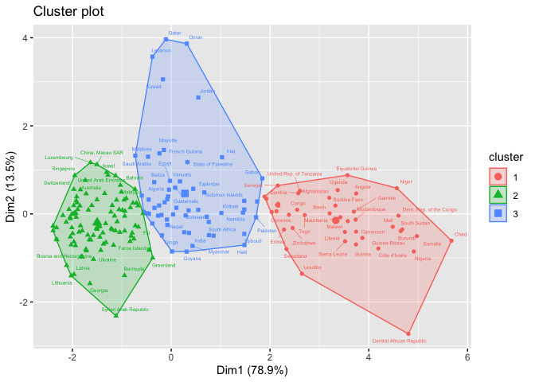<!-- -->

<!-- -->


<!--html_preserve--><div id="htmlwidget-00fd5458745c5b7a5477" style="width:672px;height:480px;" class="plotly html-widget"></div>
<script type="application/json" data-for="htmlwidget-00fd5458745c5b7a5477">{"x":{"data":[{"x":[-2.79624913854248,-2.79624913854248,-2.79624913854248,-2.79624913854248,-2.79624913854248,-2.79624913854248,-2.79624913854248,-2.79624913854248,-2.79624913854248,-2.79624913854248,-2.79624913854248,-2.79624913854248,-2.79624913854248,-2.79624913854248,-2.79624913854248,-2.79624913854248,-2.79624913854248,-2.79624913854248,-2.79624913854248,-2.79624913854248,-2.79624913854248,-2.79624913854248,-2.79624913854248,-2.79624913854248,-2.79624913854248,-2.79624913854248,-2.79624913854248,-2.79624913854248,-2.79624913854248,-2.79624913854248,-2.79624913854248,-2.79624913854248,-2.79624913854248,-2.79624913854248,-2.79624913854248,-2.79624913854248,-2.79624913854248,-2.79624913854248,-2.79624913854248,-2.79624913854248,-2.79624913854248,-2.79624913854248,-2.79624913854248,-2.79624913854248,-2.79624913854248,-2.79624913854248,-2.79624913854248,-2.79624913854248,-2.79624913854248,-2.79624913854248,-2.79624913854248,-2.79624913854248,-2.79624913854248,-2.79624913854248,-2.79624913854248,-2.79624913854248,-2.79624913854248,-2.79624913854248,-2.79624913854248,-2.79624913854248,-2.79624913854248,-2.79624913854248,-2.79624913854248,-2.79624913854248,-2.79624913854248,-2.79624913854248,-2.79624913854248,-2.79624913854248,-2.79624913854248,-2.79624913854248,-2.79624913854248,-2.79624913854248,-2.79624913854248,-2.79624913854248,-2.79624913854248,-2.79624913854248,-2.79624913854248,-2.79624913854248,-2.79624913854248,-2.79624913854248,-2.79624913854248,-2.79624913854248,-2.79624913854248,-2.79624913854248,-2.79624913854248,-2.79624913854248,-2.79624913854248,-2.79624913854248,-2.79624913854248,-2.79624913854248,-2.79624913854248,-2.79624913854248,-2.79624913854248,-2.79624913854248,-2.79624913854248,-2.79624913854248,-2.79624913854248,-2.79624913854248,-2.79624913854248,-2.79624913854248,-2.79624913854248,-2.79624913854248,-2.79624913854248,-2.79624913854248,-2.79624913854248,-2.79624913854248,-2.79624913854248,-2.79624913854248,-2.79624913854248,-2.79624913854248,-2.79624913854248,-2.79624913854248,-2.79624913854248,-2.79624913854248,-2.79624913854248,-2.79624913854248,-2.79624913854248,-2.79624913854248,-2.79624913854248,-2.79624913854248,-2.79624913854248,-2.79624913854248,-2.79624913854248,-2.79624913854248,-2.79624913854248,-2.79624913854248,-2.79624913854248,-2.79624913854248,-2.79624913854248,-2.79624913854248,-2.79624913854248,-2.79624913854248,-2.79624913854248,-2.79624913854248,-2.79624913854248,-2.79624913854248,-2.79624913854248,-2.79624913854248,-2.79624913854248,-2.79624913854248,-2.79624913854248,-2.79624913854248,-2.79624913854248,-2.79624913854248,-2.79624913854248,-2.79624913854248,-2.79624913854248,-2.79624913854248,-2.79624913854248,-2.79624913854248,-2.79624913854248,-2.79624913854248,-2.79624913854248,-2.79624913854248,-2.79624913854248,-2.79624913854248,-2.79624913854248,-2.79624913854248,-2.79624913854248,-2.79624913854248,-2.79624913854248,-2.79624913854248,-2.79624913854248,-2.79624913854248,-2.79624913854248,-2.79624913854248,-2.79624913854248,-2.79624913854248,-2.79624913854248,-2.79624913854248,-2.79624913854248,-2.79624913854248,-2.79624913854248,-2.79624913854248,-2.79624913854248,-2.79624913854248,-2.79624913854248,-2.79624913854248,-2.79624913854248,-2.79624913854248,-2.79624913854248,-2.79624913854248,-2.79624913854248,-2.79624913854248,-2.79624913854248,-2.79624913854248,-2.79624913854248,-2.79624913854248,-2.79624913854248,-2.79624913854248,-2.79624913854248,-2.79624913854248,-2.79624913854248,-2.79624913854248,-2.79624913854248,-2.79624913854248,-2.79624913854248,-2.79624913854248,-2.79624913854248,-2.79624913854248,-2.79624913854248,-2.79624913854248,-2.79624913854248,6.07985902485115,6.07985902485115,6.07985902485115,6.07985902485115,6.07985902485115,6.07985902485115,6.07985902485115,6.07985902485115,6.07985902485115,6.07985902485115,6.07985902485115,6.07985902485115,6.07985902485115,6.07985902485115,6.07985902485115,6.07985902485115,6.07985902485115,6.07985902485115,6.07985902485115,6.07985902485115,6.07985902485115,6.07985902485115,6.07985902485115,6.07985902485115,6.07985902485115,6.07985902485115,6.07985902485115,6.07985902485115,6.07985902485115,6.07985902485115,6.07985902485115,6.07985902485115,6.07985902485115,6.07985902485115,6.07985902485115,6.07985902485115,6.07985902485115,6.07985902485115,6.07985902485115,6.07985902485115,6.07985902485115,6.07985902485115,6.07985902485115,6.07985902485115,6.07985902485115,6.07985902485115,6.07985902485115,6.07985902485115,6.07985902485115,6.07985902485115,6.07985902485115,6.07985902485115,6.07985902485115,6.07985902485115,6.07985902485115,6.07985902485115,6.07985902485115,6.07985902485115,6.07985902485115,6.07985902485115,6.07985902485115,6.07985902485115,6.07985902485115,6.07985902485115,6.07985902485115,6.07985902485115,6.07985902485115,6.07985902485115,6.07985902485115,6.07985902485115,6.07985902485115,6.07985902485115,6.07985902485115,6.07985902485115,6.07985902485115,6.07985902485115,6.07985902485115,6.07985902485115,6.07985902485115,6.07985902485115,6.07985902485115,6.07985902485115,6.07985902485115,6.07985902485115,6.07985902485115,6.07985902485115,6.07985902485115,6.07985902485115,6.07985902485115,6.07985902485115,6.07985902485115,6.07985902485115,6.07985902485115,6.07985902485115,6.07985902485115,6.07985902485115,6.07985902485115,6.07985902485115,6.07985902485115,6.07985902485115,6.07985902485115,6.07985902485115,6.07985902485115,6.07985902485115,6.07985902485115,6.07985902485115,6.07985902485115,6.07985902485115,6.07985902485115,6.07985902485115,6.07985902485115,6.07985902485115,6.07985902485115,6.07985902485115,6.07985902485115,6.07985902485115,6.07985902485115,6.07985902485115,6.07985902485115,6.07985902485115,6.07985902485115,6.07985902485115,6.07985902485115,6.07985902485115,6.07985902485115,6.07985902485115,6.07985902485115,6.07985902485115,6.07985902485115,6.07985902485115,6.07985902485115,6.07985902485115,6.07985902485115,6.07985902485115,6.07985902485115,6.07985902485115,6.07985902485115,6.07985902485115,6.07985902485115,6.07985902485115,6.07985902485115,6.07985902485115,6.07985902485115,6.07985902485115,6.07985902485115,6.07985902485115,6.07985902485115,6.07985902485115,6.07985902485115,6.07985902485115,6.07985902485115,6.07985902485115,6.07985902485115,6.07985902485115,6.07985902485115,6.07985902485115,6.07985902485115,6.07985902485115,6.07985902485115,6.07985902485115,6.07985902485115,6.07985902485115,6.07985902485115,6.07985902485115,6.07985902485115,6.07985902485115,6.07985902485115,6.07985902485115,6.07985902485115,6.07985902485115,6.07985902485115,6.07985902485115,6.07985902485115,6.07985902485115,6.07985902485115,6.07985902485115,6.07985902485115,6.07985902485115,6.07985902485115,6.07985902485115,6.07985902485115,6.07985902485115,6.07985902485115,6.07985902485115,6.07985902485115,6.07985902485115,6.07985902485115,6.07985902485115,6.07985902485115,6.07985902485115,6.07985902485115,6.07985902485115,6.07985902485115,6.07985902485115,6.07985902485115,6.07985902485115,6.07985902485115,6.07985902485115,6.07985902485115,6.07985902485115,6.07985902485115,6.07985902485115,6.07985902485115],"y":[0,0,0,0,0,0,0,0,0,0,0,0,0,0,0,0,0,0,0,0,0,0,0,0,0,0,0,0,0,0,0,0,0,0,0,0,0,0,0,0,0,0,0,0,0,0,0,0,0,0,0,0,0,0,0,0,0,0,0,0,0,0,0,0,0,0,0,0,0,0,0,0,0,0,0,0,0,0,0,0,0,0,0,0,0,0,0,0,0,0,0,0,0,0,0,0,0,0,0,0,0,0,0,0,0,0,0,0,0,0,0,0,0,0,0,0,0,0,0,0,0,0,0,0,0,0,0,0,0,0,0,0,0,0,0,0,0,0,0,0,0,0,0,0,0,0,0,0,0,0,0,0,0,0,0,0,0,0,0,0,0,0,0,0,0,0,0,0,0,0,0,0,0,0,0,0,0,0,0,0,0,0,0,0,0,0,0,0,0,0,0,0,0,0,0,0,0,0,0,0,0,0,0,0,0,0,0,0,0,0,0,0,0,0,0,0,0,0,0,0,0,0,0,0,0,0,0,0,0,0,0,0,0,0,0,0,0,0,0,0,0,0,0,0,0,0,0,0,0,0,0,0,0,0,0,0,0,0,0,0,0,0,0,0,0,0,0,0,0,0,0,0,0,0,0,0,0,0,0,0,0,0,0,0,0,0,0,0,0,0,0,0,0,0,0,0,0,0,0,0,0,0,0,0,0,0,0,0,0,0,0,0,0,0,0,0,0,0,0,0,0,0,0,0,0,0,0,0,0,0,0,0,0,0,0,0,0,0,0,0,0,0,0,0,0,0,0,0,0,0,0,0,0,0,0,0,0,0,0,0,0,0,0,0,0,0,0,0,0,0,0,0,0,0,0,0,0,0,0,0,0,0,0,0,0,0,0,0,0,0,0,0,0,0,0,0,0,0,0,0,0,0,0,0,0,0],"text":"","type":"scatter","mode":"lines","line":{"width":0.755905511811024,"color":"rgba(0,0,0,0.5)","dash":"dash"},"hoveron":"points","showlegend":false,"xaxis":"x","yaxis":"y","hoverinfo":"text","frame":null},{"x":[0,0,0,0,0,0,0,0,0,0,0,0,0,0,0,0,0,0,0,0,0,0,0,0,0,0,0,0,0,0,0,0,0,0,0,0,0,0,0,0,0,0,0,0,0,0,0,0,0,0,0,0,0,0,0,0,0,0,0,0,0,0,0,0,0,0,0,0,0,0,0,0,0,0,0,0,0,0,0,0,0,0,0,0,0,0,0,0,0,0,0,0,0,0,0,0,0,0,0,0,0,0,0,0,0,0,0,0,0,0,0,0,0,0,0,0,0,0,0,0,0,0,0,0,0,0,0,0,0,0,0,0,0,0,0,0,0,0,0,0,0,0,0,0,0,0,0,0,0,0,0,0,0,0,0,0,0,0,0,0,0,0,0,0,0,0,0,0,0,0,0,0,0,0,0,0,0,0,0,0,0,0,0,0,0,0,0,0,0,0,0,0,0,0,0,0,0,0,0,0,0,0,0,0,0,0,0,0,0,0,0,0,0,0,0,0,0,0,0,0,0,0,0,0,0,0,0,0,0,0,0,0,0,0,0,0,0,0,0,0,0,0,0,0,0,0,0,0,0,0,0,0,0,0,0,0,0,0,0,0,0,0,0,0,0,0,0,0,0,0,0,0,0,0,0,0,0,0,0,0,0,0,0,0,0,0,0,0,0,0,0,0,0,0,0,0,0,0,0,0,0,0,0,0,0,0,0,0,0,0,0,0,0,0,0,0,0,0,0,0,0,0,0,0,0,0,0,0,0,0,0,0,0,0,0,0,0,0,0,0,0,0,0,0,0,0,0,0,0,0,0,0,0,0,0,0,0,0,0,0,0,0,0,0,0,0,0,0,0,0,0,0,0,0,0,0,0,0,0,0,0,0,0,0,0,0,0,0,0,0,0,0,0,0,0,0,0,0,0,0,0,0,0,0,0,0],"y":[-3.05828141123623,-3.05828141123623,-3.05828141123623,-3.05828141123623,-3.05828141123623,-3.05828141123623,-3.05828141123623,-3.05828141123623,-3.05828141123623,-3.05828141123623,-3.05828141123623,-3.05828141123623,-3.05828141123623,-3.05828141123623,-3.05828141123623,-3.05828141123623,-3.05828141123623,-3.05828141123623,-3.05828141123623,-3.05828141123623,-3.05828141123623,-3.05828141123623,-3.05828141123623,-3.05828141123623,-3.05828141123623,-3.05828141123623,-3.05828141123623,-3.05828141123623,-3.05828141123623,-3.05828141123623,-3.05828141123623,-3.05828141123623,-3.05828141123623,-3.05828141123623,-3.05828141123623,-3.05828141123623,-3.05828141123623,-3.05828141123623,-3.05828141123623,-3.05828141123623,-3.05828141123623,-3.05828141123623,-3.05828141123623,-3.05828141123623,-3.05828141123623,-3.05828141123623,-3.05828141123623,-3.05828141123623,-3.05828141123623,-3.05828141123623,-3.05828141123623,-3.05828141123623,-3.05828141123623,-3.05828141123623,-3.05828141123623,-3.05828141123623,-3.05828141123623,-3.05828141123623,-3.05828141123623,-3.05828141123623,-3.05828141123623,-3.05828141123623,-3.05828141123623,-3.05828141123623,-3.05828141123623,-3.05828141123623,-3.05828141123623,-3.05828141123623,-3.05828141123623,-3.05828141123623,-3.05828141123623,-3.05828141123623,-3.05828141123623,-3.05828141123623,-3.05828141123623,-3.05828141123623,-3.05828141123623,-3.05828141123623,-3.05828141123623,-3.05828141123623,-3.05828141123623,-3.05828141123623,-3.05828141123623,-3.05828141123623,-3.05828141123623,-3.05828141123623,-3.05828141123623,-3.05828141123623,-3.05828141123623,-3.05828141123623,-3.05828141123623,-3.05828141123623,-3.05828141123623,-3.05828141123623,-3.05828141123623,-3.05828141123623,-3.05828141123623,-3.05828141123623,-3.05828141123623,-3.05828141123623,-3.05828141123623,-3.05828141123623,-3.05828141123623,-3.05828141123623,-3.05828141123623,-3.05828141123623,-3.05828141123623,-3.05828141123623,-3.05828141123623,-3.05828141123623,-3.05828141123623,-3.05828141123623,-3.05828141123623,-3.05828141123623,-3.05828141123623,-3.05828141123623,-3.05828141123623,-3.05828141123623,-3.05828141123623,-3.05828141123623,-3.05828141123623,-3.05828141123623,-3.05828141123623,-3.05828141123623,-3.05828141123623,-3.05828141123623,-3.05828141123623,-3.05828141123623,-3.05828141123623,-3.05828141123623,-3.05828141123623,-3.05828141123623,-3.05828141123623,-3.05828141123623,-3.05828141123623,-3.05828141123623,-3.05828141123623,-3.05828141123623,-3.05828141123623,-3.05828141123623,-3.05828141123623,-3.05828141123623,-3.05828141123623,-3.05828141123623,-3.05828141123623,-3.05828141123623,-3.05828141123623,-3.05828141123623,-3.05828141123623,-3.05828141123623,-3.05828141123623,-3.05828141123623,-3.05828141123623,-3.05828141123623,-3.05828141123623,-3.05828141123623,-3.05828141123623,-3.05828141123623,-3.05828141123623,-3.05828141123623,-3.05828141123623,-3.05828141123623,-3.05828141123623,-3.05828141123623,-3.05828141123623,-3.05828141123623,-3.05828141123623,-3.05828141123623,-3.05828141123623,-3.05828141123623,-3.05828141123623,-3.05828141123623,-3.05828141123623,-3.05828141123623,-3.05828141123623,-3.05828141123623,-3.05828141123623,-3.05828141123623,-3.05828141123623,-3.05828141123623,-3.05828141123623,-3.05828141123623,-3.05828141123623,-3.05828141123623,-3.05828141123623,-3.05828141123623,-3.05828141123623,-3.05828141123623,-3.05828141123623,-3.05828141123623,-3.05828141123623,-3.05828141123623,-3.05828141123623,-3.05828141123623,-3.05828141123623,-3.05828141123623,-3.05828141123623,-3.05828141123623,-3.05828141123623,-3.05828141123623,-3.05828141123623,-3.05828141123623,-3.05828141123623,4.2993362871483,4.2993362871483,4.2993362871483,4.2993362871483,4.2993362871483,4.2993362871483,4.2993362871483,4.2993362871483,4.2993362871483,4.2993362871483,4.2993362871483,4.2993362871483,4.2993362871483,4.2993362871483,4.2993362871483,4.2993362871483,4.2993362871483,4.2993362871483,4.2993362871483,4.2993362871483,4.2993362871483,4.2993362871483,4.2993362871483,4.2993362871483,4.2993362871483,4.2993362871483,4.2993362871483,4.2993362871483,4.2993362871483,4.2993362871483,4.2993362871483,4.2993362871483,4.2993362871483,4.2993362871483,4.2993362871483,4.2993362871483,4.2993362871483,4.2993362871483,4.2993362871483,4.2993362871483,4.2993362871483,4.2993362871483,4.2993362871483,4.2993362871483,4.2993362871483,4.2993362871483,4.2993362871483,4.2993362871483,4.2993362871483,4.2993362871483,4.2993362871483,4.2993362871483,4.2993362871483,4.2993362871483,4.2993362871483,4.2993362871483,4.2993362871483,4.2993362871483,4.2993362871483,4.2993362871483,4.2993362871483,4.2993362871483,4.2993362871483,4.2993362871483,4.2993362871483,4.2993362871483,4.2993362871483,4.2993362871483,4.2993362871483,4.2993362871483,4.2993362871483,4.2993362871483,4.2993362871483,4.2993362871483,4.2993362871483,4.2993362871483,4.2993362871483,4.2993362871483,4.2993362871483,4.2993362871483,4.2993362871483,4.2993362871483,4.2993362871483,4.2993362871483,4.2993362871483,4.2993362871483,4.2993362871483,4.2993362871483,4.2993362871483,4.2993362871483,4.2993362871483,4.2993362871483,4.2993362871483,4.2993362871483,4.2993362871483,4.2993362871483,4.2993362871483,4.2993362871483,4.2993362871483,4.2993362871483,4.2993362871483,4.2993362871483,4.2993362871483,4.2993362871483,4.2993362871483,4.2993362871483,4.2993362871483,4.2993362871483,4.2993362871483,4.2993362871483,4.2993362871483,4.2993362871483,4.2993362871483,4.2993362871483,4.2993362871483,4.2993362871483,4.2993362871483,4.2993362871483,4.2993362871483,4.2993362871483,4.2993362871483,4.2993362871483,4.2993362871483,4.2993362871483,4.2993362871483,4.2993362871483,4.2993362871483,4.2993362871483,4.2993362871483,4.2993362871483,4.2993362871483,4.2993362871483,4.2993362871483,4.2993362871483,4.2993362871483,4.2993362871483,4.2993362871483,4.2993362871483,4.2993362871483,4.2993362871483,4.2993362871483,4.2993362871483,4.2993362871483,4.2993362871483,4.2993362871483,4.2993362871483,4.2993362871483,4.2993362871483,4.2993362871483,4.2993362871483,4.2993362871483,4.2993362871483,4.2993362871483,4.2993362871483,4.2993362871483,4.2993362871483,4.2993362871483,4.2993362871483,4.2993362871483,4.2993362871483,4.2993362871483,4.2993362871483,4.2993362871483,4.2993362871483,4.2993362871483,4.2993362871483,4.2993362871483,4.2993362871483,4.2993362871483,4.2993362871483,4.2993362871483,4.2993362871483,4.2993362871483,4.2993362871483,4.2993362871483,4.2993362871483,4.2993362871483,4.2993362871483,4.2993362871483,4.2993362871483,4.2993362871483,4.2993362871483,4.2993362871483,4.2993362871483,4.2993362871483,4.2993362871483,4.2993362871483,4.2993362871483,4.2993362871483,4.2993362871483,4.2993362871483,4.2993362871483,4.2993362871483,4.2993362871483,4.2993362871483,4.2993362871483,4.2993362871483,4.2993362871483,4.2993362871483,4.2993362871483,4.2993362871483,4.2993362871483,4.2993362871483],"text":"","type":"scatter","mode":"lines","line":{"width":0.755905511811024,"color":"rgba(0,0,0,0.5)","dash":"dash"},"hoveron":"points","showlegend":false,"xaxis":"x","yaxis":"y","hoverinfo":"text","frame":null},{"x":[4.64799611767563,3.74310369430604,4.80184411075973,5.67639956287872,2.38384242236889,2.55040461943119,4.60047380267332,3.2081670079924,3.56782981849925,2.16546000159113,2.28458783759858,3.74574676305699,3.69741989642624,2.03514430086975,3.74165966089136,4.19437588812892,2.14284973809934,2.64736065801753,3.51630786610824,1.88912063889772,3.57485064818608,4.48435014827918,3.42457361854982,3.73337342921847,4.56847812406171,4.91160293717301,3.87066755693048,2.15791072251662,3.52010371877402,4.97339259051642,2.45829683112209,4.67793479088903,2.1313327586698,2.33237763794943,2.70405843858006,3.37061508714424,2.60563083381478,3.32447791461794,2.57280613217526],"y":[-0.389253139547675,-0.403678138763628,-2.72384424312785,-0.607752621031836,-0.0198896107889862,0.0942877642616105,-0.0386221953678484,0.0124167269997965,0.879954201639348,0.229608819680328,-0.354292710341683,0.464397078478513,0.0514082536899233,0.0416836009133174,-0.693960698235465,-0.784574498799781,0.202244345560991,-1.35927214104446,-0.409309570849246,0.391444303425715,-0.164367230730366,-0.292246080971739,-0.0753297737460278,-0.129913838350811,0.584348487967981,-0.851696843184864,-0.546210771689085,0.644448340974989,-0.621084726742111,-0.503636271603492,-0.318848268837143,-0.351952624749716,0.0604951351057001,-0.797460974923997,-0.0258348226473712,0.538986608165093,0.524654204450754,0.189084383299365,0.469287471204088],"text":["clust : 1 <br />                      continent : Africa <br />                      country : Burundi <br />                      inf.mort : 77.9 <br />                      life.exp.both : 56.1 <br />                      maternal.mort.ratio : 712 <br />                      pop.increase : 3 <br />                      tot.fertil.rate : 6","clust : 1 <br />                      continent : Africa <br />                      country : Cameroon <br />                      inf.mort : 67.5 <br />                      life.exp.both : 56.4 <br />                      maternal.mort.ratio : 596 <br />                      pop.increase : 2.7 <br />                      tot.fertil.rate : 5","clust : 1 <br />                      continent : Africa <br />                      country : Central African Republic <br />                      inf.mort : 93.5 <br />                      life.exp.both : 49.4 <br />                      maternal.mort.ratio : 882 <br />                      pop.increase : 0.4 <br />                      tot.fertil.rate : 5.1","clust : 1 <br />                      continent : Africa <br />                      country : Chad <br />                      inf.mort : 91.2 <br />                      life.exp.both : 51.7 <br />                      maternal.mort.ratio : 856 <br />                      pop.increase : 3.3 <br />                      tot.fertil.rate : 6.3","clust : 1 <br />                      continent : Africa <br />                      country : Comoros <br />                      inf.mort : 58.1 <br />                      life.exp.both : 62.8 <br />                      maternal.mort.ratio : 335 <br />                      pop.increase : 2.4 <br />                      tot.fertil.rate : 4.6","clust : 1 <br />                      continent : Africa <br />                      country : Congo <br />                      inf.mort : 46.5 <br />                      life.exp.both : 62.5 <br />                      maternal.mort.ratio : 442 <br />                      pop.increase : 2.6 <br />                      tot.fertil.rate : 4.9","clust : 1 <br />                      continent : Africa <br />                      country : Dem. Rep. of the Congo <br />                      inf.mort : 73.2 <br />                      life.exp.both : 58.1 <br />                      maternal.mort.ratio : 693 <br />                      pop.increase : 3.3 <br />                      tot.fertil.rate : 6.4","clust : 1 <br />                      continent : Africa <br />                      country : Benin <br />                      inf.mort : 67.7 <br />                      life.exp.both : 59.9 <br />                      maternal.mort.ratio : 405 <br />                      pop.increase : 2.8 <br />                      tot.fertil.rate : 5.2","clust : 1 <br />                      continent : Africa <br />                      country : Equatorial Guinea <br />                      inf.mort : 70 <br />                      life.exp.both : 56.8 <br />                      maternal.mort.ratio : 342 <br />                      pop.increase : 4.2 <br />                      tot.fertil.rate : 5","clust : 1 <br />                      continent : Africa <br />                      country : Ethiopia <br />                      inf.mort : 45.8 <br />                      life.exp.both : 63.7 <br />                      maternal.mort.ratio : 353 <br />                      pop.increase : 2.6 <br />                      tot.fertil.rate : 4.6","clust : 1 <br />                      continent : Africa <br />                      country : Eritrea <br />                      inf.mort : 45 <br />                      life.exp.both : 63.4 <br />                      maternal.mort.ratio : 501 <br />                      pop.increase : 2 <br />                      tot.fertil.rate : 4.4","clust : 1 <br />                      continent : Africa <br />                      country : Angola <br />                      inf.mort : 65.4 <br />                      life.exp.both : 60.2 <br />                      maternal.mort.ratio : 477 <br />                      pop.increase : 3.5 <br />                      tot.fertil.rate : 6","clust : 1 <br />                      continent : Africa <br />                      country : Gambia <br />                      inf.mort : 49.8 <br />                      life.exp.both : 60.3 <br />                      maternal.mort.ratio : 706 <br />                      pop.increase : 3.1 <br />                      tot.fertil.rate : 5.6","clust : 1 <br />                      continent : Africa <br />                      country : Ghana <br />                      inf.mort : 46.5 <br />                      life.exp.both : 61.7 <br />                      maternal.mort.ratio : 319 <br />                      pop.increase : 2.4 <br />                      tot.fertil.rate : 4.2","clust : 1 <br />                      continent : Africa <br />                      country : Guinea <br />                      inf.mort : 65.7 <br />                      life.exp.both : 57.9 <br />                      maternal.mort.ratio : 679 <br />                      pop.increase : 2.3 <br />                      tot.fertil.rate : 5.1","clust : 1 <br />                      continent : Africa <br />                      country : Côte d'Ivoire <br />                      inf.mort : 71.6 <br />                      life.exp.both : 51.7 <br />                      maternal.mort.ratio : 645 <br />                      pop.increase : 2.5 <br />                      tot.fertil.rate : 5.1","clust : 1 <br />                      continent : Africa <br />                      country : Kenya <br />                      inf.mort : 39.4 <br />                      life.exp.both : 65.4 <br />                      maternal.mort.ratio : 510 <br />                      pop.increase : 2.7 <br />                      tot.fertil.rate : 4.1","clust : 1 <br />                      continent : Africa <br />                      country : Lesotho <br />                      inf.mort : 59.8 <br />                      life.exp.both : 52.5 <br />                      maternal.mort.ratio : 487 <br />                      pop.increase : 1.3 <br />                      tot.fertil.rate : 3.3","clust : 1 <br />                      continent : Africa <br />                      country : Liberia <br />                      inf.mort : 59 <br />                      life.exp.both : 60.7 <br />                      maternal.mort.ratio : 725 <br />                      pop.increase : 2.6 <br />                      tot.fertil.rate : 4.8","clust : 1 <br />                      continent : Africa <br />                      country : Madagascar <br />                      inf.mort : 36.8 <br />                      life.exp.both : 64.5 <br />                      maternal.mort.ratio : 353 <br />                      pop.increase : 2.7 <br />                      tot.fertil.rate : 4.4","clust : 1 <br />                      continent : Africa <br />                      country : Malawi <br />                      inf.mort : 66.5 <br />                      life.exp.both : 60.7 <br />                      maternal.mort.ratio : 634 <br />                      pop.increase : 2.9 <br />                      tot.fertil.rate : 4.9","clust : 1 <br />                      continent : Africa <br />                      country : Mali <br />                      inf.mort : 78.5 <br />                      life.exp.both : 56.2 <br />                      maternal.mort.ratio : 587 <br />                      pop.increase : 2.9 <br />                      tot.fertil.rate : 6.4","clust : 1 <br />                      continent : Africa <br />                      country : Mauritania <br />                      inf.mort : 68 <br />                      life.exp.both : 62.6 <br />                      maternal.mort.ratio : 602 <br />                      pop.increase : 2.9 <br />                      tot.fertil.rate : 4.9","clust : 1 <br />                      continent : Africa <br />                      country : Mozambique <br />                      inf.mort : 67.3 <br />                      life.exp.both : 56.1 <br />                      maternal.mort.ratio : 489 <br />                      pop.increase : 2.9 <br />                      tot.fertil.rate : 5.5","clust : 1 <br />                      continent : Africa <br />                      country : Niger <br />                      inf.mort : 65.8 <br />                      life.exp.both : 58.5 <br />                      maternal.mort.ratio : 553 <br />                      pop.increase : 3.8 <br />                      tot.fertil.rate : 7.4","clust : 1 <br />                      continent : Africa <br />                      country : Nigeria <br />                      inf.mort : 76.3 <br />                      life.exp.both : 51.9 <br />                      maternal.mort.ratio : 814 <br />                      pop.increase : 2.7 <br />                      tot.fertil.rate : 5.7","clust : 1 <br />                      continent : Africa <br />                      country : Guinea-Bissau <br />                      inf.mort : 80.4 <br />                      life.exp.both : 56 <br />                      maternal.mort.ratio : 549 <br />                      pop.increase : 2.6 <br />                      tot.fertil.rate : 4.9","clust : 1 <br />                      continent : Africa <br />                      country : Senegal <br />                      inf.mort : 43.9 <br />                      life.exp.both : 65.7 <br />                      maternal.mort.ratio : 315 <br />                      pop.increase : 3 <br />                      tot.fertil.rate : 5","clust : 1 <br />                      continent : Africa <br />                      country : Sierra Leone <br />                      inf.mort : 94.4 <br />                      life.exp.both : 50.2 <br />                      maternal.mort.ratio : 162.184210526316 <br />                      pop.increase : 2.3 <br />                      tot.fertil.rate : 4.8","clust : 1 <br />                      continent : Africa <br />                      country : Somalia <br />                      inf.mort : 79.5 <br />                      life.exp.both : 54.9 <br />                      maternal.mort.ratio : 732 <br />                      pop.increase : 2.9 <br />                      tot.fertil.rate : 6.6","clust : 1 <br />                      continent : Africa <br />                      country : Zimbabwe <br />                      inf.mort : 46.5 <br />                      life.exp.both : 57.6 <br />                      maternal.mort.ratio : 443 <br />                      pop.increase : 2.3 <br />                      tot.fertil.rate : 4","clust : 1 <br />                      continent : Africa <br />                      country : South Sudan <br />                      inf.mort : 77.7 <br />                      life.exp.both : 55.1 <br />                      maternal.mort.ratio : 789 <br />                      pop.increase : 3.3 <br />                      tot.fertil.rate : 5.2","clust : 1 <br />                      continent : Africa <br />                      country : Sudan <br />                      inf.mort : 48.7 <br />                      life.exp.both : 63.6 <br />                      maternal.mort.ratio : 311 <br />                      pop.increase : 2.3 <br />                      tot.fertil.rate : 4.8","clust : 1 <br />                      continent : Africa <br />                      country : Swaziland <br />                      inf.mort : 56.3 <br />                      life.exp.both : 55 <br />                      maternal.mort.ratio : 389 <br />                      pop.increase : 1.8 <br />                      tot.fertil.rate : 3.3","clust : 1 <br />                      continent : Africa <br />                      country : Togo <br />                      inf.mort : 55.7 <br />                      life.exp.both : 59.1 <br />                      maternal.mort.ratio : 368 <br />                      pop.increase : 2.6 <br />                      tot.fertil.rate : 4.7","clust : 1 <br />                      continent : Africa <br />                      country : Uganda <br />                      inf.mort : 60.2 <br />                      life.exp.both : 58.6 <br />                      maternal.mort.ratio : 343 <br />                      pop.increase : 3.4 <br />                      tot.fertil.rate : 5.9","clust : 1 <br />                      continent : Africa <br />                      country : United Rep. of Tanzania <br />                      inf.mort : 44 <br />                      life.exp.both : 62.8 <br />                      maternal.mort.ratio : 398 <br />                      pop.increase : 3.1 <br />                      tot.fertil.rate : 5.2","clust : 1 <br />                      continent : Africa <br />                      country : Burkina Faso <br />                      inf.mort : 64.8 <br />                      life.exp.both : 58.7 <br />                      maternal.mort.ratio : 371 <br />                      pop.increase : 3 <br />                      tot.fertil.rate : 5.6","clust : 1 <br />                      continent : Africa <br />                      country : Zambia <br />                      inf.mort : 53.8 <br />                      life.exp.both : 59.7 <br />                      maternal.mort.ratio : 224 <br />                      pop.increase : 3 <br />                      tot.fertil.rate : 5.2"],"type":"scatter","mode":"markers","marker":{"autocolorscale":false,"color":"rgba(248,118,109,1)","opacity":1,"size":5.66929133858268,"symbol":"circle","line":{"width":1.88976377952756,"color":"rgba(248,118,109,1)"}},"hoveron":"points","name":"(1,Africa)","legendgroup":"(1,Africa)","showlegend":true,"xaxis":"x","yaxis":"y","hoverinfo":"text","frame":null},{"x":[3.19973301355547,1.92602675202521,2.17017040933499],"y":[0.36786248283657,0.342526280601139,0.187326341679653],"text":["clust : 1 <br />                      continent : Asia <br />                      country : Afghanistan <br />                      inf.mort : 68.6 <br />                      life.exp.both : 62.3 <br />                      maternal.mort.ratio : 396 <br />                      pop.increase : 3.2 <br />                      tot.fertil.rate : 5.3","clust : 1 <br />                      continent : Asia <br />                      country : Timor-Leste <br />                      inf.mort : 43.9 <br />                      life.exp.both : 67.7 <br />                      maternal.mort.ratio : 215 <br />                      pop.increase : 2.2 <br />                      tot.fertil.rate : 5.9","clust : 1 <br />                      continent : Asia <br />                      country : Yemen <br />                      inf.mort : 47.2 <br />                      life.exp.both : 64.2 <br />                      maternal.mort.ratio : 385 <br />                      pop.increase : 2.6 <br />                      tot.fertil.rate : 4.4"],"type":"scatter","mode":"markers","marker":{"autocolorscale":false,"color":"rgba(248,118,109,1)","opacity":1,"size":5.66929133858268,"symbol":"square","line":{"width":1.88976377952756,"color":"rgba(248,118,109,1)"}},"hoveron":"points","name":"(1,Asia)","legendgroup":"(1,Asia)","showlegend":true,"xaxis":"x","yaxis":"y","hoverinfo":"text","frame":null},{"x":[-0.83305040550892,-1.44354328832425,-1.22160040091447,-0.789515913366742,-0.825808448824308],"y":[-0.623332327995219,-0.524101603615886,0.045226697177237,-0.431644944977678,0.144494464678155],"text":["clust : 2 <br />                      continent : Africa <br />                      country : Libya <br />                      inf.mort : 24.3 <br />                      life.exp.both : 71.5 <br />                      maternal.mort.ratio : 9 <br />                      pop.increase : 0.2 <br />                      tot.fertil.rate : 2.4","clust : 2 <br />                      continent : Africa <br />                      country : Mauritius <br />                      inf.mort : 12 <br />                      life.exp.both : 74.1 <br />                      maternal.mort.ratio : 53 <br />                      pop.increase : 0.2 <br />                      tot.fertil.rate : 1.5","clust : 2 <br />                      continent : Africa <br />                      country : Réunion <br />                      inf.mort : 4.2 <br />                      life.exp.both : 79.5 <br />                      maternal.mort.ratio : 162.184210526316 <br />                      pop.increase : 0.8 <br />                      tot.fertil.rate : 2.4","clust : 2 <br />                      continent : Africa <br />                      country : Seychelles <br />                      inf.mort : 10.2 <br />                      life.exp.both : 72.9 <br />                      maternal.mort.ratio : 162.184210526316 <br />                      pop.increase : 0.5 <br />                      tot.fertil.rate : 2.4","clust : 2 <br />                      continent : Africa <br />                      country : Tunisia <br />                      inf.mort : 18.5 <br />                      life.exp.both : 75 <br />                      maternal.mort.ratio : 62 <br />                      pop.increase : 1.2 <br />                      tot.fertil.rate : 2.3"],"type":"scatter","mode":"markers","marker":{"autocolorscale":false,"color":"rgba(0,186,56,1)","opacity":1,"size":5.66929133858268,"symbol":"circle","line":{"width":1.88976377952756,"color":"rgba(0,186,56,1)"}},"hoveron":"points","name":"(2,Africa)","legendgroup":"(2,Africa)","showlegend":true,"xaxis":"x","yaxis":"y","hoverinfo":"text","frame":null},{"x":[-1.91354659662687,-1.60765016805746,-0.942637720888974,-1.50185773667877,-1.83681299012842,-0.941354744332347,-0.934229044874699,-0.373393093815667,-1.21495096264877,-1.5764178635474,-1.05463844319934,-1.12971395711497,-1.10642717238321,-1.72648222794773,-0.911128606675457,-1.50120047660321,-0.951305382560856,-1.04043988106603,-0.568049745040252,-0.73178915386419,-0.945382000134114,-0.672205519463819,-2.04156085699144,-1.44471715413582,-1.16738870430533,-1.14708802264189,-0.755461021506956,-1.67564104277844,-1.37055638534699,-1.48849199553707,-0.703361707510073],"y":[0.392314960253248,0.192594138544629,-0.0500363845733152,0.324210694198439,-0.267166660560162,-0.385354290081095,0.0605778128054193,-0.998350232550343,-0.335731947516007,-0.486210722549353,0.099025325453843,-0.381052002853526,0.316357699682623,-0.799756348664776,0.353894499650336,-0.347143639833518,0.317828977909055,-0.416339628662019,0.0122190254775964,0.561877492627503,-1.39763456747179,0.185838199455954,-0.52093702226004,-0.285488459558485,-0.709453098177111,-0.0459066000933616,-0.565594215083216,0.0895779835381512,-0.68222699994772,-0.295407477192027,0.247323881932911],"text":["clust : 2 <br />                      continent : Americas <br />                      country : Canada <br />                      inf.mort : 4.7 <br />                      life.exp.both : 81.8 <br />                      maternal.mort.ratio : 7 <br />                      pop.increase : 1 <br />                      tot.fertil.rate : 1.6","clust : 2 <br />                      continent : Americas <br />                      country : Chile <br />                      inf.mort : 7.4 <br />                      life.exp.both : 78.8 <br />                      maternal.mort.ratio : 22 <br />                      pop.increase : 0.9 <br />                      tot.fertil.rate : 1.8","clust : 2 <br />                      continent : Americas <br />                      country : Colombia <br />                      inf.mort : 17.9 <br />                      life.exp.both : 73.7 <br />                      maternal.mort.ratio : 64 <br />                      pop.increase : 1 <br />                      tot.fertil.rate : 1.9","clust : 2 <br />                      continent : Americas <br />                      country : Costa Rica <br />                      inf.mort : 9.3 <br />                      life.exp.both : 79.2 <br />                      maternal.mort.ratio : 25 <br />                      pop.increase : 1.1 <br />                      tot.fertil.rate : 1.9","clust : 2 <br />                      continent : Americas <br />                      country : Cuba <br />                      inf.mort : 5.5 <br />                      life.exp.both : 79.2 <br />                      maternal.mort.ratio : 39 <br />                      pop.increase : 0.2 <br />                      tot.fertil.rate : 1.7","clust : 2 <br />                      continent : Americas <br />                      country : El Salvador <br />                      inf.mort : 17 <br />                      life.exp.both : 72.6 <br />                      maternal.mort.ratio : 54 <br />                      pop.increase : 0.5 <br />                      tot.fertil.rate : 2.2","clust : 2 <br />                      continent : Americas <br />                      country : Antigua and Barbuda <br />                      inf.mort : 9.1 <br />                      life.exp.both : 75.8 <br />                      maternal.mort.ratio : 162.184210526316 <br />                      pop.increase : 1.1 <br />                      tot.fertil.rate : 2.1","clust : 2 <br />                      continent : Americas <br />                      country : Greenland <br />                      inf.mort : 25.8465517241379 <br />                      life.exp.both : 71.3193965517241 <br />                      maternal.mort.ratio : 162.184210526316 <br />                      pop.increase : -0.1 <br />                      tot.fertil.rate : 2.83333333333333","clust : 2 <br />                      continent : Americas <br />                      country : Grenada <br />                      inf.mort : 9.6 <br />                      life.exp.both : 73.2 <br />                      maternal.mort.ratio : 27 <br />                      pop.increase : 0.4 <br />                      tot.fertil.rate : 2.2","clust : 2 <br />                      continent : Americas <br />                      country : Guadeloupe <br />                      inf.mort : 5.8 <br />                      life.exp.both : 80.5 <br />                      maternal.mort.ratio : 162.184210526316 <br />                      pop.increase : 0 <br />                      tot.fertil.rate : 2","clust : 2 <br />                      continent : Americas <br />                      country : Argentina <br />                      inf.mort : 13.7 <br />                      life.exp.both : 76 <br />                      maternal.mort.ratio : 52 <br />                      pop.increase : 1 <br />                      tot.fertil.rate : 2.3","clust : 2 <br />                      continent : Americas <br />                      country : Jamaica <br />                      inf.mort : 15 <br />                      life.exp.both : 75.5 <br />                      maternal.mort.ratio : 89 <br />                      pop.increase : 0.4 <br />                      tot.fertil.rate : 2.1","clust : 2 <br />                      continent : Americas <br />                      country : Bahamas <br />                      inf.mort : 9.1 <br />                      life.exp.both : 75.1 <br />                      maternal.mort.ratio : 80 <br />                      pop.increase : 1.4 <br />                      tot.fertil.rate : 1.8","clust : 2 <br />                      continent : Americas <br />                      country : Martinique <br />                      inf.mort : 6.4 <br />                      life.exp.both : 81.2 <br />                      maternal.mort.ratio : 162.184210526316 <br />                      pop.increase : -0.5 <br />                      tot.fertil.rate : 2","clust : 2 <br />                      continent : Americas <br />                      country : Mexico <br />                      inf.mort : 18.8 <br />                      life.exp.both : 76.5 <br />                      maternal.mort.ratio : 38 <br />                      pop.increase : 1.4 <br />                      tot.fertil.rate : 2.3","clust : 2 <br />                      continent : Americas <br />                      country : Barbados <br />                      inf.mort : 9.6 <br />                      life.exp.both : 75.4 <br />                      maternal.mort.ratio : 27 <br />                      pop.increase : 0.3 <br />                      tot.fertil.rate : 1.8","clust : 2 <br />                      continent : Americas <br />                      country : Curaçao <br />                      inf.mort : 10.3 <br />                      life.exp.both : 77.8 <br />                      maternal.mort.ratio : 162.184210526316 <br />                      pop.increase : 1.4 <br />                      tot.fertil.rate : 2.1","clust : 2 <br />                      continent : Americas <br />                      country : Aruba <br />                      inf.mort : 14.8 <br />                      life.exp.both : 75.4 <br />                      maternal.mort.ratio : 162.184210526316 <br />                      pop.increase : 0.5 <br />                      tot.fertil.rate : 1.8","clust : 2 <br />                      continent : Americas <br />                      country : Nicaragua <br />                      inf.mort : 20 <br />                      life.exp.both : 74.5 <br />                      maternal.mort.ratio : 150 <br />                      pop.increase : 1.2 <br />                      tot.fertil.rate : 2.3","clust : 2 <br />                      continent : Americas <br />                      country : Panama <br />                      inf.mort : 15.2 <br />                      life.exp.both : 77.3 <br />                      maternal.mort.ratio : 94 <br />                      pop.increase : 1.7 <br />                      tot.fertil.rate : 2.6","clust : 2 <br />                      continent : Americas <br />                      country : Bermuda <br />                      inf.mort : 25.8465517241379 <br />                      life.exp.both : 71.3193965517241 <br />                      maternal.mort.ratio : 162.184210526316 <br />                      pop.increase : -0.6 <br />                      tot.fertil.rate : 1.5","clust : 2 <br />                      continent : Americas <br />                      country : Peru <br />                      inf.mort : 18.6 <br />                      life.exp.both : 74.2 <br />                      maternal.mort.ratio : 68 <br />                      pop.increase : 1.3 <br />                      tot.fertil.rate : 2.5","clust : 2 <br />                      continent : Americas <br />                      country : Puerto Rico <br />                      inf.mort : 6.3 <br />                      life.exp.both : 79.2 <br />                      maternal.mort.ratio : 14 <br />                      pop.increase : -0.2 <br />                      tot.fertil.rate : 1.5","clust : 2 <br />                      continent : Americas <br />                      country : Saint Lucia <br />                      inf.mort : 10.9 <br />                      life.exp.both : 74.8 <br />                      maternal.mort.ratio : 48 <br />                      pop.increase : 0.5 <br />                      tot.fertil.rate : 1.5","clust : 2 <br />                      continent : Americas <br />                      country : Saint Vincent & Grenadines <br />                      inf.mort : 16.5 <br />                      life.exp.both : 72.7 <br />                      maternal.mort.ratio : 45 <br />                      pop.increase : 0 <br />                      tot.fertil.rate : 2","clust : 2 <br />                      continent : Americas <br />                      country : Brazil <br />                      inf.mort : 15.8 <br />                      life.exp.both : 74.7 <br />                      maternal.mort.ratio : 44 <br />                      pop.increase : 0.9 <br />                      tot.fertil.rate : 1.8","clust : 2 <br />                      continent : Americas <br />                      country : Trinidad and Tobago <br />                      inf.mort : 24.8 <br />                      life.exp.both : 70.2 <br />                      maternal.mort.ratio : 63 <br />                      pop.increase : 0.5 <br />                      tot.fertil.rate : 1.8","clust : 2 <br />                      continent : Americas <br />                      country : United States of America <br />                      inf.mort : 6 <br />                      life.exp.both : 78.9 <br />                      maternal.mort.ratio : 14 <br />                      pop.increase : 0.7 <br />                      tot.fertil.rate : 1.9","clust : 2 <br />                      continent : Americas <br />                      country : United States Virgin Islands <br />                      inf.mort : 9.3 <br />                      life.exp.both : 79.1 <br />                      maternal.mort.ratio : 162.184210526316 <br />                      pop.increase : -0.2 <br />                      tot.fertil.rate : 2.3","clust : 2 <br />                      continent : Americas <br />                      country : Uruguay <br />                      inf.mort : 12.7 <br />                      life.exp.both : 77 <br />                      maternal.mort.ratio : 15 <br />                      pop.increase : 0.3 <br />                      tot.fertil.rate : 2","clust : 2 <br />                      continent : Americas <br />                      country : Venezuela (Boliv. Rep. of) <br />                      inf.mort : 13.8 <br />                      life.exp.both : 73.9 <br />                      maternal.mort.ratio : 95 <br />                      pop.increase : 1.4 <br />                      tot.fertil.rate : 2.4"],"type":"scatter","mode":"markers","marker":{"autocolorscale":false,"color":"rgba(0,186,56,1)","opacity":1,"size":5.66929133858268,"symbol":"triangle-up","line":{"width":1.88976377952756,"color":"rgba(0,186,56,1)"}},"hoveron":"points","name":"(2,Americas)","legendgroup":"(2,Americas)","showlegend":true,"xaxis":"x","yaxis":"y","hoverinfo":"text","frame":null},{"x":[-1.32736194563398,-1.49551064065275,-1.90628205391571,-1.64568697991058,-1.95428021900925,-1.1940748900872,-1.30749320034603,-2.39278967657004,-0.810915314581736,-2.19263216998179,-1.50400558059374,-1.02835992837098,-1.12538104170485,-1.38382783270385,-1.95361077513988,-0.987390928302619,-1.11602822164417,-1.51429353856836,-1.2786696535059,-1.0100649559516,-1.34710606346989],"y":[-0.217820115074777,-0.231410515849565,0.255248379066907,-1.57988383963033,0.00777977151270584,0.192818860777929,0.944871869929322,-0.27342971997789,-0.502424849397971,-0.0334631764399883,1.12185931236953,0.652586912161933,0.869111816746889,-0.428916668203991,0.873515166145132,0.0858021651896834,-2.31699447158606,-0.328862847519999,0.880801895021581,0.498025609581581,0.464788212310226],"text":["clust : 2 <br />                      continent : Asia <br />                      country : Sri Lanka <br />                      inf.mort : 8.2 <br />                      life.exp.both : 74.6 <br />                      maternal.mort.ratio : 30 <br />                      pop.increase : 0.5 <br />                      tot.fertil.rate : 2.1","clust : 2 <br />                      continent : Asia <br />                      country : China <br />                      inf.mort : 11.6 <br />                      life.exp.both : 75.7 <br />                      maternal.mort.ratio : 27 <br />                      pop.increase : 0.5 <br />                      tot.fertil.rate : 1.6","clust : 2 <br />                      continent : Asia <br />                      country : Cyprus <br />                      inf.mort : 4.2 <br />                      life.exp.both : 79.9 <br />                      maternal.mort.ratio : 7 <br />                      pop.increase : 0.9 <br />                      tot.fertil.rate : 1.4","clust : 2 <br />                      continent : Asia <br />                      country : Georgia <br />                      inf.mort : 11.2 <br />                      life.exp.both : 72.8 <br />                      maternal.mort.ratio : 36 <br />                      pop.increase : -1.4 <br />                      tot.fertil.rate : 2","clust : 2 <br />                      continent : Asia <br />                      country : China, Hong Kong SAR <br />                      inf.mort : 1.6 <br />                      life.exp.both : 83.4 <br />                      maternal.mort.ratio : 162.184210526316 <br />                      pop.increase : 0.6 <br />                      tot.fertil.rate : 1.2","clust : 2 <br />                      continent : Asia <br />                      country : Iran (Islamic Republic of) <br />                      inf.mort : 14.8 <br />                      life.exp.both : 75.1 <br />                      maternal.mort.ratio : 25 <br />                      pop.increase : 1.2 <br />                      tot.fertil.rate : 1.7","clust : 2 <br />                      continent : Asia <br />                      country : Israel <br />                      inf.mort : 3.4 <br />                      life.exp.both : 81.9 <br />                      maternal.mort.ratio : 5 <br />                      pop.increase : 1.7 <br />                      tot.fertil.rate : 3","clust : 2 <br />                      continent : Asia <br />                      country : Japan <br />                      inf.mort : 2.2 <br />                      life.exp.both : 83.3 <br />                      maternal.mort.ratio : 5 <br />                      pop.increase : -0.1 <br />                      tot.fertil.rate : 1.4","clust : 2 <br />                      continent : Asia <br />                      country : Dem. People's Rep. Korea <br />                      inf.mort : 18.5 <br />                      life.exp.both : 70.8 <br />                      maternal.mort.ratio : 82 <br />                      pop.increase : 0.5 <br />                      tot.fertil.rate : 2","clust : 2 <br />                      continent : Asia <br />                      country : Republic of Korea <br />                      inf.mort : 3 <br />                      life.exp.both : 81.3 <br />                      maternal.mort.ratio : 11 <br />                      pop.increase : 0.4 <br />                      tot.fertil.rate : 1.2","clust : 2 <br />                      continent : Asia <br />                      country : China, Macao SAR <br />                      inf.mort : 3 <br />                      life.exp.both : 83.3 <br />                      maternal.mort.ratio : 162.184210526316 <br />                      pop.increase : 2.3 <br />                      tot.fertil.rate : 1.2","clust : 2 <br />                      continent : Asia <br />                      country : Malaysia <br />                      inf.mort : 6.5 <br />                      life.exp.both : 74.7 <br />                      maternal.mort.ratio : 40 <br />                      pop.increase : 1.8 <br />                      tot.fertil.rate : 2.1","clust : 2 <br />                      continent : Asia <br />                      country : Bahrain <br />                      inf.mort : 6.9 <br />                      life.exp.both : 76.4 <br />                      maternal.mort.ratio : 15 <br />                      pop.increase : 2 <br />                      tot.fertil.rate : 2.1","clust : 2 <br />                      continent : Asia <br />                      country : Armenia <br />                      inf.mort : 13.2 <br />                      life.exp.both : 74 <br />                      maternal.mort.ratio : 25 <br />                      pop.increase : 0.3 <br />                      tot.fertil.rate : 1.7","clust : 2 <br />                      continent : Asia <br />                      country : Singapore <br />                      inf.mort : 2.1 <br />                      life.exp.both : 82.3 <br />                      maternal.mort.ratio : 10 <br />                      pop.increase : 1.7 <br />                      tot.fertil.rate : 1.2","clust : 2 <br />                      continent : Asia <br />                      country : Viet Nam <br />                      inf.mort : 19.3 <br />                      life.exp.both : 75.6 <br />                      maternal.mort.ratio : 54 <br />                      pop.increase : 1.1 <br />                      tot.fertil.rate : 2","clust : 2 <br />                      continent : Asia <br />                      country : Syrian Arab Republic <br />                      inf.mort : 17.9 <br />                      life.exp.both : 69.9 <br />                      maternal.mort.ratio : 68 <br />                      pop.increase : -2.3 <br />                      tot.fertil.rate : 3.1","clust : 2 <br />                      continent : Asia <br />                      country : Thailand <br />                      inf.mort : 11.2 <br />                      life.exp.both : 74.6 <br />                      maternal.mort.ratio : 20 <br />                      pop.increase : 0.4 <br />                      tot.fertil.rate : 1.5","clust : 2 <br />                      continent : Asia <br />                      country : United Arab Emirates <br />                      inf.mort : 6.2 <br />                      life.exp.both : 76.7 <br />                      maternal.mort.ratio : 6 <br />                      pop.increase : 2 <br />                      tot.fertil.rate : 1.8","clust : 2 <br />                      continent : Asia <br />                      country : Turkey <br />                      inf.mort : 12.6 <br />                      life.exp.both : 74.8 <br />                      maternal.mort.ratio : 16 <br />                      pop.increase : 1.6 <br />                      tot.fertil.rate : 2.1","clust : 2 <br />                      continent : Asia <br />                      country : Brunei Darussalam <br />                      inf.mort : 6.5 <br />                      life.exp.both : 76.7 <br />                      maternal.mort.ratio : 23 <br />                      pop.increase : 1.4 <br />                      tot.fertil.rate : 1.9"],"type":"scatter","mode":"markers","marker":{"autocolorscale":false,"color":"rgba(0,186,56,1)","opacity":1,"size":5.66929133858268,"symbol":"square","line":{"width":1.88976377952756,"color":"rgba(0,186,56,1)"}},"hoveron":"points","name":"(2,Asia)","legendgroup":"(2,Asia)","showlegend":true,"xaxis":"x","yaxis":"y","hoverinfo":"text","frame":null},{"x":[-1.82187368054073,-1.6281295629757,-2.02695322681855,-2.0120834789647,-1.93115134363429,-1.96955913382055,-0.446278190973282,-1.98814756389841,-1.95576668007608,-2.12504436896758,-2.32574380393438,-1.93670247364531,-1.97286556273853,-1.9225332462727,-2.32073119604889,-2.06847935496773,-1.96712056866077,-2.02523403357379,-1.63399086674895,-2.01011718732824,-1.42512461192596,-1.80079334209138,-2.04697613295857,-1.89380077068124,-1.8379965399208,-1.99544273657828,-2.31256700344417,-1.79745065139242,-1.32122709707249,-1.71765900596416,-2.1169794437412,-1.86520750580926,-2.0393464296555,-2.39026852905185,-1.92154737483963,-1.97144538063837,-1.65683741913351,-1.57329191659119,-1.68914753138107,-1.84749226961561],"y":[-0.967988268484515,-0.590489872127926,-0.701188245304995,-0.311153559493779,0.0186005165352359,-0.631628056165503,-0.820787346921463,-0.00842798353906137,0.0272647176894161,-0.1847163344263,-0.577259798831064,-0.718576656297968,0.191840214480041,-0.0733435809197455,-0.313370604832563,0.104768085822689,-1.37285532091406,-1.40334613430249,1.16857372370511,-0.00441721327173314,-0.824527049801931,-0.37995384312729,-0.0744699680467943,0.102580260582467,0.5507228748333,-0.444846469493949,-0.585331635728374,-0.977602838332876,-0.645673886755393,-0.836383283084352,-1.16945018864089,-0.411178514752821,-0.107298979314303,-0.378309518356524,0.301360009417475,0.560195240886805,-0.585124885093141,-1.03027972144805,-0.478105146637901,0.18360713836213],"text":["clust : 2 <br />                      continent : Europe <br />                      country : Bulgaria <br />                      inf.mort : 8.3 <br />                      life.exp.both : 74.3 <br />                      maternal.mort.ratio : 11 <br />                      pop.increase : -0.6 <br />                      tot.fertil.rate : 1.5","clust : 2 <br />                      continent : Europe <br />                      country : Belarus <br />                      inf.mort : 3.6 <br />                      life.exp.both : 72.1 <br />                      maternal.mort.ratio : 4 <br />                      pop.increase : 0 <br />                      tot.fertil.rate : 1.6","clust : 2 <br />                      continent : Europe <br />                      country : Croatia <br />                      inf.mort : 3.9 <br />                      life.exp.both : 77 <br />                      maternal.mort.ratio : 8 <br />                      pop.increase : -0.4 <br />                      tot.fertil.rate : 1.5","clust : 2 <br />                      continent : Europe <br />                      country : Czechia <br />                      inf.mort : 2.5 <br />                      life.exp.both : 78.2 <br />                      maternal.mort.ratio : 4 <br />                      pop.increase : 0.1 <br />                      tot.fertil.rate : 1.5","clust : 2 <br />                      continent : Europe <br />                      country : Denmark <br />                      inf.mort : 3.5 <br />                      life.exp.both : 80.1 <br />                      maternal.mort.ratio : 6 <br />                      pop.increase : 0.5 <br />                      tot.fertil.rate : 1.7","clust : 2 <br />                      continent : Europe <br />                      country : Estonia <br />                      inf.mort : 3.2 <br />                      life.exp.both : 76.8 <br />                      maternal.mort.ratio : 9 <br />                      pop.increase : -0.3 <br />                      tot.fertil.rate : 1.6","clust : 2 <br />                      continent : Europe <br />                      country : Faroe Islands <br />                      inf.mort : 25.8465517241379 <br />                      life.exp.both : 71.3193965517241 <br />                      maternal.mort.ratio : 162.184210526316 <br />                      pop.increase : 0.2 <br />                      tot.fertil.rate : 2.4","clust : 2 <br />                      continent : Europe <br />                      country : Finland <br />                      inf.mort : 2.3 <br />                      life.exp.both : 80.7 <br />                      maternal.mort.ratio : 3 <br />                      pop.increase : 0.4 <br />                      tot.fertil.rate : 1.8","clust : 2 <br />                      continent : Europe <br />                      country : France <br />                      inf.mort : 3.4 <br />                      life.exp.both : 81.9 <br />                      maternal.mort.ratio : 8 <br />                      pop.increase : 0.4 <br />                      tot.fertil.rate : 2","clust : 2 <br />                      continent : Europe <br />                      country : Germany <br />                      inf.mort : 3.4 <br />                      life.exp.both : 80.4 <br />                      maternal.mort.ratio : 6 <br />                      pop.increase : 0.2 <br />                      tot.fertil.rate : 1.4","clust : 2 <br />                      continent : Europe <br />                      country : Greece <br />                      inf.mort : 3.3 <br />                      life.exp.both : 80.6 <br />                      maternal.mort.ratio : 3 <br />                      pop.increase : -0.4 <br />                      tot.fertil.rate : 1.3","clust : 2 <br />                      continent : Europe <br />                      country : Hungary <br />                      inf.mort : 4.9 <br />                      life.exp.both : 75.4 <br />                      maternal.mort.ratio : 17 <br />                      pop.increase : -0.3 <br />                      tot.fertil.rate : 1.3","clust : 2 <br />                      continent : Europe <br />                      country : Iceland <br />                      inf.mort : 1.6 <br />                      life.exp.both : 82.2 <br />                      maternal.mort.ratio : 3 <br />                      pop.increase : 0.6 <br />                      tot.fertil.rate : 2","clust : 2 <br />                      continent : Europe <br />                      country : Ireland <br />                      inf.mort : 3.4 <br />                      life.exp.both : 80.9 <br />                      maternal.mort.ratio : 8 <br />                      pop.increase : 0.3 <br />                      tot.fertil.rate : 2","clust : 2 <br />                      continent : Europe <br />                      country : Italy <br />                      inf.mort : 3 <br />                      life.exp.both : 82.3 <br />                      maternal.mort.ratio : 4 <br />                      pop.increase : -0.1 <br />                      tot.fertil.rate : 1.4","clust : 2 <br />                      continent : Europe <br />                      country : Austria <br />                      inf.mort : 3.3 <br />                      life.exp.both : 81 <br />                      maternal.mort.ratio : 4 <br />                      pop.increase : 0.6 <br />                      tot.fertil.rate : 1.4","clust : 2 <br />                      continent : Europe <br />                      country : Latvia <br />                      inf.mort : 6.5 <br />                      life.exp.both : 73.9 <br />                      maternal.mort.ratio : 18 <br />                      pop.increase : -1.2 <br />                      tot.fertil.rate : 1.5","clust : 2 <br />                      continent : Europe <br />                      country : Lithuania <br />                      inf.mort : 4.4 <br />                      life.exp.both : 74 <br />                      maternal.mort.ratio : 10 <br />                      pop.increase : -1.3 <br />                      tot.fertil.rate : 1.6","clust : 2 <br />                      continent : Europe <br />                      country : Luxembourg <br />                      inf.mort : 3.4 <br />                      life.exp.both : 81.1 <br />                      maternal.mort.ratio : 10 <br />                      pop.increase : 2.2 <br />                      tot.fertil.rate : 1.5","clust : 2 <br />                      continent : Europe <br />                      country : Malta <br />                      inf.mort : 4.8 <br />                      life.exp.both : 80.3 <br />                      maternal.mort.ratio : 9 <br />                      pop.increase : 0.5 <br />                      tot.fertil.rate : 1.4","clust : 2 <br />                      continent : Europe <br />                      country : Republic of Moldova <br />                      inf.mort : 14.3 <br />                      life.exp.both : 71 <br />                      maternal.mort.ratio : 23 <br />                      pop.increase : -0.1 <br />                      tot.fertil.rate : 1.3","clust : 2 <br />                      continent : Europe <br />                      country : Montenegro <br />                      inf.mort : 4.1 <br />                      life.exp.both : 76.4 <br />                      maternal.mort.ratio : 7 <br />                      pop.increase : 0.1 <br />                      tot.fertil.rate : 1.7","clust : 2 <br />                      continent : Europe <br />                      country : Netherlands <br />                      inf.mort : 3.5 <br />                      life.exp.both : 81.3 <br />                      maternal.mort.ratio : 7 <br />                      pop.increase : 0.3 <br />                      tot.fertil.rate : 1.7","clust : 2 <br />                      continent : Europe <br />                      country : Belgium <br />                      inf.mort : 3.5 <br />                      life.exp.both : 80.5 <br />                      maternal.mort.ratio : 7 <br />                      pop.increase : 0.6 <br />                      tot.fertil.rate : 1.8","clust : 2 <br />                      continent : Europe <br />                      country : Norway <br />                      inf.mort : 2.4 <br />                      life.exp.both : 81.6 <br />                      maternal.mort.ratio : 5 <br />                      pop.increase : 1.2 <br />                      tot.fertil.rate : 1.8","clust : 2 <br />                      continent : Europe <br />                      country : Poland <br />                      inf.mort : 4.5 <br />                      life.exp.both : 77 <br />                      maternal.mort.ratio : 3 <br />                      pop.increase : 0 <br />                      tot.fertil.rate : 1.3","clust : 2 <br />                      continent : Europe <br />                      country : Portugal <br />                      inf.mort : 2.9 <br />                      life.exp.both : 80.5 <br />                      maternal.mort.ratio : 10 <br />                      pop.increase : -0.4 <br />                      tot.fertil.rate : 1.3","clust : 2 <br />                      continent : Europe <br />                      country : Romania <br />                      inf.mort : 8.7 <br />                      life.exp.both : 74.8 <br />                      maternal.mort.ratio : 31 <br />                      pop.increase : -0.6 <br />                      tot.fertil.rate : 1.5","clust : 2 <br />                      continent : Europe <br />                      country : Russian Federation <br />                      inf.mort : 8.3 <br />                      life.exp.both : 70.3 <br />                      maternal.mort.ratio : 25 <br />                      pop.increase : 0.1 <br />                      tot.fertil.rate : 1.7","clust : 2 <br />                      continent : Europe <br />                      country : Serbia <br />                      inf.mort : 9.8 <br />                      life.exp.both : 74.7 <br />                      maternal.mort.ratio : 17 <br />                      pop.increase : -0.4 <br />                      tot.fertil.rate : 1.6","clust : 2 <br />                      continent : Europe <br />                      country : Bosnia and Herzegovina <br />                      inf.mort : 7.6 <br />                      life.exp.both : 76.3 <br />                      maternal.mort.ratio : 11 <br />                      pop.increase : -1 <br />                      tot.fertil.rate : 1.3","clust : 2 <br />                      continent : Europe <br />                      country : Slovakia <br />                      inf.mort : 5.7 <br />                      life.exp.both : 76.3 <br />                      maternal.mort.ratio : 6 <br />                      pop.increase : 0.1 <br />                      tot.fertil.rate : 1.4","clust : 2 <br />                      continent : Europe <br />                      country : Slovenia <br />                      inf.mort : 2.5 <br />                      life.exp.both : 80.3 <br />                      maternal.mort.ratio : 9 <br />                      pop.increase : 0.3 <br />                      tot.fertil.rate : 1.6","clust : 2 <br />                      continent : Europe <br />                      country : Spain <br />                      inf.mort : 2.9 <br />                      life.exp.both : 82.5 <br />                      maternal.mort.ratio : 5 <br />                      pop.increase : -0.2 <br />                      tot.fertil.rate : 1.3","clust : 2 <br />                      continent : Europe <br />                      country : Sweden <br />                      inf.mort : 2.4 <br />                      life.exp.both : 81.9 <br />                      maternal.mort.ratio : 4 <br />                      pop.increase : 0.8 <br />                      tot.fertil.rate : 1.9","clust : 2 <br />                      continent : Europe <br />                      country : Switzerland <br />                      inf.mort : 3.9 <br />                      life.exp.both : 82.7 <br />                      maternal.mort.ratio : 5 <br />                      pop.increase : 1.2 <br />                      tot.fertil.rate : 1.5","clust : 2 <br />                      continent : Europe <br />                      country : Albania <br />                      inf.mort : 14.6 <br />                      life.exp.both : 77.7 <br />                      maternal.mort.ratio : 29 <br />                      pop.increase : -0.1 <br />                      tot.fertil.rate : 1.7","clust : 2 <br />                      continent : Europe <br />                      country : Ukraine <br />                      inf.mort : 8.8 <br />                      life.exp.both : 71.1 <br />                      maternal.mort.ratio : 24 <br />                      pop.increase : -0.5 <br />                      tot.fertil.rate : 1.5","clust : 2 <br />                      continent : Europe <br />                      country : TFYR of Macedonia <br />                      inf.mort : 9 <br />                      life.exp.both : 75.1 <br />                      maternal.mort.ratio : 8 <br />                      pop.increase : 0.1 <br />                      tot.fertil.rate : 1.5","clust : 2 <br />                      continent : Europe <br />                      country : United Kingdom <br />                      inf.mort : 4.1 <br />                      life.exp.both : 81 <br />                      maternal.mort.ratio : 9 <br />                      pop.increase : 0.7 <br />                      tot.fertil.rate : 1.9"],"type":"scatter","mode":"markers","marker":{"autocolorscale":false,"color":"rgba(0,186,56,1)","opacity":1,"size":5.66929133858268,"symbol":"cross-thin-open","line":{"width":1.88976377952756,"color":"rgba(0,186,56,1)"}},"hoveron":"points","name":"(2,Europe)","legendgroup":"(2,Europe)","showlegend":true,"xaxis":"x","yaxis":"y","hoverinfo":"text","frame":null},{"x":[-0.665025276435121,-1.09502107181464,-1.19110651360042,-1.73788214090732,-0.774916606062219,-1.72258439513091,-0.724981523613135],"y":[-0.294857906675659,-0.17587922912336,-0.357801738291644,0.764830725350247,0.248184615280561,0.459755501681133,-0.265841018690481],"text":["clust : 2 <br />                      continent : Oceania <br />                      country : Fiji <br />                      inf.mort : 16 <br />                      life.exp.both : 69.7 <br />                      maternal.mort.ratio : 30 <br />                      pop.increase : 0.7 <br />                      tot.fertil.rate : 2.6","clust : 2 <br />                      continent : Oceania <br />                      country : French Polynesia <br />                      inf.mort : 6.9 <br />                      life.exp.both : 76.1 <br />                      maternal.mort.ratio : 162.184210526316 <br />                      pop.increase : 0.7 <br />                      tot.fertil.rate : 2.1","clust : 2 <br />                      continent : Oceania <br />                      country : Guam <br />                      inf.mort : 9.6 <br />                      life.exp.both : 78.8 <br />                      maternal.mort.ratio : 162.184210526316 <br />                      pop.increase : 0.3 <br />                      tot.fertil.rate : 2.4","clust : 2 <br />                      continent : Oceania <br />                      country : Australia <br />                      inf.mort : 3.9 <br />                      life.exp.both : 82.3 <br />                      maternal.mort.ratio : 6 <br />                      pop.increase : 1.5 <br />                      tot.fertil.rate : 1.9","clust : 2 <br />                      continent : Oceania <br />                      country : New Caledonia <br />                      inf.mort : 13 <br />                      life.exp.both : 76.3 <br />                      maternal.mort.ratio : 162.184210526316 <br />                      pop.increase : 1.4 <br />                      tot.fertil.rate : 2.2","clust : 2 <br />                      continent : Oceania <br />                      country : New Zealand <br />                      inf.mort : 4.4 <br />                      life.exp.both : 81.3 <br />                      maternal.mort.ratio : 11 <br />                      pop.increase : 1.1 <br />                      tot.fertil.rate : 2","clust : 2 <br />                      continent : Oceania <br />                      country : Palau <br />                      inf.mort : 13.3 <br />                      life.exp.both : 73 <br />                      maternal.mort.ratio : 162.184210526316 <br />                      pop.increase : 0.8 <br />                      tot.fertil.rate : 2.2"],"type":"scatter","mode":"markers","marker":{"autocolorscale":false,"color":"rgba(0,186,56,1)","opacity":1,"size":5.66929133858268,"symbol":"square-x-open","line":{"width":1.88976377952756,"color":"rgba(0,186,56,1)"}},"hoveron":"points","name":"(2,Oceania)","legendgroup":"(2,Oceania)","showlegend":true,"xaxis":"x","yaxis":"y","hoverinfo":"text","frame":null},{"x":[-0.0448899602760856,-0.558618120223208,-0.147855710165761,1.479554309342,1.84466128716217,-0.337749395412825,1.4524802774275,1.74058813085441,1.47881436629959,0.763229982752713,0.718847825198432,0.352150491091809,-0.0249982771803323],"y":[0.551117754923498,0.0474106175116086,1.45286095824527,-0.454063939627671,0.807303484973744,0.13723421680536,0.028979197628319,0.283058565924469,0.296913914412832,-0.481452110534441,-0.0626979641899681,0.0811078261328358,0.75103113039416],"text":["clust : 3 <br />                      continent : Africa <br />                      country : Algeria <br />                      inf.mort : 27.7 <br />                      life.exp.both : 75.3 <br />                      maternal.mort.ratio : 140 <br />                      pop.increase : 2 <br />                      tot.fertil.rate : 3","clust : 3 <br />                      continent : Africa <br />                      country : Cabo Verde <br />                      inf.mort : 22.5 <br />                      life.exp.both : 72.2 <br />                      maternal.mort.ratio : 42 <br />                      pop.increase : 1.2 <br />                      tot.fertil.rate : 2.5","clust : 3 <br />                      continent : Africa <br />                      country : Mayotte <br />                      inf.mort : 4.2 <br />                      life.exp.both : 79.3 <br />                      maternal.mort.ratio : 162.184210526316 <br />                      pop.increase : 2.8 <br />                      tot.fertil.rate : 4.1","clust : 3 <br />                      continent : Africa <br />                      country : Djibouti <br />                      inf.mort : 55.3 <br />                      life.exp.both : 61.6 <br />                      maternal.mort.ratio : 229 <br />                      pop.increase : 1.7 <br />                      tot.fertil.rate : 3.1","clust : 3 <br />                      continent : Africa <br />                      country : Gabon <br />                      inf.mort : 40.8 <br />                      life.exp.both : 64.5 <br />                      maternal.mort.ratio : 291 <br />                      pop.increase : 3.3 <br />                      tot.fertil.rate : 4","clust : 3 <br />                      continent : Africa <br />                      country : Morocco <br />                      inf.mort : 28.1 <br />                      life.exp.both : 74.9 <br />                      maternal.mort.ratio : 121 <br />                      pop.increase : 1.4 <br />                      tot.fertil.rate : 2.6","clust : 3 <br />                      continent : Africa <br />                      country : Namibia <br />                      inf.mort : 36.4 <br />                      life.exp.both : 61.7 <br />                      maternal.mort.ratio : 265 <br />                      pop.increase : 2.2 <br />                      tot.fertil.rate : 3.6","clust : 3 <br />                      continent : Africa <br />                      country : Rwanda <br />                      inf.mort : 44 <br />                      life.exp.both : 65.2 <br />                      maternal.mort.ratio : 290 <br />                      pop.increase : 2.5 <br />                      tot.fertil.rate : 4.2","clust : 3 <br />                      continent : Africa <br />                      country : Sao Tome and Principe <br />                      inf.mort : 43.8 <br />                      life.exp.both : 66.1 <br />                      maternal.mort.ratio : 156 <br />                      pop.increase : 2.2 <br />                      tot.fertil.rate : 4.7","clust : 3 <br />                      continent : Africa <br />                      country : South Africa <br />                      inf.mort : 36.5 <br />                      life.exp.both : 59.5 <br />                      maternal.mort.ratio : 138 <br />                      pop.increase : 1.4 <br />                      tot.fertil.rate : 2.6","clust : 3 <br />                      continent : Africa <br />                      country : Botswana <br />                      inf.mort : 35.2 <br />                      life.exp.both : 62.9 <br />                      maternal.mort.ratio : 129 <br />                      pop.increase : 1.8 <br />                      tot.fertil.rate : 2.9","clust : 3 <br />                      continent : Africa <br />                      country : Western Sahara <br />                      inf.mort : 34.1 <br />                      life.exp.both : 68.4 <br />                      maternal.mort.ratio : 162.184210526316 <br />                      pop.increase : 1.8 <br />                      tot.fertil.rate : 2.6","clust : 3 <br />                      continent : Africa <br />                      country : Egypt <br />                      inf.mort : 18.9 <br />                      life.exp.both : 70.8 <br />                      maternal.mort.ratio : 33 <br />                      pop.increase : 2.2 <br />                      tot.fertil.rate : 3.4"],"type":"scatter","mode":"markers","marker":{"autocolorscale":false,"color":"rgba(97,156,255,1)","opacity":1,"size":5.66929133858268,"symbol":"circle","line":{"width":1.88976377952756,"color":"rgba(97,156,255,1)"}},"hoveron":"points","name":"(3,Africa)","legendgroup":"(3,Africa)","showlegend":true,"xaxis":"x","yaxis":"y","hoverinfo":"text","frame":null},{"x":[-0.449869263712776,-0.597130384794195,-0.238443885180106,0.0807776438914375,0.311449206117526,1.48329339213073,-0.0792006482242071,-0.196040278003564,0.760052133548326,-0.384677330970971,-0.344116688149065],"y":[0.000947599234716726,0.417567318655314,1.37501448372091,0.595884081681052,-0.857791218949677,-0.707539311567761,0.333059006718432,-0.0232119806090085,-0.182845114151957,-0.21683507309002,0.722381955730965],"text":["clust : 3 <br />                      continent : Americas <br />                      country : Dominican Republic <br />                      inf.mort : 25.1 <br />                      life.exp.both : 73.2 <br />                      maternal.mort.ratio : 92 <br />                      pop.increase : 1.2 <br />                      tot.fertil.rate : 2.5","clust : 3 <br />                      continent : Americas <br />                      country : Ecuador <br />                      inf.mort : 21.1 <br />                      life.exp.both : 75.5 <br />                      maternal.mort.ratio : 64 <br />                      pop.increase : 1.6 <br />                      tot.fertil.rate : 2.6","clust : 3 <br />                      continent : Americas <br />                      country : French Guiana <br />                      inf.mort : 9.3 <br />                      life.exp.both : 79.2 <br />                      maternal.mort.ratio : 162.184210526316 <br />                      pop.increase : 2.8 <br />                      tot.fertil.rate : 3.5","clust : 3 <br />                      continent : Americas <br />                      country : Guatemala <br />                      inf.mort : 26.9 <br />                      life.exp.both : 72.4 <br />                      maternal.mort.ratio : 88 <br />                      pop.increase : 2.1 <br />                      tot.fertil.rate : 3.2","clust : 3 <br />                      continent : Americas <br />                      country : Guyana <br />                      inf.mort : 33.2 <br />                      life.exp.both : 66.3 <br />                      maternal.mort.ratio : 229 <br />                      pop.increase : 0.6 <br />                      tot.fertil.rate : 2.6","clust : 3 <br />                      continent : Americas <br />                      country : Haiti <br />                      inf.mort : 46.9 <br />                      life.exp.both : 62.3 <br />                      maternal.mort.ratio : 359 <br />                      pop.increase : 1.4 <br />                      tot.fertil.rate : 3.1","clust : 3 <br />                      continent : Americas <br />                      country : Honduras <br />                      inf.mort : 27.8 <br />                      life.exp.both : 72.9 <br />                      maternal.mort.ratio : 129 <br />                      pop.increase : 1.8 <br />                      tot.fertil.rate : 2.7","clust : 3 <br />                      continent : Americas <br />                      country : Paraguay <br />                      inf.mort : 28.8 <br />                      life.exp.both : 72.7 <br />                      maternal.mort.ratio : 132 <br />                      pop.increase : 1.3 <br />                      tot.fertil.rate : 2.6","clust : 3 <br />                      continent : Americas <br />                      country : Bolivia (Plurin. State of) <br />                      inf.mort : 42.9 <br />                      life.exp.both : 67.7 <br />                      maternal.mort.ratio : 206 <br />                      pop.increase : 1.6 <br />                      tot.fertil.rate : 3","clust : 3 <br />                      continent : Americas <br />                      country : Suriname <br />                      inf.mort : 17.4 <br />                      life.exp.both : 70.9 <br />                      maternal.mort.ratio : 155 <br />                      pop.increase : 1 <br />                      tot.fertil.rate : 2.5","clust : 3 <br />                      continent : Americas <br />                      country : Belize <br />                      inf.mort : 14.3 <br />                      life.exp.both : 69.8 <br />                      maternal.mort.ratio : 28 <br />                      pop.increase : 2.2 <br />                      tot.fertil.rate : 2.6"],"type":"scatter","mode":"markers","marker":{"autocolorscale":false,"color":"rgba(97,156,255,1)","opacity":1,"size":5.66929133858268,"symbol":"triangle-up","line":{"width":1.88976377952756,"color":"rgba(97,156,255,1)"}},"hoveron":"points","name":"(3,Americas)","legendgroup":"(3,Americas)","showlegend":true,"xaxis":"x","yaxis":"y","hoverinfo":"text","frame":null},{"x":[0.431649815379498,0.293145845925209,0.329536654028531,-0.487636683031429,0.360486907533041,-0.0858441310809799,1.02916288598229,-0.456732214181198,0.54795041151834,-0.167013518244083,-0.132806118705504,0.856930212138275,-0.379269497001245,-0.727639349381959,-0.0622602051233107,-0.0764683530307827,0.316254805117916,0.263755048994324,1.71869060428079,0.104683992675956,-0.108336627420031,0.0385311427943714,-0.468964443425484,0.445485784725696,0.546677940936666,-0.244352531439463],"y":[-0.72697242676045,-0.0362626313222766,1.17678129325577,0.0157472100279452,-0.431183757502267,-0.128341332907734,1.28690103800243,0.32511342968507,2.64430161053219,3.0564250438773,0.264167138066427,-0.4935259328742,3.57242668985041,1.32255680774632,0.396329645386712,-0.251155815231568,3.86698557401742,-0.41556357783689,-0.0778516141440534,0.13940940409522,3.96489911903991,-0.0105239483998729,1.2994349160709,0.569969393011801,0.092094713217098,0.190948534966739],"text":["clust : 3 <br />                      continent : Asia <br />                      country : Myanmar <br />                      inf.mort : 45 <br />                      life.exp.both : 66 <br />                      maternal.mort.ratio : 178 <br />                      pop.increase : 0.9 <br />                      tot.fertil.rate : 2.3","clust : 3 <br />                      continent : Asia <br />                      country : Cambodia <br />                      inf.mort : 29.9 <br />                      life.exp.both : 67.6 <br />                      maternal.mort.ratio : 161 <br />                      pop.increase : 1.6 <br />                      tot.fertil.rate : 2.7","clust : 3 <br />                      continent : Asia <br />                      country : State of Palestine <br />                      inf.mort : 20 <br />                      life.exp.both : 72.9 <br />                      maternal.mort.ratio : 45 <br />                      pop.increase : 2.7 <br />                      tot.fertil.rate : 4.3","clust : 3 <br />                      continent : Asia <br />                      country : Azerbaijan <br />                      inf.mort : 31.4 <br />                      life.exp.both : 71.6 <br />                      maternal.mort.ratio : 25 <br />                      pop.increase : 1.3 <br />                      tot.fertil.rate : 2.1","clust : 3 <br />                      continent : Asia <br />                      country : India <br />                      inf.mort : 41.3 <br />                      life.exp.both : 67.6 <br />                      maternal.mort.ratio : 174 <br />                      pop.increase : 1.2 <br />                      tot.fertil.rate : 2.4","clust : 3 <br />                      continent : Asia <br />                      country : Indonesia <br />                      inf.mort : 25 <br />                      life.exp.both : 68.6 <br />                      maternal.mort.ratio : 126 <br />                      pop.increase : 1.3 <br />                      tot.fertil.rate : 2.5","clust : 3 <br />                      continent : Asia <br />                      country : Iraq <br />                      inf.mort : 32.1 <br />                      life.exp.both : 69.2 <br />                      maternal.mort.ratio : 50 <br />                      pop.increase : 3.2 <br />                      tot.fertil.rate : 4.6","clust : 3 <br />                      continent : Asia <br />                      country : Kazakhstan <br />                      inf.mort : 14.1 <br />                      life.exp.both : 69.1 <br />                      maternal.mort.ratio : 12 <br />                      pop.increase : 1.6 <br />                      tot.fertil.rate : 2.7","clust : 3 <br />                      continent : Asia <br />                      country : Jordan <br />                      inf.mort : 17.1 <br />                      life.exp.both : 73.8 <br />                      maternal.mort.ratio : 58 <br />                      pop.increase : 4.9 <br />                      tot.fertil.rate : 3.6","clust : 3 <br />                      continent : Asia <br />                      country : Kuwait <br />                      inf.mort : 8.4 <br />                      life.exp.both : 74.3 <br />                      maternal.mort.ratio : 4 <br />                      pop.increase : 5.4 <br />                      tot.fertil.rate : 2.1","clust : 3 <br />                      continent : Asia <br />                      country : Kyrgyzstan <br />                      inf.mort : 19.6 <br />                      life.exp.both : 70.3 <br />                      maternal.mort.ratio : 76 <br />                      pop.increase : 1.6 <br />                      tot.fertil.rate : 3.1","clust : 3 <br />                      continent : Asia <br />                      country : Lao People's Dem. Rep. <br />                      inf.mort : 47.3 <br />                      life.exp.both : 65.4 <br />                      maternal.mort.ratio : 197 <br />                      pop.increase : 1.3 <br />                      tot.fertil.rate : 2.9","clust : 3 <br />                      continent : Asia <br />                      country : Lebanon <br />                      inf.mort : 9.2 <br />                      life.exp.both : 78.9 <br />                      maternal.mort.ratio : 15 <br />                      pop.increase : 6 <br />                      tot.fertil.rate : 1.7","clust : 3 <br />                      continent : Asia <br />                      country : Maldives <br />                      inf.mort : 9 <br />                      life.exp.both : 76.3 <br />                      maternal.mort.ratio : 68 <br />                      pop.increase : 2.8 <br />                      tot.fertil.rate : 2.2","clust : 3 <br />                      continent : Asia <br />                      country : Mongolia <br />                      inf.mort : 22.8 <br />                      life.exp.both : 68.5 <br />                      maternal.mort.ratio : 44 <br />                      pop.increase : 1.9 <br />                      tot.fertil.rate : 2.8","clust : 3 <br />                      continent : Asia <br />                      country : Bangladesh <br />                      inf.mort : 33.3 <br />                      life.exp.both : 71.2 <br />                      maternal.mort.ratio : 176 <br />                      pop.increase : 1.2 <br />                      tot.fertil.rate : 2.2","clust : 3 <br />                      continent : Asia <br />                      country : Oman <br />                      inf.mort : 9.6 <br />                      life.exp.both : 76.2 <br />                      maternal.mort.ratio : 17 <br />                      pop.increase : 6.5 <br />                      tot.fertil.rate : 2.9","clust : 3 <br />                      continent : Asia <br />                      country : Nepal <br />                      inf.mort : 32.8 <br />                      life.exp.both : 68.9 <br />                      maternal.mort.ratio : 258 <br />                      pop.increase : 1.2 <br />                      tot.fertil.rate : 2.3","clust : 3 <br />                      continent : Asia <br />                      country : Pakistan <br />                      inf.mort : 69.8 <br />                      life.exp.both : 65.9 <br />                      maternal.mort.ratio : 178 <br />                      pop.increase : 2.1 <br />                      tot.fertil.rate : 3.7","clust : 3 <br />                      continent : Asia <br />                      country : Philippines <br />                      inf.mort : 22.2 <br />                      life.exp.both : 68.6 <br />                      maternal.mort.ratio : 114 <br />                      pop.increase : 1.6 <br />                      tot.fertil.rate : 3.1","clust : 3 <br />                      continent : Asia <br />                      country : Qatar <br />                      inf.mort : 7.2 <br />                      life.exp.both : 77.7 <br />                      maternal.mort.ratio : 13 <br />                      pop.increase : 6.6 <br />                      tot.fertil.rate : 2","clust : 3 <br />                      continent : Asia <br />                      country : Bhutan <br />                      inf.mort : 30.5 <br />                      life.exp.both : 68.8 <br />                      maternal.mort.ratio : 148 <br />                      pop.increase : 1.6 <br />                      tot.fertil.rate : 2.2","clust : 3 <br />                      continent : Asia <br />                      country : Saudi Arabia <br />                      inf.mort : 13 <br />                      life.exp.both : 74 <br />                      maternal.mort.ratio : 12 <br />                      pop.increase : 2.8 <br />                      tot.fertil.rate : 2.7","clust : 3 <br />                      continent : Asia <br />                      country : Tajikistan <br />                      inf.mort : 38.9 <br />                      life.exp.both : 70.4 <br />                      maternal.mort.ratio : 32 <br />                      pop.increase : 2.2 <br />                      tot.fertil.rate : 3.5","clust : 3 <br />                      continent : Asia <br />                      country : Turkmenistan <br />                      inf.mort : 46.9 <br />                      life.exp.both : 67.3 <br />                      maternal.mort.ratio : 42 <br />                      pop.increase : 1.8 <br />                      tot.fertil.rate : 3","clust : 3 <br />                      continent : Asia <br />                      country : Uzbekistan <br />                      inf.mort : 31.3 <br />                      life.exp.both : 70.8 <br />                      maternal.mort.ratio : 36 <br />                      pop.increase : 1.6 <br />                      tot.fertil.rate : 2.4"],"type":"scatter","mode":"markers","marker":{"autocolorscale":false,"color":"rgba(97,156,255,1)","opacity":1,"size":5.66929133858268,"symbol":"square","line":{"width":1.88976377952756,"color":"rgba(97,156,255,1)"}},"hoveron":"points","name":"(3,Asia)","legendgroup":"(3,Asia)","showlegend":true,"xaxis":"x","yaxis":"y","hoverinfo":"text","frame":null},{"x":[1.01668867046424,0.178247981226854,0.0158373856000174,1.47933483309274,-0.188093175210221,-0.265775202029379,0.668762713641494],"y":[0.0219293321604361,0.738857830718851,-0.853218141413627,0.100452903627283,-0.487300451196884,-0.0394101426935857,0.488394436395475],"text":["clust : 3 <br />                      continent : Oceania <br />                      country : Kiribati <br />                      inf.mort : 46.9 <br />                      life.exp.both : 65.7 <br />                      maternal.mort.ratio : 90 <br />                      pop.increase : 1.8 <br />                      tot.fertil.rate : 3.8","clust : 3 <br />                      continent : Oceania <br />                      country : Vanuatu <br />                      inf.mort : 24.3 <br />                      life.exp.both : 71.4 <br />                      maternal.mort.ratio : 78 <br />                      pop.increase : 2.3 <br />                      tot.fertil.rate : 3.4","clust : 3 <br />                      continent : Oceania <br />                      country : Micronesia (Fed. States of) <br />                      inf.mort : 33.2 <br />                      life.exp.both : 68.8 <br />                      maternal.mort.ratio : 100 <br />                      pop.increase : 0.2 <br />                      tot.fertil.rate : 3.3","clust : 3 <br />                      continent : Oceania <br />                      country : Papua New Guinea <br />                      inf.mort : 49 <br />                      life.exp.both : 65 <br />                      maternal.mort.ratio : 215 <br />                      pop.increase : 2.2 <br />                      tot.fertil.rate : 3.8","clust : 3 <br />                      continent : Oceania <br />                      country : Tonga <br />                      inf.mort : 20.6 <br />                      life.exp.both : 72.5 <br />                      maternal.mort.ratio : 124 <br />                      pop.increase : 0.4 <br />                      tot.fertil.rate : 3.8","clust : 3 <br />                      continent : Oceania <br />                      country : Samoa <br />                      inf.mort : 18 <br />                      life.exp.both : 74.1 <br />                      maternal.mort.ratio : 51 <br />                      pop.increase : 0.8 <br />                      tot.fertil.rate : 4.2","clust : 3 <br />                      continent : Oceania <br />                      country : Solomon Islands <br />                      inf.mort : 30 <br />                      life.exp.both : 69.6 <br />                      maternal.mort.ratio : 114 <br />                      pop.increase : 2.1 <br />                      tot.fertil.rate : 4.1"],"type":"scatter","mode":"markers","marker":{"autocolorscale":false,"color":"rgba(97,156,255,1)","opacity":1,"size":5.66929133858268,"symbol":"square-x-open","line":{"width":1.88976377952756,"color":"rgba(97,156,255,1)"}},"hoveron":"points","name":"(3,Oceania)","legendgroup":"(3,Oceania)","showlegend":true,"xaxis":"x","yaxis":"y","hoverinfo":"text","frame":null}],"layout":{"margin":{"t":26.2283105022831,"r":7.30593607305936,"b":40.1826484018265,"l":37.2602739726027},"plot_bgcolor":"rgba(255,255,255,1)","paper_bgcolor":"rgba(255,255,255,1)","font":{"color":"rgba(0,0,0,1)","family":"","size":14.6118721461187},"xaxis":{"domain":[0,1],"automargin":true,"type":"linear","autorange":false,"range":[-2.79624913854248,6.07985902485115],"tickmode":"array","ticktext":["-2","0","2","4","6"],"tickvals":[-2,0,2,4,6],"categoryorder":"array","categoryarray":["-2","0","2","4","6"],"nticks":null,"ticks":"outside","tickcolor":"rgba(51,51,51,1)","ticklen":3.65296803652968,"tickwidth":0.66417600664176,"showticklabels":true,"tickfont":{"color":"rgba(77,77,77,1)","family":"","size":11.689497716895},"tickangle":-0,"showline":true,"linecolor":"rgba(0,0,0,1)","linewidth":0.66417600664176,"showgrid":false,"gridcolor":null,"gridwidth":0,"zeroline":false,"anchor":"y","title":{"text":"PC1","font":{"color":"rgba(0,0,0,1)","family":"","size":14.6118721461187}},"hoverformat":".2f"},"yaxis":{"domain":[0,1],"automargin":true,"type":"linear","autorange":false,"range":[-3.05828141123623,4.2993362871483],"tickmode":"array","ticktext":["-2","0","2","4"],"tickvals":[-2,0,2,4],"categoryorder":"array","categoryarray":["-2","0","2","4"],"nticks":null,"ticks":"outside","tickcolor":"rgba(51,51,51,1)","ticklen":3.65296803652968,"tickwidth":0.66417600664176,"showticklabels":true,"tickfont":{"color":"rgba(77,77,77,1)","family":"","size":11.689497716895},"tickangle":-0,"showline":true,"linecolor":"rgba(0,0,0,1)","linewidth":0.66417600664176,"showgrid":false,"gridcolor":null,"gridwidth":0,"zeroline":false,"anchor":"x","title":{"text":"PC2","font":{"color":"rgba(0,0,0,1)","family":"","size":14.6118721461187}},"hoverformat":".2f"},"shapes":[{"type":"rect","fillcolor":null,"line":{"color":null,"width":0,"linetype":[]},"yref":"paper","xref":"paper","x0":0,"x1":1,"y0":0,"y1":1}],"showlegend":true,"legend":{"bgcolor":"rgba(255,255,255,1)","bordercolor":"transparent","borderwidth":1.88976377952756,"font":{"color":"rgba(0,0,0,1)","family":"","size":11.689497716895},"y":0.826771653543307},"annotations":[{"text":"clust<br />continent","x":1.02,"y":1,"showarrow":false,"ax":0,"ay":0,"font":{"color":"rgba(0,0,0,1)","family":"","size":14.6118721461187},"xref":"paper","yref":"paper","textangle":-0,"xanchor":"left","yanchor":"bottom","legendTitle":true}],"hovermode":"closest","barmode":"relative"},"config":{"doubleClick":"reset","showSendToCloud":false},"source":"A","attrs":{"52263ae8456b":{"yintercept":{},"type":"scatter"},"522667259203":{"xintercept":{}},"5226539537dc":{"colour":{},"shape":{},"x":{},"y":{},"text":{}}},"cur_data":"52263ae8456b","visdat":{"52263ae8456b":["function (y) ","x"],"522667259203":["function (y) ","x"],"5226539537dc":["function (y) ","x"]},"highlight":{"on":"plotly_click","persistent":false,"dynamic":false,"selectize":false,"opacityDim":0.2,"selected":{"opacity":1},"debounce":0},"shinyEvents":["plotly_hover","plotly_click","plotly_selected","plotly_relayout","plotly_brushed","plotly_brushing","plotly_clickannotation","plotly_doubleclick","plotly_deselect","plotly_afterplot","plotly_sunburstclick"],"base_url":"https://plot.ly"},"evals":[],"jsHooks":[]}</script><!--/html_preserve-->

<br />

When we divide the data into 3 clusters, we can conclude that the **cluster 1** is : 

* the countries which have low life expectancy for male and female

* the countries which have high fertility rate

* the countries which have high population increase

* African countries still dominate this cluster
 
This cluster is not really different with the cluster 1 from the case before.


**cluster 2** is :

* the countries in the middle, their observation values are near the average.

* there are some outliers in this cluster. they are countries with high population growing and low infant mortality, the "oil well" i've told you before.


**cluster 3** is :

* the countries which have high life expectancy for male and female

* the countries which have low fertility rate

* the countries which have low population increase

* the countries which have low maternal mortality ratio

This cluster indicates the countries contained will more likely to have less young people than countries in other clusters. the have low pop. increase, fertility rate. These countries should be more "productive".


## Animated Plot 

So we're going to see the animated plot of each country of each cluster from 2005 to 2015. We expect to see some countries change their cluster from time to time.


<br />

<br />


```
##                  Country                   clust2                   clust3 
##                        0                        0                        0 
##                     year                 inf.mort            life.exp.both 
##                        0                       17                       16 
## maternal.mortality.ratio             pop.increase          tot.fertil.rate 
##                       74                        5                        5 
##                Continent 
##                        0
```

```
##                  Country                   clust2                   clust3 
##                        0                        0                        0 
##                     year                 inf.mort            life.exp.both 
##                        0                        0                        0 
## maternal.mortality.ratio             pop.increase          tot.fertil.rate 
##                        0                        0                        0 
##                Continent 
##                        0
```

```
## 'data.frame':	541 obs. of  10 variables:
##  $ Country                 : chr  "Afghanistan" "Afghanistan" "Afghanistan" "Albania" ...
##  $ clust2                  : Factor w/ 2 levels "1","2": 2 2 2 1 1 1 1 1 1 2 ...
##  $ clust3                  : Factor w/ 3 levels "1","2","3": 1 1 1 2 2 2 3 3 3 1 ...
##  $ year                    : chr  "2005" "2010" "2015" "2005" ...
##  $ inf.mort                : num  89.5 76.7 68.6 21.1 16.8 ...
##  $ life.exp.both           : num  56.9 60 62.3 74.8 75.6 77.7 71.5 73.9 75.3 50 ...
##  $ maternal.mortality.ratio: num  821 584 396 30 30 29 148 147 140 705 ...
##  $ pop.increase            : num  4.4 2.8 3.2 -0.3 -0.9 -0.1 1.3 1.6 2 3.5 ...
##  $ tot.fertil.rate         : num  7.2 6.4 5.3 1.9 1.6 1.7 2.4 2.7 3 6.6 ...
##  $ Continent               : Factor w/ 5 levels "Africa","Americas",..: 3 3 3 4 4 4 1 1 1 1 ...
```

<br />

### Plotting 


```
##     inf.mort       life.exp.both     maternal.mortality.ratio
##  Min.   :-1.0953   Min.   :-2.7946   Min.   :-0.7531         
##  1st Qu.:-0.8480   1st Qu.:-0.6549   1st Qu.:-0.7024         
##  Median :-0.3681   Median : 0.2701   Median :-0.5165         
##  Mean   : 0.0000   Mean   : 0.0000   Mean   : 0.0000         
##  3rd Qu.: 0.7282   3rd Qu.: 0.7158   3rd Qu.: 0.4170         
##  Max.   : 2.8433   Max.   : 1.5739   Max.   : 3.2301         
##   pop.increase      tot.fertil.rate  
##  Min.   :-2.50753   Min.   :-1.2305  
##  1st Qu.:-0.66838   1st Qu.:-0.7849  
##  Median :-0.07722   Median :-0.3393  
##  Mean   : 0.00000   Mean   : 0.0000  
##  3rd Qu.: 0.57962   3rd Qu.: 0.6791  
##  Max.   : 8.46171   Max.   : 2.9707
```

```
##     inf.mort       life.exp.both     maternal.mortality.ratio  pop.increase    
##  Min.   :-1.0369   Min.   :-2.6949   Min.   :-0.7804          Min.   :-2.7139  
##  1st Qu.:-0.8089   1st Qu.:-0.6741   1st Qu.:-0.7142          1st Qu.:-0.7343  
##  Median :-0.3700   Median : 0.2131   Median :-0.4225          Median :-0.0744  
##  Mean   : 0.0000   Mean   : 0.0000   Mean   : 0.0000          Mean   : 0.0000  
##  3rd Qu.: 0.7055   3rd Qu.: 0.6937   3rd Qu.: 0.1243          3rd Qu.: 0.6588  
##  Max.   : 2.9556   Max.   : 1.4947   Max.   : 3.5298          Max.   : 3.8116  
##  tot.fertil.rate  
##  Min.   :-1.1726  
##  1st Qu.:-0.7470  
##  Median :-0.3215  
##  Mean   : 0.0000  
##  3rd Qu.: 0.6359  
##  Max.   : 3.2245
```


```
## 'data.frame':	541 obs. of  7 variables:
##  $ PC1      : num  -4.8 -3.38 -2.48 1.48 1.8 ...
##  $ PC2      : num  -0.674 -0.027 -0.489 0.799 1.122 ...
##  $ Country  : chr  "Afghanistan" "Afghanistan" "Afghanistan" "Albania" ...
##  $ clust2   : Factor w/ 2 levels "1","2": 2 2 2 1 1 1 1 1 1 2 ...
##  $ clust3   : Factor w/ 3 levels "1","2","3": 1 1 1 2 2 2 3 3 3 1 ...
##  $ year     : num  2005 2010 2015 2005 2010 ...
##  $ Continent: Factor w/ 5 levels "Africa","Americas",..: 3 3 3 4 4 4 1 1 1 1 ...
```

* 2 Clusters


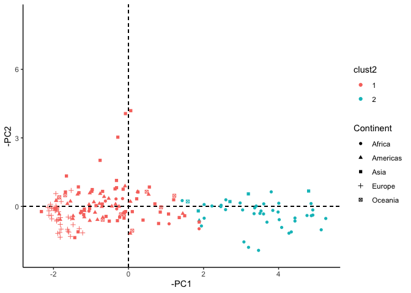
<br />
Some countries are moving from cluster 1 to cluster 2.  


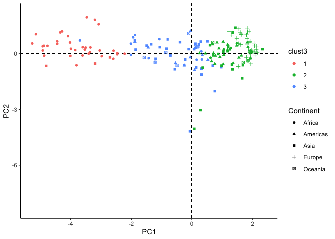

<br />

There are some countries change their cluster.

The cluster position are flipped, its because the "var" plot is different

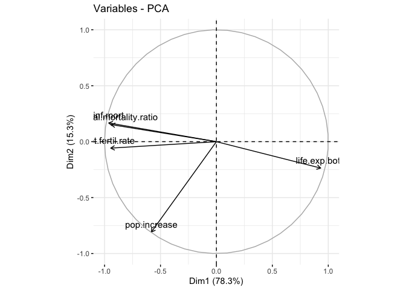<!-- -->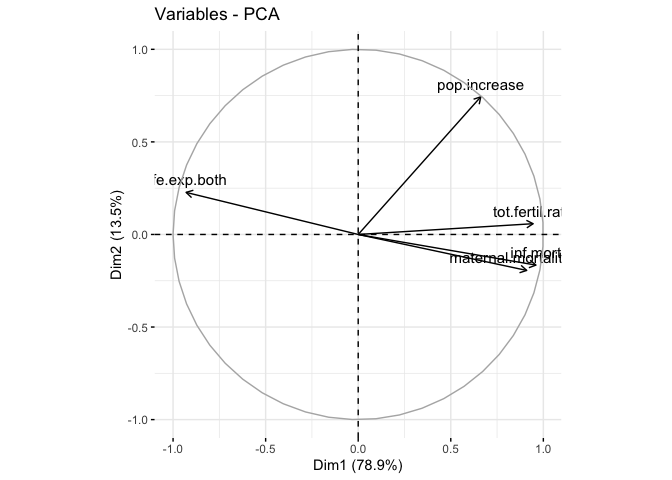<!-- -->
<br />
They're flipped 180 degrees for each arrow, so the information gained from animated plot is still valid anyway.


<br />

# Recommendation

Based on the previous analyst, I recommend to use 3 cluster because it gives us some more information. The 2 cluster is too general while the 3 cluster is more specific.


The use of 2 cluster only give us information that there are 2 groups of country, the first which have high life expectancy, low fertility rate, and low pop. increase. and the other one is the opposite.

But when we use 3 cluster we can see the middle cluster between the extremes. 


