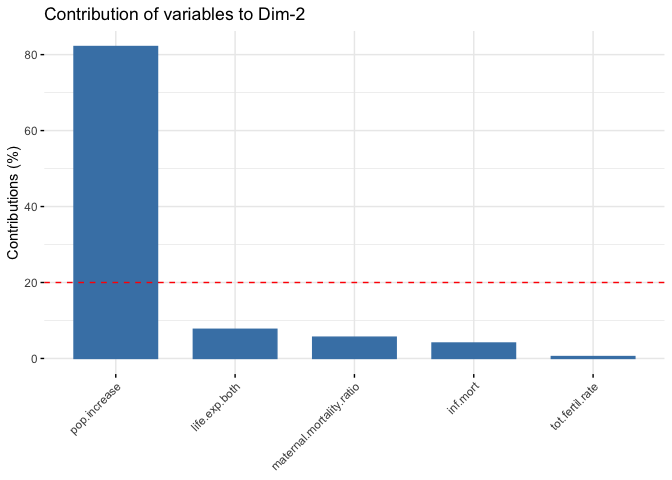
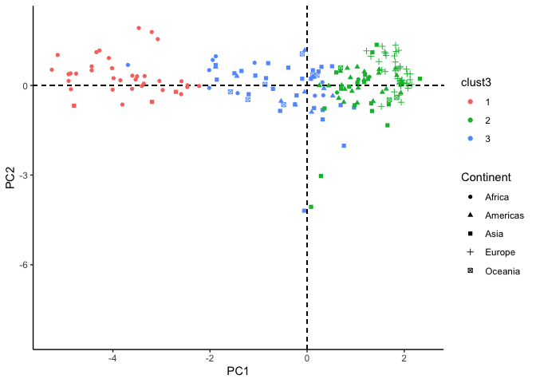

# Clusters of Countries {.tabset}

## Data Used
The data used is `Population Growth, Fertility and Mortality Indicators.csv`, tells about the number of some variables related to population fertility and mortality of each country around the world.

We have some variables from the data, and they are :

* `T03`  The country code

* `Population.growth.and.indicators.of.fertility.and.mortality` The country list

* `X` The year column

* `X.1` Variable which contains some indicators, this variable is going to be spread to some variables.

* `X.2` The values of the observations.

* `X.3` Footnotes

* `X.4` Data source


## The Goal

Assume that we are going to classify countries listed based on the indicators contained in the data. 

##  The Flow 

1. Libraries Importing and Data Preparation.

2. Exploratory Data Analyst

3. PCA Transformation.

4. Biplotting and Interpretation.


# Libraries Importing and Data Preparation

## Libraries Used


## Data Importing

```
## 'data.frame':	4979 obs. of  7 variables:
##  $ T03                                                        : chr  "Region/Country/Area" "1" "1" "1" ...
##  $ Population.growth.and.indicators.of.fertility.and.mortality: chr  "" "Total, all countries or areas" "Total, all countries or areas" "Total, all countries or areas" ...
##  $ X                                                          : chr  "Year" "2005" "2005" "2005" ...
##  $ X.1                                                        : chr  "Series" "Population annual rate of increase (percent)" "Total fertility rate (children per women)" "Infant mortality for both sexes (per 1,000 live births)" ...
##  $ X.2                                                        : chr  "Value" "1.3" "2.6" "49.1" ...
##  $ X.3                                                        : chr  "Footnotes" "Data refers to a 5-year period preceding the reference year." "Data refers to a 5-year period preceding the reference year." "Data refers to a 5-year period preceding the reference year." ...
##  $ X.4                                                        : chr  "Source" "United Nations Population Division, New York, World Population Prospects: The 2017 Revision, last accessed June 2017." "United Nations Population Division, New York, World Population Prospects: The 2017 Revision; supplemented by da"| __truncated__ "United Nations Statistics Division, New York, \"Demographic Yearbook 2015\" and the demographic statistics data"| __truncated__ ...
```

* We only need some variables to process the data, the last 2 columns and the first column will be eliminated

* There is a year column (from 2000 to 2016 ), most of the countries only have values for 2005, 2010, and 2015.

* The `X.1` contains 8 indicators, we're going to spread them into their own column


## Data cleaning

* In the chunk below we're going to remove the last 2 variables and filter the year, we only need the 2015 data to interpret the latest condition of each country.


```
## 
## 
## | Code |            Country            | year | inf.mort | life.exp.both |
## |:----:|:-----------------------------:|:----:|:--------:|:-------------:|
## |  1   | Total, all countries or areas | 2015 |    35    |     70.8      |
## | 100  |           Bulgaria            | 2015 |   8.3    |     74.3      |
## | 104  |            Myanmar            | 2015 |    45    |      66       |
## | 108  |            Burundi            | 2015 |   77.9   |     56.1      |
## |  11  |        Western Africa         | 2015 |   70.5   |     54.7      |
## | 112  |            Belarus            | 2015 |   3.6    |     72.1      |
## 
## Table: Table continues below
## 
##  
## 
## | life.exp.female | life.exp.male | maternal.mortality.ratio | pop.increase |
## |:---------------:|:-------------:|:------------------------:|:------------:|
## |      73.1       |     68.6      |           216            |     1.2      |
## |      77.8       |     70.8      |            11            |     -0.6     |
## |      68.3       |     63.7      |           178            |     0.9      |
## |       58        |     54.2      |           712            |      3       |
## |      55.6       |     53.9      |            NA            |     2.7      |
## |      77.7       |     66.5      |            4             |      0       |
## 
## Table: Table continues below
## 
##  
## 
## | tot.fertil.rate |
## |:---------------:|
## |       2.5       |
## |       1.5       |
## |       2.3       |
## |        6        |
## |       5.5       |
## |       1.6       |
```

```
##    Code                       Country year inf.mort life.exp.both
## 1:    1 Total, all countries or areas 2015     35.0          70.8
## 2:  100                      Bulgaria 2015      8.3          74.3
## 3:  104                       Myanmar 2015     45.0          66.0
## 4:  108                       Burundi 2015     77.9          56.1
## 5:   11                Western Africa 2015     70.5          54.7
## 6:  112                       Belarus 2015      3.6          72.1
##    life.exp.female life.exp.male maternal.mortality.ratio pop.increase
## 1:            73.1          68.6                      216          1.2
## 2:            77.8          70.8                       11         -0.6
## 3:            68.3          63.7                      178          0.9
## 4:            58.0          54.2                      712          3.0
## 5:            55.6          53.9                       NA          2.7
## 6:            77.7          66.5                        4          0.0
##    tot.fertil.rate
## 1:             2.5
## 2:             1.5
## 3:             2.3
## 4:             6.0
## 5:             5.5
## 6:             1.6
```

`Country` = Country list ;<br />
`inf.mort` = Infant mortality for both sexes (per 1,000 live births) ;<br />
`life.exp.both` = Life expectancy at birth for both sexes (years) ;<br />
`life.exp.male` = Life expectancy at birth for males (years) ;<br />
`life.exp.female` = Life expectancy at birth for females (years) ;<br />
`maternal.mortality.ratio` = Maternal mortality ratio (deaths per 100,000 population) ;<br />
`pop.increase` = Population annual rate of increase (percent) ;<br />
`tot.fertil.rate` = Total fertility rate (children per women) <br />


### NA checking

<!--html_preserve--><div id="htmlwidget-de356f94f51b938d5629" style="width:100%;height:auto;" class="datatables html-widget"></div>
<script type="application/json" data-for="htmlwidget-de356f94f51b938d5629">{"x":{"filter":"none","data":[["1","2","3","4","5","6","7","8","9","10"],["Code","Country","year","inf.mort","life.exp.both","life.exp.female","life.exp.male","maternal.mortality.ratio","pop.increase","tot.fertil.rate"],[0,0,0,31,31,29,29,73,0,29]],"container":"<table class=\"display\">\n  <thead>\n    <tr>\n      <th> <\/th>\n      <th>column<\/th>\n      <th>NA<\/th>\n    <\/tr>\n  <\/thead>\n<\/table>","options":{"columnDefs":[{"className":"dt-right","targets":2},{"orderable":false,"targets":0}],"order":[],"autoWidth":false,"orderClasses":false}},"evals":[],"jsHooks":[]}</script><!--/html_preserve-->
There are so many NAs in the data, it means that not all country listed have the data we need.
<br />
* We're going to replace the NAs to the average value of each variable/indicator.
<!--html_preserve--><div id="htmlwidget-4464825583d10922c839" style="width:100%;height:auto;" class="datatables html-widget"></div>
<script type="application/json" data-for="htmlwidget-4464825583d10922c839">{"x":{"filter":"none","data":[["1","2","3","4","5","6"],["1","100","104","108","11","112"],["Total, all countries or areas","Bulgaria","Myanmar","Burundi","Western Africa","Belarus"],["2015","2015","2015","2015","2015","2015"],[35,8.3,45,77.9,70.5,3.6],[70.8,74.3,66,56.1,54.7,72.1],[73.1,77.8,68.3,58,55.6,77.7],[68.6,70.8,63.7,54.2,53.9,66.5],[216,11,178,712,162.184210526316,4],[1.2,-0.6,0.9,3,2.7,0],[2.5,1.5,2.3,6,5.5,1.6]],"container":"<table class=\"display\">\n  <thead>\n    <tr>\n      <th> <\/th>\n      <th>Code<\/th>\n      <th>Country<\/th>\n      <th>year<\/th>\n      <th>inf.mort<\/th>\n      <th>life.exp.both<\/th>\n      <th>life.exp.female<\/th>\n      <th>life.exp.male<\/th>\n      <th>maternal.mortality.ratio<\/th>\n      <th>pop.increase<\/th>\n      <th>tot.fertil.rate<\/th>\n    <\/tr>\n  <\/thead>\n<\/table>","options":{"columnDefs":[{"className":"dt-right","targets":[4,5,6,7,8,9,10]},{"orderable":false,"targets":0}],"order":[],"autoWidth":false,"orderClasses":false}},"evals":[],"jsHooks":[]}</script><!--/html_preserve-->
<br />
There is an odd thing on the data as we replace the NA with the average number of each column. There are some rows/countries which have no observation value or only have 1 or 2 value for their indicator and we have filled them with the average values and it's not supposed to be like that. We supposed to eliminate them.

* eliminating some rows

I create a vector that indicates whether a rows' values are mostly the avg values of each column or not. If it is, eliminate the column.
<br />

```
## 'data.frame':	235 obs. of  8 variables:
##  $ Country                 : chr  "Total, all countries or areas" "Bulgaria" "Myanmar" "Burundi" ...
##  $ inf.mort                : num  35 8.3 45 77.9 70.5 3.6 29.9 27.7 67.5 4.7 ...
##  $ life.exp.both           : num  70.8 74.3 66 56.1 54.7 72.1 67.6 75.3 56.4 81.8 ...
##  $ life.exp.female         : num  73.1 77.8 68.3 58 55.6 77.7 69.6 76.5 57.7 83.8 ...
##  $ life.exp.male           : num  68.6 70.8 63.7 54.2 53.9 66.5 65.5 74.1 55.1 79.7 ...
##  $ maternal.mortality.ratio: num  216 11 178 712 162 ...
##  $ pop.increase            : num  1.2 -0.6 0.9 3 2.7 0 1.6 2 2.7 1 ...
##  $ tot.fertil.rate         : num  2.5 1.5 2.3 6 5.5 1.6 2.7 3 5 1.6 ...
```

### Continent Column

I think by giving the `Continent` column, we're going to have some more insights, so let's just do it.
<br />
<!--html_preserve--><div id="htmlwidget-60ceb98119626b7f1a81" style="width:100%;height:auto;" class="datatables html-widget"></div>
<script type="application/json" data-for="htmlwidget-60ceb98119626b7f1a81">{"x":{"filter":"none","data":[["1","2","3","4","5","6"],["Total, all countries or areas","Bulgaria","Myanmar","Burundi","Western Africa","Belarus"],[null,"Europe","Asia","Africa",null,"Europe"]],"container":"<table class=\"display\">\n  <thead>\n    <tr>\n      <th> <\/th>\n      <th>Country<\/th>\n      <th>Continent<\/th>\n    <\/tr>\n  <\/thead>\n<\/table>","options":{"order":[],"autoWidth":false,"orderClasses":false,"columnDefs":[{"orderable":false,"targets":0}]}},"evals":[],"jsHooks":[]}</script><!--/html_preserve-->
<br />
Some rows cannot be defined by its continent and all of them are not even a country actually. They are just regions or certain areas of the continent. 

Our observations are countries so we wil just eliminate rows that represent some areas or regions.

<!--html_preserve--><div id="htmlwidget-f43cdabdb1f18eb24de2" style="width:100%;height:auto;" class="datatables html-widget"></div>
<script type="application/json" data-for="htmlwidget-f43cdabdb1f18eb24de2">{"x":{"filter":"none","data":[["1","2","3","4","5","6","7","8","9","10","11","12","13","14","15","16","17","18","19","20","21","22","23","24","25","26","27","28","29","30","31","32"],["Total, all countries or areas","Western Africa","Central America","Eastern Africa","Asia","Central Asia","Western Asia","Northern Africa","Europe","Eastern Europe","Northern Europe","Western Europe","Other non-specified areas","Middle Africa","Southern Africa","Africa","Sub-Saharan Africa","Northern America","Caribbean","Eastern Asia","Southern Asia","South-eastern Asia","Southern Europe","Latin America &amp; the Caribbean","South America","Australia and New Zealand","Melanesia","Micronesia","Polynesia","South-central Asia","Channel Islands","Oceania"],["?","?","?","?","?","?","?","?","?","?","?","?","?","?","?","?","?","?","?","?","?","?","?","?","?","?","?","?","?","?","?","?"]],"container":"<table class=\"display\">\n  <thead>\n    <tr>\n      <th> <\/th>\n      <th>Country<\/th>\n      <th>Continent<\/th>\n    <\/tr>\n  <\/thead>\n<\/table>","options":{"order":[],"autoWidth":false,"orderClasses":false,"columnDefs":[{"orderable":false,"targets":0}]}},"evals":[],"jsHooks":[]}</script><!--/html_preserve-->

* We better assign the `Country` as rownames instead.
<!--html_preserve--><div id="htmlwidget-293c3cb945f5106d16a7" style="width:100%;height:auto;" class="datatables html-widget"></div>
<script type="application/json" data-for="htmlwidget-293c3cb945f5106d16a7">{"x":{"filter":"none","data":[["Bulgaria","Myanmar","Burundi","Belarus","Cambodia","Algeria"],[8.3,45,77.9,3.6,29.9,27.7],[74.3,66,56.1,72.1,67.6,75.3],[77.8,68.3,58,77.7,69.6,76.5],[70.8,63.7,54.2,66.5,65.5,74.1],[11,178,712,4,161,140],[-0.6,0.9,3,0,1.6,2],[1.5,2.3,6,1.6,2.7,3],["Europe","Asia","Africa","Europe","Asia","Africa"]],"container":"<table class=\"display\">\n  <thead>\n    <tr>\n      <th> <\/th>\n      <th>inf.mort<\/th>\n      <th>life.exp.both<\/th>\n      <th>life.exp.female<\/th>\n      <th>life.exp.male<\/th>\n      <th>maternal.mortality.ratio<\/th>\n      <th>pop.increase<\/th>\n      <th>tot.fertil.rate<\/th>\n      <th>Continent<\/th>\n    <\/tr>\n  <\/thead>\n<\/table>","options":{"columnDefs":[{"className":"dt-right","targets":[1,2,3,4,5,6,7]},{"orderable":false,"targets":0}],"order":[],"autoWidth":false,"orderClasses":false}},"evals":[],"jsHooks":[]}</script><!--/html_preserve-->
<br />
Now the data is ready to be proceed.


# Exploratory Data Analyst

* Variables Correlation

<!-- -->
<br />
From the plot above we can conclude that :

* the correlation between **life expectancy of birth** of male, female, and both are really high. In this case we better use the `life expectancy of both` 


* all variables have relatively strong correlation to each other but `pop.increase`

* the `pop.increase` has the least correlation with other variables


## Life Expectantion of the World

<!--html_preserve--><div id="htmlwidget-c9bd1a4c2f5e23ba2a9a" style="width:672px;height:480px;" class="plotly html-widget"></div>
<script type="application/json" data-for="htmlwidget-c9bd1a4c2f5e23ba2a9a">{"x":{"data":[{"x":[56.0965829943028,75.2849138108247,56.4210514397874,72.2177169131961,49.431777999841,51.7008545648887,62.7679652292853,79.2894303093012,62.4778679271698,58.0697190832484,59.9214348993027,56.8230488558273,63.7020032834151,63.4260037978738,60.2200735720256,61.5703187725605,64.4811681831435,60.314791724817,61.7059010285985,57.8744909863945,51.67285527711,65.4240297603524,52.4919941821032,60.6799022877879,71.5242996242234,64.5292307907718,60.7141070724202,56.1782614357878,62.631733776838,74.0691260288198,74.9259270546694,56.1234998012597,61.6925491335973,58.4912722829053,51.8798767284744,56.0007106258443,79.4934051613925,65.2271928927483,66.08264848068,65.6760988769295,72.9037715926461,50.2001172653493,54.9046179905173,59.5226473320991,57.5845599787277,62.8729359129707,55.07621423964,63.6130184988996,68.4092870289776,55.0089456743219,59.1014653006093,75.0056346783814,58.5866701710317,70.8258495097257,62.8092973341666,58.6725794091052,59.7019156414455],"y":[77.8930229397118,27.7040819274634,67.5122784183361,22.5262834089249,93.4680293928832,91.221501479689,58.0928063902818,4.21529170496389,46.5345499770902,73.185711835511,67.7245065607503,70.0180005997606,45.7997294974886,45.0021922291256,65.4256216825731,55.2695086535439,40.7686432569847,49.7861678206921,46.506354803741,65.682220409736,71.6120276178419,39.370333606489,59.8316812848672,59.0132187662646,24.3227943816409,36.7786629546061,66.495407481268,78.5104778502882,68.0271327596344,12.0296042167209,28.1170450952835,67.3039867650904,36.4314262920618,65.811659366563,76.2878944746591,80.388537995182,4.23066340237856,44.0107998253778,43.8366312213056,43.8794989378564,10.1873511393368,94.3747944396362,79.4661587498151,36.4634839355014,46.512662377432,35.1604024170525,77.6639394001104,48.7241377880052,34.1161770620942,56.3395029726997,55.6619541537203,18.4818731526285,60.2144405438378,18.9258173344471,43.9742959316261,64.7661214423552,53.7843676179275],"text":["Continent: Africa<br />life.exp.both: 56.1000<br />inf.mort: 77.90000<br />Burundi","Continent: Africa<br />life.exp.both: 75.3000<br />inf.mort: 27.70000<br />Algeria","Continent: Africa<br />life.exp.both: 56.4000<br />inf.mort: 67.50000<br />Cameroon","Continent: Africa<br />life.exp.both: 72.2000<br />inf.mort: 22.50000<br />Cabo Verde","Continent: Africa<br />life.exp.both: 49.4000<br />inf.mort: 93.50000<br />Central African Republic","Continent: Africa<br />life.exp.both: 51.7000<br />inf.mort: 91.20000<br />Chad","Continent: Africa<br />life.exp.both: 62.8000<br />inf.mort: 58.10000<br />Comoros","Continent: Africa<br />life.exp.both: 79.3000<br />inf.mort:  4.20000<br />Mayotte","Continent: Africa<br />life.exp.both: 62.5000<br />inf.mort: 46.50000<br />Congo","Continent: Africa<br />life.exp.both: 58.1000<br />inf.mort: 73.20000<br />Dem. Rep. of the Congo","Continent: Africa<br />life.exp.both: 59.9000<br />inf.mort: 67.70000<br />Benin","Continent: Africa<br />life.exp.both: 56.8000<br />inf.mort: 70.00000<br />Equatorial Guinea","Continent: Africa<br />life.exp.both: 63.7000<br />inf.mort: 45.80000<br />Ethiopia","Continent: Africa<br />life.exp.both: 63.4000<br />inf.mort: 45.00000<br />Eritrea","Continent: Africa<br />life.exp.both: 60.2000<br />inf.mort: 65.40000<br />Angola","Continent: Africa<br />life.exp.both: 61.6000<br />inf.mort: 55.30000<br />Djibouti","Continent: Africa<br />life.exp.both: 64.5000<br />inf.mort: 40.80000<br />Gabon","Continent: Africa<br />life.exp.both: 60.3000<br />inf.mort: 49.80000<br />Gambia","Continent: Africa<br />life.exp.both: 61.7000<br />inf.mort: 46.50000<br />Ghana","Continent: Africa<br />life.exp.both: 57.9000<br />inf.mort: 65.70000<br />Guinea","Continent: Africa<br />life.exp.both: 51.7000<br />inf.mort: 71.60000<br />Côte d'Ivoire","Continent: Africa<br />life.exp.both: 65.4000<br />inf.mort: 39.40000<br />Kenya","Continent: Africa<br />life.exp.both: 52.5000<br />inf.mort: 59.80000<br />Lesotho","Continent: Africa<br />life.exp.both: 60.7000<br />inf.mort: 59.00000<br />Liberia","Continent: Africa<br />life.exp.both: 71.5000<br />inf.mort: 24.30000<br />Libya","Continent: Africa<br />life.exp.both: 64.5000<br />inf.mort: 36.80000<br />Madagascar","Continent: Africa<br />life.exp.both: 60.7000<br />inf.mort: 66.50000<br />Malawi","Continent: Africa<br />life.exp.both: 56.2000<br />inf.mort: 78.50000<br />Mali","Continent: Africa<br />life.exp.both: 62.6000<br />inf.mort: 68.00000<br />Mauritania","Continent: Africa<br />life.exp.both: 74.1000<br />inf.mort: 12.00000<br />Mauritius","Continent: Africa<br />life.exp.both: 74.9000<br />inf.mort: 28.10000<br />Morocco","Continent: Africa<br />life.exp.both: 56.1000<br />inf.mort: 67.30000<br />Mozambique","Continent: Africa<br />life.exp.both: 61.7000<br />inf.mort: 36.40000<br />Namibia","Continent: Africa<br />life.exp.both: 58.5000<br />inf.mort: 65.80000<br />Niger","Continent: Africa<br />life.exp.both: 51.9000<br />inf.mort: 76.30000<br />Nigeria","Continent: Africa<br />life.exp.both: 56.0000<br />inf.mort: 80.40000<br />Guinea-Bissau","Continent: Africa<br />life.exp.both: 79.5000<br />inf.mort:  4.20000<br />Réunion","Continent: Africa<br />life.exp.both: 65.2000<br />inf.mort: 44.00000<br />Rwanda","Continent: Africa<br />life.exp.both: 66.1000<br />inf.mort: 43.80000<br />Sao Tome and Principe","Continent: Africa<br />life.exp.both: 65.7000<br />inf.mort: 43.90000<br />Senegal","Continent: Africa<br />life.exp.both: 72.9000<br />inf.mort: 10.20000<br />Seychelles","Continent: Africa<br />life.exp.both: 50.2000<br />inf.mort: 94.40000<br />Sierra Leone","Continent: Africa<br />life.exp.both: 54.9000<br />inf.mort: 79.50000<br />Somalia","Continent: Africa<br />life.exp.both: 59.5000<br />inf.mort: 36.50000<br />South Africa","Continent: Africa<br />life.exp.both: 57.6000<br />inf.mort: 46.50000<br />Zimbabwe","Continent: Africa<br />life.exp.both: 62.9000<br />inf.mort: 35.20000<br />Botswana","Continent: Africa<br />life.exp.both: 55.1000<br />inf.mort: 77.70000<br />South Sudan","Continent: Africa<br />life.exp.both: 63.6000<br />inf.mort: 48.70000<br />Sudan","Continent: Africa<br />life.exp.both: 68.4000<br />inf.mort: 34.10000<br />Western Sahara","Continent: Africa<br />life.exp.both: 55.0000<br />inf.mort: 56.30000<br />Swaziland","Continent: Africa<br />life.exp.both: 59.1000<br />inf.mort: 55.70000<br />Togo","Continent: Africa<br />life.exp.both: 75.0000<br />inf.mort: 18.50000<br />Tunisia","Continent: Africa<br />life.exp.both: 58.6000<br />inf.mort: 60.20000<br />Uganda","Continent: Africa<br />life.exp.both: 70.8000<br />inf.mort: 18.90000<br />Egypt","Continent: Africa<br />life.exp.both: 62.8000<br />inf.mort: 44.00000<br />United Rep. of Tanzania","Continent: Africa<br />life.exp.both: 58.7000<br />inf.mort: 64.80000<br />Burkina Faso","Continent: Africa<br />life.exp.both: 59.7000<br />inf.mort: 53.80000<br />Zambia"],"type":"scatter","mode":"markers","marker":{"autocolorscale":false,"color":"rgba(248,118,109,1)","opacity":1,"size":5.66929133858268,"symbol":"circle","line":{"width":1.88976377952756,"color":"rgba(248,118,109,1)"}},"hoveron":"points","name":"Africa","legendgroup":"Africa","showlegend":true,"xaxis":"x","yaxis":"y","hoverinfo":"text","frame":null},{"x":[81.8318772658959,78.7814886230213,73.717005647774,79.1753719695376,79.1735033287241,73.1739096850778,75.5023920110542,72.5846613670998,79.229546750963,75.773820374621,71.3190915182084,73.1800351148895,80.4998230433098,75.9990853841054,72.4065840961485,66.3126358060819,62.2777339440839,72.8814387622006,75.4826345707798,75.1038048574902,81.2300395420157,76.4849437959711,75.3986342815562,77.779205270987,75.4229424357349,74.5044520660928,77.3039496289615,71.3495169693822,72.6752080499342,74.2232605975149,79.1828554425448,74.8176353058677,72.697206469121,67.7092109813966,70.9264781811132,74.7049872437196,70.2087468834682,69.79015039411,78.8843846727787,79.0790072028112,76.9955110503892,73.9086021498761],"y":[4.69431415185332,7.41469952104613,17.8979804513231,9.32333992201835,5.50657431708649,25.0641070572846,21.1317060508765,17.037176595591,9.33348087068647,9.11674774117768,25.8680341010226,9.60934099627659,5.82491128804162,13.6681314427778,26.8939367117919,33.1941221972741,46.8730104480125,27.8326904758811,15.0077816193737,9.08733427220955,6.36070571385324,18.837565677166,9.61329824000597,10.2684897286817,14.7838621096127,20.0338883243687,15.2255632336251,25.8560747256188,28.7956832439452,18.6360300461017,6.28684734281153,10.8653506225534,16.4768476454169,42.9094372751377,17.3999771493115,15.7999343596026,24.7758084627427,14.2733749098703,6.02487083308399,9.27373570725322,12.7124703863263,13.7699619201385],"text":["Continent: Americas<br />life.exp.both: 81.8000<br />inf.mort:  4.70000<br />Canada","Continent: Americas<br />life.exp.both: 78.8000<br />inf.mort:  7.40000<br />Chile","Continent: Americas<br />life.exp.both: 73.7000<br />inf.mort: 17.90000<br />Colombia","Continent: Americas<br />life.exp.both: 79.2000<br />inf.mort:  9.30000<br />Costa Rica","Continent: Americas<br />life.exp.both: 79.2000<br />inf.mort:  5.50000<br />Cuba","Continent: Americas<br />life.exp.both: 73.2000<br />inf.mort: 25.10000<br />Dominican Republic","Continent: Americas<br />life.exp.both: 75.5000<br />inf.mort: 21.10000<br />Ecuador","Continent: Americas<br />life.exp.both: 72.6000<br />inf.mort: 17.00000<br />El Salvador","Continent: Americas<br />life.exp.both: 79.2000<br />inf.mort:  9.30000<br />French Guiana","Continent: Americas<br />life.exp.both: 75.8000<br />inf.mort:  9.10000<br />Antigua and Barbuda","Continent: Americas<br />life.exp.both: 71.3194<br />inf.mort: 25.84655<br />Greenland","Continent: Americas<br />life.exp.both: 73.2000<br />inf.mort:  9.60000<br />Grenada","Continent: Americas<br />life.exp.both: 80.5000<br />inf.mort:  5.80000<br />Guadeloupe","Continent: Americas<br />life.exp.both: 76.0000<br />inf.mort: 13.70000<br />Argentina","Continent: Americas<br />life.exp.both: 72.4000<br />inf.mort: 26.90000<br />Guatemala","Continent: Americas<br />life.exp.both: 66.3000<br />inf.mort: 33.20000<br />Guyana","Continent: Americas<br />life.exp.both: 62.3000<br />inf.mort: 46.90000<br />Haiti","Continent: Americas<br />life.exp.both: 72.9000<br />inf.mort: 27.80000<br />Honduras","Continent: Americas<br />life.exp.both: 75.5000<br />inf.mort: 15.00000<br />Jamaica","Continent: Americas<br />life.exp.both: 75.1000<br />inf.mort:  9.10000<br />Bahamas","Continent: Americas<br />life.exp.both: 81.2000<br />inf.mort:  6.40000<br />Martinique","Continent: Americas<br />life.exp.both: 76.5000<br />inf.mort: 18.80000<br />Mexico","Continent: Americas<br />life.exp.both: 75.4000<br />inf.mort:  9.60000<br />Barbados","Continent: Americas<br />life.exp.both: 77.8000<br />inf.mort: 10.30000<br />Curaçao","Continent: Americas<br />life.exp.both: 75.4000<br />inf.mort: 14.80000<br />Aruba","Continent: Americas<br />life.exp.both: 74.5000<br />inf.mort: 20.00000<br />Nicaragua","Continent: Americas<br />life.exp.both: 77.3000<br />inf.mort: 15.20000<br />Panama","Continent: Americas<br />life.exp.both: 71.3194<br />inf.mort: 25.84655<br />Bermuda","Continent: Americas<br />life.exp.both: 72.7000<br />inf.mort: 28.80000<br />Paraguay","Continent: Americas<br />life.exp.both: 74.2000<br />inf.mort: 18.60000<br />Peru","Continent: Americas<br />life.exp.both: 79.2000<br />inf.mort:  6.30000<br />Puerto Rico","Continent: Americas<br />life.exp.both: 74.8000<br />inf.mort: 10.90000<br />Saint Lucia","Continent: Americas<br />life.exp.both: 72.7000<br />inf.mort: 16.50000<br />Saint Vincent & Grenadines","Continent: Americas<br />life.exp.both: 67.7000<br />inf.mort: 42.90000<br />Bolivia (Plurin. State of)","Continent: Americas<br />life.exp.both: 70.9000<br />inf.mort: 17.40000<br />Suriname","Continent: Americas<br />life.exp.both: 74.7000<br />inf.mort: 15.80000<br />Brazil","Continent: Americas<br />life.exp.both: 70.2000<br />inf.mort: 24.80000<br />Trinidad and Tobago","Continent: Americas<br />life.exp.both: 69.8000<br />inf.mort: 14.30000<br />Belize","Continent: Americas<br />life.exp.both: 78.9000<br />inf.mort:  6.00000<br />United States of America","Continent: Americas<br />life.exp.both: 79.1000<br />inf.mort:  9.30000<br />United States Virgin Islands","Continent: Americas<br />life.exp.both: 77.0000<br />inf.mort: 12.70000<br />Uruguay","Continent: Americas<br />life.exp.both: 73.9000<br />inf.mort: 13.80000<br />Venezuela (Boliv. Rep. of)"],"type":"scatter","mode":"markers","marker":{"autocolorscale":false,"color":"rgba(163,165,0,1)","opacity":1,"size":5.66929133858268,"symbol":"circle","line":{"width":1.88976377952756,"color":"rgba(163,165,0,1)"}},"hoveron":"points","name":"Americas","legendgroup":"Americas","showlegend":true,"xaxis":"x","yaxis":"y","hoverinfo":"text","frame":null},{"x":[66.0199514507498,67.6095612978428,74.5841986714531,75.7219978515391,79.9276385100476,72.7862053245872,72.9275236763699,71.6153912643537,83.3957873108785,67.6128737167386,68.6261070143272,75.0872735300037,69.2272031612441,81.9283047809798,83.2773141823758,69.0728887772766,62.2785472762209,73.7696955257532,70.8107373736768,81.3291220899842,74.2729736477276,70.2962793613122,65.418105791151,78.908489668163,83.2825909148691,74.6926577903651,76.3120163807667,76.3702496462316,68.522577409571,71.1705022476589,74.006904027487,76.1774323910422,68.9034707526584,65.8875524101494,68.6188968947482,67.7100140489562,77.6887817633504,68.801130249728,74.0219860084509,82.3308530435657,75.6230906946166,69.9010111491209,70.409196012755,74.6180580785007,76.6733097102979,74.8121536229366,67.3065378128795,70.7751785826655,64.2178921683542,76.6717748200712],"y":[44.9618354225531,29.8848200052418,8.2156459864229,11.6239196571335,4.21301779814064,11.2080401010066,20.0100105092116,31.4237850688025,1.60727625271305,41.3283176308498,25.0377878749184,14.7675099211372,32.1020691185258,3.37061927571893,2.22275379782542,14.073837070968,68.6211119510792,17.1264218933508,18.5337321038172,2.98647663602606,8.36916349928826,19.6370214835182,47.2639950937778,9.21024535607546,3.03929286258295,6.46077390277758,9.03383986560628,6.91268432283774,22.8392726882175,33.2705115201138,13.1637496397086,9.57071807434783,32.8087183575518,69.7695375551097,22.1899471255764,43.9388156542182,7.18892746970058,30.4851876446791,12.9903157957457,2.09154507214204,19.3089464686811,17.9144324130937,38.9220970788039,11.1916105514206,6.19828789498657,12.6160274007916,46.9077997983433,31.3391787676141,47.2180855556019,6.46431010456756],"text":["Continent: Asia<br />life.exp.both: 66.0000<br />inf.mort: 45.00000<br />Myanmar","Continent: Asia<br />life.exp.both: 67.6000<br />inf.mort: 29.90000<br />Cambodia","Continent: Asia<br />life.exp.both: 74.6000<br />inf.mort:  8.20000<br />Sri Lanka","Continent: Asia<br />life.exp.both: 75.7000<br />inf.mort: 11.60000<br />China","Continent: Asia<br />life.exp.both: 79.9000<br />inf.mort:  4.20000<br />Cyprus","Continent: Asia<br />life.exp.both: 72.8000<br />inf.mort: 11.20000<br />Georgia","Continent: Asia<br />life.exp.both: 72.9000<br />inf.mort: 20.00000<br />State of Palestine","Continent: Asia<br />life.exp.both: 71.6000<br />inf.mort: 31.40000<br />Azerbaijan","Continent: Asia<br />life.exp.both: 83.4000<br />inf.mort:  1.60000<br />China, Hong Kong SAR","Continent: Asia<br />life.exp.both: 67.6000<br />inf.mort: 41.30000<br />India","Continent: Asia<br />life.exp.both: 68.6000<br />inf.mort: 25.00000<br />Indonesia","Continent: Asia<br />life.exp.both: 75.1000<br />inf.mort: 14.80000<br />Iran (Islamic Republic of)","Continent: Asia<br />life.exp.both: 69.2000<br />inf.mort: 32.10000<br />Iraq","Continent: Asia<br />life.exp.both: 81.9000<br />inf.mort:  3.40000<br />Israel","Continent: Asia<br />life.exp.both: 83.3000<br />inf.mort:  2.20000<br />Japan","Continent: Asia<br />life.exp.both: 69.1000<br />inf.mort: 14.10000<br />Kazakhstan","Continent: Asia<br />life.exp.both: 62.3000<br />inf.mort: 68.60000<br />Afghanistan","Continent: Asia<br />life.exp.both: 73.8000<br />inf.mort: 17.10000<br />Jordan","Continent: Asia<br />life.exp.both: 70.8000<br />inf.mort: 18.50000<br />Dem. People's Rep. Korea","Continent: Asia<br />life.exp.both: 81.3000<br />inf.mort:  3.00000<br />Republic of Korea","Continent: Asia<br />life.exp.both: 74.3000<br />inf.mort:  8.40000<br />Kuwait","Continent: Asia<br />life.exp.both: 70.3000<br />inf.mort: 19.60000<br />Kyrgyzstan","Continent: Asia<br />life.exp.both: 65.4000<br />inf.mort: 47.30000<br />Lao People's Dem. Rep.","Continent: Asia<br />life.exp.both: 78.9000<br />inf.mort:  9.20000<br />Lebanon","Continent: Asia<br />life.exp.both: 83.3000<br />inf.mort:  3.00000<br />China, Macao SAR","Continent: Asia<br />life.exp.both: 74.7000<br />inf.mort:  6.50000<br />Malaysia","Continent: Asia<br />life.exp.both: 76.3000<br />inf.mort:  9.00000<br />Maldives","Continent: Asia<br />life.exp.both: 76.4000<br />inf.mort:  6.90000<br />Bahrain","Continent: Asia<br />life.exp.both: 68.5000<br />inf.mort: 22.80000<br />Mongolia","Continent: Asia<br />life.exp.both: 71.2000<br />inf.mort: 33.30000<br />Bangladesh","Continent: Asia<br />life.exp.both: 74.0000<br />inf.mort: 13.20000<br />Armenia","Continent: Asia<br />life.exp.both: 76.2000<br />inf.mort:  9.60000<br />Oman","Continent: Asia<br />life.exp.both: 68.9000<br />inf.mort: 32.80000<br />Nepal","Continent: Asia<br />life.exp.both: 65.9000<br />inf.mort: 69.80000<br />Pakistan","Continent: Asia<br />life.exp.both: 68.6000<br />inf.mort: 22.20000<br />Philippines","Continent: Asia<br />life.exp.both: 67.7000<br />inf.mort: 43.90000<br />Timor-Leste","Continent: Asia<br />life.exp.both: 77.7000<br />inf.mort:  7.20000<br />Qatar","Continent: Asia<br />life.exp.both: 68.8000<br />inf.mort: 30.50000<br />Bhutan","Continent: Asia<br />life.exp.both: 74.0000<br />inf.mort: 13.00000<br />Saudi Arabia","Continent: Asia<br />life.exp.both: 82.3000<br />inf.mort:  2.10000<br />Singapore","Continent: Asia<br />life.exp.both: 75.6000<br />inf.mort: 19.30000<br />Viet Nam","Continent: Asia<br />life.exp.both: 69.9000<br />inf.mort: 17.90000<br />Syrian Arab Republic","Continent: Asia<br />life.exp.both: 70.4000<br />inf.mort: 38.90000<br />Tajikistan","Continent: Asia<br />life.exp.both: 74.6000<br />inf.mort: 11.20000<br />Thailand","Continent: Asia<br />life.exp.both: 76.7000<br />inf.mort:  6.20000<br />United Arab Emirates","Continent: Asia<br />life.exp.both: 74.8000<br />inf.mort: 12.60000<br />Turkey","Continent: Asia<br />life.exp.both: 67.3000<br />inf.mort: 46.90000<br />Turkmenistan","Continent: Asia<br />life.exp.both: 70.8000<br />inf.mort: 31.30000<br />Uzbekistan","Continent: Asia<br />life.exp.both: 64.2000<br />inf.mort: 47.20000<br />Yemen","Continent: Asia<br />life.exp.both: 76.7000<br />inf.mort:  6.50000<br />Brunei Darussalam"],"type":"scatter","mode":"markers","marker":{"autocolorscale":false,"color":"rgba(0,191,125,1)","opacity":1,"size":5.66929133858268,"symbol":"circle","line":{"width":1.88976377952756,"color":"rgba(0,191,125,1)"}},"hoveron":"points","name":"Asia","legendgroup":"Asia","showlegend":true,"xaxis":"x","yaxis":"y","hoverinfo":"text","frame":null},{"x":[74.3082794836221,72.0694157021403,76.9980796799081,78.2222930352723,80.124781689347,76.7868647696034,71.3404897626346,80.6714251591171,81.9042053741687,80.3992342787214,80.578754495298,75.3773997907584,82.2018028347189,80.881406462158,82.2691603625995,80.9735736514837,73.9150795550876,73.9863571195531,81.0680149589926,80.3010172856442,70.9851436827097,76.4202595226653,81.2926304205812,80.4700811514853,81.617568250915,77.0011053685321,80.4792142847544,74.8278888905036,70.327583867107,74.7003610925956,76.2818369660249,76.2982426979021,80.3013657730782,82.5010065021681,81.8902821044579,82.6813545048584,77.7152635712448,71.0713278996848,75.1089635887895,80.9930066560358],"y":[8.33783338487148,3.56823490202427,3.93389538852498,2.51610441507772,3.53441576408222,3.23521976305172,25.8367039902939,2.32949798949063,3.3715163753368,3.38221462277696,3.26522312808782,4.86649925835431,1.62531892823055,3.3658048501052,2.97664963850752,3.33693273153156,6.47582186533138,4.43385981671512,3.41194270724431,4.79621838338673,14.313502956368,4.103952748999,3.53024543069303,3.53230039004236,2.39923368811607,4.49144994122908,2.91276821067557,8.72934983914718,8.26241187306121,9.78128393823281,7.62188137723133,5.7227568378672,2.46694909714163,2.89254512421787,2.38128039438278,3.91549601651728,14.5828965887614,8.76123743588105,9.00500567076728,4.1164809570089],"text":["Continent: Europe<br />life.exp.both: 74.3000<br />inf.mort:  8.30000<br />Bulgaria","Continent: Europe<br />life.exp.both: 72.1000<br />inf.mort:  3.60000<br />Belarus","Continent: Europe<br />life.exp.both: 77.0000<br />inf.mort:  3.90000<br />Croatia","Continent: Europe<br />life.exp.both: 78.2000<br />inf.mort:  2.50000<br />Czechia","Continent: Europe<br />life.exp.both: 80.1000<br />inf.mort:  3.50000<br />Denmark","Continent: Europe<br />life.exp.both: 76.8000<br />inf.mort:  3.20000<br />Estonia","Continent: Europe<br />life.exp.both: 71.3194<br />inf.mort: 25.84655<br />Faroe Islands","Continent: Europe<br />life.exp.both: 80.7000<br />inf.mort:  2.30000<br />Finland","Continent: Europe<br />life.exp.both: 81.9000<br />inf.mort:  3.40000<br />France","Continent: Europe<br />life.exp.both: 80.4000<br />inf.mort:  3.40000<br />Germany","Continent: Europe<br />life.exp.both: 80.6000<br />inf.mort:  3.30000<br />Greece","Continent: Europe<br />life.exp.both: 75.4000<br />inf.mort:  4.90000<br />Hungary","Continent: Europe<br />life.exp.both: 82.2000<br />inf.mort:  1.60000<br />Iceland","Continent: Europe<br />life.exp.both: 80.9000<br />inf.mort:  3.40000<br />Ireland","Continent: Europe<br />life.exp.both: 82.3000<br />inf.mort:  3.00000<br />Italy","Continent: Europe<br />life.exp.both: 81.0000<br />inf.mort:  3.30000<br />Austria","Continent: Europe<br />life.exp.both: 73.9000<br />inf.mort:  6.50000<br />Latvia","Continent: Europe<br />life.exp.both: 74.0000<br />inf.mort:  4.40000<br />Lithuania","Continent: Europe<br />life.exp.both: 81.1000<br />inf.mort:  3.40000<br />Luxembourg","Continent: Europe<br />life.exp.both: 80.3000<br />inf.mort:  4.80000<br />Malta","Continent: Europe<br />life.exp.both: 71.0000<br />inf.mort: 14.30000<br />Republic of Moldova","Continent: Europe<br />life.exp.both: 76.4000<br />inf.mort:  4.10000<br />Montenegro","Continent: Europe<br />life.exp.both: 81.3000<br />inf.mort:  3.50000<br />Netherlands","Continent: Europe<br />life.exp.both: 80.5000<br />inf.mort:  3.50000<br />Belgium","Continent: Europe<br />life.exp.both: 81.6000<br />inf.mort:  2.40000<br />Norway","Continent: Europe<br />life.exp.both: 77.0000<br />inf.mort:  4.50000<br />Poland","Continent: Europe<br />life.exp.both: 80.5000<br />inf.mort:  2.90000<br />Portugal","Continent: Europe<br />life.exp.both: 74.8000<br />inf.mort:  8.70000<br />Romania","Continent: Europe<br />life.exp.both: 70.3000<br />inf.mort:  8.30000<br />Russian Federation","Continent: Europe<br />life.exp.both: 74.7000<br />inf.mort:  9.80000<br />Serbia","Continent: Europe<br />life.exp.both: 76.3000<br />inf.mort:  7.60000<br />Bosnia and Herzegovina","Continent: Europe<br />life.exp.both: 76.3000<br />inf.mort:  5.70000<br />Slovakia","Continent: Europe<br />life.exp.both: 80.3000<br />inf.mort:  2.50000<br />Slovenia","Continent: Europe<br />life.exp.both: 82.5000<br />inf.mort:  2.90000<br />Spain","Continent: Europe<br />life.exp.both: 81.9000<br />inf.mort:  2.40000<br />Sweden","Continent: Europe<br />life.exp.both: 82.7000<br />inf.mort:  3.90000<br />Switzerland","Continent: Europe<br />life.exp.both: 77.7000<br />inf.mort: 14.60000<br />Albania","Continent: Europe<br />life.exp.both: 71.1000<br />inf.mort:  8.80000<br />Ukraine","Continent: Europe<br />life.exp.both: 75.1000<br />inf.mort:  9.00000<br />TFYR of Macedonia","Continent: Europe<br />life.exp.both: 81.0000<br />inf.mort:  4.10000<br />United Kingdom"],"type":"scatter","mode":"markers","marker":{"autocolorscale":false,"color":"rgba(0,176,246,1)","opacity":1,"size":5.66929133858268,"symbol":"circle","line":{"width":1.88976377952756,"color":"rgba(0,176,246,1)"}},"hoveron":"points","name":"Europe","legendgroup":"Europe","showlegend":true,"xaxis":"x","yaxis":"y","hoverinfo":"text","frame":null},{"x":[69.6823541179185,76.1155877032878,65.7005257148187,78.7718359400427,82.2901841596715,76.3278494057209,71.3909670542132,81.2717071043566,68.8034665609469,73.0291992391252,65.0300956821087,72.51327422543,74.0711994064581,69.5762798972805],"y":[15.98531368725,6.878694298435,46.9255079331063,9.61075828012079,3.8860456349887,13.0329730233364,24.2699135725573,4.36747451782227,33.1881740660966,13.3282386883907,48.9963765559532,20.5648061494716,18.0317190412432,29.9755463788845],"text":["Continent: Oceania<br />life.exp.both: 69.7000<br />inf.mort: 16.00000<br />Fiji","Continent: Oceania<br />life.exp.both: 76.1000<br />inf.mort:  6.90000<br />French Polynesia","Continent: Oceania<br />life.exp.both: 65.7000<br />inf.mort: 46.90000<br />Kiribati","Continent: Oceania<br />life.exp.both: 78.8000<br />inf.mort:  9.60000<br />Guam","Continent: Oceania<br />life.exp.both: 82.3000<br />inf.mort:  3.90000<br />Australia","Continent: Oceania<br />life.exp.both: 76.3000<br />inf.mort: 13.00000<br />New Caledonia","Continent: Oceania<br />life.exp.both: 71.4000<br />inf.mort: 24.30000<br />Vanuatu","Continent: Oceania<br />life.exp.both: 81.3000<br />inf.mort:  4.40000<br />New Zealand","Continent: Oceania<br />life.exp.both: 68.8000<br />inf.mort: 33.20000<br />Micronesia (Fed. States of)","Continent: Oceania<br />life.exp.both: 73.0000<br />inf.mort: 13.30000<br />Palau","Continent: Oceania<br />life.exp.both: 65.0000<br />inf.mort: 49.00000<br />Papua New Guinea","Continent: Oceania<br />life.exp.both: 72.5000<br />inf.mort: 20.60000<br />Tonga","Continent: Oceania<br />life.exp.both: 74.1000<br />inf.mort: 18.00000<br />Samoa","Continent: Oceania<br />life.exp.both: 69.6000<br />inf.mort: 30.00000<br />Solomon Islands"],"type":"scatter","mode":"markers","marker":{"autocolorscale":false,"color":"rgba(231,107,243,1)","opacity":1,"size":5.66929133858268,"symbol":"circle","line":{"width":1.88976377952756,"color":"rgba(231,107,243,1)"}},"hoveron":"points","name":"Oceania","legendgroup":"Oceania","showlegend":true,"xaxis":"x","yaxis":"y","hoverinfo":"text","frame":null},{"x":[49.4,49.8303797468354,50.2607594936709,50.6911392405063,51.1215189873418,51.5518987341772,51.9822784810127,52.4126582278481,52.8430379746835,53.273417721519,53.7037974683544,54.1341772151899,54.5645569620253,54.9949367088608,55.4253164556962,55.8556962025316,56.2860759493671,56.7164556962025,57.146835443038,57.5772151898734,58.0075949367089,58.4379746835443,58.8683544303797,59.2987341772152,59.7291139240506,60.1594936708861,60.5898734177215,61.020253164557,61.4506329113924,61.8810126582278,62.3113924050633,62.7417721518987,63.1721518987342,63.6025316455696,64.0329113924051,64.4632911392405,64.893670886076,65.3240506329114,65.7544303797468,66.1848101265823,66.6151898734177,67.0455696202532,67.4759493670886,67.906329113924,68.3367088607595,68.7670886075949,69.1974683544304,69.6278481012658,70.0582278481013,70.4886075949367,70.9189873417722,71.3493670886076,71.779746835443,72.2101265822785,72.6405063291139,73.0708860759494,73.5012658227848,73.9316455696203,74.3620253164557,74.7924050632911,75.2227848101266,75.653164556962,76.0835443037975,76.5139240506329,76.9443037974684,77.3746835443038,77.8050632911392,78.2354430379747,78.6658227848101,79.0962025316456,79.526582278481,79.9569620253165,80.3873417721519,80.8177215189873,81.2481012658228,81.6784810126582,82.1088607594937,82.5392405063291,82.9696202531646,83.4],"y":[87.4898955611241,86.3833854079656,85.2710914091755,84.153030457303,83.0292194448974,81.8996752645081,80.7644148086842,79.6234549699751,78.4768126409299,77.324504714098,76.1665480820286,75.0029596372709,73.8337562723743,72.6589548798879,71.4785723523612,70.2926255823432,69.1011314623833,67.9041068850307,66.7015687428348,65.4935339283447,64.2800193341097,63.0610418526791,61.8366183766022,60.6067657984282,59.3715010107063,58.1308409059859,56.8767398679468,55.5992471768824,54.3008204823361,52.9840082012293,51.6513587504836,50.3054205470203,48.9487420077612,47.5838715496277,46.2133575895412,44.8397485444234,43.4655928311958,42.0934388667797,40.7250936209277,39.3093695168857,37.8252540411342,36.2888273029868,34.7161694117569,33.1233604767582,31.526480607304,29.941609912708,28.3848285022836,26.8722164853444,25.4198539712038,24.0416656155576,22.6874086816583,21.3453640543491,20.0363818338438,18.7813121203567,17.6010050141018,16.5171742954473,15.5733900502109,14.7428386639587,13.9672982261706,13.1885468263268,12.3653174836844,11.5570253188702,10.7771729578654,10.0268409064698,9.30696653064737,8.61653201466881,7.95525244882403,7.32334166059042,6.72101347744524,6.14848172686582,5.60596023632945,5.09366283331345,4.61180334529511,4.16039865779067,3.73902791180778,3.34761779282692,2.9861167164422,2.65447309824768,2.35263535383748,2.08055189880567],"text":["life.exp.both: 49.40000<br />inf.mort: 87.489896","life.exp.both: 49.83038<br />inf.mort: 86.383385","life.exp.both: 50.26076<br />inf.mort: 85.271091","life.exp.both: 50.69114<br />inf.mort: 84.153030","life.exp.both: 51.12152<br />inf.mort: 83.029219","life.exp.both: 51.55190<br />inf.mort: 81.899675","life.exp.both: 51.98228<br />inf.mort: 80.764415","life.exp.both: 52.41266<br />inf.mort: 79.623455","life.exp.both: 52.84304<br />inf.mort: 78.476813","life.exp.both: 53.27342<br />inf.mort: 77.324505","life.exp.both: 53.70380<br />inf.mort: 76.166548","life.exp.both: 54.13418<br />inf.mort: 75.002960","life.exp.both: 54.56456<br />inf.mort: 73.833756","life.exp.both: 54.99494<br />inf.mort: 72.658955","life.exp.both: 55.42532<br />inf.mort: 71.478572","life.exp.both: 55.85570<br />inf.mort: 70.292626","life.exp.both: 56.28608<br />inf.mort: 69.101131","life.exp.both: 56.71646<br />inf.mort: 67.904107","life.exp.both: 57.14684<br />inf.mort: 66.701569","life.exp.both: 57.57722<br />inf.mort: 65.493534","life.exp.both: 58.00759<br />inf.mort: 64.280019","life.exp.both: 58.43797<br />inf.mort: 63.061042","life.exp.both: 58.86835<br />inf.mort: 61.836618","life.exp.both: 59.29873<br />inf.mort: 60.606766","life.exp.both: 59.72911<br />inf.mort: 59.371501","life.exp.both: 60.15949<br />inf.mort: 58.130841","life.exp.both: 60.58987<br />inf.mort: 56.876740","life.exp.both: 61.02025<br />inf.mort: 55.599247","life.exp.both: 61.45063<br />inf.mort: 54.300820","life.exp.both: 61.88101<br />inf.mort: 52.984008","life.exp.both: 62.31139<br />inf.mort: 51.651359","life.exp.both: 62.74177<br />inf.mort: 50.305421","life.exp.both: 63.17215<br />inf.mort: 48.948742","life.exp.both: 63.60253<br />inf.mort: 47.583872","life.exp.both: 64.03291<br />inf.mort: 46.213358","life.exp.both: 64.46329<br />inf.mort: 44.839749","life.exp.both: 64.89367<br />inf.mort: 43.465593","life.exp.both: 65.32405<br />inf.mort: 42.093439","life.exp.both: 65.75443<br />inf.mort: 40.725094","life.exp.both: 66.18481<br />inf.mort: 39.309370","life.exp.both: 66.61519<br />inf.mort: 37.825254","life.exp.both: 67.04557<br />inf.mort: 36.288827","life.exp.both: 67.47595<br />inf.mort: 34.716169","life.exp.both: 67.90633<br />inf.mort: 33.123360","life.exp.both: 68.33671<br />inf.mort: 31.526481","life.exp.both: 68.76709<br />inf.mort: 29.941610","life.exp.both: 69.19747<br />inf.mort: 28.384829","life.exp.both: 69.62785<br />inf.mort: 26.872216","life.exp.both: 70.05823<br />inf.mort: 25.419854","life.exp.both: 70.48861<br />inf.mort: 24.041666","life.exp.both: 70.91899<br />inf.mort: 22.687409","life.exp.both: 71.34937<br />inf.mort: 21.345364","life.exp.both: 71.77975<br />inf.mort: 20.036382","life.exp.both: 72.21013<br />inf.mort: 18.781312","life.exp.both: 72.64051<br />inf.mort: 17.601005","life.exp.both: 73.07089<br />inf.mort: 16.517174","life.exp.both: 73.50127<br />inf.mort: 15.573390","life.exp.both: 73.93165<br />inf.mort: 14.742839","life.exp.both: 74.36203<br />inf.mort: 13.967298","life.exp.both: 74.79241<br />inf.mort: 13.188547","life.exp.both: 75.22278<br />inf.mort: 12.365317","life.exp.both: 75.65316<br />inf.mort: 11.557025","life.exp.both: 76.08354<br />inf.mort: 10.777173","life.exp.both: 76.51392<br />inf.mort: 10.026841","life.exp.both: 76.94430<br />inf.mort:  9.306967","life.exp.both: 77.37468<br />inf.mort:  8.616532","life.exp.both: 77.80506<br />inf.mort:  7.955252","life.exp.both: 78.23544<br />inf.mort:  7.323342","life.exp.both: 78.66582<br />inf.mort:  6.721013","life.exp.both: 79.09620<br />inf.mort:  6.148482","life.exp.both: 79.52658<br />inf.mort:  5.605960","life.exp.both: 79.95696<br />inf.mort:  5.093663","life.exp.both: 80.38734<br />inf.mort:  4.611803","life.exp.both: 80.81772<br />inf.mort:  4.160399","life.exp.both: 81.24810<br />inf.mort:  3.739028","life.exp.both: 81.67848<br />inf.mort:  3.347618","life.exp.both: 82.10886<br />inf.mort:  2.986117","life.exp.both: 82.53924<br />inf.mort:  2.654473","life.exp.both: 82.96962<br />inf.mort:  2.352635","life.exp.both: 83.40000<br />inf.mort:  2.080552"],"type":"scatter","mode":"lines","name":"fitted values","line":{"width":3.77952755905512,"color":"rgba(51,102,255,1)","dash":"solid"},"hoveron":"points","showlegend":false,"xaxis":"x","yaxis":"y","hoverinfo":"text","frame":null},{"x":[49.4,49.8303797468354,50.2607594936709,50.6911392405063,51.1215189873418,51.5518987341772,51.9822784810127,52.4126582278481,52.8430379746835,53.273417721519,53.7037974683544,54.1341772151899,54.5645569620253,54.9949367088608,55.4253164556962,55.8556962025316,56.2860759493671,56.7164556962025,57.146835443038,57.5772151898734,58.0075949367089,58.4379746835443,58.8683544303797,59.2987341772152,59.7291139240506,60.1594936708861,60.5898734177215,61.020253164557,61.4506329113924,61.8810126582278,62.3113924050633,62.7417721518987,63.1721518987342,63.6025316455696,64.0329113924051,64.4632911392405,64.893670886076,65.3240506329114,65.7544303797468,66.1848101265823,66.6151898734177,67.0455696202532,67.4759493670886,67.906329113924,68.3367088607595,68.7670886075949,69.1974683544304,69.6278481012658,70.0582278481013,70.4886075949367,70.9189873417722,71.3493670886076,71.779746835443,72.2101265822785,72.6405063291139,73.0708860759494,73.5012658227848,73.9316455696203,74.3620253164557,74.7924050632911,75.2227848101266,75.653164556962,76.0835443037975,76.5139240506329,76.9443037974684,77.3746835443038,77.8050632911392,78.2354430379747,78.6658227848101,79.0962025316456,79.526582278481,79.9569620253165,80.3873417721519,80.8177215189873,81.2481012658228,81.6784810126582,82.1088607594937,82.5392405063291,82.9696202531646,83.4,83.4,83.4,82.9696202531646,82.5392405063291,82.1088607594937,81.6784810126582,81.2481012658228,80.8177215189873,80.3873417721519,79.9569620253165,79.526582278481,79.0962025316456,78.6658227848101,78.2354430379747,77.8050632911392,77.3746835443038,76.9443037974684,76.5139240506329,76.0835443037975,75.653164556962,75.2227848101266,74.7924050632911,74.3620253164557,73.9316455696203,73.5012658227848,73.0708860759494,72.6405063291139,72.2101265822785,71.779746835443,71.3493670886076,70.9189873417722,70.4886075949367,70.0582278481013,69.6278481012658,69.1974683544304,68.7670886075949,68.3367088607595,67.906329113924,67.4759493670886,67.0455696202532,66.6151898734177,66.1848101265823,65.7544303797468,65.3240506329114,64.893670886076,64.4632911392405,64.0329113924051,63.6025316455696,63.1721518987342,62.7417721518987,62.3113924050633,61.8810126582278,61.4506329113924,61.020253164557,60.5898734177215,60.1594936708861,59.7291139240506,59.2987341772152,58.8683544303797,58.4379746835443,58.0075949367089,57.5772151898734,57.146835443038,56.7164556962025,56.2860759493671,55.8556962025316,55.4253164556962,54.9949367088608,54.5645569620253,54.1341772151899,53.7037974683544,53.273417721519,52.8430379746835,52.4126582278481,51.9822784810127,51.5518987341772,51.1215189873418,50.6911392405063,50.2607594936709,49.8303797468354,49.4,49.4],"y":[80.9808712375922,80.2839935464028,79.5630809954318,78.8178559318016,78.0479987063771,77.2531457133055,76.4328895853642,75.5867829907451,74.7143480195152,73.8150937034639,72.8885445960988,71.9342832115311,70.9520079866794,69.9416057601398,68.9032333224155,67.8373969867322,66.7450142198361,65.6274400033591,64.486445154128,63.324144186459,62.1428828822012,60.9451051788106,59.7332214699392,58.5094959211279,57.2759621167385,56.0343681531607,54.7822917414786,53.5150524787434,52.2321930013415,50.9325371818646,49.6148427657236,48.2784276791253,46.9237095106973,45.5525941516094,44.1686444310598,42.7770010363991,41.3840913050416,39.9972055544707,38.6234056442253,37.2235810475342,35.7755814600986,34.2848934243369,32.756790293927,31.1982119002272,29.6196396431498,28.036482035594,26.4693801507599,24.9432718296387,23.4856442543746,22.1229138602385,20.8214215097853,19.5475785400776,18.2904971123516,17.0550226264253,15.8703604015607,14.7868719454517,13.8754455021875,13.0761122365518,12.3000930005389,11.4976861811971,10.6635635202388,9.86172652679755,9.08742837278302,8.33873571246125,7.62811099017459,6.95387789554515,6.31060870662348,5.6943904346661,5.10006929604316,4.5211344374529,3.94981895722235,3.37757686659421,2.7959518188225,2.19735562682649,1.5760122748352,0.929978005526964,0.260216744286038,-0.430570624042514,-1.13894544780201,-1.86136391353638,-1.86136391353638,6.02246771114772,5.84421615547696,5.73951682053787,5.71201668859837,5.76525758012687,5.90204354878036,6.12344168875484,6.42765487176773,6.80974880003268,7.26210151543656,7.77582901627874,8.34195765884732,8.95229288651474,9.59989619102459,10.2791861337925,10.9858220711202,11.7149461004784,12.4669175429478,13.2523241109429,14.06707144713,14.8794074714564,15.6345034518023,16.4095650913655,17.2713345982343,18.2474766454428,19.331649626643,20.5076016142881,21.7822665553361,23.1431495686205,24.5533958535314,25.9604173708767,27.354063688033,28.8011611410501,30.3002768538074,31.846737789822,33.4333215714583,35.0485090532893,36.6755485295868,38.2927611816368,39.8749266221699,41.3951579862372,42.8267815976301,44.1896721790888,45.54709435735,46.9024960524477,48.2580707480227,49.6151489476459,50.9737745048252,52.3324134149154,53.6878747352436,55.0354792205941,56.3694479633307,57.6834418750215,58.971187994415,60.227313658811,61.4670399046741,62.7040356757284,63.9400152832652,65.1769785265476,66.4171557860182,67.6629236702304,68.9166923315415,70.1807737667024,71.4572487049304,72.7478541779542,74.0539113823068,75.3763039996361,76.7155045580692,78.0716360630107,79.4445515679583,80.833915724732,82.2392772623446,83.6601269492051,85.0959400320043,86.5462048157108,88.0104401834177,89.4882049828043,90.9791018229191,92.4827772695284,93.9989198846561,80.9808712375922],"text":["life.exp.both: 49.40000<br />inf.mort: 87.489896","life.exp.both: 49.83038<br />inf.mort: 86.383385","life.exp.both: 50.26076<br />inf.mort: 85.271091","life.exp.both: 50.69114<br />inf.mort: 84.153030","life.exp.both: 51.12152<br />inf.mort: 83.029219","life.exp.both: 51.55190<br />inf.mort: 81.899675","life.exp.both: 51.98228<br />inf.mort: 80.764415","life.exp.both: 52.41266<br />inf.mort: 79.623455","life.exp.both: 52.84304<br />inf.mort: 78.476813","life.exp.both: 53.27342<br />inf.mort: 77.324505","life.exp.both: 53.70380<br />inf.mort: 76.166548","life.exp.both: 54.13418<br />inf.mort: 75.002960","life.exp.both: 54.56456<br />inf.mort: 73.833756","life.exp.both: 54.99494<br />inf.mort: 72.658955","life.exp.both: 55.42532<br />inf.mort: 71.478572","life.exp.both: 55.85570<br />inf.mort: 70.292626","life.exp.both: 56.28608<br />inf.mort: 69.101131","life.exp.both: 56.71646<br />inf.mort: 67.904107","life.exp.both: 57.14684<br />inf.mort: 66.701569","life.exp.both: 57.57722<br />inf.mort: 65.493534","life.exp.both: 58.00759<br />inf.mort: 64.280019","life.exp.both: 58.43797<br />inf.mort: 63.061042","life.exp.both: 58.86835<br />inf.mort: 61.836618","life.exp.both: 59.29873<br />inf.mort: 60.606766","life.exp.both: 59.72911<br />inf.mort: 59.371501","life.exp.both: 60.15949<br />inf.mort: 58.130841","life.exp.both: 60.58987<br />inf.mort: 56.876740","life.exp.both: 61.02025<br />inf.mort: 55.599247","life.exp.both: 61.45063<br />inf.mort: 54.300820","life.exp.both: 61.88101<br />inf.mort: 52.984008","life.exp.both: 62.31139<br />inf.mort: 51.651359","life.exp.both: 62.74177<br />inf.mort: 50.305421","life.exp.both: 63.17215<br />inf.mort: 48.948742","life.exp.both: 63.60253<br />inf.mort: 47.583872","life.exp.both: 64.03291<br />inf.mort: 46.213358","life.exp.both: 64.46329<br />inf.mort: 44.839749","life.exp.both: 64.89367<br />inf.mort: 43.465593","life.exp.both: 65.32405<br />inf.mort: 42.093439","life.exp.both: 65.75443<br />inf.mort: 40.725094","life.exp.both: 66.18481<br />inf.mort: 39.309370","life.exp.both: 66.61519<br />inf.mort: 37.825254","life.exp.both: 67.04557<br />inf.mort: 36.288827","life.exp.both: 67.47595<br />inf.mort: 34.716169","life.exp.both: 67.90633<br />inf.mort: 33.123360","life.exp.both: 68.33671<br />inf.mort: 31.526481","life.exp.both: 68.76709<br />inf.mort: 29.941610","life.exp.both: 69.19747<br />inf.mort: 28.384829","life.exp.both: 69.62785<br />inf.mort: 26.872216","life.exp.both: 70.05823<br />inf.mort: 25.419854","life.exp.both: 70.48861<br />inf.mort: 24.041666","life.exp.both: 70.91899<br />inf.mort: 22.687409","life.exp.both: 71.34937<br />inf.mort: 21.345364","life.exp.both: 71.77975<br />inf.mort: 20.036382","life.exp.both: 72.21013<br />inf.mort: 18.781312","life.exp.both: 72.64051<br />inf.mort: 17.601005","life.exp.both: 73.07089<br />inf.mort: 16.517174","life.exp.both: 73.50127<br />inf.mort: 15.573390","life.exp.both: 73.93165<br />inf.mort: 14.742839","life.exp.both: 74.36203<br />inf.mort: 13.967298","life.exp.both: 74.79241<br />inf.mort: 13.188547","life.exp.both: 75.22278<br />inf.mort: 12.365317","life.exp.both: 75.65316<br />inf.mort: 11.557025","life.exp.both: 76.08354<br />inf.mort: 10.777173","life.exp.both: 76.51392<br />inf.mort: 10.026841","life.exp.both: 76.94430<br />inf.mort:  9.306967","life.exp.both: 77.37468<br />inf.mort:  8.616532","life.exp.both: 77.80506<br />inf.mort:  7.955252","life.exp.both: 78.23544<br />inf.mort:  7.323342","life.exp.both: 78.66582<br />inf.mort:  6.721013","life.exp.both: 79.09620<br />inf.mort:  6.148482","life.exp.both: 79.52658<br />inf.mort:  5.605960","life.exp.both: 79.95696<br />inf.mort:  5.093663","life.exp.both: 80.38734<br />inf.mort:  4.611803","life.exp.both: 80.81772<br />inf.mort:  4.160399","life.exp.both: 81.24810<br />inf.mort:  3.739028","life.exp.both: 81.67848<br />inf.mort:  3.347618","life.exp.both: 82.10886<br />inf.mort:  2.986117","life.exp.both: 82.53924<br />inf.mort:  2.654473","life.exp.both: 82.96962<br />inf.mort:  2.352635","life.exp.both: 83.40000<br />inf.mort:  2.080552","life.exp.both: 83.40000<br />inf.mort:  2.080552","life.exp.both: 83.40000<br />inf.mort:  2.080552","life.exp.both: 82.96962<br />inf.mort:  2.352635","life.exp.both: 82.53924<br />inf.mort:  2.654473","life.exp.both: 82.10886<br />inf.mort:  2.986117","life.exp.both: 81.67848<br />inf.mort:  3.347618","life.exp.both: 81.24810<br />inf.mort:  3.739028","life.exp.both: 80.81772<br />inf.mort:  4.160399","life.exp.both: 80.38734<br />inf.mort:  4.611803","life.exp.both: 79.95696<br />inf.mort:  5.093663","life.exp.both: 79.52658<br />inf.mort:  5.605960","life.exp.both: 79.09620<br />inf.mort:  6.148482","life.exp.both: 78.66582<br />inf.mort:  6.721013","life.exp.both: 78.23544<br />inf.mort:  7.323342","life.exp.both: 77.80506<br />inf.mort:  7.955252","life.exp.both: 77.37468<br />inf.mort:  8.616532","life.exp.both: 76.94430<br />inf.mort:  9.306967","life.exp.both: 76.51392<br />inf.mort: 10.026841","life.exp.both: 76.08354<br />inf.mort: 10.777173","life.exp.both: 75.65316<br />inf.mort: 11.557025","life.exp.both: 75.22278<br />inf.mort: 12.365317","life.exp.both: 74.79241<br />inf.mort: 13.188547","life.exp.both: 74.36203<br />inf.mort: 13.967298","life.exp.both: 73.93165<br />inf.mort: 14.742839","life.exp.both: 73.50127<br />inf.mort: 15.573390","life.exp.both: 73.07089<br />inf.mort: 16.517174","life.exp.both: 72.64051<br />inf.mort: 17.601005","life.exp.both: 72.21013<br />inf.mort: 18.781312","life.exp.both: 71.77975<br />inf.mort: 20.036382","life.exp.both: 71.34937<br />inf.mort: 21.345364","life.exp.both: 70.91899<br />inf.mort: 22.687409","life.exp.both: 70.48861<br />inf.mort: 24.041666","life.exp.both: 70.05823<br />inf.mort: 25.419854","life.exp.both: 69.62785<br />inf.mort: 26.872216","life.exp.both: 69.19747<br />inf.mort: 28.384829","life.exp.both: 68.76709<br />inf.mort: 29.941610","life.exp.both: 68.33671<br />inf.mort: 31.526481","life.exp.both: 67.90633<br />inf.mort: 33.123360","life.exp.both: 67.47595<br />inf.mort: 34.716169","life.exp.both: 67.04557<br />inf.mort: 36.288827","life.exp.both: 66.61519<br />inf.mort: 37.825254","life.exp.both: 66.18481<br />inf.mort: 39.309370","life.exp.both: 65.75443<br />inf.mort: 40.725094","life.exp.both: 65.32405<br />inf.mort: 42.093439","life.exp.both: 64.89367<br />inf.mort: 43.465593","life.exp.both: 64.46329<br />inf.mort: 44.839749","life.exp.both: 64.03291<br />inf.mort: 46.213358","life.exp.both: 63.60253<br />inf.mort: 47.583872","life.exp.both: 63.17215<br />inf.mort: 48.948742","life.exp.both: 62.74177<br />inf.mort: 50.305421","life.exp.both: 62.31139<br />inf.mort: 51.651359","life.exp.both: 61.88101<br />inf.mort: 52.984008","life.exp.both: 61.45063<br />inf.mort: 54.300820","life.exp.both: 61.02025<br />inf.mort: 55.599247","life.exp.both: 60.58987<br />inf.mort: 56.876740","life.exp.both: 60.15949<br />inf.mort: 58.130841","life.exp.both: 59.72911<br />inf.mort: 59.371501","life.exp.both: 59.29873<br />inf.mort: 60.606766","life.exp.both: 58.86835<br />inf.mort: 61.836618","life.exp.both: 58.43797<br />inf.mort: 63.061042","life.exp.both: 58.00759<br />inf.mort: 64.280019","life.exp.both: 57.57722<br />inf.mort: 65.493534","life.exp.both: 57.14684<br />inf.mort: 66.701569","life.exp.both: 56.71646<br />inf.mort: 67.904107","life.exp.both: 56.28608<br />inf.mort: 69.101131","life.exp.both: 55.85570<br />inf.mort: 70.292626","life.exp.both: 55.42532<br />inf.mort: 71.478572","life.exp.both: 54.99494<br />inf.mort: 72.658955","life.exp.both: 54.56456<br />inf.mort: 73.833756","life.exp.both: 54.13418<br />inf.mort: 75.002960","life.exp.both: 53.70380<br />inf.mort: 76.166548","life.exp.both: 53.27342<br />inf.mort: 77.324505","life.exp.both: 52.84304<br />inf.mort: 78.476813","life.exp.both: 52.41266<br />inf.mort: 79.623455","life.exp.both: 51.98228<br />inf.mort: 80.764415","life.exp.both: 51.55190<br />inf.mort: 81.899675","life.exp.both: 51.12152<br />inf.mort: 83.029219","life.exp.both: 50.69114<br />inf.mort: 84.153030","life.exp.both: 50.26076<br />inf.mort: 85.271091","life.exp.both: 49.83038<br />inf.mort: 86.383385","life.exp.both: 49.40000<br />inf.mort: 87.489896","life.exp.both: 49.40000<br />inf.mort: 87.489896"],"type":"scatter","mode":"lines","line":{"width":3.77952755905512,"color":"transparent","dash":"solid"},"fill":"toself","fillcolor":"rgba(153,153,153,0.4)","hoveron":"points","hoverinfo":"x+y","showlegend":false,"xaxis":"x","yaxis":"y","frame":null}],"layout":{"margin":{"t":26.2283105022831,"r":7.30593607305936,"b":40.1826484018265,"l":37.2602739726027},"plot_bgcolor":"rgba(255,255,255,1)","paper_bgcolor":"rgba(255,255,255,1)","font":{"color":"rgba(0,0,0,1)","family":"","size":14.6118721461187},"xaxis":{"domain":[0,1],"automargin":true,"type":"linear","autorange":false,"range":[47.7,85.1],"tickmode":"array","ticktext":["50","60","70","80"],"tickvals":[50,60,70,80],"categoryorder":"array","categoryarray":["50","60","70","80"],"nticks":null,"ticks":"outside","tickcolor":"rgba(51,51,51,1)","ticklen":3.65296803652968,"tickwidth":0.66417600664176,"showticklabels":true,"tickfont":{"color":"rgba(77,77,77,1)","family":"","size":11.689497716895},"tickangle":-0,"showline":true,"linecolor":"rgba(0,0,0,1)","linewidth":0.66417600664176,"showgrid":false,"gridcolor":null,"gridwidth":0,"zeroline":false,"anchor":"y","title":{"text":"life.exp.both","font":{"color":"rgba(0,0,0,1)","family":"","size":14.6118721461187}},"hoverformat":".2f"},"yaxis":{"domain":[0,1],"automargin":true,"type":"linear","autorange":false,"range":[-6.67317183119501,99.1866023572948],"tickmode":"array","ticktext":["0","25","50","75"],"tickvals":[0,25,50,75],"categoryorder":"array","categoryarray":["0","25","50","75"],"nticks":null,"ticks":"outside","tickcolor":"rgba(51,51,51,1)","ticklen":3.65296803652968,"tickwidth":0.66417600664176,"showticklabels":true,"tickfont":{"color":"rgba(77,77,77,1)","family":"","size":11.689497716895},"tickangle":-0,"showline":true,"linecolor":"rgba(0,0,0,1)","linewidth":0.66417600664176,"showgrid":false,"gridcolor":null,"gridwidth":0,"zeroline":false,"anchor":"x","title":{"text":"inf.mort","font":{"color":"rgba(0,0,0,1)","family":"","size":14.6118721461187}},"hoverformat":".2f"},"shapes":[{"type":"rect","fillcolor":null,"line":{"color":null,"width":0,"linetype":[]},"yref":"paper","xref":"paper","x0":0,"x1":1,"y0":0,"y1":1}],"showlegend":true,"legend":{"bgcolor":"rgba(255,255,255,1)","bordercolor":"transparent","borderwidth":1.88976377952756,"font":{"color":"rgba(0,0,0,1)","family":"","size":11.689497716895},"y":0.913385826771654},"annotations":[{"text":"Continent","x":1.02,"y":1,"showarrow":false,"ax":0,"ay":0,"font":{"color":"rgba(0,0,0,1)","family":"","size":14.6118721461187},"xref":"paper","yref":"paper","textangle":-0,"xanchor":"left","yanchor":"bottom","legendTitle":true}],"hovermode":"closest","barmode":"relative"},"config":{"doubleClick":"reset","showSendToCloud":false},"source":"A","attrs":{"7a39db64494":{"colour":{},"x":{},"y":{},"text":{},"type":"scatter"},"7a3939505794":{"x":{},"y":{},"text":{}}},"cur_data":"7a39db64494","visdat":{"7a39db64494":["function (y) ","x"],"7a3939505794":["function (y) ","x"]},"highlight":{"on":"plotly_click","persistent":false,"dynamic":false,"selectize":false,"opacityDim":0.2,"selected":{"opacity":1},"debounce":0},"shinyEvents":["plotly_hover","plotly_click","plotly_selected","plotly_relayout","plotly_brushed","plotly_brushing","plotly_clickannotation","plotly_doubleclick","plotly_deselect","plotly_afterplot","plotly_sunburstclick"],"base_url":"https://plot.ly"},"evals":[],"jsHooks":[]}</script><!--/html_preserve-->
<!--html_preserve--><div id="htmlwidget-4f4646281b07a579ff2e" style="width:672px;height:480px;" class="plotly html-widget"></div>
<script type="application/json" data-for="htmlwidget-4f4646281b07a579ff2e">{"x":{"data":[{"x":[56.1260474448214,75.2894172616448,56.3975490759529,72.2015104612693,49.3874085956425,51.7116837994812,62.8066623871611,79.3073240865838,62.490333997004,58.0879436404142,59.9198428069086,56.8000352525347,63.7099879931743,63.376600062245,60.2198164133366,61.6283659544446,64.522576825108,60.2963428913207,61.6728953730048,57.890211448217,51.7162219380859,65.3829977572569,52.4914951415201,60.70905535539,71.5061542056908,64.4968808306772,60.7231422467601,56.1959361824185,62.6189992927524,74.0684944120717,74.9041079586404,56.0879027006071,61.6907084773731,58.5064095418985,51.8846486595457,55.9973166035087,79.4802354134051,65.2097143312774,66.1172634967716,65.7262291930149,72.9229300257947,50.2043243832682,54.9008540833137,59.48100725235,57.5713210387872,62.9067861149331,55.0918149352292,63.6244500443073,68.4281499832264,55.0020093056552,59.0832766645771,75.0319631088654,58.6205667041864,70.8085005484465,62.783051813002,58.7248702434506,59.6709778716491],"y":[2.9794151455909,1.99000731125474,2.70704060582444,1.22175390616059,0.435151079185307,3.32654495485127,2.42441086988896,2.83899279637262,2.60049786610529,3.31127342754975,2.79297549506649,4.18656266091392,2.59819291774184,2.01354456370696,3.46723389223218,1.67474076202139,3.27450355369598,3.07229452259839,2.38980035658926,2.32194226309657,2.50642155103385,2.73225591929629,1.29181037571281,2.63092212207615,0.232110653426498,2.67601378118619,2.86097602175549,2.87305064098909,2.86232992731035,0.163124159555882,1.37249830007553,2.9065839786455,2.1827158216387,3.78267101699486,2.72879547540098,2.62540385333821,0.802788110803813,2.46005934577435,2.16733394904062,3.01348828408867,0.483379740845412,2.31639055792242,2.8665525784716,1.38322590051219,2.33402309114113,1.83616692263633,3.30389619246125,2.28257281305268,1.79973554953933,1.81910525150597,2.56580364972353,1.20193610509858,3.38674592869356,2.22212005060166,3.12813476167619,2.97029260376468,3.01665209148079],"text":["Continent: Africa<br />life.exp.both: 56.1000<br />pop.increase:  3.0<br />Burundi","Continent: Africa<br />life.exp.both: 75.3000<br />pop.increase:  2.0<br />Algeria","Continent: Africa<br />life.exp.both: 56.4000<br />pop.increase:  2.7<br />Cameroon","Continent: Africa<br />life.exp.both: 72.2000<br />pop.increase:  1.2<br />Cabo Verde","Continent: Africa<br />life.exp.both: 49.4000<br />pop.increase:  0.4<br />Central African Republic","Continent: Africa<br />life.exp.both: 51.7000<br />pop.increase:  3.3<br />Chad","Continent: Africa<br />life.exp.both: 62.8000<br />pop.increase:  2.4<br />Comoros","Continent: Africa<br />life.exp.both: 79.3000<br />pop.increase:  2.8<br />Mayotte","Continent: Africa<br />life.exp.both: 62.5000<br />pop.increase:  2.6<br />Congo","Continent: Africa<br />life.exp.both: 58.1000<br />pop.increase:  3.3<br />Dem. Rep. of the Congo","Continent: Africa<br />life.exp.both: 59.9000<br />pop.increase:  2.8<br />Benin","Continent: Africa<br />life.exp.both: 56.8000<br />pop.increase:  4.2<br />Equatorial Guinea","Continent: Africa<br />life.exp.both: 63.7000<br />pop.increase:  2.6<br />Ethiopia","Continent: Africa<br />life.exp.both: 63.4000<br />pop.increase:  2.0<br />Eritrea","Continent: Africa<br />life.exp.both: 60.2000<br />pop.increase:  3.5<br />Angola","Continent: Africa<br />life.exp.both: 61.6000<br />pop.increase:  1.7<br />Djibouti","Continent: Africa<br />life.exp.both: 64.5000<br />pop.increase:  3.3<br />Gabon","Continent: Africa<br />life.exp.both: 60.3000<br />pop.increase:  3.1<br />Gambia","Continent: Africa<br />life.exp.both: 61.7000<br />pop.increase:  2.4<br />Ghana","Continent: Africa<br />life.exp.both: 57.9000<br />pop.increase:  2.3<br />Guinea","Continent: Africa<br />life.exp.both: 51.7000<br />pop.increase:  2.5<br />Côte d'Ivoire","Continent: Africa<br />life.exp.both: 65.4000<br />pop.increase:  2.7<br />Kenya","Continent: Africa<br />life.exp.both: 52.5000<br />pop.increase:  1.3<br />Lesotho","Continent: Africa<br />life.exp.both: 60.7000<br />pop.increase:  2.6<br />Liberia","Continent: Africa<br />life.exp.both: 71.5000<br />pop.increase:  0.2<br />Libya","Continent: Africa<br />life.exp.both: 64.5000<br />pop.increase:  2.7<br />Madagascar","Continent: Africa<br />life.exp.both: 60.7000<br />pop.increase:  2.9<br />Malawi","Continent: Africa<br />life.exp.both: 56.2000<br />pop.increase:  2.9<br />Mali","Continent: Africa<br />life.exp.both: 62.6000<br />pop.increase:  2.9<br />Mauritania","Continent: Africa<br />life.exp.both: 74.1000<br />pop.increase:  0.2<br />Mauritius","Continent: Africa<br />life.exp.both: 74.9000<br />pop.increase:  1.4<br />Morocco","Continent: Africa<br />life.exp.both: 56.1000<br />pop.increase:  2.9<br />Mozambique","Continent: Africa<br />life.exp.both: 61.7000<br />pop.increase:  2.2<br />Namibia","Continent: Africa<br />life.exp.both: 58.5000<br />pop.increase:  3.8<br />Niger","Continent: Africa<br />life.exp.both: 51.9000<br />pop.increase:  2.7<br />Nigeria","Continent: Africa<br />life.exp.both: 56.0000<br />pop.increase:  2.6<br />Guinea-Bissau","Continent: Africa<br />life.exp.both: 79.5000<br />pop.increase:  0.8<br />Réunion","Continent: Africa<br />life.exp.both: 65.2000<br />pop.increase:  2.5<br />Rwanda","Continent: Africa<br />life.exp.both: 66.1000<br />pop.increase:  2.2<br />Sao Tome and Principe","Continent: Africa<br />life.exp.both: 65.7000<br />pop.increase:  3.0<br />Senegal","Continent: Africa<br />life.exp.both: 72.9000<br />pop.increase:  0.5<br />Seychelles","Continent: Africa<br />life.exp.both: 50.2000<br />pop.increase:  2.3<br />Sierra Leone","Continent: Africa<br />life.exp.both: 54.9000<br />pop.increase:  2.9<br />Somalia","Continent: Africa<br />life.exp.both: 59.5000<br />pop.increase:  1.4<br />South Africa","Continent: Africa<br />life.exp.both: 57.6000<br />pop.increase:  2.3<br />Zimbabwe","Continent: Africa<br />life.exp.both: 62.9000<br />pop.increase:  1.8<br />Botswana","Continent: Africa<br />life.exp.both: 55.1000<br />pop.increase:  3.3<br />South Sudan","Continent: Africa<br />life.exp.both: 63.6000<br />pop.increase:  2.3<br />Sudan","Continent: Africa<br />life.exp.both: 68.4000<br />pop.increase:  1.8<br />Western Sahara","Continent: Africa<br />life.exp.both: 55.0000<br />pop.increase:  1.8<br />Swaziland","Continent: Africa<br />life.exp.both: 59.1000<br />pop.increase:  2.6<br />Togo","Continent: Africa<br />life.exp.both: 75.0000<br />pop.increase:  1.2<br />Tunisia","Continent: Africa<br />life.exp.both: 58.6000<br />pop.increase:  3.4<br />Uganda","Continent: Africa<br />life.exp.both: 70.8000<br />pop.increase:  2.2<br />Egypt","Continent: Africa<br />life.exp.both: 62.8000<br />pop.increase:  3.1<br />United Rep. of Tanzania","Continent: Africa<br />life.exp.both: 58.7000<br />pop.increase:  3.0<br />Burkina Faso","Continent: Africa<br />life.exp.both: 59.7000<br />pop.increase:  3.0<br />Zambia"],"type":"scatter","mode":"markers","marker":{"autocolorscale":false,"color":"rgba(248,118,109,1)","opacity":1,"size":5.66929133858268,"symbol":"circle","line":{"width":1.88976377952756,"color":"rgba(248,118,109,1)"}},"hoveron":"points","name":"Africa","legendgroup":"Africa","showlegend":true,"xaxis":"x","yaxis":"y","hoverinfo":"text","frame":null},{"x":[81.8077443604496,78.7769798144464,73.6880177631515,79.1875691283364,79.2219433543502,73.2039597588822,75.5166676476135,72.5755705372146,79.2284225778542,75.7721583967974,71.3402955607964,73.172073455032,80.5315090885204,76.0003492243447,72.3914707355034,66.2916342050603,62.3120609979657,72.9058732943603,75.5010906201244,75.1103190268468,81.1915490647405,76.5233993682906,75.4183338989875,77.7993505505331,75.4189056161265,74.5294241332788,77.2734636336764,71.3415473351762,72.689595755949,74.2196907817698,79.1771234550962,74.8113473907132,72.6842780515195,67.6680119960361,70.8841101229497,74.6892305925912,70.2116464977905,69.818017831014,78.9019597344761,79.1068438008975,77.0275952109642,73.9200392492058],"y":[1.01497560512274,0.907599955536425,1.00635797150433,1.10194038325921,0.17014594970271,1.19302710361779,1.62592230712995,0.523402998689562,2.76273906746879,1.12622318800539,-0.139978792257607,0.420858129877597,0.0284246033802628,1.01717837950215,2.13045275792479,0.614091396536678,1.40478363733739,1.79612253626809,0.42613818500191,1.37576020212844,-0.472835445236415,1.40918174054474,0.312067673243582,1.38820383217186,0.484260501489043,1.17278668919578,1.73464574521407,-0.56776040751487,1.3165533577092,1.33352772427723,-0.207514169290662,0.471837874278426,-0.0306572918221353,1.62991692200303,0.964972125403583,0.934215228687972,0.47353664053604,2.22780118284747,0.739686230942607,-0.184962743353099,0.322626849394292,1.42793026270345],"text":["Continent: Americas<br />life.exp.both: 81.8000<br />pop.increase:  1.0<br />Canada","Continent: Americas<br />life.exp.both: 78.8000<br />pop.increase:  0.9<br />Chile","Continent: Americas<br />life.exp.both: 73.7000<br />pop.increase:  1.0<br />Colombia","Continent: Americas<br />life.exp.both: 79.2000<br />pop.increase:  1.1<br />Costa Rica","Continent: Americas<br />life.exp.both: 79.2000<br />pop.increase:  0.2<br />Cuba","Continent: Americas<br />life.exp.both: 73.2000<br />pop.increase:  1.2<br />Dominican Republic","Continent: Americas<br />life.exp.both: 75.5000<br />pop.increase:  1.6<br />Ecuador","Continent: Americas<br />life.exp.both: 72.6000<br />pop.increase:  0.5<br />El Salvador","Continent: Americas<br />life.exp.both: 79.2000<br />pop.increase:  2.8<br />French Guiana","Continent: Americas<br />life.exp.both: 75.8000<br />pop.increase:  1.1<br />Antigua and Barbuda","Continent: Americas<br />life.exp.both: 71.3194<br />pop.increase: -0.1<br />Greenland","Continent: Americas<br />life.exp.both: 73.2000<br />pop.increase:  0.4<br />Grenada","Continent: Americas<br />life.exp.both: 80.5000<br />pop.increase:  0.0<br />Guadeloupe","Continent: Americas<br />life.exp.both: 76.0000<br />pop.increase:  1.0<br />Argentina","Continent: Americas<br />life.exp.both: 72.4000<br />pop.increase:  2.1<br />Guatemala","Continent: Americas<br />life.exp.both: 66.3000<br />pop.increase:  0.6<br />Guyana","Continent: Americas<br />life.exp.both: 62.3000<br />pop.increase:  1.4<br />Haiti","Continent: Americas<br />life.exp.both: 72.9000<br />pop.increase:  1.8<br />Honduras","Continent: Americas<br />life.exp.both: 75.5000<br />pop.increase:  0.4<br />Jamaica","Continent: Americas<br />life.exp.both: 75.1000<br />pop.increase:  1.4<br />Bahamas","Continent: Americas<br />life.exp.both: 81.2000<br />pop.increase: -0.5<br />Martinique","Continent: Americas<br />life.exp.both: 76.5000<br />pop.increase:  1.4<br />Mexico","Continent: Americas<br />life.exp.both: 75.4000<br />pop.increase:  0.3<br />Barbados","Continent: Americas<br />life.exp.both: 77.8000<br />pop.increase:  1.4<br />Curaçao","Continent: Americas<br />life.exp.both: 75.4000<br />pop.increase:  0.5<br />Aruba","Continent: Americas<br />life.exp.both: 74.5000<br />pop.increase:  1.2<br />Nicaragua","Continent: Americas<br />life.exp.both: 77.3000<br />pop.increase:  1.7<br />Panama","Continent: Americas<br />life.exp.both: 71.3194<br />pop.increase: -0.6<br />Bermuda","Continent: Americas<br />life.exp.both: 72.7000<br />pop.increase:  1.3<br />Paraguay","Continent: Americas<br />life.exp.both: 74.2000<br />pop.increase:  1.3<br />Peru","Continent: Americas<br />life.exp.both: 79.2000<br />pop.increase: -0.2<br />Puerto Rico","Continent: Americas<br />life.exp.both: 74.8000<br />pop.increase:  0.5<br />Saint Lucia","Continent: Americas<br />life.exp.both: 72.7000<br />pop.increase:  0.0<br />Saint Vincent & Grenadines","Continent: Americas<br />life.exp.both: 67.7000<br />pop.increase:  1.6<br />Bolivia (Plurin. State of)","Continent: Americas<br />life.exp.both: 70.9000<br />pop.increase:  1.0<br />Suriname","Continent: Americas<br />life.exp.both: 74.7000<br />pop.increase:  0.9<br />Brazil","Continent: Americas<br />life.exp.both: 70.2000<br />pop.increase:  0.5<br />Trinidad and Tobago","Continent: Americas<br />life.exp.both: 69.8000<br />pop.increase:  2.2<br />Belize","Continent: Americas<br />life.exp.both: 78.9000<br />pop.increase:  0.7<br />United States of America","Continent: Americas<br />life.exp.both: 79.1000<br />pop.increase: -0.2<br />United States Virgin Islands","Continent: Americas<br />life.exp.both: 77.0000<br />pop.increase:  0.3<br />Uruguay","Continent: Americas<br />life.exp.both: 73.9000<br />pop.increase:  1.4<br />Venezuela (Boliv. Rep. of)"],"type":"scatter","mode":"markers","marker":{"autocolorscale":false,"color":"rgba(163,165,0,1)","opacity":1,"size":5.66929133858268,"symbol":"circle","line":{"width":1.88976377952756,"color":"rgba(163,165,0,1)"}},"hoveron":"points","name":"Americas","legendgroup":"Americas","showlegend":true,"xaxis":"x","yaxis":"y","hoverinfo":"text","frame":null},{"x":[66.0178529251997,67.5958200109724,74.6088869355614,75.7033910170108,79.8880751572973,72.7781733338327,72.8953746353465,71.6177258783345,83.3886048428129,67.5715491194191,68.5869420677841,75.1020527628913,69.2111398373141,81.8705740371986,83.2818718121124,69.0736179748674,62.3223562299079,73.8311991160231,70.7969221979205,81.2957035144827,74.2689409675085,70.3084065314482,65.4102901542053,78.9219514139307,83.2721311550041,74.7232398570594,76.2965675543554,76.393331516672,68.5203972595471,71.1902330804781,74.0091209238199,76.1774519417629,68.9269481682765,65.8863967184089,68.6177336117153,67.7292257094167,77.7156037223383,68.8133732180429,73.9704799816754,82.286647295933,75.5786960640153,69.9095595681003,70.3691038864279,74.6317681572199,76.671322862995,74.7741006847184,67.3133381801121,70.7871432680893,64.2096215467274,76.6961060441797],"y":[0.920204669665545,1.57300335928798,0.493989812601358,0.533703654557466,0.868211253173649,-1.36582045141608,2.72759604765102,1.26064318925142,0.636501310672611,1.17604279479012,1.29858589781448,1.22491580627859,3.20772594992071,1.69930570926517,-0.101497861966491,1.56856973649934,3.19452263059095,4.91465458076447,0.519723453316837,0.393857388049364,5.40644340028986,1.62416254937649,1.2828628699854,6.01394680254161,2.33237706875429,1.81874277403578,2.80737908935174,2.01663148891181,1.92013888662681,1.18568802559748,0.310339113473892,6.47820066321641,1.23098112789914,2.07260639177635,1.58247786987573,2.17017870809883,6.59144871564582,1.57548021698371,2.8107219016552,1.6704105136916,1.13573660746217,-2.26601101536304,2.23830569097772,0.381909877751023,2.03666028594598,1.59047515444458,1.76262007845566,1.59608855873346,2.61215966185555,1.40050303228199],"text":["Continent: Asia<br />life.exp.both: 66.0000<br />pop.increase:  0.9<br />Myanmar","Continent: Asia<br />life.exp.both: 67.6000<br />pop.increase:  1.6<br />Cambodia","Continent: Asia<br />life.exp.both: 74.6000<br />pop.increase:  0.5<br />Sri Lanka","Continent: Asia<br />life.exp.both: 75.7000<br />pop.increase:  0.5<br />China","Continent: Asia<br />life.exp.both: 79.9000<br />pop.increase:  0.9<br />Cyprus","Continent: Asia<br />life.exp.both: 72.8000<br />pop.increase: -1.4<br />Georgia","Continent: Asia<br />life.exp.both: 72.9000<br />pop.increase:  2.7<br />State of Palestine","Continent: Asia<br />life.exp.both: 71.6000<br />pop.increase:  1.3<br />Azerbaijan","Continent: Asia<br />life.exp.both: 83.4000<br />pop.increase:  0.6<br />China, Hong Kong SAR","Continent: Asia<br />life.exp.both: 67.6000<br />pop.increase:  1.2<br />India","Continent: Asia<br />life.exp.both: 68.6000<br />pop.increase:  1.3<br />Indonesia","Continent: Asia<br />life.exp.both: 75.1000<br />pop.increase:  1.2<br />Iran (Islamic Republic of)","Continent: Asia<br />life.exp.both: 69.2000<br />pop.increase:  3.2<br />Iraq","Continent: Asia<br />life.exp.both: 81.9000<br />pop.increase:  1.7<br />Israel","Continent: Asia<br />life.exp.both: 83.3000<br />pop.increase: -0.1<br />Japan","Continent: Asia<br />life.exp.both: 69.1000<br />pop.increase:  1.6<br />Kazakhstan","Continent: Asia<br />life.exp.both: 62.3000<br />pop.increase:  3.2<br />Afghanistan","Continent: Asia<br />life.exp.both: 73.8000<br />pop.increase:  4.9<br />Jordan","Continent: Asia<br />life.exp.both: 70.8000<br />pop.increase:  0.5<br />Dem. People's Rep. Korea","Continent: Asia<br />life.exp.both: 81.3000<br />pop.increase:  0.4<br />Republic of Korea","Continent: Asia<br />life.exp.both: 74.3000<br />pop.increase:  5.4<br />Kuwait","Continent: Asia<br />life.exp.both: 70.3000<br />pop.increase:  1.6<br />Kyrgyzstan","Continent: Asia<br />life.exp.both: 65.4000<br />pop.increase:  1.3<br />Lao People's Dem. Rep.","Continent: Asia<br />life.exp.both: 78.9000<br />pop.increase:  6.0<br />Lebanon","Continent: Asia<br />life.exp.both: 83.3000<br />pop.increase:  2.3<br />China, Macao SAR","Continent: Asia<br />life.exp.both: 74.7000<br />pop.increase:  1.8<br />Malaysia","Continent: Asia<br />life.exp.both: 76.3000<br />pop.increase:  2.8<br />Maldives","Continent: Asia<br />life.exp.both: 76.4000<br />pop.increase:  2.0<br />Bahrain","Continent: Asia<br />life.exp.both: 68.5000<br />pop.increase:  1.9<br />Mongolia","Continent: Asia<br />life.exp.both: 71.2000<br />pop.increase:  1.2<br />Bangladesh","Continent: Asia<br />life.exp.both: 74.0000<br />pop.increase:  0.3<br />Armenia","Continent: Asia<br />life.exp.both: 76.2000<br />pop.increase:  6.5<br />Oman","Continent: Asia<br />life.exp.both: 68.9000<br />pop.increase:  1.2<br />Nepal","Continent: Asia<br />life.exp.both: 65.9000<br />pop.increase:  2.1<br />Pakistan","Continent: Asia<br />life.exp.both: 68.6000<br />pop.increase:  1.6<br />Philippines","Continent: Asia<br />life.exp.both: 67.7000<br />pop.increase:  2.2<br />Timor-Leste","Continent: Asia<br />life.exp.both: 77.7000<br />pop.increase:  6.6<br />Qatar","Continent: Asia<br />life.exp.both: 68.8000<br />pop.increase:  1.6<br />Bhutan","Continent: Asia<br />life.exp.both: 74.0000<br />pop.increase:  2.8<br />Saudi Arabia","Continent: Asia<br />life.exp.both: 82.3000<br />pop.increase:  1.7<br />Singapore","Continent: Asia<br />life.exp.both: 75.6000<br />pop.increase:  1.1<br />Viet Nam","Continent: Asia<br />life.exp.both: 69.9000<br />pop.increase: -2.3<br />Syrian Arab Republic","Continent: Asia<br />life.exp.both: 70.4000<br />pop.increase:  2.2<br />Tajikistan","Continent: Asia<br />life.exp.both: 74.6000<br />pop.increase:  0.4<br />Thailand","Continent: Asia<br />life.exp.both: 76.7000<br />pop.increase:  2.0<br />United Arab Emirates","Continent: Asia<br />life.exp.both: 74.8000<br />pop.increase:  1.6<br />Turkey","Continent: Asia<br />life.exp.both: 67.3000<br />pop.increase:  1.8<br />Turkmenistan","Continent: Asia<br />life.exp.both: 70.8000<br />pop.increase:  1.6<br />Uzbekistan","Continent: Asia<br />life.exp.both: 64.2000<br />pop.increase:  2.6<br />Yemen","Continent: Asia<br />life.exp.both: 76.7000<br />pop.increase:  1.4<br />Brunei Darussalam"],"type":"scatter","mode":"markers","marker":{"autocolorscale":false,"color":"rgba(0,191,125,1)","opacity":1,"size":5.66929133858268,"symbol":"circle","line":{"width":1.88976377952756,"color":"rgba(0,191,125,1)"}},"hoveron":"points","name":"Asia","legendgroup":"Asia","showlegend":true,"xaxis":"x","yaxis":"y","hoverinfo":"text","frame":null},{"x":[74.2724748895797,72.0743651526551,76.9937799153087,78.1749864028238,80.0973950366246,76.8179609363244,71.2988828732924,80.6781570473156,81.9314265404273,80.3710087204208,80.6111789267147,75.4146436783623,82.2200301512423,80.9269632242069,82.276755010164,81.0300537703235,73.8798024841723,73.9696573365358,81.0803497390388,80.2947270724238,70.9857516949552,76.4044817573338,81.3005711174673,80.492370820732,81.5959867273322,77.0088790235042,80.5173363761907,74.8273664891481,70.327923362303,74.7256353032467,76.2854173136486,76.3184803115013,80.3207731446302,82.478430043331,81.9138505823752,82.7226022989343,77.7106138449847,71.0776494576348,75.1311152286302,81.026710475947],"y":[-0.578579073082656,-0.0162387486733496,-0.431222303286195,0.0724210562370718,0.480275181867182,-0.264444635193795,0.1983457249403,0.364926401544362,0.374221593458206,0.222896075770259,-0.401357181128114,-0.291188265495002,0.619865069184452,0.30999247264117,-0.0966007960028947,0.610363909676671,-1.18508491117507,-1.32894386749715,2.1782240809314,0.514598978441208,-0.138321655727923,0.085922693386674,0.30323607461527,0.636478126123547,1.23450110366568,0.00847798852249977,-0.411529245823622,-0.634071948546916,0.123891291245818,-0.42283624695614,-1.03256115008146,0.115714461952448,0.32887209078297,-0.186953244097531,0.768226015456021,1.22149474089965,-0.102834053561091,-0.47048509195447,0.0842479993216694,0.726061217710376],"text":["Continent: Europe<br />life.exp.both: 74.3000<br />pop.increase: -0.6<br />Bulgaria","Continent: Europe<br />life.exp.both: 72.1000<br />pop.increase:  0.0<br />Belarus","Continent: Europe<br />life.exp.both: 77.0000<br />pop.increase: -0.4<br />Croatia","Continent: Europe<br />life.exp.both: 78.2000<br />pop.increase:  0.1<br />Czechia","Continent: Europe<br />life.exp.both: 80.1000<br />pop.increase:  0.5<br />Denmark","Continent: Europe<br />life.exp.both: 76.8000<br />pop.increase: -0.3<br />Estonia","Continent: Europe<br />life.exp.both: 71.3194<br />pop.increase:  0.2<br />Faroe Islands","Continent: Europe<br />life.exp.both: 80.7000<br />pop.increase:  0.4<br />Finland","Continent: Europe<br />life.exp.both: 81.9000<br />pop.increase:  0.4<br />France","Continent: Europe<br />life.exp.both: 80.4000<br />pop.increase:  0.2<br />Germany","Continent: Europe<br />life.exp.both: 80.6000<br />pop.increase: -0.4<br />Greece","Continent: Europe<br />life.exp.both: 75.4000<br />pop.increase: -0.3<br />Hungary","Continent: Europe<br />life.exp.both: 82.2000<br />pop.increase:  0.6<br />Iceland","Continent: Europe<br />life.exp.both: 80.9000<br />pop.increase:  0.3<br />Ireland","Continent: Europe<br />life.exp.both: 82.3000<br />pop.increase: -0.1<br />Italy","Continent: Europe<br />life.exp.both: 81.0000<br />pop.increase:  0.6<br />Austria","Continent: Europe<br />life.exp.both: 73.9000<br />pop.increase: -1.2<br />Latvia","Continent: Europe<br />life.exp.both: 74.0000<br />pop.increase: -1.3<br />Lithuania","Continent: Europe<br />life.exp.both: 81.1000<br />pop.increase:  2.2<br />Luxembourg","Continent: Europe<br />life.exp.both: 80.3000<br />pop.increase:  0.5<br />Malta","Continent: Europe<br />life.exp.both: 71.0000<br />pop.increase: -0.1<br />Republic of Moldova","Continent: Europe<br />life.exp.both: 76.4000<br />pop.increase:  0.1<br />Montenegro","Continent: Europe<br />life.exp.both: 81.3000<br />pop.increase:  0.3<br />Netherlands","Continent: Europe<br />life.exp.both: 80.5000<br />pop.increase:  0.6<br />Belgium","Continent: Europe<br />life.exp.both: 81.6000<br />pop.increase:  1.2<br />Norway","Continent: Europe<br />life.exp.both: 77.0000<br />pop.increase:  0.0<br />Poland","Continent: Europe<br />life.exp.both: 80.5000<br />pop.increase: -0.4<br />Portugal","Continent: Europe<br />life.exp.both: 74.8000<br />pop.increase: -0.6<br />Romania","Continent: Europe<br />life.exp.both: 70.3000<br />pop.increase:  0.1<br />Russian Federation","Continent: Europe<br />life.exp.both: 74.7000<br />pop.increase: -0.4<br />Serbia","Continent: Europe<br />life.exp.both: 76.3000<br />pop.increase: -1.0<br />Bosnia and Herzegovina","Continent: Europe<br />life.exp.both: 76.3000<br />pop.increase:  0.1<br />Slovakia","Continent: Europe<br />life.exp.both: 80.3000<br />pop.increase:  0.3<br />Slovenia","Continent: Europe<br />life.exp.both: 82.5000<br />pop.increase: -0.2<br />Spain","Continent: Europe<br />life.exp.both: 81.9000<br />pop.increase:  0.8<br />Sweden","Continent: Europe<br />life.exp.both: 82.7000<br />pop.increase:  1.2<br />Switzerland","Continent: Europe<br />life.exp.both: 77.7000<br />pop.increase: -0.1<br />Albania","Continent: Europe<br />life.exp.both: 71.1000<br />pop.increase: -0.5<br />Ukraine","Continent: Europe<br />life.exp.both: 75.1000<br />pop.increase:  0.1<br />TFYR of Macedonia","Continent: Europe<br />life.exp.both: 81.0000<br />pop.increase:  0.7<br />United Kingdom"],"type":"scatter","mode":"markers","marker":{"autocolorscale":false,"color":"rgba(0,176,246,1)","opacity":1,"size":5.66929133858268,"symbol":"circle","line":{"width":1.88976377952756,"color":"rgba(0,176,246,1)"}},"hoveron":"points","name":"Europe","legendgroup":"Europe","showlegend":true,"xaxis":"x","yaxis":"y","hoverinfo":"text","frame":null},{"x":[69.7088574942212,76.109255590173,65.6777450036594,78.8170935165985,82.2731122061816,76.3117734249375,71.4204085023481,81.2737908809736,68.8003466181554,72.9922634452666,65.0285496999673,72.5199182823829,74.1193478542182,69.5719106680817],"y":[0.684237693902105,0.727804314233363,1.79329685389996,0.266101880017668,1.46063924344257,1.41431405453011,2.29476988041773,1.06444077620283,0.175116279628128,0.838432385046035,2.20107313575223,0.364429228212685,0.778351834230125,2.13587756894529],"text":["Continent: Oceania<br />life.exp.both: 69.7000<br />pop.increase:  0.7<br />Fiji","Continent: Oceania<br />life.exp.both: 76.1000<br />pop.increase:  0.7<br />French Polynesia","Continent: Oceania<br />life.exp.both: 65.7000<br />pop.increase:  1.8<br />Kiribati","Continent: Oceania<br />life.exp.both: 78.8000<br />pop.increase:  0.3<br />Guam","Continent: Oceania<br />life.exp.both: 82.3000<br />pop.increase:  1.5<br />Australia","Continent: Oceania<br />life.exp.both: 76.3000<br />pop.increase:  1.4<br />New Caledonia","Continent: Oceania<br />life.exp.both: 71.4000<br />pop.increase:  2.3<br />Vanuatu","Continent: Oceania<br />life.exp.both: 81.3000<br />pop.increase:  1.1<br />New Zealand","Continent: Oceania<br />life.exp.both: 68.8000<br />pop.increase:  0.2<br />Micronesia (Fed. States of)","Continent: Oceania<br />life.exp.both: 73.0000<br />pop.increase:  0.8<br />Palau","Continent: Oceania<br />life.exp.both: 65.0000<br />pop.increase:  2.2<br />Papua New Guinea","Continent: Oceania<br />life.exp.both: 72.5000<br />pop.increase:  0.4<br />Tonga","Continent: Oceania<br />life.exp.both: 74.1000<br />pop.increase:  0.8<br />Samoa","Continent: Oceania<br />life.exp.both: 69.6000<br />pop.increase:  2.1<br />Solomon Islands"],"type":"scatter","mode":"markers","marker":{"autocolorscale":false,"color":"rgba(231,107,243,1)","opacity":1,"size":5.66929133858268,"symbol":"circle","line":{"width":1.88976377952756,"color":"rgba(231,107,243,1)"}},"hoveron":"points","name":"Oceania","legendgroup":"Oceania","showlegend":true,"xaxis":"x","yaxis":"y","hoverinfo":"text","frame":null},{"x":[49.4,49.8303797468354,50.2607594936709,50.6911392405063,51.1215189873418,51.5518987341772,51.9822784810127,52.4126582278481,52.8430379746835,53.273417721519,53.7037974683544,54.1341772151899,54.5645569620253,54.9949367088608,55.4253164556962,55.8556962025316,56.2860759493671,56.7164556962025,57.146835443038,57.5772151898734,58.0075949367089,58.4379746835443,58.8683544303797,59.2987341772152,59.7291139240506,60.1594936708861,60.5898734177215,61.020253164557,61.4506329113924,61.8810126582278,62.3113924050633,62.7417721518987,63.1721518987342,63.6025316455696,64.0329113924051,64.4632911392405,64.893670886076,65.3240506329114,65.7544303797468,66.1848101265823,66.6151898734177,67.0455696202532,67.4759493670886,67.906329113924,68.3367088607595,68.7670886075949,69.1974683544304,69.6278481012658,70.0582278481013,70.4886075949367,70.9189873417722,71.3493670886076,71.779746835443,72.2101265822785,72.6405063291139,73.0708860759494,73.5012658227848,73.9316455696203,74.3620253164557,74.7924050632911,75.2227848101266,75.653164556962,76.0835443037975,76.5139240506329,76.9443037974684,77.3746835443038,77.8050632911392,78.2354430379747,78.6658227848101,79.0962025316456,79.526582278481,79.9569620253165,80.3873417721519,80.8177215189873,81.2481012658228,81.6784810126582,82.1088607594937,82.5392405063291,82.9696202531646,83.4],"y":[1.85153762026372,1.94047120659875,2.02475678132344,2.10439754999903,2.17939671818677,2.2497574914479,2.31548307534366,2.37657667543529,2.43304149728403,2.48488074645113,2.53209762849783,2.57469534898536,2.61267711347497,2.6460461275279,2.67480559670539,2.69895872656869,2.71850872267904,2.73345879059767,2.74381213588583,2.74957196410477,2.75074148081571,2.74732389157991,2.73932240195861,2.72674021751304,2.70958054380446,2.68784658639409,2.6588754801072,2.61964463969935,2.57141011002483,2.51545860949389,2.45307685651678,2.38555156950376,2.31416946686508,2.24021726701099,2.16498168835175,2.0897494492976,2.0158072682588,1.9444418636456,1.87681092573857,1.80458938584868,1.72388857830209,1.63711809819007,1.54668754060386,1.45500650063475,1.36448457337398,1.27753135391281,1.19655643734251,1.12396941875433,1.06217989323953,1.01352535220177,0.977130580567088,0.950538373921355,0.931918647669346,0.919441317215832,0.911276297965587,0.90608363782806,0.921939600694723,0.95737653047465,0.996709769665414,1.02425466076459,1.02965967659545,1.03223501771389,1.03382984358203,1.03218317103545,1.02539030002212,1.01633111747336,1.00588771068855,0.993680469586113,0.97932978408447,0.962456044102049,0.942679639557276,0.919620960368578,0.892900396454379,0.862224774701374,0.827742698715261,0.789690680639225,0.748301356989037,0.703807364280456,0.656441339029253,0.606435917751192],"text":["life.exp.both: 49.40000<br />pop.increase: 1.8515376","life.exp.both: 49.83038<br />pop.increase: 1.9404712","life.exp.both: 50.26076<br />pop.increase: 2.0247568","life.exp.both: 50.69114<br />pop.increase: 2.1043975","life.exp.both: 51.12152<br />pop.increase: 2.1793967","life.exp.both: 51.55190<br />pop.increase: 2.2497575","life.exp.both: 51.98228<br />pop.increase: 2.3154831","life.exp.both: 52.41266<br />pop.increase: 2.3765767","life.exp.both: 52.84304<br />pop.increase: 2.4330415","life.exp.both: 53.27342<br />pop.increase: 2.4848807","life.exp.both: 53.70380<br />pop.increase: 2.5320976","life.exp.both: 54.13418<br />pop.increase: 2.5746953","life.exp.both: 54.56456<br />pop.increase: 2.6126771","life.exp.both: 54.99494<br />pop.increase: 2.6460461","life.exp.both: 55.42532<br />pop.increase: 2.6748056","life.exp.both: 55.85570<br />pop.increase: 2.6989587","life.exp.both: 56.28608<br />pop.increase: 2.7185087","life.exp.both: 56.71646<br />pop.increase: 2.7334588","life.exp.both: 57.14684<br />pop.increase: 2.7438121","life.exp.both: 57.57722<br />pop.increase: 2.7495720","life.exp.both: 58.00759<br />pop.increase: 2.7507415","life.exp.both: 58.43797<br />pop.increase: 2.7473239","life.exp.both: 58.86835<br />pop.increase: 2.7393224","life.exp.both: 59.29873<br />pop.increase: 2.7267402","life.exp.both: 59.72911<br />pop.increase: 2.7095805","life.exp.both: 60.15949<br />pop.increase: 2.6878466","life.exp.both: 60.58987<br />pop.increase: 2.6588755","life.exp.both: 61.02025<br />pop.increase: 2.6196446","life.exp.both: 61.45063<br />pop.increase: 2.5714101","life.exp.both: 61.88101<br />pop.increase: 2.5154586","life.exp.both: 62.31139<br />pop.increase: 2.4530769","life.exp.both: 62.74177<br />pop.increase: 2.3855516","life.exp.both: 63.17215<br />pop.increase: 2.3141695","life.exp.both: 63.60253<br />pop.increase: 2.2402173","life.exp.both: 64.03291<br />pop.increase: 2.1649817","life.exp.both: 64.46329<br />pop.increase: 2.0897494","life.exp.both: 64.89367<br />pop.increase: 2.0158073","life.exp.both: 65.32405<br />pop.increase: 1.9444419","life.exp.both: 65.75443<br />pop.increase: 1.8768109","life.exp.both: 66.18481<br />pop.increase: 1.8045894","life.exp.both: 66.61519<br />pop.increase: 1.7238886","life.exp.both: 67.04557<br />pop.increase: 1.6371181","life.exp.both: 67.47595<br />pop.increase: 1.5466875","life.exp.both: 67.90633<br />pop.increase: 1.4550065","life.exp.both: 68.33671<br />pop.increase: 1.3644846","life.exp.both: 68.76709<br />pop.increase: 1.2775314","life.exp.both: 69.19747<br />pop.increase: 1.1965564","life.exp.both: 69.62785<br />pop.increase: 1.1239694","life.exp.both: 70.05823<br />pop.increase: 1.0621799","life.exp.both: 70.48861<br />pop.increase: 1.0135254","life.exp.both: 70.91899<br />pop.increase: 0.9771306","life.exp.both: 71.34937<br />pop.increase: 0.9505384","life.exp.both: 71.77975<br />pop.increase: 0.9319186","life.exp.both: 72.21013<br />pop.increase: 0.9194413","life.exp.both: 72.64051<br />pop.increase: 0.9112763","life.exp.both: 73.07089<br />pop.increase: 0.9060836","life.exp.both: 73.50127<br />pop.increase: 0.9219396","life.exp.both: 73.93165<br />pop.increase: 0.9573765","life.exp.both: 74.36203<br />pop.increase: 0.9967098","life.exp.both: 74.79241<br />pop.increase: 1.0242547","life.exp.both: 75.22278<br />pop.increase: 1.0296597","life.exp.both: 75.65316<br />pop.increase: 1.0322350","life.exp.both: 76.08354<br />pop.increase: 1.0338298","life.exp.both: 76.51392<br />pop.increase: 1.0321832","life.exp.both: 76.94430<br />pop.increase: 1.0253903","life.exp.both: 77.37468<br />pop.increase: 1.0163311","life.exp.both: 77.80506<br />pop.increase: 1.0058877","life.exp.both: 78.23544<br />pop.increase: 0.9936805","life.exp.both: 78.66582<br />pop.increase: 0.9793298","life.exp.both: 79.09620<br />pop.increase: 0.9624560","life.exp.both: 79.52658<br />pop.increase: 0.9426796","life.exp.both: 79.95696<br />pop.increase: 0.9196210","life.exp.both: 80.38734<br />pop.increase: 0.8929004","life.exp.both: 80.81772<br />pop.increase: 0.8622248","life.exp.both: 81.24810<br />pop.increase: 0.8277427","life.exp.both: 81.67848<br />pop.increase: 0.7896907","life.exp.both: 82.10886<br />pop.increase: 0.7483014","life.exp.both: 82.53924<br />pop.increase: 0.7038074","life.exp.both: 82.96962<br />pop.increase: 0.6564413","life.exp.both: 83.40000<br />pop.increase: 0.6064359"],"type":"scatter","mode":"lines","name":"fitted values","line":{"width":3.77952755905512,"color":"rgba(51,102,255,1)","dash":"solid"},"hoveron":"points","showlegend":false,"xaxis":"x","yaxis":"y","hoverinfo":"text","frame":null},{"x":[49.4,49.8303797468354,50.2607594936709,50.6911392405063,51.1215189873418,51.5518987341772,51.9822784810127,52.4126582278481,52.8430379746835,53.273417721519,53.7037974683544,54.1341772151899,54.5645569620253,54.9949367088608,55.4253164556962,55.8556962025316,56.2860759493671,56.7164556962025,57.146835443038,57.5772151898734,58.0075949367089,58.4379746835443,58.8683544303797,59.2987341772152,59.7291139240506,60.1594936708861,60.5898734177215,61.020253164557,61.4506329113924,61.8810126582278,62.3113924050633,62.7417721518987,63.1721518987342,63.6025316455696,64.0329113924051,64.4632911392405,64.893670886076,65.3240506329114,65.7544303797468,66.1848101265823,66.6151898734177,67.0455696202532,67.4759493670886,67.906329113924,68.3367088607595,68.7670886075949,69.1974683544304,69.6278481012658,70.0582278481013,70.4886075949367,70.9189873417722,71.3493670886076,71.779746835443,72.2101265822785,72.6405063291139,73.0708860759494,73.5012658227848,73.9316455696203,74.3620253164557,74.7924050632911,75.2227848101266,75.653164556962,76.0835443037975,76.5139240506329,76.9443037974684,77.3746835443038,77.8050632911392,78.2354430379747,78.6658227848101,79.0962025316456,79.526582278481,79.9569620253165,80.3873417721519,80.8177215189873,81.2481012658228,81.6784810126582,82.1088607594937,82.5392405063291,82.9696202531646,83.4,83.4,83.4,82.9696202531646,82.5392405063291,82.1088607594937,81.6784810126582,81.2481012658228,80.8177215189873,80.3873417721519,79.9569620253165,79.526582278481,79.0962025316456,78.6658227848101,78.2354430379747,77.8050632911392,77.3746835443038,76.9443037974684,76.5139240506329,76.0835443037975,75.653164556962,75.2227848101266,74.7924050632911,74.3620253164557,73.9316455696203,73.5012658227848,73.0708860759494,72.6405063291139,72.2101265822785,71.779746835443,71.3493670886076,70.9189873417722,70.4886075949367,70.0582278481013,69.6278481012658,69.1974683544304,68.7670886075949,68.3367088607595,67.906329113924,67.4759493670886,67.0455696202532,66.6151898734177,66.1848101265823,65.7544303797468,65.3240506329114,64.893670886076,64.4632911392405,64.0329113924051,63.6025316455696,63.1721518987342,62.7417721518987,62.3113924050633,61.8810126582278,61.4506329113924,61.020253164557,60.5898734177215,60.1594936708861,59.7291139240506,59.2987341772152,58.8683544303797,58.4379746835443,58.0075949367089,57.5772151898734,57.146835443038,56.7164556962025,56.2860759493671,55.8556962025316,55.4253164556962,54.9949367088608,54.5645569620253,54.1341772151899,53.7037974683544,53.273417721519,52.8430379746835,52.4126582278481,51.9822784810127,51.5518987341772,51.1215189873418,50.6911392405063,50.2607594936709,49.8303797468354,49.4,49.4],"y":[0.780524690487248,0.936860339161944,1.08554490369736,1.22653312433263,1.35977283112607,1.48520462137564,1.60276189176213,1.7123714630824,1.8139551247238,1.90743251742846,1.99272583592507,2.06976681194093,2.13850625146386,2.19892596061665,2.25105216415821,2.29496859828639,2.33082665154061,2.35884970237397,2.37932955191687,2.39261455423858,2.39909111681022,2.39916179789892,2.39322363638118,2.38164961035421,2.36477475744796,2.34288714030903,2.31424917166281,2.27670545881344,2.23103240225895,2.17790387354705,2.11798286347561,2.05202453654557,1.98096499876499,1.90598524557345,1.82853890959295,1.75033924860573,1.67331122936692,1.59952181576769,1.53099335224045,1.46138796142353,1.38662976238999,1.30738525532882,1.2242858617619,1.13823721007436,1.05072766817187,0.964056324807451,0.881383248730455,0.806575510789487,0.743919657502808,0.697808612359733,0.670095871747829,0.654725755156276,0.644645929413054,0.635392852094321,0.626511229539209,0.621374886230975,0.642555091652086,0.68312873765272,0.72238319405453,0.746035756767408,0.749648355765169,0.753285848699416,0.755794579202957,0.75441765661424,0.749146749268642,0.742753393560161,0.73527346418702,0.725648313271555,0.71261512910135,0.694687803953243,0.670173556418571,0.637251411937249,0.594115145894551,0.539220225422107,0.471834101764548,0.39188551921447,0.299774209087338,0.196185706829707,0.0819269420871889,-0.0421778518802269,-0.0421778518802269,1.25504968738261,1.23095573597132,1.2114290217312,1.19682850489074,1.18749584206398,1.18365129566597,1.18522932398064,1.19168564701421,1.20199050879991,1.21518572269598,1.23022428425086,1.24604443906759,1.26171262590067,1.27650195719009,1.28990884138657,1.3016338507756,1.30994868545666,1.31186510796111,1.31118418672837,1.30967099742572,1.30247356476176,1.2710363452763,1.23162432329658,1.20132410973736,1.19079238942514,1.19604136639197,1.20348978233734,1.21919136592564,1.24635099268643,1.28416528938635,1.32924209204381,1.38044012897625,1.44136332671917,1.51172962595456,1.59100638301817,1.67824147857608,1.77177579119515,1.86908921944583,1.96685094105132,2.06114739421419,2.14779081027383,2.22262849923669,2.28936191152351,2.35830330715068,2.42915964998947,2.50142446711055,2.57444928844854,2.64737393496518,2.71907860246195,2.78817084955795,2.85301334544073,2.91178781779071,2.96258382058525,3.00350178855159,3.03280603247915,3.05438633016095,3.07183082467187,3.08542116753604,3.09548598526091,3.1023918448212,3.10652937397096,3.1082947198548,3.10806787882138,3.10619079381747,3.10294885485099,3.09855902925258,3.09316629443915,3.08684797548607,3.07962388602978,3.07146942107058,3.0623289754738,3.05212786984427,3.04078188778818,3.02820425892519,3.01431036152016,2.99902060524748,2.98226197566543,2.96396865894951,2.94408207403555,2.92255055004019,0.780524690487248],"text":["life.exp.both: 49.40000<br />pop.increase: 1.8515376","life.exp.both: 49.83038<br />pop.increase: 1.9404712","life.exp.both: 50.26076<br />pop.increase: 2.0247568","life.exp.both: 50.69114<br />pop.increase: 2.1043975","life.exp.both: 51.12152<br />pop.increase: 2.1793967","life.exp.both: 51.55190<br />pop.increase: 2.2497575","life.exp.both: 51.98228<br />pop.increase: 2.3154831","life.exp.both: 52.41266<br />pop.increase: 2.3765767","life.exp.both: 52.84304<br />pop.increase: 2.4330415","life.exp.both: 53.27342<br />pop.increase: 2.4848807","life.exp.both: 53.70380<br />pop.increase: 2.5320976","life.exp.both: 54.13418<br />pop.increase: 2.5746953","life.exp.both: 54.56456<br />pop.increase: 2.6126771","life.exp.both: 54.99494<br />pop.increase: 2.6460461","life.exp.both: 55.42532<br />pop.increase: 2.6748056","life.exp.both: 55.85570<br />pop.increase: 2.6989587","life.exp.both: 56.28608<br />pop.increase: 2.7185087","life.exp.both: 56.71646<br />pop.increase: 2.7334588","life.exp.both: 57.14684<br />pop.increase: 2.7438121","life.exp.both: 57.57722<br />pop.increase: 2.7495720","life.exp.both: 58.00759<br />pop.increase: 2.7507415","life.exp.both: 58.43797<br />pop.increase: 2.7473239","life.exp.both: 58.86835<br />pop.increase: 2.7393224","life.exp.both: 59.29873<br />pop.increase: 2.7267402","life.exp.both: 59.72911<br />pop.increase: 2.7095805","life.exp.both: 60.15949<br />pop.increase: 2.6878466","life.exp.both: 60.58987<br />pop.increase: 2.6588755","life.exp.both: 61.02025<br />pop.increase: 2.6196446","life.exp.both: 61.45063<br />pop.increase: 2.5714101","life.exp.both: 61.88101<br />pop.increase: 2.5154586","life.exp.both: 62.31139<br />pop.increase: 2.4530769","life.exp.both: 62.74177<br />pop.increase: 2.3855516","life.exp.both: 63.17215<br />pop.increase: 2.3141695","life.exp.both: 63.60253<br />pop.increase: 2.2402173","life.exp.both: 64.03291<br />pop.increase: 2.1649817","life.exp.both: 64.46329<br />pop.increase: 2.0897494","life.exp.both: 64.89367<br />pop.increase: 2.0158073","life.exp.both: 65.32405<br />pop.increase: 1.9444419","life.exp.both: 65.75443<br />pop.increase: 1.8768109","life.exp.both: 66.18481<br />pop.increase: 1.8045894","life.exp.both: 66.61519<br />pop.increase: 1.7238886","life.exp.both: 67.04557<br />pop.increase: 1.6371181","life.exp.both: 67.47595<br />pop.increase: 1.5466875","life.exp.both: 67.90633<br />pop.increase: 1.4550065","life.exp.both: 68.33671<br />pop.increase: 1.3644846","life.exp.both: 68.76709<br />pop.increase: 1.2775314","life.exp.both: 69.19747<br />pop.increase: 1.1965564","life.exp.both: 69.62785<br />pop.increase: 1.1239694","life.exp.both: 70.05823<br />pop.increase: 1.0621799","life.exp.both: 70.48861<br />pop.increase: 1.0135254","life.exp.both: 70.91899<br />pop.increase: 0.9771306","life.exp.both: 71.34937<br />pop.increase: 0.9505384","life.exp.both: 71.77975<br />pop.increase: 0.9319186","life.exp.both: 72.21013<br />pop.increase: 0.9194413","life.exp.both: 72.64051<br />pop.increase: 0.9112763","life.exp.both: 73.07089<br />pop.increase: 0.9060836","life.exp.both: 73.50127<br />pop.increase: 0.9219396","life.exp.both: 73.93165<br />pop.increase: 0.9573765","life.exp.both: 74.36203<br />pop.increase: 0.9967098","life.exp.both: 74.79241<br />pop.increase: 1.0242547","life.exp.both: 75.22278<br />pop.increase: 1.0296597","life.exp.both: 75.65316<br />pop.increase: 1.0322350","life.exp.both: 76.08354<br />pop.increase: 1.0338298","life.exp.both: 76.51392<br />pop.increase: 1.0321832","life.exp.both: 76.94430<br />pop.increase: 1.0253903","life.exp.both: 77.37468<br />pop.increase: 1.0163311","life.exp.both: 77.80506<br />pop.increase: 1.0058877","life.exp.both: 78.23544<br />pop.increase: 0.9936805","life.exp.both: 78.66582<br />pop.increase: 0.9793298","life.exp.both: 79.09620<br />pop.increase: 0.9624560","life.exp.both: 79.52658<br />pop.increase: 0.9426796","life.exp.both: 79.95696<br />pop.increase: 0.9196210","life.exp.both: 80.38734<br />pop.increase: 0.8929004","life.exp.both: 80.81772<br />pop.increase: 0.8622248","life.exp.both: 81.24810<br />pop.increase: 0.8277427","life.exp.both: 81.67848<br />pop.increase: 0.7896907","life.exp.both: 82.10886<br />pop.increase: 0.7483014","life.exp.both: 82.53924<br />pop.increase: 0.7038074","life.exp.both: 82.96962<br />pop.increase: 0.6564413","life.exp.both: 83.40000<br />pop.increase: 0.6064359","life.exp.both: 83.40000<br />pop.increase: 0.6064359","life.exp.both: 83.40000<br />pop.increase: 0.6064359","life.exp.both: 82.96962<br />pop.increase: 0.6564413","life.exp.both: 82.53924<br />pop.increase: 0.7038074","life.exp.both: 82.10886<br />pop.increase: 0.7483014","life.exp.both: 81.67848<br />pop.increase: 0.7896907","life.exp.both: 81.24810<br />pop.increase: 0.8277427","life.exp.both: 80.81772<br />pop.increase: 0.8622248","life.exp.both: 80.38734<br />pop.increase: 0.8929004","life.exp.both: 79.95696<br />pop.increase: 0.9196210","life.exp.both: 79.52658<br />pop.increase: 0.9426796","life.exp.both: 79.09620<br />pop.increase: 0.9624560","life.exp.both: 78.66582<br />pop.increase: 0.9793298","life.exp.both: 78.23544<br />pop.increase: 0.9936805","life.exp.both: 77.80506<br />pop.increase: 1.0058877","life.exp.both: 77.37468<br />pop.increase: 1.0163311","life.exp.both: 76.94430<br />pop.increase: 1.0253903","life.exp.both: 76.51392<br />pop.increase: 1.0321832","life.exp.both: 76.08354<br />pop.increase: 1.0338298","life.exp.both: 75.65316<br />pop.increase: 1.0322350","life.exp.both: 75.22278<br />pop.increase: 1.0296597","life.exp.both: 74.79241<br />pop.increase: 1.0242547","life.exp.both: 74.36203<br />pop.increase: 0.9967098","life.exp.both: 73.93165<br />pop.increase: 0.9573765","life.exp.both: 73.50127<br />pop.increase: 0.9219396","life.exp.both: 73.07089<br />pop.increase: 0.9060836","life.exp.both: 72.64051<br />pop.increase: 0.9112763","life.exp.both: 72.21013<br />pop.increase: 0.9194413","life.exp.both: 71.77975<br />pop.increase: 0.9319186","life.exp.both: 71.34937<br />pop.increase: 0.9505384","life.exp.both: 70.91899<br />pop.increase: 0.9771306","life.exp.both: 70.48861<br />pop.increase: 1.0135254","life.exp.both: 70.05823<br />pop.increase: 1.0621799","life.exp.both: 69.62785<br />pop.increase: 1.1239694","life.exp.both: 69.19747<br />pop.increase: 1.1965564","life.exp.both: 68.76709<br />pop.increase: 1.2775314","life.exp.both: 68.33671<br />pop.increase: 1.3644846","life.exp.both: 67.90633<br />pop.increase: 1.4550065","life.exp.both: 67.47595<br />pop.increase: 1.5466875","life.exp.both: 67.04557<br />pop.increase: 1.6371181","life.exp.both: 66.61519<br />pop.increase: 1.7238886","life.exp.both: 66.18481<br />pop.increase: 1.8045894","life.exp.both: 65.75443<br />pop.increase: 1.8768109","life.exp.both: 65.32405<br />pop.increase: 1.9444419","life.exp.both: 64.89367<br />pop.increase: 2.0158073","life.exp.both: 64.46329<br />pop.increase: 2.0897494","life.exp.both: 64.03291<br />pop.increase: 2.1649817","life.exp.both: 63.60253<br />pop.increase: 2.2402173","life.exp.both: 63.17215<br />pop.increase: 2.3141695","life.exp.both: 62.74177<br />pop.increase: 2.3855516","life.exp.both: 62.31139<br />pop.increase: 2.4530769","life.exp.both: 61.88101<br />pop.increase: 2.5154586","life.exp.both: 61.45063<br />pop.increase: 2.5714101","life.exp.both: 61.02025<br />pop.increase: 2.6196446","life.exp.both: 60.58987<br />pop.increase: 2.6588755","life.exp.both: 60.15949<br />pop.increase: 2.6878466","life.exp.both: 59.72911<br />pop.increase: 2.7095805","life.exp.both: 59.29873<br />pop.increase: 2.7267402","life.exp.both: 58.86835<br />pop.increase: 2.7393224","life.exp.both: 58.43797<br />pop.increase: 2.7473239","life.exp.both: 58.00759<br />pop.increase: 2.7507415","life.exp.both: 57.57722<br />pop.increase: 2.7495720","life.exp.both: 57.14684<br />pop.increase: 2.7438121","life.exp.both: 56.71646<br />pop.increase: 2.7334588","life.exp.both: 56.28608<br />pop.increase: 2.7185087","life.exp.both: 55.85570<br />pop.increase: 2.6989587","life.exp.both: 55.42532<br />pop.increase: 2.6748056","life.exp.both: 54.99494<br />pop.increase: 2.6460461","life.exp.both: 54.56456<br />pop.increase: 2.6126771","life.exp.both: 54.13418<br />pop.increase: 2.5746953","life.exp.both: 53.70380<br />pop.increase: 2.5320976","life.exp.both: 53.27342<br />pop.increase: 2.4848807","life.exp.both: 52.84304<br />pop.increase: 2.4330415","life.exp.both: 52.41266<br />pop.increase: 2.3765767","life.exp.both: 51.98228<br />pop.increase: 2.3154831","life.exp.both: 51.55190<br />pop.increase: 2.2497575","life.exp.both: 51.12152<br />pop.increase: 2.1793967","life.exp.both: 50.69114<br />pop.increase: 2.1043975","life.exp.both: 50.26076<br />pop.increase: 2.0247568","life.exp.both: 49.83038<br />pop.increase: 1.9404712","life.exp.both: 49.40000<br />pop.increase: 1.8515376","life.exp.both: 49.40000<br />pop.increase: 1.8515376"],"type":"scatter","mode":"lines","line":{"width":3.77952755905512,"color":"transparent","dash":"solid"},"fill":"toself","fillcolor":"rgba(153,153,153,0.4)","hoveron":"points","hoverinfo":"x+y","showlegend":false,"xaxis":"x","yaxis":"y","frame":null}],"layout":{"margin":{"t":26.2283105022831,"r":7.30593607305936,"b":40.1826484018265,"l":48.9497716894977},"plot_bgcolor":"rgba(255,255,255,1)","paper_bgcolor":"rgba(255,255,255,1)","font":{"color":"rgba(0,0,0,1)","family":"","size":14.6118721461187},"xaxis":{"domain":[0,1],"automargin":true,"type":"linear","autorange":false,"range":[47.6867790254246,85.1006295702179],"tickmode":"array","ticktext":["50","60","70","80"],"tickvals":[50,60,70,80],"categoryorder":"array","categoryarray":["50","60","70","80"],"nticks":null,"ticks":"outside","tickcolor":"rgba(51,51,51,1)","ticklen":3.65296803652968,"tickwidth":0.66417600664176,"showticklabels":true,"tickfont":{"color":"rgba(77,77,77,1)","family":"","size":11.689497716895},"tickangle":-0,"showline":true,"linecolor":"rgba(0,0,0,1)","linewidth":0.66417600664176,"showgrid":false,"gridcolor":null,"gridwidth":0,"zeroline":false,"anchor":"y","title":{"text":"life.exp.both","font":{"color":"rgba(0,0,0,1)","family":"","size":14.6118721461187}},"hoverformat":".2f"},"yaxis":{"domain":[0,1],"automargin":true,"type":"linear","autorange":false,"range":[-2.70888400191348,7.03432170219626],"tickmode":"array","ticktext":["-2.5","0.0","2.5","5.0"],"tickvals":[-2.5,0,2.5,5],"categoryorder":"array","categoryarray":["-2.5","0.0","2.5","5.0"],"nticks":null,"ticks":"outside","tickcolor":"rgba(51,51,51,1)","ticklen":3.65296803652968,"tickwidth":0.66417600664176,"showticklabels":true,"tickfont":{"color":"rgba(77,77,77,1)","family":"","size":11.689497716895},"tickangle":-0,"showline":true,"linecolor":"rgba(0,0,0,1)","linewidth":0.66417600664176,"showgrid":false,"gridcolor":null,"gridwidth":0,"zeroline":false,"anchor":"x","title":{"text":"pop.increase","font":{"color":"rgba(0,0,0,1)","family":"","size":14.6118721461187}},"hoverformat":".2f"},"shapes":[{"type":"rect","fillcolor":null,"line":{"color":null,"width":0,"linetype":[]},"yref":"paper","xref":"paper","x0":0,"x1":1,"y0":0,"y1":1}],"showlegend":true,"legend":{"bgcolor":"rgba(255,255,255,1)","bordercolor":"transparent","borderwidth":1.88976377952756,"font":{"color":"rgba(0,0,0,1)","family":"","size":11.689497716895},"y":0.913385826771654},"annotations":[{"text":"Continent","x":1.02,"y":1,"showarrow":false,"ax":0,"ay":0,"font":{"color":"rgba(0,0,0,1)","family":"","size":14.6118721461187},"xref":"paper","yref":"paper","textangle":-0,"xanchor":"left","yanchor":"bottom","legendTitle":true}],"hovermode":"closest","barmode":"relative"},"config":{"doubleClick":"reset","showSendToCloud":false},"source":"A","attrs":{"7a397b5d1882":{"colour":{},"x":{},"y":{},"text":{},"type":"scatter"},"7a391cf43e14":{"x":{},"y":{},"text":{}}},"cur_data":"7a397b5d1882","visdat":{"7a397b5d1882":["function (y) ","x"],"7a391cf43e14":["function (y) ","x"]},"highlight":{"on":"plotly_click","persistent":false,"dynamic":false,"selectize":false,"opacityDim":0.2,"selected":{"opacity":1},"debounce":0},"shinyEvents":["plotly_hover","plotly_click","plotly_selected","plotly_relayout","plotly_brushed","plotly_brushing","plotly_clickannotation","plotly_doubleclick","plotly_deselect","plotly_afterplot","plotly_sunburstclick"],"base_url":"https://plot.ly"},"evals":[],"jsHooks":[]}</script><!--/html_preserve-->
<!--html_preserve--><div id="htmlwidget-5f903b0eef5dd416b066" style="width:672px;height:480px;" class="plotly html-widget"></div>
<script type="application/json" data-for="htmlwidget-5f903b0eef5dd416b066">{"x":{"data":[{"x":[56.1025861389207,75.2817554481474,56.4287344230081,72.2030652289419,49.4319644105713,51.675052478637,62.7752905936283,79.2841486826418,62.5152868356602,58.1299708607338,59.9276433930285,56.7973535941184,63.6944310742649,63.39069370634,60.1742174996008,61.573852934098,64.506093873586,60.3300176342708,61.7079629822221,57.8818897625075,51.7174339496918,65.3934829746585,52.4786954711748,60.7160103181884,71.4969639355033,64.4693738043327,60.6795406738914,56.1770997485914,62.6030716543111,74.1231799634107,74.8827246771656,56.1064639253597,61.7261168673077,58.5049559845522,51.8874945324017,56.022660975974,79.4921134375752,65.1684366114187,66.0996312141248,65.6936267626364,72.8717971431063,50.2207126822077,54.9023690532158,59.4903862184521,57.604343533337,62.9201553878022,55.1016862665994,63.586243322697,68.3805196472069,54.9831877894085,59.0870804444688,74.971786576366,58.5702173764714,70.7879144685074,62.793310574089,58.6987749257993,59.6765728151669],"y":[162.285494355044,162.465049318901,162.268066843158,162.559966186552,162.359378294951,162.49977643483,162.062089605188,162.123427548005,162.327846646985,161.873076858117,162.567728735624,162.438382245718,162.5818061854,162.40333847527,162.46690097314,161.867068880542,162.45125647646,162.119558052464,162.408434323712,162.473730922608,161.941826328753,162.549939251436,162.21297190257,162.354268634996,162.369018069959,162.307360312274,162.30354481463,161.91040404637,162.038632862574,161.977885539761,162.017961586571,161.965607761709,162.377799908376,161.791079683533,162.426919016732,162.353306229344,162.337537439099,162.576705880394,162.48508107823,161.96122577258,161.853098514421,162.420525436407,161.854356723769,161.98306464695,161.988372049226,161.947456330551,162.566810161924,162.089566386236,162.572390762834,161.855711659907,162.255672324939,162.055987910113,162.464697478643,162.363349493338,161.93599075277,162.472550535878,162.055621568417],"text":["Continent: Africa<br />life.exp.both: 56.1000<br />maternal.mortality.ratio.avg: 162.1842<br />Burundi","Continent: Africa<br />life.exp.both: 75.3000<br />maternal.mortality.ratio.avg: 162.1842<br />Algeria","Continent: Africa<br />life.exp.both: 56.4000<br />maternal.mortality.ratio.avg: 162.1842<br />Cameroon","Continent: Africa<br />life.exp.both: 72.2000<br />maternal.mortality.ratio.avg: 162.1842<br />Cabo Verde","Continent: Africa<br />life.exp.both: 49.4000<br />maternal.mortality.ratio.avg: 162.1842<br />Central African Republic","Continent: Africa<br />life.exp.both: 51.7000<br />maternal.mortality.ratio.avg: 162.1842<br />Chad","Continent: Africa<br />life.exp.both: 62.8000<br />maternal.mortality.ratio.avg: 162.1842<br />Comoros","Continent: Africa<br />life.exp.both: 79.3000<br />maternal.mortality.ratio.avg: 162.1842<br />Mayotte","Continent: Africa<br />life.exp.both: 62.5000<br />maternal.mortality.ratio.avg: 162.1842<br />Congo","Continent: Africa<br />life.exp.both: 58.1000<br />maternal.mortality.ratio.avg: 162.1842<br />Dem. Rep. of the Congo","Continent: Africa<br />life.exp.both: 59.9000<br />maternal.mortality.ratio.avg: 162.1842<br />Benin","Continent: Africa<br />life.exp.both: 56.8000<br />maternal.mortality.ratio.avg: 162.1842<br />Equatorial Guinea","Continent: Africa<br />life.exp.both: 63.7000<br />maternal.mortality.ratio.avg: 162.1842<br />Ethiopia","Continent: Africa<br />life.exp.both: 63.4000<br />maternal.mortality.ratio.avg: 162.1842<br />Eritrea","Continent: Africa<br />life.exp.both: 60.2000<br />maternal.mortality.ratio.avg: 162.1842<br />Angola","Continent: Africa<br />life.exp.both: 61.6000<br />maternal.mortality.ratio.avg: 162.1842<br />Djibouti","Continent: Africa<br />life.exp.both: 64.5000<br />maternal.mortality.ratio.avg: 162.1842<br />Gabon","Continent: Africa<br />life.exp.both: 60.3000<br />maternal.mortality.ratio.avg: 162.1842<br />Gambia","Continent: Africa<br />life.exp.both: 61.7000<br />maternal.mortality.ratio.avg: 162.1842<br />Ghana","Continent: Africa<br />life.exp.both: 57.9000<br />maternal.mortality.ratio.avg: 162.1842<br />Guinea","Continent: Africa<br />life.exp.both: 51.7000<br />maternal.mortality.ratio.avg: 162.1842<br />Côte d'Ivoire","Continent: Africa<br />life.exp.both: 65.4000<br />maternal.mortality.ratio.avg: 162.1842<br />Kenya","Continent: Africa<br />life.exp.both: 52.5000<br />maternal.mortality.ratio.avg: 162.1842<br />Lesotho","Continent: Africa<br />life.exp.both: 60.7000<br />maternal.mortality.ratio.avg: 162.1842<br />Liberia","Continent: Africa<br />life.exp.both: 71.5000<br />maternal.mortality.ratio.avg: 162.1842<br />Libya","Continent: Africa<br />life.exp.both: 64.5000<br />maternal.mortality.ratio.avg: 162.1842<br />Madagascar","Continent: Africa<br />life.exp.both: 60.7000<br />maternal.mortality.ratio.avg: 162.1842<br />Malawi","Continent: Africa<br />life.exp.both: 56.2000<br />maternal.mortality.ratio.avg: 162.1842<br />Mali","Continent: Africa<br />life.exp.both: 62.6000<br />maternal.mortality.ratio.avg: 162.1842<br />Mauritania","Continent: Africa<br />life.exp.both: 74.1000<br />maternal.mortality.ratio.avg: 162.1842<br />Mauritius","Continent: Africa<br />life.exp.both: 74.9000<br />maternal.mortality.ratio.avg: 162.1842<br />Morocco","Continent: Africa<br />life.exp.both: 56.1000<br />maternal.mortality.ratio.avg: 162.1842<br />Mozambique","Continent: Africa<br />life.exp.both: 61.7000<br />maternal.mortality.ratio.avg: 162.1842<br />Namibia","Continent: Africa<br />life.exp.both: 58.5000<br />maternal.mortality.ratio.avg: 162.1842<br />Niger","Continent: Africa<br />life.exp.both: 51.9000<br />maternal.mortality.ratio.avg: 162.1842<br />Nigeria","Continent: Africa<br />life.exp.both: 56.0000<br />maternal.mortality.ratio.avg: 162.1842<br />Guinea-Bissau","Continent: Africa<br />life.exp.both: 79.5000<br />maternal.mortality.ratio.avg: 162.1842<br />Réunion","Continent: Africa<br />life.exp.both: 65.2000<br />maternal.mortality.ratio.avg: 162.1842<br />Rwanda","Continent: Africa<br />life.exp.both: 66.1000<br />maternal.mortality.ratio.avg: 162.1842<br />Sao Tome and Principe","Continent: Africa<br />life.exp.both: 65.7000<br />maternal.mortality.ratio.avg: 162.1842<br />Senegal","Continent: Africa<br />life.exp.both: 72.9000<br />maternal.mortality.ratio.avg: 162.1842<br />Seychelles","Continent: Africa<br />life.exp.both: 50.2000<br />maternal.mortality.ratio.avg: 162.1842<br />Sierra Leone","Continent: Africa<br />life.exp.both: 54.9000<br />maternal.mortality.ratio.avg: 162.1842<br />Somalia","Continent: Africa<br />life.exp.both: 59.5000<br />maternal.mortality.ratio.avg: 162.1842<br />South Africa","Continent: Africa<br />life.exp.both: 57.6000<br />maternal.mortality.ratio.avg: 162.1842<br />Zimbabwe","Continent: Africa<br />life.exp.both: 62.9000<br />maternal.mortality.ratio.avg: 162.1842<br />Botswana","Continent: Africa<br />life.exp.both: 55.1000<br />maternal.mortality.ratio.avg: 162.1842<br />South Sudan","Continent: Africa<br />life.exp.both: 63.6000<br />maternal.mortality.ratio.avg: 162.1842<br />Sudan","Continent: Africa<br />life.exp.both: 68.4000<br />maternal.mortality.ratio.avg: 162.1842<br />Western Sahara","Continent: Africa<br />life.exp.both: 55.0000<br />maternal.mortality.ratio.avg: 162.1842<br />Swaziland","Continent: Africa<br />life.exp.both: 59.1000<br />maternal.mortality.ratio.avg: 162.1842<br />Togo","Continent: Africa<br />life.exp.both: 75.0000<br />maternal.mortality.ratio.avg: 162.1842<br />Tunisia","Continent: Africa<br />life.exp.both: 58.6000<br />maternal.mortality.ratio.avg: 162.1842<br />Uganda","Continent: Africa<br />life.exp.both: 70.8000<br />maternal.mortality.ratio.avg: 162.1842<br />Egypt","Continent: Africa<br />life.exp.both: 62.8000<br />maternal.mortality.ratio.avg: 162.1842<br />United Rep. of Tanzania","Continent: Africa<br />life.exp.both: 58.7000<br />maternal.mortality.ratio.avg: 162.1842<br />Burkina Faso","Continent: Africa<br />life.exp.both: 59.7000<br />maternal.mortality.ratio.avg: 162.1842<br />Zambia"],"type":"scatter","mode":"markers","marker":{"autocolorscale":false,"color":"rgba(248,118,109,1)","opacity":1,"size":5.66929133858268,"symbol":"circle","line":{"width":1.88976377952756,"color":"rgba(248,118,109,1)"}},"hoveron":"points","name":"Africa","legendgroup":"Africa","showlegend":true,"xaxis":"x","yaxis":"y","hoverinfo":"text","frame":null},{"x":[81.8047077091928,78.8108520001673,73.6775955269977,79.2296432821474,79.2043814716478,73.2116089100013,75.4780381396628,72.5769042107113,79.1853687700578,75.7741569448299,71.3442632675881,73.209442638229,80.501869466094,76.029624905217,72.4183281962361,66.2807130774381,62.291938564257,72.9167507081045,75.4820808366604,75.0811681795703,81.1920981965275,76.4999479430704,75.395411709912,77.7764130414986,75.425501406729,74.5020021969436,77.2980550796009,71.3009444198984,72.6883546294878,74.1966708385801,79.202507696121,74.7849795326782,72.7107561495776,67.7307102792875,70.9113664032428,74.7093472416195,70.2141747165952,69.8197049187802,78.9026600868851,79.1035758166808,76.9862404725524,73.8975224381552],"y":[161.969526515087,161.946700277297,162.010095133005,162.335206285237,161.999643388694,162.393457965298,162.409322797997,162.163891185006,162.418022429502,162.48868738704,162.483843781917,162.38201103632,162.223791439576,162.286801683648,162.152438060126,161.999634584716,162.177419442615,161.864816110513,162.385641672021,161.787065398997,162.147418320669,161.815521487711,161.956473432785,162.062433868205,162.158488537303,162.306287282637,162.123787437311,162.202219844355,162.515349011986,162.183573025769,162.198711635476,162.372007735936,162.104961777969,162.359408263048,162.124947793341,161.924000055274,162.347165542027,161.90438977678,162.193472274697,162.167717284082,162.336308796635,162.515051559476],"text":["Continent: Americas<br />life.exp.both: 81.8000<br />maternal.mortality.ratio.avg: 162.1842<br />Canada","Continent: Americas<br />life.exp.both: 78.8000<br />maternal.mortality.ratio.avg: 162.1842<br />Chile","Continent: Americas<br />life.exp.both: 73.7000<br />maternal.mortality.ratio.avg: 162.1842<br />Colombia","Continent: Americas<br />life.exp.both: 79.2000<br />maternal.mortality.ratio.avg: 162.1842<br />Costa Rica","Continent: Americas<br />life.exp.both: 79.2000<br />maternal.mortality.ratio.avg: 162.1842<br />Cuba","Continent: Americas<br />life.exp.both: 73.2000<br />maternal.mortality.ratio.avg: 162.1842<br />Dominican Republic","Continent: Americas<br />life.exp.both: 75.5000<br />maternal.mortality.ratio.avg: 162.1842<br />Ecuador","Continent: Americas<br />life.exp.both: 72.6000<br />maternal.mortality.ratio.avg: 162.1842<br />El Salvador","Continent: Americas<br />life.exp.both: 79.2000<br />maternal.mortality.ratio.avg: 162.1842<br />French Guiana","Continent: Americas<br />life.exp.both: 75.8000<br />maternal.mortality.ratio.avg: 162.1842<br />Antigua and Barbuda","Continent: Americas<br />life.exp.both: 71.3194<br />maternal.mortality.ratio.avg: 162.1842<br />Greenland","Continent: Americas<br />life.exp.both: 73.2000<br />maternal.mortality.ratio.avg: 162.1842<br />Grenada","Continent: Americas<br />life.exp.both: 80.5000<br />maternal.mortality.ratio.avg: 162.1842<br />Guadeloupe","Continent: Americas<br />life.exp.both: 76.0000<br />maternal.mortality.ratio.avg: 162.1842<br />Argentina","Continent: Americas<br />life.exp.both: 72.4000<br />maternal.mortality.ratio.avg: 162.1842<br />Guatemala","Continent: Americas<br />life.exp.both: 66.3000<br />maternal.mortality.ratio.avg: 162.1842<br />Guyana","Continent: Americas<br />life.exp.both: 62.3000<br />maternal.mortality.ratio.avg: 162.1842<br />Haiti","Continent: Americas<br />life.exp.both: 72.9000<br />maternal.mortality.ratio.avg: 162.1842<br />Honduras","Continent: Americas<br />life.exp.both: 75.5000<br />maternal.mortality.ratio.avg: 162.1842<br />Jamaica","Continent: Americas<br />life.exp.both: 75.1000<br />maternal.mortality.ratio.avg: 162.1842<br />Bahamas","Continent: Americas<br />life.exp.both: 81.2000<br />maternal.mortality.ratio.avg: 162.1842<br />Martinique","Continent: Americas<br />life.exp.both: 76.5000<br />maternal.mortality.ratio.avg: 162.1842<br />Mexico","Continent: Americas<br />life.exp.both: 75.4000<br />maternal.mortality.ratio.avg: 162.1842<br />Barbados","Continent: Americas<br />life.exp.both: 77.8000<br />maternal.mortality.ratio.avg: 162.1842<br />Curaçao","Continent: Americas<br />life.exp.both: 75.4000<br />maternal.mortality.ratio.avg: 162.1842<br />Aruba","Continent: Americas<br />life.exp.both: 74.5000<br />maternal.mortality.ratio.avg: 162.1842<br />Nicaragua","Continent: Americas<br />life.exp.both: 77.3000<br />maternal.mortality.ratio.avg: 162.1842<br />Panama","Continent: Americas<br />life.exp.both: 71.3194<br />maternal.mortality.ratio.avg: 162.1842<br />Bermuda","Continent: Americas<br />life.exp.both: 72.7000<br />maternal.mortality.ratio.avg: 162.1842<br />Paraguay","Continent: Americas<br />life.exp.both: 74.2000<br />maternal.mortality.ratio.avg: 162.1842<br />Peru","Continent: Americas<br />life.exp.both: 79.2000<br />maternal.mortality.ratio.avg: 162.1842<br />Puerto Rico","Continent: Americas<br />life.exp.both: 74.8000<br />maternal.mortality.ratio.avg: 162.1842<br />Saint Lucia","Continent: Americas<br />life.exp.both: 72.7000<br />maternal.mortality.ratio.avg: 162.1842<br />Saint Vincent & Grenadines","Continent: Americas<br />life.exp.both: 67.7000<br />maternal.mortality.ratio.avg: 162.1842<br />Bolivia (Plurin. State of)","Continent: Americas<br />life.exp.both: 70.9000<br />maternal.mortality.ratio.avg: 162.1842<br />Suriname","Continent: Americas<br />life.exp.both: 74.7000<br />maternal.mortality.ratio.avg: 162.1842<br />Brazil","Continent: Americas<br />life.exp.both: 70.2000<br />maternal.mortality.ratio.avg: 162.1842<br />Trinidad and Tobago","Continent: Americas<br />life.exp.both: 69.8000<br />maternal.mortality.ratio.avg: 162.1842<br />Belize","Continent: Americas<br />life.exp.both: 78.9000<br />maternal.mortality.ratio.avg: 162.1842<br />United States of America","Continent: Americas<br />life.exp.both: 79.1000<br />maternal.mortality.ratio.avg: 162.1842<br />United States Virgin Islands","Continent: Americas<br />life.exp.both: 77.0000<br />maternal.mortality.ratio.avg: 162.1842<br />Uruguay","Continent: Americas<br />life.exp.both: 73.9000<br />maternal.mortality.ratio.avg: 162.1842<br />Venezuela (Boliv. Rep. of)"],"type":"scatter","mode":"markers","marker":{"autocolorscale":false,"color":"rgba(163,165,0,1)","opacity":1,"size":5.66929133858268,"symbol":"circle","line":{"width":1.88976377952756,"color":"rgba(163,165,0,1)"}},"hoveron":"points","name":"Americas","legendgroup":"Americas","showlegend":true,"xaxis":"x","yaxis":"y","hoverinfo":"text","frame":null},{"x":[65.9770725026544,67.5888377723901,74.6093347139278,75.7040104304653,79.8809195330606,72.7731806216783,72.8801774929288,71.6011700000406,83.3737369584137,67.5790569668245,68.6245429710207,75.1075774625758,69.1895164818183,81.8893619149435,83.3028279395463,69.0834138237821,62.2741165521019,73.8009820732708,70.7925894835065,81.3209990463739,74.3243907358272,70.3271319945121,65.4064304055553,78.8851239848261,83.2909677837823,74.6863508863875,76.2920642245446,76.4085173779741,68.5307314921447,71.2108136754675,74.0248539045662,76.2261320888528,68.9112510200388,65.9181937267859,68.5710607174762,67.7133768240453,77.6896932079603,68.7891608093889,74.018814596751,82.2941920587151,75.57675691537,69.9014932829466,70.4057644262765,74.6126696999042,76.7157096105603,74.7916199528358,67.319142112866,70.7763294417805,64.2271937524099,76.7204548454461],"y":[162.191324928707,162.054734386063,162.53225679279,162.462286226569,161.942040948501,161.957861830412,161.942013664848,161.827027923545,162.190067363834,162.256471420756,162.354726472801,162.438522227226,162.521304594843,162.073159882916,162.377043372324,162.161173026381,162.537826700626,162.275919634408,162.226612038283,162.194832678443,162.540087648785,162.352620625986,162.107397844015,162.065531684203,162.114582861333,162.578596024892,162.578135868652,161.847274546815,162.429271015642,162.296804966336,162.049746412343,162.544822952828,162.167463800242,162.548708449794,162.457671638882,162.190986644967,162.109361752985,162.192997543259,162.037843647903,162.003964164412,162.230497074804,161.947298831797,162.481096629171,162.104523978314,161.978213511152,162.513656796819,162.341940944573,161.79863977593,162.173479222251,162.511702300726],"text":["Continent: Asia<br />life.exp.both: 66.0000<br />maternal.mortality.ratio.avg: 162.1842<br />Myanmar","Continent: Asia<br />life.exp.both: 67.6000<br />maternal.mortality.ratio.avg: 162.1842<br />Cambodia","Continent: Asia<br />life.exp.both: 74.6000<br />maternal.mortality.ratio.avg: 162.1842<br />Sri Lanka","Continent: Asia<br />life.exp.both: 75.7000<br />maternal.mortality.ratio.avg: 162.1842<br />China","Continent: Asia<br />life.exp.both: 79.9000<br />maternal.mortality.ratio.avg: 162.1842<br />Cyprus","Continent: Asia<br />life.exp.both: 72.8000<br />maternal.mortality.ratio.avg: 162.1842<br />Georgia","Continent: Asia<br />life.exp.both: 72.9000<br />maternal.mortality.ratio.avg: 162.1842<br />State of Palestine","Continent: Asia<br />life.exp.both: 71.6000<br />maternal.mortality.ratio.avg: 162.1842<br />Azerbaijan","Continent: Asia<br />life.exp.both: 83.4000<br />maternal.mortality.ratio.avg: 162.1842<br />China, Hong Kong SAR","Continent: Asia<br />life.exp.both: 67.6000<br />maternal.mortality.ratio.avg: 162.1842<br />India","Continent: Asia<br />life.exp.both: 68.6000<br />maternal.mortality.ratio.avg: 162.1842<br />Indonesia","Continent: Asia<br />life.exp.both: 75.1000<br />maternal.mortality.ratio.avg: 162.1842<br />Iran (Islamic Republic of)","Continent: Asia<br />life.exp.both: 69.2000<br />maternal.mortality.ratio.avg: 162.1842<br />Iraq","Continent: Asia<br />life.exp.both: 81.9000<br />maternal.mortality.ratio.avg: 162.1842<br />Israel","Continent: Asia<br />life.exp.both: 83.3000<br />maternal.mortality.ratio.avg: 162.1842<br />Japan","Continent: Asia<br />life.exp.both: 69.1000<br />maternal.mortality.ratio.avg: 162.1842<br />Kazakhstan","Continent: Asia<br />life.exp.both: 62.3000<br />maternal.mortality.ratio.avg: 162.1842<br />Afghanistan","Continent: Asia<br />life.exp.both: 73.8000<br />maternal.mortality.ratio.avg: 162.1842<br />Jordan","Continent: Asia<br />life.exp.both: 70.8000<br />maternal.mortality.ratio.avg: 162.1842<br />Dem. People's Rep. Korea","Continent: Asia<br />life.exp.both: 81.3000<br />maternal.mortality.ratio.avg: 162.1842<br />Republic of Korea","Continent: Asia<br />life.exp.both: 74.3000<br />maternal.mortality.ratio.avg: 162.1842<br />Kuwait","Continent: Asia<br />life.exp.both: 70.3000<br />maternal.mortality.ratio.avg: 162.1842<br />Kyrgyzstan","Continent: Asia<br />life.exp.both: 65.4000<br />maternal.mortality.ratio.avg: 162.1842<br />Lao People's Dem. Rep.","Continent: Asia<br />life.exp.both: 78.9000<br />maternal.mortality.ratio.avg: 162.1842<br />Lebanon","Continent: Asia<br />life.exp.both: 83.3000<br />maternal.mortality.ratio.avg: 162.1842<br />China, Macao SAR","Continent: Asia<br />life.exp.both: 74.7000<br />maternal.mortality.ratio.avg: 162.1842<br />Malaysia","Continent: Asia<br />life.exp.both: 76.3000<br />maternal.mortality.ratio.avg: 162.1842<br />Maldives","Continent: Asia<br />life.exp.both: 76.4000<br />maternal.mortality.ratio.avg: 162.1842<br />Bahrain","Continent: Asia<br />life.exp.both: 68.5000<br />maternal.mortality.ratio.avg: 162.1842<br />Mongolia","Continent: Asia<br />life.exp.both: 71.2000<br />maternal.mortality.ratio.avg: 162.1842<br />Bangladesh","Continent: Asia<br />life.exp.both: 74.0000<br />maternal.mortality.ratio.avg: 162.1842<br />Armenia","Continent: Asia<br />life.exp.both: 76.2000<br />maternal.mortality.ratio.avg: 162.1842<br />Oman","Continent: Asia<br />life.exp.both: 68.9000<br />maternal.mortality.ratio.avg: 162.1842<br />Nepal","Continent: Asia<br />life.exp.both: 65.9000<br />maternal.mortality.ratio.avg: 162.1842<br />Pakistan","Continent: Asia<br />life.exp.both: 68.6000<br />maternal.mortality.ratio.avg: 162.1842<br />Philippines","Continent: Asia<br />life.exp.both: 67.7000<br />maternal.mortality.ratio.avg: 162.1842<br />Timor-Leste","Continent: Asia<br />life.exp.both: 77.7000<br />maternal.mortality.ratio.avg: 162.1842<br />Qatar","Continent: Asia<br />life.exp.both: 68.8000<br />maternal.mortality.ratio.avg: 162.1842<br />Bhutan","Continent: Asia<br />life.exp.both: 74.0000<br />maternal.mortality.ratio.avg: 162.1842<br />Saudi Arabia","Continent: Asia<br />life.exp.both: 82.3000<br />maternal.mortality.ratio.avg: 162.1842<br />Singapore","Continent: Asia<br />life.exp.both: 75.6000<br />maternal.mortality.ratio.avg: 162.1842<br />Viet Nam","Continent: Asia<br />life.exp.both: 69.9000<br />maternal.mortality.ratio.avg: 162.1842<br />Syrian Arab Republic","Continent: Asia<br />life.exp.both: 70.4000<br />maternal.mortality.ratio.avg: 162.1842<br />Tajikistan","Continent: Asia<br />life.exp.both: 74.6000<br />maternal.mortality.ratio.avg: 162.1842<br />Thailand","Continent: Asia<br />life.exp.both: 76.7000<br />maternal.mortality.ratio.avg: 162.1842<br />United Arab Emirates","Continent: Asia<br />life.exp.both: 74.8000<br />maternal.mortality.ratio.avg: 162.1842<br />Turkey","Continent: Asia<br />life.exp.both: 67.3000<br />maternal.mortality.ratio.avg: 162.1842<br />Turkmenistan","Continent: Asia<br />life.exp.both: 70.8000<br />maternal.mortality.ratio.avg: 162.1842<br />Uzbekistan","Continent: Asia<br />life.exp.both: 64.2000<br />maternal.mortality.ratio.avg: 162.1842<br />Yemen","Continent: Asia<br />life.exp.both: 76.7000<br />maternal.mortality.ratio.avg: 162.1842<br />Brunei Darussalam"],"type":"scatter","mode":"markers","marker":{"autocolorscale":false,"color":"rgba(0,191,125,1)","opacity":1,"size":5.66929133858268,"symbol":"circle","line":{"width":1.88976377952756,"color":"rgba(0,191,125,1)"}},"hoveron":"points","name":"Asia","legendgroup":"Asia","showlegend":true,"xaxis":"x","yaxis":"y","hoverinfo":"text","frame":null},{"x":[74.2750896149834,72.0733936844092,76.9887505524517,78.1705970635589,80.0684182182286,76.7960714889049,71.3183389084387,80.7009573298543,81.9163584921392,80.3980766943262,80.5930556752113,75.4038506348022,82.1950306560949,80.9088706277851,82.311367473995,81.0247908759055,73.8744290910776,74.0310033218915,81.1236597826556,80.2881742555006,70.9841664668818,76.3868595430671,81.2895802065978,80.5111350410215,81.6191815750384,77.0139069897847,80.4904554502663,74.8061799260247,70.2739606553858,74.6980641408112,76.3097945181426,76.3166721104849,80.2783347501198,82.5128086059822,81.8701843950233,82.6925383872348,77.6771751852406,71.1166475956349,75.129608212523,81.0007391597348],"y":[161.953163198686,162.421126872605,161.880239676057,161.797823966412,161.89174563524,161.814172270453,162.110308126292,161.934564921005,162.505833650125,161.845511410876,162.286239711127,162.307656575671,162.415758768773,162.374661433256,162.111626537634,162.447019926949,162.120005871473,162.43969180484,162.51484197986,161.971384765325,162.130582551962,161.890397708608,162.037103617309,162.449208774163,162.505695510773,162.154571722379,161.804251423223,162.299431158906,162.528537660396,162.547612585804,162.437793028286,161.816406483135,162.016692287965,162.010852459191,162.484561291082,162.111391739292,162.202041494219,162.474950681931,162.272656181572,162.476236117563],"text":["Continent: Europe<br />life.exp.both: 74.3000<br />maternal.mortality.ratio.avg: 162.1842<br />Bulgaria","Continent: Europe<br />life.exp.both: 72.1000<br />maternal.mortality.ratio.avg: 162.1842<br />Belarus","Continent: Europe<br />life.exp.both: 77.0000<br />maternal.mortality.ratio.avg: 162.1842<br />Croatia","Continent: Europe<br />life.exp.both: 78.2000<br />maternal.mortality.ratio.avg: 162.1842<br />Czechia","Continent: Europe<br />life.exp.both: 80.1000<br />maternal.mortality.ratio.avg: 162.1842<br />Denmark","Continent: Europe<br />life.exp.both: 76.8000<br />maternal.mortality.ratio.avg: 162.1842<br />Estonia","Continent: Europe<br />life.exp.both: 71.3194<br />maternal.mortality.ratio.avg: 162.1842<br />Faroe Islands","Continent: Europe<br />life.exp.both: 80.7000<br />maternal.mortality.ratio.avg: 162.1842<br />Finland","Continent: Europe<br />life.exp.both: 81.9000<br />maternal.mortality.ratio.avg: 162.1842<br />France","Continent: Europe<br />life.exp.both: 80.4000<br />maternal.mortality.ratio.avg: 162.1842<br />Germany","Continent: Europe<br />life.exp.both: 80.6000<br />maternal.mortality.ratio.avg: 162.1842<br />Greece","Continent: Europe<br />life.exp.both: 75.4000<br />maternal.mortality.ratio.avg: 162.1842<br />Hungary","Continent: Europe<br />life.exp.both: 82.2000<br />maternal.mortality.ratio.avg: 162.1842<br />Iceland","Continent: Europe<br />life.exp.both: 80.9000<br />maternal.mortality.ratio.avg: 162.1842<br />Ireland","Continent: Europe<br />life.exp.both: 82.3000<br />maternal.mortality.ratio.avg: 162.1842<br />Italy","Continent: Europe<br />life.exp.both: 81.0000<br />maternal.mortality.ratio.avg: 162.1842<br />Austria","Continent: Europe<br />life.exp.both: 73.9000<br />maternal.mortality.ratio.avg: 162.1842<br />Latvia","Continent: Europe<br />life.exp.both: 74.0000<br />maternal.mortality.ratio.avg: 162.1842<br />Lithuania","Continent: Europe<br />life.exp.both: 81.1000<br />maternal.mortality.ratio.avg: 162.1842<br />Luxembourg","Continent: Europe<br />life.exp.both: 80.3000<br />maternal.mortality.ratio.avg: 162.1842<br />Malta","Continent: Europe<br />life.exp.both: 71.0000<br />maternal.mortality.ratio.avg: 162.1842<br />Republic of Moldova","Continent: Europe<br />life.exp.both: 76.4000<br />maternal.mortality.ratio.avg: 162.1842<br />Montenegro","Continent: Europe<br />life.exp.both: 81.3000<br />maternal.mortality.ratio.avg: 162.1842<br />Netherlands","Continent: Europe<br />life.exp.both: 80.5000<br />maternal.mortality.ratio.avg: 162.1842<br />Belgium","Continent: Europe<br />life.exp.both: 81.6000<br />maternal.mortality.ratio.avg: 162.1842<br />Norway","Continent: Europe<br />life.exp.both: 77.0000<br />maternal.mortality.ratio.avg: 162.1842<br />Poland","Continent: Europe<br />life.exp.both: 80.5000<br />maternal.mortality.ratio.avg: 162.1842<br />Portugal","Continent: Europe<br />life.exp.both: 74.8000<br />maternal.mortality.ratio.avg: 162.1842<br />Romania","Continent: Europe<br />life.exp.both: 70.3000<br />maternal.mortality.ratio.avg: 162.1842<br />Russian Federation","Continent: Europe<br />life.exp.both: 74.7000<br />maternal.mortality.ratio.avg: 162.1842<br />Serbia","Continent: Europe<br />life.exp.both: 76.3000<br />maternal.mortality.ratio.avg: 162.1842<br />Bosnia and Herzegovina","Continent: Europe<br />life.exp.both: 76.3000<br />maternal.mortality.ratio.avg: 162.1842<br />Slovakia","Continent: Europe<br />life.exp.both: 80.3000<br />maternal.mortality.ratio.avg: 162.1842<br />Slovenia","Continent: Europe<br />life.exp.both: 82.5000<br />maternal.mortality.ratio.avg: 162.1842<br />Spain","Continent: Europe<br />life.exp.both: 81.9000<br />maternal.mortality.ratio.avg: 162.1842<br />Sweden","Continent: Europe<br />life.exp.both: 82.7000<br />maternal.mortality.ratio.avg: 162.1842<br />Switzerland","Continent: Europe<br />life.exp.both: 77.7000<br />maternal.mortality.ratio.avg: 162.1842<br />Albania","Continent: Europe<br />life.exp.both: 71.1000<br />maternal.mortality.ratio.avg: 162.1842<br />Ukraine","Continent: Europe<br />life.exp.both: 75.1000<br />maternal.mortality.ratio.avg: 162.1842<br />TFYR of Macedonia","Continent: Europe<br />life.exp.both: 81.0000<br />maternal.mortality.ratio.avg: 162.1842<br />United Kingdom"],"type":"scatter","mode":"markers","marker":{"autocolorscale":false,"color":"rgba(0,176,246,1)","opacity":1,"size":5.66929133858268,"symbol":"circle","line":{"width":1.88976377952756,"color":"rgba(0,176,246,1)"}},"hoveron":"points","name":"Europe","legendgroup":"Europe","showlegend":true,"xaxis":"x","yaxis":"y","hoverinfo":"text","frame":null},{"x":[69.7292296415437,76.1161322281632,65.6710687271666,78.7942677219339,82.3007379495516,76.2770563761668,71.3899695042119,81.2698827072348,68.8266117063455,72.978710913194,64.9969515748525,72.4693313104418,74.1074085945023,69.6158584710353],"y":[162.141717887042,161.812366558357,162.086964436738,162.40898772732,162.406980554505,162.407323279722,162.518104188262,162.08011150912,162.314799392155,162.324405521831,161.982977789758,161.840406174517,161.83890422762,162.450557515888],"text":["Continent: Oceania<br />life.exp.both: 69.7000<br />maternal.mortality.ratio.avg: 162.1842<br />Fiji","Continent: Oceania<br />life.exp.both: 76.1000<br />maternal.mortality.ratio.avg: 162.1842<br />French Polynesia","Continent: Oceania<br />life.exp.both: 65.7000<br />maternal.mortality.ratio.avg: 162.1842<br />Kiribati","Continent: Oceania<br />life.exp.both: 78.8000<br />maternal.mortality.ratio.avg: 162.1842<br />Guam","Continent: Oceania<br />life.exp.both: 82.3000<br />maternal.mortality.ratio.avg: 162.1842<br />Australia","Continent: Oceania<br />life.exp.both: 76.3000<br />maternal.mortality.ratio.avg: 162.1842<br />New Caledonia","Continent: Oceania<br />life.exp.both: 71.4000<br />maternal.mortality.ratio.avg: 162.1842<br />Vanuatu","Continent: Oceania<br />life.exp.both: 81.3000<br />maternal.mortality.ratio.avg: 162.1842<br />New Zealand","Continent: Oceania<br />life.exp.both: 68.8000<br />maternal.mortality.ratio.avg: 162.1842<br />Micronesia (Fed. States of)","Continent: Oceania<br />life.exp.both: 73.0000<br />maternal.mortality.ratio.avg: 162.1842<br />Palau","Continent: Oceania<br />life.exp.both: 65.0000<br />maternal.mortality.ratio.avg: 162.1842<br />Papua New Guinea","Continent: Oceania<br />life.exp.both: 72.5000<br />maternal.mortality.ratio.avg: 162.1842<br />Tonga","Continent: Oceania<br />life.exp.both: 74.1000<br />maternal.mortality.ratio.avg: 162.1842<br />Samoa","Continent: Oceania<br />life.exp.both: 69.6000<br />maternal.mortality.ratio.avg: 162.1842<br />Solomon Islands"],"type":"scatter","mode":"markers","marker":{"autocolorscale":false,"color":"rgba(231,107,243,1)","opacity":1,"size":5.66929133858268,"symbol":"circle","line":{"width":1.88976377952756,"color":"rgba(231,107,243,1)"}},"hoveron":"points","name":"Oceania","legendgroup":"Oceania","showlegend":true,"xaxis":"x","yaxis":"y","hoverinfo":"text","frame":null},{"x":[49.4,49.8303797468354,50.2607594936709,50.6911392405063,51.1215189873418,51.5518987341772,51.9822784810127,52.4126582278481,52.8430379746835,53.273417721519,53.7037974683544,54.1341772151899,54.5645569620253,54.9949367088608,55.4253164556962,55.8556962025316,56.2860759493671,56.7164556962025,57.146835443038,57.5772151898734,58.0075949367089,58.4379746835443,58.8683544303797,59.2987341772152,59.7291139240506,60.1594936708861,60.5898734177215,61.020253164557,61.4506329113924,61.8810126582278,62.3113924050633,62.7417721518987,63.1721518987342,63.6025316455696,64.0329113924051,64.4632911392405,64.893670886076,65.3240506329114,65.7544303797468,66.1848101265823,66.6151898734177,67.0455696202532,67.4759493670886,67.906329113924,68.3367088607595,68.7670886075949,69.1974683544304,69.6278481012658,70.0582278481013,70.4886075949367,70.9189873417722,71.3493670886076,71.779746835443,72.2101265822785,72.6405063291139,73.0708860759494,73.5012658227848,73.9316455696203,74.3620253164557,74.7924050632911,75.2227848101266,75.653164556962,76.0835443037975,76.5139240506329,76.9443037974684,77.3746835443038,77.8050632911392,78.2354430379747,78.6658227848101,79.0962025316456,79.526582278481,79.9569620253165,80.3873417721519,80.8177215189873,81.2481012658228,81.6784810126582,82.1088607594937,82.5392405063291,82.9696202531646,83.4],"y":[162.184210526316,162.184210526316,162.184210526316,162.184210526316,162.184210526316,162.184210526316,162.184210526316,162.184210526316,162.184210526316,162.184210526316,162.184210526316,162.184210526316,162.184210526316,162.184210526316,162.184210526316,162.184210526316,162.184210526316,162.184210526316,162.184210526316,162.184210526316,162.184210526316,162.184210526316,162.184210526316,162.184210526316,162.184210526316,162.184210526316,162.184210526316,162.184210526316,162.184210526316,162.184210526316,162.184210526316,162.184210526316,162.184210526316,162.184210526316,162.184210526316,162.184210526316,162.184210526316,162.184210526316,162.184210526316,162.184210526316,162.184210526316,162.184210526316,162.184210526316,162.184210526316,162.184210526316,162.184210526316,162.184210526316,162.184210526316,162.184210526316,162.184210526316,162.184210526316,162.184210526316,162.184210526316,162.184210526316,162.184210526316,162.184210526316,162.184210526316,162.184210526316,162.184210526316,162.184210526316,162.184210526316,162.184210526316,162.184210526316,162.184210526316,162.184210526316,162.184210526316,162.184210526316,162.184210526316,162.184210526316,162.184210526316,162.184210526316,162.184210526316,162.184210526316,162.184210526316,162.184210526316,162.184210526316,162.184210526316,162.184210526316,162.184210526316,162.184210526316],"text":["life.exp.both: 49.40000<br />maternal.mortality.ratio.avg: 162.1842","life.exp.both: 49.83038<br />maternal.mortality.ratio.avg: 162.1842","life.exp.both: 50.26076<br />maternal.mortality.ratio.avg: 162.1842","life.exp.both: 50.69114<br />maternal.mortality.ratio.avg: 162.1842","life.exp.both: 51.12152<br />maternal.mortality.ratio.avg: 162.1842","life.exp.both: 51.55190<br />maternal.mortality.ratio.avg: 162.1842","life.exp.both: 51.98228<br />maternal.mortality.ratio.avg: 162.1842","life.exp.both: 52.41266<br />maternal.mortality.ratio.avg: 162.1842","life.exp.both: 52.84304<br />maternal.mortality.ratio.avg: 162.1842","life.exp.both: 53.27342<br />maternal.mortality.ratio.avg: 162.1842","life.exp.both: 53.70380<br />maternal.mortality.ratio.avg: 162.1842","life.exp.both: 54.13418<br />maternal.mortality.ratio.avg: 162.1842","life.exp.both: 54.56456<br />maternal.mortality.ratio.avg: 162.1842","life.exp.both: 54.99494<br />maternal.mortality.ratio.avg: 162.1842","life.exp.both: 55.42532<br />maternal.mortality.ratio.avg: 162.1842","life.exp.both: 55.85570<br />maternal.mortality.ratio.avg: 162.1842","life.exp.both: 56.28608<br />maternal.mortality.ratio.avg: 162.1842","life.exp.both: 56.71646<br />maternal.mortality.ratio.avg: 162.1842","life.exp.both: 57.14684<br />maternal.mortality.ratio.avg: 162.1842","life.exp.both: 57.57722<br />maternal.mortality.ratio.avg: 162.1842","life.exp.both: 58.00759<br />maternal.mortality.ratio.avg: 162.1842","life.exp.both: 58.43797<br />maternal.mortality.ratio.avg: 162.1842","life.exp.both: 58.86835<br />maternal.mortality.ratio.avg: 162.1842","life.exp.both: 59.29873<br />maternal.mortality.ratio.avg: 162.1842","life.exp.both: 59.72911<br />maternal.mortality.ratio.avg: 162.1842","life.exp.both: 60.15949<br />maternal.mortality.ratio.avg: 162.1842","life.exp.both: 60.58987<br />maternal.mortality.ratio.avg: 162.1842","life.exp.both: 61.02025<br />maternal.mortality.ratio.avg: 162.1842","life.exp.both: 61.45063<br />maternal.mortality.ratio.avg: 162.1842","life.exp.both: 61.88101<br />maternal.mortality.ratio.avg: 162.1842","life.exp.both: 62.31139<br />maternal.mortality.ratio.avg: 162.1842","life.exp.both: 62.74177<br />maternal.mortality.ratio.avg: 162.1842","life.exp.both: 63.17215<br />maternal.mortality.ratio.avg: 162.1842","life.exp.both: 63.60253<br />maternal.mortality.ratio.avg: 162.1842","life.exp.both: 64.03291<br />maternal.mortality.ratio.avg: 162.1842","life.exp.both: 64.46329<br />maternal.mortality.ratio.avg: 162.1842","life.exp.both: 64.89367<br />maternal.mortality.ratio.avg: 162.1842","life.exp.both: 65.32405<br />maternal.mortality.ratio.avg: 162.1842","life.exp.both: 65.75443<br />maternal.mortality.ratio.avg: 162.1842","life.exp.both: 66.18481<br />maternal.mortality.ratio.avg: 162.1842","life.exp.both: 66.61519<br />maternal.mortality.ratio.avg: 162.1842","life.exp.both: 67.04557<br />maternal.mortality.ratio.avg: 162.1842","life.exp.both: 67.47595<br />maternal.mortality.ratio.avg: 162.1842","life.exp.both: 67.90633<br />maternal.mortality.ratio.avg: 162.1842","life.exp.both: 68.33671<br />maternal.mortality.ratio.avg: 162.1842","life.exp.both: 68.76709<br />maternal.mortality.ratio.avg: 162.1842","life.exp.both: 69.19747<br />maternal.mortality.ratio.avg: 162.1842","life.exp.both: 69.62785<br />maternal.mortality.ratio.avg: 162.1842","life.exp.both: 70.05823<br />maternal.mortality.ratio.avg: 162.1842","life.exp.both: 70.48861<br />maternal.mortality.ratio.avg: 162.1842","life.exp.both: 70.91899<br />maternal.mortality.ratio.avg: 162.1842","life.exp.both: 71.34937<br />maternal.mortality.ratio.avg: 162.1842","life.exp.both: 71.77975<br />maternal.mortality.ratio.avg: 162.1842","life.exp.both: 72.21013<br />maternal.mortality.ratio.avg: 162.1842","life.exp.both: 72.64051<br />maternal.mortality.ratio.avg: 162.1842","life.exp.both: 73.07089<br />maternal.mortality.ratio.avg: 162.1842","life.exp.both: 73.50127<br />maternal.mortality.ratio.avg: 162.1842","life.exp.both: 73.93165<br />maternal.mortality.ratio.avg: 162.1842","life.exp.both: 74.36203<br />maternal.mortality.ratio.avg: 162.1842","life.exp.both: 74.79241<br />maternal.mortality.ratio.avg: 162.1842","life.exp.both: 75.22278<br />maternal.mortality.ratio.avg: 162.1842","life.exp.both: 75.65316<br />maternal.mortality.ratio.avg: 162.1842","life.exp.both: 76.08354<br />maternal.mortality.ratio.avg: 162.1842","life.exp.both: 76.51392<br />maternal.mortality.ratio.avg: 162.1842","life.exp.both: 76.94430<br />maternal.mortality.ratio.avg: 162.1842","life.exp.both: 77.37468<br />maternal.mortality.ratio.avg: 162.1842","life.exp.both: 77.80506<br />maternal.mortality.ratio.avg: 162.1842","life.exp.both: 78.23544<br />maternal.mortality.ratio.avg: 162.1842","life.exp.both: 78.66582<br />maternal.mortality.ratio.avg: 162.1842","life.exp.both: 79.09620<br />maternal.mortality.ratio.avg: 162.1842","life.exp.both: 79.52658<br />maternal.mortality.ratio.avg: 162.1842","life.exp.both: 79.95696<br />maternal.mortality.ratio.avg: 162.1842","life.exp.both: 80.38734<br />maternal.mortality.ratio.avg: 162.1842","life.exp.both: 80.81772<br />maternal.mortality.ratio.avg: 162.1842","life.exp.both: 81.24810<br />maternal.mortality.ratio.avg: 162.1842","life.exp.both: 81.67848<br />maternal.mortality.ratio.avg: 162.1842","life.exp.both: 82.10886<br />maternal.mortality.ratio.avg: 162.1842","life.exp.both: 82.53924<br />maternal.mortality.ratio.avg: 162.1842","life.exp.both: 82.96962<br />maternal.mortality.ratio.avg: 162.1842","life.exp.both: 83.40000<br />maternal.mortality.ratio.avg: 162.1842"],"type":"scatter","mode":"lines","name":"fitted values","line":{"width":3.77952755905512,"color":"rgba(51,102,255,1)","dash":"solid"},"hoveron":"points","showlegend":false,"xaxis":"x","yaxis":"y","hoverinfo":"text","frame":null},{"x":[49.4,49.8303797468354,50.2607594936709,50.6911392405063,51.1215189873418,51.5518987341772,51.9822784810127,52.4126582278481,52.8430379746835,53.273417721519,53.7037974683544,54.1341772151899,54.5645569620253,54.9949367088608,55.4253164556962,55.8556962025316,56.2860759493671,56.7164556962025,57.146835443038,57.5772151898734,58.0075949367089,58.4379746835443,58.8683544303797,59.2987341772152,59.7291139240506,60.1594936708861,60.5898734177215,61.020253164557,61.4506329113924,61.8810126582278,62.3113924050633,62.7417721518987,63.1721518987342,63.6025316455696,64.0329113924051,64.4632911392405,64.893670886076,65.3240506329114,65.7544303797468,66.1848101265823,66.6151898734177,67.0455696202532,67.4759493670886,67.906329113924,68.3367088607595,68.7670886075949,69.1974683544304,69.6278481012658,70.0582278481013,70.4886075949367,70.9189873417722,71.3493670886076,71.779746835443,72.2101265822785,72.6405063291139,73.0708860759494,73.5012658227848,73.9316455696203,74.3620253164557,74.7924050632911,75.2227848101266,75.653164556962,76.0835443037975,76.5139240506329,76.9443037974684,77.3746835443038,77.8050632911392,78.2354430379747,78.6658227848101,79.0962025316456,79.526582278481,79.9569620253165,80.3873417721519,80.8177215189873,81.2481012658228,81.6784810126582,82.1088607594937,82.5392405063291,82.9696202531646,83.4,83.4,83.4,82.9696202531646,82.5392405063291,82.1088607594937,81.6784810126582,81.2481012658228,80.8177215189873,80.3873417721519,79.9569620253165,79.526582278481,79.0962025316456,78.6658227848101,78.2354430379747,77.8050632911392,77.3746835443038,76.9443037974684,76.5139240506329,76.0835443037975,75.653164556962,75.2227848101266,74.7924050632911,74.3620253164557,73.9316455696203,73.5012658227848,73.0708860759494,72.6405063291139,72.2101265822785,71.779746835443,71.3493670886076,70.9189873417722,70.4886075949367,70.0582278481013,69.6278481012658,69.1974683544304,68.7670886075949,68.3367088607595,67.906329113924,67.4759493670886,67.0455696202532,66.6151898734177,66.1848101265823,65.7544303797468,65.3240506329114,64.893670886076,64.4632911392405,64.0329113924051,63.6025316455696,63.1721518987342,62.7417721518987,62.3113924050633,61.8810126582278,61.4506329113924,61.020253164557,60.5898734177215,60.1594936708861,59.7291139240506,59.2987341772152,58.8683544303797,58.4379746835443,58.0075949367089,57.5772151898734,57.146835443038,56.7164556962025,56.2860759493671,55.8556962025316,55.4253164556962,54.9949367088608,54.5645569620253,54.1341772151899,53.7037974683544,53.273417721519,52.8430379746835,52.4126582278481,51.9822784810127,51.5518987341772,51.1215189873418,50.6911392405063,50.2607594936709,49.8303797468354,49.4,49.4],"y":[162.184210526316,162.184210526315,162.184210526316,162.184210526316,162.184210526316,162.184210526316,162.184210526316,162.184210526316,162.184210526316,162.184210526316,162.184210526316,162.184210526316,162.184210526316,162.184210526316,162.184210526316,162.184210526316,162.184210526316,162.184210526316,162.184210526316,162.184210526316,162.184210526316,162.184210526316,162.184210526316,162.184210526316,162.184210526316,162.184210526316,162.184210526316,162.184210526316,162.184210526316,162.184210526316,162.184210526316,162.184210526316,162.184210526316,162.184210526316,162.184210526316,162.184210526316,162.184210526316,162.184210526316,162.184210526316,162.184210526316,162.184210526316,162.184210526316,162.184210526316,162.184210526316,162.184210526316,162.184210526316,162.184210526316,162.184210526316,162.184210526316,162.184210526316,162.184210526316,162.184210526316,162.184210526316,162.184210526316,162.184210526316,162.184210526316,162.184210526316,162.184210526316,162.184210526316,162.184210526316,162.184210526316,162.184210526316,162.184210526316,162.184210526316,162.184210526316,162.184210526316,162.184210526316,162.184210526316,162.184210526316,162.184210526316,162.184210526316,162.184210526316,162.184210526316,162.184210526316,162.184210526316,162.184210526316,162.184210526316,162.184210526316,162.184210526316,162.184210526316,162.184210526316,162.184210526316,162.184210526316,162.184210526316,162.184210526316,162.184210526316,162.184210526316,162.184210526316,162.184210526316,162.184210526316,162.184210526316,162.184210526316,162.184210526316,162.184210526316,162.184210526316,162.184210526316,162.184210526316,162.184210526316,162.184210526316,162.184210526316,162.184210526316,162.184210526316,162.184210526316,162.184210526316,162.184210526316,162.184210526316,162.184210526316,162.184210526316,162.184210526316,162.184210526316,162.184210526316,162.184210526316,162.184210526316,162.184210526316,162.184210526316,162.184210526316,162.184210526316,162.184210526316,162.184210526316,162.184210526316,162.184210526316,162.184210526316,162.184210526316,162.184210526316,162.184210526316,162.184210526316,162.184210526316,162.184210526316,162.184210526316,162.184210526316,162.184210526316,162.184210526316,162.184210526316,162.184210526316,162.184210526316,162.184210526316,162.184210526316,162.184210526316,162.184210526316,162.184210526316,162.184210526316,162.184210526316,162.184210526316,162.184210526316,162.184210526316,162.184210526316,162.184210526316,162.184210526316,162.184210526316,162.184210526316,162.184210526316,162.184210526316,162.184210526316,162.184210526316,162.184210526316,162.184210526316,162.184210526316,162.184210526316,162.184210526316,162.184210526316,162.184210526316,162.184210526316],"text":["life.exp.both: 49.40000<br />maternal.mortality.ratio.avg: 162.1842","life.exp.both: 49.83038<br />maternal.mortality.ratio.avg: 162.1842","life.exp.both: 50.26076<br />maternal.mortality.ratio.avg: 162.1842","life.exp.both: 50.69114<br />maternal.mortality.ratio.avg: 162.1842","life.exp.both: 51.12152<br />maternal.mortality.ratio.avg: 162.1842","life.exp.both: 51.55190<br />maternal.mortality.ratio.avg: 162.1842","life.exp.both: 51.98228<br />maternal.mortality.ratio.avg: 162.1842","life.exp.both: 52.41266<br />maternal.mortality.ratio.avg: 162.1842","life.exp.both: 52.84304<br />maternal.mortality.ratio.avg: 162.1842","life.exp.both: 53.27342<br />maternal.mortality.ratio.avg: 162.1842","life.exp.both: 53.70380<br />maternal.mortality.ratio.avg: 162.1842","life.exp.both: 54.13418<br />maternal.mortality.ratio.avg: 162.1842","life.exp.both: 54.56456<br />maternal.mortality.ratio.avg: 162.1842","life.exp.both: 54.99494<br />maternal.mortality.ratio.avg: 162.1842","life.exp.both: 55.42532<br />maternal.mortality.ratio.avg: 162.1842","life.exp.both: 55.85570<br />maternal.mortality.ratio.avg: 162.1842","life.exp.both: 56.28608<br />maternal.mortality.ratio.avg: 162.1842","life.exp.both: 56.71646<br />maternal.mortality.ratio.avg: 162.1842","life.exp.both: 57.14684<br />maternal.mortality.ratio.avg: 162.1842","life.exp.both: 57.57722<br />maternal.mortality.ratio.avg: 162.1842","life.exp.both: 58.00759<br />maternal.mortality.ratio.avg: 162.1842","life.exp.both: 58.43797<br />maternal.mortality.ratio.avg: 162.1842","life.exp.both: 58.86835<br />maternal.mortality.ratio.avg: 162.1842","life.exp.both: 59.29873<br />maternal.mortality.ratio.avg: 162.1842","life.exp.both: 59.72911<br />maternal.mortality.ratio.avg: 162.1842","life.exp.both: 60.15949<br />maternal.mortality.ratio.avg: 162.1842","life.exp.both: 60.58987<br />maternal.mortality.ratio.avg: 162.1842","life.exp.both: 61.02025<br />maternal.mortality.ratio.avg: 162.1842","life.exp.both: 61.45063<br />maternal.mortality.ratio.avg: 162.1842","life.exp.both: 61.88101<br />maternal.mortality.ratio.avg: 162.1842","life.exp.both: 62.31139<br />maternal.mortality.ratio.avg: 162.1842","life.exp.both: 62.74177<br />maternal.mortality.ratio.avg: 162.1842","life.exp.both: 63.17215<br />maternal.mortality.ratio.avg: 162.1842","life.exp.both: 63.60253<br />maternal.mortality.ratio.avg: 162.1842","life.exp.both: 64.03291<br />maternal.mortality.ratio.avg: 162.1842","life.exp.both: 64.46329<br />maternal.mortality.ratio.avg: 162.1842","life.exp.both: 64.89367<br />maternal.mortality.ratio.avg: 162.1842","life.exp.both: 65.32405<br />maternal.mortality.ratio.avg: 162.1842","life.exp.both: 65.75443<br />maternal.mortality.ratio.avg: 162.1842","life.exp.both: 66.18481<br />maternal.mortality.ratio.avg: 162.1842","life.exp.both: 66.61519<br />maternal.mortality.ratio.avg: 162.1842","life.exp.both: 67.04557<br />maternal.mortality.ratio.avg: 162.1842","life.exp.both: 67.47595<br />maternal.mortality.ratio.avg: 162.1842","life.exp.both: 67.90633<br />maternal.mortality.ratio.avg: 162.1842","life.exp.both: 68.33671<br />maternal.mortality.ratio.avg: 162.1842","life.exp.both: 68.76709<br />maternal.mortality.ratio.avg: 162.1842","life.exp.both: 69.19747<br />maternal.mortality.ratio.avg: 162.1842","life.exp.both: 69.62785<br />maternal.mortality.ratio.avg: 162.1842","life.exp.both: 70.05823<br />maternal.mortality.ratio.avg: 162.1842","life.exp.both: 70.48861<br />maternal.mortality.ratio.avg: 162.1842","life.exp.both: 70.91899<br />maternal.mortality.ratio.avg: 162.1842","life.exp.both: 71.34937<br />maternal.mortality.ratio.avg: 162.1842","life.exp.both: 71.77975<br />maternal.mortality.ratio.avg: 162.1842","life.exp.both: 72.21013<br />maternal.mortality.ratio.avg: 162.1842","life.exp.both: 72.64051<br />maternal.mortality.ratio.avg: 162.1842","life.exp.both: 73.07089<br />maternal.mortality.ratio.avg: 162.1842","life.exp.both: 73.50127<br />maternal.mortality.ratio.avg: 162.1842","life.exp.both: 73.93165<br />maternal.mortality.ratio.avg: 162.1842","life.exp.both: 74.36203<br />maternal.mortality.ratio.avg: 162.1842","life.exp.both: 74.79241<br />maternal.mortality.ratio.avg: 162.1842","life.exp.both: 75.22278<br />maternal.mortality.ratio.avg: 162.1842","life.exp.both: 75.65316<br />maternal.mortality.ratio.avg: 162.1842","life.exp.both: 76.08354<br />maternal.mortality.ratio.avg: 162.1842","life.exp.both: 76.51392<br />maternal.mortality.ratio.avg: 162.1842","life.exp.both: 76.94430<br />maternal.mortality.ratio.avg: 162.1842","life.exp.both: 77.37468<br />maternal.mortality.ratio.avg: 162.1842","life.exp.both: 77.80506<br />maternal.mortality.ratio.avg: 162.1842","life.exp.both: 78.23544<br />maternal.mortality.ratio.avg: 162.1842","life.exp.both: 78.66582<br />maternal.mortality.ratio.avg: 162.1842","life.exp.both: 79.09620<br />maternal.mortality.ratio.avg: 162.1842","life.exp.both: 79.52658<br />maternal.mortality.ratio.avg: 162.1842","life.exp.both: 79.95696<br />maternal.mortality.ratio.avg: 162.1842","life.exp.both: 80.38734<br />maternal.mortality.ratio.avg: 162.1842","life.exp.both: 80.81772<br />maternal.mortality.ratio.avg: 162.1842","life.exp.both: 81.24810<br />maternal.mortality.ratio.avg: 162.1842","life.exp.both: 81.67848<br />maternal.mortality.ratio.avg: 162.1842","life.exp.both: 82.10886<br />maternal.mortality.ratio.avg: 162.1842","life.exp.both: 82.53924<br />maternal.mortality.ratio.avg: 162.1842","life.exp.both: 82.96962<br />maternal.mortality.ratio.avg: 162.1842","life.exp.both: 83.40000<br />maternal.mortality.ratio.avg: 162.1842","life.exp.both: 83.40000<br />maternal.mortality.ratio.avg: 162.1842","life.exp.both: 83.40000<br />maternal.mortality.ratio.avg: 162.1842","life.exp.both: 82.96962<br />maternal.mortality.ratio.avg: 162.1842","life.exp.both: 82.53924<br />maternal.mortality.ratio.avg: 162.1842","life.exp.both: 82.10886<br />maternal.mortality.ratio.avg: 162.1842","life.exp.both: 81.67848<br />maternal.mortality.ratio.avg: 162.1842","life.exp.both: 81.24810<br />maternal.mortality.ratio.avg: 162.1842","life.exp.both: 80.81772<br />maternal.mortality.ratio.avg: 162.1842","life.exp.both: 80.38734<br />maternal.mortality.ratio.avg: 162.1842","life.exp.both: 79.95696<br />maternal.mortality.ratio.avg: 162.1842","life.exp.both: 79.52658<br />maternal.mortality.ratio.avg: 162.1842","life.exp.both: 79.09620<br />maternal.mortality.ratio.avg: 162.1842","life.exp.both: 78.66582<br />maternal.mortality.ratio.avg: 162.1842","life.exp.both: 78.23544<br />maternal.mortality.ratio.avg: 162.1842","life.exp.both: 77.80506<br />maternal.mortality.ratio.avg: 162.1842","life.exp.both: 77.37468<br />maternal.mortality.ratio.avg: 162.1842","life.exp.both: 76.94430<br />maternal.mortality.ratio.avg: 162.1842","life.exp.both: 76.51392<br />maternal.mortality.ratio.avg: 162.1842","life.exp.both: 76.08354<br />maternal.mortality.ratio.avg: 162.1842","life.exp.both: 75.65316<br />maternal.mortality.ratio.avg: 162.1842","life.exp.both: 75.22278<br />maternal.mortality.ratio.avg: 162.1842","life.exp.both: 74.79241<br />maternal.mortality.ratio.avg: 162.1842","life.exp.both: 74.36203<br />maternal.mortality.ratio.avg: 162.1842","life.exp.both: 73.93165<br />maternal.mortality.ratio.avg: 162.1842","life.exp.both: 73.50127<br />maternal.mortality.ratio.avg: 162.1842","life.exp.both: 73.07089<br />maternal.mortality.ratio.avg: 162.1842","life.exp.both: 72.64051<br />maternal.mortality.ratio.avg: 162.1842","life.exp.both: 72.21013<br />maternal.mortality.ratio.avg: 162.1842","life.exp.both: 71.77975<br />maternal.mortality.ratio.avg: 162.1842","life.exp.both: 71.34937<br />maternal.mortality.ratio.avg: 162.1842","life.exp.both: 70.91899<br />maternal.mortality.ratio.avg: 162.1842","life.exp.both: 70.48861<br />maternal.mortality.ratio.avg: 162.1842","life.exp.both: 70.05823<br />maternal.mortality.ratio.avg: 162.1842","life.exp.both: 69.62785<br />maternal.mortality.ratio.avg: 162.1842","life.exp.both: 69.19747<br />maternal.mortality.ratio.avg: 162.1842","life.exp.both: 68.76709<br />maternal.mortality.ratio.avg: 162.1842","life.exp.both: 68.33671<br />maternal.mortality.ratio.avg: 162.1842","life.exp.both: 67.90633<br />maternal.mortality.ratio.avg: 162.1842","life.exp.both: 67.47595<br />maternal.mortality.ratio.avg: 162.1842","life.exp.both: 67.04557<br />maternal.mortality.ratio.avg: 162.1842","life.exp.both: 66.61519<br />maternal.mortality.ratio.avg: 162.1842","life.exp.both: 66.18481<br />maternal.mortality.ratio.avg: 162.1842","life.exp.both: 65.75443<br />maternal.mortality.ratio.avg: 162.1842","life.exp.both: 65.32405<br />maternal.mortality.ratio.avg: 162.1842","life.exp.both: 64.89367<br />maternal.mortality.ratio.avg: 162.1842","life.exp.both: 64.46329<br />maternal.mortality.ratio.avg: 162.1842","life.exp.both: 64.03291<br />maternal.mortality.ratio.avg: 162.1842","life.exp.both: 63.60253<br />maternal.mortality.ratio.avg: 162.1842","life.exp.both: 63.17215<br />maternal.mortality.ratio.avg: 162.1842","life.exp.both: 62.74177<br />maternal.mortality.ratio.avg: 162.1842","life.exp.both: 62.31139<br />maternal.mortality.ratio.avg: 162.1842","life.exp.both: 61.88101<br />maternal.mortality.ratio.avg: 162.1842","life.exp.both: 61.45063<br />maternal.mortality.ratio.avg: 162.1842","life.exp.both: 61.02025<br />maternal.mortality.ratio.avg: 162.1842","life.exp.both: 60.58987<br />maternal.mortality.ratio.avg: 162.1842","life.exp.both: 60.15949<br />maternal.mortality.ratio.avg: 162.1842","life.exp.both: 59.72911<br />maternal.mortality.ratio.avg: 162.1842","life.exp.both: 59.29873<br />maternal.mortality.ratio.avg: 162.1842","life.exp.both: 58.86835<br />maternal.mortality.ratio.avg: 162.1842","life.exp.both: 58.43797<br />maternal.mortality.ratio.avg: 162.1842","life.exp.both: 58.00759<br />maternal.mortality.ratio.avg: 162.1842","life.exp.both: 57.57722<br />maternal.mortality.ratio.avg: 162.1842","life.exp.both: 57.14684<br />maternal.mortality.ratio.avg: 162.1842","life.exp.both: 56.71646<br />maternal.mortality.ratio.avg: 162.1842","life.exp.both: 56.28608<br />maternal.mortality.ratio.avg: 162.1842","life.exp.both: 55.85570<br />maternal.mortality.ratio.avg: 162.1842","life.exp.both: 55.42532<br />maternal.mortality.ratio.avg: 162.1842","life.exp.both: 54.99494<br />maternal.mortality.ratio.avg: 162.1842","life.exp.both: 54.56456<br />maternal.mortality.ratio.avg: 162.1842","life.exp.both: 54.13418<br />maternal.mortality.ratio.avg: 162.1842","life.exp.both: 53.70380<br />maternal.mortality.ratio.avg: 162.1842","life.exp.both: 53.27342<br />maternal.mortality.ratio.avg: 162.1842","life.exp.both: 52.84304<br />maternal.mortality.ratio.avg: 162.1842","life.exp.both: 52.41266<br />maternal.mortality.ratio.avg: 162.1842","life.exp.both: 51.98228<br />maternal.mortality.ratio.avg: 162.1842","life.exp.both: 51.55190<br />maternal.mortality.ratio.avg: 162.1842","life.exp.both: 51.12152<br />maternal.mortality.ratio.avg: 162.1842","life.exp.both: 50.69114<br />maternal.mortality.ratio.avg: 162.1842","life.exp.both: 50.26076<br />maternal.mortality.ratio.avg: 162.1842","life.exp.both: 49.83038<br />maternal.mortality.ratio.avg: 162.1842","life.exp.both: 49.40000<br />maternal.mortality.ratio.avg: 162.1842","life.exp.both: 49.40000<br />maternal.mortality.ratio.avg: 162.1842"],"type":"scatter","mode":"lines","line":{"width":3.77952755905512,"color":"transparent","dash":"solid"},"fill":"toself","fillcolor":"rgba(153,153,153,0.4)","hoveron":"points","hoverinfo":"x+y","showlegend":false,"xaxis":"x","yaxis":"y","frame":null}],"layout":{"margin":{"t":26.2283105022831,"r":7.30593607305936,"b":40.1826484018265,"l":54.7945205479452},"plot_bgcolor":"rgba(255,255,255,1)","paper_bgcolor":"rgba(255,255,255,1)","font":{"color":"rgba(0,0,0,1)","family":"","size":14.6118721461187},"xaxis":{"domain":[0,1],"automargin":true,"type":"linear","autorange":false,"range":[47.7,85.1],"tickmode":"array","ticktext":["50","60","70","80"],"tickvals":[50,60,70,80],"categoryorder":"array","categoryarray":["50","60","70","80"],"nticks":null,"ticks":"outside","tickcolor":"rgba(51,51,51,1)","ticklen":3.65296803652968,"tickwidth":0.66417600664176,"showticklabels":true,"tickfont":{"color":"rgba(77,77,77,1)","family":"","size":11.689497716895},"tickangle":-0,"showline":true,"linecolor":"rgba(0,0,0,1)","linewidth":0.66417600664176,"showgrid":false,"gridcolor":null,"gridwidth":0,"zeroline":false,"anchor":"y","title":{"text":"life.exp.both","font":{"color":"rgba(0,0,0,1)","family":"","size":14.6118721461187}},"hoverformat":".2f"},"yaxis":{"domain":[0,1],"automargin":true,"type":"linear","autorange":false,"range":[161.747328359677,162.621543224721],"tickmode":"array","ticktext":["161.8","162.0","162.2","162.4","162.6"],"tickvals":[161.8,162,162.2,162.4,162.6],"categoryorder":"array","categoryarray":["161.8","162.0","162.2","162.4","162.6"],"nticks":null,"ticks":"outside","tickcolor":"rgba(51,51,51,1)","ticklen":3.65296803652968,"tickwidth":0.66417600664176,"showticklabels":true,"tickfont":{"color":"rgba(77,77,77,1)","family":"","size":11.689497716895},"tickangle":-0,"showline":true,"linecolor":"rgba(0,0,0,1)","linewidth":0.66417600664176,"showgrid":false,"gridcolor":null,"gridwidth":0,"zeroline":false,"anchor":"x","title":{"text":"maternal.mortality.ratio.avg","font":{"color":"rgba(0,0,0,1)","family":"","size":14.6118721461187}},"hoverformat":".2f"},"shapes":[{"type":"rect","fillcolor":null,"line":{"color":null,"width":0,"linetype":[]},"yref":"paper","xref":"paper","x0":0,"x1":1,"y0":0,"y1":1}],"showlegend":true,"legend":{"bgcolor":"rgba(255,255,255,1)","bordercolor":"transparent","borderwidth":1.88976377952756,"font":{"color":"rgba(0,0,0,1)","family":"","size":11.689497716895},"y":0.913385826771654},"annotations":[{"text":"Continent","x":1.02,"y":1,"showarrow":false,"ax":0,"ay":0,"font":{"color":"rgba(0,0,0,1)","family":"","size":14.6118721461187},"xref":"paper","yref":"paper","textangle":-0,"xanchor":"left","yanchor":"bottom","legendTitle":true}],"hovermode":"closest","barmode":"relative"},"config":{"doubleClick":"reset","showSendToCloud":false},"source":"A","attrs":{"7a39467c8224":{"colour":{},"x":{},"y":{},"text":{},"type":"scatter"},"7a3918442da3":{"x":{},"y":{},"text":{}}},"cur_data":"7a39467c8224","visdat":{"7a39467c8224":["function (y) ","x"],"7a3918442da3":["function (y) ","x"]},"highlight":{"on":"plotly_click","persistent":false,"dynamic":false,"selectize":false,"opacityDim":0.2,"selected":{"opacity":1},"debounce":0},"shinyEvents":["plotly_hover","plotly_click","plotly_selected","plotly_relayout","plotly_brushed","plotly_brushing","plotly_clickannotation","plotly_doubleclick","plotly_deselect","plotly_afterplot","plotly_sunburstclick"],"base_url":"https://plot.ly"},"evals":[],"jsHooks":[]}</script><!--/html_preserve-->
<!--html_preserve--><div id="htmlwidget-a09db43ae1b437dd3678" style="width:672px;height:480px;" class="plotly html-widget"></div>
<script type="application/json" data-for="htmlwidget-a09db43ae1b437dd3678">{"x":{"data":[{"x":[56.0810948263382,75.2823935894893,56.3720178832624,72.2263267551957,49.375771330412,51.6736075250678,62.8105810313131,79.3061129714076,62.5070984696623,58.0849470743626,59.9260473079877,56.7727693643574,63.7010839238204,63.3889005265427,60.199861394959,61.6283471952989,64.518871517249,60.3185653042978,61.678477413642,57.8946805473012,51.7227987569356,65.3935849737523,52.4758409072979,60.72258662988,71.4729414465043,64.5103843297468,60.7042630428976,56.211897873916,62.5873563080896,74.0893177932821,74.9113298713725,56.1155597185934,61.7311402081499,58.4942742703543,51.9005885944698,56.0030686925707,79.4697734099133,65.2159008988066,66.0805829054699,65.7170854995214,72.8771829946501,50.2192361286182,54.8954013638711,59.4986546015268,57.5955630218616,62.8892011572714,55.1199143688126,63.614864550998,68.41183155703,55.0159504577647,59.107001763705,74.9882018191697,58.5679025171105,70.7695221838934,62.8077292330996,58.6823842256356,59.730244191927],"y":[6.00028912583987,3.00334643643349,5.00593811050057,2.4979994468453,5.09486250999073,6.30474323422338,4.59614420014744,4.10123890136058,4.90760136824722,6.40826269285753,5.19145165679976,5.01282361316805,4.59596087814619,4.41259308433781,6.00532272849232,3.09028066871067,3.98699686417977,5.593348514388,4.20028325584407,5.10502968180304,5.0966184621801,4.11312649808203,3.29412465966617,4.80831562391172,2.41260550662254,4.39450752153993,4.89859460713963,6.41214179668576,4.89277475844448,1.4880811251762,2.58857482910156,5.51318493464962,3.60480957025662,7.39902552527065,5.70029252250989,4.91116946112365,2.39217253458376,4.19344693275169,4.68846419876441,5.00649314491078,2.39640932679797,4.81309954484925,6.60561187461639,2.60997071556747,4.00211867054303,2.90836602436999,5.20540424923102,4.80762219353269,2.588315621155,3.30464379096404,4.69411167622854,2.30115242311731,5.88848619777088,3.40325297869121,5.21276533871889,5.58937440533191,5.19370028929785],"text":["Continent: Africa<br />life.exp.both: 56.1000<br />tot.fertil.rate: 6.000000<br />Burundi","Continent: Africa<br />life.exp.both: 75.3000<br />tot.fertil.rate: 3.000000<br />Algeria","Continent: Africa<br />life.exp.both: 56.4000<br />tot.fertil.rate: 5.000000<br />Cameroon","Continent: Africa<br />life.exp.both: 72.2000<br />tot.fertil.rate: 2.500000<br />Cabo Verde","Continent: Africa<br />life.exp.both: 49.4000<br />tot.fertil.rate: 5.100000<br />Central African Republic","Continent: Africa<br />life.exp.both: 51.7000<br />tot.fertil.rate: 6.300000<br />Chad","Continent: Africa<br />life.exp.both: 62.8000<br />tot.fertil.rate: 4.600000<br />Comoros","Continent: Africa<br />life.exp.both: 79.3000<br />tot.fertil.rate: 4.100000<br />Mayotte","Continent: Africa<br />life.exp.both: 62.5000<br />tot.fertil.rate: 4.900000<br />Congo","Continent: Africa<br />life.exp.both: 58.1000<br />tot.fertil.rate: 6.400000<br />Dem. Rep. of the Congo","Continent: Africa<br />life.exp.both: 59.9000<br />tot.fertil.rate: 5.200000<br />Benin","Continent: Africa<br />life.exp.both: 56.8000<br />tot.fertil.rate: 5.000000<br />Equatorial Guinea","Continent: Africa<br />life.exp.both: 63.7000<br />tot.fertil.rate: 4.600000<br />Ethiopia","Continent: Africa<br />life.exp.both: 63.4000<br />tot.fertil.rate: 4.400000<br />Eritrea","Continent: Africa<br />life.exp.both: 60.2000<br />tot.fertil.rate: 6.000000<br />Angola","Continent: Africa<br />life.exp.both: 61.6000<br />tot.fertil.rate: 3.100000<br />Djibouti","Continent: Africa<br />life.exp.both: 64.5000<br />tot.fertil.rate: 4.000000<br />Gabon","Continent: Africa<br />life.exp.both: 60.3000<br />tot.fertil.rate: 5.600000<br />Gambia","Continent: Africa<br />life.exp.both: 61.7000<br />tot.fertil.rate: 4.200000<br />Ghana","Continent: Africa<br />life.exp.both: 57.9000<br />tot.fertil.rate: 5.100000<br />Guinea","Continent: Africa<br />life.exp.both: 51.7000<br />tot.fertil.rate: 5.100000<br />Côte d'Ivoire","Continent: Africa<br />life.exp.both: 65.4000<br />tot.fertil.rate: 4.100000<br />Kenya","Continent: Africa<br />life.exp.both: 52.5000<br />tot.fertil.rate: 3.300000<br />Lesotho","Continent: Africa<br />life.exp.both: 60.7000<br />tot.fertil.rate: 4.800000<br />Liberia","Continent: Africa<br />life.exp.both: 71.5000<br />tot.fertil.rate: 2.400000<br />Libya","Continent: Africa<br />life.exp.both: 64.5000<br />tot.fertil.rate: 4.400000<br />Madagascar","Continent: Africa<br />life.exp.both: 60.7000<br />tot.fertil.rate: 4.900000<br />Malawi","Continent: Africa<br />life.exp.both: 56.2000<br />tot.fertil.rate: 6.400000<br />Mali","Continent: Africa<br />life.exp.both: 62.6000<br />tot.fertil.rate: 4.900000<br />Mauritania","Continent: Africa<br />life.exp.both: 74.1000<br />tot.fertil.rate: 1.500000<br />Mauritius","Continent: Africa<br />life.exp.both: 74.9000<br />tot.fertil.rate: 2.600000<br />Morocco","Continent: Africa<br />life.exp.both: 56.1000<br />tot.fertil.rate: 5.500000<br />Mozambique","Continent: Africa<br />life.exp.both: 61.7000<br />tot.fertil.rate: 3.600000<br />Namibia","Continent: Africa<br />life.exp.both: 58.5000<br />tot.fertil.rate: 7.400000<br />Niger","Continent: Africa<br />life.exp.both: 51.9000<br />tot.fertil.rate: 5.700000<br />Nigeria","Continent: Africa<br />life.exp.both: 56.0000<br />tot.fertil.rate: 4.900000<br />Guinea-Bissau","Continent: Africa<br />life.exp.both: 79.5000<br />tot.fertil.rate: 2.400000<br />Réunion","Continent: Africa<br />life.exp.both: 65.2000<br />tot.fertil.rate: 4.200000<br />Rwanda","Continent: Africa<br />life.exp.both: 66.1000<br />tot.fertil.rate: 4.700000<br />Sao Tome and Principe","Continent: Africa<br />life.exp.both: 65.7000<br />tot.fertil.rate: 5.000000<br />Senegal","Continent: Africa<br />life.exp.both: 72.9000<br />tot.fertil.rate: 2.400000<br />Seychelles","Continent: Africa<br />life.exp.both: 50.2000<br />tot.fertil.rate: 4.800000<br />Sierra Leone","Continent: Africa<br />life.exp.both: 54.9000<br />tot.fertil.rate: 6.600000<br />Somalia","Continent: Africa<br />life.exp.both: 59.5000<br />tot.fertil.rate: 2.600000<br />South Africa","Continent: Africa<br />life.exp.both: 57.6000<br />tot.fertil.rate: 4.000000<br />Zimbabwe","Continent: Africa<br />life.exp.both: 62.9000<br />tot.fertil.rate: 2.900000<br />Botswana","Continent: Africa<br />life.exp.both: 55.1000<br />tot.fertil.rate: 5.200000<br />South Sudan","Continent: Africa<br />life.exp.both: 63.6000<br />tot.fertil.rate: 4.800000<br />Sudan","Continent: Africa<br />life.exp.both: 68.4000<br />tot.fertil.rate: 2.600000<br />Western Sahara","Continent: Africa<br />life.exp.both: 55.0000<br />tot.fertil.rate: 3.300000<br />Swaziland","Continent: Africa<br />life.exp.both: 59.1000<br />tot.fertil.rate: 4.700000<br />Togo","Continent: Africa<br />life.exp.both: 75.0000<br />tot.fertil.rate: 2.300000<br />Tunisia","Continent: Africa<br />life.exp.both: 58.6000<br />tot.fertil.rate: 5.900000<br />Uganda","Continent: Africa<br />life.exp.both: 70.8000<br />tot.fertil.rate: 3.400000<br />Egypt","Continent: Africa<br />life.exp.both: 62.8000<br />tot.fertil.rate: 5.200000<br />United Rep. of Tanzania","Continent: Africa<br />life.exp.both: 58.7000<br />tot.fertil.rate: 5.600000<br />Burkina Faso","Continent: Africa<br />life.exp.both: 59.7000<br />tot.fertil.rate: 5.200000<br />Zambia"],"type":"scatter","mode":"markers","marker":{"autocolorscale":false,"color":"rgba(248,118,109,1)","opacity":1,"size":5.66929133858268,"symbol":"circle","line":{"width":1.88976377952756,"color":"rgba(248,118,109,1)"}},"hoveron":"points","name":"Africa","legendgroup":"Africa","showlegend":true,"xaxis":"x","yaxis":"y","hoverinfo":"text","frame":null},{"x":[81.8080356778302,78.8130001257376,73.7172776058267,79.2100407616566,79.2217087832502,73.1719612006243,75.5210087871881,72.5950790830303,79.2085254783915,75.8037391631715,71.3486305648868,73.2275248859376,80.5078658166395,75.9953732268792,72.4026802032268,66.286982198165,62.2835686349726,72.9012088477829,75.5161281244312,75.1140933156584,81.2274156101905,76.4832147670532,75.4022385047975,77.8275758062954,75.4302421505329,74.5125867910201,77.2821601010323,71.3115727561835,72.7189026558724,74.2026595911523,79.1754661576305,74.8246727039323,72.7315063487105,67.7102132933846,70.9082668363325,74.7191831207747,70.2259240622712,69.8256838291966,78.9224256869255,79.0893655987162,77.0193625253962,73.8916507369591],"y":[1.58785397073254,1.78671011785045,1.89382120256002,1.88682483269523,1.69485659817855,2.49343483246242,2.59822487901896,2.19839362807572,3.51069730137164,2.09250733661155,2.84278928984577,2.19071275462707,2.01201469270512,2.30953840084995,3.20530893473576,2.59211643663545,3.09161934052284,2.70014497491221,2.11139037776738,1.80832212276757,2.00869767428065,2.303100074778,1.79954112409304,2.10228300071632,1.79996001171569,2.3080901830333,2.60095290875683,1.5024679576916,2.59640495541195,2.50793400902922,1.51228235850111,1.512886089695,1.99214249432708,2.99597900036102,2.48816070411975,1.79914792944367,1.80309166844934,2.58856564764554,1.88835880596812,2.30179835294063,1.98704560263703,2.38748453638206],"text":["Continent: Americas<br />life.exp.both: 81.8000<br />tot.fertil.rate: 1.600000<br />Canada","Continent: Americas<br />life.exp.both: 78.8000<br />tot.fertil.rate: 1.800000<br />Chile","Continent: Americas<br />life.exp.both: 73.7000<br />tot.fertil.rate: 1.900000<br />Colombia","Continent: Americas<br />life.exp.both: 79.2000<br />tot.fertil.rate: 1.900000<br />Costa Rica","Continent: Americas<br />life.exp.both: 79.2000<br />tot.fertil.rate: 1.700000<br />Cuba","Continent: Americas<br />life.exp.both: 73.2000<br />tot.fertil.rate: 2.500000<br />Dominican Republic","Continent: Americas<br />life.exp.both: 75.5000<br />tot.fertil.rate: 2.600000<br />Ecuador","Continent: Americas<br />life.exp.both: 72.6000<br />tot.fertil.rate: 2.200000<br />El Salvador","Continent: Americas<br />life.exp.both: 79.2000<br />tot.fertil.rate: 3.500000<br />French Guiana","Continent: Americas<br />life.exp.both: 75.8000<br />tot.fertil.rate: 2.100000<br />Antigua and Barbuda","Continent: Americas<br />life.exp.both: 71.3194<br />tot.fertil.rate: 2.833333<br />Greenland","Continent: Americas<br />life.exp.both: 73.2000<br />tot.fertil.rate: 2.200000<br />Grenada","Continent: Americas<br />life.exp.both: 80.5000<br />tot.fertil.rate: 2.000000<br />Guadeloupe","Continent: Americas<br />life.exp.both: 76.0000<br />tot.fertil.rate: 2.300000<br />Argentina","Continent: Americas<br />life.exp.both: 72.4000<br />tot.fertil.rate: 3.200000<br />Guatemala","Continent: Americas<br />life.exp.both: 66.3000<br />tot.fertil.rate: 2.600000<br />Guyana","Continent: Americas<br />life.exp.both: 62.3000<br />tot.fertil.rate: 3.100000<br />Haiti","Continent: Americas<br />life.exp.both: 72.9000<br />tot.fertil.rate: 2.700000<br />Honduras","Continent: Americas<br />life.exp.both: 75.5000<br />tot.fertil.rate: 2.100000<br />Jamaica","Continent: Americas<br />life.exp.both: 75.1000<br />tot.fertil.rate: 1.800000<br />Bahamas","Continent: Americas<br />life.exp.both: 81.2000<br />tot.fertil.rate: 2.000000<br />Martinique","Continent: Americas<br />life.exp.both: 76.5000<br />tot.fertil.rate: 2.300000<br />Mexico","Continent: Americas<br />life.exp.both: 75.4000<br />tot.fertil.rate: 1.800000<br />Barbados","Continent: Americas<br />life.exp.both: 77.8000<br />tot.fertil.rate: 2.100000<br />Curaçao","Continent: Americas<br />life.exp.both: 75.4000<br />tot.fertil.rate: 1.800000<br />Aruba","Continent: Americas<br />life.exp.both: 74.5000<br />tot.fertil.rate: 2.300000<br />Nicaragua","Continent: Americas<br />life.exp.both: 77.3000<br />tot.fertil.rate: 2.600000<br />Panama","Continent: Americas<br />life.exp.both: 71.3194<br />tot.fertil.rate: 1.500000<br />Bermuda","Continent: Americas<br />life.exp.both: 72.7000<br />tot.fertil.rate: 2.600000<br />Paraguay","Continent: Americas<br />life.exp.both: 74.2000<br />tot.fertil.rate: 2.500000<br />Peru","Continent: Americas<br />life.exp.both: 79.2000<br />tot.fertil.rate: 1.500000<br />Puerto Rico","Continent: Americas<br />life.exp.both: 74.8000<br />tot.fertil.rate: 1.500000<br />Saint Lucia","Continent: Americas<br />life.exp.both: 72.7000<br />tot.fertil.rate: 2.000000<br />Saint Vincent & Grenadines","Continent: Americas<br />life.exp.both: 67.7000<br />tot.fertil.rate: 3.000000<br />Bolivia (Plurin. State of)","Continent: Americas<br />life.exp.both: 70.9000<br />tot.fertil.rate: 2.500000<br />Suriname","Continent: Americas<br />life.exp.both: 74.7000<br />tot.fertil.rate: 1.800000<br />Brazil","Continent: Americas<br />life.exp.both: 70.2000<br />tot.fertil.rate: 1.800000<br />Trinidad and Tobago","Continent: Americas<br />life.exp.both: 69.8000<br />tot.fertil.rate: 2.600000<br />Belize","Continent: Americas<br />life.exp.both: 78.9000<br />tot.fertil.rate: 1.900000<br />United States of America","Continent: Americas<br />life.exp.both: 79.1000<br />tot.fertil.rate: 2.300000<br />United States Virgin Islands","Continent: Americas<br />life.exp.both: 77.0000<br />tot.fertil.rate: 2.000000<br />Uruguay","Continent: Americas<br />life.exp.both: 73.9000<br />tot.fertil.rate: 2.400000<br />Venezuela (Boliv. Rep. of)"],"type":"scatter","mode":"markers","marker":{"autocolorscale":false,"color":"rgba(163,165,0,1)","opacity":1,"size":5.66929133858268,"symbol":"circle","line":{"width":1.88976377952756,"color":"rgba(163,165,0,1)"}},"hoveron":"points","name":"Americas","legendgroup":"Americas","showlegend":true,"xaxis":"x","yaxis":"y","hoverinfo":"text","frame":null},{"x":[66.0026605952443,67.5941578706119,74.5780303665561,75.6867227668581,79.8863977992803,72.8055955552754,72.9113248200595,71.6005375913872,83.4184559076616,67.6312153363754,68.5883946550741,75.0826929629822,69.203656843795,81.8749107680406,83.3073902458724,69.1224582887256,62.2682353223083,73.8150047128554,70.7940646645111,81.3078399053481,74.3237241400165,70.3103620189028,65.4159574088338,78.9213775725828,83.3218344783693,74.6721742275177,76.3138074066883,76.4090844595707,68.5122585277552,71.17954029046,73.9881937131824,76.2171724712706,68.9207779184025,65.9033254379814,68.5711570528088,67.7132936589248,77.6859210574253,68.8197517460657,74.004550488836,82.3009747629121,75.5765054934082,69.8904220172402,70.3957609085385,74.5907572325351,76.6904481754147,74.8289090918566,67.2752165667076,70.8168711755763,64.2191327224234,76.7200845892328],"y":[2.28771638972064,2.69240019428854,2.10495434617624,1.59222039407119,1.38953635335589,2.00847369088481,4.30292990498866,2.1104506481501,1.19577636693915,2.39239095195507,2.48788443021476,1.70955283181742,4.60961684074874,3.01229525682206,1.38728112795701,2.69894458675757,5.31095881142343,3.60352967352296,1.98934258006513,1.19469725618139,2.10276441227645,3.1085577103744,2.88975157683094,1.70019978222748,1.19134476990129,2.11238595047345,2.19487949024265,2.10464724471793,2.79470010627682,2.20631073761731,1.70538567230726,2.90890604559332,2.30704201454918,3.70875283757225,3.10446571810792,5.88782329858591,1.98696556776762,2.2043822345386,2.68686017959689,1.20012953845163,1.9887399717172,3.08817858414104,3.49970559573422,1.49763267642508,1.8120552290914,2.09280286291614,2.99416869001463,2.41025658383345,4.39920319206392,1.90011195152377],"text":["Continent: Asia<br />life.exp.both: 66.0000<br />tot.fertil.rate: 2.300000<br />Myanmar","Continent: Asia<br />life.exp.both: 67.6000<br />tot.fertil.rate: 2.700000<br />Cambodia","Continent: Asia<br />life.exp.both: 74.6000<br />tot.fertil.rate: 2.100000<br />Sri Lanka","Continent: Asia<br />life.exp.both: 75.7000<br />tot.fertil.rate: 1.600000<br />China","Continent: Asia<br />life.exp.both: 79.9000<br />tot.fertil.rate: 1.400000<br />Cyprus","Continent: Asia<br />life.exp.both: 72.8000<br />tot.fertil.rate: 2.000000<br />Georgia","Continent: Asia<br />life.exp.both: 72.9000<br />tot.fertil.rate: 4.300000<br />State of Palestine","Continent: Asia<br />life.exp.both: 71.6000<br />tot.fertil.rate: 2.100000<br />Azerbaijan","Continent: Asia<br />life.exp.both: 83.4000<br />tot.fertil.rate: 1.200000<br />China, Hong Kong SAR","Continent: Asia<br />life.exp.both: 67.6000<br />tot.fertil.rate: 2.400000<br />India","Continent: Asia<br />life.exp.both: 68.6000<br />tot.fertil.rate: 2.500000<br />Indonesia","Continent: Asia<br />life.exp.both: 75.1000<br />tot.fertil.rate: 1.700000<br />Iran (Islamic Republic of)","Continent: Asia<br />life.exp.both: 69.2000<br />tot.fertil.rate: 4.600000<br />Iraq","Continent: Asia<br />life.exp.both: 81.9000<br />tot.fertil.rate: 3.000000<br />Israel","Continent: Asia<br />life.exp.both: 83.3000<br />tot.fertil.rate: 1.400000<br />Japan","Continent: Asia<br />life.exp.both: 69.1000<br />tot.fertil.rate: 2.700000<br />Kazakhstan","Continent: Asia<br />life.exp.both: 62.3000<br />tot.fertil.rate: 5.300000<br />Afghanistan","Continent: Asia<br />life.exp.both: 73.8000<br />tot.fertil.rate: 3.600000<br />Jordan","Continent: Asia<br />life.exp.both: 70.8000<br />tot.fertil.rate: 2.000000<br />Dem. People's Rep. Korea","Continent: Asia<br />life.exp.both: 81.3000<br />tot.fertil.rate: 1.200000<br />Republic of Korea","Continent: Asia<br />life.exp.both: 74.3000<br />tot.fertil.rate: 2.100000<br />Kuwait","Continent: Asia<br />life.exp.both: 70.3000<br />tot.fertil.rate: 3.100000<br />Kyrgyzstan","Continent: Asia<br />life.exp.both: 65.4000<br />tot.fertil.rate: 2.900000<br />Lao People's Dem. Rep.","Continent: Asia<br />life.exp.both: 78.9000<br />tot.fertil.rate: 1.700000<br />Lebanon","Continent: Asia<br />life.exp.both: 83.3000<br />tot.fertil.rate: 1.200000<br />China, Macao SAR","Continent: Asia<br />life.exp.both: 74.7000<br />tot.fertil.rate: 2.100000<br />Malaysia","Continent: Asia<br />life.exp.both: 76.3000<br />tot.fertil.rate: 2.200000<br />Maldives","Continent: Asia<br />life.exp.both: 76.4000<br />tot.fertil.rate: 2.100000<br />Bahrain","Continent: Asia<br />life.exp.both: 68.5000<br />tot.fertil.rate: 2.800000<br />Mongolia","Continent: Asia<br />life.exp.both: 71.2000<br />tot.fertil.rate: 2.200000<br />Bangladesh","Continent: Asia<br />life.exp.both: 74.0000<br />tot.fertil.rate: 1.700000<br />Armenia","Continent: Asia<br />life.exp.both: 76.2000<br />tot.fertil.rate: 2.900000<br />Oman","Continent: Asia<br />life.exp.both: 68.9000<br />tot.fertil.rate: 2.300000<br />Nepal","Continent: Asia<br />life.exp.both: 65.9000<br />tot.fertil.rate: 3.700000<br />Pakistan","Continent: Asia<br />life.exp.both: 68.6000<br />tot.fertil.rate: 3.100000<br />Philippines","Continent: Asia<br />life.exp.both: 67.7000<br />tot.fertil.rate: 5.900000<br />Timor-Leste","Continent: Asia<br />life.exp.both: 77.7000<br />tot.fertil.rate: 2.000000<br />Qatar","Continent: Asia<br />life.exp.both: 68.8000<br />tot.fertil.rate: 2.200000<br />Bhutan","Continent: Asia<br />life.exp.both: 74.0000<br />tot.fertil.rate: 2.700000<br />Saudi Arabia","Continent: Asia<br />life.exp.both: 82.3000<br />tot.fertil.rate: 1.200000<br />Singapore","Continent: Asia<br />life.exp.both: 75.6000<br />tot.fertil.rate: 2.000000<br />Viet Nam","Continent: Asia<br />life.exp.both: 69.9000<br />tot.fertil.rate: 3.100000<br />Syrian Arab Republic","Continent: Asia<br />life.exp.both: 70.4000<br />tot.fertil.rate: 3.500000<br />Tajikistan","Continent: Asia<br />life.exp.both: 74.6000<br />tot.fertil.rate: 1.500000<br />Thailand","Continent: Asia<br />life.exp.both: 76.7000<br />tot.fertil.rate: 1.800000<br />United Arab Emirates","Continent: Asia<br />life.exp.both: 74.8000<br />tot.fertil.rate: 2.100000<br />Turkey","Continent: Asia<br />life.exp.both: 67.3000<br />tot.fertil.rate: 3.000000<br />Turkmenistan","Continent: Asia<br />life.exp.both: 70.8000<br />tot.fertil.rate: 2.400000<br />Uzbekistan","Continent: Asia<br />life.exp.both: 64.2000<br />tot.fertil.rate: 4.400000<br />Yemen","Continent: Asia<br />life.exp.both: 76.7000<br />tot.fertil.rate: 1.900000<br />Brunei Darussalam"],"type":"scatter","mode":"markers","marker":{"autocolorscale":false,"color":"rgba(0,191,125,1)","opacity":1,"size":5.66929133858268,"symbol":"circle","line":{"width":1.88976377952756,"color":"rgba(0,191,125,1)"}},"hoveron":"points","name":"Asia","legendgroup":"Asia","showlegend":true,"xaxis":"x","yaxis":"y","hoverinfo":"text","frame":null},{"x":[74.2808331120239,72.0902251158284,77.0220137325699,78.2116080484781,80.0705631072652,76.7946183233375,71.3052108496604,80.6752458271795,81.9114678615931,80.3848125740145,80.6039486266711,75.3815568449482,82.1735896730265,80.8878923701203,82.308284149492,80.976421700961,73.9002693082191,73.9955263607695,81.0930283786034,80.3017525295567,71.0318850165123,76.3699278938082,81.2949353696548,80.5133332479317,81.570413696438,77.0012527951519,80.5003597428914,74.8198314154734,70.317822401742,74.70050472718,76.2690613009242,76.3206704215524,80.3012022532559,82.5270642170317,81.9148143418776,82.7262718282736,77.6854597789688,71.1173645518576,75.1291856758431,80.9761506241143],"y":[1.49079614826168,1.59004497521246,1.4953712991563,1.48729871247585,1.70313429582243,1.58706088144953,2.39420489481961,1.79911712290719,2.00916370170191,1.40006585600475,1.28959436568742,1.28701374097417,2.00832552918543,1.98784329944601,1.39258097895111,1.41066315324977,1.49337820420042,1.58710784093166,1.50201586093754,1.39516048176835,1.3014307703947,1.69759264492119,1.70553063427409,1.79532589872678,1.79383999686688,1.29899326533079,1.30707313142717,1.50207920471827,1.69837984138479,1.59377500534058,1.29178543077161,1.40990066560606,1.60079947118958,1.29350674640387,1.90679019119591,1.49465392615646,1.70161021152511,1.49583170520763,1.49778025583054,1.90366602001091],"text":["Continent: Europe<br />life.exp.both: 74.3000<br />tot.fertil.rate: 1.500000<br />Bulgaria","Continent: Europe<br />life.exp.both: 72.1000<br />tot.fertil.rate: 1.600000<br />Belarus","Continent: Europe<br />life.exp.both: 77.0000<br />tot.fertil.rate: 1.500000<br />Croatia","Continent: Europe<br />life.exp.both: 78.2000<br />tot.fertil.rate: 1.500000<br />Czechia","Continent: Europe<br />life.exp.both: 80.1000<br />tot.fertil.rate: 1.700000<br />Denmark","Continent: Europe<br />life.exp.both: 76.8000<br />tot.fertil.rate: 1.600000<br />Estonia","Continent: Europe<br />life.exp.both: 71.3194<br />tot.fertil.rate: 2.400000<br />Faroe Islands","Continent: Europe<br />life.exp.both: 80.7000<br />tot.fertil.rate: 1.800000<br />Finland","Continent: Europe<br />life.exp.both: 81.9000<br />tot.fertil.rate: 2.000000<br />France","Continent: Europe<br />life.exp.both: 80.4000<br />tot.fertil.rate: 1.400000<br />Germany","Continent: Europe<br />life.exp.both: 80.6000<br />tot.fertil.rate: 1.300000<br />Greece","Continent: Europe<br />life.exp.both: 75.4000<br />tot.fertil.rate: 1.300000<br />Hungary","Continent: Europe<br />life.exp.both: 82.2000<br />tot.fertil.rate: 2.000000<br />Iceland","Continent: Europe<br />life.exp.both: 80.9000<br />tot.fertil.rate: 2.000000<br />Ireland","Continent: Europe<br />life.exp.both: 82.3000<br />tot.fertil.rate: 1.400000<br />Italy","Continent: Europe<br />life.exp.both: 81.0000<br />tot.fertil.rate: 1.400000<br />Austria","Continent: Europe<br />life.exp.both: 73.9000<br />tot.fertil.rate: 1.500000<br />Latvia","Continent: Europe<br />life.exp.both: 74.0000<br />tot.fertil.rate: 1.600000<br />Lithuania","Continent: Europe<br />life.exp.both: 81.1000<br />tot.fertil.rate: 1.500000<br />Luxembourg","Continent: Europe<br />life.exp.both: 80.3000<br />tot.fertil.rate: 1.400000<br />Malta","Continent: Europe<br />life.exp.both: 71.0000<br />tot.fertil.rate: 1.300000<br />Republic of Moldova","Continent: Europe<br />life.exp.both: 76.4000<br />tot.fertil.rate: 1.700000<br />Montenegro","Continent: Europe<br />life.exp.both: 81.3000<br />tot.fertil.rate: 1.700000<br />Netherlands","Continent: Europe<br />life.exp.both: 80.5000<br />tot.fertil.rate: 1.800000<br />Belgium","Continent: Europe<br />life.exp.both: 81.6000<br />tot.fertil.rate: 1.800000<br />Norway","Continent: Europe<br />life.exp.both: 77.0000<br />tot.fertil.rate: 1.300000<br />Poland","Continent: Europe<br />life.exp.both: 80.5000<br />tot.fertil.rate: 1.300000<br />Portugal","Continent: Europe<br />life.exp.both: 74.8000<br />tot.fertil.rate: 1.500000<br />Romania","Continent: Europe<br />life.exp.both: 70.3000<br />tot.fertil.rate: 1.700000<br />Russian Federation","Continent: Europe<br />life.exp.both: 74.7000<br />tot.fertil.rate: 1.600000<br />Serbia","Continent: Europe<br />life.exp.both: 76.3000<br />tot.fertil.rate: 1.300000<br />Bosnia and Herzegovina","Continent: Europe<br />life.exp.both: 76.3000<br />tot.fertil.rate: 1.400000<br />Slovakia","Continent: Europe<br />life.exp.both: 80.3000<br />tot.fertil.rate: 1.600000<br />Slovenia","Continent: Europe<br />life.exp.both: 82.5000<br />tot.fertil.rate: 1.300000<br />Spain","Continent: Europe<br />life.exp.both: 81.9000<br />tot.fertil.rate: 1.900000<br />Sweden","Continent: Europe<br />life.exp.both: 82.7000<br />tot.fertil.rate: 1.500000<br />Switzerland","Continent: Europe<br />life.exp.both: 77.7000<br />tot.fertil.rate: 1.700000<br />Albania","Continent: Europe<br />life.exp.both: 71.1000<br />tot.fertil.rate: 1.500000<br />Ukraine","Continent: Europe<br />life.exp.both: 75.1000<br />tot.fertil.rate: 1.500000<br />TFYR of Macedonia","Continent: Europe<br />life.exp.both: 81.0000<br />tot.fertil.rate: 1.900000<br />United Kingdom"],"type":"scatter","mode":"markers","marker":{"autocolorscale":false,"color":"rgba(0,176,246,1)","opacity":1,"size":5.66929133858268,"symbol":"circle","line":{"width":1.88976377952756,"color":"rgba(0,176,246,1)"}},"hoveron":"points","name":"Europe","legendgroup":"Europe","showlegend":true,"xaxis":"x","yaxis":"y","hoverinfo":"text","frame":null},{"x":[69.7063212692993,76.0975901208249,65.6956027642471,78.8254650560724,82.3043606172544,76.2778004703491,71.4202129228653,81.3226123212377,68.7891769964111,73.008919572148,64.9847685011471,72.4708656700441,74.0990238427483,69.6171022584102],"y":[2.59366020660227,2.09436386885742,3.79913039304316,2.39921838283539,1.89694797479858,2.20080992329245,3.39839412673066,2.00389720670258,3.30653970481828,2.19047186365972,3.80706128637617,3.8122079680115,4.19281673671678,4.10828598349045],"text":["Continent: Oceania<br />life.exp.both: 69.7000<br />tot.fertil.rate: 2.600000<br />Fiji","Continent: Oceania<br />life.exp.both: 76.1000<br />tot.fertil.rate: 2.100000<br />French Polynesia","Continent: Oceania<br />life.exp.both: 65.7000<br />tot.fertil.rate: 3.800000<br />Kiribati","Continent: Oceania<br />life.exp.both: 78.8000<br />tot.fertil.rate: 2.400000<br />Guam","Continent: Oceania<br />life.exp.both: 82.3000<br />tot.fertil.rate: 1.900000<br />Australia","Continent: Oceania<br />life.exp.both: 76.3000<br />tot.fertil.rate: 2.200000<br />New Caledonia","Continent: Oceania<br />life.exp.both: 71.4000<br />tot.fertil.rate: 3.400000<br />Vanuatu","Continent: Oceania<br />life.exp.both: 81.3000<br />tot.fertil.rate: 2.000000<br />New Zealand","Continent: Oceania<br />life.exp.both: 68.8000<br />tot.fertil.rate: 3.300000<br />Micronesia (Fed. States of)","Continent: Oceania<br />life.exp.both: 73.0000<br />tot.fertil.rate: 2.200000<br />Palau","Continent: Oceania<br />life.exp.both: 65.0000<br />tot.fertil.rate: 3.800000<br />Papua New Guinea","Continent: Oceania<br />life.exp.both: 72.5000<br />tot.fertil.rate: 3.800000<br />Tonga","Continent: Oceania<br />life.exp.both: 74.1000<br />tot.fertil.rate: 4.200000<br />Samoa","Continent: Oceania<br />life.exp.both: 69.6000<br />tot.fertil.rate: 4.100000<br />Solomon Islands"],"type":"scatter","mode":"markers","marker":{"autocolorscale":false,"color":"rgba(231,107,243,1)","opacity":1,"size":5.66929133858268,"symbol":"circle","line":{"width":1.88976377952756,"color":"rgba(231,107,243,1)"}},"hoveron":"points","name":"Oceania","legendgroup":"Oceania","showlegend":true,"xaxis":"x","yaxis":"y","hoverinfo":"text","frame":null},{"x":[49.4,49.8303797468354,50.2607594936709,50.6911392405063,51.1215189873418,51.5518987341772,51.9822784810127,52.4126582278481,52.8430379746835,53.273417721519,53.7037974683544,54.1341772151899,54.5645569620253,54.9949367088608,55.4253164556962,55.8556962025316,56.2860759493671,56.7164556962025,57.146835443038,57.5772151898734,58.0075949367089,58.4379746835443,58.8683544303797,59.2987341772152,59.7291139240506,60.1594936708861,60.5898734177215,61.020253164557,61.4506329113924,61.8810126582278,62.3113924050633,62.7417721518987,63.1721518987342,63.6025316455696,64.0329113924051,64.4632911392405,64.893670886076,65.3240506329114,65.7544303797468,66.1848101265823,66.6151898734177,67.0455696202532,67.4759493670886,67.906329113924,68.3367088607595,68.7670886075949,69.1974683544304,69.6278481012658,70.0582278481013,70.4886075949367,70.9189873417722,71.3493670886076,71.779746835443,72.2101265822785,72.6405063291139,73.0708860759494,73.5012658227848,73.9316455696203,74.3620253164557,74.7924050632911,75.2227848101266,75.653164556962,76.0835443037975,76.5139240506329,76.9443037974684,77.3746835443038,77.8050632911392,78.2354430379747,78.6658227848101,79.0962025316456,79.526582278481,79.9569620253165,80.3873417721519,80.8177215189873,81.2481012658228,81.6784810126582,82.1088607594937,82.5392405063291,82.9696202531646,83.4],"y":[5.16039001225317,5.1884476033927,5.2128920272427,5.23373453607741,5.25098638217111,5.26465881779806,5.27476309523252,5.28131046674875,5.28431218462102,5.28377950112359,5.27972366853071,5.27215593911666,5.2610875651557,5.24652979892208,5.22849389269008,5.20699109873395,5.18203266932796,5.15362985674636,5.12179391326344,5.08653609115343,5.04786764269062,5.00579982014925,4.9603438758036,4.91151106192793,4.85931263079649,4.80375983468356,4.74244978705534,4.6726084804991,4.5953067494359,4.5116430926298,4.42271600884483,4.32962399684506,4.23346555539454,4.13533918325732,4.03634337919743,3.93757664197895,3.84013747036592,3.74512436312238,3.65357619530753,3.56197574935383,3.46831137073171,3.3733771151931,3.27796703848997,3.18287519637425,3.0888956445979,2.99682243891285,2.90744963507107,2.82157128882449,2.73998145592507,2.66337921176917,2.58960180202366,2.51809171077347,2.44971172064568,2.38532461426734,2.32579317426552,2.27201753151463,2.22580984017193,2.18584232904802,2.14941200266955,2.11381586556319,2.07798224397657,2.04797861470648,2.02162279832297,1.99528003148423,1.96578427545136,1.93654873389571,1.90896102083826,1.88281940561783,1.85792215757329,1.83406754604346,1.81105384036719,1.78867930988333,1.76674222393071,1.74502945044525,1.72348907173912,1.70226896559681,1.68152249853504,1.66140303707056,1.64206394772011,1.62365859700042],"text":["life.exp.both: 49.40000<br />tot.fertil.rate: 5.160390","life.exp.both: 49.83038<br />tot.fertil.rate: 5.188448","life.exp.both: 50.26076<br />tot.fertil.rate: 5.212892","life.exp.both: 50.69114<br />tot.fertil.rate: 5.233735","life.exp.both: 51.12152<br />tot.fertil.rate: 5.250986","life.exp.both: 51.55190<br />tot.fertil.rate: 5.264659","life.exp.both: 51.98228<br />tot.fertil.rate: 5.274763","life.exp.both: 52.41266<br />tot.fertil.rate: 5.281310","life.exp.both: 52.84304<br />tot.fertil.rate: 5.284312","life.exp.both: 53.27342<br />tot.fertil.rate: 5.283780","life.exp.both: 53.70380<br />tot.fertil.rate: 5.279724","life.exp.both: 54.13418<br />tot.fertil.rate: 5.272156","life.exp.both: 54.56456<br />tot.fertil.rate: 5.261088","life.exp.both: 54.99494<br />tot.fertil.rate: 5.246530","life.exp.both: 55.42532<br />tot.fertil.rate: 5.228494","life.exp.both: 55.85570<br />tot.fertil.rate: 5.206991","life.exp.both: 56.28608<br />tot.fertil.rate: 5.182033","life.exp.both: 56.71646<br />tot.fertil.rate: 5.153630","life.exp.both: 57.14684<br />tot.fertil.rate: 5.121794","life.exp.both: 57.57722<br />tot.fertil.rate: 5.086536","life.exp.both: 58.00759<br />tot.fertil.rate: 5.047868","life.exp.both: 58.43797<br />tot.fertil.rate: 5.005800","life.exp.both: 58.86835<br />tot.fertil.rate: 4.960344","life.exp.both: 59.29873<br />tot.fertil.rate: 4.911511","life.exp.both: 59.72911<br />tot.fertil.rate: 4.859313","life.exp.both: 60.15949<br />tot.fertil.rate: 4.803760","life.exp.both: 60.58987<br />tot.fertil.rate: 4.742450","life.exp.both: 61.02025<br />tot.fertil.rate: 4.672608","life.exp.both: 61.45063<br />tot.fertil.rate: 4.595307","life.exp.both: 61.88101<br />tot.fertil.rate: 4.511643","life.exp.both: 62.31139<br />tot.fertil.rate: 4.422716","life.exp.both: 62.74177<br />tot.fertil.rate: 4.329624","life.exp.both: 63.17215<br />tot.fertil.rate: 4.233466","life.exp.both: 63.60253<br />tot.fertil.rate: 4.135339","life.exp.both: 64.03291<br />tot.fertil.rate: 4.036343","life.exp.both: 64.46329<br />tot.fertil.rate: 3.937577","life.exp.both: 64.89367<br />tot.fertil.rate: 3.840137","life.exp.both: 65.32405<br />tot.fertil.rate: 3.745124","life.exp.both: 65.75443<br />tot.fertil.rate: 3.653576","life.exp.both: 66.18481<br />tot.fertil.rate: 3.561976","life.exp.both: 66.61519<br />tot.fertil.rate: 3.468311","life.exp.both: 67.04557<br />tot.fertil.rate: 3.373377","life.exp.both: 67.47595<br />tot.fertil.rate: 3.277967","life.exp.both: 67.90633<br />tot.fertil.rate: 3.182875","life.exp.both: 68.33671<br />tot.fertil.rate: 3.088896","life.exp.both: 68.76709<br />tot.fertil.rate: 2.996822","life.exp.both: 69.19747<br />tot.fertil.rate: 2.907450","life.exp.both: 69.62785<br />tot.fertil.rate: 2.821571","life.exp.both: 70.05823<br />tot.fertil.rate: 2.739981","life.exp.both: 70.48861<br />tot.fertil.rate: 2.663379","life.exp.both: 70.91899<br />tot.fertil.rate: 2.589602","life.exp.both: 71.34937<br />tot.fertil.rate: 2.518092","life.exp.both: 71.77975<br />tot.fertil.rate: 2.449712","life.exp.both: 72.21013<br />tot.fertil.rate: 2.385325","life.exp.both: 72.64051<br />tot.fertil.rate: 2.325793","life.exp.both: 73.07089<br />tot.fertil.rate: 2.272018","life.exp.both: 73.50127<br />tot.fertil.rate: 2.225810","life.exp.both: 73.93165<br />tot.fertil.rate: 2.185842","life.exp.both: 74.36203<br />tot.fertil.rate: 2.149412","life.exp.both: 74.79241<br />tot.fertil.rate: 2.113816","life.exp.both: 75.22278<br />tot.fertil.rate: 2.077982","life.exp.both: 75.65316<br />tot.fertil.rate: 2.047979","life.exp.both: 76.08354<br />tot.fertil.rate: 2.021623","life.exp.both: 76.51392<br />tot.fertil.rate: 1.995280","life.exp.both: 76.94430<br />tot.fertil.rate: 1.965784","life.exp.both: 77.37468<br />tot.fertil.rate: 1.936549","life.exp.both: 77.80506<br />tot.fertil.rate: 1.908961","life.exp.both: 78.23544<br />tot.fertil.rate: 1.882819","life.exp.both: 78.66582<br />tot.fertil.rate: 1.857922","life.exp.both: 79.09620<br />tot.fertil.rate: 1.834068","life.exp.both: 79.52658<br />tot.fertil.rate: 1.811054","life.exp.both: 79.95696<br />tot.fertil.rate: 1.788679","life.exp.both: 80.38734<br />tot.fertil.rate: 1.766742","life.exp.both: 80.81772<br />tot.fertil.rate: 1.745029","life.exp.both: 81.24810<br />tot.fertil.rate: 1.723489","life.exp.both: 81.67848<br />tot.fertil.rate: 1.702269","life.exp.both: 82.10886<br />tot.fertil.rate: 1.681522","life.exp.both: 82.53924<br />tot.fertil.rate: 1.661403","life.exp.both: 82.96962<br />tot.fertil.rate: 1.642064","life.exp.both: 83.40000<br />tot.fertil.rate: 1.623659"],"type":"scatter","mode":"lines","name":"fitted values","line":{"width":3.77952755905512,"color":"rgba(51,102,255,1)","dash":"solid"},"hoveron":"points","showlegend":false,"xaxis":"x","yaxis":"y","hoverinfo":"text","frame":null},{"x":[49.4,49.8303797468354,50.2607594936709,50.6911392405063,51.1215189873418,51.5518987341772,51.9822784810127,52.4126582278481,52.8430379746835,53.273417721519,53.7037974683544,54.1341772151899,54.5645569620253,54.9949367088608,55.4253164556962,55.8556962025316,56.2860759493671,56.7164556962025,57.146835443038,57.5772151898734,58.0075949367089,58.4379746835443,58.8683544303797,59.2987341772152,59.7291139240506,60.1594936708861,60.5898734177215,61.020253164557,61.4506329113924,61.8810126582278,62.3113924050633,62.7417721518987,63.1721518987342,63.6025316455696,64.0329113924051,64.4632911392405,64.893670886076,65.3240506329114,65.7544303797468,66.1848101265823,66.6151898734177,67.0455696202532,67.4759493670886,67.906329113924,68.3367088607595,68.7670886075949,69.1974683544304,69.6278481012658,70.0582278481013,70.4886075949367,70.9189873417722,71.3493670886076,71.779746835443,72.2101265822785,72.6405063291139,73.0708860759494,73.5012658227848,73.9316455696203,74.3620253164557,74.7924050632911,75.2227848101266,75.653164556962,76.0835443037975,76.5139240506329,76.9443037974684,77.3746835443038,77.8050632911392,78.2354430379747,78.6658227848101,79.0962025316456,79.526582278481,79.9569620253165,80.3873417721519,80.8177215189873,81.2481012658228,81.6784810126582,82.1088607594937,82.5392405063291,82.9696202531646,83.4,83.4,83.4,82.9696202531646,82.5392405063291,82.1088607594937,81.6784810126582,81.2481012658228,80.8177215189873,80.3873417721519,79.9569620253165,79.526582278481,79.0962025316456,78.6658227848101,78.2354430379747,77.8050632911392,77.3746835443038,76.9443037974684,76.5139240506329,76.0835443037975,75.653164556962,75.2227848101266,74.7924050632911,74.3620253164557,73.9316455696203,73.5012658227848,73.0708860759494,72.6405063291139,72.2101265822785,71.779746835443,71.3493670886076,70.9189873417722,70.4886075949367,70.0582278481013,69.6278481012658,69.1974683544304,68.7670886075949,68.3367088607595,67.906329113924,67.4759493670886,67.0455696202532,66.6151898734177,66.1848101265823,65.7544303797468,65.3240506329114,64.893670886076,64.4632911392405,64.0329113924051,63.6025316455696,63.1721518987342,62.7417721518987,62.3113924050633,61.8810126582278,61.4506329113924,61.020253164557,60.5898734177215,60.1594936708861,59.7291139240506,59.2987341772152,58.8683544303797,58.4379746835443,58.0075949367089,57.5772151898734,57.146835443038,56.7164556962025,56.2860759493671,55.8556962025316,55.4253164556962,54.9949367088608,54.5645569620253,54.1341772151899,53.7037974683544,53.273417721519,52.8430379746835,52.4126582278481,51.9822784810127,51.5518987341772,51.1215189873418,50.6911392405063,50.2607594936709,49.8303797468354,49.4,49.4],"y":[4.4811801478905,4.5519824569944,4.61726712461584,4.67701466752258,4.73120122021692,4.77979833036375,4.82277297917497,4.86008797759978,4.89170294579216,4.91757614128851,4.93766744130024,4.95194277116699,4.96038015265181,4.9629772670353,4.95975996479655,4.95079056874432,4.9361743051262,4.91606205440942,4.89064808902788,4.86016254588814,4.8248596944214,4.78500404649352,4.74085661370958,4.69266314892458,4.64064534408919,4.58499510078352,4.5238963207931,4.45512494873373,4.37944764045951,4.29757424243834,4.21020770083614,4.11810941609757,4.0221555372881,3.9233775162832,3.82297970470449,3.72233110201769,3.62293496827376,3.52638461458918,3.43426725826332,3.34432590923329,3.25443018569449,3.16426871579922,3.07350788167825,2.98198796066115,2.88991878904336,2.79802434219504,2.70757460766816,2.62028793622918,2.53814869972119,2.46315947764338,2.39488799686419,2.33049467708488,2.26753048027291,2.20518811534769,2.14520222328468,2.09146229527161,2.04863110664209,2.0119211736767,1.97544088520542,1.93737632987384,1.90040600194106,1.8710759630364,1.84529972232951,1.81912802423066,1.79059745984728,1.7630525196245,1.73734417051762,1.71284005291923,1.68877833157631,1.66425556243831,1.63823723412391,1.60960753833131,1.57726002080861,1.54018796813907,1.49778065763916,1.44999078834784,1.39707769416385,1.33948195888467,1.27772115150115,1.21232381452766,1.21232381452766,2.03499337947318,2.00640674393907,1.98332411525646,1.96596730290623,1.95454714284577,1.94919748583908,1.94987093275142,1.95622442705282,1.96775108143535,1.98387044661047,2.00387952964861,2.02706598357026,2.05279875831644,2.08057787115889,2.11004494816692,2.14097109105543,2.1714320387378,2.19794587431642,2.22488126637657,2.25555848601208,2.29025540125254,2.32338312013368,2.35976348441934,2.40298857370178,2.45257276775765,2.50638412524636,2.56546111318698,2.63189296101844,2.70568874446206,2.78431560718312,2.86359894589497,2.94181421212894,3.02285464141981,3.10732466247398,3.19562053563067,3.28787250015243,3.38376243208735,3.48242619530168,3.58248551458698,3.68219255576892,3.77962558947437,3.87288513235174,3.96386411165559,4.05733997245808,4.15282218194021,4.24970705369038,4.34730085023143,4.44477557350098,4.54113857759256,4.63522431685353,4.72571194282125,4.81116585841229,4.89009201226447,4.96100325331758,5.0225245685836,5.0779799175038,5.13035897493127,5.17983113789762,5.22659559380499,5.27087559095983,5.31290963641872,5.35293973749899,5.39119765908331,5.42789103352971,5.46319162872358,5.49722782058361,5.53008233080887,5.56179497765959,5.59236910706633,5.62177989576118,5.64998286095866,5.67692142344988,5.70253295589773,5.72675321129008,5.74951930523237,5.77077154412531,5.79045440463225,5.80851692986955,5.824912749791,5.83959987661583,4.4811801478905],"text":["life.exp.both: 49.40000<br />tot.fertil.rate: 5.160390","life.exp.both: 49.83038<br />tot.fertil.rate: 5.188448","life.exp.both: 50.26076<br />tot.fertil.rate: 5.212892","life.exp.both: 50.69114<br />tot.fertil.rate: 5.233735","life.exp.both: 51.12152<br />tot.fertil.rate: 5.250986","life.exp.both: 51.55190<br />tot.fertil.rate: 5.264659","life.exp.both: 51.98228<br />tot.fertil.rate: 5.274763","life.exp.both: 52.41266<br />tot.fertil.rate: 5.281310","life.exp.both: 52.84304<br />tot.fertil.rate: 5.284312","life.exp.both: 53.27342<br />tot.fertil.rate: 5.283780","life.exp.both: 53.70380<br />tot.fertil.rate: 5.279724","life.exp.both: 54.13418<br />tot.fertil.rate: 5.272156","life.exp.both: 54.56456<br />tot.fertil.rate: 5.261088","life.exp.both: 54.99494<br />tot.fertil.rate: 5.246530","life.exp.both: 55.42532<br />tot.fertil.rate: 5.228494","life.exp.both: 55.85570<br />tot.fertil.rate: 5.206991","life.exp.both: 56.28608<br />tot.fertil.rate: 5.182033","life.exp.both: 56.71646<br />tot.fertil.rate: 5.153630","life.exp.both: 57.14684<br />tot.fertil.rate: 5.121794","life.exp.both: 57.57722<br />tot.fertil.rate: 5.086536","life.exp.both: 58.00759<br />tot.fertil.rate: 5.047868","life.exp.both: 58.43797<br />tot.fertil.rate: 5.005800","life.exp.both: 58.86835<br />tot.fertil.rate: 4.960344","life.exp.both: 59.29873<br />tot.fertil.rate: 4.911511","life.exp.both: 59.72911<br />tot.fertil.rate: 4.859313","life.exp.both: 60.15949<br />tot.fertil.rate: 4.803760","life.exp.both: 60.58987<br />tot.fertil.rate: 4.742450","life.exp.both: 61.02025<br />tot.fertil.rate: 4.672608","life.exp.both: 61.45063<br />tot.fertil.rate: 4.595307","life.exp.both: 61.88101<br />tot.fertil.rate: 4.511643","life.exp.both: 62.31139<br />tot.fertil.rate: 4.422716","life.exp.both: 62.74177<br />tot.fertil.rate: 4.329624","life.exp.both: 63.17215<br />tot.fertil.rate: 4.233466","life.exp.both: 63.60253<br />tot.fertil.rate: 4.135339","life.exp.both: 64.03291<br />tot.fertil.rate: 4.036343","life.exp.both: 64.46329<br />tot.fertil.rate: 3.937577","life.exp.both: 64.89367<br />tot.fertil.rate: 3.840137","life.exp.both: 65.32405<br />tot.fertil.rate: 3.745124","life.exp.both: 65.75443<br />tot.fertil.rate: 3.653576","life.exp.both: 66.18481<br />tot.fertil.rate: 3.561976","life.exp.both: 66.61519<br />tot.fertil.rate: 3.468311","life.exp.both: 67.04557<br />tot.fertil.rate: 3.373377","life.exp.both: 67.47595<br />tot.fertil.rate: 3.277967","life.exp.both: 67.90633<br />tot.fertil.rate: 3.182875","life.exp.both: 68.33671<br />tot.fertil.rate: 3.088896","life.exp.both: 68.76709<br />tot.fertil.rate: 2.996822","life.exp.both: 69.19747<br />tot.fertil.rate: 2.907450","life.exp.both: 69.62785<br />tot.fertil.rate: 2.821571","life.exp.both: 70.05823<br />tot.fertil.rate: 2.739981","life.exp.both: 70.48861<br />tot.fertil.rate: 2.663379","life.exp.both: 70.91899<br />tot.fertil.rate: 2.589602","life.exp.both: 71.34937<br />tot.fertil.rate: 2.518092","life.exp.both: 71.77975<br />tot.fertil.rate: 2.449712","life.exp.both: 72.21013<br />tot.fertil.rate: 2.385325","life.exp.both: 72.64051<br />tot.fertil.rate: 2.325793","life.exp.both: 73.07089<br />tot.fertil.rate: 2.272018","life.exp.both: 73.50127<br />tot.fertil.rate: 2.225810","life.exp.both: 73.93165<br />tot.fertil.rate: 2.185842","life.exp.both: 74.36203<br />tot.fertil.rate: 2.149412","life.exp.both: 74.79241<br />tot.fertil.rate: 2.113816","life.exp.both: 75.22278<br />tot.fertil.rate: 2.077982","life.exp.both: 75.65316<br />tot.fertil.rate: 2.047979","life.exp.both: 76.08354<br />tot.fertil.rate: 2.021623","life.exp.both: 76.51392<br />tot.fertil.rate: 1.995280","life.exp.both: 76.94430<br />tot.fertil.rate: 1.965784","life.exp.both: 77.37468<br />tot.fertil.rate: 1.936549","life.exp.both: 77.80506<br />tot.fertil.rate: 1.908961","life.exp.both: 78.23544<br />tot.fertil.rate: 1.882819","life.exp.both: 78.66582<br />tot.fertil.rate: 1.857922","life.exp.both: 79.09620<br />tot.fertil.rate: 1.834068","life.exp.both: 79.52658<br />tot.fertil.rate: 1.811054","life.exp.both: 79.95696<br />tot.fertil.rate: 1.788679","life.exp.both: 80.38734<br />tot.fertil.rate: 1.766742","life.exp.both: 80.81772<br />tot.fertil.rate: 1.745029","life.exp.both: 81.24810<br />tot.fertil.rate: 1.723489","life.exp.both: 81.67848<br />tot.fertil.rate: 1.702269","life.exp.both: 82.10886<br />tot.fertil.rate: 1.681522","life.exp.both: 82.53924<br />tot.fertil.rate: 1.661403","life.exp.both: 82.96962<br />tot.fertil.rate: 1.642064","life.exp.both: 83.40000<br />tot.fertil.rate: 1.623659","life.exp.both: 83.40000<br />tot.fertil.rate: 1.623659","life.exp.both: 83.40000<br />tot.fertil.rate: 1.623659","life.exp.both: 82.96962<br />tot.fertil.rate: 1.642064","life.exp.both: 82.53924<br />tot.fertil.rate: 1.661403","life.exp.both: 82.10886<br />tot.fertil.rate: 1.681522","life.exp.both: 81.67848<br />tot.fertil.rate: 1.702269","life.exp.both: 81.24810<br />tot.fertil.rate: 1.723489","life.exp.both: 80.81772<br />tot.fertil.rate: 1.745029","life.exp.both: 80.38734<br />tot.fertil.rate: 1.766742","life.exp.both: 79.95696<br />tot.fertil.rate: 1.788679","life.exp.both: 79.52658<br />tot.fertil.rate: 1.811054","life.exp.both: 79.09620<br />tot.fertil.rate: 1.834068","life.exp.both: 78.66582<br />tot.fertil.rate: 1.857922","life.exp.both: 78.23544<br />tot.fertil.rate: 1.882819","life.exp.both: 77.80506<br />tot.fertil.rate: 1.908961","life.exp.both: 77.37468<br />tot.fertil.rate: 1.936549","life.exp.both: 76.94430<br />tot.fertil.rate: 1.965784","life.exp.both: 76.51392<br />tot.fertil.rate: 1.995280","life.exp.both: 76.08354<br />tot.fertil.rate: 2.021623","life.exp.both: 75.65316<br />tot.fertil.rate: 2.047979","life.exp.both: 75.22278<br />tot.fertil.rate: 2.077982","life.exp.both: 74.79241<br />tot.fertil.rate: 2.113816","life.exp.both: 74.36203<br />tot.fertil.rate: 2.149412","life.exp.both: 73.93165<br />tot.fertil.rate: 2.185842","life.exp.both: 73.50127<br />tot.fertil.rate: 2.225810","life.exp.both: 73.07089<br />tot.fertil.rate: 2.272018","life.exp.both: 72.64051<br />tot.fertil.rate: 2.325793","life.exp.both: 72.21013<br />tot.fertil.rate: 2.385325","life.exp.both: 71.77975<br />tot.fertil.rate: 2.449712","life.exp.both: 71.34937<br />tot.fertil.rate: 2.518092","life.exp.both: 70.91899<br />tot.fertil.rate: 2.589602","life.exp.both: 70.48861<br />tot.fertil.rate: 2.663379","life.exp.both: 70.05823<br />tot.fertil.rate: 2.739981","life.exp.both: 69.62785<br />tot.fertil.rate: 2.821571","life.exp.both: 69.19747<br />tot.fertil.rate: 2.907450","life.exp.both: 68.76709<br />tot.fertil.rate: 2.996822","life.exp.both: 68.33671<br />tot.fertil.rate: 3.088896","life.exp.both: 67.90633<br />tot.fertil.rate: 3.182875","life.exp.both: 67.47595<br />tot.fertil.rate: 3.277967","life.exp.both: 67.04557<br />tot.fertil.rate: 3.373377","life.exp.both: 66.61519<br />tot.fertil.rate: 3.468311","life.exp.both: 66.18481<br />tot.fertil.rate: 3.561976","life.exp.both: 65.75443<br />tot.fertil.rate: 3.653576","life.exp.both: 65.32405<br />tot.fertil.rate: 3.745124","life.exp.both: 64.89367<br />tot.fertil.rate: 3.840137","life.exp.both: 64.46329<br />tot.fertil.rate: 3.937577","life.exp.both: 64.03291<br />tot.fertil.rate: 4.036343","life.exp.both: 63.60253<br />tot.fertil.rate: 4.135339","life.exp.both: 63.17215<br />tot.fertil.rate: 4.233466","life.exp.both: 62.74177<br />tot.fertil.rate: 4.329624","life.exp.both: 62.31139<br />tot.fertil.rate: 4.422716","life.exp.both: 61.88101<br />tot.fertil.rate: 4.511643","life.exp.both: 61.45063<br />tot.fertil.rate: 4.595307","life.exp.both: 61.02025<br />tot.fertil.rate: 4.672608","life.exp.both: 60.58987<br />tot.fertil.rate: 4.742450","life.exp.both: 60.15949<br />tot.fertil.rate: 4.803760","life.exp.both: 59.72911<br />tot.fertil.rate: 4.859313","life.exp.both: 59.29873<br />tot.fertil.rate: 4.911511","life.exp.both: 58.86835<br />tot.fertil.rate: 4.960344","life.exp.both: 58.43797<br />tot.fertil.rate: 5.005800","life.exp.both: 58.00759<br />tot.fertil.rate: 5.047868","life.exp.both: 57.57722<br />tot.fertil.rate: 5.086536","life.exp.both: 57.14684<br />tot.fertil.rate: 5.121794","life.exp.both: 56.71646<br />tot.fertil.rate: 5.153630","life.exp.both: 56.28608<br />tot.fertil.rate: 5.182033","life.exp.both: 55.85570<br />tot.fertil.rate: 5.206991","life.exp.both: 55.42532<br />tot.fertil.rate: 5.228494","life.exp.both: 54.99494<br />tot.fertil.rate: 5.246530","life.exp.both: 54.56456<br />tot.fertil.rate: 5.261088","life.exp.both: 54.13418<br />tot.fertil.rate: 5.272156","life.exp.both: 53.70380<br />tot.fertil.rate: 5.279724","life.exp.both: 53.27342<br />tot.fertil.rate: 5.283780","life.exp.both: 52.84304<br />tot.fertil.rate: 5.284312","life.exp.both: 52.41266<br />tot.fertil.rate: 5.281310","life.exp.both: 51.98228<br />tot.fertil.rate: 5.274763","life.exp.both: 51.55190<br />tot.fertil.rate: 5.264659","life.exp.both: 51.12152<br />tot.fertil.rate: 5.250986","life.exp.both: 50.69114<br />tot.fertil.rate: 5.233735","life.exp.both: 50.26076<br />tot.fertil.rate: 5.212892","life.exp.both: 49.83038<br />tot.fertil.rate: 5.188448","life.exp.both: 49.40000<br />tot.fertil.rate: 5.160390","life.exp.both: 49.40000<br />tot.fertil.rate: 5.160390"],"type":"scatter","mode":"lines","line":{"width":3.77952755905512,"color":"transparent","dash":"solid"},"fill":"toself","fillcolor":"rgba(153,153,153,0.4)","hoveron":"points","hoverinfo":"x+y","showlegend":false,"xaxis":"x","yaxis":"y","frame":null}],"layout":{"margin":{"t":26.2283105022831,"r":7.30593607305936,"b":40.1826484018265,"l":31.4155251141553},"plot_bgcolor":"rgba(255,255,255,1)","paper_bgcolor":"rgba(255,255,255,1)","font":{"color":"rgba(0,0,0,1)","family":"","size":14.6118721461187},"xaxis":{"domain":[0,1],"automargin":true,"type":"linear","autorange":false,"range":[47.6736371015496,85.1205901365241],"tickmode":"array","ticktext":["50","60","70","80"],"tickvals":[50,60,70,80],"categoryorder":"array","categoryarray":["50","60","70","80"],"nticks":null,"ticks":"outside","tickcolor":"rgba(51,51,51,1)","ticklen":3.65296803652968,"tickwidth":0.66417600664176,"showticklabels":true,"tickfont":{"color":"rgba(77,77,77,1)","family":"","size":11.689497716895},"tickangle":-0,"showline":true,"linecolor":"rgba(0,0,0,1)","linewidth":0.66417600664176,"showgrid":false,"gridcolor":null,"gridwidth":0,"zeroline":false,"anchor":"y","title":{"text":"life.exp.both","font":{"color":"rgba(0,0,0,1)","family":"","size":14.6118721461187}},"hoverformat":".2f"},"yaxis":{"domain":[0,1],"automargin":true,"type":"linear","autorange":false,"range":[0.880960732132817,7.70940956303912],"tickmode":"array","ticktext":["2","4","6"],"tickvals":[2,4,6],"categoryorder":"array","categoryarray":["2","4","6"],"nticks":null,"ticks":"outside","tickcolor":"rgba(51,51,51,1)","ticklen":3.65296803652968,"tickwidth":0.66417600664176,"showticklabels":true,"tickfont":{"color":"rgba(77,77,77,1)","family":"","size":11.689497716895},"tickangle":-0,"showline":true,"linecolor":"rgba(0,0,0,1)","linewidth":0.66417600664176,"showgrid":false,"gridcolor":null,"gridwidth":0,"zeroline":false,"anchor":"x","title":{"text":"tot.fertil.rate","font":{"color":"rgba(0,0,0,1)","family":"","size":14.6118721461187}},"hoverformat":".2f"},"shapes":[{"type":"rect","fillcolor":null,"line":{"color":null,"width":0,"linetype":[]},"yref":"paper","xref":"paper","x0":0,"x1":1,"y0":0,"y1":1}],"showlegend":true,"legend":{"bgcolor":"rgba(255,255,255,1)","bordercolor":"transparent","borderwidth":1.88976377952756,"font":{"color":"rgba(0,0,0,1)","family":"","size":11.689497716895},"y":0.913385826771654},"annotations":[{"text":"Continent","x":1.02,"y":1,"showarrow":false,"ax":0,"ay":0,"font":{"color":"rgba(0,0,0,1)","family":"","size":14.6118721461187},"xref":"paper","yref":"paper","textangle":-0,"xanchor":"left","yanchor":"bottom","legendTitle":true}],"hovermode":"closest","barmode":"relative"},"config":{"doubleClick":"reset","showSendToCloud":false},"source":"A","attrs":{"7a396f42abff":{"colour":{},"x":{},"y":{},"text":{},"type":"scatter"},"7a3922a2b6a":{"x":{},"y":{},"text":{}}},"cur_data":"7a396f42abff","visdat":{"7a396f42abff":["function (y) ","x"],"7a3922a2b6a":["function (y) ","x"]},"highlight":{"on":"plotly_click","persistent":false,"dynamic":false,"selectize":false,"opacityDim":0.2,"selected":{"opacity":1},"debounce":0},"shinyEvents":["plotly_hover","plotly_click","plotly_selected","plotly_relayout","plotly_brushed","plotly_brushing","plotly_clickannotation","plotly_doubleclick","plotly_deselect","plotly_afterplot","plotly_sunburstclick"],"base_url":"https://plot.ly"},"evals":[],"jsHooks":[]}</script><!--/html_preserve-->
<br />
* Africa dominates the low life expectantion area but Europe are mostly on the high area of life expectancy . The rest are spread from the middle to the high.

* Usualy the countries which infant mortality is high have less life expectantion.  The infants die and the life expectantion is lower than other countries, Africa dominates this area and Europe is on the other side.

* The higher fertility rate the lower life expectancy,Africa dominates this area and Europe is on the other side. 


## Total Fertility of the World
<!--html_preserve--><div id="htmlwidget-1bd604e20c01d9b4b209" style="width:672px;height:480px;" class="plotly html-widget"></div>
<script type="application/json" data-for="htmlwidget-1bd604e20c01d9b4b209">{"x":{"data":[{"x":[5.98989891876156,3.00500122641524,5.01020661648363,2.50232916098709,5.10192547647903,6.2946369666482,4.58953463315343,4.10764192897826,4.89089324218531,6.39958508005366,5.21243108221019,5.0026610805653,4.59180285551275,4.40304794702058,5.986725791879,3.10046652482202,3.9871168410778,5.60380855670199,4.191883782881,5.10457256029049,5.09696165549879,4.09490456605951,3.30345043725024,4.79634789769848,2.40936369782314,4.41108907746151,4.91061978177478,6.38782029251878,4.88842609735827,1.50095307649424,2.58889535754298,5.49577199125662,3.59904247749597,7.40289014275496,5.70142390746623,4.91244550519312,2.40018786837657,4.21225858900075,4.70318351140246,4.98854709813371,2.39217099480331,4.7870315045615,6.59406916227813,2.60954826597745,3.99755460130051,2.90105176261937,5.20520291039099,4.79397545747459,2.59958069782704,3.31051414494713,4.71233504223948,2.30694047862664,5.89317512325322,3.3914569765081,5.20833265351752,5.59060707137609,5.1963680672956],"y":[56.0805766305816,75.2981635580828,56.4222131663193,72.2308861976097,49.3925261588835,51.7276401646472,62.7797949266304,79.2812052174878,62.4811301901083,58.1030010309799,59.8685978398111,56.7790201475495,63.6942922683274,63.4228629441028,60.1980935449028,61.5798137744612,64.5247813662101,60.295483157833,61.7177291721449,57.9112465256388,51.6883105716791,65.3893574145081,52.4787096396386,60.6938413151931,71.5083641029413,64.5160595158601,60.7282965591928,56.2085082577005,62.6211117088803,74.1233936628667,74.8799906481564,56.0863450170605,61.7297976744746,58.5232057415468,51.929110758408,55.9888712309542,79.5203235042668,65.2065690953329,66.080432479846,65.6779942160153,72.8851895459594,50.1968623796549,54.8707691047638,59.492442621727,57.5720684617164,62.9123363600585,55.0951682471499,63.6244496023981,68.380298538648,54.9748120221606,59.0842718644005,75.0153451753001,58.5943685746671,70.8227324454395,62.7810041130442,58.7012591803748,59.6921634931669],"text":["Continent: Africa<br />tot.fertil.rate: 6.000000<br />life.exp.both: 56.1000<br />Burundi","Continent: Africa<br />tot.fertil.rate: 3.000000<br />life.exp.both: 75.3000<br />Algeria","Continent: Africa<br />tot.fertil.rate: 5.000000<br />life.exp.both: 56.4000<br />Cameroon","Continent: Africa<br />tot.fertil.rate: 2.500000<br />life.exp.both: 72.2000<br />Cabo Verde","Continent: Africa<br />tot.fertil.rate: 5.100000<br />life.exp.both: 49.4000<br />Central African Republic","Continent: Africa<br />tot.fertil.rate: 6.300000<br />life.exp.both: 51.7000<br />Chad","Continent: Africa<br />tot.fertil.rate: 4.600000<br />life.exp.both: 62.8000<br />Comoros","Continent: Africa<br />tot.fertil.rate: 4.100000<br />life.exp.both: 79.3000<br />Mayotte","Continent: Africa<br />tot.fertil.rate: 4.900000<br />life.exp.both: 62.5000<br />Congo","Continent: Africa<br />tot.fertil.rate: 6.400000<br />life.exp.both: 58.1000<br />Dem. Rep. of the Congo","Continent: Africa<br />tot.fertil.rate: 5.200000<br />life.exp.both: 59.9000<br />Benin","Continent: Africa<br />tot.fertil.rate: 5.000000<br />life.exp.both: 56.8000<br />Equatorial Guinea","Continent: Africa<br />tot.fertil.rate: 4.600000<br />life.exp.both: 63.7000<br />Ethiopia","Continent: Africa<br />tot.fertil.rate: 4.400000<br />life.exp.both: 63.4000<br />Eritrea","Continent: Africa<br />tot.fertil.rate: 6.000000<br />life.exp.both: 60.2000<br />Angola","Continent: Africa<br />tot.fertil.rate: 3.100000<br />life.exp.both: 61.6000<br />Djibouti","Continent: Africa<br />tot.fertil.rate: 4.000000<br />life.exp.both: 64.5000<br />Gabon","Continent: Africa<br />tot.fertil.rate: 5.600000<br />life.exp.both: 60.3000<br />Gambia","Continent: Africa<br />tot.fertil.rate: 4.200000<br />life.exp.both: 61.7000<br />Ghana","Continent: Africa<br />tot.fertil.rate: 5.100000<br />life.exp.both: 57.9000<br />Guinea","Continent: Africa<br />tot.fertil.rate: 5.100000<br />life.exp.both: 51.7000<br />Côte d'Ivoire","Continent: Africa<br />tot.fertil.rate: 4.100000<br />life.exp.both: 65.4000<br />Kenya","Continent: Africa<br />tot.fertil.rate: 3.300000<br />life.exp.both: 52.5000<br />Lesotho","Continent: Africa<br />tot.fertil.rate: 4.800000<br />life.exp.both: 60.7000<br />Liberia","Continent: Africa<br />tot.fertil.rate: 2.400000<br />life.exp.both: 71.5000<br />Libya","Continent: Africa<br />tot.fertil.rate: 4.400000<br />life.exp.both: 64.5000<br />Madagascar","Continent: Africa<br />tot.fertil.rate: 4.900000<br />life.exp.both: 60.7000<br />Malawi","Continent: Africa<br />tot.fertil.rate: 6.400000<br />life.exp.both: 56.2000<br />Mali","Continent: Africa<br />tot.fertil.rate: 4.900000<br />life.exp.both: 62.6000<br />Mauritania","Continent: Africa<br />tot.fertil.rate: 1.500000<br />life.exp.both: 74.1000<br />Mauritius","Continent: Africa<br />tot.fertil.rate: 2.600000<br />life.exp.both: 74.9000<br />Morocco","Continent: Africa<br />tot.fertil.rate: 5.500000<br />life.exp.both: 56.1000<br />Mozambique","Continent: Africa<br />tot.fertil.rate: 3.600000<br />life.exp.both: 61.7000<br />Namibia","Continent: Africa<br />tot.fertil.rate: 7.400000<br />life.exp.both: 58.5000<br />Niger","Continent: Africa<br />tot.fertil.rate: 5.700000<br />life.exp.both: 51.9000<br />Nigeria","Continent: Africa<br />tot.fertil.rate: 4.900000<br />life.exp.both: 56.0000<br />Guinea-Bissau","Continent: Africa<br />tot.fertil.rate: 2.400000<br />life.exp.both: 79.5000<br />Réunion","Continent: Africa<br />tot.fertil.rate: 4.200000<br />life.exp.both: 65.2000<br />Rwanda","Continent: Africa<br />tot.fertil.rate: 4.700000<br />life.exp.both: 66.1000<br />Sao Tome and Principe","Continent: Africa<br />tot.fertil.rate: 5.000000<br />life.exp.both: 65.7000<br />Senegal","Continent: Africa<br />tot.fertil.rate: 2.400000<br />life.exp.both: 72.9000<br />Seychelles","Continent: Africa<br />tot.fertil.rate: 4.800000<br />life.exp.both: 50.2000<br />Sierra Leone","Continent: Africa<br />tot.fertil.rate: 6.600000<br />life.exp.both: 54.9000<br />Somalia","Continent: Africa<br />tot.fertil.rate: 2.600000<br />life.exp.both: 59.5000<br />South Africa","Continent: Africa<br />tot.fertil.rate: 4.000000<br />life.exp.both: 57.6000<br />Zimbabwe","Continent: Africa<br />tot.fertil.rate: 2.900000<br />life.exp.both: 62.9000<br />Botswana","Continent: Africa<br />tot.fertil.rate: 5.200000<br />life.exp.both: 55.1000<br />South Sudan","Continent: Africa<br />tot.fertil.rate: 4.800000<br />life.exp.both: 63.6000<br />Sudan","Continent: Africa<br />tot.fertil.rate: 2.600000<br />life.exp.both: 68.4000<br />Western Sahara","Continent: Africa<br />tot.fertil.rate: 3.300000<br />life.exp.both: 55.0000<br />Swaziland","Continent: Africa<br />tot.fertil.rate: 4.700000<br />life.exp.both: 59.1000<br />Togo","Continent: Africa<br />tot.fertil.rate: 2.300000<br />life.exp.both: 75.0000<br />Tunisia","Continent: Africa<br />tot.fertil.rate: 5.900000<br />life.exp.both: 58.6000<br />Uganda","Continent: Africa<br />tot.fertil.rate: 3.400000<br />life.exp.both: 70.8000<br />Egypt","Continent: Africa<br />tot.fertil.rate: 5.200000<br />life.exp.both: 62.8000<br />United Rep. of Tanzania","Continent: Africa<br />tot.fertil.rate: 5.600000<br />life.exp.both: 58.7000<br />Burkina Faso","Continent: Africa<br />tot.fertil.rate: 5.200000<br />life.exp.both: 59.7000<br />Zambia"],"type":"scatter","mode":"markers","marker":{"autocolorscale":false,"color":"rgba(248,118,109,1)","opacity":1,"size":5.66929133858268,"symbol":"circle","line":{"width":1.88976377952756,"color":"rgba(248,118,109,1)"}},"hoveron":"points","name":"Africa","legendgroup":"Africa","showlegend":true,"xaxis":"x","yaxis":"y","hoverinfo":"text","frame":null},{"x":[1.60286027638863,1.79945554154615,1.90539174633721,1.89072514832641,1.70205400870492,2.48680000443012,2.59192575877532,2.1977359893918,3.5016188275752,2.103835783874,2.83723844335104,2.21047289308161,1.99117192445944,2.30243442716698,3.2100740321291,2.6109884516336,3.10462215598052,2.68767306196193,2.09298555489009,1.79560312539339,1.99075595922768,2.30075363726045,1.80670876662557,2.09877327193196,1.79904259727026,2.30484487847735,2.58991870334372,1.48933455124497,2.59996541596328,2.49204321191336,1.48822414906695,1.50765578841791,1.9891896407182,2.99210968896747,2.50612825261429,1.79315044803545,1.80396136488765,2.59883709931125,1.90336322657143,2.28922426821664,2.0088817930532,2.3966116232425],"y":[81.8222671766484,78.7809535506096,73.6688725464717,79.1730364349402,79.2020575773504,73.1725840314658,75.4728829188195,72.5881084997015,79.2304262862882,75.8130022099804,71.2935672862556,73.2260983480488,80.521520406644,75.9921268640838,72.4111286612485,66.300223010552,62.3017329558952,72.8785362271099,75.4955230061392,75.0937195747063,81.168750533699,76.4718030322961,75.394586434051,77.8129733849919,75.3700084126082,74.4702578395979,77.3283415578714,71.3196314077365,72.7251713625253,74.2049627903651,79.1918099938755,74.7768771570829,72.6693390858455,67.6689173033119,70.8893108944602,74.710574541836,70.2184833955872,69.8094023741073,78.8811191454564,79.1217332767959,76.9688660588713,73.9207852427688],"text":["Continent: Americas<br />tot.fertil.rate: 1.600000<br />life.exp.both: 81.8000<br />Canada","Continent: Americas<br />tot.fertil.rate: 1.800000<br />life.exp.both: 78.8000<br />Chile","Continent: Americas<br />tot.fertil.rate: 1.900000<br />life.exp.both: 73.7000<br />Colombia","Continent: Americas<br />tot.fertil.rate: 1.900000<br />life.exp.both: 79.2000<br />Costa Rica","Continent: Americas<br />tot.fertil.rate: 1.700000<br />life.exp.both: 79.2000<br />Cuba","Continent: Americas<br />tot.fertil.rate: 2.500000<br />life.exp.both: 73.2000<br />Dominican Republic","Continent: Americas<br />tot.fertil.rate: 2.600000<br />life.exp.both: 75.5000<br />Ecuador","Continent: Americas<br />tot.fertil.rate: 2.200000<br />life.exp.both: 72.6000<br />El Salvador","Continent: Americas<br />tot.fertil.rate: 3.500000<br />life.exp.both: 79.2000<br />French Guiana","Continent: Americas<br />tot.fertil.rate: 2.100000<br />life.exp.both: 75.8000<br />Antigua and Barbuda","Continent: Americas<br />tot.fertil.rate: 2.833333<br />life.exp.both: 71.3194<br />Greenland","Continent: Americas<br />tot.fertil.rate: 2.200000<br />life.exp.both: 73.2000<br />Grenada","Continent: Americas<br />tot.fertil.rate: 2.000000<br />life.exp.both: 80.5000<br />Guadeloupe","Continent: Americas<br />tot.fertil.rate: 2.300000<br />life.exp.both: 76.0000<br />Argentina","Continent: Americas<br />tot.fertil.rate: 3.200000<br />life.exp.both: 72.4000<br />Guatemala","Continent: Americas<br />tot.fertil.rate: 2.600000<br />life.exp.both: 66.3000<br />Guyana","Continent: Americas<br />tot.fertil.rate: 3.100000<br />life.exp.both: 62.3000<br />Haiti","Continent: Americas<br />tot.fertil.rate: 2.700000<br />life.exp.both: 72.9000<br />Honduras","Continent: Americas<br />tot.fertil.rate: 2.100000<br />life.exp.both: 75.5000<br />Jamaica","Continent: Americas<br />tot.fertil.rate: 1.800000<br />life.exp.both: 75.1000<br />Bahamas","Continent: Americas<br />tot.fertil.rate: 2.000000<br />life.exp.both: 81.2000<br />Martinique","Continent: Americas<br />tot.fertil.rate: 2.300000<br />life.exp.both: 76.5000<br />Mexico","Continent: Americas<br />tot.fertil.rate: 1.800000<br />life.exp.both: 75.4000<br />Barbados","Continent: Americas<br />tot.fertil.rate: 2.100000<br />life.exp.both: 77.8000<br />Curaçao","Continent: Americas<br />tot.fertil.rate: 1.800000<br />life.exp.both: 75.4000<br />Aruba","Continent: Americas<br />tot.fertil.rate: 2.300000<br />life.exp.both: 74.5000<br />Nicaragua","Continent: Americas<br />tot.fertil.rate: 2.600000<br />life.exp.both: 77.3000<br />Panama","Continent: Americas<br />tot.fertil.rate: 1.500000<br />life.exp.both: 71.3194<br />Bermuda","Continent: Americas<br />tot.fertil.rate: 2.600000<br />life.exp.both: 72.7000<br />Paraguay","Continent: Americas<br />tot.fertil.rate: 2.500000<br />life.exp.both: 74.2000<br />Peru","Continent: Americas<br />tot.fertil.rate: 1.500000<br />life.exp.both: 79.2000<br />Puerto Rico","Continent: Americas<br />tot.fertil.rate: 1.500000<br />life.exp.both: 74.8000<br />Saint Lucia","Continent: Americas<br />tot.fertil.rate: 2.000000<br />life.exp.both: 72.7000<br />Saint Vincent & Grenadines","Continent: Americas<br />tot.fertil.rate: 3.000000<br />life.exp.both: 67.7000<br />Bolivia (Plurin. State of)","Continent: Americas<br />tot.fertil.rate: 2.500000<br />life.exp.both: 70.9000<br />Suriname","Continent: Americas<br />tot.fertil.rate: 1.800000<br />life.exp.both: 74.7000<br />Brazil","Continent: Americas<br />tot.fertil.rate: 1.800000<br />life.exp.both: 70.2000<br />Trinidad and Tobago","Continent: Americas<br />tot.fertil.rate: 2.600000<br />life.exp.both: 69.8000<br />Belize","Continent: Americas<br />tot.fertil.rate: 1.900000<br />life.exp.both: 78.9000<br />United States of America","Continent: Americas<br />tot.fertil.rate: 2.300000<br />life.exp.both: 79.1000<br />United States Virgin Islands","Continent: Americas<br />tot.fertil.rate: 2.000000<br />life.exp.both: 77.0000<br />Uruguay","Continent: Americas<br />tot.fertil.rate: 2.400000<br />life.exp.both: 73.9000<br />Venezuela (Boliv. Rep. of)"],"type":"scatter","mode":"markers","marker":{"autocolorscale":false,"color":"rgba(163,165,0,1)","opacity":1,"size":5.66929133858268,"symbol":"circle","line":{"width":1.88976377952756,"color":"rgba(163,165,0,1)"}},"hoveron":"points","name":"Americas","legendgroup":"Americas","showlegend":true,"xaxis":"x","yaxis":"y","hoverinfo":"text","frame":null},{"x":[2.3076360822469,2.68814979334672,2.101814907485,1.59911528190598,1.38683113099386,1.99633629818136,4.29248698974649,2.10467921361948,1.1983637426421,2.38884387366474,2.50665240324413,1.70502918904647,4.61028169118489,3.00840930039063,1.39448802453776,2.70702173635984,5.30263592535009,3.59674655895059,1.99865761760001,1.1959136523058,2.10217640014365,3.11070573008309,2.89439893582836,1.70744317167749,1.20373646329467,2.10186726078391,2.1923721320803,2.09353431198125,2.8106829707697,2.20765905113891,1.6917535010539,2.88918782706062,2.28711278701201,3.69521188561494,3.10143345467125,5.89873054844638,2.00944985666002,2.19223409917826,2.69447724545995,1.19584501743938,1.98938938168188,3.09617023971553,3.4932356055888,1.50780650186042,1.80035446491713,2.09235559520001,2.98804102758567,2.40664459636435,4.39101505415514,1.91243077332775],"y":[65.984154757084,67.6005361584327,74.5747015843939,75.6696718457624,79.887473760628,72.8110086634159,72.8724054074744,71.5692383156118,83.3955892800864,67.5859069331014,68.5689243088802,75.0751795811575,69.1791497728889,81.9015165835898,83.3280246082715,69.0872115849169,62.2749871343596,73.7981617617401,70.8291937182481,81.32247712387,74.2968808301818,70.3276492058594,65.3893883385127,78.8739311420105,83.2884132957027,74.6724554970418,76.2900113478805,76.4311195342646,68.5031836913825,71.2021248249872,73.9882556537952,76.1812919097895,68.8941493003902,65.8771493460443,68.5834276034697,67.6959245808985,77.7297489869487,68.7750160367129,74.0227786267214,82.3296428085596,75.6000253424726,69.9109365633357,70.3799533486877,74.5684648909044,76.7311595310098,74.7967749623482,67.2789427637615,70.808411226144,64.1732653260943,76.6954236975058],"text":["Continent: Asia<br />tot.fertil.rate: 2.300000<br />life.exp.both: 66.0000<br />Myanmar","Continent: Asia<br />tot.fertil.rate: 2.700000<br />life.exp.both: 67.6000<br />Cambodia","Continent: Asia<br />tot.fertil.rate: 2.100000<br />life.exp.both: 74.6000<br />Sri Lanka","Continent: Asia<br />tot.fertil.rate: 1.600000<br />life.exp.both: 75.7000<br />China","Continent: Asia<br />tot.fertil.rate: 1.400000<br />life.exp.both: 79.9000<br />Cyprus","Continent: Asia<br />tot.fertil.rate: 2.000000<br />life.exp.both: 72.8000<br />Georgia","Continent: Asia<br />tot.fertil.rate: 4.300000<br />life.exp.both: 72.9000<br />State of Palestine","Continent: Asia<br />tot.fertil.rate: 2.100000<br />life.exp.both: 71.6000<br />Azerbaijan","Continent: Asia<br />tot.fertil.rate: 1.200000<br />life.exp.both: 83.4000<br />China, Hong Kong SAR","Continent: Asia<br />tot.fertil.rate: 2.400000<br />life.exp.both: 67.6000<br />India","Continent: Asia<br />tot.fertil.rate: 2.500000<br />life.exp.both: 68.6000<br />Indonesia","Continent: Asia<br />tot.fertil.rate: 1.700000<br />life.exp.both: 75.1000<br />Iran (Islamic Republic of)","Continent: Asia<br />tot.fertil.rate: 4.600000<br />life.exp.both: 69.2000<br />Iraq","Continent: Asia<br />tot.fertil.rate: 3.000000<br />life.exp.both: 81.9000<br />Israel","Continent: Asia<br />tot.fertil.rate: 1.400000<br />life.exp.both: 83.3000<br />Japan","Continent: Asia<br />tot.fertil.rate: 2.700000<br />life.exp.both: 69.1000<br />Kazakhstan","Continent: Asia<br />tot.fertil.rate: 5.300000<br />life.exp.both: 62.3000<br />Afghanistan","Continent: Asia<br />tot.fertil.rate: 3.600000<br />life.exp.both: 73.8000<br />Jordan","Continent: Asia<br />tot.fertil.rate: 2.000000<br />life.exp.both: 70.8000<br />Dem. People's Rep. Korea","Continent: Asia<br />tot.fertil.rate: 1.200000<br />life.exp.both: 81.3000<br />Republic of Korea","Continent: Asia<br />tot.fertil.rate: 2.100000<br />life.exp.both: 74.3000<br />Kuwait","Continent: Asia<br />tot.fertil.rate: 3.100000<br />life.exp.both: 70.3000<br />Kyrgyzstan","Continent: Asia<br />tot.fertil.rate: 2.900000<br />life.exp.both: 65.4000<br />Lao People's Dem. Rep.","Continent: Asia<br />tot.fertil.rate: 1.700000<br />life.exp.both: 78.9000<br />Lebanon","Continent: Asia<br />tot.fertil.rate: 1.200000<br />life.exp.both: 83.3000<br />China, Macao SAR","Continent: Asia<br />tot.fertil.rate: 2.100000<br />life.exp.both: 74.7000<br />Malaysia","Continent: Asia<br />tot.fertil.rate: 2.200000<br />life.exp.both: 76.3000<br />Maldives","Continent: Asia<br />tot.fertil.rate: 2.100000<br />life.exp.both: 76.4000<br />Bahrain","Continent: Asia<br />tot.fertil.rate: 2.800000<br />life.exp.both: 68.5000<br />Mongolia","Continent: Asia<br />tot.fertil.rate: 2.200000<br />life.exp.both: 71.2000<br />Bangladesh","Continent: Asia<br />tot.fertil.rate: 1.700000<br />life.exp.both: 74.0000<br />Armenia","Continent: Asia<br />tot.fertil.rate: 2.900000<br />life.exp.both: 76.2000<br />Oman","Continent: Asia<br />tot.fertil.rate: 2.300000<br />life.exp.both: 68.9000<br />Nepal","Continent: Asia<br />tot.fertil.rate: 3.700000<br />life.exp.both: 65.9000<br />Pakistan","Continent: Asia<br />tot.fertil.rate: 3.100000<br />life.exp.both: 68.6000<br />Philippines","Continent: Asia<br />tot.fertil.rate: 5.900000<br />life.exp.both: 67.7000<br />Timor-Leste","Continent: Asia<br />tot.fertil.rate: 2.000000<br />life.exp.both: 77.7000<br />Qatar","Continent: Asia<br />tot.fertil.rate: 2.200000<br />life.exp.both: 68.8000<br />Bhutan","Continent: Asia<br />tot.fertil.rate: 2.700000<br />life.exp.both: 74.0000<br />Saudi Arabia","Continent: Asia<br />tot.fertil.rate: 1.200000<br />life.exp.both: 82.3000<br />Singapore","Continent: Asia<br />tot.fertil.rate: 2.000000<br />life.exp.both: 75.6000<br />Viet Nam","Continent: Asia<br />tot.fertil.rate: 3.100000<br />life.exp.both: 69.9000<br />Syrian Arab Republic","Continent: Asia<br />tot.fertil.rate: 3.500000<br />life.exp.both: 70.4000<br />Tajikistan","Continent: Asia<br />tot.fertil.rate: 1.500000<br />life.exp.both: 74.6000<br />Thailand","Continent: Asia<br />tot.fertil.rate: 1.800000<br />life.exp.both: 76.7000<br />United Arab Emirates","Continent: Asia<br />tot.fertil.rate: 2.100000<br />life.exp.both: 74.8000<br />Turkey","Continent: Asia<br />tot.fertil.rate: 3.000000<br />life.exp.both: 67.3000<br />Turkmenistan","Continent: Asia<br />tot.fertil.rate: 2.400000<br />life.exp.both: 70.8000<br />Uzbekistan","Continent: Asia<br />tot.fertil.rate: 4.400000<br />life.exp.both: 64.2000<br />Yemen","Continent: Asia<br />tot.fertil.rate: 1.900000<br />life.exp.both: 76.7000<br />Brunei Darussalam"],"type":"scatter","mode":"markers","marker":{"autocolorscale":false,"color":"rgba(0,191,125,1)","opacity":1,"size":5.66929133858268,"symbol":"circle","line":{"width":1.88976377952756,"color":"rgba(0,191,125,1)"}},"hoveron":"points","name":"Asia","legendgroup":"Asia","showlegend":true,"xaxis":"x","yaxis":"y","hoverinfo":"text","frame":null},{"x":[1.4915191426749,1.59224741240342,1.5067235792242,1.49602838713055,1.70451696395874,1.60549642290299,2.39031704527636,1.80452316703275,2.00963544697811,1.39427153280005,1.2933485949412,1.30540080632394,1.99286254304151,2.00132360077153,1.3897829251426,1.38667499553412,1.48893888816858,1.60933221397921,1.49740233468513,1.40172403905541,1.29507475057617,1.69153088133782,1.69377914973845,1.80756523838267,1.79811253259579,1.3049137274983,1.29499234686916,1.49791411774854,1.70832748292014,1.59406527868162,1.29279938456913,1.40109773085763,1.60303375907863,1.30912785158182,1.90792193918178,1.49573210730528,1.69128932329516,1.49469244044274,1.51266085557019,1.91005695441738],"y":[74.2913977128099,72.1242284910166,76.9892415256623,78.2096706095172,80.0892769248645,76.7730627488353,71.3351193139847,80.6867829782839,81.9142185832212,80.3759143676368,80.6010885279995,75.3807766958315,82.2120218014284,80.8792885535886,82.3104424775284,80.9697333286717,73.9079995372583,74.0298168698243,81.1296655446328,80.2698120856002,70.9930257001839,76.4172068186226,81.299060018602,80.4927747982468,81.579420274506,76.9948633196449,80.5311033893404,74.7939251253863,70.2896802062304,74.7177606724901,76.2721250815377,76.3177195570393,80.3274753171906,82.5121548862378,81.8774207456676,82.6934203994224,77.6920261918436,71.1255300282837,75.0702519152463,80.9818606652181],"text":["Continent: Europe<br />tot.fertil.rate: 1.500000<br />life.exp.both: 74.3000<br />Bulgaria","Continent: Europe<br />tot.fertil.rate: 1.600000<br />life.exp.both: 72.1000<br />Belarus","Continent: Europe<br />tot.fertil.rate: 1.500000<br />life.exp.both: 77.0000<br />Croatia","Continent: Europe<br />tot.fertil.rate: 1.500000<br />life.exp.both: 78.2000<br />Czechia","Continent: Europe<br />tot.fertil.rate: 1.700000<br />life.exp.both: 80.1000<br />Denmark","Continent: Europe<br />tot.fertil.rate: 1.600000<br />life.exp.both: 76.8000<br />Estonia","Continent: Europe<br />tot.fertil.rate: 2.400000<br />life.exp.both: 71.3194<br />Faroe Islands","Continent: Europe<br />tot.fertil.rate: 1.800000<br />life.exp.both: 80.7000<br />Finland","Continent: Europe<br />tot.fertil.rate: 2.000000<br />life.exp.both: 81.9000<br />France","Continent: Europe<br />tot.fertil.rate: 1.400000<br />life.exp.both: 80.4000<br />Germany","Continent: Europe<br />tot.fertil.rate: 1.300000<br />life.exp.both: 80.6000<br />Greece","Continent: Europe<br />tot.fertil.rate: 1.300000<br />life.exp.both: 75.4000<br />Hungary","Continent: Europe<br />tot.fertil.rate: 2.000000<br />life.exp.both: 82.2000<br />Iceland","Continent: Europe<br />tot.fertil.rate: 2.000000<br />life.exp.both: 80.9000<br />Ireland","Continent: Europe<br />tot.fertil.rate: 1.400000<br />life.exp.both: 82.3000<br />Italy","Continent: Europe<br />tot.fertil.rate: 1.400000<br />life.exp.both: 81.0000<br />Austria","Continent: Europe<br />tot.fertil.rate: 1.500000<br />life.exp.both: 73.9000<br />Latvia","Continent: Europe<br />tot.fertil.rate: 1.600000<br />life.exp.both: 74.0000<br />Lithuania","Continent: Europe<br />tot.fertil.rate: 1.500000<br />life.exp.both: 81.1000<br />Luxembourg","Continent: Europe<br />tot.fertil.rate: 1.400000<br />life.exp.both: 80.3000<br />Malta","Continent: Europe<br />tot.fertil.rate: 1.300000<br />life.exp.both: 71.0000<br />Republic of Moldova","Continent: Europe<br />tot.fertil.rate: 1.700000<br />life.exp.both: 76.4000<br />Montenegro","Continent: Europe<br />tot.fertil.rate: 1.700000<br />life.exp.both: 81.3000<br />Netherlands","Continent: Europe<br />tot.fertil.rate: 1.800000<br />life.exp.both: 80.5000<br />Belgium","Continent: Europe<br />tot.fertil.rate: 1.800000<br />life.exp.both: 81.6000<br />Norway","Continent: Europe<br />tot.fertil.rate: 1.300000<br />life.exp.both: 77.0000<br />Poland","Continent: Europe<br />tot.fertil.rate: 1.300000<br />life.exp.both: 80.5000<br />Portugal","Continent: Europe<br />tot.fertil.rate: 1.500000<br />life.exp.both: 74.8000<br />Romania","Continent: Europe<br />tot.fertil.rate: 1.700000<br />life.exp.both: 70.3000<br />Russian Federation","Continent: Europe<br />tot.fertil.rate: 1.600000<br />life.exp.both: 74.7000<br />Serbia","Continent: Europe<br />tot.fertil.rate: 1.300000<br />life.exp.both: 76.3000<br />Bosnia and Herzegovina","Continent: Europe<br />tot.fertil.rate: 1.400000<br />life.exp.both: 76.3000<br />Slovakia","Continent: Europe<br />tot.fertil.rate: 1.600000<br />life.exp.both: 80.3000<br />Slovenia","Continent: Europe<br />tot.fertil.rate: 1.300000<br />life.exp.both: 82.5000<br />Spain","Continent: Europe<br />tot.fertil.rate: 1.900000<br />life.exp.both: 81.9000<br />Sweden","Continent: Europe<br />tot.fertil.rate: 1.500000<br />life.exp.both: 82.7000<br />Switzerland","Continent: Europe<br />tot.fertil.rate: 1.700000<br />life.exp.both: 77.7000<br />Albania","Continent: Europe<br />tot.fertil.rate: 1.500000<br />life.exp.both: 71.1000<br />Ukraine","Continent: Europe<br />tot.fertil.rate: 1.500000<br />life.exp.both: 75.1000<br />TFYR of Macedonia","Continent: Europe<br />tot.fertil.rate: 1.900000<br />life.exp.both: 81.0000<br />United Kingdom"],"type":"scatter","mode":"markers","marker":{"autocolorscale":false,"color":"rgba(0,176,246,1)","opacity":1,"size":5.66929133858268,"symbol":"circle","line":{"width":1.88976377952756,"color":"rgba(0,176,246,1)"}},"hoveron":"points","name":"Europe","legendgroup":"Europe","showlegend":true,"xaxis":"x","yaxis":"y","hoverinfo":"text","frame":null},{"x":[2.59337217863028,2.08829316249117,3.79311657759671,2.40338578728959,1.89318826546893,2.21222853269428,3.39246221394589,2.0000694644327,3.29364516368136,2.18824743672584,3.79408752443269,3.81184627270947,4.19878285124898,4.09778024769078],"y":[69.7035806526844,76.083059795623,65.6928684616457,78.8322275023199,82.2936899455764,76.2690269319827,71.4082297416487,81.2948506133369,68.830572321316,72.9710597801946,65.0184997982342,72.5214360041358,74.0919440114926,69.598190991344],"text":["Continent: Oceania<br />tot.fertil.rate: 2.600000<br />life.exp.both: 69.7000<br />Fiji","Continent: Oceania<br />tot.fertil.rate: 2.100000<br />life.exp.both: 76.1000<br />French Polynesia","Continent: Oceania<br />tot.fertil.rate: 3.800000<br />life.exp.both: 65.7000<br />Kiribati","Continent: Oceania<br />tot.fertil.rate: 2.400000<br />life.exp.both: 78.8000<br />Guam","Continent: Oceania<br />tot.fertil.rate: 1.900000<br />life.exp.both: 82.3000<br />Australia","Continent: Oceania<br />tot.fertil.rate: 2.200000<br />life.exp.both: 76.3000<br />New Caledonia","Continent: Oceania<br />tot.fertil.rate: 3.400000<br />life.exp.both: 71.4000<br />Vanuatu","Continent: Oceania<br />tot.fertil.rate: 2.000000<br />life.exp.both: 81.3000<br />New Zealand","Continent: Oceania<br />tot.fertil.rate: 3.300000<br />life.exp.both: 68.8000<br />Micronesia (Fed. States of)","Continent: Oceania<br />tot.fertil.rate: 2.200000<br />life.exp.both: 73.0000<br />Palau","Continent: Oceania<br />tot.fertil.rate: 3.800000<br />life.exp.both: 65.0000<br />Papua New Guinea","Continent: Oceania<br />tot.fertil.rate: 3.800000<br />life.exp.both: 72.5000<br />Tonga","Continent: Oceania<br />tot.fertil.rate: 4.200000<br />life.exp.both: 74.1000<br />Samoa","Continent: Oceania<br />tot.fertil.rate: 4.100000<br />life.exp.both: 69.6000<br />Solomon Islands"],"type":"scatter","mode":"markers","marker":{"autocolorscale":false,"color":"rgba(231,107,243,1)","opacity":1,"size":5.66929133858268,"symbol":"circle","line":{"width":1.88976377952756,"color":"rgba(231,107,243,1)"}},"hoveron":"points","name":"Oceania","legendgroup":"Oceania","showlegend":true,"xaxis":"x","yaxis":"y","hoverinfo":"text","frame":null},{"x":[1.2,1.27848101265823,1.35696202531646,1.43544303797468,1.51392405063291,1.59240506329114,1.67088607594937,1.74936708860759,1.82784810126582,1.90632911392405,1.98481012658228,2.06329113924051,2.14177215189873,2.22025316455696,2.29873417721519,2.37721518987342,2.45569620253165,2.53417721518987,2.6126582278481,2.69113924050633,2.76962025316456,2.84810126582278,2.92658227848101,3.00506329113924,3.08354430379747,3.1620253164557,3.24050632911392,3.31898734177215,3.39746835443038,3.47594936708861,3.55443037974684,3.63291139240506,3.71139240506329,3.78987341772152,3.86835443037975,3.94683544303797,4.0253164556962,4.10379746835443,4.18227848101266,4.26075949367089,4.33924050632911,4.41772151898734,4.49620253164557,4.5746835443038,4.65316455696203,4.73164556962025,4.81012658227848,4.88860759493671,4.96708860759494,5.04556962025316,5.12405063291139,5.20253164556962,5.28101265822785,5.35949367088608,5.4379746835443,5.51645569620253,5.59493670886076,5.67341772151899,5.75189873417722,5.83037974683544,5.90886075949367,5.9873417721519,6.06582278481013,6.14430379746835,6.22278481012658,6.30126582278481,6.37974683544304,6.45822784810127,6.53670886075949,6.61518987341772,6.69367088607595,6.77215189873418,6.85063291139241,6.92911392405063,7.00759493670886,7.08607594936709,7.16455696202532,7.24303797468354,7.32151898734177,7.4],"y":[79.09026468228,78.8792918513374,78.6448043955834,78.3819284679873,78.0927153071557,77.7794018795883,77.4435539378191,77.0856479932639,76.7036810234623,76.2998755556218,75.8768572628149,75.4435804211656,75.0052410425312,74.546195406382,74.0503181928966,73.4647051444384,72.7863103881674,72.0786955737966,71.4054356908088,70.8301057286864,70.3713353814736,69.9803406001602,69.6463209025933,69.3590470473253,69.1082897929088,68.8838198978962,68.6754081208401,68.4728252202928,68.265841954807,68.044229082935,67.7977573632294,67.5161975542427,67.1897271940344,66.8349173243901,66.4665137433383,66.0866627767145,65.6975107503543,65.3012039900931,64.8998888217666,64.4957115712102,64.0908185642594,63.6873561267498,63.2874705845169,62.8933082633963,62.5070154892234,62.1307385878338,61.766623885063,61.4168177067466,61.0807614718672,60.754724126231,60.4385892140673,60.1323105780591,59.8358420608899,59.5491375052429,59.2721507538014,59.0048356492488,58.7471460342682,58.499035751543,58.2604586437565,58.0313685535919,57.8117193237326,57.6014647968618,57.4005588156629,57.2089552228191,57.0266078610136,56.85347057293,56.6894972012512,56.5346415886608,56.388857577842,56.252099011478,56.1243197322522,56.0054735828478,55.8955144059482,55.7943960442365,55.7020723403963,55.6184971371106,55.5436242770628,55.4774076029361,55.419800957414,55.3707581831796],"text":["tot.fertil.rate: 1.200000<br />life.exp.both: 79.09026","tot.fertil.rate: 1.278481<br />life.exp.both: 78.87929","tot.fertil.rate: 1.356962<br />life.exp.both: 78.64480","tot.fertil.rate: 1.435443<br />life.exp.both: 78.38193","tot.fertil.rate: 1.513924<br />life.exp.both: 78.09272","tot.fertil.rate: 1.592405<br />life.exp.both: 77.77940","tot.fertil.rate: 1.670886<br />life.exp.both: 77.44355","tot.fertil.rate: 1.749367<br />life.exp.both: 77.08565","tot.fertil.rate: 1.827848<br />life.exp.both: 76.70368","tot.fertil.rate: 1.906329<br />life.exp.both: 76.29988","tot.fertil.rate: 1.984810<br />life.exp.both: 75.87686","tot.fertil.rate: 2.063291<br />life.exp.both: 75.44358","tot.fertil.rate: 2.141772<br />life.exp.both: 75.00524","tot.fertil.rate: 2.220253<br />life.exp.both: 74.54620","tot.fertil.rate: 2.298734<br />life.exp.both: 74.05032","tot.fertil.rate: 2.377215<br />life.exp.both: 73.46471","tot.fertil.rate: 2.455696<br />life.exp.both: 72.78631","tot.fertil.rate: 2.534177<br />life.exp.both: 72.07870","tot.fertil.rate: 2.612658<br />life.exp.both: 71.40544","tot.fertil.rate: 2.691139<br />life.exp.both: 70.83011","tot.fertil.rate: 2.769620<br />life.exp.both: 70.37134","tot.fertil.rate: 2.848101<br />life.exp.both: 69.98034","tot.fertil.rate: 2.926582<br />life.exp.both: 69.64632","tot.fertil.rate: 3.005063<br />life.exp.both: 69.35905","tot.fertil.rate: 3.083544<br />life.exp.both: 69.10829","tot.fertil.rate: 3.162025<br />life.exp.both: 68.88382","tot.fertil.rate: 3.240506<br />life.exp.both: 68.67541","tot.fertil.rate: 3.318987<br />life.exp.both: 68.47283","tot.fertil.rate: 3.397468<br />life.exp.both: 68.26584","tot.fertil.rate: 3.475949<br />life.exp.both: 68.04423","tot.fertil.rate: 3.554430<br />life.exp.both: 67.79776","tot.fertil.rate: 3.632911<br />life.exp.both: 67.51620","tot.fertil.rate: 3.711392<br />life.exp.both: 67.18973","tot.fertil.rate: 3.789873<br />life.exp.both: 66.83492","tot.fertil.rate: 3.868354<br />life.exp.both: 66.46651","tot.fertil.rate: 3.946835<br />life.exp.both: 66.08666","tot.fertil.rate: 4.025316<br />life.exp.both: 65.69751","tot.fertil.rate: 4.103797<br />life.exp.both: 65.30120","tot.fertil.rate: 4.182278<br />life.exp.both: 64.89989","tot.fertil.rate: 4.260759<br />life.exp.both: 64.49571","tot.fertil.rate: 4.339241<br />life.exp.both: 64.09082","tot.fertil.rate: 4.417722<br />life.exp.both: 63.68736","tot.fertil.rate: 4.496203<br />life.exp.both: 63.28747","tot.fertil.rate: 4.574684<br />life.exp.both: 62.89331","tot.fertil.rate: 4.653165<br />life.exp.both: 62.50702","tot.fertil.rate: 4.731646<br />life.exp.both: 62.13074","tot.fertil.rate: 4.810127<br />life.exp.both: 61.76662","tot.fertil.rate: 4.888608<br />life.exp.both: 61.41682","tot.fertil.rate: 4.967089<br />life.exp.both: 61.08076","tot.fertil.rate: 5.045570<br />life.exp.both: 60.75472","tot.fertil.rate: 5.124051<br />life.exp.both: 60.43859","tot.fertil.rate: 5.202532<br />life.exp.both: 60.13231","tot.fertil.rate: 5.281013<br />life.exp.both: 59.83584","tot.fertil.rate: 5.359494<br />life.exp.both: 59.54914","tot.fertil.rate: 5.437975<br />life.exp.both: 59.27215","tot.fertil.rate: 5.516456<br />life.exp.both: 59.00484","tot.fertil.rate: 5.594937<br />life.exp.both: 58.74715","tot.fertil.rate: 5.673418<br />life.exp.both: 58.49904","tot.fertil.rate: 5.751899<br />life.exp.both: 58.26046","tot.fertil.rate: 5.830380<br />life.exp.both: 58.03137","tot.fertil.rate: 5.908861<br />life.exp.both: 57.81172","tot.fertil.rate: 5.987342<br />life.exp.both: 57.60146","tot.fertil.rate: 6.065823<br />life.exp.both: 57.40056","tot.fertil.rate: 6.144304<br />life.exp.both: 57.20896","tot.fertil.rate: 6.222785<br />life.exp.both: 57.02661","tot.fertil.rate: 6.301266<br />life.exp.both: 56.85347","tot.fertil.rate: 6.379747<br />life.exp.both: 56.68950","tot.fertil.rate: 6.458228<br />life.exp.both: 56.53464","tot.fertil.rate: 6.536709<br />life.exp.both: 56.38886","tot.fertil.rate: 6.615190<br />life.exp.both: 56.25210","tot.fertil.rate: 6.693671<br />life.exp.both: 56.12432","tot.fertil.rate: 6.772152<br />life.exp.both: 56.00547","tot.fertil.rate: 6.850633<br />life.exp.both: 55.89551","tot.fertil.rate: 6.929114<br />life.exp.both: 55.79440","tot.fertil.rate: 7.007595<br />life.exp.both: 55.70207","tot.fertil.rate: 7.086076<br />life.exp.both: 55.61850","tot.fertil.rate: 7.164557<br />life.exp.both: 55.54362","tot.fertil.rate: 7.243038<br />life.exp.both: 55.47741","tot.fertil.rate: 7.321519<br />life.exp.both: 55.41980","tot.fertil.rate: 7.400000<br />life.exp.both: 55.37076"],"type":"scatter","mode":"lines","name":"fitted values","line":{"width":3.77952755905512,"color":"rgba(51,102,255,1)","dash":"solid"},"hoveron":"points","showlegend":false,"xaxis":"x","yaxis":"y","hoverinfo":"text","frame":null},{"x":[1.2,1.27848101265823,1.35696202531646,1.43544303797468,1.51392405063291,1.59240506329114,1.67088607594937,1.74936708860759,1.82784810126582,1.90632911392405,1.98481012658228,2.06329113924051,2.14177215189873,2.22025316455696,2.29873417721519,2.37721518987342,2.45569620253165,2.53417721518987,2.6126582278481,2.69113924050633,2.76962025316456,2.84810126582278,2.92658227848101,3.00506329113924,3.08354430379747,3.1620253164557,3.24050632911392,3.31898734177215,3.39746835443038,3.47594936708861,3.55443037974684,3.63291139240506,3.71139240506329,3.78987341772152,3.86835443037975,3.94683544303797,4.0253164556962,4.10379746835443,4.18227848101266,4.26075949367089,4.33924050632911,4.41772151898734,4.49620253164557,4.5746835443038,4.65316455696203,4.73164556962025,4.81012658227848,4.88860759493671,4.96708860759494,5.04556962025316,5.12405063291139,5.20253164556962,5.28101265822785,5.35949367088608,5.4379746835443,5.51645569620253,5.59493670886076,5.67341772151899,5.75189873417722,5.83037974683544,5.90886075949367,5.9873417721519,6.06582278481013,6.14430379746835,6.22278481012658,6.30126582278481,6.37974683544304,6.45822784810127,6.53670886075949,6.61518987341772,6.69367088607595,6.77215189873418,6.85063291139241,6.92911392405063,7.00759493670886,7.08607594936709,7.16455696202532,7.24303797468354,7.32151898734177,7.4,7.4,7.4,7.32151898734177,7.24303797468354,7.16455696202532,7.08607594936709,7.00759493670886,6.92911392405063,6.85063291139241,6.77215189873418,6.69367088607595,6.61518987341772,6.53670886075949,6.45822784810127,6.37974683544304,6.30126582278481,6.22278481012658,6.14430379746835,6.06582278481013,5.9873417721519,5.90886075949367,5.83037974683544,5.75189873417722,5.67341772151899,5.59493670886076,5.51645569620253,5.4379746835443,5.35949367088608,5.28101265822785,5.20253164556962,5.12405063291139,5.04556962025316,4.96708860759494,4.88860759493671,4.81012658227848,4.73164556962025,4.65316455696203,4.5746835443038,4.49620253164557,4.41772151898734,4.33924050632911,4.26075949367089,4.18227848101266,4.10379746835443,4.0253164556962,3.94683544303797,3.86835443037975,3.78987341772152,3.71139240506329,3.63291139240506,3.55443037974684,3.47594936708861,3.39746835443038,3.31898734177215,3.24050632911392,3.1620253164557,3.08354430379747,3.00506329113924,2.92658227848101,2.84810126582278,2.76962025316456,2.69113924050633,2.6126582278481,2.53417721518987,2.45569620253165,2.37721518987342,2.29873417721519,2.22025316455696,2.14177215189873,2.06329113924051,1.98481012658228,1.90632911392405,1.82784810126582,1.74936708860759,1.67088607594937,1.59240506329114,1.51392405063291,1.43544303797468,1.35696202531646,1.27848101265823,1.2,1.2],"y":[76.9388814046621,77.0715980923588,77.1295708653232,77.1014837178187,76.9880659183714,76.7898833189955,76.5121408561864,76.1675130166969,75.7724416168726,75.3416090077052,74.8860120344322,74.4235751924572,73.9615699519743,73.4778862954098,72.9636276010021,72.3725997587603,71.6776757587012,70.9259198896154,70.1933913822407,69.5771512246154,69.1095023610524,68.7191217267116,68.3890588103429,68.1026265807387,67.8439393958777,67.5991724755682,67.3574118218292,67.1107998470266,66.8539822985906,66.5831768536905,66.2952287246289,65.9868322357073,65.6541679970135,65.3099207103111,64.9623984406526,64.6103909550959,64.2526390552053,63.8880253443557,63.5157948654609,63.1357959929589,62.7487058668213,62.3561851283808,61.9609079928476,61.5664412599181,61.1769862350108,60.7970255615617,60.4309160843381,60.0824423591513,59.7491108074981,59.422606230207,59.1022233986706,58.7872004341919,58.4766048864618,58.1693756631079,57.8643764837355,57.5604577822234,57.256521185192,56.9515787296644,56.644798924388,56.3355340046965,56.0233266229147,55.7078983224192,55.3891250454654,55.0670059331122,54.7416309922822,54.4131515681477,54.0817557471492,53.747649334141,53.4110420804858,53.0721383494987,52.7311312570594,52.388199377042,52.0435052450858,51.6971950618858,51.3493991527915,51.0002328694888,50.6497977192773,50.2981825809394,49.9454649183971,49.5917119393134,49.5917119393134,61.1498044270459,60.894136996431,60.6566326249329,60.4374508348482,60.2367614047323,60.0547455280011,59.8915970265873,59.7475235668105,59.6227477886537,59.517508207445,59.4320596734573,59.3666730751982,59.3216338431806,59.2972386553533,59.2937895777122,59.3115847297451,59.3509045125259,59.4119925858603,59.4950312713044,59.6001120245504,59.7272031024873,59.8761183631249,60.0464927734216,60.2377708833444,60.4492135162742,60.6799250238674,60.928899347378,61.195079235318,61.4774207219263,61.7749550294639,62.0868420222551,62.4124121362362,62.7511930543418,63.1023316857879,63.4644516141059,63.837044743436,64.2201752668745,64.6140331761862,65.0185271251188,65.4329312616975,65.8556271494615,66.2839827780723,66.7143826358306,67.1423824455032,67.5629345983332,67.970629046024,68.3599139384691,68.7252863910553,69.0455628727781,69.30028600183,69.5052813121795,69.6777016110234,69.834850593559,69.993404419851,70.1684673202243,70.3726401899399,70.615467513912,70.9035829948437,71.2415594736089,71.6331684018948,72.0830602327573,72.6174799993769,73.2314712579778,73.8949450176335,74.5568105301164,75.1370087847911,75.6145045173543,76.0489121330882,76.4635856498739,76.8677024911976,77.2581421035383,77.6349204300521,78.0037829698309,78.3749670194519,78.7689204401812,79.19736469594,79.6623732181559,80.1600379258435,80.686985610316,81.2416479598978,76.9388814046621],"text":["tot.fertil.rate: 1.200000<br />life.exp.both: 79.09026","tot.fertil.rate: 1.278481<br />life.exp.both: 78.87929","tot.fertil.rate: 1.356962<br />life.exp.both: 78.64480","tot.fertil.rate: 1.435443<br />life.exp.both: 78.38193","tot.fertil.rate: 1.513924<br />life.exp.both: 78.09272","tot.fertil.rate: 1.592405<br />life.exp.both: 77.77940","tot.fertil.rate: 1.670886<br />life.exp.both: 77.44355","tot.fertil.rate: 1.749367<br />life.exp.both: 77.08565","tot.fertil.rate: 1.827848<br />life.exp.both: 76.70368","tot.fertil.rate: 1.906329<br />life.exp.both: 76.29988","tot.fertil.rate: 1.984810<br />life.exp.both: 75.87686","tot.fertil.rate: 2.063291<br />life.exp.both: 75.44358","tot.fertil.rate: 2.141772<br />life.exp.both: 75.00524","tot.fertil.rate: 2.220253<br />life.exp.both: 74.54620","tot.fertil.rate: 2.298734<br />life.exp.both: 74.05032","tot.fertil.rate: 2.377215<br />life.exp.both: 73.46471","tot.fertil.rate: 2.455696<br />life.exp.both: 72.78631","tot.fertil.rate: 2.534177<br />life.exp.both: 72.07870","tot.fertil.rate: 2.612658<br />life.exp.both: 71.40544","tot.fertil.rate: 2.691139<br />life.exp.both: 70.83011","tot.fertil.rate: 2.769620<br />life.exp.both: 70.37134","tot.fertil.rate: 2.848101<br />life.exp.both: 69.98034","tot.fertil.rate: 2.926582<br />life.exp.both: 69.64632","tot.fertil.rate: 3.005063<br />life.exp.both: 69.35905","tot.fertil.rate: 3.083544<br />life.exp.both: 69.10829","tot.fertil.rate: 3.162025<br />life.exp.both: 68.88382","tot.fertil.rate: 3.240506<br />life.exp.both: 68.67541","tot.fertil.rate: 3.318987<br />life.exp.both: 68.47283","tot.fertil.rate: 3.397468<br />life.exp.both: 68.26584","tot.fertil.rate: 3.475949<br />life.exp.both: 68.04423","tot.fertil.rate: 3.554430<br />life.exp.both: 67.79776","tot.fertil.rate: 3.632911<br />life.exp.both: 67.51620","tot.fertil.rate: 3.711392<br />life.exp.both: 67.18973","tot.fertil.rate: 3.789873<br />life.exp.both: 66.83492","tot.fertil.rate: 3.868354<br />life.exp.both: 66.46651","tot.fertil.rate: 3.946835<br />life.exp.both: 66.08666","tot.fertil.rate: 4.025316<br />life.exp.both: 65.69751","tot.fertil.rate: 4.103797<br />life.exp.both: 65.30120","tot.fertil.rate: 4.182278<br />life.exp.both: 64.89989","tot.fertil.rate: 4.260759<br />life.exp.both: 64.49571","tot.fertil.rate: 4.339241<br />life.exp.both: 64.09082","tot.fertil.rate: 4.417722<br />life.exp.both: 63.68736","tot.fertil.rate: 4.496203<br />life.exp.both: 63.28747","tot.fertil.rate: 4.574684<br />life.exp.both: 62.89331","tot.fertil.rate: 4.653165<br />life.exp.both: 62.50702","tot.fertil.rate: 4.731646<br />life.exp.both: 62.13074","tot.fertil.rate: 4.810127<br />life.exp.both: 61.76662","tot.fertil.rate: 4.888608<br />life.exp.both: 61.41682","tot.fertil.rate: 4.967089<br />life.exp.both: 61.08076","tot.fertil.rate: 5.045570<br />life.exp.both: 60.75472","tot.fertil.rate: 5.124051<br />life.exp.both: 60.43859","tot.fertil.rate: 5.202532<br />life.exp.both: 60.13231","tot.fertil.rate: 5.281013<br />life.exp.both: 59.83584","tot.fertil.rate: 5.359494<br />life.exp.both: 59.54914","tot.fertil.rate: 5.437975<br />life.exp.both: 59.27215","tot.fertil.rate: 5.516456<br />life.exp.both: 59.00484","tot.fertil.rate: 5.594937<br />life.exp.both: 58.74715","tot.fertil.rate: 5.673418<br />life.exp.both: 58.49904","tot.fertil.rate: 5.751899<br />life.exp.both: 58.26046","tot.fertil.rate: 5.830380<br />life.exp.both: 58.03137","tot.fertil.rate: 5.908861<br />life.exp.both: 57.81172","tot.fertil.rate: 5.987342<br />life.exp.both: 57.60146","tot.fertil.rate: 6.065823<br />life.exp.both: 57.40056","tot.fertil.rate: 6.144304<br />life.exp.both: 57.20896","tot.fertil.rate: 6.222785<br />life.exp.both: 57.02661","tot.fertil.rate: 6.301266<br />life.exp.both: 56.85347","tot.fertil.rate: 6.379747<br />life.exp.both: 56.68950","tot.fertil.rate: 6.458228<br />life.exp.both: 56.53464","tot.fertil.rate: 6.536709<br />life.exp.both: 56.38886","tot.fertil.rate: 6.615190<br />life.exp.both: 56.25210","tot.fertil.rate: 6.693671<br />life.exp.both: 56.12432","tot.fertil.rate: 6.772152<br />life.exp.both: 56.00547","tot.fertil.rate: 6.850633<br />life.exp.both: 55.89551","tot.fertil.rate: 6.929114<br />life.exp.both: 55.79440","tot.fertil.rate: 7.007595<br />life.exp.both: 55.70207","tot.fertil.rate: 7.086076<br />life.exp.both: 55.61850","tot.fertil.rate: 7.164557<br />life.exp.both: 55.54362","tot.fertil.rate: 7.243038<br />life.exp.both: 55.47741","tot.fertil.rate: 7.321519<br />life.exp.both: 55.41980","tot.fertil.rate: 7.400000<br />life.exp.both: 55.37076","tot.fertil.rate: 7.400000<br />life.exp.both: 55.37076","tot.fertil.rate: 7.400000<br />life.exp.both: 55.37076","tot.fertil.rate: 7.321519<br />life.exp.both: 55.41980","tot.fertil.rate: 7.243038<br />life.exp.both: 55.47741","tot.fertil.rate: 7.164557<br />life.exp.both: 55.54362","tot.fertil.rate: 7.086076<br />life.exp.both: 55.61850","tot.fertil.rate: 7.007595<br />life.exp.both: 55.70207","tot.fertil.rate: 6.929114<br />life.exp.both: 55.79440","tot.fertil.rate: 6.850633<br />life.exp.both: 55.89551","tot.fertil.rate: 6.772152<br />life.exp.both: 56.00547","tot.fertil.rate: 6.693671<br />life.exp.both: 56.12432","tot.fertil.rate: 6.615190<br />life.exp.both: 56.25210","tot.fertil.rate: 6.536709<br />life.exp.both: 56.38886","tot.fertil.rate: 6.458228<br />life.exp.both: 56.53464","tot.fertil.rate: 6.379747<br />life.exp.both: 56.68950","tot.fertil.rate: 6.301266<br />life.exp.both: 56.85347","tot.fertil.rate: 6.222785<br />life.exp.both: 57.02661","tot.fertil.rate: 6.144304<br />life.exp.both: 57.20896","tot.fertil.rate: 6.065823<br />life.exp.both: 57.40056","tot.fertil.rate: 5.987342<br />life.exp.both: 57.60146","tot.fertil.rate: 5.908861<br />life.exp.both: 57.81172","tot.fertil.rate: 5.830380<br />life.exp.both: 58.03137","tot.fertil.rate: 5.751899<br />life.exp.both: 58.26046","tot.fertil.rate: 5.673418<br />life.exp.both: 58.49904","tot.fertil.rate: 5.594937<br />life.exp.both: 58.74715","tot.fertil.rate: 5.516456<br />life.exp.both: 59.00484","tot.fertil.rate: 5.437975<br />life.exp.both: 59.27215","tot.fertil.rate: 5.359494<br />life.exp.both: 59.54914","tot.fertil.rate: 5.281013<br />life.exp.both: 59.83584","tot.fertil.rate: 5.202532<br />life.exp.both: 60.13231","tot.fertil.rate: 5.124051<br />life.exp.both: 60.43859","tot.fertil.rate: 5.045570<br />life.exp.both: 60.75472","tot.fertil.rate: 4.967089<br />life.exp.both: 61.08076","tot.fertil.rate: 4.888608<br />life.exp.both: 61.41682","tot.fertil.rate: 4.810127<br />life.exp.both: 61.76662","tot.fertil.rate: 4.731646<br />life.exp.both: 62.13074","tot.fertil.rate: 4.653165<br />life.exp.both: 62.50702","tot.fertil.rate: 4.574684<br />life.exp.both: 62.89331","tot.fertil.rate: 4.496203<br />life.exp.both: 63.28747","tot.fertil.rate: 4.417722<br />life.exp.both: 63.68736","tot.fertil.rate: 4.339241<br />life.exp.both: 64.09082","tot.fertil.rate: 4.260759<br />life.exp.both: 64.49571","tot.fertil.rate: 4.182278<br />life.exp.both: 64.89989","tot.fertil.rate: 4.103797<br />life.exp.both: 65.30120","tot.fertil.rate: 4.025316<br />life.exp.both: 65.69751","tot.fertil.rate: 3.946835<br />life.exp.both: 66.08666","tot.fertil.rate: 3.868354<br />life.exp.both: 66.46651","tot.fertil.rate: 3.789873<br />life.exp.both: 66.83492","tot.fertil.rate: 3.711392<br />life.exp.both: 67.18973","tot.fertil.rate: 3.632911<br />life.exp.both: 67.51620","tot.fertil.rate: 3.554430<br />life.exp.both: 67.79776","tot.fertil.rate: 3.475949<br />life.exp.both: 68.04423","tot.fertil.rate: 3.397468<br />life.exp.both: 68.26584","tot.fertil.rate: 3.318987<br />life.exp.both: 68.47283","tot.fertil.rate: 3.240506<br />life.exp.both: 68.67541","tot.fertil.rate: 3.162025<br />life.exp.both: 68.88382","tot.fertil.rate: 3.083544<br />life.exp.both: 69.10829","tot.fertil.rate: 3.005063<br />life.exp.both: 69.35905","tot.fertil.rate: 2.926582<br />life.exp.both: 69.64632","tot.fertil.rate: 2.848101<br />life.exp.both: 69.98034","tot.fertil.rate: 2.769620<br />life.exp.both: 70.37134","tot.fertil.rate: 2.691139<br />life.exp.both: 70.83011","tot.fertil.rate: 2.612658<br />life.exp.both: 71.40544","tot.fertil.rate: 2.534177<br />life.exp.both: 72.07870","tot.fertil.rate: 2.455696<br />life.exp.both: 72.78631","tot.fertil.rate: 2.377215<br />life.exp.both: 73.46471","tot.fertil.rate: 2.298734<br />life.exp.both: 74.05032","tot.fertil.rate: 2.220253<br />life.exp.both: 74.54620","tot.fertil.rate: 2.141772<br />life.exp.both: 75.00524","tot.fertil.rate: 2.063291<br />life.exp.both: 75.44358","tot.fertil.rate: 1.984810<br />life.exp.both: 75.87686","tot.fertil.rate: 1.906329<br />life.exp.both: 76.29988","tot.fertil.rate: 1.827848<br />life.exp.both: 76.70368","tot.fertil.rate: 1.749367<br />life.exp.both: 77.08565","tot.fertil.rate: 1.670886<br />life.exp.both: 77.44355","tot.fertil.rate: 1.592405<br />life.exp.both: 77.77940","tot.fertil.rate: 1.513924<br />life.exp.both: 78.09272","tot.fertil.rate: 1.435443<br />life.exp.both: 78.38193","tot.fertil.rate: 1.356962<br />life.exp.both: 78.64480","tot.fertil.rate: 1.278481<br />life.exp.both: 78.87929","tot.fertil.rate: 1.200000<br />life.exp.both: 79.09026","tot.fertil.rate: 1.200000<br />life.exp.both: 79.09026"],"type":"scatter","mode":"lines","line":{"width":3.77952755905512,"color":"transparent","dash":"solid"},"fill":"toself","fillcolor":"rgba(153,153,153,0.4)","hoveron":"points","hoverinfo":"x+y","showlegend":false,"xaxis":"x","yaxis":"y","frame":null}],"layout":{"margin":{"t":26.2283105022831,"r":7.30593607305936,"b":40.1826484018265,"l":37.2602739726027},"plot_bgcolor":"rgba(255,255,255,1)","paper_bgcolor":"rgba(255,255,255,1)","font":{"color":"rgba(0,0,0,1)","family":"","size":14.6118721461187},"xaxis":{"domain":[0,1],"automargin":true,"type":"linear","autorange":false,"range":[0.885492761173596,7.71324239902074],"tickmode":"array","ticktext":["2","4","6"],"tickvals":[2,4,6],"categoryorder":"array","categoryarray":["2","4","6"],"nticks":null,"ticks":"outside","tickcolor":"rgba(51,51,51,1)","ticklen":3.65296803652968,"tickwidth":0.66417600664176,"showticklabels":true,"tickfont":{"color":"rgba(77,77,77,1)","family":"","size":11.689497716895},"tickangle":-0,"showline":true,"linecolor":"rgba(0,0,0,1)","linewidth":0.66417600664176,"showgrid":false,"gridcolor":null,"gridwidth":0,"zeroline":false,"anchor":"y","title":{"text":"tot.fertil.rate","font":{"color":"rgba(0,0,0,1)","family":"","size":14.6118721461187}},"hoverformat":".2f"},"yaxis":{"domain":[0,1],"automargin":true,"type":"linear","autorange":false,"range":[47.6923730028234,85.0957424361466],"tickmode":"array","ticktext":["50","60","70","80"],"tickvals":[50,60,70,80],"categoryorder":"array","categoryarray":["50","60","70","80"],"nticks":null,"ticks":"outside","tickcolor":"rgba(51,51,51,1)","ticklen":3.65296803652968,"tickwidth":0.66417600664176,"showticklabels":true,"tickfont":{"color":"rgba(77,77,77,1)","family":"","size":11.689497716895},"tickangle":-0,"showline":true,"linecolor":"rgba(0,0,0,1)","linewidth":0.66417600664176,"showgrid":false,"gridcolor":null,"gridwidth":0,"zeroline":false,"anchor":"x","title":{"text":"life.exp.both","font":{"color":"rgba(0,0,0,1)","family":"","size":14.6118721461187}},"hoverformat":".2f"},"shapes":[{"type":"rect","fillcolor":null,"line":{"color":null,"width":0,"linetype":[]},"yref":"paper","xref":"paper","x0":0,"x1":1,"y0":0,"y1":1}],"showlegend":true,"legend":{"bgcolor":"rgba(255,255,255,1)","bordercolor":"transparent","borderwidth":1.88976377952756,"font":{"color":"rgba(0,0,0,1)","family":"","size":11.689497716895},"y":0.913385826771654},"annotations":[{"text":"Continent","x":1.02,"y":1,"showarrow":false,"ax":0,"ay":0,"font":{"color":"rgba(0,0,0,1)","family":"","size":14.6118721461187},"xref":"paper","yref":"paper","textangle":-0,"xanchor":"left","yanchor":"bottom","legendTitle":true}],"hovermode":"closest","barmode":"relative"},"config":{"doubleClick":"reset","showSendToCloud":false},"source":"A","attrs":{"7a3936df85fc":{"colour":{},"x":{},"y":{},"text":{},"type":"scatter"},"7a39cd57f89":{"x":{},"y":{},"text":{}}},"cur_data":"7a3936df85fc","visdat":{"7a3936df85fc":["function (y) ","x"],"7a39cd57f89":["function (y) ","x"]},"highlight":{"on":"plotly_click","persistent":false,"dynamic":false,"selectize":false,"opacityDim":0.2,"selected":{"opacity":1},"debounce":0},"shinyEvents":["plotly_hover","plotly_click","plotly_selected","plotly_relayout","plotly_brushed","plotly_brushing","plotly_clickannotation","plotly_doubleclick","plotly_deselect","plotly_afterplot","plotly_sunburstclick"],"base_url":"https://plot.ly"},"evals":[],"jsHooks":[]}</script><!--/html_preserve-->
<!--html_preserve--><div id="htmlwidget-42fce36d39a2056ee4ee" style="width:672px;height:480px;" class="plotly html-widget"></div>
<script type="application/json" data-for="htmlwidget-42fce36d39a2056ee4ee">{"x":{"data":[{"x":[6.0131011443461,3.00882582776248,4.99634413852667,2.50715610486145,5.10490278664976,6.30174786399429,4.58812164322163,4.08840438727289,4.90632574947551,6.40063107017428,5.19898972349241,4.98688576523835,4.59354865205164,4.39902139766763,6.00115779437125,3.0955957131274,4.0119873799632,5.61106047233567,4.20874223291253,5.09817685029159,5.10715293265879,4.09559016456828,3.30460497686639,4.79355007639776,2.40047679998601,4.39852096194401,4.90672663645819,6.39649741673842,4.88863407209516,1.49056013573582,2.6106179929028,5.50508189097668,3.60181337384507,7.38936618847772,5.70510645975669,4.90354713963966,2.40905799224352,4.19444255853072,4.69570499884586,5.00043671750774,2.41320401532575,4.7997136881575,6.61087239305799,2.58856662365297,4.01164849312355,2.89899351640915,5.21158466642102,4.81312817004199,2.6026791345949,3.30258552588522,4.70235394750411,2.28818541372816,5.91196789957583,3.39843241966019,5.20995951170102,5.59003009481355,5.19133062411721],"y":[77.904800761845,27.6625523695908,67.4892730413564,22.4723658004403,93.5048990048282,91.1847305265442,58.0686522085033,4.17426838437095,46.4861082285084,73.1940546362661,67.7267432681285,69.9894571972638,45.8022892555222,44.9853744354285,65.388459973447,55.3113522277586,40.7820295241475,49.8109734770469,46.5226921316609,65.7376276055351,71.5637367985211,39.3612688573077,59.7770200810395,58.996961798761,24.2900914045237,36.7840592352301,66.5030734505691,78.4949549902603,68.0215411112085,12.0041773930937,28.1391391639411,67.2970574083552,36.425738720838,65.8060546427593,76.3348764204979,80.3821188051999,4.21504148194566,44.0084021435305,43.7913268822245,43.9087852508202,10.2348848472349,94.3725815929286,79.5361161563732,36.5359391739033,46.4648155139014,35.1825333993882,77.6990149243549,48.7032002456486,34.0634724698216,56.2837841614522,55.6777917585336,18.4855075652152,60.1915420648828,18.9015029196814,43.9688705504872,64.8270673669502,53.8197501764819],"text":["Continent: Africa<br />tot.fertil.rate: 6.000000<br />inf.mort: 77.90000<br />Burundi","Continent: Africa<br />tot.fertil.rate: 3.000000<br />inf.mort: 27.70000<br />Algeria","Continent: Africa<br />tot.fertil.rate: 5.000000<br />inf.mort: 67.50000<br />Cameroon","Continent: Africa<br />tot.fertil.rate: 2.500000<br />inf.mort: 22.50000<br />Cabo Verde","Continent: Africa<br />tot.fertil.rate: 5.100000<br />inf.mort: 93.50000<br />Central African Republic","Continent: Africa<br />tot.fertil.rate: 6.300000<br />inf.mort: 91.20000<br />Chad","Continent: Africa<br />tot.fertil.rate: 4.600000<br />inf.mort: 58.10000<br />Comoros","Continent: Africa<br />tot.fertil.rate: 4.100000<br />inf.mort:  4.20000<br />Mayotte","Continent: Africa<br />tot.fertil.rate: 4.900000<br />inf.mort: 46.50000<br />Congo","Continent: Africa<br />tot.fertil.rate: 6.400000<br />inf.mort: 73.20000<br />Dem. Rep. of the Congo","Continent: Africa<br />tot.fertil.rate: 5.200000<br />inf.mort: 67.70000<br />Benin","Continent: Africa<br />tot.fertil.rate: 5.000000<br />inf.mort: 70.00000<br />Equatorial Guinea","Continent: Africa<br />tot.fertil.rate: 4.600000<br />inf.mort: 45.80000<br />Ethiopia","Continent: Africa<br />tot.fertil.rate: 4.400000<br />inf.mort: 45.00000<br />Eritrea","Continent: Africa<br />tot.fertil.rate: 6.000000<br />inf.mort: 65.40000<br />Angola","Continent: Africa<br />tot.fertil.rate: 3.100000<br />inf.mort: 55.30000<br />Djibouti","Continent: Africa<br />tot.fertil.rate: 4.000000<br />inf.mort: 40.80000<br />Gabon","Continent: Africa<br />tot.fertil.rate: 5.600000<br />inf.mort: 49.80000<br />Gambia","Continent: Africa<br />tot.fertil.rate: 4.200000<br />inf.mort: 46.50000<br />Ghana","Continent: Africa<br />tot.fertil.rate: 5.100000<br />inf.mort: 65.70000<br />Guinea","Continent: Africa<br />tot.fertil.rate: 5.100000<br />inf.mort: 71.60000<br />Côte d'Ivoire","Continent: Africa<br />tot.fertil.rate: 4.100000<br />inf.mort: 39.40000<br />Kenya","Continent: Africa<br />tot.fertil.rate: 3.300000<br />inf.mort: 59.80000<br />Lesotho","Continent: Africa<br />tot.fertil.rate: 4.800000<br />inf.mort: 59.00000<br />Liberia","Continent: Africa<br />tot.fertil.rate: 2.400000<br />inf.mort: 24.30000<br />Libya","Continent: Africa<br />tot.fertil.rate: 4.400000<br />inf.mort: 36.80000<br />Madagascar","Continent: Africa<br />tot.fertil.rate: 4.900000<br />inf.mort: 66.50000<br />Malawi","Continent: Africa<br />tot.fertil.rate: 6.400000<br />inf.mort: 78.50000<br />Mali","Continent: Africa<br />tot.fertil.rate: 4.900000<br />inf.mort: 68.00000<br />Mauritania","Continent: Africa<br />tot.fertil.rate: 1.500000<br />inf.mort: 12.00000<br />Mauritius","Continent: Africa<br />tot.fertil.rate: 2.600000<br />inf.mort: 28.10000<br />Morocco","Continent: Africa<br />tot.fertil.rate: 5.500000<br />inf.mort: 67.30000<br />Mozambique","Continent: Africa<br />tot.fertil.rate: 3.600000<br />inf.mort: 36.40000<br />Namibia","Continent: Africa<br />tot.fertil.rate: 7.400000<br />inf.mort: 65.80000<br />Niger","Continent: Africa<br />tot.fertil.rate: 5.700000<br />inf.mort: 76.30000<br />Nigeria","Continent: Africa<br />tot.fertil.rate: 4.900000<br />inf.mort: 80.40000<br />Guinea-Bissau","Continent: Africa<br />tot.fertil.rate: 2.400000<br />inf.mort:  4.20000<br />Réunion","Continent: Africa<br />tot.fertil.rate: 4.200000<br />inf.mort: 44.00000<br />Rwanda","Continent: Africa<br />tot.fertil.rate: 4.700000<br />inf.mort: 43.80000<br />Sao Tome and Principe","Continent: Africa<br />tot.fertil.rate: 5.000000<br />inf.mort: 43.90000<br />Senegal","Continent: Africa<br />tot.fertil.rate: 2.400000<br />inf.mort: 10.20000<br />Seychelles","Continent: Africa<br />tot.fertil.rate: 4.800000<br />inf.mort: 94.40000<br />Sierra Leone","Continent: Africa<br />tot.fertil.rate: 6.600000<br />inf.mort: 79.50000<br />Somalia","Continent: Africa<br />tot.fertil.rate: 2.600000<br />inf.mort: 36.50000<br />South Africa","Continent: Africa<br />tot.fertil.rate: 4.000000<br />inf.mort: 46.50000<br />Zimbabwe","Continent: Africa<br />tot.fertil.rate: 2.900000<br />inf.mort: 35.20000<br />Botswana","Continent: Africa<br />tot.fertil.rate: 5.200000<br />inf.mort: 77.70000<br />South Sudan","Continent: Africa<br />tot.fertil.rate: 4.800000<br />inf.mort: 48.70000<br />Sudan","Continent: Africa<br />tot.fertil.rate: 2.600000<br />inf.mort: 34.10000<br />Western Sahara","Continent: Africa<br />tot.fertil.rate: 3.300000<br />inf.mort: 56.30000<br />Swaziland","Continent: Africa<br />tot.fertil.rate: 4.700000<br />inf.mort: 55.70000<br />Togo","Continent: Africa<br />tot.fertil.rate: 2.300000<br />inf.mort: 18.50000<br />Tunisia","Continent: Africa<br />tot.fertil.rate: 5.900000<br />inf.mort: 60.20000<br />Uganda","Continent: Africa<br />tot.fertil.rate: 3.400000<br />inf.mort: 18.90000<br />Egypt","Continent: Africa<br />tot.fertil.rate: 5.200000<br />inf.mort: 44.00000<br />United Rep. of Tanzania","Continent: Africa<br />tot.fertil.rate: 5.600000<br />inf.mort: 64.80000<br />Burkina Faso","Continent: Africa<br />tot.fertil.rate: 5.200000<br />inf.mort: 53.80000<br />Zambia"],"type":"scatter","mode":"markers","marker":{"autocolorscale":false,"color":"rgba(248,118,109,1)","opacity":1,"size":5.66929133858268,"symbol":"circle","line":{"width":1.88976377952756,"color":"rgba(248,118,109,1)"}},"hoveron":"points","name":"Africa","legendgroup":"Africa","showlegend":true,"xaxis":"x","yaxis":"y","hoverinfo":"text","frame":null},{"x":[1.61041477341826,1.79125632856041,1.89821339366958,1.89647900226836,1.69531635240962,2.50457462128252,2.60147161799173,2.19353712312877,3.50067095721761,2.11001617414877,2.82407681755101,2.18704213808601,2.01279531919087,2.29559564162667,3.19677293353404,2.60655538168425,3.1079993998073,2.70492038366695,2.09959667216986,1.79078500301267,1.99254066749165,2.30573643328622,1.79613844569152,2.10034940284987,1.79349238819132,2.29733081028486,2.59042777676135,1.4876328929762,2.60056562469651,2.50431273672109,1.50652789585913,1.49116433508694,2.00511923993006,2.99196614734828,2.48984333229562,1.78694763912509,1.80471995152533,2.59710787463933,1.90872954240069,2.30113423615073,1.99959486005207,2.40132772435745],"y":[4.68423154622316,7.40237380553037,17.8657141020522,9.28209422614426,5.47848607072607,25.0661578892171,21.0678996523283,17.0335159226321,9.33464362502098,9.06040895886719,25.8169749089575,9.57254464574158,5.8376681394875,13.6778672331758,26.8875919403695,33.1949646647833,46.8970455523767,27.8053528104536,14.9773473662324,9.1355374485068,6.36330434752628,18.8322692286782,9.5609920777008,10.3302385998145,14.7794117494673,20.0329287931509,15.1989927862957,25.8632625792978,28.8040658382699,18.5787289830484,6.26829190401361,10.8966617298499,16.5024613551982,42.9060646572337,17.3715409021638,15.7882789590955,24.7861354872957,14.3280562797189,6.02340376008302,9.33877033835277,12.6643634559959,13.8209417571872],"text":["Continent: Americas<br />tot.fertil.rate: 1.600000<br />inf.mort:  4.70000<br />Canada","Continent: Americas<br />tot.fertil.rate: 1.800000<br />inf.mort:  7.40000<br />Chile","Continent: Americas<br />tot.fertil.rate: 1.900000<br />inf.mort: 17.90000<br />Colombia","Continent: Americas<br />tot.fertil.rate: 1.900000<br />inf.mort:  9.30000<br />Costa Rica","Continent: Americas<br />tot.fertil.rate: 1.700000<br />inf.mort:  5.50000<br />Cuba","Continent: Americas<br />tot.fertil.rate: 2.500000<br />inf.mort: 25.10000<br />Dominican Republic","Continent: Americas<br />tot.fertil.rate: 2.600000<br />inf.mort: 21.10000<br />Ecuador","Continent: Americas<br />tot.fertil.rate: 2.200000<br />inf.mort: 17.00000<br />El Salvador","Continent: Americas<br />tot.fertil.rate: 3.500000<br />inf.mort:  9.30000<br />French Guiana","Continent: Americas<br />tot.fertil.rate: 2.100000<br />inf.mort:  9.10000<br />Antigua and Barbuda","Continent: Americas<br />tot.fertil.rate: 2.833333<br />inf.mort: 25.84655<br />Greenland","Continent: Americas<br />tot.fertil.rate: 2.200000<br />inf.mort:  9.60000<br />Grenada","Continent: Americas<br />tot.fertil.rate: 2.000000<br />inf.mort:  5.80000<br />Guadeloupe","Continent: Americas<br />tot.fertil.rate: 2.300000<br />inf.mort: 13.70000<br />Argentina","Continent: Americas<br />tot.fertil.rate: 3.200000<br />inf.mort: 26.90000<br />Guatemala","Continent: Americas<br />tot.fertil.rate: 2.600000<br />inf.mort: 33.20000<br />Guyana","Continent: Americas<br />tot.fertil.rate: 3.100000<br />inf.mort: 46.90000<br />Haiti","Continent: Americas<br />tot.fertil.rate: 2.700000<br />inf.mort: 27.80000<br />Honduras","Continent: Americas<br />tot.fertil.rate: 2.100000<br />inf.mort: 15.00000<br />Jamaica","Continent: Americas<br />tot.fertil.rate: 1.800000<br />inf.mort:  9.10000<br />Bahamas","Continent: Americas<br />tot.fertil.rate: 2.000000<br />inf.mort:  6.40000<br />Martinique","Continent: Americas<br />tot.fertil.rate: 2.300000<br />inf.mort: 18.80000<br />Mexico","Continent: Americas<br />tot.fertil.rate: 1.800000<br />inf.mort:  9.60000<br />Barbados","Continent: Americas<br />tot.fertil.rate: 2.100000<br />inf.mort: 10.30000<br />Curaçao","Continent: Americas<br />tot.fertil.rate: 1.800000<br />inf.mort: 14.80000<br />Aruba","Continent: Americas<br />tot.fertil.rate: 2.300000<br />inf.mort: 20.00000<br />Nicaragua","Continent: Americas<br />tot.fertil.rate: 2.600000<br />inf.mort: 15.20000<br />Panama","Continent: Americas<br />tot.fertil.rate: 1.500000<br />inf.mort: 25.84655<br />Bermuda","Continent: Americas<br />tot.fertil.rate: 2.600000<br />inf.mort: 28.80000<br />Paraguay","Continent: Americas<br />tot.fertil.rate: 2.500000<br />inf.mort: 18.60000<br />Peru","Continent: Americas<br />tot.fertil.rate: 1.500000<br />inf.mort:  6.30000<br />Puerto Rico","Continent: Americas<br />tot.fertil.rate: 1.500000<br />inf.mort: 10.90000<br />Saint Lucia","Continent: Americas<br />tot.fertil.rate: 2.000000<br />inf.mort: 16.50000<br />Saint Vincent & Grenadines","Continent: Americas<br />tot.fertil.rate: 3.000000<br />inf.mort: 42.90000<br />Bolivia (Plurin. State of)","Continent: Americas<br />tot.fertil.rate: 2.500000<br />inf.mort: 17.40000<br />Suriname","Continent: Americas<br />tot.fertil.rate: 1.800000<br />inf.mort: 15.80000<br />Brazil","Continent: Americas<br />tot.fertil.rate: 1.800000<br />inf.mort: 24.80000<br />Trinidad and Tobago","Continent: Americas<br />tot.fertil.rate: 2.600000<br />inf.mort: 14.30000<br />Belize","Continent: Americas<br />tot.fertil.rate: 1.900000<br />inf.mort:  6.00000<br />United States of America","Continent: Americas<br />tot.fertil.rate: 2.300000<br />inf.mort:  9.30000<br />United States Virgin Islands","Continent: Americas<br />tot.fertil.rate: 2.000000<br />inf.mort: 12.70000<br />Uruguay","Continent: Americas<br />tot.fertil.rate: 2.400000<br />inf.mort: 13.80000<br />Venezuela (Boliv. Rep. of)"],"type":"scatter","mode":"markers","marker":{"autocolorscale":false,"color":"rgba(163,165,0,1)","opacity":1,"size":5.66929133858268,"symbol":"circle","line":{"width":1.88976377952756,"color":"rgba(163,165,0,1)"}},"hoveron":"points","name":"Americas","legendgroup":"Americas","showlegend":true,"xaxis":"x","yaxis":"y","hoverinfo":"text","frame":null},{"x":[2.30161337912704,2.69840732907876,2.09788642064979,1.58922771964222,1.4048060679622,1.99366203741481,4.30362477812295,2.09763146671777,1.2082322428748,2.41296312899018,2.50580251473933,1.69032501099631,4.60276709862053,3.0053325037534,1.39107506620387,2.68683204154174,5.30960106505702,3.60289293661093,2.01216228320574,1.18865059693654,2.10943500229468,3.09831614236037,2.89790840055793,1.69804281051581,1.20111006188517,2.09759726527457,2.21277551902458,2.09074660981695,2.79138879048948,2.1966144289573,1.69474249667178,2.88732360486562,2.30214932685097,3.69521986080334,3.09513940469051,5.89759169079984,2.0051600044469,2.18712675971289,2.68766777769973,1.19242505727336,1.99200928519169,3.11007493993888,3.4869790979661,1.50106241225575,1.80949821547916,2.0995608170641,3.00536454352861,2.39469081743931,4.3913376983131,1.89416759712001],"y":[44.9966232015565,29.8983026966453,8.17681622108445,11.600130829867,4.17773725962266,11.1889323577285,19.9945070118457,31.4262809319794,1.63914054125547,41.2899783032387,25.0364312714152,14.7653020587564,32.139133921992,3.42951583907008,2.20990109359845,14.0691063423269,68.63762580771,17.0724361549132,18.4979686255008,2.9695109567605,8.3886481901817,19.5649268312939,47.2769566051289,9.21603483516723,2.97991729050875,6.52659787857905,8.98815221643075,6.89989365648478,22.83903488243,33.2900306043774,13.1929837615602,9.63986814334988,32.8326965487003,69.7949556642212,22.2348328345269,43.8627865153551,7.19061361983419,30.4868008494191,13.0235820513964,2.12564495172351,19.2973881066777,17.9239448088035,38.9357317951135,11.2307360876165,6.21570218389854,12.632541925963,46.9063833354041,31.2920181090385,47.2332263900712,6.50784922285005],"text":["Continent: Asia<br />tot.fertil.rate: 2.300000<br />inf.mort: 45.00000<br />Myanmar","Continent: Asia<br />tot.fertil.rate: 2.700000<br />inf.mort: 29.90000<br />Cambodia","Continent: Asia<br />tot.fertil.rate: 2.100000<br />inf.mort:  8.20000<br />Sri Lanka","Continent: Asia<br />tot.fertil.rate: 1.600000<br />inf.mort: 11.60000<br />China","Continent: Asia<br />tot.fertil.rate: 1.400000<br />inf.mort:  4.20000<br />Cyprus","Continent: Asia<br />tot.fertil.rate: 2.000000<br />inf.mort: 11.20000<br />Georgia","Continent: Asia<br />tot.fertil.rate: 4.300000<br />inf.mort: 20.00000<br />State of Palestine","Continent: Asia<br />tot.fertil.rate: 2.100000<br />inf.mort: 31.40000<br />Azerbaijan","Continent: Asia<br />tot.fertil.rate: 1.200000<br />inf.mort:  1.60000<br />China, Hong Kong SAR","Continent: Asia<br />tot.fertil.rate: 2.400000<br />inf.mort: 41.30000<br />India","Continent: Asia<br />tot.fertil.rate: 2.500000<br />inf.mort: 25.00000<br />Indonesia","Continent: Asia<br />tot.fertil.rate: 1.700000<br />inf.mort: 14.80000<br />Iran (Islamic Republic of)","Continent: Asia<br />tot.fertil.rate: 4.600000<br />inf.mort: 32.10000<br />Iraq","Continent: Asia<br />tot.fertil.rate: 3.000000<br />inf.mort:  3.40000<br />Israel","Continent: Asia<br />tot.fertil.rate: 1.400000<br />inf.mort:  2.20000<br />Japan","Continent: Asia<br />tot.fertil.rate: 2.700000<br />inf.mort: 14.10000<br />Kazakhstan","Continent: Asia<br />tot.fertil.rate: 5.300000<br />inf.mort: 68.60000<br />Afghanistan","Continent: Asia<br />tot.fertil.rate: 3.600000<br />inf.mort: 17.10000<br />Jordan","Continent: Asia<br />tot.fertil.rate: 2.000000<br />inf.mort: 18.50000<br />Dem. People's Rep. Korea","Continent: Asia<br />tot.fertil.rate: 1.200000<br />inf.mort:  3.00000<br />Republic of Korea","Continent: Asia<br />tot.fertil.rate: 2.100000<br />inf.mort:  8.40000<br />Kuwait","Continent: Asia<br />tot.fertil.rate: 3.100000<br />inf.mort: 19.60000<br />Kyrgyzstan","Continent: Asia<br />tot.fertil.rate: 2.900000<br />inf.mort: 47.30000<br />Lao People's Dem. Rep.","Continent: Asia<br />tot.fertil.rate: 1.700000<br />inf.mort:  9.20000<br />Lebanon","Continent: Asia<br />tot.fertil.rate: 1.200000<br />inf.mort:  3.00000<br />China, Macao SAR","Continent: Asia<br />tot.fertil.rate: 2.100000<br />inf.mort:  6.50000<br />Malaysia","Continent: Asia<br />tot.fertil.rate: 2.200000<br />inf.mort:  9.00000<br />Maldives","Continent: Asia<br />tot.fertil.rate: 2.100000<br />inf.mort:  6.90000<br />Bahrain","Continent: Asia<br />tot.fertil.rate: 2.800000<br />inf.mort: 22.80000<br />Mongolia","Continent: Asia<br />tot.fertil.rate: 2.200000<br />inf.mort: 33.30000<br />Bangladesh","Continent: Asia<br />tot.fertil.rate: 1.700000<br />inf.mort: 13.20000<br />Armenia","Continent: Asia<br />tot.fertil.rate: 2.900000<br />inf.mort:  9.60000<br />Oman","Continent: Asia<br />tot.fertil.rate: 2.300000<br />inf.mort: 32.80000<br />Nepal","Continent: Asia<br />tot.fertil.rate: 3.700000<br />inf.mort: 69.80000<br />Pakistan","Continent: Asia<br />tot.fertil.rate: 3.100000<br />inf.mort: 22.20000<br />Philippines","Continent: Asia<br />tot.fertil.rate: 5.900000<br />inf.mort: 43.90000<br />Timor-Leste","Continent: Asia<br />tot.fertil.rate: 2.000000<br />inf.mort:  7.20000<br />Qatar","Continent: Asia<br />tot.fertil.rate: 2.200000<br />inf.mort: 30.50000<br />Bhutan","Continent: Asia<br />tot.fertil.rate: 2.700000<br />inf.mort: 13.00000<br />Saudi Arabia","Continent: Asia<br />tot.fertil.rate: 1.200000<br />inf.mort:  2.10000<br />Singapore","Continent: Asia<br />tot.fertil.rate: 2.000000<br />inf.mort: 19.30000<br />Viet Nam","Continent: Asia<br />tot.fertil.rate: 3.100000<br />inf.mort: 17.90000<br />Syrian Arab Republic","Continent: Asia<br />tot.fertil.rate: 3.500000<br />inf.mort: 38.90000<br />Tajikistan","Continent: Asia<br />tot.fertil.rate: 1.500000<br />inf.mort: 11.20000<br />Thailand","Continent: Asia<br />tot.fertil.rate: 1.800000<br />inf.mort:  6.20000<br />United Arab Emirates","Continent: Asia<br />tot.fertil.rate: 2.100000<br />inf.mort: 12.60000<br />Turkey","Continent: Asia<br />tot.fertil.rate: 3.000000<br />inf.mort: 46.90000<br />Turkmenistan","Continent: Asia<br />tot.fertil.rate: 2.400000<br />inf.mort: 31.30000<br />Uzbekistan","Continent: Asia<br />tot.fertil.rate: 4.400000<br />inf.mort: 47.20000<br />Yemen","Continent: Asia<br />tot.fertil.rate: 1.900000<br />inf.mort:  6.50000<br />Brunei Darussalam"],"type":"scatter","mode":"markers","marker":{"autocolorscale":false,"color":"rgba(0,191,125,1)","opacity":1,"size":5.66929133858268,"symbol":"circle","line":{"width":1.88976377952756,"color":"rgba(0,191,125,1)"}},"hoveron":"points","name":"Asia","legendgroup":"Asia","showlegend":true,"xaxis":"x","yaxis":"y","hoverinfo":"text","frame":null},{"x":[1.49340191284195,1.60393133702998,1.48765931238731,1.49269269394378,1.69224274007604,1.60655882154902,2.41181838287041,1.80034577328712,1.99356908474118,1.38792123228932,1.30978341612344,1.28668404743075,1.99227015069996,2.00646482672542,1.39715759023403,1.39948698900019,1.50819898412873,1.59754062239081,1.49283955354864,1.40689978202184,1.28750980726133,1.70237989797567,1.69332990962391,1.80073680546135,1.80418197033306,1.30134620561575,1.30327863517528,1.49294955590119,1.68777422610049,1.59333079533031,1.30153226912643,1.40416412986194,1.60957679394633,1.31144722603261,1.89612045068294,1.5062049037839,1.69343913305551,1.50934065477923,1.50208537324021,1.89707159835845],"y":[8.27951459391043,3.58115657694638,3.87132557671517,2.52274968547746,3.48041138719767,3.21344154234976,25.8360645186214,2.28720142329112,3.42989723138511,3.43346856318414,3.2630944561027,4.9066460320726,1.56971980029717,3.40732725184411,3.0009719623439,3.33864333799109,6.46496576696634,4.43854927493259,3.41445785747841,4.78137233214453,14.2624291300029,4.10997537694871,3.51949264185503,3.52899586956948,2.39566141722724,4.49794779261574,2.90895918592811,8.73253586275503,8.29641224900261,9.80698922760785,7.59764588706195,5.70523688757792,2.46352029044181,2.9337817098014,2.43384075444191,3.92712430417538,14.6343671289645,8.76351769268513,8.96567922249437,4.11832089345902],"text":["Continent: Europe<br />tot.fertil.rate: 1.500000<br />inf.mort:  8.30000<br />Bulgaria","Continent: Europe<br />tot.fertil.rate: 1.600000<br />inf.mort:  3.60000<br />Belarus","Continent: Europe<br />tot.fertil.rate: 1.500000<br />inf.mort:  3.90000<br />Croatia","Continent: Europe<br />tot.fertil.rate: 1.500000<br />inf.mort:  2.50000<br />Czechia","Continent: Europe<br />tot.fertil.rate: 1.700000<br />inf.mort:  3.50000<br />Denmark","Continent: Europe<br />tot.fertil.rate: 1.600000<br />inf.mort:  3.20000<br />Estonia","Continent: Europe<br />tot.fertil.rate: 2.400000<br />inf.mort: 25.84655<br />Faroe Islands","Continent: Europe<br />tot.fertil.rate: 1.800000<br />inf.mort:  2.30000<br />Finland","Continent: Europe<br />tot.fertil.rate: 2.000000<br />inf.mort:  3.40000<br />France","Continent: Europe<br />tot.fertil.rate: 1.400000<br />inf.mort:  3.40000<br />Germany","Continent: Europe<br />tot.fertil.rate: 1.300000<br />inf.mort:  3.30000<br />Greece","Continent: Europe<br />tot.fertil.rate: 1.300000<br />inf.mort:  4.90000<br />Hungary","Continent: Europe<br />tot.fertil.rate: 2.000000<br />inf.mort:  1.60000<br />Iceland","Continent: Europe<br />tot.fertil.rate: 2.000000<br />inf.mort:  3.40000<br />Ireland","Continent: Europe<br />tot.fertil.rate: 1.400000<br />inf.mort:  3.00000<br />Italy","Continent: Europe<br />tot.fertil.rate: 1.400000<br />inf.mort:  3.30000<br />Austria","Continent: Europe<br />tot.fertil.rate: 1.500000<br />inf.mort:  6.50000<br />Latvia","Continent: Europe<br />tot.fertil.rate: 1.600000<br />inf.mort:  4.40000<br />Lithuania","Continent: Europe<br />tot.fertil.rate: 1.500000<br />inf.mort:  3.40000<br />Luxembourg","Continent: Europe<br />tot.fertil.rate: 1.400000<br />inf.mort:  4.80000<br />Malta","Continent: Europe<br />tot.fertil.rate: 1.300000<br />inf.mort: 14.30000<br />Republic of Moldova","Continent: Europe<br />tot.fertil.rate: 1.700000<br />inf.mort:  4.10000<br />Montenegro","Continent: Europe<br />tot.fertil.rate: 1.700000<br />inf.mort:  3.50000<br />Netherlands","Continent: Europe<br />tot.fertil.rate: 1.800000<br />inf.mort:  3.50000<br />Belgium","Continent: Europe<br />tot.fertil.rate: 1.800000<br />inf.mort:  2.40000<br />Norway","Continent: Europe<br />tot.fertil.rate: 1.300000<br />inf.mort:  4.50000<br />Poland","Continent: Europe<br />tot.fertil.rate: 1.300000<br />inf.mort:  2.90000<br />Portugal","Continent: Europe<br />tot.fertil.rate: 1.500000<br />inf.mort:  8.70000<br />Romania","Continent: Europe<br />tot.fertil.rate: 1.700000<br />inf.mort:  8.30000<br />Russian Federation","Continent: Europe<br />tot.fertil.rate: 1.600000<br />inf.mort:  9.80000<br />Serbia","Continent: Europe<br />tot.fertil.rate: 1.300000<br />inf.mort:  7.60000<br />Bosnia and Herzegovina","Continent: Europe<br />tot.fertil.rate: 1.400000<br />inf.mort:  5.70000<br />Slovakia","Continent: Europe<br />tot.fertil.rate: 1.600000<br />inf.mort:  2.50000<br />Slovenia","Continent: Europe<br />tot.fertil.rate: 1.300000<br />inf.mort:  2.90000<br />Spain","Continent: Europe<br />tot.fertil.rate: 1.900000<br />inf.mort:  2.40000<br />Sweden","Continent: Europe<br />tot.fertil.rate: 1.500000<br />inf.mort:  3.90000<br />Switzerland","Continent: Europe<br />tot.fertil.rate: 1.700000<br />inf.mort: 14.60000<br />Albania","Continent: Europe<br />tot.fertil.rate: 1.500000<br />inf.mort:  8.80000<br />Ukraine","Continent: Europe<br />tot.fertil.rate: 1.500000<br />inf.mort:  9.00000<br />TFYR of Macedonia","Continent: Europe<br />tot.fertil.rate: 1.900000<br />inf.mort:  4.10000<br />United Kingdom"],"type":"scatter","mode":"markers","marker":{"autocolorscale":false,"color":"rgba(0,176,246,1)","opacity":1,"size":5.66929133858268,"symbol":"circle","line":{"width":1.88976377952756,"color":"rgba(0,176,246,1)"}},"hoveron":"points","name":"Europe","legendgroup":"Europe","showlegend":true,"xaxis":"x","yaxis":"y","hoverinfo":"text","frame":null},{"x":[2.58887911304832,2.10013093856474,3.79728436696033,2.39531640093153,1.91146787938972,2.21270671209941,3.39315263791631,2.00183461504678,3.29134805473189,2.20415539473295,3.79236224564413,3.81193693781272,4.19246807777633,4.09395263445253],"y":[15.9824992647022,6.92125793840736,46.865249422472,9.57797259205952,3.88326501637697,12.9860707703605,24.2731142229401,4.4089194136858,33.1752081940137,13.284738574177,48.9943240685016,20.5833998049609,18.0245742088929,29.9773402082734],"text":["Continent: Oceania<br />tot.fertil.rate: 2.600000<br />inf.mort: 16.00000<br />Fiji","Continent: Oceania<br />tot.fertil.rate: 2.100000<br />inf.mort:  6.90000<br />French Polynesia","Continent: Oceania<br />tot.fertil.rate: 3.800000<br />inf.mort: 46.90000<br />Kiribati","Continent: Oceania<br />tot.fertil.rate: 2.400000<br />inf.mort:  9.60000<br />Guam","Continent: Oceania<br />tot.fertil.rate: 1.900000<br />inf.mort:  3.90000<br />Australia","Continent: Oceania<br />tot.fertil.rate: 2.200000<br />inf.mort: 13.00000<br />New Caledonia","Continent: Oceania<br />tot.fertil.rate: 3.400000<br />inf.mort: 24.30000<br />Vanuatu","Continent: Oceania<br />tot.fertil.rate: 2.000000<br />inf.mort:  4.40000<br />New Zealand","Continent: Oceania<br />tot.fertil.rate: 3.300000<br />inf.mort: 33.20000<br />Micronesia (Fed. States of)","Continent: Oceania<br />tot.fertil.rate: 2.200000<br />inf.mort: 13.30000<br />Palau","Continent: Oceania<br />tot.fertil.rate: 3.800000<br />inf.mort: 49.00000<br />Papua New Guinea","Continent: Oceania<br />tot.fertil.rate: 3.800000<br />inf.mort: 20.60000<br />Tonga","Continent: Oceania<br />tot.fertil.rate: 4.200000<br />inf.mort: 18.00000<br />Samoa","Continent: Oceania<br />tot.fertil.rate: 4.100000<br />inf.mort: 30.00000<br />Solomon Islands"],"type":"scatter","mode":"markers","marker":{"autocolorscale":false,"color":"rgba(231,107,243,1)","opacity":1,"size":5.66929133858268,"symbol":"circle","line":{"width":1.88976377952756,"color":"rgba(231,107,243,1)"}},"hoveron":"points","name":"Oceania","legendgroup":"Oceania","showlegend":true,"xaxis":"x","yaxis":"y","hoverinfo":"text","frame":null},{"x":[1.2,1.27848101265823,1.35696202531646,1.43544303797468,1.51392405063291,1.59240506329114,1.67088607594937,1.74936708860759,1.82784810126582,1.90632911392405,1.98481012658228,2.06329113924051,2.14177215189873,2.22025316455696,2.29873417721519,2.37721518987342,2.45569620253165,2.53417721518987,2.6126582278481,2.69113924050633,2.76962025316456,2.84810126582278,2.92658227848101,3.00506329113924,3.08354430379747,3.1620253164557,3.24050632911392,3.31898734177215,3.39746835443038,3.47594936708861,3.55443037974684,3.63291139240506,3.71139240506329,3.78987341772152,3.86835443037975,3.94683544303797,4.0253164556962,4.10379746835443,4.18227848101266,4.26075949367089,4.33924050632911,4.41772151898734,4.49620253164557,4.5746835443038,4.65316455696203,4.73164556962025,4.81012658227848,4.88860759493671,4.96708860759494,5.04556962025316,5.12405063291139,5.20253164556962,5.28101265822785,5.35949367088608,5.4379746835443,5.51645569620253,5.59493670886076,5.67341772151899,5.75189873417722,5.83037974683544,5.90886075949367,5.9873417721519,6.06582278481013,6.14430379746835,6.22278481012658,6.30126582278481,6.37974683544304,6.45822784810127,6.53670886075949,6.61518987341772,6.69367088607595,6.77215189873418,6.85063291139241,6.92911392405063,7.00759493670886,7.08607594936709,7.16455696202532,7.24303797468354,7.32151898734177,7.4],"y":[3.93678296632606,4.39465269730983,4.92736832048189,5.56185366113619,6.27935299616295,7.07006943611529,7.93008809731496,8.86170424503281,9.87754282276461,10.9615343615829,12.0951134921296,13.2877384761917,14.5698466332442,15.9107139447956,17.2779157004552,18.7741155159991,20.4498231746658,22.179586686098,23.837913720442,25.2993119478437,26.5078155860764,27.5364247269407,28.4161977682822,29.1773977987741,29.8502879070898,30.4651311819025,31.0521907118854,31.6417295857118,32.264010892055,32.9492977195883,33.7278531569849,34.629940292918,35.6846205512631,36.8425705193007,38.0586033598204,39.324520476227,40.6321232719251,41.9732131503194,43.3395915148146,44.7230597688155,46.1154193157267,47.5084715589529,48.8940179018987,50.2638597479691,51.6097985005685,52.9236355631017,54.1971723389733,55.4222102315882,56.6018447610323,57.7519849755754,58.8731280708607,59.9654750658553,61.0292269795267,62.0645848308421,63.0717496387689,64.0509224222742,65.0023042003254,65.9260959918898,66.8224988159347,67.6917136914274,68.5339416373351,69.3493836726252,70.1382408162651,70.9007140872218,71.6370045044628,72.3473130869553,73.0318408536667,73.6907888235643,74.3243580156152,74.932749448787,75.5161641420467,76.0748031143617,76.6088673846994,77.1185579720269,77.6040758953117,78.065622173521,78.5033978256221,78.9176038705822,79.3084413273688,79.676111214949],"text":["tot.fertil.rate: 1.200000<br />inf.mort:  3.936783","tot.fertil.rate: 1.278481<br />inf.mort:  4.394653","tot.fertil.rate: 1.356962<br />inf.mort:  4.927368","tot.fertil.rate: 1.435443<br />inf.mort:  5.561854","tot.fertil.rate: 1.513924<br />inf.mort:  6.279353","tot.fertil.rate: 1.592405<br />inf.mort:  7.070069","tot.fertil.rate: 1.670886<br />inf.mort:  7.930088","tot.fertil.rate: 1.749367<br />inf.mort:  8.861704","tot.fertil.rate: 1.827848<br />inf.mort:  9.877543","tot.fertil.rate: 1.906329<br />inf.mort: 10.961534","tot.fertil.rate: 1.984810<br />inf.mort: 12.095113","tot.fertil.rate: 2.063291<br />inf.mort: 13.287738","tot.fertil.rate: 2.141772<br />inf.mort: 14.569847","tot.fertil.rate: 2.220253<br />inf.mort: 15.910714","tot.fertil.rate: 2.298734<br />inf.mort: 17.277916","tot.fertil.rate: 2.377215<br />inf.mort: 18.774116","tot.fertil.rate: 2.455696<br />inf.mort: 20.449823","tot.fertil.rate: 2.534177<br />inf.mort: 22.179587","tot.fertil.rate: 2.612658<br />inf.mort: 23.837914","tot.fertil.rate: 2.691139<br />inf.mort: 25.299312","tot.fertil.rate: 2.769620<br />inf.mort: 26.507816","tot.fertil.rate: 2.848101<br />inf.mort: 27.536425","tot.fertil.rate: 2.926582<br />inf.mort: 28.416198","tot.fertil.rate: 3.005063<br />inf.mort: 29.177398","tot.fertil.rate: 3.083544<br />inf.mort: 29.850288","tot.fertil.rate: 3.162025<br />inf.mort: 30.465131","tot.fertil.rate: 3.240506<br />inf.mort: 31.052191","tot.fertil.rate: 3.318987<br />inf.mort: 31.641730","tot.fertil.rate: 3.397468<br />inf.mort: 32.264011","tot.fertil.rate: 3.475949<br />inf.mort: 32.949298","tot.fertil.rate: 3.554430<br />inf.mort: 33.727853","tot.fertil.rate: 3.632911<br />inf.mort: 34.629940","tot.fertil.rate: 3.711392<br />inf.mort: 35.684621","tot.fertil.rate: 3.789873<br />inf.mort: 36.842571","tot.fertil.rate: 3.868354<br />inf.mort: 38.058603","tot.fertil.rate: 3.946835<br />inf.mort: 39.324520","tot.fertil.rate: 4.025316<br />inf.mort: 40.632123","tot.fertil.rate: 4.103797<br />inf.mort: 41.973213","tot.fertil.rate: 4.182278<br />inf.mort: 43.339592","tot.fertil.rate: 4.260759<br />inf.mort: 44.723060","tot.fertil.rate: 4.339241<br />inf.mort: 46.115419","tot.fertil.rate: 4.417722<br />inf.mort: 47.508472","tot.fertil.rate: 4.496203<br />inf.mort: 48.894018","tot.fertil.rate: 4.574684<br />inf.mort: 50.263860","tot.fertil.rate: 4.653165<br />inf.mort: 51.609799","tot.fertil.rate: 4.731646<br />inf.mort: 52.923636","tot.fertil.rate: 4.810127<br />inf.mort: 54.197172","tot.fertil.rate: 4.888608<br />inf.mort: 55.422210","tot.fertil.rate: 4.967089<br />inf.mort: 56.601845","tot.fertil.rate: 5.045570<br />inf.mort: 57.751985","tot.fertil.rate: 5.124051<br />inf.mort: 58.873128","tot.fertil.rate: 5.202532<br />inf.mort: 59.965475","tot.fertil.rate: 5.281013<br />inf.mort: 61.029227","tot.fertil.rate: 5.359494<br />inf.mort: 62.064585","tot.fertil.rate: 5.437975<br />inf.mort: 63.071750","tot.fertil.rate: 5.516456<br />inf.mort: 64.050922","tot.fertil.rate: 5.594937<br />inf.mort: 65.002304","tot.fertil.rate: 5.673418<br />inf.mort: 65.926096","tot.fertil.rate: 5.751899<br />inf.mort: 66.822499","tot.fertil.rate: 5.830380<br />inf.mort: 67.691714","tot.fertil.rate: 5.908861<br />inf.mort: 68.533942","tot.fertil.rate: 5.987342<br />inf.mort: 69.349384","tot.fertil.rate: 6.065823<br />inf.mort: 70.138241","tot.fertil.rate: 6.144304<br />inf.mort: 70.900714","tot.fertil.rate: 6.222785<br />inf.mort: 71.637005","tot.fertil.rate: 6.301266<br />inf.mort: 72.347313","tot.fertil.rate: 6.379747<br />inf.mort: 73.031841","tot.fertil.rate: 6.458228<br />inf.mort: 73.690789","tot.fertil.rate: 6.536709<br />inf.mort: 74.324358","tot.fertil.rate: 6.615190<br />inf.mort: 74.932749","tot.fertil.rate: 6.693671<br />inf.mort: 75.516164","tot.fertil.rate: 6.772152<br />inf.mort: 76.074803","tot.fertil.rate: 6.850633<br />inf.mort: 76.608867","tot.fertil.rate: 6.929114<br />inf.mort: 77.118558","tot.fertil.rate: 7.007595<br />inf.mort: 77.604076","tot.fertil.rate: 7.086076<br />inf.mort: 78.065622","tot.fertil.rate: 7.164557<br />inf.mort: 78.503398","tot.fertil.rate: 7.243038<br />inf.mort: 78.917604","tot.fertil.rate: 7.321519<br />inf.mort: 79.308441","tot.fertil.rate: 7.400000<br />inf.mort: 79.676111"],"type":"scatter","mode":"lines","name":"fitted values","line":{"width":3.77952755905512,"color":"rgba(51,102,255,1)","dash":"solid"},"hoveron":"points","showlegend":false,"xaxis":"x","yaxis":"y","hoverinfo":"text","frame":null},{"x":[1.2,1.27848101265823,1.35696202531646,1.43544303797468,1.51392405063291,1.59240506329114,1.67088607594937,1.74936708860759,1.82784810126582,1.90632911392405,1.98481012658228,2.06329113924051,2.14177215189873,2.22025316455696,2.29873417721519,2.37721518987342,2.45569620253165,2.53417721518987,2.6126582278481,2.69113924050633,2.76962025316456,2.84810126582278,2.92658227848101,3.00506329113924,3.08354430379747,3.1620253164557,3.24050632911392,3.31898734177215,3.39746835443038,3.47594936708861,3.55443037974684,3.63291139240506,3.71139240506329,3.78987341772152,3.86835443037975,3.94683544303797,4.0253164556962,4.10379746835443,4.18227848101266,4.26075949367089,4.33924050632911,4.41772151898734,4.49620253164557,4.5746835443038,4.65316455696203,4.73164556962025,4.81012658227848,4.88860759493671,4.96708860759494,5.04556962025316,5.12405063291139,5.20253164556962,5.28101265822785,5.35949367088608,5.4379746835443,5.51645569620253,5.59493670886076,5.67341772151899,5.75189873417722,5.83037974683544,5.90886075949367,5.9873417721519,6.06582278481013,6.14430379746835,6.22278481012658,6.30126582278481,6.37974683544304,6.45822784810127,6.53670886075949,6.61518987341772,6.69367088607595,6.77215189873418,6.85063291139241,6.92911392405063,7.00759493670886,7.08607594936709,7.16455696202532,7.24303797468354,7.32151898734177,7.4,7.4,7.4,7.32151898734177,7.24303797468354,7.16455696202532,7.08607594936709,7.00759493670886,6.92911392405063,6.85063291139241,6.77215189873418,6.69367088607595,6.61518987341772,6.53670886075949,6.45822784810127,6.37974683544304,6.30126582278481,6.22278481012658,6.14430379746835,6.06582278481013,5.9873417721519,5.90886075949367,5.83037974683544,5.75189873417722,5.67341772151899,5.59493670886076,5.51645569620253,5.4379746835443,5.35949367088608,5.28101265822785,5.20253164556962,5.12405063291139,5.04556962025316,4.96708860759494,4.88860759493671,4.81012658227848,4.73164556962025,4.65316455696203,4.5746835443038,4.49620253164557,4.41772151898734,4.33924050632911,4.26075949367089,4.18227848101266,4.10379746835443,4.0253164556962,3.94683544303797,3.86835443037975,3.78987341772152,3.71139240506329,3.63291139240506,3.55443037974684,3.47594936708861,3.39746835443038,3.31898734177215,3.24050632911392,3.1620253164557,3.08354430379747,3.00506329113924,2.92658227848101,2.84810126582278,2.76962025316456,2.69113924050633,2.6126582278481,2.53417721518987,2.45569620253165,2.37721518987342,2.29873417721519,2.22025316455696,2.14177215189873,2.06329113924051,1.98481012658228,1.90632911392405,1.82784810126582,1.74936708860759,1.67088607594937,1.59240506329114,1.51392405063291,1.43544303797468,1.35696202531646,1.27848101265823,1.2,1.2],"y":[-1.38221416258926,-0.0746197070995178,1.18116331789681,2.39613139270679,3.54826040632579,4.6236218702359,5.627298278978,6.5917427020929,7.57518239191277,8.59235306779349,9.64538592391941,10.7659168466279,11.9895144386242,13.2694676577335,14.5912237481471,16.0740362361572,17.7088776293068,19.3295084976906,20.8413020685516,22.2015555047453,23.3881082412175,24.4182357753955,25.307791410128,26.0710722434856,26.724356697288,27.2890183887429,27.7936274408525,28.2743105278048,28.7733834729548,29.3370484781832,30.0130592390556,30.8487964014587,31.8881631532688,33.0722276444258,34.3398866347368,35.6746429010034,37.0598781596279,38.4793247123443,39.9176109424404,41.360856886819,42.7972315903584,44.2173356688105,45.614275658932,46.9833648889741,48.3214854146903,49.6262148611089,50.8948198334764,52.1231520318735,53.3095229631517,54.458508012152,55.5691487152408,56.6398765694189,57.6687013570057,58.6533148106394,59.5912227709888,60.4798982316039,61.3169407529972,62.1002228701066,62.8280039725331,63.4989976884111,64.1123884255076,64.6678028749336,65.1652494576402,65.605041186553,65.9877157278587,66.3139623980691,66.584561351392,66.8003365483593,66.9621217066973,67.070737222932,67.1269756858626,67.1315937311947,67.0853083423195,66.9887961167414,66.8426944023721,66.6476035268149,66.4040895893451,66.1126874669789,65.7739038150711,65.3882199317977,65.3882199317977,93.9640024981002,92.8429788396665,91.7225202741855,90.602706061899,89.4836408202271,88.3654573882514,87.2483198273125,86.1324264270793,85.0180124975288,83.9053525982308,82.7947616746419,81.6865943245332,80.5812410987693,79.4791203559415,78.3806637758416,77.2862932810669,76.1963869878906,75.1112321748899,74.0309644703168,72.9554948491626,71.8844296944436,70.8169936593363,69.7519691136731,68.6876676476536,67.6219466129445,66.552276506549,65.4758548510449,64.3897526020477,63.2910735622918,62.1771074264805,61.0454619389988,59.8941665589129,58.721268431303,57.4995248444702,56.2210562650944,54.8981115864467,53.544354606964,52.1737601448655,50.7996074490952,49.433607041095,48.085262650812,46.7615720871888,45.4671015882944,44.2043683842222,42.9743980514505,41.777320084904,40.6129133941756,39.4810779492575,38.4110841843774,37.4426470749141,36.5615469609933,35.7546383111552,35.0091486436187,34.3107539829182,33.641243975062,32.9762191168916,32.2837233540627,31.5246041264364,30.654613678486,29.6275229309353,28.3970683909422,26.8345253723323,25.0296648745055,23.1907687200248,21.4741947958411,19.9646076527632,18.5519602318577,17.1501788278641,15.8095601057554,14.5448410603398,13.3307156553723,12.1799032536164,11.1316657879727,10.2328779156519,9.51651700199467,9.01044558600011,8.7275759295656,8.67357332306696,8.86392510171917,9.25578009524138,-1.38221416258926],"text":["tot.fertil.rate: 1.200000<br />inf.mort:  3.936783","tot.fertil.rate: 1.278481<br />inf.mort:  4.394653","tot.fertil.rate: 1.356962<br />inf.mort:  4.927368","tot.fertil.rate: 1.435443<br />inf.mort:  5.561854","tot.fertil.rate: 1.513924<br />inf.mort:  6.279353","tot.fertil.rate: 1.592405<br />inf.mort:  7.070069","tot.fertil.rate: 1.670886<br />inf.mort:  7.930088","tot.fertil.rate: 1.749367<br />inf.mort:  8.861704","tot.fertil.rate: 1.827848<br />inf.mort:  9.877543","tot.fertil.rate: 1.906329<br />inf.mort: 10.961534","tot.fertil.rate: 1.984810<br />inf.mort: 12.095113","tot.fertil.rate: 2.063291<br />inf.mort: 13.287738","tot.fertil.rate: 2.141772<br />inf.mort: 14.569847","tot.fertil.rate: 2.220253<br />inf.mort: 15.910714","tot.fertil.rate: 2.298734<br />inf.mort: 17.277916","tot.fertil.rate: 2.377215<br />inf.mort: 18.774116","tot.fertil.rate: 2.455696<br />inf.mort: 20.449823","tot.fertil.rate: 2.534177<br />inf.mort: 22.179587","tot.fertil.rate: 2.612658<br />inf.mort: 23.837914","tot.fertil.rate: 2.691139<br />inf.mort: 25.299312","tot.fertil.rate: 2.769620<br />inf.mort: 26.507816","tot.fertil.rate: 2.848101<br />inf.mort: 27.536425","tot.fertil.rate: 2.926582<br />inf.mort: 28.416198","tot.fertil.rate: 3.005063<br />inf.mort: 29.177398","tot.fertil.rate: 3.083544<br />inf.mort: 29.850288","tot.fertil.rate: 3.162025<br />inf.mort: 30.465131","tot.fertil.rate: 3.240506<br />inf.mort: 31.052191","tot.fertil.rate: 3.318987<br />inf.mort: 31.641730","tot.fertil.rate: 3.397468<br />inf.mort: 32.264011","tot.fertil.rate: 3.475949<br />inf.mort: 32.949298","tot.fertil.rate: 3.554430<br />inf.mort: 33.727853","tot.fertil.rate: 3.632911<br />inf.mort: 34.629940","tot.fertil.rate: 3.711392<br />inf.mort: 35.684621","tot.fertil.rate: 3.789873<br />inf.mort: 36.842571","tot.fertil.rate: 3.868354<br />inf.mort: 38.058603","tot.fertil.rate: 3.946835<br />inf.mort: 39.324520","tot.fertil.rate: 4.025316<br />inf.mort: 40.632123","tot.fertil.rate: 4.103797<br />inf.mort: 41.973213","tot.fertil.rate: 4.182278<br />inf.mort: 43.339592","tot.fertil.rate: 4.260759<br />inf.mort: 44.723060","tot.fertil.rate: 4.339241<br />inf.mort: 46.115419","tot.fertil.rate: 4.417722<br />inf.mort: 47.508472","tot.fertil.rate: 4.496203<br />inf.mort: 48.894018","tot.fertil.rate: 4.574684<br />inf.mort: 50.263860","tot.fertil.rate: 4.653165<br />inf.mort: 51.609799","tot.fertil.rate: 4.731646<br />inf.mort: 52.923636","tot.fertil.rate: 4.810127<br />inf.mort: 54.197172","tot.fertil.rate: 4.888608<br />inf.mort: 55.422210","tot.fertil.rate: 4.967089<br />inf.mort: 56.601845","tot.fertil.rate: 5.045570<br />inf.mort: 57.751985","tot.fertil.rate: 5.124051<br />inf.mort: 58.873128","tot.fertil.rate: 5.202532<br />inf.mort: 59.965475","tot.fertil.rate: 5.281013<br />inf.mort: 61.029227","tot.fertil.rate: 5.359494<br />inf.mort: 62.064585","tot.fertil.rate: 5.437975<br />inf.mort: 63.071750","tot.fertil.rate: 5.516456<br />inf.mort: 64.050922","tot.fertil.rate: 5.594937<br />inf.mort: 65.002304","tot.fertil.rate: 5.673418<br />inf.mort: 65.926096","tot.fertil.rate: 5.751899<br />inf.mort: 66.822499","tot.fertil.rate: 5.830380<br />inf.mort: 67.691714","tot.fertil.rate: 5.908861<br />inf.mort: 68.533942","tot.fertil.rate: 5.987342<br />inf.mort: 69.349384","tot.fertil.rate: 6.065823<br />inf.mort: 70.138241","tot.fertil.rate: 6.144304<br />inf.mort: 70.900714","tot.fertil.rate: 6.222785<br />inf.mort: 71.637005","tot.fertil.rate: 6.301266<br />inf.mort: 72.347313","tot.fertil.rate: 6.379747<br />inf.mort: 73.031841","tot.fertil.rate: 6.458228<br />inf.mort: 73.690789","tot.fertil.rate: 6.536709<br />inf.mort: 74.324358","tot.fertil.rate: 6.615190<br />inf.mort: 74.932749","tot.fertil.rate: 6.693671<br />inf.mort: 75.516164","tot.fertil.rate: 6.772152<br />inf.mort: 76.074803","tot.fertil.rate: 6.850633<br />inf.mort: 76.608867","tot.fertil.rate: 6.929114<br />inf.mort: 77.118558","tot.fertil.rate: 7.007595<br />inf.mort: 77.604076","tot.fertil.rate: 7.086076<br />inf.mort: 78.065622","tot.fertil.rate: 7.164557<br />inf.mort: 78.503398","tot.fertil.rate: 7.243038<br />inf.mort: 78.917604","tot.fertil.rate: 7.321519<br />inf.mort: 79.308441","tot.fertil.rate: 7.400000<br />inf.mort: 79.676111","tot.fertil.rate: 7.400000<br />inf.mort: 79.676111","tot.fertil.rate: 7.400000<br />inf.mort: 79.676111","tot.fertil.rate: 7.321519<br />inf.mort: 79.308441","tot.fertil.rate: 7.243038<br />inf.mort: 78.917604","tot.fertil.rate: 7.164557<br />inf.mort: 78.503398","tot.fertil.rate: 7.086076<br />inf.mort: 78.065622","tot.fertil.rate: 7.007595<br />inf.mort: 77.604076","tot.fertil.rate: 6.929114<br />inf.mort: 77.118558","tot.fertil.rate: 6.850633<br />inf.mort: 76.608867","tot.fertil.rate: 6.772152<br />inf.mort: 76.074803","tot.fertil.rate: 6.693671<br />inf.mort: 75.516164","tot.fertil.rate: 6.615190<br />inf.mort: 74.932749","tot.fertil.rate: 6.536709<br />inf.mort: 74.324358","tot.fertil.rate: 6.458228<br />inf.mort: 73.690789","tot.fertil.rate: 6.379747<br />inf.mort: 73.031841","tot.fertil.rate: 6.301266<br />inf.mort: 72.347313","tot.fertil.rate: 6.222785<br />inf.mort: 71.637005","tot.fertil.rate: 6.144304<br />inf.mort: 70.900714","tot.fertil.rate: 6.065823<br />inf.mort: 70.138241","tot.fertil.rate: 5.987342<br />inf.mort: 69.349384","tot.fertil.rate: 5.908861<br />inf.mort: 68.533942","tot.fertil.rate: 5.830380<br />inf.mort: 67.691714","tot.fertil.rate: 5.751899<br />inf.mort: 66.822499","tot.fertil.rate: 5.673418<br />inf.mort: 65.926096","tot.fertil.rate: 5.594937<br />inf.mort: 65.002304","tot.fertil.rate: 5.516456<br />inf.mort: 64.050922","tot.fertil.rate: 5.437975<br />inf.mort: 63.071750","tot.fertil.rate: 5.359494<br />inf.mort: 62.064585","tot.fertil.rate: 5.281013<br />inf.mort: 61.029227","tot.fertil.rate: 5.202532<br />inf.mort: 59.965475","tot.fertil.rate: 5.124051<br />inf.mort: 58.873128","tot.fertil.rate: 5.045570<br />inf.mort: 57.751985","tot.fertil.rate: 4.967089<br />inf.mort: 56.601845","tot.fertil.rate: 4.888608<br />inf.mort: 55.422210","tot.fertil.rate: 4.810127<br />inf.mort: 54.197172","tot.fertil.rate: 4.731646<br />inf.mort: 52.923636","tot.fertil.rate: 4.653165<br />inf.mort: 51.609799","tot.fertil.rate: 4.574684<br />inf.mort: 50.263860","tot.fertil.rate: 4.496203<br />inf.mort: 48.894018","tot.fertil.rate: 4.417722<br />inf.mort: 47.508472","tot.fertil.rate: 4.339241<br />inf.mort: 46.115419","tot.fertil.rate: 4.260759<br />inf.mort: 44.723060","tot.fertil.rate: 4.182278<br />inf.mort: 43.339592","tot.fertil.rate: 4.103797<br />inf.mort: 41.973213","tot.fertil.rate: 4.025316<br />inf.mort: 40.632123","tot.fertil.rate: 3.946835<br />inf.mort: 39.324520","tot.fertil.rate: 3.868354<br />inf.mort: 38.058603","tot.fertil.rate: 3.789873<br />inf.mort: 36.842571","tot.fertil.rate: 3.711392<br />inf.mort: 35.684621","tot.fertil.rate: 3.632911<br />inf.mort: 34.629940","tot.fertil.rate: 3.554430<br />inf.mort: 33.727853","tot.fertil.rate: 3.475949<br />inf.mort: 32.949298","tot.fertil.rate: 3.397468<br />inf.mort: 32.264011","tot.fertil.rate: 3.318987<br />inf.mort: 31.641730","tot.fertil.rate: 3.240506<br />inf.mort: 31.052191","tot.fertil.rate: 3.162025<br />inf.mort: 30.465131","tot.fertil.rate: 3.083544<br />inf.mort: 29.850288","tot.fertil.rate: 3.005063<br />inf.mort: 29.177398","tot.fertil.rate: 2.926582<br />inf.mort: 28.416198","tot.fertil.rate: 2.848101<br />inf.mort: 27.536425","tot.fertil.rate: 2.769620<br />inf.mort: 26.507816","tot.fertil.rate: 2.691139<br />inf.mort: 25.299312","tot.fertil.rate: 2.612658<br />inf.mort: 23.837914","tot.fertil.rate: 2.534177<br />inf.mort: 22.179587","tot.fertil.rate: 2.455696<br />inf.mort: 20.449823","tot.fertil.rate: 2.377215<br />inf.mort: 18.774116","tot.fertil.rate: 2.298734<br />inf.mort: 17.277916","tot.fertil.rate: 2.220253<br />inf.mort: 15.910714","tot.fertil.rate: 2.141772<br />inf.mort: 14.569847","tot.fertil.rate: 2.063291<br />inf.mort: 13.287738","tot.fertil.rate: 1.984810<br />inf.mort: 12.095113","tot.fertil.rate: 1.906329<br />inf.mort: 10.961534","tot.fertil.rate: 1.827848<br />inf.mort:  9.877543","tot.fertil.rate: 1.749367<br />inf.mort:  8.861704","tot.fertil.rate: 1.670886<br />inf.mort:  7.930088","tot.fertil.rate: 1.592405<br />inf.mort:  7.070069","tot.fertil.rate: 1.513924<br />inf.mort:  6.279353","tot.fertil.rate: 1.435443<br />inf.mort:  5.561854","tot.fertil.rate: 1.356962<br />inf.mort:  4.927368","tot.fertil.rate: 1.278481<br />inf.mort:  4.394653","tot.fertil.rate: 1.200000<br />inf.mort:  3.936783","tot.fertil.rate: 1.200000<br />inf.mort:  3.936783"],"type":"scatter","mode":"lines","line":{"width":3.77952755905512,"color":"transparent","dash":"solid"},"fill":"toself","fillcolor":"rgba(153,153,153,0.4)","hoveron":"points","hoverinfo":"x+y","showlegend":false,"xaxis":"x","yaxis":"y","frame":null}],"layout":{"margin":{"t":26.2283105022831,"r":7.30593607305936,"b":40.1826484018265,"l":37.2602739726027},"plot_bgcolor":"rgba(255,255,255,1)","paper_bgcolor":"rgba(255,255,255,1)","font":{"color":"rgba(0,0,0,1)","family":"","size":14.6118721461187},"xaxis":{"domain":[0,1],"automargin":true,"type":"linear","autorange":false,"range":[0.878083126783371,7.71056747015317],"tickmode":"array","ticktext":["2","4","6"],"tickvals":[2,4,6],"categoryorder":"array","categoryarray":["2","4","6"],"nticks":null,"ticks":"outside","tickcolor":"rgba(51,51,51,1)","ticklen":3.65296803652968,"tickwidth":0.66417600664176,"showticklabels":true,"tickfont":{"color":"rgba(77,77,77,1)","family":"","size":11.689497716895},"tickangle":-0,"showline":true,"linecolor":"rgba(0,0,0,1)","linewidth":0.66417600664176,"showgrid":false,"gridcolor":null,"gridwidth":0,"zeroline":false,"anchor":"y","title":{"text":"tot.fertil.rate","font":{"color":"rgba(0,0,0,1)","family":"","size":14.6118721461187}},"hoverformat":".2f"},"yaxis":{"domain":[0,1],"automargin":true,"type":"linear","autorange":false,"range":[-6.16995395036516,99.1603213807045],"tickmode":"array","ticktext":["0","25","50","75"],"tickvals":[0,25,50,75],"categoryorder":"array","categoryarray":["0","25","50","75"],"nticks":null,"ticks":"outside","tickcolor":"rgba(51,51,51,1)","ticklen":3.65296803652968,"tickwidth":0.66417600664176,"showticklabels":true,"tickfont":{"color":"rgba(77,77,77,1)","family":"","size":11.689497716895},"tickangle":-0,"showline":true,"linecolor":"rgba(0,0,0,1)","linewidth":0.66417600664176,"showgrid":false,"gridcolor":null,"gridwidth":0,"zeroline":false,"anchor":"x","title":{"text":"inf.mort","font":{"color":"rgba(0,0,0,1)","family":"","size":14.6118721461187}},"hoverformat":".2f"},"shapes":[{"type":"rect","fillcolor":null,"line":{"color":null,"width":0,"linetype":[]},"yref":"paper","xref":"paper","x0":0,"x1":1,"y0":0,"y1":1}],"showlegend":true,"legend":{"bgcolor":"rgba(255,255,255,1)","bordercolor":"transparent","borderwidth":1.88976377952756,"font":{"color":"rgba(0,0,0,1)","family":"","size":11.689497716895},"y":0.913385826771654},"annotations":[{"text":"Continent","x":1.02,"y":1,"showarrow":false,"ax":0,"ay":0,"font":{"color":"rgba(0,0,0,1)","family":"","size":14.6118721461187},"xref":"paper","yref":"paper","textangle":-0,"xanchor":"left","yanchor":"bottom","legendTitle":true}],"hovermode":"closest","barmode":"relative"},"config":{"doubleClick":"reset","showSendToCloud":false},"source":"A","attrs":{"7a39516bb0df":{"colour":{},"x":{},"y":{},"text":{},"type":"scatter"},"7a3975292a3b":{"x":{},"y":{},"text":{}}},"cur_data":"7a39516bb0df","visdat":{"7a39516bb0df":["function (y) ","x"],"7a3975292a3b":["function (y) ","x"]},"highlight":{"on":"plotly_click","persistent":false,"dynamic":false,"selectize":false,"opacityDim":0.2,"selected":{"opacity":1},"debounce":0},"shinyEvents":["plotly_hover","plotly_click","plotly_selected","plotly_relayout","plotly_brushed","plotly_brushing","plotly_clickannotation","plotly_doubleclick","plotly_deselect","plotly_afterplot","plotly_sunburstclick"],"base_url":"https://plot.ly"},"evals":[],"jsHooks":[]}</script><!--/html_preserve-->


<!--html_preserve--><div id="htmlwidget-4b68676b93c7be711590" style="width:672px;height:480px;" class="plotly html-widget"></div>
<script type="application/json" data-for="htmlwidget-4b68676b93c7be711590">{"x":{"data":[{"x":[6.00053841698915,3.00081927984332,5.00217795643335,2.51092421199506,5.08827364684393,6.30304105949278,4.60478710224852,4.11329419062162,4.90456694717209,6.39952131261428,5.19277232273171,5.01243297935774,4.60405442097535,4.41039808044831,6.00885039158165,3.0991986142161,4.01120969654992,5.58845846173664,4.19550203206018,5.10778347239519,5.08953268480177,4.08851711949954,3.31257857258742,4.79487446067855,2.40811410646886,4.40662379829834,4.90065831772983,6.39158316234748,4.89989157430828,1.49679679208125,2.60670388006916,5.50190447105095,3.58790044584001,7.40825743218263,5.70770100748787,4.90793524374565,2.40938593784347,4.20279844578356,4.70441000121956,5.00905161144212,2.38937186731646,4.81218375166878,6.59237148807074,2.61332292670384,3.99506993675604,2.9083184422118,5.19486810637017,4.78738030459111,2.59484625618905,3.3025516680566,4.69897235668575,2.28827670681601,5.89910344200209,3.41332644793515,5.20352895626798,5.59023412315796,5.21288999085625],"y":[711.769578432106,140.237239428796,595.766431471705,42.3349638383836,882.014408217557,856.339385943301,334.802485645749,162.160236618227,441.641677290201,693.132477214746,404.883290900663,341.662600672431,353.359529434517,500.75279643964,477.22325930018,228.767976811156,290.902769008093,706.32341322396,318.707714232989,679.207068978623,644.895471436903,509.855952239782,486.663539437205,725.374200356379,9.12983204945922,352.913063794747,633.703220544197,586.779648717679,602.130065995269,52.6173311481252,120.674345407262,488.909136188775,265.118823222071,552.847858694009,813.891547052376,549.120504918881,162.326437639004,289.960749325529,156.182154112309,314.666306234337,161.843380617095,162.124683189137,731.960875357315,138.178105569445,442.956834338978,129.034297791682,789.006224523857,310.840579525009,162.367090647599,389.078138471022,367.824686984718,62.0552786327899,342.63066297099,33.1829887870699,397.963339493051,370.782686478086,224.217202385515],"text":["Continent: Africa<br />tot.fertil.rate: 6.000000<br />maternal.mortality.ratio: 712.0000<br />Burundi","Continent: Africa<br />tot.fertil.rate: 3.000000<br />maternal.mortality.ratio: 140.0000<br />Algeria","Continent: Africa<br />tot.fertil.rate: 5.000000<br />maternal.mortality.ratio: 596.0000<br />Cameroon","Continent: Africa<br />tot.fertil.rate: 2.500000<br />maternal.mortality.ratio:  42.0000<br />Cabo Verde","Continent: Africa<br />tot.fertil.rate: 5.100000<br />maternal.mortality.ratio: 882.0000<br />Central African Republic","Continent: Africa<br />tot.fertil.rate: 6.300000<br />maternal.mortality.ratio: 856.0000<br />Chad","Continent: Africa<br />tot.fertil.rate: 4.600000<br />maternal.mortality.ratio: 335.0000<br />Comoros","Continent: Africa<br />tot.fertil.rate: 4.100000<br />maternal.mortality.ratio: 162.1842<br />Mayotte","Continent: Africa<br />tot.fertil.rate: 4.900000<br />maternal.mortality.ratio: 442.0000<br />Congo","Continent: Africa<br />tot.fertil.rate: 6.400000<br />maternal.mortality.ratio: 693.0000<br />Dem. Rep. of the Congo","Continent: Africa<br />tot.fertil.rate: 5.200000<br />maternal.mortality.ratio: 405.0000<br />Benin","Continent: Africa<br />tot.fertil.rate: 5.000000<br />maternal.mortality.ratio: 342.0000<br />Equatorial Guinea","Continent: Africa<br />tot.fertil.rate: 4.600000<br />maternal.mortality.ratio: 353.0000<br />Ethiopia","Continent: Africa<br />tot.fertil.rate: 4.400000<br />maternal.mortality.ratio: 501.0000<br />Eritrea","Continent: Africa<br />tot.fertil.rate: 6.000000<br />maternal.mortality.ratio: 477.0000<br />Angola","Continent: Africa<br />tot.fertil.rate: 3.100000<br />maternal.mortality.ratio: 229.0000<br />Djibouti","Continent: Africa<br />tot.fertil.rate: 4.000000<br />maternal.mortality.ratio: 291.0000<br />Gabon","Continent: Africa<br />tot.fertil.rate: 5.600000<br />maternal.mortality.ratio: 706.0000<br />Gambia","Continent: Africa<br />tot.fertil.rate: 4.200000<br />maternal.mortality.ratio: 319.0000<br />Ghana","Continent: Africa<br />tot.fertil.rate: 5.100000<br />maternal.mortality.ratio: 679.0000<br />Guinea","Continent: Africa<br />tot.fertil.rate: 5.100000<br />maternal.mortality.ratio: 645.0000<br />Côte d'Ivoire","Continent: Africa<br />tot.fertil.rate: 4.100000<br />maternal.mortality.ratio: 510.0000<br />Kenya","Continent: Africa<br />tot.fertil.rate: 3.300000<br />maternal.mortality.ratio: 487.0000<br />Lesotho","Continent: Africa<br />tot.fertil.rate: 4.800000<br />maternal.mortality.ratio: 725.0000<br />Liberia","Continent: Africa<br />tot.fertil.rate: 2.400000<br />maternal.mortality.ratio:   9.0000<br />Libya","Continent: Africa<br />tot.fertil.rate: 4.400000<br />maternal.mortality.ratio: 353.0000<br />Madagascar","Continent: Africa<br />tot.fertil.rate: 4.900000<br />maternal.mortality.ratio: 634.0000<br />Malawi","Continent: Africa<br />tot.fertil.rate: 6.400000<br />maternal.mortality.ratio: 587.0000<br />Mali","Continent: Africa<br />tot.fertil.rate: 4.900000<br />maternal.mortality.ratio: 602.0000<br />Mauritania","Continent: Africa<br />tot.fertil.rate: 1.500000<br />maternal.mortality.ratio:  53.0000<br />Mauritius","Continent: Africa<br />tot.fertil.rate: 2.600000<br />maternal.mortality.ratio: 121.0000<br />Morocco","Continent: Africa<br />tot.fertil.rate: 5.500000<br />maternal.mortality.ratio: 489.0000<br />Mozambique","Continent: Africa<br />tot.fertil.rate: 3.600000<br />maternal.mortality.ratio: 265.0000<br />Namibia","Continent: Africa<br />tot.fertil.rate: 7.400000<br />maternal.mortality.ratio: 553.0000<br />Niger","Continent: Africa<br />tot.fertil.rate: 5.700000<br />maternal.mortality.ratio: 814.0000<br />Nigeria","Continent: Africa<br />tot.fertil.rate: 4.900000<br />maternal.mortality.ratio: 549.0000<br />Guinea-Bissau","Continent: Africa<br />tot.fertil.rate: 2.400000<br />maternal.mortality.ratio: 162.1842<br />Réunion","Continent: Africa<br />tot.fertil.rate: 4.200000<br />maternal.mortality.ratio: 290.0000<br />Rwanda","Continent: Africa<br />tot.fertil.rate: 4.700000<br />maternal.mortality.ratio: 156.0000<br />Sao Tome and Principe","Continent: Africa<br />tot.fertil.rate: 5.000000<br />maternal.mortality.ratio: 315.0000<br />Senegal","Continent: Africa<br />tot.fertil.rate: 2.400000<br />maternal.mortality.ratio: 162.1842<br />Seychelles","Continent: Africa<br />tot.fertil.rate: 4.800000<br />maternal.mortality.ratio: 162.1842<br />Sierra Leone","Continent: Africa<br />tot.fertil.rate: 6.600000<br />maternal.mortality.ratio: 732.0000<br />Somalia","Continent: Africa<br />tot.fertil.rate: 2.600000<br />maternal.mortality.ratio: 138.0000<br />South Africa","Continent: Africa<br />tot.fertil.rate: 4.000000<br />maternal.mortality.ratio: 443.0000<br />Zimbabwe","Continent: Africa<br />tot.fertil.rate: 2.900000<br />maternal.mortality.ratio: 129.0000<br />Botswana","Continent: Africa<br />tot.fertil.rate: 5.200000<br />maternal.mortality.ratio: 789.0000<br />South Sudan","Continent: Africa<br />tot.fertil.rate: 4.800000<br />maternal.mortality.ratio: 311.0000<br />Sudan","Continent: Africa<br />tot.fertil.rate: 2.600000<br />maternal.mortality.ratio: 162.1842<br />Western Sahara","Continent: Africa<br />tot.fertil.rate: 3.300000<br />maternal.mortality.ratio: 389.0000<br />Swaziland","Continent: Africa<br />tot.fertil.rate: 4.700000<br />maternal.mortality.ratio: 368.0000<br />Togo","Continent: Africa<br />tot.fertil.rate: 2.300000<br />maternal.mortality.ratio:  62.0000<br />Tunisia","Continent: Africa<br />tot.fertil.rate: 5.900000<br />maternal.mortality.ratio: 343.0000<br />Uganda","Continent: Africa<br />tot.fertil.rate: 3.400000<br />maternal.mortality.ratio:  33.0000<br />Egypt","Continent: Africa<br />tot.fertil.rate: 5.200000<br />maternal.mortality.ratio: 398.0000<br />United Rep. of Tanzania","Continent: Africa<br />tot.fertil.rate: 5.600000<br />maternal.mortality.ratio: 371.0000<br />Burkina Faso","Continent: Africa<br />tot.fertil.rate: 5.200000<br />maternal.mortality.ratio: 224.0000<br />Zambia"],"type":"scatter","mode":"markers","marker":{"autocolorscale":false,"color":"rgba(248,118,109,1)","opacity":1,"size":5.66929133858268,"symbol":"circle","line":{"width":1.88976377952756,"color":"rgba(248,118,109,1)"}},"hoveron":"points","name":"Africa","legendgroup":"Africa","showlegend":true,"xaxis":"x","yaxis":"y","hoverinfo":"text","frame":null},{"x":[1.58976033193991,1.80969121431311,1.88679472877954,1.90816930070519,1.69455232426524,2.49875821586077,2.60496895500769,2.19528676598643,3.50382567806169,2.11321293410535,2.82313145371775,2.20190572808807,2.0055334583049,2.31264409825827,3.2070329438895,2.59554994519179,3.10940901445846,2.69085870793089,2.09758917231734,1.81258080309878,1.98769597231721,2.29545948193719,1.80835043816517,2.10870824942365,1.79988226209457,2.29218522541846,2.60576702076321,1.50516130251189,2.59882588205859,2.48975388706972,1.4882823096402,1.508135894419,2.00290998440236,2.98996209215373,2.51247362865756,1.80530172338709,1.7871920241043,2.6047706640698,1.90149611599122,2.30000518812487,1.98897558224077,2.39726324924578],"y":[6.67156722601503,21.6799011157826,63.8732908220962,25.0377007847652,39.0197119819,91.6207252632827,63.8902931641787,53.9427793432027,162.225108564763,162.053268551758,162.510326353206,27.2651931075379,161.883585343814,51.7327658398077,88.1570338806137,228.604444003105,358.786630652286,128.87750639338,89.2461647579446,79.9354165442288,162.286438042229,37.807104636915,27.1457991756499,162.574345786615,162.386953572488,149.631026554294,94.1499073667452,162.141409282131,132.072431387752,67.9988869914785,14.2658686591312,47.6231505900621,44.8120197668672,206.319827564433,155.316625804082,44.3069470567629,62.8157671302557,28.2016032679006,14.0775440556929,162.249097215129,14.8017649672925,95.1458058102056],"text":["Continent: Americas<br />tot.fertil.rate: 1.600000<br />maternal.mortality.ratio:   7.0000<br />Canada","Continent: Americas<br />tot.fertil.rate: 1.800000<br />maternal.mortality.ratio:  22.0000<br />Chile","Continent: Americas<br />tot.fertil.rate: 1.900000<br />maternal.mortality.ratio:  64.0000<br />Colombia","Continent: Americas<br />tot.fertil.rate: 1.900000<br />maternal.mortality.ratio:  25.0000<br />Costa Rica","Continent: Americas<br />tot.fertil.rate: 1.700000<br />maternal.mortality.ratio:  39.0000<br />Cuba","Continent: Americas<br />tot.fertil.rate: 2.500000<br />maternal.mortality.ratio:  92.0000<br />Dominican Republic","Continent: Americas<br />tot.fertil.rate: 2.600000<br />maternal.mortality.ratio:  64.0000<br />Ecuador","Continent: Americas<br />tot.fertil.rate: 2.200000<br />maternal.mortality.ratio:  54.0000<br />El Salvador","Continent: Americas<br />tot.fertil.rate: 3.500000<br />maternal.mortality.ratio: 162.1842<br />French Guiana","Continent: Americas<br />tot.fertil.rate: 2.100000<br />maternal.mortality.ratio: 162.1842<br />Antigua and Barbuda","Continent: Americas<br />tot.fertil.rate: 2.833333<br />maternal.mortality.ratio: 162.1842<br />Greenland","Continent: Americas<br />tot.fertil.rate: 2.200000<br />maternal.mortality.ratio:  27.0000<br />Grenada","Continent: Americas<br />tot.fertil.rate: 2.000000<br />maternal.mortality.ratio: 162.1842<br />Guadeloupe","Continent: Americas<br />tot.fertil.rate: 2.300000<br />maternal.mortality.ratio:  52.0000<br />Argentina","Continent: Americas<br />tot.fertil.rate: 3.200000<br />maternal.mortality.ratio:  88.0000<br />Guatemala","Continent: Americas<br />tot.fertil.rate: 2.600000<br />maternal.mortality.ratio: 229.0000<br />Guyana","Continent: Americas<br />tot.fertil.rate: 3.100000<br />maternal.mortality.ratio: 359.0000<br />Haiti","Continent: Americas<br />tot.fertil.rate: 2.700000<br />maternal.mortality.ratio: 129.0000<br />Honduras","Continent: Americas<br />tot.fertil.rate: 2.100000<br />maternal.mortality.ratio:  89.0000<br />Jamaica","Continent: Americas<br />tot.fertil.rate: 1.800000<br />maternal.mortality.ratio:  80.0000<br />Bahamas","Continent: Americas<br />tot.fertil.rate: 2.000000<br />maternal.mortality.ratio: 162.1842<br />Martinique","Continent: Americas<br />tot.fertil.rate: 2.300000<br />maternal.mortality.ratio:  38.0000<br />Mexico","Continent: Americas<br />tot.fertil.rate: 1.800000<br />maternal.mortality.ratio:  27.0000<br />Barbados","Continent: Americas<br />tot.fertil.rate: 2.100000<br />maternal.mortality.ratio: 162.1842<br />Curaçao","Continent: Americas<br />tot.fertil.rate: 1.800000<br />maternal.mortality.ratio: 162.1842<br />Aruba","Continent: Americas<br />tot.fertil.rate: 2.300000<br />maternal.mortality.ratio: 150.0000<br />Nicaragua","Continent: Americas<br />tot.fertil.rate: 2.600000<br />maternal.mortality.ratio:  94.0000<br />Panama","Continent: Americas<br />tot.fertil.rate: 1.500000<br />maternal.mortality.ratio: 162.1842<br />Bermuda","Continent: Americas<br />tot.fertil.rate: 2.600000<br />maternal.mortality.ratio: 132.0000<br />Paraguay","Continent: Americas<br />tot.fertil.rate: 2.500000<br />maternal.mortality.ratio:  68.0000<br />Peru","Continent: Americas<br />tot.fertil.rate: 1.500000<br />maternal.mortality.ratio:  14.0000<br />Puerto Rico","Continent: Americas<br />tot.fertil.rate: 1.500000<br />maternal.mortality.ratio:  48.0000<br />Saint Lucia","Continent: Americas<br />tot.fertil.rate: 2.000000<br />maternal.mortality.ratio:  45.0000<br />Saint Vincent & Grenadines","Continent: Americas<br />tot.fertil.rate: 3.000000<br />maternal.mortality.ratio: 206.0000<br />Bolivia (Plurin. State of)","Continent: Americas<br />tot.fertil.rate: 2.500000<br />maternal.mortality.ratio: 155.0000<br />Suriname","Continent: Americas<br />tot.fertil.rate: 1.800000<br />maternal.mortality.ratio:  44.0000<br />Brazil","Continent: Americas<br />tot.fertil.rate: 1.800000<br />maternal.mortality.ratio:  63.0000<br />Trinidad and Tobago","Continent: Americas<br />tot.fertil.rate: 2.600000<br />maternal.mortality.ratio:  28.0000<br />Belize","Continent: Americas<br />tot.fertil.rate: 1.900000<br />maternal.mortality.ratio:  14.0000<br />United States of America","Continent: Americas<br />tot.fertil.rate: 2.300000<br />maternal.mortality.ratio: 162.1842<br />United States Virgin Islands","Continent: Americas<br />tot.fertil.rate: 2.000000<br />maternal.mortality.ratio:  15.0000<br />Uruguay","Continent: Americas<br />tot.fertil.rate: 2.400000<br />maternal.mortality.ratio:  95.0000<br />Venezuela (Boliv. Rep. of)"],"type":"scatter","mode":"markers","marker":{"autocolorscale":false,"color":"rgba(163,165,0,1)","opacity":1,"size":5.66929133858268,"symbol":"circle","line":{"width":1.88976377952756,"color":"rgba(163,165,0,1)"}},"hoveron":"points","name":"Americas","legendgroup":"Americas","showlegend":true,"xaxis":"x","yaxis":"y","hoverinfo":"text","frame":null},{"x":[2.30643000850454,2.70033013353745,2.1091889303426,1.59780027184015,1.39847602065032,1.9911163045528,4.3012786666366,2.10151838465904,1.19136382756755,2.4132026332058,2.49148536944141,1.69699135187392,4.60039345112319,2.99267433941985,1.41022027768816,2.69003026921302,5.30113221097738,3.59162680124243,2.00748969838023,1.20034538702418,2.10303459707648,3.10637537258367,2.90923752971614,1.68859315921863,1.20095092462997,2.0942015168195,2.19708025363584,2.09900092422962,2.79010072953378,2.18878857291614,1.69248489014804,2.90172949441398,2.29734298250327,3.69302788267533,3.09638816351071,5.89592659542337,2.01271951888998,2.19235203248138,2.69549275881921,1.21217941700791,1.99028608348221,3.09585561577852,3.49447937413429,1.49539734065533,1.80293298505868,2.11098885997509,3.00137020936857,2.40597927517568,4.39397037425389,1.89108723465353],"y":[177.793980095349,161.294695234671,29.7553908988833,26.9850233778358,7.0655923590064,36.186689806357,45.097626827471,25.3103792920709,162.164962411976,173.895567732118,126.355340929888,25.3325117619708,49.9610662965104,4.92294772602618,4.89335705507547,12.2612987451255,396.120099078305,57.683723185584,82.3252979356796,11.2546431384981,4.29543507229537,75.7698430722579,197.182144916058,14.9362890530378,162.228005843168,40.2304431766272,67.9349433019757,14.8402770511806,43.8862105704844,175.648265229166,25.1815342860296,16.9237848145887,257.925193840079,178.178473216482,114.371254811622,214.888831989281,13.3965999288484,148.093223465793,12.107036112994,10.0086905367672,53.8596980756149,67.7293646968901,31.8748796094209,20.2722673874348,5.89438279494643,16.3949437348172,42.369755101949,35.9192650398239,385.380811872147,22.9333059187978],"text":["Continent: Asia<br />tot.fertil.rate: 2.300000<br />maternal.mortality.ratio: 178.0000<br />Myanmar","Continent: Asia<br />tot.fertil.rate: 2.700000<br />maternal.mortality.ratio: 161.0000<br />Cambodia","Continent: Asia<br />tot.fertil.rate: 2.100000<br />maternal.mortality.ratio:  30.0000<br />Sri Lanka","Continent: Asia<br />tot.fertil.rate: 1.600000<br />maternal.mortality.ratio:  27.0000<br />China","Continent: Asia<br />tot.fertil.rate: 1.400000<br />maternal.mortality.ratio:   7.0000<br />Cyprus","Continent: Asia<br />tot.fertil.rate: 2.000000<br />maternal.mortality.ratio:  36.0000<br />Georgia","Continent: Asia<br />tot.fertil.rate: 4.300000<br />maternal.mortality.ratio:  45.0000<br />State of Palestine","Continent: Asia<br />tot.fertil.rate: 2.100000<br />maternal.mortality.ratio:  25.0000<br />Azerbaijan","Continent: Asia<br />tot.fertil.rate: 1.200000<br />maternal.mortality.ratio: 162.1842<br />China, Hong Kong SAR","Continent: Asia<br />tot.fertil.rate: 2.400000<br />maternal.mortality.ratio: 174.0000<br />India","Continent: Asia<br />tot.fertil.rate: 2.500000<br />maternal.mortality.ratio: 126.0000<br />Indonesia","Continent: Asia<br />tot.fertil.rate: 1.700000<br />maternal.mortality.ratio:  25.0000<br />Iran (Islamic Republic of)","Continent: Asia<br />tot.fertil.rate: 4.600000<br />maternal.mortality.ratio:  50.0000<br />Iraq","Continent: Asia<br />tot.fertil.rate: 3.000000<br />maternal.mortality.ratio:   5.0000<br />Israel","Continent: Asia<br />tot.fertil.rate: 1.400000<br />maternal.mortality.ratio:   5.0000<br />Japan","Continent: Asia<br />tot.fertil.rate: 2.700000<br />maternal.mortality.ratio:  12.0000<br />Kazakhstan","Continent: Asia<br />tot.fertil.rate: 5.300000<br />maternal.mortality.ratio: 396.0000<br />Afghanistan","Continent: Asia<br />tot.fertil.rate: 3.600000<br />maternal.mortality.ratio:  58.0000<br />Jordan","Continent: Asia<br />tot.fertil.rate: 2.000000<br />maternal.mortality.ratio:  82.0000<br />Dem. People's Rep. Korea","Continent: Asia<br />tot.fertil.rate: 1.200000<br />maternal.mortality.ratio:  11.0000<br />Republic of Korea","Continent: Asia<br />tot.fertil.rate: 2.100000<br />maternal.mortality.ratio:   4.0000<br />Kuwait","Continent: Asia<br />tot.fertil.rate: 3.100000<br />maternal.mortality.ratio:  76.0000<br />Kyrgyzstan","Continent: Asia<br />tot.fertil.rate: 2.900000<br />maternal.mortality.ratio: 197.0000<br />Lao People's Dem. Rep.","Continent: Asia<br />tot.fertil.rate: 1.700000<br />maternal.mortality.ratio:  15.0000<br />Lebanon","Continent: Asia<br />tot.fertil.rate: 1.200000<br />maternal.mortality.ratio: 162.1842<br />China, Macao SAR","Continent: Asia<br />tot.fertil.rate: 2.100000<br />maternal.mortality.ratio:  40.0000<br />Malaysia","Continent: Asia<br />tot.fertil.rate: 2.200000<br />maternal.mortality.ratio:  68.0000<br />Maldives","Continent: Asia<br />tot.fertil.rate: 2.100000<br />maternal.mortality.ratio:  15.0000<br />Bahrain","Continent: Asia<br />tot.fertil.rate: 2.800000<br />maternal.mortality.ratio:  44.0000<br />Mongolia","Continent: Asia<br />tot.fertil.rate: 2.200000<br />maternal.mortality.ratio: 176.0000<br />Bangladesh","Continent: Asia<br />tot.fertil.rate: 1.700000<br />maternal.mortality.ratio:  25.0000<br />Armenia","Continent: Asia<br />tot.fertil.rate: 2.900000<br />maternal.mortality.ratio:  17.0000<br />Oman","Continent: Asia<br />tot.fertil.rate: 2.300000<br />maternal.mortality.ratio: 258.0000<br />Nepal","Continent: Asia<br />tot.fertil.rate: 3.700000<br />maternal.mortality.ratio: 178.0000<br />Pakistan","Continent: Asia<br />tot.fertil.rate: 3.100000<br />maternal.mortality.ratio: 114.0000<br />Philippines","Continent: Asia<br />tot.fertil.rate: 5.900000<br />maternal.mortality.ratio: 215.0000<br />Timor-Leste","Continent: Asia<br />tot.fertil.rate: 2.000000<br />maternal.mortality.ratio:  13.0000<br />Qatar","Continent: Asia<br />tot.fertil.rate: 2.200000<br />maternal.mortality.ratio: 148.0000<br />Bhutan","Continent: Asia<br />tot.fertil.rate: 2.700000<br />maternal.mortality.ratio:  12.0000<br />Saudi Arabia","Continent: Asia<br />tot.fertil.rate: 1.200000<br />maternal.mortality.ratio:  10.0000<br />Singapore","Continent: Asia<br />tot.fertil.rate: 2.000000<br />maternal.mortality.ratio:  54.0000<br />Viet Nam","Continent: Asia<br />tot.fertil.rate: 3.100000<br />maternal.mortality.ratio:  68.0000<br />Syrian Arab Republic","Continent: Asia<br />tot.fertil.rate: 3.500000<br />maternal.mortality.ratio:  32.0000<br />Tajikistan","Continent: Asia<br />tot.fertil.rate: 1.500000<br />maternal.mortality.ratio:  20.0000<br />Thailand","Continent: Asia<br />tot.fertil.rate: 1.800000<br />maternal.mortality.ratio:   6.0000<br />United Arab Emirates","Continent: Asia<br />tot.fertil.rate: 2.100000<br />maternal.mortality.ratio:  16.0000<br />Turkey","Continent: Asia<br />tot.fertil.rate: 3.000000<br />maternal.mortality.ratio:  42.0000<br />Turkmenistan","Continent: Asia<br />tot.fertil.rate: 2.400000<br />maternal.mortality.ratio:  36.0000<br />Uzbekistan","Continent: Asia<br />tot.fertil.rate: 4.400000<br />maternal.mortality.ratio: 385.0000<br />Yemen","Continent: Asia<br />tot.fertil.rate: 1.900000<br />maternal.mortality.ratio:  23.0000<br />Brunei Darussalam"],"type":"scatter","mode":"markers","marker":{"autocolorscale":false,"color":"rgba(0,191,125,1)","opacity":1,"size":5.66929133858268,"symbol":"circle","line":{"width":1.88976377952756,"color":"rgba(0,191,125,1)"}},"hoveron":"points","name":"Asia","legendgroup":"Asia","showlegend":true,"xaxis":"x","yaxis":"y","hoverinfo":"text","frame":null},{"x":[1.50318649503092,1.59900460567325,1.50660571739698,1.50487541831409,1.71300476269796,1.59881838183229,2.40437565866858,1.79092127697542,1.9959073560064,1.38881648795058,1.29691748747602,1.29055671138689,1.98824143196767,1.99390840883056,1.40362205255156,1.3940866693606,1.50492210409294,1.59545390627657,1.49665830594177,1.41119229367003,1.3040273634779,1.70477502434825,1.6984033196792,1.79981897921612,1.80429256880656,1.30175825821236,1.29787652092675,1.51023920480162,1.68752052196612,1.60660948370273,1.29341066372891,1.40099433658645,1.60369497839361,1.30647403016066,1.90546479926755,1.51070278689886,1.69033608308062,1.49646954722082,1.50523724424342,1.90097838093216],"y":[10.8020101072267,4.38915612343699,8.01665186677128,3.65394459813833,6.23696666900068,9.07457243837416,162.380672134204,2.99632336702198,7.80240318924189,5.63211566004902,3.33948652725667,16.804930640012,3.03246825300157,8.26910924557597,4.04312202688307,3.97942603807896,18.0138935802504,9.71393096670508,9.95909380204976,8.91999645214528,22.6102781346068,7.22713500857353,6.66916196811944,6.82600575201213,4.97442019656301,2.92661479748786,9.86133190169931,30.9648934083059,25.1838263001293,16.8697627518326,11.0547377293929,5.7185670947656,8.91954388692975,5.15898863524199,3.86452232245356,4.99276940692216,28.8189224462956,23.6107368741184,8.25037302207202,9.04212323222309],"text":["Continent: Europe<br />tot.fertil.rate: 1.500000<br />maternal.mortality.ratio:  11.0000<br />Bulgaria","Continent: Europe<br />tot.fertil.rate: 1.600000<br />maternal.mortality.ratio:   4.0000<br />Belarus","Continent: Europe<br />tot.fertil.rate: 1.500000<br />maternal.mortality.ratio:   8.0000<br />Croatia","Continent: Europe<br />tot.fertil.rate: 1.500000<br />maternal.mortality.ratio:   4.0000<br />Czechia","Continent: Europe<br />tot.fertil.rate: 1.700000<br />maternal.mortality.ratio:   6.0000<br />Denmark","Continent: Europe<br />tot.fertil.rate: 1.600000<br />maternal.mortality.ratio:   9.0000<br />Estonia","Continent: Europe<br />tot.fertil.rate: 2.400000<br />maternal.mortality.ratio: 162.1842<br />Faroe Islands","Continent: Europe<br />tot.fertil.rate: 1.800000<br />maternal.mortality.ratio:   3.0000<br />Finland","Continent: Europe<br />tot.fertil.rate: 2.000000<br />maternal.mortality.ratio:   8.0000<br />France","Continent: Europe<br />tot.fertil.rate: 1.400000<br />maternal.mortality.ratio:   6.0000<br />Germany","Continent: Europe<br />tot.fertil.rate: 1.300000<br />maternal.mortality.ratio:   3.0000<br />Greece","Continent: Europe<br />tot.fertil.rate: 1.300000<br />maternal.mortality.ratio:  17.0000<br />Hungary","Continent: Europe<br />tot.fertil.rate: 2.000000<br />maternal.mortality.ratio:   3.0000<br />Iceland","Continent: Europe<br />tot.fertil.rate: 2.000000<br />maternal.mortality.ratio:   8.0000<br />Ireland","Continent: Europe<br />tot.fertil.rate: 1.400000<br />maternal.mortality.ratio:   4.0000<br />Italy","Continent: Europe<br />tot.fertil.rate: 1.400000<br />maternal.mortality.ratio:   4.0000<br />Austria","Continent: Europe<br />tot.fertil.rate: 1.500000<br />maternal.mortality.ratio:  18.0000<br />Latvia","Continent: Europe<br />tot.fertil.rate: 1.600000<br />maternal.mortality.ratio:  10.0000<br />Lithuania","Continent: Europe<br />tot.fertil.rate: 1.500000<br />maternal.mortality.ratio:  10.0000<br />Luxembourg","Continent: Europe<br />tot.fertil.rate: 1.400000<br />maternal.mortality.ratio:   9.0000<br />Malta","Continent: Europe<br />tot.fertil.rate: 1.300000<br />maternal.mortality.ratio:  23.0000<br />Republic of Moldova","Continent: Europe<br />tot.fertil.rate: 1.700000<br />maternal.mortality.ratio:   7.0000<br />Montenegro","Continent: Europe<br />tot.fertil.rate: 1.700000<br />maternal.mortality.ratio:   7.0000<br />Netherlands","Continent: Europe<br />tot.fertil.rate: 1.800000<br />maternal.mortality.ratio:   7.0000<br />Belgium","Continent: Europe<br />tot.fertil.rate: 1.800000<br />maternal.mortality.ratio:   5.0000<br />Norway","Continent: Europe<br />tot.fertil.rate: 1.300000<br />maternal.mortality.ratio:   3.0000<br />Poland","Continent: Europe<br />tot.fertil.rate: 1.300000<br />maternal.mortality.ratio:  10.0000<br />Portugal","Continent: Europe<br />tot.fertil.rate: 1.500000<br />maternal.mortality.ratio:  31.0000<br />Romania","Continent: Europe<br />tot.fertil.rate: 1.700000<br />maternal.mortality.ratio:  25.0000<br />Russian Federation","Continent: Europe<br />tot.fertil.rate: 1.600000<br />maternal.mortality.ratio:  17.0000<br />Serbia","Continent: Europe<br />tot.fertil.rate: 1.300000<br />maternal.mortality.ratio:  11.0000<br />Bosnia and Herzegovina","Continent: Europe<br />tot.fertil.rate: 1.400000<br />maternal.mortality.ratio:   6.0000<br />Slovakia","Continent: Europe<br />tot.fertil.rate: 1.600000<br />maternal.mortality.ratio:   9.0000<br />Slovenia","Continent: Europe<br />tot.fertil.rate: 1.300000<br />maternal.mortality.ratio:   5.0000<br />Spain","Continent: Europe<br />tot.fertil.rate: 1.900000<br />maternal.mortality.ratio:   4.0000<br />Sweden","Continent: Europe<br />tot.fertil.rate: 1.500000<br />maternal.mortality.ratio:   5.0000<br />Switzerland","Continent: Europe<br />tot.fertil.rate: 1.700000<br />maternal.mortality.ratio:  29.0000<br />Albania","Continent: Europe<br />tot.fertil.rate: 1.500000<br />maternal.mortality.ratio:  24.0000<br />Ukraine","Continent: Europe<br />tot.fertil.rate: 1.500000<br />maternal.mortality.ratio:   8.0000<br />TFYR of Macedonia","Continent: Europe<br />tot.fertil.rate: 1.900000<br />maternal.mortality.ratio:   9.0000<br />United Kingdom"],"type":"scatter","mode":"markers","marker":{"autocolorscale":false,"color":"rgba(0,176,246,1)","opacity":1,"size":5.66929133858268,"symbol":"circle","line":{"width":1.88976377952756,"color":"rgba(0,176,246,1)"}},"hoveron":"points","name":"Europe","legendgroup":"Europe","showlegend":true,"xaxis":"x","yaxis":"y","hoverinfo":"text","frame":null},{"x":[2.60962689871589,2.10009884767234,3.80951680388302,2.40977110539873,1.90951992290715,2.20720418656866,3.40853942078228,1.99296104614312,3.30880566608782,2.20915276736642,3.80598435659582,3.79495650288338,4.21099033278724,4.0934825890325],"y":[29.61144405175,162.553201106867,89.6669886780903,162.248939648202,5.90786922834814,161.796579432046,77.7617362685502,10.9127393452451,99.6138114068657,162.258454618721,215.033279233053,124.033236569166,50.9076473906636,114.218532082811],"text":["Continent: Oceania<br />tot.fertil.rate: 2.600000<br />maternal.mortality.ratio:  30.0000<br />Fiji","Continent: Oceania<br />tot.fertil.rate: 2.100000<br />maternal.mortality.ratio: 162.1842<br />French Polynesia","Continent: Oceania<br />tot.fertil.rate: 3.800000<br />maternal.mortality.ratio:  90.0000<br />Kiribati","Continent: Oceania<br />tot.fertil.rate: 2.400000<br />maternal.mortality.ratio: 162.1842<br />Guam","Continent: Oceania<br />tot.fertil.rate: 1.900000<br />maternal.mortality.ratio:   6.0000<br />Australia","Continent: Oceania<br />tot.fertil.rate: 2.200000<br />maternal.mortality.ratio: 162.1842<br />New Caledonia","Continent: Oceania<br />tot.fertil.rate: 3.400000<br />maternal.mortality.ratio:  78.0000<br />Vanuatu","Continent: Oceania<br />tot.fertil.rate: 2.000000<br />maternal.mortality.ratio:  11.0000<br />New Zealand","Continent: Oceania<br />tot.fertil.rate: 3.300000<br />maternal.mortality.ratio: 100.0000<br />Micronesia (Fed. States of)","Continent: Oceania<br />tot.fertil.rate: 2.200000<br />maternal.mortality.ratio: 162.1842<br />Palau","Continent: Oceania<br />tot.fertil.rate: 3.800000<br />maternal.mortality.ratio: 215.0000<br />Papua New Guinea","Continent: Oceania<br />tot.fertil.rate: 3.800000<br />maternal.mortality.ratio: 124.0000<br />Tonga","Continent: Oceania<br />tot.fertil.rate: 4.200000<br />maternal.mortality.ratio:  51.0000<br />Samoa","Continent: Oceania<br />tot.fertil.rate: 4.100000<br />maternal.mortality.ratio: 114.0000<br />Solomon Islands"],"type":"scatter","mode":"markers","marker":{"autocolorscale":false,"color":"rgba(231,107,243,1)","opacity":1,"size":5.66929133858268,"symbol":"circle","line":{"width":1.88976377952756,"color":"rgba(231,107,243,1)"}},"hoveron":"points","name":"Oceania","legendgroup":"Oceania","showlegend":true,"xaxis":"x","yaxis":"y","hoverinfo":"text","frame":null},{"x":[1.2,1.27848101265823,1.35696202531646,1.43544303797468,1.51392405063291,1.59240506329114,1.67088607594937,1.74936708860759,1.82784810126582,1.90632911392405,1.98481012658228,2.06329113924051,2.14177215189873,2.22025316455696,2.29873417721519,2.37721518987342,2.45569620253165,2.53417721518987,2.6126582278481,2.69113924050633,2.76962025316456,2.84810126582278,2.92658227848101,3.00506329113924,3.08354430379747,3.1620253164557,3.24050632911392,3.31898734177215,3.39746835443038,3.47594936708861,3.55443037974684,3.63291139240506,3.71139240506329,3.78987341772152,3.86835443037975,3.94683544303797,4.0253164556962,4.10379746835443,4.18227848101266,4.26075949367089,4.33924050632911,4.41772151898734,4.49620253164557,4.5746835443038,4.65316455696203,4.73164556962025,4.81012658227848,4.88860759493671,4.96708860759494,5.04556962025316,5.12405063291139,5.20253164556962,5.28101265822785,5.35949367088608,5.4379746835443,5.51645569620253,5.59493670886076,5.67341772151899,5.75189873417722,5.83037974683544,5.90886075949367,5.9873417721519,6.06582278481013,6.14430379746835,6.22278481012658,6.30126582278481,6.37974683544304,6.45822784810127,6.53670886075949,6.61518987341772,6.69367088607595,6.77215189873418,6.85063291139241,6.92911392405063,7.00759493670886,7.08607594936709,7.16455696202532,7.24303797468354,7.32151898734177,7.4],"y":[14.281877427063,16.9511429137025,19.9966743977958,23.7240001896024,27.8888317806883,32.3873904707553,37.1913628573573,42.329592009253,47.9184037726048,53.8008532000865,59.7966302444457,66.2192511592296,73.5716160599266,81.1297111534442,88.1374836037589,95.0657570101987,102.604977745885,110.211076888709,117.339664976921,123.446352548771,128.36069262379,132.556319045818,136.247528026868,139.644160909587,142.956059036619,146.393063750608,150.1650163942,154.48175831004,159.553130840772,165.588975329042,172.799133117494,181.393445548773,191.575046894264,203.082133937558,215.593194811835,228.977879874476,243.105839482861,257.846723994371,273.070183766386,288.645869156289,304.443430521458,320.332518219276,336.182782607121,351.863874042377,367.245442882422,382.197139484638,396.588614206405,410.289517405104,423.396984004213,436.245412906787,448.843414416172,461.193505740962,473.29820408975,485.160026671129,496.781490693694,508.165113366038,519.313411896753,530.228903494435,540.914105367676,551.37153472507,561.60370877521,571.613144726689,581.402359788103,590.973871168043,600.330196075104,609.473851717878,618.40735530496,627.133224044943,635.653975146421,643.972125817986,652.090193268233,660.010694705756,667.736147339146,675.269068376999,682.611975027908,689.767384500466,696.737814003266,703.525780744902,710.133801933969,716.564394779058],"text":["tot.fertil.rate: 1.200000<br />maternal.mortality.ratio:  14.28188","tot.fertil.rate: 1.278481<br />maternal.mortality.ratio:  16.95114","tot.fertil.rate: 1.356962<br />maternal.mortality.ratio:  19.99667","tot.fertil.rate: 1.435443<br />maternal.mortality.ratio:  23.72400","tot.fertil.rate: 1.513924<br />maternal.mortality.ratio:  27.88883","tot.fertil.rate: 1.592405<br />maternal.mortality.ratio:  32.38739","tot.fertil.rate: 1.670886<br />maternal.mortality.ratio:  37.19136","tot.fertil.rate: 1.749367<br />maternal.mortality.ratio:  42.32959","tot.fertil.rate: 1.827848<br />maternal.mortality.ratio:  47.91840","tot.fertil.rate: 1.906329<br />maternal.mortality.ratio:  53.80085","tot.fertil.rate: 1.984810<br />maternal.mortality.ratio:  59.79663","tot.fertil.rate: 2.063291<br />maternal.mortality.ratio:  66.21925","tot.fertil.rate: 2.141772<br />maternal.mortality.ratio:  73.57162","tot.fertil.rate: 2.220253<br />maternal.mortality.ratio:  81.12971","tot.fertil.rate: 2.298734<br />maternal.mortality.ratio:  88.13748","tot.fertil.rate: 2.377215<br />maternal.mortality.ratio:  95.06576","tot.fertil.rate: 2.455696<br />maternal.mortality.ratio: 102.60498","tot.fertil.rate: 2.534177<br />maternal.mortality.ratio: 110.21108","tot.fertil.rate: 2.612658<br />maternal.mortality.ratio: 117.33966","tot.fertil.rate: 2.691139<br />maternal.mortality.ratio: 123.44635","tot.fertil.rate: 2.769620<br />maternal.mortality.ratio: 128.36069","tot.fertil.rate: 2.848101<br />maternal.mortality.ratio: 132.55632","tot.fertil.rate: 2.926582<br />maternal.mortality.ratio: 136.24753","tot.fertil.rate: 3.005063<br />maternal.mortality.ratio: 139.64416","tot.fertil.rate: 3.083544<br />maternal.mortality.ratio: 142.95606","tot.fertil.rate: 3.162025<br />maternal.mortality.ratio: 146.39306","tot.fertil.rate: 3.240506<br />maternal.mortality.ratio: 150.16502","tot.fertil.rate: 3.318987<br />maternal.mortality.ratio: 154.48176","tot.fertil.rate: 3.397468<br />maternal.mortality.ratio: 159.55313","tot.fertil.rate: 3.475949<br />maternal.mortality.ratio: 165.58898","tot.fertil.rate: 3.554430<br />maternal.mortality.ratio: 172.79913","tot.fertil.rate: 3.632911<br />maternal.mortality.ratio: 181.39345","tot.fertil.rate: 3.711392<br />maternal.mortality.ratio: 191.57505","tot.fertil.rate: 3.789873<br />maternal.mortality.ratio: 203.08213","tot.fertil.rate: 3.868354<br />maternal.mortality.ratio: 215.59319","tot.fertil.rate: 3.946835<br />maternal.mortality.ratio: 228.97788","tot.fertil.rate: 4.025316<br />maternal.mortality.ratio: 243.10584","tot.fertil.rate: 4.103797<br />maternal.mortality.ratio: 257.84672","tot.fertil.rate: 4.182278<br />maternal.mortality.ratio: 273.07018","tot.fertil.rate: 4.260759<br />maternal.mortality.ratio: 288.64587","tot.fertil.rate: 4.339241<br />maternal.mortality.ratio: 304.44343","tot.fertil.rate: 4.417722<br />maternal.mortality.ratio: 320.33252","tot.fertil.rate: 4.496203<br />maternal.mortality.ratio: 336.18278","tot.fertil.rate: 4.574684<br />maternal.mortality.ratio: 351.86387","tot.fertil.rate: 4.653165<br />maternal.mortality.ratio: 367.24544","tot.fertil.rate: 4.731646<br />maternal.mortality.ratio: 382.19714","tot.fertil.rate: 4.810127<br />maternal.mortality.ratio: 396.58861","tot.fertil.rate: 4.888608<br />maternal.mortality.ratio: 410.28952","tot.fertil.rate: 4.967089<br />maternal.mortality.ratio: 423.39698","tot.fertil.rate: 5.045570<br />maternal.mortality.ratio: 436.24541","tot.fertil.rate: 5.124051<br />maternal.mortality.ratio: 448.84341","tot.fertil.rate: 5.202532<br />maternal.mortality.ratio: 461.19351","tot.fertil.rate: 5.281013<br />maternal.mortality.ratio: 473.29820","tot.fertil.rate: 5.359494<br />maternal.mortality.ratio: 485.16003","tot.fertil.rate: 5.437975<br />maternal.mortality.ratio: 496.78149","tot.fertil.rate: 5.516456<br />maternal.mortality.ratio: 508.16511","tot.fertil.rate: 5.594937<br />maternal.mortality.ratio: 519.31341","tot.fertil.rate: 5.673418<br />maternal.mortality.ratio: 530.22890","tot.fertil.rate: 5.751899<br />maternal.mortality.ratio: 540.91411","tot.fertil.rate: 5.830380<br />maternal.mortality.ratio: 551.37153","tot.fertil.rate: 5.908861<br />maternal.mortality.ratio: 561.60371","tot.fertil.rate: 5.987342<br />maternal.mortality.ratio: 571.61314","tot.fertil.rate: 6.065823<br />maternal.mortality.ratio: 581.40236","tot.fertil.rate: 6.144304<br />maternal.mortality.ratio: 590.97387","tot.fertil.rate: 6.222785<br />maternal.mortality.ratio: 600.33020","tot.fertil.rate: 6.301266<br />maternal.mortality.ratio: 609.47385","tot.fertil.rate: 6.379747<br />maternal.mortality.ratio: 618.40736","tot.fertil.rate: 6.458228<br />maternal.mortality.ratio: 627.13322","tot.fertil.rate: 6.536709<br />maternal.mortality.ratio: 635.65398","tot.fertil.rate: 6.615190<br />maternal.mortality.ratio: 643.97213","tot.fertil.rate: 6.693671<br />maternal.mortality.ratio: 652.09019","tot.fertil.rate: 6.772152<br />maternal.mortality.ratio: 660.01069","tot.fertil.rate: 6.850633<br />maternal.mortality.ratio: 667.73615","tot.fertil.rate: 6.929114<br />maternal.mortality.ratio: 675.26907","tot.fertil.rate: 7.007595<br />maternal.mortality.ratio: 682.61198","tot.fertil.rate: 7.086076<br />maternal.mortality.ratio: 689.76738","tot.fertil.rate: 7.164557<br />maternal.mortality.ratio: 696.73781","tot.fertil.rate: 7.243038<br />maternal.mortality.ratio: 703.52578","tot.fertil.rate: 7.321519<br />maternal.mortality.ratio: 710.13380","tot.fertil.rate: 7.400000<br />maternal.mortality.ratio: 716.56439"],"type":"scatter","mode":"lines","name":"fitted values","line":{"width":3.77952755905512,"color":"rgba(51,102,255,1)","dash":"solid"},"hoveron":"points","showlegend":false,"xaxis":"x","yaxis":"y","hoverinfo":"text","frame":null},{"x":[1.2,1.27848101265823,1.35696202531646,1.43544303797468,1.51392405063291,1.59240506329114,1.67088607594937,1.74936708860759,1.82784810126582,1.90632911392405,1.98481012658228,2.06329113924051,2.14177215189873,2.22025316455696,2.29873417721519,2.37721518987342,2.45569620253165,2.53417721518987,2.6126582278481,2.69113924050633,2.76962025316456,2.84810126582278,2.92658227848101,3.00506329113924,3.08354430379747,3.1620253164557,3.24050632911392,3.31898734177215,3.39746835443038,3.47594936708861,3.55443037974684,3.63291139240506,3.71139240506329,3.78987341772152,3.86835443037975,3.94683544303797,4.0253164556962,4.10379746835443,4.18227848101266,4.26075949367089,4.33924050632911,4.41772151898734,4.49620253164557,4.5746835443038,4.65316455696203,4.73164556962025,4.81012658227848,4.88860759493671,4.96708860759494,5.04556962025316,5.12405063291139,5.20253164556962,5.28101265822785,5.35949367088608,5.4379746835443,5.51645569620253,5.59493670886076,5.67341772151899,5.75189873417722,5.83037974683544,5.90886075949367,5.9873417721519,6.06582278481013,6.14430379746835,6.22278481012658,6.30126582278481,6.37974683544304,6.45822784810127,6.53670886075949,6.61518987341772,6.69367088607595,6.77215189873418,6.85063291139241,6.92911392405063,7.00759493670886,7.08607594936709,7.16455696202532,7.24303797468354,7.32151898734177,7.4,7.4,7.4,7.32151898734177,7.24303797468354,7.16455696202532,7.08607594936709,7.00759493670886,6.92911392405063,6.85063291139241,6.77215189873418,6.69367088607595,6.61518987341772,6.53670886075949,6.45822784810127,6.37974683544304,6.30126582278481,6.22278481012658,6.14430379746835,6.06582278481013,5.9873417721519,5.90886075949367,5.83037974683544,5.75189873417722,5.67341772151899,5.59493670886076,5.51645569620253,5.4379746835443,5.35949367088608,5.28101265822785,5.20253164556962,5.12405063291139,5.04556962025316,4.96708860759494,4.88860759493671,4.81012658227848,4.73164556962025,4.65316455696203,4.5746835443038,4.49620253164557,4.41772151898734,4.33924050632911,4.26075949367089,4.18227848101266,4.10379746835443,4.0253164556962,3.94683544303797,3.86835443037975,3.78987341772152,3.71139240506329,3.63291139240506,3.55443037974684,3.47594936708861,3.39746835443038,3.31898734177215,3.24050632911392,3.1620253164557,3.08354430379747,3.00506329113924,2.92658227848101,2.84810126582278,2.76962025316456,2.69113924050633,2.6126582278481,2.53417721518987,2.45569620253165,2.37721518987342,2.29873417721519,2.22025316455696,2.14177215189873,2.06329113924051,1.98481012658228,1.90632911392405,1.82784810126582,1.74936708860759,1.67088607594937,1.59240506329114,1.51392405063291,1.43544303797468,1.35696202531646,1.27848101265823,1.2,1.2],"y":[-38.3566257516059,-27.2782115988112,-17.0769729754137,-7.60500369039895,0.861062731920455,8.17655996044633,14.4022155360736,19.8653238403651,25.1335058077227,30.3546745236544,35.5533397780711,41.2624947168928,48.035820281781,54.9910899608593,61.5491175181937,68.3449056335404,75.4797006861167,82.0057881577982,87.6842340488288,92.7899602957389,97.4870671999008,101.69772012962,105.485740795435,108.902965971326,112.020840247169,114.961231902143,117.917228147107,121.156698249387,125.0087612834,129.840997173126,136.036339922136,143.974031714613,154.004085683244,165.769610431036,178.791580257514,192.857519647032,207.753755031372,223.270082347307,239.205165442341,255.372430047027,271.60557953265,287.762380876483,303.725400454553,319.399043759976,334.70324091685,349.564805626121,363.907473637124,377.640978343435,390.815110537723,403.652107551236,416.146174015796,428.282315382537,440.041363678718,451.401003409848,462.337079434828,472.825111546929,482.841872086711,492.366834837286,501.383302019705,509.879071145373,517.846598712077,525.282718195563,532.188040792626,538.566192040024,544.423020715312,549.765876376345,554.603007539978,558.943096244515,562.794921088589,566.167128839958,569.068091072185,571.505823555479,573.487949648018,575.021693036275,576.113888980155,576.771006374707,576.999175380455,576.804217172426,576.191673635024,575.166835709873,575.166835709873,857.961953848244,844.075930232914,830.247344317379,816.476452626077,802.763762626225,789.11006107566,775.516443717723,761.984345030274,748.515565856032,735.112295464282,721.777122796015,708.513029204252,695.323351845371,682.211703069943,669.181827059411,656.237371434895,643.381550296062,630.61667878358,617.943571257816,605.360818838342,592.863998304766,580.444908715647,568.090972151584,555.784951706796,543.505115185146,531.22590195256,518.91904993241,506.555044500781,494.104696099387,481.540654816548,468.838718262337,455.978857470702,442.938056466774,429.269754775686,414.829473343154,399.787644847994,384.328704324777,368.64016475969,352.902655562068,337.281281510266,321.91930826555,306.935202090432,292.423365641434,278.457923934349,265.098240101919,252.394809366156,240.39465744408,229.146008105285,218.812859382932,209.561926312852,201.336953484958,194.097500398144,187.806818370693,182.412804641293,177.824895599074,173.891277826069,170.385355847848,167.009315258301,163.414917962015,159.234318047678,154.102744801803,146.995095905012,138.416365619619,129.730254805653,121.786608386857,114.725849689324,107.268332346029,99.1074118380722,91.1760076015663,84.0399207108203,77.2470318765186,70.7033017374868,64.7938601781409,59.9805101786411,56.5982209810643,54.9166008294562,55.0530040696038,57.0703217710052,61.1804974262163,66.920380605732,-38.3566257516059],"text":["tot.fertil.rate: 1.200000<br />maternal.mortality.ratio:  14.28188","tot.fertil.rate: 1.278481<br />maternal.mortality.ratio:  16.95114","tot.fertil.rate: 1.356962<br />maternal.mortality.ratio:  19.99667","tot.fertil.rate: 1.435443<br />maternal.mortality.ratio:  23.72400","tot.fertil.rate: 1.513924<br />maternal.mortality.ratio:  27.88883","tot.fertil.rate: 1.592405<br />maternal.mortality.ratio:  32.38739","tot.fertil.rate: 1.670886<br />maternal.mortality.ratio:  37.19136","tot.fertil.rate: 1.749367<br />maternal.mortality.ratio:  42.32959","tot.fertil.rate: 1.827848<br />maternal.mortality.ratio:  47.91840","tot.fertil.rate: 1.906329<br />maternal.mortality.ratio:  53.80085","tot.fertil.rate: 1.984810<br />maternal.mortality.ratio:  59.79663","tot.fertil.rate: 2.063291<br />maternal.mortality.ratio:  66.21925","tot.fertil.rate: 2.141772<br />maternal.mortality.ratio:  73.57162","tot.fertil.rate: 2.220253<br />maternal.mortality.ratio:  81.12971","tot.fertil.rate: 2.298734<br />maternal.mortality.ratio:  88.13748","tot.fertil.rate: 2.377215<br />maternal.mortality.ratio:  95.06576","tot.fertil.rate: 2.455696<br />maternal.mortality.ratio: 102.60498","tot.fertil.rate: 2.534177<br />maternal.mortality.ratio: 110.21108","tot.fertil.rate: 2.612658<br />maternal.mortality.ratio: 117.33966","tot.fertil.rate: 2.691139<br />maternal.mortality.ratio: 123.44635","tot.fertil.rate: 2.769620<br />maternal.mortality.ratio: 128.36069","tot.fertil.rate: 2.848101<br />maternal.mortality.ratio: 132.55632","tot.fertil.rate: 2.926582<br />maternal.mortality.ratio: 136.24753","tot.fertil.rate: 3.005063<br />maternal.mortality.ratio: 139.64416","tot.fertil.rate: 3.083544<br />maternal.mortality.ratio: 142.95606","tot.fertil.rate: 3.162025<br />maternal.mortality.ratio: 146.39306","tot.fertil.rate: 3.240506<br />maternal.mortality.ratio: 150.16502","tot.fertil.rate: 3.318987<br />maternal.mortality.ratio: 154.48176","tot.fertil.rate: 3.397468<br />maternal.mortality.ratio: 159.55313","tot.fertil.rate: 3.475949<br />maternal.mortality.ratio: 165.58898","tot.fertil.rate: 3.554430<br />maternal.mortality.ratio: 172.79913","tot.fertil.rate: 3.632911<br />maternal.mortality.ratio: 181.39345","tot.fertil.rate: 3.711392<br />maternal.mortality.ratio: 191.57505","tot.fertil.rate: 3.789873<br />maternal.mortality.ratio: 203.08213","tot.fertil.rate: 3.868354<br />maternal.mortality.ratio: 215.59319","tot.fertil.rate: 3.946835<br />maternal.mortality.ratio: 228.97788","tot.fertil.rate: 4.025316<br />maternal.mortality.ratio: 243.10584","tot.fertil.rate: 4.103797<br />maternal.mortality.ratio: 257.84672","tot.fertil.rate: 4.182278<br />maternal.mortality.ratio: 273.07018","tot.fertil.rate: 4.260759<br />maternal.mortality.ratio: 288.64587","tot.fertil.rate: 4.339241<br />maternal.mortality.ratio: 304.44343","tot.fertil.rate: 4.417722<br />maternal.mortality.ratio: 320.33252","tot.fertil.rate: 4.496203<br />maternal.mortality.ratio: 336.18278","tot.fertil.rate: 4.574684<br />maternal.mortality.ratio: 351.86387","tot.fertil.rate: 4.653165<br />maternal.mortality.ratio: 367.24544","tot.fertil.rate: 4.731646<br />maternal.mortality.ratio: 382.19714","tot.fertil.rate: 4.810127<br />maternal.mortality.ratio: 396.58861","tot.fertil.rate: 4.888608<br />maternal.mortality.ratio: 410.28952","tot.fertil.rate: 4.967089<br />maternal.mortality.ratio: 423.39698","tot.fertil.rate: 5.045570<br />maternal.mortality.ratio: 436.24541","tot.fertil.rate: 5.124051<br />maternal.mortality.ratio: 448.84341","tot.fertil.rate: 5.202532<br />maternal.mortality.ratio: 461.19351","tot.fertil.rate: 5.281013<br />maternal.mortality.ratio: 473.29820","tot.fertil.rate: 5.359494<br />maternal.mortality.ratio: 485.16003","tot.fertil.rate: 5.437975<br />maternal.mortality.ratio: 496.78149","tot.fertil.rate: 5.516456<br />maternal.mortality.ratio: 508.16511","tot.fertil.rate: 5.594937<br />maternal.mortality.ratio: 519.31341","tot.fertil.rate: 5.673418<br />maternal.mortality.ratio: 530.22890","tot.fertil.rate: 5.751899<br />maternal.mortality.ratio: 540.91411","tot.fertil.rate: 5.830380<br />maternal.mortality.ratio: 551.37153","tot.fertil.rate: 5.908861<br />maternal.mortality.ratio: 561.60371","tot.fertil.rate: 5.987342<br />maternal.mortality.ratio: 571.61314","tot.fertil.rate: 6.065823<br />maternal.mortality.ratio: 581.40236","tot.fertil.rate: 6.144304<br />maternal.mortality.ratio: 590.97387","tot.fertil.rate: 6.222785<br />maternal.mortality.ratio: 600.33020","tot.fertil.rate: 6.301266<br />maternal.mortality.ratio: 609.47385","tot.fertil.rate: 6.379747<br />maternal.mortality.ratio: 618.40736","tot.fertil.rate: 6.458228<br />maternal.mortality.ratio: 627.13322","tot.fertil.rate: 6.536709<br />maternal.mortality.ratio: 635.65398","tot.fertil.rate: 6.615190<br />maternal.mortality.ratio: 643.97213","tot.fertil.rate: 6.693671<br />maternal.mortality.ratio: 652.09019","tot.fertil.rate: 6.772152<br />maternal.mortality.ratio: 660.01069","tot.fertil.rate: 6.850633<br />maternal.mortality.ratio: 667.73615","tot.fertil.rate: 6.929114<br />maternal.mortality.ratio: 675.26907","tot.fertil.rate: 7.007595<br />maternal.mortality.ratio: 682.61198","tot.fertil.rate: 7.086076<br />maternal.mortality.ratio: 689.76738","tot.fertil.rate: 7.164557<br />maternal.mortality.ratio: 696.73781","tot.fertil.rate: 7.243038<br />maternal.mortality.ratio: 703.52578","tot.fertil.rate: 7.321519<br />maternal.mortality.ratio: 710.13380","tot.fertil.rate: 7.400000<br />maternal.mortality.ratio: 716.56439","tot.fertil.rate: 7.400000<br />maternal.mortality.ratio: 716.56439","tot.fertil.rate: 7.400000<br />maternal.mortality.ratio: 716.56439","tot.fertil.rate: 7.321519<br />maternal.mortality.ratio: 710.13380","tot.fertil.rate: 7.243038<br />maternal.mortality.ratio: 703.52578","tot.fertil.rate: 7.164557<br />maternal.mortality.ratio: 696.73781","tot.fertil.rate: 7.086076<br />maternal.mortality.ratio: 689.76738","tot.fertil.rate: 7.007595<br />maternal.mortality.ratio: 682.61198","tot.fertil.rate: 6.929114<br />maternal.mortality.ratio: 675.26907","tot.fertil.rate: 6.850633<br />maternal.mortality.ratio: 667.73615","tot.fertil.rate: 6.772152<br />maternal.mortality.ratio: 660.01069","tot.fertil.rate: 6.693671<br />maternal.mortality.ratio: 652.09019","tot.fertil.rate: 6.615190<br />maternal.mortality.ratio: 643.97213","tot.fertil.rate: 6.536709<br />maternal.mortality.ratio: 635.65398","tot.fertil.rate: 6.458228<br />maternal.mortality.ratio: 627.13322","tot.fertil.rate: 6.379747<br />maternal.mortality.ratio: 618.40736","tot.fertil.rate: 6.301266<br />maternal.mortality.ratio: 609.47385","tot.fertil.rate: 6.222785<br />maternal.mortality.ratio: 600.33020","tot.fertil.rate: 6.144304<br />maternal.mortality.ratio: 590.97387","tot.fertil.rate: 6.065823<br />maternal.mortality.ratio: 581.40236","tot.fertil.rate: 5.987342<br />maternal.mortality.ratio: 571.61314","tot.fertil.rate: 5.908861<br />maternal.mortality.ratio: 561.60371","tot.fertil.rate: 5.830380<br />maternal.mortality.ratio: 551.37153","tot.fertil.rate: 5.751899<br />maternal.mortality.ratio: 540.91411","tot.fertil.rate: 5.673418<br />maternal.mortality.ratio: 530.22890","tot.fertil.rate: 5.594937<br />maternal.mortality.ratio: 519.31341","tot.fertil.rate: 5.516456<br />maternal.mortality.ratio: 508.16511","tot.fertil.rate: 5.437975<br />maternal.mortality.ratio: 496.78149","tot.fertil.rate: 5.359494<br />maternal.mortality.ratio: 485.16003","tot.fertil.rate: 5.281013<br />maternal.mortality.ratio: 473.29820","tot.fertil.rate: 5.202532<br />maternal.mortality.ratio: 461.19351","tot.fertil.rate: 5.124051<br />maternal.mortality.ratio: 448.84341","tot.fertil.rate: 5.045570<br />maternal.mortality.ratio: 436.24541","tot.fertil.rate: 4.967089<br />maternal.mortality.ratio: 423.39698","tot.fertil.rate: 4.888608<br />maternal.mortality.ratio: 410.28952","tot.fertil.rate: 4.810127<br />maternal.mortality.ratio: 396.58861","tot.fertil.rate: 4.731646<br />maternal.mortality.ratio: 382.19714","tot.fertil.rate: 4.653165<br />maternal.mortality.ratio: 367.24544","tot.fertil.rate: 4.574684<br />maternal.mortality.ratio: 351.86387","tot.fertil.rate: 4.496203<br />maternal.mortality.ratio: 336.18278","tot.fertil.rate: 4.417722<br />maternal.mortality.ratio: 320.33252","tot.fertil.rate: 4.339241<br />maternal.mortality.ratio: 304.44343","tot.fertil.rate: 4.260759<br />maternal.mortality.ratio: 288.64587","tot.fertil.rate: 4.182278<br />maternal.mortality.ratio: 273.07018","tot.fertil.rate: 4.103797<br />maternal.mortality.ratio: 257.84672","tot.fertil.rate: 4.025316<br />maternal.mortality.ratio: 243.10584","tot.fertil.rate: 3.946835<br />maternal.mortality.ratio: 228.97788","tot.fertil.rate: 3.868354<br />maternal.mortality.ratio: 215.59319","tot.fertil.rate: 3.789873<br />maternal.mortality.ratio: 203.08213","tot.fertil.rate: 3.711392<br />maternal.mortality.ratio: 191.57505","tot.fertil.rate: 3.632911<br />maternal.mortality.ratio: 181.39345","tot.fertil.rate: 3.554430<br />maternal.mortality.ratio: 172.79913","tot.fertil.rate: 3.475949<br />maternal.mortality.ratio: 165.58898","tot.fertil.rate: 3.397468<br />maternal.mortality.ratio: 159.55313","tot.fertil.rate: 3.318987<br />maternal.mortality.ratio: 154.48176","tot.fertil.rate: 3.240506<br />maternal.mortality.ratio: 150.16502","tot.fertil.rate: 3.162025<br />maternal.mortality.ratio: 146.39306","tot.fertil.rate: 3.083544<br />maternal.mortality.ratio: 142.95606","tot.fertil.rate: 3.005063<br />maternal.mortality.ratio: 139.64416","tot.fertil.rate: 2.926582<br />maternal.mortality.ratio: 136.24753","tot.fertil.rate: 2.848101<br />maternal.mortality.ratio: 132.55632","tot.fertil.rate: 2.769620<br />maternal.mortality.ratio: 128.36069","tot.fertil.rate: 2.691139<br />maternal.mortality.ratio: 123.44635","tot.fertil.rate: 2.612658<br />maternal.mortality.ratio: 117.33966","tot.fertil.rate: 2.534177<br />maternal.mortality.ratio: 110.21108","tot.fertil.rate: 2.455696<br />maternal.mortality.ratio: 102.60498","tot.fertil.rate: 2.377215<br />maternal.mortality.ratio:  95.06576","tot.fertil.rate: 2.298734<br />maternal.mortality.ratio:  88.13748","tot.fertil.rate: 2.220253<br />maternal.mortality.ratio:  81.12971","tot.fertil.rate: 2.141772<br />maternal.mortality.ratio:  73.57162","tot.fertil.rate: 2.063291<br />maternal.mortality.ratio:  66.21925","tot.fertil.rate: 1.984810<br />maternal.mortality.ratio:  59.79663","tot.fertil.rate: 1.906329<br />maternal.mortality.ratio:  53.80085","tot.fertil.rate: 1.827848<br />maternal.mortality.ratio:  47.91840","tot.fertil.rate: 1.749367<br />maternal.mortality.ratio:  42.32959","tot.fertil.rate: 1.670886<br />maternal.mortality.ratio:  37.19136","tot.fertil.rate: 1.592405<br />maternal.mortality.ratio:  32.38739","tot.fertil.rate: 1.513924<br />maternal.mortality.ratio:  27.88883","tot.fertil.rate: 1.435443<br />maternal.mortality.ratio:  23.72400","tot.fertil.rate: 1.356962<br />maternal.mortality.ratio:  19.99667","tot.fertil.rate: 1.278481<br />maternal.mortality.ratio:  16.95114","tot.fertil.rate: 1.200000<br />maternal.mortality.ratio:  14.28188","tot.fertil.rate: 1.200000<br />maternal.mortality.ratio:  14.28188"],"type":"scatter","mode":"lines","line":{"width":3.77952755905512,"color":"transparent","dash":"solid"},"fill":"toself","fillcolor":"rgba(153,153,153,0.4)","hoveron":"points","hoverinfo":"x+y","showlegend":false,"xaxis":"x","yaxis":"y","frame":null}],"layout":{"margin":{"t":26.2283105022831,"r":7.30593607305936,"b":40.1826484018265,"l":43.1050228310502},"plot_bgcolor":"rgba(255,255,255,1)","paper_bgcolor":"rgba(255,255,255,1)","font":{"color":"rgba(0,0,0,1)","family":"","size":14.6118721461187},"xaxis":{"domain":[0,1],"automargin":true,"type":"linear","autorange":false,"range":[0.880519147336793,7.71910211241338],"tickmode":"array","ticktext":["2","4","6"],"tickvals":[2,4,6],"categoryorder":"array","categoryarray":["2","4","6"],"nticks":null,"ticks":"outside","tickcolor":"rgba(51,51,51,1)","ticklen":3.65296803652968,"tickwidth":0.66417600664176,"showticklabels":true,"tickfont":{"color":"rgba(77,77,77,1)","family":"","size":11.689497716895},"tickangle":-0,"showline":true,"linecolor":"rgba(0,0,0,1)","linewidth":0.66417600664176,"showgrid":false,"gridcolor":null,"gridwidth":0,"zeroline":false,"anchor":"y","title":{"text":"tot.fertil.rate","font":{"color":"rgba(0,0,0,1)","family":"","size":14.6118721461187}},"hoverformat":".2f"},"yaxis":{"domain":[0,1],"automargin":true,"type":"linear","autorange":false,"range":[-84.3751774500641,928.032959916015],"tickmode":"array","ticktext":["0","250","500","750"],"tickvals":[0,250,500,750],"categoryorder":"array","categoryarray":["0","250","500","750"],"nticks":null,"ticks":"outside","tickcolor":"rgba(51,51,51,1)","ticklen":3.65296803652968,"tickwidth":0.66417600664176,"showticklabels":true,"tickfont":{"color":"rgba(77,77,77,1)","family":"","size":11.689497716895},"tickangle":-0,"showline":true,"linecolor":"rgba(0,0,0,1)","linewidth":0.66417600664176,"showgrid":false,"gridcolor":null,"gridwidth":0,"zeroline":false,"anchor":"x","title":{"text":"maternal.mortality.ratio","font":{"color":"rgba(0,0,0,1)","family":"","size":14.6118721461187}},"hoverformat":".2f"},"shapes":[{"type":"rect","fillcolor":null,"line":{"color":null,"width":0,"linetype":[]},"yref":"paper","xref":"paper","x0":0,"x1":1,"y0":0,"y1":1}],"showlegend":true,"legend":{"bgcolor":"rgba(255,255,255,1)","bordercolor":"transparent","borderwidth":1.88976377952756,"font":{"color":"rgba(0,0,0,1)","family":"","size":11.689497716895},"y":0.913385826771654},"annotations":[{"text":"Continent","x":1.02,"y":1,"showarrow":false,"ax":0,"ay":0,"font":{"color":"rgba(0,0,0,1)","family":"","size":14.6118721461187},"xref":"paper","yref":"paper","textangle":-0,"xanchor":"left","yanchor":"bottom","legendTitle":true}],"hovermode":"closest","barmode":"relative"},"config":{"doubleClick":"reset","showSendToCloud":false},"source":"A","attrs":{"7a3921288384":{"colour":{},"x":{},"y":{},"text":{},"type":"scatter"},"7a396ad2601d":{"x":{},"y":{},"text":{}}},"cur_data":"7a3921288384","visdat":{"7a3921288384":["function (y) ","x"],"7a396ad2601d":["function (y) ","x"]},"highlight":{"on":"plotly_click","persistent":false,"dynamic":false,"selectize":false,"opacityDim":0.2,"selected":{"opacity":1},"debounce":0},"shinyEvents":["plotly_hover","plotly_click","plotly_selected","plotly_relayout","plotly_brushed","plotly_brushing","plotly_clickannotation","plotly_doubleclick","plotly_deselect","plotly_afterplot","plotly_sunburstclick"],"base_url":"https://plot.ly"},"evals":[],"jsHooks":[]}</script><!--/html_preserve-->
<br />
* Africa dominates the area which total fertility rate is high, means that Africans are "productive".

* it's kinda make sense countries with low fertility rate have low infant mortality number.

* Usualy the countries which total fertility is high have low life expectancy.

* Countries with high fertility rate tend to have high maternal mortality ratio and this still dominated by African countries.

## Population Increase of The world
<!--html_preserve--><div id="htmlwidget-23acac38591cbfc3ec95" style="width:672px;height:480px;" class="plotly html-widget"></div>
<script type="application/json" data-for="htmlwidget-23acac38591cbfc3ec95">{"x":{"data":[{"x":[2.96481514651328,2.00091531168669,2.69891046267003,1.23154982177541,0.434355991147458,3.28071862032637,2.37899278676137,2.77648345947266,2.59223559705541,3.28040340276435,2.83325276775286,4.17517240077257,2.56827714221552,1.98106918435544,3.47366629518569,1.71616377837956,3.28990978680551,3.08675354678184,2.43511019818485,2.29915124168619,2.53821557177231,2.68265129672363,1.26610090998933,2.59950480910018,0.20593509150669,2.73070122221485,2.89823658112437,2.93705114066601,2.89428340593353,0.235416047945619,1.37807336265221,2.88537909060717,2.17329784551635,3.83535550944507,2.72133804693818,2.61489261364564,0.76739688700065,2.53379055602476,2.20543976364657,2.96547862974927,0.503165218196809,2.28121117355302,2.91867476608604,1.41171844894066,2.31867950955406,1.78425881268457,3.30080581624061,2.29347897816449,1.80531036498025,1.76368323110044,2.56795192549005,1.18581063866615,3.3787483699061,2.17518307680264,3.12806703362614,3.02081000538543,3.00819751383737],"y":[77.8734029170871,27.7275885693543,67.4728482632525,22.4698776982911,93.4970901036449,91.1970884322375,58.1261004454643,4.16192825363949,46.5172847853787,73.206970510073,67.7105048143491,70.0214760520309,45.8067842557281,44.9835199218988,65.4216260415316,55.29860622501,40.8234923686832,49.8121879813448,46.4832500232756,65.6840919700451,71.5635574434511,39.4108426566236,59.7846765213832,59.0140694470145,24.3217162646353,36.7988697057962,66.4703383514844,78.4875595125556,68.0398386210203,12.032266769167,28.1162162201852,67.3145235328749,36.3695239044912,65.8274362111837,76.3000761502795,80.409998784028,4.16666550906375,44.0140899751335,43.7834906292148,43.932241221685,10.188722148966,94.4273123701848,79.5040732853301,36.4877777310647,46.5356438458152,35.1877099508606,77.714246986825,48.7008245671541,34.099558635354,56.3030175901949,55.7368249008246,18.4964591797441,60.1800734652951,18.9262261291966,43.9610656761937,64.8216039867699,53.8246460391022],"text":["Continent: Africa<br />pop.increase:  3.0<br />inf.mort: 77.90000<br />Burundi","Continent: Africa<br />pop.increase:  2.0<br />inf.mort: 27.70000<br />Algeria","Continent: Africa<br />pop.increase:  2.7<br />inf.mort: 67.50000<br />Cameroon","Continent: Africa<br />pop.increase:  1.2<br />inf.mort: 22.50000<br />Cabo Verde","Continent: Africa<br />pop.increase:  0.4<br />inf.mort: 93.50000<br />Central African Republic","Continent: Africa<br />pop.increase:  3.3<br />inf.mort: 91.20000<br />Chad","Continent: Africa<br />pop.increase:  2.4<br />inf.mort: 58.10000<br />Comoros","Continent: Africa<br />pop.increase:  2.8<br />inf.mort:  4.20000<br />Mayotte","Continent: Africa<br />pop.increase:  2.6<br />inf.mort: 46.50000<br />Congo","Continent: Africa<br />pop.increase:  3.3<br />inf.mort: 73.20000<br />Dem. Rep. of the Congo","Continent: Africa<br />pop.increase:  2.8<br />inf.mort: 67.70000<br />Benin","Continent: Africa<br />pop.increase:  4.2<br />inf.mort: 70.00000<br />Equatorial Guinea","Continent: Africa<br />pop.increase:  2.6<br />inf.mort: 45.80000<br />Ethiopia","Continent: Africa<br />pop.increase:  2.0<br />inf.mort: 45.00000<br />Eritrea","Continent: Africa<br />pop.increase:  3.5<br />inf.mort: 65.40000<br />Angola","Continent: Africa<br />pop.increase:  1.7<br />inf.mort: 55.30000<br />Djibouti","Continent: Africa<br />pop.increase:  3.3<br />inf.mort: 40.80000<br />Gabon","Continent: Africa<br />pop.increase:  3.1<br />inf.mort: 49.80000<br />Gambia","Continent: Africa<br />pop.increase:  2.4<br />inf.mort: 46.50000<br />Ghana","Continent: Africa<br />pop.increase:  2.3<br />inf.mort: 65.70000<br />Guinea","Continent: Africa<br />pop.increase:  2.5<br />inf.mort: 71.60000<br />Côte d'Ivoire","Continent: Africa<br />pop.increase:  2.7<br />inf.mort: 39.40000<br />Kenya","Continent: Africa<br />pop.increase:  1.3<br />inf.mort: 59.80000<br />Lesotho","Continent: Africa<br />pop.increase:  2.6<br />inf.mort: 59.00000<br />Liberia","Continent: Africa<br />pop.increase:  0.2<br />inf.mort: 24.30000<br />Libya","Continent: Africa<br />pop.increase:  2.7<br />inf.mort: 36.80000<br />Madagascar","Continent: Africa<br />pop.increase:  2.9<br />inf.mort: 66.50000<br />Malawi","Continent: Africa<br />pop.increase:  2.9<br />inf.mort: 78.50000<br />Mali","Continent: Africa<br />pop.increase:  2.9<br />inf.mort: 68.00000<br />Mauritania","Continent: Africa<br />pop.increase:  0.2<br />inf.mort: 12.00000<br />Mauritius","Continent: Africa<br />pop.increase:  1.4<br />inf.mort: 28.10000<br />Morocco","Continent: Africa<br />pop.increase:  2.9<br />inf.mort: 67.30000<br />Mozambique","Continent: Africa<br />pop.increase:  2.2<br />inf.mort: 36.40000<br />Namibia","Continent: Africa<br />pop.increase:  3.8<br />inf.mort: 65.80000<br />Niger","Continent: Africa<br />pop.increase:  2.7<br />inf.mort: 76.30000<br />Nigeria","Continent: Africa<br />pop.increase:  2.6<br />inf.mort: 80.40000<br />Guinea-Bissau","Continent: Africa<br />pop.increase:  0.8<br />inf.mort:  4.20000<br />Réunion","Continent: Africa<br />pop.increase:  2.5<br />inf.mort: 44.00000<br />Rwanda","Continent: Africa<br />pop.increase:  2.2<br />inf.mort: 43.80000<br />Sao Tome and Principe","Continent: Africa<br />pop.increase:  3.0<br />inf.mort: 43.90000<br />Senegal","Continent: Africa<br />pop.increase:  0.5<br />inf.mort: 10.20000<br />Seychelles","Continent: Africa<br />pop.increase:  2.3<br />inf.mort: 94.40000<br />Sierra Leone","Continent: Africa<br />pop.increase:  2.9<br />inf.mort: 79.50000<br />Somalia","Continent: Africa<br />pop.increase:  1.4<br />inf.mort: 36.50000<br />South Africa","Continent: Africa<br />pop.increase:  2.3<br />inf.mort: 46.50000<br />Zimbabwe","Continent: Africa<br />pop.increase:  1.8<br />inf.mort: 35.20000<br />Botswana","Continent: Africa<br />pop.increase:  3.3<br />inf.mort: 77.70000<br />South Sudan","Continent: Africa<br />pop.increase:  2.3<br />inf.mort: 48.70000<br />Sudan","Continent: Africa<br />pop.increase:  1.8<br />inf.mort: 34.10000<br />Western Sahara","Continent: Africa<br />pop.increase:  1.8<br />inf.mort: 56.30000<br />Swaziland","Continent: Africa<br />pop.increase:  2.6<br />inf.mort: 55.70000<br />Togo","Continent: Africa<br />pop.increase:  1.2<br />inf.mort: 18.50000<br />Tunisia","Continent: Africa<br />pop.increase:  3.4<br />inf.mort: 60.20000<br />Uganda","Continent: Africa<br />pop.increase:  2.2<br />inf.mort: 18.90000<br />Egypt","Continent: Africa<br />pop.increase:  3.1<br />inf.mort: 44.00000<br />United Rep. of Tanzania","Continent: Africa<br />pop.increase:  3.0<br />inf.mort: 64.80000<br />Burkina Faso","Continent: Africa<br />pop.increase:  3.0<br />inf.mort: 53.80000<br />Zambia"],"type":"scatter","mode":"markers","marker":{"autocolorscale":false,"color":"rgba(248,118,109,1)","opacity":1,"size":5.66929133858268,"symbol":"circle","line":{"width":1.88976377952756,"color":"rgba(248,118,109,1)"}},"hoveron":"points","name":"Africa","legendgroup":"Africa","showlegend":true,"xaxis":"x","yaxis":"y","hoverinfo":"text","frame":null},{"x":[1.00002112660557,0.91918918762356,0.995924906078726,1.11063565958291,0.18830727448687,1.23174871420488,1.5971041793935,0.497492410689592,2.76823608474806,1.1352070871368,-0.116100428439677,0.365109744574875,-0.0397531731799243,1.02359983446077,2.08813049359247,0.639853362627327,1.43697242030874,1.7609564724192,0.438666574191302,1.42717479636893,-0.517750193178654,1.41180936168879,0.269988153222948,1.4113462963514,0.492494692374021,1.2151973535493,1.69714122828096,-0.618689771518111,1.28936658715829,1.26903627891094,-0.176209708359093,0.488012310117483,-0.0376821837946771,1.5723413496837,1.03797219321132,0.910843937173486,0.505704266559333,2.16094949563965,0.719128290507942,-0.217718799561262,0.331416453253478,1.37422245990485],"y":[4.71215661117807,7.42500717472285,17.8819289397635,9.28552819378674,5.53979201711714,25.0925093970634,21.1261246751435,16.967981586121,9.27802884243429,9.08141976948828,25.8651358894875,9.572043748945,5.83777566235512,13.6658288268559,26.9136659245938,33.2286214715242,46.8885124054365,27.7904068921693,14.9989939219691,9.07674392897636,6.4057391144149,18.7937347285263,9.58684794019908,10.2657506818138,14.7665782126971,20.0298972037621,15.2298339837231,25.8639571639581,28.7959490652941,18.5743202095851,6.28103836473078,10.9223500970937,16.4994465297274,42.8841051580384,17.404600277897,15.7943788364157,24.833607889954,14.2943733332306,5.96340356351808,9.29190297715366,12.7256591363251,13.8393540495262],"text":["Continent: Americas<br />pop.increase:  1.0<br />inf.mort:  4.70000<br />Canada","Continent: Americas<br />pop.increase:  0.9<br />inf.mort:  7.40000<br />Chile","Continent: Americas<br />pop.increase:  1.0<br />inf.mort: 17.90000<br />Colombia","Continent: Americas<br />pop.increase:  1.1<br />inf.mort:  9.30000<br />Costa Rica","Continent: Americas<br />pop.increase:  0.2<br />inf.mort:  5.50000<br />Cuba","Continent: Americas<br />pop.increase:  1.2<br />inf.mort: 25.10000<br />Dominican Republic","Continent: Americas<br />pop.increase:  1.6<br />inf.mort: 21.10000<br />Ecuador","Continent: Americas<br />pop.increase:  0.5<br />inf.mort: 17.00000<br />El Salvador","Continent: Americas<br />pop.increase:  2.8<br />inf.mort:  9.30000<br />French Guiana","Continent: Americas<br />pop.increase:  1.1<br />inf.mort:  9.10000<br />Antigua and Barbuda","Continent: Americas<br />pop.increase: -0.1<br />inf.mort: 25.84655<br />Greenland","Continent: Americas<br />pop.increase:  0.4<br />inf.mort:  9.60000<br />Grenada","Continent: Americas<br />pop.increase:  0.0<br />inf.mort:  5.80000<br />Guadeloupe","Continent: Americas<br />pop.increase:  1.0<br />inf.mort: 13.70000<br />Argentina","Continent: Americas<br />pop.increase:  2.1<br />inf.mort: 26.90000<br />Guatemala","Continent: Americas<br />pop.increase:  0.6<br />inf.mort: 33.20000<br />Guyana","Continent: Americas<br />pop.increase:  1.4<br />inf.mort: 46.90000<br />Haiti","Continent: Americas<br />pop.increase:  1.8<br />inf.mort: 27.80000<br />Honduras","Continent: Americas<br />pop.increase:  0.4<br />inf.mort: 15.00000<br />Jamaica","Continent: Americas<br />pop.increase:  1.4<br />inf.mort:  9.10000<br />Bahamas","Continent: Americas<br />pop.increase: -0.5<br />inf.mort:  6.40000<br />Martinique","Continent: Americas<br />pop.increase:  1.4<br />inf.mort: 18.80000<br />Mexico","Continent: Americas<br />pop.increase:  0.3<br />inf.mort:  9.60000<br />Barbados","Continent: Americas<br />pop.increase:  1.4<br />inf.mort: 10.30000<br />Curaçao","Continent: Americas<br />pop.increase:  0.5<br />inf.mort: 14.80000<br />Aruba","Continent: Americas<br />pop.increase:  1.2<br />inf.mort: 20.00000<br />Nicaragua","Continent: Americas<br />pop.increase:  1.7<br />inf.mort: 15.20000<br />Panama","Continent: Americas<br />pop.increase: -0.6<br />inf.mort: 25.84655<br />Bermuda","Continent: Americas<br />pop.increase:  1.3<br />inf.mort: 28.80000<br />Paraguay","Continent: Americas<br />pop.increase:  1.3<br />inf.mort: 18.60000<br />Peru","Continent: Americas<br />pop.increase: -0.2<br />inf.mort:  6.30000<br />Puerto Rico","Continent: Americas<br />pop.increase:  0.5<br />inf.mort: 10.90000<br />Saint Lucia","Continent: Americas<br />pop.increase:  0.0<br />inf.mort: 16.50000<br />Saint Vincent & Grenadines","Continent: Americas<br />pop.increase:  1.6<br />inf.mort: 42.90000<br />Bolivia (Plurin. State of)","Continent: Americas<br />pop.increase:  1.0<br />inf.mort: 17.40000<br />Suriname","Continent: Americas<br />pop.increase:  0.9<br />inf.mort: 15.80000<br />Brazil","Continent: Americas<br />pop.increase:  0.5<br />inf.mort: 24.80000<br />Trinidad and Tobago","Continent: Americas<br />pop.increase:  2.2<br />inf.mort: 14.30000<br />Belize","Continent: Americas<br />pop.increase:  0.7<br />inf.mort:  6.00000<br />United States of America","Continent: Americas<br />pop.increase: -0.2<br />inf.mort:  9.30000<br />United States Virgin Islands","Continent: Americas<br />pop.increase:  0.3<br />inf.mort: 12.70000<br />Uruguay","Continent: Americas<br />pop.increase:  1.4<br />inf.mort: 13.80000<br />Venezuela (Boliv. Rep. of)"],"type":"scatter","mode":"markers","marker":{"autocolorscale":false,"color":"rgba(163,165,0,1)","opacity":1,"size":5.66929133858268,"symbol":"circle","line":{"width":1.88976377952756,"color":"rgba(163,165,0,1)"}},"hoveron":"points","name":"Americas","legendgroup":"Americas","showlegend":true,"xaxis":"x","yaxis":"y","hoverinfo":"text","frame":null},{"x":[0.939189106058329,1.58595491755754,0.515438578668982,0.494161700960249,0.930342437438667,-1.40868239970878,2.70004363099113,1.31360739318654,0.612717741448432,1.18199123229831,1.32446243885905,1.2163507415913,3.18492763128132,1.68616324080154,-0.133234124965966,1.59132066071033,3.21860656348988,4.86906901309267,0.506364760715514,0.36459185808897,5.36601955322549,1.61639207202941,1.28166701922193,6.00263107489794,2.29832362812012,1.78497994521633,2.79641361564398,1.9907374672778,1.90436571411788,1.22640600547194,0.271623189393431,6.5193331778422,1.16596643911675,2.13667406547815,1.60861369507387,2.19582805303857,6.63613404784352,1.5729090837203,2.79109258217737,1.69939104920253,1.11741466257721,-2.26367489609867,2.21862625857815,0.424315307699144,2.01602558774874,1.63799412298948,1.79650049816817,1.60008623849601,2.57580590633675,1.36947902696207],"y":[45.0086422045343,29.8777206925862,8.22552530435845,11.5799452066235,4.21841939961538,11.2047842570953,19.9787408684939,31.4009244882688,1.61759717075154,41.3128103147261,25.0386701428145,14.8247408012301,32.0619273870252,3.41796485329047,2.22210035057738,14.0720292865857,68.6124569575861,17.1189377861284,18.5221711334772,3.02204624792561,8.41145582608879,19.5729725771025,47.2858538980409,9.19868841648102,2.97319646565244,6.51301249105483,9.03500690251589,6.91393049789593,22.7750504138321,33.2654357516021,13.1935046567582,9.60433563416824,32.8207251234539,69.7609345867112,22.1743752655201,43.9118597376347,7.23724231628701,30.479887263719,13.0192969317362,2.11809856690466,19.2652402088791,17.9169871628657,38.8787905298919,11.1782003041357,6.19026343358681,12.5812758272886,46.8912351637334,31.3197140242346,47.1910751289129,6.51505890762433],"text":["Continent: Asia<br />pop.increase:  0.9<br />inf.mort: 45.00000<br />Myanmar","Continent: Asia<br />pop.increase:  1.6<br />inf.mort: 29.90000<br />Cambodia","Continent: Asia<br />pop.increase:  0.5<br />inf.mort:  8.20000<br />Sri Lanka","Continent: Asia<br />pop.increase:  0.5<br />inf.mort: 11.60000<br />China","Continent: Asia<br />pop.increase:  0.9<br />inf.mort:  4.20000<br />Cyprus","Continent: Asia<br />pop.increase: -1.4<br />inf.mort: 11.20000<br />Georgia","Continent: Asia<br />pop.increase:  2.7<br />inf.mort: 20.00000<br />State of Palestine","Continent: Asia<br />pop.increase:  1.3<br />inf.mort: 31.40000<br />Azerbaijan","Continent: Asia<br />pop.increase:  0.6<br />inf.mort:  1.60000<br />China, Hong Kong SAR","Continent: Asia<br />pop.increase:  1.2<br />inf.mort: 41.30000<br />India","Continent: Asia<br />pop.increase:  1.3<br />inf.mort: 25.00000<br />Indonesia","Continent: Asia<br />pop.increase:  1.2<br />inf.mort: 14.80000<br />Iran (Islamic Republic of)","Continent: Asia<br />pop.increase:  3.2<br />inf.mort: 32.10000<br />Iraq","Continent: Asia<br />pop.increase:  1.7<br />inf.mort:  3.40000<br />Israel","Continent: Asia<br />pop.increase: -0.1<br />inf.mort:  2.20000<br />Japan","Continent: Asia<br />pop.increase:  1.6<br />inf.mort: 14.10000<br />Kazakhstan","Continent: Asia<br />pop.increase:  3.2<br />inf.mort: 68.60000<br />Afghanistan","Continent: Asia<br />pop.increase:  4.9<br />inf.mort: 17.10000<br />Jordan","Continent: Asia<br />pop.increase:  0.5<br />inf.mort: 18.50000<br />Dem. People's Rep. Korea","Continent: Asia<br />pop.increase:  0.4<br />inf.mort:  3.00000<br />Republic of Korea","Continent: Asia<br />pop.increase:  5.4<br />inf.mort:  8.40000<br />Kuwait","Continent: Asia<br />pop.increase:  1.6<br />inf.mort: 19.60000<br />Kyrgyzstan","Continent: Asia<br />pop.increase:  1.3<br />inf.mort: 47.30000<br />Lao People's Dem. Rep.","Continent: Asia<br />pop.increase:  6.0<br />inf.mort:  9.20000<br />Lebanon","Continent: Asia<br />pop.increase:  2.3<br />inf.mort:  3.00000<br />China, Macao SAR","Continent: Asia<br />pop.increase:  1.8<br />inf.mort:  6.50000<br />Malaysia","Continent: Asia<br />pop.increase:  2.8<br />inf.mort:  9.00000<br />Maldives","Continent: Asia<br />pop.increase:  2.0<br />inf.mort:  6.90000<br />Bahrain","Continent: Asia<br />pop.increase:  1.9<br />inf.mort: 22.80000<br />Mongolia","Continent: Asia<br />pop.increase:  1.2<br />inf.mort: 33.30000<br />Bangladesh","Continent: Asia<br />pop.increase:  0.3<br />inf.mort: 13.20000<br />Armenia","Continent: Asia<br />pop.increase:  6.5<br />inf.mort:  9.60000<br />Oman","Continent: Asia<br />pop.increase:  1.2<br />inf.mort: 32.80000<br />Nepal","Continent: Asia<br />pop.increase:  2.1<br />inf.mort: 69.80000<br />Pakistan","Continent: Asia<br />pop.increase:  1.6<br />inf.mort: 22.20000<br />Philippines","Continent: Asia<br />pop.increase:  2.2<br />inf.mort: 43.90000<br />Timor-Leste","Continent: Asia<br />pop.increase:  6.6<br />inf.mort:  7.20000<br />Qatar","Continent: Asia<br />pop.increase:  1.6<br />inf.mort: 30.50000<br />Bhutan","Continent: Asia<br />pop.increase:  2.8<br />inf.mort: 13.00000<br />Saudi Arabia","Continent: Asia<br />pop.increase:  1.7<br />inf.mort:  2.10000<br />Singapore","Continent: Asia<br />pop.increase:  1.1<br />inf.mort: 19.30000<br />Viet Nam","Continent: Asia<br />pop.increase: -2.3<br />inf.mort: 17.90000<br />Syrian Arab Republic","Continent: Asia<br />pop.increase:  2.2<br />inf.mort: 38.90000<br />Tajikistan","Continent: Asia<br />pop.increase:  0.4<br />inf.mort: 11.20000<br />Thailand","Continent: Asia<br />pop.increase:  2.0<br />inf.mort:  6.20000<br />United Arab Emirates","Continent: Asia<br />pop.increase:  1.6<br />inf.mort: 12.60000<br />Turkey","Continent: Asia<br />pop.increase:  1.8<br />inf.mort: 46.90000<br />Turkmenistan","Continent: Asia<br />pop.increase:  1.6<br />inf.mort: 31.30000<br />Uzbekistan","Continent: Asia<br />pop.increase:  2.6<br />inf.mort: 47.20000<br />Yemen","Continent: Asia<br />pop.increase:  1.4<br />inf.mort:  6.50000<br />Brunei Darussalam"],"type":"scatter","mode":"markers","marker":{"autocolorscale":false,"color":"rgba(0,191,125,1)","opacity":1,"size":5.66929133858268,"symbol":"circle","line":{"width":1.88976377952756,"color":"rgba(0,191,125,1)"}},"hoveron":"points","name":"Asia","legendgroup":"Asia","showlegend":true,"xaxis":"x","yaxis":"y","hoverinfo":"text","frame":null},{"x":[-0.634799385312945,-0.0148956798575818,-0.386037987563759,0.0767678928561509,0.50109041640535,-0.315670988131314,0.203606488183141,0.390497499406338,0.37246060596779,0.20429968630895,-0.408154361695051,-0.263948901519179,0.597532855644822,0.319752763304859,-0.0714603895694018,0.635334757752716,-1.23853633932769,-1.3257135749422,2.19353020943701,0.507048887684941,-0.0640017873607577,0.136031542122364,0.312890395093709,0.58974178802222,1.19331483967602,0.0280870567820965,-0.438166780602187,-0.61047838838771,0.0719615242257715,-0.384143092557788,-0.985659444071353,0.0610990760661663,0.337364864517003,-0.18679364066571,0.771252942662686,1.16410001439974,-0.122286978177726,-0.513327685408294,0.0657281037047507,0.697353638522327],"y":[8.31220570590347,3.60230699386448,3.93934972884133,2.50096014134586,3.50066105542704,3.20512204928324,25.8459997133782,2.32365971818566,3.41845410466194,3.43279213471338,3.32302824569866,4.88211238147691,1.63734618449583,3.43526043351739,2.98588214851916,3.29234909389168,6.51013999676332,4.42428775476292,3.39869728783146,4.81087588656694,14.31663394982,4.06664169572294,3.51985880525783,3.51000969465822,2.42122247340158,4.47337791401893,2.93998531702906,8.73006506040692,8.27227267012,9.78654708359391,7.60145546581596,5.7081024889648,2.53954004086554,2.93185844713822,2.43857568783685,3.90104493873194,14.6074057297781,8.81603348216042,9.00613134695217,4.07974143853411],"text":["Continent: Europe<br />pop.increase: -0.6<br />inf.mort:  8.30000<br />Bulgaria","Continent: Europe<br />pop.increase:  0.0<br />inf.mort:  3.60000<br />Belarus","Continent: Europe<br />pop.increase: -0.4<br />inf.mort:  3.90000<br />Croatia","Continent: Europe<br />pop.increase:  0.1<br />inf.mort:  2.50000<br />Czechia","Continent: Europe<br />pop.increase:  0.5<br />inf.mort:  3.50000<br />Denmark","Continent: Europe<br />pop.increase: -0.3<br />inf.mort:  3.20000<br />Estonia","Continent: Europe<br />pop.increase:  0.2<br />inf.mort: 25.84655<br />Faroe Islands","Continent: Europe<br />pop.increase:  0.4<br />inf.mort:  2.30000<br />Finland","Continent: Europe<br />pop.increase:  0.4<br />inf.mort:  3.40000<br />France","Continent: Europe<br />pop.increase:  0.2<br />inf.mort:  3.40000<br />Germany","Continent: Europe<br />pop.increase: -0.4<br />inf.mort:  3.30000<br />Greece","Continent: Europe<br />pop.increase: -0.3<br />inf.mort:  4.90000<br />Hungary","Continent: Europe<br />pop.increase:  0.6<br />inf.mort:  1.60000<br />Iceland","Continent: Europe<br />pop.increase:  0.3<br />inf.mort:  3.40000<br />Ireland","Continent: Europe<br />pop.increase: -0.1<br />inf.mort:  3.00000<br />Italy","Continent: Europe<br />pop.increase:  0.6<br />inf.mort:  3.30000<br />Austria","Continent: Europe<br />pop.increase: -1.2<br />inf.mort:  6.50000<br />Latvia","Continent: Europe<br />pop.increase: -1.3<br />inf.mort:  4.40000<br />Lithuania","Continent: Europe<br />pop.increase:  2.2<br />inf.mort:  3.40000<br />Luxembourg","Continent: Europe<br />pop.increase:  0.5<br />inf.mort:  4.80000<br />Malta","Continent: Europe<br />pop.increase: -0.1<br />inf.mort: 14.30000<br />Republic of Moldova","Continent: Europe<br />pop.increase:  0.1<br />inf.mort:  4.10000<br />Montenegro","Continent: Europe<br />pop.increase:  0.3<br />inf.mort:  3.50000<br />Netherlands","Continent: Europe<br />pop.increase:  0.6<br />inf.mort:  3.50000<br />Belgium","Continent: Europe<br />pop.increase:  1.2<br />inf.mort:  2.40000<br />Norway","Continent: Europe<br />pop.increase:  0.0<br />inf.mort:  4.50000<br />Poland","Continent: Europe<br />pop.increase: -0.4<br />inf.mort:  2.90000<br />Portugal","Continent: Europe<br />pop.increase: -0.6<br />inf.mort:  8.70000<br />Romania","Continent: Europe<br />pop.increase:  0.1<br />inf.mort:  8.30000<br />Russian Federation","Continent: Europe<br />pop.increase: -0.4<br />inf.mort:  9.80000<br />Serbia","Continent: Europe<br />pop.increase: -1.0<br />inf.mort:  7.60000<br />Bosnia and Herzegovina","Continent: Europe<br />pop.increase:  0.1<br />inf.mort:  5.70000<br />Slovakia","Continent: Europe<br />pop.increase:  0.3<br />inf.mort:  2.50000<br />Slovenia","Continent: Europe<br />pop.increase: -0.2<br />inf.mort:  2.90000<br />Spain","Continent: Europe<br />pop.increase:  0.8<br />inf.mort:  2.40000<br />Sweden","Continent: Europe<br />pop.increase:  1.2<br />inf.mort:  3.90000<br />Switzerland","Continent: Europe<br />pop.increase: -0.1<br />inf.mort: 14.60000<br />Albania","Continent: Europe<br />pop.increase: -0.5<br />inf.mort:  8.80000<br />Ukraine","Continent: Europe<br />pop.increase:  0.1<br />inf.mort:  9.00000<br />TFYR of Macedonia","Continent: Europe<br />pop.increase:  0.7<br />inf.mort:  4.10000<br />United Kingdom"],"type":"scatter","mode":"markers","marker":{"autocolorscale":false,"color":"rgba(0,176,246,1)","opacity":1,"size":5.66929133858268,"symbol":"circle","line":{"width":1.88976377952756,"color":"rgba(0,176,246,1)"}},"hoveron":"points","name":"Europe","legendgroup":"Europe","showlegend":true,"xaxis":"x","yaxis":"y","hoverinfo":"text","frame":null},{"x":[0.660965894851834,0.700215984191745,1.82524946780875,0.279837360363454,1.48731000812724,1.42208491019905,2.29339097570628,1.1256618311815,0.177479699421674,0.766717492491007,2.23783356469125,0.406459282841533,0.781455571372062,2.12566137578338],"y":[15.9627265333571,6.91125782571733,46.9145674574748,9.6378349937126,3.93273945227265,13.024987690188,24.3069323663414,4.43142765656113,33.1724618857354,13.3064888196997,49.015964732673,20.5817721147463,18.0198167552985,29.9869960628077],"text":["Continent: Oceania<br />pop.increase:  0.7<br />inf.mort: 16.00000<br />Fiji","Continent: Oceania<br />pop.increase:  0.7<br />inf.mort:  6.90000<br />French Polynesia","Continent: Oceania<br />pop.increase:  1.8<br />inf.mort: 46.90000<br />Kiribati","Continent: Oceania<br />pop.increase:  0.3<br />inf.mort:  9.60000<br />Guam","Continent: Oceania<br />pop.increase:  1.5<br />inf.mort:  3.90000<br />Australia","Continent: Oceania<br />pop.increase:  1.4<br />inf.mort: 13.00000<br />New Caledonia","Continent: Oceania<br />pop.increase:  2.3<br />inf.mort: 24.30000<br />Vanuatu","Continent: Oceania<br />pop.increase:  1.1<br />inf.mort:  4.40000<br />New Zealand","Continent: Oceania<br />pop.increase:  0.2<br />inf.mort: 33.20000<br />Micronesia (Fed. States of)","Continent: Oceania<br />pop.increase:  0.8<br />inf.mort: 13.30000<br />Palau","Continent: Oceania<br />pop.increase:  2.2<br />inf.mort: 49.00000<br />Papua New Guinea","Continent: Oceania<br />pop.increase:  0.4<br />inf.mort: 20.60000<br />Tonga","Continent: Oceania<br />pop.increase:  0.8<br />inf.mort: 18.00000<br />Samoa","Continent: Oceania<br />pop.increase:  2.1<br />inf.mort: 30.00000<br />Solomon Islands"],"type":"scatter","mode":"markers","marker":{"autocolorscale":false,"color":"rgba(231,107,243,1)","opacity":1,"size":5.66929133858268,"symbol":"circle","line":{"width":1.88976377952756,"color":"rgba(231,107,243,1)"}},"hoveron":"points","name":"Oceania","legendgroup":"Oceania","showlegend":true,"xaxis":"x","yaxis":"y","hoverinfo":"text","frame":null},{"x":[-2.3,-2.1873417721519,-2.0746835443038,-1.9620253164557,-1.84936708860759,-1.73670886075949,-1.62405063291139,-1.51139240506329,-1.39873417721519,-1.28607594936709,-1.17341772151899,-1.06075949367089,-0.948101265822785,-0.835443037974684,-0.722784810126582,-0.610126582278481,-0.49746835443038,-0.384810126582279,-0.272151898734177,-0.159493670886076,-0.0468354430379749,0.065822784810126,0.178481012658227,0.291139240506329,0.40379746835443,0.516455696202531,0.629113924050632,0.741772151898734,0.854430379746835,0.967088607594936,1.07974683544304,1.19240506329114,1.30506329113924,1.41772151898734,1.53037974683544,1.64303797468354,1.75569620253165,1.86835443037975,1.98101265822785,2.09367088607595,2.20632911392405,2.31898734177215,2.43164556962025,2.54430379746835,2.65696202531645,2.76962025316456,2.88227848101266,2.99493670886076,3.10759493670886,3.22025316455696,3.33291139240506,3.44556962025316,3.55822784810126,3.67088607594937,3.78354430379747,3.89620253164557,4.00886075949367,4.12151898734177,4.23417721518987,4.34683544303797,4.45949367088607,4.57215189873418,4.68481012658228,4.79746835443038,4.91012658227848,5.02278481012658,5.13544303797468,5.24810126582278,5.36075949367088,5.47341772151899,5.58607594936709,5.69873417721519,5.81139240506329,5.92405063291139,6.03670886075949,6.14936708860759,6.26202531645569,6.3746835443038,6.4873417721519,6.6],"y":[16.5920343407057,15.4310098379758,14.3534370544268,13.3593408979593,12.4487462764739,11.6216780978712,10.8781612700517,10.2182207009161,9.64188129836494,9.14916797029874,8.74010562461812,8.41471916922367,8.17303351201596,8.01507356089557,7.94086422376309,7.95043040851909,8.04379702306416,8.22098897529887,8.48203117312382,8.82694852443957,9.25576593714671,9.76202154353997,10.3260621078662,10.9644905818618,11.6977708746552,12.5306996621096,13.4540418854039,14.4650756854811,15.5610792032838,16.7221693431322,17.9113753173744,19.2039347508579,20.6855032991609,22.4529889434785,24.4542354324569,26.5629689870235,28.6807260242508,30.8886618981724,33.1841517000108,35.5396902166437,37.9277722349482,40.3235414812209,42.8046068332827,45.3524285854068,47.8767697005357,50.2873931416122,52.4940618715788,54.4251735154485,56.0774164509403,57.4557495528732,58.5648739120037,59.4094906190881,59.9943007648829,60.3240054401444,60.4033057356291,60.2369027420932,59.8294975502933,59.1857912509856,58.3104849349266,57.2082796928728,55.8838766155804,54.3419767938058,52.5872813183055,50.6244912798358,48.4583077691532,46.093431877014,43.5345646941746,40.7864073113914,37.8536608194208,34.7410263090192,31.4532048709429,27.9948975959484,24.3708055747921,20.5856298982303,16.6440716570195,12.550831941916,8.3106118436762,3.92811245305652,-0.59196513918673,-5.24491984229706],"text":["pop.increase: -2.30000000<br />inf.mort: 16.5920343","pop.increase: -2.18734177<br />inf.mort: 15.4310098","pop.increase: -2.07468354<br />inf.mort: 14.3534371","pop.increase: -1.96202532<br />inf.mort: 13.3593409","pop.increase: -1.84936709<br />inf.mort: 12.4487463","pop.increase: -1.73670886<br />inf.mort: 11.6216781","pop.increase: -1.62405063<br />inf.mort: 10.8781613","pop.increase: -1.51139241<br />inf.mort: 10.2182207","pop.increase: -1.39873418<br />inf.mort:  9.6418813","pop.increase: -1.28607595<br />inf.mort:  9.1491680","pop.increase: -1.17341772<br />inf.mort:  8.7401056","pop.increase: -1.06075949<br />inf.mort:  8.4147192","pop.increase: -0.94810127<br />inf.mort:  8.1730335","pop.increase: -0.83544304<br />inf.mort:  8.0150736","pop.increase: -0.72278481<br />inf.mort:  7.9408642","pop.increase: -0.61012658<br />inf.mort:  7.9504304","pop.increase: -0.49746835<br />inf.mort:  8.0437970","pop.increase: -0.38481013<br />inf.mort:  8.2209890","pop.increase: -0.27215190<br />inf.mort:  8.4820312","pop.increase: -0.15949367<br />inf.mort:  8.8269485","pop.increase: -0.04683544<br />inf.mort:  9.2557659","pop.increase:  0.06582278<br />inf.mort:  9.7620215","pop.increase:  0.17848101<br />inf.mort: 10.3260621","pop.increase:  0.29113924<br />inf.mort: 10.9644906","pop.increase:  0.40379747<br />inf.mort: 11.6977709","pop.increase:  0.51645570<br />inf.mort: 12.5306997","pop.increase:  0.62911392<br />inf.mort: 13.4540419","pop.increase:  0.74177215<br />inf.mort: 14.4650757","pop.increase:  0.85443038<br />inf.mort: 15.5610792","pop.increase:  0.96708861<br />inf.mort: 16.7221693","pop.increase:  1.07974684<br />inf.mort: 17.9113753","pop.increase:  1.19240506<br />inf.mort: 19.2039348","pop.increase:  1.30506329<br />inf.mort: 20.6855033","pop.increase:  1.41772152<br />inf.mort: 22.4529889","pop.increase:  1.53037975<br />inf.mort: 24.4542354","pop.increase:  1.64303797<br />inf.mort: 26.5629690","pop.increase:  1.75569620<br />inf.mort: 28.6807260","pop.increase:  1.86835443<br />inf.mort: 30.8886619","pop.increase:  1.98101266<br />inf.mort: 33.1841517","pop.increase:  2.09367089<br />inf.mort: 35.5396902","pop.increase:  2.20632911<br />inf.mort: 37.9277722","pop.increase:  2.31898734<br />inf.mort: 40.3235415","pop.increase:  2.43164557<br />inf.mort: 42.8046068","pop.increase:  2.54430380<br />inf.mort: 45.3524286","pop.increase:  2.65696203<br />inf.mort: 47.8767697","pop.increase:  2.76962025<br />inf.mort: 50.2873931","pop.increase:  2.88227848<br />inf.mort: 52.4940619","pop.increase:  2.99493671<br />inf.mort: 54.4251735","pop.increase:  3.10759494<br />inf.mort: 56.0774165","pop.increase:  3.22025316<br />inf.mort: 57.4557496","pop.increase:  3.33291139<br />inf.mort: 58.5648739","pop.increase:  3.44556962<br />inf.mort: 59.4094906","pop.increase:  3.55822785<br />inf.mort: 59.9943008","pop.increase:  3.67088608<br />inf.mort: 60.3240054","pop.increase:  3.78354430<br />inf.mort: 60.4033057","pop.increase:  3.89620253<br />inf.mort: 60.2369027","pop.increase:  4.00886076<br />inf.mort: 59.8294976","pop.increase:  4.12151899<br />inf.mort: 59.1857913","pop.increase:  4.23417722<br />inf.mort: 58.3104849","pop.increase:  4.34683544<br />inf.mort: 57.2082797","pop.increase:  4.45949367<br />inf.mort: 55.8838766","pop.increase:  4.57215190<br />inf.mort: 54.3419768","pop.increase:  4.68481013<br />inf.mort: 52.5872813","pop.increase:  4.79746835<br />inf.mort: 50.6244913","pop.increase:  4.91012658<br />inf.mort: 48.4583078","pop.increase:  5.02278481<br />inf.mort: 46.0934319","pop.increase:  5.13544304<br />inf.mort: 43.5345647","pop.increase:  5.24810127<br />inf.mort: 40.7864073","pop.increase:  5.36075949<br />inf.mort: 37.8536608","pop.increase:  5.47341772<br />inf.mort: 34.7410263","pop.increase:  5.58607595<br />inf.mort: 31.4532049","pop.increase:  5.69873418<br />inf.mort: 27.9948976","pop.increase:  5.81139241<br />inf.mort: 24.3708056","pop.increase:  5.92405063<br />inf.mort: 20.5856299","pop.increase:  6.03670886<br />inf.mort: 16.6440717","pop.increase:  6.14936709<br />inf.mort: 12.5508319","pop.increase:  6.26202532<br />inf.mort:  8.3106118","pop.increase:  6.37468354<br />inf.mort:  3.9281125","pop.increase:  6.48734177<br />inf.mort: -0.5919651","pop.increase:  6.60000000<br />inf.mort: -5.2449198"],"type":"scatter","mode":"lines","name":"fitted values","line":{"width":3.77952755905512,"color":"rgba(51,102,255,1)","dash":"solid"},"hoveron":"points","showlegend":false,"xaxis":"x","yaxis":"y","hoverinfo":"text","frame":null},{"x":[-2.3,-2.1873417721519,-2.0746835443038,-1.9620253164557,-1.84936708860759,-1.73670886075949,-1.62405063291139,-1.51139240506329,-1.39873417721519,-1.28607594936709,-1.17341772151899,-1.06075949367089,-0.948101265822785,-0.835443037974684,-0.722784810126582,-0.610126582278481,-0.49746835443038,-0.384810126582279,-0.272151898734177,-0.159493670886076,-0.0468354430379749,0.065822784810126,0.178481012658227,0.291139240506329,0.40379746835443,0.516455696202531,0.629113924050632,0.741772151898734,0.854430379746835,0.967088607594936,1.07974683544304,1.19240506329114,1.30506329113924,1.41772151898734,1.53037974683544,1.64303797468354,1.75569620253165,1.86835443037975,1.98101265822785,2.09367088607595,2.20632911392405,2.31898734177215,2.43164556962025,2.54430379746835,2.65696202531645,2.76962025316456,2.88227848101266,2.99493670886076,3.10759493670886,3.22025316455696,3.33291139240506,3.44556962025316,3.55822784810126,3.67088607594937,3.78354430379747,3.89620253164557,4.00886075949367,4.12151898734177,4.23417721518987,4.34683544303797,4.45949367088607,4.57215189873418,4.68481012658228,4.79746835443038,4.91012658227848,5.02278481012658,5.13544303797468,5.24810126582278,5.36075949367088,5.47341772151899,5.58607594936709,5.69873417721519,5.81139240506329,5.92405063291139,6.03670886075949,6.14936708860759,6.26202531645569,6.3746835443038,6.4873417721519,6.6,6.6,6.6,6.4873417721519,6.3746835443038,6.26202531645569,6.14936708860759,6.03670886075949,5.92405063291139,5.81139240506329,5.69873417721519,5.58607594936709,5.47341772151899,5.36075949367088,5.24810126582278,5.13544303797468,5.02278481012658,4.91012658227848,4.79746835443038,4.68481012658228,4.57215189873418,4.45949367088607,4.34683544303797,4.23417721518987,4.12151898734177,4.00886075949367,3.89620253164557,3.78354430379747,3.67088607594937,3.55822784810126,3.44556962025316,3.33291139240506,3.22025316455696,3.10759493670886,2.99493670886076,2.88227848101266,2.76962025316456,2.65696202531645,2.54430379746835,2.43164556962025,2.31898734177215,2.20632911392405,2.09367088607595,1.98101265822785,1.86835443037975,1.75569620253165,1.64303797468354,1.53037974683544,1.41772151898734,1.30506329113924,1.19240506329114,1.07974683544304,0.967088607594936,0.854430379746835,0.741772151898734,0.629113924050632,0.516455696202531,0.40379746835443,0.291139240506329,0.178481012658227,0.065822784810126,-0.0468354430379749,-0.159493670886076,-0.272151898734177,-0.384810126582279,-0.49746835443038,-0.610126582278481,-0.722784810126582,-0.835443037974684,-0.948101265822785,-1.06075949367089,-1.17341772151899,-1.28607594936709,-1.39873417721519,-1.51139240506329,-1.62405063291139,-1.73670886075949,-1.84936708860759,-1.9620253164557,-2.0746835443038,-2.1873417721519,-2.3,-2.3],"y":[-8.45855262923424,-7.51779764886885,-6.59989447344514,-5.70713188299328,-4.84191849554484,-4.00676386492324,-3.2042351188382,-2.43687271331277,-1.70704130407715,-1.01668392200316,-0.366944210585133,0.242367589004775,0.813448236729681,1.35121262881648,1.86381808438104,2.36267279467363,2.8616069209379,3.37506039590135,3.91540982280035,4.48975289281993,5.09654652335515,5.72627948179449,6.37194565736637,7.02029456446132,7.70924279167635,8.53774871280149,9.44014709532506,10.3262478184562,11.2697873319249,12.435293405311,13.6923893257993,14.8677839477664,16.2375900925703,18.1382573904883,20.219557111547,22.2323923104465,24.3261953925568,26.6174615692414,28.9523555175838,31.2417796470726,33.5279651580426,35.9274795350501,38.4961184079929,41.1098030395577,43.6277500478946,45.9413409575358,47.9709122940746,49.6516844489432,50.9915354836107,52.0309270705366,52.7987813015316,53.3149326427552,53.5928100699435,53.6414174297806,53.4666520406725,53.0721465343815,52.4597993275302,51.6301125085183,50.5824183525116,49.3150510642211,47.8255050136968,46.1106101752019,44.1667458791446,41.9901026309689,39.5769876073016,36.9241538091249,34.0291194375577,30.8904377216273,27.5078816716207,23.882522731157,20.0167023709629,15.9139144071149,11.5786275788231,7.01608066527904,2.23207778901766,-2.7671969380543,-7.97533521753976,-13.3858278613585,-18.9921574205922,-24.7878645010346,-24.7878645010346,14.2980248164405,17.8082271422187,21.2420527674716,24.5965589048922,27.8688608218863,31.0560655250213,34.1551791311816,37.1629835707611,40.0758807847819,42.8897073709229,45.5995298868813,48.1994399672209,50.6823769011555,53.0400099507914,55.2627099449031,57.3396279310048,59.2588799287028,61.0078167574664,62.5733434124097,63.9422482174639,65.1015083215245,66.0385515173417,66.7414699934529,67.1991957730564,67.4016589498049,67.3399594305856,67.0065934505083,66.3957914598223,65.5040485954211,64.3309665224758,62.8805720352098,61.1632974182699,59.1986625819539,57.017211449083,54.6334453256885,52.1257893531769,49.5950541312558,47.1130952585726,44.7196034273918,42.3275793118537,39.8376007862147,37.4159478824379,35.1598622271033,33.0352566559448,30.8935456636005,28.6889137533668,26.7677204964687,25.1334165057514,23.5400855539495,22.1303613089496,21.0090452809533,19.8523710746426,18.6039035525061,17.4679366754828,16.5236506114176,15.6862989576341,14.9086865992622,14.280178558366,13.7977636052854,13.4149853509383,13.1641441560592,13.0486525234473,13.0669175546964,13.2259871251904,13.5381880223645,14.0179103631451,14.6789344929747,15.5326187873022,16.5870707494426,17.8471554598214,19.3150198626006,20.990803900807,22.873314115145,24.9605576589417,27.2501200606656,29.7394110484927,32.4258136789119,35.3067685822987,38.3798173248204,41.6426213106456,-8.45855262923424],"text":["pop.increase: -2.30000000<br />inf.mort: 16.5920343","pop.increase: -2.18734177<br />inf.mort: 15.4310098","pop.increase: -2.07468354<br />inf.mort: 14.3534371","pop.increase: -1.96202532<br />inf.mort: 13.3593409","pop.increase: -1.84936709<br />inf.mort: 12.4487463","pop.increase: -1.73670886<br />inf.mort: 11.6216781","pop.increase: -1.62405063<br />inf.mort: 10.8781613","pop.increase: -1.51139241<br />inf.mort: 10.2182207","pop.increase: -1.39873418<br />inf.mort:  9.6418813","pop.increase: -1.28607595<br />inf.mort:  9.1491680","pop.increase: -1.17341772<br />inf.mort:  8.7401056","pop.increase: -1.06075949<br />inf.mort:  8.4147192","pop.increase: -0.94810127<br />inf.mort:  8.1730335","pop.increase: -0.83544304<br />inf.mort:  8.0150736","pop.increase: -0.72278481<br />inf.mort:  7.9408642","pop.increase: -0.61012658<br />inf.mort:  7.9504304","pop.increase: -0.49746835<br />inf.mort:  8.0437970","pop.increase: -0.38481013<br />inf.mort:  8.2209890","pop.increase: -0.27215190<br />inf.mort:  8.4820312","pop.increase: -0.15949367<br />inf.mort:  8.8269485","pop.increase: -0.04683544<br />inf.mort:  9.2557659","pop.increase:  0.06582278<br />inf.mort:  9.7620215","pop.increase:  0.17848101<br />inf.mort: 10.3260621","pop.increase:  0.29113924<br />inf.mort: 10.9644906","pop.increase:  0.40379747<br />inf.mort: 11.6977709","pop.increase:  0.51645570<br />inf.mort: 12.5306997","pop.increase:  0.62911392<br />inf.mort: 13.4540419","pop.increase:  0.74177215<br />inf.mort: 14.4650757","pop.increase:  0.85443038<br />inf.mort: 15.5610792","pop.increase:  0.96708861<br />inf.mort: 16.7221693","pop.increase:  1.07974684<br />inf.mort: 17.9113753","pop.increase:  1.19240506<br />inf.mort: 19.2039348","pop.increase:  1.30506329<br />inf.mort: 20.6855033","pop.increase:  1.41772152<br />inf.mort: 22.4529889","pop.increase:  1.53037975<br />inf.mort: 24.4542354","pop.increase:  1.64303797<br />inf.mort: 26.5629690","pop.increase:  1.75569620<br />inf.mort: 28.6807260","pop.increase:  1.86835443<br />inf.mort: 30.8886619","pop.increase:  1.98101266<br />inf.mort: 33.1841517","pop.increase:  2.09367089<br />inf.mort: 35.5396902","pop.increase:  2.20632911<br />inf.mort: 37.9277722","pop.increase:  2.31898734<br />inf.mort: 40.3235415","pop.increase:  2.43164557<br />inf.mort: 42.8046068","pop.increase:  2.54430380<br />inf.mort: 45.3524286","pop.increase:  2.65696203<br />inf.mort: 47.8767697","pop.increase:  2.76962025<br />inf.mort: 50.2873931","pop.increase:  2.88227848<br />inf.mort: 52.4940619","pop.increase:  2.99493671<br />inf.mort: 54.4251735","pop.increase:  3.10759494<br />inf.mort: 56.0774165","pop.increase:  3.22025316<br />inf.mort: 57.4557496","pop.increase:  3.33291139<br />inf.mort: 58.5648739","pop.increase:  3.44556962<br />inf.mort: 59.4094906","pop.increase:  3.55822785<br />inf.mort: 59.9943008","pop.increase:  3.67088608<br />inf.mort: 60.3240054","pop.increase:  3.78354430<br />inf.mort: 60.4033057","pop.increase:  3.89620253<br />inf.mort: 60.2369027","pop.increase:  4.00886076<br />inf.mort: 59.8294976","pop.increase:  4.12151899<br />inf.mort: 59.1857913","pop.increase:  4.23417722<br />inf.mort: 58.3104849","pop.increase:  4.34683544<br />inf.mort: 57.2082797","pop.increase:  4.45949367<br />inf.mort: 55.8838766","pop.increase:  4.57215190<br />inf.mort: 54.3419768","pop.increase:  4.68481013<br />inf.mort: 52.5872813","pop.increase:  4.79746835<br />inf.mort: 50.6244913","pop.increase:  4.91012658<br />inf.mort: 48.4583078","pop.increase:  5.02278481<br />inf.mort: 46.0934319","pop.increase:  5.13544304<br />inf.mort: 43.5345647","pop.increase:  5.24810127<br />inf.mort: 40.7864073","pop.increase:  5.36075949<br />inf.mort: 37.8536608","pop.increase:  5.47341772<br />inf.mort: 34.7410263","pop.increase:  5.58607595<br />inf.mort: 31.4532049","pop.increase:  5.69873418<br />inf.mort: 27.9948976","pop.increase:  5.81139241<br />inf.mort: 24.3708056","pop.increase:  5.92405063<br />inf.mort: 20.5856299","pop.increase:  6.03670886<br />inf.mort: 16.6440717","pop.increase:  6.14936709<br />inf.mort: 12.5508319","pop.increase:  6.26202532<br />inf.mort:  8.3106118","pop.increase:  6.37468354<br />inf.mort:  3.9281125","pop.increase:  6.48734177<br />inf.mort: -0.5919651","pop.increase:  6.60000000<br />inf.mort: -5.2449198","pop.increase:  6.60000000<br />inf.mort: -5.2449198","pop.increase:  6.60000000<br />inf.mort: -5.2449198","pop.increase:  6.48734177<br />inf.mort: -0.5919651","pop.increase:  6.37468354<br />inf.mort:  3.9281125","pop.increase:  6.26202532<br />inf.mort:  8.3106118","pop.increase:  6.14936709<br />inf.mort: 12.5508319","pop.increase:  6.03670886<br />inf.mort: 16.6440717","pop.increase:  5.92405063<br />inf.mort: 20.5856299","pop.increase:  5.81139241<br />inf.mort: 24.3708056","pop.increase:  5.69873418<br />inf.mort: 27.9948976","pop.increase:  5.58607595<br />inf.mort: 31.4532049","pop.increase:  5.47341772<br />inf.mort: 34.7410263","pop.increase:  5.36075949<br />inf.mort: 37.8536608","pop.increase:  5.24810127<br />inf.mort: 40.7864073","pop.increase:  5.13544304<br />inf.mort: 43.5345647","pop.increase:  5.02278481<br />inf.mort: 46.0934319","pop.increase:  4.91012658<br />inf.mort: 48.4583078","pop.increase:  4.79746835<br />inf.mort: 50.6244913","pop.increase:  4.68481013<br />inf.mort: 52.5872813","pop.increase:  4.57215190<br />inf.mort: 54.3419768","pop.increase:  4.45949367<br />inf.mort: 55.8838766","pop.increase:  4.34683544<br />inf.mort: 57.2082797","pop.increase:  4.23417722<br />inf.mort: 58.3104849","pop.increase:  4.12151899<br />inf.mort: 59.1857913","pop.increase:  4.00886076<br />inf.mort: 59.8294976","pop.increase:  3.89620253<br />inf.mort: 60.2369027","pop.increase:  3.78354430<br />inf.mort: 60.4033057","pop.increase:  3.67088608<br />inf.mort: 60.3240054","pop.increase:  3.55822785<br />inf.mort: 59.9943008","pop.increase:  3.44556962<br />inf.mort: 59.4094906","pop.increase:  3.33291139<br />inf.mort: 58.5648739","pop.increase:  3.22025316<br />inf.mort: 57.4557496","pop.increase:  3.10759494<br />inf.mort: 56.0774165","pop.increase:  2.99493671<br />inf.mort: 54.4251735","pop.increase:  2.88227848<br />inf.mort: 52.4940619","pop.increase:  2.76962025<br />inf.mort: 50.2873931","pop.increase:  2.65696203<br />inf.mort: 47.8767697","pop.increase:  2.54430380<br />inf.mort: 45.3524286","pop.increase:  2.43164557<br />inf.mort: 42.8046068","pop.increase:  2.31898734<br />inf.mort: 40.3235415","pop.increase:  2.20632911<br />inf.mort: 37.9277722","pop.increase:  2.09367089<br />inf.mort: 35.5396902","pop.increase:  1.98101266<br />inf.mort: 33.1841517","pop.increase:  1.86835443<br />inf.mort: 30.8886619","pop.increase:  1.75569620<br />inf.mort: 28.6807260","pop.increase:  1.64303797<br />inf.mort: 26.5629690","pop.increase:  1.53037975<br />inf.mort: 24.4542354","pop.increase:  1.41772152<br />inf.mort: 22.4529889","pop.increase:  1.30506329<br />inf.mort: 20.6855033","pop.increase:  1.19240506<br />inf.mort: 19.2039348","pop.increase:  1.07974684<br />inf.mort: 17.9113753","pop.increase:  0.96708861<br />inf.mort: 16.7221693","pop.increase:  0.85443038<br />inf.mort: 15.5610792","pop.increase:  0.74177215<br />inf.mort: 14.4650757","pop.increase:  0.62911392<br />inf.mort: 13.4540419","pop.increase:  0.51645570<br />inf.mort: 12.5306997","pop.increase:  0.40379747<br />inf.mort: 11.6977709","pop.increase:  0.29113924<br />inf.mort: 10.9644906","pop.increase:  0.17848101<br />inf.mort: 10.3260621","pop.increase:  0.06582278<br />inf.mort:  9.7620215","pop.increase: -0.04683544<br />inf.mort:  9.2557659","pop.increase: -0.15949367<br />inf.mort:  8.8269485","pop.increase: -0.27215190<br />inf.mort:  8.4820312","pop.increase: -0.38481013<br />inf.mort:  8.2209890","pop.increase: -0.49746835<br />inf.mort:  8.0437970","pop.increase: -0.61012658<br />inf.mort:  7.9504304","pop.increase: -0.72278481<br />inf.mort:  7.9408642","pop.increase: -0.83544304<br />inf.mort:  8.0150736","pop.increase: -0.94810127<br />inf.mort:  8.1730335","pop.increase: -1.06075949<br />inf.mort:  8.4147192","pop.increase: -1.17341772<br />inf.mort:  8.7401056","pop.increase: -1.28607595<br />inf.mort:  9.1491680","pop.increase: -1.39873418<br />inf.mort:  9.6418813","pop.increase: -1.51139241<br />inf.mort: 10.2182207","pop.increase: -1.62405063<br />inf.mort: 10.8781613","pop.increase: -1.73670886<br />inf.mort: 11.6216781","pop.increase: -1.84936709<br />inf.mort: 12.4487463","pop.increase: -1.96202532<br />inf.mort: 13.3593409","pop.increase: -2.07468354<br />inf.mort: 14.3534371","pop.increase: -2.18734177<br />inf.mort: 15.4310098","pop.increase: -2.30000000<br />inf.mort: 16.5920343","pop.increase: -2.30000000<br />inf.mort: 16.5920343"],"type":"scatter","mode":"lines","line":{"width":3.77952755905512,"color":"transparent","dash":"solid"},"fill":"toself","fillcolor":"rgba(153,153,153,0.4)","hoveron":"points","hoverinfo":"x+y","showlegend":false,"xaxis":"x","yaxis":"y","frame":null}],"layout":{"margin":{"t":26.2283105022831,"r":7.30593607305936,"b":40.1826484018265,"l":43.1050228310502},"plot_bgcolor":"rgba(255,255,255,1)","paper_bgcolor":"rgba(255,255,255,1)","font":{"color":"rgba(0,0,0,1)","family":"","size":14.6118721461187},"xaxis":{"domain":[0,1],"automargin":true,"type":"linear","autorange":false,"range":[-2.74680670239218,7.08294075023569],"tickmode":"array","ticktext":["-2.5","0.0","2.5","5.0"],"tickvals":[-2.5,-4.44089209850063e-16,2.5,5],"categoryorder":"array","categoryarray":["-2.5","0.0","2.5","5.0"],"nticks":null,"ticks":"outside","tickcolor":"rgba(51,51,51,1)","ticklen":3.65296803652968,"tickwidth":0.66417600664176,"showticklabels":true,"tickfont":{"color":"rgba(77,77,77,1)","family":"","size":11.689497716895},"tickangle":-0,"showline":true,"linecolor":"rgba(0,0,0,1)","linewidth":0.66417600664176,"showgrid":false,"gridcolor":null,"gridwidth":0,"zeroline":false,"anchor":"y","title":{"text":"pop.increase","font":{"color":"rgba(0,0,0,1)","family":"","size":14.6118721461187}},"hoverformat":".2f"},"yaxis":{"domain":[0,1],"automargin":true,"type":"linear","autorange":false,"range":[-30.7486233445956,100.388071213746],"tickmode":"array","ticktext":["-25","0","25","50","75","100"],"tickvals":[-25,0,25,50,75,100],"categoryorder":"array","categoryarray":["-25","0","25","50","75","100"],"nticks":null,"ticks":"outside","tickcolor":"rgba(51,51,51,1)","ticklen":3.65296803652968,"tickwidth":0.66417600664176,"showticklabels":true,"tickfont":{"color":"rgba(77,77,77,1)","family":"","size":11.689497716895},"tickangle":-0,"showline":true,"linecolor":"rgba(0,0,0,1)","linewidth":0.66417600664176,"showgrid":false,"gridcolor":null,"gridwidth":0,"zeroline":false,"anchor":"x","title":{"text":"inf.mort","font":{"color":"rgba(0,0,0,1)","family":"","size":14.6118721461187}},"hoverformat":".2f"},"shapes":[{"type":"rect","fillcolor":null,"line":{"color":null,"width":0,"linetype":[]},"yref":"paper","xref":"paper","x0":0,"x1":1,"y0":0,"y1":1}],"showlegend":true,"legend":{"bgcolor":"rgba(255,255,255,1)","bordercolor":"transparent","borderwidth":1.88976377952756,"font":{"color":"rgba(0,0,0,1)","family":"","size":11.689497716895},"y":0.913385826771654},"annotations":[{"text":"Continent","x":1.02,"y":1,"showarrow":false,"ax":0,"ay":0,"font":{"color":"rgba(0,0,0,1)","family":"","size":14.6118721461187},"xref":"paper","yref":"paper","textangle":-0,"xanchor":"left","yanchor":"bottom","legendTitle":true}],"hovermode":"closest","barmode":"relative"},"config":{"doubleClick":"reset","showSendToCloud":false},"source":"A","attrs":{"7a391e458620":{"colour":{},"x":{},"y":{},"text":{},"type":"scatter"},"7a396668ae66":{"x":{},"y":{},"text":{}}},"cur_data":"7a391e458620","visdat":{"7a391e458620":["function (y) ","x"],"7a396668ae66":["function (y) ","x"]},"highlight":{"on":"plotly_click","persistent":false,"dynamic":false,"selectize":false,"opacityDim":0.2,"selected":{"opacity":1},"debounce":0},"shinyEvents":["plotly_hover","plotly_click","plotly_selected","plotly_relayout","plotly_brushed","plotly_brushing","plotly_clickannotation","plotly_doubleclick","plotly_deselect","plotly_afterplot","plotly_sunburstclick"],"base_url":"https://plot.ly"},"evals":[],"jsHooks":[]}</script><!--/html_preserve-->
<!--html_preserve--><div id="htmlwidget-ae7b94935805637ad2c1" style="width:672px;height:480px;" class="plotly html-widget"></div>
<script type="application/json" data-for="htmlwidget-ae7b94935805637ad2c1">{"x":{"data":[{"x":[3.03230632603168,1.98600990204141,2.66917949201539,1.23313640797511,0.391052718106657,3.27574593551457,2.40603018159047,2.76778107225895,2.59645051762462,3.32518019337207,2.76992096053436,4.18621363889426,2.56500901250169,1.96744259152561,3.50176011959091,1.70708709727973,3.28937429403886,3.08965650767088,2.36671519845724,2.2763312218897,2.46102272080258,2.70393540076911,1.27896225020289,2.62058934403583,0.22558753291145,2.68824442915618,2.86253277538344,2.9004293628037,2.86155342975631,0.235033202227205,1.36054811226204,2.88139249833301,2.22721710046753,3.76231212954968,2.70527494996786,2.59287802688777,0.825427042860538,2.53647111270577,2.1940867475979,3.00164356958121,0.497234179228544,2.32635976787657,2.86585217110813,1.41077681543306,2.31003586165607,1.77712674226612,3.33696998452768,2.28278841890395,1.79650856649503,1.79532379021868,2.57202239707112,1.21675419090316,3.38621937351301,2.18879897842184,3.111653321255,3.00626181334257,2.97100867407396],"y":[6.00188792413721,3.01027238139883,5.0040968259424,2.50812497308478,5.08858725937083,6.29866744443153,4.61046271251515,4.08892726000398,4.91084451597184,6.39858813690643,5.2024736878338,5.01037856891751,4.61237432273105,4.41311261876797,6.01311864681542,3.11210251823068,3.99254956729089,5.61193143632884,4.2067058130602,5.09444417105988,5.11256037104875,4.09696702320129,3.30059825848788,4.80255711697042,2.41089376270771,4.40840685669333,4.90150302206477,6.41281183950603,4.89131409275656,1.49124474982421,2.59781380667041,5.51182754868021,3.59603877341375,7.39952055505787,5.70264252645274,4.90019719422484,2.39075302953521,4.19272219957784,4.69945302918553,5.0049317113931,2.40730708710849,4.7958321586748,6.61312316313386,2.59313028411319,3.9908113375244,2.90181201400235,5.19798856514196,4.80526104966799,2.58976548594112,3.30859442276259,4.70798841484512,2.29988204026595,5.9106127491345,3.39821717871353,5.20844128025075,5.59876125367979,5.20274730372553],"text":["Continent: Africa<br />pop.increase:  3.0<br />tot.fertil.rate: 6.000000<br />Burundi","Continent: Africa<br />pop.increase:  2.0<br />tot.fertil.rate: 3.000000<br />Algeria","Continent: Africa<br />pop.increase:  2.7<br />tot.fertil.rate: 5.000000<br />Cameroon","Continent: Africa<br />pop.increase:  1.2<br />tot.fertil.rate: 2.500000<br />Cabo Verde","Continent: Africa<br />pop.increase:  0.4<br />tot.fertil.rate: 5.100000<br />Central African Republic","Continent: Africa<br />pop.increase:  3.3<br />tot.fertil.rate: 6.300000<br />Chad","Continent: Africa<br />pop.increase:  2.4<br />tot.fertil.rate: 4.600000<br />Comoros","Continent: Africa<br />pop.increase:  2.8<br />tot.fertil.rate: 4.100000<br />Mayotte","Continent: Africa<br />pop.increase:  2.6<br />tot.fertil.rate: 4.900000<br />Congo","Continent: Africa<br />pop.increase:  3.3<br />tot.fertil.rate: 6.400000<br />Dem. Rep. of the Congo","Continent: Africa<br />pop.increase:  2.8<br />tot.fertil.rate: 5.200000<br />Benin","Continent: Africa<br />pop.increase:  4.2<br />tot.fertil.rate: 5.000000<br />Equatorial Guinea","Continent: Africa<br />pop.increase:  2.6<br />tot.fertil.rate: 4.600000<br />Ethiopia","Continent: Africa<br />pop.increase:  2.0<br />tot.fertil.rate: 4.400000<br />Eritrea","Continent: Africa<br />pop.increase:  3.5<br />tot.fertil.rate: 6.000000<br />Angola","Continent: Africa<br />pop.increase:  1.7<br />tot.fertil.rate: 3.100000<br />Djibouti","Continent: Africa<br />pop.increase:  3.3<br />tot.fertil.rate: 4.000000<br />Gabon","Continent: Africa<br />pop.increase:  3.1<br />tot.fertil.rate: 5.600000<br />Gambia","Continent: Africa<br />pop.increase:  2.4<br />tot.fertil.rate: 4.200000<br />Ghana","Continent: Africa<br />pop.increase:  2.3<br />tot.fertil.rate: 5.100000<br />Guinea","Continent: Africa<br />pop.increase:  2.5<br />tot.fertil.rate: 5.100000<br />Côte d'Ivoire","Continent: Africa<br />pop.increase:  2.7<br />tot.fertil.rate: 4.100000<br />Kenya","Continent: Africa<br />pop.increase:  1.3<br />tot.fertil.rate: 3.300000<br />Lesotho","Continent: Africa<br />pop.increase:  2.6<br />tot.fertil.rate: 4.800000<br />Liberia","Continent: Africa<br />pop.increase:  0.2<br />tot.fertil.rate: 2.400000<br />Libya","Continent: Africa<br />pop.increase:  2.7<br />tot.fertil.rate: 4.400000<br />Madagascar","Continent: Africa<br />pop.increase:  2.9<br />tot.fertil.rate: 4.900000<br />Malawi","Continent: Africa<br />pop.increase:  2.9<br />tot.fertil.rate: 6.400000<br />Mali","Continent: Africa<br />pop.increase:  2.9<br />tot.fertil.rate: 4.900000<br />Mauritania","Continent: Africa<br />pop.increase:  0.2<br />tot.fertil.rate: 1.500000<br />Mauritius","Continent: Africa<br />pop.increase:  1.4<br />tot.fertil.rate: 2.600000<br />Morocco","Continent: Africa<br />pop.increase:  2.9<br />tot.fertil.rate: 5.500000<br />Mozambique","Continent: Africa<br />pop.increase:  2.2<br />tot.fertil.rate: 3.600000<br />Namibia","Continent: Africa<br />pop.increase:  3.8<br />tot.fertil.rate: 7.400000<br />Niger","Continent: Africa<br />pop.increase:  2.7<br />tot.fertil.rate: 5.700000<br />Nigeria","Continent: Africa<br />pop.increase:  2.6<br />tot.fertil.rate: 4.900000<br />Guinea-Bissau","Continent: Africa<br />pop.increase:  0.8<br />tot.fertil.rate: 2.400000<br />Réunion","Continent: Africa<br />pop.increase:  2.5<br />tot.fertil.rate: 4.200000<br />Rwanda","Continent: Africa<br />pop.increase:  2.2<br />tot.fertil.rate: 4.700000<br />Sao Tome and Principe","Continent: Africa<br />pop.increase:  3.0<br />tot.fertil.rate: 5.000000<br />Senegal","Continent: Africa<br />pop.increase:  0.5<br />tot.fertil.rate: 2.400000<br />Seychelles","Continent: Africa<br />pop.increase:  2.3<br />tot.fertil.rate: 4.800000<br />Sierra Leone","Continent: Africa<br />pop.increase:  2.9<br />tot.fertil.rate: 6.600000<br />Somalia","Continent: Africa<br />pop.increase:  1.4<br />tot.fertil.rate: 2.600000<br />South Africa","Continent: Africa<br />pop.increase:  2.3<br />tot.fertil.rate: 4.000000<br />Zimbabwe","Continent: Africa<br />pop.increase:  1.8<br />tot.fertil.rate: 2.900000<br />Botswana","Continent: Africa<br />pop.increase:  3.3<br />tot.fertil.rate: 5.200000<br />South Sudan","Continent: Africa<br />pop.increase:  2.3<br />tot.fertil.rate: 4.800000<br />Sudan","Continent: Africa<br />pop.increase:  1.8<br />tot.fertil.rate: 2.600000<br />Western Sahara","Continent: Africa<br />pop.increase:  1.8<br />tot.fertil.rate: 3.300000<br />Swaziland","Continent: Africa<br />pop.increase:  2.6<br />tot.fertil.rate: 4.700000<br />Togo","Continent: Africa<br />pop.increase:  1.2<br />tot.fertil.rate: 2.300000<br />Tunisia","Continent: Africa<br />pop.increase:  3.4<br />tot.fertil.rate: 5.900000<br />Uganda","Continent: Africa<br />pop.increase:  2.2<br />tot.fertil.rate: 3.400000<br />Egypt","Continent: Africa<br />pop.increase:  3.1<br />tot.fertil.rate: 5.200000<br />United Rep. of Tanzania","Continent: Africa<br />pop.increase:  3.0<br />tot.fertil.rate: 5.600000<br />Burkina Faso","Continent: Africa<br />pop.increase:  3.0<br />tot.fertil.rate: 5.200000<br />Zambia"],"type":"scatter","mode":"markers","marker":{"autocolorscale":false,"color":"rgba(248,118,109,1)","opacity":1,"size":5.66929133858268,"symbol":"circle","line":{"width":1.88976377952756,"color":"rgba(248,118,109,1)"}},"hoveron":"points","name":"Africa","legendgroup":"Africa","showlegend":true,"xaxis":"x","yaxis":"y","hoverinfo":"text","frame":null},{"x":[0.961326443739235,0.91153709648177,1.01520904205739,1.11908143687993,0.165222394447774,1.19703564045951,1.60369894074276,0.512258178796619,2.76568391922861,1.07218795964494,-0.103705914709717,0.390904627926648,-0.0103405095636844,0.963840462267399,2.12442584980279,0.570799106694758,1.37298593124375,1.7723945232667,0.405372069068253,1.41836479175836,-0.500544967874885,1.40367409698665,0.339804286882281,1.4000465147756,0.499362170863897,1.16422987304628,1.69721222814173,-0.629527337625623,1.2839307658188,1.32428269213065,-0.160856479220092,0.507129390984774,0.0130435748025775,1.61839277617633,1.02495505273342,0.90315406255424,0.539440934825688,2.16539741761982,0.700416790023446,-0.207980016767979,0.335487322285771,1.37959503730759],"y":[1.59035412743688,1.80554292526717,1.91257457206647,1.91272876722738,1.70684309654559,2.50220818907643,2.5927435141243,2.19393093963464,3.5029875901031,2.11000454425191,2.8284810318922,2.19884467373913,1.99737680679187,2.30297596853226,3.19996199739476,2.59344369361798,3.09039353536442,2.69894491636505,2.09899817055712,1.79812720172728,1.99075497753297,2.28677790009727,1.80138240802412,2.10636147608981,1.79022855898986,2.30893030128131,2.59637350960945,1.50797926738858,2.60904225036502,2.4983894804058,1.50583578245714,1.49326800679167,1.9905373262614,2.99400652149071,2.49597294502581,1.81088287991161,1.80554416021953,2.58973256628339,1.89210874453187,2.3062158342575,1.99952677031358,2.40260160816212],"text":["Continent: Americas<br />pop.increase:  1.0<br />tot.fertil.rate: 1.600000<br />Canada","Continent: Americas<br />pop.increase:  0.9<br />tot.fertil.rate: 1.800000<br />Chile","Continent: Americas<br />pop.increase:  1.0<br />tot.fertil.rate: 1.900000<br />Colombia","Continent: Americas<br />pop.increase:  1.1<br />tot.fertil.rate: 1.900000<br />Costa Rica","Continent: Americas<br />pop.increase:  0.2<br />tot.fertil.rate: 1.700000<br />Cuba","Continent: Americas<br />pop.increase:  1.2<br />tot.fertil.rate: 2.500000<br />Dominican Republic","Continent: Americas<br />pop.increase:  1.6<br />tot.fertil.rate: 2.600000<br />Ecuador","Continent: Americas<br />pop.increase:  0.5<br />tot.fertil.rate: 2.200000<br />El Salvador","Continent: Americas<br />pop.increase:  2.8<br />tot.fertil.rate: 3.500000<br />French Guiana","Continent: Americas<br />pop.increase:  1.1<br />tot.fertil.rate: 2.100000<br />Antigua and Barbuda","Continent: Americas<br />pop.increase: -0.1<br />tot.fertil.rate: 2.833333<br />Greenland","Continent: Americas<br />pop.increase:  0.4<br />tot.fertil.rate: 2.200000<br />Grenada","Continent: Americas<br />pop.increase:  0.0<br />tot.fertil.rate: 2.000000<br />Guadeloupe","Continent: Americas<br />pop.increase:  1.0<br />tot.fertil.rate: 2.300000<br />Argentina","Continent: Americas<br />pop.increase:  2.1<br />tot.fertil.rate: 3.200000<br />Guatemala","Continent: Americas<br />pop.increase:  0.6<br />tot.fertil.rate: 2.600000<br />Guyana","Continent: Americas<br />pop.increase:  1.4<br />tot.fertil.rate: 3.100000<br />Haiti","Continent: Americas<br />pop.increase:  1.8<br />tot.fertil.rate: 2.700000<br />Honduras","Continent: Americas<br />pop.increase:  0.4<br />tot.fertil.rate: 2.100000<br />Jamaica","Continent: Americas<br />pop.increase:  1.4<br />tot.fertil.rate: 1.800000<br />Bahamas","Continent: Americas<br />pop.increase: -0.5<br />tot.fertil.rate: 2.000000<br />Martinique","Continent: Americas<br />pop.increase:  1.4<br />tot.fertil.rate: 2.300000<br />Mexico","Continent: Americas<br />pop.increase:  0.3<br />tot.fertil.rate: 1.800000<br />Barbados","Continent: Americas<br />pop.increase:  1.4<br />tot.fertil.rate: 2.100000<br />Curaçao","Continent: Americas<br />pop.increase:  0.5<br />tot.fertil.rate: 1.800000<br />Aruba","Continent: Americas<br />pop.increase:  1.2<br />tot.fertil.rate: 2.300000<br />Nicaragua","Continent: Americas<br />pop.increase:  1.7<br />tot.fertil.rate: 2.600000<br />Panama","Continent: Americas<br />pop.increase: -0.6<br />tot.fertil.rate: 1.500000<br />Bermuda","Continent: Americas<br />pop.increase:  1.3<br />tot.fertil.rate: 2.600000<br />Paraguay","Continent: Americas<br />pop.increase:  1.3<br />tot.fertil.rate: 2.500000<br />Peru","Continent: Americas<br />pop.increase: -0.2<br />tot.fertil.rate: 1.500000<br />Puerto Rico","Continent: Americas<br />pop.increase:  0.5<br />tot.fertil.rate: 1.500000<br />Saint Lucia","Continent: Americas<br />pop.increase:  0.0<br />tot.fertil.rate: 2.000000<br />Saint Vincent & Grenadines","Continent: Americas<br />pop.increase:  1.6<br />tot.fertil.rate: 3.000000<br />Bolivia (Plurin. State of)","Continent: Americas<br />pop.increase:  1.0<br />tot.fertil.rate: 2.500000<br />Suriname","Continent: Americas<br />pop.increase:  0.9<br />tot.fertil.rate: 1.800000<br />Brazil","Continent: Americas<br />pop.increase:  0.5<br />tot.fertil.rate: 1.800000<br />Trinidad and Tobago","Continent: Americas<br />pop.increase:  2.2<br />tot.fertil.rate: 2.600000<br />Belize","Continent: Americas<br />pop.increase:  0.7<br />tot.fertil.rate: 1.900000<br />United States of America","Continent: Americas<br />pop.increase: -0.2<br />tot.fertil.rate: 2.300000<br />United States Virgin Islands","Continent: Americas<br />pop.increase:  0.3<br />tot.fertil.rate: 2.000000<br />Uruguay","Continent: Americas<br />pop.increase:  1.4<br />tot.fertil.rate: 2.400000<br />Venezuela (Boliv. Rep. of)"],"type":"scatter","mode":"markers","marker":{"autocolorscale":false,"color":"rgba(163,165,0,1)","opacity":1,"size":5.66929133858268,"symbol":"circle","line":{"width":1.88976377952756,"color":"rgba(163,165,0,1)"}},"hoveron":"points","name":"Americas","legendgroup":"Americas","showlegend":true,"xaxis":"x","yaxis":"y","hoverinfo":"text","frame":null},{"x":[0.935079290997237,1.56607626277953,0.46328472957015,0.512704040389508,0.911486619487405,-1.37424207478762,2.66292358430103,1.33265983719379,0.634104987755418,1.20969669491053,1.30952291749418,1.20361851129681,3.23150813758373,1.7199284979701,-0.116735156197101,1.58290165601298,3.23409330479801,4.92616272319108,0.522379695754498,0.421420697886497,5.38807924518362,1.56687278037891,1.28268803220242,5.96141069225967,2.27551995394751,1.76490748912096,2.76733613835648,1.97249952234328,1.89219379618764,1.19938062364236,0.263171192836017,6.52730732820928,1.19462069736794,2.10031988620758,1.59384909953922,2.16296474993229,6.57899536781013,1.58098711352795,2.79190375475213,1.72913432342932,1.1094363941066,-2.32055753936991,2.23541833650321,0.394363015461713,1.9782199637033,1.6319991799444,1.83891421418637,1.61520811570808,2.61240514945239,1.38024538470432],"y":[2.30416686620563,2.71072130474572,2.09103814097121,1.59392470891898,1.39352952732394,1.99595466682687,4.3031104155754,2.09577413186431,1.20422945939625,2.39569476359834,2.51250009584551,1.70193572138126,4.59102684522668,2.99018589390442,1.41229852288961,2.70322970517601,5.30029781115552,3.60302919714401,1.99649476849784,1.2077095848384,2.09934494809558,3.09204312698295,2.88989276948075,1.70823699750006,1.20846259556711,2.11241579897081,2.2132803297167,2.09279305117826,2.80878661635021,2.20258008453374,1.70667049674317,2.9072998375756,2.31119072021296,3.70334790030494,3.09901728986452,5.89703825832655,1.99443766288459,2.21049524456883,2.70159797222664,1.20949717094501,1.99808604301885,3.10334746631483,3.51042795034125,1.50204434269418,1.80654265540962,2.10630322943131,2.98758903746804,2.38940040711313,4.39796465895449,1.89279959350203],"text":["Continent: Asia<br />pop.increase:  0.9<br />tot.fertil.rate: 2.300000<br />Myanmar","Continent: Asia<br />pop.increase:  1.6<br />tot.fertil.rate: 2.700000<br />Cambodia","Continent: Asia<br />pop.increase:  0.5<br />tot.fertil.rate: 2.100000<br />Sri Lanka","Continent: Asia<br />pop.increase:  0.5<br />tot.fertil.rate: 1.600000<br />China","Continent: Asia<br />pop.increase:  0.9<br />tot.fertil.rate: 1.400000<br />Cyprus","Continent: Asia<br />pop.increase: -1.4<br />tot.fertil.rate: 2.000000<br />Georgia","Continent: Asia<br />pop.increase:  2.7<br />tot.fertil.rate: 4.300000<br />State of Palestine","Continent: Asia<br />pop.increase:  1.3<br />tot.fertil.rate: 2.100000<br />Azerbaijan","Continent: Asia<br />pop.increase:  0.6<br />tot.fertil.rate: 1.200000<br />China, Hong Kong SAR","Continent: Asia<br />pop.increase:  1.2<br />tot.fertil.rate: 2.400000<br />India","Continent: Asia<br />pop.increase:  1.3<br />tot.fertil.rate: 2.500000<br />Indonesia","Continent: Asia<br />pop.increase:  1.2<br />tot.fertil.rate: 1.700000<br />Iran (Islamic Republic of)","Continent: Asia<br />pop.increase:  3.2<br />tot.fertil.rate: 4.600000<br />Iraq","Continent: Asia<br />pop.increase:  1.7<br />tot.fertil.rate: 3.000000<br />Israel","Continent: Asia<br />pop.increase: -0.1<br />tot.fertil.rate: 1.400000<br />Japan","Continent: Asia<br />pop.increase:  1.6<br />tot.fertil.rate: 2.700000<br />Kazakhstan","Continent: Asia<br />pop.increase:  3.2<br />tot.fertil.rate: 5.300000<br />Afghanistan","Continent: Asia<br />pop.increase:  4.9<br />tot.fertil.rate: 3.600000<br />Jordan","Continent: Asia<br />pop.increase:  0.5<br />tot.fertil.rate: 2.000000<br />Dem. People's Rep. Korea","Continent: Asia<br />pop.increase:  0.4<br />tot.fertil.rate: 1.200000<br />Republic of Korea","Continent: Asia<br />pop.increase:  5.4<br />tot.fertil.rate: 2.100000<br />Kuwait","Continent: Asia<br />pop.increase:  1.6<br />tot.fertil.rate: 3.100000<br />Kyrgyzstan","Continent: Asia<br />pop.increase:  1.3<br />tot.fertil.rate: 2.900000<br />Lao People's Dem. Rep.","Continent: Asia<br />pop.increase:  6.0<br />tot.fertil.rate: 1.700000<br />Lebanon","Continent: Asia<br />pop.increase:  2.3<br />tot.fertil.rate: 1.200000<br />China, Macao SAR","Continent: Asia<br />pop.increase:  1.8<br />tot.fertil.rate: 2.100000<br />Malaysia","Continent: Asia<br />pop.increase:  2.8<br />tot.fertil.rate: 2.200000<br />Maldives","Continent: Asia<br />pop.increase:  2.0<br />tot.fertil.rate: 2.100000<br />Bahrain","Continent: Asia<br />pop.increase:  1.9<br />tot.fertil.rate: 2.800000<br />Mongolia","Continent: Asia<br />pop.increase:  1.2<br />tot.fertil.rate: 2.200000<br />Bangladesh","Continent: Asia<br />pop.increase:  0.3<br />tot.fertil.rate: 1.700000<br />Armenia","Continent: Asia<br />pop.increase:  6.5<br />tot.fertil.rate: 2.900000<br />Oman","Continent: Asia<br />pop.increase:  1.2<br />tot.fertil.rate: 2.300000<br />Nepal","Continent: Asia<br />pop.increase:  2.1<br />tot.fertil.rate: 3.700000<br />Pakistan","Continent: Asia<br />pop.increase:  1.6<br />tot.fertil.rate: 3.100000<br />Philippines","Continent: Asia<br />pop.increase:  2.2<br />tot.fertil.rate: 5.900000<br />Timor-Leste","Continent: Asia<br />pop.increase:  6.6<br />tot.fertil.rate: 2.000000<br />Qatar","Continent: Asia<br />pop.increase:  1.6<br />tot.fertil.rate: 2.200000<br />Bhutan","Continent: Asia<br />pop.increase:  2.8<br />tot.fertil.rate: 2.700000<br />Saudi Arabia","Continent: Asia<br />pop.increase:  1.7<br />tot.fertil.rate: 1.200000<br />Singapore","Continent: Asia<br />pop.increase:  1.1<br />tot.fertil.rate: 2.000000<br />Viet Nam","Continent: Asia<br />pop.increase: -2.3<br />tot.fertil.rate: 3.100000<br />Syrian Arab Republic","Continent: Asia<br />pop.increase:  2.2<br />tot.fertil.rate: 3.500000<br />Tajikistan","Continent: Asia<br />pop.increase:  0.4<br />tot.fertil.rate: 1.500000<br />Thailand","Continent: Asia<br />pop.increase:  2.0<br />tot.fertil.rate: 1.800000<br />United Arab Emirates","Continent: Asia<br />pop.increase:  1.6<br />tot.fertil.rate: 2.100000<br />Turkey","Continent: Asia<br />pop.increase:  1.8<br />tot.fertil.rate: 3.000000<br />Turkmenistan","Continent: Asia<br />pop.increase:  1.6<br />tot.fertil.rate: 2.400000<br />Uzbekistan","Continent: Asia<br />pop.increase:  2.6<br />tot.fertil.rate: 4.400000<br />Yemen","Continent: Asia<br />pop.increase:  1.4<br />tot.fertil.rate: 1.900000<br />Brunei Darussalam"],"type":"scatter","mode":"markers","marker":{"autocolorscale":false,"color":"rgba(0,191,125,1)","opacity":1,"size":5.66929133858268,"symbol":"circle","line":{"width":1.88976377952756,"color":"rgba(0,191,125,1)"}},"hoveron":"points","name":"Asia","legendgroup":"Asia","showlegend":true,"xaxis":"x","yaxis":"y","hoverinfo":"text","frame":null},{"x":[-0.630422415938228,0.00798580501228568,-0.364042123723775,0.131961030997336,0.520215444341302,-0.266450865063816,0.209611157141626,0.429758804030716,0.368248638790101,0.217748714331537,-0.411205421816558,-0.283373600356281,0.600700089931488,0.30809710804373,-0.0985160652734339,0.615042982790619,-1.1750315624848,-1.26058840552345,2.23884215787053,0.496575869694352,-0.112218251246959,0.0659566668979825,0.265812804941088,0.589854712691158,1.21683127919212,-0.00754526574164626,-0.376841829996556,-0.586732111815363,0.12303141027689,-0.4308105670847,-1.03223817236722,0.122733416128904,0.274087158050388,-0.236221128869802,0.786511656977236,1.23439284794033,-0.128293859791011,-0.505673410110176,0.0857029599137605,0.697343196049333],"y":[1.49764133426671,1.60302377326414,1.49879630686094,1.48965026387945,1.70852263320237,1.5934130043226,2.39893942502017,1.80352813633159,1.99439829754954,1.40359487297634,1.30194653269524,1.29500493494173,1.98969749559338,2.00239742864544,1.39807164935395,1.39875667879358,1.49108253246794,1.6125471546563,1.50228484821816,1.40630141797786,1.30494969159986,1.70296229938045,1.69984444908798,1.79608636707067,1.80459813033541,1.30097125818953,1.30012160186966,1.49070330621054,1.7045621580258,1.58861916480586,1.30327524809167,1.39822996556138,1.59145853831122,1.29726844625548,1.90242644890522,1.50739570372428,1.70027990178516,1.50841585783288,1.48817670663819,1.89973043460399],"text":["Continent: Europe<br />pop.increase: -0.6<br />tot.fertil.rate: 1.500000<br />Bulgaria","Continent: Europe<br />pop.increase:  0.0<br />tot.fertil.rate: 1.600000<br />Belarus","Continent: Europe<br />pop.increase: -0.4<br />tot.fertil.rate: 1.500000<br />Croatia","Continent: Europe<br />pop.increase:  0.1<br />tot.fertil.rate: 1.500000<br />Czechia","Continent: Europe<br />pop.increase:  0.5<br />tot.fertil.rate: 1.700000<br />Denmark","Continent: Europe<br />pop.increase: -0.3<br />tot.fertil.rate: 1.600000<br />Estonia","Continent: Europe<br />pop.increase:  0.2<br />tot.fertil.rate: 2.400000<br />Faroe Islands","Continent: Europe<br />pop.increase:  0.4<br />tot.fertil.rate: 1.800000<br />Finland","Continent: Europe<br />pop.increase:  0.4<br />tot.fertil.rate: 2.000000<br />France","Continent: Europe<br />pop.increase:  0.2<br />tot.fertil.rate: 1.400000<br />Germany","Continent: Europe<br />pop.increase: -0.4<br />tot.fertil.rate: 1.300000<br />Greece","Continent: Europe<br />pop.increase: -0.3<br />tot.fertil.rate: 1.300000<br />Hungary","Continent: Europe<br />pop.increase:  0.6<br />tot.fertil.rate: 2.000000<br />Iceland","Continent: Europe<br />pop.increase:  0.3<br />tot.fertil.rate: 2.000000<br />Ireland","Continent: Europe<br />pop.increase: -0.1<br />tot.fertil.rate: 1.400000<br />Italy","Continent: Europe<br />pop.increase:  0.6<br />tot.fertil.rate: 1.400000<br />Austria","Continent: Europe<br />pop.increase: -1.2<br />tot.fertil.rate: 1.500000<br />Latvia","Continent: Europe<br />pop.increase: -1.3<br />tot.fertil.rate: 1.600000<br />Lithuania","Continent: Europe<br />pop.increase:  2.2<br />tot.fertil.rate: 1.500000<br />Luxembourg","Continent: Europe<br />pop.increase:  0.5<br />tot.fertil.rate: 1.400000<br />Malta","Continent: Europe<br />pop.increase: -0.1<br />tot.fertil.rate: 1.300000<br />Republic of Moldova","Continent: Europe<br />pop.increase:  0.1<br />tot.fertil.rate: 1.700000<br />Montenegro","Continent: Europe<br />pop.increase:  0.3<br />tot.fertil.rate: 1.700000<br />Netherlands","Continent: Europe<br />pop.increase:  0.6<br />tot.fertil.rate: 1.800000<br />Belgium","Continent: Europe<br />pop.increase:  1.2<br />tot.fertil.rate: 1.800000<br />Norway","Continent: Europe<br />pop.increase:  0.0<br />tot.fertil.rate: 1.300000<br />Poland","Continent: Europe<br />pop.increase: -0.4<br />tot.fertil.rate: 1.300000<br />Portugal","Continent: Europe<br />pop.increase: -0.6<br />tot.fertil.rate: 1.500000<br />Romania","Continent: Europe<br />pop.increase:  0.1<br />tot.fertil.rate: 1.700000<br />Russian Federation","Continent: Europe<br />pop.increase: -0.4<br />tot.fertil.rate: 1.600000<br />Serbia","Continent: Europe<br />pop.increase: -1.0<br />tot.fertil.rate: 1.300000<br />Bosnia and Herzegovina","Continent: Europe<br />pop.increase:  0.1<br />tot.fertil.rate: 1.400000<br />Slovakia","Continent: Europe<br />pop.increase:  0.3<br />tot.fertil.rate: 1.600000<br />Slovenia","Continent: Europe<br />pop.increase: -0.2<br />tot.fertil.rate: 1.300000<br />Spain","Continent: Europe<br />pop.increase:  0.8<br />tot.fertil.rate: 1.900000<br />Sweden","Continent: Europe<br />pop.increase:  1.2<br />tot.fertil.rate: 1.500000<br />Switzerland","Continent: Europe<br />pop.increase: -0.1<br />tot.fertil.rate: 1.700000<br />Albania","Continent: Europe<br />pop.increase: -0.5<br />tot.fertil.rate: 1.500000<br />Ukraine","Continent: Europe<br />pop.increase:  0.1<br />tot.fertil.rate: 1.500000<br />TFYR of Macedonia","Continent: Europe<br />pop.increase:  0.7<br />tot.fertil.rate: 1.900000<br />United Kingdom"],"type":"scatter","mode":"markers","marker":{"autocolorscale":false,"color":"rgba(0,176,246,1)","opacity":1,"size":5.66929133858268,"symbol":"circle","line":{"width":1.88976377952756,"color":"rgba(0,176,246,1)"}},"hoveron":"points","name":"Europe","legendgroup":"Europe","showlegend":true,"xaxis":"x","yaxis":"y","hoverinfo":"text","frame":null},{"x":[0.697133932076395,0.699954588972032,1.77160208133981,0.270204001627863,1.4752479583025,1.36698265448213,2.33753562631085,1.0756702838093,0.228731669709086,0.768200409896672,2.16760244574398,0.377569718286395,0.791554657518864,2.06477494591847],"y":[2.61098501015455,2.09064724319925,3.81226502361397,2.39876797949895,1.91322706215084,2.21192982460683,3.40376662253713,2.00887071890756,3.28735643873612,2.19465041178589,3.80022799570734,3.78863863188773,4.21067289906243,4.1003842797627],"text":["Continent: Oceania<br />pop.increase:  0.7<br />tot.fertil.rate: 2.600000<br />Fiji","Continent: Oceania<br />pop.increase:  0.7<br />tot.fertil.rate: 2.100000<br />French Polynesia","Continent: Oceania<br />pop.increase:  1.8<br />tot.fertil.rate: 3.800000<br />Kiribati","Continent: Oceania<br />pop.increase:  0.3<br />tot.fertil.rate: 2.400000<br />Guam","Continent: Oceania<br />pop.increase:  1.5<br />tot.fertil.rate: 1.900000<br />Australia","Continent: Oceania<br />pop.increase:  1.4<br />tot.fertil.rate: 2.200000<br />New Caledonia","Continent: Oceania<br />pop.increase:  2.3<br />tot.fertil.rate: 3.400000<br />Vanuatu","Continent: Oceania<br />pop.increase:  1.1<br />tot.fertil.rate: 2.000000<br />New Zealand","Continent: Oceania<br />pop.increase:  0.2<br />tot.fertil.rate: 3.300000<br />Micronesia (Fed. States of)","Continent: Oceania<br />pop.increase:  0.8<br />tot.fertil.rate: 2.200000<br />Palau","Continent: Oceania<br />pop.increase:  2.2<br />tot.fertil.rate: 3.800000<br />Papua New Guinea","Continent: Oceania<br />pop.increase:  0.4<br />tot.fertil.rate: 3.800000<br />Tonga","Continent: Oceania<br />pop.increase:  0.8<br />tot.fertil.rate: 4.200000<br />Samoa","Continent: Oceania<br />pop.increase:  2.1<br />tot.fertil.rate: 4.100000<br />Solomon Islands"],"type":"scatter","mode":"markers","marker":{"autocolorscale":false,"color":"rgba(231,107,243,1)","opacity":1,"size":5.66929133858268,"symbol":"circle","line":{"width":1.88976377952756,"color":"rgba(231,107,243,1)"}},"hoveron":"points","name":"Oceania","legendgroup":"Oceania","showlegend":true,"xaxis":"x","yaxis":"y","hoverinfo":"text","frame":null},{"x":[-2.3,-2.1873417721519,-2.0746835443038,-1.9620253164557,-1.84936708860759,-1.73670886075949,-1.62405063291139,-1.51139240506329,-1.39873417721519,-1.28607594936709,-1.17341772151899,-1.06075949367089,-0.948101265822785,-0.835443037974684,-0.722784810126582,-0.610126582278481,-0.49746835443038,-0.384810126582279,-0.272151898734177,-0.159493670886076,-0.0468354430379749,0.065822784810126,0.178481012658227,0.291139240506329,0.40379746835443,0.516455696202531,0.629113924050632,0.741772151898734,0.854430379746835,0.967088607594936,1.07974683544304,1.19240506329114,1.30506329113924,1.41772151898734,1.53037974683544,1.64303797468354,1.75569620253165,1.86835443037975,1.98101265822785,2.09367088607595,2.20632911392405,2.31898734177215,2.43164556962025,2.54430379746835,2.65696202531645,2.76962025316456,2.88227848101266,2.99493670886076,3.10759493670886,3.22025316455696,3.33291139240506,3.44556962025316,3.55822784810126,3.67088607594937,3.78354430379747,3.89620253164557,4.00886075949367,4.12151898734177,4.23417721518987,4.34683544303797,4.45949367088607,4.57215189873418,4.68481012658228,4.79746835443038,4.91012658227848,5.02278481012658,5.13544303797468,5.24810126582278,5.36075949367088,5.47341772151899,5.58607594936709,5.69873417721519,5.81139240506329,5.92405063291139,6.03670886075949,6.14936708860759,6.26202531645569,6.3746835443038,6.4873417721519,6.6],"y":[2.55513679322028,2.44982270657469,2.35071949339744,2.25795033927651,2.1716384297999,2.09190695055558,2.01887908713156,1.9526780251158,1.89342695009631,1.84124904766106,1.79626750339804,1.75860550289524,1.72838623174065,1.70573287552225,1.69076861982803,1.68361665024597,1.68440015236406,1.6932423117703,1.71026631405265,1.73559534479912,1.76935258959769,1.81094441749316,1.85682087012511,1.90545777538321,1.95564675305243,1.99925829458203,2.03493876036395,2.07009132436105,2.11211916053618,2.15920392682139,2.18902636325425,2.22492994612159,2.29503931199982,2.40050888620376,2.52484798310653,2.66461967434907,2.81896028334602,2.99819518959668,3.19635875667951,3.40456147632703,3.61391384027177,3.81598544622328,4.02269471011065,4.23677480897436,4.44984378065121,4.65351966297803,4.83942049379164,5.00247564772308,5.14513649824502,5.26781929617825,5.3708608674439,5.45459803796312,5.51936763365704,5.56550648044683,5.5933514042536,5.60323923099851,5.5955067866027,5.57049089698731,5.52852838807349,5.46995608578237,5.39511081603511,5.30432940475283,5.19794867785668,5.07630546126781,4.93973658090736,4.78857886269647,4.62316913255628,4.44384421640794,4.25094094017259,4.04479612977136,3.8257466111254,3.59412921015587,3.35028075278388,3.0945380649306,2.82723797251716,2.5487173014647,2.25931287769437,1.9593615271273,1.64920007568465,1.32916534928754],"text":["pop.increase: -2.30000000<br />tot.fertil.rate: 2.555137","pop.increase: -2.18734177<br />tot.fertil.rate: 2.449823","pop.increase: -2.07468354<br />tot.fertil.rate: 2.350719","pop.increase: -1.96202532<br />tot.fertil.rate: 2.257950","pop.increase: -1.84936709<br />tot.fertil.rate: 2.171638","pop.increase: -1.73670886<br />tot.fertil.rate: 2.091907","pop.increase: -1.62405063<br />tot.fertil.rate: 2.018879","pop.increase: -1.51139241<br />tot.fertil.rate: 1.952678","pop.increase: -1.39873418<br />tot.fertil.rate: 1.893427","pop.increase: -1.28607595<br />tot.fertil.rate: 1.841249","pop.increase: -1.17341772<br />tot.fertil.rate: 1.796268","pop.increase: -1.06075949<br />tot.fertil.rate: 1.758606","pop.increase: -0.94810127<br />tot.fertil.rate: 1.728386","pop.increase: -0.83544304<br />tot.fertil.rate: 1.705733","pop.increase: -0.72278481<br />tot.fertil.rate: 1.690769","pop.increase: -0.61012658<br />tot.fertil.rate: 1.683617","pop.increase: -0.49746835<br />tot.fertil.rate: 1.684400","pop.increase: -0.38481013<br />tot.fertil.rate: 1.693242","pop.increase: -0.27215190<br />tot.fertil.rate: 1.710266","pop.increase: -0.15949367<br />tot.fertil.rate: 1.735595","pop.increase: -0.04683544<br />tot.fertil.rate: 1.769353","pop.increase:  0.06582278<br />tot.fertil.rate: 1.810944","pop.increase:  0.17848101<br />tot.fertil.rate: 1.856821","pop.increase:  0.29113924<br />tot.fertil.rate: 1.905458","pop.increase:  0.40379747<br />tot.fertil.rate: 1.955647","pop.increase:  0.51645570<br />tot.fertil.rate: 1.999258","pop.increase:  0.62911392<br />tot.fertil.rate: 2.034939","pop.increase:  0.74177215<br />tot.fertil.rate: 2.070091","pop.increase:  0.85443038<br />tot.fertil.rate: 2.112119","pop.increase:  0.96708861<br />tot.fertil.rate: 2.159204","pop.increase:  1.07974684<br />tot.fertil.rate: 2.189026","pop.increase:  1.19240506<br />tot.fertil.rate: 2.224930","pop.increase:  1.30506329<br />tot.fertil.rate: 2.295039","pop.increase:  1.41772152<br />tot.fertil.rate: 2.400509","pop.increase:  1.53037975<br />tot.fertil.rate: 2.524848","pop.increase:  1.64303797<br />tot.fertil.rate: 2.664620","pop.increase:  1.75569620<br />tot.fertil.rate: 2.818960","pop.increase:  1.86835443<br />tot.fertil.rate: 2.998195","pop.increase:  1.98101266<br />tot.fertil.rate: 3.196359","pop.increase:  2.09367089<br />tot.fertil.rate: 3.404561","pop.increase:  2.20632911<br />tot.fertil.rate: 3.613914","pop.increase:  2.31898734<br />tot.fertil.rate: 3.815985","pop.increase:  2.43164557<br />tot.fertil.rate: 4.022695","pop.increase:  2.54430380<br />tot.fertil.rate: 4.236775","pop.increase:  2.65696203<br />tot.fertil.rate: 4.449844","pop.increase:  2.76962025<br />tot.fertil.rate: 4.653520","pop.increase:  2.88227848<br />tot.fertil.rate: 4.839420","pop.increase:  2.99493671<br />tot.fertil.rate: 5.002476","pop.increase:  3.10759494<br />tot.fertil.rate: 5.145136","pop.increase:  3.22025316<br />tot.fertil.rate: 5.267819","pop.increase:  3.33291139<br />tot.fertil.rate: 5.370861","pop.increase:  3.44556962<br />tot.fertil.rate: 5.454598","pop.increase:  3.55822785<br />tot.fertil.rate: 5.519368","pop.increase:  3.67088608<br />tot.fertil.rate: 5.565506","pop.increase:  3.78354430<br />tot.fertil.rate: 5.593351","pop.increase:  3.89620253<br />tot.fertil.rate: 5.603239","pop.increase:  4.00886076<br />tot.fertil.rate: 5.595507","pop.increase:  4.12151899<br />tot.fertil.rate: 5.570491","pop.increase:  4.23417722<br />tot.fertil.rate: 5.528528","pop.increase:  4.34683544<br />tot.fertil.rate: 5.469956","pop.increase:  4.45949367<br />tot.fertil.rate: 5.395111","pop.increase:  4.57215190<br />tot.fertil.rate: 5.304329","pop.increase:  4.68481013<br />tot.fertil.rate: 5.197949","pop.increase:  4.79746835<br />tot.fertil.rate: 5.076305","pop.increase:  4.91012658<br />tot.fertil.rate: 4.939737","pop.increase:  5.02278481<br />tot.fertil.rate: 4.788579","pop.increase:  5.13544304<br />tot.fertil.rate: 4.623169","pop.increase:  5.24810127<br />tot.fertil.rate: 4.443844","pop.increase:  5.36075949<br />tot.fertil.rate: 4.250941","pop.increase:  5.47341772<br />tot.fertil.rate: 4.044796","pop.increase:  5.58607595<br />tot.fertil.rate: 3.825747","pop.increase:  5.69873418<br />tot.fertil.rate: 3.594129","pop.increase:  5.81139241<br />tot.fertil.rate: 3.350281","pop.increase:  5.92405063<br />tot.fertil.rate: 3.094538","pop.increase:  6.03670886<br />tot.fertil.rate: 2.827238","pop.increase:  6.14936709<br />tot.fertil.rate: 2.548717","pop.increase:  6.26202532<br />tot.fertil.rate: 2.259313","pop.increase:  6.37468354<br />tot.fertil.rate: 1.959362","pop.increase:  6.48734177<br />tot.fertil.rate: 1.649200","pop.increase:  6.60000000<br />tot.fertil.rate: 1.329165"],"type":"scatter","mode":"lines","name":"fitted values","line":{"width":3.77952755905512,"color":"rgba(51,102,255,1)","dash":"solid"},"hoveron":"points","showlegend":false,"xaxis":"x","yaxis":"y","hoverinfo":"text","frame":null},{"x":[-2.3,-2.1873417721519,-2.0746835443038,-1.9620253164557,-1.84936708860759,-1.73670886075949,-1.62405063291139,-1.51139240506329,-1.39873417721519,-1.28607594936709,-1.17341772151899,-1.06075949367089,-0.948101265822785,-0.835443037974684,-0.722784810126582,-0.610126582278481,-0.49746835443038,-0.384810126582279,-0.272151898734177,-0.159493670886076,-0.0468354430379749,0.065822784810126,0.178481012658227,0.291139240506329,0.40379746835443,0.516455696202531,0.629113924050632,0.741772151898734,0.854430379746835,0.967088607594936,1.07974683544304,1.19240506329114,1.30506329113924,1.41772151898734,1.53037974683544,1.64303797468354,1.75569620253165,1.86835443037975,1.98101265822785,2.09367088607595,2.20632911392405,2.31898734177215,2.43164556962025,2.54430379746835,2.65696202531645,2.76962025316456,2.88227848101266,2.99493670886076,3.10759493670886,3.22025316455696,3.33291139240506,3.44556962025316,3.55822784810126,3.67088607594937,3.78354430379747,3.89620253164557,4.00886075949367,4.12151898734177,4.23417721518987,4.34683544303797,4.45949367088607,4.57215189873418,4.68481012658228,4.79746835443038,4.91012658227848,5.02278481012658,5.13544303797468,5.24810126582278,5.36075949367088,5.47341772151899,5.58607594936709,5.69873417721519,5.81139240506329,5.92405063291139,6.03670886075949,6.14936708860759,6.26202531645569,6.3746835443038,6.4873417721519,6.6,6.6,6.6,6.4873417721519,6.3746835443038,6.26202531645569,6.14936708860759,6.03670886075949,5.92405063291139,5.81139240506329,5.69873417721519,5.58607594936709,5.47341772151899,5.36075949367088,5.24810126582278,5.13544303797468,5.02278481012658,4.91012658227848,4.79746835443038,4.68481012658228,4.57215189873418,4.45949367088607,4.34683544303797,4.23417721518987,4.12151898734177,4.00886075949367,3.89620253164557,3.78354430379747,3.67088607594937,3.55822784810126,3.44556962025316,3.33291139240506,3.22025316455696,3.10759493670886,2.99493670886076,2.88227848101266,2.76962025316456,2.65696202531645,2.54430379746835,2.43164556962025,2.31898734177215,2.20632911392405,2.09367088607595,1.98101265822785,1.86835443037975,1.75569620253165,1.64303797468354,1.53037974683544,1.41772151898734,1.30506329113924,1.19240506329114,1.07974683544304,0.967088607594936,0.854430379746835,0.741772151898734,0.629113924050632,0.516455696202531,0.40379746835443,0.291139240506329,0.178481012658227,0.065822784810126,-0.0468354430379749,-0.159493670886076,-0.272151898734177,-0.384810126582279,-0.49746835443038,-0.610126582278481,-0.722784810126582,-0.835443037974684,-0.948101265822785,-1.06075949367089,-1.17341772151899,-1.28607594936709,-1.39873417721519,-1.51139240506329,-1.62405063291139,-1.73670886075949,-1.84936708860759,-1.9620253164557,-2.0746835443038,-2.1873417721519,-2.3,-2.3],"y":[1.41965440190122,1.40960888506415,1.40095576059871,1.39371334022675,1.38789450370397,1.38350755561128,1.38055819084487,1.37905331326382,1.37900779532842,1.38045562073186,1.38346700745967,1.3881726133928,1.39479406890924,1.40367621091576,1.41531084748991,1.43033714086385,1.44950403529929,1.4735881145214,1.50327243653049,1.53900077903826,1.58082525442347,1.62801401141059,1.67759035516132,1.72667692960729,1.7748564421931,1.81826750591186,1.852998638154,1.88248828857802,1.91760530096931,1.96489023081872,1.99778995396756,2.02838273990552,2.09342618691578,2.20493256268015,2.33290027856517,2.46832512977769,2.62157996404726,2.80459203095146,3.00454169249003,3.20974760721218,3.41448124944975,3.61672261310026,3.82740137243401,4.04446687598849,4.25724601830208,4.45652365116026,4.63439708636725,4.78610495801928,4.91460584083259,5.02192524139556,5.10949786490178,5.1783464965001,5.22920357598371,5.26260096277119,5.27892970488372,5.27847819758588,5.26145622837329,5.22801029256753,5.17823386069162,5.11217516315391,5.02984436269314,4.93122150659731,4.81626621556074,4.68492955129978,4.53716786395272,4.37295771179531,4.19231033777086,3.99528390012913,3.78199184684796,3.55260648074107,3.30735767187274,3.046527523329,2.77044232909856,2.47946328721611,2.17397722135985,1.85438817920522,1.52111037025789,1.17456257710834,0.815163956790821,0.44333103486019,0.44333103486019,2.2149996637149,2.48323619457847,2.74416047714627,2.99751538513085,3.24304642372418,3.48049872367447,3.70961284264509,3.9301191764692,4.14173089698273,4.34413555037807,4.53698577880165,4.71989003349721,4.89240453268675,5.05402792734171,5.20420001359764,5.34230529786201,5.46768137123585,5.57963114015263,5.67743730290834,5.76037726937707,5.82773700841083,5.87882291545536,5.9129715014071,5.92955734483212,5.92800026441114,5.90777310362348,5.86841199812246,5.80953169133038,5.73084957942613,5.63222386998602,5.51371335096094,5.37566715565745,5.21884633742688,5.04444390121604,4.85051567479581,4.64244154300034,4.42908274196024,4.2179880477873,4.0152482793463,3.81334643109378,3.59937534544188,3.38817582086899,3.19179834824191,3.01634060264477,2.86091421892046,2.7167956876479,2.59608520972736,2.49665243708386,2.42147715233767,2.38026277254095,2.35351762282406,2.30663302010305,2.25769436014408,2.21687888257391,2.1802490832522,2.13643706391176,2.08423862115912,2.0360513850889,1.99387482357572,1.95787992477191,1.93218991055999,1.91726019157482,1.91289650901919,1.91929626942884,1.93689615962809,1.96622639216614,2.00778954012874,2.06197839457206,2.12903839239769,2.20906799933641,2.30204247459025,2.4078461048642,2.52630273696778,2.65719998341825,2.80030634549989,2.95538235589583,3.12218733832627,3.30048322619616,3.49003652808523,3.69061918453935,1.41965440190122],"text":["pop.increase: -2.30000000<br />tot.fertil.rate: 2.555137","pop.increase: -2.18734177<br />tot.fertil.rate: 2.449823","pop.increase: -2.07468354<br />tot.fertil.rate: 2.350719","pop.increase: -1.96202532<br />tot.fertil.rate: 2.257950","pop.increase: -1.84936709<br />tot.fertil.rate: 2.171638","pop.increase: -1.73670886<br />tot.fertil.rate: 2.091907","pop.increase: -1.62405063<br />tot.fertil.rate: 2.018879","pop.increase: -1.51139241<br />tot.fertil.rate: 1.952678","pop.increase: -1.39873418<br />tot.fertil.rate: 1.893427","pop.increase: -1.28607595<br />tot.fertil.rate: 1.841249","pop.increase: -1.17341772<br />tot.fertil.rate: 1.796268","pop.increase: -1.06075949<br />tot.fertil.rate: 1.758606","pop.increase: -0.94810127<br />tot.fertil.rate: 1.728386","pop.increase: -0.83544304<br />tot.fertil.rate: 1.705733","pop.increase: -0.72278481<br />tot.fertil.rate: 1.690769","pop.increase: -0.61012658<br />tot.fertil.rate: 1.683617","pop.increase: -0.49746835<br />tot.fertil.rate: 1.684400","pop.increase: -0.38481013<br />tot.fertil.rate: 1.693242","pop.increase: -0.27215190<br />tot.fertil.rate: 1.710266","pop.increase: -0.15949367<br />tot.fertil.rate: 1.735595","pop.increase: -0.04683544<br />tot.fertil.rate: 1.769353","pop.increase:  0.06582278<br />tot.fertil.rate: 1.810944","pop.increase:  0.17848101<br />tot.fertil.rate: 1.856821","pop.increase:  0.29113924<br />tot.fertil.rate: 1.905458","pop.increase:  0.40379747<br />tot.fertil.rate: 1.955647","pop.increase:  0.51645570<br />tot.fertil.rate: 1.999258","pop.increase:  0.62911392<br />tot.fertil.rate: 2.034939","pop.increase:  0.74177215<br />tot.fertil.rate: 2.070091","pop.increase:  0.85443038<br />tot.fertil.rate: 2.112119","pop.increase:  0.96708861<br />tot.fertil.rate: 2.159204","pop.increase:  1.07974684<br />tot.fertil.rate: 2.189026","pop.increase:  1.19240506<br />tot.fertil.rate: 2.224930","pop.increase:  1.30506329<br />tot.fertil.rate: 2.295039","pop.increase:  1.41772152<br />tot.fertil.rate: 2.400509","pop.increase:  1.53037975<br />tot.fertil.rate: 2.524848","pop.increase:  1.64303797<br />tot.fertil.rate: 2.664620","pop.increase:  1.75569620<br />tot.fertil.rate: 2.818960","pop.increase:  1.86835443<br />tot.fertil.rate: 2.998195","pop.increase:  1.98101266<br />tot.fertil.rate: 3.196359","pop.increase:  2.09367089<br />tot.fertil.rate: 3.404561","pop.increase:  2.20632911<br />tot.fertil.rate: 3.613914","pop.increase:  2.31898734<br />tot.fertil.rate: 3.815985","pop.increase:  2.43164557<br />tot.fertil.rate: 4.022695","pop.increase:  2.54430380<br />tot.fertil.rate: 4.236775","pop.increase:  2.65696203<br />tot.fertil.rate: 4.449844","pop.increase:  2.76962025<br />tot.fertil.rate: 4.653520","pop.increase:  2.88227848<br />tot.fertil.rate: 4.839420","pop.increase:  2.99493671<br />tot.fertil.rate: 5.002476","pop.increase:  3.10759494<br />tot.fertil.rate: 5.145136","pop.increase:  3.22025316<br />tot.fertil.rate: 5.267819","pop.increase:  3.33291139<br />tot.fertil.rate: 5.370861","pop.increase:  3.44556962<br />tot.fertil.rate: 5.454598","pop.increase:  3.55822785<br />tot.fertil.rate: 5.519368","pop.increase:  3.67088608<br />tot.fertil.rate: 5.565506","pop.increase:  3.78354430<br />tot.fertil.rate: 5.593351","pop.increase:  3.89620253<br />tot.fertil.rate: 5.603239","pop.increase:  4.00886076<br />tot.fertil.rate: 5.595507","pop.increase:  4.12151899<br />tot.fertil.rate: 5.570491","pop.increase:  4.23417722<br />tot.fertil.rate: 5.528528","pop.increase:  4.34683544<br />tot.fertil.rate: 5.469956","pop.increase:  4.45949367<br />tot.fertil.rate: 5.395111","pop.increase:  4.57215190<br />tot.fertil.rate: 5.304329","pop.increase:  4.68481013<br />tot.fertil.rate: 5.197949","pop.increase:  4.79746835<br />tot.fertil.rate: 5.076305","pop.increase:  4.91012658<br />tot.fertil.rate: 4.939737","pop.increase:  5.02278481<br />tot.fertil.rate: 4.788579","pop.increase:  5.13544304<br />tot.fertil.rate: 4.623169","pop.increase:  5.24810127<br />tot.fertil.rate: 4.443844","pop.increase:  5.36075949<br />tot.fertil.rate: 4.250941","pop.increase:  5.47341772<br />tot.fertil.rate: 4.044796","pop.increase:  5.58607595<br />tot.fertil.rate: 3.825747","pop.increase:  5.69873418<br />tot.fertil.rate: 3.594129","pop.increase:  5.81139241<br />tot.fertil.rate: 3.350281","pop.increase:  5.92405063<br />tot.fertil.rate: 3.094538","pop.increase:  6.03670886<br />tot.fertil.rate: 2.827238","pop.increase:  6.14936709<br />tot.fertil.rate: 2.548717","pop.increase:  6.26202532<br />tot.fertil.rate: 2.259313","pop.increase:  6.37468354<br />tot.fertil.rate: 1.959362","pop.increase:  6.48734177<br />tot.fertil.rate: 1.649200","pop.increase:  6.60000000<br />tot.fertil.rate: 1.329165","pop.increase:  6.60000000<br />tot.fertil.rate: 1.329165","pop.increase:  6.60000000<br />tot.fertil.rate: 1.329165","pop.increase:  6.48734177<br />tot.fertil.rate: 1.649200","pop.increase:  6.37468354<br />tot.fertil.rate: 1.959362","pop.increase:  6.26202532<br />tot.fertil.rate: 2.259313","pop.increase:  6.14936709<br />tot.fertil.rate: 2.548717","pop.increase:  6.03670886<br />tot.fertil.rate: 2.827238","pop.increase:  5.92405063<br />tot.fertil.rate: 3.094538","pop.increase:  5.81139241<br />tot.fertil.rate: 3.350281","pop.increase:  5.69873418<br />tot.fertil.rate: 3.594129","pop.increase:  5.58607595<br />tot.fertil.rate: 3.825747","pop.increase:  5.47341772<br />tot.fertil.rate: 4.044796","pop.increase:  5.36075949<br />tot.fertil.rate: 4.250941","pop.increase:  5.24810127<br />tot.fertil.rate: 4.443844","pop.increase:  5.13544304<br />tot.fertil.rate: 4.623169","pop.increase:  5.02278481<br />tot.fertil.rate: 4.788579","pop.increase:  4.91012658<br />tot.fertil.rate: 4.939737","pop.increase:  4.79746835<br />tot.fertil.rate: 5.076305","pop.increase:  4.68481013<br />tot.fertil.rate: 5.197949","pop.increase:  4.57215190<br />tot.fertil.rate: 5.304329","pop.increase:  4.45949367<br />tot.fertil.rate: 5.395111","pop.increase:  4.34683544<br />tot.fertil.rate: 5.469956","pop.increase:  4.23417722<br />tot.fertil.rate: 5.528528","pop.increase:  4.12151899<br />tot.fertil.rate: 5.570491","pop.increase:  4.00886076<br />tot.fertil.rate: 5.595507","pop.increase:  3.89620253<br />tot.fertil.rate: 5.603239","pop.increase:  3.78354430<br />tot.fertil.rate: 5.593351","pop.increase:  3.67088608<br />tot.fertil.rate: 5.565506","pop.increase:  3.55822785<br />tot.fertil.rate: 5.519368","pop.increase:  3.44556962<br />tot.fertil.rate: 5.454598","pop.increase:  3.33291139<br />tot.fertil.rate: 5.370861","pop.increase:  3.22025316<br />tot.fertil.rate: 5.267819","pop.increase:  3.10759494<br />tot.fertil.rate: 5.145136","pop.increase:  2.99493671<br />tot.fertil.rate: 5.002476","pop.increase:  2.88227848<br />tot.fertil.rate: 4.839420","pop.increase:  2.76962025<br />tot.fertil.rate: 4.653520","pop.increase:  2.65696203<br />tot.fertil.rate: 4.449844","pop.increase:  2.54430380<br />tot.fertil.rate: 4.236775","pop.increase:  2.43164557<br />tot.fertil.rate: 4.022695","pop.increase:  2.31898734<br />tot.fertil.rate: 3.815985","pop.increase:  2.20632911<br />tot.fertil.rate: 3.613914","pop.increase:  2.09367089<br />tot.fertil.rate: 3.404561","pop.increase:  1.98101266<br />tot.fertil.rate: 3.196359","pop.increase:  1.86835443<br />tot.fertil.rate: 2.998195","pop.increase:  1.75569620<br />tot.fertil.rate: 2.818960","pop.increase:  1.64303797<br />tot.fertil.rate: 2.664620","pop.increase:  1.53037975<br />tot.fertil.rate: 2.524848","pop.increase:  1.41772152<br />tot.fertil.rate: 2.400509","pop.increase:  1.30506329<br />tot.fertil.rate: 2.295039","pop.increase:  1.19240506<br />tot.fertil.rate: 2.224930","pop.increase:  1.07974684<br />tot.fertil.rate: 2.189026","pop.increase:  0.96708861<br />tot.fertil.rate: 2.159204","pop.increase:  0.85443038<br />tot.fertil.rate: 2.112119","pop.increase:  0.74177215<br />tot.fertil.rate: 2.070091","pop.increase:  0.62911392<br />tot.fertil.rate: 2.034939","pop.increase:  0.51645570<br />tot.fertil.rate: 1.999258","pop.increase:  0.40379747<br />tot.fertil.rate: 1.955647","pop.increase:  0.29113924<br />tot.fertil.rate: 1.905458","pop.increase:  0.17848101<br />tot.fertil.rate: 1.856821","pop.increase:  0.06582278<br />tot.fertil.rate: 1.810944","pop.increase: -0.04683544<br />tot.fertil.rate: 1.769353","pop.increase: -0.15949367<br />tot.fertil.rate: 1.735595","pop.increase: -0.27215190<br />tot.fertil.rate: 1.710266","pop.increase: -0.38481013<br />tot.fertil.rate: 1.693242","pop.increase: -0.49746835<br />tot.fertil.rate: 1.684400","pop.increase: -0.61012658<br />tot.fertil.rate: 1.683617","pop.increase: -0.72278481<br />tot.fertil.rate: 1.690769","pop.increase: -0.83544304<br />tot.fertil.rate: 1.705733","pop.increase: -0.94810127<br />tot.fertil.rate: 1.728386","pop.increase: -1.06075949<br />tot.fertil.rate: 1.758606","pop.increase: -1.17341772<br />tot.fertil.rate: 1.796268","pop.increase: -1.28607595<br />tot.fertil.rate: 1.841249","pop.increase: -1.39873418<br />tot.fertil.rate: 1.893427","pop.increase: -1.51139241<br />tot.fertil.rate: 1.952678","pop.increase: -1.62405063<br />tot.fertil.rate: 2.018879","pop.increase: -1.73670886<br />tot.fertil.rate: 2.091907","pop.increase: -1.84936709<br />tot.fertil.rate: 2.171638","pop.increase: -1.96202532<br />tot.fertil.rate: 2.257950","pop.increase: -2.07468354<br />tot.fertil.rate: 2.350719","pop.increase: -2.18734177<br />tot.fertil.rate: 2.449823","pop.increase: -2.30000000<br />tot.fertil.rate: 2.555137","pop.increase: -2.30000000<br />tot.fertil.rate: 2.555137"],"type":"scatter","mode":"lines","line":{"width":3.77952755905512,"color":"transparent","dash":"solid"},"fill":"toself","fillcolor":"rgba(153,153,153,0.4)","hoveron":"points","hoverinfo":"x+y","showlegend":false,"xaxis":"x","yaxis":"y","frame":null}],"layout":{"margin":{"t":26.2283105022831,"r":7.30593607305936,"b":40.1826484018265,"l":31.4155251141553},"plot_bgcolor":"rgba(255,255,255,1)","paper_bgcolor":"rgba(255,255,255,1)","font":{"color":"rgba(0,0,0,1)","family":"","size":14.6118721461187},"xaxis":{"domain":[0,1],"automargin":true,"type":"linear","autorange":false,"range":[-2.76658541633841,7.04602787696849],"tickmode":"array","ticktext":["-2.5","0.0","2.5","5.0"],"tickvals":[-2.5,0,2.5,5],"categoryorder":"array","categoryarray":["-2.5","0.0","2.5","5.0"],"nticks":null,"ticks":"outside","tickcolor":"rgba(51,51,51,1)","ticklen":3.65296803652968,"tickwidth":0.66417600664176,"showticklabels":true,"tickfont":{"color":"rgba(77,77,77,1)","family":"","size":11.689497716895},"tickangle":-0,"showline":true,"linecolor":"rgba(0,0,0,1)","linewidth":0.66417600664176,"showgrid":false,"gridcolor":null,"gridwidth":0,"zeroline":false,"anchor":"y","title":{"text":"pop.increase","font":{"color":"rgba(0,0,0,1)","family":"","size":14.6118721461187}},"hoverformat":".2f"},"yaxis":{"domain":[0,1],"automargin":true,"type":"linear","autorange":false,"range":[0.0955215588503061,7.74733003106776],"tickmode":"array","ticktext":["2","4","6"],"tickvals":[2,4,6],"categoryorder":"array","categoryarray":["2","4","6"],"nticks":null,"ticks":"outside","tickcolor":"rgba(51,51,51,1)","ticklen":3.65296803652968,"tickwidth":0.66417600664176,"showticklabels":true,"tickfont":{"color":"rgba(77,77,77,1)","family":"","size":11.689497716895},"tickangle":-0,"showline":true,"linecolor":"rgba(0,0,0,1)","linewidth":0.66417600664176,"showgrid":false,"gridcolor":null,"gridwidth":0,"zeroline":false,"anchor":"x","title":{"text":"tot.fertil.rate","font":{"color":"rgba(0,0,0,1)","family":"","size":14.6118721461187}},"hoverformat":".2f"},"shapes":[{"type":"rect","fillcolor":null,"line":{"color":null,"width":0,"linetype":[]},"yref":"paper","xref":"paper","x0":0,"x1":1,"y0":0,"y1":1}],"showlegend":true,"legend":{"bgcolor":"rgba(255,255,255,1)","bordercolor":"transparent","borderwidth":1.88976377952756,"font":{"color":"rgba(0,0,0,1)","family":"","size":11.689497716895},"y":0.913385826771654},"annotations":[{"text":"Continent","x":1.02,"y":1,"showarrow":false,"ax":0,"ay":0,"font":{"color":"rgba(0,0,0,1)","family":"","size":14.6118721461187},"xref":"paper","yref":"paper","textangle":-0,"xanchor":"left","yanchor":"bottom","legendTitle":true}],"hovermode":"closest","barmode":"relative"},"config":{"doubleClick":"reset","showSendToCloud":false},"source":"A","attrs":{"7a397b1b7dc8":{"colour":{},"x":{},"y":{},"text":{},"type":"scatter"},"7a3949df149c":{"x":{},"y":{},"text":{}}},"cur_data":"7a397b1b7dc8","visdat":{"7a397b1b7dc8":["function (y) ","x"],"7a3949df149c":["function (y) ","x"]},"highlight":{"on":"plotly_click","persistent":false,"dynamic":false,"selectize":false,"opacityDim":0.2,"selected":{"opacity":1},"debounce":0},"shinyEvents":["plotly_hover","plotly_click","plotly_selected","plotly_relayout","plotly_brushed","plotly_brushing","plotly_clickannotation","plotly_doubleclick","plotly_deselect","plotly_afterplot","plotly_sunburstclick"],"base_url":"https://plot.ly"},"evals":[],"jsHooks":[]}</script><!--/html_preserve-->
<br />
* Europe has low infant mortality number but also low population increase which is rational i think.

* Most African countries  and some Asian country have high pop increase and high infant mortality, it's not really good though, it seems like they produce babies as much as possible but can't really keep them alive until adult. 

* Some Asian countries even keep their infant mortality low but still their population increase greatly. And they are the "oil well" of the world. 

* The higher total fertility rate, the higher population increase. 

# Data Clustering

## Data Scalling
Scaled data is needed to perform data clustering. 

* Before Scaling

```
##     inf.mort    life.exp.both   maternal.mortality.ratio  pop.increase   
##  Min.   : 1.6   Min.   :49.40   Min.   :  3.0            Min.   :-2.300  
##  1st Qu.: 6.9   1st Qu.:65.80   1st Qu.: 16.5            1st Qu.: 0.400  
##  Median :17.1   Median :73.00   Median : 76.0            Median : 1.300  
##  Mean   :25.7   Mean   :71.27   Mean   :162.2            Mean   : 1.401  
##  3rd Qu.:42.1   3rd Qu.:76.90   3rd Qu.:187.5            3rd Qu.: 2.300  
##  Max.   :94.4   Max.   :83.40   Max.   :882.0            Max.   : 6.600  
##  tot.fertil.rate    Continent 
##  Min.   :1.200   Africa  :57  
##  1st Qu.:1.800   Americas:42  
##  Median :2.400   Asia    :50  
##  Mean   :2.853   Europe  :40  
##  3rd Qu.:3.750   Oceania :14  
##  Max.   :7.400
```

* After Scaling

```
##     inf.mort       life.exp.both     maternal.mortality.ratio  pop.increase    
##  Min.   :-1.0369   Min.   :-2.6949   Min.   :-0.7804          Min.   :-2.7139  
##  1st Qu.:-0.8089   1st Qu.:-0.6741   1st Qu.:-0.7142          1st Qu.:-0.7343  
##  Median :-0.3700   Median : 0.2131   Median :-0.4225          Median :-0.0744  
##  Mean   : 0.0000   Mean   : 0.0000   Mean   : 0.0000          Mean   : 0.0000  
##  3rd Qu.: 0.7055   3rd Qu.: 0.6937   3rd Qu.: 0.1243          3rd Qu.: 0.6588  
##  Max.   : 2.9556   Max.   : 1.4947   Max.   : 3.5298          Max.   : 3.8116  
##  tot.fertil.rate  
##  Min.   :-1.1726  
##  1st Qu.:-0.7470  
##  Median :-0.3215  
##  Mean   : 0.0000  
##  3rd Qu.: 0.6359  
##  Max.   : 3.2245
```


## Optimal K value
<!-- -->
<br />
The elbow method shows that the optimum K value is 2. But i think we should try 3 as well since 2 clusters will not give us much information.


## K-means

* k-means modeling


* cluster distribution

If we divide the data into two clusters, the composition of each cluster would be :
<!--html_preserve--><div id="htmlwidget-ef76d17cb882f503e81d" style="width:100%;height:auto;" class="datatables html-widget"></div>
<script type="application/json" data-for="htmlwidget-ef76d17cb882f503e81d">{"x":{"filter":"none","data":[["1","2"],["1","2"],[153,50]],"container":"<table class=\"display\">\n  <thead>\n    <tr>\n      <th> <\/th>\n      <th>Cluster<\/th>\n      <th>Freq<\/th>\n    <\/tr>\n  <\/thead>\n<\/table>","options":{"columnDefs":[{"className":"dt-right","targets":2},{"orderable":false,"targets":0}],"order":[],"autoWidth":false,"orderClasses":false}},"evals":[],"jsHooks":[]}</script><!--/html_preserve-->
<br />
But if we divide the data into three clusters, the composition of each cluster would be:
<!--html_preserve--><div id="htmlwidget-91491c6ef977e47c05ab" style="width:100%;height:auto;" class="datatables html-widget"></div>
<script type="application/json" data-for="htmlwidget-91491c6ef977e47c05ab">{"x":{"filter":"none","data":[["1","2","3"],["1","2","3"],[42,104,57]],"container":"<table class=\"display\">\n  <thead>\n    <tr>\n      <th> <\/th>\n      <th>Cluster<\/th>\n      <th>Freq<\/th>\n    <\/tr>\n  <\/thead>\n<\/table>","options":{"columnDefs":[{"className":"dt-right","targets":2},{"orderable":false,"targets":0}],"order":[],"autoWidth":false,"orderClasses":false}},"evals":[],"jsHooks":[]}</script><!--/html_preserve-->

<br />

* assigning cluster to new columns
<!--html_preserve--><div id="htmlwidget-6c55e9b38dfe91afde1e" style="width:100%;height:auto;" class="datatables html-widget"></div>
<script type="application/json" data-for="htmlwidget-6c55e9b38dfe91afde1e">{"x":{"filter":"none","data":[["1","2","3","4","5","6","7","8","9","10","11","12","13","14","15","16","17","18","19","20","21","22","23","24","25","26","27","28","29","30","31","32","33","34","35","36","37","38","39","40","41","42","43","44","45","46","47","48","49","50","51","52","53","54","55","56","57","58","59","60","61","62","63","64","65","66","67","68","69","70","71","72","73","74","75","76","77","78","79","80","81","82","83","84","85","86","87","88","89","90","91","92","93","94","95","96","97","98","99","100","101","102","103","104","105","106","107","108","109","110","111","112","113","114","115","116","117","118","119","120","121","122","123","124","125","126","127","128","129","130","131","132","133","134","135","136","137","138","139","140","141","142","143","144","145","146","147","148","149","150","151","152","153","154","155","156","157","158","159","160","161","162","163","164","165","166","167","168","169","170","171","172","173","174","175","176","177","178","179","180","181","182","183","184","185","186","187","188","189","190","191","192","193","194","195","196","197","198","199","200","201","202","203"],["Bulgaria","Myanmar","Burundi","Belarus","Cambodia","Algeria","Cameroon","Canada","Cabo Verde","Central African Republic","Sri Lanka","Chad","Chile","China","Colombia","Comoros","Mayotte","Congo","Dem. Rep. of the Congo","Costa Rica","Croatia","Cuba","Cyprus","Czechia","Benin","Denmark","Dominican Republic","Ecuador","El Salvador","Equatorial Guinea","Ethiopia","Eritrea","Estonia","Faroe Islands","Angola","Fiji","Finland","France","French Guiana","French Polynesia","Djibouti","Gabon","Georgia","Gambia","State of Palestine","Germany","Antigua and Barbuda","Ghana","Kiribati","Greece","Greenland","Grenada","Azerbaijan","Guadeloupe","Guam","Argentina","Guatemala","Guinea","Guyana","Haiti","Honduras","China, Hong Kong SAR","Hungary","Iceland","India","Australia","Indonesia","Iran (Islamic Republic of)","Iraq","Ireland","Israel","Italy","Côte d'Ivoire","Jamaica","Japan","Kazakhstan","Afghanistan","Austria","Jordan","Kenya","Dem. People's Rep. Korea","Republic of Korea","Kuwait","Kyrgyzstan","Lao People's Dem. Rep.","Lebanon","Lesotho","Latvia","Liberia","Libya","Bahamas","Lithuania","Luxembourg","China, Macao SAR","Madagascar","Malawi","Malaysia","Maldives","Mali","Malta","Martinique","Mauritania","Bahrain","Mauritius","Mexico","Mongolia","Republic of Moldova","Montenegro","Bangladesh","Morocco","Mozambique","Armenia","Oman","Namibia","Barbados","Nepal","Netherlands","Curaçao","Aruba","New Caledonia","Vanuatu","New Zealand","Nicaragua","Belgium","Niger","Nigeria","Norway","Micronesia (Fed. States of)","Palau","Pakistan","Panama","Papua New Guinea","Bermuda","Paraguay","Peru","Philippines","Poland","Portugal","Guinea-Bissau","Timor-Leste","Puerto Rico","Qatar","Réunion","Bhutan","Romania","Russian Federation","Rwanda","Saint Lucia","Saint Vincent &amp; Grenadines","Sao Tome and Principe","Bolivia (Plurin. State of)","Saudi Arabia","Senegal","Serbia","Seychelles","Sierra Leone","Bosnia and Herzegovina","Singapore","Slovakia","Viet Nam","Slovenia","Somalia","South Africa","Zimbabwe","Botswana","Spain","South Sudan","Sudan","Western Sahara","Suriname","Swaziland","Sweden","Switzerland","Brazil","Syrian Arab Republic","Tajikistan","Thailand","Togo","Tonga","Trinidad and Tobago","United Arab Emirates","Tunisia","Turkey","Turkmenistan","Albania","Uganda","Ukraine","TFYR of Macedonia","Egypt","United Kingdom","United Rep. of Tanzania","Belize","United States of America","United States Virgin Islands","Burkina Faso","Uruguay","Uzbekistan","Venezuela (Boliv. Rep. of)","Samoa","Yemen","Zambia","Solomon Islands","Brunei Darussalam"],["1","1","2","1","1","1","2","1","1","2","1","2","1","1","1","2","1","2","2","1","1","1","1","1","2","1","1","1","1","2","2","2","1","1","2","1","1","1","1","1","2","2","1","2","1","1","1","2","1","1","1","1","1","1","1","1","1","2","1","2","1","1","1","1","1","1","1","1","1","1","1","1","2","1","1","1","2","1","1","2","1","1","1","1","1","1","2","1","2","1","1","1","1","1","2","2","1","1","2","1","1","2","1","1","1","1","1","1","1","1","2","1","1","2","1","1","1","1","1","1","1","1","1","1","2","2","1","1","1","2","1","2","1","1","1","1","1","1","2","2","1","1","1","1","1","1","2","1","1","2","1","1","2","1","1","2","1","1","1","1","1","2","1","2","1","1","2","2","1","1","2","1","1","1","1","1","1","2","1","1","1","1","1","1","1","2","1","1","1","1","2","1","1","1","2","1","1","1","1","2","2","1","1"],["2","3","1","2","3","3","1","2","3","1","2","1","2","2","2","1","3","1","1","2","2","2","2","2","1","2","3","3","2","1","1","1","2","2","1","2","2","2","3","2","3","3","2","1","3","2","2","1","3","2","2","2","3","2","2","2","3","1","3","3","3","2","2","2","3","2","3","2","3","2","2","2","1","2","2","3","1","2","3","1","2","2","3","3","3","3","1","2","1","2","2","2","2","2","1","1","2","3","1","2","2","1","2","2","2","3","2","2","3","3","1","2","3","3","2","3","2","2","2","2","3","2","2","2","1","1","2","3","2","3","2","3","2","3","2","3","2","2","1","1","2","3","2","3","2","2","3","2","2","3","3","3","1","2","2","1","2","2","2","2","2","1","3","1","3","2","1","1","3","3","1","2","2","2","2","3","2","1","3","2","2","2","2","3","2","1","2","2","3","2","1","3","2","2","1","2","3","2","3","1","1","3","2"]],"container":"<table class=\"display\">\n  <thead>\n    <tr>\n      <th> <\/th>\n      <th>Country<\/th>\n      <th>2-Clusters<\/th>\n      <th>3-Clusters<\/th>\n    <\/tr>\n  <\/thead>\n<\/table>","options":{"order":[],"autoWidth":false,"orderClasses":false,"columnDefs":[{"orderable":false,"targets":0}]}},"evals":[],"jsHooks":[]}</script><!--/html_preserve-->
<br />

# Biplotting

## Performing PCA on the Data

<br />
<!--html_preserve--><div id="htmlwidget-836bf9cc0382b1d1b3b9" style="width:100%;height:auto;" class="datatables html-widget"></div>
<script type="application/json" data-for="htmlwidget-836bf9cc0382b1d1b3b9">{"x":{"filter":"none","data":[["1","2","3","4","5"],["comp 1","comp 2","comp 3","comp 4","comp 5"],[3.94512158442851,0.672767773052873,0.195497571192367,0.135451568381666,0.0511615029445861],[78.9024316885702,13.4553554610575,3.90995142384734,2.70903136763332,1.02323005889172],[78.9024316885702,92.3577871496276,96.267738573475,98.9767699411083,100]],"container":"<table class=\"display\">\n  <thead>\n    <tr>\n      <th> <\/th>\n      <th>Dimension<\/th>\n      <th>eigenvalue<\/th>\n      <th>percentage of variance<\/th>\n      <th>cumulative percentage of variance<\/th>\n    <\/tr>\n  <\/thead>\n<\/table>","options":{"columnDefs":[{"className":"dt-right","targets":[2,3,4]},{"orderable":false,"targets":0}],"order":[],"autoWidth":false,"orderClasses":false}},"evals":[],"jsHooks":[]}</script><!--/html_preserve-->
<br />
<!-- -->
<br />
The dimension 1 contains 80% of information and dimension 2 contains 12% information. The total is arround 92% of information.


## Variables Contribution

<!-- --><!-- -->

<!-- -->

<br />


## Cluster Plot

### 2 Clusters

<!-- -->

<!-- -->

<!--html_preserve--><div id="htmlwidget-095e40f498142b959f3c" style="width:672px;height:480px;" class="plotly html-widget"></div>
<script type="application/json" data-for="htmlwidget-095e40f498142b959f3c">{"x":{"data":[{"x":[-2.79624913854248,-2.79624913854248,-2.79624913854248,-2.79624913854248,-2.79624913854248,-2.79624913854248,-2.79624913854248,-2.79624913854248,-2.79624913854248,-2.79624913854248,-2.79624913854248,-2.79624913854248,-2.79624913854248,-2.79624913854248,-2.79624913854248,-2.79624913854248,-2.79624913854248,-2.79624913854248,-2.79624913854248,-2.79624913854248,-2.79624913854248,-2.79624913854248,-2.79624913854248,-2.79624913854248,-2.79624913854248,-2.79624913854248,-2.79624913854248,-2.79624913854248,-2.79624913854248,-2.79624913854248,-2.79624913854248,-2.79624913854248,-2.79624913854248,-2.79624913854248,-2.79624913854248,-2.79624913854248,-2.79624913854248,-2.79624913854248,-2.79624913854248,-2.79624913854248,-2.79624913854248,-2.79624913854248,-2.79624913854248,-2.79624913854248,-2.79624913854248,-2.79624913854248,-2.79624913854248,-2.79624913854248,-2.79624913854248,-2.79624913854248,-2.79624913854248,-2.79624913854248,-2.79624913854248,-2.79624913854248,-2.79624913854248,-2.79624913854248,-2.79624913854248,-2.79624913854248,-2.79624913854248,-2.79624913854248,-2.79624913854248,-2.79624913854248,-2.79624913854248,-2.79624913854248,-2.79624913854248,-2.79624913854248,-2.79624913854248,-2.79624913854248,-2.79624913854248,-2.79624913854248,-2.79624913854248,-2.79624913854248,-2.79624913854248,-2.79624913854248,-2.79624913854248,-2.79624913854248,-2.79624913854248,-2.79624913854248,-2.79624913854248,-2.79624913854248,-2.79624913854248,-2.79624913854248,-2.79624913854248,-2.79624913854248,-2.79624913854248,-2.79624913854248,-2.79624913854248,-2.79624913854248,-2.79624913854248,-2.79624913854248,-2.79624913854248,-2.79624913854248,-2.79624913854248,-2.79624913854248,-2.79624913854248,-2.79624913854248,-2.79624913854248,-2.79624913854248,-2.79624913854248,-2.79624913854248,-2.79624913854248,-2.79624913854248,-2.79624913854248,-2.79624913854248,-2.79624913854248,-2.79624913854248,-2.79624913854248,-2.79624913854248,-2.79624913854248,-2.79624913854248,-2.79624913854248,-2.79624913854248,-2.79624913854248,-2.79624913854248,-2.79624913854248,-2.79624913854248,-2.79624913854248,-2.79624913854248,-2.79624913854248,-2.79624913854248,-2.79624913854248,-2.79624913854248,-2.79624913854248,-2.79624913854248,-2.79624913854248,-2.79624913854248,-2.79624913854248,-2.79624913854248,-2.79624913854248,-2.79624913854248,-2.79624913854248,-2.79624913854248,-2.79624913854248,-2.79624913854248,-2.79624913854248,-2.79624913854248,-2.79624913854248,-2.79624913854248,-2.79624913854248,-2.79624913854248,-2.79624913854248,-2.79624913854248,-2.79624913854248,-2.79624913854248,-2.79624913854248,-2.79624913854248,-2.79624913854248,-2.79624913854248,-2.79624913854248,-2.79624913854248,-2.79624913854248,-2.79624913854248,-2.79624913854248,-2.79624913854248,-2.79624913854248,-2.79624913854248,-2.79624913854248,-2.79624913854248,-2.79624913854248,-2.79624913854248,-2.79624913854248,-2.79624913854248,-2.79624913854248,-2.79624913854248,-2.79624913854248,-2.79624913854248,-2.79624913854248,-2.79624913854248,-2.79624913854248,-2.79624913854248,-2.79624913854248,-2.79624913854248,-2.79624913854248,-2.79624913854248,-2.79624913854248,-2.79624913854248,-2.79624913854248,-2.79624913854248,-2.79624913854248,-2.79624913854248,-2.79624913854248,-2.79624913854248,-2.79624913854248,-2.79624913854248,-2.79624913854248,-2.79624913854248,-2.79624913854248,-2.79624913854248,-2.79624913854248,-2.79624913854248,-2.79624913854248,-2.79624913854248,-2.79624913854248,-2.79624913854248,-2.79624913854248,-2.79624913854248,-2.79624913854248,-2.79624913854248,-2.79624913854248,-2.79624913854248,-2.79624913854248,-2.79624913854248,-2.79624913854248,6.07985902485115,6.07985902485115,6.07985902485115,6.07985902485115,6.07985902485115,6.07985902485115,6.07985902485115,6.07985902485115,6.07985902485115,6.07985902485115,6.07985902485115,6.07985902485115,6.07985902485115,6.07985902485115,6.07985902485115,6.07985902485115,6.07985902485115,6.07985902485115,6.07985902485115,6.07985902485115,6.07985902485115,6.07985902485115,6.07985902485115,6.07985902485115,6.07985902485115,6.07985902485115,6.07985902485115,6.07985902485115,6.07985902485115,6.07985902485115,6.07985902485115,6.07985902485115,6.07985902485115,6.07985902485115,6.07985902485115,6.07985902485115,6.07985902485115,6.07985902485115,6.07985902485115,6.07985902485115,6.07985902485115,6.07985902485115,6.07985902485115,6.07985902485115,6.07985902485115,6.07985902485115,6.07985902485115,6.07985902485115,6.07985902485115,6.07985902485115,6.07985902485115,6.07985902485115,6.07985902485115,6.07985902485115,6.07985902485115,6.07985902485115,6.07985902485115,6.07985902485115,6.07985902485115,6.07985902485115,6.07985902485115,6.07985902485115,6.07985902485115,6.07985902485115,6.07985902485115,6.07985902485115,6.07985902485115,6.07985902485115,6.07985902485115,6.07985902485115,6.07985902485115,6.07985902485115,6.07985902485115,6.07985902485115,6.07985902485115,6.07985902485115,6.07985902485115,6.07985902485115,6.07985902485115,6.07985902485115,6.07985902485115,6.07985902485115,6.07985902485115,6.07985902485115,6.07985902485115,6.07985902485115,6.07985902485115,6.07985902485115,6.07985902485115,6.07985902485115,6.07985902485115,6.07985902485115,6.07985902485115,6.07985902485115,6.07985902485115,6.07985902485115,6.07985902485115,6.07985902485115,6.07985902485115,6.07985902485115,6.07985902485115,6.07985902485115,6.07985902485115,6.07985902485115,6.07985902485115,6.07985902485115,6.07985902485115,6.07985902485115,6.07985902485115,6.07985902485115,6.07985902485115,6.07985902485115,6.07985902485115,6.07985902485115,6.07985902485115,6.07985902485115,6.07985902485115,6.07985902485115,6.07985902485115,6.07985902485115,6.07985902485115,6.07985902485115,6.07985902485115,6.07985902485115,6.07985902485115,6.07985902485115,6.07985902485115,6.07985902485115,6.07985902485115,6.07985902485115,6.07985902485115,6.07985902485115,6.07985902485115,6.07985902485115,6.07985902485115,6.07985902485115,6.07985902485115,6.07985902485115,6.07985902485115,6.07985902485115,6.07985902485115,6.07985902485115,6.07985902485115,6.07985902485115,6.07985902485115,6.07985902485115,6.07985902485115,6.07985902485115,6.07985902485115,6.07985902485115,6.07985902485115,6.07985902485115,6.07985902485115,6.07985902485115,6.07985902485115,6.07985902485115,6.07985902485115,6.07985902485115,6.07985902485115,6.07985902485115,6.07985902485115,6.07985902485115,6.07985902485115,6.07985902485115,6.07985902485115,6.07985902485115,6.07985902485115,6.07985902485115,6.07985902485115,6.07985902485115,6.07985902485115,6.07985902485115,6.07985902485115,6.07985902485115,6.07985902485115,6.07985902485115,6.07985902485115,6.07985902485115,6.07985902485115,6.07985902485115,6.07985902485115,6.07985902485115,6.07985902485115,6.07985902485115,6.07985902485115,6.07985902485115,6.07985902485115,6.07985902485115,6.07985902485115,6.07985902485115,6.07985902485115,6.07985902485115,6.07985902485115,6.07985902485115,6.07985902485115,6.07985902485115,6.07985902485115,6.07985902485115,6.07985902485115,6.07985902485115,6.07985902485115,6.07985902485115,6.07985902485115],"y":[0,0,0,0,0,0,0,0,0,0,0,0,0,0,0,0,0,0,0,0,0,0,0,0,0,0,0,0,0,0,0,0,0,0,0,0,0,0,0,0,0,0,0,0,0,0,0,0,0,0,0,0,0,0,0,0,0,0,0,0,0,0,0,0,0,0,0,0,0,0,0,0,0,0,0,0,0,0,0,0,0,0,0,0,0,0,0,0,0,0,0,0,0,0,0,0,0,0,0,0,0,0,0,0,0,0,0,0,0,0,0,0,0,0,0,0,0,0,0,0,0,0,0,0,0,0,0,0,0,0,0,0,0,0,0,0,0,0,0,0,0,0,0,0,0,0,0,0,0,0,0,0,0,0,0,0,0,0,0,0,0,0,0,0,0,0,0,0,0,0,0,0,0,0,0,0,0,0,0,0,0,0,0,0,0,0,0,0,0,0,0,0,0,0,0,0,0,0,0,0,0,0,0,0,0,0,0,0,0,0,0,0,0,0,0,0,0,0,0,0,0,0,0,0,0,0,0,0,0,0,0,0,0,0,0,0,0,0,0,0,0,0,0,0,0,0,0,0,0,0,0,0,0,0,0,0,0,0,0,0,0,0,0,0,0,0,0,0,0,0,0,0,0,0,0,0,0,0,0,0,0,0,0,0,0,0,0,0,0,0,0,0,0,0,0,0,0,0,0,0,0,0,0,0,0,0,0,0,0,0,0,0,0,0,0,0,0,0,0,0,0,0,0,0,0,0,0,0,0,0,0,0,0,0,0,0,0,0,0,0,0,0,0,0,0,0,0,0,0,0,0,0,0,0,0,0,0,0,0,0,0,0,0,0,0,0,0,0,0,0,0,0,0,0,0,0,0,0,0,0,0,0,0,0,0,0,0,0,0,0,0,0,0,0,0,0,0,0,0,0,0,0,0,0,0,0],"text":"","type":"scatter","mode":"lines","line":{"width":0.755905511811024,"color":"rgba(0,0,0,0.5)","dash":"dash"},"hoveron":"points","showlegend":false,"xaxis":"x","yaxis":"y","hoverinfo":"text","frame":null},{"x":[0,0,0,0,0,0,0,0,0,0,0,0,0,0,0,0,0,0,0,0,0,0,0,0,0,0,0,0,0,0,0,0,0,0,0,0,0,0,0,0,0,0,0,0,0,0,0,0,0,0,0,0,0,0,0,0,0,0,0,0,0,0,0,0,0,0,0,0,0,0,0,0,0,0,0,0,0,0,0,0,0,0,0,0,0,0,0,0,0,0,0,0,0,0,0,0,0,0,0,0,0,0,0,0,0,0,0,0,0,0,0,0,0,0,0,0,0,0,0,0,0,0,0,0,0,0,0,0,0,0,0,0,0,0,0,0,0,0,0,0,0,0,0,0,0,0,0,0,0,0,0,0,0,0,0,0,0,0,0,0,0,0,0,0,0,0,0,0,0,0,0,0,0,0,0,0,0,0,0,0,0,0,0,0,0,0,0,0,0,0,0,0,0,0,0,0,0,0,0,0,0,0,0,0,0,0,0,0,0,0,0,0,0,0,0,0,0,0,0,0,0,0,0,0,0,0,0,0,0,0,0,0,0,0,0,0,0,0,0,0,0,0,0,0,0,0,0,0,0,0,0,0,0,0,0,0,0,0,0,0,0,0,0,0,0,0,0,0,0,0,0,0,0,0,0,0,0,0,0,0,0,0,0,0,0,0,0,0,0,0,0,0,0,0,0,0,0,0,0,0,0,0,0,0,0,0,0,0,0,0,0,0,0,0,0,0,0,0,0,0,0,0,0,0,0,0,0,0,0,0,0,0,0,0,0,0,0,0,0,0,0,0,0,0,0,0,0,0,0,0,0,0,0,0,0,0,0,0,0,0,0,0,0,0,0,0,0,0,0,0,0,0,0,0,0,0,0,0,0,0,0,0,0,0,0,0,0,0,0,0,0,0,0,0,0,0,0,0,0,0,0,0,0,0,0,0],"y":[-3.05828141123623,-3.05828141123623,-3.05828141123623,-3.05828141123623,-3.05828141123623,-3.05828141123623,-3.05828141123623,-3.05828141123623,-3.05828141123623,-3.05828141123623,-3.05828141123623,-3.05828141123623,-3.05828141123623,-3.05828141123623,-3.05828141123623,-3.05828141123623,-3.05828141123623,-3.05828141123623,-3.05828141123623,-3.05828141123623,-3.05828141123623,-3.05828141123623,-3.05828141123623,-3.05828141123623,-3.05828141123623,-3.05828141123623,-3.05828141123623,-3.05828141123623,-3.05828141123623,-3.05828141123623,-3.05828141123623,-3.05828141123623,-3.05828141123623,-3.05828141123623,-3.05828141123623,-3.05828141123623,-3.05828141123623,-3.05828141123623,-3.05828141123623,-3.05828141123623,-3.05828141123623,-3.05828141123623,-3.05828141123623,-3.05828141123623,-3.05828141123623,-3.05828141123623,-3.05828141123623,-3.05828141123623,-3.05828141123623,-3.05828141123623,-3.05828141123623,-3.05828141123623,-3.05828141123623,-3.05828141123623,-3.05828141123623,-3.05828141123623,-3.05828141123623,-3.05828141123623,-3.05828141123623,-3.05828141123623,-3.05828141123623,-3.05828141123623,-3.05828141123623,-3.05828141123623,-3.05828141123623,-3.05828141123623,-3.05828141123623,-3.05828141123623,-3.05828141123623,-3.05828141123623,-3.05828141123623,-3.05828141123623,-3.05828141123623,-3.05828141123623,-3.05828141123623,-3.05828141123623,-3.05828141123623,-3.05828141123623,-3.05828141123623,-3.05828141123623,-3.05828141123623,-3.05828141123623,-3.05828141123623,-3.05828141123623,-3.05828141123623,-3.05828141123623,-3.05828141123623,-3.05828141123623,-3.05828141123623,-3.05828141123623,-3.05828141123623,-3.05828141123623,-3.05828141123623,-3.05828141123623,-3.05828141123623,-3.05828141123623,-3.05828141123623,-3.05828141123623,-3.05828141123623,-3.05828141123623,-3.05828141123623,-3.05828141123623,-3.05828141123623,-3.05828141123623,-3.05828141123623,-3.05828141123623,-3.05828141123623,-3.05828141123623,-3.05828141123623,-3.05828141123623,-3.05828141123623,-3.05828141123623,-3.05828141123623,-3.05828141123623,-3.05828141123623,-3.05828141123623,-3.05828141123623,-3.05828141123623,-3.05828141123623,-3.05828141123623,-3.05828141123623,-3.05828141123623,-3.05828141123623,-3.05828141123623,-3.05828141123623,-3.05828141123623,-3.05828141123623,-3.05828141123623,-3.05828141123623,-3.05828141123623,-3.05828141123623,-3.05828141123623,-3.05828141123623,-3.05828141123623,-3.05828141123623,-3.05828141123623,-3.05828141123623,-3.05828141123623,-3.05828141123623,-3.05828141123623,-3.05828141123623,-3.05828141123623,-3.05828141123623,-3.05828141123623,-3.05828141123623,-3.05828141123623,-3.05828141123623,-3.05828141123623,-3.05828141123623,-3.05828141123623,-3.05828141123623,-3.05828141123623,-3.05828141123623,-3.05828141123623,-3.05828141123623,-3.05828141123623,-3.05828141123623,-3.05828141123623,-3.05828141123623,-3.05828141123623,-3.05828141123623,-3.05828141123623,-3.05828141123623,-3.05828141123623,-3.05828141123623,-3.05828141123623,-3.05828141123623,-3.05828141123623,-3.05828141123623,-3.05828141123623,-3.05828141123623,-3.05828141123623,-3.05828141123623,-3.05828141123623,-3.05828141123623,-3.05828141123623,-3.05828141123623,-3.05828141123623,-3.05828141123623,-3.05828141123623,-3.05828141123623,-3.05828141123623,-3.05828141123623,-3.05828141123623,-3.05828141123623,-3.05828141123623,-3.05828141123623,-3.05828141123623,-3.05828141123623,-3.05828141123623,-3.05828141123623,-3.05828141123623,-3.05828141123623,-3.05828141123623,-3.05828141123623,-3.05828141123623,-3.05828141123623,-3.05828141123623,-3.05828141123623,-3.05828141123623,-3.05828141123623,-3.05828141123623,-3.05828141123623,4.2993362871483,4.2993362871483,4.2993362871483,4.2993362871483,4.2993362871483,4.2993362871483,4.2993362871483,4.2993362871483,4.2993362871483,4.2993362871483,4.2993362871483,4.2993362871483,4.2993362871483,4.2993362871483,4.2993362871483,4.2993362871483,4.2993362871483,4.2993362871483,4.2993362871483,4.2993362871483,4.2993362871483,4.2993362871483,4.2993362871483,4.2993362871483,4.2993362871483,4.2993362871483,4.2993362871483,4.2993362871483,4.2993362871483,4.2993362871483,4.2993362871483,4.2993362871483,4.2993362871483,4.2993362871483,4.2993362871483,4.2993362871483,4.2993362871483,4.2993362871483,4.2993362871483,4.2993362871483,4.2993362871483,4.2993362871483,4.2993362871483,4.2993362871483,4.2993362871483,4.2993362871483,4.2993362871483,4.2993362871483,4.2993362871483,4.2993362871483,4.2993362871483,4.2993362871483,4.2993362871483,4.2993362871483,4.2993362871483,4.2993362871483,4.2993362871483,4.2993362871483,4.2993362871483,4.2993362871483,4.2993362871483,4.2993362871483,4.2993362871483,4.2993362871483,4.2993362871483,4.2993362871483,4.2993362871483,4.2993362871483,4.2993362871483,4.2993362871483,4.2993362871483,4.2993362871483,4.2993362871483,4.2993362871483,4.2993362871483,4.2993362871483,4.2993362871483,4.2993362871483,4.2993362871483,4.2993362871483,4.2993362871483,4.2993362871483,4.2993362871483,4.2993362871483,4.2993362871483,4.2993362871483,4.2993362871483,4.2993362871483,4.2993362871483,4.2993362871483,4.2993362871483,4.2993362871483,4.2993362871483,4.2993362871483,4.2993362871483,4.2993362871483,4.2993362871483,4.2993362871483,4.2993362871483,4.2993362871483,4.2993362871483,4.2993362871483,4.2993362871483,4.2993362871483,4.2993362871483,4.2993362871483,4.2993362871483,4.2993362871483,4.2993362871483,4.2993362871483,4.2993362871483,4.2993362871483,4.2993362871483,4.2993362871483,4.2993362871483,4.2993362871483,4.2993362871483,4.2993362871483,4.2993362871483,4.2993362871483,4.2993362871483,4.2993362871483,4.2993362871483,4.2993362871483,4.2993362871483,4.2993362871483,4.2993362871483,4.2993362871483,4.2993362871483,4.2993362871483,4.2993362871483,4.2993362871483,4.2993362871483,4.2993362871483,4.2993362871483,4.2993362871483,4.2993362871483,4.2993362871483,4.2993362871483,4.2993362871483,4.2993362871483,4.2993362871483,4.2993362871483,4.2993362871483,4.2993362871483,4.2993362871483,4.2993362871483,4.2993362871483,4.2993362871483,4.2993362871483,4.2993362871483,4.2993362871483,4.2993362871483,4.2993362871483,4.2993362871483,4.2993362871483,4.2993362871483,4.2993362871483,4.2993362871483,4.2993362871483,4.2993362871483,4.2993362871483,4.2993362871483,4.2993362871483,4.2993362871483,4.2993362871483,4.2993362871483,4.2993362871483,4.2993362871483,4.2993362871483,4.2993362871483,4.2993362871483,4.2993362871483,4.2993362871483,4.2993362871483,4.2993362871483,4.2993362871483,4.2993362871483,4.2993362871483,4.2993362871483,4.2993362871483,4.2993362871483,4.2993362871483,4.2993362871483,4.2993362871483,4.2993362871483,4.2993362871483,4.2993362871483,4.2993362871483,4.2993362871483,4.2993362871483,4.2993362871483,4.2993362871483,4.2993362871483,4.2993362871483,4.2993362871483,4.2993362871483,4.2993362871483,4.2993362871483,4.2993362871483,4.2993362871483,4.2993362871483,4.2993362871483],"text":"","type":"scatter","mode":"lines","line":{"width":0.755905511811024,"color":"rgba(0,0,0,0.5)","dash":"dash"},"hoveron":"points","showlegend":false,"xaxis":"x","yaxis":"y","hoverinfo":"text","frame":null},{"x":[-0.0448899602760856,-0.558618120223208,-0.147855710165761,-0.83305040550892,-1.44354328832425,-0.337749395412825,-1.22160040091447,-0.789515913366742,0.763229982752713,0.718847825198432,0.352150491091809,-0.825808448824308,-0.0249982771803323],"y":[0.551117754923498,0.0474106175116086,1.45286095824527,-0.623332327995219,-0.524101603615886,0.13723421680536,0.045226697177237,-0.431644944977678,-0.481452110534441,-0.0626979641899681,0.0811078261328358,0.144494464678155,0.75103113039416],"text":["clust : 1 <br />                      continent : Africa <br />                      country : Algeria <br />                      inf.mort : 27.7 <br />                      life.exp.both : 75.3 <br />                      maternal.mort.ratio : 140 <br />                      pop.increase : 2 <br />                      tot.fertil.rate : 3","clust : 1 <br />                      continent : Africa <br />                      country : Cabo Verde <br />                      inf.mort : 22.5 <br />                      life.exp.both : 72.2 <br />                      maternal.mort.ratio : 42 <br />                      pop.increase : 1.2 <br />                      tot.fertil.rate : 2.5","clust : 1 <br />                      continent : Africa <br />                      country : Mayotte <br />                      inf.mort : 4.2 <br />                      life.exp.both : 79.3 <br />                      maternal.mort.ratio : 162.184210526316 <br />                      pop.increase : 2.8 <br />                      tot.fertil.rate : 4.1","clust : 1 <br />                      continent : Africa <br />                      country : Libya <br />                      inf.mort : 24.3 <br />                      life.exp.both : 71.5 <br />                      maternal.mort.ratio : 9 <br />                      pop.increase : 0.2 <br />                      tot.fertil.rate : 2.4","clust : 1 <br />                      continent : Africa <br />                      country : Mauritius <br />                      inf.mort : 12 <br />                      life.exp.both : 74.1 <br />                      maternal.mort.ratio : 53 <br />                      pop.increase : 0.2 <br />                      tot.fertil.rate : 1.5","clust : 1 <br />                      continent : Africa <br />                      country : Morocco <br />                      inf.mort : 28.1 <br />                      life.exp.both : 74.9 <br />                      maternal.mort.ratio : 121 <br />                      pop.increase : 1.4 <br />                      tot.fertil.rate : 2.6","clust : 1 <br />                      continent : Africa <br />                      country : Réunion <br />                      inf.mort : 4.2 <br />                      life.exp.both : 79.5 <br />                      maternal.mort.ratio : 162.184210526316 <br />                      pop.increase : 0.8 <br />                      tot.fertil.rate : 2.4","clust : 1 <br />                      continent : Africa <br />                      country : Seychelles <br />                      inf.mort : 10.2 <br />                      life.exp.both : 72.9 <br />                      maternal.mort.ratio : 162.184210526316 <br />                      pop.increase : 0.5 <br />                      tot.fertil.rate : 2.4","clust : 1 <br />                      continent : Africa <br />                      country : South Africa <br />                      inf.mort : 36.5 <br />                      life.exp.both : 59.5 <br />                      maternal.mort.ratio : 138 <br />                      pop.increase : 1.4 <br />                      tot.fertil.rate : 2.6","clust : 1 <br />                      continent : Africa <br />                      country : Botswana <br />                      inf.mort : 35.2 <br />                      life.exp.both : 62.9 <br />                      maternal.mort.ratio : 129 <br />                      pop.increase : 1.8 <br />                      tot.fertil.rate : 2.9","clust : 1 <br />                      continent : Africa <br />                      country : Western Sahara <br />                      inf.mort : 34.1 <br />                      life.exp.both : 68.4 <br />                      maternal.mort.ratio : 162.184210526316 <br />                      pop.increase : 1.8 <br />                      tot.fertil.rate : 2.6","clust : 1 <br />                      continent : Africa <br />                      country : Tunisia <br />                      inf.mort : 18.5 <br />                      life.exp.both : 75 <br />                      maternal.mort.ratio : 62 <br />                      pop.increase : 1.2 <br />                      tot.fertil.rate : 2.3","clust : 1 <br />                      continent : Africa <br />                      country : Egypt <br />                      inf.mort : 18.9 <br />                      life.exp.both : 70.8 <br />                      maternal.mort.ratio : 33 <br />                      pop.increase : 2.2 <br />                      tot.fertil.rate : 3.4"],"type":"scatter","mode":"markers","marker":{"autocolorscale":false,"color":"rgba(248,118,109,1)","opacity":1,"size":5.66929133858268,"symbol":"circle","line":{"width":1.88976377952756,"color":"rgba(248,118,109,1)"}},"hoveron":"points","name":"(1,Africa)","legendgroup":"(1,Africa)","showlegend":true,"xaxis":"x","yaxis":"y","hoverinfo":"text","frame":null},{"x":[-1.91354659662687,-1.60765016805746,-0.942637720888974,-1.50185773667877,-1.83681299012842,-0.449869263712776,-0.597130384794195,-0.941354744332347,-0.238443885180106,-0.934229044874699,-0.373393093815667,-1.21495096264877,-1.5764178635474,-1.05463844319934,0.0807776438914375,0.311449206117526,-0.0792006482242071,-1.12971395711497,-1.10642717238321,-1.72648222794773,-0.911128606675457,-1.50120047660321,-0.951305382560856,-1.04043988106603,-0.568049745040252,-0.73178915386419,-0.945382000134114,-0.196040278003564,-0.672205519463819,-2.04156085699144,-1.44471715413582,-1.16738870430533,0.760052133548326,-0.384677330970971,-1.14708802264189,-0.755461021506956,-0.344116688149065,-1.67564104277844,-1.37055638534699,-1.48849199553707,-0.703361707510073],"y":[0.392314960253248,0.192594138544629,-0.0500363845733152,0.324210694198439,-0.267166660560162,0.000947599234716726,0.417567318655314,-0.385354290081095,1.37501448372091,0.0605778128054193,-0.998350232550343,-0.335731947516007,-0.486210722549353,0.099025325453843,0.595884081681052,-0.857791218949677,0.333059006718432,-0.381052002853526,0.316357699682623,-0.799756348664776,0.353894499650336,-0.347143639833518,0.317828977909055,-0.416339628662019,0.0122190254775964,0.561877492627503,-1.39763456747179,-0.0232119806090085,0.185838199455954,-0.52093702226004,-0.285488459558485,-0.709453098177111,-0.182845114151957,-0.21683507309002,-0.0459066000933616,-0.565594215083216,0.722381955730965,0.0895779835381512,-0.68222699994772,-0.295407477192027,0.247323881932911],"text":["clust : 1 <br />                      continent : Americas <br />                      country : Canada <br />                      inf.mort : 4.7 <br />                      life.exp.both : 81.8 <br />                      maternal.mort.ratio : 7 <br />                      pop.increase : 1 <br />                      tot.fertil.rate : 1.6","clust : 1 <br />                      continent : Americas <br />                      country : Chile <br />                      inf.mort : 7.4 <br />                      life.exp.both : 78.8 <br />                      maternal.mort.ratio : 22 <br />                      pop.increase : 0.9 <br />                      tot.fertil.rate : 1.8","clust : 1 <br />                      continent : Americas <br />                      country : Colombia <br />                      inf.mort : 17.9 <br />                      life.exp.both : 73.7 <br />                      maternal.mort.ratio : 64 <br />                      pop.increase : 1 <br />                      tot.fertil.rate : 1.9","clust : 1 <br />                      continent : Americas <br />                      country : Costa Rica <br />                      inf.mort : 9.3 <br />                      life.exp.both : 79.2 <br />                      maternal.mort.ratio : 25 <br />                      pop.increase : 1.1 <br />                      tot.fertil.rate : 1.9","clust : 1 <br />                      continent : Americas <br />                      country : Cuba <br />                      inf.mort : 5.5 <br />                      life.exp.both : 79.2 <br />                      maternal.mort.ratio : 39 <br />                      pop.increase : 0.2 <br />                      tot.fertil.rate : 1.7","clust : 1 <br />                      continent : Americas <br />                      country : Dominican Republic <br />                      inf.mort : 25.1 <br />                      life.exp.both : 73.2 <br />                      maternal.mort.ratio : 92 <br />                      pop.increase : 1.2 <br />                      tot.fertil.rate : 2.5","clust : 1 <br />                      continent : Americas <br />                      country : Ecuador <br />                      inf.mort : 21.1 <br />                      life.exp.both : 75.5 <br />                      maternal.mort.ratio : 64 <br />                      pop.increase : 1.6 <br />                      tot.fertil.rate : 2.6","clust : 1 <br />                      continent : Americas <br />                      country : El Salvador <br />                      inf.mort : 17 <br />                      life.exp.both : 72.6 <br />                      maternal.mort.ratio : 54 <br />                      pop.increase : 0.5 <br />                      tot.fertil.rate : 2.2","clust : 1 <br />                      continent : Americas <br />                      country : French Guiana <br />                      inf.mort : 9.3 <br />                      life.exp.both : 79.2 <br />                      maternal.mort.ratio : 162.184210526316 <br />                      pop.increase : 2.8 <br />                      tot.fertil.rate : 3.5","clust : 1 <br />                      continent : Americas <br />                      country : Antigua and Barbuda <br />                      inf.mort : 9.1 <br />                      life.exp.both : 75.8 <br />                      maternal.mort.ratio : 162.184210526316 <br />                      pop.increase : 1.1 <br />                      tot.fertil.rate : 2.1","clust : 1 <br />                      continent : Americas <br />                      country : Greenland <br />                      inf.mort : 25.8465517241379 <br />                      life.exp.both : 71.3193965517241 <br />                      maternal.mort.ratio : 162.184210526316 <br />                      pop.increase : -0.1 <br />                      tot.fertil.rate : 2.83333333333333","clust : 1 <br />                      continent : Americas <br />                      country : Grenada <br />                      inf.mort : 9.6 <br />                      life.exp.both : 73.2 <br />                      maternal.mort.ratio : 27 <br />                      pop.increase : 0.4 <br />                      tot.fertil.rate : 2.2","clust : 1 <br />                      continent : Americas <br />                      country : Guadeloupe <br />                      inf.mort : 5.8 <br />                      life.exp.both : 80.5 <br />                      maternal.mort.ratio : 162.184210526316 <br />                      pop.increase : 0 <br />                      tot.fertil.rate : 2","clust : 1 <br />                      continent : Americas <br />                      country : Argentina <br />                      inf.mort : 13.7 <br />                      life.exp.both : 76 <br />                      maternal.mort.ratio : 52 <br />                      pop.increase : 1 <br />                      tot.fertil.rate : 2.3","clust : 1 <br />                      continent : Americas <br />                      country : Guatemala <br />                      inf.mort : 26.9 <br />                      life.exp.both : 72.4 <br />                      maternal.mort.ratio : 88 <br />                      pop.increase : 2.1 <br />                      tot.fertil.rate : 3.2","clust : 1 <br />                      continent : Americas <br />                      country : Guyana <br />                      inf.mort : 33.2 <br />                      life.exp.both : 66.3 <br />                      maternal.mort.ratio : 229 <br />                      pop.increase : 0.6 <br />                      tot.fertil.rate : 2.6","clust : 1 <br />                      continent : Americas <br />                      country : Honduras <br />                      inf.mort : 27.8 <br />                      life.exp.both : 72.9 <br />                      maternal.mort.ratio : 129 <br />                      pop.increase : 1.8 <br />                      tot.fertil.rate : 2.7","clust : 1 <br />                      continent : Americas <br />                      country : Jamaica <br />                      inf.mort : 15 <br />                      life.exp.both : 75.5 <br />                      maternal.mort.ratio : 89 <br />                      pop.increase : 0.4 <br />                      tot.fertil.rate : 2.1","clust : 1 <br />                      continent : Americas <br />                      country : Bahamas <br />                      inf.mort : 9.1 <br />                      life.exp.both : 75.1 <br />                      maternal.mort.ratio : 80 <br />                      pop.increase : 1.4 <br />                      tot.fertil.rate : 1.8","clust : 1 <br />                      continent : Americas <br />                      country : Martinique <br />                      inf.mort : 6.4 <br />                      life.exp.both : 81.2 <br />                      maternal.mort.ratio : 162.184210526316 <br />                      pop.increase : -0.5 <br />                      tot.fertil.rate : 2","clust : 1 <br />                      continent : Americas <br />                      country : Mexico <br />                      inf.mort : 18.8 <br />                      life.exp.both : 76.5 <br />                      maternal.mort.ratio : 38 <br />                      pop.increase : 1.4 <br />                      tot.fertil.rate : 2.3","clust : 1 <br />                      continent : Americas <br />                      country : Barbados <br />                      inf.mort : 9.6 <br />                      life.exp.both : 75.4 <br />                      maternal.mort.ratio : 27 <br />                      pop.increase : 0.3 <br />                      tot.fertil.rate : 1.8","clust : 1 <br />                      continent : Americas <br />                      country : Curaçao <br />                      inf.mort : 10.3 <br />                      life.exp.both : 77.8 <br />                      maternal.mort.ratio : 162.184210526316 <br />                      pop.increase : 1.4 <br />                      tot.fertil.rate : 2.1","clust : 1 <br />                      continent : Americas <br />                      country : Aruba <br />                      inf.mort : 14.8 <br />                      life.exp.both : 75.4 <br />                      maternal.mort.ratio : 162.184210526316 <br />                      pop.increase : 0.5 <br />                      tot.fertil.rate : 1.8","clust : 1 <br />                      continent : Americas <br />                      country : Nicaragua <br />                      inf.mort : 20 <br />                      life.exp.both : 74.5 <br />                      maternal.mort.ratio : 150 <br />                      pop.increase : 1.2 <br />                      tot.fertil.rate : 2.3","clust : 1 <br />                      continent : Americas <br />                      country : Panama <br />                      inf.mort : 15.2 <br />                      life.exp.both : 77.3 <br />                      maternal.mort.ratio : 94 <br />                      pop.increase : 1.7 <br />                      tot.fertil.rate : 2.6","clust : 1 <br />                      continent : Americas <br />                      country : Bermuda <br />                      inf.mort : 25.8465517241379 <br />                      life.exp.both : 71.3193965517241 <br />                      maternal.mort.ratio : 162.184210526316 <br />                      pop.increase : -0.6 <br />                      tot.fertil.rate : 1.5","clust : 1 <br />                      continent : Americas <br />                      country : Paraguay <br />                      inf.mort : 28.8 <br />                      life.exp.both : 72.7 <br />                      maternal.mort.ratio : 132 <br />                      pop.increase : 1.3 <br />                      tot.fertil.rate : 2.6","clust : 1 <br />                      continent : Americas <br />                      country : Peru <br />                      inf.mort : 18.6 <br />                      life.exp.both : 74.2 <br />                      maternal.mort.ratio : 68 <br />                      pop.increase : 1.3 <br />                      tot.fertil.rate : 2.5","clust : 1 <br />                      continent : Americas <br />                      country : Puerto Rico <br />                      inf.mort : 6.3 <br />                      life.exp.both : 79.2 <br />                      maternal.mort.ratio : 14 <br />                      pop.increase : -0.2 <br />                      tot.fertil.rate : 1.5","clust : 1 <br />                      continent : Americas <br />                      country : Saint Lucia <br />                      inf.mort : 10.9 <br />                      life.exp.both : 74.8 <br />                      maternal.mort.ratio : 48 <br />                      pop.increase : 0.5 <br />                      tot.fertil.rate : 1.5","clust : 1 <br />                      continent : Americas <br />                      country : Saint Vincent & Grenadines <br />                      inf.mort : 16.5 <br />                      life.exp.both : 72.7 <br />                      maternal.mort.ratio : 45 <br />                      pop.increase : 0 <br />                      tot.fertil.rate : 2","clust : 1 <br />                      continent : Americas <br />                      country : Bolivia (Plurin. State of) <br />                      inf.mort : 42.9 <br />                      life.exp.both : 67.7 <br />                      maternal.mort.ratio : 206 <br />                      pop.increase : 1.6 <br />                      tot.fertil.rate : 3","clust : 1 <br />                      continent : Americas <br />                      country : Suriname <br />                      inf.mort : 17.4 <br />                      life.exp.both : 70.9 <br />                      maternal.mort.ratio : 155 <br />                      pop.increase : 1 <br />                      tot.fertil.rate : 2.5","clust : 1 <br />                      continent : Americas <br />                      country : Brazil <br />                      inf.mort : 15.8 <br />                      life.exp.both : 74.7 <br />                      maternal.mort.ratio : 44 <br />                      pop.increase : 0.9 <br />                      tot.fertil.rate : 1.8","clust : 1 <br />                      continent : Americas <br />                      country : Trinidad and Tobago <br />                      inf.mort : 24.8 <br />                      life.exp.both : 70.2 <br />                      maternal.mort.ratio : 63 <br />                      pop.increase : 0.5 <br />                      tot.fertil.rate : 1.8","clust : 1 <br />                      continent : Americas <br />                      country : Belize <br />                      inf.mort : 14.3 <br />                      life.exp.both : 69.8 <br />                      maternal.mort.ratio : 28 <br />                      pop.increase : 2.2 <br />                      tot.fertil.rate : 2.6","clust : 1 <br />                      continent : Americas <br />                      country : United States of America <br />                      inf.mort : 6 <br />                      life.exp.both : 78.9 <br />                      maternal.mort.ratio : 14 <br />                      pop.increase : 0.7 <br />                      tot.fertil.rate : 1.9","clust : 1 <br />                      continent : Americas <br />                      country : United States Virgin Islands <br />                      inf.mort : 9.3 <br />                      life.exp.both : 79.1 <br />                      maternal.mort.ratio : 162.184210526316 <br />                      pop.increase : -0.2 <br />                      tot.fertil.rate : 2.3","clust : 1 <br />                      continent : Americas <br />                      country : Uruguay <br />                      inf.mort : 12.7 <br />                      life.exp.both : 77 <br />                      maternal.mort.ratio : 15 <br />                      pop.increase : 0.3 <br />                      tot.fertil.rate : 2","clust : 1 <br />                      continent : Americas <br />                      country : Venezuela (Boliv. Rep. of) <br />                      inf.mort : 13.8 <br />                      life.exp.both : 73.9 <br />                      maternal.mort.ratio : 95 <br />                      pop.increase : 1.4 <br />                      tot.fertil.rate : 2.4"],"type":"scatter","mode":"markers","marker":{"autocolorscale":false,"color":"rgba(248,118,109,1)","opacity":1,"size":5.66929133858268,"symbol":"triangle-up","line":{"width":1.88976377952756,"color":"rgba(248,118,109,1)"}},"hoveron":"points","name":"(1,Americas)","legendgroup":"(1,Americas)","showlegend":true,"xaxis":"x","yaxis":"y","hoverinfo":"text","frame":null},{"x":[0.431649815379498,0.293145845925209,-1.32736194563398,-1.49551064065275,-1.90628205391571,-1.64568697991058,0.329536654028531,-0.487636683031429,-1.95428021900925,0.360486907533041,-0.0858441310809799,-1.1940748900872,1.02916288598229,-1.30749320034603,-2.39278967657004,-0.456732214181198,0.54795041151834,-0.810915314581736,-2.19263216998179,-0.167013518244083,-0.132806118705504,0.856930212138275,-0.379269497001245,-1.50400558059374,-1.02835992837098,-0.727639349381959,-1.12538104170485,-0.0622602051233107,-0.0764683530307827,-1.38382783270385,0.316254805117916,0.263755048994324,0.104683992675956,-0.108336627420031,0.0385311427943714,-0.468964443425484,-1.95361077513988,-0.987390928302619,-1.11602822164417,0.445485784725696,-1.51429353856836,-1.2786696535059,-1.0100649559516,0.546677940936666,-0.244352531439463,-1.34710606346989],"y":[-0.72697242676045,-0.0362626313222766,-0.217820115074777,-0.231410515849565,0.255248379066907,-1.57988383963033,1.17678129325577,0.0157472100279452,0.00777977151270584,-0.431183757502267,-0.128341332907734,0.192818860777929,1.28690103800243,0.944871869929322,-0.27342971997789,0.32511342968507,2.64430161053219,-0.502424849397971,-0.0334631764399883,3.0564250438773,0.264167138066427,-0.4935259328742,3.57242668985041,1.12185931236953,0.652586912161933,1.32255680774632,0.869111816746889,0.396329645386712,-0.251155815231568,-0.428916668203991,3.86698557401742,-0.41556357783689,0.13940940409522,3.96489911903991,-0.0105239483998729,1.2994349160709,0.873515166145132,0.0858021651896834,-2.31699447158606,0.569969393011801,-0.328862847519999,0.880801895021581,0.498025609581581,0.092094713217098,0.190948534966739,0.464788212310226],"text":["clust : 1 <br />                      continent : Asia <br />                      country : Myanmar <br />                      inf.mort : 45 <br />                      life.exp.both : 66 <br />                      maternal.mort.ratio : 178 <br />                      pop.increase : 0.9 <br />                      tot.fertil.rate : 2.3","clust : 1 <br />                      continent : Asia <br />                      country : Cambodia <br />                      inf.mort : 29.9 <br />                      life.exp.both : 67.6 <br />                      maternal.mort.ratio : 161 <br />                      pop.increase : 1.6 <br />                      tot.fertil.rate : 2.7","clust : 1 <br />                      continent : Asia <br />                      country : Sri Lanka <br />                      inf.mort : 8.2 <br />                      life.exp.both : 74.6 <br />                      maternal.mort.ratio : 30 <br />                      pop.increase : 0.5 <br />                      tot.fertil.rate : 2.1","clust : 1 <br />                      continent : Asia <br />                      country : China <br />                      inf.mort : 11.6 <br />                      life.exp.both : 75.7 <br />                      maternal.mort.ratio : 27 <br />                      pop.increase : 0.5 <br />                      tot.fertil.rate : 1.6","clust : 1 <br />                      continent : Asia <br />                      country : Cyprus <br />                      inf.mort : 4.2 <br />                      life.exp.both : 79.9 <br />                      maternal.mort.ratio : 7 <br />                      pop.increase : 0.9 <br />                      tot.fertil.rate : 1.4","clust : 1 <br />                      continent : Asia <br />                      country : Georgia <br />                      inf.mort : 11.2 <br />                      life.exp.both : 72.8 <br />                      maternal.mort.ratio : 36 <br />                      pop.increase : -1.4 <br />                      tot.fertil.rate : 2","clust : 1 <br />                      continent : Asia <br />                      country : State of Palestine <br />                      inf.mort : 20 <br />                      life.exp.both : 72.9 <br />                      maternal.mort.ratio : 45 <br />                      pop.increase : 2.7 <br />                      tot.fertil.rate : 4.3","clust : 1 <br />                      continent : Asia <br />                      country : Azerbaijan <br />                      inf.mort : 31.4 <br />                      life.exp.both : 71.6 <br />                      maternal.mort.ratio : 25 <br />                      pop.increase : 1.3 <br />                      tot.fertil.rate : 2.1","clust : 1 <br />                      continent : Asia <br />                      country : China, Hong Kong SAR <br />                      inf.mort : 1.6 <br />                      life.exp.both : 83.4 <br />                      maternal.mort.ratio : 162.184210526316 <br />                      pop.increase : 0.6 <br />                      tot.fertil.rate : 1.2","clust : 1 <br />                      continent : Asia <br />                      country : India <br />                      inf.mort : 41.3 <br />                      life.exp.both : 67.6 <br />                      maternal.mort.ratio : 174 <br />                      pop.increase : 1.2 <br />                      tot.fertil.rate : 2.4","clust : 1 <br />                      continent : Asia <br />                      country : Indonesia <br />                      inf.mort : 25 <br />                      life.exp.both : 68.6 <br />                      maternal.mort.ratio : 126 <br />                      pop.increase : 1.3 <br />                      tot.fertil.rate : 2.5","clust : 1 <br />                      continent : Asia <br />                      country : Iran (Islamic Republic of) <br />                      inf.mort : 14.8 <br />                      life.exp.both : 75.1 <br />                      maternal.mort.ratio : 25 <br />                      pop.increase : 1.2 <br />                      tot.fertil.rate : 1.7","clust : 1 <br />                      continent : Asia <br />                      country : Iraq <br />                      inf.mort : 32.1 <br />                      life.exp.both : 69.2 <br />                      maternal.mort.ratio : 50 <br />                      pop.increase : 3.2 <br />                      tot.fertil.rate : 4.6","clust : 1 <br />                      continent : Asia <br />                      country : Israel <br />                      inf.mort : 3.4 <br />                      life.exp.both : 81.9 <br />                      maternal.mort.ratio : 5 <br />                      pop.increase : 1.7 <br />                      tot.fertil.rate : 3","clust : 1 <br />                      continent : Asia <br />                      country : Japan <br />                      inf.mort : 2.2 <br />                      life.exp.both : 83.3 <br />                      maternal.mort.ratio : 5 <br />                      pop.increase : -0.1 <br />                      tot.fertil.rate : 1.4","clust : 1 <br />                      continent : Asia <br />                      country : Kazakhstan <br />                      inf.mort : 14.1 <br />                      life.exp.both : 69.1 <br />                      maternal.mort.ratio : 12 <br />                      pop.increase : 1.6 <br />                      tot.fertil.rate : 2.7","clust : 1 <br />                      continent : Asia <br />                      country : Jordan <br />                      inf.mort : 17.1 <br />                      life.exp.both : 73.8 <br />                      maternal.mort.ratio : 58 <br />                      pop.increase : 4.9 <br />                      tot.fertil.rate : 3.6","clust : 1 <br />                      continent : Asia <br />                      country : Dem. People's Rep. Korea <br />                      inf.mort : 18.5 <br />                      life.exp.both : 70.8 <br />                      maternal.mort.ratio : 82 <br />                      pop.increase : 0.5 <br />                      tot.fertil.rate : 2","clust : 1 <br />                      continent : Asia <br />                      country : Republic of Korea <br />                      inf.mort : 3 <br />                      life.exp.both : 81.3 <br />                      maternal.mort.ratio : 11 <br />                      pop.increase : 0.4 <br />                      tot.fertil.rate : 1.2","clust : 1 <br />                      continent : Asia <br />                      country : Kuwait <br />                      inf.mort : 8.4 <br />                      life.exp.both : 74.3 <br />                      maternal.mort.ratio : 4 <br />                      pop.increase : 5.4 <br />                      tot.fertil.rate : 2.1","clust : 1 <br />                      continent : Asia <br />                      country : Kyrgyzstan <br />                      inf.mort : 19.6 <br />                      life.exp.both : 70.3 <br />                      maternal.mort.ratio : 76 <br />                      pop.increase : 1.6 <br />                      tot.fertil.rate : 3.1","clust : 1 <br />                      continent : Asia <br />                      country : Lao People's Dem. Rep. <br />                      inf.mort : 47.3 <br />                      life.exp.both : 65.4 <br />                      maternal.mort.ratio : 197 <br />                      pop.increase : 1.3 <br />                      tot.fertil.rate : 2.9","clust : 1 <br />                      continent : Asia <br />                      country : Lebanon <br />                      inf.mort : 9.2 <br />                      life.exp.both : 78.9 <br />                      maternal.mort.ratio : 15 <br />                      pop.increase : 6 <br />                      tot.fertil.rate : 1.7","clust : 1 <br />                      continent : Asia <br />                      country : China, Macao SAR <br />                      inf.mort : 3 <br />                      life.exp.both : 83.3 <br />                      maternal.mort.ratio : 162.184210526316 <br />                      pop.increase : 2.3 <br />                      tot.fertil.rate : 1.2","clust : 1 <br />                      continent : Asia <br />                      country : Malaysia <br />                      inf.mort : 6.5 <br />                      life.exp.both : 74.7 <br />                      maternal.mort.ratio : 40 <br />                      pop.increase : 1.8 <br />                      tot.fertil.rate : 2.1","clust : 1 <br />                      continent : Asia <br />                      country : Maldives <br />                      inf.mort : 9 <br />                      life.exp.both : 76.3 <br />                      maternal.mort.ratio : 68 <br />                      pop.increase : 2.8 <br />                      tot.fertil.rate : 2.2","clust : 1 <br />                      continent : Asia <br />                      country : Bahrain <br />                      inf.mort : 6.9 <br />                      life.exp.both : 76.4 <br />                      maternal.mort.ratio : 15 <br />                      pop.increase : 2 <br />                      tot.fertil.rate : 2.1","clust : 1 <br />                      continent : Asia <br />                      country : Mongolia <br />                      inf.mort : 22.8 <br />                      life.exp.both : 68.5 <br />                      maternal.mort.ratio : 44 <br />                      pop.increase : 1.9 <br />                      tot.fertil.rate : 2.8","clust : 1 <br />                      continent : Asia <br />                      country : Bangladesh <br />                      inf.mort : 33.3 <br />                      life.exp.both : 71.2 <br />                      maternal.mort.ratio : 176 <br />                      pop.increase : 1.2 <br />                      tot.fertil.rate : 2.2","clust : 1 <br />                      continent : Asia <br />                      country : Armenia <br />                      inf.mort : 13.2 <br />                      life.exp.both : 74 <br />                      maternal.mort.ratio : 25 <br />                      pop.increase : 0.3 <br />                      tot.fertil.rate : 1.7","clust : 1 <br />                      continent : Asia <br />                      country : Oman <br />                      inf.mort : 9.6 <br />                      life.exp.both : 76.2 <br />                      maternal.mort.ratio : 17 <br />                      pop.increase : 6.5 <br />                      tot.fertil.rate : 2.9","clust : 1 <br />                      continent : Asia <br />                      country : Nepal <br />                      inf.mort : 32.8 <br />                      life.exp.both : 68.9 <br />                      maternal.mort.ratio : 258 <br />                      pop.increase : 1.2 <br />                      tot.fertil.rate : 2.3","clust : 1 <br />                      continent : Asia <br />                      country : Philippines <br />                      inf.mort : 22.2 <br />                      life.exp.both : 68.6 <br />                      maternal.mort.ratio : 114 <br />                      pop.increase : 1.6 <br />                      tot.fertil.rate : 3.1","clust : 1 <br />                      continent : Asia <br />                      country : Qatar <br />                      inf.mort : 7.2 <br />                      life.exp.both : 77.7 <br />                      maternal.mort.ratio : 13 <br />                      pop.increase : 6.6 <br />                      tot.fertil.rate : 2","clust : 1 <br />                      continent : Asia <br />                      country : Bhutan <br />                      inf.mort : 30.5 <br />                      life.exp.both : 68.8 <br />                      maternal.mort.ratio : 148 <br />                      pop.increase : 1.6 <br />                      tot.fertil.rate : 2.2","clust : 1 <br />                      continent : Asia <br />                      country : Saudi Arabia <br />                      inf.mort : 13 <br />                      life.exp.both : 74 <br />                      maternal.mort.ratio : 12 <br />                      pop.increase : 2.8 <br />                      tot.fertil.rate : 2.7","clust : 1 <br />                      continent : Asia <br />                      country : Singapore <br />                      inf.mort : 2.1 <br />                      life.exp.both : 82.3 <br />                      maternal.mort.ratio : 10 <br />                      pop.increase : 1.7 <br />                      tot.fertil.rate : 1.2","clust : 1 <br />                      continent : Asia <br />                      country : Viet Nam <br />                      inf.mort : 19.3 <br />                      life.exp.both : 75.6 <br />                      maternal.mort.ratio : 54 <br />                      pop.increase : 1.1 <br />                      tot.fertil.rate : 2","clust : 1 <br />                      continent : Asia <br />                      country : Syrian Arab Republic <br />                      inf.mort : 17.9 <br />                      life.exp.both : 69.9 <br />                      maternal.mort.ratio : 68 <br />                      pop.increase : -2.3 <br />                      tot.fertil.rate : 3.1","clust : 1 <br />                      continent : Asia <br />                      country : Tajikistan <br />                      inf.mort : 38.9 <br />                      life.exp.both : 70.4 <br />                      maternal.mort.ratio : 32 <br />                      pop.increase : 2.2 <br />                      tot.fertil.rate : 3.5","clust : 1 <br />                      continent : Asia <br />                      country : Thailand <br />                      inf.mort : 11.2 <br />                      life.exp.both : 74.6 <br />                      maternal.mort.ratio : 20 <br />                      pop.increase : 0.4 <br />                      tot.fertil.rate : 1.5","clust : 1 <br />                      continent : Asia <br />                      country : United Arab Emirates <br />                      inf.mort : 6.2 <br />                      life.exp.both : 76.7 <br />                      maternal.mort.ratio : 6 <br />                      pop.increase : 2 <br />                      tot.fertil.rate : 1.8","clust : 1 <br />                      continent : Asia <br />                      country : Turkey <br />                      inf.mort : 12.6 <br />                      life.exp.both : 74.8 <br />                      maternal.mort.ratio : 16 <br />                      pop.increase : 1.6 <br />                      tot.fertil.rate : 2.1","clust : 1 <br />                      continent : Asia <br />                      country : Turkmenistan <br />                      inf.mort : 46.9 <br />                      life.exp.both : 67.3 <br />                      maternal.mort.ratio : 42 <br />                      pop.increase : 1.8 <br />                      tot.fertil.rate : 3","clust : 1 <br />                      continent : Asia <br />                      country : Uzbekistan <br />                      inf.mort : 31.3 <br />                      life.exp.both : 70.8 <br />                      maternal.mort.ratio : 36 <br />                      pop.increase : 1.6 <br />                      tot.fertil.rate : 2.4","clust : 1 <br />                      continent : Asia <br />                      country : Brunei Darussalam <br />                      inf.mort : 6.5 <br />                      life.exp.both : 76.7 <br />                      maternal.mort.ratio : 23 <br />                      pop.increase : 1.4 <br />                      tot.fertil.rate : 1.9"],"type":"scatter","mode":"markers","marker":{"autocolorscale":false,"color":"rgba(248,118,109,1)","opacity":1,"size":5.66929133858268,"symbol":"square","line":{"width":1.88976377952756,"color":"rgba(248,118,109,1)"}},"hoveron":"points","name":"(1,Asia)","legendgroup":"(1,Asia)","showlegend":true,"xaxis":"x","yaxis":"y","hoverinfo":"text","frame":null},{"x":[-1.82187368054073,-1.6281295629757,-2.02695322681855,-2.0120834789647,-1.93115134363429,-1.96955913382055,-0.446278190973282,-1.98814756389841,-1.95576668007608,-2.12504436896758,-2.32574380393438,-1.93670247364531,-1.97286556273853,-1.9225332462727,-2.32073119604889,-2.06847935496773,-1.96712056866077,-2.02523403357379,-1.63399086674895,-2.01011718732824,-1.42512461192596,-1.80079334209138,-2.04697613295857,-1.89380077068124,-1.8379965399208,-1.99544273657828,-2.31256700344417,-1.79745065139242,-1.32122709707249,-1.71765900596416,-2.1169794437412,-1.86520750580926,-2.0393464296555,-2.39026852905185,-1.92154737483963,-1.97144538063837,-1.65683741913351,-1.57329191659119,-1.68914753138107,-1.84749226961561],"y":[-0.967988268484515,-0.590489872127926,-0.701188245304995,-0.311153559493779,0.0186005165352359,-0.631628056165503,-0.820787346921463,-0.00842798353906137,0.0272647176894161,-0.1847163344263,-0.577259798831064,-0.718576656297968,0.191840214480041,-0.0733435809197455,-0.313370604832563,0.104768085822689,-1.37285532091406,-1.40334613430249,1.16857372370511,-0.00441721327173314,-0.824527049801931,-0.37995384312729,-0.0744699680467943,0.102580260582467,0.5507228748333,-0.444846469493949,-0.585331635728374,-0.977602838332876,-0.645673886755393,-0.836383283084352,-1.16945018864089,-0.411178514752821,-0.107298979314303,-0.378309518356524,0.301360009417475,0.560195240886805,-0.585124885093141,-1.03027972144805,-0.478105146637901,0.18360713836213],"text":["clust : 1 <br />                      continent : Europe <br />                      country : Bulgaria <br />                      inf.mort : 8.3 <br />                      life.exp.both : 74.3 <br />                      maternal.mort.ratio : 11 <br />                      pop.increase : -0.6 <br />                      tot.fertil.rate : 1.5","clust : 1 <br />                      continent : Europe <br />                      country : Belarus <br />                      inf.mort : 3.6 <br />                      life.exp.both : 72.1 <br />                      maternal.mort.ratio : 4 <br />                      pop.increase : 0 <br />                      tot.fertil.rate : 1.6","clust : 1 <br />                      continent : Europe <br />                      country : Croatia <br />                      inf.mort : 3.9 <br />                      life.exp.both : 77 <br />                      maternal.mort.ratio : 8 <br />                      pop.increase : -0.4 <br />                      tot.fertil.rate : 1.5","clust : 1 <br />                      continent : Europe <br />                      country : Czechia <br />                      inf.mort : 2.5 <br />                      life.exp.both : 78.2 <br />                      maternal.mort.ratio : 4 <br />                      pop.increase : 0.1 <br />                      tot.fertil.rate : 1.5","clust : 1 <br />                      continent : Europe <br />                      country : Denmark <br />                      inf.mort : 3.5 <br />                      life.exp.both : 80.1 <br />                      maternal.mort.ratio : 6 <br />                      pop.increase : 0.5 <br />                      tot.fertil.rate : 1.7","clust : 1 <br />                      continent : Europe <br />                      country : Estonia <br />                      inf.mort : 3.2 <br />                      life.exp.both : 76.8 <br />                      maternal.mort.ratio : 9 <br />                      pop.increase : -0.3 <br />                      tot.fertil.rate : 1.6","clust : 1 <br />                      continent : Europe <br />                      country : Faroe Islands <br />                      inf.mort : 25.8465517241379 <br />                      life.exp.both : 71.3193965517241 <br />                      maternal.mort.ratio : 162.184210526316 <br />                      pop.increase : 0.2 <br />                      tot.fertil.rate : 2.4","clust : 1 <br />                      continent : Europe <br />                      country : Finland <br />                      inf.mort : 2.3 <br />                      life.exp.both : 80.7 <br />                      maternal.mort.ratio : 3 <br />                      pop.increase : 0.4 <br />                      tot.fertil.rate : 1.8","clust : 1 <br />                      continent : Europe <br />                      country : France <br />                      inf.mort : 3.4 <br />                      life.exp.both : 81.9 <br />                      maternal.mort.ratio : 8 <br />                      pop.increase : 0.4 <br />                      tot.fertil.rate : 2","clust : 1 <br />                      continent : Europe <br />                      country : Germany <br />                      inf.mort : 3.4 <br />                      life.exp.both : 80.4 <br />                      maternal.mort.ratio : 6 <br />                      pop.increase : 0.2 <br />                      tot.fertil.rate : 1.4","clust : 1 <br />                      continent : Europe <br />                      country : Greece <br />                      inf.mort : 3.3 <br />                      life.exp.both : 80.6 <br />                      maternal.mort.ratio : 3 <br />                      pop.increase : -0.4 <br />                      tot.fertil.rate : 1.3","clust : 1 <br />                      continent : Europe <br />                      country : Hungary <br />                      inf.mort : 4.9 <br />                      life.exp.both : 75.4 <br />                      maternal.mort.ratio : 17 <br />                      pop.increase : -0.3 <br />                      tot.fertil.rate : 1.3","clust : 1 <br />                      continent : Europe <br />                      country : Iceland <br />                      inf.mort : 1.6 <br />                      life.exp.both : 82.2 <br />                      maternal.mort.ratio : 3 <br />                      pop.increase : 0.6 <br />                      tot.fertil.rate : 2","clust : 1 <br />                      continent : Europe <br />                      country : Ireland <br />                      inf.mort : 3.4 <br />                      life.exp.both : 80.9 <br />                      maternal.mort.ratio : 8 <br />                      pop.increase : 0.3 <br />                      tot.fertil.rate : 2","clust : 1 <br />                      continent : Europe <br />                      country : Italy <br />                      inf.mort : 3 <br />                      life.exp.both : 82.3 <br />                      maternal.mort.ratio : 4 <br />                      pop.increase : -0.1 <br />                      tot.fertil.rate : 1.4","clust : 1 <br />                      continent : Europe <br />                      country : Austria <br />                      inf.mort : 3.3 <br />                      life.exp.both : 81 <br />                      maternal.mort.ratio : 4 <br />                      pop.increase : 0.6 <br />                      tot.fertil.rate : 1.4","clust : 1 <br />                      continent : Europe <br />                      country : Latvia <br />                      inf.mort : 6.5 <br />                      life.exp.both : 73.9 <br />                      maternal.mort.ratio : 18 <br />                      pop.increase : -1.2 <br />                      tot.fertil.rate : 1.5","clust : 1 <br />                      continent : Europe <br />                      country : Lithuania <br />                      inf.mort : 4.4 <br />                      life.exp.both : 74 <br />                      maternal.mort.ratio : 10 <br />                      pop.increase : -1.3 <br />                      tot.fertil.rate : 1.6","clust : 1 <br />                      continent : Europe <br />                      country : Luxembourg <br />                      inf.mort : 3.4 <br />                      life.exp.both : 81.1 <br />                      maternal.mort.ratio : 10 <br />                      pop.increase : 2.2 <br />                      tot.fertil.rate : 1.5","clust : 1 <br />                      continent : Europe <br />                      country : Malta <br />                      inf.mort : 4.8 <br />                      life.exp.both : 80.3 <br />                      maternal.mort.ratio : 9 <br />                      pop.increase : 0.5 <br />                      tot.fertil.rate : 1.4","clust : 1 <br />                      continent : Europe <br />                      country : Republic of Moldova <br />                      inf.mort : 14.3 <br />                      life.exp.both : 71 <br />                      maternal.mort.ratio : 23 <br />                      pop.increase : -0.1 <br />                      tot.fertil.rate : 1.3","clust : 1 <br />                      continent : Europe <br />                      country : Montenegro <br />                      inf.mort : 4.1 <br />                      life.exp.both : 76.4 <br />                      maternal.mort.ratio : 7 <br />                      pop.increase : 0.1 <br />                      tot.fertil.rate : 1.7","clust : 1 <br />                      continent : Europe <br />                      country : Netherlands <br />                      inf.mort : 3.5 <br />                      life.exp.both : 81.3 <br />                      maternal.mort.ratio : 7 <br />                      pop.increase : 0.3 <br />                      tot.fertil.rate : 1.7","clust : 1 <br />                      continent : Europe <br />                      country : Belgium <br />                      inf.mort : 3.5 <br />                      life.exp.both : 80.5 <br />                      maternal.mort.ratio : 7 <br />                      pop.increase : 0.6 <br />                      tot.fertil.rate : 1.8","clust : 1 <br />                      continent : Europe <br />                      country : Norway <br />                      inf.mort : 2.4 <br />                      life.exp.both : 81.6 <br />                      maternal.mort.ratio : 5 <br />                      pop.increase : 1.2 <br />                      tot.fertil.rate : 1.8","clust : 1 <br />                      continent : Europe <br />                      country : Poland <br />                      inf.mort : 4.5 <br />                      life.exp.both : 77 <br />                      maternal.mort.ratio : 3 <br />                      pop.increase : 0 <br />                      tot.fertil.rate : 1.3","clust : 1 <br />                      continent : Europe <br />                      country : Portugal <br />                      inf.mort : 2.9 <br />                      life.exp.both : 80.5 <br />                      maternal.mort.ratio : 10 <br />                      pop.increase : -0.4 <br />                      tot.fertil.rate : 1.3","clust : 1 <br />                      continent : Europe <br />                      country : Romania <br />                      inf.mort : 8.7 <br />                      life.exp.both : 74.8 <br />                      maternal.mort.ratio : 31 <br />                      pop.increase : -0.6 <br />                      tot.fertil.rate : 1.5","clust : 1 <br />                      continent : Europe <br />                      country : Russian Federation <br />                      inf.mort : 8.3 <br />                      life.exp.both : 70.3 <br />                      maternal.mort.ratio : 25 <br />                      pop.increase : 0.1 <br />                      tot.fertil.rate : 1.7","clust : 1 <br />                      continent : Europe <br />                      country : Serbia <br />                      inf.mort : 9.8 <br />                      life.exp.both : 74.7 <br />                      maternal.mort.ratio : 17 <br />                      pop.increase : -0.4 <br />                      tot.fertil.rate : 1.6","clust : 1 <br />                      continent : Europe <br />                      country : Bosnia and Herzegovina <br />                      inf.mort : 7.6 <br />                      life.exp.both : 76.3 <br />                      maternal.mort.ratio : 11 <br />                      pop.increase : -1 <br />                      tot.fertil.rate : 1.3","clust : 1 <br />                      continent : Europe <br />                      country : Slovakia <br />                      inf.mort : 5.7 <br />                      life.exp.both : 76.3 <br />                      maternal.mort.ratio : 6 <br />                      pop.increase : 0.1 <br />                      tot.fertil.rate : 1.4","clust : 1 <br />                      continent : Europe <br />                      country : Slovenia <br />                      inf.mort : 2.5 <br />                      life.exp.both : 80.3 <br />                      maternal.mort.ratio : 9 <br />                      pop.increase : 0.3 <br />                      tot.fertil.rate : 1.6","clust : 1 <br />                      continent : Europe <br />                      country : Spain <br />                      inf.mort : 2.9 <br />                      life.exp.both : 82.5 <br />                      maternal.mort.ratio : 5 <br />                      pop.increase : -0.2 <br />                      tot.fertil.rate : 1.3","clust : 1 <br />                      continent : Europe <br />                      country : Sweden <br />                      inf.mort : 2.4 <br />                      life.exp.both : 81.9 <br />                      maternal.mort.ratio : 4 <br />                      pop.increase : 0.8 <br />                      tot.fertil.rate : 1.9","clust : 1 <br />                      continent : Europe <br />                      country : Switzerland <br />                      inf.mort : 3.9 <br />                      life.exp.both : 82.7 <br />                      maternal.mort.ratio : 5 <br />                      pop.increase : 1.2 <br />                      tot.fertil.rate : 1.5","clust : 1 <br />                      continent : Europe <br />                      country : Albania <br />                      inf.mort : 14.6 <br />                      life.exp.both : 77.7 <br />                      maternal.mort.ratio : 29 <br />                      pop.increase : -0.1 <br />                      tot.fertil.rate : 1.7","clust : 1 <br />                      continent : Europe <br />                      country : Ukraine <br />                      inf.mort : 8.8 <br />                      life.exp.both : 71.1 <br />                      maternal.mort.ratio : 24 <br />                      pop.increase : -0.5 <br />                      tot.fertil.rate : 1.5","clust : 1 <br />                      continent : Europe <br />                      country : TFYR of Macedonia <br />                      inf.mort : 9 <br />                      life.exp.both : 75.1 <br />                      maternal.mort.ratio : 8 <br />                      pop.increase : 0.1 <br />                      tot.fertil.rate : 1.5","clust : 1 <br />                      continent : Europe <br />                      country : United Kingdom <br />                      inf.mort : 4.1 <br />                      life.exp.both : 81 <br />                      maternal.mort.ratio : 9 <br />                      pop.increase : 0.7 <br />                      tot.fertil.rate : 1.9"],"type":"scatter","mode":"markers","marker":{"autocolorscale":false,"color":"rgba(248,118,109,1)","opacity":1,"size":5.66929133858268,"symbol":"cross-thin-open","line":{"width":1.88976377952756,"color":"rgba(248,118,109,1)"}},"hoveron":"points","name":"(1,Europe)","legendgroup":"(1,Europe)","showlegend":true,"xaxis":"x","yaxis":"y","hoverinfo":"text","frame":null},{"x":[-0.665025276435121,-1.09502107181464,1.01668867046424,-1.19110651360042,-1.73788214090732,-0.774916606062219,0.178247981226854,-1.72258439513091,0.0158373856000174,-0.724981523613135,-0.188093175210221,-0.265775202029379,0.668762713641494],"y":[-0.294857906675659,-0.17587922912336,0.0219293321604361,-0.357801738291644,0.764830725350247,0.248184615280561,0.738857830718851,0.459755501681133,-0.853218141413627,-0.265841018690481,-0.487300451196884,-0.0394101426935857,0.488394436395475],"text":["clust : 1 <br />                      continent : Oceania <br />                      country : Fiji <br />                      inf.mort : 16 <br />                      life.exp.both : 69.7 <br />                      maternal.mort.ratio : 30 <br />                      pop.increase : 0.7 <br />                      tot.fertil.rate : 2.6","clust : 1 <br />                      continent : Oceania <br />                      country : French Polynesia <br />                      inf.mort : 6.9 <br />                      life.exp.both : 76.1 <br />                      maternal.mort.ratio : 162.184210526316 <br />                      pop.increase : 0.7 <br />                      tot.fertil.rate : 2.1","clust : 1 <br />                      continent : Oceania <br />                      country : Kiribati <br />                      inf.mort : 46.9 <br />                      life.exp.both : 65.7 <br />                      maternal.mort.ratio : 90 <br />                      pop.increase : 1.8 <br />                      tot.fertil.rate : 3.8","clust : 1 <br />                      continent : Oceania <br />                      country : Guam <br />                      inf.mort : 9.6 <br />                      life.exp.both : 78.8 <br />                      maternal.mort.ratio : 162.184210526316 <br />                      pop.increase : 0.3 <br />                      tot.fertil.rate : 2.4","clust : 1 <br />                      continent : Oceania <br />                      country : Australia <br />                      inf.mort : 3.9 <br />                      life.exp.both : 82.3 <br />                      maternal.mort.ratio : 6 <br />                      pop.increase : 1.5 <br />                      tot.fertil.rate : 1.9","clust : 1 <br />                      continent : Oceania <br />                      country : New Caledonia <br />                      inf.mort : 13 <br />                      life.exp.both : 76.3 <br />                      maternal.mort.ratio : 162.184210526316 <br />                      pop.increase : 1.4 <br />                      tot.fertil.rate : 2.2","clust : 1 <br />                      continent : Oceania <br />                      country : Vanuatu <br />                      inf.mort : 24.3 <br />                      life.exp.both : 71.4 <br />                      maternal.mort.ratio : 78 <br />                      pop.increase : 2.3 <br />                      tot.fertil.rate : 3.4","clust : 1 <br />                      continent : Oceania <br />                      country : New Zealand <br />                      inf.mort : 4.4 <br />                      life.exp.both : 81.3 <br />                      maternal.mort.ratio : 11 <br />                      pop.increase : 1.1 <br />                      tot.fertil.rate : 2","clust : 1 <br />                      continent : Oceania <br />                      country : Micronesia (Fed. States of) <br />                      inf.mort : 33.2 <br />                      life.exp.both : 68.8 <br />                      maternal.mort.ratio : 100 <br />                      pop.increase : 0.2 <br />                      tot.fertil.rate : 3.3","clust : 1 <br />                      continent : Oceania <br />                      country : Palau <br />                      inf.mort : 13.3 <br />                      life.exp.both : 73 <br />                      maternal.mort.ratio : 162.184210526316 <br />                      pop.increase : 0.8 <br />                      tot.fertil.rate : 2.2","clust : 1 <br />                      continent : Oceania <br />                      country : Tonga <br />                      inf.mort : 20.6 <br />                      life.exp.both : 72.5 <br />                      maternal.mort.ratio : 124 <br />                      pop.increase : 0.4 <br />                      tot.fertil.rate : 3.8","clust : 1 <br />                      continent : Oceania <br />                      country : Samoa <br />                      inf.mort : 18 <br />                      life.exp.both : 74.1 <br />                      maternal.mort.ratio : 51 <br />                      pop.increase : 0.8 <br />                      tot.fertil.rate : 4.2","clust : 1 <br />                      continent : Oceania <br />                      country : Solomon Islands <br />                      inf.mort : 30 <br />                      life.exp.both : 69.6 <br />                      maternal.mort.ratio : 114 <br />                      pop.increase : 2.1 <br />                      tot.fertil.rate : 4.1"],"type":"scatter","mode":"markers","marker":{"autocolorscale":false,"color":"rgba(248,118,109,1)","opacity":1,"size":5.66929133858268,"symbol":"square-x-open","line":{"width":1.88976377952756,"color":"rgba(248,118,109,1)"}},"hoveron":"points","name":"(1,Oceania)","legendgroup":"(1,Oceania)","showlegend":true,"xaxis":"x","yaxis":"y","hoverinfo":"text","frame":null},{"x":[4.64799611767563,3.74310369430604,4.80184411075973,5.67639956287872,2.38384242236889,2.55040461943119,4.60047380267332,3.2081670079924,3.56782981849925,2.16546000159113,2.28458783759858,3.74574676305699,1.479554309342,1.84466128716217,3.69741989642624,2.03514430086975,3.74165966089136,4.19437588812892,2.14284973809934,2.64736065801753,3.51630786610824,1.88912063889772,3.57485064818608,4.48435014827918,3.42457361854982,3.73337342921847,1.4524802774275,4.56847812406171,4.91160293717301,3.87066755693048,1.74058813085441,1.47881436629959,2.15791072251662,3.52010371877402,4.97339259051642,2.45829683112209,4.67793479088903,2.1313327586698,2.33237763794943,2.70405843858006,3.37061508714424,2.60563083381478,3.32447791461794,2.57280613217526],"y":[-0.389253139547675,-0.403678138763628,-2.72384424312785,-0.607752621031836,-0.0198896107889862,0.0942877642616105,-0.0386221953678484,0.0124167269997965,0.879954201639348,0.229608819680328,-0.354292710341683,0.464397078478513,-0.454063939627671,0.807303484973744,0.0514082536899233,0.0416836009133174,-0.693960698235465,-0.784574498799781,0.202244345560991,-1.35927214104446,-0.409309570849246,0.391444303425715,-0.164367230730366,-0.292246080971739,-0.0753297737460278,-0.129913838350811,0.028979197628319,0.584348487967981,-0.851696843184864,-0.546210771689085,0.283058565924469,0.296913914412832,0.644448340974989,-0.621084726742111,-0.503636271603492,-0.318848268837143,-0.351952624749716,0.0604951351057001,-0.797460974923997,-0.0258348226473712,0.538986608165093,0.524654204450754,0.189084383299365,0.469287471204088],"text":["clust : 2 <br />                      continent : Africa <br />                      country : Burundi <br />                      inf.mort : 77.9 <br />                      life.exp.both : 56.1 <br />                      maternal.mort.ratio : 712 <br />                      pop.increase : 3 <br />                      tot.fertil.rate : 6","clust : 2 <br />                      continent : Africa <br />                      country : Cameroon <br />                      inf.mort : 67.5 <br />                      life.exp.both : 56.4 <br />                      maternal.mort.ratio : 596 <br />                      pop.increase : 2.7 <br />                      tot.fertil.rate : 5","clust : 2 <br />                      continent : Africa <br />                      country : Central African Republic <br />                      inf.mort : 93.5 <br />                      life.exp.both : 49.4 <br />                      maternal.mort.ratio : 882 <br />                      pop.increase : 0.4 <br />                      tot.fertil.rate : 5.1","clust : 2 <br />                      continent : Africa <br />                      country : Chad <br />                      inf.mort : 91.2 <br />                      life.exp.both : 51.7 <br />                      maternal.mort.ratio : 856 <br />                      pop.increase : 3.3 <br />                      tot.fertil.rate : 6.3","clust : 2 <br />                      continent : Africa <br />                      country : Comoros <br />                      inf.mort : 58.1 <br />                      life.exp.both : 62.8 <br />                      maternal.mort.ratio : 335 <br />                      pop.increase : 2.4 <br />                      tot.fertil.rate : 4.6","clust : 2 <br />                      continent : Africa <br />                      country : Congo <br />                      inf.mort : 46.5 <br />                      life.exp.both : 62.5 <br />                      maternal.mort.ratio : 442 <br />                      pop.increase : 2.6 <br />                      tot.fertil.rate : 4.9","clust : 2 <br />                      continent : Africa <br />                      country : Dem. Rep. of the Congo <br />                      inf.mort : 73.2 <br />                      life.exp.both : 58.1 <br />                      maternal.mort.ratio : 693 <br />                      pop.increase : 3.3 <br />                      tot.fertil.rate : 6.4","clust : 2 <br />                      continent : Africa <br />                      country : Benin <br />                      inf.mort : 67.7 <br />                      life.exp.both : 59.9 <br />                      maternal.mort.ratio : 405 <br />                      pop.increase : 2.8 <br />                      tot.fertil.rate : 5.2","clust : 2 <br />                      continent : Africa <br />                      country : Equatorial Guinea <br />                      inf.mort : 70 <br />                      life.exp.both : 56.8 <br />                      maternal.mort.ratio : 342 <br />                      pop.increase : 4.2 <br />                      tot.fertil.rate : 5","clust : 2 <br />                      continent : Africa <br />                      country : Ethiopia <br />                      inf.mort : 45.8 <br />                      life.exp.both : 63.7 <br />                      maternal.mort.ratio : 353 <br />                      pop.increase : 2.6 <br />                      tot.fertil.rate : 4.6","clust : 2 <br />                      continent : Africa <br />                      country : Eritrea <br />                      inf.mort : 45 <br />                      life.exp.both : 63.4 <br />                      maternal.mort.ratio : 501 <br />                      pop.increase : 2 <br />                      tot.fertil.rate : 4.4","clust : 2 <br />                      continent : Africa <br />                      country : Angola <br />                      inf.mort : 65.4 <br />                      life.exp.both : 60.2 <br />                      maternal.mort.ratio : 477 <br />                      pop.increase : 3.5 <br />                      tot.fertil.rate : 6","clust : 2 <br />                      continent : Africa <br />                      country : Djibouti <br />                      inf.mort : 55.3 <br />                      life.exp.both : 61.6 <br />                      maternal.mort.ratio : 229 <br />                      pop.increase : 1.7 <br />                      tot.fertil.rate : 3.1","clust : 2 <br />                      continent : Africa <br />                      country : Gabon <br />                      inf.mort : 40.8 <br />                      life.exp.both : 64.5 <br />                      maternal.mort.ratio : 291 <br />                      pop.increase : 3.3 <br />                      tot.fertil.rate : 4","clust : 2 <br />                      continent : Africa <br />                      country : Gambia <br />                      inf.mort : 49.8 <br />                      life.exp.both : 60.3 <br />                      maternal.mort.ratio : 706 <br />                      pop.increase : 3.1 <br />                      tot.fertil.rate : 5.6","clust : 2 <br />                      continent : Africa <br />                      country : Ghana <br />                      inf.mort : 46.5 <br />                      life.exp.both : 61.7 <br />                      maternal.mort.ratio : 319 <br />                      pop.increase : 2.4 <br />                      tot.fertil.rate : 4.2","clust : 2 <br />                      continent : Africa <br />                      country : Guinea <br />                      inf.mort : 65.7 <br />                      life.exp.both : 57.9 <br />                      maternal.mort.ratio : 679 <br />                      pop.increase : 2.3 <br />                      tot.fertil.rate : 5.1","clust : 2 <br />                      continent : Africa <br />                      country : Côte d'Ivoire <br />                      inf.mort : 71.6 <br />                      life.exp.both : 51.7 <br />                      maternal.mort.ratio : 645 <br />                      pop.increase : 2.5 <br />                      tot.fertil.rate : 5.1","clust : 2 <br />                      continent : Africa <br />                      country : Kenya <br />                      inf.mort : 39.4 <br />                      life.exp.both : 65.4 <br />                      maternal.mort.ratio : 510 <br />                      pop.increase : 2.7 <br />                      tot.fertil.rate : 4.1","clust : 2 <br />                      continent : Africa <br />                      country : Lesotho <br />                      inf.mort : 59.8 <br />                      life.exp.both : 52.5 <br />                      maternal.mort.ratio : 487 <br />                      pop.increase : 1.3 <br />                      tot.fertil.rate : 3.3","clust : 2 <br />                      continent : Africa <br />                      country : Liberia <br />                      inf.mort : 59 <br />                      life.exp.both : 60.7 <br />                      maternal.mort.ratio : 725 <br />                      pop.increase : 2.6 <br />                      tot.fertil.rate : 4.8","clust : 2 <br />                      continent : Africa <br />                      country : Madagascar <br />                      inf.mort : 36.8 <br />                      life.exp.both : 64.5 <br />                      maternal.mort.ratio : 353 <br />                      pop.increase : 2.7 <br />                      tot.fertil.rate : 4.4","clust : 2 <br />                      continent : Africa <br />                      country : Malawi <br />                      inf.mort : 66.5 <br />                      life.exp.both : 60.7 <br />                      maternal.mort.ratio : 634 <br />                      pop.increase : 2.9 <br />                      tot.fertil.rate : 4.9","clust : 2 <br />                      continent : Africa <br />                      country : Mali <br />                      inf.mort : 78.5 <br />                      life.exp.both : 56.2 <br />                      maternal.mort.ratio : 587 <br />                      pop.increase : 2.9 <br />                      tot.fertil.rate : 6.4","clust : 2 <br />                      continent : Africa <br />                      country : Mauritania <br />                      inf.mort : 68 <br />                      life.exp.both : 62.6 <br />                      maternal.mort.ratio : 602 <br />                      pop.increase : 2.9 <br />                      tot.fertil.rate : 4.9","clust : 2 <br />                      continent : Africa <br />                      country : Mozambique <br />                      inf.mort : 67.3 <br />                      life.exp.both : 56.1 <br />                      maternal.mort.ratio : 489 <br />                      pop.increase : 2.9 <br />                      tot.fertil.rate : 5.5","clust : 2 <br />                      continent : Africa <br />                      country : Namibia <br />                      inf.mort : 36.4 <br />                      life.exp.both : 61.7 <br />                      maternal.mort.ratio : 265 <br />                      pop.increase : 2.2 <br />                      tot.fertil.rate : 3.6","clust : 2 <br />                      continent : Africa <br />                      country : Niger <br />                      inf.mort : 65.8 <br />                      life.exp.both : 58.5 <br />                      maternal.mort.ratio : 553 <br />                      pop.increase : 3.8 <br />                      tot.fertil.rate : 7.4","clust : 2 <br />                      continent : Africa <br />                      country : Nigeria <br />                      inf.mort : 76.3 <br />                      life.exp.both : 51.9 <br />                      maternal.mort.ratio : 814 <br />                      pop.increase : 2.7 <br />                      tot.fertil.rate : 5.7","clust : 2 <br />                      continent : Africa <br />                      country : Guinea-Bissau <br />                      inf.mort : 80.4 <br />                      life.exp.both : 56 <br />                      maternal.mort.ratio : 549 <br />                      pop.increase : 2.6 <br />                      tot.fertil.rate : 4.9","clust : 2 <br />                      continent : Africa <br />                      country : Rwanda <br />                      inf.mort : 44 <br />                      life.exp.both : 65.2 <br />                      maternal.mort.ratio : 290 <br />                      pop.increase : 2.5 <br />                      tot.fertil.rate : 4.2","clust : 2 <br />                      continent : Africa <br />                      country : Sao Tome and Principe <br />                      inf.mort : 43.8 <br />                      life.exp.both : 66.1 <br />                      maternal.mort.ratio : 156 <br />                      pop.increase : 2.2 <br />                      tot.fertil.rate : 4.7","clust : 2 <br />                      continent : Africa <br />                      country : Senegal <br />                      inf.mort : 43.9 <br />                      life.exp.both : 65.7 <br />                      maternal.mort.ratio : 315 <br />                      pop.increase : 3 <br />                      tot.fertil.rate : 5","clust : 2 <br />                      continent : Africa <br />                      country : Sierra Leone <br />                      inf.mort : 94.4 <br />                      life.exp.both : 50.2 <br />                      maternal.mort.ratio : 162.184210526316 <br />                      pop.increase : 2.3 <br />                      tot.fertil.rate : 4.8","clust : 2 <br />                      continent : Africa <br />                      country : Somalia <br />                      inf.mort : 79.5 <br />                      life.exp.both : 54.9 <br />                      maternal.mort.ratio : 732 <br />                      pop.increase : 2.9 <br />                      tot.fertil.rate : 6.6","clust : 2 <br />                      continent : Africa <br />                      country : Zimbabwe <br />                      inf.mort : 46.5 <br />                      life.exp.both : 57.6 <br />                      maternal.mort.ratio : 443 <br />                      pop.increase : 2.3 <br />                      tot.fertil.rate : 4","clust : 2 <br />                      continent : Africa <br />                      country : South Sudan <br />                      inf.mort : 77.7 <br />                      life.exp.both : 55.1 <br />                      maternal.mort.ratio : 789 <br />                      pop.increase : 3.3 <br />                      tot.fertil.rate : 5.2","clust : 2 <br />                      continent : Africa <br />                      country : Sudan <br />                      inf.mort : 48.7 <br />                      life.exp.both : 63.6 <br />                      maternal.mort.ratio : 311 <br />                      pop.increase : 2.3 <br />                      tot.fertil.rate : 4.8","clust : 2 <br />                      continent : Africa <br />                      country : Swaziland <br />                      inf.mort : 56.3 <br />                      life.exp.both : 55 <br />                      maternal.mort.ratio : 389 <br />                      pop.increase : 1.8 <br />                      tot.fertil.rate : 3.3","clust : 2 <br />                      continent : Africa <br />                      country : Togo <br />                      inf.mort : 55.7 <br />                      life.exp.both : 59.1 <br />                      maternal.mort.ratio : 368 <br />                      pop.increase : 2.6 <br />                      tot.fertil.rate : 4.7","clust : 2 <br />                      continent : Africa <br />                      country : Uganda <br />                      inf.mort : 60.2 <br />                      life.exp.both : 58.6 <br />                      maternal.mort.ratio : 343 <br />                      pop.increase : 3.4 <br />                      tot.fertil.rate : 5.9","clust : 2 <br />                      continent : Africa <br />                      country : United Rep. of Tanzania <br />                      inf.mort : 44 <br />                      life.exp.both : 62.8 <br />                      maternal.mort.ratio : 398 <br />                      pop.increase : 3.1 <br />                      tot.fertil.rate : 5.2","clust : 2 <br />                      continent : Africa <br />                      country : Burkina Faso <br />                      inf.mort : 64.8 <br />                      life.exp.both : 58.7 <br />                      maternal.mort.ratio : 371 <br />                      pop.increase : 3 <br />                      tot.fertil.rate : 5.6","clust : 2 <br />                      continent : Africa <br />                      country : Zambia <br />                      inf.mort : 53.8 <br />                      life.exp.both : 59.7 <br />                      maternal.mort.ratio : 224 <br />                      pop.increase : 3 <br />                      tot.fertil.rate : 5.2"],"type":"scatter","mode":"markers","marker":{"autocolorscale":false,"color":"rgba(0,191,196,1)","opacity":1,"size":5.66929133858268,"symbol":"circle","line":{"width":1.88976377952756,"color":"rgba(0,191,196,1)"}},"hoveron":"points","name":"(2,Africa)","legendgroup":"(2,Africa)","showlegend":true,"xaxis":"x","yaxis":"y","hoverinfo":"text","frame":null},{"x":[1.48329339213073],"y":[-0.707539311567761],"text":"clust : 2 <br />                      continent : Americas <br />                      country : Haiti <br />                      inf.mort : 46.9 <br />                      life.exp.both : 62.3 <br />                      maternal.mort.ratio : 359 <br />                      pop.increase : 1.4 <br />                      tot.fertil.rate : 3.1","type":"scatter","mode":"markers","marker":{"autocolorscale":false,"color":"rgba(0,191,196,1)","opacity":1,"size":5.66929133858268,"symbol":"triangle-up","line":{"width":1.88976377952756,"color":"rgba(0,191,196,1)"}},"hoveron":"points","name":"(2,Americas)","legendgroup":"(2,Americas)","showlegend":true,"xaxis":"x","yaxis":"y","hoverinfo":"text","frame":null},{"x":[3.19973301355547,1.71869060428079,1.92602675202521,2.17017040933499],"y":[0.36786248283657,-0.0778516141440534,0.342526280601139,0.187326341679653],"text":["clust : 2 <br />                      continent : Asia <br />                      country : Afghanistan <br />                      inf.mort : 68.6 <br />                      life.exp.both : 62.3 <br />                      maternal.mort.ratio : 396 <br />                      pop.increase : 3.2 <br />                      tot.fertil.rate : 5.3","clust : 2 <br />                      continent : Asia <br />                      country : Pakistan <br />                      inf.mort : 69.8 <br />                      life.exp.both : 65.9 <br />                      maternal.mort.ratio : 178 <br />                      pop.increase : 2.1 <br />                      tot.fertil.rate : 3.7","clust : 2 <br />                      continent : Asia <br />                      country : Timor-Leste <br />                      inf.mort : 43.9 <br />                      life.exp.both : 67.7 <br />                      maternal.mort.ratio : 215 <br />                      pop.increase : 2.2 <br />                      tot.fertil.rate : 5.9","clust : 2 <br />                      continent : Asia <br />                      country : Yemen <br />                      inf.mort : 47.2 <br />                      life.exp.both : 64.2 <br />                      maternal.mort.ratio : 385 <br />                      pop.increase : 2.6 <br />                      tot.fertil.rate : 4.4"],"type":"scatter","mode":"markers","marker":{"autocolorscale":false,"color":"rgba(0,191,196,1)","opacity":1,"size":5.66929133858268,"symbol":"square","line":{"width":1.88976377952756,"color":"rgba(0,191,196,1)"}},"hoveron":"points","name":"(2,Asia)","legendgroup":"(2,Asia)","showlegend":true,"xaxis":"x","yaxis":"y","hoverinfo":"text","frame":null},{"x":[1.47933483309274],"y":[0.100452903627283],"text":"clust : 2 <br />                      continent : Oceania <br />                      country : Papua New Guinea <br />                      inf.mort : 49 <br />                      life.exp.both : 65 <br />                      maternal.mort.ratio : 215 <br />                      pop.increase : 2.2 <br />                      tot.fertil.rate : 3.8","type":"scatter","mode":"markers","marker":{"autocolorscale":false,"color":"rgba(0,191,196,1)","opacity":1,"size":5.66929133858268,"symbol":"square-x-open","line":{"width":1.88976377952756,"color":"rgba(0,191,196,1)"}},"hoveron":"points","name":"(2,Oceania)","legendgroup":"(2,Oceania)","showlegend":true,"xaxis":"x","yaxis":"y","hoverinfo":"text","frame":null}],"layout":{"margin":{"t":26.2283105022831,"r":7.30593607305936,"b":40.1826484018265,"l":37.2602739726027},"plot_bgcolor":"rgba(255,255,255,1)","paper_bgcolor":"rgba(255,255,255,1)","font":{"color":"rgba(0,0,0,1)","family":"","size":14.6118721461187},"xaxis":{"domain":[0,1],"automargin":true,"type":"linear","autorange":false,"range":[-2.79624913854248,6.07985902485115],"tickmode":"array","ticktext":["-2","0","2","4","6"],"tickvals":[-2,0,2,4,6],"categoryorder":"array","categoryarray":["-2","0","2","4","6"],"nticks":null,"ticks":"outside","tickcolor":"rgba(51,51,51,1)","ticklen":3.65296803652968,"tickwidth":0.66417600664176,"showticklabels":true,"tickfont":{"color":"rgba(77,77,77,1)","family":"","size":11.689497716895},"tickangle":-0,"showline":true,"linecolor":"rgba(0,0,0,1)","linewidth":0.66417600664176,"showgrid":false,"gridcolor":null,"gridwidth":0,"zeroline":false,"anchor":"y","title":{"text":"PC1","font":{"color":"rgba(0,0,0,1)","family":"","size":14.6118721461187}},"hoverformat":".2f"},"yaxis":{"domain":[0,1],"automargin":true,"type":"linear","autorange":false,"range":[-3.05828141123623,4.2993362871483],"tickmode":"array","ticktext":["-2","0","2","4"],"tickvals":[-2,0,2,4],"categoryorder":"array","categoryarray":["-2","0","2","4"],"nticks":null,"ticks":"outside","tickcolor":"rgba(51,51,51,1)","ticklen":3.65296803652968,"tickwidth":0.66417600664176,"showticklabels":true,"tickfont":{"color":"rgba(77,77,77,1)","family":"","size":11.689497716895},"tickangle":-0,"showline":true,"linecolor":"rgba(0,0,0,1)","linewidth":0.66417600664176,"showgrid":false,"gridcolor":null,"gridwidth":0,"zeroline":false,"anchor":"x","title":{"text":"PC2","font":{"color":"rgba(0,0,0,1)","family":"","size":14.6118721461187}},"hoverformat":".2f"},"shapes":[{"type":"rect","fillcolor":null,"line":{"color":null,"width":0,"linetype":[]},"yref":"paper","xref":"paper","x0":0,"x1":1,"y0":0,"y1":1}],"showlegend":true,"legend":{"bgcolor":"rgba(255,255,255,1)","bordercolor":"transparent","borderwidth":1.88976377952756,"font":{"color":"rgba(0,0,0,1)","family":"","size":11.689497716895},"y":0.826771653543307},"annotations":[{"text":"clust<br />continent","x":1.02,"y":1,"showarrow":false,"ax":0,"ay":0,"font":{"color":"rgba(0,0,0,1)","family":"","size":14.6118721461187},"xref":"paper","yref":"paper","textangle":-0,"xanchor":"left","yanchor":"bottom","legendTitle":true}],"hovermode":"closest","barmode":"relative"},"config":{"doubleClick":"reset","showSendToCloud":false},"source":"A","attrs":{"7a392d8b4e46":{"yintercept":{},"type":"scatter"},"7a3914bfed06":{"xintercept":{}},"7a3944622f8e":{"colour":{},"shape":{},"x":{},"y":{},"text":{}}},"cur_data":"7a392d8b4e46","visdat":{"7a392d8b4e46":["function (y) ","x"],"7a3914bfed06":["function (y) ","x"],"7a3944622f8e":["function (y) ","x"]},"highlight":{"on":"plotly_click","persistent":false,"dynamic":false,"selectize":false,"opacityDim":0.2,"selected":{"opacity":1},"debounce":0},"shinyEvents":["plotly_hover","plotly_click","plotly_selected","plotly_relayout","plotly_brushed","plotly_brushing","plotly_clickannotation","plotly_doubleclick","plotly_deselect","plotly_afterplot","plotly_sunburstclick"],"base_url":"https://plot.ly"},"evals":[],"jsHooks":[]}</script><!--/html_preserve-->
<br />
When we divide the data into 2 clusters, we can conclude that the **cluster 1** is : 

* the countries which have low life expectancy for male and female

* the countries which have high fertility rate

* the countries which have high population increase

* and African countries dominate this cluster.


This cluster indicates the countries contained maybe are not a healthy country since they have low life expectancy. This countries will have more young people in the future since the are high fertility rate and the population grows rapidly.


**cluster 2** is :

* the countries which have high life expectancy for male and female

* the countries which have low fertility rate

* the countries which have low infant mortality number

* the countries which have low maternal mortality ratio

* and all Europe countries are in **cluster2**.
 
This cluster indicates the countries contained will tend to have less productive people in the future since the fertility rate is not really good and the population is not growing well. In this case, high life expectancy will make this countries population dominated by old people one day.


### 3 Clusters 

<!-- -->

<!-- -->


<!--html_preserve--><div id="htmlwidget-e9e501a8232d7526a808" style="width:672px;height:480px;" class="plotly html-widget"></div>
<script type="application/json" data-for="htmlwidget-e9e501a8232d7526a808">{"x":{"data":[{"x":[-2.79624913854248,-2.79624913854248,-2.79624913854248,-2.79624913854248,-2.79624913854248,-2.79624913854248,-2.79624913854248,-2.79624913854248,-2.79624913854248,-2.79624913854248,-2.79624913854248,-2.79624913854248,-2.79624913854248,-2.79624913854248,-2.79624913854248,-2.79624913854248,-2.79624913854248,-2.79624913854248,-2.79624913854248,-2.79624913854248,-2.79624913854248,-2.79624913854248,-2.79624913854248,-2.79624913854248,-2.79624913854248,-2.79624913854248,-2.79624913854248,-2.79624913854248,-2.79624913854248,-2.79624913854248,-2.79624913854248,-2.79624913854248,-2.79624913854248,-2.79624913854248,-2.79624913854248,-2.79624913854248,-2.79624913854248,-2.79624913854248,-2.79624913854248,-2.79624913854248,-2.79624913854248,-2.79624913854248,-2.79624913854248,-2.79624913854248,-2.79624913854248,-2.79624913854248,-2.79624913854248,-2.79624913854248,-2.79624913854248,-2.79624913854248,-2.79624913854248,-2.79624913854248,-2.79624913854248,-2.79624913854248,-2.79624913854248,-2.79624913854248,-2.79624913854248,-2.79624913854248,-2.79624913854248,-2.79624913854248,-2.79624913854248,-2.79624913854248,-2.79624913854248,-2.79624913854248,-2.79624913854248,-2.79624913854248,-2.79624913854248,-2.79624913854248,-2.79624913854248,-2.79624913854248,-2.79624913854248,-2.79624913854248,-2.79624913854248,-2.79624913854248,-2.79624913854248,-2.79624913854248,-2.79624913854248,-2.79624913854248,-2.79624913854248,-2.79624913854248,-2.79624913854248,-2.79624913854248,-2.79624913854248,-2.79624913854248,-2.79624913854248,-2.79624913854248,-2.79624913854248,-2.79624913854248,-2.79624913854248,-2.79624913854248,-2.79624913854248,-2.79624913854248,-2.79624913854248,-2.79624913854248,-2.79624913854248,-2.79624913854248,-2.79624913854248,-2.79624913854248,-2.79624913854248,-2.79624913854248,-2.79624913854248,-2.79624913854248,-2.79624913854248,-2.79624913854248,-2.79624913854248,-2.79624913854248,-2.79624913854248,-2.79624913854248,-2.79624913854248,-2.79624913854248,-2.79624913854248,-2.79624913854248,-2.79624913854248,-2.79624913854248,-2.79624913854248,-2.79624913854248,-2.79624913854248,-2.79624913854248,-2.79624913854248,-2.79624913854248,-2.79624913854248,-2.79624913854248,-2.79624913854248,-2.79624913854248,-2.79624913854248,-2.79624913854248,-2.79624913854248,-2.79624913854248,-2.79624913854248,-2.79624913854248,-2.79624913854248,-2.79624913854248,-2.79624913854248,-2.79624913854248,-2.79624913854248,-2.79624913854248,-2.79624913854248,-2.79624913854248,-2.79624913854248,-2.79624913854248,-2.79624913854248,-2.79624913854248,-2.79624913854248,-2.79624913854248,-2.79624913854248,-2.79624913854248,-2.79624913854248,-2.79624913854248,-2.79624913854248,-2.79624913854248,-2.79624913854248,-2.79624913854248,-2.79624913854248,-2.79624913854248,-2.79624913854248,-2.79624913854248,-2.79624913854248,-2.79624913854248,-2.79624913854248,-2.79624913854248,-2.79624913854248,-2.79624913854248,-2.79624913854248,-2.79624913854248,-2.79624913854248,-2.79624913854248,-2.79624913854248,-2.79624913854248,-2.79624913854248,-2.79624913854248,-2.79624913854248,-2.79624913854248,-2.79624913854248,-2.79624913854248,-2.79624913854248,-2.79624913854248,-2.79624913854248,-2.79624913854248,-2.79624913854248,-2.79624913854248,-2.79624913854248,-2.79624913854248,-2.79624913854248,-2.79624913854248,-2.79624913854248,-2.79624913854248,-2.79624913854248,-2.79624913854248,-2.79624913854248,-2.79624913854248,-2.79624913854248,-2.79624913854248,-2.79624913854248,-2.79624913854248,-2.79624913854248,-2.79624913854248,-2.79624913854248,-2.79624913854248,-2.79624913854248,-2.79624913854248,-2.79624913854248,-2.79624913854248,-2.79624913854248,6.07985902485115,6.07985902485115,6.07985902485115,6.07985902485115,6.07985902485115,6.07985902485115,6.07985902485115,6.07985902485115,6.07985902485115,6.07985902485115,6.07985902485115,6.07985902485115,6.07985902485115,6.07985902485115,6.07985902485115,6.07985902485115,6.07985902485115,6.07985902485115,6.07985902485115,6.07985902485115,6.07985902485115,6.07985902485115,6.07985902485115,6.07985902485115,6.07985902485115,6.07985902485115,6.07985902485115,6.07985902485115,6.07985902485115,6.07985902485115,6.07985902485115,6.07985902485115,6.07985902485115,6.07985902485115,6.07985902485115,6.07985902485115,6.07985902485115,6.07985902485115,6.07985902485115,6.07985902485115,6.07985902485115,6.07985902485115,6.07985902485115,6.07985902485115,6.07985902485115,6.07985902485115,6.07985902485115,6.07985902485115,6.07985902485115,6.07985902485115,6.07985902485115,6.07985902485115,6.07985902485115,6.07985902485115,6.07985902485115,6.07985902485115,6.07985902485115,6.07985902485115,6.07985902485115,6.07985902485115,6.07985902485115,6.07985902485115,6.07985902485115,6.07985902485115,6.07985902485115,6.07985902485115,6.07985902485115,6.07985902485115,6.07985902485115,6.07985902485115,6.07985902485115,6.07985902485115,6.07985902485115,6.07985902485115,6.07985902485115,6.07985902485115,6.07985902485115,6.07985902485115,6.07985902485115,6.07985902485115,6.07985902485115,6.07985902485115,6.07985902485115,6.07985902485115,6.07985902485115,6.07985902485115,6.07985902485115,6.07985902485115,6.07985902485115,6.07985902485115,6.07985902485115,6.07985902485115,6.07985902485115,6.07985902485115,6.07985902485115,6.07985902485115,6.07985902485115,6.07985902485115,6.07985902485115,6.07985902485115,6.07985902485115,6.07985902485115,6.07985902485115,6.07985902485115,6.07985902485115,6.07985902485115,6.07985902485115,6.07985902485115,6.07985902485115,6.07985902485115,6.07985902485115,6.07985902485115,6.07985902485115,6.07985902485115,6.07985902485115,6.07985902485115,6.07985902485115,6.07985902485115,6.07985902485115,6.07985902485115,6.07985902485115,6.07985902485115,6.07985902485115,6.07985902485115,6.07985902485115,6.07985902485115,6.07985902485115,6.07985902485115,6.07985902485115,6.07985902485115,6.07985902485115,6.07985902485115,6.07985902485115,6.07985902485115,6.07985902485115,6.07985902485115,6.07985902485115,6.07985902485115,6.07985902485115,6.07985902485115,6.07985902485115,6.07985902485115,6.07985902485115,6.07985902485115,6.07985902485115,6.07985902485115,6.07985902485115,6.07985902485115,6.07985902485115,6.07985902485115,6.07985902485115,6.07985902485115,6.07985902485115,6.07985902485115,6.07985902485115,6.07985902485115,6.07985902485115,6.07985902485115,6.07985902485115,6.07985902485115,6.07985902485115,6.07985902485115,6.07985902485115,6.07985902485115,6.07985902485115,6.07985902485115,6.07985902485115,6.07985902485115,6.07985902485115,6.07985902485115,6.07985902485115,6.07985902485115,6.07985902485115,6.07985902485115,6.07985902485115,6.07985902485115,6.07985902485115,6.07985902485115,6.07985902485115,6.07985902485115,6.07985902485115,6.07985902485115,6.07985902485115,6.07985902485115,6.07985902485115,6.07985902485115,6.07985902485115,6.07985902485115,6.07985902485115,6.07985902485115,6.07985902485115,6.07985902485115,6.07985902485115,6.07985902485115,6.07985902485115,6.07985902485115,6.07985902485115,6.07985902485115,6.07985902485115,6.07985902485115,6.07985902485115,6.07985902485115,6.07985902485115],"y":[0,0,0,0,0,0,0,0,0,0,0,0,0,0,0,0,0,0,0,0,0,0,0,0,0,0,0,0,0,0,0,0,0,0,0,0,0,0,0,0,0,0,0,0,0,0,0,0,0,0,0,0,0,0,0,0,0,0,0,0,0,0,0,0,0,0,0,0,0,0,0,0,0,0,0,0,0,0,0,0,0,0,0,0,0,0,0,0,0,0,0,0,0,0,0,0,0,0,0,0,0,0,0,0,0,0,0,0,0,0,0,0,0,0,0,0,0,0,0,0,0,0,0,0,0,0,0,0,0,0,0,0,0,0,0,0,0,0,0,0,0,0,0,0,0,0,0,0,0,0,0,0,0,0,0,0,0,0,0,0,0,0,0,0,0,0,0,0,0,0,0,0,0,0,0,0,0,0,0,0,0,0,0,0,0,0,0,0,0,0,0,0,0,0,0,0,0,0,0,0,0,0,0,0,0,0,0,0,0,0,0,0,0,0,0,0,0,0,0,0,0,0,0,0,0,0,0,0,0,0,0,0,0,0,0,0,0,0,0,0,0,0,0,0,0,0,0,0,0,0,0,0,0,0,0,0,0,0,0,0,0,0,0,0,0,0,0,0,0,0,0,0,0,0,0,0,0,0,0,0,0,0,0,0,0,0,0,0,0,0,0,0,0,0,0,0,0,0,0,0,0,0,0,0,0,0,0,0,0,0,0,0,0,0,0,0,0,0,0,0,0,0,0,0,0,0,0,0,0,0,0,0,0,0,0,0,0,0,0,0,0,0,0,0,0,0,0,0,0,0,0,0,0,0,0,0,0,0,0,0,0,0,0,0,0,0,0,0,0,0,0,0,0,0,0,0,0,0,0,0,0,0,0,0,0,0,0,0,0,0,0,0,0,0,0,0,0,0,0,0,0,0,0,0,0,0],"text":"","type":"scatter","mode":"lines","line":{"width":0.755905511811024,"color":"rgba(0,0,0,0.5)","dash":"dash"},"hoveron":"points","showlegend":false,"xaxis":"x","yaxis":"y","hoverinfo":"text","frame":null},{"x":[0,0,0,0,0,0,0,0,0,0,0,0,0,0,0,0,0,0,0,0,0,0,0,0,0,0,0,0,0,0,0,0,0,0,0,0,0,0,0,0,0,0,0,0,0,0,0,0,0,0,0,0,0,0,0,0,0,0,0,0,0,0,0,0,0,0,0,0,0,0,0,0,0,0,0,0,0,0,0,0,0,0,0,0,0,0,0,0,0,0,0,0,0,0,0,0,0,0,0,0,0,0,0,0,0,0,0,0,0,0,0,0,0,0,0,0,0,0,0,0,0,0,0,0,0,0,0,0,0,0,0,0,0,0,0,0,0,0,0,0,0,0,0,0,0,0,0,0,0,0,0,0,0,0,0,0,0,0,0,0,0,0,0,0,0,0,0,0,0,0,0,0,0,0,0,0,0,0,0,0,0,0,0,0,0,0,0,0,0,0,0,0,0,0,0,0,0,0,0,0,0,0,0,0,0,0,0,0,0,0,0,0,0,0,0,0,0,0,0,0,0,0,0,0,0,0,0,0,0,0,0,0,0,0,0,0,0,0,0,0,0,0,0,0,0,0,0,0,0,0,0,0,0,0,0,0,0,0,0,0,0,0,0,0,0,0,0,0,0,0,0,0,0,0,0,0,0,0,0,0,0,0,0,0,0,0,0,0,0,0,0,0,0,0,0,0,0,0,0,0,0,0,0,0,0,0,0,0,0,0,0,0,0,0,0,0,0,0,0,0,0,0,0,0,0,0,0,0,0,0,0,0,0,0,0,0,0,0,0,0,0,0,0,0,0,0,0,0,0,0,0,0,0,0,0,0,0,0,0,0,0,0,0,0,0,0,0,0,0,0,0,0,0,0,0,0,0,0,0,0,0,0,0,0,0,0,0,0,0,0,0,0,0,0,0,0,0,0,0,0,0,0,0,0,0,0],"y":[-3.05828141123623,-3.05828141123623,-3.05828141123623,-3.05828141123623,-3.05828141123623,-3.05828141123623,-3.05828141123623,-3.05828141123623,-3.05828141123623,-3.05828141123623,-3.05828141123623,-3.05828141123623,-3.05828141123623,-3.05828141123623,-3.05828141123623,-3.05828141123623,-3.05828141123623,-3.05828141123623,-3.05828141123623,-3.05828141123623,-3.05828141123623,-3.05828141123623,-3.05828141123623,-3.05828141123623,-3.05828141123623,-3.05828141123623,-3.05828141123623,-3.05828141123623,-3.05828141123623,-3.05828141123623,-3.05828141123623,-3.05828141123623,-3.05828141123623,-3.05828141123623,-3.05828141123623,-3.05828141123623,-3.05828141123623,-3.05828141123623,-3.05828141123623,-3.05828141123623,-3.05828141123623,-3.05828141123623,-3.05828141123623,-3.05828141123623,-3.05828141123623,-3.05828141123623,-3.05828141123623,-3.05828141123623,-3.05828141123623,-3.05828141123623,-3.05828141123623,-3.05828141123623,-3.05828141123623,-3.05828141123623,-3.05828141123623,-3.05828141123623,-3.05828141123623,-3.05828141123623,-3.05828141123623,-3.05828141123623,-3.05828141123623,-3.05828141123623,-3.05828141123623,-3.05828141123623,-3.05828141123623,-3.05828141123623,-3.05828141123623,-3.05828141123623,-3.05828141123623,-3.05828141123623,-3.05828141123623,-3.05828141123623,-3.05828141123623,-3.05828141123623,-3.05828141123623,-3.05828141123623,-3.05828141123623,-3.05828141123623,-3.05828141123623,-3.05828141123623,-3.05828141123623,-3.05828141123623,-3.05828141123623,-3.05828141123623,-3.05828141123623,-3.05828141123623,-3.05828141123623,-3.05828141123623,-3.05828141123623,-3.05828141123623,-3.05828141123623,-3.05828141123623,-3.05828141123623,-3.05828141123623,-3.05828141123623,-3.05828141123623,-3.05828141123623,-3.05828141123623,-3.05828141123623,-3.05828141123623,-3.05828141123623,-3.05828141123623,-3.05828141123623,-3.05828141123623,-3.05828141123623,-3.05828141123623,-3.05828141123623,-3.05828141123623,-3.05828141123623,-3.05828141123623,-3.05828141123623,-3.05828141123623,-3.05828141123623,-3.05828141123623,-3.05828141123623,-3.05828141123623,-3.05828141123623,-3.05828141123623,-3.05828141123623,-3.05828141123623,-3.05828141123623,-3.05828141123623,-3.05828141123623,-3.05828141123623,-3.05828141123623,-3.05828141123623,-3.05828141123623,-3.05828141123623,-3.05828141123623,-3.05828141123623,-3.05828141123623,-3.05828141123623,-3.05828141123623,-3.05828141123623,-3.05828141123623,-3.05828141123623,-3.05828141123623,-3.05828141123623,-3.05828141123623,-3.05828141123623,-3.05828141123623,-3.05828141123623,-3.05828141123623,-3.05828141123623,-3.05828141123623,-3.05828141123623,-3.05828141123623,-3.05828141123623,-3.05828141123623,-3.05828141123623,-3.05828141123623,-3.05828141123623,-3.05828141123623,-3.05828141123623,-3.05828141123623,-3.05828141123623,-3.05828141123623,-3.05828141123623,-3.05828141123623,-3.05828141123623,-3.05828141123623,-3.05828141123623,-3.05828141123623,-3.05828141123623,-3.05828141123623,-3.05828141123623,-3.05828141123623,-3.05828141123623,-3.05828141123623,-3.05828141123623,-3.05828141123623,-3.05828141123623,-3.05828141123623,-3.05828141123623,-3.05828141123623,-3.05828141123623,-3.05828141123623,-3.05828141123623,-3.05828141123623,-3.05828141123623,-3.05828141123623,-3.05828141123623,-3.05828141123623,-3.05828141123623,-3.05828141123623,-3.05828141123623,-3.05828141123623,-3.05828141123623,-3.05828141123623,-3.05828141123623,-3.05828141123623,-3.05828141123623,-3.05828141123623,-3.05828141123623,-3.05828141123623,-3.05828141123623,-3.05828141123623,-3.05828141123623,-3.05828141123623,-3.05828141123623,-3.05828141123623,-3.05828141123623,-3.05828141123623,4.2993362871483,4.2993362871483,4.2993362871483,4.2993362871483,4.2993362871483,4.2993362871483,4.2993362871483,4.2993362871483,4.2993362871483,4.2993362871483,4.2993362871483,4.2993362871483,4.2993362871483,4.2993362871483,4.2993362871483,4.2993362871483,4.2993362871483,4.2993362871483,4.2993362871483,4.2993362871483,4.2993362871483,4.2993362871483,4.2993362871483,4.2993362871483,4.2993362871483,4.2993362871483,4.2993362871483,4.2993362871483,4.2993362871483,4.2993362871483,4.2993362871483,4.2993362871483,4.2993362871483,4.2993362871483,4.2993362871483,4.2993362871483,4.2993362871483,4.2993362871483,4.2993362871483,4.2993362871483,4.2993362871483,4.2993362871483,4.2993362871483,4.2993362871483,4.2993362871483,4.2993362871483,4.2993362871483,4.2993362871483,4.2993362871483,4.2993362871483,4.2993362871483,4.2993362871483,4.2993362871483,4.2993362871483,4.2993362871483,4.2993362871483,4.2993362871483,4.2993362871483,4.2993362871483,4.2993362871483,4.2993362871483,4.2993362871483,4.2993362871483,4.2993362871483,4.2993362871483,4.2993362871483,4.2993362871483,4.2993362871483,4.2993362871483,4.2993362871483,4.2993362871483,4.2993362871483,4.2993362871483,4.2993362871483,4.2993362871483,4.2993362871483,4.2993362871483,4.2993362871483,4.2993362871483,4.2993362871483,4.2993362871483,4.2993362871483,4.2993362871483,4.2993362871483,4.2993362871483,4.2993362871483,4.2993362871483,4.2993362871483,4.2993362871483,4.2993362871483,4.2993362871483,4.2993362871483,4.2993362871483,4.2993362871483,4.2993362871483,4.2993362871483,4.2993362871483,4.2993362871483,4.2993362871483,4.2993362871483,4.2993362871483,4.2993362871483,4.2993362871483,4.2993362871483,4.2993362871483,4.2993362871483,4.2993362871483,4.2993362871483,4.2993362871483,4.2993362871483,4.2993362871483,4.2993362871483,4.2993362871483,4.2993362871483,4.2993362871483,4.2993362871483,4.2993362871483,4.2993362871483,4.2993362871483,4.2993362871483,4.2993362871483,4.2993362871483,4.2993362871483,4.2993362871483,4.2993362871483,4.2993362871483,4.2993362871483,4.2993362871483,4.2993362871483,4.2993362871483,4.2993362871483,4.2993362871483,4.2993362871483,4.2993362871483,4.2993362871483,4.2993362871483,4.2993362871483,4.2993362871483,4.2993362871483,4.2993362871483,4.2993362871483,4.2993362871483,4.2993362871483,4.2993362871483,4.2993362871483,4.2993362871483,4.2993362871483,4.2993362871483,4.2993362871483,4.2993362871483,4.2993362871483,4.2993362871483,4.2993362871483,4.2993362871483,4.2993362871483,4.2993362871483,4.2993362871483,4.2993362871483,4.2993362871483,4.2993362871483,4.2993362871483,4.2993362871483,4.2993362871483,4.2993362871483,4.2993362871483,4.2993362871483,4.2993362871483,4.2993362871483,4.2993362871483,4.2993362871483,4.2993362871483,4.2993362871483,4.2993362871483,4.2993362871483,4.2993362871483,4.2993362871483,4.2993362871483,4.2993362871483,4.2993362871483,4.2993362871483,4.2993362871483,4.2993362871483,4.2993362871483,4.2993362871483,4.2993362871483,4.2993362871483,4.2993362871483,4.2993362871483,4.2993362871483,4.2993362871483,4.2993362871483,4.2993362871483,4.2993362871483,4.2993362871483,4.2993362871483,4.2993362871483,4.2993362871483,4.2993362871483,4.2993362871483,4.2993362871483,4.2993362871483,4.2993362871483,4.2993362871483],"text":"","type":"scatter","mode":"lines","line":{"width":0.755905511811024,"color":"rgba(0,0,0,0.5)","dash":"dash"},"hoveron":"points","showlegend":false,"xaxis":"x","yaxis":"y","hoverinfo":"text","frame":null},{"x":[4.64799611767563,3.74310369430604,4.80184411075973,5.67639956287872,2.38384242236889,2.55040461943119,4.60047380267332,3.2081670079924,3.56782981849925,2.16546000159113,2.28458783759858,3.74574676305699,3.69741989642624,2.03514430086975,3.74165966089136,4.19437588812892,2.14284973809934,2.64736065801753,3.51630786610824,1.88912063889772,3.57485064818608,4.48435014827918,3.42457361854982,3.73337342921847,4.56847812406171,4.91160293717301,3.87066755693048,2.15791072251662,3.52010371877402,4.97339259051642,2.45829683112209,4.67793479088903,2.1313327586698,2.33237763794943,2.70405843858006,3.37061508714424,2.60563083381478,3.32447791461794,2.57280613217526],"y":[-0.389253139547675,-0.403678138763628,-2.72384424312785,-0.607752621031836,-0.0198896107889862,0.0942877642616105,-0.0386221953678484,0.0124167269997965,0.879954201639348,0.229608819680328,-0.354292710341683,0.464397078478513,0.0514082536899233,0.0416836009133174,-0.693960698235465,-0.784574498799781,0.202244345560991,-1.35927214104446,-0.409309570849246,0.391444303425715,-0.164367230730366,-0.292246080971739,-0.0753297737460278,-0.129913838350811,0.584348487967981,-0.851696843184864,-0.546210771689085,0.644448340974989,-0.621084726742111,-0.503636271603492,-0.318848268837143,-0.351952624749716,0.0604951351057001,-0.797460974923997,-0.0258348226473712,0.538986608165093,0.524654204450754,0.189084383299365,0.469287471204088],"text":["clust : 1 <br />                      continent : Africa <br />                      country : Burundi <br />                      inf.mort : 77.9 <br />                      life.exp.both : 56.1 <br />                      maternal.mort.ratio : 712 <br />                      pop.increase : 3 <br />                      tot.fertil.rate : 6","clust : 1 <br />                      continent : Africa <br />                      country : Cameroon <br />                      inf.mort : 67.5 <br />                      life.exp.both : 56.4 <br />                      maternal.mort.ratio : 596 <br />                      pop.increase : 2.7 <br />                      tot.fertil.rate : 5","clust : 1 <br />                      continent : Africa <br />                      country : Central African Republic <br />                      inf.mort : 93.5 <br />                      life.exp.both : 49.4 <br />                      maternal.mort.ratio : 882 <br />                      pop.increase : 0.4 <br />                      tot.fertil.rate : 5.1","clust : 1 <br />                      continent : Africa <br />                      country : Chad <br />                      inf.mort : 91.2 <br />                      life.exp.both : 51.7 <br />                      maternal.mort.ratio : 856 <br />                      pop.increase : 3.3 <br />                      tot.fertil.rate : 6.3","clust : 1 <br />                      continent : Africa <br />                      country : Comoros <br />                      inf.mort : 58.1 <br />                      life.exp.both : 62.8 <br />                      maternal.mort.ratio : 335 <br />                      pop.increase : 2.4 <br />                      tot.fertil.rate : 4.6","clust : 1 <br />                      continent : Africa <br />                      country : Congo <br />                      inf.mort : 46.5 <br />                      life.exp.both : 62.5 <br />                      maternal.mort.ratio : 442 <br />                      pop.increase : 2.6 <br />                      tot.fertil.rate : 4.9","clust : 1 <br />                      continent : Africa <br />                      country : Dem. Rep. of the Congo <br />                      inf.mort : 73.2 <br />                      life.exp.both : 58.1 <br />                      maternal.mort.ratio : 693 <br />                      pop.increase : 3.3 <br />                      tot.fertil.rate : 6.4","clust : 1 <br />                      continent : Africa <br />                      country : Benin <br />                      inf.mort : 67.7 <br />                      life.exp.both : 59.9 <br />                      maternal.mort.ratio : 405 <br />                      pop.increase : 2.8 <br />                      tot.fertil.rate : 5.2","clust : 1 <br />                      continent : Africa <br />                      country : Equatorial Guinea <br />                      inf.mort : 70 <br />                      life.exp.both : 56.8 <br />                      maternal.mort.ratio : 342 <br />                      pop.increase : 4.2 <br />                      tot.fertil.rate : 5","clust : 1 <br />                      continent : Africa <br />                      country : Ethiopia <br />                      inf.mort : 45.8 <br />                      life.exp.both : 63.7 <br />                      maternal.mort.ratio : 353 <br />                      pop.increase : 2.6 <br />                      tot.fertil.rate : 4.6","clust : 1 <br />                      continent : Africa <br />                      country : Eritrea <br />                      inf.mort : 45 <br />                      life.exp.both : 63.4 <br />                      maternal.mort.ratio : 501 <br />                      pop.increase : 2 <br />                      tot.fertil.rate : 4.4","clust : 1 <br />                      continent : Africa <br />                      country : Angola <br />                      inf.mort : 65.4 <br />                      life.exp.both : 60.2 <br />                      maternal.mort.ratio : 477 <br />                      pop.increase : 3.5 <br />                      tot.fertil.rate : 6","clust : 1 <br />                      continent : Africa <br />                      country : Gambia <br />                      inf.mort : 49.8 <br />                      life.exp.both : 60.3 <br />                      maternal.mort.ratio : 706 <br />                      pop.increase : 3.1 <br />                      tot.fertil.rate : 5.6","clust : 1 <br />                      continent : Africa <br />                      country : Ghana <br />                      inf.mort : 46.5 <br />                      life.exp.both : 61.7 <br />                      maternal.mort.ratio : 319 <br />                      pop.increase : 2.4 <br />                      tot.fertil.rate : 4.2","clust : 1 <br />                      continent : Africa <br />                      country : Guinea <br />                      inf.mort : 65.7 <br />                      life.exp.both : 57.9 <br />                      maternal.mort.ratio : 679 <br />                      pop.increase : 2.3 <br />                      tot.fertil.rate : 5.1","clust : 1 <br />                      continent : Africa <br />                      country : Côte d'Ivoire <br />                      inf.mort : 71.6 <br />                      life.exp.both : 51.7 <br />                      maternal.mort.ratio : 645 <br />                      pop.increase : 2.5 <br />                      tot.fertil.rate : 5.1","clust : 1 <br />                      continent : Africa <br />                      country : Kenya <br />                      inf.mort : 39.4 <br />                      life.exp.both : 65.4 <br />                      maternal.mort.ratio : 510 <br />                      pop.increase : 2.7 <br />                      tot.fertil.rate : 4.1","clust : 1 <br />                      continent : Africa <br />                      country : Lesotho <br />                      inf.mort : 59.8 <br />                      life.exp.both : 52.5 <br />                      maternal.mort.ratio : 487 <br />                      pop.increase : 1.3 <br />                      tot.fertil.rate : 3.3","clust : 1 <br />                      continent : Africa <br />                      country : Liberia <br />                      inf.mort : 59 <br />                      life.exp.both : 60.7 <br />                      maternal.mort.ratio : 725 <br />                      pop.increase : 2.6 <br />                      tot.fertil.rate : 4.8","clust : 1 <br />                      continent : Africa <br />                      country : Madagascar <br />                      inf.mort : 36.8 <br />                      life.exp.both : 64.5 <br />                      maternal.mort.ratio : 353 <br />                      pop.increase : 2.7 <br />                      tot.fertil.rate : 4.4","clust : 1 <br />                      continent : Africa <br />                      country : Malawi <br />                      inf.mort : 66.5 <br />                      life.exp.both : 60.7 <br />                      maternal.mort.ratio : 634 <br />                      pop.increase : 2.9 <br />                      tot.fertil.rate : 4.9","clust : 1 <br />                      continent : Africa <br />                      country : Mali <br />                      inf.mort : 78.5 <br />                      life.exp.both : 56.2 <br />                      maternal.mort.ratio : 587 <br />                      pop.increase : 2.9 <br />                      tot.fertil.rate : 6.4","clust : 1 <br />                      continent : Africa <br />                      country : Mauritania <br />                      inf.mort : 68 <br />                      life.exp.both : 62.6 <br />                      maternal.mort.ratio : 602 <br />                      pop.increase : 2.9 <br />                      tot.fertil.rate : 4.9","clust : 1 <br />                      continent : Africa <br />                      country : Mozambique <br />                      inf.mort : 67.3 <br />                      life.exp.both : 56.1 <br />                      maternal.mort.ratio : 489 <br />                      pop.increase : 2.9 <br />                      tot.fertil.rate : 5.5","clust : 1 <br />                      continent : Africa <br />                      country : Niger <br />                      inf.mort : 65.8 <br />                      life.exp.both : 58.5 <br />                      maternal.mort.ratio : 553 <br />                      pop.increase : 3.8 <br />                      tot.fertil.rate : 7.4","clust : 1 <br />                      continent : Africa <br />                      country : Nigeria <br />                      inf.mort : 76.3 <br />                      life.exp.both : 51.9 <br />                      maternal.mort.ratio : 814 <br />                      pop.increase : 2.7 <br />                      tot.fertil.rate : 5.7","clust : 1 <br />                      continent : Africa <br />                      country : Guinea-Bissau <br />                      inf.mort : 80.4 <br />                      life.exp.both : 56 <br />                      maternal.mort.ratio : 549 <br />                      pop.increase : 2.6 <br />                      tot.fertil.rate : 4.9","clust : 1 <br />                      continent : Africa <br />                      country : Senegal <br />                      inf.mort : 43.9 <br />                      life.exp.both : 65.7 <br />                      maternal.mort.ratio : 315 <br />                      pop.increase : 3 <br />                      tot.fertil.rate : 5","clust : 1 <br />                      continent : Africa <br />                      country : Sierra Leone <br />                      inf.mort : 94.4 <br />                      life.exp.both : 50.2 <br />                      maternal.mort.ratio : 162.184210526316 <br />                      pop.increase : 2.3 <br />                      tot.fertil.rate : 4.8","clust : 1 <br />                      continent : Africa <br />                      country : Somalia <br />                      inf.mort : 79.5 <br />                      life.exp.both : 54.9 <br />                      maternal.mort.ratio : 732 <br />                      pop.increase : 2.9 <br />                      tot.fertil.rate : 6.6","clust : 1 <br />                      continent : Africa <br />                      country : Zimbabwe <br />                      inf.mort : 46.5 <br />                      life.exp.both : 57.6 <br />                      maternal.mort.ratio : 443 <br />                      pop.increase : 2.3 <br />                      tot.fertil.rate : 4","clust : 1 <br />                      continent : Africa <br />                      country : South Sudan <br />                      inf.mort : 77.7 <br />                      life.exp.both : 55.1 <br />                      maternal.mort.ratio : 789 <br />                      pop.increase : 3.3 <br />                      tot.fertil.rate : 5.2","clust : 1 <br />                      continent : Africa <br />                      country : Sudan <br />                      inf.mort : 48.7 <br />                      life.exp.both : 63.6 <br />                      maternal.mort.ratio : 311 <br />                      pop.increase : 2.3 <br />                      tot.fertil.rate : 4.8","clust : 1 <br />                      continent : Africa <br />                      country : Swaziland <br />                      inf.mort : 56.3 <br />                      life.exp.both : 55 <br />                      maternal.mort.ratio : 389 <br />                      pop.increase : 1.8 <br />                      tot.fertil.rate : 3.3","clust : 1 <br />                      continent : Africa <br />                      country : Togo <br />                      inf.mort : 55.7 <br />                      life.exp.both : 59.1 <br />                      maternal.mort.ratio : 368 <br />                      pop.increase : 2.6 <br />                      tot.fertil.rate : 4.7","clust : 1 <br />                      continent : Africa <br />                      country : Uganda <br />                      inf.mort : 60.2 <br />                      life.exp.both : 58.6 <br />                      maternal.mort.ratio : 343 <br />                      pop.increase : 3.4 <br />                      tot.fertil.rate : 5.9","clust : 1 <br />                      continent : Africa <br />                      country : United Rep. of Tanzania <br />                      inf.mort : 44 <br />                      life.exp.both : 62.8 <br />                      maternal.mort.ratio : 398 <br />                      pop.increase : 3.1 <br />                      tot.fertil.rate : 5.2","clust : 1 <br />                      continent : Africa <br />                      country : Burkina Faso <br />                      inf.mort : 64.8 <br />                      life.exp.both : 58.7 <br />                      maternal.mort.ratio : 371 <br />                      pop.increase : 3 <br />                      tot.fertil.rate : 5.6","clust : 1 <br />                      continent : Africa <br />                      country : Zambia <br />                      inf.mort : 53.8 <br />                      life.exp.both : 59.7 <br />                      maternal.mort.ratio : 224 <br />                      pop.increase : 3 <br />                      tot.fertil.rate : 5.2"],"type":"scatter","mode":"markers","marker":{"autocolorscale":false,"color":"rgba(248,118,109,1)","opacity":1,"size":5.66929133858268,"symbol":"circle","line":{"width":1.88976377952756,"color":"rgba(248,118,109,1)"}},"hoveron":"points","name":"(1,Africa)","legendgroup":"(1,Africa)","showlegend":true,"xaxis":"x","yaxis":"y","hoverinfo":"text","frame":null},{"x":[3.19973301355547,1.92602675202521,2.17017040933499],"y":[0.36786248283657,0.342526280601139,0.187326341679653],"text":["clust : 1 <br />                      continent : Asia <br />                      country : Afghanistan <br />                      inf.mort : 68.6 <br />                      life.exp.both : 62.3 <br />                      maternal.mort.ratio : 396 <br />                      pop.increase : 3.2 <br />                      tot.fertil.rate : 5.3","clust : 1 <br />                      continent : Asia <br />                      country : Timor-Leste <br />                      inf.mort : 43.9 <br />                      life.exp.both : 67.7 <br />                      maternal.mort.ratio : 215 <br />                      pop.increase : 2.2 <br />                      tot.fertil.rate : 5.9","clust : 1 <br />                      continent : Asia <br />                      country : Yemen <br />                      inf.mort : 47.2 <br />                      life.exp.both : 64.2 <br />                      maternal.mort.ratio : 385 <br />                      pop.increase : 2.6 <br />                      tot.fertil.rate : 4.4"],"type":"scatter","mode":"markers","marker":{"autocolorscale":false,"color":"rgba(248,118,109,1)","opacity":1,"size":5.66929133858268,"symbol":"square","line":{"width":1.88976377952756,"color":"rgba(248,118,109,1)"}},"hoveron":"points","name":"(1,Asia)","legendgroup":"(1,Asia)","showlegend":true,"xaxis":"x","yaxis":"y","hoverinfo":"text","frame":null},{"x":[-0.83305040550892,-1.44354328832425,-1.22160040091447,-0.789515913366742,-0.825808448824308],"y":[-0.623332327995219,-0.524101603615886,0.045226697177237,-0.431644944977678,0.144494464678155],"text":["clust : 2 <br />                      continent : Africa <br />                      country : Libya <br />                      inf.mort : 24.3 <br />                      life.exp.both : 71.5 <br />                      maternal.mort.ratio : 9 <br />                      pop.increase : 0.2 <br />                      tot.fertil.rate : 2.4","clust : 2 <br />                      continent : Africa <br />                      country : Mauritius <br />                      inf.mort : 12 <br />                      life.exp.both : 74.1 <br />                      maternal.mort.ratio : 53 <br />                      pop.increase : 0.2 <br />                      tot.fertil.rate : 1.5","clust : 2 <br />                      continent : Africa <br />                      country : Réunion <br />                      inf.mort : 4.2 <br />                      life.exp.both : 79.5 <br />                      maternal.mort.ratio : 162.184210526316 <br />                      pop.increase : 0.8 <br />                      tot.fertil.rate : 2.4","clust : 2 <br />                      continent : Africa <br />                      country : Seychelles <br />                      inf.mort : 10.2 <br />                      life.exp.both : 72.9 <br />                      maternal.mort.ratio : 162.184210526316 <br />                      pop.increase : 0.5 <br />                      tot.fertil.rate : 2.4","clust : 2 <br />                      continent : Africa <br />                      country : Tunisia <br />                      inf.mort : 18.5 <br />                      life.exp.both : 75 <br />                      maternal.mort.ratio : 62 <br />                      pop.increase : 1.2 <br />                      tot.fertil.rate : 2.3"],"type":"scatter","mode":"markers","marker":{"autocolorscale":false,"color":"rgba(0,186,56,1)","opacity":1,"size":5.66929133858268,"symbol":"circle","line":{"width":1.88976377952756,"color":"rgba(0,186,56,1)"}},"hoveron":"points","name":"(2,Africa)","legendgroup":"(2,Africa)","showlegend":true,"xaxis":"x","yaxis":"y","hoverinfo":"text","frame":null},{"x":[-1.91354659662687,-1.60765016805746,-0.942637720888974,-1.50185773667877,-1.83681299012842,-0.941354744332347,-0.934229044874699,-0.373393093815667,-1.21495096264877,-1.5764178635474,-1.05463844319934,-1.12971395711497,-1.10642717238321,-1.72648222794773,-0.911128606675457,-1.50120047660321,-0.951305382560856,-1.04043988106603,-0.568049745040252,-0.73178915386419,-0.945382000134114,-0.672205519463819,-2.04156085699144,-1.44471715413582,-1.16738870430533,-1.14708802264189,-0.755461021506956,-1.67564104277844,-1.37055638534699,-1.48849199553707,-0.703361707510073],"y":[0.392314960253248,0.192594138544629,-0.0500363845733152,0.324210694198439,-0.267166660560162,-0.385354290081095,0.0605778128054193,-0.998350232550343,-0.335731947516007,-0.486210722549353,0.099025325453843,-0.381052002853526,0.316357699682623,-0.799756348664776,0.353894499650336,-0.347143639833518,0.317828977909055,-0.416339628662019,0.0122190254775964,0.561877492627503,-1.39763456747179,0.185838199455954,-0.52093702226004,-0.285488459558485,-0.709453098177111,-0.0459066000933616,-0.565594215083216,0.0895779835381512,-0.68222699994772,-0.295407477192027,0.247323881932911],"text":["clust : 2 <br />                      continent : Americas <br />                      country : Canada <br />                      inf.mort : 4.7 <br />                      life.exp.both : 81.8 <br />                      maternal.mort.ratio : 7 <br />                      pop.increase : 1 <br />                      tot.fertil.rate : 1.6","clust : 2 <br />                      continent : Americas <br />                      country : Chile <br />                      inf.mort : 7.4 <br />                      life.exp.both : 78.8 <br />                      maternal.mort.ratio : 22 <br />                      pop.increase : 0.9 <br />                      tot.fertil.rate : 1.8","clust : 2 <br />                      continent : Americas <br />                      country : Colombia <br />                      inf.mort : 17.9 <br />                      life.exp.both : 73.7 <br />                      maternal.mort.ratio : 64 <br />                      pop.increase : 1 <br />                      tot.fertil.rate : 1.9","clust : 2 <br />                      continent : Americas <br />                      country : Costa Rica <br />                      inf.mort : 9.3 <br />                      life.exp.both : 79.2 <br />                      maternal.mort.ratio : 25 <br />                      pop.increase : 1.1 <br />                      tot.fertil.rate : 1.9","clust : 2 <br />                      continent : Americas <br />                      country : Cuba <br />                      inf.mort : 5.5 <br />                      life.exp.both : 79.2 <br />                      maternal.mort.ratio : 39 <br />                      pop.increase : 0.2 <br />                      tot.fertil.rate : 1.7","clust : 2 <br />                      continent : Americas <br />                      country : El Salvador <br />                      inf.mort : 17 <br />                      life.exp.both : 72.6 <br />                      maternal.mort.ratio : 54 <br />                      pop.increase : 0.5 <br />                      tot.fertil.rate : 2.2","clust : 2 <br />                      continent : Americas <br />                      country : Antigua and Barbuda <br />                      inf.mort : 9.1 <br />                      life.exp.both : 75.8 <br />                      maternal.mort.ratio : 162.184210526316 <br />                      pop.increase : 1.1 <br />                      tot.fertil.rate : 2.1","clust : 2 <br />                      continent : Americas <br />                      country : Greenland <br />                      inf.mort : 25.8465517241379 <br />                      life.exp.both : 71.3193965517241 <br />                      maternal.mort.ratio : 162.184210526316 <br />                      pop.increase : -0.1 <br />                      tot.fertil.rate : 2.83333333333333","clust : 2 <br />                      continent : Americas <br />                      country : Grenada <br />                      inf.mort : 9.6 <br />                      life.exp.both : 73.2 <br />                      maternal.mort.ratio : 27 <br />                      pop.increase : 0.4 <br />                      tot.fertil.rate : 2.2","clust : 2 <br />                      continent : Americas <br />                      country : Guadeloupe <br />                      inf.mort : 5.8 <br />                      life.exp.both : 80.5 <br />                      maternal.mort.ratio : 162.184210526316 <br />                      pop.increase : 0 <br />                      tot.fertil.rate : 2","clust : 2 <br />                      continent : Americas <br />                      country : Argentina <br />                      inf.mort : 13.7 <br />                      life.exp.both : 76 <br />                      maternal.mort.ratio : 52 <br />                      pop.increase : 1 <br />                      tot.fertil.rate : 2.3","clust : 2 <br />                      continent : Americas <br />                      country : Jamaica <br />                      inf.mort : 15 <br />                      life.exp.both : 75.5 <br />                      maternal.mort.ratio : 89 <br />                      pop.increase : 0.4 <br />                      tot.fertil.rate : 2.1","clust : 2 <br />                      continent : Americas <br />                      country : Bahamas <br />                      inf.mort : 9.1 <br />                      life.exp.both : 75.1 <br />                      maternal.mort.ratio : 80 <br />                      pop.increase : 1.4 <br />                      tot.fertil.rate : 1.8","clust : 2 <br />                      continent : Americas <br />                      country : Martinique <br />                      inf.mort : 6.4 <br />                      life.exp.both : 81.2 <br />                      maternal.mort.ratio : 162.184210526316 <br />                      pop.increase : -0.5 <br />                      tot.fertil.rate : 2","clust : 2 <br />                      continent : Americas <br />                      country : Mexico <br />                      inf.mort : 18.8 <br />                      life.exp.both : 76.5 <br />                      maternal.mort.ratio : 38 <br />                      pop.increase : 1.4 <br />                      tot.fertil.rate : 2.3","clust : 2 <br />                      continent : Americas <br />                      country : Barbados <br />                      inf.mort : 9.6 <br />                      life.exp.both : 75.4 <br />                      maternal.mort.ratio : 27 <br />                      pop.increase : 0.3 <br />                      tot.fertil.rate : 1.8","clust : 2 <br />                      continent : Americas <br />                      country : Curaçao <br />                      inf.mort : 10.3 <br />                      life.exp.both : 77.8 <br />                      maternal.mort.ratio : 162.184210526316 <br />                      pop.increase : 1.4 <br />                      tot.fertil.rate : 2.1","clust : 2 <br />                      continent : Americas <br />                      country : Aruba <br />                      inf.mort : 14.8 <br />                      life.exp.both : 75.4 <br />                      maternal.mort.ratio : 162.184210526316 <br />                      pop.increase : 0.5 <br />                      tot.fertil.rate : 1.8","clust : 2 <br />                      continent : Americas <br />                      country : Nicaragua <br />                      inf.mort : 20 <br />                      life.exp.both : 74.5 <br />                      maternal.mort.ratio : 150 <br />                      pop.increase : 1.2 <br />                      tot.fertil.rate : 2.3","clust : 2 <br />                      continent : Americas <br />                      country : Panama <br />                      inf.mort : 15.2 <br />                      life.exp.both : 77.3 <br />                      maternal.mort.ratio : 94 <br />                      pop.increase : 1.7 <br />                      tot.fertil.rate : 2.6","clust : 2 <br />                      continent : Americas <br />                      country : Bermuda <br />                      inf.mort : 25.8465517241379 <br />                      life.exp.both : 71.3193965517241 <br />                      maternal.mort.ratio : 162.184210526316 <br />                      pop.increase : -0.6 <br />                      tot.fertil.rate : 1.5","clust : 2 <br />                      continent : Americas <br />                      country : Peru <br />                      inf.mort : 18.6 <br />                      life.exp.both : 74.2 <br />                      maternal.mort.ratio : 68 <br />                      pop.increase : 1.3 <br />                      tot.fertil.rate : 2.5","clust : 2 <br />                      continent : Americas <br />                      country : Puerto Rico <br />                      inf.mort : 6.3 <br />                      life.exp.both : 79.2 <br />                      maternal.mort.ratio : 14 <br />                      pop.increase : -0.2 <br />                      tot.fertil.rate : 1.5","clust : 2 <br />                      continent : Americas <br />                      country : Saint Lucia <br />                      inf.mort : 10.9 <br />                      life.exp.both : 74.8 <br />                      maternal.mort.ratio : 48 <br />                      pop.increase : 0.5 <br />                      tot.fertil.rate : 1.5","clust : 2 <br />                      continent : Americas <br />                      country : Saint Vincent & Grenadines <br />                      inf.mort : 16.5 <br />                      life.exp.both : 72.7 <br />                      maternal.mort.ratio : 45 <br />                      pop.increase : 0 <br />                      tot.fertil.rate : 2","clust : 2 <br />                      continent : Americas <br />                      country : Brazil <br />                      inf.mort : 15.8 <br />                      life.exp.both : 74.7 <br />                      maternal.mort.ratio : 44 <br />                      pop.increase : 0.9 <br />                      tot.fertil.rate : 1.8","clust : 2 <br />                      continent : Americas <br />                      country : Trinidad and Tobago <br />                      inf.mort : 24.8 <br />                      life.exp.both : 70.2 <br />                      maternal.mort.ratio : 63 <br />                      pop.increase : 0.5 <br />                      tot.fertil.rate : 1.8","clust : 2 <br />                      continent : Americas <br />                      country : United States of America <br />                      inf.mort : 6 <br />                      life.exp.both : 78.9 <br />                      maternal.mort.ratio : 14 <br />                      pop.increase : 0.7 <br />                      tot.fertil.rate : 1.9","clust : 2 <br />                      continent : Americas <br />                      country : United States Virgin Islands <br />                      inf.mort : 9.3 <br />                      life.exp.both : 79.1 <br />                      maternal.mort.ratio : 162.184210526316 <br />                      pop.increase : -0.2 <br />                      tot.fertil.rate : 2.3","clust : 2 <br />                      continent : Americas <br />                      country : Uruguay <br />                      inf.mort : 12.7 <br />                      life.exp.both : 77 <br />                      maternal.mort.ratio : 15 <br />                      pop.increase : 0.3 <br />                      tot.fertil.rate : 2","clust : 2 <br />                      continent : Americas <br />                      country : Venezuela (Boliv. Rep. of) <br />                      inf.mort : 13.8 <br />                      life.exp.both : 73.9 <br />                      maternal.mort.ratio : 95 <br />                      pop.increase : 1.4 <br />                      tot.fertil.rate : 2.4"],"type":"scatter","mode":"markers","marker":{"autocolorscale":false,"color":"rgba(0,186,56,1)","opacity":1,"size":5.66929133858268,"symbol":"triangle-up","line":{"width":1.88976377952756,"color":"rgba(0,186,56,1)"}},"hoveron":"points","name":"(2,Americas)","legendgroup":"(2,Americas)","showlegend":true,"xaxis":"x","yaxis":"y","hoverinfo":"text","frame":null},{"x":[-1.32736194563398,-1.49551064065275,-1.90628205391571,-1.64568697991058,-1.95428021900925,-1.1940748900872,-1.30749320034603,-2.39278967657004,-0.810915314581736,-2.19263216998179,-1.50400558059374,-1.02835992837098,-1.12538104170485,-1.38382783270385,-1.95361077513988,-0.987390928302619,-1.11602822164417,-1.51429353856836,-1.2786696535059,-1.0100649559516,-1.34710606346989],"y":[-0.217820115074777,-0.231410515849565,0.255248379066907,-1.57988383963033,0.00777977151270584,0.192818860777929,0.944871869929322,-0.27342971997789,-0.502424849397971,-0.0334631764399883,1.12185931236953,0.652586912161933,0.869111816746889,-0.428916668203991,0.873515166145132,0.0858021651896834,-2.31699447158606,-0.328862847519999,0.880801895021581,0.498025609581581,0.464788212310226],"text":["clust : 2 <br />                      continent : Asia <br />                      country : Sri Lanka <br />                      inf.mort : 8.2 <br />                      life.exp.both : 74.6 <br />                      maternal.mort.ratio : 30 <br />                      pop.increase : 0.5 <br />                      tot.fertil.rate : 2.1","clust : 2 <br />                      continent : Asia <br />                      country : China <br />                      inf.mort : 11.6 <br />                      life.exp.both : 75.7 <br />                      maternal.mort.ratio : 27 <br />                      pop.increase : 0.5 <br />                      tot.fertil.rate : 1.6","clust : 2 <br />                      continent : Asia <br />                      country : Cyprus <br />                      inf.mort : 4.2 <br />                      life.exp.both : 79.9 <br />                      maternal.mort.ratio : 7 <br />                      pop.increase : 0.9 <br />                      tot.fertil.rate : 1.4","clust : 2 <br />                      continent : Asia <br />                      country : Georgia <br />                      inf.mort : 11.2 <br />                      life.exp.both : 72.8 <br />                      maternal.mort.ratio : 36 <br />                      pop.increase : -1.4 <br />                      tot.fertil.rate : 2","clust : 2 <br />                      continent : Asia <br />                      country : China, Hong Kong SAR <br />                      inf.mort : 1.6 <br />                      life.exp.both : 83.4 <br />                      maternal.mort.ratio : 162.184210526316 <br />                      pop.increase : 0.6 <br />                      tot.fertil.rate : 1.2","clust : 2 <br />                      continent : Asia <br />                      country : Iran (Islamic Republic of) <br />                      inf.mort : 14.8 <br />                      life.exp.both : 75.1 <br />                      maternal.mort.ratio : 25 <br />                      pop.increase : 1.2 <br />                      tot.fertil.rate : 1.7","clust : 2 <br />                      continent : Asia <br />                      country : Israel <br />                      inf.mort : 3.4 <br />                      life.exp.both : 81.9 <br />                      maternal.mort.ratio : 5 <br />                      pop.increase : 1.7 <br />                      tot.fertil.rate : 3","clust : 2 <br />                      continent : Asia <br />                      country : Japan <br />                      inf.mort : 2.2 <br />                      life.exp.both : 83.3 <br />                      maternal.mort.ratio : 5 <br />                      pop.increase : -0.1 <br />                      tot.fertil.rate : 1.4","clust : 2 <br />                      continent : Asia <br />                      country : Dem. People's Rep. Korea <br />                      inf.mort : 18.5 <br />                      life.exp.both : 70.8 <br />                      maternal.mort.ratio : 82 <br />                      pop.increase : 0.5 <br />                      tot.fertil.rate : 2","clust : 2 <br />                      continent : Asia <br />                      country : Republic of Korea <br />                      inf.mort : 3 <br />                      life.exp.both : 81.3 <br />                      maternal.mort.ratio : 11 <br />                      pop.increase : 0.4 <br />                      tot.fertil.rate : 1.2","clust : 2 <br />                      continent : Asia <br />                      country : China, Macao SAR <br />                      inf.mort : 3 <br />                      life.exp.both : 83.3 <br />                      maternal.mort.ratio : 162.184210526316 <br />                      pop.increase : 2.3 <br />                      tot.fertil.rate : 1.2","clust : 2 <br />                      continent : Asia <br />                      country : Malaysia <br />                      inf.mort : 6.5 <br />                      life.exp.both : 74.7 <br />                      maternal.mort.ratio : 40 <br />                      pop.increase : 1.8 <br />                      tot.fertil.rate : 2.1","clust : 2 <br />                      continent : Asia <br />                      country : Bahrain <br />                      inf.mort : 6.9 <br />                      life.exp.both : 76.4 <br />                      maternal.mort.ratio : 15 <br />                      pop.increase : 2 <br />                      tot.fertil.rate : 2.1","clust : 2 <br />                      continent : Asia <br />                      country : Armenia <br />                      inf.mort : 13.2 <br />                      life.exp.both : 74 <br />                      maternal.mort.ratio : 25 <br />                      pop.increase : 0.3 <br />                      tot.fertil.rate : 1.7","clust : 2 <br />                      continent : Asia <br />                      country : Singapore <br />                      inf.mort : 2.1 <br />                      life.exp.both : 82.3 <br />                      maternal.mort.ratio : 10 <br />                      pop.increase : 1.7 <br />                      tot.fertil.rate : 1.2","clust : 2 <br />                      continent : Asia <br />                      country : Viet Nam <br />                      inf.mort : 19.3 <br />                      life.exp.both : 75.6 <br />                      maternal.mort.ratio : 54 <br />                      pop.increase : 1.1 <br />                      tot.fertil.rate : 2","clust : 2 <br />                      continent : Asia <br />                      country : Syrian Arab Republic <br />                      inf.mort : 17.9 <br />                      life.exp.both : 69.9 <br />                      maternal.mort.ratio : 68 <br />                      pop.increase : -2.3 <br />                      tot.fertil.rate : 3.1","clust : 2 <br />                      continent : Asia <br />                      country : Thailand <br />                      inf.mort : 11.2 <br />                      life.exp.both : 74.6 <br />                      maternal.mort.ratio : 20 <br />                      pop.increase : 0.4 <br />                      tot.fertil.rate : 1.5","clust : 2 <br />                      continent : Asia <br />                      country : United Arab Emirates <br />                      inf.mort : 6.2 <br />                      life.exp.both : 76.7 <br />                      maternal.mort.ratio : 6 <br />                      pop.increase : 2 <br />                      tot.fertil.rate : 1.8","clust : 2 <br />                      continent : Asia <br />                      country : Turkey <br />                      inf.mort : 12.6 <br />                      life.exp.both : 74.8 <br />                      maternal.mort.ratio : 16 <br />                      pop.increase : 1.6 <br />                      tot.fertil.rate : 2.1","clust : 2 <br />                      continent : Asia <br />                      country : Brunei Darussalam <br />                      inf.mort : 6.5 <br />                      life.exp.both : 76.7 <br />                      maternal.mort.ratio : 23 <br />                      pop.increase : 1.4 <br />                      tot.fertil.rate : 1.9"],"type":"scatter","mode":"markers","marker":{"autocolorscale":false,"color":"rgba(0,186,56,1)","opacity":1,"size":5.66929133858268,"symbol":"square","line":{"width":1.88976377952756,"color":"rgba(0,186,56,1)"}},"hoveron":"points","name":"(2,Asia)","legendgroup":"(2,Asia)","showlegend":true,"xaxis":"x","yaxis":"y","hoverinfo":"text","frame":null},{"x":[-1.82187368054073,-1.6281295629757,-2.02695322681855,-2.0120834789647,-1.93115134363429,-1.96955913382055,-0.446278190973282,-1.98814756389841,-1.95576668007608,-2.12504436896758,-2.32574380393438,-1.93670247364531,-1.97286556273853,-1.9225332462727,-2.32073119604889,-2.06847935496773,-1.96712056866077,-2.02523403357379,-1.63399086674895,-2.01011718732824,-1.42512461192596,-1.80079334209138,-2.04697613295857,-1.89380077068124,-1.8379965399208,-1.99544273657828,-2.31256700344417,-1.79745065139242,-1.32122709707249,-1.71765900596416,-2.1169794437412,-1.86520750580926,-2.0393464296555,-2.39026852905185,-1.92154737483963,-1.97144538063837,-1.65683741913351,-1.57329191659119,-1.68914753138107,-1.84749226961561],"y":[-0.967988268484515,-0.590489872127926,-0.701188245304995,-0.311153559493779,0.0186005165352359,-0.631628056165503,-0.820787346921463,-0.00842798353906137,0.0272647176894161,-0.1847163344263,-0.577259798831064,-0.718576656297968,0.191840214480041,-0.0733435809197455,-0.313370604832563,0.104768085822689,-1.37285532091406,-1.40334613430249,1.16857372370511,-0.00441721327173314,-0.824527049801931,-0.37995384312729,-0.0744699680467943,0.102580260582467,0.5507228748333,-0.444846469493949,-0.585331635728374,-0.977602838332876,-0.645673886755393,-0.836383283084352,-1.16945018864089,-0.411178514752821,-0.107298979314303,-0.378309518356524,0.301360009417475,0.560195240886805,-0.585124885093141,-1.03027972144805,-0.478105146637901,0.18360713836213],"text":["clust : 2 <br />                      continent : Europe <br />                      country : Bulgaria <br />                      inf.mort : 8.3 <br />                      life.exp.both : 74.3 <br />                      maternal.mort.ratio : 11 <br />                      pop.increase : -0.6 <br />                      tot.fertil.rate : 1.5","clust : 2 <br />                      continent : Europe <br />                      country : Belarus <br />                      inf.mort : 3.6 <br />                      life.exp.both : 72.1 <br />                      maternal.mort.ratio : 4 <br />                      pop.increase : 0 <br />                      tot.fertil.rate : 1.6","clust : 2 <br />                      continent : Europe <br />                      country : Croatia <br />                      inf.mort : 3.9 <br />                      life.exp.both : 77 <br />                      maternal.mort.ratio : 8 <br />                      pop.increase : -0.4 <br />                      tot.fertil.rate : 1.5","clust : 2 <br />                      continent : Europe <br />                      country : Czechia <br />                      inf.mort : 2.5 <br />                      life.exp.both : 78.2 <br />                      maternal.mort.ratio : 4 <br />                      pop.increase : 0.1 <br />                      tot.fertil.rate : 1.5","clust : 2 <br />                      continent : Europe <br />                      country : Denmark <br />                      inf.mort : 3.5 <br />                      life.exp.both : 80.1 <br />                      maternal.mort.ratio : 6 <br />                      pop.increase : 0.5 <br />                      tot.fertil.rate : 1.7","clust : 2 <br />                      continent : Europe <br />                      country : Estonia <br />                      inf.mort : 3.2 <br />                      life.exp.both : 76.8 <br />                      maternal.mort.ratio : 9 <br />                      pop.increase : -0.3 <br />                      tot.fertil.rate : 1.6","clust : 2 <br />                      continent : Europe <br />                      country : Faroe Islands <br />                      inf.mort : 25.8465517241379 <br />                      life.exp.both : 71.3193965517241 <br />                      maternal.mort.ratio : 162.184210526316 <br />                      pop.increase : 0.2 <br />                      tot.fertil.rate : 2.4","clust : 2 <br />                      continent : Europe <br />                      country : Finland <br />                      inf.mort : 2.3 <br />                      life.exp.both : 80.7 <br />                      maternal.mort.ratio : 3 <br />                      pop.increase : 0.4 <br />                      tot.fertil.rate : 1.8","clust : 2 <br />                      continent : Europe <br />                      country : France <br />                      inf.mort : 3.4 <br />                      life.exp.both : 81.9 <br />                      maternal.mort.ratio : 8 <br />                      pop.increase : 0.4 <br />                      tot.fertil.rate : 2","clust : 2 <br />                      continent : Europe <br />                      country : Germany <br />                      inf.mort : 3.4 <br />                      life.exp.both : 80.4 <br />                      maternal.mort.ratio : 6 <br />                      pop.increase : 0.2 <br />                      tot.fertil.rate : 1.4","clust : 2 <br />                      continent : Europe <br />                      country : Greece <br />                      inf.mort : 3.3 <br />                      life.exp.both : 80.6 <br />                      maternal.mort.ratio : 3 <br />                      pop.increase : -0.4 <br />                      tot.fertil.rate : 1.3","clust : 2 <br />                      continent : Europe <br />                      country : Hungary <br />                      inf.mort : 4.9 <br />                      life.exp.both : 75.4 <br />                      maternal.mort.ratio : 17 <br />                      pop.increase : -0.3 <br />                      tot.fertil.rate : 1.3","clust : 2 <br />                      continent : Europe <br />                      country : Iceland <br />                      inf.mort : 1.6 <br />                      life.exp.both : 82.2 <br />                      maternal.mort.ratio : 3 <br />                      pop.increase : 0.6 <br />                      tot.fertil.rate : 2","clust : 2 <br />                      continent : Europe <br />                      country : Ireland <br />                      inf.mort : 3.4 <br />                      life.exp.both : 80.9 <br />                      maternal.mort.ratio : 8 <br />                      pop.increase : 0.3 <br />                      tot.fertil.rate : 2","clust : 2 <br />                      continent : Europe <br />                      country : Italy <br />                      inf.mort : 3 <br />                      life.exp.both : 82.3 <br />                      maternal.mort.ratio : 4 <br />                      pop.increase : -0.1 <br />                      tot.fertil.rate : 1.4","clust : 2 <br />                      continent : Europe <br />                      country : Austria <br />                      inf.mort : 3.3 <br />                      life.exp.both : 81 <br />                      maternal.mort.ratio : 4 <br />                      pop.increase : 0.6 <br />                      tot.fertil.rate : 1.4","clust : 2 <br />                      continent : Europe <br />                      country : Latvia <br />                      inf.mort : 6.5 <br />                      life.exp.both : 73.9 <br />                      maternal.mort.ratio : 18 <br />                      pop.increase : -1.2 <br />                      tot.fertil.rate : 1.5","clust : 2 <br />                      continent : Europe <br />                      country : Lithuania <br />                      inf.mort : 4.4 <br />                      life.exp.both : 74 <br />                      maternal.mort.ratio : 10 <br />                      pop.increase : -1.3 <br />                      tot.fertil.rate : 1.6","clust : 2 <br />                      continent : Europe <br />                      country : Luxembourg <br />                      inf.mort : 3.4 <br />                      life.exp.both : 81.1 <br />                      maternal.mort.ratio : 10 <br />                      pop.increase : 2.2 <br />                      tot.fertil.rate : 1.5","clust : 2 <br />                      continent : Europe <br />                      country : Malta <br />                      inf.mort : 4.8 <br />                      life.exp.both : 80.3 <br />                      maternal.mort.ratio : 9 <br />                      pop.increase : 0.5 <br />                      tot.fertil.rate : 1.4","clust : 2 <br />                      continent : Europe <br />                      country : Republic of Moldova <br />                      inf.mort : 14.3 <br />                      life.exp.both : 71 <br />                      maternal.mort.ratio : 23 <br />                      pop.increase : -0.1 <br />                      tot.fertil.rate : 1.3","clust : 2 <br />                      continent : Europe <br />                      country : Montenegro <br />                      inf.mort : 4.1 <br />                      life.exp.both : 76.4 <br />                      maternal.mort.ratio : 7 <br />                      pop.increase : 0.1 <br />                      tot.fertil.rate : 1.7","clust : 2 <br />                      continent : Europe <br />                      country : Netherlands <br />                      inf.mort : 3.5 <br />                      life.exp.both : 81.3 <br />                      maternal.mort.ratio : 7 <br />                      pop.increase : 0.3 <br />                      tot.fertil.rate : 1.7","clust : 2 <br />                      continent : Europe <br />                      country : Belgium <br />                      inf.mort : 3.5 <br />                      life.exp.both : 80.5 <br />                      maternal.mort.ratio : 7 <br />                      pop.increase : 0.6 <br />                      tot.fertil.rate : 1.8","clust : 2 <br />                      continent : Europe <br />                      country : Norway <br />                      inf.mort : 2.4 <br />                      life.exp.both : 81.6 <br />                      maternal.mort.ratio : 5 <br />                      pop.increase : 1.2 <br />                      tot.fertil.rate : 1.8","clust : 2 <br />                      continent : Europe <br />                      country : Poland <br />                      inf.mort : 4.5 <br />                      life.exp.both : 77 <br />                      maternal.mort.ratio : 3 <br />                      pop.increase : 0 <br />                      tot.fertil.rate : 1.3","clust : 2 <br />                      continent : Europe <br />                      country : Portugal <br />                      inf.mort : 2.9 <br />                      life.exp.both : 80.5 <br />                      maternal.mort.ratio : 10 <br />                      pop.increase : -0.4 <br />                      tot.fertil.rate : 1.3","clust : 2 <br />                      continent : Europe <br />                      country : Romania <br />                      inf.mort : 8.7 <br />                      life.exp.both : 74.8 <br />                      maternal.mort.ratio : 31 <br />                      pop.increase : -0.6 <br />                      tot.fertil.rate : 1.5","clust : 2 <br />                      continent : Europe <br />                      country : Russian Federation <br />                      inf.mort : 8.3 <br />                      life.exp.both : 70.3 <br />                      maternal.mort.ratio : 25 <br />                      pop.increase : 0.1 <br />                      tot.fertil.rate : 1.7","clust : 2 <br />                      continent : Europe <br />                      country : Serbia <br />                      inf.mort : 9.8 <br />                      life.exp.both : 74.7 <br />                      maternal.mort.ratio : 17 <br />                      pop.increase : -0.4 <br />                      tot.fertil.rate : 1.6","clust : 2 <br />                      continent : Europe <br />                      country : Bosnia and Herzegovina <br />                      inf.mort : 7.6 <br />                      life.exp.both : 76.3 <br />                      maternal.mort.ratio : 11 <br />                      pop.increase : -1 <br />                      tot.fertil.rate : 1.3","clust : 2 <br />                      continent : Europe <br />                      country : Slovakia <br />                      inf.mort : 5.7 <br />                      life.exp.both : 76.3 <br />                      maternal.mort.ratio : 6 <br />                      pop.increase : 0.1 <br />                      tot.fertil.rate : 1.4","clust : 2 <br />                      continent : Europe <br />                      country : Slovenia <br />                      inf.mort : 2.5 <br />                      life.exp.both : 80.3 <br />                      maternal.mort.ratio : 9 <br />                      pop.increase : 0.3 <br />                      tot.fertil.rate : 1.6","clust : 2 <br />                      continent : Europe <br />                      country : Spain <br />                      inf.mort : 2.9 <br />                      life.exp.both : 82.5 <br />                      maternal.mort.ratio : 5 <br />                      pop.increase : -0.2 <br />                      tot.fertil.rate : 1.3","clust : 2 <br />                      continent : Europe <br />                      country : Sweden <br />                      inf.mort : 2.4 <br />                      life.exp.both : 81.9 <br />                      maternal.mort.ratio : 4 <br />                      pop.increase : 0.8 <br />                      tot.fertil.rate : 1.9","clust : 2 <br />                      continent : Europe <br />                      country : Switzerland <br />                      inf.mort : 3.9 <br />                      life.exp.both : 82.7 <br />                      maternal.mort.ratio : 5 <br />                      pop.increase : 1.2 <br />                      tot.fertil.rate : 1.5","clust : 2 <br />                      continent : Europe <br />                      country : Albania <br />                      inf.mort : 14.6 <br />                      life.exp.both : 77.7 <br />                      maternal.mort.ratio : 29 <br />                      pop.increase : -0.1 <br />                      tot.fertil.rate : 1.7","clust : 2 <br />                      continent : Europe <br />                      country : Ukraine <br />                      inf.mort : 8.8 <br />                      life.exp.both : 71.1 <br />                      maternal.mort.ratio : 24 <br />                      pop.increase : -0.5 <br />                      tot.fertil.rate : 1.5","clust : 2 <br />                      continent : Europe <br />                      country : TFYR of Macedonia <br />                      inf.mort : 9 <br />                      life.exp.both : 75.1 <br />                      maternal.mort.ratio : 8 <br />                      pop.increase : 0.1 <br />                      tot.fertil.rate : 1.5","clust : 2 <br />                      continent : Europe <br />                      country : United Kingdom <br />                      inf.mort : 4.1 <br />                      life.exp.both : 81 <br />                      maternal.mort.ratio : 9 <br />                      pop.increase : 0.7 <br />                      tot.fertil.rate : 1.9"],"type":"scatter","mode":"markers","marker":{"autocolorscale":false,"color":"rgba(0,186,56,1)","opacity":1,"size":5.66929133858268,"symbol":"cross-thin-open","line":{"width":1.88976377952756,"color":"rgba(0,186,56,1)"}},"hoveron":"points","name":"(2,Europe)","legendgroup":"(2,Europe)","showlegend":true,"xaxis":"x","yaxis":"y","hoverinfo":"text","frame":null},{"x":[-0.665025276435121,-1.09502107181464,-1.19110651360042,-1.73788214090732,-0.774916606062219,-1.72258439513091,-0.724981523613135],"y":[-0.294857906675659,-0.17587922912336,-0.357801738291644,0.764830725350247,0.248184615280561,0.459755501681133,-0.265841018690481],"text":["clust : 2 <br />                      continent : Oceania <br />                      country : Fiji <br />                      inf.mort : 16 <br />                      life.exp.both : 69.7 <br />                      maternal.mort.ratio : 30 <br />                      pop.increase : 0.7 <br />                      tot.fertil.rate : 2.6","clust : 2 <br />                      continent : Oceania <br />                      country : French Polynesia <br />                      inf.mort : 6.9 <br />                      life.exp.both : 76.1 <br />                      maternal.mort.ratio : 162.184210526316 <br />                      pop.increase : 0.7 <br />                      tot.fertil.rate : 2.1","clust : 2 <br />                      continent : Oceania <br />                      country : Guam <br />                      inf.mort : 9.6 <br />                      life.exp.both : 78.8 <br />                      maternal.mort.ratio : 162.184210526316 <br />                      pop.increase : 0.3 <br />                      tot.fertil.rate : 2.4","clust : 2 <br />                      continent : Oceania <br />                      country : Australia <br />                      inf.mort : 3.9 <br />                      life.exp.both : 82.3 <br />                      maternal.mort.ratio : 6 <br />                      pop.increase : 1.5 <br />                      tot.fertil.rate : 1.9","clust : 2 <br />                      continent : Oceania <br />                      country : New Caledonia <br />                      inf.mort : 13 <br />                      life.exp.both : 76.3 <br />                      maternal.mort.ratio : 162.184210526316 <br />                      pop.increase : 1.4 <br />                      tot.fertil.rate : 2.2","clust : 2 <br />                      continent : Oceania <br />                      country : New Zealand <br />                      inf.mort : 4.4 <br />                      life.exp.both : 81.3 <br />                      maternal.mort.ratio : 11 <br />                      pop.increase : 1.1 <br />                      tot.fertil.rate : 2","clust : 2 <br />                      continent : Oceania <br />                      country : Palau <br />                      inf.mort : 13.3 <br />                      life.exp.both : 73 <br />                      maternal.mort.ratio : 162.184210526316 <br />                      pop.increase : 0.8 <br />                      tot.fertil.rate : 2.2"],"type":"scatter","mode":"markers","marker":{"autocolorscale":false,"color":"rgba(0,186,56,1)","opacity":1,"size":5.66929133858268,"symbol":"square-x-open","line":{"width":1.88976377952756,"color":"rgba(0,186,56,1)"}},"hoveron":"points","name":"(2,Oceania)","legendgroup":"(2,Oceania)","showlegend":true,"xaxis":"x","yaxis":"y","hoverinfo":"text","frame":null},{"x":[-0.0448899602760856,-0.558618120223208,-0.147855710165761,1.479554309342,1.84466128716217,-0.337749395412825,1.4524802774275,1.74058813085441,1.47881436629959,0.763229982752713,0.718847825198432,0.352150491091809,-0.0249982771803323],"y":[0.551117754923498,0.0474106175116086,1.45286095824527,-0.454063939627671,0.807303484973744,0.13723421680536,0.028979197628319,0.283058565924469,0.296913914412832,-0.481452110534441,-0.0626979641899681,0.0811078261328358,0.75103113039416],"text":["clust : 3 <br />                      continent : Africa <br />                      country : Algeria <br />                      inf.mort : 27.7 <br />                      life.exp.both : 75.3 <br />                      maternal.mort.ratio : 140 <br />                      pop.increase : 2 <br />                      tot.fertil.rate : 3","clust : 3 <br />                      continent : Africa <br />                      country : Cabo Verde <br />                      inf.mort : 22.5 <br />                      life.exp.both : 72.2 <br />                      maternal.mort.ratio : 42 <br />                      pop.increase : 1.2 <br />                      tot.fertil.rate : 2.5","clust : 3 <br />                      continent : Africa <br />                      country : Mayotte <br />                      inf.mort : 4.2 <br />                      life.exp.both : 79.3 <br />                      maternal.mort.ratio : 162.184210526316 <br />                      pop.increase : 2.8 <br />                      tot.fertil.rate : 4.1","clust : 3 <br />                      continent : Africa <br />                      country : Djibouti <br />                      inf.mort : 55.3 <br />                      life.exp.both : 61.6 <br />                      maternal.mort.ratio : 229 <br />                      pop.increase : 1.7 <br />                      tot.fertil.rate : 3.1","clust : 3 <br />                      continent : Africa <br />                      country : Gabon <br />                      inf.mort : 40.8 <br />                      life.exp.both : 64.5 <br />                      maternal.mort.ratio : 291 <br />                      pop.increase : 3.3 <br />                      tot.fertil.rate : 4","clust : 3 <br />                      continent : Africa <br />                      country : Morocco <br />                      inf.mort : 28.1 <br />                      life.exp.both : 74.9 <br />                      maternal.mort.ratio : 121 <br />                      pop.increase : 1.4 <br />                      tot.fertil.rate : 2.6","clust : 3 <br />                      continent : Africa <br />                      country : Namibia <br />                      inf.mort : 36.4 <br />                      life.exp.both : 61.7 <br />                      maternal.mort.ratio : 265 <br />                      pop.increase : 2.2 <br />                      tot.fertil.rate : 3.6","clust : 3 <br />                      continent : Africa <br />                      country : Rwanda <br />                      inf.mort : 44 <br />                      life.exp.both : 65.2 <br />                      maternal.mort.ratio : 290 <br />                      pop.increase : 2.5 <br />                      tot.fertil.rate : 4.2","clust : 3 <br />                      continent : Africa <br />                      country : Sao Tome and Principe <br />                      inf.mort : 43.8 <br />                      life.exp.both : 66.1 <br />                      maternal.mort.ratio : 156 <br />                      pop.increase : 2.2 <br />                      tot.fertil.rate : 4.7","clust : 3 <br />                      continent : Africa <br />                      country : South Africa <br />                      inf.mort : 36.5 <br />                      life.exp.both : 59.5 <br />                      maternal.mort.ratio : 138 <br />                      pop.increase : 1.4 <br />                      tot.fertil.rate : 2.6","clust : 3 <br />                      continent : Africa <br />                      country : Botswana <br />                      inf.mort : 35.2 <br />                      life.exp.both : 62.9 <br />                      maternal.mort.ratio : 129 <br />                      pop.increase : 1.8 <br />                      tot.fertil.rate : 2.9","clust : 3 <br />                      continent : Africa <br />                      country : Western Sahara <br />                      inf.mort : 34.1 <br />                      life.exp.both : 68.4 <br />                      maternal.mort.ratio : 162.184210526316 <br />                      pop.increase : 1.8 <br />                      tot.fertil.rate : 2.6","clust : 3 <br />                      continent : Africa <br />                      country : Egypt <br />                      inf.mort : 18.9 <br />                      life.exp.both : 70.8 <br />                      maternal.mort.ratio : 33 <br />                      pop.increase : 2.2 <br />                      tot.fertil.rate : 3.4"],"type":"scatter","mode":"markers","marker":{"autocolorscale":false,"color":"rgba(97,156,255,1)","opacity":1,"size":5.66929133858268,"symbol":"circle","line":{"width":1.88976377952756,"color":"rgba(97,156,255,1)"}},"hoveron":"points","name":"(3,Africa)","legendgroup":"(3,Africa)","showlegend":true,"xaxis":"x","yaxis":"y","hoverinfo":"text","frame":null},{"x":[-0.449869263712776,-0.597130384794195,-0.238443885180106,0.0807776438914375,0.311449206117526,1.48329339213073,-0.0792006482242071,-0.196040278003564,0.760052133548326,-0.384677330970971,-0.344116688149065],"y":[0.000947599234716726,0.417567318655314,1.37501448372091,0.595884081681052,-0.857791218949677,-0.707539311567761,0.333059006718432,-0.0232119806090085,-0.182845114151957,-0.21683507309002,0.722381955730965],"text":["clust : 3 <br />                      continent : Americas <br />                      country : Dominican Republic <br />                      inf.mort : 25.1 <br />                      life.exp.both : 73.2 <br />                      maternal.mort.ratio : 92 <br />                      pop.increase : 1.2 <br />                      tot.fertil.rate : 2.5","clust : 3 <br />                      continent : Americas <br />                      country : Ecuador <br />                      inf.mort : 21.1 <br />                      life.exp.both : 75.5 <br />                      maternal.mort.ratio : 64 <br />                      pop.increase : 1.6 <br />                      tot.fertil.rate : 2.6","clust : 3 <br />                      continent : Americas <br />                      country : French Guiana <br />                      inf.mort : 9.3 <br />                      life.exp.both : 79.2 <br />                      maternal.mort.ratio : 162.184210526316 <br />                      pop.increase : 2.8 <br />                      tot.fertil.rate : 3.5","clust : 3 <br />                      continent : Americas <br />                      country : Guatemala <br />                      inf.mort : 26.9 <br />                      life.exp.both : 72.4 <br />                      maternal.mort.ratio : 88 <br />                      pop.increase : 2.1 <br />                      tot.fertil.rate : 3.2","clust : 3 <br />                      continent : Americas <br />                      country : Guyana <br />                      inf.mort : 33.2 <br />                      life.exp.both : 66.3 <br />                      maternal.mort.ratio : 229 <br />                      pop.increase : 0.6 <br />                      tot.fertil.rate : 2.6","clust : 3 <br />                      continent : Americas <br />                      country : Haiti <br />                      inf.mort : 46.9 <br />                      life.exp.both : 62.3 <br />                      maternal.mort.ratio : 359 <br />                      pop.increase : 1.4 <br />                      tot.fertil.rate : 3.1","clust : 3 <br />                      continent : Americas <br />                      country : Honduras <br />                      inf.mort : 27.8 <br />                      life.exp.both : 72.9 <br />                      maternal.mort.ratio : 129 <br />                      pop.increase : 1.8 <br />                      tot.fertil.rate : 2.7","clust : 3 <br />                      continent : Americas <br />                      country : Paraguay <br />                      inf.mort : 28.8 <br />                      life.exp.both : 72.7 <br />                      maternal.mort.ratio : 132 <br />                      pop.increase : 1.3 <br />                      tot.fertil.rate : 2.6","clust : 3 <br />                      continent : Americas <br />                      country : Bolivia (Plurin. State of) <br />                      inf.mort : 42.9 <br />                      life.exp.both : 67.7 <br />                      maternal.mort.ratio : 206 <br />                      pop.increase : 1.6 <br />                      tot.fertil.rate : 3","clust : 3 <br />                      continent : Americas <br />                      country : Suriname <br />                      inf.mort : 17.4 <br />                      life.exp.both : 70.9 <br />                      maternal.mort.ratio : 155 <br />                      pop.increase : 1 <br />                      tot.fertil.rate : 2.5","clust : 3 <br />                      continent : Americas <br />                      country : Belize <br />                      inf.mort : 14.3 <br />                      life.exp.both : 69.8 <br />                      maternal.mort.ratio : 28 <br />                      pop.increase : 2.2 <br />                      tot.fertil.rate : 2.6"],"type":"scatter","mode":"markers","marker":{"autocolorscale":false,"color":"rgba(97,156,255,1)","opacity":1,"size":5.66929133858268,"symbol":"triangle-up","line":{"width":1.88976377952756,"color":"rgba(97,156,255,1)"}},"hoveron":"points","name":"(3,Americas)","legendgroup":"(3,Americas)","showlegend":true,"xaxis":"x","yaxis":"y","hoverinfo":"text","frame":null},{"x":[0.431649815379498,0.293145845925209,0.329536654028531,-0.487636683031429,0.360486907533041,-0.0858441310809799,1.02916288598229,-0.456732214181198,0.54795041151834,-0.167013518244083,-0.132806118705504,0.856930212138275,-0.379269497001245,-0.727639349381959,-0.0622602051233107,-0.0764683530307827,0.316254805117916,0.263755048994324,1.71869060428079,0.104683992675956,-0.108336627420031,0.0385311427943714,-0.468964443425484,0.445485784725696,0.546677940936666,-0.244352531439463],"y":[-0.72697242676045,-0.0362626313222766,1.17678129325577,0.0157472100279452,-0.431183757502267,-0.128341332907734,1.28690103800243,0.32511342968507,2.64430161053219,3.0564250438773,0.264167138066427,-0.4935259328742,3.57242668985041,1.32255680774632,0.396329645386712,-0.251155815231568,3.86698557401742,-0.41556357783689,-0.0778516141440534,0.13940940409522,3.96489911903991,-0.0105239483998729,1.2994349160709,0.569969393011801,0.092094713217098,0.190948534966739],"text":["clust : 3 <br />                      continent : Asia <br />                      country : Myanmar <br />                      inf.mort : 45 <br />                      life.exp.both : 66 <br />                      maternal.mort.ratio : 178 <br />                      pop.increase : 0.9 <br />                      tot.fertil.rate : 2.3","clust : 3 <br />                      continent : Asia <br />                      country : Cambodia <br />                      inf.mort : 29.9 <br />                      life.exp.both : 67.6 <br />                      maternal.mort.ratio : 161 <br />                      pop.increase : 1.6 <br />                      tot.fertil.rate : 2.7","clust : 3 <br />                      continent : Asia <br />                      country : State of Palestine <br />                      inf.mort : 20 <br />                      life.exp.both : 72.9 <br />                      maternal.mort.ratio : 45 <br />                      pop.increase : 2.7 <br />                      tot.fertil.rate : 4.3","clust : 3 <br />                      continent : Asia <br />                      country : Azerbaijan <br />                      inf.mort : 31.4 <br />                      life.exp.both : 71.6 <br />                      maternal.mort.ratio : 25 <br />                      pop.increase : 1.3 <br />                      tot.fertil.rate : 2.1","clust : 3 <br />                      continent : Asia <br />                      country : India <br />                      inf.mort : 41.3 <br />                      life.exp.both : 67.6 <br />                      maternal.mort.ratio : 174 <br />                      pop.increase : 1.2 <br />                      tot.fertil.rate : 2.4","clust : 3 <br />                      continent : Asia <br />                      country : Indonesia <br />                      inf.mort : 25 <br />                      life.exp.both : 68.6 <br />                      maternal.mort.ratio : 126 <br />                      pop.increase : 1.3 <br />                      tot.fertil.rate : 2.5","clust : 3 <br />                      continent : Asia <br />                      country : Iraq <br />                      inf.mort : 32.1 <br />                      life.exp.both : 69.2 <br />                      maternal.mort.ratio : 50 <br />                      pop.increase : 3.2 <br />                      tot.fertil.rate : 4.6","clust : 3 <br />                      continent : Asia <br />                      country : Kazakhstan <br />                      inf.mort : 14.1 <br />                      life.exp.both : 69.1 <br />                      maternal.mort.ratio : 12 <br />                      pop.increase : 1.6 <br />                      tot.fertil.rate : 2.7","clust : 3 <br />                      continent : Asia <br />                      country : Jordan <br />                      inf.mort : 17.1 <br />                      life.exp.both : 73.8 <br />                      maternal.mort.ratio : 58 <br />                      pop.increase : 4.9 <br />                      tot.fertil.rate : 3.6","clust : 3 <br />                      continent : Asia <br />                      country : Kuwait <br />                      inf.mort : 8.4 <br />                      life.exp.both : 74.3 <br />                      maternal.mort.ratio : 4 <br />                      pop.increase : 5.4 <br />                      tot.fertil.rate : 2.1","clust : 3 <br />                      continent : Asia <br />                      country : Kyrgyzstan <br />                      inf.mort : 19.6 <br />                      life.exp.both : 70.3 <br />                      maternal.mort.ratio : 76 <br />                      pop.increase : 1.6 <br />                      tot.fertil.rate : 3.1","clust : 3 <br />                      continent : Asia <br />                      country : Lao People's Dem. Rep. <br />                      inf.mort : 47.3 <br />                      life.exp.both : 65.4 <br />                      maternal.mort.ratio : 197 <br />                      pop.increase : 1.3 <br />                      tot.fertil.rate : 2.9","clust : 3 <br />                      continent : Asia <br />                      country : Lebanon <br />                      inf.mort : 9.2 <br />                      life.exp.both : 78.9 <br />                      maternal.mort.ratio : 15 <br />                      pop.increase : 6 <br />                      tot.fertil.rate : 1.7","clust : 3 <br />                      continent : Asia <br />                      country : Maldives <br />                      inf.mort : 9 <br />                      life.exp.both : 76.3 <br />                      maternal.mort.ratio : 68 <br />                      pop.increase : 2.8 <br />                      tot.fertil.rate : 2.2","clust : 3 <br />                      continent : Asia <br />                      country : Mongolia <br />                      inf.mort : 22.8 <br />                      life.exp.both : 68.5 <br />                      maternal.mort.ratio : 44 <br />                      pop.increase : 1.9 <br />                      tot.fertil.rate : 2.8","clust : 3 <br />                      continent : Asia <br />                      country : Bangladesh <br />                      inf.mort : 33.3 <br />                      life.exp.both : 71.2 <br />                      maternal.mort.ratio : 176 <br />                      pop.increase : 1.2 <br />                      tot.fertil.rate : 2.2","clust : 3 <br />                      continent : Asia <br />                      country : Oman <br />                      inf.mort : 9.6 <br />                      life.exp.both : 76.2 <br />                      maternal.mort.ratio : 17 <br />                      pop.increase : 6.5 <br />                      tot.fertil.rate : 2.9","clust : 3 <br />                      continent : Asia <br />                      country : Nepal <br />                      inf.mort : 32.8 <br />                      life.exp.both : 68.9 <br />                      maternal.mort.ratio : 258 <br />                      pop.increase : 1.2 <br />                      tot.fertil.rate : 2.3","clust : 3 <br />                      continent : Asia <br />                      country : Pakistan <br />                      inf.mort : 69.8 <br />                      life.exp.both : 65.9 <br />                      maternal.mort.ratio : 178 <br />                      pop.increase : 2.1 <br />                      tot.fertil.rate : 3.7","clust : 3 <br />                      continent : Asia <br />                      country : Philippines <br />                      inf.mort : 22.2 <br />                      life.exp.both : 68.6 <br />                      maternal.mort.ratio : 114 <br />                      pop.increase : 1.6 <br />                      tot.fertil.rate : 3.1","clust : 3 <br />                      continent : Asia <br />                      country : Qatar <br />                      inf.mort : 7.2 <br />                      life.exp.both : 77.7 <br />                      maternal.mort.ratio : 13 <br />                      pop.increase : 6.6 <br />                      tot.fertil.rate : 2","clust : 3 <br />                      continent : Asia <br />                      country : Bhutan <br />                      inf.mort : 30.5 <br />                      life.exp.both : 68.8 <br />                      maternal.mort.ratio : 148 <br />                      pop.increase : 1.6 <br />                      tot.fertil.rate : 2.2","clust : 3 <br />                      continent : Asia <br />                      country : Saudi Arabia <br />                      inf.mort : 13 <br />                      life.exp.both : 74 <br />                      maternal.mort.ratio : 12 <br />                      pop.increase : 2.8 <br />                      tot.fertil.rate : 2.7","clust : 3 <br />                      continent : Asia <br />                      country : Tajikistan <br />                      inf.mort : 38.9 <br />                      life.exp.both : 70.4 <br />                      maternal.mort.ratio : 32 <br />                      pop.increase : 2.2 <br />                      tot.fertil.rate : 3.5","clust : 3 <br />                      continent : Asia <br />                      country : Turkmenistan <br />                      inf.mort : 46.9 <br />                      life.exp.both : 67.3 <br />                      maternal.mort.ratio : 42 <br />                      pop.increase : 1.8 <br />                      tot.fertil.rate : 3","clust : 3 <br />                      continent : Asia <br />                      country : Uzbekistan <br />                      inf.mort : 31.3 <br />                      life.exp.both : 70.8 <br />                      maternal.mort.ratio : 36 <br />                      pop.increase : 1.6 <br />                      tot.fertil.rate : 2.4"],"type":"scatter","mode":"markers","marker":{"autocolorscale":false,"color":"rgba(97,156,255,1)","opacity":1,"size":5.66929133858268,"symbol":"square","line":{"width":1.88976377952756,"color":"rgba(97,156,255,1)"}},"hoveron":"points","name":"(3,Asia)","legendgroup":"(3,Asia)","showlegend":true,"xaxis":"x","yaxis":"y","hoverinfo":"text","frame":null},{"x":[1.01668867046424,0.178247981226854,0.0158373856000174,1.47933483309274,-0.188093175210221,-0.265775202029379,0.668762713641494],"y":[0.0219293321604361,0.738857830718851,-0.853218141413627,0.100452903627283,-0.487300451196884,-0.0394101426935857,0.488394436395475],"text":["clust : 3 <br />                      continent : Oceania <br />                      country : Kiribati <br />                      inf.mort : 46.9 <br />                      life.exp.both : 65.7 <br />                      maternal.mort.ratio : 90 <br />                      pop.increase : 1.8 <br />                      tot.fertil.rate : 3.8","clust : 3 <br />                      continent : Oceania <br />                      country : Vanuatu <br />                      inf.mort : 24.3 <br />                      life.exp.both : 71.4 <br />                      maternal.mort.ratio : 78 <br />                      pop.increase : 2.3 <br />                      tot.fertil.rate : 3.4","clust : 3 <br />                      continent : Oceania <br />                      country : Micronesia (Fed. States of) <br />                      inf.mort : 33.2 <br />                      life.exp.both : 68.8 <br />                      maternal.mort.ratio : 100 <br />                      pop.increase : 0.2 <br />                      tot.fertil.rate : 3.3","clust : 3 <br />                      continent : Oceania <br />                      country : Papua New Guinea <br />                      inf.mort : 49 <br />                      life.exp.both : 65 <br />                      maternal.mort.ratio : 215 <br />                      pop.increase : 2.2 <br />                      tot.fertil.rate : 3.8","clust : 3 <br />                      continent : Oceania <br />                      country : Tonga <br />                      inf.mort : 20.6 <br />                      life.exp.both : 72.5 <br />                      maternal.mort.ratio : 124 <br />                      pop.increase : 0.4 <br />                      tot.fertil.rate : 3.8","clust : 3 <br />                      continent : Oceania <br />                      country : Samoa <br />                      inf.mort : 18 <br />                      life.exp.both : 74.1 <br />                      maternal.mort.ratio : 51 <br />                      pop.increase : 0.8 <br />                      tot.fertil.rate : 4.2","clust : 3 <br />                      continent : Oceania <br />                      country : Solomon Islands <br />                      inf.mort : 30 <br />                      life.exp.both : 69.6 <br />                      maternal.mort.ratio : 114 <br />                      pop.increase : 2.1 <br />                      tot.fertil.rate : 4.1"],"type":"scatter","mode":"markers","marker":{"autocolorscale":false,"color":"rgba(97,156,255,1)","opacity":1,"size":5.66929133858268,"symbol":"square-x-open","line":{"width":1.88976377952756,"color":"rgba(97,156,255,1)"}},"hoveron":"points","name":"(3,Oceania)","legendgroup":"(3,Oceania)","showlegend":true,"xaxis":"x","yaxis":"y","hoverinfo":"text","frame":null}],"layout":{"margin":{"t":26.2283105022831,"r":7.30593607305936,"b":40.1826484018265,"l":37.2602739726027},"plot_bgcolor":"rgba(255,255,255,1)","paper_bgcolor":"rgba(255,255,255,1)","font":{"color":"rgba(0,0,0,1)","family":"","size":14.6118721461187},"xaxis":{"domain":[0,1],"automargin":true,"type":"linear","autorange":false,"range":[-2.79624913854248,6.07985902485115],"tickmode":"array","ticktext":["-2","0","2","4","6"],"tickvals":[-2,0,2,4,6],"categoryorder":"array","categoryarray":["-2","0","2","4","6"],"nticks":null,"ticks":"outside","tickcolor":"rgba(51,51,51,1)","ticklen":3.65296803652968,"tickwidth":0.66417600664176,"showticklabels":true,"tickfont":{"color":"rgba(77,77,77,1)","family":"","size":11.689497716895},"tickangle":-0,"showline":true,"linecolor":"rgba(0,0,0,1)","linewidth":0.66417600664176,"showgrid":false,"gridcolor":null,"gridwidth":0,"zeroline":false,"anchor":"y","title":{"text":"PC1","font":{"color":"rgba(0,0,0,1)","family":"","size":14.6118721461187}},"hoverformat":".2f"},"yaxis":{"domain":[0,1],"automargin":true,"type":"linear","autorange":false,"range":[-3.05828141123623,4.2993362871483],"tickmode":"array","ticktext":["-2","0","2","4"],"tickvals":[-2,0,2,4],"categoryorder":"array","categoryarray":["-2","0","2","4"],"nticks":null,"ticks":"outside","tickcolor":"rgba(51,51,51,1)","ticklen":3.65296803652968,"tickwidth":0.66417600664176,"showticklabels":true,"tickfont":{"color":"rgba(77,77,77,1)","family":"","size":11.689497716895},"tickangle":-0,"showline":true,"linecolor":"rgba(0,0,0,1)","linewidth":0.66417600664176,"showgrid":false,"gridcolor":null,"gridwidth":0,"zeroline":false,"anchor":"x","title":{"text":"PC2","font":{"color":"rgba(0,0,0,1)","family":"","size":14.6118721461187}},"hoverformat":".2f"},"shapes":[{"type":"rect","fillcolor":null,"line":{"color":null,"width":0,"linetype":[]},"yref":"paper","xref":"paper","x0":0,"x1":1,"y0":0,"y1":1}],"showlegend":true,"legend":{"bgcolor":"rgba(255,255,255,1)","bordercolor":"transparent","borderwidth":1.88976377952756,"font":{"color":"rgba(0,0,0,1)","family":"","size":11.689497716895},"y":0.826771653543307},"annotations":[{"text":"clust<br />continent","x":1.02,"y":1,"showarrow":false,"ax":0,"ay":0,"font":{"color":"rgba(0,0,0,1)","family":"","size":14.6118721461187},"xref":"paper","yref":"paper","textangle":-0,"xanchor":"left","yanchor":"bottom","legendTitle":true}],"hovermode":"closest","barmode":"relative"},"config":{"doubleClick":"reset","showSendToCloud":false},"source":"A","attrs":{"7a39398981d7":{"yintercept":{},"type":"scatter"},"7a3972ab67c3":{"xintercept":{}},"7a3953296e05":{"colour":{},"shape":{},"x":{},"y":{},"text":{}}},"cur_data":"7a39398981d7","visdat":{"7a39398981d7":["function (y) ","x"],"7a3972ab67c3":["function (y) ","x"],"7a3953296e05":["function (y) ","x"]},"highlight":{"on":"plotly_click","persistent":false,"dynamic":false,"selectize":false,"opacityDim":0.2,"selected":{"opacity":1},"debounce":0},"shinyEvents":["plotly_hover","plotly_click","plotly_selected","plotly_relayout","plotly_brushed","plotly_brushing","plotly_clickannotation","plotly_doubleclick","plotly_deselect","plotly_afterplot","plotly_sunburstclick"],"base_url":"https://plot.ly"},"evals":[],"jsHooks":[]}</script><!--/html_preserve-->

<br />

When we divide the data into 3 clusters, we can conclude that the **cluster 1** is : 

* the countries which have low life expectancy for male and female

* the countries which have high fertility rate

* the countries which have high population increase

* African countries still dominate this cluster
 
This cluster is not really different with the cluster 1 from the case before.


**cluster 2** is :

* the countries in the middle, their observation values are near the average.

* there are some outliers in this cluster. they are countries with high population growing and low infant mortality, the "oil well" i've told you before.


**cluster 3** is :

* the countries which have high life expectancy for male and female

* the countries which have low fertility rate

* the countries which have low population increase

* the countries which have low maternal mortality ratio

This cluster indicates the countries contained will more likely to have less young people than countries in other clusters. the have low pop. increase, fertility rate. These countries should be more "productive".


## Animated Plot 

So we're going to see the animated plot of each country of each cluster from 2005 to 2015. We expect to see some countries change their cluster from time to time.


<br />

<br />


```
##                  Country                   clust2                   clust3 
##                        0                        0                        0 
##                     year                 inf.mort            life.exp.both 
##                        0                       17                       16 
## maternal.mortality.ratio             pop.increase          tot.fertil.rate 
##                       74                        5                        5 
##                Continent 
##                        0
```

```
##                  Country                   clust2                   clust3 
##                        0                        0                        0 
##                     year                 inf.mort            life.exp.both 
##                        0                        0                        0 
## maternal.mortality.ratio             pop.increase          tot.fertil.rate 
##                        0                        0                        0 
##                Continent 
##                        0
```

```
## 'data.frame':	541 obs. of  10 variables:
##  $ Country                 : chr  "Afghanistan" "Afghanistan" "Afghanistan" "Albania" ...
##  $ clust2                  : Factor w/ 2 levels "1","2": 2 2 2 1 1 1 1 1 1 2 ...
##  $ clust3                  : Factor w/ 3 levels "1","2","3": 1 1 1 2 2 2 3 3 3 1 ...
##  $ year                    : chr  "2005" "2010" "2015" "2005" ...
##  $ inf.mort                : num  89.5 76.7 68.6 21.1 16.8 ...
##  $ life.exp.both           : num  56.9 60 62.3 74.8 75.6 77.7 71.5 73.9 75.3 50 ...
##  $ maternal.mortality.ratio: num  821 584 396 30 30 29 148 147 140 705 ...
##  $ pop.increase            : num  4.4 2.8 3.2 -0.3 -0.9 -0.1 1.3 1.6 2 3.5 ...
##  $ tot.fertil.rate         : num  7.2 6.4 5.3 1.9 1.6 1.7 2.4 2.7 3 6.6 ...
##  $ Continent               : Factor w/ 5 levels "Africa","Americas",..: 3 3 3 4 4 4 1 1 1 1 ...
```

<br />

### Plotting 


```
##     inf.mort       life.exp.both     maternal.mortality.ratio
##  Min.   :-1.0953   Min.   :-2.7946   Min.   :-0.7531         
##  1st Qu.:-0.8480   1st Qu.:-0.6549   1st Qu.:-0.7024         
##  Median :-0.3681   Median : 0.2701   Median :-0.5165         
##  Mean   : 0.0000   Mean   : 0.0000   Mean   : 0.0000         
##  3rd Qu.: 0.7282   3rd Qu.: 0.7158   3rd Qu.: 0.4170         
##  Max.   : 2.8433   Max.   : 1.5739   Max.   : 3.2301         
##   pop.increase      tot.fertil.rate  
##  Min.   :-2.50753   Min.   :-1.2305  
##  1st Qu.:-0.66838   1st Qu.:-0.7849  
##  Median :-0.07722   Median :-0.3393  
##  Mean   : 0.00000   Mean   : 0.0000  
##  3rd Qu.: 0.57962   3rd Qu.: 0.6791  
##  Max.   : 8.46171   Max.   : 2.9707
```

```
##     inf.mort       life.exp.both     maternal.mortality.ratio  pop.increase    
##  Min.   :-1.0369   Min.   :-2.6949   Min.   :-0.7804          Min.   :-2.7139  
##  1st Qu.:-0.8089   1st Qu.:-0.6741   1st Qu.:-0.7142          1st Qu.:-0.7343  
##  Median :-0.3700   Median : 0.2131   Median :-0.4225          Median :-0.0744  
##  Mean   : 0.0000   Mean   : 0.0000   Mean   : 0.0000          Mean   : 0.0000  
##  3rd Qu.: 0.7055   3rd Qu.: 0.6937   3rd Qu.: 0.1243          3rd Qu.: 0.6588  
##  Max.   : 2.9556   Max.   : 1.4947   Max.   : 3.5298          Max.   : 3.8116  
##  tot.fertil.rate  
##  Min.   :-1.1726  
##  1st Qu.:-0.7470  
##  Median :-0.3215  
##  Mean   : 0.0000  
##  3rd Qu.: 0.6359  
##  Max.   : 3.2245
```


```
## 'data.frame':	541 obs. of  7 variables:
##  $ PC1      : num  -4.8 -3.38 -2.48 1.48 1.8 ...
##  $ PC2      : num  -0.674 -0.027 -0.489 0.799 1.122 ...
##  $ Country  : chr  "Afghanistan" "Afghanistan" "Afghanistan" "Albania" ...
##  $ clust2   : Factor w/ 2 levels "1","2": 2 2 2 1 1 1 1 1 1 2 ...
##  $ clust3   : Factor w/ 3 levels "1","2","3": 1 1 1 2 2 2 3 3 3 1 ...
##  $ year     : num  2005 2010 2015 2005 2010 ...
##  $ Continent: Factor w/ 5 levels "Africa","Americas",..: 3 3 3 4 4 4 1 1 1 1 ...
```

* 2 Clusters


<br />
Some countries are moving from cluster 1 to cluster 2.  




<br />

There are some countries change their cluster.

The cluster position are flipped, its because the "var" plot is different

<!-- --><!-- -->
<br />
They're flipped 180 degrees for each arrow, so the information gained from animated plot is still valid anyway.


<br />

# Recommendation

Based on the previous analyst, I recommend to use 3 cluster because it gives us some more information. The 2 cluster is too general while the 3 cluster is more specific.


The use of 2 cluster only give us information that there are 2 groups of country, the first which have high life expectancy, low fertility rate, and low pop. increase. and the other one is the opposite.

But when we use 3 cluster we can see the middle cluster between the extremes. 


