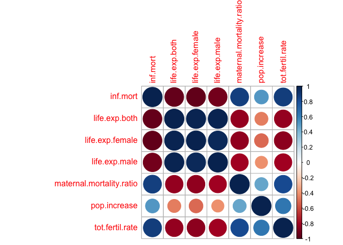

# Clusters of Countries {.tabset}

## Data Used
The data used is `Population Growth, Fertility and Mortality Indicators.csv`, tells about the number of some variables related to population fertility and mortality of each country around the world.

We have some variables from the data, and they are :

* `T03`  The country code

* `Population.growth.and.indicators.of.fertility.and.mortality` The country list

* `X` The year column

* `X.1` Variable which contains some indicators, this variable is going to be spread to some variables.

* `X.2` The values of the observations.

* `X.3` Footnotes

* `X.4` Data source


## The Goal

Assume that we are going to classify countries listed based on the indicators contained in the data. 

##  The Flow 

1. Libraries Importing and Data Preparation.

2. Exploratory Data Analyst

3. PCA Transformation.

4. Biplotting and Interpretation.


# Libraries Importing and Data Preparation

## Libraries Used


## Data Importing

```
## 'data.frame':    4979 obs. of  7 variables:
##  $ T03                                                        : chr  "Region/Country/Area" "1" "1" "1" ...
##  $ Population.growth.and.indicators.of.fertility.and.mortality: chr  "" "Total, all countries or areas" "Total, all countries or areas" "Total, all countries or areas" ...
##  $ X                                                          : chr  "Year" "2005" "2005" "2005" ...
##  $ X.1                                                        : chr  "Series" "Population annual rate of increase (percent)" "Total fertility rate (children per women)" "Infant mortality for both sexes (per 1,000 live births)" ...
##  $ X.2                                                        : chr  "Value" "1.3" "2.6" "49.1" ...
##  $ X.3                                                        : chr  "Footnotes" "Data refers to a 5-year period preceding the reference year." "Data refers to a 5-year period preceding the reference year." "Data refers to a 5-year period preceding the reference year." ...
##  $ X.4                                                        : chr  "Source" "United Nations Population Division, New York, World Population Prospects: The 2017 Revision, last accessed June 2017." "United Nations Population Division, New York, World Population Prospects: The 2017 Revision; supplemented by da"| __truncated__ "United Nations Statistics Division, New York, \"Demographic Yearbook 2015\" and the demographic statistics data"| __truncated__ ...
```

* We only need some variables to process the data, the last 2 columns and the first column will be eliminated

* There is a year column (from 2000 to 2016 ), most of the countries only have values for 2005, 2010, and 2015.

* The `X.1` contains 8 indicators, we're going to spread them into their own column


## Data cleaning

* In the chunk below we're going to remove the last 2 variables and filter the year, we only need the 2015 data to interpret the latest condition of each country.

<table>
 <thead>
  <tr>
   <th style="text-align:left;"> Code </th>
   <th style="text-align:left;"> Country </th>
   <th style="text-align:left;"> year </th>
   <th style="text-align:right;"> inf.mort </th>
   <th style="text-align:right;"> life.exp.both </th>
   <th style="text-align:right;"> life.exp.female </th>
   <th style="text-align:right;"> life.exp.male </th>
   <th style="text-align:right;"> maternal.mortality.ratio </th>
   <th style="text-align:right;"> pop.increase </th>
   <th style="text-align:right;"> tot.fertil.rate </th>
  </tr>
 </thead>
<tbody>
  <tr>
   <td style="text-align:left;"> 1 </td>
   <td style="text-align:left;"> Total, all countries or areas </td>
   <td style="text-align:left;"> 2015 </td>
   <td style="text-align:right;"> 35.0 </td>
   <td style="text-align:right;"> 70.8 </td>
   <td style="text-align:right;"> 73.1 </td>
   <td style="text-align:right;"> 68.6 </td>
   <td style="text-align:right;"> 216 </td>
   <td style="text-align:right;"> 1.2 </td>
   <td style="text-align:right;"> 2.5 </td>
  </tr>
  <tr>
   <td style="text-align:left;"> 100 </td>
   <td style="text-align:left;"> Bulgaria </td>
   <td style="text-align:left;"> 2015 </td>
   <td style="text-align:right;"> 8.3 </td>
   <td style="text-align:right;"> 74.3 </td>
   <td style="text-align:right;"> 77.8 </td>
   <td style="text-align:right;"> 70.8 </td>
   <td style="text-align:right;"> 11 </td>
   <td style="text-align:right;"> -0.6 </td>
   <td style="text-align:right;"> 1.5 </td>
  </tr>
  <tr>
   <td style="text-align:left;"> 104 </td>
   <td style="text-align:left;"> Myanmar </td>
   <td style="text-align:left;"> 2015 </td>
   <td style="text-align:right;"> 45.0 </td>
   <td style="text-align:right;"> 66.0 </td>
   <td style="text-align:right;"> 68.3 </td>
   <td style="text-align:right;"> 63.7 </td>
   <td style="text-align:right;"> 178 </td>
   <td style="text-align:right;"> 0.9 </td>
   <td style="text-align:right;"> 2.3 </td>
  </tr>
  <tr>
   <td style="text-align:left;"> 108 </td>
   <td style="text-align:left;"> Burundi </td>
   <td style="text-align:left;"> 2015 </td>
   <td style="text-align:right;"> 77.9 </td>
   <td style="text-align:right;"> 56.1 </td>
   <td style="text-align:right;"> 58.0 </td>
   <td style="text-align:right;"> 54.2 </td>
   <td style="text-align:right;"> 712 </td>
   <td style="text-align:right;"> 3.0 </td>
   <td style="text-align:right;"> 6.0 </td>
  </tr>
  <tr>
   <td style="text-align:left;"> 11 </td>
   <td style="text-align:left;"> Western Africa </td>
   <td style="text-align:left;"> 2015 </td>
   <td style="text-align:right;"> 70.5 </td>
   <td style="text-align:right;"> 54.7 </td>
   <td style="text-align:right;"> 55.6 </td>
   <td style="text-align:right;"> 53.9 </td>
   <td style="text-align:right;"> NA </td>
   <td style="text-align:right;"> 2.7 </td>
   <td style="text-align:right;"> 5.5 </td>
  </tr>
  <tr>
   <td style="text-align:left;"> 112 </td>
   <td style="text-align:left;"> Belarus </td>
   <td style="text-align:left;"> 2015 </td>
   <td style="text-align:right;"> 3.6 </td>
   <td style="text-align:right;"> 72.1 </td>
   <td style="text-align:right;"> 77.7 </td>
   <td style="text-align:right;"> 66.5 </td>
   <td style="text-align:right;"> 4 </td>
   <td style="text-align:right;"> 0.0 </td>
   <td style="text-align:right;"> 1.6 </td>
  </tr>
</tbody>
</table>

`Country` = Country list ;<br />
`inf.mort` = Infant mortality for both sexes (per 1,000 live births) ;<br />
`life.exp.both` = Life expectancy at birth for both sexes (years) ;<br />
`life.exp.male` = Life expectancy at birth for males (years) ;<br />
`life.exp.female` = Life expectancy at birth for females (years) ;<br />
`maternal.mortality.ratio` = Maternal mortality ratio (deaths per 100,000 population) ;<br />
`pop.increase` = Population annual rate of increase (percent) ;<br />
`tot.fertil.rate` = Total fertility rate (children per women) <br />


### NA checking

<table>
 <thead>
  <tr>
   <th style="text-align:left;"> column </th>
   <th style="text-align:right;"> NA </th>
  </tr>
 </thead>
<tbody>
  <tr>
   <td style="text-align:left;"> Code </td>
   <td style="text-align:right;"> 0 </td>
  </tr>
  <tr>
   <td style="text-align:left;"> Country </td>
   <td style="text-align:right;"> 0 </td>
  </tr>
  <tr>
   <td style="text-align:left;"> year </td>
   <td style="text-align:right;"> 0 </td>
  </tr>
  <tr>
   <td style="text-align:left;"> inf.mort </td>
   <td style="text-align:right;"> 31 </td>
  </tr>
  <tr>
   <td style="text-align:left;"> life.exp.both </td>
   <td style="text-align:right;"> 31 </td>
  </tr>
  <tr>
   <td style="text-align:left;"> life.exp.female </td>
   <td style="text-align:right;"> 29 </td>
  </tr>
  <tr>
   <td style="text-align:left;"> life.exp.male </td>
   <td style="text-align:right;"> 29 </td>
  </tr>
  <tr>
   <td style="text-align:left;"> maternal.mortality.ratio </td>
   <td style="text-align:right;"> 73 </td>
  </tr>
  <tr>
   <td style="text-align:left;"> pop.increase </td>
   <td style="text-align:right;"> 0 </td>
  </tr>
  <tr>
   <td style="text-align:left;"> tot.fertil.rate </td>
   <td style="text-align:right;"> 29 </td>
  </tr>
</tbody>
</table>
There are so many NAs in the data, it means that not all country listed have the data we need.
<br />
* We're going to replace the NAs to the average value of each variable/indicator.
<table>
 <thead>
  <tr>
   <th style="text-align:left;"> Code </th>
   <th style="text-align:left;"> Country </th>
   <th style="text-align:left;"> year </th>
   <th style="text-align:right;"> inf.mort </th>
   <th style="text-align:right;"> life.exp.both </th>
   <th style="text-align:right;"> life.exp.female </th>
   <th style="text-align:right;"> life.exp.male </th>
   <th style="text-align:right;"> maternal.mortality.ratio </th>
   <th style="text-align:right;"> pop.increase </th>
   <th style="text-align:right;"> tot.fertil.rate </th>
  </tr>
 </thead>
<tbody>
  <tr>
   <td style="text-align:left;"> 1 </td>
   <td style="text-align:left;"> Total, all countries or areas </td>
   <td style="text-align:left;"> 2015 </td>
   <td style="text-align:right;"> 35.0 </td>
   <td style="text-align:right;"> 70.8 </td>
   <td style="text-align:right;"> 73.1 </td>
   <td style="text-align:right;"> 68.6 </td>
   <td style="text-align:right;"> 216.0000 </td>
   <td style="text-align:right;"> 1.2 </td>
   <td style="text-align:right;"> 2.5 </td>
  </tr>
  <tr>
   <td style="text-align:left;"> 100 </td>
   <td style="text-align:left;"> Bulgaria </td>
   <td style="text-align:left;"> 2015 </td>
   <td style="text-align:right;"> 8.3 </td>
   <td style="text-align:right;"> 74.3 </td>
   <td style="text-align:right;"> 77.8 </td>
   <td style="text-align:right;"> 70.8 </td>
   <td style="text-align:right;"> 11.0000 </td>
   <td style="text-align:right;"> -0.6 </td>
   <td style="text-align:right;"> 1.5 </td>
  </tr>
  <tr>
   <td style="text-align:left;"> 104 </td>
   <td style="text-align:left;"> Myanmar </td>
   <td style="text-align:left;"> 2015 </td>
   <td style="text-align:right;"> 45.0 </td>
   <td style="text-align:right;"> 66.0 </td>
   <td style="text-align:right;"> 68.3 </td>
   <td style="text-align:right;"> 63.7 </td>
   <td style="text-align:right;"> 178.0000 </td>
   <td style="text-align:right;"> 0.9 </td>
   <td style="text-align:right;"> 2.3 </td>
  </tr>
  <tr>
   <td style="text-align:left;"> 108 </td>
   <td style="text-align:left;"> Burundi </td>
   <td style="text-align:left;"> 2015 </td>
   <td style="text-align:right;"> 77.9 </td>
   <td style="text-align:right;"> 56.1 </td>
   <td style="text-align:right;"> 58.0 </td>
   <td style="text-align:right;"> 54.2 </td>
   <td style="text-align:right;"> 712.0000 </td>
   <td style="text-align:right;"> 3.0 </td>
   <td style="text-align:right;"> 6.0 </td>
  </tr>
  <tr>
   <td style="text-align:left;"> 11 </td>
   <td style="text-align:left;"> Western Africa </td>
   <td style="text-align:left;"> 2015 </td>
   <td style="text-align:right;"> 70.5 </td>
   <td style="text-align:right;"> 54.7 </td>
   <td style="text-align:right;"> 55.6 </td>
   <td style="text-align:right;"> 53.9 </td>
   <td style="text-align:right;"> 162.1842 </td>
   <td style="text-align:right;"> 2.7 </td>
   <td style="text-align:right;"> 5.5 </td>
  </tr>
  <tr>
   <td style="text-align:left;"> 112 </td>
   <td style="text-align:left;"> Belarus </td>
   <td style="text-align:left;"> 2015 </td>
   <td style="text-align:right;"> 3.6 </td>
   <td style="text-align:right;"> 72.1 </td>
   <td style="text-align:right;"> 77.7 </td>
   <td style="text-align:right;"> 66.5 </td>
   <td style="text-align:right;"> 4.0000 </td>
   <td style="text-align:right;"> 0.0 </td>
   <td style="text-align:right;"> 1.6 </td>
  </tr>
</tbody>
</table>
<br />
There is an odd thing on the data as we replace the NA with the average number of each column. There are some rows/countries which have no observation value or only have 1 or 2 value for their indicator and we have filled them with the average values and it's not supposed to be like that. We supposed to eliminate them.

* eliminating some rows

I create a vector that indicates whether a rows' values are mostly the avg values of each column or not. If it is, eliminate the column.
<br />

```
## 'data.frame':    235 obs. of  8 variables:
##  $ Country                 : chr  "Total, all countries or areas" "Bulgaria" "Myanmar" "Burundi" ...
##  $ inf.mort                : num  35 8.3 45 77.9 70.5 3.6 29.9 27.7 67.5 4.7 ...
##  $ life.exp.both           : num  70.8 74.3 66 56.1 54.7 72.1 67.6 75.3 56.4 81.8 ...
##  $ life.exp.female         : num  73.1 77.8 68.3 58 55.6 77.7 69.6 76.5 57.7 83.8 ...
##  $ life.exp.male           : num  68.6 70.8 63.7 54.2 53.9 66.5 65.5 74.1 55.1 79.7 ...
##  $ maternal.mortality.ratio: num  216 11 178 712 162 ...
##  $ pop.increase            : num  1.2 -0.6 0.9 3 2.7 0 1.6 2 2.7 1 ...
##  $ tot.fertil.rate         : num  2.5 1.5 2.3 6 5.5 1.6 2.7 3 5 1.6 ...
```

### Continent Column

I think by giving the `Continent` column, we're going to have some more insights, so let's just do it.
<br />
<table>
 <thead>
  <tr>
   <th style="text-align:left;"> Country </th>
   <th style="text-align:left;"> Continent </th>
  </tr>
 </thead>
<tbody>
  <tr>
   <td style="text-align:left;"> Total, all countries or areas </td>
   <td style="text-align:left;"> NA </td>
  </tr>
  <tr>
   <td style="text-align:left;"> Bulgaria </td>
   <td style="text-align:left;"> Europe </td>
  </tr>
  <tr>
   <td style="text-align:left;"> Myanmar </td>
   <td style="text-align:left;"> Asia </td>
  </tr>
  <tr>
   <td style="text-align:left;"> Burundi </td>
   <td style="text-align:left;"> Africa </td>
  </tr>
  <tr>
   <td style="text-align:left;"> Western Africa </td>
   <td style="text-align:left;"> NA </td>
  </tr>
  <tr>
   <td style="text-align:left;"> Belarus </td>
   <td style="text-align:left;"> Europe </td>
  </tr>
</tbody>
</table>
<br />
Some rows cannot be defined by its continent and all of them are not even a country actually. They are just regions or certain areas of the continent. 

Our observations are countries so we wil just eliminate rows that represent some areas or regions.

<table>
 <thead>
  <tr>
   <th style="text-align:left;"> Country </th>
   <th style="text-align:left;"> Continent </th>
  </tr>
 </thead>
<tbody>
  <tr>
   <td style="text-align:left;"> Total, all countries or areas </td>
   <td style="text-align:left;"> ? </td>
  </tr>
  <tr>
   <td style="text-align:left;"> Western Africa </td>
   <td style="text-align:left;"> ? </td>
  </tr>
  <tr>
   <td style="text-align:left;"> Central America </td>
   <td style="text-align:left;"> ? </td>
  </tr>
  <tr>
   <td style="text-align:left;"> Eastern Africa </td>
   <td style="text-align:left;"> ? </td>
  </tr>
  <tr>
   <td style="text-align:left;"> Asia </td>
   <td style="text-align:left;"> ? </td>
  </tr>
  <tr>
   <td style="text-align:left;"> Central Asia </td>
   <td style="text-align:left;"> ? </td>
  </tr>
  <tr>
   <td style="text-align:left;"> Western Asia </td>
   <td style="text-align:left;"> ? </td>
  </tr>
  <tr>
   <td style="text-align:left;"> Northern Africa </td>
   <td style="text-align:left;"> ? </td>
  </tr>
  <tr>
   <td style="text-align:left;"> Europe </td>
   <td style="text-align:left;"> ? </td>
  </tr>
  <tr>
   <td style="text-align:left;"> Eastern Europe </td>
   <td style="text-align:left;"> ? </td>
  </tr>
  <tr>
   <td style="text-align:left;"> Northern Europe </td>
   <td style="text-align:left;"> ? </td>
  </tr>
  <tr>
   <td style="text-align:left;"> Western Europe </td>
   <td style="text-align:left;"> ? </td>
  </tr>
  <tr>
   <td style="text-align:left;"> Other non-specified areas </td>
   <td style="text-align:left;"> ? </td>
  </tr>
  <tr>
   <td style="text-align:left;"> Middle Africa </td>
   <td style="text-align:left;"> ? </td>
  </tr>
  <tr>
   <td style="text-align:left;"> Southern Africa </td>
   <td style="text-align:left;"> ? </td>
  </tr>
  <tr>
   <td style="text-align:left;"> Africa </td>
   <td style="text-align:left;"> ? </td>
  </tr>
  <tr>
   <td style="text-align:left;"> Sub-Saharan Africa </td>
   <td style="text-align:left;"> ? </td>
  </tr>
  <tr>
   <td style="text-align:left;"> Northern America </td>
   <td style="text-align:left;"> ? </td>
  </tr>
  <tr>
   <td style="text-align:left;"> Caribbean </td>
   <td style="text-align:left;"> ? </td>
  </tr>
  <tr>
   <td style="text-align:left;"> Eastern Asia </td>
   <td style="text-align:left;"> ? </td>
  </tr>
  <tr>
   <td style="text-align:left;"> Southern Asia </td>
   <td style="text-align:left;"> ? </td>
  </tr>
  <tr>
   <td style="text-align:left;"> South-eastern Asia </td>
   <td style="text-align:left;"> ? </td>
  </tr>
  <tr>
   <td style="text-align:left;"> Southern Europe </td>
   <td style="text-align:left;"> ? </td>
  </tr>
  <tr>
   <td style="text-align:left;"> Latin America &amp; the Caribbean </td>
   <td style="text-align:left;"> ? </td>
  </tr>
  <tr>
   <td style="text-align:left;"> South America </td>
   <td style="text-align:left;"> ? </td>
  </tr>
  <tr>
   <td style="text-align:left;"> Australia and New Zealand </td>
   <td style="text-align:left;"> ? </td>
  </tr>
  <tr>
   <td style="text-align:left;"> Melanesia </td>
   <td style="text-align:left;"> ? </td>
  </tr>
  <tr>
   <td style="text-align:left;"> Micronesia </td>
   <td style="text-align:left;"> ? </td>
  </tr>
  <tr>
   <td style="text-align:left;"> Polynesia </td>
   <td style="text-align:left;"> ? </td>
  </tr>
  <tr>
   <td style="text-align:left;"> South-central Asia </td>
   <td style="text-align:left;"> ? </td>
  </tr>
  <tr>
   <td style="text-align:left;"> Channel Islands </td>
   <td style="text-align:left;"> ? </td>
  </tr>
  <tr>
   <td style="text-align:left;"> Oceania </td>
   <td style="text-align:left;"> ? </td>
  </tr>
</tbody>
</table>

* We better assign the `Country` as rownames instead.
<table>
 <thead>
  <tr>
   <th style="text-align:right;"> inf.mort </th>
   <th style="text-align:right;"> life.exp.both </th>
   <th style="text-align:right;"> life.exp.female </th>
   <th style="text-align:right;"> life.exp.male </th>
   <th style="text-align:right;"> maternal.mortality.ratio </th>
   <th style="text-align:right;"> pop.increase </th>
   <th style="text-align:right;"> tot.fertil.rate </th>
   <th style="text-align:left;"> Continent </th>
  </tr>
 </thead>
<tbody>
  <tr>
   <td style="text-align:right;"> 8.3 </td>
   <td style="text-align:right;"> 74.3 </td>
   <td style="text-align:right;"> 77.8 </td>
   <td style="text-align:right;"> 70.8 </td>
   <td style="text-align:right;"> 11 </td>
   <td style="text-align:right;"> -0.6 </td>
   <td style="text-align:right;"> 1.5 </td>
   <td style="text-align:left;"> Europe </td>
  </tr>
  <tr>
   <td style="text-align:right;"> 45.0 </td>
   <td style="text-align:right;"> 66.0 </td>
   <td style="text-align:right;"> 68.3 </td>
   <td style="text-align:right;"> 63.7 </td>
   <td style="text-align:right;"> 178 </td>
   <td style="text-align:right;"> 0.9 </td>
   <td style="text-align:right;"> 2.3 </td>
   <td style="text-align:left;"> Asia </td>
  </tr>
  <tr>
   <td style="text-align:right;"> 77.9 </td>
   <td style="text-align:right;"> 56.1 </td>
   <td style="text-align:right;"> 58.0 </td>
   <td style="text-align:right;"> 54.2 </td>
   <td style="text-align:right;"> 712 </td>
   <td style="text-align:right;"> 3.0 </td>
   <td style="text-align:right;"> 6.0 </td>
   <td style="text-align:left;"> Africa </td>
  </tr>
  <tr>
   <td style="text-align:right;"> 3.6 </td>
   <td style="text-align:right;"> 72.1 </td>
   <td style="text-align:right;"> 77.7 </td>
   <td style="text-align:right;"> 66.5 </td>
   <td style="text-align:right;"> 4 </td>
   <td style="text-align:right;"> 0.0 </td>
   <td style="text-align:right;"> 1.6 </td>
   <td style="text-align:left;"> Europe </td>
  </tr>
  <tr>
   <td style="text-align:right;"> 29.9 </td>
   <td style="text-align:right;"> 67.6 </td>
   <td style="text-align:right;"> 69.6 </td>
   <td style="text-align:right;"> 65.5 </td>
   <td style="text-align:right;"> 161 </td>
   <td style="text-align:right;"> 1.6 </td>
   <td style="text-align:right;"> 2.7 </td>
   <td style="text-align:left;"> Asia </td>
  </tr>
  <tr>
   <td style="text-align:right;"> 27.7 </td>
   <td style="text-align:right;"> 75.3 </td>
   <td style="text-align:right;"> 76.5 </td>
   <td style="text-align:right;"> 74.1 </td>
   <td style="text-align:right;"> 140 </td>
   <td style="text-align:right;"> 2.0 </td>
   <td style="text-align:right;"> 3.0 </td>
   <td style="text-align:left;"> Africa </td>
  </tr>
</tbody>
</table>
<br />
Now the data is ready to be proceed.


# Exploratory Data Analyst

* Variables Correlation

<!-- -->
<br />
From the plot above we can conclude that :

* the correlation between **life expectancy of birth** of male, female, and both are really high. In this case we better use the `life expectancy of both` 


* all variables have relatively strong correlation to each other but `pop.increase`

* the `pop.increase` has the least correlation with other variables


## Life Expectantion of the World

<!--html_preserve--><iframe src="html_plot/g.html" width="100%" height="600" scrolling="no" seamless="seamless" frameBorder="0"></iframe><!--/html_preserve-->


<!--html_preserve--><div id="htmlwidget-42f1601af0dbd048e187" style="width:672px;height:480px;" class="plotly html-widget"></div>
<script type="application/json" data-for="htmlwidget-42f1601af0dbd048e187">{"x":{"data":[{"x":[56.1030285633307,75.2823999864078,56.4300985823085,72.1700202810543,49.3782958831151,51.6904142393292,62.8019787510142,79.3301796958257,62.4970489633414,58.0999697820382,59.9231568816953,56.7822981580032,63.7195032015131,63.3917961472875,60.2088657153626,61.6219664976362,64.4886229379688,60.3183129973465,61.6764145997412,57.8820219502416,51.728041833977,65.4203711953726,52.4789551896161,60.7051833980115,71.490483689951,64.4687113034862,60.7042195513404,56.2041763166052,62.593772434351,74.0779444665501,74.8920923927498,56.1242236023155,61.688106622706,58.4827859740569,51.9027043736356,55.9832860857675,79.4827479572552,65.169732642597,66.0957414713052,65.6864133378067,72.90274351704,50.1798747369404,54.8754813335493,59.5263270546862,57.6138558122295,62.93101520406,55.1252481629164,63.6165858117937,68.4014683657031,55.0018652404518,59.0838965962847,74.9846446359411,58.5772716530678,70.7937642259411,62.8103472900277,58.6787971832693,59.6811812531701],"y":[3.00802702059969,2.00783071978018,2.67417586011812,1.20695352507755,0.437358495313674,3.32400075092912,2.38700032629073,2.76569966554642,2.58355861034244,3.31227828301489,2.82380513945594,4.18560351878405,2.57025140924379,2.01056294454262,3.48843867206946,1.69630073333159,3.30985748691484,3.12891486771405,2.43425560234115,2.26096914047375,2.46512943664566,2.71767899414524,1.28750993357971,2.59700872711837,0.20943614449352,2.6601044844836,2.92157175360247,2.8888636255078,2.90547378458083,0.19463253242895,1.40352793991566,2.89574697762728,2.21415368018672,3.76568287314847,2.71384224938229,2.57105065627024,0.771971182320267,2.52914688831195,2.17221655804664,3.01472931338474,0.538239956330508,2.33211966773495,2.90149777760729,1.41367541069165,2.31614328375086,1.7824345678091,3.32144716147333,2.28084504192695,1.79860772388056,1.77763494126499,2.58932950383052,1.21305512370542,3.39981305472553,2.17946582214907,3.118932929039,2.99862150004134,3.00164455002174],"text":["Continent: Africa<br />life.exp.both: 56.1000<br />pop.increase:  3.0<br />Burundi","Continent: Africa<br />life.exp.both: 75.3000<br />pop.increase:  2.0<br />Algeria","Continent: Africa<br />life.exp.both: 56.4000<br />pop.increase:  2.7<br />Cameroon","Continent: Africa<br />life.exp.both: 72.2000<br />pop.increase:  1.2<br />Cabo Verde","Continent: Africa<br />life.exp.both: 49.4000<br />pop.increase:  0.4<br />Central African Republic","Continent: Africa<br />life.exp.both: 51.7000<br />pop.increase:  3.3<br />Chad","Continent: Africa<br />life.exp.both: 62.8000<br />pop.increase:  2.4<br />Comoros","Continent: Africa<br />life.exp.both: 79.3000<br />pop.increase:  2.8<br />Mayotte","Continent: Africa<br />life.exp.both: 62.5000<br />pop.increase:  2.6<br />Congo","Continent: Africa<br />life.exp.both: 58.1000<br />pop.increase:  3.3<br />Dem. Rep. of the Congo","Continent: Africa<br />life.exp.both: 59.9000<br />pop.increase:  2.8<br />Benin","Continent: Africa<br />life.exp.both: 56.8000<br />pop.increase:  4.2<br />Equatorial Guinea","Continent: Africa<br />life.exp.both: 63.7000<br />pop.increase:  2.6<br />Ethiopia","Continent: Africa<br />life.exp.both: 63.4000<br />pop.increase:  2.0<br />Eritrea","Continent: Africa<br />life.exp.both: 60.2000<br />pop.increase:  3.5<br />Angola","Continent: Africa<br />life.exp.both: 61.6000<br />pop.increase:  1.7<br />Djibouti","Continent: Africa<br />life.exp.both: 64.5000<br />pop.increase:  3.3<br />Gabon","Continent: Africa<br />life.exp.both: 60.3000<br />pop.increase:  3.1<br />Gambia","Continent: Africa<br />life.exp.both: 61.7000<br />pop.increase:  2.4<br />Ghana","Continent: Africa<br />life.exp.both: 57.9000<br />pop.increase:  2.3<br />Guinea","Continent: Africa<br />life.exp.both: 51.7000<br />pop.increase:  2.5<br />Côte d'Ivoire","Continent: Africa<br />life.exp.both: 65.4000<br />pop.increase:  2.7<br />Kenya","Continent: Africa<br />life.exp.both: 52.5000<br />pop.increase:  1.3<br />Lesotho","Continent: Africa<br />life.exp.both: 60.7000<br />pop.increase:  2.6<br />Liberia","Continent: Africa<br />life.exp.both: 71.5000<br />pop.increase:  0.2<br />Libya","Continent: Africa<br />life.exp.both: 64.5000<br />pop.increase:  2.7<br />Madagascar","Continent: Africa<br />life.exp.both: 60.7000<br />pop.increase:  2.9<br />Malawi","Continent: Africa<br />life.exp.both: 56.2000<br />pop.increase:  2.9<br />Mali","Continent: Africa<br />life.exp.both: 62.6000<br />pop.increase:  2.9<br />Mauritania","Continent: Africa<br />life.exp.both: 74.1000<br />pop.increase:  0.2<br />Mauritius","Continent: Africa<br />life.exp.both: 74.9000<br />pop.increase:  1.4<br />Morocco","Continent: Africa<br />life.exp.both: 56.1000<br />pop.increase:  2.9<br />Mozambique","Continent: Africa<br />life.exp.both: 61.7000<br />pop.increase:  2.2<br />Namibia","Continent: Africa<br />life.exp.both: 58.5000<br />pop.increase:  3.8<br />Niger","Continent: Africa<br />life.exp.both: 51.9000<br />pop.increase:  2.7<br />Nigeria","Continent: Africa<br />life.exp.both: 56.0000<br />pop.increase:  2.6<br />Guinea-Bissau","Continent: Africa<br />life.exp.both: 79.5000<br />pop.increase:  0.8<br />Réunion","Continent: Africa<br />life.exp.both: 65.2000<br />pop.increase:  2.5<br />Rwanda","Continent: Africa<br />life.exp.both: 66.1000<br />pop.increase:  2.2<br />Sao Tome and Principe","Continent: Africa<br />life.exp.both: 65.7000<br />pop.increase:  3.0<br />Senegal","Continent: Africa<br />life.exp.both: 72.9000<br />pop.increase:  0.5<br />Seychelles","Continent: Africa<br />life.exp.both: 50.2000<br />pop.increase:  2.3<br />Sierra Leone","Continent: Africa<br />life.exp.both: 54.9000<br />pop.increase:  2.9<br />Somalia","Continent: Africa<br />life.exp.both: 59.5000<br />pop.increase:  1.4<br />South Africa","Continent: Africa<br />life.exp.both: 57.6000<br />pop.increase:  2.3<br />Zimbabwe","Continent: Africa<br />life.exp.both: 62.9000<br />pop.increase:  1.8<br />Botswana","Continent: Africa<br />life.exp.both: 55.1000<br />pop.increase:  3.3<br />South Sudan","Continent: Africa<br />life.exp.both: 63.6000<br />pop.increase:  2.3<br />Sudan","Continent: Africa<br />life.exp.both: 68.4000<br />pop.increase:  1.8<br />Western Sahara","Continent: Africa<br />life.exp.both: 55.0000<br />pop.increase:  1.8<br />Swaziland","Continent: Africa<br />life.exp.both: 59.1000<br />pop.increase:  2.6<br />Togo","Continent: Africa<br />life.exp.both: 75.0000<br />pop.increase:  1.2<br />Tunisia","Continent: Africa<br />life.exp.both: 58.6000<br />pop.increase:  3.4<br />Uganda","Continent: Africa<br />life.exp.both: 70.8000<br />pop.increase:  2.2<br />Egypt","Continent: Africa<br />life.exp.both: 62.8000<br />pop.increase:  3.1<br />United Rep. of Tanzania","Continent: Africa<br />life.exp.both: 58.7000<br />pop.increase:  3.0<br />Burkina Faso","Continent: Africa<br />life.exp.both: 59.7000<br />pop.increase:  3.0<br />Zambia"],"type":"scatter","mode":"markers","marker":{"autocolorscale":false,"color":"rgba(248,118,109,1)","opacity":1,"size":5.66929133858268,"symbol":"circle","line":{"width":1.88976377952756,"color":"rgba(248,118,109,1)"}},"hoveron":"points","name":"Africa","legendgroup":"Africa","showlegend":true,"xaxis":"x","yaxis":"y","hoverinfo":"text","frame":null},{"x":[81.8099776106504,78.8204979160831,73.6783230114659,79.2089495119685,79.1845800488576,73.2116864829453,75.4727236178232,72.5738898526576,79.1928486558446,75.7866146716575,71.3051925742517,73.1894507377598,80.5239530639753,76.0147063580927,72.4011852452921,66.2871203168417,62.2811749117417,72.8690831750838,75.5002728536418,75.0953670315027,81.2006661119686,76.4749762234034,75.4315402880689,77.7918639810537,75.4255637672561,74.4706234589477,77.2999361767466,71.3214279679124,72.724736519709,74.2118223509539,79.1791368608651,74.7850288627995,72.6796946509284,67.7191990939737,70.8810279659762,74.7011624962472,70.2044889170464,69.8226718176426,78.9170369216846,79.1067490018878,76.9759160023885,73.9251230980066],"y":[0.994106597173959,0.930856602396816,0.985724891144782,1.12389761870727,0.21313934288919,1.18615689098835,1.56494545934722,0.49628833539784,2.76776618333533,1.1188609267585,-0.0856834486871958,0.387745730802417,-0.0126565409451723,1.00944770457223,2.11988027928397,0.635247320439666,1.36057929379866,1.81249021276832,0.374254868868739,1.43418825421482,-0.475340039134026,1.41127307992429,0.332296166345477,1.3602499435842,0.536927316114306,1.22341673364863,1.70291223233566,-0.627811155486852,1.31183349609375,1.26752223376185,-0.224980802163482,0.491364038120955,-0.00602638620883224,1.58009815244004,0.986505420599133,0.93506782233715,0.463432515598834,2.16328674674034,0.690247813910246,-0.194320837631822,0.31114616278559,1.37593290677294],"text":["Continent: Americas<br />life.exp.both: 81.8000<br />pop.increase:  1.0<br />Canada","Continent: Americas<br />life.exp.both: 78.8000<br />pop.increase:  0.9<br />Chile","Continent: Americas<br />life.exp.both: 73.7000<br />pop.increase:  1.0<br />Colombia","Continent: Americas<br />life.exp.both: 79.2000<br />pop.increase:  1.1<br />Costa Rica","Continent: Americas<br />life.exp.both: 79.2000<br />pop.increase:  0.2<br />Cuba","Continent: Americas<br />life.exp.both: 73.2000<br />pop.increase:  1.2<br />Dominican Republic","Continent: Americas<br />life.exp.both: 75.5000<br />pop.increase:  1.6<br />Ecuador","Continent: Americas<br />life.exp.both: 72.6000<br />pop.increase:  0.5<br />El Salvador","Continent: Americas<br />life.exp.both: 79.2000<br />pop.increase:  2.8<br />French Guiana","Continent: Americas<br />life.exp.both: 75.8000<br />pop.increase:  1.1<br />Antigua and Barbuda","Continent: Americas<br />life.exp.both: 71.3194<br />pop.increase: -0.1<br />Greenland","Continent: Americas<br />life.exp.both: 73.2000<br />pop.increase:  0.4<br />Grenada","Continent: Americas<br />life.exp.both: 80.5000<br />pop.increase:  0.0<br />Guadeloupe","Continent: Americas<br />life.exp.both: 76.0000<br />pop.increase:  1.0<br />Argentina","Continent: Americas<br />life.exp.both: 72.4000<br />pop.increase:  2.1<br />Guatemala","Continent: Americas<br />life.exp.both: 66.3000<br />pop.increase:  0.6<br />Guyana","Continent: Americas<br />life.exp.both: 62.3000<br />pop.increase:  1.4<br />Haiti","Continent: Americas<br />life.exp.both: 72.9000<br />pop.increase:  1.8<br />Honduras","Continent: Americas<br />life.exp.both: 75.5000<br />pop.increase:  0.4<br />Jamaica","Continent: Americas<br />life.exp.both: 75.1000<br />pop.increase:  1.4<br />Bahamas","Continent: Americas<br />life.exp.both: 81.2000<br />pop.increase: -0.5<br />Martinique","Continent: Americas<br />life.exp.both: 76.5000<br />pop.increase:  1.4<br />Mexico","Continent: Americas<br />life.exp.both: 75.4000<br />pop.increase:  0.3<br />Barbados","Continent: Americas<br />life.exp.both: 77.8000<br />pop.increase:  1.4<br />Curaçao","Continent: Americas<br />life.exp.both: 75.4000<br />pop.increase:  0.5<br />Aruba","Continent: Americas<br />life.exp.both: 74.5000<br />pop.increase:  1.2<br />Nicaragua","Continent: Americas<br />life.exp.both: 77.3000<br />pop.increase:  1.7<br />Panama","Continent: Americas<br />life.exp.both: 71.3194<br />pop.increase: -0.6<br />Bermuda","Continent: Americas<br />life.exp.both: 72.7000<br />pop.increase:  1.3<br />Paraguay","Continent: Americas<br />life.exp.both: 74.2000<br />pop.increase:  1.3<br />Peru","Continent: Americas<br />life.exp.both: 79.2000<br />pop.increase: -0.2<br />Puerto Rico","Continent: Americas<br />life.exp.both: 74.8000<br />pop.increase:  0.5<br />Saint Lucia","Continent: Americas<br />life.exp.both: 72.7000<br />pop.increase:  0.0<br />Saint Vincent & Grenadines","Continent: Americas<br />life.exp.both: 67.7000<br />pop.increase:  1.6<br />Bolivia (Plurin. State of)","Continent: Americas<br />life.exp.both: 70.9000<br />pop.increase:  1.0<br />Suriname","Continent: Americas<br />life.exp.both: 74.7000<br />pop.increase:  0.9<br />Brazil","Continent: Americas<br />life.exp.both: 70.2000<br />pop.increase:  0.5<br />Trinidad and Tobago","Continent: Americas<br />life.exp.both: 69.8000<br />pop.increase:  2.2<br />Belize","Continent: Americas<br />life.exp.both: 78.9000<br />pop.increase:  0.7<br />United States of America","Continent: Americas<br />life.exp.both: 79.1000<br />pop.increase: -0.2<br />United States Virgin Islands","Continent: Americas<br />life.exp.both: 77.0000<br />pop.increase:  0.3<br />Uruguay","Continent: Americas<br />life.exp.both: 73.9000<br />pop.increase:  1.4<br />Venezuela (Boliv. Rep. of)"],"type":"scatter","mode":"markers","marker":{"autocolorscale":false,"color":"rgba(163,165,0,1)","opacity":1,"size":5.66929133858268,"symbol":"circle","line":{"width":1.88976377952756,"color":"rgba(163,165,0,1)"}},"hoveron":"points","name":"Americas","legendgroup":"Americas","showlegend":true,"xaxis":"x","yaxis":"y","hoverinfo":"text","frame":null},{"x":[66.0017422631478,67.6084051759938,74.6051034597109,75.7043085332704,79.9284769263638,72.8029674971679,72.8997985766233,71.5751106861125,83.3775109969042,67.6094453864466,68.6172131250994,75.129562370998,69.2130453015913,81.9006247328046,83.3322404420437,69.1304796070895,62.280662498894,73.8196544501804,70.7982527279826,81.2748850185203,74.2782477679662,70.3053868875096,65.4208291245285,78.9136574822472,83.2865432581025,74.6940502051896,76.2896055569375,76.3869657517085,68.5000505483368,71.2166765157943,74.0053661702351,76.1720102019036,68.9188135100844,65.8802762433129,68.5903165842745,67.7121158326746,77.7137158098612,68.7824105139477,74.0186641149163,82.3002570430546,75.5954308275365,69.920080269921,70.4236051377632,74.6235140461425,76.6866767429333,74.767952438496,67.3311780526109,70.8291621345926,64.2132999118182,76.6758040530264],"y":[0.87496545439586,1.59491884637624,0.524025082066655,0.463466242700815,0.863455573376268,-1.38716712677851,2.66440386800095,1.26298235075548,0.579651186466217,1.19301574129611,1.32935619922355,1.20826214227825,3.19154201138765,1.70703320277855,-0.0906775136105717,1.6352284925431,3.22717660449445,4.89613740937784,0.464081447869539,0.416073283664882,5.42550657361746,1.62324020525441,1.30841009330004,5.99219798460603,2.32966975670308,1.82012765591964,2.79617577977479,2.0357051047124,1.88598386749625,1.18170812226832,0.308951177559793,6.50573161633685,1.22911606889218,2.08645080341026,1.62021897166967,2.23218364305794,6.57233118031174,1.56597716227174,2.7688787696138,1.72351812759414,1.06739310603589,-2.32147369939834,2.22598217640072,0.421154408659786,1.98640165319666,1.59902859756723,1.80270070286468,1.56241735644639,2.57729785932228,1.43722177149728],"text":["Continent: Asia<br />life.exp.both: 66.0000<br />pop.increase:  0.9<br />Myanmar","Continent: Asia<br />life.exp.both: 67.6000<br />pop.increase:  1.6<br />Cambodia","Continent: Asia<br />life.exp.both: 74.6000<br />pop.increase:  0.5<br />Sri Lanka","Continent: Asia<br />life.exp.both: 75.7000<br />pop.increase:  0.5<br />China","Continent: Asia<br />life.exp.both: 79.9000<br />pop.increase:  0.9<br />Cyprus","Continent: Asia<br />life.exp.both: 72.8000<br />pop.increase: -1.4<br />Georgia","Continent: Asia<br />life.exp.both: 72.9000<br />pop.increase:  2.7<br />State of Palestine","Continent: Asia<br />life.exp.both: 71.6000<br />pop.increase:  1.3<br />Azerbaijan","Continent: Asia<br />life.exp.both: 83.4000<br />pop.increase:  0.6<br />China, Hong Kong SAR","Continent: Asia<br />life.exp.both: 67.6000<br />pop.increase:  1.2<br />India","Continent: Asia<br />life.exp.both: 68.6000<br />pop.increase:  1.3<br />Indonesia","Continent: Asia<br />life.exp.both: 75.1000<br />pop.increase:  1.2<br />Iran (Islamic Republic of)","Continent: Asia<br />life.exp.both: 69.2000<br />pop.increase:  3.2<br />Iraq","Continent: Asia<br />life.exp.both: 81.9000<br />pop.increase:  1.7<br />Israel","Continent: Asia<br />life.exp.both: 83.3000<br />pop.increase: -0.1<br />Japan","Continent: Asia<br />life.exp.both: 69.1000<br />pop.increase:  1.6<br />Kazakhstan","Continent: Asia<br />life.exp.both: 62.3000<br />pop.increase:  3.2<br />Afghanistan","Continent: Asia<br />life.exp.both: 73.8000<br />pop.increase:  4.9<br />Jordan","Continent: Asia<br />life.exp.both: 70.8000<br />pop.increase:  0.5<br />Dem. People's Rep. Korea","Continent: Asia<br />life.exp.both: 81.3000<br />pop.increase:  0.4<br />Republic of Korea","Continent: Asia<br />life.exp.both: 74.3000<br />pop.increase:  5.4<br />Kuwait","Continent: Asia<br />life.exp.both: 70.3000<br />pop.increase:  1.6<br />Kyrgyzstan","Continent: Asia<br />life.exp.both: 65.4000<br />pop.increase:  1.3<br />Lao People's Dem. Rep.","Continent: Asia<br />life.exp.both: 78.9000<br />pop.increase:  6.0<br />Lebanon","Continent: Asia<br />life.exp.both: 83.3000<br />pop.increase:  2.3<br />China, Macao SAR","Continent: Asia<br />life.exp.both: 74.7000<br />pop.increase:  1.8<br />Malaysia","Continent: Asia<br />life.exp.both: 76.3000<br />pop.increase:  2.8<br />Maldives","Continent: Asia<br />life.exp.both: 76.4000<br />pop.increase:  2.0<br />Bahrain","Continent: Asia<br />life.exp.both: 68.5000<br />pop.increase:  1.9<br />Mongolia","Continent: Asia<br />life.exp.both: 71.2000<br />pop.increase:  1.2<br />Bangladesh","Continent: Asia<br />life.exp.both: 74.0000<br />pop.increase:  0.3<br />Armenia","Continent: Asia<br />life.exp.both: 76.2000<br />pop.increase:  6.5<br />Oman","Continent: Asia<br />life.exp.both: 68.9000<br />pop.increase:  1.2<br />Nepal","Continent: Asia<br />life.exp.both: 65.9000<br />pop.increase:  2.1<br />Pakistan","Continent: Asia<br />life.exp.both: 68.6000<br />pop.increase:  1.6<br />Philippines","Continent: Asia<br />life.exp.both: 67.7000<br />pop.increase:  2.2<br />Timor-Leste","Continent: Asia<br />life.exp.both: 77.7000<br />pop.increase:  6.6<br />Qatar","Continent: Asia<br />life.exp.both: 68.8000<br />pop.increase:  1.6<br />Bhutan","Continent: Asia<br />life.exp.both: 74.0000<br />pop.increase:  2.8<br />Saudi Arabia","Continent: Asia<br />life.exp.both: 82.3000<br />pop.increase:  1.7<br />Singapore","Continent: Asia<br />life.exp.both: 75.6000<br />pop.increase:  1.1<br />Viet Nam","Continent: Asia<br />life.exp.both: 69.9000<br />pop.increase: -2.3<br />Syrian Arab Republic","Continent: Asia<br />life.exp.both: 70.4000<br />pop.increase:  2.2<br />Tajikistan","Continent: Asia<br />life.exp.both: 74.6000<br />pop.increase:  0.4<br />Thailand","Continent: Asia<br />life.exp.both: 76.7000<br />pop.increase:  2.0<br />United Arab Emirates","Continent: Asia<br />life.exp.both: 74.8000<br />pop.increase:  1.6<br />Turkey","Continent: Asia<br />life.exp.both: 67.3000<br />pop.increase:  1.8<br />Turkmenistan","Continent: Asia<br />life.exp.both: 70.8000<br />pop.increase:  1.6<br />Uzbekistan","Continent: Asia<br />life.exp.both: 64.2000<br />pop.increase:  2.6<br />Yemen","Continent: Asia<br />life.exp.both: 76.7000<br />pop.increase:  1.4<br />Brunei Darussalam"],"type":"scatter","mode":"markers","marker":{"autocolorscale":false,"color":"rgba(0,191,125,1)","opacity":1,"size":5.66929133858268,"symbol":"circle","line":{"width":1.88976377952756,"color":"rgba(0,191,125,1)"}},"hoveron":"points","name":"Asia","legendgroup":"Asia","showlegend":true,"xaxis":"x","yaxis":"y","hoverinfo":"text","frame":null},{"x":[74.3007618412637,72.100541785666,76.9775625110034,78.2064971465744,80.1154386508494,76.8223805923552,71.3032691489348,80.6743238377041,81.888903149322,80.4191038980054,80.6002322017047,75.4264095165264,82.2230686334481,80.918272847628,82.2921656869636,80.9767490734262,73.9276092827407,73.9798590418075,81.0809433393305,80.3044189627796,70.9801319502487,76.3783290811789,81.3267494907151,80.5007929555051,81.5737959038509,77.0203573573422,80.5290579841304,74.7957453381232,70.2739440521726,74.7280149499569,76.3136238261796,76.2786685121469,80.3309469168392,82.5041745423174,81.906388119407,82.7107253884102,77.7025321625522,71.0937853719279,75.1046947747837,80.9992865204529],"y":[-0.590642728060484,-0.00581027287989853,-0.412211861088872,0.124245444703847,0.486603329256177,-0.320004367064685,0.163885326944292,0.42579115640372,0.431459978427738,0.171573209576309,-0.381915233898908,-0.280484110359103,0.625735211353749,0.264921090062708,-0.131100249812007,0.616102109793573,-1.16893698016182,-1.31899927297607,2.16579546319321,0.499744003396481,-0.114506471976638,0.0654542515985669,0.298095488920808,0.601542570590973,1.20257555918768,0.0285797155648469,-0.396793135479093,-0.574347566571087,0.1202057839185,-0.374725661519915,-0.975159798171371,0.0887657660804689,0.26830458290875,-0.237632104139775,0.805253720562905,1.22858296178281,-0.115267918016761,-0.513921411260962,0.116098408196121,0.720089750476181],"text":["Continent: Europe<br />life.exp.both: 74.3000<br />pop.increase: -0.6<br />Bulgaria","Continent: Europe<br />life.exp.both: 72.1000<br />pop.increase:  0.0<br />Belarus","Continent: Europe<br />life.exp.both: 77.0000<br />pop.increase: -0.4<br />Croatia","Continent: Europe<br />life.exp.both: 78.2000<br />pop.increase:  0.1<br />Czechia","Continent: Europe<br />life.exp.both: 80.1000<br />pop.increase:  0.5<br />Denmark","Continent: Europe<br />life.exp.both: 76.8000<br />pop.increase: -0.3<br />Estonia","Continent: Europe<br />life.exp.both: 71.3194<br />pop.increase:  0.2<br />Faroe Islands","Continent: Europe<br />life.exp.both: 80.7000<br />pop.increase:  0.4<br />Finland","Continent: Europe<br />life.exp.both: 81.9000<br />pop.increase:  0.4<br />France","Continent: Europe<br />life.exp.both: 80.4000<br />pop.increase:  0.2<br />Germany","Continent: Europe<br />life.exp.both: 80.6000<br />pop.increase: -0.4<br />Greece","Continent: Europe<br />life.exp.both: 75.4000<br />pop.increase: -0.3<br />Hungary","Continent: Europe<br />life.exp.both: 82.2000<br />pop.increase:  0.6<br />Iceland","Continent: Europe<br />life.exp.both: 80.9000<br />pop.increase:  0.3<br />Ireland","Continent: Europe<br />life.exp.both: 82.3000<br />pop.increase: -0.1<br />Italy","Continent: Europe<br />life.exp.both: 81.0000<br />pop.increase:  0.6<br />Austria","Continent: Europe<br />life.exp.both: 73.9000<br />pop.increase: -1.2<br />Latvia","Continent: Europe<br />life.exp.both: 74.0000<br />pop.increase: -1.3<br />Lithuania","Continent: Europe<br />life.exp.both: 81.1000<br />pop.increase:  2.2<br />Luxembourg","Continent: Europe<br />life.exp.both: 80.3000<br />pop.increase:  0.5<br />Malta","Continent: Europe<br />life.exp.both: 71.0000<br />pop.increase: -0.1<br />Republic of Moldova","Continent: Europe<br />life.exp.both: 76.4000<br />pop.increase:  0.1<br />Montenegro","Continent: Europe<br />life.exp.both: 81.3000<br />pop.increase:  0.3<br />Netherlands","Continent: Europe<br />life.exp.both: 80.5000<br />pop.increase:  0.6<br />Belgium","Continent: Europe<br />life.exp.both: 81.6000<br />pop.increase:  1.2<br />Norway","Continent: Europe<br />life.exp.both: 77.0000<br />pop.increase:  0.0<br />Poland","Continent: Europe<br />life.exp.both: 80.5000<br />pop.increase: -0.4<br />Portugal","Continent: Europe<br />life.exp.both: 74.8000<br />pop.increase: -0.6<br />Romania","Continent: Europe<br />life.exp.both: 70.3000<br />pop.increase:  0.1<br />Russian Federation","Continent: Europe<br />life.exp.both: 74.7000<br />pop.increase: -0.4<br />Serbia","Continent: Europe<br />life.exp.both: 76.3000<br />pop.increase: -1.0<br />Bosnia and Herzegovina","Continent: Europe<br />life.exp.both: 76.3000<br />pop.increase:  0.1<br />Slovakia","Continent: Europe<br />life.exp.both: 80.3000<br />pop.increase:  0.3<br />Slovenia","Continent: Europe<br />life.exp.both: 82.5000<br />pop.increase: -0.2<br />Spain","Continent: Europe<br />life.exp.both: 81.9000<br />pop.increase:  0.8<br />Sweden","Continent: Europe<br />life.exp.both: 82.7000<br />pop.increase:  1.2<br />Switzerland","Continent: Europe<br />life.exp.both: 77.7000<br />pop.increase: -0.1<br />Albania","Continent: Europe<br />life.exp.both: 71.1000<br />pop.increase: -0.5<br />Ukraine","Continent: Europe<br />life.exp.both: 75.1000<br />pop.increase:  0.1<br />TFYR of Macedonia","Continent: Europe<br />life.exp.both: 81.0000<br />pop.increase:  0.7<br />United Kingdom"],"type":"scatter","mode":"markers","marker":{"autocolorscale":false,"color":"rgba(0,176,246,1)","opacity":1,"size":5.66929133858268,"symbol":"circle","line":{"width":1.88976377952756,"color":"rgba(0,176,246,1)"}},"hoveron":"points","name":"Europe","legendgroup":"Europe","showlegend":true,"xaxis":"x","yaxis":"y","hoverinfo":"text","frame":null},{"x":[69.6948654642122,76.0890495519268,65.6917442274017,78.8210981687491,82.3222394580244,76.2772054551042,71.384295266115,81.2735908195071,68.7934833772922,72.9759494969702,65.0208213039489,72.5155779853243,74.1160739819077,69.583959979896],"y":[0.730782648324966,0.694497511852533,1.77698231397197,0.28960495043546,1.52200036378577,1.41147824784741,2.31264592995867,1.11247094601393,0.219257954470813,0.802784593012184,2.2233396022208,0.393629073817283,0.818649186827242,2.09838269304484],"text":["Continent: Oceania<br />life.exp.both: 69.7000<br />pop.increase:  0.7<br />Fiji","Continent: Oceania<br />life.exp.both: 76.1000<br />pop.increase:  0.7<br />French Polynesia","Continent: Oceania<br />life.exp.both: 65.7000<br />pop.increase:  1.8<br />Kiribati","Continent: Oceania<br />life.exp.both: 78.8000<br />pop.increase:  0.3<br />Guam","Continent: Oceania<br />life.exp.both: 82.3000<br />pop.increase:  1.5<br />Australia","Continent: Oceania<br />life.exp.both: 76.3000<br />pop.increase:  1.4<br />New Caledonia","Continent: Oceania<br />life.exp.both: 71.4000<br />pop.increase:  2.3<br />Vanuatu","Continent: Oceania<br />life.exp.both: 81.3000<br />pop.increase:  1.1<br />New Zealand","Continent: Oceania<br />life.exp.both: 68.8000<br />pop.increase:  0.2<br />Micronesia (Fed. States of)","Continent: Oceania<br />life.exp.both: 73.0000<br />pop.increase:  0.8<br />Palau","Continent: Oceania<br />life.exp.both: 65.0000<br />pop.increase:  2.2<br />Papua New Guinea","Continent: Oceania<br />life.exp.both: 72.5000<br />pop.increase:  0.4<br />Tonga","Continent: Oceania<br />life.exp.both: 74.1000<br />pop.increase:  0.8<br />Samoa","Continent: Oceania<br />life.exp.both: 69.6000<br />pop.increase:  2.1<br />Solomon Islands"],"type":"scatter","mode":"markers","marker":{"autocolorscale":false,"color":"rgba(231,107,243,1)","opacity":1,"size":5.66929133858268,"symbol":"circle","line":{"width":1.88976377952756,"color":"rgba(231,107,243,1)"}},"hoveron":"points","name":"Oceania","legendgroup":"Oceania","showlegend":true,"xaxis":"x","yaxis":"y","hoverinfo":"text","frame":null},{"x":[49.4,49.8303797468354,50.2607594936709,50.6911392405063,51.1215189873418,51.5518987341772,51.9822784810127,52.4126582278481,52.8430379746835,53.273417721519,53.7037974683544,54.1341772151899,54.5645569620253,54.9949367088608,55.4253164556962,55.8556962025316,56.2860759493671,56.7164556962025,57.146835443038,57.5772151898734,58.0075949367089,58.4379746835443,58.8683544303797,59.2987341772152,59.7291139240506,60.1594936708861,60.5898734177215,61.020253164557,61.4506329113924,61.8810126582278,62.3113924050633,62.7417721518987,63.1721518987342,63.6025316455696,64.0329113924051,64.4632911392405,64.893670886076,65.3240506329114,65.7544303797468,66.1848101265823,66.6151898734177,67.0455696202532,67.4759493670886,67.906329113924,68.3367088607595,68.7670886075949,69.1974683544304,69.6278481012658,70.0582278481013,70.4886075949367,70.9189873417722,71.3493670886076,71.779746835443,72.2101265822785,72.6405063291139,73.0708860759494,73.5012658227848,73.9316455696203,74.3620253164557,74.7924050632911,75.2227848101266,75.653164556962,76.0835443037975,76.5139240506329,76.9443037974684,77.3746835443038,77.8050632911392,78.2354430379747,78.6658227848101,79.0962025316456,79.526582278481,79.9569620253165,80.3873417721519,80.8177215189873,81.2481012658228,81.6784810126582,82.1088607594937,82.5392405063291,82.9696202531646,83.4],"y":[1.85153762026372,1.94047120659875,2.02475678132344,2.10439754999903,2.17939671818677,2.2497574914479,2.31548307534366,2.37657667543529,2.43304149728403,2.48488074645113,2.53209762849783,2.57469534898536,2.61267711347497,2.6460461275279,2.67480559670539,2.69895872656869,2.71850872267904,2.73345879059767,2.74381213588583,2.74957196410477,2.75074148081571,2.74732389157991,2.73932240195861,2.72674021751304,2.70958054380446,2.68784658639409,2.6588754801072,2.61964463969935,2.57141011002483,2.51545860949389,2.45307685651678,2.38555156950376,2.31416946686508,2.24021726701099,2.16498168835175,2.0897494492976,2.0158072682588,1.9444418636456,1.87681092573857,1.80458938584868,1.72388857830209,1.63711809819007,1.54668754060386,1.45500650063475,1.36448457337398,1.27753135391281,1.19655643734251,1.12396941875433,1.06217989323953,1.01352535220177,0.977130580567088,0.950538373921355,0.931918647669346,0.919441317215832,0.911276297965587,0.90608363782806,0.921939600694723,0.95737653047465,0.996709769665414,1.02425466076459,1.02965967659545,1.03223501771389,1.03382984358203,1.03218317103545,1.02539030002212,1.01633111747336,1.00588771068855,0.993680469586113,0.97932978408447,0.962456044102049,0.942679639557276,0.919620960368578,0.892900396454379,0.862224774701374,0.827742698715261,0.789690680639225,0.748301356989037,0.703807364280456,0.656441339029253,0.606435917751192],"text":["life.exp.both: 49.40000<br />pop.increase: 1.8515376","life.exp.both: 49.83038<br />pop.increase: 1.9404712","life.exp.both: 50.26076<br />pop.increase: 2.0247568","life.exp.both: 50.69114<br />pop.increase: 2.1043975","life.exp.both: 51.12152<br />pop.increase: 2.1793967","life.exp.both: 51.55190<br />pop.increase: 2.2497575","life.exp.both: 51.98228<br />pop.increase: 2.3154831","life.exp.both: 52.41266<br />pop.increase: 2.3765767","life.exp.both: 52.84304<br />pop.increase: 2.4330415","life.exp.both: 53.27342<br />pop.increase: 2.4848807","life.exp.both: 53.70380<br />pop.increase: 2.5320976","life.exp.both: 54.13418<br />pop.increase: 2.5746953","life.exp.both: 54.56456<br />pop.increase: 2.6126771","life.exp.both: 54.99494<br />pop.increase: 2.6460461","life.exp.both: 55.42532<br />pop.increase: 2.6748056","life.exp.both: 55.85570<br />pop.increase: 2.6989587","life.exp.both: 56.28608<br />pop.increase: 2.7185087","life.exp.both: 56.71646<br />pop.increase: 2.7334588","life.exp.both: 57.14684<br />pop.increase: 2.7438121","life.exp.both: 57.57722<br />pop.increase: 2.7495720","life.exp.both: 58.00759<br />pop.increase: 2.7507415","life.exp.both: 58.43797<br />pop.increase: 2.7473239","life.exp.both: 58.86835<br />pop.increase: 2.7393224","life.exp.both: 59.29873<br />pop.increase: 2.7267402","life.exp.both: 59.72911<br />pop.increase: 2.7095805","life.exp.both: 60.15949<br />pop.increase: 2.6878466","life.exp.both: 60.58987<br />pop.increase: 2.6588755","life.exp.both: 61.02025<br />pop.increase: 2.6196446","life.exp.both: 61.45063<br />pop.increase: 2.5714101","life.exp.both: 61.88101<br />pop.increase: 2.5154586","life.exp.both: 62.31139<br />pop.increase: 2.4530769","life.exp.both: 62.74177<br />pop.increase: 2.3855516","life.exp.both: 63.17215<br />pop.increase: 2.3141695","life.exp.both: 63.60253<br />pop.increase: 2.2402173","life.exp.both: 64.03291<br />pop.increase: 2.1649817","life.exp.both: 64.46329<br />pop.increase: 2.0897494","life.exp.both: 64.89367<br />pop.increase: 2.0158073","life.exp.both: 65.32405<br />pop.increase: 1.9444419","life.exp.both: 65.75443<br />pop.increase: 1.8768109","life.exp.both: 66.18481<br />pop.increase: 1.8045894","life.exp.both: 66.61519<br />pop.increase: 1.7238886","life.exp.both: 67.04557<br />pop.increase: 1.6371181","life.exp.both: 67.47595<br />pop.increase: 1.5466875","life.exp.both: 67.90633<br />pop.increase: 1.4550065","life.exp.both: 68.33671<br />pop.increase: 1.3644846","life.exp.both: 68.76709<br />pop.increase: 1.2775314","life.exp.both: 69.19747<br />pop.increase: 1.1965564","life.exp.both: 69.62785<br />pop.increase: 1.1239694","life.exp.both: 70.05823<br />pop.increase: 1.0621799","life.exp.both: 70.48861<br />pop.increase: 1.0135254","life.exp.both: 70.91899<br />pop.increase: 0.9771306","life.exp.both: 71.34937<br />pop.increase: 0.9505384","life.exp.both: 71.77975<br />pop.increase: 0.9319186","life.exp.both: 72.21013<br />pop.increase: 0.9194413","life.exp.both: 72.64051<br />pop.increase: 0.9112763","life.exp.both: 73.07089<br />pop.increase: 0.9060836","life.exp.both: 73.50127<br />pop.increase: 0.9219396","life.exp.both: 73.93165<br />pop.increase: 0.9573765","life.exp.both: 74.36203<br />pop.increase: 0.9967098","life.exp.both: 74.79241<br />pop.increase: 1.0242547","life.exp.both: 75.22278<br />pop.increase: 1.0296597","life.exp.both: 75.65316<br />pop.increase: 1.0322350","life.exp.both: 76.08354<br />pop.increase: 1.0338298","life.exp.both: 76.51392<br />pop.increase: 1.0321832","life.exp.both: 76.94430<br />pop.increase: 1.0253903","life.exp.both: 77.37468<br />pop.increase: 1.0163311","life.exp.both: 77.80506<br />pop.increase: 1.0058877","life.exp.both: 78.23544<br />pop.increase: 0.9936805","life.exp.both: 78.66582<br />pop.increase: 0.9793298","life.exp.both: 79.09620<br />pop.increase: 0.9624560","life.exp.both: 79.52658<br />pop.increase: 0.9426796","life.exp.both: 79.95696<br />pop.increase: 0.9196210","life.exp.both: 80.38734<br />pop.increase: 0.8929004","life.exp.both: 80.81772<br />pop.increase: 0.8622248","life.exp.both: 81.24810<br />pop.increase: 0.8277427","life.exp.both: 81.67848<br />pop.increase: 0.7896907","life.exp.both: 82.10886<br />pop.increase: 0.7483014","life.exp.both: 82.53924<br />pop.increase: 0.7038074","life.exp.both: 82.96962<br />pop.increase: 0.6564413","life.exp.both: 83.40000<br />pop.increase: 0.6064359"],"type":"scatter","mode":"lines","name":"fitted values","line":{"width":3.77952755905512,"color":"rgba(51,102,255,1)","dash":"solid"},"hoveron":"points","showlegend":false,"xaxis":"x","yaxis":"y","hoverinfo":"text","frame":null},{"x":[49.4,49.8303797468354,50.2607594936709,50.6911392405063,51.1215189873418,51.5518987341772,51.9822784810127,52.4126582278481,52.8430379746835,53.273417721519,53.7037974683544,54.1341772151899,54.5645569620253,54.9949367088608,55.4253164556962,55.8556962025316,56.2860759493671,56.7164556962025,57.146835443038,57.5772151898734,58.0075949367089,58.4379746835443,58.8683544303797,59.2987341772152,59.7291139240506,60.1594936708861,60.5898734177215,61.020253164557,61.4506329113924,61.8810126582278,62.3113924050633,62.7417721518987,63.1721518987342,63.6025316455696,64.0329113924051,64.4632911392405,64.893670886076,65.3240506329114,65.7544303797468,66.1848101265823,66.6151898734177,67.0455696202532,67.4759493670886,67.906329113924,68.3367088607595,68.7670886075949,69.1974683544304,69.6278481012658,70.0582278481013,70.4886075949367,70.9189873417722,71.3493670886076,71.779746835443,72.2101265822785,72.6405063291139,73.0708860759494,73.5012658227848,73.9316455696203,74.3620253164557,74.7924050632911,75.2227848101266,75.653164556962,76.0835443037975,76.5139240506329,76.9443037974684,77.3746835443038,77.8050632911392,78.2354430379747,78.6658227848101,79.0962025316456,79.526582278481,79.9569620253165,80.3873417721519,80.8177215189873,81.2481012658228,81.6784810126582,82.1088607594937,82.5392405063291,82.9696202531646,83.4,83.4,83.4,82.9696202531646,82.5392405063291,82.1088607594937,81.6784810126582,81.2481012658228,80.8177215189873,80.3873417721519,79.9569620253165,79.526582278481,79.0962025316456,78.6658227848101,78.2354430379747,77.8050632911392,77.3746835443038,76.9443037974684,76.5139240506329,76.0835443037975,75.653164556962,75.2227848101266,74.7924050632911,74.3620253164557,73.9316455696203,73.5012658227848,73.0708860759494,72.6405063291139,72.2101265822785,71.779746835443,71.3493670886076,70.9189873417722,70.4886075949367,70.0582278481013,69.6278481012658,69.1974683544304,68.7670886075949,68.3367088607595,67.906329113924,67.4759493670886,67.0455696202532,66.6151898734177,66.1848101265823,65.7544303797468,65.3240506329114,64.893670886076,64.4632911392405,64.0329113924051,63.6025316455696,63.1721518987342,62.7417721518987,62.3113924050633,61.8810126582278,61.4506329113924,61.020253164557,60.5898734177215,60.1594936708861,59.7291139240506,59.2987341772152,58.8683544303797,58.4379746835443,58.0075949367089,57.5772151898734,57.146835443038,56.7164556962025,56.2860759493671,55.8556962025316,55.4253164556962,54.9949367088608,54.5645569620253,54.1341772151899,53.7037974683544,53.273417721519,52.8430379746835,52.4126582278481,51.9822784810127,51.5518987341772,51.1215189873418,50.6911392405063,50.2607594936709,49.8303797468354,49.4,49.4],"y":[0.780524690487248,0.936860339161944,1.08554490369736,1.22653312433263,1.35977283112607,1.48520462137564,1.60276189176213,1.7123714630824,1.8139551247238,1.90743251742846,1.99272583592507,2.06976681194093,2.13850625146386,2.19892596061665,2.25105216415821,2.29496859828639,2.33082665154061,2.35884970237397,2.37932955191687,2.39261455423858,2.39909111681022,2.39916179789892,2.39322363638118,2.38164961035421,2.36477475744796,2.34288714030903,2.31424917166281,2.27670545881344,2.23103240225895,2.17790387354705,2.11798286347561,2.05202453654557,1.98096499876499,1.90598524557345,1.82853890959295,1.75033924860573,1.67331122936692,1.59952181576769,1.53099335224045,1.46138796142353,1.38662976238999,1.30738525532882,1.2242858617619,1.13823721007436,1.05072766817187,0.964056324807451,0.881383248730455,0.806575510789487,0.743919657502808,0.697808612359733,0.670095871747829,0.654725755156276,0.644645929413054,0.635392852094321,0.626511229539209,0.621374886230975,0.642555091652086,0.68312873765272,0.72238319405453,0.746035756767408,0.749648355765169,0.753285848699416,0.755794579202957,0.75441765661424,0.749146749268642,0.742753393560161,0.73527346418702,0.725648313271555,0.71261512910135,0.694687803953243,0.670173556418571,0.637251411937249,0.594115145894551,0.539220225422107,0.471834101764548,0.39188551921447,0.299774209087338,0.196185706829707,0.0819269420871889,-0.0421778518802269,-0.0421778518802269,1.25504968738261,1.23095573597132,1.2114290217312,1.19682850489074,1.18749584206398,1.18365129566597,1.18522932398064,1.19168564701421,1.20199050879991,1.21518572269598,1.23022428425086,1.24604443906759,1.26171262590067,1.27650195719009,1.28990884138657,1.3016338507756,1.30994868545666,1.31186510796111,1.31118418672837,1.30967099742572,1.30247356476176,1.2710363452763,1.23162432329658,1.20132410973736,1.19079238942514,1.19604136639197,1.20348978233734,1.21919136592564,1.24635099268643,1.28416528938635,1.32924209204381,1.38044012897625,1.44136332671917,1.51172962595456,1.59100638301817,1.67824147857608,1.77177579119515,1.86908921944583,1.96685094105132,2.06114739421419,2.14779081027383,2.22262849923669,2.28936191152351,2.35830330715068,2.42915964998947,2.50142446711055,2.57444928844854,2.64737393496518,2.71907860246195,2.78817084955795,2.85301334544073,2.91178781779071,2.96258382058525,3.00350178855159,3.03280603247915,3.05438633016095,3.07183082467187,3.08542116753604,3.09548598526091,3.1023918448212,3.10652937397096,3.1082947198548,3.10806787882138,3.10619079381747,3.10294885485099,3.09855902925258,3.09316629443915,3.08684797548607,3.07962388602978,3.07146942107058,3.0623289754738,3.05212786984427,3.04078188778818,3.02820425892519,3.01431036152016,2.99902060524748,2.98226197566543,2.96396865894951,2.94408207403555,2.92255055004019,0.780524690487248],"text":["life.exp.both: 49.40000<br />pop.increase: 1.8515376","life.exp.both: 49.83038<br />pop.increase: 1.9404712","life.exp.both: 50.26076<br />pop.increase: 2.0247568","life.exp.both: 50.69114<br />pop.increase: 2.1043975","life.exp.both: 51.12152<br />pop.increase: 2.1793967","life.exp.both: 51.55190<br />pop.increase: 2.2497575","life.exp.both: 51.98228<br />pop.increase: 2.3154831","life.exp.both: 52.41266<br />pop.increase: 2.3765767","life.exp.both: 52.84304<br />pop.increase: 2.4330415","life.exp.both: 53.27342<br />pop.increase: 2.4848807","life.exp.both: 53.70380<br />pop.increase: 2.5320976","life.exp.both: 54.13418<br />pop.increase: 2.5746953","life.exp.both: 54.56456<br />pop.increase: 2.6126771","life.exp.both: 54.99494<br />pop.increase: 2.6460461","life.exp.both: 55.42532<br />pop.increase: 2.6748056","life.exp.both: 55.85570<br />pop.increase: 2.6989587","life.exp.both: 56.28608<br />pop.increase: 2.7185087","life.exp.both: 56.71646<br />pop.increase: 2.7334588","life.exp.both: 57.14684<br />pop.increase: 2.7438121","life.exp.both: 57.57722<br />pop.increase: 2.7495720","life.exp.both: 58.00759<br />pop.increase: 2.7507415","life.exp.both: 58.43797<br />pop.increase: 2.7473239","life.exp.both: 58.86835<br />pop.increase: 2.7393224","life.exp.both: 59.29873<br />pop.increase: 2.7267402","life.exp.both: 59.72911<br />pop.increase: 2.7095805","life.exp.both: 60.15949<br />pop.increase: 2.6878466","life.exp.both: 60.58987<br />pop.increase: 2.6588755","life.exp.both: 61.02025<br />pop.increase: 2.6196446","life.exp.both: 61.45063<br />pop.increase: 2.5714101","life.exp.both: 61.88101<br />pop.increase: 2.5154586","life.exp.both: 62.31139<br />pop.increase: 2.4530769","life.exp.both: 62.74177<br />pop.increase: 2.3855516","life.exp.both: 63.17215<br />pop.increase: 2.3141695","life.exp.both: 63.60253<br />pop.increase: 2.2402173","life.exp.both: 64.03291<br />pop.increase: 2.1649817","life.exp.both: 64.46329<br />pop.increase: 2.0897494","life.exp.both: 64.89367<br />pop.increase: 2.0158073","life.exp.both: 65.32405<br />pop.increase: 1.9444419","life.exp.both: 65.75443<br />pop.increase: 1.8768109","life.exp.both: 66.18481<br />pop.increase: 1.8045894","life.exp.both: 66.61519<br />pop.increase: 1.7238886","life.exp.both: 67.04557<br />pop.increase: 1.6371181","life.exp.both: 67.47595<br />pop.increase: 1.5466875","life.exp.both: 67.90633<br />pop.increase: 1.4550065","life.exp.both: 68.33671<br />pop.increase: 1.3644846","life.exp.both: 68.76709<br />pop.increase: 1.2775314","life.exp.both: 69.19747<br />pop.increase: 1.1965564","life.exp.both: 69.62785<br />pop.increase: 1.1239694","life.exp.both: 70.05823<br />pop.increase: 1.0621799","life.exp.both: 70.48861<br />pop.increase: 1.0135254","life.exp.both: 70.91899<br />pop.increase: 0.9771306","life.exp.both: 71.34937<br />pop.increase: 0.9505384","life.exp.both: 71.77975<br />pop.increase: 0.9319186","life.exp.both: 72.21013<br />pop.increase: 0.9194413","life.exp.both: 72.64051<br />pop.increase: 0.9112763","life.exp.both: 73.07089<br />pop.increase: 0.9060836","life.exp.both: 73.50127<br />pop.increase: 0.9219396","life.exp.both: 73.93165<br />pop.increase: 0.9573765","life.exp.both: 74.36203<br />pop.increase: 0.9967098","life.exp.both: 74.79241<br />pop.increase: 1.0242547","life.exp.both: 75.22278<br />pop.increase: 1.0296597","life.exp.both: 75.65316<br />pop.increase: 1.0322350","life.exp.both: 76.08354<br />pop.increase: 1.0338298","life.exp.both: 76.51392<br />pop.increase: 1.0321832","life.exp.both: 76.94430<br />pop.increase: 1.0253903","life.exp.both: 77.37468<br />pop.increase: 1.0163311","life.exp.both: 77.80506<br />pop.increase: 1.0058877","life.exp.both: 78.23544<br />pop.increase: 0.9936805","life.exp.both: 78.66582<br />pop.increase: 0.9793298","life.exp.both: 79.09620<br />pop.increase: 0.9624560","life.exp.both: 79.52658<br />pop.increase: 0.9426796","life.exp.both: 79.95696<br />pop.increase: 0.9196210","life.exp.both: 80.38734<br />pop.increase: 0.8929004","life.exp.both: 80.81772<br />pop.increase: 0.8622248","life.exp.both: 81.24810<br />pop.increase: 0.8277427","life.exp.both: 81.67848<br />pop.increase: 0.7896907","life.exp.both: 82.10886<br />pop.increase: 0.7483014","life.exp.both: 82.53924<br />pop.increase: 0.7038074","life.exp.both: 82.96962<br />pop.increase: 0.6564413","life.exp.both: 83.40000<br />pop.increase: 0.6064359","life.exp.both: 83.40000<br />pop.increase: 0.6064359","life.exp.both: 83.40000<br />pop.increase: 0.6064359","life.exp.both: 82.96962<br />pop.increase: 0.6564413","life.exp.both: 82.53924<br />pop.increase: 0.7038074","life.exp.both: 82.10886<br />pop.increase: 0.7483014","life.exp.both: 81.67848<br />pop.increase: 0.7896907","life.exp.both: 81.24810<br />pop.increase: 0.8277427","life.exp.both: 80.81772<br />pop.increase: 0.8622248","life.exp.both: 80.38734<br />pop.increase: 0.8929004","life.exp.both: 79.95696<br />pop.increase: 0.9196210","life.exp.both: 79.52658<br />pop.increase: 0.9426796","life.exp.both: 79.09620<br />pop.increase: 0.9624560","life.exp.both: 78.66582<br />pop.increase: 0.9793298","life.exp.both: 78.23544<br />pop.increase: 0.9936805","life.exp.both: 77.80506<br />pop.increase: 1.0058877","life.exp.both: 77.37468<br />pop.increase: 1.0163311","life.exp.both: 76.94430<br />pop.increase: 1.0253903","life.exp.both: 76.51392<br />pop.increase: 1.0321832","life.exp.both: 76.08354<br />pop.increase: 1.0338298","life.exp.both: 75.65316<br />pop.increase: 1.0322350","life.exp.both: 75.22278<br />pop.increase: 1.0296597","life.exp.both: 74.79241<br />pop.increase: 1.0242547","life.exp.both: 74.36203<br />pop.increase: 0.9967098","life.exp.both: 73.93165<br />pop.increase: 0.9573765","life.exp.both: 73.50127<br />pop.increase: 0.9219396","life.exp.both: 73.07089<br />pop.increase: 0.9060836","life.exp.both: 72.64051<br />pop.increase: 0.9112763","life.exp.both: 72.21013<br />pop.increase: 0.9194413","life.exp.both: 71.77975<br />pop.increase: 0.9319186","life.exp.both: 71.34937<br />pop.increase: 0.9505384","life.exp.both: 70.91899<br />pop.increase: 0.9771306","life.exp.both: 70.48861<br />pop.increase: 1.0135254","life.exp.both: 70.05823<br />pop.increase: 1.0621799","life.exp.both: 69.62785<br />pop.increase: 1.1239694","life.exp.both: 69.19747<br />pop.increase: 1.1965564","life.exp.both: 68.76709<br />pop.increase: 1.2775314","life.exp.both: 68.33671<br />pop.increase: 1.3644846","life.exp.both: 67.90633<br />pop.increase: 1.4550065","life.exp.both: 67.47595<br />pop.increase: 1.5466875","life.exp.both: 67.04557<br />pop.increase: 1.6371181","life.exp.both: 66.61519<br />pop.increase: 1.7238886","life.exp.both: 66.18481<br />pop.increase: 1.8045894","life.exp.both: 65.75443<br />pop.increase: 1.8768109","life.exp.both: 65.32405<br />pop.increase: 1.9444419","life.exp.both: 64.89367<br />pop.increase: 2.0158073","life.exp.both: 64.46329<br />pop.increase: 2.0897494","life.exp.both: 64.03291<br />pop.increase: 2.1649817","life.exp.both: 63.60253<br />pop.increase: 2.2402173","life.exp.both: 63.17215<br />pop.increase: 2.3141695","life.exp.both: 62.74177<br />pop.increase: 2.3855516","life.exp.both: 62.31139<br />pop.increase: 2.4530769","life.exp.both: 61.88101<br />pop.increase: 2.5154586","life.exp.both: 61.45063<br />pop.increase: 2.5714101","life.exp.both: 61.02025<br />pop.increase: 2.6196446","life.exp.both: 60.58987<br />pop.increase: 2.6588755","life.exp.both: 60.15949<br />pop.increase: 2.6878466","life.exp.both: 59.72911<br />pop.increase: 2.7095805","life.exp.both: 59.29873<br />pop.increase: 2.7267402","life.exp.both: 58.86835<br />pop.increase: 2.7393224","life.exp.both: 58.43797<br />pop.increase: 2.7473239","life.exp.both: 58.00759<br />pop.increase: 2.7507415","life.exp.both: 57.57722<br />pop.increase: 2.7495720","life.exp.both: 57.14684<br />pop.increase: 2.7438121","life.exp.both: 56.71646<br />pop.increase: 2.7334588","life.exp.both: 56.28608<br />pop.increase: 2.7185087","life.exp.both: 55.85570<br />pop.increase: 2.6989587","life.exp.both: 55.42532<br />pop.increase: 2.6748056","life.exp.both: 54.99494<br />pop.increase: 2.6460461","life.exp.both: 54.56456<br />pop.increase: 2.6126771","life.exp.both: 54.13418<br />pop.increase: 2.5746953","life.exp.both: 53.70380<br />pop.increase: 2.5320976","life.exp.both: 53.27342<br />pop.increase: 2.4848807","life.exp.both: 52.84304<br />pop.increase: 2.4330415","life.exp.both: 52.41266<br />pop.increase: 2.3765767","life.exp.both: 51.98228<br />pop.increase: 2.3154831","life.exp.both: 51.55190<br />pop.increase: 2.2497575","life.exp.both: 51.12152<br />pop.increase: 2.1793967","life.exp.both: 50.69114<br />pop.increase: 2.1043975","life.exp.both: 50.26076<br />pop.increase: 2.0247568","life.exp.both: 49.83038<br />pop.increase: 1.9404712","life.exp.both: 49.40000<br />pop.increase: 1.8515376","life.exp.both: 49.40000<br />pop.increase: 1.8515376"],"type":"scatter","mode":"lines","line":{"width":3.77952755905512,"color":"transparent","dash":"solid"},"fill":"toself","fillcolor":"rgba(153,153,153,0.4)","hoveron":"points","hoverinfo":"x+y","showlegend":false,"xaxis":"x","yaxis":"y","frame":null}],"layout":{"margin":{"t":26.2283105022831,"r":7.30593607305936,"b":40.1826484018265,"l":48.9497716894977},"plot_bgcolor":"rgba(255,255,255,1)","paper_bgcolor":"rgba(255,255,255,1)","font":{"color":"rgba(0,0,0,1)","family":"","size":14.6118721461187},"xaxis":{"domain":[0,1],"automargin":true,"type":"linear","autorange":false,"range":[47.6772106772708,85.1010852058443],"tickmode":"array","ticktext":["50","60","70","80"],"tickvals":[50,60,70,80],"categoryorder":"array","categoryarray":["50","60","70","80"],"nticks":null,"ticks":"outside","tickcolor":"rgba(51,51,51,1)","ticklen":3.65296803652968,"tickwidth":0.66417600664176,"showticklabels":true,"tickfont":{"color":"rgba(77,77,77,1)","family":"","size":11.689497716895},"tickangle":-0,"showline":true,"linecolor":"rgba(0,0,0,1)","linewidth":0.66417600664176,"showgrid":false,"gridcolor":null,"gridwidth":0,"zeroline":false,"anchor":"y","title":{"text":"life.exp.both","font":{"color":"rgba(0,0,0,1)","family":"","size":14.6118721461187}},"hoverformat":".2f"},"yaxis":{"domain":[0,1],"automargin":true,"type":"linear","autorange":false,"range":[-2.76616394338384,7.01702142429724],"tickmode":"array","ticktext":["-2.5","0.0","2.5","5.0"],"tickvals":[-2.5,0,2.5,5],"categoryorder":"array","categoryarray":["-2.5","0.0","2.5","5.0"],"nticks":null,"ticks":"outside","tickcolor":"rgba(51,51,51,1)","ticklen":3.65296803652968,"tickwidth":0.66417600664176,"showticklabels":true,"tickfont":{"color":"rgba(77,77,77,1)","family":"","size":11.689497716895},"tickangle":-0,"showline":true,"linecolor":"rgba(0,0,0,1)","linewidth":0.66417600664176,"showgrid":false,"gridcolor":null,"gridwidth":0,"zeroline":false,"anchor":"x","title":{"text":"pop.increase","font":{"color":"rgba(0,0,0,1)","family":"","size":14.6118721461187}},"hoverformat":".2f"},"shapes":[{"type":"rect","fillcolor":null,"line":{"color":null,"width":0,"linetype":[]},"yref":"paper","xref":"paper","x0":0,"x1":1,"y0":0,"y1":1}],"showlegend":true,"legend":{"bgcolor":"rgba(255,255,255,1)","bordercolor":"transparent","borderwidth":1.88976377952756,"font":{"color":"rgba(0,0,0,1)","family":"","size":11.689497716895},"y":0.913385826771654},"annotations":[{"text":"Continent","x":1.02,"y":1,"showarrow":false,"ax":0,"ay":0,"font":{"color":"rgba(0,0,0,1)","family":"","size":14.6118721461187},"xref":"paper","yref":"paper","textangle":-0,"xanchor":"left","yanchor":"bottom","legendTitle":true}],"hovermode":"closest","barmode":"relative"},"config":{"doubleClick":"reset","showSendToCloud":false},"source":"A","attrs":{"55ebc739b7c":{"colour":{},"x":{},"y":{},"text":{},"type":"scatter"},"55eb79e4f046":{"x":{},"y":{},"text":{}}},"cur_data":"55ebc739b7c","visdat":{"55ebc739b7c":["function (y) ","x"],"55eb79e4f046":["function (y) ","x"]},"highlight":{"on":"plotly_click","persistent":false,"dynamic":false,"selectize":false,"opacityDim":0.2,"selected":{"opacity":1},"debounce":0},"shinyEvents":["plotly_hover","plotly_click","plotly_selected","plotly_relayout","plotly_brushed","plotly_brushing","plotly_clickannotation","plotly_doubleclick","plotly_deselect","plotly_afterplot","plotly_sunburstclick"],"base_url":"https://plot.ly"},"evals":[],"jsHooks":[]}</script><!--/html_preserve-->
<!--html_preserve--><div id="htmlwidget-ecc80ecbef4a65b657b9" style="width:672px;height:480px;" class="plotly html-widget"></div>
<script type="application/json" data-for="htmlwidget-ecc80ecbef4a65b657b9">{"x":{"data":[{"x":[56.0804849657281,75.281902754989,56.416409416896,72.1825447192943,49.3770539363128,51.7002521733306,62.8046427523854,79.2791725964461,62.5270349283044,58.0866971955338,59.8978185575636,56.782956837688,63.6950235930396,63.4163887564328,60.2217318793786,61.6262359353804,64.5146612443351,60.3166141447277,61.679668334586,57.8683508396135,51.66999857323,65.4321140396657,52.5239416056246,60.7134803403196,71.4964939559669,64.4690227398508,60.6834568685507,56.1913239498726,62.5774660785481,74.0975812137139,74.911368487906,56.0705482258374,61.6705145413492,58.4873694157702,51.8799720811243,56.0142488582646,79.525162622305,65.1960839909383,66.0867173758032,65.7273125888233,72.9234970216037,50.2269341821073,54.8969376830136,59.51613851239,57.6131284302439,62.8896993767327,55.1093184408929,63.5933764384812,68.3949029095376,55.027564267427,59.1164161886732,75.0097426417661,58.6112863671438,70.8297073572534,62.8222554276502,58.7029274496017,59.7076447539921],"y":[162.120809451422,162.248966592668,162.391007193482,162.239480867913,162.053728520057,162.522001879035,161.810158475792,161.956192426501,161.996846020526,162.583871674469,162.299444640173,162.245147599956,162.464709356545,162.406717085025,162.49922835671,162.182342259703,161.970019891976,161.798234537548,162.359088099493,162.078241785361,161.921883013403,162.31394743242,162.150631188346,161.958575425042,162.234423332779,162.510365320115,161.926958813822,161.954008638418,162.152956330521,162.145800391889,162.134143764271,161.984434708325,162.356294264017,162.166521106405,162.351068152791,161.855036860822,161.949668090908,162.019815663738,162.125588077611,162.440530060163,161.978986088863,162.135052129744,162.320350330441,162.152679031646,162.50228581906,162.366594573973,162.447102291813,162.567443980208,162.301025537519,162.037023748016,162.411299384317,162.480115121721,162.535633766583,162.022455120018,162.171293310566,162.129397344707,162.080902458845],"text":["Continent: Africa<br />life.exp.both: 56.1000<br />maternal.mortality.ratio.avg: 162.1842<br />Burundi","Continent: Africa<br />life.exp.both: 75.3000<br />maternal.mortality.ratio.avg: 162.1842<br />Algeria","Continent: Africa<br />life.exp.both: 56.4000<br />maternal.mortality.ratio.avg: 162.1842<br />Cameroon","Continent: Africa<br />life.exp.both: 72.2000<br />maternal.mortality.ratio.avg: 162.1842<br />Cabo Verde","Continent: Africa<br />life.exp.both: 49.4000<br />maternal.mortality.ratio.avg: 162.1842<br />Central African Republic","Continent: Africa<br />life.exp.both: 51.7000<br />maternal.mortality.ratio.avg: 162.1842<br />Chad","Continent: Africa<br />life.exp.both: 62.8000<br />maternal.mortality.ratio.avg: 162.1842<br />Comoros","Continent: Africa<br />life.exp.both: 79.3000<br />maternal.mortality.ratio.avg: 162.1842<br />Mayotte","Continent: Africa<br />life.exp.both: 62.5000<br />maternal.mortality.ratio.avg: 162.1842<br />Congo","Continent: Africa<br />life.exp.both: 58.1000<br />maternal.mortality.ratio.avg: 162.1842<br />Dem. Rep. of the Congo","Continent: Africa<br />life.exp.both: 59.9000<br />maternal.mortality.ratio.avg: 162.1842<br />Benin","Continent: Africa<br />life.exp.both: 56.8000<br />maternal.mortality.ratio.avg: 162.1842<br />Equatorial Guinea","Continent: Africa<br />life.exp.both: 63.7000<br />maternal.mortality.ratio.avg: 162.1842<br />Ethiopia","Continent: Africa<br />life.exp.both: 63.4000<br />maternal.mortality.ratio.avg: 162.1842<br />Eritrea","Continent: Africa<br />life.exp.both: 60.2000<br />maternal.mortality.ratio.avg: 162.1842<br />Angola","Continent: Africa<br />life.exp.both: 61.6000<br />maternal.mortality.ratio.avg: 162.1842<br />Djibouti","Continent: Africa<br />life.exp.both: 64.5000<br />maternal.mortality.ratio.avg: 162.1842<br />Gabon","Continent: Africa<br />life.exp.both: 60.3000<br />maternal.mortality.ratio.avg: 162.1842<br />Gambia","Continent: Africa<br />life.exp.both: 61.7000<br />maternal.mortality.ratio.avg: 162.1842<br />Ghana","Continent: Africa<br />life.exp.both: 57.9000<br />maternal.mortality.ratio.avg: 162.1842<br />Guinea","Continent: Africa<br />life.exp.both: 51.7000<br />maternal.mortality.ratio.avg: 162.1842<br />Côte d'Ivoire","Continent: Africa<br />life.exp.both: 65.4000<br />maternal.mortality.ratio.avg: 162.1842<br />Kenya","Continent: Africa<br />life.exp.both: 52.5000<br />maternal.mortality.ratio.avg: 162.1842<br />Lesotho","Continent: Africa<br />life.exp.both: 60.7000<br />maternal.mortality.ratio.avg: 162.1842<br />Liberia","Continent: Africa<br />life.exp.both: 71.5000<br />maternal.mortality.ratio.avg: 162.1842<br />Libya","Continent: Africa<br />life.exp.both: 64.5000<br />maternal.mortality.ratio.avg: 162.1842<br />Madagascar","Continent: Africa<br />life.exp.both: 60.7000<br />maternal.mortality.ratio.avg: 162.1842<br />Malawi","Continent: Africa<br />life.exp.both: 56.2000<br />maternal.mortality.ratio.avg: 162.1842<br />Mali","Continent: Africa<br />life.exp.both: 62.6000<br />maternal.mortality.ratio.avg: 162.1842<br />Mauritania","Continent: Africa<br />life.exp.both: 74.1000<br />maternal.mortality.ratio.avg: 162.1842<br />Mauritius","Continent: Africa<br />life.exp.both: 74.9000<br />maternal.mortality.ratio.avg: 162.1842<br />Morocco","Continent: Africa<br />life.exp.both: 56.1000<br />maternal.mortality.ratio.avg: 162.1842<br />Mozambique","Continent: Africa<br />life.exp.both: 61.7000<br />maternal.mortality.ratio.avg: 162.1842<br />Namibia","Continent: Africa<br />life.exp.both: 58.5000<br />maternal.mortality.ratio.avg: 162.1842<br />Niger","Continent: Africa<br />life.exp.both: 51.9000<br />maternal.mortality.ratio.avg: 162.1842<br />Nigeria","Continent: Africa<br />life.exp.both: 56.0000<br />maternal.mortality.ratio.avg: 162.1842<br />Guinea-Bissau","Continent: Africa<br />life.exp.both: 79.5000<br />maternal.mortality.ratio.avg: 162.1842<br />Réunion","Continent: Africa<br />life.exp.both: 65.2000<br />maternal.mortality.ratio.avg: 162.1842<br />Rwanda","Continent: Africa<br />life.exp.both: 66.1000<br />maternal.mortality.ratio.avg: 162.1842<br />Sao Tome and Principe","Continent: Africa<br />life.exp.both: 65.7000<br />maternal.mortality.ratio.avg: 162.1842<br />Senegal","Continent: Africa<br />life.exp.both: 72.9000<br />maternal.mortality.ratio.avg: 162.1842<br />Seychelles","Continent: Africa<br />life.exp.both: 50.2000<br />maternal.mortality.ratio.avg: 162.1842<br />Sierra Leone","Continent: Africa<br />life.exp.both: 54.9000<br />maternal.mortality.ratio.avg: 162.1842<br />Somalia","Continent: Africa<br />life.exp.both: 59.5000<br />maternal.mortality.ratio.avg: 162.1842<br />South Africa","Continent: Africa<br />life.exp.both: 57.6000<br />maternal.mortality.ratio.avg: 162.1842<br />Zimbabwe","Continent: Africa<br />life.exp.both: 62.9000<br />maternal.mortality.ratio.avg: 162.1842<br />Botswana","Continent: Africa<br />life.exp.both: 55.1000<br />maternal.mortality.ratio.avg: 162.1842<br />South Sudan","Continent: Africa<br />life.exp.both: 63.6000<br />maternal.mortality.ratio.avg: 162.1842<br />Sudan","Continent: Africa<br />life.exp.both: 68.4000<br />maternal.mortality.ratio.avg: 162.1842<br />Western Sahara","Continent: Africa<br />life.exp.both: 55.0000<br />maternal.mortality.ratio.avg: 162.1842<br />Swaziland","Continent: Africa<br />life.exp.both: 59.1000<br />maternal.mortality.ratio.avg: 162.1842<br />Togo","Continent: Africa<br />life.exp.both: 75.0000<br />maternal.mortality.ratio.avg: 162.1842<br />Tunisia","Continent: Africa<br />life.exp.both: 58.6000<br />maternal.mortality.ratio.avg: 162.1842<br />Uganda","Continent: Africa<br />life.exp.both: 70.8000<br />maternal.mortality.ratio.avg: 162.1842<br />Egypt","Continent: Africa<br />life.exp.both: 62.8000<br />maternal.mortality.ratio.avg: 162.1842<br />United Rep. of Tanzania","Continent: Africa<br />life.exp.both: 58.7000<br />maternal.mortality.ratio.avg: 162.1842<br />Burkina Faso","Continent: Africa<br />life.exp.both: 59.7000<br />maternal.mortality.ratio.avg: 162.1842<br />Zambia"],"type":"scatter","mode":"markers","marker":{"autocolorscale":false,"color":"rgba(248,118,109,1)","opacity":1,"size":5.66929133858268,"symbol":"circle","line":{"width":1.88976377952756,"color":"rgba(248,118,109,1)"}},"hoveron":"points","name":"Africa","legendgroup":"Africa","showlegend":true,"xaxis":"x","yaxis":"y","hoverinfo":"text","frame":null},{"x":[81.8142126591999,78.8017544423746,73.7258605800659,79.2256481830364,79.1889169587965,73.1681778151254,75.4718526985711,72.6274501323604,79.194486018873,75.8299460266505,71.3386457004188,73.1874527037767,80.4974631120191,75.9880904938913,72.3805514312333,66.2914147118106,62.3238091532314,72.8747602843743,75.5077487095933,75.1177771086324,81.2168802319672,76.4788768964866,75.3854255176145,77.789628276766,75.4203373014001,74.5071075209486,77.2729748975466,71.3439862266038,72.7179761742492,74.1731270870839,79.2125485172163,74.8131251634278,72.6682140297591,67.6728821559654,70.8937975720987,74.7131742970367,70.1844536724981,69.7950587984467,78.8843453279973,79.1320597448446,76.9752456285951,73.89203554777],"y":[162.084421801498,161.808415672859,162.432273477806,162.06133983147,162.562275350211,162.497785558483,161.825784809633,161.80365805321,162.402171972512,162.214332644387,161.95523703613,162.473471427081,162.096239606781,161.837990118122,162.056334469958,162.31046073523,162.205144532888,162.461579127355,162.179687184213,162.009243365867,162.472104818305,162.174551679312,162.179990520632,161.998296951434,162.352438134631,162.212008017792,162.57973368012,162.227049126035,161.992388418621,162.234591995484,162.158474303527,162.463047222724,162.243099927275,161.896441235511,161.97690165334,162.433051594651,162.043081468648,161.841512886925,161.929974978535,162.31599097096,161.915312925844,161.859257692589],"text":["Continent: Americas<br />life.exp.both: 81.8000<br />maternal.mortality.ratio.avg: 162.1842<br />Canada","Continent: Americas<br />life.exp.both: 78.8000<br />maternal.mortality.ratio.avg: 162.1842<br />Chile","Continent: Americas<br />life.exp.both: 73.7000<br />maternal.mortality.ratio.avg: 162.1842<br />Colombia","Continent: Americas<br />life.exp.both: 79.2000<br />maternal.mortality.ratio.avg: 162.1842<br />Costa Rica","Continent: Americas<br />life.exp.both: 79.2000<br />maternal.mortality.ratio.avg: 162.1842<br />Cuba","Continent: Americas<br />life.exp.both: 73.2000<br />maternal.mortality.ratio.avg: 162.1842<br />Dominican Republic","Continent: Americas<br />life.exp.both: 75.5000<br />maternal.mortality.ratio.avg: 162.1842<br />Ecuador","Continent: Americas<br />life.exp.both: 72.6000<br />maternal.mortality.ratio.avg: 162.1842<br />El Salvador","Continent: Americas<br />life.exp.both: 79.2000<br />maternal.mortality.ratio.avg: 162.1842<br />French Guiana","Continent: Americas<br />life.exp.both: 75.8000<br />maternal.mortality.ratio.avg: 162.1842<br />Antigua and Barbuda","Continent: Americas<br />life.exp.both: 71.3194<br />maternal.mortality.ratio.avg: 162.1842<br />Greenland","Continent: Americas<br />life.exp.both: 73.2000<br />maternal.mortality.ratio.avg: 162.1842<br />Grenada","Continent: Americas<br />life.exp.both: 80.5000<br />maternal.mortality.ratio.avg: 162.1842<br />Guadeloupe","Continent: Americas<br />life.exp.both: 76.0000<br />maternal.mortality.ratio.avg: 162.1842<br />Argentina","Continent: Americas<br />life.exp.both: 72.4000<br />maternal.mortality.ratio.avg: 162.1842<br />Guatemala","Continent: Americas<br />life.exp.both: 66.3000<br />maternal.mortality.ratio.avg: 162.1842<br />Guyana","Continent: Americas<br />life.exp.both: 62.3000<br />maternal.mortality.ratio.avg: 162.1842<br />Haiti","Continent: Americas<br />life.exp.both: 72.9000<br />maternal.mortality.ratio.avg: 162.1842<br />Honduras","Continent: Americas<br />life.exp.both: 75.5000<br />maternal.mortality.ratio.avg: 162.1842<br />Jamaica","Continent: Americas<br />life.exp.both: 75.1000<br />maternal.mortality.ratio.avg: 162.1842<br />Bahamas","Continent: Americas<br />life.exp.both: 81.2000<br />maternal.mortality.ratio.avg: 162.1842<br />Martinique","Continent: Americas<br />life.exp.both: 76.5000<br />maternal.mortality.ratio.avg: 162.1842<br />Mexico","Continent: Americas<br />life.exp.both: 75.4000<br />maternal.mortality.ratio.avg: 162.1842<br />Barbados","Continent: Americas<br />life.exp.both: 77.8000<br />maternal.mortality.ratio.avg: 162.1842<br />Curaçao","Continent: Americas<br />life.exp.both: 75.4000<br />maternal.mortality.ratio.avg: 162.1842<br />Aruba","Continent: Americas<br />life.exp.both: 74.5000<br />maternal.mortality.ratio.avg: 162.1842<br />Nicaragua","Continent: Americas<br />life.exp.both: 77.3000<br />maternal.mortality.ratio.avg: 162.1842<br />Panama","Continent: Americas<br />life.exp.both: 71.3194<br />maternal.mortality.ratio.avg: 162.1842<br />Bermuda","Continent: Americas<br />life.exp.both: 72.7000<br />maternal.mortality.ratio.avg: 162.1842<br />Paraguay","Continent: Americas<br />life.exp.both: 74.2000<br />maternal.mortality.ratio.avg: 162.1842<br />Peru","Continent: Americas<br />life.exp.both: 79.2000<br />maternal.mortality.ratio.avg: 162.1842<br />Puerto Rico","Continent: Americas<br />life.exp.both: 74.8000<br />maternal.mortality.ratio.avg: 162.1842<br />Saint Lucia","Continent: Americas<br />life.exp.both: 72.7000<br />maternal.mortality.ratio.avg: 162.1842<br />Saint Vincent & Grenadines","Continent: Americas<br />life.exp.both: 67.7000<br />maternal.mortality.ratio.avg: 162.1842<br />Bolivia (Plurin. State of)","Continent: Americas<br />life.exp.both: 70.9000<br />maternal.mortality.ratio.avg: 162.1842<br />Suriname","Continent: Americas<br />life.exp.both: 74.7000<br />maternal.mortality.ratio.avg: 162.1842<br />Brazil","Continent: Americas<br />life.exp.both: 70.2000<br />maternal.mortality.ratio.avg: 162.1842<br />Trinidad and Tobago","Continent: Americas<br />life.exp.both: 69.8000<br />maternal.mortality.ratio.avg: 162.1842<br />Belize","Continent: Americas<br />life.exp.both: 78.9000<br />maternal.mortality.ratio.avg: 162.1842<br />United States of America","Continent: Americas<br />life.exp.both: 79.1000<br />maternal.mortality.ratio.avg: 162.1842<br />United States Virgin Islands","Continent: Americas<br />life.exp.both: 77.0000<br />maternal.mortality.ratio.avg: 162.1842<br />Uruguay","Continent: Americas<br />life.exp.both: 73.9000<br />maternal.mortality.ratio.avg: 162.1842<br />Venezuela (Boliv. Rep. of)"],"type":"scatter","mode":"markers","marker":{"autocolorscale":false,"color":"rgba(163,165,0,1)","opacity":1,"size":5.66929133858268,"symbol":"circle","line":{"width":1.88976377952756,"color":"rgba(163,165,0,1)"}},"hoveron":"points","name":"Americas","legendgroup":"Americas","showlegend":true,"xaxis":"x","yaxis":"y","hoverinfo":"text","frame":null},{"x":[65.9899820042035,67.5732246390255,74.5724413748048,75.6872856527045,79.898821846349,72.7936249607237,72.9198477048131,71.5739388280986,83.3816804106488,67.6212369674651,68.6110876031344,75.0748608589513,69.2317362440017,81.874186206743,83.283245869539,69.0988057354455,62.2808578293918,73.8058171808863,70.8149515748893,81.2921040993947,74.3070307330038,70.305973347261,65.3945977606126,78.9157866827419,83.2815716670575,74.709878542174,76.2892643251828,76.3830833837759,68.4948749455469,71.2036711395738,74.0175833432384,76.228457198468,68.9189293722211,65.923811716602,68.5760093013482,67.7129659021124,77.6769800282996,68.813253365932,74.0263064678795,82.3260021634674,75.5692121810687,69.9296707153186,70.4115146921065,74.5861690771939,76.7180171204972,74.8256734252034,67.2789686675461,70.7716752777967,64.2087614596703,76.71404975085],"y":[161.963422412729,162.255674765563,162.090129660933,161.832197046584,162.528747861764,162.271432985483,161.866165578297,162.358183080634,162.337575766189,162.250236368856,162.253909433564,162.361800913817,161.972554945691,162.19958061271,161.953287070921,162.169304707578,162.101372364467,162.285776344618,162.112044385007,162.560815614952,162.177081656387,162.521504766798,162.021085702,162.35689893209,161.964067904396,162.270552873543,162.365001114389,161.813521972603,162.484421007825,161.88359387566,162.084945438547,161.813826465352,161.794722600213,162.364093862964,162.51941316717,161.848326460762,161.949037941663,162.053005989759,162.058719811147,161.818577549352,161.796242306313,161.904206243648,162.53617331118,161.983011849342,162.017809711514,161.835402977398,161.889772241866,161.796723691678,161.918039738318,162.107740537381],"text":["Continent: Asia<br />life.exp.both: 66.0000<br />maternal.mortality.ratio.avg: 162.1842<br />Myanmar","Continent: Asia<br />life.exp.both: 67.6000<br />maternal.mortality.ratio.avg: 162.1842<br />Cambodia","Continent: Asia<br />life.exp.both: 74.6000<br />maternal.mortality.ratio.avg: 162.1842<br />Sri Lanka","Continent: Asia<br />life.exp.both: 75.7000<br />maternal.mortality.ratio.avg: 162.1842<br />China","Continent: Asia<br />life.exp.both: 79.9000<br />maternal.mortality.ratio.avg: 162.1842<br />Cyprus","Continent: Asia<br />life.exp.both: 72.8000<br />maternal.mortality.ratio.avg: 162.1842<br />Georgia","Continent: Asia<br />life.exp.both: 72.9000<br />maternal.mortality.ratio.avg: 162.1842<br />State of Palestine","Continent: Asia<br />life.exp.both: 71.6000<br />maternal.mortality.ratio.avg: 162.1842<br />Azerbaijan","Continent: Asia<br />life.exp.both: 83.4000<br />maternal.mortality.ratio.avg: 162.1842<br />China, Hong Kong SAR","Continent: Asia<br />life.exp.both: 67.6000<br />maternal.mortality.ratio.avg: 162.1842<br />India","Continent: Asia<br />life.exp.both: 68.6000<br />maternal.mortality.ratio.avg: 162.1842<br />Indonesia","Continent: Asia<br />life.exp.both: 75.1000<br />maternal.mortality.ratio.avg: 162.1842<br />Iran (Islamic Republic of)","Continent: Asia<br />life.exp.both: 69.2000<br />maternal.mortality.ratio.avg: 162.1842<br />Iraq","Continent: Asia<br />life.exp.both: 81.9000<br />maternal.mortality.ratio.avg: 162.1842<br />Israel","Continent: Asia<br />life.exp.both: 83.3000<br />maternal.mortality.ratio.avg: 162.1842<br />Japan","Continent: Asia<br />life.exp.both: 69.1000<br />maternal.mortality.ratio.avg: 162.1842<br />Kazakhstan","Continent: Asia<br />life.exp.both: 62.3000<br />maternal.mortality.ratio.avg: 162.1842<br />Afghanistan","Continent: Asia<br />life.exp.both: 73.8000<br />maternal.mortality.ratio.avg: 162.1842<br />Jordan","Continent: Asia<br />life.exp.both: 70.8000<br />maternal.mortality.ratio.avg: 162.1842<br />Dem. People's Rep. Korea","Continent: Asia<br />life.exp.both: 81.3000<br />maternal.mortality.ratio.avg: 162.1842<br />Republic of Korea","Continent: Asia<br />life.exp.both: 74.3000<br />maternal.mortality.ratio.avg: 162.1842<br />Kuwait","Continent: Asia<br />life.exp.both: 70.3000<br />maternal.mortality.ratio.avg: 162.1842<br />Kyrgyzstan","Continent: Asia<br />life.exp.both: 65.4000<br />maternal.mortality.ratio.avg: 162.1842<br />Lao People's Dem. Rep.","Continent: Asia<br />life.exp.both: 78.9000<br />maternal.mortality.ratio.avg: 162.1842<br />Lebanon","Continent: Asia<br />life.exp.both: 83.3000<br />maternal.mortality.ratio.avg: 162.1842<br />China, Macao SAR","Continent: Asia<br />life.exp.both: 74.7000<br />maternal.mortality.ratio.avg: 162.1842<br />Malaysia","Continent: Asia<br />life.exp.both: 76.3000<br />maternal.mortality.ratio.avg: 162.1842<br />Maldives","Continent: Asia<br />life.exp.both: 76.4000<br />maternal.mortality.ratio.avg: 162.1842<br />Bahrain","Continent: Asia<br />life.exp.both: 68.5000<br />maternal.mortality.ratio.avg: 162.1842<br />Mongolia","Continent: Asia<br />life.exp.both: 71.2000<br />maternal.mortality.ratio.avg: 162.1842<br />Bangladesh","Continent: Asia<br />life.exp.both: 74.0000<br />maternal.mortality.ratio.avg: 162.1842<br />Armenia","Continent: Asia<br />life.exp.both: 76.2000<br />maternal.mortality.ratio.avg: 162.1842<br />Oman","Continent: Asia<br />life.exp.both: 68.9000<br />maternal.mortality.ratio.avg: 162.1842<br />Nepal","Continent: Asia<br />life.exp.both: 65.9000<br />maternal.mortality.ratio.avg: 162.1842<br />Pakistan","Continent: Asia<br />life.exp.both: 68.6000<br />maternal.mortality.ratio.avg: 162.1842<br />Philippines","Continent: Asia<br />life.exp.both: 67.7000<br />maternal.mortality.ratio.avg: 162.1842<br />Timor-Leste","Continent: Asia<br />life.exp.both: 77.7000<br />maternal.mortality.ratio.avg: 162.1842<br />Qatar","Continent: Asia<br />life.exp.both: 68.8000<br />maternal.mortality.ratio.avg: 162.1842<br />Bhutan","Continent: Asia<br />life.exp.both: 74.0000<br />maternal.mortality.ratio.avg: 162.1842<br />Saudi Arabia","Continent: Asia<br />life.exp.both: 82.3000<br />maternal.mortality.ratio.avg: 162.1842<br />Singapore","Continent: Asia<br />life.exp.both: 75.6000<br />maternal.mortality.ratio.avg: 162.1842<br />Viet Nam","Continent: Asia<br />life.exp.both: 69.9000<br />maternal.mortality.ratio.avg: 162.1842<br />Syrian Arab Republic","Continent: Asia<br />life.exp.both: 70.4000<br />maternal.mortality.ratio.avg: 162.1842<br />Tajikistan","Continent: Asia<br />life.exp.both: 74.6000<br />maternal.mortality.ratio.avg: 162.1842<br />Thailand","Continent: Asia<br />life.exp.both: 76.7000<br />maternal.mortality.ratio.avg: 162.1842<br />United Arab Emirates","Continent: Asia<br />life.exp.both: 74.8000<br />maternal.mortality.ratio.avg: 162.1842<br />Turkey","Continent: Asia<br />life.exp.both: 67.3000<br />maternal.mortality.ratio.avg: 162.1842<br />Turkmenistan","Continent: Asia<br />life.exp.both: 70.8000<br />maternal.mortality.ratio.avg: 162.1842<br />Uzbekistan","Continent: Asia<br />life.exp.both: 64.2000<br />maternal.mortality.ratio.avg: 162.1842<br />Yemen","Continent: Asia<br />life.exp.both: 76.7000<br />maternal.mortality.ratio.avg: 162.1842<br />Brunei Darussalam"],"type":"scatter","mode":"markers","marker":{"autocolorscale":false,"color":"rgba(0,191,125,1)","opacity":1,"size":5.66929133858268,"symbol":"circle","line":{"width":1.88976377952756,"color":"rgba(0,191,125,1)"}},"hoveron":"points","name":"Asia","legendgroup":"Asia","showlegend":true,"xaxis":"x","yaxis":"y","hoverinfo":"text","frame":null},{"x":[74.3274818006323,72.1051397017144,76.9845830978869,78.1919961855129,80.087522919955,76.7988221766924,71.3205254226216,80.6994472046036,81.9270040907179,80.3890056710379,80.6290975790527,75.3824641101727,82.1923066914872,80.8686294445005,82.3288921124787,81.0146976897273,73.9189803183122,73.986897535742,81.0956441971296,80.2995360915278,70.9756510413614,76.4088238471768,81.3275460390108,80.5202876127999,81.5858187436022,76.9722014445837,80.531121551757,74.8019458409706,70.2950246746616,74.7299719255407,76.2978250721134,76.3075178980094,80.315114370067,82.5277120512495,81.8870285817547,82.7034583954758,77.6925544110896,71.1310908969757,75.0689592847299,80.9888102853802],"y":[162.169416385075,161.968124368159,162.100655503875,162.436063795654,161.786233966356,162.000751082903,162.339970953321,162.245749413898,162.474155271357,161.889932923695,161.789589100262,162.417638083106,162.120194999432,162.489400695568,162.149233452907,162.119811151667,162.50685489264,162.488768240182,162.071570969863,162.201748057014,162.323697877793,161.95889016681,161.988139611973,162.25109937538,162.327063622257,162.566673465377,162.21897671905,162.521492227098,161.945315197787,162.251416078514,162.4228545937,162.210146693444,162.319558590396,161.992259309745,161.965969739041,161.985802138342,162.542920181273,161.844052877581,161.99033276823,162.300563951513],"text":["Continent: Europe<br />life.exp.both: 74.3000<br />maternal.mortality.ratio.avg: 162.1842<br />Bulgaria","Continent: Europe<br />life.exp.both: 72.1000<br />maternal.mortality.ratio.avg: 162.1842<br />Belarus","Continent: Europe<br />life.exp.both: 77.0000<br />maternal.mortality.ratio.avg: 162.1842<br />Croatia","Continent: Europe<br />life.exp.both: 78.2000<br />maternal.mortality.ratio.avg: 162.1842<br />Czechia","Continent: Europe<br />life.exp.both: 80.1000<br />maternal.mortality.ratio.avg: 162.1842<br />Denmark","Continent: Europe<br />life.exp.both: 76.8000<br />maternal.mortality.ratio.avg: 162.1842<br />Estonia","Continent: Europe<br />life.exp.both: 71.3194<br />maternal.mortality.ratio.avg: 162.1842<br />Faroe Islands","Continent: Europe<br />life.exp.both: 80.7000<br />maternal.mortality.ratio.avg: 162.1842<br />Finland","Continent: Europe<br />life.exp.both: 81.9000<br />maternal.mortality.ratio.avg: 162.1842<br />France","Continent: Europe<br />life.exp.both: 80.4000<br />maternal.mortality.ratio.avg: 162.1842<br />Germany","Continent: Europe<br />life.exp.both: 80.6000<br />maternal.mortality.ratio.avg: 162.1842<br />Greece","Continent: Europe<br />life.exp.both: 75.4000<br />maternal.mortality.ratio.avg: 162.1842<br />Hungary","Continent: Europe<br />life.exp.both: 82.2000<br />maternal.mortality.ratio.avg: 162.1842<br />Iceland","Continent: Europe<br />life.exp.both: 80.9000<br />maternal.mortality.ratio.avg: 162.1842<br />Ireland","Continent: Europe<br />life.exp.both: 82.3000<br />maternal.mortality.ratio.avg: 162.1842<br />Italy","Continent: Europe<br />life.exp.both: 81.0000<br />maternal.mortality.ratio.avg: 162.1842<br />Austria","Continent: Europe<br />life.exp.both: 73.9000<br />maternal.mortality.ratio.avg: 162.1842<br />Latvia","Continent: Europe<br />life.exp.both: 74.0000<br />maternal.mortality.ratio.avg: 162.1842<br />Lithuania","Continent: Europe<br />life.exp.both: 81.1000<br />maternal.mortality.ratio.avg: 162.1842<br />Luxembourg","Continent: Europe<br />life.exp.both: 80.3000<br />maternal.mortality.ratio.avg: 162.1842<br />Malta","Continent: Europe<br />life.exp.both: 71.0000<br />maternal.mortality.ratio.avg: 162.1842<br />Republic of Moldova","Continent: Europe<br />life.exp.both: 76.4000<br />maternal.mortality.ratio.avg: 162.1842<br />Montenegro","Continent: Europe<br />life.exp.both: 81.3000<br />maternal.mortality.ratio.avg: 162.1842<br />Netherlands","Continent: Europe<br />life.exp.both: 80.5000<br />maternal.mortality.ratio.avg: 162.1842<br />Belgium","Continent: Europe<br />life.exp.both: 81.6000<br />maternal.mortality.ratio.avg: 162.1842<br />Norway","Continent: Europe<br />life.exp.both: 77.0000<br />maternal.mortality.ratio.avg: 162.1842<br />Poland","Continent: Europe<br />life.exp.both: 80.5000<br />maternal.mortality.ratio.avg: 162.1842<br />Portugal","Continent: Europe<br />life.exp.both: 74.8000<br />maternal.mortality.ratio.avg: 162.1842<br />Romania","Continent: Europe<br />life.exp.both: 70.3000<br />maternal.mortality.ratio.avg: 162.1842<br />Russian Federation","Continent: Europe<br />life.exp.both: 74.7000<br />maternal.mortality.ratio.avg: 162.1842<br />Serbia","Continent: Europe<br />life.exp.both: 76.3000<br />maternal.mortality.ratio.avg: 162.1842<br />Bosnia and Herzegovina","Continent: Europe<br />life.exp.both: 76.3000<br />maternal.mortality.ratio.avg: 162.1842<br />Slovakia","Continent: Europe<br />life.exp.both: 80.3000<br />maternal.mortality.ratio.avg: 162.1842<br />Slovenia","Continent: Europe<br />life.exp.both: 82.5000<br />maternal.mortality.ratio.avg: 162.1842<br />Spain","Continent: Europe<br />life.exp.both: 81.9000<br />maternal.mortality.ratio.avg: 162.1842<br />Sweden","Continent: Europe<br />life.exp.both: 82.7000<br />maternal.mortality.ratio.avg: 162.1842<br />Switzerland","Continent: Europe<br />life.exp.both: 77.7000<br />maternal.mortality.ratio.avg: 162.1842<br />Albania","Continent: Europe<br />life.exp.both: 71.1000<br />maternal.mortality.ratio.avg: 162.1842<br />Ukraine","Continent: Europe<br />life.exp.both: 75.1000<br />maternal.mortality.ratio.avg: 162.1842<br />TFYR of Macedonia","Continent: Europe<br />life.exp.both: 81.0000<br />maternal.mortality.ratio.avg: 162.1842<br />United Kingdom"],"type":"scatter","mode":"markers","marker":{"autocolorscale":false,"color":"rgba(0,176,246,1)","opacity":1,"size":5.66929133858268,"symbol":"circle","line":{"width":1.88976377952756,"color":"rgba(0,176,246,1)"}},"hoveron":"points","name":"Europe","legendgroup":"Europe","showlegend":true,"xaxis":"x","yaxis":"y","hoverinfo":"text","frame":null},{"x":[69.6736852225041,76.1171005640246,65.6787530621484,78.8034073385696,82.2694505848459,76.3248563039887,71.3736200404483,81.2863352516992,68.8255725484935,73.0096818071724,64.9972387338817,72.5045108296106,74.1261319215116,69.6128677422567],"y":[161.818722204237,161.90985255309,162.379054780422,162.155774943276,162.193509123219,162.332289963892,161.80470119205,162.540585448152,162.089110374382,162.158350804752,162.327870052612,162.267565830542,162.473734304613,162.514797814681],"text":["Continent: Oceania<br />life.exp.both: 69.7000<br />maternal.mortality.ratio.avg: 162.1842<br />Fiji","Continent: Oceania<br />life.exp.both: 76.1000<br />maternal.mortality.ratio.avg: 162.1842<br />French Polynesia","Continent: Oceania<br />life.exp.both: 65.7000<br />maternal.mortality.ratio.avg: 162.1842<br />Kiribati","Continent: Oceania<br />life.exp.both: 78.8000<br />maternal.mortality.ratio.avg: 162.1842<br />Guam","Continent: Oceania<br />life.exp.both: 82.3000<br />maternal.mortality.ratio.avg: 162.1842<br />Australia","Continent: Oceania<br />life.exp.both: 76.3000<br />maternal.mortality.ratio.avg: 162.1842<br />New Caledonia","Continent: Oceania<br />life.exp.both: 71.4000<br />maternal.mortality.ratio.avg: 162.1842<br />Vanuatu","Continent: Oceania<br />life.exp.both: 81.3000<br />maternal.mortality.ratio.avg: 162.1842<br />New Zealand","Continent: Oceania<br />life.exp.both: 68.8000<br />maternal.mortality.ratio.avg: 162.1842<br />Micronesia (Fed. States of)","Continent: Oceania<br />life.exp.both: 73.0000<br />maternal.mortality.ratio.avg: 162.1842<br />Palau","Continent: Oceania<br />life.exp.both: 65.0000<br />maternal.mortality.ratio.avg: 162.1842<br />Papua New Guinea","Continent: Oceania<br />life.exp.both: 72.5000<br />maternal.mortality.ratio.avg: 162.1842<br />Tonga","Continent: Oceania<br />life.exp.both: 74.1000<br />maternal.mortality.ratio.avg: 162.1842<br />Samoa","Continent: Oceania<br />life.exp.both: 69.6000<br />maternal.mortality.ratio.avg: 162.1842<br />Solomon Islands"],"type":"scatter","mode":"markers","marker":{"autocolorscale":false,"color":"rgba(231,107,243,1)","opacity":1,"size":5.66929133858268,"symbol":"circle","line":{"width":1.88976377952756,"color":"rgba(231,107,243,1)"}},"hoveron":"points","name":"Oceania","legendgroup":"Oceania","showlegend":true,"xaxis":"x","yaxis":"y","hoverinfo":"text","frame":null},{"x":[49.4,49.8303797468354,50.2607594936709,50.6911392405063,51.1215189873418,51.5518987341772,51.9822784810127,52.4126582278481,52.8430379746835,53.273417721519,53.7037974683544,54.1341772151899,54.5645569620253,54.9949367088608,55.4253164556962,55.8556962025316,56.2860759493671,56.7164556962025,57.146835443038,57.5772151898734,58.0075949367089,58.4379746835443,58.8683544303797,59.2987341772152,59.7291139240506,60.1594936708861,60.5898734177215,61.020253164557,61.4506329113924,61.8810126582278,62.3113924050633,62.7417721518987,63.1721518987342,63.6025316455696,64.0329113924051,64.4632911392405,64.893670886076,65.3240506329114,65.7544303797468,66.1848101265823,66.6151898734177,67.0455696202532,67.4759493670886,67.906329113924,68.3367088607595,68.7670886075949,69.1974683544304,69.6278481012658,70.0582278481013,70.4886075949367,70.9189873417722,71.3493670886076,71.779746835443,72.2101265822785,72.6405063291139,73.0708860759494,73.5012658227848,73.9316455696203,74.3620253164557,74.7924050632911,75.2227848101266,75.653164556962,76.0835443037975,76.5139240506329,76.9443037974684,77.3746835443038,77.8050632911392,78.2354430379747,78.6658227848101,79.0962025316456,79.526582278481,79.9569620253165,80.3873417721519,80.8177215189873,81.2481012658228,81.6784810126582,82.1088607594937,82.5392405063291,82.9696202531646,83.4],"y":[162.184210526316,162.184210526316,162.184210526316,162.184210526316,162.184210526316,162.184210526316,162.184210526316,162.184210526316,162.184210526316,162.184210526316,162.184210526316,162.184210526316,162.184210526316,162.184210526316,162.184210526316,162.184210526316,162.184210526316,162.184210526316,162.184210526316,162.184210526316,162.184210526316,162.184210526316,162.184210526316,162.184210526316,162.184210526316,162.184210526316,162.184210526316,162.184210526316,162.184210526316,162.184210526316,162.184210526316,162.184210526316,162.184210526316,162.184210526316,162.184210526316,162.184210526316,162.184210526316,162.184210526316,162.184210526316,162.184210526316,162.184210526316,162.184210526316,162.184210526316,162.184210526316,162.184210526316,162.184210526316,162.184210526316,162.184210526316,162.184210526316,162.184210526316,162.184210526316,162.184210526316,162.184210526316,162.184210526316,162.184210526316,162.184210526316,162.184210526316,162.184210526316,162.184210526316,162.184210526316,162.184210526316,162.184210526316,162.184210526316,162.184210526316,162.184210526316,162.184210526316,162.184210526316,162.184210526316,162.184210526316,162.184210526316,162.184210526316,162.184210526316,162.184210526316,162.184210526316,162.184210526316,162.184210526316,162.184210526316,162.184210526316,162.184210526316,162.184210526316],"text":["life.exp.both: 49.40000<br />maternal.mortality.ratio.avg: 162.1842","life.exp.both: 49.83038<br />maternal.mortality.ratio.avg: 162.1842","life.exp.both: 50.26076<br />maternal.mortality.ratio.avg: 162.1842","life.exp.both: 50.69114<br />maternal.mortality.ratio.avg: 162.1842","life.exp.both: 51.12152<br />maternal.mortality.ratio.avg: 162.1842","life.exp.both: 51.55190<br />maternal.mortality.ratio.avg: 162.1842","life.exp.both: 51.98228<br />maternal.mortality.ratio.avg: 162.1842","life.exp.both: 52.41266<br />maternal.mortality.ratio.avg: 162.1842","life.exp.both: 52.84304<br />maternal.mortality.ratio.avg: 162.1842","life.exp.both: 53.27342<br />maternal.mortality.ratio.avg: 162.1842","life.exp.both: 53.70380<br />maternal.mortality.ratio.avg: 162.1842","life.exp.both: 54.13418<br />maternal.mortality.ratio.avg: 162.1842","life.exp.both: 54.56456<br />maternal.mortality.ratio.avg: 162.1842","life.exp.both: 54.99494<br />maternal.mortality.ratio.avg: 162.1842","life.exp.both: 55.42532<br />maternal.mortality.ratio.avg: 162.1842","life.exp.both: 55.85570<br />maternal.mortality.ratio.avg: 162.1842","life.exp.both: 56.28608<br />maternal.mortality.ratio.avg: 162.1842","life.exp.both: 56.71646<br />maternal.mortality.ratio.avg: 162.1842","life.exp.both: 57.14684<br />maternal.mortality.ratio.avg: 162.1842","life.exp.both: 57.57722<br />maternal.mortality.ratio.avg: 162.1842","life.exp.both: 58.00759<br />maternal.mortality.ratio.avg: 162.1842","life.exp.both: 58.43797<br />maternal.mortality.ratio.avg: 162.1842","life.exp.both: 58.86835<br />maternal.mortality.ratio.avg: 162.1842","life.exp.both: 59.29873<br />maternal.mortality.ratio.avg: 162.1842","life.exp.both: 59.72911<br />maternal.mortality.ratio.avg: 162.1842","life.exp.both: 60.15949<br />maternal.mortality.ratio.avg: 162.1842","life.exp.both: 60.58987<br />maternal.mortality.ratio.avg: 162.1842","life.exp.both: 61.02025<br />maternal.mortality.ratio.avg: 162.1842","life.exp.both: 61.45063<br />maternal.mortality.ratio.avg: 162.1842","life.exp.both: 61.88101<br />maternal.mortality.ratio.avg: 162.1842","life.exp.both: 62.31139<br />maternal.mortality.ratio.avg: 162.1842","life.exp.both: 62.74177<br />maternal.mortality.ratio.avg: 162.1842","life.exp.both: 63.17215<br />maternal.mortality.ratio.avg: 162.1842","life.exp.both: 63.60253<br />maternal.mortality.ratio.avg: 162.1842","life.exp.both: 64.03291<br />maternal.mortality.ratio.avg: 162.1842","life.exp.both: 64.46329<br />maternal.mortality.ratio.avg: 162.1842","life.exp.both: 64.89367<br />maternal.mortality.ratio.avg: 162.1842","life.exp.both: 65.32405<br />maternal.mortality.ratio.avg: 162.1842","life.exp.both: 65.75443<br />maternal.mortality.ratio.avg: 162.1842","life.exp.both: 66.18481<br />maternal.mortality.ratio.avg: 162.1842","life.exp.both: 66.61519<br />maternal.mortality.ratio.avg: 162.1842","life.exp.both: 67.04557<br />maternal.mortality.ratio.avg: 162.1842","life.exp.both: 67.47595<br />maternal.mortality.ratio.avg: 162.1842","life.exp.both: 67.90633<br />maternal.mortality.ratio.avg: 162.1842","life.exp.both: 68.33671<br />maternal.mortality.ratio.avg: 162.1842","life.exp.both: 68.76709<br />maternal.mortality.ratio.avg: 162.1842","life.exp.both: 69.19747<br />maternal.mortality.ratio.avg: 162.1842","life.exp.both: 69.62785<br />maternal.mortality.ratio.avg: 162.1842","life.exp.both: 70.05823<br />maternal.mortality.ratio.avg: 162.1842","life.exp.both: 70.48861<br />maternal.mortality.ratio.avg: 162.1842","life.exp.both: 70.91899<br />maternal.mortality.ratio.avg: 162.1842","life.exp.both: 71.34937<br />maternal.mortality.ratio.avg: 162.1842","life.exp.both: 71.77975<br />maternal.mortality.ratio.avg: 162.1842","life.exp.both: 72.21013<br />maternal.mortality.ratio.avg: 162.1842","life.exp.both: 72.64051<br />maternal.mortality.ratio.avg: 162.1842","life.exp.both: 73.07089<br />maternal.mortality.ratio.avg: 162.1842","life.exp.both: 73.50127<br />maternal.mortality.ratio.avg: 162.1842","life.exp.both: 73.93165<br />maternal.mortality.ratio.avg: 162.1842","life.exp.both: 74.36203<br />maternal.mortality.ratio.avg: 162.1842","life.exp.both: 74.79241<br />maternal.mortality.ratio.avg: 162.1842","life.exp.both: 75.22278<br />maternal.mortality.ratio.avg: 162.1842","life.exp.both: 75.65316<br />maternal.mortality.ratio.avg: 162.1842","life.exp.both: 76.08354<br />maternal.mortality.ratio.avg: 162.1842","life.exp.both: 76.51392<br />maternal.mortality.ratio.avg: 162.1842","life.exp.both: 76.94430<br />maternal.mortality.ratio.avg: 162.1842","life.exp.both: 77.37468<br />maternal.mortality.ratio.avg: 162.1842","life.exp.both: 77.80506<br />maternal.mortality.ratio.avg: 162.1842","life.exp.both: 78.23544<br />maternal.mortality.ratio.avg: 162.1842","life.exp.both: 78.66582<br />maternal.mortality.ratio.avg: 162.1842","life.exp.both: 79.09620<br />maternal.mortality.ratio.avg: 162.1842","life.exp.both: 79.52658<br />maternal.mortality.ratio.avg: 162.1842","life.exp.both: 79.95696<br />maternal.mortality.ratio.avg: 162.1842","life.exp.both: 80.38734<br />maternal.mortality.ratio.avg: 162.1842","life.exp.both: 80.81772<br />maternal.mortality.ratio.avg: 162.1842","life.exp.both: 81.24810<br />maternal.mortality.ratio.avg: 162.1842","life.exp.both: 81.67848<br />maternal.mortality.ratio.avg: 162.1842","life.exp.both: 82.10886<br />maternal.mortality.ratio.avg: 162.1842","life.exp.both: 82.53924<br />maternal.mortality.ratio.avg: 162.1842","life.exp.both: 82.96962<br />maternal.mortality.ratio.avg: 162.1842","life.exp.both: 83.40000<br />maternal.mortality.ratio.avg: 162.1842"],"type":"scatter","mode":"lines","name":"fitted values","line":{"width":3.77952755905512,"color":"rgba(51,102,255,1)","dash":"solid"},"hoveron":"points","showlegend":false,"xaxis":"x","yaxis":"y","hoverinfo":"text","frame":null},{"x":[49.4,49.8303797468354,50.2607594936709,50.6911392405063,51.1215189873418,51.5518987341772,51.9822784810127,52.4126582278481,52.8430379746835,53.273417721519,53.7037974683544,54.1341772151899,54.5645569620253,54.9949367088608,55.4253164556962,55.8556962025316,56.2860759493671,56.7164556962025,57.146835443038,57.5772151898734,58.0075949367089,58.4379746835443,58.8683544303797,59.2987341772152,59.7291139240506,60.1594936708861,60.5898734177215,61.020253164557,61.4506329113924,61.8810126582278,62.3113924050633,62.7417721518987,63.1721518987342,63.6025316455696,64.0329113924051,64.4632911392405,64.893670886076,65.3240506329114,65.7544303797468,66.1848101265823,66.6151898734177,67.0455696202532,67.4759493670886,67.906329113924,68.3367088607595,68.7670886075949,69.1974683544304,69.6278481012658,70.0582278481013,70.4886075949367,70.9189873417722,71.3493670886076,71.779746835443,72.2101265822785,72.6405063291139,73.0708860759494,73.5012658227848,73.9316455696203,74.3620253164557,74.7924050632911,75.2227848101266,75.653164556962,76.0835443037975,76.5139240506329,76.9443037974684,77.3746835443038,77.8050632911392,78.2354430379747,78.6658227848101,79.0962025316456,79.526582278481,79.9569620253165,80.3873417721519,80.8177215189873,81.2481012658228,81.6784810126582,82.1088607594937,82.5392405063291,82.9696202531646,83.4,83.4,83.4,82.9696202531646,82.5392405063291,82.1088607594937,81.6784810126582,81.2481012658228,80.8177215189873,80.3873417721519,79.9569620253165,79.526582278481,79.0962025316456,78.6658227848101,78.2354430379747,77.8050632911392,77.3746835443038,76.9443037974684,76.5139240506329,76.0835443037975,75.653164556962,75.2227848101266,74.7924050632911,74.3620253164557,73.9316455696203,73.5012658227848,73.0708860759494,72.6405063291139,72.2101265822785,71.779746835443,71.3493670886076,70.9189873417722,70.4886075949367,70.0582278481013,69.6278481012658,69.1974683544304,68.7670886075949,68.3367088607595,67.906329113924,67.4759493670886,67.0455696202532,66.6151898734177,66.1848101265823,65.7544303797468,65.3240506329114,64.893670886076,64.4632911392405,64.0329113924051,63.6025316455696,63.1721518987342,62.7417721518987,62.3113924050633,61.8810126582278,61.4506329113924,61.020253164557,60.5898734177215,60.1594936708861,59.7291139240506,59.2987341772152,58.8683544303797,58.4379746835443,58.0075949367089,57.5772151898734,57.146835443038,56.7164556962025,56.2860759493671,55.8556962025316,55.4253164556962,54.9949367088608,54.5645569620253,54.1341772151899,53.7037974683544,53.273417721519,52.8430379746835,52.4126582278481,51.9822784810127,51.5518987341772,51.1215189873418,50.6911392405063,50.2607594936709,49.8303797468354,49.4,49.4],"y":[162.184210526316,162.184210526315,162.184210526316,162.184210526316,162.184210526316,162.184210526316,162.184210526316,162.184210526316,162.184210526316,162.184210526316,162.184210526316,162.184210526316,162.184210526316,162.184210526316,162.184210526316,162.184210526316,162.184210526316,162.184210526316,162.184210526316,162.184210526316,162.184210526316,162.184210526316,162.184210526316,162.184210526316,162.184210526316,162.184210526316,162.184210526316,162.184210526316,162.184210526316,162.184210526316,162.184210526316,162.184210526316,162.184210526316,162.184210526316,162.184210526316,162.184210526316,162.184210526316,162.184210526316,162.184210526316,162.184210526316,162.184210526316,162.184210526316,162.184210526316,162.184210526316,162.184210526316,162.184210526316,162.184210526316,162.184210526316,162.184210526316,162.184210526316,162.184210526316,162.184210526316,162.184210526316,162.184210526316,162.184210526316,162.184210526316,162.184210526316,162.184210526316,162.184210526316,162.184210526316,162.184210526316,162.184210526316,162.184210526316,162.184210526316,162.184210526316,162.184210526316,162.184210526316,162.184210526316,162.184210526316,162.184210526316,162.184210526316,162.184210526316,162.184210526316,162.184210526316,162.184210526316,162.184210526316,162.184210526316,162.184210526316,162.184210526316,162.184210526316,162.184210526316,162.184210526316,162.184210526316,162.184210526316,162.184210526316,162.184210526316,162.184210526316,162.184210526316,162.184210526316,162.184210526316,162.184210526316,162.184210526316,162.184210526316,162.184210526316,162.184210526316,162.184210526316,162.184210526316,162.184210526316,162.184210526316,162.184210526316,162.184210526316,162.184210526316,162.184210526316,162.184210526316,162.184210526316,162.184210526316,162.184210526316,162.184210526316,162.184210526316,162.184210526316,162.184210526316,162.184210526316,162.184210526316,162.184210526316,162.184210526316,162.184210526316,162.184210526316,162.184210526316,162.184210526316,162.184210526316,162.184210526316,162.184210526316,162.184210526316,162.184210526316,162.184210526316,162.184210526316,162.184210526316,162.184210526316,162.184210526316,162.184210526316,162.184210526316,162.184210526316,162.184210526316,162.184210526316,162.184210526316,162.184210526316,162.184210526316,162.184210526316,162.184210526316,162.184210526316,162.184210526316,162.184210526316,162.184210526316,162.184210526316,162.184210526316,162.184210526316,162.184210526316,162.184210526316,162.184210526316,162.184210526316,162.184210526316,162.184210526316,162.184210526316,162.184210526316,162.184210526316,162.184210526316,162.184210526316,162.184210526316,162.184210526316,162.184210526316,162.184210526316,162.184210526316],"text":["life.exp.both: 49.40000<br />maternal.mortality.ratio.avg: 162.1842","life.exp.both: 49.83038<br />maternal.mortality.ratio.avg: 162.1842","life.exp.both: 50.26076<br />maternal.mortality.ratio.avg: 162.1842","life.exp.both: 50.69114<br />maternal.mortality.ratio.avg: 162.1842","life.exp.both: 51.12152<br />maternal.mortality.ratio.avg: 162.1842","life.exp.both: 51.55190<br />maternal.mortality.ratio.avg: 162.1842","life.exp.both: 51.98228<br />maternal.mortality.ratio.avg: 162.1842","life.exp.both: 52.41266<br />maternal.mortality.ratio.avg: 162.1842","life.exp.both: 52.84304<br />maternal.mortality.ratio.avg: 162.1842","life.exp.both: 53.27342<br />maternal.mortality.ratio.avg: 162.1842","life.exp.both: 53.70380<br />maternal.mortality.ratio.avg: 162.1842","life.exp.both: 54.13418<br />maternal.mortality.ratio.avg: 162.1842","life.exp.both: 54.56456<br />maternal.mortality.ratio.avg: 162.1842","life.exp.both: 54.99494<br />maternal.mortality.ratio.avg: 162.1842","life.exp.both: 55.42532<br />maternal.mortality.ratio.avg: 162.1842","life.exp.both: 55.85570<br />maternal.mortality.ratio.avg: 162.1842","life.exp.both: 56.28608<br />maternal.mortality.ratio.avg: 162.1842","life.exp.both: 56.71646<br />maternal.mortality.ratio.avg: 162.1842","life.exp.both: 57.14684<br />maternal.mortality.ratio.avg: 162.1842","life.exp.both: 57.57722<br />maternal.mortality.ratio.avg: 162.1842","life.exp.both: 58.00759<br />maternal.mortality.ratio.avg: 162.1842","life.exp.both: 58.43797<br />maternal.mortality.ratio.avg: 162.1842","life.exp.both: 58.86835<br />maternal.mortality.ratio.avg: 162.1842","life.exp.both: 59.29873<br />maternal.mortality.ratio.avg: 162.1842","life.exp.both: 59.72911<br />maternal.mortality.ratio.avg: 162.1842","life.exp.both: 60.15949<br />maternal.mortality.ratio.avg: 162.1842","life.exp.both: 60.58987<br />maternal.mortality.ratio.avg: 162.1842","life.exp.both: 61.02025<br />maternal.mortality.ratio.avg: 162.1842","life.exp.both: 61.45063<br />maternal.mortality.ratio.avg: 162.1842","life.exp.both: 61.88101<br />maternal.mortality.ratio.avg: 162.1842","life.exp.both: 62.31139<br />maternal.mortality.ratio.avg: 162.1842","life.exp.both: 62.74177<br />maternal.mortality.ratio.avg: 162.1842","life.exp.both: 63.17215<br />maternal.mortality.ratio.avg: 162.1842","life.exp.both: 63.60253<br />maternal.mortality.ratio.avg: 162.1842","life.exp.both: 64.03291<br />maternal.mortality.ratio.avg: 162.1842","life.exp.both: 64.46329<br />maternal.mortality.ratio.avg: 162.1842","life.exp.both: 64.89367<br />maternal.mortality.ratio.avg: 162.1842","life.exp.both: 65.32405<br />maternal.mortality.ratio.avg: 162.1842","life.exp.both: 65.75443<br />maternal.mortality.ratio.avg: 162.1842","life.exp.both: 66.18481<br />maternal.mortality.ratio.avg: 162.1842","life.exp.both: 66.61519<br />maternal.mortality.ratio.avg: 162.1842","life.exp.both: 67.04557<br />maternal.mortality.ratio.avg: 162.1842","life.exp.both: 67.47595<br />maternal.mortality.ratio.avg: 162.1842","life.exp.both: 67.90633<br />maternal.mortality.ratio.avg: 162.1842","life.exp.both: 68.33671<br />maternal.mortality.ratio.avg: 162.1842","life.exp.both: 68.76709<br />maternal.mortality.ratio.avg: 162.1842","life.exp.both: 69.19747<br />maternal.mortality.ratio.avg: 162.1842","life.exp.both: 69.62785<br />maternal.mortality.ratio.avg: 162.1842","life.exp.both: 70.05823<br />maternal.mortality.ratio.avg: 162.1842","life.exp.both: 70.48861<br />maternal.mortality.ratio.avg: 162.1842","life.exp.both: 70.91899<br />maternal.mortality.ratio.avg: 162.1842","life.exp.both: 71.34937<br />maternal.mortality.ratio.avg: 162.1842","life.exp.both: 71.77975<br />maternal.mortality.ratio.avg: 162.1842","life.exp.both: 72.21013<br />maternal.mortality.ratio.avg: 162.1842","life.exp.both: 72.64051<br />maternal.mortality.ratio.avg: 162.1842","life.exp.both: 73.07089<br />maternal.mortality.ratio.avg: 162.1842","life.exp.both: 73.50127<br />maternal.mortality.ratio.avg: 162.1842","life.exp.both: 73.93165<br />maternal.mortality.ratio.avg: 162.1842","life.exp.both: 74.36203<br />maternal.mortality.ratio.avg: 162.1842","life.exp.both: 74.79241<br />maternal.mortality.ratio.avg: 162.1842","life.exp.both: 75.22278<br />maternal.mortality.ratio.avg: 162.1842","life.exp.both: 75.65316<br />maternal.mortality.ratio.avg: 162.1842","life.exp.both: 76.08354<br />maternal.mortality.ratio.avg: 162.1842","life.exp.both: 76.51392<br />maternal.mortality.ratio.avg: 162.1842","life.exp.both: 76.94430<br />maternal.mortality.ratio.avg: 162.1842","life.exp.both: 77.37468<br />maternal.mortality.ratio.avg: 162.1842","life.exp.both: 77.80506<br />maternal.mortality.ratio.avg: 162.1842","life.exp.both: 78.23544<br />maternal.mortality.ratio.avg: 162.1842","life.exp.both: 78.66582<br />maternal.mortality.ratio.avg: 162.1842","life.exp.both: 79.09620<br />maternal.mortality.ratio.avg: 162.1842","life.exp.both: 79.52658<br />maternal.mortality.ratio.avg: 162.1842","life.exp.both: 79.95696<br />maternal.mortality.ratio.avg: 162.1842","life.exp.both: 80.38734<br />maternal.mortality.ratio.avg: 162.1842","life.exp.both: 80.81772<br />maternal.mortality.ratio.avg: 162.1842","life.exp.both: 81.24810<br />maternal.mortality.ratio.avg: 162.1842","life.exp.both: 81.67848<br />maternal.mortality.ratio.avg: 162.1842","life.exp.both: 82.10886<br />maternal.mortality.ratio.avg: 162.1842","life.exp.both: 82.53924<br />maternal.mortality.ratio.avg: 162.1842","life.exp.both: 82.96962<br />maternal.mortality.ratio.avg: 162.1842","life.exp.both: 83.40000<br />maternal.mortality.ratio.avg: 162.1842","life.exp.both: 83.40000<br />maternal.mortality.ratio.avg: 162.1842","life.exp.both: 83.40000<br />maternal.mortality.ratio.avg: 162.1842","life.exp.both: 82.96962<br />maternal.mortality.ratio.avg: 162.1842","life.exp.both: 82.53924<br />maternal.mortality.ratio.avg: 162.1842","life.exp.both: 82.10886<br />maternal.mortality.ratio.avg: 162.1842","life.exp.both: 81.67848<br />maternal.mortality.ratio.avg: 162.1842","life.exp.both: 81.24810<br />maternal.mortality.ratio.avg: 162.1842","life.exp.both: 80.81772<br />maternal.mortality.ratio.avg: 162.1842","life.exp.both: 80.38734<br />maternal.mortality.ratio.avg: 162.1842","life.exp.both: 79.95696<br />maternal.mortality.ratio.avg: 162.1842","life.exp.both: 79.52658<br />maternal.mortality.ratio.avg: 162.1842","life.exp.both: 79.09620<br />maternal.mortality.ratio.avg: 162.1842","life.exp.both: 78.66582<br />maternal.mortality.ratio.avg: 162.1842","life.exp.both: 78.23544<br />maternal.mortality.ratio.avg: 162.1842","life.exp.both: 77.80506<br />maternal.mortality.ratio.avg: 162.1842","life.exp.both: 77.37468<br />maternal.mortality.ratio.avg: 162.1842","life.exp.both: 76.94430<br />maternal.mortality.ratio.avg: 162.1842","life.exp.both: 76.51392<br />maternal.mortality.ratio.avg: 162.1842","life.exp.both: 76.08354<br />maternal.mortality.ratio.avg: 162.1842","life.exp.both: 75.65316<br />maternal.mortality.ratio.avg: 162.1842","life.exp.both: 75.22278<br />maternal.mortality.ratio.avg: 162.1842","life.exp.both: 74.79241<br />maternal.mortality.ratio.avg: 162.1842","life.exp.both: 74.36203<br />maternal.mortality.ratio.avg: 162.1842","life.exp.both: 73.93165<br />maternal.mortality.ratio.avg: 162.1842","life.exp.both: 73.50127<br />maternal.mortality.ratio.avg: 162.1842","life.exp.both: 73.07089<br />maternal.mortality.ratio.avg: 162.1842","life.exp.both: 72.64051<br />maternal.mortality.ratio.avg: 162.1842","life.exp.both: 72.21013<br />maternal.mortality.ratio.avg: 162.1842","life.exp.both: 71.77975<br />maternal.mortality.ratio.avg: 162.1842","life.exp.both: 71.34937<br />maternal.mortality.ratio.avg: 162.1842","life.exp.both: 70.91899<br />maternal.mortality.ratio.avg: 162.1842","life.exp.both: 70.48861<br />maternal.mortality.ratio.avg: 162.1842","life.exp.both: 70.05823<br />maternal.mortality.ratio.avg: 162.1842","life.exp.both: 69.62785<br />maternal.mortality.ratio.avg: 162.1842","life.exp.both: 69.19747<br />maternal.mortality.ratio.avg: 162.1842","life.exp.both: 68.76709<br />maternal.mortality.ratio.avg: 162.1842","life.exp.both: 68.33671<br />maternal.mortality.ratio.avg: 162.1842","life.exp.both: 67.90633<br />maternal.mortality.ratio.avg: 162.1842","life.exp.both: 67.47595<br />maternal.mortality.ratio.avg: 162.1842","life.exp.both: 67.04557<br />maternal.mortality.ratio.avg: 162.1842","life.exp.both: 66.61519<br />maternal.mortality.ratio.avg: 162.1842","life.exp.both: 66.18481<br />maternal.mortality.ratio.avg: 162.1842","life.exp.both: 65.75443<br />maternal.mortality.ratio.avg: 162.1842","life.exp.both: 65.32405<br />maternal.mortality.ratio.avg: 162.1842","life.exp.both: 64.89367<br />maternal.mortality.ratio.avg: 162.1842","life.exp.both: 64.46329<br />maternal.mortality.ratio.avg: 162.1842","life.exp.both: 64.03291<br />maternal.mortality.ratio.avg: 162.1842","life.exp.both: 63.60253<br />maternal.mortality.ratio.avg: 162.1842","life.exp.both: 63.17215<br />maternal.mortality.ratio.avg: 162.1842","life.exp.both: 62.74177<br />maternal.mortality.ratio.avg: 162.1842","life.exp.both: 62.31139<br />maternal.mortality.ratio.avg: 162.1842","life.exp.both: 61.88101<br />maternal.mortality.ratio.avg: 162.1842","life.exp.both: 61.45063<br />maternal.mortality.ratio.avg: 162.1842","life.exp.both: 61.02025<br />maternal.mortality.ratio.avg: 162.1842","life.exp.both: 60.58987<br />maternal.mortality.ratio.avg: 162.1842","life.exp.both: 60.15949<br />maternal.mortality.ratio.avg: 162.1842","life.exp.both: 59.72911<br />maternal.mortality.ratio.avg: 162.1842","life.exp.both: 59.29873<br />maternal.mortality.ratio.avg: 162.1842","life.exp.both: 58.86835<br />maternal.mortality.ratio.avg: 162.1842","life.exp.both: 58.43797<br />maternal.mortality.ratio.avg: 162.1842","life.exp.both: 58.00759<br />maternal.mortality.ratio.avg: 162.1842","life.exp.both: 57.57722<br />maternal.mortality.ratio.avg: 162.1842","life.exp.both: 57.14684<br />maternal.mortality.ratio.avg: 162.1842","life.exp.both: 56.71646<br />maternal.mortality.ratio.avg: 162.1842","life.exp.both: 56.28608<br />maternal.mortality.ratio.avg: 162.1842","life.exp.both: 55.85570<br />maternal.mortality.ratio.avg: 162.1842","life.exp.both: 55.42532<br />maternal.mortality.ratio.avg: 162.1842","life.exp.both: 54.99494<br />maternal.mortality.ratio.avg: 162.1842","life.exp.both: 54.56456<br />maternal.mortality.ratio.avg: 162.1842","life.exp.both: 54.13418<br />maternal.mortality.ratio.avg: 162.1842","life.exp.both: 53.70380<br />maternal.mortality.ratio.avg: 162.1842","life.exp.both: 53.27342<br />maternal.mortality.ratio.avg: 162.1842","life.exp.both: 52.84304<br />maternal.mortality.ratio.avg: 162.1842","life.exp.both: 52.41266<br />maternal.mortality.ratio.avg: 162.1842","life.exp.both: 51.98228<br />maternal.mortality.ratio.avg: 162.1842","life.exp.both: 51.55190<br />maternal.mortality.ratio.avg: 162.1842","life.exp.both: 51.12152<br />maternal.mortality.ratio.avg: 162.1842","life.exp.both: 50.69114<br />maternal.mortality.ratio.avg: 162.1842","life.exp.both: 50.26076<br />maternal.mortality.ratio.avg: 162.1842","life.exp.both: 49.83038<br />maternal.mortality.ratio.avg: 162.1842","life.exp.both: 49.40000<br />maternal.mortality.ratio.avg: 162.1842","life.exp.both: 49.40000<br />maternal.mortality.ratio.avg: 162.1842"],"type":"scatter","mode":"lines","line":{"width":3.77952755905512,"color":"transparent","dash":"solid"},"fill":"toself","fillcolor":"rgba(153,153,153,0.4)","hoveron":"points","hoverinfo":"x+y","showlegend":false,"xaxis":"x","yaxis":"y","frame":null}],"layout":{"margin":{"t":26.2283105022831,"r":7.30593607305936,"b":40.1826484018265,"l":54.7945205479452},"plot_bgcolor":"rgba(255,255,255,1)","paper_bgcolor":"rgba(255,255,255,1)","font":{"color":"rgba(0,0,0,1)","family":"","size":14.6118721461187},"xaxis":{"domain":[0,1],"automargin":true,"type":"linear","autorange":false,"range":[47.6759066331285,85.1011473031844],"tickmode":"array","ticktext":["50","60","70","80"],"tickvals":[50,60,70,80],"categoryorder":"array","categoryarray":["50","60","70","80"],"nticks":null,"ticks":"outside","tickcolor":"rgba(51,51,51,1)","ticklen":3.65296803652968,"tickwidth":0.66417600664176,"showticklabels":true,"tickfont":{"color":"rgba(77,77,77,1)","family":"","size":11.689497716895},"tickangle":-0,"showline":true,"linecolor":"rgba(0,0,0,1)","linewidth":0.66417600664176,"showgrid":false,"gridcolor":null,"gridwidth":0,"zeroline":false,"anchor":"y","title":{"text":"life.exp.both","font":{"color":"rgba(0,0,0,1)","family":"","size":14.6118721461187}},"hoverformat":".2f"},"yaxis":{"domain":[0,1],"automargin":true,"type":"linear","autorange":false,"range":[161.746352080951,162.623753559875],"tickmode":"array","ticktext":["161.8","162.0","162.2","162.4","162.6"],"tickvals":[161.8,162,162.2,162.4,162.6],"categoryorder":"array","categoryarray":["161.8","162.0","162.2","162.4","162.6"],"nticks":null,"ticks":"outside","tickcolor":"rgba(51,51,51,1)","ticklen":3.65296803652968,"tickwidth":0.66417600664176,"showticklabels":true,"tickfont":{"color":"rgba(77,77,77,1)","family":"","size":11.689497716895},"tickangle":-0,"showline":true,"linecolor":"rgba(0,0,0,1)","linewidth":0.66417600664176,"showgrid":false,"gridcolor":null,"gridwidth":0,"zeroline":false,"anchor":"x","title":{"text":"maternal.mortality.ratio.avg","font":{"color":"rgba(0,0,0,1)","family":"","size":14.6118721461187}},"hoverformat":".2f"},"shapes":[{"type":"rect","fillcolor":null,"line":{"color":null,"width":0,"linetype":[]},"yref":"paper","xref":"paper","x0":0,"x1":1,"y0":0,"y1":1}],"showlegend":true,"legend":{"bgcolor":"rgba(255,255,255,1)","bordercolor":"transparent","borderwidth":1.88976377952756,"font":{"color":"rgba(0,0,0,1)","family":"","size":11.689497716895},"y":0.913385826771654},"annotations":[{"text":"Continent","x":1.02,"y":1,"showarrow":false,"ax":0,"ay":0,"font":{"color":"rgba(0,0,0,1)","family":"","size":14.6118721461187},"xref":"paper","yref":"paper","textangle":-0,"xanchor":"left","yanchor":"bottom","legendTitle":true}],"hovermode":"closest","barmode":"relative"},"config":{"doubleClick":"reset","showSendToCloud":false},"source":"A","attrs":{"55eb13cbee53":{"colour":{},"x":{},"y":{},"text":{},"type":"scatter"},"55eb318b954c":{"x":{},"y":{},"text":{}}},"cur_data":"55eb13cbee53","visdat":{"55eb13cbee53":["function (y) ","x"],"55eb318b954c":["function (y) ","x"]},"highlight":{"on":"plotly_click","persistent":false,"dynamic":false,"selectize":false,"opacityDim":0.2,"selected":{"opacity":1},"debounce":0},"shinyEvents":["plotly_hover","plotly_click","plotly_selected","plotly_relayout","plotly_brushed","plotly_brushing","plotly_clickannotation","plotly_doubleclick","plotly_deselect","plotly_afterplot","plotly_sunburstclick"],"base_url":"https://plot.ly"},"evals":[],"jsHooks":[]}</script><!--/html_preserve-->
<!--html_preserve--><div id="htmlwidget-6d6edaf9329d10f19b86" style="width:672px;height:480px;" class="plotly html-widget"></div>
<script type="application/json" data-for="htmlwidget-6d6edaf9329d10f19b86">{"x":{"data":[{"x":[56.0776143651297,75.3200793740918,56.4023453082012,72.1953946478994,49.3692621493115,51.6906044815206,62.8218279834122,79.293292919446,62.474471388411,58.130101281702,59.8882991773312,56.7976533991762,63.683982984742,63.4110693482042,60.2174652224614,61.6002339244208,64.4677925711881,60.3056842652948,61.7182814450544,57.9229367149672,51.6831581926029,65.4317941561455,52.4859931189956,60.7047716877615,71.4804552540987,64.523847310485,60.6742882799588,56.2014865703079,62.6061855599991,74.1005876778167,74.907434423129,56.0773943239751,61.713117100094,58.4728497899983,51.8686215272787,55.9740441365568,79.5190664336427,65.1777547874123,66.0702930264933,65.7126473520968,72.9211548437453,50.1752351081717,54.9247188010632,59.5057248529288,57.6119579980979,62.9083617054856,55.1064548175924,63.5814096100066,68.4059047241117,55.0181453031834,59.1260498762077,75.0048759949653,58.5874766474057,70.7690950621017,62.8029533593467,58.717250899387,59.6722179636159],"y":[6.01107630434136,3.00457658093423,4.98834371574223,2.51323788212612,5.10285882327085,6.2903777881215,4.58916711904729,4.08673508900528,4.89598034413531,6.40321402285869,5.18943450409919,4.9920040940245,4.59843057492748,4.39700088398531,6.01269660741091,3.09382633558164,4.00001490927612,5.60407661560923,4.20740522188445,5.09660882995153,5.08888379716625,4.11234482137486,3.28982131057108,4.79837559304511,2.39166409129277,4.40359085666637,4.88833157562961,6.40364105191703,4.88832425972447,1.50423337781181,2.59662364136428,5.50223866229877,3.60518299040695,7.38958468802894,5.69081051050375,4.89380072329193,2.39000090039025,4.19118241960183,4.69700520339112,5.01043398680786,2.40117621256039,4.78739377239098,6.61103177345047,2.59198516454548,3.99744092821454,2.89485013597955,5.19378984136507,4.80815121972933,2.61124755938848,3.30110477981468,4.7126696465537,2.28784996936719,5.89124187745154,3.38989268032834,5.19693755652135,5.61332134224474,5.21265044630816],"text":["Continent: Africa<br />life.exp.both: 56.1000<br />tot.fertil.rate: 6.000000<br />Burundi","Continent: Africa<br />life.exp.both: 75.3000<br />tot.fertil.rate: 3.000000<br />Algeria","Continent: Africa<br />life.exp.both: 56.4000<br />tot.fertil.rate: 5.000000<br />Cameroon","Continent: Africa<br />life.exp.both: 72.2000<br />tot.fertil.rate: 2.500000<br />Cabo Verde","Continent: Africa<br />life.exp.both: 49.4000<br />tot.fertil.rate: 5.100000<br />Central African Republic","Continent: Africa<br />life.exp.both: 51.7000<br />tot.fertil.rate: 6.300000<br />Chad","Continent: Africa<br />life.exp.both: 62.8000<br />tot.fertil.rate: 4.600000<br />Comoros","Continent: Africa<br />life.exp.both: 79.3000<br />tot.fertil.rate: 4.100000<br />Mayotte","Continent: Africa<br />life.exp.both: 62.5000<br />tot.fertil.rate: 4.900000<br />Congo","Continent: Africa<br />life.exp.both: 58.1000<br />tot.fertil.rate: 6.400000<br />Dem. Rep. of the Congo","Continent: Africa<br />life.exp.both: 59.9000<br />tot.fertil.rate: 5.200000<br />Benin","Continent: Africa<br />life.exp.both: 56.8000<br />tot.fertil.rate: 5.000000<br />Equatorial Guinea","Continent: Africa<br />life.exp.both: 63.7000<br />tot.fertil.rate: 4.600000<br />Ethiopia","Continent: Africa<br />life.exp.both: 63.4000<br />tot.fertil.rate: 4.400000<br />Eritrea","Continent: Africa<br />life.exp.both: 60.2000<br />tot.fertil.rate: 6.000000<br />Angola","Continent: Africa<br />life.exp.both: 61.6000<br />tot.fertil.rate: 3.100000<br />Djibouti","Continent: Africa<br />life.exp.both: 64.5000<br />tot.fertil.rate: 4.000000<br />Gabon","Continent: Africa<br />life.exp.both: 60.3000<br />tot.fertil.rate: 5.600000<br />Gambia","Continent: Africa<br />life.exp.both: 61.7000<br />tot.fertil.rate: 4.200000<br />Ghana","Continent: Africa<br />life.exp.both: 57.9000<br />tot.fertil.rate: 5.100000<br />Guinea","Continent: Africa<br />life.exp.both: 51.7000<br />tot.fertil.rate: 5.100000<br />Côte d'Ivoire","Continent: Africa<br />life.exp.both: 65.4000<br />tot.fertil.rate: 4.100000<br />Kenya","Continent: Africa<br />life.exp.both: 52.5000<br />tot.fertil.rate: 3.300000<br />Lesotho","Continent: Africa<br />life.exp.both: 60.7000<br />tot.fertil.rate: 4.800000<br />Liberia","Continent: Africa<br />life.exp.both: 71.5000<br />tot.fertil.rate: 2.400000<br />Libya","Continent: Africa<br />life.exp.both: 64.5000<br />tot.fertil.rate: 4.400000<br />Madagascar","Continent: Africa<br />life.exp.both: 60.7000<br />tot.fertil.rate: 4.900000<br />Malawi","Continent: Africa<br />life.exp.both: 56.2000<br />tot.fertil.rate: 6.400000<br />Mali","Continent: Africa<br />life.exp.both: 62.6000<br />tot.fertil.rate: 4.900000<br />Mauritania","Continent: Africa<br />life.exp.both: 74.1000<br />tot.fertil.rate: 1.500000<br />Mauritius","Continent: Africa<br />life.exp.both: 74.9000<br />tot.fertil.rate: 2.600000<br />Morocco","Continent: Africa<br />life.exp.both: 56.1000<br />tot.fertil.rate: 5.500000<br />Mozambique","Continent: Africa<br />life.exp.both: 61.7000<br />tot.fertil.rate: 3.600000<br />Namibia","Continent: Africa<br />life.exp.both: 58.5000<br />tot.fertil.rate: 7.400000<br />Niger","Continent: Africa<br />life.exp.both: 51.9000<br />tot.fertil.rate: 5.700000<br />Nigeria","Continent: Africa<br />life.exp.both: 56.0000<br />tot.fertil.rate: 4.900000<br />Guinea-Bissau","Continent: Africa<br />life.exp.both: 79.5000<br />tot.fertil.rate: 2.400000<br />Réunion","Continent: Africa<br />life.exp.both: 65.2000<br />tot.fertil.rate: 4.200000<br />Rwanda","Continent: Africa<br />life.exp.both: 66.1000<br />tot.fertil.rate: 4.700000<br />Sao Tome and Principe","Continent: Africa<br />life.exp.both: 65.7000<br />tot.fertil.rate: 5.000000<br />Senegal","Continent: Africa<br />life.exp.both: 72.9000<br />tot.fertil.rate: 2.400000<br />Seychelles","Continent: Africa<br />life.exp.both: 50.2000<br />tot.fertil.rate: 4.800000<br />Sierra Leone","Continent: Africa<br />life.exp.both: 54.9000<br />tot.fertil.rate: 6.600000<br />Somalia","Continent: Africa<br />life.exp.both: 59.5000<br />tot.fertil.rate: 2.600000<br />South Africa","Continent: Africa<br />life.exp.both: 57.6000<br />tot.fertil.rate: 4.000000<br />Zimbabwe","Continent: Africa<br />life.exp.both: 62.9000<br />tot.fertil.rate: 2.900000<br />Botswana","Continent: Africa<br />life.exp.both: 55.1000<br />tot.fertil.rate: 5.200000<br />South Sudan","Continent: Africa<br />life.exp.both: 63.6000<br />tot.fertil.rate: 4.800000<br />Sudan","Continent: Africa<br />life.exp.both: 68.4000<br />tot.fertil.rate: 2.600000<br />Western Sahara","Continent: Africa<br />life.exp.both: 55.0000<br />tot.fertil.rate: 3.300000<br />Swaziland","Continent: Africa<br />life.exp.both: 59.1000<br />tot.fertil.rate: 4.700000<br />Togo","Continent: Africa<br />life.exp.both: 75.0000<br />tot.fertil.rate: 2.300000<br />Tunisia","Continent: Africa<br />life.exp.both: 58.6000<br />tot.fertil.rate: 5.900000<br />Uganda","Continent: Africa<br />life.exp.both: 70.8000<br />tot.fertil.rate: 3.400000<br />Egypt","Continent: Africa<br />life.exp.both: 62.8000<br />tot.fertil.rate: 5.200000<br />United Rep. of Tanzania","Continent: Africa<br />life.exp.both: 58.7000<br />tot.fertil.rate: 5.600000<br />Burkina Faso","Continent: Africa<br />life.exp.both: 59.7000<br />tot.fertil.rate: 5.200000<br />Zambia"],"type":"scatter","mode":"markers","marker":{"autocolorscale":false,"color":"rgba(248,118,109,1)","opacity":1,"size":5.66929133858268,"symbol":"circle","line":{"width":1.88976377952756,"color":"rgba(248,118,109,1)"}},"hoveron":"points","name":"Africa","legendgroup":"Africa","showlegend":true,"xaxis":"x","yaxis":"y","hoverinfo":"text","frame":null},{"x":[81.8279827216791,78.8274144593409,73.7062110670654,79.2266276168479,79.2164675022663,73.1757658106909,75.5239002615323,72.630690258432,79.1833841662315,75.8002077331715,71.2948383319087,73.1776155741419,80.4999394688154,75.9710061002088,72.3813797070744,66.3255763911997,62.2754494863458,72.8695692857619,75.4866105473719,75.1035401154208,81.1744831330103,76.4822991096529,75.3971638861096,77.8162890672806,75.3875666928364,74.4778297195157,77.3174879702601,71.342698755318,72.70543244163,74.1828569885363,79.2046615056157,74.7707262241986,72.7065973859887,67.7071088457904,70.8924177314478,74.7111864234517,70.2241060303593,69.7999451720773,78.8959328764021,79.1298243818151,76.9946665150255,73.8955789709939],"y":[1.60761303713545,1.80435048057387,1.89219046328217,1.90463135801256,1.69893678025653,2.49619785076007,2.5931627002731,2.18677304295202,3.49904093133907,2.09586533489327,2.82555561220273,2.21126999089494,2.00498360575487,2.29202505130321,3.18873559019839,2.59119352122148,3.09231050215662,2.71034343227123,2.08819414220129,1.79268725586434,1.99935153055315,2.30014710570375,1.80007605058452,2.1125705926617,1.80442151138559,2.30123364451652,2.59556402329976,1.50957470466693,2.60541744104276,2.48944248531014,1.49362135041505,1.49533370935048,2.00531642613932,2.99131931335355,2.50812262328342,1.80791478336478,1.79928275894995,2.59830549589669,1.89445209433014,2.30622513964151,2.0023229080687,2.41139264614011],"text":["Continent: Americas<br />life.exp.both: 81.8000<br />tot.fertil.rate: 1.600000<br />Canada","Continent: Americas<br />life.exp.both: 78.8000<br />tot.fertil.rate: 1.800000<br />Chile","Continent: Americas<br />life.exp.both: 73.7000<br />tot.fertil.rate: 1.900000<br />Colombia","Continent: Americas<br />life.exp.both: 79.2000<br />tot.fertil.rate: 1.900000<br />Costa Rica","Continent: Americas<br />life.exp.both: 79.2000<br />tot.fertil.rate: 1.700000<br />Cuba","Continent: Americas<br />life.exp.both: 73.2000<br />tot.fertil.rate: 2.500000<br />Dominican Republic","Continent: Americas<br />life.exp.both: 75.5000<br />tot.fertil.rate: 2.600000<br />Ecuador","Continent: Americas<br />life.exp.both: 72.6000<br />tot.fertil.rate: 2.200000<br />El Salvador","Continent: Americas<br />life.exp.both: 79.2000<br />tot.fertil.rate: 3.500000<br />French Guiana","Continent: Americas<br />life.exp.both: 75.8000<br />tot.fertil.rate: 2.100000<br />Antigua and Barbuda","Continent: Americas<br />life.exp.both: 71.3194<br />tot.fertil.rate: 2.833333<br />Greenland","Continent: Americas<br />life.exp.both: 73.2000<br />tot.fertil.rate: 2.200000<br />Grenada","Continent: Americas<br />life.exp.both: 80.5000<br />tot.fertil.rate: 2.000000<br />Guadeloupe","Continent: Americas<br />life.exp.both: 76.0000<br />tot.fertil.rate: 2.300000<br />Argentina","Continent: Americas<br />life.exp.both: 72.4000<br />tot.fertil.rate: 3.200000<br />Guatemala","Continent: Americas<br />life.exp.both: 66.3000<br />tot.fertil.rate: 2.600000<br />Guyana","Continent: Americas<br />life.exp.both: 62.3000<br />tot.fertil.rate: 3.100000<br />Haiti","Continent: Americas<br />life.exp.both: 72.9000<br />tot.fertil.rate: 2.700000<br />Honduras","Continent: Americas<br />life.exp.both: 75.5000<br />tot.fertil.rate: 2.100000<br />Jamaica","Continent: Americas<br />life.exp.both: 75.1000<br />tot.fertil.rate: 1.800000<br />Bahamas","Continent: Americas<br />life.exp.both: 81.2000<br />tot.fertil.rate: 2.000000<br />Martinique","Continent: Americas<br />life.exp.both: 76.5000<br />tot.fertil.rate: 2.300000<br />Mexico","Continent: Americas<br />life.exp.both: 75.4000<br />tot.fertil.rate: 1.800000<br />Barbados","Continent: Americas<br />life.exp.both: 77.8000<br />tot.fertil.rate: 2.100000<br />Curaçao","Continent: Americas<br />life.exp.both: 75.4000<br />tot.fertil.rate: 1.800000<br />Aruba","Continent: Americas<br />life.exp.both: 74.5000<br />tot.fertil.rate: 2.300000<br />Nicaragua","Continent: Americas<br />life.exp.both: 77.3000<br />tot.fertil.rate: 2.600000<br />Panama","Continent: Americas<br />life.exp.both: 71.3194<br />tot.fertil.rate: 1.500000<br />Bermuda","Continent: Americas<br />life.exp.both: 72.7000<br />tot.fertil.rate: 2.600000<br />Paraguay","Continent: Americas<br />life.exp.both: 74.2000<br />tot.fertil.rate: 2.500000<br />Peru","Continent: Americas<br />life.exp.both: 79.2000<br />tot.fertil.rate: 1.500000<br />Puerto Rico","Continent: Americas<br />life.exp.both: 74.8000<br />tot.fertil.rate: 1.500000<br />Saint Lucia","Continent: Americas<br />life.exp.both: 72.7000<br />tot.fertil.rate: 2.000000<br />Saint Vincent & Grenadines","Continent: Americas<br />life.exp.both: 67.7000<br />tot.fertil.rate: 3.000000<br />Bolivia (Plurin. State of)","Continent: Americas<br />life.exp.both: 70.9000<br />tot.fertil.rate: 2.500000<br />Suriname","Continent: Americas<br />life.exp.both: 74.7000<br />tot.fertil.rate: 1.800000<br />Brazil","Continent: Americas<br />life.exp.both: 70.2000<br />tot.fertil.rate: 1.800000<br />Trinidad and Tobago","Continent: Americas<br />life.exp.both: 69.8000<br />tot.fertil.rate: 2.600000<br />Belize","Continent: Americas<br />life.exp.both: 78.9000<br />tot.fertil.rate: 1.900000<br />United States of America","Continent: Americas<br />life.exp.both: 79.1000<br />tot.fertil.rate: 2.300000<br />United States Virgin Islands","Continent: Americas<br />life.exp.both: 77.0000<br />tot.fertil.rate: 2.000000<br />Uruguay","Continent: Americas<br />life.exp.both: 73.9000<br />tot.fertil.rate: 2.400000<br />Venezuela (Boliv. Rep. of)"],"type":"scatter","mode":"markers","marker":{"autocolorscale":false,"color":"rgba(163,165,0,1)","opacity":1,"size":5.66929133858268,"symbol":"circle","line":{"width":1.88976377952756,"color":"rgba(163,165,0,1)"}},"hoveron":"points","name":"Americas","legendgroup":"Americas","showlegend":true,"xaxis":"x","yaxis":"y","hoverinfo":"text","frame":null},{"x":[65.9959025404638,67.5681800001392,74.5999245067197,75.7039517810806,79.899615153682,72.8301144598562,72.8977554721217,71.5702057835692,83.4133723639964,67.5793664440544,68.5940600907045,75.1181706152986,69.2061343810626,81.8955537132579,83.2869800319332,69.0938199647666,62.3199806483599,73.7873562486209,70.8209783097169,81.321532321467,74.2995240143331,70.2689612436995,65.3745455712176,78.908925551089,83.3306640214063,74.6748492909416,76.3163797133589,76.4268966713528,68.4931929894313,71.1902882005347,74.0003399987359,76.1803184740012,68.9274632710891,65.8967743639076,68.6180121114323,67.6735808127127,77.6823040996205,68.7703676289138,74.0264578119281,82.2875319158563,75.6177565798081,69.8725621971522,70.4093521118989,74.6139713505086,76.6692096622283,74.7932728995665,67.2774829811767,70.8157142039596,64.2082362428064,76.6747649397797],"y":[2.30575044091791,2.69902124507353,2.11174358794466,1.6015950912113,1.39055553797632,2.001441787264,4.29729619640236,2.10231171622251,1.18915368710334,2.40643911872059,2.49773980128268,1.68703065330163,4.60140418208515,2.99268256522094,1.41257171981037,2.69934827156365,5.2995436717011,3.59969166093195,1.99860850411778,1.18792276083181,2.10542261982337,3.09534707017243,2.88787412293876,1.68795036245137,1.18817742943764,2.10802581369877,2.20833662100136,2.11244331367314,2.80672934221104,2.20490224999065,1.70236508642013,2.8870332608372,2.30348815020795,3.69473597169543,3.09218247512976,5.89894905372212,2.00988788697869,2.2110487089244,2.70345971400539,1.1941230331175,1.98889874347796,3.09817263936003,3.50911422543228,1.51267517427603,1.80517375143245,2.09611685541148,2.99676943547403,2.40234050994739,4.39725450276087,1.88755619108056],"text":["Continent: Asia<br />life.exp.both: 66.0000<br />tot.fertil.rate: 2.300000<br />Myanmar","Continent: Asia<br />life.exp.both: 67.6000<br />tot.fertil.rate: 2.700000<br />Cambodia","Continent: Asia<br />life.exp.both: 74.6000<br />tot.fertil.rate: 2.100000<br />Sri Lanka","Continent: Asia<br />life.exp.both: 75.7000<br />tot.fertil.rate: 1.600000<br />China","Continent: Asia<br />life.exp.both: 79.9000<br />tot.fertil.rate: 1.400000<br />Cyprus","Continent: Asia<br />life.exp.both: 72.8000<br />tot.fertil.rate: 2.000000<br />Georgia","Continent: Asia<br />life.exp.both: 72.9000<br />tot.fertil.rate: 4.300000<br />State of Palestine","Continent: Asia<br />life.exp.both: 71.6000<br />tot.fertil.rate: 2.100000<br />Azerbaijan","Continent: Asia<br />life.exp.both: 83.4000<br />tot.fertil.rate: 1.200000<br />China, Hong Kong SAR","Continent: Asia<br />life.exp.both: 67.6000<br />tot.fertil.rate: 2.400000<br />India","Continent: Asia<br />life.exp.both: 68.6000<br />tot.fertil.rate: 2.500000<br />Indonesia","Continent: Asia<br />life.exp.both: 75.1000<br />tot.fertil.rate: 1.700000<br />Iran (Islamic Republic of)","Continent: Asia<br />life.exp.both: 69.2000<br />tot.fertil.rate: 4.600000<br />Iraq","Continent: Asia<br />life.exp.both: 81.9000<br />tot.fertil.rate: 3.000000<br />Israel","Continent: Asia<br />life.exp.both: 83.3000<br />tot.fertil.rate: 1.400000<br />Japan","Continent: Asia<br />life.exp.both: 69.1000<br />tot.fertil.rate: 2.700000<br />Kazakhstan","Continent: Asia<br />life.exp.both: 62.3000<br />tot.fertil.rate: 5.300000<br />Afghanistan","Continent: Asia<br />life.exp.both: 73.8000<br />tot.fertil.rate: 3.600000<br />Jordan","Continent: Asia<br />life.exp.both: 70.8000<br />tot.fertil.rate: 2.000000<br />Dem. People's Rep. Korea","Continent: Asia<br />life.exp.both: 81.3000<br />tot.fertil.rate: 1.200000<br />Republic of Korea","Continent: Asia<br />life.exp.both: 74.3000<br />tot.fertil.rate: 2.100000<br />Kuwait","Continent: Asia<br />life.exp.both: 70.3000<br />tot.fertil.rate: 3.100000<br />Kyrgyzstan","Continent: Asia<br />life.exp.both: 65.4000<br />tot.fertil.rate: 2.900000<br />Lao People's Dem. Rep.","Continent: Asia<br />life.exp.both: 78.9000<br />tot.fertil.rate: 1.700000<br />Lebanon","Continent: Asia<br />life.exp.both: 83.3000<br />tot.fertil.rate: 1.200000<br />China, Macao SAR","Continent: Asia<br />life.exp.both: 74.7000<br />tot.fertil.rate: 2.100000<br />Malaysia","Continent: Asia<br />life.exp.both: 76.3000<br />tot.fertil.rate: 2.200000<br />Maldives","Continent: Asia<br />life.exp.both: 76.4000<br />tot.fertil.rate: 2.100000<br />Bahrain","Continent: Asia<br />life.exp.both: 68.5000<br />tot.fertil.rate: 2.800000<br />Mongolia","Continent: Asia<br />life.exp.both: 71.2000<br />tot.fertil.rate: 2.200000<br />Bangladesh","Continent: Asia<br />life.exp.both: 74.0000<br />tot.fertil.rate: 1.700000<br />Armenia","Continent: Asia<br />life.exp.both: 76.2000<br />tot.fertil.rate: 2.900000<br />Oman","Continent: Asia<br />life.exp.both: 68.9000<br />tot.fertil.rate: 2.300000<br />Nepal","Continent: Asia<br />life.exp.both: 65.9000<br />tot.fertil.rate: 3.700000<br />Pakistan","Continent: Asia<br />life.exp.both: 68.6000<br />tot.fertil.rate: 3.100000<br />Philippines","Continent: Asia<br />life.exp.both: 67.7000<br />tot.fertil.rate: 5.900000<br />Timor-Leste","Continent: Asia<br />life.exp.both: 77.7000<br />tot.fertil.rate: 2.000000<br />Qatar","Continent: Asia<br />life.exp.both: 68.8000<br />tot.fertil.rate: 2.200000<br />Bhutan","Continent: Asia<br />life.exp.both: 74.0000<br />tot.fertil.rate: 2.700000<br />Saudi Arabia","Continent: Asia<br />life.exp.both: 82.3000<br />tot.fertil.rate: 1.200000<br />Singapore","Continent: Asia<br />life.exp.both: 75.6000<br />tot.fertil.rate: 2.000000<br />Viet Nam","Continent: Asia<br />life.exp.both: 69.9000<br />tot.fertil.rate: 3.100000<br />Syrian Arab Republic","Continent: Asia<br />life.exp.both: 70.4000<br />tot.fertil.rate: 3.500000<br />Tajikistan","Continent: Asia<br />life.exp.both: 74.6000<br />tot.fertil.rate: 1.500000<br />Thailand","Continent: Asia<br />life.exp.both: 76.7000<br />tot.fertil.rate: 1.800000<br />United Arab Emirates","Continent: Asia<br />life.exp.both: 74.8000<br />tot.fertil.rate: 2.100000<br />Turkey","Continent: Asia<br />life.exp.both: 67.3000<br />tot.fertil.rate: 3.000000<br />Turkmenistan","Continent: Asia<br />life.exp.both: 70.8000<br />tot.fertil.rate: 2.400000<br />Uzbekistan","Continent: Asia<br />life.exp.both: 64.2000<br />tot.fertil.rate: 4.400000<br />Yemen","Continent: Asia<br />life.exp.both: 76.7000<br />tot.fertil.rate: 1.900000<br />Brunei Darussalam"],"type":"scatter","mode":"markers","marker":{"autocolorscale":false,"color":"rgba(0,191,125,1)","opacity":1,"size":5.66929133858268,"symbol":"circle","line":{"width":1.88976377952756,"color":"rgba(0,191,125,1)"}},"hoveron":"points","name":"Asia","legendgroup":"Asia","showlegend":true,"xaxis":"x","yaxis":"y","hoverinfo":"text","frame":null},{"x":[74.2857735104868,72.0876462440423,77.0039761947842,78.1975986756728,80.1032569348054,76.7899995397438,71.2982593213646,80.7001845066803,81.9101357476453,80.4195283662701,80.5699933322957,75.3713761225409,82.2059871794661,80.8684098561849,82.3087457185209,80.9805828237361,73.9010384008231,73.9992540417489,81.1127450068812,80.3051115246362,71.0019187834237,76.4209852939059,81.3285407700056,80.5278121223917,81.6150853734885,77.0258807083734,80.5046919682685,74.8293004219167,70.280749958659,74.70495944698,76.3191361179206,76.2903597395279,80.2752422417606,82.512648990752,81.8903255448639,82.7122122902175,77.6855181917849,71.090517716313,75.0697717061142,81.0117999178394],"y":[1.48909248038505,1.60653892774756,1.50605326465641,1.49986353632063,1.7094345413583,1.60303596510862,2.40376717503493,1.79527809821069,1.99749305850516,1.40714684695626,1.30481749280666,1.30295799237986,1.99493264940257,1.98773796450968,1.39046508907651,1.40191649900128,1.50203766032433,1.5924173767368,1.49049152561153,1.39906794015939,1.29040379404401,1.71210826201364,1.70550703221311,1.79956940687572,1.79358799427127,1.30159690035507,1.31241696810971,1.50929401441788,1.70276005957897,1.60033835130433,1.29422361893579,1.3993058356829,1.60424610945707,1.28882817522933,1.88983178493877,1.49931621368354,1.70088693895688,1.49617907763148,1.48706749714911,1.90147237799441],"text":["Continent: Europe<br />life.exp.both: 74.3000<br />tot.fertil.rate: 1.500000<br />Bulgaria","Continent: Europe<br />life.exp.both: 72.1000<br />tot.fertil.rate: 1.600000<br />Belarus","Continent: Europe<br />life.exp.both: 77.0000<br />tot.fertil.rate: 1.500000<br />Croatia","Continent: Europe<br />life.exp.both: 78.2000<br />tot.fertil.rate: 1.500000<br />Czechia","Continent: Europe<br />life.exp.both: 80.1000<br />tot.fertil.rate: 1.700000<br />Denmark","Continent: Europe<br />life.exp.both: 76.8000<br />tot.fertil.rate: 1.600000<br />Estonia","Continent: Europe<br />life.exp.both: 71.3194<br />tot.fertil.rate: 2.400000<br />Faroe Islands","Continent: Europe<br />life.exp.both: 80.7000<br />tot.fertil.rate: 1.800000<br />Finland","Continent: Europe<br />life.exp.both: 81.9000<br />tot.fertil.rate: 2.000000<br />France","Continent: Europe<br />life.exp.both: 80.4000<br />tot.fertil.rate: 1.400000<br />Germany","Continent: Europe<br />life.exp.both: 80.6000<br />tot.fertil.rate: 1.300000<br />Greece","Continent: Europe<br />life.exp.both: 75.4000<br />tot.fertil.rate: 1.300000<br />Hungary","Continent: Europe<br />life.exp.both: 82.2000<br />tot.fertil.rate: 2.000000<br />Iceland","Continent: Europe<br />life.exp.both: 80.9000<br />tot.fertil.rate: 2.000000<br />Ireland","Continent: Europe<br />life.exp.both: 82.3000<br />tot.fertil.rate: 1.400000<br />Italy","Continent: Europe<br />life.exp.both: 81.0000<br />tot.fertil.rate: 1.400000<br />Austria","Continent: Europe<br />life.exp.both: 73.9000<br />tot.fertil.rate: 1.500000<br />Latvia","Continent: Europe<br />life.exp.both: 74.0000<br />tot.fertil.rate: 1.600000<br />Lithuania","Continent: Europe<br />life.exp.both: 81.1000<br />tot.fertil.rate: 1.500000<br />Luxembourg","Continent: Europe<br />life.exp.both: 80.3000<br />tot.fertil.rate: 1.400000<br />Malta","Continent: Europe<br />life.exp.both: 71.0000<br />tot.fertil.rate: 1.300000<br />Republic of Moldova","Continent: Europe<br />life.exp.both: 76.4000<br />tot.fertil.rate: 1.700000<br />Montenegro","Continent: Europe<br />life.exp.both: 81.3000<br />tot.fertil.rate: 1.700000<br />Netherlands","Continent: Europe<br />life.exp.both: 80.5000<br />tot.fertil.rate: 1.800000<br />Belgium","Continent: Europe<br />life.exp.both: 81.6000<br />tot.fertil.rate: 1.800000<br />Norway","Continent: Europe<br />life.exp.both: 77.0000<br />tot.fertil.rate: 1.300000<br />Poland","Continent: Europe<br />life.exp.both: 80.5000<br />tot.fertil.rate: 1.300000<br />Portugal","Continent: Europe<br />life.exp.both: 74.8000<br />tot.fertil.rate: 1.500000<br />Romania","Continent: Europe<br />life.exp.both: 70.3000<br />tot.fertil.rate: 1.700000<br />Russian Federation","Continent: Europe<br />life.exp.both: 74.7000<br />tot.fertil.rate: 1.600000<br />Serbia","Continent: Europe<br />life.exp.both: 76.3000<br />tot.fertil.rate: 1.300000<br />Bosnia and Herzegovina","Continent: Europe<br />life.exp.both: 76.3000<br />tot.fertil.rate: 1.400000<br />Slovakia","Continent: Europe<br />life.exp.both: 80.3000<br />tot.fertil.rate: 1.600000<br />Slovenia","Continent: Europe<br />life.exp.both: 82.5000<br />tot.fertil.rate: 1.300000<br />Spain","Continent: Europe<br />life.exp.both: 81.9000<br />tot.fertil.rate: 1.900000<br />Sweden","Continent: Europe<br />life.exp.both: 82.7000<br />tot.fertil.rate: 1.500000<br />Switzerland","Continent: Europe<br />life.exp.both: 77.7000<br />tot.fertil.rate: 1.700000<br />Albania","Continent: Europe<br />life.exp.both: 71.1000<br />tot.fertil.rate: 1.500000<br />Ukraine","Continent: Europe<br />life.exp.both: 75.1000<br />tot.fertil.rate: 1.500000<br />TFYR of Macedonia","Continent: Europe<br />life.exp.both: 81.0000<br />tot.fertil.rate: 1.900000<br />United Kingdom"],"type":"scatter","mode":"markers","marker":{"autocolorscale":false,"color":"rgba(0,176,246,1)","opacity":1,"size":5.66929133858268,"symbol":"circle","line":{"width":1.88976377952756,"color":"rgba(0,176,246,1)"}},"hoveron":"points","name":"Europe","legendgroup":"Europe","showlegend":true,"xaxis":"x","yaxis":"y","hoverinfo":"text","frame":null},{"x":[69.7209018555836,76.1305839976936,65.6715064882591,78.7968746299109,82.3310550570504,76.2990175437783,71.4255479178289,81.3161620378162,68.7772231879228,72.9962358962539,65.0209737853048,72.4793325011077,74.119101432268,69.6188301888909],"y":[2.59246866608039,2.08977367330343,3.78894599235927,2.4007809084778,1.90440386903162,2.21287430387611,3.3936108006599,1.99370570532978,3.30502254000554,2.21250982757658,3.79285521440208,3.79514291120693,4.21181456570203,4.11206339300921],"text":["Continent: Oceania<br />life.exp.both: 69.7000<br />tot.fertil.rate: 2.600000<br />Fiji","Continent: Oceania<br />life.exp.both: 76.1000<br />tot.fertil.rate: 2.100000<br />French Polynesia","Continent: Oceania<br />life.exp.both: 65.7000<br />tot.fertil.rate: 3.800000<br />Kiribati","Continent: Oceania<br />life.exp.both: 78.8000<br />tot.fertil.rate: 2.400000<br />Guam","Continent: Oceania<br />life.exp.both: 82.3000<br />tot.fertil.rate: 1.900000<br />Australia","Continent: Oceania<br />life.exp.both: 76.3000<br />tot.fertil.rate: 2.200000<br />New Caledonia","Continent: Oceania<br />life.exp.both: 71.4000<br />tot.fertil.rate: 3.400000<br />Vanuatu","Continent: Oceania<br />life.exp.both: 81.3000<br />tot.fertil.rate: 2.000000<br />New Zealand","Continent: Oceania<br />life.exp.both: 68.8000<br />tot.fertil.rate: 3.300000<br />Micronesia (Fed. States of)","Continent: Oceania<br />life.exp.both: 73.0000<br />tot.fertil.rate: 2.200000<br />Palau","Continent: Oceania<br />life.exp.both: 65.0000<br />tot.fertil.rate: 3.800000<br />Papua New Guinea","Continent: Oceania<br />life.exp.both: 72.5000<br />tot.fertil.rate: 3.800000<br />Tonga","Continent: Oceania<br />life.exp.both: 74.1000<br />tot.fertil.rate: 4.200000<br />Samoa","Continent: Oceania<br />life.exp.both: 69.6000<br />tot.fertil.rate: 4.100000<br />Solomon Islands"],"type":"scatter","mode":"markers","marker":{"autocolorscale":false,"color":"rgba(231,107,243,1)","opacity":1,"size":5.66929133858268,"symbol":"circle","line":{"width":1.88976377952756,"color":"rgba(231,107,243,1)"}},"hoveron":"points","name":"Oceania","legendgroup":"Oceania","showlegend":true,"xaxis":"x","yaxis":"y","hoverinfo":"text","frame":null},{"x":[49.4,49.8303797468354,50.2607594936709,50.6911392405063,51.1215189873418,51.5518987341772,51.9822784810127,52.4126582278481,52.8430379746835,53.273417721519,53.7037974683544,54.1341772151899,54.5645569620253,54.9949367088608,55.4253164556962,55.8556962025316,56.2860759493671,56.7164556962025,57.146835443038,57.5772151898734,58.0075949367089,58.4379746835443,58.8683544303797,59.2987341772152,59.7291139240506,60.1594936708861,60.5898734177215,61.020253164557,61.4506329113924,61.8810126582278,62.3113924050633,62.7417721518987,63.1721518987342,63.6025316455696,64.0329113924051,64.4632911392405,64.893670886076,65.3240506329114,65.7544303797468,66.1848101265823,66.6151898734177,67.0455696202532,67.4759493670886,67.906329113924,68.3367088607595,68.7670886075949,69.1974683544304,69.6278481012658,70.0582278481013,70.4886075949367,70.9189873417722,71.3493670886076,71.779746835443,72.2101265822785,72.6405063291139,73.0708860759494,73.5012658227848,73.9316455696203,74.3620253164557,74.7924050632911,75.2227848101266,75.653164556962,76.0835443037975,76.5139240506329,76.9443037974684,77.3746835443038,77.8050632911392,78.2354430379747,78.6658227848101,79.0962025316456,79.526582278481,79.9569620253165,80.3873417721519,80.8177215189873,81.2481012658228,81.6784810126582,82.1088607594937,82.5392405063291,82.9696202531646,83.4],"y":[5.16039001225317,5.1884476033927,5.2128920272427,5.23373453607741,5.25098638217111,5.26465881779806,5.27476309523252,5.28131046674875,5.28431218462102,5.28377950112359,5.27972366853071,5.27215593911666,5.2610875651557,5.24652979892208,5.22849389269008,5.20699109873395,5.18203266932796,5.15362985674636,5.12179391326344,5.08653609115343,5.04786764269062,5.00579982014925,4.9603438758036,4.91151106192793,4.85931263079649,4.80375983468356,4.74244978705534,4.6726084804991,4.5953067494359,4.5116430926298,4.42271600884483,4.32962399684506,4.23346555539454,4.13533918325732,4.03634337919743,3.93757664197895,3.84013747036592,3.74512436312238,3.65357619530753,3.56197574935383,3.46831137073171,3.3733771151931,3.27796703848997,3.18287519637425,3.0888956445979,2.99682243891285,2.90744963507107,2.82157128882449,2.73998145592507,2.66337921176917,2.58960180202366,2.51809171077347,2.44971172064568,2.38532461426734,2.32579317426552,2.27201753151463,2.22580984017193,2.18584232904802,2.14941200266955,2.11381586556319,2.07798224397657,2.04797861470648,2.02162279832297,1.99528003148423,1.96578427545136,1.93654873389571,1.90896102083826,1.88281940561783,1.85792215757329,1.83406754604346,1.81105384036719,1.78867930988333,1.76674222393071,1.74502945044525,1.72348907173912,1.70226896559681,1.68152249853504,1.66140303707056,1.64206394772011,1.62365859700042],"text":["life.exp.both: 49.40000<br />tot.fertil.rate: 5.160390","life.exp.both: 49.83038<br />tot.fertil.rate: 5.188448","life.exp.both: 50.26076<br />tot.fertil.rate: 5.212892","life.exp.both: 50.69114<br />tot.fertil.rate: 5.233735","life.exp.both: 51.12152<br />tot.fertil.rate: 5.250986","life.exp.both: 51.55190<br />tot.fertil.rate: 5.264659","life.exp.both: 51.98228<br />tot.fertil.rate: 5.274763","life.exp.both: 52.41266<br />tot.fertil.rate: 5.281310","life.exp.both: 52.84304<br />tot.fertil.rate: 5.284312","life.exp.both: 53.27342<br />tot.fertil.rate: 5.283780","life.exp.both: 53.70380<br />tot.fertil.rate: 5.279724","life.exp.both: 54.13418<br />tot.fertil.rate: 5.272156","life.exp.both: 54.56456<br />tot.fertil.rate: 5.261088","life.exp.both: 54.99494<br />tot.fertil.rate: 5.246530","life.exp.both: 55.42532<br />tot.fertil.rate: 5.228494","life.exp.both: 55.85570<br />tot.fertil.rate: 5.206991","life.exp.both: 56.28608<br />tot.fertil.rate: 5.182033","life.exp.both: 56.71646<br />tot.fertil.rate: 5.153630","life.exp.both: 57.14684<br />tot.fertil.rate: 5.121794","life.exp.both: 57.57722<br />tot.fertil.rate: 5.086536","life.exp.both: 58.00759<br />tot.fertil.rate: 5.047868","life.exp.both: 58.43797<br />tot.fertil.rate: 5.005800","life.exp.both: 58.86835<br />tot.fertil.rate: 4.960344","life.exp.both: 59.29873<br />tot.fertil.rate: 4.911511","life.exp.both: 59.72911<br />tot.fertil.rate: 4.859313","life.exp.both: 60.15949<br />tot.fertil.rate: 4.803760","life.exp.both: 60.58987<br />tot.fertil.rate: 4.742450","life.exp.both: 61.02025<br />tot.fertil.rate: 4.672608","life.exp.both: 61.45063<br />tot.fertil.rate: 4.595307","life.exp.both: 61.88101<br />tot.fertil.rate: 4.511643","life.exp.both: 62.31139<br />tot.fertil.rate: 4.422716","life.exp.both: 62.74177<br />tot.fertil.rate: 4.329624","life.exp.both: 63.17215<br />tot.fertil.rate: 4.233466","life.exp.both: 63.60253<br />tot.fertil.rate: 4.135339","life.exp.both: 64.03291<br />tot.fertil.rate: 4.036343","life.exp.both: 64.46329<br />tot.fertil.rate: 3.937577","life.exp.both: 64.89367<br />tot.fertil.rate: 3.840137","life.exp.both: 65.32405<br />tot.fertil.rate: 3.745124","life.exp.both: 65.75443<br />tot.fertil.rate: 3.653576","life.exp.both: 66.18481<br />tot.fertil.rate: 3.561976","life.exp.both: 66.61519<br />tot.fertil.rate: 3.468311","life.exp.both: 67.04557<br />tot.fertil.rate: 3.373377","life.exp.both: 67.47595<br />tot.fertil.rate: 3.277967","life.exp.both: 67.90633<br />tot.fertil.rate: 3.182875","life.exp.both: 68.33671<br />tot.fertil.rate: 3.088896","life.exp.both: 68.76709<br />tot.fertil.rate: 2.996822","life.exp.both: 69.19747<br />tot.fertil.rate: 2.907450","life.exp.both: 69.62785<br />tot.fertil.rate: 2.821571","life.exp.both: 70.05823<br />tot.fertil.rate: 2.739981","life.exp.both: 70.48861<br />tot.fertil.rate: 2.663379","life.exp.both: 70.91899<br />tot.fertil.rate: 2.589602","life.exp.both: 71.34937<br />tot.fertil.rate: 2.518092","life.exp.both: 71.77975<br />tot.fertil.rate: 2.449712","life.exp.both: 72.21013<br />tot.fertil.rate: 2.385325","life.exp.both: 72.64051<br />tot.fertil.rate: 2.325793","life.exp.both: 73.07089<br />tot.fertil.rate: 2.272018","life.exp.both: 73.50127<br />tot.fertil.rate: 2.225810","life.exp.both: 73.93165<br />tot.fertil.rate: 2.185842","life.exp.both: 74.36203<br />tot.fertil.rate: 2.149412","life.exp.both: 74.79241<br />tot.fertil.rate: 2.113816","life.exp.both: 75.22278<br />tot.fertil.rate: 2.077982","life.exp.both: 75.65316<br />tot.fertil.rate: 2.047979","life.exp.both: 76.08354<br />tot.fertil.rate: 2.021623","life.exp.both: 76.51392<br />tot.fertil.rate: 1.995280","life.exp.both: 76.94430<br />tot.fertil.rate: 1.965784","life.exp.both: 77.37468<br />tot.fertil.rate: 1.936549","life.exp.both: 77.80506<br />tot.fertil.rate: 1.908961","life.exp.both: 78.23544<br />tot.fertil.rate: 1.882819","life.exp.both: 78.66582<br />tot.fertil.rate: 1.857922","life.exp.both: 79.09620<br />tot.fertil.rate: 1.834068","life.exp.both: 79.52658<br />tot.fertil.rate: 1.811054","life.exp.both: 79.95696<br />tot.fertil.rate: 1.788679","life.exp.both: 80.38734<br />tot.fertil.rate: 1.766742","life.exp.both: 80.81772<br />tot.fertil.rate: 1.745029","life.exp.both: 81.24810<br />tot.fertil.rate: 1.723489","life.exp.both: 81.67848<br />tot.fertil.rate: 1.702269","life.exp.both: 82.10886<br />tot.fertil.rate: 1.681522","life.exp.both: 82.53924<br />tot.fertil.rate: 1.661403","life.exp.both: 82.96962<br />tot.fertil.rate: 1.642064","life.exp.both: 83.40000<br />tot.fertil.rate: 1.623659"],"type":"scatter","mode":"lines","name":"fitted values","line":{"width":3.77952755905512,"color":"rgba(51,102,255,1)","dash":"solid"},"hoveron":"points","showlegend":false,"xaxis":"x","yaxis":"y","hoverinfo":"text","frame":null},{"x":[49.4,49.8303797468354,50.2607594936709,50.6911392405063,51.1215189873418,51.5518987341772,51.9822784810127,52.4126582278481,52.8430379746835,53.273417721519,53.7037974683544,54.1341772151899,54.5645569620253,54.9949367088608,55.4253164556962,55.8556962025316,56.2860759493671,56.7164556962025,57.146835443038,57.5772151898734,58.0075949367089,58.4379746835443,58.8683544303797,59.2987341772152,59.7291139240506,60.1594936708861,60.5898734177215,61.020253164557,61.4506329113924,61.8810126582278,62.3113924050633,62.7417721518987,63.1721518987342,63.6025316455696,64.0329113924051,64.4632911392405,64.893670886076,65.3240506329114,65.7544303797468,66.1848101265823,66.6151898734177,67.0455696202532,67.4759493670886,67.906329113924,68.3367088607595,68.7670886075949,69.1974683544304,69.6278481012658,70.0582278481013,70.4886075949367,70.9189873417722,71.3493670886076,71.779746835443,72.2101265822785,72.6405063291139,73.0708860759494,73.5012658227848,73.9316455696203,74.3620253164557,74.7924050632911,75.2227848101266,75.653164556962,76.0835443037975,76.5139240506329,76.9443037974684,77.3746835443038,77.8050632911392,78.2354430379747,78.6658227848101,79.0962025316456,79.526582278481,79.9569620253165,80.3873417721519,80.8177215189873,81.2481012658228,81.6784810126582,82.1088607594937,82.5392405063291,82.9696202531646,83.4,83.4,83.4,82.9696202531646,82.5392405063291,82.1088607594937,81.6784810126582,81.2481012658228,80.8177215189873,80.3873417721519,79.9569620253165,79.526582278481,79.0962025316456,78.6658227848101,78.2354430379747,77.8050632911392,77.3746835443038,76.9443037974684,76.5139240506329,76.0835443037975,75.653164556962,75.2227848101266,74.7924050632911,74.3620253164557,73.9316455696203,73.5012658227848,73.0708860759494,72.6405063291139,72.2101265822785,71.779746835443,71.3493670886076,70.9189873417722,70.4886075949367,70.0582278481013,69.6278481012658,69.1974683544304,68.7670886075949,68.3367088607595,67.906329113924,67.4759493670886,67.0455696202532,66.6151898734177,66.1848101265823,65.7544303797468,65.3240506329114,64.893670886076,64.4632911392405,64.0329113924051,63.6025316455696,63.1721518987342,62.7417721518987,62.3113924050633,61.8810126582278,61.4506329113924,61.020253164557,60.5898734177215,60.1594936708861,59.7291139240506,59.2987341772152,58.8683544303797,58.4379746835443,58.0075949367089,57.5772151898734,57.146835443038,56.7164556962025,56.2860759493671,55.8556962025316,55.4253164556962,54.9949367088608,54.5645569620253,54.1341772151899,53.7037974683544,53.273417721519,52.8430379746835,52.4126582278481,51.9822784810127,51.5518987341772,51.1215189873418,50.6911392405063,50.2607594936709,49.8303797468354,49.4,49.4],"y":[4.4811801478905,4.5519824569944,4.61726712461584,4.67701466752258,4.73120122021692,4.77979833036375,4.82277297917497,4.86008797759978,4.89170294579216,4.91757614128851,4.93766744130024,4.95194277116699,4.96038015265181,4.9629772670353,4.95975996479655,4.95079056874432,4.9361743051262,4.91606205440942,4.89064808902788,4.86016254588814,4.8248596944214,4.78500404649352,4.74085661370958,4.69266314892458,4.64064534408919,4.58499510078352,4.5238963207931,4.45512494873373,4.37944764045951,4.29757424243834,4.21020770083614,4.11810941609757,4.0221555372881,3.9233775162832,3.82297970470449,3.72233110201769,3.62293496827376,3.52638461458918,3.43426725826332,3.34432590923329,3.25443018569449,3.16426871579922,3.07350788167825,2.98198796066115,2.88991878904336,2.79802434219504,2.70757460766816,2.62028793622918,2.53814869972119,2.46315947764338,2.39488799686419,2.33049467708488,2.26753048027291,2.20518811534769,2.14520222328468,2.09146229527161,2.04863110664209,2.0119211736767,1.97544088520542,1.93737632987384,1.90040600194106,1.8710759630364,1.84529972232951,1.81912802423066,1.79059745984728,1.7630525196245,1.73734417051762,1.71284005291923,1.68877833157631,1.66425556243831,1.63823723412391,1.60960753833131,1.57726002080861,1.54018796813907,1.49778065763916,1.44999078834784,1.39707769416385,1.33948195888467,1.27772115150115,1.21232381452766,1.21232381452766,2.03499337947318,2.00640674393907,1.98332411525646,1.96596730290623,1.95454714284577,1.94919748583908,1.94987093275142,1.95622442705282,1.96775108143535,1.98387044661047,2.00387952964861,2.02706598357026,2.05279875831644,2.08057787115889,2.11004494816692,2.14097109105543,2.1714320387378,2.19794587431642,2.22488126637657,2.25555848601208,2.29025540125254,2.32338312013368,2.35976348441934,2.40298857370178,2.45257276775765,2.50638412524636,2.56546111318698,2.63189296101844,2.70568874446206,2.78431560718312,2.86359894589497,2.94181421212894,3.02285464141981,3.10732466247398,3.19562053563067,3.28787250015243,3.38376243208735,3.48242619530168,3.58248551458698,3.68219255576892,3.77962558947437,3.87288513235174,3.96386411165559,4.05733997245808,4.15282218194021,4.24970705369038,4.34730085023143,4.44477557350098,4.54113857759256,4.63522431685353,4.72571194282125,4.81116585841229,4.89009201226447,4.96100325331758,5.0225245685836,5.0779799175038,5.13035897493127,5.17983113789762,5.22659559380499,5.27087559095983,5.31290963641872,5.35293973749899,5.39119765908331,5.42789103352971,5.46319162872358,5.49722782058361,5.53008233080887,5.56179497765959,5.59236910706633,5.62177989576118,5.64998286095866,5.67692142344988,5.70253295589773,5.72675321129008,5.74951930523237,5.77077154412531,5.79045440463225,5.80851692986955,5.824912749791,5.83959987661583,4.4811801478905],"text":["life.exp.both: 49.40000<br />tot.fertil.rate: 5.160390","life.exp.both: 49.83038<br />tot.fertil.rate: 5.188448","life.exp.both: 50.26076<br />tot.fertil.rate: 5.212892","life.exp.both: 50.69114<br />tot.fertil.rate: 5.233735","life.exp.both: 51.12152<br />tot.fertil.rate: 5.250986","life.exp.both: 51.55190<br />tot.fertil.rate: 5.264659","life.exp.both: 51.98228<br />tot.fertil.rate: 5.274763","life.exp.both: 52.41266<br />tot.fertil.rate: 5.281310","life.exp.both: 52.84304<br />tot.fertil.rate: 5.284312","life.exp.both: 53.27342<br />tot.fertil.rate: 5.283780","life.exp.both: 53.70380<br />tot.fertil.rate: 5.279724","life.exp.both: 54.13418<br />tot.fertil.rate: 5.272156","life.exp.both: 54.56456<br />tot.fertil.rate: 5.261088","life.exp.both: 54.99494<br />tot.fertil.rate: 5.246530","life.exp.both: 55.42532<br />tot.fertil.rate: 5.228494","life.exp.both: 55.85570<br />tot.fertil.rate: 5.206991","life.exp.both: 56.28608<br />tot.fertil.rate: 5.182033","life.exp.both: 56.71646<br />tot.fertil.rate: 5.153630","life.exp.both: 57.14684<br />tot.fertil.rate: 5.121794","life.exp.both: 57.57722<br />tot.fertil.rate: 5.086536","life.exp.both: 58.00759<br />tot.fertil.rate: 5.047868","life.exp.both: 58.43797<br />tot.fertil.rate: 5.005800","life.exp.both: 58.86835<br />tot.fertil.rate: 4.960344","life.exp.both: 59.29873<br />tot.fertil.rate: 4.911511","life.exp.both: 59.72911<br />tot.fertil.rate: 4.859313","life.exp.both: 60.15949<br />tot.fertil.rate: 4.803760","life.exp.both: 60.58987<br />tot.fertil.rate: 4.742450","life.exp.both: 61.02025<br />tot.fertil.rate: 4.672608","life.exp.both: 61.45063<br />tot.fertil.rate: 4.595307","life.exp.both: 61.88101<br />tot.fertil.rate: 4.511643","life.exp.both: 62.31139<br />tot.fertil.rate: 4.422716","life.exp.both: 62.74177<br />tot.fertil.rate: 4.329624","life.exp.both: 63.17215<br />tot.fertil.rate: 4.233466","life.exp.both: 63.60253<br />tot.fertil.rate: 4.135339","life.exp.both: 64.03291<br />tot.fertil.rate: 4.036343","life.exp.both: 64.46329<br />tot.fertil.rate: 3.937577","life.exp.both: 64.89367<br />tot.fertil.rate: 3.840137","life.exp.both: 65.32405<br />tot.fertil.rate: 3.745124","life.exp.both: 65.75443<br />tot.fertil.rate: 3.653576","life.exp.both: 66.18481<br />tot.fertil.rate: 3.561976","life.exp.both: 66.61519<br />tot.fertil.rate: 3.468311","life.exp.both: 67.04557<br />tot.fertil.rate: 3.373377","life.exp.both: 67.47595<br />tot.fertil.rate: 3.277967","life.exp.both: 67.90633<br />tot.fertil.rate: 3.182875","life.exp.both: 68.33671<br />tot.fertil.rate: 3.088896","life.exp.both: 68.76709<br />tot.fertil.rate: 2.996822","life.exp.both: 69.19747<br />tot.fertil.rate: 2.907450","life.exp.both: 69.62785<br />tot.fertil.rate: 2.821571","life.exp.both: 70.05823<br />tot.fertil.rate: 2.739981","life.exp.both: 70.48861<br />tot.fertil.rate: 2.663379","life.exp.both: 70.91899<br />tot.fertil.rate: 2.589602","life.exp.both: 71.34937<br />tot.fertil.rate: 2.518092","life.exp.both: 71.77975<br />tot.fertil.rate: 2.449712","life.exp.both: 72.21013<br />tot.fertil.rate: 2.385325","life.exp.both: 72.64051<br />tot.fertil.rate: 2.325793","life.exp.both: 73.07089<br />tot.fertil.rate: 2.272018","life.exp.both: 73.50127<br />tot.fertil.rate: 2.225810","life.exp.both: 73.93165<br />tot.fertil.rate: 2.185842","life.exp.both: 74.36203<br />tot.fertil.rate: 2.149412","life.exp.both: 74.79241<br />tot.fertil.rate: 2.113816","life.exp.both: 75.22278<br />tot.fertil.rate: 2.077982","life.exp.both: 75.65316<br />tot.fertil.rate: 2.047979","life.exp.both: 76.08354<br />tot.fertil.rate: 2.021623","life.exp.both: 76.51392<br />tot.fertil.rate: 1.995280","life.exp.both: 76.94430<br />tot.fertil.rate: 1.965784","life.exp.both: 77.37468<br />tot.fertil.rate: 1.936549","life.exp.both: 77.80506<br />tot.fertil.rate: 1.908961","life.exp.both: 78.23544<br />tot.fertil.rate: 1.882819","life.exp.both: 78.66582<br />tot.fertil.rate: 1.857922","life.exp.both: 79.09620<br />tot.fertil.rate: 1.834068","life.exp.both: 79.52658<br />tot.fertil.rate: 1.811054","life.exp.both: 79.95696<br />tot.fertil.rate: 1.788679","life.exp.both: 80.38734<br />tot.fertil.rate: 1.766742","life.exp.both: 80.81772<br />tot.fertil.rate: 1.745029","life.exp.both: 81.24810<br />tot.fertil.rate: 1.723489","life.exp.both: 81.67848<br />tot.fertil.rate: 1.702269","life.exp.both: 82.10886<br />tot.fertil.rate: 1.681522","life.exp.both: 82.53924<br />tot.fertil.rate: 1.661403","life.exp.both: 82.96962<br />tot.fertil.rate: 1.642064","life.exp.both: 83.40000<br />tot.fertil.rate: 1.623659","life.exp.both: 83.40000<br />tot.fertil.rate: 1.623659","life.exp.both: 83.40000<br />tot.fertil.rate: 1.623659","life.exp.both: 82.96962<br />tot.fertil.rate: 1.642064","life.exp.both: 82.53924<br />tot.fertil.rate: 1.661403","life.exp.both: 82.10886<br />tot.fertil.rate: 1.681522","life.exp.both: 81.67848<br />tot.fertil.rate: 1.702269","life.exp.both: 81.24810<br />tot.fertil.rate: 1.723489","life.exp.both: 80.81772<br />tot.fertil.rate: 1.745029","life.exp.both: 80.38734<br />tot.fertil.rate: 1.766742","life.exp.both: 79.95696<br />tot.fertil.rate: 1.788679","life.exp.both: 79.52658<br />tot.fertil.rate: 1.811054","life.exp.both: 79.09620<br />tot.fertil.rate: 1.834068","life.exp.both: 78.66582<br />tot.fertil.rate: 1.857922","life.exp.both: 78.23544<br />tot.fertil.rate: 1.882819","life.exp.both: 77.80506<br />tot.fertil.rate: 1.908961","life.exp.both: 77.37468<br />tot.fertil.rate: 1.936549","life.exp.both: 76.94430<br />tot.fertil.rate: 1.965784","life.exp.both: 76.51392<br />tot.fertil.rate: 1.995280","life.exp.both: 76.08354<br />tot.fertil.rate: 2.021623","life.exp.both: 75.65316<br />tot.fertil.rate: 2.047979","life.exp.both: 75.22278<br />tot.fertil.rate: 2.077982","life.exp.both: 74.79241<br />tot.fertil.rate: 2.113816","life.exp.both: 74.36203<br />tot.fertil.rate: 2.149412","life.exp.both: 73.93165<br />tot.fertil.rate: 2.185842","life.exp.both: 73.50127<br />tot.fertil.rate: 2.225810","life.exp.both: 73.07089<br />tot.fertil.rate: 2.272018","life.exp.both: 72.64051<br />tot.fertil.rate: 2.325793","life.exp.both: 72.21013<br />tot.fertil.rate: 2.385325","life.exp.both: 71.77975<br />tot.fertil.rate: 2.449712","life.exp.both: 71.34937<br />tot.fertil.rate: 2.518092","life.exp.both: 70.91899<br />tot.fertil.rate: 2.589602","life.exp.both: 70.48861<br />tot.fertil.rate: 2.663379","life.exp.both: 70.05823<br />tot.fertil.rate: 2.739981","life.exp.both: 69.62785<br />tot.fertil.rate: 2.821571","life.exp.both: 69.19747<br />tot.fertil.rate: 2.907450","life.exp.both: 68.76709<br />tot.fertil.rate: 2.996822","life.exp.both: 68.33671<br />tot.fertil.rate: 3.088896","life.exp.both: 67.90633<br />tot.fertil.rate: 3.182875","life.exp.both: 67.47595<br />tot.fertil.rate: 3.277967","life.exp.both: 67.04557<br />tot.fertil.rate: 3.373377","life.exp.both: 66.61519<br />tot.fertil.rate: 3.468311","life.exp.both: 66.18481<br />tot.fertil.rate: 3.561976","life.exp.both: 65.75443<br />tot.fertil.rate: 3.653576","life.exp.both: 65.32405<br />tot.fertil.rate: 3.745124","life.exp.both: 64.89367<br />tot.fertil.rate: 3.840137","life.exp.both: 64.46329<br />tot.fertil.rate: 3.937577","life.exp.both: 64.03291<br />tot.fertil.rate: 4.036343","life.exp.both: 63.60253<br />tot.fertil.rate: 4.135339","life.exp.both: 63.17215<br />tot.fertil.rate: 4.233466","life.exp.both: 62.74177<br />tot.fertil.rate: 4.329624","life.exp.both: 62.31139<br />tot.fertil.rate: 4.422716","life.exp.both: 61.88101<br />tot.fertil.rate: 4.511643","life.exp.both: 61.45063<br />tot.fertil.rate: 4.595307","life.exp.both: 61.02025<br />tot.fertil.rate: 4.672608","life.exp.both: 60.58987<br />tot.fertil.rate: 4.742450","life.exp.both: 60.15949<br />tot.fertil.rate: 4.803760","life.exp.both: 59.72911<br />tot.fertil.rate: 4.859313","life.exp.both: 59.29873<br />tot.fertil.rate: 4.911511","life.exp.both: 58.86835<br />tot.fertil.rate: 4.960344","life.exp.both: 58.43797<br />tot.fertil.rate: 5.005800","life.exp.both: 58.00759<br />tot.fertil.rate: 5.047868","life.exp.both: 57.57722<br />tot.fertil.rate: 5.086536","life.exp.both: 57.14684<br />tot.fertil.rate: 5.121794","life.exp.both: 56.71646<br />tot.fertil.rate: 5.153630","life.exp.both: 56.28608<br />tot.fertil.rate: 5.182033","life.exp.both: 55.85570<br />tot.fertil.rate: 5.206991","life.exp.both: 55.42532<br />tot.fertil.rate: 5.228494","life.exp.both: 54.99494<br />tot.fertil.rate: 5.246530","life.exp.both: 54.56456<br />tot.fertil.rate: 5.261088","life.exp.both: 54.13418<br />tot.fertil.rate: 5.272156","life.exp.both: 53.70380<br />tot.fertil.rate: 5.279724","life.exp.both: 53.27342<br />tot.fertil.rate: 5.283780","life.exp.both: 52.84304<br />tot.fertil.rate: 5.284312","life.exp.both: 52.41266<br />tot.fertil.rate: 5.281310","life.exp.both: 51.98228<br />tot.fertil.rate: 5.274763","life.exp.both: 51.55190<br />tot.fertil.rate: 5.264659","life.exp.both: 51.12152<br />tot.fertil.rate: 5.250986","life.exp.both: 50.69114<br />tot.fertil.rate: 5.233735","life.exp.both: 50.26076<br />tot.fertil.rate: 5.212892","life.exp.both: 49.83038<br />tot.fertil.rate: 5.188448","life.exp.both: 49.40000<br />tot.fertil.rate: 5.160390","life.exp.both: 49.40000<br />tot.fertil.rate: 5.160390"],"type":"scatter","mode":"lines","line":{"width":3.77952755905512,"color":"transparent","dash":"solid"},"fill":"toself","fillcolor":"rgba(153,153,153,0.4)","hoveron":"points","hoverinfo":"x+y","showlegend":false,"xaxis":"x","yaxis":"y","frame":null}],"layout":{"margin":{"t":26.2283105022831,"r":7.30593607305936,"b":40.1826484018265,"l":31.4155251141553},"plot_bgcolor":"rgba(255,255,255,1)","paper_bgcolor":"rgba(255,255,255,1)","font":{"color":"rgba(0,0,0,1)","family":"","size":14.6118721461187},"xaxis":{"domain":[0,1],"automargin":true,"type":"linear","autorange":false,"range":[47.6670566385772,85.1155778747307],"tickmode":"array","ticktext":["50","60","70","80"],"tickvals":[50,60,70,80],"categoryorder":"array","categoryarray":["50","60","70","80"],"nticks":null,"ticks":"outside","tickcolor":"rgba(51,51,51,1)","ticklen":3.65296803652968,"tickwidth":0.66417600664176,"showticklabels":true,"tickfont":{"color":"rgba(77,77,77,1)","family":"","size":11.689497716895},"tickangle":-0,"showline":true,"linecolor":"rgba(0,0,0,1)","linewidth":0.66417600664176,"showgrid":false,"gridcolor":null,"gridwidth":0,"zeroline":false,"anchor":"y","title":{"text":"life.exp.both","font":{"color":"rgba(0,0,0,1)","family":"","size":14.6118721461187}},"hoverformat":".2f"},"yaxis":{"domain":[0,1],"automargin":true,"type":"linear","autorange":false,"range":[0.877839664471956,7.6996677843888],"tickmode":"array","ticktext":["2","4","6"],"tickvals":[2,4,6],"categoryorder":"array","categoryarray":["2","4","6"],"nticks":null,"ticks":"outside","tickcolor":"rgba(51,51,51,1)","ticklen":3.65296803652968,"tickwidth":0.66417600664176,"showticklabels":true,"tickfont":{"color":"rgba(77,77,77,1)","family":"","size":11.689497716895},"tickangle":-0,"showline":true,"linecolor":"rgba(0,0,0,1)","linewidth":0.66417600664176,"showgrid":false,"gridcolor":null,"gridwidth":0,"zeroline":false,"anchor":"x","title":{"text":"tot.fertil.rate","font":{"color":"rgba(0,0,0,1)","family":"","size":14.6118721461187}},"hoverformat":".2f"},"shapes":[{"type":"rect","fillcolor":null,"line":{"color":null,"width":0,"linetype":[]},"yref":"paper","xref":"paper","x0":0,"x1":1,"y0":0,"y1":1}],"showlegend":true,"legend":{"bgcolor":"rgba(255,255,255,1)","bordercolor":"transparent","borderwidth":1.88976377952756,"font":{"color":"rgba(0,0,0,1)","family":"","size":11.689497716895},"y":0.913385826771654},"annotations":[{"text":"Continent","x":1.02,"y":1,"showarrow":false,"ax":0,"ay":0,"font":{"color":"rgba(0,0,0,1)","family":"","size":14.6118721461187},"xref":"paper","yref":"paper","textangle":-0,"xanchor":"left","yanchor":"bottom","legendTitle":true}],"hovermode":"closest","barmode":"relative"},"config":{"doubleClick":"reset","showSendToCloud":false},"source":"A","attrs":{"55eb6cd08b42":{"colour":{},"x":{},"y":{},"text":{},"type":"scatter"},"55eb6f66d1dd":{"x":{},"y":{},"text":{}}},"cur_data":"55eb6cd08b42","visdat":{"55eb6cd08b42":["function (y) ","x"],"55eb6f66d1dd":["function (y) ","x"]},"highlight":{"on":"plotly_click","persistent":false,"dynamic":false,"selectize":false,"opacityDim":0.2,"selected":{"opacity":1},"debounce":0},"shinyEvents":["plotly_hover","plotly_click","plotly_selected","plotly_relayout","plotly_brushed","plotly_brushing","plotly_clickannotation","plotly_doubleclick","plotly_deselect","plotly_afterplot","plotly_sunburstclick"],"base_url":"https://plot.ly"},"evals":[],"jsHooks":[]}</script><!--/html_preserve-->
<br />
* Africa dominates the low life expectantion area but Europe are mostly on the high area of life expectancy . The rest are spread from the middle to the high.

* Usualy the countries which infant mortality is high have less life expectantion.  The infants die and the life expectantion is lower than other countries, Africa dominates this area and Europe is on the other side.

* The higher fertility rate the lower life expectancy,Africa dominates this area and Europe is on the other side. 


## Total Fertility of the World
<!--html_preserve--><div id="htmlwidget-35d5c7b433d7dc5d39eb" style="width:672px;height:480px;" class="plotly html-widget"></div>
<script type="application/json" data-for="htmlwidget-35d5c7b433d7dc5d39eb">{"x":{"data":[{"x":[5.99894757886728,2.99364544818178,4.99458990902329,2.49815794426327,5.09270253242304,6.29864548262209,4.58803815637405,4.08910310437282,4.89493213065589,6.39133094356706,5.19229263583819,4.98776769943535,4.59015187353517,4.39358591519917,5.99224034010122,3.10208899131045,4.00534028518324,5.60940329054991,4.20825667064016,5.09684969235832,5.09718153415869,4.09356052208071,3.30502087921525,4.79977581967289,2.40253194391107,4.39721080794931,4.89801430162042,6.39849643340955,4.90761762693524,1.49183962457503,2.5995582375365,5.51285714586576,3.60233304930851,7.38945959168176,5.69227885996923,4.89072148054217,2.39598924790819,4.20903109056875,4.70921956552813,4.99984542842954,2.39924896356339,4.78951386012758,6.6104336243247,2.59947601520146,3.99609798651189,2.90221884086728,5.21039194125682,4.79181696524223,2.58909578379244,3.30934355182573,4.69339948105315,2.29919184743116,5.91216320283711,3.39097891973332,5.19243200028315,5.59213440106561,5.18995601854597],"y":[56.131397479846,75.3233537160866,56.395360592366,72.2162981244523,49.3983996545006,51.70238752296,62.8104382118451,79.3308514927247,62.5196847616767,58.1208090008001,59.9160083894261,56.7779750612472,63.7055953780403,63.4101157495204,60.1996010020784,61.6211767671343,64.4840525679185,60.3276070940786,61.7158849146627,57.9305930839014,51.7183155272368,65.422616242585,52.5214963308507,60.7282156814335,71.5234014810291,64.5090931429947,60.7189559391698,56.2293613260081,62.5753496302278,74.1232329933842,74.8909750076628,56.1108330025312,61.6940422465904,58.5086052976796,51.8871866331722,56.0313247485807,79.4771241939737,65.1901946156567,66.0795244297125,65.7318478562043,72.8955508173069,50.2234180436006,54.9193791506643,59.4888745387272,57.5836695501773,62.9098527327195,55.1166735948007,63.61756763647,68.4173751019178,54.9714259978498,59.0791972553062,74.967925800338,58.6191584903503,70.7945159205891,62.8066141315154,58.695399739704,59.7057365741069],"text":["Continent: Africa<br />tot.fertil.rate: 6.000000<br />life.exp.both: 56.1000<br />Burundi","Continent: Africa<br />tot.fertil.rate: 3.000000<br />life.exp.both: 75.3000<br />Algeria","Continent: Africa<br />tot.fertil.rate: 5.000000<br />life.exp.both: 56.4000<br />Cameroon","Continent: Africa<br />tot.fertil.rate: 2.500000<br />life.exp.both: 72.2000<br />Cabo Verde","Continent: Africa<br />tot.fertil.rate: 5.100000<br />life.exp.both: 49.4000<br />Central African Republic","Continent: Africa<br />tot.fertil.rate: 6.300000<br />life.exp.both: 51.7000<br />Chad","Continent: Africa<br />tot.fertil.rate: 4.600000<br />life.exp.both: 62.8000<br />Comoros","Continent: Africa<br />tot.fertil.rate: 4.100000<br />life.exp.both: 79.3000<br />Mayotte","Continent: Africa<br />tot.fertil.rate: 4.900000<br />life.exp.both: 62.5000<br />Congo","Continent: Africa<br />tot.fertil.rate: 6.400000<br />life.exp.both: 58.1000<br />Dem. Rep. of the Congo","Continent: Africa<br />tot.fertil.rate: 5.200000<br />life.exp.both: 59.9000<br />Benin","Continent: Africa<br />tot.fertil.rate: 5.000000<br />life.exp.both: 56.8000<br />Equatorial Guinea","Continent: Africa<br />tot.fertil.rate: 4.600000<br />life.exp.both: 63.7000<br />Ethiopia","Continent: Africa<br />tot.fertil.rate: 4.400000<br />life.exp.both: 63.4000<br />Eritrea","Continent: Africa<br />tot.fertil.rate: 6.000000<br />life.exp.both: 60.2000<br />Angola","Continent: Africa<br />tot.fertil.rate: 3.100000<br />life.exp.both: 61.6000<br />Djibouti","Continent: Africa<br />tot.fertil.rate: 4.000000<br />life.exp.both: 64.5000<br />Gabon","Continent: Africa<br />tot.fertil.rate: 5.600000<br />life.exp.both: 60.3000<br />Gambia","Continent: Africa<br />tot.fertil.rate: 4.200000<br />life.exp.both: 61.7000<br />Ghana","Continent: Africa<br />tot.fertil.rate: 5.100000<br />life.exp.both: 57.9000<br />Guinea","Continent: Africa<br />tot.fertil.rate: 5.100000<br />life.exp.both: 51.7000<br />Côte d'Ivoire","Continent: Africa<br />tot.fertil.rate: 4.100000<br />life.exp.both: 65.4000<br />Kenya","Continent: Africa<br />tot.fertil.rate: 3.300000<br />life.exp.both: 52.5000<br />Lesotho","Continent: Africa<br />tot.fertil.rate: 4.800000<br />life.exp.both: 60.7000<br />Liberia","Continent: Africa<br />tot.fertil.rate: 2.400000<br />life.exp.both: 71.5000<br />Libya","Continent: Africa<br />tot.fertil.rate: 4.400000<br />life.exp.both: 64.5000<br />Madagascar","Continent: Africa<br />tot.fertil.rate: 4.900000<br />life.exp.both: 60.7000<br />Malawi","Continent: Africa<br />tot.fertil.rate: 6.400000<br />life.exp.both: 56.2000<br />Mali","Continent: Africa<br />tot.fertil.rate: 4.900000<br />life.exp.both: 62.6000<br />Mauritania","Continent: Africa<br />tot.fertil.rate: 1.500000<br />life.exp.both: 74.1000<br />Mauritius","Continent: Africa<br />tot.fertil.rate: 2.600000<br />life.exp.both: 74.9000<br />Morocco","Continent: Africa<br />tot.fertil.rate: 5.500000<br />life.exp.both: 56.1000<br />Mozambique","Continent: Africa<br />tot.fertil.rate: 3.600000<br />life.exp.both: 61.7000<br />Namibia","Continent: Africa<br />tot.fertil.rate: 7.400000<br />life.exp.both: 58.5000<br />Niger","Continent: Africa<br />tot.fertil.rate: 5.700000<br />life.exp.both: 51.9000<br />Nigeria","Continent: Africa<br />tot.fertil.rate: 4.900000<br />life.exp.both: 56.0000<br />Guinea-Bissau","Continent: Africa<br />tot.fertil.rate: 2.400000<br />life.exp.both: 79.5000<br />Réunion","Continent: Africa<br />tot.fertil.rate: 4.200000<br />life.exp.both: 65.2000<br />Rwanda","Continent: Africa<br />tot.fertil.rate: 4.700000<br />life.exp.both: 66.1000<br />Sao Tome and Principe","Continent: Africa<br />tot.fertil.rate: 5.000000<br />life.exp.both: 65.7000<br />Senegal","Continent: Africa<br />tot.fertil.rate: 2.400000<br />life.exp.both: 72.9000<br />Seychelles","Continent: Africa<br />tot.fertil.rate: 4.800000<br />life.exp.both: 50.2000<br />Sierra Leone","Continent: Africa<br />tot.fertil.rate: 6.600000<br />life.exp.both: 54.9000<br />Somalia","Continent: Africa<br />tot.fertil.rate: 2.600000<br />life.exp.both: 59.5000<br />South Africa","Continent: Africa<br />tot.fertil.rate: 4.000000<br />life.exp.both: 57.6000<br />Zimbabwe","Continent: Africa<br />tot.fertil.rate: 2.900000<br />life.exp.both: 62.9000<br />Botswana","Continent: Africa<br />tot.fertil.rate: 5.200000<br />life.exp.both: 55.1000<br />South Sudan","Continent: Africa<br />tot.fertil.rate: 4.800000<br />life.exp.both: 63.6000<br />Sudan","Continent: Africa<br />tot.fertil.rate: 2.600000<br />life.exp.both: 68.4000<br />Western Sahara","Continent: Africa<br />tot.fertil.rate: 3.300000<br />life.exp.both: 55.0000<br />Swaziland","Continent: Africa<br />tot.fertil.rate: 4.700000<br />life.exp.both: 59.1000<br />Togo","Continent: Africa<br />tot.fertil.rate: 2.300000<br />life.exp.both: 75.0000<br />Tunisia","Continent: Africa<br />tot.fertil.rate: 5.900000<br />life.exp.both: 58.6000<br />Uganda","Continent: Africa<br />tot.fertil.rate: 3.400000<br />life.exp.both: 70.8000<br />Egypt","Continent: Africa<br />tot.fertil.rate: 5.200000<br />life.exp.both: 62.8000<br />United Rep. of Tanzania","Continent: Africa<br />tot.fertil.rate: 5.600000<br />life.exp.both: 58.7000<br />Burkina Faso","Continent: Africa<br />tot.fertil.rate: 5.200000<br />life.exp.both: 59.7000<br />Zambia"],"type":"scatter","mode":"markers","marker":{"autocolorscale":false,"color":"rgba(248,118,109,1)","opacity":1,"size":5.66929133858268,"symbol":"circle","line":{"width":1.88976377952756,"color":"rgba(248,118,109,1)"}},"hoveron":"points","name":"Africa","legendgroup":"Africa","showlegend":true,"xaxis":"x","yaxis":"y","hoverinfo":"text","frame":null},{"x":[1.60639090479662,1.80283683431645,1.90501684225475,1.88926478634278,1.69122949291642,2.50262617955605,2.58922443710268,2.19377893595025,3.49129363832374,2.10172136204938,2.82852477642397,2.20629794303949,1.99804974364117,2.30178805322076,3.20792444571853,2.59249307983244,3.10001749130587,2.70017115353296,2.10805288451413,1.79282808021953,1.99446639725318,2.29218057552353,1.79429387166475,2.10911342027908,1.80551696616535,2.30307393087074,2.60422541370615,1.49073437076683,2.59310687719534,2.48848280092701,1.50175423049058,1.50546336352825,2.0110394673422,2.99306434130917,2.50961189475531,1.79176230500763,1.7999592157267,2.60126349568367,1.90829322851573,2.3078145818164,2.00882365626593,2.40567911559095],"y":[81.7694771730087,78.8165848972126,73.6740678284834,79.2182895361333,79.2250331618446,73.172889449584,75.5108272019063,72.620207239121,79.216117745946,75.8228844715992,71.331683384383,73.1824959684262,80.4767212581899,76.0107342514865,72.4048071125768,66.2945807903328,62.3276521396296,72.9311924134135,75.5040561347213,75.1257824165184,81.1698100768306,76.5278072327147,75.3724342891991,77.8230833790182,75.4022323952536,74.4999644471641,77.3136520335552,71.3504809958858,72.6752196993174,74.1858285244425,79.1965333129692,74.8306797126807,72.71998409684,67.6886904755024,70.8801692138351,74.6792763328643,70.1791028012931,69.7711057615409,78.9293230116676,79.1168185084505,76.9830341593049,73.8919954553734],"text":["Continent: Americas<br />tot.fertil.rate: 1.600000<br />life.exp.both: 81.8000<br />Canada","Continent: Americas<br />tot.fertil.rate: 1.800000<br />life.exp.both: 78.8000<br />Chile","Continent: Americas<br />tot.fertil.rate: 1.900000<br />life.exp.both: 73.7000<br />Colombia","Continent: Americas<br />tot.fertil.rate: 1.900000<br />life.exp.both: 79.2000<br />Costa Rica","Continent: Americas<br />tot.fertil.rate: 1.700000<br />life.exp.both: 79.2000<br />Cuba","Continent: Americas<br />tot.fertil.rate: 2.500000<br />life.exp.both: 73.2000<br />Dominican Republic","Continent: Americas<br />tot.fertil.rate: 2.600000<br />life.exp.both: 75.5000<br />Ecuador","Continent: Americas<br />tot.fertil.rate: 2.200000<br />life.exp.both: 72.6000<br />El Salvador","Continent: Americas<br />tot.fertil.rate: 3.500000<br />life.exp.both: 79.2000<br />French Guiana","Continent: Americas<br />tot.fertil.rate: 2.100000<br />life.exp.both: 75.8000<br />Antigua and Barbuda","Continent: Americas<br />tot.fertil.rate: 2.833333<br />life.exp.both: 71.3194<br />Greenland","Continent: Americas<br />tot.fertil.rate: 2.200000<br />life.exp.both: 73.2000<br />Grenada","Continent: Americas<br />tot.fertil.rate: 2.000000<br />life.exp.both: 80.5000<br />Guadeloupe","Continent: Americas<br />tot.fertil.rate: 2.300000<br />life.exp.both: 76.0000<br />Argentina","Continent: Americas<br />tot.fertil.rate: 3.200000<br />life.exp.both: 72.4000<br />Guatemala","Continent: Americas<br />tot.fertil.rate: 2.600000<br />life.exp.both: 66.3000<br />Guyana","Continent: Americas<br />tot.fertil.rate: 3.100000<br />life.exp.both: 62.3000<br />Haiti","Continent: Americas<br />tot.fertil.rate: 2.700000<br />life.exp.both: 72.9000<br />Honduras","Continent: Americas<br />tot.fertil.rate: 2.100000<br />life.exp.both: 75.5000<br />Jamaica","Continent: Americas<br />tot.fertil.rate: 1.800000<br />life.exp.both: 75.1000<br />Bahamas","Continent: Americas<br />tot.fertil.rate: 2.000000<br />life.exp.both: 81.2000<br />Martinique","Continent: Americas<br />tot.fertil.rate: 2.300000<br />life.exp.both: 76.5000<br />Mexico","Continent: Americas<br />tot.fertil.rate: 1.800000<br />life.exp.both: 75.4000<br />Barbados","Continent: Americas<br />tot.fertil.rate: 2.100000<br />life.exp.both: 77.8000<br />Curaçao","Continent: Americas<br />tot.fertil.rate: 1.800000<br />life.exp.both: 75.4000<br />Aruba","Continent: Americas<br />tot.fertil.rate: 2.300000<br />life.exp.both: 74.5000<br />Nicaragua","Continent: Americas<br />tot.fertil.rate: 2.600000<br />life.exp.both: 77.3000<br />Panama","Continent: Americas<br />tot.fertil.rate: 1.500000<br />life.exp.both: 71.3194<br />Bermuda","Continent: Americas<br />tot.fertil.rate: 2.600000<br />life.exp.both: 72.7000<br />Paraguay","Continent: Americas<br />tot.fertil.rate: 2.500000<br />life.exp.both: 74.2000<br />Peru","Continent: Americas<br />tot.fertil.rate: 1.500000<br />life.exp.both: 79.2000<br />Puerto Rico","Continent: Americas<br />tot.fertil.rate: 1.500000<br />life.exp.both: 74.8000<br />Saint Lucia","Continent: Americas<br />tot.fertil.rate: 2.000000<br />life.exp.both: 72.7000<br />Saint Vincent & Grenadines","Continent: Americas<br />tot.fertil.rate: 3.000000<br />life.exp.both: 67.7000<br />Bolivia (Plurin. State of)","Continent: Americas<br />tot.fertil.rate: 2.500000<br />life.exp.both: 70.9000<br />Suriname","Continent: Americas<br />tot.fertil.rate: 1.800000<br />life.exp.both: 74.7000<br />Brazil","Continent: Americas<br />tot.fertil.rate: 1.800000<br />life.exp.both: 70.2000<br />Trinidad and Tobago","Continent: Americas<br />tot.fertil.rate: 2.600000<br />life.exp.both: 69.8000<br />Belize","Continent: Americas<br />tot.fertil.rate: 1.900000<br />life.exp.both: 78.9000<br />United States of America","Continent: Americas<br />tot.fertil.rate: 2.300000<br />life.exp.both: 79.1000<br />United States Virgin Islands","Continent: Americas<br />tot.fertil.rate: 2.000000<br />life.exp.both: 77.0000<br />Uruguay","Continent: Americas<br />tot.fertil.rate: 2.400000<br />life.exp.both: 73.9000<br />Venezuela (Boliv. Rep. of)"],"type":"scatter","mode":"markers","marker":{"autocolorscale":false,"color":"rgba(163,165,0,1)","opacity":1,"size":5.66929133858268,"symbol":"circle","line":{"width":1.88976377952756,"color":"rgba(163,165,0,1)"}},"hoveron":"points","name":"Americas","legendgroup":"Americas","showlegend":true,"xaxis":"x","yaxis":"y","hoverinfo":"text","frame":null},{"x":[2.30134449348475,2.70372881174088,2.10205229706441,1.59619853344435,1.4017869366395,1.99697068654622,4.30711775155738,2.0936615399085,1.18900735667596,2.41229061018676,2.49777422908694,1.68686486880605,4.59130211222917,3.00615806146214,1.396872645809,2.71295164990549,5.29661444552864,3.60750731144721,2.00004671461259,1.18938226087019,2.10423665716002,3.0996482463864,2.89679200313985,1.7040719693775,1.18945631791527,2.10365903160845,2.20433280749867,2.1117453836153,2.79986548864593,2.21019637141377,1.69676050832495,2.91218078992019,2.30640562154353,3.68739973635102,3.09322911984598,5.89087430952738,2.01220648628349,2.20736818858112,2.70335404898971,1.19443937130893,1.99995359209677,3.0894972529076,3.49471769439677,1.49151062073186,1.79884926146517,2.09243536923702,2.9986559717233,2.38948610829189,4.40651280986766,1.90947170171887],"y":[65.9912773128991,67.5704673626112,74.629851706138,75.7173574224424,79.9269252269679,72.7914591715924,72.9222355793156,71.6263036081713,83.4068288570433,67.6124785367509,68.5785874005514,75.0874460108357,69.1827264073435,81.9038378600323,83.2974129680126,69.0984072397876,62.2841256121565,73.7964307365439,70.8106453083815,81.2838100916525,74.2761323748592,70.2958235667545,65.3704735936599,78.8781796578604,83.300648073579,74.6801922362619,76.2887736799735,76.4051292774679,68.494659448457,71.1992291054982,74.0082605885286,76.1756926413749,68.9310427870516,65.9076550810408,68.6033871804902,67.669319172277,77.7191030792408,68.7858012890149,73.9980598440048,82.3264422332554,75.5777978129636,69.9211751046225,70.3880389585479,74.5892194357879,76.7317642220901,74.782108005638,67.3092910717696,70.8250810729141,64.1819976002255,76.6909812308894],"text":["Continent: Asia<br />tot.fertil.rate: 2.300000<br />life.exp.both: 66.0000<br />Myanmar","Continent: Asia<br />tot.fertil.rate: 2.700000<br />life.exp.both: 67.6000<br />Cambodia","Continent: Asia<br />tot.fertil.rate: 2.100000<br />life.exp.both: 74.6000<br />Sri Lanka","Continent: Asia<br />tot.fertil.rate: 1.600000<br />life.exp.both: 75.7000<br />China","Continent: Asia<br />tot.fertil.rate: 1.400000<br />life.exp.both: 79.9000<br />Cyprus","Continent: Asia<br />tot.fertil.rate: 2.000000<br />life.exp.both: 72.8000<br />Georgia","Continent: Asia<br />tot.fertil.rate: 4.300000<br />life.exp.both: 72.9000<br />State of Palestine","Continent: Asia<br />tot.fertil.rate: 2.100000<br />life.exp.both: 71.6000<br />Azerbaijan","Continent: Asia<br />tot.fertil.rate: 1.200000<br />life.exp.both: 83.4000<br />China, Hong Kong SAR","Continent: Asia<br />tot.fertil.rate: 2.400000<br />life.exp.both: 67.6000<br />India","Continent: Asia<br />tot.fertil.rate: 2.500000<br />life.exp.both: 68.6000<br />Indonesia","Continent: Asia<br />tot.fertil.rate: 1.700000<br />life.exp.both: 75.1000<br />Iran (Islamic Republic of)","Continent: Asia<br />tot.fertil.rate: 4.600000<br />life.exp.both: 69.2000<br />Iraq","Continent: Asia<br />tot.fertil.rate: 3.000000<br />life.exp.both: 81.9000<br />Israel","Continent: Asia<br />tot.fertil.rate: 1.400000<br />life.exp.both: 83.3000<br />Japan","Continent: Asia<br />tot.fertil.rate: 2.700000<br />life.exp.both: 69.1000<br />Kazakhstan","Continent: Asia<br />tot.fertil.rate: 5.300000<br />life.exp.both: 62.3000<br />Afghanistan","Continent: Asia<br />tot.fertil.rate: 3.600000<br />life.exp.both: 73.8000<br />Jordan","Continent: Asia<br />tot.fertil.rate: 2.000000<br />life.exp.both: 70.8000<br />Dem. People's Rep. Korea","Continent: Asia<br />tot.fertil.rate: 1.200000<br />life.exp.both: 81.3000<br />Republic of Korea","Continent: Asia<br />tot.fertil.rate: 2.100000<br />life.exp.both: 74.3000<br />Kuwait","Continent: Asia<br />tot.fertil.rate: 3.100000<br />life.exp.both: 70.3000<br />Kyrgyzstan","Continent: Asia<br />tot.fertil.rate: 2.900000<br />life.exp.both: 65.4000<br />Lao People's Dem. Rep.","Continent: Asia<br />tot.fertil.rate: 1.700000<br />life.exp.both: 78.9000<br />Lebanon","Continent: Asia<br />tot.fertil.rate: 1.200000<br />life.exp.both: 83.3000<br />China, Macao SAR","Continent: Asia<br />tot.fertil.rate: 2.100000<br />life.exp.both: 74.7000<br />Malaysia","Continent: Asia<br />tot.fertil.rate: 2.200000<br />life.exp.both: 76.3000<br />Maldives","Continent: Asia<br />tot.fertil.rate: 2.100000<br />life.exp.both: 76.4000<br />Bahrain","Continent: Asia<br />tot.fertil.rate: 2.800000<br />life.exp.both: 68.5000<br />Mongolia","Continent: Asia<br />tot.fertil.rate: 2.200000<br />life.exp.both: 71.2000<br />Bangladesh","Continent: Asia<br />tot.fertil.rate: 1.700000<br />life.exp.both: 74.0000<br />Armenia","Continent: Asia<br />tot.fertil.rate: 2.900000<br />life.exp.both: 76.2000<br />Oman","Continent: Asia<br />tot.fertil.rate: 2.300000<br />life.exp.both: 68.9000<br />Nepal","Continent: Asia<br />tot.fertil.rate: 3.700000<br />life.exp.both: 65.9000<br />Pakistan","Continent: Asia<br />tot.fertil.rate: 3.100000<br />life.exp.both: 68.6000<br />Philippines","Continent: Asia<br />tot.fertil.rate: 5.900000<br />life.exp.both: 67.7000<br />Timor-Leste","Continent: Asia<br />tot.fertil.rate: 2.000000<br />life.exp.both: 77.7000<br />Qatar","Continent: Asia<br />tot.fertil.rate: 2.200000<br />life.exp.both: 68.8000<br />Bhutan","Continent: Asia<br />tot.fertil.rate: 2.700000<br />life.exp.both: 74.0000<br />Saudi Arabia","Continent: Asia<br />tot.fertil.rate: 1.200000<br />life.exp.both: 82.3000<br />Singapore","Continent: Asia<br />tot.fertil.rate: 2.000000<br />life.exp.both: 75.6000<br />Viet Nam","Continent: Asia<br />tot.fertil.rate: 3.100000<br />life.exp.both: 69.9000<br />Syrian Arab Republic","Continent: Asia<br />tot.fertil.rate: 3.500000<br />life.exp.both: 70.4000<br />Tajikistan","Continent: Asia<br />tot.fertil.rate: 1.500000<br />life.exp.both: 74.6000<br />Thailand","Continent: Asia<br />tot.fertil.rate: 1.800000<br />life.exp.both: 76.7000<br />United Arab Emirates","Continent: Asia<br />tot.fertil.rate: 2.100000<br />life.exp.both: 74.8000<br />Turkey","Continent: Asia<br />tot.fertil.rate: 3.000000<br />life.exp.both: 67.3000<br />Turkmenistan","Continent: Asia<br />tot.fertil.rate: 2.400000<br />life.exp.both: 70.8000<br />Uzbekistan","Continent: Asia<br />tot.fertil.rate: 4.400000<br />life.exp.both: 64.2000<br />Yemen","Continent: Asia<br />tot.fertil.rate: 1.900000<br />life.exp.both: 76.7000<br />Brunei Darussalam"],"type":"scatter","mode":"markers","marker":{"autocolorscale":false,"color":"rgba(0,191,125,1)","opacity":1,"size":5.66929133858268,"symbol":"circle","line":{"width":1.88976377952756,"color":"rgba(0,191,125,1)"}},"hoveron":"points","name":"Asia","legendgroup":"Asia","showlegend":true,"xaxis":"x","yaxis":"y","hoverinfo":"text","frame":null},{"x":[1.49535879665986,1.6053721574011,1.4938455145061,1.48946877346064,1.69385588260367,1.61106311613694,2.38773520891244,1.79621521459892,1.99401144867142,1.4062127909561,1.29275879790386,1.29178693733489,1.9923561001569,1.99313375662391,1.41118860030547,1.41244877822076,1.50107731607432,1.58736935907354,1.48779719869917,1.40071185938393,1.30022398590421,1.70807545366387,1.6930964700443,1.80232998688395,1.79883588176221,1.3100622698913,1.28861695650344,1.50392507607117,1.69866216533507,1.60492242386565,1.29856390461947,1.41127620128294,1.60807884396364,1.30205638767531,1.90430927486469,1.51286124849692,1.69969902789841,1.5105441500557,1.50396145522594,1.89078344556813],"y":[74.3155372828966,72.1177185760682,77.0320553974124,78.2183017186781,80.1099393619042,76.8028585040962,71.3124812259161,80.6792244379611,81.8917000286907,80.4043413807375,80.6224802799459,75.3845813075496,82.1870832853951,80.8815639651751,82.317930463072,81.0313253091121,73.893305284841,74.0166249227989,81.1067215355966,80.2952697102145,71.0226769839895,76.3984298524794,81.2925030774384,80.5075723924808,81.6223057326772,77.0052052088439,80.4933315947125,74.8105994201043,70.2788005932096,74.6764814148523,76.2841919498663,76.3232827406274,80.2704722330108,82.4996340445867,81.9121678986123,82.6818640391408,77.6708704789181,71.0966477558738,75.1198023413349,80.9964061453649],"text":["Continent: Europe<br />tot.fertil.rate: 1.500000<br />life.exp.both: 74.3000<br />Bulgaria","Continent: Europe<br />tot.fertil.rate: 1.600000<br />life.exp.both: 72.1000<br />Belarus","Continent: Europe<br />tot.fertil.rate: 1.500000<br />life.exp.both: 77.0000<br />Croatia","Continent: Europe<br />tot.fertil.rate: 1.500000<br />life.exp.both: 78.2000<br />Czechia","Continent: Europe<br />tot.fertil.rate: 1.700000<br />life.exp.both: 80.1000<br />Denmark","Continent: Europe<br />tot.fertil.rate: 1.600000<br />life.exp.both: 76.8000<br />Estonia","Continent: Europe<br />tot.fertil.rate: 2.400000<br />life.exp.both: 71.3194<br />Faroe Islands","Continent: Europe<br />tot.fertil.rate: 1.800000<br />life.exp.both: 80.7000<br />Finland","Continent: Europe<br />tot.fertil.rate: 2.000000<br />life.exp.both: 81.9000<br />France","Continent: Europe<br />tot.fertil.rate: 1.400000<br />life.exp.both: 80.4000<br />Germany","Continent: Europe<br />tot.fertil.rate: 1.300000<br />life.exp.both: 80.6000<br />Greece","Continent: Europe<br />tot.fertil.rate: 1.300000<br />life.exp.both: 75.4000<br />Hungary","Continent: Europe<br />tot.fertil.rate: 2.000000<br />life.exp.both: 82.2000<br />Iceland","Continent: Europe<br />tot.fertil.rate: 2.000000<br />life.exp.both: 80.9000<br />Ireland","Continent: Europe<br />tot.fertil.rate: 1.400000<br />life.exp.both: 82.3000<br />Italy","Continent: Europe<br />tot.fertil.rate: 1.400000<br />life.exp.both: 81.0000<br />Austria","Continent: Europe<br />tot.fertil.rate: 1.500000<br />life.exp.both: 73.9000<br />Latvia","Continent: Europe<br />tot.fertil.rate: 1.600000<br />life.exp.both: 74.0000<br />Lithuania","Continent: Europe<br />tot.fertil.rate: 1.500000<br />life.exp.both: 81.1000<br />Luxembourg","Continent: Europe<br />tot.fertil.rate: 1.400000<br />life.exp.both: 80.3000<br />Malta","Continent: Europe<br />tot.fertil.rate: 1.300000<br />life.exp.both: 71.0000<br />Republic of Moldova","Continent: Europe<br />tot.fertil.rate: 1.700000<br />life.exp.both: 76.4000<br />Montenegro","Continent: Europe<br />tot.fertil.rate: 1.700000<br />life.exp.both: 81.3000<br />Netherlands","Continent: Europe<br />tot.fertil.rate: 1.800000<br />life.exp.both: 80.5000<br />Belgium","Continent: Europe<br />tot.fertil.rate: 1.800000<br />life.exp.both: 81.6000<br />Norway","Continent: Europe<br />tot.fertil.rate: 1.300000<br />life.exp.both: 77.0000<br />Poland","Continent: Europe<br />tot.fertil.rate: 1.300000<br />life.exp.both: 80.5000<br />Portugal","Continent: Europe<br />tot.fertil.rate: 1.500000<br />life.exp.both: 74.8000<br />Romania","Continent: Europe<br />tot.fertil.rate: 1.700000<br />life.exp.both: 70.3000<br />Russian Federation","Continent: Europe<br />tot.fertil.rate: 1.600000<br />life.exp.both: 74.7000<br />Serbia","Continent: Europe<br />tot.fertil.rate: 1.300000<br />life.exp.both: 76.3000<br />Bosnia and Herzegovina","Continent: Europe<br />tot.fertil.rate: 1.400000<br />life.exp.both: 76.3000<br />Slovakia","Continent: Europe<br />tot.fertil.rate: 1.600000<br />life.exp.both: 80.3000<br />Slovenia","Continent: Europe<br />tot.fertil.rate: 1.300000<br />life.exp.both: 82.5000<br />Spain","Continent: Europe<br />tot.fertil.rate: 1.900000<br />life.exp.both: 81.9000<br />Sweden","Continent: Europe<br />tot.fertil.rate: 1.500000<br />life.exp.both: 82.7000<br />Switzerland","Continent: Europe<br />tot.fertil.rate: 1.700000<br />life.exp.both: 77.7000<br />Albania","Continent: Europe<br />tot.fertil.rate: 1.500000<br />life.exp.both: 71.1000<br />Ukraine","Continent: Europe<br />tot.fertil.rate: 1.500000<br />life.exp.both: 75.1000<br />TFYR of Macedonia","Continent: Europe<br />tot.fertil.rate: 1.900000<br />life.exp.both: 81.0000<br />United Kingdom"],"type":"scatter","mode":"markers","marker":{"autocolorscale":false,"color":"rgba(0,176,246,1)","opacity":1,"size":5.66929133858268,"symbol":"circle","line":{"width":1.88976377952756,"color":"rgba(0,176,246,1)"}},"hoveron":"points","name":"Europe","legendgroup":"Europe","showlegend":true,"xaxis":"x","yaxis":"y","hoverinfo":"text","frame":null},{"x":[2.59386553535238,2.09081097044051,3.791644174885,2.41181041930492,1.90508921084926,2.20632447158297,3.39700623955578,2.00671912984923,3.30501444340994,2.19020883981759,3.80303413081293,3.8108956553104,4.20498670215408,4.08909547644357],"y":[69.7248371304987,76.0987743162186,65.7022559811694,78.8264616573818,82.2819558443111,76.2815478408796,71.3948338005795,81.3137268254469,68.7735188811531,72.9782068287446,64.9827453845462,72.4802332985797,74.0889218925683,69.5748983501282],"text":["Continent: Oceania<br />tot.fertil.rate: 2.600000<br />life.exp.both: 69.7000<br />Fiji","Continent: Oceania<br />tot.fertil.rate: 2.100000<br />life.exp.both: 76.1000<br />French Polynesia","Continent: Oceania<br />tot.fertil.rate: 3.800000<br />life.exp.both: 65.7000<br />Kiribati","Continent: Oceania<br />tot.fertil.rate: 2.400000<br />life.exp.both: 78.8000<br />Guam","Continent: Oceania<br />tot.fertil.rate: 1.900000<br />life.exp.both: 82.3000<br />Australia","Continent: Oceania<br />tot.fertil.rate: 2.200000<br />life.exp.both: 76.3000<br />New Caledonia","Continent: Oceania<br />tot.fertil.rate: 3.400000<br />life.exp.both: 71.4000<br />Vanuatu","Continent: Oceania<br />tot.fertil.rate: 2.000000<br />life.exp.both: 81.3000<br />New Zealand","Continent: Oceania<br />tot.fertil.rate: 3.300000<br />life.exp.both: 68.8000<br />Micronesia (Fed. States of)","Continent: Oceania<br />tot.fertil.rate: 2.200000<br />life.exp.both: 73.0000<br />Palau","Continent: Oceania<br />tot.fertil.rate: 3.800000<br />life.exp.both: 65.0000<br />Papua New Guinea","Continent: Oceania<br />tot.fertil.rate: 3.800000<br />life.exp.both: 72.5000<br />Tonga","Continent: Oceania<br />tot.fertil.rate: 4.200000<br />life.exp.both: 74.1000<br />Samoa","Continent: Oceania<br />tot.fertil.rate: 4.100000<br />life.exp.both: 69.6000<br />Solomon Islands"],"type":"scatter","mode":"markers","marker":{"autocolorscale":false,"color":"rgba(231,107,243,1)","opacity":1,"size":5.66929133858268,"symbol":"circle","line":{"width":1.88976377952756,"color":"rgba(231,107,243,1)"}},"hoveron":"points","name":"Oceania","legendgroup":"Oceania","showlegend":true,"xaxis":"x","yaxis":"y","hoverinfo":"text","frame":null},{"x":[1.2,1.27848101265823,1.35696202531646,1.43544303797468,1.51392405063291,1.59240506329114,1.67088607594937,1.74936708860759,1.82784810126582,1.90632911392405,1.98481012658228,2.06329113924051,2.14177215189873,2.22025316455696,2.29873417721519,2.37721518987342,2.45569620253165,2.53417721518987,2.6126582278481,2.69113924050633,2.76962025316456,2.84810126582278,2.92658227848101,3.00506329113924,3.08354430379747,3.1620253164557,3.24050632911392,3.31898734177215,3.39746835443038,3.47594936708861,3.55443037974684,3.63291139240506,3.71139240506329,3.78987341772152,3.86835443037975,3.94683544303797,4.0253164556962,4.10379746835443,4.18227848101266,4.26075949367089,4.33924050632911,4.41772151898734,4.49620253164557,4.5746835443038,4.65316455696203,4.73164556962025,4.81012658227848,4.88860759493671,4.96708860759494,5.04556962025316,5.12405063291139,5.20253164556962,5.28101265822785,5.35949367088608,5.4379746835443,5.51645569620253,5.59493670886076,5.67341772151899,5.75189873417722,5.83037974683544,5.90886075949367,5.9873417721519,6.06582278481013,6.14430379746835,6.22278481012658,6.30126582278481,6.37974683544304,6.45822784810127,6.53670886075949,6.61518987341772,6.69367088607595,6.77215189873418,6.85063291139241,6.92911392405063,7.00759493670886,7.08607594936709,7.16455696202532,7.24303797468354,7.32151898734177,7.4],"y":[79.09026468228,78.8792918513374,78.6448043955834,78.3819284679873,78.0927153071557,77.7794018795883,77.4435539378191,77.0856479932639,76.7036810234623,76.2998755556218,75.8768572628149,75.4435804211656,75.0052410425312,74.546195406382,74.0503181928966,73.4647051444384,72.7863103881674,72.0786955737966,71.4054356908088,70.8301057286864,70.3713353814736,69.9803406001602,69.6463209025933,69.3590470473253,69.1082897929088,68.8838198978962,68.6754081208401,68.4728252202928,68.265841954807,68.044229082935,67.7977573632294,67.5161975542427,67.1897271940344,66.8349173243901,66.4665137433383,66.0866627767145,65.6975107503543,65.3012039900931,64.8998888217666,64.4957115712102,64.0908185642594,63.6873561267498,63.2874705845169,62.8933082633963,62.5070154892234,62.1307385878338,61.766623885063,61.4168177067466,61.0807614718672,60.754724126231,60.4385892140673,60.1323105780591,59.8358420608899,59.5491375052429,59.2721507538014,59.0048356492488,58.7471460342682,58.499035751543,58.2604586437565,58.0313685535919,57.8117193237326,57.6014647968618,57.4005588156629,57.2089552228191,57.0266078610136,56.85347057293,56.6894972012512,56.5346415886608,56.388857577842,56.252099011478,56.1243197322522,56.0054735828478,55.8955144059482,55.7943960442365,55.7020723403963,55.6184971371106,55.5436242770628,55.4774076029361,55.419800957414,55.3707581831796],"text":["tot.fertil.rate: 1.200000<br />life.exp.both: 79.09026","tot.fertil.rate: 1.278481<br />life.exp.both: 78.87929","tot.fertil.rate: 1.356962<br />life.exp.both: 78.64480","tot.fertil.rate: 1.435443<br />life.exp.both: 78.38193","tot.fertil.rate: 1.513924<br />life.exp.both: 78.09272","tot.fertil.rate: 1.592405<br />life.exp.both: 77.77940","tot.fertil.rate: 1.670886<br />life.exp.both: 77.44355","tot.fertil.rate: 1.749367<br />life.exp.both: 77.08565","tot.fertil.rate: 1.827848<br />life.exp.both: 76.70368","tot.fertil.rate: 1.906329<br />life.exp.both: 76.29988","tot.fertil.rate: 1.984810<br />life.exp.both: 75.87686","tot.fertil.rate: 2.063291<br />life.exp.both: 75.44358","tot.fertil.rate: 2.141772<br />life.exp.both: 75.00524","tot.fertil.rate: 2.220253<br />life.exp.both: 74.54620","tot.fertil.rate: 2.298734<br />life.exp.both: 74.05032","tot.fertil.rate: 2.377215<br />life.exp.both: 73.46471","tot.fertil.rate: 2.455696<br />life.exp.both: 72.78631","tot.fertil.rate: 2.534177<br />life.exp.both: 72.07870","tot.fertil.rate: 2.612658<br />life.exp.both: 71.40544","tot.fertil.rate: 2.691139<br />life.exp.both: 70.83011","tot.fertil.rate: 2.769620<br />life.exp.both: 70.37134","tot.fertil.rate: 2.848101<br />life.exp.both: 69.98034","tot.fertil.rate: 2.926582<br />life.exp.both: 69.64632","tot.fertil.rate: 3.005063<br />life.exp.both: 69.35905","tot.fertil.rate: 3.083544<br />life.exp.both: 69.10829","tot.fertil.rate: 3.162025<br />life.exp.both: 68.88382","tot.fertil.rate: 3.240506<br />life.exp.both: 68.67541","tot.fertil.rate: 3.318987<br />life.exp.both: 68.47283","tot.fertil.rate: 3.397468<br />life.exp.both: 68.26584","tot.fertil.rate: 3.475949<br />life.exp.both: 68.04423","tot.fertil.rate: 3.554430<br />life.exp.both: 67.79776","tot.fertil.rate: 3.632911<br />life.exp.both: 67.51620","tot.fertil.rate: 3.711392<br />life.exp.both: 67.18973","tot.fertil.rate: 3.789873<br />life.exp.both: 66.83492","tot.fertil.rate: 3.868354<br />life.exp.both: 66.46651","tot.fertil.rate: 3.946835<br />life.exp.both: 66.08666","tot.fertil.rate: 4.025316<br />life.exp.both: 65.69751","tot.fertil.rate: 4.103797<br />life.exp.both: 65.30120","tot.fertil.rate: 4.182278<br />life.exp.both: 64.89989","tot.fertil.rate: 4.260759<br />life.exp.both: 64.49571","tot.fertil.rate: 4.339241<br />life.exp.both: 64.09082","tot.fertil.rate: 4.417722<br />life.exp.both: 63.68736","tot.fertil.rate: 4.496203<br />life.exp.both: 63.28747","tot.fertil.rate: 4.574684<br />life.exp.both: 62.89331","tot.fertil.rate: 4.653165<br />life.exp.both: 62.50702","tot.fertil.rate: 4.731646<br />life.exp.both: 62.13074","tot.fertil.rate: 4.810127<br />life.exp.both: 61.76662","tot.fertil.rate: 4.888608<br />life.exp.both: 61.41682","tot.fertil.rate: 4.967089<br />life.exp.both: 61.08076","tot.fertil.rate: 5.045570<br />life.exp.both: 60.75472","tot.fertil.rate: 5.124051<br />life.exp.both: 60.43859","tot.fertil.rate: 5.202532<br />life.exp.both: 60.13231","tot.fertil.rate: 5.281013<br />life.exp.both: 59.83584","tot.fertil.rate: 5.359494<br />life.exp.both: 59.54914","tot.fertil.rate: 5.437975<br />life.exp.both: 59.27215","tot.fertil.rate: 5.516456<br />life.exp.both: 59.00484","tot.fertil.rate: 5.594937<br />life.exp.both: 58.74715","tot.fertil.rate: 5.673418<br />life.exp.both: 58.49904","tot.fertil.rate: 5.751899<br />life.exp.both: 58.26046","tot.fertil.rate: 5.830380<br />life.exp.both: 58.03137","tot.fertil.rate: 5.908861<br />life.exp.both: 57.81172","tot.fertil.rate: 5.987342<br />life.exp.both: 57.60146","tot.fertil.rate: 6.065823<br />life.exp.both: 57.40056","tot.fertil.rate: 6.144304<br />life.exp.both: 57.20896","tot.fertil.rate: 6.222785<br />life.exp.both: 57.02661","tot.fertil.rate: 6.301266<br />life.exp.both: 56.85347","tot.fertil.rate: 6.379747<br />life.exp.both: 56.68950","tot.fertil.rate: 6.458228<br />life.exp.both: 56.53464","tot.fertil.rate: 6.536709<br />life.exp.both: 56.38886","tot.fertil.rate: 6.615190<br />life.exp.both: 56.25210","tot.fertil.rate: 6.693671<br />life.exp.both: 56.12432","tot.fertil.rate: 6.772152<br />life.exp.both: 56.00547","tot.fertil.rate: 6.850633<br />life.exp.both: 55.89551","tot.fertil.rate: 6.929114<br />life.exp.both: 55.79440","tot.fertil.rate: 7.007595<br />life.exp.both: 55.70207","tot.fertil.rate: 7.086076<br />life.exp.both: 55.61850","tot.fertil.rate: 7.164557<br />life.exp.both: 55.54362","tot.fertil.rate: 7.243038<br />life.exp.both: 55.47741","tot.fertil.rate: 7.321519<br />life.exp.both: 55.41980","tot.fertil.rate: 7.400000<br />life.exp.both: 55.37076"],"type":"scatter","mode":"lines","name":"fitted values","line":{"width":3.77952755905512,"color":"rgba(51,102,255,1)","dash":"solid"},"hoveron":"points","showlegend":false,"xaxis":"x","yaxis":"y","hoverinfo":"text","frame":null},{"x":[1.2,1.27848101265823,1.35696202531646,1.43544303797468,1.51392405063291,1.59240506329114,1.67088607594937,1.74936708860759,1.82784810126582,1.90632911392405,1.98481012658228,2.06329113924051,2.14177215189873,2.22025316455696,2.29873417721519,2.37721518987342,2.45569620253165,2.53417721518987,2.6126582278481,2.69113924050633,2.76962025316456,2.84810126582278,2.92658227848101,3.00506329113924,3.08354430379747,3.1620253164557,3.24050632911392,3.31898734177215,3.39746835443038,3.47594936708861,3.55443037974684,3.63291139240506,3.71139240506329,3.78987341772152,3.86835443037975,3.94683544303797,4.0253164556962,4.10379746835443,4.18227848101266,4.26075949367089,4.33924050632911,4.41772151898734,4.49620253164557,4.5746835443038,4.65316455696203,4.73164556962025,4.81012658227848,4.88860759493671,4.96708860759494,5.04556962025316,5.12405063291139,5.20253164556962,5.28101265822785,5.35949367088608,5.4379746835443,5.51645569620253,5.59493670886076,5.67341772151899,5.75189873417722,5.83037974683544,5.90886075949367,5.9873417721519,6.06582278481013,6.14430379746835,6.22278481012658,6.30126582278481,6.37974683544304,6.45822784810127,6.53670886075949,6.61518987341772,6.69367088607595,6.77215189873418,6.85063291139241,6.92911392405063,7.00759493670886,7.08607594936709,7.16455696202532,7.24303797468354,7.32151898734177,7.4,7.4,7.4,7.32151898734177,7.24303797468354,7.16455696202532,7.08607594936709,7.00759493670886,6.92911392405063,6.85063291139241,6.77215189873418,6.69367088607595,6.61518987341772,6.53670886075949,6.45822784810127,6.37974683544304,6.30126582278481,6.22278481012658,6.14430379746835,6.06582278481013,5.9873417721519,5.90886075949367,5.83037974683544,5.75189873417722,5.67341772151899,5.59493670886076,5.51645569620253,5.4379746835443,5.35949367088608,5.28101265822785,5.20253164556962,5.12405063291139,5.04556962025316,4.96708860759494,4.88860759493671,4.81012658227848,4.73164556962025,4.65316455696203,4.5746835443038,4.49620253164557,4.41772151898734,4.33924050632911,4.26075949367089,4.18227848101266,4.10379746835443,4.0253164556962,3.94683544303797,3.86835443037975,3.78987341772152,3.71139240506329,3.63291139240506,3.55443037974684,3.47594936708861,3.39746835443038,3.31898734177215,3.24050632911392,3.1620253164557,3.08354430379747,3.00506329113924,2.92658227848101,2.84810126582278,2.76962025316456,2.69113924050633,2.6126582278481,2.53417721518987,2.45569620253165,2.37721518987342,2.29873417721519,2.22025316455696,2.14177215189873,2.06329113924051,1.98481012658228,1.90632911392405,1.82784810126582,1.74936708860759,1.67088607594937,1.59240506329114,1.51392405063291,1.43544303797468,1.35696202531646,1.27848101265823,1.2,1.2],"y":[76.9388814046621,77.0715980923588,77.1295708653232,77.1014837178187,76.9880659183714,76.7898833189955,76.5121408561864,76.1675130166969,75.7724416168726,75.3416090077052,74.8860120344322,74.4235751924572,73.9615699519743,73.4778862954098,72.9636276010021,72.3725997587603,71.6776757587012,70.9259198896154,70.1933913822407,69.5771512246154,69.1095023610524,68.7191217267116,68.3890588103429,68.1026265807387,67.8439393958777,67.5991724755682,67.3574118218292,67.1107998470266,66.8539822985906,66.5831768536905,66.2952287246289,65.9868322357073,65.6541679970135,65.3099207103111,64.9623984406526,64.6103909550959,64.2526390552053,63.8880253443557,63.5157948654609,63.1357959929589,62.7487058668213,62.3561851283808,61.9609079928476,61.5664412599181,61.1769862350108,60.7970255615617,60.4309160843381,60.0824423591513,59.7491108074981,59.422606230207,59.1022233986706,58.7872004341919,58.4766048864618,58.1693756631079,57.8643764837355,57.5604577822234,57.256521185192,56.9515787296644,56.644798924388,56.3355340046965,56.0233266229147,55.7078983224192,55.3891250454654,55.0670059331122,54.7416309922822,54.4131515681477,54.0817557471492,53.747649334141,53.4110420804858,53.0721383494987,52.7311312570594,52.388199377042,52.0435052450858,51.6971950618858,51.3493991527915,51.0002328694888,50.6497977192773,50.2981825809394,49.9454649183971,49.5917119393134,49.5917119393134,61.1498044270459,60.894136996431,60.6566326249329,60.4374508348482,60.2367614047323,60.0547455280011,59.8915970265873,59.7475235668105,59.6227477886537,59.517508207445,59.4320596734573,59.3666730751982,59.3216338431806,59.2972386553533,59.2937895777122,59.3115847297451,59.3509045125259,59.4119925858603,59.4950312713044,59.6001120245504,59.7272031024873,59.8761183631249,60.0464927734216,60.2377708833444,60.4492135162742,60.6799250238674,60.928899347378,61.195079235318,61.4774207219263,61.7749550294639,62.0868420222551,62.4124121362362,62.7511930543418,63.1023316857879,63.4644516141059,63.837044743436,64.2201752668745,64.6140331761862,65.0185271251188,65.4329312616975,65.8556271494615,66.2839827780723,66.7143826358306,67.1423824455032,67.5629345983332,67.970629046024,68.3599139384691,68.7252863910553,69.0455628727781,69.30028600183,69.5052813121795,69.6777016110234,69.834850593559,69.993404419851,70.1684673202243,70.3726401899399,70.615467513912,70.9035829948437,71.2415594736089,71.6331684018948,72.0830602327573,72.6174799993769,73.2314712579778,73.8949450176335,74.5568105301164,75.1370087847911,75.6145045173543,76.0489121330882,76.4635856498739,76.8677024911976,77.2581421035383,77.6349204300521,78.0037829698309,78.3749670194519,78.7689204401812,79.19736469594,79.6623732181559,80.1600379258435,80.686985610316,81.2416479598978,76.9388814046621],"text":["tot.fertil.rate: 1.200000<br />life.exp.both: 79.09026","tot.fertil.rate: 1.278481<br />life.exp.both: 78.87929","tot.fertil.rate: 1.356962<br />life.exp.both: 78.64480","tot.fertil.rate: 1.435443<br />life.exp.both: 78.38193","tot.fertil.rate: 1.513924<br />life.exp.both: 78.09272","tot.fertil.rate: 1.592405<br />life.exp.both: 77.77940","tot.fertil.rate: 1.670886<br />life.exp.both: 77.44355","tot.fertil.rate: 1.749367<br />life.exp.both: 77.08565","tot.fertil.rate: 1.827848<br />life.exp.both: 76.70368","tot.fertil.rate: 1.906329<br />life.exp.both: 76.29988","tot.fertil.rate: 1.984810<br />life.exp.both: 75.87686","tot.fertil.rate: 2.063291<br />life.exp.both: 75.44358","tot.fertil.rate: 2.141772<br />life.exp.both: 75.00524","tot.fertil.rate: 2.220253<br />life.exp.both: 74.54620","tot.fertil.rate: 2.298734<br />life.exp.both: 74.05032","tot.fertil.rate: 2.377215<br />life.exp.both: 73.46471","tot.fertil.rate: 2.455696<br />life.exp.both: 72.78631","tot.fertil.rate: 2.534177<br />life.exp.both: 72.07870","tot.fertil.rate: 2.612658<br />life.exp.both: 71.40544","tot.fertil.rate: 2.691139<br />life.exp.both: 70.83011","tot.fertil.rate: 2.769620<br />life.exp.both: 70.37134","tot.fertil.rate: 2.848101<br />life.exp.both: 69.98034","tot.fertil.rate: 2.926582<br />life.exp.both: 69.64632","tot.fertil.rate: 3.005063<br />life.exp.both: 69.35905","tot.fertil.rate: 3.083544<br />life.exp.both: 69.10829","tot.fertil.rate: 3.162025<br />life.exp.both: 68.88382","tot.fertil.rate: 3.240506<br />life.exp.both: 68.67541","tot.fertil.rate: 3.318987<br />life.exp.both: 68.47283","tot.fertil.rate: 3.397468<br />life.exp.both: 68.26584","tot.fertil.rate: 3.475949<br />life.exp.both: 68.04423","tot.fertil.rate: 3.554430<br />life.exp.both: 67.79776","tot.fertil.rate: 3.632911<br />life.exp.both: 67.51620","tot.fertil.rate: 3.711392<br />life.exp.both: 67.18973","tot.fertil.rate: 3.789873<br />life.exp.both: 66.83492","tot.fertil.rate: 3.868354<br />life.exp.both: 66.46651","tot.fertil.rate: 3.946835<br />life.exp.both: 66.08666","tot.fertil.rate: 4.025316<br />life.exp.both: 65.69751","tot.fertil.rate: 4.103797<br />life.exp.both: 65.30120","tot.fertil.rate: 4.182278<br />life.exp.both: 64.89989","tot.fertil.rate: 4.260759<br />life.exp.both: 64.49571","tot.fertil.rate: 4.339241<br />life.exp.both: 64.09082","tot.fertil.rate: 4.417722<br />life.exp.both: 63.68736","tot.fertil.rate: 4.496203<br />life.exp.both: 63.28747","tot.fertil.rate: 4.574684<br />life.exp.both: 62.89331","tot.fertil.rate: 4.653165<br />life.exp.both: 62.50702","tot.fertil.rate: 4.731646<br />life.exp.both: 62.13074","tot.fertil.rate: 4.810127<br />life.exp.both: 61.76662","tot.fertil.rate: 4.888608<br />life.exp.both: 61.41682","tot.fertil.rate: 4.967089<br />life.exp.both: 61.08076","tot.fertil.rate: 5.045570<br />life.exp.both: 60.75472","tot.fertil.rate: 5.124051<br />life.exp.both: 60.43859","tot.fertil.rate: 5.202532<br />life.exp.both: 60.13231","tot.fertil.rate: 5.281013<br />life.exp.both: 59.83584","tot.fertil.rate: 5.359494<br />life.exp.both: 59.54914","tot.fertil.rate: 5.437975<br />life.exp.both: 59.27215","tot.fertil.rate: 5.516456<br />life.exp.both: 59.00484","tot.fertil.rate: 5.594937<br />life.exp.both: 58.74715","tot.fertil.rate: 5.673418<br />life.exp.both: 58.49904","tot.fertil.rate: 5.751899<br />life.exp.both: 58.26046","tot.fertil.rate: 5.830380<br />life.exp.both: 58.03137","tot.fertil.rate: 5.908861<br />life.exp.both: 57.81172","tot.fertil.rate: 5.987342<br />life.exp.both: 57.60146","tot.fertil.rate: 6.065823<br />life.exp.both: 57.40056","tot.fertil.rate: 6.144304<br />life.exp.both: 57.20896","tot.fertil.rate: 6.222785<br />life.exp.both: 57.02661","tot.fertil.rate: 6.301266<br />life.exp.both: 56.85347","tot.fertil.rate: 6.379747<br />life.exp.both: 56.68950","tot.fertil.rate: 6.458228<br />life.exp.both: 56.53464","tot.fertil.rate: 6.536709<br />life.exp.both: 56.38886","tot.fertil.rate: 6.615190<br />life.exp.both: 56.25210","tot.fertil.rate: 6.693671<br />life.exp.both: 56.12432","tot.fertil.rate: 6.772152<br />life.exp.both: 56.00547","tot.fertil.rate: 6.850633<br />life.exp.both: 55.89551","tot.fertil.rate: 6.929114<br />life.exp.both: 55.79440","tot.fertil.rate: 7.007595<br />life.exp.both: 55.70207","tot.fertil.rate: 7.086076<br />life.exp.both: 55.61850","tot.fertil.rate: 7.164557<br />life.exp.both: 55.54362","tot.fertil.rate: 7.243038<br />life.exp.both: 55.47741","tot.fertil.rate: 7.321519<br />life.exp.both: 55.41980","tot.fertil.rate: 7.400000<br />life.exp.both: 55.37076","tot.fertil.rate: 7.400000<br />life.exp.both: 55.37076","tot.fertil.rate: 7.400000<br />life.exp.both: 55.37076","tot.fertil.rate: 7.321519<br />life.exp.both: 55.41980","tot.fertil.rate: 7.243038<br />life.exp.both: 55.47741","tot.fertil.rate: 7.164557<br />life.exp.both: 55.54362","tot.fertil.rate: 7.086076<br />life.exp.both: 55.61850","tot.fertil.rate: 7.007595<br />life.exp.both: 55.70207","tot.fertil.rate: 6.929114<br />life.exp.both: 55.79440","tot.fertil.rate: 6.850633<br />life.exp.both: 55.89551","tot.fertil.rate: 6.772152<br />life.exp.both: 56.00547","tot.fertil.rate: 6.693671<br />life.exp.both: 56.12432","tot.fertil.rate: 6.615190<br />life.exp.both: 56.25210","tot.fertil.rate: 6.536709<br />life.exp.both: 56.38886","tot.fertil.rate: 6.458228<br />life.exp.both: 56.53464","tot.fertil.rate: 6.379747<br />life.exp.both: 56.68950","tot.fertil.rate: 6.301266<br />life.exp.both: 56.85347","tot.fertil.rate: 6.222785<br />life.exp.both: 57.02661","tot.fertil.rate: 6.144304<br />life.exp.both: 57.20896","tot.fertil.rate: 6.065823<br />life.exp.both: 57.40056","tot.fertil.rate: 5.987342<br />life.exp.both: 57.60146","tot.fertil.rate: 5.908861<br />life.exp.both: 57.81172","tot.fertil.rate: 5.830380<br />life.exp.both: 58.03137","tot.fertil.rate: 5.751899<br />life.exp.both: 58.26046","tot.fertil.rate: 5.673418<br />life.exp.both: 58.49904","tot.fertil.rate: 5.594937<br />life.exp.both: 58.74715","tot.fertil.rate: 5.516456<br />life.exp.both: 59.00484","tot.fertil.rate: 5.437975<br />life.exp.both: 59.27215","tot.fertil.rate: 5.359494<br />life.exp.both: 59.54914","tot.fertil.rate: 5.281013<br />life.exp.both: 59.83584","tot.fertil.rate: 5.202532<br />life.exp.both: 60.13231","tot.fertil.rate: 5.124051<br />life.exp.both: 60.43859","tot.fertil.rate: 5.045570<br />life.exp.both: 60.75472","tot.fertil.rate: 4.967089<br />life.exp.both: 61.08076","tot.fertil.rate: 4.888608<br />life.exp.both: 61.41682","tot.fertil.rate: 4.810127<br />life.exp.both: 61.76662","tot.fertil.rate: 4.731646<br />life.exp.both: 62.13074","tot.fertil.rate: 4.653165<br />life.exp.both: 62.50702","tot.fertil.rate: 4.574684<br />life.exp.both: 62.89331","tot.fertil.rate: 4.496203<br />life.exp.both: 63.28747","tot.fertil.rate: 4.417722<br />life.exp.both: 63.68736","tot.fertil.rate: 4.339241<br />life.exp.both: 64.09082","tot.fertil.rate: 4.260759<br />life.exp.both: 64.49571","tot.fertil.rate: 4.182278<br />life.exp.both: 64.89989","tot.fertil.rate: 4.103797<br />life.exp.both: 65.30120","tot.fertil.rate: 4.025316<br />life.exp.both: 65.69751","tot.fertil.rate: 3.946835<br />life.exp.both: 66.08666","tot.fertil.rate: 3.868354<br />life.exp.both: 66.46651","tot.fertil.rate: 3.789873<br />life.exp.both: 66.83492","tot.fertil.rate: 3.711392<br />life.exp.both: 67.18973","tot.fertil.rate: 3.632911<br />life.exp.both: 67.51620","tot.fertil.rate: 3.554430<br />life.exp.both: 67.79776","tot.fertil.rate: 3.475949<br />life.exp.both: 68.04423","tot.fertil.rate: 3.397468<br />life.exp.both: 68.26584","tot.fertil.rate: 3.318987<br />life.exp.both: 68.47283","tot.fertil.rate: 3.240506<br />life.exp.both: 68.67541","tot.fertil.rate: 3.162025<br />life.exp.both: 68.88382","tot.fertil.rate: 3.083544<br />life.exp.both: 69.10829","tot.fertil.rate: 3.005063<br />life.exp.both: 69.35905","tot.fertil.rate: 2.926582<br />life.exp.both: 69.64632","tot.fertil.rate: 2.848101<br />life.exp.both: 69.98034","tot.fertil.rate: 2.769620<br />life.exp.both: 70.37134","tot.fertil.rate: 2.691139<br />life.exp.both: 70.83011","tot.fertil.rate: 2.612658<br />life.exp.both: 71.40544","tot.fertil.rate: 2.534177<br />life.exp.both: 72.07870","tot.fertil.rate: 2.455696<br />life.exp.both: 72.78631","tot.fertil.rate: 2.377215<br />life.exp.both: 73.46471","tot.fertil.rate: 2.298734<br />life.exp.both: 74.05032","tot.fertil.rate: 2.220253<br />life.exp.both: 74.54620","tot.fertil.rate: 2.141772<br />life.exp.both: 75.00524","tot.fertil.rate: 2.063291<br />life.exp.both: 75.44358","tot.fertil.rate: 1.984810<br />life.exp.both: 75.87686","tot.fertil.rate: 1.906329<br />life.exp.both: 76.29988","tot.fertil.rate: 1.827848<br />life.exp.both: 76.70368","tot.fertil.rate: 1.749367<br />life.exp.both: 77.08565","tot.fertil.rate: 1.670886<br />life.exp.both: 77.44355","tot.fertil.rate: 1.592405<br />life.exp.both: 77.77940","tot.fertil.rate: 1.513924<br />life.exp.both: 78.09272","tot.fertil.rate: 1.435443<br />life.exp.both: 78.38193","tot.fertil.rate: 1.356962<br />life.exp.both: 78.64480","tot.fertil.rate: 1.278481<br />life.exp.both: 78.87929","tot.fertil.rate: 1.200000<br />life.exp.both: 79.09026","tot.fertil.rate: 1.200000<br />life.exp.both: 79.09026"],"type":"scatter","mode":"lines","line":{"width":3.77952755905512,"color":"transparent","dash":"solid"},"fill":"toself","fillcolor":"rgba(153,153,153,0.4)","hoveron":"points","hoverinfo":"x+y","showlegend":false,"xaxis":"x","yaxis":"y","frame":null}],"layout":{"margin":{"t":26.2283105022831,"r":7.30593607305936,"b":40.1826484018265,"l":37.2602739726027},"plot_bgcolor":"rgba(255,255,255,1)","paper_bgcolor":"rgba(255,255,255,1)","font":{"color":"rgba(0,0,0,1)","family":"","size":14.6118721461187},"xaxis":{"domain":[0,1],"automargin":true,"type":"linear","autorange":false,"range":[0.878457724509761,7.7105496321662],"tickmode":"array","ticktext":["2","4","6"],"tickvals":[2,4,6],"categoryorder":"array","categoryarray":["2","4","6"],"nticks":null,"ticks":"outside","tickcolor":"rgba(51,51,51,1)","ticklen":3.65296803652968,"tickwidth":0.66417600664176,"showticklabels":true,"tickfont":{"color":"rgba(77,77,77,1)","family":"","size":11.689497716895},"tickangle":-0,"showline":true,"linecolor":"rgba(0,0,0,1)","linewidth":0.66417600664176,"showgrid":false,"gridcolor":null,"gridwidth":0,"zeroline":false,"anchor":"y","title":{"text":"tot.fertil.rate","font":{"color":"rgba(0,0,0,1)","family":"","size":14.6118721461187}},"hoverformat":".2f"},"yaxis":{"domain":[0,1],"automargin":true,"type":"linear","autorange":false,"range":[47.6979781943735,85.1072503171704],"tickmode":"array","ticktext":["50","60","70","80"],"tickvals":[50,60,70,80],"categoryorder":"array","categoryarray":["50","60","70","80"],"nticks":null,"ticks":"outside","tickcolor":"rgba(51,51,51,1)","ticklen":3.65296803652968,"tickwidth":0.66417600664176,"showticklabels":true,"tickfont":{"color":"rgba(77,77,77,1)","family":"","size":11.689497716895},"tickangle":-0,"showline":true,"linecolor":"rgba(0,0,0,1)","linewidth":0.66417600664176,"showgrid":false,"gridcolor":null,"gridwidth":0,"zeroline":false,"anchor":"x","title":{"text":"life.exp.both","font":{"color":"rgba(0,0,0,1)","family":"","size":14.6118721461187}},"hoverformat":".2f"},"shapes":[{"type":"rect","fillcolor":null,"line":{"color":null,"width":0,"linetype":[]},"yref":"paper","xref":"paper","x0":0,"x1":1,"y0":0,"y1":1}],"showlegend":true,"legend":{"bgcolor":"rgba(255,255,255,1)","bordercolor":"transparent","borderwidth":1.88976377952756,"font":{"color":"rgba(0,0,0,1)","family":"","size":11.689497716895},"y":0.913385826771654},"annotations":[{"text":"Continent","x":1.02,"y":1,"showarrow":false,"ax":0,"ay":0,"font":{"color":"rgba(0,0,0,1)","family":"","size":14.6118721461187},"xref":"paper","yref":"paper","textangle":-0,"xanchor":"left","yanchor":"bottom","legendTitle":true}],"hovermode":"closest","barmode":"relative"},"config":{"doubleClick":"reset","showSendToCloud":false},"source":"A","attrs":{"55eb469c9bcb":{"colour":{},"x":{},"y":{},"text":{},"type":"scatter"},"55eb53b850a4":{"x":{},"y":{},"text":{}}},"cur_data":"55eb469c9bcb","visdat":{"55eb469c9bcb":["function (y) ","x"],"55eb53b850a4":["function (y) ","x"]},"highlight":{"on":"plotly_click","persistent":false,"dynamic":false,"selectize":false,"opacityDim":0.2,"selected":{"opacity":1},"debounce":0},"shinyEvents":["plotly_hover","plotly_click","plotly_selected","plotly_relayout","plotly_brushed","plotly_brushing","plotly_clickannotation","plotly_doubleclick","plotly_deselect","plotly_afterplot","plotly_sunburstclick"],"base_url":"https://plot.ly"},"evals":[],"jsHooks":[]}</script><!--/html_preserve-->
<!--html_preserve--><div id="htmlwidget-9c1e3018c262b4a0dd43" style="width:672px;height:480px;" class="plotly html-widget"></div>
<script type="application/json" data-for="htmlwidget-9c1e3018c262b4a0dd43">{"x":{"data":[{"x":[5.98929705234865,2.98941731911153,4.99808480886743,2.50845640399183,5.10240680382277,6.31300697371984,4.59731324470291,4.09747137923415,4.89642620158692,6.39558846050253,5.20399351845806,5.01271464023739,4.58912986878927,4.39280744523431,6.00179596882314,3.10382095020885,4.00287990182017,5.58732014492154,4.19872572286675,5.09119077539071,5.09175071455538,4.10555213856821,3.29629240403573,4.81159653273101,2.4101539160187,4.39315500549351,4.91276337271556,6.39425833477949,4.89151270151138,1.49593969722589,2.59214973542839,5.49244930043817,3.60984061991796,7.39524192248161,5.69924197325483,4.90974577019612,2.39092763696487,4.19525516136239,4.70701174723605,5.00009157560145,2.3977278650552,4.78829309337462,6.58870163220912,2.59406262481585,3.99560631104435,2.89804125413919,5.19707059377804,4.8044203593644,2.60675666660691,3.2986593144387,4.69864699095488,2.29366891598329,5.89592223098502,3.39166841077929,5.20657414441307,5.61170704933504,5.20777622459456],"y":[77.9154351979122,27.7143760022707,67.4734129863046,22.5327557957359,93.5296910251677,91.1736523183621,58.131886016503,4.20042223969474,46.4833869681321,73.1905454885215,67.6821327584237,69.9716993455961,45.7713103159331,44.964676768072,65.3962641608901,55.3220971480384,40.7836192044243,49.8272777732462,46.4734943184257,65.7194311750308,71.6124931886606,39.3832090035267,59.7649352439865,59.0236894333363,24.3299466854893,36.8104403270781,66.4653844017349,78.4807146847993,67.980913475696,12.0154262990877,28.0698922796361,67.3025482821278,36.3754516474716,65.8097750671394,76.3022911256552,80.3981429301389,4.18412968125194,43.991724587623,43.7829609925486,43.9303565974906,10.1834642659873,94.4379569948465,79.4714508734085,36.5029024174809,46.4806598669663,35.2271101015247,77.6723219344206,48.6694267397933,34.1188061187975,56.2666755155846,55.7277626693063,18.5133853421174,60.1920794109814,18.8796826639585,43.9773405729234,64.7712501668558,53.8241214909591],"text":["Continent: Africa<br />tot.fertil.rate: 6.000000<br />inf.mort: 77.90000<br />Burundi","Continent: Africa<br />tot.fertil.rate: 3.000000<br />inf.mort: 27.70000<br />Algeria","Continent: Africa<br />tot.fertil.rate: 5.000000<br />inf.mort: 67.50000<br />Cameroon","Continent: Africa<br />tot.fertil.rate: 2.500000<br />inf.mort: 22.50000<br />Cabo Verde","Continent: Africa<br />tot.fertil.rate: 5.100000<br />inf.mort: 93.50000<br />Central African Republic","Continent: Africa<br />tot.fertil.rate: 6.300000<br />inf.mort: 91.20000<br />Chad","Continent: Africa<br />tot.fertil.rate: 4.600000<br />inf.mort: 58.10000<br />Comoros","Continent: Africa<br />tot.fertil.rate: 4.100000<br />inf.mort:  4.20000<br />Mayotte","Continent: Africa<br />tot.fertil.rate: 4.900000<br />inf.mort: 46.50000<br />Congo","Continent: Africa<br />tot.fertil.rate: 6.400000<br />inf.mort: 73.20000<br />Dem. Rep. of the Congo","Continent: Africa<br />tot.fertil.rate: 5.200000<br />inf.mort: 67.70000<br />Benin","Continent: Africa<br />tot.fertil.rate: 5.000000<br />inf.mort: 70.00000<br />Equatorial Guinea","Continent: Africa<br />tot.fertil.rate: 4.600000<br />inf.mort: 45.80000<br />Ethiopia","Continent: Africa<br />tot.fertil.rate: 4.400000<br />inf.mort: 45.00000<br />Eritrea","Continent: Africa<br />tot.fertil.rate: 6.000000<br />inf.mort: 65.40000<br />Angola","Continent: Africa<br />tot.fertil.rate: 3.100000<br />inf.mort: 55.30000<br />Djibouti","Continent: Africa<br />tot.fertil.rate: 4.000000<br />inf.mort: 40.80000<br />Gabon","Continent: Africa<br />tot.fertil.rate: 5.600000<br />inf.mort: 49.80000<br />Gambia","Continent: Africa<br />tot.fertil.rate: 4.200000<br />inf.mort: 46.50000<br />Ghana","Continent: Africa<br />tot.fertil.rate: 5.100000<br />inf.mort: 65.70000<br />Guinea","Continent: Africa<br />tot.fertil.rate: 5.100000<br />inf.mort: 71.60000<br />Côte d'Ivoire","Continent: Africa<br />tot.fertil.rate: 4.100000<br />inf.mort: 39.40000<br />Kenya","Continent: Africa<br />tot.fertil.rate: 3.300000<br />inf.mort: 59.80000<br />Lesotho","Continent: Africa<br />tot.fertil.rate: 4.800000<br />inf.mort: 59.00000<br />Liberia","Continent: Africa<br />tot.fertil.rate: 2.400000<br />inf.mort: 24.30000<br />Libya","Continent: Africa<br />tot.fertil.rate: 4.400000<br />inf.mort: 36.80000<br />Madagascar","Continent: Africa<br />tot.fertil.rate: 4.900000<br />inf.mort: 66.50000<br />Malawi","Continent: Africa<br />tot.fertil.rate: 6.400000<br />inf.mort: 78.50000<br />Mali","Continent: Africa<br />tot.fertil.rate: 4.900000<br />inf.mort: 68.00000<br />Mauritania","Continent: Africa<br />tot.fertil.rate: 1.500000<br />inf.mort: 12.00000<br />Mauritius","Continent: Africa<br />tot.fertil.rate: 2.600000<br />inf.mort: 28.10000<br />Morocco","Continent: Africa<br />tot.fertil.rate: 5.500000<br />inf.mort: 67.30000<br />Mozambique","Continent: Africa<br />tot.fertil.rate: 3.600000<br />inf.mort: 36.40000<br />Namibia","Continent: Africa<br />tot.fertil.rate: 7.400000<br />inf.mort: 65.80000<br />Niger","Continent: Africa<br />tot.fertil.rate: 5.700000<br />inf.mort: 76.30000<br />Nigeria","Continent: Africa<br />tot.fertil.rate: 4.900000<br />inf.mort: 80.40000<br />Guinea-Bissau","Continent: Africa<br />tot.fertil.rate: 2.400000<br />inf.mort:  4.20000<br />Réunion","Continent: Africa<br />tot.fertil.rate: 4.200000<br />inf.mort: 44.00000<br />Rwanda","Continent: Africa<br />tot.fertil.rate: 4.700000<br />inf.mort: 43.80000<br />Sao Tome and Principe","Continent: Africa<br />tot.fertil.rate: 5.000000<br />inf.mort: 43.90000<br />Senegal","Continent: Africa<br />tot.fertil.rate: 2.400000<br />inf.mort: 10.20000<br />Seychelles","Continent: Africa<br />tot.fertil.rate: 4.800000<br />inf.mort: 94.40000<br />Sierra Leone","Continent: Africa<br />tot.fertil.rate: 6.600000<br />inf.mort: 79.50000<br />Somalia","Continent: Africa<br />tot.fertil.rate: 2.600000<br />inf.mort: 36.50000<br />South Africa","Continent: Africa<br />tot.fertil.rate: 4.000000<br />inf.mort: 46.50000<br />Zimbabwe","Continent: Africa<br />tot.fertil.rate: 2.900000<br />inf.mort: 35.20000<br />Botswana","Continent: Africa<br />tot.fertil.rate: 5.200000<br />inf.mort: 77.70000<br />South Sudan","Continent: Africa<br />tot.fertil.rate: 4.800000<br />inf.mort: 48.70000<br />Sudan","Continent: Africa<br />tot.fertil.rate: 2.600000<br />inf.mort: 34.10000<br />Western Sahara","Continent: Africa<br />tot.fertil.rate: 3.300000<br />inf.mort: 56.30000<br />Swaziland","Continent: Africa<br />tot.fertil.rate: 4.700000<br />inf.mort: 55.70000<br />Togo","Continent: Africa<br />tot.fertil.rate: 2.300000<br />inf.mort: 18.50000<br />Tunisia","Continent: Africa<br />tot.fertil.rate: 5.900000<br />inf.mort: 60.20000<br />Uganda","Continent: Africa<br />tot.fertil.rate: 3.400000<br />inf.mort: 18.90000<br />Egypt","Continent: Africa<br />tot.fertil.rate: 5.200000<br />inf.mort: 44.00000<br />United Rep. of Tanzania","Continent: Africa<br />tot.fertil.rate: 5.600000<br />inf.mort: 64.80000<br />Burkina Faso","Continent: Africa<br />tot.fertil.rate: 5.200000<br />inf.mort: 53.80000<br />Zambia"],"type":"scatter","mode":"markers","marker":{"autocolorscale":false,"color":"rgba(248,118,109,1)","opacity":1,"size":5.66929133858268,"symbol":"circle","line":{"width":1.88976377952756,"color":"rgba(248,118,109,1)"}},"hoveron":"points","name":"Africa","legendgroup":"Africa","showlegend":true,"xaxis":"x","yaxis":"y","hoverinfo":"text","frame":null},{"x":[1.60611006742343,1.79734675898527,1.91058861855417,1.91074925118436,1.69198820774754,2.49402293823659,2.59913965385407,2.19594807088996,3.51022000737488,2.10085724741841,2.82733964668587,2.18804480344678,2.00621201868479,2.29159774348761,3.19538622605925,2.60122107304633,3.10079176587363,2.70197630266969,2.10425500410919,1.79089867152274,2.00568250272423,2.29920964737733,1.79616192756221,2.08965169175218,1.79780655943478,2.29683472555131,2.60337468068426,1.49413186185062,2.61016148507595,2.5043755427065,1.49905828088522,1.49832726074383,2.0086148840934,2.99740159699072,2.48747345769778,1.78819488674402,1.79088105249529,2.60438757381092,1.89392140668506,2.29192102601131,1.99444739340494,2.39680317231144],"y":[4.68822012372315,7.39781558800489,17.9121024426445,9.3024963965267,5.46837697740644,25.1071046837978,21.0613491255417,17.0340610753,9.30676083412021,9.10649286007509,25.8319869003875,9.58387561559677,5.82455392163247,13.6655803837627,26.9284031386487,33.1952749389224,46.86168526683,27.7606120565534,14.9667662580498,9.1104849979654,6.43243949724361,18.771109298747,9.59627953797579,10.2906674431451,14.7897169252485,20.0273229723051,15.1927405895665,25.8144791494554,28.7726264562644,18.6141721816734,6.28209680587053,10.8767505763471,16.5243764483556,42.8941179128364,17.4224013563618,15.7849972039461,24.773235677816,14.2719346936233,5.96061139710248,9.32362359220162,12.7305100274086,13.7909664189629],"text":["Continent: Americas<br />tot.fertil.rate: 1.600000<br />inf.mort:  4.70000<br />Canada","Continent: Americas<br />tot.fertil.rate: 1.800000<br />inf.mort:  7.40000<br />Chile","Continent: Americas<br />tot.fertil.rate: 1.900000<br />inf.mort: 17.90000<br />Colombia","Continent: Americas<br />tot.fertil.rate: 1.900000<br />inf.mort:  9.30000<br />Costa Rica","Continent: Americas<br />tot.fertil.rate: 1.700000<br />inf.mort:  5.50000<br />Cuba","Continent: Americas<br />tot.fertil.rate: 2.500000<br />inf.mort: 25.10000<br />Dominican Republic","Continent: Americas<br />tot.fertil.rate: 2.600000<br />inf.mort: 21.10000<br />Ecuador","Continent: Americas<br />tot.fertil.rate: 2.200000<br />inf.mort: 17.00000<br />El Salvador","Continent: Americas<br />tot.fertil.rate: 3.500000<br />inf.mort:  9.30000<br />French Guiana","Continent: Americas<br />tot.fertil.rate: 2.100000<br />inf.mort:  9.10000<br />Antigua and Barbuda","Continent: Americas<br />tot.fertil.rate: 2.833333<br />inf.mort: 25.84655<br />Greenland","Continent: Americas<br />tot.fertil.rate: 2.200000<br />inf.mort:  9.60000<br />Grenada","Continent: Americas<br />tot.fertil.rate: 2.000000<br />inf.mort:  5.80000<br />Guadeloupe","Continent: Americas<br />tot.fertil.rate: 2.300000<br />inf.mort: 13.70000<br />Argentina","Continent: Americas<br />tot.fertil.rate: 3.200000<br />inf.mort: 26.90000<br />Guatemala","Continent: Americas<br />tot.fertil.rate: 2.600000<br />inf.mort: 33.20000<br />Guyana","Continent: Americas<br />tot.fertil.rate: 3.100000<br />inf.mort: 46.90000<br />Haiti","Continent: Americas<br />tot.fertil.rate: 2.700000<br />inf.mort: 27.80000<br />Honduras","Continent: Americas<br />tot.fertil.rate: 2.100000<br />inf.mort: 15.00000<br />Jamaica","Continent: Americas<br />tot.fertil.rate: 1.800000<br />inf.mort:  9.10000<br />Bahamas","Continent: Americas<br />tot.fertil.rate: 2.000000<br />inf.mort:  6.40000<br />Martinique","Continent: Americas<br />tot.fertil.rate: 2.300000<br />inf.mort: 18.80000<br />Mexico","Continent: Americas<br />tot.fertil.rate: 1.800000<br />inf.mort:  9.60000<br />Barbados","Continent: Americas<br />tot.fertil.rate: 2.100000<br />inf.mort: 10.30000<br />Curaçao","Continent: Americas<br />tot.fertil.rate: 1.800000<br />inf.mort: 14.80000<br />Aruba","Continent: Americas<br />tot.fertil.rate: 2.300000<br />inf.mort: 20.00000<br />Nicaragua","Continent: Americas<br />tot.fertil.rate: 2.600000<br />inf.mort: 15.20000<br />Panama","Continent: Americas<br />tot.fertil.rate: 1.500000<br />inf.mort: 25.84655<br />Bermuda","Continent: Americas<br />tot.fertil.rate: 2.600000<br />inf.mort: 28.80000<br />Paraguay","Continent: Americas<br />tot.fertil.rate: 2.500000<br />inf.mort: 18.60000<br />Peru","Continent: Americas<br />tot.fertil.rate: 1.500000<br />inf.mort:  6.30000<br />Puerto Rico","Continent: Americas<br />tot.fertil.rate: 1.500000<br />inf.mort: 10.90000<br />Saint Lucia","Continent: Americas<br />tot.fertil.rate: 2.000000<br />inf.mort: 16.50000<br />Saint Vincent & Grenadines","Continent: Americas<br />tot.fertil.rate: 3.000000<br />inf.mort: 42.90000<br />Bolivia (Plurin. State of)","Continent: Americas<br />tot.fertil.rate: 2.500000<br />inf.mort: 17.40000<br />Suriname","Continent: Americas<br />tot.fertil.rate: 1.800000<br />inf.mort: 15.80000<br />Brazil","Continent: Americas<br />tot.fertil.rate: 1.800000<br />inf.mort: 24.80000<br />Trinidad and Tobago","Continent: Americas<br />tot.fertil.rate: 2.600000<br />inf.mort: 14.30000<br />Belize","Continent: Americas<br />tot.fertil.rate: 1.900000<br />inf.mort:  6.00000<br />United States of America","Continent: Americas<br />tot.fertil.rate: 2.300000<br />inf.mort:  9.30000<br />United States Virgin Islands","Continent: Americas<br />tot.fertil.rate: 2.000000<br />inf.mort: 12.70000<br />Uruguay","Continent: Americas<br />tot.fertil.rate: 2.400000<br />inf.mort: 13.80000<br />Venezuela (Boliv. Rep. of)"],"type":"scatter","mode":"markers","marker":{"autocolorscale":false,"color":"rgba(163,165,0,1)","opacity":1,"size":5.66929133858268,"symbol":"circle","line":{"width":1.88976377952756,"color":"rgba(163,165,0,1)"}},"hoveron":"points","name":"Americas","legendgroup":"Americas","showlegend":true,"xaxis":"x","yaxis":"y","hoverinfo":"text","frame":null},{"x":[2.30731504549583,2.71082209213326,2.10033825414876,1.59072708941375,1.39501516609763,2.00052957046156,4.30167442157865,2.09568744920194,1.20453467694422,2.40568741165722,2.51317198125646,1.68917687706028,4.58836850413432,3.00251350199183,1.39639920204878,2.68934850434462,5.29076528675854,3.60527005185684,2.00540838628386,1.20410219116757,2.0959710297361,3.10149921509127,2.91169822312891,1.70179783869535,1.20745899473627,2.10380747246866,2.19641779176891,2.09949378015473,2.80615105453879,2.21255422592163,1.7012690681157,2.90381677376106,2.30543270799021,3.69354034457356,3.10449299242347,5.90672562694798,1.99842414274812,2.19136922531451,2.70376912787557,1.18784046988313,1.99660178558901,3.11207416077455,3.50311210860809,1.49269236384581,1.79226152793815,2.09305875193949,2.99765844409664,2.40828480959559,4.3931400505205,1.91271564465016],"y":[44.9950277521089,29.8815147085302,8.16517029058188,11.6377194487117,4.2199288725853,11.1902112609707,20.0110577974841,31.4349477979727,1.5846098694019,41.2784363801591,24.9970990464836,14.7850220018625,32.1212240660377,3.43817361431196,2.19852213690057,14.1306515400857,68.5793271455355,17.0928735278361,18.4727135633677,3.03628397926688,8.42160691896453,19.6039113740809,47.3352633627132,9.22285382196307,3.00550778156146,6.51422802090645,9.02376703906804,6.89555758181959,22.7761143768951,33.278921220433,13.1667932523601,9.59901926999912,32.8285928859189,69.7879023043439,22.2283391182683,43.9024480678141,7.21607207091525,30.4671785347536,12.9993572777696,2.10707145471126,19.3288347662427,17.8977912616543,38.8674038909376,11.2205998855084,6.19286180205643,12.5776452920772,46.9265825468861,31.3304596885853,47.1609772710316,6.51855751218274],"text":["Continent: Asia<br />tot.fertil.rate: 2.300000<br />inf.mort: 45.00000<br />Myanmar","Continent: Asia<br />tot.fertil.rate: 2.700000<br />inf.mort: 29.90000<br />Cambodia","Continent: Asia<br />tot.fertil.rate: 2.100000<br />inf.mort:  8.20000<br />Sri Lanka","Continent: Asia<br />tot.fertil.rate: 1.600000<br />inf.mort: 11.60000<br />China","Continent: Asia<br />tot.fertil.rate: 1.400000<br />inf.mort:  4.20000<br />Cyprus","Continent: Asia<br />tot.fertil.rate: 2.000000<br />inf.mort: 11.20000<br />Georgia","Continent: Asia<br />tot.fertil.rate: 4.300000<br />inf.mort: 20.00000<br />State of Palestine","Continent: Asia<br />tot.fertil.rate: 2.100000<br />inf.mort: 31.40000<br />Azerbaijan","Continent: Asia<br />tot.fertil.rate: 1.200000<br />inf.mort:  1.60000<br />China, Hong Kong SAR","Continent: Asia<br />tot.fertil.rate: 2.400000<br />inf.mort: 41.30000<br />India","Continent: Asia<br />tot.fertil.rate: 2.500000<br />inf.mort: 25.00000<br />Indonesia","Continent: Asia<br />tot.fertil.rate: 1.700000<br />inf.mort: 14.80000<br />Iran (Islamic Republic of)","Continent: Asia<br />tot.fertil.rate: 4.600000<br />inf.mort: 32.10000<br />Iraq","Continent: Asia<br />tot.fertil.rate: 3.000000<br />inf.mort:  3.40000<br />Israel","Continent: Asia<br />tot.fertil.rate: 1.400000<br />inf.mort:  2.20000<br />Japan","Continent: Asia<br />tot.fertil.rate: 2.700000<br />inf.mort: 14.10000<br />Kazakhstan","Continent: Asia<br />tot.fertil.rate: 5.300000<br />inf.mort: 68.60000<br />Afghanistan","Continent: Asia<br />tot.fertil.rate: 3.600000<br />inf.mort: 17.10000<br />Jordan","Continent: Asia<br />tot.fertil.rate: 2.000000<br />inf.mort: 18.50000<br />Dem. People's Rep. Korea","Continent: Asia<br />tot.fertil.rate: 1.200000<br />inf.mort:  3.00000<br />Republic of Korea","Continent: Asia<br />tot.fertil.rate: 2.100000<br />inf.mort:  8.40000<br />Kuwait","Continent: Asia<br />tot.fertil.rate: 3.100000<br />inf.mort: 19.60000<br />Kyrgyzstan","Continent: Asia<br />tot.fertil.rate: 2.900000<br />inf.mort: 47.30000<br />Lao People's Dem. Rep.","Continent: Asia<br />tot.fertil.rate: 1.700000<br />inf.mort:  9.20000<br />Lebanon","Continent: Asia<br />tot.fertil.rate: 1.200000<br />inf.mort:  3.00000<br />China, Macao SAR","Continent: Asia<br />tot.fertil.rate: 2.100000<br />inf.mort:  6.50000<br />Malaysia","Continent: Asia<br />tot.fertil.rate: 2.200000<br />inf.mort:  9.00000<br />Maldives","Continent: Asia<br />tot.fertil.rate: 2.100000<br />inf.mort:  6.90000<br />Bahrain","Continent: Asia<br />tot.fertil.rate: 2.800000<br />inf.mort: 22.80000<br />Mongolia","Continent: Asia<br />tot.fertil.rate: 2.200000<br />inf.mort: 33.30000<br />Bangladesh","Continent: Asia<br />tot.fertil.rate: 1.700000<br />inf.mort: 13.20000<br />Armenia","Continent: Asia<br />tot.fertil.rate: 2.900000<br />inf.mort:  9.60000<br />Oman","Continent: Asia<br />tot.fertil.rate: 2.300000<br />inf.mort: 32.80000<br />Nepal","Continent: Asia<br />tot.fertil.rate: 3.700000<br />inf.mort: 69.80000<br />Pakistan","Continent: Asia<br />tot.fertil.rate: 3.100000<br />inf.mort: 22.20000<br />Philippines","Continent: Asia<br />tot.fertil.rate: 5.900000<br />inf.mort: 43.90000<br />Timor-Leste","Continent: Asia<br />tot.fertil.rate: 2.000000<br />inf.mort:  7.20000<br />Qatar","Continent: Asia<br />tot.fertil.rate: 2.200000<br />inf.mort: 30.50000<br />Bhutan","Continent: Asia<br />tot.fertil.rate: 2.700000<br />inf.mort: 13.00000<br />Saudi Arabia","Continent: Asia<br />tot.fertil.rate: 1.200000<br />inf.mort:  2.10000<br />Singapore","Continent: Asia<br />tot.fertil.rate: 2.000000<br />inf.mort: 19.30000<br />Viet Nam","Continent: Asia<br />tot.fertil.rate: 3.100000<br />inf.mort: 17.90000<br />Syrian Arab Republic","Continent: Asia<br />tot.fertil.rate: 3.500000<br />inf.mort: 38.90000<br />Tajikistan","Continent: Asia<br />tot.fertil.rate: 1.500000<br />inf.mort: 11.20000<br />Thailand","Continent: Asia<br />tot.fertil.rate: 1.800000<br />inf.mort:  6.20000<br />United Arab Emirates","Continent: Asia<br />tot.fertil.rate: 2.100000<br />inf.mort: 12.60000<br />Turkey","Continent: Asia<br />tot.fertil.rate: 3.000000<br />inf.mort: 46.90000<br />Turkmenistan","Continent: Asia<br />tot.fertil.rate: 2.400000<br />inf.mort: 31.30000<br />Uzbekistan","Continent: Asia<br />tot.fertil.rate: 4.400000<br />inf.mort: 47.20000<br />Yemen","Continent: Asia<br />tot.fertil.rate: 1.900000<br />inf.mort:  6.50000<br />Brunei Darussalam"],"type":"scatter","mode":"markers","marker":{"autocolorscale":false,"color":"rgba(0,191,125,1)","opacity":1,"size":5.66929133858268,"symbol":"circle","line":{"width":1.88976377952756,"color":"rgba(0,191,125,1)"}},"hoveron":"points","name":"Asia","legendgroup":"Asia","showlegend":true,"xaxis":"x","yaxis":"y","hoverinfo":"text","frame":null},{"x":[1.49718488090361,1.60550202960148,1.51186246703068,1.5005531306689,1.70698172994579,1.59982231965909,2.38668978253379,1.80543663362041,1.98821938523402,1.40114665138225,1.30202982793252,1.29211259099965,2.0058343500644,2.00492910476401,1.40413735882069,1.38959659030661,1.49247672994932,1.5991585270005,1.50302265663321,1.40248599604393,1.31092338116219,1.68828405044973,1.70115367324402,1.80787833175932,1.80536545267329,1.2988043610317,1.3123090625306,1.50176874283701,1.70543211455146,1.58835299237321,1.2957522950011,1.40593890770028,1.61099001648525,1.30264190871269,1.89495491248866,1.49703816862156,1.69286052001019,1.4884533573625,1.49105802875012,1.90171795290584],"y":[8.32681684585288,3.59147605374456,3.90736403681338,2.49101065058261,3.52934290388599,3.20239402296022,25.8829129085375,2.28217888841406,3.38693071793765,3.40103434832767,3.28064916752279,4.88035408796743,1.5691346421279,3.41387140976265,3.02466558087617,3.26191148882732,6.52902775693685,4.3663090416044,3.42751329243183,4.82811928085983,14.3051146609895,4.10280339978635,3.49358882751316,3.52681638147682,2.40264362549409,4.50683872103691,2.93276016067713,8.73470364697277,8.28365469038487,9.83673572586849,7.59187367770821,5.7380846372433,2.4742071657069,2.86694227667526,2.36264409156516,3.90328684268519,14.568389226906,8.81337900949642,8.98702104033902,4.08876540223137],"text":["Continent: Europe<br />tot.fertil.rate: 1.500000<br />inf.mort:  8.30000<br />Bulgaria","Continent: Europe<br />tot.fertil.rate: 1.600000<br />inf.mort:  3.60000<br />Belarus","Continent: Europe<br />tot.fertil.rate: 1.500000<br />inf.mort:  3.90000<br />Croatia","Continent: Europe<br />tot.fertil.rate: 1.500000<br />inf.mort:  2.50000<br />Czechia","Continent: Europe<br />tot.fertil.rate: 1.700000<br />inf.mort:  3.50000<br />Denmark","Continent: Europe<br />tot.fertil.rate: 1.600000<br />inf.mort:  3.20000<br />Estonia","Continent: Europe<br />tot.fertil.rate: 2.400000<br />inf.mort: 25.84655<br />Faroe Islands","Continent: Europe<br />tot.fertil.rate: 1.800000<br />inf.mort:  2.30000<br />Finland","Continent: Europe<br />tot.fertil.rate: 2.000000<br />inf.mort:  3.40000<br />France","Continent: Europe<br />tot.fertil.rate: 1.400000<br />inf.mort:  3.40000<br />Germany","Continent: Europe<br />tot.fertil.rate: 1.300000<br />inf.mort:  3.30000<br />Greece","Continent: Europe<br />tot.fertil.rate: 1.300000<br />inf.mort:  4.90000<br />Hungary","Continent: Europe<br />tot.fertil.rate: 2.000000<br />inf.mort:  1.60000<br />Iceland","Continent: Europe<br />tot.fertil.rate: 2.000000<br />inf.mort:  3.40000<br />Ireland","Continent: Europe<br />tot.fertil.rate: 1.400000<br />inf.mort:  3.00000<br />Italy","Continent: Europe<br />tot.fertil.rate: 1.400000<br />inf.mort:  3.30000<br />Austria","Continent: Europe<br />tot.fertil.rate: 1.500000<br />inf.mort:  6.50000<br />Latvia","Continent: Europe<br />tot.fertil.rate: 1.600000<br />inf.mort:  4.40000<br />Lithuania","Continent: Europe<br />tot.fertil.rate: 1.500000<br />inf.mort:  3.40000<br />Luxembourg","Continent: Europe<br />tot.fertil.rate: 1.400000<br />inf.mort:  4.80000<br />Malta","Continent: Europe<br />tot.fertil.rate: 1.300000<br />inf.mort: 14.30000<br />Republic of Moldova","Continent: Europe<br />tot.fertil.rate: 1.700000<br />inf.mort:  4.10000<br />Montenegro","Continent: Europe<br />tot.fertil.rate: 1.700000<br />inf.mort:  3.50000<br />Netherlands","Continent: Europe<br />tot.fertil.rate: 1.800000<br />inf.mort:  3.50000<br />Belgium","Continent: Europe<br />tot.fertil.rate: 1.800000<br />inf.mort:  2.40000<br />Norway","Continent: Europe<br />tot.fertil.rate: 1.300000<br />inf.mort:  4.50000<br />Poland","Continent: Europe<br />tot.fertil.rate: 1.300000<br />inf.mort:  2.90000<br />Portugal","Continent: Europe<br />tot.fertil.rate: 1.500000<br />inf.mort:  8.70000<br />Romania","Continent: Europe<br />tot.fertil.rate: 1.700000<br />inf.mort:  8.30000<br />Russian Federation","Continent: Europe<br />tot.fertil.rate: 1.600000<br />inf.mort:  9.80000<br />Serbia","Continent: Europe<br />tot.fertil.rate: 1.300000<br />inf.mort:  7.60000<br />Bosnia and Herzegovina","Continent: Europe<br />tot.fertil.rate: 1.400000<br />inf.mort:  5.70000<br />Slovakia","Continent: Europe<br />tot.fertil.rate: 1.600000<br />inf.mort:  2.50000<br />Slovenia","Continent: Europe<br />tot.fertil.rate: 1.300000<br />inf.mort:  2.90000<br />Spain","Continent: Europe<br />tot.fertil.rate: 1.900000<br />inf.mort:  2.40000<br />Sweden","Continent: Europe<br />tot.fertil.rate: 1.500000<br />inf.mort:  3.90000<br />Switzerland","Continent: Europe<br />tot.fertil.rate: 1.700000<br />inf.mort: 14.60000<br />Albania","Continent: Europe<br />tot.fertil.rate: 1.500000<br />inf.mort:  8.80000<br />Ukraine","Continent: Europe<br />tot.fertil.rate: 1.500000<br />inf.mort:  9.00000<br />TFYR of Macedonia","Continent: Europe<br />tot.fertil.rate: 1.900000<br />inf.mort:  4.10000<br />United Kingdom"],"type":"scatter","mode":"markers","marker":{"autocolorscale":false,"color":"rgba(0,176,246,1)","opacity":1,"size":5.66929133858268,"symbol":"circle","line":{"width":1.88976377952756,"color":"rgba(0,176,246,1)"}},"hoveron":"points","name":"Europe","legendgroup":"Europe","showlegend":true,"xaxis":"x","yaxis":"y","hoverinfo":"text","frame":null},{"x":[2.60767697194591,2.10101951201136,3.79424981458113,2.39815905044476,1.89874786280096,2.2101691446888,3.39002689677601,2.00459101385127,3.30857426239178,2.19619131486863,3.80763387202596,3.79981567436829,4.19672139411792,4.10826581180096],"y":[16.0316186680458,6.89416622046381,46.8612156904303,9.61014727413654,3.88340013151988,13.0034500674531,24.3057169587724,4.42742680072784,33.197658049427,13.3296238843352,49.0019680016302,20.6269938779622,18.0077536111698,30.0273455613852],"text":["Continent: Oceania<br />tot.fertil.rate: 2.600000<br />inf.mort: 16.00000<br />Fiji","Continent: Oceania<br />tot.fertil.rate: 2.100000<br />inf.mort:  6.90000<br />French Polynesia","Continent: Oceania<br />tot.fertil.rate: 3.800000<br />inf.mort: 46.90000<br />Kiribati","Continent: Oceania<br />tot.fertil.rate: 2.400000<br />inf.mort:  9.60000<br />Guam","Continent: Oceania<br />tot.fertil.rate: 1.900000<br />inf.mort:  3.90000<br />Australia","Continent: Oceania<br />tot.fertil.rate: 2.200000<br />inf.mort: 13.00000<br />New Caledonia","Continent: Oceania<br />tot.fertil.rate: 3.400000<br />inf.mort: 24.30000<br />Vanuatu","Continent: Oceania<br />tot.fertil.rate: 2.000000<br />inf.mort:  4.40000<br />New Zealand","Continent: Oceania<br />tot.fertil.rate: 3.300000<br />inf.mort: 33.20000<br />Micronesia (Fed. States of)","Continent: Oceania<br />tot.fertil.rate: 2.200000<br />inf.mort: 13.30000<br />Palau","Continent: Oceania<br />tot.fertil.rate: 3.800000<br />inf.mort: 49.00000<br />Papua New Guinea","Continent: Oceania<br />tot.fertil.rate: 3.800000<br />inf.mort: 20.60000<br />Tonga","Continent: Oceania<br />tot.fertil.rate: 4.200000<br />inf.mort: 18.00000<br />Samoa","Continent: Oceania<br />tot.fertil.rate: 4.100000<br />inf.mort: 30.00000<br />Solomon Islands"],"type":"scatter","mode":"markers","marker":{"autocolorscale":false,"color":"rgba(231,107,243,1)","opacity":1,"size":5.66929133858268,"symbol":"circle","line":{"width":1.88976377952756,"color":"rgba(231,107,243,1)"}},"hoveron":"points","name":"Oceania","legendgroup":"Oceania","showlegend":true,"xaxis":"x","yaxis":"y","hoverinfo":"text","frame":null},{"x":[1.2,1.27848101265823,1.35696202531646,1.43544303797468,1.51392405063291,1.59240506329114,1.67088607594937,1.74936708860759,1.82784810126582,1.90632911392405,1.98481012658228,2.06329113924051,2.14177215189873,2.22025316455696,2.29873417721519,2.37721518987342,2.45569620253165,2.53417721518987,2.6126582278481,2.69113924050633,2.76962025316456,2.84810126582278,2.92658227848101,3.00506329113924,3.08354430379747,3.1620253164557,3.24050632911392,3.31898734177215,3.39746835443038,3.47594936708861,3.55443037974684,3.63291139240506,3.71139240506329,3.78987341772152,3.86835443037975,3.94683544303797,4.0253164556962,4.10379746835443,4.18227848101266,4.26075949367089,4.33924050632911,4.41772151898734,4.49620253164557,4.5746835443038,4.65316455696203,4.73164556962025,4.81012658227848,4.88860759493671,4.96708860759494,5.04556962025316,5.12405063291139,5.20253164556962,5.28101265822785,5.35949367088608,5.4379746835443,5.51645569620253,5.59493670886076,5.67341772151899,5.75189873417722,5.83037974683544,5.90886075949367,5.9873417721519,6.06582278481013,6.14430379746835,6.22278481012658,6.30126582278481,6.37974683544304,6.45822784810127,6.53670886075949,6.61518987341772,6.69367088607595,6.77215189873418,6.85063291139241,6.92911392405063,7.00759493670886,7.08607594936709,7.16455696202532,7.24303797468354,7.32151898734177,7.4],"y":[3.93678296632606,4.39465269730983,4.92736832048189,5.56185366113619,6.27935299616295,7.07006943611529,7.93008809731496,8.86170424503281,9.87754282276461,10.9615343615829,12.0951134921296,13.2877384761917,14.5698466332442,15.9107139447956,17.2779157004552,18.7741155159991,20.4498231746658,22.179586686098,23.837913720442,25.2993119478437,26.5078155860764,27.5364247269407,28.4161977682822,29.1773977987741,29.8502879070898,30.4651311819025,31.0521907118854,31.6417295857118,32.264010892055,32.9492977195883,33.7278531569849,34.629940292918,35.6846205512631,36.8425705193007,38.0586033598204,39.324520476227,40.6321232719251,41.9732131503194,43.3395915148146,44.7230597688155,46.1154193157267,47.5084715589529,48.8940179018987,50.2638597479691,51.6097985005685,52.9236355631017,54.1971723389733,55.4222102315882,56.6018447610323,57.7519849755754,58.8731280708607,59.9654750658553,61.0292269795267,62.0645848308421,63.0717496387689,64.0509224222742,65.0023042003254,65.9260959918898,66.8224988159347,67.6917136914274,68.5339416373351,69.3493836726252,70.1382408162651,70.9007140872218,71.6370045044628,72.3473130869553,73.0318408536667,73.6907888235643,74.3243580156152,74.932749448787,75.5161641420467,76.0748031143617,76.6088673846994,77.1185579720269,77.6040758953117,78.065622173521,78.5033978256221,78.9176038705822,79.3084413273688,79.676111214949],"text":["tot.fertil.rate: 1.200000<br />inf.mort:  3.936783","tot.fertil.rate: 1.278481<br />inf.mort:  4.394653","tot.fertil.rate: 1.356962<br />inf.mort:  4.927368","tot.fertil.rate: 1.435443<br />inf.mort:  5.561854","tot.fertil.rate: 1.513924<br />inf.mort:  6.279353","tot.fertil.rate: 1.592405<br />inf.mort:  7.070069","tot.fertil.rate: 1.670886<br />inf.mort:  7.930088","tot.fertil.rate: 1.749367<br />inf.mort:  8.861704","tot.fertil.rate: 1.827848<br />inf.mort:  9.877543","tot.fertil.rate: 1.906329<br />inf.mort: 10.961534","tot.fertil.rate: 1.984810<br />inf.mort: 12.095113","tot.fertil.rate: 2.063291<br />inf.mort: 13.287738","tot.fertil.rate: 2.141772<br />inf.mort: 14.569847","tot.fertil.rate: 2.220253<br />inf.mort: 15.910714","tot.fertil.rate: 2.298734<br />inf.mort: 17.277916","tot.fertil.rate: 2.377215<br />inf.mort: 18.774116","tot.fertil.rate: 2.455696<br />inf.mort: 20.449823","tot.fertil.rate: 2.534177<br />inf.mort: 22.179587","tot.fertil.rate: 2.612658<br />inf.mort: 23.837914","tot.fertil.rate: 2.691139<br />inf.mort: 25.299312","tot.fertil.rate: 2.769620<br />inf.mort: 26.507816","tot.fertil.rate: 2.848101<br />inf.mort: 27.536425","tot.fertil.rate: 2.926582<br />inf.mort: 28.416198","tot.fertil.rate: 3.005063<br />inf.mort: 29.177398","tot.fertil.rate: 3.083544<br />inf.mort: 29.850288","tot.fertil.rate: 3.162025<br />inf.mort: 30.465131","tot.fertil.rate: 3.240506<br />inf.mort: 31.052191","tot.fertil.rate: 3.318987<br />inf.mort: 31.641730","tot.fertil.rate: 3.397468<br />inf.mort: 32.264011","tot.fertil.rate: 3.475949<br />inf.mort: 32.949298","tot.fertil.rate: 3.554430<br />inf.mort: 33.727853","tot.fertil.rate: 3.632911<br />inf.mort: 34.629940","tot.fertil.rate: 3.711392<br />inf.mort: 35.684621","tot.fertil.rate: 3.789873<br />inf.mort: 36.842571","tot.fertil.rate: 3.868354<br />inf.mort: 38.058603","tot.fertil.rate: 3.946835<br />inf.mort: 39.324520","tot.fertil.rate: 4.025316<br />inf.mort: 40.632123","tot.fertil.rate: 4.103797<br />inf.mort: 41.973213","tot.fertil.rate: 4.182278<br />inf.mort: 43.339592","tot.fertil.rate: 4.260759<br />inf.mort: 44.723060","tot.fertil.rate: 4.339241<br />inf.mort: 46.115419","tot.fertil.rate: 4.417722<br />inf.mort: 47.508472","tot.fertil.rate: 4.496203<br />inf.mort: 48.894018","tot.fertil.rate: 4.574684<br />inf.mort: 50.263860","tot.fertil.rate: 4.653165<br />inf.mort: 51.609799","tot.fertil.rate: 4.731646<br />inf.mort: 52.923636","tot.fertil.rate: 4.810127<br />inf.mort: 54.197172","tot.fertil.rate: 4.888608<br />inf.mort: 55.422210","tot.fertil.rate: 4.967089<br />inf.mort: 56.601845","tot.fertil.rate: 5.045570<br />inf.mort: 57.751985","tot.fertil.rate: 5.124051<br />inf.mort: 58.873128","tot.fertil.rate: 5.202532<br />inf.mort: 59.965475","tot.fertil.rate: 5.281013<br />inf.mort: 61.029227","tot.fertil.rate: 5.359494<br />inf.mort: 62.064585","tot.fertil.rate: 5.437975<br />inf.mort: 63.071750","tot.fertil.rate: 5.516456<br />inf.mort: 64.050922","tot.fertil.rate: 5.594937<br />inf.mort: 65.002304","tot.fertil.rate: 5.673418<br />inf.mort: 65.926096","tot.fertil.rate: 5.751899<br />inf.mort: 66.822499","tot.fertil.rate: 5.830380<br />inf.mort: 67.691714","tot.fertil.rate: 5.908861<br />inf.mort: 68.533942","tot.fertil.rate: 5.987342<br />inf.mort: 69.349384","tot.fertil.rate: 6.065823<br />inf.mort: 70.138241","tot.fertil.rate: 6.144304<br />inf.mort: 70.900714","tot.fertil.rate: 6.222785<br />inf.mort: 71.637005","tot.fertil.rate: 6.301266<br />inf.mort: 72.347313","tot.fertil.rate: 6.379747<br />inf.mort: 73.031841","tot.fertil.rate: 6.458228<br />inf.mort: 73.690789","tot.fertil.rate: 6.536709<br />inf.mort: 74.324358","tot.fertil.rate: 6.615190<br />inf.mort: 74.932749","tot.fertil.rate: 6.693671<br />inf.mort: 75.516164","tot.fertil.rate: 6.772152<br />inf.mort: 76.074803","tot.fertil.rate: 6.850633<br />inf.mort: 76.608867","tot.fertil.rate: 6.929114<br />inf.mort: 77.118558","tot.fertil.rate: 7.007595<br />inf.mort: 77.604076","tot.fertil.rate: 7.086076<br />inf.mort: 78.065622","tot.fertil.rate: 7.164557<br />inf.mort: 78.503398","tot.fertil.rate: 7.243038<br />inf.mort: 78.917604","tot.fertil.rate: 7.321519<br />inf.mort: 79.308441","tot.fertil.rate: 7.400000<br />inf.mort: 79.676111"],"type":"scatter","mode":"lines","name":"fitted values","line":{"width":3.77952755905512,"color":"rgba(51,102,255,1)","dash":"solid"},"hoveron":"points","showlegend":false,"xaxis":"x","yaxis":"y","hoverinfo":"text","frame":null},{"x":[1.2,1.27848101265823,1.35696202531646,1.43544303797468,1.51392405063291,1.59240506329114,1.67088607594937,1.74936708860759,1.82784810126582,1.90632911392405,1.98481012658228,2.06329113924051,2.14177215189873,2.22025316455696,2.29873417721519,2.37721518987342,2.45569620253165,2.53417721518987,2.6126582278481,2.69113924050633,2.76962025316456,2.84810126582278,2.92658227848101,3.00506329113924,3.08354430379747,3.1620253164557,3.24050632911392,3.31898734177215,3.39746835443038,3.47594936708861,3.55443037974684,3.63291139240506,3.71139240506329,3.78987341772152,3.86835443037975,3.94683544303797,4.0253164556962,4.10379746835443,4.18227848101266,4.26075949367089,4.33924050632911,4.41772151898734,4.49620253164557,4.5746835443038,4.65316455696203,4.73164556962025,4.81012658227848,4.88860759493671,4.96708860759494,5.04556962025316,5.12405063291139,5.20253164556962,5.28101265822785,5.35949367088608,5.4379746835443,5.51645569620253,5.59493670886076,5.67341772151899,5.75189873417722,5.83037974683544,5.90886075949367,5.9873417721519,6.06582278481013,6.14430379746835,6.22278481012658,6.30126582278481,6.37974683544304,6.45822784810127,6.53670886075949,6.61518987341772,6.69367088607595,6.77215189873418,6.85063291139241,6.92911392405063,7.00759493670886,7.08607594936709,7.16455696202532,7.24303797468354,7.32151898734177,7.4,7.4,7.4,7.32151898734177,7.24303797468354,7.16455696202532,7.08607594936709,7.00759493670886,6.92911392405063,6.85063291139241,6.77215189873418,6.69367088607595,6.61518987341772,6.53670886075949,6.45822784810127,6.37974683544304,6.30126582278481,6.22278481012658,6.14430379746835,6.06582278481013,5.9873417721519,5.90886075949367,5.83037974683544,5.75189873417722,5.67341772151899,5.59493670886076,5.51645569620253,5.4379746835443,5.35949367088608,5.28101265822785,5.20253164556962,5.12405063291139,5.04556962025316,4.96708860759494,4.88860759493671,4.81012658227848,4.73164556962025,4.65316455696203,4.5746835443038,4.49620253164557,4.41772151898734,4.33924050632911,4.26075949367089,4.18227848101266,4.10379746835443,4.0253164556962,3.94683544303797,3.86835443037975,3.78987341772152,3.71139240506329,3.63291139240506,3.55443037974684,3.47594936708861,3.39746835443038,3.31898734177215,3.24050632911392,3.1620253164557,3.08354430379747,3.00506329113924,2.92658227848101,2.84810126582278,2.76962025316456,2.69113924050633,2.6126582278481,2.53417721518987,2.45569620253165,2.37721518987342,2.29873417721519,2.22025316455696,2.14177215189873,2.06329113924051,1.98481012658228,1.90632911392405,1.82784810126582,1.74936708860759,1.67088607594937,1.59240506329114,1.51392405063291,1.43544303797468,1.35696202531646,1.27848101265823,1.2,1.2],"y":[-1.38221416258926,-0.0746197070995178,1.18116331789681,2.39613139270679,3.54826040632579,4.6236218702359,5.627298278978,6.5917427020929,7.57518239191277,8.59235306779349,9.64538592391941,10.7659168466279,11.9895144386242,13.2694676577335,14.5912237481471,16.0740362361572,17.7088776293068,19.3295084976906,20.8413020685516,22.2015555047453,23.3881082412175,24.4182357753955,25.307791410128,26.0710722434856,26.724356697288,27.2890183887429,27.7936274408525,28.2743105278048,28.7733834729548,29.3370484781832,30.0130592390556,30.8487964014587,31.8881631532688,33.0722276444258,34.3398866347368,35.6746429010034,37.0598781596279,38.4793247123443,39.9176109424404,41.360856886819,42.7972315903584,44.2173356688105,45.614275658932,46.9833648889741,48.3214854146903,49.6262148611089,50.8948198334764,52.1231520318735,53.3095229631517,54.458508012152,55.5691487152408,56.6398765694189,57.6687013570057,58.6533148106394,59.5912227709888,60.4798982316039,61.3169407529972,62.1002228701066,62.8280039725331,63.4989976884111,64.1123884255076,64.6678028749336,65.1652494576402,65.605041186553,65.9877157278587,66.3139623980691,66.584561351392,66.8003365483593,66.9621217066973,67.070737222932,67.1269756858626,67.1315937311947,67.0853083423195,66.9887961167414,66.8426944023721,66.6476035268149,66.4040895893451,66.1126874669789,65.7739038150711,65.3882199317977,65.3882199317977,93.9640024981002,92.8429788396665,91.7225202741855,90.602706061899,89.4836408202271,88.3654573882514,87.2483198273125,86.1324264270793,85.0180124975288,83.9053525982308,82.7947616746419,81.6865943245332,80.5812410987693,79.4791203559415,78.3806637758416,77.2862932810669,76.1963869878906,75.1112321748899,74.0309644703168,72.9554948491626,71.8844296944436,70.8169936593363,69.7519691136731,68.6876676476536,67.6219466129445,66.552276506549,65.4758548510449,64.3897526020477,63.2910735622918,62.1771074264805,61.0454619389988,59.8941665589129,58.721268431303,57.4995248444702,56.2210562650944,54.8981115864467,53.544354606964,52.1737601448655,50.7996074490952,49.433607041095,48.085262650812,46.7615720871888,45.4671015882944,44.2043683842222,42.9743980514505,41.777320084904,40.6129133941756,39.4810779492575,38.4110841843774,37.4426470749141,36.5615469609933,35.7546383111552,35.0091486436187,34.3107539829182,33.641243975062,32.9762191168916,32.2837233540627,31.5246041264364,30.654613678486,29.6275229309353,28.3970683909422,26.8345253723323,25.0296648745055,23.1907687200248,21.4741947958411,19.9646076527632,18.5519602318577,17.1501788278641,15.8095601057554,14.5448410603398,13.3307156553723,12.1799032536164,11.1316657879727,10.2328779156519,9.51651700199467,9.01044558600011,8.7275759295656,8.67357332306696,8.86392510171917,9.25578009524138,-1.38221416258926],"text":["tot.fertil.rate: 1.200000<br />inf.mort:  3.936783","tot.fertil.rate: 1.278481<br />inf.mort:  4.394653","tot.fertil.rate: 1.356962<br />inf.mort:  4.927368","tot.fertil.rate: 1.435443<br />inf.mort:  5.561854","tot.fertil.rate: 1.513924<br />inf.mort:  6.279353","tot.fertil.rate: 1.592405<br />inf.mort:  7.070069","tot.fertil.rate: 1.670886<br />inf.mort:  7.930088","tot.fertil.rate: 1.749367<br />inf.mort:  8.861704","tot.fertil.rate: 1.827848<br />inf.mort:  9.877543","tot.fertil.rate: 1.906329<br />inf.mort: 10.961534","tot.fertil.rate: 1.984810<br />inf.mort: 12.095113","tot.fertil.rate: 2.063291<br />inf.mort: 13.287738","tot.fertil.rate: 2.141772<br />inf.mort: 14.569847","tot.fertil.rate: 2.220253<br />inf.mort: 15.910714","tot.fertil.rate: 2.298734<br />inf.mort: 17.277916","tot.fertil.rate: 2.377215<br />inf.mort: 18.774116","tot.fertil.rate: 2.455696<br />inf.mort: 20.449823","tot.fertil.rate: 2.534177<br />inf.mort: 22.179587","tot.fertil.rate: 2.612658<br />inf.mort: 23.837914","tot.fertil.rate: 2.691139<br />inf.mort: 25.299312","tot.fertil.rate: 2.769620<br />inf.mort: 26.507816","tot.fertil.rate: 2.848101<br />inf.mort: 27.536425","tot.fertil.rate: 2.926582<br />inf.mort: 28.416198","tot.fertil.rate: 3.005063<br />inf.mort: 29.177398","tot.fertil.rate: 3.083544<br />inf.mort: 29.850288","tot.fertil.rate: 3.162025<br />inf.mort: 30.465131","tot.fertil.rate: 3.240506<br />inf.mort: 31.052191","tot.fertil.rate: 3.318987<br />inf.mort: 31.641730","tot.fertil.rate: 3.397468<br />inf.mort: 32.264011","tot.fertil.rate: 3.475949<br />inf.mort: 32.949298","tot.fertil.rate: 3.554430<br />inf.mort: 33.727853","tot.fertil.rate: 3.632911<br />inf.mort: 34.629940","tot.fertil.rate: 3.711392<br />inf.mort: 35.684621","tot.fertil.rate: 3.789873<br />inf.mort: 36.842571","tot.fertil.rate: 3.868354<br />inf.mort: 38.058603","tot.fertil.rate: 3.946835<br />inf.mort: 39.324520","tot.fertil.rate: 4.025316<br />inf.mort: 40.632123","tot.fertil.rate: 4.103797<br />inf.mort: 41.973213","tot.fertil.rate: 4.182278<br />inf.mort: 43.339592","tot.fertil.rate: 4.260759<br />inf.mort: 44.723060","tot.fertil.rate: 4.339241<br />inf.mort: 46.115419","tot.fertil.rate: 4.417722<br />inf.mort: 47.508472","tot.fertil.rate: 4.496203<br />inf.mort: 48.894018","tot.fertil.rate: 4.574684<br />inf.mort: 50.263860","tot.fertil.rate: 4.653165<br />inf.mort: 51.609799","tot.fertil.rate: 4.731646<br />inf.mort: 52.923636","tot.fertil.rate: 4.810127<br />inf.mort: 54.197172","tot.fertil.rate: 4.888608<br />inf.mort: 55.422210","tot.fertil.rate: 4.967089<br />inf.mort: 56.601845","tot.fertil.rate: 5.045570<br />inf.mort: 57.751985","tot.fertil.rate: 5.124051<br />inf.mort: 58.873128","tot.fertil.rate: 5.202532<br />inf.mort: 59.965475","tot.fertil.rate: 5.281013<br />inf.mort: 61.029227","tot.fertil.rate: 5.359494<br />inf.mort: 62.064585","tot.fertil.rate: 5.437975<br />inf.mort: 63.071750","tot.fertil.rate: 5.516456<br />inf.mort: 64.050922","tot.fertil.rate: 5.594937<br />inf.mort: 65.002304","tot.fertil.rate: 5.673418<br />inf.mort: 65.926096","tot.fertil.rate: 5.751899<br />inf.mort: 66.822499","tot.fertil.rate: 5.830380<br />inf.mort: 67.691714","tot.fertil.rate: 5.908861<br />inf.mort: 68.533942","tot.fertil.rate: 5.987342<br />inf.mort: 69.349384","tot.fertil.rate: 6.065823<br />inf.mort: 70.138241","tot.fertil.rate: 6.144304<br />inf.mort: 70.900714","tot.fertil.rate: 6.222785<br />inf.mort: 71.637005","tot.fertil.rate: 6.301266<br />inf.mort: 72.347313","tot.fertil.rate: 6.379747<br />inf.mort: 73.031841","tot.fertil.rate: 6.458228<br />inf.mort: 73.690789","tot.fertil.rate: 6.536709<br />inf.mort: 74.324358","tot.fertil.rate: 6.615190<br />inf.mort: 74.932749","tot.fertil.rate: 6.693671<br />inf.mort: 75.516164","tot.fertil.rate: 6.772152<br />inf.mort: 76.074803","tot.fertil.rate: 6.850633<br />inf.mort: 76.608867","tot.fertil.rate: 6.929114<br />inf.mort: 77.118558","tot.fertil.rate: 7.007595<br />inf.mort: 77.604076","tot.fertil.rate: 7.086076<br />inf.mort: 78.065622","tot.fertil.rate: 7.164557<br />inf.mort: 78.503398","tot.fertil.rate: 7.243038<br />inf.mort: 78.917604","tot.fertil.rate: 7.321519<br />inf.mort: 79.308441","tot.fertil.rate: 7.400000<br />inf.mort: 79.676111","tot.fertil.rate: 7.400000<br />inf.mort: 79.676111","tot.fertil.rate: 7.400000<br />inf.mort: 79.676111","tot.fertil.rate: 7.321519<br />inf.mort: 79.308441","tot.fertil.rate: 7.243038<br />inf.mort: 78.917604","tot.fertil.rate: 7.164557<br />inf.mort: 78.503398","tot.fertil.rate: 7.086076<br />inf.mort: 78.065622","tot.fertil.rate: 7.007595<br />inf.mort: 77.604076","tot.fertil.rate: 6.929114<br />inf.mort: 77.118558","tot.fertil.rate: 6.850633<br />inf.mort: 76.608867","tot.fertil.rate: 6.772152<br />inf.mort: 76.074803","tot.fertil.rate: 6.693671<br />inf.mort: 75.516164","tot.fertil.rate: 6.615190<br />inf.mort: 74.932749","tot.fertil.rate: 6.536709<br />inf.mort: 74.324358","tot.fertil.rate: 6.458228<br />inf.mort: 73.690789","tot.fertil.rate: 6.379747<br />inf.mort: 73.031841","tot.fertil.rate: 6.301266<br />inf.mort: 72.347313","tot.fertil.rate: 6.222785<br />inf.mort: 71.637005","tot.fertil.rate: 6.144304<br />inf.mort: 70.900714","tot.fertil.rate: 6.065823<br />inf.mort: 70.138241","tot.fertil.rate: 5.987342<br />inf.mort: 69.349384","tot.fertil.rate: 5.908861<br />inf.mort: 68.533942","tot.fertil.rate: 5.830380<br />inf.mort: 67.691714","tot.fertil.rate: 5.751899<br />inf.mort: 66.822499","tot.fertil.rate: 5.673418<br />inf.mort: 65.926096","tot.fertil.rate: 5.594937<br />inf.mort: 65.002304","tot.fertil.rate: 5.516456<br />inf.mort: 64.050922","tot.fertil.rate: 5.437975<br />inf.mort: 63.071750","tot.fertil.rate: 5.359494<br />inf.mort: 62.064585","tot.fertil.rate: 5.281013<br />inf.mort: 61.029227","tot.fertil.rate: 5.202532<br />inf.mort: 59.965475","tot.fertil.rate: 5.124051<br />inf.mort: 58.873128","tot.fertil.rate: 5.045570<br />inf.mort: 57.751985","tot.fertil.rate: 4.967089<br />inf.mort: 56.601845","tot.fertil.rate: 4.888608<br />inf.mort: 55.422210","tot.fertil.rate: 4.810127<br />inf.mort: 54.197172","tot.fertil.rate: 4.731646<br />inf.mort: 52.923636","tot.fertil.rate: 4.653165<br />inf.mort: 51.609799","tot.fertil.rate: 4.574684<br />inf.mort: 50.263860","tot.fertil.rate: 4.496203<br />inf.mort: 48.894018","tot.fertil.rate: 4.417722<br />inf.mort: 47.508472","tot.fertil.rate: 4.339241<br />inf.mort: 46.115419","tot.fertil.rate: 4.260759<br />inf.mort: 44.723060","tot.fertil.rate: 4.182278<br />inf.mort: 43.339592","tot.fertil.rate: 4.103797<br />inf.mort: 41.973213","tot.fertil.rate: 4.025316<br />inf.mort: 40.632123","tot.fertil.rate: 3.946835<br />inf.mort: 39.324520","tot.fertil.rate: 3.868354<br />inf.mort: 38.058603","tot.fertil.rate: 3.789873<br />inf.mort: 36.842571","tot.fertil.rate: 3.711392<br />inf.mort: 35.684621","tot.fertil.rate: 3.632911<br />inf.mort: 34.629940","tot.fertil.rate: 3.554430<br />inf.mort: 33.727853","tot.fertil.rate: 3.475949<br />inf.mort: 32.949298","tot.fertil.rate: 3.397468<br />inf.mort: 32.264011","tot.fertil.rate: 3.318987<br />inf.mort: 31.641730","tot.fertil.rate: 3.240506<br />inf.mort: 31.052191","tot.fertil.rate: 3.162025<br />inf.mort: 30.465131","tot.fertil.rate: 3.083544<br />inf.mort: 29.850288","tot.fertil.rate: 3.005063<br />inf.mort: 29.177398","tot.fertil.rate: 2.926582<br />inf.mort: 28.416198","tot.fertil.rate: 2.848101<br />inf.mort: 27.536425","tot.fertil.rate: 2.769620<br />inf.mort: 26.507816","tot.fertil.rate: 2.691139<br />inf.mort: 25.299312","tot.fertil.rate: 2.612658<br />inf.mort: 23.837914","tot.fertil.rate: 2.534177<br />inf.mort: 22.179587","tot.fertil.rate: 2.455696<br />inf.mort: 20.449823","tot.fertil.rate: 2.377215<br />inf.mort: 18.774116","tot.fertil.rate: 2.298734<br />inf.mort: 17.277916","tot.fertil.rate: 2.220253<br />inf.mort: 15.910714","tot.fertil.rate: 2.141772<br />inf.mort: 14.569847","tot.fertil.rate: 2.063291<br />inf.mort: 13.287738","tot.fertil.rate: 1.984810<br />inf.mort: 12.095113","tot.fertil.rate: 1.906329<br />inf.mort: 10.961534","tot.fertil.rate: 1.827848<br />inf.mort:  9.877543","tot.fertil.rate: 1.749367<br />inf.mort:  8.861704","tot.fertil.rate: 1.670886<br />inf.mort:  7.930088","tot.fertil.rate: 1.592405<br />inf.mort:  7.070069","tot.fertil.rate: 1.513924<br />inf.mort:  6.279353","tot.fertil.rate: 1.435443<br />inf.mort:  5.561854","tot.fertil.rate: 1.356962<br />inf.mort:  4.927368","tot.fertil.rate: 1.278481<br />inf.mort:  4.394653","tot.fertil.rate: 1.200000<br />inf.mort:  3.936783","tot.fertil.rate: 1.200000<br />inf.mort:  3.936783"],"type":"scatter","mode":"lines","line":{"width":3.77952755905512,"color":"transparent","dash":"solid"},"fill":"toself","fillcolor":"rgba(153,153,153,0.4)","hoveron":"points","hoverinfo":"x+y","showlegend":false,"xaxis":"x","yaxis":"y","frame":null}],"layout":{"margin":{"t":26.2283105022831,"r":7.30593607305936,"b":40.1826484018265,"l":37.2602739726027},"plot_bgcolor":"rgba(255,255,255,1)","paper_bgcolor":"rgba(255,255,255,1)","font":{"color":"rgba(0,0,0,1)","family":"","size":14.6118721461187},"xaxis":{"domain":[0,1],"automargin":true,"type":"linear","autorange":false,"range":[0.87723249337729,7.71060797650584],"tickmode":"array","ticktext":["2","4","6"],"tickvals":[2,4,6],"categoryorder":"array","categoryarray":["2","4","6"],"nticks":null,"ticks":"outside","tickcolor":"rgba(51,51,51,1)","ticklen":3.65296803652968,"tickwidth":0.66417600664176,"showticklabels":true,"tickfont":{"color":"rgba(77,77,77,1)","family":"","size":11.689497716895},"tickangle":-0,"showline":true,"linecolor":"rgba(0,0,0,1)","linewidth":0.66417600664176,"showgrid":false,"gridcolor":null,"gridwidth":0,"zeroline":false,"anchor":"y","title":{"text":"tot.fertil.rate","font":{"color":"rgba(0,0,0,1)","family":"","size":14.6118721461187}},"hoverformat":".2f"},"yaxis":{"domain":[0,1],"automargin":true,"type":"linear","autorange":false,"range":[-6.17322272046105,99.2289655527183],"tickmode":"array","ticktext":["0","25","50","75"],"tickvals":[0,25,50,75],"categoryorder":"array","categoryarray":["0","25","50","75"],"nticks":null,"ticks":"outside","tickcolor":"rgba(51,51,51,1)","ticklen":3.65296803652968,"tickwidth":0.66417600664176,"showticklabels":true,"tickfont":{"color":"rgba(77,77,77,1)","family":"","size":11.689497716895},"tickangle":-0,"showline":true,"linecolor":"rgba(0,0,0,1)","linewidth":0.66417600664176,"showgrid":false,"gridcolor":null,"gridwidth":0,"zeroline":false,"anchor":"x","title":{"text":"inf.mort","font":{"color":"rgba(0,0,0,1)","family":"","size":14.6118721461187}},"hoverformat":".2f"},"shapes":[{"type":"rect","fillcolor":null,"line":{"color":null,"width":0,"linetype":[]},"yref":"paper","xref":"paper","x0":0,"x1":1,"y0":0,"y1":1}],"showlegend":true,"legend":{"bgcolor":"rgba(255,255,255,1)","bordercolor":"transparent","borderwidth":1.88976377952756,"font":{"color":"rgba(0,0,0,1)","family":"","size":11.689497716895},"y":0.913385826771654},"annotations":[{"text":"Continent","x":1.02,"y":1,"showarrow":false,"ax":0,"ay":0,"font":{"color":"rgba(0,0,0,1)","family":"","size":14.6118721461187},"xref":"paper","yref":"paper","textangle":-0,"xanchor":"left","yanchor":"bottom","legendTitle":true}],"hovermode":"closest","barmode":"relative"},"config":{"doubleClick":"reset","showSendToCloud":false},"source":"A","attrs":{"55eb42d77580":{"colour":{},"x":{},"y":{},"text":{},"type":"scatter"},"55eb4f6348c8":{"x":{},"y":{},"text":{}}},"cur_data":"55eb42d77580","visdat":{"55eb42d77580":["function (y) ","x"],"55eb4f6348c8":["function (y) ","x"]},"highlight":{"on":"plotly_click","persistent":false,"dynamic":false,"selectize":false,"opacityDim":0.2,"selected":{"opacity":1},"debounce":0},"shinyEvents":["plotly_hover","plotly_click","plotly_selected","plotly_relayout","plotly_brushed","plotly_brushing","plotly_clickannotation","plotly_doubleclick","plotly_deselect","plotly_afterplot","plotly_sunburstclick"],"base_url":"https://plot.ly"},"evals":[],"jsHooks":[]}</script><!--/html_preserve-->


<!--html_preserve--><div id="htmlwidget-42b7d8957f4a565dca8b" style="width:672px;height:480px;" class="plotly html-widget"></div>
<script type="application/json" data-for="htmlwidget-42b7d8957f4a565dca8b">{"x":{"data":[{"x":[5.99303154183552,3.00790366124362,4.9881936591429,2.50589549320439,5.09632773685579,6.2872467477185,4.58901161731531,4.10884730686744,4.90455358685926,6.40554531536376,5.18874316225449,5.00689674884702,4.60440025376156,4.3868969839563,5.99476709449664,3.087005641448,3.99182224854206,5.59986582955345,4.20212919487928,5.08742555489143,5.10233237983659,4.10283950333173,3.29702223430077,4.80446127643188,2.40963524799173,4.41074128412952,4.89867372540757,6.40397351925572,4.89940110607073,1.50637277886271,2.59284201662987,5.49991534166038,3.60242435750241,7.39919782660281,5.71305172496165,4.89952872874215,2.4053549059915,4.19310379567866,4.69714654096092,5.01237947744007,2.41326117486383,4.78862401866664,6.60078727710371,2.58954401747634,3.98981284114843,2.89995319775616,5.19459571901709,4.80992744273817,2.61034170777847,3.30323407137766,4.69222499116634,2.29264982198055,5.8990260365357,3.39760594341904,5.19705701045071,5.58748099039619,5.20302540515239],"y":[712.017582034692,139.849374413677,596.031972199306,42.3471917828545,881.668820662238,855.78589858599,335.150902221166,162.505173142745,442.293356099352,693.258308136277,404.73875620123,341.995868216827,353.116995356791,501.106492367573,476.688313187473,229.065231112391,291.038784307614,706.033118935861,319.376289865933,679.150502404012,644.696792453714,509.829027906805,487.349775966816,725.059828363918,8.87277230583131,352.770197380334,634.06636996977,587.228233622573,601.722427718714,53.1056005015969,121.326259774156,489.192991227657,265.286723984964,552.933063997701,814.271387930401,548.807571845315,162.237079379639,290.265594927967,156.056407409161,315.248335155658,161.878075343116,162.147466316006,731.969245320559,137.900778781436,443.083318946697,129.287745928019,789.087027502619,311.178033490479,162.034651127948,389.097701974772,367.937807250954,62.2270633844659,343.22160319034,32.6016830664128,397.99511599075,371.206693440489,223.863874587789],"text":["Continent: Africa<br />tot.fertil.rate: 6.000000<br />maternal.mortality.ratio: 712.0000<br />Burundi","Continent: Africa<br />tot.fertil.rate: 3.000000<br />maternal.mortality.ratio: 140.0000<br />Algeria","Continent: Africa<br />tot.fertil.rate: 5.000000<br />maternal.mortality.ratio: 596.0000<br />Cameroon","Continent: Africa<br />tot.fertil.rate: 2.500000<br />maternal.mortality.ratio:  42.0000<br />Cabo Verde","Continent: Africa<br />tot.fertil.rate: 5.100000<br />maternal.mortality.ratio: 882.0000<br />Central African Republic","Continent: Africa<br />tot.fertil.rate: 6.300000<br />maternal.mortality.ratio: 856.0000<br />Chad","Continent: Africa<br />tot.fertil.rate: 4.600000<br />maternal.mortality.ratio: 335.0000<br />Comoros","Continent: Africa<br />tot.fertil.rate: 4.100000<br />maternal.mortality.ratio: 162.1842<br />Mayotte","Continent: Africa<br />tot.fertil.rate: 4.900000<br />maternal.mortality.ratio: 442.0000<br />Congo","Continent: Africa<br />tot.fertil.rate: 6.400000<br />maternal.mortality.ratio: 693.0000<br />Dem. Rep. of the Congo","Continent: Africa<br />tot.fertil.rate: 5.200000<br />maternal.mortality.ratio: 405.0000<br />Benin","Continent: Africa<br />tot.fertil.rate: 5.000000<br />maternal.mortality.ratio: 342.0000<br />Equatorial Guinea","Continent: Africa<br />tot.fertil.rate: 4.600000<br />maternal.mortality.ratio: 353.0000<br />Ethiopia","Continent: Africa<br />tot.fertil.rate: 4.400000<br />maternal.mortality.ratio: 501.0000<br />Eritrea","Continent: Africa<br />tot.fertil.rate: 6.000000<br />maternal.mortality.ratio: 477.0000<br />Angola","Continent: Africa<br />tot.fertil.rate: 3.100000<br />maternal.mortality.ratio: 229.0000<br />Djibouti","Continent: Africa<br />tot.fertil.rate: 4.000000<br />maternal.mortality.ratio: 291.0000<br />Gabon","Continent: Africa<br />tot.fertil.rate: 5.600000<br />maternal.mortality.ratio: 706.0000<br />Gambia","Continent: Africa<br />tot.fertil.rate: 4.200000<br />maternal.mortality.ratio: 319.0000<br />Ghana","Continent: Africa<br />tot.fertil.rate: 5.100000<br />maternal.mortality.ratio: 679.0000<br />Guinea","Continent: Africa<br />tot.fertil.rate: 5.100000<br />maternal.mortality.ratio: 645.0000<br />Côte d'Ivoire","Continent: Africa<br />tot.fertil.rate: 4.100000<br />maternal.mortality.ratio: 510.0000<br />Kenya","Continent: Africa<br />tot.fertil.rate: 3.300000<br />maternal.mortality.ratio: 487.0000<br />Lesotho","Continent: Africa<br />tot.fertil.rate: 4.800000<br />maternal.mortality.ratio: 725.0000<br />Liberia","Continent: Africa<br />tot.fertil.rate: 2.400000<br />maternal.mortality.ratio:   9.0000<br />Libya","Continent: Africa<br />tot.fertil.rate: 4.400000<br />maternal.mortality.ratio: 353.0000<br />Madagascar","Continent: Africa<br />tot.fertil.rate: 4.900000<br />maternal.mortality.ratio: 634.0000<br />Malawi","Continent: Africa<br />tot.fertil.rate: 6.400000<br />maternal.mortality.ratio: 587.0000<br />Mali","Continent: Africa<br />tot.fertil.rate: 4.900000<br />maternal.mortality.ratio: 602.0000<br />Mauritania","Continent: Africa<br />tot.fertil.rate: 1.500000<br />maternal.mortality.ratio:  53.0000<br />Mauritius","Continent: Africa<br />tot.fertil.rate: 2.600000<br />maternal.mortality.ratio: 121.0000<br />Morocco","Continent: Africa<br />tot.fertil.rate: 5.500000<br />maternal.mortality.ratio: 489.0000<br />Mozambique","Continent: Africa<br />tot.fertil.rate: 3.600000<br />maternal.mortality.ratio: 265.0000<br />Namibia","Continent: Africa<br />tot.fertil.rate: 7.400000<br />maternal.mortality.ratio: 553.0000<br />Niger","Continent: Africa<br />tot.fertil.rate: 5.700000<br />maternal.mortality.ratio: 814.0000<br />Nigeria","Continent: Africa<br />tot.fertil.rate: 4.900000<br />maternal.mortality.ratio: 549.0000<br />Guinea-Bissau","Continent: Africa<br />tot.fertil.rate: 2.400000<br />maternal.mortality.ratio: 162.1842<br />Réunion","Continent: Africa<br />tot.fertil.rate: 4.200000<br />maternal.mortality.ratio: 290.0000<br />Rwanda","Continent: Africa<br />tot.fertil.rate: 4.700000<br />maternal.mortality.ratio: 156.0000<br />Sao Tome and Principe","Continent: Africa<br />tot.fertil.rate: 5.000000<br />maternal.mortality.ratio: 315.0000<br />Senegal","Continent: Africa<br />tot.fertil.rate: 2.400000<br />maternal.mortality.ratio: 162.1842<br />Seychelles","Continent: Africa<br />tot.fertil.rate: 4.800000<br />maternal.mortality.ratio: 162.1842<br />Sierra Leone","Continent: Africa<br />tot.fertil.rate: 6.600000<br />maternal.mortality.ratio: 732.0000<br />Somalia","Continent: Africa<br />tot.fertil.rate: 2.600000<br />maternal.mortality.ratio: 138.0000<br />South Africa","Continent: Africa<br />tot.fertil.rate: 4.000000<br />maternal.mortality.ratio: 443.0000<br />Zimbabwe","Continent: Africa<br />tot.fertil.rate: 2.900000<br />maternal.mortality.ratio: 129.0000<br />Botswana","Continent: Africa<br />tot.fertil.rate: 5.200000<br />maternal.mortality.ratio: 789.0000<br />South Sudan","Continent: Africa<br />tot.fertil.rate: 4.800000<br />maternal.mortality.ratio: 311.0000<br />Sudan","Continent: Africa<br />tot.fertil.rate: 2.600000<br />maternal.mortality.ratio: 162.1842<br />Western Sahara","Continent: Africa<br />tot.fertil.rate: 3.300000<br />maternal.mortality.ratio: 389.0000<br />Swaziland","Continent: Africa<br />tot.fertil.rate: 4.700000<br />maternal.mortality.ratio: 368.0000<br />Togo","Continent: Africa<br />tot.fertil.rate: 2.300000<br />maternal.mortality.ratio:  62.0000<br />Tunisia","Continent: Africa<br />tot.fertil.rate: 5.900000<br />maternal.mortality.ratio: 343.0000<br />Uganda","Continent: Africa<br />tot.fertil.rate: 3.400000<br />maternal.mortality.ratio:  33.0000<br />Egypt","Continent: Africa<br />tot.fertil.rate: 5.200000<br />maternal.mortality.ratio: 398.0000<br />United Rep. of Tanzania","Continent: Africa<br />tot.fertil.rate: 5.600000<br />maternal.mortality.ratio: 371.0000<br />Burkina Faso","Continent: Africa<br />tot.fertil.rate: 5.200000<br />maternal.mortality.ratio: 224.0000<br />Zambia"],"type":"scatter","mode":"markers","marker":{"autocolorscale":false,"color":"rgba(248,118,109,1)","opacity":1,"size":5.66929133858268,"symbol":"circle","line":{"width":1.88976377952756,"color":"rgba(248,118,109,1)"}},"hoveron":"points","name":"Africa","legendgroup":"Africa","showlegend":true,"xaxis":"x","yaxis":"y","hoverinfo":"text","frame":null},{"x":[1.60232535205781,1.80246913629274,1.90012606148298,1.9119287313583,1.71278909566502,2.48837941878786,2.60691316121568,2.1866829235293,3.49791687841838,2.1070264948532,2.826494081337,2.20708408601582,1.99572372115528,2.28931349129106,3.20512933399528,2.61324793231363,3.0889960804147,2.71254957084854,2.09498655997217,1.80755537545308,2.00659691462293,2.30509960257759,1.79693322113405,2.09627977540096,1.81207712906723,2.30031167819475,2.5936292819803,1.51233872180805,2.61200467613836,2.51227703073372,1.49596120914444,1.49156164045756,2.00488406907146,3.00084480865548,2.50283910465116,1.79811315196877,1.80229427069426,2.60264217857271,1.90950341101115,2.30075502694895,2.00161753666898,2.39317486440142],"y":[6.85663857664913,22.3270549148321,63.7656401140615,24.9511742711067,39.043900350295,91.8148298515007,64.2086845874786,54.0612720226869,162.231383848867,162.196761805309,162.506860907493,26.6137281019241,161.791987963138,51.701630759798,88.1716501347721,228.854555694014,359.060257380456,129.165840482712,88.8158910805359,80.0277263121679,162.483743958852,37.696683483012,26.6368372296914,162.458183225362,161.90695702613,150.207493515313,93.9041716732085,162.289551143838,131.653374753706,68.3755899749696,14.3033212052658,48.1449854625389,45.352899216488,205.847515692562,155.142018109933,44.3262875050306,63.382181677781,28.0839742925018,14.2887179788202,161.801177897422,15.1375599605963,95.019168301113],"text":["Continent: Americas<br />tot.fertil.rate: 1.600000<br />maternal.mortality.ratio:   7.0000<br />Canada","Continent: Americas<br />tot.fertil.rate: 1.800000<br />maternal.mortality.ratio:  22.0000<br />Chile","Continent: Americas<br />tot.fertil.rate: 1.900000<br />maternal.mortality.ratio:  64.0000<br />Colombia","Continent: Americas<br />tot.fertil.rate: 1.900000<br />maternal.mortality.ratio:  25.0000<br />Costa Rica","Continent: Americas<br />tot.fertil.rate: 1.700000<br />maternal.mortality.ratio:  39.0000<br />Cuba","Continent: Americas<br />tot.fertil.rate: 2.500000<br />maternal.mortality.ratio:  92.0000<br />Dominican Republic","Continent: Americas<br />tot.fertil.rate: 2.600000<br />maternal.mortality.ratio:  64.0000<br />Ecuador","Continent: Americas<br />tot.fertil.rate: 2.200000<br />maternal.mortality.ratio:  54.0000<br />El Salvador","Continent: Americas<br />tot.fertil.rate: 3.500000<br />maternal.mortality.ratio: 162.1842<br />French Guiana","Continent: Americas<br />tot.fertil.rate: 2.100000<br />maternal.mortality.ratio: 162.1842<br />Antigua and Barbuda","Continent: Americas<br />tot.fertil.rate: 2.833333<br />maternal.mortality.ratio: 162.1842<br />Greenland","Continent: Americas<br />tot.fertil.rate: 2.200000<br />maternal.mortality.ratio:  27.0000<br />Grenada","Continent: Americas<br />tot.fertil.rate: 2.000000<br />maternal.mortality.ratio: 162.1842<br />Guadeloupe","Continent: Americas<br />tot.fertil.rate: 2.300000<br />maternal.mortality.ratio:  52.0000<br />Argentina","Continent: Americas<br />tot.fertil.rate: 3.200000<br />maternal.mortality.ratio:  88.0000<br />Guatemala","Continent: Americas<br />tot.fertil.rate: 2.600000<br />maternal.mortality.ratio: 229.0000<br />Guyana","Continent: Americas<br />tot.fertil.rate: 3.100000<br />maternal.mortality.ratio: 359.0000<br />Haiti","Continent: Americas<br />tot.fertil.rate: 2.700000<br />maternal.mortality.ratio: 129.0000<br />Honduras","Continent: Americas<br />tot.fertil.rate: 2.100000<br />maternal.mortality.ratio:  89.0000<br />Jamaica","Continent: Americas<br />tot.fertil.rate: 1.800000<br />maternal.mortality.ratio:  80.0000<br />Bahamas","Continent: Americas<br />tot.fertil.rate: 2.000000<br />maternal.mortality.ratio: 162.1842<br />Martinique","Continent: Americas<br />tot.fertil.rate: 2.300000<br />maternal.mortality.ratio:  38.0000<br />Mexico","Continent: Americas<br />tot.fertil.rate: 1.800000<br />maternal.mortality.ratio:  27.0000<br />Barbados","Continent: Americas<br />tot.fertil.rate: 2.100000<br />maternal.mortality.ratio: 162.1842<br />Curaçao","Continent: Americas<br />tot.fertil.rate: 1.800000<br />maternal.mortality.ratio: 162.1842<br />Aruba","Continent: Americas<br />tot.fertil.rate: 2.300000<br />maternal.mortality.ratio: 150.0000<br />Nicaragua","Continent: Americas<br />tot.fertil.rate: 2.600000<br />maternal.mortality.ratio:  94.0000<br />Panama","Continent: Americas<br />tot.fertil.rate: 1.500000<br />maternal.mortality.ratio: 162.1842<br />Bermuda","Continent: Americas<br />tot.fertil.rate: 2.600000<br />maternal.mortality.ratio: 132.0000<br />Paraguay","Continent: Americas<br />tot.fertil.rate: 2.500000<br />maternal.mortality.ratio:  68.0000<br />Peru","Continent: Americas<br />tot.fertil.rate: 1.500000<br />maternal.mortality.ratio:  14.0000<br />Puerto Rico","Continent: Americas<br />tot.fertil.rate: 1.500000<br />maternal.mortality.ratio:  48.0000<br />Saint Lucia","Continent: Americas<br />tot.fertil.rate: 2.000000<br />maternal.mortality.ratio:  45.0000<br />Saint Vincent & Grenadines","Continent: Americas<br />tot.fertil.rate: 3.000000<br />maternal.mortality.ratio: 206.0000<br />Bolivia (Plurin. State of)","Continent: Americas<br />tot.fertil.rate: 2.500000<br />maternal.mortality.ratio: 155.0000<br />Suriname","Continent: Americas<br />tot.fertil.rate: 1.800000<br />maternal.mortality.ratio:  44.0000<br />Brazil","Continent: Americas<br />tot.fertil.rate: 1.800000<br />maternal.mortality.ratio:  63.0000<br />Trinidad and Tobago","Continent: Americas<br />tot.fertil.rate: 2.600000<br />maternal.mortality.ratio:  28.0000<br />Belize","Continent: Americas<br />tot.fertil.rate: 1.900000<br />maternal.mortality.ratio:  14.0000<br />United States of America","Continent: Americas<br />tot.fertil.rate: 2.300000<br />maternal.mortality.ratio: 162.1842<br />United States Virgin Islands","Continent: Americas<br />tot.fertil.rate: 2.000000<br />maternal.mortality.ratio:  15.0000<br />Uruguay","Continent: Americas<br />tot.fertil.rate: 2.400000<br />maternal.mortality.ratio:  95.0000<br />Venezuela (Boliv. Rep. of)"],"type":"scatter","mode":"markers","marker":{"autocolorscale":false,"color":"rgba(163,165,0,1)","opacity":1,"size":5.66929133858268,"symbol":"circle","line":{"width":1.88976377952756,"color":"rgba(163,165,0,1)"}},"hoveron":"points","name":"Americas","legendgroup":"Americas","showlegend":true,"xaxis":"x","yaxis":"y","hoverinfo":"text","frame":null},{"x":[2.29531891581913,2.71042834249636,2.09647135315463,1.60648653320968,1.39500828819349,2.00933980047082,4.30284666372463,2.09532682655379,1.19613953022907,2.39878592154011,2.51281469992052,1.70285155608629,4.58817667286843,3.01146012595544,1.40416043924168,2.69236393167327,5.29919046369071,3.60743886853879,1.9951141367356,1.19522756236295,2.09847983454044,3.09777085054045,2.90115284599364,1.70938844688858,1.18966089911759,2.08894139889628,2.1890728806518,2.09605129027118,2.81101324690506,2.19711790513868,1.70887834588687,2.90083772655576,2.30068122237921,3.69027499180908,3.11301450223972,5.90630980917563,1.99326347999896,2.19767924952631,2.69893816086774,1.20706552469482,1.98916114750008,3.10671588284895,3.50147197173908,1.50303909705331,1.80145981163407,2.09592453863472,3.0008355038551,2.39291993830974,4.40452512682105,1.90218861881644],"y":[178.302139811404,160.875924566947,29.612657556124,27.3271263098344,7.03372849095613,35.9077654795721,44.6732725799084,25.3636185714975,161.907943705587,174.326995835453,125.859768638946,25.1934954043478,49.7321853356436,4.84063819758594,5.08409778364003,12.319471680373,395.630417250283,57.8161892082542,82.1928006293252,11.1669064555317,3.84056719150394,75.6812570728362,197.31669294145,14.9881048167124,162.439263674921,40.1079436689615,68.054496306181,15.0707151288167,44.2076654935256,175.600072495826,25.3071181260049,16.8964791247621,257.728133963235,177.76156091392,113.635432554223,215.279338864051,12.8571701586246,147.97120292075,12.0691501690075,10.150740291737,53.9575587997213,67.9498004034162,32.2844669627026,19.7440020352602,6.17023546341807,16.2404867419973,41.9194700678811,36.1483060114086,384.686717223935,23.3884623710066],"text":["Continent: Asia<br />tot.fertil.rate: 2.300000<br />maternal.mortality.ratio: 178.0000<br />Myanmar","Continent: Asia<br />tot.fertil.rate: 2.700000<br />maternal.mortality.ratio: 161.0000<br />Cambodia","Continent: Asia<br />tot.fertil.rate: 2.100000<br />maternal.mortality.ratio:  30.0000<br />Sri Lanka","Continent: Asia<br />tot.fertil.rate: 1.600000<br />maternal.mortality.ratio:  27.0000<br />China","Continent: Asia<br />tot.fertil.rate: 1.400000<br />maternal.mortality.ratio:   7.0000<br />Cyprus","Continent: Asia<br />tot.fertil.rate: 2.000000<br />maternal.mortality.ratio:  36.0000<br />Georgia","Continent: Asia<br />tot.fertil.rate: 4.300000<br />maternal.mortality.ratio:  45.0000<br />State of Palestine","Continent: Asia<br />tot.fertil.rate: 2.100000<br />maternal.mortality.ratio:  25.0000<br />Azerbaijan","Continent: Asia<br />tot.fertil.rate: 1.200000<br />maternal.mortality.ratio: 162.1842<br />China, Hong Kong SAR","Continent: Asia<br />tot.fertil.rate: 2.400000<br />maternal.mortality.ratio: 174.0000<br />India","Continent: Asia<br />tot.fertil.rate: 2.500000<br />maternal.mortality.ratio: 126.0000<br />Indonesia","Continent: Asia<br />tot.fertil.rate: 1.700000<br />maternal.mortality.ratio:  25.0000<br />Iran (Islamic Republic of)","Continent: Asia<br />tot.fertil.rate: 4.600000<br />maternal.mortality.ratio:  50.0000<br />Iraq","Continent: Asia<br />tot.fertil.rate: 3.000000<br />maternal.mortality.ratio:   5.0000<br />Israel","Continent: Asia<br />tot.fertil.rate: 1.400000<br />maternal.mortality.ratio:   5.0000<br />Japan","Continent: Asia<br />tot.fertil.rate: 2.700000<br />maternal.mortality.ratio:  12.0000<br />Kazakhstan","Continent: Asia<br />tot.fertil.rate: 5.300000<br />maternal.mortality.ratio: 396.0000<br />Afghanistan","Continent: Asia<br />tot.fertil.rate: 3.600000<br />maternal.mortality.ratio:  58.0000<br />Jordan","Continent: Asia<br />tot.fertil.rate: 2.000000<br />maternal.mortality.ratio:  82.0000<br />Dem. People's Rep. Korea","Continent: Asia<br />tot.fertil.rate: 1.200000<br />maternal.mortality.ratio:  11.0000<br />Republic of Korea","Continent: Asia<br />tot.fertil.rate: 2.100000<br />maternal.mortality.ratio:   4.0000<br />Kuwait","Continent: Asia<br />tot.fertil.rate: 3.100000<br />maternal.mortality.ratio:  76.0000<br />Kyrgyzstan","Continent: Asia<br />tot.fertil.rate: 2.900000<br />maternal.mortality.ratio: 197.0000<br />Lao People's Dem. Rep.","Continent: Asia<br />tot.fertil.rate: 1.700000<br />maternal.mortality.ratio:  15.0000<br />Lebanon","Continent: Asia<br />tot.fertil.rate: 1.200000<br />maternal.mortality.ratio: 162.1842<br />China, Macao SAR","Continent: Asia<br />tot.fertil.rate: 2.100000<br />maternal.mortality.ratio:  40.0000<br />Malaysia","Continent: Asia<br />tot.fertil.rate: 2.200000<br />maternal.mortality.ratio:  68.0000<br />Maldives","Continent: Asia<br />tot.fertil.rate: 2.100000<br />maternal.mortality.ratio:  15.0000<br />Bahrain","Continent: Asia<br />tot.fertil.rate: 2.800000<br />maternal.mortality.ratio:  44.0000<br />Mongolia","Continent: Asia<br />tot.fertil.rate: 2.200000<br />maternal.mortality.ratio: 176.0000<br />Bangladesh","Continent: Asia<br />tot.fertil.rate: 1.700000<br />maternal.mortality.ratio:  25.0000<br />Armenia","Continent: Asia<br />tot.fertil.rate: 2.900000<br />maternal.mortality.ratio:  17.0000<br />Oman","Continent: Asia<br />tot.fertil.rate: 2.300000<br />maternal.mortality.ratio: 258.0000<br />Nepal","Continent: Asia<br />tot.fertil.rate: 3.700000<br />maternal.mortality.ratio: 178.0000<br />Pakistan","Continent: Asia<br />tot.fertil.rate: 3.100000<br />maternal.mortality.ratio: 114.0000<br />Philippines","Continent: Asia<br />tot.fertil.rate: 5.900000<br />maternal.mortality.ratio: 215.0000<br />Timor-Leste","Continent: Asia<br />tot.fertil.rate: 2.000000<br />maternal.mortality.ratio:  13.0000<br />Qatar","Continent: Asia<br />tot.fertil.rate: 2.200000<br />maternal.mortality.ratio: 148.0000<br />Bhutan","Continent: Asia<br />tot.fertil.rate: 2.700000<br />maternal.mortality.ratio:  12.0000<br />Saudi Arabia","Continent: Asia<br />tot.fertil.rate: 1.200000<br />maternal.mortality.ratio:  10.0000<br />Singapore","Continent: Asia<br />tot.fertil.rate: 2.000000<br />maternal.mortality.ratio:  54.0000<br />Viet Nam","Continent: Asia<br />tot.fertil.rate: 3.100000<br />maternal.mortality.ratio:  68.0000<br />Syrian Arab Republic","Continent: Asia<br />tot.fertil.rate: 3.500000<br />maternal.mortality.ratio:  32.0000<br />Tajikistan","Continent: Asia<br />tot.fertil.rate: 1.500000<br />maternal.mortality.ratio:  20.0000<br />Thailand","Continent: Asia<br />tot.fertil.rate: 1.800000<br />maternal.mortality.ratio:   6.0000<br />United Arab Emirates","Continent: Asia<br />tot.fertil.rate: 2.100000<br />maternal.mortality.ratio:  16.0000<br />Turkey","Continent: Asia<br />tot.fertil.rate: 3.000000<br />maternal.mortality.ratio:  42.0000<br />Turkmenistan","Continent: Asia<br />tot.fertil.rate: 2.400000<br />maternal.mortality.ratio:  36.0000<br />Uzbekistan","Continent: Asia<br />tot.fertil.rate: 4.400000<br />maternal.mortality.ratio: 385.0000<br />Yemen","Continent: Asia<br />tot.fertil.rate: 1.900000<br />maternal.mortality.ratio:  23.0000<br />Brunei Darussalam"],"type":"scatter","mode":"markers","marker":{"autocolorscale":false,"color":"rgba(0,191,125,1)","opacity":1,"size":5.66929133858268,"symbol":"circle","line":{"width":1.88976377952756,"color":"rgba(0,191,125,1)"}},"hoveron":"points","name":"Asia","legendgroup":"Asia","showlegend":true,"xaxis":"x","yaxis":"y","hoverinfo":"text","frame":null},{"x":[1.51203813541681,1.60085006183013,1.5129987662596,1.48826318803554,1.69977270134414,1.60179905097932,2.397574179514,1.81254819144184,1.98666870368024,1.39691769493123,1.31016413577522,1.30452954052016,1.99242920044189,1.99536397359023,1.3916142659386,1.39306072960918,1.50966759288684,1.60686756111061,1.4867096612975,1.40144691887622,1.30902622258912,1.70150851317992,1.693261322019,1.79312304696068,1.81191023670137,1.29972642854477,1.30020270398508,1.51271080015848,1.69216247741754,1.61331211758157,1.29056526843458,1.40987688401714,1.60788827323044,1.31305111353596,1.898154443341,1.50144243293131,1.70380577525745,1.50907164230322,1.50753123030687,1.90922960015014],"y":[11.1855996038765,3.98234447427094,8.25314658042043,3.69128731843084,5.8191220773384,9.11261211298406,162.555550822547,3.3010765010491,8.34786370489746,5.71751929149032,2.92166069652885,17.0382033221424,2.66590305883437,7.75427970122546,3.84914676193148,4.06813019122928,17.6887571031228,10.3134266730398,9.81913525927812,8.97128532640636,23.2755225243047,6.7969355545938,7.38174428176135,6.72906688768417,4.93454455155879,2.78897572103888,9.63423671163619,31.3846996864304,25.1276817403734,17.1850755726919,10.6416570093483,6.26153084933758,9.0851262787357,5.21129848919809,4.36198896206915,5.29846032746136,29.3272727135569,24.2610232498497,7.70182739794254,9.21940356381237],"text":["Continent: Europe<br />tot.fertil.rate: 1.500000<br />maternal.mortality.ratio:  11.0000<br />Bulgaria","Continent: Europe<br />tot.fertil.rate: 1.600000<br />maternal.mortality.ratio:   4.0000<br />Belarus","Continent: Europe<br />tot.fertil.rate: 1.500000<br />maternal.mortality.ratio:   8.0000<br />Croatia","Continent: Europe<br />tot.fertil.rate: 1.500000<br />maternal.mortality.ratio:   4.0000<br />Czechia","Continent: Europe<br />tot.fertil.rate: 1.700000<br />maternal.mortality.ratio:   6.0000<br />Denmark","Continent: Europe<br />tot.fertil.rate: 1.600000<br />maternal.mortality.ratio:   9.0000<br />Estonia","Continent: Europe<br />tot.fertil.rate: 2.400000<br />maternal.mortality.ratio: 162.1842<br />Faroe Islands","Continent: Europe<br />tot.fertil.rate: 1.800000<br />maternal.mortality.ratio:   3.0000<br />Finland","Continent: Europe<br />tot.fertil.rate: 2.000000<br />maternal.mortality.ratio:   8.0000<br />France","Continent: Europe<br />tot.fertil.rate: 1.400000<br />maternal.mortality.ratio:   6.0000<br />Germany","Continent: Europe<br />tot.fertil.rate: 1.300000<br />maternal.mortality.ratio:   3.0000<br />Greece","Continent: Europe<br />tot.fertil.rate: 1.300000<br />maternal.mortality.ratio:  17.0000<br />Hungary","Continent: Europe<br />tot.fertil.rate: 2.000000<br />maternal.mortality.ratio:   3.0000<br />Iceland","Continent: Europe<br />tot.fertil.rate: 2.000000<br />maternal.mortality.ratio:   8.0000<br />Ireland","Continent: Europe<br />tot.fertil.rate: 1.400000<br />maternal.mortality.ratio:   4.0000<br />Italy","Continent: Europe<br />tot.fertil.rate: 1.400000<br />maternal.mortality.ratio:   4.0000<br />Austria","Continent: Europe<br />tot.fertil.rate: 1.500000<br />maternal.mortality.ratio:  18.0000<br />Latvia","Continent: Europe<br />tot.fertil.rate: 1.600000<br />maternal.mortality.ratio:  10.0000<br />Lithuania","Continent: Europe<br />tot.fertil.rate: 1.500000<br />maternal.mortality.ratio:  10.0000<br />Luxembourg","Continent: Europe<br />tot.fertil.rate: 1.400000<br />maternal.mortality.ratio:   9.0000<br />Malta","Continent: Europe<br />tot.fertil.rate: 1.300000<br />maternal.mortality.ratio:  23.0000<br />Republic of Moldova","Continent: Europe<br />tot.fertil.rate: 1.700000<br />maternal.mortality.ratio:   7.0000<br />Montenegro","Continent: Europe<br />tot.fertil.rate: 1.700000<br />maternal.mortality.ratio:   7.0000<br />Netherlands","Continent: Europe<br />tot.fertil.rate: 1.800000<br />maternal.mortality.ratio:   7.0000<br />Belgium","Continent: Europe<br />tot.fertil.rate: 1.800000<br />maternal.mortality.ratio:   5.0000<br />Norway","Continent: Europe<br />tot.fertil.rate: 1.300000<br />maternal.mortality.ratio:   3.0000<br />Poland","Continent: Europe<br />tot.fertil.rate: 1.300000<br />maternal.mortality.ratio:  10.0000<br />Portugal","Continent: Europe<br />tot.fertil.rate: 1.500000<br />maternal.mortality.ratio:  31.0000<br />Romania","Continent: Europe<br />tot.fertil.rate: 1.700000<br />maternal.mortality.ratio:  25.0000<br />Russian Federation","Continent: Europe<br />tot.fertil.rate: 1.600000<br />maternal.mortality.ratio:  17.0000<br />Serbia","Continent: Europe<br />tot.fertil.rate: 1.300000<br />maternal.mortality.ratio:  11.0000<br />Bosnia and Herzegovina","Continent: Europe<br />tot.fertil.rate: 1.400000<br />maternal.mortality.ratio:   6.0000<br />Slovakia","Continent: Europe<br />tot.fertil.rate: 1.600000<br />maternal.mortality.ratio:   9.0000<br />Slovenia","Continent: Europe<br />tot.fertil.rate: 1.300000<br />maternal.mortality.ratio:   5.0000<br />Spain","Continent: Europe<br />tot.fertil.rate: 1.900000<br />maternal.mortality.ratio:   4.0000<br />Sweden","Continent: Europe<br />tot.fertil.rate: 1.500000<br />maternal.mortality.ratio:   5.0000<br />Switzerland","Continent: Europe<br />tot.fertil.rate: 1.700000<br />maternal.mortality.ratio:  29.0000<br />Albania","Continent: Europe<br />tot.fertil.rate: 1.500000<br />maternal.mortality.ratio:  24.0000<br />Ukraine","Continent: Europe<br />tot.fertil.rate: 1.500000<br />maternal.mortality.ratio:   8.0000<br />TFYR of Macedonia","Continent: Europe<br />tot.fertil.rate: 1.900000<br />maternal.mortality.ratio:   9.0000<br />United Kingdom"],"type":"scatter","mode":"markers","marker":{"autocolorscale":false,"color":"rgba(0,176,246,1)","opacity":1,"size":5.66929133858268,"symbol":"circle","line":{"width":1.88976377952756,"color":"rgba(0,176,246,1)"}},"hoveron":"points","name":"Europe","legendgroup":"Europe","showlegend":true,"xaxis":"x","yaxis":"y","hoverinfo":"text","frame":null},{"x":[2.59555030888567,2.09463463985051,3.79924988038838,2.40057584481935,1.899990255783,2.18980090325698,3.39408692825586,2.00601967051004,3.30482429098959,2.21281072107454,3.78984509998932,3.80920152784636,4.19906321935977,4.10664834437892],"y":[29.6397900605574,162.259273217736,90.1605546781793,162.405908186851,6.13637086860836,162.137065091847,77.827168863453,10.9746597180143,99.8118775565177,162.232251801273,215.274359602667,123.879571696557,51.2962684700266,113.982739590481],"text":["Continent: Oceania<br />tot.fertil.rate: 2.600000<br />maternal.mortality.ratio:  30.0000<br />Fiji","Continent: Oceania<br />tot.fertil.rate: 2.100000<br />maternal.mortality.ratio: 162.1842<br />French Polynesia","Continent: Oceania<br />tot.fertil.rate: 3.800000<br />maternal.mortality.ratio:  90.0000<br />Kiribati","Continent: Oceania<br />tot.fertil.rate: 2.400000<br />maternal.mortality.ratio: 162.1842<br />Guam","Continent: Oceania<br />tot.fertil.rate: 1.900000<br />maternal.mortality.ratio:   6.0000<br />Australia","Continent: Oceania<br />tot.fertil.rate: 2.200000<br />maternal.mortality.ratio: 162.1842<br />New Caledonia","Continent: Oceania<br />tot.fertil.rate: 3.400000<br />maternal.mortality.ratio:  78.0000<br />Vanuatu","Continent: Oceania<br />tot.fertil.rate: 2.000000<br />maternal.mortality.ratio:  11.0000<br />New Zealand","Continent: Oceania<br />tot.fertil.rate: 3.300000<br />maternal.mortality.ratio: 100.0000<br />Micronesia (Fed. States of)","Continent: Oceania<br />tot.fertil.rate: 2.200000<br />maternal.mortality.ratio: 162.1842<br />Palau","Continent: Oceania<br />tot.fertil.rate: 3.800000<br />maternal.mortality.ratio: 215.0000<br />Papua New Guinea","Continent: Oceania<br />tot.fertil.rate: 3.800000<br />maternal.mortality.ratio: 124.0000<br />Tonga","Continent: Oceania<br />tot.fertil.rate: 4.200000<br />maternal.mortality.ratio:  51.0000<br />Samoa","Continent: Oceania<br />tot.fertil.rate: 4.100000<br />maternal.mortality.ratio: 114.0000<br />Solomon Islands"],"type":"scatter","mode":"markers","marker":{"autocolorscale":false,"color":"rgba(231,107,243,1)","opacity":1,"size":5.66929133858268,"symbol":"circle","line":{"width":1.88976377952756,"color":"rgba(231,107,243,1)"}},"hoveron":"points","name":"Oceania","legendgroup":"Oceania","showlegend":true,"xaxis":"x","yaxis":"y","hoverinfo":"text","frame":null},{"x":[1.2,1.27848101265823,1.35696202531646,1.43544303797468,1.51392405063291,1.59240506329114,1.67088607594937,1.74936708860759,1.82784810126582,1.90632911392405,1.98481012658228,2.06329113924051,2.14177215189873,2.22025316455696,2.29873417721519,2.37721518987342,2.45569620253165,2.53417721518987,2.6126582278481,2.69113924050633,2.76962025316456,2.84810126582278,2.92658227848101,3.00506329113924,3.08354430379747,3.1620253164557,3.24050632911392,3.31898734177215,3.39746835443038,3.47594936708861,3.55443037974684,3.63291139240506,3.71139240506329,3.78987341772152,3.86835443037975,3.94683544303797,4.0253164556962,4.10379746835443,4.18227848101266,4.26075949367089,4.33924050632911,4.41772151898734,4.49620253164557,4.5746835443038,4.65316455696203,4.73164556962025,4.81012658227848,4.88860759493671,4.96708860759494,5.04556962025316,5.12405063291139,5.20253164556962,5.28101265822785,5.35949367088608,5.4379746835443,5.51645569620253,5.59493670886076,5.67341772151899,5.75189873417722,5.83037974683544,5.90886075949367,5.9873417721519,6.06582278481013,6.14430379746835,6.22278481012658,6.30126582278481,6.37974683544304,6.45822784810127,6.53670886075949,6.61518987341772,6.69367088607595,6.77215189873418,6.85063291139241,6.92911392405063,7.00759493670886,7.08607594936709,7.16455696202532,7.24303797468354,7.32151898734177,7.4],"y":[14.281877427063,16.9511429137025,19.9966743977958,23.7240001896024,27.8888317806883,32.3873904707553,37.1913628573573,42.329592009253,47.9184037726048,53.8008532000865,59.7966302444457,66.2192511592296,73.5716160599266,81.1297111534442,88.1374836037589,95.0657570101987,102.604977745885,110.211076888709,117.339664976921,123.446352548771,128.36069262379,132.556319045818,136.247528026868,139.644160909587,142.956059036619,146.393063750608,150.1650163942,154.48175831004,159.553130840772,165.588975329042,172.799133117494,181.393445548773,191.575046894264,203.082133937558,215.593194811835,228.977879874476,243.105839482861,257.846723994371,273.070183766386,288.645869156289,304.443430521458,320.332518219276,336.182782607121,351.863874042377,367.245442882422,382.197139484638,396.588614206405,410.289517405104,423.396984004213,436.245412906787,448.843414416172,461.193505740962,473.29820408975,485.160026671129,496.781490693694,508.165113366038,519.313411896753,530.228903494435,540.914105367676,551.37153472507,561.60370877521,571.613144726689,581.402359788103,590.973871168043,600.330196075104,609.473851717878,618.40735530496,627.133224044943,635.653975146421,643.972125817986,652.090193268233,660.010694705756,667.736147339146,675.269068376999,682.611975027908,689.767384500466,696.737814003266,703.525780744902,710.133801933969,716.564394779058],"text":["tot.fertil.rate: 1.200000<br />maternal.mortality.ratio:  14.28188","tot.fertil.rate: 1.278481<br />maternal.mortality.ratio:  16.95114","tot.fertil.rate: 1.356962<br />maternal.mortality.ratio:  19.99667","tot.fertil.rate: 1.435443<br />maternal.mortality.ratio:  23.72400","tot.fertil.rate: 1.513924<br />maternal.mortality.ratio:  27.88883","tot.fertil.rate: 1.592405<br />maternal.mortality.ratio:  32.38739","tot.fertil.rate: 1.670886<br />maternal.mortality.ratio:  37.19136","tot.fertil.rate: 1.749367<br />maternal.mortality.ratio:  42.32959","tot.fertil.rate: 1.827848<br />maternal.mortality.ratio:  47.91840","tot.fertil.rate: 1.906329<br />maternal.mortality.ratio:  53.80085","tot.fertil.rate: 1.984810<br />maternal.mortality.ratio:  59.79663","tot.fertil.rate: 2.063291<br />maternal.mortality.ratio:  66.21925","tot.fertil.rate: 2.141772<br />maternal.mortality.ratio:  73.57162","tot.fertil.rate: 2.220253<br />maternal.mortality.ratio:  81.12971","tot.fertil.rate: 2.298734<br />maternal.mortality.ratio:  88.13748","tot.fertil.rate: 2.377215<br />maternal.mortality.ratio:  95.06576","tot.fertil.rate: 2.455696<br />maternal.mortality.ratio: 102.60498","tot.fertil.rate: 2.534177<br />maternal.mortality.ratio: 110.21108","tot.fertil.rate: 2.612658<br />maternal.mortality.ratio: 117.33966","tot.fertil.rate: 2.691139<br />maternal.mortality.ratio: 123.44635","tot.fertil.rate: 2.769620<br />maternal.mortality.ratio: 128.36069","tot.fertil.rate: 2.848101<br />maternal.mortality.ratio: 132.55632","tot.fertil.rate: 2.926582<br />maternal.mortality.ratio: 136.24753","tot.fertil.rate: 3.005063<br />maternal.mortality.ratio: 139.64416","tot.fertil.rate: 3.083544<br />maternal.mortality.ratio: 142.95606","tot.fertil.rate: 3.162025<br />maternal.mortality.ratio: 146.39306","tot.fertil.rate: 3.240506<br />maternal.mortality.ratio: 150.16502","tot.fertil.rate: 3.318987<br />maternal.mortality.ratio: 154.48176","tot.fertil.rate: 3.397468<br />maternal.mortality.ratio: 159.55313","tot.fertil.rate: 3.475949<br />maternal.mortality.ratio: 165.58898","tot.fertil.rate: 3.554430<br />maternal.mortality.ratio: 172.79913","tot.fertil.rate: 3.632911<br />maternal.mortality.ratio: 181.39345","tot.fertil.rate: 3.711392<br />maternal.mortality.ratio: 191.57505","tot.fertil.rate: 3.789873<br />maternal.mortality.ratio: 203.08213","tot.fertil.rate: 3.868354<br />maternal.mortality.ratio: 215.59319","tot.fertil.rate: 3.946835<br />maternal.mortality.ratio: 228.97788","tot.fertil.rate: 4.025316<br />maternal.mortality.ratio: 243.10584","tot.fertil.rate: 4.103797<br />maternal.mortality.ratio: 257.84672","tot.fertil.rate: 4.182278<br />maternal.mortality.ratio: 273.07018","tot.fertil.rate: 4.260759<br />maternal.mortality.ratio: 288.64587","tot.fertil.rate: 4.339241<br />maternal.mortality.ratio: 304.44343","tot.fertil.rate: 4.417722<br />maternal.mortality.ratio: 320.33252","tot.fertil.rate: 4.496203<br />maternal.mortality.ratio: 336.18278","tot.fertil.rate: 4.574684<br />maternal.mortality.ratio: 351.86387","tot.fertil.rate: 4.653165<br />maternal.mortality.ratio: 367.24544","tot.fertil.rate: 4.731646<br />maternal.mortality.ratio: 382.19714","tot.fertil.rate: 4.810127<br />maternal.mortality.ratio: 396.58861","tot.fertil.rate: 4.888608<br />maternal.mortality.ratio: 410.28952","tot.fertil.rate: 4.967089<br />maternal.mortality.ratio: 423.39698","tot.fertil.rate: 5.045570<br />maternal.mortality.ratio: 436.24541","tot.fertil.rate: 5.124051<br />maternal.mortality.ratio: 448.84341","tot.fertil.rate: 5.202532<br />maternal.mortality.ratio: 461.19351","tot.fertil.rate: 5.281013<br />maternal.mortality.ratio: 473.29820","tot.fertil.rate: 5.359494<br />maternal.mortality.ratio: 485.16003","tot.fertil.rate: 5.437975<br />maternal.mortality.ratio: 496.78149","tot.fertil.rate: 5.516456<br />maternal.mortality.ratio: 508.16511","tot.fertil.rate: 5.594937<br />maternal.mortality.ratio: 519.31341","tot.fertil.rate: 5.673418<br />maternal.mortality.ratio: 530.22890","tot.fertil.rate: 5.751899<br />maternal.mortality.ratio: 540.91411","tot.fertil.rate: 5.830380<br />maternal.mortality.ratio: 551.37153","tot.fertil.rate: 5.908861<br />maternal.mortality.ratio: 561.60371","tot.fertil.rate: 5.987342<br />maternal.mortality.ratio: 571.61314","tot.fertil.rate: 6.065823<br />maternal.mortality.ratio: 581.40236","tot.fertil.rate: 6.144304<br />maternal.mortality.ratio: 590.97387","tot.fertil.rate: 6.222785<br />maternal.mortality.ratio: 600.33020","tot.fertil.rate: 6.301266<br />maternal.mortality.ratio: 609.47385","tot.fertil.rate: 6.379747<br />maternal.mortality.ratio: 618.40736","tot.fertil.rate: 6.458228<br />maternal.mortality.ratio: 627.13322","tot.fertil.rate: 6.536709<br />maternal.mortality.ratio: 635.65398","tot.fertil.rate: 6.615190<br />maternal.mortality.ratio: 643.97213","tot.fertil.rate: 6.693671<br />maternal.mortality.ratio: 652.09019","tot.fertil.rate: 6.772152<br />maternal.mortality.ratio: 660.01069","tot.fertil.rate: 6.850633<br />maternal.mortality.ratio: 667.73615","tot.fertil.rate: 6.929114<br />maternal.mortality.ratio: 675.26907","tot.fertil.rate: 7.007595<br />maternal.mortality.ratio: 682.61198","tot.fertil.rate: 7.086076<br />maternal.mortality.ratio: 689.76738","tot.fertil.rate: 7.164557<br />maternal.mortality.ratio: 696.73781","tot.fertil.rate: 7.243038<br />maternal.mortality.ratio: 703.52578","tot.fertil.rate: 7.321519<br />maternal.mortality.ratio: 710.13380","tot.fertil.rate: 7.400000<br />maternal.mortality.ratio: 716.56439"],"type":"scatter","mode":"lines","name":"fitted values","line":{"width":3.77952755905512,"color":"rgba(51,102,255,1)","dash":"solid"},"hoveron":"points","showlegend":false,"xaxis":"x","yaxis":"y","hoverinfo":"text","frame":null},{"x":[1.2,1.27848101265823,1.35696202531646,1.43544303797468,1.51392405063291,1.59240506329114,1.67088607594937,1.74936708860759,1.82784810126582,1.90632911392405,1.98481012658228,2.06329113924051,2.14177215189873,2.22025316455696,2.29873417721519,2.37721518987342,2.45569620253165,2.53417721518987,2.6126582278481,2.69113924050633,2.76962025316456,2.84810126582278,2.92658227848101,3.00506329113924,3.08354430379747,3.1620253164557,3.24050632911392,3.31898734177215,3.39746835443038,3.47594936708861,3.55443037974684,3.63291139240506,3.71139240506329,3.78987341772152,3.86835443037975,3.94683544303797,4.0253164556962,4.10379746835443,4.18227848101266,4.26075949367089,4.33924050632911,4.41772151898734,4.49620253164557,4.5746835443038,4.65316455696203,4.73164556962025,4.81012658227848,4.88860759493671,4.96708860759494,5.04556962025316,5.12405063291139,5.20253164556962,5.28101265822785,5.35949367088608,5.4379746835443,5.51645569620253,5.59493670886076,5.67341772151899,5.75189873417722,5.83037974683544,5.90886075949367,5.9873417721519,6.06582278481013,6.14430379746835,6.22278481012658,6.30126582278481,6.37974683544304,6.45822784810127,6.53670886075949,6.61518987341772,6.69367088607595,6.77215189873418,6.85063291139241,6.92911392405063,7.00759493670886,7.08607594936709,7.16455696202532,7.24303797468354,7.32151898734177,7.4,7.4,7.4,7.32151898734177,7.24303797468354,7.16455696202532,7.08607594936709,7.00759493670886,6.92911392405063,6.85063291139241,6.77215189873418,6.69367088607595,6.61518987341772,6.53670886075949,6.45822784810127,6.37974683544304,6.30126582278481,6.22278481012658,6.14430379746835,6.06582278481013,5.9873417721519,5.90886075949367,5.83037974683544,5.75189873417722,5.67341772151899,5.59493670886076,5.51645569620253,5.4379746835443,5.35949367088608,5.28101265822785,5.20253164556962,5.12405063291139,5.04556962025316,4.96708860759494,4.88860759493671,4.81012658227848,4.73164556962025,4.65316455696203,4.5746835443038,4.49620253164557,4.41772151898734,4.33924050632911,4.26075949367089,4.18227848101266,4.10379746835443,4.0253164556962,3.94683544303797,3.86835443037975,3.78987341772152,3.71139240506329,3.63291139240506,3.55443037974684,3.47594936708861,3.39746835443038,3.31898734177215,3.24050632911392,3.1620253164557,3.08354430379747,3.00506329113924,2.92658227848101,2.84810126582278,2.76962025316456,2.69113924050633,2.6126582278481,2.53417721518987,2.45569620253165,2.37721518987342,2.29873417721519,2.22025316455696,2.14177215189873,2.06329113924051,1.98481012658228,1.90632911392405,1.82784810126582,1.74936708860759,1.67088607594937,1.59240506329114,1.51392405063291,1.43544303797468,1.35696202531646,1.27848101265823,1.2,1.2],"y":[-38.3566257516059,-27.2782115988112,-17.0769729754137,-7.60500369039895,0.861062731920455,8.17655996044633,14.4022155360736,19.8653238403651,25.1335058077227,30.3546745236544,35.5533397780711,41.2624947168928,48.035820281781,54.9910899608593,61.5491175181937,68.3449056335404,75.4797006861167,82.0057881577982,87.6842340488288,92.7899602957389,97.4870671999008,101.69772012962,105.485740795435,108.902965971326,112.020840247169,114.961231902143,117.917228147107,121.156698249387,125.0087612834,129.840997173126,136.036339922136,143.974031714613,154.004085683244,165.769610431036,178.791580257514,192.857519647032,207.753755031372,223.270082347307,239.205165442341,255.372430047027,271.60557953265,287.762380876483,303.725400454553,319.399043759976,334.70324091685,349.564805626121,363.907473637124,377.640978343435,390.815110537723,403.652107551236,416.146174015796,428.282315382537,440.041363678718,451.401003409848,462.337079434828,472.825111546929,482.841872086711,492.366834837286,501.383302019705,509.879071145373,517.846598712077,525.282718195563,532.188040792626,538.566192040024,544.423020715312,549.765876376345,554.603007539978,558.943096244515,562.794921088589,566.167128839958,569.068091072185,571.505823555479,573.487949648018,575.021693036275,576.113888980155,576.771006374707,576.999175380455,576.804217172426,576.191673635024,575.166835709873,575.166835709873,857.961953848244,844.075930232914,830.247344317379,816.476452626077,802.763762626225,789.11006107566,775.516443717723,761.984345030274,748.515565856032,735.112295464282,721.777122796015,708.513029204252,695.323351845371,682.211703069943,669.181827059411,656.237371434895,643.381550296062,630.61667878358,617.943571257816,605.360818838342,592.863998304766,580.444908715647,568.090972151584,555.784951706796,543.505115185146,531.22590195256,518.91904993241,506.555044500781,494.104696099387,481.540654816548,468.838718262337,455.978857470702,442.938056466774,429.269754775686,414.829473343154,399.787644847994,384.328704324777,368.64016475969,352.902655562068,337.281281510266,321.91930826555,306.935202090432,292.423365641434,278.457923934349,265.098240101919,252.394809366156,240.39465744408,229.146008105285,218.812859382932,209.561926312852,201.336953484958,194.097500398144,187.806818370693,182.412804641293,177.824895599074,173.891277826069,170.385355847848,167.009315258301,163.414917962015,159.234318047678,154.102744801803,146.995095905012,138.416365619619,129.730254805653,121.786608386857,114.725849689324,107.268332346029,99.1074118380722,91.1760076015663,84.0399207108203,77.2470318765186,70.7033017374868,64.7938601781409,59.9805101786411,56.5982209810643,54.9166008294562,55.0530040696038,57.0703217710052,61.1804974262163,66.920380605732,-38.3566257516059],"text":["tot.fertil.rate: 1.200000<br />maternal.mortality.ratio:  14.28188","tot.fertil.rate: 1.278481<br />maternal.mortality.ratio:  16.95114","tot.fertil.rate: 1.356962<br />maternal.mortality.ratio:  19.99667","tot.fertil.rate: 1.435443<br />maternal.mortality.ratio:  23.72400","tot.fertil.rate: 1.513924<br />maternal.mortality.ratio:  27.88883","tot.fertil.rate: 1.592405<br />maternal.mortality.ratio:  32.38739","tot.fertil.rate: 1.670886<br />maternal.mortality.ratio:  37.19136","tot.fertil.rate: 1.749367<br />maternal.mortality.ratio:  42.32959","tot.fertil.rate: 1.827848<br />maternal.mortality.ratio:  47.91840","tot.fertil.rate: 1.906329<br />maternal.mortality.ratio:  53.80085","tot.fertil.rate: 1.984810<br />maternal.mortality.ratio:  59.79663","tot.fertil.rate: 2.063291<br />maternal.mortality.ratio:  66.21925","tot.fertil.rate: 2.141772<br />maternal.mortality.ratio:  73.57162","tot.fertil.rate: 2.220253<br />maternal.mortality.ratio:  81.12971","tot.fertil.rate: 2.298734<br />maternal.mortality.ratio:  88.13748","tot.fertil.rate: 2.377215<br />maternal.mortality.ratio:  95.06576","tot.fertil.rate: 2.455696<br />maternal.mortality.ratio: 102.60498","tot.fertil.rate: 2.534177<br />maternal.mortality.ratio: 110.21108","tot.fertil.rate: 2.612658<br />maternal.mortality.ratio: 117.33966","tot.fertil.rate: 2.691139<br />maternal.mortality.ratio: 123.44635","tot.fertil.rate: 2.769620<br />maternal.mortality.ratio: 128.36069","tot.fertil.rate: 2.848101<br />maternal.mortality.ratio: 132.55632","tot.fertil.rate: 2.926582<br />maternal.mortality.ratio: 136.24753","tot.fertil.rate: 3.005063<br />maternal.mortality.ratio: 139.64416","tot.fertil.rate: 3.083544<br />maternal.mortality.ratio: 142.95606","tot.fertil.rate: 3.162025<br />maternal.mortality.ratio: 146.39306","tot.fertil.rate: 3.240506<br />maternal.mortality.ratio: 150.16502","tot.fertil.rate: 3.318987<br />maternal.mortality.ratio: 154.48176","tot.fertil.rate: 3.397468<br />maternal.mortality.ratio: 159.55313","tot.fertil.rate: 3.475949<br />maternal.mortality.ratio: 165.58898","tot.fertil.rate: 3.554430<br />maternal.mortality.ratio: 172.79913","tot.fertil.rate: 3.632911<br />maternal.mortality.ratio: 181.39345","tot.fertil.rate: 3.711392<br />maternal.mortality.ratio: 191.57505","tot.fertil.rate: 3.789873<br />maternal.mortality.ratio: 203.08213","tot.fertil.rate: 3.868354<br />maternal.mortality.ratio: 215.59319","tot.fertil.rate: 3.946835<br />maternal.mortality.ratio: 228.97788","tot.fertil.rate: 4.025316<br />maternal.mortality.ratio: 243.10584","tot.fertil.rate: 4.103797<br />maternal.mortality.ratio: 257.84672","tot.fertil.rate: 4.182278<br />maternal.mortality.ratio: 273.07018","tot.fertil.rate: 4.260759<br />maternal.mortality.ratio: 288.64587","tot.fertil.rate: 4.339241<br />maternal.mortality.ratio: 304.44343","tot.fertil.rate: 4.417722<br />maternal.mortality.ratio: 320.33252","tot.fertil.rate: 4.496203<br />maternal.mortality.ratio: 336.18278","tot.fertil.rate: 4.574684<br />maternal.mortality.ratio: 351.86387","tot.fertil.rate: 4.653165<br />maternal.mortality.ratio: 367.24544","tot.fertil.rate: 4.731646<br />maternal.mortality.ratio: 382.19714","tot.fertil.rate: 4.810127<br />maternal.mortality.ratio: 396.58861","tot.fertil.rate: 4.888608<br />maternal.mortality.ratio: 410.28952","tot.fertil.rate: 4.967089<br />maternal.mortality.ratio: 423.39698","tot.fertil.rate: 5.045570<br />maternal.mortality.ratio: 436.24541","tot.fertil.rate: 5.124051<br />maternal.mortality.ratio: 448.84341","tot.fertil.rate: 5.202532<br />maternal.mortality.ratio: 461.19351","tot.fertil.rate: 5.281013<br />maternal.mortality.ratio: 473.29820","tot.fertil.rate: 5.359494<br />maternal.mortality.ratio: 485.16003","tot.fertil.rate: 5.437975<br />maternal.mortality.ratio: 496.78149","tot.fertil.rate: 5.516456<br />maternal.mortality.ratio: 508.16511","tot.fertil.rate: 5.594937<br />maternal.mortality.ratio: 519.31341","tot.fertil.rate: 5.673418<br />maternal.mortality.ratio: 530.22890","tot.fertil.rate: 5.751899<br />maternal.mortality.ratio: 540.91411","tot.fertil.rate: 5.830380<br />maternal.mortality.ratio: 551.37153","tot.fertil.rate: 5.908861<br />maternal.mortality.ratio: 561.60371","tot.fertil.rate: 5.987342<br />maternal.mortality.ratio: 571.61314","tot.fertil.rate: 6.065823<br />maternal.mortality.ratio: 581.40236","tot.fertil.rate: 6.144304<br />maternal.mortality.ratio: 590.97387","tot.fertil.rate: 6.222785<br />maternal.mortality.ratio: 600.33020","tot.fertil.rate: 6.301266<br />maternal.mortality.ratio: 609.47385","tot.fertil.rate: 6.379747<br />maternal.mortality.ratio: 618.40736","tot.fertil.rate: 6.458228<br />maternal.mortality.ratio: 627.13322","tot.fertil.rate: 6.536709<br />maternal.mortality.ratio: 635.65398","tot.fertil.rate: 6.615190<br />maternal.mortality.ratio: 643.97213","tot.fertil.rate: 6.693671<br />maternal.mortality.ratio: 652.09019","tot.fertil.rate: 6.772152<br />maternal.mortality.ratio: 660.01069","tot.fertil.rate: 6.850633<br />maternal.mortality.ratio: 667.73615","tot.fertil.rate: 6.929114<br />maternal.mortality.ratio: 675.26907","tot.fertil.rate: 7.007595<br />maternal.mortality.ratio: 682.61198","tot.fertil.rate: 7.086076<br />maternal.mortality.ratio: 689.76738","tot.fertil.rate: 7.164557<br />maternal.mortality.ratio: 696.73781","tot.fertil.rate: 7.243038<br />maternal.mortality.ratio: 703.52578","tot.fertil.rate: 7.321519<br />maternal.mortality.ratio: 710.13380","tot.fertil.rate: 7.400000<br />maternal.mortality.ratio: 716.56439","tot.fertil.rate: 7.400000<br />maternal.mortality.ratio: 716.56439","tot.fertil.rate: 7.400000<br />maternal.mortality.ratio: 716.56439","tot.fertil.rate: 7.321519<br />maternal.mortality.ratio: 710.13380","tot.fertil.rate: 7.243038<br />maternal.mortality.ratio: 703.52578","tot.fertil.rate: 7.164557<br />maternal.mortality.ratio: 696.73781","tot.fertil.rate: 7.086076<br />maternal.mortality.ratio: 689.76738","tot.fertil.rate: 7.007595<br />maternal.mortality.ratio: 682.61198","tot.fertil.rate: 6.929114<br />maternal.mortality.ratio: 675.26907","tot.fertil.rate: 6.850633<br />maternal.mortality.ratio: 667.73615","tot.fertil.rate: 6.772152<br />maternal.mortality.ratio: 660.01069","tot.fertil.rate: 6.693671<br />maternal.mortality.ratio: 652.09019","tot.fertil.rate: 6.615190<br />maternal.mortality.ratio: 643.97213","tot.fertil.rate: 6.536709<br />maternal.mortality.ratio: 635.65398","tot.fertil.rate: 6.458228<br />maternal.mortality.ratio: 627.13322","tot.fertil.rate: 6.379747<br />maternal.mortality.ratio: 618.40736","tot.fertil.rate: 6.301266<br />maternal.mortality.ratio: 609.47385","tot.fertil.rate: 6.222785<br />maternal.mortality.ratio: 600.33020","tot.fertil.rate: 6.144304<br />maternal.mortality.ratio: 590.97387","tot.fertil.rate: 6.065823<br />maternal.mortality.ratio: 581.40236","tot.fertil.rate: 5.987342<br />maternal.mortality.ratio: 571.61314","tot.fertil.rate: 5.908861<br />maternal.mortality.ratio: 561.60371","tot.fertil.rate: 5.830380<br />maternal.mortality.ratio: 551.37153","tot.fertil.rate: 5.751899<br />maternal.mortality.ratio: 540.91411","tot.fertil.rate: 5.673418<br />maternal.mortality.ratio: 530.22890","tot.fertil.rate: 5.594937<br />maternal.mortality.ratio: 519.31341","tot.fertil.rate: 5.516456<br />maternal.mortality.ratio: 508.16511","tot.fertil.rate: 5.437975<br />maternal.mortality.ratio: 496.78149","tot.fertil.rate: 5.359494<br />maternal.mortality.ratio: 485.16003","tot.fertil.rate: 5.281013<br />maternal.mortality.ratio: 473.29820","tot.fertil.rate: 5.202532<br />maternal.mortality.ratio: 461.19351","tot.fertil.rate: 5.124051<br />maternal.mortality.ratio: 448.84341","tot.fertil.rate: 5.045570<br />maternal.mortality.ratio: 436.24541","tot.fertil.rate: 4.967089<br />maternal.mortality.ratio: 423.39698","tot.fertil.rate: 4.888608<br />maternal.mortality.ratio: 410.28952","tot.fertil.rate: 4.810127<br />maternal.mortality.ratio: 396.58861","tot.fertil.rate: 4.731646<br />maternal.mortality.ratio: 382.19714","tot.fertil.rate: 4.653165<br />maternal.mortality.ratio: 367.24544","tot.fertil.rate: 4.574684<br />maternal.mortality.ratio: 351.86387","tot.fertil.rate: 4.496203<br />maternal.mortality.ratio: 336.18278","tot.fertil.rate: 4.417722<br />maternal.mortality.ratio: 320.33252","tot.fertil.rate: 4.339241<br />maternal.mortality.ratio: 304.44343","tot.fertil.rate: 4.260759<br />maternal.mortality.ratio: 288.64587","tot.fertil.rate: 4.182278<br />maternal.mortality.ratio: 273.07018","tot.fertil.rate: 4.103797<br />maternal.mortality.ratio: 257.84672","tot.fertil.rate: 4.025316<br />maternal.mortality.ratio: 243.10584","tot.fertil.rate: 3.946835<br />maternal.mortality.ratio: 228.97788","tot.fertil.rate: 3.868354<br />maternal.mortality.ratio: 215.59319","tot.fertil.rate: 3.789873<br />maternal.mortality.ratio: 203.08213","tot.fertil.rate: 3.711392<br />maternal.mortality.ratio: 191.57505","tot.fertil.rate: 3.632911<br />maternal.mortality.ratio: 181.39345","tot.fertil.rate: 3.554430<br />maternal.mortality.ratio: 172.79913","tot.fertil.rate: 3.475949<br />maternal.mortality.ratio: 165.58898","tot.fertil.rate: 3.397468<br />maternal.mortality.ratio: 159.55313","tot.fertil.rate: 3.318987<br />maternal.mortality.ratio: 154.48176","tot.fertil.rate: 3.240506<br />maternal.mortality.ratio: 150.16502","tot.fertil.rate: 3.162025<br />maternal.mortality.ratio: 146.39306","tot.fertil.rate: 3.083544<br />maternal.mortality.ratio: 142.95606","tot.fertil.rate: 3.005063<br />maternal.mortality.ratio: 139.64416","tot.fertil.rate: 2.926582<br />maternal.mortality.ratio: 136.24753","tot.fertil.rate: 2.848101<br />maternal.mortality.ratio: 132.55632","tot.fertil.rate: 2.769620<br />maternal.mortality.ratio: 128.36069","tot.fertil.rate: 2.691139<br />maternal.mortality.ratio: 123.44635","tot.fertil.rate: 2.612658<br />maternal.mortality.ratio: 117.33966","tot.fertil.rate: 2.534177<br />maternal.mortality.ratio: 110.21108","tot.fertil.rate: 2.455696<br />maternal.mortality.ratio: 102.60498","tot.fertil.rate: 2.377215<br />maternal.mortality.ratio:  95.06576","tot.fertil.rate: 2.298734<br />maternal.mortality.ratio:  88.13748","tot.fertil.rate: 2.220253<br />maternal.mortality.ratio:  81.12971","tot.fertil.rate: 2.141772<br />maternal.mortality.ratio:  73.57162","tot.fertil.rate: 2.063291<br />maternal.mortality.ratio:  66.21925","tot.fertil.rate: 1.984810<br />maternal.mortality.ratio:  59.79663","tot.fertil.rate: 1.906329<br />maternal.mortality.ratio:  53.80085","tot.fertil.rate: 1.827848<br />maternal.mortality.ratio:  47.91840","tot.fertil.rate: 1.749367<br />maternal.mortality.ratio:  42.32959","tot.fertil.rate: 1.670886<br />maternal.mortality.ratio:  37.19136","tot.fertil.rate: 1.592405<br />maternal.mortality.ratio:  32.38739","tot.fertil.rate: 1.513924<br />maternal.mortality.ratio:  27.88883","tot.fertil.rate: 1.435443<br />maternal.mortality.ratio:  23.72400","tot.fertil.rate: 1.356962<br />maternal.mortality.ratio:  19.99667","tot.fertil.rate: 1.278481<br />maternal.mortality.ratio:  16.95114","tot.fertil.rate: 1.200000<br />maternal.mortality.ratio:  14.28188","tot.fertil.rate: 1.200000<br />maternal.mortality.ratio:  14.28188"],"type":"scatter","mode":"lines","line":{"width":3.77952755905512,"color":"transparent","dash":"solid"},"fill":"toself","fillcolor":"rgba(153,153,153,0.4)","hoveron":"points","hoverinfo":"x+y","showlegend":false,"xaxis":"x","yaxis":"y","frame":null}],"layout":{"margin":{"t":26.2283105022831,"r":7.30593607305936,"b":40.1826484018265,"l":43.1050228310502},"plot_bgcolor":"rgba(255,255,255,1)","paper_bgcolor":"rgba(255,255,255,1)","font":{"color":"rgba(0,0,0,1)","family":"","size":14.6118721461187},"xaxis":{"domain":[0,1],"automargin":true,"type":"linear","autorange":false,"range":[0.879143944073468,7.71051695504412],"tickmode":"array","ticktext":["2","4","6"],"tickvals":[2,4,6],"categoryorder":"array","categoryarray":["2","4","6"],"nticks":null,"ticks":"outside","tickcolor":"rgba(51,51,51,1)","ticklen":3.65296803652968,"tickwidth":0.66417600664176,"showticklabels":true,"tickfont":{"color":"rgba(77,77,77,1)","family":"","size":11.689497716895},"tickangle":-0,"showline":true,"linecolor":"rgba(0,0,0,1)","linewidth":0.66417600664176,"showgrid":false,"gridcolor":null,"gridwidth":0,"zeroline":false,"anchor":"y","title":{"text":"tot.fertil.rate","font":{"color":"rgba(0,0,0,1)","family":"","size":14.6118721461187}},"hoverformat":".2f"},"yaxis":{"domain":[0,1],"automargin":true,"type":"linear","autorange":false,"range":[-84.3578980722981,927.67009298293],"tickmode":"array","ticktext":["0","250","500","750"],"tickvals":[0,250,500,750],"categoryorder":"array","categoryarray":["0","250","500","750"],"nticks":null,"ticks":"outside","tickcolor":"rgba(51,51,51,1)","ticklen":3.65296803652968,"tickwidth":0.66417600664176,"showticklabels":true,"tickfont":{"color":"rgba(77,77,77,1)","family":"","size":11.689497716895},"tickangle":-0,"showline":true,"linecolor":"rgba(0,0,0,1)","linewidth":0.66417600664176,"showgrid":false,"gridcolor":null,"gridwidth":0,"zeroline":false,"anchor":"x","title":{"text":"maternal.mortality.ratio","font":{"color":"rgba(0,0,0,1)","family":"","size":14.6118721461187}},"hoverformat":".2f"},"shapes":[{"type":"rect","fillcolor":null,"line":{"color":null,"width":0,"linetype":[]},"yref":"paper","xref":"paper","x0":0,"x1":1,"y0":0,"y1":1}],"showlegend":true,"legend":{"bgcolor":"rgba(255,255,255,1)","bordercolor":"transparent","borderwidth":1.88976377952756,"font":{"color":"rgba(0,0,0,1)","family":"","size":11.689497716895},"y":0.913385826771654},"annotations":[{"text":"Continent","x":1.02,"y":1,"showarrow":false,"ax":0,"ay":0,"font":{"color":"rgba(0,0,0,1)","family":"","size":14.6118721461187},"xref":"paper","yref":"paper","textangle":-0,"xanchor":"left","yanchor":"bottom","legendTitle":true}],"hovermode":"closest","barmode":"relative"},"config":{"doubleClick":"reset","showSendToCloud":false},"source":"A","attrs":{"55eb379d2484":{"colour":{},"x":{},"y":{},"text":{},"type":"scatter"},"55eb2dc872a2":{"x":{},"y":{},"text":{}}},"cur_data":"55eb379d2484","visdat":{"55eb379d2484":["function (y) ","x"],"55eb2dc872a2":["function (y) ","x"]},"highlight":{"on":"plotly_click","persistent":false,"dynamic":false,"selectize":false,"opacityDim":0.2,"selected":{"opacity":1},"debounce":0},"shinyEvents":["plotly_hover","plotly_click","plotly_selected","plotly_relayout","plotly_brushed","plotly_brushing","plotly_clickannotation","plotly_doubleclick","plotly_deselect","plotly_afterplot","plotly_sunburstclick"],"base_url":"https://plot.ly"},"evals":[],"jsHooks":[]}</script><!--/html_preserve-->
<br />
* Africa dominates the area which total fertility rate is high, means that Africans are "productive".

* it's kinda make sense countries with low fertility rate have low infant mortality number.

* Usualy the countries which total fertility is high have low life expectancy.

* Countries with high fertility rate tend to have high maternal mortality ratio and this still dominated by African countries.

## Population Increase of The world
<!--html_preserve--><div id="htmlwidget-7ae55315ff013ab107df" style="width:672px;height:480px;" class="plotly html-widget"></div>
<script type="application/json" data-for="htmlwidget-7ae55315ff013ab107df">{"x":{"data":[{"x":[2.9971441238746,2.02781454991549,2.66753786507994,1.20188239403069,0.402960106506944,3.31013122104108,2.4042929751426,2.81734166162089,2.60146741544828,3.31490132652223,2.82786067614332,4.22367071133107,2.58030247114599,2.03237273175269,3.53714224480093,1.7099526665546,3.26848331753165,3.12394701516256,2.36159440452233,2.31392829455435,2.49622900240123,2.68378752620891,1.30539127159864,2.63909974278882,0.16438817339018,2.67490358831361,2.87608495954424,2.90514639232308,2.88155425723642,0.216814954839647,1.37913804873824,2.93438690809533,2.17354013994336,3.80053047044203,2.69575962943956,2.60543452583253,0.82884305993095,2.50749679518864,2.22190907420591,2.97422711320221,0.519377546887845,2.26379296517,2.88387835031375,1.38803234687075,2.28270013626665,1.80224019017071,3.28970877096057,2.33514941653237,1.76221901353449,1.79375531451777,2.60351334095001,1.19787485977635,3.37049871135503,2.18499292084947,3.06656204210594,3.0334704763256,3.01773093331605],"y":[77.8701784352027,27.6846160108224,67.5163225340284,22.5332514767349,93.5013465598412,91.2195020481758,58.0935920540616,4.21352536853403,46.5233158963546,73.1656175253354,67.7212015762366,70.0144130636938,45.8220908882469,45.0005371614173,65.4031321492791,55.3232925201952,40.8091028406844,49.8044238595851,46.4942926251888,65.6841858783737,71.6153414728306,39.3836137800664,59.8160863521509,59.0317197554745,24.3377474596165,36.8191501458362,66.4739574457146,78.4957648209669,68.0327734878659,11.9915580515191,28.0987430131063,67.2977347858623,36.4249921521917,65.7878181904182,76.3100393588468,80.3700620968826,4.18281501155347,44.0123297772743,43.8240270103887,43.8622103471309,10.173531956207,94.4033349720948,79.5165855236538,36.5000290747732,46.5036522934586,35.1857419391908,77.7082093686797,48.6693250486814,34.0736841082387,56.2846134906821,55.7132624224201,18.4744902396575,60.2241898136027,18.8714005274884,44.0195695786737,64.7879709786177,53.8240309805237],"text":["Continent: Africa<br />pop.increase:  3.0<br />inf.mort: 77.90000<br />Burundi","Continent: Africa<br />pop.increase:  2.0<br />inf.mort: 27.70000<br />Algeria","Continent: Africa<br />pop.increase:  2.7<br />inf.mort: 67.50000<br />Cameroon","Continent: Africa<br />pop.increase:  1.2<br />inf.mort: 22.50000<br />Cabo Verde","Continent: Africa<br />pop.increase:  0.4<br />inf.mort: 93.50000<br />Central African Republic","Continent: Africa<br />pop.increase:  3.3<br />inf.mort: 91.20000<br />Chad","Continent: Africa<br />pop.increase:  2.4<br />inf.mort: 58.10000<br />Comoros","Continent: Africa<br />pop.increase:  2.8<br />inf.mort:  4.20000<br />Mayotte","Continent: Africa<br />pop.increase:  2.6<br />inf.mort: 46.50000<br />Congo","Continent: Africa<br />pop.increase:  3.3<br />inf.mort: 73.20000<br />Dem. Rep. of the Congo","Continent: Africa<br />pop.increase:  2.8<br />inf.mort: 67.70000<br />Benin","Continent: Africa<br />pop.increase:  4.2<br />inf.mort: 70.00000<br />Equatorial Guinea","Continent: Africa<br />pop.increase:  2.6<br />inf.mort: 45.80000<br />Ethiopia","Continent: Africa<br />pop.increase:  2.0<br />inf.mort: 45.00000<br />Eritrea","Continent: Africa<br />pop.increase:  3.5<br />inf.mort: 65.40000<br />Angola","Continent: Africa<br />pop.increase:  1.7<br />inf.mort: 55.30000<br />Djibouti","Continent: Africa<br />pop.increase:  3.3<br />inf.mort: 40.80000<br />Gabon","Continent: Africa<br />pop.increase:  3.1<br />inf.mort: 49.80000<br />Gambia","Continent: Africa<br />pop.increase:  2.4<br />inf.mort: 46.50000<br />Ghana","Continent: Africa<br />pop.increase:  2.3<br />inf.mort: 65.70000<br />Guinea","Continent: Africa<br />pop.increase:  2.5<br />inf.mort: 71.60000<br />Côte d'Ivoire","Continent: Africa<br />pop.increase:  2.7<br />inf.mort: 39.40000<br />Kenya","Continent: Africa<br />pop.increase:  1.3<br />inf.mort: 59.80000<br />Lesotho","Continent: Africa<br />pop.increase:  2.6<br />inf.mort: 59.00000<br />Liberia","Continent: Africa<br />pop.increase:  0.2<br />inf.mort: 24.30000<br />Libya","Continent: Africa<br />pop.increase:  2.7<br />inf.mort: 36.80000<br />Madagascar","Continent: Africa<br />pop.increase:  2.9<br />inf.mort: 66.50000<br />Malawi","Continent: Africa<br />pop.increase:  2.9<br />inf.mort: 78.50000<br />Mali","Continent: Africa<br />pop.increase:  2.9<br />inf.mort: 68.00000<br />Mauritania","Continent: Africa<br />pop.increase:  0.2<br />inf.mort: 12.00000<br />Mauritius","Continent: Africa<br />pop.increase:  1.4<br />inf.mort: 28.10000<br />Morocco","Continent: Africa<br />pop.increase:  2.9<br />inf.mort: 67.30000<br />Mozambique","Continent: Africa<br />pop.increase:  2.2<br />inf.mort: 36.40000<br />Namibia","Continent: Africa<br />pop.increase:  3.8<br />inf.mort: 65.80000<br />Niger","Continent: Africa<br />pop.increase:  2.7<br />inf.mort: 76.30000<br />Nigeria","Continent: Africa<br />pop.increase:  2.6<br />inf.mort: 80.40000<br />Guinea-Bissau","Continent: Africa<br />pop.increase:  0.8<br />inf.mort:  4.20000<br />Réunion","Continent: Africa<br />pop.increase:  2.5<br />inf.mort: 44.00000<br />Rwanda","Continent: Africa<br />pop.increase:  2.2<br />inf.mort: 43.80000<br />Sao Tome and Principe","Continent: Africa<br />pop.increase:  3.0<br />inf.mort: 43.90000<br />Senegal","Continent: Africa<br />pop.increase:  0.5<br />inf.mort: 10.20000<br />Seychelles","Continent: Africa<br />pop.increase:  2.3<br />inf.mort: 94.40000<br />Sierra Leone","Continent: Africa<br />pop.increase:  2.9<br />inf.mort: 79.50000<br />Somalia","Continent: Africa<br />pop.increase:  1.4<br />inf.mort: 36.50000<br />South Africa","Continent: Africa<br />pop.increase:  2.3<br />inf.mort: 46.50000<br />Zimbabwe","Continent: Africa<br />pop.increase:  1.8<br />inf.mort: 35.20000<br />Botswana","Continent: Africa<br />pop.increase:  3.3<br />inf.mort: 77.70000<br />South Sudan","Continent: Africa<br />pop.increase:  2.3<br />inf.mort: 48.70000<br />Sudan","Continent: Africa<br />pop.increase:  1.8<br />inf.mort: 34.10000<br />Western Sahara","Continent: Africa<br />pop.increase:  1.8<br />inf.mort: 56.30000<br />Swaziland","Continent: Africa<br />pop.increase:  2.6<br />inf.mort: 55.70000<br />Togo","Continent: Africa<br />pop.increase:  1.2<br />inf.mort: 18.50000<br />Tunisia","Continent: Africa<br />pop.increase:  3.4<br />inf.mort: 60.20000<br />Uganda","Continent: Africa<br />pop.increase:  2.2<br />inf.mort: 18.90000<br />Egypt","Continent: Africa<br />pop.increase:  3.1<br />inf.mort: 44.00000<br />United Rep. of Tanzania","Continent: Africa<br />pop.increase:  3.0<br />inf.mort: 64.80000<br />Burkina Faso","Continent: Africa<br />pop.increase:  3.0<br />inf.mort: 53.80000<br />Zambia"],"type":"scatter","mode":"markers","marker":{"autocolorscale":false,"color":"rgba(248,118,109,1)","opacity":1,"size":5.66929133858268,"symbol":"circle","line":{"width":1.88976377952756,"color":"rgba(248,118,109,1)"}},"hoveron":"points","name":"Africa","legendgroup":"Africa","showlegend":true,"xaxis":"x","yaxis":"y","hoverinfo":"text","frame":null},{"x":[1.03925782939419,0.881748859975487,1.01571662940085,1.07671898789704,0.164644837677479,1.16061435949057,1.6266417613253,0.470855707786977,2.77796803275123,1.07372365498915,-0.129373562410474,0.376708032246679,-0.0142663643509149,1.03627494208515,2.10232118463144,0.584417584687471,1.37698720151559,1.78980063892901,0.36816936455667,1.43113893253729,-0.502660674173385,1.43465719262138,0.264446545597166,1.39879788165912,0.534240666236728,1.20607175916433,1.68317535446957,-0.583324859980494,1.33215150898322,1.31712763525546,-0.229548837132752,0.493591723404825,0.0303777169436215,1.61760838642716,1.01509196901694,0.922201112341136,0.493201796859503,2.22437334844843,0.691433329526335,-0.17363087868318,0.264658105615527,1.37988537045196],"y":[4.70131482172757,7.3695635978505,17.8637083397992,9.26295429673046,5.49946299904957,25.120676344838,21.1398183595948,17.0179538077861,9.30117589253932,9.10374517820775,25.8192176046467,9.57200084233657,5.78369617478922,13.7011095574498,26.9123225929588,33.2087054055184,46.9005731845088,27.7734795612842,14.9974995531328,9.07438930310309,6.39771056490019,18.8237719852105,9.61044102327898,10.272507307101,14.7853231119178,19.9720422844402,15.1805192493834,25.8680372247344,28.8250689644739,18.5948602580652,6.27686214823276,10.9376663911529,16.5363946906105,42.9120692342333,17.3668851777911,15.8235800723359,24.7848076861724,14.2965165560506,6.03107933726162,9.30654806036502,12.6781286156736,13.8065456785448],"text":["Continent: Americas<br />pop.increase:  1.0<br />inf.mort:  4.70000<br />Canada","Continent: Americas<br />pop.increase:  0.9<br />inf.mort:  7.40000<br />Chile","Continent: Americas<br />pop.increase:  1.0<br />inf.mort: 17.90000<br />Colombia","Continent: Americas<br />pop.increase:  1.1<br />inf.mort:  9.30000<br />Costa Rica","Continent: Americas<br />pop.increase:  0.2<br />inf.mort:  5.50000<br />Cuba","Continent: Americas<br />pop.increase:  1.2<br />inf.mort: 25.10000<br />Dominican Republic","Continent: Americas<br />pop.increase:  1.6<br />inf.mort: 21.10000<br />Ecuador","Continent: Americas<br />pop.increase:  0.5<br />inf.mort: 17.00000<br />El Salvador","Continent: Americas<br />pop.increase:  2.8<br />inf.mort:  9.30000<br />French Guiana","Continent: Americas<br />pop.increase:  1.1<br />inf.mort:  9.10000<br />Antigua and Barbuda","Continent: Americas<br />pop.increase: -0.1<br />inf.mort: 25.84655<br />Greenland","Continent: Americas<br />pop.increase:  0.4<br />inf.mort:  9.60000<br />Grenada","Continent: Americas<br />pop.increase:  0.0<br />inf.mort:  5.80000<br />Guadeloupe","Continent: Americas<br />pop.increase:  1.0<br />inf.mort: 13.70000<br />Argentina","Continent: Americas<br />pop.increase:  2.1<br />inf.mort: 26.90000<br />Guatemala","Continent: Americas<br />pop.increase:  0.6<br />inf.mort: 33.20000<br />Guyana","Continent: Americas<br />pop.increase:  1.4<br />inf.mort: 46.90000<br />Haiti","Continent: Americas<br />pop.increase:  1.8<br />inf.mort: 27.80000<br />Honduras","Continent: Americas<br />pop.increase:  0.4<br />inf.mort: 15.00000<br />Jamaica","Continent: Americas<br />pop.increase:  1.4<br />inf.mort:  9.10000<br />Bahamas","Continent: Americas<br />pop.increase: -0.5<br />inf.mort:  6.40000<br />Martinique","Continent: Americas<br />pop.increase:  1.4<br />inf.mort: 18.80000<br />Mexico","Continent: Americas<br />pop.increase:  0.3<br />inf.mort:  9.60000<br />Barbados","Continent: Americas<br />pop.increase:  1.4<br />inf.mort: 10.30000<br />Curaçao","Continent: Americas<br />pop.increase:  0.5<br />inf.mort: 14.80000<br />Aruba","Continent: Americas<br />pop.increase:  1.2<br />inf.mort: 20.00000<br />Nicaragua","Continent: Americas<br />pop.increase:  1.7<br />inf.mort: 15.20000<br />Panama","Continent: Americas<br />pop.increase: -0.6<br />inf.mort: 25.84655<br />Bermuda","Continent: Americas<br />pop.increase:  1.3<br />inf.mort: 28.80000<br />Paraguay","Continent: Americas<br />pop.increase:  1.3<br />inf.mort: 18.60000<br />Peru","Continent: Americas<br />pop.increase: -0.2<br />inf.mort:  6.30000<br />Puerto Rico","Continent: Americas<br />pop.increase:  0.5<br />inf.mort: 10.90000<br />Saint Lucia","Continent: Americas<br />pop.increase:  0.0<br />inf.mort: 16.50000<br />Saint Vincent & Grenadines","Continent: Americas<br />pop.increase:  1.6<br />inf.mort: 42.90000<br />Bolivia (Plurin. State of)","Continent: Americas<br />pop.increase:  1.0<br />inf.mort: 17.40000<br />Suriname","Continent: Americas<br />pop.increase:  0.9<br />inf.mort: 15.80000<br />Brazil","Continent: Americas<br />pop.increase:  0.5<br />inf.mort: 24.80000<br />Trinidad and Tobago","Continent: Americas<br />pop.increase:  2.2<br />inf.mort: 14.30000<br />Belize","Continent: Americas<br />pop.increase:  0.7<br />inf.mort:  6.00000<br />United States of America","Continent: Americas<br />pop.increase: -0.2<br />inf.mort:  9.30000<br />United States Virgin Islands","Continent: Americas<br />pop.increase:  0.3<br />inf.mort: 12.70000<br />Uruguay","Continent: Americas<br />pop.increase:  1.4<br />inf.mort: 13.80000<br />Venezuela (Boliv. Rep. of)"],"type":"scatter","mode":"markers","marker":{"autocolorscale":false,"color":"rgba(163,165,0,1)","opacity":1,"size":5.66929133858268,"symbol":"circle","line":{"width":1.88976377952756,"color":"rgba(163,165,0,1)"}},"hoveron":"points","name":"Americas","legendgroup":"Americas","showlegend":true,"xaxis":"x","yaxis":"y","hoverinfo":"text","frame":null},{"x":[0.911812294814736,1.61688074031845,0.503197547383606,0.491210725195706,0.907987172305584,-1.39479121586308,2.71244089949876,1.26583172254264,0.594585227631032,1.20913069149479,1.33645493799821,1.22162607965991,3.22986168520525,1.67531895160675,-0.106440920755267,1.63321502413601,3.17480810342357,4.88082934133709,0.539879976604134,0.407706461530179,5.43618649570271,1.59574731197208,1.29078130818903,5.98384429061785,2.29244525009766,1.81390409614891,2.80499549482018,2.00488645190373,1.91572624050081,1.16203773330897,0.289008680973202,6.48810702167451,1.18780694410205,2.08995680043474,1.62485727621242,2.19360339645296,6.60835713643581,1.62530719449744,2.79073734905571,1.73526222579181,1.13391275925562,-2.2964017591998,2.23074197631329,0.415216176491231,1.99222875725478,1.58975217770785,1.78271735057235,1.62706049088389,2.62179117398337,1.41111751386896],"y":[44.9872214534692,29.9214098779857,8.21508696079254,11.5898203516193,4.22388695308939,11.1765263045765,20.0392659362964,31.40703453416,1.5957585885562,41.2698784601316,24.9605077404156,14.800230516158,32.0759553202428,3.36762430422008,2.17976871980354,14.0863517711125,68.5704144047573,17.0987776013091,18.5361268670671,2.98236276274547,8.41505524657667,19.6118632358499,47.2750301351398,9.17482076078653,2.96200613347814,6.53903824245557,9.02179379891604,6.91390081226826,22.7678999791294,33.2622324475087,13.2320485820621,9.63770708004012,32.7807207665965,69.7621504633315,22.2073480995372,43.9321088721231,7.16998282693327,30.5108245848864,13.0012894755602,2.06915624724701,19.3389095254056,17.876865510568,38.9003119762242,11.2226022131369,6.23009168744087,12.6296995471604,46.8605493247136,31.3174413920939,47.1941016918793,6.52143215641379],"text":["Continent: Asia<br />pop.increase:  0.9<br />inf.mort: 45.00000<br />Myanmar","Continent: Asia<br />pop.increase:  1.6<br />inf.mort: 29.90000<br />Cambodia","Continent: Asia<br />pop.increase:  0.5<br />inf.mort:  8.20000<br />Sri Lanka","Continent: Asia<br />pop.increase:  0.5<br />inf.mort: 11.60000<br />China","Continent: Asia<br />pop.increase:  0.9<br />inf.mort:  4.20000<br />Cyprus","Continent: Asia<br />pop.increase: -1.4<br />inf.mort: 11.20000<br />Georgia","Continent: Asia<br />pop.increase:  2.7<br />inf.mort: 20.00000<br />State of Palestine","Continent: Asia<br />pop.increase:  1.3<br />inf.mort: 31.40000<br />Azerbaijan","Continent: Asia<br />pop.increase:  0.6<br />inf.mort:  1.60000<br />China, Hong Kong SAR","Continent: Asia<br />pop.increase:  1.2<br />inf.mort: 41.30000<br />India","Continent: Asia<br />pop.increase:  1.3<br />inf.mort: 25.00000<br />Indonesia","Continent: Asia<br />pop.increase:  1.2<br />inf.mort: 14.80000<br />Iran (Islamic Republic of)","Continent: Asia<br />pop.increase:  3.2<br />inf.mort: 32.10000<br />Iraq","Continent: Asia<br />pop.increase:  1.7<br />inf.mort:  3.40000<br />Israel","Continent: Asia<br />pop.increase: -0.1<br />inf.mort:  2.20000<br />Japan","Continent: Asia<br />pop.increase:  1.6<br />inf.mort: 14.10000<br />Kazakhstan","Continent: Asia<br />pop.increase:  3.2<br />inf.mort: 68.60000<br />Afghanistan","Continent: Asia<br />pop.increase:  4.9<br />inf.mort: 17.10000<br />Jordan","Continent: Asia<br />pop.increase:  0.5<br />inf.mort: 18.50000<br />Dem. People's Rep. Korea","Continent: Asia<br />pop.increase:  0.4<br />inf.mort:  3.00000<br />Republic of Korea","Continent: Asia<br />pop.increase:  5.4<br />inf.mort:  8.40000<br />Kuwait","Continent: Asia<br />pop.increase:  1.6<br />inf.mort: 19.60000<br />Kyrgyzstan","Continent: Asia<br />pop.increase:  1.3<br />inf.mort: 47.30000<br />Lao People's Dem. Rep.","Continent: Asia<br />pop.increase:  6.0<br />inf.mort:  9.20000<br />Lebanon","Continent: Asia<br />pop.increase:  2.3<br />inf.mort:  3.00000<br />China, Macao SAR","Continent: Asia<br />pop.increase:  1.8<br />inf.mort:  6.50000<br />Malaysia","Continent: Asia<br />pop.increase:  2.8<br />inf.mort:  9.00000<br />Maldives","Continent: Asia<br />pop.increase:  2.0<br />inf.mort:  6.90000<br />Bahrain","Continent: Asia<br />pop.increase:  1.9<br />inf.mort: 22.80000<br />Mongolia","Continent: Asia<br />pop.increase:  1.2<br />inf.mort: 33.30000<br />Bangladesh","Continent: Asia<br />pop.increase:  0.3<br />inf.mort: 13.20000<br />Armenia","Continent: Asia<br />pop.increase:  6.5<br />inf.mort:  9.60000<br />Oman","Continent: Asia<br />pop.increase:  1.2<br />inf.mort: 32.80000<br />Nepal","Continent: Asia<br />pop.increase:  2.1<br />inf.mort: 69.80000<br />Pakistan","Continent: Asia<br />pop.increase:  1.6<br />inf.mort: 22.20000<br />Philippines","Continent: Asia<br />pop.increase:  2.2<br />inf.mort: 43.90000<br />Timor-Leste","Continent: Asia<br />pop.increase:  6.6<br />inf.mort:  7.20000<br />Qatar","Continent: Asia<br />pop.increase:  1.6<br />inf.mort: 30.50000<br />Bhutan","Continent: Asia<br />pop.increase:  2.8<br />inf.mort: 13.00000<br />Saudi Arabia","Continent: Asia<br />pop.increase:  1.7<br />inf.mort:  2.10000<br />Singapore","Continent: Asia<br />pop.increase:  1.1<br />inf.mort: 19.30000<br />Viet Nam","Continent: Asia<br />pop.increase: -2.3<br />inf.mort: 17.90000<br />Syrian Arab Republic","Continent: Asia<br />pop.increase:  2.2<br />inf.mort: 38.90000<br />Tajikistan","Continent: Asia<br />pop.increase:  0.4<br />inf.mort: 11.20000<br />Thailand","Continent: Asia<br />pop.increase:  2.0<br />inf.mort:  6.20000<br />United Arab Emirates","Continent: Asia<br />pop.increase:  1.6<br />inf.mort: 12.60000<br />Turkey","Continent: Asia<br />pop.increase:  1.8<br />inf.mort: 46.90000<br />Turkmenistan","Continent: Asia<br />pop.increase:  1.6<br />inf.mort: 31.30000<br />Uzbekistan","Continent: Asia<br />pop.increase:  2.6<br />inf.mort: 47.20000<br />Yemen","Continent: Asia<br />pop.increase:  1.4<br />inf.mort:  6.50000<br />Brunei Darussalam"],"type":"scatter","mode":"markers","marker":{"autocolorscale":false,"color":"rgba(0,191,125,1)","opacity":1,"size":5.66929133858268,"symbol":"circle","line":{"width":1.88976377952756,"color":"rgba(0,191,125,1)"}},"hoveron":"points","name":"Asia","legendgroup":"Asia","showlegend":true,"xaxis":"x","yaxis":"y","hoverinfo":"text","frame":null},{"x":[-0.58590629786253,0.0316512576676904,-0.402496744915843,0.121128183826804,0.490167859550566,-0.332278987765312,0.199879196174443,0.413894891720265,0.421722258217633,0.175636186152697,-0.439193561449647,-0.317795884031802,0.577352100461721,0.319449665863067,-0.0984706845134497,0.584124282561243,-1.16316369524226,-1.26767163896933,2.17912056514993,0.534274356681853,-0.0822928922064603,0.137583290170878,0.269313588235527,0.602278567720205,1.16840065581724,-0.029573609009385,-0.437909011635929,-0.601530077401549,0.0736817928031088,-0.434693015422672,-0.977085520047695,0.119013083390891,0.317050757668912,-0.20757936919108,0.824004621244967,1.16668494109064,-0.0772999193891884,-0.467782386299223,0.072854876369238,0.666552387010306],"y":[8.32335271261632,3.56679602745921,3.8954955586046,2.5227873884514,3.4919378349185,3.16631666971371,25.8222533314733,2.28323518997058,3.40123096900061,3.41887011630461,3.28864032590762,4.89135557532311,1.63840041300282,3.37619805086404,2.97541415913031,3.28030310461298,6.47335926739499,4.40272767098621,3.40842956908047,4.77216524623335,14.2948420749418,4.13417596533894,3.51102975435555,3.53627676827833,2.39285374822095,4.52554395010695,2.88622244628146,8.68038690496236,8.2817007102631,9.7677469714731,7.63418211454525,5.70610265761614,2.46273468153551,2.92740291941911,2.38010482855141,3.89942344272509,14.5630042529292,8.7602024335973,8.97242384113371,4.11695515342057],"text":["Continent: Europe<br />pop.increase: -0.6<br />inf.mort:  8.30000<br />Bulgaria","Continent: Europe<br />pop.increase:  0.0<br />inf.mort:  3.60000<br />Belarus","Continent: Europe<br />pop.increase: -0.4<br />inf.mort:  3.90000<br />Croatia","Continent: Europe<br />pop.increase:  0.1<br />inf.mort:  2.50000<br />Czechia","Continent: Europe<br />pop.increase:  0.5<br />inf.mort:  3.50000<br />Denmark","Continent: Europe<br />pop.increase: -0.3<br />inf.mort:  3.20000<br />Estonia","Continent: Europe<br />pop.increase:  0.2<br />inf.mort: 25.84655<br />Faroe Islands","Continent: Europe<br />pop.increase:  0.4<br />inf.mort:  2.30000<br />Finland","Continent: Europe<br />pop.increase:  0.4<br />inf.mort:  3.40000<br />France","Continent: Europe<br />pop.increase:  0.2<br />inf.mort:  3.40000<br />Germany","Continent: Europe<br />pop.increase: -0.4<br />inf.mort:  3.30000<br />Greece","Continent: Europe<br />pop.increase: -0.3<br />inf.mort:  4.90000<br />Hungary","Continent: Europe<br />pop.increase:  0.6<br />inf.mort:  1.60000<br />Iceland","Continent: Europe<br />pop.increase:  0.3<br />inf.mort:  3.40000<br />Ireland","Continent: Europe<br />pop.increase: -0.1<br />inf.mort:  3.00000<br />Italy","Continent: Europe<br />pop.increase:  0.6<br />inf.mort:  3.30000<br />Austria","Continent: Europe<br />pop.increase: -1.2<br />inf.mort:  6.50000<br />Latvia","Continent: Europe<br />pop.increase: -1.3<br />inf.mort:  4.40000<br />Lithuania","Continent: Europe<br />pop.increase:  2.2<br />inf.mort:  3.40000<br />Luxembourg","Continent: Europe<br />pop.increase:  0.5<br />inf.mort:  4.80000<br />Malta","Continent: Europe<br />pop.increase: -0.1<br />inf.mort: 14.30000<br />Republic of Moldova","Continent: Europe<br />pop.increase:  0.1<br />inf.mort:  4.10000<br />Montenegro","Continent: Europe<br />pop.increase:  0.3<br />inf.mort:  3.50000<br />Netherlands","Continent: Europe<br />pop.increase:  0.6<br />inf.mort:  3.50000<br />Belgium","Continent: Europe<br />pop.increase:  1.2<br />inf.mort:  2.40000<br />Norway","Continent: Europe<br />pop.increase:  0.0<br />inf.mort:  4.50000<br />Poland","Continent: Europe<br />pop.increase: -0.4<br />inf.mort:  2.90000<br />Portugal","Continent: Europe<br />pop.increase: -0.6<br />inf.mort:  8.70000<br />Romania","Continent: Europe<br />pop.increase:  0.1<br />inf.mort:  8.30000<br />Russian Federation","Continent: Europe<br />pop.increase: -0.4<br />inf.mort:  9.80000<br />Serbia","Continent: Europe<br />pop.increase: -1.0<br />inf.mort:  7.60000<br />Bosnia and Herzegovina","Continent: Europe<br />pop.increase:  0.1<br />inf.mort:  5.70000<br />Slovakia","Continent: Europe<br />pop.increase:  0.3<br />inf.mort:  2.50000<br />Slovenia","Continent: Europe<br />pop.increase: -0.2<br />inf.mort:  2.90000<br />Spain","Continent: Europe<br />pop.increase:  0.8<br />inf.mort:  2.40000<br />Sweden","Continent: Europe<br />pop.increase:  1.2<br />inf.mort:  3.90000<br />Switzerland","Continent: Europe<br />pop.increase: -0.1<br />inf.mort: 14.60000<br />Albania","Continent: Europe<br />pop.increase: -0.5<br />inf.mort:  8.80000<br />Ukraine","Continent: Europe<br />pop.increase:  0.1<br />inf.mort:  9.00000<br />TFYR of Macedonia","Continent: Europe<br />pop.increase:  0.7<br />inf.mort:  4.10000<br />United Kingdom"],"type":"scatter","mode":"markers","marker":{"autocolorscale":false,"color":"rgba(0,176,246,1)","opacity":1,"size":5.66929133858268,"symbol":"circle","line":{"width":1.88976377952756,"color":"rgba(0,176,246,1)"}},"hoveron":"points","name":"Europe","legendgroup":"Europe","showlegend":true,"xaxis":"x","yaxis":"y","hoverinfo":"text","frame":null},{"x":[0.680518450606614,0.679583032373339,1.76270898761228,0.32853212846443,1.48260948022828,1.42283322075382,2.31392862465233,1.0614912324585,0.206897424366325,0.769222703240812,2.22553175078705,0.42731732390821,0.815214369595051,2.12471718166023],"y":[15.9694274636917,6.87492913274095,46.866887048278,9.58129688350484,3.91536922167987,13.0043218445219,24.3073203553632,4.43762400709092,33.1705272865854,13.2991392623447,49.004739663247,20.6371779374965,18.0146841497161,29.9868599237315],"text":["Continent: Oceania<br />pop.increase:  0.7<br />inf.mort: 16.00000<br />Fiji","Continent: Oceania<br />pop.increase:  0.7<br />inf.mort:  6.90000<br />French Polynesia","Continent: Oceania<br />pop.increase:  1.8<br />inf.mort: 46.90000<br />Kiribati","Continent: Oceania<br />pop.increase:  0.3<br />inf.mort:  9.60000<br />Guam","Continent: Oceania<br />pop.increase:  1.5<br />inf.mort:  3.90000<br />Australia","Continent: Oceania<br />pop.increase:  1.4<br />inf.mort: 13.00000<br />New Caledonia","Continent: Oceania<br />pop.increase:  2.3<br />inf.mort: 24.30000<br />Vanuatu","Continent: Oceania<br />pop.increase:  1.1<br />inf.mort:  4.40000<br />New Zealand","Continent: Oceania<br />pop.increase:  0.2<br />inf.mort: 33.20000<br />Micronesia (Fed. States of)","Continent: Oceania<br />pop.increase:  0.8<br />inf.mort: 13.30000<br />Palau","Continent: Oceania<br />pop.increase:  2.2<br />inf.mort: 49.00000<br />Papua New Guinea","Continent: Oceania<br />pop.increase:  0.4<br />inf.mort: 20.60000<br />Tonga","Continent: Oceania<br />pop.increase:  0.8<br />inf.mort: 18.00000<br />Samoa","Continent: Oceania<br />pop.increase:  2.1<br />inf.mort: 30.00000<br />Solomon Islands"],"type":"scatter","mode":"markers","marker":{"autocolorscale":false,"color":"rgba(231,107,243,1)","opacity":1,"size":5.66929133858268,"symbol":"circle","line":{"width":1.88976377952756,"color":"rgba(231,107,243,1)"}},"hoveron":"points","name":"Oceania","legendgroup":"Oceania","showlegend":true,"xaxis":"x","yaxis":"y","hoverinfo":"text","frame":null},{"x":[-2.3,-2.1873417721519,-2.0746835443038,-1.9620253164557,-1.84936708860759,-1.73670886075949,-1.62405063291139,-1.51139240506329,-1.39873417721519,-1.28607594936709,-1.17341772151899,-1.06075949367089,-0.948101265822785,-0.835443037974684,-0.722784810126582,-0.610126582278481,-0.49746835443038,-0.384810126582279,-0.272151898734177,-0.159493670886076,-0.0468354430379749,0.065822784810126,0.178481012658227,0.291139240506329,0.40379746835443,0.516455696202531,0.629113924050632,0.741772151898734,0.854430379746835,0.967088607594936,1.07974683544304,1.19240506329114,1.30506329113924,1.41772151898734,1.53037974683544,1.64303797468354,1.75569620253165,1.86835443037975,1.98101265822785,2.09367088607595,2.20632911392405,2.31898734177215,2.43164556962025,2.54430379746835,2.65696202531645,2.76962025316456,2.88227848101266,2.99493670886076,3.10759493670886,3.22025316455696,3.33291139240506,3.44556962025316,3.55822784810126,3.67088607594937,3.78354430379747,3.89620253164557,4.00886075949367,4.12151898734177,4.23417721518987,4.34683544303797,4.45949367088607,4.57215189873418,4.68481012658228,4.79746835443038,4.91012658227848,5.02278481012658,5.13544303797468,5.24810126582278,5.36075949367088,5.47341772151899,5.58607594936709,5.69873417721519,5.81139240506329,5.92405063291139,6.03670886075949,6.14936708860759,6.26202531645569,6.3746835443038,6.4873417721519,6.6],"y":[16.5920343407057,15.4310098379758,14.3534370544268,13.3593408979593,12.4487462764739,11.6216780978712,10.8781612700517,10.2182207009161,9.64188129836494,9.14916797029874,8.74010562461812,8.41471916922367,8.17303351201596,8.01507356089557,7.94086422376309,7.95043040851909,8.04379702306416,8.22098897529887,8.48203117312382,8.82694852443957,9.25576593714671,9.76202154353997,10.3260621078662,10.9644905818618,11.6977708746552,12.5306996621096,13.4540418854039,14.4650756854811,15.5610792032838,16.7221693431322,17.9113753173744,19.2039347508579,20.6855032991609,22.4529889434785,24.4542354324569,26.5629689870235,28.6807260242508,30.8886618981724,33.1841517000108,35.5396902166437,37.9277722349482,40.3235414812209,42.8046068332827,45.3524285854068,47.8767697005357,50.2873931416122,52.4940618715788,54.4251735154485,56.0774164509403,57.4557495528732,58.5648739120037,59.4094906190881,59.9943007648829,60.3240054401444,60.4033057356291,60.2369027420932,59.8294975502933,59.1857912509856,58.3104849349266,57.2082796928728,55.8838766155804,54.3419767938058,52.5872813183055,50.6244912798358,48.4583077691532,46.093431877014,43.5345646941746,40.7864073113914,37.8536608194208,34.7410263090192,31.4532048709429,27.9948975959484,24.3708055747921,20.5856298982303,16.6440716570195,12.550831941916,8.3106118436762,3.92811245305652,-0.59196513918673,-5.24491984229706],"text":["pop.increase: -2.30000000<br />inf.mort: 16.5920343","pop.increase: -2.18734177<br />inf.mort: 15.4310098","pop.increase: -2.07468354<br />inf.mort: 14.3534371","pop.increase: -1.96202532<br />inf.mort: 13.3593409","pop.increase: -1.84936709<br />inf.mort: 12.4487463","pop.increase: -1.73670886<br />inf.mort: 11.6216781","pop.increase: -1.62405063<br />inf.mort: 10.8781613","pop.increase: -1.51139241<br />inf.mort: 10.2182207","pop.increase: -1.39873418<br />inf.mort:  9.6418813","pop.increase: -1.28607595<br />inf.mort:  9.1491680","pop.increase: -1.17341772<br />inf.mort:  8.7401056","pop.increase: -1.06075949<br />inf.mort:  8.4147192","pop.increase: -0.94810127<br />inf.mort:  8.1730335","pop.increase: -0.83544304<br />inf.mort:  8.0150736","pop.increase: -0.72278481<br />inf.mort:  7.9408642","pop.increase: -0.61012658<br />inf.mort:  7.9504304","pop.increase: -0.49746835<br />inf.mort:  8.0437970","pop.increase: -0.38481013<br />inf.mort:  8.2209890","pop.increase: -0.27215190<br />inf.mort:  8.4820312","pop.increase: -0.15949367<br />inf.mort:  8.8269485","pop.increase: -0.04683544<br />inf.mort:  9.2557659","pop.increase:  0.06582278<br />inf.mort:  9.7620215","pop.increase:  0.17848101<br />inf.mort: 10.3260621","pop.increase:  0.29113924<br />inf.mort: 10.9644906","pop.increase:  0.40379747<br />inf.mort: 11.6977709","pop.increase:  0.51645570<br />inf.mort: 12.5306997","pop.increase:  0.62911392<br />inf.mort: 13.4540419","pop.increase:  0.74177215<br />inf.mort: 14.4650757","pop.increase:  0.85443038<br />inf.mort: 15.5610792","pop.increase:  0.96708861<br />inf.mort: 16.7221693","pop.increase:  1.07974684<br />inf.mort: 17.9113753","pop.increase:  1.19240506<br />inf.mort: 19.2039348","pop.increase:  1.30506329<br />inf.mort: 20.6855033","pop.increase:  1.41772152<br />inf.mort: 22.4529889","pop.increase:  1.53037975<br />inf.mort: 24.4542354","pop.increase:  1.64303797<br />inf.mort: 26.5629690","pop.increase:  1.75569620<br />inf.mort: 28.6807260","pop.increase:  1.86835443<br />inf.mort: 30.8886619","pop.increase:  1.98101266<br />inf.mort: 33.1841517","pop.increase:  2.09367089<br />inf.mort: 35.5396902","pop.increase:  2.20632911<br />inf.mort: 37.9277722","pop.increase:  2.31898734<br />inf.mort: 40.3235415","pop.increase:  2.43164557<br />inf.mort: 42.8046068","pop.increase:  2.54430380<br />inf.mort: 45.3524286","pop.increase:  2.65696203<br />inf.mort: 47.8767697","pop.increase:  2.76962025<br />inf.mort: 50.2873931","pop.increase:  2.88227848<br />inf.mort: 52.4940619","pop.increase:  2.99493671<br />inf.mort: 54.4251735","pop.increase:  3.10759494<br />inf.mort: 56.0774165","pop.increase:  3.22025316<br />inf.mort: 57.4557496","pop.increase:  3.33291139<br />inf.mort: 58.5648739","pop.increase:  3.44556962<br />inf.mort: 59.4094906","pop.increase:  3.55822785<br />inf.mort: 59.9943008","pop.increase:  3.67088608<br />inf.mort: 60.3240054","pop.increase:  3.78354430<br />inf.mort: 60.4033057","pop.increase:  3.89620253<br />inf.mort: 60.2369027","pop.increase:  4.00886076<br />inf.mort: 59.8294976","pop.increase:  4.12151899<br />inf.mort: 59.1857913","pop.increase:  4.23417722<br />inf.mort: 58.3104849","pop.increase:  4.34683544<br />inf.mort: 57.2082797","pop.increase:  4.45949367<br />inf.mort: 55.8838766","pop.increase:  4.57215190<br />inf.mort: 54.3419768","pop.increase:  4.68481013<br />inf.mort: 52.5872813","pop.increase:  4.79746835<br />inf.mort: 50.6244913","pop.increase:  4.91012658<br />inf.mort: 48.4583078","pop.increase:  5.02278481<br />inf.mort: 46.0934319","pop.increase:  5.13544304<br />inf.mort: 43.5345647","pop.increase:  5.24810127<br />inf.mort: 40.7864073","pop.increase:  5.36075949<br />inf.mort: 37.8536608","pop.increase:  5.47341772<br />inf.mort: 34.7410263","pop.increase:  5.58607595<br />inf.mort: 31.4532049","pop.increase:  5.69873418<br />inf.mort: 27.9948976","pop.increase:  5.81139241<br />inf.mort: 24.3708056","pop.increase:  5.92405063<br />inf.mort: 20.5856299","pop.increase:  6.03670886<br />inf.mort: 16.6440717","pop.increase:  6.14936709<br />inf.mort: 12.5508319","pop.increase:  6.26202532<br />inf.mort:  8.3106118","pop.increase:  6.37468354<br />inf.mort:  3.9281125","pop.increase:  6.48734177<br />inf.mort: -0.5919651","pop.increase:  6.60000000<br />inf.mort: -5.2449198"],"type":"scatter","mode":"lines","name":"fitted values","line":{"width":3.77952755905512,"color":"rgba(51,102,255,1)","dash":"solid"},"hoveron":"points","showlegend":false,"xaxis":"x","yaxis":"y","hoverinfo":"text","frame":null},{"x":[-2.3,-2.1873417721519,-2.0746835443038,-1.9620253164557,-1.84936708860759,-1.73670886075949,-1.62405063291139,-1.51139240506329,-1.39873417721519,-1.28607594936709,-1.17341772151899,-1.06075949367089,-0.948101265822785,-0.835443037974684,-0.722784810126582,-0.610126582278481,-0.49746835443038,-0.384810126582279,-0.272151898734177,-0.159493670886076,-0.0468354430379749,0.065822784810126,0.178481012658227,0.291139240506329,0.40379746835443,0.516455696202531,0.629113924050632,0.741772151898734,0.854430379746835,0.967088607594936,1.07974683544304,1.19240506329114,1.30506329113924,1.41772151898734,1.53037974683544,1.64303797468354,1.75569620253165,1.86835443037975,1.98101265822785,2.09367088607595,2.20632911392405,2.31898734177215,2.43164556962025,2.54430379746835,2.65696202531645,2.76962025316456,2.88227848101266,2.99493670886076,3.10759493670886,3.22025316455696,3.33291139240506,3.44556962025316,3.55822784810126,3.67088607594937,3.78354430379747,3.89620253164557,4.00886075949367,4.12151898734177,4.23417721518987,4.34683544303797,4.45949367088607,4.57215189873418,4.68481012658228,4.79746835443038,4.91012658227848,5.02278481012658,5.13544303797468,5.24810126582278,5.36075949367088,5.47341772151899,5.58607594936709,5.69873417721519,5.81139240506329,5.92405063291139,6.03670886075949,6.14936708860759,6.26202531645569,6.3746835443038,6.4873417721519,6.6,6.6,6.6,6.4873417721519,6.3746835443038,6.26202531645569,6.14936708860759,6.03670886075949,5.92405063291139,5.81139240506329,5.69873417721519,5.58607594936709,5.47341772151899,5.36075949367088,5.24810126582278,5.13544303797468,5.02278481012658,4.91012658227848,4.79746835443038,4.68481012658228,4.57215189873418,4.45949367088607,4.34683544303797,4.23417721518987,4.12151898734177,4.00886075949367,3.89620253164557,3.78354430379747,3.67088607594937,3.55822784810126,3.44556962025316,3.33291139240506,3.22025316455696,3.10759493670886,2.99493670886076,2.88227848101266,2.76962025316456,2.65696202531645,2.54430379746835,2.43164556962025,2.31898734177215,2.20632911392405,2.09367088607595,1.98101265822785,1.86835443037975,1.75569620253165,1.64303797468354,1.53037974683544,1.41772151898734,1.30506329113924,1.19240506329114,1.07974683544304,0.967088607594936,0.854430379746835,0.741772151898734,0.629113924050632,0.516455696202531,0.40379746835443,0.291139240506329,0.178481012658227,0.065822784810126,-0.0468354430379749,-0.159493670886076,-0.272151898734177,-0.384810126582279,-0.49746835443038,-0.610126582278481,-0.722784810126582,-0.835443037974684,-0.948101265822785,-1.06075949367089,-1.17341772151899,-1.28607594936709,-1.39873417721519,-1.51139240506329,-1.62405063291139,-1.73670886075949,-1.84936708860759,-1.9620253164557,-2.0746835443038,-2.1873417721519,-2.3,-2.3],"y":[-8.45855262923424,-7.51779764886885,-6.59989447344514,-5.70713188299328,-4.84191849554484,-4.00676386492324,-3.2042351188382,-2.43687271331277,-1.70704130407715,-1.01668392200316,-0.366944210585133,0.242367589004775,0.813448236729681,1.35121262881648,1.86381808438104,2.36267279467363,2.8616069209379,3.37506039590135,3.91540982280035,4.48975289281993,5.09654652335515,5.72627948179449,6.37194565736637,7.02029456446132,7.70924279167635,8.53774871280149,9.44014709532506,10.3262478184562,11.2697873319249,12.435293405311,13.6923893257993,14.8677839477664,16.2375900925703,18.1382573904883,20.219557111547,22.2323923104465,24.3261953925568,26.6174615692414,28.9523555175838,31.2417796470726,33.5279651580426,35.9274795350501,38.4961184079929,41.1098030395577,43.6277500478946,45.9413409575358,47.9709122940746,49.6516844489432,50.9915354836107,52.0309270705366,52.7987813015316,53.3149326427552,53.5928100699435,53.6414174297806,53.4666520406725,53.0721465343815,52.4597993275302,51.6301125085183,50.5824183525116,49.3150510642211,47.8255050136968,46.1106101752019,44.1667458791446,41.9901026309689,39.5769876073016,36.9241538091249,34.0291194375577,30.8904377216273,27.5078816716207,23.882522731157,20.0167023709629,15.9139144071149,11.5786275788231,7.01608066527904,2.23207778901766,-2.7671969380543,-7.97533521753976,-13.3858278613585,-18.9921574205922,-24.7878645010346,-24.7878645010346,14.2980248164405,17.8082271422187,21.2420527674716,24.5965589048922,27.8688608218863,31.0560655250213,34.1551791311816,37.1629835707611,40.0758807847819,42.8897073709229,45.5995298868813,48.1994399672209,50.6823769011555,53.0400099507914,55.2627099449031,57.3396279310048,59.2588799287028,61.0078167574664,62.5733434124097,63.9422482174639,65.1015083215245,66.0385515173417,66.7414699934529,67.1991957730564,67.4016589498049,67.3399594305856,67.0065934505083,66.3957914598223,65.5040485954211,64.3309665224758,62.8805720352098,61.1632974182699,59.1986625819539,57.017211449083,54.6334453256885,52.1257893531769,49.5950541312558,47.1130952585726,44.7196034273918,42.3275793118537,39.8376007862147,37.4159478824379,35.1598622271033,33.0352566559448,30.8935456636005,28.6889137533668,26.7677204964687,25.1334165057514,23.5400855539495,22.1303613089496,21.0090452809533,19.8523710746426,18.6039035525061,17.4679366754828,16.5236506114176,15.6862989576341,14.9086865992622,14.280178558366,13.7977636052854,13.4149853509383,13.1641441560592,13.0486525234473,13.0669175546964,13.2259871251904,13.5381880223645,14.0179103631451,14.6789344929747,15.5326187873022,16.5870707494426,17.8471554598214,19.3150198626006,20.990803900807,22.873314115145,24.9605576589417,27.2501200606656,29.7394110484927,32.4258136789119,35.3067685822987,38.3798173248204,41.6426213106456,-8.45855262923424],"text":["pop.increase: -2.30000000<br />inf.mort: 16.5920343","pop.increase: -2.18734177<br />inf.mort: 15.4310098","pop.increase: -2.07468354<br />inf.mort: 14.3534371","pop.increase: -1.96202532<br />inf.mort: 13.3593409","pop.increase: -1.84936709<br />inf.mort: 12.4487463","pop.increase: -1.73670886<br />inf.mort: 11.6216781","pop.increase: -1.62405063<br />inf.mort: 10.8781613","pop.increase: -1.51139241<br />inf.mort: 10.2182207","pop.increase: -1.39873418<br />inf.mort:  9.6418813","pop.increase: -1.28607595<br />inf.mort:  9.1491680","pop.increase: -1.17341772<br />inf.mort:  8.7401056","pop.increase: -1.06075949<br />inf.mort:  8.4147192","pop.increase: -0.94810127<br />inf.mort:  8.1730335","pop.increase: -0.83544304<br />inf.mort:  8.0150736","pop.increase: -0.72278481<br />inf.mort:  7.9408642","pop.increase: -0.61012658<br />inf.mort:  7.9504304","pop.increase: -0.49746835<br />inf.mort:  8.0437970","pop.increase: -0.38481013<br />inf.mort:  8.2209890","pop.increase: -0.27215190<br />inf.mort:  8.4820312","pop.increase: -0.15949367<br />inf.mort:  8.8269485","pop.increase: -0.04683544<br />inf.mort:  9.2557659","pop.increase:  0.06582278<br />inf.mort:  9.7620215","pop.increase:  0.17848101<br />inf.mort: 10.3260621","pop.increase:  0.29113924<br />inf.mort: 10.9644906","pop.increase:  0.40379747<br />inf.mort: 11.6977709","pop.increase:  0.51645570<br />inf.mort: 12.5306997","pop.increase:  0.62911392<br />inf.mort: 13.4540419","pop.increase:  0.74177215<br />inf.mort: 14.4650757","pop.increase:  0.85443038<br />inf.mort: 15.5610792","pop.increase:  0.96708861<br />inf.mort: 16.7221693","pop.increase:  1.07974684<br />inf.mort: 17.9113753","pop.increase:  1.19240506<br />inf.mort: 19.2039348","pop.increase:  1.30506329<br />inf.mort: 20.6855033","pop.increase:  1.41772152<br />inf.mort: 22.4529889","pop.increase:  1.53037975<br />inf.mort: 24.4542354","pop.increase:  1.64303797<br />inf.mort: 26.5629690","pop.increase:  1.75569620<br />inf.mort: 28.6807260","pop.increase:  1.86835443<br />inf.mort: 30.8886619","pop.increase:  1.98101266<br />inf.mort: 33.1841517","pop.increase:  2.09367089<br />inf.mort: 35.5396902","pop.increase:  2.20632911<br />inf.mort: 37.9277722","pop.increase:  2.31898734<br />inf.mort: 40.3235415","pop.increase:  2.43164557<br />inf.mort: 42.8046068","pop.increase:  2.54430380<br />inf.mort: 45.3524286","pop.increase:  2.65696203<br />inf.mort: 47.8767697","pop.increase:  2.76962025<br />inf.mort: 50.2873931","pop.increase:  2.88227848<br />inf.mort: 52.4940619","pop.increase:  2.99493671<br />inf.mort: 54.4251735","pop.increase:  3.10759494<br />inf.mort: 56.0774165","pop.increase:  3.22025316<br />inf.mort: 57.4557496","pop.increase:  3.33291139<br />inf.mort: 58.5648739","pop.increase:  3.44556962<br />inf.mort: 59.4094906","pop.increase:  3.55822785<br />inf.mort: 59.9943008","pop.increase:  3.67088608<br />inf.mort: 60.3240054","pop.increase:  3.78354430<br />inf.mort: 60.4033057","pop.increase:  3.89620253<br />inf.mort: 60.2369027","pop.increase:  4.00886076<br />inf.mort: 59.8294976","pop.increase:  4.12151899<br />inf.mort: 59.1857913","pop.increase:  4.23417722<br />inf.mort: 58.3104849","pop.increase:  4.34683544<br />inf.mort: 57.2082797","pop.increase:  4.45949367<br />inf.mort: 55.8838766","pop.increase:  4.57215190<br />inf.mort: 54.3419768","pop.increase:  4.68481013<br />inf.mort: 52.5872813","pop.increase:  4.79746835<br />inf.mort: 50.6244913","pop.increase:  4.91012658<br />inf.mort: 48.4583078","pop.increase:  5.02278481<br />inf.mort: 46.0934319","pop.increase:  5.13544304<br />inf.mort: 43.5345647","pop.increase:  5.24810127<br />inf.mort: 40.7864073","pop.increase:  5.36075949<br />inf.mort: 37.8536608","pop.increase:  5.47341772<br />inf.mort: 34.7410263","pop.increase:  5.58607595<br />inf.mort: 31.4532049","pop.increase:  5.69873418<br />inf.mort: 27.9948976","pop.increase:  5.81139241<br />inf.mort: 24.3708056","pop.increase:  5.92405063<br />inf.mort: 20.5856299","pop.increase:  6.03670886<br />inf.mort: 16.6440717","pop.increase:  6.14936709<br />inf.mort: 12.5508319","pop.increase:  6.26202532<br />inf.mort:  8.3106118","pop.increase:  6.37468354<br />inf.mort:  3.9281125","pop.increase:  6.48734177<br />inf.mort: -0.5919651","pop.increase:  6.60000000<br />inf.mort: -5.2449198","pop.increase:  6.60000000<br />inf.mort: -5.2449198","pop.increase:  6.60000000<br />inf.mort: -5.2449198","pop.increase:  6.48734177<br />inf.mort: -0.5919651","pop.increase:  6.37468354<br />inf.mort:  3.9281125","pop.increase:  6.26202532<br />inf.mort:  8.3106118","pop.increase:  6.14936709<br />inf.mort: 12.5508319","pop.increase:  6.03670886<br />inf.mort: 16.6440717","pop.increase:  5.92405063<br />inf.mort: 20.5856299","pop.increase:  5.81139241<br />inf.mort: 24.3708056","pop.increase:  5.69873418<br />inf.mort: 27.9948976","pop.increase:  5.58607595<br />inf.mort: 31.4532049","pop.increase:  5.47341772<br />inf.mort: 34.7410263","pop.increase:  5.36075949<br />inf.mort: 37.8536608","pop.increase:  5.24810127<br />inf.mort: 40.7864073","pop.increase:  5.13544304<br />inf.mort: 43.5345647","pop.increase:  5.02278481<br />inf.mort: 46.0934319","pop.increase:  4.91012658<br />inf.mort: 48.4583078","pop.increase:  4.79746835<br />inf.mort: 50.6244913","pop.increase:  4.68481013<br />inf.mort: 52.5872813","pop.increase:  4.57215190<br />inf.mort: 54.3419768","pop.increase:  4.45949367<br />inf.mort: 55.8838766","pop.increase:  4.34683544<br />inf.mort: 57.2082797","pop.increase:  4.23417722<br />inf.mort: 58.3104849","pop.increase:  4.12151899<br />inf.mort: 59.1857913","pop.increase:  4.00886076<br />inf.mort: 59.8294976","pop.increase:  3.89620253<br />inf.mort: 60.2369027","pop.increase:  3.78354430<br />inf.mort: 60.4033057","pop.increase:  3.67088608<br />inf.mort: 60.3240054","pop.increase:  3.55822785<br />inf.mort: 59.9943008","pop.increase:  3.44556962<br />inf.mort: 59.4094906","pop.increase:  3.33291139<br />inf.mort: 58.5648739","pop.increase:  3.22025316<br />inf.mort: 57.4557496","pop.increase:  3.10759494<br />inf.mort: 56.0774165","pop.increase:  2.99493671<br />inf.mort: 54.4251735","pop.increase:  2.88227848<br />inf.mort: 52.4940619","pop.increase:  2.76962025<br />inf.mort: 50.2873931","pop.increase:  2.65696203<br />inf.mort: 47.8767697","pop.increase:  2.54430380<br />inf.mort: 45.3524286","pop.increase:  2.43164557<br />inf.mort: 42.8046068","pop.increase:  2.31898734<br />inf.mort: 40.3235415","pop.increase:  2.20632911<br />inf.mort: 37.9277722","pop.increase:  2.09367089<br />inf.mort: 35.5396902","pop.increase:  1.98101266<br />inf.mort: 33.1841517","pop.increase:  1.86835443<br />inf.mort: 30.8886619","pop.increase:  1.75569620<br />inf.mort: 28.6807260","pop.increase:  1.64303797<br />inf.mort: 26.5629690","pop.increase:  1.53037975<br />inf.mort: 24.4542354","pop.increase:  1.41772152<br />inf.mort: 22.4529889","pop.increase:  1.30506329<br />inf.mort: 20.6855033","pop.increase:  1.19240506<br />inf.mort: 19.2039348","pop.increase:  1.07974684<br />inf.mort: 17.9113753","pop.increase:  0.96708861<br />inf.mort: 16.7221693","pop.increase:  0.85443038<br />inf.mort: 15.5610792","pop.increase:  0.74177215<br />inf.mort: 14.4650757","pop.increase:  0.62911392<br />inf.mort: 13.4540419","pop.increase:  0.51645570<br />inf.mort: 12.5306997","pop.increase:  0.40379747<br />inf.mort: 11.6977709","pop.increase:  0.29113924<br />inf.mort: 10.9644906","pop.increase:  0.17848101<br />inf.mort: 10.3260621","pop.increase:  0.06582278<br />inf.mort:  9.7620215","pop.increase: -0.04683544<br />inf.mort:  9.2557659","pop.increase: -0.15949367<br />inf.mort:  8.8269485","pop.increase: -0.27215190<br />inf.mort:  8.4820312","pop.increase: -0.38481013<br />inf.mort:  8.2209890","pop.increase: -0.49746835<br />inf.mort:  8.0437970","pop.increase: -0.61012658<br />inf.mort:  7.9504304","pop.increase: -0.72278481<br />inf.mort:  7.9408642","pop.increase: -0.83544304<br />inf.mort:  8.0150736","pop.increase: -0.94810127<br />inf.mort:  8.1730335","pop.increase: -1.06075949<br />inf.mort:  8.4147192","pop.increase: -1.17341772<br />inf.mort:  8.7401056","pop.increase: -1.28607595<br />inf.mort:  9.1491680","pop.increase: -1.39873418<br />inf.mort:  9.6418813","pop.increase: -1.51139241<br />inf.mort: 10.2182207","pop.increase: -1.62405063<br />inf.mort: 10.8781613","pop.increase: -1.73670886<br />inf.mort: 11.6216781","pop.increase: -1.84936709<br />inf.mort: 12.4487463","pop.increase: -1.96202532<br />inf.mort: 13.3593409","pop.increase: -2.07468354<br />inf.mort: 14.3534371","pop.increase: -2.18734177<br />inf.mort: 15.4310098","pop.increase: -2.30000000<br />inf.mort: 16.5920343","pop.increase: -2.30000000<br />inf.mort: 16.5920343"],"type":"scatter","mode":"lines","line":{"width":3.77952755905512,"color":"transparent","dash":"solid"},"fill":"toself","fillcolor":"rgba(153,153,153,0.4)","hoveron":"points","hoverinfo":"x+y","showlegend":false,"xaxis":"x","yaxis":"y","frame":null}],"layout":{"margin":{"t":26.2283105022831,"r":7.30593607305936,"b":40.1826484018265,"l":43.1050228310502},"plot_bgcolor":"rgba(255,255,255,1)","paper_bgcolor":"rgba(255,255,255,1)","font":{"color":"rgba(0,0,0,1)","family":"","size":14.6118721461187},"xaxis":{"domain":[0,1],"automargin":true,"type":"linear","autorange":false,"range":[-2.74541785682179,7.0537749932576],"tickmode":"array","ticktext":["-2.5","0.0","2.5","5.0"],"tickvals":[-2.5,4.44089209850063e-16,2.5,5],"categoryorder":"array","categoryarray":["-2.5","0.0","2.5","5.0"],"nticks":null,"ticks":"outside","tickcolor":"rgba(51,51,51,1)","ticklen":3.65296803652968,"tickwidth":0.66417600664176,"showticklabels":true,"tickfont":{"color":"rgba(77,77,77,1)","family":"","size":11.689497716895},"tickangle":-0,"showline":true,"linecolor":"rgba(0,0,0,1)","linewidth":0.66417600664176,"showgrid":false,"gridcolor":null,"gridwidth":0,"zeroline":false,"anchor":"y","title":{"text":"pop.increase","font":{"color":"rgba(0,0,0,1)","family":"","size":14.6118721461187}},"hoverformat":".2f"},"yaxis":{"domain":[0,1],"automargin":true,"type":"linear","autorange":false,"range":[-30.7474244746911,100.362894945751],"tickmode":"array","ticktext":["-25","0","25","50","75","100"],"tickvals":[-25,0,25,50,75,100],"categoryorder":"array","categoryarray":["-25","0","25","50","75","100"],"nticks":null,"ticks":"outside","tickcolor":"rgba(51,51,51,1)","ticklen":3.65296803652968,"tickwidth":0.66417600664176,"showticklabels":true,"tickfont":{"color":"rgba(77,77,77,1)","family":"","size":11.689497716895},"tickangle":-0,"showline":true,"linecolor":"rgba(0,0,0,1)","linewidth":0.66417600664176,"showgrid":false,"gridcolor":null,"gridwidth":0,"zeroline":false,"anchor":"x","title":{"text":"inf.mort","font":{"color":"rgba(0,0,0,1)","family":"","size":14.6118721461187}},"hoverformat":".2f"},"shapes":[{"type":"rect","fillcolor":null,"line":{"color":null,"width":0,"linetype":[]},"yref":"paper","xref":"paper","x0":0,"x1":1,"y0":0,"y1":1}],"showlegend":true,"legend":{"bgcolor":"rgba(255,255,255,1)","bordercolor":"transparent","borderwidth":1.88976377952756,"font":{"color":"rgba(0,0,0,1)","family":"","size":11.689497716895},"y":0.913385826771654},"annotations":[{"text":"Continent","x":1.02,"y":1,"showarrow":false,"ax":0,"ay":0,"font":{"color":"rgba(0,0,0,1)","family":"","size":14.6118721461187},"xref":"paper","yref":"paper","textangle":-0,"xanchor":"left","yanchor":"bottom","legendTitle":true}],"hovermode":"closest","barmode":"relative"},"config":{"doubleClick":"reset","showSendToCloud":false},"source":"A","attrs":{"55eb6809cf49":{"colour":{},"x":{},"y":{},"text":{},"type":"scatter"},"55eb5c07f6fb":{"x":{},"y":{},"text":{}}},"cur_data":"55eb6809cf49","visdat":{"55eb6809cf49":["function (y) ","x"],"55eb5c07f6fb":["function (y) ","x"]},"highlight":{"on":"plotly_click","persistent":false,"dynamic":false,"selectize":false,"opacityDim":0.2,"selected":{"opacity":1},"debounce":0},"shinyEvents":["plotly_hover","plotly_click","plotly_selected","plotly_relayout","plotly_brushed","plotly_brushing","plotly_clickannotation","plotly_doubleclick","plotly_deselect","plotly_afterplot","plotly_sunburstclick"],"base_url":"https://plot.ly"},"evals":[],"jsHooks":[]}</script><!--/html_preserve-->
<!--html_preserve--><div id="htmlwidget-104aa462b138739c9438" style="width:672px;height:480px;" class="plotly html-widget"></div>
<script type="application/json" data-for="htmlwidget-104aa462b138739c9438">{"x":{"data":[{"x":[2.97095217177644,2.03577162217349,2.70121863601729,1.20511851463467,0.362917152121663,3.27934263924137,2.37205172464252,2.79961577905342,2.60187741756439,3.31751668978482,2.76260417534038,4.17513473244384,2.58661605760455,1.96124392025173,3.50769025620073,1.71267939327285,3.27026902494952,3.07960384778678,2.41044657202438,2.2892279230617,2.49251560198143,2.68453882494941,1.33122360246256,2.61791640141979,0.194062037672848,2.66803025525063,2.8975887864083,2.86739222258329,2.90264656377956,0.183606523666531,1.42857961615548,2.87337952308357,2.17172566106543,3.83358842533082,2.71417840959504,2.62324467770755,0.79093901315704,2.52641873968765,2.18271555608138,2.98709648758173,0.489865133836865,2.28840252052993,2.92549411537126,1.42759543698281,2.32497647197917,1.82148791458458,3.31949215337634,2.28300674594939,1.82816465938464,1.80205141903833,2.56369360694662,1.23841828562319,3.39021621024236,2.22231249112636,3.08108441054821,2.99896698821336,2.97921031227335],"y":[6.00814784297099,2.99539813851938,4.98730429012949,2.50733105746408,5.09197310774277,6.3073747612536,4.59246722614393,4.10878535093119,4.90730820806076,6.40596384091924,5.20723720342542,4.99414559671034,4.60476400297135,4.39156905344998,6.0083271841829,3.10414090789234,3.99425735587875,5.60113750893002,4.20681687405333,5.09728940926492,5.10287726545706,4.08735150616616,3.30108484206721,4.80809904876476,2.41102014279614,4.40487332042307,4.89330101774385,6.38982465976849,4.91115585535144,1.49931364255026,2.59842258154725,5.50773807133858,3.5984255643189,7.39343851990377,5.68928554341818,4.9046778934511,2.41325127573684,4.20238979833201,4.69527261789888,5.00791106581688,2.40245014996578,4.80236703126381,6.60328691635902,2.59268414942548,3.98892077138647,2.89873961866523,5.19899223329499,4.80314676363021,2.59703759503861,3.29217845903089,4.69991723429412,2.29023920921609,5.91204983698825,3.40973906594639,5.20701214940598,5.61092071591566,5.19338054678092],"text":["Continent: Africa<br />pop.increase:  3.0<br />tot.fertil.rate: 6.000000<br />Burundi","Continent: Africa<br />pop.increase:  2.0<br />tot.fertil.rate: 3.000000<br />Algeria","Continent: Africa<br />pop.increase:  2.7<br />tot.fertil.rate: 5.000000<br />Cameroon","Continent: Africa<br />pop.increase:  1.2<br />tot.fertil.rate: 2.500000<br />Cabo Verde","Continent: Africa<br />pop.increase:  0.4<br />tot.fertil.rate: 5.100000<br />Central African Republic","Continent: Africa<br />pop.increase:  3.3<br />tot.fertil.rate: 6.300000<br />Chad","Continent: Africa<br />pop.increase:  2.4<br />tot.fertil.rate: 4.600000<br />Comoros","Continent: Africa<br />pop.increase:  2.8<br />tot.fertil.rate: 4.100000<br />Mayotte","Continent: Africa<br />pop.increase:  2.6<br />tot.fertil.rate: 4.900000<br />Congo","Continent: Africa<br />pop.increase:  3.3<br />tot.fertil.rate: 6.400000<br />Dem. Rep. of the Congo","Continent: Africa<br />pop.increase:  2.8<br />tot.fertil.rate: 5.200000<br />Benin","Continent: Africa<br />pop.increase:  4.2<br />tot.fertil.rate: 5.000000<br />Equatorial Guinea","Continent: Africa<br />pop.increase:  2.6<br />tot.fertil.rate: 4.600000<br />Ethiopia","Continent: Africa<br />pop.increase:  2.0<br />tot.fertil.rate: 4.400000<br />Eritrea","Continent: Africa<br />pop.increase:  3.5<br />tot.fertil.rate: 6.000000<br />Angola","Continent: Africa<br />pop.increase:  1.7<br />tot.fertil.rate: 3.100000<br />Djibouti","Continent: Africa<br />pop.increase:  3.3<br />tot.fertil.rate: 4.000000<br />Gabon","Continent: Africa<br />pop.increase:  3.1<br />tot.fertil.rate: 5.600000<br />Gambia","Continent: Africa<br />pop.increase:  2.4<br />tot.fertil.rate: 4.200000<br />Ghana","Continent: Africa<br />pop.increase:  2.3<br />tot.fertil.rate: 5.100000<br />Guinea","Continent: Africa<br />pop.increase:  2.5<br />tot.fertil.rate: 5.100000<br />Côte d'Ivoire","Continent: Africa<br />pop.increase:  2.7<br />tot.fertil.rate: 4.100000<br />Kenya","Continent: Africa<br />pop.increase:  1.3<br />tot.fertil.rate: 3.300000<br />Lesotho","Continent: Africa<br />pop.increase:  2.6<br />tot.fertil.rate: 4.800000<br />Liberia","Continent: Africa<br />pop.increase:  0.2<br />tot.fertil.rate: 2.400000<br />Libya","Continent: Africa<br />pop.increase:  2.7<br />tot.fertil.rate: 4.400000<br />Madagascar","Continent: Africa<br />pop.increase:  2.9<br />tot.fertil.rate: 4.900000<br />Malawi","Continent: Africa<br />pop.increase:  2.9<br />tot.fertil.rate: 6.400000<br />Mali","Continent: Africa<br />pop.increase:  2.9<br />tot.fertil.rate: 4.900000<br />Mauritania","Continent: Africa<br />pop.increase:  0.2<br />tot.fertil.rate: 1.500000<br />Mauritius","Continent: Africa<br />pop.increase:  1.4<br />tot.fertil.rate: 2.600000<br />Morocco","Continent: Africa<br />pop.increase:  2.9<br />tot.fertil.rate: 5.500000<br />Mozambique","Continent: Africa<br />pop.increase:  2.2<br />tot.fertil.rate: 3.600000<br />Namibia","Continent: Africa<br />pop.increase:  3.8<br />tot.fertil.rate: 7.400000<br />Niger","Continent: Africa<br />pop.increase:  2.7<br />tot.fertil.rate: 5.700000<br />Nigeria","Continent: Africa<br />pop.increase:  2.6<br />tot.fertil.rate: 4.900000<br />Guinea-Bissau","Continent: Africa<br />pop.increase:  0.8<br />tot.fertil.rate: 2.400000<br />Réunion","Continent: Africa<br />pop.increase:  2.5<br />tot.fertil.rate: 4.200000<br />Rwanda","Continent: Africa<br />pop.increase:  2.2<br />tot.fertil.rate: 4.700000<br />Sao Tome and Principe","Continent: Africa<br />pop.increase:  3.0<br />tot.fertil.rate: 5.000000<br />Senegal","Continent: Africa<br />pop.increase:  0.5<br />tot.fertil.rate: 2.400000<br />Seychelles","Continent: Africa<br />pop.increase:  2.3<br />tot.fertil.rate: 4.800000<br />Sierra Leone","Continent: Africa<br />pop.increase:  2.9<br />tot.fertil.rate: 6.600000<br />Somalia","Continent: Africa<br />pop.increase:  1.4<br />tot.fertil.rate: 2.600000<br />South Africa","Continent: Africa<br />pop.increase:  2.3<br />tot.fertil.rate: 4.000000<br />Zimbabwe","Continent: Africa<br />pop.increase:  1.8<br />tot.fertil.rate: 2.900000<br />Botswana","Continent: Africa<br />pop.increase:  3.3<br />tot.fertil.rate: 5.200000<br />South Sudan","Continent: Africa<br />pop.increase:  2.3<br />tot.fertil.rate: 4.800000<br />Sudan","Continent: Africa<br />pop.increase:  1.8<br />tot.fertil.rate: 2.600000<br />Western Sahara","Continent: Africa<br />pop.increase:  1.8<br />tot.fertil.rate: 3.300000<br />Swaziland","Continent: Africa<br />pop.increase:  2.6<br />tot.fertil.rate: 4.700000<br />Togo","Continent: Africa<br />pop.increase:  1.2<br />tot.fertil.rate: 2.300000<br />Tunisia","Continent: Africa<br />pop.increase:  3.4<br />tot.fertil.rate: 5.900000<br />Uganda","Continent: Africa<br />pop.increase:  2.2<br />tot.fertil.rate: 3.400000<br />Egypt","Continent: Africa<br />pop.increase:  3.1<br />tot.fertil.rate: 5.200000<br />United Rep. of Tanzania","Continent: Africa<br />pop.increase:  3.0<br />tot.fertil.rate: 5.600000<br />Burkina Faso","Continent: Africa<br />pop.increase:  3.0<br />tot.fertil.rate: 5.200000<br />Zambia"],"type":"scatter","mode":"markers","marker":{"autocolorscale":false,"color":"rgba(248,118,109,1)","opacity":1,"size":5.66929133858268,"symbol":"circle","line":{"width":1.88976377952756,"color":"rgba(248,118,109,1)"}},"hoveron":"points","name":"Africa","legendgroup":"Africa","showlegend":true,"xaxis":"x","yaxis":"y","hoverinfo":"text","frame":null},{"x":[0.994880579989403,0.899911626633257,1.02844128293917,1.10019829219207,0.203023028094321,1.20769539032131,1.61055149540305,0.471375837214291,2.78172020349652,1.12984100311995,-0.088142584245652,0.431532188132405,0.0169441586360335,0.984590522423387,2.12540031313896,0.631733420584351,1.37348535554484,1.77987150330096,0.40760879913345,1.43174735506996,-0.496090642735362,1.39033391196281,0.290127569753677,1.36372753012925,0.48488666549325,1.19071824412793,1.72686530919746,-0.623417715467512,1.26712840147316,1.30864081164822,-0.194959761090577,0.491684994008392,-0.0255485069751739,1.61215847780928,1.02074174165726,0.936132543440908,0.496072889175266,2.19741648869589,0.703216547034681,-0.22898877536878,0.310969832036644,1.37573140809312],"y":[1.59465202925727,1.80899917804947,1.89132251655683,1.89241486113518,1.70268714159727,2.50125895079846,2.58730174551407,2.21092435279861,3.50031654171025,2.09395440991347,2.84592067871864,2.20726748478909,2.00806220795338,2.29386227083082,3.18709709726895,2.61003661872819,3.11172892634446,2.70022694988176,2.10228783883154,1.79628652285164,1.99710627028719,2.2942594231603,1.7883954939805,2.09244737528885,1.7877541171511,2.30673747768626,2.59165426404526,1.48694401126355,2.60113055919607,2.50571129501487,1.49376973858724,1.49217733263349,1.99799804544697,3.00168087900927,2.49809679178521,1.8096072889554,1.79553985994309,2.60571667936941,1.89988841253022,2.28860583391661,1.98789375873283,2.3906712216263],"text":["Continent: Americas<br />pop.increase:  1.0<br />tot.fertil.rate: 1.600000<br />Canada","Continent: Americas<br />pop.increase:  0.9<br />tot.fertil.rate: 1.800000<br />Chile","Continent: Americas<br />pop.increase:  1.0<br />tot.fertil.rate: 1.900000<br />Colombia","Continent: Americas<br />pop.increase:  1.1<br />tot.fertil.rate: 1.900000<br />Costa Rica","Continent: Americas<br />pop.increase:  0.2<br />tot.fertil.rate: 1.700000<br />Cuba","Continent: Americas<br />pop.increase:  1.2<br />tot.fertil.rate: 2.500000<br />Dominican Republic","Continent: Americas<br />pop.increase:  1.6<br />tot.fertil.rate: 2.600000<br />Ecuador","Continent: Americas<br />pop.increase:  0.5<br />tot.fertil.rate: 2.200000<br />El Salvador","Continent: Americas<br />pop.increase:  2.8<br />tot.fertil.rate: 3.500000<br />French Guiana","Continent: Americas<br />pop.increase:  1.1<br />tot.fertil.rate: 2.100000<br />Antigua and Barbuda","Continent: Americas<br />pop.increase: -0.1<br />tot.fertil.rate: 2.833333<br />Greenland","Continent: Americas<br />pop.increase:  0.4<br />tot.fertil.rate: 2.200000<br />Grenada","Continent: Americas<br />pop.increase:  0.0<br />tot.fertil.rate: 2.000000<br />Guadeloupe","Continent: Americas<br />pop.increase:  1.0<br />tot.fertil.rate: 2.300000<br />Argentina","Continent: Americas<br />pop.increase:  2.1<br />tot.fertil.rate: 3.200000<br />Guatemala","Continent: Americas<br />pop.increase:  0.6<br />tot.fertil.rate: 2.600000<br />Guyana","Continent: Americas<br />pop.increase:  1.4<br />tot.fertil.rate: 3.100000<br />Haiti","Continent: Americas<br />pop.increase:  1.8<br />tot.fertil.rate: 2.700000<br />Honduras","Continent: Americas<br />pop.increase:  0.4<br />tot.fertil.rate: 2.100000<br />Jamaica","Continent: Americas<br />pop.increase:  1.4<br />tot.fertil.rate: 1.800000<br />Bahamas","Continent: Americas<br />pop.increase: -0.5<br />tot.fertil.rate: 2.000000<br />Martinique","Continent: Americas<br />pop.increase:  1.4<br />tot.fertil.rate: 2.300000<br />Mexico","Continent: Americas<br />pop.increase:  0.3<br />tot.fertil.rate: 1.800000<br />Barbados","Continent: Americas<br />pop.increase:  1.4<br />tot.fertil.rate: 2.100000<br />Curaçao","Continent: Americas<br />pop.increase:  0.5<br />tot.fertil.rate: 1.800000<br />Aruba","Continent: Americas<br />pop.increase:  1.2<br />tot.fertil.rate: 2.300000<br />Nicaragua","Continent: Americas<br />pop.increase:  1.7<br />tot.fertil.rate: 2.600000<br />Panama","Continent: Americas<br />pop.increase: -0.6<br />tot.fertil.rate: 1.500000<br />Bermuda","Continent: Americas<br />pop.increase:  1.3<br />tot.fertil.rate: 2.600000<br />Paraguay","Continent: Americas<br />pop.increase:  1.3<br />tot.fertil.rate: 2.500000<br />Peru","Continent: Americas<br />pop.increase: -0.2<br />tot.fertil.rate: 1.500000<br />Puerto Rico","Continent: Americas<br />pop.increase:  0.5<br />tot.fertil.rate: 1.500000<br />Saint Lucia","Continent: Americas<br />pop.increase:  0.0<br />tot.fertil.rate: 2.000000<br />Saint Vincent & Grenadines","Continent: Americas<br />pop.increase:  1.6<br />tot.fertil.rate: 3.000000<br />Bolivia (Plurin. State of)","Continent: Americas<br />pop.increase:  1.0<br />tot.fertil.rate: 2.500000<br />Suriname","Continent: Americas<br />pop.increase:  0.9<br />tot.fertil.rate: 1.800000<br />Brazil","Continent: Americas<br />pop.increase:  0.5<br />tot.fertil.rate: 1.800000<br />Trinidad and Tobago","Continent: Americas<br />pop.increase:  2.2<br />tot.fertil.rate: 2.600000<br />Belize","Continent: Americas<br />pop.increase:  0.7<br />tot.fertil.rate: 1.900000<br />United States of America","Continent: Americas<br />pop.increase: -0.2<br />tot.fertil.rate: 2.300000<br />United States Virgin Islands","Continent: Americas<br />pop.increase:  0.3<br />tot.fertil.rate: 2.000000<br />Uruguay","Continent: Americas<br />pop.increase:  1.4<br />tot.fertil.rate: 2.400000<br />Venezuela (Boliv. Rep. of)"],"type":"scatter","mode":"markers","marker":{"autocolorscale":false,"color":"rgba(163,165,0,1)","opacity":1,"size":5.66929133858268,"symbol":"circle","line":{"width":1.88976377952756,"color":"rgba(163,165,0,1)"}},"hoveron":"points","name":"Americas","legendgroup":"Americas","showlegend":true,"xaxis":"x","yaxis":"y","hoverinfo":"text","frame":null},{"x":[0.901500201411545,1.56081894109026,0.505624174214899,0.4999368904531,0.861904729250819,-1.38108253648505,2.7362309201248,1.26836854474619,0.5715584724769,1.18621663812548,1.32051522262394,1.18633123803884,3.1955474286899,1.7389960289374,-0.118208038546145,1.58904096931219,3.18305719714612,4.89414726704359,0.480095287319273,0.400854492466897,5.41083168024197,1.62108324825764,1.32228085020557,6.00961646078154,2.32113179747015,1.79852656779811,2.82764297738671,1.96773480605334,1.87067785017192,1.16375251738355,0.267349889092147,6.49003030849621,1.19173560673371,2.0958736028336,1.57621932389215,2.21414709022269,6.57542069664225,1.5631607593596,2.81288712503388,1.66242412665859,1.06656307710335,-2.27489291101694,2.16179922111332,0.41085018672049,1.96740498518571,1.6377373745665,1.77306486269459,1.56058138977736,2.58325142391026,1.3907933553867],"y":[2.29320782084018,2.69101042001198,2.09205402031541,1.60056435480714,1.39921054196234,1.99363446002826,4.3034743907551,2.09439485715081,1.20905128781994,2.41231154183547,2.50230357479304,1.70290410364047,4.61305173544213,3.01233913709099,1.40111427720015,2.68850675119087,5.2982234078832,3.61148988545562,1.98766738124813,1.19572853528584,2.1033384884956,3.10838086099674,2.89714016777774,1.69687512426327,1.20485785045351,2.10530103388553,2.2070458375973,2.09414010378222,2.79701221829901,2.21167978654926,1.69489908209071,2.9036157081152,2.28755740587289,3.7027864307786,3.0900799754262,5.90111830749859,2.01272297475487,2.19882339678084,2.69942910679926,1.18666794362788,2.00453832482919,3.11325146671385,3.48834541800742,1.50444978268196,1.79314302794635,2.1020024059775,3.00223521587749,2.38908928396801,4.41189162790775,1.89054779463137],"text":["Continent: Asia<br />pop.increase:  0.9<br />tot.fertil.rate: 2.300000<br />Myanmar","Continent: Asia<br />pop.increase:  1.6<br />tot.fertil.rate: 2.700000<br />Cambodia","Continent: Asia<br />pop.increase:  0.5<br />tot.fertil.rate: 2.100000<br />Sri Lanka","Continent: Asia<br />pop.increase:  0.5<br />tot.fertil.rate: 1.600000<br />China","Continent: Asia<br />pop.increase:  0.9<br />tot.fertil.rate: 1.400000<br />Cyprus","Continent: Asia<br />pop.increase: -1.4<br />tot.fertil.rate: 2.000000<br />Georgia","Continent: Asia<br />pop.increase:  2.7<br />tot.fertil.rate: 4.300000<br />State of Palestine","Continent: Asia<br />pop.increase:  1.3<br />tot.fertil.rate: 2.100000<br />Azerbaijan","Continent: Asia<br />pop.increase:  0.6<br />tot.fertil.rate: 1.200000<br />China, Hong Kong SAR","Continent: Asia<br />pop.increase:  1.2<br />tot.fertil.rate: 2.400000<br />India","Continent: Asia<br />pop.increase:  1.3<br />tot.fertil.rate: 2.500000<br />Indonesia","Continent: Asia<br />pop.increase:  1.2<br />tot.fertil.rate: 1.700000<br />Iran (Islamic Republic of)","Continent: Asia<br />pop.increase:  3.2<br />tot.fertil.rate: 4.600000<br />Iraq","Continent: Asia<br />pop.increase:  1.7<br />tot.fertil.rate: 3.000000<br />Israel","Continent: Asia<br />pop.increase: -0.1<br />tot.fertil.rate: 1.400000<br />Japan","Continent: Asia<br />pop.increase:  1.6<br />tot.fertil.rate: 2.700000<br />Kazakhstan","Continent: Asia<br />pop.increase:  3.2<br />tot.fertil.rate: 5.300000<br />Afghanistan","Continent: Asia<br />pop.increase:  4.9<br />tot.fertil.rate: 3.600000<br />Jordan","Continent: Asia<br />pop.increase:  0.5<br />tot.fertil.rate: 2.000000<br />Dem. People's Rep. Korea","Continent: Asia<br />pop.increase:  0.4<br />tot.fertil.rate: 1.200000<br />Republic of Korea","Continent: Asia<br />pop.increase:  5.4<br />tot.fertil.rate: 2.100000<br />Kuwait","Continent: Asia<br />pop.increase:  1.6<br />tot.fertil.rate: 3.100000<br />Kyrgyzstan","Continent: Asia<br />pop.increase:  1.3<br />tot.fertil.rate: 2.900000<br />Lao People's Dem. Rep.","Continent: Asia<br />pop.increase:  6.0<br />tot.fertil.rate: 1.700000<br />Lebanon","Continent: Asia<br />pop.increase:  2.3<br />tot.fertil.rate: 1.200000<br />China, Macao SAR","Continent: Asia<br />pop.increase:  1.8<br />tot.fertil.rate: 2.100000<br />Malaysia","Continent: Asia<br />pop.increase:  2.8<br />tot.fertil.rate: 2.200000<br />Maldives","Continent: Asia<br />pop.increase:  2.0<br />tot.fertil.rate: 2.100000<br />Bahrain","Continent: Asia<br />pop.increase:  1.9<br />tot.fertil.rate: 2.800000<br />Mongolia","Continent: Asia<br />pop.increase:  1.2<br />tot.fertil.rate: 2.200000<br />Bangladesh","Continent: Asia<br />pop.increase:  0.3<br />tot.fertil.rate: 1.700000<br />Armenia","Continent: Asia<br />pop.increase:  6.5<br />tot.fertil.rate: 2.900000<br />Oman","Continent: Asia<br />pop.increase:  1.2<br />tot.fertil.rate: 2.300000<br />Nepal","Continent: Asia<br />pop.increase:  2.1<br />tot.fertil.rate: 3.700000<br />Pakistan","Continent: Asia<br />pop.increase:  1.6<br />tot.fertil.rate: 3.100000<br />Philippines","Continent: Asia<br />pop.increase:  2.2<br />tot.fertil.rate: 5.900000<br />Timor-Leste","Continent: Asia<br />pop.increase:  6.6<br />tot.fertil.rate: 2.000000<br />Qatar","Continent: Asia<br />pop.increase:  1.6<br />tot.fertil.rate: 2.200000<br />Bhutan","Continent: Asia<br />pop.increase:  2.8<br />tot.fertil.rate: 2.700000<br />Saudi Arabia","Continent: Asia<br />pop.increase:  1.7<br />tot.fertil.rate: 1.200000<br />Singapore","Continent: Asia<br />pop.increase:  1.1<br />tot.fertil.rate: 2.000000<br />Viet Nam","Continent: Asia<br />pop.increase: -2.3<br />tot.fertil.rate: 3.100000<br />Syrian Arab Republic","Continent: Asia<br />pop.increase:  2.2<br />tot.fertil.rate: 3.500000<br />Tajikistan","Continent: Asia<br />pop.increase:  0.4<br />tot.fertil.rate: 1.500000<br />Thailand","Continent: Asia<br />pop.increase:  2.0<br />tot.fertil.rate: 1.800000<br />United Arab Emirates","Continent: Asia<br />pop.increase:  1.6<br />tot.fertil.rate: 2.100000<br />Turkey","Continent: Asia<br />pop.increase:  1.8<br />tot.fertil.rate: 3.000000<br />Turkmenistan","Continent: Asia<br />pop.increase:  1.6<br />tot.fertil.rate: 2.400000<br />Uzbekistan","Continent: Asia<br />pop.increase:  2.6<br />tot.fertil.rate: 4.400000<br />Yemen","Continent: Asia<br />pop.increase:  1.4<br />tot.fertil.rate: 1.900000<br />Brunei Darussalam"],"type":"scatter","mode":"markers","marker":{"autocolorscale":false,"color":"rgba(0,191,125,1)","opacity":1,"size":5.66929133858268,"symbol":"circle","line":{"width":1.88976377952756,"color":"rgba(0,191,125,1)"}},"hoveron":"points","name":"Asia","legendgroup":"Asia","showlegend":true,"xaxis":"x","yaxis":"y","hoverinfo":"text","frame":null},{"x":[-0.596322467401624,0.0201322176121175,-0.410088624153286,0.102565113138407,0.494219760652632,-0.289800978116691,0.194513109661639,0.40990539342165,0.3742249786295,0.160462724305689,-0.37888067111373,-0.272241573464125,0.565665023140609,0.287640344537795,-0.0951772931590676,0.567155281566084,-1.19132456827909,-1.28126499518752,2.19844115696847,0.536967336032539,-0.0753250919841231,0.125083871558309,0.280174541827291,0.614795226398855,1.21013615736738,0.024225185625255,-0.374952220842242,-0.601574564352632,0.0771588661707939,-0.397109461985528,-0.99275843763724,0.0910956396721304,0.287235763203353,-0.218694981839508,0.837552023567259,1.19240426028147,-0.0953124014101923,-0.468985916338861,0.110931886807084,0.701575252730399],"y":[1.51131514467299,1.60041066509982,1.49922140514478,1.51024539519101,1.70132316325481,1.60239266056567,2.3946511158968,1.79022934696327,1.99774821523577,1.38667048467944,1.3088642030706,1.31210483010858,2.00912186787153,1.99596898994719,1.40621451750398,1.38947677738344,1.50298357394834,1.59448148162415,1.49845646470164,1.39349589183306,1.30805108385161,1.69502462827911,1.6878984812585,1.78834539275616,1.7879282676739,1.31239421394343,1.29426052579035,1.51140456821769,1.70463005965576,1.59596918474883,1.31098521870871,1.40500546103964,1.59431553771098,1.29549690719073,1.89381068966662,1.50985637819394,1.71287525041029,1.50016035781552,1.49274888198202,1.90366837100436],"text":["Continent: Europe<br />pop.increase: -0.6<br />tot.fertil.rate: 1.500000<br />Bulgaria","Continent: Europe<br />pop.increase:  0.0<br />tot.fertil.rate: 1.600000<br />Belarus","Continent: Europe<br />pop.increase: -0.4<br />tot.fertil.rate: 1.500000<br />Croatia","Continent: Europe<br />pop.increase:  0.1<br />tot.fertil.rate: 1.500000<br />Czechia","Continent: Europe<br />pop.increase:  0.5<br />tot.fertil.rate: 1.700000<br />Denmark","Continent: Europe<br />pop.increase: -0.3<br />tot.fertil.rate: 1.600000<br />Estonia","Continent: Europe<br />pop.increase:  0.2<br />tot.fertil.rate: 2.400000<br />Faroe Islands","Continent: Europe<br />pop.increase:  0.4<br />tot.fertil.rate: 1.800000<br />Finland","Continent: Europe<br />pop.increase:  0.4<br />tot.fertil.rate: 2.000000<br />France","Continent: Europe<br />pop.increase:  0.2<br />tot.fertil.rate: 1.400000<br />Germany","Continent: Europe<br />pop.increase: -0.4<br />tot.fertil.rate: 1.300000<br />Greece","Continent: Europe<br />pop.increase: -0.3<br />tot.fertil.rate: 1.300000<br />Hungary","Continent: Europe<br />pop.increase:  0.6<br />tot.fertil.rate: 2.000000<br />Iceland","Continent: Europe<br />pop.increase:  0.3<br />tot.fertil.rate: 2.000000<br />Ireland","Continent: Europe<br />pop.increase: -0.1<br />tot.fertil.rate: 1.400000<br />Italy","Continent: Europe<br />pop.increase:  0.6<br />tot.fertil.rate: 1.400000<br />Austria","Continent: Europe<br />pop.increase: -1.2<br />tot.fertil.rate: 1.500000<br />Latvia","Continent: Europe<br />pop.increase: -1.3<br />tot.fertil.rate: 1.600000<br />Lithuania","Continent: Europe<br />pop.increase:  2.2<br />tot.fertil.rate: 1.500000<br />Luxembourg","Continent: Europe<br />pop.increase:  0.5<br />tot.fertil.rate: 1.400000<br />Malta","Continent: Europe<br />pop.increase: -0.1<br />tot.fertil.rate: 1.300000<br />Republic of Moldova","Continent: Europe<br />pop.increase:  0.1<br />tot.fertil.rate: 1.700000<br />Montenegro","Continent: Europe<br />pop.increase:  0.3<br />tot.fertil.rate: 1.700000<br />Netherlands","Continent: Europe<br />pop.increase:  0.6<br />tot.fertil.rate: 1.800000<br />Belgium","Continent: Europe<br />pop.increase:  1.2<br />tot.fertil.rate: 1.800000<br />Norway","Continent: Europe<br />pop.increase:  0.0<br />tot.fertil.rate: 1.300000<br />Poland","Continent: Europe<br />pop.increase: -0.4<br />tot.fertil.rate: 1.300000<br />Portugal","Continent: Europe<br />pop.increase: -0.6<br />tot.fertil.rate: 1.500000<br />Romania","Continent: Europe<br />pop.increase:  0.1<br />tot.fertil.rate: 1.700000<br />Russian Federation","Continent: Europe<br />pop.increase: -0.4<br />tot.fertil.rate: 1.600000<br />Serbia","Continent: Europe<br />pop.increase: -1.0<br />tot.fertil.rate: 1.300000<br />Bosnia and Herzegovina","Continent: Europe<br />pop.increase:  0.1<br />tot.fertil.rate: 1.400000<br />Slovakia","Continent: Europe<br />pop.increase:  0.3<br />tot.fertil.rate: 1.600000<br />Slovenia","Continent: Europe<br />pop.increase: -0.2<br />tot.fertil.rate: 1.300000<br />Spain","Continent: Europe<br />pop.increase:  0.8<br />tot.fertil.rate: 1.900000<br />Sweden","Continent: Europe<br />pop.increase:  1.2<br />tot.fertil.rate: 1.500000<br />Switzerland","Continent: Europe<br />pop.increase: -0.1<br />tot.fertil.rate: 1.700000<br />Albania","Continent: Europe<br />pop.increase: -0.5<br />tot.fertil.rate: 1.500000<br />Ukraine","Continent: Europe<br />pop.increase:  0.1<br />tot.fertil.rate: 1.500000<br />TFYR of Macedonia","Continent: Europe<br />pop.increase:  0.7<br />tot.fertil.rate: 1.900000<br />United Kingdom"],"type":"scatter","mode":"markers","marker":{"autocolorscale":false,"color":"rgba(0,176,246,1)","opacity":1,"size":5.66929133858268,"symbol":"circle","line":{"width":1.88976377952756,"color":"rgba(0,176,246,1)"}},"hoveron":"points","name":"Europe","legendgroup":"Europe","showlegend":true,"xaxis":"x","yaxis":"y","hoverinfo":"text","frame":null},{"x":[0.702770797070116,0.680892961006612,1.80132582483813,0.324400781169534,1.49624330118299,1.38049266833812,2.26315831055865,1.120971904248,0.185485548358411,0.828065093550831,2.22983037201688,0.436802632510662,0.803178735654801,2.08751594526693],"y":[2.61279978776351,2.11326087940484,3.79156088898579,2.38954641338438,1.89314836407701,2.21273534702137,3.39500874607513,1.99140686620648,3.30510705754161,2.21126159507781,3.79460325353468,3.79073598702128,4.19034741374354,4.0938373503834],"text":["Continent: Oceania<br />pop.increase:  0.7<br />tot.fertil.rate: 2.600000<br />Fiji","Continent: Oceania<br />pop.increase:  0.7<br />tot.fertil.rate: 2.100000<br />French Polynesia","Continent: Oceania<br />pop.increase:  1.8<br />tot.fertil.rate: 3.800000<br />Kiribati","Continent: Oceania<br />pop.increase:  0.3<br />tot.fertil.rate: 2.400000<br />Guam","Continent: Oceania<br />pop.increase:  1.5<br />tot.fertil.rate: 1.900000<br />Australia","Continent: Oceania<br />pop.increase:  1.4<br />tot.fertil.rate: 2.200000<br />New Caledonia","Continent: Oceania<br />pop.increase:  2.3<br />tot.fertil.rate: 3.400000<br />Vanuatu","Continent: Oceania<br />pop.increase:  1.1<br />tot.fertil.rate: 2.000000<br />New Zealand","Continent: Oceania<br />pop.increase:  0.2<br />tot.fertil.rate: 3.300000<br />Micronesia (Fed. States of)","Continent: Oceania<br />pop.increase:  0.8<br />tot.fertil.rate: 2.200000<br />Palau","Continent: Oceania<br />pop.increase:  2.2<br />tot.fertil.rate: 3.800000<br />Papua New Guinea","Continent: Oceania<br />pop.increase:  0.4<br />tot.fertil.rate: 3.800000<br />Tonga","Continent: Oceania<br />pop.increase:  0.8<br />tot.fertil.rate: 4.200000<br />Samoa","Continent: Oceania<br />pop.increase:  2.1<br />tot.fertil.rate: 4.100000<br />Solomon Islands"],"type":"scatter","mode":"markers","marker":{"autocolorscale":false,"color":"rgba(231,107,243,1)","opacity":1,"size":5.66929133858268,"symbol":"circle","line":{"width":1.88976377952756,"color":"rgba(231,107,243,1)"}},"hoveron":"points","name":"Oceania","legendgroup":"Oceania","showlegend":true,"xaxis":"x","yaxis":"y","hoverinfo":"text","frame":null},{"x":[-2.3,-2.1873417721519,-2.0746835443038,-1.9620253164557,-1.84936708860759,-1.73670886075949,-1.62405063291139,-1.51139240506329,-1.39873417721519,-1.28607594936709,-1.17341772151899,-1.06075949367089,-0.948101265822785,-0.835443037974684,-0.722784810126582,-0.610126582278481,-0.49746835443038,-0.384810126582279,-0.272151898734177,-0.159493670886076,-0.0468354430379749,0.065822784810126,0.178481012658227,0.291139240506329,0.40379746835443,0.516455696202531,0.629113924050632,0.741772151898734,0.854430379746835,0.967088607594936,1.07974683544304,1.19240506329114,1.30506329113924,1.41772151898734,1.53037974683544,1.64303797468354,1.75569620253165,1.86835443037975,1.98101265822785,2.09367088607595,2.20632911392405,2.31898734177215,2.43164556962025,2.54430379746835,2.65696202531645,2.76962025316456,2.88227848101266,2.99493670886076,3.10759493670886,3.22025316455696,3.33291139240506,3.44556962025316,3.55822784810126,3.67088607594937,3.78354430379747,3.89620253164557,4.00886075949367,4.12151898734177,4.23417721518987,4.34683544303797,4.45949367088607,4.57215189873418,4.68481012658228,4.79746835443038,4.91012658227848,5.02278481012658,5.13544303797468,5.24810126582278,5.36075949367088,5.47341772151899,5.58607594936709,5.69873417721519,5.81139240506329,5.92405063291139,6.03670886075949,6.14936708860759,6.26202531645569,6.3746835443038,6.4873417721519,6.6],"y":[2.55513679322028,2.44982270657469,2.35071949339744,2.25795033927651,2.1716384297999,2.09190695055558,2.01887908713156,1.9526780251158,1.89342695009631,1.84124904766106,1.79626750339804,1.75860550289524,1.72838623174065,1.70573287552225,1.69076861982803,1.68361665024597,1.68440015236406,1.6932423117703,1.71026631405265,1.73559534479912,1.76935258959769,1.81094441749316,1.85682087012511,1.90545777538321,1.95564675305243,1.99925829458203,2.03493876036395,2.07009132436105,2.11211916053618,2.15920392682139,2.18902636325425,2.22492994612159,2.29503931199982,2.40050888620376,2.52484798310653,2.66461967434907,2.81896028334602,2.99819518959668,3.19635875667951,3.40456147632703,3.61391384027177,3.81598544622328,4.02269471011065,4.23677480897436,4.44984378065121,4.65351966297803,4.83942049379164,5.00247564772308,5.14513649824502,5.26781929617825,5.3708608674439,5.45459803796312,5.51936763365704,5.56550648044683,5.5933514042536,5.60323923099851,5.5955067866027,5.57049089698731,5.52852838807349,5.46995608578237,5.39511081603511,5.30432940475283,5.19794867785668,5.07630546126781,4.93973658090736,4.78857886269647,4.62316913255628,4.44384421640794,4.25094094017259,4.04479612977136,3.8257466111254,3.59412921015587,3.35028075278388,3.0945380649306,2.82723797251716,2.5487173014647,2.25931287769437,1.9593615271273,1.64920007568465,1.32916534928754],"text":["pop.increase: -2.30000000<br />tot.fertil.rate: 2.555137","pop.increase: -2.18734177<br />tot.fertil.rate: 2.449823","pop.increase: -2.07468354<br />tot.fertil.rate: 2.350719","pop.increase: -1.96202532<br />tot.fertil.rate: 2.257950","pop.increase: -1.84936709<br />tot.fertil.rate: 2.171638","pop.increase: -1.73670886<br />tot.fertil.rate: 2.091907","pop.increase: -1.62405063<br />tot.fertil.rate: 2.018879","pop.increase: -1.51139241<br />tot.fertil.rate: 1.952678","pop.increase: -1.39873418<br />tot.fertil.rate: 1.893427","pop.increase: -1.28607595<br />tot.fertil.rate: 1.841249","pop.increase: -1.17341772<br />tot.fertil.rate: 1.796268","pop.increase: -1.06075949<br />tot.fertil.rate: 1.758606","pop.increase: -0.94810127<br />tot.fertil.rate: 1.728386","pop.increase: -0.83544304<br />tot.fertil.rate: 1.705733","pop.increase: -0.72278481<br />tot.fertil.rate: 1.690769","pop.increase: -0.61012658<br />tot.fertil.rate: 1.683617","pop.increase: -0.49746835<br />tot.fertil.rate: 1.684400","pop.increase: -0.38481013<br />tot.fertil.rate: 1.693242","pop.increase: -0.27215190<br />tot.fertil.rate: 1.710266","pop.increase: -0.15949367<br />tot.fertil.rate: 1.735595","pop.increase: -0.04683544<br />tot.fertil.rate: 1.769353","pop.increase:  0.06582278<br />tot.fertil.rate: 1.810944","pop.increase:  0.17848101<br />tot.fertil.rate: 1.856821","pop.increase:  0.29113924<br />tot.fertil.rate: 1.905458","pop.increase:  0.40379747<br />tot.fertil.rate: 1.955647","pop.increase:  0.51645570<br />tot.fertil.rate: 1.999258","pop.increase:  0.62911392<br />tot.fertil.rate: 2.034939","pop.increase:  0.74177215<br />tot.fertil.rate: 2.070091","pop.increase:  0.85443038<br />tot.fertil.rate: 2.112119","pop.increase:  0.96708861<br />tot.fertil.rate: 2.159204","pop.increase:  1.07974684<br />tot.fertil.rate: 2.189026","pop.increase:  1.19240506<br />tot.fertil.rate: 2.224930","pop.increase:  1.30506329<br />tot.fertil.rate: 2.295039","pop.increase:  1.41772152<br />tot.fertil.rate: 2.400509","pop.increase:  1.53037975<br />tot.fertil.rate: 2.524848","pop.increase:  1.64303797<br />tot.fertil.rate: 2.664620","pop.increase:  1.75569620<br />tot.fertil.rate: 2.818960","pop.increase:  1.86835443<br />tot.fertil.rate: 2.998195","pop.increase:  1.98101266<br />tot.fertil.rate: 3.196359","pop.increase:  2.09367089<br />tot.fertil.rate: 3.404561","pop.increase:  2.20632911<br />tot.fertil.rate: 3.613914","pop.increase:  2.31898734<br />tot.fertil.rate: 3.815985","pop.increase:  2.43164557<br />tot.fertil.rate: 4.022695","pop.increase:  2.54430380<br />tot.fertil.rate: 4.236775","pop.increase:  2.65696203<br />tot.fertil.rate: 4.449844","pop.increase:  2.76962025<br />tot.fertil.rate: 4.653520","pop.increase:  2.88227848<br />tot.fertil.rate: 4.839420","pop.increase:  2.99493671<br />tot.fertil.rate: 5.002476","pop.increase:  3.10759494<br />tot.fertil.rate: 5.145136","pop.increase:  3.22025316<br />tot.fertil.rate: 5.267819","pop.increase:  3.33291139<br />tot.fertil.rate: 5.370861","pop.increase:  3.44556962<br />tot.fertil.rate: 5.454598","pop.increase:  3.55822785<br />tot.fertil.rate: 5.519368","pop.increase:  3.67088608<br />tot.fertil.rate: 5.565506","pop.increase:  3.78354430<br />tot.fertil.rate: 5.593351","pop.increase:  3.89620253<br />tot.fertil.rate: 5.603239","pop.increase:  4.00886076<br />tot.fertil.rate: 5.595507","pop.increase:  4.12151899<br />tot.fertil.rate: 5.570491","pop.increase:  4.23417722<br />tot.fertil.rate: 5.528528","pop.increase:  4.34683544<br />tot.fertil.rate: 5.469956","pop.increase:  4.45949367<br />tot.fertil.rate: 5.395111","pop.increase:  4.57215190<br />tot.fertil.rate: 5.304329","pop.increase:  4.68481013<br />tot.fertil.rate: 5.197949","pop.increase:  4.79746835<br />tot.fertil.rate: 5.076305","pop.increase:  4.91012658<br />tot.fertil.rate: 4.939737","pop.increase:  5.02278481<br />tot.fertil.rate: 4.788579","pop.increase:  5.13544304<br />tot.fertil.rate: 4.623169","pop.increase:  5.24810127<br />tot.fertil.rate: 4.443844","pop.increase:  5.36075949<br />tot.fertil.rate: 4.250941","pop.increase:  5.47341772<br />tot.fertil.rate: 4.044796","pop.increase:  5.58607595<br />tot.fertil.rate: 3.825747","pop.increase:  5.69873418<br />tot.fertil.rate: 3.594129","pop.increase:  5.81139241<br />tot.fertil.rate: 3.350281","pop.increase:  5.92405063<br />tot.fertil.rate: 3.094538","pop.increase:  6.03670886<br />tot.fertil.rate: 2.827238","pop.increase:  6.14936709<br />tot.fertil.rate: 2.548717","pop.increase:  6.26202532<br />tot.fertil.rate: 2.259313","pop.increase:  6.37468354<br />tot.fertil.rate: 1.959362","pop.increase:  6.48734177<br />tot.fertil.rate: 1.649200","pop.increase:  6.60000000<br />tot.fertil.rate: 1.329165"],"type":"scatter","mode":"lines","name":"fitted values","line":{"width":3.77952755905512,"color":"rgba(51,102,255,1)","dash":"solid"},"hoveron":"points","showlegend":false,"xaxis":"x","yaxis":"y","hoverinfo":"text","frame":null},{"x":[-2.3,-2.1873417721519,-2.0746835443038,-1.9620253164557,-1.84936708860759,-1.73670886075949,-1.62405063291139,-1.51139240506329,-1.39873417721519,-1.28607594936709,-1.17341772151899,-1.06075949367089,-0.948101265822785,-0.835443037974684,-0.722784810126582,-0.610126582278481,-0.49746835443038,-0.384810126582279,-0.272151898734177,-0.159493670886076,-0.0468354430379749,0.065822784810126,0.178481012658227,0.291139240506329,0.40379746835443,0.516455696202531,0.629113924050632,0.741772151898734,0.854430379746835,0.967088607594936,1.07974683544304,1.19240506329114,1.30506329113924,1.41772151898734,1.53037974683544,1.64303797468354,1.75569620253165,1.86835443037975,1.98101265822785,2.09367088607595,2.20632911392405,2.31898734177215,2.43164556962025,2.54430379746835,2.65696202531645,2.76962025316456,2.88227848101266,2.99493670886076,3.10759493670886,3.22025316455696,3.33291139240506,3.44556962025316,3.55822784810126,3.67088607594937,3.78354430379747,3.89620253164557,4.00886075949367,4.12151898734177,4.23417721518987,4.34683544303797,4.45949367088607,4.57215189873418,4.68481012658228,4.79746835443038,4.91012658227848,5.02278481012658,5.13544303797468,5.24810126582278,5.36075949367088,5.47341772151899,5.58607594936709,5.69873417721519,5.81139240506329,5.92405063291139,6.03670886075949,6.14936708860759,6.26202531645569,6.3746835443038,6.4873417721519,6.6,6.6,6.6,6.4873417721519,6.3746835443038,6.26202531645569,6.14936708860759,6.03670886075949,5.92405063291139,5.81139240506329,5.69873417721519,5.58607594936709,5.47341772151899,5.36075949367088,5.24810126582278,5.13544303797468,5.02278481012658,4.91012658227848,4.79746835443038,4.68481012658228,4.57215189873418,4.45949367088607,4.34683544303797,4.23417721518987,4.12151898734177,4.00886075949367,3.89620253164557,3.78354430379747,3.67088607594937,3.55822784810126,3.44556962025316,3.33291139240506,3.22025316455696,3.10759493670886,2.99493670886076,2.88227848101266,2.76962025316456,2.65696202531645,2.54430379746835,2.43164556962025,2.31898734177215,2.20632911392405,2.09367088607595,1.98101265822785,1.86835443037975,1.75569620253165,1.64303797468354,1.53037974683544,1.41772151898734,1.30506329113924,1.19240506329114,1.07974683544304,0.967088607594936,0.854430379746835,0.741772151898734,0.629113924050632,0.516455696202531,0.40379746835443,0.291139240506329,0.178481012658227,0.065822784810126,-0.0468354430379749,-0.159493670886076,-0.272151898734177,-0.384810126582279,-0.49746835443038,-0.610126582278481,-0.722784810126582,-0.835443037974684,-0.948101265822785,-1.06075949367089,-1.17341772151899,-1.28607594936709,-1.39873417721519,-1.51139240506329,-1.62405063291139,-1.73670886075949,-1.84936708860759,-1.9620253164557,-2.0746835443038,-2.1873417721519,-2.3,-2.3],"y":[1.41965440190122,1.40960888506415,1.40095576059871,1.39371334022675,1.38789450370397,1.38350755561128,1.38055819084487,1.37905331326382,1.37900779532842,1.38045562073186,1.38346700745967,1.3881726133928,1.39479406890924,1.40367621091576,1.41531084748991,1.43033714086385,1.44950403529929,1.4735881145214,1.50327243653049,1.53900077903826,1.58082525442347,1.62801401141059,1.67759035516132,1.72667692960729,1.7748564421931,1.81826750591186,1.852998638154,1.88248828857802,1.91760530096931,1.96489023081872,1.99778995396756,2.02838273990552,2.09342618691578,2.20493256268015,2.33290027856517,2.46832512977769,2.62157996404726,2.80459203095146,3.00454169249003,3.20974760721218,3.41448124944975,3.61672261310026,3.82740137243401,4.04446687598849,4.25724601830208,4.45652365116026,4.63439708636725,4.78610495801928,4.91460584083259,5.02192524139556,5.10949786490178,5.1783464965001,5.22920357598371,5.26260096277119,5.27892970488372,5.27847819758588,5.26145622837329,5.22801029256753,5.17823386069162,5.11217516315391,5.02984436269314,4.93122150659731,4.81626621556074,4.68492955129978,4.53716786395272,4.37295771179531,4.19231033777086,3.99528390012913,3.78199184684796,3.55260648074107,3.30735767187274,3.046527523329,2.77044232909856,2.47946328721611,2.17397722135985,1.85438817920522,1.52111037025789,1.17456257710834,0.815163956790821,0.44333103486019,0.44333103486019,2.2149996637149,2.48323619457847,2.74416047714627,2.99751538513085,3.24304642372418,3.48049872367447,3.70961284264509,3.9301191764692,4.14173089698273,4.34413555037807,4.53698577880165,4.71989003349721,4.89240453268675,5.05402792734171,5.20420001359764,5.34230529786201,5.46768137123585,5.57963114015263,5.67743730290834,5.76037726937707,5.82773700841083,5.87882291545536,5.9129715014071,5.92955734483212,5.92800026441114,5.90777310362348,5.86841199812246,5.80953169133038,5.73084957942613,5.63222386998602,5.51371335096094,5.37566715565745,5.21884633742688,5.04444390121604,4.85051567479581,4.64244154300034,4.42908274196024,4.2179880477873,4.0152482793463,3.81334643109378,3.59937534544188,3.38817582086899,3.19179834824191,3.01634060264477,2.86091421892046,2.7167956876479,2.59608520972736,2.49665243708386,2.42147715233767,2.38026277254095,2.35351762282406,2.30663302010305,2.25769436014408,2.21687888257391,2.1802490832522,2.13643706391176,2.08423862115912,2.0360513850889,1.99387482357572,1.95787992477191,1.93218991055999,1.91726019157482,1.91289650901919,1.91929626942884,1.93689615962809,1.96622639216614,2.00778954012874,2.06197839457206,2.12903839239769,2.20906799933641,2.30204247459025,2.4078461048642,2.52630273696778,2.65719998341825,2.80030634549989,2.95538235589583,3.12218733832627,3.30048322619616,3.49003652808523,3.69061918453935,1.41965440190122],"text":["pop.increase: -2.30000000<br />tot.fertil.rate: 2.555137","pop.increase: -2.18734177<br />tot.fertil.rate: 2.449823","pop.increase: -2.07468354<br />tot.fertil.rate: 2.350719","pop.increase: -1.96202532<br />tot.fertil.rate: 2.257950","pop.increase: -1.84936709<br />tot.fertil.rate: 2.171638","pop.increase: -1.73670886<br />tot.fertil.rate: 2.091907","pop.increase: -1.62405063<br />tot.fertil.rate: 2.018879","pop.increase: -1.51139241<br />tot.fertil.rate: 1.952678","pop.increase: -1.39873418<br />tot.fertil.rate: 1.893427","pop.increase: -1.28607595<br />tot.fertil.rate: 1.841249","pop.increase: -1.17341772<br />tot.fertil.rate: 1.796268","pop.increase: -1.06075949<br />tot.fertil.rate: 1.758606","pop.increase: -0.94810127<br />tot.fertil.rate: 1.728386","pop.increase: -0.83544304<br />tot.fertil.rate: 1.705733","pop.increase: -0.72278481<br />tot.fertil.rate: 1.690769","pop.increase: -0.61012658<br />tot.fertil.rate: 1.683617","pop.increase: -0.49746835<br />tot.fertil.rate: 1.684400","pop.increase: -0.38481013<br />tot.fertil.rate: 1.693242","pop.increase: -0.27215190<br />tot.fertil.rate: 1.710266","pop.increase: -0.15949367<br />tot.fertil.rate: 1.735595","pop.increase: -0.04683544<br />tot.fertil.rate: 1.769353","pop.increase:  0.06582278<br />tot.fertil.rate: 1.810944","pop.increase:  0.17848101<br />tot.fertil.rate: 1.856821","pop.increase:  0.29113924<br />tot.fertil.rate: 1.905458","pop.increase:  0.40379747<br />tot.fertil.rate: 1.955647","pop.increase:  0.51645570<br />tot.fertil.rate: 1.999258","pop.increase:  0.62911392<br />tot.fertil.rate: 2.034939","pop.increase:  0.74177215<br />tot.fertil.rate: 2.070091","pop.increase:  0.85443038<br />tot.fertil.rate: 2.112119","pop.increase:  0.96708861<br />tot.fertil.rate: 2.159204","pop.increase:  1.07974684<br />tot.fertil.rate: 2.189026","pop.increase:  1.19240506<br />tot.fertil.rate: 2.224930","pop.increase:  1.30506329<br />tot.fertil.rate: 2.295039","pop.increase:  1.41772152<br />tot.fertil.rate: 2.400509","pop.increase:  1.53037975<br />tot.fertil.rate: 2.524848","pop.increase:  1.64303797<br />tot.fertil.rate: 2.664620","pop.increase:  1.75569620<br />tot.fertil.rate: 2.818960","pop.increase:  1.86835443<br />tot.fertil.rate: 2.998195","pop.increase:  1.98101266<br />tot.fertil.rate: 3.196359","pop.increase:  2.09367089<br />tot.fertil.rate: 3.404561","pop.increase:  2.20632911<br />tot.fertil.rate: 3.613914","pop.increase:  2.31898734<br />tot.fertil.rate: 3.815985","pop.increase:  2.43164557<br />tot.fertil.rate: 4.022695","pop.increase:  2.54430380<br />tot.fertil.rate: 4.236775","pop.increase:  2.65696203<br />tot.fertil.rate: 4.449844","pop.increase:  2.76962025<br />tot.fertil.rate: 4.653520","pop.increase:  2.88227848<br />tot.fertil.rate: 4.839420","pop.increase:  2.99493671<br />tot.fertil.rate: 5.002476","pop.increase:  3.10759494<br />tot.fertil.rate: 5.145136","pop.increase:  3.22025316<br />tot.fertil.rate: 5.267819","pop.increase:  3.33291139<br />tot.fertil.rate: 5.370861","pop.increase:  3.44556962<br />tot.fertil.rate: 5.454598","pop.increase:  3.55822785<br />tot.fertil.rate: 5.519368","pop.increase:  3.67088608<br />tot.fertil.rate: 5.565506","pop.increase:  3.78354430<br />tot.fertil.rate: 5.593351","pop.increase:  3.89620253<br />tot.fertil.rate: 5.603239","pop.increase:  4.00886076<br />tot.fertil.rate: 5.595507","pop.increase:  4.12151899<br />tot.fertil.rate: 5.570491","pop.increase:  4.23417722<br />tot.fertil.rate: 5.528528","pop.increase:  4.34683544<br />tot.fertil.rate: 5.469956","pop.increase:  4.45949367<br />tot.fertil.rate: 5.395111","pop.increase:  4.57215190<br />tot.fertil.rate: 5.304329","pop.increase:  4.68481013<br />tot.fertil.rate: 5.197949","pop.increase:  4.79746835<br />tot.fertil.rate: 5.076305","pop.increase:  4.91012658<br />tot.fertil.rate: 4.939737","pop.increase:  5.02278481<br />tot.fertil.rate: 4.788579","pop.increase:  5.13544304<br />tot.fertil.rate: 4.623169","pop.increase:  5.24810127<br />tot.fertil.rate: 4.443844","pop.increase:  5.36075949<br />tot.fertil.rate: 4.250941","pop.increase:  5.47341772<br />tot.fertil.rate: 4.044796","pop.increase:  5.58607595<br />tot.fertil.rate: 3.825747","pop.increase:  5.69873418<br />tot.fertil.rate: 3.594129","pop.increase:  5.81139241<br />tot.fertil.rate: 3.350281","pop.increase:  5.92405063<br />tot.fertil.rate: 3.094538","pop.increase:  6.03670886<br />tot.fertil.rate: 2.827238","pop.increase:  6.14936709<br />tot.fertil.rate: 2.548717","pop.increase:  6.26202532<br />tot.fertil.rate: 2.259313","pop.increase:  6.37468354<br />tot.fertil.rate: 1.959362","pop.increase:  6.48734177<br />tot.fertil.rate: 1.649200","pop.increase:  6.60000000<br />tot.fertil.rate: 1.329165","pop.increase:  6.60000000<br />tot.fertil.rate: 1.329165","pop.increase:  6.60000000<br />tot.fertil.rate: 1.329165","pop.increase:  6.48734177<br />tot.fertil.rate: 1.649200","pop.increase:  6.37468354<br />tot.fertil.rate: 1.959362","pop.increase:  6.26202532<br />tot.fertil.rate: 2.259313","pop.increase:  6.14936709<br />tot.fertil.rate: 2.548717","pop.increase:  6.03670886<br />tot.fertil.rate: 2.827238","pop.increase:  5.92405063<br />tot.fertil.rate: 3.094538","pop.increase:  5.81139241<br />tot.fertil.rate: 3.350281","pop.increase:  5.69873418<br />tot.fertil.rate: 3.594129","pop.increase:  5.58607595<br />tot.fertil.rate: 3.825747","pop.increase:  5.47341772<br />tot.fertil.rate: 4.044796","pop.increase:  5.36075949<br />tot.fertil.rate: 4.250941","pop.increase:  5.24810127<br />tot.fertil.rate: 4.443844","pop.increase:  5.13544304<br />tot.fertil.rate: 4.623169","pop.increase:  5.02278481<br />tot.fertil.rate: 4.788579","pop.increase:  4.91012658<br />tot.fertil.rate: 4.939737","pop.increase:  4.79746835<br />tot.fertil.rate: 5.076305","pop.increase:  4.68481013<br />tot.fertil.rate: 5.197949","pop.increase:  4.57215190<br />tot.fertil.rate: 5.304329","pop.increase:  4.45949367<br />tot.fertil.rate: 5.395111","pop.increase:  4.34683544<br />tot.fertil.rate: 5.469956","pop.increase:  4.23417722<br />tot.fertil.rate: 5.528528","pop.increase:  4.12151899<br />tot.fertil.rate: 5.570491","pop.increase:  4.00886076<br />tot.fertil.rate: 5.595507","pop.increase:  3.89620253<br />tot.fertil.rate: 5.603239","pop.increase:  3.78354430<br />tot.fertil.rate: 5.593351","pop.increase:  3.67088608<br />tot.fertil.rate: 5.565506","pop.increase:  3.55822785<br />tot.fertil.rate: 5.519368","pop.increase:  3.44556962<br />tot.fertil.rate: 5.454598","pop.increase:  3.33291139<br />tot.fertil.rate: 5.370861","pop.increase:  3.22025316<br />tot.fertil.rate: 5.267819","pop.increase:  3.10759494<br />tot.fertil.rate: 5.145136","pop.increase:  2.99493671<br />tot.fertil.rate: 5.002476","pop.increase:  2.88227848<br />tot.fertil.rate: 4.839420","pop.increase:  2.76962025<br />tot.fertil.rate: 4.653520","pop.increase:  2.65696203<br />tot.fertil.rate: 4.449844","pop.increase:  2.54430380<br />tot.fertil.rate: 4.236775","pop.increase:  2.43164557<br />tot.fertil.rate: 4.022695","pop.increase:  2.31898734<br />tot.fertil.rate: 3.815985","pop.increase:  2.20632911<br />tot.fertil.rate: 3.613914","pop.increase:  2.09367089<br />tot.fertil.rate: 3.404561","pop.increase:  1.98101266<br />tot.fertil.rate: 3.196359","pop.increase:  1.86835443<br />tot.fertil.rate: 2.998195","pop.increase:  1.75569620<br />tot.fertil.rate: 2.818960","pop.increase:  1.64303797<br />tot.fertil.rate: 2.664620","pop.increase:  1.53037975<br />tot.fertil.rate: 2.524848","pop.increase:  1.41772152<br />tot.fertil.rate: 2.400509","pop.increase:  1.30506329<br />tot.fertil.rate: 2.295039","pop.increase:  1.19240506<br />tot.fertil.rate: 2.224930","pop.increase:  1.07974684<br />tot.fertil.rate: 2.189026","pop.increase:  0.96708861<br />tot.fertil.rate: 2.159204","pop.increase:  0.85443038<br />tot.fertil.rate: 2.112119","pop.increase:  0.74177215<br />tot.fertil.rate: 2.070091","pop.increase:  0.62911392<br />tot.fertil.rate: 2.034939","pop.increase:  0.51645570<br />tot.fertil.rate: 1.999258","pop.increase:  0.40379747<br />tot.fertil.rate: 1.955647","pop.increase:  0.29113924<br />tot.fertil.rate: 1.905458","pop.increase:  0.17848101<br />tot.fertil.rate: 1.856821","pop.increase:  0.06582278<br />tot.fertil.rate: 1.810944","pop.increase: -0.04683544<br />tot.fertil.rate: 1.769353","pop.increase: -0.15949367<br />tot.fertil.rate: 1.735595","pop.increase: -0.27215190<br />tot.fertil.rate: 1.710266","pop.increase: -0.38481013<br />tot.fertil.rate: 1.693242","pop.increase: -0.49746835<br />tot.fertil.rate: 1.684400","pop.increase: -0.61012658<br />tot.fertil.rate: 1.683617","pop.increase: -0.72278481<br />tot.fertil.rate: 1.690769","pop.increase: -0.83544304<br />tot.fertil.rate: 1.705733","pop.increase: -0.94810127<br />tot.fertil.rate: 1.728386","pop.increase: -1.06075949<br />tot.fertil.rate: 1.758606","pop.increase: -1.17341772<br />tot.fertil.rate: 1.796268","pop.increase: -1.28607595<br />tot.fertil.rate: 1.841249","pop.increase: -1.39873418<br />tot.fertil.rate: 1.893427","pop.increase: -1.51139241<br />tot.fertil.rate: 1.952678","pop.increase: -1.62405063<br />tot.fertil.rate: 2.018879","pop.increase: -1.73670886<br />tot.fertil.rate: 2.091907","pop.increase: -1.84936709<br />tot.fertil.rate: 2.171638","pop.increase: -1.96202532<br />tot.fertil.rate: 2.257950","pop.increase: -2.07468354<br />tot.fertil.rate: 2.350719","pop.increase: -2.18734177<br />tot.fertil.rate: 2.449823","pop.increase: -2.30000000<br />tot.fertil.rate: 2.555137","pop.increase: -2.30000000<br />tot.fertil.rate: 2.555137"],"type":"scatter","mode":"lines","line":{"width":3.77952755905512,"color":"transparent","dash":"solid"},"fill":"toself","fillcolor":"rgba(153,153,153,0.4)","hoveron":"points","hoverinfo":"x+y","showlegend":false,"xaxis":"x","yaxis":"y","frame":null}],"layout":{"margin":{"t":26.2283105022831,"r":7.30593607305936,"b":40.1826484018265,"l":31.4155251141553},"plot_bgcolor":"rgba(255,255,255,1)","paper_bgcolor":"rgba(255,255,255,1)","font":{"color":"rgba(0,0,0,1)","family":"","size":14.6118721461187},"xaxis":{"domain":[0,1],"automargin":true,"type":"linear","autorange":false,"range":[-2.745,7.045],"tickmode":"array","ticktext":["-2.5","0.0","2.5","5.0"],"tickvals":[-2.5,0,2.5,5],"categoryorder":"array","categoryarray":["-2.5","0.0","2.5","5.0"],"nticks":null,"ticks":"outside","tickcolor":"rgba(51,51,51,1)","ticklen":3.65296803652968,"tickwidth":0.66417600664176,"showticklabels":true,"tickfont":{"color":"rgba(77,77,77,1)","family":"","size":11.689497716895},"tickangle":-0,"showline":true,"linecolor":"rgba(0,0,0,1)","linewidth":0.66417600664176,"showgrid":false,"gridcolor":null,"gridwidth":0,"zeroline":false,"anchor":"y","title":{"text":"pop.increase","font":{"color":"rgba(0,0,0,1)","family":"","size":14.6118721461187}},"hoverformat":".2f"},"yaxis":{"domain":[0,1],"automargin":true,"type":"linear","autorange":false,"range":[0.0958256606080113,7.74094389415595],"tickmode":"array","ticktext":["2","4","6"],"tickvals":[2,4,6],"categoryorder":"array","categoryarray":["2","4","6"],"nticks":null,"ticks":"outside","tickcolor":"rgba(51,51,51,1)","ticklen":3.65296803652968,"tickwidth":0.66417600664176,"showticklabels":true,"tickfont":{"color":"rgba(77,77,77,1)","family":"","size":11.689497716895},"tickangle":-0,"showline":true,"linecolor":"rgba(0,0,0,1)","linewidth":0.66417600664176,"showgrid":false,"gridcolor":null,"gridwidth":0,"zeroline":false,"anchor":"x","title":{"text":"tot.fertil.rate","font":{"color":"rgba(0,0,0,1)","family":"","size":14.6118721461187}},"hoverformat":".2f"},"shapes":[{"type":"rect","fillcolor":null,"line":{"color":null,"width":0,"linetype":[]},"yref":"paper","xref":"paper","x0":0,"x1":1,"y0":0,"y1":1}],"showlegend":true,"legend":{"bgcolor":"rgba(255,255,255,1)","bordercolor":"transparent","borderwidth":1.88976377952756,"font":{"color":"rgba(0,0,0,1)","family":"","size":11.689497716895},"y":0.913385826771654},"annotations":[{"text":"Continent","x":1.02,"y":1,"showarrow":false,"ax":0,"ay":0,"font":{"color":"rgba(0,0,0,1)","family":"","size":14.6118721461187},"xref":"paper","yref":"paper","textangle":-0,"xanchor":"left","yanchor":"bottom","legendTitle":true}],"hovermode":"closest","barmode":"relative"},"config":{"doubleClick":"reset","showSendToCloud":false},"source":"A","attrs":{"55eb935dcc":{"colour":{},"x":{},"y":{},"text":{},"type":"scatter"},"55eb4af2fc5f":{"x":{},"y":{},"text":{}}},"cur_data":"55eb935dcc","visdat":{"55eb935dcc":["function (y) ","x"],"55eb4af2fc5f":["function (y) ","x"]},"highlight":{"on":"plotly_click","persistent":false,"dynamic":false,"selectize":false,"opacityDim":0.2,"selected":{"opacity":1},"debounce":0},"shinyEvents":["plotly_hover","plotly_click","plotly_selected","plotly_relayout","plotly_brushed","plotly_brushing","plotly_clickannotation","plotly_doubleclick","plotly_deselect","plotly_afterplot","plotly_sunburstclick"],"base_url":"https://plot.ly"},"evals":[],"jsHooks":[]}</script><!--/html_preserve-->
<br />
* Europe has low infant mortality number but also low population increase which is rational i think.

* Most African countries  and some Asian country have high pop increase and high infant mortality, it's not really good though, it seems like they produce babies as much as possible but can't really keep them alive until adult. 

* Some Asian countries even keep their infant mortality low but still their population increase greatly. And they are the "oil well" of the world. 

* The higher total fertility rate, the higher population increase. 

# Data Clustering

## Data Scalling
Scaled data is needed to perform data clustering. 

* Before Scaling

```
##     inf.mort    life.exp.both   maternal.mortality.ratio  pop.increase   
##  Min.   : 1.6   Min.   :49.40   Min.   :  3.0            Min.   :-2.300  
##  1st Qu.: 6.9   1st Qu.:65.80   1st Qu.: 16.5            1st Qu.: 0.400  
##  Median :17.1   Median :73.00   Median : 76.0            Median : 1.300  
##  Mean   :25.7   Mean   :71.27   Mean   :162.2            Mean   : 1.401  
##  3rd Qu.:42.1   3rd Qu.:76.90   3rd Qu.:187.5            3rd Qu.: 2.300  
##  Max.   :94.4   Max.   :83.40   Max.   :882.0            Max.   : 6.600  
##  tot.fertil.rate    Continent 
##  Min.   :1.200   Africa  :57  
##  1st Qu.:1.800   Americas:42  
##  Median :2.400   Asia    :50  
##  Mean   :2.853   Europe  :40  
##  3rd Qu.:3.750   Oceania :14  
##  Max.   :7.400
```

* After Scaling

```
##     inf.mort       life.exp.both     maternal.mortality.ratio  pop.increase    
##  Min.   :-1.0369   Min.   :-2.6949   Min.   :-0.7804          Min.   :-2.7139  
##  1st Qu.:-0.8089   1st Qu.:-0.6741   1st Qu.:-0.7142          1st Qu.:-0.7343  
##  Median :-0.3700   Median : 0.2131   Median :-0.4225          Median :-0.0744  
##  Mean   : 0.0000   Mean   : 0.0000   Mean   : 0.0000          Mean   : 0.0000  
##  3rd Qu.: 0.7055   3rd Qu.: 0.6937   3rd Qu.: 0.1243          3rd Qu.: 0.6588  
##  Max.   : 2.9556   Max.   : 1.4947   Max.   : 3.5298          Max.   : 3.8116  
##  tot.fertil.rate  
##  Min.   :-1.1726  
##  1st Qu.:-0.7470  
##  Median :-0.3215  
##  Mean   : 0.0000  
##  3rd Qu.: 0.6359  
##  Max.   : 3.2245
```


## Optimal K value
<!-- -->
<br />
The elbow method shows that the optimum K value is 2. But i think we should try 3 as well since 2 clusters will not give us much information.


## K-means

* k-means modeling


* cluster distribution

If we divide the data into two clusters, the composition of each cluster would be :
<table>
 <thead>
  <tr>
   <th style="text-align:left;"> Cluster </th>
   <th style="text-align:right;"> Freq </th>
  </tr>
 </thead>
<tbody>
  <tr>
   <td style="text-align:left;"> 1 </td>
   <td style="text-align:right;"> 153 </td>
  </tr>
  <tr>
   <td style="text-align:left;"> 2 </td>
   <td style="text-align:right;"> 50 </td>
  </tr>
</tbody>
</table>
<br />
But if we divide the data into three clusters, the composition of each cluster would be:
<table>
 <thead>
  <tr>
   <th style="text-align:left;"> Cluster </th>
   <th style="text-align:right;"> Freq </th>
  </tr>
 </thead>
<tbody>
  <tr>
   <td style="text-align:left;"> 1 </td>
   <td style="text-align:right;"> 42 </td>
  </tr>
  <tr>
   <td style="text-align:left;"> 2 </td>
   <td style="text-align:right;"> 104 </td>
  </tr>
  <tr>
   <td style="text-align:left;"> 3 </td>
   <td style="text-align:right;"> 57 </td>
  </tr>
</tbody>
</table>

<br />

* assigning cluster to new columns
<table>
 <thead>
  <tr>
   <th style="text-align:left;"> Country </th>
   <th style="text-align:left;"> 2-Clusters </th>
   <th style="text-align:left;"> 3-Clusters </th>
  </tr>
 </thead>
<tbody>
  <tr>
   <td style="text-align:left;"> Bulgaria </td>
   <td style="text-align:left;"> 1 </td>
   <td style="text-align:left;"> 2 </td>
  </tr>
  <tr>
   <td style="text-align:left;"> Myanmar </td>
   <td style="text-align:left;"> 1 </td>
   <td style="text-align:left;"> 3 </td>
  </tr>
  <tr>
   <td style="text-align:left;"> Burundi </td>
   <td style="text-align:left;"> 2 </td>
   <td style="text-align:left;"> 1 </td>
  </tr>
  <tr>
   <td style="text-align:left;"> Belarus </td>
   <td style="text-align:left;"> 1 </td>
   <td style="text-align:left;"> 2 </td>
  </tr>
  <tr>
   <td style="text-align:left;"> Cambodia </td>
   <td style="text-align:left;"> 1 </td>
   <td style="text-align:left;"> 3 </td>
  </tr>
  <tr>
   <td style="text-align:left;"> Algeria </td>
   <td style="text-align:left;"> 1 </td>
   <td style="text-align:left;"> 3 </td>
  </tr>
  <tr>
   <td style="text-align:left;"> Cameroon </td>
   <td style="text-align:left;"> 2 </td>
   <td style="text-align:left;"> 1 </td>
  </tr>
  <tr>
   <td style="text-align:left;"> Canada </td>
   <td style="text-align:left;"> 1 </td>
   <td style="text-align:left;"> 2 </td>
  </tr>
  <tr>
   <td style="text-align:left;"> Cabo Verde </td>
   <td style="text-align:left;"> 1 </td>
   <td style="text-align:left;"> 3 </td>
  </tr>
  <tr>
   <td style="text-align:left;"> Central African Republic </td>
   <td style="text-align:left;"> 2 </td>
   <td style="text-align:left;"> 1 </td>
  </tr>
  <tr>
   <td style="text-align:left;"> Sri Lanka </td>
   <td style="text-align:left;"> 1 </td>
   <td style="text-align:left;"> 2 </td>
  </tr>
  <tr>
   <td style="text-align:left;"> Chad </td>
   <td style="text-align:left;"> 2 </td>
   <td style="text-align:left;"> 1 </td>
  </tr>
  <tr>
   <td style="text-align:left;"> Chile </td>
   <td style="text-align:left;"> 1 </td>
   <td style="text-align:left;"> 2 </td>
  </tr>
  <tr>
   <td style="text-align:left;"> China </td>
   <td style="text-align:left;"> 1 </td>
   <td style="text-align:left;"> 2 </td>
  </tr>
  <tr>
   <td style="text-align:left;"> Colombia </td>
   <td style="text-align:left;"> 1 </td>
   <td style="text-align:left;"> 2 </td>
  </tr>
  <tr>
   <td style="text-align:left;"> Comoros </td>
   <td style="text-align:left;"> 2 </td>
   <td style="text-align:left;"> 1 </td>
  </tr>
  <tr>
   <td style="text-align:left;"> Mayotte </td>
   <td style="text-align:left;"> 1 </td>
   <td style="text-align:left;"> 3 </td>
  </tr>
  <tr>
   <td style="text-align:left;"> Congo </td>
   <td style="text-align:left;"> 2 </td>
   <td style="text-align:left;"> 1 </td>
  </tr>
  <tr>
   <td style="text-align:left;"> Dem. Rep. of the Congo </td>
   <td style="text-align:left;"> 2 </td>
   <td style="text-align:left;"> 1 </td>
  </tr>
  <tr>
   <td style="text-align:left;"> Costa Rica </td>
   <td style="text-align:left;"> 1 </td>
   <td style="text-align:left;"> 2 </td>
  </tr>
  <tr>
   <td style="text-align:left;"> Croatia </td>
   <td style="text-align:left;"> 1 </td>
   <td style="text-align:left;"> 2 </td>
  </tr>
  <tr>
   <td style="text-align:left;"> Cuba </td>
   <td style="text-align:left;"> 1 </td>
   <td style="text-align:left;"> 2 </td>
  </tr>
  <tr>
   <td style="text-align:left;"> Cyprus </td>
   <td style="text-align:left;"> 1 </td>
   <td style="text-align:left;"> 2 </td>
  </tr>
  <tr>
   <td style="text-align:left;"> Czechia </td>
   <td style="text-align:left;"> 1 </td>
   <td style="text-align:left;"> 2 </td>
  </tr>
  <tr>
   <td style="text-align:left;"> Benin </td>
   <td style="text-align:left;"> 2 </td>
   <td style="text-align:left;"> 1 </td>
  </tr>
  <tr>
   <td style="text-align:left;"> Denmark </td>
   <td style="text-align:left;"> 1 </td>
   <td style="text-align:left;"> 2 </td>
  </tr>
  <tr>
   <td style="text-align:left;"> Dominican Republic </td>
   <td style="text-align:left;"> 1 </td>
   <td style="text-align:left;"> 3 </td>
  </tr>
  <tr>
   <td style="text-align:left;"> Ecuador </td>
   <td style="text-align:left;"> 1 </td>
   <td style="text-align:left;"> 3 </td>
  </tr>
  <tr>
   <td style="text-align:left;"> El Salvador </td>
   <td style="text-align:left;"> 1 </td>
   <td style="text-align:left;"> 2 </td>
  </tr>
  <tr>
   <td style="text-align:left;"> Equatorial Guinea </td>
   <td style="text-align:left;"> 2 </td>
   <td style="text-align:left;"> 1 </td>
  </tr>
  <tr>
   <td style="text-align:left;"> Ethiopia </td>
   <td style="text-align:left;"> 2 </td>
   <td style="text-align:left;"> 1 </td>
  </tr>
  <tr>
   <td style="text-align:left;"> Eritrea </td>
   <td style="text-align:left;"> 2 </td>
   <td style="text-align:left;"> 1 </td>
  </tr>
  <tr>
   <td style="text-align:left;"> Estonia </td>
   <td style="text-align:left;"> 1 </td>
   <td style="text-align:left;"> 2 </td>
  </tr>
  <tr>
   <td style="text-align:left;"> Faroe Islands </td>
   <td style="text-align:left;"> 1 </td>
   <td style="text-align:left;"> 2 </td>
  </tr>
  <tr>
   <td style="text-align:left;"> Angola </td>
   <td style="text-align:left;"> 2 </td>
   <td style="text-align:left;"> 1 </td>
  </tr>
  <tr>
   <td style="text-align:left;"> Fiji </td>
   <td style="text-align:left;"> 1 </td>
   <td style="text-align:left;"> 2 </td>
  </tr>
  <tr>
   <td style="text-align:left;"> Finland </td>
   <td style="text-align:left;"> 1 </td>
   <td style="text-align:left;"> 2 </td>
  </tr>
  <tr>
   <td style="text-align:left;"> France </td>
   <td style="text-align:left;"> 1 </td>
   <td style="text-align:left;"> 2 </td>
  </tr>
  <tr>
   <td style="text-align:left;"> French Guiana </td>
   <td style="text-align:left;"> 1 </td>
   <td style="text-align:left;"> 3 </td>
  </tr>
  <tr>
   <td style="text-align:left;"> French Polynesia </td>
   <td style="text-align:left;"> 1 </td>
   <td style="text-align:left;"> 2 </td>
  </tr>
  <tr>
   <td style="text-align:left;"> Djibouti </td>
   <td style="text-align:left;"> 2 </td>
   <td style="text-align:left;"> 3 </td>
  </tr>
  <tr>
   <td style="text-align:left;"> Gabon </td>
   <td style="text-align:left;"> 2 </td>
   <td style="text-align:left;"> 3 </td>
  </tr>
  <tr>
   <td style="text-align:left;"> Georgia </td>
   <td style="text-align:left;"> 1 </td>
   <td style="text-align:left;"> 2 </td>
  </tr>
  <tr>
   <td style="text-align:left;"> Gambia </td>
   <td style="text-align:left;"> 2 </td>
   <td style="text-align:left;"> 1 </td>
  </tr>
  <tr>
   <td style="text-align:left;"> State of Palestine </td>
   <td style="text-align:left;"> 1 </td>
   <td style="text-align:left;"> 3 </td>
  </tr>
  <tr>
   <td style="text-align:left;"> Germany </td>
   <td style="text-align:left;"> 1 </td>
   <td style="text-align:left;"> 2 </td>
  </tr>
  <tr>
   <td style="text-align:left;"> Antigua and Barbuda </td>
   <td style="text-align:left;"> 1 </td>
   <td style="text-align:left;"> 2 </td>
  </tr>
  <tr>
   <td style="text-align:left;"> Ghana </td>
   <td style="text-align:left;"> 2 </td>
   <td style="text-align:left;"> 1 </td>
  </tr>
  <tr>
   <td style="text-align:left;"> Kiribati </td>
   <td style="text-align:left;"> 1 </td>
   <td style="text-align:left;"> 3 </td>
  </tr>
  <tr>
   <td style="text-align:left;"> Greece </td>
   <td style="text-align:left;"> 1 </td>
   <td style="text-align:left;"> 2 </td>
  </tr>
  <tr>
   <td style="text-align:left;"> Greenland </td>
   <td style="text-align:left;"> 1 </td>
   <td style="text-align:left;"> 2 </td>
  </tr>
  <tr>
   <td style="text-align:left;"> Grenada </td>
   <td style="text-align:left;"> 1 </td>
   <td style="text-align:left;"> 2 </td>
  </tr>
  <tr>
   <td style="text-align:left;"> Azerbaijan </td>
   <td style="text-align:left;"> 1 </td>
   <td style="text-align:left;"> 3 </td>
  </tr>
  <tr>
   <td style="text-align:left;"> Guadeloupe </td>
   <td style="text-align:left;"> 1 </td>
   <td style="text-align:left;"> 2 </td>
  </tr>
  <tr>
   <td style="text-align:left;"> Guam </td>
   <td style="text-align:left;"> 1 </td>
   <td style="text-align:left;"> 2 </td>
  </tr>
  <tr>
   <td style="text-align:left;"> Argentina </td>
   <td style="text-align:left;"> 1 </td>
   <td style="text-align:left;"> 2 </td>
  </tr>
  <tr>
   <td style="text-align:left;"> Guatemala </td>
   <td style="text-align:left;"> 1 </td>
   <td style="text-align:left;"> 3 </td>
  </tr>
  <tr>
   <td style="text-align:left;"> Guinea </td>
   <td style="text-align:left;"> 2 </td>
   <td style="text-align:left;"> 1 </td>
  </tr>
  <tr>
   <td style="text-align:left;"> Guyana </td>
   <td style="text-align:left;"> 1 </td>
   <td style="text-align:left;"> 3 </td>
  </tr>
  <tr>
   <td style="text-align:left;"> Haiti </td>
   <td style="text-align:left;"> 2 </td>
   <td style="text-align:left;"> 3 </td>
  </tr>
  <tr>
   <td style="text-align:left;"> Honduras </td>
   <td style="text-align:left;"> 1 </td>
   <td style="text-align:left;"> 3 </td>
  </tr>
  <tr>
   <td style="text-align:left;"> China, Hong Kong SAR </td>
   <td style="text-align:left;"> 1 </td>
   <td style="text-align:left;"> 2 </td>
  </tr>
  <tr>
   <td style="text-align:left;"> Hungary </td>
   <td style="text-align:left;"> 1 </td>
   <td style="text-align:left;"> 2 </td>
  </tr>
  <tr>
   <td style="text-align:left;"> Iceland </td>
   <td style="text-align:left;"> 1 </td>
   <td style="text-align:left;"> 2 </td>
  </tr>
  <tr>
   <td style="text-align:left;"> India </td>
   <td style="text-align:left;"> 1 </td>
   <td style="text-align:left;"> 3 </td>
  </tr>
  <tr>
   <td style="text-align:left;"> Australia </td>
   <td style="text-align:left;"> 1 </td>
   <td style="text-align:left;"> 2 </td>
  </tr>
  <tr>
   <td style="text-align:left;"> Indonesia </td>
   <td style="text-align:left;"> 1 </td>
   <td style="text-align:left;"> 3 </td>
  </tr>
  <tr>
   <td style="text-align:left;"> Iran (Islamic Republic of) </td>
   <td style="text-align:left;"> 1 </td>
   <td style="text-align:left;"> 2 </td>
  </tr>
  <tr>
   <td style="text-align:left;"> Iraq </td>
   <td style="text-align:left;"> 1 </td>
   <td style="text-align:left;"> 3 </td>
  </tr>
  <tr>
   <td style="text-align:left;"> Ireland </td>
   <td style="text-align:left;"> 1 </td>
   <td style="text-align:left;"> 2 </td>
  </tr>
  <tr>
   <td style="text-align:left;"> Israel </td>
   <td style="text-align:left;"> 1 </td>
   <td style="text-align:left;"> 2 </td>
  </tr>
  <tr>
   <td style="text-align:left;"> Italy </td>
   <td style="text-align:left;"> 1 </td>
   <td style="text-align:left;"> 2 </td>
  </tr>
  <tr>
   <td style="text-align:left;"> Côte d'Ivoire </td>
   <td style="text-align:left;"> 2 </td>
   <td style="text-align:left;"> 1 </td>
  </tr>
  <tr>
   <td style="text-align:left;"> Jamaica </td>
   <td style="text-align:left;"> 1 </td>
   <td style="text-align:left;"> 2 </td>
  </tr>
  <tr>
   <td style="text-align:left;"> Japan </td>
   <td style="text-align:left;"> 1 </td>
   <td style="text-align:left;"> 2 </td>
  </tr>
  <tr>
   <td style="text-align:left;"> Kazakhstan </td>
   <td style="text-align:left;"> 1 </td>
   <td style="text-align:left;"> 3 </td>
  </tr>
  <tr>
   <td style="text-align:left;"> Afghanistan </td>
   <td style="text-align:left;"> 2 </td>
   <td style="text-align:left;"> 1 </td>
  </tr>
  <tr>
   <td style="text-align:left;"> Austria </td>
   <td style="text-align:left;"> 1 </td>
   <td style="text-align:left;"> 2 </td>
  </tr>
  <tr>
   <td style="text-align:left;"> Jordan </td>
   <td style="text-align:left;"> 1 </td>
   <td style="text-align:left;"> 3 </td>
  </tr>
  <tr>
   <td style="text-align:left;"> Kenya </td>
   <td style="text-align:left;"> 2 </td>
   <td style="text-align:left;"> 1 </td>
  </tr>
  <tr>
   <td style="text-align:left;"> Dem. People's Rep. Korea </td>
   <td style="text-align:left;"> 1 </td>
   <td style="text-align:left;"> 2 </td>
  </tr>
  <tr>
   <td style="text-align:left;"> Republic of Korea </td>
   <td style="text-align:left;"> 1 </td>
   <td style="text-align:left;"> 2 </td>
  </tr>
  <tr>
   <td style="text-align:left;"> Kuwait </td>
   <td style="text-align:left;"> 1 </td>
   <td style="text-align:left;"> 3 </td>
  </tr>
  <tr>
   <td style="text-align:left;"> Kyrgyzstan </td>
   <td style="text-align:left;"> 1 </td>
   <td style="text-align:left;"> 3 </td>
  </tr>
  <tr>
   <td style="text-align:left;"> Lao People's Dem. Rep. </td>
   <td style="text-align:left;"> 1 </td>
   <td style="text-align:left;"> 3 </td>
  </tr>
  <tr>
   <td style="text-align:left;"> Lebanon </td>
   <td style="text-align:left;"> 1 </td>
   <td style="text-align:left;"> 3 </td>
  </tr>
  <tr>
   <td style="text-align:left;"> Lesotho </td>
   <td style="text-align:left;"> 2 </td>
   <td style="text-align:left;"> 1 </td>
  </tr>
  <tr>
   <td style="text-align:left;"> Latvia </td>
   <td style="text-align:left;"> 1 </td>
   <td style="text-align:left;"> 2 </td>
  </tr>
  <tr>
   <td style="text-align:left;"> Liberia </td>
   <td style="text-align:left;"> 2 </td>
   <td style="text-align:left;"> 1 </td>
  </tr>
  <tr>
   <td style="text-align:left;"> Libya </td>
   <td style="text-align:left;"> 1 </td>
   <td style="text-align:left;"> 2 </td>
  </tr>
  <tr>
   <td style="text-align:left;"> Bahamas </td>
   <td style="text-align:left;"> 1 </td>
   <td style="text-align:left;"> 2 </td>
  </tr>
  <tr>
   <td style="text-align:left;"> Lithuania </td>
   <td style="text-align:left;"> 1 </td>
   <td style="text-align:left;"> 2 </td>
  </tr>
  <tr>
   <td style="text-align:left;"> Luxembourg </td>
   <td style="text-align:left;"> 1 </td>
   <td style="text-align:left;"> 2 </td>
  </tr>
  <tr>
   <td style="text-align:left;"> China, Macao SAR </td>
   <td style="text-align:left;"> 1 </td>
   <td style="text-align:left;"> 2 </td>
  </tr>
  <tr>
   <td style="text-align:left;"> Madagascar </td>
   <td style="text-align:left;"> 2 </td>
   <td style="text-align:left;"> 1 </td>
  </tr>
  <tr>
   <td style="text-align:left;"> Malawi </td>
   <td style="text-align:left;"> 2 </td>
   <td style="text-align:left;"> 1 </td>
  </tr>
  <tr>
   <td style="text-align:left;"> Malaysia </td>
   <td style="text-align:left;"> 1 </td>
   <td style="text-align:left;"> 2 </td>
  </tr>
  <tr>
   <td style="text-align:left;"> Maldives </td>
   <td style="text-align:left;"> 1 </td>
   <td style="text-align:left;"> 3 </td>
  </tr>
  <tr>
   <td style="text-align:left;"> Mali </td>
   <td style="text-align:left;"> 2 </td>
   <td style="text-align:left;"> 1 </td>
  </tr>
  <tr>
   <td style="text-align:left;"> Malta </td>
   <td style="text-align:left;"> 1 </td>
   <td style="text-align:left;"> 2 </td>
  </tr>
  <tr>
   <td style="text-align:left;"> Martinique </td>
   <td style="text-align:left;"> 1 </td>
   <td style="text-align:left;"> 2 </td>
  </tr>
  <tr>
   <td style="text-align:left;"> Mauritania </td>
   <td style="text-align:left;"> 2 </td>
   <td style="text-align:left;"> 1 </td>
  </tr>
  <tr>
   <td style="text-align:left;"> Bahrain </td>
   <td style="text-align:left;"> 1 </td>
   <td style="text-align:left;"> 2 </td>
  </tr>
  <tr>
   <td style="text-align:left;"> Mauritius </td>
   <td style="text-align:left;"> 1 </td>
   <td style="text-align:left;"> 2 </td>
  </tr>
  <tr>
   <td style="text-align:left;"> Mexico </td>
   <td style="text-align:left;"> 1 </td>
   <td style="text-align:left;"> 2 </td>
  </tr>
  <tr>
   <td style="text-align:left;"> Mongolia </td>
   <td style="text-align:left;"> 1 </td>
   <td style="text-align:left;"> 3 </td>
  </tr>
  <tr>
   <td style="text-align:left;"> Republic of Moldova </td>
   <td style="text-align:left;"> 1 </td>
   <td style="text-align:left;"> 2 </td>
  </tr>
  <tr>
   <td style="text-align:left;"> Montenegro </td>
   <td style="text-align:left;"> 1 </td>
   <td style="text-align:left;"> 2 </td>
  </tr>
  <tr>
   <td style="text-align:left;"> Bangladesh </td>
   <td style="text-align:left;"> 1 </td>
   <td style="text-align:left;"> 3 </td>
  </tr>
  <tr>
   <td style="text-align:left;"> Morocco </td>
   <td style="text-align:left;"> 1 </td>
   <td style="text-align:left;"> 3 </td>
  </tr>
  <tr>
   <td style="text-align:left;"> Mozambique </td>
   <td style="text-align:left;"> 2 </td>
   <td style="text-align:left;"> 1 </td>
  </tr>
  <tr>
   <td style="text-align:left;"> Armenia </td>
   <td style="text-align:left;"> 1 </td>
   <td style="text-align:left;"> 2 </td>
  </tr>
  <tr>
   <td style="text-align:left;"> Oman </td>
   <td style="text-align:left;"> 1 </td>
   <td style="text-align:left;"> 3 </td>
  </tr>
  <tr>
   <td style="text-align:left;"> Namibia </td>
   <td style="text-align:left;"> 2 </td>
   <td style="text-align:left;"> 3 </td>
  </tr>
  <tr>
   <td style="text-align:left;"> Barbados </td>
   <td style="text-align:left;"> 1 </td>
   <td style="text-align:left;"> 2 </td>
  </tr>
  <tr>
   <td style="text-align:left;"> Nepal </td>
   <td style="text-align:left;"> 1 </td>
   <td style="text-align:left;"> 3 </td>
  </tr>
  <tr>
   <td style="text-align:left;"> Netherlands </td>
   <td style="text-align:left;"> 1 </td>
   <td style="text-align:left;"> 2 </td>
  </tr>
  <tr>
   <td style="text-align:left;"> Curaçao </td>
   <td style="text-align:left;"> 1 </td>
   <td style="text-align:left;"> 2 </td>
  </tr>
  <tr>
   <td style="text-align:left;"> Aruba </td>
   <td style="text-align:left;"> 1 </td>
   <td style="text-align:left;"> 2 </td>
  </tr>
  <tr>
   <td style="text-align:left;"> New Caledonia </td>
   <td style="text-align:left;"> 1 </td>
   <td style="text-align:left;"> 2 </td>
  </tr>
  <tr>
   <td style="text-align:left;"> Vanuatu </td>
   <td style="text-align:left;"> 1 </td>
   <td style="text-align:left;"> 3 </td>
  </tr>
  <tr>
   <td style="text-align:left;"> New Zealand </td>
   <td style="text-align:left;"> 1 </td>
   <td style="text-align:left;"> 2 </td>
  </tr>
  <tr>
   <td style="text-align:left;"> Nicaragua </td>
   <td style="text-align:left;"> 1 </td>
   <td style="text-align:left;"> 2 </td>
  </tr>
  <tr>
   <td style="text-align:left;"> Belgium </td>
   <td style="text-align:left;"> 1 </td>
   <td style="text-align:left;"> 2 </td>
  </tr>
  <tr>
   <td style="text-align:left;"> Niger </td>
   <td style="text-align:left;"> 2 </td>
   <td style="text-align:left;"> 1 </td>
  </tr>
  <tr>
   <td style="text-align:left;"> Nigeria </td>
   <td style="text-align:left;"> 2 </td>
   <td style="text-align:left;"> 1 </td>
  </tr>
  <tr>
   <td style="text-align:left;"> Norway </td>
   <td style="text-align:left;"> 1 </td>
   <td style="text-align:left;"> 2 </td>
  </tr>
  <tr>
   <td style="text-align:left;"> Micronesia (Fed. States of) </td>
   <td style="text-align:left;"> 1 </td>
   <td style="text-align:left;"> 3 </td>
  </tr>
  <tr>
   <td style="text-align:left;"> Palau </td>
   <td style="text-align:left;"> 1 </td>
   <td style="text-align:left;"> 2 </td>
  </tr>
  <tr>
   <td style="text-align:left;"> Pakistan </td>
   <td style="text-align:left;"> 2 </td>
   <td style="text-align:left;"> 3 </td>
  </tr>
  <tr>
   <td style="text-align:left;"> Panama </td>
   <td style="text-align:left;"> 1 </td>
   <td style="text-align:left;"> 2 </td>
  </tr>
  <tr>
   <td style="text-align:left;"> Papua New Guinea </td>
   <td style="text-align:left;"> 2 </td>
   <td style="text-align:left;"> 3 </td>
  </tr>
  <tr>
   <td style="text-align:left;"> Bermuda </td>
   <td style="text-align:left;"> 1 </td>
   <td style="text-align:left;"> 2 </td>
  </tr>
  <tr>
   <td style="text-align:left;"> Paraguay </td>
   <td style="text-align:left;"> 1 </td>
   <td style="text-align:left;"> 3 </td>
  </tr>
  <tr>
   <td style="text-align:left;"> Peru </td>
   <td style="text-align:left;"> 1 </td>
   <td style="text-align:left;"> 2 </td>
  </tr>
  <tr>
   <td style="text-align:left;"> Philippines </td>
   <td style="text-align:left;"> 1 </td>
   <td style="text-align:left;"> 3 </td>
  </tr>
  <tr>
   <td style="text-align:left;"> Poland </td>
   <td style="text-align:left;"> 1 </td>
   <td style="text-align:left;"> 2 </td>
  </tr>
  <tr>
   <td style="text-align:left;"> Portugal </td>
   <td style="text-align:left;"> 1 </td>
   <td style="text-align:left;"> 2 </td>
  </tr>
  <tr>
   <td style="text-align:left;"> Guinea-Bissau </td>
   <td style="text-align:left;"> 2 </td>
   <td style="text-align:left;"> 1 </td>
  </tr>
  <tr>
   <td style="text-align:left;"> Timor-Leste </td>
   <td style="text-align:left;"> 2 </td>
   <td style="text-align:left;"> 1 </td>
  </tr>
  <tr>
   <td style="text-align:left;"> Puerto Rico </td>
   <td style="text-align:left;"> 1 </td>
   <td style="text-align:left;"> 2 </td>
  </tr>
  <tr>
   <td style="text-align:left;"> Qatar </td>
   <td style="text-align:left;"> 1 </td>
   <td style="text-align:left;"> 3 </td>
  </tr>
  <tr>
   <td style="text-align:left;"> Réunion </td>
   <td style="text-align:left;"> 1 </td>
   <td style="text-align:left;"> 2 </td>
  </tr>
  <tr>
   <td style="text-align:left;"> Bhutan </td>
   <td style="text-align:left;"> 1 </td>
   <td style="text-align:left;"> 3 </td>
  </tr>
  <tr>
   <td style="text-align:left;"> Romania </td>
   <td style="text-align:left;"> 1 </td>
   <td style="text-align:left;"> 2 </td>
  </tr>
  <tr>
   <td style="text-align:left;"> Russian Federation </td>
   <td style="text-align:left;"> 1 </td>
   <td style="text-align:left;"> 2 </td>
  </tr>
  <tr>
   <td style="text-align:left;"> Rwanda </td>
   <td style="text-align:left;"> 2 </td>
   <td style="text-align:left;"> 3 </td>
  </tr>
  <tr>
   <td style="text-align:left;"> Saint Lucia </td>
   <td style="text-align:left;"> 1 </td>
   <td style="text-align:left;"> 2 </td>
  </tr>
  <tr>
   <td style="text-align:left;"> Saint Vincent &amp; Grenadines </td>
   <td style="text-align:left;"> 1 </td>
   <td style="text-align:left;"> 2 </td>
  </tr>
  <tr>
   <td style="text-align:left;"> Sao Tome and Principe </td>
   <td style="text-align:left;"> 2 </td>
   <td style="text-align:left;"> 3 </td>
  </tr>
  <tr>
   <td style="text-align:left;"> Bolivia (Plurin. State of) </td>
   <td style="text-align:left;"> 1 </td>
   <td style="text-align:left;"> 3 </td>
  </tr>
  <tr>
   <td style="text-align:left;"> Saudi Arabia </td>
   <td style="text-align:left;"> 1 </td>
   <td style="text-align:left;"> 3 </td>
  </tr>
  <tr>
   <td style="text-align:left;"> Senegal </td>
   <td style="text-align:left;"> 2 </td>
   <td style="text-align:left;"> 1 </td>
  </tr>
  <tr>
   <td style="text-align:left;"> Serbia </td>
   <td style="text-align:left;"> 1 </td>
   <td style="text-align:left;"> 2 </td>
  </tr>
  <tr>
   <td style="text-align:left;"> Seychelles </td>
   <td style="text-align:left;"> 1 </td>
   <td style="text-align:left;"> 2 </td>
  </tr>
  <tr>
   <td style="text-align:left;"> Sierra Leone </td>
   <td style="text-align:left;"> 2 </td>
   <td style="text-align:left;"> 1 </td>
  </tr>
  <tr>
   <td style="text-align:left;"> Bosnia and Herzegovina </td>
   <td style="text-align:left;"> 1 </td>
   <td style="text-align:left;"> 2 </td>
  </tr>
  <tr>
   <td style="text-align:left;"> Singapore </td>
   <td style="text-align:left;"> 1 </td>
   <td style="text-align:left;"> 2 </td>
  </tr>
  <tr>
   <td style="text-align:left;"> Slovakia </td>
   <td style="text-align:left;"> 1 </td>
   <td style="text-align:left;"> 2 </td>
  </tr>
  <tr>
   <td style="text-align:left;"> Viet Nam </td>
   <td style="text-align:left;"> 1 </td>
   <td style="text-align:left;"> 2 </td>
  </tr>
  <tr>
   <td style="text-align:left;"> Slovenia </td>
   <td style="text-align:left;"> 1 </td>
   <td style="text-align:left;"> 2 </td>
  </tr>
  <tr>
   <td style="text-align:left;"> Somalia </td>
   <td style="text-align:left;"> 2 </td>
   <td style="text-align:left;"> 1 </td>
  </tr>
  <tr>
   <td style="text-align:left;"> South Africa </td>
   <td style="text-align:left;"> 1 </td>
   <td style="text-align:left;"> 3 </td>
  </tr>
  <tr>
   <td style="text-align:left;"> Zimbabwe </td>
   <td style="text-align:left;"> 2 </td>
   <td style="text-align:left;"> 1 </td>
  </tr>
  <tr>
   <td style="text-align:left;"> Botswana </td>
   <td style="text-align:left;"> 1 </td>
   <td style="text-align:left;"> 3 </td>
  </tr>
  <tr>
   <td style="text-align:left;"> Spain </td>
   <td style="text-align:left;"> 1 </td>
   <td style="text-align:left;"> 2 </td>
  </tr>
  <tr>
   <td style="text-align:left;"> South Sudan </td>
   <td style="text-align:left;"> 2 </td>
   <td style="text-align:left;"> 1 </td>
  </tr>
  <tr>
   <td style="text-align:left;"> Sudan </td>
   <td style="text-align:left;"> 2 </td>
   <td style="text-align:left;"> 1 </td>
  </tr>
  <tr>
   <td style="text-align:left;"> Western Sahara </td>
   <td style="text-align:left;"> 1 </td>
   <td style="text-align:left;"> 3 </td>
  </tr>
  <tr>
   <td style="text-align:left;"> Suriname </td>
   <td style="text-align:left;"> 1 </td>
   <td style="text-align:left;"> 3 </td>
  </tr>
  <tr>
   <td style="text-align:left;"> Swaziland </td>
   <td style="text-align:left;"> 2 </td>
   <td style="text-align:left;"> 1 </td>
  </tr>
  <tr>
   <td style="text-align:left;"> Sweden </td>
   <td style="text-align:left;"> 1 </td>
   <td style="text-align:left;"> 2 </td>
  </tr>
  <tr>
   <td style="text-align:left;"> Switzerland </td>
   <td style="text-align:left;"> 1 </td>
   <td style="text-align:left;"> 2 </td>
  </tr>
  <tr>
   <td style="text-align:left;"> Brazil </td>
   <td style="text-align:left;"> 1 </td>
   <td style="text-align:left;"> 2 </td>
  </tr>
  <tr>
   <td style="text-align:left;"> Syrian Arab Republic </td>
   <td style="text-align:left;"> 1 </td>
   <td style="text-align:left;"> 2 </td>
  </tr>
  <tr>
   <td style="text-align:left;"> Tajikistan </td>
   <td style="text-align:left;"> 1 </td>
   <td style="text-align:left;"> 3 </td>
  </tr>
  <tr>
   <td style="text-align:left;"> Thailand </td>
   <td style="text-align:left;"> 1 </td>
   <td style="text-align:left;"> 2 </td>
  </tr>
  <tr>
   <td style="text-align:left;"> Togo </td>
   <td style="text-align:left;"> 2 </td>
   <td style="text-align:left;"> 1 </td>
  </tr>
  <tr>
   <td style="text-align:left;"> Tonga </td>
   <td style="text-align:left;"> 1 </td>
   <td style="text-align:left;"> 3 </td>
  </tr>
  <tr>
   <td style="text-align:left;"> Trinidad and Tobago </td>
   <td style="text-align:left;"> 1 </td>
   <td style="text-align:left;"> 2 </td>
  </tr>
  <tr>
   <td style="text-align:left;"> United Arab Emirates </td>
   <td style="text-align:left;"> 1 </td>
   <td style="text-align:left;"> 2 </td>
  </tr>
  <tr>
   <td style="text-align:left;"> Tunisia </td>
   <td style="text-align:left;"> 1 </td>
   <td style="text-align:left;"> 2 </td>
  </tr>
  <tr>
   <td style="text-align:left;"> Turkey </td>
   <td style="text-align:left;"> 1 </td>
   <td style="text-align:left;"> 2 </td>
  </tr>
  <tr>
   <td style="text-align:left;"> Turkmenistan </td>
   <td style="text-align:left;"> 1 </td>
   <td style="text-align:left;"> 3 </td>
  </tr>
  <tr>
   <td style="text-align:left;"> Albania </td>
   <td style="text-align:left;"> 1 </td>
   <td style="text-align:left;"> 2 </td>
  </tr>
  <tr>
   <td style="text-align:left;"> Uganda </td>
   <td style="text-align:left;"> 2 </td>
   <td style="text-align:left;"> 1 </td>
  </tr>
  <tr>
   <td style="text-align:left;"> Ukraine </td>
   <td style="text-align:left;"> 1 </td>
   <td style="text-align:left;"> 2 </td>
  </tr>
  <tr>
   <td style="text-align:left;"> TFYR of Macedonia </td>
   <td style="text-align:left;"> 1 </td>
   <td style="text-align:left;"> 2 </td>
  </tr>
  <tr>
   <td style="text-align:left;"> Egypt </td>
   <td style="text-align:left;"> 1 </td>
   <td style="text-align:left;"> 3 </td>
  </tr>
  <tr>
   <td style="text-align:left;"> United Kingdom </td>
   <td style="text-align:left;"> 1 </td>
   <td style="text-align:left;"> 2 </td>
  </tr>
  <tr>
   <td style="text-align:left;"> United Rep. of Tanzania </td>
   <td style="text-align:left;"> 2 </td>
   <td style="text-align:left;"> 1 </td>
  </tr>
  <tr>
   <td style="text-align:left;"> Belize </td>
   <td style="text-align:left;"> 1 </td>
   <td style="text-align:left;"> 3 </td>
  </tr>
  <tr>
   <td style="text-align:left;"> United States of America </td>
   <td style="text-align:left;"> 1 </td>
   <td style="text-align:left;"> 2 </td>
  </tr>
  <tr>
   <td style="text-align:left;"> United States Virgin Islands </td>
   <td style="text-align:left;"> 1 </td>
   <td style="text-align:left;"> 2 </td>
  </tr>
  <tr>
   <td style="text-align:left;"> Burkina Faso </td>
   <td style="text-align:left;"> 2 </td>
   <td style="text-align:left;"> 1 </td>
  </tr>
  <tr>
   <td style="text-align:left;"> Uruguay </td>
   <td style="text-align:left;"> 1 </td>
   <td style="text-align:left;"> 2 </td>
  </tr>
  <tr>
   <td style="text-align:left;"> Uzbekistan </td>
   <td style="text-align:left;"> 1 </td>
   <td style="text-align:left;"> 3 </td>
  </tr>
  <tr>
   <td style="text-align:left;"> Venezuela (Boliv. Rep. of) </td>
   <td style="text-align:left;"> 1 </td>
   <td style="text-align:left;"> 2 </td>
  </tr>
  <tr>
   <td style="text-align:left;"> Samoa </td>
   <td style="text-align:left;"> 1 </td>
   <td style="text-align:left;"> 3 </td>
  </tr>
  <tr>
   <td style="text-align:left;"> Yemen </td>
   <td style="text-align:left;"> 2 </td>
   <td style="text-align:left;"> 1 </td>
  </tr>
  <tr>
   <td style="text-align:left;"> Zambia </td>
   <td style="text-align:left;"> 2 </td>
   <td style="text-align:left;"> 1 </td>
  </tr>
  <tr>
   <td style="text-align:left;"> Solomon Islands </td>
   <td style="text-align:left;"> 1 </td>
   <td style="text-align:left;"> 3 </td>
  </tr>
  <tr>
   <td style="text-align:left;"> Brunei Darussalam </td>
   <td style="text-align:left;"> 1 </td>
   <td style="text-align:left;"> 2 </td>
  </tr>
</tbody>
</table>
<br />

# Biplotting

## Performing PCA on the Data

<br />
<table>
 <thead>
  <tr>
   <th style="text-align:left;"> Dimension </th>
   <th style="text-align:right;"> eigenvalue </th>
   <th style="text-align:right;"> percentage of variance </th>
   <th style="text-align:right;"> cumulative percentage of variance </th>
  </tr>
 </thead>
<tbody>
  <tr>
   <td style="text-align:left;"> comp 1 </td>
   <td style="text-align:right;"> 3.9451216 </td>
   <td style="text-align:right;"> 78.902432 </td>
   <td style="text-align:right;"> 78.90243 </td>
  </tr>
  <tr>
   <td style="text-align:left;"> comp 2 </td>
   <td style="text-align:right;"> 0.6727678 </td>
   <td style="text-align:right;"> 13.455355 </td>
   <td style="text-align:right;"> 92.35779 </td>
  </tr>
  <tr>
   <td style="text-align:left;"> comp 3 </td>
   <td style="text-align:right;"> 0.1954976 </td>
   <td style="text-align:right;"> 3.909951 </td>
   <td style="text-align:right;"> 96.26774 </td>
  </tr>
  <tr>
   <td style="text-align:left;"> comp 4 </td>
   <td style="text-align:right;"> 0.1354516 </td>
   <td style="text-align:right;"> 2.709031 </td>
   <td style="text-align:right;"> 98.97677 </td>
  </tr>
  <tr>
   <td style="text-align:left;"> comp 5 </td>
   <td style="text-align:right;"> 0.0511615 </td>
   <td style="text-align:right;"> 1.023230 </td>
   <td style="text-align:right;"> 100.00000 </td>
  </tr>
</tbody>
</table>
<br />
<!-- -->
<br />
The dimension 1 contains 80% of information and dimension 2 contains 12% information. The total is arround 92% of information.


## Variables Contribution

<!-- --><!-- -->

<!-- -->

<br />


## Cluster Plot

### 2 Clusters

<!-- -->

<!-- -->

<!--html_preserve--><div id="htmlwidget-9b0a5893c8c061bb948b" style="width:672px;height:480px;" class="plotly html-widget"></div>
<script type="application/json" data-for="htmlwidget-9b0a5893c8c061bb948b">{"x":{"data":[{"x":[-2.79624913854248,-2.79624913854248,-2.79624913854248,-2.79624913854248,-2.79624913854248,-2.79624913854248,-2.79624913854248,-2.79624913854248,-2.79624913854248,-2.79624913854248,-2.79624913854248,-2.79624913854248,-2.79624913854248,-2.79624913854248,-2.79624913854248,-2.79624913854248,-2.79624913854248,-2.79624913854248,-2.79624913854248,-2.79624913854248,-2.79624913854248,-2.79624913854248,-2.79624913854248,-2.79624913854248,-2.79624913854248,-2.79624913854248,-2.79624913854248,-2.79624913854248,-2.79624913854248,-2.79624913854248,-2.79624913854248,-2.79624913854248,-2.79624913854248,-2.79624913854248,-2.79624913854248,-2.79624913854248,-2.79624913854248,-2.79624913854248,-2.79624913854248,-2.79624913854248,-2.79624913854248,-2.79624913854248,-2.79624913854248,-2.79624913854248,-2.79624913854248,-2.79624913854248,-2.79624913854248,-2.79624913854248,-2.79624913854248,-2.79624913854248,-2.79624913854248,-2.79624913854248,-2.79624913854248,-2.79624913854248,-2.79624913854248,-2.79624913854248,-2.79624913854248,-2.79624913854248,-2.79624913854248,-2.79624913854248,-2.79624913854248,-2.79624913854248,-2.79624913854248,-2.79624913854248,-2.79624913854248,-2.79624913854248,-2.79624913854248,-2.79624913854248,-2.79624913854248,-2.79624913854248,-2.79624913854248,-2.79624913854248,-2.79624913854248,-2.79624913854248,-2.79624913854248,-2.79624913854248,-2.79624913854248,-2.79624913854248,-2.79624913854248,-2.79624913854248,-2.79624913854248,-2.79624913854248,-2.79624913854248,-2.79624913854248,-2.79624913854248,-2.79624913854248,-2.79624913854248,-2.79624913854248,-2.79624913854248,-2.79624913854248,-2.79624913854248,-2.79624913854248,-2.79624913854248,-2.79624913854248,-2.79624913854248,-2.79624913854248,-2.79624913854248,-2.79624913854248,-2.79624913854248,-2.79624913854248,-2.79624913854248,-2.79624913854248,-2.79624913854248,-2.79624913854248,-2.79624913854248,-2.79624913854248,-2.79624913854248,-2.79624913854248,-2.79624913854248,-2.79624913854248,-2.79624913854248,-2.79624913854248,-2.79624913854248,-2.79624913854248,-2.79624913854248,-2.79624913854248,-2.79624913854248,-2.79624913854248,-2.79624913854248,-2.79624913854248,-2.79624913854248,-2.79624913854248,-2.79624913854248,-2.79624913854248,-2.79624913854248,-2.79624913854248,-2.79624913854248,-2.79624913854248,-2.79624913854248,-2.79624913854248,-2.79624913854248,-2.79624913854248,-2.79624913854248,-2.79624913854248,-2.79624913854248,-2.79624913854248,-2.79624913854248,-2.79624913854248,-2.79624913854248,-2.79624913854248,-2.79624913854248,-2.79624913854248,-2.79624913854248,-2.79624913854248,-2.79624913854248,-2.79624913854248,-2.79624913854248,-2.79624913854248,-2.79624913854248,-2.79624913854248,-2.79624913854248,-2.79624913854248,-2.79624913854248,-2.79624913854248,-2.79624913854248,-2.79624913854248,-2.79624913854248,-2.79624913854248,-2.79624913854248,-2.79624913854248,-2.79624913854248,-2.79624913854248,-2.79624913854248,-2.79624913854248,-2.79624913854248,-2.79624913854248,-2.79624913854248,-2.79624913854248,-2.79624913854248,-2.79624913854248,-2.79624913854248,-2.79624913854248,-2.79624913854248,-2.79624913854248,-2.79624913854248,-2.79624913854248,-2.79624913854248,-2.79624913854248,-2.79624913854248,-2.79624913854248,-2.79624913854248,-2.79624913854248,-2.79624913854248,-2.79624913854248,-2.79624913854248,-2.79624913854248,-2.79624913854248,-2.79624913854248,-2.79624913854248,-2.79624913854248,-2.79624913854248,-2.79624913854248,-2.79624913854248,-2.79624913854248,-2.79624913854248,-2.79624913854248,-2.79624913854248,-2.79624913854248,-2.79624913854248,-2.79624913854248,-2.79624913854248,-2.79624913854248,-2.79624913854248,6.07985902485115,6.07985902485115,6.07985902485115,6.07985902485115,6.07985902485115,6.07985902485115,6.07985902485115,6.07985902485115,6.07985902485115,6.07985902485115,6.07985902485115,6.07985902485115,6.07985902485115,6.07985902485115,6.07985902485115,6.07985902485115,6.07985902485115,6.07985902485115,6.07985902485115,6.07985902485115,6.07985902485115,6.07985902485115,6.07985902485115,6.07985902485115,6.07985902485115,6.07985902485115,6.07985902485115,6.07985902485115,6.07985902485115,6.07985902485115,6.07985902485115,6.07985902485115,6.07985902485115,6.07985902485115,6.07985902485115,6.07985902485115,6.07985902485115,6.07985902485115,6.07985902485115,6.07985902485115,6.07985902485115,6.07985902485115,6.07985902485115,6.07985902485115,6.07985902485115,6.07985902485115,6.07985902485115,6.07985902485115,6.07985902485115,6.07985902485115,6.07985902485115,6.07985902485115,6.07985902485115,6.07985902485115,6.07985902485115,6.07985902485115,6.07985902485115,6.07985902485115,6.07985902485115,6.07985902485115,6.07985902485115,6.07985902485115,6.07985902485115,6.07985902485115,6.07985902485115,6.07985902485115,6.07985902485115,6.07985902485115,6.07985902485115,6.07985902485115,6.07985902485115,6.07985902485115,6.07985902485115,6.07985902485115,6.07985902485115,6.07985902485115,6.07985902485115,6.07985902485115,6.07985902485115,6.07985902485115,6.07985902485115,6.07985902485115,6.07985902485115,6.07985902485115,6.07985902485115,6.07985902485115,6.07985902485115,6.07985902485115,6.07985902485115,6.07985902485115,6.07985902485115,6.07985902485115,6.07985902485115,6.07985902485115,6.07985902485115,6.07985902485115,6.07985902485115,6.07985902485115,6.07985902485115,6.07985902485115,6.07985902485115,6.07985902485115,6.07985902485115,6.07985902485115,6.07985902485115,6.07985902485115,6.07985902485115,6.07985902485115,6.07985902485115,6.07985902485115,6.07985902485115,6.07985902485115,6.07985902485115,6.07985902485115,6.07985902485115,6.07985902485115,6.07985902485115,6.07985902485115,6.07985902485115,6.07985902485115,6.07985902485115,6.07985902485115,6.07985902485115,6.07985902485115,6.07985902485115,6.07985902485115,6.07985902485115,6.07985902485115,6.07985902485115,6.07985902485115,6.07985902485115,6.07985902485115,6.07985902485115,6.07985902485115,6.07985902485115,6.07985902485115,6.07985902485115,6.07985902485115,6.07985902485115,6.07985902485115,6.07985902485115,6.07985902485115,6.07985902485115,6.07985902485115,6.07985902485115,6.07985902485115,6.07985902485115,6.07985902485115,6.07985902485115,6.07985902485115,6.07985902485115,6.07985902485115,6.07985902485115,6.07985902485115,6.07985902485115,6.07985902485115,6.07985902485115,6.07985902485115,6.07985902485115,6.07985902485115,6.07985902485115,6.07985902485115,6.07985902485115,6.07985902485115,6.07985902485115,6.07985902485115,6.07985902485115,6.07985902485115,6.07985902485115,6.07985902485115,6.07985902485115,6.07985902485115,6.07985902485115,6.07985902485115,6.07985902485115,6.07985902485115,6.07985902485115,6.07985902485115,6.07985902485115,6.07985902485115,6.07985902485115,6.07985902485115,6.07985902485115,6.07985902485115,6.07985902485115,6.07985902485115,6.07985902485115,6.07985902485115,6.07985902485115,6.07985902485115,6.07985902485115,6.07985902485115,6.07985902485115,6.07985902485115,6.07985902485115,6.07985902485115,6.07985902485115,6.07985902485115,6.07985902485115,6.07985902485115,6.07985902485115,6.07985902485115,6.07985902485115],"y":[0,0,0,0,0,0,0,0,0,0,0,0,0,0,0,0,0,0,0,0,0,0,0,0,0,0,0,0,0,0,0,0,0,0,0,0,0,0,0,0,0,0,0,0,0,0,0,0,0,0,0,0,0,0,0,0,0,0,0,0,0,0,0,0,0,0,0,0,0,0,0,0,0,0,0,0,0,0,0,0,0,0,0,0,0,0,0,0,0,0,0,0,0,0,0,0,0,0,0,0,0,0,0,0,0,0,0,0,0,0,0,0,0,0,0,0,0,0,0,0,0,0,0,0,0,0,0,0,0,0,0,0,0,0,0,0,0,0,0,0,0,0,0,0,0,0,0,0,0,0,0,0,0,0,0,0,0,0,0,0,0,0,0,0,0,0,0,0,0,0,0,0,0,0,0,0,0,0,0,0,0,0,0,0,0,0,0,0,0,0,0,0,0,0,0,0,0,0,0,0,0,0,0,0,0,0,0,0,0,0,0,0,0,0,0,0,0,0,0,0,0,0,0,0,0,0,0,0,0,0,0,0,0,0,0,0,0,0,0,0,0,0,0,0,0,0,0,0,0,0,0,0,0,0,0,0,0,0,0,0,0,0,0,0,0,0,0,0,0,0,0,0,0,0,0,0,0,0,0,0,0,0,0,0,0,0,0,0,0,0,0,0,0,0,0,0,0,0,0,0,0,0,0,0,0,0,0,0,0,0,0,0,0,0,0,0,0,0,0,0,0,0,0,0,0,0,0,0,0,0,0,0,0,0,0,0,0,0,0,0,0,0,0,0,0,0,0,0,0,0,0,0,0,0,0,0,0,0,0,0,0,0,0,0,0,0,0,0,0,0,0,0,0,0,0,0,0,0,0,0,0,0,0,0,0,0,0,0,0,0,0,0,0,0,0,0,0,0,0,0,0,0,0,0,0,0],"text":"","type":"scatter","mode":"lines","line":{"width":0.755905511811024,"color":"rgba(0,0,0,0.5)","dash":"dash"},"hoveron":"points","showlegend":false,"xaxis":"x","yaxis":"y","hoverinfo":"text","frame":null},{"x":[0,0,0,0,0,0,0,0,0,0,0,0,0,0,0,0,0,0,0,0,0,0,0,0,0,0,0,0,0,0,0,0,0,0,0,0,0,0,0,0,0,0,0,0,0,0,0,0,0,0,0,0,0,0,0,0,0,0,0,0,0,0,0,0,0,0,0,0,0,0,0,0,0,0,0,0,0,0,0,0,0,0,0,0,0,0,0,0,0,0,0,0,0,0,0,0,0,0,0,0,0,0,0,0,0,0,0,0,0,0,0,0,0,0,0,0,0,0,0,0,0,0,0,0,0,0,0,0,0,0,0,0,0,0,0,0,0,0,0,0,0,0,0,0,0,0,0,0,0,0,0,0,0,0,0,0,0,0,0,0,0,0,0,0,0,0,0,0,0,0,0,0,0,0,0,0,0,0,0,0,0,0,0,0,0,0,0,0,0,0,0,0,0,0,0,0,0,0,0,0,0,0,0,0,0,0,0,0,0,0,0,0,0,0,0,0,0,0,0,0,0,0,0,0,0,0,0,0,0,0,0,0,0,0,0,0,0,0,0,0,0,0,0,0,0,0,0,0,0,0,0,0,0,0,0,0,0,0,0,0,0,0,0,0,0,0,0,0,0,0,0,0,0,0,0,0,0,0,0,0,0,0,0,0,0,0,0,0,0,0,0,0,0,0,0,0,0,0,0,0,0,0,0,0,0,0,0,0,0,0,0,0,0,0,0,0,0,0,0,0,0,0,0,0,0,0,0,0,0,0,0,0,0,0,0,0,0,0,0,0,0,0,0,0,0,0,0,0,0,0,0,0,0,0,0,0,0,0,0,0,0,0,0,0,0,0,0,0,0,0,0,0,0,0,0,0,0,0,0,0,0,0,0,0,0,0,0,0,0,0,0,0,0,0,0,0,0,0,0,0,0,0,0,0,0,0],"y":[-3.05828141123623,-3.05828141123623,-3.05828141123623,-3.05828141123623,-3.05828141123623,-3.05828141123623,-3.05828141123623,-3.05828141123623,-3.05828141123623,-3.05828141123623,-3.05828141123623,-3.05828141123623,-3.05828141123623,-3.05828141123623,-3.05828141123623,-3.05828141123623,-3.05828141123623,-3.05828141123623,-3.05828141123623,-3.05828141123623,-3.05828141123623,-3.05828141123623,-3.05828141123623,-3.05828141123623,-3.05828141123623,-3.05828141123623,-3.05828141123623,-3.05828141123623,-3.05828141123623,-3.05828141123623,-3.05828141123623,-3.05828141123623,-3.05828141123623,-3.05828141123623,-3.05828141123623,-3.05828141123623,-3.05828141123623,-3.05828141123623,-3.05828141123623,-3.05828141123623,-3.05828141123623,-3.05828141123623,-3.05828141123623,-3.05828141123623,-3.05828141123623,-3.05828141123623,-3.05828141123623,-3.05828141123623,-3.05828141123623,-3.05828141123623,-3.05828141123623,-3.05828141123623,-3.05828141123623,-3.05828141123623,-3.05828141123623,-3.05828141123623,-3.05828141123623,-3.05828141123623,-3.05828141123623,-3.05828141123623,-3.05828141123623,-3.05828141123623,-3.05828141123623,-3.05828141123623,-3.05828141123623,-3.05828141123623,-3.05828141123623,-3.05828141123623,-3.05828141123623,-3.05828141123623,-3.05828141123623,-3.05828141123623,-3.05828141123623,-3.05828141123623,-3.05828141123623,-3.05828141123623,-3.05828141123623,-3.05828141123623,-3.05828141123623,-3.05828141123623,-3.05828141123623,-3.05828141123623,-3.05828141123623,-3.05828141123623,-3.05828141123623,-3.05828141123623,-3.05828141123623,-3.05828141123623,-3.05828141123623,-3.05828141123623,-3.05828141123623,-3.05828141123623,-3.05828141123623,-3.05828141123623,-3.05828141123623,-3.05828141123623,-3.05828141123623,-3.05828141123623,-3.05828141123623,-3.05828141123623,-3.05828141123623,-3.05828141123623,-3.05828141123623,-3.05828141123623,-3.05828141123623,-3.05828141123623,-3.05828141123623,-3.05828141123623,-3.05828141123623,-3.05828141123623,-3.05828141123623,-3.05828141123623,-3.05828141123623,-3.05828141123623,-3.05828141123623,-3.05828141123623,-3.05828141123623,-3.05828141123623,-3.05828141123623,-3.05828141123623,-3.05828141123623,-3.05828141123623,-3.05828141123623,-3.05828141123623,-3.05828141123623,-3.05828141123623,-3.05828141123623,-3.05828141123623,-3.05828141123623,-3.05828141123623,-3.05828141123623,-3.05828141123623,-3.05828141123623,-3.05828141123623,-3.05828141123623,-3.05828141123623,-3.05828141123623,-3.05828141123623,-3.05828141123623,-3.05828141123623,-3.05828141123623,-3.05828141123623,-3.05828141123623,-3.05828141123623,-3.05828141123623,-3.05828141123623,-3.05828141123623,-3.05828141123623,-3.05828141123623,-3.05828141123623,-3.05828141123623,-3.05828141123623,-3.05828141123623,-3.05828141123623,-3.05828141123623,-3.05828141123623,-3.05828141123623,-3.05828141123623,-3.05828141123623,-3.05828141123623,-3.05828141123623,-3.05828141123623,-3.05828141123623,-3.05828141123623,-3.05828141123623,-3.05828141123623,-3.05828141123623,-3.05828141123623,-3.05828141123623,-3.05828141123623,-3.05828141123623,-3.05828141123623,-3.05828141123623,-3.05828141123623,-3.05828141123623,-3.05828141123623,-3.05828141123623,-3.05828141123623,-3.05828141123623,-3.05828141123623,-3.05828141123623,-3.05828141123623,-3.05828141123623,-3.05828141123623,-3.05828141123623,-3.05828141123623,-3.05828141123623,-3.05828141123623,-3.05828141123623,-3.05828141123623,-3.05828141123623,-3.05828141123623,-3.05828141123623,-3.05828141123623,-3.05828141123623,-3.05828141123623,-3.05828141123623,-3.05828141123623,-3.05828141123623,-3.05828141123623,-3.05828141123623,-3.05828141123623,-3.05828141123623,4.2993362871483,4.2993362871483,4.2993362871483,4.2993362871483,4.2993362871483,4.2993362871483,4.2993362871483,4.2993362871483,4.2993362871483,4.2993362871483,4.2993362871483,4.2993362871483,4.2993362871483,4.2993362871483,4.2993362871483,4.2993362871483,4.2993362871483,4.2993362871483,4.2993362871483,4.2993362871483,4.2993362871483,4.2993362871483,4.2993362871483,4.2993362871483,4.2993362871483,4.2993362871483,4.2993362871483,4.2993362871483,4.2993362871483,4.2993362871483,4.2993362871483,4.2993362871483,4.2993362871483,4.2993362871483,4.2993362871483,4.2993362871483,4.2993362871483,4.2993362871483,4.2993362871483,4.2993362871483,4.2993362871483,4.2993362871483,4.2993362871483,4.2993362871483,4.2993362871483,4.2993362871483,4.2993362871483,4.2993362871483,4.2993362871483,4.2993362871483,4.2993362871483,4.2993362871483,4.2993362871483,4.2993362871483,4.2993362871483,4.2993362871483,4.2993362871483,4.2993362871483,4.2993362871483,4.2993362871483,4.2993362871483,4.2993362871483,4.2993362871483,4.2993362871483,4.2993362871483,4.2993362871483,4.2993362871483,4.2993362871483,4.2993362871483,4.2993362871483,4.2993362871483,4.2993362871483,4.2993362871483,4.2993362871483,4.2993362871483,4.2993362871483,4.2993362871483,4.2993362871483,4.2993362871483,4.2993362871483,4.2993362871483,4.2993362871483,4.2993362871483,4.2993362871483,4.2993362871483,4.2993362871483,4.2993362871483,4.2993362871483,4.2993362871483,4.2993362871483,4.2993362871483,4.2993362871483,4.2993362871483,4.2993362871483,4.2993362871483,4.2993362871483,4.2993362871483,4.2993362871483,4.2993362871483,4.2993362871483,4.2993362871483,4.2993362871483,4.2993362871483,4.2993362871483,4.2993362871483,4.2993362871483,4.2993362871483,4.2993362871483,4.2993362871483,4.2993362871483,4.2993362871483,4.2993362871483,4.2993362871483,4.2993362871483,4.2993362871483,4.2993362871483,4.2993362871483,4.2993362871483,4.2993362871483,4.2993362871483,4.2993362871483,4.2993362871483,4.2993362871483,4.2993362871483,4.2993362871483,4.2993362871483,4.2993362871483,4.2993362871483,4.2993362871483,4.2993362871483,4.2993362871483,4.2993362871483,4.2993362871483,4.2993362871483,4.2993362871483,4.2993362871483,4.2993362871483,4.2993362871483,4.2993362871483,4.2993362871483,4.2993362871483,4.2993362871483,4.2993362871483,4.2993362871483,4.2993362871483,4.2993362871483,4.2993362871483,4.2993362871483,4.2993362871483,4.2993362871483,4.2993362871483,4.2993362871483,4.2993362871483,4.2993362871483,4.2993362871483,4.2993362871483,4.2993362871483,4.2993362871483,4.2993362871483,4.2993362871483,4.2993362871483,4.2993362871483,4.2993362871483,4.2993362871483,4.2993362871483,4.2993362871483,4.2993362871483,4.2993362871483,4.2993362871483,4.2993362871483,4.2993362871483,4.2993362871483,4.2993362871483,4.2993362871483,4.2993362871483,4.2993362871483,4.2993362871483,4.2993362871483,4.2993362871483,4.2993362871483,4.2993362871483,4.2993362871483,4.2993362871483,4.2993362871483,4.2993362871483,4.2993362871483,4.2993362871483,4.2993362871483,4.2993362871483,4.2993362871483,4.2993362871483,4.2993362871483,4.2993362871483,4.2993362871483,4.2993362871483,4.2993362871483,4.2993362871483,4.2993362871483,4.2993362871483,4.2993362871483,4.2993362871483,4.2993362871483,4.2993362871483],"text":"","type":"scatter","mode":"lines","line":{"width":0.755905511811024,"color":"rgba(0,0,0,0.5)","dash":"dash"},"hoveron":"points","showlegend":false,"xaxis":"x","yaxis":"y","hoverinfo":"text","frame":null},{"x":[-0.0448899602760856,-0.558618120223208,-0.147855710165761,-0.83305040550892,-1.44354328832425,-0.337749395412825,-1.22160040091447,-0.789515913366742,0.763229982752713,0.718847825198432,0.352150491091809,-0.825808448824308,-0.0249982771803323],"y":[0.551117754923498,0.0474106175116086,1.45286095824527,-0.623332327995219,-0.524101603615886,0.13723421680536,0.045226697177237,-0.431644944977678,-0.481452110534441,-0.0626979641899681,0.0811078261328358,0.144494464678155,0.75103113039416],"text":["clust : 1 <br />                      continent : Africa <br />                      country : Algeria <br />                      inf.mort : 27.7 <br />                      life.exp.both : 75.3 <br />                      maternal.mort.ratio : 140 <br />                      pop.increase : 2 <br />                      tot.fertil.rate : 3","clust : 1 <br />                      continent : Africa <br />                      country : Cabo Verde <br />                      inf.mort : 22.5 <br />                      life.exp.both : 72.2 <br />                      maternal.mort.ratio : 42 <br />                      pop.increase : 1.2 <br />                      tot.fertil.rate : 2.5","clust : 1 <br />                      continent : Africa <br />                      country : Mayotte <br />                      inf.mort : 4.2 <br />                      life.exp.both : 79.3 <br />                      maternal.mort.ratio : 162.184210526316 <br />                      pop.increase : 2.8 <br />                      tot.fertil.rate : 4.1","clust : 1 <br />                      continent : Africa <br />                      country : Libya <br />                      inf.mort : 24.3 <br />                      life.exp.both : 71.5 <br />                      maternal.mort.ratio : 9 <br />                      pop.increase : 0.2 <br />                      tot.fertil.rate : 2.4","clust : 1 <br />                      continent : Africa <br />                      country : Mauritius <br />                      inf.mort : 12 <br />                      life.exp.both : 74.1 <br />                      maternal.mort.ratio : 53 <br />                      pop.increase : 0.2 <br />                      tot.fertil.rate : 1.5","clust : 1 <br />                      continent : Africa <br />                      country : Morocco <br />                      inf.mort : 28.1 <br />                      life.exp.both : 74.9 <br />                      maternal.mort.ratio : 121 <br />                      pop.increase : 1.4 <br />                      tot.fertil.rate : 2.6","clust : 1 <br />                      continent : Africa <br />                      country : Réunion <br />                      inf.mort : 4.2 <br />                      life.exp.both : 79.5 <br />                      maternal.mort.ratio : 162.184210526316 <br />                      pop.increase : 0.8 <br />                      tot.fertil.rate : 2.4","clust : 1 <br />                      continent : Africa <br />                      country : Seychelles <br />                      inf.mort : 10.2 <br />                      life.exp.both : 72.9 <br />                      maternal.mort.ratio : 162.184210526316 <br />                      pop.increase : 0.5 <br />                      tot.fertil.rate : 2.4","clust : 1 <br />                      continent : Africa <br />                      country : South Africa <br />                      inf.mort : 36.5 <br />                      life.exp.both : 59.5 <br />                      maternal.mort.ratio : 138 <br />                      pop.increase : 1.4 <br />                      tot.fertil.rate : 2.6","clust : 1 <br />                      continent : Africa <br />                      country : Botswana <br />                      inf.mort : 35.2 <br />                      life.exp.both : 62.9 <br />                      maternal.mort.ratio : 129 <br />                      pop.increase : 1.8 <br />                      tot.fertil.rate : 2.9","clust : 1 <br />                      continent : Africa <br />                      country : Western Sahara <br />                      inf.mort : 34.1 <br />                      life.exp.both : 68.4 <br />                      maternal.mort.ratio : 162.184210526316 <br />                      pop.increase : 1.8 <br />                      tot.fertil.rate : 2.6","clust : 1 <br />                      continent : Africa <br />                      country : Tunisia <br />                      inf.mort : 18.5 <br />                      life.exp.both : 75 <br />                      maternal.mort.ratio : 62 <br />                      pop.increase : 1.2 <br />                      tot.fertil.rate : 2.3","clust : 1 <br />                      continent : Africa <br />                      country : Egypt <br />                      inf.mort : 18.9 <br />                      life.exp.both : 70.8 <br />                      maternal.mort.ratio : 33 <br />                      pop.increase : 2.2 <br />                      tot.fertil.rate : 3.4"],"type":"scatter","mode":"markers","marker":{"autocolorscale":false,"color":"rgba(248,118,109,1)","opacity":1,"size":5.66929133858268,"symbol":"circle","line":{"width":1.88976377952756,"color":"rgba(248,118,109,1)"}},"hoveron":"points","name":"(1,Africa)","legendgroup":"(1,Africa)","showlegend":true,"xaxis":"x","yaxis":"y","hoverinfo":"text","frame":null},{"x":[-1.91354659662687,-1.60765016805746,-0.942637720888974,-1.50185773667877,-1.83681299012842,-0.449869263712776,-0.597130384794195,-0.941354744332347,-0.238443885180106,-0.934229044874699,-0.373393093815667,-1.21495096264877,-1.5764178635474,-1.05463844319934,0.0807776438914375,0.311449206117526,-0.0792006482242071,-1.12971395711497,-1.10642717238321,-1.72648222794773,-0.911128606675457,-1.50120047660321,-0.951305382560856,-1.04043988106603,-0.568049745040252,-0.73178915386419,-0.945382000134114,-0.196040278003564,-0.672205519463819,-2.04156085699144,-1.44471715413582,-1.16738870430533,0.760052133548326,-0.384677330970971,-1.14708802264189,-0.755461021506956,-0.344116688149065,-1.67564104277844,-1.37055638534699,-1.48849199553707,-0.703361707510073],"y":[0.392314960253248,0.192594138544629,-0.0500363845733152,0.324210694198439,-0.267166660560162,0.000947599234716726,0.417567318655314,-0.385354290081095,1.37501448372091,0.0605778128054193,-0.998350232550343,-0.335731947516007,-0.486210722549353,0.099025325453843,0.595884081681052,-0.857791218949677,0.333059006718432,-0.381052002853526,0.316357699682623,-0.799756348664776,0.353894499650336,-0.347143639833518,0.317828977909055,-0.416339628662019,0.0122190254775964,0.561877492627503,-1.39763456747179,-0.0232119806090085,0.185838199455954,-0.52093702226004,-0.285488459558485,-0.709453098177111,-0.182845114151957,-0.21683507309002,-0.0459066000933616,-0.565594215083216,0.722381955730965,0.0895779835381512,-0.68222699994772,-0.295407477192027,0.247323881932911],"text":["clust : 1 <br />                      continent : Americas <br />                      country : Canada <br />                      inf.mort : 4.7 <br />                      life.exp.both : 81.8 <br />                      maternal.mort.ratio : 7 <br />                      pop.increase : 1 <br />                      tot.fertil.rate : 1.6","clust : 1 <br />                      continent : Americas <br />                      country : Chile <br />                      inf.mort : 7.4 <br />                      life.exp.both : 78.8 <br />                      maternal.mort.ratio : 22 <br />                      pop.increase : 0.9 <br />                      tot.fertil.rate : 1.8","clust : 1 <br />                      continent : Americas <br />                      country : Colombia <br />                      inf.mort : 17.9 <br />                      life.exp.both : 73.7 <br />                      maternal.mort.ratio : 64 <br />                      pop.increase : 1 <br />                      tot.fertil.rate : 1.9","clust : 1 <br />                      continent : Americas <br />                      country : Costa Rica <br />                      inf.mort : 9.3 <br />                      life.exp.both : 79.2 <br />                      maternal.mort.ratio : 25 <br />                      pop.increase : 1.1 <br />                      tot.fertil.rate : 1.9","clust : 1 <br />                      continent : Americas <br />                      country : Cuba <br />                      inf.mort : 5.5 <br />                      life.exp.both : 79.2 <br />                      maternal.mort.ratio : 39 <br />                      pop.increase : 0.2 <br />                      tot.fertil.rate : 1.7","clust : 1 <br />                      continent : Americas <br />                      country : Dominican Republic <br />                      inf.mort : 25.1 <br />                      life.exp.both : 73.2 <br />                      maternal.mort.ratio : 92 <br />                      pop.increase : 1.2 <br />                      tot.fertil.rate : 2.5","clust : 1 <br />                      continent : Americas <br />                      country : Ecuador <br />                      inf.mort : 21.1 <br />                      life.exp.both : 75.5 <br />                      maternal.mort.ratio : 64 <br />                      pop.increase : 1.6 <br />                      tot.fertil.rate : 2.6","clust : 1 <br />                      continent : Americas <br />                      country : El Salvador <br />                      inf.mort : 17 <br />                      life.exp.both : 72.6 <br />                      maternal.mort.ratio : 54 <br />                      pop.increase : 0.5 <br />                      tot.fertil.rate : 2.2","clust : 1 <br />                      continent : Americas <br />                      country : French Guiana <br />                      inf.mort : 9.3 <br />                      life.exp.both : 79.2 <br />                      maternal.mort.ratio : 162.184210526316 <br />                      pop.increase : 2.8 <br />                      tot.fertil.rate : 3.5","clust : 1 <br />                      continent : Americas <br />                      country : Antigua and Barbuda <br />                      inf.mort : 9.1 <br />                      life.exp.both : 75.8 <br />                      maternal.mort.ratio : 162.184210526316 <br />                      pop.increase : 1.1 <br />                      tot.fertil.rate : 2.1","clust : 1 <br />                      continent : Americas <br />                      country : Greenland <br />                      inf.mort : 25.8465517241379 <br />                      life.exp.both : 71.3193965517241 <br />                      maternal.mort.ratio : 162.184210526316 <br />                      pop.increase : -0.1 <br />                      tot.fertil.rate : 2.83333333333333","clust : 1 <br />                      continent : Americas <br />                      country : Grenada <br />                      inf.mort : 9.6 <br />                      life.exp.both : 73.2 <br />                      maternal.mort.ratio : 27 <br />                      pop.increase : 0.4 <br />                      tot.fertil.rate : 2.2","clust : 1 <br />                      continent : Americas <br />                      country : Guadeloupe <br />                      inf.mort : 5.8 <br />                      life.exp.both : 80.5 <br />                      maternal.mort.ratio : 162.184210526316 <br />                      pop.increase : 0 <br />                      tot.fertil.rate : 2","clust : 1 <br />                      continent : Americas <br />                      country : Argentina <br />                      inf.mort : 13.7 <br />                      life.exp.both : 76 <br />                      maternal.mort.ratio : 52 <br />                      pop.increase : 1 <br />                      tot.fertil.rate : 2.3","clust : 1 <br />                      continent : Americas <br />                      country : Guatemala <br />                      inf.mort : 26.9 <br />                      life.exp.both : 72.4 <br />                      maternal.mort.ratio : 88 <br />                      pop.increase : 2.1 <br />                      tot.fertil.rate : 3.2","clust : 1 <br />                      continent : Americas <br />                      country : Guyana <br />                      inf.mort : 33.2 <br />                      life.exp.both : 66.3 <br />                      maternal.mort.ratio : 229 <br />                      pop.increase : 0.6 <br />                      tot.fertil.rate : 2.6","clust : 1 <br />                      continent : Americas <br />                      country : Honduras <br />                      inf.mort : 27.8 <br />                      life.exp.both : 72.9 <br />                      maternal.mort.ratio : 129 <br />                      pop.increase : 1.8 <br />                      tot.fertil.rate : 2.7","clust : 1 <br />                      continent : Americas <br />                      country : Jamaica <br />                      inf.mort : 15 <br />                      life.exp.both : 75.5 <br />                      maternal.mort.ratio : 89 <br />                      pop.increase : 0.4 <br />                      tot.fertil.rate : 2.1","clust : 1 <br />                      continent : Americas <br />                      country : Bahamas <br />                      inf.mort : 9.1 <br />                      life.exp.both : 75.1 <br />                      maternal.mort.ratio : 80 <br />                      pop.increase : 1.4 <br />                      tot.fertil.rate : 1.8","clust : 1 <br />                      continent : Americas <br />                      country : Martinique <br />                      inf.mort : 6.4 <br />                      life.exp.both : 81.2 <br />                      maternal.mort.ratio : 162.184210526316 <br />                      pop.increase : -0.5 <br />                      tot.fertil.rate : 2","clust : 1 <br />                      continent : Americas <br />                      country : Mexico <br />                      inf.mort : 18.8 <br />                      life.exp.both : 76.5 <br />                      maternal.mort.ratio : 38 <br />                      pop.increase : 1.4 <br />                      tot.fertil.rate : 2.3","clust : 1 <br />                      continent : Americas <br />                      country : Barbados <br />                      inf.mort : 9.6 <br />                      life.exp.both : 75.4 <br />                      maternal.mort.ratio : 27 <br />                      pop.increase : 0.3 <br />                      tot.fertil.rate : 1.8","clust : 1 <br />                      continent : Americas <br />                      country : Curaçao <br />                      inf.mort : 10.3 <br />                      life.exp.both : 77.8 <br />                      maternal.mort.ratio : 162.184210526316 <br />                      pop.increase : 1.4 <br />                      tot.fertil.rate : 2.1","clust : 1 <br />                      continent : Americas <br />                      country : Aruba <br />                      inf.mort : 14.8 <br />                      life.exp.both : 75.4 <br />                      maternal.mort.ratio : 162.184210526316 <br />                      pop.increase : 0.5 <br />                      tot.fertil.rate : 1.8","clust : 1 <br />                      continent : Americas <br />                      country : Nicaragua <br />                      inf.mort : 20 <br />                      life.exp.both : 74.5 <br />                      maternal.mort.ratio : 150 <br />                      pop.increase : 1.2 <br />                      tot.fertil.rate : 2.3","clust : 1 <br />                      continent : Americas <br />                      country : Panama <br />                      inf.mort : 15.2 <br />                      life.exp.both : 77.3 <br />                      maternal.mort.ratio : 94 <br />                      pop.increase : 1.7 <br />                      tot.fertil.rate : 2.6","clust : 1 <br />                      continent : Americas <br />                      country : Bermuda <br />                      inf.mort : 25.8465517241379 <br />                      life.exp.both : 71.3193965517241 <br />                      maternal.mort.ratio : 162.184210526316 <br />                      pop.increase : -0.6 <br />                      tot.fertil.rate : 1.5","clust : 1 <br />                      continent : Americas <br />                      country : Paraguay <br />                      inf.mort : 28.8 <br />                      life.exp.both : 72.7 <br />                      maternal.mort.ratio : 132 <br />                      pop.increase : 1.3 <br />                      tot.fertil.rate : 2.6","clust : 1 <br />                      continent : Americas <br />                      country : Peru <br />                      inf.mort : 18.6 <br />                      life.exp.both : 74.2 <br />                      maternal.mort.ratio : 68 <br />                      pop.increase : 1.3 <br />                      tot.fertil.rate : 2.5","clust : 1 <br />                      continent : Americas <br />                      country : Puerto Rico <br />                      inf.mort : 6.3 <br />                      life.exp.both : 79.2 <br />                      maternal.mort.ratio : 14 <br />                      pop.increase : -0.2 <br />                      tot.fertil.rate : 1.5","clust : 1 <br />                      continent : Americas <br />                      country : Saint Lucia <br />                      inf.mort : 10.9 <br />                      life.exp.both : 74.8 <br />                      maternal.mort.ratio : 48 <br />                      pop.increase : 0.5 <br />                      tot.fertil.rate : 1.5","clust : 1 <br />                      continent : Americas <br />                      country : Saint Vincent & Grenadines <br />                      inf.mort : 16.5 <br />                      life.exp.both : 72.7 <br />                      maternal.mort.ratio : 45 <br />                      pop.increase : 0 <br />                      tot.fertil.rate : 2","clust : 1 <br />                      continent : Americas <br />                      country : Bolivia (Plurin. State of) <br />                      inf.mort : 42.9 <br />                      life.exp.both : 67.7 <br />                      maternal.mort.ratio : 206 <br />                      pop.increase : 1.6 <br />                      tot.fertil.rate : 3","clust : 1 <br />                      continent : Americas <br />                      country : Suriname <br />                      inf.mort : 17.4 <br />                      life.exp.both : 70.9 <br />                      maternal.mort.ratio : 155 <br />                      pop.increase : 1 <br />                      tot.fertil.rate : 2.5","clust : 1 <br />                      continent : Americas <br />                      country : Brazil <br />                      inf.mort : 15.8 <br />                      life.exp.both : 74.7 <br />                      maternal.mort.ratio : 44 <br />                      pop.increase : 0.9 <br />                      tot.fertil.rate : 1.8","clust : 1 <br />                      continent : Americas <br />                      country : Trinidad and Tobago <br />                      inf.mort : 24.8 <br />                      life.exp.both : 70.2 <br />                      maternal.mort.ratio : 63 <br />                      pop.increase : 0.5 <br />                      tot.fertil.rate : 1.8","clust : 1 <br />                      continent : Americas <br />                      country : Belize <br />                      inf.mort : 14.3 <br />                      life.exp.both : 69.8 <br />                      maternal.mort.ratio : 28 <br />                      pop.increase : 2.2 <br />                      tot.fertil.rate : 2.6","clust : 1 <br />                      continent : Americas <br />                      country : United States of America <br />                      inf.mort : 6 <br />                      life.exp.both : 78.9 <br />                      maternal.mort.ratio : 14 <br />                      pop.increase : 0.7 <br />                      tot.fertil.rate : 1.9","clust : 1 <br />                      continent : Americas <br />                      country : United States Virgin Islands <br />                      inf.mort : 9.3 <br />                      life.exp.both : 79.1 <br />                      maternal.mort.ratio : 162.184210526316 <br />                      pop.increase : -0.2 <br />                      tot.fertil.rate : 2.3","clust : 1 <br />                      continent : Americas <br />                      country : Uruguay <br />                      inf.mort : 12.7 <br />                      life.exp.both : 77 <br />                      maternal.mort.ratio : 15 <br />                      pop.increase : 0.3 <br />                      tot.fertil.rate : 2","clust : 1 <br />                      continent : Americas <br />                      country : Venezuela (Boliv. Rep. of) <br />                      inf.mort : 13.8 <br />                      life.exp.both : 73.9 <br />                      maternal.mort.ratio : 95 <br />                      pop.increase : 1.4 <br />                      tot.fertil.rate : 2.4"],"type":"scatter","mode":"markers","marker":{"autocolorscale":false,"color":"rgba(248,118,109,1)","opacity":1,"size":5.66929133858268,"symbol":"triangle-up","line":{"width":1.88976377952756,"color":"rgba(248,118,109,1)"}},"hoveron":"points","name":"(1,Americas)","legendgroup":"(1,Americas)","showlegend":true,"xaxis":"x","yaxis":"y","hoverinfo":"text","frame":null},{"x":[0.431649815379498,0.293145845925209,-1.32736194563398,-1.49551064065275,-1.90628205391571,-1.64568697991058,0.329536654028531,-0.487636683031429,-1.95428021900925,0.360486907533041,-0.0858441310809799,-1.1940748900872,1.02916288598229,-1.30749320034603,-2.39278967657004,-0.456732214181198,0.54795041151834,-0.810915314581736,-2.19263216998179,-0.167013518244083,-0.132806118705504,0.856930212138275,-0.379269497001245,-1.50400558059374,-1.02835992837098,-0.727639349381959,-1.12538104170485,-0.0622602051233107,-0.0764683530307827,-1.38382783270385,0.316254805117916,0.263755048994324,0.104683992675956,-0.108336627420031,0.0385311427943714,-0.468964443425484,-1.95361077513988,-0.987390928302619,-1.11602822164417,0.445485784725696,-1.51429353856836,-1.2786696535059,-1.0100649559516,0.546677940936666,-0.244352531439463,-1.34710606346989],"y":[-0.72697242676045,-0.0362626313222766,-0.217820115074777,-0.231410515849565,0.255248379066907,-1.57988383963033,1.17678129325577,0.0157472100279452,0.00777977151270584,-0.431183757502267,-0.128341332907734,0.192818860777929,1.28690103800243,0.944871869929322,-0.27342971997789,0.32511342968507,2.64430161053219,-0.502424849397971,-0.0334631764399883,3.0564250438773,0.264167138066427,-0.4935259328742,3.57242668985041,1.12185931236953,0.652586912161933,1.32255680774632,0.869111816746889,0.396329645386712,-0.251155815231568,-0.428916668203991,3.86698557401742,-0.41556357783689,0.13940940409522,3.96489911903991,-0.0105239483998729,1.2994349160709,0.873515166145132,0.0858021651896834,-2.31699447158606,0.569969393011801,-0.328862847519999,0.880801895021581,0.498025609581581,0.092094713217098,0.190948534966739,0.464788212310226],"text":["clust : 1 <br />                      continent : Asia <br />                      country : Myanmar <br />                      inf.mort : 45 <br />                      life.exp.both : 66 <br />                      maternal.mort.ratio : 178 <br />                      pop.increase : 0.9 <br />                      tot.fertil.rate : 2.3","clust : 1 <br />                      continent : Asia <br />                      country : Cambodia <br />                      inf.mort : 29.9 <br />                      life.exp.both : 67.6 <br />                      maternal.mort.ratio : 161 <br />                      pop.increase : 1.6 <br />                      tot.fertil.rate : 2.7","clust : 1 <br />                      continent : Asia <br />                      country : Sri Lanka <br />                      inf.mort : 8.2 <br />                      life.exp.both : 74.6 <br />                      maternal.mort.ratio : 30 <br />                      pop.increase : 0.5 <br />                      tot.fertil.rate : 2.1","clust : 1 <br />                      continent : Asia <br />                      country : China <br />                      inf.mort : 11.6 <br />                      life.exp.both : 75.7 <br />                      maternal.mort.ratio : 27 <br />                      pop.increase : 0.5 <br />                      tot.fertil.rate : 1.6","clust : 1 <br />                      continent : Asia <br />                      country : Cyprus <br />                      inf.mort : 4.2 <br />                      life.exp.both : 79.9 <br />                      maternal.mort.ratio : 7 <br />                      pop.increase : 0.9 <br />                      tot.fertil.rate : 1.4","clust : 1 <br />                      continent : Asia <br />                      country : Georgia <br />                      inf.mort : 11.2 <br />                      life.exp.both : 72.8 <br />                      maternal.mort.ratio : 36 <br />                      pop.increase : -1.4 <br />                      tot.fertil.rate : 2","clust : 1 <br />                      continent : Asia <br />                      country : State of Palestine <br />                      inf.mort : 20 <br />                      life.exp.both : 72.9 <br />                      maternal.mort.ratio : 45 <br />                      pop.increase : 2.7 <br />                      tot.fertil.rate : 4.3","clust : 1 <br />                      continent : Asia <br />                      country : Azerbaijan <br />                      inf.mort : 31.4 <br />                      life.exp.both : 71.6 <br />                      maternal.mort.ratio : 25 <br />                      pop.increase : 1.3 <br />                      tot.fertil.rate : 2.1","clust : 1 <br />                      continent : Asia <br />                      country : China, Hong Kong SAR <br />                      inf.mort : 1.6 <br />                      life.exp.both : 83.4 <br />                      maternal.mort.ratio : 162.184210526316 <br />                      pop.increase : 0.6 <br />                      tot.fertil.rate : 1.2","clust : 1 <br />                      continent : Asia <br />                      country : India <br />                      inf.mort : 41.3 <br />                      life.exp.both : 67.6 <br />                      maternal.mort.ratio : 174 <br />                      pop.increase : 1.2 <br />                      tot.fertil.rate : 2.4","clust : 1 <br />                      continent : Asia <br />                      country : Indonesia <br />                      inf.mort : 25 <br />                      life.exp.both : 68.6 <br />                      maternal.mort.ratio : 126 <br />                      pop.increase : 1.3 <br />                      tot.fertil.rate : 2.5","clust : 1 <br />                      continent : Asia <br />                      country : Iran (Islamic Republic of) <br />                      inf.mort : 14.8 <br />                      life.exp.both : 75.1 <br />                      maternal.mort.ratio : 25 <br />                      pop.increase : 1.2 <br />                      tot.fertil.rate : 1.7","clust : 1 <br />                      continent : Asia <br />                      country : Iraq <br />                      inf.mort : 32.1 <br />                      life.exp.both : 69.2 <br />                      maternal.mort.ratio : 50 <br />                      pop.increase : 3.2 <br />                      tot.fertil.rate : 4.6","clust : 1 <br />                      continent : Asia <br />                      country : Israel <br />                      inf.mort : 3.4 <br />                      life.exp.both : 81.9 <br />                      maternal.mort.ratio : 5 <br />                      pop.increase : 1.7 <br />                      tot.fertil.rate : 3","clust : 1 <br />                      continent : Asia <br />                      country : Japan <br />                      inf.mort : 2.2 <br />                      life.exp.both : 83.3 <br />                      maternal.mort.ratio : 5 <br />                      pop.increase : -0.1 <br />                      tot.fertil.rate : 1.4","clust : 1 <br />                      continent : Asia <br />                      country : Kazakhstan <br />                      inf.mort : 14.1 <br />                      life.exp.both : 69.1 <br />                      maternal.mort.ratio : 12 <br />                      pop.increase : 1.6 <br />                      tot.fertil.rate : 2.7","clust : 1 <br />                      continent : Asia <br />                      country : Jordan <br />                      inf.mort : 17.1 <br />                      life.exp.both : 73.8 <br />                      maternal.mort.ratio : 58 <br />                      pop.increase : 4.9 <br />                      tot.fertil.rate : 3.6","clust : 1 <br />                      continent : Asia <br />                      country : Dem. People's Rep. Korea <br />                      inf.mort : 18.5 <br />                      life.exp.both : 70.8 <br />                      maternal.mort.ratio : 82 <br />                      pop.increase : 0.5 <br />                      tot.fertil.rate : 2","clust : 1 <br />                      continent : Asia <br />                      country : Republic of Korea <br />                      inf.mort : 3 <br />                      life.exp.both : 81.3 <br />                      maternal.mort.ratio : 11 <br />                      pop.increase : 0.4 <br />                      tot.fertil.rate : 1.2","clust : 1 <br />                      continent : Asia <br />                      country : Kuwait <br />                      inf.mort : 8.4 <br />                      life.exp.both : 74.3 <br />                      maternal.mort.ratio : 4 <br />                      pop.increase : 5.4 <br />                      tot.fertil.rate : 2.1","clust : 1 <br />                      continent : Asia <br />                      country : Kyrgyzstan <br />                      inf.mort : 19.6 <br />                      life.exp.both : 70.3 <br />                      maternal.mort.ratio : 76 <br />                      pop.increase : 1.6 <br />                      tot.fertil.rate : 3.1","clust : 1 <br />                      continent : Asia <br />                      country : Lao People's Dem. Rep. <br />                      inf.mort : 47.3 <br />                      life.exp.both : 65.4 <br />                      maternal.mort.ratio : 197 <br />                      pop.increase : 1.3 <br />                      tot.fertil.rate : 2.9","clust : 1 <br />                      continent : Asia <br />                      country : Lebanon <br />                      inf.mort : 9.2 <br />                      life.exp.both : 78.9 <br />                      maternal.mort.ratio : 15 <br />                      pop.increase : 6 <br />                      tot.fertil.rate : 1.7","clust : 1 <br />                      continent : Asia <br />                      country : China, Macao SAR <br />                      inf.mort : 3 <br />                      life.exp.both : 83.3 <br />                      maternal.mort.ratio : 162.184210526316 <br />                      pop.increase : 2.3 <br />                      tot.fertil.rate : 1.2","clust : 1 <br />                      continent : Asia <br />                      country : Malaysia <br />                      inf.mort : 6.5 <br />                      life.exp.both : 74.7 <br />                      maternal.mort.ratio : 40 <br />                      pop.increase : 1.8 <br />                      tot.fertil.rate : 2.1","clust : 1 <br />                      continent : Asia <br />                      country : Maldives <br />                      inf.mort : 9 <br />                      life.exp.both : 76.3 <br />                      maternal.mort.ratio : 68 <br />                      pop.increase : 2.8 <br />                      tot.fertil.rate : 2.2","clust : 1 <br />                      continent : Asia <br />                      country : Bahrain <br />                      inf.mort : 6.9 <br />                      life.exp.both : 76.4 <br />                      maternal.mort.ratio : 15 <br />                      pop.increase : 2 <br />                      tot.fertil.rate : 2.1","clust : 1 <br />                      continent : Asia <br />                      country : Mongolia <br />                      inf.mort : 22.8 <br />                      life.exp.both : 68.5 <br />                      maternal.mort.ratio : 44 <br />                      pop.increase : 1.9 <br />                      tot.fertil.rate : 2.8","clust : 1 <br />                      continent : Asia <br />                      country : Bangladesh <br />                      inf.mort : 33.3 <br />                      life.exp.both : 71.2 <br />                      maternal.mort.ratio : 176 <br />                      pop.increase : 1.2 <br />                      tot.fertil.rate : 2.2","clust : 1 <br />                      continent : Asia <br />                      country : Armenia <br />                      inf.mort : 13.2 <br />                      life.exp.both : 74 <br />                      maternal.mort.ratio : 25 <br />                      pop.increase : 0.3 <br />                      tot.fertil.rate : 1.7","clust : 1 <br />                      continent : Asia <br />                      country : Oman <br />                      inf.mort : 9.6 <br />                      life.exp.both : 76.2 <br />                      maternal.mort.ratio : 17 <br />                      pop.increase : 6.5 <br />                      tot.fertil.rate : 2.9","clust : 1 <br />                      continent : Asia <br />                      country : Nepal <br />                      inf.mort : 32.8 <br />                      life.exp.both : 68.9 <br />                      maternal.mort.ratio : 258 <br />                      pop.increase : 1.2 <br />                      tot.fertil.rate : 2.3","clust : 1 <br />                      continent : Asia <br />                      country : Philippines <br />                      inf.mort : 22.2 <br />                      life.exp.both : 68.6 <br />                      maternal.mort.ratio : 114 <br />                      pop.increase : 1.6 <br />                      tot.fertil.rate : 3.1","clust : 1 <br />                      continent : Asia <br />                      country : Qatar <br />                      inf.mort : 7.2 <br />                      life.exp.both : 77.7 <br />                      maternal.mort.ratio : 13 <br />                      pop.increase : 6.6 <br />                      tot.fertil.rate : 2","clust : 1 <br />                      continent : Asia <br />                      country : Bhutan <br />                      inf.mort : 30.5 <br />                      life.exp.both : 68.8 <br />                      maternal.mort.ratio : 148 <br />                      pop.increase : 1.6 <br />                      tot.fertil.rate : 2.2","clust : 1 <br />                      continent : Asia <br />                      country : Saudi Arabia <br />                      inf.mort : 13 <br />                      life.exp.both : 74 <br />                      maternal.mort.ratio : 12 <br />                      pop.increase : 2.8 <br />                      tot.fertil.rate : 2.7","clust : 1 <br />                      continent : Asia <br />                      country : Singapore <br />                      inf.mort : 2.1 <br />                      life.exp.both : 82.3 <br />                      maternal.mort.ratio : 10 <br />                      pop.increase : 1.7 <br />                      tot.fertil.rate : 1.2","clust : 1 <br />                      continent : Asia <br />                      country : Viet Nam <br />                      inf.mort : 19.3 <br />                      life.exp.both : 75.6 <br />                      maternal.mort.ratio : 54 <br />                      pop.increase : 1.1 <br />                      tot.fertil.rate : 2","clust : 1 <br />                      continent : Asia <br />                      country : Syrian Arab Republic <br />                      inf.mort : 17.9 <br />                      life.exp.both : 69.9 <br />                      maternal.mort.ratio : 68 <br />                      pop.increase : -2.3 <br />                      tot.fertil.rate : 3.1","clust : 1 <br />                      continent : Asia <br />                      country : Tajikistan <br />                      inf.mort : 38.9 <br />                      life.exp.both : 70.4 <br />                      maternal.mort.ratio : 32 <br />                      pop.increase : 2.2 <br />                      tot.fertil.rate : 3.5","clust : 1 <br />                      continent : Asia <br />                      country : Thailand <br />                      inf.mort : 11.2 <br />                      life.exp.both : 74.6 <br />                      maternal.mort.ratio : 20 <br />                      pop.increase : 0.4 <br />                      tot.fertil.rate : 1.5","clust : 1 <br />                      continent : Asia <br />                      country : United Arab Emirates <br />                      inf.mort : 6.2 <br />                      life.exp.both : 76.7 <br />                      maternal.mort.ratio : 6 <br />                      pop.increase : 2 <br />                      tot.fertil.rate : 1.8","clust : 1 <br />                      continent : Asia <br />                      country : Turkey <br />                      inf.mort : 12.6 <br />                      life.exp.both : 74.8 <br />                      maternal.mort.ratio : 16 <br />                      pop.increase : 1.6 <br />                      tot.fertil.rate : 2.1","clust : 1 <br />                      continent : Asia <br />                      country : Turkmenistan <br />                      inf.mort : 46.9 <br />                      life.exp.both : 67.3 <br />                      maternal.mort.ratio : 42 <br />                      pop.increase : 1.8 <br />                      tot.fertil.rate : 3","clust : 1 <br />                      continent : Asia <br />                      country : Uzbekistan <br />                      inf.mort : 31.3 <br />                      life.exp.both : 70.8 <br />                      maternal.mort.ratio : 36 <br />                      pop.increase : 1.6 <br />                      tot.fertil.rate : 2.4","clust : 1 <br />                      continent : Asia <br />                      country : Brunei Darussalam <br />                      inf.mort : 6.5 <br />                      life.exp.both : 76.7 <br />                      maternal.mort.ratio : 23 <br />                      pop.increase : 1.4 <br />                      tot.fertil.rate : 1.9"],"type":"scatter","mode":"markers","marker":{"autocolorscale":false,"color":"rgba(248,118,109,1)","opacity":1,"size":5.66929133858268,"symbol":"square","line":{"width":1.88976377952756,"color":"rgba(248,118,109,1)"}},"hoveron":"points","name":"(1,Asia)","legendgroup":"(1,Asia)","showlegend":true,"xaxis":"x","yaxis":"y","hoverinfo":"text","frame":null},{"x":[-1.82187368054073,-1.6281295629757,-2.02695322681855,-2.0120834789647,-1.93115134363429,-1.96955913382055,-0.446278190973282,-1.98814756389841,-1.95576668007608,-2.12504436896758,-2.32574380393438,-1.93670247364531,-1.97286556273853,-1.9225332462727,-2.32073119604889,-2.06847935496773,-1.96712056866077,-2.02523403357379,-1.63399086674895,-2.01011718732824,-1.42512461192596,-1.80079334209138,-2.04697613295857,-1.89380077068124,-1.8379965399208,-1.99544273657828,-2.31256700344417,-1.79745065139242,-1.32122709707249,-1.71765900596416,-2.1169794437412,-1.86520750580926,-2.0393464296555,-2.39026852905185,-1.92154737483963,-1.97144538063837,-1.65683741913351,-1.57329191659119,-1.68914753138107,-1.84749226961561],"y":[-0.967988268484515,-0.590489872127926,-0.701188245304995,-0.311153559493779,0.0186005165352359,-0.631628056165503,-0.820787346921463,-0.00842798353906137,0.0272647176894161,-0.1847163344263,-0.577259798831064,-0.718576656297968,0.191840214480041,-0.0733435809197455,-0.313370604832563,0.104768085822689,-1.37285532091406,-1.40334613430249,1.16857372370511,-0.00441721327173314,-0.824527049801931,-0.37995384312729,-0.0744699680467943,0.102580260582467,0.5507228748333,-0.444846469493949,-0.585331635728374,-0.977602838332876,-0.645673886755393,-0.836383283084352,-1.16945018864089,-0.411178514752821,-0.107298979314303,-0.378309518356524,0.301360009417475,0.560195240886805,-0.585124885093141,-1.03027972144805,-0.478105146637901,0.18360713836213],"text":["clust : 1 <br />                      continent : Europe <br />                      country : Bulgaria <br />                      inf.mort : 8.3 <br />                      life.exp.both : 74.3 <br />                      maternal.mort.ratio : 11 <br />                      pop.increase : -0.6 <br />                      tot.fertil.rate : 1.5","clust : 1 <br />                      continent : Europe <br />                      country : Belarus <br />                      inf.mort : 3.6 <br />                      life.exp.both : 72.1 <br />                      maternal.mort.ratio : 4 <br />                      pop.increase : 0 <br />                      tot.fertil.rate : 1.6","clust : 1 <br />                      continent : Europe <br />                      country : Croatia <br />                      inf.mort : 3.9 <br />                      life.exp.both : 77 <br />                      maternal.mort.ratio : 8 <br />                      pop.increase : -0.4 <br />                      tot.fertil.rate : 1.5","clust : 1 <br />                      continent : Europe <br />                      country : Czechia <br />                      inf.mort : 2.5 <br />                      life.exp.both : 78.2 <br />                      maternal.mort.ratio : 4 <br />                      pop.increase : 0.1 <br />                      tot.fertil.rate : 1.5","clust : 1 <br />                      continent : Europe <br />                      country : Denmark <br />                      inf.mort : 3.5 <br />                      life.exp.both : 80.1 <br />                      maternal.mort.ratio : 6 <br />                      pop.increase : 0.5 <br />                      tot.fertil.rate : 1.7","clust : 1 <br />                      continent : Europe <br />                      country : Estonia <br />                      inf.mort : 3.2 <br />                      life.exp.both : 76.8 <br />                      maternal.mort.ratio : 9 <br />                      pop.increase : -0.3 <br />                      tot.fertil.rate : 1.6","clust : 1 <br />                      continent : Europe <br />                      country : Faroe Islands <br />                      inf.mort : 25.8465517241379 <br />                      life.exp.both : 71.3193965517241 <br />                      maternal.mort.ratio : 162.184210526316 <br />                      pop.increase : 0.2 <br />                      tot.fertil.rate : 2.4","clust : 1 <br />                      continent : Europe <br />                      country : Finland <br />                      inf.mort : 2.3 <br />                      life.exp.both : 80.7 <br />                      maternal.mort.ratio : 3 <br />                      pop.increase : 0.4 <br />                      tot.fertil.rate : 1.8","clust : 1 <br />                      continent : Europe <br />                      country : France <br />                      inf.mort : 3.4 <br />                      life.exp.both : 81.9 <br />                      maternal.mort.ratio : 8 <br />                      pop.increase : 0.4 <br />                      tot.fertil.rate : 2","clust : 1 <br />                      continent : Europe <br />                      country : Germany <br />                      inf.mort : 3.4 <br />                      life.exp.both : 80.4 <br />                      maternal.mort.ratio : 6 <br />                      pop.increase : 0.2 <br />                      tot.fertil.rate : 1.4","clust : 1 <br />                      continent : Europe <br />                      country : Greece <br />                      inf.mort : 3.3 <br />                      life.exp.both : 80.6 <br />                      maternal.mort.ratio : 3 <br />                      pop.increase : -0.4 <br />                      tot.fertil.rate : 1.3","clust : 1 <br />                      continent : Europe <br />                      country : Hungary <br />                      inf.mort : 4.9 <br />                      life.exp.both : 75.4 <br />                      maternal.mort.ratio : 17 <br />                      pop.increase : -0.3 <br />                      tot.fertil.rate : 1.3","clust : 1 <br />                      continent : Europe <br />                      country : Iceland <br />                      inf.mort : 1.6 <br />                      life.exp.both : 82.2 <br />                      maternal.mort.ratio : 3 <br />                      pop.increase : 0.6 <br />                      tot.fertil.rate : 2","clust : 1 <br />                      continent : Europe <br />                      country : Ireland <br />                      inf.mort : 3.4 <br />                      life.exp.both : 80.9 <br />                      maternal.mort.ratio : 8 <br />                      pop.increase : 0.3 <br />                      tot.fertil.rate : 2","clust : 1 <br />                      continent : Europe <br />                      country : Italy <br />                      inf.mort : 3 <br />                      life.exp.both : 82.3 <br />                      maternal.mort.ratio : 4 <br />                      pop.increase : -0.1 <br />                      tot.fertil.rate : 1.4","clust : 1 <br />                      continent : Europe <br />                      country : Austria <br />                      inf.mort : 3.3 <br />                      life.exp.both : 81 <br />                      maternal.mort.ratio : 4 <br />                      pop.increase : 0.6 <br />                      tot.fertil.rate : 1.4","clust : 1 <br />                      continent : Europe <br />                      country : Latvia <br />                      inf.mort : 6.5 <br />                      life.exp.both : 73.9 <br />                      maternal.mort.ratio : 18 <br />                      pop.increase : -1.2 <br />                      tot.fertil.rate : 1.5","clust : 1 <br />                      continent : Europe <br />                      country : Lithuania <br />                      inf.mort : 4.4 <br />                      life.exp.both : 74 <br />                      maternal.mort.ratio : 10 <br />                      pop.increase : -1.3 <br />                      tot.fertil.rate : 1.6","clust : 1 <br />                      continent : Europe <br />                      country : Luxembourg <br />                      inf.mort : 3.4 <br />                      life.exp.both : 81.1 <br />                      maternal.mort.ratio : 10 <br />                      pop.increase : 2.2 <br />                      tot.fertil.rate : 1.5","clust : 1 <br />                      continent : Europe <br />                      country : Malta <br />                      inf.mort : 4.8 <br />                      life.exp.both : 80.3 <br />                      maternal.mort.ratio : 9 <br />                      pop.increase : 0.5 <br />                      tot.fertil.rate : 1.4","clust : 1 <br />                      continent : Europe <br />                      country : Republic of Moldova <br />                      inf.mort : 14.3 <br />                      life.exp.both : 71 <br />                      maternal.mort.ratio : 23 <br />                      pop.increase : -0.1 <br />                      tot.fertil.rate : 1.3","clust : 1 <br />                      continent : Europe <br />                      country : Montenegro <br />                      inf.mort : 4.1 <br />                      life.exp.both : 76.4 <br />                      maternal.mort.ratio : 7 <br />                      pop.increase : 0.1 <br />                      tot.fertil.rate : 1.7","clust : 1 <br />                      continent : Europe <br />                      country : Netherlands <br />                      inf.mort : 3.5 <br />                      life.exp.both : 81.3 <br />                      maternal.mort.ratio : 7 <br />                      pop.increase : 0.3 <br />                      tot.fertil.rate : 1.7","clust : 1 <br />                      continent : Europe <br />                      country : Belgium <br />                      inf.mort : 3.5 <br />                      life.exp.both : 80.5 <br />                      maternal.mort.ratio : 7 <br />                      pop.increase : 0.6 <br />                      tot.fertil.rate : 1.8","clust : 1 <br />                      continent : Europe <br />                      country : Norway <br />                      inf.mort : 2.4 <br />                      life.exp.both : 81.6 <br />                      maternal.mort.ratio : 5 <br />                      pop.increase : 1.2 <br />                      tot.fertil.rate : 1.8","clust : 1 <br />                      continent : Europe <br />                      country : Poland <br />                      inf.mort : 4.5 <br />                      life.exp.both : 77 <br />                      maternal.mort.ratio : 3 <br />                      pop.increase : 0 <br />                      tot.fertil.rate : 1.3","clust : 1 <br />                      continent : Europe <br />                      country : Portugal <br />                      inf.mort : 2.9 <br />                      life.exp.both : 80.5 <br />                      maternal.mort.ratio : 10 <br />                      pop.increase : -0.4 <br />                      tot.fertil.rate : 1.3","clust : 1 <br />                      continent : Europe <br />                      country : Romania <br />                      inf.mort : 8.7 <br />                      life.exp.both : 74.8 <br />                      maternal.mort.ratio : 31 <br />                      pop.increase : -0.6 <br />                      tot.fertil.rate : 1.5","clust : 1 <br />                      continent : Europe <br />                      country : Russian Federation <br />                      inf.mort : 8.3 <br />                      life.exp.both : 70.3 <br />                      maternal.mort.ratio : 25 <br />                      pop.increase : 0.1 <br />                      tot.fertil.rate : 1.7","clust : 1 <br />                      continent : Europe <br />                      country : Serbia <br />                      inf.mort : 9.8 <br />                      life.exp.both : 74.7 <br />                      maternal.mort.ratio : 17 <br />                      pop.increase : -0.4 <br />                      tot.fertil.rate : 1.6","clust : 1 <br />                      continent : Europe <br />                      country : Bosnia and Herzegovina <br />                      inf.mort : 7.6 <br />                      life.exp.both : 76.3 <br />                      maternal.mort.ratio : 11 <br />                      pop.increase : -1 <br />                      tot.fertil.rate : 1.3","clust : 1 <br />                      continent : Europe <br />                      country : Slovakia <br />                      inf.mort : 5.7 <br />                      life.exp.both : 76.3 <br />                      maternal.mort.ratio : 6 <br />                      pop.increase : 0.1 <br />                      tot.fertil.rate : 1.4","clust : 1 <br />                      continent : Europe <br />                      country : Slovenia <br />                      inf.mort : 2.5 <br />                      life.exp.both : 80.3 <br />                      maternal.mort.ratio : 9 <br />                      pop.increase : 0.3 <br />                      tot.fertil.rate : 1.6","clust : 1 <br />                      continent : Europe <br />                      country : Spain <br />                      inf.mort : 2.9 <br />                      life.exp.both : 82.5 <br />                      maternal.mort.ratio : 5 <br />                      pop.increase : -0.2 <br />                      tot.fertil.rate : 1.3","clust : 1 <br />                      continent : Europe <br />                      country : Sweden <br />                      inf.mort : 2.4 <br />                      life.exp.both : 81.9 <br />                      maternal.mort.ratio : 4 <br />                      pop.increase : 0.8 <br />                      tot.fertil.rate : 1.9","clust : 1 <br />                      continent : Europe <br />                      country : Switzerland <br />                      inf.mort : 3.9 <br />                      life.exp.both : 82.7 <br />                      maternal.mort.ratio : 5 <br />                      pop.increase : 1.2 <br />                      tot.fertil.rate : 1.5","clust : 1 <br />                      continent : Europe <br />                      country : Albania <br />                      inf.mort : 14.6 <br />                      life.exp.both : 77.7 <br />                      maternal.mort.ratio : 29 <br />                      pop.increase : -0.1 <br />                      tot.fertil.rate : 1.7","clust : 1 <br />                      continent : Europe <br />                      country : Ukraine <br />                      inf.mort : 8.8 <br />                      life.exp.both : 71.1 <br />                      maternal.mort.ratio : 24 <br />                      pop.increase : -0.5 <br />                      tot.fertil.rate : 1.5","clust : 1 <br />                      continent : Europe <br />                      country : TFYR of Macedonia <br />                      inf.mort : 9 <br />                      life.exp.both : 75.1 <br />                      maternal.mort.ratio : 8 <br />                      pop.increase : 0.1 <br />                      tot.fertil.rate : 1.5","clust : 1 <br />                      continent : Europe <br />                      country : United Kingdom <br />                      inf.mort : 4.1 <br />                      life.exp.both : 81 <br />                      maternal.mort.ratio : 9 <br />                      pop.increase : 0.7 <br />                      tot.fertil.rate : 1.9"],"type":"scatter","mode":"markers","marker":{"autocolorscale":false,"color":"rgba(248,118,109,1)","opacity":1,"size":5.66929133858268,"symbol":"cross-thin-open","line":{"width":1.88976377952756,"color":"rgba(248,118,109,1)"}},"hoveron":"points","name":"(1,Europe)","legendgroup":"(1,Europe)","showlegend":true,"xaxis":"x","yaxis":"y","hoverinfo":"text","frame":null},{"x":[-0.665025276435121,-1.09502107181464,1.01668867046424,-1.19110651360042,-1.73788214090732,-0.774916606062219,0.178247981226854,-1.72258439513091,0.0158373856000174,-0.724981523613135,-0.188093175210221,-0.265775202029379,0.668762713641494],"y":[-0.294857906675659,-0.17587922912336,0.0219293321604361,-0.357801738291644,0.764830725350247,0.248184615280561,0.738857830718851,0.459755501681133,-0.853218141413627,-0.265841018690481,-0.487300451196884,-0.0394101426935857,0.488394436395475],"text":["clust : 1 <br />                      continent : Oceania <br />                      country : Fiji <br />                      inf.mort : 16 <br />                      life.exp.both : 69.7 <br />                      maternal.mort.ratio : 30 <br />                      pop.increase : 0.7 <br />                      tot.fertil.rate : 2.6","clust : 1 <br />                      continent : Oceania <br />                      country : French Polynesia <br />                      inf.mort : 6.9 <br />                      life.exp.both : 76.1 <br />                      maternal.mort.ratio : 162.184210526316 <br />                      pop.increase : 0.7 <br />                      tot.fertil.rate : 2.1","clust : 1 <br />                      continent : Oceania <br />                      country : Kiribati <br />                      inf.mort : 46.9 <br />                      life.exp.both : 65.7 <br />                      maternal.mort.ratio : 90 <br />                      pop.increase : 1.8 <br />                      tot.fertil.rate : 3.8","clust : 1 <br />                      continent : Oceania <br />                      country : Guam <br />                      inf.mort : 9.6 <br />                      life.exp.both : 78.8 <br />                      maternal.mort.ratio : 162.184210526316 <br />                      pop.increase : 0.3 <br />                      tot.fertil.rate : 2.4","clust : 1 <br />                      continent : Oceania <br />                      country : Australia <br />                      inf.mort : 3.9 <br />                      life.exp.both : 82.3 <br />                      maternal.mort.ratio : 6 <br />                      pop.increase : 1.5 <br />                      tot.fertil.rate : 1.9","clust : 1 <br />                      continent : Oceania <br />                      country : New Caledonia <br />                      inf.mort : 13 <br />                      life.exp.both : 76.3 <br />                      maternal.mort.ratio : 162.184210526316 <br />                      pop.increase : 1.4 <br />                      tot.fertil.rate : 2.2","clust : 1 <br />                      continent : Oceania <br />                      country : Vanuatu <br />                      inf.mort : 24.3 <br />                      life.exp.both : 71.4 <br />                      maternal.mort.ratio : 78 <br />                      pop.increase : 2.3 <br />                      tot.fertil.rate : 3.4","clust : 1 <br />                      continent : Oceania <br />                      country : New Zealand <br />                      inf.mort : 4.4 <br />                      life.exp.both : 81.3 <br />                      maternal.mort.ratio : 11 <br />                      pop.increase : 1.1 <br />                      tot.fertil.rate : 2","clust : 1 <br />                      continent : Oceania <br />                      country : Micronesia (Fed. States of) <br />                      inf.mort : 33.2 <br />                      life.exp.both : 68.8 <br />                      maternal.mort.ratio : 100 <br />                      pop.increase : 0.2 <br />                      tot.fertil.rate : 3.3","clust : 1 <br />                      continent : Oceania <br />                      country : Palau <br />                      inf.mort : 13.3 <br />                      life.exp.both : 73 <br />                      maternal.mort.ratio : 162.184210526316 <br />                      pop.increase : 0.8 <br />                      tot.fertil.rate : 2.2","clust : 1 <br />                      continent : Oceania <br />                      country : Tonga <br />                      inf.mort : 20.6 <br />                      life.exp.both : 72.5 <br />                      maternal.mort.ratio : 124 <br />                      pop.increase : 0.4 <br />                      tot.fertil.rate : 3.8","clust : 1 <br />                      continent : Oceania <br />                      country : Samoa <br />                      inf.mort : 18 <br />                      life.exp.both : 74.1 <br />                      maternal.mort.ratio : 51 <br />                      pop.increase : 0.8 <br />                      tot.fertil.rate : 4.2","clust : 1 <br />                      continent : Oceania <br />                      country : Solomon Islands <br />                      inf.mort : 30 <br />                      life.exp.both : 69.6 <br />                      maternal.mort.ratio : 114 <br />                      pop.increase : 2.1 <br />                      tot.fertil.rate : 4.1"],"type":"scatter","mode":"markers","marker":{"autocolorscale":false,"color":"rgba(248,118,109,1)","opacity":1,"size":5.66929133858268,"symbol":"square-x-open","line":{"width":1.88976377952756,"color":"rgba(248,118,109,1)"}},"hoveron":"points","name":"(1,Oceania)","legendgroup":"(1,Oceania)","showlegend":true,"xaxis":"x","yaxis":"y","hoverinfo":"text","frame":null},{"x":[4.64799611767563,3.74310369430604,4.80184411075973,5.67639956287872,2.38384242236889,2.55040461943119,4.60047380267332,3.2081670079924,3.56782981849925,2.16546000159113,2.28458783759858,3.74574676305699,1.479554309342,1.84466128716217,3.69741989642624,2.03514430086975,3.74165966089136,4.19437588812892,2.14284973809934,2.64736065801753,3.51630786610824,1.88912063889772,3.57485064818608,4.48435014827918,3.42457361854982,3.73337342921847,1.4524802774275,4.56847812406171,4.91160293717301,3.87066755693048,1.74058813085441,1.47881436629959,2.15791072251662,3.52010371877402,4.97339259051642,2.45829683112209,4.67793479088903,2.1313327586698,2.33237763794943,2.70405843858006,3.37061508714424,2.60563083381478,3.32447791461794,2.57280613217526],"y":[-0.389253139547675,-0.403678138763628,-2.72384424312785,-0.607752621031836,-0.0198896107889862,0.0942877642616105,-0.0386221953678484,0.0124167269997965,0.879954201639348,0.229608819680328,-0.354292710341683,0.464397078478513,-0.454063939627671,0.807303484973744,0.0514082536899233,0.0416836009133174,-0.693960698235465,-0.784574498799781,0.202244345560991,-1.35927214104446,-0.409309570849246,0.391444303425715,-0.164367230730366,-0.292246080971739,-0.0753297737460278,-0.129913838350811,0.028979197628319,0.584348487967981,-0.851696843184864,-0.546210771689085,0.283058565924469,0.296913914412832,0.644448340974989,-0.621084726742111,-0.503636271603492,-0.318848268837143,-0.351952624749716,0.0604951351057001,-0.797460974923997,-0.0258348226473712,0.538986608165093,0.524654204450754,0.189084383299365,0.469287471204088],"text":["clust : 2 <br />                      continent : Africa <br />                      country : Burundi <br />                      inf.mort : 77.9 <br />                      life.exp.both : 56.1 <br />                      maternal.mort.ratio : 712 <br />                      pop.increase : 3 <br />                      tot.fertil.rate : 6","clust : 2 <br />                      continent : Africa <br />                      country : Cameroon <br />                      inf.mort : 67.5 <br />                      life.exp.both : 56.4 <br />                      maternal.mort.ratio : 596 <br />                      pop.increase : 2.7 <br />                      tot.fertil.rate : 5","clust : 2 <br />                      continent : Africa <br />                      country : Central African Republic <br />                      inf.mort : 93.5 <br />                      life.exp.both : 49.4 <br />                      maternal.mort.ratio : 882 <br />                      pop.increase : 0.4 <br />                      tot.fertil.rate : 5.1","clust : 2 <br />                      continent : Africa <br />                      country : Chad <br />                      inf.mort : 91.2 <br />                      life.exp.both : 51.7 <br />                      maternal.mort.ratio : 856 <br />                      pop.increase : 3.3 <br />                      tot.fertil.rate : 6.3","clust : 2 <br />                      continent : Africa <br />                      country : Comoros <br />                      inf.mort : 58.1 <br />                      life.exp.both : 62.8 <br />                      maternal.mort.ratio : 335 <br />                      pop.increase : 2.4 <br />                      tot.fertil.rate : 4.6","clust : 2 <br />                      continent : Africa <br />                      country : Congo <br />                      inf.mort : 46.5 <br />                      life.exp.both : 62.5 <br />                      maternal.mort.ratio : 442 <br />                      pop.increase : 2.6 <br />                      tot.fertil.rate : 4.9","clust : 2 <br />                      continent : Africa <br />                      country : Dem. Rep. of the Congo <br />                      inf.mort : 73.2 <br />                      life.exp.both : 58.1 <br />                      maternal.mort.ratio : 693 <br />                      pop.increase : 3.3 <br />                      tot.fertil.rate : 6.4","clust : 2 <br />                      continent : Africa <br />                      country : Benin <br />                      inf.mort : 67.7 <br />                      life.exp.both : 59.9 <br />                      maternal.mort.ratio : 405 <br />                      pop.increase : 2.8 <br />                      tot.fertil.rate : 5.2","clust : 2 <br />                      continent : Africa <br />                      country : Equatorial Guinea <br />                      inf.mort : 70 <br />                      life.exp.both : 56.8 <br />                      maternal.mort.ratio : 342 <br />                      pop.increase : 4.2 <br />                      tot.fertil.rate : 5","clust : 2 <br />                      continent : Africa <br />                      country : Ethiopia <br />                      inf.mort : 45.8 <br />                      life.exp.both : 63.7 <br />                      maternal.mort.ratio : 353 <br />                      pop.increase : 2.6 <br />                      tot.fertil.rate : 4.6","clust : 2 <br />                      continent : Africa <br />                      country : Eritrea <br />                      inf.mort : 45 <br />                      life.exp.both : 63.4 <br />                      maternal.mort.ratio : 501 <br />                      pop.increase : 2 <br />                      tot.fertil.rate : 4.4","clust : 2 <br />                      continent : Africa <br />                      country : Angola <br />                      inf.mort : 65.4 <br />                      life.exp.both : 60.2 <br />                      maternal.mort.ratio : 477 <br />                      pop.increase : 3.5 <br />                      tot.fertil.rate : 6","clust : 2 <br />                      continent : Africa <br />                      country : Djibouti <br />                      inf.mort : 55.3 <br />                      life.exp.both : 61.6 <br />                      maternal.mort.ratio : 229 <br />                      pop.increase : 1.7 <br />                      tot.fertil.rate : 3.1","clust : 2 <br />                      continent : Africa <br />                      country : Gabon <br />                      inf.mort : 40.8 <br />                      life.exp.both : 64.5 <br />                      maternal.mort.ratio : 291 <br />                      pop.increase : 3.3 <br />                      tot.fertil.rate : 4","clust : 2 <br />                      continent : Africa <br />                      country : Gambia <br />                      inf.mort : 49.8 <br />                      life.exp.both : 60.3 <br />                      maternal.mort.ratio : 706 <br />                      pop.increase : 3.1 <br />                      tot.fertil.rate : 5.6","clust : 2 <br />                      continent : Africa <br />                      country : Ghana <br />                      inf.mort : 46.5 <br />                      life.exp.both : 61.7 <br />                      maternal.mort.ratio : 319 <br />                      pop.increase : 2.4 <br />                      tot.fertil.rate : 4.2","clust : 2 <br />                      continent : Africa <br />                      country : Guinea <br />                      inf.mort : 65.7 <br />                      life.exp.both : 57.9 <br />                      maternal.mort.ratio : 679 <br />                      pop.increase : 2.3 <br />                      tot.fertil.rate : 5.1","clust : 2 <br />                      continent : Africa <br />                      country : Côte d'Ivoire <br />                      inf.mort : 71.6 <br />                      life.exp.both : 51.7 <br />                      maternal.mort.ratio : 645 <br />                      pop.increase : 2.5 <br />                      tot.fertil.rate : 5.1","clust : 2 <br />                      continent : Africa <br />                      country : Kenya <br />                      inf.mort : 39.4 <br />                      life.exp.both : 65.4 <br />                      maternal.mort.ratio : 510 <br />                      pop.increase : 2.7 <br />                      tot.fertil.rate : 4.1","clust : 2 <br />                      continent : Africa <br />                      country : Lesotho <br />                      inf.mort : 59.8 <br />                      life.exp.both : 52.5 <br />                      maternal.mort.ratio : 487 <br />                      pop.increase : 1.3 <br />                      tot.fertil.rate : 3.3","clust : 2 <br />                      continent : Africa <br />                      country : Liberia <br />                      inf.mort : 59 <br />                      life.exp.both : 60.7 <br />                      maternal.mort.ratio : 725 <br />                      pop.increase : 2.6 <br />                      tot.fertil.rate : 4.8","clust : 2 <br />                      continent : Africa <br />                      country : Madagascar <br />                      inf.mort : 36.8 <br />                      life.exp.both : 64.5 <br />                      maternal.mort.ratio : 353 <br />                      pop.increase : 2.7 <br />                      tot.fertil.rate : 4.4","clust : 2 <br />                      continent : Africa <br />                      country : Malawi <br />                      inf.mort : 66.5 <br />                      life.exp.both : 60.7 <br />                      maternal.mort.ratio : 634 <br />                      pop.increase : 2.9 <br />                      tot.fertil.rate : 4.9","clust : 2 <br />                      continent : Africa <br />                      country : Mali <br />                      inf.mort : 78.5 <br />                      life.exp.both : 56.2 <br />                      maternal.mort.ratio : 587 <br />                      pop.increase : 2.9 <br />                      tot.fertil.rate : 6.4","clust : 2 <br />                      continent : Africa <br />                      country : Mauritania <br />                      inf.mort : 68 <br />                      life.exp.both : 62.6 <br />                      maternal.mort.ratio : 602 <br />                      pop.increase : 2.9 <br />                      tot.fertil.rate : 4.9","clust : 2 <br />                      continent : Africa <br />                      country : Mozambique <br />                      inf.mort : 67.3 <br />                      life.exp.both : 56.1 <br />                      maternal.mort.ratio : 489 <br />                      pop.increase : 2.9 <br />                      tot.fertil.rate : 5.5","clust : 2 <br />                      continent : Africa <br />                      country : Namibia <br />                      inf.mort : 36.4 <br />                      life.exp.both : 61.7 <br />                      maternal.mort.ratio : 265 <br />                      pop.increase : 2.2 <br />                      tot.fertil.rate : 3.6","clust : 2 <br />                      continent : Africa <br />                      country : Niger <br />                      inf.mort : 65.8 <br />                      life.exp.both : 58.5 <br />                      maternal.mort.ratio : 553 <br />                      pop.increase : 3.8 <br />                      tot.fertil.rate : 7.4","clust : 2 <br />                      continent : Africa <br />                      country : Nigeria <br />                      inf.mort : 76.3 <br />                      life.exp.both : 51.9 <br />                      maternal.mort.ratio : 814 <br />                      pop.increase : 2.7 <br />                      tot.fertil.rate : 5.7","clust : 2 <br />                      continent : Africa <br />                      country : Guinea-Bissau <br />                      inf.mort : 80.4 <br />                      life.exp.both : 56 <br />                      maternal.mort.ratio : 549 <br />                      pop.increase : 2.6 <br />                      tot.fertil.rate : 4.9","clust : 2 <br />                      continent : Africa <br />                      country : Rwanda <br />                      inf.mort : 44 <br />                      life.exp.both : 65.2 <br />                      maternal.mort.ratio : 290 <br />                      pop.increase : 2.5 <br />                      tot.fertil.rate : 4.2","clust : 2 <br />                      continent : Africa <br />                      country : Sao Tome and Principe <br />                      inf.mort : 43.8 <br />                      life.exp.both : 66.1 <br />                      maternal.mort.ratio : 156 <br />                      pop.increase : 2.2 <br />                      tot.fertil.rate : 4.7","clust : 2 <br />                      continent : Africa <br />                      country : Senegal <br />                      inf.mort : 43.9 <br />                      life.exp.both : 65.7 <br />                      maternal.mort.ratio : 315 <br />                      pop.increase : 3 <br />                      tot.fertil.rate : 5","clust : 2 <br />                      continent : Africa <br />                      country : Sierra Leone <br />                      inf.mort : 94.4 <br />                      life.exp.both : 50.2 <br />                      maternal.mort.ratio : 162.184210526316 <br />                      pop.increase : 2.3 <br />                      tot.fertil.rate : 4.8","clust : 2 <br />                      continent : Africa <br />                      country : Somalia <br />                      inf.mort : 79.5 <br />                      life.exp.both : 54.9 <br />                      maternal.mort.ratio : 732 <br />                      pop.increase : 2.9 <br />                      tot.fertil.rate : 6.6","clust : 2 <br />                      continent : Africa <br />                      country : Zimbabwe <br />                      inf.mort : 46.5 <br />                      life.exp.both : 57.6 <br />                      maternal.mort.ratio : 443 <br />                      pop.increase : 2.3 <br />                      tot.fertil.rate : 4","clust : 2 <br />                      continent : Africa <br />                      country : South Sudan <br />                      inf.mort : 77.7 <br />                      life.exp.both : 55.1 <br />                      maternal.mort.ratio : 789 <br />                      pop.increase : 3.3 <br />                      tot.fertil.rate : 5.2","clust : 2 <br />                      continent : Africa <br />                      country : Sudan <br />                      inf.mort : 48.7 <br />                      life.exp.both : 63.6 <br />                      maternal.mort.ratio : 311 <br />                      pop.increase : 2.3 <br />                      tot.fertil.rate : 4.8","clust : 2 <br />                      continent : Africa <br />                      country : Swaziland <br />                      inf.mort : 56.3 <br />                      life.exp.both : 55 <br />                      maternal.mort.ratio : 389 <br />                      pop.increase : 1.8 <br />                      tot.fertil.rate : 3.3","clust : 2 <br />                      continent : Africa <br />                      country : Togo <br />                      inf.mort : 55.7 <br />                      life.exp.both : 59.1 <br />                      maternal.mort.ratio : 368 <br />                      pop.increase : 2.6 <br />                      tot.fertil.rate : 4.7","clust : 2 <br />                      continent : Africa <br />                      country : Uganda <br />                      inf.mort : 60.2 <br />                      life.exp.both : 58.6 <br />                      maternal.mort.ratio : 343 <br />                      pop.increase : 3.4 <br />                      tot.fertil.rate : 5.9","clust : 2 <br />                      continent : Africa <br />                      country : United Rep. of Tanzania <br />                      inf.mort : 44 <br />                      life.exp.both : 62.8 <br />                      maternal.mort.ratio : 398 <br />                      pop.increase : 3.1 <br />                      tot.fertil.rate : 5.2","clust : 2 <br />                      continent : Africa <br />                      country : Burkina Faso <br />                      inf.mort : 64.8 <br />                      life.exp.both : 58.7 <br />                      maternal.mort.ratio : 371 <br />                      pop.increase : 3 <br />                      tot.fertil.rate : 5.6","clust : 2 <br />                      continent : Africa <br />                      country : Zambia <br />                      inf.mort : 53.8 <br />                      life.exp.both : 59.7 <br />                      maternal.mort.ratio : 224 <br />                      pop.increase : 3 <br />                      tot.fertil.rate : 5.2"],"type":"scatter","mode":"markers","marker":{"autocolorscale":false,"color":"rgba(0,191,196,1)","opacity":1,"size":5.66929133858268,"symbol":"circle","line":{"width":1.88976377952756,"color":"rgba(0,191,196,1)"}},"hoveron":"points","name":"(2,Africa)","legendgroup":"(2,Africa)","showlegend":true,"xaxis":"x","yaxis":"y","hoverinfo":"text","frame":null},{"x":[1.48329339213073],"y":[-0.707539311567761],"text":"clust : 2 <br />                      continent : Americas <br />                      country : Haiti <br />                      inf.mort : 46.9 <br />                      life.exp.both : 62.3 <br />                      maternal.mort.ratio : 359 <br />                      pop.increase : 1.4 <br />                      tot.fertil.rate : 3.1","type":"scatter","mode":"markers","marker":{"autocolorscale":false,"color":"rgba(0,191,196,1)","opacity":1,"size":5.66929133858268,"symbol":"triangle-up","line":{"width":1.88976377952756,"color":"rgba(0,191,196,1)"}},"hoveron":"points","name":"(2,Americas)","legendgroup":"(2,Americas)","showlegend":true,"xaxis":"x","yaxis":"y","hoverinfo":"text","frame":null},{"x":[3.19973301355547,1.71869060428079,1.92602675202521,2.17017040933499],"y":[0.36786248283657,-0.0778516141440534,0.342526280601139,0.187326341679653],"text":["clust : 2 <br />                      continent : Asia <br />                      country : Afghanistan <br />                      inf.mort : 68.6 <br />                      life.exp.both : 62.3 <br />                      maternal.mort.ratio : 396 <br />                      pop.increase : 3.2 <br />                      tot.fertil.rate : 5.3","clust : 2 <br />                      continent : Asia <br />                      country : Pakistan <br />                      inf.mort : 69.8 <br />                      life.exp.both : 65.9 <br />                      maternal.mort.ratio : 178 <br />                      pop.increase : 2.1 <br />                      tot.fertil.rate : 3.7","clust : 2 <br />                      continent : Asia <br />                      country : Timor-Leste <br />                      inf.mort : 43.9 <br />                      life.exp.both : 67.7 <br />                      maternal.mort.ratio : 215 <br />                      pop.increase : 2.2 <br />                      tot.fertil.rate : 5.9","clust : 2 <br />                      continent : Asia <br />                      country : Yemen <br />                      inf.mort : 47.2 <br />                      life.exp.both : 64.2 <br />                      maternal.mort.ratio : 385 <br />                      pop.increase : 2.6 <br />                      tot.fertil.rate : 4.4"],"type":"scatter","mode":"markers","marker":{"autocolorscale":false,"color":"rgba(0,191,196,1)","opacity":1,"size":5.66929133858268,"symbol":"square","line":{"width":1.88976377952756,"color":"rgba(0,191,196,1)"}},"hoveron":"points","name":"(2,Asia)","legendgroup":"(2,Asia)","showlegend":true,"xaxis":"x","yaxis":"y","hoverinfo":"text","frame":null},{"x":[1.47933483309274],"y":[0.100452903627283],"text":"clust : 2 <br />                      continent : Oceania <br />                      country : Papua New Guinea <br />                      inf.mort : 49 <br />                      life.exp.both : 65 <br />                      maternal.mort.ratio : 215 <br />                      pop.increase : 2.2 <br />                      tot.fertil.rate : 3.8","type":"scatter","mode":"markers","marker":{"autocolorscale":false,"color":"rgba(0,191,196,1)","opacity":1,"size":5.66929133858268,"symbol":"square-x-open","line":{"width":1.88976377952756,"color":"rgba(0,191,196,1)"}},"hoveron":"points","name":"(2,Oceania)","legendgroup":"(2,Oceania)","showlegend":true,"xaxis":"x","yaxis":"y","hoverinfo":"text","frame":null}],"layout":{"margin":{"t":26.2283105022831,"r":7.30593607305936,"b":40.1826484018265,"l":37.2602739726027},"plot_bgcolor":"rgba(255,255,255,1)","paper_bgcolor":"rgba(255,255,255,1)","font":{"color":"rgba(0,0,0,1)","family":"","size":14.6118721461187},"xaxis":{"domain":[0,1],"automargin":true,"type":"linear","autorange":false,"range":[-2.79624913854248,6.07985902485115],"tickmode":"array","ticktext":["-2","0","2","4","6"],"tickvals":[-2,0,2,4,6],"categoryorder":"array","categoryarray":["-2","0","2","4","6"],"nticks":null,"ticks":"outside","tickcolor":"rgba(51,51,51,1)","ticklen":3.65296803652968,"tickwidth":0.66417600664176,"showticklabels":true,"tickfont":{"color":"rgba(77,77,77,1)","family":"","size":11.689497716895},"tickangle":-0,"showline":true,"linecolor":"rgba(0,0,0,1)","linewidth":0.66417600664176,"showgrid":false,"gridcolor":null,"gridwidth":0,"zeroline":false,"anchor":"y","title":{"text":"PC1","font":{"color":"rgba(0,0,0,1)","family":"","size":14.6118721461187}},"hoverformat":".2f"},"yaxis":{"domain":[0,1],"automargin":true,"type":"linear","autorange":false,"range":[-3.05828141123623,4.2993362871483],"tickmode":"array","ticktext":["-2","0","2","4"],"tickvals":[-2,0,2,4],"categoryorder":"array","categoryarray":["-2","0","2","4"],"nticks":null,"ticks":"outside","tickcolor":"rgba(51,51,51,1)","ticklen":3.65296803652968,"tickwidth":0.66417600664176,"showticklabels":true,"tickfont":{"color":"rgba(77,77,77,1)","family":"","size":11.689497716895},"tickangle":-0,"showline":true,"linecolor":"rgba(0,0,0,1)","linewidth":0.66417600664176,"showgrid":false,"gridcolor":null,"gridwidth":0,"zeroline":false,"anchor":"x","title":{"text":"PC2","font":{"color":"rgba(0,0,0,1)","family":"","size":14.6118721461187}},"hoverformat":".2f"},"shapes":[{"type":"rect","fillcolor":null,"line":{"color":null,"width":0,"linetype":[]},"yref":"paper","xref":"paper","x0":0,"x1":1,"y0":0,"y1":1}],"showlegend":true,"legend":{"bgcolor":"rgba(255,255,255,1)","bordercolor":"transparent","borderwidth":1.88976377952756,"font":{"color":"rgba(0,0,0,1)","family":"","size":11.689497716895},"y":0.826771653543307},"annotations":[{"text":"clust<br />continent","x":1.02,"y":1,"showarrow":false,"ax":0,"ay":0,"font":{"color":"rgba(0,0,0,1)","family":"","size":14.6118721461187},"xref":"paper","yref":"paper","textangle":-0,"xanchor":"left","yanchor":"bottom","legendTitle":true}],"hovermode":"closest","barmode":"relative"},"config":{"doubleClick":"reset","showSendToCloud":false},"source":"A","attrs":{"55eb5b666671":{"yintercept":{},"type":"scatter"},"55eb1fcfb398":{"xintercept":{}},"55eb7d17d078":{"colour":{},"shape":{},"x":{},"y":{},"text":{}}},"cur_data":"55eb5b666671","visdat":{"55eb5b666671":["function (y) ","x"],"55eb1fcfb398":["function (y) ","x"],"55eb7d17d078":["function (y) ","x"]},"highlight":{"on":"plotly_click","persistent":false,"dynamic":false,"selectize":false,"opacityDim":0.2,"selected":{"opacity":1},"debounce":0},"shinyEvents":["plotly_hover","plotly_click","plotly_selected","plotly_relayout","plotly_brushed","plotly_brushing","plotly_clickannotation","plotly_doubleclick","plotly_deselect","plotly_afterplot","plotly_sunburstclick"],"base_url":"https://plot.ly"},"evals":[],"jsHooks":[]}</script><!--/html_preserve-->
<br />
When we divide the data into 2 clusters, we can conclude that the **cluster 1** is : 

* the countries which have low life expectancy for male and female

* the countries which have high fertility rate

* the countries which have high population increase

* and African countries dominate this cluster.


This cluster indicates the countries contained maybe are not a healthy country since they have low life expectancy. This countries will have more young people in the future since the are high fertility rate and the population grows rapidly.


**cluster 2** is :

* the countries which have high life expectancy for male and female

* the countries which have low fertility rate

* the countries which have low infant mortality number

* the countries which have low maternal mortality ratio

* and all Europe countries are in **cluster2**.
 
This cluster indicates the countries contained will tend to have less productive people in the future since the fertility rate is not really good and the population is not growing well. In this case, high life expectancy will make this countries population dominated by old people one day.


### 3 Clusters 

<!-- -->

<!-- -->


<!--html_preserve--><div id="htmlwidget-a4464070a7331ff7349b" style="width:672px;height:480px;" class="plotly html-widget"></div>
<script type="application/json" data-for="htmlwidget-a4464070a7331ff7349b">{"x":{"data":[{"x":[-2.79624913854248,-2.79624913854248,-2.79624913854248,-2.79624913854248,-2.79624913854248,-2.79624913854248,-2.79624913854248,-2.79624913854248,-2.79624913854248,-2.79624913854248,-2.79624913854248,-2.79624913854248,-2.79624913854248,-2.79624913854248,-2.79624913854248,-2.79624913854248,-2.79624913854248,-2.79624913854248,-2.79624913854248,-2.79624913854248,-2.79624913854248,-2.79624913854248,-2.79624913854248,-2.79624913854248,-2.79624913854248,-2.79624913854248,-2.79624913854248,-2.79624913854248,-2.79624913854248,-2.79624913854248,-2.79624913854248,-2.79624913854248,-2.79624913854248,-2.79624913854248,-2.79624913854248,-2.79624913854248,-2.79624913854248,-2.79624913854248,-2.79624913854248,-2.79624913854248,-2.79624913854248,-2.79624913854248,-2.79624913854248,-2.79624913854248,-2.79624913854248,-2.79624913854248,-2.79624913854248,-2.79624913854248,-2.79624913854248,-2.79624913854248,-2.79624913854248,-2.79624913854248,-2.79624913854248,-2.79624913854248,-2.79624913854248,-2.79624913854248,-2.79624913854248,-2.79624913854248,-2.79624913854248,-2.79624913854248,-2.79624913854248,-2.79624913854248,-2.79624913854248,-2.79624913854248,-2.79624913854248,-2.79624913854248,-2.79624913854248,-2.79624913854248,-2.79624913854248,-2.79624913854248,-2.79624913854248,-2.79624913854248,-2.79624913854248,-2.79624913854248,-2.79624913854248,-2.79624913854248,-2.79624913854248,-2.79624913854248,-2.79624913854248,-2.79624913854248,-2.79624913854248,-2.79624913854248,-2.79624913854248,-2.79624913854248,-2.79624913854248,-2.79624913854248,-2.79624913854248,-2.79624913854248,-2.79624913854248,-2.79624913854248,-2.79624913854248,-2.79624913854248,-2.79624913854248,-2.79624913854248,-2.79624913854248,-2.79624913854248,-2.79624913854248,-2.79624913854248,-2.79624913854248,-2.79624913854248,-2.79624913854248,-2.79624913854248,-2.79624913854248,-2.79624913854248,-2.79624913854248,-2.79624913854248,-2.79624913854248,-2.79624913854248,-2.79624913854248,-2.79624913854248,-2.79624913854248,-2.79624913854248,-2.79624913854248,-2.79624913854248,-2.79624913854248,-2.79624913854248,-2.79624913854248,-2.79624913854248,-2.79624913854248,-2.79624913854248,-2.79624913854248,-2.79624913854248,-2.79624913854248,-2.79624913854248,-2.79624913854248,-2.79624913854248,-2.79624913854248,-2.79624913854248,-2.79624913854248,-2.79624913854248,-2.79624913854248,-2.79624913854248,-2.79624913854248,-2.79624913854248,-2.79624913854248,-2.79624913854248,-2.79624913854248,-2.79624913854248,-2.79624913854248,-2.79624913854248,-2.79624913854248,-2.79624913854248,-2.79624913854248,-2.79624913854248,-2.79624913854248,-2.79624913854248,-2.79624913854248,-2.79624913854248,-2.79624913854248,-2.79624913854248,-2.79624913854248,-2.79624913854248,-2.79624913854248,-2.79624913854248,-2.79624913854248,-2.79624913854248,-2.79624913854248,-2.79624913854248,-2.79624913854248,-2.79624913854248,-2.79624913854248,-2.79624913854248,-2.79624913854248,-2.79624913854248,-2.79624913854248,-2.79624913854248,-2.79624913854248,-2.79624913854248,-2.79624913854248,-2.79624913854248,-2.79624913854248,-2.79624913854248,-2.79624913854248,-2.79624913854248,-2.79624913854248,-2.79624913854248,-2.79624913854248,-2.79624913854248,-2.79624913854248,-2.79624913854248,-2.79624913854248,-2.79624913854248,-2.79624913854248,-2.79624913854248,-2.79624913854248,-2.79624913854248,-2.79624913854248,-2.79624913854248,-2.79624913854248,-2.79624913854248,-2.79624913854248,-2.79624913854248,-2.79624913854248,-2.79624913854248,-2.79624913854248,-2.79624913854248,-2.79624913854248,-2.79624913854248,-2.79624913854248,-2.79624913854248,-2.79624913854248,-2.79624913854248,-2.79624913854248,6.07985902485115,6.07985902485115,6.07985902485115,6.07985902485115,6.07985902485115,6.07985902485115,6.07985902485115,6.07985902485115,6.07985902485115,6.07985902485115,6.07985902485115,6.07985902485115,6.07985902485115,6.07985902485115,6.07985902485115,6.07985902485115,6.07985902485115,6.07985902485115,6.07985902485115,6.07985902485115,6.07985902485115,6.07985902485115,6.07985902485115,6.07985902485115,6.07985902485115,6.07985902485115,6.07985902485115,6.07985902485115,6.07985902485115,6.07985902485115,6.07985902485115,6.07985902485115,6.07985902485115,6.07985902485115,6.07985902485115,6.07985902485115,6.07985902485115,6.07985902485115,6.07985902485115,6.07985902485115,6.07985902485115,6.07985902485115,6.07985902485115,6.07985902485115,6.07985902485115,6.07985902485115,6.07985902485115,6.07985902485115,6.07985902485115,6.07985902485115,6.07985902485115,6.07985902485115,6.07985902485115,6.07985902485115,6.07985902485115,6.07985902485115,6.07985902485115,6.07985902485115,6.07985902485115,6.07985902485115,6.07985902485115,6.07985902485115,6.07985902485115,6.07985902485115,6.07985902485115,6.07985902485115,6.07985902485115,6.07985902485115,6.07985902485115,6.07985902485115,6.07985902485115,6.07985902485115,6.07985902485115,6.07985902485115,6.07985902485115,6.07985902485115,6.07985902485115,6.07985902485115,6.07985902485115,6.07985902485115,6.07985902485115,6.07985902485115,6.07985902485115,6.07985902485115,6.07985902485115,6.07985902485115,6.07985902485115,6.07985902485115,6.07985902485115,6.07985902485115,6.07985902485115,6.07985902485115,6.07985902485115,6.07985902485115,6.07985902485115,6.07985902485115,6.07985902485115,6.07985902485115,6.07985902485115,6.07985902485115,6.07985902485115,6.07985902485115,6.07985902485115,6.07985902485115,6.07985902485115,6.07985902485115,6.07985902485115,6.07985902485115,6.07985902485115,6.07985902485115,6.07985902485115,6.07985902485115,6.07985902485115,6.07985902485115,6.07985902485115,6.07985902485115,6.07985902485115,6.07985902485115,6.07985902485115,6.07985902485115,6.07985902485115,6.07985902485115,6.07985902485115,6.07985902485115,6.07985902485115,6.07985902485115,6.07985902485115,6.07985902485115,6.07985902485115,6.07985902485115,6.07985902485115,6.07985902485115,6.07985902485115,6.07985902485115,6.07985902485115,6.07985902485115,6.07985902485115,6.07985902485115,6.07985902485115,6.07985902485115,6.07985902485115,6.07985902485115,6.07985902485115,6.07985902485115,6.07985902485115,6.07985902485115,6.07985902485115,6.07985902485115,6.07985902485115,6.07985902485115,6.07985902485115,6.07985902485115,6.07985902485115,6.07985902485115,6.07985902485115,6.07985902485115,6.07985902485115,6.07985902485115,6.07985902485115,6.07985902485115,6.07985902485115,6.07985902485115,6.07985902485115,6.07985902485115,6.07985902485115,6.07985902485115,6.07985902485115,6.07985902485115,6.07985902485115,6.07985902485115,6.07985902485115,6.07985902485115,6.07985902485115,6.07985902485115,6.07985902485115,6.07985902485115,6.07985902485115,6.07985902485115,6.07985902485115,6.07985902485115,6.07985902485115,6.07985902485115,6.07985902485115,6.07985902485115,6.07985902485115,6.07985902485115,6.07985902485115,6.07985902485115,6.07985902485115,6.07985902485115,6.07985902485115,6.07985902485115,6.07985902485115,6.07985902485115,6.07985902485115,6.07985902485115,6.07985902485115,6.07985902485115,6.07985902485115,6.07985902485115,6.07985902485115,6.07985902485115,6.07985902485115],"y":[0,0,0,0,0,0,0,0,0,0,0,0,0,0,0,0,0,0,0,0,0,0,0,0,0,0,0,0,0,0,0,0,0,0,0,0,0,0,0,0,0,0,0,0,0,0,0,0,0,0,0,0,0,0,0,0,0,0,0,0,0,0,0,0,0,0,0,0,0,0,0,0,0,0,0,0,0,0,0,0,0,0,0,0,0,0,0,0,0,0,0,0,0,0,0,0,0,0,0,0,0,0,0,0,0,0,0,0,0,0,0,0,0,0,0,0,0,0,0,0,0,0,0,0,0,0,0,0,0,0,0,0,0,0,0,0,0,0,0,0,0,0,0,0,0,0,0,0,0,0,0,0,0,0,0,0,0,0,0,0,0,0,0,0,0,0,0,0,0,0,0,0,0,0,0,0,0,0,0,0,0,0,0,0,0,0,0,0,0,0,0,0,0,0,0,0,0,0,0,0,0,0,0,0,0,0,0,0,0,0,0,0,0,0,0,0,0,0,0,0,0,0,0,0,0,0,0,0,0,0,0,0,0,0,0,0,0,0,0,0,0,0,0,0,0,0,0,0,0,0,0,0,0,0,0,0,0,0,0,0,0,0,0,0,0,0,0,0,0,0,0,0,0,0,0,0,0,0,0,0,0,0,0,0,0,0,0,0,0,0,0,0,0,0,0,0,0,0,0,0,0,0,0,0,0,0,0,0,0,0,0,0,0,0,0,0,0,0,0,0,0,0,0,0,0,0,0,0,0,0,0,0,0,0,0,0,0,0,0,0,0,0,0,0,0,0,0,0,0,0,0,0,0,0,0,0,0,0,0,0,0,0,0,0,0,0,0,0,0,0,0,0,0,0,0,0,0,0,0,0,0,0,0,0,0,0,0,0,0,0,0,0,0,0,0,0,0,0,0,0,0,0,0,0,0,0],"text":"","type":"scatter","mode":"lines","line":{"width":0.755905511811024,"color":"rgba(0,0,0,0.5)","dash":"dash"},"hoveron":"points","showlegend":false,"xaxis":"x","yaxis":"y","hoverinfo":"text","frame":null},{"x":[0,0,0,0,0,0,0,0,0,0,0,0,0,0,0,0,0,0,0,0,0,0,0,0,0,0,0,0,0,0,0,0,0,0,0,0,0,0,0,0,0,0,0,0,0,0,0,0,0,0,0,0,0,0,0,0,0,0,0,0,0,0,0,0,0,0,0,0,0,0,0,0,0,0,0,0,0,0,0,0,0,0,0,0,0,0,0,0,0,0,0,0,0,0,0,0,0,0,0,0,0,0,0,0,0,0,0,0,0,0,0,0,0,0,0,0,0,0,0,0,0,0,0,0,0,0,0,0,0,0,0,0,0,0,0,0,0,0,0,0,0,0,0,0,0,0,0,0,0,0,0,0,0,0,0,0,0,0,0,0,0,0,0,0,0,0,0,0,0,0,0,0,0,0,0,0,0,0,0,0,0,0,0,0,0,0,0,0,0,0,0,0,0,0,0,0,0,0,0,0,0,0,0,0,0,0,0,0,0,0,0,0,0,0,0,0,0,0,0,0,0,0,0,0,0,0,0,0,0,0,0,0,0,0,0,0,0,0,0,0,0,0,0,0,0,0,0,0,0,0,0,0,0,0,0,0,0,0,0,0,0,0,0,0,0,0,0,0,0,0,0,0,0,0,0,0,0,0,0,0,0,0,0,0,0,0,0,0,0,0,0,0,0,0,0,0,0,0,0,0,0,0,0,0,0,0,0,0,0,0,0,0,0,0,0,0,0,0,0,0,0,0,0,0,0,0,0,0,0,0,0,0,0,0,0,0,0,0,0,0,0,0,0,0,0,0,0,0,0,0,0,0,0,0,0,0,0,0,0,0,0,0,0,0,0,0,0,0,0,0,0,0,0,0,0,0,0,0,0,0,0,0,0,0,0,0,0,0,0,0,0,0,0,0,0,0,0,0,0,0,0,0,0,0,0,0],"y":[-3.05828141123623,-3.05828141123623,-3.05828141123623,-3.05828141123623,-3.05828141123623,-3.05828141123623,-3.05828141123623,-3.05828141123623,-3.05828141123623,-3.05828141123623,-3.05828141123623,-3.05828141123623,-3.05828141123623,-3.05828141123623,-3.05828141123623,-3.05828141123623,-3.05828141123623,-3.05828141123623,-3.05828141123623,-3.05828141123623,-3.05828141123623,-3.05828141123623,-3.05828141123623,-3.05828141123623,-3.05828141123623,-3.05828141123623,-3.05828141123623,-3.05828141123623,-3.05828141123623,-3.05828141123623,-3.05828141123623,-3.05828141123623,-3.05828141123623,-3.05828141123623,-3.05828141123623,-3.05828141123623,-3.05828141123623,-3.05828141123623,-3.05828141123623,-3.05828141123623,-3.05828141123623,-3.05828141123623,-3.05828141123623,-3.05828141123623,-3.05828141123623,-3.05828141123623,-3.05828141123623,-3.05828141123623,-3.05828141123623,-3.05828141123623,-3.05828141123623,-3.05828141123623,-3.05828141123623,-3.05828141123623,-3.05828141123623,-3.05828141123623,-3.05828141123623,-3.05828141123623,-3.05828141123623,-3.05828141123623,-3.05828141123623,-3.05828141123623,-3.05828141123623,-3.05828141123623,-3.05828141123623,-3.05828141123623,-3.05828141123623,-3.05828141123623,-3.05828141123623,-3.05828141123623,-3.05828141123623,-3.05828141123623,-3.05828141123623,-3.05828141123623,-3.05828141123623,-3.05828141123623,-3.05828141123623,-3.05828141123623,-3.05828141123623,-3.05828141123623,-3.05828141123623,-3.05828141123623,-3.05828141123623,-3.05828141123623,-3.05828141123623,-3.05828141123623,-3.05828141123623,-3.05828141123623,-3.05828141123623,-3.05828141123623,-3.05828141123623,-3.05828141123623,-3.05828141123623,-3.05828141123623,-3.05828141123623,-3.05828141123623,-3.05828141123623,-3.05828141123623,-3.05828141123623,-3.05828141123623,-3.05828141123623,-3.05828141123623,-3.05828141123623,-3.05828141123623,-3.05828141123623,-3.05828141123623,-3.05828141123623,-3.05828141123623,-3.05828141123623,-3.05828141123623,-3.05828141123623,-3.05828141123623,-3.05828141123623,-3.05828141123623,-3.05828141123623,-3.05828141123623,-3.05828141123623,-3.05828141123623,-3.05828141123623,-3.05828141123623,-3.05828141123623,-3.05828141123623,-3.05828141123623,-3.05828141123623,-3.05828141123623,-3.05828141123623,-3.05828141123623,-3.05828141123623,-3.05828141123623,-3.05828141123623,-3.05828141123623,-3.05828141123623,-3.05828141123623,-3.05828141123623,-3.05828141123623,-3.05828141123623,-3.05828141123623,-3.05828141123623,-3.05828141123623,-3.05828141123623,-3.05828141123623,-3.05828141123623,-3.05828141123623,-3.05828141123623,-3.05828141123623,-3.05828141123623,-3.05828141123623,-3.05828141123623,-3.05828141123623,-3.05828141123623,-3.05828141123623,-3.05828141123623,-3.05828141123623,-3.05828141123623,-3.05828141123623,-3.05828141123623,-3.05828141123623,-3.05828141123623,-3.05828141123623,-3.05828141123623,-3.05828141123623,-3.05828141123623,-3.05828141123623,-3.05828141123623,-3.05828141123623,-3.05828141123623,-3.05828141123623,-3.05828141123623,-3.05828141123623,-3.05828141123623,-3.05828141123623,-3.05828141123623,-3.05828141123623,-3.05828141123623,-3.05828141123623,-3.05828141123623,-3.05828141123623,-3.05828141123623,-3.05828141123623,-3.05828141123623,-3.05828141123623,-3.05828141123623,-3.05828141123623,-3.05828141123623,-3.05828141123623,-3.05828141123623,-3.05828141123623,-3.05828141123623,-3.05828141123623,-3.05828141123623,-3.05828141123623,-3.05828141123623,-3.05828141123623,-3.05828141123623,-3.05828141123623,-3.05828141123623,-3.05828141123623,-3.05828141123623,-3.05828141123623,-3.05828141123623,-3.05828141123623,-3.05828141123623,-3.05828141123623,4.2993362871483,4.2993362871483,4.2993362871483,4.2993362871483,4.2993362871483,4.2993362871483,4.2993362871483,4.2993362871483,4.2993362871483,4.2993362871483,4.2993362871483,4.2993362871483,4.2993362871483,4.2993362871483,4.2993362871483,4.2993362871483,4.2993362871483,4.2993362871483,4.2993362871483,4.2993362871483,4.2993362871483,4.2993362871483,4.2993362871483,4.2993362871483,4.2993362871483,4.2993362871483,4.2993362871483,4.2993362871483,4.2993362871483,4.2993362871483,4.2993362871483,4.2993362871483,4.2993362871483,4.2993362871483,4.2993362871483,4.2993362871483,4.2993362871483,4.2993362871483,4.2993362871483,4.2993362871483,4.2993362871483,4.2993362871483,4.2993362871483,4.2993362871483,4.2993362871483,4.2993362871483,4.2993362871483,4.2993362871483,4.2993362871483,4.2993362871483,4.2993362871483,4.2993362871483,4.2993362871483,4.2993362871483,4.2993362871483,4.2993362871483,4.2993362871483,4.2993362871483,4.2993362871483,4.2993362871483,4.2993362871483,4.2993362871483,4.2993362871483,4.2993362871483,4.2993362871483,4.2993362871483,4.2993362871483,4.2993362871483,4.2993362871483,4.2993362871483,4.2993362871483,4.2993362871483,4.2993362871483,4.2993362871483,4.2993362871483,4.2993362871483,4.2993362871483,4.2993362871483,4.2993362871483,4.2993362871483,4.2993362871483,4.2993362871483,4.2993362871483,4.2993362871483,4.2993362871483,4.2993362871483,4.2993362871483,4.2993362871483,4.2993362871483,4.2993362871483,4.2993362871483,4.2993362871483,4.2993362871483,4.2993362871483,4.2993362871483,4.2993362871483,4.2993362871483,4.2993362871483,4.2993362871483,4.2993362871483,4.2993362871483,4.2993362871483,4.2993362871483,4.2993362871483,4.2993362871483,4.2993362871483,4.2993362871483,4.2993362871483,4.2993362871483,4.2993362871483,4.2993362871483,4.2993362871483,4.2993362871483,4.2993362871483,4.2993362871483,4.2993362871483,4.2993362871483,4.2993362871483,4.2993362871483,4.2993362871483,4.2993362871483,4.2993362871483,4.2993362871483,4.2993362871483,4.2993362871483,4.2993362871483,4.2993362871483,4.2993362871483,4.2993362871483,4.2993362871483,4.2993362871483,4.2993362871483,4.2993362871483,4.2993362871483,4.2993362871483,4.2993362871483,4.2993362871483,4.2993362871483,4.2993362871483,4.2993362871483,4.2993362871483,4.2993362871483,4.2993362871483,4.2993362871483,4.2993362871483,4.2993362871483,4.2993362871483,4.2993362871483,4.2993362871483,4.2993362871483,4.2993362871483,4.2993362871483,4.2993362871483,4.2993362871483,4.2993362871483,4.2993362871483,4.2993362871483,4.2993362871483,4.2993362871483,4.2993362871483,4.2993362871483,4.2993362871483,4.2993362871483,4.2993362871483,4.2993362871483,4.2993362871483,4.2993362871483,4.2993362871483,4.2993362871483,4.2993362871483,4.2993362871483,4.2993362871483,4.2993362871483,4.2993362871483,4.2993362871483,4.2993362871483,4.2993362871483,4.2993362871483,4.2993362871483,4.2993362871483,4.2993362871483,4.2993362871483,4.2993362871483,4.2993362871483,4.2993362871483,4.2993362871483,4.2993362871483,4.2993362871483,4.2993362871483,4.2993362871483,4.2993362871483,4.2993362871483,4.2993362871483,4.2993362871483,4.2993362871483,4.2993362871483,4.2993362871483,4.2993362871483,4.2993362871483,4.2993362871483,4.2993362871483,4.2993362871483,4.2993362871483],"text":"","type":"scatter","mode":"lines","line":{"width":0.755905511811024,"color":"rgba(0,0,0,0.5)","dash":"dash"},"hoveron":"points","showlegend":false,"xaxis":"x","yaxis":"y","hoverinfo":"text","frame":null},{"x":[4.64799611767563,3.74310369430604,4.80184411075973,5.67639956287872,2.38384242236889,2.55040461943119,4.60047380267332,3.2081670079924,3.56782981849925,2.16546000159113,2.28458783759858,3.74574676305699,3.69741989642624,2.03514430086975,3.74165966089136,4.19437588812892,2.14284973809934,2.64736065801753,3.51630786610824,1.88912063889772,3.57485064818608,4.48435014827918,3.42457361854982,3.73337342921847,4.56847812406171,4.91160293717301,3.87066755693048,2.15791072251662,3.52010371877402,4.97339259051642,2.45829683112209,4.67793479088903,2.1313327586698,2.33237763794943,2.70405843858006,3.37061508714424,2.60563083381478,3.32447791461794,2.57280613217526],"y":[-0.389253139547675,-0.403678138763628,-2.72384424312785,-0.607752621031836,-0.0198896107889862,0.0942877642616105,-0.0386221953678484,0.0124167269997965,0.879954201639348,0.229608819680328,-0.354292710341683,0.464397078478513,0.0514082536899233,0.0416836009133174,-0.693960698235465,-0.784574498799781,0.202244345560991,-1.35927214104446,-0.409309570849246,0.391444303425715,-0.164367230730366,-0.292246080971739,-0.0753297737460278,-0.129913838350811,0.584348487967981,-0.851696843184864,-0.546210771689085,0.644448340974989,-0.621084726742111,-0.503636271603492,-0.318848268837143,-0.351952624749716,0.0604951351057001,-0.797460974923997,-0.0258348226473712,0.538986608165093,0.524654204450754,0.189084383299365,0.469287471204088],"text":["clust : 1 <br />                      continent : Africa <br />                      country : Burundi <br />                      inf.mort : 77.9 <br />                      life.exp.both : 56.1 <br />                      maternal.mort.ratio : 712 <br />                      pop.increase : 3 <br />                      tot.fertil.rate : 6","clust : 1 <br />                      continent : Africa <br />                      country : Cameroon <br />                      inf.mort : 67.5 <br />                      life.exp.both : 56.4 <br />                      maternal.mort.ratio : 596 <br />                      pop.increase : 2.7 <br />                      tot.fertil.rate : 5","clust : 1 <br />                      continent : Africa <br />                      country : Central African Republic <br />                      inf.mort : 93.5 <br />                      life.exp.both : 49.4 <br />                      maternal.mort.ratio : 882 <br />                      pop.increase : 0.4 <br />                      tot.fertil.rate : 5.1","clust : 1 <br />                      continent : Africa <br />                      country : Chad <br />                      inf.mort : 91.2 <br />                      life.exp.both : 51.7 <br />                      maternal.mort.ratio : 856 <br />                      pop.increase : 3.3 <br />                      tot.fertil.rate : 6.3","clust : 1 <br />                      continent : Africa <br />                      country : Comoros <br />                      inf.mort : 58.1 <br />                      life.exp.both : 62.8 <br />                      maternal.mort.ratio : 335 <br />                      pop.increase : 2.4 <br />                      tot.fertil.rate : 4.6","clust : 1 <br />                      continent : Africa <br />                      country : Congo <br />                      inf.mort : 46.5 <br />                      life.exp.both : 62.5 <br />                      maternal.mort.ratio : 442 <br />                      pop.increase : 2.6 <br />                      tot.fertil.rate : 4.9","clust : 1 <br />                      continent : Africa <br />                      country : Dem. Rep. of the Congo <br />                      inf.mort : 73.2 <br />                      life.exp.both : 58.1 <br />                      maternal.mort.ratio : 693 <br />                      pop.increase : 3.3 <br />                      tot.fertil.rate : 6.4","clust : 1 <br />                      continent : Africa <br />                      country : Benin <br />                      inf.mort : 67.7 <br />                      life.exp.both : 59.9 <br />                      maternal.mort.ratio : 405 <br />                      pop.increase : 2.8 <br />                      tot.fertil.rate : 5.2","clust : 1 <br />                      continent : Africa <br />                      country : Equatorial Guinea <br />                      inf.mort : 70 <br />                      life.exp.both : 56.8 <br />                      maternal.mort.ratio : 342 <br />                      pop.increase : 4.2 <br />                      tot.fertil.rate : 5","clust : 1 <br />                      continent : Africa <br />                      country : Ethiopia <br />                      inf.mort : 45.8 <br />                      life.exp.both : 63.7 <br />                      maternal.mort.ratio : 353 <br />                      pop.increase : 2.6 <br />                      tot.fertil.rate : 4.6","clust : 1 <br />                      continent : Africa <br />                      country : Eritrea <br />                      inf.mort : 45 <br />                      life.exp.both : 63.4 <br />                      maternal.mort.ratio : 501 <br />                      pop.increase : 2 <br />                      tot.fertil.rate : 4.4","clust : 1 <br />                      continent : Africa <br />                      country : Angola <br />                      inf.mort : 65.4 <br />                      life.exp.both : 60.2 <br />                      maternal.mort.ratio : 477 <br />                      pop.increase : 3.5 <br />                      tot.fertil.rate : 6","clust : 1 <br />                      continent : Africa <br />                      country : Gambia <br />                      inf.mort : 49.8 <br />                      life.exp.both : 60.3 <br />                      maternal.mort.ratio : 706 <br />                      pop.increase : 3.1 <br />                      tot.fertil.rate : 5.6","clust : 1 <br />                      continent : Africa <br />                      country : Ghana <br />                      inf.mort : 46.5 <br />                      life.exp.both : 61.7 <br />                      maternal.mort.ratio : 319 <br />                      pop.increase : 2.4 <br />                      tot.fertil.rate : 4.2","clust : 1 <br />                      continent : Africa <br />                      country : Guinea <br />                      inf.mort : 65.7 <br />                      life.exp.both : 57.9 <br />                      maternal.mort.ratio : 679 <br />                      pop.increase : 2.3 <br />                      tot.fertil.rate : 5.1","clust : 1 <br />                      continent : Africa <br />                      country : Côte d'Ivoire <br />                      inf.mort : 71.6 <br />                      life.exp.both : 51.7 <br />                      maternal.mort.ratio : 645 <br />                      pop.increase : 2.5 <br />                      tot.fertil.rate : 5.1","clust : 1 <br />                      continent : Africa <br />                      country : Kenya <br />                      inf.mort : 39.4 <br />                      life.exp.both : 65.4 <br />                      maternal.mort.ratio : 510 <br />                      pop.increase : 2.7 <br />                      tot.fertil.rate : 4.1","clust : 1 <br />                      continent : Africa <br />                      country : Lesotho <br />                      inf.mort : 59.8 <br />                      life.exp.both : 52.5 <br />                      maternal.mort.ratio : 487 <br />                      pop.increase : 1.3 <br />                      tot.fertil.rate : 3.3","clust : 1 <br />                      continent : Africa <br />                      country : Liberia <br />                      inf.mort : 59 <br />                      life.exp.both : 60.7 <br />                      maternal.mort.ratio : 725 <br />                      pop.increase : 2.6 <br />                      tot.fertil.rate : 4.8","clust : 1 <br />                      continent : Africa <br />                      country : Madagascar <br />                      inf.mort : 36.8 <br />                      life.exp.both : 64.5 <br />                      maternal.mort.ratio : 353 <br />                      pop.increase : 2.7 <br />                      tot.fertil.rate : 4.4","clust : 1 <br />                      continent : Africa <br />                      country : Malawi <br />                      inf.mort : 66.5 <br />                      life.exp.both : 60.7 <br />                      maternal.mort.ratio : 634 <br />                      pop.increase : 2.9 <br />                      tot.fertil.rate : 4.9","clust : 1 <br />                      continent : Africa <br />                      country : Mali <br />                      inf.mort : 78.5 <br />                      life.exp.both : 56.2 <br />                      maternal.mort.ratio : 587 <br />                      pop.increase : 2.9 <br />                      tot.fertil.rate : 6.4","clust : 1 <br />                      continent : Africa <br />                      country : Mauritania <br />                      inf.mort : 68 <br />                      life.exp.both : 62.6 <br />                      maternal.mort.ratio : 602 <br />                      pop.increase : 2.9 <br />                      tot.fertil.rate : 4.9","clust : 1 <br />                      continent : Africa <br />                      country : Mozambique <br />                      inf.mort : 67.3 <br />                      life.exp.both : 56.1 <br />                      maternal.mort.ratio : 489 <br />                      pop.increase : 2.9 <br />                      tot.fertil.rate : 5.5","clust : 1 <br />                      continent : Africa <br />                      country : Niger <br />                      inf.mort : 65.8 <br />                      life.exp.both : 58.5 <br />                      maternal.mort.ratio : 553 <br />                      pop.increase : 3.8 <br />                      tot.fertil.rate : 7.4","clust : 1 <br />                      continent : Africa <br />                      country : Nigeria <br />                      inf.mort : 76.3 <br />                      life.exp.both : 51.9 <br />                      maternal.mort.ratio : 814 <br />                      pop.increase : 2.7 <br />                      tot.fertil.rate : 5.7","clust : 1 <br />                      continent : Africa <br />                      country : Guinea-Bissau <br />                      inf.mort : 80.4 <br />                      life.exp.both : 56 <br />                      maternal.mort.ratio : 549 <br />                      pop.increase : 2.6 <br />                      tot.fertil.rate : 4.9","clust : 1 <br />                      continent : Africa <br />                      country : Senegal <br />                      inf.mort : 43.9 <br />                      life.exp.both : 65.7 <br />                      maternal.mort.ratio : 315 <br />                      pop.increase : 3 <br />                      tot.fertil.rate : 5","clust : 1 <br />                      continent : Africa <br />                      country : Sierra Leone <br />                      inf.mort : 94.4 <br />                      life.exp.both : 50.2 <br />                      maternal.mort.ratio : 162.184210526316 <br />                      pop.increase : 2.3 <br />                      tot.fertil.rate : 4.8","clust : 1 <br />                      continent : Africa <br />                      country : Somalia <br />                      inf.mort : 79.5 <br />                      life.exp.both : 54.9 <br />                      maternal.mort.ratio : 732 <br />                      pop.increase : 2.9 <br />                      tot.fertil.rate : 6.6","clust : 1 <br />                      continent : Africa <br />                      country : Zimbabwe <br />                      inf.mort : 46.5 <br />                      life.exp.both : 57.6 <br />                      maternal.mort.ratio : 443 <br />                      pop.increase : 2.3 <br />                      tot.fertil.rate : 4","clust : 1 <br />                      continent : Africa <br />                      country : South Sudan <br />                      inf.mort : 77.7 <br />                      life.exp.both : 55.1 <br />                      maternal.mort.ratio : 789 <br />                      pop.increase : 3.3 <br />                      tot.fertil.rate : 5.2","clust : 1 <br />                      continent : Africa <br />                      country : Sudan <br />                      inf.mort : 48.7 <br />                      life.exp.both : 63.6 <br />                      maternal.mort.ratio : 311 <br />                      pop.increase : 2.3 <br />                      tot.fertil.rate : 4.8","clust : 1 <br />                      continent : Africa <br />                      country : Swaziland <br />                      inf.mort : 56.3 <br />                      life.exp.both : 55 <br />                      maternal.mort.ratio : 389 <br />                      pop.increase : 1.8 <br />                      tot.fertil.rate : 3.3","clust : 1 <br />                      continent : Africa <br />                      country : Togo <br />                      inf.mort : 55.7 <br />                      life.exp.both : 59.1 <br />                      maternal.mort.ratio : 368 <br />                      pop.increase : 2.6 <br />                      tot.fertil.rate : 4.7","clust : 1 <br />                      continent : Africa <br />                      country : Uganda <br />                      inf.mort : 60.2 <br />                      life.exp.both : 58.6 <br />                      maternal.mort.ratio : 343 <br />                      pop.increase : 3.4 <br />                      tot.fertil.rate : 5.9","clust : 1 <br />                      continent : Africa <br />                      country : United Rep. of Tanzania <br />                      inf.mort : 44 <br />                      life.exp.both : 62.8 <br />                      maternal.mort.ratio : 398 <br />                      pop.increase : 3.1 <br />                      tot.fertil.rate : 5.2","clust : 1 <br />                      continent : Africa <br />                      country : Burkina Faso <br />                      inf.mort : 64.8 <br />                      life.exp.both : 58.7 <br />                      maternal.mort.ratio : 371 <br />                      pop.increase : 3 <br />                      tot.fertil.rate : 5.6","clust : 1 <br />                      continent : Africa <br />                      country : Zambia <br />                      inf.mort : 53.8 <br />                      life.exp.both : 59.7 <br />                      maternal.mort.ratio : 224 <br />                      pop.increase : 3 <br />                      tot.fertil.rate : 5.2"],"type":"scatter","mode":"markers","marker":{"autocolorscale":false,"color":"rgba(248,118,109,1)","opacity":1,"size":5.66929133858268,"symbol":"circle","line":{"width":1.88976377952756,"color":"rgba(248,118,109,1)"}},"hoveron":"points","name":"(1,Africa)","legendgroup":"(1,Africa)","showlegend":true,"xaxis":"x","yaxis":"y","hoverinfo":"text","frame":null},{"x":[3.19973301355547,1.92602675202521,2.17017040933499],"y":[0.36786248283657,0.342526280601139,0.187326341679653],"text":["clust : 1 <br />                      continent : Asia <br />                      country : Afghanistan <br />                      inf.mort : 68.6 <br />                      life.exp.both : 62.3 <br />                      maternal.mort.ratio : 396 <br />                      pop.increase : 3.2 <br />                      tot.fertil.rate : 5.3","clust : 1 <br />                      continent : Asia <br />                      country : Timor-Leste <br />                      inf.mort : 43.9 <br />                      life.exp.both : 67.7 <br />                      maternal.mort.ratio : 215 <br />                      pop.increase : 2.2 <br />                      tot.fertil.rate : 5.9","clust : 1 <br />                      continent : Asia <br />                      country : Yemen <br />                      inf.mort : 47.2 <br />                      life.exp.both : 64.2 <br />                      maternal.mort.ratio : 385 <br />                      pop.increase : 2.6 <br />                      tot.fertil.rate : 4.4"],"type":"scatter","mode":"markers","marker":{"autocolorscale":false,"color":"rgba(248,118,109,1)","opacity":1,"size":5.66929133858268,"symbol":"square","line":{"width":1.88976377952756,"color":"rgba(248,118,109,1)"}},"hoveron":"points","name":"(1,Asia)","legendgroup":"(1,Asia)","showlegend":true,"xaxis":"x","yaxis":"y","hoverinfo":"text","frame":null},{"x":[-0.83305040550892,-1.44354328832425,-1.22160040091447,-0.789515913366742,-0.825808448824308],"y":[-0.623332327995219,-0.524101603615886,0.045226697177237,-0.431644944977678,0.144494464678155],"text":["clust : 2 <br />                      continent : Africa <br />                      country : Libya <br />                      inf.mort : 24.3 <br />                      life.exp.both : 71.5 <br />                      maternal.mort.ratio : 9 <br />                      pop.increase : 0.2 <br />                      tot.fertil.rate : 2.4","clust : 2 <br />                      continent : Africa <br />                      country : Mauritius <br />                      inf.mort : 12 <br />                      life.exp.both : 74.1 <br />                      maternal.mort.ratio : 53 <br />                      pop.increase : 0.2 <br />                      tot.fertil.rate : 1.5","clust : 2 <br />                      continent : Africa <br />                      country : Réunion <br />                      inf.mort : 4.2 <br />                      life.exp.both : 79.5 <br />                      maternal.mort.ratio : 162.184210526316 <br />                      pop.increase : 0.8 <br />                      tot.fertil.rate : 2.4","clust : 2 <br />                      continent : Africa <br />                      country : Seychelles <br />                      inf.mort : 10.2 <br />                      life.exp.both : 72.9 <br />                      maternal.mort.ratio : 162.184210526316 <br />                      pop.increase : 0.5 <br />                      tot.fertil.rate : 2.4","clust : 2 <br />                      continent : Africa <br />                      country : Tunisia <br />                      inf.mort : 18.5 <br />                      life.exp.both : 75 <br />                      maternal.mort.ratio : 62 <br />                      pop.increase : 1.2 <br />                      tot.fertil.rate : 2.3"],"type":"scatter","mode":"markers","marker":{"autocolorscale":false,"color":"rgba(0,186,56,1)","opacity":1,"size":5.66929133858268,"symbol":"circle","line":{"width":1.88976377952756,"color":"rgba(0,186,56,1)"}},"hoveron":"points","name":"(2,Africa)","legendgroup":"(2,Africa)","showlegend":true,"xaxis":"x","yaxis":"y","hoverinfo":"text","frame":null},{"x":[-1.91354659662687,-1.60765016805746,-0.942637720888974,-1.50185773667877,-1.83681299012842,-0.941354744332347,-0.934229044874699,-0.373393093815667,-1.21495096264877,-1.5764178635474,-1.05463844319934,-1.12971395711497,-1.10642717238321,-1.72648222794773,-0.911128606675457,-1.50120047660321,-0.951305382560856,-1.04043988106603,-0.568049745040252,-0.73178915386419,-0.945382000134114,-0.672205519463819,-2.04156085699144,-1.44471715413582,-1.16738870430533,-1.14708802264189,-0.755461021506956,-1.67564104277844,-1.37055638534699,-1.48849199553707,-0.703361707510073],"y":[0.392314960253248,0.192594138544629,-0.0500363845733152,0.324210694198439,-0.267166660560162,-0.385354290081095,0.0605778128054193,-0.998350232550343,-0.335731947516007,-0.486210722549353,0.099025325453843,-0.381052002853526,0.316357699682623,-0.799756348664776,0.353894499650336,-0.347143639833518,0.317828977909055,-0.416339628662019,0.0122190254775964,0.561877492627503,-1.39763456747179,0.185838199455954,-0.52093702226004,-0.285488459558485,-0.709453098177111,-0.0459066000933616,-0.565594215083216,0.0895779835381512,-0.68222699994772,-0.295407477192027,0.247323881932911],"text":["clust : 2 <br />                      continent : Americas <br />                      country : Canada <br />                      inf.mort : 4.7 <br />                      life.exp.both : 81.8 <br />                      maternal.mort.ratio : 7 <br />                      pop.increase : 1 <br />                      tot.fertil.rate : 1.6","clust : 2 <br />                      continent : Americas <br />                      country : Chile <br />                      inf.mort : 7.4 <br />                      life.exp.both : 78.8 <br />                      maternal.mort.ratio : 22 <br />                      pop.increase : 0.9 <br />                      tot.fertil.rate : 1.8","clust : 2 <br />                      continent : Americas <br />                      country : Colombia <br />                      inf.mort : 17.9 <br />                      life.exp.both : 73.7 <br />                      maternal.mort.ratio : 64 <br />                      pop.increase : 1 <br />                      tot.fertil.rate : 1.9","clust : 2 <br />                      continent : Americas <br />                      country : Costa Rica <br />                      inf.mort : 9.3 <br />                      life.exp.both : 79.2 <br />                      maternal.mort.ratio : 25 <br />                      pop.increase : 1.1 <br />                      tot.fertil.rate : 1.9","clust : 2 <br />                      continent : Americas <br />                      country : Cuba <br />                      inf.mort : 5.5 <br />                      life.exp.both : 79.2 <br />                      maternal.mort.ratio : 39 <br />                      pop.increase : 0.2 <br />                      tot.fertil.rate : 1.7","clust : 2 <br />                      continent : Americas <br />                      country : El Salvador <br />                      inf.mort : 17 <br />                      life.exp.both : 72.6 <br />                      maternal.mort.ratio : 54 <br />                      pop.increase : 0.5 <br />                      tot.fertil.rate : 2.2","clust : 2 <br />                      continent : Americas <br />                      country : Antigua and Barbuda <br />                      inf.mort : 9.1 <br />                      life.exp.both : 75.8 <br />                      maternal.mort.ratio : 162.184210526316 <br />                      pop.increase : 1.1 <br />                      tot.fertil.rate : 2.1","clust : 2 <br />                      continent : Americas <br />                      country : Greenland <br />                      inf.mort : 25.8465517241379 <br />                      life.exp.both : 71.3193965517241 <br />                      maternal.mort.ratio : 162.184210526316 <br />                      pop.increase : -0.1 <br />                      tot.fertil.rate : 2.83333333333333","clust : 2 <br />                      continent : Americas <br />                      country : Grenada <br />                      inf.mort : 9.6 <br />                      life.exp.both : 73.2 <br />                      maternal.mort.ratio : 27 <br />                      pop.increase : 0.4 <br />                      tot.fertil.rate : 2.2","clust : 2 <br />                      continent : Americas <br />                      country : Guadeloupe <br />                      inf.mort : 5.8 <br />                      life.exp.both : 80.5 <br />                      maternal.mort.ratio : 162.184210526316 <br />                      pop.increase : 0 <br />                      tot.fertil.rate : 2","clust : 2 <br />                      continent : Americas <br />                      country : Argentina <br />                      inf.mort : 13.7 <br />                      life.exp.both : 76 <br />                      maternal.mort.ratio : 52 <br />                      pop.increase : 1 <br />                      tot.fertil.rate : 2.3","clust : 2 <br />                      continent : Americas <br />                      country : Jamaica <br />                      inf.mort : 15 <br />                      life.exp.both : 75.5 <br />                      maternal.mort.ratio : 89 <br />                      pop.increase : 0.4 <br />                      tot.fertil.rate : 2.1","clust : 2 <br />                      continent : Americas <br />                      country : Bahamas <br />                      inf.mort : 9.1 <br />                      life.exp.both : 75.1 <br />                      maternal.mort.ratio : 80 <br />                      pop.increase : 1.4 <br />                      tot.fertil.rate : 1.8","clust : 2 <br />                      continent : Americas <br />                      country : Martinique <br />                      inf.mort : 6.4 <br />                      life.exp.both : 81.2 <br />                      maternal.mort.ratio : 162.184210526316 <br />                      pop.increase : -0.5 <br />                      tot.fertil.rate : 2","clust : 2 <br />                      continent : Americas <br />                      country : Mexico <br />                      inf.mort : 18.8 <br />                      life.exp.both : 76.5 <br />                      maternal.mort.ratio : 38 <br />                      pop.increase : 1.4 <br />                      tot.fertil.rate : 2.3","clust : 2 <br />                      continent : Americas <br />                      country : Barbados <br />                      inf.mort : 9.6 <br />                      life.exp.both : 75.4 <br />                      maternal.mort.ratio : 27 <br />                      pop.increase : 0.3 <br />                      tot.fertil.rate : 1.8","clust : 2 <br />                      continent : Americas <br />                      country : Curaçao <br />                      inf.mort : 10.3 <br />                      life.exp.both : 77.8 <br />                      maternal.mort.ratio : 162.184210526316 <br />                      pop.increase : 1.4 <br />                      tot.fertil.rate : 2.1","clust : 2 <br />                      continent : Americas <br />                      country : Aruba <br />                      inf.mort : 14.8 <br />                      life.exp.both : 75.4 <br />                      maternal.mort.ratio : 162.184210526316 <br />                      pop.increase : 0.5 <br />                      tot.fertil.rate : 1.8","clust : 2 <br />                      continent : Americas <br />                      country : Nicaragua <br />                      inf.mort : 20 <br />                      life.exp.both : 74.5 <br />                      maternal.mort.ratio : 150 <br />                      pop.increase : 1.2 <br />                      tot.fertil.rate : 2.3","clust : 2 <br />                      continent : Americas <br />                      country : Panama <br />                      inf.mort : 15.2 <br />                      life.exp.both : 77.3 <br />                      maternal.mort.ratio : 94 <br />                      pop.increase : 1.7 <br />                      tot.fertil.rate : 2.6","clust : 2 <br />                      continent : Americas <br />                      country : Bermuda <br />                      inf.mort : 25.8465517241379 <br />                      life.exp.both : 71.3193965517241 <br />                      maternal.mort.ratio : 162.184210526316 <br />                      pop.increase : -0.6 <br />                      tot.fertil.rate : 1.5","clust : 2 <br />                      continent : Americas <br />                      country : Peru <br />                      inf.mort : 18.6 <br />                      life.exp.both : 74.2 <br />                      maternal.mort.ratio : 68 <br />                      pop.increase : 1.3 <br />                      tot.fertil.rate : 2.5","clust : 2 <br />                      continent : Americas <br />                      country : Puerto Rico <br />                      inf.mort : 6.3 <br />                      life.exp.both : 79.2 <br />                      maternal.mort.ratio : 14 <br />                      pop.increase : -0.2 <br />                      tot.fertil.rate : 1.5","clust : 2 <br />                      continent : Americas <br />                      country : Saint Lucia <br />                      inf.mort : 10.9 <br />                      life.exp.both : 74.8 <br />                      maternal.mort.ratio : 48 <br />                      pop.increase : 0.5 <br />                      tot.fertil.rate : 1.5","clust : 2 <br />                      continent : Americas <br />                      country : Saint Vincent & Grenadines <br />                      inf.mort : 16.5 <br />                      life.exp.both : 72.7 <br />                      maternal.mort.ratio : 45 <br />                      pop.increase : 0 <br />                      tot.fertil.rate : 2","clust : 2 <br />                      continent : Americas <br />                      country : Brazil <br />                      inf.mort : 15.8 <br />                      life.exp.both : 74.7 <br />                      maternal.mort.ratio : 44 <br />                      pop.increase : 0.9 <br />                      tot.fertil.rate : 1.8","clust : 2 <br />                      continent : Americas <br />                      country : Trinidad and Tobago <br />                      inf.mort : 24.8 <br />                      life.exp.both : 70.2 <br />                      maternal.mort.ratio : 63 <br />                      pop.increase : 0.5 <br />                      tot.fertil.rate : 1.8","clust : 2 <br />                      continent : Americas <br />                      country : United States of America <br />                      inf.mort : 6 <br />                      life.exp.both : 78.9 <br />                      maternal.mort.ratio : 14 <br />                      pop.increase : 0.7 <br />                      tot.fertil.rate : 1.9","clust : 2 <br />                      continent : Americas <br />                      country : United States Virgin Islands <br />                      inf.mort : 9.3 <br />                      life.exp.both : 79.1 <br />                      maternal.mort.ratio : 162.184210526316 <br />                      pop.increase : -0.2 <br />                      tot.fertil.rate : 2.3","clust : 2 <br />                      continent : Americas <br />                      country : Uruguay <br />                      inf.mort : 12.7 <br />                      life.exp.both : 77 <br />                      maternal.mort.ratio : 15 <br />                      pop.increase : 0.3 <br />                      tot.fertil.rate : 2","clust : 2 <br />                      continent : Americas <br />                      country : Venezuela (Boliv. Rep. of) <br />                      inf.mort : 13.8 <br />                      life.exp.both : 73.9 <br />                      maternal.mort.ratio : 95 <br />                      pop.increase : 1.4 <br />                      tot.fertil.rate : 2.4"],"type":"scatter","mode":"markers","marker":{"autocolorscale":false,"color":"rgba(0,186,56,1)","opacity":1,"size":5.66929133858268,"symbol":"triangle-up","line":{"width":1.88976377952756,"color":"rgba(0,186,56,1)"}},"hoveron":"points","name":"(2,Americas)","legendgroup":"(2,Americas)","showlegend":true,"xaxis":"x","yaxis":"y","hoverinfo":"text","frame":null},{"x":[-1.32736194563398,-1.49551064065275,-1.90628205391571,-1.64568697991058,-1.95428021900925,-1.1940748900872,-1.30749320034603,-2.39278967657004,-0.810915314581736,-2.19263216998179,-1.50400558059374,-1.02835992837098,-1.12538104170485,-1.38382783270385,-1.95361077513988,-0.987390928302619,-1.11602822164417,-1.51429353856836,-1.2786696535059,-1.0100649559516,-1.34710606346989],"y":[-0.217820115074777,-0.231410515849565,0.255248379066907,-1.57988383963033,0.00777977151270584,0.192818860777929,0.944871869929322,-0.27342971997789,-0.502424849397971,-0.0334631764399883,1.12185931236953,0.652586912161933,0.869111816746889,-0.428916668203991,0.873515166145132,0.0858021651896834,-2.31699447158606,-0.328862847519999,0.880801895021581,0.498025609581581,0.464788212310226],"text":["clust : 2 <br />                      continent : Asia <br />                      country : Sri Lanka <br />                      inf.mort : 8.2 <br />                      life.exp.both : 74.6 <br />                      maternal.mort.ratio : 30 <br />                      pop.increase : 0.5 <br />                      tot.fertil.rate : 2.1","clust : 2 <br />                      continent : Asia <br />                      country : China <br />                      inf.mort : 11.6 <br />                      life.exp.both : 75.7 <br />                      maternal.mort.ratio : 27 <br />                      pop.increase : 0.5 <br />                      tot.fertil.rate : 1.6","clust : 2 <br />                      continent : Asia <br />                      country : Cyprus <br />                      inf.mort : 4.2 <br />                      life.exp.both : 79.9 <br />                      maternal.mort.ratio : 7 <br />                      pop.increase : 0.9 <br />                      tot.fertil.rate : 1.4","clust : 2 <br />                      continent : Asia <br />                      country : Georgia <br />                      inf.mort : 11.2 <br />                      life.exp.both : 72.8 <br />                      maternal.mort.ratio : 36 <br />                      pop.increase : -1.4 <br />                      tot.fertil.rate : 2","clust : 2 <br />                      continent : Asia <br />                      country : China, Hong Kong SAR <br />                      inf.mort : 1.6 <br />                      life.exp.both : 83.4 <br />                      maternal.mort.ratio : 162.184210526316 <br />                      pop.increase : 0.6 <br />                      tot.fertil.rate : 1.2","clust : 2 <br />                      continent : Asia <br />                      country : Iran (Islamic Republic of) <br />                      inf.mort : 14.8 <br />                      life.exp.both : 75.1 <br />                      maternal.mort.ratio : 25 <br />                      pop.increase : 1.2 <br />                      tot.fertil.rate : 1.7","clust : 2 <br />                      continent : Asia <br />                      country : Israel <br />                      inf.mort : 3.4 <br />                      life.exp.both : 81.9 <br />                      maternal.mort.ratio : 5 <br />                      pop.increase : 1.7 <br />                      tot.fertil.rate : 3","clust : 2 <br />                      continent : Asia <br />                      country : Japan <br />                      inf.mort : 2.2 <br />                      life.exp.both : 83.3 <br />                      maternal.mort.ratio : 5 <br />                      pop.increase : -0.1 <br />                      tot.fertil.rate : 1.4","clust : 2 <br />                      continent : Asia <br />                      country : Dem. People's Rep. Korea <br />                      inf.mort : 18.5 <br />                      life.exp.both : 70.8 <br />                      maternal.mort.ratio : 82 <br />                      pop.increase : 0.5 <br />                      tot.fertil.rate : 2","clust : 2 <br />                      continent : Asia <br />                      country : Republic of Korea <br />                      inf.mort : 3 <br />                      life.exp.both : 81.3 <br />                      maternal.mort.ratio : 11 <br />                      pop.increase : 0.4 <br />                      tot.fertil.rate : 1.2","clust : 2 <br />                      continent : Asia <br />                      country : China, Macao SAR <br />                      inf.mort : 3 <br />                      life.exp.both : 83.3 <br />                      maternal.mort.ratio : 162.184210526316 <br />                      pop.increase : 2.3 <br />                      tot.fertil.rate : 1.2","clust : 2 <br />                      continent : Asia <br />                      country : Malaysia <br />                      inf.mort : 6.5 <br />                      life.exp.both : 74.7 <br />                      maternal.mort.ratio : 40 <br />                      pop.increase : 1.8 <br />                      tot.fertil.rate : 2.1","clust : 2 <br />                      continent : Asia <br />                      country : Bahrain <br />                      inf.mort : 6.9 <br />                      life.exp.both : 76.4 <br />                      maternal.mort.ratio : 15 <br />                      pop.increase : 2 <br />                      tot.fertil.rate : 2.1","clust : 2 <br />                      continent : Asia <br />                      country : Armenia <br />                      inf.mort : 13.2 <br />                      life.exp.both : 74 <br />                      maternal.mort.ratio : 25 <br />                      pop.increase : 0.3 <br />                      tot.fertil.rate : 1.7","clust : 2 <br />                      continent : Asia <br />                      country : Singapore <br />                      inf.mort : 2.1 <br />                      life.exp.both : 82.3 <br />                      maternal.mort.ratio : 10 <br />                      pop.increase : 1.7 <br />                      tot.fertil.rate : 1.2","clust : 2 <br />                      continent : Asia <br />                      country : Viet Nam <br />                      inf.mort : 19.3 <br />                      life.exp.both : 75.6 <br />                      maternal.mort.ratio : 54 <br />                      pop.increase : 1.1 <br />                      tot.fertil.rate : 2","clust : 2 <br />                      continent : Asia <br />                      country : Syrian Arab Republic <br />                      inf.mort : 17.9 <br />                      life.exp.both : 69.9 <br />                      maternal.mort.ratio : 68 <br />                      pop.increase : -2.3 <br />                      tot.fertil.rate : 3.1","clust : 2 <br />                      continent : Asia <br />                      country : Thailand <br />                      inf.mort : 11.2 <br />                      life.exp.both : 74.6 <br />                      maternal.mort.ratio : 20 <br />                      pop.increase : 0.4 <br />                      tot.fertil.rate : 1.5","clust : 2 <br />                      continent : Asia <br />                      country : United Arab Emirates <br />                      inf.mort : 6.2 <br />                      life.exp.both : 76.7 <br />                      maternal.mort.ratio : 6 <br />                      pop.increase : 2 <br />                      tot.fertil.rate : 1.8","clust : 2 <br />                      continent : Asia <br />                      country : Turkey <br />                      inf.mort : 12.6 <br />                      life.exp.both : 74.8 <br />                      maternal.mort.ratio : 16 <br />                      pop.increase : 1.6 <br />                      tot.fertil.rate : 2.1","clust : 2 <br />                      continent : Asia <br />                      country : Brunei Darussalam <br />                      inf.mort : 6.5 <br />                      life.exp.both : 76.7 <br />                      maternal.mort.ratio : 23 <br />                      pop.increase : 1.4 <br />                      tot.fertil.rate : 1.9"],"type":"scatter","mode":"markers","marker":{"autocolorscale":false,"color":"rgba(0,186,56,1)","opacity":1,"size":5.66929133858268,"symbol":"square","line":{"width":1.88976377952756,"color":"rgba(0,186,56,1)"}},"hoveron":"points","name":"(2,Asia)","legendgroup":"(2,Asia)","showlegend":true,"xaxis":"x","yaxis":"y","hoverinfo":"text","frame":null},{"x":[-1.82187368054073,-1.6281295629757,-2.02695322681855,-2.0120834789647,-1.93115134363429,-1.96955913382055,-0.446278190973282,-1.98814756389841,-1.95576668007608,-2.12504436896758,-2.32574380393438,-1.93670247364531,-1.97286556273853,-1.9225332462727,-2.32073119604889,-2.06847935496773,-1.96712056866077,-2.02523403357379,-1.63399086674895,-2.01011718732824,-1.42512461192596,-1.80079334209138,-2.04697613295857,-1.89380077068124,-1.8379965399208,-1.99544273657828,-2.31256700344417,-1.79745065139242,-1.32122709707249,-1.71765900596416,-2.1169794437412,-1.86520750580926,-2.0393464296555,-2.39026852905185,-1.92154737483963,-1.97144538063837,-1.65683741913351,-1.57329191659119,-1.68914753138107,-1.84749226961561],"y":[-0.967988268484515,-0.590489872127926,-0.701188245304995,-0.311153559493779,0.0186005165352359,-0.631628056165503,-0.820787346921463,-0.00842798353906137,0.0272647176894161,-0.1847163344263,-0.577259798831064,-0.718576656297968,0.191840214480041,-0.0733435809197455,-0.313370604832563,0.104768085822689,-1.37285532091406,-1.40334613430249,1.16857372370511,-0.00441721327173314,-0.824527049801931,-0.37995384312729,-0.0744699680467943,0.102580260582467,0.5507228748333,-0.444846469493949,-0.585331635728374,-0.977602838332876,-0.645673886755393,-0.836383283084352,-1.16945018864089,-0.411178514752821,-0.107298979314303,-0.378309518356524,0.301360009417475,0.560195240886805,-0.585124885093141,-1.03027972144805,-0.478105146637901,0.18360713836213],"text":["clust : 2 <br />                      continent : Europe <br />                      country : Bulgaria <br />                      inf.mort : 8.3 <br />                      life.exp.both : 74.3 <br />                      maternal.mort.ratio : 11 <br />                      pop.increase : -0.6 <br />                      tot.fertil.rate : 1.5","clust : 2 <br />                      continent : Europe <br />                      country : Belarus <br />                      inf.mort : 3.6 <br />                      life.exp.both : 72.1 <br />                      maternal.mort.ratio : 4 <br />                      pop.increase : 0 <br />                      tot.fertil.rate : 1.6","clust : 2 <br />                      continent : Europe <br />                      country : Croatia <br />                      inf.mort : 3.9 <br />                      life.exp.both : 77 <br />                      maternal.mort.ratio : 8 <br />                      pop.increase : -0.4 <br />                      tot.fertil.rate : 1.5","clust : 2 <br />                      continent : Europe <br />                      country : Czechia <br />                      inf.mort : 2.5 <br />                      life.exp.both : 78.2 <br />                      maternal.mort.ratio : 4 <br />                      pop.increase : 0.1 <br />                      tot.fertil.rate : 1.5","clust : 2 <br />                      continent : Europe <br />                      country : Denmark <br />                      inf.mort : 3.5 <br />                      life.exp.both : 80.1 <br />                      maternal.mort.ratio : 6 <br />                      pop.increase : 0.5 <br />                      tot.fertil.rate : 1.7","clust : 2 <br />                      continent : Europe <br />                      country : Estonia <br />                      inf.mort : 3.2 <br />                      life.exp.both : 76.8 <br />                      maternal.mort.ratio : 9 <br />                      pop.increase : -0.3 <br />                      tot.fertil.rate : 1.6","clust : 2 <br />                      continent : Europe <br />                      country : Faroe Islands <br />                      inf.mort : 25.8465517241379 <br />                      life.exp.both : 71.3193965517241 <br />                      maternal.mort.ratio : 162.184210526316 <br />                      pop.increase : 0.2 <br />                      tot.fertil.rate : 2.4","clust : 2 <br />                      continent : Europe <br />                      country : Finland <br />                      inf.mort : 2.3 <br />                      life.exp.both : 80.7 <br />                      maternal.mort.ratio : 3 <br />                      pop.increase : 0.4 <br />                      tot.fertil.rate : 1.8","clust : 2 <br />                      continent : Europe <br />                      country : France <br />                      inf.mort : 3.4 <br />                      life.exp.both : 81.9 <br />                      maternal.mort.ratio : 8 <br />                      pop.increase : 0.4 <br />                      tot.fertil.rate : 2","clust : 2 <br />                      continent : Europe <br />                      country : Germany <br />                      inf.mort : 3.4 <br />                      life.exp.both : 80.4 <br />                      maternal.mort.ratio : 6 <br />                      pop.increase : 0.2 <br />                      tot.fertil.rate : 1.4","clust : 2 <br />                      continent : Europe <br />                      country : Greece <br />                      inf.mort : 3.3 <br />                      life.exp.both : 80.6 <br />                      maternal.mort.ratio : 3 <br />                      pop.increase : -0.4 <br />                      tot.fertil.rate : 1.3","clust : 2 <br />                      continent : Europe <br />                      country : Hungary <br />                      inf.mort : 4.9 <br />                      life.exp.both : 75.4 <br />                      maternal.mort.ratio : 17 <br />                      pop.increase : -0.3 <br />                      tot.fertil.rate : 1.3","clust : 2 <br />                      continent : Europe <br />                      country : Iceland <br />                      inf.mort : 1.6 <br />                      life.exp.both : 82.2 <br />                      maternal.mort.ratio : 3 <br />                      pop.increase : 0.6 <br />                      tot.fertil.rate : 2","clust : 2 <br />                      continent : Europe <br />                      country : Ireland <br />                      inf.mort : 3.4 <br />                      life.exp.both : 80.9 <br />                      maternal.mort.ratio : 8 <br />                      pop.increase : 0.3 <br />                      tot.fertil.rate : 2","clust : 2 <br />                      continent : Europe <br />                      country : Italy <br />                      inf.mort : 3 <br />                      life.exp.both : 82.3 <br />                      maternal.mort.ratio : 4 <br />                      pop.increase : -0.1 <br />                      tot.fertil.rate : 1.4","clust : 2 <br />                      continent : Europe <br />                      country : Austria <br />                      inf.mort : 3.3 <br />                      life.exp.both : 81 <br />                      maternal.mort.ratio : 4 <br />                      pop.increase : 0.6 <br />                      tot.fertil.rate : 1.4","clust : 2 <br />                      continent : Europe <br />                      country : Latvia <br />                      inf.mort : 6.5 <br />                      life.exp.both : 73.9 <br />                      maternal.mort.ratio : 18 <br />                      pop.increase : -1.2 <br />                      tot.fertil.rate : 1.5","clust : 2 <br />                      continent : Europe <br />                      country : Lithuania <br />                      inf.mort : 4.4 <br />                      life.exp.both : 74 <br />                      maternal.mort.ratio : 10 <br />                      pop.increase : -1.3 <br />                      tot.fertil.rate : 1.6","clust : 2 <br />                      continent : Europe <br />                      country : Luxembourg <br />                      inf.mort : 3.4 <br />                      life.exp.both : 81.1 <br />                      maternal.mort.ratio : 10 <br />                      pop.increase : 2.2 <br />                      tot.fertil.rate : 1.5","clust : 2 <br />                      continent : Europe <br />                      country : Malta <br />                      inf.mort : 4.8 <br />                      life.exp.both : 80.3 <br />                      maternal.mort.ratio : 9 <br />                      pop.increase : 0.5 <br />                      tot.fertil.rate : 1.4","clust : 2 <br />                      continent : Europe <br />                      country : Republic of Moldova <br />                      inf.mort : 14.3 <br />                      life.exp.both : 71 <br />                      maternal.mort.ratio : 23 <br />                      pop.increase : -0.1 <br />                      tot.fertil.rate : 1.3","clust : 2 <br />                      continent : Europe <br />                      country : Montenegro <br />                      inf.mort : 4.1 <br />                      life.exp.both : 76.4 <br />                      maternal.mort.ratio : 7 <br />                      pop.increase : 0.1 <br />                      tot.fertil.rate : 1.7","clust : 2 <br />                      continent : Europe <br />                      country : Netherlands <br />                      inf.mort : 3.5 <br />                      life.exp.both : 81.3 <br />                      maternal.mort.ratio : 7 <br />                      pop.increase : 0.3 <br />                      tot.fertil.rate : 1.7","clust : 2 <br />                      continent : Europe <br />                      country : Belgium <br />                      inf.mort : 3.5 <br />                      life.exp.both : 80.5 <br />                      maternal.mort.ratio : 7 <br />                      pop.increase : 0.6 <br />                      tot.fertil.rate : 1.8","clust : 2 <br />                      continent : Europe <br />                      country : Norway <br />                      inf.mort : 2.4 <br />                      life.exp.both : 81.6 <br />                      maternal.mort.ratio : 5 <br />                      pop.increase : 1.2 <br />                      tot.fertil.rate : 1.8","clust : 2 <br />                      continent : Europe <br />                      country : Poland <br />                      inf.mort : 4.5 <br />                      life.exp.both : 77 <br />                      maternal.mort.ratio : 3 <br />                      pop.increase : 0 <br />                      tot.fertil.rate : 1.3","clust : 2 <br />                      continent : Europe <br />                      country : Portugal <br />                      inf.mort : 2.9 <br />                      life.exp.both : 80.5 <br />                      maternal.mort.ratio : 10 <br />                      pop.increase : -0.4 <br />                      tot.fertil.rate : 1.3","clust : 2 <br />                      continent : Europe <br />                      country : Romania <br />                      inf.mort : 8.7 <br />                      life.exp.both : 74.8 <br />                      maternal.mort.ratio : 31 <br />                      pop.increase : -0.6 <br />                      tot.fertil.rate : 1.5","clust : 2 <br />                      continent : Europe <br />                      country : Russian Federation <br />                      inf.mort : 8.3 <br />                      life.exp.both : 70.3 <br />                      maternal.mort.ratio : 25 <br />                      pop.increase : 0.1 <br />                      tot.fertil.rate : 1.7","clust : 2 <br />                      continent : Europe <br />                      country : Serbia <br />                      inf.mort : 9.8 <br />                      life.exp.both : 74.7 <br />                      maternal.mort.ratio : 17 <br />                      pop.increase : -0.4 <br />                      tot.fertil.rate : 1.6","clust : 2 <br />                      continent : Europe <br />                      country : Bosnia and Herzegovina <br />                      inf.mort : 7.6 <br />                      life.exp.both : 76.3 <br />                      maternal.mort.ratio : 11 <br />                      pop.increase : -1 <br />                      tot.fertil.rate : 1.3","clust : 2 <br />                      continent : Europe <br />                      country : Slovakia <br />                      inf.mort : 5.7 <br />                      life.exp.both : 76.3 <br />                      maternal.mort.ratio : 6 <br />                      pop.increase : 0.1 <br />                      tot.fertil.rate : 1.4","clust : 2 <br />                      continent : Europe <br />                      country : Slovenia <br />                      inf.mort : 2.5 <br />                      life.exp.both : 80.3 <br />                      maternal.mort.ratio : 9 <br />                      pop.increase : 0.3 <br />                      tot.fertil.rate : 1.6","clust : 2 <br />                      continent : Europe <br />                      country : Spain <br />                      inf.mort : 2.9 <br />                      life.exp.both : 82.5 <br />                      maternal.mort.ratio : 5 <br />                      pop.increase : -0.2 <br />                      tot.fertil.rate : 1.3","clust : 2 <br />                      continent : Europe <br />                      country : Sweden <br />                      inf.mort : 2.4 <br />                      life.exp.both : 81.9 <br />                      maternal.mort.ratio : 4 <br />                      pop.increase : 0.8 <br />                      tot.fertil.rate : 1.9","clust : 2 <br />                      continent : Europe <br />                      country : Switzerland <br />                      inf.mort : 3.9 <br />                      life.exp.both : 82.7 <br />                      maternal.mort.ratio : 5 <br />                      pop.increase : 1.2 <br />                      tot.fertil.rate : 1.5","clust : 2 <br />                      continent : Europe <br />                      country : Albania <br />                      inf.mort : 14.6 <br />                      life.exp.both : 77.7 <br />                      maternal.mort.ratio : 29 <br />                      pop.increase : -0.1 <br />                      tot.fertil.rate : 1.7","clust : 2 <br />                      continent : Europe <br />                      country : Ukraine <br />                      inf.mort : 8.8 <br />                      life.exp.both : 71.1 <br />                      maternal.mort.ratio : 24 <br />                      pop.increase : -0.5 <br />                      tot.fertil.rate : 1.5","clust : 2 <br />                      continent : Europe <br />                      country : TFYR of Macedonia <br />                      inf.mort : 9 <br />                      life.exp.both : 75.1 <br />                      maternal.mort.ratio : 8 <br />                      pop.increase : 0.1 <br />                      tot.fertil.rate : 1.5","clust : 2 <br />                      continent : Europe <br />                      country : United Kingdom <br />                      inf.mort : 4.1 <br />                      life.exp.both : 81 <br />                      maternal.mort.ratio : 9 <br />                      pop.increase : 0.7 <br />                      tot.fertil.rate : 1.9"],"type":"scatter","mode":"markers","marker":{"autocolorscale":false,"color":"rgba(0,186,56,1)","opacity":1,"size":5.66929133858268,"symbol":"cross-thin-open","line":{"width":1.88976377952756,"color":"rgba(0,186,56,1)"}},"hoveron":"points","name":"(2,Europe)","legendgroup":"(2,Europe)","showlegend":true,"xaxis":"x","yaxis":"y","hoverinfo":"text","frame":null},{"x":[-0.665025276435121,-1.09502107181464,-1.19110651360042,-1.73788214090732,-0.774916606062219,-1.72258439513091,-0.724981523613135],"y":[-0.294857906675659,-0.17587922912336,-0.357801738291644,0.764830725350247,0.248184615280561,0.459755501681133,-0.265841018690481],"text":["clust : 2 <br />                      continent : Oceania <br />                      country : Fiji <br />                      inf.mort : 16 <br />                      life.exp.both : 69.7 <br />                      maternal.mort.ratio : 30 <br />                      pop.increase : 0.7 <br />                      tot.fertil.rate : 2.6","clust : 2 <br />                      continent : Oceania <br />                      country : French Polynesia <br />                      inf.mort : 6.9 <br />                      life.exp.both : 76.1 <br />                      maternal.mort.ratio : 162.184210526316 <br />                      pop.increase : 0.7 <br />                      tot.fertil.rate : 2.1","clust : 2 <br />                      continent : Oceania <br />                      country : Guam <br />                      inf.mort : 9.6 <br />                      life.exp.both : 78.8 <br />                      maternal.mort.ratio : 162.184210526316 <br />                      pop.increase : 0.3 <br />                      tot.fertil.rate : 2.4","clust : 2 <br />                      continent : Oceania <br />                      country : Australia <br />                      inf.mort : 3.9 <br />                      life.exp.both : 82.3 <br />                      maternal.mort.ratio : 6 <br />                      pop.increase : 1.5 <br />                      tot.fertil.rate : 1.9","clust : 2 <br />                      continent : Oceania <br />                      country : New Caledonia <br />                      inf.mort : 13 <br />                      life.exp.both : 76.3 <br />                      maternal.mort.ratio : 162.184210526316 <br />                      pop.increase : 1.4 <br />                      tot.fertil.rate : 2.2","clust : 2 <br />                      continent : Oceania <br />                      country : New Zealand <br />                      inf.mort : 4.4 <br />                      life.exp.both : 81.3 <br />                      maternal.mort.ratio : 11 <br />                      pop.increase : 1.1 <br />                      tot.fertil.rate : 2","clust : 2 <br />                      continent : Oceania <br />                      country : Palau <br />                      inf.mort : 13.3 <br />                      life.exp.both : 73 <br />                      maternal.mort.ratio : 162.184210526316 <br />                      pop.increase : 0.8 <br />                      tot.fertil.rate : 2.2"],"type":"scatter","mode":"markers","marker":{"autocolorscale":false,"color":"rgba(0,186,56,1)","opacity":1,"size":5.66929133858268,"symbol":"square-x-open","line":{"width":1.88976377952756,"color":"rgba(0,186,56,1)"}},"hoveron":"points","name":"(2,Oceania)","legendgroup":"(2,Oceania)","showlegend":true,"xaxis":"x","yaxis":"y","hoverinfo":"text","frame":null},{"x":[-0.0448899602760856,-0.558618120223208,-0.147855710165761,1.479554309342,1.84466128716217,-0.337749395412825,1.4524802774275,1.74058813085441,1.47881436629959,0.763229982752713,0.718847825198432,0.352150491091809,-0.0249982771803323],"y":[0.551117754923498,0.0474106175116086,1.45286095824527,-0.454063939627671,0.807303484973744,0.13723421680536,0.028979197628319,0.283058565924469,0.296913914412832,-0.481452110534441,-0.0626979641899681,0.0811078261328358,0.75103113039416],"text":["clust : 3 <br />                      continent : Africa <br />                      country : Algeria <br />                      inf.mort : 27.7 <br />                      life.exp.both : 75.3 <br />                      maternal.mort.ratio : 140 <br />                      pop.increase : 2 <br />                      tot.fertil.rate : 3","clust : 3 <br />                      continent : Africa <br />                      country : Cabo Verde <br />                      inf.mort : 22.5 <br />                      life.exp.both : 72.2 <br />                      maternal.mort.ratio : 42 <br />                      pop.increase : 1.2 <br />                      tot.fertil.rate : 2.5","clust : 3 <br />                      continent : Africa <br />                      country : Mayotte <br />                      inf.mort : 4.2 <br />                      life.exp.both : 79.3 <br />                      maternal.mort.ratio : 162.184210526316 <br />                      pop.increase : 2.8 <br />                      tot.fertil.rate : 4.1","clust : 3 <br />                      continent : Africa <br />                      country : Djibouti <br />                      inf.mort : 55.3 <br />                      life.exp.both : 61.6 <br />                      maternal.mort.ratio : 229 <br />                      pop.increase : 1.7 <br />                      tot.fertil.rate : 3.1","clust : 3 <br />                      continent : Africa <br />                      country : Gabon <br />                      inf.mort : 40.8 <br />                      life.exp.both : 64.5 <br />                      maternal.mort.ratio : 291 <br />                      pop.increase : 3.3 <br />                      tot.fertil.rate : 4","clust : 3 <br />                      continent : Africa <br />                      country : Morocco <br />                      inf.mort : 28.1 <br />                      life.exp.both : 74.9 <br />                      maternal.mort.ratio : 121 <br />                      pop.increase : 1.4 <br />                      tot.fertil.rate : 2.6","clust : 3 <br />                      continent : Africa <br />                      country : Namibia <br />                      inf.mort : 36.4 <br />                      life.exp.both : 61.7 <br />                      maternal.mort.ratio : 265 <br />                      pop.increase : 2.2 <br />                      tot.fertil.rate : 3.6","clust : 3 <br />                      continent : Africa <br />                      country : Rwanda <br />                      inf.mort : 44 <br />                      life.exp.both : 65.2 <br />                      maternal.mort.ratio : 290 <br />                      pop.increase : 2.5 <br />                      tot.fertil.rate : 4.2","clust : 3 <br />                      continent : Africa <br />                      country : Sao Tome and Principe <br />                      inf.mort : 43.8 <br />                      life.exp.both : 66.1 <br />                      maternal.mort.ratio : 156 <br />                      pop.increase : 2.2 <br />                      tot.fertil.rate : 4.7","clust : 3 <br />                      continent : Africa <br />                      country : South Africa <br />                      inf.mort : 36.5 <br />                      life.exp.both : 59.5 <br />                      maternal.mort.ratio : 138 <br />                      pop.increase : 1.4 <br />                      tot.fertil.rate : 2.6","clust : 3 <br />                      continent : Africa <br />                      country : Botswana <br />                      inf.mort : 35.2 <br />                      life.exp.both : 62.9 <br />                      maternal.mort.ratio : 129 <br />                      pop.increase : 1.8 <br />                      tot.fertil.rate : 2.9","clust : 3 <br />                      continent : Africa <br />                      country : Western Sahara <br />                      inf.mort : 34.1 <br />                      life.exp.both : 68.4 <br />                      maternal.mort.ratio : 162.184210526316 <br />                      pop.increase : 1.8 <br />                      tot.fertil.rate : 2.6","clust : 3 <br />                      continent : Africa <br />                      country : Egypt <br />                      inf.mort : 18.9 <br />                      life.exp.both : 70.8 <br />                      maternal.mort.ratio : 33 <br />                      pop.increase : 2.2 <br />                      tot.fertil.rate : 3.4"],"type":"scatter","mode":"markers","marker":{"autocolorscale":false,"color":"rgba(97,156,255,1)","opacity":1,"size":5.66929133858268,"symbol":"circle","line":{"width":1.88976377952756,"color":"rgba(97,156,255,1)"}},"hoveron":"points","name":"(3,Africa)","legendgroup":"(3,Africa)","showlegend":true,"xaxis":"x","yaxis":"y","hoverinfo":"text","frame":null},{"x":[-0.449869263712776,-0.597130384794195,-0.238443885180106,0.0807776438914375,0.311449206117526,1.48329339213073,-0.0792006482242071,-0.196040278003564,0.760052133548326,-0.384677330970971,-0.344116688149065],"y":[0.000947599234716726,0.417567318655314,1.37501448372091,0.595884081681052,-0.857791218949677,-0.707539311567761,0.333059006718432,-0.0232119806090085,-0.182845114151957,-0.21683507309002,0.722381955730965],"text":["clust : 3 <br />                      continent : Americas <br />                      country : Dominican Republic <br />                      inf.mort : 25.1 <br />                      life.exp.both : 73.2 <br />                      maternal.mort.ratio : 92 <br />                      pop.increase : 1.2 <br />                      tot.fertil.rate : 2.5","clust : 3 <br />                      continent : Americas <br />                      country : Ecuador <br />                      inf.mort : 21.1 <br />                      life.exp.both : 75.5 <br />                      maternal.mort.ratio : 64 <br />                      pop.increase : 1.6 <br />                      tot.fertil.rate : 2.6","clust : 3 <br />                      continent : Americas <br />                      country : French Guiana <br />                      inf.mort : 9.3 <br />                      life.exp.both : 79.2 <br />                      maternal.mort.ratio : 162.184210526316 <br />                      pop.increase : 2.8 <br />                      tot.fertil.rate : 3.5","clust : 3 <br />                      continent : Americas <br />                      country : Guatemala <br />                      inf.mort : 26.9 <br />                      life.exp.both : 72.4 <br />                      maternal.mort.ratio : 88 <br />                      pop.increase : 2.1 <br />                      tot.fertil.rate : 3.2","clust : 3 <br />                      continent : Americas <br />                      country : Guyana <br />                      inf.mort : 33.2 <br />                      life.exp.both : 66.3 <br />                      maternal.mort.ratio : 229 <br />                      pop.increase : 0.6 <br />                      tot.fertil.rate : 2.6","clust : 3 <br />                      continent : Americas <br />                      country : Haiti <br />                      inf.mort : 46.9 <br />                      life.exp.both : 62.3 <br />                      maternal.mort.ratio : 359 <br />                      pop.increase : 1.4 <br />                      tot.fertil.rate : 3.1","clust : 3 <br />                      continent : Americas <br />                      country : Honduras <br />                      inf.mort : 27.8 <br />                      life.exp.both : 72.9 <br />                      maternal.mort.ratio : 129 <br />                      pop.increase : 1.8 <br />                      tot.fertil.rate : 2.7","clust : 3 <br />                      continent : Americas <br />                      country : Paraguay <br />                      inf.mort : 28.8 <br />                      life.exp.both : 72.7 <br />                      maternal.mort.ratio : 132 <br />                      pop.increase : 1.3 <br />                      tot.fertil.rate : 2.6","clust : 3 <br />                      continent : Americas <br />                      country : Bolivia (Plurin. State of) <br />                      inf.mort : 42.9 <br />                      life.exp.both : 67.7 <br />                      maternal.mort.ratio : 206 <br />                      pop.increase : 1.6 <br />                      tot.fertil.rate : 3","clust : 3 <br />                      continent : Americas <br />                      country : Suriname <br />                      inf.mort : 17.4 <br />                      life.exp.both : 70.9 <br />                      maternal.mort.ratio : 155 <br />                      pop.increase : 1 <br />                      tot.fertil.rate : 2.5","clust : 3 <br />                      continent : Americas <br />                      country : Belize <br />                      inf.mort : 14.3 <br />                      life.exp.both : 69.8 <br />                      maternal.mort.ratio : 28 <br />                      pop.increase : 2.2 <br />                      tot.fertil.rate : 2.6"],"type":"scatter","mode":"markers","marker":{"autocolorscale":false,"color":"rgba(97,156,255,1)","opacity":1,"size":5.66929133858268,"symbol":"triangle-up","line":{"width":1.88976377952756,"color":"rgba(97,156,255,1)"}},"hoveron":"points","name":"(3,Americas)","legendgroup":"(3,Americas)","showlegend":true,"xaxis":"x","yaxis":"y","hoverinfo":"text","frame":null},{"x":[0.431649815379498,0.293145845925209,0.329536654028531,-0.487636683031429,0.360486907533041,-0.0858441310809799,1.02916288598229,-0.456732214181198,0.54795041151834,-0.167013518244083,-0.132806118705504,0.856930212138275,-0.379269497001245,-0.727639349381959,-0.0622602051233107,-0.0764683530307827,0.316254805117916,0.263755048994324,1.71869060428079,0.104683992675956,-0.108336627420031,0.0385311427943714,-0.468964443425484,0.445485784725696,0.546677940936666,-0.244352531439463],"y":[-0.72697242676045,-0.0362626313222766,1.17678129325577,0.0157472100279452,-0.431183757502267,-0.128341332907734,1.28690103800243,0.32511342968507,2.64430161053219,3.0564250438773,0.264167138066427,-0.4935259328742,3.57242668985041,1.32255680774632,0.396329645386712,-0.251155815231568,3.86698557401742,-0.41556357783689,-0.0778516141440534,0.13940940409522,3.96489911903991,-0.0105239483998729,1.2994349160709,0.569969393011801,0.092094713217098,0.190948534966739],"text":["clust : 3 <br />                      continent : Asia <br />                      country : Myanmar <br />                      inf.mort : 45 <br />                      life.exp.both : 66 <br />                      maternal.mort.ratio : 178 <br />                      pop.increase : 0.9 <br />                      tot.fertil.rate : 2.3","clust : 3 <br />                      continent : Asia <br />                      country : Cambodia <br />                      inf.mort : 29.9 <br />                      life.exp.both : 67.6 <br />                      maternal.mort.ratio : 161 <br />                      pop.increase : 1.6 <br />                      tot.fertil.rate : 2.7","clust : 3 <br />                      continent : Asia <br />                      country : State of Palestine <br />                      inf.mort : 20 <br />                      life.exp.both : 72.9 <br />                      maternal.mort.ratio : 45 <br />                      pop.increase : 2.7 <br />                      tot.fertil.rate : 4.3","clust : 3 <br />                      continent : Asia <br />                      country : Azerbaijan <br />                      inf.mort : 31.4 <br />                      life.exp.both : 71.6 <br />                      maternal.mort.ratio : 25 <br />                      pop.increase : 1.3 <br />                      tot.fertil.rate : 2.1","clust : 3 <br />                      continent : Asia <br />                      country : India <br />                      inf.mort : 41.3 <br />                      life.exp.both : 67.6 <br />                      maternal.mort.ratio : 174 <br />                      pop.increase : 1.2 <br />                      tot.fertil.rate : 2.4","clust : 3 <br />                      continent : Asia <br />                      country : Indonesia <br />                      inf.mort : 25 <br />                      life.exp.both : 68.6 <br />                      maternal.mort.ratio : 126 <br />                      pop.increase : 1.3 <br />                      tot.fertil.rate : 2.5","clust : 3 <br />                      continent : Asia <br />                      country : Iraq <br />                      inf.mort : 32.1 <br />                      life.exp.both : 69.2 <br />                      maternal.mort.ratio : 50 <br />                      pop.increase : 3.2 <br />                      tot.fertil.rate : 4.6","clust : 3 <br />                      continent : Asia <br />                      country : Kazakhstan <br />                      inf.mort : 14.1 <br />                      life.exp.both : 69.1 <br />                      maternal.mort.ratio : 12 <br />                      pop.increase : 1.6 <br />                      tot.fertil.rate : 2.7","clust : 3 <br />                      continent : Asia <br />                      country : Jordan <br />                      inf.mort : 17.1 <br />                      life.exp.both : 73.8 <br />                      maternal.mort.ratio : 58 <br />                      pop.increase : 4.9 <br />                      tot.fertil.rate : 3.6","clust : 3 <br />                      continent : Asia <br />                      country : Kuwait <br />                      inf.mort : 8.4 <br />                      life.exp.both : 74.3 <br />                      maternal.mort.ratio : 4 <br />                      pop.increase : 5.4 <br />                      tot.fertil.rate : 2.1","clust : 3 <br />                      continent : Asia <br />                      country : Kyrgyzstan <br />                      inf.mort : 19.6 <br />                      life.exp.both : 70.3 <br />                      maternal.mort.ratio : 76 <br />                      pop.increase : 1.6 <br />                      tot.fertil.rate : 3.1","clust : 3 <br />                      continent : Asia <br />                      country : Lao People's Dem. Rep. <br />                      inf.mort : 47.3 <br />                      life.exp.both : 65.4 <br />                      maternal.mort.ratio : 197 <br />                      pop.increase : 1.3 <br />                      tot.fertil.rate : 2.9","clust : 3 <br />                      continent : Asia <br />                      country : Lebanon <br />                      inf.mort : 9.2 <br />                      life.exp.both : 78.9 <br />                      maternal.mort.ratio : 15 <br />                      pop.increase : 6 <br />                      tot.fertil.rate : 1.7","clust : 3 <br />                      continent : Asia <br />                      country : Maldives <br />                      inf.mort : 9 <br />                      life.exp.both : 76.3 <br />                      maternal.mort.ratio : 68 <br />                      pop.increase : 2.8 <br />                      tot.fertil.rate : 2.2","clust : 3 <br />                      continent : Asia <br />                      country : Mongolia <br />                      inf.mort : 22.8 <br />                      life.exp.both : 68.5 <br />                      maternal.mort.ratio : 44 <br />                      pop.increase : 1.9 <br />                      tot.fertil.rate : 2.8","clust : 3 <br />                      continent : Asia <br />                      country : Bangladesh <br />                      inf.mort : 33.3 <br />                      life.exp.both : 71.2 <br />                      maternal.mort.ratio : 176 <br />                      pop.increase : 1.2 <br />                      tot.fertil.rate : 2.2","clust : 3 <br />                      continent : Asia <br />                      country : Oman <br />                      inf.mort : 9.6 <br />                      life.exp.both : 76.2 <br />                      maternal.mort.ratio : 17 <br />                      pop.increase : 6.5 <br />                      tot.fertil.rate : 2.9","clust : 3 <br />                      continent : Asia <br />                      country : Nepal <br />                      inf.mort : 32.8 <br />                      life.exp.both : 68.9 <br />                      maternal.mort.ratio : 258 <br />                      pop.increase : 1.2 <br />                      tot.fertil.rate : 2.3","clust : 3 <br />                      continent : Asia <br />                      country : Pakistan <br />                      inf.mort : 69.8 <br />                      life.exp.both : 65.9 <br />                      maternal.mort.ratio : 178 <br />                      pop.increase : 2.1 <br />                      tot.fertil.rate : 3.7","clust : 3 <br />                      continent : Asia <br />                      country : Philippines <br />                      inf.mort : 22.2 <br />                      life.exp.both : 68.6 <br />                      maternal.mort.ratio : 114 <br />                      pop.increase : 1.6 <br />                      tot.fertil.rate : 3.1","clust : 3 <br />                      continent : Asia <br />                      country : Qatar <br />                      inf.mort : 7.2 <br />                      life.exp.both : 77.7 <br />                      maternal.mort.ratio : 13 <br />                      pop.increase : 6.6 <br />                      tot.fertil.rate : 2","clust : 3 <br />                      continent : Asia <br />                      country : Bhutan <br />                      inf.mort : 30.5 <br />                      life.exp.both : 68.8 <br />                      maternal.mort.ratio : 148 <br />                      pop.increase : 1.6 <br />                      tot.fertil.rate : 2.2","clust : 3 <br />                      continent : Asia <br />                      country : Saudi Arabia <br />                      inf.mort : 13 <br />                      life.exp.both : 74 <br />                      maternal.mort.ratio : 12 <br />                      pop.increase : 2.8 <br />                      tot.fertil.rate : 2.7","clust : 3 <br />                      continent : Asia <br />                      country : Tajikistan <br />                      inf.mort : 38.9 <br />                      life.exp.both : 70.4 <br />                      maternal.mort.ratio : 32 <br />                      pop.increase : 2.2 <br />                      tot.fertil.rate : 3.5","clust : 3 <br />                      continent : Asia <br />                      country : Turkmenistan <br />                      inf.mort : 46.9 <br />                      life.exp.both : 67.3 <br />                      maternal.mort.ratio : 42 <br />                      pop.increase : 1.8 <br />                      tot.fertil.rate : 3","clust : 3 <br />                      continent : Asia <br />                      country : Uzbekistan <br />                      inf.mort : 31.3 <br />                      life.exp.both : 70.8 <br />                      maternal.mort.ratio : 36 <br />                      pop.increase : 1.6 <br />                      tot.fertil.rate : 2.4"],"type":"scatter","mode":"markers","marker":{"autocolorscale":false,"color":"rgba(97,156,255,1)","opacity":1,"size":5.66929133858268,"symbol":"square","line":{"width":1.88976377952756,"color":"rgba(97,156,255,1)"}},"hoveron":"points","name":"(3,Asia)","legendgroup":"(3,Asia)","showlegend":true,"xaxis":"x","yaxis":"y","hoverinfo":"text","frame":null},{"x":[1.01668867046424,0.178247981226854,0.0158373856000174,1.47933483309274,-0.188093175210221,-0.265775202029379,0.668762713641494],"y":[0.0219293321604361,0.738857830718851,-0.853218141413627,0.100452903627283,-0.487300451196884,-0.0394101426935857,0.488394436395475],"text":["clust : 3 <br />                      continent : Oceania <br />                      country : Kiribati <br />                      inf.mort : 46.9 <br />                      life.exp.both : 65.7 <br />                      maternal.mort.ratio : 90 <br />                      pop.increase : 1.8 <br />                      tot.fertil.rate : 3.8","clust : 3 <br />                      continent : Oceania <br />                      country : Vanuatu <br />                      inf.mort : 24.3 <br />                      life.exp.both : 71.4 <br />                      maternal.mort.ratio : 78 <br />                      pop.increase : 2.3 <br />                      tot.fertil.rate : 3.4","clust : 3 <br />                      continent : Oceania <br />                      country : Micronesia (Fed. States of) <br />                      inf.mort : 33.2 <br />                      life.exp.both : 68.8 <br />                      maternal.mort.ratio : 100 <br />                      pop.increase : 0.2 <br />                      tot.fertil.rate : 3.3","clust : 3 <br />                      continent : Oceania <br />                      country : Papua New Guinea <br />                      inf.mort : 49 <br />                      life.exp.both : 65 <br />                      maternal.mort.ratio : 215 <br />                      pop.increase : 2.2 <br />                      tot.fertil.rate : 3.8","clust : 3 <br />                      continent : Oceania <br />                      country : Tonga <br />                      inf.mort : 20.6 <br />                      life.exp.both : 72.5 <br />                      maternal.mort.ratio : 124 <br />                      pop.increase : 0.4 <br />                      tot.fertil.rate : 3.8","clust : 3 <br />                      continent : Oceania <br />                      country : Samoa <br />                      inf.mort : 18 <br />                      life.exp.both : 74.1 <br />                      maternal.mort.ratio : 51 <br />                      pop.increase : 0.8 <br />                      tot.fertil.rate : 4.2","clust : 3 <br />                      continent : Oceania <br />                      country : Solomon Islands <br />                      inf.mort : 30 <br />                      life.exp.both : 69.6 <br />                      maternal.mort.ratio : 114 <br />                      pop.increase : 2.1 <br />                      tot.fertil.rate : 4.1"],"type":"scatter","mode":"markers","marker":{"autocolorscale":false,"color":"rgba(97,156,255,1)","opacity":1,"size":5.66929133858268,"symbol":"square-x-open","line":{"width":1.88976377952756,"color":"rgba(97,156,255,1)"}},"hoveron":"points","name":"(3,Oceania)","legendgroup":"(3,Oceania)","showlegend":true,"xaxis":"x","yaxis":"y","hoverinfo":"text","frame":null}],"layout":{"margin":{"t":26.2283105022831,"r":7.30593607305936,"b":40.1826484018265,"l":37.2602739726027},"plot_bgcolor":"rgba(255,255,255,1)","paper_bgcolor":"rgba(255,255,255,1)","font":{"color":"rgba(0,0,0,1)","family":"","size":14.6118721461187},"xaxis":{"domain":[0,1],"automargin":true,"type":"linear","autorange":false,"range":[-2.79624913854248,6.07985902485115],"tickmode":"array","ticktext":["-2","0","2","4","6"],"tickvals":[-2,0,2,4,6],"categoryorder":"array","categoryarray":["-2","0","2","4","6"],"nticks":null,"ticks":"outside","tickcolor":"rgba(51,51,51,1)","ticklen":3.65296803652968,"tickwidth":0.66417600664176,"showticklabels":true,"tickfont":{"color":"rgba(77,77,77,1)","family":"","size":11.689497716895},"tickangle":-0,"showline":true,"linecolor":"rgba(0,0,0,1)","linewidth":0.66417600664176,"showgrid":false,"gridcolor":null,"gridwidth":0,"zeroline":false,"anchor":"y","title":{"text":"PC1","font":{"color":"rgba(0,0,0,1)","family":"","size":14.6118721461187}},"hoverformat":".2f"},"yaxis":{"domain":[0,1],"automargin":true,"type":"linear","autorange":false,"range":[-3.05828141123623,4.2993362871483],"tickmode":"array","ticktext":["-2","0","2","4"],"tickvals":[-2,0,2,4],"categoryorder":"array","categoryarray":["-2","0","2","4"],"nticks":null,"ticks":"outside","tickcolor":"rgba(51,51,51,1)","ticklen":3.65296803652968,"tickwidth":0.66417600664176,"showticklabels":true,"tickfont":{"color":"rgba(77,77,77,1)","family":"","size":11.689497716895},"tickangle":-0,"showline":true,"linecolor":"rgba(0,0,0,1)","linewidth":0.66417600664176,"showgrid":false,"gridcolor":null,"gridwidth":0,"zeroline":false,"anchor":"x","title":{"text":"PC2","font":{"color":"rgba(0,0,0,1)","family":"","size":14.6118721461187}},"hoverformat":".2f"},"shapes":[{"type":"rect","fillcolor":null,"line":{"color":null,"width":0,"linetype":[]},"yref":"paper","xref":"paper","x0":0,"x1":1,"y0":0,"y1":1}],"showlegend":true,"legend":{"bgcolor":"rgba(255,255,255,1)","bordercolor":"transparent","borderwidth":1.88976377952756,"font":{"color":"rgba(0,0,0,1)","family":"","size":11.689497716895},"y":0.826771653543307},"annotations":[{"text":"clust<br />continent","x":1.02,"y":1,"showarrow":false,"ax":0,"ay":0,"font":{"color":"rgba(0,0,0,1)","family":"","size":14.6118721461187},"xref":"paper","yref":"paper","textangle":-0,"xanchor":"left","yanchor":"bottom","legendTitle":true}],"hovermode":"closest","barmode":"relative"},"config":{"doubleClick":"reset","showSendToCloud":false},"source":"A","attrs":{"55eb1438e580":{"yintercept":{},"type":"scatter"},"55eb236340df":{"xintercept":{}},"55eb4938029f":{"colour":{},"shape":{},"x":{},"y":{},"text":{}}},"cur_data":"55eb1438e580","visdat":{"55eb1438e580":["function (y) ","x"],"55eb236340df":["function (y) ","x"],"55eb4938029f":["function (y) ","x"]},"highlight":{"on":"plotly_click","persistent":false,"dynamic":false,"selectize":false,"opacityDim":0.2,"selected":{"opacity":1},"debounce":0},"shinyEvents":["plotly_hover","plotly_click","plotly_selected","plotly_relayout","plotly_brushed","plotly_brushing","plotly_clickannotation","plotly_doubleclick","plotly_deselect","plotly_afterplot","plotly_sunburstclick"],"base_url":"https://plot.ly"},"evals":[],"jsHooks":[]}</script><!--/html_preserve-->

<br />

When we divide the data into 3 clusters, we can conclude that the **cluster 1** is : 

* the countries which have low life expectancy for male and female

* the countries which have high fertility rate

* the countries which have high population increase

* African countries still dominate this cluster
 
This cluster is not really different with the cluster 1 from the case before.


**cluster 2** is :

* the countries in the middle, their observation values are near the average.

* there are some outliers in this cluster. they are countries with high population growing and low infant mortality, the "oil well" i've told you before.


**cluster 3** is :

* the countries which have high life expectancy for male and female

* the countries which have low fertility rate

* the countries which have low population increase

* the countries which have low maternal mortality ratio

This cluster indicates the countries contained will more likely to have less young people than countries in other clusters. the have low pop. increase, fertility rate. These countries should be more "productive".


## Animated Plot 

So we're going to see the animated plot of each country of each cluster from 2005 to 2015. We expect to see some countries change their cluster from time to time.


<br />

<br />


```
##                  Country                   clust2                   clust3 
##                        0                        0                        0 
##                     year                 inf.mort            life.exp.both 
##                        0                       17                       16 
## maternal.mortality.ratio             pop.increase          tot.fertil.rate 
##                       74                        5                        5 
##                Continent 
##                        0
```

```
##                  Country                   clust2                   clust3 
##                        0                        0                        0 
##                     year                 inf.mort            life.exp.both 
##                        0                        0                        0 
## maternal.mortality.ratio             pop.increase          tot.fertil.rate 
##                        0                        0                        0 
##                Continent 
##                        0
```

```
## 'data.frame':    541 obs. of  10 variables:
##  $ Country                 : chr  "Afghanistan" "Afghanistan" "Afghanistan" "Albania" ...
##  $ clust2                  : Factor w/ 2 levels "1","2": 2 2 2 1 1 1 1 1 1 2 ...
##  $ clust3                  : Factor w/ 3 levels "1","2","3": 1 1 1 2 2 2 3 3 3 1 ...
##  $ year                    : chr  "2005" "2010" "2015" "2005" ...
##  $ inf.mort                : num  89.5 76.7 68.6 21.1 16.8 ...
##  $ life.exp.both           : num  56.9 60 62.3 74.8 75.6 77.7 71.5 73.9 75.3 50 ...
##  $ maternal.mortality.ratio: num  821 584 396 30 30 29 148 147 140 705 ...
##  $ pop.increase            : num  4.4 2.8 3.2 -0.3 -0.9 -0.1 1.3 1.6 2 3.5 ...
##  $ tot.fertil.rate         : num  7.2 6.4 5.3 1.9 1.6 1.7 2.4 2.7 3 6.6 ...
##  $ Continent               : Factor w/ 5 levels "Africa","Americas",..: 3 3 3 4 4 4 1 1 1 1 ...
```

<br />

### Plotting 


```
##     inf.mort       life.exp.both     maternal.mortality.ratio
##  Min.   :-1.0953   Min.   :-2.7946   Min.   :-0.7531         
##  1st Qu.:-0.8480   1st Qu.:-0.6549   1st Qu.:-0.7024         
##  Median :-0.3681   Median : 0.2701   Median :-0.5165         
##  Mean   : 0.0000   Mean   : 0.0000   Mean   : 0.0000         
##  3rd Qu.: 0.7282   3rd Qu.: 0.7158   3rd Qu.: 0.4170         
##  Max.   : 2.8433   Max.   : 1.5739   Max.   : 3.2301         
##   pop.increase      tot.fertil.rate  
##  Min.   :-2.50753   Min.   :-1.2305  
##  1st Qu.:-0.66838   1st Qu.:-0.7849  
##  Median :-0.07722   Median :-0.3393  
##  Mean   : 0.00000   Mean   : 0.0000  
##  3rd Qu.: 0.57962   3rd Qu.: 0.6791  
##  Max.   : 8.46171   Max.   : 2.9707
```

```
##     inf.mort       life.exp.both     maternal.mortality.ratio  pop.increase    
##  Min.   :-1.0369   Min.   :-2.6949   Min.   :-0.7804          Min.   :-2.7139  
##  1st Qu.:-0.8089   1st Qu.:-0.6741   1st Qu.:-0.7142          1st Qu.:-0.7343  
##  Median :-0.3700   Median : 0.2131   Median :-0.4225          Median :-0.0744  
##  Mean   : 0.0000   Mean   : 0.0000   Mean   : 0.0000          Mean   : 0.0000  
##  3rd Qu.: 0.7055   3rd Qu.: 0.6937   3rd Qu.: 0.1243          3rd Qu.: 0.6588  
##  Max.   : 2.9556   Max.   : 1.4947   Max.   : 3.5298          Max.   : 3.8116  
##  tot.fertil.rate  
##  Min.   :-1.1726  
##  1st Qu.:-0.7470  
##  Median :-0.3215  
##  Mean   : 0.0000  
##  3rd Qu.: 0.6359  
##  Max.   : 3.2245
```


```
## 'data.frame':    541 obs. of  7 variables:
##  $ PC1      : num  -4.8 -3.38 -2.48 1.48 1.8 ...
##  $ PC2      : num  -0.674 -0.027 -0.489 0.799 1.122 ...
##  $ Country  : chr  "Afghanistan" "Afghanistan" "Afghanistan" "Albania" ...
##  $ clust2   : Factor w/ 2 levels "1","2": 2 2 2 1 1 1 1 1 1 2 ...
##  $ clust3   : Factor w/ 3 levels "1","2","3": 1 1 1 2 2 2 3 3 3 1 ...
##  $ year     : num  2005 2010 2015 2005 2010 ...
##  $ Continent: Factor w/ 5 levels "Africa","Americas",..: 3 3 3 4 4 4 1 1 1 1 ...
```

* 2 Clusters


<br />
Some countries are moving from cluster 1 to cluster 2.  


<br />

There are some countries change their cluster.

The cluster position are flipped, its because the "var" plot is different

<!-- --><!-- -->
<br />
They're flipped 180 degrees for each arrow, so the information gained from animated plot is still valid anyway.

<br />

# Recommendation

Based on the previous analyst, I recommend to use 3 cluster because it gives us some more information. The 2 cluster is too general while the 3 cluster is more specific.


The use of 2 cluster only give us information that there are 2 groups of country, the first which have high life expectancy, low fertility rate, and low pop. increase. and the other one is the opposite.

But when we use 3 cluster we can see the middle cluster between the extremes. 


