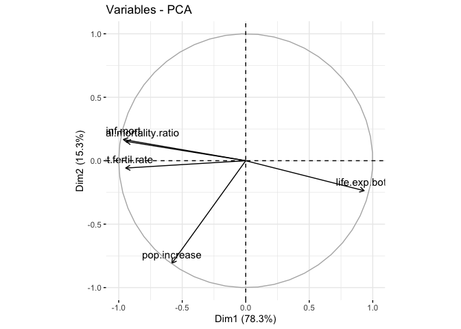
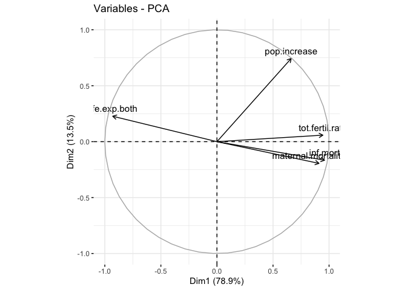

# Clusters of Countries {.tabset}

## Data Used
The data used is `Population Growth, Fertility and Mortality Indicators.csv`, tells about the number of some variables related to population fertility and mortality of each country around the world.

We have some variables from the data, and they are :

* `T03`  The country code

* `Population.growth.and.indicators.of.fertility.and.mortality` The country list

* `X` The year column

* `X.1` Variable which contains some indicators, this variable is going to be spread to some variables.

* `X.2` The values of the observations.

* `X.3` Footnotes

* `X.4` Data source


## The Goal

Assume that we are going to classify countries listed based on the indicators contained in the data. 

##  The Flow 

1. Libraries Importing and Data Preparation.

2. Exploratory Data Analyst

3. PCA Transformation.

4. Biplotting and Interpretation.


# Libraries Importing and Data Preparation

## Libraries Used


## Data Importing

```
## 'data.frame':	4979 obs. of  7 variables:
##  $ T03                                                        : chr  "Region/Country/Area" "1" "1" "1" ...
##  $ Population.growth.and.indicators.of.fertility.and.mortality: chr  "" "Total, all countries or areas" "Total, all countries or areas" "Total, all countries or areas" ...
##  $ X                                                          : chr  "Year" "2005" "2005" "2005" ...
##  $ X.1                                                        : chr  "Series" "Population annual rate of increase (percent)" "Total fertility rate (children per women)" "Infant mortality for both sexes (per 1,000 live births)" ...
##  $ X.2                                                        : chr  "Value" "1.3" "2.6" "49.1" ...
##  $ X.3                                                        : chr  "Footnotes" "Data refers to a 5-year period preceding the reference year." "Data refers to a 5-year period preceding the reference year." "Data refers to a 5-year period preceding the reference year." ...
##  $ X.4                                                        : chr  "Source" "United Nations Population Division, New York, World Population Prospects: The 2017 Revision, last accessed June 2017." "United Nations Population Division, New York, World Population Prospects: The 2017 Revision; supplemented by da"| __truncated__ "United Nations Statistics Division, New York, \"Demographic Yearbook 2015\" and the demographic statistics data"| __truncated__ ...
```

* We only need some variables to process the data, the last 2 columns and the first column will be eliminated

* There is a year column (from 2000 to 2016 ), most of the countries only have values for 2005, 2010, and 2015.

* The `X.1` contains 8 indicators, we're going to spread them into their own column


## Data cleaning

* In the chunk below we're going to remove the last 2 variables and filter the year, we only need the 2015 data to interpret the latest condition of each country.


```


| Code |            Country            | year | inf.mort | life.exp.both |
|:----:|:-----------------------------:|:----:|:--------:|:-------------:|
|  1   | Total, all countries or areas | 2015 |    35    |     70.8      |
| 100  |           Bulgaria            | 2015 |   8.3    |     74.3      |
| 104  |            Myanmar            | 2015 |    45    |      66       |
| 108  |            Burundi            | 2015 |   77.9   |     56.1      |
|  11  |        Western Africa         | 2015 |   70.5   |     54.7      |
| 112  |            Belarus            | 2015 |   3.6    |     72.1      |

Table: Table continues below


| life.exp.female | life.exp.male | maternal.mortality.ratio | pop.increase |
|:---------------:|:-------------:|:------------------------:|:------------:|
|      73.1       |     68.6      |           216            |     1.2      |
|      77.8       |     70.8      |            11            |     -0.6     |
|      68.3       |     63.7      |           178            |     0.9      |
|       58        |     54.2      |           712            |      3       |
|      55.6       |     53.9      |            NA            |     2.7      |
|      77.7       |     66.5      |            4             |      0       |

Table: Table continues below


| tot.fertil.rate |
|:---------------:|
|       2.5       |
|       1.5       |
|       2.3       |
|        6        |
|       5.5       |
|       1.6       |
```

```
##    Code                       Country year inf.mort life.exp.both
## 1:    1 Total, all countries or areas 2015     35.0          70.8
## 2:  100                      Bulgaria 2015      8.3          74.3
## 3:  104                       Myanmar 2015     45.0          66.0
## 4:  108                       Burundi 2015     77.9          56.1
## 5:   11                Western Africa 2015     70.5          54.7
## 6:  112                       Belarus 2015      3.6          72.1
##    life.exp.female life.exp.male maternal.mortality.ratio pop.increase
## 1:            73.1          68.6                      216          1.2
## 2:            77.8          70.8                       11         -0.6
## 3:            68.3          63.7                      178          0.9
## 4:            58.0          54.2                      712          3.0
## 5:            55.6          53.9                       NA          2.7
## 6:            77.7          66.5                        4          0.0
##    tot.fertil.rate
## 1:             2.5
## 2:             1.5
## 3:             2.3
## 4:             6.0
## 5:             5.5
## 6:             1.6
```

`Country` = Country list ;<br />
`inf.mort` = Infant mortality for both sexes (per 1,000 live births) ;<br />
`life.exp.both` = Life expectancy at birth for both sexes (years) ;<br />
`life.exp.male` = Life expectancy at birth for males (years) ;<br />
`life.exp.female` = Life expectancy at birth for females (years) ;<br />
`maternal.mortality.ratio` = Maternal mortality ratio (deaths per 100,000 population) ;<br />
`pop.increase` = Population annual rate of increase (percent) ;<br />
`tot.fertil.rate` = Total fertility rate (children per women) <br />


### NA checking

<!--html_preserve--><div id="htmlwidget-7c14a20034a7e34b2a41" style="width:100%;height:auto;" class="datatables html-widget"></div>
<script type="application/json" data-for="htmlwidget-7c14a20034a7e34b2a41">{"x":{"filter":"none","data":[["1","2","3","4","5","6","7","8","9","10"],["Code","Country","year","inf.mort","life.exp.both","life.exp.female","life.exp.male","maternal.mortality.ratio","pop.increase","tot.fertil.rate"],[0,0,0,31,31,29,29,73,0,29]],"container":"<table class=\"display\">\n  <thead>\n    <tr>\n      <th> <\/th>\n      <th>column<\/th>\n      <th>NA<\/th>\n    <\/tr>\n  <\/thead>\n<\/table>","options":{"columnDefs":[{"className":"dt-right","targets":2},{"orderable":false,"targets":0}],"order":[],"autoWidth":false,"orderClasses":false}},"evals":[],"jsHooks":[]}</script><!--/html_preserve-->
There are so many NAs in the data, it means that not all country listed have the data we need.
<br />
* We're going to replace the NAs to the average value of each variable/indicator.
<!--html_preserve--><div id="htmlwidget-d09036f08b8e9db14f7f" style="width:100%;height:auto;" class="datatables html-widget"></div>
<script type="application/json" data-for="htmlwidget-d09036f08b8e9db14f7f">{"x":{"filter":"none","data":[["1","2","3","4","5","6"],["1","100","104","108","11","112"],["Total, all countries or areas","Bulgaria","Myanmar","Burundi","Western Africa","Belarus"],["2015","2015","2015","2015","2015","2015"],[35,8.3,45,77.9,70.5,3.6],[70.8,74.3,66,56.1,54.7,72.1],[73.1,77.8,68.3,58,55.6,77.7],[68.6,70.8,63.7,54.2,53.9,66.5],[216,11,178,712,162.184210526316,4],[1.2,-0.6,0.9,3,2.7,0],[2.5,1.5,2.3,6,5.5,1.6]],"container":"<table class=\"display\">\n  <thead>\n    <tr>\n      <th> <\/th>\n      <th>Code<\/th>\n      <th>Country<\/th>\n      <th>year<\/th>\n      <th>inf.mort<\/th>\n      <th>life.exp.both<\/th>\n      <th>life.exp.female<\/th>\n      <th>life.exp.male<\/th>\n      <th>maternal.mortality.ratio<\/th>\n      <th>pop.increase<\/th>\n      <th>tot.fertil.rate<\/th>\n    <\/tr>\n  <\/thead>\n<\/table>","options":{"columnDefs":[{"className":"dt-right","targets":[4,5,6,7,8,9,10]},{"orderable":false,"targets":0}],"order":[],"autoWidth":false,"orderClasses":false}},"evals":[],"jsHooks":[]}</script><!--/html_preserve-->
<br />
There is an odd thing on the data as we replace the NA with the average number of each column. There are some rows/countries which have no observation value or only have 1 or 2 value for their indicator and we have filled them with the average values and it's not supposed to be like that. We supposed to eliminate them.

* eliminating some rows

I create a vector that indicates whether a rows' values are mostly the avg values of each column or not. If it is, eliminate the column.
<br />

```
## 'data.frame':	235 obs. of  8 variables:
##  $ Country                 : chr  "Total, all countries or areas" "Bulgaria" "Myanmar" "Burundi" ...
##  $ inf.mort                : num  35 8.3 45 77.9 70.5 3.6 29.9 27.7 67.5 4.7 ...
##  $ life.exp.both           : num  70.8 74.3 66 56.1 54.7 72.1 67.6 75.3 56.4 81.8 ...
##  $ life.exp.female         : num  73.1 77.8 68.3 58 55.6 77.7 69.6 76.5 57.7 83.8 ...
##  $ life.exp.male           : num  68.6 70.8 63.7 54.2 53.9 66.5 65.5 74.1 55.1 79.7 ...
##  $ maternal.mortality.ratio: num  216 11 178 712 162 ...
##  $ pop.increase            : num  1.2 -0.6 0.9 3 2.7 0 1.6 2 2.7 1 ...
##  $ tot.fertil.rate         : num  2.5 1.5 2.3 6 5.5 1.6 2.7 3 5 1.6 ...
```

### Continent Column

I think by giving the `Continent` column, we're going to have some more insights, so let's just do it.
<br />
<!--html_preserve--><div id="htmlwidget-a1517902c87a37ce723d" style="width:100%;height:auto;" class="datatables html-widget"></div>
<script type="application/json" data-for="htmlwidget-a1517902c87a37ce723d">{"x":{"filter":"none","data":[["1","2","3","4","5","6"],["Total, all countries or areas","Bulgaria","Myanmar","Burundi","Western Africa","Belarus"],[null,"Europe","Asia","Africa",null,"Europe"]],"container":"<table class=\"display\">\n  <thead>\n    <tr>\n      <th> <\/th>\n      <th>Country<\/th>\n      <th>Continent<\/th>\n    <\/tr>\n  <\/thead>\n<\/table>","options":{"order":[],"autoWidth":false,"orderClasses":false,"columnDefs":[{"orderable":false,"targets":0}]}},"evals":[],"jsHooks":[]}</script><!--/html_preserve-->
<br />
Some rows cannot be defined by its continent and all of them are not even a country actually. They are just regions or certain areas of the continent. 

Our observations are countries so we wil just eliminate rows that represent some areas or regions.

<!--html_preserve--><div id="htmlwidget-01220f0872719fc83a5b" style="width:100%;height:auto;" class="datatables html-widget"></div>
<script type="application/json" data-for="htmlwidget-01220f0872719fc83a5b">{"x":{"filter":"none","data":[["1","2","3","4","5","6","7","8","9","10","11","12","13","14","15","16","17","18","19","20","21","22","23","24","25","26","27","28","29","30","31","32"],["Total, all countries or areas","Western Africa","Central America","Eastern Africa","Asia","Central Asia","Western Asia","Northern Africa","Europe","Eastern Europe","Northern Europe","Western Europe","Other non-specified areas","Middle Africa","Southern Africa","Africa","Sub-Saharan Africa","Northern America","Caribbean","Eastern Asia","Southern Asia","South-eastern Asia","Southern Europe","Latin America &amp; the Caribbean","South America","Australia and New Zealand","Melanesia","Micronesia","Polynesia","South-central Asia","Channel Islands","Oceania"],["?","?","?","?","?","?","?","?","?","?","?","?","?","?","?","?","?","?","?","?","?","?","?","?","?","?","?","?","?","?","?","?"]],"container":"<table class=\"display\">\n  <thead>\n    <tr>\n      <th> <\/th>\n      <th>Country<\/th>\n      <th>Continent<\/th>\n    <\/tr>\n  <\/thead>\n<\/table>","options":{"order":[],"autoWidth":false,"orderClasses":false,"columnDefs":[{"orderable":false,"targets":0}]}},"evals":[],"jsHooks":[]}</script><!--/html_preserve-->

* We better assign the `Country` as rownames instead.
<!--html_preserve--><div id="htmlwidget-d67da7f8e0230de63ecc" style="width:100%;height:auto;" class="datatables html-widget"></div>
<script type="application/json" data-for="htmlwidget-d67da7f8e0230de63ecc">{"x":{"filter":"none","data":[["Bulgaria","Myanmar","Burundi","Belarus","Cambodia","Algeria"],[8.3,45,77.9,3.6,29.9,27.7],[74.3,66,56.1,72.1,67.6,75.3],[77.8,68.3,58,77.7,69.6,76.5],[70.8,63.7,54.2,66.5,65.5,74.1],[11,178,712,4,161,140],[-0.6,0.9,3,0,1.6,2],[1.5,2.3,6,1.6,2.7,3],["Europe","Asia","Africa","Europe","Asia","Africa"]],"container":"<table class=\"display\">\n  <thead>\n    <tr>\n      <th> <\/th>\n      <th>inf.mort<\/th>\n      <th>life.exp.both<\/th>\n      <th>life.exp.female<\/th>\n      <th>life.exp.male<\/th>\n      <th>maternal.mortality.ratio<\/th>\n      <th>pop.increase<\/th>\n      <th>tot.fertil.rate<\/th>\n      <th>Continent<\/th>\n    <\/tr>\n  <\/thead>\n<\/table>","options":{"columnDefs":[{"className":"dt-right","targets":[1,2,3,4,5,6,7]},{"orderable":false,"targets":0}],"order":[],"autoWidth":false,"orderClasses":false}},"evals":[],"jsHooks":[]}</script><!--/html_preserve-->
<br />
Now the data is ready to be proceed.


# Exploratory Data Analyst

* Variables Correlation

<!-- -->
<br />
From the plot above we can conclude that :

* the correlation between **life expectancy of birth** of male, female, and both are really high. In this case we better use the `life expectancy of both` 


* all variables have relatively strong correlation to each other but `pop.increase`

* the `pop.increase` has the least correlation with other variables


## Life Expectantion of the World

<!--html_preserve--><div id="htmlwidget-0111d5ab6911d6d0b277" style="width:672px;height:480px;" class="plotly html-widget"></div>
<script type="application/json" data-for="htmlwidget-0111d5ab6911d6d0b277">{"x":{"data":[{"x":[56.1167845248922,75.3112480804283,56.4070248491437,72.2169177728089,49.3998126278612,51.6951047040796,62.8061849931921,79.3056967817713,62.5094946403141,58.1154429542768,59.9092652074706,56.8290274099269,63.6901782420759,63.3763568135913,60.1917999589157,61.5805635979088,64.4809800683439,60.3158612365936,61.6856177484423,57.8730011029237,51.699094029455,65.3767534693221,52.4999038274445,60.7126041955822,71.5178778974379,64.4703344874662,60.7220785160608,56.1678706120598,62.6237532969999,74.1249079624282,74.9185028681174,56.1275067094982,61.6830181493226,58.5147057478965,51.9315177709085,55.9785678576077,79.516580616831,65.1690849937516,66.081877281478,65.718677227116,72.9261559838829,50.1837991154174,54.9116970344467,59.4714330333251,57.6169847693589,62.880063334321,55.0930687107367,63.6174411196886,68.4056246521144,55.0004655818689,59.1063113726443,75.0219978977809,58.5958465446661,70.7781855813112,62.812870605358,58.7132727855242,59.6989189118061],"y":[77.9207835447043,27.6668126012199,67.4647081796266,22.4791762138903,93.5301876361668,91.2137261944264,58.0769685660675,4.17553693693131,46.4663774260879,73.1956254257262,67.6692577780597,69.9699857014418,45.7634381913394,44.9900963905081,65.4051205432601,55.3322786724754,40.8244886484928,49.7811573950946,46.4671692422219,65.6787956845388,71.58862799244,39.4088824837469,59.8035081540607,58.9799288508855,24.3082947647013,36.7650332275219,66.5313824664988,78.5193580949865,67.9736903173849,11.9715321530402,28.0948102074303,67.2776115068421,36.430046469681,65.8196466106735,76.3303511678241,80.3603461729176,4.1767927829735,44.0123118960671,43.7991200910509,43.8652138937451,10.2177655055933,94.4233685586229,79.4612053658441,36.5197271583602,46.5090923830867,35.1826140931994,77.6766494280659,48.6957063991018,34.1352337366529,56.3172629198991,55.7278219991177,18.5050145508721,60.1923062621057,18.8609052415192,44.0130041796714,64.8386417207867,53.8345157431252],"text":["Continent: Africa<br />life.exp.both: 56.1000<br />inf.mort: 77.90000<br />Burundi","Continent: Africa<br />life.exp.both: 75.3000<br />inf.mort: 27.70000<br />Algeria","Continent: Africa<br />life.exp.both: 56.4000<br />inf.mort: 67.50000<br />Cameroon","Continent: Africa<br />life.exp.both: 72.2000<br />inf.mort: 22.50000<br />Cabo Verde","Continent: Africa<br />life.exp.both: 49.4000<br />inf.mort: 93.50000<br />Central African Republic","Continent: Africa<br />life.exp.both: 51.7000<br />inf.mort: 91.20000<br />Chad","Continent: Africa<br />life.exp.both: 62.8000<br />inf.mort: 58.10000<br />Comoros","Continent: Africa<br />life.exp.both: 79.3000<br />inf.mort:  4.20000<br />Mayotte","Continent: Africa<br />life.exp.both: 62.5000<br />inf.mort: 46.50000<br />Congo","Continent: Africa<br />life.exp.both: 58.1000<br />inf.mort: 73.20000<br />Dem. Rep. of the Congo","Continent: Africa<br />life.exp.both: 59.9000<br />inf.mort: 67.70000<br />Benin","Continent: Africa<br />life.exp.both: 56.8000<br />inf.mort: 70.00000<br />Equatorial Guinea","Continent: Africa<br />life.exp.both: 63.7000<br />inf.mort: 45.80000<br />Ethiopia","Continent: Africa<br />life.exp.both: 63.4000<br />inf.mort: 45.00000<br />Eritrea","Continent: Africa<br />life.exp.both: 60.2000<br />inf.mort: 65.40000<br />Angola","Continent: Africa<br />life.exp.both: 61.6000<br />inf.mort: 55.30000<br />Djibouti","Continent: Africa<br />life.exp.both: 64.5000<br />inf.mort: 40.80000<br />Gabon","Continent: Africa<br />life.exp.both: 60.3000<br />inf.mort: 49.80000<br />Gambia","Continent: Africa<br />life.exp.both: 61.7000<br />inf.mort: 46.50000<br />Ghana","Continent: Africa<br />life.exp.both: 57.9000<br />inf.mort: 65.70000<br />Guinea","Continent: Africa<br />life.exp.both: 51.7000<br />inf.mort: 71.60000<br />Côte d'Ivoire","Continent: Africa<br />life.exp.both: 65.4000<br />inf.mort: 39.40000<br />Kenya","Continent: Africa<br />life.exp.both: 52.5000<br />inf.mort: 59.80000<br />Lesotho","Continent: Africa<br />life.exp.both: 60.7000<br />inf.mort: 59.00000<br />Liberia","Continent: Africa<br />life.exp.both: 71.5000<br />inf.mort: 24.30000<br />Libya","Continent: Africa<br />life.exp.both: 64.5000<br />inf.mort: 36.80000<br />Madagascar","Continent: Africa<br />life.exp.both: 60.7000<br />inf.mort: 66.50000<br />Malawi","Continent: Africa<br />life.exp.both: 56.2000<br />inf.mort: 78.50000<br />Mali","Continent: Africa<br />life.exp.both: 62.6000<br />inf.mort: 68.00000<br />Mauritania","Continent: Africa<br />life.exp.both: 74.1000<br />inf.mort: 12.00000<br />Mauritius","Continent: Africa<br />life.exp.both: 74.9000<br />inf.mort: 28.10000<br />Morocco","Continent: Africa<br />life.exp.both: 56.1000<br />inf.mort: 67.30000<br />Mozambique","Continent: Africa<br />life.exp.both: 61.7000<br />inf.mort: 36.40000<br />Namibia","Continent: Africa<br />life.exp.both: 58.5000<br />inf.mort: 65.80000<br />Niger","Continent: Africa<br />life.exp.both: 51.9000<br />inf.mort: 76.30000<br />Nigeria","Continent: Africa<br />life.exp.both: 56.0000<br />inf.mort: 80.40000<br />Guinea-Bissau","Continent: Africa<br />life.exp.both: 79.5000<br />inf.mort:  4.20000<br />Réunion","Continent: Africa<br />life.exp.both: 65.2000<br />inf.mort: 44.00000<br />Rwanda","Continent: Africa<br />life.exp.both: 66.1000<br />inf.mort: 43.80000<br />Sao Tome and Principe","Continent: Africa<br />life.exp.both: 65.7000<br />inf.mort: 43.90000<br />Senegal","Continent: Africa<br />life.exp.both: 72.9000<br />inf.mort: 10.20000<br />Seychelles","Continent: Africa<br />life.exp.both: 50.2000<br />inf.mort: 94.40000<br />Sierra Leone","Continent: Africa<br />life.exp.both: 54.9000<br />inf.mort: 79.50000<br />Somalia","Continent: Africa<br />life.exp.both: 59.5000<br />inf.mort: 36.50000<br />South Africa","Continent: Africa<br />life.exp.both: 57.6000<br />inf.mort: 46.50000<br />Zimbabwe","Continent: Africa<br />life.exp.both: 62.9000<br />inf.mort: 35.20000<br />Botswana","Continent: Africa<br />life.exp.both: 55.1000<br />inf.mort: 77.70000<br />South Sudan","Continent: Africa<br />life.exp.both: 63.6000<br />inf.mort: 48.70000<br />Sudan","Continent: Africa<br />life.exp.both: 68.4000<br />inf.mort: 34.10000<br />Western Sahara","Continent: Africa<br />life.exp.both: 55.0000<br />inf.mort: 56.30000<br />Swaziland","Continent: Africa<br />life.exp.both: 59.1000<br />inf.mort: 55.70000<br />Togo","Continent: Africa<br />life.exp.both: 75.0000<br />inf.mort: 18.50000<br />Tunisia","Continent: Africa<br />life.exp.both: 58.6000<br />inf.mort: 60.20000<br />Uganda","Continent: Africa<br />life.exp.both: 70.8000<br />inf.mort: 18.90000<br />Egypt","Continent: Africa<br />life.exp.both: 62.8000<br />inf.mort: 44.00000<br />United Rep. of Tanzania","Continent: Africa<br />life.exp.both: 58.7000<br />inf.mort: 64.80000<br />Burkina Faso","Continent: Africa<br />life.exp.both: 59.7000<br />inf.mort: 53.80000<br />Zambia"],"type":"scatter","mode":"markers","marker":{"autocolorscale":false,"color":"rgba(248,118,109,1)","opacity":1,"size":5.66929133858268,"symbol":"circle","line":{"width":1.88976377952756,"color":"rgba(248,118,109,1)"}},"hoveron":"points","name":"Africa","legendgroup":"Africa","showlegend":true,"xaxis":"x","yaxis":"y","hoverinfo":"text","frame":null},{"x":[81.8275301915202,78.7793985947871,73.6684000166416,79.2021401626021,79.2063773518303,73.1733545938675,75.4976844558706,72.6278202544126,79.2061026557542,75.8080732361177,71.2904312847328,73.1786069475938,80.487322907658,75.9773474507631,72.4120501258346,66.2754904314077,62.2691359514782,72.9004050137959,75.497318018642,75.1036128171845,81.2055676461893,76.4750749409679,75.4088728530052,77.8230962331797,75.3946808895654,74.4715334044834,77.2915459529696,71.3204282540363,72.7259480170103,74.1725573552483,79.1847824404589,74.8182274742259,72.7162899010138,67.6765347718362,70.9281998645857,74.703970235451,70.2182347082256,69.831693271088,78.9052987598213,79.1261847971157,76.9965151566781,73.9171340280687],"y":[4.73355647806078,7.3847354448773,17.9070833710395,9.33803909426555,5.52898452699184,25.0750431787968,21.1316496111266,17.0070188029669,9.28466178072617,9.07871444232762,25.829669492176,9.59609164364636,5.8255082995072,13.6806748144515,26.9300436632708,33.2344006923586,46.9008148543723,27.8341065668128,15.0385028446838,9.09396856527776,6.36221641907469,18.7670098988898,9.60487608984113,10.2620942110941,14.8358132968657,20.0072173813544,15.1666916409321,25.872910369659,28.76704714166,18.5929785978608,6.32181518778205,10.9389143053628,16.4747652433254,42.9085898780078,17.3771248569712,15.824899864886,24.7864832708612,14.2760282052681,6.03484264900908,9.28575627740473,12.7139981094748,13.8353306833655],"text":["Continent: Americas<br />life.exp.both: 81.8000<br />inf.mort:  4.70000<br />Canada","Continent: Americas<br />life.exp.both: 78.8000<br />inf.mort:  7.40000<br />Chile","Continent: Americas<br />life.exp.both: 73.7000<br />inf.mort: 17.90000<br />Colombia","Continent: Americas<br />life.exp.both: 79.2000<br />inf.mort:  9.30000<br />Costa Rica","Continent: Americas<br />life.exp.both: 79.2000<br />inf.mort:  5.50000<br />Cuba","Continent: Americas<br />life.exp.both: 73.2000<br />inf.mort: 25.10000<br />Dominican Republic","Continent: Americas<br />life.exp.both: 75.5000<br />inf.mort: 21.10000<br />Ecuador","Continent: Americas<br />life.exp.both: 72.6000<br />inf.mort: 17.00000<br />El Salvador","Continent: Americas<br />life.exp.both: 79.2000<br />inf.mort:  9.30000<br />French Guiana","Continent: Americas<br />life.exp.both: 75.8000<br />inf.mort:  9.10000<br />Antigua and Barbuda","Continent: Americas<br />life.exp.both: 71.3194<br />inf.mort: 25.84655<br />Greenland","Continent: Americas<br />life.exp.both: 73.2000<br />inf.mort:  9.60000<br />Grenada","Continent: Americas<br />life.exp.both: 80.5000<br />inf.mort:  5.80000<br />Guadeloupe","Continent: Americas<br />life.exp.both: 76.0000<br />inf.mort: 13.70000<br />Argentina","Continent: Americas<br />life.exp.both: 72.4000<br />inf.mort: 26.90000<br />Guatemala","Continent: Americas<br />life.exp.both: 66.3000<br />inf.mort: 33.20000<br />Guyana","Continent: Americas<br />life.exp.both: 62.3000<br />inf.mort: 46.90000<br />Haiti","Continent: Americas<br />life.exp.both: 72.9000<br />inf.mort: 27.80000<br />Honduras","Continent: Americas<br />life.exp.both: 75.5000<br />inf.mort: 15.00000<br />Jamaica","Continent: Americas<br />life.exp.both: 75.1000<br />inf.mort:  9.10000<br />Bahamas","Continent: Americas<br />life.exp.both: 81.2000<br />inf.mort:  6.40000<br />Martinique","Continent: Americas<br />life.exp.both: 76.5000<br />inf.mort: 18.80000<br />Mexico","Continent: Americas<br />life.exp.both: 75.4000<br />inf.mort:  9.60000<br />Barbados","Continent: Americas<br />life.exp.both: 77.8000<br />inf.mort: 10.30000<br />Curaçao","Continent: Americas<br />life.exp.both: 75.4000<br />inf.mort: 14.80000<br />Aruba","Continent: Americas<br />life.exp.both: 74.5000<br />inf.mort: 20.00000<br />Nicaragua","Continent: Americas<br />life.exp.both: 77.3000<br />inf.mort: 15.20000<br />Panama","Continent: Americas<br />life.exp.both: 71.3194<br />inf.mort: 25.84655<br />Bermuda","Continent: Americas<br />life.exp.both: 72.7000<br />inf.mort: 28.80000<br />Paraguay","Continent: Americas<br />life.exp.both: 74.2000<br />inf.mort: 18.60000<br />Peru","Continent: Americas<br />life.exp.both: 79.2000<br />inf.mort:  6.30000<br />Puerto Rico","Continent: Americas<br />life.exp.both: 74.8000<br />inf.mort: 10.90000<br />Saint Lucia","Continent: Americas<br />life.exp.both: 72.7000<br />inf.mort: 16.50000<br />Saint Vincent & Grenadines","Continent: Americas<br />life.exp.both: 67.7000<br />inf.mort: 42.90000<br />Bolivia (Plurin. State of)","Continent: Americas<br />life.exp.both: 70.9000<br />inf.mort: 17.40000<br />Suriname","Continent: Americas<br />life.exp.both: 74.7000<br />inf.mort: 15.80000<br />Brazil","Continent: Americas<br />life.exp.both: 70.2000<br />inf.mort: 24.80000<br />Trinidad and Tobago","Continent: Americas<br />life.exp.both: 69.8000<br />inf.mort: 14.30000<br />Belize","Continent: Americas<br />life.exp.both: 78.9000<br />inf.mort:  6.00000<br />United States of America","Continent: Americas<br />life.exp.both: 79.1000<br />inf.mort:  9.30000<br />United States Virgin Islands","Continent: Americas<br />life.exp.both: 77.0000<br />inf.mort: 12.70000<br />Uruguay","Continent: Americas<br />life.exp.both: 73.9000<br />inf.mort: 13.80000<br />Venezuela (Boliv. Rep. of)"],"type":"scatter","mode":"markers","marker":{"autocolorscale":false,"color":"rgba(163,165,0,1)","opacity":1,"size":5.66929133858268,"symbol":"circle","line":{"width":1.88976377952756,"color":"rgba(163,165,0,1)"}},"hoveron":"points","name":"Americas","legendgroup":"Americas","showlegend":true,"xaxis":"x","yaxis":"y","hoverinfo":"text","frame":null},{"x":[66.0247046333801,67.6212099623155,74.6112881555594,75.6989769555437,79.8842510229188,72.7946235154026,72.922134499172,71.6138115926346,83.4301816294825,67.6234146587029,68.6244613500451,75.0925478939725,69.1755728980522,81.9249679316552,83.2839949005259,69.1141589743348,62.3216520881809,73.8306508117987,70.8066969342385,81.298850490394,74.2939468765248,70.2930924491302,65.3835652374785,78.9223549489658,83.3175254793932,74.6922595122538,76.3122422767002,76.3757096081415,68.4730308789012,71.2142951930452,74.0287095151782,76.2212805643724,68.9126827530104,65.9198590592098,68.5992302926957,67.7172163306601,77.726427485088,68.79122166974,73.9892960259891,82.2823911401317,75.5688737181301,69.9054182089682,70.4158136538857,74.6268438874215,76.6728955672052,74.7889109894042,67.2823066826588,70.7976626874365,64.1971255521914,76.6883985803099],"y":[44.9951461081579,29.8813801288046,8.16502076491714,11.6162959861755,4.19553190303966,11.1637963928469,19.9746877686866,31.410863007959,1.63314376613125,41.2719225335866,25.005174845662,14.8263396769017,32.1157639766671,3.42817795068025,2.1949080962874,14.0710766154155,68.5842056383192,17.1254245561548,18.5133020263538,2.96273701734841,8.37464263262227,19.5821162647381,47.3135022053868,9.17768651101738,3.0097127366066,6.49899555755779,9.03717037215829,6.86777419116348,22.8053748442419,33.3144318991713,13.1948275370523,9.59672864548862,32.7628207474947,69.8119924045168,22.220837472491,43.9120730085671,7.16984517768026,30.530210342519,12.9846055772342,2.1236504913494,19.3354515029304,17.914192856811,38.9051373354159,11.1907936099917,6.16660965405405,12.5854175984487,46.9048443815298,31.3053675916046,47.1966114951856,6.50423805849627],"text":["Continent: Asia<br />life.exp.both: 66.0000<br />inf.mort: 45.00000<br />Myanmar","Continent: Asia<br />life.exp.both: 67.6000<br />inf.mort: 29.90000<br />Cambodia","Continent: Asia<br />life.exp.both: 74.6000<br />inf.mort:  8.20000<br />Sri Lanka","Continent: Asia<br />life.exp.both: 75.7000<br />inf.mort: 11.60000<br />China","Continent: Asia<br />life.exp.both: 79.9000<br />inf.mort:  4.20000<br />Cyprus","Continent: Asia<br />life.exp.both: 72.8000<br />inf.mort: 11.20000<br />Georgia","Continent: Asia<br />life.exp.both: 72.9000<br />inf.mort: 20.00000<br />State of Palestine","Continent: Asia<br />life.exp.both: 71.6000<br />inf.mort: 31.40000<br />Azerbaijan","Continent: Asia<br />life.exp.both: 83.4000<br />inf.mort:  1.60000<br />China, Hong Kong SAR","Continent: Asia<br />life.exp.both: 67.6000<br />inf.mort: 41.30000<br />India","Continent: Asia<br />life.exp.both: 68.6000<br />inf.mort: 25.00000<br />Indonesia","Continent: Asia<br />life.exp.both: 75.1000<br />inf.mort: 14.80000<br />Iran (Islamic Republic of)","Continent: Asia<br />life.exp.both: 69.2000<br />inf.mort: 32.10000<br />Iraq","Continent: Asia<br />life.exp.both: 81.9000<br />inf.mort:  3.40000<br />Israel","Continent: Asia<br />life.exp.both: 83.3000<br />inf.mort:  2.20000<br />Japan","Continent: Asia<br />life.exp.both: 69.1000<br />inf.mort: 14.10000<br />Kazakhstan","Continent: Asia<br />life.exp.both: 62.3000<br />inf.mort: 68.60000<br />Afghanistan","Continent: Asia<br />life.exp.both: 73.8000<br />inf.mort: 17.10000<br />Jordan","Continent: Asia<br />life.exp.both: 70.8000<br />inf.mort: 18.50000<br />Dem. People's Rep. Korea","Continent: Asia<br />life.exp.both: 81.3000<br />inf.mort:  3.00000<br />Republic of Korea","Continent: Asia<br />life.exp.both: 74.3000<br />inf.mort:  8.40000<br />Kuwait","Continent: Asia<br />life.exp.both: 70.3000<br />inf.mort: 19.60000<br />Kyrgyzstan","Continent: Asia<br />life.exp.both: 65.4000<br />inf.mort: 47.30000<br />Lao People's Dem. Rep.","Continent: Asia<br />life.exp.both: 78.9000<br />inf.mort:  9.20000<br />Lebanon","Continent: Asia<br />life.exp.both: 83.3000<br />inf.mort:  3.00000<br />China, Macao SAR","Continent: Asia<br />life.exp.both: 74.7000<br />inf.mort:  6.50000<br />Malaysia","Continent: Asia<br />life.exp.both: 76.3000<br />inf.mort:  9.00000<br />Maldives","Continent: Asia<br />life.exp.both: 76.4000<br />inf.mort:  6.90000<br />Bahrain","Continent: Asia<br />life.exp.both: 68.5000<br />inf.mort: 22.80000<br />Mongolia","Continent: Asia<br />life.exp.both: 71.2000<br />inf.mort: 33.30000<br />Bangladesh","Continent: Asia<br />life.exp.both: 74.0000<br />inf.mort: 13.20000<br />Armenia","Continent: Asia<br />life.exp.both: 76.2000<br />inf.mort:  9.60000<br />Oman","Continent: Asia<br />life.exp.both: 68.9000<br />inf.mort: 32.80000<br />Nepal","Continent: Asia<br />life.exp.both: 65.9000<br />inf.mort: 69.80000<br />Pakistan","Continent: Asia<br />life.exp.both: 68.6000<br />inf.mort: 22.20000<br />Philippines","Continent: Asia<br />life.exp.both: 67.7000<br />inf.mort: 43.90000<br />Timor-Leste","Continent: Asia<br />life.exp.both: 77.7000<br />inf.mort:  7.20000<br />Qatar","Continent: Asia<br />life.exp.both: 68.8000<br />inf.mort: 30.50000<br />Bhutan","Continent: Asia<br />life.exp.both: 74.0000<br />inf.mort: 13.00000<br />Saudi Arabia","Continent: Asia<br />life.exp.both: 82.3000<br />inf.mort:  2.10000<br />Singapore","Continent: Asia<br />life.exp.both: 75.6000<br />inf.mort: 19.30000<br />Viet Nam","Continent: Asia<br />life.exp.both: 69.9000<br />inf.mort: 17.90000<br />Syrian Arab Republic","Continent: Asia<br />life.exp.both: 70.4000<br />inf.mort: 38.90000<br />Tajikistan","Continent: Asia<br />life.exp.both: 74.6000<br />inf.mort: 11.20000<br />Thailand","Continent: Asia<br />life.exp.both: 76.7000<br />inf.mort:  6.20000<br />United Arab Emirates","Continent: Asia<br />life.exp.both: 74.8000<br />inf.mort: 12.60000<br />Turkey","Continent: Asia<br />life.exp.both: 67.3000<br />inf.mort: 46.90000<br />Turkmenistan","Continent: Asia<br />life.exp.both: 70.8000<br />inf.mort: 31.30000<br />Uzbekistan","Continent: Asia<br />life.exp.both: 64.2000<br />inf.mort: 47.20000<br />Yemen","Continent: Asia<br />life.exp.both: 76.7000<br />inf.mort:  6.50000<br />Brunei Darussalam"],"type":"scatter","mode":"markers","marker":{"autocolorscale":false,"color":"rgba(0,191,125,1)","opacity":1,"size":5.66929133858268,"symbol":"circle","line":{"width":1.88976377952756,"color":"rgba(0,191,125,1)"}},"hoveron":"points","name":"Asia","legendgroup":"Asia","showlegend":true,"xaxis":"x","yaxis":"y","hoverinfo":"text","frame":null},{"x":[74.3084348488281,72.1314864168104,76.9923504984793,78.2098260188481,80.0719091034283,76.8126098457261,71.3214201257433,80.7266049681537,81.8760164322798,80.3944938845983,80.6291682167368,75.3723017617982,82.2145278054608,80.9192967911265,82.2810374361259,80.9800030258625,73.871503661911,74.0233698657551,81.1041611102688,80.2801711658534,71.0036289089907,76.423281818044,81.3131152804503,80.5152459132989,81.5872923090123,76.9731885684168,80.4721889539606,74.7974919860419,70.2703948221533,74.6754572322929,76.3101913504179,76.2951531566582,80.2857494186289,82.482918373302,81.9281236482523,82.6963633678227,77.7239771403242,71.111227421001,75.1136971752831,80.9771392098329],"y":[8.31755425039679,3.59910038994625,3.8641262639314,2.49520626468584,3.4617452102527,3.19228336732835,25.814107960934,2.30753128085285,3.42500613780692,3.4337753923051,3.29919087553397,4.93518791928887,1.60592123648152,3.39073196575046,3.02496350623667,3.31125597884878,6.53798060493544,4.3783390150778,3.39829655090347,4.77830060245469,14.3318514921516,4.08522177057341,3.49904437065125,3.50697746532038,2.40029256299138,4.50072260944173,2.93911993358284,8.694882475622,8.33248940490186,9.81032776685432,7.61924230169505,5.66281123591587,2.48830182112753,2.8896342247352,2.39015494905412,3.87317768339068,14.5875173911825,8.76035639811307,9.0337401426211,4.08172433586791],"text":["Continent: Europe<br />life.exp.both: 74.3000<br />inf.mort:  8.30000<br />Bulgaria","Continent: Europe<br />life.exp.both: 72.1000<br />inf.mort:  3.60000<br />Belarus","Continent: Europe<br />life.exp.both: 77.0000<br />inf.mort:  3.90000<br />Croatia","Continent: Europe<br />life.exp.both: 78.2000<br />inf.mort:  2.50000<br />Czechia","Continent: Europe<br />life.exp.both: 80.1000<br />inf.mort:  3.50000<br />Denmark","Continent: Europe<br />life.exp.both: 76.8000<br />inf.mort:  3.20000<br />Estonia","Continent: Europe<br />life.exp.both: 71.3194<br />inf.mort: 25.84655<br />Faroe Islands","Continent: Europe<br />life.exp.both: 80.7000<br />inf.mort:  2.30000<br />Finland","Continent: Europe<br />life.exp.both: 81.9000<br />inf.mort:  3.40000<br />France","Continent: Europe<br />life.exp.both: 80.4000<br />inf.mort:  3.40000<br />Germany","Continent: Europe<br />life.exp.both: 80.6000<br />inf.mort:  3.30000<br />Greece","Continent: Europe<br />life.exp.both: 75.4000<br />inf.mort:  4.90000<br />Hungary","Continent: Europe<br />life.exp.both: 82.2000<br />inf.mort:  1.60000<br />Iceland","Continent: Europe<br />life.exp.both: 80.9000<br />inf.mort:  3.40000<br />Ireland","Continent: Europe<br />life.exp.both: 82.3000<br />inf.mort:  3.00000<br />Italy","Continent: Europe<br />life.exp.both: 81.0000<br />inf.mort:  3.30000<br />Austria","Continent: Europe<br />life.exp.both: 73.9000<br />inf.mort:  6.50000<br />Latvia","Continent: Europe<br />life.exp.both: 74.0000<br />inf.mort:  4.40000<br />Lithuania","Continent: Europe<br />life.exp.both: 81.1000<br />inf.mort:  3.40000<br />Luxembourg","Continent: Europe<br />life.exp.both: 80.3000<br />inf.mort:  4.80000<br />Malta","Continent: Europe<br />life.exp.both: 71.0000<br />inf.mort: 14.30000<br />Republic of Moldova","Continent: Europe<br />life.exp.both: 76.4000<br />inf.mort:  4.10000<br />Montenegro","Continent: Europe<br />life.exp.both: 81.3000<br />inf.mort:  3.50000<br />Netherlands","Continent: Europe<br />life.exp.both: 80.5000<br />inf.mort:  3.50000<br />Belgium","Continent: Europe<br />life.exp.both: 81.6000<br />inf.mort:  2.40000<br />Norway","Continent: Europe<br />life.exp.both: 77.0000<br />inf.mort:  4.50000<br />Poland","Continent: Europe<br />life.exp.both: 80.5000<br />inf.mort:  2.90000<br />Portugal","Continent: Europe<br />life.exp.both: 74.8000<br />inf.mort:  8.70000<br />Romania","Continent: Europe<br />life.exp.both: 70.3000<br />inf.mort:  8.30000<br />Russian Federation","Continent: Europe<br />life.exp.both: 74.7000<br />inf.mort:  9.80000<br />Serbia","Continent: Europe<br />life.exp.both: 76.3000<br />inf.mort:  7.60000<br />Bosnia and Herzegovina","Continent: Europe<br />life.exp.both: 76.3000<br />inf.mort:  5.70000<br />Slovakia","Continent: Europe<br />life.exp.both: 80.3000<br />inf.mort:  2.50000<br />Slovenia","Continent: Europe<br />life.exp.both: 82.5000<br />inf.mort:  2.90000<br />Spain","Continent: Europe<br />life.exp.both: 81.9000<br />inf.mort:  2.40000<br />Sweden","Continent: Europe<br />life.exp.both: 82.7000<br />inf.mort:  3.90000<br />Switzerland","Continent: Europe<br />life.exp.both: 77.7000<br />inf.mort: 14.60000<br />Albania","Continent: Europe<br />life.exp.both: 71.1000<br />inf.mort:  8.80000<br />Ukraine","Continent: Europe<br />life.exp.both: 75.1000<br />inf.mort:  9.00000<br />TFYR of Macedonia","Continent: Europe<br />life.exp.both: 81.0000<br />inf.mort:  4.10000<br />United Kingdom"],"type":"scatter","mode":"markers","marker":{"autocolorscale":false,"color":"rgba(0,176,246,1)","opacity":1,"size":5.66929133858268,"symbol":"circle","line":{"width":1.88976377952756,"color":"rgba(0,176,246,1)"}},"hoveron":"points","name":"Europe","legendgroup":"Europe","showlegend":true,"xaxis":"x","yaxis":"y","hoverinfo":"text","frame":null},{"x":[69.679708617745,76.1305679131689,65.6836890878813,78.8099269598311,82.3267289318187,76.2765757657222,71.3682492089525,81.303457306377,68.80034186857,72.9692221871275,64.9746716554582,72.5248945180235,74.1238369211,69.6250683592494],"y":[15.962559931539,6.87308263579384,46.9003886330128,9.62927028235048,3.88367153311148,12.996620773226,24.3376552276127,4.37639449575916,33.2324964458309,13.3025517277047,48.9914346737787,20.6017765729502,18.0339589519054,30.0259200746193],"text":["Continent: Oceania<br />life.exp.both: 69.7000<br />inf.mort: 16.00000<br />Fiji","Continent: Oceania<br />life.exp.both: 76.1000<br />inf.mort:  6.90000<br />French Polynesia","Continent: Oceania<br />life.exp.both: 65.7000<br />inf.mort: 46.90000<br />Kiribati","Continent: Oceania<br />life.exp.both: 78.8000<br />inf.mort:  9.60000<br />Guam","Continent: Oceania<br />life.exp.both: 82.3000<br />inf.mort:  3.90000<br />Australia","Continent: Oceania<br />life.exp.both: 76.3000<br />inf.mort: 13.00000<br />New Caledonia","Continent: Oceania<br />life.exp.both: 71.4000<br />inf.mort: 24.30000<br />Vanuatu","Continent: Oceania<br />life.exp.both: 81.3000<br />inf.mort:  4.40000<br />New Zealand","Continent: Oceania<br />life.exp.both: 68.8000<br />inf.mort: 33.20000<br />Micronesia (Fed. States of)","Continent: Oceania<br />life.exp.both: 73.0000<br />inf.mort: 13.30000<br />Palau","Continent: Oceania<br />life.exp.both: 65.0000<br />inf.mort: 49.00000<br />Papua New Guinea","Continent: Oceania<br />life.exp.both: 72.5000<br />inf.mort: 20.60000<br />Tonga","Continent: Oceania<br />life.exp.both: 74.1000<br />inf.mort: 18.00000<br />Samoa","Continent: Oceania<br />life.exp.both: 69.6000<br />inf.mort: 30.00000<br />Solomon Islands"],"type":"scatter","mode":"markers","marker":{"autocolorscale":false,"color":"rgba(231,107,243,1)","opacity":1,"size":5.66929133858268,"symbol":"circle","line":{"width":1.88976377952756,"color":"rgba(231,107,243,1)"}},"hoveron":"points","name":"Oceania","legendgroup":"Oceania","showlegend":true,"xaxis":"x","yaxis":"y","hoverinfo":"text","frame":null},{"x":[49.4,49.8303797468354,50.2607594936709,50.6911392405063,51.1215189873418,51.5518987341772,51.9822784810127,52.4126582278481,52.8430379746835,53.273417721519,53.7037974683544,54.1341772151899,54.5645569620253,54.9949367088608,55.4253164556962,55.8556962025316,56.2860759493671,56.7164556962025,57.146835443038,57.5772151898734,58.0075949367089,58.4379746835443,58.8683544303797,59.2987341772152,59.7291139240506,60.1594936708861,60.5898734177215,61.020253164557,61.4506329113924,61.8810126582278,62.3113924050633,62.7417721518987,63.1721518987342,63.6025316455696,64.0329113924051,64.4632911392405,64.893670886076,65.3240506329114,65.7544303797468,66.1848101265823,66.6151898734177,67.0455696202532,67.4759493670886,67.906329113924,68.3367088607595,68.7670886075949,69.1974683544304,69.6278481012658,70.0582278481013,70.4886075949367,70.9189873417722,71.3493670886076,71.779746835443,72.2101265822785,72.6405063291139,73.0708860759494,73.5012658227848,73.9316455696203,74.3620253164557,74.7924050632911,75.2227848101266,75.653164556962,76.0835443037975,76.5139240506329,76.9443037974684,77.3746835443038,77.8050632911392,78.2354430379747,78.6658227848101,79.0962025316456,79.526582278481,79.9569620253165,80.3873417721519,80.8177215189873,81.2481012658228,81.6784810126582,82.1088607594937,82.5392405063291,82.9696202531646,83.4],"y":[87.4898955611241,86.3833854079656,85.2710914091755,84.153030457303,83.0292194448974,81.8996752645081,80.7644148086842,79.6234549699751,78.4768126409299,77.324504714098,76.1665480820286,75.0029596372709,73.8337562723743,72.6589548798879,71.4785723523612,70.2926255823432,69.1011314623833,67.9041068850307,66.7015687428348,65.4935339283447,64.2800193341097,63.0610418526791,61.8366183766022,60.6067657984282,59.3715010107063,58.1308409059859,56.8767398679468,55.5992471768824,54.3008204823361,52.9840082012293,51.6513587504836,50.3054205470203,48.9487420077612,47.5838715496277,46.2133575895412,44.8397485444234,43.4655928311958,42.0934388667797,40.7250936209277,39.3093695168857,37.8252540411342,36.2888273029868,34.7161694117569,33.1233604767582,31.526480607304,29.941609912708,28.3848285022836,26.8722164853444,25.4198539712038,24.0416656155576,22.6874086816583,21.3453640543491,20.0363818338438,18.7813121203567,17.6010050141018,16.5171742954473,15.5733900502109,14.7428386639587,13.9672982261706,13.1885468263268,12.3653174836844,11.5570253188702,10.7771729578654,10.0268409064698,9.30696653064737,8.61653201466881,7.95525244882403,7.32334166059042,6.72101347744524,6.14848172686582,5.60596023632945,5.09366283331345,4.61180334529511,4.16039865779067,3.73902791180778,3.34761779282692,2.9861167164422,2.65447309824768,2.35263535383748,2.08055189880567],"text":["life.exp.both: 49.40000<br />inf.mort: 87.489896","life.exp.both: 49.83038<br />inf.mort: 86.383385","life.exp.both: 50.26076<br />inf.mort: 85.271091","life.exp.both: 50.69114<br />inf.mort: 84.153030","life.exp.both: 51.12152<br />inf.mort: 83.029219","life.exp.both: 51.55190<br />inf.mort: 81.899675","life.exp.both: 51.98228<br />inf.mort: 80.764415","life.exp.both: 52.41266<br />inf.mort: 79.623455","life.exp.both: 52.84304<br />inf.mort: 78.476813","life.exp.both: 53.27342<br />inf.mort: 77.324505","life.exp.both: 53.70380<br />inf.mort: 76.166548","life.exp.both: 54.13418<br />inf.mort: 75.002960","life.exp.both: 54.56456<br />inf.mort: 73.833756","life.exp.both: 54.99494<br />inf.mort: 72.658955","life.exp.both: 55.42532<br />inf.mort: 71.478572","life.exp.both: 55.85570<br />inf.mort: 70.292626","life.exp.both: 56.28608<br />inf.mort: 69.101131","life.exp.both: 56.71646<br />inf.mort: 67.904107","life.exp.both: 57.14684<br />inf.mort: 66.701569","life.exp.both: 57.57722<br />inf.mort: 65.493534","life.exp.both: 58.00759<br />inf.mort: 64.280019","life.exp.both: 58.43797<br />inf.mort: 63.061042","life.exp.both: 58.86835<br />inf.mort: 61.836618","life.exp.both: 59.29873<br />inf.mort: 60.606766","life.exp.both: 59.72911<br />inf.mort: 59.371501","life.exp.both: 60.15949<br />inf.mort: 58.130841","life.exp.both: 60.58987<br />inf.mort: 56.876740","life.exp.both: 61.02025<br />inf.mort: 55.599247","life.exp.both: 61.45063<br />inf.mort: 54.300820","life.exp.both: 61.88101<br />inf.mort: 52.984008","life.exp.both: 62.31139<br />inf.mort: 51.651359","life.exp.both: 62.74177<br />inf.mort: 50.305421","life.exp.both: 63.17215<br />inf.mort: 48.948742","life.exp.both: 63.60253<br />inf.mort: 47.583872","life.exp.both: 64.03291<br />inf.mort: 46.213358","life.exp.both: 64.46329<br />inf.mort: 44.839749","life.exp.both: 64.89367<br />inf.mort: 43.465593","life.exp.both: 65.32405<br />inf.mort: 42.093439","life.exp.both: 65.75443<br />inf.mort: 40.725094","life.exp.both: 66.18481<br />inf.mort: 39.309370","life.exp.both: 66.61519<br />inf.mort: 37.825254","life.exp.both: 67.04557<br />inf.mort: 36.288827","life.exp.both: 67.47595<br />inf.mort: 34.716169","life.exp.both: 67.90633<br />inf.mort: 33.123360","life.exp.both: 68.33671<br />inf.mort: 31.526481","life.exp.both: 68.76709<br />inf.mort: 29.941610","life.exp.both: 69.19747<br />inf.mort: 28.384829","life.exp.both: 69.62785<br />inf.mort: 26.872216","life.exp.both: 70.05823<br />inf.mort: 25.419854","life.exp.both: 70.48861<br />inf.mort: 24.041666","life.exp.both: 70.91899<br />inf.mort: 22.687409","life.exp.both: 71.34937<br />inf.mort: 21.345364","life.exp.both: 71.77975<br />inf.mort: 20.036382","life.exp.both: 72.21013<br />inf.mort: 18.781312","life.exp.both: 72.64051<br />inf.mort: 17.601005","life.exp.both: 73.07089<br />inf.mort: 16.517174","life.exp.both: 73.50127<br />inf.mort: 15.573390","life.exp.both: 73.93165<br />inf.mort: 14.742839","life.exp.both: 74.36203<br />inf.mort: 13.967298","life.exp.both: 74.79241<br />inf.mort: 13.188547","life.exp.both: 75.22278<br />inf.mort: 12.365317","life.exp.both: 75.65316<br />inf.mort: 11.557025","life.exp.both: 76.08354<br />inf.mort: 10.777173","life.exp.both: 76.51392<br />inf.mort: 10.026841","life.exp.both: 76.94430<br />inf.mort:  9.306967","life.exp.both: 77.37468<br />inf.mort:  8.616532","life.exp.both: 77.80506<br />inf.mort:  7.955252","life.exp.both: 78.23544<br />inf.mort:  7.323342","life.exp.both: 78.66582<br />inf.mort:  6.721013","life.exp.both: 79.09620<br />inf.mort:  6.148482","life.exp.both: 79.52658<br />inf.mort:  5.605960","life.exp.both: 79.95696<br />inf.mort:  5.093663","life.exp.both: 80.38734<br />inf.mort:  4.611803","life.exp.both: 80.81772<br />inf.mort:  4.160399","life.exp.both: 81.24810<br />inf.mort:  3.739028","life.exp.both: 81.67848<br />inf.mort:  3.347618","life.exp.both: 82.10886<br />inf.mort:  2.986117","life.exp.both: 82.53924<br />inf.mort:  2.654473","life.exp.both: 82.96962<br />inf.mort:  2.352635","life.exp.both: 83.40000<br />inf.mort:  2.080552"],"type":"scatter","mode":"lines","name":"fitted values","line":{"width":3.77952755905512,"color":"rgba(51,102,255,1)","dash":"solid"},"hoveron":"points","showlegend":false,"xaxis":"x","yaxis":"y","hoverinfo":"text","frame":null},{"x":[49.4,49.8303797468354,50.2607594936709,50.6911392405063,51.1215189873418,51.5518987341772,51.9822784810127,52.4126582278481,52.8430379746835,53.273417721519,53.7037974683544,54.1341772151899,54.5645569620253,54.9949367088608,55.4253164556962,55.8556962025316,56.2860759493671,56.7164556962025,57.146835443038,57.5772151898734,58.0075949367089,58.4379746835443,58.8683544303797,59.2987341772152,59.7291139240506,60.1594936708861,60.5898734177215,61.020253164557,61.4506329113924,61.8810126582278,62.3113924050633,62.7417721518987,63.1721518987342,63.6025316455696,64.0329113924051,64.4632911392405,64.893670886076,65.3240506329114,65.7544303797468,66.1848101265823,66.6151898734177,67.0455696202532,67.4759493670886,67.906329113924,68.3367088607595,68.7670886075949,69.1974683544304,69.6278481012658,70.0582278481013,70.4886075949367,70.9189873417722,71.3493670886076,71.779746835443,72.2101265822785,72.6405063291139,73.0708860759494,73.5012658227848,73.9316455696203,74.3620253164557,74.7924050632911,75.2227848101266,75.653164556962,76.0835443037975,76.5139240506329,76.9443037974684,77.3746835443038,77.8050632911392,78.2354430379747,78.6658227848101,79.0962025316456,79.526582278481,79.9569620253165,80.3873417721519,80.8177215189873,81.2481012658228,81.6784810126582,82.1088607594937,82.5392405063291,82.9696202531646,83.4,83.4,83.4,82.9696202531646,82.5392405063291,82.1088607594937,81.6784810126582,81.2481012658228,80.8177215189873,80.3873417721519,79.9569620253165,79.526582278481,79.0962025316456,78.6658227848101,78.2354430379747,77.8050632911392,77.3746835443038,76.9443037974684,76.5139240506329,76.0835443037975,75.653164556962,75.2227848101266,74.7924050632911,74.3620253164557,73.9316455696203,73.5012658227848,73.0708860759494,72.6405063291139,72.2101265822785,71.779746835443,71.3493670886076,70.9189873417722,70.4886075949367,70.0582278481013,69.6278481012658,69.1974683544304,68.7670886075949,68.3367088607595,67.906329113924,67.4759493670886,67.0455696202532,66.6151898734177,66.1848101265823,65.7544303797468,65.3240506329114,64.893670886076,64.4632911392405,64.0329113924051,63.6025316455696,63.1721518987342,62.7417721518987,62.3113924050633,61.8810126582278,61.4506329113924,61.020253164557,60.5898734177215,60.1594936708861,59.7291139240506,59.2987341772152,58.8683544303797,58.4379746835443,58.0075949367089,57.5772151898734,57.146835443038,56.7164556962025,56.2860759493671,55.8556962025316,55.4253164556962,54.9949367088608,54.5645569620253,54.1341772151899,53.7037974683544,53.273417721519,52.8430379746835,52.4126582278481,51.9822784810127,51.5518987341772,51.1215189873418,50.6911392405063,50.2607594936709,49.8303797468354,49.4,49.4],"y":[80.9808712375922,80.2839935464028,79.5630809954318,78.8178559318016,78.0479987063771,77.2531457133055,76.4328895853642,75.5867829907451,74.7143480195152,73.8150937034639,72.8885445960988,71.9342832115311,70.9520079866794,69.9416057601398,68.9032333224155,67.8373969867322,66.7450142198361,65.6274400033591,64.486445154128,63.324144186459,62.1428828822012,60.9451051788106,59.7332214699392,58.5094959211279,57.2759621167385,56.0343681531607,54.7822917414786,53.5150524787434,52.2321930013415,50.9325371818646,49.6148427657236,48.2784276791253,46.9237095106973,45.5525941516094,44.1686444310598,42.7770010363991,41.3840913050416,39.9972055544707,38.6234056442253,37.2235810475342,35.7755814600986,34.2848934243369,32.756790293927,31.1982119002272,29.6196396431498,28.036482035594,26.4693801507599,24.9432718296387,23.4856442543746,22.1229138602385,20.8214215097853,19.5475785400776,18.2904971123516,17.0550226264253,15.8703604015607,14.7868719454517,13.8754455021875,13.0761122365518,12.3000930005389,11.4976861811971,10.6635635202388,9.86172652679755,9.08742837278302,8.33873571246125,7.62811099017459,6.95387789554515,6.31060870662348,5.6943904346661,5.10006929604316,4.5211344374529,3.94981895722235,3.37757686659421,2.7959518188225,2.19735562682649,1.5760122748352,0.929978005526964,0.260216744286038,-0.430570624042514,-1.13894544780201,-1.86136391353638,-1.86136391353638,6.02246771114772,5.84421615547696,5.73951682053787,5.71201668859837,5.76525758012687,5.90204354878036,6.12344168875484,6.42765487176773,6.80974880003268,7.26210151543656,7.77582901627874,8.34195765884732,8.95229288651474,9.59989619102459,10.2791861337925,10.9858220711202,11.7149461004784,12.4669175429478,13.2523241109429,14.06707144713,14.8794074714564,15.6345034518023,16.4095650913655,17.2713345982343,18.2474766454428,19.331649626643,20.5076016142881,21.7822665553361,23.1431495686205,24.5533958535314,25.9604173708767,27.354063688033,28.8011611410501,30.3002768538074,31.846737789822,33.4333215714583,35.0485090532893,36.6755485295868,38.2927611816368,39.8749266221699,41.3951579862372,42.8267815976301,44.1896721790888,45.54709435735,46.9024960524477,48.2580707480227,49.6151489476459,50.9737745048252,52.3324134149154,53.6878747352436,55.0354792205941,56.3694479633307,57.6834418750215,58.971187994415,60.227313658811,61.4670399046741,62.7040356757284,63.9400152832652,65.1769785265476,66.4171557860182,67.6629236702304,68.9166923315415,70.1807737667024,71.4572487049304,72.7478541779542,74.0539113823068,75.3763039996361,76.7155045580692,78.0716360630107,79.4445515679583,80.833915724732,82.2392772623446,83.6601269492051,85.0959400320043,86.5462048157108,88.0104401834177,89.4882049828043,90.9791018229191,92.4827772695284,93.9989198846561,80.9808712375922],"text":["life.exp.both: 49.40000<br />inf.mort: 87.489896","life.exp.both: 49.83038<br />inf.mort: 86.383385","life.exp.both: 50.26076<br />inf.mort: 85.271091","life.exp.both: 50.69114<br />inf.mort: 84.153030","life.exp.both: 51.12152<br />inf.mort: 83.029219","life.exp.both: 51.55190<br />inf.mort: 81.899675","life.exp.both: 51.98228<br />inf.mort: 80.764415","life.exp.both: 52.41266<br />inf.mort: 79.623455","life.exp.both: 52.84304<br />inf.mort: 78.476813","life.exp.both: 53.27342<br />inf.mort: 77.324505","life.exp.both: 53.70380<br />inf.mort: 76.166548","life.exp.both: 54.13418<br />inf.mort: 75.002960","life.exp.both: 54.56456<br />inf.mort: 73.833756","life.exp.both: 54.99494<br />inf.mort: 72.658955","life.exp.both: 55.42532<br />inf.mort: 71.478572","life.exp.both: 55.85570<br />inf.mort: 70.292626","life.exp.both: 56.28608<br />inf.mort: 69.101131","life.exp.both: 56.71646<br />inf.mort: 67.904107","life.exp.both: 57.14684<br />inf.mort: 66.701569","life.exp.both: 57.57722<br />inf.mort: 65.493534","life.exp.both: 58.00759<br />inf.mort: 64.280019","life.exp.both: 58.43797<br />inf.mort: 63.061042","life.exp.both: 58.86835<br />inf.mort: 61.836618","life.exp.both: 59.29873<br />inf.mort: 60.606766","life.exp.both: 59.72911<br />inf.mort: 59.371501","life.exp.both: 60.15949<br />inf.mort: 58.130841","life.exp.both: 60.58987<br />inf.mort: 56.876740","life.exp.both: 61.02025<br />inf.mort: 55.599247","life.exp.both: 61.45063<br />inf.mort: 54.300820","life.exp.both: 61.88101<br />inf.mort: 52.984008","life.exp.both: 62.31139<br />inf.mort: 51.651359","life.exp.both: 62.74177<br />inf.mort: 50.305421","life.exp.both: 63.17215<br />inf.mort: 48.948742","life.exp.both: 63.60253<br />inf.mort: 47.583872","life.exp.both: 64.03291<br />inf.mort: 46.213358","life.exp.both: 64.46329<br />inf.mort: 44.839749","life.exp.both: 64.89367<br />inf.mort: 43.465593","life.exp.both: 65.32405<br />inf.mort: 42.093439","life.exp.both: 65.75443<br />inf.mort: 40.725094","life.exp.both: 66.18481<br />inf.mort: 39.309370","life.exp.both: 66.61519<br />inf.mort: 37.825254","life.exp.both: 67.04557<br />inf.mort: 36.288827","life.exp.both: 67.47595<br />inf.mort: 34.716169","life.exp.both: 67.90633<br />inf.mort: 33.123360","life.exp.both: 68.33671<br />inf.mort: 31.526481","life.exp.both: 68.76709<br />inf.mort: 29.941610","life.exp.both: 69.19747<br />inf.mort: 28.384829","life.exp.both: 69.62785<br />inf.mort: 26.872216","life.exp.both: 70.05823<br />inf.mort: 25.419854","life.exp.both: 70.48861<br />inf.mort: 24.041666","life.exp.both: 70.91899<br />inf.mort: 22.687409","life.exp.both: 71.34937<br />inf.mort: 21.345364","life.exp.both: 71.77975<br />inf.mort: 20.036382","life.exp.both: 72.21013<br />inf.mort: 18.781312","life.exp.both: 72.64051<br />inf.mort: 17.601005","life.exp.both: 73.07089<br />inf.mort: 16.517174","life.exp.both: 73.50127<br />inf.mort: 15.573390","life.exp.both: 73.93165<br />inf.mort: 14.742839","life.exp.both: 74.36203<br />inf.mort: 13.967298","life.exp.both: 74.79241<br />inf.mort: 13.188547","life.exp.both: 75.22278<br />inf.mort: 12.365317","life.exp.both: 75.65316<br />inf.mort: 11.557025","life.exp.both: 76.08354<br />inf.mort: 10.777173","life.exp.both: 76.51392<br />inf.mort: 10.026841","life.exp.both: 76.94430<br />inf.mort:  9.306967","life.exp.both: 77.37468<br />inf.mort:  8.616532","life.exp.both: 77.80506<br />inf.mort:  7.955252","life.exp.both: 78.23544<br />inf.mort:  7.323342","life.exp.both: 78.66582<br />inf.mort:  6.721013","life.exp.both: 79.09620<br />inf.mort:  6.148482","life.exp.both: 79.52658<br />inf.mort:  5.605960","life.exp.both: 79.95696<br />inf.mort:  5.093663","life.exp.both: 80.38734<br />inf.mort:  4.611803","life.exp.both: 80.81772<br />inf.mort:  4.160399","life.exp.both: 81.24810<br />inf.mort:  3.739028","life.exp.both: 81.67848<br />inf.mort:  3.347618","life.exp.both: 82.10886<br />inf.mort:  2.986117","life.exp.both: 82.53924<br />inf.mort:  2.654473","life.exp.both: 82.96962<br />inf.mort:  2.352635","life.exp.both: 83.40000<br />inf.mort:  2.080552","life.exp.both: 83.40000<br />inf.mort:  2.080552","life.exp.both: 83.40000<br />inf.mort:  2.080552","life.exp.both: 82.96962<br />inf.mort:  2.352635","life.exp.both: 82.53924<br />inf.mort:  2.654473","life.exp.both: 82.10886<br />inf.mort:  2.986117","life.exp.both: 81.67848<br />inf.mort:  3.347618","life.exp.both: 81.24810<br />inf.mort:  3.739028","life.exp.both: 80.81772<br />inf.mort:  4.160399","life.exp.both: 80.38734<br />inf.mort:  4.611803","life.exp.both: 79.95696<br />inf.mort:  5.093663","life.exp.both: 79.52658<br />inf.mort:  5.605960","life.exp.both: 79.09620<br />inf.mort:  6.148482","life.exp.both: 78.66582<br />inf.mort:  6.721013","life.exp.both: 78.23544<br />inf.mort:  7.323342","life.exp.both: 77.80506<br />inf.mort:  7.955252","life.exp.both: 77.37468<br />inf.mort:  8.616532","life.exp.both: 76.94430<br />inf.mort:  9.306967","life.exp.both: 76.51392<br />inf.mort: 10.026841","life.exp.both: 76.08354<br />inf.mort: 10.777173","life.exp.both: 75.65316<br />inf.mort: 11.557025","life.exp.both: 75.22278<br />inf.mort: 12.365317","life.exp.both: 74.79241<br />inf.mort: 13.188547","life.exp.both: 74.36203<br />inf.mort: 13.967298","life.exp.both: 73.93165<br />inf.mort: 14.742839","life.exp.both: 73.50127<br />inf.mort: 15.573390","life.exp.both: 73.07089<br />inf.mort: 16.517174","life.exp.both: 72.64051<br />inf.mort: 17.601005","life.exp.both: 72.21013<br />inf.mort: 18.781312","life.exp.both: 71.77975<br />inf.mort: 20.036382","life.exp.both: 71.34937<br />inf.mort: 21.345364","life.exp.both: 70.91899<br />inf.mort: 22.687409","life.exp.both: 70.48861<br />inf.mort: 24.041666","life.exp.both: 70.05823<br />inf.mort: 25.419854","life.exp.both: 69.62785<br />inf.mort: 26.872216","life.exp.both: 69.19747<br />inf.mort: 28.384829","life.exp.both: 68.76709<br />inf.mort: 29.941610","life.exp.both: 68.33671<br />inf.mort: 31.526481","life.exp.both: 67.90633<br />inf.mort: 33.123360","life.exp.both: 67.47595<br />inf.mort: 34.716169","life.exp.both: 67.04557<br />inf.mort: 36.288827","life.exp.both: 66.61519<br />inf.mort: 37.825254","life.exp.both: 66.18481<br />inf.mort: 39.309370","life.exp.both: 65.75443<br />inf.mort: 40.725094","life.exp.both: 65.32405<br />inf.mort: 42.093439","life.exp.both: 64.89367<br />inf.mort: 43.465593","life.exp.both: 64.46329<br />inf.mort: 44.839749","life.exp.both: 64.03291<br />inf.mort: 46.213358","life.exp.both: 63.60253<br />inf.mort: 47.583872","life.exp.both: 63.17215<br />inf.mort: 48.948742","life.exp.both: 62.74177<br />inf.mort: 50.305421","life.exp.both: 62.31139<br />inf.mort: 51.651359","life.exp.both: 61.88101<br />inf.mort: 52.984008","life.exp.both: 61.45063<br />inf.mort: 54.300820","life.exp.both: 61.02025<br />inf.mort: 55.599247","life.exp.both: 60.58987<br />inf.mort: 56.876740","life.exp.both: 60.15949<br />inf.mort: 58.130841","life.exp.both: 59.72911<br />inf.mort: 59.371501","life.exp.both: 59.29873<br />inf.mort: 60.606766","life.exp.both: 58.86835<br />inf.mort: 61.836618","life.exp.both: 58.43797<br />inf.mort: 63.061042","life.exp.both: 58.00759<br />inf.mort: 64.280019","life.exp.both: 57.57722<br />inf.mort: 65.493534","life.exp.both: 57.14684<br />inf.mort: 66.701569","life.exp.both: 56.71646<br />inf.mort: 67.904107","life.exp.both: 56.28608<br />inf.mort: 69.101131","life.exp.both: 55.85570<br />inf.mort: 70.292626","life.exp.both: 55.42532<br />inf.mort: 71.478572","life.exp.both: 54.99494<br />inf.mort: 72.658955","life.exp.both: 54.56456<br />inf.mort: 73.833756","life.exp.both: 54.13418<br />inf.mort: 75.002960","life.exp.both: 53.70380<br />inf.mort: 76.166548","life.exp.both: 53.27342<br />inf.mort: 77.324505","life.exp.both: 52.84304<br />inf.mort: 78.476813","life.exp.both: 52.41266<br />inf.mort: 79.623455","life.exp.both: 51.98228<br />inf.mort: 80.764415","life.exp.both: 51.55190<br />inf.mort: 81.899675","life.exp.both: 51.12152<br />inf.mort: 83.029219","life.exp.both: 50.69114<br />inf.mort: 84.153030","life.exp.both: 50.26076<br />inf.mort: 85.271091","life.exp.both: 49.83038<br />inf.mort: 86.383385","life.exp.both: 49.40000<br />inf.mort: 87.489896","life.exp.both: 49.40000<br />inf.mort: 87.489896"],"type":"scatter","mode":"lines","line":{"width":3.77952755905512,"color":"transparent","dash":"solid"},"fill":"toself","fillcolor":"rgba(153,153,153,0.4)","hoveron":"points","hoverinfo":"x+y","showlegend":false,"xaxis":"x","yaxis":"y","frame":null}],"layout":{"margin":{"t":26.2283105022831,"r":7.30593607305936,"b":40.1826484018265,"l":37.2602739726027},"plot_bgcolor":"rgba(255,255,255,1)","paper_bgcolor":"rgba(255,255,255,1)","font":{"color":"rgba(0,0,0,1)","family":"","size":14.6118721461187},"xaxis":{"domain":[0,1],"automargin":true,"type":"linear","autorange":false,"range":[47.6982941777801,85.1317000795636],"tickmode":"array","ticktext":["50","60","70","80"],"tickvals":[50,60,70,80],"categoryorder":"array","categoryarray":["50","60","70","80"],"nticks":null,"ticks":"outside","tickcolor":"rgba(51,51,51,1)","ticklen":3.65296803652968,"tickwidth":0.66417600664176,"showticklabels":true,"tickfont":{"color":"rgba(77,77,77,1)","family":"","size":11.689497716895},"tickangle":-0,"showline":true,"linecolor":"rgba(0,0,0,1)","linewidth":0.66417600664176,"showgrid":false,"gridcolor":null,"gridwidth":0,"zeroline":false,"anchor":"y","title":{"text":"life.exp.both","font":{"color":"rgba(0,0,0,1)","family":"","size":14.6118721461187}},"hoverformat":".2f"},"yaxis":{"domain":[0,1],"automargin":true,"type":"linear","autorange":false,"range":[-6.67560053714435,99.2376051822309],"tickmode":"array","ticktext":["0","25","50","75"],"tickvals":[0,25,50,75],"categoryorder":"array","categoryarray":["0","25","50","75"],"nticks":null,"ticks":"outside","tickcolor":"rgba(51,51,51,1)","ticklen":3.65296803652968,"tickwidth":0.66417600664176,"showticklabels":true,"tickfont":{"color":"rgba(77,77,77,1)","family":"","size":11.689497716895},"tickangle":-0,"showline":true,"linecolor":"rgba(0,0,0,1)","linewidth":0.66417600664176,"showgrid":false,"gridcolor":null,"gridwidth":0,"zeroline":false,"anchor":"x","title":{"text":"inf.mort","font":{"color":"rgba(0,0,0,1)","family":"","size":14.6118721461187}},"hoverformat":".2f"},"shapes":[{"type":"rect","fillcolor":null,"line":{"color":null,"width":0,"linetype":[]},"yref":"paper","xref":"paper","x0":0,"x1":1,"y0":0,"y1":1}],"showlegend":true,"legend":{"bgcolor":"rgba(255,255,255,1)","bordercolor":"transparent","borderwidth":1.88976377952756,"font":{"color":"rgba(0,0,0,1)","family":"","size":11.689497716895},"y":0.913385826771654},"annotations":[{"text":"Continent","x":1.02,"y":1,"showarrow":false,"ax":0,"ay":0,"font":{"color":"rgba(0,0,0,1)","family":"","size":14.6118721461187},"xref":"paper","yref":"paper","textangle":-0,"xanchor":"left","yanchor":"bottom","legendTitle":true}],"hovermode":"closest","barmode":"relative"},"config":{"doubleClick":"reset","showSendToCloud":false},"source":"A","attrs":{"79172ed89b42":{"colour":{},"x":{},"y":{},"text":{},"type":"scatter"},"7917eb92215":{"x":{},"y":{},"text":{}}},"cur_data":"79172ed89b42","visdat":{"79172ed89b42":["function (y) ","x"],"7917eb92215":["function (y) ","x"]},"highlight":{"on":"plotly_click","persistent":false,"dynamic":false,"selectize":false,"opacityDim":0.2,"selected":{"opacity":1},"debounce":0},"shinyEvents":["plotly_hover","plotly_click","plotly_selected","plotly_relayout","plotly_brushed","plotly_brushing","plotly_clickannotation","plotly_doubleclick","plotly_deselect","plotly_afterplot","plotly_sunburstclick"],"base_url":"https://plot.ly"},"evals":[],"jsHooks":[]}</script><!--/html_preserve-->
<!--html_preserve--><div id="htmlwidget-9bd209adf51d1c6a059b" style="width:672px;height:480px;" class="plotly html-widget"></div>
<script type="application/json" data-for="htmlwidget-9bd209adf51d1c6a059b">{"x":{"data":[{"x":[56.0731979958829,75.3170586024095,56.4031553177918,72.1857877166947,49.3966449347655,51.7210490801659,62.7968724631386,79.2898737634614,62.473670388384,58.104902250848,59.9271127229686,56.8156050732136,63.7117428591265,63.4211788808487,60.2113986979406,61.6143758517566,64.5253557802053,60.3221283294837,61.7145151365066,57.9108380605402,51.6708989415392,65.4193379851432,52.4933228409049,60.728747948441,71.4864526472761,64.4877987704239,60.6765738279668,56.1766077630914,62.616422171863,74.0906846459255,74.877171798271,56.0843564334993,61.6936211698143,58.4885804654421,51.8744908000161,56.0165468290044,79.5129803376374,65.1984825664775,66.1251541751495,65.6783628542321,72.8912654733691,50.1907320835273,54.9259274101755,59.4721242322055,57.6291237749562,62.9261879123098,55.11259174479,63.5722328062937,68.3689229612178,54.9769747083489,59.0989742228352,75.0150789005263,58.6135038089045,70.7956398822318,62.8242741311948,58.6721611530472,59.6868281133006],"y":[2.98820396136492,2.00958106637001,2.70511639373377,1.23044938499108,0.419354558270425,3.26832616500556,2.39693935872987,2.7731790314056,2.6086609217152,3.28744062870741,2.78595463059843,4.20390032142401,2.60475531943142,1.98623345406726,3.47264558607712,1.73754831561819,3.26362347457558,3.13949631679803,2.42215510424227,2.2699321026355,2.48889750257134,2.66680181303993,1.26172098886222,2.62616120705381,0.211218143068254,2.66981082713231,2.92725306343287,2.88864595619962,2.92225235568359,0.198444470334798,1.43938865466043,2.91319766229019,2.23327351130545,3.81598068932071,2.73202313885093,2.58941157415509,0.810812393929809,2.51298036264256,2.22686853509396,3.01843552412465,0.46941011030227,2.30129275906831,2.89585601611063,1.39933627277613,2.3185604631342,1.79711536947638,3.32714834038168,2.31183123230934,1.81553237592801,1.76881816389039,2.63249485131353,1.17759080434218,3.39996361546218,2.23361807983369,3.09372011264786,2.97595856541768,3.00983614563942],"text":["Continent: Africa<br />life.exp.both: 56.1000<br />pop.increase:  3.0<br />Burundi","Continent: Africa<br />life.exp.both: 75.3000<br />pop.increase:  2.0<br />Algeria","Continent: Africa<br />life.exp.both: 56.4000<br />pop.increase:  2.7<br />Cameroon","Continent: Africa<br />life.exp.both: 72.2000<br />pop.increase:  1.2<br />Cabo Verde","Continent: Africa<br />life.exp.both: 49.4000<br />pop.increase:  0.4<br />Central African Republic","Continent: Africa<br />life.exp.both: 51.7000<br />pop.increase:  3.3<br />Chad","Continent: Africa<br />life.exp.both: 62.8000<br />pop.increase:  2.4<br />Comoros","Continent: Africa<br />life.exp.both: 79.3000<br />pop.increase:  2.8<br />Mayotte","Continent: Africa<br />life.exp.both: 62.5000<br />pop.increase:  2.6<br />Congo","Continent: Africa<br />life.exp.both: 58.1000<br />pop.increase:  3.3<br />Dem. Rep. of the Congo","Continent: Africa<br />life.exp.both: 59.9000<br />pop.increase:  2.8<br />Benin","Continent: Africa<br />life.exp.both: 56.8000<br />pop.increase:  4.2<br />Equatorial Guinea","Continent: Africa<br />life.exp.both: 63.7000<br />pop.increase:  2.6<br />Ethiopia","Continent: Africa<br />life.exp.both: 63.4000<br />pop.increase:  2.0<br />Eritrea","Continent: Africa<br />life.exp.both: 60.2000<br />pop.increase:  3.5<br />Angola","Continent: Africa<br />life.exp.both: 61.6000<br />pop.increase:  1.7<br />Djibouti","Continent: Africa<br />life.exp.both: 64.5000<br />pop.increase:  3.3<br />Gabon","Continent: Africa<br />life.exp.both: 60.3000<br />pop.increase:  3.1<br />Gambia","Continent: Africa<br />life.exp.both: 61.7000<br />pop.increase:  2.4<br />Ghana","Continent: Africa<br />life.exp.both: 57.9000<br />pop.increase:  2.3<br />Guinea","Continent: Africa<br />life.exp.both: 51.7000<br />pop.increase:  2.5<br />Côte d'Ivoire","Continent: Africa<br />life.exp.both: 65.4000<br />pop.increase:  2.7<br />Kenya","Continent: Africa<br />life.exp.both: 52.5000<br />pop.increase:  1.3<br />Lesotho","Continent: Africa<br />life.exp.both: 60.7000<br />pop.increase:  2.6<br />Liberia","Continent: Africa<br />life.exp.both: 71.5000<br />pop.increase:  0.2<br />Libya","Continent: Africa<br />life.exp.both: 64.5000<br />pop.increase:  2.7<br />Madagascar","Continent: Africa<br />life.exp.both: 60.7000<br />pop.increase:  2.9<br />Malawi","Continent: Africa<br />life.exp.both: 56.2000<br />pop.increase:  2.9<br />Mali","Continent: Africa<br />life.exp.both: 62.6000<br />pop.increase:  2.9<br />Mauritania","Continent: Africa<br />life.exp.both: 74.1000<br />pop.increase:  0.2<br />Mauritius","Continent: Africa<br />life.exp.both: 74.9000<br />pop.increase:  1.4<br />Morocco","Continent: Africa<br />life.exp.both: 56.1000<br />pop.increase:  2.9<br />Mozambique","Continent: Africa<br />life.exp.both: 61.7000<br />pop.increase:  2.2<br />Namibia","Continent: Africa<br />life.exp.both: 58.5000<br />pop.increase:  3.8<br />Niger","Continent: Africa<br />life.exp.both: 51.9000<br />pop.increase:  2.7<br />Nigeria","Continent: Africa<br />life.exp.both: 56.0000<br />pop.increase:  2.6<br />Guinea-Bissau","Continent: Africa<br />life.exp.both: 79.5000<br />pop.increase:  0.8<br />Réunion","Continent: Africa<br />life.exp.both: 65.2000<br />pop.increase:  2.5<br />Rwanda","Continent: Africa<br />life.exp.both: 66.1000<br />pop.increase:  2.2<br />Sao Tome and Principe","Continent: Africa<br />life.exp.both: 65.7000<br />pop.increase:  3.0<br />Senegal","Continent: Africa<br />life.exp.both: 72.9000<br />pop.increase:  0.5<br />Seychelles","Continent: Africa<br />life.exp.both: 50.2000<br />pop.increase:  2.3<br />Sierra Leone","Continent: Africa<br />life.exp.both: 54.9000<br />pop.increase:  2.9<br />Somalia","Continent: Africa<br />life.exp.both: 59.5000<br />pop.increase:  1.4<br />South Africa","Continent: Africa<br />life.exp.both: 57.6000<br />pop.increase:  2.3<br />Zimbabwe","Continent: Africa<br />life.exp.both: 62.9000<br />pop.increase:  1.8<br />Botswana","Continent: Africa<br />life.exp.both: 55.1000<br />pop.increase:  3.3<br />South Sudan","Continent: Africa<br />life.exp.both: 63.6000<br />pop.increase:  2.3<br />Sudan","Continent: Africa<br />life.exp.both: 68.4000<br />pop.increase:  1.8<br />Western Sahara","Continent: Africa<br />life.exp.both: 55.0000<br />pop.increase:  1.8<br />Swaziland","Continent: Africa<br />life.exp.both: 59.1000<br />pop.increase:  2.6<br />Togo","Continent: Africa<br />life.exp.both: 75.0000<br />pop.increase:  1.2<br />Tunisia","Continent: Africa<br />life.exp.both: 58.6000<br />pop.increase:  3.4<br />Uganda","Continent: Africa<br />life.exp.both: 70.8000<br />pop.increase:  2.2<br />Egypt","Continent: Africa<br />life.exp.both: 62.8000<br />pop.increase:  3.1<br />United Rep. of Tanzania","Continent: Africa<br />life.exp.both: 58.7000<br />pop.increase:  3.0<br />Burkina Faso","Continent: Africa<br />life.exp.both: 59.7000<br />pop.increase:  3.0<br />Zambia"],"type":"scatter","mode":"markers","marker":{"autocolorscale":false,"color":"rgba(248,118,109,1)","opacity":1,"size":5.66929133858268,"symbol":"circle","line":{"width":1.88976377952756,"color":"rgba(248,118,109,1)"}},"hoveron":"points","name":"Africa","legendgroup":"Africa","showlegend":true,"xaxis":"x","yaxis":"y","hoverinfo":"text","frame":null},{"x":[81.79692657014,78.7991503548004,73.7127851607434,79.180437996114,79.1706229420758,73.2279552816767,75.5046508840459,72.5887807726055,79.221393380963,75.797349985879,71.3037093607661,73.1709608098017,80.476868199136,75.9968507973222,72.4113712353878,66.3242669492321,62.2969834403576,72.9264634574328,75.5015556071109,75.0727211439635,81.2088541447105,76.5011071425646,75.4246148048203,77.8147347526724,75.3765811689081,74.5166402457155,77.2977660061023,71.3300893842156,72.7050542204516,74.1980499614926,79.1870064275922,74.774358551402,72.6909504510751,67.7016608075465,70.9083501605817,74.6744187812945,70.1949742140791,69.7988275401824,78.9089953065011,79.0904925978578,76.9955597702093,73.9111617518452],"y":[0.975136956833303,0.87374215528369,0.995949727855623,1.12395774815232,0.215144995003939,1.1937278483063,1.57697390846908,0.482511803098023,2.77826911499724,1.09341125115752,-0.123005672153085,0.420842442903668,-0.00223987182602286,0.979921519812197,2.08646622976288,0.633261747397482,1.41943513546139,1.81385503845289,0.423713792879134,1.43437153222039,-0.528431333452463,1.41150623286143,0.328043586723506,1.42076734149829,0.505347951203585,1.23183384917676,1.72040585106239,-0.582296449784189,1.32490480069071,1.26909181667492,-0.161253118310124,0.493071875572205,0.0151479429379105,1.56866376247257,0.962823537215591,0.937066225688904,0.464527263939381,2.20162469800562,0.665188707280904,-0.193994378838688,0.271943754609674,1.43863462271169],"text":["Continent: Americas<br />life.exp.both: 81.8000<br />pop.increase:  1.0<br />Canada","Continent: Americas<br />life.exp.both: 78.8000<br />pop.increase:  0.9<br />Chile","Continent: Americas<br />life.exp.both: 73.7000<br />pop.increase:  1.0<br />Colombia","Continent: Americas<br />life.exp.both: 79.2000<br />pop.increase:  1.1<br />Costa Rica","Continent: Americas<br />life.exp.both: 79.2000<br />pop.increase:  0.2<br />Cuba","Continent: Americas<br />life.exp.both: 73.2000<br />pop.increase:  1.2<br />Dominican Republic","Continent: Americas<br />life.exp.both: 75.5000<br />pop.increase:  1.6<br />Ecuador","Continent: Americas<br />life.exp.both: 72.6000<br />pop.increase:  0.5<br />El Salvador","Continent: Americas<br />life.exp.both: 79.2000<br />pop.increase:  2.8<br />French Guiana","Continent: Americas<br />life.exp.both: 75.8000<br />pop.increase:  1.1<br />Antigua and Barbuda","Continent: Americas<br />life.exp.both: 71.3194<br />pop.increase: -0.1<br />Greenland","Continent: Americas<br />life.exp.both: 73.2000<br />pop.increase:  0.4<br />Grenada","Continent: Americas<br />life.exp.both: 80.5000<br />pop.increase:  0.0<br />Guadeloupe","Continent: Americas<br />life.exp.both: 76.0000<br />pop.increase:  1.0<br />Argentina","Continent: Americas<br />life.exp.both: 72.4000<br />pop.increase:  2.1<br />Guatemala","Continent: Americas<br />life.exp.both: 66.3000<br />pop.increase:  0.6<br />Guyana","Continent: Americas<br />life.exp.both: 62.3000<br />pop.increase:  1.4<br />Haiti","Continent: Americas<br />life.exp.both: 72.9000<br />pop.increase:  1.8<br />Honduras","Continent: Americas<br />life.exp.both: 75.5000<br />pop.increase:  0.4<br />Jamaica","Continent: Americas<br />life.exp.both: 75.1000<br />pop.increase:  1.4<br />Bahamas","Continent: Americas<br />life.exp.both: 81.2000<br />pop.increase: -0.5<br />Martinique","Continent: Americas<br />life.exp.both: 76.5000<br />pop.increase:  1.4<br />Mexico","Continent: Americas<br />life.exp.both: 75.4000<br />pop.increase:  0.3<br />Barbados","Continent: Americas<br />life.exp.both: 77.8000<br />pop.increase:  1.4<br />Curaçao","Continent: Americas<br />life.exp.both: 75.4000<br />pop.increase:  0.5<br />Aruba","Continent: Americas<br />life.exp.both: 74.5000<br />pop.increase:  1.2<br />Nicaragua","Continent: Americas<br />life.exp.both: 77.3000<br />pop.increase:  1.7<br />Panama","Continent: Americas<br />life.exp.both: 71.3194<br />pop.increase: -0.6<br />Bermuda","Continent: Americas<br />life.exp.both: 72.7000<br />pop.increase:  1.3<br />Paraguay","Continent: Americas<br />life.exp.both: 74.2000<br />pop.increase:  1.3<br />Peru","Continent: Americas<br />life.exp.both: 79.2000<br />pop.increase: -0.2<br />Puerto Rico","Continent: Americas<br />life.exp.both: 74.8000<br />pop.increase:  0.5<br />Saint Lucia","Continent: Americas<br />life.exp.both: 72.7000<br />pop.increase:  0.0<br />Saint Vincent & Grenadines","Continent: Americas<br />life.exp.both: 67.7000<br />pop.increase:  1.6<br />Bolivia (Plurin. State of)","Continent: Americas<br />life.exp.both: 70.9000<br />pop.increase:  1.0<br />Suriname","Continent: Americas<br />life.exp.both: 74.7000<br />pop.increase:  0.9<br />Brazil","Continent: Americas<br />life.exp.both: 70.2000<br />pop.increase:  0.5<br />Trinidad and Tobago","Continent: Americas<br />life.exp.both: 69.8000<br />pop.increase:  2.2<br />Belize","Continent: Americas<br />life.exp.both: 78.9000<br />pop.increase:  0.7<br />United States of America","Continent: Americas<br />life.exp.both: 79.1000<br />pop.increase: -0.2<br />United States Virgin Islands","Continent: Americas<br />life.exp.both: 77.0000<br />pop.increase:  0.3<br />Uruguay","Continent: Americas<br />life.exp.both: 73.9000<br />pop.increase:  1.4<br />Venezuela (Boliv. Rep. of)"],"type":"scatter","mode":"markers","marker":{"autocolorscale":false,"color":"rgba(163,165,0,1)","opacity":1,"size":5.66929133858268,"symbol":"circle","line":{"width":1.88976377952756,"color":"rgba(163,165,0,1)"}},"hoveron":"points","name":"Americas","legendgroup":"Americas","showlegend":true,"xaxis":"x","yaxis":"y","hoverinfo":"text","frame":null},{"x":[65.9776999364288,67.6253244330735,74.6206871477567,75.7223052828109,79.9132496035783,72.8288018551916,72.8895966370499,71.598234220269,83.4103292644297,67.5979404040912,68.5926699134413,75.1118354555416,69.2143514366116,81.87561588101,83.2697787989564,69.074660929394,62.2848918329514,73.8126790280256,70.8094045297095,81.2788579842776,74.2948432828751,70.3199648927824,65.3695746797895,78.8881855046674,83.3027162211978,74.6895146282139,76.326225440375,76.4085137378759,68.4812931547291,71.1686249713298,73.9765451962629,76.1974540807459,68.9019945929798,65.8925204783371,68.6094538574437,67.7100583274043,77.7019241231323,68.7677880903455,74.0111429505114,82.3188782612961,75.5961074069457,69.868739190142,70.4027926435324,74.6316126463673,76.7156438343127,74.807319739542,67.3209330538859,70.8126651452999,64.2177411785957,76.7118986815856],"y":[0.86885349996388,1.62600114557892,0.515946941953152,0.504284430630505,0.889479098208249,-1.43363653587177,2.7064719735831,1.27682851951569,0.585904962159693,1.1708745838888,1.26427273372188,1.1969147005491,3.1972989756614,1.6980193149671,-0.0946584685519338,1.60187722837552,3.2336557951197,4.8821038980782,0.468643282838166,0.368049432262778,5.36358923865482,1.60445728989318,1.30751268474385,5.99926299713552,2.29224225994199,1.81109578605741,2.77145737724379,2.03938783533871,1.87114507537335,1.16979039369151,0.288393967654556,6.47669980639592,1.22780289655551,2.07429606460035,1.57676920710132,2.23715684713796,6.60483845453709,1.61667541012168,2.76095100691542,1.69669052597135,1.06841804539785,-2.33438684340566,2.18371234308928,0.398937243521214,2.03344432480633,1.61703772414476,1.82937414664775,1.63055614689365,2.63610169256106,1.36322647353634],"text":["Continent: Asia<br />life.exp.both: 66.0000<br />pop.increase:  0.9<br />Myanmar","Continent: Asia<br />life.exp.both: 67.6000<br />pop.increase:  1.6<br />Cambodia","Continent: Asia<br />life.exp.both: 74.6000<br />pop.increase:  0.5<br />Sri Lanka","Continent: Asia<br />life.exp.both: 75.7000<br />pop.increase:  0.5<br />China","Continent: Asia<br />life.exp.both: 79.9000<br />pop.increase:  0.9<br />Cyprus","Continent: Asia<br />life.exp.both: 72.8000<br />pop.increase: -1.4<br />Georgia","Continent: Asia<br />life.exp.both: 72.9000<br />pop.increase:  2.7<br />State of Palestine","Continent: Asia<br />life.exp.both: 71.6000<br />pop.increase:  1.3<br />Azerbaijan","Continent: Asia<br />life.exp.both: 83.4000<br />pop.increase:  0.6<br />China, Hong Kong SAR","Continent: Asia<br />life.exp.both: 67.6000<br />pop.increase:  1.2<br />India","Continent: Asia<br />life.exp.both: 68.6000<br />pop.increase:  1.3<br />Indonesia","Continent: Asia<br />life.exp.both: 75.1000<br />pop.increase:  1.2<br />Iran (Islamic Republic of)","Continent: Asia<br />life.exp.both: 69.2000<br />pop.increase:  3.2<br />Iraq","Continent: Asia<br />life.exp.both: 81.9000<br />pop.increase:  1.7<br />Israel","Continent: Asia<br />life.exp.both: 83.3000<br />pop.increase: -0.1<br />Japan","Continent: Asia<br />life.exp.both: 69.1000<br />pop.increase:  1.6<br />Kazakhstan","Continent: Asia<br />life.exp.both: 62.3000<br />pop.increase:  3.2<br />Afghanistan","Continent: Asia<br />life.exp.both: 73.8000<br />pop.increase:  4.9<br />Jordan","Continent: Asia<br />life.exp.both: 70.8000<br />pop.increase:  0.5<br />Dem. People's Rep. Korea","Continent: Asia<br />life.exp.both: 81.3000<br />pop.increase:  0.4<br />Republic of Korea","Continent: Asia<br />life.exp.both: 74.3000<br />pop.increase:  5.4<br />Kuwait","Continent: Asia<br />life.exp.both: 70.3000<br />pop.increase:  1.6<br />Kyrgyzstan","Continent: Asia<br />life.exp.both: 65.4000<br />pop.increase:  1.3<br />Lao People's Dem. Rep.","Continent: Asia<br />life.exp.both: 78.9000<br />pop.increase:  6.0<br />Lebanon","Continent: Asia<br />life.exp.both: 83.3000<br />pop.increase:  2.3<br />China, Macao SAR","Continent: Asia<br />life.exp.both: 74.7000<br />pop.increase:  1.8<br />Malaysia","Continent: Asia<br />life.exp.both: 76.3000<br />pop.increase:  2.8<br />Maldives","Continent: Asia<br />life.exp.both: 76.4000<br />pop.increase:  2.0<br />Bahrain","Continent: Asia<br />life.exp.both: 68.5000<br />pop.increase:  1.9<br />Mongolia","Continent: Asia<br />life.exp.both: 71.2000<br />pop.increase:  1.2<br />Bangladesh","Continent: Asia<br />life.exp.both: 74.0000<br />pop.increase:  0.3<br />Armenia","Continent: Asia<br />life.exp.both: 76.2000<br />pop.increase:  6.5<br />Oman","Continent: Asia<br />life.exp.both: 68.9000<br />pop.increase:  1.2<br />Nepal","Continent: Asia<br />life.exp.both: 65.9000<br />pop.increase:  2.1<br />Pakistan","Continent: Asia<br />life.exp.both: 68.6000<br />pop.increase:  1.6<br />Philippines","Continent: Asia<br />life.exp.both: 67.7000<br />pop.increase:  2.2<br />Timor-Leste","Continent: Asia<br />life.exp.both: 77.7000<br />pop.increase:  6.6<br />Qatar","Continent: Asia<br />life.exp.both: 68.8000<br />pop.increase:  1.6<br />Bhutan","Continent: Asia<br />life.exp.both: 74.0000<br />pop.increase:  2.8<br />Saudi Arabia","Continent: Asia<br />life.exp.both: 82.3000<br />pop.increase:  1.7<br />Singapore","Continent: Asia<br />life.exp.both: 75.6000<br />pop.increase:  1.1<br />Viet Nam","Continent: Asia<br />life.exp.both: 69.9000<br />pop.increase: -2.3<br />Syrian Arab Republic","Continent: Asia<br />life.exp.both: 70.4000<br />pop.increase:  2.2<br />Tajikistan","Continent: Asia<br />life.exp.both: 74.6000<br />pop.increase:  0.4<br />Thailand","Continent: Asia<br />life.exp.both: 76.7000<br />pop.increase:  2.0<br />United Arab Emirates","Continent: Asia<br />life.exp.both: 74.8000<br />pop.increase:  1.6<br />Turkey","Continent: Asia<br />life.exp.both: 67.3000<br />pop.increase:  1.8<br />Turkmenistan","Continent: Asia<br />life.exp.both: 70.8000<br />pop.increase:  1.6<br />Uzbekistan","Continent: Asia<br />life.exp.both: 64.2000<br />pop.increase:  2.6<br />Yemen","Continent: Asia<br />life.exp.both: 76.7000<br />pop.increase:  1.4<br />Brunei Darussalam"],"type":"scatter","mode":"markers","marker":{"autocolorscale":false,"color":"rgba(0,191,125,1)","opacity":1,"size":5.66929133858268,"symbol":"circle","line":{"width":1.88976377952756,"color":"rgba(0,191,125,1)"}},"hoveron":"points","name":"Asia","legendgroup":"Asia","showlegend":true,"xaxis":"x","yaxis":"y","hoverinfo":"text","frame":null},{"x":[74.2806856828518,72.0784547120399,76.9680156795986,78.2124169772123,80.1179181948447,76.8101599443579,71.3107236083382,80.7139448228955,81.8778607161559,80.3860585630382,80.6069470527229,75.4057713679472,82.2128570273776,80.9113006316344,82.3035013550574,81.0268645353183,73.8928790070217,73.9769093968611,81.0891811271826,80.3307898049854,70.984812136279,76.3888739714998,81.2934956756967,80.5003169039887,81.6320464276347,76.9732483875382,80.4857798708473,74.7860771141409,70.3110980519882,74.6777608162584,76.2742970008866,76.295023022254,80.2995186398081,82.4990022507536,81.9207574220675,82.6822234132541,77.6678680099092,71.0880340915114,75.0856204925011,81.023771047054],"y":[-0.608904628716409,0.0031571814417839,-0.414045873340219,0.063641084469855,0.510145961418748,-0.330978952869773,0.198827800545841,0.360720906630159,0.383979306910187,0.220255554113537,-0.430020310692489,-0.284572191108018,0.567034336850047,0.289220410082489,-0.102795856557786,0.588117098044604,-1.17659211263061,-1.27582257879898,2.23243656488135,0.507686734516174,-0.128927930276841,0.117807186599821,0.265783850178123,0.610148878954351,1.19695450695232,-0.0309775109030305,-0.368950578179211,-0.56638075068593,0.097292169071734,-0.372800714895129,-0.974228517450392,0.132332108542323,0.269696604423225,-0.214361103065312,0.765328332260251,1.17385677820072,-0.130755510367453,-0.462231768611819,0.067631916049868,0.662687178496271],"text":["Continent: Europe<br />life.exp.both: 74.3000<br />pop.increase: -0.6<br />Bulgaria","Continent: Europe<br />life.exp.both: 72.1000<br />pop.increase:  0.0<br />Belarus","Continent: Europe<br />life.exp.both: 77.0000<br />pop.increase: -0.4<br />Croatia","Continent: Europe<br />life.exp.both: 78.2000<br />pop.increase:  0.1<br />Czechia","Continent: Europe<br />life.exp.both: 80.1000<br />pop.increase:  0.5<br />Denmark","Continent: Europe<br />life.exp.both: 76.8000<br />pop.increase: -0.3<br />Estonia","Continent: Europe<br />life.exp.both: 71.3194<br />pop.increase:  0.2<br />Faroe Islands","Continent: Europe<br />life.exp.both: 80.7000<br />pop.increase:  0.4<br />Finland","Continent: Europe<br />life.exp.both: 81.9000<br />pop.increase:  0.4<br />France","Continent: Europe<br />life.exp.both: 80.4000<br />pop.increase:  0.2<br />Germany","Continent: Europe<br />life.exp.both: 80.6000<br />pop.increase: -0.4<br />Greece","Continent: Europe<br />life.exp.both: 75.4000<br />pop.increase: -0.3<br />Hungary","Continent: Europe<br />life.exp.both: 82.2000<br />pop.increase:  0.6<br />Iceland","Continent: Europe<br />life.exp.both: 80.9000<br />pop.increase:  0.3<br />Ireland","Continent: Europe<br />life.exp.both: 82.3000<br />pop.increase: -0.1<br />Italy","Continent: Europe<br />life.exp.both: 81.0000<br />pop.increase:  0.6<br />Austria","Continent: Europe<br />life.exp.both: 73.9000<br />pop.increase: -1.2<br />Latvia","Continent: Europe<br />life.exp.both: 74.0000<br />pop.increase: -1.3<br />Lithuania","Continent: Europe<br />life.exp.both: 81.1000<br />pop.increase:  2.2<br />Luxembourg","Continent: Europe<br />life.exp.both: 80.3000<br />pop.increase:  0.5<br />Malta","Continent: Europe<br />life.exp.both: 71.0000<br />pop.increase: -0.1<br />Republic of Moldova","Continent: Europe<br />life.exp.both: 76.4000<br />pop.increase:  0.1<br />Montenegro","Continent: Europe<br />life.exp.both: 81.3000<br />pop.increase:  0.3<br />Netherlands","Continent: Europe<br />life.exp.both: 80.5000<br />pop.increase:  0.6<br />Belgium","Continent: Europe<br />life.exp.both: 81.6000<br />pop.increase:  1.2<br />Norway","Continent: Europe<br />life.exp.both: 77.0000<br />pop.increase:  0.0<br />Poland","Continent: Europe<br />life.exp.both: 80.5000<br />pop.increase: -0.4<br />Portugal","Continent: Europe<br />life.exp.both: 74.8000<br />pop.increase: -0.6<br />Romania","Continent: Europe<br />life.exp.both: 70.3000<br />pop.increase:  0.1<br />Russian Federation","Continent: Europe<br />life.exp.both: 74.7000<br />pop.increase: -0.4<br />Serbia","Continent: Europe<br />life.exp.both: 76.3000<br />pop.increase: -1.0<br />Bosnia and Herzegovina","Continent: Europe<br />life.exp.both: 76.3000<br />pop.increase:  0.1<br />Slovakia","Continent: Europe<br />life.exp.both: 80.3000<br />pop.increase:  0.3<br />Slovenia","Continent: Europe<br />life.exp.both: 82.5000<br />pop.increase: -0.2<br />Spain","Continent: Europe<br />life.exp.both: 81.9000<br />pop.increase:  0.8<br />Sweden","Continent: Europe<br />life.exp.both: 82.7000<br />pop.increase:  1.2<br />Switzerland","Continent: Europe<br />life.exp.both: 77.7000<br />pop.increase: -0.1<br />Albania","Continent: Europe<br />life.exp.both: 71.1000<br />pop.increase: -0.5<br />Ukraine","Continent: Europe<br />life.exp.both: 75.1000<br />pop.increase:  0.1<br />TFYR of Macedonia","Continent: Europe<br />life.exp.both: 81.0000<br />pop.increase:  0.7<br />United Kingdom"],"type":"scatter","mode":"markers","marker":{"autocolorscale":false,"color":"rgba(0,176,246,1)","opacity":1,"size":5.66929133858268,"symbol":"circle","line":{"width":1.88976377952756,"color":"rgba(0,176,246,1)"}},"hoveron":"points","name":"Europe","legendgroup":"Europe","showlegend":true,"xaxis":"x","yaxis":"y","hoverinfo":"text","frame":null},{"x":[69.7232170114623,76.1239095676588,65.7221539595111,78.8007652994276,82.2986017043632,76.2717920718853,71.4134653893189,81.2715104726183,68.8161045227962,72.9798319198374,64.9715874545984,72.4855049187299,74.1258858329976,69.5740612349323],"y":[0.678300579488277,0.705159494932741,1.76985303677619,0.310498090237379,1.50327550770715,1.40178805302829,2.31042991312221,1.09422086508945,0.217348509449512,0.772053943574429,2.16555214092135,0.38937462516129,0.771732488907874,2.0815312031284],"text":["Continent: Oceania<br />life.exp.both: 69.7000<br />pop.increase:  0.7<br />Fiji","Continent: Oceania<br />life.exp.both: 76.1000<br />pop.increase:  0.7<br />French Polynesia","Continent: Oceania<br />life.exp.both: 65.7000<br />pop.increase:  1.8<br />Kiribati","Continent: Oceania<br />life.exp.both: 78.8000<br />pop.increase:  0.3<br />Guam","Continent: Oceania<br />life.exp.both: 82.3000<br />pop.increase:  1.5<br />Australia","Continent: Oceania<br />life.exp.both: 76.3000<br />pop.increase:  1.4<br />New Caledonia","Continent: Oceania<br />life.exp.both: 71.4000<br />pop.increase:  2.3<br />Vanuatu","Continent: Oceania<br />life.exp.both: 81.3000<br />pop.increase:  1.1<br />New Zealand","Continent: Oceania<br />life.exp.both: 68.8000<br />pop.increase:  0.2<br />Micronesia (Fed. States of)","Continent: Oceania<br />life.exp.both: 73.0000<br />pop.increase:  0.8<br />Palau","Continent: Oceania<br />life.exp.both: 65.0000<br />pop.increase:  2.2<br />Papua New Guinea","Continent: Oceania<br />life.exp.both: 72.5000<br />pop.increase:  0.4<br />Tonga","Continent: Oceania<br />life.exp.both: 74.1000<br />pop.increase:  0.8<br />Samoa","Continent: Oceania<br />life.exp.both: 69.6000<br />pop.increase:  2.1<br />Solomon Islands"],"type":"scatter","mode":"markers","marker":{"autocolorscale":false,"color":"rgba(231,107,243,1)","opacity":1,"size":5.66929133858268,"symbol":"circle","line":{"width":1.88976377952756,"color":"rgba(231,107,243,1)"}},"hoveron":"points","name":"Oceania","legendgroup":"Oceania","showlegend":true,"xaxis":"x","yaxis":"y","hoverinfo":"text","frame":null},{"x":[49.4,49.8303797468354,50.2607594936709,50.6911392405063,51.1215189873418,51.5518987341772,51.9822784810127,52.4126582278481,52.8430379746835,53.273417721519,53.7037974683544,54.1341772151899,54.5645569620253,54.9949367088608,55.4253164556962,55.8556962025316,56.2860759493671,56.7164556962025,57.146835443038,57.5772151898734,58.0075949367089,58.4379746835443,58.8683544303797,59.2987341772152,59.7291139240506,60.1594936708861,60.5898734177215,61.020253164557,61.4506329113924,61.8810126582278,62.3113924050633,62.7417721518987,63.1721518987342,63.6025316455696,64.0329113924051,64.4632911392405,64.893670886076,65.3240506329114,65.7544303797468,66.1848101265823,66.6151898734177,67.0455696202532,67.4759493670886,67.906329113924,68.3367088607595,68.7670886075949,69.1974683544304,69.6278481012658,70.0582278481013,70.4886075949367,70.9189873417722,71.3493670886076,71.779746835443,72.2101265822785,72.6405063291139,73.0708860759494,73.5012658227848,73.9316455696203,74.3620253164557,74.7924050632911,75.2227848101266,75.653164556962,76.0835443037975,76.5139240506329,76.9443037974684,77.3746835443038,77.8050632911392,78.2354430379747,78.6658227848101,79.0962025316456,79.526582278481,79.9569620253165,80.3873417721519,80.8177215189873,81.2481012658228,81.6784810126582,82.1088607594937,82.5392405063291,82.9696202531646,83.4],"y":[1.85153762026372,1.94047120659875,2.02475678132344,2.10439754999903,2.17939671818677,2.2497574914479,2.31548307534366,2.37657667543529,2.43304149728403,2.48488074645113,2.53209762849783,2.57469534898536,2.61267711347497,2.6460461275279,2.67480559670539,2.69895872656869,2.71850872267904,2.73345879059767,2.74381213588583,2.74957196410477,2.75074148081571,2.74732389157991,2.73932240195861,2.72674021751304,2.70958054380446,2.68784658639409,2.6588754801072,2.61964463969935,2.57141011002483,2.51545860949389,2.45307685651678,2.38555156950376,2.31416946686508,2.24021726701099,2.16498168835175,2.0897494492976,2.0158072682588,1.9444418636456,1.87681092573857,1.80458938584868,1.72388857830209,1.63711809819007,1.54668754060386,1.45500650063475,1.36448457337398,1.27753135391281,1.19655643734251,1.12396941875433,1.06217989323953,1.01352535220177,0.977130580567088,0.950538373921355,0.931918647669346,0.919441317215832,0.911276297965587,0.90608363782806,0.921939600694723,0.95737653047465,0.996709769665414,1.02425466076459,1.02965967659545,1.03223501771389,1.03382984358203,1.03218317103545,1.02539030002212,1.01633111747336,1.00588771068855,0.993680469586113,0.97932978408447,0.962456044102049,0.942679639557276,0.919620960368578,0.892900396454379,0.862224774701374,0.827742698715261,0.789690680639225,0.748301356989037,0.703807364280456,0.656441339029253,0.606435917751192],"text":["life.exp.both: 49.40000<br />pop.increase: 1.8515376","life.exp.both: 49.83038<br />pop.increase: 1.9404712","life.exp.both: 50.26076<br />pop.increase: 2.0247568","life.exp.both: 50.69114<br />pop.increase: 2.1043975","life.exp.both: 51.12152<br />pop.increase: 2.1793967","life.exp.both: 51.55190<br />pop.increase: 2.2497575","life.exp.both: 51.98228<br />pop.increase: 2.3154831","life.exp.both: 52.41266<br />pop.increase: 2.3765767","life.exp.both: 52.84304<br />pop.increase: 2.4330415","life.exp.both: 53.27342<br />pop.increase: 2.4848807","life.exp.both: 53.70380<br />pop.increase: 2.5320976","life.exp.both: 54.13418<br />pop.increase: 2.5746953","life.exp.both: 54.56456<br />pop.increase: 2.6126771","life.exp.both: 54.99494<br />pop.increase: 2.6460461","life.exp.both: 55.42532<br />pop.increase: 2.6748056","life.exp.both: 55.85570<br />pop.increase: 2.6989587","life.exp.both: 56.28608<br />pop.increase: 2.7185087","life.exp.both: 56.71646<br />pop.increase: 2.7334588","life.exp.both: 57.14684<br />pop.increase: 2.7438121","life.exp.both: 57.57722<br />pop.increase: 2.7495720","life.exp.both: 58.00759<br />pop.increase: 2.7507415","life.exp.both: 58.43797<br />pop.increase: 2.7473239","life.exp.both: 58.86835<br />pop.increase: 2.7393224","life.exp.both: 59.29873<br />pop.increase: 2.7267402","life.exp.both: 59.72911<br />pop.increase: 2.7095805","life.exp.both: 60.15949<br />pop.increase: 2.6878466","life.exp.both: 60.58987<br />pop.increase: 2.6588755","life.exp.both: 61.02025<br />pop.increase: 2.6196446","life.exp.both: 61.45063<br />pop.increase: 2.5714101","life.exp.both: 61.88101<br />pop.increase: 2.5154586","life.exp.both: 62.31139<br />pop.increase: 2.4530769","life.exp.both: 62.74177<br />pop.increase: 2.3855516","life.exp.both: 63.17215<br />pop.increase: 2.3141695","life.exp.both: 63.60253<br />pop.increase: 2.2402173","life.exp.both: 64.03291<br />pop.increase: 2.1649817","life.exp.both: 64.46329<br />pop.increase: 2.0897494","life.exp.both: 64.89367<br />pop.increase: 2.0158073","life.exp.both: 65.32405<br />pop.increase: 1.9444419","life.exp.both: 65.75443<br />pop.increase: 1.8768109","life.exp.both: 66.18481<br />pop.increase: 1.8045894","life.exp.both: 66.61519<br />pop.increase: 1.7238886","life.exp.both: 67.04557<br />pop.increase: 1.6371181","life.exp.both: 67.47595<br />pop.increase: 1.5466875","life.exp.both: 67.90633<br />pop.increase: 1.4550065","life.exp.both: 68.33671<br />pop.increase: 1.3644846","life.exp.both: 68.76709<br />pop.increase: 1.2775314","life.exp.both: 69.19747<br />pop.increase: 1.1965564","life.exp.both: 69.62785<br />pop.increase: 1.1239694","life.exp.both: 70.05823<br />pop.increase: 1.0621799","life.exp.both: 70.48861<br />pop.increase: 1.0135254","life.exp.both: 70.91899<br />pop.increase: 0.9771306","life.exp.both: 71.34937<br />pop.increase: 0.9505384","life.exp.both: 71.77975<br />pop.increase: 0.9319186","life.exp.both: 72.21013<br />pop.increase: 0.9194413","life.exp.both: 72.64051<br />pop.increase: 0.9112763","life.exp.both: 73.07089<br />pop.increase: 0.9060836","life.exp.both: 73.50127<br />pop.increase: 0.9219396","life.exp.both: 73.93165<br />pop.increase: 0.9573765","life.exp.both: 74.36203<br />pop.increase: 0.9967098","life.exp.both: 74.79241<br />pop.increase: 1.0242547","life.exp.both: 75.22278<br />pop.increase: 1.0296597","life.exp.both: 75.65316<br />pop.increase: 1.0322350","life.exp.both: 76.08354<br />pop.increase: 1.0338298","life.exp.both: 76.51392<br />pop.increase: 1.0321832","life.exp.both: 76.94430<br />pop.increase: 1.0253903","life.exp.both: 77.37468<br />pop.increase: 1.0163311","life.exp.both: 77.80506<br />pop.increase: 1.0058877","life.exp.both: 78.23544<br />pop.increase: 0.9936805","life.exp.both: 78.66582<br />pop.increase: 0.9793298","life.exp.both: 79.09620<br />pop.increase: 0.9624560","life.exp.both: 79.52658<br />pop.increase: 0.9426796","life.exp.both: 79.95696<br />pop.increase: 0.9196210","life.exp.both: 80.38734<br />pop.increase: 0.8929004","life.exp.both: 80.81772<br />pop.increase: 0.8622248","life.exp.both: 81.24810<br />pop.increase: 0.8277427","life.exp.both: 81.67848<br />pop.increase: 0.7896907","life.exp.both: 82.10886<br />pop.increase: 0.7483014","life.exp.both: 82.53924<br />pop.increase: 0.7038074","life.exp.both: 82.96962<br />pop.increase: 0.6564413","life.exp.both: 83.40000<br />pop.increase: 0.6064359"],"type":"scatter","mode":"lines","name":"fitted values","line":{"width":3.77952755905512,"color":"rgba(51,102,255,1)","dash":"solid"},"hoveron":"points","showlegend":false,"xaxis":"x","yaxis":"y","hoverinfo":"text","frame":null},{"x":[49.4,49.8303797468354,50.2607594936709,50.6911392405063,51.1215189873418,51.5518987341772,51.9822784810127,52.4126582278481,52.8430379746835,53.273417721519,53.7037974683544,54.1341772151899,54.5645569620253,54.9949367088608,55.4253164556962,55.8556962025316,56.2860759493671,56.7164556962025,57.146835443038,57.5772151898734,58.0075949367089,58.4379746835443,58.8683544303797,59.2987341772152,59.7291139240506,60.1594936708861,60.5898734177215,61.020253164557,61.4506329113924,61.8810126582278,62.3113924050633,62.7417721518987,63.1721518987342,63.6025316455696,64.0329113924051,64.4632911392405,64.893670886076,65.3240506329114,65.7544303797468,66.1848101265823,66.6151898734177,67.0455696202532,67.4759493670886,67.906329113924,68.3367088607595,68.7670886075949,69.1974683544304,69.6278481012658,70.0582278481013,70.4886075949367,70.9189873417722,71.3493670886076,71.779746835443,72.2101265822785,72.6405063291139,73.0708860759494,73.5012658227848,73.9316455696203,74.3620253164557,74.7924050632911,75.2227848101266,75.653164556962,76.0835443037975,76.5139240506329,76.9443037974684,77.3746835443038,77.8050632911392,78.2354430379747,78.6658227848101,79.0962025316456,79.526582278481,79.9569620253165,80.3873417721519,80.8177215189873,81.2481012658228,81.6784810126582,82.1088607594937,82.5392405063291,82.9696202531646,83.4,83.4,83.4,82.9696202531646,82.5392405063291,82.1088607594937,81.6784810126582,81.2481012658228,80.8177215189873,80.3873417721519,79.9569620253165,79.526582278481,79.0962025316456,78.6658227848101,78.2354430379747,77.8050632911392,77.3746835443038,76.9443037974684,76.5139240506329,76.0835443037975,75.653164556962,75.2227848101266,74.7924050632911,74.3620253164557,73.9316455696203,73.5012658227848,73.0708860759494,72.6405063291139,72.2101265822785,71.779746835443,71.3493670886076,70.9189873417722,70.4886075949367,70.0582278481013,69.6278481012658,69.1974683544304,68.7670886075949,68.3367088607595,67.906329113924,67.4759493670886,67.0455696202532,66.6151898734177,66.1848101265823,65.7544303797468,65.3240506329114,64.893670886076,64.4632911392405,64.0329113924051,63.6025316455696,63.1721518987342,62.7417721518987,62.3113924050633,61.8810126582278,61.4506329113924,61.020253164557,60.5898734177215,60.1594936708861,59.7291139240506,59.2987341772152,58.8683544303797,58.4379746835443,58.0075949367089,57.5772151898734,57.146835443038,56.7164556962025,56.2860759493671,55.8556962025316,55.4253164556962,54.9949367088608,54.5645569620253,54.1341772151899,53.7037974683544,53.273417721519,52.8430379746835,52.4126582278481,51.9822784810127,51.5518987341772,51.1215189873418,50.6911392405063,50.2607594936709,49.8303797468354,49.4,49.4],"y":[0.780524690487248,0.936860339161944,1.08554490369736,1.22653312433263,1.35977283112607,1.48520462137564,1.60276189176213,1.7123714630824,1.8139551247238,1.90743251742846,1.99272583592507,2.06976681194093,2.13850625146386,2.19892596061665,2.25105216415821,2.29496859828639,2.33082665154061,2.35884970237397,2.37932955191687,2.39261455423858,2.39909111681022,2.39916179789892,2.39322363638118,2.38164961035421,2.36477475744796,2.34288714030903,2.31424917166281,2.27670545881344,2.23103240225895,2.17790387354705,2.11798286347561,2.05202453654557,1.98096499876499,1.90598524557345,1.82853890959295,1.75033924860573,1.67331122936692,1.59952181576769,1.53099335224045,1.46138796142353,1.38662976238999,1.30738525532882,1.2242858617619,1.13823721007436,1.05072766817187,0.964056324807451,0.881383248730455,0.806575510789487,0.743919657502808,0.697808612359733,0.670095871747829,0.654725755156276,0.644645929413054,0.635392852094321,0.626511229539209,0.621374886230975,0.642555091652086,0.68312873765272,0.72238319405453,0.746035756767408,0.749648355765169,0.753285848699416,0.755794579202957,0.75441765661424,0.749146749268642,0.742753393560161,0.73527346418702,0.725648313271555,0.71261512910135,0.694687803953243,0.670173556418571,0.637251411937249,0.594115145894551,0.539220225422107,0.471834101764548,0.39188551921447,0.299774209087338,0.196185706829707,0.0819269420871889,-0.0421778518802269,-0.0421778518802269,1.25504968738261,1.23095573597132,1.2114290217312,1.19682850489074,1.18749584206398,1.18365129566597,1.18522932398064,1.19168564701421,1.20199050879991,1.21518572269598,1.23022428425086,1.24604443906759,1.26171262590067,1.27650195719009,1.28990884138657,1.3016338507756,1.30994868545666,1.31186510796111,1.31118418672837,1.30967099742572,1.30247356476176,1.2710363452763,1.23162432329658,1.20132410973736,1.19079238942514,1.19604136639197,1.20348978233734,1.21919136592564,1.24635099268643,1.28416528938635,1.32924209204381,1.38044012897625,1.44136332671917,1.51172962595456,1.59100638301817,1.67824147857608,1.77177579119515,1.86908921944583,1.96685094105132,2.06114739421419,2.14779081027383,2.22262849923669,2.28936191152351,2.35830330715068,2.42915964998947,2.50142446711055,2.57444928844854,2.64737393496518,2.71907860246195,2.78817084955795,2.85301334544073,2.91178781779071,2.96258382058525,3.00350178855159,3.03280603247915,3.05438633016095,3.07183082467187,3.08542116753604,3.09548598526091,3.1023918448212,3.10652937397096,3.1082947198548,3.10806787882138,3.10619079381747,3.10294885485099,3.09855902925258,3.09316629443915,3.08684797548607,3.07962388602978,3.07146942107058,3.0623289754738,3.05212786984427,3.04078188778818,3.02820425892519,3.01431036152016,2.99902060524748,2.98226197566543,2.96396865894951,2.94408207403555,2.92255055004019,0.780524690487248],"text":["life.exp.both: 49.40000<br />pop.increase: 1.8515376","life.exp.both: 49.83038<br />pop.increase: 1.9404712","life.exp.both: 50.26076<br />pop.increase: 2.0247568","life.exp.both: 50.69114<br />pop.increase: 2.1043975","life.exp.both: 51.12152<br />pop.increase: 2.1793967","life.exp.both: 51.55190<br />pop.increase: 2.2497575","life.exp.both: 51.98228<br />pop.increase: 2.3154831","life.exp.both: 52.41266<br />pop.increase: 2.3765767","life.exp.both: 52.84304<br />pop.increase: 2.4330415","life.exp.both: 53.27342<br />pop.increase: 2.4848807","life.exp.both: 53.70380<br />pop.increase: 2.5320976","life.exp.both: 54.13418<br />pop.increase: 2.5746953","life.exp.both: 54.56456<br />pop.increase: 2.6126771","life.exp.both: 54.99494<br />pop.increase: 2.6460461","life.exp.both: 55.42532<br />pop.increase: 2.6748056","life.exp.both: 55.85570<br />pop.increase: 2.6989587","life.exp.both: 56.28608<br />pop.increase: 2.7185087","life.exp.both: 56.71646<br />pop.increase: 2.7334588","life.exp.both: 57.14684<br />pop.increase: 2.7438121","life.exp.both: 57.57722<br />pop.increase: 2.7495720","life.exp.both: 58.00759<br />pop.increase: 2.7507415","life.exp.both: 58.43797<br />pop.increase: 2.7473239","life.exp.both: 58.86835<br />pop.increase: 2.7393224","life.exp.both: 59.29873<br />pop.increase: 2.7267402","life.exp.both: 59.72911<br />pop.increase: 2.7095805","life.exp.both: 60.15949<br />pop.increase: 2.6878466","life.exp.both: 60.58987<br />pop.increase: 2.6588755","life.exp.both: 61.02025<br />pop.increase: 2.6196446","life.exp.both: 61.45063<br />pop.increase: 2.5714101","life.exp.both: 61.88101<br />pop.increase: 2.5154586","life.exp.both: 62.31139<br />pop.increase: 2.4530769","life.exp.both: 62.74177<br />pop.increase: 2.3855516","life.exp.both: 63.17215<br />pop.increase: 2.3141695","life.exp.both: 63.60253<br />pop.increase: 2.2402173","life.exp.both: 64.03291<br />pop.increase: 2.1649817","life.exp.both: 64.46329<br />pop.increase: 2.0897494","life.exp.both: 64.89367<br />pop.increase: 2.0158073","life.exp.both: 65.32405<br />pop.increase: 1.9444419","life.exp.both: 65.75443<br />pop.increase: 1.8768109","life.exp.both: 66.18481<br />pop.increase: 1.8045894","life.exp.both: 66.61519<br />pop.increase: 1.7238886","life.exp.both: 67.04557<br />pop.increase: 1.6371181","life.exp.both: 67.47595<br />pop.increase: 1.5466875","life.exp.both: 67.90633<br />pop.increase: 1.4550065","life.exp.both: 68.33671<br />pop.increase: 1.3644846","life.exp.both: 68.76709<br />pop.increase: 1.2775314","life.exp.both: 69.19747<br />pop.increase: 1.1965564","life.exp.both: 69.62785<br />pop.increase: 1.1239694","life.exp.both: 70.05823<br />pop.increase: 1.0621799","life.exp.both: 70.48861<br />pop.increase: 1.0135254","life.exp.both: 70.91899<br />pop.increase: 0.9771306","life.exp.both: 71.34937<br />pop.increase: 0.9505384","life.exp.both: 71.77975<br />pop.increase: 0.9319186","life.exp.both: 72.21013<br />pop.increase: 0.9194413","life.exp.both: 72.64051<br />pop.increase: 0.9112763","life.exp.both: 73.07089<br />pop.increase: 0.9060836","life.exp.both: 73.50127<br />pop.increase: 0.9219396","life.exp.both: 73.93165<br />pop.increase: 0.9573765","life.exp.both: 74.36203<br />pop.increase: 0.9967098","life.exp.both: 74.79241<br />pop.increase: 1.0242547","life.exp.both: 75.22278<br />pop.increase: 1.0296597","life.exp.both: 75.65316<br />pop.increase: 1.0322350","life.exp.both: 76.08354<br />pop.increase: 1.0338298","life.exp.both: 76.51392<br />pop.increase: 1.0321832","life.exp.both: 76.94430<br />pop.increase: 1.0253903","life.exp.both: 77.37468<br />pop.increase: 1.0163311","life.exp.both: 77.80506<br />pop.increase: 1.0058877","life.exp.both: 78.23544<br />pop.increase: 0.9936805","life.exp.both: 78.66582<br />pop.increase: 0.9793298","life.exp.both: 79.09620<br />pop.increase: 0.9624560","life.exp.both: 79.52658<br />pop.increase: 0.9426796","life.exp.both: 79.95696<br />pop.increase: 0.9196210","life.exp.both: 80.38734<br />pop.increase: 0.8929004","life.exp.both: 80.81772<br />pop.increase: 0.8622248","life.exp.both: 81.24810<br />pop.increase: 0.8277427","life.exp.both: 81.67848<br />pop.increase: 0.7896907","life.exp.both: 82.10886<br />pop.increase: 0.7483014","life.exp.both: 82.53924<br />pop.increase: 0.7038074","life.exp.both: 82.96962<br />pop.increase: 0.6564413","life.exp.both: 83.40000<br />pop.increase: 0.6064359","life.exp.both: 83.40000<br />pop.increase: 0.6064359","life.exp.both: 83.40000<br />pop.increase: 0.6064359","life.exp.both: 82.96962<br />pop.increase: 0.6564413","life.exp.both: 82.53924<br />pop.increase: 0.7038074","life.exp.both: 82.10886<br />pop.increase: 0.7483014","life.exp.both: 81.67848<br />pop.increase: 0.7896907","life.exp.both: 81.24810<br />pop.increase: 0.8277427","life.exp.both: 80.81772<br />pop.increase: 0.8622248","life.exp.both: 80.38734<br />pop.increase: 0.8929004","life.exp.both: 79.95696<br />pop.increase: 0.9196210","life.exp.both: 79.52658<br />pop.increase: 0.9426796","life.exp.both: 79.09620<br />pop.increase: 0.9624560","life.exp.both: 78.66582<br />pop.increase: 0.9793298","life.exp.both: 78.23544<br />pop.increase: 0.9936805","life.exp.both: 77.80506<br />pop.increase: 1.0058877","life.exp.both: 77.37468<br />pop.increase: 1.0163311","life.exp.both: 76.94430<br />pop.increase: 1.0253903","life.exp.both: 76.51392<br />pop.increase: 1.0321832","life.exp.both: 76.08354<br />pop.increase: 1.0338298","life.exp.both: 75.65316<br />pop.increase: 1.0322350","life.exp.both: 75.22278<br />pop.increase: 1.0296597","life.exp.both: 74.79241<br />pop.increase: 1.0242547","life.exp.both: 74.36203<br />pop.increase: 0.9967098","life.exp.both: 73.93165<br />pop.increase: 0.9573765","life.exp.both: 73.50127<br />pop.increase: 0.9219396","life.exp.both: 73.07089<br />pop.increase: 0.9060836","life.exp.both: 72.64051<br />pop.increase: 0.9112763","life.exp.both: 72.21013<br />pop.increase: 0.9194413","life.exp.both: 71.77975<br />pop.increase: 0.9319186","life.exp.both: 71.34937<br />pop.increase: 0.9505384","life.exp.both: 70.91899<br />pop.increase: 0.9771306","life.exp.both: 70.48861<br />pop.increase: 1.0135254","life.exp.both: 70.05823<br />pop.increase: 1.0621799","life.exp.both: 69.62785<br />pop.increase: 1.1239694","life.exp.both: 69.19747<br />pop.increase: 1.1965564","life.exp.both: 68.76709<br />pop.increase: 1.2775314","life.exp.both: 68.33671<br />pop.increase: 1.3644846","life.exp.both: 67.90633<br />pop.increase: 1.4550065","life.exp.both: 67.47595<br />pop.increase: 1.5466875","life.exp.both: 67.04557<br />pop.increase: 1.6371181","life.exp.both: 66.61519<br />pop.increase: 1.7238886","life.exp.both: 66.18481<br />pop.increase: 1.8045894","life.exp.both: 65.75443<br />pop.increase: 1.8768109","life.exp.both: 65.32405<br />pop.increase: 1.9444419","life.exp.both: 64.89367<br />pop.increase: 2.0158073","life.exp.both: 64.46329<br />pop.increase: 2.0897494","life.exp.both: 64.03291<br />pop.increase: 2.1649817","life.exp.both: 63.60253<br />pop.increase: 2.2402173","life.exp.both: 63.17215<br />pop.increase: 2.3141695","life.exp.both: 62.74177<br />pop.increase: 2.3855516","life.exp.both: 62.31139<br />pop.increase: 2.4530769","life.exp.both: 61.88101<br />pop.increase: 2.5154586","life.exp.both: 61.45063<br />pop.increase: 2.5714101","life.exp.both: 61.02025<br />pop.increase: 2.6196446","life.exp.both: 60.58987<br />pop.increase: 2.6588755","life.exp.both: 60.15949<br />pop.increase: 2.6878466","life.exp.both: 59.72911<br />pop.increase: 2.7095805","life.exp.both: 59.29873<br />pop.increase: 2.7267402","life.exp.both: 58.86835<br />pop.increase: 2.7393224","life.exp.both: 58.43797<br />pop.increase: 2.7473239","life.exp.both: 58.00759<br />pop.increase: 2.7507415","life.exp.both: 57.57722<br />pop.increase: 2.7495720","life.exp.both: 57.14684<br />pop.increase: 2.7438121","life.exp.both: 56.71646<br />pop.increase: 2.7334588","life.exp.both: 56.28608<br />pop.increase: 2.7185087","life.exp.both: 55.85570<br />pop.increase: 2.6989587","life.exp.both: 55.42532<br />pop.increase: 2.6748056","life.exp.both: 54.99494<br />pop.increase: 2.6460461","life.exp.both: 54.56456<br />pop.increase: 2.6126771","life.exp.both: 54.13418<br />pop.increase: 2.5746953","life.exp.both: 53.70380<br />pop.increase: 2.5320976","life.exp.both: 53.27342<br />pop.increase: 2.4848807","life.exp.both: 52.84304<br />pop.increase: 2.4330415","life.exp.both: 52.41266<br />pop.increase: 2.3765767","life.exp.both: 51.98228<br />pop.increase: 2.3154831","life.exp.both: 51.55190<br />pop.increase: 2.2497575","life.exp.both: 51.12152<br />pop.increase: 2.1793967","life.exp.both: 50.69114<br />pop.increase: 2.1043975","life.exp.both: 50.26076<br />pop.increase: 2.0247568","life.exp.both: 49.83038<br />pop.increase: 1.9404712","life.exp.both: 49.40000<br />pop.increase: 1.8515376","life.exp.both: 49.40000<br />pop.increase: 1.8515376"],"type":"scatter","mode":"lines","line":{"width":3.77952755905512,"color":"transparent","dash":"solid"},"fill":"toself","fillcolor":"rgba(153,153,153,0.4)","hoveron":"points","hoverinfo":"x+y","showlegend":false,"xaxis":"x","yaxis":"y","frame":null}],"layout":{"margin":{"t":26.2283105022831,"r":7.30593607305936,"b":40.1826484018265,"l":48.9497716894977},"plot_bgcolor":"rgba(255,255,255,1)","paper_bgcolor":"rgba(255,255,255,1)","font":{"color":"rgba(0,0,0,1)","family":"","size":14.6118721461187},"xaxis":{"domain":[0,1],"automargin":true,"type":"linear","autorange":false,"range":[47.6959607182823,85.1110134809129],"tickmode":"array","ticktext":["50","60","70","80"],"tickvals":[50,60,70,80],"categoryorder":"array","categoryarray":["50","60","70","80"],"nticks":null,"ticks":"outside","tickcolor":"rgba(51,51,51,1)","ticklen":3.65296803652968,"tickwidth":0.66417600664176,"showticklabels":true,"tickfont":{"color":"rgba(77,77,77,1)","family":"","size":11.689497716895},"tickangle":-0,"showline":true,"linecolor":"rgba(0,0,0,1)","linewidth":0.66417600664176,"showgrid":false,"gridcolor":null,"gridwidth":0,"zeroline":false,"anchor":"y","title":{"text":"life.exp.both","font":{"color":"rgba(0,0,0,1)","family":"","size":14.6118721461187}},"hoverformat":".2f"},"yaxis":{"domain":[0,1],"automargin":true,"type":"linear","autorange":false,"range":[-2.7813481083028,7.05179971943423],"tickmode":"array","ticktext":["-2.5","0.0","2.5","5.0"],"tickvals":[-2.5,0,2.5,5],"categoryorder":"array","categoryarray":["-2.5","0.0","2.5","5.0"],"nticks":null,"ticks":"outside","tickcolor":"rgba(51,51,51,1)","ticklen":3.65296803652968,"tickwidth":0.66417600664176,"showticklabels":true,"tickfont":{"color":"rgba(77,77,77,1)","family":"","size":11.689497716895},"tickangle":-0,"showline":true,"linecolor":"rgba(0,0,0,1)","linewidth":0.66417600664176,"showgrid":false,"gridcolor":null,"gridwidth":0,"zeroline":false,"anchor":"x","title":{"text":"pop.increase","font":{"color":"rgba(0,0,0,1)","family":"","size":14.6118721461187}},"hoverformat":".2f"},"shapes":[{"type":"rect","fillcolor":null,"line":{"color":null,"width":0,"linetype":[]},"yref":"paper","xref":"paper","x0":0,"x1":1,"y0":0,"y1":1}],"showlegend":true,"legend":{"bgcolor":"rgba(255,255,255,1)","bordercolor":"transparent","borderwidth":1.88976377952756,"font":{"color":"rgba(0,0,0,1)","family":"","size":11.689497716895},"y":0.913385826771654},"annotations":[{"text":"Continent","x":1.02,"y":1,"showarrow":false,"ax":0,"ay":0,"font":{"color":"rgba(0,0,0,1)","family":"","size":14.6118721461187},"xref":"paper","yref":"paper","textangle":-0,"xanchor":"left","yanchor":"bottom","legendTitle":true}],"hovermode":"closest","barmode":"relative"},"config":{"doubleClick":"reset","showSendToCloud":false},"source":"A","attrs":{"7917435fcbb4":{"colour":{},"x":{},"y":{},"text":{},"type":"scatter"},"79174636b8fa":{"x":{},"y":{},"text":{}}},"cur_data":"7917435fcbb4","visdat":{"7917435fcbb4":["function (y) ","x"],"79174636b8fa":["function (y) ","x"]},"highlight":{"on":"plotly_click","persistent":false,"dynamic":false,"selectize":false,"opacityDim":0.2,"selected":{"opacity":1},"debounce":0},"shinyEvents":["plotly_hover","plotly_click","plotly_selected","plotly_relayout","plotly_brushed","plotly_brushing","plotly_clickannotation","plotly_doubleclick","plotly_deselect","plotly_afterplot","plotly_sunburstclick"],"base_url":"https://plot.ly"},"evals":[],"jsHooks":[]}</script><!--/html_preserve-->
<!--html_preserve--><div id="htmlwidget-1fb7675a7536f59cafb5" style="width:672px;height:480px;" class="plotly html-widget"></div>
<script type="application/json" data-for="htmlwidget-1fb7675a7536f59cafb5">{"x":{"data":[{"x":[56.1250724904863,75.2816768799994,56.40082796476,72.1887847605529,49.4277359632299,51.6801657805337,62.778626228656,79.3041692504121,62.4763335322255,58.1009192592891,59.9171626971263,56.7940855399986,63.7106667110702,63.3872834592231,60.1905700021394,61.6195580582167,64.4745535171303,60.2718903638003,61.7289872747416,57.8936407828113,51.6721993665416,65.3855739665829,52.5085435088389,60.6949744029047,71.5062279035292,64.4880665315554,60.6790734544482,56.1772309515409,62.5957961626946,74.0847417304344,74.8813459176864,56.0934356720887,61.6942875212192,58.4789798676635,51.877938595887,56.0298457864405,79.5162675209122,65.177529525952,66.1021975858742,65.7080152623282,72.8746733953048,50.1854525659431,54.8749982399816,59.5008561407422,57.5903233590244,62.9224605463,55.0982968894449,63.6220521131202,68.383373621351,55.0260939861285,59.1304574516208,74.9886549174268,58.5958263574154,70.7821128464158,62.7985889897377,58.7264932127367,59.6942032194369],"y":[162.550645196742,162.487280906668,161.810245084508,161.840608303739,161.934393755092,162.26027528972,162.337453212148,161.80275481057,162.51997468148,161.804455771229,162.078399154289,162.31741937392,162.176757307468,162.199861205114,162.485171682133,162.557448250359,161.999235193735,162.404717534153,162.060303286208,162.252682459845,162.273312673463,162.080696071057,162.355987172878,161.802100971831,162.145697324654,162.019240972517,162.147886201484,161.890684905393,162.393635683252,162.451509256779,161.962382544322,161.869214257716,162.461462782814,162.232231816022,162.198860053836,162.186140647089,161.998983426882,162.513963690145,162.424447293697,162.505544623105,161.79237425693,162.47330328033,162.57639215768,161.871139628744,162.324233606203,162.325494226186,161.829810656725,162.374444171531,162.519651295921,162.263744095085,162.57535698854,162.283133677325,162.042956945604,162.435476455024,162.242123982987,162.557263972169,161.796987971595],"text":["Continent: Africa<br />life.exp.both: 56.1000<br />maternal.mortality.ratio.avg: 162.1842<br />Burundi","Continent: Africa<br />life.exp.both: 75.3000<br />maternal.mortality.ratio.avg: 162.1842<br />Algeria","Continent: Africa<br />life.exp.both: 56.4000<br />maternal.mortality.ratio.avg: 162.1842<br />Cameroon","Continent: Africa<br />life.exp.both: 72.2000<br />maternal.mortality.ratio.avg: 162.1842<br />Cabo Verde","Continent: Africa<br />life.exp.both: 49.4000<br />maternal.mortality.ratio.avg: 162.1842<br />Central African Republic","Continent: Africa<br />life.exp.both: 51.7000<br />maternal.mortality.ratio.avg: 162.1842<br />Chad","Continent: Africa<br />life.exp.both: 62.8000<br />maternal.mortality.ratio.avg: 162.1842<br />Comoros","Continent: Africa<br />life.exp.both: 79.3000<br />maternal.mortality.ratio.avg: 162.1842<br />Mayotte","Continent: Africa<br />life.exp.both: 62.5000<br />maternal.mortality.ratio.avg: 162.1842<br />Congo","Continent: Africa<br />life.exp.both: 58.1000<br />maternal.mortality.ratio.avg: 162.1842<br />Dem. Rep. of the Congo","Continent: Africa<br />life.exp.both: 59.9000<br />maternal.mortality.ratio.avg: 162.1842<br />Benin","Continent: Africa<br />life.exp.both: 56.8000<br />maternal.mortality.ratio.avg: 162.1842<br />Equatorial Guinea","Continent: Africa<br />life.exp.both: 63.7000<br />maternal.mortality.ratio.avg: 162.1842<br />Ethiopia","Continent: Africa<br />life.exp.both: 63.4000<br />maternal.mortality.ratio.avg: 162.1842<br />Eritrea","Continent: Africa<br />life.exp.both: 60.2000<br />maternal.mortality.ratio.avg: 162.1842<br />Angola","Continent: Africa<br />life.exp.both: 61.6000<br />maternal.mortality.ratio.avg: 162.1842<br />Djibouti","Continent: Africa<br />life.exp.both: 64.5000<br />maternal.mortality.ratio.avg: 162.1842<br />Gabon","Continent: Africa<br />life.exp.both: 60.3000<br />maternal.mortality.ratio.avg: 162.1842<br />Gambia","Continent: Africa<br />life.exp.both: 61.7000<br />maternal.mortality.ratio.avg: 162.1842<br />Ghana","Continent: Africa<br />life.exp.both: 57.9000<br />maternal.mortality.ratio.avg: 162.1842<br />Guinea","Continent: Africa<br />life.exp.both: 51.7000<br />maternal.mortality.ratio.avg: 162.1842<br />Côte d'Ivoire","Continent: Africa<br />life.exp.both: 65.4000<br />maternal.mortality.ratio.avg: 162.1842<br />Kenya","Continent: Africa<br />life.exp.both: 52.5000<br />maternal.mortality.ratio.avg: 162.1842<br />Lesotho","Continent: Africa<br />life.exp.both: 60.7000<br />maternal.mortality.ratio.avg: 162.1842<br />Liberia","Continent: Africa<br />life.exp.both: 71.5000<br />maternal.mortality.ratio.avg: 162.1842<br />Libya","Continent: Africa<br />life.exp.both: 64.5000<br />maternal.mortality.ratio.avg: 162.1842<br />Madagascar","Continent: Africa<br />life.exp.both: 60.7000<br />maternal.mortality.ratio.avg: 162.1842<br />Malawi","Continent: Africa<br />life.exp.both: 56.2000<br />maternal.mortality.ratio.avg: 162.1842<br />Mali","Continent: Africa<br />life.exp.both: 62.6000<br />maternal.mortality.ratio.avg: 162.1842<br />Mauritania","Continent: Africa<br />life.exp.both: 74.1000<br />maternal.mortality.ratio.avg: 162.1842<br />Mauritius","Continent: Africa<br />life.exp.both: 74.9000<br />maternal.mortality.ratio.avg: 162.1842<br />Morocco","Continent: Africa<br />life.exp.both: 56.1000<br />maternal.mortality.ratio.avg: 162.1842<br />Mozambique","Continent: Africa<br />life.exp.both: 61.7000<br />maternal.mortality.ratio.avg: 162.1842<br />Namibia","Continent: Africa<br />life.exp.both: 58.5000<br />maternal.mortality.ratio.avg: 162.1842<br />Niger","Continent: Africa<br />life.exp.both: 51.9000<br />maternal.mortality.ratio.avg: 162.1842<br />Nigeria","Continent: Africa<br />life.exp.both: 56.0000<br />maternal.mortality.ratio.avg: 162.1842<br />Guinea-Bissau","Continent: Africa<br />life.exp.both: 79.5000<br />maternal.mortality.ratio.avg: 162.1842<br />Réunion","Continent: Africa<br />life.exp.both: 65.2000<br />maternal.mortality.ratio.avg: 162.1842<br />Rwanda","Continent: Africa<br />life.exp.both: 66.1000<br />maternal.mortality.ratio.avg: 162.1842<br />Sao Tome and Principe","Continent: Africa<br />life.exp.both: 65.7000<br />maternal.mortality.ratio.avg: 162.1842<br />Senegal","Continent: Africa<br />life.exp.both: 72.9000<br />maternal.mortality.ratio.avg: 162.1842<br />Seychelles","Continent: Africa<br />life.exp.both: 50.2000<br />maternal.mortality.ratio.avg: 162.1842<br />Sierra Leone","Continent: Africa<br />life.exp.both: 54.9000<br />maternal.mortality.ratio.avg: 162.1842<br />Somalia","Continent: Africa<br />life.exp.both: 59.5000<br />maternal.mortality.ratio.avg: 162.1842<br />South Africa","Continent: Africa<br />life.exp.both: 57.6000<br />maternal.mortality.ratio.avg: 162.1842<br />Zimbabwe","Continent: Africa<br />life.exp.both: 62.9000<br />maternal.mortality.ratio.avg: 162.1842<br />Botswana","Continent: Africa<br />life.exp.both: 55.1000<br />maternal.mortality.ratio.avg: 162.1842<br />South Sudan","Continent: Africa<br />life.exp.both: 63.6000<br />maternal.mortality.ratio.avg: 162.1842<br />Sudan","Continent: Africa<br />life.exp.both: 68.4000<br />maternal.mortality.ratio.avg: 162.1842<br />Western Sahara","Continent: Africa<br />life.exp.both: 55.0000<br />maternal.mortality.ratio.avg: 162.1842<br />Swaziland","Continent: Africa<br />life.exp.both: 59.1000<br />maternal.mortality.ratio.avg: 162.1842<br />Togo","Continent: Africa<br />life.exp.both: 75.0000<br />maternal.mortality.ratio.avg: 162.1842<br />Tunisia","Continent: Africa<br />life.exp.both: 58.6000<br />maternal.mortality.ratio.avg: 162.1842<br />Uganda","Continent: Africa<br />life.exp.both: 70.8000<br />maternal.mortality.ratio.avg: 162.1842<br />Egypt","Continent: Africa<br />life.exp.both: 62.8000<br />maternal.mortality.ratio.avg: 162.1842<br />United Rep. of Tanzania","Continent: Africa<br />life.exp.both: 58.7000<br />maternal.mortality.ratio.avg: 162.1842<br />Burkina Faso","Continent: Africa<br />life.exp.both: 59.7000<br />maternal.mortality.ratio.avg: 162.1842<br />Zambia"],"type":"scatter","mode":"markers","marker":{"autocolorscale":false,"color":"rgba(248,118,109,1)","opacity":1,"size":5.66929133858268,"symbol":"circle","line":{"width":1.88976377952756,"color":"rgba(248,118,109,1)"}},"hoveron":"points","name":"Africa","legendgroup":"Africa","showlegend":true,"xaxis":"x","yaxis":"y","hoverinfo":"text","frame":null},{"x":[81.7969404245501,78.8063268924188,73.7285468630647,79.1802273770356,79.1718774200678,73.1867231130258,75.4714572410427,72.601836768207,79.1897431363871,75.8071190929219,71.2971716271132,73.1973156107069,80.5256824123517,75.9926008357714,72.4048618091759,66.3168322113137,62.3045315340636,72.9091177510489,75.4781960110077,75.1025383713058,81.2161791318978,76.4839396759449,75.4004631049013,77.8287006785858,75.4311177855899,74.4937194201717,77.309841063083,71.3500315813263,72.6827109516169,74.2127796806731,79.2076154390961,74.7877707867654,72.6959542334045,67.6778143266209,70.9256354713836,74.7186771468385,70.2282615277178,69.7901615128389,78.9191175604821,79.1027095926951,76.9837567656115,73.919986296462],"y":[162.431529696962,162.065915575741,162.107521665959,161.951015302284,162.533756458691,162.088975598967,162.109438844143,162.363306101715,162.410661305791,162.027776304936,162.024189380674,162.521893509595,161.792278919114,161.911239733665,162.074589562906,162.01657022175,162.074251436001,162.044232257201,162.005634659833,162.270604620433,161.932909293218,161.995391241579,161.894072640619,162.403537665053,162.261581670983,161.897326105392,162.241553723371,162.03125797317,161.826078826493,162.063368367708,162.380563978782,162.552843427031,162.573900225504,162.433394446528,162.19945908331,162.253680358758,162.179896298355,161.965149112908,162.315957980907,162.2206026071,162.486971943943,161.835310694693],"text":["Continent: Americas<br />life.exp.both: 81.8000<br />maternal.mortality.ratio.avg: 162.1842<br />Canada","Continent: Americas<br />life.exp.both: 78.8000<br />maternal.mortality.ratio.avg: 162.1842<br />Chile","Continent: Americas<br />life.exp.both: 73.7000<br />maternal.mortality.ratio.avg: 162.1842<br />Colombia","Continent: Americas<br />life.exp.both: 79.2000<br />maternal.mortality.ratio.avg: 162.1842<br />Costa Rica","Continent: Americas<br />life.exp.both: 79.2000<br />maternal.mortality.ratio.avg: 162.1842<br />Cuba","Continent: Americas<br />life.exp.both: 73.2000<br />maternal.mortality.ratio.avg: 162.1842<br />Dominican Republic","Continent: Americas<br />life.exp.both: 75.5000<br />maternal.mortality.ratio.avg: 162.1842<br />Ecuador","Continent: Americas<br />life.exp.both: 72.6000<br />maternal.mortality.ratio.avg: 162.1842<br />El Salvador","Continent: Americas<br />life.exp.both: 79.2000<br />maternal.mortality.ratio.avg: 162.1842<br />French Guiana","Continent: Americas<br />life.exp.both: 75.8000<br />maternal.mortality.ratio.avg: 162.1842<br />Antigua and Barbuda","Continent: Americas<br />life.exp.both: 71.3194<br />maternal.mortality.ratio.avg: 162.1842<br />Greenland","Continent: Americas<br />life.exp.both: 73.2000<br />maternal.mortality.ratio.avg: 162.1842<br />Grenada","Continent: Americas<br />life.exp.both: 80.5000<br />maternal.mortality.ratio.avg: 162.1842<br />Guadeloupe","Continent: Americas<br />life.exp.both: 76.0000<br />maternal.mortality.ratio.avg: 162.1842<br />Argentina","Continent: Americas<br />life.exp.both: 72.4000<br />maternal.mortality.ratio.avg: 162.1842<br />Guatemala","Continent: Americas<br />life.exp.both: 66.3000<br />maternal.mortality.ratio.avg: 162.1842<br />Guyana","Continent: Americas<br />life.exp.both: 62.3000<br />maternal.mortality.ratio.avg: 162.1842<br />Haiti","Continent: Americas<br />life.exp.both: 72.9000<br />maternal.mortality.ratio.avg: 162.1842<br />Honduras","Continent: Americas<br />life.exp.both: 75.5000<br />maternal.mortality.ratio.avg: 162.1842<br />Jamaica","Continent: Americas<br />life.exp.both: 75.1000<br />maternal.mortality.ratio.avg: 162.1842<br />Bahamas","Continent: Americas<br />life.exp.both: 81.2000<br />maternal.mortality.ratio.avg: 162.1842<br />Martinique","Continent: Americas<br />life.exp.both: 76.5000<br />maternal.mortality.ratio.avg: 162.1842<br />Mexico","Continent: Americas<br />life.exp.both: 75.4000<br />maternal.mortality.ratio.avg: 162.1842<br />Barbados","Continent: Americas<br />life.exp.both: 77.8000<br />maternal.mortality.ratio.avg: 162.1842<br />Curaçao","Continent: Americas<br />life.exp.both: 75.4000<br />maternal.mortality.ratio.avg: 162.1842<br />Aruba","Continent: Americas<br />life.exp.both: 74.5000<br />maternal.mortality.ratio.avg: 162.1842<br />Nicaragua","Continent: Americas<br />life.exp.both: 77.3000<br />maternal.mortality.ratio.avg: 162.1842<br />Panama","Continent: Americas<br />life.exp.both: 71.3194<br />maternal.mortality.ratio.avg: 162.1842<br />Bermuda","Continent: Americas<br />life.exp.both: 72.7000<br />maternal.mortality.ratio.avg: 162.1842<br />Paraguay","Continent: Americas<br />life.exp.both: 74.2000<br />maternal.mortality.ratio.avg: 162.1842<br />Peru","Continent: Americas<br />life.exp.both: 79.2000<br />maternal.mortality.ratio.avg: 162.1842<br />Puerto Rico","Continent: Americas<br />life.exp.both: 74.8000<br />maternal.mortality.ratio.avg: 162.1842<br />Saint Lucia","Continent: Americas<br />life.exp.both: 72.7000<br />maternal.mortality.ratio.avg: 162.1842<br />Saint Vincent & Grenadines","Continent: Americas<br />life.exp.both: 67.7000<br />maternal.mortality.ratio.avg: 162.1842<br />Bolivia (Plurin. State of)","Continent: Americas<br />life.exp.both: 70.9000<br />maternal.mortality.ratio.avg: 162.1842<br />Suriname","Continent: Americas<br />life.exp.both: 74.7000<br />maternal.mortality.ratio.avg: 162.1842<br />Brazil","Continent: Americas<br />life.exp.both: 70.2000<br />maternal.mortality.ratio.avg: 162.1842<br />Trinidad and Tobago","Continent: Americas<br />life.exp.both: 69.8000<br />maternal.mortality.ratio.avg: 162.1842<br />Belize","Continent: Americas<br />life.exp.both: 78.9000<br />maternal.mortality.ratio.avg: 162.1842<br />United States of America","Continent: Americas<br />life.exp.both: 79.1000<br />maternal.mortality.ratio.avg: 162.1842<br />United States Virgin Islands","Continent: Americas<br />life.exp.both: 77.0000<br />maternal.mortality.ratio.avg: 162.1842<br />Uruguay","Continent: Americas<br />life.exp.both: 73.9000<br />maternal.mortality.ratio.avg: 162.1842<br />Venezuela (Boliv. Rep. of)"],"type":"scatter","mode":"markers","marker":{"autocolorscale":false,"color":"rgba(163,165,0,1)","opacity":1,"size":5.66929133858268,"symbol":"circle","line":{"width":1.88976377952756,"color":"rgba(163,165,0,1)"}},"hoveron":"points","name":"Americas","legendgroup":"Americas","showlegend":true,"xaxis":"x","yaxis":"y","hoverinfo":"text","frame":null},{"x":[66.0269125436457,67.6071611349347,74.5853841989702,75.6892631165911,79.9017043240863,72.7880458980566,72.8722067568925,71.5757989066174,83.416593422844,67.6100871530984,68.5944131913857,75.1186192144414,69.2284452092378,81.8907330880547,83.2873425079986,69.0871990264324,62.278296882643,73.78719336686,70.7766423011306,81.3177713184269,74.3066479334396,70.2860456289744,65.3734570946996,78.9175367790806,83.2890815804491,74.6812976682262,76.3226667536131,76.4260024982398,68.4695715892477,71.1898783096882,73.985290332678,76.2114933507483,68.8937392140821,65.9031968836795,68.63130387497,67.6679736233829,77.6689052983925,68.8004613480293,73.9833047000474,82.2775577070688,75.5805858467919,69.8808479290436,70.3920517115212,74.6217124745146,76.6834011429821,74.7702626569696,67.2968860141396,70.7705593063718,64.2172402346833,76.7014419250485],"y":[161.964203440888,162.32612408579,162.557248543507,162.211227801374,162.508608798614,161.813125970519,162.071701669252,162.014154217696,162.362404485537,162.458798298357,161.967841851456,162.315970878421,162.37656730686,162.340233238532,162.274748163229,162.035062477483,161.860501975311,162.144804432547,162.285550199567,162.163905514149,162.35538533826,161.801001488349,162.010767905904,162.20789430116,161.898547849549,162.378452977097,162.146978674947,162.313554713061,162.449331298402,161.981289378485,162.070517094551,162.469749377227,161.927047150886,162.332372035949,162.243904634496,162.013398553921,162.561184968731,162.568690405159,162.462991311333,162.028524655594,162.551020822233,162.066664481839,162.239581478132,162.420171554318,162.041517318344,162.174046128361,161.832563180594,162.509311680427,161.976377563296,162.24718919315],"text":["Continent: Asia<br />life.exp.both: 66.0000<br />maternal.mortality.ratio.avg: 162.1842<br />Myanmar","Continent: Asia<br />life.exp.both: 67.6000<br />maternal.mortality.ratio.avg: 162.1842<br />Cambodia","Continent: Asia<br />life.exp.both: 74.6000<br />maternal.mortality.ratio.avg: 162.1842<br />Sri Lanka","Continent: Asia<br />life.exp.both: 75.7000<br />maternal.mortality.ratio.avg: 162.1842<br />China","Continent: Asia<br />life.exp.both: 79.9000<br />maternal.mortality.ratio.avg: 162.1842<br />Cyprus","Continent: Asia<br />life.exp.both: 72.8000<br />maternal.mortality.ratio.avg: 162.1842<br />Georgia","Continent: Asia<br />life.exp.both: 72.9000<br />maternal.mortality.ratio.avg: 162.1842<br />State of Palestine","Continent: Asia<br />life.exp.both: 71.6000<br />maternal.mortality.ratio.avg: 162.1842<br />Azerbaijan","Continent: Asia<br />life.exp.both: 83.4000<br />maternal.mortality.ratio.avg: 162.1842<br />China, Hong Kong SAR","Continent: Asia<br />life.exp.both: 67.6000<br />maternal.mortality.ratio.avg: 162.1842<br />India","Continent: Asia<br />life.exp.both: 68.6000<br />maternal.mortality.ratio.avg: 162.1842<br />Indonesia","Continent: Asia<br />life.exp.both: 75.1000<br />maternal.mortality.ratio.avg: 162.1842<br />Iran (Islamic Republic of)","Continent: Asia<br />life.exp.both: 69.2000<br />maternal.mortality.ratio.avg: 162.1842<br />Iraq","Continent: Asia<br />life.exp.both: 81.9000<br />maternal.mortality.ratio.avg: 162.1842<br />Israel","Continent: Asia<br />life.exp.both: 83.3000<br />maternal.mortality.ratio.avg: 162.1842<br />Japan","Continent: Asia<br />life.exp.both: 69.1000<br />maternal.mortality.ratio.avg: 162.1842<br />Kazakhstan","Continent: Asia<br />life.exp.both: 62.3000<br />maternal.mortality.ratio.avg: 162.1842<br />Afghanistan","Continent: Asia<br />life.exp.both: 73.8000<br />maternal.mortality.ratio.avg: 162.1842<br />Jordan","Continent: Asia<br />life.exp.both: 70.8000<br />maternal.mortality.ratio.avg: 162.1842<br />Dem. People's Rep. Korea","Continent: Asia<br />life.exp.both: 81.3000<br />maternal.mortality.ratio.avg: 162.1842<br />Republic of Korea","Continent: Asia<br />life.exp.both: 74.3000<br />maternal.mortality.ratio.avg: 162.1842<br />Kuwait","Continent: Asia<br />life.exp.both: 70.3000<br />maternal.mortality.ratio.avg: 162.1842<br />Kyrgyzstan","Continent: Asia<br />life.exp.both: 65.4000<br />maternal.mortality.ratio.avg: 162.1842<br />Lao People's Dem. Rep.","Continent: Asia<br />life.exp.both: 78.9000<br />maternal.mortality.ratio.avg: 162.1842<br />Lebanon","Continent: Asia<br />life.exp.both: 83.3000<br />maternal.mortality.ratio.avg: 162.1842<br />China, Macao SAR","Continent: Asia<br />life.exp.both: 74.7000<br />maternal.mortality.ratio.avg: 162.1842<br />Malaysia","Continent: Asia<br />life.exp.both: 76.3000<br />maternal.mortality.ratio.avg: 162.1842<br />Maldives","Continent: Asia<br />life.exp.both: 76.4000<br />maternal.mortality.ratio.avg: 162.1842<br />Bahrain","Continent: Asia<br />life.exp.both: 68.5000<br />maternal.mortality.ratio.avg: 162.1842<br />Mongolia","Continent: Asia<br />life.exp.both: 71.2000<br />maternal.mortality.ratio.avg: 162.1842<br />Bangladesh","Continent: Asia<br />life.exp.both: 74.0000<br />maternal.mortality.ratio.avg: 162.1842<br />Armenia","Continent: Asia<br />life.exp.both: 76.2000<br />maternal.mortality.ratio.avg: 162.1842<br />Oman","Continent: Asia<br />life.exp.both: 68.9000<br />maternal.mortality.ratio.avg: 162.1842<br />Nepal","Continent: Asia<br />life.exp.both: 65.9000<br />maternal.mortality.ratio.avg: 162.1842<br />Pakistan","Continent: Asia<br />life.exp.both: 68.6000<br />maternal.mortality.ratio.avg: 162.1842<br />Philippines","Continent: Asia<br />life.exp.both: 67.7000<br />maternal.mortality.ratio.avg: 162.1842<br />Timor-Leste","Continent: Asia<br />life.exp.both: 77.7000<br />maternal.mortality.ratio.avg: 162.1842<br />Qatar","Continent: Asia<br />life.exp.both: 68.8000<br />maternal.mortality.ratio.avg: 162.1842<br />Bhutan","Continent: Asia<br />life.exp.both: 74.0000<br />maternal.mortality.ratio.avg: 162.1842<br />Saudi Arabia","Continent: Asia<br />life.exp.both: 82.3000<br />maternal.mortality.ratio.avg: 162.1842<br />Singapore","Continent: Asia<br />life.exp.both: 75.6000<br />maternal.mortality.ratio.avg: 162.1842<br />Viet Nam","Continent: Asia<br />life.exp.both: 69.9000<br />maternal.mortality.ratio.avg: 162.1842<br />Syrian Arab Republic","Continent: Asia<br />life.exp.both: 70.4000<br />maternal.mortality.ratio.avg: 162.1842<br />Tajikistan","Continent: Asia<br />life.exp.both: 74.6000<br />maternal.mortality.ratio.avg: 162.1842<br />Thailand","Continent: Asia<br />life.exp.both: 76.7000<br />maternal.mortality.ratio.avg: 162.1842<br />United Arab Emirates","Continent: Asia<br />life.exp.both: 74.8000<br />maternal.mortality.ratio.avg: 162.1842<br />Turkey","Continent: Asia<br />life.exp.both: 67.3000<br />maternal.mortality.ratio.avg: 162.1842<br />Turkmenistan","Continent: Asia<br />life.exp.both: 70.8000<br />maternal.mortality.ratio.avg: 162.1842<br />Uzbekistan","Continent: Asia<br />life.exp.both: 64.2000<br />maternal.mortality.ratio.avg: 162.1842<br />Yemen","Continent: Asia<br />life.exp.both: 76.7000<br />maternal.mortality.ratio.avg: 162.1842<br />Brunei Darussalam"],"type":"scatter","mode":"markers","marker":{"autocolorscale":false,"color":"rgba(0,191,125,1)","opacity":1,"size":5.66929133858268,"symbol":"circle","line":{"width":1.88976377952756,"color":"rgba(0,191,125,1)"}},"hoveron":"points","name":"Asia","legendgroup":"Asia","showlegend":true,"xaxis":"x","yaxis":"y","hoverinfo":"text","frame":null},{"x":[74.2746589314342,72.0688667791769,77.0169602146629,78.1938417358431,80.1259163326589,76.7868542801079,71.3362814806993,80.6950407166679,81.9289636619815,80.3903796966958,80.6128670649949,75.4249702973422,82.205143330072,80.9319059129437,82.2973656799909,81.0071583002391,73.9000965427449,74.0119378908545,81.1257255735655,80.3036373014368,71.0320752426842,76.4105736237417,81.2981929491125,80.4801025508414,81.6185171425769,77.0015064486546,80.5002412949839,74.7741882511998,70.3282607909873,74.7094105808357,76.3144664890819,76.3282927631337,80.3002822678209,82.4817047966524,81.9285890389684,82.7086925005926,77.7288772094764,71.0776980310276,75.1140910155356,80.9796625539892],"y":[161.932976918971,161.992069606042,162.319888951002,162.496542350693,161.972993050074,162.275649387507,162.055982631935,161.970702063969,161.845080728201,161.929454072496,162.224574485166,162.27276234415,162.045256465232,162.387254765189,162.233074995248,162.283893995477,162.052548782273,162.533642250976,162.323569489202,162.531648790023,162.024456281705,161.953439582071,162.194860897703,162.182845145768,162.467037597789,162.544963349333,162.122578371993,162.471903677961,161.84553333365,162.208421683429,162.226418578742,162.130081952667,162.14312667579,162.355564054592,162.207288504323,162.44492182315,162.454121278158,161.827198970435,162.13855514296,162.216286227783],"text":["Continent: Europe<br />life.exp.both: 74.3000<br />maternal.mortality.ratio.avg: 162.1842<br />Bulgaria","Continent: Europe<br />life.exp.both: 72.1000<br />maternal.mortality.ratio.avg: 162.1842<br />Belarus","Continent: Europe<br />life.exp.both: 77.0000<br />maternal.mortality.ratio.avg: 162.1842<br />Croatia","Continent: Europe<br />life.exp.both: 78.2000<br />maternal.mortality.ratio.avg: 162.1842<br />Czechia","Continent: Europe<br />life.exp.both: 80.1000<br />maternal.mortality.ratio.avg: 162.1842<br />Denmark","Continent: Europe<br />life.exp.both: 76.8000<br />maternal.mortality.ratio.avg: 162.1842<br />Estonia","Continent: Europe<br />life.exp.both: 71.3194<br />maternal.mortality.ratio.avg: 162.1842<br />Faroe Islands","Continent: Europe<br />life.exp.both: 80.7000<br />maternal.mortality.ratio.avg: 162.1842<br />Finland","Continent: Europe<br />life.exp.both: 81.9000<br />maternal.mortality.ratio.avg: 162.1842<br />France","Continent: Europe<br />life.exp.both: 80.4000<br />maternal.mortality.ratio.avg: 162.1842<br />Germany","Continent: Europe<br />life.exp.both: 80.6000<br />maternal.mortality.ratio.avg: 162.1842<br />Greece","Continent: Europe<br />life.exp.both: 75.4000<br />maternal.mortality.ratio.avg: 162.1842<br />Hungary","Continent: Europe<br />life.exp.both: 82.2000<br />maternal.mortality.ratio.avg: 162.1842<br />Iceland","Continent: Europe<br />life.exp.both: 80.9000<br />maternal.mortality.ratio.avg: 162.1842<br />Ireland","Continent: Europe<br />life.exp.both: 82.3000<br />maternal.mortality.ratio.avg: 162.1842<br />Italy","Continent: Europe<br />life.exp.both: 81.0000<br />maternal.mortality.ratio.avg: 162.1842<br />Austria","Continent: Europe<br />life.exp.both: 73.9000<br />maternal.mortality.ratio.avg: 162.1842<br />Latvia","Continent: Europe<br />life.exp.both: 74.0000<br />maternal.mortality.ratio.avg: 162.1842<br />Lithuania","Continent: Europe<br />life.exp.both: 81.1000<br />maternal.mortality.ratio.avg: 162.1842<br />Luxembourg","Continent: Europe<br />life.exp.both: 80.3000<br />maternal.mortality.ratio.avg: 162.1842<br />Malta","Continent: Europe<br />life.exp.both: 71.0000<br />maternal.mortality.ratio.avg: 162.1842<br />Republic of Moldova","Continent: Europe<br />life.exp.both: 76.4000<br />maternal.mortality.ratio.avg: 162.1842<br />Montenegro","Continent: Europe<br />life.exp.both: 81.3000<br />maternal.mortality.ratio.avg: 162.1842<br />Netherlands","Continent: Europe<br />life.exp.both: 80.5000<br />maternal.mortality.ratio.avg: 162.1842<br />Belgium","Continent: Europe<br />life.exp.both: 81.6000<br />maternal.mortality.ratio.avg: 162.1842<br />Norway","Continent: Europe<br />life.exp.both: 77.0000<br />maternal.mortality.ratio.avg: 162.1842<br />Poland","Continent: Europe<br />life.exp.both: 80.5000<br />maternal.mortality.ratio.avg: 162.1842<br />Portugal","Continent: Europe<br />life.exp.both: 74.8000<br />maternal.mortality.ratio.avg: 162.1842<br />Romania","Continent: Europe<br />life.exp.both: 70.3000<br />maternal.mortality.ratio.avg: 162.1842<br />Russian Federation","Continent: Europe<br />life.exp.both: 74.7000<br />maternal.mortality.ratio.avg: 162.1842<br />Serbia","Continent: Europe<br />life.exp.both: 76.3000<br />maternal.mortality.ratio.avg: 162.1842<br />Bosnia and Herzegovina","Continent: Europe<br />life.exp.both: 76.3000<br />maternal.mortality.ratio.avg: 162.1842<br />Slovakia","Continent: Europe<br />life.exp.both: 80.3000<br />maternal.mortality.ratio.avg: 162.1842<br />Slovenia","Continent: Europe<br />life.exp.both: 82.5000<br />maternal.mortality.ratio.avg: 162.1842<br />Spain","Continent: Europe<br />life.exp.both: 81.9000<br />maternal.mortality.ratio.avg: 162.1842<br />Sweden","Continent: Europe<br />life.exp.both: 82.7000<br />maternal.mortality.ratio.avg: 162.1842<br />Switzerland","Continent: Europe<br />life.exp.both: 77.7000<br />maternal.mortality.ratio.avg: 162.1842<br />Albania","Continent: Europe<br />life.exp.both: 71.1000<br />maternal.mortality.ratio.avg: 162.1842<br />Ukraine","Continent: Europe<br />life.exp.both: 75.1000<br />maternal.mortality.ratio.avg: 162.1842<br />TFYR of Macedonia","Continent: Europe<br />life.exp.both: 81.0000<br />maternal.mortality.ratio.avg: 162.1842<br />United Kingdom"],"type":"scatter","mode":"markers","marker":{"autocolorscale":false,"color":"rgba(0,176,246,1)","opacity":1,"size":5.66929133858268,"symbol":"circle","line":{"width":1.88976377952756,"color":"rgba(0,176,246,1)"}},"hoveron":"points","name":"Europe","legendgroup":"Europe","showlegend":true,"xaxis":"x","yaxis":"y","hoverinfo":"text","frame":null},{"x":[69.7194946259465,76.1124687228207,65.7130283591767,78.806388201396,82.2923975920753,76.2710380901313,71.4115892973496,81.3218905864984,68.7790440892868,73.020142630358,65.0292919882283,72.5044022923507,74.1210157517694,69.6052631049682],"y":[162.281148760883,161.798215695774,162.248877264863,162.221978255293,162.493994480862,162.122745390354,161.817933984405,161.938712614334,161.961716565607,162.4036805033,162.192159753224,161.809406787461,161.83194951967,162.252474526061],"text":["Continent: Oceania<br />life.exp.both: 69.7000<br />maternal.mortality.ratio.avg: 162.1842<br />Fiji","Continent: Oceania<br />life.exp.both: 76.1000<br />maternal.mortality.ratio.avg: 162.1842<br />French Polynesia","Continent: Oceania<br />life.exp.both: 65.7000<br />maternal.mortality.ratio.avg: 162.1842<br />Kiribati","Continent: Oceania<br />life.exp.both: 78.8000<br />maternal.mortality.ratio.avg: 162.1842<br />Guam","Continent: Oceania<br />life.exp.both: 82.3000<br />maternal.mortality.ratio.avg: 162.1842<br />Australia","Continent: Oceania<br />life.exp.both: 76.3000<br />maternal.mortality.ratio.avg: 162.1842<br />New Caledonia","Continent: Oceania<br />life.exp.both: 71.4000<br />maternal.mortality.ratio.avg: 162.1842<br />Vanuatu","Continent: Oceania<br />life.exp.both: 81.3000<br />maternal.mortality.ratio.avg: 162.1842<br />New Zealand","Continent: Oceania<br />life.exp.both: 68.8000<br />maternal.mortality.ratio.avg: 162.1842<br />Micronesia (Fed. States of)","Continent: Oceania<br />life.exp.both: 73.0000<br />maternal.mortality.ratio.avg: 162.1842<br />Palau","Continent: Oceania<br />life.exp.both: 65.0000<br />maternal.mortality.ratio.avg: 162.1842<br />Papua New Guinea","Continent: Oceania<br />life.exp.both: 72.5000<br />maternal.mortality.ratio.avg: 162.1842<br />Tonga","Continent: Oceania<br />life.exp.both: 74.1000<br />maternal.mortality.ratio.avg: 162.1842<br />Samoa","Continent: Oceania<br />life.exp.both: 69.6000<br />maternal.mortality.ratio.avg: 162.1842<br />Solomon Islands"],"type":"scatter","mode":"markers","marker":{"autocolorscale":false,"color":"rgba(231,107,243,1)","opacity":1,"size":5.66929133858268,"symbol":"circle","line":{"width":1.88976377952756,"color":"rgba(231,107,243,1)"}},"hoveron":"points","name":"Oceania","legendgroup":"Oceania","showlegend":true,"xaxis":"x","yaxis":"y","hoverinfo":"text","frame":null},{"x":[49.4,49.8303797468354,50.2607594936709,50.6911392405063,51.1215189873418,51.5518987341772,51.9822784810127,52.4126582278481,52.8430379746835,53.273417721519,53.7037974683544,54.1341772151899,54.5645569620253,54.9949367088608,55.4253164556962,55.8556962025316,56.2860759493671,56.7164556962025,57.146835443038,57.5772151898734,58.0075949367089,58.4379746835443,58.8683544303797,59.2987341772152,59.7291139240506,60.1594936708861,60.5898734177215,61.020253164557,61.4506329113924,61.8810126582278,62.3113924050633,62.7417721518987,63.1721518987342,63.6025316455696,64.0329113924051,64.4632911392405,64.893670886076,65.3240506329114,65.7544303797468,66.1848101265823,66.6151898734177,67.0455696202532,67.4759493670886,67.906329113924,68.3367088607595,68.7670886075949,69.1974683544304,69.6278481012658,70.0582278481013,70.4886075949367,70.9189873417722,71.3493670886076,71.779746835443,72.2101265822785,72.6405063291139,73.0708860759494,73.5012658227848,73.9316455696203,74.3620253164557,74.7924050632911,75.2227848101266,75.653164556962,76.0835443037975,76.5139240506329,76.9443037974684,77.3746835443038,77.8050632911392,78.2354430379747,78.6658227848101,79.0962025316456,79.526582278481,79.9569620253165,80.3873417721519,80.8177215189873,81.2481012658228,81.6784810126582,82.1088607594937,82.5392405063291,82.9696202531646,83.4],"y":[162.184210526316,162.184210526316,162.184210526316,162.184210526316,162.184210526316,162.184210526316,162.184210526316,162.184210526316,162.184210526316,162.184210526316,162.184210526316,162.184210526316,162.184210526316,162.184210526316,162.184210526316,162.184210526316,162.184210526316,162.184210526316,162.184210526316,162.184210526316,162.184210526316,162.184210526316,162.184210526316,162.184210526316,162.184210526316,162.184210526316,162.184210526316,162.184210526316,162.184210526316,162.184210526316,162.184210526316,162.184210526316,162.184210526316,162.184210526316,162.184210526316,162.184210526316,162.184210526316,162.184210526316,162.184210526316,162.184210526316,162.184210526316,162.184210526316,162.184210526316,162.184210526316,162.184210526316,162.184210526316,162.184210526316,162.184210526316,162.184210526316,162.184210526316,162.184210526316,162.184210526316,162.184210526316,162.184210526316,162.184210526316,162.184210526316,162.184210526316,162.184210526316,162.184210526316,162.184210526316,162.184210526316,162.184210526316,162.184210526316,162.184210526316,162.184210526316,162.184210526316,162.184210526316,162.184210526316,162.184210526316,162.184210526316,162.184210526316,162.184210526316,162.184210526316,162.184210526316,162.184210526316,162.184210526316,162.184210526316,162.184210526316,162.184210526316,162.184210526316],"text":["life.exp.both: 49.40000<br />maternal.mortality.ratio.avg: 162.1842","life.exp.both: 49.83038<br />maternal.mortality.ratio.avg: 162.1842","life.exp.both: 50.26076<br />maternal.mortality.ratio.avg: 162.1842","life.exp.both: 50.69114<br />maternal.mortality.ratio.avg: 162.1842","life.exp.both: 51.12152<br />maternal.mortality.ratio.avg: 162.1842","life.exp.both: 51.55190<br />maternal.mortality.ratio.avg: 162.1842","life.exp.both: 51.98228<br />maternal.mortality.ratio.avg: 162.1842","life.exp.both: 52.41266<br />maternal.mortality.ratio.avg: 162.1842","life.exp.both: 52.84304<br />maternal.mortality.ratio.avg: 162.1842","life.exp.both: 53.27342<br />maternal.mortality.ratio.avg: 162.1842","life.exp.both: 53.70380<br />maternal.mortality.ratio.avg: 162.1842","life.exp.both: 54.13418<br />maternal.mortality.ratio.avg: 162.1842","life.exp.both: 54.56456<br />maternal.mortality.ratio.avg: 162.1842","life.exp.both: 54.99494<br />maternal.mortality.ratio.avg: 162.1842","life.exp.both: 55.42532<br />maternal.mortality.ratio.avg: 162.1842","life.exp.both: 55.85570<br />maternal.mortality.ratio.avg: 162.1842","life.exp.both: 56.28608<br />maternal.mortality.ratio.avg: 162.1842","life.exp.both: 56.71646<br />maternal.mortality.ratio.avg: 162.1842","life.exp.both: 57.14684<br />maternal.mortality.ratio.avg: 162.1842","life.exp.both: 57.57722<br />maternal.mortality.ratio.avg: 162.1842","life.exp.both: 58.00759<br />maternal.mortality.ratio.avg: 162.1842","life.exp.both: 58.43797<br />maternal.mortality.ratio.avg: 162.1842","life.exp.both: 58.86835<br />maternal.mortality.ratio.avg: 162.1842","life.exp.both: 59.29873<br />maternal.mortality.ratio.avg: 162.1842","life.exp.both: 59.72911<br />maternal.mortality.ratio.avg: 162.1842","life.exp.both: 60.15949<br />maternal.mortality.ratio.avg: 162.1842","life.exp.both: 60.58987<br />maternal.mortality.ratio.avg: 162.1842","life.exp.both: 61.02025<br />maternal.mortality.ratio.avg: 162.1842","life.exp.both: 61.45063<br />maternal.mortality.ratio.avg: 162.1842","life.exp.both: 61.88101<br />maternal.mortality.ratio.avg: 162.1842","life.exp.both: 62.31139<br />maternal.mortality.ratio.avg: 162.1842","life.exp.both: 62.74177<br />maternal.mortality.ratio.avg: 162.1842","life.exp.both: 63.17215<br />maternal.mortality.ratio.avg: 162.1842","life.exp.both: 63.60253<br />maternal.mortality.ratio.avg: 162.1842","life.exp.both: 64.03291<br />maternal.mortality.ratio.avg: 162.1842","life.exp.both: 64.46329<br />maternal.mortality.ratio.avg: 162.1842","life.exp.both: 64.89367<br />maternal.mortality.ratio.avg: 162.1842","life.exp.both: 65.32405<br />maternal.mortality.ratio.avg: 162.1842","life.exp.both: 65.75443<br />maternal.mortality.ratio.avg: 162.1842","life.exp.both: 66.18481<br />maternal.mortality.ratio.avg: 162.1842","life.exp.both: 66.61519<br />maternal.mortality.ratio.avg: 162.1842","life.exp.both: 67.04557<br />maternal.mortality.ratio.avg: 162.1842","life.exp.both: 67.47595<br />maternal.mortality.ratio.avg: 162.1842","life.exp.both: 67.90633<br />maternal.mortality.ratio.avg: 162.1842","life.exp.both: 68.33671<br />maternal.mortality.ratio.avg: 162.1842","life.exp.both: 68.76709<br />maternal.mortality.ratio.avg: 162.1842","life.exp.both: 69.19747<br />maternal.mortality.ratio.avg: 162.1842","life.exp.both: 69.62785<br />maternal.mortality.ratio.avg: 162.1842","life.exp.both: 70.05823<br />maternal.mortality.ratio.avg: 162.1842","life.exp.both: 70.48861<br />maternal.mortality.ratio.avg: 162.1842","life.exp.both: 70.91899<br />maternal.mortality.ratio.avg: 162.1842","life.exp.both: 71.34937<br />maternal.mortality.ratio.avg: 162.1842","life.exp.both: 71.77975<br />maternal.mortality.ratio.avg: 162.1842","life.exp.both: 72.21013<br />maternal.mortality.ratio.avg: 162.1842","life.exp.both: 72.64051<br />maternal.mortality.ratio.avg: 162.1842","life.exp.both: 73.07089<br />maternal.mortality.ratio.avg: 162.1842","life.exp.both: 73.50127<br />maternal.mortality.ratio.avg: 162.1842","life.exp.both: 73.93165<br />maternal.mortality.ratio.avg: 162.1842","life.exp.both: 74.36203<br />maternal.mortality.ratio.avg: 162.1842","life.exp.both: 74.79241<br />maternal.mortality.ratio.avg: 162.1842","life.exp.both: 75.22278<br />maternal.mortality.ratio.avg: 162.1842","life.exp.both: 75.65316<br />maternal.mortality.ratio.avg: 162.1842","life.exp.both: 76.08354<br />maternal.mortality.ratio.avg: 162.1842","life.exp.both: 76.51392<br />maternal.mortality.ratio.avg: 162.1842","life.exp.both: 76.94430<br />maternal.mortality.ratio.avg: 162.1842","life.exp.both: 77.37468<br />maternal.mortality.ratio.avg: 162.1842","life.exp.both: 77.80506<br />maternal.mortality.ratio.avg: 162.1842","life.exp.both: 78.23544<br />maternal.mortality.ratio.avg: 162.1842","life.exp.both: 78.66582<br />maternal.mortality.ratio.avg: 162.1842","life.exp.both: 79.09620<br />maternal.mortality.ratio.avg: 162.1842","life.exp.both: 79.52658<br />maternal.mortality.ratio.avg: 162.1842","life.exp.both: 79.95696<br />maternal.mortality.ratio.avg: 162.1842","life.exp.both: 80.38734<br />maternal.mortality.ratio.avg: 162.1842","life.exp.both: 80.81772<br />maternal.mortality.ratio.avg: 162.1842","life.exp.both: 81.24810<br />maternal.mortality.ratio.avg: 162.1842","life.exp.both: 81.67848<br />maternal.mortality.ratio.avg: 162.1842","life.exp.both: 82.10886<br />maternal.mortality.ratio.avg: 162.1842","life.exp.both: 82.53924<br />maternal.mortality.ratio.avg: 162.1842","life.exp.both: 82.96962<br />maternal.mortality.ratio.avg: 162.1842","life.exp.both: 83.40000<br />maternal.mortality.ratio.avg: 162.1842"],"type":"scatter","mode":"lines","name":"fitted values","line":{"width":3.77952755905512,"color":"rgba(51,102,255,1)","dash":"solid"},"hoveron":"points","showlegend":false,"xaxis":"x","yaxis":"y","hoverinfo":"text","frame":null},{"x":[49.4,49.8303797468354,50.2607594936709,50.6911392405063,51.1215189873418,51.5518987341772,51.9822784810127,52.4126582278481,52.8430379746835,53.273417721519,53.7037974683544,54.1341772151899,54.5645569620253,54.9949367088608,55.4253164556962,55.8556962025316,56.2860759493671,56.7164556962025,57.146835443038,57.5772151898734,58.0075949367089,58.4379746835443,58.8683544303797,59.2987341772152,59.7291139240506,60.1594936708861,60.5898734177215,61.020253164557,61.4506329113924,61.8810126582278,62.3113924050633,62.7417721518987,63.1721518987342,63.6025316455696,64.0329113924051,64.4632911392405,64.893670886076,65.3240506329114,65.7544303797468,66.1848101265823,66.6151898734177,67.0455696202532,67.4759493670886,67.906329113924,68.3367088607595,68.7670886075949,69.1974683544304,69.6278481012658,70.0582278481013,70.4886075949367,70.9189873417722,71.3493670886076,71.779746835443,72.2101265822785,72.6405063291139,73.0708860759494,73.5012658227848,73.9316455696203,74.3620253164557,74.7924050632911,75.2227848101266,75.653164556962,76.0835443037975,76.5139240506329,76.9443037974684,77.3746835443038,77.8050632911392,78.2354430379747,78.6658227848101,79.0962025316456,79.526582278481,79.9569620253165,80.3873417721519,80.8177215189873,81.2481012658228,81.6784810126582,82.1088607594937,82.5392405063291,82.9696202531646,83.4,83.4,83.4,82.9696202531646,82.5392405063291,82.1088607594937,81.6784810126582,81.2481012658228,80.8177215189873,80.3873417721519,79.9569620253165,79.526582278481,79.0962025316456,78.6658227848101,78.2354430379747,77.8050632911392,77.3746835443038,76.9443037974684,76.5139240506329,76.0835443037975,75.653164556962,75.2227848101266,74.7924050632911,74.3620253164557,73.9316455696203,73.5012658227848,73.0708860759494,72.6405063291139,72.2101265822785,71.779746835443,71.3493670886076,70.9189873417722,70.4886075949367,70.0582278481013,69.6278481012658,69.1974683544304,68.7670886075949,68.3367088607595,67.906329113924,67.4759493670886,67.0455696202532,66.6151898734177,66.1848101265823,65.7544303797468,65.3240506329114,64.893670886076,64.4632911392405,64.0329113924051,63.6025316455696,63.1721518987342,62.7417721518987,62.3113924050633,61.8810126582278,61.4506329113924,61.020253164557,60.5898734177215,60.1594936708861,59.7291139240506,59.2987341772152,58.8683544303797,58.4379746835443,58.0075949367089,57.5772151898734,57.146835443038,56.7164556962025,56.2860759493671,55.8556962025316,55.4253164556962,54.9949367088608,54.5645569620253,54.1341772151899,53.7037974683544,53.273417721519,52.8430379746835,52.4126582278481,51.9822784810127,51.5518987341772,51.1215189873418,50.6911392405063,50.2607594936709,49.8303797468354,49.4,49.4],"y":[162.184210526316,162.184210526315,162.184210526316,162.184210526316,162.184210526316,162.184210526316,162.184210526316,162.184210526316,162.184210526316,162.184210526316,162.184210526316,162.184210526316,162.184210526316,162.184210526316,162.184210526316,162.184210526316,162.184210526316,162.184210526316,162.184210526316,162.184210526316,162.184210526316,162.184210526316,162.184210526316,162.184210526316,162.184210526316,162.184210526316,162.184210526316,162.184210526316,162.184210526316,162.184210526316,162.184210526316,162.184210526316,162.184210526316,162.184210526316,162.184210526316,162.184210526316,162.184210526316,162.184210526316,162.184210526316,162.184210526316,162.184210526316,162.184210526316,162.184210526316,162.184210526316,162.184210526316,162.184210526316,162.184210526316,162.184210526316,162.184210526316,162.184210526316,162.184210526316,162.184210526316,162.184210526316,162.184210526316,162.184210526316,162.184210526316,162.184210526316,162.184210526316,162.184210526316,162.184210526316,162.184210526316,162.184210526316,162.184210526316,162.184210526316,162.184210526316,162.184210526316,162.184210526316,162.184210526316,162.184210526316,162.184210526316,162.184210526316,162.184210526316,162.184210526316,162.184210526316,162.184210526316,162.184210526316,162.184210526316,162.184210526316,162.184210526316,162.184210526316,162.184210526316,162.184210526316,162.184210526316,162.184210526316,162.184210526316,162.184210526316,162.184210526316,162.184210526316,162.184210526316,162.184210526316,162.184210526316,162.184210526316,162.184210526316,162.184210526316,162.184210526316,162.184210526316,162.184210526316,162.184210526316,162.184210526316,162.184210526316,162.184210526316,162.184210526316,162.184210526316,162.184210526316,162.184210526316,162.184210526316,162.184210526316,162.184210526316,162.184210526316,162.184210526316,162.184210526316,162.184210526316,162.184210526316,162.184210526316,162.184210526316,162.184210526316,162.184210526316,162.184210526316,162.184210526316,162.184210526316,162.184210526316,162.184210526316,162.184210526316,162.184210526316,162.184210526316,162.184210526316,162.184210526316,162.184210526316,162.184210526316,162.184210526316,162.184210526316,162.184210526316,162.184210526316,162.184210526316,162.184210526316,162.184210526316,162.184210526316,162.184210526316,162.184210526316,162.184210526316,162.184210526316,162.184210526316,162.184210526316,162.184210526316,162.184210526316,162.184210526316,162.184210526316,162.184210526316,162.184210526316,162.184210526316,162.184210526316,162.184210526316,162.184210526316,162.184210526316,162.184210526316,162.184210526316,162.184210526316,162.184210526316,162.184210526316,162.184210526316,162.184210526316,162.184210526316],"text":["life.exp.both: 49.40000<br />maternal.mortality.ratio.avg: 162.1842","life.exp.both: 49.83038<br />maternal.mortality.ratio.avg: 162.1842","life.exp.both: 50.26076<br />maternal.mortality.ratio.avg: 162.1842","life.exp.both: 50.69114<br />maternal.mortality.ratio.avg: 162.1842","life.exp.both: 51.12152<br />maternal.mortality.ratio.avg: 162.1842","life.exp.both: 51.55190<br />maternal.mortality.ratio.avg: 162.1842","life.exp.both: 51.98228<br />maternal.mortality.ratio.avg: 162.1842","life.exp.both: 52.41266<br />maternal.mortality.ratio.avg: 162.1842","life.exp.both: 52.84304<br />maternal.mortality.ratio.avg: 162.1842","life.exp.both: 53.27342<br />maternal.mortality.ratio.avg: 162.1842","life.exp.both: 53.70380<br />maternal.mortality.ratio.avg: 162.1842","life.exp.both: 54.13418<br />maternal.mortality.ratio.avg: 162.1842","life.exp.both: 54.56456<br />maternal.mortality.ratio.avg: 162.1842","life.exp.both: 54.99494<br />maternal.mortality.ratio.avg: 162.1842","life.exp.both: 55.42532<br />maternal.mortality.ratio.avg: 162.1842","life.exp.both: 55.85570<br />maternal.mortality.ratio.avg: 162.1842","life.exp.both: 56.28608<br />maternal.mortality.ratio.avg: 162.1842","life.exp.both: 56.71646<br />maternal.mortality.ratio.avg: 162.1842","life.exp.both: 57.14684<br />maternal.mortality.ratio.avg: 162.1842","life.exp.both: 57.57722<br />maternal.mortality.ratio.avg: 162.1842","life.exp.both: 58.00759<br />maternal.mortality.ratio.avg: 162.1842","life.exp.both: 58.43797<br />maternal.mortality.ratio.avg: 162.1842","life.exp.both: 58.86835<br />maternal.mortality.ratio.avg: 162.1842","life.exp.both: 59.29873<br />maternal.mortality.ratio.avg: 162.1842","life.exp.both: 59.72911<br />maternal.mortality.ratio.avg: 162.1842","life.exp.both: 60.15949<br />maternal.mortality.ratio.avg: 162.1842","life.exp.both: 60.58987<br />maternal.mortality.ratio.avg: 162.1842","life.exp.both: 61.02025<br />maternal.mortality.ratio.avg: 162.1842","life.exp.both: 61.45063<br />maternal.mortality.ratio.avg: 162.1842","life.exp.both: 61.88101<br />maternal.mortality.ratio.avg: 162.1842","life.exp.both: 62.31139<br />maternal.mortality.ratio.avg: 162.1842","life.exp.both: 62.74177<br />maternal.mortality.ratio.avg: 162.1842","life.exp.both: 63.17215<br />maternal.mortality.ratio.avg: 162.1842","life.exp.both: 63.60253<br />maternal.mortality.ratio.avg: 162.1842","life.exp.both: 64.03291<br />maternal.mortality.ratio.avg: 162.1842","life.exp.both: 64.46329<br />maternal.mortality.ratio.avg: 162.1842","life.exp.both: 64.89367<br />maternal.mortality.ratio.avg: 162.1842","life.exp.both: 65.32405<br />maternal.mortality.ratio.avg: 162.1842","life.exp.both: 65.75443<br />maternal.mortality.ratio.avg: 162.1842","life.exp.both: 66.18481<br />maternal.mortality.ratio.avg: 162.1842","life.exp.both: 66.61519<br />maternal.mortality.ratio.avg: 162.1842","life.exp.both: 67.04557<br />maternal.mortality.ratio.avg: 162.1842","life.exp.both: 67.47595<br />maternal.mortality.ratio.avg: 162.1842","life.exp.both: 67.90633<br />maternal.mortality.ratio.avg: 162.1842","life.exp.both: 68.33671<br />maternal.mortality.ratio.avg: 162.1842","life.exp.both: 68.76709<br />maternal.mortality.ratio.avg: 162.1842","life.exp.both: 69.19747<br />maternal.mortality.ratio.avg: 162.1842","life.exp.both: 69.62785<br />maternal.mortality.ratio.avg: 162.1842","life.exp.both: 70.05823<br />maternal.mortality.ratio.avg: 162.1842","life.exp.both: 70.48861<br />maternal.mortality.ratio.avg: 162.1842","life.exp.both: 70.91899<br />maternal.mortality.ratio.avg: 162.1842","life.exp.both: 71.34937<br />maternal.mortality.ratio.avg: 162.1842","life.exp.both: 71.77975<br />maternal.mortality.ratio.avg: 162.1842","life.exp.both: 72.21013<br />maternal.mortality.ratio.avg: 162.1842","life.exp.both: 72.64051<br />maternal.mortality.ratio.avg: 162.1842","life.exp.both: 73.07089<br />maternal.mortality.ratio.avg: 162.1842","life.exp.both: 73.50127<br />maternal.mortality.ratio.avg: 162.1842","life.exp.both: 73.93165<br />maternal.mortality.ratio.avg: 162.1842","life.exp.both: 74.36203<br />maternal.mortality.ratio.avg: 162.1842","life.exp.both: 74.79241<br />maternal.mortality.ratio.avg: 162.1842","life.exp.both: 75.22278<br />maternal.mortality.ratio.avg: 162.1842","life.exp.both: 75.65316<br />maternal.mortality.ratio.avg: 162.1842","life.exp.both: 76.08354<br />maternal.mortality.ratio.avg: 162.1842","life.exp.both: 76.51392<br />maternal.mortality.ratio.avg: 162.1842","life.exp.both: 76.94430<br />maternal.mortality.ratio.avg: 162.1842","life.exp.both: 77.37468<br />maternal.mortality.ratio.avg: 162.1842","life.exp.both: 77.80506<br />maternal.mortality.ratio.avg: 162.1842","life.exp.both: 78.23544<br />maternal.mortality.ratio.avg: 162.1842","life.exp.both: 78.66582<br />maternal.mortality.ratio.avg: 162.1842","life.exp.both: 79.09620<br />maternal.mortality.ratio.avg: 162.1842","life.exp.both: 79.52658<br />maternal.mortality.ratio.avg: 162.1842","life.exp.both: 79.95696<br />maternal.mortality.ratio.avg: 162.1842","life.exp.both: 80.38734<br />maternal.mortality.ratio.avg: 162.1842","life.exp.both: 80.81772<br />maternal.mortality.ratio.avg: 162.1842","life.exp.both: 81.24810<br />maternal.mortality.ratio.avg: 162.1842","life.exp.both: 81.67848<br />maternal.mortality.ratio.avg: 162.1842","life.exp.both: 82.10886<br />maternal.mortality.ratio.avg: 162.1842","life.exp.both: 82.53924<br />maternal.mortality.ratio.avg: 162.1842","life.exp.both: 82.96962<br />maternal.mortality.ratio.avg: 162.1842","life.exp.both: 83.40000<br />maternal.mortality.ratio.avg: 162.1842","life.exp.both: 83.40000<br />maternal.mortality.ratio.avg: 162.1842","life.exp.both: 83.40000<br />maternal.mortality.ratio.avg: 162.1842","life.exp.both: 82.96962<br />maternal.mortality.ratio.avg: 162.1842","life.exp.both: 82.53924<br />maternal.mortality.ratio.avg: 162.1842","life.exp.both: 82.10886<br />maternal.mortality.ratio.avg: 162.1842","life.exp.both: 81.67848<br />maternal.mortality.ratio.avg: 162.1842","life.exp.both: 81.24810<br />maternal.mortality.ratio.avg: 162.1842","life.exp.both: 80.81772<br />maternal.mortality.ratio.avg: 162.1842","life.exp.both: 80.38734<br />maternal.mortality.ratio.avg: 162.1842","life.exp.both: 79.95696<br />maternal.mortality.ratio.avg: 162.1842","life.exp.both: 79.52658<br />maternal.mortality.ratio.avg: 162.1842","life.exp.both: 79.09620<br />maternal.mortality.ratio.avg: 162.1842","life.exp.both: 78.66582<br />maternal.mortality.ratio.avg: 162.1842","life.exp.both: 78.23544<br />maternal.mortality.ratio.avg: 162.1842","life.exp.both: 77.80506<br />maternal.mortality.ratio.avg: 162.1842","life.exp.both: 77.37468<br />maternal.mortality.ratio.avg: 162.1842","life.exp.both: 76.94430<br />maternal.mortality.ratio.avg: 162.1842","life.exp.both: 76.51392<br />maternal.mortality.ratio.avg: 162.1842","life.exp.both: 76.08354<br />maternal.mortality.ratio.avg: 162.1842","life.exp.both: 75.65316<br />maternal.mortality.ratio.avg: 162.1842","life.exp.both: 75.22278<br />maternal.mortality.ratio.avg: 162.1842","life.exp.both: 74.79241<br />maternal.mortality.ratio.avg: 162.1842","life.exp.both: 74.36203<br />maternal.mortality.ratio.avg: 162.1842","life.exp.both: 73.93165<br />maternal.mortality.ratio.avg: 162.1842","life.exp.both: 73.50127<br />maternal.mortality.ratio.avg: 162.1842","life.exp.both: 73.07089<br />maternal.mortality.ratio.avg: 162.1842","life.exp.both: 72.64051<br />maternal.mortality.ratio.avg: 162.1842","life.exp.both: 72.21013<br />maternal.mortality.ratio.avg: 162.1842","life.exp.both: 71.77975<br />maternal.mortality.ratio.avg: 162.1842","life.exp.both: 71.34937<br />maternal.mortality.ratio.avg: 162.1842","life.exp.both: 70.91899<br />maternal.mortality.ratio.avg: 162.1842","life.exp.both: 70.48861<br />maternal.mortality.ratio.avg: 162.1842","life.exp.both: 70.05823<br />maternal.mortality.ratio.avg: 162.1842","life.exp.both: 69.62785<br />maternal.mortality.ratio.avg: 162.1842","life.exp.both: 69.19747<br />maternal.mortality.ratio.avg: 162.1842","life.exp.both: 68.76709<br />maternal.mortality.ratio.avg: 162.1842","life.exp.both: 68.33671<br />maternal.mortality.ratio.avg: 162.1842","life.exp.both: 67.90633<br />maternal.mortality.ratio.avg: 162.1842","life.exp.both: 67.47595<br />maternal.mortality.ratio.avg: 162.1842","life.exp.both: 67.04557<br />maternal.mortality.ratio.avg: 162.1842","life.exp.both: 66.61519<br />maternal.mortality.ratio.avg: 162.1842","life.exp.both: 66.18481<br />maternal.mortality.ratio.avg: 162.1842","life.exp.both: 65.75443<br />maternal.mortality.ratio.avg: 162.1842","life.exp.both: 65.32405<br />maternal.mortality.ratio.avg: 162.1842","life.exp.both: 64.89367<br />maternal.mortality.ratio.avg: 162.1842","life.exp.both: 64.46329<br />maternal.mortality.ratio.avg: 162.1842","life.exp.both: 64.03291<br />maternal.mortality.ratio.avg: 162.1842","life.exp.both: 63.60253<br />maternal.mortality.ratio.avg: 162.1842","life.exp.both: 63.17215<br />maternal.mortality.ratio.avg: 162.1842","life.exp.both: 62.74177<br />maternal.mortality.ratio.avg: 162.1842","life.exp.both: 62.31139<br />maternal.mortality.ratio.avg: 162.1842","life.exp.both: 61.88101<br />maternal.mortality.ratio.avg: 162.1842","life.exp.both: 61.45063<br />maternal.mortality.ratio.avg: 162.1842","life.exp.both: 61.02025<br />maternal.mortality.ratio.avg: 162.1842","life.exp.both: 60.58987<br />maternal.mortality.ratio.avg: 162.1842","life.exp.both: 60.15949<br />maternal.mortality.ratio.avg: 162.1842","life.exp.both: 59.72911<br />maternal.mortality.ratio.avg: 162.1842","life.exp.both: 59.29873<br />maternal.mortality.ratio.avg: 162.1842","life.exp.both: 58.86835<br />maternal.mortality.ratio.avg: 162.1842","life.exp.both: 58.43797<br />maternal.mortality.ratio.avg: 162.1842","life.exp.both: 58.00759<br />maternal.mortality.ratio.avg: 162.1842","life.exp.both: 57.57722<br />maternal.mortality.ratio.avg: 162.1842","life.exp.both: 57.14684<br />maternal.mortality.ratio.avg: 162.1842","life.exp.both: 56.71646<br />maternal.mortality.ratio.avg: 162.1842","life.exp.both: 56.28608<br />maternal.mortality.ratio.avg: 162.1842","life.exp.both: 55.85570<br />maternal.mortality.ratio.avg: 162.1842","life.exp.both: 55.42532<br />maternal.mortality.ratio.avg: 162.1842","life.exp.both: 54.99494<br />maternal.mortality.ratio.avg: 162.1842","life.exp.both: 54.56456<br />maternal.mortality.ratio.avg: 162.1842","life.exp.both: 54.13418<br />maternal.mortality.ratio.avg: 162.1842","life.exp.both: 53.70380<br />maternal.mortality.ratio.avg: 162.1842","life.exp.both: 53.27342<br />maternal.mortality.ratio.avg: 162.1842","life.exp.both: 52.84304<br />maternal.mortality.ratio.avg: 162.1842","life.exp.both: 52.41266<br />maternal.mortality.ratio.avg: 162.1842","life.exp.both: 51.98228<br />maternal.mortality.ratio.avg: 162.1842","life.exp.both: 51.55190<br />maternal.mortality.ratio.avg: 162.1842","life.exp.both: 51.12152<br />maternal.mortality.ratio.avg: 162.1842","life.exp.both: 50.69114<br />maternal.mortality.ratio.avg: 162.1842","life.exp.both: 50.26076<br />maternal.mortality.ratio.avg: 162.1842","life.exp.both: 49.83038<br />maternal.mortality.ratio.avg: 162.1842","life.exp.both: 49.40000<br />maternal.mortality.ratio.avg: 162.1842","life.exp.both: 49.40000<br />maternal.mortality.ratio.avg: 162.1842"],"type":"scatter","mode":"lines","line":{"width":3.77952755905512,"color":"transparent","dash":"solid"},"fill":"toself","fillcolor":"rgba(153,153,153,0.4)","hoveron":"points","hoverinfo":"x+y","showlegend":false,"xaxis":"x","yaxis":"y","frame":null}],"layout":{"margin":{"t":26.2283105022831,"r":7.30593607305936,"b":40.1826484018265,"l":54.7945205479452},"plot_bgcolor":"rgba(255,255,255,1)","paper_bgcolor":"rgba(255,255,255,1)","font":{"color":"rgba(0,0,0,1)","family":"","size":14.6118721461187},"xaxis":{"domain":[0,1],"automargin":true,"type":"linear","autorange":false,"range":[47.6991703288578,85.1174230939862],"tickmode":"array","ticktext":["50","60","70","80"],"tickvals":[50,60,70,80],"categoryorder":"array","categoryarray":["50","60","70","80"],"nticks":null,"ticks":"outside","tickcolor":"rgba(51,51,51,1)","ticklen":3.65296803652968,"tickwidth":0.66417600664176,"showticklabels":true,"tickfont":{"color":"rgba(77,77,77,1)","family":"","size":11.689497716895},"tickangle":-0,"showline":true,"linecolor":"rgba(0,0,0,1)","linewidth":0.66417600664176,"showgrid":false,"gridcolor":null,"gridwidth":0,"zeroline":false,"anchor":"y","title":{"text":"life.exp.both","font":{"color":"rgba(0,0,0,1)","family":"","size":14.6118721461187}},"hoverformat":".2f"},"yaxis":{"domain":[0,1],"automargin":true,"type":"linear","autorange":false,"range":[161.753073257186,162.615597819608],"tickmode":"array","ticktext":["161.8","162.0","162.2","162.4","162.6"],"tickvals":[161.8,162,162.2,162.4,162.6],"categoryorder":"array","categoryarray":["161.8","162.0","162.2","162.4","162.6"],"nticks":null,"ticks":"outside","tickcolor":"rgba(51,51,51,1)","ticklen":3.65296803652968,"tickwidth":0.66417600664176,"showticklabels":true,"tickfont":{"color":"rgba(77,77,77,1)","family":"","size":11.689497716895},"tickangle":-0,"showline":true,"linecolor":"rgba(0,0,0,1)","linewidth":0.66417600664176,"showgrid":false,"gridcolor":null,"gridwidth":0,"zeroline":false,"anchor":"x","title":{"text":"maternal.mortality.ratio.avg","font":{"color":"rgba(0,0,0,1)","family":"","size":14.6118721461187}},"hoverformat":".2f"},"shapes":[{"type":"rect","fillcolor":null,"line":{"color":null,"width":0,"linetype":[]},"yref":"paper","xref":"paper","x0":0,"x1":1,"y0":0,"y1":1}],"showlegend":true,"legend":{"bgcolor":"rgba(255,255,255,1)","bordercolor":"transparent","borderwidth":1.88976377952756,"font":{"color":"rgba(0,0,0,1)","family":"","size":11.689497716895},"y":0.913385826771654},"annotations":[{"text":"Continent","x":1.02,"y":1,"showarrow":false,"ax":0,"ay":0,"font":{"color":"rgba(0,0,0,1)","family":"","size":14.6118721461187},"xref":"paper","yref":"paper","textangle":-0,"xanchor":"left","yanchor":"bottom","legendTitle":true}],"hovermode":"closest","barmode":"relative"},"config":{"doubleClick":"reset","showSendToCloud":false},"source":"A","attrs":{"79173181225a":{"colour":{},"x":{},"y":{},"text":{},"type":"scatter"},"791714f65c1a":{"x":{},"y":{},"text":{}}},"cur_data":"79173181225a","visdat":{"79173181225a":["function (y) ","x"],"791714f65c1a":["function (y) ","x"]},"highlight":{"on":"plotly_click","persistent":false,"dynamic":false,"selectize":false,"opacityDim":0.2,"selected":{"opacity":1},"debounce":0},"shinyEvents":["plotly_hover","plotly_click","plotly_selected","plotly_relayout","plotly_brushed","plotly_brushing","plotly_clickannotation","plotly_doubleclick","plotly_deselect","plotly_afterplot","plotly_sunburstclick"],"base_url":"https://plot.ly"},"evals":[],"jsHooks":[]}</script><!--/html_preserve-->
<!--html_preserve--><div id="htmlwidget-966ff893c0c09ede0af9" style="width:672px;height:480px;" class="plotly html-widget"></div>
<script type="application/json" data-for="htmlwidget-966ff893c0c09ede0af9">{"x":{"data":[{"x":[56.0871656231332,75.2932880951831,56.3762133031841,72.1796255188493,49.4181903740772,51.7094604648824,62.7962470065301,79.3028766894836,62.5083945847514,58.0880746558143,59.8728788294405,56.8315950913543,63.6985256653249,63.3802822847253,60.1922323370906,61.6062570121239,64.4849686540312,60.3057111190325,61.6802724357234,57.9242086159129,51.7048896985642,65.3807968206258,52.4934896521955,60.7165496120835,71.4769419822815,64.522694783153,60.6883628883283,56.1989719904987,62.6314192134787,74.1285275912209,74.9062666681114,56.1091487594897,61.6875473452491,58.5041761112797,51.8720139416618,56.0243295221561,79.5226975330971,65.1808985929397,66.1105285069513,65.7164722126813,72.9189227589722,50.1826780761645,54.9145231603097,59.4712949550499,57.5936062895875,62.8880394484104,55.0828976493164,63.6072784524411,68.3735682725298,54.9916357318045,59.0977610050998,75.0292196368661,58.6104796339479,70.7905760088404,62.7802861108566,58.7106866270259,59.7083959552944],"y":[6.01035697840775,3.00539788109561,4.99998204233746,2.50116081244623,5.10433912174155,6.3067128583168,4.60151774303367,4.10552851518616,4.91272824158271,6.40858263508727,5.19981369777893,4.99664578451465,4.6004118746457,4.39178714667757,5.99508888401091,3.0896669144618,3.99744366799792,5.5898202971369,4.19371438420688,5.09278290742387,5.10753357713421,4.10938063424701,3.29801106759037,4.79761995868757,2.39876294951886,4.40010716337711,4.90641700151687,6.40621286077425,4.89711276676506,1.5031629081443,2.59589884923771,5.48925781955322,3.61175400231654,7.41273243679976,5.68829155587281,4.91231970895703,2.39358312857027,4.19437089015419,4.70692509205391,5.00864741231625,2.39142429101591,4.79334428766742,6.58687952933833,2.59590147743622,3.98756435520947,2.89190434871241,5.20532188758254,4.79309217752268,2.61244723341117,3.30404027969266,4.7037252758878,2.29567879065871,5.9033974918661,3.39035331742838,5.19276763028776,5.60599933908631,5.20424160386125],"text":["Continent: Africa<br />life.exp.both: 56.1000<br />tot.fertil.rate: 6.000000<br />Burundi","Continent: Africa<br />life.exp.both: 75.3000<br />tot.fertil.rate: 3.000000<br />Algeria","Continent: Africa<br />life.exp.both: 56.4000<br />tot.fertil.rate: 5.000000<br />Cameroon","Continent: Africa<br />life.exp.both: 72.2000<br />tot.fertil.rate: 2.500000<br />Cabo Verde","Continent: Africa<br />life.exp.both: 49.4000<br />tot.fertil.rate: 5.100000<br />Central African Republic","Continent: Africa<br />life.exp.both: 51.7000<br />tot.fertil.rate: 6.300000<br />Chad","Continent: Africa<br />life.exp.both: 62.8000<br />tot.fertil.rate: 4.600000<br />Comoros","Continent: Africa<br />life.exp.both: 79.3000<br />tot.fertil.rate: 4.100000<br />Mayotte","Continent: Africa<br />life.exp.both: 62.5000<br />tot.fertil.rate: 4.900000<br />Congo","Continent: Africa<br />life.exp.both: 58.1000<br />tot.fertil.rate: 6.400000<br />Dem. Rep. of the Congo","Continent: Africa<br />life.exp.both: 59.9000<br />tot.fertil.rate: 5.200000<br />Benin","Continent: Africa<br />life.exp.both: 56.8000<br />tot.fertil.rate: 5.000000<br />Equatorial Guinea","Continent: Africa<br />life.exp.both: 63.7000<br />tot.fertil.rate: 4.600000<br />Ethiopia","Continent: Africa<br />life.exp.both: 63.4000<br />tot.fertil.rate: 4.400000<br />Eritrea","Continent: Africa<br />life.exp.both: 60.2000<br />tot.fertil.rate: 6.000000<br />Angola","Continent: Africa<br />life.exp.both: 61.6000<br />tot.fertil.rate: 3.100000<br />Djibouti","Continent: Africa<br />life.exp.both: 64.5000<br />tot.fertil.rate: 4.000000<br />Gabon","Continent: Africa<br />life.exp.both: 60.3000<br />tot.fertil.rate: 5.600000<br />Gambia","Continent: Africa<br />life.exp.both: 61.7000<br />tot.fertil.rate: 4.200000<br />Ghana","Continent: Africa<br />life.exp.both: 57.9000<br />tot.fertil.rate: 5.100000<br />Guinea","Continent: Africa<br />life.exp.both: 51.7000<br />tot.fertil.rate: 5.100000<br />Côte d'Ivoire","Continent: Africa<br />life.exp.both: 65.4000<br />tot.fertil.rate: 4.100000<br />Kenya","Continent: Africa<br />life.exp.both: 52.5000<br />tot.fertil.rate: 3.300000<br />Lesotho","Continent: Africa<br />life.exp.both: 60.7000<br />tot.fertil.rate: 4.800000<br />Liberia","Continent: Africa<br />life.exp.both: 71.5000<br />tot.fertil.rate: 2.400000<br />Libya","Continent: Africa<br />life.exp.both: 64.5000<br />tot.fertil.rate: 4.400000<br />Madagascar","Continent: Africa<br />life.exp.both: 60.7000<br />tot.fertil.rate: 4.900000<br />Malawi","Continent: Africa<br />life.exp.both: 56.2000<br />tot.fertil.rate: 6.400000<br />Mali","Continent: Africa<br />life.exp.both: 62.6000<br />tot.fertil.rate: 4.900000<br />Mauritania","Continent: Africa<br />life.exp.both: 74.1000<br />tot.fertil.rate: 1.500000<br />Mauritius","Continent: Africa<br />life.exp.both: 74.9000<br />tot.fertil.rate: 2.600000<br />Morocco","Continent: Africa<br />life.exp.both: 56.1000<br />tot.fertil.rate: 5.500000<br />Mozambique","Continent: Africa<br />life.exp.both: 61.7000<br />tot.fertil.rate: 3.600000<br />Namibia","Continent: Africa<br />life.exp.both: 58.5000<br />tot.fertil.rate: 7.400000<br />Niger","Continent: Africa<br />life.exp.both: 51.9000<br />tot.fertil.rate: 5.700000<br />Nigeria","Continent: Africa<br />life.exp.both: 56.0000<br />tot.fertil.rate: 4.900000<br />Guinea-Bissau","Continent: Africa<br />life.exp.both: 79.5000<br />tot.fertil.rate: 2.400000<br />Réunion","Continent: Africa<br />life.exp.both: 65.2000<br />tot.fertil.rate: 4.200000<br />Rwanda","Continent: Africa<br />life.exp.both: 66.1000<br />tot.fertil.rate: 4.700000<br />Sao Tome and Principe","Continent: Africa<br />life.exp.both: 65.7000<br />tot.fertil.rate: 5.000000<br />Senegal","Continent: Africa<br />life.exp.both: 72.9000<br />tot.fertil.rate: 2.400000<br />Seychelles","Continent: Africa<br />life.exp.both: 50.2000<br />tot.fertil.rate: 4.800000<br />Sierra Leone","Continent: Africa<br />life.exp.both: 54.9000<br />tot.fertil.rate: 6.600000<br />Somalia","Continent: Africa<br />life.exp.both: 59.5000<br />tot.fertil.rate: 2.600000<br />South Africa","Continent: Africa<br />life.exp.both: 57.6000<br />tot.fertil.rate: 4.000000<br />Zimbabwe","Continent: Africa<br />life.exp.both: 62.9000<br />tot.fertil.rate: 2.900000<br />Botswana","Continent: Africa<br />life.exp.both: 55.1000<br />tot.fertil.rate: 5.200000<br />South Sudan","Continent: Africa<br />life.exp.both: 63.6000<br />tot.fertil.rate: 4.800000<br />Sudan","Continent: Africa<br />life.exp.both: 68.4000<br />tot.fertil.rate: 2.600000<br />Western Sahara","Continent: Africa<br />life.exp.both: 55.0000<br />tot.fertil.rate: 3.300000<br />Swaziland","Continent: Africa<br />life.exp.both: 59.1000<br />tot.fertil.rate: 4.700000<br />Togo","Continent: Africa<br />life.exp.both: 75.0000<br />tot.fertil.rate: 2.300000<br />Tunisia","Continent: Africa<br />life.exp.both: 58.6000<br />tot.fertil.rate: 5.900000<br />Uganda","Continent: Africa<br />life.exp.both: 70.8000<br />tot.fertil.rate: 3.400000<br />Egypt","Continent: Africa<br />life.exp.both: 62.8000<br />tot.fertil.rate: 5.200000<br />United Rep. of Tanzania","Continent: Africa<br />life.exp.both: 58.7000<br />tot.fertil.rate: 5.600000<br />Burkina Faso","Continent: Africa<br />life.exp.both: 59.7000<br />tot.fertil.rate: 5.200000<br />Zambia"],"type":"scatter","mode":"markers","marker":{"autocolorscale":false,"color":"rgba(248,118,109,1)","opacity":1,"size":5.66929133858268,"symbol":"circle","line":{"width":1.88976377952756,"color":"rgba(248,118,109,1)"}},"hoveron":"points","name":"Africa","legendgroup":"Africa","showlegend":true,"xaxis":"x","yaxis":"y","hoverinfo":"text","frame":null},{"x":[81.8176621818706,78.7840196355047,73.7121960817259,79.1910515788869,79.1781303916367,73.2301924136341,75.4965349702112,72.5683446023792,79.184675865937,75.8199737279034,71.3183885167313,73.2062079057647,80.486828005158,75.9690953781522,72.4092637199118,66.2863112080649,62.301101832688,72.9121456927881,75.4893156712803,75.1036442896195,81.2112009230096,76.480579697402,75.4321588111741,77.7875728299902,75.4169505126438,74.5086406880838,77.3031637003139,71.3255468494147,72.6703486358418,74.2157702105671,79.1722425302476,74.7826590554225,72.6887502376023,67.687765348643,70.8741286270896,74.7147185615665,70.1873358870327,69.8321571633005,78.9073879698014,79.0784835559755,77.0194258021109,73.8684803629958],"y":[1.60313343958308,1.79795858743911,1.90950625977168,1.8981064367791,1.70073481505116,2.49476254699131,2.60373780175423,2.19204252414405,3.49675770359735,2.10554507061218,2.82882481082653,2.20910809791337,1.99256878837943,2.31035296526427,3.21093124019603,2.58711949260905,3.09227301649128,2.69456549173221,2.11166485525668,1.81163423382988,1.98890845665087,2.30551695130765,1.79868243650223,2.10390365679438,1.79760612727453,2.30332025230552,2.60934788413967,1.50141286863014,2.60869532446687,2.51238617357487,1.49669188336159,1.48981361464287,1.9936840708678,2.99997568835194,2.51215632395198,1.80047337099289,1.78907721556723,2.60075413559874,1.90834494398907,2.30751927974323,2.00209823384881,2.40688855356226],"text":["Continent: Americas<br />life.exp.both: 81.8000<br />tot.fertil.rate: 1.600000<br />Canada","Continent: Americas<br />life.exp.both: 78.8000<br />tot.fertil.rate: 1.800000<br />Chile","Continent: Americas<br />life.exp.both: 73.7000<br />tot.fertil.rate: 1.900000<br />Colombia","Continent: Americas<br />life.exp.both: 79.2000<br />tot.fertil.rate: 1.900000<br />Costa Rica","Continent: Americas<br />life.exp.both: 79.2000<br />tot.fertil.rate: 1.700000<br />Cuba","Continent: Americas<br />life.exp.both: 73.2000<br />tot.fertil.rate: 2.500000<br />Dominican Republic","Continent: Americas<br />life.exp.both: 75.5000<br />tot.fertil.rate: 2.600000<br />Ecuador","Continent: Americas<br />life.exp.both: 72.6000<br />tot.fertil.rate: 2.200000<br />El Salvador","Continent: Americas<br />life.exp.both: 79.2000<br />tot.fertil.rate: 3.500000<br />French Guiana","Continent: Americas<br />life.exp.both: 75.8000<br />tot.fertil.rate: 2.100000<br />Antigua and Barbuda","Continent: Americas<br />life.exp.both: 71.3194<br />tot.fertil.rate: 2.833333<br />Greenland","Continent: Americas<br />life.exp.both: 73.2000<br />tot.fertil.rate: 2.200000<br />Grenada","Continent: Americas<br />life.exp.both: 80.5000<br />tot.fertil.rate: 2.000000<br />Guadeloupe","Continent: Americas<br />life.exp.both: 76.0000<br />tot.fertil.rate: 2.300000<br />Argentina","Continent: Americas<br />life.exp.both: 72.4000<br />tot.fertil.rate: 3.200000<br />Guatemala","Continent: Americas<br />life.exp.both: 66.3000<br />tot.fertil.rate: 2.600000<br />Guyana","Continent: Americas<br />life.exp.both: 62.3000<br />tot.fertil.rate: 3.100000<br />Haiti","Continent: Americas<br />life.exp.both: 72.9000<br />tot.fertil.rate: 2.700000<br />Honduras","Continent: Americas<br />life.exp.both: 75.5000<br />tot.fertil.rate: 2.100000<br />Jamaica","Continent: Americas<br />life.exp.both: 75.1000<br />tot.fertil.rate: 1.800000<br />Bahamas","Continent: Americas<br />life.exp.both: 81.2000<br />tot.fertil.rate: 2.000000<br />Martinique","Continent: Americas<br />life.exp.both: 76.5000<br />tot.fertil.rate: 2.300000<br />Mexico","Continent: Americas<br />life.exp.both: 75.4000<br />tot.fertil.rate: 1.800000<br />Barbados","Continent: Americas<br />life.exp.both: 77.8000<br />tot.fertil.rate: 2.100000<br />Curaçao","Continent: Americas<br />life.exp.both: 75.4000<br />tot.fertil.rate: 1.800000<br />Aruba","Continent: Americas<br />life.exp.both: 74.5000<br />tot.fertil.rate: 2.300000<br />Nicaragua","Continent: Americas<br />life.exp.both: 77.3000<br />tot.fertil.rate: 2.600000<br />Panama","Continent: Americas<br />life.exp.both: 71.3194<br />tot.fertil.rate: 1.500000<br />Bermuda","Continent: Americas<br />life.exp.both: 72.7000<br />tot.fertil.rate: 2.600000<br />Paraguay","Continent: Americas<br />life.exp.both: 74.2000<br />tot.fertil.rate: 2.500000<br />Peru","Continent: Americas<br />life.exp.both: 79.2000<br />tot.fertil.rate: 1.500000<br />Puerto Rico","Continent: Americas<br />life.exp.both: 74.8000<br />tot.fertil.rate: 1.500000<br />Saint Lucia","Continent: Americas<br />life.exp.both: 72.7000<br />tot.fertil.rate: 2.000000<br />Saint Vincent & Grenadines","Continent: Americas<br />life.exp.both: 67.7000<br />tot.fertil.rate: 3.000000<br />Bolivia (Plurin. State of)","Continent: Americas<br />life.exp.both: 70.9000<br />tot.fertil.rate: 2.500000<br />Suriname","Continent: Americas<br />life.exp.both: 74.7000<br />tot.fertil.rate: 1.800000<br />Brazil","Continent: Americas<br />life.exp.both: 70.2000<br />tot.fertil.rate: 1.800000<br />Trinidad and Tobago","Continent: Americas<br />life.exp.both: 69.8000<br />tot.fertil.rate: 2.600000<br />Belize","Continent: Americas<br />life.exp.both: 78.9000<br />tot.fertil.rate: 1.900000<br />United States of America","Continent: Americas<br />life.exp.both: 79.1000<br />tot.fertil.rate: 2.300000<br />United States Virgin Islands","Continent: Americas<br />life.exp.both: 77.0000<br />tot.fertil.rate: 2.000000<br />Uruguay","Continent: Americas<br />life.exp.both: 73.9000<br />tot.fertil.rate: 2.400000<br />Venezuela (Boliv. Rep. of)"],"type":"scatter","mode":"markers","marker":{"autocolorscale":false,"color":"rgba(163,165,0,1)","opacity":1,"size":5.66929133858268,"symbol":"circle","line":{"width":1.88976377952756,"color":"rgba(163,165,0,1)"}},"hoveron":"points","name":"Americas","legendgroup":"Americas","showlegend":true,"xaxis":"x","yaxis":"y","hoverinfo":"text","frame":null},{"x":[65.9789119569828,67.5765966828873,74.591927852771,75.6795093157847,79.9089331617789,72.8143053863681,72.8680767775602,71.5842707795205,83.3994709858008,67.6312140497582,68.6002553875391,75.0813185453802,69.226312376527,81.8913741059051,83.2911708320468,69.1075628430445,62.3079717301744,73.82925565787,70.7768079211251,81.3255765894838,74.2809973579471,70.3027902056602,65.4156143870271,78.8692923627692,83.2835563010159,74.7156595816027,76.2753867582266,76.4005434557446,68.5125616861822,71.1770968821121,73.9982140273281,76.2103251895237,68.8954436211184,65.9105079045756,68.5993338740237,67.7161985858561,77.6705087810207,68.7849587834548,74.0291172009077,82.2917325080253,75.6069913615734,69.8712335248983,70.3865076360241,74.6302831894296,76.675526326718,74.8071026176994,67.2782419660802,70.8274439511568,64.2316804482447,76.6691538435607],"y":[2.28895047152415,2.7002221347702,2.0911150469693,1.59175306012854,1.4022333146135,1.99337777073185,4.29472354431326,2.09545371796315,1.20766215423122,2.41172362491488,2.50004806570088,1.70302159598718,4.61206357420112,3.00047177091862,1.40987508532902,2.70659841451173,5.30328392883142,3.59726772439356,1.99797775572166,1.20130824468409,2.09730667015538,3.10651461913561,2.91320991421739,1.6933025997815,1.18796272046864,2.10579754102354,2.21295348467926,2.09096880214289,2.80957593038678,2.19895873276517,1.70992093160748,2.8977698204418,2.30551255920281,3.69050795463224,3.08828328081096,5.88789464860534,1.99569417602693,2.18982570314159,2.69620932468524,1.20745247328654,2.00093011756738,3.08783852636814,3.50030285894871,1.49271491690849,1.80912151399379,2.10842064966137,3.01311587395146,2.39523156873261,4.40482110815744,1.89300168495004],"text":["Continent: Asia<br />life.exp.both: 66.0000<br />tot.fertil.rate: 2.300000<br />Myanmar","Continent: Asia<br />life.exp.both: 67.6000<br />tot.fertil.rate: 2.700000<br />Cambodia","Continent: Asia<br />life.exp.both: 74.6000<br />tot.fertil.rate: 2.100000<br />Sri Lanka","Continent: Asia<br />life.exp.both: 75.7000<br />tot.fertil.rate: 1.600000<br />China","Continent: Asia<br />life.exp.both: 79.9000<br />tot.fertil.rate: 1.400000<br />Cyprus","Continent: Asia<br />life.exp.both: 72.8000<br />tot.fertil.rate: 2.000000<br />Georgia","Continent: Asia<br />life.exp.both: 72.9000<br />tot.fertil.rate: 4.300000<br />State of Palestine","Continent: Asia<br />life.exp.both: 71.6000<br />tot.fertil.rate: 2.100000<br />Azerbaijan","Continent: Asia<br />life.exp.both: 83.4000<br />tot.fertil.rate: 1.200000<br />China, Hong Kong SAR","Continent: Asia<br />life.exp.both: 67.6000<br />tot.fertil.rate: 2.400000<br />India","Continent: Asia<br />life.exp.both: 68.6000<br />tot.fertil.rate: 2.500000<br />Indonesia","Continent: Asia<br />life.exp.both: 75.1000<br />tot.fertil.rate: 1.700000<br />Iran (Islamic Republic of)","Continent: Asia<br />life.exp.both: 69.2000<br />tot.fertil.rate: 4.600000<br />Iraq","Continent: Asia<br />life.exp.both: 81.9000<br />tot.fertil.rate: 3.000000<br />Israel","Continent: Asia<br />life.exp.both: 83.3000<br />tot.fertil.rate: 1.400000<br />Japan","Continent: Asia<br />life.exp.both: 69.1000<br />tot.fertil.rate: 2.700000<br />Kazakhstan","Continent: Asia<br />life.exp.both: 62.3000<br />tot.fertil.rate: 5.300000<br />Afghanistan","Continent: Asia<br />life.exp.both: 73.8000<br />tot.fertil.rate: 3.600000<br />Jordan","Continent: Asia<br />life.exp.both: 70.8000<br />tot.fertil.rate: 2.000000<br />Dem. People's Rep. Korea","Continent: Asia<br />life.exp.both: 81.3000<br />tot.fertil.rate: 1.200000<br />Republic of Korea","Continent: Asia<br />life.exp.both: 74.3000<br />tot.fertil.rate: 2.100000<br />Kuwait","Continent: Asia<br />life.exp.both: 70.3000<br />tot.fertil.rate: 3.100000<br />Kyrgyzstan","Continent: Asia<br />life.exp.both: 65.4000<br />tot.fertil.rate: 2.900000<br />Lao People's Dem. Rep.","Continent: Asia<br />life.exp.both: 78.9000<br />tot.fertil.rate: 1.700000<br />Lebanon","Continent: Asia<br />life.exp.both: 83.3000<br />tot.fertil.rate: 1.200000<br />China, Macao SAR","Continent: Asia<br />life.exp.both: 74.7000<br />tot.fertil.rate: 2.100000<br />Malaysia","Continent: Asia<br />life.exp.both: 76.3000<br />tot.fertil.rate: 2.200000<br />Maldives","Continent: Asia<br />life.exp.both: 76.4000<br />tot.fertil.rate: 2.100000<br />Bahrain","Continent: Asia<br />life.exp.both: 68.5000<br />tot.fertil.rate: 2.800000<br />Mongolia","Continent: Asia<br />life.exp.both: 71.2000<br />tot.fertil.rate: 2.200000<br />Bangladesh","Continent: Asia<br />life.exp.both: 74.0000<br />tot.fertil.rate: 1.700000<br />Armenia","Continent: Asia<br />life.exp.both: 76.2000<br />tot.fertil.rate: 2.900000<br />Oman","Continent: Asia<br />life.exp.both: 68.9000<br />tot.fertil.rate: 2.300000<br />Nepal","Continent: Asia<br />life.exp.both: 65.9000<br />tot.fertil.rate: 3.700000<br />Pakistan","Continent: Asia<br />life.exp.both: 68.6000<br />tot.fertil.rate: 3.100000<br />Philippines","Continent: Asia<br />life.exp.both: 67.7000<br />tot.fertil.rate: 5.900000<br />Timor-Leste","Continent: Asia<br />life.exp.both: 77.7000<br />tot.fertil.rate: 2.000000<br />Qatar","Continent: Asia<br />life.exp.both: 68.8000<br />tot.fertil.rate: 2.200000<br />Bhutan","Continent: Asia<br />life.exp.both: 74.0000<br />tot.fertil.rate: 2.700000<br />Saudi Arabia","Continent: Asia<br />life.exp.both: 82.3000<br />tot.fertil.rate: 1.200000<br />Singapore","Continent: Asia<br />life.exp.both: 75.6000<br />tot.fertil.rate: 2.000000<br />Viet Nam","Continent: Asia<br />life.exp.both: 69.9000<br />tot.fertil.rate: 3.100000<br />Syrian Arab Republic","Continent: Asia<br />life.exp.both: 70.4000<br />tot.fertil.rate: 3.500000<br />Tajikistan","Continent: Asia<br />life.exp.both: 74.6000<br />tot.fertil.rate: 1.500000<br />Thailand","Continent: Asia<br />life.exp.both: 76.7000<br />tot.fertil.rate: 1.800000<br />United Arab Emirates","Continent: Asia<br />life.exp.both: 74.8000<br />tot.fertil.rate: 2.100000<br />Turkey","Continent: Asia<br />life.exp.both: 67.3000<br />tot.fertil.rate: 3.000000<br />Turkmenistan","Continent: Asia<br />life.exp.both: 70.8000<br />tot.fertil.rate: 2.400000<br />Uzbekistan","Continent: Asia<br />life.exp.both: 64.2000<br />tot.fertil.rate: 4.400000<br />Yemen","Continent: Asia<br />life.exp.both: 76.7000<br />tot.fertil.rate: 1.900000<br />Brunei Darussalam"],"type":"scatter","mode":"markers","marker":{"autocolorscale":false,"color":"rgba(0,191,125,1)","opacity":1,"size":5.66929133858268,"symbol":"circle","line":{"width":1.88976377952756,"color":"rgba(0,191,125,1)"}},"hoveron":"points","name":"Asia","legendgroup":"Asia","showlegend":true,"xaxis":"x","yaxis":"y","hoverinfo":"text","frame":null},{"x":[74.269291716075,72.1291346608097,77.0033205464727,78.1742702279218,80.0774049819677,76.8084914554225,71.3055154329795,80.6741330293363,81.9254422069471,80.3796100539344,80.5898621042893,75.4022691633923,82.2064520458186,80.8860452495817,82.2842484138319,80.9956857347618,73.9317315347277,73.9988143037005,81.1142541267037,80.2755918834973,71.0037696180774,76.4230349319195,81.2941848680746,80.5101081995002,81.5969417875413,76.9872760451357,80.4702089355014,74.7839922554965,70.3145099359588,74.6722021688229,76.3047408571713,76.2898473844525,80.3034658622457,82.485941602209,81.8715040228371,82.706326641362,77.6955767753055,71.1147830190228,75.1161732184009,81.0289659578554],"y":[1.49510976233209,1.59825317615022,1.50736230059837,1.4918745169354,1.70866849831616,1.58906103475019,2.40344102483243,1.80820583615452,2.00482560214897,1.39980045952524,1.29941142898053,1.29027234815061,1.98929139556363,2.00799310447648,1.39295959503079,1.40564174183334,1.5028434254912,1.59510687926784,1.49571135585507,1.40867949478328,1.30928210117544,1.70831834524249,1.69151024608562,1.80054486691952,1.81330066708848,1.28782174701492,1.29485901199902,1.50821076393127,1.69435283790032,1.60515843044346,1.2896474845397,1.40655989768604,1.61259036259726,1.29605478116622,1.89203040751939,1.49281886087731,1.68775399582461,1.50723335720599,1.51276367554441,1.90429856439432],"text":["Continent: Europe<br />life.exp.both: 74.3000<br />tot.fertil.rate: 1.500000<br />Bulgaria","Continent: Europe<br />life.exp.both: 72.1000<br />tot.fertil.rate: 1.600000<br />Belarus","Continent: Europe<br />life.exp.both: 77.0000<br />tot.fertil.rate: 1.500000<br />Croatia","Continent: Europe<br />life.exp.both: 78.2000<br />tot.fertil.rate: 1.500000<br />Czechia","Continent: Europe<br />life.exp.both: 80.1000<br />tot.fertil.rate: 1.700000<br />Denmark","Continent: Europe<br />life.exp.both: 76.8000<br />tot.fertil.rate: 1.600000<br />Estonia","Continent: Europe<br />life.exp.both: 71.3194<br />tot.fertil.rate: 2.400000<br />Faroe Islands","Continent: Europe<br />life.exp.both: 80.7000<br />tot.fertil.rate: 1.800000<br />Finland","Continent: Europe<br />life.exp.both: 81.9000<br />tot.fertil.rate: 2.000000<br />France","Continent: Europe<br />life.exp.both: 80.4000<br />tot.fertil.rate: 1.400000<br />Germany","Continent: Europe<br />life.exp.both: 80.6000<br />tot.fertil.rate: 1.300000<br />Greece","Continent: Europe<br />life.exp.both: 75.4000<br />tot.fertil.rate: 1.300000<br />Hungary","Continent: Europe<br />life.exp.both: 82.2000<br />tot.fertil.rate: 2.000000<br />Iceland","Continent: Europe<br />life.exp.both: 80.9000<br />tot.fertil.rate: 2.000000<br />Ireland","Continent: Europe<br />life.exp.both: 82.3000<br />tot.fertil.rate: 1.400000<br />Italy","Continent: Europe<br />life.exp.both: 81.0000<br />tot.fertil.rate: 1.400000<br />Austria","Continent: Europe<br />life.exp.both: 73.9000<br />tot.fertil.rate: 1.500000<br />Latvia","Continent: Europe<br />life.exp.both: 74.0000<br />tot.fertil.rate: 1.600000<br />Lithuania","Continent: Europe<br />life.exp.both: 81.1000<br />tot.fertil.rate: 1.500000<br />Luxembourg","Continent: Europe<br />life.exp.both: 80.3000<br />tot.fertil.rate: 1.400000<br />Malta","Continent: Europe<br />life.exp.both: 71.0000<br />tot.fertil.rate: 1.300000<br />Republic of Moldova","Continent: Europe<br />life.exp.both: 76.4000<br />tot.fertil.rate: 1.700000<br />Montenegro","Continent: Europe<br />life.exp.both: 81.3000<br />tot.fertil.rate: 1.700000<br />Netherlands","Continent: Europe<br />life.exp.both: 80.5000<br />tot.fertil.rate: 1.800000<br />Belgium","Continent: Europe<br />life.exp.both: 81.6000<br />tot.fertil.rate: 1.800000<br />Norway","Continent: Europe<br />life.exp.both: 77.0000<br />tot.fertil.rate: 1.300000<br />Poland","Continent: Europe<br />life.exp.both: 80.5000<br />tot.fertil.rate: 1.300000<br />Portugal","Continent: Europe<br />life.exp.both: 74.8000<br />tot.fertil.rate: 1.500000<br />Romania","Continent: Europe<br />life.exp.both: 70.3000<br />tot.fertil.rate: 1.700000<br />Russian Federation","Continent: Europe<br />life.exp.both: 74.7000<br />tot.fertil.rate: 1.600000<br />Serbia","Continent: Europe<br />life.exp.both: 76.3000<br />tot.fertil.rate: 1.300000<br />Bosnia and Herzegovina","Continent: Europe<br />life.exp.both: 76.3000<br />tot.fertil.rate: 1.400000<br />Slovakia","Continent: Europe<br />life.exp.both: 80.3000<br />tot.fertil.rate: 1.600000<br />Slovenia","Continent: Europe<br />life.exp.both: 82.5000<br />tot.fertil.rate: 1.300000<br />Spain","Continent: Europe<br />life.exp.both: 81.9000<br />tot.fertil.rate: 1.900000<br />Sweden","Continent: Europe<br />life.exp.both: 82.7000<br />tot.fertil.rate: 1.500000<br />Switzerland","Continent: Europe<br />life.exp.both: 77.7000<br />tot.fertil.rate: 1.700000<br />Albania","Continent: Europe<br />life.exp.both: 71.1000<br />tot.fertil.rate: 1.500000<br />Ukraine","Continent: Europe<br />life.exp.both: 75.1000<br />tot.fertil.rate: 1.500000<br />TFYR of Macedonia","Continent: Europe<br />life.exp.both: 81.0000<br />tot.fertil.rate: 1.900000<br />United Kingdom"],"type":"scatter","mode":"markers","marker":{"autocolorscale":false,"color":"rgba(0,176,246,1)","opacity":1,"size":5.66929133858268,"symbol":"circle","line":{"width":1.88976377952756,"color":"rgba(0,176,246,1)"}},"hoveron":"points","name":"Europe","legendgroup":"Europe","showlegend":true,"xaxis":"x","yaxis":"y","hoverinfo":"text","frame":null},{"x":[69.7153522720909,76.1181589074225,65.6849320900318,78.7748404580726,82.288464000601,76.3020703247355,71.3696231788651,81.2715087933964,68.7692517401085,72.9975514841583,64.9852851561969,72.5066093275058,74.0679517009097,69.6157129506425],"y":[2.60304182820022,2.08845614098633,3.79275623793403,2.39547984224434,1.90217490009343,2.20590897213047,3.41035259099677,2.01311535170302,3.29168292711799,2.19415788549309,3.812613608744,3.80277616077413,4.18726061074063,4.0918829013221],"text":["Continent: Oceania<br />life.exp.both: 69.7000<br />tot.fertil.rate: 2.600000<br />Fiji","Continent: Oceania<br />life.exp.both: 76.1000<br />tot.fertil.rate: 2.100000<br />French Polynesia","Continent: Oceania<br />life.exp.both: 65.7000<br />tot.fertil.rate: 3.800000<br />Kiribati","Continent: Oceania<br />life.exp.both: 78.8000<br />tot.fertil.rate: 2.400000<br />Guam","Continent: Oceania<br />life.exp.both: 82.3000<br />tot.fertil.rate: 1.900000<br />Australia","Continent: Oceania<br />life.exp.both: 76.3000<br />tot.fertil.rate: 2.200000<br />New Caledonia","Continent: Oceania<br />life.exp.both: 71.4000<br />tot.fertil.rate: 3.400000<br />Vanuatu","Continent: Oceania<br />life.exp.both: 81.3000<br />tot.fertil.rate: 2.000000<br />New Zealand","Continent: Oceania<br />life.exp.both: 68.8000<br />tot.fertil.rate: 3.300000<br />Micronesia (Fed. States of)","Continent: Oceania<br />life.exp.both: 73.0000<br />tot.fertil.rate: 2.200000<br />Palau","Continent: Oceania<br />life.exp.both: 65.0000<br />tot.fertil.rate: 3.800000<br />Papua New Guinea","Continent: Oceania<br />life.exp.both: 72.5000<br />tot.fertil.rate: 3.800000<br />Tonga","Continent: Oceania<br />life.exp.both: 74.1000<br />tot.fertil.rate: 4.200000<br />Samoa","Continent: Oceania<br />life.exp.both: 69.6000<br />tot.fertil.rate: 4.100000<br />Solomon Islands"],"type":"scatter","mode":"markers","marker":{"autocolorscale":false,"color":"rgba(231,107,243,1)","opacity":1,"size":5.66929133858268,"symbol":"circle","line":{"width":1.88976377952756,"color":"rgba(231,107,243,1)"}},"hoveron":"points","name":"Oceania","legendgroup":"Oceania","showlegend":true,"xaxis":"x","yaxis":"y","hoverinfo":"text","frame":null},{"x":[49.4,49.8303797468354,50.2607594936709,50.6911392405063,51.1215189873418,51.5518987341772,51.9822784810127,52.4126582278481,52.8430379746835,53.273417721519,53.7037974683544,54.1341772151899,54.5645569620253,54.9949367088608,55.4253164556962,55.8556962025316,56.2860759493671,56.7164556962025,57.146835443038,57.5772151898734,58.0075949367089,58.4379746835443,58.8683544303797,59.2987341772152,59.7291139240506,60.1594936708861,60.5898734177215,61.020253164557,61.4506329113924,61.8810126582278,62.3113924050633,62.7417721518987,63.1721518987342,63.6025316455696,64.0329113924051,64.4632911392405,64.893670886076,65.3240506329114,65.7544303797468,66.1848101265823,66.6151898734177,67.0455696202532,67.4759493670886,67.906329113924,68.3367088607595,68.7670886075949,69.1974683544304,69.6278481012658,70.0582278481013,70.4886075949367,70.9189873417722,71.3493670886076,71.779746835443,72.2101265822785,72.6405063291139,73.0708860759494,73.5012658227848,73.9316455696203,74.3620253164557,74.7924050632911,75.2227848101266,75.653164556962,76.0835443037975,76.5139240506329,76.9443037974684,77.3746835443038,77.8050632911392,78.2354430379747,78.6658227848101,79.0962025316456,79.526582278481,79.9569620253165,80.3873417721519,80.8177215189873,81.2481012658228,81.6784810126582,82.1088607594937,82.5392405063291,82.9696202531646,83.4],"y":[5.16039001225317,5.1884476033927,5.2128920272427,5.23373453607741,5.25098638217111,5.26465881779806,5.27476309523252,5.28131046674875,5.28431218462102,5.28377950112359,5.27972366853071,5.27215593911666,5.2610875651557,5.24652979892208,5.22849389269008,5.20699109873395,5.18203266932796,5.15362985674636,5.12179391326344,5.08653609115343,5.04786764269062,5.00579982014925,4.9603438758036,4.91151106192793,4.85931263079649,4.80375983468356,4.74244978705534,4.6726084804991,4.5953067494359,4.5116430926298,4.42271600884483,4.32962399684506,4.23346555539454,4.13533918325732,4.03634337919743,3.93757664197895,3.84013747036592,3.74512436312238,3.65357619530753,3.56197574935383,3.46831137073171,3.3733771151931,3.27796703848997,3.18287519637425,3.0888956445979,2.99682243891285,2.90744963507107,2.82157128882449,2.73998145592507,2.66337921176917,2.58960180202366,2.51809171077347,2.44971172064568,2.38532461426734,2.32579317426552,2.27201753151463,2.22580984017193,2.18584232904802,2.14941200266955,2.11381586556319,2.07798224397657,2.04797861470648,2.02162279832297,1.99528003148423,1.96578427545136,1.93654873389571,1.90896102083826,1.88281940561783,1.85792215757329,1.83406754604346,1.81105384036719,1.78867930988333,1.76674222393071,1.74502945044525,1.72348907173912,1.70226896559681,1.68152249853504,1.66140303707056,1.64206394772011,1.62365859700042],"text":["life.exp.both: 49.40000<br />tot.fertil.rate: 5.160390","life.exp.both: 49.83038<br />tot.fertil.rate: 5.188448","life.exp.both: 50.26076<br />tot.fertil.rate: 5.212892","life.exp.both: 50.69114<br />tot.fertil.rate: 5.233735","life.exp.both: 51.12152<br />tot.fertil.rate: 5.250986","life.exp.both: 51.55190<br />tot.fertil.rate: 5.264659","life.exp.both: 51.98228<br />tot.fertil.rate: 5.274763","life.exp.both: 52.41266<br />tot.fertil.rate: 5.281310","life.exp.both: 52.84304<br />tot.fertil.rate: 5.284312","life.exp.both: 53.27342<br />tot.fertil.rate: 5.283780","life.exp.both: 53.70380<br />tot.fertil.rate: 5.279724","life.exp.both: 54.13418<br />tot.fertil.rate: 5.272156","life.exp.both: 54.56456<br />tot.fertil.rate: 5.261088","life.exp.both: 54.99494<br />tot.fertil.rate: 5.246530","life.exp.both: 55.42532<br />tot.fertil.rate: 5.228494","life.exp.both: 55.85570<br />tot.fertil.rate: 5.206991","life.exp.both: 56.28608<br />tot.fertil.rate: 5.182033","life.exp.both: 56.71646<br />tot.fertil.rate: 5.153630","life.exp.both: 57.14684<br />tot.fertil.rate: 5.121794","life.exp.both: 57.57722<br />tot.fertil.rate: 5.086536","life.exp.both: 58.00759<br />tot.fertil.rate: 5.047868","life.exp.both: 58.43797<br />tot.fertil.rate: 5.005800","life.exp.both: 58.86835<br />tot.fertil.rate: 4.960344","life.exp.both: 59.29873<br />tot.fertil.rate: 4.911511","life.exp.both: 59.72911<br />tot.fertil.rate: 4.859313","life.exp.both: 60.15949<br />tot.fertil.rate: 4.803760","life.exp.both: 60.58987<br />tot.fertil.rate: 4.742450","life.exp.both: 61.02025<br />tot.fertil.rate: 4.672608","life.exp.both: 61.45063<br />tot.fertil.rate: 4.595307","life.exp.both: 61.88101<br />tot.fertil.rate: 4.511643","life.exp.both: 62.31139<br />tot.fertil.rate: 4.422716","life.exp.both: 62.74177<br />tot.fertil.rate: 4.329624","life.exp.both: 63.17215<br />tot.fertil.rate: 4.233466","life.exp.both: 63.60253<br />tot.fertil.rate: 4.135339","life.exp.both: 64.03291<br />tot.fertil.rate: 4.036343","life.exp.both: 64.46329<br />tot.fertil.rate: 3.937577","life.exp.both: 64.89367<br />tot.fertil.rate: 3.840137","life.exp.both: 65.32405<br />tot.fertil.rate: 3.745124","life.exp.both: 65.75443<br />tot.fertil.rate: 3.653576","life.exp.both: 66.18481<br />tot.fertil.rate: 3.561976","life.exp.both: 66.61519<br />tot.fertil.rate: 3.468311","life.exp.both: 67.04557<br />tot.fertil.rate: 3.373377","life.exp.both: 67.47595<br />tot.fertil.rate: 3.277967","life.exp.both: 67.90633<br />tot.fertil.rate: 3.182875","life.exp.both: 68.33671<br />tot.fertil.rate: 3.088896","life.exp.both: 68.76709<br />tot.fertil.rate: 2.996822","life.exp.both: 69.19747<br />tot.fertil.rate: 2.907450","life.exp.both: 69.62785<br />tot.fertil.rate: 2.821571","life.exp.both: 70.05823<br />tot.fertil.rate: 2.739981","life.exp.both: 70.48861<br />tot.fertil.rate: 2.663379","life.exp.both: 70.91899<br />tot.fertil.rate: 2.589602","life.exp.both: 71.34937<br />tot.fertil.rate: 2.518092","life.exp.both: 71.77975<br />tot.fertil.rate: 2.449712","life.exp.both: 72.21013<br />tot.fertil.rate: 2.385325","life.exp.both: 72.64051<br />tot.fertil.rate: 2.325793","life.exp.both: 73.07089<br />tot.fertil.rate: 2.272018","life.exp.both: 73.50127<br />tot.fertil.rate: 2.225810","life.exp.both: 73.93165<br />tot.fertil.rate: 2.185842","life.exp.both: 74.36203<br />tot.fertil.rate: 2.149412","life.exp.both: 74.79241<br />tot.fertil.rate: 2.113816","life.exp.both: 75.22278<br />tot.fertil.rate: 2.077982","life.exp.both: 75.65316<br />tot.fertil.rate: 2.047979","life.exp.both: 76.08354<br />tot.fertil.rate: 2.021623","life.exp.both: 76.51392<br />tot.fertil.rate: 1.995280","life.exp.both: 76.94430<br />tot.fertil.rate: 1.965784","life.exp.both: 77.37468<br />tot.fertil.rate: 1.936549","life.exp.both: 77.80506<br />tot.fertil.rate: 1.908961","life.exp.both: 78.23544<br />tot.fertil.rate: 1.882819","life.exp.both: 78.66582<br />tot.fertil.rate: 1.857922","life.exp.both: 79.09620<br />tot.fertil.rate: 1.834068","life.exp.both: 79.52658<br />tot.fertil.rate: 1.811054","life.exp.both: 79.95696<br />tot.fertil.rate: 1.788679","life.exp.both: 80.38734<br />tot.fertil.rate: 1.766742","life.exp.both: 80.81772<br />tot.fertil.rate: 1.745029","life.exp.both: 81.24810<br />tot.fertil.rate: 1.723489","life.exp.both: 81.67848<br />tot.fertil.rate: 1.702269","life.exp.both: 82.10886<br />tot.fertil.rate: 1.681522","life.exp.both: 82.53924<br />tot.fertil.rate: 1.661403","life.exp.both: 82.96962<br />tot.fertil.rate: 1.642064","life.exp.both: 83.40000<br />tot.fertil.rate: 1.623659"],"type":"scatter","mode":"lines","name":"fitted values","line":{"width":3.77952755905512,"color":"rgba(51,102,255,1)","dash":"solid"},"hoveron":"points","showlegend":false,"xaxis":"x","yaxis":"y","hoverinfo":"text","frame":null},{"x":[49.4,49.8303797468354,50.2607594936709,50.6911392405063,51.1215189873418,51.5518987341772,51.9822784810127,52.4126582278481,52.8430379746835,53.273417721519,53.7037974683544,54.1341772151899,54.5645569620253,54.9949367088608,55.4253164556962,55.8556962025316,56.2860759493671,56.7164556962025,57.146835443038,57.5772151898734,58.0075949367089,58.4379746835443,58.8683544303797,59.2987341772152,59.7291139240506,60.1594936708861,60.5898734177215,61.020253164557,61.4506329113924,61.8810126582278,62.3113924050633,62.7417721518987,63.1721518987342,63.6025316455696,64.0329113924051,64.4632911392405,64.893670886076,65.3240506329114,65.7544303797468,66.1848101265823,66.6151898734177,67.0455696202532,67.4759493670886,67.906329113924,68.3367088607595,68.7670886075949,69.1974683544304,69.6278481012658,70.0582278481013,70.4886075949367,70.9189873417722,71.3493670886076,71.779746835443,72.2101265822785,72.6405063291139,73.0708860759494,73.5012658227848,73.9316455696203,74.3620253164557,74.7924050632911,75.2227848101266,75.653164556962,76.0835443037975,76.5139240506329,76.9443037974684,77.3746835443038,77.8050632911392,78.2354430379747,78.6658227848101,79.0962025316456,79.526582278481,79.9569620253165,80.3873417721519,80.8177215189873,81.2481012658228,81.6784810126582,82.1088607594937,82.5392405063291,82.9696202531646,83.4,83.4,83.4,82.9696202531646,82.5392405063291,82.1088607594937,81.6784810126582,81.2481012658228,80.8177215189873,80.3873417721519,79.9569620253165,79.526582278481,79.0962025316456,78.6658227848101,78.2354430379747,77.8050632911392,77.3746835443038,76.9443037974684,76.5139240506329,76.0835443037975,75.653164556962,75.2227848101266,74.7924050632911,74.3620253164557,73.9316455696203,73.5012658227848,73.0708860759494,72.6405063291139,72.2101265822785,71.779746835443,71.3493670886076,70.9189873417722,70.4886075949367,70.0582278481013,69.6278481012658,69.1974683544304,68.7670886075949,68.3367088607595,67.906329113924,67.4759493670886,67.0455696202532,66.6151898734177,66.1848101265823,65.7544303797468,65.3240506329114,64.893670886076,64.4632911392405,64.0329113924051,63.6025316455696,63.1721518987342,62.7417721518987,62.3113924050633,61.8810126582278,61.4506329113924,61.020253164557,60.5898734177215,60.1594936708861,59.7291139240506,59.2987341772152,58.8683544303797,58.4379746835443,58.0075949367089,57.5772151898734,57.146835443038,56.7164556962025,56.2860759493671,55.8556962025316,55.4253164556962,54.9949367088608,54.5645569620253,54.1341772151899,53.7037974683544,53.273417721519,52.8430379746835,52.4126582278481,51.9822784810127,51.5518987341772,51.1215189873418,50.6911392405063,50.2607594936709,49.8303797468354,49.4,49.4],"y":[4.4811801478905,4.5519824569944,4.61726712461584,4.67701466752258,4.73120122021692,4.77979833036375,4.82277297917497,4.86008797759978,4.89170294579216,4.91757614128851,4.93766744130024,4.95194277116699,4.96038015265181,4.9629772670353,4.95975996479655,4.95079056874432,4.9361743051262,4.91606205440942,4.89064808902788,4.86016254588814,4.8248596944214,4.78500404649352,4.74085661370958,4.69266314892458,4.64064534408919,4.58499510078352,4.5238963207931,4.45512494873373,4.37944764045951,4.29757424243834,4.21020770083614,4.11810941609757,4.0221555372881,3.9233775162832,3.82297970470449,3.72233110201769,3.62293496827376,3.52638461458918,3.43426725826332,3.34432590923329,3.25443018569449,3.16426871579922,3.07350788167825,2.98198796066115,2.88991878904336,2.79802434219504,2.70757460766816,2.62028793622918,2.53814869972119,2.46315947764338,2.39488799686419,2.33049467708488,2.26753048027291,2.20518811534769,2.14520222328468,2.09146229527161,2.04863110664209,2.0119211736767,1.97544088520542,1.93737632987384,1.90040600194106,1.8710759630364,1.84529972232951,1.81912802423066,1.79059745984728,1.7630525196245,1.73734417051762,1.71284005291923,1.68877833157631,1.66425556243831,1.63823723412391,1.60960753833131,1.57726002080861,1.54018796813907,1.49778065763916,1.44999078834784,1.39707769416385,1.33948195888467,1.27772115150115,1.21232381452766,1.21232381452766,2.03499337947318,2.00640674393907,1.98332411525646,1.96596730290623,1.95454714284577,1.94919748583908,1.94987093275142,1.95622442705282,1.96775108143535,1.98387044661047,2.00387952964861,2.02706598357026,2.05279875831644,2.08057787115889,2.11004494816692,2.14097109105543,2.1714320387378,2.19794587431642,2.22488126637657,2.25555848601208,2.29025540125254,2.32338312013368,2.35976348441934,2.40298857370178,2.45257276775765,2.50638412524636,2.56546111318698,2.63189296101844,2.70568874446206,2.78431560718312,2.86359894589497,2.94181421212894,3.02285464141981,3.10732466247398,3.19562053563067,3.28787250015243,3.38376243208735,3.48242619530168,3.58248551458698,3.68219255576892,3.77962558947437,3.87288513235174,3.96386411165559,4.05733997245808,4.15282218194021,4.24970705369038,4.34730085023143,4.44477557350098,4.54113857759256,4.63522431685353,4.72571194282125,4.81116585841229,4.89009201226447,4.96100325331758,5.0225245685836,5.0779799175038,5.13035897493127,5.17983113789762,5.22659559380499,5.27087559095983,5.31290963641872,5.35293973749899,5.39119765908331,5.42789103352971,5.46319162872358,5.49722782058361,5.53008233080887,5.56179497765959,5.59236910706633,5.62177989576118,5.64998286095866,5.67692142344988,5.70253295589773,5.72675321129008,5.74951930523237,5.77077154412531,5.79045440463225,5.80851692986955,5.824912749791,5.83959987661583,4.4811801478905],"text":["life.exp.both: 49.40000<br />tot.fertil.rate: 5.160390","life.exp.both: 49.83038<br />tot.fertil.rate: 5.188448","life.exp.both: 50.26076<br />tot.fertil.rate: 5.212892","life.exp.both: 50.69114<br />tot.fertil.rate: 5.233735","life.exp.both: 51.12152<br />tot.fertil.rate: 5.250986","life.exp.both: 51.55190<br />tot.fertil.rate: 5.264659","life.exp.both: 51.98228<br />tot.fertil.rate: 5.274763","life.exp.both: 52.41266<br />tot.fertil.rate: 5.281310","life.exp.both: 52.84304<br />tot.fertil.rate: 5.284312","life.exp.both: 53.27342<br />tot.fertil.rate: 5.283780","life.exp.both: 53.70380<br />tot.fertil.rate: 5.279724","life.exp.both: 54.13418<br />tot.fertil.rate: 5.272156","life.exp.both: 54.56456<br />tot.fertil.rate: 5.261088","life.exp.both: 54.99494<br />tot.fertil.rate: 5.246530","life.exp.both: 55.42532<br />tot.fertil.rate: 5.228494","life.exp.both: 55.85570<br />tot.fertil.rate: 5.206991","life.exp.both: 56.28608<br />tot.fertil.rate: 5.182033","life.exp.both: 56.71646<br />tot.fertil.rate: 5.153630","life.exp.both: 57.14684<br />tot.fertil.rate: 5.121794","life.exp.both: 57.57722<br />tot.fertil.rate: 5.086536","life.exp.both: 58.00759<br />tot.fertil.rate: 5.047868","life.exp.both: 58.43797<br />tot.fertil.rate: 5.005800","life.exp.both: 58.86835<br />tot.fertil.rate: 4.960344","life.exp.both: 59.29873<br />tot.fertil.rate: 4.911511","life.exp.both: 59.72911<br />tot.fertil.rate: 4.859313","life.exp.both: 60.15949<br />tot.fertil.rate: 4.803760","life.exp.both: 60.58987<br />tot.fertil.rate: 4.742450","life.exp.both: 61.02025<br />tot.fertil.rate: 4.672608","life.exp.both: 61.45063<br />tot.fertil.rate: 4.595307","life.exp.both: 61.88101<br />tot.fertil.rate: 4.511643","life.exp.both: 62.31139<br />tot.fertil.rate: 4.422716","life.exp.both: 62.74177<br />tot.fertil.rate: 4.329624","life.exp.both: 63.17215<br />tot.fertil.rate: 4.233466","life.exp.both: 63.60253<br />tot.fertil.rate: 4.135339","life.exp.both: 64.03291<br />tot.fertil.rate: 4.036343","life.exp.both: 64.46329<br />tot.fertil.rate: 3.937577","life.exp.both: 64.89367<br />tot.fertil.rate: 3.840137","life.exp.both: 65.32405<br />tot.fertil.rate: 3.745124","life.exp.both: 65.75443<br />tot.fertil.rate: 3.653576","life.exp.both: 66.18481<br />tot.fertil.rate: 3.561976","life.exp.both: 66.61519<br />tot.fertil.rate: 3.468311","life.exp.both: 67.04557<br />tot.fertil.rate: 3.373377","life.exp.both: 67.47595<br />tot.fertil.rate: 3.277967","life.exp.both: 67.90633<br />tot.fertil.rate: 3.182875","life.exp.both: 68.33671<br />tot.fertil.rate: 3.088896","life.exp.both: 68.76709<br />tot.fertil.rate: 2.996822","life.exp.both: 69.19747<br />tot.fertil.rate: 2.907450","life.exp.both: 69.62785<br />tot.fertil.rate: 2.821571","life.exp.both: 70.05823<br />tot.fertil.rate: 2.739981","life.exp.both: 70.48861<br />tot.fertil.rate: 2.663379","life.exp.both: 70.91899<br />tot.fertil.rate: 2.589602","life.exp.both: 71.34937<br />tot.fertil.rate: 2.518092","life.exp.both: 71.77975<br />tot.fertil.rate: 2.449712","life.exp.both: 72.21013<br />tot.fertil.rate: 2.385325","life.exp.both: 72.64051<br />tot.fertil.rate: 2.325793","life.exp.both: 73.07089<br />tot.fertil.rate: 2.272018","life.exp.both: 73.50127<br />tot.fertil.rate: 2.225810","life.exp.both: 73.93165<br />tot.fertil.rate: 2.185842","life.exp.both: 74.36203<br />tot.fertil.rate: 2.149412","life.exp.both: 74.79241<br />tot.fertil.rate: 2.113816","life.exp.both: 75.22278<br />tot.fertil.rate: 2.077982","life.exp.both: 75.65316<br />tot.fertil.rate: 2.047979","life.exp.both: 76.08354<br />tot.fertil.rate: 2.021623","life.exp.both: 76.51392<br />tot.fertil.rate: 1.995280","life.exp.both: 76.94430<br />tot.fertil.rate: 1.965784","life.exp.both: 77.37468<br />tot.fertil.rate: 1.936549","life.exp.both: 77.80506<br />tot.fertil.rate: 1.908961","life.exp.both: 78.23544<br />tot.fertil.rate: 1.882819","life.exp.both: 78.66582<br />tot.fertil.rate: 1.857922","life.exp.both: 79.09620<br />tot.fertil.rate: 1.834068","life.exp.both: 79.52658<br />tot.fertil.rate: 1.811054","life.exp.both: 79.95696<br />tot.fertil.rate: 1.788679","life.exp.both: 80.38734<br />tot.fertil.rate: 1.766742","life.exp.both: 80.81772<br />tot.fertil.rate: 1.745029","life.exp.both: 81.24810<br />tot.fertil.rate: 1.723489","life.exp.both: 81.67848<br />tot.fertil.rate: 1.702269","life.exp.both: 82.10886<br />tot.fertil.rate: 1.681522","life.exp.both: 82.53924<br />tot.fertil.rate: 1.661403","life.exp.both: 82.96962<br />tot.fertil.rate: 1.642064","life.exp.both: 83.40000<br />tot.fertil.rate: 1.623659","life.exp.both: 83.40000<br />tot.fertil.rate: 1.623659","life.exp.both: 83.40000<br />tot.fertil.rate: 1.623659","life.exp.both: 82.96962<br />tot.fertil.rate: 1.642064","life.exp.both: 82.53924<br />tot.fertil.rate: 1.661403","life.exp.both: 82.10886<br />tot.fertil.rate: 1.681522","life.exp.both: 81.67848<br />tot.fertil.rate: 1.702269","life.exp.both: 81.24810<br />tot.fertil.rate: 1.723489","life.exp.both: 80.81772<br />tot.fertil.rate: 1.745029","life.exp.both: 80.38734<br />tot.fertil.rate: 1.766742","life.exp.both: 79.95696<br />tot.fertil.rate: 1.788679","life.exp.both: 79.52658<br />tot.fertil.rate: 1.811054","life.exp.both: 79.09620<br />tot.fertil.rate: 1.834068","life.exp.both: 78.66582<br />tot.fertil.rate: 1.857922","life.exp.both: 78.23544<br />tot.fertil.rate: 1.882819","life.exp.both: 77.80506<br />tot.fertil.rate: 1.908961","life.exp.both: 77.37468<br />tot.fertil.rate: 1.936549","life.exp.both: 76.94430<br />tot.fertil.rate: 1.965784","life.exp.both: 76.51392<br />tot.fertil.rate: 1.995280","life.exp.both: 76.08354<br />tot.fertil.rate: 2.021623","life.exp.both: 75.65316<br />tot.fertil.rate: 2.047979","life.exp.both: 75.22278<br />tot.fertil.rate: 2.077982","life.exp.both: 74.79241<br />tot.fertil.rate: 2.113816","life.exp.both: 74.36203<br />tot.fertil.rate: 2.149412","life.exp.both: 73.93165<br />tot.fertil.rate: 2.185842","life.exp.both: 73.50127<br />tot.fertil.rate: 2.225810","life.exp.both: 73.07089<br />tot.fertil.rate: 2.272018","life.exp.both: 72.64051<br />tot.fertil.rate: 2.325793","life.exp.both: 72.21013<br />tot.fertil.rate: 2.385325","life.exp.both: 71.77975<br />tot.fertil.rate: 2.449712","life.exp.both: 71.34937<br />tot.fertil.rate: 2.518092","life.exp.both: 70.91899<br />tot.fertil.rate: 2.589602","life.exp.both: 70.48861<br />tot.fertil.rate: 2.663379","life.exp.both: 70.05823<br />tot.fertil.rate: 2.739981","life.exp.both: 69.62785<br />tot.fertil.rate: 2.821571","life.exp.both: 69.19747<br />tot.fertil.rate: 2.907450","life.exp.both: 68.76709<br />tot.fertil.rate: 2.996822","life.exp.both: 68.33671<br />tot.fertil.rate: 3.088896","life.exp.both: 67.90633<br />tot.fertil.rate: 3.182875","life.exp.both: 67.47595<br />tot.fertil.rate: 3.277967","life.exp.both: 67.04557<br />tot.fertil.rate: 3.373377","life.exp.both: 66.61519<br />tot.fertil.rate: 3.468311","life.exp.both: 66.18481<br />tot.fertil.rate: 3.561976","life.exp.both: 65.75443<br />tot.fertil.rate: 3.653576","life.exp.both: 65.32405<br />tot.fertil.rate: 3.745124","life.exp.both: 64.89367<br />tot.fertil.rate: 3.840137","life.exp.both: 64.46329<br />tot.fertil.rate: 3.937577","life.exp.both: 64.03291<br />tot.fertil.rate: 4.036343","life.exp.both: 63.60253<br />tot.fertil.rate: 4.135339","life.exp.both: 63.17215<br />tot.fertil.rate: 4.233466","life.exp.both: 62.74177<br />tot.fertil.rate: 4.329624","life.exp.both: 62.31139<br />tot.fertil.rate: 4.422716","life.exp.both: 61.88101<br />tot.fertil.rate: 4.511643","life.exp.both: 61.45063<br />tot.fertil.rate: 4.595307","life.exp.both: 61.02025<br />tot.fertil.rate: 4.672608","life.exp.both: 60.58987<br />tot.fertil.rate: 4.742450","life.exp.both: 60.15949<br />tot.fertil.rate: 4.803760","life.exp.both: 59.72911<br />tot.fertil.rate: 4.859313","life.exp.both: 59.29873<br />tot.fertil.rate: 4.911511","life.exp.both: 58.86835<br />tot.fertil.rate: 4.960344","life.exp.both: 58.43797<br />tot.fertil.rate: 5.005800","life.exp.both: 58.00759<br />tot.fertil.rate: 5.047868","life.exp.both: 57.57722<br />tot.fertil.rate: 5.086536","life.exp.both: 57.14684<br />tot.fertil.rate: 5.121794","life.exp.both: 56.71646<br />tot.fertil.rate: 5.153630","life.exp.both: 56.28608<br />tot.fertil.rate: 5.182033","life.exp.both: 55.85570<br />tot.fertil.rate: 5.206991","life.exp.both: 55.42532<br />tot.fertil.rate: 5.228494","life.exp.both: 54.99494<br />tot.fertil.rate: 5.246530","life.exp.both: 54.56456<br />tot.fertil.rate: 5.261088","life.exp.both: 54.13418<br />tot.fertil.rate: 5.272156","life.exp.both: 53.70380<br />tot.fertil.rate: 5.279724","life.exp.both: 53.27342<br />tot.fertil.rate: 5.283780","life.exp.both: 52.84304<br />tot.fertil.rate: 5.284312","life.exp.both: 52.41266<br />tot.fertil.rate: 5.281310","life.exp.both: 51.98228<br />tot.fertil.rate: 5.274763","life.exp.both: 51.55190<br />tot.fertil.rate: 5.264659","life.exp.both: 51.12152<br />tot.fertil.rate: 5.250986","life.exp.both: 50.69114<br />tot.fertil.rate: 5.233735","life.exp.both: 50.26076<br />tot.fertil.rate: 5.212892","life.exp.both: 49.83038<br />tot.fertil.rate: 5.188448","life.exp.both: 49.40000<br />tot.fertil.rate: 5.160390","life.exp.both: 49.40000<br />tot.fertil.rate: 5.160390"],"type":"scatter","mode":"lines","line":{"width":3.77952755905512,"color":"transparent","dash":"solid"},"fill":"toself","fillcolor":"rgba(153,153,153,0.4)","hoveron":"points","hoverinfo":"x+y","showlegend":false,"xaxis":"x","yaxis":"y","frame":null}],"layout":{"margin":{"t":26.2283105022831,"r":7.30593607305936,"b":40.1826484018265,"l":31.4155251141553},"plot_bgcolor":"rgba(255,255,255,1)","paper_bgcolor":"rgba(255,255,255,1)","font":{"color":"rgba(0,0,0,1)","family":"","size":14.6118721461187},"xaxis":{"domain":[0,1],"automargin":true,"type":"linear","autorange":false,"range":[47.7,85.1],"tickmode":"array","ticktext":["50","60","70","80"],"tickvals":[50,60,70,80],"categoryorder":"array","categoryarray":["50","60","70","80"],"nticks":null,"ticks":"outside","tickcolor":"rgba(51,51,51,1)","ticklen":3.65296803652968,"tickwidth":0.66417600664176,"showticklabels":true,"tickfont":{"color":"rgba(77,77,77,1)","family":"","size":11.689497716895},"tickangle":-0,"showline":true,"linecolor":"rgba(0,0,0,1)","linewidth":0.66417600664176,"showgrid":false,"gridcolor":null,"gridwidth":0,"zeroline":false,"anchor":"y","title":{"text":"life.exp.both","font":{"color":"rgba(0,0,0,1)","family":"","size":14.6118721461187}},"hoverformat":".2f"},"yaxis":{"domain":[0,1],"automargin":true,"type":"linear","autorange":false,"range":[0.876724234652084,7.72397092261631],"tickmode":"array","ticktext":["2","4","6"],"tickvals":[2,4,6],"categoryorder":"array","categoryarray":["2","4","6"],"nticks":null,"ticks":"outside","tickcolor":"rgba(51,51,51,1)","ticklen":3.65296803652968,"tickwidth":0.66417600664176,"showticklabels":true,"tickfont":{"color":"rgba(77,77,77,1)","family":"","size":11.689497716895},"tickangle":-0,"showline":true,"linecolor":"rgba(0,0,0,1)","linewidth":0.66417600664176,"showgrid":false,"gridcolor":null,"gridwidth":0,"zeroline":false,"anchor":"x","title":{"text":"tot.fertil.rate","font":{"color":"rgba(0,0,0,1)","family":"","size":14.6118721461187}},"hoverformat":".2f"},"shapes":[{"type":"rect","fillcolor":null,"line":{"color":null,"width":0,"linetype":[]},"yref":"paper","xref":"paper","x0":0,"x1":1,"y0":0,"y1":1}],"showlegend":true,"legend":{"bgcolor":"rgba(255,255,255,1)","bordercolor":"transparent","borderwidth":1.88976377952756,"font":{"color":"rgba(0,0,0,1)","family":"","size":11.689497716895},"y":0.913385826771654},"annotations":[{"text":"Continent","x":1.02,"y":1,"showarrow":false,"ax":0,"ay":0,"font":{"color":"rgba(0,0,0,1)","family":"","size":14.6118721461187},"xref":"paper","yref":"paper","textangle":-0,"xanchor":"left","yanchor":"bottom","legendTitle":true}],"hovermode":"closest","barmode":"relative"},"config":{"doubleClick":"reset","showSendToCloud":false},"source":"A","attrs":{"791730191bd6":{"colour":{},"x":{},"y":{},"text":{},"type":"scatter"},"791740729745":{"x":{},"y":{},"text":{}}},"cur_data":"791730191bd6","visdat":{"791730191bd6":["function (y) ","x"],"791740729745":["function (y) ","x"]},"highlight":{"on":"plotly_click","persistent":false,"dynamic":false,"selectize":false,"opacityDim":0.2,"selected":{"opacity":1},"debounce":0},"shinyEvents":["plotly_hover","plotly_click","plotly_selected","plotly_relayout","plotly_brushed","plotly_brushing","plotly_clickannotation","plotly_doubleclick","plotly_deselect","plotly_afterplot","plotly_sunburstclick"],"base_url":"https://plot.ly"},"evals":[],"jsHooks":[]}</script><!--/html_preserve-->
<br />
* Africa dominates the low life expectantion area but Europe are mostly on the high area of life expectancy . The rest are spread from the middle to the high.

* Usualy the countries which infant mortality is high have less life expectantion.  The infants die and the life expectantion is lower than other countries, Africa dominates this area and Europe is on the other side.

* The higher fertility rate the lower life expectancy,Africa dominates this area and Europe is on the other side. 


## Total Fertility of the World
<!--html_preserve--><div id="htmlwidget-57c7859339a7459a7147" style="width:672px;height:480px;" class="plotly html-widget"></div>
<script type="application/json" data-for="htmlwidget-57c7859339a7459a7147">{"x":{"data":[{"x":[5.98868348442018,3.01287806532035,4.99825471216192,2.48855344872922,5.09482717715204,6.31289024801304,4.60387579593187,4.09110950084403,4.89817957544078,6.39375831867258,5.21081705405687,4.99678632814437,4.59493270392219,4.40211366148666,5.99864184616754,3.11280361641198,3.99937999627242,5.61311946325625,4.19404566384231,5.10625430451085,5.09979498290146,4.10152694094926,3.30994959672292,4.78856138605624,2.40422561861575,4.39681612983967,4.89161849576359,6.39374235071863,4.90232390782485,1.50843056798602,2.59509292939057,5.49428141816209,3.59866849294553,7.39573853571589,5.71024617856989,4.89658274566755,2.39230365601058,4.19272921769569,4.69621922628333,5.00618251667668,2.3944935619086,4.80308647358169,6.60863113842905,2.61128480889524,3.99053526574125,2.90163343689094,5.19729514461632,4.80248519038161,2.61173541887353,3.31317779844627,4.69431007439892,2.2976528803135,5.89119353103762,3.38776540162042,5.18771576904381,5.59748404057076,5.190820305037],"y":[56.1274470221059,75.3115763488579,56.4247900796613,72.1730353926086,49.4290407908843,51.7254191571806,62.7991701952078,79.2865601294429,62.4872218322736,58.1255016024458,59.9020724358075,56.7905414754704,63.7173933665318,63.406764470466,60.1679117992003,61.5943449612014,64.4935271968807,60.3314627357086,61.6787122565925,57.8684369636519,51.7169545484244,65.411708475682,52.4856259741478,60.6735610300174,71.4984582375705,64.5258139388735,60.6865040489387,56.1838095693607,62.5976292477445,74.1321973915399,74.9022465669903,56.0747858871671,61.6689458970615,58.47243162779,51.8973768238525,56.0318399346135,79.5004545839691,65.2106827428372,66.0965013735524,65.7158355071013,72.8952803774105,50.1841537822985,54.9097839029836,59.5154336937164,57.59322423902,62.9033878194224,55.0956586464221,63.6193362085284,68.3802510007406,55.019464808997,59.112094032742,74.9815783807021,58.6126944985555,70.8037198572469,62.7893558242266,58.6708086048905,59.6859640962335],"text":["Continent: Africa<br />tot.fertil.rate: 6.000000<br />life.exp.both: 56.1000<br />Burundi","Continent: Africa<br />tot.fertil.rate: 3.000000<br />life.exp.both: 75.3000<br />Algeria","Continent: Africa<br />tot.fertil.rate: 5.000000<br />life.exp.both: 56.4000<br />Cameroon","Continent: Africa<br />tot.fertil.rate: 2.500000<br />life.exp.both: 72.2000<br />Cabo Verde","Continent: Africa<br />tot.fertil.rate: 5.100000<br />life.exp.both: 49.4000<br />Central African Republic","Continent: Africa<br />tot.fertil.rate: 6.300000<br />life.exp.both: 51.7000<br />Chad","Continent: Africa<br />tot.fertil.rate: 4.600000<br />life.exp.both: 62.8000<br />Comoros","Continent: Africa<br />tot.fertil.rate: 4.100000<br />life.exp.both: 79.3000<br />Mayotte","Continent: Africa<br />tot.fertil.rate: 4.900000<br />life.exp.both: 62.5000<br />Congo","Continent: Africa<br />tot.fertil.rate: 6.400000<br />life.exp.both: 58.1000<br />Dem. Rep. of the Congo","Continent: Africa<br />tot.fertil.rate: 5.200000<br />life.exp.both: 59.9000<br />Benin","Continent: Africa<br />tot.fertil.rate: 5.000000<br />life.exp.both: 56.8000<br />Equatorial Guinea","Continent: Africa<br />tot.fertil.rate: 4.600000<br />life.exp.both: 63.7000<br />Ethiopia","Continent: Africa<br />tot.fertil.rate: 4.400000<br />life.exp.both: 63.4000<br />Eritrea","Continent: Africa<br />tot.fertil.rate: 6.000000<br />life.exp.both: 60.2000<br />Angola","Continent: Africa<br />tot.fertil.rate: 3.100000<br />life.exp.both: 61.6000<br />Djibouti","Continent: Africa<br />tot.fertil.rate: 4.000000<br />life.exp.both: 64.5000<br />Gabon","Continent: Africa<br />tot.fertil.rate: 5.600000<br />life.exp.both: 60.3000<br />Gambia","Continent: Africa<br />tot.fertil.rate: 4.200000<br />life.exp.both: 61.7000<br />Ghana","Continent: Africa<br />tot.fertil.rate: 5.100000<br />life.exp.both: 57.9000<br />Guinea","Continent: Africa<br />tot.fertil.rate: 5.100000<br />life.exp.both: 51.7000<br />Côte d'Ivoire","Continent: Africa<br />tot.fertil.rate: 4.100000<br />life.exp.both: 65.4000<br />Kenya","Continent: Africa<br />tot.fertil.rate: 3.300000<br />life.exp.both: 52.5000<br />Lesotho","Continent: Africa<br />tot.fertil.rate: 4.800000<br />life.exp.both: 60.7000<br />Liberia","Continent: Africa<br />tot.fertil.rate: 2.400000<br />life.exp.both: 71.5000<br />Libya","Continent: Africa<br />tot.fertil.rate: 4.400000<br />life.exp.both: 64.5000<br />Madagascar","Continent: Africa<br />tot.fertil.rate: 4.900000<br />life.exp.both: 60.7000<br />Malawi","Continent: Africa<br />tot.fertil.rate: 6.400000<br />life.exp.both: 56.2000<br />Mali","Continent: Africa<br />tot.fertil.rate: 4.900000<br />life.exp.both: 62.6000<br />Mauritania","Continent: Africa<br />tot.fertil.rate: 1.500000<br />life.exp.both: 74.1000<br />Mauritius","Continent: Africa<br />tot.fertil.rate: 2.600000<br />life.exp.both: 74.9000<br />Morocco","Continent: Africa<br />tot.fertil.rate: 5.500000<br />life.exp.both: 56.1000<br />Mozambique","Continent: Africa<br />tot.fertil.rate: 3.600000<br />life.exp.both: 61.7000<br />Namibia","Continent: Africa<br />tot.fertil.rate: 7.400000<br />life.exp.both: 58.5000<br />Niger","Continent: Africa<br />tot.fertil.rate: 5.700000<br />life.exp.both: 51.9000<br />Nigeria","Continent: Africa<br />tot.fertil.rate: 4.900000<br />life.exp.both: 56.0000<br />Guinea-Bissau","Continent: Africa<br />tot.fertil.rate: 2.400000<br />life.exp.both: 79.5000<br />Réunion","Continent: Africa<br />tot.fertil.rate: 4.200000<br />life.exp.both: 65.2000<br />Rwanda","Continent: Africa<br />tot.fertil.rate: 4.700000<br />life.exp.both: 66.1000<br />Sao Tome and Principe","Continent: Africa<br />tot.fertil.rate: 5.000000<br />life.exp.both: 65.7000<br />Senegal","Continent: Africa<br />tot.fertil.rate: 2.400000<br />life.exp.both: 72.9000<br />Seychelles","Continent: Africa<br />tot.fertil.rate: 4.800000<br />life.exp.both: 50.2000<br />Sierra Leone","Continent: Africa<br />tot.fertil.rate: 6.600000<br />life.exp.both: 54.9000<br />Somalia","Continent: Africa<br />tot.fertil.rate: 2.600000<br />life.exp.both: 59.5000<br />South Africa","Continent: Africa<br />tot.fertil.rate: 4.000000<br />life.exp.both: 57.6000<br />Zimbabwe","Continent: Africa<br />tot.fertil.rate: 2.900000<br />life.exp.both: 62.9000<br />Botswana","Continent: Africa<br />tot.fertil.rate: 5.200000<br />life.exp.both: 55.1000<br />South Sudan","Continent: Africa<br />tot.fertil.rate: 4.800000<br />life.exp.both: 63.6000<br />Sudan","Continent: Africa<br />tot.fertil.rate: 2.600000<br />life.exp.both: 68.4000<br />Western Sahara","Continent: Africa<br />tot.fertil.rate: 3.300000<br />life.exp.both: 55.0000<br />Swaziland","Continent: Africa<br />tot.fertil.rate: 4.700000<br />life.exp.both: 59.1000<br />Togo","Continent: Africa<br />tot.fertil.rate: 2.300000<br />life.exp.both: 75.0000<br />Tunisia","Continent: Africa<br />tot.fertil.rate: 5.900000<br />life.exp.both: 58.6000<br />Uganda","Continent: Africa<br />tot.fertil.rate: 3.400000<br />life.exp.both: 70.8000<br />Egypt","Continent: Africa<br />tot.fertil.rate: 5.200000<br />life.exp.both: 62.8000<br />United Rep. of Tanzania","Continent: Africa<br />tot.fertil.rate: 5.600000<br />life.exp.both: 58.7000<br />Burkina Faso","Continent: Africa<br />tot.fertil.rate: 5.200000<br />life.exp.both: 59.7000<br />Zambia"],"type":"scatter","mode":"markers","marker":{"autocolorscale":false,"color":"rgba(248,118,109,1)","opacity":1,"size":5.66929133858268,"symbol":"circle","line":{"width":1.88976377952756,"color":"rgba(248,118,109,1)"}},"hoveron":"points","name":"Africa","legendgroup":"Africa","showlegend":true,"xaxis":"x","yaxis":"y","hoverinfo":"text","frame":null},{"x":[1.60805442305282,1.80140850431596,1.89438382006561,1.91262973710274,1.70579364019757,2.5048220596835,2.58950437114884,2.18891775185863,3.49877394840121,2.0901888182573,2.83180203550185,2.19120118164768,2.00760503799965,2.30803459984561,3.2059195866622,2.60434928162023,3.10068137368808,2.69595607915272,2.10724208369851,1.79342216322199,1.99748927652215,2.2930172291398,1.8007902588509,2.10174760941416,1.78759370377287,2.29499881895259,2.60552835150311,1.48697919784114,2.60933471972744,2.49821272568777,1.51077897541225,1.51146530070032,1.99341077523927,2.99487849722927,2.49636021781092,1.80414824335525,1.8035044385617,2.59751458128293,1.90118412908167,2.31303804162269,2.01289660224691,2.39962921024611],"y":[81.7982122209864,78.7814751161302,73.679511730566,79.1710473730318,79.2023430103305,73.1969478527352,75.5268599966284,72.5727511806816,79.2001459862787,75.8176918373343,71.2988028344009,73.1952044973658,80.5012101621302,75.972697237358,72.3684678586202,66.2720863360828,62.3315908686548,72.8727277676319,75.5321264738679,75.0984652945152,81.2026569726819,76.4826310610294,75.3803794385072,77.8050586218576,75.3765041169948,74.5212478011915,77.3138161280666,71.3150608028891,72.6735455426722,74.2197381593024,79.2044122673915,74.8305471219826,72.6757953338851,67.7083907188042,70.8781324499661,74.6764776023834,70.2075206005406,69.7794492701987,78.9139958864977,79.1025263994763,77.0186204771571,73.8699741003128],"text":["Continent: Americas<br />tot.fertil.rate: 1.600000<br />life.exp.both: 81.8000<br />Canada","Continent: Americas<br />tot.fertil.rate: 1.800000<br />life.exp.both: 78.8000<br />Chile","Continent: Americas<br />tot.fertil.rate: 1.900000<br />life.exp.both: 73.7000<br />Colombia","Continent: Americas<br />tot.fertil.rate: 1.900000<br />life.exp.both: 79.2000<br />Costa Rica","Continent: Americas<br />tot.fertil.rate: 1.700000<br />life.exp.both: 79.2000<br />Cuba","Continent: Americas<br />tot.fertil.rate: 2.500000<br />life.exp.both: 73.2000<br />Dominican Republic","Continent: Americas<br />tot.fertil.rate: 2.600000<br />life.exp.both: 75.5000<br />Ecuador","Continent: Americas<br />tot.fertil.rate: 2.200000<br />life.exp.both: 72.6000<br />El Salvador","Continent: Americas<br />tot.fertil.rate: 3.500000<br />life.exp.both: 79.2000<br />French Guiana","Continent: Americas<br />tot.fertil.rate: 2.100000<br />life.exp.both: 75.8000<br />Antigua and Barbuda","Continent: Americas<br />tot.fertil.rate: 2.833333<br />life.exp.both: 71.3194<br />Greenland","Continent: Americas<br />tot.fertil.rate: 2.200000<br />life.exp.both: 73.2000<br />Grenada","Continent: Americas<br />tot.fertil.rate: 2.000000<br />life.exp.both: 80.5000<br />Guadeloupe","Continent: Americas<br />tot.fertil.rate: 2.300000<br />life.exp.both: 76.0000<br />Argentina","Continent: Americas<br />tot.fertil.rate: 3.200000<br />life.exp.both: 72.4000<br />Guatemala","Continent: Americas<br />tot.fertil.rate: 2.600000<br />life.exp.both: 66.3000<br />Guyana","Continent: Americas<br />tot.fertil.rate: 3.100000<br />life.exp.both: 62.3000<br />Haiti","Continent: Americas<br />tot.fertil.rate: 2.700000<br />life.exp.both: 72.9000<br />Honduras","Continent: Americas<br />tot.fertil.rate: 2.100000<br />life.exp.both: 75.5000<br />Jamaica","Continent: Americas<br />tot.fertil.rate: 1.800000<br />life.exp.both: 75.1000<br />Bahamas","Continent: Americas<br />tot.fertil.rate: 2.000000<br />life.exp.both: 81.2000<br />Martinique","Continent: Americas<br />tot.fertil.rate: 2.300000<br />life.exp.both: 76.5000<br />Mexico","Continent: Americas<br />tot.fertil.rate: 1.800000<br />life.exp.both: 75.4000<br />Barbados","Continent: Americas<br />tot.fertil.rate: 2.100000<br />life.exp.both: 77.8000<br />Curaçao","Continent: Americas<br />tot.fertil.rate: 1.800000<br />life.exp.both: 75.4000<br />Aruba","Continent: Americas<br />tot.fertil.rate: 2.300000<br />life.exp.both: 74.5000<br />Nicaragua","Continent: Americas<br />tot.fertil.rate: 2.600000<br />life.exp.both: 77.3000<br />Panama","Continent: Americas<br />tot.fertil.rate: 1.500000<br />life.exp.both: 71.3194<br />Bermuda","Continent: Americas<br />tot.fertil.rate: 2.600000<br />life.exp.both: 72.7000<br />Paraguay","Continent: Americas<br />tot.fertil.rate: 2.500000<br />life.exp.both: 74.2000<br />Peru","Continent: Americas<br />tot.fertil.rate: 1.500000<br />life.exp.both: 79.2000<br />Puerto Rico","Continent: Americas<br />tot.fertil.rate: 1.500000<br />life.exp.both: 74.8000<br />Saint Lucia","Continent: Americas<br />tot.fertil.rate: 2.000000<br />life.exp.both: 72.7000<br />Saint Vincent & Grenadines","Continent: Americas<br />tot.fertil.rate: 3.000000<br />life.exp.both: 67.7000<br />Bolivia (Plurin. State of)","Continent: Americas<br />tot.fertil.rate: 2.500000<br />life.exp.both: 70.9000<br />Suriname","Continent: Americas<br />tot.fertil.rate: 1.800000<br />life.exp.both: 74.7000<br />Brazil","Continent: Americas<br />tot.fertil.rate: 1.800000<br />life.exp.both: 70.2000<br />Trinidad and Tobago","Continent: Americas<br />tot.fertil.rate: 2.600000<br />life.exp.both: 69.8000<br />Belize","Continent: Americas<br />tot.fertil.rate: 1.900000<br />life.exp.both: 78.9000<br />United States of America","Continent: Americas<br />tot.fertil.rate: 2.300000<br />life.exp.both: 79.1000<br />United States Virgin Islands","Continent: Americas<br />tot.fertil.rate: 2.000000<br />life.exp.both: 77.0000<br />Uruguay","Continent: Americas<br />tot.fertil.rate: 2.400000<br />life.exp.both: 73.9000<br />Venezuela (Boliv. Rep. of)"],"type":"scatter","mode":"markers","marker":{"autocolorscale":false,"color":"rgba(163,165,0,1)","opacity":1,"size":5.66929133858268,"symbol":"circle","line":{"width":1.88976377952756,"color":"rgba(163,165,0,1)"}},"hoveron":"points","name":"Americas","legendgroup":"Americas","showlegend":true,"xaxis":"x","yaxis":"y","hoverinfo":"text","frame":null},{"x":[2.29085318608209,2.7070622073176,2.1101621811899,1.61029232361044,1.40654908186446,2.0018918380638,4.30251115251953,2.11303333161399,1.20150048445289,2.39604134402548,2.49079770092542,1.69649094114701,4.61084317859262,3.01326438493406,1.39700827406098,2.68713613937919,5.28911321798339,3.59199947556481,1.99426788527518,1.2066530402936,2.10845285036291,3.10321922367439,2.90809328726803,1.71029360555112,1.20862206541002,2.09211795850967,2.19101738695676,2.08755940846478,2.78750728178148,2.20728265297289,1.70503937256833,2.89306294466679,2.28998200956111,3.70762625520428,3.10708628535892,5.9131347820349,2.00858009152735,2.19124705819413,2.68816402740156,1.19506661977619,2.00440508341417,3.08716753942892,3.49243915301437,1.49903811706851,1.79785083149249,2.11261144157499,2.99160017517706,2.39568491346513,4.4037990721936,1.90238718624537],"y":[66.0128150758816,67.5968658298765,74.6017723150145,75.7291659717589,79.8913969183822,72.7861738532182,72.8728335658475,71.6288219239703,83.4199883000369,67.6293014613506,68.5876081865238,75.0920088818819,69.2080887751095,81.8970025239764,83.2954396562167,69.087277432509,62.3039695780071,73.8170711668993,70.7930530635271,81.3264516734981,74.3159568665139,70.2893257233706,65.420580238102,78.8690537693557,83.2910519274417,74.6730656645141,76.3184983271003,76.3982785152019,68.5109763343821,71.2143754418413,74.009133688861,76.2140872839898,68.8967440538977,65.9114065848951,68.6100502650913,67.6854045921019,77.6946944386897,68.7715214872131,73.9711278119747,82.2957455411366,75.5832125429441,69.8839521161825,70.4069601428827,74.6226119843484,76.7045561072563,74.8214569628284,67.2949390976874,70.8046053642165,64.2029249837292,76.6737355698094],"text":["Continent: Asia<br />tot.fertil.rate: 2.300000<br />life.exp.both: 66.0000<br />Myanmar","Continent: Asia<br />tot.fertil.rate: 2.700000<br />life.exp.both: 67.6000<br />Cambodia","Continent: Asia<br />tot.fertil.rate: 2.100000<br />life.exp.both: 74.6000<br />Sri Lanka","Continent: Asia<br />tot.fertil.rate: 1.600000<br />life.exp.both: 75.7000<br />China","Continent: Asia<br />tot.fertil.rate: 1.400000<br />life.exp.both: 79.9000<br />Cyprus","Continent: Asia<br />tot.fertil.rate: 2.000000<br />life.exp.both: 72.8000<br />Georgia","Continent: Asia<br />tot.fertil.rate: 4.300000<br />life.exp.both: 72.9000<br />State of Palestine","Continent: Asia<br />tot.fertil.rate: 2.100000<br />life.exp.both: 71.6000<br />Azerbaijan","Continent: Asia<br />tot.fertil.rate: 1.200000<br />life.exp.both: 83.4000<br />China, Hong Kong SAR","Continent: Asia<br />tot.fertil.rate: 2.400000<br />life.exp.both: 67.6000<br />India","Continent: Asia<br />tot.fertil.rate: 2.500000<br />life.exp.both: 68.6000<br />Indonesia","Continent: Asia<br />tot.fertil.rate: 1.700000<br />life.exp.both: 75.1000<br />Iran (Islamic Republic of)","Continent: Asia<br />tot.fertil.rate: 4.600000<br />life.exp.both: 69.2000<br />Iraq","Continent: Asia<br />tot.fertil.rate: 3.000000<br />life.exp.both: 81.9000<br />Israel","Continent: Asia<br />tot.fertil.rate: 1.400000<br />life.exp.both: 83.3000<br />Japan","Continent: Asia<br />tot.fertil.rate: 2.700000<br />life.exp.both: 69.1000<br />Kazakhstan","Continent: Asia<br />tot.fertil.rate: 5.300000<br />life.exp.both: 62.3000<br />Afghanistan","Continent: Asia<br />tot.fertil.rate: 3.600000<br />life.exp.both: 73.8000<br />Jordan","Continent: Asia<br />tot.fertil.rate: 2.000000<br />life.exp.both: 70.8000<br />Dem. People's Rep. Korea","Continent: Asia<br />tot.fertil.rate: 1.200000<br />life.exp.both: 81.3000<br />Republic of Korea","Continent: Asia<br />tot.fertil.rate: 2.100000<br />life.exp.both: 74.3000<br />Kuwait","Continent: Asia<br />tot.fertil.rate: 3.100000<br />life.exp.both: 70.3000<br />Kyrgyzstan","Continent: Asia<br />tot.fertil.rate: 2.900000<br />life.exp.both: 65.4000<br />Lao People's Dem. Rep.","Continent: Asia<br />tot.fertil.rate: 1.700000<br />life.exp.both: 78.9000<br />Lebanon","Continent: Asia<br />tot.fertil.rate: 1.200000<br />life.exp.both: 83.3000<br />China, Macao SAR","Continent: Asia<br />tot.fertil.rate: 2.100000<br />life.exp.both: 74.7000<br />Malaysia","Continent: Asia<br />tot.fertil.rate: 2.200000<br />life.exp.both: 76.3000<br />Maldives","Continent: Asia<br />tot.fertil.rate: 2.100000<br />life.exp.both: 76.4000<br />Bahrain","Continent: Asia<br />tot.fertil.rate: 2.800000<br />life.exp.both: 68.5000<br />Mongolia","Continent: Asia<br />tot.fertil.rate: 2.200000<br />life.exp.both: 71.2000<br />Bangladesh","Continent: Asia<br />tot.fertil.rate: 1.700000<br />life.exp.both: 74.0000<br />Armenia","Continent: Asia<br />tot.fertil.rate: 2.900000<br />life.exp.both: 76.2000<br />Oman","Continent: Asia<br />tot.fertil.rate: 2.300000<br />life.exp.both: 68.9000<br />Nepal","Continent: Asia<br />tot.fertil.rate: 3.700000<br />life.exp.both: 65.9000<br />Pakistan","Continent: Asia<br />tot.fertil.rate: 3.100000<br />life.exp.both: 68.6000<br />Philippines","Continent: Asia<br />tot.fertil.rate: 5.900000<br />life.exp.both: 67.7000<br />Timor-Leste","Continent: Asia<br />tot.fertil.rate: 2.000000<br />life.exp.both: 77.7000<br />Qatar","Continent: Asia<br />tot.fertil.rate: 2.200000<br />life.exp.both: 68.8000<br />Bhutan","Continent: Asia<br />tot.fertil.rate: 2.700000<br />life.exp.both: 74.0000<br />Saudi Arabia","Continent: Asia<br />tot.fertil.rate: 1.200000<br />life.exp.both: 82.3000<br />Singapore","Continent: Asia<br />tot.fertil.rate: 2.000000<br />life.exp.both: 75.6000<br />Viet Nam","Continent: Asia<br />tot.fertil.rate: 3.100000<br />life.exp.both: 69.9000<br />Syrian Arab Republic","Continent: Asia<br />tot.fertil.rate: 3.500000<br />life.exp.both: 70.4000<br />Tajikistan","Continent: Asia<br />tot.fertil.rate: 1.500000<br />life.exp.both: 74.6000<br />Thailand","Continent: Asia<br />tot.fertil.rate: 1.800000<br />life.exp.both: 76.7000<br />United Arab Emirates","Continent: Asia<br />tot.fertil.rate: 2.100000<br />life.exp.both: 74.8000<br />Turkey","Continent: Asia<br />tot.fertil.rate: 3.000000<br />life.exp.both: 67.3000<br />Turkmenistan","Continent: Asia<br />tot.fertil.rate: 2.400000<br />life.exp.both: 70.8000<br />Uzbekistan","Continent: Asia<br />tot.fertil.rate: 4.400000<br />life.exp.both: 64.2000<br />Yemen","Continent: Asia<br />tot.fertil.rate: 1.900000<br />life.exp.both: 76.7000<br />Brunei Darussalam"],"type":"scatter","mode":"markers","marker":{"autocolorscale":false,"color":"rgba(0,191,125,1)","opacity":1,"size":5.66929133858268,"symbol":"circle","line":{"width":1.88976377952756,"color":"rgba(0,191,125,1)"}},"hoveron":"points","name":"Asia","legendgroup":"Asia","showlegend":true,"xaxis":"x","yaxis":"y","hoverinfo":"text","frame":null},{"x":[1.48901026520257,1.60442765145252,1.49234478961676,1.49205621379738,1.70749132135883,1.60635419609025,2.38790131008252,1.80438892563184,2.01123214345425,1.40526021415368,1.3029169363218,1.30970497841636,2.0040971889471,2.00842565673093,1.40958189781134,1.39554585325221,1.49443175000449,1.60116044447447,1.50348361056919,1.39612023234367,1.30989549864084,1.69064738621935,1.69896819258109,1.80876434731608,1.78944249013439,1.30533816200991,1.29375191153958,1.50364635388056,1.68718775960927,1.59235340553025,1.29346889278541,1.40780640126516,1.59349710206191,1.3115017830953,1.91116389532884,1.50369593522201,1.70060213521744,1.49519580276683,1.49684314044813,1.91115295861537],"y":[74.326781599575,72.130988978805,77.02956676254,78.175759775359,80.0769010084236,76.8188992085634,71.3312959699652,80.7321144350028,81.9037890849924,80.3875756077845,80.5906256442325,75.4097977264808,82.1731707951817,80.8776862452462,82.299142512241,81.0115909627741,73.9271532225931,74.0113379212242,81.0886202328702,80.3018317626103,70.9824144122641,76.4069394570165,81.2706159779299,80.5250099748991,81.5988006980952,77.0249914850667,80.4877385296917,74.7915233362693,70.3122266052287,74.7065161791921,76.2719755215658,76.3124862966006,80.3233447424955,82.4979683758439,81.9085383033967,82.7219659749991,77.7268873176933,71.0718080803362,75.109284365902,81.0048093753758],"text":["Continent: Europe<br />tot.fertil.rate: 1.500000<br />life.exp.both: 74.3000<br />Bulgaria","Continent: Europe<br />tot.fertil.rate: 1.600000<br />life.exp.both: 72.1000<br />Belarus","Continent: Europe<br />tot.fertil.rate: 1.500000<br />life.exp.both: 77.0000<br />Croatia","Continent: Europe<br />tot.fertil.rate: 1.500000<br />life.exp.both: 78.2000<br />Czechia","Continent: Europe<br />tot.fertil.rate: 1.700000<br />life.exp.both: 80.1000<br />Denmark","Continent: Europe<br />tot.fertil.rate: 1.600000<br />life.exp.both: 76.8000<br />Estonia","Continent: Europe<br />tot.fertil.rate: 2.400000<br />life.exp.both: 71.3194<br />Faroe Islands","Continent: Europe<br />tot.fertil.rate: 1.800000<br />life.exp.both: 80.7000<br />Finland","Continent: Europe<br />tot.fertil.rate: 2.000000<br />life.exp.both: 81.9000<br />France","Continent: Europe<br />tot.fertil.rate: 1.400000<br />life.exp.both: 80.4000<br />Germany","Continent: Europe<br />tot.fertil.rate: 1.300000<br />life.exp.both: 80.6000<br />Greece","Continent: Europe<br />tot.fertil.rate: 1.300000<br />life.exp.both: 75.4000<br />Hungary","Continent: Europe<br />tot.fertil.rate: 2.000000<br />life.exp.both: 82.2000<br />Iceland","Continent: Europe<br />tot.fertil.rate: 2.000000<br />life.exp.both: 80.9000<br />Ireland","Continent: Europe<br />tot.fertil.rate: 1.400000<br />life.exp.both: 82.3000<br />Italy","Continent: Europe<br />tot.fertil.rate: 1.400000<br />life.exp.both: 81.0000<br />Austria","Continent: Europe<br />tot.fertil.rate: 1.500000<br />life.exp.both: 73.9000<br />Latvia","Continent: Europe<br />tot.fertil.rate: 1.600000<br />life.exp.both: 74.0000<br />Lithuania","Continent: Europe<br />tot.fertil.rate: 1.500000<br />life.exp.both: 81.1000<br />Luxembourg","Continent: Europe<br />tot.fertil.rate: 1.400000<br />life.exp.both: 80.3000<br />Malta","Continent: Europe<br />tot.fertil.rate: 1.300000<br />life.exp.both: 71.0000<br />Republic of Moldova","Continent: Europe<br />tot.fertil.rate: 1.700000<br />life.exp.both: 76.4000<br />Montenegro","Continent: Europe<br />tot.fertil.rate: 1.700000<br />life.exp.both: 81.3000<br />Netherlands","Continent: Europe<br />tot.fertil.rate: 1.800000<br />life.exp.both: 80.5000<br />Belgium","Continent: Europe<br />tot.fertil.rate: 1.800000<br />life.exp.both: 81.6000<br />Norway","Continent: Europe<br />tot.fertil.rate: 1.300000<br />life.exp.both: 77.0000<br />Poland","Continent: Europe<br />tot.fertil.rate: 1.300000<br />life.exp.both: 80.5000<br />Portugal","Continent: Europe<br />tot.fertil.rate: 1.500000<br />life.exp.both: 74.8000<br />Romania","Continent: Europe<br />tot.fertil.rate: 1.700000<br />life.exp.both: 70.3000<br />Russian Federation","Continent: Europe<br />tot.fertil.rate: 1.600000<br />life.exp.both: 74.7000<br />Serbia","Continent: Europe<br />tot.fertil.rate: 1.300000<br />life.exp.both: 76.3000<br />Bosnia and Herzegovina","Continent: Europe<br />tot.fertil.rate: 1.400000<br />life.exp.both: 76.3000<br />Slovakia","Continent: Europe<br />tot.fertil.rate: 1.600000<br />life.exp.both: 80.3000<br />Slovenia","Continent: Europe<br />tot.fertil.rate: 1.300000<br />life.exp.both: 82.5000<br />Spain","Continent: Europe<br />tot.fertil.rate: 1.900000<br />life.exp.both: 81.9000<br />Sweden","Continent: Europe<br />tot.fertil.rate: 1.500000<br />life.exp.both: 82.7000<br />Switzerland","Continent: Europe<br />tot.fertil.rate: 1.700000<br />life.exp.both: 77.7000<br />Albania","Continent: Europe<br />tot.fertil.rate: 1.500000<br />life.exp.both: 71.1000<br />Ukraine","Continent: Europe<br />tot.fertil.rate: 1.500000<br />life.exp.both: 75.1000<br />TFYR of Macedonia","Continent: Europe<br />tot.fertil.rate: 1.900000<br />life.exp.both: 81.0000<br />United Kingdom"],"type":"scatter","mode":"markers","marker":{"autocolorscale":false,"color":"rgba(0,176,246,1)","opacity":1,"size":5.66929133858268,"symbol":"circle","line":{"width":1.88976377952756,"color":"rgba(0,176,246,1)"}},"hoveron":"points","name":"Europe","legendgroup":"Europe","showlegend":true,"xaxis":"x","yaxis":"y","hoverinfo":"text","frame":null},{"x":[2.61241935559859,2.10181117473791,3.79989733214801,2.39740049872547,1.91166712694491,2.18876634911944,3.40187899115806,1.98807317031547,3.29626506591837,2.19145879183585,3.79806992510334,3.80694920060535,4.1906278243723,4.09985495377332],"y":[69.6883968002869,76.0960588151913,65.6974336145582,78.8238357099109,82.295956528723,76.275200615053,71.41686825161,81.2764758275551,68.8286831951425,73.0094671610512,64.9680467166853,72.5136100703336,74.1133475590093,69.6069068587896],"text":["Continent: Oceania<br />tot.fertil.rate: 2.600000<br />life.exp.both: 69.7000<br />Fiji","Continent: Oceania<br />tot.fertil.rate: 2.100000<br />life.exp.both: 76.1000<br />French Polynesia","Continent: Oceania<br />tot.fertil.rate: 3.800000<br />life.exp.both: 65.7000<br />Kiribati","Continent: Oceania<br />tot.fertil.rate: 2.400000<br />life.exp.both: 78.8000<br />Guam","Continent: Oceania<br />tot.fertil.rate: 1.900000<br />life.exp.both: 82.3000<br />Australia","Continent: Oceania<br />tot.fertil.rate: 2.200000<br />life.exp.both: 76.3000<br />New Caledonia","Continent: Oceania<br />tot.fertil.rate: 3.400000<br />life.exp.both: 71.4000<br />Vanuatu","Continent: Oceania<br />tot.fertil.rate: 2.000000<br />life.exp.both: 81.3000<br />New Zealand","Continent: Oceania<br />tot.fertil.rate: 3.300000<br />life.exp.both: 68.8000<br />Micronesia (Fed. States of)","Continent: Oceania<br />tot.fertil.rate: 2.200000<br />life.exp.both: 73.0000<br />Palau","Continent: Oceania<br />tot.fertil.rate: 3.800000<br />life.exp.both: 65.0000<br />Papua New Guinea","Continent: Oceania<br />tot.fertil.rate: 3.800000<br />life.exp.both: 72.5000<br />Tonga","Continent: Oceania<br />tot.fertil.rate: 4.200000<br />life.exp.both: 74.1000<br />Samoa","Continent: Oceania<br />tot.fertil.rate: 4.100000<br />life.exp.both: 69.6000<br />Solomon Islands"],"type":"scatter","mode":"markers","marker":{"autocolorscale":false,"color":"rgba(231,107,243,1)","opacity":1,"size":5.66929133858268,"symbol":"circle","line":{"width":1.88976377952756,"color":"rgba(231,107,243,1)"}},"hoveron":"points","name":"Oceania","legendgroup":"Oceania","showlegend":true,"xaxis":"x","yaxis":"y","hoverinfo":"text","frame":null},{"x":[1.2,1.27848101265823,1.35696202531646,1.43544303797468,1.51392405063291,1.59240506329114,1.67088607594937,1.74936708860759,1.82784810126582,1.90632911392405,1.98481012658228,2.06329113924051,2.14177215189873,2.22025316455696,2.29873417721519,2.37721518987342,2.45569620253165,2.53417721518987,2.6126582278481,2.69113924050633,2.76962025316456,2.84810126582278,2.92658227848101,3.00506329113924,3.08354430379747,3.1620253164557,3.24050632911392,3.31898734177215,3.39746835443038,3.47594936708861,3.55443037974684,3.63291139240506,3.71139240506329,3.78987341772152,3.86835443037975,3.94683544303797,4.0253164556962,4.10379746835443,4.18227848101266,4.26075949367089,4.33924050632911,4.41772151898734,4.49620253164557,4.5746835443038,4.65316455696203,4.73164556962025,4.81012658227848,4.88860759493671,4.96708860759494,5.04556962025316,5.12405063291139,5.20253164556962,5.28101265822785,5.35949367088608,5.4379746835443,5.51645569620253,5.59493670886076,5.67341772151899,5.75189873417722,5.83037974683544,5.90886075949367,5.9873417721519,6.06582278481013,6.14430379746835,6.22278481012658,6.30126582278481,6.37974683544304,6.45822784810127,6.53670886075949,6.61518987341772,6.69367088607595,6.77215189873418,6.85063291139241,6.92911392405063,7.00759493670886,7.08607594936709,7.16455696202532,7.24303797468354,7.32151898734177,7.4],"y":[79.09026468228,78.8792918513374,78.6448043955834,78.3819284679873,78.0927153071557,77.7794018795883,77.4435539378191,77.0856479932639,76.7036810234623,76.2998755556218,75.8768572628149,75.4435804211656,75.0052410425312,74.546195406382,74.0503181928966,73.4647051444384,72.7863103881674,72.0786955737966,71.4054356908088,70.8301057286864,70.3713353814736,69.9803406001602,69.6463209025933,69.3590470473253,69.1082897929088,68.8838198978962,68.6754081208401,68.4728252202928,68.265841954807,68.044229082935,67.7977573632294,67.5161975542427,67.1897271940344,66.8349173243901,66.4665137433383,66.0866627767145,65.6975107503543,65.3012039900931,64.8998888217666,64.4957115712102,64.0908185642594,63.6873561267498,63.2874705845169,62.8933082633963,62.5070154892234,62.1307385878338,61.766623885063,61.4168177067466,61.0807614718672,60.754724126231,60.4385892140673,60.1323105780591,59.8358420608899,59.5491375052429,59.2721507538014,59.0048356492488,58.7471460342682,58.499035751543,58.2604586437565,58.0313685535919,57.8117193237326,57.6014647968618,57.4005588156629,57.2089552228191,57.0266078610136,56.85347057293,56.6894972012512,56.5346415886608,56.388857577842,56.252099011478,56.1243197322522,56.0054735828478,55.8955144059482,55.7943960442365,55.7020723403963,55.6184971371106,55.5436242770628,55.4774076029361,55.419800957414,55.3707581831796],"text":["tot.fertil.rate: 1.200000<br />life.exp.both: 79.09026","tot.fertil.rate: 1.278481<br />life.exp.both: 78.87929","tot.fertil.rate: 1.356962<br />life.exp.both: 78.64480","tot.fertil.rate: 1.435443<br />life.exp.both: 78.38193","tot.fertil.rate: 1.513924<br />life.exp.both: 78.09272","tot.fertil.rate: 1.592405<br />life.exp.both: 77.77940","tot.fertil.rate: 1.670886<br />life.exp.both: 77.44355","tot.fertil.rate: 1.749367<br />life.exp.both: 77.08565","tot.fertil.rate: 1.827848<br />life.exp.both: 76.70368","tot.fertil.rate: 1.906329<br />life.exp.both: 76.29988","tot.fertil.rate: 1.984810<br />life.exp.both: 75.87686","tot.fertil.rate: 2.063291<br />life.exp.both: 75.44358","tot.fertil.rate: 2.141772<br />life.exp.both: 75.00524","tot.fertil.rate: 2.220253<br />life.exp.both: 74.54620","tot.fertil.rate: 2.298734<br />life.exp.both: 74.05032","tot.fertil.rate: 2.377215<br />life.exp.both: 73.46471","tot.fertil.rate: 2.455696<br />life.exp.both: 72.78631","tot.fertil.rate: 2.534177<br />life.exp.both: 72.07870","tot.fertil.rate: 2.612658<br />life.exp.both: 71.40544","tot.fertil.rate: 2.691139<br />life.exp.both: 70.83011","tot.fertil.rate: 2.769620<br />life.exp.both: 70.37134","tot.fertil.rate: 2.848101<br />life.exp.both: 69.98034","tot.fertil.rate: 2.926582<br />life.exp.both: 69.64632","tot.fertil.rate: 3.005063<br />life.exp.both: 69.35905","tot.fertil.rate: 3.083544<br />life.exp.both: 69.10829","tot.fertil.rate: 3.162025<br />life.exp.both: 68.88382","tot.fertil.rate: 3.240506<br />life.exp.both: 68.67541","tot.fertil.rate: 3.318987<br />life.exp.both: 68.47283","tot.fertil.rate: 3.397468<br />life.exp.both: 68.26584","tot.fertil.rate: 3.475949<br />life.exp.both: 68.04423","tot.fertil.rate: 3.554430<br />life.exp.both: 67.79776","tot.fertil.rate: 3.632911<br />life.exp.both: 67.51620","tot.fertil.rate: 3.711392<br />life.exp.both: 67.18973","tot.fertil.rate: 3.789873<br />life.exp.both: 66.83492","tot.fertil.rate: 3.868354<br />life.exp.both: 66.46651","tot.fertil.rate: 3.946835<br />life.exp.both: 66.08666","tot.fertil.rate: 4.025316<br />life.exp.both: 65.69751","tot.fertil.rate: 4.103797<br />life.exp.both: 65.30120","tot.fertil.rate: 4.182278<br />life.exp.both: 64.89989","tot.fertil.rate: 4.260759<br />life.exp.both: 64.49571","tot.fertil.rate: 4.339241<br />life.exp.both: 64.09082","tot.fertil.rate: 4.417722<br />life.exp.both: 63.68736","tot.fertil.rate: 4.496203<br />life.exp.both: 63.28747","tot.fertil.rate: 4.574684<br />life.exp.both: 62.89331","tot.fertil.rate: 4.653165<br />life.exp.both: 62.50702","tot.fertil.rate: 4.731646<br />life.exp.both: 62.13074","tot.fertil.rate: 4.810127<br />life.exp.both: 61.76662","tot.fertil.rate: 4.888608<br />life.exp.both: 61.41682","tot.fertil.rate: 4.967089<br />life.exp.both: 61.08076","tot.fertil.rate: 5.045570<br />life.exp.both: 60.75472","tot.fertil.rate: 5.124051<br />life.exp.both: 60.43859","tot.fertil.rate: 5.202532<br />life.exp.both: 60.13231","tot.fertil.rate: 5.281013<br />life.exp.both: 59.83584","tot.fertil.rate: 5.359494<br />life.exp.both: 59.54914","tot.fertil.rate: 5.437975<br />life.exp.both: 59.27215","tot.fertil.rate: 5.516456<br />life.exp.both: 59.00484","tot.fertil.rate: 5.594937<br />life.exp.both: 58.74715","tot.fertil.rate: 5.673418<br />life.exp.both: 58.49904","tot.fertil.rate: 5.751899<br />life.exp.both: 58.26046","tot.fertil.rate: 5.830380<br />life.exp.both: 58.03137","tot.fertil.rate: 5.908861<br />life.exp.both: 57.81172","tot.fertil.rate: 5.987342<br />life.exp.both: 57.60146","tot.fertil.rate: 6.065823<br />life.exp.both: 57.40056","tot.fertil.rate: 6.144304<br />life.exp.both: 57.20896","tot.fertil.rate: 6.222785<br />life.exp.both: 57.02661","tot.fertil.rate: 6.301266<br />life.exp.both: 56.85347","tot.fertil.rate: 6.379747<br />life.exp.both: 56.68950","tot.fertil.rate: 6.458228<br />life.exp.both: 56.53464","tot.fertil.rate: 6.536709<br />life.exp.both: 56.38886","tot.fertil.rate: 6.615190<br />life.exp.both: 56.25210","tot.fertil.rate: 6.693671<br />life.exp.both: 56.12432","tot.fertil.rate: 6.772152<br />life.exp.both: 56.00547","tot.fertil.rate: 6.850633<br />life.exp.both: 55.89551","tot.fertil.rate: 6.929114<br />life.exp.both: 55.79440","tot.fertil.rate: 7.007595<br />life.exp.both: 55.70207","tot.fertil.rate: 7.086076<br />life.exp.both: 55.61850","tot.fertil.rate: 7.164557<br />life.exp.both: 55.54362","tot.fertil.rate: 7.243038<br />life.exp.both: 55.47741","tot.fertil.rate: 7.321519<br />life.exp.both: 55.41980","tot.fertil.rate: 7.400000<br />life.exp.both: 55.37076"],"type":"scatter","mode":"lines","name":"fitted values","line":{"width":3.77952755905512,"color":"rgba(51,102,255,1)","dash":"solid"},"hoveron":"points","showlegend":false,"xaxis":"x","yaxis":"y","hoverinfo":"text","frame":null},{"x":[1.2,1.27848101265823,1.35696202531646,1.43544303797468,1.51392405063291,1.59240506329114,1.67088607594937,1.74936708860759,1.82784810126582,1.90632911392405,1.98481012658228,2.06329113924051,2.14177215189873,2.22025316455696,2.29873417721519,2.37721518987342,2.45569620253165,2.53417721518987,2.6126582278481,2.69113924050633,2.76962025316456,2.84810126582278,2.92658227848101,3.00506329113924,3.08354430379747,3.1620253164557,3.24050632911392,3.31898734177215,3.39746835443038,3.47594936708861,3.55443037974684,3.63291139240506,3.71139240506329,3.78987341772152,3.86835443037975,3.94683544303797,4.0253164556962,4.10379746835443,4.18227848101266,4.26075949367089,4.33924050632911,4.41772151898734,4.49620253164557,4.5746835443038,4.65316455696203,4.73164556962025,4.81012658227848,4.88860759493671,4.96708860759494,5.04556962025316,5.12405063291139,5.20253164556962,5.28101265822785,5.35949367088608,5.4379746835443,5.51645569620253,5.59493670886076,5.67341772151899,5.75189873417722,5.83037974683544,5.90886075949367,5.9873417721519,6.06582278481013,6.14430379746835,6.22278481012658,6.30126582278481,6.37974683544304,6.45822784810127,6.53670886075949,6.61518987341772,6.69367088607595,6.77215189873418,6.85063291139241,6.92911392405063,7.00759493670886,7.08607594936709,7.16455696202532,7.24303797468354,7.32151898734177,7.4,7.4,7.4,7.32151898734177,7.24303797468354,7.16455696202532,7.08607594936709,7.00759493670886,6.92911392405063,6.85063291139241,6.77215189873418,6.69367088607595,6.61518987341772,6.53670886075949,6.45822784810127,6.37974683544304,6.30126582278481,6.22278481012658,6.14430379746835,6.06582278481013,5.9873417721519,5.90886075949367,5.83037974683544,5.75189873417722,5.67341772151899,5.59493670886076,5.51645569620253,5.4379746835443,5.35949367088608,5.28101265822785,5.20253164556962,5.12405063291139,5.04556962025316,4.96708860759494,4.88860759493671,4.81012658227848,4.73164556962025,4.65316455696203,4.5746835443038,4.49620253164557,4.41772151898734,4.33924050632911,4.26075949367089,4.18227848101266,4.10379746835443,4.0253164556962,3.94683544303797,3.86835443037975,3.78987341772152,3.71139240506329,3.63291139240506,3.55443037974684,3.47594936708861,3.39746835443038,3.31898734177215,3.24050632911392,3.1620253164557,3.08354430379747,3.00506329113924,2.92658227848101,2.84810126582278,2.76962025316456,2.69113924050633,2.6126582278481,2.53417721518987,2.45569620253165,2.37721518987342,2.29873417721519,2.22025316455696,2.14177215189873,2.06329113924051,1.98481012658228,1.90632911392405,1.82784810126582,1.74936708860759,1.67088607594937,1.59240506329114,1.51392405063291,1.43544303797468,1.35696202531646,1.27848101265823,1.2,1.2],"y":[76.9388814046621,77.0715980923588,77.1295708653232,77.1014837178187,76.9880659183714,76.7898833189955,76.5121408561864,76.1675130166969,75.7724416168726,75.3416090077052,74.8860120344322,74.4235751924572,73.9615699519743,73.4778862954098,72.9636276010021,72.3725997587603,71.6776757587012,70.9259198896154,70.1933913822407,69.5771512246154,69.1095023610524,68.7191217267116,68.3890588103429,68.1026265807387,67.8439393958777,67.5991724755682,67.3574118218292,67.1107998470266,66.8539822985906,66.5831768536905,66.2952287246289,65.9868322357073,65.6541679970135,65.3099207103111,64.9623984406526,64.6103909550959,64.2526390552053,63.8880253443557,63.5157948654609,63.1357959929589,62.7487058668213,62.3561851283808,61.9609079928476,61.5664412599181,61.1769862350108,60.7970255615617,60.4309160843381,60.0824423591513,59.7491108074981,59.422606230207,59.1022233986706,58.7872004341919,58.4766048864618,58.1693756631079,57.8643764837355,57.5604577822234,57.256521185192,56.9515787296644,56.644798924388,56.3355340046965,56.0233266229147,55.7078983224192,55.3891250454654,55.0670059331122,54.7416309922822,54.4131515681477,54.0817557471492,53.747649334141,53.4110420804858,53.0721383494987,52.7311312570594,52.388199377042,52.0435052450858,51.6971950618858,51.3493991527915,51.0002328694888,50.6497977192773,50.2981825809394,49.9454649183971,49.5917119393134,49.5917119393134,61.1498044270459,60.894136996431,60.6566326249329,60.4374508348482,60.2367614047323,60.0547455280011,59.8915970265873,59.7475235668105,59.6227477886537,59.517508207445,59.4320596734573,59.3666730751982,59.3216338431806,59.2972386553533,59.2937895777122,59.3115847297451,59.3509045125259,59.4119925858603,59.4950312713044,59.6001120245504,59.7272031024873,59.8761183631249,60.0464927734216,60.2377708833444,60.4492135162742,60.6799250238674,60.928899347378,61.195079235318,61.4774207219263,61.7749550294639,62.0868420222551,62.4124121362362,62.7511930543418,63.1023316857879,63.4644516141059,63.837044743436,64.2201752668745,64.6140331761862,65.0185271251188,65.4329312616975,65.8556271494615,66.2839827780723,66.7143826358306,67.1423824455032,67.5629345983332,67.970629046024,68.3599139384691,68.7252863910553,69.0455628727781,69.30028600183,69.5052813121795,69.6777016110234,69.834850593559,69.993404419851,70.1684673202243,70.3726401899399,70.615467513912,70.9035829948437,71.2415594736089,71.6331684018948,72.0830602327573,72.6174799993769,73.2314712579778,73.8949450176335,74.5568105301164,75.1370087847911,75.6145045173543,76.0489121330882,76.4635856498739,76.8677024911976,77.2581421035383,77.6349204300521,78.0037829698309,78.3749670194519,78.7689204401812,79.19736469594,79.6623732181559,80.1600379258435,80.686985610316,81.2416479598978,76.9388814046621],"text":["tot.fertil.rate: 1.200000<br />life.exp.both: 79.09026","tot.fertil.rate: 1.278481<br />life.exp.both: 78.87929","tot.fertil.rate: 1.356962<br />life.exp.both: 78.64480","tot.fertil.rate: 1.435443<br />life.exp.both: 78.38193","tot.fertil.rate: 1.513924<br />life.exp.both: 78.09272","tot.fertil.rate: 1.592405<br />life.exp.both: 77.77940","tot.fertil.rate: 1.670886<br />life.exp.both: 77.44355","tot.fertil.rate: 1.749367<br />life.exp.both: 77.08565","tot.fertil.rate: 1.827848<br />life.exp.both: 76.70368","tot.fertil.rate: 1.906329<br />life.exp.both: 76.29988","tot.fertil.rate: 1.984810<br />life.exp.both: 75.87686","tot.fertil.rate: 2.063291<br />life.exp.both: 75.44358","tot.fertil.rate: 2.141772<br />life.exp.both: 75.00524","tot.fertil.rate: 2.220253<br />life.exp.both: 74.54620","tot.fertil.rate: 2.298734<br />life.exp.both: 74.05032","tot.fertil.rate: 2.377215<br />life.exp.both: 73.46471","tot.fertil.rate: 2.455696<br />life.exp.both: 72.78631","tot.fertil.rate: 2.534177<br />life.exp.both: 72.07870","tot.fertil.rate: 2.612658<br />life.exp.both: 71.40544","tot.fertil.rate: 2.691139<br />life.exp.both: 70.83011","tot.fertil.rate: 2.769620<br />life.exp.both: 70.37134","tot.fertil.rate: 2.848101<br />life.exp.both: 69.98034","tot.fertil.rate: 2.926582<br />life.exp.both: 69.64632","tot.fertil.rate: 3.005063<br />life.exp.both: 69.35905","tot.fertil.rate: 3.083544<br />life.exp.both: 69.10829","tot.fertil.rate: 3.162025<br />life.exp.both: 68.88382","tot.fertil.rate: 3.240506<br />life.exp.both: 68.67541","tot.fertil.rate: 3.318987<br />life.exp.both: 68.47283","tot.fertil.rate: 3.397468<br />life.exp.both: 68.26584","tot.fertil.rate: 3.475949<br />life.exp.both: 68.04423","tot.fertil.rate: 3.554430<br />life.exp.both: 67.79776","tot.fertil.rate: 3.632911<br />life.exp.both: 67.51620","tot.fertil.rate: 3.711392<br />life.exp.both: 67.18973","tot.fertil.rate: 3.789873<br />life.exp.both: 66.83492","tot.fertil.rate: 3.868354<br />life.exp.both: 66.46651","tot.fertil.rate: 3.946835<br />life.exp.both: 66.08666","tot.fertil.rate: 4.025316<br />life.exp.both: 65.69751","tot.fertil.rate: 4.103797<br />life.exp.both: 65.30120","tot.fertil.rate: 4.182278<br />life.exp.both: 64.89989","tot.fertil.rate: 4.260759<br />life.exp.both: 64.49571","tot.fertil.rate: 4.339241<br />life.exp.both: 64.09082","tot.fertil.rate: 4.417722<br />life.exp.both: 63.68736","tot.fertil.rate: 4.496203<br />life.exp.both: 63.28747","tot.fertil.rate: 4.574684<br />life.exp.both: 62.89331","tot.fertil.rate: 4.653165<br />life.exp.both: 62.50702","tot.fertil.rate: 4.731646<br />life.exp.both: 62.13074","tot.fertil.rate: 4.810127<br />life.exp.both: 61.76662","tot.fertil.rate: 4.888608<br />life.exp.both: 61.41682","tot.fertil.rate: 4.967089<br />life.exp.both: 61.08076","tot.fertil.rate: 5.045570<br />life.exp.both: 60.75472","tot.fertil.rate: 5.124051<br />life.exp.both: 60.43859","tot.fertil.rate: 5.202532<br />life.exp.both: 60.13231","tot.fertil.rate: 5.281013<br />life.exp.both: 59.83584","tot.fertil.rate: 5.359494<br />life.exp.both: 59.54914","tot.fertil.rate: 5.437975<br />life.exp.both: 59.27215","tot.fertil.rate: 5.516456<br />life.exp.both: 59.00484","tot.fertil.rate: 5.594937<br />life.exp.both: 58.74715","tot.fertil.rate: 5.673418<br />life.exp.both: 58.49904","tot.fertil.rate: 5.751899<br />life.exp.both: 58.26046","tot.fertil.rate: 5.830380<br />life.exp.both: 58.03137","tot.fertil.rate: 5.908861<br />life.exp.both: 57.81172","tot.fertil.rate: 5.987342<br />life.exp.both: 57.60146","tot.fertil.rate: 6.065823<br />life.exp.both: 57.40056","tot.fertil.rate: 6.144304<br />life.exp.both: 57.20896","tot.fertil.rate: 6.222785<br />life.exp.both: 57.02661","tot.fertil.rate: 6.301266<br />life.exp.both: 56.85347","tot.fertil.rate: 6.379747<br />life.exp.both: 56.68950","tot.fertil.rate: 6.458228<br />life.exp.both: 56.53464","tot.fertil.rate: 6.536709<br />life.exp.both: 56.38886","tot.fertil.rate: 6.615190<br />life.exp.both: 56.25210","tot.fertil.rate: 6.693671<br />life.exp.both: 56.12432","tot.fertil.rate: 6.772152<br />life.exp.both: 56.00547","tot.fertil.rate: 6.850633<br />life.exp.both: 55.89551","tot.fertil.rate: 6.929114<br />life.exp.both: 55.79440","tot.fertil.rate: 7.007595<br />life.exp.both: 55.70207","tot.fertil.rate: 7.086076<br />life.exp.both: 55.61850","tot.fertil.rate: 7.164557<br />life.exp.both: 55.54362","tot.fertil.rate: 7.243038<br />life.exp.both: 55.47741","tot.fertil.rate: 7.321519<br />life.exp.both: 55.41980","tot.fertil.rate: 7.400000<br />life.exp.both: 55.37076","tot.fertil.rate: 7.400000<br />life.exp.both: 55.37076","tot.fertil.rate: 7.400000<br />life.exp.both: 55.37076","tot.fertil.rate: 7.321519<br />life.exp.both: 55.41980","tot.fertil.rate: 7.243038<br />life.exp.both: 55.47741","tot.fertil.rate: 7.164557<br />life.exp.both: 55.54362","tot.fertil.rate: 7.086076<br />life.exp.both: 55.61850","tot.fertil.rate: 7.007595<br />life.exp.both: 55.70207","tot.fertil.rate: 6.929114<br />life.exp.both: 55.79440","tot.fertil.rate: 6.850633<br />life.exp.both: 55.89551","tot.fertil.rate: 6.772152<br />life.exp.both: 56.00547","tot.fertil.rate: 6.693671<br />life.exp.both: 56.12432","tot.fertil.rate: 6.615190<br />life.exp.both: 56.25210","tot.fertil.rate: 6.536709<br />life.exp.both: 56.38886","tot.fertil.rate: 6.458228<br />life.exp.both: 56.53464","tot.fertil.rate: 6.379747<br />life.exp.both: 56.68950","tot.fertil.rate: 6.301266<br />life.exp.both: 56.85347","tot.fertil.rate: 6.222785<br />life.exp.both: 57.02661","tot.fertil.rate: 6.144304<br />life.exp.both: 57.20896","tot.fertil.rate: 6.065823<br />life.exp.both: 57.40056","tot.fertil.rate: 5.987342<br />life.exp.both: 57.60146","tot.fertil.rate: 5.908861<br />life.exp.both: 57.81172","tot.fertil.rate: 5.830380<br />life.exp.both: 58.03137","tot.fertil.rate: 5.751899<br />life.exp.both: 58.26046","tot.fertil.rate: 5.673418<br />life.exp.both: 58.49904","tot.fertil.rate: 5.594937<br />life.exp.both: 58.74715","tot.fertil.rate: 5.516456<br />life.exp.both: 59.00484","tot.fertil.rate: 5.437975<br />life.exp.both: 59.27215","tot.fertil.rate: 5.359494<br />life.exp.both: 59.54914","tot.fertil.rate: 5.281013<br />life.exp.both: 59.83584","tot.fertil.rate: 5.202532<br />life.exp.both: 60.13231","tot.fertil.rate: 5.124051<br />life.exp.both: 60.43859","tot.fertil.rate: 5.045570<br />life.exp.both: 60.75472","tot.fertil.rate: 4.967089<br />life.exp.both: 61.08076","tot.fertil.rate: 4.888608<br />life.exp.both: 61.41682","tot.fertil.rate: 4.810127<br />life.exp.both: 61.76662","tot.fertil.rate: 4.731646<br />life.exp.both: 62.13074","tot.fertil.rate: 4.653165<br />life.exp.both: 62.50702","tot.fertil.rate: 4.574684<br />life.exp.both: 62.89331","tot.fertil.rate: 4.496203<br />life.exp.both: 63.28747","tot.fertil.rate: 4.417722<br />life.exp.both: 63.68736","tot.fertil.rate: 4.339241<br />life.exp.both: 64.09082","tot.fertil.rate: 4.260759<br />life.exp.both: 64.49571","tot.fertil.rate: 4.182278<br />life.exp.both: 64.89989","tot.fertil.rate: 4.103797<br />life.exp.both: 65.30120","tot.fertil.rate: 4.025316<br />life.exp.both: 65.69751","tot.fertil.rate: 3.946835<br />life.exp.both: 66.08666","tot.fertil.rate: 3.868354<br />life.exp.both: 66.46651","tot.fertil.rate: 3.789873<br />life.exp.both: 66.83492","tot.fertil.rate: 3.711392<br />life.exp.both: 67.18973","tot.fertil.rate: 3.632911<br />life.exp.both: 67.51620","tot.fertil.rate: 3.554430<br />life.exp.both: 67.79776","tot.fertil.rate: 3.475949<br />life.exp.both: 68.04423","tot.fertil.rate: 3.397468<br />life.exp.both: 68.26584","tot.fertil.rate: 3.318987<br />life.exp.both: 68.47283","tot.fertil.rate: 3.240506<br />life.exp.both: 68.67541","tot.fertil.rate: 3.162025<br />life.exp.both: 68.88382","tot.fertil.rate: 3.083544<br />life.exp.both: 69.10829","tot.fertil.rate: 3.005063<br />life.exp.both: 69.35905","tot.fertil.rate: 2.926582<br />life.exp.both: 69.64632","tot.fertil.rate: 2.848101<br />life.exp.both: 69.98034","tot.fertil.rate: 2.769620<br />life.exp.both: 70.37134","tot.fertil.rate: 2.691139<br />life.exp.both: 70.83011","tot.fertil.rate: 2.612658<br />life.exp.both: 71.40544","tot.fertil.rate: 2.534177<br />life.exp.both: 72.07870","tot.fertil.rate: 2.455696<br />life.exp.both: 72.78631","tot.fertil.rate: 2.377215<br />life.exp.both: 73.46471","tot.fertil.rate: 2.298734<br />life.exp.both: 74.05032","tot.fertil.rate: 2.220253<br />life.exp.both: 74.54620","tot.fertil.rate: 2.141772<br />life.exp.both: 75.00524","tot.fertil.rate: 2.063291<br />life.exp.both: 75.44358","tot.fertil.rate: 1.984810<br />life.exp.both: 75.87686","tot.fertil.rate: 1.906329<br />life.exp.both: 76.29988","tot.fertil.rate: 1.827848<br />life.exp.both: 76.70368","tot.fertil.rate: 1.749367<br />life.exp.both: 77.08565","tot.fertil.rate: 1.670886<br />life.exp.both: 77.44355","tot.fertil.rate: 1.592405<br />life.exp.both: 77.77940","tot.fertil.rate: 1.513924<br />life.exp.both: 78.09272","tot.fertil.rate: 1.435443<br />life.exp.both: 78.38193","tot.fertil.rate: 1.356962<br />life.exp.both: 78.64480","tot.fertil.rate: 1.278481<br />life.exp.both: 78.87929","tot.fertil.rate: 1.200000<br />life.exp.both: 79.09026","tot.fertil.rate: 1.200000<br />life.exp.both: 79.09026"],"type":"scatter","mode":"lines","line":{"width":3.77952755905512,"color":"transparent","dash":"solid"},"fill":"toself","fillcolor":"rgba(153,153,153,0.4)","hoveron":"points","hoverinfo":"x+y","showlegend":false,"xaxis":"x","yaxis":"y","frame":null}],"layout":{"margin":{"t":26.2283105022831,"r":7.30593607305936,"b":40.1826484018265,"l":37.2602739726027},"plot_bgcolor":"rgba(255,255,255,1)","paper_bgcolor":"rgba(255,255,255,1)","font":{"color":"rgba(0,0,0,1)","family":"","size":14.6118721461187},"xaxis":{"domain":[0,1],"automargin":true,"type":"linear","autorange":false,"range":[0.884819950764999,7.71024666901119],"tickmode":"array","ticktext":["2","4","6"],"tickvals":[2,4,6],"categoryorder":"array","categoryarray":["2","4","6"],"nticks":null,"ticks":"outside","tickcolor":"rgba(51,51,51,1)","ticklen":3.65296803652968,"tickwidth":0.66417600664176,"showticklabels":true,"tickfont":{"color":"rgba(77,77,77,1)","family":"","size":11.689497716895},"tickangle":-0,"showline":true,"linecolor":"rgba(0,0,0,1)","linewidth":0.66417600664176,"showgrid":false,"gridcolor":null,"gridwidth":0,"zeroline":false,"anchor":"y","title":{"text":"tot.fertil.rate","font":{"color":"rgba(0,0,0,1)","family":"","size":14.6118721461187}},"hoverformat":".2f"},"yaxis":{"domain":[0,1],"automargin":true,"type":"linear","autorange":false,"range":[47.7294934154266,85.1195356754945],"tickmode":"array","ticktext":["50","60","70","80"],"tickvals":[50,60,70,80],"categoryorder":"array","categoryarray":["50","60","70","80"],"nticks":null,"ticks":"outside","tickcolor":"rgba(51,51,51,1)","ticklen":3.65296803652968,"tickwidth":0.66417600664176,"showticklabels":true,"tickfont":{"color":"rgba(77,77,77,1)","family":"","size":11.689497716895},"tickangle":-0,"showline":true,"linecolor":"rgba(0,0,0,1)","linewidth":0.66417600664176,"showgrid":false,"gridcolor":null,"gridwidth":0,"zeroline":false,"anchor":"x","title":{"text":"life.exp.both","font":{"color":"rgba(0,0,0,1)","family":"","size":14.6118721461187}},"hoverformat":".2f"},"shapes":[{"type":"rect","fillcolor":null,"line":{"color":null,"width":0,"linetype":[]},"yref":"paper","xref":"paper","x0":0,"x1":1,"y0":0,"y1":1}],"showlegend":true,"legend":{"bgcolor":"rgba(255,255,255,1)","bordercolor":"transparent","borderwidth":1.88976377952756,"font":{"color":"rgba(0,0,0,1)","family":"","size":11.689497716895},"y":0.913385826771654},"annotations":[{"text":"Continent","x":1.02,"y":1,"showarrow":false,"ax":0,"ay":0,"font":{"color":"rgba(0,0,0,1)","family":"","size":14.6118721461187},"xref":"paper","yref":"paper","textangle":-0,"xanchor":"left","yanchor":"bottom","legendTitle":true}],"hovermode":"closest","barmode":"relative"},"config":{"doubleClick":"reset","showSendToCloud":false},"source":"A","attrs":{"791714117486":{"colour":{},"x":{},"y":{},"text":{},"type":"scatter"},"79175f913b5":{"x":{},"y":{},"text":{}}},"cur_data":"791714117486","visdat":{"791714117486":["function (y) ","x"],"79175f913b5":["function (y) ","x"]},"highlight":{"on":"plotly_click","persistent":false,"dynamic":false,"selectize":false,"opacityDim":0.2,"selected":{"opacity":1},"debounce":0},"shinyEvents":["plotly_hover","plotly_click","plotly_selected","plotly_relayout","plotly_brushed","plotly_brushing","plotly_clickannotation","plotly_doubleclick","plotly_deselect","plotly_afterplot","plotly_sunburstclick"],"base_url":"https://plot.ly"},"evals":[],"jsHooks":[]}</script><!--/html_preserve-->
<!--html_preserve--><div id="htmlwidget-1a4d90e20bee686ec075" style="width:672px;height:480px;" class="plotly html-widget"></div>
<script type="application/json" data-for="htmlwidget-1a4d90e20bee686ec075">{"x":{"data":[{"x":[6.00903162589297,3.01163132868086,4.99445440355067,2.49053788180153,5.10208653093005,6.31266386251276,4.59590429460009,4.09188693466286,4.89850935438648,6.41009152355914,5.18943231881286,5.00685813316454,4.59679709368696,4.40254147317881,6.00071021414672,3.08809627107034,4.00864116631448,5.59342913080007,4.20101893092816,5.10615003429974,5.10732711307084,4.11328195791071,3.287220683073,4.80060386337961,2.39095553837717,4.38853257090474,4.89555637408048,6.38995454580213,4.88773182279741,1.4934209221291,2.58892856217921,5.50701579344769,3.60415780243774,7.39014798544347,5.70248084116727,4.91208850838244,2.40945245922854,4.20291720633705,4.68957818784441,5.00691289558386,2.41282135031496,4.79650970114395,6.5964429062667,2.59129791750883,3.99220012128353,2.90349884831657,5.19477847396086,4.78745171103626,2.60065528512001,3.29318655905624,4.70530123230691,2.29488870762289,5.90474237179384,3.40023349748924,5.21121238335967,5.59033347750703,5.20993711176639],"y":[77.8630213065073,27.6870861127228,67.4996657150052,22.5127036655508,93.5011418189481,91.2236337330006,58.1399077843502,4.22376562876627,46.4735588745028,73.2224881484732,67.7057485513575,69.9937666938826,45.7646605836414,44.9887018319592,65.4340111010149,55.2951928954571,40.8253894257173,49.8013130856678,46.4863634276949,65.6804569786228,71.5829619512334,39.4137124910764,59.8395107381977,58.9647790046409,24.3177867713384,36.812044812981,66.4943944720924,78.486388135273,67.9814536023513,11.994180246219,28.0884403700382,67.2689459317923,36.4326472158916,65.8338207504526,76.2794464197196,80.3735959052481,4.23664872566238,43.9873960075527,43.7907073928788,43.8868343813345,10.2030514695682,94.371065253336,79.5141811905243,36.5184380560927,46.4911188470572,35.1848472739942,77.7072508380935,48.6962806138396,34.1165234991722,56.3222217905149,55.6638797003403,18.504587141443,60.2059453672729,18.9363142276742,43.9882634624653,64.7772140208818,53.7862558599189],"text":["Continent: Africa<br />tot.fertil.rate: 6.000000<br />inf.mort: 77.90000<br />Burundi","Continent: Africa<br />tot.fertil.rate: 3.000000<br />inf.mort: 27.70000<br />Algeria","Continent: Africa<br />tot.fertil.rate: 5.000000<br />inf.mort: 67.50000<br />Cameroon","Continent: Africa<br />tot.fertil.rate: 2.500000<br />inf.mort: 22.50000<br />Cabo Verde","Continent: Africa<br />tot.fertil.rate: 5.100000<br />inf.mort: 93.50000<br />Central African Republic","Continent: Africa<br />tot.fertil.rate: 6.300000<br />inf.mort: 91.20000<br />Chad","Continent: Africa<br />tot.fertil.rate: 4.600000<br />inf.mort: 58.10000<br />Comoros","Continent: Africa<br />tot.fertil.rate: 4.100000<br />inf.mort:  4.20000<br />Mayotte","Continent: Africa<br />tot.fertil.rate: 4.900000<br />inf.mort: 46.50000<br />Congo","Continent: Africa<br />tot.fertil.rate: 6.400000<br />inf.mort: 73.20000<br />Dem. Rep. of the Congo","Continent: Africa<br />tot.fertil.rate: 5.200000<br />inf.mort: 67.70000<br />Benin","Continent: Africa<br />tot.fertil.rate: 5.000000<br />inf.mort: 70.00000<br />Equatorial Guinea","Continent: Africa<br />tot.fertil.rate: 4.600000<br />inf.mort: 45.80000<br />Ethiopia","Continent: Africa<br />tot.fertil.rate: 4.400000<br />inf.mort: 45.00000<br />Eritrea","Continent: Africa<br />tot.fertil.rate: 6.000000<br />inf.mort: 65.40000<br />Angola","Continent: Africa<br />tot.fertil.rate: 3.100000<br />inf.mort: 55.30000<br />Djibouti","Continent: Africa<br />tot.fertil.rate: 4.000000<br />inf.mort: 40.80000<br />Gabon","Continent: Africa<br />tot.fertil.rate: 5.600000<br />inf.mort: 49.80000<br />Gambia","Continent: Africa<br />tot.fertil.rate: 4.200000<br />inf.mort: 46.50000<br />Ghana","Continent: Africa<br />tot.fertil.rate: 5.100000<br />inf.mort: 65.70000<br />Guinea","Continent: Africa<br />tot.fertil.rate: 5.100000<br />inf.mort: 71.60000<br />Côte d'Ivoire","Continent: Africa<br />tot.fertil.rate: 4.100000<br />inf.mort: 39.40000<br />Kenya","Continent: Africa<br />tot.fertil.rate: 3.300000<br />inf.mort: 59.80000<br />Lesotho","Continent: Africa<br />tot.fertil.rate: 4.800000<br />inf.mort: 59.00000<br />Liberia","Continent: Africa<br />tot.fertil.rate: 2.400000<br />inf.mort: 24.30000<br />Libya","Continent: Africa<br />tot.fertil.rate: 4.400000<br />inf.mort: 36.80000<br />Madagascar","Continent: Africa<br />tot.fertil.rate: 4.900000<br />inf.mort: 66.50000<br />Malawi","Continent: Africa<br />tot.fertil.rate: 6.400000<br />inf.mort: 78.50000<br />Mali","Continent: Africa<br />tot.fertil.rate: 4.900000<br />inf.mort: 68.00000<br />Mauritania","Continent: Africa<br />tot.fertil.rate: 1.500000<br />inf.mort: 12.00000<br />Mauritius","Continent: Africa<br />tot.fertil.rate: 2.600000<br />inf.mort: 28.10000<br />Morocco","Continent: Africa<br />tot.fertil.rate: 5.500000<br />inf.mort: 67.30000<br />Mozambique","Continent: Africa<br />tot.fertil.rate: 3.600000<br />inf.mort: 36.40000<br />Namibia","Continent: Africa<br />tot.fertil.rate: 7.400000<br />inf.mort: 65.80000<br />Niger","Continent: Africa<br />tot.fertil.rate: 5.700000<br />inf.mort: 76.30000<br />Nigeria","Continent: Africa<br />tot.fertil.rate: 4.900000<br />inf.mort: 80.40000<br />Guinea-Bissau","Continent: Africa<br />tot.fertil.rate: 2.400000<br />inf.mort:  4.20000<br />Réunion","Continent: Africa<br />tot.fertil.rate: 4.200000<br />inf.mort: 44.00000<br />Rwanda","Continent: Africa<br />tot.fertil.rate: 4.700000<br />inf.mort: 43.80000<br />Sao Tome and Principe","Continent: Africa<br />tot.fertil.rate: 5.000000<br />inf.mort: 43.90000<br />Senegal","Continent: Africa<br />tot.fertil.rate: 2.400000<br />inf.mort: 10.20000<br />Seychelles","Continent: Africa<br />tot.fertil.rate: 4.800000<br />inf.mort: 94.40000<br />Sierra Leone","Continent: Africa<br />tot.fertil.rate: 6.600000<br />inf.mort: 79.50000<br />Somalia","Continent: Africa<br />tot.fertil.rate: 2.600000<br />inf.mort: 36.50000<br />South Africa","Continent: Africa<br />tot.fertil.rate: 4.000000<br />inf.mort: 46.50000<br />Zimbabwe","Continent: Africa<br />tot.fertil.rate: 2.900000<br />inf.mort: 35.20000<br />Botswana","Continent: Africa<br />tot.fertil.rate: 5.200000<br />inf.mort: 77.70000<br />South Sudan","Continent: Africa<br />tot.fertil.rate: 4.800000<br />inf.mort: 48.70000<br />Sudan","Continent: Africa<br />tot.fertil.rate: 2.600000<br />inf.mort: 34.10000<br />Western Sahara","Continent: Africa<br />tot.fertil.rate: 3.300000<br />inf.mort: 56.30000<br />Swaziland","Continent: Africa<br />tot.fertil.rate: 4.700000<br />inf.mort: 55.70000<br />Togo","Continent: Africa<br />tot.fertil.rate: 2.300000<br />inf.mort: 18.50000<br />Tunisia","Continent: Africa<br />tot.fertil.rate: 5.900000<br />inf.mort: 60.20000<br />Uganda","Continent: Africa<br />tot.fertil.rate: 3.400000<br />inf.mort: 18.90000<br />Egypt","Continent: Africa<br />tot.fertil.rate: 5.200000<br />inf.mort: 44.00000<br />United Rep. of Tanzania","Continent: Africa<br />tot.fertil.rate: 5.600000<br />inf.mort: 64.80000<br />Burkina Faso","Continent: Africa<br />tot.fertil.rate: 5.200000<br />inf.mort: 53.80000<br />Zambia"],"type":"scatter","mode":"markers","marker":{"autocolorscale":false,"color":"rgba(248,118,109,1)","opacity":1,"size":5.66929133858268,"symbol":"circle","line":{"width":1.88976377952756,"color":"rgba(248,118,109,1)"}},"hoveron":"points","name":"Africa","legendgroup":"Africa","showlegend":true,"xaxis":"x","yaxis":"y","hoverinfo":"text","frame":null},{"x":[1.60290257258341,1.80946652017534,1.90685938858738,1.89213527966291,1.6982953032727,2.49075998316829,2.60369388049468,2.20190929920102,3.50801420232902,2.11112065227702,2.83301361989851,2.21330352599422,2.01205052334194,2.29628312249978,3.21278927521159,2.61261063131814,3.0907069985879,2.69082947827876,2.10613963543127,1.79609642706191,1.99814639628554,2.29086440817143,1.80795645724361,2.11300561195239,1.79101502831404,2.30058606794104,2.59741589454934,1.48993406779443,2.58671836745615,2.50797738202537,1.50518607900168,1.50303879902388,2.0125410676375,3.00302124438807,2.50797472072765,1.81120575132469,1.79560960655411,2.60093453173836,1.89396093828604,2.2979222791704,2.01193339774385,2.39611983700345],"y":[4.66928690999747,7.42807168839499,17.9010252725147,9.32729395337403,5.52036733048037,25.0604826504365,21.0618543931842,16.9935328784026,9.32416697883978,9.06677195433527,25.8826322261674,9.59055817807093,5.82049589985981,13.7155643044412,26.9108718135767,33.1771791952103,46.8622054852173,27.7603366005421,14.9814300250448,9.08370975540951,6.36173104384914,18.8282594079524,9.58990321911871,10.2863985672593,14.8214338755794,20.0224528771266,15.2258098180406,25.8487609725503,28.7626916250214,18.5898660560697,6.30855702476576,10.9117105439864,16.5158901443891,42.8813072568364,17.4173551836051,15.7605463351868,24.786185528785,14.3267852970958,6.01549729047343,9.30754249883816,12.6684247389995,13.8154626709782],"text":["Continent: Americas<br />tot.fertil.rate: 1.600000<br />inf.mort:  4.70000<br />Canada","Continent: Americas<br />tot.fertil.rate: 1.800000<br />inf.mort:  7.40000<br />Chile","Continent: Americas<br />tot.fertil.rate: 1.900000<br />inf.mort: 17.90000<br />Colombia","Continent: Americas<br />tot.fertil.rate: 1.900000<br />inf.mort:  9.30000<br />Costa Rica","Continent: Americas<br />tot.fertil.rate: 1.700000<br />inf.mort:  5.50000<br />Cuba","Continent: Americas<br />tot.fertil.rate: 2.500000<br />inf.mort: 25.10000<br />Dominican Republic","Continent: Americas<br />tot.fertil.rate: 2.600000<br />inf.mort: 21.10000<br />Ecuador","Continent: Americas<br />tot.fertil.rate: 2.200000<br />inf.mort: 17.00000<br />El Salvador","Continent: Americas<br />tot.fertil.rate: 3.500000<br />inf.mort:  9.30000<br />French Guiana","Continent: Americas<br />tot.fertil.rate: 2.100000<br />inf.mort:  9.10000<br />Antigua and Barbuda","Continent: Americas<br />tot.fertil.rate: 2.833333<br />inf.mort: 25.84655<br />Greenland","Continent: Americas<br />tot.fertil.rate: 2.200000<br />inf.mort:  9.60000<br />Grenada","Continent: Americas<br />tot.fertil.rate: 2.000000<br />inf.mort:  5.80000<br />Guadeloupe","Continent: Americas<br />tot.fertil.rate: 2.300000<br />inf.mort: 13.70000<br />Argentina","Continent: Americas<br />tot.fertil.rate: 3.200000<br />inf.mort: 26.90000<br />Guatemala","Continent: Americas<br />tot.fertil.rate: 2.600000<br />inf.mort: 33.20000<br />Guyana","Continent: Americas<br />tot.fertil.rate: 3.100000<br />inf.mort: 46.90000<br />Haiti","Continent: Americas<br />tot.fertil.rate: 2.700000<br />inf.mort: 27.80000<br />Honduras","Continent: Americas<br />tot.fertil.rate: 2.100000<br />inf.mort: 15.00000<br />Jamaica","Continent: Americas<br />tot.fertil.rate: 1.800000<br />inf.mort:  9.10000<br />Bahamas","Continent: Americas<br />tot.fertil.rate: 2.000000<br />inf.mort:  6.40000<br />Martinique","Continent: Americas<br />tot.fertil.rate: 2.300000<br />inf.mort: 18.80000<br />Mexico","Continent: Americas<br />tot.fertil.rate: 1.800000<br />inf.mort:  9.60000<br />Barbados","Continent: Americas<br />tot.fertil.rate: 2.100000<br />inf.mort: 10.30000<br />Curaçao","Continent: Americas<br />tot.fertil.rate: 1.800000<br />inf.mort: 14.80000<br />Aruba","Continent: Americas<br />tot.fertil.rate: 2.300000<br />inf.mort: 20.00000<br />Nicaragua","Continent: Americas<br />tot.fertil.rate: 2.600000<br />inf.mort: 15.20000<br />Panama","Continent: Americas<br />tot.fertil.rate: 1.500000<br />inf.mort: 25.84655<br />Bermuda","Continent: Americas<br />tot.fertil.rate: 2.600000<br />inf.mort: 28.80000<br />Paraguay","Continent: Americas<br />tot.fertil.rate: 2.500000<br />inf.mort: 18.60000<br />Peru","Continent: Americas<br />tot.fertil.rate: 1.500000<br />inf.mort:  6.30000<br />Puerto Rico","Continent: Americas<br />tot.fertil.rate: 1.500000<br />inf.mort: 10.90000<br />Saint Lucia","Continent: Americas<br />tot.fertil.rate: 2.000000<br />inf.mort: 16.50000<br />Saint Vincent & Grenadines","Continent: Americas<br />tot.fertil.rate: 3.000000<br />inf.mort: 42.90000<br />Bolivia (Plurin. State of)","Continent: Americas<br />tot.fertil.rate: 2.500000<br />inf.mort: 17.40000<br />Suriname","Continent: Americas<br />tot.fertil.rate: 1.800000<br />inf.mort: 15.80000<br />Brazil","Continent: Americas<br />tot.fertil.rate: 1.800000<br />inf.mort: 24.80000<br />Trinidad and Tobago","Continent: Americas<br />tot.fertil.rate: 2.600000<br />inf.mort: 14.30000<br />Belize","Continent: Americas<br />tot.fertil.rate: 1.900000<br />inf.mort:  6.00000<br />United States of America","Continent: Americas<br />tot.fertil.rate: 2.300000<br />inf.mort:  9.30000<br />United States Virgin Islands","Continent: Americas<br />tot.fertil.rate: 2.000000<br />inf.mort: 12.70000<br />Uruguay","Continent: Americas<br />tot.fertil.rate: 2.400000<br />inf.mort: 13.80000<br />Venezuela (Boliv. Rep. of)"],"type":"scatter","mode":"markers","marker":{"autocolorscale":false,"color":"rgba(163,165,0,1)","opacity":1,"size":5.66929133858268,"symbol":"circle","line":{"width":1.88976377952756,"color":"rgba(163,165,0,1)"}},"hoveron":"points","name":"Americas","legendgroup":"Americas","showlegend":true,"xaxis":"x","yaxis":"y","hoverinfo":"text","frame":null},{"x":[2.29257984851797,2.70532050781573,2.09936166370908,1.6059997448946,1.39404545220857,2.00136946557711,4.30400961494073,2.10179915526882,1.20973918966949,2.39147016119212,2.4874832515046,1.6971206178392,4.60987998691077,2.98961621305595,1.40478299181287,2.70356594214216,5.29201824942604,3.60198758531362,2.01007372378061,1.18723946416751,2.10375975419457,3.09429508366312,2.89836898423731,1.70328273501868,1.20362419844295,2.08716258574277,2.20533902469402,2.10048552078505,2.7950390603145,2.19760115101313,1.7015680883949,2.89795149450501,2.30621046531325,3.71206411954016,3.11326215141763,5.89604554573695,2.00428673490882,2.19973367839431,2.69625485336408,1.21204887429252,1.99945614433537,3.09027494162942,3.49616497899095,1.49683774515366,1.81062608335788,2.10600030072033,3.00030474923551,2.39224103258923,4.39831355479236,1.90742494348437],"y":[44.988778678719,29.87094545912,8.16811214873567,11.6290421188809,4.17620484551415,11.2109330997616,20.0351014634035,31.3795898558758,1.60509703081101,41.3357107275352,25.0221325979941,14.7745781070739,32.1269880004786,3.37652374556288,2.21715873898938,14.0750262422115,68.5841168241948,17.0735001662932,18.4638033829443,2.98940834527835,8.43737696094438,19.5669358456321,47.3270322328433,9.17526625480503,2.97501441068947,6.52526692736894,8.98628822708502,6.93031183637679,22.7891460724361,33.3031861431152,13.1988329978473,9.60353026447818,32.8366210873611,69.8225491128303,22.1926135458983,43.9223820207082,7.23247109333053,30.474209709838,13.0269336696528,2.09276995811611,19.3042037093081,17.888365259897,38.8821945633367,11.2170115124993,6.22815451787785,12.6322660933807,46.9353575589508,31.3367667401955,47.1728300172277,6.4707256539911],"text":["Continent: Asia<br />tot.fertil.rate: 2.300000<br />inf.mort: 45.00000<br />Myanmar","Continent: Asia<br />tot.fertil.rate: 2.700000<br />inf.mort: 29.90000<br />Cambodia","Continent: Asia<br />tot.fertil.rate: 2.100000<br />inf.mort:  8.20000<br />Sri Lanka","Continent: Asia<br />tot.fertil.rate: 1.600000<br />inf.mort: 11.60000<br />China","Continent: Asia<br />tot.fertil.rate: 1.400000<br />inf.mort:  4.20000<br />Cyprus","Continent: Asia<br />tot.fertil.rate: 2.000000<br />inf.mort: 11.20000<br />Georgia","Continent: Asia<br />tot.fertil.rate: 4.300000<br />inf.mort: 20.00000<br />State of Palestine","Continent: Asia<br />tot.fertil.rate: 2.100000<br />inf.mort: 31.40000<br />Azerbaijan","Continent: Asia<br />tot.fertil.rate: 1.200000<br />inf.mort:  1.60000<br />China, Hong Kong SAR","Continent: Asia<br />tot.fertil.rate: 2.400000<br />inf.mort: 41.30000<br />India","Continent: Asia<br />tot.fertil.rate: 2.500000<br />inf.mort: 25.00000<br />Indonesia","Continent: Asia<br />tot.fertil.rate: 1.700000<br />inf.mort: 14.80000<br />Iran (Islamic Republic of)","Continent: Asia<br />tot.fertil.rate: 4.600000<br />inf.mort: 32.10000<br />Iraq","Continent: Asia<br />tot.fertil.rate: 3.000000<br />inf.mort:  3.40000<br />Israel","Continent: Asia<br />tot.fertil.rate: 1.400000<br />inf.mort:  2.20000<br />Japan","Continent: Asia<br />tot.fertil.rate: 2.700000<br />inf.mort: 14.10000<br />Kazakhstan","Continent: Asia<br />tot.fertil.rate: 5.300000<br />inf.mort: 68.60000<br />Afghanistan","Continent: Asia<br />tot.fertil.rate: 3.600000<br />inf.mort: 17.10000<br />Jordan","Continent: Asia<br />tot.fertil.rate: 2.000000<br />inf.mort: 18.50000<br />Dem. People's Rep. Korea","Continent: Asia<br />tot.fertil.rate: 1.200000<br />inf.mort:  3.00000<br />Republic of Korea","Continent: Asia<br />tot.fertil.rate: 2.100000<br />inf.mort:  8.40000<br />Kuwait","Continent: Asia<br />tot.fertil.rate: 3.100000<br />inf.mort: 19.60000<br />Kyrgyzstan","Continent: Asia<br />tot.fertil.rate: 2.900000<br />inf.mort: 47.30000<br />Lao People's Dem. Rep.","Continent: Asia<br />tot.fertil.rate: 1.700000<br />inf.mort:  9.20000<br />Lebanon","Continent: Asia<br />tot.fertil.rate: 1.200000<br />inf.mort:  3.00000<br />China, Macao SAR","Continent: Asia<br />tot.fertil.rate: 2.100000<br />inf.mort:  6.50000<br />Malaysia","Continent: Asia<br />tot.fertil.rate: 2.200000<br />inf.mort:  9.00000<br />Maldives","Continent: Asia<br />tot.fertil.rate: 2.100000<br />inf.mort:  6.90000<br />Bahrain","Continent: Asia<br />tot.fertil.rate: 2.800000<br />inf.mort: 22.80000<br />Mongolia","Continent: Asia<br />tot.fertil.rate: 2.200000<br />inf.mort: 33.30000<br />Bangladesh","Continent: Asia<br />tot.fertil.rate: 1.700000<br />inf.mort: 13.20000<br />Armenia","Continent: Asia<br />tot.fertil.rate: 2.900000<br />inf.mort:  9.60000<br />Oman","Continent: Asia<br />tot.fertil.rate: 2.300000<br />inf.mort: 32.80000<br />Nepal","Continent: Asia<br />tot.fertil.rate: 3.700000<br />inf.mort: 69.80000<br />Pakistan","Continent: Asia<br />tot.fertil.rate: 3.100000<br />inf.mort: 22.20000<br />Philippines","Continent: Asia<br />tot.fertil.rate: 5.900000<br />inf.mort: 43.90000<br />Timor-Leste","Continent: Asia<br />tot.fertil.rate: 2.000000<br />inf.mort:  7.20000<br />Qatar","Continent: Asia<br />tot.fertil.rate: 2.200000<br />inf.mort: 30.50000<br />Bhutan","Continent: Asia<br />tot.fertil.rate: 2.700000<br />inf.mort: 13.00000<br />Saudi Arabia","Continent: Asia<br />tot.fertil.rate: 1.200000<br />inf.mort:  2.10000<br />Singapore","Continent: Asia<br />tot.fertil.rate: 2.000000<br />inf.mort: 19.30000<br />Viet Nam","Continent: Asia<br />tot.fertil.rate: 3.100000<br />inf.mort: 17.90000<br />Syrian Arab Republic","Continent: Asia<br />tot.fertil.rate: 3.500000<br />inf.mort: 38.90000<br />Tajikistan","Continent: Asia<br />tot.fertil.rate: 1.500000<br />inf.mort: 11.20000<br />Thailand","Continent: Asia<br />tot.fertil.rate: 1.800000<br />inf.mort:  6.20000<br />United Arab Emirates","Continent: Asia<br />tot.fertil.rate: 2.100000<br />inf.mort: 12.60000<br />Turkey","Continent: Asia<br />tot.fertil.rate: 3.000000<br />inf.mort: 46.90000<br />Turkmenistan","Continent: Asia<br />tot.fertil.rate: 2.400000<br />inf.mort: 31.30000<br />Uzbekistan","Continent: Asia<br />tot.fertil.rate: 4.400000<br />inf.mort: 47.20000<br />Yemen","Continent: Asia<br />tot.fertil.rate: 1.900000<br />inf.mort:  6.50000<br />Brunei Darussalam"],"type":"scatter","mode":"markers","marker":{"autocolorscale":false,"color":"rgba(0,191,125,1)","opacity":1,"size":5.66929133858268,"symbol":"circle","line":{"width":1.88976377952756,"color":"rgba(0,191,125,1)"}},"hoveron":"points","name":"Asia","legendgroup":"Asia","showlegend":true,"xaxis":"x","yaxis":"y","hoverinfo":"text","frame":null},{"x":[1.50880088709295,1.61066453022261,1.50407105394329,1.49259074596688,1.70303515776371,1.60953563823054,2.40700401064629,1.79488590370243,2.00341766099756,1.39437861644352,1.2885725930954,1.28798161602889,2.00905850383143,2.0081529990149,1.39436575144529,1.41083353276054,1.50753299613173,1.60861253093307,1.5062036446544,1.40118327456216,1.29240758416553,1.6935443081893,1.71213396979496,1.80560977481306,1.78841344499961,1.29878664543852,1.30825751860937,1.48738790562997,1.70375037466486,1.59824491797636,1.30282073424508,1.40247093167777,1.60522726638863,1.30777200898156,1.90047412135949,1.50118512019515,1.70632525498668,1.50541646495461,1.49217407360673,1.90254022660976],"y":[8.28291908105835,3.63382086774334,3.89364952174947,2.48740589737892,3.46328679841012,3.20408564984798,25.8300123072287,2.27316413003951,3.42658449234441,3.38189150461927,3.28766565736383,4.87071036392823,1.60753731209785,3.39863405751064,3.02124121531844,3.26764114057645,6.48131703527644,4.38953996248543,3.37322327105329,4.76389321960509,14.3207710877247,4.09794483516365,3.53347905660048,3.53326054280624,2.42095836332068,4.4777054140158,2.8910290370509,8.70333803569898,8.29547581061721,9.79967000648379,7.56420951731503,5.68581071687862,2.52208250783384,2.87429671019316,2.40458937510848,3.91700322795659,14.6097708301246,8.7705871433951,8.99285449657589,4.13300661141053],"text":["Continent: Europe<br />tot.fertil.rate: 1.500000<br />inf.mort:  8.30000<br />Bulgaria","Continent: Europe<br />tot.fertil.rate: 1.600000<br />inf.mort:  3.60000<br />Belarus","Continent: Europe<br />tot.fertil.rate: 1.500000<br />inf.mort:  3.90000<br />Croatia","Continent: Europe<br />tot.fertil.rate: 1.500000<br />inf.mort:  2.50000<br />Czechia","Continent: Europe<br />tot.fertil.rate: 1.700000<br />inf.mort:  3.50000<br />Denmark","Continent: Europe<br />tot.fertil.rate: 1.600000<br />inf.mort:  3.20000<br />Estonia","Continent: Europe<br />tot.fertil.rate: 2.400000<br />inf.mort: 25.84655<br />Faroe Islands","Continent: Europe<br />tot.fertil.rate: 1.800000<br />inf.mort:  2.30000<br />Finland","Continent: Europe<br />tot.fertil.rate: 2.000000<br />inf.mort:  3.40000<br />France","Continent: Europe<br />tot.fertil.rate: 1.400000<br />inf.mort:  3.40000<br />Germany","Continent: Europe<br />tot.fertil.rate: 1.300000<br />inf.mort:  3.30000<br />Greece","Continent: Europe<br />tot.fertil.rate: 1.300000<br />inf.mort:  4.90000<br />Hungary","Continent: Europe<br />tot.fertil.rate: 2.000000<br />inf.mort:  1.60000<br />Iceland","Continent: Europe<br />tot.fertil.rate: 2.000000<br />inf.mort:  3.40000<br />Ireland","Continent: Europe<br />tot.fertil.rate: 1.400000<br />inf.mort:  3.00000<br />Italy","Continent: Europe<br />tot.fertil.rate: 1.400000<br />inf.mort:  3.30000<br />Austria","Continent: Europe<br />tot.fertil.rate: 1.500000<br />inf.mort:  6.50000<br />Latvia","Continent: Europe<br />tot.fertil.rate: 1.600000<br />inf.mort:  4.40000<br />Lithuania","Continent: Europe<br />tot.fertil.rate: 1.500000<br />inf.mort:  3.40000<br />Luxembourg","Continent: Europe<br />tot.fertil.rate: 1.400000<br />inf.mort:  4.80000<br />Malta","Continent: Europe<br />tot.fertil.rate: 1.300000<br />inf.mort: 14.30000<br />Republic of Moldova","Continent: Europe<br />tot.fertil.rate: 1.700000<br />inf.mort:  4.10000<br />Montenegro","Continent: Europe<br />tot.fertil.rate: 1.700000<br />inf.mort:  3.50000<br />Netherlands","Continent: Europe<br />tot.fertil.rate: 1.800000<br />inf.mort:  3.50000<br />Belgium","Continent: Europe<br />tot.fertil.rate: 1.800000<br />inf.mort:  2.40000<br />Norway","Continent: Europe<br />tot.fertil.rate: 1.300000<br />inf.mort:  4.50000<br />Poland","Continent: Europe<br />tot.fertil.rate: 1.300000<br />inf.mort:  2.90000<br />Portugal","Continent: Europe<br />tot.fertil.rate: 1.500000<br />inf.mort:  8.70000<br />Romania","Continent: Europe<br />tot.fertil.rate: 1.700000<br />inf.mort:  8.30000<br />Russian Federation","Continent: Europe<br />tot.fertil.rate: 1.600000<br />inf.mort:  9.80000<br />Serbia","Continent: Europe<br />tot.fertil.rate: 1.300000<br />inf.mort:  7.60000<br />Bosnia and Herzegovina","Continent: Europe<br />tot.fertil.rate: 1.400000<br />inf.mort:  5.70000<br />Slovakia","Continent: Europe<br />tot.fertil.rate: 1.600000<br />inf.mort:  2.50000<br />Slovenia","Continent: Europe<br />tot.fertil.rate: 1.300000<br />inf.mort:  2.90000<br />Spain","Continent: Europe<br />tot.fertil.rate: 1.900000<br />inf.mort:  2.40000<br />Sweden","Continent: Europe<br />tot.fertil.rate: 1.500000<br />inf.mort:  3.90000<br />Switzerland","Continent: Europe<br />tot.fertil.rate: 1.700000<br />inf.mort: 14.60000<br />Albania","Continent: Europe<br />tot.fertil.rate: 1.500000<br />inf.mort:  8.80000<br />Ukraine","Continent: Europe<br />tot.fertil.rate: 1.500000<br />inf.mort:  9.00000<br />TFYR of Macedonia","Continent: Europe<br />tot.fertil.rate: 1.900000<br />inf.mort:  4.10000<br />United Kingdom"],"type":"scatter","mode":"markers","marker":{"autocolorscale":false,"color":"rgba(0,176,246,1)","opacity":1,"size":5.66929133858268,"symbol":"circle","line":{"width":1.88976377952756,"color":"rgba(0,176,246,1)"}},"hoveron":"points","name":"Europe","legendgroup":"Europe","showlegend":true,"xaxis":"x","yaxis":"y","hoverinfo":"text","frame":null},{"x":[2.60683079464361,2.09331141594176,3.80580373810604,2.40831643241768,1.88965754638116,2.20623020938287,3.41156246010214,2.008146044941,3.29187087060263,2.21253721374398,3.79360250164444,3.78881661281611,4.18688268432394,4.1035364860793],"y":[15.9930414320156,6.8670212093927,46.9222139627859,9.63754809223115,3.86751404808834,12.9896484949812,24.2903457883,4.42559309277683,33.206909682136,13.3143926956318,48.9670923683234,20.6058947967738,18.0348020339571,30.0363024837524],"text":["Continent: Oceania<br />tot.fertil.rate: 2.600000<br />inf.mort: 16.00000<br />Fiji","Continent: Oceania<br />tot.fertil.rate: 2.100000<br />inf.mort:  6.90000<br />French Polynesia","Continent: Oceania<br />tot.fertil.rate: 3.800000<br />inf.mort: 46.90000<br />Kiribati","Continent: Oceania<br />tot.fertil.rate: 2.400000<br />inf.mort:  9.60000<br />Guam","Continent: Oceania<br />tot.fertil.rate: 1.900000<br />inf.mort:  3.90000<br />Australia","Continent: Oceania<br />tot.fertil.rate: 2.200000<br />inf.mort: 13.00000<br />New Caledonia","Continent: Oceania<br />tot.fertil.rate: 3.400000<br />inf.mort: 24.30000<br />Vanuatu","Continent: Oceania<br />tot.fertil.rate: 2.000000<br />inf.mort:  4.40000<br />New Zealand","Continent: Oceania<br />tot.fertil.rate: 3.300000<br />inf.mort: 33.20000<br />Micronesia (Fed. States of)","Continent: Oceania<br />tot.fertil.rate: 2.200000<br />inf.mort: 13.30000<br />Palau","Continent: Oceania<br />tot.fertil.rate: 3.800000<br />inf.mort: 49.00000<br />Papua New Guinea","Continent: Oceania<br />tot.fertil.rate: 3.800000<br />inf.mort: 20.60000<br />Tonga","Continent: Oceania<br />tot.fertil.rate: 4.200000<br />inf.mort: 18.00000<br />Samoa","Continent: Oceania<br />tot.fertil.rate: 4.100000<br />inf.mort: 30.00000<br />Solomon Islands"],"type":"scatter","mode":"markers","marker":{"autocolorscale":false,"color":"rgba(231,107,243,1)","opacity":1,"size":5.66929133858268,"symbol":"circle","line":{"width":1.88976377952756,"color":"rgba(231,107,243,1)"}},"hoveron":"points","name":"Oceania","legendgroup":"Oceania","showlegend":true,"xaxis":"x","yaxis":"y","hoverinfo":"text","frame":null},{"x":[1.2,1.27848101265823,1.35696202531646,1.43544303797468,1.51392405063291,1.59240506329114,1.67088607594937,1.74936708860759,1.82784810126582,1.90632911392405,1.98481012658228,2.06329113924051,2.14177215189873,2.22025316455696,2.29873417721519,2.37721518987342,2.45569620253165,2.53417721518987,2.6126582278481,2.69113924050633,2.76962025316456,2.84810126582278,2.92658227848101,3.00506329113924,3.08354430379747,3.1620253164557,3.24050632911392,3.31898734177215,3.39746835443038,3.47594936708861,3.55443037974684,3.63291139240506,3.71139240506329,3.78987341772152,3.86835443037975,3.94683544303797,4.0253164556962,4.10379746835443,4.18227848101266,4.26075949367089,4.33924050632911,4.41772151898734,4.49620253164557,4.5746835443038,4.65316455696203,4.73164556962025,4.81012658227848,4.88860759493671,4.96708860759494,5.04556962025316,5.12405063291139,5.20253164556962,5.28101265822785,5.35949367088608,5.4379746835443,5.51645569620253,5.59493670886076,5.67341772151899,5.75189873417722,5.83037974683544,5.90886075949367,5.9873417721519,6.06582278481013,6.14430379746835,6.22278481012658,6.30126582278481,6.37974683544304,6.45822784810127,6.53670886075949,6.61518987341772,6.69367088607595,6.77215189873418,6.85063291139241,6.92911392405063,7.00759493670886,7.08607594936709,7.16455696202532,7.24303797468354,7.32151898734177,7.4],"y":[3.93678296632606,4.39465269730983,4.92736832048189,5.56185366113619,6.27935299616295,7.07006943611529,7.93008809731496,8.86170424503281,9.87754282276461,10.9615343615829,12.0951134921296,13.2877384761917,14.5698466332442,15.9107139447956,17.2779157004552,18.7741155159991,20.4498231746658,22.179586686098,23.837913720442,25.2993119478437,26.5078155860764,27.5364247269407,28.4161977682822,29.1773977987741,29.8502879070898,30.4651311819025,31.0521907118854,31.6417295857118,32.264010892055,32.9492977195883,33.7278531569849,34.629940292918,35.6846205512631,36.8425705193007,38.0586033598204,39.324520476227,40.6321232719251,41.9732131503194,43.3395915148146,44.7230597688155,46.1154193157267,47.5084715589529,48.8940179018987,50.2638597479691,51.6097985005685,52.9236355631017,54.1971723389733,55.4222102315882,56.6018447610323,57.7519849755754,58.8731280708607,59.9654750658553,61.0292269795267,62.0645848308421,63.0717496387689,64.0509224222742,65.0023042003254,65.9260959918898,66.8224988159347,67.6917136914274,68.5339416373351,69.3493836726252,70.1382408162651,70.9007140872218,71.6370045044628,72.3473130869553,73.0318408536667,73.6907888235643,74.3243580156152,74.932749448787,75.5161641420467,76.0748031143617,76.6088673846994,77.1185579720269,77.6040758953117,78.065622173521,78.5033978256221,78.9176038705822,79.3084413273688,79.676111214949],"text":["tot.fertil.rate: 1.200000<br />inf.mort:  3.936783","tot.fertil.rate: 1.278481<br />inf.mort:  4.394653","tot.fertil.rate: 1.356962<br />inf.mort:  4.927368","tot.fertil.rate: 1.435443<br />inf.mort:  5.561854","tot.fertil.rate: 1.513924<br />inf.mort:  6.279353","tot.fertil.rate: 1.592405<br />inf.mort:  7.070069","tot.fertil.rate: 1.670886<br />inf.mort:  7.930088","tot.fertil.rate: 1.749367<br />inf.mort:  8.861704","tot.fertil.rate: 1.827848<br />inf.mort:  9.877543","tot.fertil.rate: 1.906329<br />inf.mort: 10.961534","tot.fertil.rate: 1.984810<br />inf.mort: 12.095113","tot.fertil.rate: 2.063291<br />inf.mort: 13.287738","tot.fertil.rate: 2.141772<br />inf.mort: 14.569847","tot.fertil.rate: 2.220253<br />inf.mort: 15.910714","tot.fertil.rate: 2.298734<br />inf.mort: 17.277916","tot.fertil.rate: 2.377215<br />inf.mort: 18.774116","tot.fertil.rate: 2.455696<br />inf.mort: 20.449823","tot.fertil.rate: 2.534177<br />inf.mort: 22.179587","tot.fertil.rate: 2.612658<br />inf.mort: 23.837914","tot.fertil.rate: 2.691139<br />inf.mort: 25.299312","tot.fertil.rate: 2.769620<br />inf.mort: 26.507816","tot.fertil.rate: 2.848101<br />inf.mort: 27.536425","tot.fertil.rate: 2.926582<br />inf.mort: 28.416198","tot.fertil.rate: 3.005063<br />inf.mort: 29.177398","tot.fertil.rate: 3.083544<br />inf.mort: 29.850288","tot.fertil.rate: 3.162025<br />inf.mort: 30.465131","tot.fertil.rate: 3.240506<br />inf.mort: 31.052191","tot.fertil.rate: 3.318987<br />inf.mort: 31.641730","tot.fertil.rate: 3.397468<br />inf.mort: 32.264011","tot.fertil.rate: 3.475949<br />inf.mort: 32.949298","tot.fertil.rate: 3.554430<br />inf.mort: 33.727853","tot.fertil.rate: 3.632911<br />inf.mort: 34.629940","tot.fertil.rate: 3.711392<br />inf.mort: 35.684621","tot.fertil.rate: 3.789873<br />inf.mort: 36.842571","tot.fertil.rate: 3.868354<br />inf.mort: 38.058603","tot.fertil.rate: 3.946835<br />inf.mort: 39.324520","tot.fertil.rate: 4.025316<br />inf.mort: 40.632123","tot.fertil.rate: 4.103797<br />inf.mort: 41.973213","tot.fertil.rate: 4.182278<br />inf.mort: 43.339592","tot.fertil.rate: 4.260759<br />inf.mort: 44.723060","tot.fertil.rate: 4.339241<br />inf.mort: 46.115419","tot.fertil.rate: 4.417722<br />inf.mort: 47.508472","tot.fertil.rate: 4.496203<br />inf.mort: 48.894018","tot.fertil.rate: 4.574684<br />inf.mort: 50.263860","tot.fertil.rate: 4.653165<br />inf.mort: 51.609799","tot.fertil.rate: 4.731646<br />inf.mort: 52.923636","tot.fertil.rate: 4.810127<br />inf.mort: 54.197172","tot.fertil.rate: 4.888608<br />inf.mort: 55.422210","tot.fertil.rate: 4.967089<br />inf.mort: 56.601845","tot.fertil.rate: 5.045570<br />inf.mort: 57.751985","tot.fertil.rate: 5.124051<br />inf.mort: 58.873128","tot.fertil.rate: 5.202532<br />inf.mort: 59.965475","tot.fertil.rate: 5.281013<br />inf.mort: 61.029227","tot.fertil.rate: 5.359494<br />inf.mort: 62.064585","tot.fertil.rate: 5.437975<br />inf.mort: 63.071750","tot.fertil.rate: 5.516456<br />inf.mort: 64.050922","tot.fertil.rate: 5.594937<br />inf.mort: 65.002304","tot.fertil.rate: 5.673418<br />inf.mort: 65.926096","tot.fertil.rate: 5.751899<br />inf.mort: 66.822499","tot.fertil.rate: 5.830380<br />inf.mort: 67.691714","tot.fertil.rate: 5.908861<br />inf.mort: 68.533942","tot.fertil.rate: 5.987342<br />inf.mort: 69.349384","tot.fertil.rate: 6.065823<br />inf.mort: 70.138241","tot.fertil.rate: 6.144304<br />inf.mort: 70.900714","tot.fertil.rate: 6.222785<br />inf.mort: 71.637005","tot.fertil.rate: 6.301266<br />inf.mort: 72.347313","tot.fertil.rate: 6.379747<br />inf.mort: 73.031841","tot.fertil.rate: 6.458228<br />inf.mort: 73.690789","tot.fertil.rate: 6.536709<br />inf.mort: 74.324358","tot.fertil.rate: 6.615190<br />inf.mort: 74.932749","tot.fertil.rate: 6.693671<br />inf.mort: 75.516164","tot.fertil.rate: 6.772152<br />inf.mort: 76.074803","tot.fertil.rate: 6.850633<br />inf.mort: 76.608867","tot.fertil.rate: 6.929114<br />inf.mort: 77.118558","tot.fertil.rate: 7.007595<br />inf.mort: 77.604076","tot.fertil.rate: 7.086076<br />inf.mort: 78.065622","tot.fertil.rate: 7.164557<br />inf.mort: 78.503398","tot.fertil.rate: 7.243038<br />inf.mort: 78.917604","tot.fertil.rate: 7.321519<br />inf.mort: 79.308441","tot.fertil.rate: 7.400000<br />inf.mort: 79.676111"],"type":"scatter","mode":"lines","name":"fitted values","line":{"width":3.77952755905512,"color":"rgba(51,102,255,1)","dash":"solid"},"hoveron":"points","showlegend":false,"xaxis":"x","yaxis":"y","hoverinfo":"text","frame":null},{"x":[1.2,1.27848101265823,1.35696202531646,1.43544303797468,1.51392405063291,1.59240506329114,1.67088607594937,1.74936708860759,1.82784810126582,1.90632911392405,1.98481012658228,2.06329113924051,2.14177215189873,2.22025316455696,2.29873417721519,2.37721518987342,2.45569620253165,2.53417721518987,2.6126582278481,2.69113924050633,2.76962025316456,2.84810126582278,2.92658227848101,3.00506329113924,3.08354430379747,3.1620253164557,3.24050632911392,3.31898734177215,3.39746835443038,3.47594936708861,3.55443037974684,3.63291139240506,3.71139240506329,3.78987341772152,3.86835443037975,3.94683544303797,4.0253164556962,4.10379746835443,4.18227848101266,4.26075949367089,4.33924050632911,4.41772151898734,4.49620253164557,4.5746835443038,4.65316455696203,4.73164556962025,4.81012658227848,4.88860759493671,4.96708860759494,5.04556962025316,5.12405063291139,5.20253164556962,5.28101265822785,5.35949367088608,5.4379746835443,5.51645569620253,5.59493670886076,5.67341772151899,5.75189873417722,5.83037974683544,5.90886075949367,5.9873417721519,6.06582278481013,6.14430379746835,6.22278481012658,6.30126582278481,6.37974683544304,6.45822784810127,6.53670886075949,6.61518987341772,6.69367088607595,6.77215189873418,6.85063291139241,6.92911392405063,7.00759493670886,7.08607594936709,7.16455696202532,7.24303797468354,7.32151898734177,7.4,7.4,7.4,7.32151898734177,7.24303797468354,7.16455696202532,7.08607594936709,7.00759493670886,6.92911392405063,6.85063291139241,6.77215189873418,6.69367088607595,6.61518987341772,6.53670886075949,6.45822784810127,6.37974683544304,6.30126582278481,6.22278481012658,6.14430379746835,6.06582278481013,5.9873417721519,5.90886075949367,5.83037974683544,5.75189873417722,5.67341772151899,5.59493670886076,5.51645569620253,5.4379746835443,5.35949367088608,5.28101265822785,5.20253164556962,5.12405063291139,5.04556962025316,4.96708860759494,4.88860759493671,4.81012658227848,4.73164556962025,4.65316455696203,4.5746835443038,4.49620253164557,4.41772151898734,4.33924050632911,4.26075949367089,4.18227848101266,4.10379746835443,4.0253164556962,3.94683544303797,3.86835443037975,3.78987341772152,3.71139240506329,3.63291139240506,3.55443037974684,3.47594936708861,3.39746835443038,3.31898734177215,3.24050632911392,3.1620253164557,3.08354430379747,3.00506329113924,2.92658227848101,2.84810126582278,2.76962025316456,2.69113924050633,2.6126582278481,2.53417721518987,2.45569620253165,2.37721518987342,2.29873417721519,2.22025316455696,2.14177215189873,2.06329113924051,1.98481012658228,1.90632911392405,1.82784810126582,1.74936708860759,1.67088607594937,1.59240506329114,1.51392405063291,1.43544303797468,1.35696202531646,1.27848101265823,1.2,1.2],"y":[-1.38221416258926,-0.0746197070995178,1.18116331789681,2.39613139270679,3.54826040632579,4.6236218702359,5.627298278978,6.5917427020929,7.57518239191277,8.59235306779349,9.64538592391941,10.7659168466279,11.9895144386242,13.2694676577335,14.5912237481471,16.0740362361572,17.7088776293068,19.3295084976906,20.8413020685516,22.2015555047453,23.3881082412175,24.4182357753955,25.307791410128,26.0710722434856,26.724356697288,27.2890183887429,27.7936274408525,28.2743105278048,28.7733834729548,29.3370484781832,30.0130592390556,30.8487964014587,31.8881631532688,33.0722276444258,34.3398866347368,35.6746429010034,37.0598781596279,38.4793247123443,39.9176109424404,41.360856886819,42.7972315903584,44.2173356688105,45.614275658932,46.9833648889741,48.3214854146903,49.6262148611089,50.8948198334764,52.1231520318735,53.3095229631517,54.458508012152,55.5691487152408,56.6398765694189,57.6687013570057,58.6533148106394,59.5912227709888,60.4798982316039,61.3169407529972,62.1002228701066,62.8280039725331,63.4989976884111,64.1123884255076,64.6678028749336,65.1652494576402,65.605041186553,65.9877157278587,66.3139623980691,66.584561351392,66.8003365483593,66.9621217066973,67.070737222932,67.1269756858626,67.1315937311947,67.0853083423195,66.9887961167414,66.8426944023721,66.6476035268149,66.4040895893451,66.1126874669789,65.7739038150711,65.3882199317977,65.3882199317977,93.9640024981002,92.8429788396665,91.7225202741855,90.602706061899,89.4836408202271,88.3654573882514,87.2483198273125,86.1324264270793,85.0180124975288,83.9053525982308,82.7947616746419,81.6865943245332,80.5812410987693,79.4791203559415,78.3806637758416,77.2862932810669,76.1963869878906,75.1112321748899,74.0309644703168,72.9554948491626,71.8844296944436,70.8169936593363,69.7519691136731,68.6876676476536,67.6219466129445,66.552276506549,65.4758548510449,64.3897526020477,63.2910735622918,62.1771074264805,61.0454619389988,59.8941665589129,58.721268431303,57.4995248444702,56.2210562650944,54.8981115864467,53.544354606964,52.1737601448655,50.7996074490952,49.433607041095,48.085262650812,46.7615720871888,45.4671015882944,44.2043683842222,42.9743980514505,41.777320084904,40.6129133941756,39.4810779492575,38.4110841843774,37.4426470749141,36.5615469609933,35.7546383111552,35.0091486436187,34.3107539829182,33.641243975062,32.9762191168916,32.2837233540627,31.5246041264364,30.654613678486,29.6275229309353,28.3970683909422,26.8345253723323,25.0296648745055,23.1907687200248,21.4741947958411,19.9646076527632,18.5519602318577,17.1501788278641,15.8095601057554,14.5448410603398,13.3307156553723,12.1799032536164,11.1316657879727,10.2328779156519,9.51651700199467,9.01044558600011,8.7275759295656,8.67357332306696,8.86392510171917,9.25578009524138,-1.38221416258926],"text":["tot.fertil.rate: 1.200000<br />inf.mort:  3.936783","tot.fertil.rate: 1.278481<br />inf.mort:  4.394653","tot.fertil.rate: 1.356962<br />inf.mort:  4.927368","tot.fertil.rate: 1.435443<br />inf.mort:  5.561854","tot.fertil.rate: 1.513924<br />inf.mort:  6.279353","tot.fertil.rate: 1.592405<br />inf.mort:  7.070069","tot.fertil.rate: 1.670886<br />inf.mort:  7.930088","tot.fertil.rate: 1.749367<br />inf.mort:  8.861704","tot.fertil.rate: 1.827848<br />inf.mort:  9.877543","tot.fertil.rate: 1.906329<br />inf.mort: 10.961534","tot.fertil.rate: 1.984810<br />inf.mort: 12.095113","tot.fertil.rate: 2.063291<br />inf.mort: 13.287738","tot.fertil.rate: 2.141772<br />inf.mort: 14.569847","tot.fertil.rate: 2.220253<br />inf.mort: 15.910714","tot.fertil.rate: 2.298734<br />inf.mort: 17.277916","tot.fertil.rate: 2.377215<br />inf.mort: 18.774116","tot.fertil.rate: 2.455696<br />inf.mort: 20.449823","tot.fertil.rate: 2.534177<br />inf.mort: 22.179587","tot.fertil.rate: 2.612658<br />inf.mort: 23.837914","tot.fertil.rate: 2.691139<br />inf.mort: 25.299312","tot.fertil.rate: 2.769620<br />inf.mort: 26.507816","tot.fertil.rate: 2.848101<br />inf.mort: 27.536425","tot.fertil.rate: 2.926582<br />inf.mort: 28.416198","tot.fertil.rate: 3.005063<br />inf.mort: 29.177398","tot.fertil.rate: 3.083544<br />inf.mort: 29.850288","tot.fertil.rate: 3.162025<br />inf.mort: 30.465131","tot.fertil.rate: 3.240506<br />inf.mort: 31.052191","tot.fertil.rate: 3.318987<br />inf.mort: 31.641730","tot.fertil.rate: 3.397468<br />inf.mort: 32.264011","tot.fertil.rate: 3.475949<br />inf.mort: 32.949298","tot.fertil.rate: 3.554430<br />inf.mort: 33.727853","tot.fertil.rate: 3.632911<br />inf.mort: 34.629940","tot.fertil.rate: 3.711392<br />inf.mort: 35.684621","tot.fertil.rate: 3.789873<br />inf.mort: 36.842571","tot.fertil.rate: 3.868354<br />inf.mort: 38.058603","tot.fertil.rate: 3.946835<br />inf.mort: 39.324520","tot.fertil.rate: 4.025316<br />inf.mort: 40.632123","tot.fertil.rate: 4.103797<br />inf.mort: 41.973213","tot.fertil.rate: 4.182278<br />inf.mort: 43.339592","tot.fertil.rate: 4.260759<br />inf.mort: 44.723060","tot.fertil.rate: 4.339241<br />inf.mort: 46.115419","tot.fertil.rate: 4.417722<br />inf.mort: 47.508472","tot.fertil.rate: 4.496203<br />inf.mort: 48.894018","tot.fertil.rate: 4.574684<br />inf.mort: 50.263860","tot.fertil.rate: 4.653165<br />inf.mort: 51.609799","tot.fertil.rate: 4.731646<br />inf.mort: 52.923636","tot.fertil.rate: 4.810127<br />inf.mort: 54.197172","tot.fertil.rate: 4.888608<br />inf.mort: 55.422210","tot.fertil.rate: 4.967089<br />inf.mort: 56.601845","tot.fertil.rate: 5.045570<br />inf.mort: 57.751985","tot.fertil.rate: 5.124051<br />inf.mort: 58.873128","tot.fertil.rate: 5.202532<br />inf.mort: 59.965475","tot.fertil.rate: 5.281013<br />inf.mort: 61.029227","tot.fertil.rate: 5.359494<br />inf.mort: 62.064585","tot.fertil.rate: 5.437975<br />inf.mort: 63.071750","tot.fertil.rate: 5.516456<br />inf.mort: 64.050922","tot.fertil.rate: 5.594937<br />inf.mort: 65.002304","tot.fertil.rate: 5.673418<br />inf.mort: 65.926096","tot.fertil.rate: 5.751899<br />inf.mort: 66.822499","tot.fertil.rate: 5.830380<br />inf.mort: 67.691714","tot.fertil.rate: 5.908861<br />inf.mort: 68.533942","tot.fertil.rate: 5.987342<br />inf.mort: 69.349384","tot.fertil.rate: 6.065823<br />inf.mort: 70.138241","tot.fertil.rate: 6.144304<br />inf.mort: 70.900714","tot.fertil.rate: 6.222785<br />inf.mort: 71.637005","tot.fertil.rate: 6.301266<br />inf.mort: 72.347313","tot.fertil.rate: 6.379747<br />inf.mort: 73.031841","tot.fertil.rate: 6.458228<br />inf.mort: 73.690789","tot.fertil.rate: 6.536709<br />inf.mort: 74.324358","tot.fertil.rate: 6.615190<br />inf.mort: 74.932749","tot.fertil.rate: 6.693671<br />inf.mort: 75.516164","tot.fertil.rate: 6.772152<br />inf.mort: 76.074803","tot.fertil.rate: 6.850633<br />inf.mort: 76.608867","tot.fertil.rate: 6.929114<br />inf.mort: 77.118558","tot.fertil.rate: 7.007595<br />inf.mort: 77.604076","tot.fertil.rate: 7.086076<br />inf.mort: 78.065622","tot.fertil.rate: 7.164557<br />inf.mort: 78.503398","tot.fertil.rate: 7.243038<br />inf.mort: 78.917604","tot.fertil.rate: 7.321519<br />inf.mort: 79.308441","tot.fertil.rate: 7.400000<br />inf.mort: 79.676111","tot.fertil.rate: 7.400000<br />inf.mort: 79.676111","tot.fertil.rate: 7.400000<br />inf.mort: 79.676111","tot.fertil.rate: 7.321519<br />inf.mort: 79.308441","tot.fertil.rate: 7.243038<br />inf.mort: 78.917604","tot.fertil.rate: 7.164557<br />inf.mort: 78.503398","tot.fertil.rate: 7.086076<br />inf.mort: 78.065622","tot.fertil.rate: 7.007595<br />inf.mort: 77.604076","tot.fertil.rate: 6.929114<br />inf.mort: 77.118558","tot.fertil.rate: 6.850633<br />inf.mort: 76.608867","tot.fertil.rate: 6.772152<br />inf.mort: 76.074803","tot.fertil.rate: 6.693671<br />inf.mort: 75.516164","tot.fertil.rate: 6.615190<br />inf.mort: 74.932749","tot.fertil.rate: 6.536709<br />inf.mort: 74.324358","tot.fertil.rate: 6.458228<br />inf.mort: 73.690789","tot.fertil.rate: 6.379747<br />inf.mort: 73.031841","tot.fertil.rate: 6.301266<br />inf.mort: 72.347313","tot.fertil.rate: 6.222785<br />inf.mort: 71.637005","tot.fertil.rate: 6.144304<br />inf.mort: 70.900714","tot.fertil.rate: 6.065823<br />inf.mort: 70.138241","tot.fertil.rate: 5.987342<br />inf.mort: 69.349384","tot.fertil.rate: 5.908861<br />inf.mort: 68.533942","tot.fertil.rate: 5.830380<br />inf.mort: 67.691714","tot.fertil.rate: 5.751899<br />inf.mort: 66.822499","tot.fertil.rate: 5.673418<br />inf.mort: 65.926096","tot.fertil.rate: 5.594937<br />inf.mort: 65.002304","tot.fertil.rate: 5.516456<br />inf.mort: 64.050922","tot.fertil.rate: 5.437975<br />inf.mort: 63.071750","tot.fertil.rate: 5.359494<br />inf.mort: 62.064585","tot.fertil.rate: 5.281013<br />inf.mort: 61.029227","tot.fertil.rate: 5.202532<br />inf.mort: 59.965475","tot.fertil.rate: 5.124051<br />inf.mort: 58.873128","tot.fertil.rate: 5.045570<br />inf.mort: 57.751985","tot.fertil.rate: 4.967089<br />inf.mort: 56.601845","tot.fertil.rate: 4.888608<br />inf.mort: 55.422210","tot.fertil.rate: 4.810127<br />inf.mort: 54.197172","tot.fertil.rate: 4.731646<br />inf.mort: 52.923636","tot.fertil.rate: 4.653165<br />inf.mort: 51.609799","tot.fertil.rate: 4.574684<br />inf.mort: 50.263860","tot.fertil.rate: 4.496203<br />inf.mort: 48.894018","tot.fertil.rate: 4.417722<br />inf.mort: 47.508472","tot.fertil.rate: 4.339241<br />inf.mort: 46.115419","tot.fertil.rate: 4.260759<br />inf.mort: 44.723060","tot.fertil.rate: 4.182278<br />inf.mort: 43.339592","tot.fertil.rate: 4.103797<br />inf.mort: 41.973213","tot.fertil.rate: 4.025316<br />inf.mort: 40.632123","tot.fertil.rate: 3.946835<br />inf.mort: 39.324520","tot.fertil.rate: 3.868354<br />inf.mort: 38.058603","tot.fertil.rate: 3.789873<br />inf.mort: 36.842571","tot.fertil.rate: 3.711392<br />inf.mort: 35.684621","tot.fertil.rate: 3.632911<br />inf.mort: 34.629940","tot.fertil.rate: 3.554430<br />inf.mort: 33.727853","tot.fertil.rate: 3.475949<br />inf.mort: 32.949298","tot.fertil.rate: 3.397468<br />inf.mort: 32.264011","tot.fertil.rate: 3.318987<br />inf.mort: 31.641730","tot.fertil.rate: 3.240506<br />inf.mort: 31.052191","tot.fertil.rate: 3.162025<br />inf.mort: 30.465131","tot.fertil.rate: 3.083544<br />inf.mort: 29.850288","tot.fertil.rate: 3.005063<br />inf.mort: 29.177398","tot.fertil.rate: 2.926582<br />inf.mort: 28.416198","tot.fertil.rate: 2.848101<br />inf.mort: 27.536425","tot.fertil.rate: 2.769620<br />inf.mort: 26.507816","tot.fertil.rate: 2.691139<br />inf.mort: 25.299312","tot.fertil.rate: 2.612658<br />inf.mort: 23.837914","tot.fertil.rate: 2.534177<br />inf.mort: 22.179587","tot.fertil.rate: 2.455696<br />inf.mort: 20.449823","tot.fertil.rate: 2.377215<br />inf.mort: 18.774116","tot.fertil.rate: 2.298734<br />inf.mort: 17.277916","tot.fertil.rate: 2.220253<br />inf.mort: 15.910714","tot.fertil.rate: 2.141772<br />inf.mort: 14.569847","tot.fertil.rate: 2.063291<br />inf.mort: 13.287738","tot.fertil.rate: 1.984810<br />inf.mort: 12.095113","tot.fertil.rate: 1.906329<br />inf.mort: 10.961534","tot.fertil.rate: 1.827848<br />inf.mort:  9.877543","tot.fertil.rate: 1.749367<br />inf.mort:  8.861704","tot.fertil.rate: 1.670886<br />inf.mort:  7.930088","tot.fertil.rate: 1.592405<br />inf.mort:  7.070069","tot.fertil.rate: 1.513924<br />inf.mort:  6.279353","tot.fertil.rate: 1.435443<br />inf.mort:  5.561854","tot.fertil.rate: 1.356962<br />inf.mort:  4.927368","tot.fertil.rate: 1.278481<br />inf.mort:  4.394653","tot.fertil.rate: 1.200000<br />inf.mort:  3.936783","tot.fertil.rate: 1.200000<br />inf.mort:  3.936783"],"type":"scatter","mode":"lines","line":{"width":3.77952755905512,"color":"transparent","dash":"solid"},"fill":"toself","fillcolor":"rgba(153,153,153,0.4)","hoveron":"points","hoverinfo":"x+y","showlegend":false,"xaxis":"x","yaxis":"y","frame":null}],"layout":{"margin":{"t":26.2283105022831,"r":7.30593607305936,"b":40.1826484018265,"l":37.2602739726027},"plot_bgcolor":"rgba(255,255,255,1)","paper_bgcolor":"rgba(255,255,255,1)","font":{"color":"rgba(0,0,0,1)","family":"","size":14.6118721461187},"xaxis":{"domain":[0,1],"automargin":true,"type":"linear","autorange":false,"range":[0.87660143737588,7.71063802679163],"tickmode":"array","ticktext":["2","4","6"],"tickvals":[2,4,6],"categoryorder":"array","categoryarray":["2","4","6"],"nticks":null,"ticks":"outside","tickcolor":"rgba(51,51,51,1)","ticklen":3.65296803652968,"tickwidth":0.66417600664176,"showticklabels":true,"tickfont":{"color":"rgba(77,77,77,1)","family":"","size":11.689497716895},"tickangle":-0,"showline":true,"linecolor":"rgba(0,0,0,1)","linewidth":0.66417600664176,"showgrid":false,"gridcolor":null,"gridwidth":0,"zeroline":false,"anchor":"y","title":{"text":"tot.fertil.rate","font":{"color":"rgba(0,0,0,1)","family":"","size":14.6118721461187}},"hoverformat":".2f"},"yaxis":{"domain":[0,1],"automargin":true,"type":"linear","autorange":false,"range":[-6.16987813338552,99.1587292241322],"tickmode":"array","ticktext":["0","25","50","75"],"tickvals":[0,25,50,75],"categoryorder":"array","categoryarray":["0","25","50","75"],"nticks":null,"ticks":"outside","tickcolor":"rgba(51,51,51,1)","ticklen":3.65296803652968,"tickwidth":0.66417600664176,"showticklabels":true,"tickfont":{"color":"rgba(77,77,77,1)","family":"","size":11.689497716895},"tickangle":-0,"showline":true,"linecolor":"rgba(0,0,0,1)","linewidth":0.66417600664176,"showgrid":false,"gridcolor":null,"gridwidth":0,"zeroline":false,"anchor":"x","title":{"text":"inf.mort","font":{"color":"rgba(0,0,0,1)","family":"","size":14.6118721461187}},"hoverformat":".2f"},"shapes":[{"type":"rect","fillcolor":null,"line":{"color":null,"width":0,"linetype":[]},"yref":"paper","xref":"paper","x0":0,"x1":1,"y0":0,"y1":1}],"showlegend":true,"legend":{"bgcolor":"rgba(255,255,255,1)","bordercolor":"transparent","borderwidth":1.88976377952756,"font":{"color":"rgba(0,0,0,1)","family":"","size":11.689497716895},"y":0.913385826771654},"annotations":[{"text":"Continent","x":1.02,"y":1,"showarrow":false,"ax":0,"ay":0,"font":{"color":"rgba(0,0,0,1)","family":"","size":14.6118721461187},"xref":"paper","yref":"paper","textangle":-0,"xanchor":"left","yanchor":"bottom","legendTitle":true}],"hovermode":"closest","barmode":"relative"},"config":{"doubleClick":"reset","showSendToCloud":false},"source":"A","attrs":{"79178ec559a":{"colour":{},"x":{},"y":{},"text":{},"type":"scatter"},"791753e7f609":{"x":{},"y":{},"text":{}}},"cur_data":"79178ec559a","visdat":{"79178ec559a":["function (y) ","x"],"791753e7f609":["function (y) ","x"]},"highlight":{"on":"plotly_click","persistent":false,"dynamic":false,"selectize":false,"opacityDim":0.2,"selected":{"opacity":1},"debounce":0},"shinyEvents":["plotly_hover","plotly_click","plotly_selected","plotly_relayout","plotly_brushed","plotly_brushing","plotly_clickannotation","plotly_doubleclick","plotly_deselect","plotly_afterplot","plotly_sunburstclick"],"base_url":"https://plot.ly"},"evals":[],"jsHooks":[]}</script><!--/html_preserve-->


<!--html_preserve--><div id="htmlwidget-33fa7c94395911b1e201" style="width:672px;height:480px;" class="plotly html-widget"></div>
<script type="application/json" data-for="htmlwidget-33fa7c94395911b1e201">{"x":{"data":[{"x":[5.99525957129896,3.01133155414835,5.00830997620399,2.49698792425295,5.08928019970655,6.28982404156278,4.59339773266887,4.10644889241084,4.89982945247243,6.39537605317309,5.19316410456474,5.01326134871071,4.59069459391137,4.41300203367447,5.99532994636024,3.11074041223774,4.00533283236747,5.61138833669325,4.21120358970016,5.09825591222693,5.1071733370175,4.11244373053312,3.3124705438378,4.80988302495331,2.39341193103542,4.4011129623279,4.89925342459853,6.38831250668814,4.89005611104891,1.51247520797576,2.59113367910807,5.50904321439564,3.60063902035356,7.40727303508048,5.69900754159937,4.89705050398906,2.3876210123611,4.20926665000618,4.69694099065537,4.99527039431036,2.41226714417959,4.79257336599131,6.58703669188544,2.60712522198136,4.00221341828505,2.90236601418505,5.18885331117859,4.80196576810752,2.59514722175896,3.29747903600956,4.69405189768722,2.30741809862976,5.89979423424229,3.3876253139476,5.18764147318279,5.59613056967656,5.18667802809427],"y":[712.385630456172,139.766019813158,595.669836360775,41.7015703530982,881.771225862391,856.066771372594,334.998236596398,162.19738692653,442.063273979537,693.37029732652,405.230297085084,341.810588606447,352.614089153521,500.811758075841,476.944894736819,229.162824314274,290.791806755029,705.686870843731,318.791094817221,678.800411913171,644.899199169315,509.896372270025,487.129519239068,724.617490679398,9.14742346424609,353.396294637583,633.631658945978,586.703455546312,601.958342448436,52.8875903729349,120.959872716479,489.208547806181,265.378802457079,552.97693199832,814.313149427995,548.851731382869,161.983475748753,290.1921042528,156.250756669603,315.289011712745,162.485472392408,162.071705290979,732.312615372054,137.666695661843,443.229492211342,128.965220082551,788.936235958338,310.85852031447,162.57518454746,389.294293464161,367.766699251346,62.1706484522671,342.97267016042,32.9499830866232,397.918399900012,370.745798504539,223.914493590221],"text":["Continent: Africa<br />tot.fertil.rate: 6.000000<br />maternal.mortality.ratio: 712.0000<br />Burundi","Continent: Africa<br />tot.fertil.rate: 3.000000<br />maternal.mortality.ratio: 140.0000<br />Algeria","Continent: Africa<br />tot.fertil.rate: 5.000000<br />maternal.mortality.ratio: 596.0000<br />Cameroon","Continent: Africa<br />tot.fertil.rate: 2.500000<br />maternal.mortality.ratio:  42.0000<br />Cabo Verde","Continent: Africa<br />tot.fertil.rate: 5.100000<br />maternal.mortality.ratio: 882.0000<br />Central African Republic","Continent: Africa<br />tot.fertil.rate: 6.300000<br />maternal.mortality.ratio: 856.0000<br />Chad","Continent: Africa<br />tot.fertil.rate: 4.600000<br />maternal.mortality.ratio: 335.0000<br />Comoros","Continent: Africa<br />tot.fertil.rate: 4.100000<br />maternal.mortality.ratio: 162.1842<br />Mayotte","Continent: Africa<br />tot.fertil.rate: 4.900000<br />maternal.mortality.ratio: 442.0000<br />Congo","Continent: Africa<br />tot.fertil.rate: 6.400000<br />maternal.mortality.ratio: 693.0000<br />Dem. Rep. of the Congo","Continent: Africa<br />tot.fertil.rate: 5.200000<br />maternal.mortality.ratio: 405.0000<br />Benin","Continent: Africa<br />tot.fertil.rate: 5.000000<br />maternal.mortality.ratio: 342.0000<br />Equatorial Guinea","Continent: Africa<br />tot.fertil.rate: 4.600000<br />maternal.mortality.ratio: 353.0000<br />Ethiopia","Continent: Africa<br />tot.fertil.rate: 4.400000<br />maternal.mortality.ratio: 501.0000<br />Eritrea","Continent: Africa<br />tot.fertil.rate: 6.000000<br />maternal.mortality.ratio: 477.0000<br />Angola","Continent: Africa<br />tot.fertil.rate: 3.100000<br />maternal.mortality.ratio: 229.0000<br />Djibouti","Continent: Africa<br />tot.fertil.rate: 4.000000<br />maternal.mortality.ratio: 291.0000<br />Gabon","Continent: Africa<br />tot.fertil.rate: 5.600000<br />maternal.mortality.ratio: 706.0000<br />Gambia","Continent: Africa<br />tot.fertil.rate: 4.200000<br />maternal.mortality.ratio: 319.0000<br />Ghana","Continent: Africa<br />tot.fertil.rate: 5.100000<br />maternal.mortality.ratio: 679.0000<br />Guinea","Continent: Africa<br />tot.fertil.rate: 5.100000<br />maternal.mortality.ratio: 645.0000<br />Côte d'Ivoire","Continent: Africa<br />tot.fertil.rate: 4.100000<br />maternal.mortality.ratio: 510.0000<br />Kenya","Continent: Africa<br />tot.fertil.rate: 3.300000<br />maternal.mortality.ratio: 487.0000<br />Lesotho","Continent: Africa<br />tot.fertil.rate: 4.800000<br />maternal.mortality.ratio: 725.0000<br />Liberia","Continent: Africa<br />tot.fertil.rate: 2.400000<br />maternal.mortality.ratio:   9.0000<br />Libya","Continent: Africa<br />tot.fertil.rate: 4.400000<br />maternal.mortality.ratio: 353.0000<br />Madagascar","Continent: Africa<br />tot.fertil.rate: 4.900000<br />maternal.mortality.ratio: 634.0000<br />Malawi","Continent: Africa<br />tot.fertil.rate: 6.400000<br />maternal.mortality.ratio: 587.0000<br />Mali","Continent: Africa<br />tot.fertil.rate: 4.900000<br />maternal.mortality.ratio: 602.0000<br />Mauritania","Continent: Africa<br />tot.fertil.rate: 1.500000<br />maternal.mortality.ratio:  53.0000<br />Mauritius","Continent: Africa<br />tot.fertil.rate: 2.600000<br />maternal.mortality.ratio: 121.0000<br />Morocco","Continent: Africa<br />tot.fertil.rate: 5.500000<br />maternal.mortality.ratio: 489.0000<br />Mozambique","Continent: Africa<br />tot.fertil.rate: 3.600000<br />maternal.mortality.ratio: 265.0000<br />Namibia","Continent: Africa<br />tot.fertil.rate: 7.400000<br />maternal.mortality.ratio: 553.0000<br />Niger","Continent: Africa<br />tot.fertil.rate: 5.700000<br />maternal.mortality.ratio: 814.0000<br />Nigeria","Continent: Africa<br />tot.fertil.rate: 4.900000<br />maternal.mortality.ratio: 549.0000<br />Guinea-Bissau","Continent: Africa<br />tot.fertil.rate: 2.400000<br />maternal.mortality.ratio: 162.1842<br />Réunion","Continent: Africa<br />tot.fertil.rate: 4.200000<br />maternal.mortality.ratio: 290.0000<br />Rwanda","Continent: Africa<br />tot.fertil.rate: 4.700000<br />maternal.mortality.ratio: 156.0000<br />Sao Tome and Principe","Continent: Africa<br />tot.fertil.rate: 5.000000<br />maternal.mortality.ratio: 315.0000<br />Senegal","Continent: Africa<br />tot.fertil.rate: 2.400000<br />maternal.mortality.ratio: 162.1842<br />Seychelles","Continent: Africa<br />tot.fertil.rate: 4.800000<br />maternal.mortality.ratio: 162.1842<br />Sierra Leone","Continent: Africa<br />tot.fertil.rate: 6.600000<br />maternal.mortality.ratio: 732.0000<br />Somalia","Continent: Africa<br />tot.fertil.rate: 2.600000<br />maternal.mortality.ratio: 138.0000<br />South Africa","Continent: Africa<br />tot.fertil.rate: 4.000000<br />maternal.mortality.ratio: 443.0000<br />Zimbabwe","Continent: Africa<br />tot.fertil.rate: 2.900000<br />maternal.mortality.ratio: 129.0000<br />Botswana","Continent: Africa<br />tot.fertil.rate: 5.200000<br />maternal.mortality.ratio: 789.0000<br />South Sudan","Continent: Africa<br />tot.fertil.rate: 4.800000<br />maternal.mortality.ratio: 311.0000<br />Sudan","Continent: Africa<br />tot.fertil.rate: 2.600000<br />maternal.mortality.ratio: 162.1842<br />Western Sahara","Continent: Africa<br />tot.fertil.rate: 3.300000<br />maternal.mortality.ratio: 389.0000<br />Swaziland","Continent: Africa<br />tot.fertil.rate: 4.700000<br />maternal.mortality.ratio: 368.0000<br />Togo","Continent: Africa<br />tot.fertil.rate: 2.300000<br />maternal.mortality.ratio:  62.0000<br />Tunisia","Continent: Africa<br />tot.fertil.rate: 5.900000<br />maternal.mortality.ratio: 343.0000<br />Uganda","Continent: Africa<br />tot.fertil.rate: 3.400000<br />maternal.mortality.ratio:  33.0000<br />Egypt","Continent: Africa<br />tot.fertil.rate: 5.200000<br />maternal.mortality.ratio: 398.0000<br />United Rep. of Tanzania","Continent: Africa<br />tot.fertil.rate: 5.600000<br />maternal.mortality.ratio: 371.0000<br />Burkina Faso","Continent: Africa<br />tot.fertil.rate: 5.200000<br />maternal.mortality.ratio: 224.0000<br />Zambia"],"type":"scatter","mode":"markers","marker":{"autocolorscale":false,"color":"rgba(248,118,109,1)","opacity":1,"size":5.66929133858268,"symbol":"circle","line":{"width":1.88976377952756,"color":"rgba(248,118,109,1)"}},"hoveron":"points","name":"Africa","legendgroup":"Africa","showlegend":true,"xaxis":"x","yaxis":"y","hoverinfo":"text","frame":null},{"x":[1.60882914489135,1.79626182877148,1.90676648773253,1.90274045680339,1.69761166594302,2.50945324397956,2.61288816939419,2.20971894630541,3.49880884756024,2.11307639418791,2.82444870429114,2.21042299730082,2.01295301968232,2.30502299780647,3.18829288139318,2.61023341868073,3.11169970924035,2.70796283285444,2.10969895804301,1.80774030860513,2.00244014007971,2.3028179106613,1.79592408210039,2.110369676246,1.8092823323297,2.3105025055632,2.59597985877966,1.50913360360389,2.6046166322132,2.5085917800044,1.49473759573574,1.49782012054076,1.99816114875798,3.00183352081726,2.498131652611,1.80936141618838,1.80971073533719,2.60815316594516,1.90485074169934,2.28703679839149,1.9880271548902,2.39379062232872],"y":[6.69086260888726,22.104097712785,63.693329115957,24.7507411491126,39.0678259430453,92.0912473874167,63.6586052438244,54.293255957216,162.419644270955,161.83346421302,162.203274873948,26.6328797217458,161.902698816104,51.9112281043083,88.3047972077504,228.883971629106,358.642797657475,128.804003677517,89.2756717884913,80.0090781619772,162.581855920634,37.8296618882567,26.907125922665,162.315736308812,161.830806126191,150.180306749232,94.3121412489563,162.522898691265,131.989131447673,68.1644385207444,14.247765884921,48.109271575138,45.310144806467,206.135560079478,154.655919804797,44.1594945676625,63.3549942903221,28.3637084536254,13.9471670854837,162.459825759685,14.6300378808752,95.1837589869276],"text":["Continent: Americas<br />tot.fertil.rate: 1.600000<br />maternal.mortality.ratio:   7.0000<br />Canada","Continent: Americas<br />tot.fertil.rate: 1.800000<br />maternal.mortality.ratio:  22.0000<br />Chile","Continent: Americas<br />tot.fertil.rate: 1.900000<br />maternal.mortality.ratio:  64.0000<br />Colombia","Continent: Americas<br />tot.fertil.rate: 1.900000<br />maternal.mortality.ratio:  25.0000<br />Costa Rica","Continent: Americas<br />tot.fertil.rate: 1.700000<br />maternal.mortality.ratio:  39.0000<br />Cuba","Continent: Americas<br />tot.fertil.rate: 2.500000<br />maternal.mortality.ratio:  92.0000<br />Dominican Republic","Continent: Americas<br />tot.fertil.rate: 2.600000<br />maternal.mortality.ratio:  64.0000<br />Ecuador","Continent: Americas<br />tot.fertil.rate: 2.200000<br />maternal.mortality.ratio:  54.0000<br />El Salvador","Continent: Americas<br />tot.fertil.rate: 3.500000<br />maternal.mortality.ratio: 162.1842<br />French Guiana","Continent: Americas<br />tot.fertil.rate: 2.100000<br />maternal.mortality.ratio: 162.1842<br />Antigua and Barbuda","Continent: Americas<br />tot.fertil.rate: 2.833333<br />maternal.mortality.ratio: 162.1842<br />Greenland","Continent: Americas<br />tot.fertil.rate: 2.200000<br />maternal.mortality.ratio:  27.0000<br />Grenada","Continent: Americas<br />tot.fertil.rate: 2.000000<br />maternal.mortality.ratio: 162.1842<br />Guadeloupe","Continent: Americas<br />tot.fertil.rate: 2.300000<br />maternal.mortality.ratio:  52.0000<br />Argentina","Continent: Americas<br />tot.fertil.rate: 3.200000<br />maternal.mortality.ratio:  88.0000<br />Guatemala","Continent: Americas<br />tot.fertil.rate: 2.600000<br />maternal.mortality.ratio: 229.0000<br />Guyana","Continent: Americas<br />tot.fertil.rate: 3.100000<br />maternal.mortality.ratio: 359.0000<br />Haiti","Continent: Americas<br />tot.fertil.rate: 2.700000<br />maternal.mortality.ratio: 129.0000<br />Honduras","Continent: Americas<br />tot.fertil.rate: 2.100000<br />maternal.mortality.ratio:  89.0000<br />Jamaica","Continent: Americas<br />tot.fertil.rate: 1.800000<br />maternal.mortality.ratio:  80.0000<br />Bahamas","Continent: Americas<br />tot.fertil.rate: 2.000000<br />maternal.mortality.ratio: 162.1842<br />Martinique","Continent: Americas<br />tot.fertil.rate: 2.300000<br />maternal.mortality.ratio:  38.0000<br />Mexico","Continent: Americas<br />tot.fertil.rate: 1.800000<br />maternal.mortality.ratio:  27.0000<br />Barbados","Continent: Americas<br />tot.fertil.rate: 2.100000<br />maternal.mortality.ratio: 162.1842<br />Curaçao","Continent: Americas<br />tot.fertil.rate: 1.800000<br />maternal.mortality.ratio: 162.1842<br />Aruba","Continent: Americas<br />tot.fertil.rate: 2.300000<br />maternal.mortality.ratio: 150.0000<br />Nicaragua","Continent: Americas<br />tot.fertil.rate: 2.600000<br />maternal.mortality.ratio:  94.0000<br />Panama","Continent: Americas<br />tot.fertil.rate: 1.500000<br />maternal.mortality.ratio: 162.1842<br />Bermuda","Continent: Americas<br />tot.fertil.rate: 2.600000<br />maternal.mortality.ratio: 132.0000<br />Paraguay","Continent: Americas<br />tot.fertil.rate: 2.500000<br />maternal.mortality.ratio:  68.0000<br />Peru","Continent: Americas<br />tot.fertil.rate: 1.500000<br />maternal.mortality.ratio:  14.0000<br />Puerto Rico","Continent: Americas<br />tot.fertil.rate: 1.500000<br />maternal.mortality.ratio:  48.0000<br />Saint Lucia","Continent: Americas<br />tot.fertil.rate: 2.000000<br />maternal.mortality.ratio:  45.0000<br />Saint Vincent & Grenadines","Continent: Americas<br />tot.fertil.rate: 3.000000<br />maternal.mortality.ratio: 206.0000<br />Bolivia (Plurin. State of)","Continent: Americas<br />tot.fertil.rate: 2.500000<br />maternal.mortality.ratio: 155.0000<br />Suriname","Continent: Americas<br />tot.fertil.rate: 1.800000<br />maternal.mortality.ratio:  44.0000<br />Brazil","Continent: Americas<br />tot.fertil.rate: 1.800000<br />maternal.mortality.ratio:  63.0000<br />Trinidad and Tobago","Continent: Americas<br />tot.fertil.rate: 2.600000<br />maternal.mortality.ratio:  28.0000<br />Belize","Continent: Americas<br />tot.fertil.rate: 1.900000<br />maternal.mortality.ratio:  14.0000<br />United States of America","Continent: Americas<br />tot.fertil.rate: 2.300000<br />maternal.mortality.ratio: 162.1842<br />United States Virgin Islands","Continent: Americas<br />tot.fertil.rate: 2.000000<br />maternal.mortality.ratio:  15.0000<br />Uruguay","Continent: Americas<br />tot.fertil.rate: 2.400000<br />maternal.mortality.ratio:  95.0000<br />Venezuela (Boliv. Rep. of)"],"type":"scatter","mode":"markers","marker":{"autocolorscale":false,"color":"rgba(163,165,0,1)","opacity":1,"size":5.66929133858268,"symbol":"circle","line":{"width":1.88976377952756,"color":"rgba(163,165,0,1)"}},"hoveron":"points","name":"Americas","legendgroup":"Americas","showlegend":true,"xaxis":"x","yaxis":"y","hoverinfo":"text","frame":null},{"x":[2.29059720899289,2.69599311566601,2.10669381164635,1.6102176784041,1.40012343131627,1.99114469980821,4.31084126045307,2.09795864959558,1.18956920217102,2.39005938408896,2.50677674582849,1.69151431740572,4.60060673463469,2.98873975127315,1.38741181739296,2.71330213849743,5.310528312133,3.60741751844684,2.00681697900717,1.20697316241761,2.08891448616982,3.09591323788588,2.88866049008444,1.70675577505802,1.19169098656004,2.10623118093858,2.20293951380377,2.10560459830488,2.79602231963848,2.19645378186678,1.69240660221005,2.90014200573787,2.28961833698054,3.70662215361993,3.0913914677687,5.90516777923952,1.99651799093311,2.19831605018427,2.69761567262933,1.19394772938142,2.00321788307279,3.08777937011172,3.50270540105179,1.49599927405516,1.79708583107839,2.10724592729161,3.0078908664609,2.39397975084682,4.39573857485006,1.89972271153082],"y":[178.124887848273,160.915529114008,30.0775221474469,27.1118560757488,6.73105559553951,35.6937824634835,45.0640888946131,25.0361203286797,162.396455981886,174.169841731898,126.086268671975,24.9167144188657,50.2749974947423,4.72700206506997,4.99184408020228,11.6437209405005,396.299214281142,57.9861271785572,81.7361645964906,10.6399827484041,4.32966791242361,76.3809526802972,196.909844568186,14.9216604413465,162.508135137266,40.0078299446031,68.0651385497302,14.7631785076112,44.2169236538932,175.902058869041,24.8209225870669,16.7442372532561,257.914338746667,178.123375201412,114.250317863375,215.2793934457,13.3534587124363,147.996387317777,12.1305056963116,9.66263216100633,54.2149418655783,67.7162856316194,31.984914733842,19.8181688403711,6.20502778738737,15.8496929699555,42.3400828877464,35.9897720113397,384.767380746081,23.2349393106997],"text":["Continent: Asia<br />tot.fertil.rate: 2.300000<br />maternal.mortality.ratio: 178.0000<br />Myanmar","Continent: Asia<br />tot.fertil.rate: 2.700000<br />maternal.mortality.ratio: 161.0000<br />Cambodia","Continent: Asia<br />tot.fertil.rate: 2.100000<br />maternal.mortality.ratio:  30.0000<br />Sri Lanka","Continent: Asia<br />tot.fertil.rate: 1.600000<br />maternal.mortality.ratio:  27.0000<br />China","Continent: Asia<br />tot.fertil.rate: 1.400000<br />maternal.mortality.ratio:   7.0000<br />Cyprus","Continent: Asia<br />tot.fertil.rate: 2.000000<br />maternal.mortality.ratio:  36.0000<br />Georgia","Continent: Asia<br />tot.fertil.rate: 4.300000<br />maternal.mortality.ratio:  45.0000<br />State of Palestine","Continent: Asia<br />tot.fertil.rate: 2.100000<br />maternal.mortality.ratio:  25.0000<br />Azerbaijan","Continent: Asia<br />tot.fertil.rate: 1.200000<br />maternal.mortality.ratio: 162.1842<br />China, Hong Kong SAR","Continent: Asia<br />tot.fertil.rate: 2.400000<br />maternal.mortality.ratio: 174.0000<br />India","Continent: Asia<br />tot.fertil.rate: 2.500000<br />maternal.mortality.ratio: 126.0000<br />Indonesia","Continent: Asia<br />tot.fertil.rate: 1.700000<br />maternal.mortality.ratio:  25.0000<br />Iran (Islamic Republic of)","Continent: Asia<br />tot.fertil.rate: 4.600000<br />maternal.mortality.ratio:  50.0000<br />Iraq","Continent: Asia<br />tot.fertil.rate: 3.000000<br />maternal.mortality.ratio:   5.0000<br />Israel","Continent: Asia<br />tot.fertil.rate: 1.400000<br />maternal.mortality.ratio:   5.0000<br />Japan","Continent: Asia<br />tot.fertil.rate: 2.700000<br />maternal.mortality.ratio:  12.0000<br />Kazakhstan","Continent: Asia<br />tot.fertil.rate: 5.300000<br />maternal.mortality.ratio: 396.0000<br />Afghanistan","Continent: Asia<br />tot.fertil.rate: 3.600000<br />maternal.mortality.ratio:  58.0000<br />Jordan","Continent: Asia<br />tot.fertil.rate: 2.000000<br />maternal.mortality.ratio:  82.0000<br />Dem. People's Rep. Korea","Continent: Asia<br />tot.fertil.rate: 1.200000<br />maternal.mortality.ratio:  11.0000<br />Republic of Korea","Continent: Asia<br />tot.fertil.rate: 2.100000<br />maternal.mortality.ratio:   4.0000<br />Kuwait","Continent: Asia<br />tot.fertil.rate: 3.100000<br />maternal.mortality.ratio:  76.0000<br />Kyrgyzstan","Continent: Asia<br />tot.fertil.rate: 2.900000<br />maternal.mortality.ratio: 197.0000<br />Lao People's Dem. Rep.","Continent: Asia<br />tot.fertil.rate: 1.700000<br />maternal.mortality.ratio:  15.0000<br />Lebanon","Continent: Asia<br />tot.fertil.rate: 1.200000<br />maternal.mortality.ratio: 162.1842<br />China, Macao SAR","Continent: Asia<br />tot.fertil.rate: 2.100000<br />maternal.mortality.ratio:  40.0000<br />Malaysia","Continent: Asia<br />tot.fertil.rate: 2.200000<br />maternal.mortality.ratio:  68.0000<br />Maldives","Continent: Asia<br />tot.fertil.rate: 2.100000<br />maternal.mortality.ratio:  15.0000<br />Bahrain","Continent: Asia<br />tot.fertil.rate: 2.800000<br />maternal.mortality.ratio:  44.0000<br />Mongolia","Continent: Asia<br />tot.fertil.rate: 2.200000<br />maternal.mortality.ratio: 176.0000<br />Bangladesh","Continent: Asia<br />tot.fertil.rate: 1.700000<br />maternal.mortality.ratio:  25.0000<br />Armenia","Continent: Asia<br />tot.fertil.rate: 2.900000<br />maternal.mortality.ratio:  17.0000<br />Oman","Continent: Asia<br />tot.fertil.rate: 2.300000<br />maternal.mortality.ratio: 258.0000<br />Nepal","Continent: Asia<br />tot.fertil.rate: 3.700000<br />maternal.mortality.ratio: 178.0000<br />Pakistan","Continent: Asia<br />tot.fertil.rate: 3.100000<br />maternal.mortality.ratio: 114.0000<br />Philippines","Continent: Asia<br />tot.fertil.rate: 5.900000<br />maternal.mortality.ratio: 215.0000<br />Timor-Leste","Continent: Asia<br />tot.fertil.rate: 2.000000<br />maternal.mortality.ratio:  13.0000<br />Qatar","Continent: Asia<br />tot.fertil.rate: 2.200000<br />maternal.mortality.ratio: 148.0000<br />Bhutan","Continent: Asia<br />tot.fertil.rate: 2.700000<br />maternal.mortality.ratio:  12.0000<br />Saudi Arabia","Continent: Asia<br />tot.fertil.rate: 1.200000<br />maternal.mortality.ratio:  10.0000<br />Singapore","Continent: Asia<br />tot.fertil.rate: 2.000000<br />maternal.mortality.ratio:  54.0000<br />Viet Nam","Continent: Asia<br />tot.fertil.rate: 3.100000<br />maternal.mortality.ratio:  68.0000<br />Syrian Arab Republic","Continent: Asia<br />tot.fertil.rate: 3.500000<br />maternal.mortality.ratio:  32.0000<br />Tajikistan","Continent: Asia<br />tot.fertil.rate: 1.500000<br />maternal.mortality.ratio:  20.0000<br />Thailand","Continent: Asia<br />tot.fertil.rate: 1.800000<br />maternal.mortality.ratio:   6.0000<br />United Arab Emirates","Continent: Asia<br />tot.fertil.rate: 2.100000<br />maternal.mortality.ratio:  16.0000<br />Turkey","Continent: Asia<br />tot.fertil.rate: 3.000000<br />maternal.mortality.ratio:  42.0000<br />Turkmenistan","Continent: Asia<br />tot.fertil.rate: 2.400000<br />maternal.mortality.ratio:  36.0000<br />Uzbekistan","Continent: Asia<br />tot.fertil.rate: 4.400000<br />maternal.mortality.ratio: 385.0000<br />Yemen","Continent: Asia<br />tot.fertil.rate: 1.900000<br />maternal.mortality.ratio:  23.0000<br />Brunei Darussalam"],"type":"scatter","mode":"markers","marker":{"autocolorscale":false,"color":"rgba(0,191,125,1)","opacity":1,"size":5.66929133858268,"symbol":"circle","line":{"width":1.88976377952756,"color":"rgba(0,191,125,1)"}},"hoveron":"points","name":"Asia","legendgroup":"Asia","showlegend":true,"xaxis":"x","yaxis":"y","hoverinfo":"text","frame":null},{"x":[1.5109558053563,1.59200269030407,1.4944251113385,1.5000552908207,1.70450558244561,1.59056525786097,2.38743689328432,1.7977447122025,1.99098033505181,1.40209921966617,1.29428259486953,1.30589639679218,2.01033185240502,1.98754195772732,1.41048406121631,1.40415191477785,1.49156740308429,1.60813418643549,1.49046001531805,1.39407980892807,1.31189179040492,1.69106977868204,1.70545893762261,1.78971496311948,1.80141485485559,1.28847629318014,1.3101950618811,1.48675351142883,1.69761470926305,1.61100718166058,1.30306148883576,1.40719636445244,1.60029971528798,1.28796356142188,1.90517702286442,1.50485565158228,1.69161849013219,1.49061337960263,1.5106492122449,1.90951430526872],"y":[11.0641083853319,4.30182337258011,8.36988778524101,3.93393144272268,5.97736210618168,9.0903229219839,162.372336087494,3.12914504986256,7.71161301955581,6.23741884399205,3.06888972762972,17.0176818225533,2.67242289669812,7.62552376538515,3.94194846004248,3.95058085750788,17.9536845404655,10.1238012244925,9.97732604034245,9.02405719701201,23.0531678443775,6.783895900473,6.92967574279755,7.20749343577772,5.04033208973706,2.84413286074996,9.84727850873023,31.1684759613127,25.1382112028077,16.9294398140162,11.3369758762419,5.82366648036987,8.7339854920283,5.10138411894441,4.33095611035824,4.73974276706576,29.1615327266976,23.6948147866875,8.01050386875868,9.34249379690737],"text":["Continent: Europe<br />tot.fertil.rate: 1.500000<br />maternal.mortality.ratio:  11.0000<br />Bulgaria","Continent: Europe<br />tot.fertil.rate: 1.600000<br />maternal.mortality.ratio:   4.0000<br />Belarus","Continent: Europe<br />tot.fertil.rate: 1.500000<br />maternal.mortality.ratio:   8.0000<br />Croatia","Continent: Europe<br />tot.fertil.rate: 1.500000<br />maternal.mortality.ratio:   4.0000<br />Czechia","Continent: Europe<br />tot.fertil.rate: 1.700000<br />maternal.mortality.ratio:   6.0000<br />Denmark","Continent: Europe<br />tot.fertil.rate: 1.600000<br />maternal.mortality.ratio:   9.0000<br />Estonia","Continent: Europe<br />tot.fertil.rate: 2.400000<br />maternal.mortality.ratio: 162.1842<br />Faroe Islands","Continent: Europe<br />tot.fertil.rate: 1.800000<br />maternal.mortality.ratio:   3.0000<br />Finland","Continent: Europe<br />tot.fertil.rate: 2.000000<br />maternal.mortality.ratio:   8.0000<br />France","Continent: Europe<br />tot.fertil.rate: 1.400000<br />maternal.mortality.ratio:   6.0000<br />Germany","Continent: Europe<br />tot.fertil.rate: 1.300000<br />maternal.mortality.ratio:   3.0000<br />Greece","Continent: Europe<br />tot.fertil.rate: 1.300000<br />maternal.mortality.ratio:  17.0000<br />Hungary","Continent: Europe<br />tot.fertil.rate: 2.000000<br />maternal.mortality.ratio:   3.0000<br />Iceland","Continent: Europe<br />tot.fertil.rate: 2.000000<br />maternal.mortality.ratio:   8.0000<br />Ireland","Continent: Europe<br />tot.fertil.rate: 1.400000<br />maternal.mortality.ratio:   4.0000<br />Italy","Continent: Europe<br />tot.fertil.rate: 1.400000<br />maternal.mortality.ratio:   4.0000<br />Austria","Continent: Europe<br />tot.fertil.rate: 1.500000<br />maternal.mortality.ratio:  18.0000<br />Latvia","Continent: Europe<br />tot.fertil.rate: 1.600000<br />maternal.mortality.ratio:  10.0000<br />Lithuania","Continent: Europe<br />tot.fertil.rate: 1.500000<br />maternal.mortality.ratio:  10.0000<br />Luxembourg","Continent: Europe<br />tot.fertil.rate: 1.400000<br />maternal.mortality.ratio:   9.0000<br />Malta","Continent: Europe<br />tot.fertil.rate: 1.300000<br />maternal.mortality.ratio:  23.0000<br />Republic of Moldova","Continent: Europe<br />tot.fertil.rate: 1.700000<br />maternal.mortality.ratio:   7.0000<br />Montenegro","Continent: Europe<br />tot.fertil.rate: 1.700000<br />maternal.mortality.ratio:   7.0000<br />Netherlands","Continent: Europe<br />tot.fertil.rate: 1.800000<br />maternal.mortality.ratio:   7.0000<br />Belgium","Continent: Europe<br />tot.fertil.rate: 1.800000<br />maternal.mortality.ratio:   5.0000<br />Norway","Continent: Europe<br />tot.fertil.rate: 1.300000<br />maternal.mortality.ratio:   3.0000<br />Poland","Continent: Europe<br />tot.fertil.rate: 1.300000<br />maternal.mortality.ratio:  10.0000<br />Portugal","Continent: Europe<br />tot.fertil.rate: 1.500000<br />maternal.mortality.ratio:  31.0000<br />Romania","Continent: Europe<br />tot.fertil.rate: 1.700000<br />maternal.mortality.ratio:  25.0000<br />Russian Federation","Continent: Europe<br />tot.fertil.rate: 1.600000<br />maternal.mortality.ratio:  17.0000<br />Serbia","Continent: Europe<br />tot.fertil.rate: 1.300000<br />maternal.mortality.ratio:  11.0000<br />Bosnia and Herzegovina","Continent: Europe<br />tot.fertil.rate: 1.400000<br />maternal.mortality.ratio:   6.0000<br />Slovakia","Continent: Europe<br />tot.fertil.rate: 1.600000<br />maternal.mortality.ratio:   9.0000<br />Slovenia","Continent: Europe<br />tot.fertil.rate: 1.300000<br />maternal.mortality.ratio:   5.0000<br />Spain","Continent: Europe<br />tot.fertil.rate: 1.900000<br />maternal.mortality.ratio:   4.0000<br />Sweden","Continent: Europe<br />tot.fertil.rate: 1.500000<br />maternal.mortality.ratio:   5.0000<br />Switzerland","Continent: Europe<br />tot.fertil.rate: 1.700000<br />maternal.mortality.ratio:  29.0000<br />Albania","Continent: Europe<br />tot.fertil.rate: 1.500000<br />maternal.mortality.ratio:  24.0000<br />Ukraine","Continent: Europe<br />tot.fertil.rate: 1.500000<br />maternal.mortality.ratio:   8.0000<br />TFYR of Macedonia","Continent: Europe<br />tot.fertil.rate: 1.900000<br />maternal.mortality.ratio:   9.0000<br />United Kingdom"],"type":"scatter","mode":"markers","marker":{"autocolorscale":false,"color":"rgba(0,176,246,1)","opacity":1,"size":5.66929133858268,"symbol":"circle","line":{"width":1.88976377952756,"color":"rgba(0,176,246,1)"}},"hoveron":"points","name":"Europe","legendgroup":"Europe","showlegend":true,"xaxis":"x","yaxis":"y","hoverinfo":"text","frame":null},{"x":[2.58800977483392,2.10007378896698,3.79722048056622,2.40773188396667,1.89438433690617,2.19721807849283,3.40690152965486,2.00413714963943,3.29799808771039,2.20058808244144,3.78749926629787,3.79927152681475,4.20583975084747,4.09556083677337],"y":[30.3045898428187,162.263133168711,90.0358867716044,161.969790295629,6.27431762963533,161.828422222404,78.0850808361545,10.7546840202063,99.6542331771925,162.12649836254,214.88407379277,124.274740466848,51.0596964070573,114.354406895861],"text":["Continent: Oceania<br />tot.fertil.rate: 2.600000<br />maternal.mortality.ratio:  30.0000<br />Fiji","Continent: Oceania<br />tot.fertil.rate: 2.100000<br />maternal.mortality.ratio: 162.1842<br />French Polynesia","Continent: Oceania<br />tot.fertil.rate: 3.800000<br />maternal.mortality.ratio:  90.0000<br />Kiribati","Continent: Oceania<br />tot.fertil.rate: 2.400000<br />maternal.mortality.ratio: 162.1842<br />Guam","Continent: Oceania<br />tot.fertil.rate: 1.900000<br />maternal.mortality.ratio:   6.0000<br />Australia","Continent: Oceania<br />tot.fertil.rate: 2.200000<br />maternal.mortality.ratio: 162.1842<br />New Caledonia","Continent: Oceania<br />tot.fertil.rate: 3.400000<br />maternal.mortality.ratio:  78.0000<br />Vanuatu","Continent: Oceania<br />tot.fertil.rate: 2.000000<br />maternal.mortality.ratio:  11.0000<br />New Zealand","Continent: Oceania<br />tot.fertil.rate: 3.300000<br />maternal.mortality.ratio: 100.0000<br />Micronesia (Fed. States of)","Continent: Oceania<br />tot.fertil.rate: 2.200000<br />maternal.mortality.ratio: 162.1842<br />Palau","Continent: Oceania<br />tot.fertil.rate: 3.800000<br />maternal.mortality.ratio: 215.0000<br />Papua New Guinea","Continent: Oceania<br />tot.fertil.rate: 3.800000<br />maternal.mortality.ratio: 124.0000<br />Tonga","Continent: Oceania<br />tot.fertil.rate: 4.200000<br />maternal.mortality.ratio:  51.0000<br />Samoa","Continent: Oceania<br />tot.fertil.rate: 4.100000<br />maternal.mortality.ratio: 114.0000<br />Solomon Islands"],"type":"scatter","mode":"markers","marker":{"autocolorscale":false,"color":"rgba(231,107,243,1)","opacity":1,"size":5.66929133858268,"symbol":"circle","line":{"width":1.88976377952756,"color":"rgba(231,107,243,1)"}},"hoveron":"points","name":"Oceania","legendgroup":"Oceania","showlegend":true,"xaxis":"x","yaxis":"y","hoverinfo":"text","frame":null},{"x":[1.2,1.27848101265823,1.35696202531646,1.43544303797468,1.51392405063291,1.59240506329114,1.67088607594937,1.74936708860759,1.82784810126582,1.90632911392405,1.98481012658228,2.06329113924051,2.14177215189873,2.22025316455696,2.29873417721519,2.37721518987342,2.45569620253165,2.53417721518987,2.6126582278481,2.69113924050633,2.76962025316456,2.84810126582278,2.92658227848101,3.00506329113924,3.08354430379747,3.1620253164557,3.24050632911392,3.31898734177215,3.39746835443038,3.47594936708861,3.55443037974684,3.63291139240506,3.71139240506329,3.78987341772152,3.86835443037975,3.94683544303797,4.0253164556962,4.10379746835443,4.18227848101266,4.26075949367089,4.33924050632911,4.41772151898734,4.49620253164557,4.5746835443038,4.65316455696203,4.73164556962025,4.81012658227848,4.88860759493671,4.96708860759494,5.04556962025316,5.12405063291139,5.20253164556962,5.28101265822785,5.35949367088608,5.4379746835443,5.51645569620253,5.59493670886076,5.67341772151899,5.75189873417722,5.83037974683544,5.90886075949367,5.9873417721519,6.06582278481013,6.14430379746835,6.22278481012658,6.30126582278481,6.37974683544304,6.45822784810127,6.53670886075949,6.61518987341772,6.69367088607595,6.77215189873418,6.85063291139241,6.92911392405063,7.00759493670886,7.08607594936709,7.16455696202532,7.24303797468354,7.32151898734177,7.4],"y":[14.281877427063,16.9511429137025,19.9966743977958,23.7240001896024,27.8888317806883,32.3873904707553,37.1913628573573,42.329592009253,47.9184037726048,53.8008532000865,59.7966302444457,66.2192511592296,73.5716160599266,81.1297111534442,88.1374836037589,95.0657570101987,102.604977745885,110.211076888709,117.339664976921,123.446352548771,128.36069262379,132.556319045818,136.247528026868,139.644160909587,142.956059036619,146.393063750608,150.1650163942,154.48175831004,159.553130840772,165.588975329042,172.799133117494,181.393445548773,191.575046894264,203.082133937558,215.593194811835,228.977879874476,243.105839482861,257.846723994371,273.070183766386,288.645869156289,304.443430521458,320.332518219276,336.182782607121,351.863874042377,367.245442882422,382.197139484638,396.588614206405,410.289517405104,423.396984004213,436.245412906787,448.843414416172,461.193505740962,473.29820408975,485.160026671129,496.781490693694,508.165113366038,519.313411896753,530.228903494435,540.914105367676,551.37153472507,561.60370877521,571.613144726689,581.402359788103,590.973871168043,600.330196075104,609.473851717878,618.40735530496,627.133224044943,635.653975146421,643.972125817986,652.090193268233,660.010694705756,667.736147339146,675.269068376999,682.611975027908,689.767384500466,696.737814003266,703.525780744902,710.133801933969,716.564394779058],"text":["tot.fertil.rate: 1.200000<br />maternal.mortality.ratio:  14.28188","tot.fertil.rate: 1.278481<br />maternal.mortality.ratio:  16.95114","tot.fertil.rate: 1.356962<br />maternal.mortality.ratio:  19.99667","tot.fertil.rate: 1.435443<br />maternal.mortality.ratio:  23.72400","tot.fertil.rate: 1.513924<br />maternal.mortality.ratio:  27.88883","tot.fertil.rate: 1.592405<br />maternal.mortality.ratio:  32.38739","tot.fertil.rate: 1.670886<br />maternal.mortality.ratio:  37.19136","tot.fertil.rate: 1.749367<br />maternal.mortality.ratio:  42.32959","tot.fertil.rate: 1.827848<br />maternal.mortality.ratio:  47.91840","tot.fertil.rate: 1.906329<br />maternal.mortality.ratio:  53.80085","tot.fertil.rate: 1.984810<br />maternal.mortality.ratio:  59.79663","tot.fertil.rate: 2.063291<br />maternal.mortality.ratio:  66.21925","tot.fertil.rate: 2.141772<br />maternal.mortality.ratio:  73.57162","tot.fertil.rate: 2.220253<br />maternal.mortality.ratio:  81.12971","tot.fertil.rate: 2.298734<br />maternal.mortality.ratio:  88.13748","tot.fertil.rate: 2.377215<br />maternal.mortality.ratio:  95.06576","tot.fertil.rate: 2.455696<br />maternal.mortality.ratio: 102.60498","tot.fertil.rate: 2.534177<br />maternal.mortality.ratio: 110.21108","tot.fertil.rate: 2.612658<br />maternal.mortality.ratio: 117.33966","tot.fertil.rate: 2.691139<br />maternal.mortality.ratio: 123.44635","tot.fertil.rate: 2.769620<br />maternal.mortality.ratio: 128.36069","tot.fertil.rate: 2.848101<br />maternal.mortality.ratio: 132.55632","tot.fertil.rate: 2.926582<br />maternal.mortality.ratio: 136.24753","tot.fertil.rate: 3.005063<br />maternal.mortality.ratio: 139.64416","tot.fertil.rate: 3.083544<br />maternal.mortality.ratio: 142.95606","tot.fertil.rate: 3.162025<br />maternal.mortality.ratio: 146.39306","tot.fertil.rate: 3.240506<br />maternal.mortality.ratio: 150.16502","tot.fertil.rate: 3.318987<br />maternal.mortality.ratio: 154.48176","tot.fertil.rate: 3.397468<br />maternal.mortality.ratio: 159.55313","tot.fertil.rate: 3.475949<br />maternal.mortality.ratio: 165.58898","tot.fertil.rate: 3.554430<br />maternal.mortality.ratio: 172.79913","tot.fertil.rate: 3.632911<br />maternal.mortality.ratio: 181.39345","tot.fertil.rate: 3.711392<br />maternal.mortality.ratio: 191.57505","tot.fertil.rate: 3.789873<br />maternal.mortality.ratio: 203.08213","tot.fertil.rate: 3.868354<br />maternal.mortality.ratio: 215.59319","tot.fertil.rate: 3.946835<br />maternal.mortality.ratio: 228.97788","tot.fertil.rate: 4.025316<br />maternal.mortality.ratio: 243.10584","tot.fertil.rate: 4.103797<br />maternal.mortality.ratio: 257.84672","tot.fertil.rate: 4.182278<br />maternal.mortality.ratio: 273.07018","tot.fertil.rate: 4.260759<br />maternal.mortality.ratio: 288.64587","tot.fertil.rate: 4.339241<br />maternal.mortality.ratio: 304.44343","tot.fertil.rate: 4.417722<br />maternal.mortality.ratio: 320.33252","tot.fertil.rate: 4.496203<br />maternal.mortality.ratio: 336.18278","tot.fertil.rate: 4.574684<br />maternal.mortality.ratio: 351.86387","tot.fertil.rate: 4.653165<br />maternal.mortality.ratio: 367.24544","tot.fertil.rate: 4.731646<br />maternal.mortality.ratio: 382.19714","tot.fertil.rate: 4.810127<br />maternal.mortality.ratio: 396.58861","tot.fertil.rate: 4.888608<br />maternal.mortality.ratio: 410.28952","tot.fertil.rate: 4.967089<br />maternal.mortality.ratio: 423.39698","tot.fertil.rate: 5.045570<br />maternal.mortality.ratio: 436.24541","tot.fertil.rate: 5.124051<br />maternal.mortality.ratio: 448.84341","tot.fertil.rate: 5.202532<br />maternal.mortality.ratio: 461.19351","tot.fertil.rate: 5.281013<br />maternal.mortality.ratio: 473.29820","tot.fertil.rate: 5.359494<br />maternal.mortality.ratio: 485.16003","tot.fertil.rate: 5.437975<br />maternal.mortality.ratio: 496.78149","tot.fertil.rate: 5.516456<br />maternal.mortality.ratio: 508.16511","tot.fertil.rate: 5.594937<br />maternal.mortality.ratio: 519.31341","tot.fertil.rate: 5.673418<br />maternal.mortality.ratio: 530.22890","tot.fertil.rate: 5.751899<br />maternal.mortality.ratio: 540.91411","tot.fertil.rate: 5.830380<br />maternal.mortality.ratio: 551.37153","tot.fertil.rate: 5.908861<br />maternal.mortality.ratio: 561.60371","tot.fertil.rate: 5.987342<br />maternal.mortality.ratio: 571.61314","tot.fertil.rate: 6.065823<br />maternal.mortality.ratio: 581.40236","tot.fertil.rate: 6.144304<br />maternal.mortality.ratio: 590.97387","tot.fertil.rate: 6.222785<br />maternal.mortality.ratio: 600.33020","tot.fertil.rate: 6.301266<br />maternal.mortality.ratio: 609.47385","tot.fertil.rate: 6.379747<br />maternal.mortality.ratio: 618.40736","tot.fertil.rate: 6.458228<br />maternal.mortality.ratio: 627.13322","tot.fertil.rate: 6.536709<br />maternal.mortality.ratio: 635.65398","tot.fertil.rate: 6.615190<br />maternal.mortality.ratio: 643.97213","tot.fertil.rate: 6.693671<br />maternal.mortality.ratio: 652.09019","tot.fertil.rate: 6.772152<br />maternal.mortality.ratio: 660.01069","tot.fertil.rate: 6.850633<br />maternal.mortality.ratio: 667.73615","tot.fertil.rate: 6.929114<br />maternal.mortality.ratio: 675.26907","tot.fertil.rate: 7.007595<br />maternal.mortality.ratio: 682.61198","tot.fertil.rate: 7.086076<br />maternal.mortality.ratio: 689.76738","tot.fertil.rate: 7.164557<br />maternal.mortality.ratio: 696.73781","tot.fertil.rate: 7.243038<br />maternal.mortality.ratio: 703.52578","tot.fertil.rate: 7.321519<br />maternal.mortality.ratio: 710.13380","tot.fertil.rate: 7.400000<br />maternal.mortality.ratio: 716.56439"],"type":"scatter","mode":"lines","name":"fitted values","line":{"width":3.77952755905512,"color":"rgba(51,102,255,1)","dash":"solid"},"hoveron":"points","showlegend":false,"xaxis":"x","yaxis":"y","hoverinfo":"text","frame":null},{"x":[1.2,1.27848101265823,1.35696202531646,1.43544303797468,1.51392405063291,1.59240506329114,1.67088607594937,1.74936708860759,1.82784810126582,1.90632911392405,1.98481012658228,2.06329113924051,2.14177215189873,2.22025316455696,2.29873417721519,2.37721518987342,2.45569620253165,2.53417721518987,2.6126582278481,2.69113924050633,2.76962025316456,2.84810126582278,2.92658227848101,3.00506329113924,3.08354430379747,3.1620253164557,3.24050632911392,3.31898734177215,3.39746835443038,3.47594936708861,3.55443037974684,3.63291139240506,3.71139240506329,3.78987341772152,3.86835443037975,3.94683544303797,4.0253164556962,4.10379746835443,4.18227848101266,4.26075949367089,4.33924050632911,4.41772151898734,4.49620253164557,4.5746835443038,4.65316455696203,4.73164556962025,4.81012658227848,4.88860759493671,4.96708860759494,5.04556962025316,5.12405063291139,5.20253164556962,5.28101265822785,5.35949367088608,5.4379746835443,5.51645569620253,5.59493670886076,5.67341772151899,5.75189873417722,5.83037974683544,5.90886075949367,5.9873417721519,6.06582278481013,6.14430379746835,6.22278481012658,6.30126582278481,6.37974683544304,6.45822784810127,6.53670886075949,6.61518987341772,6.69367088607595,6.77215189873418,6.85063291139241,6.92911392405063,7.00759493670886,7.08607594936709,7.16455696202532,7.24303797468354,7.32151898734177,7.4,7.4,7.4,7.32151898734177,7.24303797468354,7.16455696202532,7.08607594936709,7.00759493670886,6.92911392405063,6.85063291139241,6.77215189873418,6.69367088607595,6.61518987341772,6.53670886075949,6.45822784810127,6.37974683544304,6.30126582278481,6.22278481012658,6.14430379746835,6.06582278481013,5.9873417721519,5.90886075949367,5.83037974683544,5.75189873417722,5.67341772151899,5.59493670886076,5.51645569620253,5.4379746835443,5.35949367088608,5.28101265822785,5.20253164556962,5.12405063291139,5.04556962025316,4.96708860759494,4.88860759493671,4.81012658227848,4.73164556962025,4.65316455696203,4.5746835443038,4.49620253164557,4.41772151898734,4.33924050632911,4.26075949367089,4.18227848101266,4.10379746835443,4.0253164556962,3.94683544303797,3.86835443037975,3.78987341772152,3.71139240506329,3.63291139240506,3.55443037974684,3.47594936708861,3.39746835443038,3.31898734177215,3.24050632911392,3.1620253164557,3.08354430379747,3.00506329113924,2.92658227848101,2.84810126582278,2.76962025316456,2.69113924050633,2.6126582278481,2.53417721518987,2.45569620253165,2.37721518987342,2.29873417721519,2.22025316455696,2.14177215189873,2.06329113924051,1.98481012658228,1.90632911392405,1.82784810126582,1.74936708860759,1.67088607594937,1.59240506329114,1.51392405063291,1.43544303797468,1.35696202531646,1.27848101265823,1.2,1.2],"y":[-38.3566257516059,-27.2782115988112,-17.0769729754137,-7.60500369039895,0.861062731920455,8.17655996044633,14.4022155360736,19.8653238403651,25.1335058077227,30.3546745236544,35.5533397780711,41.2624947168928,48.035820281781,54.9910899608593,61.5491175181937,68.3449056335404,75.4797006861167,82.0057881577982,87.6842340488288,92.7899602957389,97.4870671999008,101.69772012962,105.485740795435,108.902965971326,112.020840247169,114.961231902143,117.917228147107,121.156698249387,125.0087612834,129.840997173126,136.036339922136,143.974031714613,154.004085683244,165.769610431036,178.791580257514,192.857519647032,207.753755031372,223.270082347307,239.205165442341,255.372430047027,271.60557953265,287.762380876483,303.725400454553,319.399043759976,334.70324091685,349.564805626121,363.907473637124,377.640978343435,390.815110537723,403.652107551236,416.146174015796,428.282315382537,440.041363678718,451.401003409848,462.337079434828,472.825111546929,482.841872086711,492.366834837286,501.383302019705,509.879071145373,517.846598712077,525.282718195563,532.188040792626,538.566192040024,544.423020715312,549.765876376345,554.603007539978,558.943096244515,562.794921088589,566.167128839958,569.068091072185,571.505823555479,573.487949648018,575.021693036275,576.113888980155,576.771006374707,576.999175380455,576.804217172426,576.191673635024,575.166835709873,575.166835709873,857.961953848244,844.075930232914,830.247344317379,816.476452626077,802.763762626225,789.11006107566,775.516443717723,761.984345030274,748.515565856032,735.112295464282,721.777122796015,708.513029204252,695.323351845371,682.211703069943,669.181827059411,656.237371434895,643.381550296062,630.61667878358,617.943571257816,605.360818838342,592.863998304766,580.444908715647,568.090972151584,555.784951706796,543.505115185146,531.22590195256,518.91904993241,506.555044500781,494.104696099387,481.540654816548,468.838718262337,455.978857470702,442.938056466774,429.269754775686,414.829473343154,399.787644847994,384.328704324777,368.64016475969,352.902655562068,337.281281510266,321.91930826555,306.935202090432,292.423365641434,278.457923934349,265.098240101919,252.394809366156,240.39465744408,229.146008105285,218.812859382932,209.561926312852,201.336953484958,194.097500398144,187.806818370693,182.412804641293,177.824895599074,173.891277826069,170.385355847848,167.009315258301,163.414917962015,159.234318047678,154.102744801803,146.995095905012,138.416365619619,129.730254805653,121.786608386857,114.725849689324,107.268332346029,99.1074118380722,91.1760076015663,84.0399207108203,77.2470318765186,70.7033017374868,64.7938601781409,59.9805101786411,56.5982209810643,54.9166008294562,55.0530040696038,57.0703217710052,61.1804974262163,66.920380605732,-38.3566257516059],"text":["tot.fertil.rate: 1.200000<br />maternal.mortality.ratio:  14.28188","tot.fertil.rate: 1.278481<br />maternal.mortality.ratio:  16.95114","tot.fertil.rate: 1.356962<br />maternal.mortality.ratio:  19.99667","tot.fertil.rate: 1.435443<br />maternal.mortality.ratio:  23.72400","tot.fertil.rate: 1.513924<br />maternal.mortality.ratio:  27.88883","tot.fertil.rate: 1.592405<br />maternal.mortality.ratio:  32.38739","tot.fertil.rate: 1.670886<br />maternal.mortality.ratio:  37.19136","tot.fertil.rate: 1.749367<br />maternal.mortality.ratio:  42.32959","tot.fertil.rate: 1.827848<br />maternal.mortality.ratio:  47.91840","tot.fertil.rate: 1.906329<br />maternal.mortality.ratio:  53.80085","tot.fertil.rate: 1.984810<br />maternal.mortality.ratio:  59.79663","tot.fertil.rate: 2.063291<br />maternal.mortality.ratio:  66.21925","tot.fertil.rate: 2.141772<br />maternal.mortality.ratio:  73.57162","tot.fertil.rate: 2.220253<br />maternal.mortality.ratio:  81.12971","tot.fertil.rate: 2.298734<br />maternal.mortality.ratio:  88.13748","tot.fertil.rate: 2.377215<br />maternal.mortality.ratio:  95.06576","tot.fertil.rate: 2.455696<br />maternal.mortality.ratio: 102.60498","tot.fertil.rate: 2.534177<br />maternal.mortality.ratio: 110.21108","tot.fertil.rate: 2.612658<br />maternal.mortality.ratio: 117.33966","tot.fertil.rate: 2.691139<br />maternal.mortality.ratio: 123.44635","tot.fertil.rate: 2.769620<br />maternal.mortality.ratio: 128.36069","tot.fertil.rate: 2.848101<br />maternal.mortality.ratio: 132.55632","tot.fertil.rate: 2.926582<br />maternal.mortality.ratio: 136.24753","tot.fertil.rate: 3.005063<br />maternal.mortality.ratio: 139.64416","tot.fertil.rate: 3.083544<br />maternal.mortality.ratio: 142.95606","tot.fertil.rate: 3.162025<br />maternal.mortality.ratio: 146.39306","tot.fertil.rate: 3.240506<br />maternal.mortality.ratio: 150.16502","tot.fertil.rate: 3.318987<br />maternal.mortality.ratio: 154.48176","tot.fertil.rate: 3.397468<br />maternal.mortality.ratio: 159.55313","tot.fertil.rate: 3.475949<br />maternal.mortality.ratio: 165.58898","tot.fertil.rate: 3.554430<br />maternal.mortality.ratio: 172.79913","tot.fertil.rate: 3.632911<br />maternal.mortality.ratio: 181.39345","tot.fertil.rate: 3.711392<br />maternal.mortality.ratio: 191.57505","tot.fertil.rate: 3.789873<br />maternal.mortality.ratio: 203.08213","tot.fertil.rate: 3.868354<br />maternal.mortality.ratio: 215.59319","tot.fertil.rate: 3.946835<br />maternal.mortality.ratio: 228.97788","tot.fertil.rate: 4.025316<br />maternal.mortality.ratio: 243.10584","tot.fertil.rate: 4.103797<br />maternal.mortality.ratio: 257.84672","tot.fertil.rate: 4.182278<br />maternal.mortality.ratio: 273.07018","tot.fertil.rate: 4.260759<br />maternal.mortality.ratio: 288.64587","tot.fertil.rate: 4.339241<br />maternal.mortality.ratio: 304.44343","tot.fertil.rate: 4.417722<br />maternal.mortality.ratio: 320.33252","tot.fertil.rate: 4.496203<br />maternal.mortality.ratio: 336.18278","tot.fertil.rate: 4.574684<br />maternal.mortality.ratio: 351.86387","tot.fertil.rate: 4.653165<br />maternal.mortality.ratio: 367.24544","tot.fertil.rate: 4.731646<br />maternal.mortality.ratio: 382.19714","tot.fertil.rate: 4.810127<br />maternal.mortality.ratio: 396.58861","tot.fertil.rate: 4.888608<br />maternal.mortality.ratio: 410.28952","tot.fertil.rate: 4.967089<br />maternal.mortality.ratio: 423.39698","tot.fertil.rate: 5.045570<br />maternal.mortality.ratio: 436.24541","tot.fertil.rate: 5.124051<br />maternal.mortality.ratio: 448.84341","tot.fertil.rate: 5.202532<br />maternal.mortality.ratio: 461.19351","tot.fertil.rate: 5.281013<br />maternal.mortality.ratio: 473.29820","tot.fertil.rate: 5.359494<br />maternal.mortality.ratio: 485.16003","tot.fertil.rate: 5.437975<br />maternal.mortality.ratio: 496.78149","tot.fertil.rate: 5.516456<br />maternal.mortality.ratio: 508.16511","tot.fertil.rate: 5.594937<br />maternal.mortality.ratio: 519.31341","tot.fertil.rate: 5.673418<br />maternal.mortality.ratio: 530.22890","tot.fertil.rate: 5.751899<br />maternal.mortality.ratio: 540.91411","tot.fertil.rate: 5.830380<br />maternal.mortality.ratio: 551.37153","tot.fertil.rate: 5.908861<br />maternal.mortality.ratio: 561.60371","tot.fertil.rate: 5.987342<br />maternal.mortality.ratio: 571.61314","tot.fertil.rate: 6.065823<br />maternal.mortality.ratio: 581.40236","tot.fertil.rate: 6.144304<br />maternal.mortality.ratio: 590.97387","tot.fertil.rate: 6.222785<br />maternal.mortality.ratio: 600.33020","tot.fertil.rate: 6.301266<br />maternal.mortality.ratio: 609.47385","tot.fertil.rate: 6.379747<br />maternal.mortality.ratio: 618.40736","tot.fertil.rate: 6.458228<br />maternal.mortality.ratio: 627.13322","tot.fertil.rate: 6.536709<br />maternal.mortality.ratio: 635.65398","tot.fertil.rate: 6.615190<br />maternal.mortality.ratio: 643.97213","tot.fertil.rate: 6.693671<br />maternal.mortality.ratio: 652.09019","tot.fertil.rate: 6.772152<br />maternal.mortality.ratio: 660.01069","tot.fertil.rate: 6.850633<br />maternal.mortality.ratio: 667.73615","tot.fertil.rate: 6.929114<br />maternal.mortality.ratio: 675.26907","tot.fertil.rate: 7.007595<br />maternal.mortality.ratio: 682.61198","tot.fertil.rate: 7.086076<br />maternal.mortality.ratio: 689.76738","tot.fertil.rate: 7.164557<br />maternal.mortality.ratio: 696.73781","tot.fertil.rate: 7.243038<br />maternal.mortality.ratio: 703.52578","tot.fertil.rate: 7.321519<br />maternal.mortality.ratio: 710.13380","tot.fertil.rate: 7.400000<br />maternal.mortality.ratio: 716.56439","tot.fertil.rate: 7.400000<br />maternal.mortality.ratio: 716.56439","tot.fertil.rate: 7.400000<br />maternal.mortality.ratio: 716.56439","tot.fertil.rate: 7.321519<br />maternal.mortality.ratio: 710.13380","tot.fertil.rate: 7.243038<br />maternal.mortality.ratio: 703.52578","tot.fertil.rate: 7.164557<br />maternal.mortality.ratio: 696.73781","tot.fertil.rate: 7.086076<br />maternal.mortality.ratio: 689.76738","tot.fertil.rate: 7.007595<br />maternal.mortality.ratio: 682.61198","tot.fertil.rate: 6.929114<br />maternal.mortality.ratio: 675.26907","tot.fertil.rate: 6.850633<br />maternal.mortality.ratio: 667.73615","tot.fertil.rate: 6.772152<br />maternal.mortality.ratio: 660.01069","tot.fertil.rate: 6.693671<br />maternal.mortality.ratio: 652.09019","tot.fertil.rate: 6.615190<br />maternal.mortality.ratio: 643.97213","tot.fertil.rate: 6.536709<br />maternal.mortality.ratio: 635.65398","tot.fertil.rate: 6.458228<br />maternal.mortality.ratio: 627.13322","tot.fertil.rate: 6.379747<br />maternal.mortality.ratio: 618.40736","tot.fertil.rate: 6.301266<br />maternal.mortality.ratio: 609.47385","tot.fertil.rate: 6.222785<br />maternal.mortality.ratio: 600.33020","tot.fertil.rate: 6.144304<br />maternal.mortality.ratio: 590.97387","tot.fertil.rate: 6.065823<br />maternal.mortality.ratio: 581.40236","tot.fertil.rate: 5.987342<br />maternal.mortality.ratio: 571.61314","tot.fertil.rate: 5.908861<br />maternal.mortality.ratio: 561.60371","tot.fertil.rate: 5.830380<br />maternal.mortality.ratio: 551.37153","tot.fertil.rate: 5.751899<br />maternal.mortality.ratio: 540.91411","tot.fertil.rate: 5.673418<br />maternal.mortality.ratio: 530.22890","tot.fertil.rate: 5.594937<br />maternal.mortality.ratio: 519.31341","tot.fertil.rate: 5.516456<br />maternal.mortality.ratio: 508.16511","tot.fertil.rate: 5.437975<br />maternal.mortality.ratio: 496.78149","tot.fertil.rate: 5.359494<br />maternal.mortality.ratio: 485.16003","tot.fertil.rate: 5.281013<br />maternal.mortality.ratio: 473.29820","tot.fertil.rate: 5.202532<br />maternal.mortality.ratio: 461.19351","tot.fertil.rate: 5.124051<br />maternal.mortality.ratio: 448.84341","tot.fertil.rate: 5.045570<br />maternal.mortality.ratio: 436.24541","tot.fertil.rate: 4.967089<br />maternal.mortality.ratio: 423.39698","tot.fertil.rate: 4.888608<br />maternal.mortality.ratio: 410.28952","tot.fertil.rate: 4.810127<br />maternal.mortality.ratio: 396.58861","tot.fertil.rate: 4.731646<br />maternal.mortality.ratio: 382.19714","tot.fertil.rate: 4.653165<br />maternal.mortality.ratio: 367.24544","tot.fertil.rate: 4.574684<br />maternal.mortality.ratio: 351.86387","tot.fertil.rate: 4.496203<br />maternal.mortality.ratio: 336.18278","tot.fertil.rate: 4.417722<br />maternal.mortality.ratio: 320.33252","tot.fertil.rate: 4.339241<br />maternal.mortality.ratio: 304.44343","tot.fertil.rate: 4.260759<br />maternal.mortality.ratio: 288.64587","tot.fertil.rate: 4.182278<br />maternal.mortality.ratio: 273.07018","tot.fertil.rate: 4.103797<br />maternal.mortality.ratio: 257.84672","tot.fertil.rate: 4.025316<br />maternal.mortality.ratio: 243.10584","tot.fertil.rate: 3.946835<br />maternal.mortality.ratio: 228.97788","tot.fertil.rate: 3.868354<br />maternal.mortality.ratio: 215.59319","tot.fertil.rate: 3.789873<br />maternal.mortality.ratio: 203.08213","tot.fertil.rate: 3.711392<br />maternal.mortality.ratio: 191.57505","tot.fertil.rate: 3.632911<br />maternal.mortality.ratio: 181.39345","tot.fertil.rate: 3.554430<br />maternal.mortality.ratio: 172.79913","tot.fertil.rate: 3.475949<br />maternal.mortality.ratio: 165.58898","tot.fertil.rate: 3.397468<br />maternal.mortality.ratio: 159.55313","tot.fertil.rate: 3.318987<br />maternal.mortality.ratio: 154.48176","tot.fertil.rate: 3.240506<br />maternal.mortality.ratio: 150.16502","tot.fertil.rate: 3.162025<br />maternal.mortality.ratio: 146.39306","tot.fertil.rate: 3.083544<br />maternal.mortality.ratio: 142.95606","tot.fertil.rate: 3.005063<br />maternal.mortality.ratio: 139.64416","tot.fertil.rate: 2.926582<br />maternal.mortality.ratio: 136.24753","tot.fertil.rate: 2.848101<br />maternal.mortality.ratio: 132.55632","tot.fertil.rate: 2.769620<br />maternal.mortality.ratio: 128.36069","tot.fertil.rate: 2.691139<br />maternal.mortality.ratio: 123.44635","tot.fertil.rate: 2.612658<br />maternal.mortality.ratio: 117.33966","tot.fertil.rate: 2.534177<br />maternal.mortality.ratio: 110.21108","tot.fertil.rate: 2.455696<br />maternal.mortality.ratio: 102.60498","tot.fertil.rate: 2.377215<br />maternal.mortality.ratio:  95.06576","tot.fertil.rate: 2.298734<br />maternal.mortality.ratio:  88.13748","tot.fertil.rate: 2.220253<br />maternal.mortality.ratio:  81.12971","tot.fertil.rate: 2.141772<br />maternal.mortality.ratio:  73.57162","tot.fertil.rate: 2.063291<br />maternal.mortality.ratio:  66.21925","tot.fertil.rate: 1.984810<br />maternal.mortality.ratio:  59.79663","tot.fertil.rate: 1.906329<br />maternal.mortality.ratio:  53.80085","tot.fertil.rate: 1.827848<br />maternal.mortality.ratio:  47.91840","tot.fertil.rate: 1.749367<br />maternal.mortality.ratio:  42.32959","tot.fertil.rate: 1.670886<br />maternal.mortality.ratio:  37.19136","tot.fertil.rate: 1.592405<br />maternal.mortality.ratio:  32.38739","tot.fertil.rate: 1.513924<br />maternal.mortality.ratio:  27.88883","tot.fertil.rate: 1.435443<br />maternal.mortality.ratio:  23.72400","tot.fertil.rate: 1.356962<br />maternal.mortality.ratio:  19.99667","tot.fertil.rate: 1.278481<br />maternal.mortality.ratio:  16.95114","tot.fertil.rate: 1.200000<br />maternal.mortality.ratio:  14.28188","tot.fertil.rate: 1.200000<br />maternal.mortality.ratio:  14.28188"],"type":"scatter","mode":"lines","line":{"width":3.77952755905512,"color":"transparent","dash":"solid"},"fill":"toself","fillcolor":"rgba(153,153,153,0.4)","hoveron":"points","hoverinfo":"x+y","showlegend":false,"xaxis":"x","yaxis":"y","frame":null}],"layout":{"margin":{"t":26.2283105022831,"r":7.30593607305936,"b":40.1826484018265,"l":43.1050228310502},"plot_bgcolor":"rgba(255,255,255,1)","paper_bgcolor":"rgba(255,255,255,1)","font":{"color":"rgba(0,0,0,1)","family":"","size":14.6118721461187},"xaxis":{"domain":[0,1],"automargin":true,"type":"linear","autorange":false,"range":[0.878684010525544,7.71815822672596],"tickmode":"array","ticktext":["2","4","6"],"tickvals":[2,4,6],"categoryorder":"array","categoryarray":["2","4","6"],"nticks":null,"ticks":"outside","tickcolor":"rgba(51,51,51,1)","ticklen":3.65296803652968,"tickwidth":0.66417600664176,"showticklabels":true,"tickfont":{"color":"rgba(77,77,77,1)","family":"","size":11.689497716895},"tickangle":-0,"showline":true,"linecolor":"rgba(0,0,0,1)","linewidth":0.66417600664176,"showgrid":false,"gridcolor":null,"gridwidth":0,"zeroline":false,"anchor":"y","title":{"text":"tot.fertil.rate","font":{"color":"rgba(0,0,0,1)","family":"","size":14.6118721461187}},"hoverformat":".2f"},"yaxis":{"domain":[0,1],"automargin":true,"type":"linear","autorange":false,"range":[-84.3630183323058,927.777618443091],"tickmode":"array","ticktext":["0","250","500","750"],"tickvals":[0,250,500,750],"categoryorder":"array","categoryarray":["0","250","500","750"],"nticks":null,"ticks":"outside","tickcolor":"rgba(51,51,51,1)","ticklen":3.65296803652968,"tickwidth":0.66417600664176,"showticklabels":true,"tickfont":{"color":"rgba(77,77,77,1)","family":"","size":11.689497716895},"tickangle":-0,"showline":true,"linecolor":"rgba(0,0,0,1)","linewidth":0.66417600664176,"showgrid":false,"gridcolor":null,"gridwidth":0,"zeroline":false,"anchor":"x","title":{"text":"maternal.mortality.ratio","font":{"color":"rgba(0,0,0,1)","family":"","size":14.6118721461187}},"hoverformat":".2f"},"shapes":[{"type":"rect","fillcolor":null,"line":{"color":null,"width":0,"linetype":[]},"yref":"paper","xref":"paper","x0":0,"x1":1,"y0":0,"y1":1}],"showlegend":true,"legend":{"bgcolor":"rgba(255,255,255,1)","bordercolor":"transparent","borderwidth":1.88976377952756,"font":{"color":"rgba(0,0,0,1)","family":"","size":11.689497716895},"y":0.913385826771654},"annotations":[{"text":"Continent","x":1.02,"y":1,"showarrow":false,"ax":0,"ay":0,"font":{"color":"rgba(0,0,0,1)","family":"","size":14.6118721461187},"xref":"paper","yref":"paper","textangle":-0,"xanchor":"left","yanchor":"bottom","legendTitle":true}],"hovermode":"closest","barmode":"relative"},"config":{"doubleClick":"reset","showSendToCloud":false},"source":"A","attrs":{"791767511d23":{"colour":{},"x":{},"y":{},"text":{},"type":"scatter"},"79177e5019d2":{"x":{},"y":{},"text":{}}},"cur_data":"791767511d23","visdat":{"791767511d23":["function (y) ","x"],"79177e5019d2":["function (y) ","x"]},"highlight":{"on":"plotly_click","persistent":false,"dynamic":false,"selectize":false,"opacityDim":0.2,"selected":{"opacity":1},"debounce":0},"shinyEvents":["plotly_hover","plotly_click","plotly_selected","plotly_relayout","plotly_brushed","plotly_brushing","plotly_clickannotation","plotly_doubleclick","plotly_deselect","plotly_afterplot","plotly_sunburstclick"],"base_url":"https://plot.ly"},"evals":[],"jsHooks":[]}</script><!--/html_preserve-->
<br />
* Africa dominates the area which total fertility rate is high, means that Africans are "productive".

* it's kinda make sense countries with low fertility rate have low infant mortality number.

* Usualy the countries which total fertility is high have low life expectancy.

* Countries with high fertility rate tend to have high maternal mortality ratio and this still dominated by African countries.

## Population Increase of The world
<!--html_preserve--><div id="htmlwidget-f2b9fc8661208c5bcfd7" style="width:672px;height:480px;" class="plotly html-widget"></div>
<script type="application/json" data-for="htmlwidget-f2b9fc8661208c5bcfd7">{"x":{"data":[{"x":[3.00222632788122,1.9877161392197,2.69515291541815,1.229409826193,0.434772060681134,3.32837434828281,2.39807648578659,2.83980630612001,2.59192262744531,3.32678250944242,2.81868228729814,4.19897097578272,2.57948447661474,1.96906732751057,3.53969162384048,1.67574541600421,3.26798522425815,3.07600487466902,2.37390392832458,2.29135663354769,2.48433942660689,2.72529518706724,1.29236130261794,2.60603895261884,0.160104031376541,2.67064324224368,2.88151459975168,2.89887305216864,2.90783730920404,0.162517820317298,1.36250934164971,2.93972119221464,2.23222459929064,3.80589920544997,2.67234529934824,2.63655736785382,0.771193584445864,2.47859479192644,2.18479187985882,2.98326133733615,0.536020976956934,2.32869108166546,2.93157405652106,1.37481528980657,2.26738531947136,1.78782268632203,3.2855207403563,2.30178932774812,1.77938823195174,1.82787712441757,2.59020221935585,1.19620951758698,3.39426838945597,2.2034297753498,3.1094006148167,2.96744199685752,3.03707383468747],"y":[77.8602416561358,27.7303393956646,67.5016705323756,22.4862224698439,93.4888762688823,91.2275544729829,58.0954800190218,4.2193706202507,46.5142486490868,73.1902248885669,67.7280235296674,70.0014867386036,45.7602798738889,44.9796590217017,65.3928974302113,55.2927693420649,40.8047501468658,49.7954357955791,46.5249574358948,65.7049424617551,71.565643774569,39.3976711647585,59.8095567896962,58.9874557177722,24.2729711474106,36.7729827553593,66.494641645439,78.5380828753673,68.0248861130886,11.9605837075226,28.0838341005892,67.266165045388,36.3887410848215,65.7723860453255,76.3381076006033,80.3644010698237,4.17422697797418,44.0053636332043,43.8203838779218,43.9329887132347,10.2388003648259,94.4399668780901,79.4988990330137,36.4669167335331,46.506068421863,35.1849776992202,77.6626003218629,48.6715484934114,34.1134373109229,56.3300935711153,55.7350840905868,18.5306504837796,60.207912183404,18.9224549896643,44.0390434193425,64.7943481276743,53.8237090246752],"text":["Continent: Africa<br />pop.increase:  3.0<br />inf.mort: 77.90000<br />Burundi","Continent: Africa<br />pop.increase:  2.0<br />inf.mort: 27.70000<br />Algeria","Continent: Africa<br />pop.increase:  2.7<br />inf.mort: 67.50000<br />Cameroon","Continent: Africa<br />pop.increase:  1.2<br />inf.mort: 22.50000<br />Cabo Verde","Continent: Africa<br />pop.increase:  0.4<br />inf.mort: 93.50000<br />Central African Republic","Continent: Africa<br />pop.increase:  3.3<br />inf.mort: 91.20000<br />Chad","Continent: Africa<br />pop.increase:  2.4<br />inf.mort: 58.10000<br />Comoros","Continent: Africa<br />pop.increase:  2.8<br />inf.mort:  4.20000<br />Mayotte","Continent: Africa<br />pop.increase:  2.6<br />inf.mort: 46.50000<br />Congo","Continent: Africa<br />pop.increase:  3.3<br />inf.mort: 73.20000<br />Dem. Rep. of the Congo","Continent: Africa<br />pop.increase:  2.8<br />inf.mort: 67.70000<br />Benin","Continent: Africa<br />pop.increase:  4.2<br />inf.mort: 70.00000<br />Equatorial Guinea","Continent: Africa<br />pop.increase:  2.6<br />inf.mort: 45.80000<br />Ethiopia","Continent: Africa<br />pop.increase:  2.0<br />inf.mort: 45.00000<br />Eritrea","Continent: Africa<br />pop.increase:  3.5<br />inf.mort: 65.40000<br />Angola","Continent: Africa<br />pop.increase:  1.7<br />inf.mort: 55.30000<br />Djibouti","Continent: Africa<br />pop.increase:  3.3<br />inf.mort: 40.80000<br />Gabon","Continent: Africa<br />pop.increase:  3.1<br />inf.mort: 49.80000<br />Gambia","Continent: Africa<br />pop.increase:  2.4<br />inf.mort: 46.50000<br />Ghana","Continent: Africa<br />pop.increase:  2.3<br />inf.mort: 65.70000<br />Guinea","Continent: Africa<br />pop.increase:  2.5<br />inf.mort: 71.60000<br />Côte d'Ivoire","Continent: Africa<br />pop.increase:  2.7<br />inf.mort: 39.40000<br />Kenya","Continent: Africa<br />pop.increase:  1.3<br />inf.mort: 59.80000<br />Lesotho","Continent: Africa<br />pop.increase:  2.6<br />inf.mort: 59.00000<br />Liberia","Continent: Africa<br />pop.increase:  0.2<br />inf.mort: 24.30000<br />Libya","Continent: Africa<br />pop.increase:  2.7<br />inf.mort: 36.80000<br />Madagascar","Continent: Africa<br />pop.increase:  2.9<br />inf.mort: 66.50000<br />Malawi","Continent: Africa<br />pop.increase:  2.9<br />inf.mort: 78.50000<br />Mali","Continent: Africa<br />pop.increase:  2.9<br />inf.mort: 68.00000<br />Mauritania","Continent: Africa<br />pop.increase:  0.2<br />inf.mort: 12.00000<br />Mauritius","Continent: Africa<br />pop.increase:  1.4<br />inf.mort: 28.10000<br />Morocco","Continent: Africa<br />pop.increase:  2.9<br />inf.mort: 67.30000<br />Mozambique","Continent: Africa<br />pop.increase:  2.2<br />inf.mort: 36.40000<br />Namibia","Continent: Africa<br />pop.increase:  3.8<br />inf.mort: 65.80000<br />Niger","Continent: Africa<br />pop.increase:  2.7<br />inf.mort: 76.30000<br />Nigeria","Continent: Africa<br />pop.increase:  2.6<br />inf.mort: 80.40000<br />Guinea-Bissau","Continent: Africa<br />pop.increase:  0.8<br />inf.mort:  4.20000<br />Réunion","Continent: Africa<br />pop.increase:  2.5<br />inf.mort: 44.00000<br />Rwanda","Continent: Africa<br />pop.increase:  2.2<br />inf.mort: 43.80000<br />Sao Tome and Principe","Continent: Africa<br />pop.increase:  3.0<br />inf.mort: 43.90000<br />Senegal","Continent: Africa<br />pop.increase:  0.5<br />inf.mort: 10.20000<br />Seychelles","Continent: Africa<br />pop.increase:  2.3<br />inf.mort: 94.40000<br />Sierra Leone","Continent: Africa<br />pop.increase:  2.9<br />inf.mort: 79.50000<br />Somalia","Continent: Africa<br />pop.increase:  1.4<br />inf.mort: 36.50000<br />South Africa","Continent: Africa<br />pop.increase:  2.3<br />inf.mort: 46.50000<br />Zimbabwe","Continent: Africa<br />pop.increase:  1.8<br />inf.mort: 35.20000<br />Botswana","Continent: Africa<br />pop.increase:  3.3<br />inf.mort: 77.70000<br />South Sudan","Continent: Africa<br />pop.increase:  2.3<br />inf.mort: 48.70000<br />Sudan","Continent: Africa<br />pop.increase:  1.8<br />inf.mort: 34.10000<br />Western Sahara","Continent: Africa<br />pop.increase:  1.8<br />inf.mort: 56.30000<br />Swaziland","Continent: Africa<br />pop.increase:  2.6<br />inf.mort: 55.70000<br />Togo","Continent: Africa<br />pop.increase:  1.2<br />inf.mort: 18.50000<br />Tunisia","Continent: Africa<br />pop.increase:  3.4<br />inf.mort: 60.20000<br />Uganda","Continent: Africa<br />pop.increase:  2.2<br />inf.mort: 18.90000<br />Egypt","Continent: Africa<br />pop.increase:  3.1<br />inf.mort: 44.00000<br />United Rep. of Tanzania","Continent: Africa<br />pop.increase:  3.0<br />inf.mort: 64.80000<br />Burkina Faso","Continent: Africa<br />pop.increase:  3.0<br />inf.mort: 53.80000<br />Zambia"],"type":"scatter","mode":"markers","marker":{"autocolorscale":false,"color":"rgba(248,118,109,1)","opacity":1,"size":5.66929133858268,"symbol":"circle","line":{"width":1.88976377952756,"color":"rgba(248,118,109,1)"}},"hoveron":"points","name":"Africa","legendgroup":"Africa","showlegend":true,"xaxis":"x","yaxis":"y","hoverinfo":"text","frame":null},{"x":[1.03277654530481,0.937358856983483,0.971980810146779,1.11520420664921,0.224055864233524,1.17122640885413,1.5904909280315,0.528627403024584,2.79795990012586,1.07543916562572,-0.128499538637698,0.430712249595672,-0.00473515439778565,0.968866340201348,2.11840232586488,0.562384569030255,1.41054657643661,1.80454309023917,0.369129852056503,1.36070325588807,-0.524720784649253,1.37845946820453,0.265127121694386,1.4062607652694,0.516259982027113,1.21298112986609,1.68568845713511,-0.585647970009595,1.32052778443322,1.3373255892843,-0.18263316700235,0.475515484809876,-0.0197468381933867,1.60280525600538,0.97919375108555,0.927819986287504,0.49167300272733,2.16423746544868,0.72267310636118,-0.186121901702136,0.274671709612012,1.43016954790801],"y":[4.72977518619969,7.36660290870816,17.9124914892018,9.33452555334195,5.5393188358657,25.0844839411229,21.1229954911023,17.0216971403919,9.27330097526312,9.10682033536956,25.8066648631228,9.56514385923743,5.76980894716457,13.6835975450836,26.8887886432745,33.2367475502566,46.9225540941209,27.7903951996192,14.986349079255,9.10095206074417,6.39713842958212,18.811150077302,9.62866624746471,10.2850783896819,14.7651190653816,19.9638978940621,15.1966690468974,25.8539715569524,28.8380172060244,18.6187676133588,6.27572541574016,10.9092326618545,16.4947937793285,42.9384506455623,17.3874728401192,15.8304491085559,24.7672865097038,14.2730116411485,6.00460089972243,9.29958547106013,12.6922179635987,13.7778489434533],"text":["Continent: Americas<br />pop.increase:  1.0<br />inf.mort:  4.70000<br />Canada","Continent: Americas<br />pop.increase:  0.9<br />inf.mort:  7.40000<br />Chile","Continent: Americas<br />pop.increase:  1.0<br />inf.mort: 17.90000<br />Colombia","Continent: Americas<br />pop.increase:  1.1<br />inf.mort:  9.30000<br />Costa Rica","Continent: Americas<br />pop.increase:  0.2<br />inf.mort:  5.50000<br />Cuba","Continent: Americas<br />pop.increase:  1.2<br />inf.mort: 25.10000<br />Dominican Republic","Continent: Americas<br />pop.increase:  1.6<br />inf.mort: 21.10000<br />Ecuador","Continent: Americas<br />pop.increase:  0.5<br />inf.mort: 17.00000<br />El Salvador","Continent: Americas<br />pop.increase:  2.8<br />inf.mort:  9.30000<br />French Guiana","Continent: Americas<br />pop.increase:  1.1<br />inf.mort:  9.10000<br />Antigua and Barbuda","Continent: Americas<br />pop.increase: -0.1<br />inf.mort: 25.84655<br />Greenland","Continent: Americas<br />pop.increase:  0.4<br />inf.mort:  9.60000<br />Grenada","Continent: Americas<br />pop.increase:  0.0<br />inf.mort:  5.80000<br />Guadeloupe","Continent: Americas<br />pop.increase:  1.0<br />inf.mort: 13.70000<br />Argentina","Continent: Americas<br />pop.increase:  2.1<br />inf.mort: 26.90000<br />Guatemala","Continent: Americas<br />pop.increase:  0.6<br />inf.mort: 33.20000<br />Guyana","Continent: Americas<br />pop.increase:  1.4<br />inf.mort: 46.90000<br />Haiti","Continent: Americas<br />pop.increase:  1.8<br />inf.mort: 27.80000<br />Honduras","Continent: Americas<br />pop.increase:  0.4<br />inf.mort: 15.00000<br />Jamaica","Continent: Americas<br />pop.increase:  1.4<br />inf.mort:  9.10000<br />Bahamas","Continent: Americas<br />pop.increase: -0.5<br />inf.mort:  6.40000<br />Martinique","Continent: Americas<br />pop.increase:  1.4<br />inf.mort: 18.80000<br />Mexico","Continent: Americas<br />pop.increase:  0.3<br />inf.mort:  9.60000<br />Barbados","Continent: Americas<br />pop.increase:  1.4<br />inf.mort: 10.30000<br />Curaçao","Continent: Americas<br />pop.increase:  0.5<br />inf.mort: 14.80000<br />Aruba","Continent: Americas<br />pop.increase:  1.2<br />inf.mort: 20.00000<br />Nicaragua","Continent: Americas<br />pop.increase:  1.7<br />inf.mort: 15.20000<br />Panama","Continent: Americas<br />pop.increase: -0.6<br />inf.mort: 25.84655<br />Bermuda","Continent: Americas<br />pop.increase:  1.3<br />inf.mort: 28.80000<br />Paraguay","Continent: Americas<br />pop.increase:  1.3<br />inf.mort: 18.60000<br />Peru","Continent: Americas<br />pop.increase: -0.2<br />inf.mort:  6.30000<br />Puerto Rico","Continent: Americas<br />pop.increase:  0.5<br />inf.mort: 10.90000<br />Saint Lucia","Continent: Americas<br />pop.increase:  0.0<br />inf.mort: 16.50000<br />Saint Vincent & Grenadines","Continent: Americas<br />pop.increase:  1.6<br />inf.mort: 42.90000<br />Bolivia (Plurin. State of)","Continent: Americas<br />pop.increase:  1.0<br />inf.mort: 17.40000<br />Suriname","Continent: Americas<br />pop.increase:  0.9<br />inf.mort: 15.80000<br />Brazil","Continent: Americas<br />pop.increase:  0.5<br />inf.mort: 24.80000<br />Trinidad and Tobago","Continent: Americas<br />pop.increase:  2.2<br />inf.mort: 14.30000<br />Belize","Continent: Americas<br />pop.increase:  0.7<br />inf.mort:  6.00000<br />United States of America","Continent: Americas<br />pop.increase: -0.2<br />inf.mort:  9.30000<br />United States Virgin Islands","Continent: Americas<br />pop.increase:  0.3<br />inf.mort: 12.70000<br />Uruguay","Continent: Americas<br />pop.increase:  1.4<br />inf.mort: 13.80000<br />Venezuela (Boliv. Rep. of)"],"type":"scatter","mode":"markers","marker":{"autocolorscale":false,"color":"rgba(163,165,0,1)","opacity":1,"size":5.66929133858268,"symbol":"circle","line":{"width":1.88976377952756,"color":"rgba(163,165,0,1)"}},"hoveron":"points","name":"Americas","legendgroup":"Americas","showlegend":true,"xaxis":"x","yaxis":"y","hoverinfo":"text","frame":null},{"x":[0.917333507798612,1.59335366366431,0.532978942357004,0.522287948690355,0.89155672993511,-1.38414888149127,2.70739013733342,1.26669069198892,0.612824683189392,1.23527750648558,1.31062732987106,1.18021614819765,3.19584610877559,1.69521388711408,-0.0826113534532488,1.56940579285845,3.18208631150425,4.93631747191772,0.527069087922573,0.434679870642722,5.36790343346074,1.57682732114568,1.31259483052418,5.98230977924541,2.26313831184059,1.76121777808294,2.82239672372118,1.98468890516087,1.8775414525345,1.16173664618284,0.32479247495532,6.50349197149277,1.22954485777765,2.11395777208731,1.57908329086378,2.23514886636287,6.63257639620453,1.59086100144312,2.82964022491127,1.73429963031784,1.09149029282853,-2.26880708640441,2.17200510170311,0.428042981401086,1.98678779993206,1.56034212024882,1.79963182318956,1.56933863798156,2.62108335042372,1.364832983464],"y":[45.0179528543726,29.8940964028239,8.21386903652921,11.6364562680013,4.21119350977242,11.1932838206179,19.9721352736652,31.436440256983,1.61025638854131,41.3062118992768,25.0056525572017,14.8364237295277,32.1053186685592,3.37611024899408,2.18310623494908,14.1089949342795,68.6307308177277,17.1354662089236,18.5318361245655,2.96188711632043,8.42227714478969,19.6183361440897,47.3089744585752,9.22931111728772,3.02529575528577,6.49050301067531,9.03777410581708,6.91929305674508,22.7609761760384,33.2652323526703,13.2280067153834,9.61601404312998,32.8312935275957,69.8236312350072,22.2309174082801,43.9380401245505,7.18830470461398,30.5210596282408,13.0325717265159,2.08691155692563,19.3391481816024,17.9329498786293,38.9283977309801,11.2166387871839,6.17256304878742,12.5862523636781,46.8716296470724,31.2840890221857,47.2132402919605,6.52036250764504],"text":["Continent: Asia<br />pop.increase:  0.9<br />inf.mort: 45.00000<br />Myanmar","Continent: Asia<br />pop.increase:  1.6<br />inf.mort: 29.90000<br />Cambodia","Continent: Asia<br />pop.increase:  0.5<br />inf.mort:  8.20000<br />Sri Lanka","Continent: Asia<br />pop.increase:  0.5<br />inf.mort: 11.60000<br />China","Continent: Asia<br />pop.increase:  0.9<br />inf.mort:  4.20000<br />Cyprus","Continent: Asia<br />pop.increase: -1.4<br />inf.mort: 11.20000<br />Georgia","Continent: Asia<br />pop.increase:  2.7<br />inf.mort: 20.00000<br />State of Palestine","Continent: Asia<br />pop.increase:  1.3<br />inf.mort: 31.40000<br />Azerbaijan","Continent: Asia<br />pop.increase:  0.6<br />inf.mort:  1.60000<br />China, Hong Kong SAR","Continent: Asia<br />pop.increase:  1.2<br />inf.mort: 41.30000<br />India","Continent: Asia<br />pop.increase:  1.3<br />inf.mort: 25.00000<br />Indonesia","Continent: Asia<br />pop.increase:  1.2<br />inf.mort: 14.80000<br />Iran (Islamic Republic of)","Continent: Asia<br />pop.increase:  3.2<br />inf.mort: 32.10000<br />Iraq","Continent: Asia<br />pop.increase:  1.7<br />inf.mort:  3.40000<br />Israel","Continent: Asia<br />pop.increase: -0.1<br />inf.mort:  2.20000<br />Japan","Continent: Asia<br />pop.increase:  1.6<br />inf.mort: 14.10000<br />Kazakhstan","Continent: Asia<br />pop.increase:  3.2<br />inf.mort: 68.60000<br />Afghanistan","Continent: Asia<br />pop.increase:  4.9<br />inf.mort: 17.10000<br />Jordan","Continent: Asia<br />pop.increase:  0.5<br />inf.mort: 18.50000<br />Dem. People's Rep. Korea","Continent: Asia<br />pop.increase:  0.4<br />inf.mort:  3.00000<br />Republic of Korea","Continent: Asia<br />pop.increase:  5.4<br />inf.mort:  8.40000<br />Kuwait","Continent: Asia<br />pop.increase:  1.6<br />inf.mort: 19.60000<br />Kyrgyzstan","Continent: Asia<br />pop.increase:  1.3<br />inf.mort: 47.30000<br />Lao People's Dem. Rep.","Continent: Asia<br />pop.increase:  6.0<br />inf.mort:  9.20000<br />Lebanon","Continent: Asia<br />pop.increase:  2.3<br />inf.mort:  3.00000<br />China, Macao SAR","Continent: Asia<br />pop.increase:  1.8<br />inf.mort:  6.50000<br />Malaysia","Continent: Asia<br />pop.increase:  2.8<br />inf.mort:  9.00000<br />Maldives","Continent: Asia<br />pop.increase:  2.0<br />inf.mort:  6.90000<br />Bahrain","Continent: Asia<br />pop.increase:  1.9<br />inf.mort: 22.80000<br />Mongolia","Continent: Asia<br />pop.increase:  1.2<br />inf.mort: 33.30000<br />Bangladesh","Continent: Asia<br />pop.increase:  0.3<br />inf.mort: 13.20000<br />Armenia","Continent: Asia<br />pop.increase:  6.5<br />inf.mort:  9.60000<br />Oman","Continent: Asia<br />pop.increase:  1.2<br />inf.mort: 32.80000<br />Nepal","Continent: Asia<br />pop.increase:  2.1<br />inf.mort: 69.80000<br />Pakistan","Continent: Asia<br />pop.increase:  1.6<br />inf.mort: 22.20000<br />Philippines","Continent: Asia<br />pop.increase:  2.2<br />inf.mort: 43.90000<br />Timor-Leste","Continent: Asia<br />pop.increase:  6.6<br />inf.mort:  7.20000<br />Qatar","Continent: Asia<br />pop.increase:  1.6<br />inf.mort: 30.50000<br />Bhutan","Continent: Asia<br />pop.increase:  2.8<br />inf.mort: 13.00000<br />Saudi Arabia","Continent: Asia<br />pop.increase:  1.7<br />inf.mort:  2.10000<br />Singapore","Continent: Asia<br />pop.increase:  1.1<br />inf.mort: 19.30000<br />Viet Nam","Continent: Asia<br />pop.increase: -2.3<br />inf.mort: 17.90000<br />Syrian Arab Republic","Continent: Asia<br />pop.increase:  2.2<br />inf.mort: 38.90000<br />Tajikistan","Continent: Asia<br />pop.increase:  0.4<br />inf.mort: 11.20000<br />Thailand","Continent: Asia<br />pop.increase:  2.0<br />inf.mort:  6.20000<br />United Arab Emirates","Continent: Asia<br />pop.increase:  1.6<br />inf.mort: 12.60000<br />Turkey","Continent: Asia<br />pop.increase:  1.8<br />inf.mort: 46.90000<br />Turkmenistan","Continent: Asia<br />pop.increase:  1.6<br />inf.mort: 31.30000<br />Uzbekistan","Continent: Asia<br />pop.increase:  2.6<br />inf.mort: 47.20000<br />Yemen","Continent: Asia<br />pop.increase:  1.4<br />inf.mort:  6.50000<br />Brunei Darussalam"],"type":"scatter","mode":"markers","marker":{"autocolorscale":false,"color":"rgba(0,191,125,1)","opacity":1,"size":5.66929133858268,"symbol":"circle","line":{"width":1.88976377952756,"color":"rgba(0,191,125,1)"}},"hoveron":"points","name":"Asia","legendgroup":"Asia","showlegend":true,"xaxis":"x","yaxis":"y","hoverinfo":"text","frame":null},{"x":[-0.627128055766225,0.00596420440822838,-0.374905014317483,0.126820061635226,0.492029730398208,-0.271520927380771,0.192799271605909,0.417506309002638,0.42143730841577,0.161515914220363,-0.407163535431027,-0.289796946328133,0.611806127279997,0.323217517305165,-0.0609189927205445,0.638560762982815,-1.21585387339815,-1.28593213565648,2.17501783572137,0.536919921301305,-0.0704006743803622,0.135345832947641,0.265384713672102,0.591004948746413,1.17281424159184,0.0388436583802103,-0.366029511354864,-0.62530531194061,0.0710982350818814,-0.369143597129732,-0.976632502041757,0.07607133615762,0.334703586231917,-0.171464271172881,0.798161330353469,1.16779846414924,-0.131472071502358,-0.517398675512522,0.0891367137618363,0.738201047386974],"y":[8.27939363861457,3.60762307958677,3.93329097470268,2.50501057012007,3.52371725976467,3.22888727748766,25.8865262175223,2.26510643515736,3.3943040041253,3.42656014965847,3.33484752161428,4.90058626312763,1.56954298321158,3.42486639693379,2.96879066599533,3.28196850333363,6.4798289356567,4.42950980126858,3.43361264679581,4.80039737904444,14.3059784361906,4.10923093793914,3.49939321372658,3.52343699499965,2.3840140382573,4.47991554815322,2.87865158025175,8.71704952932894,8.31305008918047,9.81462463671341,7.58332928469405,5.66172293072567,2.51799264423549,2.88995452102274,2.40862685656175,3.91544747797772,14.6206794486009,8.82497797440737,9.00648828752339,4.06378492064774],"text":["Continent: Europe<br />pop.increase: -0.6<br />inf.mort:  8.30000<br />Bulgaria","Continent: Europe<br />pop.increase:  0.0<br />inf.mort:  3.60000<br />Belarus","Continent: Europe<br />pop.increase: -0.4<br />inf.mort:  3.90000<br />Croatia","Continent: Europe<br />pop.increase:  0.1<br />inf.mort:  2.50000<br />Czechia","Continent: Europe<br />pop.increase:  0.5<br />inf.mort:  3.50000<br />Denmark","Continent: Europe<br />pop.increase: -0.3<br />inf.mort:  3.20000<br />Estonia","Continent: Europe<br />pop.increase:  0.2<br />inf.mort: 25.84655<br />Faroe Islands","Continent: Europe<br />pop.increase:  0.4<br />inf.mort:  2.30000<br />Finland","Continent: Europe<br />pop.increase:  0.4<br />inf.mort:  3.40000<br />France","Continent: Europe<br />pop.increase:  0.2<br />inf.mort:  3.40000<br />Germany","Continent: Europe<br />pop.increase: -0.4<br />inf.mort:  3.30000<br />Greece","Continent: Europe<br />pop.increase: -0.3<br />inf.mort:  4.90000<br />Hungary","Continent: Europe<br />pop.increase:  0.6<br />inf.mort:  1.60000<br />Iceland","Continent: Europe<br />pop.increase:  0.3<br />inf.mort:  3.40000<br />Ireland","Continent: Europe<br />pop.increase: -0.1<br />inf.mort:  3.00000<br />Italy","Continent: Europe<br />pop.increase:  0.6<br />inf.mort:  3.30000<br />Austria","Continent: Europe<br />pop.increase: -1.2<br />inf.mort:  6.50000<br />Latvia","Continent: Europe<br />pop.increase: -1.3<br />inf.mort:  4.40000<br />Lithuania","Continent: Europe<br />pop.increase:  2.2<br />inf.mort:  3.40000<br />Luxembourg","Continent: Europe<br />pop.increase:  0.5<br />inf.mort:  4.80000<br />Malta","Continent: Europe<br />pop.increase: -0.1<br />inf.mort: 14.30000<br />Republic of Moldova","Continent: Europe<br />pop.increase:  0.1<br />inf.mort:  4.10000<br />Montenegro","Continent: Europe<br />pop.increase:  0.3<br />inf.mort:  3.50000<br />Netherlands","Continent: Europe<br />pop.increase:  0.6<br />inf.mort:  3.50000<br />Belgium","Continent: Europe<br />pop.increase:  1.2<br />inf.mort:  2.40000<br />Norway","Continent: Europe<br />pop.increase:  0.0<br />inf.mort:  4.50000<br />Poland","Continent: Europe<br />pop.increase: -0.4<br />inf.mort:  2.90000<br />Portugal","Continent: Europe<br />pop.increase: -0.6<br />inf.mort:  8.70000<br />Romania","Continent: Europe<br />pop.increase:  0.1<br />inf.mort:  8.30000<br />Russian Federation","Continent: Europe<br />pop.increase: -0.4<br />inf.mort:  9.80000<br />Serbia","Continent: Europe<br />pop.increase: -1.0<br />inf.mort:  7.60000<br />Bosnia and Herzegovina","Continent: Europe<br />pop.increase:  0.1<br />inf.mort:  5.70000<br />Slovakia","Continent: Europe<br />pop.increase:  0.3<br />inf.mort:  2.50000<br />Slovenia","Continent: Europe<br />pop.increase: -0.2<br />inf.mort:  2.90000<br />Spain","Continent: Europe<br />pop.increase:  0.8<br />inf.mort:  2.40000<br />Sweden","Continent: Europe<br />pop.increase:  1.2<br />inf.mort:  3.90000<br />Switzerland","Continent: Europe<br />pop.increase: -0.1<br />inf.mort: 14.60000<br />Albania","Continent: Europe<br />pop.increase: -0.5<br />inf.mort:  8.80000<br />Ukraine","Continent: Europe<br />pop.increase:  0.1<br />inf.mort:  9.00000<br />TFYR of Macedonia","Continent: Europe<br />pop.increase:  0.7<br />inf.mort:  4.10000<br />United Kingdom"],"type":"scatter","mode":"markers","marker":{"autocolorscale":false,"color":"rgba(0,176,246,1)","opacity":1,"size":5.66929133858268,"symbol":"circle","line":{"width":1.88976377952756,"color":"rgba(0,176,246,1)"}},"hoveron":"points","name":"Europe","legendgroup":"Europe","showlegend":true,"xaxis":"x","yaxis":"y","hoverinfo":"text","frame":null},{"x":[0.715470799710601,0.669485758114606,1.8007913736254,0.327846039757132,1.47541573390365,1.41688479853794,2.3187716547586,1.12023653561249,0.209461038876325,0.811105424817651,2.23616861194372,0.420700950063765,0.794555735569447,2.12234445268288],"y":[16.0000238236226,6.93117013458162,46.9282872214541,9.60602965241298,3.92759252855554,12.9727581540681,24.2984981340915,4.36111190501601,33.2161081384122,13.2808292043023,48.9655543195456,20.591208643429,17.9756955215149,30.035524318032],"text":["Continent: Oceania<br />pop.increase:  0.7<br />inf.mort: 16.00000<br />Fiji","Continent: Oceania<br />pop.increase:  0.7<br />inf.mort:  6.90000<br />French Polynesia","Continent: Oceania<br />pop.increase:  1.8<br />inf.mort: 46.90000<br />Kiribati","Continent: Oceania<br />pop.increase:  0.3<br />inf.mort:  9.60000<br />Guam","Continent: Oceania<br />pop.increase:  1.5<br />inf.mort:  3.90000<br />Australia","Continent: Oceania<br />pop.increase:  1.4<br />inf.mort: 13.00000<br />New Caledonia","Continent: Oceania<br />pop.increase:  2.3<br />inf.mort: 24.30000<br />Vanuatu","Continent: Oceania<br />pop.increase:  1.1<br />inf.mort:  4.40000<br />New Zealand","Continent: Oceania<br />pop.increase:  0.2<br />inf.mort: 33.20000<br />Micronesia (Fed. States of)","Continent: Oceania<br />pop.increase:  0.8<br />inf.mort: 13.30000<br />Palau","Continent: Oceania<br />pop.increase:  2.2<br />inf.mort: 49.00000<br />Papua New Guinea","Continent: Oceania<br />pop.increase:  0.4<br />inf.mort: 20.60000<br />Tonga","Continent: Oceania<br />pop.increase:  0.8<br />inf.mort: 18.00000<br />Samoa","Continent: Oceania<br />pop.increase:  2.1<br />inf.mort: 30.00000<br />Solomon Islands"],"type":"scatter","mode":"markers","marker":{"autocolorscale":false,"color":"rgba(231,107,243,1)","opacity":1,"size":5.66929133858268,"symbol":"circle","line":{"width":1.88976377952756,"color":"rgba(231,107,243,1)"}},"hoveron":"points","name":"Oceania","legendgroup":"Oceania","showlegend":true,"xaxis":"x","yaxis":"y","hoverinfo":"text","frame":null},{"x":[-2.3,-2.1873417721519,-2.0746835443038,-1.9620253164557,-1.84936708860759,-1.73670886075949,-1.62405063291139,-1.51139240506329,-1.39873417721519,-1.28607594936709,-1.17341772151899,-1.06075949367089,-0.948101265822785,-0.835443037974684,-0.722784810126582,-0.610126582278481,-0.49746835443038,-0.384810126582279,-0.272151898734177,-0.159493670886076,-0.0468354430379749,0.065822784810126,0.178481012658227,0.291139240506329,0.40379746835443,0.516455696202531,0.629113924050632,0.741772151898734,0.854430379746835,0.967088607594936,1.07974683544304,1.19240506329114,1.30506329113924,1.41772151898734,1.53037974683544,1.64303797468354,1.75569620253165,1.86835443037975,1.98101265822785,2.09367088607595,2.20632911392405,2.31898734177215,2.43164556962025,2.54430379746835,2.65696202531645,2.76962025316456,2.88227848101266,2.99493670886076,3.10759493670886,3.22025316455696,3.33291139240506,3.44556962025316,3.55822784810126,3.67088607594937,3.78354430379747,3.89620253164557,4.00886075949367,4.12151898734177,4.23417721518987,4.34683544303797,4.45949367088607,4.57215189873418,4.68481012658228,4.79746835443038,4.91012658227848,5.02278481012658,5.13544303797468,5.24810126582278,5.36075949367088,5.47341772151899,5.58607594936709,5.69873417721519,5.81139240506329,5.92405063291139,6.03670886075949,6.14936708860759,6.26202531645569,6.3746835443038,6.4873417721519,6.6],"y":[16.5920343407057,15.4310098379758,14.3534370544268,13.3593408979593,12.4487462764739,11.6216780978712,10.8781612700517,10.2182207009161,9.64188129836494,9.14916797029874,8.74010562461812,8.41471916922367,8.17303351201596,8.01507356089557,7.94086422376309,7.95043040851909,8.04379702306416,8.22098897529887,8.48203117312382,8.82694852443957,9.25576593714671,9.76202154353997,10.3260621078662,10.9644905818618,11.6977708746552,12.5306996621096,13.4540418854039,14.4650756854811,15.5610792032838,16.7221693431322,17.9113753173744,19.2039347508579,20.6855032991609,22.4529889434785,24.4542354324569,26.5629689870235,28.6807260242508,30.8886618981724,33.1841517000108,35.5396902166437,37.9277722349482,40.3235414812209,42.8046068332827,45.3524285854068,47.8767697005357,50.2873931416122,52.4940618715788,54.4251735154485,56.0774164509403,57.4557495528732,58.5648739120037,59.4094906190881,59.9943007648829,60.3240054401444,60.4033057356291,60.2369027420932,59.8294975502933,59.1857912509856,58.3104849349266,57.2082796928728,55.8838766155804,54.3419767938058,52.5872813183055,50.6244912798358,48.4583077691532,46.093431877014,43.5345646941746,40.7864073113914,37.8536608194208,34.7410263090192,31.4532048709429,27.9948975959484,24.3708055747921,20.5856298982303,16.6440716570195,12.550831941916,8.3106118436762,3.92811245305652,-0.59196513918673,-5.24491984229706],"text":["pop.increase: -2.30000000<br />inf.mort: 16.5920343","pop.increase: -2.18734177<br />inf.mort: 15.4310098","pop.increase: -2.07468354<br />inf.mort: 14.3534371","pop.increase: -1.96202532<br />inf.mort: 13.3593409","pop.increase: -1.84936709<br />inf.mort: 12.4487463","pop.increase: -1.73670886<br />inf.mort: 11.6216781","pop.increase: -1.62405063<br />inf.mort: 10.8781613","pop.increase: -1.51139241<br />inf.mort: 10.2182207","pop.increase: -1.39873418<br />inf.mort:  9.6418813","pop.increase: -1.28607595<br />inf.mort:  9.1491680","pop.increase: -1.17341772<br />inf.mort:  8.7401056","pop.increase: -1.06075949<br />inf.mort:  8.4147192","pop.increase: -0.94810127<br />inf.mort:  8.1730335","pop.increase: -0.83544304<br />inf.mort:  8.0150736","pop.increase: -0.72278481<br />inf.mort:  7.9408642","pop.increase: -0.61012658<br />inf.mort:  7.9504304","pop.increase: -0.49746835<br />inf.mort:  8.0437970","pop.increase: -0.38481013<br />inf.mort:  8.2209890","pop.increase: -0.27215190<br />inf.mort:  8.4820312","pop.increase: -0.15949367<br />inf.mort:  8.8269485","pop.increase: -0.04683544<br />inf.mort:  9.2557659","pop.increase:  0.06582278<br />inf.mort:  9.7620215","pop.increase:  0.17848101<br />inf.mort: 10.3260621","pop.increase:  0.29113924<br />inf.mort: 10.9644906","pop.increase:  0.40379747<br />inf.mort: 11.6977709","pop.increase:  0.51645570<br />inf.mort: 12.5306997","pop.increase:  0.62911392<br />inf.mort: 13.4540419","pop.increase:  0.74177215<br />inf.mort: 14.4650757","pop.increase:  0.85443038<br />inf.mort: 15.5610792","pop.increase:  0.96708861<br />inf.mort: 16.7221693","pop.increase:  1.07974684<br />inf.mort: 17.9113753","pop.increase:  1.19240506<br />inf.mort: 19.2039348","pop.increase:  1.30506329<br />inf.mort: 20.6855033","pop.increase:  1.41772152<br />inf.mort: 22.4529889","pop.increase:  1.53037975<br />inf.mort: 24.4542354","pop.increase:  1.64303797<br />inf.mort: 26.5629690","pop.increase:  1.75569620<br />inf.mort: 28.6807260","pop.increase:  1.86835443<br />inf.mort: 30.8886619","pop.increase:  1.98101266<br />inf.mort: 33.1841517","pop.increase:  2.09367089<br />inf.mort: 35.5396902","pop.increase:  2.20632911<br />inf.mort: 37.9277722","pop.increase:  2.31898734<br />inf.mort: 40.3235415","pop.increase:  2.43164557<br />inf.mort: 42.8046068","pop.increase:  2.54430380<br />inf.mort: 45.3524286","pop.increase:  2.65696203<br />inf.mort: 47.8767697","pop.increase:  2.76962025<br />inf.mort: 50.2873931","pop.increase:  2.88227848<br />inf.mort: 52.4940619","pop.increase:  2.99493671<br />inf.mort: 54.4251735","pop.increase:  3.10759494<br />inf.mort: 56.0774165","pop.increase:  3.22025316<br />inf.mort: 57.4557496","pop.increase:  3.33291139<br />inf.mort: 58.5648739","pop.increase:  3.44556962<br />inf.mort: 59.4094906","pop.increase:  3.55822785<br />inf.mort: 59.9943008","pop.increase:  3.67088608<br />inf.mort: 60.3240054","pop.increase:  3.78354430<br />inf.mort: 60.4033057","pop.increase:  3.89620253<br />inf.mort: 60.2369027","pop.increase:  4.00886076<br />inf.mort: 59.8294976","pop.increase:  4.12151899<br />inf.mort: 59.1857913","pop.increase:  4.23417722<br />inf.mort: 58.3104849","pop.increase:  4.34683544<br />inf.mort: 57.2082797","pop.increase:  4.45949367<br />inf.mort: 55.8838766","pop.increase:  4.57215190<br />inf.mort: 54.3419768","pop.increase:  4.68481013<br />inf.mort: 52.5872813","pop.increase:  4.79746835<br />inf.mort: 50.6244913","pop.increase:  4.91012658<br />inf.mort: 48.4583078","pop.increase:  5.02278481<br />inf.mort: 46.0934319","pop.increase:  5.13544304<br />inf.mort: 43.5345647","pop.increase:  5.24810127<br />inf.mort: 40.7864073","pop.increase:  5.36075949<br />inf.mort: 37.8536608","pop.increase:  5.47341772<br />inf.mort: 34.7410263","pop.increase:  5.58607595<br />inf.mort: 31.4532049","pop.increase:  5.69873418<br />inf.mort: 27.9948976","pop.increase:  5.81139241<br />inf.mort: 24.3708056","pop.increase:  5.92405063<br />inf.mort: 20.5856299","pop.increase:  6.03670886<br />inf.mort: 16.6440717","pop.increase:  6.14936709<br />inf.mort: 12.5508319","pop.increase:  6.26202532<br />inf.mort:  8.3106118","pop.increase:  6.37468354<br />inf.mort:  3.9281125","pop.increase:  6.48734177<br />inf.mort: -0.5919651","pop.increase:  6.60000000<br />inf.mort: -5.2449198"],"type":"scatter","mode":"lines","name":"fitted values","line":{"width":3.77952755905512,"color":"rgba(51,102,255,1)","dash":"solid"},"hoveron":"points","showlegend":false,"xaxis":"x","yaxis":"y","hoverinfo":"text","frame":null},{"x":[-2.3,-2.1873417721519,-2.0746835443038,-1.9620253164557,-1.84936708860759,-1.73670886075949,-1.62405063291139,-1.51139240506329,-1.39873417721519,-1.28607594936709,-1.17341772151899,-1.06075949367089,-0.948101265822785,-0.835443037974684,-0.722784810126582,-0.610126582278481,-0.49746835443038,-0.384810126582279,-0.272151898734177,-0.159493670886076,-0.0468354430379749,0.065822784810126,0.178481012658227,0.291139240506329,0.40379746835443,0.516455696202531,0.629113924050632,0.741772151898734,0.854430379746835,0.967088607594936,1.07974683544304,1.19240506329114,1.30506329113924,1.41772151898734,1.53037974683544,1.64303797468354,1.75569620253165,1.86835443037975,1.98101265822785,2.09367088607595,2.20632911392405,2.31898734177215,2.43164556962025,2.54430379746835,2.65696202531645,2.76962025316456,2.88227848101266,2.99493670886076,3.10759493670886,3.22025316455696,3.33291139240506,3.44556962025316,3.55822784810126,3.67088607594937,3.78354430379747,3.89620253164557,4.00886075949367,4.12151898734177,4.23417721518987,4.34683544303797,4.45949367088607,4.57215189873418,4.68481012658228,4.79746835443038,4.91012658227848,5.02278481012658,5.13544303797468,5.24810126582278,5.36075949367088,5.47341772151899,5.58607594936709,5.69873417721519,5.81139240506329,5.92405063291139,6.03670886075949,6.14936708860759,6.26202531645569,6.3746835443038,6.4873417721519,6.6,6.6,6.6,6.4873417721519,6.3746835443038,6.26202531645569,6.14936708860759,6.03670886075949,5.92405063291139,5.81139240506329,5.69873417721519,5.58607594936709,5.47341772151899,5.36075949367088,5.24810126582278,5.13544303797468,5.02278481012658,4.91012658227848,4.79746835443038,4.68481012658228,4.57215189873418,4.45949367088607,4.34683544303797,4.23417721518987,4.12151898734177,4.00886075949367,3.89620253164557,3.78354430379747,3.67088607594937,3.55822784810126,3.44556962025316,3.33291139240506,3.22025316455696,3.10759493670886,2.99493670886076,2.88227848101266,2.76962025316456,2.65696202531645,2.54430379746835,2.43164556962025,2.31898734177215,2.20632911392405,2.09367088607595,1.98101265822785,1.86835443037975,1.75569620253165,1.64303797468354,1.53037974683544,1.41772151898734,1.30506329113924,1.19240506329114,1.07974683544304,0.967088607594936,0.854430379746835,0.741772151898734,0.629113924050632,0.516455696202531,0.40379746835443,0.291139240506329,0.178481012658227,0.065822784810126,-0.0468354430379749,-0.159493670886076,-0.272151898734177,-0.384810126582279,-0.49746835443038,-0.610126582278481,-0.722784810126582,-0.835443037974684,-0.948101265822785,-1.06075949367089,-1.17341772151899,-1.28607594936709,-1.39873417721519,-1.51139240506329,-1.62405063291139,-1.73670886075949,-1.84936708860759,-1.9620253164557,-2.0746835443038,-2.1873417721519,-2.3,-2.3],"y":[-8.45855262923424,-7.51779764886885,-6.59989447344514,-5.70713188299328,-4.84191849554484,-4.00676386492324,-3.2042351188382,-2.43687271331277,-1.70704130407715,-1.01668392200316,-0.366944210585133,0.242367589004775,0.813448236729681,1.35121262881648,1.86381808438104,2.36267279467363,2.8616069209379,3.37506039590135,3.91540982280035,4.48975289281993,5.09654652335515,5.72627948179449,6.37194565736637,7.02029456446132,7.70924279167635,8.53774871280149,9.44014709532506,10.3262478184562,11.2697873319249,12.435293405311,13.6923893257993,14.8677839477664,16.2375900925703,18.1382573904883,20.219557111547,22.2323923104465,24.3261953925568,26.6174615692414,28.9523555175838,31.2417796470726,33.5279651580426,35.9274795350501,38.4961184079929,41.1098030395577,43.6277500478946,45.9413409575358,47.9709122940746,49.6516844489432,50.9915354836107,52.0309270705366,52.7987813015316,53.3149326427552,53.5928100699435,53.6414174297806,53.4666520406725,53.0721465343815,52.4597993275302,51.6301125085183,50.5824183525116,49.3150510642211,47.8255050136968,46.1106101752019,44.1667458791446,41.9901026309689,39.5769876073016,36.9241538091249,34.0291194375577,30.8904377216273,27.5078816716207,23.882522731157,20.0167023709629,15.9139144071149,11.5786275788231,7.01608066527904,2.23207778901766,-2.7671969380543,-7.97533521753976,-13.3858278613585,-18.9921574205922,-24.7878645010346,-24.7878645010346,14.2980248164405,17.8082271422187,21.2420527674716,24.5965589048922,27.8688608218863,31.0560655250213,34.1551791311816,37.1629835707611,40.0758807847819,42.8897073709229,45.5995298868813,48.1994399672209,50.6823769011555,53.0400099507914,55.2627099449031,57.3396279310048,59.2588799287028,61.0078167574664,62.5733434124097,63.9422482174639,65.1015083215245,66.0385515173417,66.7414699934529,67.1991957730564,67.4016589498049,67.3399594305856,67.0065934505083,66.3957914598223,65.5040485954211,64.3309665224758,62.8805720352098,61.1632974182699,59.1986625819539,57.017211449083,54.6334453256885,52.1257893531769,49.5950541312558,47.1130952585726,44.7196034273918,42.3275793118537,39.8376007862147,37.4159478824379,35.1598622271033,33.0352566559448,30.8935456636005,28.6889137533668,26.7677204964687,25.1334165057514,23.5400855539495,22.1303613089496,21.0090452809533,19.8523710746426,18.6039035525061,17.4679366754828,16.5236506114176,15.6862989576341,14.9086865992622,14.280178558366,13.7977636052854,13.4149853509383,13.1641441560592,13.0486525234473,13.0669175546964,13.2259871251904,13.5381880223645,14.0179103631451,14.6789344929747,15.5326187873022,16.5870707494426,17.8471554598214,19.3150198626006,20.990803900807,22.873314115145,24.9605576589417,27.2501200606656,29.7394110484927,32.4258136789119,35.3067685822987,38.3798173248204,41.6426213106456,-8.45855262923424],"text":["pop.increase: -2.30000000<br />inf.mort: 16.5920343","pop.increase: -2.18734177<br />inf.mort: 15.4310098","pop.increase: -2.07468354<br />inf.mort: 14.3534371","pop.increase: -1.96202532<br />inf.mort: 13.3593409","pop.increase: -1.84936709<br />inf.mort: 12.4487463","pop.increase: -1.73670886<br />inf.mort: 11.6216781","pop.increase: -1.62405063<br />inf.mort: 10.8781613","pop.increase: -1.51139241<br />inf.mort: 10.2182207","pop.increase: -1.39873418<br />inf.mort:  9.6418813","pop.increase: -1.28607595<br />inf.mort:  9.1491680","pop.increase: -1.17341772<br />inf.mort:  8.7401056","pop.increase: -1.06075949<br />inf.mort:  8.4147192","pop.increase: -0.94810127<br />inf.mort:  8.1730335","pop.increase: -0.83544304<br />inf.mort:  8.0150736","pop.increase: -0.72278481<br />inf.mort:  7.9408642","pop.increase: -0.61012658<br />inf.mort:  7.9504304","pop.increase: -0.49746835<br />inf.mort:  8.0437970","pop.increase: -0.38481013<br />inf.mort:  8.2209890","pop.increase: -0.27215190<br />inf.mort:  8.4820312","pop.increase: -0.15949367<br />inf.mort:  8.8269485","pop.increase: -0.04683544<br />inf.mort:  9.2557659","pop.increase:  0.06582278<br />inf.mort:  9.7620215","pop.increase:  0.17848101<br />inf.mort: 10.3260621","pop.increase:  0.29113924<br />inf.mort: 10.9644906","pop.increase:  0.40379747<br />inf.mort: 11.6977709","pop.increase:  0.51645570<br />inf.mort: 12.5306997","pop.increase:  0.62911392<br />inf.mort: 13.4540419","pop.increase:  0.74177215<br />inf.mort: 14.4650757","pop.increase:  0.85443038<br />inf.mort: 15.5610792","pop.increase:  0.96708861<br />inf.mort: 16.7221693","pop.increase:  1.07974684<br />inf.mort: 17.9113753","pop.increase:  1.19240506<br />inf.mort: 19.2039348","pop.increase:  1.30506329<br />inf.mort: 20.6855033","pop.increase:  1.41772152<br />inf.mort: 22.4529889","pop.increase:  1.53037975<br />inf.mort: 24.4542354","pop.increase:  1.64303797<br />inf.mort: 26.5629690","pop.increase:  1.75569620<br />inf.mort: 28.6807260","pop.increase:  1.86835443<br />inf.mort: 30.8886619","pop.increase:  1.98101266<br />inf.mort: 33.1841517","pop.increase:  2.09367089<br />inf.mort: 35.5396902","pop.increase:  2.20632911<br />inf.mort: 37.9277722","pop.increase:  2.31898734<br />inf.mort: 40.3235415","pop.increase:  2.43164557<br />inf.mort: 42.8046068","pop.increase:  2.54430380<br />inf.mort: 45.3524286","pop.increase:  2.65696203<br />inf.mort: 47.8767697","pop.increase:  2.76962025<br />inf.mort: 50.2873931","pop.increase:  2.88227848<br />inf.mort: 52.4940619","pop.increase:  2.99493671<br />inf.mort: 54.4251735","pop.increase:  3.10759494<br />inf.mort: 56.0774165","pop.increase:  3.22025316<br />inf.mort: 57.4557496","pop.increase:  3.33291139<br />inf.mort: 58.5648739","pop.increase:  3.44556962<br />inf.mort: 59.4094906","pop.increase:  3.55822785<br />inf.mort: 59.9943008","pop.increase:  3.67088608<br />inf.mort: 60.3240054","pop.increase:  3.78354430<br />inf.mort: 60.4033057","pop.increase:  3.89620253<br />inf.mort: 60.2369027","pop.increase:  4.00886076<br />inf.mort: 59.8294976","pop.increase:  4.12151899<br />inf.mort: 59.1857913","pop.increase:  4.23417722<br />inf.mort: 58.3104849","pop.increase:  4.34683544<br />inf.mort: 57.2082797","pop.increase:  4.45949367<br />inf.mort: 55.8838766","pop.increase:  4.57215190<br />inf.mort: 54.3419768","pop.increase:  4.68481013<br />inf.mort: 52.5872813","pop.increase:  4.79746835<br />inf.mort: 50.6244913","pop.increase:  4.91012658<br />inf.mort: 48.4583078","pop.increase:  5.02278481<br />inf.mort: 46.0934319","pop.increase:  5.13544304<br />inf.mort: 43.5345647","pop.increase:  5.24810127<br />inf.mort: 40.7864073","pop.increase:  5.36075949<br />inf.mort: 37.8536608","pop.increase:  5.47341772<br />inf.mort: 34.7410263","pop.increase:  5.58607595<br />inf.mort: 31.4532049","pop.increase:  5.69873418<br />inf.mort: 27.9948976","pop.increase:  5.81139241<br />inf.mort: 24.3708056","pop.increase:  5.92405063<br />inf.mort: 20.5856299","pop.increase:  6.03670886<br />inf.mort: 16.6440717","pop.increase:  6.14936709<br />inf.mort: 12.5508319","pop.increase:  6.26202532<br />inf.mort:  8.3106118","pop.increase:  6.37468354<br />inf.mort:  3.9281125","pop.increase:  6.48734177<br />inf.mort: -0.5919651","pop.increase:  6.60000000<br />inf.mort: -5.2449198","pop.increase:  6.60000000<br />inf.mort: -5.2449198","pop.increase:  6.60000000<br />inf.mort: -5.2449198","pop.increase:  6.48734177<br />inf.mort: -0.5919651","pop.increase:  6.37468354<br />inf.mort:  3.9281125","pop.increase:  6.26202532<br />inf.mort:  8.3106118","pop.increase:  6.14936709<br />inf.mort: 12.5508319","pop.increase:  6.03670886<br />inf.mort: 16.6440717","pop.increase:  5.92405063<br />inf.mort: 20.5856299","pop.increase:  5.81139241<br />inf.mort: 24.3708056","pop.increase:  5.69873418<br />inf.mort: 27.9948976","pop.increase:  5.58607595<br />inf.mort: 31.4532049","pop.increase:  5.47341772<br />inf.mort: 34.7410263","pop.increase:  5.36075949<br />inf.mort: 37.8536608","pop.increase:  5.24810127<br />inf.mort: 40.7864073","pop.increase:  5.13544304<br />inf.mort: 43.5345647","pop.increase:  5.02278481<br />inf.mort: 46.0934319","pop.increase:  4.91012658<br />inf.mort: 48.4583078","pop.increase:  4.79746835<br />inf.mort: 50.6244913","pop.increase:  4.68481013<br />inf.mort: 52.5872813","pop.increase:  4.57215190<br />inf.mort: 54.3419768","pop.increase:  4.45949367<br />inf.mort: 55.8838766","pop.increase:  4.34683544<br />inf.mort: 57.2082797","pop.increase:  4.23417722<br />inf.mort: 58.3104849","pop.increase:  4.12151899<br />inf.mort: 59.1857913","pop.increase:  4.00886076<br />inf.mort: 59.8294976","pop.increase:  3.89620253<br />inf.mort: 60.2369027","pop.increase:  3.78354430<br />inf.mort: 60.4033057","pop.increase:  3.67088608<br />inf.mort: 60.3240054","pop.increase:  3.55822785<br />inf.mort: 59.9943008","pop.increase:  3.44556962<br />inf.mort: 59.4094906","pop.increase:  3.33291139<br />inf.mort: 58.5648739","pop.increase:  3.22025316<br />inf.mort: 57.4557496","pop.increase:  3.10759494<br />inf.mort: 56.0774165","pop.increase:  2.99493671<br />inf.mort: 54.4251735","pop.increase:  2.88227848<br />inf.mort: 52.4940619","pop.increase:  2.76962025<br />inf.mort: 50.2873931","pop.increase:  2.65696203<br />inf.mort: 47.8767697","pop.increase:  2.54430380<br />inf.mort: 45.3524286","pop.increase:  2.43164557<br />inf.mort: 42.8046068","pop.increase:  2.31898734<br />inf.mort: 40.3235415","pop.increase:  2.20632911<br />inf.mort: 37.9277722","pop.increase:  2.09367089<br />inf.mort: 35.5396902","pop.increase:  1.98101266<br />inf.mort: 33.1841517","pop.increase:  1.86835443<br />inf.mort: 30.8886619","pop.increase:  1.75569620<br />inf.mort: 28.6807260","pop.increase:  1.64303797<br />inf.mort: 26.5629690","pop.increase:  1.53037975<br />inf.mort: 24.4542354","pop.increase:  1.41772152<br />inf.mort: 22.4529889","pop.increase:  1.30506329<br />inf.mort: 20.6855033","pop.increase:  1.19240506<br />inf.mort: 19.2039348","pop.increase:  1.07974684<br />inf.mort: 17.9113753","pop.increase:  0.96708861<br />inf.mort: 16.7221693","pop.increase:  0.85443038<br />inf.mort: 15.5610792","pop.increase:  0.74177215<br />inf.mort: 14.4650757","pop.increase:  0.62911392<br />inf.mort: 13.4540419","pop.increase:  0.51645570<br />inf.mort: 12.5306997","pop.increase:  0.40379747<br />inf.mort: 11.6977709","pop.increase:  0.29113924<br />inf.mort: 10.9644906","pop.increase:  0.17848101<br />inf.mort: 10.3260621","pop.increase:  0.06582278<br />inf.mort:  9.7620215","pop.increase: -0.04683544<br />inf.mort:  9.2557659","pop.increase: -0.15949367<br />inf.mort:  8.8269485","pop.increase: -0.27215190<br />inf.mort:  8.4820312","pop.increase: -0.38481013<br />inf.mort:  8.2209890","pop.increase: -0.49746835<br />inf.mort:  8.0437970","pop.increase: -0.61012658<br />inf.mort:  7.9504304","pop.increase: -0.72278481<br />inf.mort:  7.9408642","pop.increase: -0.83544304<br />inf.mort:  8.0150736","pop.increase: -0.94810127<br />inf.mort:  8.1730335","pop.increase: -1.06075949<br />inf.mort:  8.4147192","pop.increase: -1.17341772<br />inf.mort:  8.7401056","pop.increase: -1.28607595<br />inf.mort:  9.1491680","pop.increase: -1.39873418<br />inf.mort:  9.6418813","pop.increase: -1.51139241<br />inf.mort: 10.2182207","pop.increase: -1.62405063<br />inf.mort: 10.8781613","pop.increase: -1.73670886<br />inf.mort: 11.6216781","pop.increase: -1.84936709<br />inf.mort: 12.4487463","pop.increase: -1.96202532<br />inf.mort: 13.3593409","pop.increase: -2.07468354<br />inf.mort: 14.3534371","pop.increase: -2.18734177<br />inf.mort: 15.4310098","pop.increase: -2.30000000<br />inf.mort: 16.5920343","pop.increase: -2.30000000<br />inf.mort: 16.5920343"],"type":"scatter","mode":"lines","line":{"width":3.77952755905512,"color":"transparent","dash":"solid"},"fill":"toself","fillcolor":"rgba(153,153,153,0.4)","hoveron":"points","hoverinfo":"x+y","showlegend":false,"xaxis":"x","yaxis":"y","frame":null}],"layout":{"margin":{"t":26.2283105022831,"r":7.30593607305936,"b":40.1826484018265,"l":43.1050228310502},"plot_bgcolor":"rgba(255,255,255,1)","paper_bgcolor":"rgba(255,255,255,1)","font":{"color":"rgba(0,0,0,1)","family":"","size":14.6118721461187},"xaxis":{"domain":[0,1],"automargin":true,"type":"linear","autorange":false,"range":[-2.74662881981023,7.07920521601476],"tickmode":"array","ticktext":["-2.5","0.0","2.5","5.0"],"tickvals":[-2.5,0,2.5,5],"categoryorder":"array","categoryarray":["-2.5","0.0","2.5","5.0"],"nticks":null,"ticks":"outside","tickcolor":"rgba(51,51,51,1)","ticklen":3.65296803652968,"tickwidth":0.66417600664176,"showticklabels":true,"tickfont":{"color":"rgba(77,77,77,1)","family":"","size":11.689497716895},"tickangle":-0,"showline":true,"linecolor":"rgba(0,0,0,1)","linewidth":0.66417600664176,"showgrid":false,"gridcolor":null,"gridwidth":0,"zeroline":false,"anchor":"y","title":{"text":"pop.increase","font":{"color":"rgba(0,0,0,1)","family":"","size":14.6118721461187}},"hoverformat":".2f"},"yaxis":{"domain":[0,1],"automargin":true,"type":"linear","autorange":false,"range":[-30.7492560699909,100.401358447046],"tickmode":"array","ticktext":["-25","0","25","50","75","100"],"tickvals":[-25,0,25,50,75,100],"categoryorder":"array","categoryarray":["-25","0","25","50","75","100"],"nticks":null,"ticks":"outside","tickcolor":"rgba(51,51,51,1)","ticklen":3.65296803652968,"tickwidth":0.66417600664176,"showticklabels":true,"tickfont":{"color":"rgba(77,77,77,1)","family":"","size":11.689497716895},"tickangle":-0,"showline":true,"linecolor":"rgba(0,0,0,1)","linewidth":0.66417600664176,"showgrid":false,"gridcolor":null,"gridwidth":0,"zeroline":false,"anchor":"x","title":{"text":"inf.mort","font":{"color":"rgba(0,0,0,1)","family":"","size":14.6118721461187}},"hoverformat":".2f"},"shapes":[{"type":"rect","fillcolor":null,"line":{"color":null,"width":0,"linetype":[]},"yref":"paper","xref":"paper","x0":0,"x1":1,"y0":0,"y1":1}],"showlegend":true,"legend":{"bgcolor":"rgba(255,255,255,1)","bordercolor":"transparent","borderwidth":1.88976377952756,"font":{"color":"rgba(0,0,0,1)","family":"","size":11.689497716895},"y":0.913385826771654},"annotations":[{"text":"Continent","x":1.02,"y":1,"showarrow":false,"ax":0,"ay":0,"font":{"color":"rgba(0,0,0,1)","family":"","size":14.6118721461187},"xref":"paper","yref":"paper","textangle":-0,"xanchor":"left","yanchor":"bottom","legendTitle":true}],"hovermode":"closest","barmode":"relative"},"config":{"doubleClick":"reset","showSendToCloud":false},"source":"A","attrs":{"79171325495d":{"colour":{},"x":{},"y":{},"text":{},"type":"scatter"},"791774f3827c":{"x":{},"y":{},"text":{}}},"cur_data":"79171325495d","visdat":{"79171325495d":["function (y) ","x"],"791774f3827c":["function (y) ","x"]},"highlight":{"on":"plotly_click","persistent":false,"dynamic":false,"selectize":false,"opacityDim":0.2,"selected":{"opacity":1},"debounce":0},"shinyEvents":["plotly_hover","plotly_click","plotly_selected","plotly_relayout","plotly_brushed","plotly_brushing","plotly_clickannotation","plotly_doubleclick","plotly_deselect","plotly_afterplot","plotly_sunburstclick"],"base_url":"https://plot.ly"},"evals":[],"jsHooks":[]}</script><!--/html_preserve-->
<!--html_preserve--><div id="htmlwidget-6f7118030df18e96e959" style="width:672px;height:480px;" class="plotly html-widget"></div>
<script type="application/json" data-for="htmlwidget-6f7118030df18e96e959">{"x":{"data":[{"x":[2.98033440928906,2.01561047656462,2.69206583315507,1.16286617605016,0.419127453304827,3.29894444731995,2.41623590428382,2.79162065861747,2.56691331153736,3.30272692332044,2.83750061266124,4.16863212687895,2.58649562940001,2.01418898411095,3.46543598420918,1.72211725048721,3.27038542849943,3.1209305369854,2.38319793000817,2.33361163660884,2.50212565464899,2.67629031490535,1.2691462895833,2.56003883633763,0.196874322835356,2.72660533905029,2.87322168612853,2.93567289918661,2.87466834271327,0.238054011836648,1.41697330541909,2.89206425383687,2.20325606459752,3.78374016078189,2.68343271531165,2.61408618247136,0.822159387376159,2.4690532569401,2.19145182847977,3.03514918113127,0.516699145808816,2.31703816035762,2.9009605923295,1.43257053285837,2.28582958141342,1.820667840112,3.29662860091776,2.33369320742786,1.81006986239925,1.7746500470303,2.56352724824101,1.19683783328161,3.4139233979024,2.21991669286042,3.08405695579946,3.02670448109508,3.0071858284995],"y":[5.99062637979786,3.01260294906174,4.99656244194756,2.49822617283091,5.10715090577801,6.31117454971497,4.60468814400956,4.10286025514205,4.90705830597008,6.40535219411676,5.1931862750339,4.99983166815713,4.58701780234774,4.41271451166521,6.00210907473539,3.11006548272446,3.9866777089797,5.6113059168309,4.20395132513096,5.09173556192468,5.10480050156514,4.08985429915289,3.30675477225333,4.78993176403145,2.40182641182095,4.40596923622613,4.89050465908522,6.39764308928823,4.90170170693348,1.49170634433006,2.60639337935795,5.500190559042,3.60761539914956,7.39453406798343,5.69530192677553,4.8909754393436,2.40269795441379,4.18698394404724,4.7072860096395,4.98777644559741,2.39960549982265,4.80537633307278,6.59127192024142,2.59943384504567,4.00891301569839,2.89683878172189,5.20492638825749,4.79499384877582,2.59565227019911,3.30775044506416,4.69362835820143,2.30989451140786,5.90938413352395,3.38692561995859,5.19692962010081,5.60809878634289,5.21002372941623],"text":["Continent: Africa<br />pop.increase:  3.0<br />tot.fertil.rate: 6.000000<br />Burundi","Continent: Africa<br />pop.increase:  2.0<br />tot.fertil.rate: 3.000000<br />Algeria","Continent: Africa<br />pop.increase:  2.7<br />tot.fertil.rate: 5.000000<br />Cameroon","Continent: Africa<br />pop.increase:  1.2<br />tot.fertil.rate: 2.500000<br />Cabo Verde","Continent: Africa<br />pop.increase:  0.4<br />tot.fertil.rate: 5.100000<br />Central African Republic","Continent: Africa<br />pop.increase:  3.3<br />tot.fertil.rate: 6.300000<br />Chad","Continent: Africa<br />pop.increase:  2.4<br />tot.fertil.rate: 4.600000<br />Comoros","Continent: Africa<br />pop.increase:  2.8<br />tot.fertil.rate: 4.100000<br />Mayotte","Continent: Africa<br />pop.increase:  2.6<br />tot.fertil.rate: 4.900000<br />Congo","Continent: Africa<br />pop.increase:  3.3<br />tot.fertil.rate: 6.400000<br />Dem. Rep. of the Congo","Continent: Africa<br />pop.increase:  2.8<br />tot.fertil.rate: 5.200000<br />Benin","Continent: Africa<br />pop.increase:  4.2<br />tot.fertil.rate: 5.000000<br />Equatorial Guinea","Continent: Africa<br />pop.increase:  2.6<br />tot.fertil.rate: 4.600000<br />Ethiopia","Continent: Africa<br />pop.increase:  2.0<br />tot.fertil.rate: 4.400000<br />Eritrea","Continent: Africa<br />pop.increase:  3.5<br />tot.fertil.rate: 6.000000<br />Angola","Continent: Africa<br />pop.increase:  1.7<br />tot.fertil.rate: 3.100000<br />Djibouti","Continent: Africa<br />pop.increase:  3.3<br />tot.fertil.rate: 4.000000<br />Gabon","Continent: Africa<br />pop.increase:  3.1<br />tot.fertil.rate: 5.600000<br />Gambia","Continent: Africa<br />pop.increase:  2.4<br />tot.fertil.rate: 4.200000<br />Ghana","Continent: Africa<br />pop.increase:  2.3<br />tot.fertil.rate: 5.100000<br />Guinea","Continent: Africa<br />pop.increase:  2.5<br />tot.fertil.rate: 5.100000<br />Côte d'Ivoire","Continent: Africa<br />pop.increase:  2.7<br />tot.fertil.rate: 4.100000<br />Kenya","Continent: Africa<br />pop.increase:  1.3<br />tot.fertil.rate: 3.300000<br />Lesotho","Continent: Africa<br />pop.increase:  2.6<br />tot.fertil.rate: 4.800000<br />Liberia","Continent: Africa<br />pop.increase:  0.2<br />tot.fertil.rate: 2.400000<br />Libya","Continent: Africa<br />pop.increase:  2.7<br />tot.fertil.rate: 4.400000<br />Madagascar","Continent: Africa<br />pop.increase:  2.9<br />tot.fertil.rate: 4.900000<br />Malawi","Continent: Africa<br />pop.increase:  2.9<br />tot.fertil.rate: 6.400000<br />Mali","Continent: Africa<br />pop.increase:  2.9<br />tot.fertil.rate: 4.900000<br />Mauritania","Continent: Africa<br />pop.increase:  0.2<br />tot.fertil.rate: 1.500000<br />Mauritius","Continent: Africa<br />pop.increase:  1.4<br />tot.fertil.rate: 2.600000<br />Morocco","Continent: Africa<br />pop.increase:  2.9<br />tot.fertil.rate: 5.500000<br />Mozambique","Continent: Africa<br />pop.increase:  2.2<br />tot.fertil.rate: 3.600000<br />Namibia","Continent: Africa<br />pop.increase:  3.8<br />tot.fertil.rate: 7.400000<br />Niger","Continent: Africa<br />pop.increase:  2.7<br />tot.fertil.rate: 5.700000<br />Nigeria","Continent: Africa<br />pop.increase:  2.6<br />tot.fertil.rate: 4.900000<br />Guinea-Bissau","Continent: Africa<br />pop.increase:  0.8<br />tot.fertil.rate: 2.400000<br />Réunion","Continent: Africa<br />pop.increase:  2.5<br />tot.fertil.rate: 4.200000<br />Rwanda","Continent: Africa<br />pop.increase:  2.2<br />tot.fertil.rate: 4.700000<br />Sao Tome and Principe","Continent: Africa<br />pop.increase:  3.0<br />tot.fertil.rate: 5.000000<br />Senegal","Continent: Africa<br />pop.increase:  0.5<br />tot.fertil.rate: 2.400000<br />Seychelles","Continent: Africa<br />pop.increase:  2.3<br />tot.fertil.rate: 4.800000<br />Sierra Leone","Continent: Africa<br />pop.increase:  2.9<br />tot.fertil.rate: 6.600000<br />Somalia","Continent: Africa<br />pop.increase:  1.4<br />tot.fertil.rate: 2.600000<br />South Africa","Continent: Africa<br />pop.increase:  2.3<br />tot.fertil.rate: 4.000000<br />Zimbabwe","Continent: Africa<br />pop.increase:  1.8<br />tot.fertil.rate: 2.900000<br />Botswana","Continent: Africa<br />pop.increase:  3.3<br />tot.fertil.rate: 5.200000<br />South Sudan","Continent: Africa<br />pop.increase:  2.3<br />tot.fertil.rate: 4.800000<br />Sudan","Continent: Africa<br />pop.increase:  1.8<br />tot.fertil.rate: 2.600000<br />Western Sahara","Continent: Africa<br />pop.increase:  1.8<br />tot.fertil.rate: 3.300000<br />Swaziland","Continent: Africa<br />pop.increase:  2.6<br />tot.fertil.rate: 4.700000<br />Togo","Continent: Africa<br />pop.increase:  1.2<br />tot.fertil.rate: 2.300000<br />Tunisia","Continent: Africa<br />pop.increase:  3.4<br />tot.fertil.rate: 5.900000<br />Uganda","Continent: Africa<br />pop.increase:  2.2<br />tot.fertil.rate: 3.400000<br />Egypt","Continent: Africa<br />pop.increase:  3.1<br />tot.fertil.rate: 5.200000<br />United Rep. of Tanzania","Continent: Africa<br />pop.increase:  3.0<br />tot.fertil.rate: 5.600000<br />Burkina Faso","Continent: Africa<br />pop.increase:  3.0<br />tot.fertil.rate: 5.200000<br />Zambia"],"type":"scatter","mode":"markers","marker":{"autocolorscale":false,"color":"rgba(248,118,109,1)","opacity":1,"size":5.66929133858268,"symbol":"circle","line":{"width":1.88976377952756,"color":"rgba(248,118,109,1)"}},"hoveron":"points","name":"Africa","legendgroup":"Africa","showlegend":true,"xaxis":"x","yaxis":"y","hoverinfo":"text","frame":null},{"x":[0.998402011170983,0.897037879116833,0.993474880624563,1.08332639075816,0.225074110738933,1.21175717312843,1.56143058454618,0.477354996670038,2.82957566600293,1.06915445754305,-0.0763484919629992,0.360874355770648,-0.0237449701689183,0.973497267514467,2.11610630370677,0.603497852832079,1.43580101590604,1.82047704102471,0.431906472742557,1.42437503449619,-0.539876896813512,1.37826392855495,0.279599468521774,1.42615000303835,0.513661479856819,1.17680219557136,1.7139228429459,-0.567883716095239,1.3313311556913,1.26608711762354,-0.172210663501173,0.469429623130709,-0.0245399987511336,1.56521744281054,0.983405038043857,0.865937046874315,0.524939214494079,2.20639518750832,0.676581261307001,-0.171461175195873,0.30571896020323,1.39566882696003],"y":[1.58956634115428,1.79105182732766,1.90265863806009,1.89761525455862,1.70403183691824,2.50473404290155,2.58918119359761,2.1871277471818,3.49404687492798,2.09927001095066,2.8434465969416,2.19974579126264,2.01238074928522,2.29099370616799,3.18914973104373,2.58881250752757,3.08898062366371,2.68934853707751,2.10306185858945,1.78905069451779,2.01086161755025,2.30632807990536,1.78697142884135,2.10464870309457,1.80466091760124,2.29201432079077,2.58907363359506,1.49677541430419,2.60753254463896,2.50147790811335,1.51035832022006,1.51191631741822,2.01255020326624,3.01240072103217,2.5007640578039,1.79793209784975,1.79922540123885,2.60319322075074,1.88907907057554,2.30676242208108,2.00522764329488,2.39700745115677],"text":["Continent: Americas<br />pop.increase:  1.0<br />tot.fertil.rate: 1.600000<br />Canada","Continent: Americas<br />pop.increase:  0.9<br />tot.fertil.rate: 1.800000<br />Chile","Continent: Americas<br />pop.increase:  1.0<br />tot.fertil.rate: 1.900000<br />Colombia","Continent: Americas<br />pop.increase:  1.1<br />tot.fertil.rate: 1.900000<br />Costa Rica","Continent: Americas<br />pop.increase:  0.2<br />tot.fertil.rate: 1.700000<br />Cuba","Continent: Americas<br />pop.increase:  1.2<br />tot.fertil.rate: 2.500000<br />Dominican Republic","Continent: Americas<br />pop.increase:  1.6<br />tot.fertil.rate: 2.600000<br />Ecuador","Continent: Americas<br />pop.increase:  0.5<br />tot.fertil.rate: 2.200000<br />El Salvador","Continent: Americas<br />pop.increase:  2.8<br />tot.fertil.rate: 3.500000<br />French Guiana","Continent: Americas<br />pop.increase:  1.1<br />tot.fertil.rate: 2.100000<br />Antigua and Barbuda","Continent: Americas<br />pop.increase: -0.1<br />tot.fertil.rate: 2.833333<br />Greenland","Continent: Americas<br />pop.increase:  0.4<br />tot.fertil.rate: 2.200000<br />Grenada","Continent: Americas<br />pop.increase:  0.0<br />tot.fertil.rate: 2.000000<br />Guadeloupe","Continent: Americas<br />pop.increase:  1.0<br />tot.fertil.rate: 2.300000<br />Argentina","Continent: Americas<br />pop.increase:  2.1<br />tot.fertil.rate: 3.200000<br />Guatemala","Continent: Americas<br />pop.increase:  0.6<br />tot.fertil.rate: 2.600000<br />Guyana","Continent: Americas<br />pop.increase:  1.4<br />tot.fertil.rate: 3.100000<br />Haiti","Continent: Americas<br />pop.increase:  1.8<br />tot.fertil.rate: 2.700000<br />Honduras","Continent: Americas<br />pop.increase:  0.4<br />tot.fertil.rate: 2.100000<br />Jamaica","Continent: Americas<br />pop.increase:  1.4<br />tot.fertil.rate: 1.800000<br />Bahamas","Continent: Americas<br />pop.increase: -0.5<br />tot.fertil.rate: 2.000000<br />Martinique","Continent: Americas<br />pop.increase:  1.4<br />tot.fertil.rate: 2.300000<br />Mexico","Continent: Americas<br />pop.increase:  0.3<br />tot.fertil.rate: 1.800000<br />Barbados","Continent: Americas<br />pop.increase:  1.4<br />tot.fertil.rate: 2.100000<br />Curaçao","Continent: Americas<br />pop.increase:  0.5<br />tot.fertil.rate: 1.800000<br />Aruba","Continent: Americas<br />pop.increase:  1.2<br />tot.fertil.rate: 2.300000<br />Nicaragua","Continent: Americas<br />pop.increase:  1.7<br />tot.fertil.rate: 2.600000<br />Panama","Continent: Americas<br />pop.increase: -0.6<br />tot.fertil.rate: 1.500000<br />Bermuda","Continent: Americas<br />pop.increase:  1.3<br />tot.fertil.rate: 2.600000<br />Paraguay","Continent: Americas<br />pop.increase:  1.3<br />tot.fertil.rate: 2.500000<br />Peru","Continent: Americas<br />pop.increase: -0.2<br />tot.fertil.rate: 1.500000<br />Puerto Rico","Continent: Americas<br />pop.increase:  0.5<br />tot.fertil.rate: 1.500000<br />Saint Lucia","Continent: Americas<br />pop.increase:  0.0<br />tot.fertil.rate: 2.000000<br />Saint Vincent & Grenadines","Continent: Americas<br />pop.increase:  1.6<br />tot.fertil.rate: 3.000000<br />Bolivia (Plurin. State of)","Continent: Americas<br />pop.increase:  1.0<br />tot.fertil.rate: 2.500000<br />Suriname","Continent: Americas<br />pop.increase:  0.9<br />tot.fertil.rate: 1.800000<br />Brazil","Continent: Americas<br />pop.increase:  0.5<br />tot.fertil.rate: 1.800000<br />Trinidad and Tobago","Continent: Americas<br />pop.increase:  2.2<br />tot.fertil.rate: 2.600000<br />Belize","Continent: Americas<br />pop.increase:  0.7<br />tot.fertil.rate: 1.900000<br />United States of America","Continent: Americas<br />pop.increase: -0.2<br />tot.fertil.rate: 2.300000<br />United States Virgin Islands","Continent: Americas<br />pop.increase:  0.3<br />tot.fertil.rate: 2.000000<br />Uruguay","Continent: Americas<br />pop.increase:  1.4<br />tot.fertil.rate: 2.400000<br />Venezuela (Boliv. Rep. of)"],"type":"scatter","mode":"markers","marker":{"autocolorscale":false,"color":"rgba(163,165,0,1)","opacity":1,"size":5.66929133858268,"symbol":"circle","line":{"width":1.88976377952756,"color":"rgba(163,165,0,1)"}},"hoveron":"points","name":"Americas","legendgroup":"Americas","showlegend":true,"xaxis":"x","yaxis":"y","hoverinfo":"text","frame":null},{"x":[0.869748500864953,1.57975795712322,0.475249300356954,0.534016961473971,0.936973993331194,-1.39033213876188,2.7317949093692,1.32103424666449,0.629031385742128,1.1832971601747,1.32852124230936,1.17406788149849,3.22025154765695,1.73383101560175,-0.0810011653415859,1.60073257278651,3.18761922407895,4.91337411766872,0.485309512615204,0.433603239320218,5.382483235728,1.63355095073581,1.30234411058947,5.98609810410067,2.31714655797929,1.79591427955776,2.76551154620945,2.00359473712742,1.88498292256147,1.1959464963153,0.317349242735654,6.46368660079315,1.21254930384457,2.09621560903266,1.6025017602928,2.22826064132154,6.57393267633393,1.60284036640078,2.78519892824814,1.68315067412332,1.13318556558341,-2.33769820965826,2.21111649284139,0.419226964768022,1.96750980531797,1.63291771927848,1.80839019298553,1.6157826003246,2.56373312776908,1.42749677760527],"y":[2.29470746771122,2.70439815242464,2.09352819120511,1.60066032482932,1.39518552445496,2.00604963910456,4.29871836314599,2.10002741616219,1.20115299107507,2.39709394055108,2.4982167660445,1.71246102590114,4.61123114124561,3.00200742409875,1.3906418280676,2.69148151187847,5.29625888831913,3.59406120788306,2.01226226203764,1.2004673329182,2.09153414245695,3.10723137600347,2.90380727757389,1.68972932929173,1.19072442268953,2.11179102316499,2.20031423990304,2.10951069446901,2.79694553943351,2.20207181111599,1.71152480019877,2.89678776685769,2.30264291241144,3.69773421422268,3.10612546193724,5.90514499559999,1.99615685333187,2.20938981488968,2.69542211465538,1.19024155459056,1.99038182805603,3.10481346857424,3.49783911757171,1.50836942649136,1.80281786089142,2.09771198580662,3.00311592256029,2.38697361585995,4.3983754934743,1.89122823809584],"text":["Continent: Asia<br />pop.increase:  0.9<br />tot.fertil.rate: 2.300000<br />Myanmar","Continent: Asia<br />pop.increase:  1.6<br />tot.fertil.rate: 2.700000<br />Cambodia","Continent: Asia<br />pop.increase:  0.5<br />tot.fertil.rate: 2.100000<br />Sri Lanka","Continent: Asia<br />pop.increase:  0.5<br />tot.fertil.rate: 1.600000<br />China","Continent: Asia<br />pop.increase:  0.9<br />tot.fertil.rate: 1.400000<br />Cyprus","Continent: Asia<br />pop.increase: -1.4<br />tot.fertil.rate: 2.000000<br />Georgia","Continent: Asia<br />pop.increase:  2.7<br />tot.fertil.rate: 4.300000<br />State of Palestine","Continent: Asia<br />pop.increase:  1.3<br />tot.fertil.rate: 2.100000<br />Azerbaijan","Continent: Asia<br />pop.increase:  0.6<br />tot.fertil.rate: 1.200000<br />China, Hong Kong SAR","Continent: Asia<br />pop.increase:  1.2<br />tot.fertil.rate: 2.400000<br />India","Continent: Asia<br />pop.increase:  1.3<br />tot.fertil.rate: 2.500000<br />Indonesia","Continent: Asia<br />pop.increase:  1.2<br />tot.fertil.rate: 1.700000<br />Iran (Islamic Republic of)","Continent: Asia<br />pop.increase:  3.2<br />tot.fertil.rate: 4.600000<br />Iraq","Continent: Asia<br />pop.increase:  1.7<br />tot.fertil.rate: 3.000000<br />Israel","Continent: Asia<br />pop.increase: -0.1<br />tot.fertil.rate: 1.400000<br />Japan","Continent: Asia<br />pop.increase:  1.6<br />tot.fertil.rate: 2.700000<br />Kazakhstan","Continent: Asia<br />pop.increase:  3.2<br />tot.fertil.rate: 5.300000<br />Afghanistan","Continent: Asia<br />pop.increase:  4.9<br />tot.fertil.rate: 3.600000<br />Jordan","Continent: Asia<br />pop.increase:  0.5<br />tot.fertil.rate: 2.000000<br />Dem. People's Rep. Korea","Continent: Asia<br />pop.increase:  0.4<br />tot.fertil.rate: 1.200000<br />Republic of Korea","Continent: Asia<br />pop.increase:  5.4<br />tot.fertil.rate: 2.100000<br />Kuwait","Continent: Asia<br />pop.increase:  1.6<br />tot.fertil.rate: 3.100000<br />Kyrgyzstan","Continent: Asia<br />pop.increase:  1.3<br />tot.fertil.rate: 2.900000<br />Lao People's Dem. Rep.","Continent: Asia<br />pop.increase:  6.0<br />tot.fertil.rate: 1.700000<br />Lebanon","Continent: Asia<br />pop.increase:  2.3<br />tot.fertil.rate: 1.200000<br />China, Macao SAR","Continent: Asia<br />pop.increase:  1.8<br />tot.fertil.rate: 2.100000<br />Malaysia","Continent: Asia<br />pop.increase:  2.8<br />tot.fertil.rate: 2.200000<br />Maldives","Continent: Asia<br />pop.increase:  2.0<br />tot.fertil.rate: 2.100000<br />Bahrain","Continent: Asia<br />pop.increase:  1.9<br />tot.fertil.rate: 2.800000<br />Mongolia","Continent: Asia<br />pop.increase:  1.2<br />tot.fertil.rate: 2.200000<br />Bangladesh","Continent: Asia<br />pop.increase:  0.3<br />tot.fertil.rate: 1.700000<br />Armenia","Continent: Asia<br />pop.increase:  6.5<br />tot.fertil.rate: 2.900000<br />Oman","Continent: Asia<br />pop.increase:  1.2<br />tot.fertil.rate: 2.300000<br />Nepal","Continent: Asia<br />pop.increase:  2.1<br />tot.fertil.rate: 3.700000<br />Pakistan","Continent: Asia<br />pop.increase:  1.6<br />tot.fertil.rate: 3.100000<br />Philippines","Continent: Asia<br />pop.increase:  2.2<br />tot.fertil.rate: 5.900000<br />Timor-Leste","Continent: Asia<br />pop.increase:  6.6<br />tot.fertil.rate: 2.000000<br />Qatar","Continent: Asia<br />pop.increase:  1.6<br />tot.fertil.rate: 2.200000<br />Bhutan","Continent: Asia<br />pop.increase:  2.8<br />tot.fertil.rate: 2.700000<br />Saudi Arabia","Continent: Asia<br />pop.increase:  1.7<br />tot.fertil.rate: 1.200000<br />Singapore","Continent: Asia<br />pop.increase:  1.1<br />tot.fertil.rate: 2.000000<br />Viet Nam","Continent: Asia<br />pop.increase: -2.3<br />tot.fertil.rate: 3.100000<br />Syrian Arab Republic","Continent: Asia<br />pop.increase:  2.2<br />tot.fertil.rate: 3.500000<br />Tajikistan","Continent: Asia<br />pop.increase:  0.4<br />tot.fertil.rate: 1.500000<br />Thailand","Continent: Asia<br />pop.increase:  2.0<br />tot.fertil.rate: 1.800000<br />United Arab Emirates","Continent: Asia<br />pop.increase:  1.6<br />tot.fertil.rate: 2.100000<br />Turkey","Continent: Asia<br />pop.increase:  1.8<br />tot.fertil.rate: 3.000000<br />Turkmenistan","Continent: Asia<br />pop.increase:  1.6<br />tot.fertil.rate: 2.400000<br />Uzbekistan","Continent: Asia<br />pop.increase:  2.6<br />tot.fertil.rate: 4.400000<br />Yemen","Continent: Asia<br />pop.increase:  1.4<br />tot.fertil.rate: 1.900000<br />Brunei Darussalam"],"type":"scatter","mode":"markers","marker":{"autocolorscale":false,"color":"rgba(0,191,125,1)","opacity":1,"size":5.66929133858268,"symbol":"circle","line":{"width":1.88976377952756,"color":"rgba(0,191,125,1)"}},"hoveron":"points","name":"Asia","legendgroup":"Asia","showlegend":true,"xaxis":"x","yaxis":"y","hoverinfo":"text","frame":null},{"x":[-0.583965143803507,-0.0208293606899678,-0.410024901758879,0.0838768613338471,0.497697986271232,-0.29471818741411,0.174144673570991,0.380031333826482,0.382800972368568,0.17570037515834,-0.417315028030425,-0.278373988047242,0.620403297394514,0.332466990202665,-0.0946140628121794,0.597462505269796,-1.1760840113461,-1.330731015075,2.16380698179826,0.467924544662237,-0.0854453203827143,0.104043273795396,0.277620500996709,0.624998254943639,1.17522051673383,-0.0245669368095695,-0.384695474952459,-0.577791794966906,0.0917418750561774,-0.384665640797466,-0.98750027006492,0.0840281686745585,0.330495525896549,-0.160274104159325,0.834556743036955,1.21187876960263,-0.122408375069499,-0.513952288795263,0.0989439085125923,0.673429198246449],"y":[1.50814187359065,1.59097616589939,1.48678222216666,1.51225111849606,1.6958056675146,1.60918012496705,2.39656086411948,1.81018596137563,1.99936265566697,1.39591626644755,1.28845648252095,1.31213834189499,2.00676652396719,2.00182796329881,1.40799004072323,1.41018322026357,1.49467662053804,1.60770467486233,1.51283471797283,1.39988616554687,1.30495599568511,1.6955134601146,1.69212588923673,1.78794054370373,1.8049401479587,1.30912682415918,1.30167420192311,1.50369076421484,1.69116335814819,1.6071157484812,1.29187879169981,1.39231189343457,1.59217231780291,1.30556963156909,1.89182230717813,1.48716319996864,1.69318901638811,1.50598739923288,1.49188079262773,1.89970163045451],"text":["Continent: Europe<br />pop.increase: -0.6<br />tot.fertil.rate: 1.500000<br />Bulgaria","Continent: Europe<br />pop.increase:  0.0<br />tot.fertil.rate: 1.600000<br />Belarus","Continent: Europe<br />pop.increase: -0.4<br />tot.fertil.rate: 1.500000<br />Croatia","Continent: Europe<br />pop.increase:  0.1<br />tot.fertil.rate: 1.500000<br />Czechia","Continent: Europe<br />pop.increase:  0.5<br />tot.fertil.rate: 1.700000<br />Denmark","Continent: Europe<br />pop.increase: -0.3<br />tot.fertil.rate: 1.600000<br />Estonia","Continent: Europe<br />pop.increase:  0.2<br />tot.fertil.rate: 2.400000<br />Faroe Islands","Continent: Europe<br />pop.increase:  0.4<br />tot.fertil.rate: 1.800000<br />Finland","Continent: Europe<br />pop.increase:  0.4<br />tot.fertil.rate: 2.000000<br />France","Continent: Europe<br />pop.increase:  0.2<br />tot.fertil.rate: 1.400000<br />Germany","Continent: Europe<br />pop.increase: -0.4<br />tot.fertil.rate: 1.300000<br />Greece","Continent: Europe<br />pop.increase: -0.3<br />tot.fertil.rate: 1.300000<br />Hungary","Continent: Europe<br />pop.increase:  0.6<br />tot.fertil.rate: 2.000000<br />Iceland","Continent: Europe<br />pop.increase:  0.3<br />tot.fertil.rate: 2.000000<br />Ireland","Continent: Europe<br />pop.increase: -0.1<br />tot.fertil.rate: 1.400000<br />Italy","Continent: Europe<br />pop.increase:  0.6<br />tot.fertil.rate: 1.400000<br />Austria","Continent: Europe<br />pop.increase: -1.2<br />tot.fertil.rate: 1.500000<br />Latvia","Continent: Europe<br />pop.increase: -1.3<br />tot.fertil.rate: 1.600000<br />Lithuania","Continent: Europe<br />pop.increase:  2.2<br />tot.fertil.rate: 1.500000<br />Luxembourg","Continent: Europe<br />pop.increase:  0.5<br />tot.fertil.rate: 1.400000<br />Malta","Continent: Europe<br />pop.increase: -0.1<br />tot.fertil.rate: 1.300000<br />Republic of Moldova","Continent: Europe<br />pop.increase:  0.1<br />tot.fertil.rate: 1.700000<br />Montenegro","Continent: Europe<br />pop.increase:  0.3<br />tot.fertil.rate: 1.700000<br />Netherlands","Continent: Europe<br />pop.increase:  0.6<br />tot.fertil.rate: 1.800000<br />Belgium","Continent: Europe<br />pop.increase:  1.2<br />tot.fertil.rate: 1.800000<br />Norway","Continent: Europe<br />pop.increase:  0.0<br />tot.fertil.rate: 1.300000<br />Poland","Continent: Europe<br />pop.increase: -0.4<br />tot.fertil.rate: 1.300000<br />Portugal","Continent: Europe<br />pop.increase: -0.6<br />tot.fertil.rate: 1.500000<br />Romania","Continent: Europe<br />pop.increase:  0.1<br />tot.fertil.rate: 1.700000<br />Russian Federation","Continent: Europe<br />pop.increase: -0.4<br />tot.fertil.rate: 1.600000<br />Serbia","Continent: Europe<br />pop.increase: -1.0<br />tot.fertil.rate: 1.300000<br />Bosnia and Herzegovina","Continent: Europe<br />pop.increase:  0.1<br />tot.fertil.rate: 1.400000<br />Slovakia","Continent: Europe<br />pop.increase:  0.3<br />tot.fertil.rate: 1.600000<br />Slovenia","Continent: Europe<br />pop.increase: -0.2<br />tot.fertil.rate: 1.300000<br />Spain","Continent: Europe<br />pop.increase:  0.8<br />tot.fertil.rate: 1.900000<br />Sweden","Continent: Europe<br />pop.increase:  1.2<br />tot.fertil.rate: 1.500000<br />Switzerland","Continent: Europe<br />pop.increase: -0.1<br />tot.fertil.rate: 1.700000<br />Albania","Continent: Europe<br />pop.increase: -0.5<br />tot.fertil.rate: 1.500000<br />Ukraine","Continent: Europe<br />pop.increase:  0.1<br />tot.fertil.rate: 1.500000<br />TFYR of Macedonia","Continent: Europe<br />pop.increase:  0.7<br />tot.fertil.rate: 1.900000<br />United Kingdom"],"type":"scatter","mode":"markers","marker":{"autocolorscale":false,"color":"rgba(0,176,246,1)","opacity":1,"size":5.66929133858268,"symbol":"circle","line":{"width":1.88976377952756,"color":"rgba(0,176,246,1)"}},"hoveron":"points","name":"Europe","legendgroup":"Europe","showlegend":true,"xaxis":"x","yaxis":"y","hoverinfo":"text","frame":null},{"x":[0.67757733412087,0.682161754127592,1.80116245269775,0.267527051530778,1.48705454554409,1.42384019264951,2.29807352690026,1.11116570416838,0.175647228583694,0.792913394887,2.17007437873632,0.405702614486217,0.814925251565874,2.11392795803025],"y":[2.59157205265015,2.10370768127342,3.80562758320943,2.39682052900394,1.90115544868633,2.21205664098884,3.39296031451474,1.98796602396915,3.3112148339053,2.19946056633567,3.79188907438889,3.81264732003212,4.21331028336659,4.0904771957919],"text":["Continent: Oceania<br />pop.increase:  0.7<br />tot.fertil.rate: 2.600000<br />Fiji","Continent: Oceania<br />pop.increase:  0.7<br />tot.fertil.rate: 2.100000<br />French Polynesia","Continent: Oceania<br />pop.increase:  1.8<br />tot.fertil.rate: 3.800000<br />Kiribati","Continent: Oceania<br />pop.increase:  0.3<br />tot.fertil.rate: 2.400000<br />Guam","Continent: Oceania<br />pop.increase:  1.5<br />tot.fertil.rate: 1.900000<br />Australia","Continent: Oceania<br />pop.increase:  1.4<br />tot.fertil.rate: 2.200000<br />New Caledonia","Continent: Oceania<br />pop.increase:  2.3<br />tot.fertil.rate: 3.400000<br />Vanuatu","Continent: Oceania<br />pop.increase:  1.1<br />tot.fertil.rate: 2.000000<br />New Zealand","Continent: Oceania<br />pop.increase:  0.2<br />tot.fertil.rate: 3.300000<br />Micronesia (Fed. States of)","Continent: Oceania<br />pop.increase:  0.8<br />tot.fertil.rate: 2.200000<br />Palau","Continent: Oceania<br />pop.increase:  2.2<br />tot.fertil.rate: 3.800000<br />Papua New Guinea","Continent: Oceania<br />pop.increase:  0.4<br />tot.fertil.rate: 3.800000<br />Tonga","Continent: Oceania<br />pop.increase:  0.8<br />tot.fertil.rate: 4.200000<br />Samoa","Continent: Oceania<br />pop.increase:  2.1<br />tot.fertil.rate: 4.100000<br />Solomon Islands"],"type":"scatter","mode":"markers","marker":{"autocolorscale":false,"color":"rgba(231,107,243,1)","opacity":1,"size":5.66929133858268,"symbol":"circle","line":{"width":1.88976377952756,"color":"rgba(231,107,243,1)"}},"hoveron":"points","name":"Oceania","legendgroup":"Oceania","showlegend":true,"xaxis":"x","yaxis":"y","hoverinfo":"text","frame":null},{"x":[-2.3,-2.1873417721519,-2.0746835443038,-1.9620253164557,-1.84936708860759,-1.73670886075949,-1.62405063291139,-1.51139240506329,-1.39873417721519,-1.28607594936709,-1.17341772151899,-1.06075949367089,-0.948101265822785,-0.835443037974684,-0.722784810126582,-0.610126582278481,-0.49746835443038,-0.384810126582279,-0.272151898734177,-0.159493670886076,-0.0468354430379749,0.065822784810126,0.178481012658227,0.291139240506329,0.40379746835443,0.516455696202531,0.629113924050632,0.741772151898734,0.854430379746835,0.967088607594936,1.07974683544304,1.19240506329114,1.30506329113924,1.41772151898734,1.53037974683544,1.64303797468354,1.75569620253165,1.86835443037975,1.98101265822785,2.09367088607595,2.20632911392405,2.31898734177215,2.43164556962025,2.54430379746835,2.65696202531645,2.76962025316456,2.88227848101266,2.99493670886076,3.10759493670886,3.22025316455696,3.33291139240506,3.44556962025316,3.55822784810126,3.67088607594937,3.78354430379747,3.89620253164557,4.00886075949367,4.12151898734177,4.23417721518987,4.34683544303797,4.45949367088607,4.57215189873418,4.68481012658228,4.79746835443038,4.91012658227848,5.02278481012658,5.13544303797468,5.24810126582278,5.36075949367088,5.47341772151899,5.58607594936709,5.69873417721519,5.81139240506329,5.92405063291139,6.03670886075949,6.14936708860759,6.26202531645569,6.3746835443038,6.4873417721519,6.6],"y":[2.55513679322028,2.44982270657469,2.35071949339744,2.25795033927651,2.1716384297999,2.09190695055558,2.01887908713156,1.9526780251158,1.89342695009631,1.84124904766106,1.79626750339804,1.75860550289524,1.72838623174065,1.70573287552225,1.69076861982803,1.68361665024597,1.68440015236406,1.6932423117703,1.71026631405265,1.73559534479912,1.76935258959769,1.81094441749316,1.85682087012511,1.90545777538321,1.95564675305243,1.99925829458203,2.03493876036395,2.07009132436105,2.11211916053618,2.15920392682139,2.18902636325425,2.22492994612159,2.29503931199982,2.40050888620376,2.52484798310653,2.66461967434907,2.81896028334602,2.99819518959668,3.19635875667951,3.40456147632703,3.61391384027177,3.81598544622328,4.02269471011065,4.23677480897436,4.44984378065121,4.65351966297803,4.83942049379164,5.00247564772308,5.14513649824502,5.26781929617825,5.3708608674439,5.45459803796312,5.51936763365704,5.56550648044683,5.5933514042536,5.60323923099851,5.5955067866027,5.57049089698731,5.52852838807349,5.46995608578237,5.39511081603511,5.30432940475283,5.19794867785668,5.07630546126781,4.93973658090736,4.78857886269647,4.62316913255628,4.44384421640794,4.25094094017259,4.04479612977136,3.8257466111254,3.59412921015587,3.35028075278388,3.0945380649306,2.82723797251716,2.5487173014647,2.25931287769437,1.9593615271273,1.64920007568465,1.32916534928754],"text":["pop.increase: -2.30000000<br />tot.fertil.rate: 2.555137","pop.increase: -2.18734177<br />tot.fertil.rate: 2.449823","pop.increase: -2.07468354<br />tot.fertil.rate: 2.350719","pop.increase: -1.96202532<br />tot.fertil.rate: 2.257950","pop.increase: -1.84936709<br />tot.fertil.rate: 2.171638","pop.increase: -1.73670886<br />tot.fertil.rate: 2.091907","pop.increase: -1.62405063<br />tot.fertil.rate: 2.018879","pop.increase: -1.51139241<br />tot.fertil.rate: 1.952678","pop.increase: -1.39873418<br />tot.fertil.rate: 1.893427","pop.increase: -1.28607595<br />tot.fertil.rate: 1.841249","pop.increase: -1.17341772<br />tot.fertil.rate: 1.796268","pop.increase: -1.06075949<br />tot.fertil.rate: 1.758606","pop.increase: -0.94810127<br />tot.fertil.rate: 1.728386","pop.increase: -0.83544304<br />tot.fertil.rate: 1.705733","pop.increase: -0.72278481<br />tot.fertil.rate: 1.690769","pop.increase: -0.61012658<br />tot.fertil.rate: 1.683617","pop.increase: -0.49746835<br />tot.fertil.rate: 1.684400","pop.increase: -0.38481013<br />tot.fertil.rate: 1.693242","pop.increase: -0.27215190<br />tot.fertil.rate: 1.710266","pop.increase: -0.15949367<br />tot.fertil.rate: 1.735595","pop.increase: -0.04683544<br />tot.fertil.rate: 1.769353","pop.increase:  0.06582278<br />tot.fertil.rate: 1.810944","pop.increase:  0.17848101<br />tot.fertil.rate: 1.856821","pop.increase:  0.29113924<br />tot.fertil.rate: 1.905458","pop.increase:  0.40379747<br />tot.fertil.rate: 1.955647","pop.increase:  0.51645570<br />tot.fertil.rate: 1.999258","pop.increase:  0.62911392<br />tot.fertil.rate: 2.034939","pop.increase:  0.74177215<br />tot.fertil.rate: 2.070091","pop.increase:  0.85443038<br />tot.fertil.rate: 2.112119","pop.increase:  0.96708861<br />tot.fertil.rate: 2.159204","pop.increase:  1.07974684<br />tot.fertil.rate: 2.189026","pop.increase:  1.19240506<br />tot.fertil.rate: 2.224930","pop.increase:  1.30506329<br />tot.fertil.rate: 2.295039","pop.increase:  1.41772152<br />tot.fertil.rate: 2.400509","pop.increase:  1.53037975<br />tot.fertil.rate: 2.524848","pop.increase:  1.64303797<br />tot.fertil.rate: 2.664620","pop.increase:  1.75569620<br />tot.fertil.rate: 2.818960","pop.increase:  1.86835443<br />tot.fertil.rate: 2.998195","pop.increase:  1.98101266<br />tot.fertil.rate: 3.196359","pop.increase:  2.09367089<br />tot.fertil.rate: 3.404561","pop.increase:  2.20632911<br />tot.fertil.rate: 3.613914","pop.increase:  2.31898734<br />tot.fertil.rate: 3.815985","pop.increase:  2.43164557<br />tot.fertil.rate: 4.022695","pop.increase:  2.54430380<br />tot.fertil.rate: 4.236775","pop.increase:  2.65696203<br />tot.fertil.rate: 4.449844","pop.increase:  2.76962025<br />tot.fertil.rate: 4.653520","pop.increase:  2.88227848<br />tot.fertil.rate: 4.839420","pop.increase:  2.99493671<br />tot.fertil.rate: 5.002476","pop.increase:  3.10759494<br />tot.fertil.rate: 5.145136","pop.increase:  3.22025316<br />tot.fertil.rate: 5.267819","pop.increase:  3.33291139<br />tot.fertil.rate: 5.370861","pop.increase:  3.44556962<br />tot.fertil.rate: 5.454598","pop.increase:  3.55822785<br />tot.fertil.rate: 5.519368","pop.increase:  3.67088608<br />tot.fertil.rate: 5.565506","pop.increase:  3.78354430<br />tot.fertil.rate: 5.593351","pop.increase:  3.89620253<br />tot.fertil.rate: 5.603239","pop.increase:  4.00886076<br />tot.fertil.rate: 5.595507","pop.increase:  4.12151899<br />tot.fertil.rate: 5.570491","pop.increase:  4.23417722<br />tot.fertil.rate: 5.528528","pop.increase:  4.34683544<br />tot.fertil.rate: 5.469956","pop.increase:  4.45949367<br />tot.fertil.rate: 5.395111","pop.increase:  4.57215190<br />tot.fertil.rate: 5.304329","pop.increase:  4.68481013<br />tot.fertil.rate: 5.197949","pop.increase:  4.79746835<br />tot.fertil.rate: 5.076305","pop.increase:  4.91012658<br />tot.fertil.rate: 4.939737","pop.increase:  5.02278481<br />tot.fertil.rate: 4.788579","pop.increase:  5.13544304<br />tot.fertil.rate: 4.623169","pop.increase:  5.24810127<br />tot.fertil.rate: 4.443844","pop.increase:  5.36075949<br />tot.fertil.rate: 4.250941","pop.increase:  5.47341772<br />tot.fertil.rate: 4.044796","pop.increase:  5.58607595<br />tot.fertil.rate: 3.825747","pop.increase:  5.69873418<br />tot.fertil.rate: 3.594129","pop.increase:  5.81139241<br />tot.fertil.rate: 3.350281","pop.increase:  5.92405063<br />tot.fertil.rate: 3.094538","pop.increase:  6.03670886<br />tot.fertil.rate: 2.827238","pop.increase:  6.14936709<br />tot.fertil.rate: 2.548717","pop.increase:  6.26202532<br />tot.fertil.rate: 2.259313","pop.increase:  6.37468354<br />tot.fertil.rate: 1.959362","pop.increase:  6.48734177<br />tot.fertil.rate: 1.649200","pop.increase:  6.60000000<br />tot.fertil.rate: 1.329165"],"type":"scatter","mode":"lines","name":"fitted values","line":{"width":3.77952755905512,"color":"rgba(51,102,255,1)","dash":"solid"},"hoveron":"points","showlegend":false,"xaxis":"x","yaxis":"y","hoverinfo":"text","frame":null},{"x":[-2.3,-2.1873417721519,-2.0746835443038,-1.9620253164557,-1.84936708860759,-1.73670886075949,-1.62405063291139,-1.51139240506329,-1.39873417721519,-1.28607594936709,-1.17341772151899,-1.06075949367089,-0.948101265822785,-0.835443037974684,-0.722784810126582,-0.610126582278481,-0.49746835443038,-0.384810126582279,-0.272151898734177,-0.159493670886076,-0.0468354430379749,0.065822784810126,0.178481012658227,0.291139240506329,0.40379746835443,0.516455696202531,0.629113924050632,0.741772151898734,0.854430379746835,0.967088607594936,1.07974683544304,1.19240506329114,1.30506329113924,1.41772151898734,1.53037974683544,1.64303797468354,1.75569620253165,1.86835443037975,1.98101265822785,2.09367088607595,2.20632911392405,2.31898734177215,2.43164556962025,2.54430379746835,2.65696202531645,2.76962025316456,2.88227848101266,2.99493670886076,3.10759493670886,3.22025316455696,3.33291139240506,3.44556962025316,3.55822784810126,3.67088607594937,3.78354430379747,3.89620253164557,4.00886075949367,4.12151898734177,4.23417721518987,4.34683544303797,4.45949367088607,4.57215189873418,4.68481012658228,4.79746835443038,4.91012658227848,5.02278481012658,5.13544303797468,5.24810126582278,5.36075949367088,5.47341772151899,5.58607594936709,5.69873417721519,5.81139240506329,5.92405063291139,6.03670886075949,6.14936708860759,6.26202531645569,6.3746835443038,6.4873417721519,6.6,6.6,6.6,6.4873417721519,6.3746835443038,6.26202531645569,6.14936708860759,6.03670886075949,5.92405063291139,5.81139240506329,5.69873417721519,5.58607594936709,5.47341772151899,5.36075949367088,5.24810126582278,5.13544303797468,5.02278481012658,4.91012658227848,4.79746835443038,4.68481012658228,4.57215189873418,4.45949367088607,4.34683544303797,4.23417721518987,4.12151898734177,4.00886075949367,3.89620253164557,3.78354430379747,3.67088607594937,3.55822784810126,3.44556962025316,3.33291139240506,3.22025316455696,3.10759493670886,2.99493670886076,2.88227848101266,2.76962025316456,2.65696202531645,2.54430379746835,2.43164556962025,2.31898734177215,2.20632911392405,2.09367088607595,1.98101265822785,1.86835443037975,1.75569620253165,1.64303797468354,1.53037974683544,1.41772151898734,1.30506329113924,1.19240506329114,1.07974683544304,0.967088607594936,0.854430379746835,0.741772151898734,0.629113924050632,0.516455696202531,0.40379746835443,0.291139240506329,0.178481012658227,0.065822784810126,-0.0468354430379749,-0.159493670886076,-0.272151898734177,-0.384810126582279,-0.49746835443038,-0.610126582278481,-0.722784810126582,-0.835443037974684,-0.948101265822785,-1.06075949367089,-1.17341772151899,-1.28607594936709,-1.39873417721519,-1.51139240506329,-1.62405063291139,-1.73670886075949,-1.84936708860759,-1.9620253164557,-2.0746835443038,-2.1873417721519,-2.3,-2.3],"y":[1.41965440190122,1.40960888506415,1.40095576059871,1.39371334022675,1.38789450370397,1.38350755561128,1.38055819084487,1.37905331326382,1.37900779532842,1.38045562073186,1.38346700745967,1.3881726133928,1.39479406890924,1.40367621091576,1.41531084748991,1.43033714086385,1.44950403529929,1.4735881145214,1.50327243653049,1.53900077903826,1.58082525442347,1.62801401141059,1.67759035516132,1.72667692960729,1.7748564421931,1.81826750591186,1.852998638154,1.88248828857802,1.91760530096931,1.96489023081872,1.99778995396756,2.02838273990552,2.09342618691578,2.20493256268015,2.33290027856517,2.46832512977769,2.62157996404726,2.80459203095146,3.00454169249003,3.20974760721218,3.41448124944975,3.61672261310026,3.82740137243401,4.04446687598849,4.25724601830208,4.45652365116026,4.63439708636725,4.78610495801928,4.91460584083259,5.02192524139556,5.10949786490178,5.1783464965001,5.22920357598371,5.26260096277119,5.27892970488372,5.27847819758588,5.26145622837329,5.22801029256753,5.17823386069162,5.11217516315391,5.02984436269314,4.93122150659731,4.81626621556074,4.68492955129978,4.53716786395272,4.37295771179531,4.19231033777086,3.99528390012913,3.78199184684796,3.55260648074107,3.30735767187274,3.046527523329,2.77044232909856,2.47946328721611,2.17397722135985,1.85438817920522,1.52111037025789,1.17456257710834,0.815163956790821,0.44333103486019,0.44333103486019,2.2149996637149,2.48323619457847,2.74416047714627,2.99751538513085,3.24304642372418,3.48049872367447,3.70961284264509,3.9301191764692,4.14173089698273,4.34413555037807,4.53698577880165,4.71989003349721,4.89240453268675,5.05402792734171,5.20420001359764,5.34230529786201,5.46768137123585,5.57963114015263,5.67743730290834,5.76037726937707,5.82773700841083,5.87882291545536,5.9129715014071,5.92955734483212,5.92800026441114,5.90777310362348,5.86841199812246,5.80953169133038,5.73084957942613,5.63222386998602,5.51371335096094,5.37566715565745,5.21884633742688,5.04444390121604,4.85051567479581,4.64244154300034,4.42908274196024,4.2179880477873,4.0152482793463,3.81334643109378,3.59937534544188,3.38817582086899,3.19179834824191,3.01634060264477,2.86091421892046,2.7167956876479,2.59608520972736,2.49665243708386,2.42147715233767,2.38026277254095,2.35351762282406,2.30663302010305,2.25769436014408,2.21687888257391,2.1802490832522,2.13643706391176,2.08423862115912,2.0360513850889,1.99387482357572,1.95787992477191,1.93218991055999,1.91726019157482,1.91289650901919,1.91929626942884,1.93689615962809,1.96622639216614,2.00778954012874,2.06197839457206,2.12903839239769,2.20906799933641,2.30204247459025,2.4078461048642,2.52630273696778,2.65719998341825,2.80030634549989,2.95538235589583,3.12218733832627,3.30048322619616,3.49003652808523,3.69061918453935,1.41965440190122],"text":["pop.increase: -2.30000000<br />tot.fertil.rate: 2.555137","pop.increase: -2.18734177<br />tot.fertil.rate: 2.449823","pop.increase: -2.07468354<br />tot.fertil.rate: 2.350719","pop.increase: -1.96202532<br />tot.fertil.rate: 2.257950","pop.increase: -1.84936709<br />tot.fertil.rate: 2.171638","pop.increase: -1.73670886<br />tot.fertil.rate: 2.091907","pop.increase: -1.62405063<br />tot.fertil.rate: 2.018879","pop.increase: -1.51139241<br />tot.fertil.rate: 1.952678","pop.increase: -1.39873418<br />tot.fertil.rate: 1.893427","pop.increase: -1.28607595<br />tot.fertil.rate: 1.841249","pop.increase: -1.17341772<br />tot.fertil.rate: 1.796268","pop.increase: -1.06075949<br />tot.fertil.rate: 1.758606","pop.increase: -0.94810127<br />tot.fertil.rate: 1.728386","pop.increase: -0.83544304<br />tot.fertil.rate: 1.705733","pop.increase: -0.72278481<br />tot.fertil.rate: 1.690769","pop.increase: -0.61012658<br />tot.fertil.rate: 1.683617","pop.increase: -0.49746835<br />tot.fertil.rate: 1.684400","pop.increase: -0.38481013<br />tot.fertil.rate: 1.693242","pop.increase: -0.27215190<br />tot.fertil.rate: 1.710266","pop.increase: -0.15949367<br />tot.fertil.rate: 1.735595","pop.increase: -0.04683544<br />tot.fertil.rate: 1.769353","pop.increase:  0.06582278<br />tot.fertil.rate: 1.810944","pop.increase:  0.17848101<br />tot.fertil.rate: 1.856821","pop.increase:  0.29113924<br />tot.fertil.rate: 1.905458","pop.increase:  0.40379747<br />tot.fertil.rate: 1.955647","pop.increase:  0.51645570<br />tot.fertil.rate: 1.999258","pop.increase:  0.62911392<br />tot.fertil.rate: 2.034939","pop.increase:  0.74177215<br />tot.fertil.rate: 2.070091","pop.increase:  0.85443038<br />tot.fertil.rate: 2.112119","pop.increase:  0.96708861<br />tot.fertil.rate: 2.159204","pop.increase:  1.07974684<br />tot.fertil.rate: 2.189026","pop.increase:  1.19240506<br />tot.fertil.rate: 2.224930","pop.increase:  1.30506329<br />tot.fertil.rate: 2.295039","pop.increase:  1.41772152<br />tot.fertil.rate: 2.400509","pop.increase:  1.53037975<br />tot.fertil.rate: 2.524848","pop.increase:  1.64303797<br />tot.fertil.rate: 2.664620","pop.increase:  1.75569620<br />tot.fertil.rate: 2.818960","pop.increase:  1.86835443<br />tot.fertil.rate: 2.998195","pop.increase:  1.98101266<br />tot.fertil.rate: 3.196359","pop.increase:  2.09367089<br />tot.fertil.rate: 3.404561","pop.increase:  2.20632911<br />tot.fertil.rate: 3.613914","pop.increase:  2.31898734<br />tot.fertil.rate: 3.815985","pop.increase:  2.43164557<br />tot.fertil.rate: 4.022695","pop.increase:  2.54430380<br />tot.fertil.rate: 4.236775","pop.increase:  2.65696203<br />tot.fertil.rate: 4.449844","pop.increase:  2.76962025<br />tot.fertil.rate: 4.653520","pop.increase:  2.88227848<br />tot.fertil.rate: 4.839420","pop.increase:  2.99493671<br />tot.fertil.rate: 5.002476","pop.increase:  3.10759494<br />tot.fertil.rate: 5.145136","pop.increase:  3.22025316<br />tot.fertil.rate: 5.267819","pop.increase:  3.33291139<br />tot.fertil.rate: 5.370861","pop.increase:  3.44556962<br />tot.fertil.rate: 5.454598","pop.increase:  3.55822785<br />tot.fertil.rate: 5.519368","pop.increase:  3.67088608<br />tot.fertil.rate: 5.565506","pop.increase:  3.78354430<br />tot.fertil.rate: 5.593351","pop.increase:  3.89620253<br />tot.fertil.rate: 5.603239","pop.increase:  4.00886076<br />tot.fertil.rate: 5.595507","pop.increase:  4.12151899<br />tot.fertil.rate: 5.570491","pop.increase:  4.23417722<br />tot.fertil.rate: 5.528528","pop.increase:  4.34683544<br />tot.fertil.rate: 5.469956","pop.increase:  4.45949367<br />tot.fertil.rate: 5.395111","pop.increase:  4.57215190<br />tot.fertil.rate: 5.304329","pop.increase:  4.68481013<br />tot.fertil.rate: 5.197949","pop.increase:  4.79746835<br />tot.fertil.rate: 5.076305","pop.increase:  4.91012658<br />tot.fertil.rate: 4.939737","pop.increase:  5.02278481<br />tot.fertil.rate: 4.788579","pop.increase:  5.13544304<br />tot.fertil.rate: 4.623169","pop.increase:  5.24810127<br />tot.fertil.rate: 4.443844","pop.increase:  5.36075949<br />tot.fertil.rate: 4.250941","pop.increase:  5.47341772<br />tot.fertil.rate: 4.044796","pop.increase:  5.58607595<br />tot.fertil.rate: 3.825747","pop.increase:  5.69873418<br />tot.fertil.rate: 3.594129","pop.increase:  5.81139241<br />tot.fertil.rate: 3.350281","pop.increase:  5.92405063<br />tot.fertil.rate: 3.094538","pop.increase:  6.03670886<br />tot.fertil.rate: 2.827238","pop.increase:  6.14936709<br />tot.fertil.rate: 2.548717","pop.increase:  6.26202532<br />tot.fertil.rate: 2.259313","pop.increase:  6.37468354<br />tot.fertil.rate: 1.959362","pop.increase:  6.48734177<br />tot.fertil.rate: 1.649200","pop.increase:  6.60000000<br />tot.fertil.rate: 1.329165","pop.increase:  6.60000000<br />tot.fertil.rate: 1.329165","pop.increase:  6.60000000<br />tot.fertil.rate: 1.329165","pop.increase:  6.48734177<br />tot.fertil.rate: 1.649200","pop.increase:  6.37468354<br />tot.fertil.rate: 1.959362","pop.increase:  6.26202532<br />tot.fertil.rate: 2.259313","pop.increase:  6.14936709<br />tot.fertil.rate: 2.548717","pop.increase:  6.03670886<br />tot.fertil.rate: 2.827238","pop.increase:  5.92405063<br />tot.fertil.rate: 3.094538","pop.increase:  5.81139241<br />tot.fertil.rate: 3.350281","pop.increase:  5.69873418<br />tot.fertil.rate: 3.594129","pop.increase:  5.58607595<br />tot.fertil.rate: 3.825747","pop.increase:  5.47341772<br />tot.fertil.rate: 4.044796","pop.increase:  5.36075949<br />tot.fertil.rate: 4.250941","pop.increase:  5.24810127<br />tot.fertil.rate: 4.443844","pop.increase:  5.13544304<br />tot.fertil.rate: 4.623169","pop.increase:  5.02278481<br />tot.fertil.rate: 4.788579","pop.increase:  4.91012658<br />tot.fertil.rate: 4.939737","pop.increase:  4.79746835<br />tot.fertil.rate: 5.076305","pop.increase:  4.68481013<br />tot.fertil.rate: 5.197949","pop.increase:  4.57215190<br />tot.fertil.rate: 5.304329","pop.increase:  4.45949367<br />tot.fertil.rate: 5.395111","pop.increase:  4.34683544<br />tot.fertil.rate: 5.469956","pop.increase:  4.23417722<br />tot.fertil.rate: 5.528528","pop.increase:  4.12151899<br />tot.fertil.rate: 5.570491","pop.increase:  4.00886076<br />tot.fertil.rate: 5.595507","pop.increase:  3.89620253<br />tot.fertil.rate: 5.603239","pop.increase:  3.78354430<br />tot.fertil.rate: 5.593351","pop.increase:  3.67088608<br />tot.fertil.rate: 5.565506","pop.increase:  3.55822785<br />tot.fertil.rate: 5.519368","pop.increase:  3.44556962<br />tot.fertil.rate: 5.454598","pop.increase:  3.33291139<br />tot.fertil.rate: 5.370861","pop.increase:  3.22025316<br />tot.fertil.rate: 5.267819","pop.increase:  3.10759494<br />tot.fertil.rate: 5.145136","pop.increase:  2.99493671<br />tot.fertil.rate: 5.002476","pop.increase:  2.88227848<br />tot.fertil.rate: 4.839420","pop.increase:  2.76962025<br />tot.fertil.rate: 4.653520","pop.increase:  2.65696203<br />tot.fertil.rate: 4.449844","pop.increase:  2.54430380<br />tot.fertil.rate: 4.236775","pop.increase:  2.43164557<br />tot.fertil.rate: 4.022695","pop.increase:  2.31898734<br />tot.fertil.rate: 3.815985","pop.increase:  2.20632911<br />tot.fertil.rate: 3.613914","pop.increase:  2.09367089<br />tot.fertil.rate: 3.404561","pop.increase:  1.98101266<br />tot.fertil.rate: 3.196359","pop.increase:  1.86835443<br />tot.fertil.rate: 2.998195","pop.increase:  1.75569620<br />tot.fertil.rate: 2.818960","pop.increase:  1.64303797<br />tot.fertil.rate: 2.664620","pop.increase:  1.53037975<br />tot.fertil.rate: 2.524848","pop.increase:  1.41772152<br />tot.fertil.rate: 2.400509","pop.increase:  1.30506329<br />tot.fertil.rate: 2.295039","pop.increase:  1.19240506<br />tot.fertil.rate: 2.224930","pop.increase:  1.07974684<br />tot.fertil.rate: 2.189026","pop.increase:  0.96708861<br />tot.fertil.rate: 2.159204","pop.increase:  0.85443038<br />tot.fertil.rate: 2.112119","pop.increase:  0.74177215<br />tot.fertil.rate: 2.070091","pop.increase:  0.62911392<br />tot.fertil.rate: 2.034939","pop.increase:  0.51645570<br />tot.fertil.rate: 1.999258","pop.increase:  0.40379747<br />tot.fertil.rate: 1.955647","pop.increase:  0.29113924<br />tot.fertil.rate: 1.905458","pop.increase:  0.17848101<br />tot.fertil.rate: 1.856821","pop.increase:  0.06582278<br />tot.fertil.rate: 1.810944","pop.increase: -0.04683544<br />tot.fertil.rate: 1.769353","pop.increase: -0.15949367<br />tot.fertil.rate: 1.735595","pop.increase: -0.27215190<br />tot.fertil.rate: 1.710266","pop.increase: -0.38481013<br />tot.fertil.rate: 1.693242","pop.increase: -0.49746835<br />tot.fertil.rate: 1.684400","pop.increase: -0.61012658<br />tot.fertil.rate: 1.683617","pop.increase: -0.72278481<br />tot.fertil.rate: 1.690769","pop.increase: -0.83544304<br />tot.fertil.rate: 1.705733","pop.increase: -0.94810127<br />tot.fertil.rate: 1.728386","pop.increase: -1.06075949<br />tot.fertil.rate: 1.758606","pop.increase: -1.17341772<br />tot.fertil.rate: 1.796268","pop.increase: -1.28607595<br />tot.fertil.rate: 1.841249","pop.increase: -1.39873418<br />tot.fertil.rate: 1.893427","pop.increase: -1.51139241<br />tot.fertil.rate: 1.952678","pop.increase: -1.62405063<br />tot.fertil.rate: 2.018879","pop.increase: -1.73670886<br />tot.fertil.rate: 2.091907","pop.increase: -1.84936709<br />tot.fertil.rate: 2.171638","pop.increase: -1.96202532<br />tot.fertil.rate: 2.257950","pop.increase: -2.07468354<br />tot.fertil.rate: 2.350719","pop.increase: -2.18734177<br />tot.fertil.rate: 2.449823","pop.increase: -2.30000000<br />tot.fertil.rate: 2.555137","pop.increase: -2.30000000<br />tot.fertil.rate: 2.555137"],"type":"scatter","mode":"lines","line":{"width":3.77952755905512,"color":"transparent","dash":"solid"},"fill":"toself","fillcolor":"rgba(153,153,153,0.4)","hoveron":"points","hoverinfo":"x+y","showlegend":false,"xaxis":"x","yaxis":"y","frame":null}],"layout":{"margin":{"t":26.2283105022831,"r":7.30593607305936,"b":40.1826484018265,"l":31.4155251141553},"plot_bgcolor":"rgba(255,255,255,1)","paper_bgcolor":"rgba(255,255,255,1)","font":{"color":"rgba(0,0,0,1)","family":"","size":14.6118721461187},"xaxis":{"domain":[0,1],"automargin":true,"type":"linear","autorange":false,"range":[-2.78458312014118,7.04688491048291],"tickmode":"array","ticktext":["-2.5","0.0","2.5","5.0"],"tickvals":[-2.5,0,2.5,5],"categoryorder":"array","categoryarray":["-2.5","0.0","2.5","5.0"],"nticks":null,"ticks":"outside","tickcolor":"rgba(51,51,51,1)","ticklen":3.65296803652968,"tickwidth":0.66417600664176,"showticklabels":true,"tickfont":{"color":"rgba(77,77,77,1)","family":"","size":11.689497716895},"tickangle":-0,"showline":true,"linecolor":"rgba(0,0,0,1)","linewidth":0.66417600664176,"showgrid":false,"gridcolor":null,"gridwidth":0,"zeroline":false,"anchor":"y","title":{"text":"pop.increase","font":{"color":"rgba(0,0,0,1)","family":"","size":14.6118721461187}},"hoverformat":".2f"},"yaxis":{"domain":[0,1],"automargin":true,"type":"linear","autorange":false,"range":[0.0957708832040284,7.74209421963959],"tickmode":"array","ticktext":["2","4","6"],"tickvals":[2,4,6],"categoryorder":"array","categoryarray":["2","4","6"],"nticks":null,"ticks":"outside","tickcolor":"rgba(51,51,51,1)","ticklen":3.65296803652968,"tickwidth":0.66417600664176,"showticklabels":true,"tickfont":{"color":"rgba(77,77,77,1)","family":"","size":11.689497716895},"tickangle":-0,"showline":true,"linecolor":"rgba(0,0,0,1)","linewidth":0.66417600664176,"showgrid":false,"gridcolor":null,"gridwidth":0,"zeroline":false,"anchor":"x","title":{"text":"tot.fertil.rate","font":{"color":"rgba(0,0,0,1)","family":"","size":14.6118721461187}},"hoverformat":".2f"},"shapes":[{"type":"rect","fillcolor":null,"line":{"color":null,"width":0,"linetype":[]},"yref":"paper","xref":"paper","x0":0,"x1":1,"y0":0,"y1":1}],"showlegend":true,"legend":{"bgcolor":"rgba(255,255,255,1)","bordercolor":"transparent","borderwidth":1.88976377952756,"font":{"color":"rgba(0,0,0,1)","family":"","size":11.689497716895},"y":0.913385826771654},"annotations":[{"text":"Continent","x":1.02,"y":1,"showarrow":false,"ax":0,"ay":0,"font":{"color":"rgba(0,0,0,1)","family":"","size":14.6118721461187},"xref":"paper","yref":"paper","textangle":-0,"xanchor":"left","yanchor":"bottom","legendTitle":true}],"hovermode":"closest","barmode":"relative"},"config":{"doubleClick":"reset","showSendToCloud":false},"source":"A","attrs":{"791773df10ba":{"colour":{},"x":{},"y":{},"text":{},"type":"scatter"},"791739c35ec4":{"x":{},"y":{},"text":{}}},"cur_data":"791773df10ba","visdat":{"791773df10ba":["function (y) ","x"],"791739c35ec4":["function (y) ","x"]},"highlight":{"on":"plotly_click","persistent":false,"dynamic":false,"selectize":false,"opacityDim":0.2,"selected":{"opacity":1},"debounce":0},"shinyEvents":["plotly_hover","plotly_click","plotly_selected","plotly_relayout","plotly_brushed","plotly_brushing","plotly_clickannotation","plotly_doubleclick","plotly_deselect","plotly_afterplot","plotly_sunburstclick"],"base_url":"https://plot.ly"},"evals":[],"jsHooks":[]}</script><!--/html_preserve-->
<br />
* Europe has low infant mortality number but also low population increase which is rational i think.

* Most African countries  and some Asian country have high pop increase and high infant mortality, it's not really good though, it seems like they produce babies as much as possible but can't really keep them alive until adult. 

* Some Asian countries even keep their infant mortality low but still their population increase greatly. And they are the "oil well" of the world. 

* The higher total fertility rate, the higher population increase. 

# Data Clustering

## Data Scalling
Scaled data is needed to perform data clustering. 

* Before Scaling

```
##     inf.mort    life.exp.both   maternal.mortality.ratio  pop.increase   
##  Min.   : 1.6   Min.   :49.40   Min.   :  3.0            Min.   :-2.300  
##  1st Qu.: 6.9   1st Qu.:65.80   1st Qu.: 16.5            1st Qu.: 0.400  
##  Median :17.1   Median :73.00   Median : 76.0            Median : 1.300  
##  Mean   :25.7   Mean   :71.27   Mean   :162.2            Mean   : 1.401  
##  3rd Qu.:42.1   3rd Qu.:76.90   3rd Qu.:187.5            3rd Qu.: 2.300  
##  Max.   :94.4   Max.   :83.40   Max.   :882.0            Max.   : 6.600  
##  tot.fertil.rate    Continent 
##  Min.   :1.200   Africa  :57  
##  1st Qu.:1.800   Americas:42  
##  Median :2.400   Asia    :50  
##  Mean   :2.853   Europe  :40  
##  3rd Qu.:3.750   Oceania :14  
##  Max.   :7.400
```

* After Scaling

```
##     inf.mort       life.exp.both     maternal.mortality.ratio  pop.increase    
##  Min.   :-1.0369   Min.   :-2.6949   Min.   :-0.7804          Min.   :-2.7139  
##  1st Qu.:-0.8089   1st Qu.:-0.6741   1st Qu.:-0.7142          1st Qu.:-0.7343  
##  Median :-0.3700   Median : 0.2131   Median :-0.4225          Median :-0.0744  
##  Mean   : 0.0000   Mean   : 0.0000   Mean   : 0.0000          Mean   : 0.0000  
##  3rd Qu.: 0.7055   3rd Qu.: 0.6937   3rd Qu.: 0.1243          3rd Qu.: 0.6588  
##  Max.   : 2.9556   Max.   : 1.4947   Max.   : 3.5298          Max.   : 3.8116  
##  tot.fertil.rate  
##  Min.   :-1.1726  
##  1st Qu.:-0.7470  
##  Median :-0.3215  
##  Mean   : 0.0000  
##  3rd Qu.: 0.6359  
##  Max.   : 3.2245
```


## Optimal K value
<!-- -->
<br />
The elbow method shows that the optimum K value is 2. But i think we should try 3 as well since 2 clusters will not give us much information.


## K-means

* k-means modeling


* cluster distribution

If we divide the data into two clusters, the composition of each cluster would be :
<!--html_preserve--><div id="htmlwidget-95ebd3260b77445dab0d" style="width:100%;height:auto;" class="datatables html-widget"></div>
<script type="application/json" data-for="htmlwidget-95ebd3260b77445dab0d">{"x":{"filter":"none","data":[["1","2"],["1","2"],[153,50]],"container":"<table class=\"display\">\n  <thead>\n    <tr>\n      <th> <\/th>\n      <th>Cluster<\/th>\n      <th>Freq<\/th>\n    <\/tr>\n  <\/thead>\n<\/table>","options":{"columnDefs":[{"className":"dt-right","targets":2},{"orderable":false,"targets":0}],"order":[],"autoWidth":false,"orderClasses":false}},"evals":[],"jsHooks":[]}</script><!--/html_preserve-->
<br />
But if we divide the data into three clusters, the composition of each cluster would be:
<!--html_preserve--><div id="htmlwidget-d7812690d7ae7517c16d" style="width:100%;height:auto;" class="datatables html-widget"></div>
<script type="application/json" data-for="htmlwidget-d7812690d7ae7517c16d">{"x":{"filter":"none","data":[["1","2","3"],["1","2","3"],[42,104,57]],"container":"<table class=\"display\">\n  <thead>\n    <tr>\n      <th> <\/th>\n      <th>Cluster<\/th>\n      <th>Freq<\/th>\n    <\/tr>\n  <\/thead>\n<\/table>","options":{"columnDefs":[{"className":"dt-right","targets":2},{"orderable":false,"targets":0}],"order":[],"autoWidth":false,"orderClasses":false}},"evals":[],"jsHooks":[]}</script><!--/html_preserve-->

<br />

* assigning cluster to new columns
<!--html_preserve--><div id="htmlwidget-6c70966ed92f7b3d54f4" style="width:100%;height:auto;" class="datatables html-widget"></div>
<script type="application/json" data-for="htmlwidget-6c70966ed92f7b3d54f4">{"x":{"filter":"none","data":[["1","2","3","4","5","6","7","8","9","10","11","12","13","14","15","16","17","18","19","20","21","22","23","24","25","26","27","28","29","30","31","32","33","34","35","36","37","38","39","40","41","42","43","44","45","46","47","48","49","50","51","52","53","54","55","56","57","58","59","60","61","62","63","64","65","66","67","68","69","70","71","72","73","74","75","76","77","78","79","80","81","82","83","84","85","86","87","88","89","90","91","92","93","94","95","96","97","98","99","100","101","102","103","104","105","106","107","108","109","110","111","112","113","114","115","116","117","118","119","120","121","122","123","124","125","126","127","128","129","130","131","132","133","134","135","136","137","138","139","140","141","142","143","144","145","146","147","148","149","150","151","152","153","154","155","156","157","158","159","160","161","162","163","164","165","166","167","168","169","170","171","172","173","174","175","176","177","178","179","180","181","182","183","184","185","186","187","188","189","190","191","192","193","194","195","196","197","198","199","200","201","202","203"],["Bulgaria","Myanmar","Burundi","Belarus","Cambodia","Algeria","Cameroon","Canada","Cabo Verde","Central African Republic","Sri Lanka","Chad","Chile","China","Colombia","Comoros","Mayotte","Congo","Dem. Rep. of the Congo","Costa Rica","Croatia","Cuba","Cyprus","Czechia","Benin","Denmark","Dominican Republic","Ecuador","El Salvador","Equatorial Guinea","Ethiopia","Eritrea","Estonia","Faroe Islands","Angola","Fiji","Finland","France","French Guiana","French Polynesia","Djibouti","Gabon","Georgia","Gambia","State of Palestine","Germany","Antigua and Barbuda","Ghana","Kiribati","Greece","Greenland","Grenada","Azerbaijan","Guadeloupe","Guam","Argentina","Guatemala","Guinea","Guyana","Haiti","Honduras","China, Hong Kong SAR","Hungary","Iceland","India","Australia","Indonesia","Iran (Islamic Republic of)","Iraq","Ireland","Israel","Italy","Côte d'Ivoire","Jamaica","Japan","Kazakhstan","Afghanistan","Austria","Jordan","Kenya","Dem. People's Rep. Korea","Republic of Korea","Kuwait","Kyrgyzstan","Lao People's Dem. Rep.","Lebanon","Lesotho","Latvia","Liberia","Libya","Bahamas","Lithuania","Luxembourg","China, Macao SAR","Madagascar","Malawi","Malaysia","Maldives","Mali","Malta","Martinique","Mauritania","Bahrain","Mauritius","Mexico","Mongolia","Republic of Moldova","Montenegro","Bangladesh","Morocco","Mozambique","Armenia","Oman","Namibia","Barbados","Nepal","Netherlands","Curaçao","Aruba","New Caledonia","Vanuatu","New Zealand","Nicaragua","Belgium","Niger","Nigeria","Norway","Micronesia (Fed. States of)","Palau","Pakistan","Panama","Papua New Guinea","Bermuda","Paraguay","Peru","Philippines","Poland","Portugal","Guinea-Bissau","Timor-Leste","Puerto Rico","Qatar","Réunion","Bhutan","Romania","Russian Federation","Rwanda","Saint Lucia","Saint Vincent &amp; Grenadines","Sao Tome and Principe","Bolivia (Plurin. State of)","Saudi Arabia","Senegal","Serbia","Seychelles","Sierra Leone","Bosnia and Herzegovina","Singapore","Slovakia","Viet Nam","Slovenia","Somalia","South Africa","Zimbabwe","Botswana","Spain","South Sudan","Sudan","Western Sahara","Suriname","Swaziland","Sweden","Switzerland","Brazil","Syrian Arab Republic","Tajikistan","Thailand","Togo","Tonga","Trinidad and Tobago","United Arab Emirates","Tunisia","Turkey","Turkmenistan","Albania","Uganda","Ukraine","TFYR of Macedonia","Egypt","United Kingdom","United Rep. of Tanzania","Belize","United States of America","United States Virgin Islands","Burkina Faso","Uruguay","Uzbekistan","Venezuela (Boliv. Rep. of)","Samoa","Yemen","Zambia","Solomon Islands","Brunei Darussalam"],["1","1","2","1","1","1","2","1","1","2","1","2","1","1","1","2","1","2","2","1","1","1","1","1","2","1","1","1","1","2","2","2","1","1","2","1","1","1","1","1","2","2","1","2","1","1","1","2","1","1","1","1","1","1","1","1","1","2","1","2","1","1","1","1","1","1","1","1","1","1","1","1","2","1","1","1","2","1","1","2","1","1","1","1","1","1","2","1","2","1","1","1","1","1","2","2","1","1","2","1","1","2","1","1","1","1","1","1","1","1","2","1","1","2","1","1","1","1","1","1","1","1","1","1","2","2","1","1","1","2","1","2","1","1","1","1","1","1","2","2","1","1","1","1","1","1","2","1","1","2","1","1","2","1","1","2","1","1","1","1","1","2","1","2","1","1","2","2","1","1","2","1","1","1","1","1","1","2","1","1","1","1","1","1","1","2","1","1","1","1","2","1","1","1","2","1","1","1","1","2","2","1","1"],["2","3","1","2","3","3","1","2","3","1","2","1","2","2","2","1","3","1","1","2","2","2","2","2","1","2","3","3","2","1","1","1","2","2","1","2","2","2","3","2","3","3","2","1","3","2","2","1","3","2","2","2","3","2","2","2","3","1","3","3","3","2","2","2","3","2","3","2","3","2","2","2","1","2","2","3","1","2","3","1","2","2","3","3","3","3","1","2","1","2","2","2","2","2","1","1","2","3","1","2","2","1","2","2","2","3","2","2","3","3","1","2","3","3","2","3","2","2","2","2","3","2","2","2","1","1","2","3","2","3","2","3","2","3","2","3","2","2","1","1","2","3","2","3","2","2","3","2","2","3","3","3","1","2","2","1","2","2","2","2","2","1","3","1","3","2","1","1","3","3","1","2","2","2","2","3","2","1","3","2","2","2","2","3","2","1","2","2","3","2","1","3","2","2","1","2","3","2","3","1","1","3","2"]],"container":"<table class=\"display\">\n  <thead>\n    <tr>\n      <th> <\/th>\n      <th>Country<\/th>\n      <th>2-Clusters<\/th>\n      <th>3-Clusters<\/th>\n    <\/tr>\n  <\/thead>\n<\/table>","options":{"order":[],"autoWidth":false,"orderClasses":false,"columnDefs":[{"orderable":false,"targets":0}]}},"evals":[],"jsHooks":[]}</script><!--/html_preserve-->
<br />

# Biplotting

## Performing PCA on the Data

<br />
<!--html_preserve--><div id="htmlwidget-d9a78fc382c7920ed564" style="width:100%;height:auto;" class="datatables html-widget"></div>
<script type="application/json" data-for="htmlwidget-d9a78fc382c7920ed564">{"x":{"filter":"none","data":[["1","2","3","4","5"],["comp 1","comp 2","comp 3","comp 4","comp 5"],[3.94512158442851,0.672767773052873,0.195497571192367,0.135451568381666,0.0511615029445861],[78.9024316885702,13.4553554610575,3.90995142384734,2.70903136763332,1.02323005889172],[78.9024316885702,92.3577871496276,96.267738573475,98.9767699411083,100]],"container":"<table class=\"display\">\n  <thead>\n    <tr>\n      <th> <\/th>\n      <th>Dimension<\/th>\n      <th>eigenvalue<\/th>\n      <th>percentage of variance<\/th>\n      <th>cumulative percentage of variance<\/th>\n    <\/tr>\n  <\/thead>\n<\/table>","options":{"columnDefs":[{"className":"dt-right","targets":[2,3,4]},{"orderable":false,"targets":0}],"order":[],"autoWidth":false,"orderClasses":false}},"evals":[],"jsHooks":[]}</script><!--/html_preserve-->
<br />
<!-- -->
<br />
The dimension 1 contains 80% of information and dimension 2 contains 12% information. The total is arround 92% of information.


## Variables Contribution

<!-- --><!-- -->

<!-- -->

<br />


## Cluster Plot

### 2 Clusters

<!-- -->

<!-- -->

<!--html_preserve--><div id="htmlwidget-6455f9c130829260653d" style="width:672px;height:480px;" class="plotly html-widget"></div>
<script type="application/json" data-for="htmlwidget-6455f9c130829260653d">{"x":{"data":[{"x":[-2.79624913854248,-2.79624913854248,-2.79624913854248,-2.79624913854248,-2.79624913854248,-2.79624913854248,-2.79624913854248,-2.79624913854248,-2.79624913854248,-2.79624913854248,-2.79624913854248,-2.79624913854248,-2.79624913854248,-2.79624913854248,-2.79624913854248,-2.79624913854248,-2.79624913854248,-2.79624913854248,-2.79624913854248,-2.79624913854248,-2.79624913854248,-2.79624913854248,-2.79624913854248,-2.79624913854248,-2.79624913854248,-2.79624913854248,-2.79624913854248,-2.79624913854248,-2.79624913854248,-2.79624913854248,-2.79624913854248,-2.79624913854248,-2.79624913854248,-2.79624913854248,-2.79624913854248,-2.79624913854248,-2.79624913854248,-2.79624913854248,-2.79624913854248,-2.79624913854248,-2.79624913854248,-2.79624913854248,-2.79624913854248,-2.79624913854248,-2.79624913854248,-2.79624913854248,-2.79624913854248,-2.79624913854248,-2.79624913854248,-2.79624913854248,-2.79624913854248,-2.79624913854248,-2.79624913854248,-2.79624913854248,-2.79624913854248,-2.79624913854248,-2.79624913854248,-2.79624913854248,-2.79624913854248,-2.79624913854248,-2.79624913854248,-2.79624913854248,-2.79624913854248,-2.79624913854248,-2.79624913854248,-2.79624913854248,-2.79624913854248,-2.79624913854248,-2.79624913854248,-2.79624913854248,-2.79624913854248,-2.79624913854248,-2.79624913854248,-2.79624913854248,-2.79624913854248,-2.79624913854248,-2.79624913854248,-2.79624913854248,-2.79624913854248,-2.79624913854248,-2.79624913854248,-2.79624913854248,-2.79624913854248,-2.79624913854248,-2.79624913854248,-2.79624913854248,-2.79624913854248,-2.79624913854248,-2.79624913854248,-2.79624913854248,-2.79624913854248,-2.79624913854248,-2.79624913854248,-2.79624913854248,-2.79624913854248,-2.79624913854248,-2.79624913854248,-2.79624913854248,-2.79624913854248,-2.79624913854248,-2.79624913854248,-2.79624913854248,-2.79624913854248,-2.79624913854248,-2.79624913854248,-2.79624913854248,-2.79624913854248,-2.79624913854248,-2.79624913854248,-2.79624913854248,-2.79624913854248,-2.79624913854248,-2.79624913854248,-2.79624913854248,-2.79624913854248,-2.79624913854248,-2.79624913854248,-2.79624913854248,-2.79624913854248,-2.79624913854248,-2.79624913854248,-2.79624913854248,-2.79624913854248,-2.79624913854248,-2.79624913854248,-2.79624913854248,-2.79624913854248,-2.79624913854248,-2.79624913854248,-2.79624913854248,-2.79624913854248,-2.79624913854248,-2.79624913854248,-2.79624913854248,-2.79624913854248,-2.79624913854248,-2.79624913854248,-2.79624913854248,-2.79624913854248,-2.79624913854248,-2.79624913854248,-2.79624913854248,-2.79624913854248,-2.79624913854248,-2.79624913854248,-2.79624913854248,-2.79624913854248,-2.79624913854248,-2.79624913854248,-2.79624913854248,-2.79624913854248,-2.79624913854248,-2.79624913854248,-2.79624913854248,-2.79624913854248,-2.79624913854248,-2.79624913854248,-2.79624913854248,-2.79624913854248,-2.79624913854248,-2.79624913854248,-2.79624913854248,-2.79624913854248,-2.79624913854248,-2.79624913854248,-2.79624913854248,-2.79624913854248,-2.79624913854248,-2.79624913854248,-2.79624913854248,-2.79624913854248,-2.79624913854248,-2.79624913854248,-2.79624913854248,-2.79624913854248,-2.79624913854248,-2.79624913854248,-2.79624913854248,-2.79624913854248,-2.79624913854248,-2.79624913854248,-2.79624913854248,-2.79624913854248,-2.79624913854248,-2.79624913854248,-2.79624913854248,-2.79624913854248,-2.79624913854248,-2.79624913854248,-2.79624913854248,-2.79624913854248,-2.79624913854248,-2.79624913854248,-2.79624913854248,-2.79624913854248,-2.79624913854248,-2.79624913854248,-2.79624913854248,-2.79624913854248,-2.79624913854248,-2.79624913854248,-2.79624913854248,-2.79624913854248,6.07985902485115,6.07985902485115,6.07985902485115,6.07985902485115,6.07985902485115,6.07985902485115,6.07985902485115,6.07985902485115,6.07985902485115,6.07985902485115,6.07985902485115,6.07985902485115,6.07985902485115,6.07985902485115,6.07985902485115,6.07985902485115,6.07985902485115,6.07985902485115,6.07985902485115,6.07985902485115,6.07985902485115,6.07985902485115,6.07985902485115,6.07985902485115,6.07985902485115,6.07985902485115,6.07985902485115,6.07985902485115,6.07985902485115,6.07985902485115,6.07985902485115,6.07985902485115,6.07985902485115,6.07985902485115,6.07985902485115,6.07985902485115,6.07985902485115,6.07985902485115,6.07985902485115,6.07985902485115,6.07985902485115,6.07985902485115,6.07985902485115,6.07985902485115,6.07985902485115,6.07985902485115,6.07985902485115,6.07985902485115,6.07985902485115,6.07985902485115,6.07985902485115,6.07985902485115,6.07985902485115,6.07985902485115,6.07985902485115,6.07985902485115,6.07985902485115,6.07985902485115,6.07985902485115,6.07985902485115,6.07985902485115,6.07985902485115,6.07985902485115,6.07985902485115,6.07985902485115,6.07985902485115,6.07985902485115,6.07985902485115,6.07985902485115,6.07985902485115,6.07985902485115,6.07985902485115,6.07985902485115,6.07985902485115,6.07985902485115,6.07985902485115,6.07985902485115,6.07985902485115,6.07985902485115,6.07985902485115,6.07985902485115,6.07985902485115,6.07985902485115,6.07985902485115,6.07985902485115,6.07985902485115,6.07985902485115,6.07985902485115,6.07985902485115,6.07985902485115,6.07985902485115,6.07985902485115,6.07985902485115,6.07985902485115,6.07985902485115,6.07985902485115,6.07985902485115,6.07985902485115,6.07985902485115,6.07985902485115,6.07985902485115,6.07985902485115,6.07985902485115,6.07985902485115,6.07985902485115,6.07985902485115,6.07985902485115,6.07985902485115,6.07985902485115,6.07985902485115,6.07985902485115,6.07985902485115,6.07985902485115,6.07985902485115,6.07985902485115,6.07985902485115,6.07985902485115,6.07985902485115,6.07985902485115,6.07985902485115,6.07985902485115,6.07985902485115,6.07985902485115,6.07985902485115,6.07985902485115,6.07985902485115,6.07985902485115,6.07985902485115,6.07985902485115,6.07985902485115,6.07985902485115,6.07985902485115,6.07985902485115,6.07985902485115,6.07985902485115,6.07985902485115,6.07985902485115,6.07985902485115,6.07985902485115,6.07985902485115,6.07985902485115,6.07985902485115,6.07985902485115,6.07985902485115,6.07985902485115,6.07985902485115,6.07985902485115,6.07985902485115,6.07985902485115,6.07985902485115,6.07985902485115,6.07985902485115,6.07985902485115,6.07985902485115,6.07985902485115,6.07985902485115,6.07985902485115,6.07985902485115,6.07985902485115,6.07985902485115,6.07985902485115,6.07985902485115,6.07985902485115,6.07985902485115,6.07985902485115,6.07985902485115,6.07985902485115,6.07985902485115,6.07985902485115,6.07985902485115,6.07985902485115,6.07985902485115,6.07985902485115,6.07985902485115,6.07985902485115,6.07985902485115,6.07985902485115,6.07985902485115,6.07985902485115,6.07985902485115,6.07985902485115,6.07985902485115,6.07985902485115,6.07985902485115,6.07985902485115,6.07985902485115,6.07985902485115,6.07985902485115,6.07985902485115,6.07985902485115,6.07985902485115,6.07985902485115,6.07985902485115,6.07985902485115,6.07985902485115,6.07985902485115,6.07985902485115,6.07985902485115,6.07985902485115,6.07985902485115,6.07985902485115,6.07985902485115,6.07985902485115],"y":[0,0,0,0,0,0,0,0,0,0,0,0,0,0,0,0,0,0,0,0,0,0,0,0,0,0,0,0,0,0,0,0,0,0,0,0,0,0,0,0,0,0,0,0,0,0,0,0,0,0,0,0,0,0,0,0,0,0,0,0,0,0,0,0,0,0,0,0,0,0,0,0,0,0,0,0,0,0,0,0,0,0,0,0,0,0,0,0,0,0,0,0,0,0,0,0,0,0,0,0,0,0,0,0,0,0,0,0,0,0,0,0,0,0,0,0,0,0,0,0,0,0,0,0,0,0,0,0,0,0,0,0,0,0,0,0,0,0,0,0,0,0,0,0,0,0,0,0,0,0,0,0,0,0,0,0,0,0,0,0,0,0,0,0,0,0,0,0,0,0,0,0,0,0,0,0,0,0,0,0,0,0,0,0,0,0,0,0,0,0,0,0,0,0,0,0,0,0,0,0,0,0,0,0,0,0,0,0,0,0,0,0,0,0,0,0,0,0,0,0,0,0,0,0,0,0,0,0,0,0,0,0,0,0,0,0,0,0,0,0,0,0,0,0,0,0,0,0,0,0,0,0,0,0,0,0,0,0,0,0,0,0,0,0,0,0,0,0,0,0,0,0,0,0,0,0,0,0,0,0,0,0,0,0,0,0,0,0,0,0,0,0,0,0,0,0,0,0,0,0,0,0,0,0,0,0,0,0,0,0,0,0,0,0,0,0,0,0,0,0,0,0,0,0,0,0,0,0,0,0,0,0,0,0,0,0,0,0,0,0,0,0,0,0,0,0,0,0,0,0,0,0,0,0,0,0,0,0,0,0,0,0,0,0,0,0,0,0,0,0,0,0,0,0,0,0,0,0,0,0,0,0,0,0,0,0,0,0,0,0,0,0,0,0,0,0,0,0,0,0,0,0,0,0,0,0],"text":"","type":"scatter","mode":"lines","line":{"width":0.755905511811024,"color":"rgba(0,0,0,0.5)","dash":"dash"},"hoveron":"points","showlegend":false,"xaxis":"x","yaxis":"y","hoverinfo":"text","frame":null},{"x":[0,0,0,0,0,0,0,0,0,0,0,0,0,0,0,0,0,0,0,0,0,0,0,0,0,0,0,0,0,0,0,0,0,0,0,0,0,0,0,0,0,0,0,0,0,0,0,0,0,0,0,0,0,0,0,0,0,0,0,0,0,0,0,0,0,0,0,0,0,0,0,0,0,0,0,0,0,0,0,0,0,0,0,0,0,0,0,0,0,0,0,0,0,0,0,0,0,0,0,0,0,0,0,0,0,0,0,0,0,0,0,0,0,0,0,0,0,0,0,0,0,0,0,0,0,0,0,0,0,0,0,0,0,0,0,0,0,0,0,0,0,0,0,0,0,0,0,0,0,0,0,0,0,0,0,0,0,0,0,0,0,0,0,0,0,0,0,0,0,0,0,0,0,0,0,0,0,0,0,0,0,0,0,0,0,0,0,0,0,0,0,0,0,0,0,0,0,0,0,0,0,0,0,0,0,0,0,0,0,0,0,0,0,0,0,0,0,0,0,0,0,0,0,0,0,0,0,0,0,0,0,0,0,0,0,0,0,0,0,0,0,0,0,0,0,0,0,0,0,0,0,0,0,0,0,0,0,0,0,0,0,0,0,0,0,0,0,0,0,0,0,0,0,0,0,0,0,0,0,0,0,0,0,0,0,0,0,0,0,0,0,0,0,0,0,0,0,0,0,0,0,0,0,0,0,0,0,0,0,0,0,0,0,0,0,0,0,0,0,0,0,0,0,0,0,0,0,0,0,0,0,0,0,0,0,0,0,0,0,0,0,0,0,0,0,0,0,0,0,0,0,0,0,0,0,0,0,0,0,0,0,0,0,0,0,0,0,0,0,0,0,0,0,0,0,0,0,0,0,0,0,0,0,0,0,0,0,0,0,0,0,0,0,0,0,0,0,0,0,0,0,0,0,0,0,0],"y":[-3.05828141123623,-3.05828141123623,-3.05828141123623,-3.05828141123623,-3.05828141123623,-3.05828141123623,-3.05828141123623,-3.05828141123623,-3.05828141123623,-3.05828141123623,-3.05828141123623,-3.05828141123623,-3.05828141123623,-3.05828141123623,-3.05828141123623,-3.05828141123623,-3.05828141123623,-3.05828141123623,-3.05828141123623,-3.05828141123623,-3.05828141123623,-3.05828141123623,-3.05828141123623,-3.05828141123623,-3.05828141123623,-3.05828141123623,-3.05828141123623,-3.05828141123623,-3.05828141123623,-3.05828141123623,-3.05828141123623,-3.05828141123623,-3.05828141123623,-3.05828141123623,-3.05828141123623,-3.05828141123623,-3.05828141123623,-3.05828141123623,-3.05828141123623,-3.05828141123623,-3.05828141123623,-3.05828141123623,-3.05828141123623,-3.05828141123623,-3.05828141123623,-3.05828141123623,-3.05828141123623,-3.05828141123623,-3.05828141123623,-3.05828141123623,-3.05828141123623,-3.05828141123623,-3.05828141123623,-3.05828141123623,-3.05828141123623,-3.05828141123623,-3.05828141123623,-3.05828141123623,-3.05828141123623,-3.05828141123623,-3.05828141123623,-3.05828141123623,-3.05828141123623,-3.05828141123623,-3.05828141123623,-3.05828141123623,-3.05828141123623,-3.05828141123623,-3.05828141123623,-3.05828141123623,-3.05828141123623,-3.05828141123623,-3.05828141123623,-3.05828141123623,-3.05828141123623,-3.05828141123623,-3.05828141123623,-3.05828141123623,-3.05828141123623,-3.05828141123623,-3.05828141123623,-3.05828141123623,-3.05828141123623,-3.05828141123623,-3.05828141123623,-3.05828141123623,-3.05828141123623,-3.05828141123623,-3.05828141123623,-3.05828141123623,-3.05828141123623,-3.05828141123623,-3.05828141123623,-3.05828141123623,-3.05828141123623,-3.05828141123623,-3.05828141123623,-3.05828141123623,-3.05828141123623,-3.05828141123623,-3.05828141123623,-3.05828141123623,-3.05828141123623,-3.05828141123623,-3.05828141123623,-3.05828141123623,-3.05828141123623,-3.05828141123623,-3.05828141123623,-3.05828141123623,-3.05828141123623,-3.05828141123623,-3.05828141123623,-3.05828141123623,-3.05828141123623,-3.05828141123623,-3.05828141123623,-3.05828141123623,-3.05828141123623,-3.05828141123623,-3.05828141123623,-3.05828141123623,-3.05828141123623,-3.05828141123623,-3.05828141123623,-3.05828141123623,-3.05828141123623,-3.05828141123623,-3.05828141123623,-3.05828141123623,-3.05828141123623,-3.05828141123623,-3.05828141123623,-3.05828141123623,-3.05828141123623,-3.05828141123623,-3.05828141123623,-3.05828141123623,-3.05828141123623,-3.05828141123623,-3.05828141123623,-3.05828141123623,-3.05828141123623,-3.05828141123623,-3.05828141123623,-3.05828141123623,-3.05828141123623,-3.05828141123623,-3.05828141123623,-3.05828141123623,-3.05828141123623,-3.05828141123623,-3.05828141123623,-3.05828141123623,-3.05828141123623,-3.05828141123623,-3.05828141123623,-3.05828141123623,-3.05828141123623,-3.05828141123623,-3.05828141123623,-3.05828141123623,-3.05828141123623,-3.05828141123623,-3.05828141123623,-3.05828141123623,-3.05828141123623,-3.05828141123623,-3.05828141123623,-3.05828141123623,-3.05828141123623,-3.05828141123623,-3.05828141123623,-3.05828141123623,-3.05828141123623,-3.05828141123623,-3.05828141123623,-3.05828141123623,-3.05828141123623,-3.05828141123623,-3.05828141123623,-3.05828141123623,-3.05828141123623,-3.05828141123623,-3.05828141123623,-3.05828141123623,-3.05828141123623,-3.05828141123623,-3.05828141123623,-3.05828141123623,-3.05828141123623,-3.05828141123623,-3.05828141123623,-3.05828141123623,-3.05828141123623,-3.05828141123623,-3.05828141123623,-3.05828141123623,-3.05828141123623,-3.05828141123623,-3.05828141123623,-3.05828141123623,-3.05828141123623,4.2993362871483,4.2993362871483,4.2993362871483,4.2993362871483,4.2993362871483,4.2993362871483,4.2993362871483,4.2993362871483,4.2993362871483,4.2993362871483,4.2993362871483,4.2993362871483,4.2993362871483,4.2993362871483,4.2993362871483,4.2993362871483,4.2993362871483,4.2993362871483,4.2993362871483,4.2993362871483,4.2993362871483,4.2993362871483,4.2993362871483,4.2993362871483,4.2993362871483,4.2993362871483,4.2993362871483,4.2993362871483,4.2993362871483,4.2993362871483,4.2993362871483,4.2993362871483,4.2993362871483,4.2993362871483,4.2993362871483,4.2993362871483,4.2993362871483,4.2993362871483,4.2993362871483,4.2993362871483,4.2993362871483,4.2993362871483,4.2993362871483,4.2993362871483,4.2993362871483,4.2993362871483,4.2993362871483,4.2993362871483,4.2993362871483,4.2993362871483,4.2993362871483,4.2993362871483,4.2993362871483,4.2993362871483,4.2993362871483,4.2993362871483,4.2993362871483,4.2993362871483,4.2993362871483,4.2993362871483,4.2993362871483,4.2993362871483,4.2993362871483,4.2993362871483,4.2993362871483,4.2993362871483,4.2993362871483,4.2993362871483,4.2993362871483,4.2993362871483,4.2993362871483,4.2993362871483,4.2993362871483,4.2993362871483,4.2993362871483,4.2993362871483,4.2993362871483,4.2993362871483,4.2993362871483,4.2993362871483,4.2993362871483,4.2993362871483,4.2993362871483,4.2993362871483,4.2993362871483,4.2993362871483,4.2993362871483,4.2993362871483,4.2993362871483,4.2993362871483,4.2993362871483,4.2993362871483,4.2993362871483,4.2993362871483,4.2993362871483,4.2993362871483,4.2993362871483,4.2993362871483,4.2993362871483,4.2993362871483,4.2993362871483,4.2993362871483,4.2993362871483,4.2993362871483,4.2993362871483,4.2993362871483,4.2993362871483,4.2993362871483,4.2993362871483,4.2993362871483,4.2993362871483,4.2993362871483,4.2993362871483,4.2993362871483,4.2993362871483,4.2993362871483,4.2993362871483,4.2993362871483,4.2993362871483,4.2993362871483,4.2993362871483,4.2993362871483,4.2993362871483,4.2993362871483,4.2993362871483,4.2993362871483,4.2993362871483,4.2993362871483,4.2993362871483,4.2993362871483,4.2993362871483,4.2993362871483,4.2993362871483,4.2993362871483,4.2993362871483,4.2993362871483,4.2993362871483,4.2993362871483,4.2993362871483,4.2993362871483,4.2993362871483,4.2993362871483,4.2993362871483,4.2993362871483,4.2993362871483,4.2993362871483,4.2993362871483,4.2993362871483,4.2993362871483,4.2993362871483,4.2993362871483,4.2993362871483,4.2993362871483,4.2993362871483,4.2993362871483,4.2993362871483,4.2993362871483,4.2993362871483,4.2993362871483,4.2993362871483,4.2993362871483,4.2993362871483,4.2993362871483,4.2993362871483,4.2993362871483,4.2993362871483,4.2993362871483,4.2993362871483,4.2993362871483,4.2993362871483,4.2993362871483,4.2993362871483,4.2993362871483,4.2993362871483,4.2993362871483,4.2993362871483,4.2993362871483,4.2993362871483,4.2993362871483,4.2993362871483,4.2993362871483,4.2993362871483,4.2993362871483,4.2993362871483,4.2993362871483,4.2993362871483,4.2993362871483,4.2993362871483,4.2993362871483,4.2993362871483,4.2993362871483,4.2993362871483,4.2993362871483,4.2993362871483,4.2993362871483,4.2993362871483,4.2993362871483,4.2993362871483,4.2993362871483,4.2993362871483,4.2993362871483,4.2993362871483,4.2993362871483],"text":"","type":"scatter","mode":"lines","line":{"width":0.755905511811024,"color":"rgba(0,0,0,0.5)","dash":"dash"},"hoveron":"points","showlegend":false,"xaxis":"x","yaxis":"y","hoverinfo":"text","frame":null},{"x":[-0.0448899602760856,-0.558618120223208,-0.147855710165761,-0.83305040550892,-1.44354328832425,-0.337749395412825,-1.22160040091447,-0.789515913366742,0.763229982752713,0.718847825198432,0.352150491091809,-0.825808448824308,-0.0249982771803323],"y":[0.551117754923498,0.0474106175116086,1.45286095824527,-0.623332327995219,-0.524101603615886,0.13723421680536,0.045226697177237,-0.431644944977678,-0.481452110534441,-0.0626979641899681,0.0811078261328358,0.144494464678155,0.75103113039416],"text":["clust : 1 <br />                      continent : Africa <br />                      country : Algeria <br />                      inf.mort : 27.7 <br />                      life.exp.both : 75.3 <br />                      maternal.mort.ratio : 140 <br />                      pop.increase : 2 <br />                      tot.fertil.rate : 3","clust : 1 <br />                      continent : Africa <br />                      country : Cabo Verde <br />                      inf.mort : 22.5 <br />                      life.exp.both : 72.2 <br />                      maternal.mort.ratio : 42 <br />                      pop.increase : 1.2 <br />                      tot.fertil.rate : 2.5","clust : 1 <br />                      continent : Africa <br />                      country : Mayotte <br />                      inf.mort : 4.2 <br />                      life.exp.both : 79.3 <br />                      maternal.mort.ratio : 162.184210526316 <br />                      pop.increase : 2.8 <br />                      tot.fertil.rate : 4.1","clust : 1 <br />                      continent : Africa <br />                      country : Libya <br />                      inf.mort : 24.3 <br />                      life.exp.both : 71.5 <br />                      maternal.mort.ratio : 9 <br />                      pop.increase : 0.2 <br />                      tot.fertil.rate : 2.4","clust : 1 <br />                      continent : Africa <br />                      country : Mauritius <br />                      inf.mort : 12 <br />                      life.exp.both : 74.1 <br />                      maternal.mort.ratio : 53 <br />                      pop.increase : 0.2 <br />                      tot.fertil.rate : 1.5","clust : 1 <br />                      continent : Africa <br />                      country : Morocco <br />                      inf.mort : 28.1 <br />                      life.exp.both : 74.9 <br />                      maternal.mort.ratio : 121 <br />                      pop.increase : 1.4 <br />                      tot.fertil.rate : 2.6","clust : 1 <br />                      continent : Africa <br />                      country : Réunion <br />                      inf.mort : 4.2 <br />                      life.exp.both : 79.5 <br />                      maternal.mort.ratio : 162.184210526316 <br />                      pop.increase : 0.8 <br />                      tot.fertil.rate : 2.4","clust : 1 <br />                      continent : Africa <br />                      country : Seychelles <br />                      inf.mort : 10.2 <br />                      life.exp.both : 72.9 <br />                      maternal.mort.ratio : 162.184210526316 <br />                      pop.increase : 0.5 <br />                      tot.fertil.rate : 2.4","clust : 1 <br />                      continent : Africa <br />                      country : South Africa <br />                      inf.mort : 36.5 <br />                      life.exp.both : 59.5 <br />                      maternal.mort.ratio : 138 <br />                      pop.increase : 1.4 <br />                      tot.fertil.rate : 2.6","clust : 1 <br />                      continent : Africa <br />                      country : Botswana <br />                      inf.mort : 35.2 <br />                      life.exp.both : 62.9 <br />                      maternal.mort.ratio : 129 <br />                      pop.increase : 1.8 <br />                      tot.fertil.rate : 2.9","clust : 1 <br />                      continent : Africa <br />                      country : Western Sahara <br />                      inf.mort : 34.1 <br />                      life.exp.both : 68.4 <br />                      maternal.mort.ratio : 162.184210526316 <br />                      pop.increase : 1.8 <br />                      tot.fertil.rate : 2.6","clust : 1 <br />                      continent : Africa <br />                      country : Tunisia <br />                      inf.mort : 18.5 <br />                      life.exp.both : 75 <br />                      maternal.mort.ratio : 62 <br />                      pop.increase : 1.2 <br />                      tot.fertil.rate : 2.3","clust : 1 <br />                      continent : Africa <br />                      country : Egypt <br />                      inf.mort : 18.9 <br />                      life.exp.both : 70.8 <br />                      maternal.mort.ratio : 33 <br />                      pop.increase : 2.2 <br />                      tot.fertil.rate : 3.4"],"type":"scatter","mode":"markers","marker":{"autocolorscale":false,"color":"rgba(248,118,109,1)","opacity":1,"size":5.66929133858268,"symbol":"circle","line":{"width":1.88976377952756,"color":"rgba(248,118,109,1)"}},"hoveron":"points","name":"(1,Africa)","legendgroup":"(1,Africa)","showlegend":true,"xaxis":"x","yaxis":"y","hoverinfo":"text","frame":null},{"x":[-1.91354659662687,-1.60765016805746,-0.942637720888974,-1.50185773667877,-1.83681299012842,-0.449869263712776,-0.597130384794195,-0.941354744332347,-0.238443885180106,-0.934229044874699,-0.373393093815667,-1.21495096264877,-1.5764178635474,-1.05463844319934,0.0807776438914375,0.311449206117526,-0.0792006482242071,-1.12971395711497,-1.10642717238321,-1.72648222794773,-0.911128606675457,-1.50120047660321,-0.951305382560856,-1.04043988106603,-0.568049745040252,-0.73178915386419,-0.945382000134114,-0.196040278003564,-0.672205519463819,-2.04156085699144,-1.44471715413582,-1.16738870430533,0.760052133548326,-0.384677330970971,-1.14708802264189,-0.755461021506956,-0.344116688149065,-1.67564104277844,-1.37055638534699,-1.48849199553707,-0.703361707510073],"y":[0.392314960253248,0.192594138544629,-0.0500363845733152,0.324210694198439,-0.267166660560162,0.000947599234716726,0.417567318655314,-0.385354290081095,1.37501448372091,0.0605778128054193,-0.998350232550343,-0.335731947516007,-0.486210722549353,0.099025325453843,0.595884081681052,-0.857791218949677,0.333059006718432,-0.381052002853526,0.316357699682623,-0.799756348664776,0.353894499650336,-0.347143639833518,0.317828977909055,-0.416339628662019,0.0122190254775964,0.561877492627503,-1.39763456747179,-0.0232119806090085,0.185838199455954,-0.52093702226004,-0.285488459558485,-0.709453098177111,-0.182845114151957,-0.21683507309002,-0.0459066000933616,-0.565594215083216,0.722381955730965,0.0895779835381512,-0.68222699994772,-0.295407477192027,0.247323881932911],"text":["clust : 1 <br />                      continent : Americas <br />                      country : Canada <br />                      inf.mort : 4.7 <br />                      life.exp.both : 81.8 <br />                      maternal.mort.ratio : 7 <br />                      pop.increase : 1 <br />                      tot.fertil.rate : 1.6","clust : 1 <br />                      continent : Americas <br />                      country : Chile <br />                      inf.mort : 7.4 <br />                      life.exp.both : 78.8 <br />                      maternal.mort.ratio : 22 <br />                      pop.increase : 0.9 <br />                      tot.fertil.rate : 1.8","clust : 1 <br />                      continent : Americas <br />                      country : Colombia <br />                      inf.mort : 17.9 <br />                      life.exp.both : 73.7 <br />                      maternal.mort.ratio : 64 <br />                      pop.increase : 1 <br />                      tot.fertil.rate : 1.9","clust : 1 <br />                      continent : Americas <br />                      country : Costa Rica <br />                      inf.mort : 9.3 <br />                      life.exp.both : 79.2 <br />                      maternal.mort.ratio : 25 <br />                      pop.increase : 1.1 <br />                      tot.fertil.rate : 1.9","clust : 1 <br />                      continent : Americas <br />                      country : Cuba <br />                      inf.mort : 5.5 <br />                      life.exp.both : 79.2 <br />                      maternal.mort.ratio : 39 <br />                      pop.increase : 0.2 <br />                      tot.fertil.rate : 1.7","clust : 1 <br />                      continent : Americas <br />                      country : Dominican Republic <br />                      inf.mort : 25.1 <br />                      life.exp.both : 73.2 <br />                      maternal.mort.ratio : 92 <br />                      pop.increase : 1.2 <br />                      tot.fertil.rate : 2.5","clust : 1 <br />                      continent : Americas <br />                      country : Ecuador <br />                      inf.mort : 21.1 <br />                      life.exp.both : 75.5 <br />                      maternal.mort.ratio : 64 <br />                      pop.increase : 1.6 <br />                      tot.fertil.rate : 2.6","clust : 1 <br />                      continent : Americas <br />                      country : El Salvador <br />                      inf.mort : 17 <br />                      life.exp.both : 72.6 <br />                      maternal.mort.ratio : 54 <br />                      pop.increase : 0.5 <br />                      tot.fertil.rate : 2.2","clust : 1 <br />                      continent : Americas <br />                      country : French Guiana <br />                      inf.mort : 9.3 <br />                      life.exp.both : 79.2 <br />                      maternal.mort.ratio : 162.184210526316 <br />                      pop.increase : 2.8 <br />                      tot.fertil.rate : 3.5","clust : 1 <br />                      continent : Americas <br />                      country : Antigua and Barbuda <br />                      inf.mort : 9.1 <br />                      life.exp.both : 75.8 <br />                      maternal.mort.ratio : 162.184210526316 <br />                      pop.increase : 1.1 <br />                      tot.fertil.rate : 2.1","clust : 1 <br />                      continent : Americas <br />                      country : Greenland <br />                      inf.mort : 25.8465517241379 <br />                      life.exp.both : 71.3193965517241 <br />                      maternal.mort.ratio : 162.184210526316 <br />                      pop.increase : -0.1 <br />                      tot.fertil.rate : 2.83333333333333","clust : 1 <br />                      continent : Americas <br />                      country : Grenada <br />                      inf.mort : 9.6 <br />                      life.exp.both : 73.2 <br />                      maternal.mort.ratio : 27 <br />                      pop.increase : 0.4 <br />                      tot.fertil.rate : 2.2","clust : 1 <br />                      continent : Americas <br />                      country : Guadeloupe <br />                      inf.mort : 5.8 <br />                      life.exp.both : 80.5 <br />                      maternal.mort.ratio : 162.184210526316 <br />                      pop.increase : 0 <br />                      tot.fertil.rate : 2","clust : 1 <br />                      continent : Americas <br />                      country : Argentina <br />                      inf.mort : 13.7 <br />                      life.exp.both : 76 <br />                      maternal.mort.ratio : 52 <br />                      pop.increase : 1 <br />                      tot.fertil.rate : 2.3","clust : 1 <br />                      continent : Americas <br />                      country : Guatemala <br />                      inf.mort : 26.9 <br />                      life.exp.both : 72.4 <br />                      maternal.mort.ratio : 88 <br />                      pop.increase : 2.1 <br />                      tot.fertil.rate : 3.2","clust : 1 <br />                      continent : Americas <br />                      country : Guyana <br />                      inf.mort : 33.2 <br />                      life.exp.both : 66.3 <br />                      maternal.mort.ratio : 229 <br />                      pop.increase : 0.6 <br />                      tot.fertil.rate : 2.6","clust : 1 <br />                      continent : Americas <br />                      country : Honduras <br />                      inf.mort : 27.8 <br />                      life.exp.both : 72.9 <br />                      maternal.mort.ratio : 129 <br />                      pop.increase : 1.8 <br />                      tot.fertil.rate : 2.7","clust : 1 <br />                      continent : Americas <br />                      country : Jamaica <br />                      inf.mort : 15 <br />                      life.exp.both : 75.5 <br />                      maternal.mort.ratio : 89 <br />                      pop.increase : 0.4 <br />                      tot.fertil.rate : 2.1","clust : 1 <br />                      continent : Americas <br />                      country : Bahamas <br />                      inf.mort : 9.1 <br />                      life.exp.both : 75.1 <br />                      maternal.mort.ratio : 80 <br />                      pop.increase : 1.4 <br />                      tot.fertil.rate : 1.8","clust : 1 <br />                      continent : Americas <br />                      country : Martinique <br />                      inf.mort : 6.4 <br />                      life.exp.both : 81.2 <br />                      maternal.mort.ratio : 162.184210526316 <br />                      pop.increase : -0.5 <br />                      tot.fertil.rate : 2","clust : 1 <br />                      continent : Americas <br />                      country : Mexico <br />                      inf.mort : 18.8 <br />                      life.exp.both : 76.5 <br />                      maternal.mort.ratio : 38 <br />                      pop.increase : 1.4 <br />                      tot.fertil.rate : 2.3","clust : 1 <br />                      continent : Americas <br />                      country : Barbados <br />                      inf.mort : 9.6 <br />                      life.exp.both : 75.4 <br />                      maternal.mort.ratio : 27 <br />                      pop.increase : 0.3 <br />                      tot.fertil.rate : 1.8","clust : 1 <br />                      continent : Americas <br />                      country : Curaçao <br />                      inf.mort : 10.3 <br />                      life.exp.both : 77.8 <br />                      maternal.mort.ratio : 162.184210526316 <br />                      pop.increase : 1.4 <br />                      tot.fertil.rate : 2.1","clust : 1 <br />                      continent : Americas <br />                      country : Aruba <br />                      inf.mort : 14.8 <br />                      life.exp.both : 75.4 <br />                      maternal.mort.ratio : 162.184210526316 <br />                      pop.increase : 0.5 <br />                      tot.fertil.rate : 1.8","clust : 1 <br />                      continent : Americas <br />                      country : Nicaragua <br />                      inf.mort : 20 <br />                      life.exp.both : 74.5 <br />                      maternal.mort.ratio : 150 <br />                      pop.increase : 1.2 <br />                      tot.fertil.rate : 2.3","clust : 1 <br />                      continent : Americas <br />                      country : Panama <br />                      inf.mort : 15.2 <br />                      life.exp.both : 77.3 <br />                      maternal.mort.ratio : 94 <br />                      pop.increase : 1.7 <br />                      tot.fertil.rate : 2.6","clust : 1 <br />                      continent : Americas <br />                      country : Bermuda <br />                      inf.mort : 25.8465517241379 <br />                      life.exp.both : 71.3193965517241 <br />                      maternal.mort.ratio : 162.184210526316 <br />                      pop.increase : -0.6 <br />                      tot.fertil.rate : 1.5","clust : 1 <br />                      continent : Americas <br />                      country : Paraguay <br />                      inf.mort : 28.8 <br />                      life.exp.both : 72.7 <br />                      maternal.mort.ratio : 132 <br />                      pop.increase : 1.3 <br />                      tot.fertil.rate : 2.6","clust : 1 <br />                      continent : Americas <br />                      country : Peru <br />                      inf.mort : 18.6 <br />                      life.exp.both : 74.2 <br />                      maternal.mort.ratio : 68 <br />                      pop.increase : 1.3 <br />                      tot.fertil.rate : 2.5","clust : 1 <br />                      continent : Americas <br />                      country : Puerto Rico <br />                      inf.mort : 6.3 <br />                      life.exp.both : 79.2 <br />                      maternal.mort.ratio : 14 <br />                      pop.increase : -0.2 <br />                      tot.fertil.rate : 1.5","clust : 1 <br />                      continent : Americas <br />                      country : Saint Lucia <br />                      inf.mort : 10.9 <br />                      life.exp.both : 74.8 <br />                      maternal.mort.ratio : 48 <br />                      pop.increase : 0.5 <br />                      tot.fertil.rate : 1.5","clust : 1 <br />                      continent : Americas <br />                      country : Saint Vincent & Grenadines <br />                      inf.mort : 16.5 <br />                      life.exp.both : 72.7 <br />                      maternal.mort.ratio : 45 <br />                      pop.increase : 0 <br />                      tot.fertil.rate : 2","clust : 1 <br />                      continent : Americas <br />                      country : Bolivia (Plurin. State of) <br />                      inf.mort : 42.9 <br />                      life.exp.both : 67.7 <br />                      maternal.mort.ratio : 206 <br />                      pop.increase : 1.6 <br />                      tot.fertil.rate : 3","clust : 1 <br />                      continent : Americas <br />                      country : Suriname <br />                      inf.mort : 17.4 <br />                      life.exp.both : 70.9 <br />                      maternal.mort.ratio : 155 <br />                      pop.increase : 1 <br />                      tot.fertil.rate : 2.5","clust : 1 <br />                      continent : Americas <br />                      country : Brazil <br />                      inf.mort : 15.8 <br />                      life.exp.both : 74.7 <br />                      maternal.mort.ratio : 44 <br />                      pop.increase : 0.9 <br />                      tot.fertil.rate : 1.8","clust : 1 <br />                      continent : Americas <br />                      country : Trinidad and Tobago <br />                      inf.mort : 24.8 <br />                      life.exp.both : 70.2 <br />                      maternal.mort.ratio : 63 <br />                      pop.increase : 0.5 <br />                      tot.fertil.rate : 1.8","clust : 1 <br />                      continent : Americas <br />                      country : Belize <br />                      inf.mort : 14.3 <br />                      life.exp.both : 69.8 <br />                      maternal.mort.ratio : 28 <br />                      pop.increase : 2.2 <br />                      tot.fertil.rate : 2.6","clust : 1 <br />                      continent : Americas <br />                      country : United States of America <br />                      inf.mort : 6 <br />                      life.exp.both : 78.9 <br />                      maternal.mort.ratio : 14 <br />                      pop.increase : 0.7 <br />                      tot.fertil.rate : 1.9","clust : 1 <br />                      continent : Americas <br />                      country : United States Virgin Islands <br />                      inf.mort : 9.3 <br />                      life.exp.both : 79.1 <br />                      maternal.mort.ratio : 162.184210526316 <br />                      pop.increase : -0.2 <br />                      tot.fertil.rate : 2.3","clust : 1 <br />                      continent : Americas <br />                      country : Uruguay <br />                      inf.mort : 12.7 <br />                      life.exp.both : 77 <br />                      maternal.mort.ratio : 15 <br />                      pop.increase : 0.3 <br />                      tot.fertil.rate : 2","clust : 1 <br />                      continent : Americas <br />                      country : Venezuela (Boliv. Rep. of) <br />                      inf.mort : 13.8 <br />                      life.exp.both : 73.9 <br />                      maternal.mort.ratio : 95 <br />                      pop.increase : 1.4 <br />                      tot.fertil.rate : 2.4"],"type":"scatter","mode":"markers","marker":{"autocolorscale":false,"color":"rgba(248,118,109,1)","opacity":1,"size":5.66929133858268,"symbol":"triangle-up","line":{"width":1.88976377952756,"color":"rgba(248,118,109,1)"}},"hoveron":"points","name":"(1,Americas)","legendgroup":"(1,Americas)","showlegend":true,"xaxis":"x","yaxis":"y","hoverinfo":"text","frame":null},{"x":[0.431649815379498,0.293145845925209,-1.32736194563398,-1.49551064065275,-1.90628205391571,-1.64568697991058,0.329536654028531,-0.487636683031429,-1.95428021900925,0.360486907533041,-0.0858441310809799,-1.1940748900872,1.02916288598229,-1.30749320034603,-2.39278967657004,-0.456732214181198,0.54795041151834,-0.810915314581736,-2.19263216998179,-0.167013518244083,-0.132806118705504,0.856930212138275,-0.379269497001245,-1.50400558059374,-1.02835992837098,-0.727639349381959,-1.12538104170485,-0.0622602051233107,-0.0764683530307827,-1.38382783270385,0.316254805117916,0.263755048994324,0.104683992675956,-0.108336627420031,0.0385311427943714,-0.468964443425484,-1.95361077513988,-0.987390928302619,-1.11602822164417,0.445485784725696,-1.51429353856836,-1.2786696535059,-1.0100649559516,0.546677940936666,-0.244352531439463,-1.34710606346989],"y":[-0.72697242676045,-0.0362626313222766,-0.217820115074777,-0.231410515849565,0.255248379066907,-1.57988383963033,1.17678129325577,0.0157472100279452,0.00777977151270584,-0.431183757502267,-0.128341332907734,0.192818860777929,1.28690103800243,0.944871869929322,-0.27342971997789,0.32511342968507,2.64430161053219,-0.502424849397971,-0.0334631764399883,3.0564250438773,0.264167138066427,-0.4935259328742,3.57242668985041,1.12185931236953,0.652586912161933,1.32255680774632,0.869111816746889,0.396329645386712,-0.251155815231568,-0.428916668203991,3.86698557401742,-0.41556357783689,0.13940940409522,3.96489911903991,-0.0105239483998729,1.2994349160709,0.873515166145132,0.0858021651896834,-2.31699447158606,0.569969393011801,-0.328862847519999,0.880801895021581,0.498025609581581,0.092094713217098,0.190948534966739,0.464788212310226],"text":["clust : 1 <br />                      continent : Asia <br />                      country : Myanmar <br />                      inf.mort : 45 <br />                      life.exp.both : 66 <br />                      maternal.mort.ratio : 178 <br />                      pop.increase : 0.9 <br />                      tot.fertil.rate : 2.3","clust : 1 <br />                      continent : Asia <br />                      country : Cambodia <br />                      inf.mort : 29.9 <br />                      life.exp.both : 67.6 <br />                      maternal.mort.ratio : 161 <br />                      pop.increase : 1.6 <br />                      tot.fertil.rate : 2.7","clust : 1 <br />                      continent : Asia <br />                      country : Sri Lanka <br />                      inf.mort : 8.2 <br />                      life.exp.both : 74.6 <br />                      maternal.mort.ratio : 30 <br />                      pop.increase : 0.5 <br />                      tot.fertil.rate : 2.1","clust : 1 <br />                      continent : Asia <br />                      country : China <br />                      inf.mort : 11.6 <br />                      life.exp.both : 75.7 <br />                      maternal.mort.ratio : 27 <br />                      pop.increase : 0.5 <br />                      tot.fertil.rate : 1.6","clust : 1 <br />                      continent : Asia <br />                      country : Cyprus <br />                      inf.mort : 4.2 <br />                      life.exp.both : 79.9 <br />                      maternal.mort.ratio : 7 <br />                      pop.increase : 0.9 <br />                      tot.fertil.rate : 1.4","clust : 1 <br />                      continent : Asia <br />                      country : Georgia <br />                      inf.mort : 11.2 <br />                      life.exp.both : 72.8 <br />                      maternal.mort.ratio : 36 <br />                      pop.increase : -1.4 <br />                      tot.fertil.rate : 2","clust : 1 <br />                      continent : Asia <br />                      country : State of Palestine <br />                      inf.mort : 20 <br />                      life.exp.both : 72.9 <br />                      maternal.mort.ratio : 45 <br />                      pop.increase : 2.7 <br />                      tot.fertil.rate : 4.3","clust : 1 <br />                      continent : Asia <br />                      country : Azerbaijan <br />                      inf.mort : 31.4 <br />                      life.exp.both : 71.6 <br />                      maternal.mort.ratio : 25 <br />                      pop.increase : 1.3 <br />                      tot.fertil.rate : 2.1","clust : 1 <br />                      continent : Asia <br />                      country : China, Hong Kong SAR <br />                      inf.mort : 1.6 <br />                      life.exp.both : 83.4 <br />                      maternal.mort.ratio : 162.184210526316 <br />                      pop.increase : 0.6 <br />                      tot.fertil.rate : 1.2","clust : 1 <br />                      continent : Asia <br />                      country : India <br />                      inf.mort : 41.3 <br />                      life.exp.both : 67.6 <br />                      maternal.mort.ratio : 174 <br />                      pop.increase : 1.2 <br />                      tot.fertil.rate : 2.4","clust : 1 <br />                      continent : Asia <br />                      country : Indonesia <br />                      inf.mort : 25 <br />                      life.exp.both : 68.6 <br />                      maternal.mort.ratio : 126 <br />                      pop.increase : 1.3 <br />                      tot.fertil.rate : 2.5","clust : 1 <br />                      continent : Asia <br />                      country : Iran (Islamic Republic of) <br />                      inf.mort : 14.8 <br />                      life.exp.both : 75.1 <br />                      maternal.mort.ratio : 25 <br />                      pop.increase : 1.2 <br />                      tot.fertil.rate : 1.7","clust : 1 <br />                      continent : Asia <br />                      country : Iraq <br />                      inf.mort : 32.1 <br />                      life.exp.both : 69.2 <br />                      maternal.mort.ratio : 50 <br />                      pop.increase : 3.2 <br />                      tot.fertil.rate : 4.6","clust : 1 <br />                      continent : Asia <br />                      country : Israel <br />                      inf.mort : 3.4 <br />                      life.exp.both : 81.9 <br />                      maternal.mort.ratio : 5 <br />                      pop.increase : 1.7 <br />                      tot.fertil.rate : 3","clust : 1 <br />                      continent : Asia <br />                      country : Japan <br />                      inf.mort : 2.2 <br />                      life.exp.both : 83.3 <br />                      maternal.mort.ratio : 5 <br />                      pop.increase : -0.1 <br />                      tot.fertil.rate : 1.4","clust : 1 <br />                      continent : Asia <br />                      country : Kazakhstan <br />                      inf.mort : 14.1 <br />                      life.exp.both : 69.1 <br />                      maternal.mort.ratio : 12 <br />                      pop.increase : 1.6 <br />                      tot.fertil.rate : 2.7","clust : 1 <br />                      continent : Asia <br />                      country : Jordan <br />                      inf.mort : 17.1 <br />                      life.exp.both : 73.8 <br />                      maternal.mort.ratio : 58 <br />                      pop.increase : 4.9 <br />                      tot.fertil.rate : 3.6","clust : 1 <br />                      continent : Asia <br />                      country : Dem. People's Rep. Korea <br />                      inf.mort : 18.5 <br />                      life.exp.both : 70.8 <br />                      maternal.mort.ratio : 82 <br />                      pop.increase : 0.5 <br />                      tot.fertil.rate : 2","clust : 1 <br />                      continent : Asia <br />                      country : Republic of Korea <br />                      inf.mort : 3 <br />                      life.exp.both : 81.3 <br />                      maternal.mort.ratio : 11 <br />                      pop.increase : 0.4 <br />                      tot.fertil.rate : 1.2","clust : 1 <br />                      continent : Asia <br />                      country : Kuwait <br />                      inf.mort : 8.4 <br />                      life.exp.both : 74.3 <br />                      maternal.mort.ratio : 4 <br />                      pop.increase : 5.4 <br />                      tot.fertil.rate : 2.1","clust : 1 <br />                      continent : Asia <br />                      country : Kyrgyzstan <br />                      inf.mort : 19.6 <br />                      life.exp.both : 70.3 <br />                      maternal.mort.ratio : 76 <br />                      pop.increase : 1.6 <br />                      tot.fertil.rate : 3.1","clust : 1 <br />                      continent : Asia <br />                      country : Lao People's Dem. Rep. <br />                      inf.mort : 47.3 <br />                      life.exp.both : 65.4 <br />                      maternal.mort.ratio : 197 <br />                      pop.increase : 1.3 <br />                      tot.fertil.rate : 2.9","clust : 1 <br />                      continent : Asia <br />                      country : Lebanon <br />                      inf.mort : 9.2 <br />                      life.exp.both : 78.9 <br />                      maternal.mort.ratio : 15 <br />                      pop.increase : 6 <br />                      tot.fertil.rate : 1.7","clust : 1 <br />                      continent : Asia <br />                      country : China, Macao SAR <br />                      inf.mort : 3 <br />                      life.exp.both : 83.3 <br />                      maternal.mort.ratio : 162.184210526316 <br />                      pop.increase : 2.3 <br />                      tot.fertil.rate : 1.2","clust : 1 <br />                      continent : Asia <br />                      country : Malaysia <br />                      inf.mort : 6.5 <br />                      life.exp.both : 74.7 <br />                      maternal.mort.ratio : 40 <br />                      pop.increase : 1.8 <br />                      tot.fertil.rate : 2.1","clust : 1 <br />                      continent : Asia <br />                      country : Maldives <br />                      inf.mort : 9 <br />                      life.exp.both : 76.3 <br />                      maternal.mort.ratio : 68 <br />                      pop.increase : 2.8 <br />                      tot.fertil.rate : 2.2","clust : 1 <br />                      continent : Asia <br />                      country : Bahrain <br />                      inf.mort : 6.9 <br />                      life.exp.both : 76.4 <br />                      maternal.mort.ratio : 15 <br />                      pop.increase : 2 <br />                      tot.fertil.rate : 2.1","clust : 1 <br />                      continent : Asia <br />                      country : Mongolia <br />                      inf.mort : 22.8 <br />                      life.exp.both : 68.5 <br />                      maternal.mort.ratio : 44 <br />                      pop.increase : 1.9 <br />                      tot.fertil.rate : 2.8","clust : 1 <br />                      continent : Asia <br />                      country : Bangladesh <br />                      inf.mort : 33.3 <br />                      life.exp.both : 71.2 <br />                      maternal.mort.ratio : 176 <br />                      pop.increase : 1.2 <br />                      tot.fertil.rate : 2.2","clust : 1 <br />                      continent : Asia <br />                      country : Armenia <br />                      inf.mort : 13.2 <br />                      life.exp.both : 74 <br />                      maternal.mort.ratio : 25 <br />                      pop.increase : 0.3 <br />                      tot.fertil.rate : 1.7","clust : 1 <br />                      continent : Asia <br />                      country : Oman <br />                      inf.mort : 9.6 <br />                      life.exp.both : 76.2 <br />                      maternal.mort.ratio : 17 <br />                      pop.increase : 6.5 <br />                      tot.fertil.rate : 2.9","clust : 1 <br />                      continent : Asia <br />                      country : Nepal <br />                      inf.mort : 32.8 <br />                      life.exp.both : 68.9 <br />                      maternal.mort.ratio : 258 <br />                      pop.increase : 1.2 <br />                      tot.fertil.rate : 2.3","clust : 1 <br />                      continent : Asia <br />                      country : Philippines <br />                      inf.mort : 22.2 <br />                      life.exp.both : 68.6 <br />                      maternal.mort.ratio : 114 <br />                      pop.increase : 1.6 <br />                      tot.fertil.rate : 3.1","clust : 1 <br />                      continent : Asia <br />                      country : Qatar <br />                      inf.mort : 7.2 <br />                      life.exp.both : 77.7 <br />                      maternal.mort.ratio : 13 <br />                      pop.increase : 6.6 <br />                      tot.fertil.rate : 2","clust : 1 <br />                      continent : Asia <br />                      country : Bhutan <br />                      inf.mort : 30.5 <br />                      life.exp.both : 68.8 <br />                      maternal.mort.ratio : 148 <br />                      pop.increase : 1.6 <br />                      tot.fertil.rate : 2.2","clust : 1 <br />                      continent : Asia <br />                      country : Saudi Arabia <br />                      inf.mort : 13 <br />                      life.exp.both : 74 <br />                      maternal.mort.ratio : 12 <br />                      pop.increase : 2.8 <br />                      tot.fertil.rate : 2.7","clust : 1 <br />                      continent : Asia <br />                      country : Singapore <br />                      inf.mort : 2.1 <br />                      life.exp.both : 82.3 <br />                      maternal.mort.ratio : 10 <br />                      pop.increase : 1.7 <br />                      tot.fertil.rate : 1.2","clust : 1 <br />                      continent : Asia <br />                      country : Viet Nam <br />                      inf.mort : 19.3 <br />                      life.exp.both : 75.6 <br />                      maternal.mort.ratio : 54 <br />                      pop.increase : 1.1 <br />                      tot.fertil.rate : 2","clust : 1 <br />                      continent : Asia <br />                      country : Syrian Arab Republic <br />                      inf.mort : 17.9 <br />                      life.exp.both : 69.9 <br />                      maternal.mort.ratio : 68 <br />                      pop.increase : -2.3 <br />                      tot.fertil.rate : 3.1","clust : 1 <br />                      continent : Asia <br />                      country : Tajikistan <br />                      inf.mort : 38.9 <br />                      life.exp.both : 70.4 <br />                      maternal.mort.ratio : 32 <br />                      pop.increase : 2.2 <br />                      tot.fertil.rate : 3.5","clust : 1 <br />                      continent : Asia <br />                      country : Thailand <br />                      inf.mort : 11.2 <br />                      life.exp.both : 74.6 <br />                      maternal.mort.ratio : 20 <br />                      pop.increase : 0.4 <br />                      tot.fertil.rate : 1.5","clust : 1 <br />                      continent : Asia <br />                      country : United Arab Emirates <br />                      inf.mort : 6.2 <br />                      life.exp.both : 76.7 <br />                      maternal.mort.ratio : 6 <br />                      pop.increase : 2 <br />                      tot.fertil.rate : 1.8","clust : 1 <br />                      continent : Asia <br />                      country : Turkey <br />                      inf.mort : 12.6 <br />                      life.exp.both : 74.8 <br />                      maternal.mort.ratio : 16 <br />                      pop.increase : 1.6 <br />                      tot.fertil.rate : 2.1","clust : 1 <br />                      continent : Asia <br />                      country : Turkmenistan <br />                      inf.mort : 46.9 <br />                      life.exp.both : 67.3 <br />                      maternal.mort.ratio : 42 <br />                      pop.increase : 1.8 <br />                      tot.fertil.rate : 3","clust : 1 <br />                      continent : Asia <br />                      country : Uzbekistan <br />                      inf.mort : 31.3 <br />                      life.exp.both : 70.8 <br />                      maternal.mort.ratio : 36 <br />                      pop.increase : 1.6 <br />                      tot.fertil.rate : 2.4","clust : 1 <br />                      continent : Asia <br />                      country : Brunei Darussalam <br />                      inf.mort : 6.5 <br />                      life.exp.both : 76.7 <br />                      maternal.mort.ratio : 23 <br />                      pop.increase : 1.4 <br />                      tot.fertil.rate : 1.9"],"type":"scatter","mode":"markers","marker":{"autocolorscale":false,"color":"rgba(248,118,109,1)","opacity":1,"size":5.66929133858268,"symbol":"square","line":{"width":1.88976377952756,"color":"rgba(248,118,109,1)"}},"hoveron":"points","name":"(1,Asia)","legendgroup":"(1,Asia)","showlegend":true,"xaxis":"x","yaxis":"y","hoverinfo":"text","frame":null},{"x":[-1.82187368054073,-1.6281295629757,-2.02695322681855,-2.0120834789647,-1.93115134363429,-1.96955913382055,-0.446278190973282,-1.98814756389841,-1.95576668007608,-2.12504436896758,-2.32574380393438,-1.93670247364531,-1.97286556273853,-1.9225332462727,-2.32073119604889,-2.06847935496773,-1.96712056866077,-2.02523403357379,-1.63399086674895,-2.01011718732824,-1.42512461192596,-1.80079334209138,-2.04697613295857,-1.89380077068124,-1.8379965399208,-1.99544273657828,-2.31256700344417,-1.79745065139242,-1.32122709707249,-1.71765900596416,-2.1169794437412,-1.86520750580926,-2.0393464296555,-2.39026852905185,-1.92154737483963,-1.97144538063837,-1.65683741913351,-1.57329191659119,-1.68914753138107,-1.84749226961561],"y":[-0.967988268484515,-0.590489872127926,-0.701188245304995,-0.311153559493779,0.0186005165352359,-0.631628056165503,-0.820787346921463,-0.00842798353906137,0.0272647176894161,-0.1847163344263,-0.577259798831064,-0.718576656297968,0.191840214480041,-0.0733435809197455,-0.313370604832563,0.104768085822689,-1.37285532091406,-1.40334613430249,1.16857372370511,-0.00441721327173314,-0.824527049801931,-0.37995384312729,-0.0744699680467943,0.102580260582467,0.5507228748333,-0.444846469493949,-0.585331635728374,-0.977602838332876,-0.645673886755393,-0.836383283084352,-1.16945018864089,-0.411178514752821,-0.107298979314303,-0.378309518356524,0.301360009417475,0.560195240886805,-0.585124885093141,-1.03027972144805,-0.478105146637901,0.18360713836213],"text":["clust : 1 <br />                      continent : Europe <br />                      country : Bulgaria <br />                      inf.mort : 8.3 <br />                      life.exp.both : 74.3 <br />                      maternal.mort.ratio : 11 <br />                      pop.increase : -0.6 <br />                      tot.fertil.rate : 1.5","clust : 1 <br />                      continent : Europe <br />                      country : Belarus <br />                      inf.mort : 3.6 <br />                      life.exp.both : 72.1 <br />                      maternal.mort.ratio : 4 <br />                      pop.increase : 0 <br />                      tot.fertil.rate : 1.6","clust : 1 <br />                      continent : Europe <br />                      country : Croatia <br />                      inf.mort : 3.9 <br />                      life.exp.both : 77 <br />                      maternal.mort.ratio : 8 <br />                      pop.increase : -0.4 <br />                      tot.fertil.rate : 1.5","clust : 1 <br />                      continent : Europe <br />                      country : Czechia <br />                      inf.mort : 2.5 <br />                      life.exp.both : 78.2 <br />                      maternal.mort.ratio : 4 <br />                      pop.increase : 0.1 <br />                      tot.fertil.rate : 1.5","clust : 1 <br />                      continent : Europe <br />                      country : Denmark <br />                      inf.mort : 3.5 <br />                      life.exp.both : 80.1 <br />                      maternal.mort.ratio : 6 <br />                      pop.increase : 0.5 <br />                      tot.fertil.rate : 1.7","clust : 1 <br />                      continent : Europe <br />                      country : Estonia <br />                      inf.mort : 3.2 <br />                      life.exp.both : 76.8 <br />                      maternal.mort.ratio : 9 <br />                      pop.increase : -0.3 <br />                      tot.fertil.rate : 1.6","clust : 1 <br />                      continent : Europe <br />                      country : Faroe Islands <br />                      inf.mort : 25.8465517241379 <br />                      life.exp.both : 71.3193965517241 <br />                      maternal.mort.ratio : 162.184210526316 <br />                      pop.increase : 0.2 <br />                      tot.fertil.rate : 2.4","clust : 1 <br />                      continent : Europe <br />                      country : Finland <br />                      inf.mort : 2.3 <br />                      life.exp.both : 80.7 <br />                      maternal.mort.ratio : 3 <br />                      pop.increase : 0.4 <br />                      tot.fertil.rate : 1.8","clust : 1 <br />                      continent : Europe <br />                      country : France <br />                      inf.mort : 3.4 <br />                      life.exp.both : 81.9 <br />                      maternal.mort.ratio : 8 <br />                      pop.increase : 0.4 <br />                      tot.fertil.rate : 2","clust : 1 <br />                      continent : Europe <br />                      country : Germany <br />                      inf.mort : 3.4 <br />                      life.exp.both : 80.4 <br />                      maternal.mort.ratio : 6 <br />                      pop.increase : 0.2 <br />                      tot.fertil.rate : 1.4","clust : 1 <br />                      continent : Europe <br />                      country : Greece <br />                      inf.mort : 3.3 <br />                      life.exp.both : 80.6 <br />                      maternal.mort.ratio : 3 <br />                      pop.increase : -0.4 <br />                      tot.fertil.rate : 1.3","clust : 1 <br />                      continent : Europe <br />                      country : Hungary <br />                      inf.mort : 4.9 <br />                      life.exp.both : 75.4 <br />                      maternal.mort.ratio : 17 <br />                      pop.increase : -0.3 <br />                      tot.fertil.rate : 1.3","clust : 1 <br />                      continent : Europe <br />                      country : Iceland <br />                      inf.mort : 1.6 <br />                      life.exp.both : 82.2 <br />                      maternal.mort.ratio : 3 <br />                      pop.increase : 0.6 <br />                      tot.fertil.rate : 2","clust : 1 <br />                      continent : Europe <br />                      country : Ireland <br />                      inf.mort : 3.4 <br />                      life.exp.both : 80.9 <br />                      maternal.mort.ratio : 8 <br />                      pop.increase : 0.3 <br />                      tot.fertil.rate : 2","clust : 1 <br />                      continent : Europe <br />                      country : Italy <br />                      inf.mort : 3 <br />                      life.exp.both : 82.3 <br />                      maternal.mort.ratio : 4 <br />                      pop.increase : -0.1 <br />                      tot.fertil.rate : 1.4","clust : 1 <br />                      continent : Europe <br />                      country : Austria <br />                      inf.mort : 3.3 <br />                      life.exp.both : 81 <br />                      maternal.mort.ratio : 4 <br />                      pop.increase : 0.6 <br />                      tot.fertil.rate : 1.4","clust : 1 <br />                      continent : Europe <br />                      country : Latvia <br />                      inf.mort : 6.5 <br />                      life.exp.both : 73.9 <br />                      maternal.mort.ratio : 18 <br />                      pop.increase : -1.2 <br />                      tot.fertil.rate : 1.5","clust : 1 <br />                      continent : Europe <br />                      country : Lithuania <br />                      inf.mort : 4.4 <br />                      life.exp.both : 74 <br />                      maternal.mort.ratio : 10 <br />                      pop.increase : -1.3 <br />                      tot.fertil.rate : 1.6","clust : 1 <br />                      continent : Europe <br />                      country : Luxembourg <br />                      inf.mort : 3.4 <br />                      life.exp.both : 81.1 <br />                      maternal.mort.ratio : 10 <br />                      pop.increase : 2.2 <br />                      tot.fertil.rate : 1.5","clust : 1 <br />                      continent : Europe <br />                      country : Malta <br />                      inf.mort : 4.8 <br />                      life.exp.both : 80.3 <br />                      maternal.mort.ratio : 9 <br />                      pop.increase : 0.5 <br />                      tot.fertil.rate : 1.4","clust : 1 <br />                      continent : Europe <br />                      country : Republic of Moldova <br />                      inf.mort : 14.3 <br />                      life.exp.both : 71 <br />                      maternal.mort.ratio : 23 <br />                      pop.increase : -0.1 <br />                      tot.fertil.rate : 1.3","clust : 1 <br />                      continent : Europe <br />                      country : Montenegro <br />                      inf.mort : 4.1 <br />                      life.exp.both : 76.4 <br />                      maternal.mort.ratio : 7 <br />                      pop.increase : 0.1 <br />                      tot.fertil.rate : 1.7","clust : 1 <br />                      continent : Europe <br />                      country : Netherlands <br />                      inf.mort : 3.5 <br />                      life.exp.both : 81.3 <br />                      maternal.mort.ratio : 7 <br />                      pop.increase : 0.3 <br />                      tot.fertil.rate : 1.7","clust : 1 <br />                      continent : Europe <br />                      country : Belgium <br />                      inf.mort : 3.5 <br />                      life.exp.both : 80.5 <br />                      maternal.mort.ratio : 7 <br />                      pop.increase : 0.6 <br />                      tot.fertil.rate : 1.8","clust : 1 <br />                      continent : Europe <br />                      country : Norway <br />                      inf.mort : 2.4 <br />                      life.exp.both : 81.6 <br />                      maternal.mort.ratio : 5 <br />                      pop.increase : 1.2 <br />                      tot.fertil.rate : 1.8","clust : 1 <br />                      continent : Europe <br />                      country : Poland <br />                      inf.mort : 4.5 <br />                      life.exp.both : 77 <br />                      maternal.mort.ratio : 3 <br />                      pop.increase : 0 <br />                      tot.fertil.rate : 1.3","clust : 1 <br />                      continent : Europe <br />                      country : Portugal <br />                      inf.mort : 2.9 <br />                      life.exp.both : 80.5 <br />                      maternal.mort.ratio : 10 <br />                      pop.increase : -0.4 <br />                      tot.fertil.rate : 1.3","clust : 1 <br />                      continent : Europe <br />                      country : Romania <br />                      inf.mort : 8.7 <br />                      life.exp.both : 74.8 <br />                      maternal.mort.ratio : 31 <br />                      pop.increase : -0.6 <br />                      tot.fertil.rate : 1.5","clust : 1 <br />                      continent : Europe <br />                      country : Russian Federation <br />                      inf.mort : 8.3 <br />                      life.exp.both : 70.3 <br />                      maternal.mort.ratio : 25 <br />                      pop.increase : 0.1 <br />                      tot.fertil.rate : 1.7","clust : 1 <br />                      continent : Europe <br />                      country : Serbia <br />                      inf.mort : 9.8 <br />                      life.exp.both : 74.7 <br />                      maternal.mort.ratio : 17 <br />                      pop.increase : -0.4 <br />                      tot.fertil.rate : 1.6","clust : 1 <br />                      continent : Europe <br />                      country : Bosnia and Herzegovina <br />                      inf.mort : 7.6 <br />                      life.exp.both : 76.3 <br />                      maternal.mort.ratio : 11 <br />                      pop.increase : -1 <br />                      tot.fertil.rate : 1.3","clust : 1 <br />                      continent : Europe <br />                      country : Slovakia <br />                      inf.mort : 5.7 <br />                      life.exp.both : 76.3 <br />                      maternal.mort.ratio : 6 <br />                      pop.increase : 0.1 <br />                      tot.fertil.rate : 1.4","clust : 1 <br />                      continent : Europe <br />                      country : Slovenia <br />                      inf.mort : 2.5 <br />                      life.exp.both : 80.3 <br />                      maternal.mort.ratio : 9 <br />                      pop.increase : 0.3 <br />                      tot.fertil.rate : 1.6","clust : 1 <br />                      continent : Europe <br />                      country : Spain <br />                      inf.mort : 2.9 <br />                      life.exp.both : 82.5 <br />                      maternal.mort.ratio : 5 <br />                      pop.increase : -0.2 <br />                      tot.fertil.rate : 1.3","clust : 1 <br />                      continent : Europe <br />                      country : Sweden <br />                      inf.mort : 2.4 <br />                      life.exp.both : 81.9 <br />                      maternal.mort.ratio : 4 <br />                      pop.increase : 0.8 <br />                      tot.fertil.rate : 1.9","clust : 1 <br />                      continent : Europe <br />                      country : Switzerland <br />                      inf.mort : 3.9 <br />                      life.exp.both : 82.7 <br />                      maternal.mort.ratio : 5 <br />                      pop.increase : 1.2 <br />                      tot.fertil.rate : 1.5","clust : 1 <br />                      continent : Europe <br />                      country : Albania <br />                      inf.mort : 14.6 <br />                      life.exp.both : 77.7 <br />                      maternal.mort.ratio : 29 <br />                      pop.increase : -0.1 <br />                      tot.fertil.rate : 1.7","clust : 1 <br />                      continent : Europe <br />                      country : Ukraine <br />                      inf.mort : 8.8 <br />                      life.exp.both : 71.1 <br />                      maternal.mort.ratio : 24 <br />                      pop.increase : -0.5 <br />                      tot.fertil.rate : 1.5","clust : 1 <br />                      continent : Europe <br />                      country : TFYR of Macedonia <br />                      inf.mort : 9 <br />                      life.exp.both : 75.1 <br />                      maternal.mort.ratio : 8 <br />                      pop.increase : 0.1 <br />                      tot.fertil.rate : 1.5","clust : 1 <br />                      continent : Europe <br />                      country : United Kingdom <br />                      inf.mort : 4.1 <br />                      life.exp.both : 81 <br />                      maternal.mort.ratio : 9 <br />                      pop.increase : 0.7 <br />                      tot.fertil.rate : 1.9"],"type":"scatter","mode":"markers","marker":{"autocolorscale":false,"color":"rgba(248,118,109,1)","opacity":1,"size":5.66929133858268,"symbol":"cross-thin-open","line":{"width":1.88976377952756,"color":"rgba(248,118,109,1)"}},"hoveron":"points","name":"(1,Europe)","legendgroup":"(1,Europe)","showlegend":true,"xaxis":"x","yaxis":"y","hoverinfo":"text","frame":null},{"x":[-0.665025276435121,-1.09502107181464,1.01668867046424,-1.19110651360042,-1.73788214090732,-0.774916606062219,0.178247981226854,-1.72258439513091,0.0158373856000174,-0.724981523613135,-0.188093175210221,-0.265775202029379,0.668762713641494],"y":[-0.294857906675659,-0.17587922912336,0.0219293321604361,-0.357801738291644,0.764830725350247,0.248184615280561,0.738857830718851,0.459755501681133,-0.853218141413627,-0.265841018690481,-0.487300451196884,-0.0394101426935857,0.488394436395475],"text":["clust : 1 <br />                      continent : Oceania <br />                      country : Fiji <br />                      inf.mort : 16 <br />                      life.exp.both : 69.7 <br />                      maternal.mort.ratio : 30 <br />                      pop.increase : 0.7 <br />                      tot.fertil.rate : 2.6","clust : 1 <br />                      continent : Oceania <br />                      country : French Polynesia <br />                      inf.mort : 6.9 <br />                      life.exp.both : 76.1 <br />                      maternal.mort.ratio : 162.184210526316 <br />                      pop.increase : 0.7 <br />                      tot.fertil.rate : 2.1","clust : 1 <br />                      continent : Oceania <br />                      country : Kiribati <br />                      inf.mort : 46.9 <br />                      life.exp.both : 65.7 <br />                      maternal.mort.ratio : 90 <br />                      pop.increase : 1.8 <br />                      tot.fertil.rate : 3.8","clust : 1 <br />                      continent : Oceania <br />                      country : Guam <br />                      inf.mort : 9.6 <br />                      life.exp.both : 78.8 <br />                      maternal.mort.ratio : 162.184210526316 <br />                      pop.increase : 0.3 <br />                      tot.fertil.rate : 2.4","clust : 1 <br />                      continent : Oceania <br />                      country : Australia <br />                      inf.mort : 3.9 <br />                      life.exp.both : 82.3 <br />                      maternal.mort.ratio : 6 <br />                      pop.increase : 1.5 <br />                      tot.fertil.rate : 1.9","clust : 1 <br />                      continent : Oceania <br />                      country : New Caledonia <br />                      inf.mort : 13 <br />                      life.exp.both : 76.3 <br />                      maternal.mort.ratio : 162.184210526316 <br />                      pop.increase : 1.4 <br />                      tot.fertil.rate : 2.2","clust : 1 <br />                      continent : Oceania <br />                      country : Vanuatu <br />                      inf.mort : 24.3 <br />                      life.exp.both : 71.4 <br />                      maternal.mort.ratio : 78 <br />                      pop.increase : 2.3 <br />                      tot.fertil.rate : 3.4","clust : 1 <br />                      continent : Oceania <br />                      country : New Zealand <br />                      inf.mort : 4.4 <br />                      life.exp.both : 81.3 <br />                      maternal.mort.ratio : 11 <br />                      pop.increase : 1.1 <br />                      tot.fertil.rate : 2","clust : 1 <br />                      continent : Oceania <br />                      country : Micronesia (Fed. States of) <br />                      inf.mort : 33.2 <br />                      life.exp.both : 68.8 <br />                      maternal.mort.ratio : 100 <br />                      pop.increase : 0.2 <br />                      tot.fertil.rate : 3.3","clust : 1 <br />                      continent : Oceania <br />                      country : Palau <br />                      inf.mort : 13.3 <br />                      life.exp.both : 73 <br />                      maternal.mort.ratio : 162.184210526316 <br />                      pop.increase : 0.8 <br />                      tot.fertil.rate : 2.2","clust : 1 <br />                      continent : Oceania <br />                      country : Tonga <br />                      inf.mort : 20.6 <br />                      life.exp.both : 72.5 <br />                      maternal.mort.ratio : 124 <br />                      pop.increase : 0.4 <br />                      tot.fertil.rate : 3.8","clust : 1 <br />                      continent : Oceania <br />                      country : Samoa <br />                      inf.mort : 18 <br />                      life.exp.both : 74.1 <br />                      maternal.mort.ratio : 51 <br />                      pop.increase : 0.8 <br />                      tot.fertil.rate : 4.2","clust : 1 <br />                      continent : Oceania <br />                      country : Solomon Islands <br />                      inf.mort : 30 <br />                      life.exp.both : 69.6 <br />                      maternal.mort.ratio : 114 <br />                      pop.increase : 2.1 <br />                      tot.fertil.rate : 4.1"],"type":"scatter","mode":"markers","marker":{"autocolorscale":false,"color":"rgba(248,118,109,1)","opacity":1,"size":5.66929133858268,"symbol":"square-x-open","line":{"width":1.88976377952756,"color":"rgba(248,118,109,1)"}},"hoveron":"points","name":"(1,Oceania)","legendgroup":"(1,Oceania)","showlegend":true,"xaxis":"x","yaxis":"y","hoverinfo":"text","frame":null},{"x":[4.64799611767563,3.74310369430604,4.80184411075973,5.67639956287872,2.38384242236889,2.55040461943119,4.60047380267332,3.2081670079924,3.56782981849925,2.16546000159113,2.28458783759858,3.74574676305699,1.479554309342,1.84466128716217,3.69741989642624,2.03514430086975,3.74165966089136,4.19437588812892,2.14284973809934,2.64736065801753,3.51630786610824,1.88912063889772,3.57485064818608,4.48435014827918,3.42457361854982,3.73337342921847,1.4524802774275,4.56847812406171,4.91160293717301,3.87066755693048,1.74058813085441,1.47881436629959,2.15791072251662,3.52010371877402,4.97339259051642,2.45829683112209,4.67793479088903,2.1313327586698,2.33237763794943,2.70405843858006,3.37061508714424,2.60563083381478,3.32447791461794,2.57280613217526],"y":[-0.389253139547675,-0.403678138763628,-2.72384424312785,-0.607752621031836,-0.0198896107889862,0.0942877642616105,-0.0386221953678484,0.0124167269997965,0.879954201639348,0.229608819680328,-0.354292710341683,0.464397078478513,-0.454063939627671,0.807303484973744,0.0514082536899233,0.0416836009133174,-0.693960698235465,-0.784574498799781,0.202244345560991,-1.35927214104446,-0.409309570849246,0.391444303425715,-0.164367230730366,-0.292246080971739,-0.0753297737460278,-0.129913838350811,0.028979197628319,0.584348487967981,-0.851696843184864,-0.546210771689085,0.283058565924469,0.296913914412832,0.644448340974989,-0.621084726742111,-0.503636271603492,-0.318848268837143,-0.351952624749716,0.0604951351057001,-0.797460974923997,-0.0258348226473712,0.538986608165093,0.524654204450754,0.189084383299365,0.469287471204088],"text":["clust : 2 <br />                      continent : Africa <br />                      country : Burundi <br />                      inf.mort : 77.9 <br />                      life.exp.both : 56.1 <br />                      maternal.mort.ratio : 712 <br />                      pop.increase : 3 <br />                      tot.fertil.rate : 6","clust : 2 <br />                      continent : Africa <br />                      country : Cameroon <br />                      inf.mort : 67.5 <br />                      life.exp.both : 56.4 <br />                      maternal.mort.ratio : 596 <br />                      pop.increase : 2.7 <br />                      tot.fertil.rate : 5","clust : 2 <br />                      continent : Africa <br />                      country : Central African Republic <br />                      inf.mort : 93.5 <br />                      life.exp.both : 49.4 <br />                      maternal.mort.ratio : 882 <br />                      pop.increase : 0.4 <br />                      tot.fertil.rate : 5.1","clust : 2 <br />                      continent : Africa <br />                      country : Chad <br />                      inf.mort : 91.2 <br />                      life.exp.both : 51.7 <br />                      maternal.mort.ratio : 856 <br />                      pop.increase : 3.3 <br />                      tot.fertil.rate : 6.3","clust : 2 <br />                      continent : Africa <br />                      country : Comoros <br />                      inf.mort : 58.1 <br />                      life.exp.both : 62.8 <br />                      maternal.mort.ratio : 335 <br />                      pop.increase : 2.4 <br />                      tot.fertil.rate : 4.6","clust : 2 <br />                      continent : Africa <br />                      country : Congo <br />                      inf.mort : 46.5 <br />                      life.exp.both : 62.5 <br />                      maternal.mort.ratio : 442 <br />                      pop.increase : 2.6 <br />                      tot.fertil.rate : 4.9","clust : 2 <br />                      continent : Africa <br />                      country : Dem. Rep. of the Congo <br />                      inf.mort : 73.2 <br />                      life.exp.both : 58.1 <br />                      maternal.mort.ratio : 693 <br />                      pop.increase : 3.3 <br />                      tot.fertil.rate : 6.4","clust : 2 <br />                      continent : Africa <br />                      country : Benin <br />                      inf.mort : 67.7 <br />                      life.exp.both : 59.9 <br />                      maternal.mort.ratio : 405 <br />                      pop.increase : 2.8 <br />                      tot.fertil.rate : 5.2","clust : 2 <br />                      continent : Africa <br />                      country : Equatorial Guinea <br />                      inf.mort : 70 <br />                      life.exp.both : 56.8 <br />                      maternal.mort.ratio : 342 <br />                      pop.increase : 4.2 <br />                      tot.fertil.rate : 5","clust : 2 <br />                      continent : Africa <br />                      country : Ethiopia <br />                      inf.mort : 45.8 <br />                      life.exp.both : 63.7 <br />                      maternal.mort.ratio : 353 <br />                      pop.increase : 2.6 <br />                      tot.fertil.rate : 4.6","clust : 2 <br />                      continent : Africa <br />                      country : Eritrea <br />                      inf.mort : 45 <br />                      life.exp.both : 63.4 <br />                      maternal.mort.ratio : 501 <br />                      pop.increase : 2 <br />                      tot.fertil.rate : 4.4","clust : 2 <br />                      continent : Africa <br />                      country : Angola <br />                      inf.mort : 65.4 <br />                      life.exp.both : 60.2 <br />                      maternal.mort.ratio : 477 <br />                      pop.increase : 3.5 <br />                      tot.fertil.rate : 6","clust : 2 <br />                      continent : Africa <br />                      country : Djibouti <br />                      inf.mort : 55.3 <br />                      life.exp.both : 61.6 <br />                      maternal.mort.ratio : 229 <br />                      pop.increase : 1.7 <br />                      tot.fertil.rate : 3.1","clust : 2 <br />                      continent : Africa <br />                      country : Gabon <br />                      inf.mort : 40.8 <br />                      life.exp.both : 64.5 <br />                      maternal.mort.ratio : 291 <br />                      pop.increase : 3.3 <br />                      tot.fertil.rate : 4","clust : 2 <br />                      continent : Africa <br />                      country : Gambia <br />                      inf.mort : 49.8 <br />                      life.exp.both : 60.3 <br />                      maternal.mort.ratio : 706 <br />                      pop.increase : 3.1 <br />                      tot.fertil.rate : 5.6","clust : 2 <br />                      continent : Africa <br />                      country : Ghana <br />                      inf.mort : 46.5 <br />                      life.exp.both : 61.7 <br />                      maternal.mort.ratio : 319 <br />                      pop.increase : 2.4 <br />                      tot.fertil.rate : 4.2","clust : 2 <br />                      continent : Africa <br />                      country : Guinea <br />                      inf.mort : 65.7 <br />                      life.exp.both : 57.9 <br />                      maternal.mort.ratio : 679 <br />                      pop.increase : 2.3 <br />                      tot.fertil.rate : 5.1","clust : 2 <br />                      continent : Africa <br />                      country : Côte d'Ivoire <br />                      inf.mort : 71.6 <br />                      life.exp.both : 51.7 <br />                      maternal.mort.ratio : 645 <br />                      pop.increase : 2.5 <br />                      tot.fertil.rate : 5.1","clust : 2 <br />                      continent : Africa <br />                      country : Kenya <br />                      inf.mort : 39.4 <br />                      life.exp.both : 65.4 <br />                      maternal.mort.ratio : 510 <br />                      pop.increase : 2.7 <br />                      tot.fertil.rate : 4.1","clust : 2 <br />                      continent : Africa <br />                      country : Lesotho <br />                      inf.mort : 59.8 <br />                      life.exp.both : 52.5 <br />                      maternal.mort.ratio : 487 <br />                      pop.increase : 1.3 <br />                      tot.fertil.rate : 3.3","clust : 2 <br />                      continent : Africa <br />                      country : Liberia <br />                      inf.mort : 59 <br />                      life.exp.both : 60.7 <br />                      maternal.mort.ratio : 725 <br />                      pop.increase : 2.6 <br />                      tot.fertil.rate : 4.8","clust : 2 <br />                      continent : Africa <br />                      country : Madagascar <br />                      inf.mort : 36.8 <br />                      life.exp.both : 64.5 <br />                      maternal.mort.ratio : 353 <br />                      pop.increase : 2.7 <br />                      tot.fertil.rate : 4.4","clust : 2 <br />                      continent : Africa <br />                      country : Malawi <br />                      inf.mort : 66.5 <br />                      life.exp.both : 60.7 <br />                      maternal.mort.ratio : 634 <br />                      pop.increase : 2.9 <br />                      tot.fertil.rate : 4.9","clust : 2 <br />                      continent : Africa <br />                      country : Mali <br />                      inf.mort : 78.5 <br />                      life.exp.both : 56.2 <br />                      maternal.mort.ratio : 587 <br />                      pop.increase : 2.9 <br />                      tot.fertil.rate : 6.4","clust : 2 <br />                      continent : Africa <br />                      country : Mauritania <br />                      inf.mort : 68 <br />                      life.exp.both : 62.6 <br />                      maternal.mort.ratio : 602 <br />                      pop.increase : 2.9 <br />                      tot.fertil.rate : 4.9","clust : 2 <br />                      continent : Africa <br />                      country : Mozambique <br />                      inf.mort : 67.3 <br />                      life.exp.both : 56.1 <br />                      maternal.mort.ratio : 489 <br />                      pop.increase : 2.9 <br />                      tot.fertil.rate : 5.5","clust : 2 <br />                      continent : Africa <br />                      country : Namibia <br />                      inf.mort : 36.4 <br />                      life.exp.both : 61.7 <br />                      maternal.mort.ratio : 265 <br />                      pop.increase : 2.2 <br />                      tot.fertil.rate : 3.6","clust : 2 <br />                      continent : Africa <br />                      country : Niger <br />                      inf.mort : 65.8 <br />                      life.exp.both : 58.5 <br />                      maternal.mort.ratio : 553 <br />                      pop.increase : 3.8 <br />                      tot.fertil.rate : 7.4","clust : 2 <br />                      continent : Africa <br />                      country : Nigeria <br />                      inf.mort : 76.3 <br />                      life.exp.both : 51.9 <br />                      maternal.mort.ratio : 814 <br />                      pop.increase : 2.7 <br />                      tot.fertil.rate : 5.7","clust : 2 <br />                      continent : Africa <br />                      country : Guinea-Bissau <br />                      inf.mort : 80.4 <br />                      life.exp.both : 56 <br />                      maternal.mort.ratio : 549 <br />                      pop.increase : 2.6 <br />                      tot.fertil.rate : 4.9","clust : 2 <br />                      continent : Africa <br />                      country : Rwanda <br />                      inf.mort : 44 <br />                      life.exp.both : 65.2 <br />                      maternal.mort.ratio : 290 <br />                      pop.increase : 2.5 <br />                      tot.fertil.rate : 4.2","clust : 2 <br />                      continent : Africa <br />                      country : Sao Tome and Principe <br />                      inf.mort : 43.8 <br />                      life.exp.both : 66.1 <br />                      maternal.mort.ratio : 156 <br />                      pop.increase : 2.2 <br />                      tot.fertil.rate : 4.7","clust : 2 <br />                      continent : Africa <br />                      country : Senegal <br />                      inf.mort : 43.9 <br />                      life.exp.both : 65.7 <br />                      maternal.mort.ratio : 315 <br />                      pop.increase : 3 <br />                      tot.fertil.rate : 5","clust : 2 <br />                      continent : Africa <br />                      country : Sierra Leone <br />                      inf.mort : 94.4 <br />                      life.exp.both : 50.2 <br />                      maternal.mort.ratio : 162.184210526316 <br />                      pop.increase : 2.3 <br />                      tot.fertil.rate : 4.8","clust : 2 <br />                      continent : Africa <br />                      country : Somalia <br />                      inf.mort : 79.5 <br />                      life.exp.both : 54.9 <br />                      maternal.mort.ratio : 732 <br />                      pop.increase : 2.9 <br />                      tot.fertil.rate : 6.6","clust : 2 <br />                      continent : Africa <br />                      country : Zimbabwe <br />                      inf.mort : 46.5 <br />                      life.exp.both : 57.6 <br />                      maternal.mort.ratio : 443 <br />                      pop.increase : 2.3 <br />                      tot.fertil.rate : 4","clust : 2 <br />                      continent : Africa <br />                      country : South Sudan <br />                      inf.mort : 77.7 <br />                      life.exp.both : 55.1 <br />                      maternal.mort.ratio : 789 <br />                      pop.increase : 3.3 <br />                      tot.fertil.rate : 5.2","clust : 2 <br />                      continent : Africa <br />                      country : Sudan <br />                      inf.mort : 48.7 <br />                      life.exp.both : 63.6 <br />                      maternal.mort.ratio : 311 <br />                      pop.increase : 2.3 <br />                      tot.fertil.rate : 4.8","clust : 2 <br />                      continent : Africa <br />                      country : Swaziland <br />                      inf.mort : 56.3 <br />                      life.exp.both : 55 <br />                      maternal.mort.ratio : 389 <br />                      pop.increase : 1.8 <br />                      tot.fertil.rate : 3.3","clust : 2 <br />                      continent : Africa <br />                      country : Togo <br />                      inf.mort : 55.7 <br />                      life.exp.both : 59.1 <br />                      maternal.mort.ratio : 368 <br />                      pop.increase : 2.6 <br />                      tot.fertil.rate : 4.7","clust : 2 <br />                      continent : Africa <br />                      country : Uganda <br />                      inf.mort : 60.2 <br />                      life.exp.both : 58.6 <br />                      maternal.mort.ratio : 343 <br />                      pop.increase : 3.4 <br />                      tot.fertil.rate : 5.9","clust : 2 <br />                      continent : Africa <br />                      country : United Rep. of Tanzania <br />                      inf.mort : 44 <br />                      life.exp.both : 62.8 <br />                      maternal.mort.ratio : 398 <br />                      pop.increase : 3.1 <br />                      tot.fertil.rate : 5.2","clust : 2 <br />                      continent : Africa <br />                      country : Burkina Faso <br />                      inf.mort : 64.8 <br />                      life.exp.both : 58.7 <br />                      maternal.mort.ratio : 371 <br />                      pop.increase : 3 <br />                      tot.fertil.rate : 5.6","clust : 2 <br />                      continent : Africa <br />                      country : Zambia <br />                      inf.mort : 53.8 <br />                      life.exp.both : 59.7 <br />                      maternal.mort.ratio : 224 <br />                      pop.increase : 3 <br />                      tot.fertil.rate : 5.2"],"type":"scatter","mode":"markers","marker":{"autocolorscale":false,"color":"rgba(0,191,196,1)","opacity":1,"size":5.66929133858268,"symbol":"circle","line":{"width":1.88976377952756,"color":"rgba(0,191,196,1)"}},"hoveron":"points","name":"(2,Africa)","legendgroup":"(2,Africa)","showlegend":true,"xaxis":"x","yaxis":"y","hoverinfo":"text","frame":null},{"x":[1.48329339213073],"y":[-0.707539311567761],"text":"clust : 2 <br />                      continent : Americas <br />                      country : Haiti <br />                      inf.mort : 46.9 <br />                      life.exp.both : 62.3 <br />                      maternal.mort.ratio : 359 <br />                      pop.increase : 1.4 <br />                      tot.fertil.rate : 3.1","type":"scatter","mode":"markers","marker":{"autocolorscale":false,"color":"rgba(0,191,196,1)","opacity":1,"size":5.66929133858268,"symbol":"triangle-up","line":{"width":1.88976377952756,"color":"rgba(0,191,196,1)"}},"hoveron":"points","name":"(2,Americas)","legendgroup":"(2,Americas)","showlegend":true,"xaxis":"x","yaxis":"y","hoverinfo":"text","frame":null},{"x":[3.19973301355547,1.71869060428079,1.92602675202521,2.17017040933499],"y":[0.36786248283657,-0.0778516141440534,0.342526280601139,0.187326341679653],"text":["clust : 2 <br />                      continent : Asia <br />                      country : Afghanistan <br />                      inf.mort : 68.6 <br />                      life.exp.both : 62.3 <br />                      maternal.mort.ratio : 396 <br />                      pop.increase : 3.2 <br />                      tot.fertil.rate : 5.3","clust : 2 <br />                      continent : Asia <br />                      country : Pakistan <br />                      inf.mort : 69.8 <br />                      life.exp.both : 65.9 <br />                      maternal.mort.ratio : 178 <br />                      pop.increase : 2.1 <br />                      tot.fertil.rate : 3.7","clust : 2 <br />                      continent : Asia <br />                      country : Timor-Leste <br />                      inf.mort : 43.9 <br />                      life.exp.both : 67.7 <br />                      maternal.mort.ratio : 215 <br />                      pop.increase : 2.2 <br />                      tot.fertil.rate : 5.9","clust : 2 <br />                      continent : Asia <br />                      country : Yemen <br />                      inf.mort : 47.2 <br />                      life.exp.both : 64.2 <br />                      maternal.mort.ratio : 385 <br />                      pop.increase : 2.6 <br />                      tot.fertil.rate : 4.4"],"type":"scatter","mode":"markers","marker":{"autocolorscale":false,"color":"rgba(0,191,196,1)","opacity":1,"size":5.66929133858268,"symbol":"square","line":{"width":1.88976377952756,"color":"rgba(0,191,196,1)"}},"hoveron":"points","name":"(2,Asia)","legendgroup":"(2,Asia)","showlegend":true,"xaxis":"x","yaxis":"y","hoverinfo":"text","frame":null},{"x":[1.47933483309274],"y":[0.100452903627283],"text":"clust : 2 <br />                      continent : Oceania <br />                      country : Papua New Guinea <br />                      inf.mort : 49 <br />                      life.exp.both : 65 <br />                      maternal.mort.ratio : 215 <br />                      pop.increase : 2.2 <br />                      tot.fertil.rate : 3.8","type":"scatter","mode":"markers","marker":{"autocolorscale":false,"color":"rgba(0,191,196,1)","opacity":1,"size":5.66929133858268,"symbol":"square-x-open","line":{"width":1.88976377952756,"color":"rgba(0,191,196,1)"}},"hoveron":"points","name":"(2,Oceania)","legendgroup":"(2,Oceania)","showlegend":true,"xaxis":"x","yaxis":"y","hoverinfo":"text","frame":null}],"layout":{"margin":{"t":26.2283105022831,"r":7.30593607305936,"b":40.1826484018265,"l":37.2602739726027},"plot_bgcolor":"rgba(255,255,255,1)","paper_bgcolor":"rgba(255,255,255,1)","font":{"color":"rgba(0,0,0,1)","family":"","size":14.6118721461187},"xaxis":{"domain":[0,1],"automargin":true,"type":"linear","autorange":false,"range":[-2.79624913854248,6.07985902485115],"tickmode":"array","ticktext":["-2","0","2","4","6"],"tickvals":[-2,0,2,4,6],"categoryorder":"array","categoryarray":["-2","0","2","4","6"],"nticks":null,"ticks":"outside","tickcolor":"rgba(51,51,51,1)","ticklen":3.65296803652968,"tickwidth":0.66417600664176,"showticklabels":true,"tickfont":{"color":"rgba(77,77,77,1)","family":"","size":11.689497716895},"tickangle":-0,"showline":true,"linecolor":"rgba(0,0,0,1)","linewidth":0.66417600664176,"showgrid":false,"gridcolor":null,"gridwidth":0,"zeroline":false,"anchor":"y","title":{"text":"PC1","font":{"color":"rgba(0,0,0,1)","family":"","size":14.6118721461187}},"hoverformat":".2f"},"yaxis":{"domain":[0,1],"automargin":true,"type":"linear","autorange":false,"range":[-3.05828141123623,4.2993362871483],"tickmode":"array","ticktext":["-2","0","2","4"],"tickvals":[-2,0,2,4],"categoryorder":"array","categoryarray":["-2","0","2","4"],"nticks":null,"ticks":"outside","tickcolor":"rgba(51,51,51,1)","ticklen":3.65296803652968,"tickwidth":0.66417600664176,"showticklabels":true,"tickfont":{"color":"rgba(77,77,77,1)","family":"","size":11.689497716895},"tickangle":-0,"showline":true,"linecolor":"rgba(0,0,0,1)","linewidth":0.66417600664176,"showgrid":false,"gridcolor":null,"gridwidth":0,"zeroline":false,"anchor":"x","title":{"text":"PC2","font":{"color":"rgba(0,0,0,1)","family":"","size":14.6118721461187}},"hoverformat":".2f"},"shapes":[{"type":"rect","fillcolor":null,"line":{"color":null,"width":0,"linetype":[]},"yref":"paper","xref":"paper","x0":0,"x1":1,"y0":0,"y1":1}],"showlegend":true,"legend":{"bgcolor":"rgba(255,255,255,1)","bordercolor":"transparent","borderwidth":1.88976377952756,"font":{"color":"rgba(0,0,0,1)","family":"","size":11.689497716895},"y":0.826771653543307},"annotations":[{"text":"clust<br />continent","x":1.02,"y":1,"showarrow":false,"ax":0,"ay":0,"font":{"color":"rgba(0,0,0,1)","family":"","size":14.6118721461187},"xref":"paper","yref":"paper","textangle":-0,"xanchor":"left","yanchor":"bottom","legendTitle":true}],"hovermode":"closest","barmode":"relative"},"config":{"doubleClick":"reset","showSendToCloud":false},"source":"A","attrs":{"79175eb56810":{"yintercept":{},"type":"scatter"},"791757c32303":{"xintercept":{}},"79174c2fc6f8":{"colour":{},"shape":{},"x":{},"y":{},"text":{}}},"cur_data":"79175eb56810","visdat":{"79175eb56810":["function (y) ","x"],"791757c32303":["function (y) ","x"],"79174c2fc6f8":["function (y) ","x"]},"highlight":{"on":"plotly_click","persistent":false,"dynamic":false,"selectize":false,"opacityDim":0.2,"selected":{"opacity":1},"debounce":0},"shinyEvents":["plotly_hover","plotly_click","plotly_selected","plotly_relayout","plotly_brushed","plotly_brushing","plotly_clickannotation","plotly_doubleclick","plotly_deselect","plotly_afterplot","plotly_sunburstclick"],"base_url":"https://plot.ly"},"evals":[],"jsHooks":[]}</script><!--/html_preserve-->
<br />
When we divide the data into 2 clusters, we can conclude that the **cluster 1** is : 

* the countries which have low life expectancy for male and female

* the countries which have high fertility rate

* the countries which have high population increase

* and African countries dominate this cluster.


This cluster indicates the countries contained maybe are not a healthy country since they have low life expectancy. This countries will have more young people in the future since the are high fertility rate and the population grows rapidly.


**cluster 2** is :

* the countries which have high life expectancy for male and female

* the countries which have low fertility rate

* the countries which have low infant mortality number

* the countries which have low maternal mortality ratio

* and all Europe countries are in **cluster2**.
 
This cluster indicates the countries contained will tend to have less productive people in the future since the fertility rate is not really good and the population is not growing well. In this case, high life expectancy will make this countries population dominated by old people one day.


### 3 Clusters 

<!-- -->

<!-- -->


<!--html_preserve--><div id="htmlwidget-18d209f4b12ab805a296" style="width:672px;height:480px;" class="plotly html-widget"></div>
<script type="application/json" data-for="htmlwidget-18d209f4b12ab805a296">{"x":{"data":[{"x":[-2.79624913854248,-2.79624913854248,-2.79624913854248,-2.79624913854248,-2.79624913854248,-2.79624913854248,-2.79624913854248,-2.79624913854248,-2.79624913854248,-2.79624913854248,-2.79624913854248,-2.79624913854248,-2.79624913854248,-2.79624913854248,-2.79624913854248,-2.79624913854248,-2.79624913854248,-2.79624913854248,-2.79624913854248,-2.79624913854248,-2.79624913854248,-2.79624913854248,-2.79624913854248,-2.79624913854248,-2.79624913854248,-2.79624913854248,-2.79624913854248,-2.79624913854248,-2.79624913854248,-2.79624913854248,-2.79624913854248,-2.79624913854248,-2.79624913854248,-2.79624913854248,-2.79624913854248,-2.79624913854248,-2.79624913854248,-2.79624913854248,-2.79624913854248,-2.79624913854248,-2.79624913854248,-2.79624913854248,-2.79624913854248,-2.79624913854248,-2.79624913854248,-2.79624913854248,-2.79624913854248,-2.79624913854248,-2.79624913854248,-2.79624913854248,-2.79624913854248,-2.79624913854248,-2.79624913854248,-2.79624913854248,-2.79624913854248,-2.79624913854248,-2.79624913854248,-2.79624913854248,-2.79624913854248,-2.79624913854248,-2.79624913854248,-2.79624913854248,-2.79624913854248,-2.79624913854248,-2.79624913854248,-2.79624913854248,-2.79624913854248,-2.79624913854248,-2.79624913854248,-2.79624913854248,-2.79624913854248,-2.79624913854248,-2.79624913854248,-2.79624913854248,-2.79624913854248,-2.79624913854248,-2.79624913854248,-2.79624913854248,-2.79624913854248,-2.79624913854248,-2.79624913854248,-2.79624913854248,-2.79624913854248,-2.79624913854248,-2.79624913854248,-2.79624913854248,-2.79624913854248,-2.79624913854248,-2.79624913854248,-2.79624913854248,-2.79624913854248,-2.79624913854248,-2.79624913854248,-2.79624913854248,-2.79624913854248,-2.79624913854248,-2.79624913854248,-2.79624913854248,-2.79624913854248,-2.79624913854248,-2.79624913854248,-2.79624913854248,-2.79624913854248,-2.79624913854248,-2.79624913854248,-2.79624913854248,-2.79624913854248,-2.79624913854248,-2.79624913854248,-2.79624913854248,-2.79624913854248,-2.79624913854248,-2.79624913854248,-2.79624913854248,-2.79624913854248,-2.79624913854248,-2.79624913854248,-2.79624913854248,-2.79624913854248,-2.79624913854248,-2.79624913854248,-2.79624913854248,-2.79624913854248,-2.79624913854248,-2.79624913854248,-2.79624913854248,-2.79624913854248,-2.79624913854248,-2.79624913854248,-2.79624913854248,-2.79624913854248,-2.79624913854248,-2.79624913854248,-2.79624913854248,-2.79624913854248,-2.79624913854248,-2.79624913854248,-2.79624913854248,-2.79624913854248,-2.79624913854248,-2.79624913854248,-2.79624913854248,-2.79624913854248,-2.79624913854248,-2.79624913854248,-2.79624913854248,-2.79624913854248,-2.79624913854248,-2.79624913854248,-2.79624913854248,-2.79624913854248,-2.79624913854248,-2.79624913854248,-2.79624913854248,-2.79624913854248,-2.79624913854248,-2.79624913854248,-2.79624913854248,-2.79624913854248,-2.79624913854248,-2.79624913854248,-2.79624913854248,-2.79624913854248,-2.79624913854248,-2.79624913854248,-2.79624913854248,-2.79624913854248,-2.79624913854248,-2.79624913854248,-2.79624913854248,-2.79624913854248,-2.79624913854248,-2.79624913854248,-2.79624913854248,-2.79624913854248,-2.79624913854248,-2.79624913854248,-2.79624913854248,-2.79624913854248,-2.79624913854248,-2.79624913854248,-2.79624913854248,-2.79624913854248,-2.79624913854248,-2.79624913854248,-2.79624913854248,-2.79624913854248,-2.79624913854248,-2.79624913854248,-2.79624913854248,-2.79624913854248,-2.79624913854248,-2.79624913854248,-2.79624913854248,-2.79624913854248,-2.79624913854248,-2.79624913854248,-2.79624913854248,-2.79624913854248,-2.79624913854248,-2.79624913854248,-2.79624913854248,-2.79624913854248,6.07985902485115,6.07985902485115,6.07985902485115,6.07985902485115,6.07985902485115,6.07985902485115,6.07985902485115,6.07985902485115,6.07985902485115,6.07985902485115,6.07985902485115,6.07985902485115,6.07985902485115,6.07985902485115,6.07985902485115,6.07985902485115,6.07985902485115,6.07985902485115,6.07985902485115,6.07985902485115,6.07985902485115,6.07985902485115,6.07985902485115,6.07985902485115,6.07985902485115,6.07985902485115,6.07985902485115,6.07985902485115,6.07985902485115,6.07985902485115,6.07985902485115,6.07985902485115,6.07985902485115,6.07985902485115,6.07985902485115,6.07985902485115,6.07985902485115,6.07985902485115,6.07985902485115,6.07985902485115,6.07985902485115,6.07985902485115,6.07985902485115,6.07985902485115,6.07985902485115,6.07985902485115,6.07985902485115,6.07985902485115,6.07985902485115,6.07985902485115,6.07985902485115,6.07985902485115,6.07985902485115,6.07985902485115,6.07985902485115,6.07985902485115,6.07985902485115,6.07985902485115,6.07985902485115,6.07985902485115,6.07985902485115,6.07985902485115,6.07985902485115,6.07985902485115,6.07985902485115,6.07985902485115,6.07985902485115,6.07985902485115,6.07985902485115,6.07985902485115,6.07985902485115,6.07985902485115,6.07985902485115,6.07985902485115,6.07985902485115,6.07985902485115,6.07985902485115,6.07985902485115,6.07985902485115,6.07985902485115,6.07985902485115,6.07985902485115,6.07985902485115,6.07985902485115,6.07985902485115,6.07985902485115,6.07985902485115,6.07985902485115,6.07985902485115,6.07985902485115,6.07985902485115,6.07985902485115,6.07985902485115,6.07985902485115,6.07985902485115,6.07985902485115,6.07985902485115,6.07985902485115,6.07985902485115,6.07985902485115,6.07985902485115,6.07985902485115,6.07985902485115,6.07985902485115,6.07985902485115,6.07985902485115,6.07985902485115,6.07985902485115,6.07985902485115,6.07985902485115,6.07985902485115,6.07985902485115,6.07985902485115,6.07985902485115,6.07985902485115,6.07985902485115,6.07985902485115,6.07985902485115,6.07985902485115,6.07985902485115,6.07985902485115,6.07985902485115,6.07985902485115,6.07985902485115,6.07985902485115,6.07985902485115,6.07985902485115,6.07985902485115,6.07985902485115,6.07985902485115,6.07985902485115,6.07985902485115,6.07985902485115,6.07985902485115,6.07985902485115,6.07985902485115,6.07985902485115,6.07985902485115,6.07985902485115,6.07985902485115,6.07985902485115,6.07985902485115,6.07985902485115,6.07985902485115,6.07985902485115,6.07985902485115,6.07985902485115,6.07985902485115,6.07985902485115,6.07985902485115,6.07985902485115,6.07985902485115,6.07985902485115,6.07985902485115,6.07985902485115,6.07985902485115,6.07985902485115,6.07985902485115,6.07985902485115,6.07985902485115,6.07985902485115,6.07985902485115,6.07985902485115,6.07985902485115,6.07985902485115,6.07985902485115,6.07985902485115,6.07985902485115,6.07985902485115,6.07985902485115,6.07985902485115,6.07985902485115,6.07985902485115,6.07985902485115,6.07985902485115,6.07985902485115,6.07985902485115,6.07985902485115,6.07985902485115,6.07985902485115,6.07985902485115,6.07985902485115,6.07985902485115,6.07985902485115,6.07985902485115,6.07985902485115,6.07985902485115,6.07985902485115,6.07985902485115,6.07985902485115,6.07985902485115,6.07985902485115,6.07985902485115,6.07985902485115,6.07985902485115,6.07985902485115,6.07985902485115,6.07985902485115,6.07985902485115,6.07985902485115,6.07985902485115,6.07985902485115,6.07985902485115],"y":[0,0,0,0,0,0,0,0,0,0,0,0,0,0,0,0,0,0,0,0,0,0,0,0,0,0,0,0,0,0,0,0,0,0,0,0,0,0,0,0,0,0,0,0,0,0,0,0,0,0,0,0,0,0,0,0,0,0,0,0,0,0,0,0,0,0,0,0,0,0,0,0,0,0,0,0,0,0,0,0,0,0,0,0,0,0,0,0,0,0,0,0,0,0,0,0,0,0,0,0,0,0,0,0,0,0,0,0,0,0,0,0,0,0,0,0,0,0,0,0,0,0,0,0,0,0,0,0,0,0,0,0,0,0,0,0,0,0,0,0,0,0,0,0,0,0,0,0,0,0,0,0,0,0,0,0,0,0,0,0,0,0,0,0,0,0,0,0,0,0,0,0,0,0,0,0,0,0,0,0,0,0,0,0,0,0,0,0,0,0,0,0,0,0,0,0,0,0,0,0,0,0,0,0,0,0,0,0,0,0,0,0,0,0,0,0,0,0,0,0,0,0,0,0,0,0,0,0,0,0,0,0,0,0,0,0,0,0,0,0,0,0,0,0,0,0,0,0,0,0,0,0,0,0,0,0,0,0,0,0,0,0,0,0,0,0,0,0,0,0,0,0,0,0,0,0,0,0,0,0,0,0,0,0,0,0,0,0,0,0,0,0,0,0,0,0,0,0,0,0,0,0,0,0,0,0,0,0,0,0,0,0,0,0,0,0,0,0,0,0,0,0,0,0,0,0,0,0,0,0,0,0,0,0,0,0,0,0,0,0,0,0,0,0,0,0,0,0,0,0,0,0,0,0,0,0,0,0,0,0,0,0,0,0,0,0,0,0,0,0,0,0,0,0,0,0,0,0,0,0,0,0,0,0,0,0,0,0,0,0,0,0,0,0,0,0,0,0,0,0,0,0,0,0,0,0],"text":"","type":"scatter","mode":"lines","line":{"width":0.755905511811024,"color":"rgba(0,0,0,0.5)","dash":"dash"},"hoveron":"points","showlegend":false,"xaxis":"x","yaxis":"y","hoverinfo":"text","frame":null},{"x":[0,0,0,0,0,0,0,0,0,0,0,0,0,0,0,0,0,0,0,0,0,0,0,0,0,0,0,0,0,0,0,0,0,0,0,0,0,0,0,0,0,0,0,0,0,0,0,0,0,0,0,0,0,0,0,0,0,0,0,0,0,0,0,0,0,0,0,0,0,0,0,0,0,0,0,0,0,0,0,0,0,0,0,0,0,0,0,0,0,0,0,0,0,0,0,0,0,0,0,0,0,0,0,0,0,0,0,0,0,0,0,0,0,0,0,0,0,0,0,0,0,0,0,0,0,0,0,0,0,0,0,0,0,0,0,0,0,0,0,0,0,0,0,0,0,0,0,0,0,0,0,0,0,0,0,0,0,0,0,0,0,0,0,0,0,0,0,0,0,0,0,0,0,0,0,0,0,0,0,0,0,0,0,0,0,0,0,0,0,0,0,0,0,0,0,0,0,0,0,0,0,0,0,0,0,0,0,0,0,0,0,0,0,0,0,0,0,0,0,0,0,0,0,0,0,0,0,0,0,0,0,0,0,0,0,0,0,0,0,0,0,0,0,0,0,0,0,0,0,0,0,0,0,0,0,0,0,0,0,0,0,0,0,0,0,0,0,0,0,0,0,0,0,0,0,0,0,0,0,0,0,0,0,0,0,0,0,0,0,0,0,0,0,0,0,0,0,0,0,0,0,0,0,0,0,0,0,0,0,0,0,0,0,0,0,0,0,0,0,0,0,0,0,0,0,0,0,0,0,0,0,0,0,0,0,0,0,0,0,0,0,0,0,0,0,0,0,0,0,0,0,0,0,0,0,0,0,0,0,0,0,0,0,0,0,0,0,0,0,0,0,0,0,0,0,0,0,0,0,0,0,0,0,0,0,0,0,0,0,0,0,0,0,0,0,0,0,0,0,0,0,0,0,0,0,0],"y":[-3.05828141123623,-3.05828141123623,-3.05828141123623,-3.05828141123623,-3.05828141123623,-3.05828141123623,-3.05828141123623,-3.05828141123623,-3.05828141123623,-3.05828141123623,-3.05828141123623,-3.05828141123623,-3.05828141123623,-3.05828141123623,-3.05828141123623,-3.05828141123623,-3.05828141123623,-3.05828141123623,-3.05828141123623,-3.05828141123623,-3.05828141123623,-3.05828141123623,-3.05828141123623,-3.05828141123623,-3.05828141123623,-3.05828141123623,-3.05828141123623,-3.05828141123623,-3.05828141123623,-3.05828141123623,-3.05828141123623,-3.05828141123623,-3.05828141123623,-3.05828141123623,-3.05828141123623,-3.05828141123623,-3.05828141123623,-3.05828141123623,-3.05828141123623,-3.05828141123623,-3.05828141123623,-3.05828141123623,-3.05828141123623,-3.05828141123623,-3.05828141123623,-3.05828141123623,-3.05828141123623,-3.05828141123623,-3.05828141123623,-3.05828141123623,-3.05828141123623,-3.05828141123623,-3.05828141123623,-3.05828141123623,-3.05828141123623,-3.05828141123623,-3.05828141123623,-3.05828141123623,-3.05828141123623,-3.05828141123623,-3.05828141123623,-3.05828141123623,-3.05828141123623,-3.05828141123623,-3.05828141123623,-3.05828141123623,-3.05828141123623,-3.05828141123623,-3.05828141123623,-3.05828141123623,-3.05828141123623,-3.05828141123623,-3.05828141123623,-3.05828141123623,-3.05828141123623,-3.05828141123623,-3.05828141123623,-3.05828141123623,-3.05828141123623,-3.05828141123623,-3.05828141123623,-3.05828141123623,-3.05828141123623,-3.05828141123623,-3.05828141123623,-3.05828141123623,-3.05828141123623,-3.05828141123623,-3.05828141123623,-3.05828141123623,-3.05828141123623,-3.05828141123623,-3.05828141123623,-3.05828141123623,-3.05828141123623,-3.05828141123623,-3.05828141123623,-3.05828141123623,-3.05828141123623,-3.05828141123623,-3.05828141123623,-3.05828141123623,-3.05828141123623,-3.05828141123623,-3.05828141123623,-3.05828141123623,-3.05828141123623,-3.05828141123623,-3.05828141123623,-3.05828141123623,-3.05828141123623,-3.05828141123623,-3.05828141123623,-3.05828141123623,-3.05828141123623,-3.05828141123623,-3.05828141123623,-3.05828141123623,-3.05828141123623,-3.05828141123623,-3.05828141123623,-3.05828141123623,-3.05828141123623,-3.05828141123623,-3.05828141123623,-3.05828141123623,-3.05828141123623,-3.05828141123623,-3.05828141123623,-3.05828141123623,-3.05828141123623,-3.05828141123623,-3.05828141123623,-3.05828141123623,-3.05828141123623,-3.05828141123623,-3.05828141123623,-3.05828141123623,-3.05828141123623,-3.05828141123623,-3.05828141123623,-3.05828141123623,-3.05828141123623,-3.05828141123623,-3.05828141123623,-3.05828141123623,-3.05828141123623,-3.05828141123623,-3.05828141123623,-3.05828141123623,-3.05828141123623,-3.05828141123623,-3.05828141123623,-3.05828141123623,-3.05828141123623,-3.05828141123623,-3.05828141123623,-3.05828141123623,-3.05828141123623,-3.05828141123623,-3.05828141123623,-3.05828141123623,-3.05828141123623,-3.05828141123623,-3.05828141123623,-3.05828141123623,-3.05828141123623,-3.05828141123623,-3.05828141123623,-3.05828141123623,-3.05828141123623,-3.05828141123623,-3.05828141123623,-3.05828141123623,-3.05828141123623,-3.05828141123623,-3.05828141123623,-3.05828141123623,-3.05828141123623,-3.05828141123623,-3.05828141123623,-3.05828141123623,-3.05828141123623,-3.05828141123623,-3.05828141123623,-3.05828141123623,-3.05828141123623,-3.05828141123623,-3.05828141123623,-3.05828141123623,-3.05828141123623,-3.05828141123623,-3.05828141123623,-3.05828141123623,-3.05828141123623,-3.05828141123623,-3.05828141123623,-3.05828141123623,-3.05828141123623,-3.05828141123623,-3.05828141123623,-3.05828141123623,-3.05828141123623,4.2993362871483,4.2993362871483,4.2993362871483,4.2993362871483,4.2993362871483,4.2993362871483,4.2993362871483,4.2993362871483,4.2993362871483,4.2993362871483,4.2993362871483,4.2993362871483,4.2993362871483,4.2993362871483,4.2993362871483,4.2993362871483,4.2993362871483,4.2993362871483,4.2993362871483,4.2993362871483,4.2993362871483,4.2993362871483,4.2993362871483,4.2993362871483,4.2993362871483,4.2993362871483,4.2993362871483,4.2993362871483,4.2993362871483,4.2993362871483,4.2993362871483,4.2993362871483,4.2993362871483,4.2993362871483,4.2993362871483,4.2993362871483,4.2993362871483,4.2993362871483,4.2993362871483,4.2993362871483,4.2993362871483,4.2993362871483,4.2993362871483,4.2993362871483,4.2993362871483,4.2993362871483,4.2993362871483,4.2993362871483,4.2993362871483,4.2993362871483,4.2993362871483,4.2993362871483,4.2993362871483,4.2993362871483,4.2993362871483,4.2993362871483,4.2993362871483,4.2993362871483,4.2993362871483,4.2993362871483,4.2993362871483,4.2993362871483,4.2993362871483,4.2993362871483,4.2993362871483,4.2993362871483,4.2993362871483,4.2993362871483,4.2993362871483,4.2993362871483,4.2993362871483,4.2993362871483,4.2993362871483,4.2993362871483,4.2993362871483,4.2993362871483,4.2993362871483,4.2993362871483,4.2993362871483,4.2993362871483,4.2993362871483,4.2993362871483,4.2993362871483,4.2993362871483,4.2993362871483,4.2993362871483,4.2993362871483,4.2993362871483,4.2993362871483,4.2993362871483,4.2993362871483,4.2993362871483,4.2993362871483,4.2993362871483,4.2993362871483,4.2993362871483,4.2993362871483,4.2993362871483,4.2993362871483,4.2993362871483,4.2993362871483,4.2993362871483,4.2993362871483,4.2993362871483,4.2993362871483,4.2993362871483,4.2993362871483,4.2993362871483,4.2993362871483,4.2993362871483,4.2993362871483,4.2993362871483,4.2993362871483,4.2993362871483,4.2993362871483,4.2993362871483,4.2993362871483,4.2993362871483,4.2993362871483,4.2993362871483,4.2993362871483,4.2993362871483,4.2993362871483,4.2993362871483,4.2993362871483,4.2993362871483,4.2993362871483,4.2993362871483,4.2993362871483,4.2993362871483,4.2993362871483,4.2993362871483,4.2993362871483,4.2993362871483,4.2993362871483,4.2993362871483,4.2993362871483,4.2993362871483,4.2993362871483,4.2993362871483,4.2993362871483,4.2993362871483,4.2993362871483,4.2993362871483,4.2993362871483,4.2993362871483,4.2993362871483,4.2993362871483,4.2993362871483,4.2993362871483,4.2993362871483,4.2993362871483,4.2993362871483,4.2993362871483,4.2993362871483,4.2993362871483,4.2993362871483,4.2993362871483,4.2993362871483,4.2993362871483,4.2993362871483,4.2993362871483,4.2993362871483,4.2993362871483,4.2993362871483,4.2993362871483,4.2993362871483,4.2993362871483,4.2993362871483,4.2993362871483,4.2993362871483,4.2993362871483,4.2993362871483,4.2993362871483,4.2993362871483,4.2993362871483,4.2993362871483,4.2993362871483,4.2993362871483,4.2993362871483,4.2993362871483,4.2993362871483,4.2993362871483,4.2993362871483,4.2993362871483,4.2993362871483,4.2993362871483,4.2993362871483,4.2993362871483,4.2993362871483,4.2993362871483,4.2993362871483,4.2993362871483,4.2993362871483,4.2993362871483,4.2993362871483,4.2993362871483,4.2993362871483,4.2993362871483,4.2993362871483,4.2993362871483,4.2993362871483,4.2993362871483],"text":"","type":"scatter","mode":"lines","line":{"width":0.755905511811024,"color":"rgba(0,0,0,0.5)","dash":"dash"},"hoveron":"points","showlegend":false,"xaxis":"x","yaxis":"y","hoverinfo":"text","frame":null},{"x":[4.64799611767563,3.74310369430604,4.80184411075973,5.67639956287872,2.38384242236889,2.55040461943119,4.60047380267332,3.2081670079924,3.56782981849925,2.16546000159113,2.28458783759858,3.74574676305699,3.69741989642624,2.03514430086975,3.74165966089136,4.19437588812892,2.14284973809934,2.64736065801753,3.51630786610824,1.88912063889772,3.57485064818608,4.48435014827918,3.42457361854982,3.73337342921847,4.56847812406171,4.91160293717301,3.87066755693048,2.15791072251662,3.52010371877402,4.97339259051642,2.45829683112209,4.67793479088903,2.1313327586698,2.33237763794943,2.70405843858006,3.37061508714424,2.60563083381478,3.32447791461794,2.57280613217526],"y":[-0.389253139547675,-0.403678138763628,-2.72384424312785,-0.607752621031836,-0.0198896107889862,0.0942877642616105,-0.0386221953678484,0.0124167269997965,0.879954201639348,0.229608819680328,-0.354292710341683,0.464397078478513,0.0514082536899233,0.0416836009133174,-0.693960698235465,-0.784574498799781,0.202244345560991,-1.35927214104446,-0.409309570849246,0.391444303425715,-0.164367230730366,-0.292246080971739,-0.0753297737460278,-0.129913838350811,0.584348487967981,-0.851696843184864,-0.546210771689085,0.644448340974989,-0.621084726742111,-0.503636271603492,-0.318848268837143,-0.351952624749716,0.0604951351057001,-0.797460974923997,-0.0258348226473712,0.538986608165093,0.524654204450754,0.189084383299365,0.469287471204088],"text":["clust : 1 <br />                      continent : Africa <br />                      country : Burundi <br />                      inf.mort : 77.9 <br />                      life.exp.both : 56.1 <br />                      maternal.mort.ratio : 712 <br />                      pop.increase : 3 <br />                      tot.fertil.rate : 6","clust : 1 <br />                      continent : Africa <br />                      country : Cameroon <br />                      inf.mort : 67.5 <br />                      life.exp.both : 56.4 <br />                      maternal.mort.ratio : 596 <br />                      pop.increase : 2.7 <br />                      tot.fertil.rate : 5","clust : 1 <br />                      continent : Africa <br />                      country : Central African Republic <br />                      inf.mort : 93.5 <br />                      life.exp.both : 49.4 <br />                      maternal.mort.ratio : 882 <br />                      pop.increase : 0.4 <br />                      tot.fertil.rate : 5.1","clust : 1 <br />                      continent : Africa <br />                      country : Chad <br />                      inf.mort : 91.2 <br />                      life.exp.both : 51.7 <br />                      maternal.mort.ratio : 856 <br />                      pop.increase : 3.3 <br />                      tot.fertil.rate : 6.3","clust : 1 <br />                      continent : Africa <br />                      country : Comoros <br />                      inf.mort : 58.1 <br />                      life.exp.both : 62.8 <br />                      maternal.mort.ratio : 335 <br />                      pop.increase : 2.4 <br />                      tot.fertil.rate : 4.6","clust : 1 <br />                      continent : Africa <br />                      country : Congo <br />                      inf.mort : 46.5 <br />                      life.exp.both : 62.5 <br />                      maternal.mort.ratio : 442 <br />                      pop.increase : 2.6 <br />                      tot.fertil.rate : 4.9","clust : 1 <br />                      continent : Africa <br />                      country : Dem. Rep. of the Congo <br />                      inf.mort : 73.2 <br />                      life.exp.both : 58.1 <br />                      maternal.mort.ratio : 693 <br />                      pop.increase : 3.3 <br />                      tot.fertil.rate : 6.4","clust : 1 <br />                      continent : Africa <br />                      country : Benin <br />                      inf.mort : 67.7 <br />                      life.exp.both : 59.9 <br />                      maternal.mort.ratio : 405 <br />                      pop.increase : 2.8 <br />                      tot.fertil.rate : 5.2","clust : 1 <br />                      continent : Africa <br />                      country : Equatorial Guinea <br />                      inf.mort : 70 <br />                      life.exp.both : 56.8 <br />                      maternal.mort.ratio : 342 <br />                      pop.increase : 4.2 <br />                      tot.fertil.rate : 5","clust : 1 <br />                      continent : Africa <br />                      country : Ethiopia <br />                      inf.mort : 45.8 <br />                      life.exp.both : 63.7 <br />                      maternal.mort.ratio : 353 <br />                      pop.increase : 2.6 <br />                      tot.fertil.rate : 4.6","clust : 1 <br />                      continent : Africa <br />                      country : Eritrea <br />                      inf.mort : 45 <br />                      life.exp.both : 63.4 <br />                      maternal.mort.ratio : 501 <br />                      pop.increase : 2 <br />                      tot.fertil.rate : 4.4","clust : 1 <br />                      continent : Africa <br />                      country : Angola <br />                      inf.mort : 65.4 <br />                      life.exp.both : 60.2 <br />                      maternal.mort.ratio : 477 <br />                      pop.increase : 3.5 <br />                      tot.fertil.rate : 6","clust : 1 <br />                      continent : Africa <br />                      country : Gambia <br />                      inf.mort : 49.8 <br />                      life.exp.both : 60.3 <br />                      maternal.mort.ratio : 706 <br />                      pop.increase : 3.1 <br />                      tot.fertil.rate : 5.6","clust : 1 <br />                      continent : Africa <br />                      country : Ghana <br />                      inf.mort : 46.5 <br />                      life.exp.both : 61.7 <br />                      maternal.mort.ratio : 319 <br />                      pop.increase : 2.4 <br />                      tot.fertil.rate : 4.2","clust : 1 <br />                      continent : Africa <br />                      country : Guinea <br />                      inf.mort : 65.7 <br />                      life.exp.both : 57.9 <br />                      maternal.mort.ratio : 679 <br />                      pop.increase : 2.3 <br />                      tot.fertil.rate : 5.1","clust : 1 <br />                      continent : Africa <br />                      country : Côte d'Ivoire <br />                      inf.mort : 71.6 <br />                      life.exp.both : 51.7 <br />                      maternal.mort.ratio : 645 <br />                      pop.increase : 2.5 <br />                      tot.fertil.rate : 5.1","clust : 1 <br />                      continent : Africa <br />                      country : Kenya <br />                      inf.mort : 39.4 <br />                      life.exp.both : 65.4 <br />                      maternal.mort.ratio : 510 <br />                      pop.increase : 2.7 <br />                      tot.fertil.rate : 4.1","clust : 1 <br />                      continent : Africa <br />                      country : Lesotho <br />                      inf.mort : 59.8 <br />                      life.exp.both : 52.5 <br />                      maternal.mort.ratio : 487 <br />                      pop.increase : 1.3 <br />                      tot.fertil.rate : 3.3","clust : 1 <br />                      continent : Africa <br />                      country : Liberia <br />                      inf.mort : 59 <br />                      life.exp.both : 60.7 <br />                      maternal.mort.ratio : 725 <br />                      pop.increase : 2.6 <br />                      tot.fertil.rate : 4.8","clust : 1 <br />                      continent : Africa <br />                      country : Madagascar <br />                      inf.mort : 36.8 <br />                      life.exp.both : 64.5 <br />                      maternal.mort.ratio : 353 <br />                      pop.increase : 2.7 <br />                      tot.fertil.rate : 4.4","clust : 1 <br />                      continent : Africa <br />                      country : Malawi <br />                      inf.mort : 66.5 <br />                      life.exp.both : 60.7 <br />                      maternal.mort.ratio : 634 <br />                      pop.increase : 2.9 <br />                      tot.fertil.rate : 4.9","clust : 1 <br />                      continent : Africa <br />                      country : Mali <br />                      inf.mort : 78.5 <br />                      life.exp.both : 56.2 <br />                      maternal.mort.ratio : 587 <br />                      pop.increase : 2.9 <br />                      tot.fertil.rate : 6.4","clust : 1 <br />                      continent : Africa <br />                      country : Mauritania <br />                      inf.mort : 68 <br />                      life.exp.both : 62.6 <br />                      maternal.mort.ratio : 602 <br />                      pop.increase : 2.9 <br />                      tot.fertil.rate : 4.9","clust : 1 <br />                      continent : Africa <br />                      country : Mozambique <br />                      inf.mort : 67.3 <br />                      life.exp.both : 56.1 <br />                      maternal.mort.ratio : 489 <br />                      pop.increase : 2.9 <br />                      tot.fertil.rate : 5.5","clust : 1 <br />                      continent : Africa <br />                      country : Niger <br />                      inf.mort : 65.8 <br />                      life.exp.both : 58.5 <br />                      maternal.mort.ratio : 553 <br />                      pop.increase : 3.8 <br />                      tot.fertil.rate : 7.4","clust : 1 <br />                      continent : Africa <br />                      country : Nigeria <br />                      inf.mort : 76.3 <br />                      life.exp.both : 51.9 <br />                      maternal.mort.ratio : 814 <br />                      pop.increase : 2.7 <br />                      tot.fertil.rate : 5.7","clust : 1 <br />                      continent : Africa <br />                      country : Guinea-Bissau <br />                      inf.mort : 80.4 <br />                      life.exp.both : 56 <br />                      maternal.mort.ratio : 549 <br />                      pop.increase : 2.6 <br />                      tot.fertil.rate : 4.9","clust : 1 <br />                      continent : Africa <br />                      country : Senegal <br />                      inf.mort : 43.9 <br />                      life.exp.both : 65.7 <br />                      maternal.mort.ratio : 315 <br />                      pop.increase : 3 <br />                      tot.fertil.rate : 5","clust : 1 <br />                      continent : Africa <br />                      country : Sierra Leone <br />                      inf.mort : 94.4 <br />                      life.exp.both : 50.2 <br />                      maternal.mort.ratio : 162.184210526316 <br />                      pop.increase : 2.3 <br />                      tot.fertil.rate : 4.8","clust : 1 <br />                      continent : Africa <br />                      country : Somalia <br />                      inf.mort : 79.5 <br />                      life.exp.both : 54.9 <br />                      maternal.mort.ratio : 732 <br />                      pop.increase : 2.9 <br />                      tot.fertil.rate : 6.6","clust : 1 <br />                      continent : Africa <br />                      country : Zimbabwe <br />                      inf.mort : 46.5 <br />                      life.exp.both : 57.6 <br />                      maternal.mort.ratio : 443 <br />                      pop.increase : 2.3 <br />                      tot.fertil.rate : 4","clust : 1 <br />                      continent : Africa <br />                      country : South Sudan <br />                      inf.mort : 77.7 <br />                      life.exp.both : 55.1 <br />                      maternal.mort.ratio : 789 <br />                      pop.increase : 3.3 <br />                      tot.fertil.rate : 5.2","clust : 1 <br />                      continent : Africa <br />                      country : Sudan <br />                      inf.mort : 48.7 <br />                      life.exp.both : 63.6 <br />                      maternal.mort.ratio : 311 <br />                      pop.increase : 2.3 <br />                      tot.fertil.rate : 4.8","clust : 1 <br />                      continent : Africa <br />                      country : Swaziland <br />                      inf.mort : 56.3 <br />                      life.exp.both : 55 <br />                      maternal.mort.ratio : 389 <br />                      pop.increase : 1.8 <br />                      tot.fertil.rate : 3.3","clust : 1 <br />                      continent : Africa <br />                      country : Togo <br />                      inf.mort : 55.7 <br />                      life.exp.both : 59.1 <br />                      maternal.mort.ratio : 368 <br />                      pop.increase : 2.6 <br />                      tot.fertil.rate : 4.7","clust : 1 <br />                      continent : Africa <br />                      country : Uganda <br />                      inf.mort : 60.2 <br />                      life.exp.both : 58.6 <br />                      maternal.mort.ratio : 343 <br />                      pop.increase : 3.4 <br />                      tot.fertil.rate : 5.9","clust : 1 <br />                      continent : Africa <br />                      country : United Rep. of Tanzania <br />                      inf.mort : 44 <br />                      life.exp.both : 62.8 <br />                      maternal.mort.ratio : 398 <br />                      pop.increase : 3.1 <br />                      tot.fertil.rate : 5.2","clust : 1 <br />                      continent : Africa <br />                      country : Burkina Faso <br />                      inf.mort : 64.8 <br />                      life.exp.both : 58.7 <br />                      maternal.mort.ratio : 371 <br />                      pop.increase : 3 <br />                      tot.fertil.rate : 5.6","clust : 1 <br />                      continent : Africa <br />                      country : Zambia <br />                      inf.mort : 53.8 <br />                      life.exp.both : 59.7 <br />                      maternal.mort.ratio : 224 <br />                      pop.increase : 3 <br />                      tot.fertil.rate : 5.2"],"type":"scatter","mode":"markers","marker":{"autocolorscale":false,"color":"rgba(248,118,109,1)","opacity":1,"size":5.66929133858268,"symbol":"circle","line":{"width":1.88976377952756,"color":"rgba(248,118,109,1)"}},"hoveron":"points","name":"(1,Africa)","legendgroup":"(1,Africa)","showlegend":true,"xaxis":"x","yaxis":"y","hoverinfo":"text","frame":null},{"x":[3.19973301355547,1.92602675202521,2.17017040933499],"y":[0.36786248283657,0.342526280601139,0.187326341679653],"text":["clust : 1 <br />                      continent : Asia <br />                      country : Afghanistan <br />                      inf.mort : 68.6 <br />                      life.exp.both : 62.3 <br />                      maternal.mort.ratio : 396 <br />                      pop.increase : 3.2 <br />                      tot.fertil.rate : 5.3","clust : 1 <br />                      continent : Asia <br />                      country : Timor-Leste <br />                      inf.mort : 43.9 <br />                      life.exp.both : 67.7 <br />                      maternal.mort.ratio : 215 <br />                      pop.increase : 2.2 <br />                      tot.fertil.rate : 5.9","clust : 1 <br />                      continent : Asia <br />                      country : Yemen <br />                      inf.mort : 47.2 <br />                      life.exp.both : 64.2 <br />                      maternal.mort.ratio : 385 <br />                      pop.increase : 2.6 <br />                      tot.fertil.rate : 4.4"],"type":"scatter","mode":"markers","marker":{"autocolorscale":false,"color":"rgba(248,118,109,1)","opacity":1,"size":5.66929133858268,"symbol":"square","line":{"width":1.88976377952756,"color":"rgba(248,118,109,1)"}},"hoveron":"points","name":"(1,Asia)","legendgroup":"(1,Asia)","showlegend":true,"xaxis":"x","yaxis":"y","hoverinfo":"text","frame":null},{"x":[-0.83305040550892,-1.44354328832425,-1.22160040091447,-0.789515913366742,-0.825808448824308],"y":[-0.623332327995219,-0.524101603615886,0.045226697177237,-0.431644944977678,0.144494464678155],"text":["clust : 2 <br />                      continent : Africa <br />                      country : Libya <br />                      inf.mort : 24.3 <br />                      life.exp.both : 71.5 <br />                      maternal.mort.ratio : 9 <br />                      pop.increase : 0.2 <br />                      tot.fertil.rate : 2.4","clust : 2 <br />                      continent : Africa <br />                      country : Mauritius <br />                      inf.mort : 12 <br />                      life.exp.both : 74.1 <br />                      maternal.mort.ratio : 53 <br />                      pop.increase : 0.2 <br />                      tot.fertil.rate : 1.5","clust : 2 <br />                      continent : Africa <br />                      country : Réunion <br />                      inf.mort : 4.2 <br />                      life.exp.both : 79.5 <br />                      maternal.mort.ratio : 162.184210526316 <br />                      pop.increase : 0.8 <br />                      tot.fertil.rate : 2.4","clust : 2 <br />                      continent : Africa <br />                      country : Seychelles <br />                      inf.mort : 10.2 <br />                      life.exp.both : 72.9 <br />                      maternal.mort.ratio : 162.184210526316 <br />                      pop.increase : 0.5 <br />                      tot.fertil.rate : 2.4","clust : 2 <br />                      continent : Africa <br />                      country : Tunisia <br />                      inf.mort : 18.5 <br />                      life.exp.both : 75 <br />                      maternal.mort.ratio : 62 <br />                      pop.increase : 1.2 <br />                      tot.fertil.rate : 2.3"],"type":"scatter","mode":"markers","marker":{"autocolorscale":false,"color":"rgba(0,186,56,1)","opacity":1,"size":5.66929133858268,"symbol":"circle","line":{"width":1.88976377952756,"color":"rgba(0,186,56,1)"}},"hoveron":"points","name":"(2,Africa)","legendgroup":"(2,Africa)","showlegend":true,"xaxis":"x","yaxis":"y","hoverinfo":"text","frame":null},{"x":[-1.91354659662687,-1.60765016805746,-0.942637720888974,-1.50185773667877,-1.83681299012842,-0.941354744332347,-0.934229044874699,-0.373393093815667,-1.21495096264877,-1.5764178635474,-1.05463844319934,-1.12971395711497,-1.10642717238321,-1.72648222794773,-0.911128606675457,-1.50120047660321,-0.951305382560856,-1.04043988106603,-0.568049745040252,-0.73178915386419,-0.945382000134114,-0.672205519463819,-2.04156085699144,-1.44471715413582,-1.16738870430533,-1.14708802264189,-0.755461021506956,-1.67564104277844,-1.37055638534699,-1.48849199553707,-0.703361707510073],"y":[0.392314960253248,0.192594138544629,-0.0500363845733152,0.324210694198439,-0.267166660560162,-0.385354290081095,0.0605778128054193,-0.998350232550343,-0.335731947516007,-0.486210722549353,0.099025325453843,-0.381052002853526,0.316357699682623,-0.799756348664776,0.353894499650336,-0.347143639833518,0.317828977909055,-0.416339628662019,0.0122190254775964,0.561877492627503,-1.39763456747179,0.185838199455954,-0.52093702226004,-0.285488459558485,-0.709453098177111,-0.0459066000933616,-0.565594215083216,0.0895779835381512,-0.68222699994772,-0.295407477192027,0.247323881932911],"text":["clust : 2 <br />                      continent : Americas <br />                      country : Canada <br />                      inf.mort : 4.7 <br />                      life.exp.both : 81.8 <br />                      maternal.mort.ratio : 7 <br />                      pop.increase : 1 <br />                      tot.fertil.rate : 1.6","clust : 2 <br />                      continent : Americas <br />                      country : Chile <br />                      inf.mort : 7.4 <br />                      life.exp.both : 78.8 <br />                      maternal.mort.ratio : 22 <br />                      pop.increase : 0.9 <br />                      tot.fertil.rate : 1.8","clust : 2 <br />                      continent : Americas <br />                      country : Colombia <br />                      inf.mort : 17.9 <br />                      life.exp.both : 73.7 <br />                      maternal.mort.ratio : 64 <br />                      pop.increase : 1 <br />                      tot.fertil.rate : 1.9","clust : 2 <br />                      continent : Americas <br />                      country : Costa Rica <br />                      inf.mort : 9.3 <br />                      life.exp.both : 79.2 <br />                      maternal.mort.ratio : 25 <br />                      pop.increase : 1.1 <br />                      tot.fertil.rate : 1.9","clust : 2 <br />                      continent : Americas <br />                      country : Cuba <br />                      inf.mort : 5.5 <br />                      life.exp.both : 79.2 <br />                      maternal.mort.ratio : 39 <br />                      pop.increase : 0.2 <br />                      tot.fertil.rate : 1.7","clust : 2 <br />                      continent : Americas <br />                      country : El Salvador <br />                      inf.mort : 17 <br />                      life.exp.both : 72.6 <br />                      maternal.mort.ratio : 54 <br />                      pop.increase : 0.5 <br />                      tot.fertil.rate : 2.2","clust : 2 <br />                      continent : Americas <br />                      country : Antigua and Barbuda <br />                      inf.mort : 9.1 <br />                      life.exp.both : 75.8 <br />                      maternal.mort.ratio : 162.184210526316 <br />                      pop.increase : 1.1 <br />                      tot.fertil.rate : 2.1","clust : 2 <br />                      continent : Americas <br />                      country : Greenland <br />                      inf.mort : 25.8465517241379 <br />                      life.exp.both : 71.3193965517241 <br />                      maternal.mort.ratio : 162.184210526316 <br />                      pop.increase : -0.1 <br />                      tot.fertil.rate : 2.83333333333333","clust : 2 <br />                      continent : Americas <br />                      country : Grenada <br />                      inf.mort : 9.6 <br />                      life.exp.both : 73.2 <br />                      maternal.mort.ratio : 27 <br />                      pop.increase : 0.4 <br />                      tot.fertil.rate : 2.2","clust : 2 <br />                      continent : Americas <br />                      country : Guadeloupe <br />                      inf.mort : 5.8 <br />                      life.exp.both : 80.5 <br />                      maternal.mort.ratio : 162.184210526316 <br />                      pop.increase : 0 <br />                      tot.fertil.rate : 2","clust : 2 <br />                      continent : Americas <br />                      country : Argentina <br />                      inf.mort : 13.7 <br />                      life.exp.both : 76 <br />                      maternal.mort.ratio : 52 <br />                      pop.increase : 1 <br />                      tot.fertil.rate : 2.3","clust : 2 <br />                      continent : Americas <br />                      country : Jamaica <br />                      inf.mort : 15 <br />                      life.exp.both : 75.5 <br />                      maternal.mort.ratio : 89 <br />                      pop.increase : 0.4 <br />                      tot.fertil.rate : 2.1","clust : 2 <br />                      continent : Americas <br />                      country : Bahamas <br />                      inf.mort : 9.1 <br />                      life.exp.both : 75.1 <br />                      maternal.mort.ratio : 80 <br />                      pop.increase : 1.4 <br />                      tot.fertil.rate : 1.8","clust : 2 <br />                      continent : Americas <br />                      country : Martinique <br />                      inf.mort : 6.4 <br />                      life.exp.both : 81.2 <br />                      maternal.mort.ratio : 162.184210526316 <br />                      pop.increase : -0.5 <br />                      tot.fertil.rate : 2","clust : 2 <br />                      continent : Americas <br />                      country : Mexico <br />                      inf.mort : 18.8 <br />                      life.exp.both : 76.5 <br />                      maternal.mort.ratio : 38 <br />                      pop.increase : 1.4 <br />                      tot.fertil.rate : 2.3","clust : 2 <br />                      continent : Americas <br />                      country : Barbados <br />                      inf.mort : 9.6 <br />                      life.exp.both : 75.4 <br />                      maternal.mort.ratio : 27 <br />                      pop.increase : 0.3 <br />                      tot.fertil.rate : 1.8","clust : 2 <br />                      continent : Americas <br />                      country : Curaçao <br />                      inf.mort : 10.3 <br />                      life.exp.both : 77.8 <br />                      maternal.mort.ratio : 162.184210526316 <br />                      pop.increase : 1.4 <br />                      tot.fertil.rate : 2.1","clust : 2 <br />                      continent : Americas <br />                      country : Aruba <br />                      inf.mort : 14.8 <br />                      life.exp.both : 75.4 <br />                      maternal.mort.ratio : 162.184210526316 <br />                      pop.increase : 0.5 <br />                      tot.fertil.rate : 1.8","clust : 2 <br />                      continent : Americas <br />                      country : Nicaragua <br />                      inf.mort : 20 <br />                      life.exp.both : 74.5 <br />                      maternal.mort.ratio : 150 <br />                      pop.increase : 1.2 <br />                      tot.fertil.rate : 2.3","clust : 2 <br />                      continent : Americas <br />                      country : Panama <br />                      inf.mort : 15.2 <br />                      life.exp.both : 77.3 <br />                      maternal.mort.ratio : 94 <br />                      pop.increase : 1.7 <br />                      tot.fertil.rate : 2.6","clust : 2 <br />                      continent : Americas <br />                      country : Bermuda <br />                      inf.mort : 25.8465517241379 <br />                      life.exp.both : 71.3193965517241 <br />                      maternal.mort.ratio : 162.184210526316 <br />                      pop.increase : -0.6 <br />                      tot.fertil.rate : 1.5","clust : 2 <br />                      continent : Americas <br />                      country : Peru <br />                      inf.mort : 18.6 <br />                      life.exp.both : 74.2 <br />                      maternal.mort.ratio : 68 <br />                      pop.increase : 1.3 <br />                      tot.fertil.rate : 2.5","clust : 2 <br />                      continent : Americas <br />                      country : Puerto Rico <br />                      inf.mort : 6.3 <br />                      life.exp.both : 79.2 <br />                      maternal.mort.ratio : 14 <br />                      pop.increase : -0.2 <br />                      tot.fertil.rate : 1.5","clust : 2 <br />                      continent : Americas <br />                      country : Saint Lucia <br />                      inf.mort : 10.9 <br />                      life.exp.both : 74.8 <br />                      maternal.mort.ratio : 48 <br />                      pop.increase : 0.5 <br />                      tot.fertil.rate : 1.5","clust : 2 <br />                      continent : Americas <br />                      country : Saint Vincent & Grenadines <br />                      inf.mort : 16.5 <br />                      life.exp.both : 72.7 <br />                      maternal.mort.ratio : 45 <br />                      pop.increase : 0 <br />                      tot.fertil.rate : 2","clust : 2 <br />                      continent : Americas <br />                      country : Brazil <br />                      inf.mort : 15.8 <br />                      life.exp.both : 74.7 <br />                      maternal.mort.ratio : 44 <br />                      pop.increase : 0.9 <br />                      tot.fertil.rate : 1.8","clust : 2 <br />                      continent : Americas <br />                      country : Trinidad and Tobago <br />                      inf.mort : 24.8 <br />                      life.exp.both : 70.2 <br />                      maternal.mort.ratio : 63 <br />                      pop.increase : 0.5 <br />                      tot.fertil.rate : 1.8","clust : 2 <br />                      continent : Americas <br />                      country : United States of America <br />                      inf.mort : 6 <br />                      life.exp.both : 78.9 <br />                      maternal.mort.ratio : 14 <br />                      pop.increase : 0.7 <br />                      tot.fertil.rate : 1.9","clust : 2 <br />                      continent : Americas <br />                      country : United States Virgin Islands <br />                      inf.mort : 9.3 <br />                      life.exp.both : 79.1 <br />                      maternal.mort.ratio : 162.184210526316 <br />                      pop.increase : -0.2 <br />                      tot.fertil.rate : 2.3","clust : 2 <br />                      continent : Americas <br />                      country : Uruguay <br />                      inf.mort : 12.7 <br />                      life.exp.both : 77 <br />                      maternal.mort.ratio : 15 <br />                      pop.increase : 0.3 <br />                      tot.fertil.rate : 2","clust : 2 <br />                      continent : Americas <br />                      country : Venezuela (Boliv. Rep. of) <br />                      inf.mort : 13.8 <br />                      life.exp.both : 73.9 <br />                      maternal.mort.ratio : 95 <br />                      pop.increase : 1.4 <br />                      tot.fertil.rate : 2.4"],"type":"scatter","mode":"markers","marker":{"autocolorscale":false,"color":"rgba(0,186,56,1)","opacity":1,"size":5.66929133858268,"symbol":"triangle-up","line":{"width":1.88976377952756,"color":"rgba(0,186,56,1)"}},"hoveron":"points","name":"(2,Americas)","legendgroup":"(2,Americas)","showlegend":true,"xaxis":"x","yaxis":"y","hoverinfo":"text","frame":null},{"x":[-1.32736194563398,-1.49551064065275,-1.90628205391571,-1.64568697991058,-1.95428021900925,-1.1940748900872,-1.30749320034603,-2.39278967657004,-0.810915314581736,-2.19263216998179,-1.50400558059374,-1.02835992837098,-1.12538104170485,-1.38382783270385,-1.95361077513988,-0.987390928302619,-1.11602822164417,-1.51429353856836,-1.2786696535059,-1.0100649559516,-1.34710606346989],"y":[-0.217820115074777,-0.231410515849565,0.255248379066907,-1.57988383963033,0.00777977151270584,0.192818860777929,0.944871869929322,-0.27342971997789,-0.502424849397971,-0.0334631764399883,1.12185931236953,0.652586912161933,0.869111816746889,-0.428916668203991,0.873515166145132,0.0858021651896834,-2.31699447158606,-0.328862847519999,0.880801895021581,0.498025609581581,0.464788212310226],"text":["clust : 2 <br />                      continent : Asia <br />                      country : Sri Lanka <br />                      inf.mort : 8.2 <br />                      life.exp.both : 74.6 <br />                      maternal.mort.ratio : 30 <br />                      pop.increase : 0.5 <br />                      tot.fertil.rate : 2.1","clust : 2 <br />                      continent : Asia <br />                      country : China <br />                      inf.mort : 11.6 <br />                      life.exp.both : 75.7 <br />                      maternal.mort.ratio : 27 <br />                      pop.increase : 0.5 <br />                      tot.fertil.rate : 1.6","clust : 2 <br />                      continent : Asia <br />                      country : Cyprus <br />                      inf.mort : 4.2 <br />                      life.exp.both : 79.9 <br />                      maternal.mort.ratio : 7 <br />                      pop.increase : 0.9 <br />                      tot.fertil.rate : 1.4","clust : 2 <br />                      continent : Asia <br />                      country : Georgia <br />                      inf.mort : 11.2 <br />                      life.exp.both : 72.8 <br />                      maternal.mort.ratio : 36 <br />                      pop.increase : -1.4 <br />                      tot.fertil.rate : 2","clust : 2 <br />                      continent : Asia <br />                      country : China, Hong Kong SAR <br />                      inf.mort : 1.6 <br />                      life.exp.both : 83.4 <br />                      maternal.mort.ratio : 162.184210526316 <br />                      pop.increase : 0.6 <br />                      tot.fertil.rate : 1.2","clust : 2 <br />                      continent : Asia <br />                      country : Iran (Islamic Republic of) <br />                      inf.mort : 14.8 <br />                      life.exp.both : 75.1 <br />                      maternal.mort.ratio : 25 <br />                      pop.increase : 1.2 <br />                      tot.fertil.rate : 1.7","clust : 2 <br />                      continent : Asia <br />                      country : Israel <br />                      inf.mort : 3.4 <br />                      life.exp.both : 81.9 <br />                      maternal.mort.ratio : 5 <br />                      pop.increase : 1.7 <br />                      tot.fertil.rate : 3","clust : 2 <br />                      continent : Asia <br />                      country : Japan <br />                      inf.mort : 2.2 <br />                      life.exp.both : 83.3 <br />                      maternal.mort.ratio : 5 <br />                      pop.increase : -0.1 <br />                      tot.fertil.rate : 1.4","clust : 2 <br />                      continent : Asia <br />                      country : Dem. People's Rep. Korea <br />                      inf.mort : 18.5 <br />                      life.exp.both : 70.8 <br />                      maternal.mort.ratio : 82 <br />                      pop.increase : 0.5 <br />                      tot.fertil.rate : 2","clust : 2 <br />                      continent : Asia <br />                      country : Republic of Korea <br />                      inf.mort : 3 <br />                      life.exp.both : 81.3 <br />                      maternal.mort.ratio : 11 <br />                      pop.increase : 0.4 <br />                      tot.fertil.rate : 1.2","clust : 2 <br />                      continent : Asia <br />                      country : China, Macao SAR <br />                      inf.mort : 3 <br />                      life.exp.both : 83.3 <br />                      maternal.mort.ratio : 162.184210526316 <br />                      pop.increase : 2.3 <br />                      tot.fertil.rate : 1.2","clust : 2 <br />                      continent : Asia <br />                      country : Malaysia <br />                      inf.mort : 6.5 <br />                      life.exp.both : 74.7 <br />                      maternal.mort.ratio : 40 <br />                      pop.increase : 1.8 <br />                      tot.fertil.rate : 2.1","clust : 2 <br />                      continent : Asia <br />                      country : Bahrain <br />                      inf.mort : 6.9 <br />                      life.exp.both : 76.4 <br />                      maternal.mort.ratio : 15 <br />                      pop.increase : 2 <br />                      tot.fertil.rate : 2.1","clust : 2 <br />                      continent : Asia <br />                      country : Armenia <br />                      inf.mort : 13.2 <br />                      life.exp.both : 74 <br />                      maternal.mort.ratio : 25 <br />                      pop.increase : 0.3 <br />                      tot.fertil.rate : 1.7","clust : 2 <br />                      continent : Asia <br />                      country : Singapore <br />                      inf.mort : 2.1 <br />                      life.exp.both : 82.3 <br />                      maternal.mort.ratio : 10 <br />                      pop.increase : 1.7 <br />                      tot.fertil.rate : 1.2","clust : 2 <br />                      continent : Asia <br />                      country : Viet Nam <br />                      inf.mort : 19.3 <br />                      life.exp.both : 75.6 <br />                      maternal.mort.ratio : 54 <br />                      pop.increase : 1.1 <br />                      tot.fertil.rate : 2","clust : 2 <br />                      continent : Asia <br />                      country : Syrian Arab Republic <br />                      inf.mort : 17.9 <br />                      life.exp.both : 69.9 <br />                      maternal.mort.ratio : 68 <br />                      pop.increase : -2.3 <br />                      tot.fertil.rate : 3.1","clust : 2 <br />                      continent : Asia <br />                      country : Thailand <br />                      inf.mort : 11.2 <br />                      life.exp.both : 74.6 <br />                      maternal.mort.ratio : 20 <br />                      pop.increase : 0.4 <br />                      tot.fertil.rate : 1.5","clust : 2 <br />                      continent : Asia <br />                      country : United Arab Emirates <br />                      inf.mort : 6.2 <br />                      life.exp.both : 76.7 <br />                      maternal.mort.ratio : 6 <br />                      pop.increase : 2 <br />                      tot.fertil.rate : 1.8","clust : 2 <br />                      continent : Asia <br />                      country : Turkey <br />                      inf.mort : 12.6 <br />                      life.exp.both : 74.8 <br />                      maternal.mort.ratio : 16 <br />                      pop.increase : 1.6 <br />                      tot.fertil.rate : 2.1","clust : 2 <br />                      continent : Asia <br />                      country : Brunei Darussalam <br />                      inf.mort : 6.5 <br />                      life.exp.both : 76.7 <br />                      maternal.mort.ratio : 23 <br />                      pop.increase : 1.4 <br />                      tot.fertil.rate : 1.9"],"type":"scatter","mode":"markers","marker":{"autocolorscale":false,"color":"rgba(0,186,56,1)","opacity":1,"size":5.66929133858268,"symbol":"square","line":{"width":1.88976377952756,"color":"rgba(0,186,56,1)"}},"hoveron":"points","name":"(2,Asia)","legendgroup":"(2,Asia)","showlegend":true,"xaxis":"x","yaxis":"y","hoverinfo":"text","frame":null},{"x":[-1.82187368054073,-1.6281295629757,-2.02695322681855,-2.0120834789647,-1.93115134363429,-1.96955913382055,-0.446278190973282,-1.98814756389841,-1.95576668007608,-2.12504436896758,-2.32574380393438,-1.93670247364531,-1.97286556273853,-1.9225332462727,-2.32073119604889,-2.06847935496773,-1.96712056866077,-2.02523403357379,-1.63399086674895,-2.01011718732824,-1.42512461192596,-1.80079334209138,-2.04697613295857,-1.89380077068124,-1.8379965399208,-1.99544273657828,-2.31256700344417,-1.79745065139242,-1.32122709707249,-1.71765900596416,-2.1169794437412,-1.86520750580926,-2.0393464296555,-2.39026852905185,-1.92154737483963,-1.97144538063837,-1.65683741913351,-1.57329191659119,-1.68914753138107,-1.84749226961561],"y":[-0.967988268484515,-0.590489872127926,-0.701188245304995,-0.311153559493779,0.0186005165352359,-0.631628056165503,-0.820787346921463,-0.00842798353906137,0.0272647176894161,-0.1847163344263,-0.577259798831064,-0.718576656297968,0.191840214480041,-0.0733435809197455,-0.313370604832563,0.104768085822689,-1.37285532091406,-1.40334613430249,1.16857372370511,-0.00441721327173314,-0.824527049801931,-0.37995384312729,-0.0744699680467943,0.102580260582467,0.5507228748333,-0.444846469493949,-0.585331635728374,-0.977602838332876,-0.645673886755393,-0.836383283084352,-1.16945018864089,-0.411178514752821,-0.107298979314303,-0.378309518356524,0.301360009417475,0.560195240886805,-0.585124885093141,-1.03027972144805,-0.478105146637901,0.18360713836213],"text":["clust : 2 <br />                      continent : Europe <br />                      country : Bulgaria <br />                      inf.mort : 8.3 <br />                      life.exp.both : 74.3 <br />                      maternal.mort.ratio : 11 <br />                      pop.increase : -0.6 <br />                      tot.fertil.rate : 1.5","clust : 2 <br />                      continent : Europe <br />                      country : Belarus <br />                      inf.mort : 3.6 <br />                      life.exp.both : 72.1 <br />                      maternal.mort.ratio : 4 <br />                      pop.increase : 0 <br />                      tot.fertil.rate : 1.6","clust : 2 <br />                      continent : Europe <br />                      country : Croatia <br />                      inf.mort : 3.9 <br />                      life.exp.both : 77 <br />                      maternal.mort.ratio : 8 <br />                      pop.increase : -0.4 <br />                      tot.fertil.rate : 1.5","clust : 2 <br />                      continent : Europe <br />                      country : Czechia <br />                      inf.mort : 2.5 <br />                      life.exp.both : 78.2 <br />                      maternal.mort.ratio : 4 <br />                      pop.increase : 0.1 <br />                      tot.fertil.rate : 1.5","clust : 2 <br />                      continent : Europe <br />                      country : Denmark <br />                      inf.mort : 3.5 <br />                      life.exp.both : 80.1 <br />                      maternal.mort.ratio : 6 <br />                      pop.increase : 0.5 <br />                      tot.fertil.rate : 1.7","clust : 2 <br />                      continent : Europe <br />                      country : Estonia <br />                      inf.mort : 3.2 <br />                      life.exp.both : 76.8 <br />                      maternal.mort.ratio : 9 <br />                      pop.increase : -0.3 <br />                      tot.fertil.rate : 1.6","clust : 2 <br />                      continent : Europe <br />                      country : Faroe Islands <br />                      inf.mort : 25.8465517241379 <br />                      life.exp.both : 71.3193965517241 <br />                      maternal.mort.ratio : 162.184210526316 <br />                      pop.increase : 0.2 <br />                      tot.fertil.rate : 2.4","clust : 2 <br />                      continent : Europe <br />                      country : Finland <br />                      inf.mort : 2.3 <br />                      life.exp.both : 80.7 <br />                      maternal.mort.ratio : 3 <br />                      pop.increase : 0.4 <br />                      tot.fertil.rate : 1.8","clust : 2 <br />                      continent : Europe <br />                      country : France <br />                      inf.mort : 3.4 <br />                      life.exp.both : 81.9 <br />                      maternal.mort.ratio : 8 <br />                      pop.increase : 0.4 <br />                      tot.fertil.rate : 2","clust : 2 <br />                      continent : Europe <br />                      country : Germany <br />                      inf.mort : 3.4 <br />                      life.exp.both : 80.4 <br />                      maternal.mort.ratio : 6 <br />                      pop.increase : 0.2 <br />                      tot.fertil.rate : 1.4","clust : 2 <br />                      continent : Europe <br />                      country : Greece <br />                      inf.mort : 3.3 <br />                      life.exp.both : 80.6 <br />                      maternal.mort.ratio : 3 <br />                      pop.increase : -0.4 <br />                      tot.fertil.rate : 1.3","clust : 2 <br />                      continent : Europe <br />                      country : Hungary <br />                      inf.mort : 4.9 <br />                      life.exp.both : 75.4 <br />                      maternal.mort.ratio : 17 <br />                      pop.increase : -0.3 <br />                      tot.fertil.rate : 1.3","clust : 2 <br />                      continent : Europe <br />                      country : Iceland <br />                      inf.mort : 1.6 <br />                      life.exp.both : 82.2 <br />                      maternal.mort.ratio : 3 <br />                      pop.increase : 0.6 <br />                      tot.fertil.rate : 2","clust : 2 <br />                      continent : Europe <br />                      country : Ireland <br />                      inf.mort : 3.4 <br />                      life.exp.both : 80.9 <br />                      maternal.mort.ratio : 8 <br />                      pop.increase : 0.3 <br />                      tot.fertil.rate : 2","clust : 2 <br />                      continent : Europe <br />                      country : Italy <br />                      inf.mort : 3 <br />                      life.exp.both : 82.3 <br />                      maternal.mort.ratio : 4 <br />                      pop.increase : -0.1 <br />                      tot.fertil.rate : 1.4","clust : 2 <br />                      continent : Europe <br />                      country : Austria <br />                      inf.mort : 3.3 <br />                      life.exp.both : 81 <br />                      maternal.mort.ratio : 4 <br />                      pop.increase : 0.6 <br />                      tot.fertil.rate : 1.4","clust : 2 <br />                      continent : Europe <br />                      country : Latvia <br />                      inf.mort : 6.5 <br />                      life.exp.both : 73.9 <br />                      maternal.mort.ratio : 18 <br />                      pop.increase : -1.2 <br />                      tot.fertil.rate : 1.5","clust : 2 <br />                      continent : Europe <br />                      country : Lithuania <br />                      inf.mort : 4.4 <br />                      life.exp.both : 74 <br />                      maternal.mort.ratio : 10 <br />                      pop.increase : -1.3 <br />                      tot.fertil.rate : 1.6","clust : 2 <br />                      continent : Europe <br />                      country : Luxembourg <br />                      inf.mort : 3.4 <br />                      life.exp.both : 81.1 <br />                      maternal.mort.ratio : 10 <br />                      pop.increase : 2.2 <br />                      tot.fertil.rate : 1.5","clust : 2 <br />                      continent : Europe <br />                      country : Malta <br />                      inf.mort : 4.8 <br />                      life.exp.both : 80.3 <br />                      maternal.mort.ratio : 9 <br />                      pop.increase : 0.5 <br />                      tot.fertil.rate : 1.4","clust : 2 <br />                      continent : Europe <br />                      country : Republic of Moldova <br />                      inf.mort : 14.3 <br />                      life.exp.both : 71 <br />                      maternal.mort.ratio : 23 <br />                      pop.increase : -0.1 <br />                      tot.fertil.rate : 1.3","clust : 2 <br />                      continent : Europe <br />                      country : Montenegro <br />                      inf.mort : 4.1 <br />                      life.exp.both : 76.4 <br />                      maternal.mort.ratio : 7 <br />                      pop.increase : 0.1 <br />                      tot.fertil.rate : 1.7","clust : 2 <br />                      continent : Europe <br />                      country : Netherlands <br />                      inf.mort : 3.5 <br />                      life.exp.both : 81.3 <br />                      maternal.mort.ratio : 7 <br />                      pop.increase : 0.3 <br />                      tot.fertil.rate : 1.7","clust : 2 <br />                      continent : Europe <br />                      country : Belgium <br />                      inf.mort : 3.5 <br />                      life.exp.both : 80.5 <br />                      maternal.mort.ratio : 7 <br />                      pop.increase : 0.6 <br />                      tot.fertil.rate : 1.8","clust : 2 <br />                      continent : Europe <br />                      country : Norway <br />                      inf.mort : 2.4 <br />                      life.exp.both : 81.6 <br />                      maternal.mort.ratio : 5 <br />                      pop.increase : 1.2 <br />                      tot.fertil.rate : 1.8","clust : 2 <br />                      continent : Europe <br />                      country : Poland <br />                      inf.mort : 4.5 <br />                      life.exp.both : 77 <br />                      maternal.mort.ratio : 3 <br />                      pop.increase : 0 <br />                      tot.fertil.rate : 1.3","clust : 2 <br />                      continent : Europe <br />                      country : Portugal <br />                      inf.mort : 2.9 <br />                      life.exp.both : 80.5 <br />                      maternal.mort.ratio : 10 <br />                      pop.increase : -0.4 <br />                      tot.fertil.rate : 1.3","clust : 2 <br />                      continent : Europe <br />                      country : Romania <br />                      inf.mort : 8.7 <br />                      life.exp.both : 74.8 <br />                      maternal.mort.ratio : 31 <br />                      pop.increase : -0.6 <br />                      tot.fertil.rate : 1.5","clust : 2 <br />                      continent : Europe <br />                      country : Russian Federation <br />                      inf.mort : 8.3 <br />                      life.exp.both : 70.3 <br />                      maternal.mort.ratio : 25 <br />                      pop.increase : 0.1 <br />                      tot.fertil.rate : 1.7","clust : 2 <br />                      continent : Europe <br />                      country : Serbia <br />                      inf.mort : 9.8 <br />                      life.exp.both : 74.7 <br />                      maternal.mort.ratio : 17 <br />                      pop.increase : -0.4 <br />                      tot.fertil.rate : 1.6","clust : 2 <br />                      continent : Europe <br />                      country : Bosnia and Herzegovina <br />                      inf.mort : 7.6 <br />                      life.exp.both : 76.3 <br />                      maternal.mort.ratio : 11 <br />                      pop.increase : -1 <br />                      tot.fertil.rate : 1.3","clust : 2 <br />                      continent : Europe <br />                      country : Slovakia <br />                      inf.mort : 5.7 <br />                      life.exp.both : 76.3 <br />                      maternal.mort.ratio : 6 <br />                      pop.increase : 0.1 <br />                      tot.fertil.rate : 1.4","clust : 2 <br />                      continent : Europe <br />                      country : Slovenia <br />                      inf.mort : 2.5 <br />                      life.exp.both : 80.3 <br />                      maternal.mort.ratio : 9 <br />                      pop.increase : 0.3 <br />                      tot.fertil.rate : 1.6","clust : 2 <br />                      continent : Europe <br />                      country : Spain <br />                      inf.mort : 2.9 <br />                      life.exp.both : 82.5 <br />                      maternal.mort.ratio : 5 <br />                      pop.increase : -0.2 <br />                      tot.fertil.rate : 1.3","clust : 2 <br />                      continent : Europe <br />                      country : Sweden <br />                      inf.mort : 2.4 <br />                      life.exp.both : 81.9 <br />                      maternal.mort.ratio : 4 <br />                      pop.increase : 0.8 <br />                      tot.fertil.rate : 1.9","clust : 2 <br />                      continent : Europe <br />                      country : Switzerland <br />                      inf.mort : 3.9 <br />                      life.exp.both : 82.7 <br />                      maternal.mort.ratio : 5 <br />                      pop.increase : 1.2 <br />                      tot.fertil.rate : 1.5","clust : 2 <br />                      continent : Europe <br />                      country : Albania <br />                      inf.mort : 14.6 <br />                      life.exp.both : 77.7 <br />                      maternal.mort.ratio : 29 <br />                      pop.increase : -0.1 <br />                      tot.fertil.rate : 1.7","clust : 2 <br />                      continent : Europe <br />                      country : Ukraine <br />                      inf.mort : 8.8 <br />                      life.exp.both : 71.1 <br />                      maternal.mort.ratio : 24 <br />                      pop.increase : -0.5 <br />                      tot.fertil.rate : 1.5","clust : 2 <br />                      continent : Europe <br />                      country : TFYR of Macedonia <br />                      inf.mort : 9 <br />                      life.exp.both : 75.1 <br />                      maternal.mort.ratio : 8 <br />                      pop.increase : 0.1 <br />                      tot.fertil.rate : 1.5","clust : 2 <br />                      continent : Europe <br />                      country : United Kingdom <br />                      inf.mort : 4.1 <br />                      life.exp.both : 81 <br />                      maternal.mort.ratio : 9 <br />                      pop.increase : 0.7 <br />                      tot.fertil.rate : 1.9"],"type":"scatter","mode":"markers","marker":{"autocolorscale":false,"color":"rgba(0,186,56,1)","opacity":1,"size":5.66929133858268,"symbol":"cross-thin-open","line":{"width":1.88976377952756,"color":"rgba(0,186,56,1)"}},"hoveron":"points","name":"(2,Europe)","legendgroup":"(2,Europe)","showlegend":true,"xaxis":"x","yaxis":"y","hoverinfo":"text","frame":null},{"x":[-0.665025276435121,-1.09502107181464,-1.19110651360042,-1.73788214090732,-0.774916606062219,-1.72258439513091,-0.724981523613135],"y":[-0.294857906675659,-0.17587922912336,-0.357801738291644,0.764830725350247,0.248184615280561,0.459755501681133,-0.265841018690481],"text":["clust : 2 <br />                      continent : Oceania <br />                      country : Fiji <br />                      inf.mort : 16 <br />                      life.exp.both : 69.7 <br />                      maternal.mort.ratio : 30 <br />                      pop.increase : 0.7 <br />                      tot.fertil.rate : 2.6","clust : 2 <br />                      continent : Oceania <br />                      country : French Polynesia <br />                      inf.mort : 6.9 <br />                      life.exp.both : 76.1 <br />                      maternal.mort.ratio : 162.184210526316 <br />                      pop.increase : 0.7 <br />                      tot.fertil.rate : 2.1","clust : 2 <br />                      continent : Oceania <br />                      country : Guam <br />                      inf.mort : 9.6 <br />                      life.exp.both : 78.8 <br />                      maternal.mort.ratio : 162.184210526316 <br />                      pop.increase : 0.3 <br />                      tot.fertil.rate : 2.4","clust : 2 <br />                      continent : Oceania <br />                      country : Australia <br />                      inf.mort : 3.9 <br />                      life.exp.both : 82.3 <br />                      maternal.mort.ratio : 6 <br />                      pop.increase : 1.5 <br />                      tot.fertil.rate : 1.9","clust : 2 <br />                      continent : Oceania <br />                      country : New Caledonia <br />                      inf.mort : 13 <br />                      life.exp.both : 76.3 <br />                      maternal.mort.ratio : 162.184210526316 <br />                      pop.increase : 1.4 <br />                      tot.fertil.rate : 2.2","clust : 2 <br />                      continent : Oceania <br />                      country : New Zealand <br />                      inf.mort : 4.4 <br />                      life.exp.both : 81.3 <br />                      maternal.mort.ratio : 11 <br />                      pop.increase : 1.1 <br />                      tot.fertil.rate : 2","clust : 2 <br />                      continent : Oceania <br />                      country : Palau <br />                      inf.mort : 13.3 <br />                      life.exp.both : 73 <br />                      maternal.mort.ratio : 162.184210526316 <br />                      pop.increase : 0.8 <br />                      tot.fertil.rate : 2.2"],"type":"scatter","mode":"markers","marker":{"autocolorscale":false,"color":"rgba(0,186,56,1)","opacity":1,"size":5.66929133858268,"symbol":"square-x-open","line":{"width":1.88976377952756,"color":"rgba(0,186,56,1)"}},"hoveron":"points","name":"(2,Oceania)","legendgroup":"(2,Oceania)","showlegend":true,"xaxis":"x","yaxis":"y","hoverinfo":"text","frame":null},{"x":[-0.0448899602760856,-0.558618120223208,-0.147855710165761,1.479554309342,1.84466128716217,-0.337749395412825,1.4524802774275,1.74058813085441,1.47881436629959,0.763229982752713,0.718847825198432,0.352150491091809,-0.0249982771803323],"y":[0.551117754923498,0.0474106175116086,1.45286095824527,-0.454063939627671,0.807303484973744,0.13723421680536,0.028979197628319,0.283058565924469,0.296913914412832,-0.481452110534441,-0.0626979641899681,0.0811078261328358,0.75103113039416],"text":["clust : 3 <br />                      continent : Africa <br />                      country : Algeria <br />                      inf.mort : 27.7 <br />                      life.exp.both : 75.3 <br />                      maternal.mort.ratio : 140 <br />                      pop.increase : 2 <br />                      tot.fertil.rate : 3","clust : 3 <br />                      continent : Africa <br />                      country : Cabo Verde <br />                      inf.mort : 22.5 <br />                      life.exp.both : 72.2 <br />                      maternal.mort.ratio : 42 <br />                      pop.increase : 1.2 <br />                      tot.fertil.rate : 2.5","clust : 3 <br />                      continent : Africa <br />                      country : Mayotte <br />                      inf.mort : 4.2 <br />                      life.exp.both : 79.3 <br />                      maternal.mort.ratio : 162.184210526316 <br />                      pop.increase : 2.8 <br />                      tot.fertil.rate : 4.1","clust : 3 <br />                      continent : Africa <br />                      country : Djibouti <br />                      inf.mort : 55.3 <br />                      life.exp.both : 61.6 <br />                      maternal.mort.ratio : 229 <br />                      pop.increase : 1.7 <br />                      tot.fertil.rate : 3.1","clust : 3 <br />                      continent : Africa <br />                      country : Gabon <br />                      inf.mort : 40.8 <br />                      life.exp.both : 64.5 <br />                      maternal.mort.ratio : 291 <br />                      pop.increase : 3.3 <br />                      tot.fertil.rate : 4","clust : 3 <br />                      continent : Africa <br />                      country : Morocco <br />                      inf.mort : 28.1 <br />                      life.exp.both : 74.9 <br />                      maternal.mort.ratio : 121 <br />                      pop.increase : 1.4 <br />                      tot.fertil.rate : 2.6","clust : 3 <br />                      continent : Africa <br />                      country : Namibia <br />                      inf.mort : 36.4 <br />                      life.exp.both : 61.7 <br />                      maternal.mort.ratio : 265 <br />                      pop.increase : 2.2 <br />                      tot.fertil.rate : 3.6","clust : 3 <br />                      continent : Africa <br />                      country : Rwanda <br />                      inf.mort : 44 <br />                      life.exp.both : 65.2 <br />                      maternal.mort.ratio : 290 <br />                      pop.increase : 2.5 <br />                      tot.fertil.rate : 4.2","clust : 3 <br />                      continent : Africa <br />                      country : Sao Tome and Principe <br />                      inf.mort : 43.8 <br />                      life.exp.both : 66.1 <br />                      maternal.mort.ratio : 156 <br />                      pop.increase : 2.2 <br />                      tot.fertil.rate : 4.7","clust : 3 <br />                      continent : Africa <br />                      country : South Africa <br />                      inf.mort : 36.5 <br />                      life.exp.both : 59.5 <br />                      maternal.mort.ratio : 138 <br />                      pop.increase : 1.4 <br />                      tot.fertil.rate : 2.6","clust : 3 <br />                      continent : Africa <br />                      country : Botswana <br />                      inf.mort : 35.2 <br />                      life.exp.both : 62.9 <br />                      maternal.mort.ratio : 129 <br />                      pop.increase : 1.8 <br />                      tot.fertil.rate : 2.9","clust : 3 <br />                      continent : Africa <br />                      country : Western Sahara <br />                      inf.mort : 34.1 <br />                      life.exp.both : 68.4 <br />                      maternal.mort.ratio : 162.184210526316 <br />                      pop.increase : 1.8 <br />                      tot.fertil.rate : 2.6","clust : 3 <br />                      continent : Africa <br />                      country : Egypt <br />                      inf.mort : 18.9 <br />                      life.exp.both : 70.8 <br />                      maternal.mort.ratio : 33 <br />                      pop.increase : 2.2 <br />                      tot.fertil.rate : 3.4"],"type":"scatter","mode":"markers","marker":{"autocolorscale":false,"color":"rgba(97,156,255,1)","opacity":1,"size":5.66929133858268,"symbol":"circle","line":{"width":1.88976377952756,"color":"rgba(97,156,255,1)"}},"hoveron":"points","name":"(3,Africa)","legendgroup":"(3,Africa)","showlegend":true,"xaxis":"x","yaxis":"y","hoverinfo":"text","frame":null},{"x":[-0.449869263712776,-0.597130384794195,-0.238443885180106,0.0807776438914375,0.311449206117526,1.48329339213073,-0.0792006482242071,-0.196040278003564,0.760052133548326,-0.384677330970971,-0.344116688149065],"y":[0.000947599234716726,0.417567318655314,1.37501448372091,0.595884081681052,-0.857791218949677,-0.707539311567761,0.333059006718432,-0.0232119806090085,-0.182845114151957,-0.21683507309002,0.722381955730965],"text":["clust : 3 <br />                      continent : Americas <br />                      country : Dominican Republic <br />                      inf.mort : 25.1 <br />                      life.exp.both : 73.2 <br />                      maternal.mort.ratio : 92 <br />                      pop.increase : 1.2 <br />                      tot.fertil.rate : 2.5","clust : 3 <br />                      continent : Americas <br />                      country : Ecuador <br />                      inf.mort : 21.1 <br />                      life.exp.both : 75.5 <br />                      maternal.mort.ratio : 64 <br />                      pop.increase : 1.6 <br />                      tot.fertil.rate : 2.6","clust : 3 <br />                      continent : Americas <br />                      country : French Guiana <br />                      inf.mort : 9.3 <br />                      life.exp.both : 79.2 <br />                      maternal.mort.ratio : 162.184210526316 <br />                      pop.increase : 2.8 <br />                      tot.fertil.rate : 3.5","clust : 3 <br />                      continent : Americas <br />                      country : Guatemala <br />                      inf.mort : 26.9 <br />                      life.exp.both : 72.4 <br />                      maternal.mort.ratio : 88 <br />                      pop.increase : 2.1 <br />                      tot.fertil.rate : 3.2","clust : 3 <br />                      continent : Americas <br />                      country : Guyana <br />                      inf.mort : 33.2 <br />                      life.exp.both : 66.3 <br />                      maternal.mort.ratio : 229 <br />                      pop.increase : 0.6 <br />                      tot.fertil.rate : 2.6","clust : 3 <br />                      continent : Americas <br />                      country : Haiti <br />                      inf.mort : 46.9 <br />                      life.exp.both : 62.3 <br />                      maternal.mort.ratio : 359 <br />                      pop.increase : 1.4 <br />                      tot.fertil.rate : 3.1","clust : 3 <br />                      continent : Americas <br />                      country : Honduras <br />                      inf.mort : 27.8 <br />                      life.exp.both : 72.9 <br />                      maternal.mort.ratio : 129 <br />                      pop.increase : 1.8 <br />                      tot.fertil.rate : 2.7","clust : 3 <br />                      continent : Americas <br />                      country : Paraguay <br />                      inf.mort : 28.8 <br />                      life.exp.both : 72.7 <br />                      maternal.mort.ratio : 132 <br />                      pop.increase : 1.3 <br />                      tot.fertil.rate : 2.6","clust : 3 <br />                      continent : Americas <br />                      country : Bolivia (Plurin. State of) <br />                      inf.mort : 42.9 <br />                      life.exp.both : 67.7 <br />                      maternal.mort.ratio : 206 <br />                      pop.increase : 1.6 <br />                      tot.fertil.rate : 3","clust : 3 <br />                      continent : Americas <br />                      country : Suriname <br />                      inf.mort : 17.4 <br />                      life.exp.both : 70.9 <br />                      maternal.mort.ratio : 155 <br />                      pop.increase : 1 <br />                      tot.fertil.rate : 2.5","clust : 3 <br />                      continent : Americas <br />                      country : Belize <br />                      inf.mort : 14.3 <br />                      life.exp.both : 69.8 <br />                      maternal.mort.ratio : 28 <br />                      pop.increase : 2.2 <br />                      tot.fertil.rate : 2.6"],"type":"scatter","mode":"markers","marker":{"autocolorscale":false,"color":"rgba(97,156,255,1)","opacity":1,"size":5.66929133858268,"symbol":"triangle-up","line":{"width":1.88976377952756,"color":"rgba(97,156,255,1)"}},"hoveron":"points","name":"(3,Americas)","legendgroup":"(3,Americas)","showlegend":true,"xaxis":"x","yaxis":"y","hoverinfo":"text","frame":null},{"x":[0.431649815379498,0.293145845925209,0.329536654028531,-0.487636683031429,0.360486907533041,-0.0858441310809799,1.02916288598229,-0.456732214181198,0.54795041151834,-0.167013518244083,-0.132806118705504,0.856930212138275,-0.379269497001245,-0.727639349381959,-0.0622602051233107,-0.0764683530307827,0.316254805117916,0.263755048994324,1.71869060428079,0.104683992675956,-0.108336627420031,0.0385311427943714,-0.468964443425484,0.445485784725696,0.546677940936666,-0.244352531439463],"y":[-0.72697242676045,-0.0362626313222766,1.17678129325577,0.0157472100279452,-0.431183757502267,-0.128341332907734,1.28690103800243,0.32511342968507,2.64430161053219,3.0564250438773,0.264167138066427,-0.4935259328742,3.57242668985041,1.32255680774632,0.396329645386712,-0.251155815231568,3.86698557401742,-0.41556357783689,-0.0778516141440534,0.13940940409522,3.96489911903991,-0.0105239483998729,1.2994349160709,0.569969393011801,0.092094713217098,0.190948534966739],"text":["clust : 3 <br />                      continent : Asia <br />                      country : Myanmar <br />                      inf.mort : 45 <br />                      life.exp.both : 66 <br />                      maternal.mort.ratio : 178 <br />                      pop.increase : 0.9 <br />                      tot.fertil.rate : 2.3","clust : 3 <br />                      continent : Asia <br />                      country : Cambodia <br />                      inf.mort : 29.9 <br />                      life.exp.both : 67.6 <br />                      maternal.mort.ratio : 161 <br />                      pop.increase : 1.6 <br />                      tot.fertil.rate : 2.7","clust : 3 <br />                      continent : Asia <br />                      country : State of Palestine <br />                      inf.mort : 20 <br />                      life.exp.both : 72.9 <br />                      maternal.mort.ratio : 45 <br />                      pop.increase : 2.7 <br />                      tot.fertil.rate : 4.3","clust : 3 <br />                      continent : Asia <br />                      country : Azerbaijan <br />                      inf.mort : 31.4 <br />                      life.exp.both : 71.6 <br />                      maternal.mort.ratio : 25 <br />                      pop.increase : 1.3 <br />                      tot.fertil.rate : 2.1","clust : 3 <br />                      continent : Asia <br />                      country : India <br />                      inf.mort : 41.3 <br />                      life.exp.both : 67.6 <br />                      maternal.mort.ratio : 174 <br />                      pop.increase : 1.2 <br />                      tot.fertil.rate : 2.4","clust : 3 <br />                      continent : Asia <br />                      country : Indonesia <br />                      inf.mort : 25 <br />                      life.exp.both : 68.6 <br />                      maternal.mort.ratio : 126 <br />                      pop.increase : 1.3 <br />                      tot.fertil.rate : 2.5","clust : 3 <br />                      continent : Asia <br />                      country : Iraq <br />                      inf.mort : 32.1 <br />                      life.exp.both : 69.2 <br />                      maternal.mort.ratio : 50 <br />                      pop.increase : 3.2 <br />                      tot.fertil.rate : 4.6","clust : 3 <br />                      continent : Asia <br />                      country : Kazakhstan <br />                      inf.mort : 14.1 <br />                      life.exp.both : 69.1 <br />                      maternal.mort.ratio : 12 <br />                      pop.increase : 1.6 <br />                      tot.fertil.rate : 2.7","clust : 3 <br />                      continent : Asia <br />                      country : Jordan <br />                      inf.mort : 17.1 <br />                      life.exp.both : 73.8 <br />                      maternal.mort.ratio : 58 <br />                      pop.increase : 4.9 <br />                      tot.fertil.rate : 3.6","clust : 3 <br />                      continent : Asia <br />                      country : Kuwait <br />                      inf.mort : 8.4 <br />                      life.exp.both : 74.3 <br />                      maternal.mort.ratio : 4 <br />                      pop.increase : 5.4 <br />                      tot.fertil.rate : 2.1","clust : 3 <br />                      continent : Asia <br />                      country : Kyrgyzstan <br />                      inf.mort : 19.6 <br />                      life.exp.both : 70.3 <br />                      maternal.mort.ratio : 76 <br />                      pop.increase : 1.6 <br />                      tot.fertil.rate : 3.1","clust : 3 <br />                      continent : Asia <br />                      country : Lao People's Dem. Rep. <br />                      inf.mort : 47.3 <br />                      life.exp.both : 65.4 <br />                      maternal.mort.ratio : 197 <br />                      pop.increase : 1.3 <br />                      tot.fertil.rate : 2.9","clust : 3 <br />                      continent : Asia <br />                      country : Lebanon <br />                      inf.mort : 9.2 <br />                      life.exp.both : 78.9 <br />                      maternal.mort.ratio : 15 <br />                      pop.increase : 6 <br />                      tot.fertil.rate : 1.7","clust : 3 <br />                      continent : Asia <br />                      country : Maldives <br />                      inf.mort : 9 <br />                      life.exp.both : 76.3 <br />                      maternal.mort.ratio : 68 <br />                      pop.increase : 2.8 <br />                      tot.fertil.rate : 2.2","clust : 3 <br />                      continent : Asia <br />                      country : Mongolia <br />                      inf.mort : 22.8 <br />                      life.exp.both : 68.5 <br />                      maternal.mort.ratio : 44 <br />                      pop.increase : 1.9 <br />                      tot.fertil.rate : 2.8","clust : 3 <br />                      continent : Asia <br />                      country : Bangladesh <br />                      inf.mort : 33.3 <br />                      life.exp.both : 71.2 <br />                      maternal.mort.ratio : 176 <br />                      pop.increase : 1.2 <br />                      tot.fertil.rate : 2.2","clust : 3 <br />                      continent : Asia <br />                      country : Oman <br />                      inf.mort : 9.6 <br />                      life.exp.both : 76.2 <br />                      maternal.mort.ratio : 17 <br />                      pop.increase : 6.5 <br />                      tot.fertil.rate : 2.9","clust : 3 <br />                      continent : Asia <br />                      country : Nepal <br />                      inf.mort : 32.8 <br />                      life.exp.both : 68.9 <br />                      maternal.mort.ratio : 258 <br />                      pop.increase : 1.2 <br />                      tot.fertil.rate : 2.3","clust : 3 <br />                      continent : Asia <br />                      country : Pakistan <br />                      inf.mort : 69.8 <br />                      life.exp.both : 65.9 <br />                      maternal.mort.ratio : 178 <br />                      pop.increase : 2.1 <br />                      tot.fertil.rate : 3.7","clust : 3 <br />                      continent : Asia <br />                      country : Philippines <br />                      inf.mort : 22.2 <br />                      life.exp.both : 68.6 <br />                      maternal.mort.ratio : 114 <br />                      pop.increase : 1.6 <br />                      tot.fertil.rate : 3.1","clust : 3 <br />                      continent : Asia <br />                      country : Qatar <br />                      inf.mort : 7.2 <br />                      life.exp.both : 77.7 <br />                      maternal.mort.ratio : 13 <br />                      pop.increase : 6.6 <br />                      tot.fertil.rate : 2","clust : 3 <br />                      continent : Asia <br />                      country : Bhutan <br />                      inf.mort : 30.5 <br />                      life.exp.both : 68.8 <br />                      maternal.mort.ratio : 148 <br />                      pop.increase : 1.6 <br />                      tot.fertil.rate : 2.2","clust : 3 <br />                      continent : Asia <br />                      country : Saudi Arabia <br />                      inf.mort : 13 <br />                      life.exp.both : 74 <br />                      maternal.mort.ratio : 12 <br />                      pop.increase : 2.8 <br />                      tot.fertil.rate : 2.7","clust : 3 <br />                      continent : Asia <br />                      country : Tajikistan <br />                      inf.mort : 38.9 <br />                      life.exp.both : 70.4 <br />                      maternal.mort.ratio : 32 <br />                      pop.increase : 2.2 <br />                      tot.fertil.rate : 3.5","clust : 3 <br />                      continent : Asia <br />                      country : Turkmenistan <br />                      inf.mort : 46.9 <br />                      life.exp.both : 67.3 <br />                      maternal.mort.ratio : 42 <br />                      pop.increase : 1.8 <br />                      tot.fertil.rate : 3","clust : 3 <br />                      continent : Asia <br />                      country : Uzbekistan <br />                      inf.mort : 31.3 <br />                      life.exp.both : 70.8 <br />                      maternal.mort.ratio : 36 <br />                      pop.increase : 1.6 <br />                      tot.fertil.rate : 2.4"],"type":"scatter","mode":"markers","marker":{"autocolorscale":false,"color":"rgba(97,156,255,1)","opacity":1,"size":5.66929133858268,"symbol":"square","line":{"width":1.88976377952756,"color":"rgba(97,156,255,1)"}},"hoveron":"points","name":"(3,Asia)","legendgroup":"(3,Asia)","showlegend":true,"xaxis":"x","yaxis":"y","hoverinfo":"text","frame":null},{"x":[1.01668867046424,0.178247981226854,0.0158373856000174,1.47933483309274,-0.188093175210221,-0.265775202029379,0.668762713641494],"y":[0.0219293321604361,0.738857830718851,-0.853218141413627,0.100452903627283,-0.487300451196884,-0.0394101426935857,0.488394436395475],"text":["clust : 3 <br />                      continent : Oceania <br />                      country : Kiribati <br />                      inf.mort : 46.9 <br />                      life.exp.both : 65.7 <br />                      maternal.mort.ratio : 90 <br />                      pop.increase : 1.8 <br />                      tot.fertil.rate : 3.8","clust : 3 <br />                      continent : Oceania <br />                      country : Vanuatu <br />                      inf.mort : 24.3 <br />                      life.exp.both : 71.4 <br />                      maternal.mort.ratio : 78 <br />                      pop.increase : 2.3 <br />                      tot.fertil.rate : 3.4","clust : 3 <br />                      continent : Oceania <br />                      country : Micronesia (Fed. States of) <br />                      inf.mort : 33.2 <br />                      life.exp.both : 68.8 <br />                      maternal.mort.ratio : 100 <br />                      pop.increase : 0.2 <br />                      tot.fertil.rate : 3.3","clust : 3 <br />                      continent : Oceania <br />                      country : Papua New Guinea <br />                      inf.mort : 49 <br />                      life.exp.both : 65 <br />                      maternal.mort.ratio : 215 <br />                      pop.increase : 2.2 <br />                      tot.fertil.rate : 3.8","clust : 3 <br />                      continent : Oceania <br />                      country : Tonga <br />                      inf.mort : 20.6 <br />                      life.exp.both : 72.5 <br />                      maternal.mort.ratio : 124 <br />                      pop.increase : 0.4 <br />                      tot.fertil.rate : 3.8","clust : 3 <br />                      continent : Oceania <br />                      country : Samoa <br />                      inf.mort : 18 <br />                      life.exp.both : 74.1 <br />                      maternal.mort.ratio : 51 <br />                      pop.increase : 0.8 <br />                      tot.fertil.rate : 4.2","clust : 3 <br />                      continent : Oceania <br />                      country : Solomon Islands <br />                      inf.mort : 30 <br />                      life.exp.both : 69.6 <br />                      maternal.mort.ratio : 114 <br />                      pop.increase : 2.1 <br />                      tot.fertil.rate : 4.1"],"type":"scatter","mode":"markers","marker":{"autocolorscale":false,"color":"rgba(97,156,255,1)","opacity":1,"size":5.66929133858268,"symbol":"square-x-open","line":{"width":1.88976377952756,"color":"rgba(97,156,255,1)"}},"hoveron":"points","name":"(3,Oceania)","legendgroup":"(3,Oceania)","showlegend":true,"xaxis":"x","yaxis":"y","hoverinfo":"text","frame":null}],"layout":{"margin":{"t":26.2283105022831,"r":7.30593607305936,"b":40.1826484018265,"l":37.2602739726027},"plot_bgcolor":"rgba(255,255,255,1)","paper_bgcolor":"rgba(255,255,255,1)","font":{"color":"rgba(0,0,0,1)","family":"","size":14.6118721461187},"xaxis":{"domain":[0,1],"automargin":true,"type":"linear","autorange":false,"range":[-2.79624913854248,6.07985902485115],"tickmode":"array","ticktext":["-2","0","2","4","6"],"tickvals":[-2,0,2,4,6],"categoryorder":"array","categoryarray":["-2","0","2","4","6"],"nticks":null,"ticks":"outside","tickcolor":"rgba(51,51,51,1)","ticklen":3.65296803652968,"tickwidth":0.66417600664176,"showticklabels":true,"tickfont":{"color":"rgba(77,77,77,1)","family":"","size":11.689497716895},"tickangle":-0,"showline":true,"linecolor":"rgba(0,0,0,1)","linewidth":0.66417600664176,"showgrid":false,"gridcolor":null,"gridwidth":0,"zeroline":false,"anchor":"y","title":{"text":"PC1","font":{"color":"rgba(0,0,0,1)","family":"","size":14.6118721461187}},"hoverformat":".2f"},"yaxis":{"domain":[0,1],"automargin":true,"type":"linear","autorange":false,"range":[-3.05828141123623,4.2993362871483],"tickmode":"array","ticktext":["-2","0","2","4"],"tickvals":[-2,0,2,4],"categoryorder":"array","categoryarray":["-2","0","2","4"],"nticks":null,"ticks":"outside","tickcolor":"rgba(51,51,51,1)","ticklen":3.65296803652968,"tickwidth":0.66417600664176,"showticklabels":true,"tickfont":{"color":"rgba(77,77,77,1)","family":"","size":11.689497716895},"tickangle":-0,"showline":true,"linecolor":"rgba(0,0,0,1)","linewidth":0.66417600664176,"showgrid":false,"gridcolor":null,"gridwidth":0,"zeroline":false,"anchor":"x","title":{"text":"PC2","font":{"color":"rgba(0,0,0,1)","family":"","size":14.6118721461187}},"hoverformat":".2f"},"shapes":[{"type":"rect","fillcolor":null,"line":{"color":null,"width":0,"linetype":[]},"yref":"paper","xref":"paper","x0":0,"x1":1,"y0":0,"y1":1}],"showlegend":true,"legend":{"bgcolor":"rgba(255,255,255,1)","bordercolor":"transparent","borderwidth":1.88976377952756,"font":{"color":"rgba(0,0,0,1)","family":"","size":11.689497716895},"y":0.826771653543307},"annotations":[{"text":"clust<br />continent","x":1.02,"y":1,"showarrow":false,"ax":0,"ay":0,"font":{"color":"rgba(0,0,0,1)","family":"","size":14.6118721461187},"xref":"paper","yref":"paper","textangle":-0,"xanchor":"left","yanchor":"bottom","legendTitle":true}],"hovermode":"closest","barmode":"relative"},"config":{"doubleClick":"reset","showSendToCloud":false},"source":"A","attrs":{"791744f68f2b":{"yintercept":{},"type":"scatter"},"79171731736c":{"xintercept":{}},"79172f90c359":{"colour":{},"shape":{},"x":{},"y":{},"text":{}}},"cur_data":"791744f68f2b","visdat":{"791744f68f2b":["function (y) ","x"],"79171731736c":["function (y) ","x"],"79172f90c359":["function (y) ","x"]},"highlight":{"on":"plotly_click","persistent":false,"dynamic":false,"selectize":false,"opacityDim":0.2,"selected":{"opacity":1},"debounce":0},"shinyEvents":["plotly_hover","plotly_click","plotly_selected","plotly_relayout","plotly_brushed","plotly_brushing","plotly_clickannotation","plotly_doubleclick","plotly_deselect","plotly_afterplot","plotly_sunburstclick"],"base_url":"https://plot.ly"},"evals":[],"jsHooks":[]}</script><!--/html_preserve-->

<br />

When we divide the data into 3 clusters, we can conclude that the **cluster 1** is : 

* the countries which have low life expectancy for male and female

* the countries which have high fertility rate

* the countries which have high population increase

* African countries still dominate this cluster
 
This cluster is not really different with the cluster 1 from the case before.


**cluster 2** is :

* the countries in the middle, their observation values are near the average.

* there are some outliers in this cluster. they are countries with high population growing and low infant mortality, the "oil well" i've told you before.


**cluster 3** is :

* the countries which have high life expectancy for male and female

* the countries which have low fertility rate

* the countries which have low population increase

* the countries which have low maternal mortality ratio

This cluster indicates the countries contained will more likely to have less young people than countries in other clusters. the have low pop. increase, fertility rate. These countries should be more "productive".


## Animated Plot 

So we're going to see the animated plot of each country of each cluster from 2005 to 2015. We expect to see some countries change their cluster from time to time.


<br />

<br />


```
##                  Country                   clust2                   clust3 
##                        0                        0                        0 
##                     year                 inf.mort            life.exp.both 
##                        0                       17                       16 
## maternal.mortality.ratio             pop.increase          tot.fertil.rate 
##                       74                        5                        5 
##                Continent 
##                        0
```

```
##                  Country                   clust2                   clust3 
##                        0                        0                        0 
##                     year                 inf.mort            life.exp.both 
##                        0                        0                        0 
## maternal.mortality.ratio             pop.increase          tot.fertil.rate 
##                        0                        0                        0 
##                Continent 
##                        0
```

```
## 'data.frame':	541 obs. of  10 variables:
##  $ Country                 : chr  "Afghanistan" "Afghanistan" "Afghanistan" "Albania" ...
##  $ clust2                  : Factor w/ 2 levels "1","2": 2 2 2 1 1 1 1 1 1 2 ...
##  $ clust3                  : Factor w/ 3 levels "1","2","3": 1 1 1 2 2 2 3 3 3 1 ...
##  $ year                    : chr  "2005" "2010" "2015" "2005" ...
##  $ inf.mort                : num  89.5 76.7 68.6 21.1 16.8 ...
##  $ life.exp.both           : num  56.9 60 62.3 74.8 75.6 77.7 71.5 73.9 75.3 50 ...
##  $ maternal.mortality.ratio: num  821 584 396 30 30 29 148 147 140 705 ...
##  $ pop.increase            : num  4.4 2.8 3.2 -0.3 -0.9 -0.1 1.3 1.6 2 3.5 ...
##  $ tot.fertil.rate         : num  7.2 6.4 5.3 1.9 1.6 1.7 2.4 2.7 3 6.6 ...
##  $ Continent               : Factor w/ 5 levels "Africa","Americas",..: 3 3 3 4 4 4 1 1 1 1 ...
```

<br />

### Plotting 


```
##     inf.mort       life.exp.both     maternal.mortality.ratio
##  Min.   :-1.0953   Min.   :-2.7946   Min.   :-0.7531         
##  1st Qu.:-0.8480   1st Qu.:-0.6549   1st Qu.:-0.7024         
##  Median :-0.3681   Median : 0.2701   Median :-0.5165         
##  Mean   : 0.0000   Mean   : 0.0000   Mean   : 0.0000         
##  3rd Qu.: 0.7282   3rd Qu.: 0.7158   3rd Qu.: 0.4170         
##  Max.   : 2.8433   Max.   : 1.5739   Max.   : 3.2301         
##   pop.increase      tot.fertil.rate  
##  Min.   :-2.50753   Min.   :-1.2305  
##  1st Qu.:-0.66838   1st Qu.:-0.7849  
##  Median :-0.07722   Median :-0.3393  
##  Mean   : 0.00000   Mean   : 0.0000  
##  3rd Qu.: 0.57962   3rd Qu.: 0.6791  
##  Max.   : 8.46171   Max.   : 2.9707
```

```
##     inf.mort       life.exp.both     maternal.mortality.ratio  pop.increase    
##  Min.   :-1.0369   Min.   :-2.6949   Min.   :-0.7804          Min.   :-2.7139  
##  1st Qu.:-0.8089   1st Qu.:-0.6741   1st Qu.:-0.7142          1st Qu.:-0.7343  
##  Median :-0.3700   Median : 0.2131   Median :-0.4225          Median :-0.0744  
##  Mean   : 0.0000   Mean   : 0.0000   Mean   : 0.0000          Mean   : 0.0000  
##  3rd Qu.: 0.7055   3rd Qu.: 0.6937   3rd Qu.: 0.1243          3rd Qu.: 0.6588  
##  Max.   : 2.9556   Max.   : 1.4947   Max.   : 3.5298          Max.   : 3.8116  
##  tot.fertil.rate  
##  Min.   :-1.1726  
##  1st Qu.:-0.7470  
##  Median :-0.3215  
##  Mean   : 0.0000  
##  3rd Qu.: 0.6359  
##  Max.   : 3.2245
```


```
## 'data.frame':	541 obs. of  7 variables:
##  $ PC1      : num  -4.8 -3.38 -2.48 1.48 1.8 ...
##  $ PC2      : num  -0.674 -0.027 -0.489 0.799 1.122 ...
##  $ Country  : chr  "Afghanistan" "Afghanistan" "Afghanistan" "Albania" ...
##  $ clust2   : Factor w/ 2 levels "1","2": 2 2 2 1 1 1 1 1 1 2 ...
##  $ clust3   : Factor w/ 3 levels "1","2","3": 1 1 1 2 2 2 3 3 3 1 ...
##  $ year     : num  2005 2010 2015 2005 2010 ...
##  $ Continent: Factor w/ 5 levels "Africa","Americas",..: 3 3 3 4 4 4 1 1 1 1 ...
```

* 2 Clusters


<br />
Some countries are moving from cluster 1 to cluster 2.  


<br />

There are some countries change their cluster.

The cluster position are flipped, its because the "var" plot is different

<!-- --><!-- -->
<br />
They're flipped 180 degrees for each arrow, so the information gained from animated plot is still valid anyway.


<br />

# Recommendation

Based on the previous analyst, I recommend to use 3 cluster because it gives us some more information. The 2 cluster is too general while the 3 cluster is more specific.


The use of 2 cluster only give us information that there are 2 groups of country, the first which have high life expectancy, low fertility rate, and low pop. increase. and the other one is the opposite.

But when we use 3 cluster we can see the middle cluster between the extremes. 


