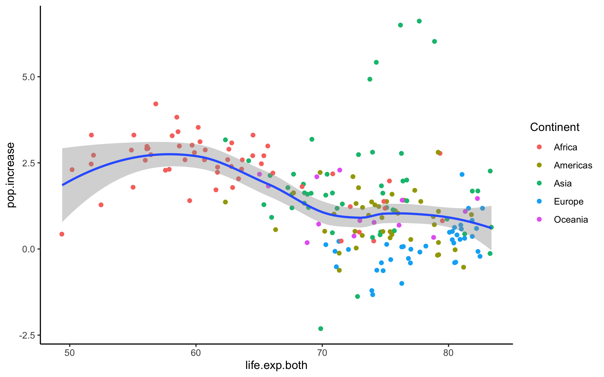
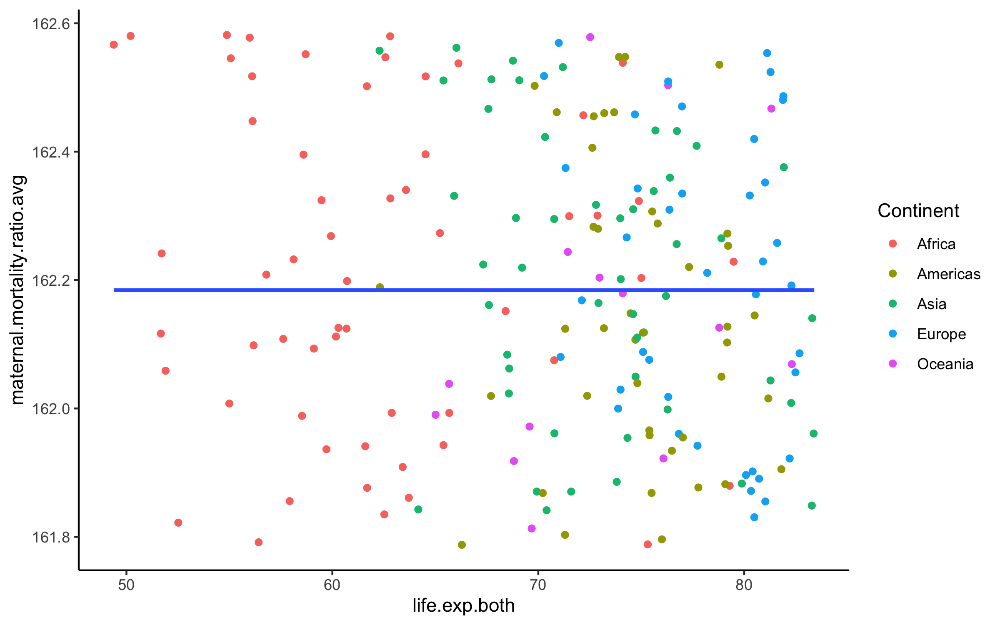
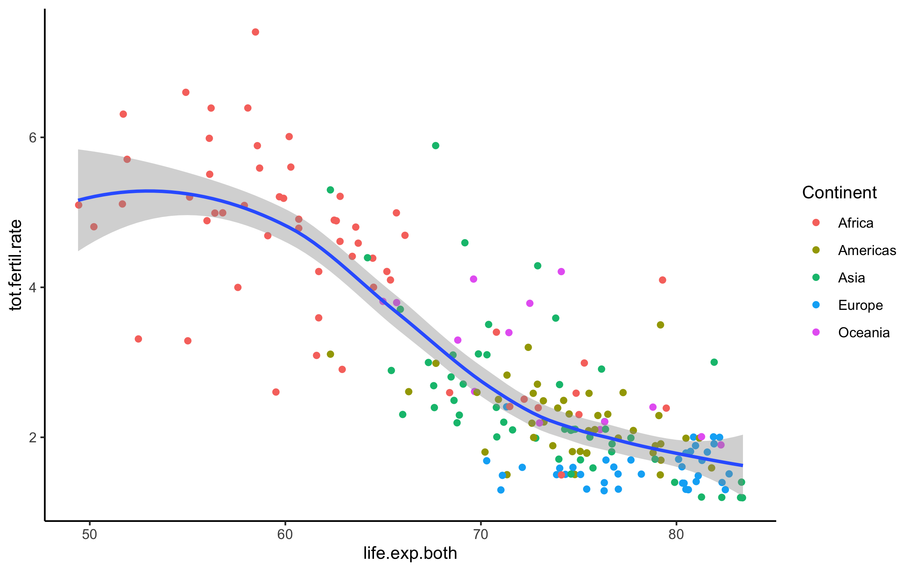
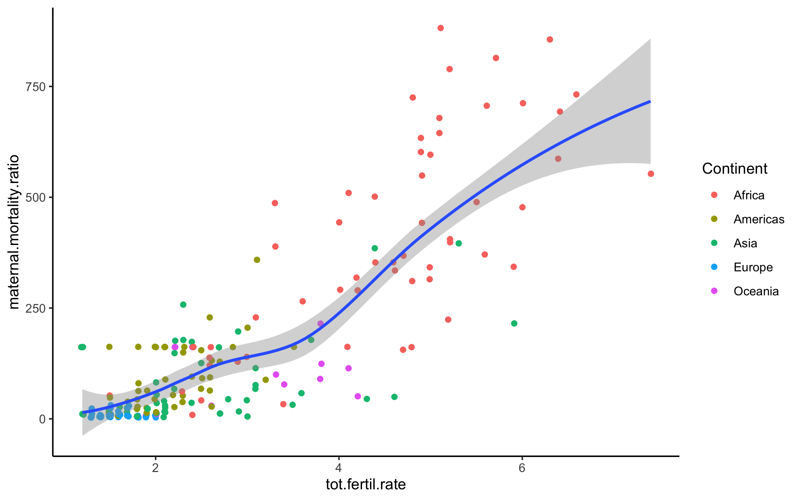
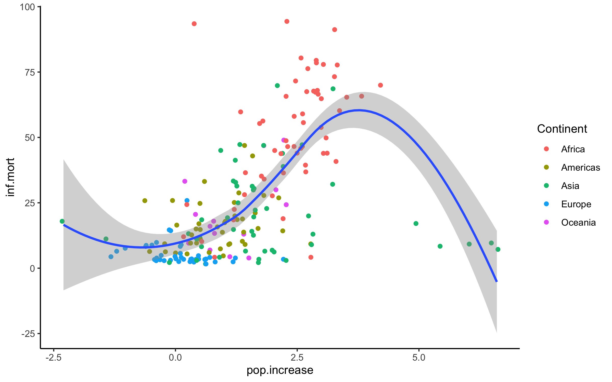
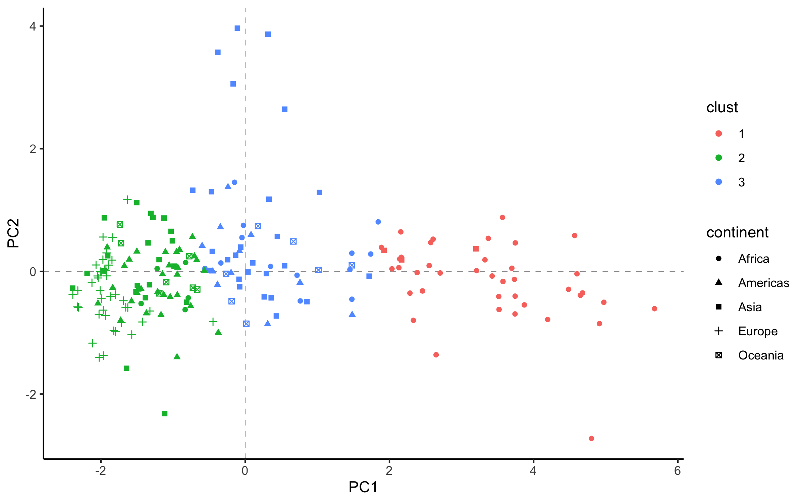

# Clusters of Countries {.tabset}

## Data Used
The data used is `Population Growth, Fertility and Mortality Indicators.csv`, tells about the number of some variables related to population fertility and mortality of each country around the world.

We have some variables from the data, and they are :

* `T03`  The country code

* `Population.growth.and.indicators.of.fertility.and.mortality` The country list

* `X` The year column

* `X.1` Variable which contains some indicators, this variable is going to be spread to some variables.

* `X.2` The values of the observations.

* `X.3` Footnotes

* `X.4` Data source


## The Goal

Assume that we are going to classify countries listed based on the indicators contained in the data. 

##  The Flow 

1. Libraries Importing and Data Preparation.

2. Exploratory Data Analyst

3. PCA Transformation.

4. Biplotting and Interpretation.


# Data Preparation


## Data Importing

```
## 'data.frame':    4979 obs. of  7 variables:
##  $ T03                                                        : chr  "Region/Country/Area" "1" "1" "1" ...
##  $ Population.growth.and.indicators.of.fertility.and.mortality: chr  "" "Total, all countries or areas" "Total, all countries or areas" "Total, all countries or areas" ...
##  $ X                                                          : chr  "Year" "2005" "2005" "2005" ...
##  $ X.1                                                        : chr  "Series" "Population annual rate of increase (percent)" "Total fertility rate (children per women)" "Infant mortality for both sexes (per 1,000 live births)" ...
##  $ X.2                                                        : chr  "Value" "1.3" "2.6" "49.1" ...
##  $ X.3                                                        : chr  "Footnotes" "Data refers to a 5-year period preceding the reference year." "Data refers to a 5-year period preceding the reference year." "Data refers to a 5-year period preceding the reference year." ...
##  $ X.4                                                        : chr  "Source" "United Nations Population Division, New York, World Population Prospects: The 2017 Revision, last accessed June 2017." "United Nations Population Division, New York, World Population Prospects: The 2017 Revision; supplemented by da"| __truncated__ "United Nations Statistics Division, New York, \"Demographic Yearbook 2015\" and the demographic statistics data"| __truncated__ ...
```

* We only need some variables to process the data, the last 2 columns and the first column will be eliminated

* There is a year column (from 2000 to 2016 ), most of the countries only have values for 2005, 2010, and 2015.

* The `X.1` contains 8 indicators, we're going to spread them into their own column


## Data cleaning

* In the chunk below we're going to remove the last 2 variables and filter the year, we only need the 2015 data to interpret the latest condition of each country.

<table>
 <thead>
  <tr>
   <th style="text-align:left;"> Code </th>
   <th style="text-align:left;"> Country </th>
   <th style="text-align:left;"> year </th>
   <th style="text-align:right;"> inf.mort </th>
   <th style="text-align:right;"> life.exp.both </th>
   <th style="text-align:right;"> life.exp.female </th>
   <th style="text-align:right;"> life.exp.male </th>
   <th style="text-align:right;"> maternal.mortality.ratio </th>
   <th style="text-align:right;"> pop.increase </th>
   <th style="text-align:right;"> tot.fertil.rate </th>
  </tr>
 </thead>
<tbody>
  <tr>
   <td style="text-align:left;"> 1 </td>
   <td style="text-align:left;"> Total, all countries or areas </td>
   <td style="text-align:left;"> 2015 </td>
   <td style="text-align:right;"> 35.0 </td>
   <td style="text-align:right;"> 70.8 </td>
   <td style="text-align:right;"> 73.1 </td>
   <td style="text-align:right;"> 68.6 </td>
   <td style="text-align:right;"> 216 </td>
   <td style="text-align:right;"> 1.2 </td>
   <td style="text-align:right;"> 2.5 </td>
  </tr>
  <tr>
   <td style="text-align:left;"> 100 </td>
   <td style="text-align:left;"> Bulgaria </td>
   <td style="text-align:left;"> 2015 </td>
   <td style="text-align:right;"> 8.3 </td>
   <td style="text-align:right;"> 74.3 </td>
   <td style="text-align:right;"> 77.8 </td>
   <td style="text-align:right;"> 70.8 </td>
   <td style="text-align:right;"> 11 </td>
   <td style="text-align:right;"> -0.6 </td>
   <td style="text-align:right;"> 1.5 </td>
  </tr>
  <tr>
   <td style="text-align:left;"> 104 </td>
   <td style="text-align:left;"> Myanmar </td>
   <td style="text-align:left;"> 2015 </td>
   <td style="text-align:right;"> 45.0 </td>
   <td style="text-align:right;"> 66.0 </td>
   <td style="text-align:right;"> 68.3 </td>
   <td style="text-align:right;"> 63.7 </td>
   <td style="text-align:right;"> 178 </td>
   <td style="text-align:right;"> 0.9 </td>
   <td style="text-align:right;"> 2.3 </td>
  </tr>
  <tr>
   <td style="text-align:left;"> 108 </td>
   <td style="text-align:left;"> Burundi </td>
   <td style="text-align:left;"> 2015 </td>
   <td style="text-align:right;"> 77.9 </td>
   <td style="text-align:right;"> 56.1 </td>
   <td style="text-align:right;"> 58.0 </td>
   <td style="text-align:right;"> 54.2 </td>
   <td style="text-align:right;"> 712 </td>
   <td style="text-align:right;"> 3.0 </td>
   <td style="text-align:right;"> 6.0 </td>
  </tr>
  <tr>
   <td style="text-align:left;"> 11 </td>
   <td style="text-align:left;"> Western Africa </td>
   <td style="text-align:left;"> 2015 </td>
   <td style="text-align:right;"> 70.5 </td>
   <td style="text-align:right;"> 54.7 </td>
   <td style="text-align:right;"> 55.6 </td>
   <td style="text-align:right;"> 53.9 </td>
   <td style="text-align:right;"> NA </td>
   <td style="text-align:right;"> 2.7 </td>
   <td style="text-align:right;"> 5.5 </td>
  </tr>
  <tr>
   <td style="text-align:left;"> 112 </td>
   <td style="text-align:left;"> Belarus </td>
   <td style="text-align:left;"> 2015 </td>
   <td style="text-align:right;"> 3.6 </td>
   <td style="text-align:right;"> 72.1 </td>
   <td style="text-align:right;"> 77.7 </td>
   <td style="text-align:right;"> 66.5 </td>
   <td style="text-align:right;"> 4 </td>
   <td style="text-align:right;"> 0.0 </td>
   <td style="text-align:right;"> 1.6 </td>
  </tr>
</tbody>
</table>

`Country` = Country list ;<br />
`inf.mort` = Infant mortality for both sexes (per 1,000 live births) ;<br />
`life.exp.both` = Life expectancy at birth for both sexes (years) ;<br />
`life.exp.male` = Life expectancy at birth for males (years) ;<br />
`life.exp.female` = Life expectancy at birth for females (years) ;<br />
`maternal.mortality.ratio` = Maternal mortality ratio (deaths per 100,000 population) ;<br />
`pop.increase` = Population annual rate of increase (percent) ;<br />
`tot.fertil.rate` = Total fertility rate (children per women) <br />


### NA checking

<table>
 <thead>
  <tr>
   <th style="text-align:left;"> column </th>
   <th style="text-align:right;"> NA </th>
  </tr>
 </thead>
<tbody>
  <tr>
   <td style="text-align:left;"> Code </td>
   <td style="text-align:right;"> 0 </td>
  </tr>
  <tr>
   <td style="text-align:left;"> Country </td>
   <td style="text-align:right;"> 0 </td>
  </tr>
  <tr>
   <td style="text-align:left;"> year </td>
   <td style="text-align:right;"> 0 </td>
  </tr>
  <tr>
   <td style="text-align:left;"> inf.mort </td>
   <td style="text-align:right;"> 31 </td>
  </tr>
  <tr>
   <td style="text-align:left;"> life.exp.both </td>
   <td style="text-align:right;"> 31 </td>
  </tr>
  <tr>
   <td style="text-align:left;"> life.exp.female </td>
   <td style="text-align:right;"> 29 </td>
  </tr>
  <tr>
   <td style="text-align:left;"> life.exp.male </td>
   <td style="text-align:right;"> 29 </td>
  </tr>
  <tr>
   <td style="text-align:left;"> maternal.mortality.ratio </td>
   <td style="text-align:right;"> 73 </td>
  </tr>
  <tr>
   <td style="text-align:left;"> pop.increase </td>
   <td style="text-align:right;"> 0 </td>
  </tr>
  <tr>
   <td style="text-align:left;"> tot.fertil.rate </td>
   <td style="text-align:right;"> 29 </td>
  </tr>
</tbody>
</table>
There are so many NAs in the data, it means that not all country listed have the data we need.
<br />
* We're going to replace the NAs to the average value of each variable/indicator.
<table>
 <thead>
  <tr>
   <th style="text-align:left;"> Code </th>
   <th style="text-align:left;"> Country </th>
   <th style="text-align:left;"> year </th>
   <th style="text-align:right;"> inf.mort </th>
   <th style="text-align:right;"> life.exp.both </th>
   <th style="text-align:right;"> life.exp.female </th>
   <th style="text-align:right;"> life.exp.male </th>
   <th style="text-align:right;"> maternal.mortality.ratio </th>
   <th style="text-align:right;"> pop.increase </th>
   <th style="text-align:right;"> tot.fertil.rate </th>
  </tr>
 </thead>
<tbody>
  <tr>
   <td style="text-align:left;"> 1 </td>
   <td style="text-align:left;"> Total, all countries or areas </td>
   <td style="text-align:left;"> 2015 </td>
   <td style="text-align:right;"> 35.0 </td>
   <td style="text-align:right;"> 70.8 </td>
   <td style="text-align:right;"> 73.1 </td>
   <td style="text-align:right;"> 68.6 </td>
   <td style="text-align:right;"> 216.0000 </td>
   <td style="text-align:right;"> 1.2 </td>
   <td style="text-align:right;"> 2.5 </td>
  </tr>
  <tr>
   <td style="text-align:left;"> 100 </td>
   <td style="text-align:left;"> Bulgaria </td>
   <td style="text-align:left;"> 2015 </td>
   <td style="text-align:right;"> 8.3 </td>
   <td style="text-align:right;"> 74.3 </td>
   <td style="text-align:right;"> 77.8 </td>
   <td style="text-align:right;"> 70.8 </td>
   <td style="text-align:right;"> 11.0000 </td>
   <td style="text-align:right;"> -0.6 </td>
   <td style="text-align:right;"> 1.5 </td>
  </tr>
  <tr>
   <td style="text-align:left;"> 104 </td>
   <td style="text-align:left;"> Myanmar </td>
   <td style="text-align:left;"> 2015 </td>
   <td style="text-align:right;"> 45.0 </td>
   <td style="text-align:right;"> 66.0 </td>
   <td style="text-align:right;"> 68.3 </td>
   <td style="text-align:right;"> 63.7 </td>
   <td style="text-align:right;"> 178.0000 </td>
   <td style="text-align:right;"> 0.9 </td>
   <td style="text-align:right;"> 2.3 </td>
  </tr>
  <tr>
   <td style="text-align:left;"> 108 </td>
   <td style="text-align:left;"> Burundi </td>
   <td style="text-align:left;"> 2015 </td>
   <td style="text-align:right;"> 77.9 </td>
   <td style="text-align:right;"> 56.1 </td>
   <td style="text-align:right;"> 58.0 </td>
   <td style="text-align:right;"> 54.2 </td>
   <td style="text-align:right;"> 712.0000 </td>
   <td style="text-align:right;"> 3.0 </td>
   <td style="text-align:right;"> 6.0 </td>
  </tr>
  <tr>
   <td style="text-align:left;"> 11 </td>
   <td style="text-align:left;"> Western Africa </td>
   <td style="text-align:left;"> 2015 </td>
   <td style="text-align:right;"> 70.5 </td>
   <td style="text-align:right;"> 54.7 </td>
   <td style="text-align:right;"> 55.6 </td>
   <td style="text-align:right;"> 53.9 </td>
   <td style="text-align:right;"> 162.1842 </td>
   <td style="text-align:right;"> 2.7 </td>
   <td style="text-align:right;"> 5.5 </td>
  </tr>
  <tr>
   <td style="text-align:left;"> 112 </td>
   <td style="text-align:left;"> Belarus </td>
   <td style="text-align:left;"> 2015 </td>
   <td style="text-align:right;"> 3.6 </td>
   <td style="text-align:right;"> 72.1 </td>
   <td style="text-align:right;"> 77.7 </td>
   <td style="text-align:right;"> 66.5 </td>
   <td style="text-align:right;"> 4.0000 </td>
   <td style="text-align:right;"> 0.0 </td>
   <td style="text-align:right;"> 1.6 </td>
  </tr>
</tbody>
</table>
<br />
There is an odd thing on the data as we replace the NA with the average number of each column. There are some rows/countries which have no observation value or only have 1 or 2 value for their indicator and we have filled them with the average values and it's not supposed to be like that. We supposed to eliminate them.

* eliminating some rows

I create a vector that indicates whether a rows' values are mostly the avg values of each column or not. If it is, eliminate the column.
<br />

```
## 'data.frame':    235 obs. of  8 variables:
##  $ Country                 : chr  "Total, all countries or areas" "Bulgaria" "Myanmar" "Burundi" ...
##  $ inf.mort                : num  35 8.3 45 77.9 70.5 3.6 29.9 27.7 67.5 4.7 ...
##  $ life.exp.both           : num  70.8 74.3 66 56.1 54.7 72.1 67.6 75.3 56.4 81.8 ...
##  $ life.exp.female         : num  73.1 77.8 68.3 58 55.6 77.7 69.6 76.5 57.7 83.8 ...
##  $ life.exp.male           : num  68.6 70.8 63.7 54.2 53.9 66.5 65.5 74.1 55.1 79.7 ...
##  $ maternal.mortality.ratio: num  216 11 178 712 162 ...
##  $ pop.increase            : num  1.2 -0.6 0.9 3 2.7 0 1.6 2 2.7 1 ...
##  $ tot.fertil.rate         : num  2.5 1.5 2.3 6 5.5 1.6 2.7 3 5 1.6 ...
```

### Continent Column

I think by giving the `Continent` column, we're going to have some more insights, so let's just do it.
<br />
<table>
 <thead>
  <tr>
   <th style="text-align:left;"> Country </th>
   <th style="text-align:left;"> Continent </th>
  </tr>
 </thead>
<tbody>
  <tr>
   <td style="text-align:left;"> Total, all countries or areas </td>
   <td style="text-align:left;"> NA </td>
  </tr>
  <tr>
   <td style="text-align:left;"> Bulgaria </td>
   <td style="text-align:left;"> Europe </td>
  </tr>
  <tr>
   <td style="text-align:left;"> Myanmar </td>
   <td style="text-align:left;"> Asia </td>
  </tr>
  <tr>
   <td style="text-align:left;"> Burundi </td>
   <td style="text-align:left;"> Africa </td>
  </tr>
  <tr>
   <td style="text-align:left;"> Western Africa </td>
   <td style="text-align:left;"> NA </td>
  </tr>
  <tr>
   <td style="text-align:left;"> Belarus </td>
   <td style="text-align:left;"> Europe </td>
  </tr>
</tbody>
</table>
<br />
Some rows cannot be defined by its continent and all of them are not even a country actually. They are just regions or certain areas of the continent. 

Our observations are countries so we wil just eliminate rows that represent some areas or regions.

<div style="border: 1px solid #ddd; padding: 0px; overflow-y: scroll; height:200px; overflow-x: scroll; width:100%; "><table>
 <thead>
  <tr>
   <th style="text-align:left;position: sticky; top:0; background-color: #FFFFFF;"> Country </th>
   <th style="text-align:left;position: sticky; top:0; background-color: #FFFFFF;"> Continent </th>
  </tr>
 </thead>
<tbody>
  <tr>
   <td style="text-align:left;"> Total, all countries or areas </td>
   <td style="text-align:left;"> ? </td>
  </tr>
  <tr>
   <td style="text-align:left;"> Western Africa </td>
   <td style="text-align:left;"> ? </td>
  </tr>
  <tr>
   <td style="text-align:left;"> Central America </td>
   <td style="text-align:left;"> ? </td>
  </tr>
  <tr>
   <td style="text-align:left;"> Eastern Africa </td>
   <td style="text-align:left;"> ? </td>
  </tr>
  <tr>
   <td style="text-align:left;"> Asia </td>
   <td style="text-align:left;"> ? </td>
  </tr>
  <tr>
   <td style="text-align:left;"> Central Asia </td>
   <td style="text-align:left;"> ? </td>
  </tr>
  <tr>
   <td style="text-align:left;"> Western Asia </td>
   <td style="text-align:left;"> ? </td>
  </tr>
  <tr>
   <td style="text-align:left;"> Northern Africa </td>
   <td style="text-align:left;"> ? </td>
  </tr>
  <tr>
   <td style="text-align:left;"> Europe </td>
   <td style="text-align:left;"> ? </td>
  </tr>
  <tr>
   <td style="text-align:left;"> Eastern Europe </td>
   <td style="text-align:left;"> ? </td>
  </tr>
  <tr>
   <td style="text-align:left;"> Northern Europe </td>
   <td style="text-align:left;"> ? </td>
  </tr>
  <tr>
   <td style="text-align:left;"> Western Europe </td>
   <td style="text-align:left;"> ? </td>
  </tr>
  <tr>
   <td style="text-align:left;"> Other non-specified areas </td>
   <td style="text-align:left;"> ? </td>
  </tr>
  <tr>
   <td style="text-align:left;"> Middle Africa </td>
   <td style="text-align:left;"> ? </td>
  </tr>
  <tr>
   <td style="text-align:left;"> Southern Africa </td>
   <td style="text-align:left;"> ? </td>
  </tr>
  <tr>
   <td style="text-align:left;"> Africa </td>
   <td style="text-align:left;"> ? </td>
  </tr>
  <tr>
   <td style="text-align:left;"> Sub-Saharan Africa </td>
   <td style="text-align:left;"> ? </td>
  </tr>
  <tr>
   <td style="text-align:left;"> Northern America </td>
   <td style="text-align:left;"> ? </td>
  </tr>
  <tr>
   <td style="text-align:left;"> Caribbean </td>
   <td style="text-align:left;"> ? </td>
  </tr>
  <tr>
   <td style="text-align:left;"> Eastern Asia </td>
   <td style="text-align:left;"> ? </td>
  </tr>
  <tr>
   <td style="text-align:left;"> Southern Asia </td>
   <td style="text-align:left;"> ? </td>
  </tr>
  <tr>
   <td style="text-align:left;"> South-eastern Asia </td>
   <td style="text-align:left;"> ? </td>
  </tr>
  <tr>
   <td style="text-align:left;"> Southern Europe </td>
   <td style="text-align:left;"> ? </td>
  </tr>
  <tr>
   <td style="text-align:left;"> Latin America &amp; the Caribbean </td>
   <td style="text-align:left;"> ? </td>
  </tr>
  <tr>
   <td style="text-align:left;"> South America </td>
   <td style="text-align:left;"> ? </td>
  </tr>
  <tr>
   <td style="text-align:left;"> Australia and New Zealand </td>
   <td style="text-align:left;"> ? </td>
  </tr>
  <tr>
   <td style="text-align:left;"> Melanesia </td>
   <td style="text-align:left;"> ? </td>
  </tr>
  <tr>
   <td style="text-align:left;"> Micronesia </td>
   <td style="text-align:left;"> ? </td>
  </tr>
  <tr>
   <td style="text-align:left;"> Polynesia </td>
   <td style="text-align:left;"> ? </td>
  </tr>
  <tr>
   <td style="text-align:left;"> South-central Asia </td>
   <td style="text-align:left;"> ? </td>
  </tr>
  <tr>
   <td style="text-align:left;"> Channel Islands </td>
   <td style="text-align:left;"> ? </td>
  </tr>
  <tr>
   <td style="text-align:left;"> Oceania </td>
   <td style="text-align:left;"> ? </td>
  </tr>
</tbody>
</table></div>

* We better assign the `Country` as rownames instead.
<table>
 <thead>
  <tr>
   <th style="text-align:right;"> inf.mort </th>
   <th style="text-align:right;"> life.exp.both </th>
   <th style="text-align:right;"> life.exp.female </th>
   <th style="text-align:right;"> life.exp.male </th>
   <th style="text-align:right;"> maternal.mortality.ratio </th>
   <th style="text-align:right;"> pop.increase </th>
   <th style="text-align:right;"> tot.fertil.rate </th>
   <th style="text-align:left;"> Continent </th>
  </tr>
 </thead>
<tbody>
  <tr>
   <td style="text-align:right;"> 8.3 </td>
   <td style="text-align:right;"> 74.3 </td>
   <td style="text-align:right;"> 77.8 </td>
   <td style="text-align:right;"> 70.8 </td>
   <td style="text-align:right;"> 11 </td>
   <td style="text-align:right;"> -0.6 </td>
   <td style="text-align:right;"> 1.5 </td>
   <td style="text-align:left;"> Europe </td>
  </tr>
  <tr>
   <td style="text-align:right;"> 45.0 </td>
   <td style="text-align:right;"> 66.0 </td>
   <td style="text-align:right;"> 68.3 </td>
   <td style="text-align:right;"> 63.7 </td>
   <td style="text-align:right;"> 178 </td>
   <td style="text-align:right;"> 0.9 </td>
   <td style="text-align:right;"> 2.3 </td>
   <td style="text-align:left;"> Asia </td>
  </tr>
  <tr>
   <td style="text-align:right;"> 77.9 </td>
   <td style="text-align:right;"> 56.1 </td>
   <td style="text-align:right;"> 58.0 </td>
   <td style="text-align:right;"> 54.2 </td>
   <td style="text-align:right;"> 712 </td>
   <td style="text-align:right;"> 3.0 </td>
   <td style="text-align:right;"> 6.0 </td>
   <td style="text-align:left;"> Africa </td>
  </tr>
  <tr>
   <td style="text-align:right;"> 3.6 </td>
   <td style="text-align:right;"> 72.1 </td>
   <td style="text-align:right;"> 77.7 </td>
   <td style="text-align:right;"> 66.5 </td>
   <td style="text-align:right;"> 4 </td>
   <td style="text-align:right;"> 0.0 </td>
   <td style="text-align:right;"> 1.6 </td>
   <td style="text-align:left;"> Europe </td>
  </tr>
  <tr>
   <td style="text-align:right;"> 29.9 </td>
   <td style="text-align:right;"> 67.6 </td>
   <td style="text-align:right;"> 69.6 </td>
   <td style="text-align:right;"> 65.5 </td>
   <td style="text-align:right;"> 161 </td>
   <td style="text-align:right;"> 1.6 </td>
   <td style="text-align:right;"> 2.7 </td>
   <td style="text-align:left;"> Asia </td>
  </tr>
  <tr>
   <td style="text-align:right;"> 27.7 </td>
   <td style="text-align:right;"> 75.3 </td>
   <td style="text-align:right;"> 76.5 </td>
   <td style="text-align:right;"> 74.1 </td>
   <td style="text-align:right;"> 140 </td>
   <td style="text-align:right;"> 2.0 </td>
   <td style="text-align:right;"> 3.0 </td>
   <td style="text-align:left;"> Africa </td>
  </tr>
</tbody>
</table>
<br />
Now the data is ready to be proceed.


# Exploratory Data Analyst

* Variables Correlation

<!-- -->
<br />
From the plot above we can conclude that :

* the correlation between **life expectancy of birth** of male, female, and both are really high. In this case we better use the `life expectancy of both` 


* all variables have relatively strong correlation to each other but `pop.increase`

* the `pop.increase` has the least correlation with other variables


## Life Expectantion of the World










<br />
* Africa dominates the low life expectantion area but Europe are mostly on the high area of life expectancy . The rest are spread from the middle to the high.

* Usualy the countries which infant mortality is high have less life expectantion.  The infants die and the life expectantion is lower than other countries, Africa dominates this area and Europe is on the other side.

* The higher fertility rate the lower life expectancy,Africa dominates this area and Europe is on the other side. 


## Total Fertility of the World





<br />
* Africa dominates the area which total fertility rate is high, means that Africans are "productive".

* it's kinda make sense countries with low fertility rate have low infant mortality number.

* Usualy the countries which total fertility is high have low life expectancy.

* Countries with high fertility rate tend to have high maternal mortality ratio and this still dominated by African countries.

## Population Increase of The world




<br />
* Europe has low infant mortality number but also low population increase which is rational i think.

* Most African countries  and some Asian country have high pop increase and high infant mortality, it's not really good though, it seems like they produce babies as much as possible but can't really keep them alive until adult. 

* Some Asian countries even keep their infant mortality low but still their population increase greatly. And they are the "oil well" of the world. 

* The higher total fertility rate, the higher population increase. 

# Data Clustering

## Data Scalling
Scaled data is needed to perform data clustering. 

* Before Scaling

```
##     inf.mort    life.exp.both   maternal.mortality.ratio  pop.increase   
##  Min.   : 1.6   Min.   :49.40   Min.   :  3.0            Min.   :-2.300  
##  1st Qu.: 6.9   1st Qu.:65.80   1st Qu.: 16.5            1st Qu.: 0.400  
##  Median :17.1   Median :73.00   Median : 76.0            Median : 1.300  
##  Mean   :25.7   Mean   :71.27   Mean   :162.2            Mean   : 1.401  
##  3rd Qu.:42.1   3rd Qu.:76.90   3rd Qu.:187.5            3rd Qu.: 2.300  
##  Max.   :94.4   Max.   :83.40   Max.   :882.0            Max.   : 6.600  
##  tot.fertil.rate    Continent 
##  Min.   :1.200   Africa  :57  
##  1st Qu.:1.800   Americas:42  
##  Median :2.400   Asia    :50  
##  Mean   :2.853   Europe  :40  
##  3rd Qu.:3.750   Oceania :14  
##  Max.   :7.400
```

* After Scaling

```
##     inf.mort       life.exp.both     maternal.mortality.ratio  pop.increase    
##  Min.   :-1.0369   Min.   :-2.6949   Min.   :-0.7804          Min.   :-2.7139  
##  1st Qu.:-0.8089   1st Qu.:-0.6741   1st Qu.:-0.7142          1st Qu.:-0.7343  
##  Median :-0.3700   Median : 0.2131   Median :-0.4225          Median :-0.0744  
##  Mean   : 0.0000   Mean   : 0.0000   Mean   : 0.0000          Mean   : 0.0000  
##  3rd Qu.: 0.7055   3rd Qu.: 0.6937   3rd Qu.: 0.1243          3rd Qu.: 0.6588  
##  Max.   : 2.9556   Max.   : 1.4947   Max.   : 3.5298          Max.   : 3.8116  
##  tot.fertil.rate  
##  Min.   :-1.1726  
##  1st Qu.:-0.7470  
##  Median :-0.3215  
##  Mean   : 0.0000  
##  3rd Qu.: 0.6359  
##  Max.   : 3.2245
```


## Optimal K value
<!-- -->
<br />
The elbow method shows that the optimum K value is 2. But i think we should try 3 as well since 2 clusters will not give us much information.


## K-means

* k-means modeling


* cluster distribution

If we divide the data into two clusters, the composition of each cluster would be :
<table>
 <thead>
  <tr>
   <th style="text-align:left;"> Cluster </th>
   <th style="text-align:right;"> Freq </th>
  </tr>
 </thead>
<tbody>
  <tr>
   <td style="text-align:left;"> 1 </td>
   <td style="text-align:right;"> 153 </td>
  </tr>
  <tr>
   <td style="text-align:left;"> 2 </td>
   <td style="text-align:right;"> 50 </td>
  </tr>
</tbody>
</table>
<br />
But if we divide the data into three clusters, the composition of each cluster would be:
<table>
 <thead>
  <tr>
   <th style="text-align:left;"> Cluster </th>
   <th style="text-align:right;"> Freq </th>
  </tr>
 </thead>
<tbody>
  <tr>
   <td style="text-align:left;"> 1 </td>
   <td style="text-align:right;"> 42 </td>
  </tr>
  <tr>
   <td style="text-align:left;"> 2 </td>
   <td style="text-align:right;"> 104 </td>
  </tr>
  <tr>
   <td style="text-align:left;"> 3 </td>
   <td style="text-align:right;"> 57 </td>
  </tr>
</tbody>
</table>

<br />

* assigning cluster to new columns
<table>
 <thead>
  <tr>
   <th style="text-align:left;"> Country </th>
   <th style="text-align:left;"> 2-Clusters </th>
   <th style="text-align:left;"> 3-Clusters </th>
  </tr>
 </thead>
<tbody>
  <tr>
   <td style="text-align:left;"> Bulgaria </td>
   <td style="text-align:left;"> 1 </td>
   <td style="text-align:left;"> 2 </td>
  </tr>
  <tr>
   <td style="text-align:left;"> Myanmar </td>
   <td style="text-align:left;"> 1 </td>
   <td style="text-align:left;"> 3 </td>
  </tr>
  <tr>
   <td style="text-align:left;"> Burundi </td>
   <td style="text-align:left;"> 2 </td>
   <td style="text-align:left;"> 1 </td>
  </tr>
  <tr>
   <td style="text-align:left;"> Belarus </td>
   <td style="text-align:left;"> 1 </td>
   <td style="text-align:left;"> 2 </td>
  </tr>
  <tr>
   <td style="text-align:left;"> Cambodia </td>
   <td style="text-align:left;"> 1 </td>
   <td style="text-align:left;"> 3 </td>
  </tr>
  <tr>
   <td style="text-align:left;"> Algeria </td>
   <td style="text-align:left;"> 1 </td>
   <td style="text-align:left;"> 3 </td>
  </tr>
  <tr>
   <td style="text-align:left;"> Cameroon </td>
   <td style="text-align:left;"> 2 </td>
   <td style="text-align:left;"> 1 </td>
  </tr>
  <tr>
   <td style="text-align:left;"> Canada </td>
   <td style="text-align:left;"> 1 </td>
   <td style="text-align:left;"> 2 </td>
  </tr>
  <tr>
   <td style="text-align:left;"> Cabo Verde </td>
   <td style="text-align:left;"> 1 </td>
   <td style="text-align:left;"> 3 </td>
  </tr>
  <tr>
   <td style="text-align:left;"> Central African Republic </td>
   <td style="text-align:left;"> 2 </td>
   <td style="text-align:left;"> 1 </td>
  </tr>
  <tr>
   <td style="text-align:left;"> Sri Lanka </td>
   <td style="text-align:left;"> 1 </td>
   <td style="text-align:left;"> 2 </td>
  </tr>
  <tr>
   <td style="text-align:left;"> Chad </td>
   <td style="text-align:left;"> 2 </td>
   <td style="text-align:left;"> 1 </td>
  </tr>
  <tr>
   <td style="text-align:left;"> Chile </td>
   <td style="text-align:left;"> 1 </td>
   <td style="text-align:left;"> 2 </td>
  </tr>
  <tr>
   <td style="text-align:left;"> China </td>
   <td style="text-align:left;"> 1 </td>
   <td style="text-align:left;"> 2 </td>
  </tr>
  <tr>
   <td style="text-align:left;"> Colombia </td>
   <td style="text-align:left;"> 1 </td>
   <td style="text-align:left;"> 2 </td>
  </tr>
  <tr>
   <td style="text-align:left;"> Comoros </td>
   <td style="text-align:left;"> 2 </td>
   <td style="text-align:left;"> 1 </td>
  </tr>
  <tr>
   <td style="text-align:left;"> Mayotte </td>
   <td style="text-align:left;"> 1 </td>
   <td style="text-align:left;"> 3 </td>
  </tr>
  <tr>
   <td style="text-align:left;"> Congo </td>
   <td style="text-align:left;"> 2 </td>
   <td style="text-align:left;"> 1 </td>
  </tr>
  <tr>
   <td style="text-align:left;"> Dem. Rep. of the Congo </td>
   <td style="text-align:left;"> 2 </td>
   <td style="text-align:left;"> 1 </td>
  </tr>
  <tr>
   <td style="text-align:left;"> Costa Rica </td>
   <td style="text-align:left;"> 1 </td>
   <td style="text-align:left;"> 2 </td>
  </tr>
  <tr>
   <td style="text-align:left;"> Croatia </td>
   <td style="text-align:left;"> 1 </td>
   <td style="text-align:left;"> 2 </td>
  </tr>
  <tr>
   <td style="text-align:left;"> Cuba </td>
   <td style="text-align:left;"> 1 </td>
   <td style="text-align:left;"> 2 </td>
  </tr>
  <tr>
   <td style="text-align:left;"> Cyprus </td>
   <td style="text-align:left;"> 1 </td>
   <td style="text-align:left;"> 2 </td>
  </tr>
  <tr>
   <td style="text-align:left;"> Czechia </td>
   <td style="text-align:left;"> 1 </td>
   <td style="text-align:left;"> 2 </td>
  </tr>
  <tr>
   <td style="text-align:left;"> Benin </td>
   <td style="text-align:left;"> 2 </td>
   <td style="text-align:left;"> 1 </td>
  </tr>
  <tr>
   <td style="text-align:left;"> Denmark </td>
   <td style="text-align:left;"> 1 </td>
   <td style="text-align:left;"> 2 </td>
  </tr>
  <tr>
   <td style="text-align:left;"> Dominican Republic </td>
   <td style="text-align:left;"> 1 </td>
   <td style="text-align:left;"> 3 </td>
  </tr>
  <tr>
   <td style="text-align:left;"> Ecuador </td>
   <td style="text-align:left;"> 1 </td>
   <td style="text-align:left;"> 3 </td>
  </tr>
  <tr>
   <td style="text-align:left;"> El Salvador </td>
   <td style="text-align:left;"> 1 </td>
   <td style="text-align:left;"> 2 </td>
  </tr>
  <tr>
   <td style="text-align:left;"> Equatorial Guinea </td>
   <td style="text-align:left;"> 2 </td>
   <td style="text-align:left;"> 1 </td>
  </tr>
  <tr>
   <td style="text-align:left;"> Ethiopia </td>
   <td style="text-align:left;"> 2 </td>
   <td style="text-align:left;"> 1 </td>
  </tr>
  <tr>
   <td style="text-align:left;"> Eritrea </td>
   <td style="text-align:left;"> 2 </td>
   <td style="text-align:left;"> 1 </td>
  </tr>
  <tr>
   <td style="text-align:left;"> Estonia </td>
   <td style="text-align:left;"> 1 </td>
   <td style="text-align:left;"> 2 </td>
  </tr>
  <tr>
   <td style="text-align:left;"> Faroe Islands </td>
   <td style="text-align:left;"> 1 </td>
   <td style="text-align:left;"> 2 </td>
  </tr>
  <tr>
   <td style="text-align:left;"> Angola </td>
   <td style="text-align:left;"> 2 </td>
   <td style="text-align:left;"> 1 </td>
  </tr>
  <tr>
   <td style="text-align:left;"> Fiji </td>
   <td style="text-align:left;"> 1 </td>
   <td style="text-align:left;"> 2 </td>
  </tr>
  <tr>
   <td style="text-align:left;"> Finland </td>
   <td style="text-align:left;"> 1 </td>
   <td style="text-align:left;"> 2 </td>
  </tr>
  <tr>
   <td style="text-align:left;"> France </td>
   <td style="text-align:left;"> 1 </td>
   <td style="text-align:left;"> 2 </td>
  </tr>
  <tr>
   <td style="text-align:left;"> French Guiana </td>
   <td style="text-align:left;"> 1 </td>
   <td style="text-align:left;"> 3 </td>
  </tr>
  <tr>
   <td style="text-align:left;"> French Polynesia </td>
   <td style="text-align:left;"> 1 </td>
   <td style="text-align:left;"> 2 </td>
  </tr>
  <tr>
   <td style="text-align:left;"> Djibouti </td>
   <td style="text-align:left;"> 2 </td>
   <td style="text-align:left;"> 3 </td>
  </tr>
  <tr>
   <td style="text-align:left;"> Gabon </td>
   <td style="text-align:left;"> 2 </td>
   <td style="text-align:left;"> 3 </td>
  </tr>
  <tr>
   <td style="text-align:left;"> Georgia </td>
   <td style="text-align:left;"> 1 </td>
   <td style="text-align:left;"> 2 </td>
  </tr>
  <tr>
   <td style="text-align:left;"> Gambia </td>
   <td style="text-align:left;"> 2 </td>
   <td style="text-align:left;"> 1 </td>
  </tr>
  <tr>
   <td style="text-align:left;"> State of Palestine </td>
   <td style="text-align:left;"> 1 </td>
   <td style="text-align:left;"> 3 </td>
  </tr>
  <tr>
   <td style="text-align:left;"> Germany </td>
   <td style="text-align:left;"> 1 </td>
   <td style="text-align:left;"> 2 </td>
  </tr>
  <tr>
   <td style="text-align:left;"> Antigua and Barbuda </td>
   <td style="text-align:left;"> 1 </td>
   <td style="text-align:left;"> 2 </td>
  </tr>
  <tr>
   <td style="text-align:left;"> Ghana </td>
   <td style="text-align:left;"> 2 </td>
   <td style="text-align:left;"> 1 </td>
  </tr>
  <tr>
   <td style="text-align:left;"> Kiribati </td>
   <td style="text-align:left;"> 1 </td>
   <td style="text-align:left;"> 3 </td>
  </tr>
  <tr>
   <td style="text-align:left;"> Greece </td>
   <td style="text-align:left;"> 1 </td>
   <td style="text-align:left;"> 2 </td>
  </tr>
  <tr>
   <td style="text-align:left;"> Greenland </td>
   <td style="text-align:left;"> 1 </td>
   <td style="text-align:left;"> 2 </td>
  </tr>
  <tr>
   <td style="text-align:left;"> Grenada </td>
   <td style="text-align:left;"> 1 </td>
   <td style="text-align:left;"> 2 </td>
  </tr>
  <tr>
   <td style="text-align:left;"> Azerbaijan </td>
   <td style="text-align:left;"> 1 </td>
   <td style="text-align:left;"> 3 </td>
  </tr>
  <tr>
   <td style="text-align:left;"> Guadeloupe </td>
   <td style="text-align:left;"> 1 </td>
   <td style="text-align:left;"> 2 </td>
  </tr>
  <tr>
   <td style="text-align:left;"> Guam </td>
   <td style="text-align:left;"> 1 </td>
   <td style="text-align:left;"> 2 </td>
  </tr>
  <tr>
   <td style="text-align:left;"> Argentina </td>
   <td style="text-align:left;"> 1 </td>
   <td style="text-align:left;"> 2 </td>
  </tr>
  <tr>
   <td style="text-align:left;"> Guatemala </td>
   <td style="text-align:left;"> 1 </td>
   <td style="text-align:left;"> 3 </td>
  </tr>
  <tr>
   <td style="text-align:left;"> Guinea </td>
   <td style="text-align:left;"> 2 </td>
   <td style="text-align:left;"> 1 </td>
  </tr>
  <tr>
   <td style="text-align:left;"> Guyana </td>
   <td style="text-align:left;"> 1 </td>
   <td style="text-align:left;"> 3 </td>
  </tr>
  <tr>
   <td style="text-align:left;"> Haiti </td>
   <td style="text-align:left;"> 2 </td>
   <td style="text-align:left;"> 3 </td>
  </tr>
  <tr>
   <td style="text-align:left;"> Honduras </td>
   <td style="text-align:left;"> 1 </td>
   <td style="text-align:left;"> 3 </td>
  </tr>
  <tr>
   <td style="text-align:left;"> China, Hong Kong SAR </td>
   <td style="text-align:left;"> 1 </td>
   <td style="text-align:left;"> 2 </td>
  </tr>
  <tr>
   <td style="text-align:left;"> Hungary </td>
   <td style="text-align:left;"> 1 </td>
   <td style="text-align:left;"> 2 </td>
  </tr>
  <tr>
   <td style="text-align:left;"> Iceland </td>
   <td style="text-align:left;"> 1 </td>
   <td style="text-align:left;"> 2 </td>
  </tr>
  <tr>
   <td style="text-align:left;"> India </td>
   <td style="text-align:left;"> 1 </td>
   <td style="text-align:left;"> 3 </td>
  </tr>
  <tr>
   <td style="text-align:left;"> Australia </td>
   <td style="text-align:left;"> 1 </td>
   <td style="text-align:left;"> 2 </td>
  </tr>
  <tr>
   <td style="text-align:left;"> Indonesia </td>
   <td style="text-align:left;"> 1 </td>
   <td style="text-align:left;"> 3 </td>
  </tr>
  <tr>
   <td style="text-align:left;"> Iran (Islamic Republic of) </td>
   <td style="text-align:left;"> 1 </td>
   <td style="text-align:left;"> 2 </td>
  </tr>
  <tr>
   <td style="text-align:left;"> Iraq </td>
   <td style="text-align:left;"> 1 </td>
   <td style="text-align:left;"> 3 </td>
  </tr>
  <tr>
   <td style="text-align:left;"> Ireland </td>
   <td style="text-align:left;"> 1 </td>
   <td style="text-align:left;"> 2 </td>
  </tr>
  <tr>
   <td style="text-align:left;"> Israel </td>
   <td style="text-align:left;"> 1 </td>
   <td style="text-align:left;"> 2 </td>
  </tr>
  <tr>
   <td style="text-align:left;"> Italy </td>
   <td style="text-align:left;"> 1 </td>
   <td style="text-align:left;"> 2 </td>
  </tr>
  <tr>
   <td style="text-align:left;"> Côte d'Ivoire </td>
   <td style="text-align:left;"> 2 </td>
   <td style="text-align:left;"> 1 </td>
  </tr>
  <tr>
   <td style="text-align:left;"> Jamaica </td>
   <td style="text-align:left;"> 1 </td>
   <td style="text-align:left;"> 2 </td>
  </tr>
  <tr>
   <td style="text-align:left;"> Japan </td>
   <td style="text-align:left;"> 1 </td>
   <td style="text-align:left;"> 2 </td>
  </tr>
  <tr>
   <td style="text-align:left;"> Kazakhstan </td>
   <td style="text-align:left;"> 1 </td>
   <td style="text-align:left;"> 3 </td>
  </tr>
  <tr>
   <td style="text-align:left;"> Afghanistan </td>
   <td style="text-align:left;"> 2 </td>
   <td style="text-align:left;"> 1 </td>
  </tr>
  <tr>
   <td style="text-align:left;"> Austria </td>
   <td style="text-align:left;"> 1 </td>
   <td style="text-align:left;"> 2 </td>
  </tr>
  <tr>
   <td style="text-align:left;"> Jordan </td>
   <td style="text-align:left;"> 1 </td>
   <td style="text-align:left;"> 3 </td>
  </tr>
  <tr>
   <td style="text-align:left;"> Kenya </td>
   <td style="text-align:left;"> 2 </td>
   <td style="text-align:left;"> 1 </td>
  </tr>
  <tr>
   <td style="text-align:left;"> Dem. People's Rep. Korea </td>
   <td style="text-align:left;"> 1 </td>
   <td style="text-align:left;"> 2 </td>
  </tr>
  <tr>
   <td style="text-align:left;"> Republic of Korea </td>
   <td style="text-align:left;"> 1 </td>
   <td style="text-align:left;"> 2 </td>
  </tr>
  <tr>
   <td style="text-align:left;"> Kuwait </td>
   <td style="text-align:left;"> 1 </td>
   <td style="text-align:left;"> 3 </td>
  </tr>
  <tr>
   <td style="text-align:left;"> Kyrgyzstan </td>
   <td style="text-align:left;"> 1 </td>
   <td style="text-align:left;"> 3 </td>
  </tr>
  <tr>
   <td style="text-align:left;"> Lao People's Dem. Rep. </td>
   <td style="text-align:left;"> 1 </td>
   <td style="text-align:left;"> 3 </td>
  </tr>
  <tr>
   <td style="text-align:left;"> Lebanon </td>
   <td style="text-align:left;"> 1 </td>
   <td style="text-align:left;"> 3 </td>
  </tr>
  <tr>
   <td style="text-align:left;"> Lesotho </td>
   <td style="text-align:left;"> 2 </td>
   <td style="text-align:left;"> 1 </td>
  </tr>
  <tr>
   <td style="text-align:left;"> Latvia </td>
   <td style="text-align:left;"> 1 </td>
   <td style="text-align:left;"> 2 </td>
  </tr>
  <tr>
   <td style="text-align:left;"> Liberia </td>
   <td style="text-align:left;"> 2 </td>
   <td style="text-align:left;"> 1 </td>
  </tr>
  <tr>
   <td style="text-align:left;"> Libya </td>
   <td style="text-align:left;"> 1 </td>
   <td style="text-align:left;"> 2 </td>
  </tr>
  <tr>
   <td style="text-align:left;"> Bahamas </td>
   <td style="text-align:left;"> 1 </td>
   <td style="text-align:left;"> 2 </td>
  </tr>
  <tr>
   <td style="text-align:left;"> Lithuania </td>
   <td style="text-align:left;"> 1 </td>
   <td style="text-align:left;"> 2 </td>
  </tr>
  <tr>
   <td style="text-align:left;"> Luxembourg </td>
   <td style="text-align:left;"> 1 </td>
   <td style="text-align:left;"> 2 </td>
  </tr>
  <tr>
   <td style="text-align:left;"> China, Macao SAR </td>
   <td style="text-align:left;"> 1 </td>
   <td style="text-align:left;"> 2 </td>
  </tr>
  <tr>
   <td style="text-align:left;"> Madagascar </td>
   <td style="text-align:left;"> 2 </td>
   <td style="text-align:left;"> 1 </td>
  </tr>
  <tr>
   <td style="text-align:left;"> Malawi </td>
   <td style="text-align:left;"> 2 </td>
   <td style="text-align:left;"> 1 </td>
  </tr>
  <tr>
   <td style="text-align:left;"> Malaysia </td>
   <td style="text-align:left;"> 1 </td>
   <td style="text-align:left;"> 2 </td>
  </tr>
  <tr>
   <td style="text-align:left;"> Maldives </td>
   <td style="text-align:left;"> 1 </td>
   <td style="text-align:left;"> 3 </td>
  </tr>
  <tr>
   <td style="text-align:left;"> Mali </td>
   <td style="text-align:left;"> 2 </td>
   <td style="text-align:left;"> 1 </td>
  </tr>
  <tr>
   <td style="text-align:left;"> Malta </td>
   <td style="text-align:left;"> 1 </td>
   <td style="text-align:left;"> 2 </td>
  </tr>
  <tr>
   <td style="text-align:left;"> Martinique </td>
   <td style="text-align:left;"> 1 </td>
   <td style="text-align:left;"> 2 </td>
  </tr>
  <tr>
   <td style="text-align:left;"> Mauritania </td>
   <td style="text-align:left;"> 2 </td>
   <td style="text-align:left;"> 1 </td>
  </tr>
  <tr>
   <td style="text-align:left;"> Bahrain </td>
   <td style="text-align:left;"> 1 </td>
   <td style="text-align:left;"> 2 </td>
  </tr>
  <tr>
   <td style="text-align:left;"> Mauritius </td>
   <td style="text-align:left;"> 1 </td>
   <td style="text-align:left;"> 2 </td>
  </tr>
  <tr>
   <td style="text-align:left;"> Mexico </td>
   <td style="text-align:left;"> 1 </td>
   <td style="text-align:left;"> 2 </td>
  </tr>
  <tr>
   <td style="text-align:left;"> Mongolia </td>
   <td style="text-align:left;"> 1 </td>
   <td style="text-align:left;"> 3 </td>
  </tr>
  <tr>
   <td style="text-align:left;"> Republic of Moldova </td>
   <td style="text-align:left;"> 1 </td>
   <td style="text-align:left;"> 2 </td>
  </tr>
  <tr>
   <td style="text-align:left;"> Montenegro </td>
   <td style="text-align:left;"> 1 </td>
   <td style="text-align:left;"> 2 </td>
  </tr>
  <tr>
   <td style="text-align:left;"> Bangladesh </td>
   <td style="text-align:left;"> 1 </td>
   <td style="text-align:left;"> 3 </td>
  </tr>
  <tr>
   <td style="text-align:left;"> Morocco </td>
   <td style="text-align:left;"> 1 </td>
   <td style="text-align:left;"> 3 </td>
  </tr>
  <tr>
   <td style="text-align:left;"> Mozambique </td>
   <td style="text-align:left;"> 2 </td>
   <td style="text-align:left;"> 1 </td>
  </tr>
  <tr>
   <td style="text-align:left;"> Armenia </td>
   <td style="text-align:left;"> 1 </td>
   <td style="text-align:left;"> 2 </td>
  </tr>
  <tr>
   <td style="text-align:left;"> Oman </td>
   <td style="text-align:left;"> 1 </td>
   <td style="text-align:left;"> 3 </td>
  </tr>
  <tr>
   <td style="text-align:left;"> Namibia </td>
   <td style="text-align:left;"> 2 </td>
   <td style="text-align:left;"> 3 </td>
  </tr>
  <tr>
   <td style="text-align:left;"> Barbados </td>
   <td style="text-align:left;"> 1 </td>
   <td style="text-align:left;"> 2 </td>
  </tr>
  <tr>
   <td style="text-align:left;"> Nepal </td>
   <td style="text-align:left;"> 1 </td>
   <td style="text-align:left;"> 3 </td>
  </tr>
  <tr>
   <td style="text-align:left;"> Netherlands </td>
   <td style="text-align:left;"> 1 </td>
   <td style="text-align:left;"> 2 </td>
  </tr>
  <tr>
   <td style="text-align:left;"> Curaçao </td>
   <td style="text-align:left;"> 1 </td>
   <td style="text-align:left;"> 2 </td>
  </tr>
  <tr>
   <td style="text-align:left;"> Aruba </td>
   <td style="text-align:left;"> 1 </td>
   <td style="text-align:left;"> 2 </td>
  </tr>
  <tr>
   <td style="text-align:left;"> New Caledonia </td>
   <td style="text-align:left;"> 1 </td>
   <td style="text-align:left;"> 2 </td>
  </tr>
  <tr>
   <td style="text-align:left;"> Vanuatu </td>
   <td style="text-align:left;"> 1 </td>
   <td style="text-align:left;"> 3 </td>
  </tr>
  <tr>
   <td style="text-align:left;"> New Zealand </td>
   <td style="text-align:left;"> 1 </td>
   <td style="text-align:left;"> 2 </td>
  </tr>
  <tr>
   <td style="text-align:left;"> Nicaragua </td>
   <td style="text-align:left;"> 1 </td>
   <td style="text-align:left;"> 2 </td>
  </tr>
  <tr>
   <td style="text-align:left;"> Belgium </td>
   <td style="text-align:left;"> 1 </td>
   <td style="text-align:left;"> 2 </td>
  </tr>
  <tr>
   <td style="text-align:left;"> Niger </td>
   <td style="text-align:left;"> 2 </td>
   <td style="text-align:left;"> 1 </td>
  </tr>
  <tr>
   <td style="text-align:left;"> Nigeria </td>
   <td style="text-align:left;"> 2 </td>
   <td style="text-align:left;"> 1 </td>
  </tr>
  <tr>
   <td style="text-align:left;"> Norway </td>
   <td style="text-align:left;"> 1 </td>
   <td style="text-align:left;"> 2 </td>
  </tr>
  <tr>
   <td style="text-align:left;"> Micronesia (Fed. States of) </td>
   <td style="text-align:left;"> 1 </td>
   <td style="text-align:left;"> 3 </td>
  </tr>
  <tr>
   <td style="text-align:left;"> Palau </td>
   <td style="text-align:left;"> 1 </td>
   <td style="text-align:left;"> 2 </td>
  </tr>
  <tr>
   <td style="text-align:left;"> Pakistan </td>
   <td style="text-align:left;"> 2 </td>
   <td style="text-align:left;"> 3 </td>
  </tr>
  <tr>
   <td style="text-align:left;"> Panama </td>
   <td style="text-align:left;"> 1 </td>
   <td style="text-align:left;"> 2 </td>
  </tr>
  <tr>
   <td style="text-align:left;"> Papua New Guinea </td>
   <td style="text-align:left;"> 2 </td>
   <td style="text-align:left;"> 3 </td>
  </tr>
  <tr>
   <td style="text-align:left;"> Bermuda </td>
   <td style="text-align:left;"> 1 </td>
   <td style="text-align:left;"> 2 </td>
  </tr>
  <tr>
   <td style="text-align:left;"> Paraguay </td>
   <td style="text-align:left;"> 1 </td>
   <td style="text-align:left;"> 3 </td>
  </tr>
  <tr>
   <td style="text-align:left;"> Peru </td>
   <td style="text-align:left;"> 1 </td>
   <td style="text-align:left;"> 2 </td>
  </tr>
  <tr>
   <td style="text-align:left;"> Philippines </td>
   <td style="text-align:left;"> 1 </td>
   <td style="text-align:left;"> 3 </td>
  </tr>
  <tr>
   <td style="text-align:left;"> Poland </td>
   <td style="text-align:left;"> 1 </td>
   <td style="text-align:left;"> 2 </td>
  </tr>
  <tr>
   <td style="text-align:left;"> Portugal </td>
   <td style="text-align:left;"> 1 </td>
   <td style="text-align:left;"> 2 </td>
  </tr>
  <tr>
   <td style="text-align:left;"> Guinea-Bissau </td>
   <td style="text-align:left;"> 2 </td>
   <td style="text-align:left;"> 1 </td>
  </tr>
  <tr>
   <td style="text-align:left;"> Timor-Leste </td>
   <td style="text-align:left;"> 2 </td>
   <td style="text-align:left;"> 1 </td>
  </tr>
  <tr>
   <td style="text-align:left;"> Puerto Rico </td>
   <td style="text-align:left;"> 1 </td>
   <td style="text-align:left;"> 2 </td>
  </tr>
  <tr>
   <td style="text-align:left;"> Qatar </td>
   <td style="text-align:left;"> 1 </td>
   <td style="text-align:left;"> 3 </td>
  </tr>
  <tr>
   <td style="text-align:left;"> Réunion </td>
   <td style="text-align:left;"> 1 </td>
   <td style="text-align:left;"> 2 </td>
  </tr>
  <tr>
   <td style="text-align:left;"> Bhutan </td>
   <td style="text-align:left;"> 1 </td>
   <td style="text-align:left;"> 3 </td>
  </tr>
  <tr>
   <td style="text-align:left;"> Romania </td>
   <td style="text-align:left;"> 1 </td>
   <td style="text-align:left;"> 2 </td>
  </tr>
  <tr>
   <td style="text-align:left;"> Russian Federation </td>
   <td style="text-align:left;"> 1 </td>
   <td style="text-align:left;"> 2 </td>
  </tr>
  <tr>
   <td style="text-align:left;"> Rwanda </td>
   <td style="text-align:left;"> 2 </td>
   <td style="text-align:left;"> 3 </td>
  </tr>
  <tr>
   <td style="text-align:left;"> Saint Lucia </td>
   <td style="text-align:left;"> 1 </td>
   <td style="text-align:left;"> 2 </td>
  </tr>
  <tr>
   <td style="text-align:left;"> Saint Vincent &amp; Grenadines </td>
   <td style="text-align:left;"> 1 </td>
   <td style="text-align:left;"> 2 </td>
  </tr>
  <tr>
   <td style="text-align:left;"> Sao Tome and Principe </td>
   <td style="text-align:left;"> 2 </td>
   <td style="text-align:left;"> 3 </td>
  </tr>
  <tr>
   <td style="text-align:left;"> Bolivia (Plurin. State of) </td>
   <td style="text-align:left;"> 1 </td>
   <td style="text-align:left;"> 3 </td>
  </tr>
  <tr>
   <td style="text-align:left;"> Saudi Arabia </td>
   <td style="text-align:left;"> 1 </td>
   <td style="text-align:left;"> 3 </td>
  </tr>
  <tr>
   <td style="text-align:left;"> Senegal </td>
   <td style="text-align:left;"> 2 </td>
   <td style="text-align:left;"> 1 </td>
  </tr>
  <tr>
   <td style="text-align:left;"> Serbia </td>
   <td style="text-align:left;"> 1 </td>
   <td style="text-align:left;"> 2 </td>
  </tr>
  <tr>
   <td style="text-align:left;"> Seychelles </td>
   <td style="text-align:left;"> 1 </td>
   <td style="text-align:left;"> 2 </td>
  </tr>
  <tr>
   <td style="text-align:left;"> Sierra Leone </td>
   <td style="text-align:left;"> 2 </td>
   <td style="text-align:left;"> 1 </td>
  </tr>
  <tr>
   <td style="text-align:left;"> Bosnia and Herzegovina </td>
   <td style="text-align:left;"> 1 </td>
   <td style="text-align:left;"> 2 </td>
  </tr>
  <tr>
   <td style="text-align:left;"> Singapore </td>
   <td style="text-align:left;"> 1 </td>
   <td style="text-align:left;"> 2 </td>
  </tr>
  <tr>
   <td style="text-align:left;"> Slovakia </td>
   <td style="text-align:left;"> 1 </td>
   <td style="text-align:left;"> 2 </td>
  </tr>
  <tr>
   <td style="text-align:left;"> Viet Nam </td>
   <td style="text-align:left;"> 1 </td>
   <td style="text-align:left;"> 2 </td>
  </tr>
  <tr>
   <td style="text-align:left;"> Slovenia </td>
   <td style="text-align:left;"> 1 </td>
   <td style="text-align:left;"> 2 </td>
  </tr>
  <tr>
   <td style="text-align:left;"> Somalia </td>
   <td style="text-align:left;"> 2 </td>
   <td style="text-align:left;"> 1 </td>
  </tr>
  <tr>
   <td style="text-align:left;"> South Africa </td>
   <td style="text-align:left;"> 1 </td>
   <td style="text-align:left;"> 3 </td>
  </tr>
  <tr>
   <td style="text-align:left;"> Zimbabwe </td>
   <td style="text-align:left;"> 2 </td>
   <td style="text-align:left;"> 1 </td>
  </tr>
  <tr>
   <td style="text-align:left;"> Botswana </td>
   <td style="text-align:left;"> 1 </td>
   <td style="text-align:left;"> 3 </td>
  </tr>
  <tr>
   <td style="text-align:left;"> Spain </td>
   <td style="text-align:left;"> 1 </td>
   <td style="text-align:left;"> 2 </td>
  </tr>
  <tr>
   <td style="text-align:left;"> South Sudan </td>
   <td style="text-align:left;"> 2 </td>
   <td style="text-align:left;"> 1 </td>
  </tr>
  <tr>
   <td style="text-align:left;"> Sudan </td>
   <td style="text-align:left;"> 2 </td>
   <td style="text-align:left;"> 1 </td>
  </tr>
  <tr>
   <td style="text-align:left;"> Western Sahara </td>
   <td style="text-align:left;"> 1 </td>
   <td style="text-align:left;"> 3 </td>
  </tr>
  <tr>
   <td style="text-align:left;"> Suriname </td>
   <td style="text-align:left;"> 1 </td>
   <td style="text-align:left;"> 3 </td>
  </tr>
  <tr>
   <td style="text-align:left;"> Swaziland </td>
   <td style="text-align:left;"> 2 </td>
   <td style="text-align:left;"> 1 </td>
  </tr>
  <tr>
   <td style="text-align:left;"> Sweden </td>
   <td style="text-align:left;"> 1 </td>
   <td style="text-align:left;"> 2 </td>
  </tr>
  <tr>
   <td style="text-align:left;"> Switzerland </td>
   <td style="text-align:left;"> 1 </td>
   <td style="text-align:left;"> 2 </td>
  </tr>
  <tr>
   <td style="text-align:left;"> Brazil </td>
   <td style="text-align:left;"> 1 </td>
   <td style="text-align:left;"> 2 </td>
  </tr>
  <tr>
   <td style="text-align:left;"> Syrian Arab Republic </td>
   <td style="text-align:left;"> 1 </td>
   <td style="text-align:left;"> 2 </td>
  </tr>
  <tr>
   <td style="text-align:left;"> Tajikistan </td>
   <td style="text-align:left;"> 1 </td>
   <td style="text-align:left;"> 3 </td>
  </tr>
  <tr>
   <td style="text-align:left;"> Thailand </td>
   <td style="text-align:left;"> 1 </td>
   <td style="text-align:left;"> 2 </td>
  </tr>
  <tr>
   <td style="text-align:left;"> Togo </td>
   <td style="text-align:left;"> 2 </td>
   <td style="text-align:left;"> 1 </td>
  </tr>
  <tr>
   <td style="text-align:left;"> Tonga </td>
   <td style="text-align:left;"> 1 </td>
   <td style="text-align:left;"> 3 </td>
  </tr>
  <tr>
   <td style="text-align:left;"> Trinidad and Tobago </td>
   <td style="text-align:left;"> 1 </td>
   <td style="text-align:left;"> 2 </td>
  </tr>
  <tr>
   <td style="text-align:left;"> United Arab Emirates </td>
   <td style="text-align:left;"> 1 </td>
   <td style="text-align:left;"> 2 </td>
  </tr>
  <tr>
   <td style="text-align:left;"> Tunisia </td>
   <td style="text-align:left;"> 1 </td>
   <td style="text-align:left;"> 2 </td>
  </tr>
  <tr>
   <td style="text-align:left;"> Turkey </td>
   <td style="text-align:left;"> 1 </td>
   <td style="text-align:left;"> 2 </td>
  </tr>
  <tr>
   <td style="text-align:left;"> Turkmenistan </td>
   <td style="text-align:left;"> 1 </td>
   <td style="text-align:left;"> 3 </td>
  </tr>
  <tr>
   <td style="text-align:left;"> Albania </td>
   <td style="text-align:left;"> 1 </td>
   <td style="text-align:left;"> 2 </td>
  </tr>
  <tr>
   <td style="text-align:left;"> Uganda </td>
   <td style="text-align:left;"> 2 </td>
   <td style="text-align:left;"> 1 </td>
  </tr>
  <tr>
   <td style="text-align:left;"> Ukraine </td>
   <td style="text-align:left;"> 1 </td>
   <td style="text-align:left;"> 2 </td>
  </tr>
  <tr>
   <td style="text-align:left;"> TFYR of Macedonia </td>
   <td style="text-align:left;"> 1 </td>
   <td style="text-align:left;"> 2 </td>
  </tr>
  <tr>
   <td style="text-align:left;"> Egypt </td>
   <td style="text-align:left;"> 1 </td>
   <td style="text-align:left;"> 3 </td>
  </tr>
  <tr>
   <td style="text-align:left;"> United Kingdom </td>
   <td style="text-align:left;"> 1 </td>
   <td style="text-align:left;"> 2 </td>
  </tr>
  <tr>
   <td style="text-align:left;"> United Rep. of Tanzania </td>
   <td style="text-align:left;"> 2 </td>
   <td style="text-align:left;"> 1 </td>
  </tr>
  <tr>
   <td style="text-align:left;"> Belize </td>
   <td style="text-align:left;"> 1 </td>
   <td style="text-align:left;"> 3 </td>
  </tr>
  <tr>
   <td style="text-align:left;"> United States of America </td>
   <td style="text-align:left;"> 1 </td>
   <td style="text-align:left;"> 2 </td>
  </tr>
  <tr>
   <td style="text-align:left;"> United States Virgin Islands </td>
   <td style="text-align:left;"> 1 </td>
   <td style="text-align:left;"> 2 </td>
  </tr>
  <tr>
   <td style="text-align:left;"> Burkina Faso </td>
   <td style="text-align:left;"> 2 </td>
   <td style="text-align:left;"> 1 </td>
  </tr>
  <tr>
   <td style="text-align:left;"> Uruguay </td>
   <td style="text-align:left;"> 1 </td>
   <td style="text-align:left;"> 2 </td>
  </tr>
  <tr>
   <td style="text-align:left;"> Uzbekistan </td>
   <td style="text-align:left;"> 1 </td>
   <td style="text-align:left;"> 3 </td>
  </tr>
  <tr>
   <td style="text-align:left;"> Venezuela (Boliv. Rep. of) </td>
   <td style="text-align:left;"> 1 </td>
   <td style="text-align:left;"> 2 </td>
  </tr>
  <tr>
   <td style="text-align:left;"> Samoa </td>
   <td style="text-align:left;"> 1 </td>
   <td style="text-align:left;"> 3 </td>
  </tr>
  <tr>
   <td style="text-align:left;"> Yemen </td>
   <td style="text-align:left;"> 2 </td>
   <td style="text-align:left;"> 1 </td>
  </tr>
  <tr>
   <td style="text-align:left;"> Zambia </td>
   <td style="text-align:left;"> 2 </td>
   <td style="text-align:left;"> 1 </td>
  </tr>
  <tr>
   <td style="text-align:left;"> Solomon Islands </td>
   <td style="text-align:left;"> 1 </td>
   <td style="text-align:left;"> 3 </td>
  </tr>
  <tr>
   <td style="text-align:left;"> Brunei Darussalam </td>
   <td style="text-align:left;"> 1 </td>
   <td style="text-align:left;"> 2 </td>
  </tr>
</tbody>
</table>
<br />

# Biplotting

## Performing PCA on the Data

<br />
<table>
 <thead>
  <tr>
   <th style="text-align:left;"> Dimension </th>
   <th style="text-align:right;"> eigenvalue </th>
   <th style="text-align:right;"> percentage of variance </th>
   <th style="text-align:right;"> cumulative percentage of variance </th>
  </tr>
 </thead>
<tbody>
  <tr>
   <td style="text-align:left;"> comp 1 </td>
   <td style="text-align:right;"> 3.9451216 </td>
   <td style="text-align:right;"> 78.902432 </td>
   <td style="text-align:right;"> 78.90243 </td>
  </tr>
  <tr>
   <td style="text-align:left;"> comp 2 </td>
   <td style="text-align:right;"> 0.6727678 </td>
   <td style="text-align:right;"> 13.455355 </td>
   <td style="text-align:right;"> 92.35779 </td>
  </tr>
  <tr>
   <td style="text-align:left;"> comp 3 </td>
   <td style="text-align:right;"> 0.1954976 </td>
   <td style="text-align:right;"> 3.909951 </td>
   <td style="text-align:right;"> 96.26774 </td>
  </tr>
  <tr>
   <td style="text-align:left;"> comp 4 </td>
   <td style="text-align:right;"> 0.1354516 </td>
   <td style="text-align:right;"> 2.709031 </td>
   <td style="text-align:right;"> 98.97677 </td>
  </tr>
  <tr>
   <td style="text-align:left;"> comp 5 </td>
   <td style="text-align:right;"> 0.0511615 </td>
   <td style="text-align:right;"> 1.023230 </td>
   <td style="text-align:right;"> 100.00000 </td>
  </tr>
</tbody>
</table>
<br />
<!-- -->
<br />
The dimension 1 contains 80% of information and dimension 2 contains 12% information. The total is arround 92% of information.


## Variables Contribution

<!-- --><!-- -->

<!-- -->

<br />


## Cluster Plot

### 2 Clusters

<!-- -->

<!-- -->


<br />
When we divide the data into 2 clusters, we can conclude that the **cluster 1** is : 

* the countries which have low life expectancy for male and female

* the countries which have high fertility rate

* the countries which have high population increase

* and African countries dominate this cluster.


This cluster indicates the countries contained maybe are not a healthy country since they have low life expectancy. This countries will have more young people in the future since the are high fertility rate and the population grows rapidly.


**cluster 2** is :

* the countries which have high life expectancy for male and female

* the countries which have low fertility rate

* the countries which have low infant mortality number

* the countries which have low maternal mortality ratio

* and all Europe countries are in **cluster2**.
 
This cluster indicates the countries contained will tend to have less productive people in the future since the fertility rate is not really good and the population is not growing well. In this case, high life expectancy will make this countries population dominated by old people one day.


### 3 Clusters 

<!-- -->

<!-- -->




<br />

When we divide the data into 3 clusters, we can conclude that the **cluster 1** is : 

* the countries which have low life expectancy for male and female

* the countries which have high fertility rate

* the countries which have high population increase

* African countries still dominate this cluster
 
This cluster is not really different with the cluster 1 from the case before.


**cluster 2** is :

* the countries in the middle, their observation values are near the average.

* there are some outliers in this cluster. they are countries with high population growing and low infant mortality, the "oil well" i've told you before.


**cluster 3** is :

* the countries which have high life expectancy for male and female

* the countries which have low fertility rate

* the countries which have low population increase

* the countries which have low maternal mortality ratio

This cluster indicates the countries contained will more likely to have less young people than countries in other clusters. the have low pop. increase, fertility rate. These countries should be more "productive".


## Animated Plot 

So we're going to see the animated plot of each country of each cluster from 2005 to 2015. We expect to see some countries change their cluster from time to time.


<br />

<br />


```
##                  Country                   clust2                   clust3 
##                        0                        0                        0 
##                     year                 inf.mort            life.exp.both 
##                        0                       17                       16 
## maternal.mortality.ratio             pop.increase          tot.fertil.rate 
##                       74                        5                        5 
##                Continent 
##                        0
```

```
##                  Country                   clust2                   clust3 
##                        0                        0                        0 
##                     year                 inf.mort            life.exp.both 
##                        0                        0                        0 
## maternal.mortality.ratio             pop.increase          tot.fertil.rate 
##                        0                        0                        0 
##                Continent 
##                        0
```

```
## 'data.frame':    541 obs. of  10 variables:
##  $ Country                 : chr  "Afghanistan" "Afghanistan" "Afghanistan" "Albania" ...
##  $ clust2                  : Factor w/ 2 levels "1","2": 2 2 2 1 1 1 1 1 1 2 ...
##  $ clust3                  : Factor w/ 3 levels "1","2","3": 1 1 1 2 2 2 3 3 3 1 ...
##  $ year                    : chr  "2005" "2010" "2015" "2005" ...
##  $ inf.mort                : num  89.5 76.7 68.6 21.1 16.8 ...
##  $ life.exp.both           : num  56.9 60 62.3 74.8 75.6 77.7 71.5 73.9 75.3 50 ...
##  $ maternal.mortality.ratio: num  821 584 396 30 30 29 148 147 140 705 ...
##  $ pop.increase            : num  4.4 2.8 3.2 -0.3 -0.9 -0.1 1.3 1.6 2 3.5 ...
##  $ tot.fertil.rate         : num  7.2 6.4 5.3 1.9 1.6 1.7 2.4 2.7 3 6.6 ...
##  $ Continent               : Factor w/ 5 levels "Africa","Americas",..: 3 3 3 4 4 4 1 1 1 1 ...
```

<br />

### Plotting 


```
##     inf.mort       life.exp.both     maternal.mortality.ratio
##  Min.   :-1.0953   Min.   :-2.7946   Min.   :-0.7531         
##  1st Qu.:-0.8480   1st Qu.:-0.6549   1st Qu.:-0.7024         
##  Median :-0.3681   Median : 0.2701   Median :-0.5165         
##  Mean   : 0.0000   Mean   : 0.0000   Mean   : 0.0000         
##  3rd Qu.: 0.7282   3rd Qu.: 0.7158   3rd Qu.: 0.4170         
##  Max.   : 2.8433   Max.   : 1.5739   Max.   : 3.2301         
##   pop.increase      tot.fertil.rate  
##  Min.   :-2.50753   Min.   :-1.2305  
##  1st Qu.:-0.66838   1st Qu.:-0.7849  
##  Median :-0.07722   Median :-0.3393  
##  Mean   : 0.00000   Mean   : 0.0000  
##  3rd Qu.: 0.57962   3rd Qu.: 0.6791  
##  Max.   : 8.46171   Max.   : 2.9707
```

```
##     inf.mort       life.exp.both     maternal.mortality.ratio  pop.increase    
##  Min.   :-1.0369   Min.   :-2.6949   Min.   :-0.7804          Min.   :-2.7139  
##  1st Qu.:-0.8089   1st Qu.:-0.6741   1st Qu.:-0.7142          1st Qu.:-0.7343  
##  Median :-0.3700   Median : 0.2131   Median :-0.4225          Median :-0.0744  
##  Mean   : 0.0000   Mean   : 0.0000   Mean   : 0.0000          Mean   : 0.0000  
##  3rd Qu.: 0.7055   3rd Qu.: 0.6937   3rd Qu.: 0.1243          3rd Qu.: 0.6588  
##  Max.   : 2.9556   Max.   : 1.4947   Max.   : 3.5298          Max.   : 3.8116  
##  tot.fertil.rate  
##  Min.   :-1.1726  
##  1st Qu.:-0.7470  
##  Median :-0.3215  
##  Mean   : 0.0000  
##  3rd Qu.: 0.6359  
##  Max.   : 3.2245
```


```
## 'data.frame':    541 obs. of  7 variables:
##  $ PC1      : num  -4.8 -3.38 -2.48 1.48 1.8 ...
##  $ PC2      : num  -0.674 -0.027 -0.489 0.799 1.122 ...
##  $ Country  : chr  "Afghanistan" "Afghanistan" "Afghanistan" "Albania" ...
##  $ clust2   : Factor w/ 2 levels "1","2": 2 2 2 1 1 1 1 1 1 2 ...
##  $ clust3   : Factor w/ 3 levels "1","2","3": 1 1 1 2 2 2 3 3 3 1 ...
##  $ year     : num  2005 2010 2015 2005 2010 ...
##  $ Continent: Factor w/ 5 levels "Africa","Americas",..: 3 3 3 4 4 4 1 1 1 1 ...
```

* 2 Clusters


<br />
Some countries are moving from cluster 1 to cluster 2.  


<br />

There are some countries change their cluster.

The cluster position are flipped, its because the "var" plot is different

<!-- --><!-- -->
<br />
They're flipped 180 degrees for each arrow, so the information gained from animated plot is still valid anyway.

<br />

# Recommendation

Based on the previous analyst, I recommend to use 3 cluster because it gives us some more information. The 2 cluster is too general while the 3 cluster is more specific.


The use of 2 cluster only give us information that there are 2 groups of country, the first which have high life expectancy, low fertility rate, and low pop. increase. and the other one is the opposite.

But when we use 3 cluster we can see the middle cluster between the extremes. 


