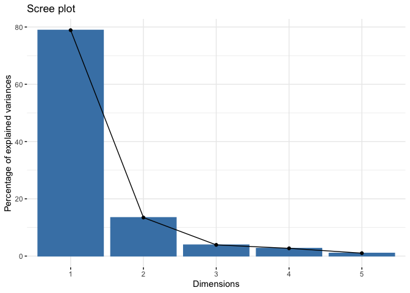

# Clusters of Countries {.tabset}

## Data Used
The data used is `Population Growth, Fertility and Mortality Indicators.csv`, tells about the number of some variables related to population fertility and mortality of each country around the world.

We have some variables from the data, and they are :

* `T03`  The country code

* `Population.growth.and.indicators.of.fertility.and.mortality` The country list

* `X` The year column

* `X.1` Variable which contains some indicators, this variable is going to be spread to some variables.

* `X.2` The values of the observations.

* `X.3` Footnotes

* `X.4` Data source


## The Goal

Assume that we are going to classify countries listed based on the indicators contained in the data. 

##  The Flow 

1. Libraries Importing and Data Preparation.

2. Exploratory Data Analyst

3. PCA Transformation.

4. Biplotting and Interpretation.


# Libraries Importing and Data Preparation

## Libraries Used


## Data Importing

```
## 'data.frame':    4979 obs. of  7 variables:
##  $ T03                                                        : chr  "Region/Country/Area" "1" "1" "1" ...
##  $ Population.growth.and.indicators.of.fertility.and.mortality: chr  "" "Total, all countries or areas" "Total, all countries or areas" "Total, all countries or areas" ...
##  $ X                                                          : chr  "Year" "2005" "2005" "2005" ...
##  $ X.1                                                        : chr  "Series" "Population annual rate of increase (percent)" "Total fertility rate (children per women)" "Infant mortality for both sexes (per 1,000 live births)" ...
##  $ X.2                                                        : chr  "Value" "1.3" "2.6" "49.1" ...
##  $ X.3                                                        : chr  "Footnotes" "Data refers to a 5-year period preceding the reference year." "Data refers to a 5-year period preceding the reference year." "Data refers to a 5-year period preceding the reference year." ...
##  $ X.4                                                        : chr  "Source" "United Nations Population Division, New York, World Population Prospects: The 2017 Revision, last accessed June 2017." "United Nations Population Division, New York, World Population Prospects: The 2017 Revision; supplemented by da"| __truncated__ "United Nations Statistics Division, New York, \"Demographic Yearbook 2015\" and the demographic statistics data"| __truncated__ ...
```

* We only need some variables to process the data, the last 2 columns and the first column will be eliminated

* There is a year column (from 2000 to 2016 ), most of the countries only have values for 2005, 2010, and 2015.

* The `X.1` contains 8 indicators, we're going to spread them into their own column


## Data cleaning

* In the chunk below we're going to remove the last 2 variables and filter the year, we only need the 2015 data to interpret the latest condition of each country.

<table>
 <thead>
  <tr>
   <th style="text-align:left;"> Code </th>
   <th style="text-align:left;"> Country </th>
   <th style="text-align:left;"> year </th>
   <th style="text-align:right;"> inf.mort </th>
   <th style="text-align:right;"> life.exp.both </th>
   <th style="text-align:right;"> life.exp.female </th>
   <th style="text-align:right;"> life.exp.male </th>
   <th style="text-align:right;"> maternal.mortality.ratio </th>
   <th style="text-align:right;"> pop.increase </th>
   <th style="text-align:right;"> tot.fertil.rate </th>
  </tr>
 </thead>
<tbody>
  <tr>
   <td style="text-align:left;"> 1 </td>
   <td style="text-align:left;"> Total, all countries or areas </td>
   <td style="text-align:left;"> 2015 </td>
   <td style="text-align:right;"> 35.0 </td>
   <td style="text-align:right;"> 70.8 </td>
   <td style="text-align:right;"> 73.1 </td>
   <td style="text-align:right;"> 68.6 </td>
   <td style="text-align:right;"> 216 </td>
   <td style="text-align:right;"> 1.2 </td>
   <td style="text-align:right;"> 2.5 </td>
  </tr>
  <tr>
   <td style="text-align:left;"> 100 </td>
   <td style="text-align:left;"> Bulgaria </td>
   <td style="text-align:left;"> 2015 </td>
   <td style="text-align:right;"> 8.3 </td>
   <td style="text-align:right;"> 74.3 </td>
   <td style="text-align:right;"> 77.8 </td>
   <td style="text-align:right;"> 70.8 </td>
   <td style="text-align:right;"> 11 </td>
   <td style="text-align:right;"> -0.6 </td>
   <td style="text-align:right;"> 1.5 </td>
  </tr>
  <tr>
   <td style="text-align:left;"> 104 </td>
   <td style="text-align:left;"> Myanmar </td>
   <td style="text-align:left;"> 2015 </td>
   <td style="text-align:right;"> 45.0 </td>
   <td style="text-align:right;"> 66.0 </td>
   <td style="text-align:right;"> 68.3 </td>
   <td style="text-align:right;"> 63.7 </td>
   <td style="text-align:right;"> 178 </td>
   <td style="text-align:right;"> 0.9 </td>
   <td style="text-align:right;"> 2.3 </td>
  </tr>
  <tr>
   <td style="text-align:left;"> 108 </td>
   <td style="text-align:left;"> Burundi </td>
   <td style="text-align:left;"> 2015 </td>
   <td style="text-align:right;"> 77.9 </td>
   <td style="text-align:right;"> 56.1 </td>
   <td style="text-align:right;"> 58.0 </td>
   <td style="text-align:right;"> 54.2 </td>
   <td style="text-align:right;"> 712 </td>
   <td style="text-align:right;"> 3.0 </td>
   <td style="text-align:right;"> 6.0 </td>
  </tr>
  <tr>
   <td style="text-align:left;"> 11 </td>
   <td style="text-align:left;"> Western Africa </td>
   <td style="text-align:left;"> 2015 </td>
   <td style="text-align:right;"> 70.5 </td>
   <td style="text-align:right;"> 54.7 </td>
   <td style="text-align:right;"> 55.6 </td>
   <td style="text-align:right;"> 53.9 </td>
   <td style="text-align:right;"> NA </td>
   <td style="text-align:right;"> 2.7 </td>
   <td style="text-align:right;"> 5.5 </td>
  </tr>
  <tr>
   <td style="text-align:left;"> 112 </td>
   <td style="text-align:left;"> Belarus </td>
   <td style="text-align:left;"> 2015 </td>
   <td style="text-align:right;"> 3.6 </td>
   <td style="text-align:right;"> 72.1 </td>
   <td style="text-align:right;"> 77.7 </td>
   <td style="text-align:right;"> 66.5 </td>
   <td style="text-align:right;"> 4 </td>
   <td style="text-align:right;"> 0.0 </td>
   <td style="text-align:right;"> 1.6 </td>
  </tr>
</tbody>
</table>

`Country` = Country list ;<br />
`inf.mort` = Infant mortality for both sexes (per 1,000 live births) ;<br />
`life.exp.both` = Life expectancy at birth for both sexes (years) ;<br />
`life.exp.male` = Life expectancy at birth for males (years) ;<br />
`life.exp.female` = Life expectancy at birth for females (years) ;<br />
`maternal.mortality.ratio` = Maternal mortality ratio (deaths per 100,000 population) ;<br />
`pop.increase` = Population annual rate of increase (percent) ;<br />
`tot.fertil.rate` = Total fertility rate (children per women) <br />


### NA checking

<table>
 <thead>
  <tr>
   <th style="text-align:left;"> column </th>
   <th style="text-align:right;"> NA </th>
  </tr>
 </thead>
<tbody>
  <tr>
   <td style="text-align:left;"> Code </td>
   <td style="text-align:right;"> 0 </td>
  </tr>
  <tr>
   <td style="text-align:left;"> Country </td>
   <td style="text-align:right;"> 0 </td>
  </tr>
  <tr>
   <td style="text-align:left;"> year </td>
   <td style="text-align:right;"> 0 </td>
  </tr>
  <tr>
   <td style="text-align:left;"> inf.mort </td>
   <td style="text-align:right;"> 31 </td>
  </tr>
  <tr>
   <td style="text-align:left;"> life.exp.both </td>
   <td style="text-align:right;"> 31 </td>
  </tr>
  <tr>
   <td style="text-align:left;"> life.exp.female </td>
   <td style="text-align:right;"> 29 </td>
  </tr>
  <tr>
   <td style="text-align:left;"> life.exp.male </td>
   <td style="text-align:right;"> 29 </td>
  </tr>
  <tr>
   <td style="text-align:left;"> maternal.mortality.ratio </td>
   <td style="text-align:right;"> 73 </td>
  </tr>
  <tr>
   <td style="text-align:left;"> pop.increase </td>
   <td style="text-align:right;"> 0 </td>
  </tr>
  <tr>
   <td style="text-align:left;"> tot.fertil.rate </td>
   <td style="text-align:right;"> 29 </td>
  </tr>
</tbody>
</table>
There are so many NAs in the data, it means that not all country listed have the data we need.
<br />
* We're going to replace the NAs to the average value of each variable/indicator.
<table>
 <thead>
  <tr>
   <th style="text-align:left;"> Code </th>
   <th style="text-align:left;"> Country </th>
   <th style="text-align:left;"> year </th>
   <th style="text-align:right;"> inf.mort </th>
   <th style="text-align:right;"> life.exp.both </th>
   <th style="text-align:right;"> life.exp.female </th>
   <th style="text-align:right;"> life.exp.male </th>
   <th style="text-align:right;"> maternal.mortality.ratio </th>
   <th style="text-align:right;"> pop.increase </th>
   <th style="text-align:right;"> tot.fertil.rate </th>
  </tr>
 </thead>
<tbody>
  <tr>
   <td style="text-align:left;"> 1 </td>
   <td style="text-align:left;"> Total, all countries or areas </td>
   <td style="text-align:left;"> 2015 </td>
   <td style="text-align:right;"> 35.0 </td>
   <td style="text-align:right;"> 70.8 </td>
   <td style="text-align:right;"> 73.1 </td>
   <td style="text-align:right;"> 68.6 </td>
   <td style="text-align:right;"> 216.0000 </td>
   <td style="text-align:right;"> 1.2 </td>
   <td style="text-align:right;"> 2.5 </td>
  </tr>
  <tr>
   <td style="text-align:left;"> 100 </td>
   <td style="text-align:left;"> Bulgaria </td>
   <td style="text-align:left;"> 2015 </td>
   <td style="text-align:right;"> 8.3 </td>
   <td style="text-align:right;"> 74.3 </td>
   <td style="text-align:right;"> 77.8 </td>
   <td style="text-align:right;"> 70.8 </td>
   <td style="text-align:right;"> 11.0000 </td>
   <td style="text-align:right;"> -0.6 </td>
   <td style="text-align:right;"> 1.5 </td>
  </tr>
  <tr>
   <td style="text-align:left;"> 104 </td>
   <td style="text-align:left;"> Myanmar </td>
   <td style="text-align:left;"> 2015 </td>
   <td style="text-align:right;"> 45.0 </td>
   <td style="text-align:right;"> 66.0 </td>
   <td style="text-align:right;"> 68.3 </td>
   <td style="text-align:right;"> 63.7 </td>
   <td style="text-align:right;"> 178.0000 </td>
   <td style="text-align:right;"> 0.9 </td>
   <td style="text-align:right;"> 2.3 </td>
  </tr>
  <tr>
   <td style="text-align:left;"> 108 </td>
   <td style="text-align:left;"> Burundi </td>
   <td style="text-align:left;"> 2015 </td>
   <td style="text-align:right;"> 77.9 </td>
   <td style="text-align:right;"> 56.1 </td>
   <td style="text-align:right;"> 58.0 </td>
   <td style="text-align:right;"> 54.2 </td>
   <td style="text-align:right;"> 712.0000 </td>
   <td style="text-align:right;"> 3.0 </td>
   <td style="text-align:right;"> 6.0 </td>
  </tr>
  <tr>
   <td style="text-align:left;"> 11 </td>
   <td style="text-align:left;"> Western Africa </td>
   <td style="text-align:left;"> 2015 </td>
   <td style="text-align:right;"> 70.5 </td>
   <td style="text-align:right;"> 54.7 </td>
   <td style="text-align:right;"> 55.6 </td>
   <td style="text-align:right;"> 53.9 </td>
   <td style="text-align:right;"> 162.1842 </td>
   <td style="text-align:right;"> 2.7 </td>
   <td style="text-align:right;"> 5.5 </td>
  </tr>
  <tr>
   <td style="text-align:left;"> 112 </td>
   <td style="text-align:left;"> Belarus </td>
   <td style="text-align:left;"> 2015 </td>
   <td style="text-align:right;"> 3.6 </td>
   <td style="text-align:right;"> 72.1 </td>
   <td style="text-align:right;"> 77.7 </td>
   <td style="text-align:right;"> 66.5 </td>
   <td style="text-align:right;"> 4.0000 </td>
   <td style="text-align:right;"> 0.0 </td>
   <td style="text-align:right;"> 1.6 </td>
  </tr>
</tbody>
</table>
<br />
There is an odd thing on the data as we replace the NA with the average number of each column. There are some rows/countries which have no observation value or only have 1 or 2 value for their indicator and we have filled them with the average values and it's not supposed to be like that. We supposed to eliminate them.

* eliminating some rows

I create a vector that indicates whether a rows' values are mostly the avg values of each column or not. If it is, eliminate the column.
<br />

```
## 'data.frame':    235 obs. of  8 variables:
##  $ Country                 : chr  "Total, all countries or areas" "Bulgaria" "Myanmar" "Burundi" ...
##  $ inf.mort                : num  35 8.3 45 77.9 70.5 3.6 29.9 27.7 67.5 4.7 ...
##  $ life.exp.both           : num  70.8 74.3 66 56.1 54.7 72.1 67.6 75.3 56.4 81.8 ...
##  $ life.exp.female         : num  73.1 77.8 68.3 58 55.6 77.7 69.6 76.5 57.7 83.8 ...
##  $ life.exp.male           : num  68.6 70.8 63.7 54.2 53.9 66.5 65.5 74.1 55.1 79.7 ...
##  $ maternal.mortality.ratio: num  216 11 178 712 162 ...
##  $ pop.increase            : num  1.2 -0.6 0.9 3 2.7 0 1.6 2 2.7 1 ...
##  $ tot.fertil.rate         : num  2.5 1.5 2.3 6 5.5 1.6 2.7 3 5 1.6 ...
```

### Continent Column

I think by giving the `Continent` column, we're going to have some more insights, so let's just do it.
<br />
<table>
 <thead>
  <tr>
   <th style="text-align:left;"> Country </th>
   <th style="text-align:left;"> Continent </th>
  </tr>
 </thead>
<tbody>
  <tr>
   <td style="text-align:left;"> Total, all countries or areas </td>
   <td style="text-align:left;"> NA </td>
  </tr>
  <tr>
   <td style="text-align:left;"> Bulgaria </td>
   <td style="text-align:left;"> Europe </td>
  </tr>
  <tr>
   <td style="text-align:left;"> Myanmar </td>
   <td style="text-align:left;"> Asia </td>
  </tr>
  <tr>
   <td style="text-align:left;"> Burundi </td>
   <td style="text-align:left;"> Africa </td>
  </tr>
  <tr>
   <td style="text-align:left;"> Western Africa </td>
   <td style="text-align:left;"> NA </td>
  </tr>
  <tr>
   <td style="text-align:left;"> Belarus </td>
   <td style="text-align:left;"> Europe </td>
  </tr>
</tbody>
</table>
<br />
Some rows cannot be defined by its continent and all of them are not even a country actually. They are just regions or certain areas of the continent. 

Our observations are countries so we wil just eliminate rows that represent some areas or regions.

<table>
 <thead>
  <tr>
   <th style="text-align:left;"> Country </th>
   <th style="text-align:left;"> Continent </th>
  </tr>
 </thead>
<tbody>
  <tr>
   <td style="text-align:left;"> Total, all countries or areas </td>
   <td style="text-align:left;"> ? </td>
  </tr>
  <tr>
   <td style="text-align:left;"> Western Africa </td>
   <td style="text-align:left;"> ? </td>
  </tr>
  <tr>
   <td style="text-align:left;"> Central America </td>
   <td style="text-align:left;"> ? </td>
  </tr>
  <tr>
   <td style="text-align:left;"> Eastern Africa </td>
   <td style="text-align:left;"> ? </td>
  </tr>
  <tr>
   <td style="text-align:left;"> Asia </td>
   <td style="text-align:left;"> ? </td>
  </tr>
  <tr>
   <td style="text-align:left;"> Central Asia </td>
   <td style="text-align:left;"> ? </td>
  </tr>
  <tr>
   <td style="text-align:left;"> Western Asia </td>
   <td style="text-align:left;"> ? </td>
  </tr>
  <tr>
   <td style="text-align:left;"> Northern Africa </td>
   <td style="text-align:left;"> ? </td>
  </tr>
  <tr>
   <td style="text-align:left;"> Europe </td>
   <td style="text-align:left;"> ? </td>
  </tr>
  <tr>
   <td style="text-align:left;"> Eastern Europe </td>
   <td style="text-align:left;"> ? </td>
  </tr>
  <tr>
   <td style="text-align:left;"> Northern Europe </td>
   <td style="text-align:left;"> ? </td>
  </tr>
  <tr>
   <td style="text-align:left;"> Western Europe </td>
   <td style="text-align:left;"> ? </td>
  </tr>
  <tr>
   <td style="text-align:left;"> Other non-specified areas </td>
   <td style="text-align:left;"> ? </td>
  </tr>
  <tr>
   <td style="text-align:left;"> Middle Africa </td>
   <td style="text-align:left;"> ? </td>
  </tr>
  <tr>
   <td style="text-align:left;"> Southern Africa </td>
   <td style="text-align:left;"> ? </td>
  </tr>
  <tr>
   <td style="text-align:left;"> Africa </td>
   <td style="text-align:left;"> ? </td>
  </tr>
  <tr>
   <td style="text-align:left;"> Sub-Saharan Africa </td>
   <td style="text-align:left;"> ? </td>
  </tr>
  <tr>
   <td style="text-align:left;"> Northern America </td>
   <td style="text-align:left;"> ? </td>
  </tr>
  <tr>
   <td style="text-align:left;"> Caribbean </td>
   <td style="text-align:left;"> ? </td>
  </tr>
  <tr>
   <td style="text-align:left;"> Eastern Asia </td>
   <td style="text-align:left;"> ? </td>
  </tr>
  <tr>
   <td style="text-align:left;"> Southern Asia </td>
   <td style="text-align:left;"> ? </td>
  </tr>
  <tr>
   <td style="text-align:left;"> South-eastern Asia </td>
   <td style="text-align:left;"> ? </td>
  </tr>
  <tr>
   <td style="text-align:left;"> Southern Europe </td>
   <td style="text-align:left;"> ? </td>
  </tr>
  <tr>
   <td style="text-align:left;"> Latin America &amp; the Caribbean </td>
   <td style="text-align:left;"> ? </td>
  </tr>
  <tr>
   <td style="text-align:left;"> South America </td>
   <td style="text-align:left;"> ? </td>
  </tr>
  <tr>
   <td style="text-align:left;"> Australia and New Zealand </td>
   <td style="text-align:left;"> ? </td>
  </tr>
  <tr>
   <td style="text-align:left;"> Melanesia </td>
   <td style="text-align:left;"> ? </td>
  </tr>
  <tr>
   <td style="text-align:left;"> Micronesia </td>
   <td style="text-align:left;"> ? </td>
  </tr>
  <tr>
   <td style="text-align:left;"> Polynesia </td>
   <td style="text-align:left;"> ? </td>
  </tr>
  <tr>
   <td style="text-align:left;"> South-central Asia </td>
   <td style="text-align:left;"> ? </td>
  </tr>
  <tr>
   <td style="text-align:left;"> Channel Islands </td>
   <td style="text-align:left;"> ? </td>
  </tr>
  <tr>
   <td style="text-align:left;"> Oceania </td>
   <td style="text-align:left;"> ? </td>
  </tr>
</tbody>
</table>

* We better assign the `Country` as rownames instead.
<table>
 <thead>
  <tr>
   <th style="text-align:right;"> inf.mort </th>
   <th style="text-align:right;"> life.exp.both </th>
   <th style="text-align:right;"> life.exp.female </th>
   <th style="text-align:right;"> life.exp.male </th>
   <th style="text-align:right;"> maternal.mortality.ratio </th>
   <th style="text-align:right;"> pop.increase </th>
   <th style="text-align:right;"> tot.fertil.rate </th>
   <th style="text-align:left;"> Continent </th>
  </tr>
 </thead>
<tbody>
  <tr>
   <td style="text-align:right;"> 8.3 </td>
   <td style="text-align:right;"> 74.3 </td>
   <td style="text-align:right;"> 77.8 </td>
   <td style="text-align:right;"> 70.8 </td>
   <td style="text-align:right;"> 11 </td>
   <td style="text-align:right;"> -0.6 </td>
   <td style="text-align:right;"> 1.5 </td>
   <td style="text-align:left;"> Europe </td>
  </tr>
  <tr>
   <td style="text-align:right;"> 45.0 </td>
   <td style="text-align:right;"> 66.0 </td>
   <td style="text-align:right;"> 68.3 </td>
   <td style="text-align:right;"> 63.7 </td>
   <td style="text-align:right;"> 178 </td>
   <td style="text-align:right;"> 0.9 </td>
   <td style="text-align:right;"> 2.3 </td>
   <td style="text-align:left;"> Asia </td>
  </tr>
  <tr>
   <td style="text-align:right;"> 77.9 </td>
   <td style="text-align:right;"> 56.1 </td>
   <td style="text-align:right;"> 58.0 </td>
   <td style="text-align:right;"> 54.2 </td>
   <td style="text-align:right;"> 712 </td>
   <td style="text-align:right;"> 3.0 </td>
   <td style="text-align:right;"> 6.0 </td>
   <td style="text-align:left;"> Africa </td>
  </tr>
  <tr>
   <td style="text-align:right;"> 3.6 </td>
   <td style="text-align:right;"> 72.1 </td>
   <td style="text-align:right;"> 77.7 </td>
   <td style="text-align:right;"> 66.5 </td>
   <td style="text-align:right;"> 4 </td>
   <td style="text-align:right;"> 0.0 </td>
   <td style="text-align:right;"> 1.6 </td>
   <td style="text-align:left;"> Europe </td>
  </tr>
  <tr>
   <td style="text-align:right;"> 29.9 </td>
   <td style="text-align:right;"> 67.6 </td>
   <td style="text-align:right;"> 69.6 </td>
   <td style="text-align:right;"> 65.5 </td>
   <td style="text-align:right;"> 161 </td>
   <td style="text-align:right;"> 1.6 </td>
   <td style="text-align:right;"> 2.7 </td>
   <td style="text-align:left;"> Asia </td>
  </tr>
  <tr>
   <td style="text-align:right;"> 27.7 </td>
   <td style="text-align:right;"> 75.3 </td>
   <td style="text-align:right;"> 76.5 </td>
   <td style="text-align:right;"> 74.1 </td>
   <td style="text-align:right;"> 140 </td>
   <td style="text-align:right;"> 2.0 </td>
   <td style="text-align:right;"> 3.0 </td>
   <td style="text-align:left;"> Africa </td>
  </tr>
</tbody>
</table>
<br />
Now the data is ready to be proceed.


# Exploratory Data Analyst

* Variables Correlation

<!-- -->
<br />
From the plot above we can conclude that :

* the correlation between **life expectancy of birth** of male, female, and both are really high. In this case we better use the `life expectancy of both` 


* all variables have relatively strong correlation to each other but `pop.increase`

* the `pop.increase` has the least correlation with other variables


## Life Expectantion of the World

<!--html_preserve--><iframe src="html_plot/g.html" width="100%" height="600" scrolling="no" seamless="seamless" frameBorder="0"></iframe><!--/html_preserve-->
<!--html_preserve--><div id="htmlwidget-9f4d4ed0db870b11ba9b" style="width:672px;height:480px;" class="plotly html-widget"></div>
<script type="application/json" data-for="htmlwidget-9f4d4ed0db870b11ba9b">{"x":{"data":[{"x":[56.1258639760736,75.2707704252066,56.4114356014116,72.203104154034,49.399835189732,51.6711090999566,62.7759522379061,79.3176435876339,62.5196644884883,58.0760028835458,59.930119382563,56.8137620344573,63.7108167984236,63.4237127863104,60.1975648840929,61.6171185365047,64.4906596753538,60.3186631606243,61.6848620650212,57.8897679497668,51.6802507670245,65.4312744152381,52.4903613612179,60.7041927948454,71.5174695692329,64.4845282096698,60.7317117830204,56.2057506941369,62.6265719753253,74.0892281073962,74.878230982023,56.1316674065338,61.6818636594478,58.5155458143233,51.9040784428479,55.9991639479595,79.4834066093,65.176261052017,66.0894271874711,65.7318630484429,72.9188246310203,50.1916867819245,54.9140073872166,59.5012108198593,57.5711555759247,62.8919540771102,55.0711146790113,63.6092229465,68.410369690773,55.0291816999216,59.0748933958628,75.0075169452637,58.5698974624586,70.8041045658155,62.8237169224416,58.7176222684957,59.7098030183861],"y":[3.00823732672259,1.97787716120481,2.73592775771394,1.1603319581598,0.430750954691321,3.32906831273809,2.37745080821216,2.76861861530691,2.61110467309132,3.29265882169828,2.77760294303298,4.18941287619993,2.60547876702622,1.97139426983893,3.5293825347349,1.68042733071372,3.33480658102781,3.10438450645655,2.40676509413868,2.26222034173086,2.50900556527078,2.68564279813319,1.32161433110014,2.57918850483373,0.192425770256668,2.67229879423976,2.89906236272305,2.86325895216316,2.86561855450273,0.239772360734641,1.39424517232925,2.9189420029521,2.17597073722631,3.81013375921175,2.66782954502851,2.62203108815476,0.789370912257582,2.51539423309267,2.17313263459131,3.01627441298217,0.472661260608584,2.30774165565148,2.88947913024574,1.36068069359288,2.32377591263503,1.82452678684145,3.31676216145977,2.3179286179319,1.78100983975455,1.83161519996822,2.5757562552765,1.2202632657066,3.43155596440658,2.19233533719555,3.09849108830094,3.03661471357569,2.98151893280447],"text":["Continent: Africa<br />life.exp.both: 56.1000<br />pop.increase:  3.0<br />Burundi","Continent: Africa<br />life.exp.both: 75.3000<br />pop.increase:  2.0<br />Algeria","Continent: Africa<br />life.exp.both: 56.4000<br />pop.increase:  2.7<br />Cameroon","Continent: Africa<br />life.exp.both: 72.2000<br />pop.increase:  1.2<br />Cabo Verde","Continent: Africa<br />life.exp.both: 49.4000<br />pop.increase:  0.4<br />Central African Republic","Continent: Africa<br />life.exp.both: 51.7000<br />pop.increase:  3.3<br />Chad","Continent: Africa<br />life.exp.both: 62.8000<br />pop.increase:  2.4<br />Comoros","Continent: Africa<br />life.exp.both: 79.3000<br />pop.increase:  2.8<br />Mayotte","Continent: Africa<br />life.exp.both: 62.5000<br />pop.increase:  2.6<br />Congo","Continent: Africa<br />life.exp.both: 58.1000<br />pop.increase:  3.3<br />Dem. Rep. of the Congo","Continent: Africa<br />life.exp.both: 59.9000<br />pop.increase:  2.8<br />Benin","Continent: Africa<br />life.exp.both: 56.8000<br />pop.increase:  4.2<br />Equatorial Guinea","Continent: Africa<br />life.exp.both: 63.7000<br />pop.increase:  2.6<br />Ethiopia","Continent: Africa<br />life.exp.both: 63.4000<br />pop.increase:  2.0<br />Eritrea","Continent: Africa<br />life.exp.both: 60.2000<br />pop.increase:  3.5<br />Angola","Continent: Africa<br />life.exp.both: 61.6000<br />pop.increase:  1.7<br />Djibouti","Continent: Africa<br />life.exp.both: 64.5000<br />pop.increase:  3.3<br />Gabon","Continent: Africa<br />life.exp.both: 60.3000<br />pop.increase:  3.1<br />Gambia","Continent: Africa<br />life.exp.both: 61.7000<br />pop.increase:  2.4<br />Ghana","Continent: Africa<br />life.exp.both: 57.9000<br />pop.increase:  2.3<br />Guinea","Continent: Africa<br />life.exp.both: 51.7000<br />pop.increase:  2.5<br />Côte d'Ivoire","Continent: Africa<br />life.exp.both: 65.4000<br />pop.increase:  2.7<br />Kenya","Continent: Africa<br />life.exp.both: 52.5000<br />pop.increase:  1.3<br />Lesotho","Continent: Africa<br />life.exp.both: 60.7000<br />pop.increase:  2.6<br />Liberia","Continent: Africa<br />life.exp.both: 71.5000<br />pop.increase:  0.2<br />Libya","Continent: Africa<br />life.exp.both: 64.5000<br />pop.increase:  2.7<br />Madagascar","Continent: Africa<br />life.exp.both: 60.7000<br />pop.increase:  2.9<br />Malawi","Continent: Africa<br />life.exp.both: 56.2000<br />pop.increase:  2.9<br />Mali","Continent: Africa<br />life.exp.both: 62.6000<br />pop.increase:  2.9<br />Mauritania","Continent: Africa<br />life.exp.both: 74.1000<br />pop.increase:  0.2<br />Mauritius","Continent: Africa<br />life.exp.both: 74.9000<br />pop.increase:  1.4<br />Morocco","Continent: Africa<br />life.exp.both: 56.1000<br />pop.increase:  2.9<br />Mozambique","Continent: Africa<br />life.exp.both: 61.7000<br />pop.increase:  2.2<br />Namibia","Continent: Africa<br />life.exp.both: 58.5000<br />pop.increase:  3.8<br />Niger","Continent: Africa<br />life.exp.both: 51.9000<br />pop.increase:  2.7<br />Nigeria","Continent: Africa<br />life.exp.both: 56.0000<br />pop.increase:  2.6<br />Guinea-Bissau","Continent: Africa<br />life.exp.both: 79.5000<br />pop.increase:  0.8<br />Réunion","Continent: Africa<br />life.exp.both: 65.2000<br />pop.increase:  2.5<br />Rwanda","Continent: Africa<br />life.exp.both: 66.1000<br />pop.increase:  2.2<br />Sao Tome and Principe","Continent: Africa<br />life.exp.both: 65.7000<br />pop.increase:  3.0<br />Senegal","Continent: Africa<br />life.exp.both: 72.9000<br />pop.increase:  0.5<br />Seychelles","Continent: Africa<br />life.exp.both: 50.2000<br />pop.increase:  2.3<br />Sierra Leone","Continent: Africa<br />life.exp.both: 54.9000<br />pop.increase:  2.9<br />Somalia","Continent: Africa<br />life.exp.both: 59.5000<br />pop.increase:  1.4<br />South Africa","Continent: Africa<br />life.exp.both: 57.6000<br />pop.increase:  2.3<br />Zimbabwe","Continent: Africa<br />life.exp.both: 62.9000<br />pop.increase:  1.8<br />Botswana","Continent: Africa<br />life.exp.both: 55.1000<br />pop.increase:  3.3<br />South Sudan","Continent: Africa<br />life.exp.both: 63.6000<br />pop.increase:  2.3<br />Sudan","Continent: Africa<br />life.exp.both: 68.4000<br />pop.increase:  1.8<br />Western Sahara","Continent: Africa<br />life.exp.both: 55.0000<br />pop.increase:  1.8<br />Swaziland","Continent: Africa<br />life.exp.both: 59.1000<br />pop.increase:  2.6<br />Togo","Continent: Africa<br />life.exp.both: 75.0000<br />pop.increase:  1.2<br />Tunisia","Continent: Africa<br />life.exp.both: 58.6000<br />pop.increase:  3.4<br />Uganda","Continent: Africa<br />life.exp.both: 70.8000<br />pop.increase:  2.2<br />Egypt","Continent: Africa<br />life.exp.both: 62.8000<br />pop.increase:  3.1<br />United Rep. of Tanzania","Continent: Africa<br />life.exp.both: 58.7000<br />pop.increase:  3.0<br />Burkina Faso","Continent: Africa<br />life.exp.both: 59.7000<br />pop.increase:  3.0<br />Zambia"],"type":"scatter","mode":"markers","marker":{"autocolorscale":false,"color":"rgba(248,118,109,1)","opacity":1,"size":5.66929133858268,"symbol":"circle","line":{"width":1.88976377952756,"color":"rgba(248,118,109,1)"}},"hoveron":"points","name":"Africa","legendgroup":"Africa","showlegend":true,"xaxis":"x","yaxis":"y","hoverinfo":"text","frame":null},{"x":[81.8291056225837,78.7857201122456,73.7057578029085,79.1852918285843,79.1766702687696,73.1981004018218,75.5224730172854,72.5713428189168,79.2223801488246,75.8122641679602,71.2971192847458,73.1845382054893,80.4703140631813,76.0093755140788,72.3926588205507,66.3023041086594,62.3217521384242,72.9146765740679,75.4908202495302,75.1152128993013,81.216050023145,76.4709460796505,75.3784254540603,77.80597830004,75.4131928337865,74.4779865514867,77.2724937733679,71.2991341708069,72.6911774231657,74.2002754087248,79.2253257331129,74.8000559323353,72.6833939856117,67.6966843518821,70.8798688939022,74.7305847162277,70.1919022670186,69.7725366995144,78.9109044201398,79.1110114475909,77.0180633762614,73.8991067721109],"y":[1.00136812008917,0.937675063107163,0.980558935012668,1.10999835431576,0.172000968065113,1.23752300012857,1.58088498815894,0.533321639727801,2.83063083086163,1.08633578870446,-0.133269816469401,0.412760715726763,-0.0370425569079815,0.969592893905938,2.09641317769885,0.638537004683167,1.40439657012001,1.79553998207673,0.397165581136942,1.38170000743121,-0.516344567760825,1.36360764563084,0.298760949913412,1.43411099873483,0.519995672591031,1.23526755748317,1.67230654347688,-0.629982317257672,1.30166728874668,1.26250629020855,-0.229172013737261,0.50180381923914,-0.0140966433286666,1.62136214006692,0.966735520288348,0.929866600334644,0.530424681417644,2.21125627823174,0.686214189678431,-0.235924211703241,0.315520307272673,1.41038174256682],"text":["Continent: Americas<br />life.exp.both: 81.8000<br />pop.increase:  1.0<br />Canada","Continent: Americas<br />life.exp.both: 78.8000<br />pop.increase:  0.9<br />Chile","Continent: Americas<br />life.exp.both: 73.7000<br />pop.increase:  1.0<br />Colombia","Continent: Americas<br />life.exp.both: 79.2000<br />pop.increase:  1.1<br />Costa Rica","Continent: Americas<br />life.exp.both: 79.2000<br />pop.increase:  0.2<br />Cuba","Continent: Americas<br />life.exp.both: 73.2000<br />pop.increase:  1.2<br />Dominican Republic","Continent: Americas<br />life.exp.both: 75.5000<br />pop.increase:  1.6<br />Ecuador","Continent: Americas<br />life.exp.both: 72.6000<br />pop.increase:  0.5<br />El Salvador","Continent: Americas<br />life.exp.both: 79.2000<br />pop.increase:  2.8<br />French Guiana","Continent: Americas<br />life.exp.both: 75.8000<br />pop.increase:  1.1<br />Antigua and Barbuda","Continent: Americas<br />life.exp.both: 71.3194<br />pop.increase: -0.1<br />Greenland","Continent: Americas<br />life.exp.both: 73.2000<br />pop.increase:  0.4<br />Grenada","Continent: Americas<br />life.exp.both: 80.5000<br />pop.increase:  0.0<br />Guadeloupe","Continent: Americas<br />life.exp.both: 76.0000<br />pop.increase:  1.0<br />Argentina","Continent: Americas<br />life.exp.both: 72.4000<br />pop.increase:  2.1<br />Guatemala","Continent: Americas<br />life.exp.both: 66.3000<br />pop.increase:  0.6<br />Guyana","Continent: Americas<br />life.exp.both: 62.3000<br />pop.increase:  1.4<br />Haiti","Continent: Americas<br />life.exp.both: 72.9000<br />pop.increase:  1.8<br />Honduras","Continent: Americas<br />life.exp.both: 75.5000<br />pop.increase:  0.4<br />Jamaica","Continent: Americas<br />life.exp.both: 75.1000<br />pop.increase:  1.4<br />Bahamas","Continent: Americas<br />life.exp.both: 81.2000<br />pop.increase: -0.5<br />Martinique","Continent: Americas<br />life.exp.both: 76.5000<br />pop.increase:  1.4<br />Mexico","Continent: Americas<br />life.exp.both: 75.4000<br />pop.increase:  0.3<br />Barbados","Continent: Americas<br />life.exp.both: 77.8000<br />pop.increase:  1.4<br />Curaçao","Continent: Americas<br />life.exp.both: 75.4000<br />pop.increase:  0.5<br />Aruba","Continent: Americas<br />life.exp.both: 74.5000<br />pop.increase:  1.2<br />Nicaragua","Continent: Americas<br />life.exp.both: 77.3000<br />pop.increase:  1.7<br />Panama","Continent: Americas<br />life.exp.both: 71.3194<br />pop.increase: -0.6<br />Bermuda","Continent: Americas<br />life.exp.both: 72.7000<br />pop.increase:  1.3<br />Paraguay","Continent: Americas<br />life.exp.both: 74.2000<br />pop.increase:  1.3<br />Peru","Continent: Americas<br />life.exp.both: 79.2000<br />pop.increase: -0.2<br />Puerto Rico","Continent: Americas<br />life.exp.both: 74.8000<br />pop.increase:  0.5<br />Saint Lucia","Continent: Americas<br />life.exp.both: 72.7000<br />pop.increase:  0.0<br />Saint Vincent & Grenadines","Continent: Americas<br />life.exp.both: 67.7000<br />pop.increase:  1.6<br />Bolivia (Plurin. State of)","Continent: Americas<br />life.exp.both: 70.9000<br />pop.increase:  1.0<br />Suriname","Continent: Americas<br />life.exp.both: 74.7000<br />pop.increase:  0.9<br />Brazil","Continent: Americas<br />life.exp.both: 70.2000<br />pop.increase:  0.5<br />Trinidad and Tobago","Continent: Americas<br />life.exp.both: 69.8000<br />pop.increase:  2.2<br />Belize","Continent: Americas<br />life.exp.both: 78.9000<br />pop.increase:  0.7<br />United States of America","Continent: Americas<br />life.exp.both: 79.1000<br />pop.increase: -0.2<br />United States Virgin Islands","Continent: Americas<br />life.exp.both: 77.0000<br />pop.increase:  0.3<br />Uruguay","Continent: Americas<br />life.exp.both: 73.9000<br />pop.increase:  1.4<br />Venezuela (Boliv. Rep. of)"],"type":"scatter","mode":"markers","marker":{"autocolorscale":false,"color":"rgba(163,165,0,1)","opacity":1,"size":5.66929133858268,"symbol":"circle","line":{"width":1.88976377952756,"color":"rgba(163,165,0,1)"}},"hoveron":"points","name":"Americas","legendgroup":"Americas","showlegend":true,"xaxis":"x","yaxis":"y","hoverinfo":"text","frame":null},{"x":[66.0139885387253,67.6110797228009,74.5910888086776,75.6999533452804,79.896726671901,72.7899949581602,72.8958974159446,71.5771883976557,83.392851792448,67.6056529186434,68.6168867681215,75.0696823709901,69.2213306114064,81.9174193320822,83.3277560190669,69.0857681447297,62.2789052508149,73.8229688256287,70.7805730147754,81.2814791346152,74.2960201471764,70.2945038991698,65.3690627008338,78.8724070053378,83.3271173003334,74.7269730947683,76.2781948741657,76.3829911918712,68.4711495450368,71.178456059342,74.0208341745803,76.2019098490331,68.9070628645192,65.898774711871,68.581273228414,67.6696547636766,77.6916937423171,68.8298307945579,73.9961878036404,82.2864451186653,75.6062196162981,69.9149592898634,70.3717344439182,74.6027035102657,76.7293276822217,74.7852868025841,67.2929208910317,70.7828040164251,64.1965607594724,76.6803077647372],"y":[0.893537716157734,1.59952434383333,0.516748339477926,0.461138787008822,0.872075691707432,-1.41806797202677,2.7058646534197,1.33698022855446,0.585028734020889,1.222494233381,1.30885256141424,1.20176137302071,3.18427286311984,1.70795107958838,-0.080625932533294,1.61056141870096,3.237272591535,4.91331816667691,0.503121825065464,0.385783522613347,5.43927906919271,1.63766228055581,1.31337201064453,5.98026436487213,2.31324713483453,1.81348624579608,2.7955279991962,2.02246113102883,1.8930470091477,1.17660856056958,0.270159629043192,6.48557659180835,1.21119348768145,2.11120030285791,1.61331402281299,2.16893248854205,6.63640508616343,1.62201012542471,2.81852589473128,1.66547482343391,1.1159268171899,-2.33086182160303,2.20393817523494,0.389613106753677,1.96425290675834,1.6162513967976,1.8096350306645,1.60098038654774,2.62331540195271,1.39054840078577],"text":["Continent: Asia<br />life.exp.both: 66.0000<br />pop.increase:  0.9<br />Myanmar","Continent: Asia<br />life.exp.both: 67.6000<br />pop.increase:  1.6<br />Cambodia","Continent: Asia<br />life.exp.both: 74.6000<br />pop.increase:  0.5<br />Sri Lanka","Continent: Asia<br />life.exp.both: 75.7000<br />pop.increase:  0.5<br />China","Continent: Asia<br />life.exp.both: 79.9000<br />pop.increase:  0.9<br />Cyprus","Continent: Asia<br />life.exp.both: 72.8000<br />pop.increase: -1.4<br />Georgia","Continent: Asia<br />life.exp.both: 72.9000<br />pop.increase:  2.7<br />State of Palestine","Continent: Asia<br />life.exp.both: 71.6000<br />pop.increase:  1.3<br />Azerbaijan","Continent: Asia<br />life.exp.both: 83.4000<br />pop.increase:  0.6<br />China, Hong Kong SAR","Continent: Asia<br />life.exp.both: 67.6000<br />pop.increase:  1.2<br />India","Continent: Asia<br />life.exp.both: 68.6000<br />pop.increase:  1.3<br />Indonesia","Continent: Asia<br />life.exp.both: 75.1000<br />pop.increase:  1.2<br />Iran (Islamic Republic of)","Continent: Asia<br />life.exp.both: 69.2000<br />pop.increase:  3.2<br />Iraq","Continent: Asia<br />life.exp.both: 81.9000<br />pop.increase:  1.7<br />Israel","Continent: Asia<br />life.exp.both: 83.3000<br />pop.increase: -0.1<br />Japan","Continent: Asia<br />life.exp.both: 69.1000<br />pop.increase:  1.6<br />Kazakhstan","Continent: Asia<br />life.exp.both: 62.3000<br />pop.increase:  3.2<br />Afghanistan","Continent: Asia<br />life.exp.both: 73.8000<br />pop.increase:  4.9<br />Jordan","Continent: Asia<br />life.exp.both: 70.8000<br />pop.increase:  0.5<br />Dem. People's Rep. Korea","Continent: Asia<br />life.exp.both: 81.3000<br />pop.increase:  0.4<br />Republic of Korea","Continent: Asia<br />life.exp.both: 74.3000<br />pop.increase:  5.4<br />Kuwait","Continent: Asia<br />life.exp.both: 70.3000<br />pop.increase:  1.6<br />Kyrgyzstan","Continent: Asia<br />life.exp.both: 65.4000<br />pop.increase:  1.3<br />Lao People's Dem. Rep.","Continent: Asia<br />life.exp.both: 78.9000<br />pop.increase:  6.0<br />Lebanon","Continent: Asia<br />life.exp.both: 83.3000<br />pop.increase:  2.3<br />China, Macao SAR","Continent: Asia<br />life.exp.both: 74.7000<br />pop.increase:  1.8<br />Malaysia","Continent: Asia<br />life.exp.both: 76.3000<br />pop.increase:  2.8<br />Maldives","Continent: Asia<br />life.exp.both: 76.4000<br />pop.increase:  2.0<br />Bahrain","Continent: Asia<br />life.exp.both: 68.5000<br />pop.increase:  1.9<br />Mongolia","Continent: Asia<br />life.exp.both: 71.2000<br />pop.increase:  1.2<br />Bangladesh","Continent: Asia<br />life.exp.both: 74.0000<br />pop.increase:  0.3<br />Armenia","Continent: Asia<br />life.exp.both: 76.2000<br />pop.increase:  6.5<br />Oman","Continent: Asia<br />life.exp.both: 68.9000<br />pop.increase:  1.2<br />Nepal","Continent: Asia<br />life.exp.both: 65.9000<br />pop.increase:  2.1<br />Pakistan","Continent: Asia<br />life.exp.both: 68.6000<br />pop.increase:  1.6<br />Philippines","Continent: Asia<br />life.exp.both: 67.7000<br />pop.increase:  2.2<br />Timor-Leste","Continent: Asia<br />life.exp.both: 77.7000<br />pop.increase:  6.6<br />Qatar","Continent: Asia<br />life.exp.both: 68.8000<br />pop.increase:  1.6<br />Bhutan","Continent: Asia<br />life.exp.both: 74.0000<br />pop.increase:  2.8<br />Saudi Arabia","Continent: Asia<br />life.exp.both: 82.3000<br />pop.increase:  1.7<br />Singapore","Continent: Asia<br />life.exp.both: 75.6000<br />pop.increase:  1.1<br />Viet Nam","Continent: Asia<br />life.exp.both: 69.9000<br />pop.increase: -2.3<br />Syrian Arab Republic","Continent: Asia<br />life.exp.both: 70.4000<br />pop.increase:  2.2<br />Tajikistan","Continent: Asia<br />life.exp.both: 74.6000<br />pop.increase:  0.4<br />Thailand","Continent: Asia<br />life.exp.both: 76.7000<br />pop.increase:  2.0<br />United Arab Emirates","Continent: Asia<br />life.exp.both: 74.8000<br />pop.increase:  1.6<br />Turkey","Continent: Asia<br />life.exp.both: 67.3000<br />pop.increase:  1.8<br />Turkmenistan","Continent: Asia<br />life.exp.both: 70.8000<br />pop.increase:  1.6<br />Uzbekistan","Continent: Asia<br />life.exp.both: 64.2000<br />pop.increase:  2.6<br />Yemen","Continent: Asia<br />life.exp.both: 76.7000<br />pop.increase:  1.4<br />Brunei Darussalam"],"type":"scatter","mode":"markers","marker":{"autocolorscale":false,"color":"rgba(0,191,125,1)","opacity":1,"size":5.66929133858268,"symbol":"circle","line":{"width":1.88976377952756,"color":"rgba(0,191,125,1)"}},"hoveron":"points","name":"Asia","legendgroup":"Asia","showlegend":true,"xaxis":"x","yaxis":"y","hoverinfo":"text","frame":null},{"x":[74.3171775620542,72.1199585521798,76.9998420793656,78.1850298258595,80.0885919742984,76.7702488425556,71.3229421957541,80.6747280660355,81.8904349140703,80.373842911149,80.5997257121126,75.4315457231886,82.2005824425275,80.9011161393366,82.3029130103533,81.003603403666,73.9177833895261,74.0024821885142,81.0844482311178,80.2750529094211,70.9717417552678,76.3937707221593,81.3157604913274,80.5302543579403,81.6158934686697,77.002138589466,80.4952167359263,74.7690718761771,70.2742798087064,74.7134027644931,76.3154833848689,76.3034379023387,80.2838642622664,82.4779100556607,81.9281528692534,82.6944497513915,77.724386078425,71.0884225103216,75.1110990581521,80.9968775175444],"y":[-0.604314479082823,-0.0214766618795692,-0.371841854862869,0.113043506462127,0.461442570202053,-0.303274985719472,0.224119335822761,0.362038786541671,0.388871898017824,0.190436048004776,-0.397499740384519,-0.324055745899677,0.614593478888273,0.312284565735608,-0.100226626638323,0.573697803504765,-1.20079589322209,-1.32387521633878,2.19824941789731,0.524756274800748,-0.116266362611204,0.0653549075499178,0.339134230744093,0.574303665515035,1.18034078672528,0.0260007559694349,-0.408433702755719,-0.586641983240843,0.0723680491000415,-0.402461908925325,-0.997910602986813,0.114103333819658,0.308768789824098,-0.229645920228213,0.830092342700809,1.17555325999856,-0.136528469193727,-0.482621517758817,0.0691669557057322,0.729989648964256],"text":["Continent: Europe<br />life.exp.both: 74.3000<br />pop.increase: -0.6<br />Bulgaria","Continent: Europe<br />life.exp.both: 72.1000<br />pop.increase:  0.0<br />Belarus","Continent: Europe<br />life.exp.both: 77.0000<br />pop.increase: -0.4<br />Croatia","Continent: Europe<br />life.exp.both: 78.2000<br />pop.increase:  0.1<br />Czechia","Continent: Europe<br />life.exp.both: 80.1000<br />pop.increase:  0.5<br />Denmark","Continent: Europe<br />life.exp.both: 76.8000<br />pop.increase: -0.3<br />Estonia","Continent: Europe<br />life.exp.both: 71.3194<br />pop.increase:  0.2<br />Faroe Islands","Continent: Europe<br />life.exp.both: 80.7000<br />pop.increase:  0.4<br />Finland","Continent: Europe<br />life.exp.both: 81.9000<br />pop.increase:  0.4<br />France","Continent: Europe<br />life.exp.both: 80.4000<br />pop.increase:  0.2<br />Germany","Continent: Europe<br />life.exp.both: 80.6000<br />pop.increase: -0.4<br />Greece","Continent: Europe<br />life.exp.both: 75.4000<br />pop.increase: -0.3<br />Hungary","Continent: Europe<br />life.exp.both: 82.2000<br />pop.increase:  0.6<br />Iceland","Continent: Europe<br />life.exp.both: 80.9000<br />pop.increase:  0.3<br />Ireland","Continent: Europe<br />life.exp.both: 82.3000<br />pop.increase: -0.1<br />Italy","Continent: Europe<br />life.exp.both: 81.0000<br />pop.increase:  0.6<br />Austria","Continent: Europe<br />life.exp.both: 73.9000<br />pop.increase: -1.2<br />Latvia","Continent: Europe<br />life.exp.both: 74.0000<br />pop.increase: -1.3<br />Lithuania","Continent: Europe<br />life.exp.both: 81.1000<br />pop.increase:  2.2<br />Luxembourg","Continent: Europe<br />life.exp.both: 80.3000<br />pop.increase:  0.5<br />Malta","Continent: Europe<br />life.exp.both: 71.0000<br />pop.increase: -0.1<br />Republic of Moldova","Continent: Europe<br />life.exp.both: 76.4000<br />pop.increase:  0.1<br />Montenegro","Continent: Europe<br />life.exp.both: 81.3000<br />pop.increase:  0.3<br />Netherlands","Continent: Europe<br />life.exp.both: 80.5000<br />pop.increase:  0.6<br />Belgium","Continent: Europe<br />life.exp.both: 81.6000<br />pop.increase:  1.2<br />Norway","Continent: Europe<br />life.exp.both: 77.0000<br />pop.increase:  0.0<br />Poland","Continent: Europe<br />life.exp.both: 80.5000<br />pop.increase: -0.4<br />Portugal","Continent: Europe<br />life.exp.both: 74.8000<br />pop.increase: -0.6<br />Romania","Continent: Europe<br />life.exp.both: 70.3000<br />pop.increase:  0.1<br />Russian Federation","Continent: Europe<br />life.exp.both: 74.7000<br />pop.increase: -0.4<br />Serbia","Continent: Europe<br />life.exp.both: 76.3000<br />pop.increase: -1.0<br />Bosnia and Herzegovina","Continent: Europe<br />life.exp.both: 76.3000<br />pop.increase:  0.1<br />Slovakia","Continent: Europe<br />life.exp.both: 80.3000<br />pop.increase:  0.3<br />Slovenia","Continent: Europe<br />life.exp.both: 82.5000<br />pop.increase: -0.2<br />Spain","Continent: Europe<br />life.exp.both: 81.9000<br />pop.increase:  0.8<br />Sweden","Continent: Europe<br />life.exp.both: 82.7000<br />pop.increase:  1.2<br />Switzerland","Continent: Europe<br />life.exp.both: 77.7000<br />pop.increase: -0.1<br />Albania","Continent: Europe<br />life.exp.both: 71.1000<br />pop.increase: -0.5<br />Ukraine","Continent: Europe<br />life.exp.both: 75.1000<br />pop.increase:  0.1<br />TFYR of Macedonia","Continent: Europe<br />life.exp.both: 81.0000<br />pop.increase:  0.7<br />United Kingdom"],"type":"scatter","mode":"markers","marker":{"autocolorscale":false,"color":"rgba(0,176,246,1)","opacity":1,"size":5.66929133858268,"symbol":"circle","line":{"width":1.88976377952756,"color":"rgba(0,176,246,1)"}},"hoveron":"points","name":"Europe","legendgroup":"Europe","showlegend":true,"xaxis":"x","yaxis":"y","hoverinfo":"text","frame":null},{"x":[69.7094368590135,76.0929566466709,65.6695855239053,78.7739320860182,82.3218414372304,76.2891492218015,71.4042286049388,81.2809935864051,68.795174105547,72.9863707427843,65.0197610134272,72.5273192091136,74.0865525392765,69.6145517720005],"y":[0.67016812030226,0.697100814003497,1.79580205531791,0.279934596102685,1.4914678693004,1.41917305909097,2.30820065703243,1.10728643307462,0.211918036770076,0.763233713563532,2.21690943662077,0.366551993787289,0.820596283879131,2.11234671153128],"text":["Continent: Oceania<br />life.exp.both: 69.7000<br />pop.increase:  0.7<br />Fiji","Continent: Oceania<br />life.exp.both: 76.1000<br />pop.increase:  0.7<br />French Polynesia","Continent: Oceania<br />life.exp.both: 65.7000<br />pop.increase:  1.8<br />Kiribati","Continent: Oceania<br />life.exp.both: 78.8000<br />pop.increase:  0.3<br />Guam","Continent: Oceania<br />life.exp.both: 82.3000<br />pop.increase:  1.5<br />Australia","Continent: Oceania<br />life.exp.both: 76.3000<br />pop.increase:  1.4<br />New Caledonia","Continent: Oceania<br />life.exp.both: 71.4000<br />pop.increase:  2.3<br />Vanuatu","Continent: Oceania<br />life.exp.both: 81.3000<br />pop.increase:  1.1<br />New Zealand","Continent: Oceania<br />life.exp.both: 68.8000<br />pop.increase:  0.2<br />Micronesia (Fed. States of)","Continent: Oceania<br />life.exp.both: 73.0000<br />pop.increase:  0.8<br />Palau","Continent: Oceania<br />life.exp.both: 65.0000<br />pop.increase:  2.2<br />Papua New Guinea","Continent: Oceania<br />life.exp.both: 72.5000<br />pop.increase:  0.4<br />Tonga","Continent: Oceania<br />life.exp.both: 74.1000<br />pop.increase:  0.8<br />Samoa","Continent: Oceania<br />life.exp.both: 69.6000<br />pop.increase:  2.1<br />Solomon Islands"],"type":"scatter","mode":"markers","marker":{"autocolorscale":false,"color":"rgba(231,107,243,1)","opacity":1,"size":5.66929133858268,"symbol":"circle","line":{"width":1.88976377952756,"color":"rgba(231,107,243,1)"}},"hoveron":"points","name":"Oceania","legendgroup":"Oceania","showlegend":true,"xaxis":"x","yaxis":"y","hoverinfo":"text","frame":null},{"x":[49.4,49.8303797468354,50.2607594936709,50.6911392405063,51.1215189873418,51.5518987341772,51.9822784810127,52.4126582278481,52.8430379746835,53.273417721519,53.7037974683544,54.1341772151899,54.5645569620253,54.9949367088608,55.4253164556962,55.8556962025316,56.2860759493671,56.7164556962025,57.146835443038,57.5772151898734,58.0075949367089,58.4379746835443,58.8683544303797,59.2987341772152,59.7291139240506,60.1594936708861,60.5898734177215,61.020253164557,61.4506329113924,61.8810126582278,62.3113924050633,62.7417721518987,63.1721518987342,63.6025316455696,64.0329113924051,64.4632911392405,64.893670886076,65.3240506329114,65.7544303797468,66.1848101265823,66.6151898734177,67.0455696202532,67.4759493670886,67.906329113924,68.3367088607595,68.7670886075949,69.1974683544304,69.6278481012658,70.0582278481013,70.4886075949367,70.9189873417722,71.3493670886076,71.779746835443,72.2101265822785,72.6405063291139,73.0708860759494,73.5012658227848,73.9316455696203,74.3620253164557,74.7924050632911,75.2227848101266,75.653164556962,76.0835443037975,76.5139240506329,76.9443037974684,77.3746835443038,77.8050632911392,78.2354430379747,78.6658227848101,79.0962025316456,79.526582278481,79.9569620253165,80.3873417721519,80.8177215189873,81.2481012658228,81.6784810126582,82.1088607594937,82.5392405063291,82.9696202531646,83.4],"y":[1.85153762026372,1.94047120659875,2.02475678132344,2.10439754999903,2.17939671818677,2.2497574914479,2.31548307534366,2.37657667543529,2.43304149728403,2.48488074645113,2.53209762849783,2.57469534898536,2.61267711347497,2.6460461275279,2.67480559670539,2.69895872656869,2.71850872267904,2.73345879059767,2.74381213588583,2.74957196410477,2.75074148081571,2.74732389157991,2.73932240195861,2.72674021751304,2.70958054380446,2.68784658639409,2.6588754801072,2.61964463969935,2.57141011002483,2.51545860949389,2.45307685651678,2.38555156950376,2.31416946686508,2.24021726701099,2.16498168835175,2.0897494492976,2.0158072682588,1.9444418636456,1.87681092573857,1.80458938584868,1.72388857830209,1.63711809819007,1.54668754060386,1.45500650063475,1.36448457337398,1.27753135391281,1.19655643734251,1.12396941875433,1.06217989323953,1.01352535220177,0.977130580567088,0.950538373921355,0.931918647669346,0.919441317215832,0.911276297965587,0.90608363782806,0.921939600694723,0.95737653047465,0.996709769665414,1.02425466076459,1.02965967659545,1.03223501771389,1.03382984358203,1.03218317103545,1.02539030002212,1.01633111747336,1.00588771068855,0.993680469586113,0.97932978408447,0.962456044102049,0.942679639557276,0.919620960368578,0.892900396454379,0.862224774701374,0.827742698715261,0.789690680639225,0.748301356989037,0.703807364280456,0.656441339029253,0.606435917751192],"text":["life.exp.both: 49.40000<br />pop.increase: 1.8515376","life.exp.both: 49.83038<br />pop.increase: 1.9404712","life.exp.both: 50.26076<br />pop.increase: 2.0247568","life.exp.both: 50.69114<br />pop.increase: 2.1043975","life.exp.both: 51.12152<br />pop.increase: 2.1793967","life.exp.both: 51.55190<br />pop.increase: 2.2497575","life.exp.both: 51.98228<br />pop.increase: 2.3154831","life.exp.both: 52.41266<br />pop.increase: 2.3765767","life.exp.both: 52.84304<br />pop.increase: 2.4330415","life.exp.both: 53.27342<br />pop.increase: 2.4848807","life.exp.both: 53.70380<br />pop.increase: 2.5320976","life.exp.both: 54.13418<br />pop.increase: 2.5746953","life.exp.both: 54.56456<br />pop.increase: 2.6126771","life.exp.both: 54.99494<br />pop.increase: 2.6460461","life.exp.both: 55.42532<br />pop.increase: 2.6748056","life.exp.both: 55.85570<br />pop.increase: 2.6989587","life.exp.both: 56.28608<br />pop.increase: 2.7185087","life.exp.both: 56.71646<br />pop.increase: 2.7334588","life.exp.both: 57.14684<br />pop.increase: 2.7438121","life.exp.both: 57.57722<br />pop.increase: 2.7495720","life.exp.both: 58.00759<br />pop.increase: 2.7507415","life.exp.both: 58.43797<br />pop.increase: 2.7473239","life.exp.both: 58.86835<br />pop.increase: 2.7393224","life.exp.both: 59.29873<br />pop.increase: 2.7267402","life.exp.both: 59.72911<br />pop.increase: 2.7095805","life.exp.both: 60.15949<br />pop.increase: 2.6878466","life.exp.both: 60.58987<br />pop.increase: 2.6588755","life.exp.both: 61.02025<br />pop.increase: 2.6196446","life.exp.both: 61.45063<br />pop.increase: 2.5714101","life.exp.both: 61.88101<br />pop.increase: 2.5154586","life.exp.both: 62.31139<br />pop.increase: 2.4530769","life.exp.both: 62.74177<br />pop.increase: 2.3855516","life.exp.both: 63.17215<br />pop.increase: 2.3141695","life.exp.both: 63.60253<br />pop.increase: 2.2402173","life.exp.both: 64.03291<br />pop.increase: 2.1649817","life.exp.both: 64.46329<br />pop.increase: 2.0897494","life.exp.both: 64.89367<br />pop.increase: 2.0158073","life.exp.both: 65.32405<br />pop.increase: 1.9444419","life.exp.both: 65.75443<br />pop.increase: 1.8768109","life.exp.both: 66.18481<br />pop.increase: 1.8045894","life.exp.both: 66.61519<br />pop.increase: 1.7238886","life.exp.both: 67.04557<br />pop.increase: 1.6371181","life.exp.both: 67.47595<br />pop.increase: 1.5466875","life.exp.both: 67.90633<br />pop.increase: 1.4550065","life.exp.both: 68.33671<br />pop.increase: 1.3644846","life.exp.both: 68.76709<br />pop.increase: 1.2775314","life.exp.both: 69.19747<br />pop.increase: 1.1965564","life.exp.both: 69.62785<br />pop.increase: 1.1239694","life.exp.both: 70.05823<br />pop.increase: 1.0621799","life.exp.both: 70.48861<br />pop.increase: 1.0135254","life.exp.both: 70.91899<br />pop.increase: 0.9771306","life.exp.both: 71.34937<br />pop.increase: 0.9505384","life.exp.both: 71.77975<br />pop.increase: 0.9319186","life.exp.both: 72.21013<br />pop.increase: 0.9194413","life.exp.both: 72.64051<br />pop.increase: 0.9112763","life.exp.both: 73.07089<br />pop.increase: 0.9060836","life.exp.both: 73.50127<br />pop.increase: 0.9219396","life.exp.both: 73.93165<br />pop.increase: 0.9573765","life.exp.both: 74.36203<br />pop.increase: 0.9967098","life.exp.both: 74.79241<br />pop.increase: 1.0242547","life.exp.both: 75.22278<br />pop.increase: 1.0296597","life.exp.both: 75.65316<br />pop.increase: 1.0322350","life.exp.both: 76.08354<br />pop.increase: 1.0338298","life.exp.both: 76.51392<br />pop.increase: 1.0321832","life.exp.both: 76.94430<br />pop.increase: 1.0253903","life.exp.both: 77.37468<br />pop.increase: 1.0163311","life.exp.both: 77.80506<br />pop.increase: 1.0058877","life.exp.both: 78.23544<br />pop.increase: 0.9936805","life.exp.both: 78.66582<br />pop.increase: 0.9793298","life.exp.both: 79.09620<br />pop.increase: 0.9624560","life.exp.both: 79.52658<br />pop.increase: 0.9426796","life.exp.both: 79.95696<br />pop.increase: 0.9196210","life.exp.both: 80.38734<br />pop.increase: 0.8929004","life.exp.both: 80.81772<br />pop.increase: 0.8622248","life.exp.both: 81.24810<br />pop.increase: 0.8277427","life.exp.both: 81.67848<br />pop.increase: 0.7896907","life.exp.both: 82.10886<br />pop.increase: 0.7483014","life.exp.both: 82.53924<br />pop.increase: 0.7038074","life.exp.both: 82.96962<br />pop.increase: 0.6564413","life.exp.both: 83.40000<br />pop.increase: 0.6064359"],"type":"scatter","mode":"lines","name":"fitted values","line":{"width":3.77952755905512,"color":"rgba(51,102,255,1)","dash":"solid"},"hoveron":"points","showlegend":false,"xaxis":"x","yaxis":"y","hoverinfo":"text","frame":null},{"x":[49.4,49.8303797468354,50.2607594936709,50.6911392405063,51.1215189873418,51.5518987341772,51.9822784810127,52.4126582278481,52.8430379746835,53.273417721519,53.7037974683544,54.1341772151899,54.5645569620253,54.9949367088608,55.4253164556962,55.8556962025316,56.2860759493671,56.7164556962025,57.146835443038,57.5772151898734,58.0075949367089,58.4379746835443,58.8683544303797,59.2987341772152,59.7291139240506,60.1594936708861,60.5898734177215,61.020253164557,61.4506329113924,61.8810126582278,62.3113924050633,62.7417721518987,63.1721518987342,63.6025316455696,64.0329113924051,64.4632911392405,64.893670886076,65.3240506329114,65.7544303797468,66.1848101265823,66.6151898734177,67.0455696202532,67.4759493670886,67.906329113924,68.3367088607595,68.7670886075949,69.1974683544304,69.6278481012658,70.0582278481013,70.4886075949367,70.9189873417722,71.3493670886076,71.779746835443,72.2101265822785,72.6405063291139,73.0708860759494,73.5012658227848,73.9316455696203,74.3620253164557,74.7924050632911,75.2227848101266,75.653164556962,76.0835443037975,76.5139240506329,76.9443037974684,77.3746835443038,77.8050632911392,78.2354430379747,78.6658227848101,79.0962025316456,79.526582278481,79.9569620253165,80.3873417721519,80.8177215189873,81.2481012658228,81.6784810126582,82.1088607594937,82.5392405063291,82.9696202531646,83.4,83.4,83.4,82.9696202531646,82.5392405063291,82.1088607594937,81.6784810126582,81.2481012658228,80.8177215189873,80.3873417721519,79.9569620253165,79.526582278481,79.0962025316456,78.6658227848101,78.2354430379747,77.8050632911392,77.3746835443038,76.9443037974684,76.5139240506329,76.0835443037975,75.653164556962,75.2227848101266,74.7924050632911,74.3620253164557,73.9316455696203,73.5012658227848,73.0708860759494,72.6405063291139,72.2101265822785,71.779746835443,71.3493670886076,70.9189873417722,70.4886075949367,70.0582278481013,69.6278481012658,69.1974683544304,68.7670886075949,68.3367088607595,67.906329113924,67.4759493670886,67.0455696202532,66.6151898734177,66.1848101265823,65.7544303797468,65.3240506329114,64.893670886076,64.4632911392405,64.0329113924051,63.6025316455696,63.1721518987342,62.7417721518987,62.3113924050633,61.8810126582278,61.4506329113924,61.020253164557,60.5898734177215,60.1594936708861,59.7291139240506,59.2987341772152,58.8683544303797,58.4379746835443,58.0075949367089,57.5772151898734,57.146835443038,56.7164556962025,56.2860759493671,55.8556962025316,55.4253164556962,54.9949367088608,54.5645569620253,54.1341772151899,53.7037974683544,53.273417721519,52.8430379746835,52.4126582278481,51.9822784810127,51.5518987341772,51.1215189873418,50.6911392405063,50.2607594936709,49.8303797468354,49.4,49.4],"y":[0.780524690487248,0.936860339161944,1.08554490369736,1.22653312433263,1.35977283112607,1.48520462137564,1.60276189176213,1.7123714630824,1.8139551247238,1.90743251742846,1.99272583592507,2.06976681194093,2.13850625146386,2.19892596061665,2.25105216415821,2.29496859828639,2.33082665154061,2.35884970237397,2.37932955191687,2.39261455423858,2.39909111681022,2.39916179789892,2.39322363638118,2.38164961035421,2.36477475744796,2.34288714030903,2.31424917166281,2.27670545881344,2.23103240225895,2.17790387354705,2.11798286347561,2.05202453654557,1.98096499876499,1.90598524557345,1.82853890959295,1.75033924860573,1.67331122936692,1.59952181576769,1.53099335224045,1.46138796142353,1.38662976238999,1.30738525532882,1.2242858617619,1.13823721007436,1.05072766817187,0.964056324807451,0.881383248730455,0.806575510789487,0.743919657502808,0.697808612359733,0.670095871747829,0.654725755156276,0.644645929413054,0.635392852094321,0.626511229539209,0.621374886230975,0.642555091652086,0.68312873765272,0.72238319405453,0.746035756767408,0.749648355765169,0.753285848699416,0.755794579202957,0.75441765661424,0.749146749268642,0.742753393560161,0.73527346418702,0.725648313271555,0.71261512910135,0.694687803953243,0.670173556418571,0.637251411937249,0.594115145894551,0.539220225422107,0.471834101764548,0.39188551921447,0.299774209087338,0.196185706829707,0.0819269420871889,-0.0421778518802269,-0.0421778518802269,1.25504968738261,1.23095573597132,1.2114290217312,1.19682850489074,1.18749584206398,1.18365129566597,1.18522932398064,1.19168564701421,1.20199050879991,1.21518572269598,1.23022428425086,1.24604443906759,1.26171262590067,1.27650195719009,1.28990884138657,1.3016338507756,1.30994868545666,1.31186510796111,1.31118418672837,1.30967099742572,1.30247356476176,1.2710363452763,1.23162432329658,1.20132410973736,1.19079238942514,1.19604136639197,1.20348978233734,1.21919136592564,1.24635099268643,1.28416528938635,1.32924209204381,1.38044012897625,1.44136332671917,1.51172962595456,1.59100638301817,1.67824147857608,1.77177579119515,1.86908921944583,1.96685094105132,2.06114739421419,2.14779081027383,2.22262849923669,2.28936191152351,2.35830330715068,2.42915964998947,2.50142446711055,2.57444928844854,2.64737393496518,2.71907860246195,2.78817084955795,2.85301334544073,2.91178781779071,2.96258382058525,3.00350178855159,3.03280603247915,3.05438633016095,3.07183082467187,3.08542116753604,3.09548598526091,3.1023918448212,3.10652937397096,3.1082947198548,3.10806787882138,3.10619079381747,3.10294885485099,3.09855902925258,3.09316629443915,3.08684797548607,3.07962388602978,3.07146942107058,3.0623289754738,3.05212786984427,3.04078188778818,3.02820425892519,3.01431036152016,2.99902060524748,2.98226197566543,2.96396865894951,2.94408207403555,2.92255055004019,0.780524690487248],"text":["life.exp.both: 49.40000<br />pop.increase: 1.8515376","life.exp.both: 49.83038<br />pop.increase: 1.9404712","life.exp.both: 50.26076<br />pop.increase: 2.0247568","life.exp.both: 50.69114<br />pop.increase: 2.1043975","life.exp.both: 51.12152<br />pop.increase: 2.1793967","life.exp.both: 51.55190<br />pop.increase: 2.2497575","life.exp.both: 51.98228<br />pop.increase: 2.3154831","life.exp.both: 52.41266<br />pop.increase: 2.3765767","life.exp.both: 52.84304<br />pop.increase: 2.4330415","life.exp.both: 53.27342<br />pop.increase: 2.4848807","life.exp.both: 53.70380<br />pop.increase: 2.5320976","life.exp.both: 54.13418<br />pop.increase: 2.5746953","life.exp.both: 54.56456<br />pop.increase: 2.6126771","life.exp.both: 54.99494<br />pop.increase: 2.6460461","life.exp.both: 55.42532<br />pop.increase: 2.6748056","life.exp.both: 55.85570<br />pop.increase: 2.6989587","life.exp.both: 56.28608<br />pop.increase: 2.7185087","life.exp.both: 56.71646<br />pop.increase: 2.7334588","life.exp.both: 57.14684<br />pop.increase: 2.7438121","life.exp.both: 57.57722<br />pop.increase: 2.7495720","life.exp.both: 58.00759<br />pop.increase: 2.7507415","life.exp.both: 58.43797<br />pop.increase: 2.7473239","life.exp.both: 58.86835<br />pop.increase: 2.7393224","life.exp.both: 59.29873<br />pop.increase: 2.7267402","life.exp.both: 59.72911<br />pop.increase: 2.7095805","life.exp.both: 60.15949<br />pop.increase: 2.6878466","life.exp.both: 60.58987<br />pop.increase: 2.6588755","life.exp.both: 61.02025<br />pop.increase: 2.6196446","life.exp.both: 61.45063<br />pop.increase: 2.5714101","life.exp.both: 61.88101<br />pop.increase: 2.5154586","life.exp.both: 62.31139<br />pop.increase: 2.4530769","life.exp.both: 62.74177<br />pop.increase: 2.3855516","life.exp.both: 63.17215<br />pop.increase: 2.3141695","life.exp.both: 63.60253<br />pop.increase: 2.2402173","life.exp.both: 64.03291<br />pop.increase: 2.1649817","life.exp.both: 64.46329<br />pop.increase: 2.0897494","life.exp.both: 64.89367<br />pop.increase: 2.0158073","life.exp.both: 65.32405<br />pop.increase: 1.9444419","life.exp.both: 65.75443<br />pop.increase: 1.8768109","life.exp.both: 66.18481<br />pop.increase: 1.8045894","life.exp.both: 66.61519<br />pop.increase: 1.7238886","life.exp.both: 67.04557<br />pop.increase: 1.6371181","life.exp.both: 67.47595<br />pop.increase: 1.5466875","life.exp.both: 67.90633<br />pop.increase: 1.4550065","life.exp.both: 68.33671<br />pop.increase: 1.3644846","life.exp.both: 68.76709<br />pop.increase: 1.2775314","life.exp.both: 69.19747<br />pop.increase: 1.1965564","life.exp.both: 69.62785<br />pop.increase: 1.1239694","life.exp.both: 70.05823<br />pop.increase: 1.0621799","life.exp.both: 70.48861<br />pop.increase: 1.0135254","life.exp.both: 70.91899<br />pop.increase: 0.9771306","life.exp.both: 71.34937<br />pop.increase: 0.9505384","life.exp.both: 71.77975<br />pop.increase: 0.9319186","life.exp.both: 72.21013<br />pop.increase: 0.9194413","life.exp.both: 72.64051<br />pop.increase: 0.9112763","life.exp.both: 73.07089<br />pop.increase: 0.9060836","life.exp.both: 73.50127<br />pop.increase: 0.9219396","life.exp.both: 73.93165<br />pop.increase: 0.9573765","life.exp.both: 74.36203<br />pop.increase: 0.9967098","life.exp.both: 74.79241<br />pop.increase: 1.0242547","life.exp.both: 75.22278<br />pop.increase: 1.0296597","life.exp.both: 75.65316<br />pop.increase: 1.0322350","life.exp.both: 76.08354<br />pop.increase: 1.0338298","life.exp.both: 76.51392<br />pop.increase: 1.0321832","life.exp.both: 76.94430<br />pop.increase: 1.0253903","life.exp.both: 77.37468<br />pop.increase: 1.0163311","life.exp.both: 77.80506<br />pop.increase: 1.0058877","life.exp.both: 78.23544<br />pop.increase: 0.9936805","life.exp.both: 78.66582<br />pop.increase: 0.9793298","life.exp.both: 79.09620<br />pop.increase: 0.9624560","life.exp.both: 79.52658<br />pop.increase: 0.9426796","life.exp.both: 79.95696<br />pop.increase: 0.9196210","life.exp.both: 80.38734<br />pop.increase: 0.8929004","life.exp.both: 80.81772<br />pop.increase: 0.8622248","life.exp.both: 81.24810<br />pop.increase: 0.8277427","life.exp.both: 81.67848<br />pop.increase: 0.7896907","life.exp.both: 82.10886<br />pop.increase: 0.7483014","life.exp.both: 82.53924<br />pop.increase: 0.7038074","life.exp.both: 82.96962<br />pop.increase: 0.6564413","life.exp.both: 83.40000<br />pop.increase: 0.6064359","life.exp.both: 83.40000<br />pop.increase: 0.6064359","life.exp.both: 83.40000<br />pop.increase: 0.6064359","life.exp.both: 82.96962<br />pop.increase: 0.6564413","life.exp.both: 82.53924<br />pop.increase: 0.7038074","life.exp.both: 82.10886<br />pop.increase: 0.7483014","life.exp.both: 81.67848<br />pop.increase: 0.7896907","life.exp.both: 81.24810<br />pop.increase: 0.8277427","life.exp.both: 80.81772<br />pop.increase: 0.8622248","life.exp.both: 80.38734<br />pop.increase: 0.8929004","life.exp.both: 79.95696<br />pop.increase: 0.9196210","life.exp.both: 79.52658<br />pop.increase: 0.9426796","life.exp.both: 79.09620<br />pop.increase: 0.9624560","life.exp.both: 78.66582<br />pop.increase: 0.9793298","life.exp.both: 78.23544<br />pop.increase: 0.9936805","life.exp.both: 77.80506<br />pop.increase: 1.0058877","life.exp.both: 77.37468<br />pop.increase: 1.0163311","life.exp.both: 76.94430<br />pop.increase: 1.0253903","life.exp.both: 76.51392<br />pop.increase: 1.0321832","life.exp.both: 76.08354<br />pop.increase: 1.0338298","life.exp.both: 75.65316<br />pop.increase: 1.0322350","life.exp.both: 75.22278<br />pop.increase: 1.0296597","life.exp.both: 74.79241<br />pop.increase: 1.0242547","life.exp.both: 74.36203<br />pop.increase: 0.9967098","life.exp.both: 73.93165<br />pop.increase: 0.9573765","life.exp.both: 73.50127<br />pop.increase: 0.9219396","life.exp.both: 73.07089<br />pop.increase: 0.9060836","life.exp.both: 72.64051<br />pop.increase: 0.9112763","life.exp.both: 72.21013<br />pop.increase: 0.9194413","life.exp.both: 71.77975<br />pop.increase: 0.9319186","life.exp.both: 71.34937<br />pop.increase: 0.9505384","life.exp.both: 70.91899<br />pop.increase: 0.9771306","life.exp.both: 70.48861<br />pop.increase: 1.0135254","life.exp.both: 70.05823<br />pop.increase: 1.0621799","life.exp.both: 69.62785<br />pop.increase: 1.1239694","life.exp.both: 69.19747<br />pop.increase: 1.1965564","life.exp.both: 68.76709<br />pop.increase: 1.2775314","life.exp.both: 68.33671<br />pop.increase: 1.3644846","life.exp.both: 67.90633<br />pop.increase: 1.4550065","life.exp.both: 67.47595<br />pop.increase: 1.5466875","life.exp.both: 67.04557<br />pop.increase: 1.6371181","life.exp.both: 66.61519<br />pop.increase: 1.7238886","life.exp.both: 66.18481<br />pop.increase: 1.8045894","life.exp.both: 65.75443<br />pop.increase: 1.8768109","life.exp.both: 65.32405<br />pop.increase: 1.9444419","life.exp.both: 64.89367<br />pop.increase: 2.0158073","life.exp.both: 64.46329<br />pop.increase: 2.0897494","life.exp.both: 64.03291<br />pop.increase: 2.1649817","life.exp.both: 63.60253<br />pop.increase: 2.2402173","life.exp.both: 63.17215<br />pop.increase: 2.3141695","life.exp.both: 62.74177<br />pop.increase: 2.3855516","life.exp.both: 62.31139<br />pop.increase: 2.4530769","life.exp.both: 61.88101<br />pop.increase: 2.5154586","life.exp.both: 61.45063<br />pop.increase: 2.5714101","life.exp.both: 61.02025<br />pop.increase: 2.6196446","life.exp.both: 60.58987<br />pop.increase: 2.6588755","life.exp.both: 60.15949<br />pop.increase: 2.6878466","life.exp.both: 59.72911<br />pop.increase: 2.7095805","life.exp.both: 59.29873<br />pop.increase: 2.7267402","life.exp.both: 58.86835<br />pop.increase: 2.7393224","life.exp.both: 58.43797<br />pop.increase: 2.7473239","life.exp.both: 58.00759<br />pop.increase: 2.7507415","life.exp.both: 57.57722<br />pop.increase: 2.7495720","life.exp.both: 57.14684<br />pop.increase: 2.7438121","life.exp.both: 56.71646<br />pop.increase: 2.7334588","life.exp.both: 56.28608<br />pop.increase: 2.7185087","life.exp.both: 55.85570<br />pop.increase: 2.6989587","life.exp.both: 55.42532<br />pop.increase: 2.6748056","life.exp.both: 54.99494<br />pop.increase: 2.6460461","life.exp.both: 54.56456<br />pop.increase: 2.6126771","life.exp.both: 54.13418<br />pop.increase: 2.5746953","life.exp.both: 53.70380<br />pop.increase: 2.5320976","life.exp.both: 53.27342<br />pop.increase: 2.4848807","life.exp.both: 52.84304<br />pop.increase: 2.4330415","life.exp.both: 52.41266<br />pop.increase: 2.3765767","life.exp.both: 51.98228<br />pop.increase: 2.3154831","life.exp.both: 51.55190<br />pop.increase: 2.2497575","life.exp.both: 51.12152<br />pop.increase: 2.1793967","life.exp.both: 50.69114<br />pop.increase: 2.1043975","life.exp.both: 50.26076<br />pop.increase: 2.0247568","life.exp.both: 49.83038<br />pop.increase: 1.9404712","life.exp.both: 49.40000<br />pop.increase: 1.8515376","life.exp.both: 49.40000<br />pop.increase: 1.8515376"],"type":"scatter","mode":"lines","line":{"width":3.77952755905512,"color":"transparent","dash":"solid"},"fill":"toself","fillcolor":"rgba(153,153,153,0.4)","hoveron":"points","hoverinfo":"x+y","showlegend":false,"xaxis":"x","yaxis":"y","frame":null}],"layout":{"margin":{"t":26.2283105022831,"r":7.30593607305936,"b":40.1826484018265,"l":48.9497716894977},"plot_bgcolor":"rgba(255,255,255,1)","paper_bgcolor":"rgba(255,255,255,1)","font":{"color":"rgba(0,0,0,1)","family":"","size":14.6118721461187},"xaxis":{"domain":[0,1],"automargin":true,"type":"linear","autorange":false,"range":[47.6998269492186,85.1000082405134],"tickmode":"array","ticktext":["50","60","70","80"],"tickvals":[50,60,70,80],"categoryorder":"array","categoryarray":["50","60","70","80"],"nticks":null,"ticks":"outside","tickcolor":"rgba(51,51,51,1)","ticklen":3.65296803652968,"tickwidth":0.66417600664176,"showticklabels":true,"tickfont":{"color":"rgba(77,77,77,1)","family":"","size":11.689497716895},"tickangle":-0,"showline":true,"linecolor":"rgba(0,0,0,1)","linewidth":0.66417600664176,"showgrid":false,"gridcolor":null,"gridwidth":0,"zeroline":false,"anchor":"y","title":{"text":"life.exp.both","font":{"color":"rgba(0,0,0,1)","family":"","size":14.6118721461187}},"hoverformat":".2f"},"yaxis":{"domain":[0,1],"automargin":true,"type":"linear","autorange":false,"range":[-2.77922516699135,7.08476843155175],"tickmode":"array","ticktext":["-2.5","0.0","2.5","5.0"],"tickvals":[-2.5,0,2.5,5],"categoryorder":"array","categoryarray":["-2.5","0.0","2.5","5.0"],"nticks":null,"ticks":"outside","tickcolor":"rgba(51,51,51,1)","ticklen":3.65296803652968,"tickwidth":0.66417600664176,"showticklabels":true,"tickfont":{"color":"rgba(77,77,77,1)","family":"","size":11.689497716895},"tickangle":-0,"showline":true,"linecolor":"rgba(0,0,0,1)","linewidth":0.66417600664176,"showgrid":false,"gridcolor":null,"gridwidth":0,"zeroline":false,"anchor":"x","title":{"text":"pop.increase","font":{"color":"rgba(0,0,0,1)","family":"","size":14.6118721461187}},"hoverformat":".2f"},"shapes":[{"type":"rect","fillcolor":null,"line":{"color":null,"width":0,"linetype":[]},"yref":"paper","xref":"paper","x0":0,"x1":1,"y0":0,"y1":1}],"showlegend":true,"legend":{"bgcolor":"rgba(255,255,255,1)","bordercolor":"transparent","borderwidth":1.88976377952756,"font":{"color":"rgba(0,0,0,1)","family":"","size":11.689497716895},"y":0.913385826771654},"annotations":[{"text":"Continent","x":1.02,"y":1,"showarrow":false,"ax":0,"ay":0,"font":{"color":"rgba(0,0,0,1)","family":"","size":14.6118721461187},"xref":"paper","yref":"paper","textangle":-0,"xanchor":"left","yanchor":"bottom","legendTitle":true}],"hovermode":"closest","barmode":"relative"},"config":{"doubleClick":"reset","showSendToCloud":false},"source":"A","attrs":{"55015ec53f44":{"colour":{},"x":{},"y":{},"text":{},"type":"scatter"},"550167bcb9f7":{"x":{},"y":{},"text":{}}},"cur_data":"55015ec53f44","visdat":{"55015ec53f44":["function (y) ","x"],"550167bcb9f7":["function (y) ","x"]},"highlight":{"on":"plotly_click","persistent":false,"dynamic":false,"selectize":false,"opacityDim":0.2,"selected":{"opacity":1},"debounce":0},"shinyEvents":["plotly_hover","plotly_click","plotly_selected","plotly_relayout","plotly_brushed","plotly_brushing","plotly_clickannotation","plotly_doubleclick","plotly_deselect","plotly_afterplot","plotly_sunburstclick"],"base_url":"https://plot.ly"},"evals":[],"jsHooks":[]}</script><!--/html_preserve-->
<!--html_preserve--><div id="htmlwidget-5f61019193b575383aa2" style="width:672px;height:480px;" class="plotly html-widget"></div>
<script type="application/json" data-for="htmlwidget-5f61019193b575383aa2">{"x":{"data":[{"x":[56.0951668401539,75.2874612707104,56.382008143965,72.2080118097644,49.4243230292859,51.7295907317521,62.8090340070955,79.2725915132793,62.5181632346614,58.1110036857594,59.8771952003008,56.8188325707325,63.7083215094803,63.4151786588459,60.2009731765942,61.627686900365,64.5204249543746,60.3204016519899,61.6768342930626,57.8694694716218,51.722763934014,65.3964513741715,52.4927841509154,60.7007991803232,71.5246093752406,64.473116747679,60.6810851831872,56.1934151957218,62.6172905062601,74.1046064741692,74.8722393318784,56.0744214747876,61.7122544142344,58.4946826311086,51.9223941425305,56.022095249952,79.4919462238761,65.1722375559242,66.109882931494,65.7244131574863,72.9029434544644,50.2177596585041,54.888174856989,59.5121275784599,57.6288149922687,62.8909732915826,55.1039531884519,63.5720262581576,68.4057464098968,55.007575436961,59.0732590577369,75.026035129932,58.5789667344449,70.8035529701829,62.7765473282638,58.7231866528234,59.7233563949265],"y":[162.034307060136,161.832176466963,162.202500127746,162.389837459965,161.87653029815,162.479142654991,162.299706054969,162.290610954656,161.798348509079,162.382817929728,161.969925857453,162.493408974191,161.832338420792,161.974875394186,161.968248271874,162.045112385718,162.239480511962,162.381265933184,162.436238567835,162.53403459259,161.861201731606,162.057844815521,162.343124417519,162.537267449802,161.977589138901,161.824196648157,162.225874555229,162.259479489109,162.043801691873,162.312980012527,161.859414584121,162.553965290381,162.426687820932,162.534267779185,162.232168791561,161.977905088781,161.896358705988,162.503183771042,161.785839733972,162.437332545525,162.119353999501,162.498846246979,161.926379792882,162.173646979152,162.291681589676,161.79330523268,162.568963164395,161.985632705247,162.047311652383,162.343472824363,161.825624675049,162.449430075219,162.161577744341,162.296935005417,162.006007786027,161.913275240107,161.987509534626],"text":["Continent: Africa<br />life.exp.both: 56.1000<br />maternal.mortality.ratio.avg: 162.1842<br />Burundi","Continent: Africa<br />life.exp.both: 75.3000<br />maternal.mortality.ratio.avg: 162.1842<br />Algeria","Continent: Africa<br />life.exp.both: 56.4000<br />maternal.mortality.ratio.avg: 162.1842<br />Cameroon","Continent: Africa<br />life.exp.both: 72.2000<br />maternal.mortality.ratio.avg: 162.1842<br />Cabo Verde","Continent: Africa<br />life.exp.both: 49.4000<br />maternal.mortality.ratio.avg: 162.1842<br />Central African Republic","Continent: Africa<br />life.exp.both: 51.7000<br />maternal.mortality.ratio.avg: 162.1842<br />Chad","Continent: Africa<br />life.exp.both: 62.8000<br />maternal.mortality.ratio.avg: 162.1842<br />Comoros","Continent: Africa<br />life.exp.both: 79.3000<br />maternal.mortality.ratio.avg: 162.1842<br />Mayotte","Continent: Africa<br />life.exp.both: 62.5000<br />maternal.mortality.ratio.avg: 162.1842<br />Congo","Continent: Africa<br />life.exp.both: 58.1000<br />maternal.mortality.ratio.avg: 162.1842<br />Dem. Rep. of the Congo","Continent: Africa<br />life.exp.both: 59.9000<br />maternal.mortality.ratio.avg: 162.1842<br />Benin","Continent: Africa<br />life.exp.both: 56.8000<br />maternal.mortality.ratio.avg: 162.1842<br />Equatorial Guinea","Continent: Africa<br />life.exp.both: 63.7000<br />maternal.mortality.ratio.avg: 162.1842<br />Ethiopia","Continent: Africa<br />life.exp.both: 63.4000<br />maternal.mortality.ratio.avg: 162.1842<br />Eritrea","Continent: Africa<br />life.exp.both: 60.2000<br />maternal.mortality.ratio.avg: 162.1842<br />Angola","Continent: Africa<br />life.exp.both: 61.6000<br />maternal.mortality.ratio.avg: 162.1842<br />Djibouti","Continent: Africa<br />life.exp.both: 64.5000<br />maternal.mortality.ratio.avg: 162.1842<br />Gabon","Continent: Africa<br />life.exp.both: 60.3000<br />maternal.mortality.ratio.avg: 162.1842<br />Gambia","Continent: Africa<br />life.exp.both: 61.7000<br />maternal.mortality.ratio.avg: 162.1842<br />Ghana","Continent: Africa<br />life.exp.both: 57.9000<br />maternal.mortality.ratio.avg: 162.1842<br />Guinea","Continent: Africa<br />life.exp.both: 51.7000<br />maternal.mortality.ratio.avg: 162.1842<br />Côte d'Ivoire","Continent: Africa<br />life.exp.both: 65.4000<br />maternal.mortality.ratio.avg: 162.1842<br />Kenya","Continent: Africa<br />life.exp.both: 52.5000<br />maternal.mortality.ratio.avg: 162.1842<br />Lesotho","Continent: Africa<br />life.exp.both: 60.7000<br />maternal.mortality.ratio.avg: 162.1842<br />Liberia","Continent: Africa<br />life.exp.both: 71.5000<br />maternal.mortality.ratio.avg: 162.1842<br />Libya","Continent: Africa<br />life.exp.both: 64.5000<br />maternal.mortality.ratio.avg: 162.1842<br />Madagascar","Continent: Africa<br />life.exp.both: 60.7000<br />maternal.mortality.ratio.avg: 162.1842<br />Malawi","Continent: Africa<br />life.exp.both: 56.2000<br />maternal.mortality.ratio.avg: 162.1842<br />Mali","Continent: Africa<br />life.exp.both: 62.6000<br />maternal.mortality.ratio.avg: 162.1842<br />Mauritania","Continent: Africa<br />life.exp.both: 74.1000<br />maternal.mortality.ratio.avg: 162.1842<br />Mauritius","Continent: Africa<br />life.exp.both: 74.9000<br />maternal.mortality.ratio.avg: 162.1842<br />Morocco","Continent: Africa<br />life.exp.both: 56.1000<br />maternal.mortality.ratio.avg: 162.1842<br />Mozambique","Continent: Africa<br />life.exp.both: 61.7000<br />maternal.mortality.ratio.avg: 162.1842<br />Namibia","Continent: Africa<br />life.exp.both: 58.5000<br />maternal.mortality.ratio.avg: 162.1842<br />Niger","Continent: Africa<br />life.exp.both: 51.9000<br />maternal.mortality.ratio.avg: 162.1842<br />Nigeria","Continent: Africa<br />life.exp.both: 56.0000<br />maternal.mortality.ratio.avg: 162.1842<br />Guinea-Bissau","Continent: Africa<br />life.exp.both: 79.5000<br />maternal.mortality.ratio.avg: 162.1842<br />Réunion","Continent: Africa<br />life.exp.both: 65.2000<br />maternal.mortality.ratio.avg: 162.1842<br />Rwanda","Continent: Africa<br />life.exp.both: 66.1000<br />maternal.mortality.ratio.avg: 162.1842<br />Sao Tome and Principe","Continent: Africa<br />life.exp.both: 65.7000<br />maternal.mortality.ratio.avg: 162.1842<br />Senegal","Continent: Africa<br />life.exp.both: 72.9000<br />maternal.mortality.ratio.avg: 162.1842<br />Seychelles","Continent: Africa<br />life.exp.both: 50.2000<br />maternal.mortality.ratio.avg: 162.1842<br />Sierra Leone","Continent: Africa<br />life.exp.both: 54.9000<br />maternal.mortality.ratio.avg: 162.1842<br />Somalia","Continent: Africa<br />life.exp.both: 59.5000<br />maternal.mortality.ratio.avg: 162.1842<br />South Africa","Continent: Africa<br />life.exp.both: 57.6000<br />maternal.mortality.ratio.avg: 162.1842<br />Zimbabwe","Continent: Africa<br />life.exp.both: 62.9000<br />maternal.mortality.ratio.avg: 162.1842<br />Botswana","Continent: Africa<br />life.exp.both: 55.1000<br />maternal.mortality.ratio.avg: 162.1842<br />South Sudan","Continent: Africa<br />life.exp.both: 63.6000<br />maternal.mortality.ratio.avg: 162.1842<br />Sudan","Continent: Africa<br />life.exp.both: 68.4000<br />maternal.mortality.ratio.avg: 162.1842<br />Western Sahara","Continent: Africa<br />life.exp.both: 55.0000<br />maternal.mortality.ratio.avg: 162.1842<br />Swaziland","Continent: Africa<br />life.exp.both: 59.1000<br />maternal.mortality.ratio.avg: 162.1842<br />Togo","Continent: Africa<br />life.exp.both: 75.0000<br />maternal.mortality.ratio.avg: 162.1842<br />Tunisia","Continent: Africa<br />life.exp.both: 58.6000<br />maternal.mortality.ratio.avg: 162.1842<br />Uganda","Continent: Africa<br />life.exp.both: 70.8000<br />maternal.mortality.ratio.avg: 162.1842<br />Egypt","Continent: Africa<br />life.exp.both: 62.8000<br />maternal.mortality.ratio.avg: 162.1842<br />United Rep. of Tanzania","Continent: Africa<br />life.exp.both: 58.7000<br />maternal.mortality.ratio.avg: 162.1842<br />Burkina Faso","Continent: Africa<br />life.exp.both: 59.7000<br />maternal.mortality.ratio.avg: 162.1842<br />Zambia"],"type":"scatter","mode":"markers","marker":{"autocolorscale":false,"color":"rgba(248,118,109,1)","opacity":1,"size":5.66929133858268,"symbol":"circle","line":{"width":1.88976377952756,"color":"rgba(248,118,109,1)"}},"hoveron":"points","name":"Africa","legendgroup":"Africa","showlegend":true,"xaxis":"x","yaxis":"y","hoverinfo":"text","frame":null},{"x":[81.8310299872391,78.7788929816118,73.7177451012642,79.1832985350433,79.1883012191307,73.1864197175947,75.4999705341576,72.6054247517735,79.2175684803072,75.8070416675313,71.3185925718804,73.1975528123781,80.530579773823,76.0143314597009,72.3813112628116,66.2889146657151,62.2868955525255,72.9071951708304,75.5115054199257,75.0787565600381,81.198181435557,76.5051861346837,75.3965395482217,77.8146737364146,75.4099561320532,74.5256841112264,77.3318504758607,71.3335148826045,72.7146364244846,74.1758020374256,79.1706014854434,74.7727402967798,72.7269106768443,67.7144476728397,70.8749702911847,74.7280497330625,70.1870553285209,69.8297926830056,78.9252689727946,79.1079152423222,77.0013427642086,73.9227182295479],"y":[162.20285216414,162.379554112932,162.067788809097,162.28860848446,162.49803912521,161.98406250619,162.317246153137,161.840091739713,162.30058550567,162.336921482465,162.228427642329,162.004418289779,162.045558269253,161.945447026497,162.078623234226,161.92102896527,162.261001554063,162.08412971825,162.334493464535,162.169337460516,161.829338115758,162.341291042721,162.227903263388,162.25075572387,161.959461788578,161.875524456544,162.465732486664,162.29417528466,162.556160316175,161.946655789694,162.314392102255,162.542132356508,162.358602097748,162.347098064727,162.270305820486,162.160063726945,162.325921588136,162.580843115529,161.838930384187,162.242611368304,161.814461727931,162.117354494078],"text":["Continent: Americas<br />life.exp.both: 81.8000<br />maternal.mortality.ratio.avg: 162.1842<br />Canada","Continent: Americas<br />life.exp.both: 78.8000<br />maternal.mortality.ratio.avg: 162.1842<br />Chile","Continent: Americas<br />life.exp.both: 73.7000<br />maternal.mortality.ratio.avg: 162.1842<br />Colombia","Continent: Americas<br />life.exp.both: 79.2000<br />maternal.mortality.ratio.avg: 162.1842<br />Costa Rica","Continent: Americas<br />life.exp.both: 79.2000<br />maternal.mortality.ratio.avg: 162.1842<br />Cuba","Continent: Americas<br />life.exp.both: 73.2000<br />maternal.mortality.ratio.avg: 162.1842<br />Dominican Republic","Continent: Americas<br />life.exp.both: 75.5000<br />maternal.mortality.ratio.avg: 162.1842<br />Ecuador","Continent: Americas<br />life.exp.both: 72.6000<br />maternal.mortality.ratio.avg: 162.1842<br />El Salvador","Continent: Americas<br />life.exp.both: 79.2000<br />maternal.mortality.ratio.avg: 162.1842<br />French Guiana","Continent: Americas<br />life.exp.both: 75.8000<br />maternal.mortality.ratio.avg: 162.1842<br />Antigua and Barbuda","Continent: Americas<br />life.exp.both: 71.3194<br />maternal.mortality.ratio.avg: 162.1842<br />Greenland","Continent: Americas<br />life.exp.both: 73.2000<br />maternal.mortality.ratio.avg: 162.1842<br />Grenada","Continent: Americas<br />life.exp.both: 80.5000<br />maternal.mortality.ratio.avg: 162.1842<br />Guadeloupe","Continent: Americas<br />life.exp.both: 76.0000<br />maternal.mortality.ratio.avg: 162.1842<br />Argentina","Continent: Americas<br />life.exp.both: 72.4000<br />maternal.mortality.ratio.avg: 162.1842<br />Guatemala","Continent: Americas<br />life.exp.both: 66.3000<br />maternal.mortality.ratio.avg: 162.1842<br />Guyana","Continent: Americas<br />life.exp.both: 62.3000<br />maternal.mortality.ratio.avg: 162.1842<br />Haiti","Continent: Americas<br />life.exp.both: 72.9000<br />maternal.mortality.ratio.avg: 162.1842<br />Honduras","Continent: Americas<br />life.exp.both: 75.5000<br />maternal.mortality.ratio.avg: 162.1842<br />Jamaica","Continent: Americas<br />life.exp.both: 75.1000<br />maternal.mortality.ratio.avg: 162.1842<br />Bahamas","Continent: Americas<br />life.exp.both: 81.2000<br />maternal.mortality.ratio.avg: 162.1842<br />Martinique","Continent: Americas<br />life.exp.both: 76.5000<br />maternal.mortality.ratio.avg: 162.1842<br />Mexico","Continent: Americas<br />life.exp.both: 75.4000<br />maternal.mortality.ratio.avg: 162.1842<br />Barbados","Continent: Americas<br />life.exp.both: 77.8000<br />maternal.mortality.ratio.avg: 162.1842<br />Curaçao","Continent: Americas<br />life.exp.both: 75.4000<br />maternal.mortality.ratio.avg: 162.1842<br />Aruba","Continent: Americas<br />life.exp.both: 74.5000<br />maternal.mortality.ratio.avg: 162.1842<br />Nicaragua","Continent: Americas<br />life.exp.both: 77.3000<br />maternal.mortality.ratio.avg: 162.1842<br />Panama","Continent: Americas<br />life.exp.both: 71.3194<br />maternal.mortality.ratio.avg: 162.1842<br />Bermuda","Continent: Americas<br />life.exp.both: 72.7000<br />maternal.mortality.ratio.avg: 162.1842<br />Paraguay","Continent: Americas<br />life.exp.both: 74.2000<br />maternal.mortality.ratio.avg: 162.1842<br />Peru","Continent: Americas<br />life.exp.both: 79.2000<br />maternal.mortality.ratio.avg: 162.1842<br />Puerto Rico","Continent: Americas<br />life.exp.both: 74.8000<br />maternal.mortality.ratio.avg: 162.1842<br />Saint Lucia","Continent: Americas<br />life.exp.both: 72.7000<br />maternal.mortality.ratio.avg: 162.1842<br />Saint Vincent & Grenadines","Continent: Americas<br />life.exp.both: 67.7000<br />maternal.mortality.ratio.avg: 162.1842<br />Bolivia (Plurin. State of)","Continent: Americas<br />life.exp.both: 70.9000<br />maternal.mortality.ratio.avg: 162.1842<br />Suriname","Continent: Americas<br />life.exp.both: 74.7000<br />maternal.mortality.ratio.avg: 162.1842<br />Brazil","Continent: Americas<br />life.exp.both: 70.2000<br />maternal.mortality.ratio.avg: 162.1842<br />Trinidad and Tobago","Continent: Americas<br />life.exp.both: 69.8000<br />maternal.mortality.ratio.avg: 162.1842<br />Belize","Continent: Americas<br />life.exp.both: 78.9000<br />maternal.mortality.ratio.avg: 162.1842<br />United States of America","Continent: Americas<br />life.exp.both: 79.1000<br />maternal.mortality.ratio.avg: 162.1842<br />United States Virgin Islands","Continent: Americas<br />life.exp.both: 77.0000<br />maternal.mortality.ratio.avg: 162.1842<br />Uruguay","Continent: Americas<br />life.exp.both: 73.9000<br />maternal.mortality.ratio.avg: 162.1842<br />Venezuela (Boliv. Rep. of)"],"type":"scatter","mode":"markers","marker":{"autocolorscale":false,"color":"rgba(163,165,0,1)","opacity":1,"size":5.66929133858268,"symbol":"circle","line":{"width":1.88976377952756,"color":"rgba(163,165,0,1)"}},"hoveron":"points","name":"Americas","legendgroup":"Americas","showlegend":true,"xaxis":"x","yaxis":"y","hoverinfo":"text","frame":null},{"x":[66.0078915362678,67.6182283618277,74.5701552687576,75.7152496253571,79.9061860105711,72.8152569442735,72.924816609031,71.5815311108769,83.3829763489832,67.5808375765168,68.6105637231682,75.0700917757275,69.2216843752517,81.8875767300483,83.3153869778917,69.0705487661905,62.2720429737173,73.7871000646123,70.7962970409527,81.3067318282343,74.3127852336342,70.3105571979738,65.4228803850427,78.906978194214,83.3274303091886,74.6847565035844,76.3123088595664,76.4194860456056,68.4979986821905,71.1910167484585,73.9897822285502,76.2216820040548,68.8884730834308,65.8990949093999,68.6287404290936,67.6700635089733,77.6764563456415,68.8179604522571,74.015116766772,82.269748240532,75.5730546733705,69.9027880339184,70.4097247375977,74.6242262728379,76.674815817544,74.8133864706193,67.2881904524919,70.7782624505545,64.1956850190202,76.7042617814881],"y":[161.917179594493,162.356408445096,161.999370984478,162.414904514632,162.312629813073,162.113119349933,162.292671287364,162.232854900627,161.839060220799,161.814877171373,162.500412395528,162.088037682442,161.875794091752,162.290062174132,162.372240584461,162.190079437128,162.053034771724,162.419422174922,162.524190672046,162.548823761871,162.355408825843,162.227120611934,161.864790566942,162.030723737484,162.545302052355,162.527490386298,162.441735525547,161.816355691409,162.524051999232,161.78770107173,162.564359194717,162.481591181947,162.57749120996,162.239235436103,162.269981844468,161.818449584699,161.851763926564,162.021467095359,162.568683668716,162.177768045223,162.518470571494,162.503086952796,162.460166011123,162.384404674104,161.810923280871,162.472963729246,161.95872638852,161.924342348358,162.203530790216,161.800828630781],"text":["Continent: Asia<br />life.exp.both: 66.0000<br />maternal.mortality.ratio.avg: 162.1842<br />Myanmar","Continent: Asia<br />life.exp.both: 67.6000<br />maternal.mortality.ratio.avg: 162.1842<br />Cambodia","Continent: Asia<br />life.exp.both: 74.6000<br />maternal.mortality.ratio.avg: 162.1842<br />Sri Lanka","Continent: Asia<br />life.exp.both: 75.7000<br />maternal.mortality.ratio.avg: 162.1842<br />China","Continent: Asia<br />life.exp.both: 79.9000<br />maternal.mortality.ratio.avg: 162.1842<br />Cyprus","Continent: Asia<br />life.exp.both: 72.8000<br />maternal.mortality.ratio.avg: 162.1842<br />Georgia","Continent: Asia<br />life.exp.both: 72.9000<br />maternal.mortality.ratio.avg: 162.1842<br />State of Palestine","Continent: Asia<br />life.exp.both: 71.6000<br />maternal.mortality.ratio.avg: 162.1842<br />Azerbaijan","Continent: Asia<br />life.exp.both: 83.4000<br />maternal.mortality.ratio.avg: 162.1842<br />China, Hong Kong SAR","Continent: Asia<br />life.exp.both: 67.6000<br />maternal.mortality.ratio.avg: 162.1842<br />India","Continent: Asia<br />life.exp.both: 68.6000<br />maternal.mortality.ratio.avg: 162.1842<br />Indonesia","Continent: Asia<br />life.exp.both: 75.1000<br />maternal.mortality.ratio.avg: 162.1842<br />Iran (Islamic Republic of)","Continent: Asia<br />life.exp.both: 69.2000<br />maternal.mortality.ratio.avg: 162.1842<br />Iraq","Continent: Asia<br />life.exp.both: 81.9000<br />maternal.mortality.ratio.avg: 162.1842<br />Israel","Continent: Asia<br />life.exp.both: 83.3000<br />maternal.mortality.ratio.avg: 162.1842<br />Japan","Continent: Asia<br />life.exp.both: 69.1000<br />maternal.mortality.ratio.avg: 162.1842<br />Kazakhstan","Continent: Asia<br />life.exp.both: 62.3000<br />maternal.mortality.ratio.avg: 162.1842<br />Afghanistan","Continent: Asia<br />life.exp.both: 73.8000<br />maternal.mortality.ratio.avg: 162.1842<br />Jordan","Continent: Asia<br />life.exp.both: 70.8000<br />maternal.mortality.ratio.avg: 162.1842<br />Dem. People's Rep. Korea","Continent: Asia<br />life.exp.both: 81.3000<br />maternal.mortality.ratio.avg: 162.1842<br />Republic of Korea","Continent: Asia<br />life.exp.both: 74.3000<br />maternal.mortality.ratio.avg: 162.1842<br />Kuwait","Continent: Asia<br />life.exp.both: 70.3000<br />maternal.mortality.ratio.avg: 162.1842<br />Kyrgyzstan","Continent: Asia<br />life.exp.both: 65.4000<br />maternal.mortality.ratio.avg: 162.1842<br />Lao People's Dem. Rep.","Continent: Asia<br />life.exp.both: 78.9000<br />maternal.mortality.ratio.avg: 162.1842<br />Lebanon","Continent: Asia<br />life.exp.both: 83.3000<br />maternal.mortality.ratio.avg: 162.1842<br />China, Macao SAR","Continent: Asia<br />life.exp.both: 74.7000<br />maternal.mortality.ratio.avg: 162.1842<br />Malaysia","Continent: Asia<br />life.exp.both: 76.3000<br />maternal.mortality.ratio.avg: 162.1842<br />Maldives","Continent: Asia<br />life.exp.both: 76.4000<br />maternal.mortality.ratio.avg: 162.1842<br />Bahrain","Continent: Asia<br />life.exp.both: 68.5000<br />maternal.mortality.ratio.avg: 162.1842<br />Mongolia","Continent: Asia<br />life.exp.both: 71.2000<br />maternal.mortality.ratio.avg: 162.1842<br />Bangladesh","Continent: Asia<br />life.exp.both: 74.0000<br />maternal.mortality.ratio.avg: 162.1842<br />Armenia","Continent: Asia<br />life.exp.both: 76.2000<br />maternal.mortality.ratio.avg: 162.1842<br />Oman","Continent: Asia<br />life.exp.both: 68.9000<br />maternal.mortality.ratio.avg: 162.1842<br />Nepal","Continent: Asia<br />life.exp.both: 65.9000<br />maternal.mortality.ratio.avg: 162.1842<br />Pakistan","Continent: Asia<br />life.exp.both: 68.6000<br />maternal.mortality.ratio.avg: 162.1842<br />Philippines","Continent: Asia<br />life.exp.both: 67.7000<br />maternal.mortality.ratio.avg: 162.1842<br />Timor-Leste","Continent: Asia<br />life.exp.both: 77.7000<br />maternal.mortality.ratio.avg: 162.1842<br />Qatar","Continent: Asia<br />life.exp.both: 68.8000<br />maternal.mortality.ratio.avg: 162.1842<br />Bhutan","Continent: Asia<br />life.exp.both: 74.0000<br />maternal.mortality.ratio.avg: 162.1842<br />Saudi Arabia","Continent: Asia<br />life.exp.both: 82.3000<br />maternal.mortality.ratio.avg: 162.1842<br />Singapore","Continent: Asia<br />life.exp.both: 75.6000<br />maternal.mortality.ratio.avg: 162.1842<br />Viet Nam","Continent: Asia<br />life.exp.both: 69.9000<br />maternal.mortality.ratio.avg: 162.1842<br />Syrian Arab Republic","Continent: Asia<br />life.exp.both: 70.4000<br />maternal.mortality.ratio.avg: 162.1842<br />Tajikistan","Continent: Asia<br />life.exp.both: 74.6000<br />maternal.mortality.ratio.avg: 162.1842<br />Thailand","Continent: Asia<br />life.exp.both: 76.7000<br />maternal.mortality.ratio.avg: 162.1842<br />United Arab Emirates","Continent: Asia<br />life.exp.both: 74.8000<br />maternal.mortality.ratio.avg: 162.1842<br />Turkey","Continent: Asia<br />life.exp.both: 67.3000<br />maternal.mortality.ratio.avg: 162.1842<br />Turkmenistan","Continent: Asia<br />life.exp.both: 70.8000<br />maternal.mortality.ratio.avg: 162.1842<br />Uzbekistan","Continent: Asia<br />life.exp.both: 64.2000<br />maternal.mortality.ratio.avg: 162.1842<br />Yemen","Continent: Asia<br />life.exp.both: 76.7000<br />maternal.mortality.ratio.avg: 162.1842<br />Brunei Darussalam"],"type":"scatter","mode":"markers","marker":{"autocolorscale":false,"color":"rgba(0,191,125,1)","opacity":1,"size":5.66929133858268,"symbol":"circle","line":{"width":1.88976377952756,"color":"rgba(0,191,125,1)"}},"hoveron":"points","name":"Asia","legendgroup":"Asia","showlegend":true,"xaxis":"x","yaxis":"y","hoverinfo":"text","frame":null},{"x":[74.2727514653837,72.0720998384549,76.9921066131755,78.1985690752985,80.0933759083673,76.8077680563097,71.3353568977662,80.7006577372235,81.9149872662553,80.3871420892244,80.6251342326798,75.4222957346658,82.2270035649579,80.9055258596172,82.304186452276,81.027820845962,73.9114472596078,74.0296090794361,81.0798829324686,80.2917463271535,70.9827511306268,76.3913464730385,81.2942262591593,80.5270064488981,81.5835918131501,77.0048011642635,80.4930503247981,74.7854066885507,70.3113679294014,74.6989560437835,76.2943328918738,76.3105309463699,80.3306680908024,82.518052260295,81.9128581266556,82.7208619931197,77.7314325557311,71.0711502639312,75.0843110743,81.0068584879898],"y":[162.446465799144,161.785711862451,161.852117943695,162.188130295953,161.908169223486,162.444119833714,162.031044411032,162.067457379518,161.958920628695,162.458520272119,162.136321792869,162.048648151314,162.478870471126,162.494245226799,162.46253317271,162.180702657929,162.080624077959,162.476152134991,161.809628470732,161.802523914656,162.136431019498,161.790353040887,161.796779344535,162.077344431846,162.30734425441,161.933480315401,162.161450518413,162.369181871159,161.820807071707,162.085194376229,162.531037136657,162.241072400591,162.082736002958,162.102477221495,161.902953350289,161.989220520227,162.267133081449,162.114835565096,162.053767004913,161.850804560749],"text":["Continent: Europe<br />life.exp.both: 74.3000<br />maternal.mortality.ratio.avg: 162.1842<br />Bulgaria","Continent: Europe<br />life.exp.both: 72.1000<br />maternal.mortality.ratio.avg: 162.1842<br />Belarus","Continent: Europe<br />life.exp.both: 77.0000<br />maternal.mortality.ratio.avg: 162.1842<br />Croatia","Continent: Europe<br />life.exp.both: 78.2000<br />maternal.mortality.ratio.avg: 162.1842<br />Czechia","Continent: Europe<br />life.exp.both: 80.1000<br />maternal.mortality.ratio.avg: 162.1842<br />Denmark","Continent: Europe<br />life.exp.both: 76.8000<br />maternal.mortality.ratio.avg: 162.1842<br />Estonia","Continent: Europe<br />life.exp.both: 71.3194<br />maternal.mortality.ratio.avg: 162.1842<br />Faroe Islands","Continent: Europe<br />life.exp.both: 80.7000<br />maternal.mortality.ratio.avg: 162.1842<br />Finland","Continent: Europe<br />life.exp.both: 81.9000<br />maternal.mortality.ratio.avg: 162.1842<br />France","Continent: Europe<br />life.exp.both: 80.4000<br />maternal.mortality.ratio.avg: 162.1842<br />Germany","Continent: Europe<br />life.exp.both: 80.6000<br />maternal.mortality.ratio.avg: 162.1842<br />Greece","Continent: Europe<br />life.exp.both: 75.4000<br />maternal.mortality.ratio.avg: 162.1842<br />Hungary","Continent: Europe<br />life.exp.both: 82.2000<br />maternal.mortality.ratio.avg: 162.1842<br />Iceland","Continent: Europe<br />life.exp.both: 80.9000<br />maternal.mortality.ratio.avg: 162.1842<br />Ireland","Continent: Europe<br />life.exp.both: 82.3000<br />maternal.mortality.ratio.avg: 162.1842<br />Italy","Continent: Europe<br />life.exp.both: 81.0000<br />maternal.mortality.ratio.avg: 162.1842<br />Austria","Continent: Europe<br />life.exp.both: 73.9000<br />maternal.mortality.ratio.avg: 162.1842<br />Latvia","Continent: Europe<br />life.exp.both: 74.0000<br />maternal.mortality.ratio.avg: 162.1842<br />Lithuania","Continent: Europe<br />life.exp.both: 81.1000<br />maternal.mortality.ratio.avg: 162.1842<br />Luxembourg","Continent: Europe<br />life.exp.both: 80.3000<br />maternal.mortality.ratio.avg: 162.1842<br />Malta","Continent: Europe<br />life.exp.both: 71.0000<br />maternal.mortality.ratio.avg: 162.1842<br />Republic of Moldova","Continent: Europe<br />life.exp.both: 76.4000<br />maternal.mortality.ratio.avg: 162.1842<br />Montenegro","Continent: Europe<br />life.exp.both: 81.3000<br />maternal.mortality.ratio.avg: 162.1842<br />Netherlands","Continent: Europe<br />life.exp.both: 80.5000<br />maternal.mortality.ratio.avg: 162.1842<br />Belgium","Continent: Europe<br />life.exp.both: 81.6000<br />maternal.mortality.ratio.avg: 162.1842<br />Norway","Continent: Europe<br />life.exp.both: 77.0000<br />maternal.mortality.ratio.avg: 162.1842<br />Poland","Continent: Europe<br />life.exp.both: 80.5000<br />maternal.mortality.ratio.avg: 162.1842<br />Portugal","Continent: Europe<br />life.exp.both: 74.8000<br />maternal.mortality.ratio.avg: 162.1842<br />Romania","Continent: Europe<br />life.exp.both: 70.3000<br />maternal.mortality.ratio.avg: 162.1842<br />Russian Federation","Continent: Europe<br />life.exp.both: 74.7000<br />maternal.mortality.ratio.avg: 162.1842<br />Serbia","Continent: Europe<br />life.exp.both: 76.3000<br />maternal.mortality.ratio.avg: 162.1842<br />Bosnia and Herzegovina","Continent: Europe<br />life.exp.both: 76.3000<br />maternal.mortality.ratio.avg: 162.1842<br />Slovakia","Continent: Europe<br />life.exp.both: 80.3000<br />maternal.mortality.ratio.avg: 162.1842<br />Slovenia","Continent: Europe<br />life.exp.both: 82.5000<br />maternal.mortality.ratio.avg: 162.1842<br />Spain","Continent: Europe<br />life.exp.both: 81.9000<br />maternal.mortality.ratio.avg: 162.1842<br />Sweden","Continent: Europe<br />life.exp.both: 82.7000<br />maternal.mortality.ratio.avg: 162.1842<br />Switzerland","Continent: Europe<br />life.exp.both: 77.7000<br />maternal.mortality.ratio.avg: 162.1842<br />Albania","Continent: Europe<br />life.exp.both: 71.1000<br />maternal.mortality.ratio.avg: 162.1842<br />Ukraine","Continent: Europe<br />life.exp.both: 75.1000<br />maternal.mortality.ratio.avg: 162.1842<br />TFYR of Macedonia","Continent: Europe<br />life.exp.both: 81.0000<br />maternal.mortality.ratio.avg: 162.1842<br />United Kingdom"],"type":"scatter","mode":"markers","marker":{"autocolorscale":false,"color":"rgba(0,176,246,1)","opacity":1,"size":5.66929133858268,"symbol":"circle","line":{"width":1.88976377952756,"color":"rgba(0,176,246,1)"}},"hoveron":"points","name":"Europe","legendgroup":"Europe","showlegend":true,"xaxis":"x","yaxis":"y","hoverinfo":"text","frame":null},{"x":[69.6965268612512,76.0905680304383,65.6917535721131,78.7715049425529,82.3027672443836,76.2680111197545,71.4136116470278,81.3176905435406,68.810782614239,73.0173965636398,65.0184529433688,72.5214625038537,74.0740373034042,69.6240082560519],"y":[162.414445602639,162.290106868116,161.969041021472,162.115486780299,161.891367332941,162.456509878977,162.035854563607,162.40646034584,161.908647839284,162.38321126022,162.035033013603,162.392158985442,161.836571553467,162.301971932804],"text":["Continent: Oceania<br />life.exp.both: 69.7000<br />maternal.mortality.ratio.avg: 162.1842<br />Fiji","Continent: Oceania<br />life.exp.both: 76.1000<br />maternal.mortality.ratio.avg: 162.1842<br />French Polynesia","Continent: Oceania<br />life.exp.both: 65.7000<br />maternal.mortality.ratio.avg: 162.1842<br />Kiribati","Continent: Oceania<br />life.exp.both: 78.8000<br />maternal.mortality.ratio.avg: 162.1842<br />Guam","Continent: Oceania<br />life.exp.both: 82.3000<br />maternal.mortality.ratio.avg: 162.1842<br />Australia","Continent: Oceania<br />life.exp.both: 76.3000<br />maternal.mortality.ratio.avg: 162.1842<br />New Caledonia","Continent: Oceania<br />life.exp.both: 71.4000<br />maternal.mortality.ratio.avg: 162.1842<br />Vanuatu","Continent: Oceania<br />life.exp.both: 81.3000<br />maternal.mortality.ratio.avg: 162.1842<br />New Zealand","Continent: Oceania<br />life.exp.both: 68.8000<br />maternal.mortality.ratio.avg: 162.1842<br />Micronesia (Fed. States of)","Continent: Oceania<br />life.exp.both: 73.0000<br />maternal.mortality.ratio.avg: 162.1842<br />Palau","Continent: Oceania<br />life.exp.both: 65.0000<br />maternal.mortality.ratio.avg: 162.1842<br />Papua New Guinea","Continent: Oceania<br />life.exp.both: 72.5000<br />maternal.mortality.ratio.avg: 162.1842<br />Tonga","Continent: Oceania<br />life.exp.both: 74.1000<br />maternal.mortality.ratio.avg: 162.1842<br />Samoa","Continent: Oceania<br />life.exp.both: 69.6000<br />maternal.mortality.ratio.avg: 162.1842<br />Solomon Islands"],"type":"scatter","mode":"markers","marker":{"autocolorscale":false,"color":"rgba(231,107,243,1)","opacity":1,"size":5.66929133858268,"symbol":"circle","line":{"width":1.88976377952756,"color":"rgba(231,107,243,1)"}},"hoveron":"points","name":"Oceania","legendgroup":"Oceania","showlegend":true,"xaxis":"x","yaxis":"y","hoverinfo":"text","frame":null},{"x":[49.4,49.8303797468354,50.2607594936709,50.6911392405063,51.1215189873418,51.5518987341772,51.9822784810127,52.4126582278481,52.8430379746835,53.273417721519,53.7037974683544,54.1341772151899,54.5645569620253,54.9949367088608,55.4253164556962,55.8556962025316,56.2860759493671,56.7164556962025,57.146835443038,57.5772151898734,58.0075949367089,58.4379746835443,58.8683544303797,59.2987341772152,59.7291139240506,60.1594936708861,60.5898734177215,61.020253164557,61.4506329113924,61.8810126582278,62.3113924050633,62.7417721518987,63.1721518987342,63.6025316455696,64.0329113924051,64.4632911392405,64.893670886076,65.3240506329114,65.7544303797468,66.1848101265823,66.6151898734177,67.0455696202532,67.4759493670886,67.906329113924,68.3367088607595,68.7670886075949,69.1974683544304,69.6278481012658,70.0582278481013,70.4886075949367,70.9189873417722,71.3493670886076,71.779746835443,72.2101265822785,72.6405063291139,73.0708860759494,73.5012658227848,73.9316455696203,74.3620253164557,74.7924050632911,75.2227848101266,75.653164556962,76.0835443037975,76.5139240506329,76.9443037974684,77.3746835443038,77.8050632911392,78.2354430379747,78.6658227848101,79.0962025316456,79.526582278481,79.9569620253165,80.3873417721519,80.8177215189873,81.2481012658228,81.6784810126582,82.1088607594937,82.5392405063291,82.9696202531646,83.4],"y":[162.184210526316,162.184210526316,162.184210526316,162.184210526316,162.184210526316,162.184210526316,162.184210526316,162.184210526316,162.184210526316,162.184210526316,162.184210526316,162.184210526316,162.184210526316,162.184210526316,162.184210526316,162.184210526316,162.184210526316,162.184210526316,162.184210526316,162.184210526316,162.184210526316,162.184210526316,162.184210526316,162.184210526316,162.184210526316,162.184210526316,162.184210526316,162.184210526316,162.184210526316,162.184210526316,162.184210526316,162.184210526316,162.184210526316,162.184210526316,162.184210526316,162.184210526316,162.184210526316,162.184210526316,162.184210526316,162.184210526316,162.184210526316,162.184210526316,162.184210526316,162.184210526316,162.184210526316,162.184210526316,162.184210526316,162.184210526316,162.184210526316,162.184210526316,162.184210526316,162.184210526316,162.184210526316,162.184210526316,162.184210526316,162.184210526316,162.184210526316,162.184210526316,162.184210526316,162.184210526316,162.184210526316,162.184210526316,162.184210526316,162.184210526316,162.184210526316,162.184210526316,162.184210526316,162.184210526316,162.184210526316,162.184210526316,162.184210526316,162.184210526316,162.184210526316,162.184210526316,162.184210526316,162.184210526316,162.184210526316,162.184210526316,162.184210526316,162.184210526316],"text":["life.exp.both: 49.40000<br />maternal.mortality.ratio.avg: 162.1842","life.exp.both: 49.83038<br />maternal.mortality.ratio.avg: 162.1842","life.exp.both: 50.26076<br />maternal.mortality.ratio.avg: 162.1842","life.exp.both: 50.69114<br />maternal.mortality.ratio.avg: 162.1842","life.exp.both: 51.12152<br />maternal.mortality.ratio.avg: 162.1842","life.exp.both: 51.55190<br />maternal.mortality.ratio.avg: 162.1842","life.exp.both: 51.98228<br />maternal.mortality.ratio.avg: 162.1842","life.exp.both: 52.41266<br />maternal.mortality.ratio.avg: 162.1842","life.exp.both: 52.84304<br />maternal.mortality.ratio.avg: 162.1842","life.exp.both: 53.27342<br />maternal.mortality.ratio.avg: 162.1842","life.exp.both: 53.70380<br />maternal.mortality.ratio.avg: 162.1842","life.exp.both: 54.13418<br />maternal.mortality.ratio.avg: 162.1842","life.exp.both: 54.56456<br />maternal.mortality.ratio.avg: 162.1842","life.exp.both: 54.99494<br />maternal.mortality.ratio.avg: 162.1842","life.exp.both: 55.42532<br />maternal.mortality.ratio.avg: 162.1842","life.exp.both: 55.85570<br />maternal.mortality.ratio.avg: 162.1842","life.exp.both: 56.28608<br />maternal.mortality.ratio.avg: 162.1842","life.exp.both: 56.71646<br />maternal.mortality.ratio.avg: 162.1842","life.exp.both: 57.14684<br />maternal.mortality.ratio.avg: 162.1842","life.exp.both: 57.57722<br />maternal.mortality.ratio.avg: 162.1842","life.exp.both: 58.00759<br />maternal.mortality.ratio.avg: 162.1842","life.exp.both: 58.43797<br />maternal.mortality.ratio.avg: 162.1842","life.exp.both: 58.86835<br />maternal.mortality.ratio.avg: 162.1842","life.exp.both: 59.29873<br />maternal.mortality.ratio.avg: 162.1842","life.exp.both: 59.72911<br />maternal.mortality.ratio.avg: 162.1842","life.exp.both: 60.15949<br />maternal.mortality.ratio.avg: 162.1842","life.exp.both: 60.58987<br />maternal.mortality.ratio.avg: 162.1842","life.exp.both: 61.02025<br />maternal.mortality.ratio.avg: 162.1842","life.exp.both: 61.45063<br />maternal.mortality.ratio.avg: 162.1842","life.exp.both: 61.88101<br />maternal.mortality.ratio.avg: 162.1842","life.exp.both: 62.31139<br />maternal.mortality.ratio.avg: 162.1842","life.exp.both: 62.74177<br />maternal.mortality.ratio.avg: 162.1842","life.exp.both: 63.17215<br />maternal.mortality.ratio.avg: 162.1842","life.exp.both: 63.60253<br />maternal.mortality.ratio.avg: 162.1842","life.exp.both: 64.03291<br />maternal.mortality.ratio.avg: 162.1842","life.exp.both: 64.46329<br />maternal.mortality.ratio.avg: 162.1842","life.exp.both: 64.89367<br />maternal.mortality.ratio.avg: 162.1842","life.exp.both: 65.32405<br />maternal.mortality.ratio.avg: 162.1842","life.exp.both: 65.75443<br />maternal.mortality.ratio.avg: 162.1842","life.exp.both: 66.18481<br />maternal.mortality.ratio.avg: 162.1842","life.exp.both: 66.61519<br />maternal.mortality.ratio.avg: 162.1842","life.exp.both: 67.04557<br />maternal.mortality.ratio.avg: 162.1842","life.exp.both: 67.47595<br />maternal.mortality.ratio.avg: 162.1842","life.exp.both: 67.90633<br />maternal.mortality.ratio.avg: 162.1842","life.exp.both: 68.33671<br />maternal.mortality.ratio.avg: 162.1842","life.exp.both: 68.76709<br />maternal.mortality.ratio.avg: 162.1842","life.exp.both: 69.19747<br />maternal.mortality.ratio.avg: 162.1842","life.exp.both: 69.62785<br />maternal.mortality.ratio.avg: 162.1842","life.exp.both: 70.05823<br />maternal.mortality.ratio.avg: 162.1842","life.exp.both: 70.48861<br />maternal.mortality.ratio.avg: 162.1842","life.exp.both: 70.91899<br />maternal.mortality.ratio.avg: 162.1842","life.exp.both: 71.34937<br />maternal.mortality.ratio.avg: 162.1842","life.exp.both: 71.77975<br />maternal.mortality.ratio.avg: 162.1842","life.exp.both: 72.21013<br />maternal.mortality.ratio.avg: 162.1842","life.exp.both: 72.64051<br />maternal.mortality.ratio.avg: 162.1842","life.exp.both: 73.07089<br />maternal.mortality.ratio.avg: 162.1842","life.exp.both: 73.50127<br />maternal.mortality.ratio.avg: 162.1842","life.exp.both: 73.93165<br />maternal.mortality.ratio.avg: 162.1842","life.exp.both: 74.36203<br />maternal.mortality.ratio.avg: 162.1842","life.exp.both: 74.79241<br />maternal.mortality.ratio.avg: 162.1842","life.exp.both: 75.22278<br />maternal.mortality.ratio.avg: 162.1842","life.exp.both: 75.65316<br />maternal.mortality.ratio.avg: 162.1842","life.exp.both: 76.08354<br />maternal.mortality.ratio.avg: 162.1842","life.exp.both: 76.51392<br />maternal.mortality.ratio.avg: 162.1842","life.exp.both: 76.94430<br />maternal.mortality.ratio.avg: 162.1842","life.exp.both: 77.37468<br />maternal.mortality.ratio.avg: 162.1842","life.exp.both: 77.80506<br />maternal.mortality.ratio.avg: 162.1842","life.exp.both: 78.23544<br />maternal.mortality.ratio.avg: 162.1842","life.exp.both: 78.66582<br />maternal.mortality.ratio.avg: 162.1842","life.exp.both: 79.09620<br />maternal.mortality.ratio.avg: 162.1842","life.exp.both: 79.52658<br />maternal.mortality.ratio.avg: 162.1842","life.exp.both: 79.95696<br />maternal.mortality.ratio.avg: 162.1842","life.exp.both: 80.38734<br />maternal.mortality.ratio.avg: 162.1842","life.exp.both: 80.81772<br />maternal.mortality.ratio.avg: 162.1842","life.exp.both: 81.24810<br />maternal.mortality.ratio.avg: 162.1842","life.exp.both: 81.67848<br />maternal.mortality.ratio.avg: 162.1842","life.exp.both: 82.10886<br />maternal.mortality.ratio.avg: 162.1842","life.exp.both: 82.53924<br />maternal.mortality.ratio.avg: 162.1842","life.exp.both: 82.96962<br />maternal.mortality.ratio.avg: 162.1842","life.exp.both: 83.40000<br />maternal.mortality.ratio.avg: 162.1842"],"type":"scatter","mode":"lines","name":"fitted values","line":{"width":3.77952755905512,"color":"rgba(51,102,255,1)","dash":"solid"},"hoveron":"points","showlegend":false,"xaxis":"x","yaxis":"y","hoverinfo":"text","frame":null},{"x":[49.4,49.8303797468354,50.2607594936709,50.6911392405063,51.1215189873418,51.5518987341772,51.9822784810127,52.4126582278481,52.8430379746835,53.273417721519,53.7037974683544,54.1341772151899,54.5645569620253,54.9949367088608,55.4253164556962,55.8556962025316,56.2860759493671,56.7164556962025,57.146835443038,57.5772151898734,58.0075949367089,58.4379746835443,58.8683544303797,59.2987341772152,59.7291139240506,60.1594936708861,60.5898734177215,61.020253164557,61.4506329113924,61.8810126582278,62.3113924050633,62.7417721518987,63.1721518987342,63.6025316455696,64.0329113924051,64.4632911392405,64.893670886076,65.3240506329114,65.7544303797468,66.1848101265823,66.6151898734177,67.0455696202532,67.4759493670886,67.906329113924,68.3367088607595,68.7670886075949,69.1974683544304,69.6278481012658,70.0582278481013,70.4886075949367,70.9189873417722,71.3493670886076,71.779746835443,72.2101265822785,72.6405063291139,73.0708860759494,73.5012658227848,73.9316455696203,74.3620253164557,74.7924050632911,75.2227848101266,75.653164556962,76.0835443037975,76.5139240506329,76.9443037974684,77.3746835443038,77.8050632911392,78.2354430379747,78.6658227848101,79.0962025316456,79.526582278481,79.9569620253165,80.3873417721519,80.8177215189873,81.2481012658228,81.6784810126582,82.1088607594937,82.5392405063291,82.9696202531646,83.4,83.4,83.4,82.9696202531646,82.5392405063291,82.1088607594937,81.6784810126582,81.2481012658228,80.8177215189873,80.3873417721519,79.9569620253165,79.526582278481,79.0962025316456,78.6658227848101,78.2354430379747,77.8050632911392,77.3746835443038,76.9443037974684,76.5139240506329,76.0835443037975,75.653164556962,75.2227848101266,74.7924050632911,74.3620253164557,73.9316455696203,73.5012658227848,73.0708860759494,72.6405063291139,72.2101265822785,71.779746835443,71.3493670886076,70.9189873417722,70.4886075949367,70.0582278481013,69.6278481012658,69.1974683544304,68.7670886075949,68.3367088607595,67.906329113924,67.4759493670886,67.0455696202532,66.6151898734177,66.1848101265823,65.7544303797468,65.3240506329114,64.893670886076,64.4632911392405,64.0329113924051,63.6025316455696,63.1721518987342,62.7417721518987,62.3113924050633,61.8810126582278,61.4506329113924,61.020253164557,60.5898734177215,60.1594936708861,59.7291139240506,59.2987341772152,58.8683544303797,58.4379746835443,58.0075949367089,57.5772151898734,57.146835443038,56.7164556962025,56.2860759493671,55.8556962025316,55.4253164556962,54.9949367088608,54.5645569620253,54.1341772151899,53.7037974683544,53.273417721519,52.8430379746835,52.4126582278481,51.9822784810127,51.5518987341772,51.1215189873418,50.6911392405063,50.2607594936709,49.8303797468354,49.4,49.4],"y":[162.184210526316,162.184210526315,162.184210526316,162.184210526316,162.184210526316,162.184210526316,162.184210526316,162.184210526316,162.184210526316,162.184210526316,162.184210526316,162.184210526316,162.184210526316,162.184210526316,162.184210526316,162.184210526316,162.184210526316,162.184210526316,162.184210526316,162.184210526316,162.184210526316,162.184210526316,162.184210526316,162.184210526316,162.184210526316,162.184210526316,162.184210526316,162.184210526316,162.184210526316,162.184210526316,162.184210526316,162.184210526316,162.184210526316,162.184210526316,162.184210526316,162.184210526316,162.184210526316,162.184210526316,162.184210526316,162.184210526316,162.184210526316,162.184210526316,162.184210526316,162.184210526316,162.184210526316,162.184210526316,162.184210526316,162.184210526316,162.184210526316,162.184210526316,162.184210526316,162.184210526316,162.184210526316,162.184210526316,162.184210526316,162.184210526316,162.184210526316,162.184210526316,162.184210526316,162.184210526316,162.184210526316,162.184210526316,162.184210526316,162.184210526316,162.184210526316,162.184210526316,162.184210526316,162.184210526316,162.184210526316,162.184210526316,162.184210526316,162.184210526316,162.184210526316,162.184210526316,162.184210526316,162.184210526316,162.184210526316,162.184210526316,162.184210526316,162.184210526316,162.184210526316,162.184210526316,162.184210526316,162.184210526316,162.184210526316,162.184210526316,162.184210526316,162.184210526316,162.184210526316,162.184210526316,162.184210526316,162.184210526316,162.184210526316,162.184210526316,162.184210526316,162.184210526316,162.184210526316,162.184210526316,162.184210526316,162.184210526316,162.184210526316,162.184210526316,162.184210526316,162.184210526316,162.184210526316,162.184210526316,162.184210526316,162.184210526316,162.184210526316,162.184210526316,162.184210526316,162.184210526316,162.184210526316,162.184210526316,162.184210526316,162.184210526316,162.184210526316,162.184210526316,162.184210526316,162.184210526316,162.184210526316,162.184210526316,162.184210526316,162.184210526316,162.184210526316,162.184210526316,162.184210526316,162.184210526316,162.184210526316,162.184210526316,162.184210526316,162.184210526316,162.184210526316,162.184210526316,162.184210526316,162.184210526316,162.184210526316,162.184210526316,162.184210526316,162.184210526316,162.184210526316,162.184210526316,162.184210526316,162.184210526316,162.184210526316,162.184210526316,162.184210526316,162.184210526316,162.184210526316,162.184210526316,162.184210526316,162.184210526316,162.184210526316,162.184210526316,162.184210526316,162.184210526316,162.184210526316,162.184210526316,162.184210526316,162.184210526316,162.184210526316,162.184210526316],"text":["life.exp.both: 49.40000<br />maternal.mortality.ratio.avg: 162.1842","life.exp.both: 49.83038<br />maternal.mortality.ratio.avg: 162.1842","life.exp.both: 50.26076<br />maternal.mortality.ratio.avg: 162.1842","life.exp.both: 50.69114<br />maternal.mortality.ratio.avg: 162.1842","life.exp.both: 51.12152<br />maternal.mortality.ratio.avg: 162.1842","life.exp.both: 51.55190<br />maternal.mortality.ratio.avg: 162.1842","life.exp.both: 51.98228<br />maternal.mortality.ratio.avg: 162.1842","life.exp.both: 52.41266<br />maternal.mortality.ratio.avg: 162.1842","life.exp.both: 52.84304<br />maternal.mortality.ratio.avg: 162.1842","life.exp.both: 53.27342<br />maternal.mortality.ratio.avg: 162.1842","life.exp.both: 53.70380<br />maternal.mortality.ratio.avg: 162.1842","life.exp.both: 54.13418<br />maternal.mortality.ratio.avg: 162.1842","life.exp.both: 54.56456<br />maternal.mortality.ratio.avg: 162.1842","life.exp.both: 54.99494<br />maternal.mortality.ratio.avg: 162.1842","life.exp.both: 55.42532<br />maternal.mortality.ratio.avg: 162.1842","life.exp.both: 55.85570<br />maternal.mortality.ratio.avg: 162.1842","life.exp.both: 56.28608<br />maternal.mortality.ratio.avg: 162.1842","life.exp.both: 56.71646<br />maternal.mortality.ratio.avg: 162.1842","life.exp.both: 57.14684<br />maternal.mortality.ratio.avg: 162.1842","life.exp.both: 57.57722<br />maternal.mortality.ratio.avg: 162.1842","life.exp.both: 58.00759<br />maternal.mortality.ratio.avg: 162.1842","life.exp.both: 58.43797<br />maternal.mortality.ratio.avg: 162.1842","life.exp.both: 58.86835<br />maternal.mortality.ratio.avg: 162.1842","life.exp.both: 59.29873<br />maternal.mortality.ratio.avg: 162.1842","life.exp.both: 59.72911<br />maternal.mortality.ratio.avg: 162.1842","life.exp.both: 60.15949<br />maternal.mortality.ratio.avg: 162.1842","life.exp.both: 60.58987<br />maternal.mortality.ratio.avg: 162.1842","life.exp.both: 61.02025<br />maternal.mortality.ratio.avg: 162.1842","life.exp.both: 61.45063<br />maternal.mortality.ratio.avg: 162.1842","life.exp.both: 61.88101<br />maternal.mortality.ratio.avg: 162.1842","life.exp.both: 62.31139<br />maternal.mortality.ratio.avg: 162.1842","life.exp.both: 62.74177<br />maternal.mortality.ratio.avg: 162.1842","life.exp.both: 63.17215<br />maternal.mortality.ratio.avg: 162.1842","life.exp.both: 63.60253<br />maternal.mortality.ratio.avg: 162.1842","life.exp.both: 64.03291<br />maternal.mortality.ratio.avg: 162.1842","life.exp.both: 64.46329<br />maternal.mortality.ratio.avg: 162.1842","life.exp.both: 64.89367<br />maternal.mortality.ratio.avg: 162.1842","life.exp.both: 65.32405<br />maternal.mortality.ratio.avg: 162.1842","life.exp.both: 65.75443<br />maternal.mortality.ratio.avg: 162.1842","life.exp.both: 66.18481<br />maternal.mortality.ratio.avg: 162.1842","life.exp.both: 66.61519<br />maternal.mortality.ratio.avg: 162.1842","life.exp.both: 67.04557<br />maternal.mortality.ratio.avg: 162.1842","life.exp.both: 67.47595<br />maternal.mortality.ratio.avg: 162.1842","life.exp.both: 67.90633<br />maternal.mortality.ratio.avg: 162.1842","life.exp.both: 68.33671<br />maternal.mortality.ratio.avg: 162.1842","life.exp.both: 68.76709<br />maternal.mortality.ratio.avg: 162.1842","life.exp.both: 69.19747<br />maternal.mortality.ratio.avg: 162.1842","life.exp.both: 69.62785<br />maternal.mortality.ratio.avg: 162.1842","life.exp.both: 70.05823<br />maternal.mortality.ratio.avg: 162.1842","life.exp.both: 70.48861<br />maternal.mortality.ratio.avg: 162.1842","life.exp.both: 70.91899<br />maternal.mortality.ratio.avg: 162.1842","life.exp.both: 71.34937<br />maternal.mortality.ratio.avg: 162.1842","life.exp.both: 71.77975<br />maternal.mortality.ratio.avg: 162.1842","life.exp.both: 72.21013<br />maternal.mortality.ratio.avg: 162.1842","life.exp.both: 72.64051<br />maternal.mortality.ratio.avg: 162.1842","life.exp.both: 73.07089<br />maternal.mortality.ratio.avg: 162.1842","life.exp.both: 73.50127<br />maternal.mortality.ratio.avg: 162.1842","life.exp.both: 73.93165<br />maternal.mortality.ratio.avg: 162.1842","life.exp.both: 74.36203<br />maternal.mortality.ratio.avg: 162.1842","life.exp.both: 74.79241<br />maternal.mortality.ratio.avg: 162.1842","life.exp.both: 75.22278<br />maternal.mortality.ratio.avg: 162.1842","life.exp.both: 75.65316<br />maternal.mortality.ratio.avg: 162.1842","life.exp.both: 76.08354<br />maternal.mortality.ratio.avg: 162.1842","life.exp.both: 76.51392<br />maternal.mortality.ratio.avg: 162.1842","life.exp.both: 76.94430<br />maternal.mortality.ratio.avg: 162.1842","life.exp.both: 77.37468<br />maternal.mortality.ratio.avg: 162.1842","life.exp.both: 77.80506<br />maternal.mortality.ratio.avg: 162.1842","life.exp.both: 78.23544<br />maternal.mortality.ratio.avg: 162.1842","life.exp.both: 78.66582<br />maternal.mortality.ratio.avg: 162.1842","life.exp.both: 79.09620<br />maternal.mortality.ratio.avg: 162.1842","life.exp.both: 79.52658<br />maternal.mortality.ratio.avg: 162.1842","life.exp.both: 79.95696<br />maternal.mortality.ratio.avg: 162.1842","life.exp.both: 80.38734<br />maternal.mortality.ratio.avg: 162.1842","life.exp.both: 80.81772<br />maternal.mortality.ratio.avg: 162.1842","life.exp.both: 81.24810<br />maternal.mortality.ratio.avg: 162.1842","life.exp.both: 81.67848<br />maternal.mortality.ratio.avg: 162.1842","life.exp.both: 82.10886<br />maternal.mortality.ratio.avg: 162.1842","life.exp.both: 82.53924<br />maternal.mortality.ratio.avg: 162.1842","life.exp.both: 82.96962<br />maternal.mortality.ratio.avg: 162.1842","life.exp.both: 83.40000<br />maternal.mortality.ratio.avg: 162.1842","life.exp.both: 83.40000<br />maternal.mortality.ratio.avg: 162.1842","life.exp.both: 83.40000<br />maternal.mortality.ratio.avg: 162.1842","life.exp.both: 82.96962<br />maternal.mortality.ratio.avg: 162.1842","life.exp.both: 82.53924<br />maternal.mortality.ratio.avg: 162.1842","life.exp.both: 82.10886<br />maternal.mortality.ratio.avg: 162.1842","life.exp.both: 81.67848<br />maternal.mortality.ratio.avg: 162.1842","life.exp.both: 81.24810<br />maternal.mortality.ratio.avg: 162.1842","life.exp.both: 80.81772<br />maternal.mortality.ratio.avg: 162.1842","life.exp.both: 80.38734<br />maternal.mortality.ratio.avg: 162.1842","life.exp.both: 79.95696<br />maternal.mortality.ratio.avg: 162.1842","life.exp.both: 79.52658<br />maternal.mortality.ratio.avg: 162.1842","life.exp.both: 79.09620<br />maternal.mortality.ratio.avg: 162.1842","life.exp.both: 78.66582<br />maternal.mortality.ratio.avg: 162.1842","life.exp.both: 78.23544<br />maternal.mortality.ratio.avg: 162.1842","life.exp.both: 77.80506<br />maternal.mortality.ratio.avg: 162.1842","life.exp.both: 77.37468<br />maternal.mortality.ratio.avg: 162.1842","life.exp.both: 76.94430<br />maternal.mortality.ratio.avg: 162.1842","life.exp.both: 76.51392<br />maternal.mortality.ratio.avg: 162.1842","life.exp.both: 76.08354<br />maternal.mortality.ratio.avg: 162.1842","life.exp.both: 75.65316<br />maternal.mortality.ratio.avg: 162.1842","life.exp.both: 75.22278<br />maternal.mortality.ratio.avg: 162.1842","life.exp.both: 74.79241<br />maternal.mortality.ratio.avg: 162.1842","life.exp.both: 74.36203<br />maternal.mortality.ratio.avg: 162.1842","life.exp.both: 73.93165<br />maternal.mortality.ratio.avg: 162.1842","life.exp.both: 73.50127<br />maternal.mortality.ratio.avg: 162.1842","life.exp.both: 73.07089<br />maternal.mortality.ratio.avg: 162.1842","life.exp.both: 72.64051<br />maternal.mortality.ratio.avg: 162.1842","life.exp.both: 72.21013<br />maternal.mortality.ratio.avg: 162.1842","life.exp.both: 71.77975<br />maternal.mortality.ratio.avg: 162.1842","life.exp.both: 71.34937<br />maternal.mortality.ratio.avg: 162.1842","life.exp.both: 70.91899<br />maternal.mortality.ratio.avg: 162.1842","life.exp.both: 70.48861<br />maternal.mortality.ratio.avg: 162.1842","life.exp.both: 70.05823<br />maternal.mortality.ratio.avg: 162.1842","life.exp.both: 69.62785<br />maternal.mortality.ratio.avg: 162.1842","life.exp.both: 69.19747<br />maternal.mortality.ratio.avg: 162.1842","life.exp.both: 68.76709<br />maternal.mortality.ratio.avg: 162.1842","life.exp.both: 68.33671<br />maternal.mortality.ratio.avg: 162.1842","life.exp.both: 67.90633<br />maternal.mortality.ratio.avg: 162.1842","life.exp.both: 67.47595<br />maternal.mortality.ratio.avg: 162.1842","life.exp.both: 67.04557<br />maternal.mortality.ratio.avg: 162.1842","life.exp.both: 66.61519<br />maternal.mortality.ratio.avg: 162.1842","life.exp.both: 66.18481<br />maternal.mortality.ratio.avg: 162.1842","life.exp.both: 65.75443<br />maternal.mortality.ratio.avg: 162.1842","life.exp.both: 65.32405<br />maternal.mortality.ratio.avg: 162.1842","life.exp.both: 64.89367<br />maternal.mortality.ratio.avg: 162.1842","life.exp.both: 64.46329<br />maternal.mortality.ratio.avg: 162.1842","life.exp.both: 64.03291<br />maternal.mortality.ratio.avg: 162.1842","life.exp.both: 63.60253<br />maternal.mortality.ratio.avg: 162.1842","life.exp.both: 63.17215<br />maternal.mortality.ratio.avg: 162.1842","life.exp.both: 62.74177<br />maternal.mortality.ratio.avg: 162.1842","life.exp.both: 62.31139<br />maternal.mortality.ratio.avg: 162.1842","life.exp.both: 61.88101<br />maternal.mortality.ratio.avg: 162.1842","life.exp.both: 61.45063<br />maternal.mortality.ratio.avg: 162.1842","life.exp.both: 61.02025<br />maternal.mortality.ratio.avg: 162.1842","life.exp.both: 60.58987<br />maternal.mortality.ratio.avg: 162.1842","life.exp.both: 60.15949<br />maternal.mortality.ratio.avg: 162.1842","life.exp.both: 59.72911<br />maternal.mortality.ratio.avg: 162.1842","life.exp.both: 59.29873<br />maternal.mortality.ratio.avg: 162.1842","life.exp.both: 58.86835<br />maternal.mortality.ratio.avg: 162.1842","life.exp.both: 58.43797<br />maternal.mortality.ratio.avg: 162.1842","life.exp.both: 58.00759<br />maternal.mortality.ratio.avg: 162.1842","life.exp.both: 57.57722<br />maternal.mortality.ratio.avg: 162.1842","life.exp.both: 57.14684<br />maternal.mortality.ratio.avg: 162.1842","life.exp.both: 56.71646<br />maternal.mortality.ratio.avg: 162.1842","life.exp.both: 56.28608<br />maternal.mortality.ratio.avg: 162.1842","life.exp.both: 55.85570<br />maternal.mortality.ratio.avg: 162.1842","life.exp.both: 55.42532<br />maternal.mortality.ratio.avg: 162.1842","life.exp.both: 54.99494<br />maternal.mortality.ratio.avg: 162.1842","life.exp.both: 54.56456<br />maternal.mortality.ratio.avg: 162.1842","life.exp.both: 54.13418<br />maternal.mortality.ratio.avg: 162.1842","life.exp.both: 53.70380<br />maternal.mortality.ratio.avg: 162.1842","life.exp.both: 53.27342<br />maternal.mortality.ratio.avg: 162.1842","life.exp.both: 52.84304<br />maternal.mortality.ratio.avg: 162.1842","life.exp.both: 52.41266<br />maternal.mortality.ratio.avg: 162.1842","life.exp.both: 51.98228<br />maternal.mortality.ratio.avg: 162.1842","life.exp.both: 51.55190<br />maternal.mortality.ratio.avg: 162.1842","life.exp.both: 51.12152<br />maternal.mortality.ratio.avg: 162.1842","life.exp.both: 50.69114<br />maternal.mortality.ratio.avg: 162.1842","life.exp.both: 50.26076<br />maternal.mortality.ratio.avg: 162.1842","life.exp.both: 49.83038<br />maternal.mortality.ratio.avg: 162.1842","life.exp.both: 49.40000<br />maternal.mortality.ratio.avg: 162.1842","life.exp.both: 49.40000<br />maternal.mortality.ratio.avg: 162.1842"],"type":"scatter","mode":"lines","line":{"width":3.77952755905512,"color":"transparent","dash":"solid"},"fill":"toself","fillcolor":"rgba(153,153,153,0.4)","hoveron":"points","hoverinfo":"x+y","showlegend":false,"xaxis":"x","yaxis":"y","frame":null}],"layout":{"margin":{"t":26.2283105022831,"r":7.30593607305936,"b":40.1826484018265,"l":54.7945205479452},"plot_bgcolor":"rgba(255,255,255,1)","paper_bgcolor":"rgba(255,255,255,1)","font":{"color":"rgba(0,0,0,1)","family":"","size":14.6118721461187},"xaxis":{"domain":[0,1],"automargin":true,"type":"linear","autorange":false,"range":[47.7,85.1],"tickmode":"array","ticktext":["50","60","70","80"],"tickvals":[50,60,70,80],"categoryorder":"array","categoryarray":["50","60","70","80"],"nticks":null,"ticks":"outside","tickcolor":"rgba(51,51,51,1)","ticklen":3.65296803652968,"tickwidth":0.66417600664176,"showticklabels":true,"tickfont":{"color":"rgba(77,77,77,1)","family":"","size":11.689497716895},"tickangle":-0,"showline":true,"linecolor":"rgba(0,0,0,1)","linewidth":0.66417600664176,"showgrid":false,"gridcolor":null,"gridwidth":0,"zeroline":false,"anchor":"y","title":{"text":"life.exp.both","font":{"color":"rgba(0,0,0,1)","family":"","size":14.6118721461187}},"hoverformat":".2f"},"yaxis":{"domain":[0,1],"automargin":true,"type":"linear","autorange":false,"range":[161.745955299797,162.620599678183],"tickmode":"array","ticktext":["161.8","162.0","162.2","162.4","162.6"],"tickvals":[161.8,162,162.2,162.4,162.6],"categoryorder":"array","categoryarray":["161.8","162.0","162.2","162.4","162.6"],"nticks":null,"ticks":"outside","tickcolor":"rgba(51,51,51,1)","ticklen":3.65296803652968,"tickwidth":0.66417600664176,"showticklabels":true,"tickfont":{"color":"rgba(77,77,77,1)","family":"","size":11.689497716895},"tickangle":-0,"showline":true,"linecolor":"rgba(0,0,0,1)","linewidth":0.66417600664176,"showgrid":false,"gridcolor":null,"gridwidth":0,"zeroline":false,"anchor":"x","title":{"text":"maternal.mortality.ratio.avg","font":{"color":"rgba(0,0,0,1)","family":"","size":14.6118721461187}},"hoverformat":".2f"},"shapes":[{"type":"rect","fillcolor":null,"line":{"color":null,"width":0,"linetype":[]},"yref":"paper","xref":"paper","x0":0,"x1":1,"y0":0,"y1":1}],"showlegend":true,"legend":{"bgcolor":"rgba(255,255,255,1)","bordercolor":"transparent","borderwidth":1.88976377952756,"font":{"color":"rgba(0,0,0,1)","family":"","size":11.689497716895},"y":0.913385826771654},"annotations":[{"text":"Continent","x":1.02,"y":1,"showarrow":false,"ax":0,"ay":0,"font":{"color":"rgba(0,0,0,1)","family":"","size":14.6118721461187},"xref":"paper","yref":"paper","textangle":-0,"xanchor":"left","yanchor":"bottom","legendTitle":true}],"hovermode":"closest","barmode":"relative"},"config":{"doubleClick":"reset","showSendToCloud":false},"source":"A","attrs":{"5501384e75ce":{"colour":{},"x":{},"y":{},"text":{},"type":"scatter"},"550127184443":{"x":{},"y":{},"text":{}}},"cur_data":"5501384e75ce","visdat":{"5501384e75ce":["function (y) ","x"],"550127184443":["function (y) ","x"]},"highlight":{"on":"plotly_click","persistent":false,"dynamic":false,"selectize":false,"opacityDim":0.2,"selected":{"opacity":1},"debounce":0},"shinyEvents":["plotly_hover","plotly_click","plotly_selected","plotly_relayout","plotly_brushed","plotly_brushing","plotly_clickannotation","plotly_doubleclick","plotly_deselect","plotly_afterplot","plotly_sunburstclick"],"base_url":"https://plot.ly"},"evals":[],"jsHooks":[]}</script><!--/html_preserve-->
<!--html_preserve--><div id="htmlwidget-f124e2135576ab06d909" style="width:672px;height:480px;" class="plotly html-widget"></div>
<script type="application/json" data-for="htmlwidget-f124e2135576ab06d909">{"x":{"data":[{"x":[56.1012704253678,75.2971313737452,56.4149038238343,72.178206278933,49.3960685176909,51.7173093672277,62.8017500525742,79.3274294002525,62.4752591805419,58.1258993852748,59.8977135162417,56.7822729589251,63.7046159204023,63.4036093179435,60.1936898411121,61.5729040892634,64.4881605047892,60.2922663455715,61.6940505303233,57.9048136657715,51.7028140820134,65.3955841950379,52.4799199688247,60.6753665237883,71.5154395154504,64.4895890580836,60.7238593389457,56.2039772139348,62.608271390066,74.0923108106231,74.9180417717454,56.0678718926115,61.674372331465,58.4882277040073,51.9141343693283,55.9780691299823,79.4749933964263,65.2077163392872,66.0965740611132,65.7066832599311,72.8760039478122,50.1797240282057,54.8706368437335,59.5253432348277,57.6315020823666,62.870583226985,55.0863246039007,63.5879000107172,68.4034833069541,55.024064787038,59.0793537264562,75.0313372101676,58.5994540085098,70.8086238466804,62.7914939044326,58.709032504343,59.7284759456179],"y":[5.98816768232112,3.00907458336403,5.00383499098321,2.50445118437211,5.11248377442981,6.29575780779123,4.61318724069744,4.11013789099331,4.89031436443329,6.38778221761187,5.19668493652716,4.98727853450303,4.60378118724873,4.39442566384872,5.99974274989218,3.10318994253874,3.99964935218294,5.60281704728802,4.20671612647673,5.08835720894858,5.08747510304674,4.11120681051786,3.28703871723885,4.79879368067409,2.40145571382716,4.3938703495202,4.8875804540577,6.40350717427209,4.89492421973497,1.49348125064125,2.5915394984372,5.5082163772732,3.58970958954344,7.39554281856244,5.69316820911442,4.89280240021025,2.40887781801944,4.19840932401518,4.68759410267696,5.01043084973469,2.38845866877586,4.78949963222568,6.60838213853538,2.59596266239261,4.0038412791801,2.90922452927878,5.18881948569169,4.79304736667002,2.59062479646876,3.2866947785082,4.70642536995932,2.30641667020197,5.89259940018257,3.41170276079327,5.18897021139041,5.60330564277247,5.19083511440083],"text":["Continent: Africa<br />life.exp.both: 56.1000<br />tot.fertil.rate: 6.000000<br />Burundi","Continent: Africa<br />life.exp.both: 75.3000<br />tot.fertil.rate: 3.000000<br />Algeria","Continent: Africa<br />life.exp.both: 56.4000<br />tot.fertil.rate: 5.000000<br />Cameroon","Continent: Africa<br />life.exp.both: 72.2000<br />tot.fertil.rate: 2.500000<br />Cabo Verde","Continent: Africa<br />life.exp.both: 49.4000<br />tot.fertil.rate: 5.100000<br />Central African Republic","Continent: Africa<br />life.exp.both: 51.7000<br />tot.fertil.rate: 6.300000<br />Chad","Continent: Africa<br />life.exp.both: 62.8000<br />tot.fertil.rate: 4.600000<br />Comoros","Continent: Africa<br />life.exp.both: 79.3000<br />tot.fertil.rate: 4.100000<br />Mayotte","Continent: Africa<br />life.exp.both: 62.5000<br />tot.fertil.rate: 4.900000<br />Congo","Continent: Africa<br />life.exp.both: 58.1000<br />tot.fertil.rate: 6.400000<br />Dem. Rep. of the Congo","Continent: Africa<br />life.exp.both: 59.9000<br />tot.fertil.rate: 5.200000<br />Benin","Continent: Africa<br />life.exp.both: 56.8000<br />tot.fertil.rate: 5.000000<br />Equatorial Guinea","Continent: Africa<br />life.exp.both: 63.7000<br />tot.fertil.rate: 4.600000<br />Ethiopia","Continent: Africa<br />life.exp.both: 63.4000<br />tot.fertil.rate: 4.400000<br />Eritrea","Continent: Africa<br />life.exp.both: 60.2000<br />tot.fertil.rate: 6.000000<br />Angola","Continent: Africa<br />life.exp.both: 61.6000<br />tot.fertil.rate: 3.100000<br />Djibouti","Continent: Africa<br />life.exp.both: 64.5000<br />tot.fertil.rate: 4.000000<br />Gabon","Continent: Africa<br />life.exp.both: 60.3000<br />tot.fertil.rate: 5.600000<br />Gambia","Continent: Africa<br />life.exp.both: 61.7000<br />tot.fertil.rate: 4.200000<br />Ghana","Continent: Africa<br />life.exp.both: 57.9000<br />tot.fertil.rate: 5.100000<br />Guinea","Continent: Africa<br />life.exp.both: 51.7000<br />tot.fertil.rate: 5.100000<br />Côte d'Ivoire","Continent: Africa<br />life.exp.both: 65.4000<br />tot.fertil.rate: 4.100000<br />Kenya","Continent: Africa<br />life.exp.both: 52.5000<br />tot.fertil.rate: 3.300000<br />Lesotho","Continent: Africa<br />life.exp.both: 60.7000<br />tot.fertil.rate: 4.800000<br />Liberia","Continent: Africa<br />life.exp.both: 71.5000<br />tot.fertil.rate: 2.400000<br />Libya","Continent: Africa<br />life.exp.both: 64.5000<br />tot.fertil.rate: 4.400000<br />Madagascar","Continent: Africa<br />life.exp.both: 60.7000<br />tot.fertil.rate: 4.900000<br />Malawi","Continent: Africa<br />life.exp.both: 56.2000<br />tot.fertil.rate: 6.400000<br />Mali","Continent: Africa<br />life.exp.both: 62.6000<br />tot.fertil.rate: 4.900000<br />Mauritania","Continent: Africa<br />life.exp.both: 74.1000<br />tot.fertil.rate: 1.500000<br />Mauritius","Continent: Africa<br />life.exp.both: 74.9000<br />tot.fertil.rate: 2.600000<br />Morocco","Continent: Africa<br />life.exp.both: 56.1000<br />tot.fertil.rate: 5.500000<br />Mozambique","Continent: Africa<br />life.exp.both: 61.7000<br />tot.fertil.rate: 3.600000<br />Namibia","Continent: Africa<br />life.exp.both: 58.5000<br />tot.fertil.rate: 7.400000<br />Niger","Continent: Africa<br />life.exp.both: 51.9000<br />tot.fertil.rate: 5.700000<br />Nigeria","Continent: Africa<br />life.exp.both: 56.0000<br />tot.fertil.rate: 4.900000<br />Guinea-Bissau","Continent: Africa<br />life.exp.both: 79.5000<br />tot.fertil.rate: 2.400000<br />Réunion","Continent: Africa<br />life.exp.both: 65.2000<br />tot.fertil.rate: 4.200000<br />Rwanda","Continent: Africa<br />life.exp.both: 66.1000<br />tot.fertil.rate: 4.700000<br />Sao Tome and Principe","Continent: Africa<br />life.exp.both: 65.7000<br />tot.fertil.rate: 5.000000<br />Senegal","Continent: Africa<br />life.exp.both: 72.9000<br />tot.fertil.rate: 2.400000<br />Seychelles","Continent: Africa<br />life.exp.both: 50.2000<br />tot.fertil.rate: 4.800000<br />Sierra Leone","Continent: Africa<br />life.exp.both: 54.9000<br />tot.fertil.rate: 6.600000<br />Somalia","Continent: Africa<br />life.exp.both: 59.5000<br />tot.fertil.rate: 2.600000<br />South Africa","Continent: Africa<br />life.exp.both: 57.6000<br />tot.fertil.rate: 4.000000<br />Zimbabwe","Continent: Africa<br />life.exp.both: 62.9000<br />tot.fertil.rate: 2.900000<br />Botswana","Continent: Africa<br />life.exp.both: 55.1000<br />tot.fertil.rate: 5.200000<br />South Sudan","Continent: Africa<br />life.exp.both: 63.6000<br />tot.fertil.rate: 4.800000<br />Sudan","Continent: Africa<br />life.exp.both: 68.4000<br />tot.fertil.rate: 2.600000<br />Western Sahara","Continent: Africa<br />life.exp.both: 55.0000<br />tot.fertil.rate: 3.300000<br />Swaziland","Continent: Africa<br />life.exp.both: 59.1000<br />tot.fertil.rate: 4.700000<br />Togo","Continent: Africa<br />life.exp.both: 75.0000<br />tot.fertil.rate: 2.300000<br />Tunisia","Continent: Africa<br />life.exp.both: 58.6000<br />tot.fertil.rate: 5.900000<br />Uganda","Continent: Africa<br />life.exp.both: 70.8000<br />tot.fertil.rate: 3.400000<br />Egypt","Continent: Africa<br />life.exp.both: 62.8000<br />tot.fertil.rate: 5.200000<br />United Rep. of Tanzania","Continent: Africa<br />life.exp.both: 58.7000<br />tot.fertil.rate: 5.600000<br />Burkina Faso","Continent: Africa<br />life.exp.both: 59.7000<br />tot.fertil.rate: 5.200000<br />Zambia"],"type":"scatter","mode":"markers","marker":{"autocolorscale":false,"color":"rgba(248,118,109,1)","opacity":1,"size":5.66929133858268,"symbol":"circle","line":{"width":1.88976377952756,"color":"rgba(248,118,109,1)"}},"hoveron":"points","name":"Africa","legendgroup":"Africa","showlegend":true,"xaxis":"x","yaxis":"y","hoverinfo":"text","frame":null},{"x":[81.8291198090637,78.8176606292881,73.713459534375,79.2092701487492,79.169648265867,73.2215531573637,75.5094017761471,72.612305970822,79.2059662251124,75.8180547703974,71.3296967502577,73.2100747190013,80.4738938618793,75.9861263060624,72.4005229559716,66.2713565312986,62.2785176893992,72.9124139152414,75.52836293271,75.1276196750534,81.2300709508382,76.5109577631161,75.4300380111278,77.7679503477223,75.4295825654703,74.4898625384966,77.2905647528575,71.3140681024185,72.7294589930887,74.1868480827797,79.2244538173806,74.7685480348107,72.7239993782623,67.716322760822,70.9070115084377,74.7210692153947,70.2006608593388,69.8257676844005,78.9061438104805,79.1097202992885,76.9872479409033,73.9118049325943],"y":[1.60808274839694,1.79615550842136,1.8970509329314,1.90240012515336,1.68823687387009,2.5127082436656,2.60029841234908,2.19009539929529,3.48699190057193,2.10946612471715,2.82088041555757,2.18939401309316,2.00533220507205,2.28854916464537,3.19201225459576,2.61281975730012,3.10227506911382,2.69630987533679,2.09285635031139,1.80675461410855,2.00225172606607,2.29940326819196,1.81025610508397,2.09037835283205,1.81051705035691,2.30149427685887,2.58697302684188,1.49179281990354,2.60007229291524,2.49227091508607,1.48863040246069,1.48895188785469,1.9910180453894,2.99498449115704,2.50482478752732,1.79291373072192,1.79682869765908,2.59033474728465,1.88972768369441,2.3029181449612,1.99915117003024,2.40443483004967],"text":["Continent: Americas<br />life.exp.both: 81.8000<br />tot.fertil.rate: 1.600000<br />Canada","Continent: Americas<br />life.exp.both: 78.8000<br />tot.fertil.rate: 1.800000<br />Chile","Continent: Americas<br />life.exp.both: 73.7000<br />tot.fertil.rate: 1.900000<br />Colombia","Continent: Americas<br />life.exp.both: 79.2000<br />tot.fertil.rate: 1.900000<br />Costa Rica","Continent: Americas<br />life.exp.both: 79.2000<br />tot.fertil.rate: 1.700000<br />Cuba","Continent: Americas<br />life.exp.both: 73.2000<br />tot.fertil.rate: 2.500000<br />Dominican Republic","Continent: Americas<br />life.exp.both: 75.5000<br />tot.fertil.rate: 2.600000<br />Ecuador","Continent: Americas<br />life.exp.both: 72.6000<br />tot.fertil.rate: 2.200000<br />El Salvador","Continent: Americas<br />life.exp.both: 79.2000<br />tot.fertil.rate: 3.500000<br />French Guiana","Continent: Americas<br />life.exp.both: 75.8000<br />tot.fertil.rate: 2.100000<br />Antigua and Barbuda","Continent: Americas<br />life.exp.both: 71.3194<br />tot.fertil.rate: 2.833333<br />Greenland","Continent: Americas<br />life.exp.both: 73.2000<br />tot.fertil.rate: 2.200000<br />Grenada","Continent: Americas<br />life.exp.both: 80.5000<br />tot.fertil.rate: 2.000000<br />Guadeloupe","Continent: Americas<br />life.exp.both: 76.0000<br />tot.fertil.rate: 2.300000<br />Argentina","Continent: Americas<br />life.exp.both: 72.4000<br />tot.fertil.rate: 3.200000<br />Guatemala","Continent: Americas<br />life.exp.both: 66.3000<br />tot.fertil.rate: 2.600000<br />Guyana","Continent: Americas<br />life.exp.both: 62.3000<br />tot.fertil.rate: 3.100000<br />Haiti","Continent: Americas<br />life.exp.both: 72.9000<br />tot.fertil.rate: 2.700000<br />Honduras","Continent: Americas<br />life.exp.both: 75.5000<br />tot.fertil.rate: 2.100000<br />Jamaica","Continent: Americas<br />life.exp.both: 75.1000<br />tot.fertil.rate: 1.800000<br />Bahamas","Continent: Americas<br />life.exp.both: 81.2000<br />tot.fertil.rate: 2.000000<br />Martinique","Continent: Americas<br />life.exp.both: 76.5000<br />tot.fertil.rate: 2.300000<br />Mexico","Continent: Americas<br />life.exp.both: 75.4000<br />tot.fertil.rate: 1.800000<br />Barbados","Continent: Americas<br />life.exp.both: 77.8000<br />tot.fertil.rate: 2.100000<br />Curaçao","Continent: Americas<br />life.exp.both: 75.4000<br />tot.fertil.rate: 1.800000<br />Aruba","Continent: Americas<br />life.exp.both: 74.5000<br />tot.fertil.rate: 2.300000<br />Nicaragua","Continent: Americas<br />life.exp.both: 77.3000<br />tot.fertil.rate: 2.600000<br />Panama","Continent: Americas<br />life.exp.both: 71.3194<br />tot.fertil.rate: 1.500000<br />Bermuda","Continent: Americas<br />life.exp.both: 72.7000<br />tot.fertil.rate: 2.600000<br />Paraguay","Continent: Americas<br />life.exp.both: 74.2000<br />tot.fertil.rate: 2.500000<br />Peru","Continent: Americas<br />life.exp.both: 79.2000<br />tot.fertil.rate: 1.500000<br />Puerto Rico","Continent: Americas<br />life.exp.both: 74.8000<br />tot.fertil.rate: 1.500000<br />Saint Lucia","Continent: Americas<br />life.exp.both: 72.7000<br />tot.fertil.rate: 2.000000<br />Saint Vincent & Grenadines","Continent: Americas<br />life.exp.both: 67.7000<br />tot.fertil.rate: 3.000000<br />Bolivia (Plurin. State of)","Continent: Americas<br />life.exp.both: 70.9000<br />tot.fertil.rate: 2.500000<br />Suriname","Continent: Americas<br />life.exp.both: 74.7000<br />tot.fertil.rate: 1.800000<br />Brazil","Continent: Americas<br />life.exp.both: 70.2000<br />tot.fertil.rate: 1.800000<br />Trinidad and Tobago","Continent: Americas<br />life.exp.both: 69.8000<br />tot.fertil.rate: 2.600000<br />Belize","Continent: Americas<br />life.exp.both: 78.9000<br />tot.fertil.rate: 1.900000<br />United States of America","Continent: Americas<br />life.exp.both: 79.1000<br />tot.fertil.rate: 2.300000<br />United States Virgin Islands","Continent: Americas<br />life.exp.both: 77.0000<br />tot.fertil.rate: 2.000000<br />Uruguay","Continent: Americas<br />life.exp.both: 73.9000<br />tot.fertil.rate: 2.400000<br />Venezuela (Boliv. Rep. of)"],"type":"scatter","mode":"markers","marker":{"autocolorscale":false,"color":"rgba(163,165,0,1)","opacity":1,"size":5.66929133858268,"symbol":"circle","line":{"width":1.88976377952756,"color":"rgba(163,165,0,1)"}},"hoveron":"points","name":"Americas","legendgroup":"Americas","showlegend":true,"xaxis":"x","yaxis":"y","hoverinfo":"text","frame":null},{"x":[66.0191689909408,67.5827987643507,74.6059129248497,75.6771223959645,79.9234318010531,72.8091128536099,72.8692963842869,71.5971088301008,83.4075028658604,67.6094027649253,68.6186421615902,75.0860718285563,69.2289324891872,81.9303763516458,83.3226475923292,69.1277517385953,62.3168981750357,73.826813818124,70.7842913449478,81.2687491758424,74.2850892177699,70.3046567087225,65.3680593265762,78.8817166293812,83.2975033831072,74.7238125397206,76.2864250452474,76.3823413338552,68.5272949186413,71.1943619749604,73.9983959534324,76.1832300540574,68.8870137869101,65.8763701507241,68.5898030957652,67.7129125367209,77.7151624327284,68.8206033856519,73.9700441572874,82.2972435450228,75.627107594651,69.9098704625204,70.3947089221681,74.5685976640323,76.7216303279592,74.7893464425518,67.3246541648254,70.8256704542446,64.2025464050329,76.6779438829129],"y":[2.29925600651031,2.69013451700409,2.10083962160473,1.59193589538957,1.39401495503262,1.98874762905762,4.28825038505097,2.10847610515853,1.21016572648038,2.39759967619553,2.50436018557598,1.68725708775843,4.60532664172351,2.99527408762525,1.40011875803272,2.69747631297136,5.3057981767195,3.60633339260394,2.00037285757562,1.19774318116407,2.10244712127994,3.10422174043333,2.91218204122658,1.70913969891767,1.20204819089423,2.10176190386837,2.19743564740444,2.08799136719356,2.79628521550447,2.19011942940454,1.70381812092538,2.89588366849969,2.3007142529202,3.68781283531959,3.10299351732557,5.88964681311821,1.98849897922327,2.19027275728683,2.69428391546011,1.19602557086696,1.99653643611198,3.09008354363342,3.5050258794489,1.50881335817898,1.80571174082657,2.08834943447883,3.00567556286231,2.41136744124815,4.39651822413007,1.90208312767247],"text":["Continent: Asia<br />life.exp.both: 66.0000<br />tot.fertil.rate: 2.300000<br />Myanmar","Continent: Asia<br />life.exp.both: 67.6000<br />tot.fertil.rate: 2.700000<br />Cambodia","Continent: Asia<br />life.exp.both: 74.6000<br />tot.fertil.rate: 2.100000<br />Sri Lanka","Continent: Asia<br />life.exp.both: 75.7000<br />tot.fertil.rate: 1.600000<br />China","Continent: Asia<br />life.exp.both: 79.9000<br />tot.fertil.rate: 1.400000<br />Cyprus","Continent: Asia<br />life.exp.both: 72.8000<br />tot.fertil.rate: 2.000000<br />Georgia","Continent: Asia<br />life.exp.both: 72.9000<br />tot.fertil.rate: 4.300000<br />State of Palestine","Continent: Asia<br />life.exp.both: 71.6000<br />tot.fertil.rate: 2.100000<br />Azerbaijan","Continent: Asia<br />life.exp.both: 83.4000<br />tot.fertil.rate: 1.200000<br />China, Hong Kong SAR","Continent: Asia<br />life.exp.both: 67.6000<br />tot.fertil.rate: 2.400000<br />India","Continent: Asia<br />life.exp.both: 68.6000<br />tot.fertil.rate: 2.500000<br />Indonesia","Continent: Asia<br />life.exp.both: 75.1000<br />tot.fertil.rate: 1.700000<br />Iran (Islamic Republic of)","Continent: Asia<br />life.exp.both: 69.2000<br />tot.fertil.rate: 4.600000<br />Iraq","Continent: Asia<br />life.exp.both: 81.9000<br />tot.fertil.rate: 3.000000<br />Israel","Continent: Asia<br />life.exp.both: 83.3000<br />tot.fertil.rate: 1.400000<br />Japan","Continent: Asia<br />life.exp.both: 69.1000<br />tot.fertil.rate: 2.700000<br />Kazakhstan","Continent: Asia<br />life.exp.both: 62.3000<br />tot.fertil.rate: 5.300000<br />Afghanistan","Continent: Asia<br />life.exp.both: 73.8000<br />tot.fertil.rate: 3.600000<br />Jordan","Continent: Asia<br />life.exp.both: 70.8000<br />tot.fertil.rate: 2.000000<br />Dem. People's Rep. Korea","Continent: Asia<br />life.exp.both: 81.3000<br />tot.fertil.rate: 1.200000<br />Republic of Korea","Continent: Asia<br />life.exp.both: 74.3000<br />tot.fertil.rate: 2.100000<br />Kuwait","Continent: Asia<br />life.exp.both: 70.3000<br />tot.fertil.rate: 3.100000<br />Kyrgyzstan","Continent: Asia<br />life.exp.both: 65.4000<br />tot.fertil.rate: 2.900000<br />Lao People's Dem. Rep.","Continent: Asia<br />life.exp.both: 78.9000<br />tot.fertil.rate: 1.700000<br />Lebanon","Continent: Asia<br />life.exp.both: 83.3000<br />tot.fertil.rate: 1.200000<br />China, Macao SAR","Continent: Asia<br />life.exp.both: 74.7000<br />tot.fertil.rate: 2.100000<br />Malaysia","Continent: Asia<br />life.exp.both: 76.3000<br />tot.fertil.rate: 2.200000<br />Maldives","Continent: Asia<br />life.exp.both: 76.4000<br />tot.fertil.rate: 2.100000<br />Bahrain","Continent: Asia<br />life.exp.both: 68.5000<br />tot.fertil.rate: 2.800000<br />Mongolia","Continent: Asia<br />life.exp.both: 71.2000<br />tot.fertil.rate: 2.200000<br />Bangladesh","Continent: Asia<br />life.exp.both: 74.0000<br />tot.fertil.rate: 1.700000<br />Armenia","Continent: Asia<br />life.exp.both: 76.2000<br />tot.fertil.rate: 2.900000<br />Oman","Continent: Asia<br />life.exp.both: 68.9000<br />tot.fertil.rate: 2.300000<br />Nepal","Continent: Asia<br />life.exp.both: 65.9000<br />tot.fertil.rate: 3.700000<br />Pakistan","Continent: Asia<br />life.exp.both: 68.6000<br />tot.fertil.rate: 3.100000<br />Philippines","Continent: Asia<br />life.exp.both: 67.7000<br />tot.fertil.rate: 5.900000<br />Timor-Leste","Continent: Asia<br />life.exp.both: 77.7000<br />tot.fertil.rate: 2.000000<br />Qatar","Continent: Asia<br />life.exp.both: 68.8000<br />tot.fertil.rate: 2.200000<br />Bhutan","Continent: Asia<br />life.exp.both: 74.0000<br />tot.fertil.rate: 2.700000<br />Saudi Arabia","Continent: Asia<br />life.exp.both: 82.3000<br />tot.fertil.rate: 1.200000<br />Singapore","Continent: Asia<br />life.exp.both: 75.6000<br />tot.fertil.rate: 2.000000<br />Viet Nam","Continent: Asia<br />life.exp.both: 69.9000<br />tot.fertil.rate: 3.100000<br />Syrian Arab Republic","Continent: Asia<br />life.exp.both: 70.4000<br />tot.fertil.rate: 3.500000<br />Tajikistan","Continent: Asia<br />life.exp.both: 74.6000<br />tot.fertil.rate: 1.500000<br />Thailand","Continent: Asia<br />life.exp.both: 76.7000<br />tot.fertil.rate: 1.800000<br />United Arab Emirates","Continent: Asia<br />life.exp.both: 74.8000<br />tot.fertil.rate: 2.100000<br />Turkey","Continent: Asia<br />life.exp.both: 67.3000<br />tot.fertil.rate: 3.000000<br />Turkmenistan","Continent: Asia<br />life.exp.both: 70.8000<br />tot.fertil.rate: 2.400000<br />Uzbekistan","Continent: Asia<br />life.exp.both: 64.2000<br />tot.fertil.rate: 4.400000<br />Yemen","Continent: Asia<br />life.exp.both: 76.7000<br />tot.fertil.rate: 1.900000<br />Brunei Darussalam"],"type":"scatter","mode":"markers","marker":{"autocolorscale":false,"color":"rgba(0,191,125,1)","opacity":1,"size":5.66929133858268,"symbol":"circle","line":{"width":1.88976377952756,"color":"rgba(0,191,125,1)"}},"hoveron":"points","name":"Asia","legendgroup":"Asia","showlegend":true,"xaxis":"x","yaxis":"y","hoverinfo":"text","frame":null},{"x":[74.2723067997942,72.1266742904996,76.9988462928272,78.1699686367575,80.0726071382838,76.8090110848992,71.3452235088274,80.6679286885119,81.8909069764232,80.3678611104867,80.5888679829952,75.3940418724974,82.1948748509014,80.93069325619,82.3067953010712,80.9720114493955,73.9056185798492,74.000136148552,81.109774315638,80.3226588103577,70.9752467634852,76.4089629072639,81.2898158379406,80.4809568923283,81.6054093698686,77.0217754917199,80.5088467037488,74.8138495352693,70.320658095568,74.7293992198788,76.3102313632577,76.2997248961856,80.3220297520408,82.5241715856974,81.8915114810351,82.7136890649117,77.7008741733666,71.120749514034,75.1282684357581,81.0226369613759],"y":[1.48723398004348,1.60798100092138,1.50951905711864,1.51011490919317,1.69501274375866,1.59731686501453,2.39154809838782,1.80929976261531,1.98840202288081,1.41297407365715,1.29496899124235,1.30944487457474,1.99722192605337,1.98810115457823,1.39153408407544,1.40795483691618,1.50937863538663,1.60916347978016,1.4868917526491,1.38855628986532,1.29059178947161,1.6976193398796,1.71259321328873,1.81094420973212,1.78827040696517,1.30357812952871,1.31221576567739,1.50507804635291,1.7112598497731,1.58795086516067,1.29445206075286,1.40275542922318,1.61280080800255,1.30035978349547,1.9047392763632,1.49791412970672,1.70215301402534,1.50439704940965,1.49344175740456,1.90790777810539],"text":["Continent: Europe<br />life.exp.both: 74.3000<br />tot.fertil.rate: 1.500000<br />Bulgaria","Continent: Europe<br />life.exp.both: 72.1000<br />tot.fertil.rate: 1.600000<br />Belarus","Continent: Europe<br />life.exp.both: 77.0000<br />tot.fertil.rate: 1.500000<br />Croatia","Continent: Europe<br />life.exp.both: 78.2000<br />tot.fertil.rate: 1.500000<br />Czechia","Continent: Europe<br />life.exp.both: 80.1000<br />tot.fertil.rate: 1.700000<br />Denmark","Continent: Europe<br />life.exp.both: 76.8000<br />tot.fertil.rate: 1.600000<br />Estonia","Continent: Europe<br />life.exp.both: 71.3194<br />tot.fertil.rate: 2.400000<br />Faroe Islands","Continent: Europe<br />life.exp.both: 80.7000<br />tot.fertil.rate: 1.800000<br />Finland","Continent: Europe<br />life.exp.both: 81.9000<br />tot.fertil.rate: 2.000000<br />France","Continent: Europe<br />life.exp.both: 80.4000<br />tot.fertil.rate: 1.400000<br />Germany","Continent: Europe<br />life.exp.both: 80.6000<br />tot.fertil.rate: 1.300000<br />Greece","Continent: Europe<br />life.exp.both: 75.4000<br />tot.fertil.rate: 1.300000<br />Hungary","Continent: Europe<br />life.exp.both: 82.2000<br />tot.fertil.rate: 2.000000<br />Iceland","Continent: Europe<br />life.exp.both: 80.9000<br />tot.fertil.rate: 2.000000<br />Ireland","Continent: Europe<br />life.exp.both: 82.3000<br />tot.fertil.rate: 1.400000<br />Italy","Continent: Europe<br />life.exp.both: 81.0000<br />tot.fertil.rate: 1.400000<br />Austria","Continent: Europe<br />life.exp.both: 73.9000<br />tot.fertil.rate: 1.500000<br />Latvia","Continent: Europe<br />life.exp.both: 74.0000<br />tot.fertil.rate: 1.600000<br />Lithuania","Continent: Europe<br />life.exp.both: 81.1000<br />tot.fertil.rate: 1.500000<br />Luxembourg","Continent: Europe<br />life.exp.both: 80.3000<br />tot.fertil.rate: 1.400000<br />Malta","Continent: Europe<br />life.exp.both: 71.0000<br />tot.fertil.rate: 1.300000<br />Republic of Moldova","Continent: Europe<br />life.exp.both: 76.4000<br />tot.fertil.rate: 1.700000<br />Montenegro","Continent: Europe<br />life.exp.both: 81.3000<br />tot.fertil.rate: 1.700000<br />Netherlands","Continent: Europe<br />life.exp.both: 80.5000<br />tot.fertil.rate: 1.800000<br />Belgium","Continent: Europe<br />life.exp.both: 81.6000<br />tot.fertil.rate: 1.800000<br />Norway","Continent: Europe<br />life.exp.both: 77.0000<br />tot.fertil.rate: 1.300000<br />Poland","Continent: Europe<br />life.exp.both: 80.5000<br />tot.fertil.rate: 1.300000<br />Portugal","Continent: Europe<br />life.exp.both: 74.8000<br />tot.fertil.rate: 1.500000<br />Romania","Continent: Europe<br />life.exp.both: 70.3000<br />tot.fertil.rate: 1.700000<br />Russian Federation","Continent: Europe<br />life.exp.both: 74.7000<br />tot.fertil.rate: 1.600000<br />Serbia","Continent: Europe<br />life.exp.both: 76.3000<br />tot.fertil.rate: 1.300000<br />Bosnia and Herzegovina","Continent: Europe<br />life.exp.both: 76.3000<br />tot.fertil.rate: 1.400000<br />Slovakia","Continent: Europe<br />life.exp.both: 80.3000<br />tot.fertil.rate: 1.600000<br />Slovenia","Continent: Europe<br />life.exp.both: 82.5000<br />tot.fertil.rate: 1.300000<br />Spain","Continent: Europe<br />life.exp.both: 81.9000<br />tot.fertil.rate: 1.900000<br />Sweden","Continent: Europe<br />life.exp.both: 82.7000<br />tot.fertil.rate: 1.500000<br />Switzerland","Continent: Europe<br />life.exp.both: 77.7000<br />tot.fertil.rate: 1.700000<br />Albania","Continent: Europe<br />life.exp.both: 71.1000<br />tot.fertil.rate: 1.500000<br />Ukraine","Continent: Europe<br />life.exp.both: 75.1000<br />tot.fertil.rate: 1.500000<br />TFYR of Macedonia","Continent: Europe<br />life.exp.both: 81.0000<br />tot.fertil.rate: 1.900000<br />United Kingdom"],"type":"scatter","mode":"markers","marker":{"autocolorscale":false,"color":"rgba(0,176,246,1)","opacity":1,"size":5.66929133858268,"symbol":"circle","line":{"width":1.88976377952756,"color":"rgba(0,176,246,1)"}},"hoveron":"points","name":"Europe","legendgroup":"Europe","showlegend":true,"xaxis":"x","yaxis":"y","hoverinfo":"text","frame":null},{"x":[69.6972868487153,76.1185488385788,65.6914617302337,78.8179959730991,82.2916595710892,76.3064062141124,71.4106429125023,81.2939896107228,68.7721937373265,72.9696979113782,64.9679846477065,72.4962763291131,74.0858240119813,69.5855749484698],"y":[2.60680740604798,2.10966838022694,3.79994611384968,2.41324293102448,1.89286475030705,2.19440439281364,3.39565341917798,1.99713901835183,3.28897896679739,2.20691859168311,3.79611358230313,3.79320456224804,4.19070092979198,4.101252929649],"text":["Continent: Oceania<br />life.exp.both: 69.7000<br />tot.fertil.rate: 2.600000<br />Fiji","Continent: Oceania<br />life.exp.both: 76.1000<br />tot.fertil.rate: 2.100000<br />French Polynesia","Continent: Oceania<br />life.exp.both: 65.7000<br />tot.fertil.rate: 3.800000<br />Kiribati","Continent: Oceania<br />life.exp.both: 78.8000<br />tot.fertil.rate: 2.400000<br />Guam","Continent: Oceania<br />life.exp.both: 82.3000<br />tot.fertil.rate: 1.900000<br />Australia","Continent: Oceania<br />life.exp.both: 76.3000<br />tot.fertil.rate: 2.200000<br />New Caledonia","Continent: Oceania<br />life.exp.both: 71.4000<br />tot.fertil.rate: 3.400000<br />Vanuatu","Continent: Oceania<br />life.exp.both: 81.3000<br />tot.fertil.rate: 2.000000<br />New Zealand","Continent: Oceania<br />life.exp.both: 68.8000<br />tot.fertil.rate: 3.300000<br />Micronesia (Fed. States of)","Continent: Oceania<br />life.exp.both: 73.0000<br />tot.fertil.rate: 2.200000<br />Palau","Continent: Oceania<br />life.exp.both: 65.0000<br />tot.fertil.rate: 3.800000<br />Papua New Guinea","Continent: Oceania<br />life.exp.both: 72.5000<br />tot.fertil.rate: 3.800000<br />Tonga","Continent: Oceania<br />life.exp.both: 74.1000<br />tot.fertil.rate: 4.200000<br />Samoa","Continent: Oceania<br />life.exp.both: 69.6000<br />tot.fertil.rate: 4.100000<br />Solomon Islands"],"type":"scatter","mode":"markers","marker":{"autocolorscale":false,"color":"rgba(231,107,243,1)","opacity":1,"size":5.66929133858268,"symbol":"circle","line":{"width":1.88976377952756,"color":"rgba(231,107,243,1)"}},"hoveron":"points","name":"Oceania","legendgroup":"Oceania","showlegend":true,"xaxis":"x","yaxis":"y","hoverinfo":"text","frame":null},{"x":[49.4,49.8303797468354,50.2607594936709,50.6911392405063,51.1215189873418,51.5518987341772,51.9822784810127,52.4126582278481,52.8430379746835,53.273417721519,53.7037974683544,54.1341772151899,54.5645569620253,54.9949367088608,55.4253164556962,55.8556962025316,56.2860759493671,56.7164556962025,57.146835443038,57.5772151898734,58.0075949367089,58.4379746835443,58.8683544303797,59.2987341772152,59.7291139240506,60.1594936708861,60.5898734177215,61.020253164557,61.4506329113924,61.8810126582278,62.3113924050633,62.7417721518987,63.1721518987342,63.6025316455696,64.0329113924051,64.4632911392405,64.893670886076,65.3240506329114,65.7544303797468,66.1848101265823,66.6151898734177,67.0455696202532,67.4759493670886,67.906329113924,68.3367088607595,68.7670886075949,69.1974683544304,69.6278481012658,70.0582278481013,70.4886075949367,70.9189873417722,71.3493670886076,71.779746835443,72.2101265822785,72.6405063291139,73.0708860759494,73.5012658227848,73.9316455696203,74.3620253164557,74.7924050632911,75.2227848101266,75.653164556962,76.0835443037975,76.5139240506329,76.9443037974684,77.3746835443038,77.8050632911392,78.2354430379747,78.6658227848101,79.0962025316456,79.526582278481,79.9569620253165,80.3873417721519,80.8177215189873,81.2481012658228,81.6784810126582,82.1088607594937,82.5392405063291,82.9696202531646,83.4],"y":[5.16039001225317,5.1884476033927,5.2128920272427,5.23373453607741,5.25098638217111,5.26465881779806,5.27476309523252,5.28131046674875,5.28431218462102,5.28377950112359,5.27972366853071,5.27215593911666,5.2610875651557,5.24652979892208,5.22849389269008,5.20699109873395,5.18203266932796,5.15362985674636,5.12179391326344,5.08653609115343,5.04786764269062,5.00579982014925,4.9603438758036,4.91151106192793,4.85931263079649,4.80375983468356,4.74244978705534,4.6726084804991,4.5953067494359,4.5116430926298,4.42271600884483,4.32962399684506,4.23346555539454,4.13533918325732,4.03634337919743,3.93757664197895,3.84013747036592,3.74512436312238,3.65357619530753,3.56197574935383,3.46831137073171,3.3733771151931,3.27796703848997,3.18287519637425,3.0888956445979,2.99682243891285,2.90744963507107,2.82157128882449,2.73998145592507,2.66337921176917,2.58960180202366,2.51809171077347,2.44971172064568,2.38532461426734,2.32579317426552,2.27201753151463,2.22580984017193,2.18584232904802,2.14941200266955,2.11381586556319,2.07798224397657,2.04797861470648,2.02162279832297,1.99528003148423,1.96578427545136,1.93654873389571,1.90896102083826,1.88281940561783,1.85792215757329,1.83406754604346,1.81105384036719,1.78867930988333,1.76674222393071,1.74502945044525,1.72348907173912,1.70226896559681,1.68152249853504,1.66140303707056,1.64206394772011,1.62365859700042],"text":["life.exp.both: 49.40000<br />tot.fertil.rate: 5.160390","life.exp.both: 49.83038<br />tot.fertil.rate: 5.188448","life.exp.both: 50.26076<br />tot.fertil.rate: 5.212892","life.exp.both: 50.69114<br />tot.fertil.rate: 5.233735","life.exp.both: 51.12152<br />tot.fertil.rate: 5.250986","life.exp.both: 51.55190<br />tot.fertil.rate: 5.264659","life.exp.both: 51.98228<br />tot.fertil.rate: 5.274763","life.exp.both: 52.41266<br />tot.fertil.rate: 5.281310","life.exp.both: 52.84304<br />tot.fertil.rate: 5.284312","life.exp.both: 53.27342<br />tot.fertil.rate: 5.283780","life.exp.both: 53.70380<br />tot.fertil.rate: 5.279724","life.exp.both: 54.13418<br />tot.fertil.rate: 5.272156","life.exp.both: 54.56456<br />tot.fertil.rate: 5.261088","life.exp.both: 54.99494<br />tot.fertil.rate: 5.246530","life.exp.both: 55.42532<br />tot.fertil.rate: 5.228494","life.exp.both: 55.85570<br />tot.fertil.rate: 5.206991","life.exp.both: 56.28608<br />tot.fertil.rate: 5.182033","life.exp.both: 56.71646<br />tot.fertil.rate: 5.153630","life.exp.both: 57.14684<br />tot.fertil.rate: 5.121794","life.exp.both: 57.57722<br />tot.fertil.rate: 5.086536","life.exp.both: 58.00759<br />tot.fertil.rate: 5.047868","life.exp.both: 58.43797<br />tot.fertil.rate: 5.005800","life.exp.both: 58.86835<br />tot.fertil.rate: 4.960344","life.exp.both: 59.29873<br />tot.fertil.rate: 4.911511","life.exp.both: 59.72911<br />tot.fertil.rate: 4.859313","life.exp.both: 60.15949<br />tot.fertil.rate: 4.803760","life.exp.both: 60.58987<br />tot.fertil.rate: 4.742450","life.exp.both: 61.02025<br />tot.fertil.rate: 4.672608","life.exp.both: 61.45063<br />tot.fertil.rate: 4.595307","life.exp.both: 61.88101<br />tot.fertil.rate: 4.511643","life.exp.both: 62.31139<br />tot.fertil.rate: 4.422716","life.exp.both: 62.74177<br />tot.fertil.rate: 4.329624","life.exp.both: 63.17215<br />tot.fertil.rate: 4.233466","life.exp.both: 63.60253<br />tot.fertil.rate: 4.135339","life.exp.both: 64.03291<br />tot.fertil.rate: 4.036343","life.exp.both: 64.46329<br />tot.fertil.rate: 3.937577","life.exp.both: 64.89367<br />tot.fertil.rate: 3.840137","life.exp.both: 65.32405<br />tot.fertil.rate: 3.745124","life.exp.both: 65.75443<br />tot.fertil.rate: 3.653576","life.exp.both: 66.18481<br />tot.fertil.rate: 3.561976","life.exp.both: 66.61519<br />tot.fertil.rate: 3.468311","life.exp.both: 67.04557<br />tot.fertil.rate: 3.373377","life.exp.both: 67.47595<br />tot.fertil.rate: 3.277967","life.exp.both: 67.90633<br />tot.fertil.rate: 3.182875","life.exp.both: 68.33671<br />tot.fertil.rate: 3.088896","life.exp.both: 68.76709<br />tot.fertil.rate: 2.996822","life.exp.both: 69.19747<br />tot.fertil.rate: 2.907450","life.exp.both: 69.62785<br />tot.fertil.rate: 2.821571","life.exp.both: 70.05823<br />tot.fertil.rate: 2.739981","life.exp.both: 70.48861<br />tot.fertil.rate: 2.663379","life.exp.both: 70.91899<br />tot.fertil.rate: 2.589602","life.exp.both: 71.34937<br />tot.fertil.rate: 2.518092","life.exp.both: 71.77975<br />tot.fertil.rate: 2.449712","life.exp.both: 72.21013<br />tot.fertil.rate: 2.385325","life.exp.both: 72.64051<br />tot.fertil.rate: 2.325793","life.exp.both: 73.07089<br />tot.fertil.rate: 2.272018","life.exp.both: 73.50127<br />tot.fertil.rate: 2.225810","life.exp.both: 73.93165<br />tot.fertil.rate: 2.185842","life.exp.both: 74.36203<br />tot.fertil.rate: 2.149412","life.exp.both: 74.79241<br />tot.fertil.rate: 2.113816","life.exp.both: 75.22278<br />tot.fertil.rate: 2.077982","life.exp.both: 75.65316<br />tot.fertil.rate: 2.047979","life.exp.both: 76.08354<br />tot.fertil.rate: 2.021623","life.exp.both: 76.51392<br />tot.fertil.rate: 1.995280","life.exp.both: 76.94430<br />tot.fertil.rate: 1.965784","life.exp.both: 77.37468<br />tot.fertil.rate: 1.936549","life.exp.both: 77.80506<br />tot.fertil.rate: 1.908961","life.exp.both: 78.23544<br />tot.fertil.rate: 1.882819","life.exp.both: 78.66582<br />tot.fertil.rate: 1.857922","life.exp.both: 79.09620<br />tot.fertil.rate: 1.834068","life.exp.both: 79.52658<br />tot.fertil.rate: 1.811054","life.exp.both: 79.95696<br />tot.fertil.rate: 1.788679","life.exp.both: 80.38734<br />tot.fertil.rate: 1.766742","life.exp.both: 80.81772<br />tot.fertil.rate: 1.745029","life.exp.both: 81.24810<br />tot.fertil.rate: 1.723489","life.exp.both: 81.67848<br />tot.fertil.rate: 1.702269","life.exp.both: 82.10886<br />tot.fertil.rate: 1.681522","life.exp.both: 82.53924<br />tot.fertil.rate: 1.661403","life.exp.both: 82.96962<br />tot.fertil.rate: 1.642064","life.exp.both: 83.40000<br />tot.fertil.rate: 1.623659"],"type":"scatter","mode":"lines","name":"fitted values","line":{"width":3.77952755905512,"color":"rgba(51,102,255,1)","dash":"solid"},"hoveron":"points","showlegend":false,"xaxis":"x","yaxis":"y","hoverinfo":"text","frame":null},{"x":[49.4,49.8303797468354,50.2607594936709,50.6911392405063,51.1215189873418,51.5518987341772,51.9822784810127,52.4126582278481,52.8430379746835,53.273417721519,53.7037974683544,54.1341772151899,54.5645569620253,54.9949367088608,55.4253164556962,55.8556962025316,56.2860759493671,56.7164556962025,57.146835443038,57.5772151898734,58.0075949367089,58.4379746835443,58.8683544303797,59.2987341772152,59.7291139240506,60.1594936708861,60.5898734177215,61.020253164557,61.4506329113924,61.8810126582278,62.3113924050633,62.7417721518987,63.1721518987342,63.6025316455696,64.0329113924051,64.4632911392405,64.893670886076,65.3240506329114,65.7544303797468,66.1848101265823,66.6151898734177,67.0455696202532,67.4759493670886,67.906329113924,68.3367088607595,68.7670886075949,69.1974683544304,69.6278481012658,70.0582278481013,70.4886075949367,70.9189873417722,71.3493670886076,71.779746835443,72.2101265822785,72.6405063291139,73.0708860759494,73.5012658227848,73.9316455696203,74.3620253164557,74.7924050632911,75.2227848101266,75.653164556962,76.0835443037975,76.5139240506329,76.9443037974684,77.3746835443038,77.8050632911392,78.2354430379747,78.6658227848101,79.0962025316456,79.526582278481,79.9569620253165,80.3873417721519,80.8177215189873,81.2481012658228,81.6784810126582,82.1088607594937,82.5392405063291,82.9696202531646,83.4,83.4,83.4,82.9696202531646,82.5392405063291,82.1088607594937,81.6784810126582,81.2481012658228,80.8177215189873,80.3873417721519,79.9569620253165,79.526582278481,79.0962025316456,78.6658227848101,78.2354430379747,77.8050632911392,77.3746835443038,76.9443037974684,76.5139240506329,76.0835443037975,75.653164556962,75.2227848101266,74.7924050632911,74.3620253164557,73.9316455696203,73.5012658227848,73.0708860759494,72.6405063291139,72.2101265822785,71.779746835443,71.3493670886076,70.9189873417722,70.4886075949367,70.0582278481013,69.6278481012658,69.1974683544304,68.7670886075949,68.3367088607595,67.906329113924,67.4759493670886,67.0455696202532,66.6151898734177,66.1848101265823,65.7544303797468,65.3240506329114,64.893670886076,64.4632911392405,64.0329113924051,63.6025316455696,63.1721518987342,62.7417721518987,62.3113924050633,61.8810126582278,61.4506329113924,61.020253164557,60.5898734177215,60.1594936708861,59.7291139240506,59.2987341772152,58.8683544303797,58.4379746835443,58.0075949367089,57.5772151898734,57.146835443038,56.7164556962025,56.2860759493671,55.8556962025316,55.4253164556962,54.9949367088608,54.5645569620253,54.1341772151899,53.7037974683544,53.273417721519,52.8430379746835,52.4126582278481,51.9822784810127,51.5518987341772,51.1215189873418,50.6911392405063,50.2607594936709,49.8303797468354,49.4,49.4],"y":[4.4811801478905,4.5519824569944,4.61726712461584,4.67701466752258,4.73120122021692,4.77979833036375,4.82277297917497,4.86008797759978,4.89170294579216,4.91757614128851,4.93766744130024,4.95194277116699,4.96038015265181,4.9629772670353,4.95975996479655,4.95079056874432,4.9361743051262,4.91606205440942,4.89064808902788,4.86016254588814,4.8248596944214,4.78500404649352,4.74085661370958,4.69266314892458,4.64064534408919,4.58499510078352,4.5238963207931,4.45512494873373,4.37944764045951,4.29757424243834,4.21020770083614,4.11810941609757,4.0221555372881,3.9233775162832,3.82297970470449,3.72233110201769,3.62293496827376,3.52638461458918,3.43426725826332,3.34432590923329,3.25443018569449,3.16426871579922,3.07350788167825,2.98198796066115,2.88991878904336,2.79802434219504,2.70757460766816,2.62028793622918,2.53814869972119,2.46315947764338,2.39488799686419,2.33049467708488,2.26753048027291,2.20518811534769,2.14520222328468,2.09146229527161,2.04863110664209,2.0119211736767,1.97544088520542,1.93737632987384,1.90040600194106,1.8710759630364,1.84529972232951,1.81912802423066,1.79059745984728,1.7630525196245,1.73734417051762,1.71284005291923,1.68877833157631,1.66425556243831,1.63823723412391,1.60960753833131,1.57726002080861,1.54018796813907,1.49778065763916,1.44999078834784,1.39707769416385,1.33948195888467,1.27772115150115,1.21232381452766,1.21232381452766,2.03499337947318,2.00640674393907,1.98332411525646,1.96596730290623,1.95454714284577,1.94919748583908,1.94987093275142,1.95622442705282,1.96775108143535,1.98387044661047,2.00387952964861,2.02706598357026,2.05279875831644,2.08057787115889,2.11004494816692,2.14097109105543,2.1714320387378,2.19794587431642,2.22488126637657,2.25555848601208,2.29025540125254,2.32338312013368,2.35976348441934,2.40298857370178,2.45257276775765,2.50638412524636,2.56546111318698,2.63189296101844,2.70568874446206,2.78431560718312,2.86359894589497,2.94181421212894,3.02285464141981,3.10732466247398,3.19562053563067,3.28787250015243,3.38376243208735,3.48242619530168,3.58248551458698,3.68219255576892,3.77962558947437,3.87288513235174,3.96386411165559,4.05733997245808,4.15282218194021,4.24970705369038,4.34730085023143,4.44477557350098,4.54113857759256,4.63522431685353,4.72571194282125,4.81116585841229,4.89009201226447,4.96100325331758,5.0225245685836,5.0779799175038,5.13035897493127,5.17983113789762,5.22659559380499,5.27087559095983,5.31290963641872,5.35293973749899,5.39119765908331,5.42789103352971,5.46319162872358,5.49722782058361,5.53008233080887,5.56179497765959,5.59236910706633,5.62177989576118,5.64998286095866,5.67692142344988,5.70253295589773,5.72675321129008,5.74951930523237,5.77077154412531,5.79045440463225,5.80851692986955,5.824912749791,5.83959987661583,4.4811801478905],"text":["life.exp.both: 49.40000<br />tot.fertil.rate: 5.160390","life.exp.both: 49.83038<br />tot.fertil.rate: 5.188448","life.exp.both: 50.26076<br />tot.fertil.rate: 5.212892","life.exp.both: 50.69114<br />tot.fertil.rate: 5.233735","life.exp.both: 51.12152<br />tot.fertil.rate: 5.250986","life.exp.both: 51.55190<br />tot.fertil.rate: 5.264659","life.exp.both: 51.98228<br />tot.fertil.rate: 5.274763","life.exp.both: 52.41266<br />tot.fertil.rate: 5.281310","life.exp.both: 52.84304<br />tot.fertil.rate: 5.284312","life.exp.both: 53.27342<br />tot.fertil.rate: 5.283780","life.exp.both: 53.70380<br />tot.fertil.rate: 5.279724","life.exp.both: 54.13418<br />tot.fertil.rate: 5.272156","life.exp.both: 54.56456<br />tot.fertil.rate: 5.261088","life.exp.both: 54.99494<br />tot.fertil.rate: 5.246530","life.exp.both: 55.42532<br />tot.fertil.rate: 5.228494","life.exp.both: 55.85570<br />tot.fertil.rate: 5.206991","life.exp.both: 56.28608<br />tot.fertil.rate: 5.182033","life.exp.both: 56.71646<br />tot.fertil.rate: 5.153630","life.exp.both: 57.14684<br />tot.fertil.rate: 5.121794","life.exp.both: 57.57722<br />tot.fertil.rate: 5.086536","life.exp.both: 58.00759<br />tot.fertil.rate: 5.047868","life.exp.both: 58.43797<br />tot.fertil.rate: 5.005800","life.exp.both: 58.86835<br />tot.fertil.rate: 4.960344","life.exp.both: 59.29873<br />tot.fertil.rate: 4.911511","life.exp.both: 59.72911<br />tot.fertil.rate: 4.859313","life.exp.both: 60.15949<br />tot.fertil.rate: 4.803760","life.exp.both: 60.58987<br />tot.fertil.rate: 4.742450","life.exp.both: 61.02025<br />tot.fertil.rate: 4.672608","life.exp.both: 61.45063<br />tot.fertil.rate: 4.595307","life.exp.both: 61.88101<br />tot.fertil.rate: 4.511643","life.exp.both: 62.31139<br />tot.fertil.rate: 4.422716","life.exp.both: 62.74177<br />tot.fertil.rate: 4.329624","life.exp.both: 63.17215<br />tot.fertil.rate: 4.233466","life.exp.both: 63.60253<br />tot.fertil.rate: 4.135339","life.exp.both: 64.03291<br />tot.fertil.rate: 4.036343","life.exp.both: 64.46329<br />tot.fertil.rate: 3.937577","life.exp.both: 64.89367<br />tot.fertil.rate: 3.840137","life.exp.both: 65.32405<br />tot.fertil.rate: 3.745124","life.exp.both: 65.75443<br />tot.fertil.rate: 3.653576","life.exp.both: 66.18481<br />tot.fertil.rate: 3.561976","life.exp.both: 66.61519<br />tot.fertil.rate: 3.468311","life.exp.both: 67.04557<br />tot.fertil.rate: 3.373377","life.exp.both: 67.47595<br />tot.fertil.rate: 3.277967","life.exp.both: 67.90633<br />tot.fertil.rate: 3.182875","life.exp.both: 68.33671<br />tot.fertil.rate: 3.088896","life.exp.both: 68.76709<br />tot.fertil.rate: 2.996822","life.exp.both: 69.19747<br />tot.fertil.rate: 2.907450","life.exp.both: 69.62785<br />tot.fertil.rate: 2.821571","life.exp.both: 70.05823<br />tot.fertil.rate: 2.739981","life.exp.both: 70.48861<br />tot.fertil.rate: 2.663379","life.exp.both: 70.91899<br />tot.fertil.rate: 2.589602","life.exp.both: 71.34937<br />tot.fertil.rate: 2.518092","life.exp.both: 71.77975<br />tot.fertil.rate: 2.449712","life.exp.both: 72.21013<br />tot.fertil.rate: 2.385325","life.exp.both: 72.64051<br />tot.fertil.rate: 2.325793","life.exp.both: 73.07089<br />tot.fertil.rate: 2.272018","life.exp.both: 73.50127<br />tot.fertil.rate: 2.225810","life.exp.both: 73.93165<br />tot.fertil.rate: 2.185842","life.exp.both: 74.36203<br />tot.fertil.rate: 2.149412","life.exp.both: 74.79241<br />tot.fertil.rate: 2.113816","life.exp.both: 75.22278<br />tot.fertil.rate: 2.077982","life.exp.both: 75.65316<br />tot.fertil.rate: 2.047979","life.exp.both: 76.08354<br />tot.fertil.rate: 2.021623","life.exp.both: 76.51392<br />tot.fertil.rate: 1.995280","life.exp.both: 76.94430<br />tot.fertil.rate: 1.965784","life.exp.both: 77.37468<br />tot.fertil.rate: 1.936549","life.exp.both: 77.80506<br />tot.fertil.rate: 1.908961","life.exp.both: 78.23544<br />tot.fertil.rate: 1.882819","life.exp.both: 78.66582<br />tot.fertil.rate: 1.857922","life.exp.both: 79.09620<br />tot.fertil.rate: 1.834068","life.exp.both: 79.52658<br />tot.fertil.rate: 1.811054","life.exp.both: 79.95696<br />tot.fertil.rate: 1.788679","life.exp.both: 80.38734<br />tot.fertil.rate: 1.766742","life.exp.both: 80.81772<br />tot.fertil.rate: 1.745029","life.exp.both: 81.24810<br />tot.fertil.rate: 1.723489","life.exp.both: 81.67848<br />tot.fertil.rate: 1.702269","life.exp.both: 82.10886<br />tot.fertil.rate: 1.681522","life.exp.both: 82.53924<br />tot.fertil.rate: 1.661403","life.exp.both: 82.96962<br />tot.fertil.rate: 1.642064","life.exp.both: 83.40000<br />tot.fertil.rate: 1.623659","life.exp.both: 83.40000<br />tot.fertil.rate: 1.623659","life.exp.both: 83.40000<br />tot.fertil.rate: 1.623659","life.exp.both: 82.96962<br />tot.fertil.rate: 1.642064","life.exp.both: 82.53924<br />tot.fertil.rate: 1.661403","life.exp.both: 82.10886<br />tot.fertil.rate: 1.681522","life.exp.both: 81.67848<br />tot.fertil.rate: 1.702269","life.exp.both: 81.24810<br />tot.fertil.rate: 1.723489","life.exp.both: 80.81772<br />tot.fertil.rate: 1.745029","life.exp.both: 80.38734<br />tot.fertil.rate: 1.766742","life.exp.both: 79.95696<br />tot.fertil.rate: 1.788679","life.exp.both: 79.52658<br />tot.fertil.rate: 1.811054","life.exp.both: 79.09620<br />tot.fertil.rate: 1.834068","life.exp.both: 78.66582<br />tot.fertil.rate: 1.857922","life.exp.both: 78.23544<br />tot.fertil.rate: 1.882819","life.exp.both: 77.80506<br />tot.fertil.rate: 1.908961","life.exp.both: 77.37468<br />tot.fertil.rate: 1.936549","life.exp.both: 76.94430<br />tot.fertil.rate: 1.965784","life.exp.both: 76.51392<br />tot.fertil.rate: 1.995280","life.exp.both: 76.08354<br />tot.fertil.rate: 2.021623","life.exp.both: 75.65316<br />tot.fertil.rate: 2.047979","life.exp.both: 75.22278<br />tot.fertil.rate: 2.077982","life.exp.both: 74.79241<br />tot.fertil.rate: 2.113816","life.exp.both: 74.36203<br />tot.fertil.rate: 2.149412","life.exp.both: 73.93165<br />tot.fertil.rate: 2.185842","life.exp.both: 73.50127<br />tot.fertil.rate: 2.225810","life.exp.both: 73.07089<br />tot.fertil.rate: 2.272018","life.exp.both: 72.64051<br />tot.fertil.rate: 2.325793","life.exp.both: 72.21013<br />tot.fertil.rate: 2.385325","life.exp.both: 71.77975<br />tot.fertil.rate: 2.449712","life.exp.both: 71.34937<br />tot.fertil.rate: 2.518092","life.exp.both: 70.91899<br />tot.fertil.rate: 2.589602","life.exp.both: 70.48861<br />tot.fertil.rate: 2.663379","life.exp.both: 70.05823<br />tot.fertil.rate: 2.739981","life.exp.both: 69.62785<br />tot.fertil.rate: 2.821571","life.exp.both: 69.19747<br />tot.fertil.rate: 2.907450","life.exp.both: 68.76709<br />tot.fertil.rate: 2.996822","life.exp.both: 68.33671<br />tot.fertil.rate: 3.088896","life.exp.both: 67.90633<br />tot.fertil.rate: 3.182875","life.exp.both: 67.47595<br />tot.fertil.rate: 3.277967","life.exp.both: 67.04557<br />tot.fertil.rate: 3.373377","life.exp.both: 66.61519<br />tot.fertil.rate: 3.468311","life.exp.both: 66.18481<br />tot.fertil.rate: 3.561976","life.exp.both: 65.75443<br />tot.fertil.rate: 3.653576","life.exp.both: 65.32405<br />tot.fertil.rate: 3.745124","life.exp.both: 64.89367<br />tot.fertil.rate: 3.840137","life.exp.both: 64.46329<br />tot.fertil.rate: 3.937577","life.exp.both: 64.03291<br />tot.fertil.rate: 4.036343","life.exp.both: 63.60253<br />tot.fertil.rate: 4.135339","life.exp.both: 63.17215<br />tot.fertil.rate: 4.233466","life.exp.both: 62.74177<br />tot.fertil.rate: 4.329624","life.exp.both: 62.31139<br />tot.fertil.rate: 4.422716","life.exp.both: 61.88101<br />tot.fertil.rate: 4.511643","life.exp.both: 61.45063<br />tot.fertil.rate: 4.595307","life.exp.both: 61.02025<br />tot.fertil.rate: 4.672608","life.exp.both: 60.58987<br />tot.fertil.rate: 4.742450","life.exp.both: 60.15949<br />tot.fertil.rate: 4.803760","life.exp.both: 59.72911<br />tot.fertil.rate: 4.859313","life.exp.both: 59.29873<br />tot.fertil.rate: 4.911511","life.exp.both: 58.86835<br />tot.fertil.rate: 4.960344","life.exp.both: 58.43797<br />tot.fertil.rate: 5.005800","life.exp.both: 58.00759<br />tot.fertil.rate: 5.047868","life.exp.both: 57.57722<br />tot.fertil.rate: 5.086536","life.exp.both: 57.14684<br />tot.fertil.rate: 5.121794","life.exp.both: 56.71646<br />tot.fertil.rate: 5.153630","life.exp.both: 56.28608<br />tot.fertil.rate: 5.182033","life.exp.both: 55.85570<br />tot.fertil.rate: 5.206991","life.exp.both: 55.42532<br />tot.fertil.rate: 5.228494","life.exp.both: 54.99494<br />tot.fertil.rate: 5.246530","life.exp.both: 54.56456<br />tot.fertil.rate: 5.261088","life.exp.both: 54.13418<br />tot.fertil.rate: 5.272156","life.exp.both: 53.70380<br />tot.fertil.rate: 5.279724","life.exp.both: 53.27342<br />tot.fertil.rate: 5.283780","life.exp.both: 52.84304<br />tot.fertil.rate: 5.284312","life.exp.both: 52.41266<br />tot.fertil.rate: 5.281310","life.exp.both: 51.98228<br />tot.fertil.rate: 5.274763","life.exp.both: 51.55190<br />tot.fertil.rate: 5.264659","life.exp.both: 51.12152<br />tot.fertil.rate: 5.250986","life.exp.both: 50.69114<br />tot.fertil.rate: 5.233735","life.exp.both: 50.26076<br />tot.fertil.rate: 5.212892","life.exp.both: 49.83038<br />tot.fertil.rate: 5.188448","life.exp.both: 49.40000<br />tot.fertil.rate: 5.160390","life.exp.both: 49.40000<br />tot.fertil.rate: 5.160390"],"type":"scatter","mode":"lines","line":{"width":3.77952755905512,"color":"transparent","dash":"solid"},"fill":"toself","fillcolor":"rgba(153,153,153,0.4)","hoveron":"points","hoverinfo":"x+y","showlegend":false,"xaxis":"x","yaxis":"y","frame":null}],"layout":{"margin":{"t":26.2283105022831,"r":7.30593607305936,"b":40.1826484018265,"l":31.4155251141553},"plot_bgcolor":"rgba(255,255,255,1)","paper_bgcolor":"rgba(255,255,255,1)","font":{"color":"rgba(0,0,0,1)","family":"","size":14.6118721461187},"xaxis":{"domain":[0,1],"automargin":true,"type":"linear","autorange":false,"range":[47.6954968002824,85.1080745832689],"tickmode":"array","ticktext":["50","60","70","80"],"tickvals":[50,60,70,80],"categoryorder":"array","categoryarray":["50","60","70","80"],"nticks":null,"ticks":"outside","tickcolor":"rgba(51,51,51,1)","ticklen":3.65296803652968,"tickwidth":0.66417600664176,"showticklabels":true,"tickfont":{"color":"rgba(77,77,77,1)","family":"","size":11.689497716895},"tickangle":-0,"showline":true,"linecolor":"rgba(0,0,0,1)","linewidth":0.66417600664176,"showgrid":false,"gridcolor":null,"gridwidth":0,"zeroline":false,"anchor":"y","title":{"text":"life.exp.both","font":{"color":"rgba(0,0,0,1)","family":"","size":14.6118721461187}},"hoverformat":".2f"},"yaxis":{"domain":[0,1],"automargin":true,"type":"linear","autorange":false,"range":[0.886049708482188,7.70551868094721],"tickmode":"array","ticktext":["2","4","6"],"tickvals":[2,4,6],"categoryorder":"array","categoryarray":["2","4","6"],"nticks":null,"ticks":"outside","tickcolor":"rgba(51,51,51,1)","ticklen":3.65296803652968,"tickwidth":0.66417600664176,"showticklabels":true,"tickfont":{"color":"rgba(77,77,77,1)","family":"","size":11.689497716895},"tickangle":-0,"showline":true,"linecolor":"rgba(0,0,0,1)","linewidth":0.66417600664176,"showgrid":false,"gridcolor":null,"gridwidth":0,"zeroline":false,"anchor":"x","title":{"text":"tot.fertil.rate","font":{"color":"rgba(0,0,0,1)","family":"","size":14.6118721461187}},"hoverformat":".2f"},"shapes":[{"type":"rect","fillcolor":null,"line":{"color":null,"width":0,"linetype":[]},"yref":"paper","xref":"paper","x0":0,"x1":1,"y0":0,"y1":1}],"showlegend":true,"legend":{"bgcolor":"rgba(255,255,255,1)","bordercolor":"transparent","borderwidth":1.88976377952756,"font":{"color":"rgba(0,0,0,1)","family":"","size":11.689497716895},"y":0.913385826771654},"annotations":[{"text":"Continent","x":1.02,"y":1,"showarrow":false,"ax":0,"ay":0,"font":{"color":"rgba(0,0,0,1)","family":"","size":14.6118721461187},"xref":"paper","yref":"paper","textangle":-0,"xanchor":"left","yanchor":"bottom","legendTitle":true}],"hovermode":"closest","barmode":"relative"},"config":{"doubleClick":"reset","showSendToCloud":false},"source":"A","attrs":{"55012b37c93c":{"colour":{},"x":{},"y":{},"text":{},"type":"scatter"},"55015b7c984e":{"x":{},"y":{},"text":{}}},"cur_data":"55012b37c93c","visdat":{"55012b37c93c":["function (y) ","x"],"55015b7c984e":["function (y) ","x"]},"highlight":{"on":"plotly_click","persistent":false,"dynamic":false,"selectize":false,"opacityDim":0.2,"selected":{"opacity":1},"debounce":0},"shinyEvents":["plotly_hover","plotly_click","plotly_selected","plotly_relayout","plotly_brushed","plotly_brushing","plotly_clickannotation","plotly_doubleclick","plotly_deselect","plotly_afterplot","plotly_sunburstclick"],"base_url":"https://plot.ly"},"evals":[],"jsHooks":[]}</script><!--/html_preserve-->
<br />
* Africa dominates the low life expectantion area but Europe are mostly on the high area of life expectancy . The rest are spread from the middle to the high.

* Usualy the countries which infant mortality is high have less life expectantion.  The infants die and the life expectantion is lower than other countries, Africa dominates this area and Europe is on the other side.

* The higher fertility rate the lower life expectancy,Africa dominates this area and Europe is on the other side. 


## Total Fertility of the World
<!--html_preserve--><div id="htmlwidget-f6eb4717b627b0e640e9" style="width:672px;height:480px;" class="plotly html-widget"></div>
<script type="application/json" data-for="htmlwidget-f6eb4717b627b0e640e9">{"x":{"data":[{"x":[6.00836431055019,3.00199362688387,4.99448047608137,2.49969269316643,5.10985953337823,6.29946154172222,4.5960238380606,4.10580540077761,4.89923717365911,6.40387712906425,5.20563796854268,5.00636406506101,4.61102614827454,4.39295754595349,6.01237906428675,3.09253176708395,3.99813811811929,5.61298250777026,4.20229863425096,5.10730388744424,5.10612122259413,4.09482495315373,3.28677579159538,4.80741910964871,2.39934555018942,4.40990285876518,4.91273900706321,6.39832038744042,4.8968906211108,1.5093493336377,2.60329369379208,5.48911442757895,3.59205172275503,7.40638706248254,5.69192208000148,4.89204581225912,2.38699923887228,4.19056500596305,4.70141678967203,4.98898790519064,2.39412210751946,4.80115247694775,6.61141962122172,2.60650983611122,3.99600738188252,2.90054603559275,5.19730568495269,4.7965292284886,2.5870713896739,3.31182054526483,4.68934190378214,2.29992866537844,5.89152779631317,3.41148401341091,5.21142847751578,5.58758246582001,5.20939642007773],"y":[56.0892387872036,75.3086085857098,56.3808801488386,72.1853872748137,49.4320240294418,51.697175788096,62.7855768027649,79.314234906987,62.4878144827773,58.0687260062076,59.8973379610516,56.8208582940031,63.7117708858889,63.4321298455086,60.232004416685,61.6210313140473,64.5322293735952,60.282839824987,61.7036919452932,57.8879899175277,51.7224737309701,65.4295811623178,52.529013604431,60.6880522814329,71.5303647369138,64.4729970820515,60.676441367076,56.229220605301,62.5769856611629,74.0861719774838,74.8882839206094,56.0934008454438,61.6721865614594,58.4782542778168,51.8935723339093,55.9799846904296,79.5173113064845,65.1805303704485,66.1158163837867,65.6835295473436,72.8806789982284,50.2207581394005,54.8948547076855,59.494620958578,57.5785563410494,62.8879267412537,55.1140638027635,63.590023641901,68.3896397511512,55.0037994164401,59.1142816613366,75.0089846507905,58.5724211171104,70.7859908795577,62.7714842619114,58.689673616838,59.7175856278521],"text":["Continent: Africa<br />tot.fertil.rate: 6.000000<br />life.exp.both: 56.1000<br />Burundi","Continent: Africa<br />tot.fertil.rate: 3.000000<br />life.exp.both: 75.3000<br />Algeria","Continent: Africa<br />tot.fertil.rate: 5.000000<br />life.exp.both: 56.4000<br />Cameroon","Continent: Africa<br />tot.fertil.rate: 2.500000<br />life.exp.both: 72.2000<br />Cabo Verde","Continent: Africa<br />tot.fertil.rate: 5.100000<br />life.exp.both: 49.4000<br />Central African Republic","Continent: Africa<br />tot.fertil.rate: 6.300000<br />life.exp.both: 51.7000<br />Chad","Continent: Africa<br />tot.fertil.rate: 4.600000<br />life.exp.both: 62.8000<br />Comoros","Continent: Africa<br />tot.fertil.rate: 4.100000<br />life.exp.both: 79.3000<br />Mayotte","Continent: Africa<br />tot.fertil.rate: 4.900000<br />life.exp.both: 62.5000<br />Congo","Continent: Africa<br />tot.fertil.rate: 6.400000<br />life.exp.both: 58.1000<br />Dem. Rep. of the Congo","Continent: Africa<br />tot.fertil.rate: 5.200000<br />life.exp.both: 59.9000<br />Benin","Continent: Africa<br />tot.fertil.rate: 5.000000<br />life.exp.both: 56.8000<br />Equatorial Guinea","Continent: Africa<br />tot.fertil.rate: 4.600000<br />life.exp.both: 63.7000<br />Ethiopia","Continent: Africa<br />tot.fertil.rate: 4.400000<br />life.exp.both: 63.4000<br />Eritrea","Continent: Africa<br />tot.fertil.rate: 6.000000<br />life.exp.both: 60.2000<br />Angola","Continent: Africa<br />tot.fertil.rate: 3.100000<br />life.exp.both: 61.6000<br />Djibouti","Continent: Africa<br />tot.fertil.rate: 4.000000<br />life.exp.both: 64.5000<br />Gabon","Continent: Africa<br />tot.fertil.rate: 5.600000<br />life.exp.both: 60.3000<br />Gambia","Continent: Africa<br />tot.fertil.rate: 4.200000<br />life.exp.both: 61.7000<br />Ghana","Continent: Africa<br />tot.fertil.rate: 5.100000<br />life.exp.both: 57.9000<br />Guinea","Continent: Africa<br />tot.fertil.rate: 5.100000<br />life.exp.both: 51.7000<br />Côte d'Ivoire","Continent: Africa<br />tot.fertil.rate: 4.100000<br />life.exp.both: 65.4000<br />Kenya","Continent: Africa<br />tot.fertil.rate: 3.300000<br />life.exp.both: 52.5000<br />Lesotho","Continent: Africa<br />tot.fertil.rate: 4.800000<br />life.exp.both: 60.7000<br />Liberia","Continent: Africa<br />tot.fertil.rate: 2.400000<br />life.exp.both: 71.5000<br />Libya","Continent: Africa<br />tot.fertil.rate: 4.400000<br />life.exp.both: 64.5000<br />Madagascar","Continent: Africa<br />tot.fertil.rate: 4.900000<br />life.exp.both: 60.7000<br />Malawi","Continent: Africa<br />tot.fertil.rate: 6.400000<br />life.exp.both: 56.2000<br />Mali","Continent: Africa<br />tot.fertil.rate: 4.900000<br />life.exp.both: 62.6000<br />Mauritania","Continent: Africa<br />tot.fertil.rate: 1.500000<br />life.exp.both: 74.1000<br />Mauritius","Continent: Africa<br />tot.fertil.rate: 2.600000<br />life.exp.both: 74.9000<br />Morocco","Continent: Africa<br />tot.fertil.rate: 5.500000<br />life.exp.both: 56.1000<br />Mozambique","Continent: Africa<br />tot.fertil.rate: 3.600000<br />life.exp.both: 61.7000<br />Namibia","Continent: Africa<br />tot.fertil.rate: 7.400000<br />life.exp.both: 58.5000<br />Niger","Continent: Africa<br />tot.fertil.rate: 5.700000<br />life.exp.both: 51.9000<br />Nigeria","Continent: Africa<br />tot.fertil.rate: 4.900000<br />life.exp.both: 56.0000<br />Guinea-Bissau","Continent: Africa<br />tot.fertil.rate: 2.400000<br />life.exp.both: 79.5000<br />Réunion","Continent: Africa<br />tot.fertil.rate: 4.200000<br />life.exp.both: 65.2000<br />Rwanda","Continent: Africa<br />tot.fertil.rate: 4.700000<br />life.exp.both: 66.1000<br />Sao Tome and Principe","Continent: Africa<br />tot.fertil.rate: 5.000000<br />life.exp.both: 65.7000<br />Senegal","Continent: Africa<br />tot.fertil.rate: 2.400000<br />life.exp.both: 72.9000<br />Seychelles","Continent: Africa<br />tot.fertil.rate: 4.800000<br />life.exp.both: 50.2000<br />Sierra Leone","Continent: Africa<br />tot.fertil.rate: 6.600000<br />life.exp.both: 54.9000<br />Somalia","Continent: Africa<br />tot.fertil.rate: 2.600000<br />life.exp.both: 59.5000<br />South Africa","Continent: Africa<br />tot.fertil.rate: 4.000000<br />life.exp.both: 57.6000<br />Zimbabwe","Continent: Africa<br />tot.fertil.rate: 2.900000<br />life.exp.both: 62.9000<br />Botswana","Continent: Africa<br />tot.fertil.rate: 5.200000<br />life.exp.both: 55.1000<br />South Sudan","Continent: Africa<br />tot.fertil.rate: 4.800000<br />life.exp.both: 63.6000<br />Sudan","Continent: Africa<br />tot.fertil.rate: 2.600000<br />life.exp.both: 68.4000<br />Western Sahara","Continent: Africa<br />tot.fertil.rate: 3.300000<br />life.exp.both: 55.0000<br />Swaziland","Continent: Africa<br />tot.fertil.rate: 4.700000<br />life.exp.both: 59.1000<br />Togo","Continent: Africa<br />tot.fertil.rate: 2.300000<br />life.exp.both: 75.0000<br />Tunisia","Continent: Africa<br />tot.fertil.rate: 5.900000<br />life.exp.both: 58.6000<br />Uganda","Continent: Africa<br />tot.fertil.rate: 3.400000<br />life.exp.both: 70.8000<br />Egypt","Continent: Africa<br />tot.fertil.rate: 5.200000<br />life.exp.both: 62.8000<br />United Rep. of Tanzania","Continent: Africa<br />tot.fertil.rate: 5.600000<br />life.exp.both: 58.7000<br />Burkina Faso","Continent: Africa<br />tot.fertil.rate: 5.200000<br />life.exp.both: 59.7000<br />Zambia"],"type":"scatter","mode":"markers","marker":{"autocolorscale":false,"color":"rgba(248,118,109,1)","opacity":1,"size":5.66929133858268,"symbol":"circle","line":{"width":1.88976377952756,"color":"rgba(248,118,109,1)"}},"hoveron":"points","name":"Africa","legendgroup":"Africa","showlegend":true,"xaxis":"x","yaxis":"y","hoverinfo":"text","frame":null},{"x":[1.5999424538513,1.78698489151895,1.8904958631595,1.908595920826,1.69804266862571,2.50482075333595,2.61084014856567,2.20306049910684,3.51326934428886,2.10789210181683,2.84298531110088,2.195293279998,1.99100277179231,2.29952071277425,3.21299136534333,2.59150511479626,3.09081620123858,2.70583575222641,2.09819105374316,1.80856467236454,2.00844643199816,2.30711216527348,1.79853767300646,2.10905006901671,1.79200424517815,2.29219602948676,2.59161814080551,1.50211938110491,2.59854732054596,2.49093565061688,1.49082623986527,1.5033512575614,1.98711011171341,2.99421621599545,2.51296045078586,1.80495790817464,1.79401938903456,2.59288588535662,1.9060789110822,2.29076608552908,1.98808731393268,2.39268771539132],"y":[81.8060828793946,78.8252114421154,73.6897662210902,79.2053342903621,79.1806467390827,73.2016376228981,75.4854001468113,72.6306126494706,79.1927094899269,75.8087054383046,71.3392894363094,73.2273938678651,80.4950084548798,76.0281694930802,72.3788455623115,66.311936715803,62.3020099837577,72.8762209074783,75.5178629347717,75.1071952015481,81.1825321009057,76.485456483597,75.427856020291,77.8247616520518,75.422560561862,74.4754105879027,77.280090386508,71.3075817008403,72.7120193492182,74.2078102021263,79.2186310031505,74.7786571391033,72.7207451503872,67.7180410427769,70.8839920094543,74.6889210045161,70.1791273442635,69.7857862229803,78.8703460333309,79.082909899137,77.0192225561928,73.9108709924887],"text":["Continent: Americas<br />tot.fertil.rate: 1.600000<br />life.exp.both: 81.8000<br />Canada","Continent: Americas<br />tot.fertil.rate: 1.800000<br />life.exp.both: 78.8000<br />Chile","Continent: Americas<br />tot.fertil.rate: 1.900000<br />life.exp.both: 73.7000<br />Colombia","Continent: Americas<br />tot.fertil.rate: 1.900000<br />life.exp.both: 79.2000<br />Costa Rica","Continent: Americas<br />tot.fertil.rate: 1.700000<br />life.exp.both: 79.2000<br />Cuba","Continent: Americas<br />tot.fertil.rate: 2.500000<br />life.exp.both: 73.2000<br />Dominican Republic","Continent: Americas<br />tot.fertil.rate: 2.600000<br />life.exp.both: 75.5000<br />Ecuador","Continent: Americas<br />tot.fertil.rate: 2.200000<br />life.exp.both: 72.6000<br />El Salvador","Continent: Americas<br />tot.fertil.rate: 3.500000<br />life.exp.both: 79.2000<br />French Guiana","Continent: Americas<br />tot.fertil.rate: 2.100000<br />life.exp.both: 75.8000<br />Antigua and Barbuda","Continent: Americas<br />tot.fertil.rate: 2.833333<br />life.exp.both: 71.3194<br />Greenland","Continent: Americas<br />tot.fertil.rate: 2.200000<br />life.exp.both: 73.2000<br />Grenada","Continent: Americas<br />tot.fertil.rate: 2.000000<br />life.exp.both: 80.5000<br />Guadeloupe","Continent: Americas<br />tot.fertil.rate: 2.300000<br />life.exp.both: 76.0000<br />Argentina","Continent: Americas<br />tot.fertil.rate: 3.200000<br />life.exp.both: 72.4000<br />Guatemala","Continent: Americas<br />tot.fertil.rate: 2.600000<br />life.exp.both: 66.3000<br />Guyana","Continent: Americas<br />tot.fertil.rate: 3.100000<br />life.exp.both: 62.3000<br />Haiti","Continent: Americas<br />tot.fertil.rate: 2.700000<br />life.exp.both: 72.9000<br />Honduras","Continent: Americas<br />tot.fertil.rate: 2.100000<br />life.exp.both: 75.5000<br />Jamaica","Continent: Americas<br />tot.fertil.rate: 1.800000<br />life.exp.both: 75.1000<br />Bahamas","Continent: Americas<br />tot.fertil.rate: 2.000000<br />life.exp.both: 81.2000<br />Martinique","Continent: Americas<br />tot.fertil.rate: 2.300000<br />life.exp.both: 76.5000<br />Mexico","Continent: Americas<br />tot.fertil.rate: 1.800000<br />life.exp.both: 75.4000<br />Barbados","Continent: Americas<br />tot.fertil.rate: 2.100000<br />life.exp.both: 77.8000<br />Curaçao","Continent: Americas<br />tot.fertil.rate: 1.800000<br />life.exp.both: 75.4000<br />Aruba","Continent: Americas<br />tot.fertil.rate: 2.300000<br />life.exp.both: 74.5000<br />Nicaragua","Continent: Americas<br />tot.fertil.rate: 2.600000<br />life.exp.both: 77.3000<br />Panama","Continent: Americas<br />tot.fertil.rate: 1.500000<br />life.exp.both: 71.3194<br />Bermuda","Continent: Americas<br />tot.fertil.rate: 2.600000<br />life.exp.both: 72.7000<br />Paraguay","Continent: Americas<br />tot.fertil.rate: 2.500000<br />life.exp.both: 74.2000<br />Peru","Continent: Americas<br />tot.fertil.rate: 1.500000<br />life.exp.both: 79.2000<br />Puerto Rico","Continent: Americas<br />tot.fertil.rate: 1.500000<br />life.exp.both: 74.8000<br />Saint Lucia","Continent: Americas<br />tot.fertil.rate: 2.000000<br />life.exp.both: 72.7000<br />Saint Vincent & Grenadines","Continent: Americas<br />tot.fertil.rate: 3.000000<br />life.exp.both: 67.7000<br />Bolivia (Plurin. State of)","Continent: Americas<br />tot.fertil.rate: 2.500000<br />life.exp.both: 70.9000<br />Suriname","Continent: Americas<br />tot.fertil.rate: 1.800000<br />life.exp.both: 74.7000<br />Brazil","Continent: Americas<br />tot.fertil.rate: 1.800000<br />life.exp.both: 70.2000<br />Trinidad and Tobago","Continent: Americas<br />tot.fertil.rate: 2.600000<br />life.exp.both: 69.8000<br />Belize","Continent: Americas<br />tot.fertil.rate: 1.900000<br />life.exp.both: 78.9000<br />United States of America","Continent: Americas<br />tot.fertil.rate: 2.300000<br />life.exp.both: 79.1000<br />United States Virgin Islands","Continent: Americas<br />tot.fertil.rate: 2.000000<br />life.exp.both: 77.0000<br />Uruguay","Continent: Americas<br />tot.fertil.rate: 2.400000<br />life.exp.both: 73.9000<br />Venezuela (Boliv. Rep. of)"],"type":"scatter","mode":"markers","marker":{"autocolorscale":false,"color":"rgba(163,165,0,1)","opacity":1,"size":5.66929133858268,"symbol":"circle","line":{"width":1.88976377952756,"color":"rgba(163,165,0,1)"}},"hoveron":"points","name":"Americas","legendgroup":"Americas","showlegend":true,"xaxis":"x","yaxis":"y","hoverinfo":"text","frame":null},{"x":[2.29740287159259,2.68882994107902,2.11194637754932,1.58935775416593,1.40692606358478,2.00102615619699,4.2903705393523,2.11184464324887,1.20328070772812,2.39202994384492,2.50121127250294,1.69969330967094,4.60097891828666,2.99781363999471,1.40025103534882,2.70962595196441,5.28789671030516,3.60488155499101,2.00775104384869,1.20618280678367,2.0893940691712,3.09575678669537,2.90519440789397,1.69707908806702,1.20610590271031,2.09080924690391,2.20977725379169,2.08785880891606,2.8057884036315,2.19889057864745,1.7079158792831,2.89016702527801,2.29986424870789,3.69598168540746,3.10476947868243,5.88990403781956,1.98760000695164,2.19239975690842,2.71152117022003,1.1875807569238,2.00616387806833,3.10762603628139,3.5084461811992,1.50662269536406,1.78757904490456,2.0986061674046,2.99921668898314,2.38729516205067,4.40723443655918,1.9088209207356],"y":[66.0200453953678,67.6244450256788,74.5948871386163,75.7115759757709,79.9152674749211,72.8064716987066,72.8849211054491,71.5701584670217,83.3865959970081,67.5908384384158,68.5846959565755,75.1155292446955,69.2316889040932,81.8924752667512,83.2753643885444,69.0822176627895,62.2953454857648,73.7695007487454,70.781780800649,81.2916198209117,74.2788381800679,70.2720614082548,65.383368954115,78.8798432070485,83.3134815912046,74.6965371194027,76.2774204407271,76.3836136480793,68.5026699605993,71.2081558493847,74.0137069832078,76.2286380906783,68.8721214715117,65.9164167429138,68.577875044319,67.7103212040235,77.713402585081,68.7716295106489,74.0263263545137,82.3113012545771,75.5716446674705,69.9186073894896,70.3947849861139,74.608537226609,76.683179678812,74.8248918390335,67.2841071250115,70.8083329310928,64.202643967574,76.7302681180051],"text":["Continent: Asia<br />tot.fertil.rate: 2.300000<br />life.exp.both: 66.0000<br />Myanmar","Continent: Asia<br />tot.fertil.rate: 2.700000<br />life.exp.both: 67.6000<br />Cambodia","Continent: Asia<br />tot.fertil.rate: 2.100000<br />life.exp.both: 74.6000<br />Sri Lanka","Continent: Asia<br />tot.fertil.rate: 1.600000<br />life.exp.both: 75.7000<br />China","Continent: Asia<br />tot.fertil.rate: 1.400000<br />life.exp.both: 79.9000<br />Cyprus","Continent: Asia<br />tot.fertil.rate: 2.000000<br />life.exp.both: 72.8000<br />Georgia","Continent: Asia<br />tot.fertil.rate: 4.300000<br />life.exp.both: 72.9000<br />State of Palestine","Continent: Asia<br />tot.fertil.rate: 2.100000<br />life.exp.both: 71.6000<br />Azerbaijan","Continent: Asia<br />tot.fertil.rate: 1.200000<br />life.exp.both: 83.4000<br />China, Hong Kong SAR","Continent: Asia<br />tot.fertil.rate: 2.400000<br />life.exp.both: 67.6000<br />India","Continent: Asia<br />tot.fertil.rate: 2.500000<br />life.exp.both: 68.6000<br />Indonesia","Continent: Asia<br />tot.fertil.rate: 1.700000<br />life.exp.both: 75.1000<br />Iran (Islamic Republic of)","Continent: Asia<br />tot.fertil.rate: 4.600000<br />life.exp.both: 69.2000<br />Iraq","Continent: Asia<br />tot.fertil.rate: 3.000000<br />life.exp.both: 81.9000<br />Israel","Continent: Asia<br />tot.fertil.rate: 1.400000<br />life.exp.both: 83.3000<br />Japan","Continent: Asia<br />tot.fertil.rate: 2.700000<br />life.exp.both: 69.1000<br />Kazakhstan","Continent: Asia<br />tot.fertil.rate: 5.300000<br />life.exp.both: 62.3000<br />Afghanistan","Continent: Asia<br />tot.fertil.rate: 3.600000<br />life.exp.both: 73.8000<br />Jordan","Continent: Asia<br />tot.fertil.rate: 2.000000<br />life.exp.both: 70.8000<br />Dem. People's Rep. Korea","Continent: Asia<br />tot.fertil.rate: 1.200000<br />life.exp.both: 81.3000<br />Republic of Korea","Continent: Asia<br />tot.fertil.rate: 2.100000<br />life.exp.both: 74.3000<br />Kuwait","Continent: Asia<br />tot.fertil.rate: 3.100000<br />life.exp.both: 70.3000<br />Kyrgyzstan","Continent: Asia<br />tot.fertil.rate: 2.900000<br />life.exp.both: 65.4000<br />Lao People's Dem. Rep.","Continent: Asia<br />tot.fertil.rate: 1.700000<br />life.exp.both: 78.9000<br />Lebanon","Continent: Asia<br />tot.fertil.rate: 1.200000<br />life.exp.both: 83.3000<br />China, Macao SAR","Continent: Asia<br />tot.fertil.rate: 2.100000<br />life.exp.both: 74.7000<br />Malaysia","Continent: Asia<br />tot.fertil.rate: 2.200000<br />life.exp.both: 76.3000<br />Maldives","Continent: Asia<br />tot.fertil.rate: 2.100000<br />life.exp.both: 76.4000<br />Bahrain","Continent: Asia<br />tot.fertil.rate: 2.800000<br />life.exp.both: 68.5000<br />Mongolia","Continent: Asia<br />tot.fertil.rate: 2.200000<br />life.exp.both: 71.2000<br />Bangladesh","Continent: Asia<br />tot.fertil.rate: 1.700000<br />life.exp.both: 74.0000<br />Armenia","Continent: Asia<br />tot.fertil.rate: 2.900000<br />life.exp.both: 76.2000<br />Oman","Continent: Asia<br />tot.fertil.rate: 2.300000<br />life.exp.both: 68.9000<br />Nepal","Continent: Asia<br />tot.fertil.rate: 3.700000<br />life.exp.both: 65.9000<br />Pakistan","Continent: Asia<br />tot.fertil.rate: 3.100000<br />life.exp.both: 68.6000<br />Philippines","Continent: Asia<br />tot.fertil.rate: 5.900000<br />life.exp.both: 67.7000<br />Timor-Leste","Continent: Asia<br />tot.fertil.rate: 2.000000<br />life.exp.both: 77.7000<br />Qatar","Continent: Asia<br />tot.fertil.rate: 2.200000<br />life.exp.both: 68.8000<br />Bhutan","Continent: Asia<br />tot.fertil.rate: 2.700000<br />life.exp.both: 74.0000<br />Saudi Arabia","Continent: Asia<br />tot.fertil.rate: 1.200000<br />life.exp.both: 82.3000<br />Singapore","Continent: Asia<br />tot.fertil.rate: 2.000000<br />life.exp.both: 75.6000<br />Viet Nam","Continent: Asia<br />tot.fertil.rate: 3.100000<br />life.exp.both: 69.9000<br />Syrian Arab Republic","Continent: Asia<br />tot.fertil.rate: 3.500000<br />life.exp.both: 70.4000<br />Tajikistan","Continent: Asia<br />tot.fertil.rate: 1.500000<br />life.exp.both: 74.6000<br />Thailand","Continent: Asia<br />tot.fertil.rate: 1.800000<br />life.exp.both: 76.7000<br />United Arab Emirates","Continent: Asia<br />tot.fertil.rate: 2.100000<br />life.exp.both: 74.8000<br />Turkey","Continent: Asia<br />tot.fertil.rate: 3.000000<br />life.exp.both: 67.3000<br />Turkmenistan","Continent: Asia<br />tot.fertil.rate: 2.400000<br />life.exp.both: 70.8000<br />Uzbekistan","Continent: Asia<br />tot.fertil.rate: 4.400000<br />life.exp.both: 64.2000<br />Yemen","Continent: Asia<br />tot.fertil.rate: 1.900000<br />life.exp.both: 76.7000<br />Brunei Darussalam"],"type":"scatter","mode":"markers","marker":{"autocolorscale":false,"color":"rgba(0,191,125,1)","opacity":1,"size":5.66929133858268,"symbol":"circle","line":{"width":1.88976377952756,"color":"rgba(0,191,125,1)"}},"hoveron":"points","name":"Asia","legendgroup":"Asia","showlegend":true,"xaxis":"x","yaxis":"y","hoverinfo":"text","frame":null},{"x":[1.49956159466878,1.58712945604076,1.5067462099654,1.5033817283685,1.69243824864427,1.60650300982719,2.39737984981388,1.80702975615859,2.00909600781277,1.39816252517203,1.30492374343798,1.30944620016341,2.01217825575421,1.9981498407945,1.402685154366,1.38900947924082,1.49837916662296,1.60596141329035,1.49123982434471,1.40288102145617,1.28693848945821,1.70641231619443,1.68794504119083,1.80716316321244,1.79375500901292,1.30956239318475,1.30021135289222,1.48958278034503,1.6974786945805,1.59384687199568,1.30917472333337,1.38974427006518,1.5936236785911,1.30736686959863,1.89876181273411,1.48677678031226,1.69906697958708,1.50549166488151,1.50829291109617,1.90408713237693],"y":[74.2710074352748,72.0808381139423,76.9694289837079,78.2159434339849,80.0723873887075,76.7770523696476,71.3447802702319,80.709112564869,81.8942625052165,80.4178135277959,80.604497428535,75.3887754409142,82.1980237126813,80.8680074268686,82.2724697981805,81.0222430512653,73.8698940841819,73.9730179306497,81.1190334874615,80.2749323869246,71.0046156460895,76.3876280098608,81.2785583711683,80.5104299348232,81.5779385514919,77.0252066036347,80.4795752244519,74.7778195721043,70.3212202246408,74.7063513245141,76.3275162250639,76.3112006984218,80.2707607512929,82.5203079486399,81.8838120628131,82.7242516393022,77.6904627845566,71.1122246830573,75.117270888729,81.0265822095752],"text":["Continent: Europe<br />tot.fertil.rate: 1.500000<br />life.exp.both: 74.3000<br />Bulgaria","Continent: Europe<br />tot.fertil.rate: 1.600000<br />life.exp.both: 72.1000<br />Belarus","Continent: Europe<br />tot.fertil.rate: 1.500000<br />life.exp.both: 77.0000<br />Croatia","Continent: Europe<br />tot.fertil.rate: 1.500000<br />life.exp.both: 78.2000<br />Czechia","Continent: Europe<br />tot.fertil.rate: 1.700000<br />life.exp.both: 80.1000<br />Denmark","Continent: Europe<br />tot.fertil.rate: 1.600000<br />life.exp.both: 76.8000<br />Estonia","Continent: Europe<br />tot.fertil.rate: 2.400000<br />life.exp.both: 71.3194<br />Faroe Islands","Continent: Europe<br />tot.fertil.rate: 1.800000<br />life.exp.both: 80.7000<br />Finland","Continent: Europe<br />tot.fertil.rate: 2.000000<br />life.exp.both: 81.9000<br />France","Continent: Europe<br />tot.fertil.rate: 1.400000<br />life.exp.both: 80.4000<br />Germany","Continent: Europe<br />tot.fertil.rate: 1.300000<br />life.exp.both: 80.6000<br />Greece","Continent: Europe<br />tot.fertil.rate: 1.300000<br />life.exp.both: 75.4000<br />Hungary","Continent: Europe<br />tot.fertil.rate: 2.000000<br />life.exp.both: 82.2000<br />Iceland","Continent: Europe<br />tot.fertil.rate: 2.000000<br />life.exp.both: 80.9000<br />Ireland","Continent: Europe<br />tot.fertil.rate: 1.400000<br />life.exp.both: 82.3000<br />Italy","Continent: Europe<br />tot.fertil.rate: 1.400000<br />life.exp.both: 81.0000<br />Austria","Continent: Europe<br />tot.fertil.rate: 1.500000<br />life.exp.both: 73.9000<br />Latvia","Continent: Europe<br />tot.fertil.rate: 1.600000<br />life.exp.both: 74.0000<br />Lithuania","Continent: Europe<br />tot.fertil.rate: 1.500000<br />life.exp.both: 81.1000<br />Luxembourg","Continent: Europe<br />tot.fertil.rate: 1.400000<br />life.exp.both: 80.3000<br />Malta","Continent: Europe<br />tot.fertil.rate: 1.300000<br />life.exp.both: 71.0000<br />Republic of Moldova","Continent: Europe<br />tot.fertil.rate: 1.700000<br />life.exp.both: 76.4000<br />Montenegro","Continent: Europe<br />tot.fertil.rate: 1.700000<br />life.exp.both: 81.3000<br />Netherlands","Continent: Europe<br />tot.fertil.rate: 1.800000<br />life.exp.both: 80.5000<br />Belgium","Continent: Europe<br />tot.fertil.rate: 1.800000<br />life.exp.both: 81.6000<br />Norway","Continent: Europe<br />tot.fertil.rate: 1.300000<br />life.exp.both: 77.0000<br />Poland","Continent: Europe<br />tot.fertil.rate: 1.300000<br />life.exp.both: 80.5000<br />Portugal","Continent: Europe<br />tot.fertil.rate: 1.500000<br />life.exp.both: 74.8000<br />Romania","Continent: Europe<br />tot.fertil.rate: 1.700000<br />life.exp.both: 70.3000<br />Russian Federation","Continent: Europe<br />tot.fertil.rate: 1.600000<br />life.exp.both: 74.7000<br />Serbia","Continent: Europe<br />tot.fertil.rate: 1.300000<br />life.exp.both: 76.3000<br />Bosnia and Herzegovina","Continent: Europe<br />tot.fertil.rate: 1.400000<br />life.exp.both: 76.3000<br />Slovakia","Continent: Europe<br />tot.fertil.rate: 1.600000<br />life.exp.both: 80.3000<br />Slovenia","Continent: Europe<br />tot.fertil.rate: 1.300000<br />life.exp.both: 82.5000<br />Spain","Continent: Europe<br />tot.fertil.rate: 1.900000<br />life.exp.both: 81.9000<br />Sweden","Continent: Europe<br />tot.fertil.rate: 1.500000<br />life.exp.both: 82.7000<br />Switzerland","Continent: Europe<br />tot.fertil.rate: 1.700000<br />life.exp.both: 77.7000<br />Albania","Continent: Europe<br />tot.fertil.rate: 1.500000<br />life.exp.both: 71.1000<br />Ukraine","Continent: Europe<br />tot.fertil.rate: 1.500000<br />life.exp.both: 75.1000<br />TFYR of Macedonia","Continent: Europe<br />tot.fertil.rate: 1.900000<br />life.exp.both: 81.0000<br />United Kingdom"],"type":"scatter","mode":"markers","marker":{"autocolorscale":false,"color":"rgba(0,176,246,1)","opacity":1,"size":5.66929133858268,"symbol":"circle","line":{"width":1.88976377952756,"color":"rgba(0,176,246,1)"}},"hoveron":"points","name":"Europe","legendgroup":"Europe","showlegend":true,"xaxis":"x","yaxis":"y","hoverinfo":"text","frame":null},{"x":[2.61079936395089,2.08902301810682,3.80700301308806,2.40246219683439,1.90421886198844,2.19965972989177,3.40904889229064,1.99843011281143,3.30258692605421,2.19973097436751,3.80769820809985,3.79526255278538,4.20157840726897,4.09132204563046],"y":[69.695969097837,76.1307932509432,65.7136208825606,78.7991410690323,82.2762619655923,76.3259957297806,71.4115638963842,81.2965398024013,68.8129148906672,72.982885577992,65.0148476467629,72.5211182570304,74.1227426363002,69.6236957574777],"text":["Continent: Oceania<br />tot.fertil.rate: 2.600000<br />life.exp.both: 69.7000<br />Fiji","Continent: Oceania<br />tot.fertil.rate: 2.100000<br />life.exp.both: 76.1000<br />French Polynesia","Continent: Oceania<br />tot.fertil.rate: 3.800000<br />life.exp.both: 65.7000<br />Kiribati","Continent: Oceania<br />tot.fertil.rate: 2.400000<br />life.exp.both: 78.8000<br />Guam","Continent: Oceania<br />tot.fertil.rate: 1.900000<br />life.exp.both: 82.3000<br />Australia","Continent: Oceania<br />tot.fertil.rate: 2.200000<br />life.exp.both: 76.3000<br />New Caledonia","Continent: Oceania<br />tot.fertil.rate: 3.400000<br />life.exp.both: 71.4000<br />Vanuatu","Continent: Oceania<br />tot.fertil.rate: 2.000000<br />life.exp.both: 81.3000<br />New Zealand","Continent: Oceania<br />tot.fertil.rate: 3.300000<br />life.exp.both: 68.8000<br />Micronesia (Fed. States of)","Continent: Oceania<br />tot.fertil.rate: 2.200000<br />life.exp.both: 73.0000<br />Palau","Continent: Oceania<br />tot.fertil.rate: 3.800000<br />life.exp.both: 65.0000<br />Papua New Guinea","Continent: Oceania<br />tot.fertil.rate: 3.800000<br />life.exp.both: 72.5000<br />Tonga","Continent: Oceania<br />tot.fertil.rate: 4.200000<br />life.exp.both: 74.1000<br />Samoa","Continent: Oceania<br />tot.fertil.rate: 4.100000<br />life.exp.both: 69.6000<br />Solomon Islands"],"type":"scatter","mode":"markers","marker":{"autocolorscale":false,"color":"rgba(231,107,243,1)","opacity":1,"size":5.66929133858268,"symbol":"circle","line":{"width":1.88976377952756,"color":"rgba(231,107,243,1)"}},"hoveron":"points","name":"Oceania","legendgroup":"Oceania","showlegend":true,"xaxis":"x","yaxis":"y","hoverinfo":"text","frame":null},{"x":[1.2,1.27848101265823,1.35696202531646,1.43544303797468,1.51392405063291,1.59240506329114,1.67088607594937,1.74936708860759,1.82784810126582,1.90632911392405,1.98481012658228,2.06329113924051,2.14177215189873,2.22025316455696,2.29873417721519,2.37721518987342,2.45569620253165,2.53417721518987,2.6126582278481,2.69113924050633,2.76962025316456,2.84810126582278,2.92658227848101,3.00506329113924,3.08354430379747,3.1620253164557,3.24050632911392,3.31898734177215,3.39746835443038,3.47594936708861,3.55443037974684,3.63291139240506,3.71139240506329,3.78987341772152,3.86835443037975,3.94683544303797,4.0253164556962,4.10379746835443,4.18227848101266,4.26075949367089,4.33924050632911,4.41772151898734,4.49620253164557,4.5746835443038,4.65316455696203,4.73164556962025,4.81012658227848,4.88860759493671,4.96708860759494,5.04556962025316,5.12405063291139,5.20253164556962,5.28101265822785,5.35949367088608,5.4379746835443,5.51645569620253,5.59493670886076,5.67341772151899,5.75189873417722,5.83037974683544,5.90886075949367,5.9873417721519,6.06582278481013,6.14430379746835,6.22278481012658,6.30126582278481,6.37974683544304,6.45822784810127,6.53670886075949,6.61518987341772,6.69367088607595,6.77215189873418,6.85063291139241,6.92911392405063,7.00759493670886,7.08607594936709,7.16455696202532,7.24303797468354,7.32151898734177,7.4],"y":[79.09026468228,78.8792918513374,78.6448043955834,78.3819284679873,78.0927153071557,77.7794018795883,77.4435539378191,77.0856479932639,76.7036810234623,76.2998755556218,75.8768572628149,75.4435804211656,75.0052410425312,74.546195406382,74.0503181928966,73.4647051444384,72.7863103881674,72.0786955737966,71.4054356908088,70.8301057286864,70.3713353814736,69.9803406001602,69.6463209025933,69.3590470473253,69.1082897929088,68.8838198978962,68.6754081208401,68.4728252202928,68.265841954807,68.044229082935,67.7977573632294,67.5161975542427,67.1897271940344,66.8349173243901,66.4665137433383,66.0866627767145,65.6975107503543,65.3012039900931,64.8998888217666,64.4957115712102,64.0908185642594,63.6873561267498,63.2874705845169,62.8933082633963,62.5070154892234,62.1307385878338,61.766623885063,61.4168177067466,61.0807614718672,60.754724126231,60.4385892140673,60.1323105780591,59.8358420608899,59.5491375052429,59.2721507538014,59.0048356492488,58.7471460342682,58.499035751543,58.2604586437565,58.0313685535919,57.8117193237326,57.6014647968618,57.4005588156629,57.2089552228191,57.0266078610136,56.85347057293,56.6894972012512,56.5346415886608,56.388857577842,56.252099011478,56.1243197322522,56.0054735828478,55.8955144059482,55.7943960442365,55.7020723403963,55.6184971371106,55.5436242770628,55.4774076029361,55.419800957414,55.3707581831796],"text":["tot.fertil.rate: 1.200000<br />life.exp.both: 79.09026","tot.fertil.rate: 1.278481<br />life.exp.both: 78.87929","tot.fertil.rate: 1.356962<br />life.exp.both: 78.64480","tot.fertil.rate: 1.435443<br />life.exp.both: 78.38193","tot.fertil.rate: 1.513924<br />life.exp.both: 78.09272","tot.fertil.rate: 1.592405<br />life.exp.both: 77.77940","tot.fertil.rate: 1.670886<br />life.exp.both: 77.44355","tot.fertil.rate: 1.749367<br />life.exp.both: 77.08565","tot.fertil.rate: 1.827848<br />life.exp.both: 76.70368","tot.fertil.rate: 1.906329<br />life.exp.both: 76.29988","tot.fertil.rate: 1.984810<br />life.exp.both: 75.87686","tot.fertil.rate: 2.063291<br />life.exp.both: 75.44358","tot.fertil.rate: 2.141772<br />life.exp.both: 75.00524","tot.fertil.rate: 2.220253<br />life.exp.both: 74.54620","tot.fertil.rate: 2.298734<br />life.exp.both: 74.05032","tot.fertil.rate: 2.377215<br />life.exp.both: 73.46471","tot.fertil.rate: 2.455696<br />life.exp.both: 72.78631","tot.fertil.rate: 2.534177<br />life.exp.both: 72.07870","tot.fertil.rate: 2.612658<br />life.exp.both: 71.40544","tot.fertil.rate: 2.691139<br />life.exp.both: 70.83011","tot.fertil.rate: 2.769620<br />life.exp.both: 70.37134","tot.fertil.rate: 2.848101<br />life.exp.both: 69.98034","tot.fertil.rate: 2.926582<br />life.exp.both: 69.64632","tot.fertil.rate: 3.005063<br />life.exp.both: 69.35905","tot.fertil.rate: 3.083544<br />life.exp.both: 69.10829","tot.fertil.rate: 3.162025<br />life.exp.both: 68.88382","tot.fertil.rate: 3.240506<br />life.exp.both: 68.67541","tot.fertil.rate: 3.318987<br />life.exp.both: 68.47283","tot.fertil.rate: 3.397468<br />life.exp.both: 68.26584","tot.fertil.rate: 3.475949<br />life.exp.both: 68.04423","tot.fertil.rate: 3.554430<br />life.exp.both: 67.79776","tot.fertil.rate: 3.632911<br />life.exp.both: 67.51620","tot.fertil.rate: 3.711392<br />life.exp.both: 67.18973","tot.fertil.rate: 3.789873<br />life.exp.both: 66.83492","tot.fertil.rate: 3.868354<br />life.exp.both: 66.46651","tot.fertil.rate: 3.946835<br />life.exp.both: 66.08666","tot.fertil.rate: 4.025316<br />life.exp.both: 65.69751","tot.fertil.rate: 4.103797<br />life.exp.both: 65.30120","tot.fertil.rate: 4.182278<br />life.exp.both: 64.89989","tot.fertil.rate: 4.260759<br />life.exp.both: 64.49571","tot.fertil.rate: 4.339241<br />life.exp.both: 64.09082","tot.fertil.rate: 4.417722<br />life.exp.both: 63.68736","tot.fertil.rate: 4.496203<br />life.exp.both: 63.28747","tot.fertil.rate: 4.574684<br />life.exp.both: 62.89331","tot.fertil.rate: 4.653165<br />life.exp.both: 62.50702","tot.fertil.rate: 4.731646<br />life.exp.both: 62.13074","tot.fertil.rate: 4.810127<br />life.exp.both: 61.76662","tot.fertil.rate: 4.888608<br />life.exp.both: 61.41682","tot.fertil.rate: 4.967089<br />life.exp.both: 61.08076","tot.fertil.rate: 5.045570<br />life.exp.both: 60.75472","tot.fertil.rate: 5.124051<br />life.exp.both: 60.43859","tot.fertil.rate: 5.202532<br />life.exp.both: 60.13231","tot.fertil.rate: 5.281013<br />life.exp.both: 59.83584","tot.fertil.rate: 5.359494<br />life.exp.both: 59.54914","tot.fertil.rate: 5.437975<br />life.exp.both: 59.27215","tot.fertil.rate: 5.516456<br />life.exp.both: 59.00484","tot.fertil.rate: 5.594937<br />life.exp.both: 58.74715","tot.fertil.rate: 5.673418<br />life.exp.both: 58.49904","tot.fertil.rate: 5.751899<br />life.exp.both: 58.26046","tot.fertil.rate: 5.830380<br />life.exp.both: 58.03137","tot.fertil.rate: 5.908861<br />life.exp.both: 57.81172","tot.fertil.rate: 5.987342<br />life.exp.both: 57.60146","tot.fertil.rate: 6.065823<br />life.exp.both: 57.40056","tot.fertil.rate: 6.144304<br />life.exp.both: 57.20896","tot.fertil.rate: 6.222785<br />life.exp.both: 57.02661","tot.fertil.rate: 6.301266<br />life.exp.both: 56.85347","tot.fertil.rate: 6.379747<br />life.exp.both: 56.68950","tot.fertil.rate: 6.458228<br />life.exp.both: 56.53464","tot.fertil.rate: 6.536709<br />life.exp.both: 56.38886","tot.fertil.rate: 6.615190<br />life.exp.both: 56.25210","tot.fertil.rate: 6.693671<br />life.exp.both: 56.12432","tot.fertil.rate: 6.772152<br />life.exp.both: 56.00547","tot.fertil.rate: 6.850633<br />life.exp.both: 55.89551","tot.fertil.rate: 6.929114<br />life.exp.both: 55.79440","tot.fertil.rate: 7.007595<br />life.exp.both: 55.70207","tot.fertil.rate: 7.086076<br />life.exp.both: 55.61850","tot.fertil.rate: 7.164557<br />life.exp.both: 55.54362","tot.fertil.rate: 7.243038<br />life.exp.both: 55.47741","tot.fertil.rate: 7.321519<br />life.exp.both: 55.41980","tot.fertil.rate: 7.400000<br />life.exp.both: 55.37076"],"type":"scatter","mode":"lines","name":"fitted values","line":{"width":3.77952755905512,"color":"rgba(51,102,255,1)","dash":"solid"},"hoveron":"points","showlegend":false,"xaxis":"x","yaxis":"y","hoverinfo":"text","frame":null},{"x":[1.2,1.27848101265823,1.35696202531646,1.43544303797468,1.51392405063291,1.59240506329114,1.67088607594937,1.74936708860759,1.82784810126582,1.90632911392405,1.98481012658228,2.06329113924051,2.14177215189873,2.22025316455696,2.29873417721519,2.37721518987342,2.45569620253165,2.53417721518987,2.6126582278481,2.69113924050633,2.76962025316456,2.84810126582278,2.92658227848101,3.00506329113924,3.08354430379747,3.1620253164557,3.24050632911392,3.31898734177215,3.39746835443038,3.47594936708861,3.55443037974684,3.63291139240506,3.71139240506329,3.78987341772152,3.86835443037975,3.94683544303797,4.0253164556962,4.10379746835443,4.18227848101266,4.26075949367089,4.33924050632911,4.41772151898734,4.49620253164557,4.5746835443038,4.65316455696203,4.73164556962025,4.81012658227848,4.88860759493671,4.96708860759494,5.04556962025316,5.12405063291139,5.20253164556962,5.28101265822785,5.35949367088608,5.4379746835443,5.51645569620253,5.59493670886076,5.67341772151899,5.75189873417722,5.83037974683544,5.90886075949367,5.9873417721519,6.06582278481013,6.14430379746835,6.22278481012658,6.30126582278481,6.37974683544304,6.45822784810127,6.53670886075949,6.61518987341772,6.69367088607595,6.77215189873418,6.85063291139241,6.92911392405063,7.00759493670886,7.08607594936709,7.16455696202532,7.24303797468354,7.32151898734177,7.4,7.4,7.4,7.32151898734177,7.24303797468354,7.16455696202532,7.08607594936709,7.00759493670886,6.92911392405063,6.85063291139241,6.77215189873418,6.69367088607595,6.61518987341772,6.53670886075949,6.45822784810127,6.37974683544304,6.30126582278481,6.22278481012658,6.14430379746835,6.06582278481013,5.9873417721519,5.90886075949367,5.83037974683544,5.75189873417722,5.67341772151899,5.59493670886076,5.51645569620253,5.4379746835443,5.35949367088608,5.28101265822785,5.20253164556962,5.12405063291139,5.04556962025316,4.96708860759494,4.88860759493671,4.81012658227848,4.73164556962025,4.65316455696203,4.5746835443038,4.49620253164557,4.41772151898734,4.33924050632911,4.26075949367089,4.18227848101266,4.10379746835443,4.0253164556962,3.94683544303797,3.86835443037975,3.78987341772152,3.71139240506329,3.63291139240506,3.55443037974684,3.47594936708861,3.39746835443038,3.31898734177215,3.24050632911392,3.1620253164557,3.08354430379747,3.00506329113924,2.92658227848101,2.84810126582278,2.76962025316456,2.69113924050633,2.6126582278481,2.53417721518987,2.45569620253165,2.37721518987342,2.29873417721519,2.22025316455696,2.14177215189873,2.06329113924051,1.98481012658228,1.90632911392405,1.82784810126582,1.74936708860759,1.67088607594937,1.59240506329114,1.51392405063291,1.43544303797468,1.35696202531646,1.27848101265823,1.2,1.2],"y":[76.9388814046621,77.0715980923588,77.1295708653232,77.1014837178187,76.9880659183714,76.7898833189955,76.5121408561864,76.1675130166969,75.7724416168726,75.3416090077052,74.8860120344322,74.4235751924572,73.9615699519743,73.4778862954098,72.9636276010021,72.3725997587603,71.6776757587012,70.9259198896154,70.1933913822407,69.5771512246154,69.1095023610524,68.7191217267116,68.3890588103429,68.1026265807387,67.8439393958777,67.5991724755682,67.3574118218292,67.1107998470266,66.8539822985906,66.5831768536905,66.2952287246289,65.9868322357073,65.6541679970135,65.3099207103111,64.9623984406526,64.6103909550959,64.2526390552053,63.8880253443557,63.5157948654609,63.1357959929589,62.7487058668213,62.3561851283808,61.9609079928476,61.5664412599181,61.1769862350108,60.7970255615617,60.4309160843381,60.0824423591513,59.7491108074981,59.422606230207,59.1022233986706,58.7872004341919,58.4766048864618,58.1693756631079,57.8643764837355,57.5604577822234,57.256521185192,56.9515787296644,56.644798924388,56.3355340046965,56.0233266229147,55.7078983224192,55.3891250454654,55.0670059331122,54.7416309922822,54.4131515681477,54.0817557471492,53.747649334141,53.4110420804858,53.0721383494987,52.7311312570594,52.388199377042,52.0435052450858,51.6971950618858,51.3493991527915,51.0002328694888,50.6497977192773,50.2981825809394,49.9454649183971,49.5917119393134,49.5917119393134,61.1498044270459,60.894136996431,60.6566326249329,60.4374508348482,60.2367614047323,60.0547455280011,59.8915970265873,59.7475235668105,59.6227477886537,59.517508207445,59.4320596734573,59.3666730751982,59.3216338431806,59.2972386553533,59.2937895777122,59.3115847297451,59.3509045125259,59.4119925858603,59.4950312713044,59.6001120245504,59.7272031024873,59.8761183631249,60.0464927734216,60.2377708833444,60.4492135162742,60.6799250238674,60.928899347378,61.195079235318,61.4774207219263,61.7749550294639,62.0868420222551,62.4124121362362,62.7511930543418,63.1023316857879,63.4644516141059,63.837044743436,64.2201752668745,64.6140331761862,65.0185271251188,65.4329312616975,65.8556271494615,66.2839827780723,66.7143826358306,67.1423824455032,67.5629345983332,67.970629046024,68.3599139384691,68.7252863910553,69.0455628727781,69.30028600183,69.5052813121795,69.6777016110234,69.834850593559,69.993404419851,70.1684673202243,70.3726401899399,70.615467513912,70.9035829948437,71.2415594736089,71.6331684018948,72.0830602327573,72.6174799993769,73.2314712579778,73.8949450176335,74.5568105301164,75.1370087847911,75.6145045173543,76.0489121330882,76.4635856498739,76.8677024911976,77.2581421035383,77.6349204300521,78.0037829698309,78.3749670194519,78.7689204401812,79.19736469594,79.6623732181559,80.1600379258435,80.686985610316,81.2416479598978,76.9388814046621],"text":["tot.fertil.rate: 1.200000<br />life.exp.both: 79.09026","tot.fertil.rate: 1.278481<br />life.exp.both: 78.87929","tot.fertil.rate: 1.356962<br />life.exp.both: 78.64480","tot.fertil.rate: 1.435443<br />life.exp.both: 78.38193","tot.fertil.rate: 1.513924<br />life.exp.both: 78.09272","tot.fertil.rate: 1.592405<br />life.exp.both: 77.77940","tot.fertil.rate: 1.670886<br />life.exp.both: 77.44355","tot.fertil.rate: 1.749367<br />life.exp.both: 77.08565","tot.fertil.rate: 1.827848<br />life.exp.both: 76.70368","tot.fertil.rate: 1.906329<br />life.exp.both: 76.29988","tot.fertil.rate: 1.984810<br />life.exp.both: 75.87686","tot.fertil.rate: 2.063291<br />life.exp.both: 75.44358","tot.fertil.rate: 2.141772<br />life.exp.both: 75.00524","tot.fertil.rate: 2.220253<br />life.exp.both: 74.54620","tot.fertil.rate: 2.298734<br />life.exp.both: 74.05032","tot.fertil.rate: 2.377215<br />life.exp.both: 73.46471","tot.fertil.rate: 2.455696<br />life.exp.both: 72.78631","tot.fertil.rate: 2.534177<br />life.exp.both: 72.07870","tot.fertil.rate: 2.612658<br />life.exp.both: 71.40544","tot.fertil.rate: 2.691139<br />life.exp.both: 70.83011","tot.fertil.rate: 2.769620<br />life.exp.both: 70.37134","tot.fertil.rate: 2.848101<br />life.exp.both: 69.98034","tot.fertil.rate: 2.926582<br />life.exp.both: 69.64632","tot.fertil.rate: 3.005063<br />life.exp.both: 69.35905","tot.fertil.rate: 3.083544<br />life.exp.both: 69.10829","tot.fertil.rate: 3.162025<br />life.exp.both: 68.88382","tot.fertil.rate: 3.240506<br />life.exp.both: 68.67541","tot.fertil.rate: 3.318987<br />life.exp.both: 68.47283","tot.fertil.rate: 3.397468<br />life.exp.both: 68.26584","tot.fertil.rate: 3.475949<br />life.exp.both: 68.04423","tot.fertil.rate: 3.554430<br />life.exp.both: 67.79776","tot.fertil.rate: 3.632911<br />life.exp.both: 67.51620","tot.fertil.rate: 3.711392<br />life.exp.both: 67.18973","tot.fertil.rate: 3.789873<br />life.exp.both: 66.83492","tot.fertil.rate: 3.868354<br />life.exp.both: 66.46651","tot.fertil.rate: 3.946835<br />life.exp.both: 66.08666","tot.fertil.rate: 4.025316<br />life.exp.both: 65.69751","tot.fertil.rate: 4.103797<br />life.exp.both: 65.30120","tot.fertil.rate: 4.182278<br />life.exp.both: 64.89989","tot.fertil.rate: 4.260759<br />life.exp.both: 64.49571","tot.fertil.rate: 4.339241<br />life.exp.both: 64.09082","tot.fertil.rate: 4.417722<br />life.exp.both: 63.68736","tot.fertil.rate: 4.496203<br />life.exp.both: 63.28747","tot.fertil.rate: 4.574684<br />life.exp.both: 62.89331","tot.fertil.rate: 4.653165<br />life.exp.both: 62.50702","tot.fertil.rate: 4.731646<br />life.exp.both: 62.13074","tot.fertil.rate: 4.810127<br />life.exp.both: 61.76662","tot.fertil.rate: 4.888608<br />life.exp.both: 61.41682","tot.fertil.rate: 4.967089<br />life.exp.both: 61.08076","tot.fertil.rate: 5.045570<br />life.exp.both: 60.75472","tot.fertil.rate: 5.124051<br />life.exp.both: 60.43859","tot.fertil.rate: 5.202532<br />life.exp.both: 60.13231","tot.fertil.rate: 5.281013<br />life.exp.both: 59.83584","tot.fertil.rate: 5.359494<br />life.exp.both: 59.54914","tot.fertil.rate: 5.437975<br />life.exp.both: 59.27215","tot.fertil.rate: 5.516456<br />life.exp.both: 59.00484","tot.fertil.rate: 5.594937<br />life.exp.both: 58.74715","tot.fertil.rate: 5.673418<br />life.exp.both: 58.49904","tot.fertil.rate: 5.751899<br />life.exp.both: 58.26046","tot.fertil.rate: 5.830380<br />life.exp.both: 58.03137","tot.fertil.rate: 5.908861<br />life.exp.both: 57.81172","tot.fertil.rate: 5.987342<br />life.exp.both: 57.60146","tot.fertil.rate: 6.065823<br />life.exp.both: 57.40056","tot.fertil.rate: 6.144304<br />life.exp.both: 57.20896","tot.fertil.rate: 6.222785<br />life.exp.both: 57.02661","tot.fertil.rate: 6.301266<br />life.exp.both: 56.85347","tot.fertil.rate: 6.379747<br />life.exp.both: 56.68950","tot.fertil.rate: 6.458228<br />life.exp.both: 56.53464","tot.fertil.rate: 6.536709<br />life.exp.both: 56.38886","tot.fertil.rate: 6.615190<br />life.exp.both: 56.25210","tot.fertil.rate: 6.693671<br />life.exp.both: 56.12432","tot.fertil.rate: 6.772152<br />life.exp.both: 56.00547","tot.fertil.rate: 6.850633<br />life.exp.both: 55.89551","tot.fertil.rate: 6.929114<br />life.exp.both: 55.79440","tot.fertil.rate: 7.007595<br />life.exp.both: 55.70207","tot.fertil.rate: 7.086076<br />life.exp.both: 55.61850","tot.fertil.rate: 7.164557<br />life.exp.both: 55.54362","tot.fertil.rate: 7.243038<br />life.exp.both: 55.47741","tot.fertil.rate: 7.321519<br />life.exp.both: 55.41980","tot.fertil.rate: 7.400000<br />life.exp.both: 55.37076","tot.fertil.rate: 7.400000<br />life.exp.both: 55.37076","tot.fertil.rate: 7.400000<br />life.exp.both: 55.37076","tot.fertil.rate: 7.321519<br />life.exp.both: 55.41980","tot.fertil.rate: 7.243038<br />life.exp.both: 55.47741","tot.fertil.rate: 7.164557<br />life.exp.both: 55.54362","tot.fertil.rate: 7.086076<br />life.exp.both: 55.61850","tot.fertil.rate: 7.007595<br />life.exp.both: 55.70207","tot.fertil.rate: 6.929114<br />life.exp.both: 55.79440","tot.fertil.rate: 6.850633<br />life.exp.both: 55.89551","tot.fertil.rate: 6.772152<br />life.exp.both: 56.00547","tot.fertil.rate: 6.693671<br />life.exp.both: 56.12432","tot.fertil.rate: 6.615190<br />life.exp.both: 56.25210","tot.fertil.rate: 6.536709<br />life.exp.both: 56.38886","tot.fertil.rate: 6.458228<br />life.exp.both: 56.53464","tot.fertil.rate: 6.379747<br />life.exp.both: 56.68950","tot.fertil.rate: 6.301266<br />life.exp.both: 56.85347","tot.fertil.rate: 6.222785<br />life.exp.both: 57.02661","tot.fertil.rate: 6.144304<br />life.exp.both: 57.20896","tot.fertil.rate: 6.065823<br />life.exp.both: 57.40056","tot.fertil.rate: 5.987342<br />life.exp.both: 57.60146","tot.fertil.rate: 5.908861<br />life.exp.both: 57.81172","tot.fertil.rate: 5.830380<br />life.exp.both: 58.03137","tot.fertil.rate: 5.751899<br />life.exp.both: 58.26046","tot.fertil.rate: 5.673418<br />life.exp.both: 58.49904","tot.fertil.rate: 5.594937<br />life.exp.both: 58.74715","tot.fertil.rate: 5.516456<br />life.exp.both: 59.00484","tot.fertil.rate: 5.437975<br />life.exp.both: 59.27215","tot.fertil.rate: 5.359494<br />life.exp.both: 59.54914","tot.fertil.rate: 5.281013<br />life.exp.both: 59.83584","tot.fertil.rate: 5.202532<br />life.exp.both: 60.13231","tot.fertil.rate: 5.124051<br />life.exp.both: 60.43859","tot.fertil.rate: 5.045570<br />life.exp.both: 60.75472","tot.fertil.rate: 4.967089<br />life.exp.both: 61.08076","tot.fertil.rate: 4.888608<br />life.exp.both: 61.41682","tot.fertil.rate: 4.810127<br />life.exp.both: 61.76662","tot.fertil.rate: 4.731646<br />life.exp.both: 62.13074","tot.fertil.rate: 4.653165<br />life.exp.both: 62.50702","tot.fertil.rate: 4.574684<br />life.exp.both: 62.89331","tot.fertil.rate: 4.496203<br />life.exp.both: 63.28747","tot.fertil.rate: 4.417722<br />life.exp.both: 63.68736","tot.fertil.rate: 4.339241<br />life.exp.both: 64.09082","tot.fertil.rate: 4.260759<br />life.exp.both: 64.49571","tot.fertil.rate: 4.182278<br />life.exp.both: 64.89989","tot.fertil.rate: 4.103797<br />life.exp.both: 65.30120","tot.fertil.rate: 4.025316<br />life.exp.both: 65.69751","tot.fertil.rate: 3.946835<br />life.exp.both: 66.08666","tot.fertil.rate: 3.868354<br />life.exp.both: 66.46651","tot.fertil.rate: 3.789873<br />life.exp.both: 66.83492","tot.fertil.rate: 3.711392<br />life.exp.both: 67.18973","tot.fertil.rate: 3.632911<br />life.exp.both: 67.51620","tot.fertil.rate: 3.554430<br />life.exp.both: 67.79776","tot.fertil.rate: 3.475949<br />life.exp.both: 68.04423","tot.fertil.rate: 3.397468<br />life.exp.both: 68.26584","tot.fertil.rate: 3.318987<br />life.exp.both: 68.47283","tot.fertil.rate: 3.240506<br />life.exp.both: 68.67541","tot.fertil.rate: 3.162025<br />life.exp.both: 68.88382","tot.fertil.rate: 3.083544<br />life.exp.both: 69.10829","tot.fertil.rate: 3.005063<br />life.exp.both: 69.35905","tot.fertil.rate: 2.926582<br />life.exp.both: 69.64632","tot.fertil.rate: 2.848101<br />life.exp.both: 69.98034","tot.fertil.rate: 2.769620<br />life.exp.both: 70.37134","tot.fertil.rate: 2.691139<br />life.exp.both: 70.83011","tot.fertil.rate: 2.612658<br />life.exp.both: 71.40544","tot.fertil.rate: 2.534177<br />life.exp.both: 72.07870","tot.fertil.rate: 2.455696<br />life.exp.both: 72.78631","tot.fertil.rate: 2.377215<br />life.exp.both: 73.46471","tot.fertil.rate: 2.298734<br />life.exp.both: 74.05032","tot.fertil.rate: 2.220253<br />life.exp.both: 74.54620","tot.fertil.rate: 2.141772<br />life.exp.both: 75.00524","tot.fertil.rate: 2.063291<br />life.exp.both: 75.44358","tot.fertil.rate: 1.984810<br />life.exp.both: 75.87686","tot.fertil.rate: 1.906329<br />life.exp.both: 76.29988","tot.fertil.rate: 1.827848<br />life.exp.both: 76.70368","tot.fertil.rate: 1.749367<br />life.exp.both: 77.08565","tot.fertil.rate: 1.670886<br />life.exp.both: 77.44355","tot.fertil.rate: 1.592405<br />life.exp.both: 77.77940","tot.fertil.rate: 1.513924<br />life.exp.both: 78.09272","tot.fertil.rate: 1.435443<br />life.exp.both: 78.38193","tot.fertil.rate: 1.356962<br />life.exp.both: 78.64480","tot.fertil.rate: 1.278481<br />life.exp.both: 78.87929","tot.fertil.rate: 1.200000<br />life.exp.both: 79.09026","tot.fertil.rate: 1.200000<br />life.exp.both: 79.09026"],"type":"scatter","mode":"lines","line":{"width":3.77952755905512,"color":"transparent","dash":"solid"},"fill":"toself","fillcolor":"rgba(153,153,153,0.4)","hoveron":"points","hoverinfo":"x+y","showlegend":false,"xaxis":"x","yaxis":"y","frame":null}],"layout":{"margin":{"t":26.2283105022831,"r":7.30593607305936,"b":40.1826484018265,"l":37.2602739726027},"plot_bgcolor":"rgba(255,255,255,1)","paper_bgcolor":"rgba(255,255,255,1)","font":{"color":"rgba(0,0,0,1)","family":"","size":14.6118721461187},"xaxis":{"domain":[0,1],"automargin":true,"type":"linear","autorange":false,"range":[0.876640441645868,7.71732737776047],"tickmode":"array","ticktext":["2","4","6"],"tickvals":[2,4,6],"categoryorder":"array","categoryarray":["2","4","6"],"nticks":null,"ticks":"outside","tickcolor":"rgba(51,51,51,1)","ticklen":3.65296803652968,"tickwidth":0.66417600664176,"showticklabels":true,"tickfont":{"color":"rgba(77,77,77,1)","family":"","size":11.689497716895},"tickangle":-0,"showline":true,"linecolor":"rgba(0,0,0,1)","linewidth":0.66417600664176,"showgrid":false,"gridcolor":null,"gridwidth":0,"zeroline":false,"anchor":"y","title":{"text":"tot.fertil.rate","font":{"color":"rgba(0,0,0,1)","family":"","size":14.6118721461187}},"hoverformat":".2f"},"yaxis":{"domain":[0,1],"automargin":true,"type":"linear","autorange":false,"range":[47.7342954310635,85.0843245953865],"tickmode":"array","ticktext":["50","60","70","80"],"tickvals":[50,60,70,80],"categoryorder":"array","categoryarray":["50","60","70","80"],"nticks":null,"ticks":"outside","tickcolor":"rgba(51,51,51,1)","ticklen":3.65296803652968,"tickwidth":0.66417600664176,"showticklabels":true,"tickfont":{"color":"rgba(77,77,77,1)","family":"","size":11.689497716895},"tickangle":-0,"showline":true,"linecolor":"rgba(0,0,0,1)","linewidth":0.66417600664176,"showgrid":false,"gridcolor":null,"gridwidth":0,"zeroline":false,"anchor":"x","title":{"text":"life.exp.both","font":{"color":"rgba(0,0,0,1)","family":"","size":14.6118721461187}},"hoverformat":".2f"},"shapes":[{"type":"rect","fillcolor":null,"line":{"color":null,"width":0,"linetype":[]},"yref":"paper","xref":"paper","x0":0,"x1":1,"y0":0,"y1":1}],"showlegend":true,"legend":{"bgcolor":"rgba(255,255,255,1)","bordercolor":"transparent","borderwidth":1.88976377952756,"font":{"color":"rgba(0,0,0,1)","family":"","size":11.689497716895},"y":0.913385826771654},"annotations":[{"text":"Continent","x":1.02,"y":1,"showarrow":false,"ax":0,"ay":0,"font":{"color":"rgba(0,0,0,1)","family":"","size":14.6118721461187},"xref":"paper","yref":"paper","textangle":-0,"xanchor":"left","yanchor":"bottom","legendTitle":true}],"hovermode":"closest","barmode":"relative"},"config":{"doubleClick":"reset","showSendToCloud":false},"source":"A","attrs":{"550140e59077":{"colour":{},"x":{},"y":{},"text":{},"type":"scatter"},"55011f6f95ea":{"x":{},"y":{},"text":{}}},"cur_data":"550140e59077","visdat":{"550140e59077":["function (y) ","x"],"55011f6f95ea":["function (y) ","x"]},"highlight":{"on":"plotly_click","persistent":false,"dynamic":false,"selectize":false,"opacityDim":0.2,"selected":{"opacity":1},"debounce":0},"shinyEvents":["plotly_hover","plotly_click","plotly_selected","plotly_relayout","plotly_brushed","plotly_brushing","plotly_clickannotation","plotly_doubleclick","plotly_deselect","plotly_afterplot","plotly_sunburstclick"],"base_url":"https://plot.ly"},"evals":[],"jsHooks":[]}</script><!--/html_preserve-->
<!--html_preserve--><div id="htmlwidget-8e9d6f258238da60255b" style="width:672px;height:480px;" class="plotly html-widget"></div>
<script type="application/json" data-for="htmlwidget-8e9d6f258238da60255b">{"x":{"data":[{"x":[6.00008890694628,3.00335438370705,4.99692209171752,2.49061366332695,5.09909542237719,6.31155027931556,4.59697792211547,4.09701731634016,4.90663798278819,6.40845125982538,5.20919248359899,4.99171184281508,4.59931068989759,4.39429433755577,6.00356870906428,3.09873982119064,4.01262988343214,5.60390922371298,4.18944964144379,5.09574142476544,5.10817633769164,4.09511917092527,3.30839796567957,4.81209345392883,2.40688996762658,4.41088293249408,4.89714394005015,6.39110011282067,4.88833839186157,1.50599266180769,2.59663467610255,5.50303363163645,3.6126303283001,7.40639664576079,5.69369856656219,4.89782667714482,2.4052075409703,4.19800337648019,4.6972662993148,5.00491463651881,2.39904286645353,4.79119433169564,6.59494256928563,2.58674308240414,3.99661849694947,2.90580412312721,5.19519276407858,4.81331451515357,2.60965194509675,3.29753462412084,4.68994144612302,2.3024942004929,5.88964736545458,3.39600406669701,5.19472023336217,5.59066720821584,5.208390093601],"y":[77.8616002301872,27.7074370597862,67.4669216372445,22.4966651756316,93.5225985870883,91.2062149699032,58.0827979051881,4.2251219599694,46.4624467749521,73.212163281329,67.6765383652784,69.9812844652496,45.7853457727283,44.9681645058468,65.3686797462963,55.2993681070581,40.8042070493288,49.7603950749524,46.5329373410158,65.6637341563217,71.5725563811697,39.3800250833854,59.8265555548109,58.9729024930671,24.3305262239464,36.8339645132422,66.4666432418115,78.538128710296,67.9715789086185,11.9682791356929,28.1362904656865,67.337647452224,36.4016153386608,65.7977290413715,76.3084040084109,80.3888433982804,4.19602791739628,44.0010883323662,43.7861910867877,43.9280974072777,10.1998388576508,94.4070354411937,79.5149926581793,36.4601902559772,46.5112428889424,35.1795686557517,77.6973784466833,48.6626667292602,34.1062635190599,56.3387060628831,55.6621519118547,18.5205463449098,60.2264962633513,18.8978426927142,43.9859085691161,64.7844042562693,53.7858249586262],"text":["Continent: Africa<br />tot.fertil.rate: 6.000000<br />inf.mort: 77.90000<br />Burundi","Continent: Africa<br />tot.fertil.rate: 3.000000<br />inf.mort: 27.70000<br />Algeria","Continent: Africa<br />tot.fertil.rate: 5.000000<br />inf.mort: 67.50000<br />Cameroon","Continent: Africa<br />tot.fertil.rate: 2.500000<br />inf.mort: 22.50000<br />Cabo Verde","Continent: Africa<br />tot.fertil.rate: 5.100000<br />inf.mort: 93.50000<br />Central African Republic","Continent: Africa<br />tot.fertil.rate: 6.300000<br />inf.mort: 91.20000<br />Chad","Continent: Africa<br />tot.fertil.rate: 4.600000<br />inf.mort: 58.10000<br />Comoros","Continent: Africa<br />tot.fertil.rate: 4.100000<br />inf.mort:  4.20000<br />Mayotte","Continent: Africa<br />tot.fertil.rate: 4.900000<br />inf.mort: 46.50000<br />Congo","Continent: Africa<br />tot.fertil.rate: 6.400000<br />inf.mort: 73.20000<br />Dem. Rep. of the Congo","Continent: Africa<br />tot.fertil.rate: 5.200000<br />inf.mort: 67.70000<br />Benin","Continent: Africa<br />tot.fertil.rate: 5.000000<br />inf.mort: 70.00000<br />Equatorial Guinea","Continent: Africa<br />tot.fertil.rate: 4.600000<br />inf.mort: 45.80000<br />Ethiopia","Continent: Africa<br />tot.fertil.rate: 4.400000<br />inf.mort: 45.00000<br />Eritrea","Continent: Africa<br />tot.fertil.rate: 6.000000<br />inf.mort: 65.40000<br />Angola","Continent: Africa<br />tot.fertil.rate: 3.100000<br />inf.mort: 55.30000<br />Djibouti","Continent: Africa<br />tot.fertil.rate: 4.000000<br />inf.mort: 40.80000<br />Gabon","Continent: Africa<br />tot.fertil.rate: 5.600000<br />inf.mort: 49.80000<br />Gambia","Continent: Africa<br />tot.fertil.rate: 4.200000<br />inf.mort: 46.50000<br />Ghana","Continent: Africa<br />tot.fertil.rate: 5.100000<br />inf.mort: 65.70000<br />Guinea","Continent: Africa<br />tot.fertil.rate: 5.100000<br />inf.mort: 71.60000<br />Côte d'Ivoire","Continent: Africa<br />tot.fertil.rate: 4.100000<br />inf.mort: 39.40000<br />Kenya","Continent: Africa<br />tot.fertil.rate: 3.300000<br />inf.mort: 59.80000<br />Lesotho","Continent: Africa<br />tot.fertil.rate: 4.800000<br />inf.mort: 59.00000<br />Liberia","Continent: Africa<br />tot.fertil.rate: 2.400000<br />inf.mort: 24.30000<br />Libya","Continent: Africa<br />tot.fertil.rate: 4.400000<br />inf.mort: 36.80000<br />Madagascar","Continent: Africa<br />tot.fertil.rate: 4.900000<br />inf.mort: 66.50000<br />Malawi","Continent: Africa<br />tot.fertil.rate: 6.400000<br />inf.mort: 78.50000<br />Mali","Continent: Africa<br />tot.fertil.rate: 4.900000<br />inf.mort: 68.00000<br />Mauritania","Continent: Africa<br />tot.fertil.rate: 1.500000<br />inf.mort: 12.00000<br />Mauritius","Continent: Africa<br />tot.fertil.rate: 2.600000<br />inf.mort: 28.10000<br />Morocco","Continent: Africa<br />tot.fertil.rate: 5.500000<br />inf.mort: 67.30000<br />Mozambique","Continent: Africa<br />tot.fertil.rate: 3.600000<br />inf.mort: 36.40000<br />Namibia","Continent: Africa<br />tot.fertil.rate: 7.400000<br />inf.mort: 65.80000<br />Niger","Continent: Africa<br />tot.fertil.rate: 5.700000<br />inf.mort: 76.30000<br />Nigeria","Continent: Africa<br />tot.fertil.rate: 4.900000<br />inf.mort: 80.40000<br />Guinea-Bissau","Continent: Africa<br />tot.fertil.rate: 2.400000<br />inf.mort:  4.20000<br />Réunion","Continent: Africa<br />tot.fertil.rate: 4.200000<br />inf.mort: 44.00000<br />Rwanda","Continent: Africa<br />tot.fertil.rate: 4.700000<br />inf.mort: 43.80000<br />Sao Tome and Principe","Continent: Africa<br />tot.fertil.rate: 5.000000<br />inf.mort: 43.90000<br />Senegal","Continent: Africa<br />tot.fertil.rate: 2.400000<br />inf.mort: 10.20000<br />Seychelles","Continent: Africa<br />tot.fertil.rate: 4.800000<br />inf.mort: 94.40000<br />Sierra Leone","Continent: Africa<br />tot.fertil.rate: 6.600000<br />inf.mort: 79.50000<br />Somalia","Continent: Africa<br />tot.fertil.rate: 2.600000<br />inf.mort: 36.50000<br />South Africa","Continent: Africa<br />tot.fertil.rate: 4.000000<br />inf.mort: 46.50000<br />Zimbabwe","Continent: Africa<br />tot.fertil.rate: 2.900000<br />inf.mort: 35.20000<br />Botswana","Continent: Africa<br />tot.fertil.rate: 5.200000<br />inf.mort: 77.70000<br />South Sudan","Continent: Africa<br />tot.fertil.rate: 4.800000<br />inf.mort: 48.70000<br />Sudan","Continent: Africa<br />tot.fertil.rate: 2.600000<br />inf.mort: 34.10000<br />Western Sahara","Continent: Africa<br />tot.fertil.rate: 3.300000<br />inf.mort: 56.30000<br />Swaziland","Continent: Africa<br />tot.fertil.rate: 4.700000<br />inf.mort: 55.70000<br />Togo","Continent: Africa<br />tot.fertil.rate: 2.300000<br />inf.mort: 18.50000<br />Tunisia","Continent: Africa<br />tot.fertil.rate: 5.900000<br />inf.mort: 60.20000<br />Uganda","Continent: Africa<br />tot.fertil.rate: 3.400000<br />inf.mort: 18.90000<br />Egypt","Continent: Africa<br />tot.fertil.rate: 5.200000<br />inf.mort: 44.00000<br />United Rep. of Tanzania","Continent: Africa<br />tot.fertil.rate: 5.600000<br />inf.mort: 64.80000<br />Burkina Faso","Continent: Africa<br />tot.fertil.rate: 5.200000<br />inf.mort: 53.80000<br />Zambia"],"type":"scatter","mode":"markers","marker":{"autocolorscale":false,"color":"rgba(248,118,109,1)","opacity":1,"size":5.66929133858268,"symbol":"circle","line":{"width":1.88976377952756,"color":"rgba(248,118,109,1)"}},"hoveron":"points","name":"Africa","legendgroup":"Africa","showlegend":true,"xaxis":"x","yaxis":"y","hoverinfo":"text","frame":null},{"x":[1.59525899597133,1.81197884615511,1.90677481327206,1.88954942765956,1.68950574311738,2.5089671287934,2.58762248607352,2.18813959812125,3.50155175170551,2.10089608242735,2.82242431920022,2.19159981882821,1.99022007376576,2.29409975513195,3.19728942877303,2.6034054093125,3.11126637559384,2.71212454998866,2.10890962470944,1.80050948263456,2.00297322724635,2.30754581129178,1.80208917354544,2.09985891777401,1.78845558927084,2.29006683312356,2.59591648627693,1.51011378121252,2.5946600232025,2.51315309060117,1.50423584433272,1.49433816752707,2.01234741667906,2.98727220209315,2.51157901970049,1.80747514105092,1.79723179015021,2.58971633446092,1.90194086930404,2.30855581497774,1.9997372958747,2.41026528791835],"y":[4.72533329077065,7.36158278720454,17.8932040550746,9.31669511623681,5.48419600339606,25.1094088974595,21.0935343222506,16.9663296731934,9.28518935970962,9.08686243640259,25.8547663898824,9.59889058729634,5.7929369898513,13.7309435606934,26.893336712122,33.2180733018369,46.9045395225286,27.7893153990433,15.0189842755906,9.10288894334808,6.37587982909754,18.7936856745929,9.63990388033911,10.3076010947488,14.8243377698958,19.9809150190279,15.2185356250964,25.8269647439441,28.8390249409154,18.6208183534071,6.29032181564718,10.9234612484463,16.4927526772581,42.8729638153128,17.3931639463454,15.7695428151265,24.7669802968763,14.3218224012852,6.02646663984284,9.3279566917941,12.7249366465956,13.7715053376742],"text":["Continent: Americas<br />tot.fertil.rate: 1.600000<br />inf.mort:  4.70000<br />Canada","Continent: Americas<br />tot.fertil.rate: 1.800000<br />inf.mort:  7.40000<br />Chile","Continent: Americas<br />tot.fertil.rate: 1.900000<br />inf.mort: 17.90000<br />Colombia","Continent: Americas<br />tot.fertil.rate: 1.900000<br />inf.mort:  9.30000<br />Costa Rica","Continent: Americas<br />tot.fertil.rate: 1.700000<br />inf.mort:  5.50000<br />Cuba","Continent: Americas<br />tot.fertil.rate: 2.500000<br />inf.mort: 25.10000<br />Dominican Republic","Continent: Americas<br />tot.fertil.rate: 2.600000<br />inf.mort: 21.10000<br />Ecuador","Continent: Americas<br />tot.fertil.rate: 2.200000<br />inf.mort: 17.00000<br />El Salvador","Continent: Americas<br />tot.fertil.rate: 3.500000<br />inf.mort:  9.30000<br />French Guiana","Continent: Americas<br />tot.fertil.rate: 2.100000<br />inf.mort:  9.10000<br />Antigua and Barbuda","Continent: Americas<br />tot.fertil.rate: 2.833333<br />inf.mort: 25.84655<br />Greenland","Continent: Americas<br />tot.fertil.rate: 2.200000<br />inf.mort:  9.60000<br />Grenada","Continent: Americas<br />tot.fertil.rate: 2.000000<br />inf.mort:  5.80000<br />Guadeloupe","Continent: Americas<br />tot.fertil.rate: 2.300000<br />inf.mort: 13.70000<br />Argentina","Continent: Americas<br />tot.fertil.rate: 3.200000<br />inf.mort: 26.90000<br />Guatemala","Continent: Americas<br />tot.fertil.rate: 2.600000<br />inf.mort: 33.20000<br />Guyana","Continent: Americas<br />tot.fertil.rate: 3.100000<br />inf.mort: 46.90000<br />Haiti","Continent: Americas<br />tot.fertil.rate: 2.700000<br />inf.mort: 27.80000<br />Honduras","Continent: Americas<br />tot.fertil.rate: 2.100000<br />inf.mort: 15.00000<br />Jamaica","Continent: Americas<br />tot.fertil.rate: 1.800000<br />inf.mort:  9.10000<br />Bahamas","Continent: Americas<br />tot.fertil.rate: 2.000000<br />inf.mort:  6.40000<br />Martinique","Continent: Americas<br />tot.fertil.rate: 2.300000<br />inf.mort: 18.80000<br />Mexico","Continent: Americas<br />tot.fertil.rate: 1.800000<br />inf.mort:  9.60000<br />Barbados","Continent: Americas<br />tot.fertil.rate: 2.100000<br />inf.mort: 10.30000<br />Curaçao","Continent: Americas<br />tot.fertil.rate: 1.800000<br />inf.mort: 14.80000<br />Aruba","Continent: Americas<br />tot.fertil.rate: 2.300000<br />inf.mort: 20.00000<br />Nicaragua","Continent: Americas<br />tot.fertil.rate: 2.600000<br />inf.mort: 15.20000<br />Panama","Continent: Americas<br />tot.fertil.rate: 1.500000<br />inf.mort: 25.84655<br />Bermuda","Continent: Americas<br />tot.fertil.rate: 2.600000<br />inf.mort: 28.80000<br />Paraguay","Continent: Americas<br />tot.fertil.rate: 2.500000<br />inf.mort: 18.60000<br />Peru","Continent: Americas<br />tot.fertil.rate: 1.500000<br />inf.mort:  6.30000<br />Puerto Rico","Continent: Americas<br />tot.fertil.rate: 1.500000<br />inf.mort: 10.90000<br />Saint Lucia","Continent: Americas<br />tot.fertil.rate: 2.000000<br />inf.mort: 16.50000<br />Saint Vincent & Grenadines","Continent: Americas<br />tot.fertil.rate: 3.000000<br />inf.mort: 42.90000<br />Bolivia (Plurin. State of)","Continent: Americas<br />tot.fertil.rate: 2.500000<br />inf.mort: 17.40000<br />Suriname","Continent: Americas<br />tot.fertil.rate: 1.800000<br />inf.mort: 15.80000<br />Brazil","Continent: Americas<br />tot.fertil.rate: 1.800000<br />inf.mort: 24.80000<br />Trinidad and Tobago","Continent: Americas<br />tot.fertil.rate: 2.600000<br />inf.mort: 14.30000<br />Belize","Continent: Americas<br />tot.fertil.rate: 1.900000<br />inf.mort:  6.00000<br />United States of America","Continent: Americas<br />tot.fertil.rate: 2.300000<br />inf.mort:  9.30000<br />United States Virgin Islands","Continent: Americas<br />tot.fertil.rate: 2.000000<br />inf.mort: 12.70000<br />Uruguay","Continent: Americas<br />tot.fertil.rate: 2.400000<br />inf.mort: 13.80000<br />Venezuela (Boliv. Rep. of)"],"type":"scatter","mode":"markers","marker":{"autocolorscale":false,"color":"rgba(163,165,0,1)","opacity":1,"size":5.66929133858268,"symbol":"circle","line":{"width":1.88976377952756,"color":"rgba(163,165,0,1)"}},"hoveron":"points","name":"Americas","legendgroup":"Americas","showlegend":true,"xaxis":"x","yaxis":"y","hoverinfo":"text","frame":null},{"x":[2.30501383665949,2.71265886678671,2.10778078376626,1.59234475864718,1.39901292429616,2.00942267465716,4.29168052022035,2.09662772429486,1.21254004796346,2.40688542420045,2.51197680762038,1.69281091203913,4.59068359583616,3.00652328630288,1.39348314420631,2.71180708611384,5.30302431922406,3.59721052771434,1.99686418140307,1.21014703901485,2.10192613442739,3.10406074980895,2.90610149423281,1.69679049351563,1.20732026278973,2.1066187108929,2.19004613768309,2.10913607725874,2.79333851136888,2.20818994775414,1.7033215121987,2.89638471997653,2.30245166608443,3.70854418526714,3.10541519110401,5.89337674834455,1.99337097223227,2.18773721980552,2.69960720978677,1.20079318156466,2.00956913319727,3.09623366547748,3.49444661962489,1.51120998126144,1.79327892085537,2.0968917027923,3.00212161676337,2.4112624664108,4.38866885279616,1.91196020485212],"y":[45.0067403697222,29.872590434663,8.18247971143574,11.6174704141356,4.17522307442501,11.1788008382544,20.0127195653878,31.3726203545369,1.62548552272841,41.3061994682439,24.990744844079,14.7831372119859,32.0618859159574,3.40577953372151,2.22798384223133,14.107205347605,68.5697513044998,17.0747876364924,18.4978466326743,2.98432223996148,8.36873299205676,19.5918991593644,47.2745120739564,9.21867341931909,3.02060471625999,6.53364654045552,8.98504310678691,6.91804870501161,22.7842930319905,33.2972312285751,13.1705061578564,9.56206762362272,32.7686789486557,69.7782324880548,22.1749023851939,43.920389344003,7.19857920184732,30.5081625759043,13.0203626483306,2.08336567845196,19.3077337855846,17.8831233446486,38.915496414341,11.1833436299488,6.22003142343834,12.5615732478909,46.8645136863179,31.3008541041426,47.192883494813,6.5222199093923],"text":["Continent: Asia<br />tot.fertil.rate: 2.300000<br />inf.mort: 45.00000<br />Myanmar","Continent: Asia<br />tot.fertil.rate: 2.700000<br />inf.mort: 29.90000<br />Cambodia","Continent: Asia<br />tot.fertil.rate: 2.100000<br />inf.mort:  8.20000<br />Sri Lanka","Continent: Asia<br />tot.fertil.rate: 1.600000<br />inf.mort: 11.60000<br />China","Continent: Asia<br />tot.fertil.rate: 1.400000<br />inf.mort:  4.20000<br />Cyprus","Continent: Asia<br />tot.fertil.rate: 2.000000<br />inf.mort: 11.20000<br />Georgia","Continent: Asia<br />tot.fertil.rate: 4.300000<br />inf.mort: 20.00000<br />State of Palestine","Continent: Asia<br />tot.fertil.rate: 2.100000<br />inf.mort: 31.40000<br />Azerbaijan","Continent: Asia<br />tot.fertil.rate: 1.200000<br />inf.mort:  1.60000<br />China, Hong Kong SAR","Continent: Asia<br />tot.fertil.rate: 2.400000<br />inf.mort: 41.30000<br />India","Continent: Asia<br />tot.fertil.rate: 2.500000<br />inf.mort: 25.00000<br />Indonesia","Continent: Asia<br />tot.fertil.rate: 1.700000<br />inf.mort: 14.80000<br />Iran (Islamic Republic of)","Continent: Asia<br />tot.fertil.rate: 4.600000<br />inf.mort: 32.10000<br />Iraq","Continent: Asia<br />tot.fertil.rate: 3.000000<br />inf.mort:  3.40000<br />Israel","Continent: Asia<br />tot.fertil.rate: 1.400000<br />inf.mort:  2.20000<br />Japan","Continent: Asia<br />tot.fertil.rate: 2.700000<br />inf.mort: 14.10000<br />Kazakhstan","Continent: Asia<br />tot.fertil.rate: 5.300000<br />inf.mort: 68.60000<br />Afghanistan","Continent: Asia<br />tot.fertil.rate: 3.600000<br />inf.mort: 17.10000<br />Jordan","Continent: Asia<br />tot.fertil.rate: 2.000000<br />inf.mort: 18.50000<br />Dem. People's Rep. Korea","Continent: Asia<br />tot.fertil.rate: 1.200000<br />inf.mort:  3.00000<br />Republic of Korea","Continent: Asia<br />tot.fertil.rate: 2.100000<br />inf.mort:  8.40000<br />Kuwait","Continent: Asia<br />tot.fertil.rate: 3.100000<br />inf.mort: 19.60000<br />Kyrgyzstan","Continent: Asia<br />tot.fertil.rate: 2.900000<br />inf.mort: 47.30000<br />Lao People's Dem. Rep.","Continent: Asia<br />tot.fertil.rate: 1.700000<br />inf.mort:  9.20000<br />Lebanon","Continent: Asia<br />tot.fertil.rate: 1.200000<br />inf.mort:  3.00000<br />China, Macao SAR","Continent: Asia<br />tot.fertil.rate: 2.100000<br />inf.mort:  6.50000<br />Malaysia","Continent: Asia<br />tot.fertil.rate: 2.200000<br />inf.mort:  9.00000<br />Maldives","Continent: Asia<br />tot.fertil.rate: 2.100000<br />inf.mort:  6.90000<br />Bahrain","Continent: Asia<br />tot.fertil.rate: 2.800000<br />inf.mort: 22.80000<br />Mongolia","Continent: Asia<br />tot.fertil.rate: 2.200000<br />inf.mort: 33.30000<br />Bangladesh","Continent: Asia<br />tot.fertil.rate: 1.700000<br />inf.mort: 13.20000<br />Armenia","Continent: Asia<br />tot.fertil.rate: 2.900000<br />inf.mort:  9.60000<br />Oman","Continent: Asia<br />tot.fertil.rate: 2.300000<br />inf.mort: 32.80000<br />Nepal","Continent: Asia<br />tot.fertil.rate: 3.700000<br />inf.mort: 69.80000<br />Pakistan","Continent: Asia<br />tot.fertil.rate: 3.100000<br />inf.mort: 22.20000<br />Philippines","Continent: Asia<br />tot.fertil.rate: 5.900000<br />inf.mort: 43.90000<br />Timor-Leste","Continent: Asia<br />tot.fertil.rate: 2.000000<br />inf.mort:  7.20000<br />Qatar","Continent: Asia<br />tot.fertil.rate: 2.200000<br />inf.mort: 30.50000<br />Bhutan","Continent: Asia<br />tot.fertil.rate: 2.700000<br />inf.mort: 13.00000<br />Saudi Arabia","Continent: Asia<br />tot.fertil.rate: 1.200000<br />inf.mort:  2.10000<br />Singapore","Continent: Asia<br />tot.fertil.rate: 2.000000<br />inf.mort: 19.30000<br />Viet Nam","Continent: Asia<br />tot.fertil.rate: 3.100000<br />inf.mort: 17.90000<br />Syrian Arab Republic","Continent: Asia<br />tot.fertil.rate: 3.500000<br />inf.mort: 38.90000<br />Tajikistan","Continent: Asia<br />tot.fertil.rate: 1.500000<br />inf.mort: 11.20000<br />Thailand","Continent: Asia<br />tot.fertil.rate: 1.800000<br />inf.mort:  6.20000<br />United Arab Emirates","Continent: Asia<br />tot.fertil.rate: 2.100000<br />inf.mort: 12.60000<br />Turkey","Continent: Asia<br />tot.fertil.rate: 3.000000<br />inf.mort: 46.90000<br />Turkmenistan","Continent: Asia<br />tot.fertil.rate: 2.400000<br />inf.mort: 31.30000<br />Uzbekistan","Continent: Asia<br />tot.fertil.rate: 4.400000<br />inf.mort: 47.20000<br />Yemen","Continent: Asia<br />tot.fertil.rate: 1.900000<br />inf.mort:  6.50000<br />Brunei Darussalam"],"type":"scatter","mode":"markers","marker":{"autocolorscale":false,"color":"rgba(0,191,125,1)","opacity":1,"size":5.66929133858268,"symbol":"circle","line":{"width":1.88976377952756,"color":"rgba(0,191,125,1)"}},"hoveron":"points","name":"Asia","legendgroup":"Asia","showlegend":true,"xaxis":"x","yaxis":"y","hoverinfo":"text","frame":null},{"x":[1.4954323651207,1.5936099735337,1.48761523199578,1.51178364882246,1.70740566886961,1.60198436304306,2.39335819827393,1.79510195872436,1.99136139394715,1.39420809132978,1.30776608812933,1.30128481695428,2.00864308919758,1.99086833930264,1.39763478313262,1.4068463955385,1.49250020976489,1.60263739774004,1.50725083937868,1.41275069116925,1.30166597904637,1.70523682859416,1.69635527422652,1.80264118465285,1.79874670113747,1.29355227395892,1.30242351743703,1.4980209154884,1.69104511606197,1.59150169818352,1.31112086384247,1.41177483018488,1.5950189212958,1.31271101518845,1.88887172275533,1.49691890689855,1.69087174103906,1.49264593149846,1.49909272978703,1.90695752720659],"y":[8.29751232450828,3.5743140780367,3.86170266171918,2.47991656133905,3.46744993336499,3.18875642690808,25.8726514129585,2.32436463654041,3.41343101404607,3.39707462092862,3.27721657117829,4.91211783651262,1.60297808436677,3.42523946013301,2.98598887862638,3.32371430801228,6.53250408809632,4.4095648371242,3.38925662942231,4.77457238690928,14.313297225479,4.12454107414931,3.53976206630468,3.50820692174137,2.43645106382668,4.51895775921643,2.92245708709583,8.73890054468065,8.33876347621903,9.8328381017968,7.63185920370742,5.735989242699,2.48400560775772,2.86822052123025,2.41918825993314,3.8608748546429,14.5956331902742,8.78074229471386,8.97843937462196,4.06256798978895],"text":["Continent: Europe<br />tot.fertil.rate: 1.500000<br />inf.mort:  8.30000<br />Bulgaria","Continent: Europe<br />tot.fertil.rate: 1.600000<br />inf.mort:  3.60000<br />Belarus","Continent: Europe<br />tot.fertil.rate: 1.500000<br />inf.mort:  3.90000<br />Croatia","Continent: Europe<br />tot.fertil.rate: 1.500000<br />inf.mort:  2.50000<br />Czechia","Continent: Europe<br />tot.fertil.rate: 1.700000<br />inf.mort:  3.50000<br />Denmark","Continent: Europe<br />tot.fertil.rate: 1.600000<br />inf.mort:  3.20000<br />Estonia","Continent: Europe<br />tot.fertil.rate: 2.400000<br />inf.mort: 25.84655<br />Faroe Islands","Continent: Europe<br />tot.fertil.rate: 1.800000<br />inf.mort:  2.30000<br />Finland","Continent: Europe<br />tot.fertil.rate: 2.000000<br />inf.mort:  3.40000<br />France","Continent: Europe<br />tot.fertil.rate: 1.400000<br />inf.mort:  3.40000<br />Germany","Continent: Europe<br />tot.fertil.rate: 1.300000<br />inf.mort:  3.30000<br />Greece","Continent: Europe<br />tot.fertil.rate: 1.300000<br />inf.mort:  4.90000<br />Hungary","Continent: Europe<br />tot.fertil.rate: 2.000000<br />inf.mort:  1.60000<br />Iceland","Continent: Europe<br />tot.fertil.rate: 2.000000<br />inf.mort:  3.40000<br />Ireland","Continent: Europe<br />tot.fertil.rate: 1.400000<br />inf.mort:  3.00000<br />Italy","Continent: Europe<br />tot.fertil.rate: 1.400000<br />inf.mort:  3.30000<br />Austria","Continent: Europe<br />tot.fertil.rate: 1.500000<br />inf.mort:  6.50000<br />Latvia","Continent: Europe<br />tot.fertil.rate: 1.600000<br />inf.mort:  4.40000<br />Lithuania","Continent: Europe<br />tot.fertil.rate: 1.500000<br />inf.mort:  3.40000<br />Luxembourg","Continent: Europe<br />tot.fertil.rate: 1.400000<br />inf.mort:  4.80000<br />Malta","Continent: Europe<br />tot.fertil.rate: 1.300000<br />inf.mort: 14.30000<br />Republic of Moldova","Continent: Europe<br />tot.fertil.rate: 1.700000<br />inf.mort:  4.10000<br />Montenegro","Continent: Europe<br />tot.fertil.rate: 1.700000<br />inf.mort:  3.50000<br />Netherlands","Continent: Europe<br />tot.fertil.rate: 1.800000<br />inf.mort:  3.50000<br />Belgium","Continent: Europe<br />tot.fertil.rate: 1.800000<br />inf.mort:  2.40000<br />Norway","Continent: Europe<br />tot.fertil.rate: 1.300000<br />inf.mort:  4.50000<br />Poland","Continent: Europe<br />tot.fertil.rate: 1.300000<br />inf.mort:  2.90000<br />Portugal","Continent: Europe<br />tot.fertil.rate: 1.500000<br />inf.mort:  8.70000<br />Romania","Continent: Europe<br />tot.fertil.rate: 1.700000<br />inf.mort:  8.30000<br />Russian Federation","Continent: Europe<br />tot.fertil.rate: 1.600000<br />inf.mort:  9.80000<br />Serbia","Continent: Europe<br />tot.fertil.rate: 1.300000<br />inf.mort:  7.60000<br />Bosnia and Herzegovina","Continent: Europe<br />tot.fertil.rate: 1.400000<br />inf.mort:  5.70000<br />Slovakia","Continent: Europe<br />tot.fertil.rate: 1.600000<br />inf.mort:  2.50000<br />Slovenia","Continent: Europe<br />tot.fertil.rate: 1.300000<br />inf.mort:  2.90000<br />Spain","Continent: Europe<br />tot.fertil.rate: 1.900000<br />inf.mort:  2.40000<br />Sweden","Continent: Europe<br />tot.fertil.rate: 1.500000<br />inf.mort:  3.90000<br />Switzerland","Continent: Europe<br />tot.fertil.rate: 1.700000<br />inf.mort: 14.60000<br />Albania","Continent: Europe<br />tot.fertil.rate: 1.500000<br />inf.mort:  8.80000<br />Ukraine","Continent: Europe<br />tot.fertil.rate: 1.500000<br />inf.mort:  9.00000<br />TFYR of Macedonia","Continent: Europe<br />tot.fertil.rate: 1.900000<br />inf.mort:  4.10000<br />United Kingdom"],"type":"scatter","mode":"markers","marker":{"autocolorscale":false,"color":"rgba(0,176,246,1)","opacity":1,"size":5.66929133858268,"symbol":"circle","line":{"width":1.88976377952756,"color":"rgba(0,176,246,1)"}},"hoveron":"points","name":"Europe","legendgroup":"Europe","showlegend":true,"xaxis":"x","yaxis":"y","hoverinfo":"text","frame":null},{"x":[2.58812358113006,2.0877094749858,3.80102460205555,2.39829600637779,1.89825137874732,2.19454011552657,3.40986951444919,1.98789758250117,3.29895098636548,2.19901403453822,3.7876813249973,3.79042137774949,4.20086668259775,4.08943314285949],"y":[16.0226455110312,6.91662712968886,46.8709229200706,9.61525123104453,3.92210187457502,13.0079472442158,24.2942898203246,4.39309660937637,33.2112324000895,13.3041003055871,49.0235529433936,20.584868827723,18.0061377066374,29.9725144395418],"text":["Continent: Oceania<br />tot.fertil.rate: 2.600000<br />inf.mort: 16.00000<br />Fiji","Continent: Oceania<br />tot.fertil.rate: 2.100000<br />inf.mort:  6.90000<br />French Polynesia","Continent: Oceania<br />tot.fertil.rate: 3.800000<br />inf.mort: 46.90000<br />Kiribati","Continent: Oceania<br />tot.fertil.rate: 2.400000<br />inf.mort:  9.60000<br />Guam","Continent: Oceania<br />tot.fertil.rate: 1.900000<br />inf.mort:  3.90000<br />Australia","Continent: Oceania<br />tot.fertil.rate: 2.200000<br />inf.mort: 13.00000<br />New Caledonia","Continent: Oceania<br />tot.fertil.rate: 3.400000<br />inf.mort: 24.30000<br />Vanuatu","Continent: Oceania<br />tot.fertil.rate: 2.000000<br />inf.mort:  4.40000<br />New Zealand","Continent: Oceania<br />tot.fertil.rate: 3.300000<br />inf.mort: 33.20000<br />Micronesia (Fed. States of)","Continent: Oceania<br />tot.fertil.rate: 2.200000<br />inf.mort: 13.30000<br />Palau","Continent: Oceania<br />tot.fertil.rate: 3.800000<br />inf.mort: 49.00000<br />Papua New Guinea","Continent: Oceania<br />tot.fertil.rate: 3.800000<br />inf.mort: 20.60000<br />Tonga","Continent: Oceania<br />tot.fertil.rate: 4.200000<br />inf.mort: 18.00000<br />Samoa","Continent: Oceania<br />tot.fertil.rate: 4.100000<br />inf.mort: 30.00000<br />Solomon Islands"],"type":"scatter","mode":"markers","marker":{"autocolorscale":false,"color":"rgba(231,107,243,1)","opacity":1,"size":5.66929133858268,"symbol":"circle","line":{"width":1.88976377952756,"color":"rgba(231,107,243,1)"}},"hoveron":"points","name":"Oceania","legendgroup":"Oceania","showlegend":true,"xaxis":"x","yaxis":"y","hoverinfo":"text","frame":null},{"x":[1.2,1.27848101265823,1.35696202531646,1.43544303797468,1.51392405063291,1.59240506329114,1.67088607594937,1.74936708860759,1.82784810126582,1.90632911392405,1.98481012658228,2.06329113924051,2.14177215189873,2.22025316455696,2.29873417721519,2.37721518987342,2.45569620253165,2.53417721518987,2.6126582278481,2.69113924050633,2.76962025316456,2.84810126582278,2.92658227848101,3.00506329113924,3.08354430379747,3.1620253164557,3.24050632911392,3.31898734177215,3.39746835443038,3.47594936708861,3.55443037974684,3.63291139240506,3.71139240506329,3.78987341772152,3.86835443037975,3.94683544303797,4.0253164556962,4.10379746835443,4.18227848101266,4.26075949367089,4.33924050632911,4.41772151898734,4.49620253164557,4.5746835443038,4.65316455696203,4.73164556962025,4.81012658227848,4.88860759493671,4.96708860759494,5.04556962025316,5.12405063291139,5.20253164556962,5.28101265822785,5.35949367088608,5.4379746835443,5.51645569620253,5.59493670886076,5.67341772151899,5.75189873417722,5.83037974683544,5.90886075949367,5.9873417721519,6.06582278481013,6.14430379746835,6.22278481012658,6.30126582278481,6.37974683544304,6.45822784810127,6.53670886075949,6.61518987341772,6.69367088607595,6.77215189873418,6.85063291139241,6.92911392405063,7.00759493670886,7.08607594936709,7.16455696202532,7.24303797468354,7.32151898734177,7.4],"y":[3.93678296632606,4.39465269730983,4.92736832048189,5.56185366113619,6.27935299616295,7.07006943611529,7.93008809731496,8.86170424503281,9.87754282276461,10.9615343615829,12.0951134921296,13.2877384761917,14.5698466332442,15.9107139447956,17.2779157004552,18.7741155159991,20.4498231746658,22.179586686098,23.837913720442,25.2993119478437,26.5078155860764,27.5364247269407,28.4161977682822,29.1773977987741,29.8502879070898,30.4651311819025,31.0521907118854,31.6417295857118,32.264010892055,32.9492977195883,33.7278531569849,34.629940292918,35.6846205512631,36.8425705193007,38.0586033598204,39.324520476227,40.6321232719251,41.9732131503194,43.3395915148146,44.7230597688155,46.1154193157267,47.5084715589529,48.8940179018987,50.2638597479691,51.6097985005685,52.9236355631017,54.1971723389733,55.4222102315882,56.6018447610323,57.7519849755754,58.8731280708607,59.9654750658553,61.0292269795267,62.0645848308421,63.0717496387689,64.0509224222742,65.0023042003254,65.9260959918898,66.8224988159347,67.6917136914274,68.5339416373351,69.3493836726252,70.1382408162651,70.9007140872218,71.6370045044628,72.3473130869553,73.0318408536667,73.6907888235643,74.3243580156152,74.932749448787,75.5161641420467,76.0748031143617,76.6088673846994,77.1185579720269,77.6040758953117,78.065622173521,78.5033978256221,78.9176038705822,79.3084413273688,79.676111214949],"text":["tot.fertil.rate: 1.200000<br />inf.mort:  3.936783","tot.fertil.rate: 1.278481<br />inf.mort:  4.394653","tot.fertil.rate: 1.356962<br />inf.mort:  4.927368","tot.fertil.rate: 1.435443<br />inf.mort:  5.561854","tot.fertil.rate: 1.513924<br />inf.mort:  6.279353","tot.fertil.rate: 1.592405<br />inf.mort:  7.070069","tot.fertil.rate: 1.670886<br />inf.mort:  7.930088","tot.fertil.rate: 1.749367<br />inf.mort:  8.861704","tot.fertil.rate: 1.827848<br />inf.mort:  9.877543","tot.fertil.rate: 1.906329<br />inf.mort: 10.961534","tot.fertil.rate: 1.984810<br />inf.mort: 12.095113","tot.fertil.rate: 2.063291<br />inf.mort: 13.287738","tot.fertil.rate: 2.141772<br />inf.mort: 14.569847","tot.fertil.rate: 2.220253<br />inf.mort: 15.910714","tot.fertil.rate: 2.298734<br />inf.mort: 17.277916","tot.fertil.rate: 2.377215<br />inf.mort: 18.774116","tot.fertil.rate: 2.455696<br />inf.mort: 20.449823","tot.fertil.rate: 2.534177<br />inf.mort: 22.179587","tot.fertil.rate: 2.612658<br />inf.mort: 23.837914","tot.fertil.rate: 2.691139<br />inf.mort: 25.299312","tot.fertil.rate: 2.769620<br />inf.mort: 26.507816","tot.fertil.rate: 2.848101<br />inf.mort: 27.536425","tot.fertil.rate: 2.926582<br />inf.mort: 28.416198","tot.fertil.rate: 3.005063<br />inf.mort: 29.177398","tot.fertil.rate: 3.083544<br />inf.mort: 29.850288","tot.fertil.rate: 3.162025<br />inf.mort: 30.465131","tot.fertil.rate: 3.240506<br />inf.mort: 31.052191","tot.fertil.rate: 3.318987<br />inf.mort: 31.641730","tot.fertil.rate: 3.397468<br />inf.mort: 32.264011","tot.fertil.rate: 3.475949<br />inf.mort: 32.949298","tot.fertil.rate: 3.554430<br />inf.mort: 33.727853","tot.fertil.rate: 3.632911<br />inf.mort: 34.629940","tot.fertil.rate: 3.711392<br />inf.mort: 35.684621","tot.fertil.rate: 3.789873<br />inf.mort: 36.842571","tot.fertil.rate: 3.868354<br />inf.mort: 38.058603","tot.fertil.rate: 3.946835<br />inf.mort: 39.324520","tot.fertil.rate: 4.025316<br />inf.mort: 40.632123","tot.fertil.rate: 4.103797<br />inf.mort: 41.973213","tot.fertil.rate: 4.182278<br />inf.mort: 43.339592","tot.fertil.rate: 4.260759<br />inf.mort: 44.723060","tot.fertil.rate: 4.339241<br />inf.mort: 46.115419","tot.fertil.rate: 4.417722<br />inf.mort: 47.508472","tot.fertil.rate: 4.496203<br />inf.mort: 48.894018","tot.fertil.rate: 4.574684<br />inf.mort: 50.263860","tot.fertil.rate: 4.653165<br />inf.mort: 51.609799","tot.fertil.rate: 4.731646<br />inf.mort: 52.923636","tot.fertil.rate: 4.810127<br />inf.mort: 54.197172","tot.fertil.rate: 4.888608<br />inf.mort: 55.422210","tot.fertil.rate: 4.967089<br />inf.mort: 56.601845","tot.fertil.rate: 5.045570<br />inf.mort: 57.751985","tot.fertil.rate: 5.124051<br />inf.mort: 58.873128","tot.fertil.rate: 5.202532<br />inf.mort: 59.965475","tot.fertil.rate: 5.281013<br />inf.mort: 61.029227","tot.fertil.rate: 5.359494<br />inf.mort: 62.064585","tot.fertil.rate: 5.437975<br />inf.mort: 63.071750","tot.fertil.rate: 5.516456<br />inf.mort: 64.050922","tot.fertil.rate: 5.594937<br />inf.mort: 65.002304","tot.fertil.rate: 5.673418<br />inf.mort: 65.926096","tot.fertil.rate: 5.751899<br />inf.mort: 66.822499","tot.fertil.rate: 5.830380<br />inf.mort: 67.691714","tot.fertil.rate: 5.908861<br />inf.mort: 68.533942","tot.fertil.rate: 5.987342<br />inf.mort: 69.349384","tot.fertil.rate: 6.065823<br />inf.mort: 70.138241","tot.fertil.rate: 6.144304<br />inf.mort: 70.900714","tot.fertil.rate: 6.222785<br />inf.mort: 71.637005","tot.fertil.rate: 6.301266<br />inf.mort: 72.347313","tot.fertil.rate: 6.379747<br />inf.mort: 73.031841","tot.fertil.rate: 6.458228<br />inf.mort: 73.690789","tot.fertil.rate: 6.536709<br />inf.mort: 74.324358","tot.fertil.rate: 6.615190<br />inf.mort: 74.932749","tot.fertil.rate: 6.693671<br />inf.mort: 75.516164","tot.fertil.rate: 6.772152<br />inf.mort: 76.074803","tot.fertil.rate: 6.850633<br />inf.mort: 76.608867","tot.fertil.rate: 6.929114<br />inf.mort: 77.118558","tot.fertil.rate: 7.007595<br />inf.mort: 77.604076","tot.fertil.rate: 7.086076<br />inf.mort: 78.065622","tot.fertil.rate: 7.164557<br />inf.mort: 78.503398","tot.fertil.rate: 7.243038<br />inf.mort: 78.917604","tot.fertil.rate: 7.321519<br />inf.mort: 79.308441","tot.fertil.rate: 7.400000<br />inf.mort: 79.676111"],"type":"scatter","mode":"lines","name":"fitted values","line":{"width":3.77952755905512,"color":"rgba(51,102,255,1)","dash":"solid"},"hoveron":"points","showlegend":false,"xaxis":"x","yaxis":"y","hoverinfo":"text","frame":null},{"x":[1.2,1.27848101265823,1.35696202531646,1.43544303797468,1.51392405063291,1.59240506329114,1.67088607594937,1.74936708860759,1.82784810126582,1.90632911392405,1.98481012658228,2.06329113924051,2.14177215189873,2.22025316455696,2.29873417721519,2.37721518987342,2.45569620253165,2.53417721518987,2.6126582278481,2.69113924050633,2.76962025316456,2.84810126582278,2.92658227848101,3.00506329113924,3.08354430379747,3.1620253164557,3.24050632911392,3.31898734177215,3.39746835443038,3.47594936708861,3.55443037974684,3.63291139240506,3.71139240506329,3.78987341772152,3.86835443037975,3.94683544303797,4.0253164556962,4.10379746835443,4.18227848101266,4.26075949367089,4.33924050632911,4.41772151898734,4.49620253164557,4.5746835443038,4.65316455696203,4.73164556962025,4.81012658227848,4.88860759493671,4.96708860759494,5.04556962025316,5.12405063291139,5.20253164556962,5.28101265822785,5.35949367088608,5.4379746835443,5.51645569620253,5.59493670886076,5.67341772151899,5.75189873417722,5.83037974683544,5.90886075949367,5.9873417721519,6.06582278481013,6.14430379746835,6.22278481012658,6.30126582278481,6.37974683544304,6.45822784810127,6.53670886075949,6.61518987341772,6.69367088607595,6.77215189873418,6.85063291139241,6.92911392405063,7.00759493670886,7.08607594936709,7.16455696202532,7.24303797468354,7.32151898734177,7.4,7.4,7.4,7.32151898734177,7.24303797468354,7.16455696202532,7.08607594936709,7.00759493670886,6.92911392405063,6.85063291139241,6.77215189873418,6.69367088607595,6.61518987341772,6.53670886075949,6.45822784810127,6.37974683544304,6.30126582278481,6.22278481012658,6.14430379746835,6.06582278481013,5.9873417721519,5.90886075949367,5.83037974683544,5.75189873417722,5.67341772151899,5.59493670886076,5.51645569620253,5.4379746835443,5.35949367088608,5.28101265822785,5.20253164556962,5.12405063291139,5.04556962025316,4.96708860759494,4.88860759493671,4.81012658227848,4.73164556962025,4.65316455696203,4.5746835443038,4.49620253164557,4.41772151898734,4.33924050632911,4.26075949367089,4.18227848101266,4.10379746835443,4.0253164556962,3.94683544303797,3.86835443037975,3.78987341772152,3.71139240506329,3.63291139240506,3.55443037974684,3.47594936708861,3.39746835443038,3.31898734177215,3.24050632911392,3.1620253164557,3.08354430379747,3.00506329113924,2.92658227848101,2.84810126582278,2.76962025316456,2.69113924050633,2.6126582278481,2.53417721518987,2.45569620253165,2.37721518987342,2.29873417721519,2.22025316455696,2.14177215189873,2.06329113924051,1.98481012658228,1.90632911392405,1.82784810126582,1.74936708860759,1.67088607594937,1.59240506329114,1.51392405063291,1.43544303797468,1.35696202531646,1.27848101265823,1.2,1.2],"y":[-1.38221416258926,-0.0746197070995178,1.18116331789681,2.39613139270679,3.54826040632579,4.6236218702359,5.627298278978,6.5917427020929,7.57518239191277,8.59235306779349,9.64538592391941,10.7659168466279,11.9895144386242,13.2694676577335,14.5912237481471,16.0740362361572,17.7088776293068,19.3295084976906,20.8413020685516,22.2015555047453,23.3881082412175,24.4182357753955,25.307791410128,26.0710722434856,26.724356697288,27.2890183887429,27.7936274408525,28.2743105278048,28.7733834729548,29.3370484781832,30.0130592390556,30.8487964014587,31.8881631532688,33.0722276444258,34.3398866347368,35.6746429010034,37.0598781596279,38.4793247123443,39.9176109424404,41.360856886819,42.7972315903584,44.2173356688105,45.614275658932,46.9833648889741,48.3214854146903,49.6262148611089,50.8948198334764,52.1231520318735,53.3095229631517,54.458508012152,55.5691487152408,56.6398765694189,57.6687013570057,58.6533148106394,59.5912227709888,60.4798982316039,61.3169407529972,62.1002228701066,62.8280039725331,63.4989976884111,64.1123884255076,64.6678028749336,65.1652494576402,65.605041186553,65.9877157278587,66.3139623980691,66.584561351392,66.8003365483593,66.9621217066973,67.070737222932,67.1269756858626,67.1315937311947,67.0853083423195,66.9887961167414,66.8426944023721,66.6476035268149,66.4040895893451,66.1126874669789,65.7739038150711,65.3882199317977,65.3882199317977,93.9640024981002,92.8429788396665,91.7225202741855,90.602706061899,89.4836408202271,88.3654573882514,87.2483198273125,86.1324264270793,85.0180124975288,83.9053525982308,82.7947616746419,81.6865943245332,80.5812410987693,79.4791203559415,78.3806637758416,77.2862932810669,76.1963869878906,75.1112321748899,74.0309644703168,72.9554948491626,71.8844296944436,70.8169936593363,69.7519691136731,68.6876676476536,67.6219466129445,66.552276506549,65.4758548510449,64.3897526020477,63.2910735622918,62.1771074264805,61.0454619389988,59.8941665589129,58.721268431303,57.4995248444702,56.2210562650944,54.8981115864467,53.544354606964,52.1737601448655,50.7996074490952,49.433607041095,48.085262650812,46.7615720871888,45.4671015882944,44.2043683842222,42.9743980514505,41.777320084904,40.6129133941756,39.4810779492575,38.4110841843774,37.4426470749141,36.5615469609933,35.7546383111552,35.0091486436187,34.3107539829182,33.641243975062,32.9762191168916,32.2837233540627,31.5246041264364,30.654613678486,29.6275229309353,28.3970683909422,26.8345253723323,25.0296648745055,23.1907687200248,21.4741947958411,19.9646076527632,18.5519602318577,17.1501788278641,15.8095601057554,14.5448410603398,13.3307156553723,12.1799032536164,11.1316657879727,10.2328779156519,9.51651700199467,9.01044558600011,8.7275759295656,8.67357332306696,8.86392510171917,9.25578009524138,-1.38221416258926],"text":["tot.fertil.rate: 1.200000<br />inf.mort:  3.936783","tot.fertil.rate: 1.278481<br />inf.mort:  4.394653","tot.fertil.rate: 1.356962<br />inf.mort:  4.927368","tot.fertil.rate: 1.435443<br />inf.mort:  5.561854","tot.fertil.rate: 1.513924<br />inf.mort:  6.279353","tot.fertil.rate: 1.592405<br />inf.mort:  7.070069","tot.fertil.rate: 1.670886<br />inf.mort:  7.930088","tot.fertil.rate: 1.749367<br />inf.mort:  8.861704","tot.fertil.rate: 1.827848<br />inf.mort:  9.877543","tot.fertil.rate: 1.906329<br />inf.mort: 10.961534","tot.fertil.rate: 1.984810<br />inf.mort: 12.095113","tot.fertil.rate: 2.063291<br />inf.mort: 13.287738","tot.fertil.rate: 2.141772<br />inf.mort: 14.569847","tot.fertil.rate: 2.220253<br />inf.mort: 15.910714","tot.fertil.rate: 2.298734<br />inf.mort: 17.277916","tot.fertil.rate: 2.377215<br />inf.mort: 18.774116","tot.fertil.rate: 2.455696<br />inf.mort: 20.449823","tot.fertil.rate: 2.534177<br />inf.mort: 22.179587","tot.fertil.rate: 2.612658<br />inf.mort: 23.837914","tot.fertil.rate: 2.691139<br />inf.mort: 25.299312","tot.fertil.rate: 2.769620<br />inf.mort: 26.507816","tot.fertil.rate: 2.848101<br />inf.mort: 27.536425","tot.fertil.rate: 2.926582<br />inf.mort: 28.416198","tot.fertil.rate: 3.005063<br />inf.mort: 29.177398","tot.fertil.rate: 3.083544<br />inf.mort: 29.850288","tot.fertil.rate: 3.162025<br />inf.mort: 30.465131","tot.fertil.rate: 3.240506<br />inf.mort: 31.052191","tot.fertil.rate: 3.318987<br />inf.mort: 31.641730","tot.fertil.rate: 3.397468<br />inf.mort: 32.264011","tot.fertil.rate: 3.475949<br />inf.mort: 32.949298","tot.fertil.rate: 3.554430<br />inf.mort: 33.727853","tot.fertil.rate: 3.632911<br />inf.mort: 34.629940","tot.fertil.rate: 3.711392<br />inf.mort: 35.684621","tot.fertil.rate: 3.789873<br />inf.mort: 36.842571","tot.fertil.rate: 3.868354<br />inf.mort: 38.058603","tot.fertil.rate: 3.946835<br />inf.mort: 39.324520","tot.fertil.rate: 4.025316<br />inf.mort: 40.632123","tot.fertil.rate: 4.103797<br />inf.mort: 41.973213","tot.fertil.rate: 4.182278<br />inf.mort: 43.339592","tot.fertil.rate: 4.260759<br />inf.mort: 44.723060","tot.fertil.rate: 4.339241<br />inf.mort: 46.115419","tot.fertil.rate: 4.417722<br />inf.mort: 47.508472","tot.fertil.rate: 4.496203<br />inf.mort: 48.894018","tot.fertil.rate: 4.574684<br />inf.mort: 50.263860","tot.fertil.rate: 4.653165<br />inf.mort: 51.609799","tot.fertil.rate: 4.731646<br />inf.mort: 52.923636","tot.fertil.rate: 4.810127<br />inf.mort: 54.197172","tot.fertil.rate: 4.888608<br />inf.mort: 55.422210","tot.fertil.rate: 4.967089<br />inf.mort: 56.601845","tot.fertil.rate: 5.045570<br />inf.mort: 57.751985","tot.fertil.rate: 5.124051<br />inf.mort: 58.873128","tot.fertil.rate: 5.202532<br />inf.mort: 59.965475","tot.fertil.rate: 5.281013<br />inf.mort: 61.029227","tot.fertil.rate: 5.359494<br />inf.mort: 62.064585","tot.fertil.rate: 5.437975<br />inf.mort: 63.071750","tot.fertil.rate: 5.516456<br />inf.mort: 64.050922","tot.fertil.rate: 5.594937<br />inf.mort: 65.002304","tot.fertil.rate: 5.673418<br />inf.mort: 65.926096","tot.fertil.rate: 5.751899<br />inf.mort: 66.822499","tot.fertil.rate: 5.830380<br />inf.mort: 67.691714","tot.fertil.rate: 5.908861<br />inf.mort: 68.533942","tot.fertil.rate: 5.987342<br />inf.mort: 69.349384","tot.fertil.rate: 6.065823<br />inf.mort: 70.138241","tot.fertil.rate: 6.144304<br />inf.mort: 70.900714","tot.fertil.rate: 6.222785<br />inf.mort: 71.637005","tot.fertil.rate: 6.301266<br />inf.mort: 72.347313","tot.fertil.rate: 6.379747<br />inf.mort: 73.031841","tot.fertil.rate: 6.458228<br />inf.mort: 73.690789","tot.fertil.rate: 6.536709<br />inf.mort: 74.324358","tot.fertil.rate: 6.615190<br />inf.mort: 74.932749","tot.fertil.rate: 6.693671<br />inf.mort: 75.516164","tot.fertil.rate: 6.772152<br />inf.mort: 76.074803","tot.fertil.rate: 6.850633<br />inf.mort: 76.608867","tot.fertil.rate: 6.929114<br />inf.mort: 77.118558","tot.fertil.rate: 7.007595<br />inf.mort: 77.604076","tot.fertil.rate: 7.086076<br />inf.mort: 78.065622","tot.fertil.rate: 7.164557<br />inf.mort: 78.503398","tot.fertil.rate: 7.243038<br />inf.mort: 78.917604","tot.fertil.rate: 7.321519<br />inf.mort: 79.308441","tot.fertil.rate: 7.400000<br />inf.mort: 79.676111","tot.fertil.rate: 7.400000<br />inf.mort: 79.676111","tot.fertil.rate: 7.400000<br />inf.mort: 79.676111","tot.fertil.rate: 7.321519<br />inf.mort: 79.308441","tot.fertil.rate: 7.243038<br />inf.mort: 78.917604","tot.fertil.rate: 7.164557<br />inf.mort: 78.503398","tot.fertil.rate: 7.086076<br />inf.mort: 78.065622","tot.fertil.rate: 7.007595<br />inf.mort: 77.604076","tot.fertil.rate: 6.929114<br />inf.mort: 77.118558","tot.fertil.rate: 6.850633<br />inf.mort: 76.608867","tot.fertil.rate: 6.772152<br />inf.mort: 76.074803","tot.fertil.rate: 6.693671<br />inf.mort: 75.516164","tot.fertil.rate: 6.615190<br />inf.mort: 74.932749","tot.fertil.rate: 6.536709<br />inf.mort: 74.324358","tot.fertil.rate: 6.458228<br />inf.mort: 73.690789","tot.fertil.rate: 6.379747<br />inf.mort: 73.031841","tot.fertil.rate: 6.301266<br />inf.mort: 72.347313","tot.fertil.rate: 6.222785<br />inf.mort: 71.637005","tot.fertil.rate: 6.144304<br />inf.mort: 70.900714","tot.fertil.rate: 6.065823<br />inf.mort: 70.138241","tot.fertil.rate: 5.987342<br />inf.mort: 69.349384","tot.fertil.rate: 5.908861<br />inf.mort: 68.533942","tot.fertil.rate: 5.830380<br />inf.mort: 67.691714","tot.fertil.rate: 5.751899<br />inf.mort: 66.822499","tot.fertil.rate: 5.673418<br />inf.mort: 65.926096","tot.fertil.rate: 5.594937<br />inf.mort: 65.002304","tot.fertil.rate: 5.516456<br />inf.mort: 64.050922","tot.fertil.rate: 5.437975<br />inf.mort: 63.071750","tot.fertil.rate: 5.359494<br />inf.mort: 62.064585","tot.fertil.rate: 5.281013<br />inf.mort: 61.029227","tot.fertil.rate: 5.202532<br />inf.mort: 59.965475","tot.fertil.rate: 5.124051<br />inf.mort: 58.873128","tot.fertil.rate: 5.045570<br />inf.mort: 57.751985","tot.fertil.rate: 4.967089<br />inf.mort: 56.601845","tot.fertil.rate: 4.888608<br />inf.mort: 55.422210","tot.fertil.rate: 4.810127<br />inf.mort: 54.197172","tot.fertil.rate: 4.731646<br />inf.mort: 52.923636","tot.fertil.rate: 4.653165<br />inf.mort: 51.609799","tot.fertil.rate: 4.574684<br />inf.mort: 50.263860","tot.fertil.rate: 4.496203<br />inf.mort: 48.894018","tot.fertil.rate: 4.417722<br />inf.mort: 47.508472","tot.fertil.rate: 4.339241<br />inf.mort: 46.115419","tot.fertil.rate: 4.260759<br />inf.mort: 44.723060","tot.fertil.rate: 4.182278<br />inf.mort: 43.339592","tot.fertil.rate: 4.103797<br />inf.mort: 41.973213","tot.fertil.rate: 4.025316<br />inf.mort: 40.632123","tot.fertil.rate: 3.946835<br />inf.mort: 39.324520","tot.fertil.rate: 3.868354<br />inf.mort: 38.058603","tot.fertil.rate: 3.789873<br />inf.mort: 36.842571","tot.fertil.rate: 3.711392<br />inf.mort: 35.684621","tot.fertil.rate: 3.632911<br />inf.mort: 34.629940","tot.fertil.rate: 3.554430<br />inf.mort: 33.727853","tot.fertil.rate: 3.475949<br />inf.mort: 32.949298","tot.fertil.rate: 3.397468<br />inf.mort: 32.264011","tot.fertil.rate: 3.318987<br />inf.mort: 31.641730","tot.fertil.rate: 3.240506<br />inf.mort: 31.052191","tot.fertil.rate: 3.162025<br />inf.mort: 30.465131","tot.fertil.rate: 3.083544<br />inf.mort: 29.850288","tot.fertil.rate: 3.005063<br />inf.mort: 29.177398","tot.fertil.rate: 2.926582<br />inf.mort: 28.416198","tot.fertil.rate: 2.848101<br />inf.mort: 27.536425","tot.fertil.rate: 2.769620<br />inf.mort: 26.507816","tot.fertil.rate: 2.691139<br />inf.mort: 25.299312","tot.fertil.rate: 2.612658<br />inf.mort: 23.837914","tot.fertil.rate: 2.534177<br />inf.mort: 22.179587","tot.fertil.rate: 2.455696<br />inf.mort: 20.449823","tot.fertil.rate: 2.377215<br />inf.mort: 18.774116","tot.fertil.rate: 2.298734<br />inf.mort: 17.277916","tot.fertil.rate: 2.220253<br />inf.mort: 15.910714","tot.fertil.rate: 2.141772<br />inf.mort: 14.569847","tot.fertil.rate: 2.063291<br />inf.mort: 13.287738","tot.fertil.rate: 1.984810<br />inf.mort: 12.095113","tot.fertil.rate: 1.906329<br />inf.mort: 10.961534","tot.fertil.rate: 1.827848<br />inf.mort:  9.877543","tot.fertil.rate: 1.749367<br />inf.mort:  8.861704","tot.fertil.rate: 1.670886<br />inf.mort:  7.930088","tot.fertil.rate: 1.592405<br />inf.mort:  7.070069","tot.fertil.rate: 1.513924<br />inf.mort:  6.279353","tot.fertil.rate: 1.435443<br />inf.mort:  5.561854","tot.fertil.rate: 1.356962<br />inf.mort:  4.927368","tot.fertil.rate: 1.278481<br />inf.mort:  4.394653","tot.fertil.rate: 1.200000<br />inf.mort:  3.936783","tot.fertil.rate: 1.200000<br />inf.mort:  3.936783"],"type":"scatter","mode":"lines","line":{"width":3.77952755905512,"color":"transparent","dash":"solid"},"fill":"toself","fillcolor":"rgba(153,153,153,0.4)","hoveron":"points","hoverinfo":"x+y","showlegend":false,"xaxis":"x","yaxis":"y","frame":null}],"layout":{"margin":{"t":26.2283105022831,"r":7.30593607305936,"b":40.1826484018265,"l":37.2602739726027},"plot_bgcolor":"rgba(255,255,255,1)","paper_bgcolor":"rgba(255,255,255,1)","font":{"color":"rgba(0,0,0,1)","family":"","size":14.6118721461187},"xaxis":{"domain":[0,1],"automargin":true,"type":"linear","autorange":false,"range":[0.889680167711961,7.71671647804882],"tickmode":"array","ticktext":["2","4","6"],"tickvals":[2,4,6],"categoryorder":"array","categoryarray":["2","4","6"],"nticks":null,"ticks":"outside","tickcolor":"rgba(51,51,51,1)","ticklen":3.65296803652968,"tickwidth":0.66417600664176,"showticklabels":true,"tickfont":{"color":"rgba(77,77,77,1)","family":"","size":11.689497716895},"tickangle":-0,"showline":true,"linecolor":"rgba(0,0,0,1)","linewidth":0.66417600664176,"showgrid":false,"gridcolor":null,"gridwidth":0,"zeroline":false,"anchor":"y","title":{"text":"tot.fertil.rate","font":{"color":"rgba(0,0,0,1)","family":"","size":14.6118721461187}},"hoverformat":".2f"},"yaxis":{"domain":[0,1],"automargin":true,"type":"linear","autorange":false,"range":[-6.17167664277841,99.1964979213829],"tickmode":"array","ticktext":["0","25","50","75"],"tickvals":[0,25,50,75],"categoryorder":"array","categoryarray":["0","25","50","75"],"nticks":null,"ticks":"outside","tickcolor":"rgba(51,51,51,1)","ticklen":3.65296803652968,"tickwidth":0.66417600664176,"showticklabels":true,"tickfont":{"color":"rgba(77,77,77,1)","family":"","size":11.689497716895},"tickangle":-0,"showline":true,"linecolor":"rgba(0,0,0,1)","linewidth":0.66417600664176,"showgrid":false,"gridcolor":null,"gridwidth":0,"zeroline":false,"anchor":"x","title":{"text":"inf.mort","font":{"color":"rgba(0,0,0,1)","family":"","size":14.6118721461187}},"hoverformat":".2f"},"shapes":[{"type":"rect","fillcolor":null,"line":{"color":null,"width":0,"linetype":[]},"yref":"paper","xref":"paper","x0":0,"x1":1,"y0":0,"y1":1}],"showlegend":true,"legend":{"bgcolor":"rgba(255,255,255,1)","bordercolor":"transparent","borderwidth":1.88976377952756,"font":{"color":"rgba(0,0,0,1)","family":"","size":11.689497716895},"y":0.913385826771654},"annotations":[{"text":"Continent","x":1.02,"y":1,"showarrow":false,"ax":0,"ay":0,"font":{"color":"rgba(0,0,0,1)","family":"","size":14.6118721461187},"xref":"paper","yref":"paper","textangle":-0,"xanchor":"left","yanchor":"bottom","legendTitle":true}],"hovermode":"closest","barmode":"relative"},"config":{"doubleClick":"reset","showSendToCloud":false},"source":"A","attrs":{"550137347a91":{"colour":{},"x":{},"y":{},"text":{},"type":"scatter"},"5501565ae1e7":{"x":{},"y":{},"text":{}}},"cur_data":"550137347a91","visdat":{"550137347a91":["function (y) ","x"],"5501565ae1e7":["function (y) ","x"]},"highlight":{"on":"plotly_click","persistent":false,"dynamic":false,"selectize":false,"opacityDim":0.2,"selected":{"opacity":1},"debounce":0},"shinyEvents":["plotly_hover","plotly_click","plotly_selected","plotly_relayout","plotly_brushed","plotly_brushing","plotly_clickannotation","plotly_doubleclick","plotly_deselect","plotly_afterplot","plotly_sunburstclick"],"base_url":"https://plot.ly"},"evals":[],"jsHooks":[]}</script><!--/html_preserve-->


<!--html_preserve--><div id="htmlwidget-449f3c4f71b60aa3af6e" style="width:672px;height:480px;" class="plotly html-widget"></div>
<script type="application/json" data-for="htmlwidget-449f3c4f71b60aa3af6e">{"x":{"data":[{"x":[6.00654356595129,3.00870656708876,4.9977339691855,2.50202845794459,5.09518109197418,6.30039099461089,4.59518875125796,4.09651304470996,4.90859798858563,6.40153258015712,5.19122843595843,5.01225217148041,4.60421564134459,4.40781533350547,5.99150769214456,3.10393517560636,4.00580878983562,5.61064580827951,4.19708934995656,5.09648019385835,5.10499912170072,4.10895800426602,3.30504758816212,4.81254055197661,2.39229596944526,4.38934518534069,4.89912857271731,6.39222561515868,4.8947901418743,1.50237269353742,2.60072522673135,5.49215415083493,3.5955546733054,7.40492435075964,5.70543768185501,4.90661145678411,2.38928696929167,4.19309733228137,4.70520184049383,5.01332796824475,2.40739702384298,4.8029899954237,6.59030126041422,2.61308201444025,4.00234642077237,2.90717195702096,5.21016312538336,4.81267075842246,2.60544262471298,3.311814765806,4.69173090267306,2.29650093510747,5.90234251484275,3.40005196696147,5.21301985167588,5.6050821904093,5.19006934907908],"y":[712.000186842121,140.288883215375,596.233003412001,42.2292735189199,881.660010091402,856.303442674316,334.638506579958,161.888096595301,441.620418188907,692.649304362945,405.129502749443,341.715150240622,352.755208013952,500.847056857497,477.243514241278,228.986615059152,291.052335767448,706.227451603301,319.098939056508,678.945991434716,645.006781429611,509.613891091198,486.730415438116,725.257964026183,8.99064365569502,353.271569307335,634.017448257655,587.156980714575,602.041694913618,53.0978103252128,121.322476722859,489.358319021389,264.679688604549,552.719276228361,814.301970535517,549.042876878381,162.57356780388,290.012517395057,156.045323531702,314.937134120241,161.796648287518,162.43318421126,732.265004795045,137.699723946676,443.249677837454,128.883250350319,788.968376647495,310.621735480055,162.373609083263,389.294463802129,367.782737056911,62.020622648485,342.718615168333,33.1473581496626,397.613442405127,371.182988411747,224.319580579922],"text":["Continent: Africa<br />tot.fertil.rate: 6.000000<br />maternal.mortality.ratio: 712.0000<br />Burundi","Continent: Africa<br />tot.fertil.rate: 3.000000<br />maternal.mortality.ratio: 140.0000<br />Algeria","Continent: Africa<br />tot.fertil.rate: 5.000000<br />maternal.mortality.ratio: 596.0000<br />Cameroon","Continent: Africa<br />tot.fertil.rate: 2.500000<br />maternal.mortality.ratio:  42.0000<br />Cabo Verde","Continent: Africa<br />tot.fertil.rate: 5.100000<br />maternal.mortality.ratio: 882.0000<br />Central African Republic","Continent: Africa<br />tot.fertil.rate: 6.300000<br />maternal.mortality.ratio: 856.0000<br />Chad","Continent: Africa<br />tot.fertil.rate: 4.600000<br />maternal.mortality.ratio: 335.0000<br />Comoros","Continent: Africa<br />tot.fertil.rate: 4.100000<br />maternal.mortality.ratio: 162.1842<br />Mayotte","Continent: Africa<br />tot.fertil.rate: 4.900000<br />maternal.mortality.ratio: 442.0000<br />Congo","Continent: Africa<br />tot.fertil.rate: 6.400000<br />maternal.mortality.ratio: 693.0000<br />Dem. Rep. of the Congo","Continent: Africa<br />tot.fertil.rate: 5.200000<br />maternal.mortality.ratio: 405.0000<br />Benin","Continent: Africa<br />tot.fertil.rate: 5.000000<br />maternal.mortality.ratio: 342.0000<br />Equatorial Guinea","Continent: Africa<br />tot.fertil.rate: 4.600000<br />maternal.mortality.ratio: 353.0000<br />Ethiopia","Continent: Africa<br />tot.fertil.rate: 4.400000<br />maternal.mortality.ratio: 501.0000<br />Eritrea","Continent: Africa<br />tot.fertil.rate: 6.000000<br />maternal.mortality.ratio: 477.0000<br />Angola","Continent: Africa<br />tot.fertil.rate: 3.100000<br />maternal.mortality.ratio: 229.0000<br />Djibouti","Continent: Africa<br />tot.fertil.rate: 4.000000<br />maternal.mortality.ratio: 291.0000<br />Gabon","Continent: Africa<br />tot.fertil.rate: 5.600000<br />maternal.mortality.ratio: 706.0000<br />Gambia","Continent: Africa<br />tot.fertil.rate: 4.200000<br />maternal.mortality.ratio: 319.0000<br />Ghana","Continent: Africa<br />tot.fertil.rate: 5.100000<br />maternal.mortality.ratio: 679.0000<br />Guinea","Continent: Africa<br />tot.fertil.rate: 5.100000<br />maternal.mortality.ratio: 645.0000<br />Côte d'Ivoire","Continent: Africa<br />tot.fertil.rate: 4.100000<br />maternal.mortality.ratio: 510.0000<br />Kenya","Continent: Africa<br />tot.fertil.rate: 3.300000<br />maternal.mortality.ratio: 487.0000<br />Lesotho","Continent: Africa<br />tot.fertil.rate: 4.800000<br />maternal.mortality.ratio: 725.0000<br />Liberia","Continent: Africa<br />tot.fertil.rate: 2.400000<br />maternal.mortality.ratio:   9.0000<br />Libya","Continent: Africa<br />tot.fertil.rate: 4.400000<br />maternal.mortality.ratio: 353.0000<br />Madagascar","Continent: Africa<br />tot.fertil.rate: 4.900000<br />maternal.mortality.ratio: 634.0000<br />Malawi","Continent: Africa<br />tot.fertil.rate: 6.400000<br />maternal.mortality.ratio: 587.0000<br />Mali","Continent: Africa<br />tot.fertil.rate: 4.900000<br />maternal.mortality.ratio: 602.0000<br />Mauritania","Continent: Africa<br />tot.fertil.rate: 1.500000<br />maternal.mortality.ratio:  53.0000<br />Mauritius","Continent: Africa<br />tot.fertil.rate: 2.600000<br />maternal.mortality.ratio: 121.0000<br />Morocco","Continent: Africa<br />tot.fertil.rate: 5.500000<br />maternal.mortality.ratio: 489.0000<br />Mozambique","Continent: Africa<br />tot.fertil.rate: 3.600000<br />maternal.mortality.ratio: 265.0000<br />Namibia","Continent: Africa<br />tot.fertil.rate: 7.400000<br />maternal.mortality.ratio: 553.0000<br />Niger","Continent: Africa<br />tot.fertil.rate: 5.700000<br />maternal.mortality.ratio: 814.0000<br />Nigeria","Continent: Africa<br />tot.fertil.rate: 4.900000<br />maternal.mortality.ratio: 549.0000<br />Guinea-Bissau","Continent: Africa<br />tot.fertil.rate: 2.400000<br />maternal.mortality.ratio: 162.1842<br />Réunion","Continent: Africa<br />tot.fertil.rate: 4.200000<br />maternal.mortality.ratio: 290.0000<br />Rwanda","Continent: Africa<br />tot.fertil.rate: 4.700000<br />maternal.mortality.ratio: 156.0000<br />Sao Tome and Principe","Continent: Africa<br />tot.fertil.rate: 5.000000<br />maternal.mortality.ratio: 315.0000<br />Senegal","Continent: Africa<br />tot.fertil.rate: 2.400000<br />maternal.mortality.ratio: 162.1842<br />Seychelles","Continent: Africa<br />tot.fertil.rate: 4.800000<br />maternal.mortality.ratio: 162.1842<br />Sierra Leone","Continent: Africa<br />tot.fertil.rate: 6.600000<br />maternal.mortality.ratio: 732.0000<br />Somalia","Continent: Africa<br />tot.fertil.rate: 2.600000<br />maternal.mortality.ratio: 138.0000<br />South Africa","Continent: Africa<br />tot.fertil.rate: 4.000000<br />maternal.mortality.ratio: 443.0000<br />Zimbabwe","Continent: Africa<br />tot.fertil.rate: 2.900000<br />maternal.mortality.ratio: 129.0000<br />Botswana","Continent: Africa<br />tot.fertil.rate: 5.200000<br />maternal.mortality.ratio: 789.0000<br />South Sudan","Continent: Africa<br />tot.fertil.rate: 4.800000<br />maternal.mortality.ratio: 311.0000<br />Sudan","Continent: Africa<br />tot.fertil.rate: 2.600000<br />maternal.mortality.ratio: 162.1842<br />Western Sahara","Continent: Africa<br />tot.fertil.rate: 3.300000<br />maternal.mortality.ratio: 389.0000<br />Swaziland","Continent: Africa<br />tot.fertil.rate: 4.700000<br />maternal.mortality.ratio: 368.0000<br />Togo","Continent: Africa<br />tot.fertil.rate: 2.300000<br />maternal.mortality.ratio:  62.0000<br />Tunisia","Continent: Africa<br />tot.fertil.rate: 5.900000<br />maternal.mortality.ratio: 343.0000<br />Uganda","Continent: Africa<br />tot.fertil.rate: 3.400000<br />maternal.mortality.ratio:  33.0000<br />Egypt","Continent: Africa<br />tot.fertil.rate: 5.200000<br />maternal.mortality.ratio: 398.0000<br />United Rep. of Tanzania","Continent: Africa<br />tot.fertil.rate: 5.600000<br />maternal.mortality.ratio: 371.0000<br />Burkina Faso","Continent: Africa<br />tot.fertil.rate: 5.200000<br />maternal.mortality.ratio: 224.0000<br />Zambia"],"type":"scatter","mode":"markers","marker":{"autocolorscale":false,"color":"rgba(248,118,109,1)","opacity":1,"size":5.66929133858268,"symbol":"circle","line":{"width":1.88976377952756,"color":"rgba(248,118,109,1)"}},"hoveron":"points","name":"Africa","legendgroup":"Africa","showlegend":true,"xaxis":"x","yaxis":"y","hoverinfo":"text","frame":null},{"x":[1.59139930431421,1.81193545798461,1.90364542027935,1.90518174360196,1.68940691163763,2.50533647326132,2.59487111671517,2.20155727845306,3.50227390006805,2.09243324296549,2.83415031850959,2.21243688430637,1.98671364428475,2.29626052241152,3.18793102861072,2.61315756720801,3.09104167331631,2.69022420355429,2.10136877596999,1.8031016176194,2.00902321650957,2.29823263381297,1.8015048345613,2.10009770337492,1.80180413454771,2.30357971907283,2.59287687568615,1.49400706958026,2.60253562642882,2.50244356558969,1.50220417023947,1.49040325139339,1.99031670845424,3.01316686125472,2.50971830617636,1.81027613266682,1.79040454580138,2.59047286833947,1.91209054590513,2.29082903212557,2.00719636471942,2.38826739724105],"y":[7.14223578404635,21.6249687062576,63.7950175495818,24.6084386605769,38.7962121304125,91.8469463342801,64.1493440046906,54.2123390158638,162.231345775469,162.529680466397,161.855630324526,27.2036220429465,162.375087798318,52.2317262686789,88.1136897034943,229.042202718556,359.303593512438,129.008395504579,89.1067088624463,79.67138732858,162.259303342669,38.2644803298637,26.7161915577948,162.333640366352,162.487632878429,149.693522408418,94.2699984913692,162.274458951807,132.317543270811,68.0043652018532,13.7548239490017,48.2907302714884,45.1182903500274,206.247454087064,154.765522862412,44.2983471900225,62.8544449035078,27.6093560967594,13.6169297581539,162.300559928386,14.7431530764326,94.6585876371712],"text":["Continent: Americas<br />tot.fertil.rate: 1.600000<br />maternal.mortality.ratio:   7.0000<br />Canada","Continent: Americas<br />tot.fertil.rate: 1.800000<br />maternal.mortality.ratio:  22.0000<br />Chile","Continent: Americas<br />tot.fertil.rate: 1.900000<br />maternal.mortality.ratio:  64.0000<br />Colombia","Continent: Americas<br />tot.fertil.rate: 1.900000<br />maternal.mortality.ratio:  25.0000<br />Costa Rica","Continent: Americas<br />tot.fertil.rate: 1.700000<br />maternal.mortality.ratio:  39.0000<br />Cuba","Continent: Americas<br />tot.fertil.rate: 2.500000<br />maternal.mortality.ratio:  92.0000<br />Dominican Republic","Continent: Americas<br />tot.fertil.rate: 2.600000<br />maternal.mortality.ratio:  64.0000<br />Ecuador","Continent: Americas<br />tot.fertil.rate: 2.200000<br />maternal.mortality.ratio:  54.0000<br />El Salvador","Continent: Americas<br />tot.fertil.rate: 3.500000<br />maternal.mortality.ratio: 162.1842<br />French Guiana","Continent: Americas<br />tot.fertil.rate: 2.100000<br />maternal.mortality.ratio: 162.1842<br />Antigua and Barbuda","Continent: Americas<br />tot.fertil.rate: 2.833333<br />maternal.mortality.ratio: 162.1842<br />Greenland","Continent: Americas<br />tot.fertil.rate: 2.200000<br />maternal.mortality.ratio:  27.0000<br />Grenada","Continent: Americas<br />tot.fertil.rate: 2.000000<br />maternal.mortality.ratio: 162.1842<br />Guadeloupe","Continent: Americas<br />tot.fertil.rate: 2.300000<br />maternal.mortality.ratio:  52.0000<br />Argentina","Continent: Americas<br />tot.fertil.rate: 3.200000<br />maternal.mortality.ratio:  88.0000<br />Guatemala","Continent: Americas<br />tot.fertil.rate: 2.600000<br />maternal.mortality.ratio: 229.0000<br />Guyana","Continent: Americas<br />tot.fertil.rate: 3.100000<br />maternal.mortality.ratio: 359.0000<br />Haiti","Continent: Americas<br />tot.fertil.rate: 2.700000<br />maternal.mortality.ratio: 129.0000<br />Honduras","Continent: Americas<br />tot.fertil.rate: 2.100000<br />maternal.mortality.ratio:  89.0000<br />Jamaica","Continent: Americas<br />tot.fertil.rate: 1.800000<br />maternal.mortality.ratio:  80.0000<br />Bahamas","Continent: Americas<br />tot.fertil.rate: 2.000000<br />maternal.mortality.ratio: 162.1842<br />Martinique","Continent: Americas<br />tot.fertil.rate: 2.300000<br />maternal.mortality.ratio:  38.0000<br />Mexico","Continent: Americas<br />tot.fertil.rate: 1.800000<br />maternal.mortality.ratio:  27.0000<br />Barbados","Continent: Americas<br />tot.fertil.rate: 2.100000<br />maternal.mortality.ratio: 162.1842<br />Curaçao","Continent: Americas<br />tot.fertil.rate: 1.800000<br />maternal.mortality.ratio: 162.1842<br />Aruba","Continent: Americas<br />tot.fertil.rate: 2.300000<br />maternal.mortality.ratio: 150.0000<br />Nicaragua","Continent: Americas<br />tot.fertil.rate: 2.600000<br />maternal.mortality.ratio:  94.0000<br />Panama","Continent: Americas<br />tot.fertil.rate: 1.500000<br />maternal.mortality.ratio: 162.1842<br />Bermuda","Continent: Americas<br />tot.fertil.rate: 2.600000<br />maternal.mortality.ratio: 132.0000<br />Paraguay","Continent: Americas<br />tot.fertil.rate: 2.500000<br />maternal.mortality.ratio:  68.0000<br />Peru","Continent: Americas<br />tot.fertil.rate: 1.500000<br />maternal.mortality.ratio:  14.0000<br />Puerto Rico","Continent: Americas<br />tot.fertil.rate: 1.500000<br />maternal.mortality.ratio:  48.0000<br />Saint Lucia","Continent: Americas<br />tot.fertil.rate: 2.000000<br />maternal.mortality.ratio:  45.0000<br />Saint Vincent & Grenadines","Continent: Americas<br />tot.fertil.rate: 3.000000<br />maternal.mortality.ratio: 206.0000<br />Bolivia (Plurin. State of)","Continent: Americas<br />tot.fertil.rate: 2.500000<br />maternal.mortality.ratio: 155.0000<br />Suriname","Continent: Americas<br />tot.fertil.rate: 1.800000<br />maternal.mortality.ratio:  44.0000<br />Brazil","Continent: Americas<br />tot.fertil.rate: 1.800000<br />maternal.mortality.ratio:  63.0000<br />Trinidad and Tobago","Continent: Americas<br />tot.fertil.rate: 2.600000<br />maternal.mortality.ratio:  28.0000<br />Belize","Continent: Americas<br />tot.fertil.rate: 1.900000<br />maternal.mortality.ratio:  14.0000<br />United States of America","Continent: Americas<br />tot.fertil.rate: 2.300000<br />maternal.mortality.ratio: 162.1842<br />United States Virgin Islands","Continent: Americas<br />tot.fertil.rate: 2.000000<br />maternal.mortality.ratio:  15.0000<br />Uruguay","Continent: Americas<br />tot.fertil.rate: 2.400000<br />maternal.mortality.ratio:  95.0000<br />Venezuela (Boliv. Rep. of)"],"type":"scatter","mode":"markers","marker":{"autocolorscale":false,"color":"rgba(163,165,0,1)","opacity":1,"size":5.66929133858268,"symbol":"circle","line":{"width":1.88976377952756,"color":"rgba(163,165,0,1)"}},"hoveron":"points","name":"Americas","legendgroup":"Americas","showlegend":true,"xaxis":"x","yaxis":"y","hoverinfo":"text","frame":null},{"x":[2.29823830028375,2.69186714330688,2.10073020499821,1.60481156298891,1.39235518026476,2.01197246930252,4.29744405822207,2.08818870968496,1.20908789144208,2.38748401385422,2.50983906716729,1.70925033852458,4.59444817487771,2.99504926354314,1.39410018652678,2.70145435341944,5.29169208129247,3.60483878303319,2.00559504826243,1.20112079768131,2.1080298877197,3.10337782434498,2.90444589384521,1.7026642382207,1.19112044882029,2.10749961805219,2.20499464817345,2.10705406434834,2.79716803286845,2.19744825676704,1.70449632020667,2.90109777972102,2.28846632891024,3.69244146525239,3.10434322453414,5.90510247614235,2.00078743988648,2.20441675901413,2.6946842840376,1.19627887142201,2.00573854801555,3.10635960449775,3.5116961045439,1.49774144606665,1.80349789929266,2.08770353604108,3.00238737650837,2.39073309962948,4.39939895611256,1.90306597485517],"y":[178.127097934112,161.217259431444,30.0858713528141,26.8776102285832,6.61041449774057,35.8679213738069,44.9712666975334,25.0999729806557,161.979188715412,173.792774522118,126.19296263475,24.6154248455539,49.7755055852234,4.78762070927769,4.82235839273781,12.1511479618028,395.746609487198,58.3515090798959,82.1596046065912,10.7175464838743,4.36297847684473,76.2617239698768,196.861177569628,14.9595079699531,162.228497074476,39.6110900161788,67.902163894847,15.0125444522128,44.0016001362354,176.187226146273,24.6106580208987,17.1296019116417,258.367957808636,177.844017523527,113.769949094579,215.167920919321,12.9292572692037,147.720434102975,11.626657326147,9.60718341302127,53.6415407767519,67.900273556076,32.1154586555436,19.9919460274279,6.07074096016586,16.095843468979,41.7008490744978,36.0595045121387,385.388047742657,22.9951166052371],"text":["Continent: Asia<br />tot.fertil.rate: 2.300000<br />maternal.mortality.ratio: 178.0000<br />Myanmar","Continent: Asia<br />tot.fertil.rate: 2.700000<br />maternal.mortality.ratio: 161.0000<br />Cambodia","Continent: Asia<br />tot.fertil.rate: 2.100000<br />maternal.mortality.ratio:  30.0000<br />Sri Lanka","Continent: Asia<br />tot.fertil.rate: 1.600000<br />maternal.mortality.ratio:  27.0000<br />China","Continent: Asia<br />tot.fertil.rate: 1.400000<br />maternal.mortality.ratio:   7.0000<br />Cyprus","Continent: Asia<br />tot.fertil.rate: 2.000000<br />maternal.mortality.ratio:  36.0000<br />Georgia","Continent: Asia<br />tot.fertil.rate: 4.300000<br />maternal.mortality.ratio:  45.0000<br />State of Palestine","Continent: Asia<br />tot.fertil.rate: 2.100000<br />maternal.mortality.ratio:  25.0000<br />Azerbaijan","Continent: Asia<br />tot.fertil.rate: 1.200000<br />maternal.mortality.ratio: 162.1842<br />China, Hong Kong SAR","Continent: Asia<br />tot.fertil.rate: 2.400000<br />maternal.mortality.ratio: 174.0000<br />India","Continent: Asia<br />tot.fertil.rate: 2.500000<br />maternal.mortality.ratio: 126.0000<br />Indonesia","Continent: Asia<br />tot.fertil.rate: 1.700000<br />maternal.mortality.ratio:  25.0000<br />Iran (Islamic Republic of)","Continent: Asia<br />tot.fertil.rate: 4.600000<br />maternal.mortality.ratio:  50.0000<br />Iraq","Continent: Asia<br />tot.fertil.rate: 3.000000<br />maternal.mortality.ratio:   5.0000<br />Israel","Continent: Asia<br />tot.fertil.rate: 1.400000<br />maternal.mortality.ratio:   5.0000<br />Japan","Continent: Asia<br />tot.fertil.rate: 2.700000<br />maternal.mortality.ratio:  12.0000<br />Kazakhstan","Continent: Asia<br />tot.fertil.rate: 5.300000<br />maternal.mortality.ratio: 396.0000<br />Afghanistan","Continent: Asia<br />tot.fertil.rate: 3.600000<br />maternal.mortality.ratio:  58.0000<br />Jordan","Continent: Asia<br />tot.fertil.rate: 2.000000<br />maternal.mortality.ratio:  82.0000<br />Dem. People's Rep. Korea","Continent: Asia<br />tot.fertil.rate: 1.200000<br />maternal.mortality.ratio:  11.0000<br />Republic of Korea","Continent: Asia<br />tot.fertil.rate: 2.100000<br />maternal.mortality.ratio:   4.0000<br />Kuwait","Continent: Asia<br />tot.fertil.rate: 3.100000<br />maternal.mortality.ratio:  76.0000<br />Kyrgyzstan","Continent: Asia<br />tot.fertil.rate: 2.900000<br />maternal.mortality.ratio: 197.0000<br />Lao People's Dem. Rep.","Continent: Asia<br />tot.fertil.rate: 1.700000<br />maternal.mortality.ratio:  15.0000<br />Lebanon","Continent: Asia<br />tot.fertil.rate: 1.200000<br />maternal.mortality.ratio: 162.1842<br />China, Macao SAR","Continent: Asia<br />tot.fertil.rate: 2.100000<br />maternal.mortality.ratio:  40.0000<br />Malaysia","Continent: Asia<br />tot.fertil.rate: 2.200000<br />maternal.mortality.ratio:  68.0000<br />Maldives","Continent: Asia<br />tot.fertil.rate: 2.100000<br />maternal.mortality.ratio:  15.0000<br />Bahrain","Continent: Asia<br />tot.fertil.rate: 2.800000<br />maternal.mortality.ratio:  44.0000<br />Mongolia","Continent: Asia<br />tot.fertil.rate: 2.200000<br />maternal.mortality.ratio: 176.0000<br />Bangladesh","Continent: Asia<br />tot.fertil.rate: 1.700000<br />maternal.mortality.ratio:  25.0000<br />Armenia","Continent: Asia<br />tot.fertil.rate: 2.900000<br />maternal.mortality.ratio:  17.0000<br />Oman","Continent: Asia<br />tot.fertil.rate: 2.300000<br />maternal.mortality.ratio: 258.0000<br />Nepal","Continent: Asia<br />tot.fertil.rate: 3.700000<br />maternal.mortality.ratio: 178.0000<br />Pakistan","Continent: Asia<br />tot.fertil.rate: 3.100000<br />maternal.mortality.ratio: 114.0000<br />Philippines","Continent: Asia<br />tot.fertil.rate: 5.900000<br />maternal.mortality.ratio: 215.0000<br />Timor-Leste","Continent: Asia<br />tot.fertil.rate: 2.000000<br />maternal.mortality.ratio:  13.0000<br />Qatar","Continent: Asia<br />tot.fertil.rate: 2.200000<br />maternal.mortality.ratio: 148.0000<br />Bhutan","Continent: Asia<br />tot.fertil.rate: 2.700000<br />maternal.mortality.ratio:  12.0000<br />Saudi Arabia","Continent: Asia<br />tot.fertil.rate: 1.200000<br />maternal.mortality.ratio:  10.0000<br />Singapore","Continent: Asia<br />tot.fertil.rate: 2.000000<br />maternal.mortality.ratio:  54.0000<br />Viet Nam","Continent: Asia<br />tot.fertil.rate: 3.100000<br />maternal.mortality.ratio:  68.0000<br />Syrian Arab Republic","Continent: Asia<br />tot.fertil.rate: 3.500000<br />maternal.mortality.ratio:  32.0000<br />Tajikistan","Continent: Asia<br />tot.fertil.rate: 1.500000<br />maternal.mortality.ratio:  20.0000<br />Thailand","Continent: Asia<br />tot.fertil.rate: 1.800000<br />maternal.mortality.ratio:   6.0000<br />United Arab Emirates","Continent: Asia<br />tot.fertil.rate: 2.100000<br />maternal.mortality.ratio:  16.0000<br />Turkey","Continent: Asia<br />tot.fertil.rate: 3.000000<br />maternal.mortality.ratio:  42.0000<br />Turkmenistan","Continent: Asia<br />tot.fertil.rate: 2.400000<br />maternal.mortality.ratio:  36.0000<br />Uzbekistan","Continent: Asia<br />tot.fertil.rate: 4.400000<br />maternal.mortality.ratio: 385.0000<br />Yemen","Continent: Asia<br />tot.fertil.rate: 1.900000<br />maternal.mortality.ratio:  23.0000<br />Brunei Darussalam"],"type":"scatter","mode":"markers","marker":{"autocolorscale":false,"color":"rgba(0,191,125,1)","opacity":1,"size":5.66929133858268,"symbol":"circle","line":{"width":1.88976377952756,"color":"rgba(0,191,125,1)"}},"hoveron":"points","name":"Asia","legendgroup":"Asia","showlegend":true,"xaxis":"x","yaxis":"y","hoverinfo":"text","frame":null},{"x":[1.49166651304811,1.60774339946608,1.49941632343456,1.48786656656613,1.70082032319158,1.59333098751182,2.40224500421435,1.81173512188718,2.00560021982839,1.39511574328567,1.30954354440173,1.29432784598321,2.00252357762307,1.99382762643198,1.40901617670432,1.40872659984976,1.50531690414374,1.591963805488,1.48788269303739,1.39121019444739,1.29979112448792,1.68687613351891,1.70820961534977,1.79011137709642,1.79477989496042,1.29352114219839,1.29310961786037,1.49645886071647,1.68784375632803,1.59144954256093,1.29380781864747,1.40728079016631,1.59007820972552,1.30391966115683,1.89611905466765,1.49984179331611,1.69810953928779,1.48713778592646,1.50134562357018,1.91264636796589],"y":[10.901171384193,4.09376474302262,8.08818765580654,4.33462378419936,5.82334643956274,9.15538102518767,161.994275098039,3.17988785151392,8.33291781172156,6.3469860740006,3.33643197845668,16.9987334787846,3.10135880131274,7.79248193819076,4.2216716689989,3.98600234631449,18.3218612710014,9.81035266071558,10.2686936257407,8.77714463323355,22.6329527620226,7.10749156475067,6.68445733170956,6.62888907156885,4.87673185262829,3.14671234488487,10.0770978456363,30.9963301965967,25.3856416465715,16.8179241804406,10.8870027575642,6.36498404089361,8.69748258572072,5.27145532052964,3.66031378954649,5.09854411911219,28.64774232544,23.858974227123,7.96008797232062,9.02606522552669],"text":["Continent: Europe<br />tot.fertil.rate: 1.500000<br />maternal.mortality.ratio:  11.0000<br />Bulgaria","Continent: Europe<br />tot.fertil.rate: 1.600000<br />maternal.mortality.ratio:   4.0000<br />Belarus","Continent: Europe<br />tot.fertil.rate: 1.500000<br />maternal.mortality.ratio:   8.0000<br />Croatia","Continent: Europe<br />tot.fertil.rate: 1.500000<br />maternal.mortality.ratio:   4.0000<br />Czechia","Continent: Europe<br />tot.fertil.rate: 1.700000<br />maternal.mortality.ratio:   6.0000<br />Denmark","Continent: Europe<br />tot.fertil.rate: 1.600000<br />maternal.mortality.ratio:   9.0000<br />Estonia","Continent: Europe<br />tot.fertil.rate: 2.400000<br />maternal.mortality.ratio: 162.1842<br />Faroe Islands","Continent: Europe<br />tot.fertil.rate: 1.800000<br />maternal.mortality.ratio:   3.0000<br />Finland","Continent: Europe<br />tot.fertil.rate: 2.000000<br />maternal.mortality.ratio:   8.0000<br />France","Continent: Europe<br />tot.fertil.rate: 1.400000<br />maternal.mortality.ratio:   6.0000<br />Germany","Continent: Europe<br />tot.fertil.rate: 1.300000<br />maternal.mortality.ratio:   3.0000<br />Greece","Continent: Europe<br />tot.fertil.rate: 1.300000<br />maternal.mortality.ratio:  17.0000<br />Hungary","Continent: Europe<br />tot.fertil.rate: 2.000000<br />maternal.mortality.ratio:   3.0000<br />Iceland","Continent: Europe<br />tot.fertil.rate: 2.000000<br />maternal.mortality.ratio:   8.0000<br />Ireland","Continent: Europe<br />tot.fertil.rate: 1.400000<br />maternal.mortality.ratio:   4.0000<br />Italy","Continent: Europe<br />tot.fertil.rate: 1.400000<br />maternal.mortality.ratio:   4.0000<br />Austria","Continent: Europe<br />tot.fertil.rate: 1.500000<br />maternal.mortality.ratio:  18.0000<br />Latvia","Continent: Europe<br />tot.fertil.rate: 1.600000<br />maternal.mortality.ratio:  10.0000<br />Lithuania","Continent: Europe<br />tot.fertil.rate: 1.500000<br />maternal.mortality.ratio:  10.0000<br />Luxembourg","Continent: Europe<br />tot.fertil.rate: 1.400000<br />maternal.mortality.ratio:   9.0000<br />Malta","Continent: Europe<br />tot.fertil.rate: 1.300000<br />maternal.mortality.ratio:  23.0000<br />Republic of Moldova","Continent: Europe<br />tot.fertil.rate: 1.700000<br />maternal.mortality.ratio:   7.0000<br />Montenegro","Continent: Europe<br />tot.fertil.rate: 1.700000<br />maternal.mortality.ratio:   7.0000<br />Netherlands","Continent: Europe<br />tot.fertil.rate: 1.800000<br />maternal.mortality.ratio:   7.0000<br />Belgium","Continent: Europe<br />tot.fertil.rate: 1.800000<br />maternal.mortality.ratio:   5.0000<br />Norway","Continent: Europe<br />tot.fertil.rate: 1.300000<br />maternal.mortality.ratio:   3.0000<br />Poland","Continent: Europe<br />tot.fertil.rate: 1.300000<br />maternal.mortality.ratio:  10.0000<br />Portugal","Continent: Europe<br />tot.fertil.rate: 1.500000<br />maternal.mortality.ratio:  31.0000<br />Romania","Continent: Europe<br />tot.fertil.rate: 1.700000<br />maternal.mortality.ratio:  25.0000<br />Russian Federation","Continent: Europe<br />tot.fertil.rate: 1.600000<br />maternal.mortality.ratio:  17.0000<br />Serbia","Continent: Europe<br />tot.fertil.rate: 1.300000<br />maternal.mortality.ratio:  11.0000<br />Bosnia and Herzegovina","Continent: Europe<br />tot.fertil.rate: 1.400000<br />maternal.mortality.ratio:   6.0000<br />Slovakia","Continent: Europe<br />tot.fertil.rate: 1.600000<br />maternal.mortality.ratio:   9.0000<br />Slovenia","Continent: Europe<br />tot.fertil.rate: 1.300000<br />maternal.mortality.ratio:   5.0000<br />Spain","Continent: Europe<br />tot.fertil.rate: 1.900000<br />maternal.mortality.ratio:   4.0000<br />Sweden","Continent: Europe<br />tot.fertil.rate: 1.500000<br />maternal.mortality.ratio:   5.0000<br />Switzerland","Continent: Europe<br />tot.fertil.rate: 1.700000<br />maternal.mortality.ratio:  29.0000<br />Albania","Continent: Europe<br />tot.fertil.rate: 1.500000<br />maternal.mortality.ratio:  24.0000<br />Ukraine","Continent: Europe<br />tot.fertil.rate: 1.500000<br />maternal.mortality.ratio:   8.0000<br />TFYR of Macedonia","Continent: Europe<br />tot.fertil.rate: 1.900000<br />maternal.mortality.ratio:   9.0000<br />United Kingdom"],"type":"scatter","mode":"markers","marker":{"autocolorscale":false,"color":"rgba(0,176,246,1)","opacity":1,"size":5.66929133858268,"symbol":"circle","line":{"width":1.88976377952756,"color":"rgba(0,176,246,1)"}},"hoveron":"points","name":"Europe","legendgroup":"Europe","showlegend":true,"xaxis":"x","yaxis":"y","hoverinfo":"text","frame":null},{"x":[2.60730938547601,2.09270808504894,3.78931318005547,2.3932221388258,1.90267945664003,2.20125604407241,3.39934006495401,2.00777930605536,3.29849008070926,2.20723462982103,3.80140439474955,3.80938036076725,4.19309104259436,4.10966510821755],"y":[30.1149241477251,162.010995161837,89.7084911478683,162.579644428125,6.29615646712482,162.312279823726,77.9099716437981,11.0471623316407,100.192584810778,162.042923356338,215.374521282874,123.758748127148,51.0944650162011,113.660930033959],"text":["Continent: Oceania<br />tot.fertil.rate: 2.600000<br />maternal.mortality.ratio:  30.0000<br />Fiji","Continent: Oceania<br />tot.fertil.rate: 2.100000<br />maternal.mortality.ratio: 162.1842<br />French Polynesia","Continent: Oceania<br />tot.fertil.rate: 3.800000<br />maternal.mortality.ratio:  90.0000<br />Kiribati","Continent: Oceania<br />tot.fertil.rate: 2.400000<br />maternal.mortality.ratio: 162.1842<br />Guam","Continent: Oceania<br />tot.fertil.rate: 1.900000<br />maternal.mortality.ratio:   6.0000<br />Australia","Continent: Oceania<br />tot.fertil.rate: 2.200000<br />maternal.mortality.ratio: 162.1842<br />New Caledonia","Continent: Oceania<br />tot.fertil.rate: 3.400000<br />maternal.mortality.ratio:  78.0000<br />Vanuatu","Continent: Oceania<br />tot.fertil.rate: 2.000000<br />maternal.mortality.ratio:  11.0000<br />New Zealand","Continent: Oceania<br />tot.fertil.rate: 3.300000<br />maternal.mortality.ratio: 100.0000<br />Micronesia (Fed. States of)","Continent: Oceania<br />tot.fertil.rate: 2.200000<br />maternal.mortality.ratio: 162.1842<br />Palau","Continent: Oceania<br />tot.fertil.rate: 3.800000<br />maternal.mortality.ratio: 215.0000<br />Papua New Guinea","Continent: Oceania<br />tot.fertil.rate: 3.800000<br />maternal.mortality.ratio: 124.0000<br />Tonga","Continent: Oceania<br />tot.fertil.rate: 4.200000<br />maternal.mortality.ratio:  51.0000<br />Samoa","Continent: Oceania<br />tot.fertil.rate: 4.100000<br />maternal.mortality.ratio: 114.0000<br />Solomon Islands"],"type":"scatter","mode":"markers","marker":{"autocolorscale":false,"color":"rgba(231,107,243,1)","opacity":1,"size":5.66929133858268,"symbol":"circle","line":{"width":1.88976377952756,"color":"rgba(231,107,243,1)"}},"hoveron":"points","name":"Oceania","legendgroup":"Oceania","showlegend":true,"xaxis":"x","yaxis":"y","hoverinfo":"text","frame":null},{"x":[1.2,1.27848101265823,1.35696202531646,1.43544303797468,1.51392405063291,1.59240506329114,1.67088607594937,1.74936708860759,1.82784810126582,1.90632911392405,1.98481012658228,2.06329113924051,2.14177215189873,2.22025316455696,2.29873417721519,2.37721518987342,2.45569620253165,2.53417721518987,2.6126582278481,2.69113924050633,2.76962025316456,2.84810126582278,2.92658227848101,3.00506329113924,3.08354430379747,3.1620253164557,3.24050632911392,3.31898734177215,3.39746835443038,3.47594936708861,3.55443037974684,3.63291139240506,3.71139240506329,3.78987341772152,3.86835443037975,3.94683544303797,4.0253164556962,4.10379746835443,4.18227848101266,4.26075949367089,4.33924050632911,4.41772151898734,4.49620253164557,4.5746835443038,4.65316455696203,4.73164556962025,4.81012658227848,4.88860759493671,4.96708860759494,5.04556962025316,5.12405063291139,5.20253164556962,5.28101265822785,5.35949367088608,5.4379746835443,5.51645569620253,5.59493670886076,5.67341772151899,5.75189873417722,5.83037974683544,5.90886075949367,5.9873417721519,6.06582278481013,6.14430379746835,6.22278481012658,6.30126582278481,6.37974683544304,6.45822784810127,6.53670886075949,6.61518987341772,6.69367088607595,6.77215189873418,6.85063291139241,6.92911392405063,7.00759493670886,7.08607594936709,7.16455696202532,7.24303797468354,7.32151898734177,7.4],"y":[14.281877427063,16.9511429137025,19.9966743977958,23.7240001896024,27.8888317806883,32.3873904707553,37.1913628573573,42.329592009253,47.9184037726048,53.8008532000865,59.7966302444457,66.2192511592296,73.5716160599266,81.1297111534442,88.1374836037589,95.0657570101987,102.604977745885,110.211076888709,117.339664976921,123.446352548771,128.36069262379,132.556319045818,136.247528026868,139.644160909587,142.956059036619,146.393063750608,150.1650163942,154.48175831004,159.553130840772,165.588975329042,172.799133117494,181.393445548773,191.575046894264,203.082133937558,215.593194811835,228.977879874476,243.105839482861,257.846723994371,273.070183766386,288.645869156289,304.443430521458,320.332518219276,336.182782607121,351.863874042377,367.245442882422,382.197139484638,396.588614206405,410.289517405104,423.396984004213,436.245412906787,448.843414416172,461.193505740962,473.29820408975,485.160026671129,496.781490693694,508.165113366038,519.313411896753,530.228903494435,540.914105367676,551.37153472507,561.60370877521,571.613144726689,581.402359788103,590.973871168043,600.330196075104,609.473851717878,618.40735530496,627.133224044943,635.653975146421,643.972125817986,652.090193268233,660.010694705756,667.736147339146,675.269068376999,682.611975027908,689.767384500466,696.737814003266,703.525780744902,710.133801933969,716.564394779058],"text":["tot.fertil.rate: 1.200000<br />maternal.mortality.ratio:  14.28188","tot.fertil.rate: 1.278481<br />maternal.mortality.ratio:  16.95114","tot.fertil.rate: 1.356962<br />maternal.mortality.ratio:  19.99667","tot.fertil.rate: 1.435443<br />maternal.mortality.ratio:  23.72400","tot.fertil.rate: 1.513924<br />maternal.mortality.ratio:  27.88883","tot.fertil.rate: 1.592405<br />maternal.mortality.ratio:  32.38739","tot.fertil.rate: 1.670886<br />maternal.mortality.ratio:  37.19136","tot.fertil.rate: 1.749367<br />maternal.mortality.ratio:  42.32959","tot.fertil.rate: 1.827848<br />maternal.mortality.ratio:  47.91840","tot.fertil.rate: 1.906329<br />maternal.mortality.ratio:  53.80085","tot.fertil.rate: 1.984810<br />maternal.mortality.ratio:  59.79663","tot.fertil.rate: 2.063291<br />maternal.mortality.ratio:  66.21925","tot.fertil.rate: 2.141772<br />maternal.mortality.ratio:  73.57162","tot.fertil.rate: 2.220253<br />maternal.mortality.ratio:  81.12971","tot.fertil.rate: 2.298734<br />maternal.mortality.ratio:  88.13748","tot.fertil.rate: 2.377215<br />maternal.mortality.ratio:  95.06576","tot.fertil.rate: 2.455696<br />maternal.mortality.ratio: 102.60498","tot.fertil.rate: 2.534177<br />maternal.mortality.ratio: 110.21108","tot.fertil.rate: 2.612658<br />maternal.mortality.ratio: 117.33966","tot.fertil.rate: 2.691139<br />maternal.mortality.ratio: 123.44635","tot.fertil.rate: 2.769620<br />maternal.mortality.ratio: 128.36069","tot.fertil.rate: 2.848101<br />maternal.mortality.ratio: 132.55632","tot.fertil.rate: 2.926582<br />maternal.mortality.ratio: 136.24753","tot.fertil.rate: 3.005063<br />maternal.mortality.ratio: 139.64416","tot.fertil.rate: 3.083544<br />maternal.mortality.ratio: 142.95606","tot.fertil.rate: 3.162025<br />maternal.mortality.ratio: 146.39306","tot.fertil.rate: 3.240506<br />maternal.mortality.ratio: 150.16502","tot.fertil.rate: 3.318987<br />maternal.mortality.ratio: 154.48176","tot.fertil.rate: 3.397468<br />maternal.mortality.ratio: 159.55313","tot.fertil.rate: 3.475949<br />maternal.mortality.ratio: 165.58898","tot.fertil.rate: 3.554430<br />maternal.mortality.ratio: 172.79913","tot.fertil.rate: 3.632911<br />maternal.mortality.ratio: 181.39345","tot.fertil.rate: 3.711392<br />maternal.mortality.ratio: 191.57505","tot.fertil.rate: 3.789873<br />maternal.mortality.ratio: 203.08213","tot.fertil.rate: 3.868354<br />maternal.mortality.ratio: 215.59319","tot.fertil.rate: 3.946835<br />maternal.mortality.ratio: 228.97788","tot.fertil.rate: 4.025316<br />maternal.mortality.ratio: 243.10584","tot.fertil.rate: 4.103797<br />maternal.mortality.ratio: 257.84672","tot.fertil.rate: 4.182278<br />maternal.mortality.ratio: 273.07018","tot.fertil.rate: 4.260759<br />maternal.mortality.ratio: 288.64587","tot.fertil.rate: 4.339241<br />maternal.mortality.ratio: 304.44343","tot.fertil.rate: 4.417722<br />maternal.mortality.ratio: 320.33252","tot.fertil.rate: 4.496203<br />maternal.mortality.ratio: 336.18278","tot.fertil.rate: 4.574684<br />maternal.mortality.ratio: 351.86387","tot.fertil.rate: 4.653165<br />maternal.mortality.ratio: 367.24544","tot.fertil.rate: 4.731646<br />maternal.mortality.ratio: 382.19714","tot.fertil.rate: 4.810127<br />maternal.mortality.ratio: 396.58861","tot.fertil.rate: 4.888608<br />maternal.mortality.ratio: 410.28952","tot.fertil.rate: 4.967089<br />maternal.mortality.ratio: 423.39698","tot.fertil.rate: 5.045570<br />maternal.mortality.ratio: 436.24541","tot.fertil.rate: 5.124051<br />maternal.mortality.ratio: 448.84341","tot.fertil.rate: 5.202532<br />maternal.mortality.ratio: 461.19351","tot.fertil.rate: 5.281013<br />maternal.mortality.ratio: 473.29820","tot.fertil.rate: 5.359494<br />maternal.mortality.ratio: 485.16003","tot.fertil.rate: 5.437975<br />maternal.mortality.ratio: 496.78149","tot.fertil.rate: 5.516456<br />maternal.mortality.ratio: 508.16511","tot.fertil.rate: 5.594937<br />maternal.mortality.ratio: 519.31341","tot.fertil.rate: 5.673418<br />maternal.mortality.ratio: 530.22890","tot.fertil.rate: 5.751899<br />maternal.mortality.ratio: 540.91411","tot.fertil.rate: 5.830380<br />maternal.mortality.ratio: 551.37153","tot.fertil.rate: 5.908861<br />maternal.mortality.ratio: 561.60371","tot.fertil.rate: 5.987342<br />maternal.mortality.ratio: 571.61314","tot.fertil.rate: 6.065823<br />maternal.mortality.ratio: 581.40236","tot.fertil.rate: 6.144304<br />maternal.mortality.ratio: 590.97387","tot.fertil.rate: 6.222785<br />maternal.mortality.ratio: 600.33020","tot.fertil.rate: 6.301266<br />maternal.mortality.ratio: 609.47385","tot.fertil.rate: 6.379747<br />maternal.mortality.ratio: 618.40736","tot.fertil.rate: 6.458228<br />maternal.mortality.ratio: 627.13322","tot.fertil.rate: 6.536709<br />maternal.mortality.ratio: 635.65398","tot.fertil.rate: 6.615190<br />maternal.mortality.ratio: 643.97213","tot.fertil.rate: 6.693671<br />maternal.mortality.ratio: 652.09019","tot.fertil.rate: 6.772152<br />maternal.mortality.ratio: 660.01069","tot.fertil.rate: 6.850633<br />maternal.mortality.ratio: 667.73615","tot.fertil.rate: 6.929114<br />maternal.mortality.ratio: 675.26907","tot.fertil.rate: 7.007595<br />maternal.mortality.ratio: 682.61198","tot.fertil.rate: 7.086076<br />maternal.mortality.ratio: 689.76738","tot.fertil.rate: 7.164557<br />maternal.mortality.ratio: 696.73781","tot.fertil.rate: 7.243038<br />maternal.mortality.ratio: 703.52578","tot.fertil.rate: 7.321519<br />maternal.mortality.ratio: 710.13380","tot.fertil.rate: 7.400000<br />maternal.mortality.ratio: 716.56439"],"type":"scatter","mode":"lines","name":"fitted values","line":{"width":3.77952755905512,"color":"rgba(51,102,255,1)","dash":"solid"},"hoveron":"points","showlegend":false,"xaxis":"x","yaxis":"y","hoverinfo":"text","frame":null},{"x":[1.2,1.27848101265823,1.35696202531646,1.43544303797468,1.51392405063291,1.59240506329114,1.67088607594937,1.74936708860759,1.82784810126582,1.90632911392405,1.98481012658228,2.06329113924051,2.14177215189873,2.22025316455696,2.29873417721519,2.37721518987342,2.45569620253165,2.53417721518987,2.6126582278481,2.69113924050633,2.76962025316456,2.84810126582278,2.92658227848101,3.00506329113924,3.08354430379747,3.1620253164557,3.24050632911392,3.31898734177215,3.39746835443038,3.47594936708861,3.55443037974684,3.63291139240506,3.71139240506329,3.78987341772152,3.86835443037975,3.94683544303797,4.0253164556962,4.10379746835443,4.18227848101266,4.26075949367089,4.33924050632911,4.41772151898734,4.49620253164557,4.5746835443038,4.65316455696203,4.73164556962025,4.81012658227848,4.88860759493671,4.96708860759494,5.04556962025316,5.12405063291139,5.20253164556962,5.28101265822785,5.35949367088608,5.4379746835443,5.51645569620253,5.59493670886076,5.67341772151899,5.75189873417722,5.83037974683544,5.90886075949367,5.9873417721519,6.06582278481013,6.14430379746835,6.22278481012658,6.30126582278481,6.37974683544304,6.45822784810127,6.53670886075949,6.61518987341772,6.69367088607595,6.77215189873418,6.85063291139241,6.92911392405063,7.00759493670886,7.08607594936709,7.16455696202532,7.24303797468354,7.32151898734177,7.4,7.4,7.4,7.32151898734177,7.24303797468354,7.16455696202532,7.08607594936709,7.00759493670886,6.92911392405063,6.85063291139241,6.77215189873418,6.69367088607595,6.61518987341772,6.53670886075949,6.45822784810127,6.37974683544304,6.30126582278481,6.22278481012658,6.14430379746835,6.06582278481013,5.9873417721519,5.90886075949367,5.83037974683544,5.75189873417722,5.67341772151899,5.59493670886076,5.51645569620253,5.4379746835443,5.35949367088608,5.28101265822785,5.20253164556962,5.12405063291139,5.04556962025316,4.96708860759494,4.88860759493671,4.81012658227848,4.73164556962025,4.65316455696203,4.5746835443038,4.49620253164557,4.41772151898734,4.33924050632911,4.26075949367089,4.18227848101266,4.10379746835443,4.0253164556962,3.94683544303797,3.86835443037975,3.78987341772152,3.71139240506329,3.63291139240506,3.55443037974684,3.47594936708861,3.39746835443038,3.31898734177215,3.24050632911392,3.1620253164557,3.08354430379747,3.00506329113924,2.92658227848101,2.84810126582278,2.76962025316456,2.69113924050633,2.6126582278481,2.53417721518987,2.45569620253165,2.37721518987342,2.29873417721519,2.22025316455696,2.14177215189873,2.06329113924051,1.98481012658228,1.90632911392405,1.82784810126582,1.74936708860759,1.67088607594937,1.59240506329114,1.51392405063291,1.43544303797468,1.35696202531646,1.27848101265823,1.2,1.2],"y":[-38.3566257516059,-27.2782115988112,-17.0769729754137,-7.60500369039895,0.861062731920455,8.17655996044633,14.4022155360736,19.8653238403651,25.1335058077227,30.3546745236544,35.5533397780711,41.2624947168928,48.035820281781,54.9910899608593,61.5491175181937,68.3449056335404,75.4797006861167,82.0057881577982,87.6842340488288,92.7899602957389,97.4870671999008,101.69772012962,105.485740795435,108.902965971326,112.020840247169,114.961231902143,117.917228147107,121.156698249387,125.0087612834,129.840997173126,136.036339922136,143.974031714613,154.004085683244,165.769610431036,178.791580257514,192.857519647032,207.753755031372,223.270082347307,239.205165442341,255.372430047027,271.60557953265,287.762380876483,303.725400454553,319.399043759976,334.70324091685,349.564805626121,363.907473637124,377.640978343435,390.815110537723,403.652107551236,416.146174015796,428.282315382537,440.041363678718,451.401003409848,462.337079434828,472.825111546929,482.841872086711,492.366834837286,501.383302019705,509.879071145373,517.846598712077,525.282718195563,532.188040792626,538.566192040024,544.423020715312,549.765876376345,554.603007539978,558.943096244515,562.794921088589,566.167128839958,569.068091072185,571.505823555479,573.487949648018,575.021693036275,576.113888980155,576.771006374707,576.999175380455,576.804217172426,576.191673635024,575.166835709873,575.166835709873,857.961953848244,844.075930232914,830.247344317379,816.476452626077,802.763762626225,789.11006107566,775.516443717723,761.984345030274,748.515565856032,735.112295464282,721.777122796015,708.513029204252,695.323351845371,682.211703069943,669.181827059411,656.237371434895,643.381550296062,630.61667878358,617.943571257816,605.360818838342,592.863998304766,580.444908715647,568.090972151584,555.784951706796,543.505115185146,531.22590195256,518.91904993241,506.555044500781,494.104696099387,481.540654816548,468.838718262337,455.978857470702,442.938056466774,429.269754775686,414.829473343154,399.787644847994,384.328704324777,368.64016475969,352.902655562068,337.281281510266,321.91930826555,306.935202090432,292.423365641434,278.457923934349,265.098240101919,252.394809366156,240.39465744408,229.146008105285,218.812859382932,209.561926312852,201.336953484958,194.097500398144,187.806818370693,182.412804641293,177.824895599074,173.891277826069,170.385355847848,167.009315258301,163.414917962015,159.234318047678,154.102744801803,146.995095905012,138.416365619619,129.730254805653,121.786608386857,114.725849689324,107.268332346029,99.1074118380722,91.1760076015663,84.0399207108203,77.2470318765186,70.7033017374868,64.7938601781409,59.9805101786411,56.5982209810643,54.9166008294562,55.0530040696038,57.0703217710052,61.1804974262163,66.920380605732,-38.3566257516059],"text":["tot.fertil.rate: 1.200000<br />maternal.mortality.ratio:  14.28188","tot.fertil.rate: 1.278481<br />maternal.mortality.ratio:  16.95114","tot.fertil.rate: 1.356962<br />maternal.mortality.ratio:  19.99667","tot.fertil.rate: 1.435443<br />maternal.mortality.ratio:  23.72400","tot.fertil.rate: 1.513924<br />maternal.mortality.ratio:  27.88883","tot.fertil.rate: 1.592405<br />maternal.mortality.ratio:  32.38739","tot.fertil.rate: 1.670886<br />maternal.mortality.ratio:  37.19136","tot.fertil.rate: 1.749367<br />maternal.mortality.ratio:  42.32959","tot.fertil.rate: 1.827848<br />maternal.mortality.ratio:  47.91840","tot.fertil.rate: 1.906329<br />maternal.mortality.ratio:  53.80085","tot.fertil.rate: 1.984810<br />maternal.mortality.ratio:  59.79663","tot.fertil.rate: 2.063291<br />maternal.mortality.ratio:  66.21925","tot.fertil.rate: 2.141772<br />maternal.mortality.ratio:  73.57162","tot.fertil.rate: 2.220253<br />maternal.mortality.ratio:  81.12971","tot.fertil.rate: 2.298734<br />maternal.mortality.ratio:  88.13748","tot.fertil.rate: 2.377215<br />maternal.mortality.ratio:  95.06576","tot.fertil.rate: 2.455696<br />maternal.mortality.ratio: 102.60498","tot.fertil.rate: 2.534177<br />maternal.mortality.ratio: 110.21108","tot.fertil.rate: 2.612658<br />maternal.mortality.ratio: 117.33966","tot.fertil.rate: 2.691139<br />maternal.mortality.ratio: 123.44635","tot.fertil.rate: 2.769620<br />maternal.mortality.ratio: 128.36069","tot.fertil.rate: 2.848101<br />maternal.mortality.ratio: 132.55632","tot.fertil.rate: 2.926582<br />maternal.mortality.ratio: 136.24753","tot.fertil.rate: 3.005063<br />maternal.mortality.ratio: 139.64416","tot.fertil.rate: 3.083544<br />maternal.mortality.ratio: 142.95606","tot.fertil.rate: 3.162025<br />maternal.mortality.ratio: 146.39306","tot.fertil.rate: 3.240506<br />maternal.mortality.ratio: 150.16502","tot.fertil.rate: 3.318987<br />maternal.mortality.ratio: 154.48176","tot.fertil.rate: 3.397468<br />maternal.mortality.ratio: 159.55313","tot.fertil.rate: 3.475949<br />maternal.mortality.ratio: 165.58898","tot.fertil.rate: 3.554430<br />maternal.mortality.ratio: 172.79913","tot.fertil.rate: 3.632911<br />maternal.mortality.ratio: 181.39345","tot.fertil.rate: 3.711392<br />maternal.mortality.ratio: 191.57505","tot.fertil.rate: 3.789873<br />maternal.mortality.ratio: 203.08213","tot.fertil.rate: 3.868354<br />maternal.mortality.ratio: 215.59319","tot.fertil.rate: 3.946835<br />maternal.mortality.ratio: 228.97788","tot.fertil.rate: 4.025316<br />maternal.mortality.ratio: 243.10584","tot.fertil.rate: 4.103797<br />maternal.mortality.ratio: 257.84672","tot.fertil.rate: 4.182278<br />maternal.mortality.ratio: 273.07018","tot.fertil.rate: 4.260759<br />maternal.mortality.ratio: 288.64587","tot.fertil.rate: 4.339241<br />maternal.mortality.ratio: 304.44343","tot.fertil.rate: 4.417722<br />maternal.mortality.ratio: 320.33252","tot.fertil.rate: 4.496203<br />maternal.mortality.ratio: 336.18278","tot.fertil.rate: 4.574684<br />maternal.mortality.ratio: 351.86387","tot.fertil.rate: 4.653165<br />maternal.mortality.ratio: 367.24544","tot.fertil.rate: 4.731646<br />maternal.mortality.ratio: 382.19714","tot.fertil.rate: 4.810127<br />maternal.mortality.ratio: 396.58861","tot.fertil.rate: 4.888608<br />maternal.mortality.ratio: 410.28952","tot.fertil.rate: 4.967089<br />maternal.mortality.ratio: 423.39698","tot.fertil.rate: 5.045570<br />maternal.mortality.ratio: 436.24541","tot.fertil.rate: 5.124051<br />maternal.mortality.ratio: 448.84341","tot.fertil.rate: 5.202532<br />maternal.mortality.ratio: 461.19351","tot.fertil.rate: 5.281013<br />maternal.mortality.ratio: 473.29820","tot.fertil.rate: 5.359494<br />maternal.mortality.ratio: 485.16003","tot.fertil.rate: 5.437975<br />maternal.mortality.ratio: 496.78149","tot.fertil.rate: 5.516456<br />maternal.mortality.ratio: 508.16511","tot.fertil.rate: 5.594937<br />maternal.mortality.ratio: 519.31341","tot.fertil.rate: 5.673418<br />maternal.mortality.ratio: 530.22890","tot.fertil.rate: 5.751899<br />maternal.mortality.ratio: 540.91411","tot.fertil.rate: 5.830380<br />maternal.mortality.ratio: 551.37153","tot.fertil.rate: 5.908861<br />maternal.mortality.ratio: 561.60371","tot.fertil.rate: 5.987342<br />maternal.mortality.ratio: 571.61314","tot.fertil.rate: 6.065823<br />maternal.mortality.ratio: 581.40236","tot.fertil.rate: 6.144304<br />maternal.mortality.ratio: 590.97387","tot.fertil.rate: 6.222785<br />maternal.mortality.ratio: 600.33020","tot.fertil.rate: 6.301266<br />maternal.mortality.ratio: 609.47385","tot.fertil.rate: 6.379747<br />maternal.mortality.ratio: 618.40736","tot.fertil.rate: 6.458228<br />maternal.mortality.ratio: 627.13322","tot.fertil.rate: 6.536709<br />maternal.mortality.ratio: 635.65398","tot.fertil.rate: 6.615190<br />maternal.mortality.ratio: 643.97213","tot.fertil.rate: 6.693671<br />maternal.mortality.ratio: 652.09019","tot.fertil.rate: 6.772152<br />maternal.mortality.ratio: 660.01069","tot.fertil.rate: 6.850633<br />maternal.mortality.ratio: 667.73615","tot.fertil.rate: 6.929114<br />maternal.mortality.ratio: 675.26907","tot.fertil.rate: 7.007595<br />maternal.mortality.ratio: 682.61198","tot.fertil.rate: 7.086076<br />maternal.mortality.ratio: 689.76738","tot.fertil.rate: 7.164557<br />maternal.mortality.ratio: 696.73781","tot.fertil.rate: 7.243038<br />maternal.mortality.ratio: 703.52578","tot.fertil.rate: 7.321519<br />maternal.mortality.ratio: 710.13380","tot.fertil.rate: 7.400000<br />maternal.mortality.ratio: 716.56439","tot.fertil.rate: 7.400000<br />maternal.mortality.ratio: 716.56439","tot.fertil.rate: 7.400000<br />maternal.mortality.ratio: 716.56439","tot.fertil.rate: 7.321519<br />maternal.mortality.ratio: 710.13380","tot.fertil.rate: 7.243038<br />maternal.mortality.ratio: 703.52578","tot.fertil.rate: 7.164557<br />maternal.mortality.ratio: 696.73781","tot.fertil.rate: 7.086076<br />maternal.mortality.ratio: 689.76738","tot.fertil.rate: 7.007595<br />maternal.mortality.ratio: 682.61198","tot.fertil.rate: 6.929114<br />maternal.mortality.ratio: 675.26907","tot.fertil.rate: 6.850633<br />maternal.mortality.ratio: 667.73615","tot.fertil.rate: 6.772152<br />maternal.mortality.ratio: 660.01069","tot.fertil.rate: 6.693671<br />maternal.mortality.ratio: 652.09019","tot.fertil.rate: 6.615190<br />maternal.mortality.ratio: 643.97213","tot.fertil.rate: 6.536709<br />maternal.mortality.ratio: 635.65398","tot.fertil.rate: 6.458228<br />maternal.mortality.ratio: 627.13322","tot.fertil.rate: 6.379747<br />maternal.mortality.ratio: 618.40736","tot.fertil.rate: 6.301266<br />maternal.mortality.ratio: 609.47385","tot.fertil.rate: 6.222785<br />maternal.mortality.ratio: 600.33020","tot.fertil.rate: 6.144304<br />maternal.mortality.ratio: 590.97387","tot.fertil.rate: 6.065823<br />maternal.mortality.ratio: 581.40236","tot.fertil.rate: 5.987342<br />maternal.mortality.ratio: 571.61314","tot.fertil.rate: 5.908861<br />maternal.mortality.ratio: 561.60371","tot.fertil.rate: 5.830380<br />maternal.mortality.ratio: 551.37153","tot.fertil.rate: 5.751899<br />maternal.mortality.ratio: 540.91411","tot.fertil.rate: 5.673418<br />maternal.mortality.ratio: 530.22890","tot.fertil.rate: 5.594937<br />maternal.mortality.ratio: 519.31341","tot.fertil.rate: 5.516456<br />maternal.mortality.ratio: 508.16511","tot.fertil.rate: 5.437975<br />maternal.mortality.ratio: 496.78149","tot.fertil.rate: 5.359494<br />maternal.mortality.ratio: 485.16003","tot.fertil.rate: 5.281013<br />maternal.mortality.ratio: 473.29820","tot.fertil.rate: 5.202532<br />maternal.mortality.ratio: 461.19351","tot.fertil.rate: 5.124051<br />maternal.mortality.ratio: 448.84341","tot.fertil.rate: 5.045570<br />maternal.mortality.ratio: 436.24541","tot.fertil.rate: 4.967089<br />maternal.mortality.ratio: 423.39698","tot.fertil.rate: 4.888608<br />maternal.mortality.ratio: 410.28952","tot.fertil.rate: 4.810127<br />maternal.mortality.ratio: 396.58861","tot.fertil.rate: 4.731646<br />maternal.mortality.ratio: 382.19714","tot.fertil.rate: 4.653165<br />maternal.mortality.ratio: 367.24544","tot.fertil.rate: 4.574684<br />maternal.mortality.ratio: 351.86387","tot.fertil.rate: 4.496203<br />maternal.mortality.ratio: 336.18278","tot.fertil.rate: 4.417722<br />maternal.mortality.ratio: 320.33252","tot.fertil.rate: 4.339241<br />maternal.mortality.ratio: 304.44343","tot.fertil.rate: 4.260759<br />maternal.mortality.ratio: 288.64587","tot.fertil.rate: 4.182278<br />maternal.mortality.ratio: 273.07018","tot.fertil.rate: 4.103797<br />maternal.mortality.ratio: 257.84672","tot.fertil.rate: 4.025316<br />maternal.mortality.ratio: 243.10584","tot.fertil.rate: 3.946835<br />maternal.mortality.ratio: 228.97788","tot.fertil.rate: 3.868354<br />maternal.mortality.ratio: 215.59319","tot.fertil.rate: 3.789873<br />maternal.mortality.ratio: 203.08213","tot.fertil.rate: 3.711392<br />maternal.mortality.ratio: 191.57505","tot.fertil.rate: 3.632911<br />maternal.mortality.ratio: 181.39345","tot.fertil.rate: 3.554430<br />maternal.mortality.ratio: 172.79913","tot.fertil.rate: 3.475949<br />maternal.mortality.ratio: 165.58898","tot.fertil.rate: 3.397468<br />maternal.mortality.ratio: 159.55313","tot.fertil.rate: 3.318987<br />maternal.mortality.ratio: 154.48176","tot.fertil.rate: 3.240506<br />maternal.mortality.ratio: 150.16502","tot.fertil.rate: 3.162025<br />maternal.mortality.ratio: 146.39306","tot.fertil.rate: 3.083544<br />maternal.mortality.ratio: 142.95606","tot.fertil.rate: 3.005063<br />maternal.mortality.ratio: 139.64416","tot.fertil.rate: 2.926582<br />maternal.mortality.ratio: 136.24753","tot.fertil.rate: 2.848101<br />maternal.mortality.ratio: 132.55632","tot.fertil.rate: 2.769620<br />maternal.mortality.ratio: 128.36069","tot.fertil.rate: 2.691139<br />maternal.mortality.ratio: 123.44635","tot.fertil.rate: 2.612658<br />maternal.mortality.ratio: 117.33966","tot.fertil.rate: 2.534177<br />maternal.mortality.ratio: 110.21108","tot.fertil.rate: 2.455696<br />maternal.mortality.ratio: 102.60498","tot.fertil.rate: 2.377215<br />maternal.mortality.ratio:  95.06576","tot.fertil.rate: 2.298734<br />maternal.mortality.ratio:  88.13748","tot.fertil.rate: 2.220253<br />maternal.mortality.ratio:  81.12971","tot.fertil.rate: 2.141772<br />maternal.mortality.ratio:  73.57162","tot.fertil.rate: 2.063291<br />maternal.mortality.ratio:  66.21925","tot.fertil.rate: 1.984810<br />maternal.mortality.ratio:  59.79663","tot.fertil.rate: 1.906329<br />maternal.mortality.ratio:  53.80085","tot.fertil.rate: 1.827848<br />maternal.mortality.ratio:  47.91840","tot.fertil.rate: 1.749367<br />maternal.mortality.ratio:  42.32959","tot.fertil.rate: 1.670886<br />maternal.mortality.ratio:  37.19136","tot.fertil.rate: 1.592405<br />maternal.mortality.ratio:  32.38739","tot.fertil.rate: 1.513924<br />maternal.mortality.ratio:  27.88883","tot.fertil.rate: 1.435443<br />maternal.mortality.ratio:  23.72400","tot.fertil.rate: 1.356962<br />maternal.mortality.ratio:  19.99667","tot.fertil.rate: 1.278481<br />maternal.mortality.ratio:  16.95114","tot.fertil.rate: 1.200000<br />maternal.mortality.ratio:  14.28188","tot.fertil.rate: 1.200000<br />maternal.mortality.ratio:  14.28188"],"type":"scatter","mode":"lines","line":{"width":3.77952755905512,"color":"transparent","dash":"solid"},"fill":"toself","fillcolor":"rgba(153,153,153,0.4)","hoveron":"points","hoverinfo":"x+y","showlegend":false,"xaxis":"x","yaxis":"y","frame":null}],"layout":{"margin":{"t":26.2283105022831,"r":7.30593607305936,"b":40.1826484018265,"l":43.1050228310502},"plot_bgcolor":"rgba(255,255,255,1)","paper_bgcolor":"rgba(255,255,255,1)","font":{"color":"rgba(0,0,0,1)","family":"","size":14.6118721461187},"xaxis":{"domain":[0,1],"automargin":true,"type":"linear","autorange":false,"range":[0.880430253723326,7.7156145458566],"tickmode":"array","ticktext":["2","4","6"],"tickvals":[2,4,6],"categoryorder":"array","categoryarray":["2","4","6"],"nticks":null,"ticks":"outside","tickcolor":"rgba(51,51,51,1)","ticklen":3.65296803652968,"tickwidth":0.66417600664176,"showticklabels":true,"tickfont":{"color":"rgba(77,77,77,1)","family":"","size":11.689497716895},"tickangle":-0,"showline":true,"linecolor":"rgba(0,0,0,1)","linewidth":0.66417600664176,"showgrid":false,"gridcolor":null,"gridwidth":0,"zeroline":false,"anchor":"y","title":{"text":"tot.fertil.rate","font":{"color":"rgba(0,0,0,1)","family":"","size":14.6118721461187}},"hoverformat":".2f"},"yaxis":{"domain":[0,1],"automargin":true,"type":"linear","autorange":false,"range":[-84.3574575437563,927.660841883552],"tickmode":"array","ticktext":["0","250","500","750"],"tickvals":[0,250,500,750],"categoryorder":"array","categoryarray":["0","250","500","750"],"nticks":null,"ticks":"outside","tickcolor":"rgba(51,51,51,1)","ticklen":3.65296803652968,"tickwidth":0.66417600664176,"showticklabels":true,"tickfont":{"color":"rgba(77,77,77,1)","family":"","size":11.689497716895},"tickangle":-0,"showline":true,"linecolor":"rgba(0,0,0,1)","linewidth":0.66417600664176,"showgrid":false,"gridcolor":null,"gridwidth":0,"zeroline":false,"anchor":"x","title":{"text":"maternal.mortality.ratio","font":{"color":"rgba(0,0,0,1)","family":"","size":14.6118721461187}},"hoverformat":".2f"},"shapes":[{"type":"rect","fillcolor":null,"line":{"color":null,"width":0,"linetype":[]},"yref":"paper","xref":"paper","x0":0,"x1":1,"y0":0,"y1":1}],"showlegend":true,"legend":{"bgcolor":"rgba(255,255,255,1)","bordercolor":"transparent","borderwidth":1.88976377952756,"font":{"color":"rgba(0,0,0,1)","family":"","size":11.689497716895},"y":0.913385826771654},"annotations":[{"text":"Continent","x":1.02,"y":1,"showarrow":false,"ax":0,"ay":0,"font":{"color":"rgba(0,0,0,1)","family":"","size":14.6118721461187},"xref":"paper","yref":"paper","textangle":-0,"xanchor":"left","yanchor":"bottom","legendTitle":true}],"hovermode":"closest","barmode":"relative"},"config":{"doubleClick":"reset","showSendToCloud":false},"source":"A","attrs":{"55017db1b3be":{"colour":{},"x":{},"y":{},"text":{},"type":"scatter"},"55011d8fbf6a":{"x":{},"y":{},"text":{}}},"cur_data":"55017db1b3be","visdat":{"55017db1b3be":["function (y) ","x"],"55011d8fbf6a":["function (y) ","x"]},"highlight":{"on":"plotly_click","persistent":false,"dynamic":false,"selectize":false,"opacityDim":0.2,"selected":{"opacity":1},"debounce":0},"shinyEvents":["plotly_hover","plotly_click","plotly_selected","plotly_relayout","plotly_brushed","plotly_brushing","plotly_clickannotation","plotly_doubleclick","plotly_deselect","plotly_afterplot","plotly_sunburstclick"],"base_url":"https://plot.ly"},"evals":[],"jsHooks":[]}</script><!--/html_preserve-->
<br />
* Africa dominates the area which total fertility rate is high, means that Africans are "productive".

* it's kinda make sense countries with low fertility rate have low infant mortality number.

* Usualy the countries which total fertility is high have low life expectancy.

* Countries with high fertility rate tend to have high maternal mortality ratio and this still dominated by African countries.

## Population Increase of The world
<!--html_preserve--><div id="htmlwidget-2790988e317f404e2f29" style="width:672px;height:480px;" class="plotly html-widget"></div>
<script type="application/json" data-for="htmlwidget-2790988e317f404e2f29">{"x":{"data":[{"x":[3.00819579148665,2.01670020397753,2.66546223482117,1.2137828687951,0.384880363773555,3.28264424640685,2.36548208670691,2.78775647230446,2.562043803446,3.26198277166113,2.77329421704635,4.20445438705385,2.62239583412185,2.01036850670353,3.51535950763151,1.72836762463674,3.33572581021115,3.11641392925754,2.38691243354231,2.29629132471979,2.50873122772202,2.69131096959114,1.29216493276879,2.59233433702961,0.219668038468808,2.67496321899816,2.88841771157458,2.91327145751566,2.89917195530608,0.234047679975629,1.39268602229655,2.88808988034725,2.1630622641556,3.78404919277877,2.70125834314153,2.57861056001857,0.826401762422174,2.50795500781387,2.17217283761129,3.01338325977325,0.513974652513862,2.31008490499109,2.91956478403881,1.38155876368284,2.28127238124609,1.83937898993492,3.31606565413997,2.32624028829858,1.83645992912352,1.81285743879154,2.57659974357113,1.23727570211515,3.39979308480397,2.23547549473122,3.06196637161076,2.97965583691373,3.0257582391426],"y":[77.9277489271388,27.712764639724,67.5302712091804,22.4679046691023,93.5183856301382,91.1687842597812,58.1278538182937,4.17529870662838,46.5187941229902,73.2177514617331,67.6833590501547,69.968811205402,45.8182917949743,44.9770132504776,65.3836684687436,55.3080362787098,40.7698940619081,49.7605399799533,46.480740664918,65.7135690403543,71.5816892392933,39.370602080822,59.7919340511039,58.9873692589067,24.2977751604468,36.8317566250637,66.4833117954433,78.5006399608776,67.9784310892038,11.9656707073003,28.1089848116227,67.2851770065352,36.4333570181951,65.7737443219311,76.2766805139743,80.3853623081557,4.19624002110213,44.0112448738329,43.7689197502844,43.9203863052651,10.1995253165811,94.4229010325484,79.5012116968073,36.5057894751243,46.4742819977365,35.1664534310252,77.6841398383491,48.6748180787079,34.1391885946691,56.3132449328713,55.6902218935825,18.4670606797002,60.2004314868338,18.8835525186174,43.9751814019307,64.7912847141363,53.8132801190205],"text":["Continent: Africa<br />pop.increase:  3.0<br />inf.mort: 77.90000<br />Burundi","Continent: Africa<br />pop.increase:  2.0<br />inf.mort: 27.70000<br />Algeria","Continent: Africa<br />pop.increase:  2.7<br />inf.mort: 67.50000<br />Cameroon","Continent: Africa<br />pop.increase:  1.2<br />inf.mort: 22.50000<br />Cabo Verde","Continent: Africa<br />pop.increase:  0.4<br />inf.mort: 93.50000<br />Central African Republic","Continent: Africa<br />pop.increase:  3.3<br />inf.mort: 91.20000<br />Chad","Continent: Africa<br />pop.increase:  2.4<br />inf.mort: 58.10000<br />Comoros","Continent: Africa<br />pop.increase:  2.8<br />inf.mort:  4.20000<br />Mayotte","Continent: Africa<br />pop.increase:  2.6<br />inf.mort: 46.50000<br />Congo","Continent: Africa<br />pop.increase:  3.3<br />inf.mort: 73.20000<br />Dem. Rep. of the Congo","Continent: Africa<br />pop.increase:  2.8<br />inf.mort: 67.70000<br />Benin","Continent: Africa<br />pop.increase:  4.2<br />inf.mort: 70.00000<br />Equatorial Guinea","Continent: Africa<br />pop.increase:  2.6<br />inf.mort: 45.80000<br />Ethiopia","Continent: Africa<br />pop.increase:  2.0<br />inf.mort: 45.00000<br />Eritrea","Continent: Africa<br />pop.increase:  3.5<br />inf.mort: 65.40000<br />Angola","Continent: Africa<br />pop.increase:  1.7<br />inf.mort: 55.30000<br />Djibouti","Continent: Africa<br />pop.increase:  3.3<br />inf.mort: 40.80000<br />Gabon","Continent: Africa<br />pop.increase:  3.1<br />inf.mort: 49.80000<br />Gambia","Continent: Africa<br />pop.increase:  2.4<br />inf.mort: 46.50000<br />Ghana","Continent: Africa<br />pop.increase:  2.3<br />inf.mort: 65.70000<br />Guinea","Continent: Africa<br />pop.increase:  2.5<br />inf.mort: 71.60000<br />Côte d'Ivoire","Continent: Africa<br />pop.increase:  2.7<br />inf.mort: 39.40000<br />Kenya","Continent: Africa<br />pop.increase:  1.3<br />inf.mort: 59.80000<br />Lesotho","Continent: Africa<br />pop.increase:  2.6<br />inf.mort: 59.00000<br />Liberia","Continent: Africa<br />pop.increase:  0.2<br />inf.mort: 24.30000<br />Libya","Continent: Africa<br />pop.increase:  2.7<br />inf.mort: 36.80000<br />Madagascar","Continent: Africa<br />pop.increase:  2.9<br />inf.mort: 66.50000<br />Malawi","Continent: Africa<br />pop.increase:  2.9<br />inf.mort: 78.50000<br />Mali","Continent: Africa<br />pop.increase:  2.9<br />inf.mort: 68.00000<br />Mauritania","Continent: Africa<br />pop.increase:  0.2<br />inf.mort: 12.00000<br />Mauritius","Continent: Africa<br />pop.increase:  1.4<br />inf.mort: 28.10000<br />Morocco","Continent: Africa<br />pop.increase:  2.9<br />inf.mort: 67.30000<br />Mozambique","Continent: Africa<br />pop.increase:  2.2<br />inf.mort: 36.40000<br />Namibia","Continent: Africa<br />pop.increase:  3.8<br />inf.mort: 65.80000<br />Niger","Continent: Africa<br />pop.increase:  2.7<br />inf.mort: 76.30000<br />Nigeria","Continent: Africa<br />pop.increase:  2.6<br />inf.mort: 80.40000<br />Guinea-Bissau","Continent: Africa<br />pop.increase:  0.8<br />inf.mort:  4.20000<br />Réunion","Continent: Africa<br />pop.increase:  2.5<br />inf.mort: 44.00000<br />Rwanda","Continent: Africa<br />pop.increase:  2.2<br />inf.mort: 43.80000<br />Sao Tome and Principe","Continent: Africa<br />pop.increase:  3.0<br />inf.mort: 43.90000<br />Senegal","Continent: Africa<br />pop.increase:  0.5<br />inf.mort: 10.20000<br />Seychelles","Continent: Africa<br />pop.increase:  2.3<br />inf.mort: 94.40000<br />Sierra Leone","Continent: Africa<br />pop.increase:  2.9<br />inf.mort: 79.50000<br />Somalia","Continent: Africa<br />pop.increase:  1.4<br />inf.mort: 36.50000<br />South Africa","Continent: Africa<br />pop.increase:  2.3<br />inf.mort: 46.50000<br />Zimbabwe","Continent: Africa<br />pop.increase:  1.8<br />inf.mort: 35.20000<br />Botswana","Continent: Africa<br />pop.increase:  3.3<br />inf.mort: 77.70000<br />South Sudan","Continent: Africa<br />pop.increase:  2.3<br />inf.mort: 48.70000<br />Sudan","Continent: Africa<br />pop.increase:  1.8<br />inf.mort: 34.10000<br />Western Sahara","Continent: Africa<br />pop.increase:  1.8<br />inf.mort: 56.30000<br />Swaziland","Continent: Africa<br />pop.increase:  2.6<br />inf.mort: 55.70000<br />Togo","Continent: Africa<br />pop.increase:  1.2<br />inf.mort: 18.50000<br />Tunisia","Continent: Africa<br />pop.increase:  3.4<br />inf.mort: 60.20000<br />Uganda","Continent: Africa<br />pop.increase:  2.2<br />inf.mort: 18.90000<br />Egypt","Continent: Africa<br />pop.increase:  3.1<br />inf.mort: 44.00000<br />United Rep. of Tanzania","Continent: Africa<br />pop.increase:  3.0<br />inf.mort: 64.80000<br />Burkina Faso","Continent: Africa<br />pop.increase:  3.0<br />inf.mort: 53.80000<br />Zambia"],"type":"scatter","mode":"markers","marker":{"autocolorscale":false,"color":"rgba(248,118,109,1)","opacity":1,"size":5.66929133858268,"symbol":"circle","line":{"width":1.88976377952756,"color":"rgba(248,118,109,1)"}},"hoveron":"points","name":"Africa","legendgroup":"Africa","showlegend":true,"xaxis":"x","yaxis":"y","hoverinfo":"text","frame":null},{"x":[0.975768732931465,0.925262118261307,0.964785675164312,1.08074569191784,0.196170850228518,1.18065882308409,1.59152593880892,0.52147802952677,2.76325275966898,1.11129356706515,-0.0637736505270006,0.419624700415879,-0.0381900950893758,0.970681777782738,2.09523325093091,0.618368799760938,1.42950857838616,1.83900930685923,0.432456461247057,1.4390466099605,-0.500074524115771,1.39218287013471,0.266563504543156,1.4194751640968,0.47883537678048,1.18454895474017,1.67571637773886,-0.630738555863499,1.32886967908591,1.29682139838114,-0.179873445015401,0.48549534983933,0.0121341773867607,1.58704634865746,0.964894019812346,0.919590911753476,0.48856551297009,2.17038537712768,0.719536203350872,-0.217736909091473,0.287442471589893,1.42653434460983],"y":[4.70631462955847,7.38221390338615,17.8849542007409,9.29773567806929,5.53276605527848,25.1110261020623,21.1259387758002,17.0077592063881,9.26432772299275,9.09597505412996,25.8304596247954,9.57999964106828,5.80578857924789,13.7014017573185,26.8901127193309,33.2319904373959,46.9167262438871,27.7997528563254,15.0039128662087,9.12759270239621,6.36440406920389,18.7675532105751,9.61316540960222,10.335253909342,14.7768619141169,20.0048751135357,15.2247321594134,25.8493721098883,28.7998810371757,18.6016538051516,6.268508544527,10.9015359990112,16.5086221014708,42.9015628628805,17.3971795195714,15.7630715722963,24.7790087510273,14.2685565010645,6.02810830520466,9.33068961413577,12.7282536891475,13.8017963831685],"text":["Continent: Americas<br />pop.increase:  1.0<br />inf.mort:  4.70000<br />Canada","Continent: Americas<br />pop.increase:  0.9<br />inf.mort:  7.40000<br />Chile","Continent: Americas<br />pop.increase:  1.0<br />inf.mort: 17.90000<br />Colombia","Continent: Americas<br />pop.increase:  1.1<br />inf.mort:  9.30000<br />Costa Rica","Continent: Americas<br />pop.increase:  0.2<br />inf.mort:  5.50000<br />Cuba","Continent: Americas<br />pop.increase:  1.2<br />inf.mort: 25.10000<br />Dominican Republic","Continent: Americas<br />pop.increase:  1.6<br />inf.mort: 21.10000<br />Ecuador","Continent: Americas<br />pop.increase:  0.5<br />inf.mort: 17.00000<br />El Salvador","Continent: Americas<br />pop.increase:  2.8<br />inf.mort:  9.30000<br />French Guiana","Continent: Americas<br />pop.increase:  1.1<br />inf.mort:  9.10000<br />Antigua and Barbuda","Continent: Americas<br />pop.increase: -0.1<br />inf.mort: 25.84655<br />Greenland","Continent: Americas<br />pop.increase:  0.4<br />inf.mort:  9.60000<br />Grenada","Continent: Americas<br />pop.increase:  0.0<br />inf.mort:  5.80000<br />Guadeloupe","Continent: Americas<br />pop.increase:  1.0<br />inf.mort: 13.70000<br />Argentina","Continent: Americas<br />pop.increase:  2.1<br />inf.mort: 26.90000<br />Guatemala","Continent: Americas<br />pop.increase:  0.6<br />inf.mort: 33.20000<br />Guyana","Continent: Americas<br />pop.increase:  1.4<br />inf.mort: 46.90000<br />Haiti","Continent: Americas<br />pop.increase:  1.8<br />inf.mort: 27.80000<br />Honduras","Continent: Americas<br />pop.increase:  0.4<br />inf.mort: 15.00000<br />Jamaica","Continent: Americas<br />pop.increase:  1.4<br />inf.mort:  9.10000<br />Bahamas","Continent: Americas<br />pop.increase: -0.5<br />inf.mort:  6.40000<br />Martinique","Continent: Americas<br />pop.increase:  1.4<br />inf.mort: 18.80000<br />Mexico","Continent: Americas<br />pop.increase:  0.3<br />inf.mort:  9.60000<br />Barbados","Continent: Americas<br />pop.increase:  1.4<br />inf.mort: 10.30000<br />Curaçao","Continent: Americas<br />pop.increase:  0.5<br />inf.mort: 14.80000<br />Aruba","Continent: Americas<br />pop.increase:  1.2<br />inf.mort: 20.00000<br />Nicaragua","Continent: Americas<br />pop.increase:  1.7<br />inf.mort: 15.20000<br />Panama","Continent: Americas<br />pop.increase: -0.6<br />inf.mort: 25.84655<br />Bermuda","Continent: Americas<br />pop.increase:  1.3<br />inf.mort: 28.80000<br />Paraguay","Continent: Americas<br />pop.increase:  1.3<br />inf.mort: 18.60000<br />Peru","Continent: Americas<br />pop.increase: -0.2<br />inf.mort:  6.30000<br />Puerto Rico","Continent: Americas<br />pop.increase:  0.5<br />inf.mort: 10.90000<br />Saint Lucia","Continent: Americas<br />pop.increase:  0.0<br />inf.mort: 16.50000<br />Saint Vincent & Grenadines","Continent: Americas<br />pop.increase:  1.6<br />inf.mort: 42.90000<br />Bolivia (Plurin. State of)","Continent: Americas<br />pop.increase:  1.0<br />inf.mort: 17.40000<br />Suriname","Continent: Americas<br />pop.increase:  0.9<br />inf.mort: 15.80000<br />Brazil","Continent: Americas<br />pop.increase:  0.5<br />inf.mort: 24.80000<br />Trinidad and Tobago","Continent: Americas<br />pop.increase:  2.2<br />inf.mort: 14.30000<br />Belize","Continent: Americas<br />pop.increase:  0.7<br />inf.mort:  6.00000<br />United States of America","Continent: Americas<br />pop.increase: -0.2<br />inf.mort:  9.30000<br />United States Virgin Islands","Continent: Americas<br />pop.increase:  0.3<br />inf.mort: 12.70000<br />Uruguay","Continent: Americas<br />pop.increase:  1.4<br />inf.mort: 13.80000<br />Venezuela (Boliv. Rep. of)"],"type":"scatter","mode":"markers","marker":{"autocolorscale":false,"color":"rgba(163,165,0,1)","opacity":1,"size":5.66929133858268,"symbol":"circle","line":{"width":1.88976377952756,"color":"rgba(163,165,0,1)"}},"hoveron":"points","name":"Americas","legendgroup":"Americas","showlegend":true,"xaxis":"x","yaxis":"y","hoverinfo":"text","frame":null},{"x":[0.910068566575646,1.60981213402003,0.499559066668153,0.493918277435005,0.896818065494299,-1.36484015522525,2.67493457198143,1.26789192248136,0.579654539749026,1.22576386870816,1.26725636735559,1.22659949759021,3.22201073760167,1.71802010651678,-0.114811455309391,1.61573119951412,3.17420277906582,4.93023647455499,0.498413336779922,0.42019169472158,5.39784119654447,1.59453695842996,1.32065863290802,6.01397249620408,2.32528854073957,1.82934702847153,2.81057645315304,2.03305105449632,1.92810847006738,1.22656257169321,0.287888662554324,6.49699446696788,1.21916424723342,2.07920241214335,1.60849566705525,2.22034120714292,6.6311440243572,1.62485600683838,2.83763880237937,1.6723001784645,1.10917995234951,-2.26877892676741,2.20686592653394,0.364424587972462,2.02387829765677,1.60460941083729,1.80082847865298,1.5917336803861,2.59132733685896,1.43728089530021],"y":[45.0240707882307,29.8617813021503,8.23412032378837,11.5790212791227,4.17804629564285,11.1616814312898,20.0217550462298,31.4058964786679,1.59251007108018,41.321884444952,25.007477883026,14.7999575890042,32.0650442641415,3.42503881840035,2.17004421712831,14.1088343083858,68.6292545270361,17.061611117553,18.4670583815873,2.96330631116405,8.42528558736667,19.5982147518918,47.2822244839929,9.20879249183461,2.98157373093069,6.53000502582639,8.96592838134617,6.91445312587544,22.8109770247713,33.2753041770309,13.1729229386337,9.58343908412382,32.7951324983872,69.8054073233902,22.1989189331979,43.9232364723459,7.17162634478882,30.500925600417,12.9926421766356,2.07014710197225,19.2690402732976,17.8751989978366,38.9280694249272,11.2323074769601,6.21587220096961,12.5940734638833,46.8991772408038,31.3295012008958,47.2361372221448,6.53966443404555],"text":["Continent: Asia<br />pop.increase:  0.9<br />inf.mort: 45.00000<br />Myanmar","Continent: Asia<br />pop.increase:  1.6<br />inf.mort: 29.90000<br />Cambodia","Continent: Asia<br />pop.increase:  0.5<br />inf.mort:  8.20000<br />Sri Lanka","Continent: Asia<br />pop.increase:  0.5<br />inf.mort: 11.60000<br />China","Continent: Asia<br />pop.increase:  0.9<br />inf.mort:  4.20000<br />Cyprus","Continent: Asia<br />pop.increase: -1.4<br />inf.mort: 11.20000<br />Georgia","Continent: Asia<br />pop.increase:  2.7<br />inf.mort: 20.00000<br />State of Palestine","Continent: Asia<br />pop.increase:  1.3<br />inf.mort: 31.40000<br />Azerbaijan","Continent: Asia<br />pop.increase:  0.6<br />inf.mort:  1.60000<br />China, Hong Kong SAR","Continent: Asia<br />pop.increase:  1.2<br />inf.mort: 41.30000<br />India","Continent: Asia<br />pop.increase:  1.3<br />inf.mort: 25.00000<br />Indonesia","Continent: Asia<br />pop.increase:  1.2<br />inf.mort: 14.80000<br />Iran (Islamic Republic of)","Continent: Asia<br />pop.increase:  3.2<br />inf.mort: 32.10000<br />Iraq","Continent: Asia<br />pop.increase:  1.7<br />inf.mort:  3.40000<br />Israel","Continent: Asia<br />pop.increase: -0.1<br />inf.mort:  2.20000<br />Japan","Continent: Asia<br />pop.increase:  1.6<br />inf.mort: 14.10000<br />Kazakhstan","Continent: Asia<br />pop.increase:  3.2<br />inf.mort: 68.60000<br />Afghanistan","Continent: Asia<br />pop.increase:  4.9<br />inf.mort: 17.10000<br />Jordan","Continent: Asia<br />pop.increase:  0.5<br />inf.mort: 18.50000<br />Dem. People's Rep. Korea","Continent: Asia<br />pop.increase:  0.4<br />inf.mort:  3.00000<br />Republic of Korea","Continent: Asia<br />pop.increase:  5.4<br />inf.mort:  8.40000<br />Kuwait","Continent: Asia<br />pop.increase:  1.6<br />inf.mort: 19.60000<br />Kyrgyzstan","Continent: Asia<br />pop.increase:  1.3<br />inf.mort: 47.30000<br />Lao People's Dem. Rep.","Continent: Asia<br />pop.increase:  6.0<br />inf.mort:  9.20000<br />Lebanon","Continent: Asia<br />pop.increase:  2.3<br />inf.mort:  3.00000<br />China, Macao SAR","Continent: Asia<br />pop.increase:  1.8<br />inf.mort:  6.50000<br />Malaysia","Continent: Asia<br />pop.increase:  2.8<br />inf.mort:  9.00000<br />Maldives","Continent: Asia<br />pop.increase:  2.0<br />inf.mort:  6.90000<br />Bahrain","Continent: Asia<br />pop.increase:  1.9<br />inf.mort: 22.80000<br />Mongolia","Continent: Asia<br />pop.increase:  1.2<br />inf.mort: 33.30000<br />Bangladesh","Continent: Asia<br />pop.increase:  0.3<br />inf.mort: 13.20000<br />Armenia","Continent: Asia<br />pop.increase:  6.5<br />inf.mort:  9.60000<br />Oman","Continent: Asia<br />pop.increase:  1.2<br />inf.mort: 32.80000<br />Nepal","Continent: Asia<br />pop.increase:  2.1<br />inf.mort: 69.80000<br />Pakistan","Continent: Asia<br />pop.increase:  1.6<br />inf.mort: 22.20000<br />Philippines","Continent: Asia<br />pop.increase:  2.2<br />inf.mort: 43.90000<br />Timor-Leste","Continent: Asia<br />pop.increase:  6.6<br />inf.mort:  7.20000<br />Qatar","Continent: Asia<br />pop.increase:  1.6<br />inf.mort: 30.50000<br />Bhutan","Continent: Asia<br />pop.increase:  2.8<br />inf.mort: 13.00000<br />Saudi Arabia","Continent: Asia<br />pop.increase:  1.7<br />inf.mort:  2.10000<br />Singapore","Continent: Asia<br />pop.increase:  1.1<br />inf.mort: 19.30000<br />Viet Nam","Continent: Asia<br />pop.increase: -2.3<br />inf.mort: 17.90000<br />Syrian Arab Republic","Continent: Asia<br />pop.increase:  2.2<br />inf.mort: 38.90000<br />Tajikistan","Continent: Asia<br />pop.increase:  0.4<br />inf.mort: 11.20000<br />Thailand","Continent: Asia<br />pop.increase:  2.0<br />inf.mort:  6.20000<br />United Arab Emirates","Continent: Asia<br />pop.increase:  1.6<br />inf.mort: 12.60000<br />Turkey","Continent: Asia<br />pop.increase:  1.8<br />inf.mort: 46.90000<br />Turkmenistan","Continent: Asia<br />pop.increase:  1.6<br />inf.mort: 31.30000<br />Uzbekistan","Continent: Asia<br />pop.increase:  2.6<br />inf.mort: 47.20000<br />Yemen","Continent: Asia<br />pop.increase:  1.4<br />inf.mort:  6.50000<br />Brunei Darussalam"],"type":"scatter","mode":"markers","marker":{"autocolorscale":false,"color":"rgba(0,191,125,1)","opacity":1,"size":5.66929133858268,"symbol":"circle","line":{"width":1.88976377952756,"color":"rgba(0,191,125,1)"}},"hoveron":"points","name":"Asia","legendgroup":"Asia","showlegend":true,"xaxis":"x","yaxis":"y","hoverinfo":"text","frame":null},{"x":[-0.605503916162997,0.0260879719443618,-0.389865396041423,0.0736440682038666,0.520864443425089,-0.329618698190898,0.180875587835908,0.385013648830354,0.380617942065001,0.165654742009938,-0.364548725374043,-0.325126080345362,0.60639331702143,0.27578152127564,-0.0777549834176899,0.639250286109745,-1.16733322091401,-1.32695464400575,2.21928193783388,0.481218001693487,-0.135311869774014,0.101699315160513,0.318193047344685,0.613950700089335,1.20962629495189,0.00956627866253253,-0.429212069734931,-0.566284307539463,0.0652822293341161,-0.411494390331209,-1.02616613352671,0.12919041601941,0.333558192420751,-0.165192246958614,0.777385979741812,1.20356318084523,-0.105913837682456,-0.469908562041819,0.121722518093884,0.697450741790235],"y":[8.27252448819578,3.59346611080691,3.87535979218781,2.5177908086963,3.4930156024918,3.21700362378731,25.8449083683511,2.28527671737596,3.40629516158253,3.37532189622522,3.30622219057754,4.9054695180431,1.57457365574315,3.42421862989664,3.02581736190244,3.3094540685229,6.49995514966547,4.41021213343367,3.40486688872799,4.76377728769556,14.3138077663258,4.08679210919887,3.47754841877148,3.46945162910968,2.39978518532589,4.51848662769422,2.89341144325212,8.71810132481158,8.33853544661775,9.76785849932581,7.59343315720558,5.7215230073221,2.48343025596812,2.87116986896843,2.36941387839616,3.93989402931183,14.569550473094,8.82477919178083,8.96800819804892,4.12357368806377],"text":["Continent: Europe<br />pop.increase: -0.6<br />inf.mort:  8.30000<br />Bulgaria","Continent: Europe<br />pop.increase:  0.0<br />inf.mort:  3.60000<br />Belarus","Continent: Europe<br />pop.increase: -0.4<br />inf.mort:  3.90000<br />Croatia","Continent: Europe<br />pop.increase:  0.1<br />inf.mort:  2.50000<br />Czechia","Continent: Europe<br />pop.increase:  0.5<br />inf.mort:  3.50000<br />Denmark","Continent: Europe<br />pop.increase: -0.3<br />inf.mort:  3.20000<br />Estonia","Continent: Europe<br />pop.increase:  0.2<br />inf.mort: 25.84655<br />Faroe Islands","Continent: Europe<br />pop.increase:  0.4<br />inf.mort:  2.30000<br />Finland","Continent: Europe<br />pop.increase:  0.4<br />inf.mort:  3.40000<br />France","Continent: Europe<br />pop.increase:  0.2<br />inf.mort:  3.40000<br />Germany","Continent: Europe<br />pop.increase: -0.4<br />inf.mort:  3.30000<br />Greece","Continent: Europe<br />pop.increase: -0.3<br />inf.mort:  4.90000<br />Hungary","Continent: Europe<br />pop.increase:  0.6<br />inf.mort:  1.60000<br />Iceland","Continent: Europe<br />pop.increase:  0.3<br />inf.mort:  3.40000<br />Ireland","Continent: Europe<br />pop.increase: -0.1<br />inf.mort:  3.00000<br />Italy","Continent: Europe<br />pop.increase:  0.6<br />inf.mort:  3.30000<br />Austria","Continent: Europe<br />pop.increase: -1.2<br />inf.mort:  6.50000<br />Latvia","Continent: Europe<br />pop.increase: -1.3<br />inf.mort:  4.40000<br />Lithuania","Continent: Europe<br />pop.increase:  2.2<br />inf.mort:  3.40000<br />Luxembourg","Continent: Europe<br />pop.increase:  0.5<br />inf.mort:  4.80000<br />Malta","Continent: Europe<br />pop.increase: -0.1<br />inf.mort: 14.30000<br />Republic of Moldova","Continent: Europe<br />pop.increase:  0.1<br />inf.mort:  4.10000<br />Montenegro","Continent: Europe<br />pop.increase:  0.3<br />inf.mort:  3.50000<br />Netherlands","Continent: Europe<br />pop.increase:  0.6<br />inf.mort:  3.50000<br />Belgium","Continent: Europe<br />pop.increase:  1.2<br />inf.mort:  2.40000<br />Norway","Continent: Europe<br />pop.increase:  0.0<br />inf.mort:  4.50000<br />Poland","Continent: Europe<br />pop.increase: -0.4<br />inf.mort:  2.90000<br />Portugal","Continent: Europe<br />pop.increase: -0.6<br />inf.mort:  8.70000<br />Romania","Continent: Europe<br />pop.increase:  0.1<br />inf.mort:  8.30000<br />Russian Federation","Continent: Europe<br />pop.increase: -0.4<br />inf.mort:  9.80000<br />Serbia","Continent: Europe<br />pop.increase: -1.0<br />inf.mort:  7.60000<br />Bosnia and Herzegovina","Continent: Europe<br />pop.increase:  0.1<br />inf.mort:  5.70000<br />Slovakia","Continent: Europe<br />pop.increase:  0.3<br />inf.mort:  2.50000<br />Slovenia","Continent: Europe<br />pop.increase: -0.2<br />inf.mort:  2.90000<br />Spain","Continent: Europe<br />pop.increase:  0.8<br />inf.mort:  2.40000<br />Sweden","Continent: Europe<br />pop.increase:  1.2<br />inf.mort:  3.90000<br />Switzerland","Continent: Europe<br />pop.increase: -0.1<br />inf.mort: 14.60000<br />Albania","Continent: Europe<br />pop.increase: -0.5<br />inf.mort:  8.80000<br />Ukraine","Continent: Europe<br />pop.increase:  0.1<br />inf.mort:  9.00000<br />TFYR of Macedonia","Continent: Europe<br />pop.increase:  0.7<br />inf.mort:  4.10000<br />United Kingdom"],"type":"scatter","mode":"markers","marker":{"autocolorscale":false,"color":"rgba(0,176,246,1)","opacity":1,"size":5.66929133858268,"symbol":"circle","line":{"width":1.88976377952756,"color":"rgba(0,176,246,1)"}},"hoveron":"points","name":"Europe","legendgroup":"Europe","showlegend":true,"xaxis":"x","yaxis":"y","hoverinfo":"text","frame":null},{"x":[0.730099243875593,0.677860452048481,1.8090090132691,0.286983703579754,1.49822729960084,1.3875444909744,2.32178943643346,1.11525157345459,0.216192481275648,0.795189423132688,2.18052440265194,0.396571992207319,0.777401437107474,2.08927896073088],"y":[16.0003669402748,6.90895184416324,46.9159218192473,9.61267506631091,3.9267955362238,12.9677633425221,24.2772825819068,4.36221938189119,33.1804148575105,13.3281963072345,49.0062130670249,20.5611411871389,18.023165280316,30.026389139127],"text":["Continent: Oceania<br />pop.increase:  0.7<br />inf.mort: 16.00000<br />Fiji","Continent: Oceania<br />pop.increase:  0.7<br />inf.mort:  6.90000<br />French Polynesia","Continent: Oceania<br />pop.increase:  1.8<br />inf.mort: 46.90000<br />Kiribati","Continent: Oceania<br />pop.increase:  0.3<br />inf.mort:  9.60000<br />Guam","Continent: Oceania<br />pop.increase:  1.5<br />inf.mort:  3.90000<br />Australia","Continent: Oceania<br />pop.increase:  1.4<br />inf.mort: 13.00000<br />New Caledonia","Continent: Oceania<br />pop.increase:  2.3<br />inf.mort: 24.30000<br />Vanuatu","Continent: Oceania<br />pop.increase:  1.1<br />inf.mort:  4.40000<br />New Zealand","Continent: Oceania<br />pop.increase:  0.2<br />inf.mort: 33.20000<br />Micronesia (Fed. States of)","Continent: Oceania<br />pop.increase:  0.8<br />inf.mort: 13.30000<br />Palau","Continent: Oceania<br />pop.increase:  2.2<br />inf.mort: 49.00000<br />Papua New Guinea","Continent: Oceania<br />pop.increase:  0.4<br />inf.mort: 20.60000<br />Tonga","Continent: Oceania<br />pop.increase:  0.8<br />inf.mort: 18.00000<br />Samoa","Continent: Oceania<br />pop.increase:  2.1<br />inf.mort: 30.00000<br />Solomon Islands"],"type":"scatter","mode":"markers","marker":{"autocolorscale":false,"color":"rgba(231,107,243,1)","opacity":1,"size":5.66929133858268,"symbol":"circle","line":{"width":1.88976377952756,"color":"rgba(231,107,243,1)"}},"hoveron":"points","name":"Oceania","legendgroup":"Oceania","showlegend":true,"xaxis":"x","yaxis":"y","hoverinfo":"text","frame":null},{"x":[-2.3,-2.1873417721519,-2.0746835443038,-1.9620253164557,-1.84936708860759,-1.73670886075949,-1.62405063291139,-1.51139240506329,-1.39873417721519,-1.28607594936709,-1.17341772151899,-1.06075949367089,-0.948101265822785,-0.835443037974684,-0.722784810126582,-0.610126582278481,-0.49746835443038,-0.384810126582279,-0.272151898734177,-0.159493670886076,-0.0468354430379749,0.065822784810126,0.178481012658227,0.291139240506329,0.40379746835443,0.516455696202531,0.629113924050632,0.741772151898734,0.854430379746835,0.967088607594936,1.07974683544304,1.19240506329114,1.30506329113924,1.41772151898734,1.53037974683544,1.64303797468354,1.75569620253165,1.86835443037975,1.98101265822785,2.09367088607595,2.20632911392405,2.31898734177215,2.43164556962025,2.54430379746835,2.65696202531645,2.76962025316456,2.88227848101266,2.99493670886076,3.10759493670886,3.22025316455696,3.33291139240506,3.44556962025316,3.55822784810126,3.67088607594937,3.78354430379747,3.89620253164557,4.00886075949367,4.12151898734177,4.23417721518987,4.34683544303797,4.45949367088607,4.57215189873418,4.68481012658228,4.79746835443038,4.91012658227848,5.02278481012658,5.13544303797468,5.24810126582278,5.36075949367088,5.47341772151899,5.58607594936709,5.69873417721519,5.81139240506329,5.92405063291139,6.03670886075949,6.14936708860759,6.26202531645569,6.3746835443038,6.4873417721519,6.6],"y":[16.5920343407057,15.4310098379758,14.3534370544268,13.3593408979593,12.4487462764739,11.6216780978712,10.8781612700517,10.2182207009161,9.64188129836494,9.14916797029874,8.74010562461812,8.41471916922367,8.17303351201596,8.01507356089557,7.94086422376309,7.95043040851909,8.04379702306416,8.22098897529887,8.48203117312382,8.82694852443957,9.25576593714671,9.76202154353997,10.3260621078662,10.9644905818618,11.6977708746552,12.5306996621096,13.4540418854039,14.4650756854811,15.5610792032838,16.7221693431322,17.9113753173744,19.2039347508579,20.6855032991609,22.4529889434785,24.4542354324569,26.5629689870235,28.6807260242508,30.8886618981724,33.1841517000108,35.5396902166437,37.9277722349482,40.3235414812209,42.8046068332827,45.3524285854068,47.8767697005357,50.2873931416122,52.4940618715788,54.4251735154485,56.0774164509403,57.4557495528732,58.5648739120037,59.4094906190881,59.9943007648829,60.3240054401444,60.4033057356291,60.2369027420932,59.8294975502933,59.1857912509856,58.3104849349266,57.2082796928728,55.8838766155804,54.3419767938058,52.5872813183055,50.6244912798358,48.4583077691532,46.093431877014,43.5345646941746,40.7864073113914,37.8536608194208,34.7410263090192,31.4532048709429,27.9948975959484,24.3708055747921,20.5856298982303,16.6440716570195,12.550831941916,8.3106118436762,3.92811245305652,-0.59196513918673,-5.24491984229706],"text":["pop.increase: -2.30000000<br />inf.mort: 16.5920343","pop.increase: -2.18734177<br />inf.mort: 15.4310098","pop.increase: -2.07468354<br />inf.mort: 14.3534371","pop.increase: -1.96202532<br />inf.mort: 13.3593409","pop.increase: -1.84936709<br />inf.mort: 12.4487463","pop.increase: -1.73670886<br />inf.mort: 11.6216781","pop.increase: -1.62405063<br />inf.mort: 10.8781613","pop.increase: -1.51139241<br />inf.mort: 10.2182207","pop.increase: -1.39873418<br />inf.mort:  9.6418813","pop.increase: -1.28607595<br />inf.mort:  9.1491680","pop.increase: -1.17341772<br />inf.mort:  8.7401056","pop.increase: -1.06075949<br />inf.mort:  8.4147192","pop.increase: -0.94810127<br />inf.mort:  8.1730335","pop.increase: -0.83544304<br />inf.mort:  8.0150736","pop.increase: -0.72278481<br />inf.mort:  7.9408642","pop.increase: -0.61012658<br />inf.mort:  7.9504304","pop.increase: -0.49746835<br />inf.mort:  8.0437970","pop.increase: -0.38481013<br />inf.mort:  8.2209890","pop.increase: -0.27215190<br />inf.mort:  8.4820312","pop.increase: -0.15949367<br />inf.mort:  8.8269485","pop.increase: -0.04683544<br />inf.mort:  9.2557659","pop.increase:  0.06582278<br />inf.mort:  9.7620215","pop.increase:  0.17848101<br />inf.mort: 10.3260621","pop.increase:  0.29113924<br />inf.mort: 10.9644906","pop.increase:  0.40379747<br />inf.mort: 11.6977709","pop.increase:  0.51645570<br />inf.mort: 12.5306997","pop.increase:  0.62911392<br />inf.mort: 13.4540419","pop.increase:  0.74177215<br />inf.mort: 14.4650757","pop.increase:  0.85443038<br />inf.mort: 15.5610792","pop.increase:  0.96708861<br />inf.mort: 16.7221693","pop.increase:  1.07974684<br />inf.mort: 17.9113753","pop.increase:  1.19240506<br />inf.mort: 19.2039348","pop.increase:  1.30506329<br />inf.mort: 20.6855033","pop.increase:  1.41772152<br />inf.mort: 22.4529889","pop.increase:  1.53037975<br />inf.mort: 24.4542354","pop.increase:  1.64303797<br />inf.mort: 26.5629690","pop.increase:  1.75569620<br />inf.mort: 28.6807260","pop.increase:  1.86835443<br />inf.mort: 30.8886619","pop.increase:  1.98101266<br />inf.mort: 33.1841517","pop.increase:  2.09367089<br />inf.mort: 35.5396902","pop.increase:  2.20632911<br />inf.mort: 37.9277722","pop.increase:  2.31898734<br />inf.mort: 40.3235415","pop.increase:  2.43164557<br />inf.mort: 42.8046068","pop.increase:  2.54430380<br />inf.mort: 45.3524286","pop.increase:  2.65696203<br />inf.mort: 47.8767697","pop.increase:  2.76962025<br />inf.mort: 50.2873931","pop.increase:  2.88227848<br />inf.mort: 52.4940619","pop.increase:  2.99493671<br />inf.mort: 54.4251735","pop.increase:  3.10759494<br />inf.mort: 56.0774165","pop.increase:  3.22025316<br />inf.mort: 57.4557496","pop.increase:  3.33291139<br />inf.mort: 58.5648739","pop.increase:  3.44556962<br />inf.mort: 59.4094906","pop.increase:  3.55822785<br />inf.mort: 59.9943008","pop.increase:  3.67088608<br />inf.mort: 60.3240054","pop.increase:  3.78354430<br />inf.mort: 60.4033057","pop.increase:  3.89620253<br />inf.mort: 60.2369027","pop.increase:  4.00886076<br />inf.mort: 59.8294976","pop.increase:  4.12151899<br />inf.mort: 59.1857913","pop.increase:  4.23417722<br />inf.mort: 58.3104849","pop.increase:  4.34683544<br />inf.mort: 57.2082797","pop.increase:  4.45949367<br />inf.mort: 55.8838766","pop.increase:  4.57215190<br />inf.mort: 54.3419768","pop.increase:  4.68481013<br />inf.mort: 52.5872813","pop.increase:  4.79746835<br />inf.mort: 50.6244913","pop.increase:  4.91012658<br />inf.mort: 48.4583078","pop.increase:  5.02278481<br />inf.mort: 46.0934319","pop.increase:  5.13544304<br />inf.mort: 43.5345647","pop.increase:  5.24810127<br />inf.mort: 40.7864073","pop.increase:  5.36075949<br />inf.mort: 37.8536608","pop.increase:  5.47341772<br />inf.mort: 34.7410263","pop.increase:  5.58607595<br />inf.mort: 31.4532049","pop.increase:  5.69873418<br />inf.mort: 27.9948976","pop.increase:  5.81139241<br />inf.mort: 24.3708056","pop.increase:  5.92405063<br />inf.mort: 20.5856299","pop.increase:  6.03670886<br />inf.mort: 16.6440717","pop.increase:  6.14936709<br />inf.mort: 12.5508319","pop.increase:  6.26202532<br />inf.mort:  8.3106118","pop.increase:  6.37468354<br />inf.mort:  3.9281125","pop.increase:  6.48734177<br />inf.mort: -0.5919651","pop.increase:  6.60000000<br />inf.mort: -5.2449198"],"type":"scatter","mode":"lines","name":"fitted values","line":{"width":3.77952755905512,"color":"rgba(51,102,255,1)","dash":"solid"},"hoveron":"points","showlegend":false,"xaxis":"x","yaxis":"y","hoverinfo":"text","frame":null},{"x":[-2.3,-2.1873417721519,-2.0746835443038,-1.9620253164557,-1.84936708860759,-1.73670886075949,-1.62405063291139,-1.51139240506329,-1.39873417721519,-1.28607594936709,-1.17341772151899,-1.06075949367089,-0.948101265822785,-0.835443037974684,-0.722784810126582,-0.610126582278481,-0.49746835443038,-0.384810126582279,-0.272151898734177,-0.159493670886076,-0.0468354430379749,0.065822784810126,0.178481012658227,0.291139240506329,0.40379746835443,0.516455696202531,0.629113924050632,0.741772151898734,0.854430379746835,0.967088607594936,1.07974683544304,1.19240506329114,1.30506329113924,1.41772151898734,1.53037974683544,1.64303797468354,1.75569620253165,1.86835443037975,1.98101265822785,2.09367088607595,2.20632911392405,2.31898734177215,2.43164556962025,2.54430379746835,2.65696202531645,2.76962025316456,2.88227848101266,2.99493670886076,3.10759493670886,3.22025316455696,3.33291139240506,3.44556962025316,3.55822784810126,3.67088607594937,3.78354430379747,3.89620253164557,4.00886075949367,4.12151898734177,4.23417721518987,4.34683544303797,4.45949367088607,4.57215189873418,4.68481012658228,4.79746835443038,4.91012658227848,5.02278481012658,5.13544303797468,5.24810126582278,5.36075949367088,5.47341772151899,5.58607594936709,5.69873417721519,5.81139240506329,5.92405063291139,6.03670886075949,6.14936708860759,6.26202531645569,6.3746835443038,6.4873417721519,6.6,6.6,6.6,6.4873417721519,6.3746835443038,6.26202531645569,6.14936708860759,6.03670886075949,5.92405063291139,5.81139240506329,5.69873417721519,5.58607594936709,5.47341772151899,5.36075949367088,5.24810126582278,5.13544303797468,5.02278481012658,4.91012658227848,4.79746835443038,4.68481012658228,4.57215189873418,4.45949367088607,4.34683544303797,4.23417721518987,4.12151898734177,4.00886075949367,3.89620253164557,3.78354430379747,3.67088607594937,3.55822784810126,3.44556962025316,3.33291139240506,3.22025316455696,3.10759493670886,2.99493670886076,2.88227848101266,2.76962025316456,2.65696202531645,2.54430379746835,2.43164556962025,2.31898734177215,2.20632911392405,2.09367088607595,1.98101265822785,1.86835443037975,1.75569620253165,1.64303797468354,1.53037974683544,1.41772151898734,1.30506329113924,1.19240506329114,1.07974683544304,0.967088607594936,0.854430379746835,0.741772151898734,0.629113924050632,0.516455696202531,0.40379746835443,0.291139240506329,0.178481012658227,0.065822784810126,-0.0468354430379749,-0.159493670886076,-0.272151898734177,-0.384810126582279,-0.49746835443038,-0.610126582278481,-0.722784810126582,-0.835443037974684,-0.948101265822785,-1.06075949367089,-1.17341772151899,-1.28607594936709,-1.39873417721519,-1.51139240506329,-1.62405063291139,-1.73670886075949,-1.84936708860759,-1.9620253164557,-2.0746835443038,-2.1873417721519,-2.3,-2.3],"y":[-8.45855262923424,-7.51779764886885,-6.59989447344514,-5.70713188299328,-4.84191849554484,-4.00676386492324,-3.2042351188382,-2.43687271331277,-1.70704130407715,-1.01668392200316,-0.366944210585133,0.242367589004775,0.813448236729681,1.35121262881648,1.86381808438104,2.36267279467363,2.8616069209379,3.37506039590135,3.91540982280035,4.48975289281993,5.09654652335515,5.72627948179449,6.37194565736637,7.02029456446132,7.70924279167635,8.53774871280149,9.44014709532506,10.3262478184562,11.2697873319249,12.435293405311,13.6923893257993,14.8677839477664,16.2375900925703,18.1382573904883,20.219557111547,22.2323923104465,24.3261953925568,26.6174615692414,28.9523555175838,31.2417796470726,33.5279651580426,35.9274795350501,38.4961184079929,41.1098030395577,43.6277500478946,45.9413409575358,47.9709122940746,49.6516844489432,50.9915354836107,52.0309270705366,52.7987813015316,53.3149326427552,53.5928100699435,53.6414174297806,53.4666520406725,53.0721465343815,52.4597993275302,51.6301125085183,50.5824183525116,49.3150510642211,47.8255050136968,46.1106101752019,44.1667458791446,41.9901026309689,39.5769876073016,36.9241538091249,34.0291194375577,30.8904377216273,27.5078816716207,23.882522731157,20.0167023709629,15.9139144071149,11.5786275788231,7.01608066527904,2.23207778901766,-2.7671969380543,-7.97533521753976,-13.3858278613585,-18.9921574205922,-24.7878645010346,-24.7878645010346,14.2980248164405,17.8082271422187,21.2420527674716,24.5965589048922,27.8688608218863,31.0560655250213,34.1551791311816,37.1629835707611,40.0758807847819,42.8897073709229,45.5995298868813,48.1994399672209,50.6823769011555,53.0400099507914,55.2627099449031,57.3396279310048,59.2588799287028,61.0078167574664,62.5733434124097,63.9422482174639,65.1015083215245,66.0385515173417,66.7414699934529,67.1991957730564,67.4016589498049,67.3399594305856,67.0065934505083,66.3957914598223,65.5040485954211,64.3309665224758,62.8805720352098,61.1632974182699,59.1986625819539,57.017211449083,54.6334453256885,52.1257893531769,49.5950541312558,47.1130952585726,44.7196034273918,42.3275793118537,39.8376007862147,37.4159478824379,35.1598622271033,33.0352566559448,30.8935456636005,28.6889137533668,26.7677204964687,25.1334165057514,23.5400855539495,22.1303613089496,21.0090452809533,19.8523710746426,18.6039035525061,17.4679366754828,16.5236506114176,15.6862989576341,14.9086865992622,14.280178558366,13.7977636052854,13.4149853509383,13.1641441560592,13.0486525234473,13.0669175546964,13.2259871251904,13.5381880223645,14.0179103631451,14.6789344929747,15.5326187873022,16.5870707494426,17.8471554598214,19.3150198626006,20.990803900807,22.873314115145,24.9605576589417,27.2501200606656,29.7394110484927,32.4258136789119,35.3067685822987,38.3798173248204,41.6426213106456,-8.45855262923424],"text":["pop.increase: -2.30000000<br />inf.mort: 16.5920343","pop.increase: -2.18734177<br />inf.mort: 15.4310098","pop.increase: -2.07468354<br />inf.mort: 14.3534371","pop.increase: -1.96202532<br />inf.mort: 13.3593409","pop.increase: -1.84936709<br />inf.mort: 12.4487463","pop.increase: -1.73670886<br />inf.mort: 11.6216781","pop.increase: -1.62405063<br />inf.mort: 10.8781613","pop.increase: -1.51139241<br />inf.mort: 10.2182207","pop.increase: -1.39873418<br />inf.mort:  9.6418813","pop.increase: -1.28607595<br />inf.mort:  9.1491680","pop.increase: -1.17341772<br />inf.mort:  8.7401056","pop.increase: -1.06075949<br />inf.mort:  8.4147192","pop.increase: -0.94810127<br />inf.mort:  8.1730335","pop.increase: -0.83544304<br />inf.mort:  8.0150736","pop.increase: -0.72278481<br />inf.mort:  7.9408642","pop.increase: -0.61012658<br />inf.mort:  7.9504304","pop.increase: -0.49746835<br />inf.mort:  8.0437970","pop.increase: -0.38481013<br />inf.mort:  8.2209890","pop.increase: -0.27215190<br />inf.mort:  8.4820312","pop.increase: -0.15949367<br />inf.mort:  8.8269485","pop.increase: -0.04683544<br />inf.mort:  9.2557659","pop.increase:  0.06582278<br />inf.mort:  9.7620215","pop.increase:  0.17848101<br />inf.mort: 10.3260621","pop.increase:  0.29113924<br />inf.mort: 10.9644906","pop.increase:  0.40379747<br />inf.mort: 11.6977709","pop.increase:  0.51645570<br />inf.mort: 12.5306997","pop.increase:  0.62911392<br />inf.mort: 13.4540419","pop.increase:  0.74177215<br />inf.mort: 14.4650757","pop.increase:  0.85443038<br />inf.mort: 15.5610792","pop.increase:  0.96708861<br />inf.mort: 16.7221693","pop.increase:  1.07974684<br />inf.mort: 17.9113753","pop.increase:  1.19240506<br />inf.mort: 19.2039348","pop.increase:  1.30506329<br />inf.mort: 20.6855033","pop.increase:  1.41772152<br />inf.mort: 22.4529889","pop.increase:  1.53037975<br />inf.mort: 24.4542354","pop.increase:  1.64303797<br />inf.mort: 26.5629690","pop.increase:  1.75569620<br />inf.mort: 28.6807260","pop.increase:  1.86835443<br />inf.mort: 30.8886619","pop.increase:  1.98101266<br />inf.mort: 33.1841517","pop.increase:  2.09367089<br />inf.mort: 35.5396902","pop.increase:  2.20632911<br />inf.mort: 37.9277722","pop.increase:  2.31898734<br />inf.mort: 40.3235415","pop.increase:  2.43164557<br />inf.mort: 42.8046068","pop.increase:  2.54430380<br />inf.mort: 45.3524286","pop.increase:  2.65696203<br />inf.mort: 47.8767697","pop.increase:  2.76962025<br />inf.mort: 50.2873931","pop.increase:  2.88227848<br />inf.mort: 52.4940619","pop.increase:  2.99493671<br />inf.mort: 54.4251735","pop.increase:  3.10759494<br />inf.mort: 56.0774165","pop.increase:  3.22025316<br />inf.mort: 57.4557496","pop.increase:  3.33291139<br />inf.mort: 58.5648739","pop.increase:  3.44556962<br />inf.mort: 59.4094906","pop.increase:  3.55822785<br />inf.mort: 59.9943008","pop.increase:  3.67088608<br />inf.mort: 60.3240054","pop.increase:  3.78354430<br />inf.mort: 60.4033057","pop.increase:  3.89620253<br />inf.mort: 60.2369027","pop.increase:  4.00886076<br />inf.mort: 59.8294976","pop.increase:  4.12151899<br />inf.mort: 59.1857913","pop.increase:  4.23417722<br />inf.mort: 58.3104849","pop.increase:  4.34683544<br />inf.mort: 57.2082797","pop.increase:  4.45949367<br />inf.mort: 55.8838766","pop.increase:  4.57215190<br />inf.mort: 54.3419768","pop.increase:  4.68481013<br />inf.mort: 52.5872813","pop.increase:  4.79746835<br />inf.mort: 50.6244913","pop.increase:  4.91012658<br />inf.mort: 48.4583078","pop.increase:  5.02278481<br />inf.mort: 46.0934319","pop.increase:  5.13544304<br />inf.mort: 43.5345647","pop.increase:  5.24810127<br />inf.mort: 40.7864073","pop.increase:  5.36075949<br />inf.mort: 37.8536608","pop.increase:  5.47341772<br />inf.mort: 34.7410263","pop.increase:  5.58607595<br />inf.mort: 31.4532049","pop.increase:  5.69873418<br />inf.mort: 27.9948976","pop.increase:  5.81139241<br />inf.mort: 24.3708056","pop.increase:  5.92405063<br />inf.mort: 20.5856299","pop.increase:  6.03670886<br />inf.mort: 16.6440717","pop.increase:  6.14936709<br />inf.mort: 12.5508319","pop.increase:  6.26202532<br />inf.mort:  8.3106118","pop.increase:  6.37468354<br />inf.mort:  3.9281125","pop.increase:  6.48734177<br />inf.mort: -0.5919651","pop.increase:  6.60000000<br />inf.mort: -5.2449198","pop.increase:  6.60000000<br />inf.mort: -5.2449198","pop.increase:  6.60000000<br />inf.mort: -5.2449198","pop.increase:  6.48734177<br />inf.mort: -0.5919651","pop.increase:  6.37468354<br />inf.mort:  3.9281125","pop.increase:  6.26202532<br />inf.mort:  8.3106118","pop.increase:  6.14936709<br />inf.mort: 12.5508319","pop.increase:  6.03670886<br />inf.mort: 16.6440717","pop.increase:  5.92405063<br />inf.mort: 20.5856299","pop.increase:  5.81139241<br />inf.mort: 24.3708056","pop.increase:  5.69873418<br />inf.mort: 27.9948976","pop.increase:  5.58607595<br />inf.mort: 31.4532049","pop.increase:  5.47341772<br />inf.mort: 34.7410263","pop.increase:  5.36075949<br />inf.mort: 37.8536608","pop.increase:  5.24810127<br />inf.mort: 40.7864073","pop.increase:  5.13544304<br />inf.mort: 43.5345647","pop.increase:  5.02278481<br />inf.mort: 46.0934319","pop.increase:  4.91012658<br />inf.mort: 48.4583078","pop.increase:  4.79746835<br />inf.mort: 50.6244913","pop.increase:  4.68481013<br />inf.mort: 52.5872813","pop.increase:  4.57215190<br />inf.mort: 54.3419768","pop.increase:  4.45949367<br />inf.mort: 55.8838766","pop.increase:  4.34683544<br />inf.mort: 57.2082797","pop.increase:  4.23417722<br />inf.mort: 58.3104849","pop.increase:  4.12151899<br />inf.mort: 59.1857913","pop.increase:  4.00886076<br />inf.mort: 59.8294976","pop.increase:  3.89620253<br />inf.mort: 60.2369027","pop.increase:  3.78354430<br />inf.mort: 60.4033057","pop.increase:  3.67088608<br />inf.mort: 60.3240054","pop.increase:  3.55822785<br />inf.mort: 59.9943008","pop.increase:  3.44556962<br />inf.mort: 59.4094906","pop.increase:  3.33291139<br />inf.mort: 58.5648739","pop.increase:  3.22025316<br />inf.mort: 57.4557496","pop.increase:  3.10759494<br />inf.mort: 56.0774165","pop.increase:  2.99493671<br />inf.mort: 54.4251735","pop.increase:  2.88227848<br />inf.mort: 52.4940619","pop.increase:  2.76962025<br />inf.mort: 50.2873931","pop.increase:  2.65696203<br />inf.mort: 47.8767697","pop.increase:  2.54430380<br />inf.mort: 45.3524286","pop.increase:  2.43164557<br />inf.mort: 42.8046068","pop.increase:  2.31898734<br />inf.mort: 40.3235415","pop.increase:  2.20632911<br />inf.mort: 37.9277722","pop.increase:  2.09367089<br />inf.mort: 35.5396902","pop.increase:  1.98101266<br />inf.mort: 33.1841517","pop.increase:  1.86835443<br />inf.mort: 30.8886619","pop.increase:  1.75569620<br />inf.mort: 28.6807260","pop.increase:  1.64303797<br />inf.mort: 26.5629690","pop.increase:  1.53037975<br />inf.mort: 24.4542354","pop.increase:  1.41772152<br />inf.mort: 22.4529889","pop.increase:  1.30506329<br />inf.mort: 20.6855033","pop.increase:  1.19240506<br />inf.mort: 19.2039348","pop.increase:  1.07974684<br />inf.mort: 17.9113753","pop.increase:  0.96708861<br />inf.mort: 16.7221693","pop.increase:  0.85443038<br />inf.mort: 15.5610792","pop.increase:  0.74177215<br />inf.mort: 14.4650757","pop.increase:  0.62911392<br />inf.mort: 13.4540419","pop.increase:  0.51645570<br />inf.mort: 12.5306997","pop.increase:  0.40379747<br />inf.mort: 11.6977709","pop.increase:  0.29113924<br />inf.mort: 10.9644906","pop.increase:  0.17848101<br />inf.mort: 10.3260621","pop.increase:  0.06582278<br />inf.mort:  9.7620215","pop.increase: -0.04683544<br />inf.mort:  9.2557659","pop.increase: -0.15949367<br />inf.mort:  8.8269485","pop.increase: -0.27215190<br />inf.mort:  8.4820312","pop.increase: -0.38481013<br />inf.mort:  8.2209890","pop.increase: -0.49746835<br />inf.mort:  8.0437970","pop.increase: -0.61012658<br />inf.mort:  7.9504304","pop.increase: -0.72278481<br />inf.mort:  7.9408642","pop.increase: -0.83544304<br />inf.mort:  8.0150736","pop.increase: -0.94810127<br />inf.mort:  8.1730335","pop.increase: -1.06075949<br />inf.mort:  8.4147192","pop.increase: -1.17341772<br />inf.mort:  8.7401056","pop.increase: -1.28607595<br />inf.mort:  9.1491680","pop.increase: -1.39873418<br />inf.mort:  9.6418813","pop.increase: -1.51139241<br />inf.mort: 10.2182207","pop.increase: -1.62405063<br />inf.mort: 10.8781613","pop.increase: -1.73670886<br />inf.mort: 11.6216781","pop.increase: -1.84936709<br />inf.mort: 12.4487463","pop.increase: -1.96202532<br />inf.mort: 13.3593409","pop.increase: -2.07468354<br />inf.mort: 14.3534371","pop.increase: -2.18734177<br />inf.mort: 15.4310098","pop.increase: -2.30000000<br />inf.mort: 16.5920343","pop.increase: -2.30000000<br />inf.mort: 16.5920343"],"type":"scatter","mode":"lines","line":{"width":3.77952755905512,"color":"transparent","dash":"solid"},"fill":"toself","fillcolor":"rgba(153,153,153,0.4)","hoveron":"points","hoverinfo":"x+y","showlegend":false,"xaxis":"x","yaxis":"y","frame":null}],"layout":{"margin":{"t":26.2283105022831,"r":7.30593607305936,"b":40.1826484018265,"l":43.1050228310502},"plot_bgcolor":"rgba(255,255,255,1)","paper_bgcolor":"rgba(255,255,255,1)","font":{"color":"rgba(0,0,0,1)","family":"","size":14.6118721461187},"xaxis":{"domain":[0,1],"automargin":true,"type":"linear","autorange":false,"range":[-2.74655720121786,7.07770122557506],"tickmode":"array","ticktext":["-2.5","0.0","2.5","5.0"],"tickvals":[-2.5,0,2.5,5],"categoryorder":"array","categoryarray":["-2.5","0.0","2.5","5.0"],"nticks":null,"ticks":"outside","tickcolor":"rgba(51,51,51,1)","ticklen":3.65296803652968,"tickwidth":0.66417600664176,"showticklabels":true,"tickfont":{"color":"rgba(77,77,77,1)","family":"","size":11.689497716895},"tickangle":-0,"showline":true,"linecolor":"rgba(0,0,0,1)","linewidth":0.66417600664176,"showgrid":false,"gridcolor":null,"gridwidth":0,"zeroline":false,"anchor":"y","title":{"text":"pop.increase","font":{"color":"rgba(0,0,0,1)","family":"","size":14.6118721461187}},"hoverformat":".2f"},"yaxis":{"domain":[0,1],"automargin":true,"type":"linear","autorange":false,"range":[-30.7484027777138,100.383439309228],"tickmode":"array","ticktext":["-25","0","25","50","75","100"],"tickvals":[-25,0,25,50,75,100],"categoryorder":"array","categoryarray":["-25","0","25","50","75","100"],"nticks":null,"ticks":"outside","tickcolor":"rgba(51,51,51,1)","ticklen":3.65296803652968,"tickwidth":0.66417600664176,"showticklabels":true,"tickfont":{"color":"rgba(77,77,77,1)","family":"","size":11.689497716895},"tickangle":-0,"showline":true,"linecolor":"rgba(0,0,0,1)","linewidth":0.66417600664176,"showgrid":false,"gridcolor":null,"gridwidth":0,"zeroline":false,"anchor":"x","title":{"text":"inf.mort","font":{"color":"rgba(0,0,0,1)","family":"","size":14.6118721461187}},"hoverformat":".2f"},"shapes":[{"type":"rect","fillcolor":null,"line":{"color":null,"width":0,"linetype":[]},"yref":"paper","xref":"paper","x0":0,"x1":1,"y0":0,"y1":1}],"showlegend":true,"legend":{"bgcolor":"rgba(255,255,255,1)","bordercolor":"transparent","borderwidth":1.88976377952756,"font":{"color":"rgba(0,0,0,1)","family":"","size":11.689497716895},"y":0.913385826771654},"annotations":[{"text":"Continent","x":1.02,"y":1,"showarrow":false,"ax":0,"ay":0,"font":{"color":"rgba(0,0,0,1)","family":"","size":14.6118721461187},"xref":"paper","yref":"paper","textangle":-0,"xanchor":"left","yanchor":"bottom","legendTitle":true}],"hovermode":"closest","barmode":"relative"},"config":{"doubleClick":"reset","showSendToCloud":false},"source":"A","attrs":{"55011c42d5f3":{"colour":{},"x":{},"y":{},"text":{},"type":"scatter"},"550167ec5303":{"x":{},"y":{},"text":{}}},"cur_data":"55011c42d5f3","visdat":{"55011c42d5f3":["function (y) ","x"],"550167ec5303":["function (y) ","x"]},"highlight":{"on":"plotly_click","persistent":false,"dynamic":false,"selectize":false,"opacityDim":0.2,"selected":{"opacity":1},"debounce":0},"shinyEvents":["plotly_hover","plotly_click","plotly_selected","plotly_relayout","plotly_brushed","plotly_brushing","plotly_clickannotation","plotly_doubleclick","plotly_deselect","plotly_afterplot","plotly_sunburstclick"],"base_url":"https://plot.ly"},"evals":[],"jsHooks":[]}</script><!--/html_preserve-->
<!--html_preserve--><div id="htmlwidget-df78332e2d74bb99a55a" style="width:672px;height:480px;" class="plotly html-widget"></div>
<script type="application/json" data-for="htmlwidget-df78332e2d74bb99a55a">{"x":{"data":[{"x":[2.96884100465104,2.02131683988497,2.67538617054001,1.20774840366095,0.400810705088079,3.26895500062034,2.36644664002582,2.77769494708627,2.59871793828905,3.33061235956848,2.81847209461033,4.22392971115187,2.57655419224873,1.988945424743,3.49824989218265,1.70101982416585,3.32160066157579,3.06565841039643,2.4163530488126,2.28534938700497,2.52020317304879,2.72841310752556,1.30630773568526,2.63539349451661,0.160123159885407,2.6741551190801,2.90235534876585,2.9152649227716,2.87011991163716,0.226663769800216,1.39122822791338,2.91401546057314,2.17320376494899,3.77198540814221,2.69477681631222,2.60474914038554,0.791755091380328,2.4879133086279,2.21095592331141,3.03568186709657,0.490714674834162,2.3189836137183,2.90599845908582,1.37469304708764,2.27836047589779,1.80752071071416,3.32649042157456,2.28457707507536,1.76412489213049,1.81296712718904,2.61116375431418,1.17838054416701,3.39129726188257,2.20870522471145,3.13965138627216,3.01680246220902,3.0297417087853],"y":[6.0063958262528,2.99614226176714,4.98971310810496,2.49067285357664,5.09009690036997,6.29321773116787,4.59617355822275,4.11090509004891,4.90903321711967,6.3903402818429,5.1942620804968,5.01299089865759,4.58779757998884,4.41315113819515,5.99748686358333,3.1036548028638,3.99751825020959,5.58830293274795,4.18789352073645,5.08948850886275,5.10404343321919,4.0969032208249,3.30858820312967,4.79831832981358,2.40723670871307,4.39675887497763,4.90576801259071,6.41042634847264,4.8939400507013,1.49289561687658,2.60555465018998,5.51186356262614,3.60245297428221,7.39794910077627,5.70447259425496,4.91186466939747,2.40480388464406,4.19198000056048,4.69527994978552,5.00560264686123,2.3872846919857,4.78889482247954,6.59763586795578,2.60775197759892,3.98740370973945,2.89190203985199,5.19728703954568,4.8122043452474,2.60960021845376,3.30553169415022,4.69120570588857,2.31266015278796,5.90113733586545,3.41222752092406,5.20133406383917,5.59173826436202,5.21004702106739],"text":["Continent: Africa<br />pop.increase:  3.0<br />tot.fertil.rate: 6.000000<br />Burundi","Continent: Africa<br />pop.increase:  2.0<br />tot.fertil.rate: 3.000000<br />Algeria","Continent: Africa<br />pop.increase:  2.7<br />tot.fertil.rate: 5.000000<br />Cameroon","Continent: Africa<br />pop.increase:  1.2<br />tot.fertil.rate: 2.500000<br />Cabo Verde","Continent: Africa<br />pop.increase:  0.4<br />tot.fertil.rate: 5.100000<br />Central African Republic","Continent: Africa<br />pop.increase:  3.3<br />tot.fertil.rate: 6.300000<br />Chad","Continent: Africa<br />pop.increase:  2.4<br />tot.fertil.rate: 4.600000<br />Comoros","Continent: Africa<br />pop.increase:  2.8<br />tot.fertil.rate: 4.100000<br />Mayotte","Continent: Africa<br />pop.increase:  2.6<br />tot.fertil.rate: 4.900000<br />Congo","Continent: Africa<br />pop.increase:  3.3<br />tot.fertil.rate: 6.400000<br />Dem. Rep. of the Congo","Continent: Africa<br />pop.increase:  2.8<br />tot.fertil.rate: 5.200000<br />Benin","Continent: Africa<br />pop.increase:  4.2<br />tot.fertil.rate: 5.000000<br />Equatorial Guinea","Continent: Africa<br />pop.increase:  2.6<br />tot.fertil.rate: 4.600000<br />Ethiopia","Continent: Africa<br />pop.increase:  2.0<br />tot.fertil.rate: 4.400000<br />Eritrea","Continent: Africa<br />pop.increase:  3.5<br />tot.fertil.rate: 6.000000<br />Angola","Continent: Africa<br />pop.increase:  1.7<br />tot.fertil.rate: 3.100000<br />Djibouti","Continent: Africa<br />pop.increase:  3.3<br />tot.fertil.rate: 4.000000<br />Gabon","Continent: Africa<br />pop.increase:  3.1<br />tot.fertil.rate: 5.600000<br />Gambia","Continent: Africa<br />pop.increase:  2.4<br />tot.fertil.rate: 4.200000<br />Ghana","Continent: Africa<br />pop.increase:  2.3<br />tot.fertil.rate: 5.100000<br />Guinea","Continent: Africa<br />pop.increase:  2.5<br />tot.fertil.rate: 5.100000<br />Côte d'Ivoire","Continent: Africa<br />pop.increase:  2.7<br />tot.fertil.rate: 4.100000<br />Kenya","Continent: Africa<br />pop.increase:  1.3<br />tot.fertil.rate: 3.300000<br />Lesotho","Continent: Africa<br />pop.increase:  2.6<br />tot.fertil.rate: 4.800000<br />Liberia","Continent: Africa<br />pop.increase:  0.2<br />tot.fertil.rate: 2.400000<br />Libya","Continent: Africa<br />pop.increase:  2.7<br />tot.fertil.rate: 4.400000<br />Madagascar","Continent: Africa<br />pop.increase:  2.9<br />tot.fertil.rate: 4.900000<br />Malawi","Continent: Africa<br />pop.increase:  2.9<br />tot.fertil.rate: 6.400000<br />Mali","Continent: Africa<br />pop.increase:  2.9<br />tot.fertil.rate: 4.900000<br />Mauritania","Continent: Africa<br />pop.increase:  0.2<br />tot.fertil.rate: 1.500000<br />Mauritius","Continent: Africa<br />pop.increase:  1.4<br />tot.fertil.rate: 2.600000<br />Morocco","Continent: Africa<br />pop.increase:  2.9<br />tot.fertil.rate: 5.500000<br />Mozambique","Continent: Africa<br />pop.increase:  2.2<br />tot.fertil.rate: 3.600000<br />Namibia","Continent: Africa<br />pop.increase:  3.8<br />tot.fertil.rate: 7.400000<br />Niger","Continent: Africa<br />pop.increase:  2.7<br />tot.fertil.rate: 5.700000<br />Nigeria","Continent: Africa<br />pop.increase:  2.6<br />tot.fertil.rate: 4.900000<br />Guinea-Bissau","Continent: Africa<br />pop.increase:  0.8<br />tot.fertil.rate: 2.400000<br />Réunion","Continent: Africa<br />pop.increase:  2.5<br />tot.fertil.rate: 4.200000<br />Rwanda","Continent: Africa<br />pop.increase:  2.2<br />tot.fertil.rate: 4.700000<br />Sao Tome and Principe","Continent: Africa<br />pop.increase:  3.0<br />tot.fertil.rate: 5.000000<br />Senegal","Continent: Africa<br />pop.increase:  0.5<br />tot.fertil.rate: 2.400000<br />Seychelles","Continent: Africa<br />pop.increase:  2.3<br />tot.fertil.rate: 4.800000<br />Sierra Leone","Continent: Africa<br />pop.increase:  2.9<br />tot.fertil.rate: 6.600000<br />Somalia","Continent: Africa<br />pop.increase:  1.4<br />tot.fertil.rate: 2.600000<br />South Africa","Continent: Africa<br />pop.increase:  2.3<br />tot.fertil.rate: 4.000000<br />Zimbabwe","Continent: Africa<br />pop.increase:  1.8<br />tot.fertil.rate: 2.900000<br />Botswana","Continent: Africa<br />pop.increase:  3.3<br />tot.fertil.rate: 5.200000<br />South Sudan","Continent: Africa<br />pop.increase:  2.3<br />tot.fertil.rate: 4.800000<br />Sudan","Continent: Africa<br />pop.increase:  1.8<br />tot.fertil.rate: 2.600000<br />Western Sahara","Continent: Africa<br />pop.increase:  1.8<br />tot.fertil.rate: 3.300000<br />Swaziland","Continent: Africa<br />pop.increase:  2.6<br />tot.fertil.rate: 4.700000<br />Togo","Continent: Africa<br />pop.increase:  1.2<br />tot.fertil.rate: 2.300000<br />Tunisia","Continent: Africa<br />pop.increase:  3.4<br />tot.fertil.rate: 5.900000<br />Uganda","Continent: Africa<br />pop.increase:  2.2<br />tot.fertil.rate: 3.400000<br />Egypt","Continent: Africa<br />pop.increase:  3.1<br />tot.fertil.rate: 5.200000<br />United Rep. of Tanzania","Continent: Africa<br />pop.increase:  3.0<br />tot.fertil.rate: 5.600000<br />Burkina Faso","Continent: Africa<br />pop.increase:  3.0<br />tot.fertil.rate: 5.200000<br />Zambia"],"type":"scatter","mode":"markers","marker":{"autocolorscale":false,"color":"rgba(248,118,109,1)","opacity":1,"size":5.66929133858268,"symbol":"circle","line":{"width":1.88976377952756,"color":"rgba(248,118,109,1)"}},"hoveron":"points","name":"Africa","legendgroup":"Africa","showlegend":true,"xaxis":"x","yaxis":"y","hoverinfo":"text","frame":null},{"x":[1.03626166764647,0.928719799239188,1.01539990466088,1.07517897985876,0.226850895062089,1.1679473734647,1.56441128127277,0.507994807194918,2.79326109260321,1.11977776246145,-0.11290910763666,0.389591947719455,0.0321325927227734,0.982595483791083,2.12224590202793,0.579538223929703,1.36509621243924,1.77923692695797,0.412890053316951,1.36501574628055,-0.46480473536998,1.39124693416059,0.275104676857591,1.39700507245958,0.502415185812861,1.21823782222345,1.72839456140995,-0.627181005962193,1.28370392402634,1.3160589071922,-0.164328527525067,0.532473517861217,0.0285940585844218,1.63283676352352,1.0104330066219,0.861160524114967,0.469687664527446,2.22974301526323,0.691456914395094,-0.199273085221648,0.303671667315066,1.400169557482],"y":[1.59162749129037,1.80429466184229,1.88968028647204,1.90341833228866,1.69590951856226,2.49039703589554,2.60276025411362,2.19483625949671,3.48922309044128,2.11293395209437,2.84098758125057,2.20021886496494,2.01274673792223,2.29346642939995,3.19906976850703,2.60691288608437,3.10317423212652,2.70303904321666,2.11170893583447,1.8051793216231,2.00000434890389,2.31106950479249,1.80640123893196,2.09507428500801,1.78837068316837,2.30919400706266,2.59281355792657,1.50479957137257,2.58923385531331,2.50504227362573,1.5020844916751,1.49350517181059,2.00053138425574,2.98878449012836,2.49501764663806,1.79617711438487,1.79225314378738,2.6116380128637,1.90939564486345,2.29687748638913,1.98984172851468,2.38711017358427],"text":["Continent: Americas<br />pop.increase:  1.0<br />tot.fertil.rate: 1.600000<br />Canada","Continent: Americas<br />pop.increase:  0.9<br />tot.fertil.rate: 1.800000<br />Chile","Continent: Americas<br />pop.increase:  1.0<br />tot.fertil.rate: 1.900000<br />Colombia","Continent: Americas<br />pop.increase:  1.1<br />tot.fertil.rate: 1.900000<br />Costa Rica","Continent: Americas<br />pop.increase:  0.2<br />tot.fertil.rate: 1.700000<br />Cuba","Continent: Americas<br />pop.increase:  1.2<br />tot.fertil.rate: 2.500000<br />Dominican Republic","Continent: Americas<br />pop.increase:  1.6<br />tot.fertil.rate: 2.600000<br />Ecuador","Continent: Americas<br />pop.increase:  0.5<br />tot.fertil.rate: 2.200000<br />El Salvador","Continent: Americas<br />pop.increase:  2.8<br />tot.fertil.rate: 3.500000<br />French Guiana","Continent: Americas<br />pop.increase:  1.1<br />tot.fertil.rate: 2.100000<br />Antigua and Barbuda","Continent: Americas<br />pop.increase: -0.1<br />tot.fertil.rate: 2.833333<br />Greenland","Continent: Americas<br />pop.increase:  0.4<br />tot.fertil.rate: 2.200000<br />Grenada","Continent: Americas<br />pop.increase:  0.0<br />tot.fertil.rate: 2.000000<br />Guadeloupe","Continent: Americas<br />pop.increase:  1.0<br />tot.fertil.rate: 2.300000<br />Argentina","Continent: Americas<br />pop.increase:  2.1<br />tot.fertil.rate: 3.200000<br />Guatemala","Continent: Americas<br />pop.increase:  0.6<br />tot.fertil.rate: 2.600000<br />Guyana","Continent: Americas<br />pop.increase:  1.4<br />tot.fertil.rate: 3.100000<br />Haiti","Continent: Americas<br />pop.increase:  1.8<br />tot.fertil.rate: 2.700000<br />Honduras","Continent: Americas<br />pop.increase:  0.4<br />tot.fertil.rate: 2.100000<br />Jamaica","Continent: Americas<br />pop.increase:  1.4<br />tot.fertil.rate: 1.800000<br />Bahamas","Continent: Americas<br />pop.increase: -0.5<br />tot.fertil.rate: 2.000000<br />Martinique","Continent: Americas<br />pop.increase:  1.4<br />tot.fertil.rate: 2.300000<br />Mexico","Continent: Americas<br />pop.increase:  0.3<br />tot.fertil.rate: 1.800000<br />Barbados","Continent: Americas<br />pop.increase:  1.4<br />tot.fertil.rate: 2.100000<br />Curaçao","Continent: Americas<br />pop.increase:  0.5<br />tot.fertil.rate: 1.800000<br />Aruba","Continent: Americas<br />pop.increase:  1.2<br />tot.fertil.rate: 2.300000<br />Nicaragua","Continent: Americas<br />pop.increase:  1.7<br />tot.fertil.rate: 2.600000<br />Panama","Continent: Americas<br />pop.increase: -0.6<br />tot.fertil.rate: 1.500000<br />Bermuda","Continent: Americas<br />pop.increase:  1.3<br />tot.fertil.rate: 2.600000<br />Paraguay","Continent: Americas<br />pop.increase:  1.3<br />tot.fertil.rate: 2.500000<br />Peru","Continent: Americas<br />pop.increase: -0.2<br />tot.fertil.rate: 1.500000<br />Puerto Rico","Continent: Americas<br />pop.increase:  0.5<br />tot.fertil.rate: 1.500000<br />Saint Lucia","Continent: Americas<br />pop.increase:  0.0<br />tot.fertil.rate: 2.000000<br />Saint Vincent & Grenadines","Continent: Americas<br />pop.increase:  1.6<br />tot.fertil.rate: 3.000000<br />Bolivia (Plurin. State of)","Continent: Americas<br />pop.increase:  1.0<br />tot.fertil.rate: 2.500000<br />Suriname","Continent: Americas<br />pop.increase:  0.9<br />tot.fertil.rate: 1.800000<br />Brazil","Continent: Americas<br />pop.increase:  0.5<br />tot.fertil.rate: 1.800000<br />Trinidad and Tobago","Continent: Americas<br />pop.increase:  2.2<br />tot.fertil.rate: 2.600000<br />Belize","Continent: Americas<br />pop.increase:  0.7<br />tot.fertil.rate: 1.900000<br />United States of America","Continent: Americas<br />pop.increase: -0.2<br />tot.fertil.rate: 2.300000<br />United States Virgin Islands","Continent: Americas<br />pop.increase:  0.3<br />tot.fertil.rate: 2.000000<br />Uruguay","Continent: Americas<br />pop.increase:  1.4<br />tot.fertil.rate: 2.400000<br />Venezuela (Boliv. Rep. of)"],"type":"scatter","mode":"markers","marker":{"autocolorscale":false,"color":"rgba(163,165,0,1)","opacity":1,"size":5.66929133858268,"symbol":"circle","line":{"width":1.88976377952756,"color":"rgba(163,165,0,1)"}},"hoveron":"points","name":"Americas","legendgroup":"Americas","showlegend":true,"xaxis":"x","yaxis":"y","hoverinfo":"text","frame":null},{"x":[0.901085863430053,1.56814575893804,0.516078707296401,0.482717483639717,0.933993323836475,-1.43553208360448,2.68505565134808,1.29766131436452,0.630890174712986,1.23684176726267,1.31258093064651,1.18780233133584,3.21217704968527,1.70050625434145,-0.0761576929129661,1.58803297689185,3.18062090557069,4.87551605811343,0.502174357194453,0.406551903542131,5.38053333159536,1.56974523611367,1.27699014466256,6.03671032033861,2.31560151377693,1.81317612899467,2.83306752854958,2.00973479315639,1.92001192085445,1.19997195448726,0.311971505191177,6.49924308324233,1.21307402707636,2.1271402083151,1.61105796040967,2.21599159585312,6.58419576596469,1.63042230825871,2.77738808877766,1.73791475657374,1.1101660082303,-2.28862870778888,2.18945777356625,0.405710850413889,2.03570875195786,1.62164222920313,1.79974644575268,1.63604825560004,2.56892642391846,1.36605542255566],"y":[2.30592130991941,2.71012014262999,2.11092905823762,1.60926931656276,1.40195660462603,2.01119957923268,4.29020503689845,2.10530529393504,1.1921530594863,2.40520310501258,2.49033339227239,1.70166483944903,4.61328188838437,2.99445493220662,1.38934348021944,2.69488398935646,5.29370960580185,3.60396738279611,2.00056943927581,1.20202772462741,2.11294735974322,3.10781572464854,2.88919726837426,1.70786423943316,1.19833874570206,2.09227649496247,2.21291145903369,2.10722452293461,2.79492536292722,2.1908724631307,1.71156003113836,2.88679617602999,2.2921692050683,3.71297471924375,3.08667025601491,5.90974106748278,2.0094635041741,2.2125201832441,2.70786347679794,1.18912808575357,1.99855897388111,3.10214886488393,3.51038877579694,1.49189845486854,1.80462351196135,2.0992772554482,3.00918501853943,2.40393278149888,4.40603161327541,1.89771648902446],"text":["Continent: Asia<br />pop.increase:  0.9<br />tot.fertil.rate: 2.300000<br />Myanmar","Continent: Asia<br />pop.increase:  1.6<br />tot.fertil.rate: 2.700000<br />Cambodia","Continent: Asia<br />pop.increase:  0.5<br />tot.fertil.rate: 2.100000<br />Sri Lanka","Continent: Asia<br />pop.increase:  0.5<br />tot.fertil.rate: 1.600000<br />China","Continent: Asia<br />pop.increase:  0.9<br />tot.fertil.rate: 1.400000<br />Cyprus","Continent: Asia<br />pop.increase: -1.4<br />tot.fertil.rate: 2.000000<br />Georgia","Continent: Asia<br />pop.increase:  2.7<br />tot.fertil.rate: 4.300000<br />State of Palestine","Continent: Asia<br />pop.increase:  1.3<br />tot.fertil.rate: 2.100000<br />Azerbaijan","Continent: Asia<br />pop.increase:  0.6<br />tot.fertil.rate: 1.200000<br />China, Hong Kong SAR","Continent: Asia<br />pop.increase:  1.2<br />tot.fertil.rate: 2.400000<br />India","Continent: Asia<br />pop.increase:  1.3<br />tot.fertil.rate: 2.500000<br />Indonesia","Continent: Asia<br />pop.increase:  1.2<br />tot.fertil.rate: 1.700000<br />Iran (Islamic Republic of)","Continent: Asia<br />pop.increase:  3.2<br />tot.fertil.rate: 4.600000<br />Iraq","Continent: Asia<br />pop.increase:  1.7<br />tot.fertil.rate: 3.000000<br />Israel","Continent: Asia<br />pop.increase: -0.1<br />tot.fertil.rate: 1.400000<br />Japan","Continent: Asia<br />pop.increase:  1.6<br />tot.fertil.rate: 2.700000<br />Kazakhstan","Continent: Asia<br />pop.increase:  3.2<br />tot.fertil.rate: 5.300000<br />Afghanistan","Continent: Asia<br />pop.increase:  4.9<br />tot.fertil.rate: 3.600000<br />Jordan","Continent: Asia<br />pop.increase:  0.5<br />tot.fertil.rate: 2.000000<br />Dem. People's Rep. Korea","Continent: Asia<br />pop.increase:  0.4<br />tot.fertil.rate: 1.200000<br />Republic of Korea","Continent: Asia<br />pop.increase:  5.4<br />tot.fertil.rate: 2.100000<br />Kuwait","Continent: Asia<br />pop.increase:  1.6<br />tot.fertil.rate: 3.100000<br />Kyrgyzstan","Continent: Asia<br />pop.increase:  1.3<br />tot.fertil.rate: 2.900000<br />Lao People's Dem. Rep.","Continent: Asia<br />pop.increase:  6.0<br />tot.fertil.rate: 1.700000<br />Lebanon","Continent: Asia<br />pop.increase:  2.3<br />tot.fertil.rate: 1.200000<br />China, Macao SAR","Continent: Asia<br />pop.increase:  1.8<br />tot.fertil.rate: 2.100000<br />Malaysia","Continent: Asia<br />pop.increase:  2.8<br />tot.fertil.rate: 2.200000<br />Maldives","Continent: Asia<br />pop.increase:  2.0<br />tot.fertil.rate: 2.100000<br />Bahrain","Continent: Asia<br />pop.increase:  1.9<br />tot.fertil.rate: 2.800000<br />Mongolia","Continent: Asia<br />pop.increase:  1.2<br />tot.fertil.rate: 2.200000<br />Bangladesh","Continent: Asia<br />pop.increase:  0.3<br />tot.fertil.rate: 1.700000<br />Armenia","Continent: Asia<br />pop.increase:  6.5<br />tot.fertil.rate: 2.900000<br />Oman","Continent: Asia<br />pop.increase:  1.2<br />tot.fertil.rate: 2.300000<br />Nepal","Continent: Asia<br />pop.increase:  2.1<br />tot.fertil.rate: 3.700000<br />Pakistan","Continent: Asia<br />pop.increase:  1.6<br />tot.fertil.rate: 3.100000<br />Philippines","Continent: Asia<br />pop.increase:  2.2<br />tot.fertil.rate: 5.900000<br />Timor-Leste","Continent: Asia<br />pop.increase:  6.6<br />tot.fertil.rate: 2.000000<br />Qatar","Continent: Asia<br />pop.increase:  1.6<br />tot.fertil.rate: 2.200000<br />Bhutan","Continent: Asia<br />pop.increase:  2.8<br />tot.fertil.rate: 2.700000<br />Saudi Arabia","Continent: Asia<br />pop.increase:  1.7<br />tot.fertil.rate: 1.200000<br />Singapore","Continent: Asia<br />pop.increase:  1.1<br />tot.fertil.rate: 2.000000<br />Viet Nam","Continent: Asia<br />pop.increase: -2.3<br />tot.fertil.rate: 3.100000<br />Syrian Arab Republic","Continent: Asia<br />pop.increase:  2.2<br />tot.fertil.rate: 3.500000<br />Tajikistan","Continent: Asia<br />pop.increase:  0.4<br />tot.fertil.rate: 1.500000<br />Thailand","Continent: Asia<br />pop.increase:  2.0<br />tot.fertil.rate: 1.800000<br />United Arab Emirates","Continent: Asia<br />pop.increase:  1.6<br />tot.fertil.rate: 2.100000<br />Turkey","Continent: Asia<br />pop.increase:  1.8<br />tot.fertil.rate: 3.000000<br />Turkmenistan","Continent: Asia<br />pop.increase:  1.6<br />tot.fertil.rate: 2.400000<br />Uzbekistan","Continent: Asia<br />pop.increase:  2.6<br />tot.fertil.rate: 4.400000<br />Yemen","Continent: Asia<br />pop.increase:  1.4<br />tot.fertil.rate: 1.900000<br />Brunei Darussalam"],"type":"scatter","mode":"markers","marker":{"autocolorscale":false,"color":"rgba(0,191,125,1)","opacity":1,"size":5.66929133858268,"symbol":"circle","line":{"width":1.88976377952756,"color":"rgba(0,191,125,1)"}},"hoveron":"points","name":"Asia","legendgroup":"Asia","showlegend":true,"xaxis":"x","yaxis":"y","hoverinfo":"text","frame":null},{"x":[-0.630445581711829,-0.0331176418252288,-0.389104125406593,0.0990071368403733,0.51855222851038,-0.292396217379719,0.215870024096221,0.380041080471128,0.426153191812336,0.194429139662534,-0.380663193948567,-0.280384158194065,0.60103320594877,0.263976001311094,-0.0836675117164851,0.583563880529255,-1.23815181400627,-1.30498209135607,2.23844630140811,0.496932848412544,-0.132427170909941,0.108056760691106,0.287168854605407,0.57936522718519,1.16736841795966,-0.0356531585939227,-0.392601202689111,-0.578050078619272,0.128397419992834,-0.422615997474641,-1.03313524927944,0.127704008352011,0.273598900269717,-0.169796605743468,0.797789533510804,1.22007312297821,-0.116988664660603,-0.531721240971237,0.0696132609434427,0.685290092471987],"y":[1.50304203672955,1.59757409871245,1.48964260848239,1.51220277549078,1.70434145807599,1.60061047298834,2.41149668477476,1.81209911946828,2.01268734770517,1.40089281060422,1.29683420198038,1.29166804345325,1.99039944229027,2.00553984314203,1.41213450172916,1.40750465281308,1.501676706026,1.60377456062784,1.48790472479537,1.40880452535426,1.30016032615056,1.69521453579888,1.69164281613504,1.79135627300789,1.79565838026504,1.28788985513151,1.31178692632665,1.49251785642157,1.70717136946817,1.59997384372478,1.29886313137909,1.40692998604849,1.60372208994503,1.28717165738344,1.88701872777815,1.50459765000269,1.70976223286241,1.48848737504954,1.49853417952855,1.89402351019904],"text":["Continent: Europe<br />pop.increase: -0.6<br />tot.fertil.rate: 1.500000<br />Bulgaria","Continent: Europe<br />pop.increase:  0.0<br />tot.fertil.rate: 1.600000<br />Belarus","Continent: Europe<br />pop.increase: -0.4<br />tot.fertil.rate: 1.500000<br />Croatia","Continent: Europe<br />pop.increase:  0.1<br />tot.fertil.rate: 1.500000<br />Czechia","Continent: Europe<br />pop.increase:  0.5<br />tot.fertil.rate: 1.700000<br />Denmark","Continent: Europe<br />pop.increase: -0.3<br />tot.fertil.rate: 1.600000<br />Estonia","Continent: Europe<br />pop.increase:  0.2<br />tot.fertil.rate: 2.400000<br />Faroe Islands","Continent: Europe<br />pop.increase:  0.4<br />tot.fertil.rate: 1.800000<br />Finland","Continent: Europe<br />pop.increase:  0.4<br />tot.fertil.rate: 2.000000<br />France","Continent: Europe<br />pop.increase:  0.2<br />tot.fertil.rate: 1.400000<br />Germany","Continent: Europe<br />pop.increase: -0.4<br />tot.fertil.rate: 1.300000<br />Greece","Continent: Europe<br />pop.increase: -0.3<br />tot.fertil.rate: 1.300000<br />Hungary","Continent: Europe<br />pop.increase:  0.6<br />tot.fertil.rate: 2.000000<br />Iceland","Continent: Europe<br />pop.increase:  0.3<br />tot.fertil.rate: 2.000000<br />Ireland","Continent: Europe<br />pop.increase: -0.1<br />tot.fertil.rate: 1.400000<br />Italy","Continent: Europe<br />pop.increase:  0.6<br />tot.fertil.rate: 1.400000<br />Austria","Continent: Europe<br />pop.increase: -1.2<br />tot.fertil.rate: 1.500000<br />Latvia","Continent: Europe<br />pop.increase: -1.3<br />tot.fertil.rate: 1.600000<br />Lithuania","Continent: Europe<br />pop.increase:  2.2<br />tot.fertil.rate: 1.500000<br />Luxembourg","Continent: Europe<br />pop.increase:  0.5<br />tot.fertil.rate: 1.400000<br />Malta","Continent: Europe<br />pop.increase: -0.1<br />tot.fertil.rate: 1.300000<br />Republic of Moldova","Continent: Europe<br />pop.increase:  0.1<br />tot.fertil.rate: 1.700000<br />Montenegro","Continent: Europe<br />pop.increase:  0.3<br />tot.fertil.rate: 1.700000<br />Netherlands","Continent: Europe<br />pop.increase:  0.6<br />tot.fertil.rate: 1.800000<br />Belgium","Continent: Europe<br />pop.increase:  1.2<br />tot.fertil.rate: 1.800000<br />Norway","Continent: Europe<br />pop.increase:  0.0<br />tot.fertil.rate: 1.300000<br />Poland","Continent: Europe<br />pop.increase: -0.4<br />tot.fertil.rate: 1.300000<br />Portugal","Continent: Europe<br />pop.increase: -0.6<br />tot.fertil.rate: 1.500000<br />Romania","Continent: Europe<br />pop.increase:  0.1<br />tot.fertil.rate: 1.700000<br />Russian Federation","Continent: Europe<br />pop.increase: -0.4<br />tot.fertil.rate: 1.600000<br />Serbia","Continent: Europe<br />pop.increase: -1.0<br />tot.fertil.rate: 1.300000<br />Bosnia and Herzegovina","Continent: Europe<br />pop.increase:  0.1<br />tot.fertil.rate: 1.400000<br />Slovakia","Continent: Europe<br />pop.increase:  0.3<br />tot.fertil.rate: 1.600000<br />Slovenia","Continent: Europe<br />pop.increase: -0.2<br />tot.fertil.rate: 1.300000<br />Spain","Continent: Europe<br />pop.increase:  0.8<br />tot.fertil.rate: 1.900000<br />Sweden","Continent: Europe<br />pop.increase:  1.2<br />tot.fertil.rate: 1.500000<br />Switzerland","Continent: Europe<br />pop.increase: -0.1<br />tot.fertil.rate: 1.700000<br />Albania","Continent: Europe<br />pop.increase: -0.5<br />tot.fertil.rate: 1.500000<br />Ukraine","Continent: Europe<br />pop.increase:  0.1<br />tot.fertil.rate: 1.500000<br />TFYR of Macedonia","Continent: Europe<br />pop.increase:  0.7<br />tot.fertil.rate: 1.900000<br />United Kingdom"],"type":"scatter","mode":"markers","marker":{"autocolorscale":false,"color":"rgba(0,176,246,1)","opacity":1,"size":5.66929133858268,"symbol":"circle","line":{"width":1.88976377952756,"color":"rgba(0,176,246,1)"}},"hoveron":"points","name":"Europe","legendgroup":"Europe","showlegend":true,"xaxis":"x","yaxis":"y","hoverinfo":"text","frame":null},{"x":[0.717924413885921,0.729559118598699,1.81375946445391,0.28250458041206,1.46038107965142,1.37346786284819,2.31134299376979,1.12262183452025,0.19676414610818,0.78320513792336,2.19384980788454,0.41043848766014,0.838719090055674,2.10995707999915],"y":[2.59826324616248,2.08867914356291,3.8096874253576,2.40670343759159,1.90567984756082,2.2124426977771,3.40197020134578,1.9906243112497,3.29745762657374,2.20710180886711,3.80241748717924,3.80836156571284,4.21108300306524,4.11070172401766],"text":["Continent: Oceania<br />pop.increase:  0.7<br />tot.fertil.rate: 2.600000<br />Fiji","Continent: Oceania<br />pop.increase:  0.7<br />tot.fertil.rate: 2.100000<br />French Polynesia","Continent: Oceania<br />pop.increase:  1.8<br />tot.fertil.rate: 3.800000<br />Kiribati","Continent: Oceania<br />pop.increase:  0.3<br />tot.fertil.rate: 2.400000<br />Guam","Continent: Oceania<br />pop.increase:  1.5<br />tot.fertil.rate: 1.900000<br />Australia","Continent: Oceania<br />pop.increase:  1.4<br />tot.fertil.rate: 2.200000<br />New Caledonia","Continent: Oceania<br />pop.increase:  2.3<br />tot.fertil.rate: 3.400000<br />Vanuatu","Continent: Oceania<br />pop.increase:  1.1<br />tot.fertil.rate: 2.000000<br />New Zealand","Continent: Oceania<br />pop.increase:  0.2<br />tot.fertil.rate: 3.300000<br />Micronesia (Fed. States of)","Continent: Oceania<br />pop.increase:  0.8<br />tot.fertil.rate: 2.200000<br />Palau","Continent: Oceania<br />pop.increase:  2.2<br />tot.fertil.rate: 3.800000<br />Papua New Guinea","Continent: Oceania<br />pop.increase:  0.4<br />tot.fertil.rate: 3.800000<br />Tonga","Continent: Oceania<br />pop.increase:  0.8<br />tot.fertil.rate: 4.200000<br />Samoa","Continent: Oceania<br />pop.increase:  2.1<br />tot.fertil.rate: 4.100000<br />Solomon Islands"],"type":"scatter","mode":"markers","marker":{"autocolorscale":false,"color":"rgba(231,107,243,1)","opacity":1,"size":5.66929133858268,"symbol":"circle","line":{"width":1.88976377952756,"color":"rgba(231,107,243,1)"}},"hoveron":"points","name":"Oceania","legendgroup":"Oceania","showlegend":true,"xaxis":"x","yaxis":"y","hoverinfo":"text","frame":null},{"x":[-2.3,-2.1873417721519,-2.0746835443038,-1.9620253164557,-1.84936708860759,-1.73670886075949,-1.62405063291139,-1.51139240506329,-1.39873417721519,-1.28607594936709,-1.17341772151899,-1.06075949367089,-0.948101265822785,-0.835443037974684,-0.722784810126582,-0.610126582278481,-0.49746835443038,-0.384810126582279,-0.272151898734177,-0.159493670886076,-0.0468354430379749,0.065822784810126,0.178481012658227,0.291139240506329,0.40379746835443,0.516455696202531,0.629113924050632,0.741772151898734,0.854430379746835,0.967088607594936,1.07974683544304,1.19240506329114,1.30506329113924,1.41772151898734,1.53037974683544,1.64303797468354,1.75569620253165,1.86835443037975,1.98101265822785,2.09367088607595,2.20632911392405,2.31898734177215,2.43164556962025,2.54430379746835,2.65696202531645,2.76962025316456,2.88227848101266,2.99493670886076,3.10759493670886,3.22025316455696,3.33291139240506,3.44556962025316,3.55822784810126,3.67088607594937,3.78354430379747,3.89620253164557,4.00886075949367,4.12151898734177,4.23417721518987,4.34683544303797,4.45949367088607,4.57215189873418,4.68481012658228,4.79746835443038,4.91012658227848,5.02278481012658,5.13544303797468,5.24810126582278,5.36075949367088,5.47341772151899,5.58607594936709,5.69873417721519,5.81139240506329,5.92405063291139,6.03670886075949,6.14936708860759,6.26202531645569,6.3746835443038,6.4873417721519,6.6],"y":[2.55513679322028,2.44982270657469,2.35071949339744,2.25795033927651,2.1716384297999,2.09190695055558,2.01887908713156,1.9526780251158,1.89342695009631,1.84124904766106,1.79626750339804,1.75860550289524,1.72838623174065,1.70573287552225,1.69076861982803,1.68361665024597,1.68440015236406,1.6932423117703,1.71026631405265,1.73559534479912,1.76935258959769,1.81094441749316,1.85682087012511,1.90545777538321,1.95564675305243,1.99925829458203,2.03493876036395,2.07009132436105,2.11211916053618,2.15920392682139,2.18902636325425,2.22492994612159,2.29503931199982,2.40050888620376,2.52484798310653,2.66461967434907,2.81896028334602,2.99819518959668,3.19635875667951,3.40456147632703,3.61391384027177,3.81598544622328,4.02269471011065,4.23677480897436,4.44984378065121,4.65351966297803,4.83942049379164,5.00247564772308,5.14513649824502,5.26781929617825,5.3708608674439,5.45459803796312,5.51936763365704,5.56550648044683,5.5933514042536,5.60323923099851,5.5955067866027,5.57049089698731,5.52852838807349,5.46995608578237,5.39511081603511,5.30432940475283,5.19794867785668,5.07630546126781,4.93973658090736,4.78857886269647,4.62316913255628,4.44384421640794,4.25094094017259,4.04479612977136,3.8257466111254,3.59412921015587,3.35028075278388,3.0945380649306,2.82723797251716,2.5487173014647,2.25931287769437,1.9593615271273,1.64920007568465,1.32916534928754],"text":["pop.increase: -2.30000000<br />tot.fertil.rate: 2.555137","pop.increase: -2.18734177<br />tot.fertil.rate: 2.449823","pop.increase: -2.07468354<br />tot.fertil.rate: 2.350719","pop.increase: -1.96202532<br />tot.fertil.rate: 2.257950","pop.increase: -1.84936709<br />tot.fertil.rate: 2.171638","pop.increase: -1.73670886<br />tot.fertil.rate: 2.091907","pop.increase: -1.62405063<br />tot.fertil.rate: 2.018879","pop.increase: -1.51139241<br />tot.fertil.rate: 1.952678","pop.increase: -1.39873418<br />tot.fertil.rate: 1.893427","pop.increase: -1.28607595<br />tot.fertil.rate: 1.841249","pop.increase: -1.17341772<br />tot.fertil.rate: 1.796268","pop.increase: -1.06075949<br />tot.fertil.rate: 1.758606","pop.increase: -0.94810127<br />tot.fertil.rate: 1.728386","pop.increase: -0.83544304<br />tot.fertil.rate: 1.705733","pop.increase: -0.72278481<br />tot.fertil.rate: 1.690769","pop.increase: -0.61012658<br />tot.fertil.rate: 1.683617","pop.increase: -0.49746835<br />tot.fertil.rate: 1.684400","pop.increase: -0.38481013<br />tot.fertil.rate: 1.693242","pop.increase: -0.27215190<br />tot.fertil.rate: 1.710266","pop.increase: -0.15949367<br />tot.fertil.rate: 1.735595","pop.increase: -0.04683544<br />tot.fertil.rate: 1.769353","pop.increase:  0.06582278<br />tot.fertil.rate: 1.810944","pop.increase:  0.17848101<br />tot.fertil.rate: 1.856821","pop.increase:  0.29113924<br />tot.fertil.rate: 1.905458","pop.increase:  0.40379747<br />tot.fertil.rate: 1.955647","pop.increase:  0.51645570<br />tot.fertil.rate: 1.999258","pop.increase:  0.62911392<br />tot.fertil.rate: 2.034939","pop.increase:  0.74177215<br />tot.fertil.rate: 2.070091","pop.increase:  0.85443038<br />tot.fertil.rate: 2.112119","pop.increase:  0.96708861<br />tot.fertil.rate: 2.159204","pop.increase:  1.07974684<br />tot.fertil.rate: 2.189026","pop.increase:  1.19240506<br />tot.fertil.rate: 2.224930","pop.increase:  1.30506329<br />tot.fertil.rate: 2.295039","pop.increase:  1.41772152<br />tot.fertil.rate: 2.400509","pop.increase:  1.53037975<br />tot.fertil.rate: 2.524848","pop.increase:  1.64303797<br />tot.fertil.rate: 2.664620","pop.increase:  1.75569620<br />tot.fertil.rate: 2.818960","pop.increase:  1.86835443<br />tot.fertil.rate: 2.998195","pop.increase:  1.98101266<br />tot.fertil.rate: 3.196359","pop.increase:  2.09367089<br />tot.fertil.rate: 3.404561","pop.increase:  2.20632911<br />tot.fertil.rate: 3.613914","pop.increase:  2.31898734<br />tot.fertil.rate: 3.815985","pop.increase:  2.43164557<br />tot.fertil.rate: 4.022695","pop.increase:  2.54430380<br />tot.fertil.rate: 4.236775","pop.increase:  2.65696203<br />tot.fertil.rate: 4.449844","pop.increase:  2.76962025<br />tot.fertil.rate: 4.653520","pop.increase:  2.88227848<br />tot.fertil.rate: 4.839420","pop.increase:  2.99493671<br />tot.fertil.rate: 5.002476","pop.increase:  3.10759494<br />tot.fertil.rate: 5.145136","pop.increase:  3.22025316<br />tot.fertil.rate: 5.267819","pop.increase:  3.33291139<br />tot.fertil.rate: 5.370861","pop.increase:  3.44556962<br />tot.fertil.rate: 5.454598","pop.increase:  3.55822785<br />tot.fertil.rate: 5.519368","pop.increase:  3.67088608<br />tot.fertil.rate: 5.565506","pop.increase:  3.78354430<br />tot.fertil.rate: 5.593351","pop.increase:  3.89620253<br />tot.fertil.rate: 5.603239","pop.increase:  4.00886076<br />tot.fertil.rate: 5.595507","pop.increase:  4.12151899<br />tot.fertil.rate: 5.570491","pop.increase:  4.23417722<br />tot.fertil.rate: 5.528528","pop.increase:  4.34683544<br />tot.fertil.rate: 5.469956","pop.increase:  4.45949367<br />tot.fertil.rate: 5.395111","pop.increase:  4.57215190<br />tot.fertil.rate: 5.304329","pop.increase:  4.68481013<br />tot.fertil.rate: 5.197949","pop.increase:  4.79746835<br />tot.fertil.rate: 5.076305","pop.increase:  4.91012658<br />tot.fertil.rate: 4.939737","pop.increase:  5.02278481<br />tot.fertil.rate: 4.788579","pop.increase:  5.13544304<br />tot.fertil.rate: 4.623169","pop.increase:  5.24810127<br />tot.fertil.rate: 4.443844","pop.increase:  5.36075949<br />tot.fertil.rate: 4.250941","pop.increase:  5.47341772<br />tot.fertil.rate: 4.044796","pop.increase:  5.58607595<br />tot.fertil.rate: 3.825747","pop.increase:  5.69873418<br />tot.fertil.rate: 3.594129","pop.increase:  5.81139241<br />tot.fertil.rate: 3.350281","pop.increase:  5.92405063<br />tot.fertil.rate: 3.094538","pop.increase:  6.03670886<br />tot.fertil.rate: 2.827238","pop.increase:  6.14936709<br />tot.fertil.rate: 2.548717","pop.increase:  6.26202532<br />tot.fertil.rate: 2.259313","pop.increase:  6.37468354<br />tot.fertil.rate: 1.959362","pop.increase:  6.48734177<br />tot.fertil.rate: 1.649200","pop.increase:  6.60000000<br />tot.fertil.rate: 1.329165"],"type":"scatter","mode":"lines","name":"fitted values","line":{"width":3.77952755905512,"color":"rgba(51,102,255,1)","dash":"solid"},"hoveron":"points","showlegend":false,"xaxis":"x","yaxis":"y","hoverinfo":"text","frame":null},{"x":[-2.3,-2.1873417721519,-2.0746835443038,-1.9620253164557,-1.84936708860759,-1.73670886075949,-1.62405063291139,-1.51139240506329,-1.39873417721519,-1.28607594936709,-1.17341772151899,-1.06075949367089,-0.948101265822785,-0.835443037974684,-0.722784810126582,-0.610126582278481,-0.49746835443038,-0.384810126582279,-0.272151898734177,-0.159493670886076,-0.0468354430379749,0.065822784810126,0.178481012658227,0.291139240506329,0.40379746835443,0.516455696202531,0.629113924050632,0.741772151898734,0.854430379746835,0.967088607594936,1.07974683544304,1.19240506329114,1.30506329113924,1.41772151898734,1.53037974683544,1.64303797468354,1.75569620253165,1.86835443037975,1.98101265822785,2.09367088607595,2.20632911392405,2.31898734177215,2.43164556962025,2.54430379746835,2.65696202531645,2.76962025316456,2.88227848101266,2.99493670886076,3.10759493670886,3.22025316455696,3.33291139240506,3.44556962025316,3.55822784810126,3.67088607594937,3.78354430379747,3.89620253164557,4.00886075949367,4.12151898734177,4.23417721518987,4.34683544303797,4.45949367088607,4.57215189873418,4.68481012658228,4.79746835443038,4.91012658227848,5.02278481012658,5.13544303797468,5.24810126582278,5.36075949367088,5.47341772151899,5.58607594936709,5.69873417721519,5.81139240506329,5.92405063291139,6.03670886075949,6.14936708860759,6.26202531645569,6.3746835443038,6.4873417721519,6.6,6.6,6.6,6.4873417721519,6.3746835443038,6.26202531645569,6.14936708860759,6.03670886075949,5.92405063291139,5.81139240506329,5.69873417721519,5.58607594936709,5.47341772151899,5.36075949367088,5.24810126582278,5.13544303797468,5.02278481012658,4.91012658227848,4.79746835443038,4.68481012658228,4.57215189873418,4.45949367088607,4.34683544303797,4.23417721518987,4.12151898734177,4.00886075949367,3.89620253164557,3.78354430379747,3.67088607594937,3.55822784810126,3.44556962025316,3.33291139240506,3.22025316455696,3.10759493670886,2.99493670886076,2.88227848101266,2.76962025316456,2.65696202531645,2.54430379746835,2.43164556962025,2.31898734177215,2.20632911392405,2.09367088607595,1.98101265822785,1.86835443037975,1.75569620253165,1.64303797468354,1.53037974683544,1.41772151898734,1.30506329113924,1.19240506329114,1.07974683544304,0.967088607594936,0.854430379746835,0.741772151898734,0.629113924050632,0.516455696202531,0.40379746835443,0.291139240506329,0.178481012658227,0.065822784810126,-0.0468354430379749,-0.159493670886076,-0.272151898734177,-0.384810126582279,-0.49746835443038,-0.610126582278481,-0.722784810126582,-0.835443037974684,-0.948101265822785,-1.06075949367089,-1.17341772151899,-1.28607594936709,-1.39873417721519,-1.51139240506329,-1.62405063291139,-1.73670886075949,-1.84936708860759,-1.9620253164557,-2.0746835443038,-2.1873417721519,-2.3,-2.3],"y":[1.41965440190122,1.40960888506415,1.40095576059871,1.39371334022675,1.38789450370397,1.38350755561128,1.38055819084487,1.37905331326382,1.37900779532842,1.38045562073186,1.38346700745967,1.3881726133928,1.39479406890924,1.40367621091576,1.41531084748991,1.43033714086385,1.44950403529929,1.4735881145214,1.50327243653049,1.53900077903826,1.58082525442347,1.62801401141059,1.67759035516132,1.72667692960729,1.7748564421931,1.81826750591186,1.852998638154,1.88248828857802,1.91760530096931,1.96489023081872,1.99778995396756,2.02838273990552,2.09342618691578,2.20493256268015,2.33290027856517,2.46832512977769,2.62157996404726,2.80459203095146,3.00454169249003,3.20974760721218,3.41448124944975,3.61672261310026,3.82740137243401,4.04446687598849,4.25724601830208,4.45652365116026,4.63439708636725,4.78610495801928,4.91460584083259,5.02192524139556,5.10949786490178,5.1783464965001,5.22920357598371,5.26260096277119,5.27892970488372,5.27847819758588,5.26145622837329,5.22801029256753,5.17823386069162,5.11217516315391,5.02984436269314,4.93122150659731,4.81626621556074,4.68492955129978,4.53716786395272,4.37295771179531,4.19231033777086,3.99528390012913,3.78199184684796,3.55260648074107,3.30735767187274,3.046527523329,2.77044232909856,2.47946328721611,2.17397722135985,1.85438817920522,1.52111037025789,1.17456257710834,0.815163956790821,0.44333103486019,0.44333103486019,2.2149996637149,2.48323619457847,2.74416047714627,2.99751538513085,3.24304642372418,3.48049872367447,3.70961284264509,3.9301191764692,4.14173089698273,4.34413555037807,4.53698577880165,4.71989003349721,4.89240453268675,5.05402792734171,5.20420001359764,5.34230529786201,5.46768137123585,5.57963114015263,5.67743730290834,5.76037726937707,5.82773700841083,5.87882291545536,5.9129715014071,5.92955734483212,5.92800026441114,5.90777310362348,5.86841199812246,5.80953169133038,5.73084957942613,5.63222386998602,5.51371335096094,5.37566715565745,5.21884633742688,5.04444390121604,4.85051567479581,4.64244154300034,4.42908274196024,4.2179880477873,4.0152482793463,3.81334643109378,3.59937534544188,3.38817582086899,3.19179834824191,3.01634060264477,2.86091421892046,2.7167956876479,2.59608520972736,2.49665243708386,2.42147715233767,2.38026277254095,2.35351762282406,2.30663302010305,2.25769436014408,2.21687888257391,2.1802490832522,2.13643706391176,2.08423862115912,2.0360513850889,1.99387482357572,1.95787992477191,1.93218991055999,1.91726019157482,1.91289650901919,1.91929626942884,1.93689615962809,1.96622639216614,2.00778954012874,2.06197839457206,2.12903839239769,2.20906799933641,2.30204247459025,2.4078461048642,2.52630273696778,2.65719998341825,2.80030634549989,2.95538235589583,3.12218733832627,3.30048322619616,3.49003652808523,3.69061918453935,1.41965440190122],"text":["pop.increase: -2.30000000<br />tot.fertil.rate: 2.555137","pop.increase: -2.18734177<br />tot.fertil.rate: 2.449823","pop.increase: -2.07468354<br />tot.fertil.rate: 2.350719","pop.increase: -1.96202532<br />tot.fertil.rate: 2.257950","pop.increase: -1.84936709<br />tot.fertil.rate: 2.171638","pop.increase: -1.73670886<br />tot.fertil.rate: 2.091907","pop.increase: -1.62405063<br />tot.fertil.rate: 2.018879","pop.increase: -1.51139241<br />tot.fertil.rate: 1.952678","pop.increase: -1.39873418<br />tot.fertil.rate: 1.893427","pop.increase: -1.28607595<br />tot.fertil.rate: 1.841249","pop.increase: -1.17341772<br />tot.fertil.rate: 1.796268","pop.increase: -1.06075949<br />tot.fertil.rate: 1.758606","pop.increase: -0.94810127<br />tot.fertil.rate: 1.728386","pop.increase: -0.83544304<br />tot.fertil.rate: 1.705733","pop.increase: -0.72278481<br />tot.fertil.rate: 1.690769","pop.increase: -0.61012658<br />tot.fertil.rate: 1.683617","pop.increase: -0.49746835<br />tot.fertil.rate: 1.684400","pop.increase: -0.38481013<br />tot.fertil.rate: 1.693242","pop.increase: -0.27215190<br />tot.fertil.rate: 1.710266","pop.increase: -0.15949367<br />tot.fertil.rate: 1.735595","pop.increase: -0.04683544<br />tot.fertil.rate: 1.769353","pop.increase:  0.06582278<br />tot.fertil.rate: 1.810944","pop.increase:  0.17848101<br />tot.fertil.rate: 1.856821","pop.increase:  0.29113924<br />tot.fertil.rate: 1.905458","pop.increase:  0.40379747<br />tot.fertil.rate: 1.955647","pop.increase:  0.51645570<br />tot.fertil.rate: 1.999258","pop.increase:  0.62911392<br />tot.fertil.rate: 2.034939","pop.increase:  0.74177215<br />tot.fertil.rate: 2.070091","pop.increase:  0.85443038<br />tot.fertil.rate: 2.112119","pop.increase:  0.96708861<br />tot.fertil.rate: 2.159204","pop.increase:  1.07974684<br />tot.fertil.rate: 2.189026","pop.increase:  1.19240506<br />tot.fertil.rate: 2.224930","pop.increase:  1.30506329<br />tot.fertil.rate: 2.295039","pop.increase:  1.41772152<br />tot.fertil.rate: 2.400509","pop.increase:  1.53037975<br />tot.fertil.rate: 2.524848","pop.increase:  1.64303797<br />tot.fertil.rate: 2.664620","pop.increase:  1.75569620<br />tot.fertil.rate: 2.818960","pop.increase:  1.86835443<br />tot.fertil.rate: 2.998195","pop.increase:  1.98101266<br />tot.fertil.rate: 3.196359","pop.increase:  2.09367089<br />tot.fertil.rate: 3.404561","pop.increase:  2.20632911<br />tot.fertil.rate: 3.613914","pop.increase:  2.31898734<br />tot.fertil.rate: 3.815985","pop.increase:  2.43164557<br />tot.fertil.rate: 4.022695","pop.increase:  2.54430380<br />tot.fertil.rate: 4.236775","pop.increase:  2.65696203<br />tot.fertil.rate: 4.449844","pop.increase:  2.76962025<br />tot.fertil.rate: 4.653520","pop.increase:  2.88227848<br />tot.fertil.rate: 4.839420","pop.increase:  2.99493671<br />tot.fertil.rate: 5.002476","pop.increase:  3.10759494<br />tot.fertil.rate: 5.145136","pop.increase:  3.22025316<br />tot.fertil.rate: 5.267819","pop.increase:  3.33291139<br />tot.fertil.rate: 5.370861","pop.increase:  3.44556962<br />tot.fertil.rate: 5.454598","pop.increase:  3.55822785<br />tot.fertil.rate: 5.519368","pop.increase:  3.67088608<br />tot.fertil.rate: 5.565506","pop.increase:  3.78354430<br />tot.fertil.rate: 5.593351","pop.increase:  3.89620253<br />tot.fertil.rate: 5.603239","pop.increase:  4.00886076<br />tot.fertil.rate: 5.595507","pop.increase:  4.12151899<br />tot.fertil.rate: 5.570491","pop.increase:  4.23417722<br />tot.fertil.rate: 5.528528","pop.increase:  4.34683544<br />tot.fertil.rate: 5.469956","pop.increase:  4.45949367<br />tot.fertil.rate: 5.395111","pop.increase:  4.57215190<br />tot.fertil.rate: 5.304329","pop.increase:  4.68481013<br />tot.fertil.rate: 5.197949","pop.increase:  4.79746835<br />tot.fertil.rate: 5.076305","pop.increase:  4.91012658<br />tot.fertil.rate: 4.939737","pop.increase:  5.02278481<br />tot.fertil.rate: 4.788579","pop.increase:  5.13544304<br />tot.fertil.rate: 4.623169","pop.increase:  5.24810127<br />tot.fertil.rate: 4.443844","pop.increase:  5.36075949<br />tot.fertil.rate: 4.250941","pop.increase:  5.47341772<br />tot.fertil.rate: 4.044796","pop.increase:  5.58607595<br />tot.fertil.rate: 3.825747","pop.increase:  5.69873418<br />tot.fertil.rate: 3.594129","pop.increase:  5.81139241<br />tot.fertil.rate: 3.350281","pop.increase:  5.92405063<br />tot.fertil.rate: 3.094538","pop.increase:  6.03670886<br />tot.fertil.rate: 2.827238","pop.increase:  6.14936709<br />tot.fertil.rate: 2.548717","pop.increase:  6.26202532<br />tot.fertil.rate: 2.259313","pop.increase:  6.37468354<br />tot.fertil.rate: 1.959362","pop.increase:  6.48734177<br />tot.fertil.rate: 1.649200","pop.increase:  6.60000000<br />tot.fertil.rate: 1.329165","pop.increase:  6.60000000<br />tot.fertil.rate: 1.329165","pop.increase:  6.60000000<br />tot.fertil.rate: 1.329165","pop.increase:  6.48734177<br />tot.fertil.rate: 1.649200","pop.increase:  6.37468354<br />tot.fertil.rate: 1.959362","pop.increase:  6.26202532<br />tot.fertil.rate: 2.259313","pop.increase:  6.14936709<br />tot.fertil.rate: 2.548717","pop.increase:  6.03670886<br />tot.fertil.rate: 2.827238","pop.increase:  5.92405063<br />tot.fertil.rate: 3.094538","pop.increase:  5.81139241<br />tot.fertil.rate: 3.350281","pop.increase:  5.69873418<br />tot.fertil.rate: 3.594129","pop.increase:  5.58607595<br />tot.fertil.rate: 3.825747","pop.increase:  5.47341772<br />tot.fertil.rate: 4.044796","pop.increase:  5.36075949<br />tot.fertil.rate: 4.250941","pop.increase:  5.24810127<br />tot.fertil.rate: 4.443844","pop.increase:  5.13544304<br />tot.fertil.rate: 4.623169","pop.increase:  5.02278481<br />tot.fertil.rate: 4.788579","pop.increase:  4.91012658<br />tot.fertil.rate: 4.939737","pop.increase:  4.79746835<br />tot.fertil.rate: 5.076305","pop.increase:  4.68481013<br />tot.fertil.rate: 5.197949","pop.increase:  4.57215190<br />tot.fertil.rate: 5.304329","pop.increase:  4.45949367<br />tot.fertil.rate: 5.395111","pop.increase:  4.34683544<br />tot.fertil.rate: 5.469956","pop.increase:  4.23417722<br />tot.fertil.rate: 5.528528","pop.increase:  4.12151899<br />tot.fertil.rate: 5.570491","pop.increase:  4.00886076<br />tot.fertil.rate: 5.595507","pop.increase:  3.89620253<br />tot.fertil.rate: 5.603239","pop.increase:  3.78354430<br />tot.fertil.rate: 5.593351","pop.increase:  3.67088608<br />tot.fertil.rate: 5.565506","pop.increase:  3.55822785<br />tot.fertil.rate: 5.519368","pop.increase:  3.44556962<br />tot.fertil.rate: 5.454598","pop.increase:  3.33291139<br />tot.fertil.rate: 5.370861","pop.increase:  3.22025316<br />tot.fertil.rate: 5.267819","pop.increase:  3.10759494<br />tot.fertil.rate: 5.145136","pop.increase:  2.99493671<br />tot.fertil.rate: 5.002476","pop.increase:  2.88227848<br />tot.fertil.rate: 4.839420","pop.increase:  2.76962025<br />tot.fertil.rate: 4.653520","pop.increase:  2.65696203<br />tot.fertil.rate: 4.449844","pop.increase:  2.54430380<br />tot.fertil.rate: 4.236775","pop.increase:  2.43164557<br />tot.fertil.rate: 4.022695","pop.increase:  2.31898734<br />tot.fertil.rate: 3.815985","pop.increase:  2.20632911<br />tot.fertil.rate: 3.613914","pop.increase:  2.09367089<br />tot.fertil.rate: 3.404561","pop.increase:  1.98101266<br />tot.fertil.rate: 3.196359","pop.increase:  1.86835443<br />tot.fertil.rate: 2.998195","pop.increase:  1.75569620<br />tot.fertil.rate: 2.818960","pop.increase:  1.64303797<br />tot.fertil.rate: 2.664620","pop.increase:  1.53037975<br />tot.fertil.rate: 2.524848","pop.increase:  1.41772152<br />tot.fertil.rate: 2.400509","pop.increase:  1.30506329<br />tot.fertil.rate: 2.295039","pop.increase:  1.19240506<br />tot.fertil.rate: 2.224930","pop.increase:  1.07974684<br />tot.fertil.rate: 2.189026","pop.increase:  0.96708861<br />tot.fertil.rate: 2.159204","pop.increase:  0.85443038<br />tot.fertil.rate: 2.112119","pop.increase:  0.74177215<br />tot.fertil.rate: 2.070091","pop.increase:  0.62911392<br />tot.fertil.rate: 2.034939","pop.increase:  0.51645570<br />tot.fertil.rate: 1.999258","pop.increase:  0.40379747<br />tot.fertil.rate: 1.955647","pop.increase:  0.29113924<br />tot.fertil.rate: 1.905458","pop.increase:  0.17848101<br />tot.fertil.rate: 1.856821","pop.increase:  0.06582278<br />tot.fertil.rate: 1.810944","pop.increase: -0.04683544<br />tot.fertil.rate: 1.769353","pop.increase: -0.15949367<br />tot.fertil.rate: 1.735595","pop.increase: -0.27215190<br />tot.fertil.rate: 1.710266","pop.increase: -0.38481013<br />tot.fertil.rate: 1.693242","pop.increase: -0.49746835<br />tot.fertil.rate: 1.684400","pop.increase: -0.61012658<br />tot.fertil.rate: 1.683617","pop.increase: -0.72278481<br />tot.fertil.rate: 1.690769","pop.increase: -0.83544304<br />tot.fertil.rate: 1.705733","pop.increase: -0.94810127<br />tot.fertil.rate: 1.728386","pop.increase: -1.06075949<br />tot.fertil.rate: 1.758606","pop.increase: -1.17341772<br />tot.fertil.rate: 1.796268","pop.increase: -1.28607595<br />tot.fertil.rate: 1.841249","pop.increase: -1.39873418<br />tot.fertil.rate: 1.893427","pop.increase: -1.51139241<br />tot.fertil.rate: 1.952678","pop.increase: -1.62405063<br />tot.fertil.rate: 2.018879","pop.increase: -1.73670886<br />tot.fertil.rate: 2.091907","pop.increase: -1.84936709<br />tot.fertil.rate: 2.171638","pop.increase: -1.96202532<br />tot.fertil.rate: 2.257950","pop.increase: -2.07468354<br />tot.fertil.rate: 2.350719","pop.increase: -2.18734177<br />tot.fertil.rate: 2.449823","pop.increase: -2.30000000<br />tot.fertil.rate: 2.555137","pop.increase: -2.30000000<br />tot.fertil.rate: 2.555137"],"type":"scatter","mode":"lines","line":{"width":3.77952755905512,"color":"transparent","dash":"solid"},"fill":"toself","fillcolor":"rgba(153,153,153,0.4)","hoveron":"points","hoverinfo":"x+y","showlegend":false,"xaxis":"x","yaxis":"y","frame":null}],"layout":{"margin":{"t":26.2283105022831,"r":7.30593607305936,"b":40.1826484018265,"l":31.4155251141553},"plot_bgcolor":"rgba(255,255,255,1)","paper_bgcolor":"rgba(255,255,255,1)","font":{"color":"rgba(0,0,0,1)","family":"","size":14.6118721461187},"xaxis":{"domain":[0,1],"automargin":true,"type":"linear","autorange":false,"range":[-2.745,7.045],"tickmode":"array","ticktext":["-2.5","0.0","2.5","5.0"],"tickvals":[-2.5,0,2.5,5],"categoryorder":"array","categoryarray":["-2.5","0.0","2.5","5.0"],"nticks":null,"ticks":"outside","tickcolor":"rgba(51,51,51,1)","ticklen":3.65296803652968,"tickwidth":0.66417600664176,"showticklabels":true,"tickfont":{"color":"rgba(77,77,77,1)","family":"","size":11.689497716895},"tickangle":-0,"showline":true,"linecolor":"rgba(0,0,0,1)","linewidth":0.66417600664176,"showgrid":false,"gridcolor":null,"gridwidth":0,"zeroline":false,"anchor":"y","title":{"text":"pop.increase","font":{"color":"rgba(0,0,0,1)","family":"","size":14.6118721461187}},"hoverformat":".2f"},"yaxis":{"domain":[0,1],"automargin":true,"type":"linear","autorange":false,"range":[0.0956001315643865,7.74568000407207],"tickmode":"array","ticktext":["2","4","6"],"tickvals":[2,4,6],"categoryorder":"array","categoryarray":["2","4","6"],"nticks":null,"ticks":"outside","tickcolor":"rgba(51,51,51,1)","ticklen":3.65296803652968,"tickwidth":0.66417600664176,"showticklabels":true,"tickfont":{"color":"rgba(77,77,77,1)","family":"","size":11.689497716895},"tickangle":-0,"showline":true,"linecolor":"rgba(0,0,0,1)","linewidth":0.66417600664176,"showgrid":false,"gridcolor":null,"gridwidth":0,"zeroline":false,"anchor":"x","title":{"text":"tot.fertil.rate","font":{"color":"rgba(0,0,0,1)","family":"","size":14.6118721461187}},"hoverformat":".2f"},"shapes":[{"type":"rect","fillcolor":null,"line":{"color":null,"width":0,"linetype":[]},"yref":"paper","xref":"paper","x0":0,"x1":1,"y0":0,"y1":1}],"showlegend":true,"legend":{"bgcolor":"rgba(255,255,255,1)","bordercolor":"transparent","borderwidth":1.88976377952756,"font":{"color":"rgba(0,0,0,1)","family":"","size":11.689497716895},"y":0.913385826771654},"annotations":[{"text":"Continent","x":1.02,"y":1,"showarrow":false,"ax":0,"ay":0,"font":{"color":"rgba(0,0,0,1)","family":"","size":14.6118721461187},"xref":"paper","yref":"paper","textangle":-0,"xanchor":"left","yanchor":"bottom","legendTitle":true}],"hovermode":"closest","barmode":"relative"},"config":{"doubleClick":"reset","showSendToCloud":false},"source":"A","attrs":{"55014c24ab35":{"colour":{},"x":{},"y":{},"text":{},"type":"scatter"},"55017b644ba0":{"x":{},"y":{},"text":{}}},"cur_data":"55014c24ab35","visdat":{"55014c24ab35":["function (y) ","x"],"55017b644ba0":["function (y) ","x"]},"highlight":{"on":"plotly_click","persistent":false,"dynamic":false,"selectize":false,"opacityDim":0.2,"selected":{"opacity":1},"debounce":0},"shinyEvents":["plotly_hover","plotly_click","plotly_selected","plotly_relayout","plotly_brushed","plotly_brushing","plotly_clickannotation","plotly_doubleclick","plotly_deselect","plotly_afterplot","plotly_sunburstclick"],"base_url":"https://plot.ly"},"evals":[],"jsHooks":[]}</script><!--/html_preserve-->
<br />
* Europe has low infant mortality number but also low population increase which is rational i think.

* Most African countries  and some Asian country have high pop increase and high infant mortality, it's not really good though, it seems like they produce babies as much as possible but can't really keep them alive until adult. 

* Some Asian countries even keep their infant mortality low but still their population increase greatly. And they are the "oil well" of the world. 

* The higher total fertility rate, the higher population increase. 

# Data Clustering

## Data Scalling
Scaled data is needed to perform data clustering. 

* Before Scaling

```
##     inf.mort    life.exp.both   maternal.mortality.ratio  pop.increase   
##  Min.   : 1.6   Min.   :49.40   Min.   :  3.0            Min.   :-2.300  
##  1st Qu.: 6.9   1st Qu.:65.80   1st Qu.: 16.5            1st Qu.: 0.400  
##  Median :17.1   Median :73.00   Median : 76.0            Median : 1.300  
##  Mean   :25.7   Mean   :71.27   Mean   :162.2            Mean   : 1.401  
##  3rd Qu.:42.1   3rd Qu.:76.90   3rd Qu.:187.5            3rd Qu.: 2.300  
##  Max.   :94.4   Max.   :83.40   Max.   :882.0            Max.   : 6.600  
##  tot.fertil.rate    Continent 
##  Min.   :1.200   Africa  :57  
##  1st Qu.:1.800   Americas:42  
##  Median :2.400   Asia    :50  
##  Mean   :2.853   Europe  :40  
##  3rd Qu.:3.750   Oceania :14  
##  Max.   :7.400
```

* After Scaling

```
##     inf.mort       life.exp.both     maternal.mortality.ratio  pop.increase    
##  Min.   :-1.0369   Min.   :-2.6949   Min.   :-0.7804          Min.   :-2.7139  
##  1st Qu.:-0.8089   1st Qu.:-0.6741   1st Qu.:-0.7142          1st Qu.:-0.7343  
##  Median :-0.3700   Median : 0.2131   Median :-0.4225          Median :-0.0744  
##  Mean   : 0.0000   Mean   : 0.0000   Mean   : 0.0000          Mean   : 0.0000  
##  3rd Qu.: 0.7055   3rd Qu.: 0.6937   3rd Qu.: 0.1243          3rd Qu.: 0.6588  
##  Max.   : 2.9556   Max.   : 1.4947   Max.   : 3.5298          Max.   : 3.8116  
##  tot.fertil.rate  
##  Min.   :-1.1726  
##  1st Qu.:-0.7470  
##  Median :-0.3215  
##  Mean   : 0.0000  
##  3rd Qu.: 0.6359  
##  Max.   : 3.2245
```


## Optimal K value
<!-- -->
<br />
The elbow method shows that the optimum K value is 2. But i think we should try 3 as well since 2 clusters will not give us much information.


## K-means

* k-means modeling


* cluster distribution

If we divide the data into two clusters, the composition of each cluster would be :
<table>
 <thead>
  <tr>
   <th style="text-align:left;"> Cluster </th>
   <th style="text-align:right;"> Freq </th>
  </tr>
 </thead>
<tbody>
  <tr>
   <td style="text-align:left;"> 1 </td>
   <td style="text-align:right;"> 153 </td>
  </tr>
  <tr>
   <td style="text-align:left;"> 2 </td>
   <td style="text-align:right;"> 50 </td>
  </tr>
</tbody>
</table>
<br />
But if we divide the data into three clusters, the composition of each cluster would be:
<table>
 <thead>
  <tr>
   <th style="text-align:left;"> Cluster </th>
   <th style="text-align:right;"> Freq </th>
  </tr>
 </thead>
<tbody>
  <tr>
   <td style="text-align:left;"> 1 </td>
   <td style="text-align:right;"> 42 </td>
  </tr>
  <tr>
   <td style="text-align:left;"> 2 </td>
   <td style="text-align:right;"> 104 </td>
  </tr>
  <tr>
   <td style="text-align:left;"> 3 </td>
   <td style="text-align:right;"> 57 </td>
  </tr>
</tbody>
</table>

<br />

* assigning cluster to new columns
<table>
 <thead>
  <tr>
   <th style="text-align:left;"> Country </th>
   <th style="text-align:left;"> 2-Clusters </th>
   <th style="text-align:left;"> 3-Clusters </th>
  </tr>
 </thead>
<tbody>
  <tr>
   <td style="text-align:left;"> Bulgaria </td>
   <td style="text-align:left;"> 1 </td>
   <td style="text-align:left;"> 2 </td>
  </tr>
  <tr>
   <td style="text-align:left;"> Myanmar </td>
   <td style="text-align:left;"> 1 </td>
   <td style="text-align:left;"> 3 </td>
  </tr>
  <tr>
   <td style="text-align:left;"> Burundi </td>
   <td style="text-align:left;"> 2 </td>
   <td style="text-align:left;"> 1 </td>
  </tr>
  <tr>
   <td style="text-align:left;"> Belarus </td>
   <td style="text-align:left;"> 1 </td>
   <td style="text-align:left;"> 2 </td>
  </tr>
  <tr>
   <td style="text-align:left;"> Cambodia </td>
   <td style="text-align:left;"> 1 </td>
   <td style="text-align:left;"> 3 </td>
  </tr>
  <tr>
   <td style="text-align:left;"> Algeria </td>
   <td style="text-align:left;"> 1 </td>
   <td style="text-align:left;"> 3 </td>
  </tr>
  <tr>
   <td style="text-align:left;"> Cameroon </td>
   <td style="text-align:left;"> 2 </td>
   <td style="text-align:left;"> 1 </td>
  </tr>
  <tr>
   <td style="text-align:left;"> Canada </td>
   <td style="text-align:left;"> 1 </td>
   <td style="text-align:left;"> 2 </td>
  </tr>
  <tr>
   <td style="text-align:left;"> Cabo Verde </td>
   <td style="text-align:left;"> 1 </td>
   <td style="text-align:left;"> 3 </td>
  </tr>
  <tr>
   <td style="text-align:left;"> Central African Republic </td>
   <td style="text-align:left;"> 2 </td>
   <td style="text-align:left;"> 1 </td>
  </tr>
  <tr>
   <td style="text-align:left;"> Sri Lanka </td>
   <td style="text-align:left;"> 1 </td>
   <td style="text-align:left;"> 2 </td>
  </tr>
  <tr>
   <td style="text-align:left;"> Chad </td>
   <td style="text-align:left;"> 2 </td>
   <td style="text-align:left;"> 1 </td>
  </tr>
  <tr>
   <td style="text-align:left;"> Chile </td>
   <td style="text-align:left;"> 1 </td>
   <td style="text-align:left;"> 2 </td>
  </tr>
  <tr>
   <td style="text-align:left;"> China </td>
   <td style="text-align:left;"> 1 </td>
   <td style="text-align:left;"> 2 </td>
  </tr>
  <tr>
   <td style="text-align:left;"> Colombia </td>
   <td style="text-align:left;"> 1 </td>
   <td style="text-align:left;"> 2 </td>
  </tr>
  <tr>
   <td style="text-align:left;"> Comoros </td>
   <td style="text-align:left;"> 2 </td>
   <td style="text-align:left;"> 1 </td>
  </tr>
  <tr>
   <td style="text-align:left;"> Mayotte </td>
   <td style="text-align:left;"> 1 </td>
   <td style="text-align:left;"> 3 </td>
  </tr>
  <tr>
   <td style="text-align:left;"> Congo </td>
   <td style="text-align:left;"> 2 </td>
   <td style="text-align:left;"> 1 </td>
  </tr>
  <tr>
   <td style="text-align:left;"> Dem. Rep. of the Congo </td>
   <td style="text-align:left;"> 2 </td>
   <td style="text-align:left;"> 1 </td>
  </tr>
  <tr>
   <td style="text-align:left;"> Costa Rica </td>
   <td style="text-align:left;"> 1 </td>
   <td style="text-align:left;"> 2 </td>
  </tr>
  <tr>
   <td style="text-align:left;"> Croatia </td>
   <td style="text-align:left;"> 1 </td>
   <td style="text-align:left;"> 2 </td>
  </tr>
  <tr>
   <td style="text-align:left;"> Cuba </td>
   <td style="text-align:left;"> 1 </td>
   <td style="text-align:left;"> 2 </td>
  </tr>
  <tr>
   <td style="text-align:left;"> Cyprus </td>
   <td style="text-align:left;"> 1 </td>
   <td style="text-align:left;"> 2 </td>
  </tr>
  <tr>
   <td style="text-align:left;"> Czechia </td>
   <td style="text-align:left;"> 1 </td>
   <td style="text-align:left;"> 2 </td>
  </tr>
  <tr>
   <td style="text-align:left;"> Benin </td>
   <td style="text-align:left;"> 2 </td>
   <td style="text-align:left;"> 1 </td>
  </tr>
  <tr>
   <td style="text-align:left;"> Denmark </td>
   <td style="text-align:left;"> 1 </td>
   <td style="text-align:left;"> 2 </td>
  </tr>
  <tr>
   <td style="text-align:left;"> Dominican Republic </td>
   <td style="text-align:left;"> 1 </td>
   <td style="text-align:left;"> 3 </td>
  </tr>
  <tr>
   <td style="text-align:left;"> Ecuador </td>
   <td style="text-align:left;"> 1 </td>
   <td style="text-align:left;"> 3 </td>
  </tr>
  <tr>
   <td style="text-align:left;"> El Salvador </td>
   <td style="text-align:left;"> 1 </td>
   <td style="text-align:left;"> 2 </td>
  </tr>
  <tr>
   <td style="text-align:left;"> Equatorial Guinea </td>
   <td style="text-align:left;"> 2 </td>
   <td style="text-align:left;"> 1 </td>
  </tr>
  <tr>
   <td style="text-align:left;"> Ethiopia </td>
   <td style="text-align:left;"> 2 </td>
   <td style="text-align:left;"> 1 </td>
  </tr>
  <tr>
   <td style="text-align:left;"> Eritrea </td>
   <td style="text-align:left;"> 2 </td>
   <td style="text-align:left;"> 1 </td>
  </tr>
  <tr>
   <td style="text-align:left;"> Estonia </td>
   <td style="text-align:left;"> 1 </td>
   <td style="text-align:left;"> 2 </td>
  </tr>
  <tr>
   <td style="text-align:left;"> Faroe Islands </td>
   <td style="text-align:left;"> 1 </td>
   <td style="text-align:left;"> 2 </td>
  </tr>
  <tr>
   <td style="text-align:left;"> Angola </td>
   <td style="text-align:left;"> 2 </td>
   <td style="text-align:left;"> 1 </td>
  </tr>
  <tr>
   <td style="text-align:left;"> Fiji </td>
   <td style="text-align:left;"> 1 </td>
   <td style="text-align:left;"> 2 </td>
  </tr>
  <tr>
   <td style="text-align:left;"> Finland </td>
   <td style="text-align:left;"> 1 </td>
   <td style="text-align:left;"> 2 </td>
  </tr>
  <tr>
   <td style="text-align:left;"> France </td>
   <td style="text-align:left;"> 1 </td>
   <td style="text-align:left;"> 2 </td>
  </tr>
  <tr>
   <td style="text-align:left;"> French Guiana </td>
   <td style="text-align:left;"> 1 </td>
   <td style="text-align:left;"> 3 </td>
  </tr>
  <tr>
   <td style="text-align:left;"> French Polynesia </td>
   <td style="text-align:left;"> 1 </td>
   <td style="text-align:left;"> 2 </td>
  </tr>
  <tr>
   <td style="text-align:left;"> Djibouti </td>
   <td style="text-align:left;"> 2 </td>
   <td style="text-align:left;"> 3 </td>
  </tr>
  <tr>
   <td style="text-align:left;"> Gabon </td>
   <td style="text-align:left;"> 2 </td>
   <td style="text-align:left;"> 3 </td>
  </tr>
  <tr>
   <td style="text-align:left;"> Georgia </td>
   <td style="text-align:left;"> 1 </td>
   <td style="text-align:left;"> 2 </td>
  </tr>
  <tr>
   <td style="text-align:left;"> Gambia </td>
   <td style="text-align:left;"> 2 </td>
   <td style="text-align:left;"> 1 </td>
  </tr>
  <tr>
   <td style="text-align:left;"> State of Palestine </td>
   <td style="text-align:left;"> 1 </td>
   <td style="text-align:left;"> 3 </td>
  </tr>
  <tr>
   <td style="text-align:left;"> Germany </td>
   <td style="text-align:left;"> 1 </td>
   <td style="text-align:left;"> 2 </td>
  </tr>
  <tr>
   <td style="text-align:left;"> Antigua and Barbuda </td>
   <td style="text-align:left;"> 1 </td>
   <td style="text-align:left;"> 2 </td>
  </tr>
  <tr>
   <td style="text-align:left;"> Ghana </td>
   <td style="text-align:left;"> 2 </td>
   <td style="text-align:left;"> 1 </td>
  </tr>
  <tr>
   <td style="text-align:left;"> Kiribati </td>
   <td style="text-align:left;"> 1 </td>
   <td style="text-align:left;"> 3 </td>
  </tr>
  <tr>
   <td style="text-align:left;"> Greece </td>
   <td style="text-align:left;"> 1 </td>
   <td style="text-align:left;"> 2 </td>
  </tr>
  <tr>
   <td style="text-align:left;"> Greenland </td>
   <td style="text-align:left;"> 1 </td>
   <td style="text-align:left;"> 2 </td>
  </tr>
  <tr>
   <td style="text-align:left;"> Grenada </td>
   <td style="text-align:left;"> 1 </td>
   <td style="text-align:left;"> 2 </td>
  </tr>
  <tr>
   <td style="text-align:left;"> Azerbaijan </td>
   <td style="text-align:left;"> 1 </td>
   <td style="text-align:left;"> 3 </td>
  </tr>
  <tr>
   <td style="text-align:left;"> Guadeloupe </td>
   <td style="text-align:left;"> 1 </td>
   <td style="text-align:left;"> 2 </td>
  </tr>
  <tr>
   <td style="text-align:left;"> Guam </td>
   <td style="text-align:left;"> 1 </td>
   <td style="text-align:left;"> 2 </td>
  </tr>
  <tr>
   <td style="text-align:left;"> Argentina </td>
   <td style="text-align:left;"> 1 </td>
   <td style="text-align:left;"> 2 </td>
  </tr>
  <tr>
   <td style="text-align:left;"> Guatemala </td>
   <td style="text-align:left;"> 1 </td>
   <td style="text-align:left;"> 3 </td>
  </tr>
  <tr>
   <td style="text-align:left;"> Guinea </td>
   <td style="text-align:left;"> 2 </td>
   <td style="text-align:left;"> 1 </td>
  </tr>
  <tr>
   <td style="text-align:left;"> Guyana </td>
   <td style="text-align:left;"> 1 </td>
   <td style="text-align:left;"> 3 </td>
  </tr>
  <tr>
   <td style="text-align:left;"> Haiti </td>
   <td style="text-align:left;"> 2 </td>
   <td style="text-align:left;"> 3 </td>
  </tr>
  <tr>
   <td style="text-align:left;"> Honduras </td>
   <td style="text-align:left;"> 1 </td>
   <td style="text-align:left;"> 3 </td>
  </tr>
  <tr>
   <td style="text-align:left;"> China, Hong Kong SAR </td>
   <td style="text-align:left;"> 1 </td>
   <td style="text-align:left;"> 2 </td>
  </tr>
  <tr>
   <td style="text-align:left;"> Hungary </td>
   <td style="text-align:left;"> 1 </td>
   <td style="text-align:left;"> 2 </td>
  </tr>
  <tr>
   <td style="text-align:left;"> Iceland </td>
   <td style="text-align:left;"> 1 </td>
   <td style="text-align:left;"> 2 </td>
  </tr>
  <tr>
   <td style="text-align:left;"> India </td>
   <td style="text-align:left;"> 1 </td>
   <td style="text-align:left;"> 3 </td>
  </tr>
  <tr>
   <td style="text-align:left;"> Australia </td>
   <td style="text-align:left;"> 1 </td>
   <td style="text-align:left;"> 2 </td>
  </tr>
  <tr>
   <td style="text-align:left;"> Indonesia </td>
   <td style="text-align:left;"> 1 </td>
   <td style="text-align:left;"> 3 </td>
  </tr>
  <tr>
   <td style="text-align:left;"> Iran (Islamic Republic of) </td>
   <td style="text-align:left;"> 1 </td>
   <td style="text-align:left;"> 2 </td>
  </tr>
  <tr>
   <td style="text-align:left;"> Iraq </td>
   <td style="text-align:left;"> 1 </td>
   <td style="text-align:left;"> 3 </td>
  </tr>
  <tr>
   <td style="text-align:left;"> Ireland </td>
   <td style="text-align:left;"> 1 </td>
   <td style="text-align:left;"> 2 </td>
  </tr>
  <tr>
   <td style="text-align:left;"> Israel </td>
   <td style="text-align:left;"> 1 </td>
   <td style="text-align:left;"> 2 </td>
  </tr>
  <tr>
   <td style="text-align:left;"> Italy </td>
   <td style="text-align:left;"> 1 </td>
   <td style="text-align:left;"> 2 </td>
  </tr>
  <tr>
   <td style="text-align:left;"> Côte d'Ivoire </td>
   <td style="text-align:left;"> 2 </td>
   <td style="text-align:left;"> 1 </td>
  </tr>
  <tr>
   <td style="text-align:left;"> Jamaica </td>
   <td style="text-align:left;"> 1 </td>
   <td style="text-align:left;"> 2 </td>
  </tr>
  <tr>
   <td style="text-align:left;"> Japan </td>
   <td style="text-align:left;"> 1 </td>
   <td style="text-align:left;"> 2 </td>
  </tr>
  <tr>
   <td style="text-align:left;"> Kazakhstan </td>
   <td style="text-align:left;"> 1 </td>
   <td style="text-align:left;"> 3 </td>
  </tr>
  <tr>
   <td style="text-align:left;"> Afghanistan </td>
   <td style="text-align:left;"> 2 </td>
   <td style="text-align:left;"> 1 </td>
  </tr>
  <tr>
   <td style="text-align:left;"> Austria </td>
   <td style="text-align:left;"> 1 </td>
   <td style="text-align:left;"> 2 </td>
  </tr>
  <tr>
   <td style="text-align:left;"> Jordan </td>
   <td style="text-align:left;"> 1 </td>
   <td style="text-align:left;"> 3 </td>
  </tr>
  <tr>
   <td style="text-align:left;"> Kenya </td>
   <td style="text-align:left;"> 2 </td>
   <td style="text-align:left;"> 1 </td>
  </tr>
  <tr>
   <td style="text-align:left;"> Dem. People's Rep. Korea </td>
   <td style="text-align:left;"> 1 </td>
   <td style="text-align:left;"> 2 </td>
  </tr>
  <tr>
   <td style="text-align:left;"> Republic of Korea </td>
   <td style="text-align:left;"> 1 </td>
   <td style="text-align:left;"> 2 </td>
  </tr>
  <tr>
   <td style="text-align:left;"> Kuwait </td>
   <td style="text-align:left;"> 1 </td>
   <td style="text-align:left;"> 3 </td>
  </tr>
  <tr>
   <td style="text-align:left;"> Kyrgyzstan </td>
   <td style="text-align:left;"> 1 </td>
   <td style="text-align:left;"> 3 </td>
  </tr>
  <tr>
   <td style="text-align:left;"> Lao People's Dem. Rep. </td>
   <td style="text-align:left;"> 1 </td>
   <td style="text-align:left;"> 3 </td>
  </tr>
  <tr>
   <td style="text-align:left;"> Lebanon </td>
   <td style="text-align:left;"> 1 </td>
   <td style="text-align:left;"> 3 </td>
  </tr>
  <tr>
   <td style="text-align:left;"> Lesotho </td>
   <td style="text-align:left;"> 2 </td>
   <td style="text-align:left;"> 1 </td>
  </tr>
  <tr>
   <td style="text-align:left;"> Latvia </td>
   <td style="text-align:left;"> 1 </td>
   <td style="text-align:left;"> 2 </td>
  </tr>
  <tr>
   <td style="text-align:left;"> Liberia </td>
   <td style="text-align:left;"> 2 </td>
   <td style="text-align:left;"> 1 </td>
  </tr>
  <tr>
   <td style="text-align:left;"> Libya </td>
   <td style="text-align:left;"> 1 </td>
   <td style="text-align:left;"> 2 </td>
  </tr>
  <tr>
   <td style="text-align:left;"> Bahamas </td>
   <td style="text-align:left;"> 1 </td>
   <td style="text-align:left;"> 2 </td>
  </tr>
  <tr>
   <td style="text-align:left;"> Lithuania </td>
   <td style="text-align:left;"> 1 </td>
   <td style="text-align:left;"> 2 </td>
  </tr>
  <tr>
   <td style="text-align:left;"> Luxembourg </td>
   <td style="text-align:left;"> 1 </td>
   <td style="text-align:left;"> 2 </td>
  </tr>
  <tr>
   <td style="text-align:left;"> China, Macao SAR </td>
   <td style="text-align:left;"> 1 </td>
   <td style="text-align:left;"> 2 </td>
  </tr>
  <tr>
   <td style="text-align:left;"> Madagascar </td>
   <td style="text-align:left;"> 2 </td>
   <td style="text-align:left;"> 1 </td>
  </tr>
  <tr>
   <td style="text-align:left;"> Malawi </td>
   <td style="text-align:left;"> 2 </td>
   <td style="text-align:left;"> 1 </td>
  </tr>
  <tr>
   <td style="text-align:left;"> Malaysia </td>
   <td style="text-align:left;"> 1 </td>
   <td style="text-align:left;"> 2 </td>
  </tr>
  <tr>
   <td style="text-align:left;"> Maldives </td>
   <td style="text-align:left;"> 1 </td>
   <td style="text-align:left;"> 3 </td>
  </tr>
  <tr>
   <td style="text-align:left;"> Mali </td>
   <td style="text-align:left;"> 2 </td>
   <td style="text-align:left;"> 1 </td>
  </tr>
  <tr>
   <td style="text-align:left;"> Malta </td>
   <td style="text-align:left;"> 1 </td>
   <td style="text-align:left;"> 2 </td>
  </tr>
  <tr>
   <td style="text-align:left;"> Martinique </td>
   <td style="text-align:left;"> 1 </td>
   <td style="text-align:left;"> 2 </td>
  </tr>
  <tr>
   <td style="text-align:left;"> Mauritania </td>
   <td style="text-align:left;"> 2 </td>
   <td style="text-align:left;"> 1 </td>
  </tr>
  <tr>
   <td style="text-align:left;"> Bahrain </td>
   <td style="text-align:left;"> 1 </td>
   <td style="text-align:left;"> 2 </td>
  </tr>
  <tr>
   <td style="text-align:left;"> Mauritius </td>
   <td style="text-align:left;"> 1 </td>
   <td style="text-align:left;"> 2 </td>
  </tr>
  <tr>
   <td style="text-align:left;"> Mexico </td>
   <td style="text-align:left;"> 1 </td>
   <td style="text-align:left;"> 2 </td>
  </tr>
  <tr>
   <td style="text-align:left;"> Mongolia </td>
   <td style="text-align:left;"> 1 </td>
   <td style="text-align:left;"> 3 </td>
  </tr>
  <tr>
   <td style="text-align:left;"> Republic of Moldova </td>
   <td style="text-align:left;"> 1 </td>
   <td style="text-align:left;"> 2 </td>
  </tr>
  <tr>
   <td style="text-align:left;"> Montenegro </td>
   <td style="text-align:left;"> 1 </td>
   <td style="text-align:left;"> 2 </td>
  </tr>
  <tr>
   <td style="text-align:left;"> Bangladesh </td>
   <td style="text-align:left;"> 1 </td>
   <td style="text-align:left;"> 3 </td>
  </tr>
  <tr>
   <td style="text-align:left;"> Morocco </td>
   <td style="text-align:left;"> 1 </td>
   <td style="text-align:left;"> 3 </td>
  </tr>
  <tr>
   <td style="text-align:left;"> Mozambique </td>
   <td style="text-align:left;"> 2 </td>
   <td style="text-align:left;"> 1 </td>
  </tr>
  <tr>
   <td style="text-align:left;"> Armenia </td>
   <td style="text-align:left;"> 1 </td>
   <td style="text-align:left;"> 2 </td>
  </tr>
  <tr>
   <td style="text-align:left;"> Oman </td>
   <td style="text-align:left;"> 1 </td>
   <td style="text-align:left;"> 3 </td>
  </tr>
  <tr>
   <td style="text-align:left;"> Namibia </td>
   <td style="text-align:left;"> 2 </td>
   <td style="text-align:left;"> 3 </td>
  </tr>
  <tr>
   <td style="text-align:left;"> Barbados </td>
   <td style="text-align:left;"> 1 </td>
   <td style="text-align:left;"> 2 </td>
  </tr>
  <tr>
   <td style="text-align:left;"> Nepal </td>
   <td style="text-align:left;"> 1 </td>
   <td style="text-align:left;"> 3 </td>
  </tr>
  <tr>
   <td style="text-align:left;"> Netherlands </td>
   <td style="text-align:left;"> 1 </td>
   <td style="text-align:left;"> 2 </td>
  </tr>
  <tr>
   <td style="text-align:left;"> Curaçao </td>
   <td style="text-align:left;"> 1 </td>
   <td style="text-align:left;"> 2 </td>
  </tr>
  <tr>
   <td style="text-align:left;"> Aruba </td>
   <td style="text-align:left;"> 1 </td>
   <td style="text-align:left;"> 2 </td>
  </tr>
  <tr>
   <td style="text-align:left;"> New Caledonia </td>
   <td style="text-align:left;"> 1 </td>
   <td style="text-align:left;"> 2 </td>
  </tr>
  <tr>
   <td style="text-align:left;"> Vanuatu </td>
   <td style="text-align:left;"> 1 </td>
   <td style="text-align:left;"> 3 </td>
  </tr>
  <tr>
   <td style="text-align:left;"> New Zealand </td>
   <td style="text-align:left;"> 1 </td>
   <td style="text-align:left;"> 2 </td>
  </tr>
  <tr>
   <td style="text-align:left;"> Nicaragua </td>
   <td style="text-align:left;"> 1 </td>
   <td style="text-align:left;"> 2 </td>
  </tr>
  <tr>
   <td style="text-align:left;"> Belgium </td>
   <td style="text-align:left;"> 1 </td>
   <td style="text-align:left;"> 2 </td>
  </tr>
  <tr>
   <td style="text-align:left;"> Niger </td>
   <td style="text-align:left;"> 2 </td>
   <td style="text-align:left;"> 1 </td>
  </tr>
  <tr>
   <td style="text-align:left;"> Nigeria </td>
   <td style="text-align:left;"> 2 </td>
   <td style="text-align:left;"> 1 </td>
  </tr>
  <tr>
   <td style="text-align:left;"> Norway </td>
   <td style="text-align:left;"> 1 </td>
   <td style="text-align:left;"> 2 </td>
  </tr>
  <tr>
   <td style="text-align:left;"> Micronesia (Fed. States of) </td>
   <td style="text-align:left;"> 1 </td>
   <td style="text-align:left;"> 3 </td>
  </tr>
  <tr>
   <td style="text-align:left;"> Palau </td>
   <td style="text-align:left;"> 1 </td>
   <td style="text-align:left;"> 2 </td>
  </tr>
  <tr>
   <td style="text-align:left;"> Pakistan </td>
   <td style="text-align:left;"> 2 </td>
   <td style="text-align:left;"> 3 </td>
  </tr>
  <tr>
   <td style="text-align:left;"> Panama </td>
   <td style="text-align:left;"> 1 </td>
   <td style="text-align:left;"> 2 </td>
  </tr>
  <tr>
   <td style="text-align:left;"> Papua New Guinea </td>
   <td style="text-align:left;"> 2 </td>
   <td style="text-align:left;"> 3 </td>
  </tr>
  <tr>
   <td style="text-align:left;"> Bermuda </td>
   <td style="text-align:left;"> 1 </td>
   <td style="text-align:left;"> 2 </td>
  </tr>
  <tr>
   <td style="text-align:left;"> Paraguay </td>
   <td style="text-align:left;"> 1 </td>
   <td style="text-align:left;"> 3 </td>
  </tr>
  <tr>
   <td style="text-align:left;"> Peru </td>
   <td style="text-align:left;"> 1 </td>
   <td style="text-align:left;"> 2 </td>
  </tr>
  <tr>
   <td style="text-align:left;"> Philippines </td>
   <td style="text-align:left;"> 1 </td>
   <td style="text-align:left;"> 3 </td>
  </tr>
  <tr>
   <td style="text-align:left;"> Poland </td>
   <td style="text-align:left;"> 1 </td>
   <td style="text-align:left;"> 2 </td>
  </tr>
  <tr>
   <td style="text-align:left;"> Portugal </td>
   <td style="text-align:left;"> 1 </td>
   <td style="text-align:left;"> 2 </td>
  </tr>
  <tr>
   <td style="text-align:left;"> Guinea-Bissau </td>
   <td style="text-align:left;"> 2 </td>
   <td style="text-align:left;"> 1 </td>
  </tr>
  <tr>
   <td style="text-align:left;"> Timor-Leste </td>
   <td style="text-align:left;"> 2 </td>
   <td style="text-align:left;"> 1 </td>
  </tr>
  <tr>
   <td style="text-align:left;"> Puerto Rico </td>
   <td style="text-align:left;"> 1 </td>
   <td style="text-align:left;"> 2 </td>
  </tr>
  <tr>
   <td style="text-align:left;"> Qatar </td>
   <td style="text-align:left;"> 1 </td>
   <td style="text-align:left;"> 3 </td>
  </tr>
  <tr>
   <td style="text-align:left;"> Réunion </td>
   <td style="text-align:left;"> 1 </td>
   <td style="text-align:left;"> 2 </td>
  </tr>
  <tr>
   <td style="text-align:left;"> Bhutan </td>
   <td style="text-align:left;"> 1 </td>
   <td style="text-align:left;"> 3 </td>
  </tr>
  <tr>
   <td style="text-align:left;"> Romania </td>
   <td style="text-align:left;"> 1 </td>
   <td style="text-align:left;"> 2 </td>
  </tr>
  <tr>
   <td style="text-align:left;"> Russian Federation </td>
   <td style="text-align:left;"> 1 </td>
   <td style="text-align:left;"> 2 </td>
  </tr>
  <tr>
   <td style="text-align:left;"> Rwanda </td>
   <td style="text-align:left;"> 2 </td>
   <td style="text-align:left;"> 3 </td>
  </tr>
  <tr>
   <td style="text-align:left;"> Saint Lucia </td>
   <td style="text-align:left;"> 1 </td>
   <td style="text-align:left;"> 2 </td>
  </tr>
  <tr>
   <td style="text-align:left;"> Saint Vincent &amp; Grenadines </td>
   <td style="text-align:left;"> 1 </td>
   <td style="text-align:left;"> 2 </td>
  </tr>
  <tr>
   <td style="text-align:left;"> Sao Tome and Principe </td>
   <td style="text-align:left;"> 2 </td>
   <td style="text-align:left;"> 3 </td>
  </tr>
  <tr>
   <td style="text-align:left;"> Bolivia (Plurin. State of) </td>
   <td style="text-align:left;"> 1 </td>
   <td style="text-align:left;"> 3 </td>
  </tr>
  <tr>
   <td style="text-align:left;"> Saudi Arabia </td>
   <td style="text-align:left;"> 1 </td>
   <td style="text-align:left;"> 3 </td>
  </tr>
  <tr>
   <td style="text-align:left;"> Senegal </td>
   <td style="text-align:left;"> 2 </td>
   <td style="text-align:left;"> 1 </td>
  </tr>
  <tr>
   <td style="text-align:left;"> Serbia </td>
   <td style="text-align:left;"> 1 </td>
   <td style="text-align:left;"> 2 </td>
  </tr>
  <tr>
   <td style="text-align:left;"> Seychelles </td>
   <td style="text-align:left;"> 1 </td>
   <td style="text-align:left;"> 2 </td>
  </tr>
  <tr>
   <td style="text-align:left;"> Sierra Leone </td>
   <td style="text-align:left;"> 2 </td>
   <td style="text-align:left;"> 1 </td>
  </tr>
  <tr>
   <td style="text-align:left;"> Bosnia and Herzegovina </td>
   <td style="text-align:left;"> 1 </td>
   <td style="text-align:left;"> 2 </td>
  </tr>
  <tr>
   <td style="text-align:left;"> Singapore </td>
   <td style="text-align:left;"> 1 </td>
   <td style="text-align:left;"> 2 </td>
  </tr>
  <tr>
   <td style="text-align:left;"> Slovakia </td>
   <td style="text-align:left;"> 1 </td>
   <td style="text-align:left;"> 2 </td>
  </tr>
  <tr>
   <td style="text-align:left;"> Viet Nam </td>
   <td style="text-align:left;"> 1 </td>
   <td style="text-align:left;"> 2 </td>
  </tr>
  <tr>
   <td style="text-align:left;"> Slovenia </td>
   <td style="text-align:left;"> 1 </td>
   <td style="text-align:left;"> 2 </td>
  </tr>
  <tr>
   <td style="text-align:left;"> Somalia </td>
   <td style="text-align:left;"> 2 </td>
   <td style="text-align:left;"> 1 </td>
  </tr>
  <tr>
   <td style="text-align:left;"> South Africa </td>
   <td style="text-align:left;"> 1 </td>
   <td style="text-align:left;"> 3 </td>
  </tr>
  <tr>
   <td style="text-align:left;"> Zimbabwe </td>
   <td style="text-align:left;"> 2 </td>
   <td style="text-align:left;"> 1 </td>
  </tr>
  <tr>
   <td style="text-align:left;"> Botswana </td>
   <td style="text-align:left;"> 1 </td>
   <td style="text-align:left;"> 3 </td>
  </tr>
  <tr>
   <td style="text-align:left;"> Spain </td>
   <td style="text-align:left;"> 1 </td>
   <td style="text-align:left;"> 2 </td>
  </tr>
  <tr>
   <td style="text-align:left;"> South Sudan </td>
   <td style="text-align:left;"> 2 </td>
   <td style="text-align:left;"> 1 </td>
  </tr>
  <tr>
   <td style="text-align:left;"> Sudan </td>
   <td style="text-align:left;"> 2 </td>
   <td style="text-align:left;"> 1 </td>
  </tr>
  <tr>
   <td style="text-align:left;"> Western Sahara </td>
   <td style="text-align:left;"> 1 </td>
   <td style="text-align:left;"> 3 </td>
  </tr>
  <tr>
   <td style="text-align:left;"> Suriname </td>
   <td style="text-align:left;"> 1 </td>
   <td style="text-align:left;"> 3 </td>
  </tr>
  <tr>
   <td style="text-align:left;"> Swaziland </td>
   <td style="text-align:left;"> 2 </td>
   <td style="text-align:left;"> 1 </td>
  </tr>
  <tr>
   <td style="text-align:left;"> Sweden </td>
   <td style="text-align:left;"> 1 </td>
   <td style="text-align:left;"> 2 </td>
  </tr>
  <tr>
   <td style="text-align:left;"> Switzerland </td>
   <td style="text-align:left;"> 1 </td>
   <td style="text-align:left;"> 2 </td>
  </tr>
  <tr>
   <td style="text-align:left;"> Brazil </td>
   <td style="text-align:left;"> 1 </td>
   <td style="text-align:left;"> 2 </td>
  </tr>
  <tr>
   <td style="text-align:left;"> Syrian Arab Republic </td>
   <td style="text-align:left;"> 1 </td>
   <td style="text-align:left;"> 2 </td>
  </tr>
  <tr>
   <td style="text-align:left;"> Tajikistan </td>
   <td style="text-align:left;"> 1 </td>
   <td style="text-align:left;"> 3 </td>
  </tr>
  <tr>
   <td style="text-align:left;"> Thailand </td>
   <td style="text-align:left;"> 1 </td>
   <td style="text-align:left;"> 2 </td>
  </tr>
  <tr>
   <td style="text-align:left;"> Togo </td>
   <td style="text-align:left;"> 2 </td>
   <td style="text-align:left;"> 1 </td>
  </tr>
  <tr>
   <td style="text-align:left;"> Tonga </td>
   <td style="text-align:left;"> 1 </td>
   <td style="text-align:left;"> 3 </td>
  </tr>
  <tr>
   <td style="text-align:left;"> Trinidad and Tobago </td>
   <td style="text-align:left;"> 1 </td>
   <td style="text-align:left;"> 2 </td>
  </tr>
  <tr>
   <td style="text-align:left;"> United Arab Emirates </td>
   <td style="text-align:left;"> 1 </td>
   <td style="text-align:left;"> 2 </td>
  </tr>
  <tr>
   <td style="text-align:left;"> Tunisia </td>
   <td style="text-align:left;"> 1 </td>
   <td style="text-align:left;"> 2 </td>
  </tr>
  <tr>
   <td style="text-align:left;"> Turkey </td>
   <td style="text-align:left;"> 1 </td>
   <td style="text-align:left;"> 2 </td>
  </tr>
  <tr>
   <td style="text-align:left;"> Turkmenistan </td>
   <td style="text-align:left;"> 1 </td>
   <td style="text-align:left;"> 3 </td>
  </tr>
  <tr>
   <td style="text-align:left;"> Albania </td>
   <td style="text-align:left;"> 1 </td>
   <td style="text-align:left;"> 2 </td>
  </tr>
  <tr>
   <td style="text-align:left;"> Uganda </td>
   <td style="text-align:left;"> 2 </td>
   <td style="text-align:left;"> 1 </td>
  </tr>
  <tr>
   <td style="text-align:left;"> Ukraine </td>
   <td style="text-align:left;"> 1 </td>
   <td style="text-align:left;"> 2 </td>
  </tr>
  <tr>
   <td style="text-align:left;"> TFYR of Macedonia </td>
   <td style="text-align:left;"> 1 </td>
   <td style="text-align:left;"> 2 </td>
  </tr>
  <tr>
   <td style="text-align:left;"> Egypt </td>
   <td style="text-align:left;"> 1 </td>
   <td style="text-align:left;"> 3 </td>
  </tr>
  <tr>
   <td style="text-align:left;"> United Kingdom </td>
   <td style="text-align:left;"> 1 </td>
   <td style="text-align:left;"> 2 </td>
  </tr>
  <tr>
   <td style="text-align:left;"> United Rep. of Tanzania </td>
   <td style="text-align:left;"> 2 </td>
   <td style="text-align:left;"> 1 </td>
  </tr>
  <tr>
   <td style="text-align:left;"> Belize </td>
   <td style="text-align:left;"> 1 </td>
   <td style="text-align:left;"> 3 </td>
  </tr>
  <tr>
   <td style="text-align:left;"> United States of America </td>
   <td style="text-align:left;"> 1 </td>
   <td style="text-align:left;"> 2 </td>
  </tr>
  <tr>
   <td style="text-align:left;"> United States Virgin Islands </td>
   <td style="text-align:left;"> 1 </td>
   <td style="text-align:left;"> 2 </td>
  </tr>
  <tr>
   <td style="text-align:left;"> Burkina Faso </td>
   <td style="text-align:left;"> 2 </td>
   <td style="text-align:left;"> 1 </td>
  </tr>
  <tr>
   <td style="text-align:left;"> Uruguay </td>
   <td style="text-align:left;"> 1 </td>
   <td style="text-align:left;"> 2 </td>
  </tr>
  <tr>
   <td style="text-align:left;"> Uzbekistan </td>
   <td style="text-align:left;"> 1 </td>
   <td style="text-align:left;"> 3 </td>
  </tr>
  <tr>
   <td style="text-align:left;"> Venezuela (Boliv. Rep. of) </td>
   <td style="text-align:left;"> 1 </td>
   <td style="text-align:left;"> 2 </td>
  </tr>
  <tr>
   <td style="text-align:left;"> Samoa </td>
   <td style="text-align:left;"> 1 </td>
   <td style="text-align:left;"> 3 </td>
  </tr>
  <tr>
   <td style="text-align:left;"> Yemen </td>
   <td style="text-align:left;"> 2 </td>
   <td style="text-align:left;"> 1 </td>
  </tr>
  <tr>
   <td style="text-align:left;"> Zambia </td>
   <td style="text-align:left;"> 2 </td>
   <td style="text-align:left;"> 1 </td>
  </tr>
  <tr>
   <td style="text-align:left;"> Solomon Islands </td>
   <td style="text-align:left;"> 1 </td>
   <td style="text-align:left;"> 3 </td>
  </tr>
  <tr>
   <td style="text-align:left;"> Brunei Darussalam </td>
   <td style="text-align:left;"> 1 </td>
   <td style="text-align:left;"> 2 </td>
  </tr>
</tbody>
</table>
<br />

# Biplotting

## Performing PCA on the Data

<br />
<table>
 <thead>
  <tr>
   <th style="text-align:left;"> Dimension </th>
   <th style="text-align:right;"> eigenvalue </th>
   <th style="text-align:right;"> percentage of variance </th>
   <th style="text-align:right;"> cumulative percentage of variance </th>
  </tr>
 </thead>
<tbody>
  <tr>
   <td style="text-align:left;"> comp 1 </td>
   <td style="text-align:right;"> 3.9451216 </td>
   <td style="text-align:right;"> 78.902432 </td>
   <td style="text-align:right;"> 78.90243 </td>
  </tr>
  <tr>
   <td style="text-align:left;"> comp 2 </td>
   <td style="text-align:right;"> 0.6727678 </td>
   <td style="text-align:right;"> 13.455355 </td>
   <td style="text-align:right;"> 92.35779 </td>
  </tr>
  <tr>
   <td style="text-align:left;"> comp 3 </td>
   <td style="text-align:right;"> 0.1954976 </td>
   <td style="text-align:right;"> 3.909951 </td>
   <td style="text-align:right;"> 96.26774 </td>
  </tr>
  <tr>
   <td style="text-align:left;"> comp 4 </td>
   <td style="text-align:right;"> 0.1354516 </td>
   <td style="text-align:right;"> 2.709031 </td>
   <td style="text-align:right;"> 98.97677 </td>
  </tr>
  <tr>
   <td style="text-align:left;"> comp 5 </td>
   <td style="text-align:right;"> 0.0511615 </td>
   <td style="text-align:right;"> 1.023230 </td>
   <td style="text-align:right;"> 100.00000 </td>
  </tr>
</tbody>
</table>
<br />
<!-- -->
<br />
The dimension 1 contains 80% of information and dimension 2 contains 12% information. The total is arround 92% of information.


## Variables Contribution

<!-- --><!-- -->

<!-- -->

<br />


## Cluster Plot

### 2 Clusters

<!-- -->

<!-- -->

<!--html_preserve--><div id="htmlwidget-65da42a893e5156ed4f5" style="width:672px;height:480px;" class="plotly html-widget"></div>
<script type="application/json" data-for="htmlwidget-65da42a893e5156ed4f5">{"x":{"data":[{"x":[-2.79624913854248,-2.79624913854248,-2.79624913854248,-2.79624913854248,-2.79624913854248,-2.79624913854248,-2.79624913854248,-2.79624913854248,-2.79624913854248,-2.79624913854248,-2.79624913854248,-2.79624913854248,-2.79624913854248,-2.79624913854248,-2.79624913854248,-2.79624913854248,-2.79624913854248,-2.79624913854248,-2.79624913854248,-2.79624913854248,-2.79624913854248,-2.79624913854248,-2.79624913854248,-2.79624913854248,-2.79624913854248,-2.79624913854248,-2.79624913854248,-2.79624913854248,-2.79624913854248,-2.79624913854248,-2.79624913854248,-2.79624913854248,-2.79624913854248,-2.79624913854248,-2.79624913854248,-2.79624913854248,-2.79624913854248,-2.79624913854248,-2.79624913854248,-2.79624913854248,-2.79624913854248,-2.79624913854248,-2.79624913854248,-2.79624913854248,-2.79624913854248,-2.79624913854248,-2.79624913854248,-2.79624913854248,-2.79624913854248,-2.79624913854248,-2.79624913854248,-2.79624913854248,-2.79624913854248,-2.79624913854248,-2.79624913854248,-2.79624913854248,-2.79624913854248,-2.79624913854248,-2.79624913854248,-2.79624913854248,-2.79624913854248,-2.79624913854248,-2.79624913854248,-2.79624913854248,-2.79624913854248,-2.79624913854248,-2.79624913854248,-2.79624913854248,-2.79624913854248,-2.79624913854248,-2.79624913854248,-2.79624913854248,-2.79624913854248,-2.79624913854248,-2.79624913854248,-2.79624913854248,-2.79624913854248,-2.79624913854248,-2.79624913854248,-2.79624913854248,-2.79624913854248,-2.79624913854248,-2.79624913854248,-2.79624913854248,-2.79624913854248,-2.79624913854248,-2.79624913854248,-2.79624913854248,-2.79624913854248,-2.79624913854248,-2.79624913854248,-2.79624913854248,-2.79624913854248,-2.79624913854248,-2.79624913854248,-2.79624913854248,-2.79624913854248,-2.79624913854248,-2.79624913854248,-2.79624913854248,-2.79624913854248,-2.79624913854248,-2.79624913854248,-2.79624913854248,-2.79624913854248,-2.79624913854248,-2.79624913854248,-2.79624913854248,-2.79624913854248,-2.79624913854248,-2.79624913854248,-2.79624913854248,-2.79624913854248,-2.79624913854248,-2.79624913854248,-2.79624913854248,-2.79624913854248,-2.79624913854248,-2.79624913854248,-2.79624913854248,-2.79624913854248,-2.79624913854248,-2.79624913854248,-2.79624913854248,-2.79624913854248,-2.79624913854248,-2.79624913854248,-2.79624913854248,-2.79624913854248,-2.79624913854248,-2.79624913854248,-2.79624913854248,-2.79624913854248,-2.79624913854248,-2.79624913854248,-2.79624913854248,-2.79624913854248,-2.79624913854248,-2.79624913854248,-2.79624913854248,-2.79624913854248,-2.79624913854248,-2.79624913854248,-2.79624913854248,-2.79624913854248,-2.79624913854248,-2.79624913854248,-2.79624913854248,-2.79624913854248,-2.79624913854248,-2.79624913854248,-2.79624913854248,-2.79624913854248,-2.79624913854248,-2.79624913854248,-2.79624913854248,-2.79624913854248,-2.79624913854248,-2.79624913854248,-2.79624913854248,-2.79624913854248,-2.79624913854248,-2.79624913854248,-2.79624913854248,-2.79624913854248,-2.79624913854248,-2.79624913854248,-2.79624913854248,-2.79624913854248,-2.79624913854248,-2.79624913854248,-2.79624913854248,-2.79624913854248,-2.79624913854248,-2.79624913854248,-2.79624913854248,-2.79624913854248,-2.79624913854248,-2.79624913854248,-2.79624913854248,-2.79624913854248,-2.79624913854248,-2.79624913854248,-2.79624913854248,-2.79624913854248,-2.79624913854248,-2.79624913854248,-2.79624913854248,-2.79624913854248,-2.79624913854248,-2.79624913854248,-2.79624913854248,-2.79624913854248,-2.79624913854248,-2.79624913854248,-2.79624913854248,-2.79624913854248,-2.79624913854248,-2.79624913854248,-2.79624913854248,-2.79624913854248,-2.79624913854248,-2.79624913854248,6.07985902485115,6.07985902485115,6.07985902485115,6.07985902485115,6.07985902485115,6.07985902485115,6.07985902485115,6.07985902485115,6.07985902485115,6.07985902485115,6.07985902485115,6.07985902485115,6.07985902485115,6.07985902485115,6.07985902485115,6.07985902485115,6.07985902485115,6.07985902485115,6.07985902485115,6.07985902485115,6.07985902485115,6.07985902485115,6.07985902485115,6.07985902485115,6.07985902485115,6.07985902485115,6.07985902485115,6.07985902485115,6.07985902485115,6.07985902485115,6.07985902485115,6.07985902485115,6.07985902485115,6.07985902485115,6.07985902485115,6.07985902485115,6.07985902485115,6.07985902485115,6.07985902485115,6.07985902485115,6.07985902485115,6.07985902485115,6.07985902485115,6.07985902485115,6.07985902485115,6.07985902485115,6.07985902485115,6.07985902485115,6.07985902485115,6.07985902485115,6.07985902485115,6.07985902485115,6.07985902485115,6.07985902485115,6.07985902485115,6.07985902485115,6.07985902485115,6.07985902485115,6.07985902485115,6.07985902485115,6.07985902485115,6.07985902485115,6.07985902485115,6.07985902485115,6.07985902485115,6.07985902485115,6.07985902485115,6.07985902485115,6.07985902485115,6.07985902485115,6.07985902485115,6.07985902485115,6.07985902485115,6.07985902485115,6.07985902485115,6.07985902485115,6.07985902485115,6.07985902485115,6.07985902485115,6.07985902485115,6.07985902485115,6.07985902485115,6.07985902485115,6.07985902485115,6.07985902485115,6.07985902485115,6.07985902485115,6.07985902485115,6.07985902485115,6.07985902485115,6.07985902485115,6.07985902485115,6.07985902485115,6.07985902485115,6.07985902485115,6.07985902485115,6.07985902485115,6.07985902485115,6.07985902485115,6.07985902485115,6.07985902485115,6.07985902485115,6.07985902485115,6.07985902485115,6.07985902485115,6.07985902485115,6.07985902485115,6.07985902485115,6.07985902485115,6.07985902485115,6.07985902485115,6.07985902485115,6.07985902485115,6.07985902485115,6.07985902485115,6.07985902485115,6.07985902485115,6.07985902485115,6.07985902485115,6.07985902485115,6.07985902485115,6.07985902485115,6.07985902485115,6.07985902485115,6.07985902485115,6.07985902485115,6.07985902485115,6.07985902485115,6.07985902485115,6.07985902485115,6.07985902485115,6.07985902485115,6.07985902485115,6.07985902485115,6.07985902485115,6.07985902485115,6.07985902485115,6.07985902485115,6.07985902485115,6.07985902485115,6.07985902485115,6.07985902485115,6.07985902485115,6.07985902485115,6.07985902485115,6.07985902485115,6.07985902485115,6.07985902485115,6.07985902485115,6.07985902485115,6.07985902485115,6.07985902485115,6.07985902485115,6.07985902485115,6.07985902485115,6.07985902485115,6.07985902485115,6.07985902485115,6.07985902485115,6.07985902485115,6.07985902485115,6.07985902485115,6.07985902485115,6.07985902485115,6.07985902485115,6.07985902485115,6.07985902485115,6.07985902485115,6.07985902485115,6.07985902485115,6.07985902485115,6.07985902485115,6.07985902485115,6.07985902485115,6.07985902485115,6.07985902485115,6.07985902485115,6.07985902485115,6.07985902485115,6.07985902485115,6.07985902485115,6.07985902485115,6.07985902485115,6.07985902485115,6.07985902485115,6.07985902485115,6.07985902485115,6.07985902485115,6.07985902485115,6.07985902485115,6.07985902485115,6.07985902485115,6.07985902485115,6.07985902485115,6.07985902485115,6.07985902485115,6.07985902485115,6.07985902485115,6.07985902485115,6.07985902485115,6.07985902485115,6.07985902485115,6.07985902485115],"y":[0,0,0,0,0,0,0,0,0,0,0,0,0,0,0,0,0,0,0,0,0,0,0,0,0,0,0,0,0,0,0,0,0,0,0,0,0,0,0,0,0,0,0,0,0,0,0,0,0,0,0,0,0,0,0,0,0,0,0,0,0,0,0,0,0,0,0,0,0,0,0,0,0,0,0,0,0,0,0,0,0,0,0,0,0,0,0,0,0,0,0,0,0,0,0,0,0,0,0,0,0,0,0,0,0,0,0,0,0,0,0,0,0,0,0,0,0,0,0,0,0,0,0,0,0,0,0,0,0,0,0,0,0,0,0,0,0,0,0,0,0,0,0,0,0,0,0,0,0,0,0,0,0,0,0,0,0,0,0,0,0,0,0,0,0,0,0,0,0,0,0,0,0,0,0,0,0,0,0,0,0,0,0,0,0,0,0,0,0,0,0,0,0,0,0,0,0,0,0,0,0,0,0,0,0,0,0,0,0,0,0,0,0,0,0,0,0,0,0,0,0,0,0,0,0,0,0,0,0,0,0,0,0,0,0,0,0,0,0,0,0,0,0,0,0,0,0,0,0,0,0,0,0,0,0,0,0,0,0,0,0,0,0,0,0,0,0,0,0,0,0,0,0,0,0,0,0,0,0,0,0,0,0,0,0,0,0,0,0,0,0,0,0,0,0,0,0,0,0,0,0,0,0,0,0,0,0,0,0,0,0,0,0,0,0,0,0,0,0,0,0,0,0,0,0,0,0,0,0,0,0,0,0,0,0,0,0,0,0,0,0,0,0,0,0,0,0,0,0,0,0,0,0,0,0,0,0,0,0,0,0,0,0,0,0,0,0,0,0,0,0,0,0,0,0,0,0,0,0,0,0,0,0,0,0,0,0,0,0,0,0,0,0,0,0,0,0,0,0,0,0,0,0,0,0,0],"text":"","type":"scatter","mode":"lines","line":{"width":0.755905511811024,"color":"rgba(0,0,0,0.5)","dash":"dash"},"hoveron":"points","showlegend":false,"xaxis":"x","yaxis":"y","hoverinfo":"text","frame":null},{"x":[0,0,0,0,0,0,0,0,0,0,0,0,0,0,0,0,0,0,0,0,0,0,0,0,0,0,0,0,0,0,0,0,0,0,0,0,0,0,0,0,0,0,0,0,0,0,0,0,0,0,0,0,0,0,0,0,0,0,0,0,0,0,0,0,0,0,0,0,0,0,0,0,0,0,0,0,0,0,0,0,0,0,0,0,0,0,0,0,0,0,0,0,0,0,0,0,0,0,0,0,0,0,0,0,0,0,0,0,0,0,0,0,0,0,0,0,0,0,0,0,0,0,0,0,0,0,0,0,0,0,0,0,0,0,0,0,0,0,0,0,0,0,0,0,0,0,0,0,0,0,0,0,0,0,0,0,0,0,0,0,0,0,0,0,0,0,0,0,0,0,0,0,0,0,0,0,0,0,0,0,0,0,0,0,0,0,0,0,0,0,0,0,0,0,0,0,0,0,0,0,0,0,0,0,0,0,0,0,0,0,0,0,0,0,0,0,0,0,0,0,0,0,0,0,0,0,0,0,0,0,0,0,0,0,0,0,0,0,0,0,0,0,0,0,0,0,0,0,0,0,0,0,0,0,0,0,0,0,0,0,0,0,0,0,0,0,0,0,0,0,0,0,0,0,0,0,0,0,0,0,0,0,0,0,0,0,0,0,0,0,0,0,0,0,0,0,0,0,0,0,0,0,0,0,0,0,0,0,0,0,0,0,0,0,0,0,0,0,0,0,0,0,0,0,0,0,0,0,0,0,0,0,0,0,0,0,0,0,0,0,0,0,0,0,0,0,0,0,0,0,0,0,0,0,0,0,0,0,0,0,0,0,0,0,0,0,0,0,0,0,0,0,0,0,0,0,0,0,0,0,0,0,0,0,0,0,0,0,0,0,0,0,0,0,0,0,0,0,0,0,0,0,0,0,0,0],"y":[-3.05828141123623,-3.05828141123623,-3.05828141123623,-3.05828141123623,-3.05828141123623,-3.05828141123623,-3.05828141123623,-3.05828141123623,-3.05828141123623,-3.05828141123623,-3.05828141123623,-3.05828141123623,-3.05828141123623,-3.05828141123623,-3.05828141123623,-3.05828141123623,-3.05828141123623,-3.05828141123623,-3.05828141123623,-3.05828141123623,-3.05828141123623,-3.05828141123623,-3.05828141123623,-3.05828141123623,-3.05828141123623,-3.05828141123623,-3.05828141123623,-3.05828141123623,-3.05828141123623,-3.05828141123623,-3.05828141123623,-3.05828141123623,-3.05828141123623,-3.05828141123623,-3.05828141123623,-3.05828141123623,-3.05828141123623,-3.05828141123623,-3.05828141123623,-3.05828141123623,-3.05828141123623,-3.05828141123623,-3.05828141123623,-3.05828141123623,-3.05828141123623,-3.05828141123623,-3.05828141123623,-3.05828141123623,-3.05828141123623,-3.05828141123623,-3.05828141123623,-3.05828141123623,-3.05828141123623,-3.05828141123623,-3.05828141123623,-3.05828141123623,-3.05828141123623,-3.05828141123623,-3.05828141123623,-3.05828141123623,-3.05828141123623,-3.05828141123623,-3.05828141123623,-3.05828141123623,-3.05828141123623,-3.05828141123623,-3.05828141123623,-3.05828141123623,-3.05828141123623,-3.05828141123623,-3.05828141123623,-3.05828141123623,-3.05828141123623,-3.05828141123623,-3.05828141123623,-3.05828141123623,-3.05828141123623,-3.05828141123623,-3.05828141123623,-3.05828141123623,-3.05828141123623,-3.05828141123623,-3.05828141123623,-3.05828141123623,-3.05828141123623,-3.05828141123623,-3.05828141123623,-3.05828141123623,-3.05828141123623,-3.05828141123623,-3.05828141123623,-3.05828141123623,-3.05828141123623,-3.05828141123623,-3.05828141123623,-3.05828141123623,-3.05828141123623,-3.05828141123623,-3.05828141123623,-3.05828141123623,-3.05828141123623,-3.05828141123623,-3.05828141123623,-3.05828141123623,-3.05828141123623,-3.05828141123623,-3.05828141123623,-3.05828141123623,-3.05828141123623,-3.05828141123623,-3.05828141123623,-3.05828141123623,-3.05828141123623,-3.05828141123623,-3.05828141123623,-3.05828141123623,-3.05828141123623,-3.05828141123623,-3.05828141123623,-3.05828141123623,-3.05828141123623,-3.05828141123623,-3.05828141123623,-3.05828141123623,-3.05828141123623,-3.05828141123623,-3.05828141123623,-3.05828141123623,-3.05828141123623,-3.05828141123623,-3.05828141123623,-3.05828141123623,-3.05828141123623,-3.05828141123623,-3.05828141123623,-3.05828141123623,-3.05828141123623,-3.05828141123623,-3.05828141123623,-3.05828141123623,-3.05828141123623,-3.05828141123623,-3.05828141123623,-3.05828141123623,-3.05828141123623,-3.05828141123623,-3.05828141123623,-3.05828141123623,-3.05828141123623,-3.05828141123623,-3.05828141123623,-3.05828141123623,-3.05828141123623,-3.05828141123623,-3.05828141123623,-3.05828141123623,-3.05828141123623,-3.05828141123623,-3.05828141123623,-3.05828141123623,-3.05828141123623,-3.05828141123623,-3.05828141123623,-3.05828141123623,-3.05828141123623,-3.05828141123623,-3.05828141123623,-3.05828141123623,-3.05828141123623,-3.05828141123623,-3.05828141123623,-3.05828141123623,-3.05828141123623,-3.05828141123623,-3.05828141123623,-3.05828141123623,-3.05828141123623,-3.05828141123623,-3.05828141123623,-3.05828141123623,-3.05828141123623,-3.05828141123623,-3.05828141123623,-3.05828141123623,-3.05828141123623,-3.05828141123623,-3.05828141123623,-3.05828141123623,-3.05828141123623,-3.05828141123623,-3.05828141123623,-3.05828141123623,-3.05828141123623,-3.05828141123623,-3.05828141123623,-3.05828141123623,-3.05828141123623,-3.05828141123623,-3.05828141123623,-3.05828141123623,-3.05828141123623,-3.05828141123623,-3.05828141123623,4.2993362871483,4.2993362871483,4.2993362871483,4.2993362871483,4.2993362871483,4.2993362871483,4.2993362871483,4.2993362871483,4.2993362871483,4.2993362871483,4.2993362871483,4.2993362871483,4.2993362871483,4.2993362871483,4.2993362871483,4.2993362871483,4.2993362871483,4.2993362871483,4.2993362871483,4.2993362871483,4.2993362871483,4.2993362871483,4.2993362871483,4.2993362871483,4.2993362871483,4.2993362871483,4.2993362871483,4.2993362871483,4.2993362871483,4.2993362871483,4.2993362871483,4.2993362871483,4.2993362871483,4.2993362871483,4.2993362871483,4.2993362871483,4.2993362871483,4.2993362871483,4.2993362871483,4.2993362871483,4.2993362871483,4.2993362871483,4.2993362871483,4.2993362871483,4.2993362871483,4.2993362871483,4.2993362871483,4.2993362871483,4.2993362871483,4.2993362871483,4.2993362871483,4.2993362871483,4.2993362871483,4.2993362871483,4.2993362871483,4.2993362871483,4.2993362871483,4.2993362871483,4.2993362871483,4.2993362871483,4.2993362871483,4.2993362871483,4.2993362871483,4.2993362871483,4.2993362871483,4.2993362871483,4.2993362871483,4.2993362871483,4.2993362871483,4.2993362871483,4.2993362871483,4.2993362871483,4.2993362871483,4.2993362871483,4.2993362871483,4.2993362871483,4.2993362871483,4.2993362871483,4.2993362871483,4.2993362871483,4.2993362871483,4.2993362871483,4.2993362871483,4.2993362871483,4.2993362871483,4.2993362871483,4.2993362871483,4.2993362871483,4.2993362871483,4.2993362871483,4.2993362871483,4.2993362871483,4.2993362871483,4.2993362871483,4.2993362871483,4.2993362871483,4.2993362871483,4.2993362871483,4.2993362871483,4.2993362871483,4.2993362871483,4.2993362871483,4.2993362871483,4.2993362871483,4.2993362871483,4.2993362871483,4.2993362871483,4.2993362871483,4.2993362871483,4.2993362871483,4.2993362871483,4.2993362871483,4.2993362871483,4.2993362871483,4.2993362871483,4.2993362871483,4.2993362871483,4.2993362871483,4.2993362871483,4.2993362871483,4.2993362871483,4.2993362871483,4.2993362871483,4.2993362871483,4.2993362871483,4.2993362871483,4.2993362871483,4.2993362871483,4.2993362871483,4.2993362871483,4.2993362871483,4.2993362871483,4.2993362871483,4.2993362871483,4.2993362871483,4.2993362871483,4.2993362871483,4.2993362871483,4.2993362871483,4.2993362871483,4.2993362871483,4.2993362871483,4.2993362871483,4.2993362871483,4.2993362871483,4.2993362871483,4.2993362871483,4.2993362871483,4.2993362871483,4.2993362871483,4.2993362871483,4.2993362871483,4.2993362871483,4.2993362871483,4.2993362871483,4.2993362871483,4.2993362871483,4.2993362871483,4.2993362871483,4.2993362871483,4.2993362871483,4.2993362871483,4.2993362871483,4.2993362871483,4.2993362871483,4.2993362871483,4.2993362871483,4.2993362871483,4.2993362871483,4.2993362871483,4.2993362871483,4.2993362871483,4.2993362871483,4.2993362871483,4.2993362871483,4.2993362871483,4.2993362871483,4.2993362871483,4.2993362871483,4.2993362871483,4.2993362871483,4.2993362871483,4.2993362871483,4.2993362871483,4.2993362871483,4.2993362871483,4.2993362871483,4.2993362871483,4.2993362871483,4.2993362871483,4.2993362871483,4.2993362871483,4.2993362871483,4.2993362871483,4.2993362871483,4.2993362871483,4.2993362871483,4.2993362871483,4.2993362871483,4.2993362871483,4.2993362871483,4.2993362871483,4.2993362871483],"text":"","type":"scatter","mode":"lines","line":{"width":0.755905511811024,"color":"rgba(0,0,0,0.5)","dash":"dash"},"hoveron":"points","showlegend":false,"xaxis":"x","yaxis":"y","hoverinfo":"text","frame":null},{"x":[-0.0448899602760856,-0.558618120223208,-0.147855710165761,-0.83305040550892,-1.44354328832425,-0.337749395412825,-1.22160040091447,-0.789515913366742,0.763229982752713,0.718847825198432,0.352150491091809,-0.825808448824308,-0.0249982771803323],"y":[0.551117754923498,0.0474106175116086,1.45286095824527,-0.623332327995219,-0.524101603615886,0.13723421680536,0.045226697177237,-0.431644944977678,-0.481452110534441,-0.0626979641899681,0.0811078261328358,0.144494464678155,0.75103113039416],"text":["clust : 1 <br />                      continent : Africa <br />                      country : Algeria <br />                      inf.mort : 27.7 <br />                      life.exp.both : 75.3 <br />                      maternal.mort.ratio : 140 <br />                      pop.increase : 2 <br />                      tot.fertil.rate : 3","clust : 1 <br />                      continent : Africa <br />                      country : Cabo Verde <br />                      inf.mort : 22.5 <br />                      life.exp.both : 72.2 <br />                      maternal.mort.ratio : 42 <br />                      pop.increase : 1.2 <br />                      tot.fertil.rate : 2.5","clust : 1 <br />                      continent : Africa <br />                      country : Mayotte <br />                      inf.mort : 4.2 <br />                      life.exp.both : 79.3 <br />                      maternal.mort.ratio : 162.184210526316 <br />                      pop.increase : 2.8 <br />                      tot.fertil.rate : 4.1","clust : 1 <br />                      continent : Africa <br />                      country : Libya <br />                      inf.mort : 24.3 <br />                      life.exp.both : 71.5 <br />                      maternal.mort.ratio : 9 <br />                      pop.increase : 0.2 <br />                      tot.fertil.rate : 2.4","clust : 1 <br />                      continent : Africa <br />                      country : Mauritius <br />                      inf.mort : 12 <br />                      life.exp.both : 74.1 <br />                      maternal.mort.ratio : 53 <br />                      pop.increase : 0.2 <br />                      tot.fertil.rate : 1.5","clust : 1 <br />                      continent : Africa <br />                      country : Morocco <br />                      inf.mort : 28.1 <br />                      life.exp.both : 74.9 <br />                      maternal.mort.ratio : 121 <br />                      pop.increase : 1.4 <br />                      tot.fertil.rate : 2.6","clust : 1 <br />                      continent : Africa <br />                      country : Réunion <br />                      inf.mort : 4.2 <br />                      life.exp.both : 79.5 <br />                      maternal.mort.ratio : 162.184210526316 <br />                      pop.increase : 0.8 <br />                      tot.fertil.rate : 2.4","clust : 1 <br />                      continent : Africa <br />                      country : Seychelles <br />                      inf.mort : 10.2 <br />                      life.exp.both : 72.9 <br />                      maternal.mort.ratio : 162.184210526316 <br />                      pop.increase : 0.5 <br />                      tot.fertil.rate : 2.4","clust : 1 <br />                      continent : Africa <br />                      country : South Africa <br />                      inf.mort : 36.5 <br />                      life.exp.both : 59.5 <br />                      maternal.mort.ratio : 138 <br />                      pop.increase : 1.4 <br />                      tot.fertil.rate : 2.6","clust : 1 <br />                      continent : Africa <br />                      country : Botswana <br />                      inf.mort : 35.2 <br />                      life.exp.both : 62.9 <br />                      maternal.mort.ratio : 129 <br />                      pop.increase : 1.8 <br />                      tot.fertil.rate : 2.9","clust : 1 <br />                      continent : Africa <br />                      country : Western Sahara <br />                      inf.mort : 34.1 <br />                      life.exp.both : 68.4 <br />                      maternal.mort.ratio : 162.184210526316 <br />                      pop.increase : 1.8 <br />                      tot.fertil.rate : 2.6","clust : 1 <br />                      continent : Africa <br />                      country : Tunisia <br />                      inf.mort : 18.5 <br />                      life.exp.both : 75 <br />                      maternal.mort.ratio : 62 <br />                      pop.increase : 1.2 <br />                      tot.fertil.rate : 2.3","clust : 1 <br />                      continent : Africa <br />                      country : Egypt <br />                      inf.mort : 18.9 <br />                      life.exp.both : 70.8 <br />                      maternal.mort.ratio : 33 <br />                      pop.increase : 2.2 <br />                      tot.fertil.rate : 3.4"],"type":"scatter","mode":"markers","marker":{"autocolorscale":false,"color":"rgba(248,118,109,1)","opacity":1,"size":5.66929133858268,"symbol":"circle","line":{"width":1.88976377952756,"color":"rgba(248,118,109,1)"}},"hoveron":"points","name":"(1,Africa)","legendgroup":"(1,Africa)","showlegend":true,"xaxis":"x","yaxis":"y","hoverinfo":"text","frame":null},{"x":[-1.91354659662687,-1.60765016805746,-0.942637720888974,-1.50185773667877,-1.83681299012842,-0.449869263712776,-0.597130384794195,-0.941354744332347,-0.238443885180106,-0.934229044874699,-0.373393093815667,-1.21495096264877,-1.5764178635474,-1.05463844319934,0.0807776438914375,0.311449206117526,-0.0792006482242071,-1.12971395711497,-1.10642717238321,-1.72648222794773,-0.911128606675457,-1.50120047660321,-0.951305382560856,-1.04043988106603,-0.568049745040252,-0.73178915386419,-0.945382000134114,-0.196040278003564,-0.672205519463819,-2.04156085699144,-1.44471715413582,-1.16738870430533,0.760052133548326,-0.384677330970971,-1.14708802264189,-0.755461021506956,-0.344116688149065,-1.67564104277844,-1.37055638534699,-1.48849199553707,-0.703361707510073],"y":[0.392314960253248,0.192594138544629,-0.0500363845733152,0.324210694198439,-0.267166660560162,0.000947599234716726,0.417567318655314,-0.385354290081095,1.37501448372091,0.0605778128054193,-0.998350232550343,-0.335731947516007,-0.486210722549353,0.099025325453843,0.595884081681052,-0.857791218949677,0.333059006718432,-0.381052002853526,0.316357699682623,-0.799756348664776,0.353894499650336,-0.347143639833518,0.317828977909055,-0.416339628662019,0.0122190254775964,0.561877492627503,-1.39763456747179,-0.0232119806090085,0.185838199455954,-0.52093702226004,-0.285488459558485,-0.709453098177111,-0.182845114151957,-0.21683507309002,-0.0459066000933616,-0.565594215083216,0.722381955730965,0.0895779835381512,-0.68222699994772,-0.295407477192027,0.247323881932911],"text":["clust : 1 <br />                      continent : Americas <br />                      country : Canada <br />                      inf.mort : 4.7 <br />                      life.exp.both : 81.8 <br />                      maternal.mort.ratio : 7 <br />                      pop.increase : 1 <br />                      tot.fertil.rate : 1.6","clust : 1 <br />                      continent : Americas <br />                      country : Chile <br />                      inf.mort : 7.4 <br />                      life.exp.both : 78.8 <br />                      maternal.mort.ratio : 22 <br />                      pop.increase : 0.9 <br />                      tot.fertil.rate : 1.8","clust : 1 <br />                      continent : Americas <br />                      country : Colombia <br />                      inf.mort : 17.9 <br />                      life.exp.both : 73.7 <br />                      maternal.mort.ratio : 64 <br />                      pop.increase : 1 <br />                      tot.fertil.rate : 1.9","clust : 1 <br />                      continent : Americas <br />                      country : Costa Rica <br />                      inf.mort : 9.3 <br />                      life.exp.both : 79.2 <br />                      maternal.mort.ratio : 25 <br />                      pop.increase : 1.1 <br />                      tot.fertil.rate : 1.9","clust : 1 <br />                      continent : Americas <br />                      country : Cuba <br />                      inf.mort : 5.5 <br />                      life.exp.both : 79.2 <br />                      maternal.mort.ratio : 39 <br />                      pop.increase : 0.2 <br />                      tot.fertil.rate : 1.7","clust : 1 <br />                      continent : Americas <br />                      country : Dominican Republic <br />                      inf.mort : 25.1 <br />                      life.exp.both : 73.2 <br />                      maternal.mort.ratio : 92 <br />                      pop.increase : 1.2 <br />                      tot.fertil.rate : 2.5","clust : 1 <br />                      continent : Americas <br />                      country : Ecuador <br />                      inf.mort : 21.1 <br />                      life.exp.both : 75.5 <br />                      maternal.mort.ratio : 64 <br />                      pop.increase : 1.6 <br />                      tot.fertil.rate : 2.6","clust : 1 <br />                      continent : Americas <br />                      country : El Salvador <br />                      inf.mort : 17 <br />                      life.exp.both : 72.6 <br />                      maternal.mort.ratio : 54 <br />                      pop.increase : 0.5 <br />                      tot.fertil.rate : 2.2","clust : 1 <br />                      continent : Americas <br />                      country : French Guiana <br />                      inf.mort : 9.3 <br />                      life.exp.both : 79.2 <br />                      maternal.mort.ratio : 162.184210526316 <br />                      pop.increase : 2.8 <br />                      tot.fertil.rate : 3.5","clust : 1 <br />                      continent : Americas <br />                      country : Antigua and Barbuda <br />                      inf.mort : 9.1 <br />                      life.exp.both : 75.8 <br />                      maternal.mort.ratio : 162.184210526316 <br />                      pop.increase : 1.1 <br />                      tot.fertil.rate : 2.1","clust : 1 <br />                      continent : Americas <br />                      country : Greenland <br />                      inf.mort : 25.8465517241379 <br />                      life.exp.both : 71.3193965517241 <br />                      maternal.mort.ratio : 162.184210526316 <br />                      pop.increase : -0.1 <br />                      tot.fertil.rate : 2.83333333333333","clust : 1 <br />                      continent : Americas <br />                      country : Grenada <br />                      inf.mort : 9.6 <br />                      life.exp.both : 73.2 <br />                      maternal.mort.ratio : 27 <br />                      pop.increase : 0.4 <br />                      tot.fertil.rate : 2.2","clust : 1 <br />                      continent : Americas <br />                      country : Guadeloupe <br />                      inf.mort : 5.8 <br />                      life.exp.both : 80.5 <br />                      maternal.mort.ratio : 162.184210526316 <br />                      pop.increase : 0 <br />                      tot.fertil.rate : 2","clust : 1 <br />                      continent : Americas <br />                      country : Argentina <br />                      inf.mort : 13.7 <br />                      life.exp.both : 76 <br />                      maternal.mort.ratio : 52 <br />                      pop.increase : 1 <br />                      tot.fertil.rate : 2.3","clust : 1 <br />                      continent : Americas <br />                      country : Guatemala <br />                      inf.mort : 26.9 <br />                      life.exp.both : 72.4 <br />                      maternal.mort.ratio : 88 <br />                      pop.increase : 2.1 <br />                      tot.fertil.rate : 3.2","clust : 1 <br />                      continent : Americas <br />                      country : Guyana <br />                      inf.mort : 33.2 <br />                      life.exp.both : 66.3 <br />                      maternal.mort.ratio : 229 <br />                      pop.increase : 0.6 <br />                      tot.fertil.rate : 2.6","clust : 1 <br />                      continent : Americas <br />                      country : Honduras <br />                      inf.mort : 27.8 <br />                      life.exp.both : 72.9 <br />                      maternal.mort.ratio : 129 <br />                      pop.increase : 1.8 <br />                      tot.fertil.rate : 2.7","clust : 1 <br />                      continent : Americas <br />                      country : Jamaica <br />                      inf.mort : 15 <br />                      life.exp.both : 75.5 <br />                      maternal.mort.ratio : 89 <br />                      pop.increase : 0.4 <br />                      tot.fertil.rate : 2.1","clust : 1 <br />                      continent : Americas <br />                      country : Bahamas <br />                      inf.mort : 9.1 <br />                      life.exp.both : 75.1 <br />                      maternal.mort.ratio : 80 <br />                      pop.increase : 1.4 <br />                      tot.fertil.rate : 1.8","clust : 1 <br />                      continent : Americas <br />                      country : Martinique <br />                      inf.mort : 6.4 <br />                      life.exp.both : 81.2 <br />                      maternal.mort.ratio : 162.184210526316 <br />                      pop.increase : -0.5 <br />                      tot.fertil.rate : 2","clust : 1 <br />                      continent : Americas <br />                      country : Mexico <br />                      inf.mort : 18.8 <br />                      life.exp.both : 76.5 <br />                      maternal.mort.ratio : 38 <br />                      pop.increase : 1.4 <br />                      tot.fertil.rate : 2.3","clust : 1 <br />                      continent : Americas <br />                      country : Barbados <br />                      inf.mort : 9.6 <br />                      life.exp.both : 75.4 <br />                      maternal.mort.ratio : 27 <br />                      pop.increase : 0.3 <br />                      tot.fertil.rate : 1.8","clust : 1 <br />                      continent : Americas <br />                      country : Curaçao <br />                      inf.mort : 10.3 <br />                      life.exp.both : 77.8 <br />                      maternal.mort.ratio : 162.184210526316 <br />                      pop.increase : 1.4 <br />                      tot.fertil.rate : 2.1","clust : 1 <br />                      continent : Americas <br />                      country : Aruba <br />                      inf.mort : 14.8 <br />                      life.exp.both : 75.4 <br />                      maternal.mort.ratio : 162.184210526316 <br />                      pop.increase : 0.5 <br />                      tot.fertil.rate : 1.8","clust : 1 <br />                      continent : Americas <br />                      country : Nicaragua <br />                      inf.mort : 20 <br />                      life.exp.both : 74.5 <br />                      maternal.mort.ratio : 150 <br />                      pop.increase : 1.2 <br />                      tot.fertil.rate : 2.3","clust : 1 <br />                      continent : Americas <br />                      country : Panama <br />                      inf.mort : 15.2 <br />                      life.exp.both : 77.3 <br />                      maternal.mort.ratio : 94 <br />                      pop.increase : 1.7 <br />                      tot.fertil.rate : 2.6","clust : 1 <br />                      continent : Americas <br />                      country : Bermuda <br />                      inf.mort : 25.8465517241379 <br />                      life.exp.both : 71.3193965517241 <br />                      maternal.mort.ratio : 162.184210526316 <br />                      pop.increase : -0.6 <br />                      tot.fertil.rate : 1.5","clust : 1 <br />                      continent : Americas <br />                      country : Paraguay <br />                      inf.mort : 28.8 <br />                      life.exp.both : 72.7 <br />                      maternal.mort.ratio : 132 <br />                      pop.increase : 1.3 <br />                      tot.fertil.rate : 2.6","clust : 1 <br />                      continent : Americas <br />                      country : Peru <br />                      inf.mort : 18.6 <br />                      life.exp.both : 74.2 <br />                      maternal.mort.ratio : 68 <br />                      pop.increase : 1.3 <br />                      tot.fertil.rate : 2.5","clust : 1 <br />                      continent : Americas <br />                      country : Puerto Rico <br />                      inf.mort : 6.3 <br />                      life.exp.both : 79.2 <br />                      maternal.mort.ratio : 14 <br />                      pop.increase : -0.2 <br />                      tot.fertil.rate : 1.5","clust : 1 <br />                      continent : Americas <br />                      country : Saint Lucia <br />                      inf.mort : 10.9 <br />                      life.exp.both : 74.8 <br />                      maternal.mort.ratio : 48 <br />                      pop.increase : 0.5 <br />                      tot.fertil.rate : 1.5","clust : 1 <br />                      continent : Americas <br />                      country : Saint Vincent & Grenadines <br />                      inf.mort : 16.5 <br />                      life.exp.both : 72.7 <br />                      maternal.mort.ratio : 45 <br />                      pop.increase : 0 <br />                      tot.fertil.rate : 2","clust : 1 <br />                      continent : Americas <br />                      country : Bolivia (Plurin. State of) <br />                      inf.mort : 42.9 <br />                      life.exp.both : 67.7 <br />                      maternal.mort.ratio : 206 <br />                      pop.increase : 1.6 <br />                      tot.fertil.rate : 3","clust : 1 <br />                      continent : Americas <br />                      country : Suriname <br />                      inf.mort : 17.4 <br />                      life.exp.both : 70.9 <br />                      maternal.mort.ratio : 155 <br />                      pop.increase : 1 <br />                      tot.fertil.rate : 2.5","clust : 1 <br />                      continent : Americas <br />                      country : Brazil <br />                      inf.mort : 15.8 <br />                      life.exp.both : 74.7 <br />                      maternal.mort.ratio : 44 <br />                      pop.increase : 0.9 <br />                      tot.fertil.rate : 1.8","clust : 1 <br />                      continent : Americas <br />                      country : Trinidad and Tobago <br />                      inf.mort : 24.8 <br />                      life.exp.both : 70.2 <br />                      maternal.mort.ratio : 63 <br />                      pop.increase : 0.5 <br />                      tot.fertil.rate : 1.8","clust : 1 <br />                      continent : Americas <br />                      country : Belize <br />                      inf.mort : 14.3 <br />                      life.exp.both : 69.8 <br />                      maternal.mort.ratio : 28 <br />                      pop.increase : 2.2 <br />                      tot.fertil.rate : 2.6","clust : 1 <br />                      continent : Americas <br />                      country : United States of America <br />                      inf.mort : 6 <br />                      life.exp.both : 78.9 <br />                      maternal.mort.ratio : 14 <br />                      pop.increase : 0.7 <br />                      tot.fertil.rate : 1.9","clust : 1 <br />                      continent : Americas <br />                      country : United States Virgin Islands <br />                      inf.mort : 9.3 <br />                      life.exp.both : 79.1 <br />                      maternal.mort.ratio : 162.184210526316 <br />                      pop.increase : -0.2 <br />                      tot.fertil.rate : 2.3","clust : 1 <br />                      continent : Americas <br />                      country : Uruguay <br />                      inf.mort : 12.7 <br />                      life.exp.both : 77 <br />                      maternal.mort.ratio : 15 <br />                      pop.increase : 0.3 <br />                      tot.fertil.rate : 2","clust : 1 <br />                      continent : Americas <br />                      country : Venezuela (Boliv. Rep. of) <br />                      inf.mort : 13.8 <br />                      life.exp.both : 73.9 <br />                      maternal.mort.ratio : 95 <br />                      pop.increase : 1.4 <br />                      tot.fertil.rate : 2.4"],"type":"scatter","mode":"markers","marker":{"autocolorscale":false,"color":"rgba(248,118,109,1)","opacity":1,"size":5.66929133858268,"symbol":"triangle-up","line":{"width":1.88976377952756,"color":"rgba(248,118,109,1)"}},"hoveron":"points","name":"(1,Americas)","legendgroup":"(1,Americas)","showlegend":true,"xaxis":"x","yaxis":"y","hoverinfo":"text","frame":null},{"x":[0.431649815379498,0.293145845925209,-1.32736194563398,-1.49551064065275,-1.90628205391571,-1.64568697991058,0.329536654028531,-0.487636683031429,-1.95428021900925,0.360486907533041,-0.0858441310809799,-1.1940748900872,1.02916288598229,-1.30749320034603,-2.39278967657004,-0.456732214181198,0.54795041151834,-0.810915314581736,-2.19263216998179,-0.167013518244083,-0.132806118705504,0.856930212138275,-0.379269497001245,-1.50400558059374,-1.02835992837098,-0.727639349381959,-1.12538104170485,-0.0622602051233107,-0.0764683530307827,-1.38382783270385,0.316254805117916,0.263755048994324,0.104683992675956,-0.108336627420031,0.0385311427943714,-0.468964443425484,-1.95361077513988,-0.987390928302619,-1.11602822164417,0.445485784725696,-1.51429353856836,-1.2786696535059,-1.0100649559516,0.546677940936666,-0.244352531439463,-1.34710606346989],"y":[-0.72697242676045,-0.0362626313222766,-0.217820115074777,-0.231410515849565,0.255248379066907,-1.57988383963033,1.17678129325577,0.0157472100279452,0.00777977151270584,-0.431183757502267,-0.128341332907734,0.192818860777929,1.28690103800243,0.944871869929322,-0.27342971997789,0.32511342968507,2.64430161053219,-0.502424849397971,-0.0334631764399883,3.0564250438773,0.264167138066427,-0.4935259328742,3.57242668985041,1.12185931236953,0.652586912161933,1.32255680774632,0.869111816746889,0.396329645386712,-0.251155815231568,-0.428916668203991,3.86698557401742,-0.41556357783689,0.13940940409522,3.96489911903991,-0.0105239483998729,1.2994349160709,0.873515166145132,0.0858021651896834,-2.31699447158606,0.569969393011801,-0.328862847519999,0.880801895021581,0.498025609581581,0.092094713217098,0.190948534966739,0.464788212310226],"text":["clust : 1 <br />                      continent : Asia <br />                      country : Myanmar <br />                      inf.mort : 45 <br />                      life.exp.both : 66 <br />                      maternal.mort.ratio : 178 <br />                      pop.increase : 0.9 <br />                      tot.fertil.rate : 2.3","clust : 1 <br />                      continent : Asia <br />                      country : Cambodia <br />                      inf.mort : 29.9 <br />                      life.exp.both : 67.6 <br />                      maternal.mort.ratio : 161 <br />                      pop.increase : 1.6 <br />                      tot.fertil.rate : 2.7","clust : 1 <br />                      continent : Asia <br />                      country : Sri Lanka <br />                      inf.mort : 8.2 <br />                      life.exp.both : 74.6 <br />                      maternal.mort.ratio : 30 <br />                      pop.increase : 0.5 <br />                      tot.fertil.rate : 2.1","clust : 1 <br />                      continent : Asia <br />                      country : China <br />                      inf.mort : 11.6 <br />                      life.exp.both : 75.7 <br />                      maternal.mort.ratio : 27 <br />                      pop.increase : 0.5 <br />                      tot.fertil.rate : 1.6","clust : 1 <br />                      continent : Asia <br />                      country : Cyprus <br />                      inf.mort : 4.2 <br />                      life.exp.both : 79.9 <br />                      maternal.mort.ratio : 7 <br />                      pop.increase : 0.9 <br />                      tot.fertil.rate : 1.4","clust : 1 <br />                      continent : Asia <br />                      country : Georgia <br />                      inf.mort : 11.2 <br />                      life.exp.both : 72.8 <br />                      maternal.mort.ratio : 36 <br />                      pop.increase : -1.4 <br />                      tot.fertil.rate : 2","clust : 1 <br />                      continent : Asia <br />                      country : State of Palestine <br />                      inf.mort : 20 <br />                      life.exp.both : 72.9 <br />                      maternal.mort.ratio : 45 <br />                      pop.increase : 2.7 <br />                      tot.fertil.rate : 4.3","clust : 1 <br />                      continent : Asia <br />                      country : Azerbaijan <br />                      inf.mort : 31.4 <br />                      life.exp.both : 71.6 <br />                      maternal.mort.ratio : 25 <br />                      pop.increase : 1.3 <br />                      tot.fertil.rate : 2.1","clust : 1 <br />                      continent : Asia <br />                      country : China, Hong Kong SAR <br />                      inf.mort : 1.6 <br />                      life.exp.both : 83.4 <br />                      maternal.mort.ratio : 162.184210526316 <br />                      pop.increase : 0.6 <br />                      tot.fertil.rate : 1.2","clust : 1 <br />                      continent : Asia <br />                      country : India <br />                      inf.mort : 41.3 <br />                      life.exp.both : 67.6 <br />                      maternal.mort.ratio : 174 <br />                      pop.increase : 1.2 <br />                      tot.fertil.rate : 2.4","clust : 1 <br />                      continent : Asia <br />                      country : Indonesia <br />                      inf.mort : 25 <br />                      life.exp.both : 68.6 <br />                      maternal.mort.ratio : 126 <br />                      pop.increase : 1.3 <br />                      tot.fertil.rate : 2.5","clust : 1 <br />                      continent : Asia <br />                      country : Iran (Islamic Republic of) <br />                      inf.mort : 14.8 <br />                      life.exp.both : 75.1 <br />                      maternal.mort.ratio : 25 <br />                      pop.increase : 1.2 <br />                      tot.fertil.rate : 1.7","clust : 1 <br />                      continent : Asia <br />                      country : Iraq <br />                      inf.mort : 32.1 <br />                      life.exp.both : 69.2 <br />                      maternal.mort.ratio : 50 <br />                      pop.increase : 3.2 <br />                      tot.fertil.rate : 4.6","clust : 1 <br />                      continent : Asia <br />                      country : Israel <br />                      inf.mort : 3.4 <br />                      life.exp.both : 81.9 <br />                      maternal.mort.ratio : 5 <br />                      pop.increase : 1.7 <br />                      tot.fertil.rate : 3","clust : 1 <br />                      continent : Asia <br />                      country : Japan <br />                      inf.mort : 2.2 <br />                      life.exp.both : 83.3 <br />                      maternal.mort.ratio : 5 <br />                      pop.increase : -0.1 <br />                      tot.fertil.rate : 1.4","clust : 1 <br />                      continent : Asia <br />                      country : Kazakhstan <br />                      inf.mort : 14.1 <br />                      life.exp.both : 69.1 <br />                      maternal.mort.ratio : 12 <br />                      pop.increase : 1.6 <br />                      tot.fertil.rate : 2.7","clust : 1 <br />                      continent : Asia <br />                      country : Jordan <br />                      inf.mort : 17.1 <br />                      life.exp.both : 73.8 <br />                      maternal.mort.ratio : 58 <br />                      pop.increase : 4.9 <br />                      tot.fertil.rate : 3.6","clust : 1 <br />                      continent : Asia <br />                      country : Dem. People's Rep. Korea <br />                      inf.mort : 18.5 <br />                      life.exp.both : 70.8 <br />                      maternal.mort.ratio : 82 <br />                      pop.increase : 0.5 <br />                      tot.fertil.rate : 2","clust : 1 <br />                      continent : Asia <br />                      country : Republic of Korea <br />                      inf.mort : 3 <br />                      life.exp.both : 81.3 <br />                      maternal.mort.ratio : 11 <br />                      pop.increase : 0.4 <br />                      tot.fertil.rate : 1.2","clust : 1 <br />                      continent : Asia <br />                      country : Kuwait <br />                      inf.mort : 8.4 <br />                      life.exp.both : 74.3 <br />                      maternal.mort.ratio : 4 <br />                      pop.increase : 5.4 <br />                      tot.fertil.rate : 2.1","clust : 1 <br />                      continent : Asia <br />                      country : Kyrgyzstan <br />                      inf.mort : 19.6 <br />                      life.exp.both : 70.3 <br />                      maternal.mort.ratio : 76 <br />                      pop.increase : 1.6 <br />                      tot.fertil.rate : 3.1","clust : 1 <br />                      continent : Asia <br />                      country : Lao People's Dem. Rep. <br />                      inf.mort : 47.3 <br />                      life.exp.both : 65.4 <br />                      maternal.mort.ratio : 197 <br />                      pop.increase : 1.3 <br />                      tot.fertil.rate : 2.9","clust : 1 <br />                      continent : Asia <br />                      country : Lebanon <br />                      inf.mort : 9.2 <br />                      life.exp.both : 78.9 <br />                      maternal.mort.ratio : 15 <br />                      pop.increase : 6 <br />                      tot.fertil.rate : 1.7","clust : 1 <br />                      continent : Asia <br />                      country : China, Macao SAR <br />                      inf.mort : 3 <br />                      life.exp.both : 83.3 <br />                      maternal.mort.ratio : 162.184210526316 <br />                      pop.increase : 2.3 <br />                      tot.fertil.rate : 1.2","clust : 1 <br />                      continent : Asia <br />                      country : Malaysia <br />                      inf.mort : 6.5 <br />                      life.exp.both : 74.7 <br />                      maternal.mort.ratio : 40 <br />                      pop.increase : 1.8 <br />                      tot.fertil.rate : 2.1","clust : 1 <br />                      continent : Asia <br />                      country : Maldives <br />                      inf.mort : 9 <br />                      life.exp.both : 76.3 <br />                      maternal.mort.ratio : 68 <br />                      pop.increase : 2.8 <br />                      tot.fertil.rate : 2.2","clust : 1 <br />                      continent : Asia <br />                      country : Bahrain <br />                      inf.mort : 6.9 <br />                      life.exp.both : 76.4 <br />                      maternal.mort.ratio : 15 <br />                      pop.increase : 2 <br />                      tot.fertil.rate : 2.1","clust : 1 <br />                      continent : Asia <br />                      country : Mongolia <br />                      inf.mort : 22.8 <br />                      life.exp.both : 68.5 <br />                      maternal.mort.ratio : 44 <br />                      pop.increase : 1.9 <br />                      tot.fertil.rate : 2.8","clust : 1 <br />                      continent : Asia <br />                      country : Bangladesh <br />                      inf.mort : 33.3 <br />                      life.exp.both : 71.2 <br />                      maternal.mort.ratio : 176 <br />                      pop.increase : 1.2 <br />                      tot.fertil.rate : 2.2","clust : 1 <br />                      continent : Asia <br />                      country : Armenia <br />                      inf.mort : 13.2 <br />                      life.exp.both : 74 <br />                      maternal.mort.ratio : 25 <br />                      pop.increase : 0.3 <br />                      tot.fertil.rate : 1.7","clust : 1 <br />                      continent : Asia <br />                      country : Oman <br />                      inf.mort : 9.6 <br />                      life.exp.both : 76.2 <br />                      maternal.mort.ratio : 17 <br />                      pop.increase : 6.5 <br />                      tot.fertil.rate : 2.9","clust : 1 <br />                      continent : Asia <br />                      country : Nepal <br />                      inf.mort : 32.8 <br />                      life.exp.both : 68.9 <br />                      maternal.mort.ratio : 258 <br />                      pop.increase : 1.2 <br />                      tot.fertil.rate : 2.3","clust : 1 <br />                      continent : Asia <br />                      country : Philippines <br />                      inf.mort : 22.2 <br />                      life.exp.both : 68.6 <br />                      maternal.mort.ratio : 114 <br />                      pop.increase : 1.6 <br />                      tot.fertil.rate : 3.1","clust : 1 <br />                      continent : Asia <br />                      country : Qatar <br />                      inf.mort : 7.2 <br />                      life.exp.both : 77.7 <br />                      maternal.mort.ratio : 13 <br />                      pop.increase : 6.6 <br />                      tot.fertil.rate : 2","clust : 1 <br />                      continent : Asia <br />                      country : Bhutan <br />                      inf.mort : 30.5 <br />                      life.exp.both : 68.8 <br />                      maternal.mort.ratio : 148 <br />                      pop.increase : 1.6 <br />                      tot.fertil.rate : 2.2","clust : 1 <br />                      continent : Asia <br />                      country : Saudi Arabia <br />                      inf.mort : 13 <br />                      life.exp.both : 74 <br />                      maternal.mort.ratio : 12 <br />                      pop.increase : 2.8 <br />                      tot.fertil.rate : 2.7","clust : 1 <br />                      continent : Asia <br />                      country : Singapore <br />                      inf.mort : 2.1 <br />                      life.exp.both : 82.3 <br />                      maternal.mort.ratio : 10 <br />                      pop.increase : 1.7 <br />                      tot.fertil.rate : 1.2","clust : 1 <br />                      continent : Asia <br />                      country : Viet Nam <br />                      inf.mort : 19.3 <br />                      life.exp.both : 75.6 <br />                      maternal.mort.ratio : 54 <br />                      pop.increase : 1.1 <br />                      tot.fertil.rate : 2","clust : 1 <br />                      continent : Asia <br />                      country : Syrian Arab Republic <br />                      inf.mort : 17.9 <br />                      life.exp.both : 69.9 <br />                      maternal.mort.ratio : 68 <br />                      pop.increase : -2.3 <br />                      tot.fertil.rate : 3.1","clust : 1 <br />                      continent : Asia <br />                      country : Tajikistan <br />                      inf.mort : 38.9 <br />                      life.exp.both : 70.4 <br />                      maternal.mort.ratio : 32 <br />                      pop.increase : 2.2 <br />                      tot.fertil.rate : 3.5","clust : 1 <br />                      continent : Asia <br />                      country : Thailand <br />                      inf.mort : 11.2 <br />                      life.exp.both : 74.6 <br />                      maternal.mort.ratio : 20 <br />                      pop.increase : 0.4 <br />                      tot.fertil.rate : 1.5","clust : 1 <br />                      continent : Asia <br />                      country : United Arab Emirates <br />                      inf.mort : 6.2 <br />                      life.exp.both : 76.7 <br />                      maternal.mort.ratio : 6 <br />                      pop.increase : 2 <br />                      tot.fertil.rate : 1.8","clust : 1 <br />                      continent : Asia <br />                      country : Turkey <br />                      inf.mort : 12.6 <br />                      life.exp.both : 74.8 <br />                      maternal.mort.ratio : 16 <br />                      pop.increase : 1.6 <br />                      tot.fertil.rate : 2.1","clust : 1 <br />                      continent : Asia <br />                      country : Turkmenistan <br />                      inf.mort : 46.9 <br />                      life.exp.both : 67.3 <br />                      maternal.mort.ratio : 42 <br />                      pop.increase : 1.8 <br />                      tot.fertil.rate : 3","clust : 1 <br />                      continent : Asia <br />                      country : Uzbekistan <br />                      inf.mort : 31.3 <br />                      life.exp.both : 70.8 <br />                      maternal.mort.ratio : 36 <br />                      pop.increase : 1.6 <br />                      tot.fertil.rate : 2.4","clust : 1 <br />                      continent : Asia <br />                      country : Brunei Darussalam <br />                      inf.mort : 6.5 <br />                      life.exp.both : 76.7 <br />                      maternal.mort.ratio : 23 <br />                      pop.increase : 1.4 <br />                      tot.fertil.rate : 1.9"],"type":"scatter","mode":"markers","marker":{"autocolorscale":false,"color":"rgba(248,118,109,1)","opacity":1,"size":5.66929133858268,"symbol":"square","line":{"width":1.88976377952756,"color":"rgba(248,118,109,1)"}},"hoveron":"points","name":"(1,Asia)","legendgroup":"(1,Asia)","showlegend":true,"xaxis":"x","yaxis":"y","hoverinfo":"text","frame":null},{"x":[-1.82187368054073,-1.6281295629757,-2.02695322681855,-2.0120834789647,-1.93115134363429,-1.96955913382055,-0.446278190973282,-1.98814756389841,-1.95576668007608,-2.12504436896758,-2.32574380393438,-1.93670247364531,-1.97286556273853,-1.9225332462727,-2.32073119604889,-2.06847935496773,-1.96712056866077,-2.02523403357379,-1.63399086674895,-2.01011718732824,-1.42512461192596,-1.80079334209138,-2.04697613295857,-1.89380077068124,-1.8379965399208,-1.99544273657828,-2.31256700344417,-1.79745065139242,-1.32122709707249,-1.71765900596416,-2.1169794437412,-1.86520750580926,-2.0393464296555,-2.39026852905185,-1.92154737483963,-1.97144538063837,-1.65683741913351,-1.57329191659119,-1.68914753138107,-1.84749226961561],"y":[-0.967988268484515,-0.590489872127926,-0.701188245304995,-0.311153559493779,0.0186005165352359,-0.631628056165503,-0.820787346921463,-0.00842798353906137,0.0272647176894161,-0.1847163344263,-0.577259798831064,-0.718576656297968,0.191840214480041,-0.0733435809197455,-0.313370604832563,0.104768085822689,-1.37285532091406,-1.40334613430249,1.16857372370511,-0.00441721327173314,-0.824527049801931,-0.37995384312729,-0.0744699680467943,0.102580260582467,0.5507228748333,-0.444846469493949,-0.585331635728374,-0.977602838332876,-0.645673886755393,-0.836383283084352,-1.16945018864089,-0.411178514752821,-0.107298979314303,-0.378309518356524,0.301360009417475,0.560195240886805,-0.585124885093141,-1.03027972144805,-0.478105146637901,0.18360713836213],"text":["clust : 1 <br />                      continent : Europe <br />                      country : Bulgaria <br />                      inf.mort : 8.3 <br />                      life.exp.both : 74.3 <br />                      maternal.mort.ratio : 11 <br />                      pop.increase : -0.6 <br />                      tot.fertil.rate : 1.5","clust : 1 <br />                      continent : Europe <br />                      country : Belarus <br />                      inf.mort : 3.6 <br />                      life.exp.both : 72.1 <br />                      maternal.mort.ratio : 4 <br />                      pop.increase : 0 <br />                      tot.fertil.rate : 1.6","clust : 1 <br />                      continent : Europe <br />                      country : Croatia <br />                      inf.mort : 3.9 <br />                      life.exp.both : 77 <br />                      maternal.mort.ratio : 8 <br />                      pop.increase : -0.4 <br />                      tot.fertil.rate : 1.5","clust : 1 <br />                      continent : Europe <br />                      country : Czechia <br />                      inf.mort : 2.5 <br />                      life.exp.both : 78.2 <br />                      maternal.mort.ratio : 4 <br />                      pop.increase : 0.1 <br />                      tot.fertil.rate : 1.5","clust : 1 <br />                      continent : Europe <br />                      country : Denmark <br />                      inf.mort : 3.5 <br />                      life.exp.both : 80.1 <br />                      maternal.mort.ratio : 6 <br />                      pop.increase : 0.5 <br />                      tot.fertil.rate : 1.7","clust : 1 <br />                      continent : Europe <br />                      country : Estonia <br />                      inf.mort : 3.2 <br />                      life.exp.both : 76.8 <br />                      maternal.mort.ratio : 9 <br />                      pop.increase : -0.3 <br />                      tot.fertil.rate : 1.6","clust : 1 <br />                      continent : Europe <br />                      country : Faroe Islands <br />                      inf.mort : 25.8465517241379 <br />                      life.exp.both : 71.3193965517241 <br />                      maternal.mort.ratio : 162.184210526316 <br />                      pop.increase : 0.2 <br />                      tot.fertil.rate : 2.4","clust : 1 <br />                      continent : Europe <br />                      country : Finland <br />                      inf.mort : 2.3 <br />                      life.exp.both : 80.7 <br />                      maternal.mort.ratio : 3 <br />                      pop.increase : 0.4 <br />                      tot.fertil.rate : 1.8","clust : 1 <br />                      continent : Europe <br />                      country : France <br />                      inf.mort : 3.4 <br />                      life.exp.both : 81.9 <br />                      maternal.mort.ratio : 8 <br />                      pop.increase : 0.4 <br />                      tot.fertil.rate : 2","clust : 1 <br />                      continent : Europe <br />                      country : Germany <br />                      inf.mort : 3.4 <br />                      life.exp.both : 80.4 <br />                      maternal.mort.ratio : 6 <br />                      pop.increase : 0.2 <br />                      tot.fertil.rate : 1.4","clust : 1 <br />                      continent : Europe <br />                      country : Greece <br />                      inf.mort : 3.3 <br />                      life.exp.both : 80.6 <br />                      maternal.mort.ratio : 3 <br />                      pop.increase : -0.4 <br />                      tot.fertil.rate : 1.3","clust : 1 <br />                      continent : Europe <br />                      country : Hungary <br />                      inf.mort : 4.9 <br />                      life.exp.both : 75.4 <br />                      maternal.mort.ratio : 17 <br />                      pop.increase : -0.3 <br />                      tot.fertil.rate : 1.3","clust : 1 <br />                      continent : Europe <br />                      country : Iceland <br />                      inf.mort : 1.6 <br />                      life.exp.both : 82.2 <br />                      maternal.mort.ratio : 3 <br />                      pop.increase : 0.6 <br />                      tot.fertil.rate : 2","clust : 1 <br />                      continent : Europe <br />                      country : Ireland <br />                      inf.mort : 3.4 <br />                      life.exp.both : 80.9 <br />                      maternal.mort.ratio : 8 <br />                      pop.increase : 0.3 <br />                      tot.fertil.rate : 2","clust : 1 <br />                      continent : Europe <br />                      country : Italy <br />                      inf.mort : 3 <br />                      life.exp.both : 82.3 <br />                      maternal.mort.ratio : 4 <br />                      pop.increase : -0.1 <br />                      tot.fertil.rate : 1.4","clust : 1 <br />                      continent : Europe <br />                      country : Austria <br />                      inf.mort : 3.3 <br />                      life.exp.both : 81 <br />                      maternal.mort.ratio : 4 <br />                      pop.increase : 0.6 <br />                      tot.fertil.rate : 1.4","clust : 1 <br />                      continent : Europe <br />                      country : Latvia <br />                      inf.mort : 6.5 <br />                      life.exp.both : 73.9 <br />                      maternal.mort.ratio : 18 <br />                      pop.increase : -1.2 <br />                      tot.fertil.rate : 1.5","clust : 1 <br />                      continent : Europe <br />                      country : Lithuania <br />                      inf.mort : 4.4 <br />                      life.exp.both : 74 <br />                      maternal.mort.ratio : 10 <br />                      pop.increase : -1.3 <br />                      tot.fertil.rate : 1.6","clust : 1 <br />                      continent : Europe <br />                      country : Luxembourg <br />                      inf.mort : 3.4 <br />                      life.exp.both : 81.1 <br />                      maternal.mort.ratio : 10 <br />                      pop.increase : 2.2 <br />                      tot.fertil.rate : 1.5","clust : 1 <br />                      continent : Europe <br />                      country : Malta <br />                      inf.mort : 4.8 <br />                      life.exp.both : 80.3 <br />                      maternal.mort.ratio : 9 <br />                      pop.increase : 0.5 <br />                      tot.fertil.rate : 1.4","clust : 1 <br />                      continent : Europe <br />                      country : Republic of Moldova <br />                      inf.mort : 14.3 <br />                      life.exp.both : 71 <br />                      maternal.mort.ratio : 23 <br />                      pop.increase : -0.1 <br />                      tot.fertil.rate : 1.3","clust : 1 <br />                      continent : Europe <br />                      country : Montenegro <br />                      inf.mort : 4.1 <br />                      life.exp.both : 76.4 <br />                      maternal.mort.ratio : 7 <br />                      pop.increase : 0.1 <br />                      tot.fertil.rate : 1.7","clust : 1 <br />                      continent : Europe <br />                      country : Netherlands <br />                      inf.mort : 3.5 <br />                      life.exp.both : 81.3 <br />                      maternal.mort.ratio : 7 <br />                      pop.increase : 0.3 <br />                      tot.fertil.rate : 1.7","clust : 1 <br />                      continent : Europe <br />                      country : Belgium <br />                      inf.mort : 3.5 <br />                      life.exp.both : 80.5 <br />                      maternal.mort.ratio : 7 <br />                      pop.increase : 0.6 <br />                      tot.fertil.rate : 1.8","clust : 1 <br />                      continent : Europe <br />                      country : Norway <br />                      inf.mort : 2.4 <br />                      life.exp.both : 81.6 <br />                      maternal.mort.ratio : 5 <br />                      pop.increase : 1.2 <br />                      tot.fertil.rate : 1.8","clust : 1 <br />                      continent : Europe <br />                      country : Poland <br />                      inf.mort : 4.5 <br />                      life.exp.both : 77 <br />                      maternal.mort.ratio : 3 <br />                      pop.increase : 0 <br />                      tot.fertil.rate : 1.3","clust : 1 <br />                      continent : Europe <br />                      country : Portugal <br />                      inf.mort : 2.9 <br />                      life.exp.both : 80.5 <br />                      maternal.mort.ratio : 10 <br />                      pop.increase : -0.4 <br />                      tot.fertil.rate : 1.3","clust : 1 <br />                      continent : Europe <br />                      country : Romania <br />                      inf.mort : 8.7 <br />                      life.exp.both : 74.8 <br />                      maternal.mort.ratio : 31 <br />                      pop.increase : -0.6 <br />                      tot.fertil.rate : 1.5","clust : 1 <br />                      continent : Europe <br />                      country : Russian Federation <br />                      inf.mort : 8.3 <br />                      life.exp.both : 70.3 <br />                      maternal.mort.ratio : 25 <br />                      pop.increase : 0.1 <br />                      tot.fertil.rate : 1.7","clust : 1 <br />                      continent : Europe <br />                      country : Serbia <br />                      inf.mort : 9.8 <br />                      life.exp.both : 74.7 <br />                      maternal.mort.ratio : 17 <br />                      pop.increase : -0.4 <br />                      tot.fertil.rate : 1.6","clust : 1 <br />                      continent : Europe <br />                      country : Bosnia and Herzegovina <br />                      inf.mort : 7.6 <br />                      life.exp.both : 76.3 <br />                      maternal.mort.ratio : 11 <br />                      pop.increase : -1 <br />                      tot.fertil.rate : 1.3","clust : 1 <br />                      continent : Europe <br />                      country : Slovakia <br />                      inf.mort : 5.7 <br />                      life.exp.both : 76.3 <br />                      maternal.mort.ratio : 6 <br />                      pop.increase : 0.1 <br />                      tot.fertil.rate : 1.4","clust : 1 <br />                      continent : Europe <br />                      country : Slovenia <br />                      inf.mort : 2.5 <br />                      life.exp.both : 80.3 <br />                      maternal.mort.ratio : 9 <br />                      pop.increase : 0.3 <br />                      tot.fertil.rate : 1.6","clust : 1 <br />                      continent : Europe <br />                      country : Spain <br />                      inf.mort : 2.9 <br />                      life.exp.both : 82.5 <br />                      maternal.mort.ratio : 5 <br />                      pop.increase : -0.2 <br />                      tot.fertil.rate : 1.3","clust : 1 <br />                      continent : Europe <br />                      country : Sweden <br />                      inf.mort : 2.4 <br />                      life.exp.both : 81.9 <br />                      maternal.mort.ratio : 4 <br />                      pop.increase : 0.8 <br />                      tot.fertil.rate : 1.9","clust : 1 <br />                      continent : Europe <br />                      country : Switzerland <br />                      inf.mort : 3.9 <br />                      life.exp.both : 82.7 <br />                      maternal.mort.ratio : 5 <br />                      pop.increase : 1.2 <br />                      tot.fertil.rate : 1.5","clust : 1 <br />                      continent : Europe <br />                      country : Albania <br />                      inf.mort : 14.6 <br />                      life.exp.both : 77.7 <br />                      maternal.mort.ratio : 29 <br />                      pop.increase : -0.1 <br />                      tot.fertil.rate : 1.7","clust : 1 <br />                      continent : Europe <br />                      country : Ukraine <br />                      inf.mort : 8.8 <br />                      life.exp.both : 71.1 <br />                      maternal.mort.ratio : 24 <br />                      pop.increase : -0.5 <br />                      tot.fertil.rate : 1.5","clust : 1 <br />                      continent : Europe <br />                      country : TFYR of Macedonia <br />                      inf.mort : 9 <br />                      life.exp.both : 75.1 <br />                      maternal.mort.ratio : 8 <br />                      pop.increase : 0.1 <br />                      tot.fertil.rate : 1.5","clust : 1 <br />                      continent : Europe <br />                      country : United Kingdom <br />                      inf.mort : 4.1 <br />                      life.exp.both : 81 <br />                      maternal.mort.ratio : 9 <br />                      pop.increase : 0.7 <br />                      tot.fertil.rate : 1.9"],"type":"scatter","mode":"markers","marker":{"autocolorscale":false,"color":"rgba(248,118,109,1)","opacity":1,"size":5.66929133858268,"symbol":"cross-thin-open","line":{"width":1.88976377952756,"color":"rgba(248,118,109,1)"}},"hoveron":"points","name":"(1,Europe)","legendgroup":"(1,Europe)","showlegend":true,"xaxis":"x","yaxis":"y","hoverinfo":"text","frame":null},{"x":[-0.665025276435121,-1.09502107181464,1.01668867046424,-1.19110651360042,-1.73788214090732,-0.774916606062219,0.178247981226854,-1.72258439513091,0.0158373856000174,-0.724981523613135,-0.188093175210221,-0.265775202029379,0.668762713641494],"y":[-0.294857906675659,-0.17587922912336,0.0219293321604361,-0.357801738291644,0.764830725350247,0.248184615280561,0.738857830718851,0.459755501681133,-0.853218141413627,-0.265841018690481,-0.487300451196884,-0.0394101426935857,0.488394436395475],"text":["clust : 1 <br />                      continent : Oceania <br />                      country : Fiji <br />                      inf.mort : 16 <br />                      life.exp.both : 69.7 <br />                      maternal.mort.ratio : 30 <br />                      pop.increase : 0.7 <br />                      tot.fertil.rate : 2.6","clust : 1 <br />                      continent : Oceania <br />                      country : French Polynesia <br />                      inf.mort : 6.9 <br />                      life.exp.both : 76.1 <br />                      maternal.mort.ratio : 162.184210526316 <br />                      pop.increase : 0.7 <br />                      tot.fertil.rate : 2.1","clust : 1 <br />                      continent : Oceania <br />                      country : Kiribati <br />                      inf.mort : 46.9 <br />                      life.exp.both : 65.7 <br />                      maternal.mort.ratio : 90 <br />                      pop.increase : 1.8 <br />                      tot.fertil.rate : 3.8","clust : 1 <br />                      continent : Oceania <br />                      country : Guam <br />                      inf.mort : 9.6 <br />                      life.exp.both : 78.8 <br />                      maternal.mort.ratio : 162.184210526316 <br />                      pop.increase : 0.3 <br />                      tot.fertil.rate : 2.4","clust : 1 <br />                      continent : Oceania <br />                      country : Australia <br />                      inf.mort : 3.9 <br />                      life.exp.both : 82.3 <br />                      maternal.mort.ratio : 6 <br />                      pop.increase : 1.5 <br />                      tot.fertil.rate : 1.9","clust : 1 <br />                      continent : Oceania <br />                      country : New Caledonia <br />                      inf.mort : 13 <br />                      life.exp.both : 76.3 <br />                      maternal.mort.ratio : 162.184210526316 <br />                      pop.increase : 1.4 <br />                      tot.fertil.rate : 2.2","clust : 1 <br />                      continent : Oceania <br />                      country : Vanuatu <br />                      inf.mort : 24.3 <br />                      life.exp.both : 71.4 <br />                      maternal.mort.ratio : 78 <br />                      pop.increase : 2.3 <br />                      tot.fertil.rate : 3.4","clust : 1 <br />                      continent : Oceania <br />                      country : New Zealand <br />                      inf.mort : 4.4 <br />                      life.exp.both : 81.3 <br />                      maternal.mort.ratio : 11 <br />                      pop.increase : 1.1 <br />                      tot.fertil.rate : 2","clust : 1 <br />                      continent : Oceania <br />                      country : Micronesia (Fed. States of) <br />                      inf.mort : 33.2 <br />                      life.exp.both : 68.8 <br />                      maternal.mort.ratio : 100 <br />                      pop.increase : 0.2 <br />                      tot.fertil.rate : 3.3","clust : 1 <br />                      continent : Oceania <br />                      country : Palau <br />                      inf.mort : 13.3 <br />                      life.exp.both : 73 <br />                      maternal.mort.ratio : 162.184210526316 <br />                      pop.increase : 0.8 <br />                      tot.fertil.rate : 2.2","clust : 1 <br />                      continent : Oceania <br />                      country : Tonga <br />                      inf.mort : 20.6 <br />                      life.exp.both : 72.5 <br />                      maternal.mort.ratio : 124 <br />                      pop.increase : 0.4 <br />                      tot.fertil.rate : 3.8","clust : 1 <br />                      continent : Oceania <br />                      country : Samoa <br />                      inf.mort : 18 <br />                      life.exp.both : 74.1 <br />                      maternal.mort.ratio : 51 <br />                      pop.increase : 0.8 <br />                      tot.fertil.rate : 4.2","clust : 1 <br />                      continent : Oceania <br />                      country : Solomon Islands <br />                      inf.mort : 30 <br />                      life.exp.both : 69.6 <br />                      maternal.mort.ratio : 114 <br />                      pop.increase : 2.1 <br />                      tot.fertil.rate : 4.1"],"type":"scatter","mode":"markers","marker":{"autocolorscale":false,"color":"rgba(248,118,109,1)","opacity":1,"size":5.66929133858268,"symbol":"square-x-open","line":{"width":1.88976377952756,"color":"rgba(248,118,109,1)"}},"hoveron":"points","name":"(1,Oceania)","legendgroup":"(1,Oceania)","showlegend":true,"xaxis":"x","yaxis":"y","hoverinfo":"text","frame":null},{"x":[4.64799611767563,3.74310369430604,4.80184411075973,5.67639956287872,2.38384242236889,2.55040461943119,4.60047380267332,3.2081670079924,3.56782981849925,2.16546000159113,2.28458783759858,3.74574676305699,1.479554309342,1.84466128716217,3.69741989642624,2.03514430086975,3.74165966089136,4.19437588812892,2.14284973809934,2.64736065801753,3.51630786610824,1.88912063889772,3.57485064818608,4.48435014827918,3.42457361854982,3.73337342921847,1.4524802774275,4.56847812406171,4.91160293717301,3.87066755693048,1.74058813085441,1.47881436629959,2.15791072251662,3.52010371877402,4.97339259051642,2.45829683112209,4.67793479088903,2.1313327586698,2.33237763794943,2.70405843858006,3.37061508714424,2.60563083381478,3.32447791461794,2.57280613217526],"y":[-0.389253139547675,-0.403678138763628,-2.72384424312785,-0.607752621031836,-0.0198896107889862,0.0942877642616105,-0.0386221953678484,0.0124167269997965,0.879954201639348,0.229608819680328,-0.354292710341683,0.464397078478513,-0.454063939627671,0.807303484973744,0.0514082536899233,0.0416836009133174,-0.693960698235465,-0.784574498799781,0.202244345560991,-1.35927214104446,-0.409309570849246,0.391444303425715,-0.164367230730366,-0.292246080971739,-0.0753297737460278,-0.129913838350811,0.028979197628319,0.584348487967981,-0.851696843184864,-0.546210771689085,0.283058565924469,0.296913914412832,0.644448340974989,-0.621084726742111,-0.503636271603492,-0.318848268837143,-0.351952624749716,0.0604951351057001,-0.797460974923997,-0.0258348226473712,0.538986608165093,0.524654204450754,0.189084383299365,0.469287471204088],"text":["clust : 2 <br />                      continent : Africa <br />                      country : Burundi <br />                      inf.mort : 77.9 <br />                      life.exp.both : 56.1 <br />                      maternal.mort.ratio : 712 <br />                      pop.increase : 3 <br />                      tot.fertil.rate : 6","clust : 2 <br />                      continent : Africa <br />                      country : Cameroon <br />                      inf.mort : 67.5 <br />                      life.exp.both : 56.4 <br />                      maternal.mort.ratio : 596 <br />                      pop.increase : 2.7 <br />                      tot.fertil.rate : 5","clust : 2 <br />                      continent : Africa <br />                      country : Central African Republic <br />                      inf.mort : 93.5 <br />                      life.exp.both : 49.4 <br />                      maternal.mort.ratio : 882 <br />                      pop.increase : 0.4 <br />                      tot.fertil.rate : 5.1","clust : 2 <br />                      continent : Africa <br />                      country : Chad <br />                      inf.mort : 91.2 <br />                      life.exp.both : 51.7 <br />                      maternal.mort.ratio : 856 <br />                      pop.increase : 3.3 <br />                      tot.fertil.rate : 6.3","clust : 2 <br />                      continent : Africa <br />                      country : Comoros <br />                      inf.mort : 58.1 <br />                      life.exp.both : 62.8 <br />                      maternal.mort.ratio : 335 <br />                      pop.increase : 2.4 <br />                      tot.fertil.rate : 4.6","clust : 2 <br />                      continent : Africa <br />                      country : Congo <br />                      inf.mort : 46.5 <br />                      life.exp.both : 62.5 <br />                      maternal.mort.ratio : 442 <br />                      pop.increase : 2.6 <br />                      tot.fertil.rate : 4.9","clust : 2 <br />                      continent : Africa <br />                      country : Dem. Rep. of the Congo <br />                      inf.mort : 73.2 <br />                      life.exp.both : 58.1 <br />                      maternal.mort.ratio : 693 <br />                      pop.increase : 3.3 <br />                      tot.fertil.rate : 6.4","clust : 2 <br />                      continent : Africa <br />                      country : Benin <br />                      inf.mort : 67.7 <br />                      life.exp.both : 59.9 <br />                      maternal.mort.ratio : 405 <br />                      pop.increase : 2.8 <br />                      tot.fertil.rate : 5.2","clust : 2 <br />                      continent : Africa <br />                      country : Equatorial Guinea <br />                      inf.mort : 70 <br />                      life.exp.both : 56.8 <br />                      maternal.mort.ratio : 342 <br />                      pop.increase : 4.2 <br />                      tot.fertil.rate : 5","clust : 2 <br />                      continent : Africa <br />                      country : Ethiopia <br />                      inf.mort : 45.8 <br />                      life.exp.both : 63.7 <br />                      maternal.mort.ratio : 353 <br />                      pop.increase : 2.6 <br />                      tot.fertil.rate : 4.6","clust : 2 <br />                      continent : Africa <br />                      country : Eritrea <br />                      inf.mort : 45 <br />                      life.exp.both : 63.4 <br />                      maternal.mort.ratio : 501 <br />                      pop.increase : 2 <br />                      tot.fertil.rate : 4.4","clust : 2 <br />                      continent : Africa <br />                      country : Angola <br />                      inf.mort : 65.4 <br />                      life.exp.both : 60.2 <br />                      maternal.mort.ratio : 477 <br />                      pop.increase : 3.5 <br />                      tot.fertil.rate : 6","clust : 2 <br />                      continent : Africa <br />                      country : Djibouti <br />                      inf.mort : 55.3 <br />                      life.exp.both : 61.6 <br />                      maternal.mort.ratio : 229 <br />                      pop.increase : 1.7 <br />                      tot.fertil.rate : 3.1","clust : 2 <br />                      continent : Africa <br />                      country : Gabon <br />                      inf.mort : 40.8 <br />                      life.exp.both : 64.5 <br />                      maternal.mort.ratio : 291 <br />                      pop.increase : 3.3 <br />                      tot.fertil.rate : 4","clust : 2 <br />                      continent : Africa <br />                      country : Gambia <br />                      inf.mort : 49.8 <br />                      life.exp.both : 60.3 <br />                      maternal.mort.ratio : 706 <br />                      pop.increase : 3.1 <br />                      tot.fertil.rate : 5.6","clust : 2 <br />                      continent : Africa <br />                      country : Ghana <br />                      inf.mort : 46.5 <br />                      life.exp.both : 61.7 <br />                      maternal.mort.ratio : 319 <br />                      pop.increase : 2.4 <br />                      tot.fertil.rate : 4.2","clust : 2 <br />                      continent : Africa <br />                      country : Guinea <br />                      inf.mort : 65.7 <br />                      life.exp.both : 57.9 <br />                      maternal.mort.ratio : 679 <br />                      pop.increase : 2.3 <br />                      tot.fertil.rate : 5.1","clust : 2 <br />                      continent : Africa <br />                      country : Côte d'Ivoire <br />                      inf.mort : 71.6 <br />                      life.exp.both : 51.7 <br />                      maternal.mort.ratio : 645 <br />                      pop.increase : 2.5 <br />                      tot.fertil.rate : 5.1","clust : 2 <br />                      continent : Africa <br />                      country : Kenya <br />                      inf.mort : 39.4 <br />                      life.exp.both : 65.4 <br />                      maternal.mort.ratio : 510 <br />                      pop.increase : 2.7 <br />                      tot.fertil.rate : 4.1","clust : 2 <br />                      continent : Africa <br />                      country : Lesotho <br />                      inf.mort : 59.8 <br />                      life.exp.both : 52.5 <br />                      maternal.mort.ratio : 487 <br />                      pop.increase : 1.3 <br />                      tot.fertil.rate : 3.3","clust : 2 <br />                      continent : Africa <br />                      country : Liberia <br />                      inf.mort : 59 <br />                      life.exp.both : 60.7 <br />                      maternal.mort.ratio : 725 <br />                      pop.increase : 2.6 <br />                      tot.fertil.rate : 4.8","clust : 2 <br />                      continent : Africa <br />                      country : Madagascar <br />                      inf.mort : 36.8 <br />                      life.exp.both : 64.5 <br />                      maternal.mort.ratio : 353 <br />                      pop.increase : 2.7 <br />                      tot.fertil.rate : 4.4","clust : 2 <br />                      continent : Africa <br />                      country : Malawi <br />                      inf.mort : 66.5 <br />                      life.exp.both : 60.7 <br />                      maternal.mort.ratio : 634 <br />                      pop.increase : 2.9 <br />                      tot.fertil.rate : 4.9","clust : 2 <br />                      continent : Africa <br />                      country : Mali <br />                      inf.mort : 78.5 <br />                      life.exp.both : 56.2 <br />                      maternal.mort.ratio : 587 <br />                      pop.increase : 2.9 <br />                      tot.fertil.rate : 6.4","clust : 2 <br />                      continent : Africa <br />                      country : Mauritania <br />                      inf.mort : 68 <br />                      life.exp.both : 62.6 <br />                      maternal.mort.ratio : 602 <br />                      pop.increase : 2.9 <br />                      tot.fertil.rate : 4.9","clust : 2 <br />                      continent : Africa <br />                      country : Mozambique <br />                      inf.mort : 67.3 <br />                      life.exp.both : 56.1 <br />                      maternal.mort.ratio : 489 <br />                      pop.increase : 2.9 <br />                      tot.fertil.rate : 5.5","clust : 2 <br />                      continent : Africa <br />                      country : Namibia <br />                      inf.mort : 36.4 <br />                      life.exp.both : 61.7 <br />                      maternal.mort.ratio : 265 <br />                      pop.increase : 2.2 <br />                      tot.fertil.rate : 3.6","clust : 2 <br />                      continent : Africa <br />                      country : Niger <br />                      inf.mort : 65.8 <br />                      life.exp.both : 58.5 <br />                      maternal.mort.ratio : 553 <br />                      pop.increase : 3.8 <br />                      tot.fertil.rate : 7.4","clust : 2 <br />                      continent : Africa <br />                      country : Nigeria <br />                      inf.mort : 76.3 <br />                      life.exp.both : 51.9 <br />                      maternal.mort.ratio : 814 <br />                      pop.increase : 2.7 <br />                      tot.fertil.rate : 5.7","clust : 2 <br />                      continent : Africa <br />                      country : Guinea-Bissau <br />                      inf.mort : 80.4 <br />                      life.exp.both : 56 <br />                      maternal.mort.ratio : 549 <br />                      pop.increase : 2.6 <br />                      tot.fertil.rate : 4.9","clust : 2 <br />                      continent : Africa <br />                      country : Rwanda <br />                      inf.mort : 44 <br />                      life.exp.both : 65.2 <br />                      maternal.mort.ratio : 290 <br />                      pop.increase : 2.5 <br />                      tot.fertil.rate : 4.2","clust : 2 <br />                      continent : Africa <br />                      country : Sao Tome and Principe <br />                      inf.mort : 43.8 <br />                      life.exp.both : 66.1 <br />                      maternal.mort.ratio : 156 <br />                      pop.increase : 2.2 <br />                      tot.fertil.rate : 4.7","clust : 2 <br />                      continent : Africa <br />                      country : Senegal <br />                      inf.mort : 43.9 <br />                      life.exp.both : 65.7 <br />                      maternal.mort.ratio : 315 <br />                      pop.increase : 3 <br />                      tot.fertil.rate : 5","clust : 2 <br />                      continent : Africa <br />                      country : Sierra Leone <br />                      inf.mort : 94.4 <br />                      life.exp.both : 50.2 <br />                      maternal.mort.ratio : 162.184210526316 <br />                      pop.increase : 2.3 <br />                      tot.fertil.rate : 4.8","clust : 2 <br />                      continent : Africa <br />                      country : Somalia <br />                      inf.mort : 79.5 <br />                      life.exp.both : 54.9 <br />                      maternal.mort.ratio : 732 <br />                      pop.increase : 2.9 <br />                      tot.fertil.rate : 6.6","clust : 2 <br />                      continent : Africa <br />                      country : Zimbabwe <br />                      inf.mort : 46.5 <br />                      life.exp.both : 57.6 <br />                      maternal.mort.ratio : 443 <br />                      pop.increase : 2.3 <br />                      tot.fertil.rate : 4","clust : 2 <br />                      continent : Africa <br />                      country : South Sudan <br />                      inf.mort : 77.7 <br />                      life.exp.both : 55.1 <br />                      maternal.mort.ratio : 789 <br />                      pop.increase : 3.3 <br />                      tot.fertil.rate : 5.2","clust : 2 <br />                      continent : Africa <br />                      country : Sudan <br />                      inf.mort : 48.7 <br />                      life.exp.both : 63.6 <br />                      maternal.mort.ratio : 311 <br />                      pop.increase : 2.3 <br />                      tot.fertil.rate : 4.8","clust : 2 <br />                      continent : Africa <br />                      country : Swaziland <br />                      inf.mort : 56.3 <br />                      life.exp.both : 55 <br />                      maternal.mort.ratio : 389 <br />                      pop.increase : 1.8 <br />                      tot.fertil.rate : 3.3","clust : 2 <br />                      continent : Africa <br />                      country : Togo <br />                      inf.mort : 55.7 <br />                      life.exp.both : 59.1 <br />                      maternal.mort.ratio : 368 <br />                      pop.increase : 2.6 <br />                      tot.fertil.rate : 4.7","clust : 2 <br />                      continent : Africa <br />                      country : Uganda <br />                      inf.mort : 60.2 <br />                      life.exp.both : 58.6 <br />                      maternal.mort.ratio : 343 <br />                      pop.increase : 3.4 <br />                      tot.fertil.rate : 5.9","clust : 2 <br />                      continent : Africa <br />                      country : United Rep. of Tanzania <br />                      inf.mort : 44 <br />                      life.exp.both : 62.8 <br />                      maternal.mort.ratio : 398 <br />                      pop.increase : 3.1 <br />                      tot.fertil.rate : 5.2","clust : 2 <br />                      continent : Africa <br />                      country : Burkina Faso <br />                      inf.mort : 64.8 <br />                      life.exp.both : 58.7 <br />                      maternal.mort.ratio : 371 <br />                      pop.increase : 3 <br />                      tot.fertil.rate : 5.6","clust : 2 <br />                      continent : Africa <br />                      country : Zambia <br />                      inf.mort : 53.8 <br />                      life.exp.both : 59.7 <br />                      maternal.mort.ratio : 224 <br />                      pop.increase : 3 <br />                      tot.fertil.rate : 5.2"],"type":"scatter","mode":"markers","marker":{"autocolorscale":false,"color":"rgba(0,191,196,1)","opacity":1,"size":5.66929133858268,"symbol":"circle","line":{"width":1.88976377952756,"color":"rgba(0,191,196,1)"}},"hoveron":"points","name":"(2,Africa)","legendgroup":"(2,Africa)","showlegend":true,"xaxis":"x","yaxis":"y","hoverinfo":"text","frame":null},{"x":[1.48329339213073],"y":[-0.707539311567761],"text":"clust : 2 <br />                      continent : Americas <br />                      country : Haiti <br />                      inf.mort : 46.9 <br />                      life.exp.both : 62.3 <br />                      maternal.mort.ratio : 359 <br />                      pop.increase : 1.4 <br />                      tot.fertil.rate : 3.1","type":"scatter","mode":"markers","marker":{"autocolorscale":false,"color":"rgba(0,191,196,1)","opacity":1,"size":5.66929133858268,"symbol":"triangle-up","line":{"width":1.88976377952756,"color":"rgba(0,191,196,1)"}},"hoveron":"points","name":"(2,Americas)","legendgroup":"(2,Americas)","showlegend":true,"xaxis":"x","yaxis":"y","hoverinfo":"text","frame":null},{"x":[3.19973301355547,1.71869060428079,1.92602675202521,2.17017040933499],"y":[0.36786248283657,-0.0778516141440534,0.342526280601139,0.187326341679653],"text":["clust : 2 <br />                      continent : Asia <br />                      country : Afghanistan <br />                      inf.mort : 68.6 <br />                      life.exp.both : 62.3 <br />                      maternal.mort.ratio : 396 <br />                      pop.increase : 3.2 <br />                      tot.fertil.rate : 5.3","clust : 2 <br />                      continent : Asia <br />                      country : Pakistan <br />                      inf.mort : 69.8 <br />                      life.exp.both : 65.9 <br />                      maternal.mort.ratio : 178 <br />                      pop.increase : 2.1 <br />                      tot.fertil.rate : 3.7","clust : 2 <br />                      continent : Asia <br />                      country : Timor-Leste <br />                      inf.mort : 43.9 <br />                      life.exp.both : 67.7 <br />                      maternal.mort.ratio : 215 <br />                      pop.increase : 2.2 <br />                      tot.fertil.rate : 5.9","clust : 2 <br />                      continent : Asia <br />                      country : Yemen <br />                      inf.mort : 47.2 <br />                      life.exp.both : 64.2 <br />                      maternal.mort.ratio : 385 <br />                      pop.increase : 2.6 <br />                      tot.fertil.rate : 4.4"],"type":"scatter","mode":"markers","marker":{"autocolorscale":false,"color":"rgba(0,191,196,1)","opacity":1,"size":5.66929133858268,"symbol":"square","line":{"width":1.88976377952756,"color":"rgba(0,191,196,1)"}},"hoveron":"points","name":"(2,Asia)","legendgroup":"(2,Asia)","showlegend":true,"xaxis":"x","yaxis":"y","hoverinfo":"text","frame":null},{"x":[1.47933483309274],"y":[0.100452903627283],"text":"clust : 2 <br />                      continent : Oceania <br />                      country : Papua New Guinea <br />                      inf.mort : 49 <br />                      life.exp.both : 65 <br />                      maternal.mort.ratio : 215 <br />                      pop.increase : 2.2 <br />                      tot.fertil.rate : 3.8","type":"scatter","mode":"markers","marker":{"autocolorscale":false,"color":"rgba(0,191,196,1)","opacity":1,"size":5.66929133858268,"symbol":"square-x-open","line":{"width":1.88976377952756,"color":"rgba(0,191,196,1)"}},"hoveron":"points","name":"(2,Oceania)","legendgroup":"(2,Oceania)","showlegend":true,"xaxis":"x","yaxis":"y","hoverinfo":"text","frame":null}],"layout":{"margin":{"t":26.2283105022831,"r":7.30593607305936,"b":40.1826484018265,"l":37.2602739726027},"plot_bgcolor":"rgba(255,255,255,1)","paper_bgcolor":"rgba(255,255,255,1)","font":{"color":"rgba(0,0,0,1)","family":"","size":14.6118721461187},"xaxis":{"domain":[0,1],"automargin":true,"type":"linear","autorange":false,"range":[-2.79624913854248,6.07985902485115],"tickmode":"array","ticktext":["-2","0","2","4","6"],"tickvals":[-2,0,2,4,6],"categoryorder":"array","categoryarray":["-2","0","2","4","6"],"nticks":null,"ticks":"outside","tickcolor":"rgba(51,51,51,1)","ticklen":3.65296803652968,"tickwidth":0.66417600664176,"showticklabels":true,"tickfont":{"color":"rgba(77,77,77,1)","family":"","size":11.689497716895},"tickangle":-0,"showline":true,"linecolor":"rgba(0,0,0,1)","linewidth":0.66417600664176,"showgrid":false,"gridcolor":null,"gridwidth":0,"zeroline":false,"anchor":"y","title":{"text":"PC1","font":{"color":"rgba(0,0,0,1)","family":"","size":14.6118721461187}},"hoverformat":".2f"},"yaxis":{"domain":[0,1],"automargin":true,"type":"linear","autorange":false,"range":[-3.05828141123623,4.2993362871483],"tickmode":"array","ticktext":["-2","0","2","4"],"tickvals":[-2,0,2,4],"categoryorder":"array","categoryarray":["-2","0","2","4"],"nticks":null,"ticks":"outside","tickcolor":"rgba(51,51,51,1)","ticklen":3.65296803652968,"tickwidth":0.66417600664176,"showticklabels":true,"tickfont":{"color":"rgba(77,77,77,1)","family":"","size":11.689497716895},"tickangle":-0,"showline":true,"linecolor":"rgba(0,0,0,1)","linewidth":0.66417600664176,"showgrid":false,"gridcolor":null,"gridwidth":0,"zeroline":false,"anchor":"x","title":{"text":"PC2","font":{"color":"rgba(0,0,0,1)","family":"","size":14.6118721461187}},"hoverformat":".2f"},"shapes":[{"type":"rect","fillcolor":null,"line":{"color":null,"width":0,"linetype":[]},"yref":"paper","xref":"paper","x0":0,"x1":1,"y0":0,"y1":1}],"showlegend":true,"legend":{"bgcolor":"rgba(255,255,255,1)","bordercolor":"transparent","borderwidth":1.88976377952756,"font":{"color":"rgba(0,0,0,1)","family":"","size":11.689497716895},"y":0.826771653543307},"annotations":[{"text":"clust<br />continent","x":1.02,"y":1,"showarrow":false,"ax":0,"ay":0,"font":{"color":"rgba(0,0,0,1)","family":"","size":14.6118721461187},"xref":"paper","yref":"paper","textangle":-0,"xanchor":"left","yanchor":"bottom","legendTitle":true}],"hovermode":"closest","barmode":"relative"},"config":{"doubleClick":"reset","showSendToCloud":false},"source":"A","attrs":{"55011178df2e":{"yintercept":{},"type":"scatter"},"550116844df8":{"xintercept":{}},"5501481ae054":{"colour":{},"shape":{},"x":{},"y":{},"text":{}}},"cur_data":"55011178df2e","visdat":{"55011178df2e":["function (y) ","x"],"550116844df8":["function (y) ","x"],"5501481ae054":["function (y) ","x"]},"highlight":{"on":"plotly_click","persistent":false,"dynamic":false,"selectize":false,"opacityDim":0.2,"selected":{"opacity":1},"debounce":0},"shinyEvents":["plotly_hover","plotly_click","plotly_selected","plotly_relayout","plotly_brushed","plotly_brushing","plotly_clickannotation","plotly_doubleclick","plotly_deselect","plotly_afterplot","plotly_sunburstclick"],"base_url":"https://plot.ly"},"evals":[],"jsHooks":[]}</script><!--/html_preserve-->
<br />
When we divide the data into 2 clusters, we can conclude that the **cluster 1** is : 

* the countries which have low life expectancy for male and female

* the countries which have high fertility rate

* the countries which have high population increase

* and African countries dominate this cluster.


This cluster indicates the countries contained maybe are not a healthy country since they have low life expectancy. This countries will have more young people in the future since the are high fertility rate and the population grows rapidly.


**cluster 2** is :

* the countries which have high life expectancy for male and female

* the countries which have low fertility rate

* the countries which have low infant mortality number

* the countries which have low maternal mortality ratio

* and all Europe countries are in **cluster2**.
 
This cluster indicates the countries contained will tend to have less productive people in the future since the fertility rate is not really good and the population is not growing well. In this case, high life expectancy will make this countries population dominated by old people one day.


### 3 Clusters 

<!-- -->

<!-- -->


<!--html_preserve--><div id="htmlwidget-b87d793ca776d0447893" style="width:672px;height:480px;" class="plotly html-widget"></div>
<script type="application/json" data-for="htmlwidget-b87d793ca776d0447893">{"x":{"data":[{"x":[-2.79624913854248,-2.79624913854248,-2.79624913854248,-2.79624913854248,-2.79624913854248,-2.79624913854248,-2.79624913854248,-2.79624913854248,-2.79624913854248,-2.79624913854248,-2.79624913854248,-2.79624913854248,-2.79624913854248,-2.79624913854248,-2.79624913854248,-2.79624913854248,-2.79624913854248,-2.79624913854248,-2.79624913854248,-2.79624913854248,-2.79624913854248,-2.79624913854248,-2.79624913854248,-2.79624913854248,-2.79624913854248,-2.79624913854248,-2.79624913854248,-2.79624913854248,-2.79624913854248,-2.79624913854248,-2.79624913854248,-2.79624913854248,-2.79624913854248,-2.79624913854248,-2.79624913854248,-2.79624913854248,-2.79624913854248,-2.79624913854248,-2.79624913854248,-2.79624913854248,-2.79624913854248,-2.79624913854248,-2.79624913854248,-2.79624913854248,-2.79624913854248,-2.79624913854248,-2.79624913854248,-2.79624913854248,-2.79624913854248,-2.79624913854248,-2.79624913854248,-2.79624913854248,-2.79624913854248,-2.79624913854248,-2.79624913854248,-2.79624913854248,-2.79624913854248,-2.79624913854248,-2.79624913854248,-2.79624913854248,-2.79624913854248,-2.79624913854248,-2.79624913854248,-2.79624913854248,-2.79624913854248,-2.79624913854248,-2.79624913854248,-2.79624913854248,-2.79624913854248,-2.79624913854248,-2.79624913854248,-2.79624913854248,-2.79624913854248,-2.79624913854248,-2.79624913854248,-2.79624913854248,-2.79624913854248,-2.79624913854248,-2.79624913854248,-2.79624913854248,-2.79624913854248,-2.79624913854248,-2.79624913854248,-2.79624913854248,-2.79624913854248,-2.79624913854248,-2.79624913854248,-2.79624913854248,-2.79624913854248,-2.79624913854248,-2.79624913854248,-2.79624913854248,-2.79624913854248,-2.79624913854248,-2.79624913854248,-2.79624913854248,-2.79624913854248,-2.79624913854248,-2.79624913854248,-2.79624913854248,-2.79624913854248,-2.79624913854248,-2.79624913854248,-2.79624913854248,-2.79624913854248,-2.79624913854248,-2.79624913854248,-2.79624913854248,-2.79624913854248,-2.79624913854248,-2.79624913854248,-2.79624913854248,-2.79624913854248,-2.79624913854248,-2.79624913854248,-2.79624913854248,-2.79624913854248,-2.79624913854248,-2.79624913854248,-2.79624913854248,-2.79624913854248,-2.79624913854248,-2.79624913854248,-2.79624913854248,-2.79624913854248,-2.79624913854248,-2.79624913854248,-2.79624913854248,-2.79624913854248,-2.79624913854248,-2.79624913854248,-2.79624913854248,-2.79624913854248,-2.79624913854248,-2.79624913854248,-2.79624913854248,-2.79624913854248,-2.79624913854248,-2.79624913854248,-2.79624913854248,-2.79624913854248,-2.79624913854248,-2.79624913854248,-2.79624913854248,-2.79624913854248,-2.79624913854248,-2.79624913854248,-2.79624913854248,-2.79624913854248,-2.79624913854248,-2.79624913854248,-2.79624913854248,-2.79624913854248,-2.79624913854248,-2.79624913854248,-2.79624913854248,-2.79624913854248,-2.79624913854248,-2.79624913854248,-2.79624913854248,-2.79624913854248,-2.79624913854248,-2.79624913854248,-2.79624913854248,-2.79624913854248,-2.79624913854248,-2.79624913854248,-2.79624913854248,-2.79624913854248,-2.79624913854248,-2.79624913854248,-2.79624913854248,-2.79624913854248,-2.79624913854248,-2.79624913854248,-2.79624913854248,-2.79624913854248,-2.79624913854248,-2.79624913854248,-2.79624913854248,-2.79624913854248,-2.79624913854248,-2.79624913854248,-2.79624913854248,-2.79624913854248,-2.79624913854248,-2.79624913854248,-2.79624913854248,-2.79624913854248,-2.79624913854248,-2.79624913854248,-2.79624913854248,-2.79624913854248,-2.79624913854248,-2.79624913854248,-2.79624913854248,-2.79624913854248,-2.79624913854248,-2.79624913854248,-2.79624913854248,-2.79624913854248,-2.79624913854248,-2.79624913854248,6.07985902485115,6.07985902485115,6.07985902485115,6.07985902485115,6.07985902485115,6.07985902485115,6.07985902485115,6.07985902485115,6.07985902485115,6.07985902485115,6.07985902485115,6.07985902485115,6.07985902485115,6.07985902485115,6.07985902485115,6.07985902485115,6.07985902485115,6.07985902485115,6.07985902485115,6.07985902485115,6.07985902485115,6.07985902485115,6.07985902485115,6.07985902485115,6.07985902485115,6.07985902485115,6.07985902485115,6.07985902485115,6.07985902485115,6.07985902485115,6.07985902485115,6.07985902485115,6.07985902485115,6.07985902485115,6.07985902485115,6.07985902485115,6.07985902485115,6.07985902485115,6.07985902485115,6.07985902485115,6.07985902485115,6.07985902485115,6.07985902485115,6.07985902485115,6.07985902485115,6.07985902485115,6.07985902485115,6.07985902485115,6.07985902485115,6.07985902485115,6.07985902485115,6.07985902485115,6.07985902485115,6.07985902485115,6.07985902485115,6.07985902485115,6.07985902485115,6.07985902485115,6.07985902485115,6.07985902485115,6.07985902485115,6.07985902485115,6.07985902485115,6.07985902485115,6.07985902485115,6.07985902485115,6.07985902485115,6.07985902485115,6.07985902485115,6.07985902485115,6.07985902485115,6.07985902485115,6.07985902485115,6.07985902485115,6.07985902485115,6.07985902485115,6.07985902485115,6.07985902485115,6.07985902485115,6.07985902485115,6.07985902485115,6.07985902485115,6.07985902485115,6.07985902485115,6.07985902485115,6.07985902485115,6.07985902485115,6.07985902485115,6.07985902485115,6.07985902485115,6.07985902485115,6.07985902485115,6.07985902485115,6.07985902485115,6.07985902485115,6.07985902485115,6.07985902485115,6.07985902485115,6.07985902485115,6.07985902485115,6.07985902485115,6.07985902485115,6.07985902485115,6.07985902485115,6.07985902485115,6.07985902485115,6.07985902485115,6.07985902485115,6.07985902485115,6.07985902485115,6.07985902485115,6.07985902485115,6.07985902485115,6.07985902485115,6.07985902485115,6.07985902485115,6.07985902485115,6.07985902485115,6.07985902485115,6.07985902485115,6.07985902485115,6.07985902485115,6.07985902485115,6.07985902485115,6.07985902485115,6.07985902485115,6.07985902485115,6.07985902485115,6.07985902485115,6.07985902485115,6.07985902485115,6.07985902485115,6.07985902485115,6.07985902485115,6.07985902485115,6.07985902485115,6.07985902485115,6.07985902485115,6.07985902485115,6.07985902485115,6.07985902485115,6.07985902485115,6.07985902485115,6.07985902485115,6.07985902485115,6.07985902485115,6.07985902485115,6.07985902485115,6.07985902485115,6.07985902485115,6.07985902485115,6.07985902485115,6.07985902485115,6.07985902485115,6.07985902485115,6.07985902485115,6.07985902485115,6.07985902485115,6.07985902485115,6.07985902485115,6.07985902485115,6.07985902485115,6.07985902485115,6.07985902485115,6.07985902485115,6.07985902485115,6.07985902485115,6.07985902485115,6.07985902485115,6.07985902485115,6.07985902485115,6.07985902485115,6.07985902485115,6.07985902485115,6.07985902485115,6.07985902485115,6.07985902485115,6.07985902485115,6.07985902485115,6.07985902485115,6.07985902485115,6.07985902485115,6.07985902485115,6.07985902485115,6.07985902485115,6.07985902485115,6.07985902485115,6.07985902485115,6.07985902485115,6.07985902485115,6.07985902485115,6.07985902485115,6.07985902485115,6.07985902485115,6.07985902485115,6.07985902485115,6.07985902485115,6.07985902485115,6.07985902485115,6.07985902485115,6.07985902485115,6.07985902485115,6.07985902485115],"y":[0,0,0,0,0,0,0,0,0,0,0,0,0,0,0,0,0,0,0,0,0,0,0,0,0,0,0,0,0,0,0,0,0,0,0,0,0,0,0,0,0,0,0,0,0,0,0,0,0,0,0,0,0,0,0,0,0,0,0,0,0,0,0,0,0,0,0,0,0,0,0,0,0,0,0,0,0,0,0,0,0,0,0,0,0,0,0,0,0,0,0,0,0,0,0,0,0,0,0,0,0,0,0,0,0,0,0,0,0,0,0,0,0,0,0,0,0,0,0,0,0,0,0,0,0,0,0,0,0,0,0,0,0,0,0,0,0,0,0,0,0,0,0,0,0,0,0,0,0,0,0,0,0,0,0,0,0,0,0,0,0,0,0,0,0,0,0,0,0,0,0,0,0,0,0,0,0,0,0,0,0,0,0,0,0,0,0,0,0,0,0,0,0,0,0,0,0,0,0,0,0,0,0,0,0,0,0,0,0,0,0,0,0,0,0,0,0,0,0,0,0,0,0,0,0,0,0,0,0,0,0,0,0,0,0,0,0,0,0,0,0,0,0,0,0,0,0,0,0,0,0,0,0,0,0,0,0,0,0,0,0,0,0,0,0,0,0,0,0,0,0,0,0,0,0,0,0,0,0,0,0,0,0,0,0,0,0,0,0,0,0,0,0,0,0,0,0,0,0,0,0,0,0,0,0,0,0,0,0,0,0,0,0,0,0,0,0,0,0,0,0,0,0,0,0,0,0,0,0,0,0,0,0,0,0,0,0,0,0,0,0,0,0,0,0,0,0,0,0,0,0,0,0,0,0,0,0,0,0,0,0,0,0,0,0,0,0,0,0,0,0,0,0,0,0,0,0,0,0,0,0,0,0,0,0,0,0,0,0,0,0,0,0,0,0,0,0,0,0,0,0,0,0,0,0,0],"text":"","type":"scatter","mode":"lines","line":{"width":0.755905511811024,"color":"rgba(0,0,0,0.5)","dash":"dash"},"hoveron":"points","showlegend":false,"xaxis":"x","yaxis":"y","hoverinfo":"text","frame":null},{"x":[0,0,0,0,0,0,0,0,0,0,0,0,0,0,0,0,0,0,0,0,0,0,0,0,0,0,0,0,0,0,0,0,0,0,0,0,0,0,0,0,0,0,0,0,0,0,0,0,0,0,0,0,0,0,0,0,0,0,0,0,0,0,0,0,0,0,0,0,0,0,0,0,0,0,0,0,0,0,0,0,0,0,0,0,0,0,0,0,0,0,0,0,0,0,0,0,0,0,0,0,0,0,0,0,0,0,0,0,0,0,0,0,0,0,0,0,0,0,0,0,0,0,0,0,0,0,0,0,0,0,0,0,0,0,0,0,0,0,0,0,0,0,0,0,0,0,0,0,0,0,0,0,0,0,0,0,0,0,0,0,0,0,0,0,0,0,0,0,0,0,0,0,0,0,0,0,0,0,0,0,0,0,0,0,0,0,0,0,0,0,0,0,0,0,0,0,0,0,0,0,0,0,0,0,0,0,0,0,0,0,0,0,0,0,0,0,0,0,0,0,0,0,0,0,0,0,0,0,0,0,0,0,0,0,0,0,0,0,0,0,0,0,0,0,0,0,0,0,0,0,0,0,0,0,0,0,0,0,0,0,0,0,0,0,0,0,0,0,0,0,0,0,0,0,0,0,0,0,0,0,0,0,0,0,0,0,0,0,0,0,0,0,0,0,0,0,0,0,0,0,0,0,0,0,0,0,0,0,0,0,0,0,0,0,0,0,0,0,0,0,0,0,0,0,0,0,0,0,0,0,0,0,0,0,0,0,0,0,0,0,0,0,0,0,0,0,0,0,0,0,0,0,0,0,0,0,0,0,0,0,0,0,0,0,0,0,0,0,0,0,0,0,0,0,0,0,0,0,0,0,0,0,0,0,0,0,0,0,0,0,0,0,0,0,0,0,0,0,0,0,0,0,0,0,0,0],"y":[-3.05828141123623,-3.05828141123623,-3.05828141123623,-3.05828141123623,-3.05828141123623,-3.05828141123623,-3.05828141123623,-3.05828141123623,-3.05828141123623,-3.05828141123623,-3.05828141123623,-3.05828141123623,-3.05828141123623,-3.05828141123623,-3.05828141123623,-3.05828141123623,-3.05828141123623,-3.05828141123623,-3.05828141123623,-3.05828141123623,-3.05828141123623,-3.05828141123623,-3.05828141123623,-3.05828141123623,-3.05828141123623,-3.05828141123623,-3.05828141123623,-3.05828141123623,-3.05828141123623,-3.05828141123623,-3.05828141123623,-3.05828141123623,-3.05828141123623,-3.05828141123623,-3.05828141123623,-3.05828141123623,-3.05828141123623,-3.05828141123623,-3.05828141123623,-3.05828141123623,-3.05828141123623,-3.05828141123623,-3.05828141123623,-3.05828141123623,-3.05828141123623,-3.05828141123623,-3.05828141123623,-3.05828141123623,-3.05828141123623,-3.05828141123623,-3.05828141123623,-3.05828141123623,-3.05828141123623,-3.05828141123623,-3.05828141123623,-3.05828141123623,-3.05828141123623,-3.05828141123623,-3.05828141123623,-3.05828141123623,-3.05828141123623,-3.05828141123623,-3.05828141123623,-3.05828141123623,-3.05828141123623,-3.05828141123623,-3.05828141123623,-3.05828141123623,-3.05828141123623,-3.05828141123623,-3.05828141123623,-3.05828141123623,-3.05828141123623,-3.05828141123623,-3.05828141123623,-3.05828141123623,-3.05828141123623,-3.05828141123623,-3.05828141123623,-3.05828141123623,-3.05828141123623,-3.05828141123623,-3.05828141123623,-3.05828141123623,-3.05828141123623,-3.05828141123623,-3.05828141123623,-3.05828141123623,-3.05828141123623,-3.05828141123623,-3.05828141123623,-3.05828141123623,-3.05828141123623,-3.05828141123623,-3.05828141123623,-3.05828141123623,-3.05828141123623,-3.05828141123623,-3.05828141123623,-3.05828141123623,-3.05828141123623,-3.05828141123623,-3.05828141123623,-3.05828141123623,-3.05828141123623,-3.05828141123623,-3.05828141123623,-3.05828141123623,-3.05828141123623,-3.05828141123623,-3.05828141123623,-3.05828141123623,-3.05828141123623,-3.05828141123623,-3.05828141123623,-3.05828141123623,-3.05828141123623,-3.05828141123623,-3.05828141123623,-3.05828141123623,-3.05828141123623,-3.05828141123623,-3.05828141123623,-3.05828141123623,-3.05828141123623,-3.05828141123623,-3.05828141123623,-3.05828141123623,-3.05828141123623,-3.05828141123623,-3.05828141123623,-3.05828141123623,-3.05828141123623,-3.05828141123623,-3.05828141123623,-3.05828141123623,-3.05828141123623,-3.05828141123623,-3.05828141123623,-3.05828141123623,-3.05828141123623,-3.05828141123623,-3.05828141123623,-3.05828141123623,-3.05828141123623,-3.05828141123623,-3.05828141123623,-3.05828141123623,-3.05828141123623,-3.05828141123623,-3.05828141123623,-3.05828141123623,-3.05828141123623,-3.05828141123623,-3.05828141123623,-3.05828141123623,-3.05828141123623,-3.05828141123623,-3.05828141123623,-3.05828141123623,-3.05828141123623,-3.05828141123623,-3.05828141123623,-3.05828141123623,-3.05828141123623,-3.05828141123623,-3.05828141123623,-3.05828141123623,-3.05828141123623,-3.05828141123623,-3.05828141123623,-3.05828141123623,-3.05828141123623,-3.05828141123623,-3.05828141123623,-3.05828141123623,-3.05828141123623,-3.05828141123623,-3.05828141123623,-3.05828141123623,-3.05828141123623,-3.05828141123623,-3.05828141123623,-3.05828141123623,-3.05828141123623,-3.05828141123623,-3.05828141123623,-3.05828141123623,-3.05828141123623,-3.05828141123623,-3.05828141123623,-3.05828141123623,-3.05828141123623,-3.05828141123623,-3.05828141123623,-3.05828141123623,-3.05828141123623,-3.05828141123623,-3.05828141123623,-3.05828141123623,-3.05828141123623,-3.05828141123623,-3.05828141123623,4.2993362871483,4.2993362871483,4.2993362871483,4.2993362871483,4.2993362871483,4.2993362871483,4.2993362871483,4.2993362871483,4.2993362871483,4.2993362871483,4.2993362871483,4.2993362871483,4.2993362871483,4.2993362871483,4.2993362871483,4.2993362871483,4.2993362871483,4.2993362871483,4.2993362871483,4.2993362871483,4.2993362871483,4.2993362871483,4.2993362871483,4.2993362871483,4.2993362871483,4.2993362871483,4.2993362871483,4.2993362871483,4.2993362871483,4.2993362871483,4.2993362871483,4.2993362871483,4.2993362871483,4.2993362871483,4.2993362871483,4.2993362871483,4.2993362871483,4.2993362871483,4.2993362871483,4.2993362871483,4.2993362871483,4.2993362871483,4.2993362871483,4.2993362871483,4.2993362871483,4.2993362871483,4.2993362871483,4.2993362871483,4.2993362871483,4.2993362871483,4.2993362871483,4.2993362871483,4.2993362871483,4.2993362871483,4.2993362871483,4.2993362871483,4.2993362871483,4.2993362871483,4.2993362871483,4.2993362871483,4.2993362871483,4.2993362871483,4.2993362871483,4.2993362871483,4.2993362871483,4.2993362871483,4.2993362871483,4.2993362871483,4.2993362871483,4.2993362871483,4.2993362871483,4.2993362871483,4.2993362871483,4.2993362871483,4.2993362871483,4.2993362871483,4.2993362871483,4.2993362871483,4.2993362871483,4.2993362871483,4.2993362871483,4.2993362871483,4.2993362871483,4.2993362871483,4.2993362871483,4.2993362871483,4.2993362871483,4.2993362871483,4.2993362871483,4.2993362871483,4.2993362871483,4.2993362871483,4.2993362871483,4.2993362871483,4.2993362871483,4.2993362871483,4.2993362871483,4.2993362871483,4.2993362871483,4.2993362871483,4.2993362871483,4.2993362871483,4.2993362871483,4.2993362871483,4.2993362871483,4.2993362871483,4.2993362871483,4.2993362871483,4.2993362871483,4.2993362871483,4.2993362871483,4.2993362871483,4.2993362871483,4.2993362871483,4.2993362871483,4.2993362871483,4.2993362871483,4.2993362871483,4.2993362871483,4.2993362871483,4.2993362871483,4.2993362871483,4.2993362871483,4.2993362871483,4.2993362871483,4.2993362871483,4.2993362871483,4.2993362871483,4.2993362871483,4.2993362871483,4.2993362871483,4.2993362871483,4.2993362871483,4.2993362871483,4.2993362871483,4.2993362871483,4.2993362871483,4.2993362871483,4.2993362871483,4.2993362871483,4.2993362871483,4.2993362871483,4.2993362871483,4.2993362871483,4.2993362871483,4.2993362871483,4.2993362871483,4.2993362871483,4.2993362871483,4.2993362871483,4.2993362871483,4.2993362871483,4.2993362871483,4.2993362871483,4.2993362871483,4.2993362871483,4.2993362871483,4.2993362871483,4.2993362871483,4.2993362871483,4.2993362871483,4.2993362871483,4.2993362871483,4.2993362871483,4.2993362871483,4.2993362871483,4.2993362871483,4.2993362871483,4.2993362871483,4.2993362871483,4.2993362871483,4.2993362871483,4.2993362871483,4.2993362871483,4.2993362871483,4.2993362871483,4.2993362871483,4.2993362871483,4.2993362871483,4.2993362871483,4.2993362871483,4.2993362871483,4.2993362871483,4.2993362871483,4.2993362871483,4.2993362871483,4.2993362871483,4.2993362871483,4.2993362871483,4.2993362871483,4.2993362871483,4.2993362871483,4.2993362871483,4.2993362871483,4.2993362871483,4.2993362871483,4.2993362871483,4.2993362871483,4.2993362871483,4.2993362871483,4.2993362871483,4.2993362871483,4.2993362871483],"text":"","type":"scatter","mode":"lines","line":{"width":0.755905511811024,"color":"rgba(0,0,0,0.5)","dash":"dash"},"hoveron":"points","showlegend":false,"xaxis":"x","yaxis":"y","hoverinfo":"text","frame":null},{"x":[4.64799611767563,3.74310369430604,4.80184411075973,5.67639956287872,2.38384242236889,2.55040461943119,4.60047380267332,3.2081670079924,3.56782981849925,2.16546000159113,2.28458783759858,3.74574676305699,3.69741989642624,2.03514430086975,3.74165966089136,4.19437588812892,2.14284973809934,2.64736065801753,3.51630786610824,1.88912063889772,3.57485064818608,4.48435014827918,3.42457361854982,3.73337342921847,4.56847812406171,4.91160293717301,3.87066755693048,2.15791072251662,3.52010371877402,4.97339259051642,2.45829683112209,4.67793479088903,2.1313327586698,2.33237763794943,2.70405843858006,3.37061508714424,2.60563083381478,3.32447791461794,2.57280613217526],"y":[-0.389253139547675,-0.403678138763628,-2.72384424312785,-0.607752621031836,-0.0198896107889862,0.0942877642616105,-0.0386221953678484,0.0124167269997965,0.879954201639348,0.229608819680328,-0.354292710341683,0.464397078478513,0.0514082536899233,0.0416836009133174,-0.693960698235465,-0.784574498799781,0.202244345560991,-1.35927214104446,-0.409309570849246,0.391444303425715,-0.164367230730366,-0.292246080971739,-0.0753297737460278,-0.129913838350811,0.584348487967981,-0.851696843184864,-0.546210771689085,0.644448340974989,-0.621084726742111,-0.503636271603492,-0.318848268837143,-0.351952624749716,0.0604951351057001,-0.797460974923997,-0.0258348226473712,0.538986608165093,0.524654204450754,0.189084383299365,0.469287471204088],"text":["clust : 1 <br />                      continent : Africa <br />                      country : Burundi <br />                      inf.mort : 77.9 <br />                      life.exp.both : 56.1 <br />                      maternal.mort.ratio : 712 <br />                      pop.increase : 3 <br />                      tot.fertil.rate : 6","clust : 1 <br />                      continent : Africa <br />                      country : Cameroon <br />                      inf.mort : 67.5 <br />                      life.exp.both : 56.4 <br />                      maternal.mort.ratio : 596 <br />                      pop.increase : 2.7 <br />                      tot.fertil.rate : 5","clust : 1 <br />                      continent : Africa <br />                      country : Central African Republic <br />                      inf.mort : 93.5 <br />                      life.exp.both : 49.4 <br />                      maternal.mort.ratio : 882 <br />                      pop.increase : 0.4 <br />                      tot.fertil.rate : 5.1","clust : 1 <br />                      continent : Africa <br />                      country : Chad <br />                      inf.mort : 91.2 <br />                      life.exp.both : 51.7 <br />                      maternal.mort.ratio : 856 <br />                      pop.increase : 3.3 <br />                      tot.fertil.rate : 6.3","clust : 1 <br />                      continent : Africa <br />                      country : Comoros <br />                      inf.mort : 58.1 <br />                      life.exp.both : 62.8 <br />                      maternal.mort.ratio : 335 <br />                      pop.increase : 2.4 <br />                      tot.fertil.rate : 4.6","clust : 1 <br />                      continent : Africa <br />                      country : Congo <br />                      inf.mort : 46.5 <br />                      life.exp.both : 62.5 <br />                      maternal.mort.ratio : 442 <br />                      pop.increase : 2.6 <br />                      tot.fertil.rate : 4.9","clust : 1 <br />                      continent : Africa <br />                      country : Dem. Rep. of the Congo <br />                      inf.mort : 73.2 <br />                      life.exp.both : 58.1 <br />                      maternal.mort.ratio : 693 <br />                      pop.increase : 3.3 <br />                      tot.fertil.rate : 6.4","clust : 1 <br />                      continent : Africa <br />                      country : Benin <br />                      inf.mort : 67.7 <br />                      life.exp.both : 59.9 <br />                      maternal.mort.ratio : 405 <br />                      pop.increase : 2.8 <br />                      tot.fertil.rate : 5.2","clust : 1 <br />                      continent : Africa <br />                      country : Equatorial Guinea <br />                      inf.mort : 70 <br />                      life.exp.both : 56.8 <br />                      maternal.mort.ratio : 342 <br />                      pop.increase : 4.2 <br />                      tot.fertil.rate : 5","clust : 1 <br />                      continent : Africa <br />                      country : Ethiopia <br />                      inf.mort : 45.8 <br />                      life.exp.both : 63.7 <br />                      maternal.mort.ratio : 353 <br />                      pop.increase : 2.6 <br />                      tot.fertil.rate : 4.6","clust : 1 <br />                      continent : Africa <br />                      country : Eritrea <br />                      inf.mort : 45 <br />                      life.exp.both : 63.4 <br />                      maternal.mort.ratio : 501 <br />                      pop.increase : 2 <br />                      tot.fertil.rate : 4.4","clust : 1 <br />                      continent : Africa <br />                      country : Angola <br />                      inf.mort : 65.4 <br />                      life.exp.both : 60.2 <br />                      maternal.mort.ratio : 477 <br />                      pop.increase : 3.5 <br />                      tot.fertil.rate : 6","clust : 1 <br />                      continent : Africa <br />                      country : Gambia <br />                      inf.mort : 49.8 <br />                      life.exp.both : 60.3 <br />                      maternal.mort.ratio : 706 <br />                      pop.increase : 3.1 <br />                      tot.fertil.rate : 5.6","clust : 1 <br />                      continent : Africa <br />                      country : Ghana <br />                      inf.mort : 46.5 <br />                      life.exp.both : 61.7 <br />                      maternal.mort.ratio : 319 <br />                      pop.increase : 2.4 <br />                      tot.fertil.rate : 4.2","clust : 1 <br />                      continent : Africa <br />                      country : Guinea <br />                      inf.mort : 65.7 <br />                      life.exp.both : 57.9 <br />                      maternal.mort.ratio : 679 <br />                      pop.increase : 2.3 <br />                      tot.fertil.rate : 5.1","clust : 1 <br />                      continent : Africa <br />                      country : Côte d'Ivoire <br />                      inf.mort : 71.6 <br />                      life.exp.both : 51.7 <br />                      maternal.mort.ratio : 645 <br />                      pop.increase : 2.5 <br />                      tot.fertil.rate : 5.1","clust : 1 <br />                      continent : Africa <br />                      country : Kenya <br />                      inf.mort : 39.4 <br />                      life.exp.both : 65.4 <br />                      maternal.mort.ratio : 510 <br />                      pop.increase : 2.7 <br />                      tot.fertil.rate : 4.1","clust : 1 <br />                      continent : Africa <br />                      country : Lesotho <br />                      inf.mort : 59.8 <br />                      life.exp.both : 52.5 <br />                      maternal.mort.ratio : 487 <br />                      pop.increase : 1.3 <br />                      tot.fertil.rate : 3.3","clust : 1 <br />                      continent : Africa <br />                      country : Liberia <br />                      inf.mort : 59 <br />                      life.exp.both : 60.7 <br />                      maternal.mort.ratio : 725 <br />                      pop.increase : 2.6 <br />                      tot.fertil.rate : 4.8","clust : 1 <br />                      continent : Africa <br />                      country : Madagascar <br />                      inf.mort : 36.8 <br />                      life.exp.both : 64.5 <br />                      maternal.mort.ratio : 353 <br />                      pop.increase : 2.7 <br />                      tot.fertil.rate : 4.4","clust : 1 <br />                      continent : Africa <br />                      country : Malawi <br />                      inf.mort : 66.5 <br />                      life.exp.both : 60.7 <br />                      maternal.mort.ratio : 634 <br />                      pop.increase : 2.9 <br />                      tot.fertil.rate : 4.9","clust : 1 <br />                      continent : Africa <br />                      country : Mali <br />                      inf.mort : 78.5 <br />                      life.exp.both : 56.2 <br />                      maternal.mort.ratio : 587 <br />                      pop.increase : 2.9 <br />                      tot.fertil.rate : 6.4","clust : 1 <br />                      continent : Africa <br />                      country : Mauritania <br />                      inf.mort : 68 <br />                      life.exp.both : 62.6 <br />                      maternal.mort.ratio : 602 <br />                      pop.increase : 2.9 <br />                      tot.fertil.rate : 4.9","clust : 1 <br />                      continent : Africa <br />                      country : Mozambique <br />                      inf.mort : 67.3 <br />                      life.exp.both : 56.1 <br />                      maternal.mort.ratio : 489 <br />                      pop.increase : 2.9 <br />                      tot.fertil.rate : 5.5","clust : 1 <br />                      continent : Africa <br />                      country : Niger <br />                      inf.mort : 65.8 <br />                      life.exp.both : 58.5 <br />                      maternal.mort.ratio : 553 <br />                      pop.increase : 3.8 <br />                      tot.fertil.rate : 7.4","clust : 1 <br />                      continent : Africa <br />                      country : Nigeria <br />                      inf.mort : 76.3 <br />                      life.exp.both : 51.9 <br />                      maternal.mort.ratio : 814 <br />                      pop.increase : 2.7 <br />                      tot.fertil.rate : 5.7","clust : 1 <br />                      continent : Africa <br />                      country : Guinea-Bissau <br />                      inf.mort : 80.4 <br />                      life.exp.both : 56 <br />                      maternal.mort.ratio : 549 <br />                      pop.increase : 2.6 <br />                      tot.fertil.rate : 4.9","clust : 1 <br />                      continent : Africa <br />                      country : Senegal <br />                      inf.mort : 43.9 <br />                      life.exp.both : 65.7 <br />                      maternal.mort.ratio : 315 <br />                      pop.increase : 3 <br />                      tot.fertil.rate : 5","clust : 1 <br />                      continent : Africa <br />                      country : Sierra Leone <br />                      inf.mort : 94.4 <br />                      life.exp.both : 50.2 <br />                      maternal.mort.ratio : 162.184210526316 <br />                      pop.increase : 2.3 <br />                      tot.fertil.rate : 4.8","clust : 1 <br />                      continent : Africa <br />                      country : Somalia <br />                      inf.mort : 79.5 <br />                      life.exp.both : 54.9 <br />                      maternal.mort.ratio : 732 <br />                      pop.increase : 2.9 <br />                      tot.fertil.rate : 6.6","clust : 1 <br />                      continent : Africa <br />                      country : Zimbabwe <br />                      inf.mort : 46.5 <br />                      life.exp.both : 57.6 <br />                      maternal.mort.ratio : 443 <br />                      pop.increase : 2.3 <br />                      tot.fertil.rate : 4","clust : 1 <br />                      continent : Africa <br />                      country : South Sudan <br />                      inf.mort : 77.7 <br />                      life.exp.both : 55.1 <br />                      maternal.mort.ratio : 789 <br />                      pop.increase : 3.3 <br />                      tot.fertil.rate : 5.2","clust : 1 <br />                      continent : Africa <br />                      country : Sudan <br />                      inf.mort : 48.7 <br />                      life.exp.both : 63.6 <br />                      maternal.mort.ratio : 311 <br />                      pop.increase : 2.3 <br />                      tot.fertil.rate : 4.8","clust : 1 <br />                      continent : Africa <br />                      country : Swaziland <br />                      inf.mort : 56.3 <br />                      life.exp.both : 55 <br />                      maternal.mort.ratio : 389 <br />                      pop.increase : 1.8 <br />                      tot.fertil.rate : 3.3","clust : 1 <br />                      continent : Africa <br />                      country : Togo <br />                      inf.mort : 55.7 <br />                      life.exp.both : 59.1 <br />                      maternal.mort.ratio : 368 <br />                      pop.increase : 2.6 <br />                      tot.fertil.rate : 4.7","clust : 1 <br />                      continent : Africa <br />                      country : Uganda <br />                      inf.mort : 60.2 <br />                      life.exp.both : 58.6 <br />                      maternal.mort.ratio : 343 <br />                      pop.increase : 3.4 <br />                      tot.fertil.rate : 5.9","clust : 1 <br />                      continent : Africa <br />                      country : United Rep. of Tanzania <br />                      inf.mort : 44 <br />                      life.exp.both : 62.8 <br />                      maternal.mort.ratio : 398 <br />                      pop.increase : 3.1 <br />                      tot.fertil.rate : 5.2","clust : 1 <br />                      continent : Africa <br />                      country : Burkina Faso <br />                      inf.mort : 64.8 <br />                      life.exp.both : 58.7 <br />                      maternal.mort.ratio : 371 <br />                      pop.increase : 3 <br />                      tot.fertil.rate : 5.6","clust : 1 <br />                      continent : Africa <br />                      country : Zambia <br />                      inf.mort : 53.8 <br />                      life.exp.both : 59.7 <br />                      maternal.mort.ratio : 224 <br />                      pop.increase : 3 <br />                      tot.fertil.rate : 5.2"],"type":"scatter","mode":"markers","marker":{"autocolorscale":false,"color":"rgba(248,118,109,1)","opacity":1,"size":5.66929133858268,"symbol":"circle","line":{"width":1.88976377952756,"color":"rgba(248,118,109,1)"}},"hoveron":"points","name":"(1,Africa)","legendgroup":"(1,Africa)","showlegend":true,"xaxis":"x","yaxis":"y","hoverinfo":"text","frame":null},{"x":[3.19973301355547,1.92602675202521,2.17017040933499],"y":[0.36786248283657,0.342526280601139,0.187326341679653],"text":["clust : 1 <br />                      continent : Asia <br />                      country : Afghanistan <br />                      inf.mort : 68.6 <br />                      life.exp.both : 62.3 <br />                      maternal.mort.ratio : 396 <br />                      pop.increase : 3.2 <br />                      tot.fertil.rate : 5.3","clust : 1 <br />                      continent : Asia <br />                      country : Timor-Leste <br />                      inf.mort : 43.9 <br />                      life.exp.both : 67.7 <br />                      maternal.mort.ratio : 215 <br />                      pop.increase : 2.2 <br />                      tot.fertil.rate : 5.9","clust : 1 <br />                      continent : Asia <br />                      country : Yemen <br />                      inf.mort : 47.2 <br />                      life.exp.both : 64.2 <br />                      maternal.mort.ratio : 385 <br />                      pop.increase : 2.6 <br />                      tot.fertil.rate : 4.4"],"type":"scatter","mode":"markers","marker":{"autocolorscale":false,"color":"rgba(248,118,109,1)","opacity":1,"size":5.66929133858268,"symbol":"square","line":{"width":1.88976377952756,"color":"rgba(248,118,109,1)"}},"hoveron":"points","name":"(1,Asia)","legendgroup":"(1,Asia)","showlegend":true,"xaxis":"x","yaxis":"y","hoverinfo":"text","frame":null},{"x":[-0.83305040550892,-1.44354328832425,-1.22160040091447,-0.789515913366742,-0.825808448824308],"y":[-0.623332327995219,-0.524101603615886,0.045226697177237,-0.431644944977678,0.144494464678155],"text":["clust : 2 <br />                      continent : Africa <br />                      country : Libya <br />                      inf.mort : 24.3 <br />                      life.exp.both : 71.5 <br />                      maternal.mort.ratio : 9 <br />                      pop.increase : 0.2 <br />                      tot.fertil.rate : 2.4","clust : 2 <br />                      continent : Africa <br />                      country : Mauritius <br />                      inf.mort : 12 <br />                      life.exp.both : 74.1 <br />                      maternal.mort.ratio : 53 <br />                      pop.increase : 0.2 <br />                      tot.fertil.rate : 1.5","clust : 2 <br />                      continent : Africa <br />                      country : Réunion <br />                      inf.mort : 4.2 <br />                      life.exp.both : 79.5 <br />                      maternal.mort.ratio : 162.184210526316 <br />                      pop.increase : 0.8 <br />                      tot.fertil.rate : 2.4","clust : 2 <br />                      continent : Africa <br />                      country : Seychelles <br />                      inf.mort : 10.2 <br />                      life.exp.both : 72.9 <br />                      maternal.mort.ratio : 162.184210526316 <br />                      pop.increase : 0.5 <br />                      tot.fertil.rate : 2.4","clust : 2 <br />                      continent : Africa <br />                      country : Tunisia <br />                      inf.mort : 18.5 <br />                      life.exp.both : 75 <br />                      maternal.mort.ratio : 62 <br />                      pop.increase : 1.2 <br />                      tot.fertil.rate : 2.3"],"type":"scatter","mode":"markers","marker":{"autocolorscale":false,"color":"rgba(0,186,56,1)","opacity":1,"size":5.66929133858268,"symbol":"circle","line":{"width":1.88976377952756,"color":"rgba(0,186,56,1)"}},"hoveron":"points","name":"(2,Africa)","legendgroup":"(2,Africa)","showlegend":true,"xaxis":"x","yaxis":"y","hoverinfo":"text","frame":null},{"x":[-1.91354659662687,-1.60765016805746,-0.942637720888974,-1.50185773667877,-1.83681299012842,-0.941354744332347,-0.934229044874699,-0.373393093815667,-1.21495096264877,-1.5764178635474,-1.05463844319934,-1.12971395711497,-1.10642717238321,-1.72648222794773,-0.911128606675457,-1.50120047660321,-0.951305382560856,-1.04043988106603,-0.568049745040252,-0.73178915386419,-0.945382000134114,-0.672205519463819,-2.04156085699144,-1.44471715413582,-1.16738870430533,-1.14708802264189,-0.755461021506956,-1.67564104277844,-1.37055638534699,-1.48849199553707,-0.703361707510073],"y":[0.392314960253248,0.192594138544629,-0.0500363845733152,0.324210694198439,-0.267166660560162,-0.385354290081095,0.0605778128054193,-0.998350232550343,-0.335731947516007,-0.486210722549353,0.099025325453843,-0.381052002853526,0.316357699682623,-0.799756348664776,0.353894499650336,-0.347143639833518,0.317828977909055,-0.416339628662019,0.0122190254775964,0.561877492627503,-1.39763456747179,0.185838199455954,-0.52093702226004,-0.285488459558485,-0.709453098177111,-0.0459066000933616,-0.565594215083216,0.0895779835381512,-0.68222699994772,-0.295407477192027,0.247323881932911],"text":["clust : 2 <br />                      continent : Americas <br />                      country : Canada <br />                      inf.mort : 4.7 <br />                      life.exp.both : 81.8 <br />                      maternal.mort.ratio : 7 <br />                      pop.increase : 1 <br />                      tot.fertil.rate : 1.6","clust : 2 <br />                      continent : Americas <br />                      country : Chile <br />                      inf.mort : 7.4 <br />                      life.exp.both : 78.8 <br />                      maternal.mort.ratio : 22 <br />                      pop.increase : 0.9 <br />                      tot.fertil.rate : 1.8","clust : 2 <br />                      continent : Americas <br />                      country : Colombia <br />                      inf.mort : 17.9 <br />                      life.exp.both : 73.7 <br />                      maternal.mort.ratio : 64 <br />                      pop.increase : 1 <br />                      tot.fertil.rate : 1.9","clust : 2 <br />                      continent : Americas <br />                      country : Costa Rica <br />                      inf.mort : 9.3 <br />                      life.exp.both : 79.2 <br />                      maternal.mort.ratio : 25 <br />                      pop.increase : 1.1 <br />                      tot.fertil.rate : 1.9","clust : 2 <br />                      continent : Americas <br />                      country : Cuba <br />                      inf.mort : 5.5 <br />                      life.exp.both : 79.2 <br />                      maternal.mort.ratio : 39 <br />                      pop.increase : 0.2 <br />                      tot.fertil.rate : 1.7","clust : 2 <br />                      continent : Americas <br />                      country : El Salvador <br />                      inf.mort : 17 <br />                      life.exp.both : 72.6 <br />                      maternal.mort.ratio : 54 <br />                      pop.increase : 0.5 <br />                      tot.fertil.rate : 2.2","clust : 2 <br />                      continent : Americas <br />                      country : Antigua and Barbuda <br />                      inf.mort : 9.1 <br />                      life.exp.both : 75.8 <br />                      maternal.mort.ratio : 162.184210526316 <br />                      pop.increase : 1.1 <br />                      tot.fertil.rate : 2.1","clust : 2 <br />                      continent : Americas <br />                      country : Greenland <br />                      inf.mort : 25.8465517241379 <br />                      life.exp.both : 71.3193965517241 <br />                      maternal.mort.ratio : 162.184210526316 <br />                      pop.increase : -0.1 <br />                      tot.fertil.rate : 2.83333333333333","clust : 2 <br />                      continent : Americas <br />                      country : Grenada <br />                      inf.mort : 9.6 <br />                      life.exp.both : 73.2 <br />                      maternal.mort.ratio : 27 <br />                      pop.increase : 0.4 <br />                      tot.fertil.rate : 2.2","clust : 2 <br />                      continent : Americas <br />                      country : Guadeloupe <br />                      inf.mort : 5.8 <br />                      life.exp.both : 80.5 <br />                      maternal.mort.ratio : 162.184210526316 <br />                      pop.increase : 0 <br />                      tot.fertil.rate : 2","clust : 2 <br />                      continent : Americas <br />                      country : Argentina <br />                      inf.mort : 13.7 <br />                      life.exp.both : 76 <br />                      maternal.mort.ratio : 52 <br />                      pop.increase : 1 <br />                      tot.fertil.rate : 2.3","clust : 2 <br />                      continent : Americas <br />                      country : Jamaica <br />                      inf.mort : 15 <br />                      life.exp.both : 75.5 <br />                      maternal.mort.ratio : 89 <br />                      pop.increase : 0.4 <br />                      tot.fertil.rate : 2.1","clust : 2 <br />                      continent : Americas <br />                      country : Bahamas <br />                      inf.mort : 9.1 <br />                      life.exp.both : 75.1 <br />                      maternal.mort.ratio : 80 <br />                      pop.increase : 1.4 <br />                      tot.fertil.rate : 1.8","clust : 2 <br />                      continent : Americas <br />                      country : Martinique <br />                      inf.mort : 6.4 <br />                      life.exp.both : 81.2 <br />                      maternal.mort.ratio : 162.184210526316 <br />                      pop.increase : -0.5 <br />                      tot.fertil.rate : 2","clust : 2 <br />                      continent : Americas <br />                      country : Mexico <br />                      inf.mort : 18.8 <br />                      life.exp.both : 76.5 <br />                      maternal.mort.ratio : 38 <br />                      pop.increase : 1.4 <br />                      tot.fertil.rate : 2.3","clust : 2 <br />                      continent : Americas <br />                      country : Barbados <br />                      inf.mort : 9.6 <br />                      life.exp.both : 75.4 <br />                      maternal.mort.ratio : 27 <br />                      pop.increase : 0.3 <br />                      tot.fertil.rate : 1.8","clust : 2 <br />                      continent : Americas <br />                      country : Curaçao <br />                      inf.mort : 10.3 <br />                      life.exp.both : 77.8 <br />                      maternal.mort.ratio : 162.184210526316 <br />                      pop.increase : 1.4 <br />                      tot.fertil.rate : 2.1","clust : 2 <br />                      continent : Americas <br />                      country : Aruba <br />                      inf.mort : 14.8 <br />                      life.exp.both : 75.4 <br />                      maternal.mort.ratio : 162.184210526316 <br />                      pop.increase : 0.5 <br />                      tot.fertil.rate : 1.8","clust : 2 <br />                      continent : Americas <br />                      country : Nicaragua <br />                      inf.mort : 20 <br />                      life.exp.both : 74.5 <br />                      maternal.mort.ratio : 150 <br />                      pop.increase : 1.2 <br />                      tot.fertil.rate : 2.3","clust : 2 <br />                      continent : Americas <br />                      country : Panama <br />                      inf.mort : 15.2 <br />                      life.exp.both : 77.3 <br />                      maternal.mort.ratio : 94 <br />                      pop.increase : 1.7 <br />                      tot.fertil.rate : 2.6","clust : 2 <br />                      continent : Americas <br />                      country : Bermuda <br />                      inf.mort : 25.8465517241379 <br />                      life.exp.both : 71.3193965517241 <br />                      maternal.mort.ratio : 162.184210526316 <br />                      pop.increase : -0.6 <br />                      tot.fertil.rate : 1.5","clust : 2 <br />                      continent : Americas <br />                      country : Peru <br />                      inf.mort : 18.6 <br />                      life.exp.both : 74.2 <br />                      maternal.mort.ratio : 68 <br />                      pop.increase : 1.3 <br />                      tot.fertil.rate : 2.5","clust : 2 <br />                      continent : Americas <br />                      country : Puerto Rico <br />                      inf.mort : 6.3 <br />                      life.exp.both : 79.2 <br />                      maternal.mort.ratio : 14 <br />                      pop.increase : -0.2 <br />                      tot.fertil.rate : 1.5","clust : 2 <br />                      continent : Americas <br />                      country : Saint Lucia <br />                      inf.mort : 10.9 <br />                      life.exp.both : 74.8 <br />                      maternal.mort.ratio : 48 <br />                      pop.increase : 0.5 <br />                      tot.fertil.rate : 1.5","clust : 2 <br />                      continent : Americas <br />                      country : Saint Vincent & Grenadines <br />                      inf.mort : 16.5 <br />                      life.exp.both : 72.7 <br />                      maternal.mort.ratio : 45 <br />                      pop.increase : 0 <br />                      tot.fertil.rate : 2","clust : 2 <br />                      continent : Americas <br />                      country : Brazil <br />                      inf.mort : 15.8 <br />                      life.exp.both : 74.7 <br />                      maternal.mort.ratio : 44 <br />                      pop.increase : 0.9 <br />                      tot.fertil.rate : 1.8","clust : 2 <br />                      continent : Americas <br />                      country : Trinidad and Tobago <br />                      inf.mort : 24.8 <br />                      life.exp.both : 70.2 <br />                      maternal.mort.ratio : 63 <br />                      pop.increase : 0.5 <br />                      tot.fertil.rate : 1.8","clust : 2 <br />                      continent : Americas <br />                      country : United States of America <br />                      inf.mort : 6 <br />                      life.exp.both : 78.9 <br />                      maternal.mort.ratio : 14 <br />                      pop.increase : 0.7 <br />                      tot.fertil.rate : 1.9","clust : 2 <br />                      continent : Americas <br />                      country : United States Virgin Islands <br />                      inf.mort : 9.3 <br />                      life.exp.both : 79.1 <br />                      maternal.mort.ratio : 162.184210526316 <br />                      pop.increase : -0.2 <br />                      tot.fertil.rate : 2.3","clust : 2 <br />                      continent : Americas <br />                      country : Uruguay <br />                      inf.mort : 12.7 <br />                      life.exp.both : 77 <br />                      maternal.mort.ratio : 15 <br />                      pop.increase : 0.3 <br />                      tot.fertil.rate : 2","clust : 2 <br />                      continent : Americas <br />                      country : Venezuela (Boliv. Rep. of) <br />                      inf.mort : 13.8 <br />                      life.exp.both : 73.9 <br />                      maternal.mort.ratio : 95 <br />                      pop.increase : 1.4 <br />                      tot.fertil.rate : 2.4"],"type":"scatter","mode":"markers","marker":{"autocolorscale":false,"color":"rgba(0,186,56,1)","opacity":1,"size":5.66929133858268,"symbol":"triangle-up","line":{"width":1.88976377952756,"color":"rgba(0,186,56,1)"}},"hoveron":"points","name":"(2,Americas)","legendgroup":"(2,Americas)","showlegend":true,"xaxis":"x","yaxis":"y","hoverinfo":"text","frame":null},{"x":[-1.32736194563398,-1.49551064065275,-1.90628205391571,-1.64568697991058,-1.95428021900925,-1.1940748900872,-1.30749320034603,-2.39278967657004,-0.810915314581736,-2.19263216998179,-1.50400558059374,-1.02835992837098,-1.12538104170485,-1.38382783270385,-1.95361077513988,-0.987390928302619,-1.11602822164417,-1.51429353856836,-1.2786696535059,-1.0100649559516,-1.34710606346989],"y":[-0.217820115074777,-0.231410515849565,0.255248379066907,-1.57988383963033,0.00777977151270584,0.192818860777929,0.944871869929322,-0.27342971997789,-0.502424849397971,-0.0334631764399883,1.12185931236953,0.652586912161933,0.869111816746889,-0.428916668203991,0.873515166145132,0.0858021651896834,-2.31699447158606,-0.328862847519999,0.880801895021581,0.498025609581581,0.464788212310226],"text":["clust : 2 <br />                      continent : Asia <br />                      country : Sri Lanka <br />                      inf.mort : 8.2 <br />                      life.exp.both : 74.6 <br />                      maternal.mort.ratio : 30 <br />                      pop.increase : 0.5 <br />                      tot.fertil.rate : 2.1","clust : 2 <br />                      continent : Asia <br />                      country : China <br />                      inf.mort : 11.6 <br />                      life.exp.both : 75.7 <br />                      maternal.mort.ratio : 27 <br />                      pop.increase : 0.5 <br />                      tot.fertil.rate : 1.6","clust : 2 <br />                      continent : Asia <br />                      country : Cyprus <br />                      inf.mort : 4.2 <br />                      life.exp.both : 79.9 <br />                      maternal.mort.ratio : 7 <br />                      pop.increase : 0.9 <br />                      tot.fertil.rate : 1.4","clust : 2 <br />                      continent : Asia <br />                      country : Georgia <br />                      inf.mort : 11.2 <br />                      life.exp.both : 72.8 <br />                      maternal.mort.ratio : 36 <br />                      pop.increase : -1.4 <br />                      tot.fertil.rate : 2","clust : 2 <br />                      continent : Asia <br />                      country : China, Hong Kong SAR <br />                      inf.mort : 1.6 <br />                      life.exp.both : 83.4 <br />                      maternal.mort.ratio : 162.184210526316 <br />                      pop.increase : 0.6 <br />                      tot.fertil.rate : 1.2","clust : 2 <br />                      continent : Asia <br />                      country : Iran (Islamic Republic of) <br />                      inf.mort : 14.8 <br />                      life.exp.both : 75.1 <br />                      maternal.mort.ratio : 25 <br />                      pop.increase : 1.2 <br />                      tot.fertil.rate : 1.7","clust : 2 <br />                      continent : Asia <br />                      country : Israel <br />                      inf.mort : 3.4 <br />                      life.exp.both : 81.9 <br />                      maternal.mort.ratio : 5 <br />                      pop.increase : 1.7 <br />                      tot.fertil.rate : 3","clust : 2 <br />                      continent : Asia <br />                      country : Japan <br />                      inf.mort : 2.2 <br />                      life.exp.both : 83.3 <br />                      maternal.mort.ratio : 5 <br />                      pop.increase : -0.1 <br />                      tot.fertil.rate : 1.4","clust : 2 <br />                      continent : Asia <br />                      country : Dem. People's Rep. Korea <br />                      inf.mort : 18.5 <br />                      life.exp.both : 70.8 <br />                      maternal.mort.ratio : 82 <br />                      pop.increase : 0.5 <br />                      tot.fertil.rate : 2","clust : 2 <br />                      continent : Asia <br />                      country : Republic of Korea <br />                      inf.mort : 3 <br />                      life.exp.both : 81.3 <br />                      maternal.mort.ratio : 11 <br />                      pop.increase : 0.4 <br />                      tot.fertil.rate : 1.2","clust : 2 <br />                      continent : Asia <br />                      country : China, Macao SAR <br />                      inf.mort : 3 <br />                      life.exp.both : 83.3 <br />                      maternal.mort.ratio : 162.184210526316 <br />                      pop.increase : 2.3 <br />                      tot.fertil.rate : 1.2","clust : 2 <br />                      continent : Asia <br />                      country : Malaysia <br />                      inf.mort : 6.5 <br />                      life.exp.both : 74.7 <br />                      maternal.mort.ratio : 40 <br />                      pop.increase : 1.8 <br />                      tot.fertil.rate : 2.1","clust : 2 <br />                      continent : Asia <br />                      country : Bahrain <br />                      inf.mort : 6.9 <br />                      life.exp.both : 76.4 <br />                      maternal.mort.ratio : 15 <br />                      pop.increase : 2 <br />                      tot.fertil.rate : 2.1","clust : 2 <br />                      continent : Asia <br />                      country : Armenia <br />                      inf.mort : 13.2 <br />                      life.exp.both : 74 <br />                      maternal.mort.ratio : 25 <br />                      pop.increase : 0.3 <br />                      tot.fertil.rate : 1.7","clust : 2 <br />                      continent : Asia <br />                      country : Singapore <br />                      inf.mort : 2.1 <br />                      life.exp.both : 82.3 <br />                      maternal.mort.ratio : 10 <br />                      pop.increase : 1.7 <br />                      tot.fertil.rate : 1.2","clust : 2 <br />                      continent : Asia <br />                      country : Viet Nam <br />                      inf.mort : 19.3 <br />                      life.exp.both : 75.6 <br />                      maternal.mort.ratio : 54 <br />                      pop.increase : 1.1 <br />                      tot.fertil.rate : 2","clust : 2 <br />                      continent : Asia <br />                      country : Syrian Arab Republic <br />                      inf.mort : 17.9 <br />                      life.exp.both : 69.9 <br />                      maternal.mort.ratio : 68 <br />                      pop.increase : -2.3 <br />                      tot.fertil.rate : 3.1","clust : 2 <br />                      continent : Asia <br />                      country : Thailand <br />                      inf.mort : 11.2 <br />                      life.exp.both : 74.6 <br />                      maternal.mort.ratio : 20 <br />                      pop.increase : 0.4 <br />                      tot.fertil.rate : 1.5","clust : 2 <br />                      continent : Asia <br />                      country : United Arab Emirates <br />                      inf.mort : 6.2 <br />                      life.exp.both : 76.7 <br />                      maternal.mort.ratio : 6 <br />                      pop.increase : 2 <br />                      tot.fertil.rate : 1.8","clust : 2 <br />                      continent : Asia <br />                      country : Turkey <br />                      inf.mort : 12.6 <br />                      life.exp.both : 74.8 <br />                      maternal.mort.ratio : 16 <br />                      pop.increase : 1.6 <br />                      tot.fertil.rate : 2.1","clust : 2 <br />                      continent : Asia <br />                      country : Brunei Darussalam <br />                      inf.mort : 6.5 <br />                      life.exp.both : 76.7 <br />                      maternal.mort.ratio : 23 <br />                      pop.increase : 1.4 <br />                      tot.fertil.rate : 1.9"],"type":"scatter","mode":"markers","marker":{"autocolorscale":false,"color":"rgba(0,186,56,1)","opacity":1,"size":5.66929133858268,"symbol":"square","line":{"width":1.88976377952756,"color":"rgba(0,186,56,1)"}},"hoveron":"points","name":"(2,Asia)","legendgroup":"(2,Asia)","showlegend":true,"xaxis":"x","yaxis":"y","hoverinfo":"text","frame":null},{"x":[-1.82187368054073,-1.6281295629757,-2.02695322681855,-2.0120834789647,-1.93115134363429,-1.96955913382055,-0.446278190973282,-1.98814756389841,-1.95576668007608,-2.12504436896758,-2.32574380393438,-1.93670247364531,-1.97286556273853,-1.9225332462727,-2.32073119604889,-2.06847935496773,-1.96712056866077,-2.02523403357379,-1.63399086674895,-2.01011718732824,-1.42512461192596,-1.80079334209138,-2.04697613295857,-1.89380077068124,-1.8379965399208,-1.99544273657828,-2.31256700344417,-1.79745065139242,-1.32122709707249,-1.71765900596416,-2.1169794437412,-1.86520750580926,-2.0393464296555,-2.39026852905185,-1.92154737483963,-1.97144538063837,-1.65683741913351,-1.57329191659119,-1.68914753138107,-1.84749226961561],"y":[-0.967988268484515,-0.590489872127926,-0.701188245304995,-0.311153559493779,0.0186005165352359,-0.631628056165503,-0.820787346921463,-0.00842798353906137,0.0272647176894161,-0.1847163344263,-0.577259798831064,-0.718576656297968,0.191840214480041,-0.0733435809197455,-0.313370604832563,0.104768085822689,-1.37285532091406,-1.40334613430249,1.16857372370511,-0.00441721327173314,-0.824527049801931,-0.37995384312729,-0.0744699680467943,0.102580260582467,0.5507228748333,-0.444846469493949,-0.585331635728374,-0.977602838332876,-0.645673886755393,-0.836383283084352,-1.16945018864089,-0.411178514752821,-0.107298979314303,-0.378309518356524,0.301360009417475,0.560195240886805,-0.585124885093141,-1.03027972144805,-0.478105146637901,0.18360713836213],"text":["clust : 2 <br />                      continent : Europe <br />                      country : Bulgaria <br />                      inf.mort : 8.3 <br />                      life.exp.both : 74.3 <br />                      maternal.mort.ratio : 11 <br />                      pop.increase : -0.6 <br />                      tot.fertil.rate : 1.5","clust : 2 <br />                      continent : Europe <br />                      country : Belarus <br />                      inf.mort : 3.6 <br />                      life.exp.both : 72.1 <br />                      maternal.mort.ratio : 4 <br />                      pop.increase : 0 <br />                      tot.fertil.rate : 1.6","clust : 2 <br />                      continent : Europe <br />                      country : Croatia <br />                      inf.mort : 3.9 <br />                      life.exp.both : 77 <br />                      maternal.mort.ratio : 8 <br />                      pop.increase : -0.4 <br />                      tot.fertil.rate : 1.5","clust : 2 <br />                      continent : Europe <br />                      country : Czechia <br />                      inf.mort : 2.5 <br />                      life.exp.both : 78.2 <br />                      maternal.mort.ratio : 4 <br />                      pop.increase : 0.1 <br />                      tot.fertil.rate : 1.5","clust : 2 <br />                      continent : Europe <br />                      country : Denmark <br />                      inf.mort : 3.5 <br />                      life.exp.both : 80.1 <br />                      maternal.mort.ratio : 6 <br />                      pop.increase : 0.5 <br />                      tot.fertil.rate : 1.7","clust : 2 <br />                      continent : Europe <br />                      country : Estonia <br />                      inf.mort : 3.2 <br />                      life.exp.both : 76.8 <br />                      maternal.mort.ratio : 9 <br />                      pop.increase : -0.3 <br />                      tot.fertil.rate : 1.6","clust : 2 <br />                      continent : Europe <br />                      country : Faroe Islands <br />                      inf.mort : 25.8465517241379 <br />                      life.exp.both : 71.3193965517241 <br />                      maternal.mort.ratio : 162.184210526316 <br />                      pop.increase : 0.2 <br />                      tot.fertil.rate : 2.4","clust : 2 <br />                      continent : Europe <br />                      country : Finland <br />                      inf.mort : 2.3 <br />                      life.exp.both : 80.7 <br />                      maternal.mort.ratio : 3 <br />                      pop.increase : 0.4 <br />                      tot.fertil.rate : 1.8","clust : 2 <br />                      continent : Europe <br />                      country : France <br />                      inf.mort : 3.4 <br />                      life.exp.both : 81.9 <br />                      maternal.mort.ratio : 8 <br />                      pop.increase : 0.4 <br />                      tot.fertil.rate : 2","clust : 2 <br />                      continent : Europe <br />                      country : Germany <br />                      inf.mort : 3.4 <br />                      life.exp.both : 80.4 <br />                      maternal.mort.ratio : 6 <br />                      pop.increase : 0.2 <br />                      tot.fertil.rate : 1.4","clust : 2 <br />                      continent : Europe <br />                      country : Greece <br />                      inf.mort : 3.3 <br />                      life.exp.both : 80.6 <br />                      maternal.mort.ratio : 3 <br />                      pop.increase : -0.4 <br />                      tot.fertil.rate : 1.3","clust : 2 <br />                      continent : Europe <br />                      country : Hungary <br />                      inf.mort : 4.9 <br />                      life.exp.both : 75.4 <br />                      maternal.mort.ratio : 17 <br />                      pop.increase : -0.3 <br />                      tot.fertil.rate : 1.3","clust : 2 <br />                      continent : Europe <br />                      country : Iceland <br />                      inf.mort : 1.6 <br />                      life.exp.both : 82.2 <br />                      maternal.mort.ratio : 3 <br />                      pop.increase : 0.6 <br />                      tot.fertil.rate : 2","clust : 2 <br />                      continent : Europe <br />                      country : Ireland <br />                      inf.mort : 3.4 <br />                      life.exp.both : 80.9 <br />                      maternal.mort.ratio : 8 <br />                      pop.increase : 0.3 <br />                      tot.fertil.rate : 2","clust : 2 <br />                      continent : Europe <br />                      country : Italy <br />                      inf.mort : 3 <br />                      life.exp.both : 82.3 <br />                      maternal.mort.ratio : 4 <br />                      pop.increase : -0.1 <br />                      tot.fertil.rate : 1.4","clust : 2 <br />                      continent : Europe <br />                      country : Austria <br />                      inf.mort : 3.3 <br />                      life.exp.both : 81 <br />                      maternal.mort.ratio : 4 <br />                      pop.increase : 0.6 <br />                      tot.fertil.rate : 1.4","clust : 2 <br />                      continent : Europe <br />                      country : Latvia <br />                      inf.mort : 6.5 <br />                      life.exp.both : 73.9 <br />                      maternal.mort.ratio : 18 <br />                      pop.increase : -1.2 <br />                      tot.fertil.rate : 1.5","clust : 2 <br />                      continent : Europe <br />                      country : Lithuania <br />                      inf.mort : 4.4 <br />                      life.exp.both : 74 <br />                      maternal.mort.ratio : 10 <br />                      pop.increase : -1.3 <br />                      tot.fertil.rate : 1.6","clust : 2 <br />                      continent : Europe <br />                      country : Luxembourg <br />                      inf.mort : 3.4 <br />                      life.exp.both : 81.1 <br />                      maternal.mort.ratio : 10 <br />                      pop.increase : 2.2 <br />                      tot.fertil.rate : 1.5","clust : 2 <br />                      continent : Europe <br />                      country : Malta <br />                      inf.mort : 4.8 <br />                      life.exp.both : 80.3 <br />                      maternal.mort.ratio : 9 <br />                      pop.increase : 0.5 <br />                      tot.fertil.rate : 1.4","clust : 2 <br />                      continent : Europe <br />                      country : Republic of Moldova <br />                      inf.mort : 14.3 <br />                      life.exp.both : 71 <br />                      maternal.mort.ratio : 23 <br />                      pop.increase : -0.1 <br />                      tot.fertil.rate : 1.3","clust : 2 <br />                      continent : Europe <br />                      country : Montenegro <br />                      inf.mort : 4.1 <br />                      life.exp.both : 76.4 <br />                      maternal.mort.ratio : 7 <br />                      pop.increase : 0.1 <br />                      tot.fertil.rate : 1.7","clust : 2 <br />                      continent : Europe <br />                      country : Netherlands <br />                      inf.mort : 3.5 <br />                      life.exp.both : 81.3 <br />                      maternal.mort.ratio : 7 <br />                      pop.increase : 0.3 <br />                      tot.fertil.rate : 1.7","clust : 2 <br />                      continent : Europe <br />                      country : Belgium <br />                      inf.mort : 3.5 <br />                      life.exp.both : 80.5 <br />                      maternal.mort.ratio : 7 <br />                      pop.increase : 0.6 <br />                      tot.fertil.rate : 1.8","clust : 2 <br />                      continent : Europe <br />                      country : Norway <br />                      inf.mort : 2.4 <br />                      life.exp.both : 81.6 <br />                      maternal.mort.ratio : 5 <br />                      pop.increase : 1.2 <br />                      tot.fertil.rate : 1.8","clust : 2 <br />                      continent : Europe <br />                      country : Poland <br />                      inf.mort : 4.5 <br />                      life.exp.both : 77 <br />                      maternal.mort.ratio : 3 <br />                      pop.increase : 0 <br />                      tot.fertil.rate : 1.3","clust : 2 <br />                      continent : Europe <br />                      country : Portugal <br />                      inf.mort : 2.9 <br />                      life.exp.both : 80.5 <br />                      maternal.mort.ratio : 10 <br />                      pop.increase : -0.4 <br />                      tot.fertil.rate : 1.3","clust : 2 <br />                      continent : Europe <br />                      country : Romania <br />                      inf.mort : 8.7 <br />                      life.exp.both : 74.8 <br />                      maternal.mort.ratio : 31 <br />                      pop.increase : -0.6 <br />                      tot.fertil.rate : 1.5","clust : 2 <br />                      continent : Europe <br />                      country : Russian Federation <br />                      inf.mort : 8.3 <br />                      life.exp.both : 70.3 <br />                      maternal.mort.ratio : 25 <br />                      pop.increase : 0.1 <br />                      tot.fertil.rate : 1.7","clust : 2 <br />                      continent : Europe <br />                      country : Serbia <br />                      inf.mort : 9.8 <br />                      life.exp.both : 74.7 <br />                      maternal.mort.ratio : 17 <br />                      pop.increase : -0.4 <br />                      tot.fertil.rate : 1.6","clust : 2 <br />                      continent : Europe <br />                      country : Bosnia and Herzegovina <br />                      inf.mort : 7.6 <br />                      life.exp.both : 76.3 <br />                      maternal.mort.ratio : 11 <br />                      pop.increase : -1 <br />                      tot.fertil.rate : 1.3","clust : 2 <br />                      continent : Europe <br />                      country : Slovakia <br />                      inf.mort : 5.7 <br />                      life.exp.both : 76.3 <br />                      maternal.mort.ratio : 6 <br />                      pop.increase : 0.1 <br />                      tot.fertil.rate : 1.4","clust : 2 <br />                      continent : Europe <br />                      country : Slovenia <br />                      inf.mort : 2.5 <br />                      life.exp.both : 80.3 <br />                      maternal.mort.ratio : 9 <br />                      pop.increase : 0.3 <br />                      tot.fertil.rate : 1.6","clust : 2 <br />                      continent : Europe <br />                      country : Spain <br />                      inf.mort : 2.9 <br />                      life.exp.both : 82.5 <br />                      maternal.mort.ratio : 5 <br />                      pop.increase : -0.2 <br />                      tot.fertil.rate : 1.3","clust : 2 <br />                      continent : Europe <br />                      country : Sweden <br />                      inf.mort : 2.4 <br />                      life.exp.both : 81.9 <br />                      maternal.mort.ratio : 4 <br />                      pop.increase : 0.8 <br />                      tot.fertil.rate : 1.9","clust : 2 <br />                      continent : Europe <br />                      country : Switzerland <br />                      inf.mort : 3.9 <br />                      life.exp.both : 82.7 <br />                      maternal.mort.ratio : 5 <br />                      pop.increase : 1.2 <br />                      tot.fertil.rate : 1.5","clust : 2 <br />                      continent : Europe <br />                      country : Albania <br />                      inf.mort : 14.6 <br />                      life.exp.both : 77.7 <br />                      maternal.mort.ratio : 29 <br />                      pop.increase : -0.1 <br />                      tot.fertil.rate : 1.7","clust : 2 <br />                      continent : Europe <br />                      country : Ukraine <br />                      inf.mort : 8.8 <br />                      life.exp.both : 71.1 <br />                      maternal.mort.ratio : 24 <br />                      pop.increase : -0.5 <br />                      tot.fertil.rate : 1.5","clust : 2 <br />                      continent : Europe <br />                      country : TFYR of Macedonia <br />                      inf.mort : 9 <br />                      life.exp.both : 75.1 <br />                      maternal.mort.ratio : 8 <br />                      pop.increase : 0.1 <br />                      tot.fertil.rate : 1.5","clust : 2 <br />                      continent : Europe <br />                      country : United Kingdom <br />                      inf.mort : 4.1 <br />                      life.exp.both : 81 <br />                      maternal.mort.ratio : 9 <br />                      pop.increase : 0.7 <br />                      tot.fertil.rate : 1.9"],"type":"scatter","mode":"markers","marker":{"autocolorscale":false,"color":"rgba(0,186,56,1)","opacity":1,"size":5.66929133858268,"symbol":"cross-thin-open","line":{"width":1.88976377952756,"color":"rgba(0,186,56,1)"}},"hoveron":"points","name":"(2,Europe)","legendgroup":"(2,Europe)","showlegend":true,"xaxis":"x","yaxis":"y","hoverinfo":"text","frame":null},{"x":[-0.665025276435121,-1.09502107181464,-1.19110651360042,-1.73788214090732,-0.774916606062219,-1.72258439513091,-0.724981523613135],"y":[-0.294857906675659,-0.17587922912336,-0.357801738291644,0.764830725350247,0.248184615280561,0.459755501681133,-0.265841018690481],"text":["clust : 2 <br />                      continent : Oceania <br />                      country : Fiji <br />                      inf.mort : 16 <br />                      life.exp.both : 69.7 <br />                      maternal.mort.ratio : 30 <br />                      pop.increase : 0.7 <br />                      tot.fertil.rate : 2.6","clust : 2 <br />                      continent : Oceania <br />                      country : French Polynesia <br />                      inf.mort : 6.9 <br />                      life.exp.both : 76.1 <br />                      maternal.mort.ratio : 162.184210526316 <br />                      pop.increase : 0.7 <br />                      tot.fertil.rate : 2.1","clust : 2 <br />                      continent : Oceania <br />                      country : Guam <br />                      inf.mort : 9.6 <br />                      life.exp.both : 78.8 <br />                      maternal.mort.ratio : 162.184210526316 <br />                      pop.increase : 0.3 <br />                      tot.fertil.rate : 2.4","clust : 2 <br />                      continent : Oceania <br />                      country : Australia <br />                      inf.mort : 3.9 <br />                      life.exp.both : 82.3 <br />                      maternal.mort.ratio : 6 <br />                      pop.increase : 1.5 <br />                      tot.fertil.rate : 1.9","clust : 2 <br />                      continent : Oceania <br />                      country : New Caledonia <br />                      inf.mort : 13 <br />                      life.exp.both : 76.3 <br />                      maternal.mort.ratio : 162.184210526316 <br />                      pop.increase : 1.4 <br />                      tot.fertil.rate : 2.2","clust : 2 <br />                      continent : Oceania <br />                      country : New Zealand <br />                      inf.mort : 4.4 <br />                      life.exp.both : 81.3 <br />                      maternal.mort.ratio : 11 <br />                      pop.increase : 1.1 <br />                      tot.fertil.rate : 2","clust : 2 <br />                      continent : Oceania <br />                      country : Palau <br />                      inf.mort : 13.3 <br />                      life.exp.both : 73 <br />                      maternal.mort.ratio : 162.184210526316 <br />                      pop.increase : 0.8 <br />                      tot.fertil.rate : 2.2"],"type":"scatter","mode":"markers","marker":{"autocolorscale":false,"color":"rgba(0,186,56,1)","opacity":1,"size":5.66929133858268,"symbol":"square-x-open","line":{"width":1.88976377952756,"color":"rgba(0,186,56,1)"}},"hoveron":"points","name":"(2,Oceania)","legendgroup":"(2,Oceania)","showlegend":true,"xaxis":"x","yaxis":"y","hoverinfo":"text","frame":null},{"x":[-0.0448899602760856,-0.558618120223208,-0.147855710165761,1.479554309342,1.84466128716217,-0.337749395412825,1.4524802774275,1.74058813085441,1.47881436629959,0.763229982752713,0.718847825198432,0.352150491091809,-0.0249982771803323],"y":[0.551117754923498,0.0474106175116086,1.45286095824527,-0.454063939627671,0.807303484973744,0.13723421680536,0.028979197628319,0.283058565924469,0.296913914412832,-0.481452110534441,-0.0626979641899681,0.0811078261328358,0.75103113039416],"text":["clust : 3 <br />                      continent : Africa <br />                      country : Algeria <br />                      inf.mort : 27.7 <br />                      life.exp.both : 75.3 <br />                      maternal.mort.ratio : 140 <br />                      pop.increase : 2 <br />                      tot.fertil.rate : 3","clust : 3 <br />                      continent : Africa <br />                      country : Cabo Verde <br />                      inf.mort : 22.5 <br />                      life.exp.both : 72.2 <br />                      maternal.mort.ratio : 42 <br />                      pop.increase : 1.2 <br />                      tot.fertil.rate : 2.5","clust : 3 <br />                      continent : Africa <br />                      country : Mayotte <br />                      inf.mort : 4.2 <br />                      life.exp.both : 79.3 <br />                      maternal.mort.ratio : 162.184210526316 <br />                      pop.increase : 2.8 <br />                      tot.fertil.rate : 4.1","clust : 3 <br />                      continent : Africa <br />                      country : Djibouti <br />                      inf.mort : 55.3 <br />                      life.exp.both : 61.6 <br />                      maternal.mort.ratio : 229 <br />                      pop.increase : 1.7 <br />                      tot.fertil.rate : 3.1","clust : 3 <br />                      continent : Africa <br />                      country : Gabon <br />                      inf.mort : 40.8 <br />                      life.exp.both : 64.5 <br />                      maternal.mort.ratio : 291 <br />                      pop.increase : 3.3 <br />                      tot.fertil.rate : 4","clust : 3 <br />                      continent : Africa <br />                      country : Morocco <br />                      inf.mort : 28.1 <br />                      life.exp.both : 74.9 <br />                      maternal.mort.ratio : 121 <br />                      pop.increase : 1.4 <br />                      tot.fertil.rate : 2.6","clust : 3 <br />                      continent : Africa <br />                      country : Namibia <br />                      inf.mort : 36.4 <br />                      life.exp.both : 61.7 <br />                      maternal.mort.ratio : 265 <br />                      pop.increase : 2.2 <br />                      tot.fertil.rate : 3.6","clust : 3 <br />                      continent : Africa <br />                      country : Rwanda <br />                      inf.mort : 44 <br />                      life.exp.both : 65.2 <br />                      maternal.mort.ratio : 290 <br />                      pop.increase : 2.5 <br />                      tot.fertil.rate : 4.2","clust : 3 <br />                      continent : Africa <br />                      country : Sao Tome and Principe <br />                      inf.mort : 43.8 <br />                      life.exp.both : 66.1 <br />                      maternal.mort.ratio : 156 <br />                      pop.increase : 2.2 <br />                      tot.fertil.rate : 4.7","clust : 3 <br />                      continent : Africa <br />                      country : South Africa <br />                      inf.mort : 36.5 <br />                      life.exp.both : 59.5 <br />                      maternal.mort.ratio : 138 <br />                      pop.increase : 1.4 <br />                      tot.fertil.rate : 2.6","clust : 3 <br />                      continent : Africa <br />                      country : Botswana <br />                      inf.mort : 35.2 <br />                      life.exp.both : 62.9 <br />                      maternal.mort.ratio : 129 <br />                      pop.increase : 1.8 <br />                      tot.fertil.rate : 2.9","clust : 3 <br />                      continent : Africa <br />                      country : Western Sahara <br />                      inf.mort : 34.1 <br />                      life.exp.both : 68.4 <br />                      maternal.mort.ratio : 162.184210526316 <br />                      pop.increase : 1.8 <br />                      tot.fertil.rate : 2.6","clust : 3 <br />                      continent : Africa <br />                      country : Egypt <br />                      inf.mort : 18.9 <br />                      life.exp.both : 70.8 <br />                      maternal.mort.ratio : 33 <br />                      pop.increase : 2.2 <br />                      tot.fertil.rate : 3.4"],"type":"scatter","mode":"markers","marker":{"autocolorscale":false,"color":"rgba(97,156,255,1)","opacity":1,"size":5.66929133858268,"symbol":"circle","line":{"width":1.88976377952756,"color":"rgba(97,156,255,1)"}},"hoveron":"points","name":"(3,Africa)","legendgroup":"(3,Africa)","showlegend":true,"xaxis":"x","yaxis":"y","hoverinfo":"text","frame":null},{"x":[-0.449869263712776,-0.597130384794195,-0.238443885180106,0.0807776438914375,0.311449206117526,1.48329339213073,-0.0792006482242071,-0.196040278003564,0.760052133548326,-0.384677330970971,-0.344116688149065],"y":[0.000947599234716726,0.417567318655314,1.37501448372091,0.595884081681052,-0.857791218949677,-0.707539311567761,0.333059006718432,-0.0232119806090085,-0.182845114151957,-0.21683507309002,0.722381955730965],"text":["clust : 3 <br />                      continent : Americas <br />                      country : Dominican Republic <br />                      inf.mort : 25.1 <br />                      life.exp.both : 73.2 <br />                      maternal.mort.ratio : 92 <br />                      pop.increase : 1.2 <br />                      tot.fertil.rate : 2.5","clust : 3 <br />                      continent : Americas <br />                      country : Ecuador <br />                      inf.mort : 21.1 <br />                      life.exp.both : 75.5 <br />                      maternal.mort.ratio : 64 <br />                      pop.increase : 1.6 <br />                      tot.fertil.rate : 2.6","clust : 3 <br />                      continent : Americas <br />                      country : French Guiana <br />                      inf.mort : 9.3 <br />                      life.exp.both : 79.2 <br />                      maternal.mort.ratio : 162.184210526316 <br />                      pop.increase : 2.8 <br />                      tot.fertil.rate : 3.5","clust : 3 <br />                      continent : Americas <br />                      country : Guatemala <br />                      inf.mort : 26.9 <br />                      life.exp.both : 72.4 <br />                      maternal.mort.ratio : 88 <br />                      pop.increase : 2.1 <br />                      tot.fertil.rate : 3.2","clust : 3 <br />                      continent : Americas <br />                      country : Guyana <br />                      inf.mort : 33.2 <br />                      life.exp.both : 66.3 <br />                      maternal.mort.ratio : 229 <br />                      pop.increase : 0.6 <br />                      tot.fertil.rate : 2.6","clust : 3 <br />                      continent : Americas <br />                      country : Haiti <br />                      inf.mort : 46.9 <br />                      life.exp.both : 62.3 <br />                      maternal.mort.ratio : 359 <br />                      pop.increase : 1.4 <br />                      tot.fertil.rate : 3.1","clust : 3 <br />                      continent : Americas <br />                      country : Honduras <br />                      inf.mort : 27.8 <br />                      life.exp.both : 72.9 <br />                      maternal.mort.ratio : 129 <br />                      pop.increase : 1.8 <br />                      tot.fertil.rate : 2.7","clust : 3 <br />                      continent : Americas <br />                      country : Paraguay <br />                      inf.mort : 28.8 <br />                      life.exp.both : 72.7 <br />                      maternal.mort.ratio : 132 <br />                      pop.increase : 1.3 <br />                      tot.fertil.rate : 2.6","clust : 3 <br />                      continent : Americas <br />                      country : Bolivia (Plurin. State of) <br />                      inf.mort : 42.9 <br />                      life.exp.both : 67.7 <br />                      maternal.mort.ratio : 206 <br />                      pop.increase : 1.6 <br />                      tot.fertil.rate : 3","clust : 3 <br />                      continent : Americas <br />                      country : Suriname <br />                      inf.mort : 17.4 <br />                      life.exp.both : 70.9 <br />                      maternal.mort.ratio : 155 <br />                      pop.increase : 1 <br />                      tot.fertil.rate : 2.5","clust : 3 <br />                      continent : Americas <br />                      country : Belize <br />                      inf.mort : 14.3 <br />                      life.exp.both : 69.8 <br />                      maternal.mort.ratio : 28 <br />                      pop.increase : 2.2 <br />                      tot.fertil.rate : 2.6"],"type":"scatter","mode":"markers","marker":{"autocolorscale":false,"color":"rgba(97,156,255,1)","opacity":1,"size":5.66929133858268,"symbol":"triangle-up","line":{"width":1.88976377952756,"color":"rgba(97,156,255,1)"}},"hoveron":"points","name":"(3,Americas)","legendgroup":"(3,Americas)","showlegend":true,"xaxis":"x","yaxis":"y","hoverinfo":"text","frame":null},{"x":[0.431649815379498,0.293145845925209,0.329536654028531,-0.487636683031429,0.360486907533041,-0.0858441310809799,1.02916288598229,-0.456732214181198,0.54795041151834,-0.167013518244083,-0.132806118705504,0.856930212138275,-0.379269497001245,-0.727639349381959,-0.0622602051233107,-0.0764683530307827,0.316254805117916,0.263755048994324,1.71869060428079,0.104683992675956,-0.108336627420031,0.0385311427943714,-0.468964443425484,0.445485784725696,0.546677940936666,-0.244352531439463],"y":[-0.72697242676045,-0.0362626313222766,1.17678129325577,0.0157472100279452,-0.431183757502267,-0.128341332907734,1.28690103800243,0.32511342968507,2.64430161053219,3.0564250438773,0.264167138066427,-0.4935259328742,3.57242668985041,1.32255680774632,0.396329645386712,-0.251155815231568,3.86698557401742,-0.41556357783689,-0.0778516141440534,0.13940940409522,3.96489911903991,-0.0105239483998729,1.2994349160709,0.569969393011801,0.092094713217098,0.190948534966739],"text":["clust : 3 <br />                      continent : Asia <br />                      country : Myanmar <br />                      inf.mort : 45 <br />                      life.exp.both : 66 <br />                      maternal.mort.ratio : 178 <br />                      pop.increase : 0.9 <br />                      tot.fertil.rate : 2.3","clust : 3 <br />                      continent : Asia <br />                      country : Cambodia <br />                      inf.mort : 29.9 <br />                      life.exp.both : 67.6 <br />                      maternal.mort.ratio : 161 <br />                      pop.increase : 1.6 <br />                      tot.fertil.rate : 2.7","clust : 3 <br />                      continent : Asia <br />                      country : State of Palestine <br />                      inf.mort : 20 <br />                      life.exp.both : 72.9 <br />                      maternal.mort.ratio : 45 <br />                      pop.increase : 2.7 <br />                      tot.fertil.rate : 4.3","clust : 3 <br />                      continent : Asia <br />                      country : Azerbaijan <br />                      inf.mort : 31.4 <br />                      life.exp.both : 71.6 <br />                      maternal.mort.ratio : 25 <br />                      pop.increase : 1.3 <br />                      tot.fertil.rate : 2.1","clust : 3 <br />                      continent : Asia <br />                      country : India <br />                      inf.mort : 41.3 <br />                      life.exp.both : 67.6 <br />                      maternal.mort.ratio : 174 <br />                      pop.increase : 1.2 <br />                      tot.fertil.rate : 2.4","clust : 3 <br />                      continent : Asia <br />                      country : Indonesia <br />                      inf.mort : 25 <br />                      life.exp.both : 68.6 <br />                      maternal.mort.ratio : 126 <br />                      pop.increase : 1.3 <br />                      tot.fertil.rate : 2.5","clust : 3 <br />                      continent : Asia <br />                      country : Iraq <br />                      inf.mort : 32.1 <br />                      life.exp.both : 69.2 <br />                      maternal.mort.ratio : 50 <br />                      pop.increase : 3.2 <br />                      tot.fertil.rate : 4.6","clust : 3 <br />                      continent : Asia <br />                      country : Kazakhstan <br />                      inf.mort : 14.1 <br />                      life.exp.both : 69.1 <br />                      maternal.mort.ratio : 12 <br />                      pop.increase : 1.6 <br />                      tot.fertil.rate : 2.7","clust : 3 <br />                      continent : Asia <br />                      country : Jordan <br />                      inf.mort : 17.1 <br />                      life.exp.both : 73.8 <br />                      maternal.mort.ratio : 58 <br />                      pop.increase : 4.9 <br />                      tot.fertil.rate : 3.6","clust : 3 <br />                      continent : Asia <br />                      country : Kuwait <br />                      inf.mort : 8.4 <br />                      life.exp.both : 74.3 <br />                      maternal.mort.ratio : 4 <br />                      pop.increase : 5.4 <br />                      tot.fertil.rate : 2.1","clust : 3 <br />                      continent : Asia <br />                      country : Kyrgyzstan <br />                      inf.mort : 19.6 <br />                      life.exp.both : 70.3 <br />                      maternal.mort.ratio : 76 <br />                      pop.increase : 1.6 <br />                      tot.fertil.rate : 3.1","clust : 3 <br />                      continent : Asia <br />                      country : Lao People's Dem. Rep. <br />                      inf.mort : 47.3 <br />                      life.exp.both : 65.4 <br />                      maternal.mort.ratio : 197 <br />                      pop.increase : 1.3 <br />                      tot.fertil.rate : 2.9","clust : 3 <br />                      continent : Asia <br />                      country : Lebanon <br />                      inf.mort : 9.2 <br />                      life.exp.both : 78.9 <br />                      maternal.mort.ratio : 15 <br />                      pop.increase : 6 <br />                      tot.fertil.rate : 1.7","clust : 3 <br />                      continent : Asia <br />                      country : Maldives <br />                      inf.mort : 9 <br />                      life.exp.both : 76.3 <br />                      maternal.mort.ratio : 68 <br />                      pop.increase : 2.8 <br />                      tot.fertil.rate : 2.2","clust : 3 <br />                      continent : Asia <br />                      country : Mongolia <br />                      inf.mort : 22.8 <br />                      life.exp.both : 68.5 <br />                      maternal.mort.ratio : 44 <br />                      pop.increase : 1.9 <br />                      tot.fertil.rate : 2.8","clust : 3 <br />                      continent : Asia <br />                      country : Bangladesh <br />                      inf.mort : 33.3 <br />                      life.exp.both : 71.2 <br />                      maternal.mort.ratio : 176 <br />                      pop.increase : 1.2 <br />                      tot.fertil.rate : 2.2","clust : 3 <br />                      continent : Asia <br />                      country : Oman <br />                      inf.mort : 9.6 <br />                      life.exp.both : 76.2 <br />                      maternal.mort.ratio : 17 <br />                      pop.increase : 6.5 <br />                      tot.fertil.rate : 2.9","clust : 3 <br />                      continent : Asia <br />                      country : Nepal <br />                      inf.mort : 32.8 <br />                      life.exp.both : 68.9 <br />                      maternal.mort.ratio : 258 <br />                      pop.increase : 1.2 <br />                      tot.fertil.rate : 2.3","clust : 3 <br />                      continent : Asia <br />                      country : Pakistan <br />                      inf.mort : 69.8 <br />                      life.exp.both : 65.9 <br />                      maternal.mort.ratio : 178 <br />                      pop.increase : 2.1 <br />                      tot.fertil.rate : 3.7","clust : 3 <br />                      continent : Asia <br />                      country : Philippines <br />                      inf.mort : 22.2 <br />                      life.exp.both : 68.6 <br />                      maternal.mort.ratio : 114 <br />                      pop.increase : 1.6 <br />                      tot.fertil.rate : 3.1","clust : 3 <br />                      continent : Asia <br />                      country : Qatar <br />                      inf.mort : 7.2 <br />                      life.exp.both : 77.7 <br />                      maternal.mort.ratio : 13 <br />                      pop.increase : 6.6 <br />                      tot.fertil.rate : 2","clust : 3 <br />                      continent : Asia <br />                      country : Bhutan <br />                      inf.mort : 30.5 <br />                      life.exp.both : 68.8 <br />                      maternal.mort.ratio : 148 <br />                      pop.increase : 1.6 <br />                      tot.fertil.rate : 2.2","clust : 3 <br />                      continent : Asia <br />                      country : Saudi Arabia <br />                      inf.mort : 13 <br />                      life.exp.both : 74 <br />                      maternal.mort.ratio : 12 <br />                      pop.increase : 2.8 <br />                      tot.fertil.rate : 2.7","clust : 3 <br />                      continent : Asia <br />                      country : Tajikistan <br />                      inf.mort : 38.9 <br />                      life.exp.both : 70.4 <br />                      maternal.mort.ratio : 32 <br />                      pop.increase : 2.2 <br />                      tot.fertil.rate : 3.5","clust : 3 <br />                      continent : Asia <br />                      country : Turkmenistan <br />                      inf.mort : 46.9 <br />                      life.exp.both : 67.3 <br />                      maternal.mort.ratio : 42 <br />                      pop.increase : 1.8 <br />                      tot.fertil.rate : 3","clust : 3 <br />                      continent : Asia <br />                      country : Uzbekistan <br />                      inf.mort : 31.3 <br />                      life.exp.both : 70.8 <br />                      maternal.mort.ratio : 36 <br />                      pop.increase : 1.6 <br />                      tot.fertil.rate : 2.4"],"type":"scatter","mode":"markers","marker":{"autocolorscale":false,"color":"rgba(97,156,255,1)","opacity":1,"size":5.66929133858268,"symbol":"square","line":{"width":1.88976377952756,"color":"rgba(97,156,255,1)"}},"hoveron":"points","name":"(3,Asia)","legendgroup":"(3,Asia)","showlegend":true,"xaxis":"x","yaxis":"y","hoverinfo":"text","frame":null},{"x":[1.01668867046424,0.178247981226854,0.0158373856000174,1.47933483309274,-0.188093175210221,-0.265775202029379,0.668762713641494],"y":[0.0219293321604361,0.738857830718851,-0.853218141413627,0.100452903627283,-0.487300451196884,-0.0394101426935857,0.488394436395475],"text":["clust : 3 <br />                      continent : Oceania <br />                      country : Kiribati <br />                      inf.mort : 46.9 <br />                      life.exp.both : 65.7 <br />                      maternal.mort.ratio : 90 <br />                      pop.increase : 1.8 <br />                      tot.fertil.rate : 3.8","clust : 3 <br />                      continent : Oceania <br />                      country : Vanuatu <br />                      inf.mort : 24.3 <br />                      life.exp.both : 71.4 <br />                      maternal.mort.ratio : 78 <br />                      pop.increase : 2.3 <br />                      tot.fertil.rate : 3.4","clust : 3 <br />                      continent : Oceania <br />                      country : Micronesia (Fed. States of) <br />                      inf.mort : 33.2 <br />                      life.exp.both : 68.8 <br />                      maternal.mort.ratio : 100 <br />                      pop.increase : 0.2 <br />                      tot.fertil.rate : 3.3","clust : 3 <br />                      continent : Oceania <br />                      country : Papua New Guinea <br />                      inf.mort : 49 <br />                      life.exp.both : 65 <br />                      maternal.mort.ratio : 215 <br />                      pop.increase : 2.2 <br />                      tot.fertil.rate : 3.8","clust : 3 <br />                      continent : Oceania <br />                      country : Tonga <br />                      inf.mort : 20.6 <br />                      life.exp.both : 72.5 <br />                      maternal.mort.ratio : 124 <br />                      pop.increase : 0.4 <br />                      tot.fertil.rate : 3.8","clust : 3 <br />                      continent : Oceania <br />                      country : Samoa <br />                      inf.mort : 18 <br />                      life.exp.both : 74.1 <br />                      maternal.mort.ratio : 51 <br />                      pop.increase : 0.8 <br />                      tot.fertil.rate : 4.2","clust : 3 <br />                      continent : Oceania <br />                      country : Solomon Islands <br />                      inf.mort : 30 <br />                      life.exp.both : 69.6 <br />                      maternal.mort.ratio : 114 <br />                      pop.increase : 2.1 <br />                      tot.fertil.rate : 4.1"],"type":"scatter","mode":"markers","marker":{"autocolorscale":false,"color":"rgba(97,156,255,1)","opacity":1,"size":5.66929133858268,"symbol":"square-x-open","line":{"width":1.88976377952756,"color":"rgba(97,156,255,1)"}},"hoveron":"points","name":"(3,Oceania)","legendgroup":"(3,Oceania)","showlegend":true,"xaxis":"x","yaxis":"y","hoverinfo":"text","frame":null}],"layout":{"margin":{"t":26.2283105022831,"r":7.30593607305936,"b":40.1826484018265,"l":37.2602739726027},"plot_bgcolor":"rgba(255,255,255,1)","paper_bgcolor":"rgba(255,255,255,1)","font":{"color":"rgba(0,0,0,1)","family":"","size":14.6118721461187},"xaxis":{"domain":[0,1],"automargin":true,"type":"linear","autorange":false,"range":[-2.79624913854248,6.07985902485115],"tickmode":"array","ticktext":["-2","0","2","4","6"],"tickvals":[-2,0,2,4,6],"categoryorder":"array","categoryarray":["-2","0","2","4","6"],"nticks":null,"ticks":"outside","tickcolor":"rgba(51,51,51,1)","ticklen":3.65296803652968,"tickwidth":0.66417600664176,"showticklabels":true,"tickfont":{"color":"rgba(77,77,77,1)","family":"","size":11.689497716895},"tickangle":-0,"showline":true,"linecolor":"rgba(0,0,0,1)","linewidth":0.66417600664176,"showgrid":false,"gridcolor":null,"gridwidth":0,"zeroline":false,"anchor":"y","title":{"text":"PC1","font":{"color":"rgba(0,0,0,1)","family":"","size":14.6118721461187}},"hoverformat":".2f"},"yaxis":{"domain":[0,1],"automargin":true,"type":"linear","autorange":false,"range":[-3.05828141123623,4.2993362871483],"tickmode":"array","ticktext":["-2","0","2","4"],"tickvals":[-2,0,2,4],"categoryorder":"array","categoryarray":["-2","0","2","4"],"nticks":null,"ticks":"outside","tickcolor":"rgba(51,51,51,1)","ticklen":3.65296803652968,"tickwidth":0.66417600664176,"showticklabels":true,"tickfont":{"color":"rgba(77,77,77,1)","family":"","size":11.689497716895},"tickangle":-0,"showline":true,"linecolor":"rgba(0,0,0,1)","linewidth":0.66417600664176,"showgrid":false,"gridcolor":null,"gridwidth":0,"zeroline":false,"anchor":"x","title":{"text":"PC2","font":{"color":"rgba(0,0,0,1)","family":"","size":14.6118721461187}},"hoverformat":".2f"},"shapes":[{"type":"rect","fillcolor":null,"line":{"color":null,"width":0,"linetype":[]},"yref":"paper","xref":"paper","x0":0,"x1":1,"y0":0,"y1":1}],"showlegend":true,"legend":{"bgcolor":"rgba(255,255,255,1)","bordercolor":"transparent","borderwidth":1.88976377952756,"font":{"color":"rgba(0,0,0,1)","family":"","size":11.689497716895},"y":0.826771653543307},"annotations":[{"text":"clust<br />continent","x":1.02,"y":1,"showarrow":false,"ax":0,"ay":0,"font":{"color":"rgba(0,0,0,1)","family":"","size":14.6118721461187},"xref":"paper","yref":"paper","textangle":-0,"xanchor":"left","yanchor":"bottom","legendTitle":true}],"hovermode":"closest","barmode":"relative"},"config":{"doubleClick":"reset","showSendToCloud":false},"source":"A","attrs":{"550110a49bc7":{"yintercept":{},"type":"scatter"},"550126ef2e5a":{"xintercept":{}},"550120cc2aae":{"colour":{},"shape":{},"x":{},"y":{},"text":{}}},"cur_data":"550110a49bc7","visdat":{"550110a49bc7":["function (y) ","x"],"550126ef2e5a":["function (y) ","x"],"550120cc2aae":["function (y) ","x"]},"highlight":{"on":"plotly_click","persistent":false,"dynamic":false,"selectize":false,"opacityDim":0.2,"selected":{"opacity":1},"debounce":0},"shinyEvents":["plotly_hover","plotly_click","plotly_selected","plotly_relayout","plotly_brushed","plotly_brushing","plotly_clickannotation","plotly_doubleclick","plotly_deselect","plotly_afterplot","plotly_sunburstclick"],"base_url":"https://plot.ly"},"evals":[],"jsHooks":[]}</script><!--/html_preserve-->

<br />

When we divide the data into 3 clusters, we can conclude that the **cluster 1** is : 

* the countries which have low life expectancy for male and female

* the countries which have high fertility rate

* the countries which have high population increase

* African countries still dominate this cluster
 
This cluster is not really different with the cluster 1 from the case before.


**cluster 2** is :

* the countries in the middle, their observation values are near the average.

* there are some outliers in this cluster. they are countries with high population growing and low infant mortality, the "oil well" i've told you before.


**cluster 3** is :

* the countries which have high life expectancy for male and female

* the countries which have low fertility rate

* the countries which have low population increase

* the countries which have low maternal mortality ratio

This cluster indicates the countries contained will more likely to have less young people than countries in other clusters. the have low pop. increase, fertility rate. These countries should be more "productive".


## Animated Plot 

So we're going to see the animated plot of each country of each cluster from 2005 to 2015. We expect to see some countries change their cluster from time to time.


<br />

<br />


```
##                  Country                   clust2                   clust3 
##                        0                        0                        0 
##                     year                 inf.mort            life.exp.both 
##                        0                       17                       16 
## maternal.mortality.ratio             pop.increase          tot.fertil.rate 
##                       74                        5                        5 
##                Continent 
##                        0
```

```
##                  Country                   clust2                   clust3 
##                        0                        0                        0 
##                     year                 inf.mort            life.exp.both 
##                        0                        0                        0 
## maternal.mortality.ratio             pop.increase          tot.fertil.rate 
##                        0                        0                        0 
##                Continent 
##                        0
```

```
## 'data.frame':    541 obs. of  10 variables:
##  $ Country                 : chr  "Afghanistan" "Afghanistan" "Afghanistan" "Albania" ...
##  $ clust2                  : Factor w/ 2 levels "1","2": 2 2 2 1 1 1 1 1 1 2 ...
##  $ clust3                  : Factor w/ 3 levels "1","2","3": 1 1 1 2 2 2 3 3 3 1 ...
##  $ year                    : chr  "2005" "2010" "2015" "2005" ...
##  $ inf.mort                : num  89.5 76.7 68.6 21.1 16.8 ...
##  $ life.exp.both           : num  56.9 60 62.3 74.8 75.6 77.7 71.5 73.9 75.3 50 ...
##  $ maternal.mortality.ratio: num  821 584 396 30 30 29 148 147 140 705 ...
##  $ pop.increase            : num  4.4 2.8 3.2 -0.3 -0.9 -0.1 1.3 1.6 2 3.5 ...
##  $ tot.fertil.rate         : num  7.2 6.4 5.3 1.9 1.6 1.7 2.4 2.7 3 6.6 ...
##  $ Continent               : Factor w/ 5 levels "Africa","Americas",..: 3 3 3 4 4 4 1 1 1 1 ...
```

<br />

### Plotting 


```
##     inf.mort       life.exp.both     maternal.mortality.ratio
##  Min.   :-1.0953   Min.   :-2.7946   Min.   :-0.7531         
##  1st Qu.:-0.8480   1st Qu.:-0.6549   1st Qu.:-0.7024         
##  Median :-0.3681   Median : 0.2701   Median :-0.5165         
##  Mean   : 0.0000   Mean   : 0.0000   Mean   : 0.0000         
##  3rd Qu.: 0.7282   3rd Qu.: 0.7158   3rd Qu.: 0.4170         
##  Max.   : 2.8433   Max.   : 1.5739   Max.   : 3.2301         
##   pop.increase      tot.fertil.rate  
##  Min.   :-2.50753   Min.   :-1.2305  
##  1st Qu.:-0.66838   1st Qu.:-0.7849  
##  Median :-0.07722   Median :-0.3393  
##  Mean   : 0.00000   Mean   : 0.0000  
##  3rd Qu.: 0.57962   3rd Qu.: 0.6791  
##  Max.   : 8.46171   Max.   : 2.9707
```

```
##     inf.mort       life.exp.both     maternal.mortality.ratio  pop.increase    
##  Min.   :-1.0369   Min.   :-2.6949   Min.   :-0.7804          Min.   :-2.7139  
##  1st Qu.:-0.8089   1st Qu.:-0.6741   1st Qu.:-0.7142          1st Qu.:-0.7343  
##  Median :-0.3700   Median : 0.2131   Median :-0.4225          Median :-0.0744  
##  Mean   : 0.0000   Mean   : 0.0000   Mean   : 0.0000          Mean   : 0.0000  
##  3rd Qu.: 0.7055   3rd Qu.: 0.6937   3rd Qu.: 0.1243          3rd Qu.: 0.6588  
##  Max.   : 2.9556   Max.   : 1.4947   Max.   : 3.5298          Max.   : 3.8116  
##  tot.fertil.rate  
##  Min.   :-1.1726  
##  1st Qu.:-0.7470  
##  Median :-0.3215  
##  Mean   : 0.0000  
##  3rd Qu.: 0.6359  
##  Max.   : 3.2245
```


```
## 'data.frame':    541 obs. of  7 variables:
##  $ PC1      : num  -4.8 -3.38 -2.48 1.48 1.8 ...
##  $ PC2      : num  -0.674 -0.027 -0.489 0.799 1.122 ...
##  $ Country  : chr  "Afghanistan" "Afghanistan" "Afghanistan" "Albania" ...
##  $ clust2   : Factor w/ 2 levels "1","2": 2 2 2 1 1 1 1 1 1 2 ...
##  $ clust3   : Factor w/ 3 levels "1","2","3": 1 1 1 2 2 2 3 3 3 1 ...
##  $ year     : num  2005 2010 2015 2005 2010 ...
##  $ Continent: Factor w/ 5 levels "Africa","Americas",..: 3 3 3 4 4 4 1 1 1 1 ...
```

* 2 Clusters


<br />
Some countries are moving from cluster 1 to cluster 2.  


<br />

There are some countries change their cluster.

The cluster position are flipped, its because the "var" plot is different

<!-- --><!-- -->
<br />
They're flipped 180 degrees for each arrow, so the information gained from animated plot is still valid anyway.

<br />

# Recommendation

Based on the previous analyst, I recommend to use 3 cluster because it gives us some more information. The 2 cluster is too general while the 3 cluster is more specific.


The use of 2 cluster only give us information that there are 2 groups of country, the first which have high life expectancy, low fertility rate, and low pop. increase. and the other one is the opposite.

But when we use 3 cluster we can see the middle cluster between the extremes. 


